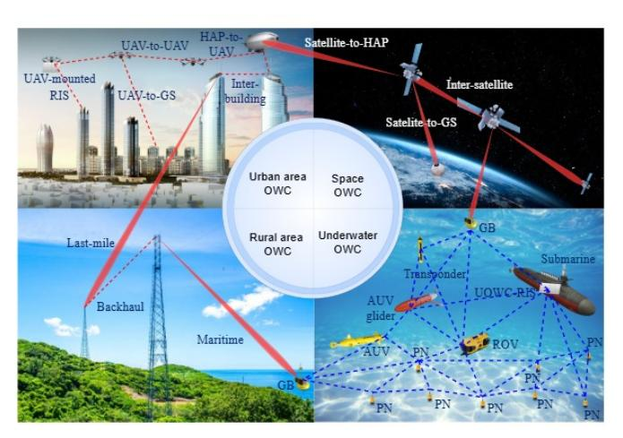
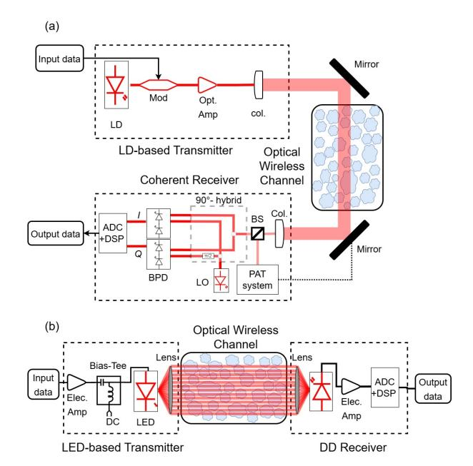
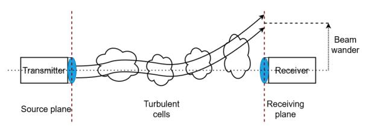
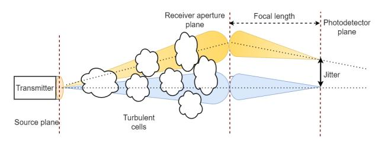
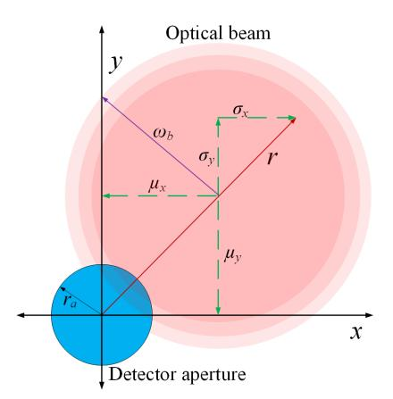

# Optical Wireless Communication in Atmosphere and Underwater: Statistical Models, Improvement Techniques, and Recent Applications

Yalc¸ın Ata, *Senior Member, IEEE*, Farah Mahdi Al-Sallami, *Member, IEEE,* Muhsin Caner Gokc¸e, Anna Maria ¨ Vegni, *Senior Member, IEEE*, Sujan Rajbhandari, *Senior Member, IEEE*, and Yahya Baykal

*Abstract*—Optical Wireless Communication Systems (OWCSs) are becoming more popular each day, especially after numerous mobile applications are being employed within the concept of Internet of Things (IoT). OWCSs are largely used in both terrestrial and non-terrestrial environments, like underwater, air, and space scenarios. Due to the large applicability of OWCS, it represents one of the main candidate technologies for the future 6G wireless communication systems. Naturally, this market trend forces the system designers to reach the best performance in their designs, as well as optimize the cost. In this survey paper, we intend to provide information to the researchers working in this field on the statistical models adopted in OWCS, the methods and techniques used to improve their performances, mainly in outdoor environment like air, space, and underwater. In this respect, the background on theoretical aspects of OWCS, together with their benefits, limitations and challenges are presented. Performance improvement techniques employed in OWCSs, such as power increase, partial coherence, beamforming, aperture averaging, spatial diversity, and intelligent reflecting surfaces, are also introduced. Finally, we discuss the open challenges that researchers are still facing, together with future directions on next steps for a large-scale adoption of OWCS.

*Index Terms*—Optical wireless communication (OWC), freespace optical (FSO) communication, underwater optical wireless communication (UOWC).

## LIST OF ABBREVIATIONS

| 3GPP | Third Generation Partnership Project |
|------|--------------------------------------|
| 5G   | Fifth Generation                     |
| 6G   | Sixth Generation                     |

(*Corresponding author: Anna Maria Vegni*)

- Y. Ata is with Department of Electrical and Electronics Engineering, OSTIM Technical University, OSTIM, 06374 Yenimahalle, Ankara, Turkey. Y. Ata is also with SCOPT Inc., Boston, MA, US. (e-mail[:ylcnata@gmail.com\)](mailto: ylcnata@gmail.com)
- F. M. Al-Sallami is with the School of Electronic and Electrical Engineering, University of Leeds, Leeds, UK (e-mail[:f.al-sallami@leeds.ac.uk\)](mailto: f.al-sallami@leeds.ac.uk).
- M. C. Gokc¸e is with the Department of Aerospace Engineering, Delft ¨ University of Technology, 2629 HS Delft, The Netherlands, and also with the Department of Electrical-Electronics Engineering, TED University, 06420 C¸ ankaya, Ankara, Turkey (e-mail[:muhsin.gokce@tedu.edu.tr\)](mailto: muhsin.gokce@tedu.edu.tr).
- A. M. Vegni is with Department of Industrial, Electronics and Mechanical Engineering, Roma Tre University, Rome, Italy. (email[:annamaria.vegni@uniroma3.it\)](mailto: annamaria.vegni@uniroma3.it).
- S. Rajbhandari is with the Institute of Photonics, University of Strathclyde, Glasgow G1 1RD, UK (e-mail[:sujan.rajbhandari@strath.ac.uk\)](mailto: sujan.rajbhandari@strath.ac.uk).
- Y. Baykal is with the C¸ ankaya University, Department of Electrical-Electronics Engineering, Yukarıyurtc¸u mah. Mimar Sinan cad. No: 4, Etimesgut, 06790, Ankara,Turkey. (e-mail[:y.baykal@cankaya.edu.tr\)](mailto: y.baykal@cankaya.edu.tr).

This work is partially supported by PRIN 2022 LAGO-ON (opticaL wireless undewAter positioninG for marine mOnitOriNg) project, PNRR Missione 4, Componente 2, Investimento 1.3 Finanziato dall'Unione europea - Next Generation EU (CUP: F53D2300048).

| AEQ | Analog Equalizer        |
|-----|-------------------------|
| AI  | Artificial Intelligence |
| AL  | Attenuation Length      |
| AO  | Adaptive Optics         |
| AOA | Angle of Arrival        |

AOC Adaptive Optics Correction

AP Access Point

APC Automatic Power Control APD Avalanche Photodetector

AUV Autonomous Underwater Vehicle AWGN Additive White Gaussian Noise BB84 Bennett–Brassard 1984

BB92 Bennett–Brassard 1992

BER Bit Error Rate

BPSK Binary Phase Shift Keying CBC Coherent Beam Combining CDR Clock and Data Recovery CFLOS Cloud-Free Line of Sight

CMRE Centre for Maritime Research and

Experimentation

CNN Convolutional Neural Network

CR Coherent Receiver CW Continuous Wave

DFE Decision Feedback Equalizer DGG Double Generalized Gamma

DMT Discrete Multitone DL Deep Learning DP Dual Polarization

DPSK Differential Phase Shift Keying

ECMWF European Centre for Medium-Range Weather

Forecasts

EGG Exponential-Generalized Gamma

EW Exponentiated Weibull FSO Free-Space Optics FoV Field of View GG Gamma–Gamma

GGD Generalized Gamma Distribution

GS Ground Station HAP High Altitude Platform HITRAN High-Resolution Transmission IM/DD Intensity Modulation Direct Detection

IOCCG International Ocean Colour Coordinating Group

IoT Internet of Things

IoUT Internet of Underwater Things IRS Intelligent Reflecting Surface

| ISAC    | Integrated Sensing And Communications             |
|---------|---------------------------------------------------|
| ITU     | International Telecommunication Union             |
| LiDAR   | Light Detection and Ranging                       |
| LD      | Laser Diode                                       |
| LED     | Light-Emitting Diode                              |
| LEO     | Low Earth Orbit                                   |
| LN      | Log-Normal                                        |
| LiFi    | Light Fidelity                                    |
| MAC     | Medium Access Control                             |
| MIMO    | Multiple-Input Multiple-Output                    |
| MISO    | Multiple-Input Single-Output                      |
| ML      | Machine Learning                                  |
| MMF     | Multimode Fiber                                   |
|         | MODTRAN Moderate-Resolution Transmission          |
| MPPC    | Multi-Pixel Photon Counter                        |
| MRC     | Maximal Ratio Combining                           |
| MZM     | Mach–Zehnder Modulator                            |
| NLoS    | Non-Line-of-Sight                                 |
| NOAA    | National Oceanic and Atmospheric                  |
|         | Administration                                    |
| NOMA    | Non Orthogonal Multiple Access                    |
| NTN     | Non-Terrestrial Network                           |
| OAM     | Orbital Angular Momentum                          |
| OFDM    | Orthogonal Frequency Division Multiplexing        |
| ONR     | Office of Naval Research                          |
| OOK     | On-Off Keying                                     |
| OP      | Outage Probability                                |
| OPA     | Optical Phased Array                              |
| OPO     | Optical Parametric Oscillator                     |
| OTOPS   | Oceanic Turbulence Optical Power Spectrum         |
| OWC     | Optical Wireless Communication                    |
| OWCS    | Optical Wireless Communication System             |
| PAM     | Pulse Amplitude Modulation                        |
| PAT     | Pointing, Acquisition, and Tracking               |
| PDF     | Probability Density Function                      |
| PE      | Pointing Error                                    |
| PIN     | Positive–Intrinsic–Negative                       |
| PLS     | Physical Layer Security                           |
| PM      | Photomultiplier                                   |
| PolMux  | Polarization Multiplexing                         |
| PPM     | Pulse Position Modulation                         |
| PSK     | Phase Shift Keying                                |
| QAM     | Quadrature Amplitude Modulation                   |
| QBER    | Quantum Bit Error Rate                            |
| QKD     | Quantum Key Distribution                          |
| QPSK    | Quadrature Phase Shift Keying                     |
| RF      | Radio Frequency                                   |
| RIN     | Relative Intensity Noise                          |
| RIS     | Reconfigurable Intelligent Surface                |
| SeaBASS | SeaWiFS Bio-optical Archive and Storage System |
| SIMO    | Single Input Multiple Output                      |
| SKR     | Secret Key Rate                                   |
| SNR     | Signal-to-Noise Ratio                             |
| SOA     | Semiconductor Optical Amplifier                   |
| SPAD    | Single Photon Avalanche Diode                     |
| SWAP    | Size weight and power                             |
|         |                                                   |

SWIPT Simultaneous Wireless Information and Power

Transfer TCBE T-Bridge Equalizer TN Terrestrial Network UAV Unmanned Aerial Vehicle UOWC Underwater Optical Wireless Communication UV Ultraviolet VCSEL Vertical Cavity Surface-Emitting Laser VLC Visible Light Communication VR Virtual Reality WHOI Woods Hole Oceanographic Institution Ocean Science Discovery Center WDM Wavelength Division Multiplexing

#### I. INTRODUCTION

T HE next generation of telecommunication networks, defined as Sixth Generation (6G) and beyond, is expected to be highly disruptive, aiming not only to expand coverage across land, sea, and air, but also to achieve an ambitious target of delivering unprecedented high-speed communication reaching up to 1 Tbps at ultra-low latency and with high energy efficiency [\[1\]](#page-29-0). The 6G networks not only aim to enhance throughput and latency but also enable advanced functionalities such as Integrated Sensing And Communications (ISAC), energy harvesting, and secure connectivity across underwater, terrestrial, aerial, and space layers. To achieve these challenging goals, future networks envision not only the spectrum expansion into the THz and optical frequency ranges that provide wide bandwidths, but also the coexistence and cooperation among multiple frequency bands to support diverse applications and functionalities. In this context, Optical Wireless Communication (OWC) encompassing underwater OWC and Free-Space Optics (FSO) communication will serve as a complementary technology for highspeed terrestrial and non-terrestrial connectivity while enabling ISAC functionalities, enhancing physical-layer security, and contributing to energy-efficient and intelligent 6G network architectures. Hence, this paper presents a comprehensive survey of underwater, terrestrial, and space OWC systems including additional functionalities that will ultimately enable 6G networks objectives when integrated with other existing and emerging technologies such as radio communication, THz communication, Reconfigurable Intelligent Surface (RIS), and Artificial Intelligence (AI) driven network management.

At present, the Radio Frequency (RF) spectrum is still expected to be the dominant technology, however, improvements in coverage, spectrum utilization, and energy efficiency are anticipated through advanced technologies such as cell-free systems, massive Multiple-Input Multiple-Output (MIMO) systems, and RIS. Moreover, variants of OWC are emerging as important complementary technologies, particularly for enhancing connectivity and expanding coverage in harsh environments. OWC systems have gained significant attention due to their versatility in operating across underwater, terrestrial, and space environments, availability of unlicensed, wide bandwidth, and co-existence with RF systems, thanks to their interference-free operation. When talking about OWC systems, Light Fidelity (LiFi) is a short-range, wide-coverage technology that allows high-speed connectivity both for indoor and outdoor scenarios, with applications in smart homes, hospitals, airplanes, smart city frameworks, intelligent transportation systems, and many more [\[2\]](#page-29-1). LiFi is still in its infancy for market penetration but the operation protocol has already been standardized in IEEE 802.11 bb.

In outdoor scenarios, highly directed point-to-point line-ofsight (LoS) OWC links, also known as FSO, have been providing high-speed connectivity for back-haul network where fiber was difficult to deploy. Recently, due to the massive growth in satellite constellations for global Internet coverage, FSO is becoming an integral part of the inter-satellite communication. Furthermore, FSO can enable communication between fixed terrestrial terminals and aerial (mobile) platforms such as High Altitude Platforms (HAPs), drones, etc [\[3\]](#page-29-2). For high-speed underwater communications, OWC is the only most viable solution as acoustic waves are limited to very low data rates, and RF is not suitable due to high attenuation [\[4\]](#page-29-3). Fig. [1](#page-2-0) demonstrates the flexibility and potential of OWC systems in diverse environments. This versatility, license-free operation and promise of large bandwidth fueled significant interest and rapid development in recent years.

Optical Wireless Communication Systems (OWCSs), however, face distinct limitations, including strong dependence on LoS links, sensitivity to environmental conditions (*e.g.*, turbulence, scattering, or attenuation), and alignment challenges. This strongly limits the feasibility of OWCS in given applications. For instance, mobility is still a challenge and solutions relying on hybrid technologies (such as RF and OWC) should be considered. Furthermore, unlike RF systems with standardized models for various environments, OWC lacks unified channel modeling due to its dependence on medium (atmosphere or underwater), wavelength, and system configuration.

To comprehensively understand and accurately characterize OWCSs, it is imperative to delve into the various statistical approaches and present their usage conditions. This survey particularly emphasizes how these models, though approximations, are fundamental in representing and predicting realistic operational phenomena. The statistical models used to model the behavior of the OWC systems are aimed to approximate real-world phenomena. For instance, atmospheric turbulence effect can be represented using probabilistic models such as log-normal or Gamma–Gamma (GG) distributions depending on the severity of the turbulence. These models help capture the random nature of signal degradation in varying environmental conditions. The statistical expression of optical beam misalignment is based on its symmetrical or asymmetrical behavior, which results in Rayleigh or Hoyt distributions. On the other hand, the jitter effect resulting from vibration and turbulence, causing Angle of Arrival (AOA) fluctuations, is well suited to Rayleigh distribution. However, not all impairments are treated statistically. In practice, attenuation is often modeled deterministically, especially when considering fixed link budgets or known environmental conditions. On the other hand, impairments such as atmospheric turbulence, pointing errors (due to misalignment between transmitter and receiver), and AOA fluctuations are typically modeled statistically, as

Fig. 1: Different applications of OWC, ranging from Terrestrial Network (TN) to Non-Terrestrial Network (NTN) OWCSs.

they introduce random variations in signal strength and quality.

The topic of attenuation loss and disturbances that occur in atmospheric medium is not new and has been initially investigated in [\[5\]](#page-29-4), where the authors treated the effects of beam wandering with Gaussian beams, and derived the probability distribution of the beam transmissivity. More in details, the work in [\[6\]](#page-29-5) investigated the physical processes that contribute to signal fading and loss along the atmospheric turbulence. They also derived the elliptic-beam approximation of the Probability Density Function (PDF) for the atmospheric transmittance including beam wandering, beam shape deformation, and beam-broadening effects, which is valid for different turbulence scenarios. Another important contribution is the work in [\[7\]](#page-29-6), which presents the expression for the PDF of the optical signal intensity both in weak and strong turbulence environment, under the assumption of Gaussian beams. In [\[8\]](#page-29-7) several PDF models for fluctuations are presented and compared in realistic propagation scenarios of a collimated Gaussian beam with centroid wander. Finally, the work in [\[9\]](#page-29-8) provided the comparison of statistical models on simulated optical field with pointing errors.

Several review papers and tutorial articles have been published over the last 10 years covering various aspects of OWC. A comprehensive survey of Visible Light Communication (VLC)/LiFi can be found in [\[2\]](#page-29-1), [\[10\]](#page-29-9) and survey related to specific LiFi techniques or application areas are also reviewed in works such as vehicular VLC [\[11\]](#page-29-10), RIS-assisted VLC [\[12\]](#page-29-11), and physical layer security for VLC [\[13\]](#page-29-12). Similarly, reviews covering broader aspects of OWC are presented in [\[14\]](#page-29-13)–[\[17\]](#page-29-14), while underwater OWC techniques are covered in [\[18\]](#page-29-15)–[\[20\]](#page-29-16). Additionally, surveys addressing challenges in the FSO communication systems, including ground-to-satellite/satellite-toground and inter-satellite links, channel modelling, turbulence mitigation and acquisition, tracking, and pointing mechanisms, are provided in [\[21\]](#page-29-17)–[\[24\]](#page-29-18).

## *A. Motivation and Contribution*

TABLE [I](#page-3-0) presents a non-exhaustive list of recent OWCrelated survey papers, demonstrating a plethora of literature.

TABLE I: Summary of surveys and tutorials that are dedicated or include OWC since 2017.

| Ref.              | Year | Channel Turbulence Scope and focus area characteristics models  |   | Pointing errors models | Environment (Atmospheric/ underwater) |             |
|-------------------|------|-----------------------------------------------------------------------------|---|------------------------------|---------------------------------------------|-------------|
| This paper (⋆) | 2025 | FSO and UOWC systems                                                        | ✓ | ✓                            | ✓                                           | Both (⋆⋆)   |
| [25]              | 2024 | Optical scattering communications systems                                | ✓ | ✓                            | ✗                                           | Atmospheric |
| [15]              | 2023 | OWC-based IoT networks                                                      | ✓ | ✗                            | ✗                                           | ✗           |
| [26]              | 2022 | A tutorial on the channel capacity of IM/DD-based OWC systems            | ✓ | ✗                            | ✗                                           | ✗           |
| [20]              | 2021 | UOWC in swarm robotics                                                      | ✓ | ✗                            | ✗                                           | Underwater  |
| [27]              | 2019 | FSO links and systems                                                       | ✓ | ✗                            | ✗                                           | Both        |
| [28]              | 2018 | Channel models and characteristics of VLC and wireless IR communications | ✓ | ✗                            | ✗                                           | ✗           |
| [29]              | 2018 | Design and optimization of VLC networks                                  | ✓ | ✗                            | ✗                                           | ✗           |
| [23]              | 2018 | Acquisition, tracking and pointing mechanisms for FSO systems            | ✗ | ✓                            | ✓                                           | Atmospheric |
| [4]               | 2017 | UOWC                                                                        | ✓ | ✓                            | ✓                                           | Underwater  |
| [21]              | 2017 | Space OWC                                                                   | ✓ | ✓                            | ✓                                           | Atmospheric |

(⋆) This survey uniquely provides a unified analytical perspective across atmospheric, underwater, aerial, and space OWC systems, consolidating models, performance metrics, and cross-domain insights. (⋆⋆) Atmospheric and underwater.

Given the growing importance of OWC in the next generation of telecommunication networks and the ongoing breakthroughs in the area, this proliferation of review work is expected. However, from the investigation of recent surveys dealing with OWC systems, challenging and main features, we notice the lack of a dedicated survey about different statistical models adopted in OWCSs. It is necessary to clarify and compare the diverse models used in OWC literature, as each approach features a specific phenomenon that affects OWC connectivity links. Indeed, optical wireless channel exhibits complex and variable propagation characteristics that are difficult to capture deterministically. The channel behavior depends on many factors such as the geometry of the environment, the positions and orientations of transmitters and receivers, and multiple reflections from surfaces, all of which introduce randomness and variability in the received signal. There are several surveys investigated different aspects of OWC/VLC such as [\[11\]](#page-29-10)–[\[13\]](#page-29-12), [\[16\]](#page-29-26), [\[30\]](#page-29-27)–[\[33\]](#page-29-28). However, in TABLE [I](#page-3-0) we reported the surveys that showed at least one common aspect that we are now presenting in this paper.

From previous works, we observe that topic of statistical modeling the OWC channel behavior has not yet been comprehensively addressed as a survey contribution. What distinguishes this survey from existing ones is its comprehensive scope and level of detail. Many existing surveys focus on specific aspects or applications such as security, IoT, VLC, and other surveys provide in-depth discussion of specific topics. Differently from related surveys, and to the best of our knowledge, this paper is the first to comprehensive review of the underwater and atmospheric turbulence channel models. Leveraging on existing state-of-the-art literature, this paper provides a recent study and current progress in OWC technology, starting from the background of OWC systems, followed by a review of open challenges and mitigation techniques. Our work is foreseen to help both beginners in this research field, as well as designers to promote their efforts.

Unlike prior surveys focusing on a single propagation medium, this paper bridges the modeling and performance evaluation of optical wireless links across atmospheric, underwater, aerial, and space domains. This cross-domain perspective enables identifying common physical impairments, transferable mitigation strategies, and unified performance metrics—thus providing an integrative framework rather than an additional domain-specific review. Such a unified treatment aims to highlight not only the distinctions between individual environments but also their shared theoretical underpinnings, helping readers perceive the broader coherence of optical wireless communication technologies. Starting from basics of OWCS, which apply to both atmospheric and underwater environment, we then introduce recent performance improvement techniques, with particular emphasis on future technologies like RIS, as well as AI techniques.

This survey is organized as follows. Section [II](#page-4-0) presents the theory behind the OWCS, from the transmitter and receiver model to the description of the main benefits of using OWC technology, while limitations and challenges are presented in Section [III.](#page-5-0) From theoretical aspects, we then introduce recent experimental demonstrations of OWCS in Section [IV,](#page-10-0) both in atmosphere and underwater environments. Then, in Section [V,](#page-14-0) we provide the main channel models adopted for FSO transmissions. Section [VI](#page-19-0) presents recent techniques used to improve the performance of OWCSs, from solutions that increase the power level to diversity techniques, beamforming approaches, heterogeneous systems, and RISs. It follows Section [VII](#page-22-0) that describes the active research in OWCSs, and Section [VIII](#page-26-0) presenting future directions into OWCS. Finally, conclusions are drawn at the end of this survey.

#### II. OPTICAL WIRELESS COMMUNICATION SYSTEMS

OWCS utilize visible, Ultraviolet (UV) and IR light regions of the electromagnetic (EM) spectrum to establish high-speed communication links. As illustrated in Fig. [2,](#page-4-1) the information to be transmitted is modulated onto optical carrier. In Fig. [2,](#page-4-1) we illustrate the general block diagram in case of (a) Laser Diode (LD), and (b) Light-Emitting Diode (LED) transmitter. The modulated signal is amplified and conditioned to drive the optical source effectively. Electrical signal can be converted to an optical signal by means of optical source. Then, the transmit optics focuses and directs the optical signal for efficient transmission through the propagation medium. The optical wireless channel through which the optical signal propagates can be either free-space (atmosphere) or underwater medium. The optical signal including the distortion effect of the channel is captured and processed by receiver optics and photodetector at the receiver side. Following amplification and demodulation processes, the extracted data is conveyed to the user.

#### *A. Transmitter*

The OWCS transmitter comprises an encoder, modulator, driver circuit, optical source, and transmit optics. The encoder formats data, which is modulated and sent to the driver circuit to control the optical source (LD or LED). The optical source converts the electrical signal into an optical signal, which the transmit optics collimates, shapes, focuses, and aligns before sending it into the channel. Two main classes of optical sources *i.e.*, LEDs and LDs, are used depending on the application requirements, with each offering distinct advantages and limitations.

Incoherent LED-based OWCS exhibit significant beam divergence due to the wide output profile of LED sources. Consequently, these systems suffer from higher geometric losses and are limited in propagation distance due to their low optical power output. Despite these limitations, LEDbased transmitters have been employed in underwater optical communication applications [\[34\]](#page-29-29), [\[35\]](#page-29-30), particularly in shortrange links and resource-constrained scenarios where cost, power efficiency, and circuit simplicity outweigh the need for high data rates.

Fig. 2: An illustrative block diagram of various OWC system components depending on the application, comprised of a modulator (Mod), optical amplifier (Opt. Amp.), collimator (Col.), beam splitter (BS), positioning and tracking module (PAT), local oscillator (LO), balanced photodetector (BPD), and digital signal processing block (DSP).

In contrast, LD-based OWCS offer significantly higher data rates over a transmission distances of several kilometers [\[36\]](#page-29-31) due to their narrow beam divergence, higher optical output power, and the narrow spectral widths of laser sources. These characteristics make LDs more suitable for high-performance systems, particularly in atmospheric OWC and underwater links where maintaining beam directionality and minimizing loss is critical. As a result, most practical implementations of OWCS favor LD sources, as given in TABLE [II,](#page-13-0) including Vertical Cavity Surface-Emitting Laser (VCSEL) [\[37\]](#page-30-0), [\[38\]](#page-30-1) and Fabry–Perot lasers [\[39\]](#page-30-2).

To summarize, while LEDs are attractive for their simplicity and energy efficiency in short-range underwater applications, LDs are the preferred choice for high-data-rate, long-range OWC systems in both atmospheric and aquatic environments. This trade-off between simplicity and performance is a key consideration in system design.

#### *B. Receiver*

Intensity Modulation Direct Detection (IM/DD) is the traditional technique in optical transmission systems [\[40\]](#page-30-3). It exhibits acceptable performance with a low-complexity structure and cost-effective resources. The receiver in DD relies on the optoelectronic conversion followed by trans-impedance amplification.

There is a variety of opto-electronic converters employed in OWC including Positive–Intrinsic–Negative (PIN) diode [\[41\]](#page-30-4), Avalanche Photodetector (APD) [\[41\]](#page-30-4), [\[42\]](#page-30-5), and Single Photon Avalanche Diode (SPAD) [\[43\]](#page-30-6)–[\[45\]](#page-30-7). Each type of detector presents a different balance of sensitivity, response time, and cost—crucial factors when adapting the receiver to specific link distances and channel conditions. Due to challenging underwater environments, the majority of the design incorporated sensitive detectors such as APD [\[37\]](#page-30-0), [\[46\]](#page-30-8), [\[47\]](#page-30-9), Photomultiplier (PM) [\[48\]](#page-30-10), [\[49\]](#page-30-11), and SPAD [\[50\]](#page-30-12). While direct detection is favorable due to its simplicity, its performance under severe turbulent and challenging environment requires further improvement by combining it with other technologies, such as multi-aperture receivers [\[51\]](#page-30-13) and Adaptive Optics (AO) [\[52\]](#page-30-14).

Compared to the IM/DD technique, the coherent detection technique has gained popularity due to its sensitivity and spectrum efficiency. However, it is more complex to implement Coherent Receivers (CRs), as shown in Fig. [2.](#page-4-1) The complex optical field envelope is recovered by splitting it into two paths in coherent receivers. Each path is mixed with an optical local oscillator (laser), which is followed by two pairs of balanced photo-detectors (PDs) resulting in the in-phase and quadrature components of optical signal [\[40\]](#page-30-3), [\[53\]](#page-30-15). This makes coherent detection attractive for high-capacity, long-distance links—especially in the atmospheric OWC domain—but less practical for cost- or power-constrained underwater systems.

Several works studied the performance of IM/DD and coherent OWC under various turbulence channel models including: Log-Normal (LN) model [\[54\]](#page-30-16), K-distribution [\[55\]](#page-30-17), GG [\[56\]](#page-30-18), [\[57\]](#page-30-19), Malaga model [\[58\]](#page-30-20), and ´ F underwater turbulent channel [\[59\]](#page-30-21), [\[60\]](#page-30-22).

#### *C. Benefits of using OWC*

OWC offers a wide bandwidth that is 2,600 times higher than that of the conventional RF communication systems, enabling high-speed transmission, making OWC an ideal solution for various applications, including 5G backhaul, indoor wireless access, and inter-satellite communications [\[21\]](#page-29-17), [\[61\]](#page-30-23). It also provides a solution for high-speed underwater wireless communications applications, in contrast to acoustic communication which suffers from lower bandwidth (limited to the kHz range), high latency, and significant Doppler spread [\[38\]](#page-30-1), [\[62\]](#page-30-24). Furthermore, OWC benefits from spectrum availability, with a broad and unregulated bandwidth.

Due to its narrow optical beam, OWCS exhibit approximately three orders of magnitude less beam divergence and loss than RF systems in long-range communications [\[21\]](#page-29-17), [\[63\]](#page-30-25). This characteristic enhances security by reducing vulnerability to eavesdropping and interference. For short-range communication links, OWC offers cost-effective solutions due to its low-cost components and ease of deployment [\[64\]](#page-30-26).

In addition, OWCS that utilize coherent laser technology demonstrate less power consumption while maintaining exceptional performance over long distances. This aligns with the sustainability goals of greener communication systems and minimal environmental impact compared to RF systems [\[65\]](#page-30-27). However, OWC faces several challenges, as discussed in the subsequent sections. Addressing these challenges will enable the system to realize its full potential and maximize its capabilities.

## III. OWC LIMITATIONS AND CHALLENGES

OWCS encounter significant limitations and challenges when operating in both atmosphere and underwater environments. In the atmosphere, factors such as weather conditions, atmospheric turbulence, and attenuation due to scattering and absorption constraint the design, implementation and performance of OWCS. Similarly, in underwater, high absorptionand scattering-induced attenuation, turbulence, and limited visibility hinder effective communication. This section investigates these limitations and challenges for both atmosphere and underwater media. Furthermore, we will discuss the limitations due to the need of alignment between transmitter and receiver, blockage occurrences that impact on the link deployment and maintenance. Finally, a brief summary and lesson learnt about OWC main limitations in different environments will be provided at the end of this section.

#### *A. Atmospheric Environment*

Although OWC offers various advantages such as high data rates, noise immune and secure communication, low interference when compared with the traditional RF and acoustic systems, propagating optical beam is prone to be affected from environmental conditions significantly which results in limitations and challenges in both atmospheric and underwater environments. Due to their different nature and contributing parameters, the atmospheric and underwater environments need to be considered separately. According to Beer-Lambert law, the received intensity of optical beam through channel attenuation is expressed by

$$I_r = I_0 \exp\left(-\alpha(\lambda)L\right),\tag{1}$$

where I0 is the intensity of incident wave, α(λ) is the attenuation coefficient that is dependent on the wavelength λ and L is the distance. The attenuation coefficient α(λ) is the result of attenuation and scattering α(λ) = a(λ) + b(λ), where a(λ) and b(λ) are the absorption and scattering related attenuations and they have different characteristics in atmosphere and underwater media.

Optical beam can be severely affected from weather conditions such as fog, rain, snow and clear weather. Particularly, the penetration of optical beam in fog is much more difficult [\[66\]](#page-30-28) hence the OWC in foggy weather condition is quite challenging due to the dominance of the absorption and scattering. The analytical modeling of absorption- and scattering-induced attenuation resulting from different weather conditions is very complex therefore, the effect of weather conditions on OWC communication is given empirically in various experimental studies.

While the attenuation coefficients of both the absorption and scattering can be expressed the sum of molecular and aerosol absorption and scattering, a widely adopted model for total attenuation in atmosphere was developed in [\[66\]](#page-30-28) depending on the visibility V based on empirical data as

$$\alpha(\lambda) = \frac{3.912}{\mathcal{V}} \left(\lambda/550\right)^{-q},\tag{2}$$

where the visibility V is in km and wavelength λ is in nm. The parameter q is the size distribution of the scattering particles and it is obtained in Kruse [\[67\]](#page-30-29) and Kim [\[68\]](#page-30-30) models by breaking down the 3 straight- and 4 straight-line segments, respectively. While visibility in clear weather can be extended up to V ∼ 50 km, in dense fog weather condition the visibility can decrease to several tens of meters V < 100 m.

In OWC, the quality of the received signal hence the performance improves remarkably with higher wavelength values, underscoring the role of longer wavelengths in enhancing performance. The wavelengths of λ = 850 nm, λ = 1310 nm and λ = 1550 nm are three alternative windows in optical spectrum for the implementation of practical FSO systems. While the design of λ = 850 nm FSO systems remains costeffective, the attenuation loss is least for λ = 1550 nm [\[69\]](#page-30-31) and a better link availability is provided. It is reasonable to assert that foggy weather conditions pose a substantial challenge to OWCS, leading to considerable performance degradation. Fog consists of tiny water droplets suspended in the atmosphere and significantly diminishes the visibility. This atmospheric phenomenon primarily arises from the cooling of air to its dew point and the introduction of water vapor into the air [\[70\]](#page-30-32). The attenuation loss for clear weather having V ∼ 50 km visibility becomes approximately 0.04 dB/km, the attenuation loss increases to ∼ 250 dB/km in dense fog weather with V ∼ 0.05, km [\[71\]](#page-30-33). In another study, it was shown that the attenuation loss in thin fog weather condition is approximately 4.58 dB/km and the visibility is V ∼ 1.9 km however the attenuation jumps to approximately 339.6 dB/km and the visibility drops to V ∼ 50 m in dense fog weather condition [\[72\]](#page-30-34) which causes complete FSO link failure. It should be noted that attenuation loss is entirely dominated by fog in dense foggy weather conditions rather than wavelength and the equal attenuation loss incorporates to the optical beam having λ = 785 nm, λ = 850 nm and λ = 1550 nm wavelengths [\[68\]](#page-30-30).

Rain has also an impact on the performance of FSO communication systems up to a certain level. The attenuation due to rain effect is linearly proportional to the rainfall rate [\[73\]](#page-30-35) and the attenuation is not wavelength dependent when the wavelength is much smaller than the drop size. In [\[74\]](#page-30-36), it was shown with simulations that the attenuation coefficient take the values of 6.27 dB/km, 9.64 dB/km and 19.28 dB/km for a 1 km FSO link with 10 Gbps data rate in mild, medium and heavy rain weather conditions respectively. The attenuation resulting from rain weather condition is approximated with power-law as [\[75\]](#page-30-37)

$$\alpha_{rain} = k_r \mathcal{R}^{\alpha_r} \text{ [dB/km]}, \tag{3}$$

where kr and αr are the rain coefficients dependent on drop size and the temperature of the rain, R is the rain intensity in mm/hr. On the other hand, the attenuation effect of snow on the optical beam propagation remains higher than rain and smaller than fog since the size of snow drops are between the size of rain and fog drops. The snow-induced attenuation can increase to 120 dB/km for the level of snow rate 100 mm/hr [\[76\]](#page-30-38). The attenuation coefficient of snow in a FSO communication link can be modeled by [\[77\]](#page-30-39)

$$\alpha_{snow} = a_s \mathcal{S}^{b_s} [dB/km],$$
 (4)

where S is the snowfall rate in mm/hr. Since snowfall is classified as dry and wet, the parameters as [dry snow] and bs [wet snow] are defined accordingly in [\[76\]](#page-30-38).

The effect of clouds on the performance of FSO communication systems cannot also be overlooked in some circumstances. Stratus and stratocumulus clouds occur in first 2 km altitude from the ground [\[70\]](#page-30-32). In [\[72\]](#page-30-34), the attenuation coefficient was shown to take the values of 0.0026 dB/km for cirrus, 0.0006 dB/km for thin cirrus, 2.7126 dB/km for stratus, 3.9583 dB/km for nimbostratus, 4.6019 dB/km for altostratus and 6.0646 dB/km for cumulus cloud conditions, respectively. To overcome the cloud effect on the performance of FSO link in cloudy channel, an adaptive communication system having adaptive optical transmitter and receiver based on cloud data was investigated in [\[78\]](#page-30-40). A statistical analysis of cloud-free line-of-sight (CFLOS) airborne-ground FSO communication was also studied in [\[79\]](#page-30-41) using data for visibility, cloud coverage and availability.

Several databases and models such as LOW resolution TRANsmission (LoWTRAN) [\[80\]](#page-30-42), Moderate-Resolution Transmission (MODTRAN) [\[81\]](#page-30-43) and High-Resolution Transmission (HITRAN) [\[82\]](#page-30-44) are used to simulate and analyze the transmission and attenuation of optical propagation in atmosphere and they provide valuable data and modeling capabilities for a wide range of applications depending on the atmospheric constituents. LoWTRAN and MODTRAN models divide the atmosphere into multiple layers spanning altitudes from 0 to 120 km within the resolution range 0.01−1000 cm−1 . HITRAN provides high-resolution spectral data for individual molecules, enabling accurate modeling of absorption and emission spectra but without the explicit layering of the atmosphere.

Besides absorption and scattering, turbulence phenomenon also causes various effects on the propagating optical beam therefore constraints the performance of OWCS. One of the most significant performance decreasing factor resulting from optical turbulence is the intensity fluctuations, namely scintillation, that occur at the receiver side. The variance of irradiance fluctuations, the scintillation index, is given by

$$\sigma_I^2 = \langle I^2 \rangle / \langle I \rangle^2 - 1, \tag{5}$$

where I is the received irradiance and ⟨.⟩ denotes the ensemble average. Turbulence occurs due to variations in temperature, pressure, wind and humidity in different layers of the atmosphere which lead to changes in the refractive index of the atmosphere. According to the energy cascade theory, unstable air masses (turbulent eddies) are created when critical Reynolds number is exceeded [\[83\]](#page-31-0). Then, energy is transferred from largest eddies (*i.e.*, outer scale, L0) to the smallest eddies (*i.e.*, inner scale, l0). The eddies between l0 and L0 form inertial subrange while the region in which the eddies smaller than l0 are available is called the viscous dissipation subrange. Although various models were introduced to characterize the turbulence power spectrum, the most widely used theoretical

Fig. 3: Turbulence-induced beam wander.

model for describing the statistical properties of atmospheric turbulence affecting optical propagation is Kolmogorov turbulence power spectrum and assuming that turbulence presents isotropic and homogeneous behavior it is given by [84]

$$\Phi_n(\kappa) = 0.033 C_n^2 \kappa^{-11/3},\tag{6}$$

where  $\kappa$  is the magnitude of the spatial frequency and  $C_n^2$  [m-2/3] is the turbulence structure constant. Measurement results show that the range of  $C_n^2$  can vary in a range from  $\sim 10^{-12}\,\mathrm{m}^{-2/3}$  to  $\sim 10^{-19}\,\mathrm{m}^{-2/3}$  depending on the weather conditions [85]. When downlink or uplink FSO link (i.e., slant path) is available between Ground Station (GS) and air platforms such as Unmanned Aerial Vehicle (UAV) and satellite then the refractive index structure parameter  $C_n^2$  varies with altitude and wind speed dependent that is obtained by using empirical data in Hufnagel-Valley [86], [87]. The strength of optical turbulence can be divided into three levels as weak, moderate and strong turbulence regimes, each of which should be handled and analyzed differently. Distinguishing the turbulence regimes can be done by using Rytov variance of unbounded plane wave that is given by [83]

$$\sigma_R^2 = 1.23C_n^2 k^{7/6} L^{11/6}. (7$$

Although there are no strictly defined boundaries, it may be considered that  $\sigma_R^2 < 0.3$ ,  $0.3 \le \sigma_R^2 < 1$  and  $\sigma_R^2 \ge 1$  correspond to weak, moderate and strong turbulence regimes. It should also be noted that the turbulence saturates in strong regime after a certain level, this was experimentally analyzed in [88] revealing that the turbulent eddies with size smaller than Fresnel zone yield this effect.

The effect of scintillation exhibits different characteristics on different type of incident optical beams such as plane, spherical and Gaussian used in OWC. In [83], it was shown that plane wave is more prone to be affected from turbulence in weak, moderate and a definite part of strong turbulence regime compared to the spherical wave however spherical beam yields the highest scintillation when turbulence saturates. Also, in [89], the collimated Gaussian-beam wave was shown to be having scintillation lower than plane wave and very close to spherical wave for perfect pointing in weak turbulence regime however the scintillation of collimated Gaussian-beam wave remained at the highest level when the pointing error is equal to the beam radius. The optical turbulence phenomenon does not cause only irradiance fluctuations but also other performance degrading effects such as beam wander, beam spreading, AOA fluctuations, phase fluctuations and loss of spatial coherence. Beam wander, represented in Fig. 3, the lateral movement or displacement of the optical beam from

Fig. 4: Turbulence-induced jitter on detector plane.

its intended propagation direction, also known as beam displacement, can result in the misalignment of optical beam and reduce the effectiveness of pointing and tracking mechanisms used for OWC systems. The large-scale turbulence causes the beam wander and the effect of beam wander can be analyzed in terms of the variance of the random beam displacement short-term beam spot size [83]. In [90] and [91], the effect of beam wander on the GS-satellite uplink was investigated and the performance of OWC system degraded with the increase of beam wander significantly. Another important effect of the optical turbulence is the spatial spreading or broadening of propagating optical beam when through the turbulent atmosphere. Beam spreading can be expressed as short-term and long-term depending on its exposure time while long-term is the sum of short-term beam spreading and beam wander. The turbulence-induced beam spreading as well as diffraction originated leads to a loss of power at the receiver, Signalto-Noise Ratio (SNR) deterioration, loss of spatial coherence and reducing the effective range of optical communication and imaging systems. The variation of short-term beam spread was analyzed in [92] and it was shown that the short-term beam spread is always smaller than long-term beam spread. AOA fluctuations due to turbulence correspond to the image jitter on the receiver focal plane as given in Fig. 4 causing the loss of received irradiance particularly if the OWC system has limited Field of View (FoV) [93]. When the FoV of OWC receiver is sufficiently large, the effect of AOA fluctuations may be negligible. The fraction of captured power by a circular receiver aperture with radius  $r_a$  is expressed by [94]

$$L(r_a) = 1 - [J_0(\pi r_a/\lambda)]^2 - [J_1(\pi r_a/\lambda)]^2,$$
 (8)

where  $J_n(\cdot)$  is the first kind Bessel function with order of n. When beam deviation  $\theta_d$  is smaller than the FoV  $\theta_{FOV}$ , i.e.,  $\theta_d \leq \theta_{FOV}$ , it means that the total power is captured by circular aperture of the receiver. Also, the continuous increase of  $\theta_{FOV}$  does not yield the continuous performance enhancement since the performance of OWC system takes its constant value after a certain level of  $\theta_{FOV}$  value [95].

Addition to amplitude fluctuations, optical turbulence also causes phase fluctuations that deteriorate the performance of OWC and optical imaging systems. These fluctuations lead to random variations in the phase of the optical beam wavefront, cause signal distortions, fading, and reduce the spatial coherence [83]. Due to arisen phase fluctuations, the coherent detection together with the phase compensation techniques becomes prominent alternative and superiors the IM/DD technique in terms of enhanced performance [96]. Therefore, knowing the

phase fluctuations of received irradiance is of great importance for coherent heterodyne detection [83]. However, it should be noticed that IM/DD technique remains a significant alternative due to its robustness, easy deployment and cost effectiveness. Another significant effect of the turbulence is the uncorrelated random phase and amplitude fluctuations that is called loss of spatial coherence. The loss of spatial coherence yields limitation in terms of degree to which optical beam may be collimated or focused, power reduction and it can be characterized by mutual coherence function (MCF) that is the second-order field moment [83].

These findings show that while coherent detection offers superior performance in turbulence-affected environments, its complexity and sensitivity to phase noise make it more suitable for high-performance, controlled scenarios. In contrast, IM/DD remains a practical choice for cost-sensitive or less demanding applications. Furthermore, the role of spatial coherence loss in limiting beam focusing and power delivery highlights the need for mitigation techniques (*e.g.*, AO or beam shaping) in longrange or high-precision OWC systems. Future research could benefit from comparative studies that quantify the performance gains of such techniques under varying turbulence conditions.

#### B. Underwater Environment

With over 70% of the Earth's surface covered by water, establishing communication networks for oceans is essential for various applications, including communication between autonomous undersea vehicles, remotely operated vehicles (ROVs), divers, and environmental monitoring. Unlike terrestrial communication, where RF is the dominant and preferred for short distance communication, the high attenuation at radio frequencies in water makes them impractical. While acoustic communication is preferred for long-distance underwater communication, their application is limited due to low bandwidth. Consequently, optical wavelengths in the bluegreen spectral range (450 nm–550 nm), where attenuation is minimal, emerge as the only practical solution for high-speed underwater communications.

The performance of OWC systems suffer more severely from environmental conditions in underwater medium compared to that of in atmosphere hence the optimum communication distance drastically decreases and remains at the level of several tens of meters. The combined effects of absorption, scattering, and turbulence make it challenging to achieve high data rates and long-range in UOWC systems. The attenuation, scattering and absorption coefficients for optically and chemically pure water was empirically measured in for the sample wavelengths in the range of  $380 - 700 \,\mathrm{nm}$  [97]. The chlorophyll concentration is the determining factor for the attenuation losses in underwater medium. Absorption of optical signals by water molecules and dissolved substances presents a fundamental constraint, leading to signal attenuation and reduced transmission distances, respectively. A chlorophyll concentration based model together with the yellow substances (humic and fulvic acids) for the absorption related attenuation  $a(\lambda)$  is presented in [98] using empirical data obtained in [97]. Different colors of visible light spectrum are absorbed to varying degrees by water and dissolved substances. In general, longer wavelengths (e.g., red regions) are absorbed more strongly than shorter wavelengths (e.g., blue region). For example, red light is absorbed more quickly in water, leading to its rapid attenuation, while blue light penetrates deeper due to weaker absorption. This wavelength-dependent behavior is critical for system design, as it directly influences the choice of optical sources for maximizing communication range. The wavelength dependent specific absorption coefficient of chlorophyll was given in [99] and it was shown that the increasing chlorophyll concentration shifts the wavelength of minimum absorption from blue toward green region of visible light spectrum.

Scattering caused by suspended particles further degrades signal quality, introducing noise and reducing the SNR. The scattering induced attenuation  $b(\lambda)$  depends on the chlorophyll concentration of the underwater medium. This highlights the importance of environmental monitoring and adaptive modulation techniques to maintain link reliability in dynamic underwater conditions. Turbulence in underwater environments, arising from water currents and temperature gradients, induces rapid fluctuations in signal intensity and phase, posing significant challenges to reliable communication. There are several turbulence power spectrum models used to characterize the turbulent behavior of the underwater medium. Pioneering works on the characterization of underwater turbulence model was done by Hill [100], [101] and four spatial power spectra models were developed for refractive index fluctuations in oceanic waters taking into account salinity and temperature spectra. Then, Nikishov [102] developed a model that is the linear combination of salinity and temperature spectra and their co-spectrum based on Hill's first spectrum model. Nikishov's model has been extensively used however it lacks precision and the usage of realistic underwater parameters. Recently, a comprehensive power spectrum model based on Hill's fourth scalar model has been introduced [103]. Called Oceanic Turbulence Optical Power Spectrum (OTOPS), this model is expressed depending on the realistic underwater medium's parameters and uses the practical values of average temperature  $\langle T \rangle$  and average salinity concentration  $\langle S \rangle$ . The OTOPS power spectrum model is given by

$$\Phi_n\left(\kappa, \langle T \rangle, \langle S \rangle, \lambda\right) = A^2 \Phi_T + B^2 \Phi_S + 2AB\Phi_{TS}, \quad (9)$$

where  $A=\frac{\partial n(T,S,\lambda)}{\partial T}$  and  $B=\frac{\partial n(T,S,\lambda)}{\partial S}$  are the linear coefficients,  $n(T,S,\lambda)$  is the refractive index of seawater and empirically obtained as [104], the power spectra for temperature, salinity and co-spectrum are given in [103]. There are various parameters behind the OTOPS power spectrum model such as temperature, salinity, energy and temperature dissipation rates, eddy diffusivity ratio, temperature-salinity gradient ratio, viscosity, thermal conductivity, water density and their details and derivations can be found in [103], [105]. Since the strength of turbulence is possible to be specified by Rytov variance of unbounded plane wave, it was obtained in [106] for OTOPS model to classify turbulence regimes in underwater medium.

#### *C. Alignment and Tracking*

Alignment and tracking in atmospheric and underwater environments face unique challenges due to dynamic and unpredictable environmental conditions. In the atmosphere, turbulence, wind-induced vibrations, and beam wander significantly affect link stability. Underwater, refractive index variations, scattering, and water currents introduce additional complexity. These factors necessitate more robust and adaptive alignment and tracking mechanisms than those typically used in indoor or terrestrial settings.

As OWC transmission is highly directive and affected by the geometrical changes of the link that is commonly induced by turbulence, beam wandering and AOA fluctuation. Hence, implementing positioning, alignment and tracking systems is necessary to maintain misalignment and achieve acceptable communication performance. A tracking process of the optical beam relied on movable lenses controlled by 3-axis voicecoil motors and The experimental system in [\[107\]](#page-31-24) utilized a commercial Pointing, Acquisition, and Tracking (PAT) system to compensate the pointing errors occurring during the experiments. PAT system implemented in [\[108\]](#page-31-25) to mitigate pointing errors in mobile UOWC systems. Mechanical automatic steering for LoS alignment between two mobile and autonomous vehicles was proposed and implemented in [\[109\]](#page-31-26). The proposed system collects environment data from four sensors and passes it to the PAT platform to correct pointing errors. The proposed Coherent Beam Combining (CBC), in [\[110\]](#page-31-27), enables high-speed, non-mechanical active beam steering, offering a significant alternative for addressing the requirement of PAT in long-range OWC systems. This approach is particularly promising for applications requiring rapid response and minimal mechanical complexity. Similarly, considering the size, weight and power constraint of the airborne systems, in [\[111\]](#page-31-28) used non-mechanical variable focus lenses for faster and power effective beam alignment through beam size optimization to mitigate the impact of AOA confutational and pointing errors. Umezawa *et.al*, in [\[112\]](#page-31-29) developed a a two dimensional array of PDs to enable direct coupling of the optical beam and enhance the alignment. Umezawa *et.al* also proposed a multistacked PIN-PD with a large aperture of 0.3 mm to address the misalignment errors in mobile OWC system [\[113\]](#page-31-30). The design considered a 2D FoV of 11.5 ◦ and 3 ◦ along x-axis and z-axis, respectively, tested over 2.1 m with a moving speed of 400 mm/s (1.4 km/h) for fast tracking with latency less than 5 ms. This system offered more accurate and faster alignment than the mirror-based beam-steering proposed in [\[114\]](#page-31-31) with FoV of 50◦ over 4 m range and tracking latency of 200 ms. Such comparisons highlight the trade-off between field of view and tracking latency, which must be balanced based on application requirements. A solid-state based tracking system was proposed in [\[115\]](#page-31-32) with seven-elements array transmitter and seven-detector receiver. In [\[116\]](#page-31-33), the tracking system employed a camera to detect IR beacon LED. The system considered a FoV of 30◦ , tested over 3 m with a moving speed of 400 mm/s (1.4 km/h) achieving localization accuracy of 0.05◦ . However, the system was designed for indoor bidirectional tracking to tackle misalignment due to mobility (channel impairments are not considered). The experiment in [\[117\]](#page-31-34) investigated the efficiency of channel coding (turbo codes) to increase the link tolerance to misalignment. The results shows that a single iteration of Turbo code with a 3/4-rate doubles the tolerance from 0.024◦ to 0.048◦ , while higher number of iterations, hence higher decoding complexity, provides marginal improvement. Notable misalignment improvement can be achieved by stronger codes with lower coding rate on expense of significant data rate reduction. This demonstrates the potential of coding techniques as a complementary solution to tracking systems, especially in scenarios where mechanical solutions are impractical. In [\[118\]](#page-31-35) the concept of resonant beam communications was employed to retain self-alignment by tracking the receiver using retroreflector resonant beam to mitigate misalignment and pointing errors. The proposed system achieved 11.2 Gbps, using narrow beam of 6 mm over 8 m distance out performing other indoor systems.

The majority of the aforementioned proposed tracking considered indoor environment where the impact of channel impairment is limited to pointing errors due to mobility. Further investigation into the applicability of these techniques in the outdoor and underwater environments to mitigate the severe atmospheric turbulence impact is required.

#### *D. Blockages and Obstructions*

Unlike terrestrial OWC systems, where blockages are often caused by static obstacles (*e.g.*, buildings or infrastructure), atmospheric and underwater environments introduce dynamic and unpredictable obstructions. In the atmosphere, weather phenomena such as fog, rain, and clouds can intermittently block or attenuate the optical signal. Underwater, suspended particles, marine life, and water currents can cause transient or partial obstructions, making link reliability more difficult to maintain. These unique environmental factors require specialized mitigation strategies beyond those used in terrestrial systems.

A reliable OWC communication system requires a LoS link. However, such links are vulnerable to blockage and shadowing, which degrade service quality and can result in link outages. This represents one of the key physical-layer challenges of OWC, particularly in dynamic or cluttered environments. Limited research has examined the probability of blockage and shadowing in OWC systems. Several works analyzed link blockages caused by weather conditions such as clouds, snow, and fog. Most studies focused on non-terrestrial links. For example, the work in [\[119\]](#page-31-36) investigated the impact of link abstraction due to clouds in ground station-to-satellite link. To address the blockage issue, a UAV-mounted RIS system was proposed in [\[120\]](#page-31-37), enabling indirect aerial LoS links. Similarly, the work in [\[121\]](#page-31-38) explored the use of UAVs as relays in OWC systems to mitigate blockages and shadowing. Such UAV-based schemes extend the flexibility of OWC networks and offer a practical layer of redundancy. Further investigation and modeling of link blockages and obstructions across terrestrial, non-terrestrial, and underwater scenarios are needed. Such studies are crucial for designing robust RIS systems to mitigate these challenges effectively. In particular, RIS-based approaches can introduce controllable reflections and steer beams around obstacles, representing a promising solution for future OWC architectures.

#### *E. Deployment and Maintenance*

Only a limited number of studies have addressed the advantage of the deployment of OWC systems across various applications. This reflects a notable research gap, given that deployment feasibility is a key factor for transitioning from theoretical models to real-world implementations. For example, the studies in [\[64\]](#page-30-26) proposed utilizing OWC systems for workload routing in data centers, leveraging their ease of integration with existing cable or fiber backbones to deactivate idle servers and conserve energy. This suggests that OWC can contribute significantly to energy-efficient computing, especially in environments where high throughput and low latency are critical. Similarly, the work in [\[122\]](#page-31-39) explores the deployment of OWC systems in underwater environments due to their ease of implementation.

In addition, the works [\[65\]](#page-30-27), [\[123\]](#page-31-40) examined the suitability of OWC systems for front-haul and back-haul applications in Fifth Generation (5G) and 6G networks, emphasizing their simple deployment processes. Among these, only [\[65\]](#page-30-27) provided an in-depth analysis of the challenges and advancements in implementing such systems. This highlights the need for further investigation into the technical aspects and challenges associated with the deployment and maintenance of OWC systems across diverse applications and environments. A structured exploration in this area would help bridge the gap between theoretical potential and field readiness, offering essential guidance for scalable and sustainable OWC deployment strategies.

In particular, deployment and maintenance challenges in underwater and atmospheric environments differ significantly from terrestrial scenarios. Underwater deployment faces unique issues such as equipment biofouling, pressure-induced hardware stress, limited accessibility for servicing, and the need for watertight enclosures and alignment under low visibility conditions. Atmospheric deployment, especially for FSO systems, must contend with variable weather, wind-induced misalignment, mechanical vibration and airborne particulate accumulation on transceivers. These factors make long-term stability and precision alignment much harder to maintain than in fixed terrestrial settings. Moreover, both environments often require autonomous or remotely operated platforms for installation and monitoring, increasing system complexity and operational cost. These environment-specific constraints brings the need for specialized deployment strategies and robust hardware design beyond what is typically required in terrestrial OWC systems.

## *Summary and Lessons Learned*

Section III provided a comprehensive discussion of the main channel characteristics and challenges associated with OWC in both atmospheric and underwater environments. The following lessons can be drawn from the presented analysis:

- Atmospheric OWC: The system performance is primarily limited by turbulence-induced scintillation, beam wander, and weather-dependent attenuation. Mitigation of these impairments requires the use of AO [\[52\]](#page-30-14), beam shaping, diversity techniques [\[124\]](#page-31-41)–[\[130\]](#page-31-42), and wavelength optimization [\[131\]](#page-31-43), [\[132\]](#page-32-0).
- Underwater OWC: The dominant impairments arise from absorption, scattering, and turbulence caused by temperature and salinity gradients. Proper wavelength selection within the blue–green window, adaptive modulation [\[133\]](#page-32-1)–[\[136\]](#page-32-2), and optimized receiver design are essential to maintain reliable performance.
- Alignment and Tracking: Accurate PAT mechanisms are critical for maintaining stable links. Emerging nonmechanical and coded beam steering solutions [\[110\]](#page-31-27), [\[137\]](#page-32-3), [\[138\]](#page-32-4) can enhance stability and reduce latency, particularly for mobile or dynamic scenarios.
- Blockage and Deployment Challenges: Physical obstacles and link interruptions remain significant concerns in practical deployments. RIS-aided [\[12\]](#page-29-11), UAVassisted [\[95\]](#page-31-12), [\[139\]](#page-32-5)–[\[141\]](#page-32-6), and hybrid FSO/RF architectures [\[142\]](#page-32-7), [\[143\]](#page-32-8) can improve connectivity resilience and ensure robust network operation under dynamic conditions.

Overall, the insights from this section underline that improving OWC link reliability requires a joint consideration of environmental effects, system design, and adaptive control strategies.

## IV. EXPERIMENTAL OWCS DEMONSTRATIONS

## *A. Atmospheric OWC*

Recently, numerous system designs have been proposed and demonstrated experimentally in the literature. In [\[110\]](#page-31-27), [\[137\]](#page-32-3), a CBC technique was demonstrated for terrestrial OWC link. The system combined 32 laser elements in a 2D array. The study used an Optical Phased Array (OPA) with real-time phase adjustment to maximize beam intensity and mitigate turbulence due to beam wander and scintillation. The system was tested over links of 2 km and 10 km, showing significant improvements in beam steering, tracking, and signal detection. The demonstrated CBC-based 10 km OWC link achieved data rates of 100 Gbps, with availability of 77%.

In [\[144\]](#page-32-9), [\[145\]](#page-32-10), a terrestrial OWC link spanning 53.42 km was demonstrated between two high-altitude locations, simulating a ground-to-satellite link within the first turbulent atmospheric layer. In [\[144\]](#page-32-9), a fully AO system was implemented to correct the channel's distorted wavefront, along with Polarization Multiplexing (PolMux) and high-order complex modulation formats. In addition, a new four-dimensional Binary Phase Shift Keying (BPSK) (4D-BPSK) modulation format was introduced at low SNR achieving data rates of 13.3 Gbps and 210 Gbps, requiring only 4.3 and 7.8 photons per bit, respectively. In [\[145\]](#page-32-10) the system was designed to optimize the SNR to overcome the channel capacity limitations imposed by hardware constraints and to evaluate the effect of different modulation orders. The transmitter employed a tunable laser operating at 1550 nm feeding a high-speed plasmonic Mach–Zehnder Modulator (MZM) with a 3 dB bandwidth exceeding 110 GHz, enabling 160 GBd 2-Pulse Amplitude Modulation (PAM) signals and achieving an information rate of 276 Gbps. Even higher rates of 424 Gbps were reached using a Dual Polarization (DP) 128 GBd 4-PAM signal. The MZM was driven by a 1550 nm laser and operated at the null point, resulting in PAM.

To mitigate the effects of atmospheric turbulence, an atmospheric chamber-based experiment in [\[107\]](#page-31-24) examined the performance of single-mode vs. multi-mode fiber coupling (passive approaches) in comparison to erbium-doped fiber amplifier (EDFA) vs. Semiconductor Optical Amplifier (SOA) (active approaches). The experiment demonstrated that, using Continuous Wave (CW) laser with a wavelength of 1550 nm and optical power of 11 dBm, under weak-to-moderate turbulence, Multimode Fiber (MMF)-based coupling achieved superior performance, with 100% reliability at 4.5 Gbps, compared to single-mode fiber (SMF)-based coupling, which achieved only 10-50% reliability. The data rate was limited by the 2.5 GHz bandwidth of a cost-effective multi-mode PIN diode. Despite the superior performance of MMF, it may not be practical for certain applications. Therefore, the study proposed an alternative technique using EDFA-based pre-amplification, operating either in saturation or Automatic Power Control (APC), which enabled 10 Gbps connectivity with 99% reliability in weak turbulence and 96-98% reliability under moderate turbulence when using a single-mode PIN diode with a 10 GHz bandwidth. Although the experiment simulated realistic turbulence conditions, the 120 cm length of the chamber may not fully represent the impact of turbulence over the longer distances typical of OWCS. Similarly, in [\[146\]](#page-32-11), an EDFA with built-in control loop functionality was used as APC to mitigate the received power fluctuation due to atmospheric turbulence in 4.5 Tbit/s OWC link demonstration over 1.8 km distance. The demonstration relied on 40 GHz bandwidth optical coherent receiver. A ten channel Wavelength Division Multiplexing (WDM) technique was employed to achieve 10×400 Gbps, aiming for multiple Tbit/s link. WDM offers high bandwidth by multiplexing multiple data sources or the same data across different wavelength combinations, transmitting them through a single channel. At the receiver end, WDM is multiplexed by using the varying refraction of light to separate the wavelengths. However, this process can cause chromatic dispersion, which misaligns the phase of the arriving optical signals.

In [\[132\]](#page-32-0), a receiver prototype was designed employing wireline Clock and Data Recovery (CDR) to optimize the sampling point in WDM-based OWCS. Specifically, a baudrate CDR was proposed that uses an integrator to generate a clock phase, determining whether the signal is early or late, eliminating the need for a reference voltage or additional clock phase. To further compensate for inter-symbol interference (ISI) and nonlinearities introduced by the atmospheric channel, PD, and modulator, an Analog Equalizer (AEQ) was integrated into the receiver's front end. This AEQ reduced ISI through a feedback loop. The prototype receiver, tested over 10-meter and 100-meter distances, achieved a data rate of 10 Gb/s with a Bit Error Rate (BER) of 10−11, independent of the wavelength. Four channel WDM was implemented in [\[131\]](#page-31-43). A 150 km link with an aggregate data rate of 40 Gb/s was demonstrated. In [\[147\]](#page-32-12) a 1.28 Tb/s link was demonstrated over 212 m using 32-channel WDM. In [\[148\]](#page-32-13), a field experiment demonstrated a 13.16 Tb/s data transmission over a distance of 10.45 km. The system used dense WDM system combining 54 channels in the C-band under turbulent conditions. The experiment in [\[149\]](#page-32-14) implemented a bidirectional link leveraging an array of transmitters and single receiver. The demonstration achieved a transmission rate of 20 Gbit/s for the up- and down-links spanning a distance of 400 m. In [\[150\]](#page-32-15), WDM was employed to transmit 100 Gbps 4K-UHD video streams over 2.1 km. The experiment generated four carries from a 1310 nm QSFP28 transceiver and converted them to C-band SFP28 transceivers. The field demonstration in [\[151\]](#page-32-16) used 35 channel WDM with 9-aperture transmitter and single aperture receiver. The study achieved a transmission rate of 400 Gb/s over 200 m distance.

The Mid-IR band tends to be more resilient to the impact of atmospheric turbulence and aerial particle scattering caused by fog and smoke [\[152\]](#page-32-17), [\[153\]](#page-32-18). However, Mid-IR sources do not support fast phase modulation. To address this, the transmitter in [\[154\]](#page-32-19) first performed high-speed phase modulation in the C-band, followed by an Optical Parametric Oscillator (OPO) that converted a CW 1064 nm laser beam into a Mid-IR beam with optical power exceeding 1 W, enabling long-distance transmission. The experiment emulated fog conditions in a 0.5 m tube, demonstrating a 10 Gbps link using Quadrature Phase Shift Keying (QPSK) and coherent detection at the receiver.

To mitigate atmospheric turbulence and fog, a femtosecond laser filament was proposed to create a quasi-steadystate transparent channel for the data-carrying beam [\[155\]](#page-32-20)– [\[157\]](#page-32-21). The guide's lifetime is limited to tens of milliseconds due to the thermal diffusion of the imprinted cladding, enabling propagation over 50 meters with a pointing error of 200 mrad [\[156\]](#page-32-22), [\[157\]](#page-32-21). However, a quasi-continuous waveguide can be achieved with filamentation at a repetition rate of 1000 Hz [\[155\]](#page-32-20).

As summarized in TABLE [II,](#page-13-0) a notable progress have been made to demonstrate high-speed terrestrial and non-terrestrial OWC. However, the majority of these demonstrations have been limited to laboratory experiments with link distances of less than few meters. Only a handful of field demonstrations have been conducted over several kilometers, due to the high costs involved. There remains a gap in optimizing the performance of OWC link propagation over turbulent channels, in addition to other impairments such as pointing errors.

While the aforementioned studies illustrate significant experimental progress in atmospheric OWC systems, several key insights can be drawn. First, although coherent beam combining and AO techniques demonstrate high effectiveness, their deployment remains largely confined to specialized, highcost scenarios. Second, while channel coding, polarization multiplexing, and WDM facilitate high data throughput, their scalability is often limited by physical constraints such as bandwidth saturation, hardware nonlinearities, and turbulenceinduced signal fluctuations. Third, the use of EDFAs with integrated control logic presents a cost-effective and robust solution, particularly in systems employing SMF detectors. Fourth, mitigation strategies leveraging mid-infrared (Mid-IR) wavelengths and femtosecond filamentation show potential for overcoming turbulence and fog-related impairments; however, their practical integration remains challenging due to system complexity and high energy demands.

## *B. UOWC*

Several experiments have been conducted to demonstrate UOWC prioritizing the transmission distance extension over the increasing transmission speed. Hence, Attenuation Length (AL) was a system performance indicator [\[158\]](#page-32-23), [\[159\]](#page-32-24).

In [\[49\]](#page-30-11), a 520 nm green laser with precise collimation was used as a transmitter, and an array of silicon photomultiplier (SiPM), forming a Multi-Pixel Photon Counter (MPPC), was employed for detection. The experiment demonstrated a data rate of 20 Mbps with a BER of 1×10−3 over 24 m and a range of AL (14.3-12.3) after equalization at the receiver. Using SiPM limits the bandwidth due to the finite pulse width, hence it limits the data rate to 100 Mbps in UOWC. In [\[159\]](#page-32-24), a data rate of 1 Gbps at a BER of 10−3 by employing analogue mode Decision Feedback Equalizer (DFE), requiring a received power of 80 nW and achieving a 11.6 AL. Similarly, the work in [\[48\]](#page-30-10) demonstrated a SiPM-based diversity reception with nonlinear DFE, achieving 55 m, and 2 Gbps. In [\[50\]](#page-30-12), a SPAD was proposed as a receiver for UOWC. While SPAD can only detect binary modulation, the concept of using this receiver to detect Orthogonal Frequency Division Multiplexing (OFDM) with QPSK and 16-Quadrature Amplitude Modulation (QAM) was shown to be effective, with a maximum required number of photons being 68 and 390, respectively. The experiment was conducted in a 7 m water tank, and the high sensitivity of the receiver suggests the potential for extended transmission distances of up to 135.3 m and 115.5 m. However, this comes at the cost of increased quantization noise due to the discrete nature of photon counting. Additionally, the small aperture of the detector complicates alignment and increase pointing errors. These experiments focused on using sensitive receiver to extend AL.

Works in [\[158\]](#page-32-23), [\[160\]](#page-32-25), relied on modulation schemes and signal processing technique to enhance the UOWC performance. The demonstration in [\[161\]](#page-32-26) combined the adaptive power loading Discrete Multitone (DMT) with nonlinear equalization achieving a 7.33 Gbps over a 15 m. In [\[158\]](#page-32-23) spread spectrum was proposed to increase the AL by increasing the SNR which conventionally correlates to the spread spectrum gain. In addition, UOWC uses receiver sensitivity or received power as performance indicator. Therefore, the study investigated the relationship between the spread spectrum gain and the received optical power revealing that the improvement on receiver sensitivity by using spread spectrum technology is lower than half of the spread spectrum gain. The experiment demonstrated a 700 Mbps over 42 m, corresponding to 6.68 AL. In [\[160\]](#page-32-25), the impact of surface current and tides on the UOWC system was investigated experimentally. The experiment demonstrated a 3.4 Gbps transmission over a 1.8 m tank filled with seawater.

Recently, the works in [\[37\]](#page-30-0), [\[47\]](#page-30-9), [\[164\]](#page-32-27), [\[165\]](#page-32-28) demonstrated UOWC systems experimentally. A SIMO system with Maximal Ratio Combining (MRC) was demonstrated in [\[165\]](#page-32-28) to address the signal fluctuation and sub-channel correlation introduced by turbulence. The demonstration was conducted in 15 m water tank using a 520 nm laser diode as a transmitter and an array of four APDs as a receiver. To mitigate the impact of bubble impairment, Deng *et al.* [\[37\]](#page-30-0) employed the PolMux technique with sub-channel pairwise coding, achieving a sum rate of 8.58 Gbps. Same authors extended the work in [\[47\]](#page-30-9) by implementing three-dimensional transmission system equipped with WDM, PolMux, and OFDM considering the dynamic nature of the underwater environment in a 1 m water tank. The demonstration in [\[164\]](#page-32-27) utilized a three-stage cascaded T-Bridge Equalizer (TCBE) in addition to a digital waveform shaping filter (DWSF) to extend the 3-dB bandwidth of a green LED to 50 Mbps, conducted in a 1 m tank.

While the majority of demonstrations have been lab-based experiments using water tanks with limited dimensions, which do not necessarily replicate realistic underwater environmental conditions, field demonstrations have also been conducted. The work in [\[46\]](#page-30-8), [\[163\]](#page-32-29), [\[166\]](#page-32-30), [\[167\]](#page-32-31) presented sea trails. In [\[46\]](#page-30-8), an experiment was conducted in at Red Sea Canal using QAM-OFDM, achieving a 100 Mbps underwater link over a 1.5 m distance as part of a water-air communication system. Similarly, Kong *et al.* [\[163\]](#page-32-29) demonstrated an UOWC links at Red Sea Canal between sensor nodes over 0.6 m distance with 100% packet success rates. In [\[166\]](#page-32-30), a long-term, realtime deep sea UOWC link was established, achieving a data rate of 125 Mb/s between two nodes positioned 30 m apart at a depth of 1650 meters using green light link with adjustable direction, as well as a Non-Line-of-Sight (NLoS) blue light link at 6.25 Mb/s. In [\[167\]](#page-32-31), a field experiment in Sun Bay, Sanya, China, demonstrated a real-time, full-duplex UOWC link spanning 5 m with a data rate of 0.25 Gbps at a depth of 10 m. These studies demonstrate that while data rates have reached up to 8.58 Gbps and ranges extended beyond 100 m under lab conditions, real-world underwater trials are still limited in distance and rate due to environmental challenges. Receiver sensitivity (SPAD, SiPM, APD), advanced equalization (DFE, TCBE), and multiplexing (WDM, PolMux, OFDM) are pivotal for enhancing performance. However, practical UOWC implementation must still address challenges like turbulence, misalignment, and limited bandwidth in harsher, realistic environments.

The advances achieved by the experimental studies encouraged the industry to develop the OWC technology as commercial products to transmit high-speed data in free space and underwater environments. Some manufacturers produce components that are essential to implement OWC links, *e.g.*, laser sources, detectors and other optical components [\[168\]](#page-32-32)– [\[173\]](#page-32-33). Other manufacturers produce full communication systems. TABLE [III](#page-14-1) provides examples of commercial OWC systems, which are adopted in atmospheric and underwater environments. For atmospheric devices, nearly all commercial FSO systems operate around 1550 nm in the near-infrared band, balancing eye safety, atmospheric transmission, and component availability. The data rates typically range from 10 Gbps up to 20 Gbps depending on system design and application, as well as the distances vary widely from hundreds

TABLE II: Summary of recent experimental system demonstrations.

|       | P. C. V. Distance Data rate T. (P. Wavelength Technology |        |        |                        |                                     |                                                                                            |  |
|-------|----------------------------------------------------------|--------|--------|------------------------|-------------------------------------|--------------------------------------------------------------------------------------------|--|
| Ref.  | Year                                                     | (m)    | (Gbps) | Tx/Rx                  | (nm)                                | demonstrated                                                                               |  |
|       |                                                          | (111)  |        | errestrial and no      | n-terrestrial OWC demonstrat        |                                                                                            |  |
| [131] | 2007                                                     | 150000 | 10     | LD/APD                 | 1550                                | 4-channel WDM                                                                              |  |
| [147] | 2009                                                     | 212    | 12800  | LD/PD                  | 1550                                | 32-channel WDM                                                                             |  |
| [148] | 2019                                                     | 10450  | 13160  | LD/PD                  | C-band                              | 54-channel dense WDM                                                                       |  |
| [149] | 2019                                                     | 400    | 20     | LD/PD                  | 1545                                | Array of transmitters and single receiver                                                  |  |
| [150] | 2019                                                     | 2100   | 100    | LD/optical power meter | 1310                                | 4-channel WDM                                                                              |  |
| [151] | 2021                                                     | 220    | 14000  | LD/PD                  | 1534-1564                           | 35-channel WDM                                                                             |  |
|       | 2022                                                     | 50     |        | * D //D                | Sapphire laser: 800                 | Femtosecond filaments                                                                      |  |
| [157] | 2022                                                     | 50     | -      | LD/PD                  | Airwaveguided probe: 532            | air waveguides                                                                             |  |
| [144] | 2023                                                     | 53420  | 13.3   | LD/CR                  | 1550                                | PolMux and 4D-BPSK                                                                         |  |
| -     | 2024                                                     | 2000   | 100    | I D/CD                 | 1550                                | Coherent Beam Combining (CBC)                                                              |  |
| [110] | 2024                                                     | 2000   | 100    | LD/CR                  | 1550                                | Optical Phased Array (OPA)                                                                 |  |
| [145] | 2024                                                     | 53420  | 276    | LD/CR                  | 1550                                | 128 GBd 4PAM                                                                               |  |
| [107] | 2024                                                     | 1.2    | 4.5    | LD/PIN                 | 1550                                | Single-mode vs. multi-mode fiber coupling (passive) in comparison to EDFA vs. SOA (active) |  |
| [146] | 2024                                                     | 1800   | 4500   | LD/CR                  | 1536 -1546                          | APC using EDFA with built-in control loop in WDM-based OWC                           |  |
| [132] | 2024                                                     | 100    | 10     | LD/PD                  | 1551.726 and 1552.534            | Linear baud-rate CDR and AEQ in WDM-based OWC                                              |  |
| [154] | 2024                                                     | 1.5    | 10     | LD/CR                  | 1064 converted to 3400              | A high-power Mid-IR OPO and QPSK                                                           |  |
| [155] | 2024                                                     | 0.35   | 5      | LD/PD                  | Sapphire laser: 790 Source: 1550 | Femtosecond filaments air waveguides                                                       |  |
|       | 1                                                        |        |        | UO                     | WC demonstrations                   |                                                                                            |  |
| [161] | 2018                                                     | 100    | 500    | LD/PD                  | 450                                 | Discrete multi-tone transmission                                                           |  |
| [159] | 2020                                                     | 4      | 1      | LD/SiPM                | 520                                 | SiPM-based                                                                                 |  |
| [162] | 2020                                                     | 5-10   | 500    | LD/PD                  | 450.6, 488.2                        | PAM4/wavelength                                                                            |  |
| [158] | 2020                                                     | 42     | 0.700  | LD/APD                 | 450                                 | Spread spectrum (SS) techniques                                                            |  |
| [46]  | 2020                                                     | 1.5    | 0.1    | LD/APD                 | 500                                 | QAM-OFDM                                                                                   |  |
| [49]  | 2021                                                     | 24     | 0.02   | LD/APD                 | 520                                 | Array of SiPM                                                                              |  |
| [160] | 2021                                                     | 1.8    | 3.4    | LD/PIN                 | 520                                 | NRZ-OOK modulation                                                                         |  |
| [163] | 2022                                                     | 0.6    | 0.0015 | LED/PD                 | 515.7                               | Real-time and bi-directional SOC-based sensor node                                         |  |
| [48]  | 2022                                                     | 55     | 2      | LD/SiPM                | 450                                 | SiPM-based diversity with nonlinear DFE                                                    |  |
| [50]  | 2022                                                     | 7      | 2      | LD/SPAD                | 450                                 | Single SPAD receiver, OFDM with QPSK and 16-QAM                                            |  |
| [37]  | 2023                                                     | 0.6    | 8.58   | VCSEL/APD              | 680                                 | PolMux technique with subchannel pairwise coding                                           |  |
| [164] | 2023                                                     | 1      | 0.05   | LED/APD                | 520                                 | TCBE and DWSF                                                                              |  |
| [165] | 2023                                                     | 5      | -      | LD/APD                 | 520                                 | Single Input Multiple Output (SIMO) system with maximum ratio combining                    |  |
| [47]  | 2024                                                     | 0.8    | 18.75  | LD/APD                 | 520 and 450                         | WDM, PolMux and OFDM                                                                       |  |
| [166] | 2024                                                     | 30     | 0.125  | LD/PMT                 | 520                                 | High-sensitivity PMT and low-cost liquid crystal                                           |  |
| [167] | 2024                                                     | 5      | 0.25   | LD/APD                 | 455 and 525                         | Real-time full duplex transmission                                                         |  |
| [10/] | 2027                                                     |        | 0.23   | שותות                  | 155 and 525                         | item time run dupiex transmission                                                          |  |

of meters to several kilometers or tens of kilometers for urban and satellite links, respectively.

Manufacturer Wavelength (nm) Distance (m) Data rate (Mbps) Application EC System [174] 1500 1550 10000 Atmospheric CableFree [175] 2000 780 1500 Atmospheric Toyo Electric Corporation [176] 100 450 100 Atmospheric RTX Corporation (NexGen Optix) 500-1000 1550 10000 Atmospheric 1000-5000 Viasat Inc. (Mercury FSO Terminal) [178] 1550 10000 Atmospheric Mynaric AG [179] 1000-10000 1550 10000 Atmospheric Aircision and TNO [180] 2500 1550 10000 Atmospheric 2000 1550 20000 Taara [181] Atmospheric Shimadzu [182] 445-525 20 Underwater 80 Hydromea [183] 50 450-650 10 Underwater Sonardyne [184] 40 450-520 50 Underwater 30 Kyocera [185] 450 300 Underwater KONGSBERG [186] 40 450-520 50 Underwater EvoLogics [187] 40 450-520 50 Underwater

TABLE III: Examples of commercial OWC systems for underwater and atmospheric applications.

Still from TABLE III, in case of underwater OWC devices, all the distances are given for clear water conditions, while turbid or coastal waters typically reduce effective range. Notice that for Kyocera device, the achieved data rate of 300 Mbps is due to the use of GaN blue laser technology, which achieves approximately three times the data rate of typical 100 Mbps laser systems. Data rates above 50 Mbps are currently limited to shorter distances (*i.e.*, < 30 meters), with longer distances typically supporting up to 50 Mbps. Most commercial systems operate in the blue-green window (*i.e.*, 450-520 nm) to optimize underwater transmission. Finally, the Hydromea system achieves 10 Mbps at 50 meters, which is one of the longest commercial ranges at that data rate.

The current technology showed that implementing a long range and high-speed OWC link is possible. However, the required link performance is achievable at the expense of high cost, *e.g.* high power consumption and costly equipments. This makes OWC economical for particular applications include last-mile fiber replacement, enterprise data links, tactical military communications, ground-to-ground and satellite communications.

#### V. OWC CHANNEL MODELS

Accurate and comprehensive OWC channel models in the complex environments of atmospheric and underwater media form the backbone of any OWC system design. These models are not only required for characterizing the chaotic nature of the propagation medium but also for predicting the impact of various physical impairments on system performance. Phenomena resulting from environmental factors like turbulence, absorption, scattering, pointing errors, and AOA fluctuations cause significant performance degradation in both FSO and UOWC systems. Then, he accuracy of each phenomenon model becomes particularly critical to ensure optimum performance and OWC system design. Even a minor change in the model parameters can yield a substantial deviations in system performance predictions. The choice of channel models in OWC systems must be tailored to the specific

environmental conditions of the operating medium, as the physical characteristics of both atmospheric and underwater channels vary significantly. By selecting appropriate channel models, system designers can more accurately simulate and optimize the performance of OWC links. Here we summarize all possible models used to characterize channel fading, pointing error, AOA fluctuations and noise.

#### A. Turbulent Channel Models

Turbulence causes random variation of the received optical signal due to fluctuations in the refractive index of the propagation medium, such as air or water. These fluctuations arise from temperature, pressure, and salinity variations (in water), leading to scintillation effects characterized by irradiance fluctuations at the receiver. To statistically model these fluctuations, several PDFs have been developed, each based on different physical approximations and assumptions. Below, we present a summary of the most widely used PDFs, along with their physical interpretations and regimes of validity. Each distribution either directly derives from first-order statistics of wave propagation through random media or serves as a convenient empirical fit to experimental data.

While this section summarizes various distribution models, TABLE-IV gives their expressions, related parameters and effective turbulence regimes. It should be noted that the term Validity Regime in TABLE-IV corresponds to the range of atmospheric turbulence strength for which each statistical model provides the most accurate representation of irradiance fluctuations. The strength of optical turbulence is typically characterized by the Rytov variance of an unbounded plane wave, denoted by  $\sigma_R^2$ . Although there is no strict boundary defining the validity regimes, commonly accepted ranges are as follows: very weak turbulence for  $\sigma_R^2 < 0.1$ , weak turbulence for  $0.1 \le \sigma_R^2 \le 0.3$ , moderate turbulence for 0.3 < $\sigma_R^2 \leq 1$ , and strong turbulence for  $\sigma_R^2 > 1$ . Also, the term tractability refers to the analytical convenience of a statistical model in evaluating system performance metrics. Tractable models (e.g., Gamma, GG) allow closed-form expressions for

quantities such as BER or Outage Probability (OP). Moderately tractable models (*e.g.*, GG, Málaga) require numerical integration or special functions, whereas less tractable models often rely on numerical fitting or simulation-based evaluation.

1) Log-normal distribution: The LN distribution originates from the assumption that the log-amplitude fluctuations of the optical field are normally distributed, which follows from the central limit theorem when many small refractive-index perturbations accumulate multiplicatively along the path. Experimental data show that the LN distribution yield more accurate results under weak [195], [196] and very weak [197] turbulence conditions rather than strong fluctuation conditions in both atmosphere and underwater medium. While the validity of LN distribution in weak turbulence regime maintains for point receiver, the LN distribution may also be used in stronger turbulence regimes in case of receiver having sufficient amount

of aperture averaging [190].

2) Gamma distribution: The Gamma distribution is physically motivated by modeling large-scale irradiance fluctuations and is particularly suited to describe intensity variations in moderate-to-strong turbulence, especially where log-amplitude fluctuations are insufficient. Gamma distribution model is most appropriate for moderate to strong turbulence. Since experimental data for large scale fading model yielded accurate results and Gamma distribution approximates the LN distribution [198], [199], the Gamma distribution can typically be used in weak turbulence regimes where the irradiance fluctuations are small, and the fading behavior is relatively simple compared to more complex regimes such as strong turbulence, which requires models like GG. It is also noteworthy that the Gamma distribution is more superior than the LN distribution in terms of analytical analysis and computations.

TABLE IV: Turbulent Channel Models

| Model Name                                  | Channel PDF $f_h(h) =$                                                                                                                                                                                                                                                          | Parameters                                                                                                                                                                                                                   | Validity Regimes | Tractability            |
|---------------------------------------------|---------------------------------------------------------------------------------------------------------------------------------------------------------------------------------------------------------------------------------------------------------------------------------|------------------------------------------------------------------------------------------------------------------------------------------------------------------------------------------------------------------------------|---------------------|-------------------------|
| Log-normal                                  | $= \frac{1}{2h\sqrt{2\pi\sigma_{\chi}^2}} \exp\left[-\frac{(\ln h - 2\mu_{\chi})^2}{8\sigma_{\chi}^2}\right] [83]$                                                                                                                                                              | $\begin{array}{c} \mu_{\chi} \rightarrow \text{mean} \\ \sigma_{\chi}^{2} \rightarrow \text{variance} \\ \sigma_{I}^{2} = \exp(4\sigma_{\chi}^{2}) - 1 \end{array}$                                                          | Weak Very weak   | Intractable             |
| Gamma                                       | $= \frac{h^{k-1}}{\Gamma(k)\theta^k} \exp\left(-h/\theta\right) $ [188]                                                                                                                                                                                                         | $k 	o 	ext{shape parameter}$ $	heta 	o 	ext{spread parameter}$ $k 	heta 	o 	ext{mean}$ $k 	heta^2 	o 	ext{variance}$ $\sigma_I^2 = 	heta = 1/k$                                                                  | Moderate Strong  | Tractable               |
| K distribution                              | $= \frac{2\alpha}{\Gamma(\alpha)} \left(\alpha h\right)^{\frac{\alpha-1}{2}} K_{\alpha-1} \left(2\sqrt{\alpha h}\right) [83]$                                                                                                                                                   | $\alpha \rightarrow$ effective number of discrete scatterers                                                                                                                                                                 | Strong              | Partially Tractable  |
| Gamma- Gamma                             | $= \frac{\frac{2(\alpha\beta)^{\frac{\alpha+\beta}{2}}}{\Gamma(\alpha)\Gamma(\beta)} h^{\frac{\alpha+\beta}{2}-1} \times K_{\alpha-\beta} \left(2\sqrt{\alpha\beta h}\right) $ [83]                                                                                             | $\begin{array}{l} \alpha = 1/[\exp(\sigma_{lnX}^2) - 1] \\ \beta = 1/[\exp(\sigma_{lnY}^2) - 1] \\ \sigma_{lnX}^2, \ \sigma_{lnY}^2 \rightarrow \text{large and small} \\ \text{scale log irradiance variances} \end{array}$ | Moderate Strong  | Moderately Tractable |
| Weibull                                     | $= \frac{\beta}{\eta} \left( \frac{h}{\eta} \right)^{\beta - 1} \exp\left( -\frac{h^{\beta}}{\eta^{\beta}} \right) $ [189]                                                                                                                                                      | $eta  ightarrow 	ext{shape parameter}$ $\eta  ightarrow 	ext{scale parameter}$ $\sigma_I^2 pprox eta^{-11/6}$ $\eta = 1/\Gamma(1+1/eta)$                                                                                     | Weak Moderate    | Tractable               |
| Exponentiated- Weibull                   | $= \frac{\alpha\beta}{\eta} \left(\frac{h}{\eta}\right)^{\beta-1} \exp\left(-\frac{h^{\beta}}{\eta^{\beta}}\right) \times \left[1 - \exp\left(-\frac{h^{\beta}}{\eta^{\beta}}\right)\right]^{\alpha-1} $ $= \mathcal{A} \sum_{k=1}^{\beta} a_k h^{\frac{\alpha+k}{2}-1} $ [190] | $\alpha$ , $\beta$ , $\eta$ and all other parameters are given in [190]                                                                                                                                                      | Moderate Strong  | Less Tractable       |
| Málaga                                      | $ = \mathcal{A} \sum_{k=1}^{\beta} a_k h^{\frac{\alpha+k}{2}-1} \times K_{\alpha-k} \left( \sqrt{\frac{4\alpha\beta h}{\gamma_m \beta + \Omega'}} \right) $ [191]                                                                                                               | $\mathcal{A}, \alpha, \beta, a_k, \gamma_m, \text{ and } \Omega'$ are given in [191]                                                                                                                                         | All regimes         | Moderately Tractable |
| Fisher-Snedecor $(\mathcal{F})$             | $= \frac{a^a (b-1)^b h^{a-1}}{B(a,b)(ah+b-1)^{a+b}} $ [192]                                                                                                                                                                                                                     | $a = 1/[\exp(\sigma_{lnY}^2) - 1] b = 1/[\exp(\sigma_{lnX}^2) - 1]$                                                                                                                                                          | All regimes         | Moderately Tractable |
| Generalized- Gamma                       | $= \frac{p}{a^d \Gamma(d/p)} h^{d-1} \exp\left(-\frac{h^p}{a^p}\right) \qquad [193]$                                                                                                                                                                                            | $a \rightarrow \text{scale parameter}$ $d, p \rightarrow \text{shape parameters}$                                                                                                                                         | All regimes         | Tractable               |
| Exponential- Generalized- Gamma (EGG) | $= \frac{\omega}{\vartheta} e^{-\frac{h}{\vartheta}} + \frac{(1-\omega)c}{b^{ac}\Gamma(a)} h^{ac-1} e^{-\frac{h^c}{bc}}  [194]$                                                                                                                                                 | $0<\omega<1$ $ ightarrow$ mixture weight $\vartheta  ightarrow$ scale parameter of the Exponential distribution $a,b,c$ $ ightarrow$ parameters for Generalized-Gamma dist.                                                  | All regimes         | Tractable               |

*Note*: h>0 is the channel state,  $K_a(\cdot)$  is the modified Bessel function of second kind with order  $a, B(\cdot)$  is the Beta function.

- 3) K distribution: The K distribution arises from a multiplicative model of small-scale and large-scale effects and is valid under strong turbulence where scintillation is high. It is widely used for strong turbulence regimes. The variation of performance metrics using K-distribution in strong turbulence regimes and its reliability for km-scale FSO communication were investigated in [200]. It should be noted that the K distribution is only valid for strong turbulence regimes since it assumes the high scintillation values, i.e.,  $\sigma_I^2 > 1$  [83].
- 4) GG distribution: One of the effective methods for modeling turbulence channel is the assuming that the large-scale and small-scale irradiance fluctuations are governed by Gamma distribution separately [83], [201]. Although it models all irradiance fluctuation conditions for pointing receiver, results show that the GG distribution remains more accurate in moderate and strong turbulence conditions considering aperture averaging [83], [190], [202].
- 5) Weibull distribution: The Weibull distribution is an empirical model originally developed for reliability analysis but has shown good fitting for weak-to-moderate turbulence conditions in both atmospheric and underwater OWC channels. It is valid for a wide range of turbulence regimes particularly weak and moderate turbulence conditions [203].
- 6) Exponentiated-Weibull distribution: Exponentiated Weibull (EW) distribution extends the Weibull distribution by introducing an additional shape parameter, enhancing its fitting capability and improving fit under varying aperture and turbulence conditions. Simulation and experimental results in [190] showed that the EW distribution remains valid for wide range of turbulence regimes and obtained results fitted closer than LN and GG distributions under different aperture averaging and atmospheric turbulence conditions.
- 7) Málaga distribution: The Málaga distribution is a generalized model that covers a wide range of fading conditions. It is a comprehensive model that generalizes several fading models by incorporating the effects of LoS, scattering, and turbulence. It assumes the optical wavefront is composed of a deterministic part and a random scattering component. Málaga distribution was shown to have a good fit in all turbulent regimes for an unbounded optical wavefront [191], [204].
- 8) Fisher-Snedecor  $\mathcal{F}$ -distribution: This model assumes that the large-scale irradiance fluctuations are governed by Gamma distribution while small-scale irradiance fluctuations are driven by inverse Gamma model. Experimental and simulation results in [192] showed that the  $\mathcal{F}$  turbulence model yield at least as good, or even better results compared to the GG distribution model and it also remains less complex than both GG and Málaga models. The  $\mathcal{F}$  model can be used all turbulence regimes particularly in moderate to strong turbulence conditions.
- 9) Generalized-Gamma distribution: The Generalized Gamma Distribution (GGD) is a flexible model that encompasses several other distributions and is derived by tuning shape parameters to match empirical data. The GGD is the general case of some well known distributions [193]. The GGD reduces to Weibull distribution when the shape parameters d and p are equal, Gamma distribution for p=1 and exponential distribution for d=p=1 [188]. Although GGD

Fig. 5: Generalized beam footprint at the receiver plane for pointing error.

can model both the weak and stronger fading tails by tuning parameters, it becomes very useful for moderate turbulence conditions. In [205], the GGD was extended by assuming that large-scale and small-scale irradiance fluctuations are governed by GGD, called double GGD, and it was shown that this model can yield more accurate results in wide range of turbulence conditions.

10) Exponential-Generalized Gamma distribution: Recently, a model mixing the exponential and GGDs has been introduced and its good fit was verified for underwater turbulent medium experimentally by using and indoor laboratory setup [194]. All turbulence related parameters are well estimated by using experimentally obtained data in [194]. The Exponential-Generalized Gamma (EGG) model was shown to be mathematically tractable and to have validity in wide range of turbulence conditions from weak to strong in underwater medium [194].

Overall, while each model is developed either from a physical basis (e.g., GG, K, Málaga) or empirical fitting (e.g., Weibull, EW), the choice of model depends on the turbulence regime, ease of parameter estimation, and analytical complexity. GG and Málaga offer high accuracy in strong regimes but are more complex, while LN and Gamma offer simpler computation but limited validity. Newer models like  $\mathcal{F}$  and EGG strike a balance between accuracy and tractability.

#### B. Pointing Error Models

Pointing error, which is defined as the misalignment between the transmitter and receiver beams, affects the accuracy and intensity of the received signal severely in OWC and can be generalized as given in Fig. 5. Misalignment reduces signal power and received irradiance at the receiver and degrades the performance of OWC systems. Pointing error can be caused by both turbulence related fluctuations and building sways. The atmospheric channel, beyond causing intensity fluctuations due to turbulence, can significantly exacerbate pointing errors in OWC systems. Atmospheric phenomena such as thermal expansion, wind gusts, and building sway contribute to dynamic misalignment between the transmitter and receiver. These environmental factors introduce both static and

dynamic components to the pointing error. Static errors arise from imprecise alignment during setup, while dynamic errors are time-varying and caused by the continuous movement of the transmitting and receiving platforms, magnified by atmospheric refractive index variations [206], [207]. Atmospheric turbulence, in particular, can cause beam wander and beam spreading, which directly impact the effectiveness of pointing. Beam wander, the random movement of the beam's centroid, shifts the beam away from the intended receiver, reducing the collected power. Beam spreading, on the other hand, causes the beam to expand, decreasing the irradiance at the receiver, even if the centroid remains aligned. The interaction between atmospheric turbulence and mechanical vibrations from building sway, transmitter or receiver movement makes accurate pointing a significant challenge in atmospheric OWC links, especially over long distances [208], [209]. Mitigation strategies often involve optimization of beamwidth and receiver FoV [210], adaptive beam control [211] and advanced tracking algorithms [212] to compensate for these atmospherically induced pointing errors. While the effects of pointing error in atmospheric OWC are well-documented, its impact in UOWC presents unique challenges due to the distinct properties of the underwater environment. In underwater scenarios, pointing errors can be significantly influenced by factors such as water currents, platform motion (e.g., movement of Autonomous Underwater Vehicles (AUVs), ROVs or buoys), and refractive index variations caused by temperature and salinity gradients [213]. Unlike the atmospheric channel where turbulence leads to beam wander, underwater turbulence (often characterized by oceanic eddies and thermohaline intrusions) can also induce beam deflection and jitter, contributing to pointing inaccuracies. Additionally, the limited visibility and scattering properties of water mean that even small pointing errors can lead to substantial signal loss. The short communication ranges typically encountered in UOWC make precise alignment even more critical, as the power budget is often tighter than in atmospheric OWC. Effective pointing error mitigation in UOWC often relies on robust mechanical stabilization, precise navigation systems for mobile platforms, and potentially wide-angle receivers to relax the stringent pointing requirements [108]. The dynamic nature of the underwater environment necessitates sophisticated tracking and pointing mechanisms to maintain reliable communication links [214].

The pointing error in both azimuth and elevation directions can be statistically characterized by a Gaussian distribution [21]. Assuming that a circular detector having  $r_a$  radius captures the irradiance, the approximated fraction of the collected power depending on the radial displacement r is expressed in [208]

$$h_p \approx A_0 \exp\left(-2r^2/\omega_e^2\right),\tag{10}$$

whose parameters are given in TABLE-V. Several models are used to characterize the pointing error and they are given below. The mathematical expressions and related parameters for these models are given in TABLE-V

1) Rayleigh distribution: Rayleigh distribution remains the simplest form to model pointing error and it assumes that

the pointing error is identical in all directions ( $\sigma_x = \sigma_y$  and  $\mu_x = \mu_y = 0$ ) enabling the circular pattern. It arises when the x and y components of the displacement are zero-mean Gaussian random variables with equal variance. The symmetrical behavior of beam misalignment simplifies the modeling of pointing errors which affect the radial displacement equally in all directions.

- 2) Hoyt distribution: The Hoyt distribution allows to use non-identical jitter variance along the horizontal and vertical axes ( $\sigma_x \neq \sigma_y$  and  $\mu_x = \mu_y = 0$ ). This is achieved by adjusting its shape parameter  $q_H$  (see TABLE V), which controls the degree of asymmetry in the distribution. The Hoyt distribution enables elliptical spread pattern for beam misalignment and produces more flexibility than the Rayleigh distribution by allowing for non-symmetric pointing errors.
- 3) Beckmann distribution: The Beckmann distribution is a most comprehensive model for pointing errors that takes into account boresight errors in x- and y-direction in addition to beam misalignment asymmetry ( $\sigma_x \neq \sigma_y$  and  $\mu_x \neq \mu_y \neq 0$ ). Unlike the Rayleigh and Hoyt distributions, the Beckmann distribution is well-suited for environments where beam displacements along the x- and y-axes have distinct statistical properties. Although in [218] a cumulative distribution function (CDF) analysis performed for Beckmann distribution, a closed-form expression has not been presented yet.
- 4) Rayleigh approximated Beckmann distribution: Although Beckmann distribution model characterizes the pointing error more comprehensively, its conversion for analytical and tractable PDF of pointing error has not been reported yet. An approximation to the Beckmann distribution using Rayleigh distribution was presented in [216]. This model uses the parameters of Beckmann distribution together with an adjustment parameter and utilizes the third-order central moment to calculate the beam deviation.
- 5) Gamma approximated Beckmann distribution: Although the exponential approximation of Beckmann distribution in [216] presents accuracy up to a certain level, it was shown in [217] that the Gamma approximated Beckmann distribution perfectly matches the squared Beckmann distribution and it yields more accurate results when compared to the exponential approximated Beckmann distribution.

#### C. AOA Models

Angular fluctuations are produced by both turbulence and mechanical vibrations when optical beam propagates. Assuming that both turbulence and mechanical vibrations contribute the radial angular fluctuations, the PDF of the total AOA  $h_f$  based on Rayleigh distribution can be expressed by [93]

$$f_{h_f}(h_f) = \frac{h_f}{\sigma_t^2 + \sigma_v^2} e^{-\frac{h_f^2}{2(\sigma_t^2 + \sigma_v^2)}},$$
 (11)

where  $\sigma_t^2$  and  $\sigma_v^2$  are the variances of turbulence- and mechanical vibration-induced fluctuations, respectively.

#### D. Noise Models

There are various noise sources negatively affecting the propagating optical beam and degrading the performance of

| Model Name                  | PDF of radial displacement $f_r(r) =$                                                                                                                              | PDF of pointing error $f_{h_n}(h_p) =$                                                                                      | Parameters                                                                                                                                                         |
|-----------------------------|--------------------------------------------------------------------------------------------------------------------------------------------------------------------|-----------------------------------------------------------------------------------------------------------------------------|--------------------------------------------------------------------------------------------------------------------------------------------------------------------|
|                             | $\int \frac{displacement f_r(r) - \int \frac{displacement f_r(r)}{r}$                                                                                              | F                                                                                                                           |                                                                                                                                                                    |
| Rayleigh [208]              | $= \frac{r}{\sigma_s^2} \exp\left(-\frac{r^2}{2\sigma_s^2}\right),  r > 0$                                                                                         | $=\frac{\xi^2}{A_0^{\xi^2}}h_p^{\xi^2-1},$ $0 \le h_p \le A_0$                                                              | $\sigma_s^2 	o \text{jitter variance}$ $\xi = \omega_e/2\sigma_s^{(\star)}$                                                                                        |
| Hoyt [215]                  | $= \frac{r}{2\pi q_H \sigma_s^2} \exp\left[-\frac{r^2 \xi(\varphi)}{2\sigma_s^2}\right],$ $\xi(\varphi) = \frac{\left[1 - (1 - q_H^2)\cos^2\varphi\right]}{q_H^2}$ | $=\frac{\eta_s^2}{2\pi q_H}\int\limits_{-\pi}^{\pi}\frac{h_p^{\eta_s^2\xi(\varphi)-1}}{A_0^{\eta_s^2\xi(\varphi)}}d\varphi$ | $q_H = \sigma_z/\sigma_s$ $\sigma_s \rightarrow$ horizontal deviation $\sigma_z \rightarrow$ vertical deviation $\eta_s = \omega_e/(2\sigma_s)^{(\star)}$ |
| Beckmann [216]              | $= \frac{r}{2\pi\sigma_x\sigma_y} \int_0^{2\pi} \exp\left[-\frac{(r\cos\Phi - \mu_x)^2}{2\sigma_x^2} - \frac{(r\sin\Phi - \mu_y)^2}{2\sigma_y^2}\right] d\Phi$     | no available analytical and tractable expression                                                                            | $\sigma_x \rightarrow$ horizontal deviation $\sigma_y \rightarrow$ vertical deviation $\mu_x, \mu_y \rightarrow$ boresight errors in $x$ - and $y$ - directions    |
| Rayleigh-                   | ( ) 1 ( y )                                                                                                                                                        | $\varphi_{mod}^2$ $\varphi_{mod}^2 - 1$                                                                                     | $\sigma_{mod}^2 \rightarrow \text{jitter variance}$                                                                                                                |
| Approximated [216]          | $f_{r^2}(u) = \frac{1}{2\sigma_{mod}^2} \exp\left(-\frac{u}{2\sigma_{mod}^2}\right),$ $u = r^2$                                                                    | $=\frac{\varphi_{mod}^2}{(A_0G)^{\varphi_{mod}^2}}h_p^{\varphi_{mod}^2-1},$                                                 | $G \rightarrow \text{adjustment parameter}$                                                                                                                        |
| Beckmann                    | $u = r^2$                                                                                                                                                          | $0 \le h_p \le A_0 G$                                                                                                       | $\varphi_{mod} = \omega_e/(2\sigma_{mod})^{(\star)}$                                                                                                               |
| Gamma-                      | $u^{k-1}$ $u^{k-1}$ $u^{k-1}$ $u^{k-1}$ $u^{k-1}$                                                                                                                  | $\xi^k h_n^{\xi-1} \left[ \left( A_0 \right) \right]^{k-1}$                                                                 | $k \rightarrow \text{shape parameter}$                                                                                                                             |
| Approximated [217] Beckmann | $f_{r^2}(u) = \frac{u^{k-1}}{\Gamma(k)\theta^k} \exp\left(-\frac{u}{\theta}\right), u = r^2$                                                                       | $=\frac{\frac{1}{r}}{\Gamma(k)(A_0)^{\xi}}\left[\ln\left(\frac{A_0}{h_p}\right)\right]$                                     | $\begin{array}{c} \theta \rightarrow \text{scale parameter} \\ \xi = \omega_e^2/(2\theta)^{(\star)} \end{array}$                                                   |
| ( )                         |                                                                                                                                                                    |                                                                                                                             |                                                                                                                                                                    |

TABLE V: Pointing Error Models

r is the radial displacement,  $h_p$  is the pointing error,  $\omega_e = \omega_b \sqrt{\sqrt{\pi} \mathrm{erf}(\upsilon)/(2\upsilon e^{-\upsilon^2})}$ ,  $\omega_b$  as the beamwaist,  $\mathrm{erf}(\cdot)$  is error function,  $\upsilon = \sqrt{(\pi r_a^2)/(2\omega_b^2)}$ ,  $r_a$  is the receiver aperture radius and  $A_0 = \mathrm{erf}^2(\upsilon)$  is the fraction of the collected power

OWC systems in both atmosphere and underwater. The total noise variance can be written the sum of variance of each contributing phenomenon such as

$$\sigma_N^2 = \sigma_{bg}^2 + \sigma_{th}^2 + \sigma_{dc}^2 + \sigma_{sn}^2 + \sigma_{in}^2, \tag{12}$$

where each contributing term is expressed in TABLE VI.

1) Background Noise: Background noise is caused by ambient light sources such as sunlight or artificial lights in atmosphere and penetrating sunlight in underwater. The background power can be modeled by

$$P_{bg} = H_{bg} \pi \theta_{FOV}^2 A_r \Delta \lambda T_F, \tag{13}$$

where  $H_{bg}$  is the background radiation,  $A_r$  is the effective receiver area,  $\Delta \lambda$  and  $T_F$  are the bandwidth and transmissivity of the optical filter, respectively. As it can seen from Eq. (13), increasing the receiver aperture size and FoV results in the increased background noise effect. The level of background noise is directly proportional to the intense sunlight in FSO communication [219]. The background noise can be modeled by Poisson random distribution since the photon number variation presents Poisson randomness [220]. In underwater medium, the solar background noise is the dominant contributor together with the scattered light. The background noise power remains at the low levels in the deep ocean however the effect of background noise becomes higher due to solar and artificial light sources approaching the surface water. In [221], the background noise power in underwater medium is attributed to a combination of the solar background noise and blackbody radiation powers. The laser's high peak power and monochromaticity, combined with the use of a very narrow-band optical filter, greatly enhance the rejection of solar background noise and maximize the SNR in the underwater medium [222].

- 2) Thermal Noise: The thermal noise arises from the receiver electronics particularly from the resistive elements in the pre-amplifier [223] and it deteriorates the received irradiance quality. Thermal noise can be modeled by Gaussian distribution having zero mean [61]. The impact of thermal noise becomes dominant in low-light scenarios and the received optical power can drop significantly that results in sensitive SNR to thermal noise. In underwater OWC systems, the chaotic nature necessitates the use of high-sensitivity photodetectors which are inherently more susceptible to thermal noise causing the performance degradation. The techniques such as cooling, optimizing the detector's load resistance, employing advanced noise suppression algorithms and the use of error correction codes and modulation schemes robust against noise can help mitigating the thermal noise effect.
- 3) Dark Current Noise: The dark current noise appears due to current flowing through photodetector even when the incident light is absent and it affects the sensitivity of the receiver. The dark current increases with the increase of bias voltage and operating temperature of the device [224].
- 4) Shot Noise: The shot noise, also known as quantum noise, arises due to the quantum nature of light. It originates from the randomness of the photon streams at the photodetector which causes the fluctuations in the photocurrent. Increased number of photons hence the higher intensity and power stimulate the shot noise. These photocurrent fluctuations, since dependent on the Poisson distributed incident photons, can be modeled by Poisson distribution [220]. However, the photocurrent fluctuations were also approximated by Gaussian distribution [225], [226] under specific conditions.

5) Relative Intensity Noise: The Relative Intensity Noise (RIN) is signal dependent and it arises due to the intensity fluctuations of optical beam relative to its average power value. RIN is typically characterized by the ratio of the mean-square power fluctuation to the square of the average optical power and it follows the Gaussian distribution while its variance is directly dependent on the optical signal power [227].

#### VI. PERFORMANCE IMPROVEMENT TECHNIQUES

The combined effect of both environmental conditions and system parameters causes a significant wavefront distortion of the propagating optical beam and results in a severe performance degradation of OWC systems in atmosphere and underwater medium. To improve the performance of OWC systems, various mitigation methods are developed and implemented. This section delves into these methods and their applications.

## A. Aperture Averaging

Before discussing aperture averaging, it is important to address the Fried parameter  $r_0$ , as it plays a key role in determining how effective aperture averaging will be. The Fried parameter quantifies the coherence length of an optical wave and represents the diameter of a circular region that characterizes a coherence cell in the atmosphere, where the optical wave remains relatively undistorted by turbulence.

Fried introduced this parameter to assess the performance of imaging systems [228]. For instance, when  $r_0$  is much smaller than the diameter of the receiver aperture, effective aperture averaging takes place. In this case, the effect of atmospheric turbulence on the optical wave distortion is mitigated. The Fried parameter is commonly calculated with commercial instruments to assess the level of atmospheric turbulence, and it is applicable in both weak and strong turbulence conditions [229].

Aperture averaging helps reduce intensity fluctuations and is most effective when the receiver aperture is larger than the irradiance correlation width or the Fried parameter of the received optical wave. This technique is used in OWC systems to smooth the distorted wavefront and improve the received SNR. The smoothing effect shifts the irradiance power spectrum, moving high spatial frequencies to lower ones. In this manner, the aperture lens captures several uncorrelated signals and averages their waveforms, leading to reduced scintillation [230]— [234]. The effectiveness of aperture averaging is typically measured using the aperture averaging factor, defined as the ratio of the scintillation index for a finite-sized aperture (also referred to as the power scintillation index) to that of a point detector (i.e., on-axis scintillation) [235]. When the factor approaches zero, it indicates that effective aperture averaging is occurring. Numerous studies in the literature have explored the performance of aperture averaging for different types of

TABLE VI: Noise sources

| Noise Source                | Description                                                                  | Variance (*)                                             | Impact in Atmosphere                                                          | Impact in Underwater                                                                             | Mitigation Techniques                                                              |
|--------------------------------|------------------------------------------------------------------------------|----------------------------------------------------------|----------------------------------------------------------------------------------|-----------------------------------------------------------------------------------------------------|---------------------------------------------------------------------------------------|
| Background Noise            | Noise from ambient light sources, like sunlight or artificial light sources. | $\sigma_{bg}^2 = 2q\eta_r P_{bg} B$                      | Major factor; sunlight is a significant source outdoors.                | Minimal in deep underwater environments, but can be affected by artificial lighting.       | Optical filters, narrow FoV receivers, coding techniques.                    |
| Thermal Noise               | Caused by random electron movement in the receiver's circuitry.              | $ \sigma_{th}^2 = \frac{4k_B T_e F_n B}{R_L} $           | Increases with higher temperatures, always present regardless of light. | Temperature-dependent, may be lower due to water's cooling effect.                            | Low-resistance circuitry, cooling techniques.                                         |
| Dark Current Noise       | Residual current in the photodetector without incident light.                | $\sigma_{dc}^2 = 2qI_{dc}B$                              | Affects high- sensitivity detectors, worsens with temperature.          | Present and varies with detector material; can impact sensitive systems.                            | Use of low- dark-current photodetectors, operating at lower temperatures. |
| Shot Noise                  | Fluctuations in detected signal due to random photon arrivals.               | $\sigma_{sn}^2 = 2q\eta_r P_s B$                         | More prominent in low signal conditions.                                         | Less significant underwater but still present, especially in high sensitivity systems.              | Use of high- sensitivity detectors with low dark current.                    |
| Relative Intensity Noise | Intensity fluctuations from the optical source.                              | $RIN = \frac{\langle P^2 \rangle}{P_0^2 \cdot \Delta f}$ | Present but controlled by using stable sources, especially lasers.               | Can be an issue with LED sources in turbid water; use of high-stability sources is key. | High-stability lasers, temperature control of source.                                 |

 $^{(\star)}$  q is the electron charge,  $\eta_r$  is the responsivity, B electronic bandwidth,  $k_B$  is the Boltzmann's constant,  $T_e$  is the equivalent temperature,  $F_n$  is the noise figure,  $R_L$  is the load resistor,  $I_{dc}$  is the dark current,  $P_s$  is the signal power, RIN is the relative intensity noise expressed in [1/Hz],  $\langle P^2 \rangle$  is the average of the optical power fluctuations,  $P_0$  is the average optical power,  $\Delta f$  is the bandwidth over which the noise is measured.

wave propagation, including spherical waves (point sources), unbounded plane waves, and Gaussian beam waves. In the case of weak atmospheric turbulence, Fried and Tatarskii evaluated the aperture averaging factor for plane waves using numerical integration and mathematical formulations, respectively [\[232\]](#page-34-14), [\[236\]](#page-34-15). Later, Andrews derived exact analytical expressions for spherical and plane waves using interpolation formulas [\[235\]](#page-34-13). The Huygens-Fresnel principle has been utilized to study the aperture averaging of a pure Gaussian beam wave, as detailed in [\[237\]](#page-34-16). There are also studies that use aperture averaging along with different beam shapes to mitigate the effects of atmospheric turbulence. In this context, aperture averaging has been studied for laser array beams, [\[238\]](#page-34-17)–[\[240\]](#page-34-18), flat topped beams [\[241\]](#page-34-19), and annular beams [\[242\]](#page-34-20).

In recent years, several researchers have examined the aperture averaging technique under the effect of oceanic turbulence. Yi *et al.*investigated its effects on AOA fluctuations in oceanic turbulence [\[243\]](#page-34-21). In their study, Yao's general optical power spectrum model for oceanic turbulence-OTOPS [\[103\]](#page-31-20) is employed. Ata and Kiasaleh examine the influence of turbulence, absorption, and scattering, and propose the aperture averaging technique to enhance the performance of UOWC sytems [\[244\]](#page-34-22). The aperture averaging of plane and spherical waves for horizontal and vertical link in a turbulence ocean is reported in with non-Kolmogorov OTOPS [\[245\]](#page-34-23). In 2018, Gokc¸e and Baykal reported on aperture averaging of Gaussian ¨ beam waves in both weak and strong oceanic turbulence, utilizing Nikishov's power spectrum model for horizontal links, [\[246\]](#page-34-24), [\[247\]](#page-34-25). In 2023, Ata and Toselli derived the analytical expressions for aperture-averaged scintillation of a Gaussian beam using OTOPS [\[248\]](#page-34-26). Further research related to aperture averaging can be found in recent literature survey for underwater communications [\[249\]](#page-34-27).

In certain situations, aperture averaging is less effective, particularly in uplink communications. This is due to the Fried parameter being larger than the receiver aperture size, which means the aperture cannot average out the fluctuations at the space terminal, unlike in horizontal links. Nevertheless, increasing the receiver aperture size in this case can improve the amount of captured power [\[250\]](#page-34-28). For uplink communications, researchers recommend using pre-correction AO, where corrections are made at the ground terminal instead of relying on aperture averaging [\[251\]](#page-34-29)–[\[254\]](#page-34-30). Because the use of large-aperture massive lenses is not always practical at the space terminal. Pre-correction AO is also preferred for UOWC systems [\[255\]](#page-34-31), [\[256\]](#page-34-32).

#### *B. Spatial Diversity*

Spatial diversity mitigates the impact of scintillation and improves the performance of OWC links by utilizing multiple spatially separated beams and small aperture detectors. In OWC systems, two fundamental types of spatial diversity can be applied. The first is transmit diversity *i.e.*, Multiple-Input Single-Output (MISO), which uses separate light beams to create statistically independent signal channels, offering diversity gain and addressing limitations on transmitted optical power. The second is receiver diversity *i.e.*, SIMO, where small aperture detectors are spaced apart by at least one irradiance coherence width. This separation ensures that the received signals experience statistically independent fades, thereby enhancing diversity gain [\[124\]](#page-31-41). In addition to its primary function, using multiple small aperture detectors significantly minimizes the risk of temporary laser beam obstruction caused by physical barriers. Moreover, spatial diversity systems help to minimize pointing errors.

The benefit of spatial diversity for mitigating scintillation in weak turbulence conditions for an independent channel can be described as follows: In an OWC system with M transmit lasers and N receiver apertures, the scintillation index reduces by a factor of 1/N when only receiver diversity is employed. When both transmit and receiver diversity are utilized, as in a MIMO configuration, the scintillation index further decreases by a factor of 1/(N ·M), resulting in a multiplicative increase in diversity gain [\[125\]](#page-31-44). However, if the channel is correlated, a different method has been suggested [\[257\]](#page-34-33).

Early experimental studies also indicate that the use of both transmit and receiver diversities results in a noticeable reduction in scintillation. In this regard, Kim *et al.*conducted a series of experiments to demonstrate scintillation reduction through the use of spatial diversity [\[126\]](#page-31-45), [\[127\]](#page-31-46). Biswas and Wright also carried out a spatial diversity experiment using an optical link between two mountain tops [\[258\]](#page-34-34). Ijaz *et al.*demonstrated the impact of receiver diversity on communication performance in a controlled indoor laboratory turbulence chamber [\[259\]](#page-34-35). Very recent experimental studies also confirmed the impact of spatial diversity in reducing scintillation and improving communication performance in FSO [\[128\]](#page-31-47)–[\[130\]](#page-31-42).

The literature extensively reports theoretical and simulationbased studies on spatial diversity in both atmospheric and underwater environments. A recent study employed Orbital Angular Momentum (OAM) to achieve spatial diversity by utilizing the orthogonality of modes in space. This method effectively improves BER, even in challenging weather conditions [\[260\]](#page-34-36). Detecting topological charge in weak turbulence, particularly over short distances such as in underwater communications, is relatively straightforward. This is because covering entire beam footprint with the receiver simplifies the detection process. As a result, employing spatial diversity with OAM in UOWC holds significant potential [\[261\]](#page-34-37). Salcedo-Serrano *et al.*examine the channel capacity of MISO UOWC systems, using spatial repetition coding and transmit laser selection to mitigate the effects of salinity-induced oceanic turbulence. Recently, Ata *et al.*developed analytical expressions for a MIMO system to analyze the OP of a UOWC system, accounting for pointing errors, attenuation, and AOA fluctuations [\[262\]](#page-34-38). Zedini *et al.*determined the OP for HAPto-HAP and HAP-to-Ground MIMO FSO systems, taking into account atmospheric turbulence, pointing errors, and AOA fluctuations using various distribution models, including GG, Hoyt, and Rayleigh distributions [\[263\]](#page-34-39). In a different study, the spatial diversity technique was used in satellite-to-ground optical links to minimize fading effects. In the research, the receiver aperture sizes of each detector are kept same, and diversity schemes such as MRC and selection combining (SelC) are compared [\[264\]](#page-34-40). In another study, the authors of [\[265\]](#page-34-41) utilized a multiuser diversity scheme, selecting the best user, and analyzed the outage probability, BER, average capacity, and diversity order for an FSO system. A recent study proposes a novel laser beam steering method using spatial light modulators to reduce non-modulated beams and diffraction patterns, enhancing tracking accuracy in multibeam laser communications [\[138\]](#page-32-4).

The following theoretical studies explore scintillation and BER performance in realistic scenarios of spatial diversity systems. These studies use finite-sized receiver apertures and laser sources positioned in a ring arrangement, considering both underwater and atmospheric environments [\[238\]](#page-34-17), [\[239\]](#page-34-42), [\[266\]](#page-35-0).

#### *C. Reconfigurable Intelligent Surfaces*

RIS is an emerging technology designed to control electromagnetic waves through surfaces with programmable passive/active elements. Traditionally, RISs have been largely applied to RF, but can also be very useful when adopted in OWC systems [\[12\]](#page-29-11). Although the implementation of RIS for RF is not difficult, that of the tunable metasurface for OWCS is extremely challenging, and are now just conceptual or purely theoretic. By optimizing light propagation in FSO communication channels, which can often be affected by turbulence, obstacles, and environmental factors, RISs are expected to be a revolutionary technology for next 6G networks. This technology was firstly introduced by Berry in 1963, when he proposed the concept of reflect array antenna. Nowadays, it bears several other names such as (*i*) large intelligent surface to indicate the area exploited to contain the RIS units, (*ii*) large intelligent meta-surface or reconfigurable metasurface because the surface accommodating the RIS elements is characterized by a complex and artificial electromagnetic structure, (*iii*) intelligent reflecting surface or smart reflectarrays because the incident signal on the RIS components can be reflected, and (*iv*) passive intelligent surface or passive intelligent mirrors, when the RIS elements do not amplify the received signal.

A general definition for RIS is a meta-surface or a mirror consisting of an array of low-cost nearly passive reflecting elements for reconfiguring incident signals and manipulating them in an intelligent way to improve communication performances. Each RIS element can be configured individually, and in real-time, to induce controllable manipulation of incident signal (*e.g.*, amplitude, phase, polarization, etc.). Specifically, mirror-arrays are made of glass with flat or curvy surface and a reflective coat, which allow only reflection of the impinging optical signal. They are mostly used for indoor VLC systems due to the high attenuation of light. Each mirror is equipped with a mechanical control system to move the mirrors according to specific yaw and roll angles. On the other hand, metasurface-arrays are made of meta-materials, and then are more complex and expensive to design. This type of RIS allow to control all the propagation phenomena such as refraction, reflection, scattering, and absorption of the impinging optical signal. They are then used both in indoor and outdoor scenarios.

RIS offers potential to reduce blockages by providing an alternate propagation path, to improve reliability, thus to enhance the capabilities of OWC systems. They are traditionally adopted in OWC systems to maintain LoS propagation in indoor environments [\[267\]](#page-35-1), [\[268\]](#page-35-2), and then enhance network performance also in case of user mobility and under energy constraints [\[269\]](#page-35-3). RIS technology is studied by introducing a joint resource management method, [\[270\]](#page-35-4). The channel characterization of RIS-based VLC systems is examined [\[271\]](#page-35-5), while the average SNR maximization is examined in an RIS and angle diversity receiver jointly assisted indoor VLC system [\[272\]](#page-35-6). Potential and capabilities of Non Orthogonal Multiple Access (NOMA)-based VLC systems are highlighted and the integration of such systems with several emerging technologies such as RIS, OFDM, MIMO and UAVs is outlined in [\[273\]](#page-35-7).

Furthermore, RIS technology can offer significant enhancement in the reliability of UOWC system under attenuation, beam displacement, and turbulence losses [\[274\]](#page-35-8). The work in [\[275\]](#page-35-9) proposes an iterative photon counting NOMA-MIMO system based on optical RIS. Optical RIS-aided VLC system that employs power-domain NOMA, where the achievable sum rate is maximized via optimizing the optical RIS reflection matrix is introduced in [\[276\]](#page-35-10). In [\[277\]](#page-35-11), UOWC system performance in terms of BER and channel capacity under the influence of underwater turbulence, beam attenuation, pointing errors and blockage due to obstacles, is analyzed, and a RIS-assisted OWC system is proposed to improve the system performance by mitigating the effects obstacles, pointing errors and turbulence. Performance analysis of multiple optical reflecting surfaces-assisted FSO communication is performed in [\[278\]](#page-35-12), by utilizing the selection of the best optical reflecting surface from the multiple available optical reflecting surfaces. Performance of uplink OWC system in the presence of a simultaneously transmitting and reflecting RIS is analyzed, [\[279\]](#page-35-13). Within the content of smart-city applications, RIS-assisted FSO communication system is studied under the influence of signal blockage [\[280\]](#page-35-14). It is claimed in [\[281\]](#page-35-15) that edge computing, OWC system, data analytics, block chain, RIS and Machine Learning (ML) are promising techniques to support Internet of Underwater Things (IoUT).

A basic application of RIS is to solve skip-zone situations, in which an obstacle exists between a transmitter and a receiver, preventing the LoS path of the transmitted signal from reaching the receiver. When applied to OWC systems, RIS can dynamically steer, focus, or shape the optical beams to maintain alignment between transmitters and receivers. This improves the link robustness in environments with high mobility or physical obstacles. Differently from RF systems, RIS can find a larger set of applications in FSO systems. Indeed, RIS can be deployed both at the transmitter side, the receiver side, or in the channel, while in RF systems they are adopted in the channel only [\[12\]](#page-29-11). The main reason of using RIS at the transmitter and receiver side is to dynamically control the FoV of the transmitter and the receiver to perform the role of beam focusing and steering, respectively. Furthermore, RIS can be largely used to alleviate signal degradation due to environmental factors like fog, rain, or dust that can scatter light. The use of RIS enhances the robustness of FSO links, particularly under turbulent atmospheric conditions [\[282\]](#page-35-16). It was also demonstrated that the use of multiple RISs deployed as a cascade path allows to enhance the overall end-to-end FSO performance in case of GG distribution [\[283\]](#page-35-17), especially in case of high number of RIS elements. In [\[284\]](#page-35-18), the endto-end channel of the RIS-assisted FSO system is analytically modeled using the exponential Weibull distribution. Similarly, in [\[285\]](#page-35-19) the Fisher-Snedecor F distribution is considered for channel modeling in case of imperfect channel state information (CSI) and pointing errors.

Finally, RIS is adopted not only to extend the communication range of OWC, but also to secure the link by beamforming the transmission toward the legitimate receiver [\[286\]](#page-35-20)–[\[289\]](#page-35-21). The work in [\[286\]](#page-35-20), [\[287\]](#page-35-22) described the turbulence in a terrestrial FSO link by Malaga distributions, while [\[288\]](#page-35-23) described ´ it by GG distribution. Although the work in [\[289\]](#page-35-21) investigated a UAV-to-HAP FSO uplink, it also considered GG distribution to describe the channel fading of the FSO link.

#### *D. AI in OWC*

As explained in Section [II,](#page-4-0) FSO and UOWC systems experience varying signal degradation caused dynamic received signal fluctuations, turbulence, and ambient light noise. Various impairment mitigation techniques based on optical and signal processing solutions, such as adaptive modulation, diversity techniques, and AO are considered. However, the dynamic nature of these impairments presents significant challenges, needing adaptive and predictive solutions capable of effectively tracking and compensating for environmental changes. Due to their adaptability, learning capabilities and flexibility, ML/AI offer substantial potential to address these challenges effectively. ML/AI are often employed to to address challenges that are difficult to resolve using conventional signal processing techniques, such as nonlinear distortion, nonlinear channel effects, multiple interference effects. In many of the cases, the ML/AI are combined with traditional methods to achieve optimal solutions and enhance overall system performance.

In FSO and UOWC systems, ML/AI are applied to various applications, including channel modeling and estimation, optimized signal design, signal encoding and decoding, turbulence mitigation, and addressing nonlinearity and interference. Different supervised and unsupervised ML/AI architectures have been explored in the literature. The detailed discussion of ML/AI architectures and training algorithms is beyond the scope of this paper (interested reader can refer to [\[290\]](#page-35-24) for details). The following section summarizes how these tools are applied in FSO and UOWC systems.

*1) Channel modeling and estimation:* Accurate channel modeling is important for developing effective mitigation techniques. The statistical channel models discussed in this Section [V](#page-14-0) provide valuable insights into channel behavior and its impact on communication performance. However, these models have inherent limitations, as they cannot predict instantaneous channel conditions and do not facilitate realtime mitigation. Deep Learning (DL) such as support vector machines (SVM), and Convolutional Neural Network (CNN), on the other hand, can estimate and predict key channel parameters in dynamic FSO/UOWC systems [\[291\]](#page-35-25)–[\[293\]](#page-35-26). The DL can be trained for wavefront sensing [\[294\]](#page-35-27), and accurate estimate spatial dependencies and variability in atmospheric turbulence [\[295\]](#page-35-28).

- *2) Turbulence Mitigation:* As outlined in this section, various optical and signal processing techniques, such as AO, aperture averaging, and forward error correction, can be integrated in transceiver to enhance the performance of the OWC in turbulent environments. The ML tools offer additional flexibility for real-time mitigation of the FSO channel due to learning and adaptability capabilities. ML can be leveraged for effective wavefront and aberration correction [\[294\]](#page-35-27) and can be combined with AO technology to mitigate turbulence effects more effectively [\[295\]](#page-35-28), [\[296\]](#page-35-29).
- *3) Signal Conditioning and decoding:* DL has proven to be a powerful tool for enhancing various aspects of turbulenceaffected optical communication systems. It can improve the accuracy of turbulence detection, optimize constellation geometry [\[297\]](#page-35-30) and facilitate mode recognition in OAM systems [\[296\]](#page-35-29), [\[298\]](#page-35-31), [\[299\]](#page-35-32) (extensive survey can be found in [\[300\]](#page-35-33)). DL also supports mode multiplexing and demultiplexing [\[301\]](#page-35-34), nonlinear equalization [\[133\]](#page-32-1), [\[134\]](#page-32-35) and adaptive demodulation [\[133\]](#page-32-1)–[\[135\]](#page-32-36). For the amplitude-based modulation such as PAM, fixed-threshold decoding is suboptimal in the presence of turbulence. The non-stationary nature of channel conditions means the maximum likelihood detection is less effective, as it requires perfect CSI. In such scenarios, DL can be trained to automatically recognize turbulence conditions from the received signal and successfully recover the original data. This approach significantly improves BER performance compared to fixed-threshold detection [\[135\]](#page-32-36) and outperforms ML-based methods for On-Off Keying (OOK) [\[302\]](#page-35-35) and QAM [\[303\]](#page-35-36). The joint implementation of turbulence detection, mode recognition, and adaptive demodulation offers substantial potential to enhance system reliability and flexibility. Additionally, turbo-code-based advanced encoder/decoder structures combined with DL-based adaptive demodulators can further improve the BER performance of systems operating in strong turbulence regimes [\[136\]](#page-32-2).

To summarize, we foresee that AI tools can optimize the performance of OWCS, by enabling intelligent resource management, advanced signal processing, and proactive/reactive adaptation to dynamic channel conditions, while addressing nonlinear distortions, and interference [\[304\]](#page-35-37), [\[305\]](#page-35-38). As a result, AI has shown effective outcomes in terms of predictive resource orchestration and self-optimization in OWCS [\[306\]](#page-35-39), and adaptation to real-time network states for enhanced coverage and capacity [\[307\]](#page-35-40).

This section summarized various performance-enhancement strategies, emphasizing cross-environment applicability and comparative efficiency. A comparative summary of the discussed performance enhancement techniques is also presented in TABLE [VII.](#page-23-0)

## VII. ACTIVE RESEARCH IN OWCS

In the upcoming 6G, where Virtual Reality (VR) applications, machine-to-machine (M2M) communications, high

TABLE VII: Summary of Performance Improvement Techniques for OWCSs

| Technique                                               | Main Objective                                                                    | Key Advantages                                                                               | Limitations / Challenges                                                                                                                      | Applicability         |
|---------------------------------------------------------|-----------------------------------------------------------------------------------|----------------------------------------------------------------------------------------------|-----------------------------------------------------------------------------------------------------------------------------------------------|-----------------------|
| Power Enhance ment                                | Increase transmitted op tical power to boost re ceived signal strength      | Improves received SNR and link margin; enhances relia bility under attenuation         | Limited by eye-safety con straints and power efficiency; high energy consumption; in effective in mitigating turbu lence | Both (⋆)              |
| AO                                                      | Compensate for wave front distortions due to turbulence               | Real-time correction of phase aberrations; effective under strong turbulence     | High system complexity; re quires accurate sensing and fast actuators                                                                   | Mainly Atmospheric |
| Aperture Averag ing                                  | Mitigate scintillation by spatially averaging in tensity fluctuations | Simple passive technique; re duces fading variance                                        | Large apertures increase cost and system bulk; limited im provement under strong tur bulence                                         | Both                  |
| Beamforming / Beam Shaping                        | Focus optical energy in desired direction                                      | Enhances directivity, reduces divergence loss, improves pointing tolerance       | Requires precise alignment and phase control; sensitive to platform motion                                                        | Both                  |
| Spatial Diversity                                       | Utilize multiple trans mit/receive apertures for redundancy           | Increases link reliability and mitigates deep fading and misalignment         | Requires multiple optical heads and synchronization                                                                                  | Both                  |
| Wavelength Opti mization                             | Select optimal transmis sion wavelength                                        | Minimizes absorption and scattering losses; improves energy efficiency     | Depends on channel charac teristics; not adaptable to dy namic medium changes                                                           | Both                  |
| RIS                                                     | Redirect and control op tical beams to extend coverage             | Enables NLoS communica tion; improves channel gain and flexibility               | Requires precise surface cal ibration and alignment; inte gration challenges                                                            | Both                  |
| ML and AI-based Techniques                           | Adapt system parame ters based on data-driven learning                | Enables turbulence predic tion, adaptive modulation, and dynamic control   | Requires training data and computational resources; may have generalization issues                                 | Both                  |
| Hybrid FSO/RF and Cooperative Architectures | Combine complemen tary technologies for link robustness            | Ensures connectivity under adverse conditions; improves reliability and coverage | Increased system complexity and coordination overhead                                                                                      | Both                  |
| Coding, Modula tion, and Equal ization            | Enhance transmission efficiency and error resilience               | Improves BER/throughput trade-off; mitigates ISI and distortion            | May increase latency and computational complexity                                                                                 | Both                  |

(⋆) Atmospheric and underwater.

volume remote computing, residential broadband access, and IoT systems will take place, novel requirements of very well established OWCS operating in atmosphere and underwater media will be expected. Such requirements will mean trillions of mobile end-users, extreme high data bit rates and extremely high OWCS performances. This expected development will in turn bring stringent challenges and initiative approaches to reduce the degrading effects of the media.

In the following, the main applications of OWCS that are being developed in the research community are described.

#### *A. OWC for 6G*

The 5G-public private partnership (PPP) and 5Ginfrastructure association (IA) report emphasizes that the 6G must be flexible and efficient to enable seamless integration of "network of networks", encompassing joint communication and sensing, and terrestrial and non-terrestrial communication systems [\[308\]](#page-36-0). Such capabilities are essential to achieve low latency, high data rates, and extensive coverage required for diverse 6G applications such as extended reality (XR) / VR, healthcare, IoT, intelligent transportation systems, emergency services, etc. Building an omnipresent resilient network for heterogeneous environments demands the integration of underwater, terrestrial, aerial, and space networks. OWC is a key enabler for network expansion, particularly for high-speed underwater, aerial, and space communications.

*1) Non-Terrestrial and Space communication:* The Third Generation Partnership Project (3GPP) has released standardized NTNs [\[309\]](#page-36-1), enabling network expansion from traditional 2D terrestrial to 3D coverage that includes underwater, TNs, and NTNs. NTNs include platforms such as HAP, drones, and satellites. The optical spectra, due to their shorter wavelength compared to RF, result in narrower beam divergence and higher directivity. This leads to lower path loss, reduced power and mass requirements, and higher bandwidth, making optical wavelengths advantageous for long-distance communication over RF. As a result, there has been significant research and development effort on integrating NTN platforms such as intersatellite communication, HAP-to-HAPs, HAPs-to-ground stations, Satellite-to-HAP/aircraft/GSs with the existing terrestrial networks to support high-bandwidth, low-latency connectivity. Examples of successful FSO demonstrations for commercial telecommunication and deep space applications include NASA's deep-space FSO with Mars [\[310\]](#page-36-2); the European Data Relay Satellite System (EDRS); Project Kuiper's inter-satellite communication from Amazon; and the Starlink Low Earth Orbit (LEO) satellite constellation [\[311\]](#page-36-3).

Unlike terrestrial FSO systems, inter-satellite links are not affected by atmospheric conditions like turbulence or fog and FSO is ideal for long-distance high-speed communication. However, challenges such as high relative satellite velocities and vibrations necessitate fast acquisition and tracking systems, and highly sensitive receivers to ensure reliable longdistance communications. However, the outage probability for optical uplink/downlink (links from satellite to ground stations/HAP) are subject to atmospheric turbulence and fog. Inter-satellite OWC links face challenges mainly from precise pointing requirements, Doppler shifts, Size weight and power (SWAP) limitations, and environmental factors. Among the main solutions, there are sophisticated PAT systems, Doppler compensation, AO, advanced modulation and coding, and compact terminal design. All these solutions enable high-datarate, secure, and reliable inter-satellite communication, which are essential for modern satellite constellations.

Aerial platforms such as UAVs and HAP are becoming important components of 6G connectivity solutions for providing coverage in sparsely populated regions [\[312\]](#page-36-4). Typically, FSO or hybrid FSO links are employed for upload/download configurations between UAVs/HAP-to-Ground, and high-speed connectivity between UAVs/HAP. Unlike traditional communication systems, aerial platforms can offer mobile backhaul and fronthaul solutions for on-demand services. P2P-LoS FSO links are often preferred over RF connectivity for low-payload, self-powered aerial platforms due to the smaller size, weight, and power (SWaP) footprint of FSO systems. To further reduce power requirements in mobile terminals, retro-reflective UAV communication has been demonstrated [\[313\]](#page-36-5) where the GS employs a high-power unmodulated laser beam, while the UAV (or mobile terminal) utilizes a low-power modulating retroreflector. Since UAVs and HAP are mobile platforms subject to significant vibrations, FSO communication for aerial platforms is highly susceptible to pointing errors, rapid variations in the AOA, and turbulence. Consequently, substantial efforts have been made to accurately model the dynamic behavior of UAV/HAP FSO links [\[95\]](#page-31-12), [\[139\]](#page-32-5)–[\[141\]](#page-32-6). To summarize, aerial platform systems face challenges in beam alignment, atmospheric conditions, interference, and SWAP limitations. Solutions like RIS-assisted beam steering, hybrid optical-RF links, MIMO diversity, and adaptive modulation enable robust, high-capacity communication. These advancements support applications ranging from drone swarms to satellite networks, paving the way for next-generation aerial connectivity.

*2) Underwater communications:* Another critical 3D expansion of the 6G network involves enabling underwater communications [\[314\]](#page-36-6). UOWC can be combined with FSO to provide comprehensive space–air–sea communication [\[315\]](#page-36-7). Despite significant potential, the performance of UOWC systems is affected by challenging environmental factors such as strong scattering and absorption that cause significant attenuation, strong underwater turbulence, and transceiver misalignment caused by oceanic movements [\[18\]](#page-29-15), [\[316\]](#page-36-8). Underwater OWC systems confront challenges in light attenuation, turbulence, environmental noise, hardware limitations, and range constraints. Solutions like blue-light optimization, beam tracking, hybrid systems, and advanced modulation schemes address these issues, enabling applications in marine research, environmental monitoring, and defense. Continued advancements in photon-sensitive receivers and cost-effective hardware will further bridge the gap between theoretical potential and realworld deployment. In summary, UOWC is a crucial 6G technology for expanding networks to ocean environments, enabling the IoUT and facilitating environmental monitoring.

## *B. Integrated Sensing and Communications in OWC*

ISAC system [\[317\]](#page-36-9) is a unified framework that combines wireless communication and sensing functions within the same infrastructure. This dual-purpose approach allows devices to simultaneously transmit data and sense the environment, leading to efficient use of resources and new applications in areas like autonomous driving, smart cities, and IoT systems.

ISAC systems provide spectrum efficiency since they optimizes the use of the radio spectrum by sharing it between communication and sensing tasks, thus reducing the need for dedicated sensing systems [\[318\]](#page-36-10). Sensing and communication tasks are cooperating together for enhanced performance. Specifically, the sensing task can improve communication by providing context-aware channel state information, while communication can support cooperative and distributed sensing.

Recent advancements in ISAC for OWC focus on exploiting the unique properties of the optical spectrum to enhance both communication and sensing capabilities, by exploiting narrow beamwidths, large bandwidths, and LoS channels for precise sensing and high-speed data transmission [\[319\]](#page-36-11). Techniques like laser radar for high-resolution sensing, waveform designs such as Pulse Position Modulation (PPM) [\[320\]](#page-36-12), and beam steering have been pivotal [\[321\]](#page-36-13), mainly adopted in autonomous driving systems. At the same time, the benefit of narrow beamwidths inherent to OWCS help minimize interference. Indeed, beam steering techniques allow systems to dynamically focus and direct optical signals, improving spatial multiplexing and eliminating crosstalk, particularly in dense, multi-user environments. On the other hand, OWCS are susceptible to attenuation by weather phenomena (*e.g.*, fog, rain, visibility), and then advanced technique to mitigate fading are needed. Finally, an efficient allocation between sensing and communication tasks is critical for optimizing performance.

TABLE VIII: Summary of OWCS Applications

| Application Domain              | Environment                     | Key Objective / Function                                                                    | Major Challenges                                                                               | Representative Works           |
|---------------------------------|---------------------------------|------------------------------------------------------------------------------------------------|------------------------------------------------------------------------------------------------|-----------------------------------|
| Terrestrial FSO                 | Atmospheric                     | High-capacity point-to-point backhaul, last-mile access, and cellular/fronthaul links | Atmospheric turbulence, beam wandering, fog/rain attenuation, and misalignment errors | [83], [91]                        |
| UOWC / IoUT                     | Aquatic                         | Short-range, high-data-rate links for underwater sensors, AUVs, and ROVs              | Absorption, scattering, and temperature–salinity-induced turbulence                            | [45], [47], [48], [159], [244] |
| Aerial / UAV-assisted OWC    | Air / Aerial                    | Relay and coverage extension for ground and remote nodes                                 | Beam tracking, platform vibration, power limitation, and mobility                              | [139]–[141], [313]                |
| Satellite / HAP / NTN        | Space / Stratosphere         | Global broadband, backhaul, and inter-satellite optical links                         | Pointing error, beam divergence, Doppler shift, and atmospheric entry loss            | [3], [95], [263], [309]–[311]  |
| Vehicular and LiFi-based OWC | Indoor / Outdoor terrestrial | Vehicular and indoor high-speed data transfer with illumination support                  | Dynamic blockage, ambient light interference, and mobility                            | [2], [10], [11], [32]             |
| RIS-assisted and Hybrid OWC  | Mixed / Hybrid                  | NLoS link formation, beam steering, and intelligent channel reconfiguration           | RIS surface calibration, synchronization, and optical–RF integration                           | [271], [276], [278], [286]     |

To summarize, OWC ISAC systems address challenges in spectrum sharing, waveform design, interference, hardware constraints, beamforming, synchronization, and network integration. Existing solutions involve advanced waveform and hardware design, hybrid RF-optical systems, RIS, AI-driven control, and precise synchronization, enabling high-accuracy, high-capacity, and reliable ISAC systems for future wireless networks.

To enhance clarity and provide a consolidated view of the diverse application domains covered in Section VII, a comprehensive summary of OWCS applications is presented in TABLE VIII. This table highlights the operational environments, primary objectives, associated challenges, and representative references for each OWCS scenario, thereby assisting readers in grasping the comparative characteristics of various deployment contexts.

#### C. Security in OWCS

Security is an essential requirement of the communication systems. Traditionally, OWCS are secure due to their physical properties that avoid unintended users to capture optical wireless signals. Indeed, light signals in OWCS cannot penetrate walls, and therefore confine transmissions to LoS areas, thus preventing external eavesdropping.

In the context of 6G networks, Physical Layer Security (PLS)-OWC systems are still a topic of interest for the research community, due to OWC inherent security advantages combined with vulnerabilities that AI effectively mitigates [30], [322]. Dynamic channel fading, mobility, and non-convex optimization are the main aspects that ML techniques can alleviate, as well as generative AI tools are adopted for anomaly detection and signal authentication [14], [323].

Since OWC beam is narrower than the RF beam, there has been a prevailing belief in its inherent security [21]. However, this is not a practical assumption in long-distance transmission because a narrow beam divergence angle increases the misalignment and pointing errors due to building sway, platform vibration and jitter, and turbulent channel [95]. Hence, oversight security techniques for broad beam expose the link to security leakage to eavesdroppers and illegitimate users. In [324], PLS was investigated for terrestrial link under scenarios where Eve intercepts the link from a position either closer to Alice or near Bob. Contrary to the common assumption regarding the system's inherent security, the study demonstrated that information leakage is still possible despite a narrow beam configuration, and that this leakage increases with the link length. In addition, the study found that the system is more secure when the eavesdropper is positioned

closer to Bob than when it is closer to Alice. In [\[325\]](#page-36-17) the authors studied the information leakage the under atmospheric turbulence, pointing error and scattering conditions, showing a serious security risk at the low-visibility situation. Similarly, [\[326\]](#page-36-18) investigated the secrecy performance under turbulent channel conditions using the OAM multiplexing technique to prevent Eve from acquiring meaningful information. The study demonstrated that security can be maintained under weak to medium turbulence, with the degree of security highly dependent on Eve's position. Notably, the risk of information leakage is higher when Eve is positioned closer to Alice.

The analytical studies analyzed the secrecy performance of OWC in the presence of the atmospheric turbulence considering different models including: Malaga atmospheric turbulent ´ channel with pointing errors in [\[327\]](#page-36-19), EW distributed fading channel in [\[328\]](#page-36-20), η–µ and Double Generalized Gamma (DGG) model in [\[329\]](#page-36-21), Fisher-Snedecor F-distribution, generalized pointing error and fog attenuation in [\[60\]](#page-30-22), while the work in [\[330\]](#page-36-22) investigated PLS secrecy capacity under α-µ turbulent channel with zero and non-zero boresight pointing error in presence of partial band or broadband jamming noise.

Investigation into transmission security in UOWC systems remains relatively unexplored. The work in [\[331\]](#page-36-23) addresses this by analyzing the secrecy OP using a Weibull oceanic turbulence model combined with a Rayleigh pointing error model. In [\[332\]](#page-36-24), the secrecy performance of a dual-hop UAVto-maritime and maritime-to-underwater system was examined, employing RF and UOWC links, respectively. This study utilized a mixture EGG distribution to model turbulence conditions and pointing errors in the UOWC link, evaluating metrics such as average secrecy capacity, secrecy OP, and the probability of achieving strictly positive secrecy capacity. Similarly, the work in [\[333\]](#page-36-25) analyzed the secrecy performance of a multi-hop satellite-to-underwater RF/UOWC system. This study also employed the EGG distribution to model the UOWC link, accounting for random node locations and examining the impact of various link parameters on the system's secrecy outage and beam coverage probability. In [\[334\]](#page-36-26) a SIMO with MRC technique was investigated to secure the UOWC system. The study used LN distribution to model the turbulent UOWC link.

Considering different turbulence models, most studies were limited to analytical secrecy performance of secrecy capacity, secrecy OP, positive secrecy capacity, and effective secrecy throughput. Only a few of them proposed or demonstrated security schemes. However, considering the high demand for OWC connectivity that promises a high data rate, security threats could jeopardize the system's reliability, and hence it is an urgent requirement to devote more effort to secure the OWC.

# VIII. FUTURE DIRECTIONS

Leveraging on the expected requirements of 6G networks and the harsh environment like the underwater one, novel robust modulation and coding schemes should be developed, taking into account for the unique underwater challenges such as scattering, absorption, and turbulence remains a priority. Advanced techniques like OAM-based modulation, polarization multiplexing, and ML-aided adaptive coding can improve data rates and reliability under varying underwater conditions. Furthermore, precise beam alignment is critical for minimizing pointing errors caused by water currents and platform motion. Future work should explore real-time adaptive beam steering mechanisms using AI and machine vision to dynamically correct misalignment. In general, integrated systems combining beam steering and feedback control could ensure robust links in challenging environments, like atmospheric and underwater one.

Another issue affecting UOWC systems is the wavelengthdependent attenuation and scattering effect. As a future direction to mitigate this issue, multiple wavelengths can be exploited, particularly in the blue-green spectrum. Research into wavelength diversity systems can provide insights into optimal wavelength utilization for various water types, including clear, turbid, and chlorophyll-rich environments. Finally, integrating OWC and acoustic or RF communication systems can offer complementary benefits, such as using OWC for high-speed data transfer and RF or acoustic channels for low-speed, longrange signaling. Future research should focus on the design of hybrid protocols and seamless switching mechanisms between these communication modes.

Turbulence and attenuation are significant challenges for FSO systems. Future studies could focus on turbulence modeling, using also temperature-salinity gradient analysis in case of underwater scenario, and empirical studies, advanced error correction techniques to compensate for losses caused by turbulence, and development of artificial turbulence reduction methods such as phase conjugation or AO. Current OWCS are limited in range due to high attenuation and scattering. Investigating new materials for light sources and receivers, such as quantum-dot lasers and ultra-sensitive photodetectors, could significantly extend the communication range. Collaboration with oceanographic institutions for large-scale field trials would be invaluable for underwater applications. Also energy constraints represent a challenge, especially for IoT devices and underwater autonomous vehicles; it is necessary the development of low-power optical transmitters and receivers. Research could also explore energy-harvesting mechanisms, such as leveraging bioluminescent sources or solar energy for powering underwater devices.

As future directions to researchers working in OWCS, in the following we provide recent updates on related standardization process, in order to highlight how specifications, protocols, and guidelines are currently established for OWC technology. Also, we present a practical guidance to implement both simulated results and experimental testbeds, taking into account available tools and datasets.

#### *A. Standardization*

The standardization process of OWC technology involves multiple international bodies and steps to ensure interoperability, market applicability, and technical consistency. It ensures that products, services, and systems based on that OWC technology can work together seamlessly, providing interoperability across different manufacturers and markets. OWC standardization is an ongoing process that requires a unified classification framework to categorize and standardize various OWC link configurations, including indoor, terrestrial, space, and underwater applications. This process aims to foster global market applicability by resolving issues of interoperability and coexistence with existing wired and wireless technologies. As of today, the standardization of underwater OWC is still at an early stage, and no internationally accepted standards have been developed to date. While organizations such as NATO CMRE, IEEE, ONR, and WHOI have undertaken some initiatives, no formal standards have yet been established.

An early and significant standard for short-range OWC is IEEE 802.15.7 and was later revised as IEEE 802.15.7-2018 (also known as IEEE 802.15.7r1). This updated version regulates visible light communication by leveraging existing lighting infrastructure to support the high bandwidth requirements of data-intensive devices. Studies indicate that the revised standard has the potential to achieve speeds of up to 10 Gbps through advanced techniques such as optical OFDM [\[335\]](#page-36-27), MIMO, and adaptive transmission [\[336\]](#page-36-28). However, the officially recognized maximum data rate remains 100 Mbps, and the 10 Gbps rates demonstrated in experimental LiFi systems have not yet been standardized. Specifically, the IEEE 802.15.7 standard includes three physical layer (PHY) types [\[337\]](#page-36-29) PHY I, II, and III with data rates ranging from kilobits per second to a maximum of 96 Mbps with color shift keying [\[338\]](#page-36-30), [\[339\]](#page-36-31).

Another recent progress in OWC is the launch of the IEEE 802.11bb standard in 2018 and amended in 2023. Building on the widely used IEEE 802.11 wireless fidelity (WiFi) framework, this standard establishes a physical layer for uplink and downlink wireless data transmission utilizing both visible and infrared wavelengths (380-1000 nm) [\[14\]](#page-29-13), [\[340\]](#page-36-32). All operational modes defined by IEEE 802.11bb irrespective of modulation scheme, wavelength (visible or infrared), or link setup must ensure a minimum effective data rate of 10 Mb/s for each point-to-point connection. The standard remains applicable for short-range communication up to 20 meters, supporting data rates up to 1 Gb/s with latency below 1 ms [\[341\]](#page-36-33).

Beyond the IEEE standards developed for short-range OWC, mainly targeting indoor OWC systems, the International Telecommunication Union (ITU) has introduced several guidelines for terrestrial FSO links, namely ITU-R P.1814-0, ITU-R P.1817-1, and ITU-R F.2106-1. The ITU-R P.1814-0 and ITU-R P.1817-1 recommendations provide guidance on power budget analysis by considering environmental influences such as weather conditions, absorption, scattering, scintillation, and attenuation caused by rain, snow, and ambient light. Meanwhile, the ITU-R F.2106-1 recommendation imposes limits on laser diode output power to around 10 mW and recommends operating wavelengths in the ranges of 1300–1500 nm and 780–800 nm, due to their low atmospheric absorption and the widespread availability of compatible components from optical fiber technology [\[22\]](#page-29-33).

## *B. Practical Guidance*

*Simulation and Modeling Tools:* A number of wellestablished tools enable simulation and analysis of optical wireless links. For atmospheric OWC and FSO, the MODTRAN® atmospheric transmission code provides spectral transmittance data across various propagation conditions [\[342\]](#page-36-34), [\[343\]](#page-36-35). Optical-design and beam-propagation packages such as Zemax OpticStudio and COMSOL Multiphysics support system-level link design, while MATLAB/Simulinkbased Monte Carlo simulators remain widely used for link budget and turbulence modelling [\[344\]](#page-36-36). For UOWC, solvers like HydroLight® [\[345\]](#page-36-37) and EcoLight-S [\[346\]](#page-36-38) model radiative transfer and scattering under different water types, and they are often combined with measurement-based tools for attenuation and turbulence analysis.

*Experimental Testbeds and Facilities:* Several laboratories have developed OWCS test-beds for controlled and fieldlevel validation. Atmospheric OWC test-beds typically employ turbulence chambers with adjustable C 2 n and wind-flow controllers, while underwater facilities (for example at University of Strathclyde, KAUST or Zhejiang University) allow variation of turbidity, salinity and temperature gradients [\[347\]](#page-36-39). Emerging platforms include UAV-assisted FSO links and orbital/satellite optical terminals, offering real-world alignment, pointing error, and channel-variation datasets [\[348\]](#page-36-40).

*Open Datasets and Measurement Campaigns:* Publicly available datasets are increasingly valuable for benchmarking and reproducibility. Atmospheric turbulence and refractiveindex structure parameter (C 2 n ) profiles can be obtained from the NOAA and ECMWF archives. Underwater optical properties—absorption, scattering, and chlorophyll concentration profiles—are available via NASA's OceanColor, IOCCG and SeaBASS databases [\[349\]](#page-36-41). These resources strongly support ML-based modeling, estimation, and comparative studies.

By combining the theoretical models discussed in this survey with the above resources, researchers can design experiments that are physically consistent, statistically representative and aligned with emerging trends in 6G and integrated optical communication systems.

#### *C. Benchmark Framework for OWC Performance Assessment*

To strengthen the evaluation framework of OWC systems, the revised manuscript expands the discussion of performance benchmarks beyond traditional throughput-oriented metrics such as data rate, BER, and spectral efficiency. Modern OWC deployments across atmospheric, underwater, aerial, and non-terrestrial environments demand broader performance indicators that capture energy efficiency, latency, reliability, scalability, resilience, and sustainability.

Energy efficiency has become a crucial metric, especially for power-limited platforms such as UAVs and AUVs. Reporting parameters such as energy per bit (J/bit), photon efficiency (bits per photon), and total transceiver consumption provides a realistic view of link sustainability. Green OWC design should also incorporate life-cycle energy accounting, including device operation and cooling costs [\[143\]](#page-32-8), [\[350\]](#page-36-42). Latency and responsiveness are equally important for time-critical applications such as vehicular communication, robotic control, and aerial relays. End-to-end delay should include propagation, detection, digital processing, and queuing components. Quantifying latency–throughput trade-offs and AO control-loop delays enables fair comparison across physical and link-layer designs [\[351\]](#page-36-43). Reliability and availability are essential metrics for evaluating link continuity under turbulence, fog, or misalignment. These can be assessed through outage probability, mean time between outages, or availability percentage derived from measured visibility statistics. ITU-R Recommendations P.1817-1 and P.1814-1 (2025 revision) provide standardized procedures for FSO link availability analysis, while hybrid RF/FSO studies demonstrate their practical relevance [\[352\]](#page-36-44)– [\[354\]](#page-37-0).

Scalability at the network level—encompassing connection density, spatial reuse, and reconfiguration time—should be considered for large LiFi and hybrid OWC architectures. Reporting such parameters reflects the ability of systems to maintain performance as the number of nodes and relays increases [\[142\]](#page-32-7), [\[143\]](#page-32-8). Resilience metrics quantify robustness under environmental stress or motion. Performance degradation curves that relate BER, OP, or throughput to visibility, scattering, or turbulence variance (σ 2 R) can be used to characterize robustness. Recovery time after disturbances and performance improvement through AO, diversity, or RIS should also be presented [\[355\]](#page-37-1). Finally, sustainability metrics are increasingly important for next-generation OWC networks. Evaluating energy per bit at the system scale, carbon intensity (kgCO2e/GB), and component lifetime aligns OWC research with the green-communications agenda [\[350\]](#page-36-42).

In summary, integrating these emerging metrics enables a multidimensional evaluation of OWC systems that considers not only communication efficiency but also robustness, scalability, and environmental impact. Establishing such benchmark frameworks will enhance comparability among future atmospheric, underwater, aerial, and satellite optical communication studies.

#### IX. CONCLUSIONS

This survey elaborates the existing OWCSs both in TNs and NTNs, and the future envisaged configuration for upcoming 6G systems. Following an overview of fundamental OWCS concepts, key limitations and challenges were examined alongside recent experimental findings. Additionally, the primary techniques used to mitigate signal degradation effects in atmospheric and underwater environments were reviewed, aiming to enhance reliability and performance in OWCSs. These techniques are listed as power increase, partial coherence, beamforming, aperture averaging, spatial diversity and intelligent reflecting surfaces. Also the influence of AI and other foreseen approaches that help to obtain better next generation networks 6G are discussed. Finally, the recent insights into novel OWCS applications were presented, covering TN and NTN systems as well as underwater networks. The critical role of integrated sensing and communication tasks in OWCS, RISaided OWCSs, and security issues in next-generation wireless systems was also emphasized.

This survey paper serves as a valuable resource for both newcomers to the field and OWC system designers, offering essential insights to support the advancement of their work. It highlights convergence of modeling principles and performance metrics across diverse optical media, providing a coherent foundation for future integrated OWC research. Moreover, the findings underline that atmospheric and underwater optical wireless systems, despite operating under distinct propagation conditions, share a unified set of challenges—namely turbulence, attenuation, and misalignment—that can be jointly modeled and mitigated through common analytical frameworks. Future studies should therefore aim to harmonize channel models and mitigation techniques across these environments to enable adaptive multi-domain optical communication systems capable of seamless operation in hybrid networks.

For atmospheric links, future research directions should emphasize dynamic turbulence modeling, real-time beam correction using adaptive optics, and hybrid integration with radio and satellite systems to ensure reliability under adverse weather conditions. For underwater systems, ongoing efforts should continue toward optimizing wavelength selection, turbulence characterization, and high-efficiency detection in turbid media. A holistic understanding that connects both domains will accelerate the development of unified design principles for 6G and beyond.

Security issues are always a challenge in wireless networks, and also in OWCS. Future directions include employing Quantum Key Distribution (QKD) for secure communication, analyzing the impact of turbulence on quantum communication protocols, and developing practical implementations of quantum cryptography. Also, the use of ML and AI has a significant potential for optimizing OWC and security. Applications include predictive models for turbulence and attenuation, intelligent routing algorithms for multi-hop underwater networks, and real-time optimization of transmission parameters based on environmental conditions. Creating a fully-networked OWCS can also represent a challenge aspect, as it involves multiple features like routing, multi-node connectivity, and interoperability. Future research should focus on the design of wireless optical networks, integrating OWC systems with IoTenabled devices, and protocols for efficient data aggregation.

Beyond these directions, future OWCS research must strategically move toward tighter cross-layer integration with 6G architectures. This includes developing joint communication–sensing–localization paradigms that exploit optical signals for both information exchange and environmental awareness, particularly within smart city and maritime monitoring contexts. Cross-layer optimization frameworks that jointly design the physical, MAC, and network layers could maximize end-to-end performance under turbulence, mobility, and energy constraints.

Furthermore, adaptive networking between heterogeneous optical domains—such as atmospheric, underwater, and intersatellite links—should be investigated to realize seamless vertical integration across terrestrial and non-terrestrial segments. Machine learning can play a decisive role in dynamic beam management, channel prediction, and proactive fault recovery in such multi-domain OWCSs. The inclusion of sustainabilitydriven metrics, such as energy-per-bit and carbon footprint, will also be essential for ensuring that large-scale OWCS deployments align with green communication objectives.

We also emphasize the need for open-access testbeds,

unified benchmarking datasets, and reproducible simulation environments to accelerate innovation and comparability in OWCS research. Such practical enablers, combined with crossdisciplinary collaboration between optics, communications, and AI communities, will transform OWCS from an enabling component to a cornerstone of future 6G ecosystems. Finally, the lack of standardized protocols and hardware remains a barrier to large-scale adoption of OWCS. Collaborative efforts between academia, industry, and regulatory bodies are essential for developing universal standards for underwater optical communication, scalable and cost-effective system prototypes, and extensive field-testing in diverse environments to validate theoretical models.

#### REFERENCES

- [1] C. T. Nguyen, Y. M. Saputra, N. V. Huynh, T. N. Nguyen, D. T. Hoang, D. N. Nguyen, V.-Q. Pham, M. Voznak, S. Chatzinotas, and D.-H. Tran, "Emerging Technologies for 6G Non-Terrestrial-Networks: From Academia to Industrial Applications," *IEEE Open Journal of the Communications Society*, vol. 5, pp. 3852–3885, 2024.
- [2] E. Khorov and I. Levitsky, "Current status and challenges of Li-Fi: IEEE 802.11 bb," *IEEE Commun. Stand. Mag.*, vol. 6, no. 2, pp. 35– 41, 2022.
- [3] Y. Ata and M.-S. Alouini, "HAPS Based FSO Links Performance Analysis and Improvement With Adaptive Optics Correction," *IEEE Transactions on Wireless Communications*, vol. 22, no. 7, pp. 4916– 4929, 2023.
- [4] Z. Zeng, S. Fu, H. Zhang, Y. Dong, and J. Cheng, "A survey of underwater optical wireless communications," *IEEE Communications Surveys Tutorials*, vol. 19, no. 1, pp. 204–238, 2017.
- [5] D. Y. Vasylyev, A. A. Semenov, and W. Vogel, "Toward Global Quantum Communication: Beam Wandering Preserves Nonclassicality," *Phys. Rev. Lett.*, vol. 108, p. 220501, Jun 2012.
- [6] D. Vasylyev, A. A. Semenov, and W. Vogel, "Atmospheric Quantum Channels with Weak and Strong Turbulence," *Phys. Rev. Lett.*, vol. 117, p. 090501, Aug 2016.
- [7] K. Kiasaleh, "On the probability density function of signal intensity in free-space optical communications systems impaired by pointing jitter and turbulence," *Optical Engineering*, vol. 33, no. 11, pp. 3748 – 3757, 1994.
- [8] M. Beason, S. Gladysz, and L. Andrews, "Comparison of probability density functions for aperture-averaged irradiance fluctuations of a gaussian beam with beam wander," *Appl. Opt.*, vol. 59, no. 20, pp. 6102–6112, Jul 2020.
- [9] X. Liu, D. Jiang, Z. Hu, Q. Zeng, and K. Qin, "Single-Layer Phase Screen With Pointing Errors for Free Space Optical Communication," *IEEE Access*, vol. 9, pp. 104 070–104 078, 2021.
- [10] L. E. M. Matheus, A. B. Vieira, L. F. Vieira, M. A. Vieira, and O. Gnawali, "Visible light communication: Concepts, applications and challenges," *IEEE Commun. Surv. Tutor.*, vol. 21, no. 4, pp. 3204–3237, 2019.
- [11] A. Memedi and F. Dressler, "Vehicular visible light communications: A survey," *IEEE Commun. Surv. Tutor.*, vol. 23, no. 1, pp. 161–181, 2020.
- [12] S. Aboagye, A. R. Ndjiongue, T. M. N. Ngatched, O. A. Dobre, and H. V. Poor, "RIS-Assisted Visible Light Communication Systems: A Tutorial," *IEEE Communications Surveys Tutorials*, vol. 25, no. 1, pp. 251–288, 2023.
- [13] M. A. Arfaoui, M. D. Soltani, I. Tavakkolnia, A. Ghrayeb, M. Safari, C. M. Assi, and H. Haas, "Physical layer security for visible light communication systems: A survey," *IEEE Commun. Surv. Tutor.*, vol. 22, no. 3, pp. 1887–1908, 2020.
- [14] A. Krishnamoorthy, H. Safi, O. Younus, H. Kazemi, I. N. Osahon, M. Liu, Y. Liu, S. Babadi, R. Ahmad, A. Ihsan *et al.*, "Optical wireless communications: Enabling the next generation network of networks," *IEEE Veh. Technol. Mag.*, 2025.
- [15] A. Celik, I. Romdhane, G. Kaddoum, and A. M. Eltawil, "A top-down survey on optical wireless communications for the Internet of Things," *IEEE Commun. Surv. Tutor.*, vol. 25, no. 1, pp. 1–45, 2023.

- [16] M. Z. Chowdhury, M. K. Hasan, M. Shahjalal, and *et al.*, "Optical wireless hybrid networks: Trends, opportunities, challenges, and research directions," *IEEE Commun. Surv. Tutor.*, vol. 22, no. 2, pp. 930–966, 2020.
- [17] A. Al-Kinani, C.-X. Wang, L. Zhou, and W. Zhang, "Optical wireless communication channel measurements and models," *IEEE Commun. Surv. Tutor.*, vol. 20, no. 3, pp. 1939–1962, 2018.
- [18] N. Saeed, A. Celik, T. Y. Al-Naffouri, and M.-S. Alouini, "Underwater optical wireless communications, networking, and localization: A survey," *Ad Hoc Networks*, vol. 94, p. 101935, 2019.
- [19] H. Kaushal and G. Kaddoum, "Underwater optical wireless communication," *IEEE Access*, vol. 4, pp. 1518–1547, 2016.
- [20] P. A. Hoeher, J. Sticklus, and A. Harlakin, "Underwater optical wireless communications in swarm robotics: A tutorial," *IEEE Commun. Surv. Tutor.*, vol. 23, no. 4, pp. 2630–2659, 2021.
- [21] H. Kaushal and G. Kaddoum, "Optical communication in space: Challenges and mitigation techniques," *IEEE Commun. Surv.Tutor.*, vol. 19, no. 1, pp. 57–96, 2016.
- [22] A. S. Hamza, J. S. Deogun, and D. R. Alexander, "Classification framework for free space optical communication links and systems," *IEEE Commun. Surv. Tutor.*, vol. 21, no. 2, pp. 1346–1382, 2018.
- [23] Y. Kaymak, R. Rojas-Cessa, J. Feng, N. Ansari, M. Zhou, and T. Zhang, "A survey on acquisition, tracking, and pointing mechanisms for mobile free-space optical communications," *IEEE Commun. Surv. Tutor.*, vol. 20, no. 2, pp. 1104–1123, 2018.
- [24] I. A. Alimi and P. P. Monteiro, "Revolutionizing Free-Space Optics: A Survey of Enabling Technologies, Challenges, Trends, and Prospects of Beyond 5G Free-Space Optical (FSO) Communication Systems," *Sensors*, vol. 24, no. 24, p. 8036, 2024.
- [25] S. Arya and Y. H. Chung, "A comprehensive survey on optical scattering communications: Current research, new trends, and future vision," *IEEE Communications Surveys & Tutorials*, vol. 26, no. 2, pp. 1446–1477, 2024.
- [26] A. Chaaban, Z. Rezki, and M.-S. Alouini, "On the capacity of intensitymodulation direct-detection gaussian optical wireless communication channels: A tutorial," *IEEE Communications Surveys & Tutorials*, vol. 24, no. 1, pp. 455–491, 2022.
- [27] A. S. Hamza, J. S. Deogun, and D. R. Alexander, "Classification framework for free space optical communication links and systems," *IEEE Communications Surveys & Tutorials*, vol. 21, no. 2, pp. 1346– 1382, 2019.
- [28] A. Al-Kinani, C.-X. Wang, L. Zhou, and W. Zhang, "Optical wireless communication channel measurements and models," *IEEE Communications Surveys & Tutorials*, vol. 20, no. 3, pp. 1939–1962, 2018.
- [29] X. Li, R. Zhang, and L. Hanzo, "Optimization of visible-light optical wireless systems: Network-centric versus user-centric designs," *IEEE Communications Surveys Tutorials*, vol. 20, no. 3, pp. 1878–1904, 2018.
- [30] M. H. Khoshafa, O. Maraqa, J. M. Moualeu, and *et al.*, "RIS-assisted physical layer security in emerging RF and optical wireless communication systems: A comprehensive survey," *IEEE Communications Surveys & Tutorials*, pp. 1–1, 2024.
- [31] C.-X. Wang, X. You, X. Gao, and *et al.*, "On the road to 6g: Visions, requirements, key technologies, and testbeds," *IEEE Communications Surveys & Tutorials*, vol. 25, no. 2, pp. 905–974, 2023.
- [32] X. Wu, M. D. Soltani, L. Zhou, and *et al.*, "Hybrid LiFi and WiFi networks: A survey," *IEEE Commun. Surv. Tutor.*, vol. 23, no. 2, pp. 1398–1420, 2021.
- [33] N. Ishikawa, S. Sugiura, and L. Hanzo, "50 years of permutation, spatial and index modulation: From classic rf to visible light communications and data storage," *IEEE Communications Surveys Tutorials*, vol. 20, no. 3, pp. 1905–1938, 2018.
- [34] G. N. Arvanitakis, R. Bian, J. J. D. McKendry, C. Cheng, E. Xie, X. He, G. Yang, M. S. Islim, A. A. Purwita, E. Gu, H. Haas, and M. D. Dawson, "Gb/s Underwater Wireless Optical Communications Using Series-Connected GaN Micro-LED Arrays," *IEEE Photonics J.*, vol. 12, no. 2, pp. 1–10, 2020.
- [35] X. Yang, Y. Zhang, Y. Hua, Z. Tong, R. Wang, G. Song, C. Zhang, S. Liu, H. Zou, H. Zhang, Y. Gao, Z. Zhang, and J. Xu, "50-m/300- Mbps Underwater Wireless Optical Communication Using Incoherent Light Source," *IEEE J.Light. Technol.*, vol. 41, no. 22, pp. 6939–6948, 2023.
- [36] M. Shehata, Y. Wang, J. He, and *et al.*, "Optical and terahertz wireless technologies: The race to 6G communications," *IEEE Wireless Communications*, vol. 30, no. 5, pp. 10–18, 2023.

- [37] B. Deng, J. Wang, Z. Wang, and *et al.*, "Polarization multiplexing based UOWC systems under bubble turbulence," *J. Light. Technol.*, vol. 41, no. 17, pp. 5588–5598, 2023.
- [38] N. Almaymoni, O. Alkhazragi, W. H. Gunawan, and *et al.*, "High-speed 645-nm VCSELs for low-scattering-loss Gb/s underwater wireless optical communications," *IEEE Photonics Technol. Lett.*, vol. 36, no. 6, pp. 377–380, 2024.
- [39] I. Morohashi, Y. Irimajiri, A. Kawakami, and *et al.*, "Recovery of carrier signals by injection locking of Fabry-Perot lasers in 2 THzband wireless communication systems," in *2023 IEEE Conference on Antenna Measurements and Applications (CAMA)*, 2023, pp. 381–382.
- [40] A. Zahr, G. Colavolpe, and T. a. Foggi, "An information-theoretic comparison between coherent and IM/DD transmissions for free space optical communications," *IEEE J. Sel. Areas Commun.*, vol. 42, no. 5, pp. 1304–1315, 2024.
- [41] O. Kharraz and D. Forsyth, "Performance comparisons between PIN and APD photodetectors for use in optical communication systems," *Optik*, vol. 124, no. 13, pp. 1493–1498, 2013.
- [42] C. Lee, M. S. Islim, S. Das, and *et al.*, "26 Gbit/s LiFi system with laser-based white light transmitter," *J. Light. Technol.*, vol. 40, no. 5, pp. 1432–1439, 2022.
- [43] J. Liu, W. Jiang, S. Kumar, and M. J. Deen, "Time-controlled SPAD receivers in optical wireless communication system," *IEEE Photonics J.*, vol. 15, no. 5, pp. 1–13, 2023.
- [44] J. Liu, W. Jiang, and M. J. Deen, "Time-gated circuit for SPAD-based OWC," in *2022 IEEE Photonics Conference (IPC)*, 2022, pp. 1–2.
- [45] S. Huang, Y. Li, C. Chen, and *et al.*, "Performance analysis of SPADbased optical wireless communication with OFDM," *J. Opt. Commun. Netw.*, vol. 15, no. 3, pp. 174–186, 2023.
- [46] X. Sun, M. Kong, O. A. Alkhazragi, and *et al.*, "Field demonstrations of wide-beam optical communications through water–air interface," *IEEE Access*, vol. 8, pp. 160 480–160 489, 2020.
- [47] B. Deng, C. Chen, H. Huang, and *et al.*, "Three-dimensional transmission based UOWC in complex underwater environments," *J. Light. Technol.*, pp. 1–13, 2024.
- [48] X. Hong, J. Du, Y. Wang, and *et al.*, "Experimental demonstration of 55-m / 2-Gbps underwater wireless optical communication using SiPM diversity reception and nonlinear decision-feedback equalizer," *IEEE Access*, vol. 10, pp. 47 814–47 823, 2022.
- [49] Z. Chen, X. Tang, C. Sun, and *et al.*, "Experimental demonstration of over 14 AL underwater wireless optical communication," *IEEE Photonics Technol. Lett.*, vol. 33, no. 4, pp. 173–176, 2021.
- [50] W. Lyu, X. Li, Y. Zhang, and *et al.*, "Experimental demonstration of underwater wireless optical OFDM communication system with a single SPAD receiver," *Opt. Commun.*, vol. 508, p. 127767, 2022.
- [51] N. Perlot, P. Hanne, A. Johst, and *et al.*, "18km bidirectional free-space optical link with multi-aperture antenna and DWDM SFP+ transceivers (VERTIGO project)," in *Free-Space Laser Communications XXXV*, vol. 12413. SPIE, 2023, p. 124130W.
- [52] N. Vedrenne, A. Montmerle-Bonnefois, C. B. Lim, and ´ *et al.*, "First experimental demonstration of adaptive optics pre-compensation for GEO feeder links in a relevant environment," in *2019 IEEE International Conference on Space Optical Systems and Applications (ICSOS)*, 2019, pp. 1–5.
- [53] G. Colavolpe, T. Foggi, B. Matuz, A. Vannucci, and A. Zahr, "Coherent vs IM/DD transmissions for FSO communications in the presence of atmospheric turbulence," in *28th European Wireless Conference*, 2023, pp. 1–6.
- [54] A. Belmonte and J. M. Kahn, "Capacity of coherent free-space optical links using atmospheric compensation techniques," *Opt. Express*, vol. 17, no. 4, pp. 2763–2773, Feb 2009.
- [55] M. Niu, J. Cheng, and J. F. Holzman, "Exact error rate analysis of equal gain and selection diversity for coherent free-space optical systems on strong turbulence channels," *Opt. Express*, vol. 18, no. 13, pp. 13 915– 13 926, Jun 2010.
- [56] H. G. Sandalidis, T. A. Tsiftsis, and G. K. Karagiannidis, "Optical wireless communications with heterodyne detection over turbulence channels with pointing errors," *J. Light. Technol.*, vol. 27, no. 20, pp. 4440–4445, 2009.
- [57] M. Niu, J. Schlenker, J. Cheng, and *et al.*, "Coherent wireless optical communications with predetection and postdetection EGC over Gamma–Gamma atmospheric turbulence channels," *J. Opt. Commun. Netw.*, vol. 3, no. 11, pp. 860–869, Nov 2011.
- [58] I. S. Ansari, F. Yilmaz, and M.-S. Alouini, "Performance analysis of free-space optical links over malaga ( ´ M) turbulence channels with pointing errors," *IEEE Trans. Wirel. Commun.*, vol. 15, no. 1, pp. 91– 102, 2016.

- [59] E. Zedini, Y. Ata, F. M. Al-Sallami, and S. Rajbhandari, "Evaluation of underwater optical wireless channels over F turbulence for different detection types," *IEEE Trans. Commun.*, pp. 1–1, 2024.
- [60] W. M. R. Shakir, J. Charafeddine, H. Hamdan, and *et al.*, "Securityreliability tradeoff analysis for multiuser FSO communications over a generalized channel," *IEEE Access*, vol. 11, pp. 53 019–53 033, 2023.
- [61] M. A. Khalighi and M. Uysal, "Survey on free space optical communication: A communication theory perspective," *IEEE Commun. Surv. Tutor.*, vol. 16, no. 4, pp. 2231–2258, 2014.
- [62] S. Li and L. Yang, "Analysis of a mixed multiuser underwater acoustic communication/free space optical heterogeneous relaying system," *IEEE Internet Things J.*, vol. 11, no. 11, pp. 20 718–20 730, 2024.
- [63] J. Franz and V. Jain, *Optical Communications: Components and Systems : Analysis–design–optimization–application*. CRC Press, 2000.
- [64] E. Rosenkrantz and S. Arnon, "Reducing energy consumption of data centers using optical wireless links," in *2016 IEEE International Conference on Wireless for Space and Extreme Environments (WiSEE)*, 2016, pp. 68–72.
- [65] C. Ranaweera, C. Lim, Y. Tao, S. Edirisinghe, T. Song, L. Wosinska, and A. Nirmalathas, "Design and deployment of optical x-haul for 5G, 6G, and beyond: Progress and challenges [invited]," *J. Opt. Commun. Netw.*, vol. 15, no. 9, pp. D56–D66, 2023.
- [66] M. Al Naboulsi, H. Sizun, and F. d. r. de Fornel, "Fog attenuation prediction for optical and infrared waves," *Opt. Eng.*, vol. 43, no. 2, pp. 319–329, 2004.
- [67] P. W. Kruse, L. D. McGlauchlin, and R. B. McQuistan, "Elements of infrared technology: Generation, transmission and detection," *New York: Wiley*, 1962.
- [68] I. I. Kim, B. McArthur, and E. J. Korevaar, "Comparison of laser beam propagation at 785 nm and 1550 nm in fog and haze for optical wireless communications," in *Optical Wireless Communications III*, vol. 4214. Spie, 2001, pp. 26–37.
- [69] Shaina and A. Gupta, "Comparative analysis of free space optical communication system for various optical transmission windows under adverse weather conditions," *Procedia Comput. Sci.*, vol. 89, pp. 99– 106, 2016.
- [70] M. Achour, "Simulating atmospheric free-space optical propagation: Ii. Haze, fog, and low clouds attenuations," in *Optical Wireless Communications V*, vol. 4873. SPIE, 2002, pp. 1–12.
- [71] S. K. Mandal, B. Bera, and G. Dutta, "Free space optical (FSO) communication link design under adverse weather condition," in *2020 International Conference on Computer, Electrical & Communication Engineering (ICCECE)*. IEEE, 2020, pp. 1–6.
- [72] S. Kaur and A. Kakati, "Analysis of free space optics link performance considering the effect of different weather conditions and modulation formats for terrestrial communication," *J. Opt. Commun.*, vol. 41, no. 4, pp. 463–468, 2020.
- [73] M. Achour, "Simulating atmospheric free-space optical propagation: Rainfall attenuation," in *Free-space laser communication technologies XIV*, vol. 4635. SPIE, 2002, pp. 192–201.
- [74] M. Y. Wani, H. Pathak, K. Kaur, and A. Kumar, "Free space optical communication system under different weather conditions," *J. Opt. Commun.*, vol. 44, no. 1, pp. 103–110, 2023.
- [75] W. Zhang, "Power-law parameter of rain specific attenuation," *Doc.*, pp. IEEE–802, 1999.
- [76] S. S. Muhammad, P. Kohldorfer, and E. Leitgeb, "Channel modeling for terrestrial free space optical links," in *Proceedings of 2005 7th International Conference Transparent Optical Networks, 2005.*, vol. 1. IEEE, 2005, pp. 407–410.
- [77] H. Singh and D. P. Chechi, "Performance evaluation of free space optical (FSO) communication link: Effects of rain, snow and fog," in *2019 6th International conference on signal processing and integrated networks (SPIN)*. IEEE, 2019, pp. 387–390.
- [78] S. Arnon and N. S. Kopeika, "Adaptive optical transmitter and receiver for space communication through thin clouds," *Appl. Opt.*, vol. 36, no. 9, pp. 1987–1993, 1997.
- [79] R. A. Venkat and D. W. Young, "Cloud-free line-of-sight estimation for free space optical communications," in *Atmospheric Propagation X*, vol. 8732. SPIE, 2013, pp. 17–26.
- [80] F. Kneizys *et al.*, "Atmospheric transmittance/radiance [microform]: Computer code LOWTRAN 6," *Bedford (USA): Hanscom AFB*, 1983.
- [81] A. Berk, L. S. Bernstein, D. C. Robertson, and *et al.*, "MODTRAN: A moderate resolution model for LOWTRAN 7," 1989.
- [82] L. S. Rothman, R. R. Gamache, A. Goldman, and *et al.*, "The HITRAN database: 1986 edition," *Appl. Opt.*, vol. 26, no. 19, pp. 4058–4097, 1987.

- [83] L. C. Andrews and R. L. Phillips, *Laser Beam Propagation Through Random Media: Second Edition*. Bellingham, Washington, USA: SPIE Press, 2005.
- [84] V. I. Tatarski, *Wave propagation in a turbulent medium*. New York, USA: Courier Dover Publications, 1961.
- [85] A. D. Tunick, "The refractive index structure parameter/atmospheric optical turbulence model: CN2," *US Army Research Laboratory Rep. ARL-TR-1615*, vol. 27, pp. 20 783–1197, 1998.
- [86] R. E. Hufnagel, "Propagation through atmospheric turbulence," *The Infrared Handbook*, vol. 6, pp. 1–56, 1978.
- [87] G. C. Valley, "Isoplanatic degradation of tilt correction and short-term imaging systems," *Appl. Opt.*, vol. 19, no. 4, pp. 574–577, 1980.
- [88] S. Clifford, G. R. Ochs, and R. S. Lawrence, "Saturation of optical scintillation by strong turbulence," *JOSA*, vol. 64, no. 2, pp. 148–154, 1974.
- [89] L. C. Andrews, M. Al-Habash, C. Hopen, and R. Phillips, "Theory of optical scintillation: Gaussian-beam wave model," *Waves in Random Media*, vol. 11, no. 3, p. 271, 2001.
- [90] F. Dios, J. A. Rubio, A. Rodr´ıguez, and A. Comeron, "Scintillation ´ and beam-wander analysis in an optical ground station-satellite uplink," *Appl. Opt.*, vol. 43, no. 19, pp. 3866–3873, 2004.
- [91] H. Guo, B. Luo, Y. Ren, and *et al.*, "Influence of beam wander on uplink of ground-to-satellite laser communication and optimization for transmitter beam radius," *Opt. Lett.*, vol. 35, no. 12, pp. 1977–1979, 2010.
- [92] H. T. Yura, "Short-term average optical-beam spread in a turbulent medium," *JOSA*, vol. 63, no. 5, pp. 567–572, 1973.
- [93] S. Huang and M. Safari, "Free-space optical communication impaired by angular fluctuations," *IEEE Trans. Wirel. Commun.*, vol. 16, no. 11, pp. 7475–7487, 2017.
- [94] M. Born and E. Wolf, *Principles of optics: Electromagnetic theory of propagation, interference and diffraction of light*. Cambridge, UK: Cambridge University Press, 2013.
- [95] H. Safi, A. Dargahi, J. Cheng, and M. Safari, "Analytical channel model and link design optimization for ground-to-HAP free-space optical communications," *J. Light. Technol.*, vol. 38, no. 18, pp. 5036–5047, 2020.
- [96] L. Zuo, A. Dang, Y. Ren, and H. Guo, "Performance of phase compensated coherent free space optical communications through non-Kolmogorov turbulence," *Opt. Commun.*, vol. 284, no. 6, pp. 1491– 1495, 2011.
- [97] A. Morel and L. Prieur, "Analysis of variations in ocean color 1," *Limnology and Oceanography*, vol. 22, no. 4, pp. 709–722, 1977.
- [98] V. I. Haltrin, "Chlorophyll-based model of seawater optical properties," *Appl. Opt.*, vol. 38, no. 33, pp. 6826–6832, 1999.
- [99] C. S. Yentsch, "The influence of phytoplankton pigments on the colour of sea water," *Deep Sea Research (1953)*, vol. 7, no. 1, pp. 1–9, 1960.
- [100] R. J. Hill, "Models of the scalar spectrum for turbulent advection," *J. Fluid Mech.*, vol. 88, no. 3, pp. 541–562, 1978.
- [101] R. Hill, "Optical propagation in turbulent water," *JOSA*, vol. 68, no. 8, pp. 1067–1072, 1978.
- [102] V. Nikishov and V. Nikishov, "Spectrum of turbulent fluctuations of the sea-water refraction index," *Int. J. Fluid Mech. Res.*, vol. 27, no. 1, 2000.
- [103] J.-R. Yao, M. Elamassie, and O. Korotkova, "Spatial power spectrum of natural water turbulence with any average temperature, salinity concentration, and light wavelength," *JOSA A*, vol. 37, no. 10, pp. 1614–1621, 2020.
- [104] X. Quan and E. S. Fry, "Empirical equation for the index of refraction of seawater," *Appl. Opt.*, vol. 34, no. 18, pp. 3477–3480, 1995.
- [105] Y. Ata, J. Yao, and O. Korotkova, "BER variation of an optical wireless communication system in underwater turbulent medium with any temperature and salinity concentration," *Opt. Commun.*, vol. 485, p. 126751, 2021.
- [106] Y. Ata, "Rytov variance of plane and spherical waves, and scintillation index in weak to strong underwater turbulence," *J. Opt.*, vol. 24, no. 11, p. 115601, 2022.
- [107] V. D. Correia, M. A. Fernandes, P. P. Monteiro, and *et al.*, "On the impact and mitigation of turbulence in fiber-coupled FSO systems," *IEEE Access*, vol. 12, pp. 69 505–69 516, 2024.
- [108] Y. Weng, T. Matsuda, Y. Sekimori, J. Pajarinen, J. Peters, and T. Maki, "Pointing error control of underwater wireless optical communication on mobile platform," *IEEE Photonics Technology Letters*, vol. 34, no. 13, pp. 699–702, 2022.
- [109] M. Khan, M. Yuksel, and G. Winkelmaier, "GPS-free maintenance of a free-space-optical link between two autonomous mobiles," *IEEE Trans. Mob. Comput.*, vol. 16, no. 6, pp. 1644–1657, 2017.

- [110] O. Balasiano, E. Wohlgemuth, I. Attia, and *et al.*, "Demonstration of coherent beam combining for atmospheric free space optical communication over 10 km," *J. Light. Technol.*, vol. 42, no. 20, pp. 7085–7094, 2024.
- [111] V. V. Mai and H. Kim, "Beam size optimization and adaptation for high-altitude airborne free-space optical communication systems," *IEEE Photonics J.*, vol. 11, no. 2, pp. 1–13, 2019.
- [112] T. Umezawa, S. Takamizawa, A. Matsumoto, and *et al.*, "Resonant cavity 4-λ integrated 4×4 PD-array for high optical alignment robustness WDM-FSO communications," *J. Light. Technol.*, vol. 41, no. 8, pp. 2465–2473, 2023.
- [113] T. Umezawa, S. Nakajima, A. Bekkali, and *et al.*, "Multi-stacked high-speed PIN-PD for compact mobile optical-wireless transceiver," *J. Light. Technol.*, vol. 42, no. 11, pp. 4068–4075, 2024.
- [114] R. Singh, F. Feng, Y. Hong, and *et al.*, "Design and characterisation of Terabit/s capable compact localisation and beam-steering terminals for fiber-wireless-fiber links," *J. Light. Technol.*, vol. 38, no. 24, pp. 6817–6826, 2020.
- [115] D. O'Brien, G. Faulkner, K. Jim, and *et al.*, "Experimental characterization of integrated optical wireless components," *IEEE Photonics Technol. Lett.*, vol. 18, no. 8, pp. 977–979, 2006.
- [116] A. Gomez, K. Shi, C. Quintana, and *et al.*, "A 50 Gb/s transparent indoor optical wireless communications link with an integrated localization and tracking system," *J. Light. Technol.*, vol. 34, no. 10, pp. 2510–2517, 2016.
- [117] X. Zhang, R. Singh, J. Farmer, and *et al.*, "Experimental characterization of turbo-coded 20 Gbps fiber-wireless-fiber optical links," *IEEE Access*, vol. 9, pp. 112 726–112 732, 2021.
- [118] M. Xiong, M. Liu, Q. Jiang, and *et al.*, "Retro-reflective beam communications with spatially separated laser resonator," *IEEE Trans. Wirel. Commun.*, vol. 20, no. 8, pp. 4917–4928, 2021.
- [119] J. G. Olmedo and V. P. G. Jimenez, "Visibility framework and per- ´ formance analysis for free space optical communications in satellite links," *IEEE Access*, vol. 11, pp. 68 897–68 911, 2023.
- [120] M. Eskandari and A. Savkin, "Trajectory planning for uavs equipped with RISs to provide aerial LoS service for mobile nodes in 5G/optical wireless communication networks," *IEEE Trans. Veh. Technol.*, vol. 72, no. 6, pp. 8216–8221, 2023.
- [121] Y. Wang and J. Chen, "Online 3D placement for UAV-aided free-space optical communication under shadowing," in *2022 31st Wireless and Optical Communications Conference (WOCC)*, 2022, pp. 91–96.
- [122] I. N'doye, D. Zhang, M.-S. Alouini, and T.-M. Laleg-Kirati, "Establishing and maintaining a reliable optical wireless communication in underwater environment," *IEEE Access*, vol. 9, pp. 62 519–62 531, 2021.
- [123] D. K. Singh and B. B. Tiwari, "Performance optimization of FSO link via intelligent reflecting surfaces (IRS)," in *2022 IEEE 3rd Global Conference for Advancement in Technology (GCAT)*, 2022, pp. 1–9.
- [124] E. J. Lee and V. W. Chan, "Part 1: Optical communication over the clear turbulent atmospheric channel using diversity," *IEEE J. Sel. Areas Commun.*, vol. 22, no. 9, pp. 1896–1906, 2004.
- [125] S. M. Navidpour, M. Uysal, and M. Kavehrad, "BER performance of free-space optical transmission with spatial diversity," *IEEE Trans. Wirel. Commun.*, vol. 6, no. 8, pp. 2813–2819, 2007.
- [126] I. I. Kim, H. Hakakha, P. Adhikari, and *et al.*, "Scintillation reduction using multiple transmitters," in *Free-Space Laser Communication Technologies IX*, vol. 2990. SPIE, 1997, pp. 102–113.
- [127] I. I. Kim, M. Mitchell, and E. J. Korevaar, "Measurement of scintillation for free-space laser communication at 785 nm and 1550 nm," in *Optical Wireless Communications II*, vol. 3850. SPIE, 1999, pp. 49–62.
- [128] L. Jiang, H. Lu, J. Zhou, and *et al.*, "Experimental study on scintillation effect of 13-km urban space laser communication based on space diversity technology," *Opt. Eng.*, vol. 62, no. 4, pp. 044 105–044 105, 2023.
- [129] A. Aldaihan, M. Ijaz, S. Ekpo, and *et al.*, "Experimental results on the mitigation of turbulence in free space optics using spatial diversity," in *2020 12th International Symposium on Communication Systems, Networks and Digital Signal Processing (CSNDSP)*. IEEE, 2020, pp. 1–5.
- [130] A. Johst, M. Nolle, L. Molle, and ¨ *et al.*, "Experimental demonstration of robust spatial-diversity combining for coherent free-space optical transmission," in *2024 Optical Fiber Communications Conference and Exhibition (OFC)*. IEEE, 2024, pp. 1–3.
- [131] D. W. Young, J. E. Sluz, J. C. Juarez, M. B. Airola, R. M. Sova, H. Hurt, M. Northcott, J. Phillips, A. McClaren, D. Driver, D. Abelson, and J. Foshee, "Demonstration of high data rate wavelength division

- multiplexed transmission over a 150 km free space optical link," in *MILCOM 2007 - IEEE Military Communications Conference*, 2007, pp. 1–6.
- [132] J. Sim, C. Sim, H. Park, and *et al.*, "A 10-Gb/s wireline receiver using linear baud-rate CDR and analog equalizer for free space optical communication over 10- and 100-m distances," *IEEE J. Solid-State Circuits*, vol. 59, no. 6, pp. 1835–1846, 2024.
- [133] Y. Zhao, S. Yu, and N. Chi, "Transfer learning–based artificial neural networks post-equalizers for underwater visible light communication," *Front. Commun. Netw.*, vol. 2, 06 2021.
- [134] Z. Du, T. Zhang, H. Wang, and *et al.*, "Underwater wireless optical communication utilizing a semi-supervised twin neural network-based post-equalizer with interleaved consistency regularization," *J. Light. Technol.*, vol. 42, no. 14, pp. 4763–4773, 2024.
- [135] O. Mohammed Salim, S. A. Adnan, and A. Mutlag, "Underwater optical wireless communication system performance improvement using convolutional neural networks," *AIP Advances*, vol. 13, p. 045302, 04 2023.
- [136] Q. Tian, Z. Li, K. Hu, and *et al.*, "Turbo-coded 16-ary OAM shift keying FSO communication system combining the CNN-based adaptive demodulator," *Opt. Express*, vol. 26, no. 21, pp. 27 849–27 864, Oct 2018.
- [137] A. I. Martinez, G. Cavicchioli, S. Seyedinnavadeh, F. Zanetto, M. Sampietro, A. D'Acierno, F. Morichetti, and A. Melloni, "Selfadaptive integrated photonic receiver for turbulence compensation in free space optical links," *Scientific Reports*, vol. 14, no. 1, p. 20178, 2024.
- [138] J. Spaander, J. Guo, R. Saathof, and E. Gill, "Reducing beam tracking complexity using a phase ramp and fresnel lens when steering beams using spatial light modulators," *Optics Letters*, vol. 49, no. 13, pp. 3656–3659, 2024.
- [139] M. R. Hayal, E. E. Elsayed, D. Kakati, and *et al.*, "Modeling and investigation on the performance enhancement of hovering UAV-based FSO relay optical wireless communication systems under pointing errors and atmospheric turbulence effects," *Opt. Quantum Electron.*, vol. 55, no. 7, p. 625, 2023.
- [140] M. T. Dabiri, M. Rezaee, I. S. Ansari, and V. Yazdanian, "Channel modeling for uav-based optical wireless links with nonzero boresight pointing errors," *IEEE Trans. Veh. Technol.*, vol. 69, no. 12, pp. 14 238– 14 246, 2020.
- [141] P. V. Trinh, A. Carrasco-Casado, T. Okura, and *et al.*, "Experimental channel statistics of drone-to-ground retro-reflected FSO links with fine-tracking systems," *IEEE Access*, vol. 9, pp. 137 148–137 164, 2021.
- [142] L. Bravo Alvarez, S. Montejo-Sanchez, L. Rodr ´ ´ıguez-Lopez, ´ C. Azurdia-Meza, and G. Saavedra, "A review of hybrid vlc/rf networks: Features, applications, and future directions," *Sensors*, vol. 23, no. 17, p. 7545, 2023.
- [143] I. A. Alimi and P. P. Monteiro, "Revolutionizing free-space optics: A survey of enabling technologies, challenges, trends, and prospects of beyond 5g free-space optical (fso) communication systems," *Sensors (Basel, Switzerland)*, vol. 24, no. 24, p. 8036, 2024.
- [144] Y. Horst, B. Bitachon, L. Kulmer, and *et al.*, "Tbit/s line-rate satellite feeder links enabled by coherent modulation and full-adaptive optics," *Light, science applications*, vol. 12, p. 153, 06 2023.
- [145] L. Kulmer, Y. Horst, B. I. Bitachon, and *et al.*, "Highest-speed modulators enabling high-capacity free space optical communications at low SNR," *J. Light. Technol.*, vol. 42, no. 10, pp. 3770–3778, 2024.
- [146] M. A. Fernandes, G. M. Fernandes, B. T. Brandao, and ˜ *et al.*, "4 Tbps+ FSO field trial over 1.8 km with turbulence mitigation and FEC optimization," *J. Light. Technol.*, vol. 42, no. 11, pp. 4060–4067, 2024.
- [147] E. Ciaramella, Y. Arimoto, G. Contestabile, M. Presi, A. D'Errico, V. Guarino, and M. Matsumoto, "1.28 terabit/s (32x40 gbit/s) wdm transmission system for free space optical communications," *IEEE Journal on Selected Areas in Communications*, vol. 27, no. 9, pp. 1639– 1645, 2009.
- [148] A. Dochhan, J. Poliak, J. Surof, M. Richerzhagen, H. F. Kelemu, and R. M. Calvo, "13.16 tbit/s free-space optical transmission over 10.45 km for geostationary satellite feeder-links," in *Photonic Networks; 20th ITG-Symposium*. IEEE, 2019, pp. 12–14.
- [149] N. Perlot, P. Hanne, and J. Perdigues, "Bidirectional 20-gbit/s ook link with a 4-telescope array and incoherent signal combining," in *2019 IEEE International Conference on Space Optical Systems and Applications (ICSOS)*, 2019, pp. 1–4.
- [150] Y. Zhan, Y. Sun, Z. Shi, N. Yang, and L. Yang, "Demonstration of 100gbit/s real-time ultra high definition video transmission over free

- space optical communication links," in *2021 Optical Fiber Communications Conference and Exhibition (OFC)*, 2021, pp. 1–3.
- [151] K. Matsuda, M. Binkai, S. Koshikawa, T. Yoshida, H. Sano, Y. Konishi, and N. Suzuki, "Field demonstration of real-time 14 tb/s 220 m fso transmission with class 1 eye-safe 9-aperture transmitter," in *2021 Optical Fiber Communications Conference and Exhibition (OFC)*, 2021, pp. 1–3.
- [152] D. Zhang, P. Kumar, T. Bu, and R. Martini, "Comparison of midand near-infrared link losses in simulated scattering and turbulent environment," in *Imaging and Applied Optics 2017 (3D, AIO, COSI, IS, MATH, pcAOP)*. Optica Publishing Group, 2017, p. PTh3D.5.
- [153] A. Arnulf, J. Bricard, E. Cure, and C. V ´ eret, "Transmission by haze ´ and fog in the spectral region 0.35 to 10 microns∗," *JOSA*, vol. 47, no. 6, pp. 491–498, Jun 1957.
- [154] H. Zhou, Y. Duan, M. Ramakrishnan, and *et al.*, "Demonstration of an optical parametric oscillator (OPO)-based high-power data transmitter for a 10-Gbit/s QPSK mid-IR coherent free-space link through fog," *J. Light. Technol.*, vol. 42, no. 11, pp. 3989–3996, 2024.
- [155] D. Li, B. Yan, Y. Yuan, and *et al.*, "Real-time demonstration of multi-Gigabit/s free- space optical communications employing femtosecond laser filaments in complex environment," *J. Light. Technol.*, vol. 42, no. 13, pp. 4402–4409, 2024.
- [156] A. Goffin, A. Tartaro, and H. M. Milchberg, "Quasi-steady-state air waveguide," *Optica*, vol. 10, no. 4, pp. 505–506, Apr 2023.
- [157] A. Goffin, I. Larkin, A. Tartaro, and *et al.*, "Optical guiding in 50 meter-scale air waveguides," *Phys. Rev. X*, vol. 13, p. 011006, Jan 2022.
- [158] W. Lyu, M. Zhao, X. Chen, and *et al.*, "Experimental demonstration of an underwater wireless optical communication employing spread spectrum technology," *Opt. Express*, vol. 28, no. 7, pp. 10 027–10 038, Mar 2020.
- [159] L. Zhang, X. Tang, C. Sun, and *et al.*, "Over 10 attenuation length Gigabits per second underwater wireless optical communication using a silicon photomultiplier (SiPM) based receiver," *Opt. Express*, vol. 28, no. 17, pp. 24 968–24 980, Aug 2020.
- [160] Z. Lv, G. He, C. Qiu, and Z. Liu, "Investigation of underwater wireless optical communications links with surface currents and tides for oceanic signal transmission," *IEEE Photonics J.*, vol. 13, no. 3, pp. 1–8, 2021.
- [161] C. Fei, J. Zhang, G. Zhang, and *et al.*, "Demonstration of 15-m 7.33- Gb/s 450-nm underwater wireless optical discrete multitone transmission using post nonlinear equalization," *J. Light. Technol.*, vol. 36, no. 3, pp. 728–734, 2018.
- [162] W.-S. Tsai, H.-H. Lu, H.-W. Wu, and *et al.*, "500 Gb/s PAM4 FSO-UWOC convergent system with a R/G/B five-wavelength polarizationmultiplexing scheme," *IEEE Access*, vol. 8, pp. 16 913–16 921, 2020.
- [163] M. Kong, Y. Guo, M. Sait, and *et al.*, "Toward automatic subsea operations using real-time underwater optical wireless sensor networks," *IEEE Photonics J.*, vol. 14, no. 1, pp. 1–8, 2022.
- [164] X. Li, L. Gui, Y. Xia, and L. Lang, "Demonstration of a real-time UWOC system using a bandwidth limited LED based on hardware and software equalization," *J. Light. Technol.*, vol. 41, no. 15, pp. 4979– 4988, 2023.
- [165] W. Liu, W. Jiang, N. Huang, and Z. Xu, "Experimental investigation of underwater optical wireless communication for correlated SIMO channel under temperature-induced turbulence," *IEEE Photonics J.*, vol. 15, no. 4, pp. 1–7, 2023.
- [166] J. Zhang, S. Wang, Z. Ma, and *et al.*, "Long-term and real-time highspeed underwater wireless optical communications in deep sea," *IEEE Commun. Mag.*, vol. 62, no. 3, pp. 96–101, 2024.
- [167] C. Cai, Z. Du, W. Liao, and *et al.*, "Experimental demonstration and practical application of a real-time full-duplex underwater wireless optical communication transceiver," *J. Light. Technol.*, pp. 1–14, 2024.
- [168] Axiomoptics, "Laser sources," accessed: 2025-6-9. [Online]. Available: https://www.axiomoptics.[com/products/laser-sources/](https://www.axiomoptics.com/products/laser-sources/)
- [169] Thorlabs, "Products," accessed: 2025-6-9. [Online]. Available: [https:](https://www.thorlabs.com/navigation.cfm?guide_id=1) //www.thorlabs.[com/navigation](https://www.thorlabs.com/navigation.cfm?guide_id=1).cfm?guide id=1
- [170] CACI, "Optical communications," accessed: 2025-6-9. [Online]. Available: https://www.caci.[com/optical-communications-technology](https://www.caci.com/optical-communications-technology)
- [171] N. Corporation, "Optical transceiver module," accessed: 2025- 6-9. [Online]. Available: https://www.nec.[com/en/global/prod/fod/](https://www.nec.com/en/global/prod/fod/index.html) [index](https://www.nec.com/en/global/prod/fod/index.html).html
- [172] Liquidlumens, "Underwater lights," accessed: 2025-6-9. [Online]. Available: [https://liquidlumens](https://liquidlumens.com/).com/
- [173] Hamamatsu, "Underwater optical communications," accessed: 2025-6-9. [Online]. Available: [https://www](https://www.hamamatsu.com/eu/en/applications/optical-communication/underwater-optical-communication.html).hamamatsu.com/

- [eu/en/applications/optical-communication/underwater-optical](https://www.hamamatsu.com/eu/en/applications/optical-communication/underwater-optical-communication.html)[communication](https://www.hamamatsu.com/eu/en/applications/optical-communication/underwater-optical-communication.html).html
- [174] ECSystem, "Ecsystem free space optics," accessed: 2025-6-9. [Online]. Available: http://www.ecsystem.cz/ec\$ [\\$system/download/el-10g](http://www.ecsystem.cz/ec$_$system/download/el-10g.pdf).pdf
- [175] CableFree, "Gx00-1000-mmsc: Cablefree Gigabit range overview," accessed: 2025-6-9. [Online]. Available: [https://www](https://www.cablefree.net/pdf/CableFree%20FSO%20Gigabit%20Datasheet.pdf).cablefree.net/ [pdf/CableFree%20FSO%20Gigabit%20Datasheet](https://www.cablefree.net/pdf/CableFree%20FSO%20Gigabit%20Datasheet.pdf).pdf
- [176] T. E. Corporation, "Us-50/100 series: Optical wireless communication devices," accessed: 2025-6-9. [Online]. Available: [https://www](https://www.toyo-elec.co.jp/en/products/us-50100-series/).toyoelec.co.[jp/en/products/us-50100-series/](https://www.toyo-elec.co.jp/en/products/us-50100-series/)
- [177] R. Corporation, "Rtx corporation (nexgen optix)," accessed: 2025-6-9. [Online]. Available: https://www.rtx.[com/news/news-center/2023/05/](https://www.rtx.com/news/news-center/2023/05/03/raytheon-technologies-develops-nexgen-optix-tactical-free-space-optical-comms) [03/raytheon-technologies-develops-nexgen-optix-tactical-free-space](https://www.rtx.com/news/news-center/2023/05/03/raytheon-technologies-develops-nexgen-optix-tactical-free-space-optical-comms)[optical-comms](https://www.rtx.com/news/news-center/2023/05/03/raytheon-technologies-develops-nexgen-optix-tactical-free-space-optical-comms)
- [178] V. Inc., "Viasat inc. (mercury fso terminal)," accessed: 2025-6- 9. [Online]. Available: https://www.viasat.[com/products/software-and](https://www.viasat.com/products/software-and-services/free-space-optics/)[services/free-space-optics/](https://www.viasat.com/products/software-and-services/free-space-optics/)
- [179] mynaric, "Mynaric ag," accessed: 2025-6-9. [Online]. Available: [https://mynaric](https://mynaric.com/).com/
- [180] Aircision and TNO, "Aircision and tno successfully demonstrated an outdoor 10 gigabit-per-second optical wireless link over 2.5km – enabling fast deployable 5g networks," accessed: 2025-6-12. [Online]. Available: https://www.aircision.[com/tno-field-test](https://www.aircision.com/tno-field-test)
- [181] Taara, "Taara lightbridge," accessed: 2025-6-12. [Online]. Available: https://www.taaraconnect.[com/product](https://www.taaraconnect.com/product)
- [182] Shimadzu, "Mc500 is for middle range ethernet communication," accessed: 2025-6-9. [Online]. Available: [https://www](https://www.shimadzu.com/industry/products/underwater/mc500.html).shimadzu.com/ [industry/products/underwater/mc500](https://www.shimadzu.com/industry/products/underwater/mc500.html).html
- [183] Hydromea, "luma underwater communication," accessed: 2025-6- 9. [Online]. Available: https://www.hydromea.[com/luma-underwater](https://www.hydromea.com/luma-underwater-communication)[communication](https://www.hydromea.com/luma-underwater-communication)
- [184] Sonardyne, "Bluecomm 200 uv – optical communications system," accessed: 2025-6-9. [Online]. Available: [https://www](https://www.sonardyne.com/product/blue-comm/).sonardyne.com/ [product/blue-comm/](https://www.sonardyne.com/product/blue-comm/)
- [185] Kyocera, "Ultra-high speed and high security lifi light communication enabled by gan laser technology," accessed: 2025-6-9. [Online]. Available: https://global.kyocera.com/be [innovation/information-and](https://global.kyocera.com/be_innovation/information-and-communications/interview2/)[communications/interview2/](https://global.kyocera.com/be_innovation/information-and-communications/interview2/)
- [186] KONGSBERG, "Optical communications," accessed: 2025-6-9. [Online]. Available: https://www.ksat.[no/ground-network-services/](https://www.ksat.no/ground-network-services/new-technologies/optical-comms/) [new-technologies/optical-comms/](https://www.ksat.no/ground-network-services/new-technologies/optical-comms/)
- [187] Evologics, "Smart subsea solutions," accessed: 2025-6-9. [Online]. Available: [https://www](https://www.evologics.com/).evologics.com/
- [188] M. V. Jamali, A. Mirani, A. Parsay, and *et al.*, "Statistical studies of fading in underwater wireless optical channels in the presence of air bubble, temperature, and salinity random variations," *IEEE Trans. Commun.*, vol. 66, no. 10, pp. 4706–4723, 2018.
- [189] R. Barrios and F. Dios, "Exponentiated Weibull distribution family under aperture averaging for gaussian beam waves," *Opt. Express*, vol. 20, no. 12, pp. 13 055–13 064, 2012.
- [190] ——, "Exponentiated Weibull model for the irradiance probability density function of a laser beam propagating through atmospheric turbulence," *Opt. Laser Technol.*, vol. 45, pp. 13–20, 2013.
- [191] A. Jurado-Navas, J. M. Garrido-Balsells, J. F. Paris, and *et al.*, "A unifying statistical model for atmospheric optical scintillation," in *Numerical simulations of physical and engineering processes*. Intech Rijeka, Croatia, 2011, vol. 181, no. 8, pp. 181–205.
- [192] K. P. Peppas, G. C. Alexandropoulos, E. D. Xenos, and A. Maras, "The Fischer-Snedecor F-distribution model for turbulence-induced fading in free-space optical systems," *J. Light. Technol.*, vol. 38, no. 6, pp. 1286–1295, 2020.
- [193] E. W. Stacy, "A generalization of the Gamma distribution," *Ann. Math. Stat.*, pp. 1187–1192, 1962.
- [194] E. Zedini, H. M. Oubei, A. Kammoun, and *et al.*, "Unified statistical channel model for turbulence-induced fading in underwater wireless optical communication systems," *IEEE Trans. Commun.*, vol. 67, no. 4, pp. 2893–2907, 2019.
- [195] M. Gracheva and A. Gurvich, "Strong fluctuations in the intensity of light propagated through the atmosphere close to the earth," *Soviet Radiophysics*, vol. 8, no. 4, pp. 511–515, 1965.
- [196] W. Jiang, W. Liu, and Z. Xu, "Experimental investigation of turbulence channel characteristics for underwater optical wireless communications," in *2021 IEEE/CIC International Conference on Communications in China (ICCC)*. IEEE, 2021, pp. 858–863.
- [197] M. A. Esmail, "Experimental performance evaluation of weak turbulence channel models for FSO links," *Opt. Commun.*, vol. 486, p. 126776, 2021.

- [198] A. Abdi and M. Kaveh, "On the utility of gamma PDF in modeling shadow fading (slow fading)," in *1999 IEEE 49th Vehicular Technology Conference (Cat. No. 99CH36363)*, vol. 3. IEEE, 1999, pp. 2308– 2312.
- [199] S. Al-Ahmadi and H. Yanikomeroglu, "On the approximation of the generalized-K distribution by a Gamma distribution for modeling composite fading channels," *IEEE Trans. Wirel. Commun.*, vol. 9, no. 2, pp. 706–713, 2010.
- [200] H. Samimi and P. Azmi, "Subcarrier intensity modulated free-space optical communications in K-distributed turbulence channels," *J. Opt. Commun. Netw.*, vol. 2, no. 8, pp. 625–632, 2010.
- [201] M. Al-Habash, L. C. Andrews, and R. L. Phillips, "Mathematical model for the irradiance probability density function of a laser beam propagating through turbulent media," *Opt. Eng.*, vol. 40, no. 8, pp. 1554–1562, 2001.
- [202] A. Abdi and M. Kaveh, "A comparative study of two shadow fading models in ultrawideband and other wireless systems," *IEEE Trans. Wirel. Commun.*, vol. 10, no. 5, pp. 1428–1434, 2011.
- [203] R. Barrios and F. Dios, "Exponentiated Weibull fading model for free-space optical links with partially coherent beams under aperture averaging," *Opt. Eng.*, vol. 52, no. 4, pp. 046 003–046 003, 2013.
- [204] D. Chen, Y. Liu, Y. Gao, and Y. Cao, "Adaptive transmission based on MIMO mode switching over Malaga turbulence channel with pointing error," *IEEE Photonics J.*, vol. 15, no. 2, pp. 1–11, 2023.
- [205] M. A. Kashani, M. Uysal, and M. Kavehrad, "A novel statistical channel model for turbulence-induced fading in free-space optical systems," *J. Light. Technol.*, vol. 33, no. 11, pp. 2303–2312, 2015.
- [206] Q. Tang, X. Wang, and Q. Yang, "Static pointing error analysis of electro-optical detection systems," *Proceedings of the Institution of Mechanical Engineers, Part B: Journal of Engineering Manufacture*, vol. 230, no. 3, pp. 593–600, 2016.
- [207] J. Barry and G. Mecherle, "Beam pointing error as a significant design parameter for satellite-borne, free-space optical communication systems," *Optical Engineering*, vol. 24, no. 6, pp. 1049–1054, 1985.
- [208] A. A. Farid and S. Hranilovic, "Outage capacity optimization for freespace optical links with pointing errors," *J. Light. Technol.*, vol. 25, no. 7, pp. 1702–1710, 2007.
- [209] S. Sharma, A. Madhukumar, and R. Swaminathan, "Effect of pointing errors on the performance of hybrid FSO/RF networks," *IEEe Access*, vol. 7, pp. 131 418–131 434, 2019.
- [210] M. S. Bashir and M.-S. Alouini, "Optimal positioning of hovering uav relays for mitigation of pointing error in free-space optical communications," *IEEE Transactions on Communications*, vol. 70, no. 11, pp. 7477–7490, 2022.
- [211] V. V. Mai and H. Kim, "Adaptive beam control techniques for airborne free-space optical communication systems," *Applied Optics*, vol. 57, no. 26, pp. 7462–7471, 2018.
- [212] S. Arnon, S. Rotman, and N. S. Kopeika, "Beam width and transmitter power adaptive to tracking system performance for free-space optical communication," *Applied optics*, vol. 36, no. 24, pp. 6095–6101, 1997.
- [213] R. Boluda-Ruiz, A. Garc´ıa-Zambrana, B. Castillo-Vazquez, and ´ S. Hranilovic, "Impact of angular pointing error on ber performance of underwater optical wireless links," *Optics express*, vol. 28, no. 23, pp. 34 606–34 622, 2020.
- [214] N. D. Hardy, H. G. Rao, S. D. Conrad, T. R. Howe, M. S. Scheinbart, R. D. Kaminsky, and S. A. Hamilton, "Demonstration of vehicle-tovehicle optical pointing, acquisition, and tracking for undersea laser communications," in *Free-Space Laser Communications XXXI*, vol. 10910. SPIE, 2019, pp. 205–214.
- [215] W. Gappmair, S. Hranilovic, and E. Leitgeb, "OOK performance for terrestrial FSO links in turbulent atmosphere with pointing errors modeled by Hoyt distributions," *IEEE Commun. Lett.*, vol. 15, no. 8, pp. 875–877, 2011.
- [216] R. Boluda-Ruiz, A. Garc´ıa-Zambrana, C. Castillo-Vazquez, and ´ B. Castillo-Vazquez, "Novel approximation of misalignment fading ´ modeled by Beckmann distribution on free-space optical links," *Opt. Express*, vol. 24, no. 20, pp. 22 635–22 649, 2016.
- [217] E. Zedini, Y. Ata, A. Kammoun, and M.-S. Alouini, "A novel approach to approximating generalized pointing errors modeled by Beckmann distribution in FSO communication systems," *IEEE Open J. Commun. Soc.*, vol. 6, pp. 727–741, 2025.
- [218] B. Zhu, Z. Zeng, J. Cheng, and N. C. Beaulieu, "On the distribution function of the generalized Beckmann random variable and its applications in communications," *IEEE Trans. Commun.*, vol. 66, no. 5, pp. 2235–2250, 2017.

- [219] S. Bloom, E. Korevaar, J. Schuster, and H. Willebrand, "Understanding the performance of free-space optics," *Journal of optical Networking*, vol. 2, no. 6, pp. 178–200, 2003.
- [220] S. BEA and M. Teich, "Fundamentals of photonics," *Wiley*, p. 313, 1991.
- [221] S. Jaruwatanadilok, "Underwater wireless optical communication channel modeling and performance evaluation using vector radiative transfer theory," *IEEE J. Sel. Areas Commun.*, vol. 26, no. 9, pp. 1620–1627, 2008.
- [222] R. Stokes, M. Bermal, C. Griffith, and *et al.*, "An adaptive data rate controller (ADRC) for the through cloud, undersea laser communications channel," in *2012 IEEE Photonics Society Summer Topical Meeting Series*. IEEE, 2012, pp. 107–108.
- [223] S. Hranilovic, *Wireless optical communication systems*. Springer Science & Business Media, 2006.
- [224] X. Ke, "Noise models in optical wireless communication systems," *Handbook of Optical Wireless Communication*, pp. 205–235, 2024.
- [225] F. M. Davidson and X. Sun, "Gaussian approximation versus nearly exact performance analysis of optical communication systems with PPM signaling and APD receivers," *IEEE Trans. Commun.*, vol. 36, no. 11, pp. 1185–1192, 1988.
- [226] F. Xu, M.-A. Khalighi, and S. Bourennane, "Impact of different noise sources on the performance of PIN-and APD-based FSO receivers," in *Proceedings of the 11th International Conference on Telecommunications*. IEEE, 2011, pp. 211–218.
- [227] M. Yaseen, M. Elamassie, S. Ikki, and M. Uysal, "Signal-dependent shot and relative intensity noise in channel estimation of laser diodebased indoor VLC systems," *IEEE Trans. Commun.*, pp. 1–1, 2024.
- [228] D. L. Fried, "Optical resolution through a randomly inhomogeneous medium for very long and very short exposures," *JOSA*, vol. 56, no. 10, pp. 1372–1379, 1966.
- [229] H. Zhan, E. Wijerathna, and D. Voelz, "Is the formulation of the fried parameter accurate in the strong turbulent scattering regime?" *OSA Continuum*, vol. 3, no. 9, pp. 2653–2659, 2020.
- [230] M. C. Gokc¸e, Y. Baykal, C. Kamacıo ¨ glu, and M. Uysal, "Aperture ˘ averaging in multiple-input single-output free-space optical systems," *Opt. Eng.*, vol. 54, no. 6, pp. 066 103–066 103, 2015.
- [231] X. Ji, H. Yin, Y. Liang, and *et al.*, "Analysis of aperture averaging effect and communication system performance of wireless optical channels with from weak to strong turbulence in natural turbid water," *Opt. Commun.*, vol. 528, p. 129018, 2023.
- [232] D. L. Fried, "Aperture averaging of scintillation," *JOSA*, vol. 57, no. 2, pp. 169–175, 1967.
- [233] J. H. Churnside, "Aperture averaging of optical scintillations in the turbulent atmosphere," *Appl. Opt.*, vol. 30, no. 15, pp. 1982–1994, 1991.
- [234] N. Perlot and D. Fritzsche, "Aperture averaging: Theory and measurements," *Free-Space Laser Communication Technologies XVI*, vol. 5338, pp. 233–242, 2004.
- [235] L. C. Andrews, "Aperture-averaging factor for optical scintillations of plane and spherical waves in the atmosphere," *JOSA A*, vol. 9, no. 4, pp. 597–600, 1992.
- [236] V. I. Tatarskii, "The effects of the turbulent atmosphere on wave propagation," *Jerusalem: Israel Program for Scientific Translations, 1971*, 1971.
- [237] S. Wang, Y. Baykal, and M. Plonus, "Receiver-aperture averaging effects for the intensity fluctuation of a beam wave in the turbulent atmosphere," *JOSA*, vol. 73, no. 6, pp. 831–837, 1983.
- [238] M. C. Gokc¸e, Y. Baykal, and M. Uysal, "Performance analysis of ¨ multiple-input multiple-output free-space optical systems with partially coherent Gaussian beams and finite-sized detectors," *Opt. Eng.*, vol. 55, no. 11, pp. 111 607–111 607, 2016.
- [239] ——, "Aperture averaging in multiple-input single-output free-space optical systems using partially coherent radial array beams," *JOSA A*, vol. 33, no. 6, pp. 1041–1048, 2016.
- [240] M. C. Gokc¸e, C. Kamacıo ¨ glu, M. Uysal, and Y. Baykal, "Performance ˘ analysis of MIMO FSO systems with radial array beams and finite sized detectors," in *Laser Communication and Propagation through the Atmosphere and Oceans III*, vol. 9224. SPIE, 2014, pp. 56–68.
- [241] C. Kamacıoglu, Y. Baykal, and E. Yazgan, "Averaging of receiver ˘ aperture for flat-topped incidence," *Opt. Laser Technol.*, vol. 52, pp. 91–95, 2013.
- [242] ——, "Receiver-aperture averaging of annular beams propagating through turbulent atmosphere," *Opt. Eng.*, vol. 52, no. 12, pp. 126 103– 126 103, 2013.

- [243] X. Yi, K. Ban, H. Liu, and *et al.*, "Aperture-averaged angle-of-arrival fluctuations in oceanic turbulence of arbitrary strength," *IEEE Trans. Antennas Propag.*, 2024.
- [244] Y. Ata and K. Kiasaleh, "Analysis of optical wireless communication links in turbulent underwater channels with wide range of water parameters," *IEEE Trans. Veh. Technol.*, vol. 72, no. 5, pp. 6363–6374, 2023.
- [245] W. Dai, L. Zhang, J. Lin, and *et al.*, "Scintillation index of plane and spherical laser beams propagating in arbitrary oceanic turbulence," in *2024 Photonics & Electromagnetics Research Symposium (PIERS)*. IEEE, 2024, pp. 1–9.
- [246] M. C. Gokc¸e and Y. Baykal, "Aperture averaging in strong oceanic ¨ turbulence," *Opt. Commun.*, vol. 413, pp. 196–199, 2018.
- [247] ——, "Aperture averaging and BER for Gaussian beam in underwater oceanic turbulence," *Opt. Commun.*, vol. 410, pp. 830–835, 2018.
- [248] Y. Ata and I. Toselli, "Aperture-averaged scintillation for a weak underwater turbulence-affected Gaussian beam using the OTOPS model," *JOSA A*, vol. 40, no. 3, pp. 492–501, 2023.
- [249] Z. Vali, D. Michelson, Z. Ghassemlooy, and H. Noori, "A survey of turbulence in underwater optical wireless communications," *Optik*, p. 172126, 2024.
- [250] M. C. Gokc¸e, Y. Ata, and Y. Baykal, "Performance evaluation of ¨ aeronautical uplink/downlink free-space optical communication system with adaptive optics over Gamma-Gamma turbulence channel," *J. Opt.*, vol. 24, no. 10, p. 105601, 2022.
- [251] R. Saathof, R. Den Breeje, W. Klop, and *et al.*, "Pre-correction adaptive optics performance for a 10 km laser link," in *Free-Space Laser Communications XXXI*, vol. 10910. SPIE, 2019, pp. 325–331.
- [252] K. Broekens, W. Klop, T. Moens, and *et al.*, "Adaptive optics precorrection demonstrator for terabit optical communication," in *International Conference on Space Optics—ICSO 2022*, vol. 12777. SPIE, 2023, pp. 758–766.
- [253] K. Broekens, N. Doelman, W. Klop, and *et al.*, "Field test demonstration of adaptive optics pre-correction for a terabit optical communication feeder link," in *2023 IEEE International Conference on Space Optical Systems and Applications (ICSOS)*. IEEE, 2023, pp. 175–181.
- [254] N. Leonhard, R. Berlich, S. Minardi, and *et al.*, "Real-time adaptive optics testbed to investigate point-ahead angle in pre-compensation of earth-to-GEO optical communication," *Opt. Express*, vol. 24, no. 12, pp. 13 157–13 172, 2016.
- [255] I. Toselli and S. Gladysz, "Improving system performance by using adaptive optics and aperture averaging for laser communications in oceanic turbulence," *Opt. Express*, vol. 28, no. 12, pp. 17 347–17 361, 2020.
- [256] M. C. Gokc¸e, Y. Ata, and Y. Baykal, "Fiber coupling efficiency in ¨ ocean with adaptive optics corrections," *JOSA B*, vol. 40, no. 5, pp. 949–957, 2023.
- [257] G. Yang, M.-A. Khalighi, S. Bourennane, and Z. Ghassemlooy, "Fading correlation and analytical performance evaluation of the space-diversity free-space optical communications system," *J. Opt.*, vol. 16, no. 3, p. 035403, 2014.
- [258] A. Biswas and M. Wright, "Mountain-top-to-mountain-top optical link demonstration," Tech. Rep., 2002.
- [259] M. Ijaz, G. Harris, B. Adebisi, and *et al.*, "Experimental study of the beam wander mitigation in free space optical communications using single input multiple output system," in *2017 IEEE 28th Annual International Symposium on Personal, Indoor, and Mobile Radio Communications (PIMRC)*. IEEE, 2017, pp. 1–5.
- [260] A. Elfikky, M. Singh, and A. I. a. Boghdady, "Spatial diversity-based FSO links under adverse weather conditions: performance analysis," *Opt. Quantum Electron.*, vol. 56, no. 5, p. 826, 2024.
- [261] Y. Ren, L. Li, Z. Wang, S. M. Kamali, E. Arbabi, A. Arbabi, Z. Zhao, G. Xie, Y. Cao, N. Ahmed *et al.*, "Orbital angular momentumbased space division multiplexing for high-capacity underwater optical communications," *Scientific reports*, vol. 6, no. 1, p. 33306, 2016.
- [262] Y. Ata, Y. Baykal, and M. C. Gokc¸e, "Analysis of optical wireless ¨ MIMO communication in underwater medium," *IEEE Internet Things J.*, vol. 11, no. 11, pp. 20 660–20 672, 2024.
- [263] E. Zedini, Y. Ata, and M.-S. Alouini, "Improving performance of integrated ground-HAPS FSO communication links with MIMO application," *IEEE Photonics J.*, 2024.
- [264] J. Ma, K. Li, L. Tan, S. Yu, and Y. Cao, "Performance analysis of satellite-to-ground downlink coherent optical communications with spatial diversity over Gamma–Gamma atmospheric turbulence," *Applied optics*, vol. 54, no. 25, pp. 7575–7585, 2015.
- [265] L. Yang, X. Gao, and M.-S. Alouini, "Performance analysis of freespace optical communication systems with multiuser diversity over

- atmospheric turbulence channels," *IEEE Photonics Journal*, vol. 6, no. 2, pp. 1–17, 2014.
- [266] M. C. Gokc¸e and Y. Baykal, "Scintillation analysis of multiple-input ¨ single-output underwater optical links," *Appl. Opt.*, vol. 55, no. 22, pp. 6130–6136, 2016.
- [267] K. W. S. Palitharathna, A. M. Vegni, P. D. Diamantoulakis, and *et al.*, "Handover Management through Reconfigurable Intelligent Surfaces for VLC under Blockage Conditions," in *2024 IEEE International Symposium on Circuits and Systems (ISCAS)*, 2024, pp. 1–5.
- [268] A. M. Vegni, A. Romano, and H. A. Suraweera, "IRS-Aided Handover Technique in Indoor VLC Blockage-Affected Systems," in *2024 14th International Symposium on Communication Systems, Networks and Digital Signal Processing (CSNDSP)*, 2024, pp. 147–152.
- [269] K. W. S. Palitharathna, A. Maria Vegni, and H. A. Suraweera, "SLIVER: A SLIPT-enabled IRS-assisted VLC System for Energy Optimization," in *2023 IEEE 20th International Conference on Mobile Ad Hoc and Smart Systems (MASS)*, 2023, pp. 143–151.
- [270] S. Sun, F. Yang, J. Song, and Z. Han, "Joint resource management for intelligent reflecting surface-aided visible light communications," *IEEE Trans. Wirel. Commun.*, vol. 21, no. 8, pp. 6508–6522, 2022.
- [271] A. M. Abdelhady, O. Amin, A. K. S. Salem, and *et al.*, "Channel characterization of IRS-based visible light communication systems," *IEEE Trans. Commun.*, vol. 70, no. 3, pp. 1913–1926, 2022.
- [272] T. Yang, P. Wang, G. Li, and *et al.*, "Average signal-to-noise ratio maximization for an intelligent reflecting surface and angle diversity receiver jointly assisted indoor visible light communication system," *Appl. Opt.*, vol. 61, no. 35, pp. 10 390–10 399, 2022.
- [273] S. A. H. Mohsan, M. Sadiq, Y. Li, and *et al.*, "NOMA-based VLC systems: A comprehensive review," *Sensors*, vol. 23, no. 6, p. 2960, 2023.
- [274] Y. Ata, X. Yi, Y. Li, X. Tao, and A. M. Vegni, "A Unified Channel Model for IRS-Aided Underwater OWC With Combined Attenuation Losses," *IEEE Journal on Selected Areas in Communications*, vol. 43, no. 5, pp. 1552–1567, 2025.
- [275] Y. Wang, X. Zhou, Y. Wu, and *et al.*, "An intelligent reflecting surfaces based iterative PhC-MIMO system for atmospheric optical channels," *Microw. Opt. Technol. Lett.*, vol. 65, no. 1, pp. 348–355, 2023.
- [276] Z. Liu, F. Yang, S. Sun, and *et al.*, "Sum rate maximization for NOMAbased VLC with optical intelligent reflecting surface," *IEEE Wirel. Commun. Lett.*, 2023.
- [277] R. P. Naik and W.-Y. Chung, "Evaluation of reconfigurable intelligent surface-assisted underwater wireless optical communication system," *J. Light. Technol.*, vol. 40, no. 13, pp. 4257–4267, 2022.
- [278] N. Vishwakarma and R. Swaminathan, "Performance analysis of multiple optical reflecting surfaces assisted FSO communication," in *2023 IEEE Wireless Communications and Networking Conference (WCNC)*. IEEE, 2023, pp. 1–6.
- [279] A. Salehiyan and M. J. Emadi, "Performance analysis of uplink optical wireless communications in the presence of a simultaneously transmitting and reflecting reconfigurable intelligent surface," *IET Optoelectronics*, 2023.
- [280] R. P. Naik, P. Krishnan, and G. G. Simha, "Reconfigurable intelligent surface-assisted free-space optical communication system under the influence of signal blockage for smart-city applications," *Appl. Opt.*, vol. 61, no. 20, pp. 5957–5964, 2022.
- [281] S. A. H. Mohsan, A. Mazinani, N. Q. H. Othman, and H. Amjad, "Towards the internet of underwater things: A comprehensive survey," *Earth Science Informatics*, vol. 15, no. 2, pp. 735–764, 2022.
- [282] V. K. Chapala and S. M. Zafaruddin, "Unified Performance Analysis of Reconfigurable Intelligent Surface Empowered Free-Space Optical Communications," *IEEE Trans. Commun.*, vol. 70, no. 4, pp. 2575– 2592, 2022.
- [283] Y. Ata, A. M. Vegni, and M.-S. Alouini, "RIS-Embedded UAVs Communications for Multi-Hop Fully-FSO Backhaul Links in 6G Networks," *IEEE Trans. Veh. Technol.*, vol. 73, no. 10, pp. 14 143– 14 158, 2024.
- [284] Y. Yuksekda ¨ g, Altunbas¸, H ˘ okelek, and A. F. Cos¸kun, "Outage ¨ Probability Analysis of RIS-aided FSO Under Exponentiated Weibull Distributed Turbulence," in *2023 31st Signal Processing and Communications Applications Conference (SIU)*, 2023, pp. 1–4.
- [285] L. Han, X. Liu, Y. Wang, and X. Hao, "Analysis of RIS-Assisted FSO Systems Over F Turbulence Channel With Pointing Errors and Imperfect CSI," *IEEE Wirel. Commun. Lett.*, vol. 11, no. 9, pp. 1940– 1944, 2022.
- [286] T. Ahmed, A. S. M. Badrudduza, S. M. R. Islam, and *et al.*, "Enhancing physical layer secrecy performance for RIS-assisted RF-FSO mixed wireless system," *IEEE Access*, vol. 11, pp. 127 737–127 753, 2023.

- [287] M. M. Rahman, A. S. M. Badrudduza, N. A. Sarker, and *et al.*, "RISaided mixed RF-FSO wireless networks: Secrecy performance analysis with simultaneous eavesdropping," *IEEE Access*, vol. 11, pp. 126 507– 126 523, 2023.
- [288] X. Liu, J. Zhang, W. Luo, J. Song, Y. Xie, and G. Pan, "Secrecy outage analysis for RIS-assisted hybrid FSO-RF systems with NOMA," *Digital Signal Processing*, vol. 151, p. 104561, 2024.
- [289] D. Wang, M. Wu, Z. Wei, and *et al.*, "Uplink secrecy performance of RIS-based RF/FSO three-dimension heterogeneous networks," *IEEE Trans. Wirel. Commun.*, vol. 23, no. 3, pp. 1798–1809, 2024.
- [290] W. S. Saif, M. A. Esmail, A. M. Ragheb, and *et al.*, "Machine learning techniques for optical performance monitoring and modulation format identification: A survey," *IEEE Commun. Surv. Tutor.*, vol. 22, no. 4, pp. 2839–2882, 2020.
- [291] M. A. Amirabadi, M. H. Kahaei, S. A. Nezamalhosseini, and V. T. Vakili, "Deep learning for channel estimation in FSO communication system," *Opt. Commun.*, vol. 459, p. 124989, 2020.
- [292] J. Binghanem, M. Masood, and M. Z. M. Khan, "Deep learning enabled performance monitoring of free space optical communication system," in *2024 9th Optoelectronics Global Conference (OGC)*, 2024, pp. 62– 65.
- [293] S. Song, Y. Liu, T. Xu, and *et al.*, "Channel prediction for intelligent FSO transmission system," *Opt. Express*, vol. 29, no. 17, pp. 27 882– 27 899, Aug 2021.
- [294] K. Wang, M. Zhang, J. Tang, and *et al.*, "Deep learning wavefront sensing and aberration correction in atmospheric turbulence," *PhotoniX*, vol. 2, p. 8, 2021.
- [295] S. Song, Q. He, Y. Liu, and *et al.*, "Personalized federated learning based adaptive optical compensation for atmospheric turbulence," *J. Light. Technol.*, pp. 1–13, 2024.
- [296] C. Lu, Q. Tian, X. Xin, and *et al.*, "Jointly recognizing oam mode and compensating wavefront distortion using one convolutional neural network," *Opt. Express*, vol. 28, no. 25, pp. 37 936–37 945, Dec 2020.
- [297] B. M. Oliveira, M. S. Neves, F. P. Guiomar, and *et al.*, "MLbased optimization of geometric constellation shaping for unamplified coherent optical systems," in *2023 23rd International Conference on Transparent Optical Networks (ICTON)*, 2023, pp. 1–4.
- [298] Y. Hao, L. Zhao, T. Huang, and *et al.*, "High-accuracy recognition of orbital angular momentum modes propagated in atmospheric turbulences based on deep learning," *IEEE Access*, vol. 8, pp. 159 542–159 551, 2020.
- [299] A. Ragheb, W. Saif, A. Trichili, and *et al.*, "Identifying structured light modes in a desert environment using machine learning algorithms," *Opt. Express*, vol. 28, no. 7, pp. 9753–9763, Mar 2020.
- [300] S. Avramov-Zamurovic, J. M. Esposito, and C. Nelson, "Classifying beams carrying orbital angular momentum with machine learning: Tutorial," *JOSA A*, vol. 40, no. 1, pp. 64–77, Jan 2023.
- [301] P. Wang, W. Xiong, Z. Huang, and *et al.*, "Diffractive deep neural network for optical orbital angular momentum multiplexing and demultiplexing," *IEEE J. Sel. Top. Quantum Electron.*, vol. 28, no. 4: Mach. Learn. in Photon. Commun. and Meas. Syst., pp. 1–11, 2022.
- [302] L. Darwesh and N. S. Kopeika, "Deep learning for improving performance of OOK modulation over FSO turbulent channels," *IEEE Access*, vol. 8, pp. 155 275–155 284, 2020.
- [303] M. Amirabadi, M. H. Kahaei, and S. Nezamalhosseni, "Low complexity deep learning algorithms for compensating atmospheric turbulence in the free space optical communication system," *IET Optoelectronics*, vol. 16, 10 2021.
- [304] M. A. Amirabadi, S. A. Nezamalhosseini, M. H. Kahaei, and L. R. Chen, "A Comprehensive Survey on Machine and Deep Learning for Optical Communications," *IEEE Access*, vol. 13, pp. 88 794–88 846, 2025.
- [305] A. S. Elgamal, O. Z. Aletri, B. A. Yosuf, A. A. Qidan, T. El-Gorashi, and J. M. H. Elmirghani, "AI-Driven Resource Allocation in Optical Wireless Communication Systems," 2023. [Online]. Available: https://arxiv.[org/abs/2304](https://arxiv.org/abs/2304.03880).03880
- [306] D. Wang and M. Zhang, "Artificial Intelligence in Optical Communications: From Machine Learning to Deep Learning," *Frontiers in Communications and Networks*, vol. Volume 2 - 2021, 2021. [Online]. Available: https://www.frontiersin.[org/journals/](https://www.frontiersin.org/journals/communications-and-networks/articles/10.3389/frcmn.2021.656786) [communications-and-networks/articles/10](https://www.frontiersin.org/journals/communications-and-networks/articles/10.3389/frcmn.2021.656786).3389/frcmn.2021.656786
- [307] J. Mata, I. de Miguel, R. J. DurA¡n, N. Merayo, S. K. Singh, ˜ A. Jukan, and M. Chamania, "Artificial intelligence (AI) methods in optical networks: A comprehensive survey," *Optical Switching and Networking*, vol. 28, pp. 43–57, 2018. [Online]. Available: [https:](https://www.sciencedirect.com/science/article/pii/S157342771730231X) //www.sciencedirect.[com/science/article/pii/S157342771730231X](https://www.sciencedirect.com/science/article/pii/S157342771730231X)

- [308] G. P. A. W. Group, "The 6G architecture landscape," accessed: 2024- 12-12. [Online]. Available: https://5g-ppp.[eu/wp-content/uploads/2022/](https://5g-ppp.eu/wp-content/uploads/2022/12/6G-Arch-Whitepaper_v1.0-final.pdf) [12/6G-Arch-Whitepaper](https://5g-ppp.eu/wp-content/uploads/2022/12/6G-Arch-Whitepaper_v1.0-final.pdf) v1.0-final.pdf
- [309] M. El Jaafari, N. Chuberre, S. Anjuere, and L. Combelles, "Introduction to the 3GPP-defined NTN standard: A comprehensive view on the 3GPP work on NTN," *Int. J. Satell. Commun. Netw.*, vol. 41, no. 3, pp. 220–238, 2023.
- [310] C. F. P. NASA's Laser Comms Demo Makes Deep Space Record, "NASA jet propulsion laboratory (JPL)," accessed: 2024-12- 12. [Online]. Available: https://www.jpl.nasa.[gov/news/nasas-laser](https://www.jpl.nasa.gov/news/nasas-laser-comms-demo-makes-deep-space-record-completes-first-phase/)[comms-demo-makes-deep-space-record-completes-first-phase/](https://www.jpl.nasa.gov/news/nasas-laser-comms-demo-makes-deep-space-record-completes-first-phase/)
- [311] A. U. Chaudhry and H. Yanikomeroglu, "Laser intersatellite links in a starlink constellation: A classification and analysis," *IEEE Veh. Technol. Mag.*, vol. 16, no. 2, pp. 48–56, 2021.
- [312] J. Ding, H. Mei, C.-L. I, and *et al.*, "Frontier progress of unmanned aerial vehicles optical wireless technologies," *Sensors*, vol. 20, no. 19, p. 5476, 2020.
- [313] C. Quintana, Q. Wang, D. Jakonis, and *et al.*, "A high speed retroreflective free space optics links with uav," *J. Light. Technol.*, vol. 39, no. 18, pp. 5699–5705, 2021.
- [314] N.-N. Dao, N. H. Tu, T. T. Thanh, and *et al.*, "Neglected infrastructures for 6G—underwater communications: How mature are they?" *J. Netw. Comput. Appl.*, vol. 213, p. 103595, 2023.
- [315] Y. Ata and K. Kiasaleh, "Performance of optical seawater-to-air wireless links in the presence of seawater pitching angle effect," *IEEE Trans. Commun.*, 2024.
- [316] X. Sun, C. H. Kang, M. Kong, and *et al.*, "A review on practical considerations and solutions in underwater wireless optical communication," *J. Light. Technol.*, vol. 38, no. 2, pp. 421–431, 2020.
- [317] D. K. Pin Tan, J. He, Y. Li, and *et al.*, "Integrated Sensing and Communication in 6G: Motivations, Use Cases, Requirements, Challenges and Future Directions," in *2021 1st IEEE International Online Symposium on Joint Communications Sensing (JCS)*, 2021, pp. 1–6.
- [318] S. Lu, F. Liu, Y. Li, and *et al.*, "Integrated Sensing and Communications: Recent Advances and Ten Open Challenges," *IEEE Internet Things J.*, vol. 11, no. 11, pp. 19 094–19 120, 2024.
- [319] Y. Wen, F. Yang, J. Song, and Z. Han, "Optical Integrated Sensing and Communication: Architectures, Potentials and Challenges," *IEEE Internet Things Mag.*, vol. 7, no. 4, pp. 68–74, 2024.
- [320] M. Cao, Y. Wang, Y. Zhang, and *et al.*, "A Unified Waveform for Optical Wireless Integrated Sensing and Communication," in *2022 Asia Communications and Photonics Conference (ACP)*, 2022, pp. 448–452.
- [321] Y. Wen, F. Yang, J. Song, and Z. Han, "Pulse Sequence Sensing and Pulse Position Modulation for Optical Integrated Sensing and Communication," *IEEE Commun. Lett.*, vol. 27, no. 6, pp. 1525–1529, 2023.
- [322] W. M. R. Shakir and R. A. Abdulkareem, "A Survey on Physical Layer Security for FSO Communication Systems." EAI, 1 2022.
- [323] M. Obeed, A. M. Salhab, M.-S. Alouini, and S. A. Zummo, "Survey on physical layer security in optical wireless communication systems," in *2018 Seventh International Conference on Communications and Networking (ComNet)*, 2018, pp. 1–5.
- [324] F. J. Lopez-Martinez, G. Gomez, and J. M. Garrido-Balsells, "Physicallayer security in free-space optical communications," *IEEE Photonics J.*, vol. 7, no. 2, pp. 1–14, 2015.
- [325] D. Zou and Z. Xu, "Information security risks outside the laser beam in terrestrial free-space optical communication," *IEEE Photonics J.*, vol. 8, no. 5, pp. 1–9, 2016.
- [326] X. Sun and I. B. Djordjevic, "Physical-layer security in orbital angular momentum multiplexing free-space optical communications," *IEEE Photonics J.*, vol. 8, no. 1, pp. 1–10, 2016.
- [327] M. J. Saber and S. M. S. Sadough, "On secure free-space optical communications over Malaga turbulence channels," ´ *IEEE Wirel. Commun. Lett.*, vol. 6, no. 2, pp. 274–277, 2017.
- [328] P. Paul, M. R. Bhatnagar, and J. Nebhen, "Pulse jamming in apertureaveraged FSO receiver over exponentiated Weibull fading channel," *IEEE Trans. Wirel. Commun.*, vol. 21, no. 6, pp. 4242–4254, 2022.
- [329] N. A. Sarker, A. S. M. Badrudduza, M. K. Kundu, and *et al.*, "Effects of eavesdropper on the performance of mixed η–µ and DGG cooperative relaying system," *IEEE Systems Journal*, vol. 17, no. 3, pp. 4627–4638, 2023.
- [330] I. Chauhan and M. R. Bhatnagar, "Information theoretic study of friendly jammer abating an eavesdropper in FSO communication," *IEEE Trans. Commun.*, vol. 72, no. 4, pp. 2106–2123, 2024.
- [331] R. Boluda-Ruiz, P. Salcedo-Serrano, B. Castillo-Vazquez, and ´ *et al.*, "Impact of scattering on secrecy outage probability of underwater

- optical wireless links," *IEEE J. Ocean. Eng.*, vol. 48, no. 4, pp. 1362– 1372, 2023.
- [332] M. Ibrahim, A. S. M. Badrudduza, M. S. Hossen, and *et al.*, "Enhancing security of TAS/MRC-based mixed RF-UOWC system with induced underwater turbulence effect," *IEEE Systems Journal*, vol. 16, no. 4, pp. 5584–5595, 2022.
- [333] S. Li, J. Zhang, J. Li, and *et al.*, "Physical-layer security for multiantenna satellite-UWOC systems in the presence of spatially random locations," *IEEE Internet Things J.*, vol. 11, no. 16, pp. 27 480–27 493, 2024.
- [334] E. Illi and M. Qaraqe, "On the physical layer security of underwater optical wireless communication networks," *IEEE J. Ocean. Eng.*, vol. 49, no. 2, pp. 583–591, 2024.
- [335] M. Hammouda, A. M. Vegni, H. Haas, and J. Peissig, "Resource allocation and interference management in OFDMA-based VLC networks," *Physical Communication*, vol. 31, pp. 169–180, 2018. [Online]. Available: https://www.sciencedirect.[com/science/article/pii/](https://www.sciencedirect.com/science/article/pii/S1874490717305979) [S1874490717305979](https://www.sciencedirect.com/science/article/pii/S1874490717305979)
- [336] M. Uysal, F. Miramirkhani, O. Narmanlioglu, T. Baykas, and E. Panayirci, "Ieee 802.15. 7r1 reference channel models for visible light communications," *IEEE Communications Magazine*, vol. 55, no. 1, pp. 212–217, 2017.
- [337] A. Boucouvalas, P. Chatzimisios, Z. Ghassemlooy, M. Uysal, and K. Yiannopoulos, "Standards for indoor optical wireless communications," *IEEE Communications Magazine*, vol. 53, no. 3, pp. 24–31, 2015.
- [338] E. Sarbazi and M. Uysal, "Phy layer performance evaluation of the ieee 802.15. 7 visible light communication standard," in *2013 2nd International workshop on optical wireless communications (IWOW)*. IEEE, 2013, pp. 35–39.
- [339] P. Shams, M. Erol-Kantarci, and M. Uysal, "Mac layer performance of the ieee 802.15. 7 visible light communication standard," *Transactions on Emerging Telecommunications Technologies*, vol. 27, no. 5, pp. 662– 674, 2016.
- [340] F. Miramirkhani, T. Baykas, M. Elamassie, and M. Uysal, "Ieee 802.11 bb reference channel models for light communications," *IEEE Communications Standards Magazine*, vol. 7, no. 4, pp. 84–89, 2023.
- [341] "Ieee standard for information technology–telecommunications and information exchange between systems - local and metropolitan area networks–specific requirements - part 11: Wireless lan medium access control (mac) and physical layer (phy) specifications," *IEEE Std 802.11-2020 (Revision of IEEE Std 802.11-2016)*, pp. 1–4379, 2021.
- [342] M. Elamassie and M. Uysal, "Unified atmospheric attenuation models for visible and infrared wavelengths," *J. Opt. Soc. Am. A*, vol. 41, no. 11, pp. 2099–2111, 2024, mODTRAN used for spectral transmittance.
- [343] Spectral Sciences Inc., "Modtran® – atmospheric radiative transfer model," [http://modtran](http://modtran.spectral.com/).spectral.com/, 2025, accessed March 2025.
- [344] L. B. Stotts *et al.*, "Optical communications in turbulence: A tutorial," *Optical Engineering*, vol. 63, no. 4, p. 041207, 2024.
- [345] Numerical Optics Ltd., "Hydrolight radiative transfer model," [https:](https://www.numericaloptics.com/hydrolight.html) //www.[numericaloptics](https://www.numericaloptics.com/hydrolight.html).com/hydrolight.html, 2025, accessed March 2025.
- [346] Sequoia Scientific, "Ecolight radiative transfer model," [https://](https://www.sequoiasci.com/product/ecolight-s/) www.sequoiasci.[com/product/ecolight-s/,](https://www.sequoiasci.com/product/ecolight-s/) 2025, accessed March 2025.
- [347] G. Spagnolo, L. Cozzella, and F. Leccese, "Underwater optical wireless communications: Overview," *Sensors*, vol. 20, no. 8, p. 2261, 2020.
- [348] M. V. Tarasenkov *et al.*, "Non-line-of-sight atmospheric optical communication in uav–ground and ground–uav schemes in the visible wavelength range," *Atmosphere*, vol. 15, no. 1, p. 21, 2023.
- [349] T. G. Waduge *et al.*, "Optimal signal wavelengths for underwater optical wireless communication," *IoT*, vol. 13, no. 5, p. 54, 2024.
- [350] C. Jenila and R. K. Jeyachitra, "Green indoor optical wireless communication systems: Pathway towards pervasive deployment," *Digital Communications and Networks*, vol. 7, no. 3, pp. 410–444, 2021.
- [351] R. Zhang, N. Hu, H. Zhou, K. Zou, X. Su, Y. Zhou, H. Song, K. Pang, H. Song, A. Minoofar *et al.*, "Turbulence-resilient pilot-assisted selfcoherent free-space optical communications using automatic optoelectronic mixing of many modes," *Nature Photonics*, vol. 15, no. 10, pp. 743–750, 2021.
- [352] ITU-R Study Group 3, "Recommendation itu-r p.1817-1: Propagation data required for the design of terrestrial free-space optical links," International Telecommunication Union, Tech. Rep., 2012. [Online]. Available: https://www.itu.int/dms [pubrec/itu-r/rec/p/R-REC-P](https://www.itu.int/dms_pubrec/itu-r/rec/p/R-REC-P.1817-1-201202-I!!PDF-E.pdf).1817- [1-201202-I!!PDF-E](https://www.itu.int/dms_pubrec/itu-r/rec/p/R-REC-P.1817-1-201202-I!!PDF-E.pdf).pdf
- [353] ——, "Recommendation itu-r p.1814-1: Prediction methods required for the design of terrestrial free-space optical links (low-visibility

- impacts update)," International Telecommunication Union, Tech. Rep., 2025. [Online]. Available: https://www.itu.int/dms [pubrec/itu-r/rec/p/](https://www.itu.int/dms_pubrec/itu-r/rec/p/R-REC-P.1814-1-202509-I!!PDF-E.pdf) R-REC-P.[1814-1-202509-I!!PDF-E](https://www.itu.int/dms_pubrec/itu-r/rec/p/R-REC-P.1814-1-202509-I!!PDF-E.pdf).pdf
- [354] A. A. Basahel, I. M. Rafiqul, M. H. Habaebi, and S. A. Zabidi, "Availability modelling of terrestrial hybrid fso/rf based on weather statistics from tropical region," *IET Communications*, vol. 14, no. 12, pp. 1937–1941, 2020.
- [355] P. Volpe, "Investigating visibility for the development of fog attenuation models affecting fso links," Ph.D. dissertation, Politecnico di Milano, 2023. [Online]. Available: [https://www](https://www.politesi.polimi.it/handle/10589/208398).politesi.polimi.it/ [handle/10589/208398](https://www.politesi.polimi.it/handle/10589/208398)