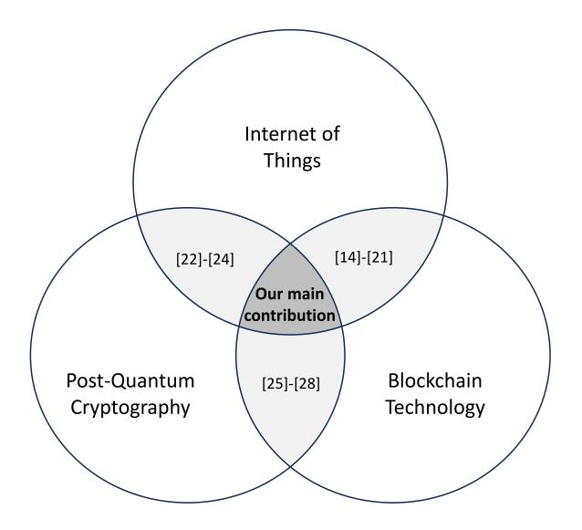
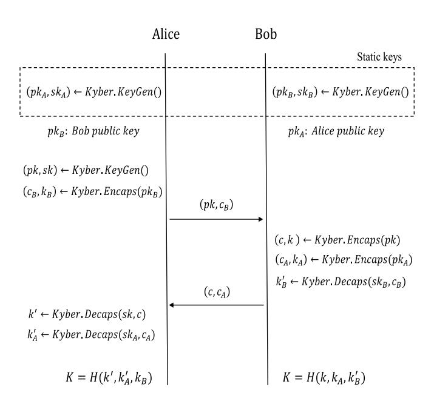
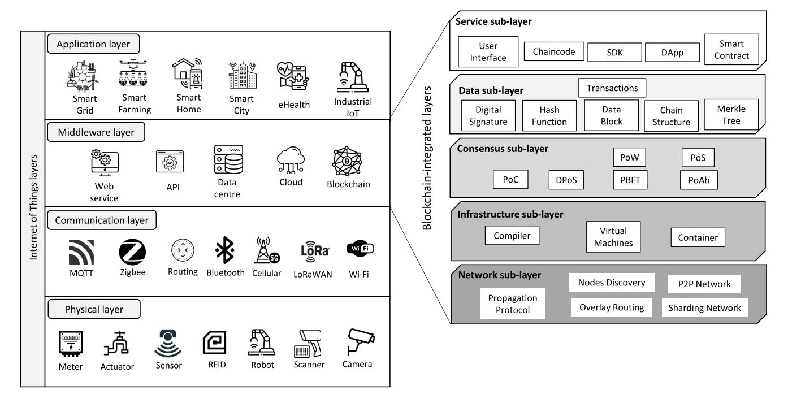
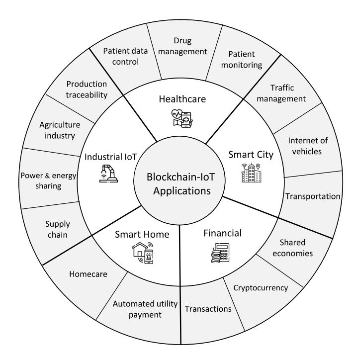
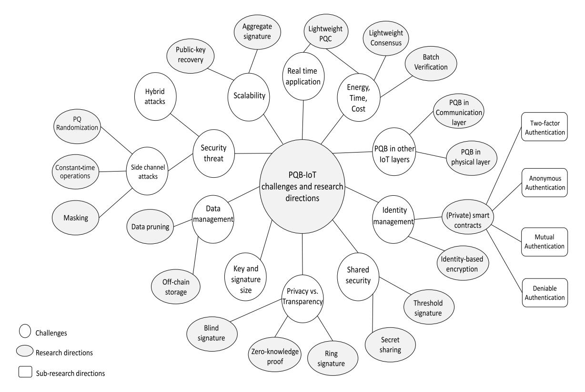

# Post-Quantum Blockchain Security for the Internet of Things: Survey and Research Directions

Hadi Gharavi®, Jorge Granjal®, and Edmundo Monteiro®, Senior Member, IEEE

Abstract—Blockchain is becoming increasingly popular in the business and academic communities because it can provide security for a wide range of applications. Therefore, researchers have been motivated to exploit blockchain characteristics, such as data immutability, transparency, and resistance to singlepoint failures in the Internet of Things (IoT), to increase the security of the IoT ecosystem. However, many existing blockchains rely on classical cryptosystems such as the Elliptic Curve Digital Signature Algorithm (ECDSA) and SHA-256 to validate transactions, which will be compromised by Shor and Grover's algorithms running on quantum computers in the foreseeable future. Post-Quantum Cryptosystems (PQC) are an innovative solution for resisting quantum attacks that can be applied to blockchains, resulting in the creation of a new type of blockchain known as Post-Quantum Blockchains (PQB). In this survey, we will look at the different types of POC and their recent standard primitives to determine whether they can enable security for blockchain-based IoT applications. It also briefly introduces blockchain and outlines recent blockchain-IoT application proposals. To the best of our knowledge, this is the first study to examine how post-quantum blockchains are being developed and how they can be used to create security mechanisms for different IoT applications. Finally, this study explores the main challenges and potential research directions that arise from integrating quantum-resistance blockchains into IoT ecosystems.

*Index Terms*—Post-quantum, blockchain, security, Internet of Things.

#### I. Introduction

THE Internet of Things (IoT) enables various devices to be connected and interact with their surroundings to collect data or automate certain activities. IoT is becoming more popular owing to the creation of innovative concepts and opportunities for intelligent applications such as smart cities, smart homes, and smart industries. This is because a wide range of tasks can be controlled remotely using Internet-connected devices, which share information using standard communication protocols. For instance, among smart home providers, Samsung offers smart fridges with Internet

Manuscript received 13 May 2023; revised 8 October 2023 and 19 December 2023; accepted 13 January 2024. Date of publication 17 January 2024; date of current version 23 August 2024. This work was supported in part by the FCT—Foundation for Science and Technology, I.P./MCTES through National Funds (PIDDAC), within the scope of CISUC R&D Unit under Project UIDP/00326/2020, and in part by the Science and Technology Development Fund, Macau, SAR, under Grant 0044/2022/A1. (Corresponding author: Hadi Gharavi.)

The authors are with the Center for Informatics and Systems, University of Coimbra, 3004-531 Coimbra, Portugal (e-mail: hgharavi@dei.uc.pt; jgranjal@dei.uc.pt; edmundo@dei.uc.pt).

Digital Object Identifier 10.1109/COMST.2024.3355222

connectivity, providing the ability to observe the contents of your fridge using a smartphone at all times and anywhere [1]. Similarly, IoT devices are also used in other contexts, such as metropolitan areas, where they are employed to monitor and manage traffic and notify residents about weather status and air quality in different districts [2].

Such extensive acceptance, on the one hand, and the growth of new concepts for IoT like Cyber-Physical Systems (CPS), Machine-to-Machine (M2M) communications and 5G technology, on the other hand, have led to the prediction of over 30 billion IoT devices in use by 2030 [3]. Moreover, the large number and variety of devices, along with their different deployment architectures in broad applications, lead to numerous security risks and challenges. Therefore, IoT devices are one of the most common devices targeted by adversaries, which can compromise data security and user privacy or cause network disruption. Currently, the majority of IoT applications are supported by publish-subscriber architectures that connect to cloud servers through the Internet. The cloud provides a centralized approach that has some advantages, such as resource availability and affordability. Although this approach may work for now, security concerns regarding centralized techniques such as single-point failure and many-to-one traffic demonstrate that decentralized concepts will be required in the future [4].

Blockchain [5] and other distributed ledger technologies are innovative approaches that can potentially address many security concerns of cloud-based IoT systems. Such technologies provide a decentralized, immutable, and shared ledger that maintains asset and transaction records over a Peer-to-Peer (P2P) network [6]. Blockchain was first successfully used in Bitcoin to send and receive digital currencies. It can also be used to power many IoT applications. Helium blockchain [7], for instance, provides a long-range wireless network for users through miners that demonstrate their support via a proofof-coverage technique and can be rewarded in the form of cryptocurrency. Therefore, using the Helium network anyone can use the wireless network for their own IoT devices. Furthermore, blockchains provide trustless infrastructure, and a variety of security mechanisms, including data protection and authentication without single-point failures, for IoT applications [8].

Although the adoption of blockchain for IoT is growing to address IoT security concerns, most existing blockchain platforms rely on traditional cryptosystems, making them vulnerable to new threats stemming from quantum computers. This is because of Shor's [9] and Grover's [10]

algorithms, which promise to break current cryptosystems such as Rivest-Shamir-Adleman (RSA) and the Elliptic Curve Digital Signature Algorithm (ECDSA), as well as compromise hash functions such as SHAs to some extent in the near future. Thus, the existence of these attack algorithms and the rapid advancement of quantum computing have led researchers to revamp existing blockchains to create Post-Quantum Blockchains (PQB) [\[11\]](#page-22-2), [\[12\]](#page-22-3), [\[13\]](#page-22-4). Because the usage of blockchains for security purposes in IoT environments is more prevalent, integrating post-quantum blockchains into IoT will be an essential notion. However, the use of postquantum blockchains in IoT environments presents several challenges.

In this article, we first describe post-quantum cryptosystems and then discuss their features, types, and instantiations that can be utilized by blockchains and IoT. It then demonstrates the potential of employing blockchain technology within IoT contexts, presenting a comprehensive overview of integrated layers, platforms, and applications of Blockchain-IoT. Subsequently, it delves into the methods of making post-quantum blockchains and analyzes the ability of these blockchains in the IoT by reviewing the most recent research in this area, which forms the goal of this study. Although integrating post-quantum blockchains into IoT is an interesting notion, such adoption poses several challenges and opportunities. Hence, an additional purpose of this study is to scrutinize open research directions for using post-quantum blockchains in IoT environments, considering their challenges and potential solutions.

The remainder of this paper is organized as follows. Related surveys on the use of blockchain in IoT environments are reviewed in Section [II.](#page-1-0) Post-quantum algorithms and their main types are discussed in Section [III.](#page-2-0) Furthermore, this section investigates the key encapsulation and digital signature schemes introduced as standards by the National Institute of Standards and Technology (NIST). Additionally, the feasibility and comparative analysis of post-quantum cryptography primitives on IoT devices are discussed in Section [IV.](#page-6-0) Section [V](#page-8-0) describes the fundamental concepts of the blockchain-IoT and its primary components, including its layers, platforms, and applications. Section [VI](#page-13-0) investigates various post-quantum blockchain projects and outlines three approaches for establishing post-quantum blockchains. Then, we will look into several IoT schemes developed on top of post-quantum blockchains as well as challenges and research opportunities in Sections [VII](#page-16-0) and [VIII,](#page-18-0) respectively. Finally, Section [IX](#page-21-8) summarizes the materials provided during this study and offers an appropriate conclusion.

# II. RELATED SURVEYS

In the literature, there are some relevant review articles that look at either the proposed ways to use blockchain in IoT ecosystems or the use of post-quantum cryptography algorithms in blockchains. This section compares the findings of various comparable studies to those of the current survey.

From the standpoint of integrating blockchain into IoT ecosystems, Khan and Salah [\[14\]](#page-22-5) considered IoT security requirements and discussed how the blockchain approach can be used to solve IoT security challenges, such as the highlighted threats and attacks in the literature. The authors presented only a review of possible blockchain solutions, such as data authentication and integrity in the IoT. In [\[15\]](#page-22-6), [\[16\]](#page-22-7), [\[17\]](#page-22-8), the authors conducted surveys to describe the fundamental concepts of blockchain technology and the most pertinent blockchain-based IoT applications. The limitations and potential optimizations are then described in terms of the architecture, types, security, and challenges that affect the design and implementation of blockchain-IoT applications. The researchers in [\[18\]](#page-22-9) also investigated the architecture of the blockchain-IoT environment and highlighted the challenges of using blockchain for fifth-generation communications in IoT and Industrial IoT (IIoT) applications as part of their contribution. Another researcher also provided a detailed survey on the use of blockchains in IoT applications [\[19\]](#page-22-10). This paper proposed a solid review of recent state-of-the-art developments in blockchain for Fog and Cloud IoT in various applications, including eHealth. It also provides a comprehensive explanation of blockchain's fundamentals. However, despite the fact that it contains a lot of highly relevant information, the use of blockchain in some important applications, such as industrial IoT, is not covered in this article. In addition to these works, several studies have also reviewed the use of blockchain in only one particular IoT application. For instance, the authors in [\[20\]](#page-22-11) touched on the specifications of smart homes, as well as the key obstacles pertaining to security and interoperability protocols for implementing blockchain, which may not be common with other IoT applications. Moreover, the use of blockchain in a specific field of IoT can be found in [\[21\]](#page-22-12), where Makani et al. examined the utilization of blockchain in several smart city domains, including air pollution, traffic, waste management, parking management, and urban payments.

From a different vantage point, several surveys have addressed the use of Post-Quantum Cryptography (PQC) algorithms in IoT and carried out an in-depth evaluation of how these cryptographic techniques can be used to secure IoT networks by looking at recent research efforts in this field. For instance, the lack of security countermeasures in the IoT domain and the advent of quantum computing threats motivated [\[22\]](#page-22-13) to first outline the security challenges encountered by IoT infrastructure and then address various techniques that are appropriate for post-quantum IoT networks. Furthermore, other researchers have analyzed the use of a certain type of post-quantum algorithm in IoT communications and devices. In [\[23\]](#page-22-14), [\[24\]](#page-22-15), the authors primarily focused on lattice-based cryptosystems and demonstrated that they are better suited for applications with limited resources, such as the IoT, due to their superior efficiency.

There are also other publications in the literature that take into consideration the analysis of post-quantum cryptography algorithms at the heart of blockchains. Fernandez-Carames and Fraga-Lamas [\[25\]](#page-22-16) presented one of the first studies on PQB in which they provided an overview of the types of post-quantum cryptography schemes. Then, the research paid attention to those public-key and signature primitives,

Fig. 1. The distinct subjects addressed in this survey and other related publications.

which had progressed to the second phase of the NIST standardization call, and compared all proposed schemes in terms of performance, signature, and key size. However, due to the different test-bed architectures, the reported comparison between the proposed schemes did not provide a clear view because they were not evaluated using the same hardware specifications. In 2022, Buser et al. [\[26\]](#page-22-17) investigated existing post-quantum signature schemes in the literature by focusing on mathematical differences. They also examined variants of post-quantum signatures that could improve the security and privacy of blockchain projects. Ciulei et al. [\[27\]](#page-22-18) conducted another recent study in the field of PQB, in which the author examined the most advanced quantum computers that could affect current blockchains in the near future and provided a short review of existing post-quantum blockchain schemes. In 2023, Karakaya and Ulu [\[28\]](#page-22-19) presented a short and systematic survey of recent advancements in post-quantum blockchain topologies developed for various use-cases like Smart Contracts, network communication, and IoT. They designed a table with a brief comparison of proposed PQB scenarios according to the problem considered. Although this paper presents recent developments in PQB in broad coverage areas, it does not provide an in-depth comparison of each scheme.

In the above-mentioned surveys, the feasibility, methods, and effects of integrating only two domains—blockchain into IoT, PQC algorithms into blockchain, or PQC algorithms into IoT contexts—were analyzed, which are depicted in light gray areas in Figure [1.](#page-2-1) However, we are entering a new era of security in the IoT because many of the proposed security solutions are based on distributed systems like blockchains and a new generation of cryptosystems. Therefore, the main distinction of this study is that it examines the intersection of the IoT, post-quantum cryptosystems, and blockchain domains, as seen in the dark gray areas in Figure [1.](#page-2-1) Furthermore, it also covers earlier works in greater detail, like reviewing different strategies for making quantum-secure blockchains

associated with several implemented instances. As a result, this is the first study to examine how post-quantum cryptosystems, blockchains, and IoT environments can work together to provide security against possible quantum threats in IoT while taking advantage of the benefits of blockchain. Moreover, this article discusses the challenges and potential opportunities for providing IoT security based on blockchain and post-quantum algorithms. Thus, we believe that this comprehensive study will pave the way for further research on employing quantumresistant security mechanisms, frameworks, and schemes in IoT ecosystems based on blockchain.

# III. POST-QUANTUM CRYPTOSYSTEMS

For the first time, David Deutch theoretically presented a universal quantum computing model based on physical principles and the Church-Turing hypothesis [\[29\]](#page-22-20). Then, in 1994, Shor proposed an algorithm to resolve the challenging issues of integer factoring and discrete logarithms using a quantum computer by executing parallel operations on a processor [\[9\]](#page-22-0). The distinguishing feature of the algorithm is that it is no longer effective to make traditional cryptosystems more difficult by prolonging the keys, which can be broken in polynomial time. Therefore, all current asymmetric cryptosystems like RSA, ESDSA, and Diffie-Hellman would be broken by quantum computers and fall outside the security level range. Grover [\[10\]](#page-22-1) then proposed another algorithm that can boost the speed of search operations via quantum computers. It can compromise the security of symmetric cryptosystems and hash functions with √*n* time complexity, where n is the size of the function's domain. Consequently, the security levels of AES-256 and SHA-256, for example, are downgraded from 256 to 128 bits.

The level of security is measured by the amount of work that must be performed by a computer to carry out a bruteforce attack. Nevertheless, NIST provides a set of broader security categories in the range of 1 to 5, based on estimates of quantum and classical gate counts for attack, rather than assessing security algorithms with a specific bit number as a "bit security" approach [\[30\]](#page-22-21). Table [I](#page-3-0) adapted from [\[24\]](#page-22-15) compares the security levels and categories of different symmetric cryptosystems for both quantum and classical computers. This differs from that in terms of the NIST security level category and the type of attack affecting each cryptography algorithm.

Although there have been significant advances in quantum computer development, they are still in their early stages. For example, IBM Osprey [\[31\]](#page-22-22) is the most powerful quantum computer ever built and has just 433 qubits (quantum bits), whereas a 4000-qubit quantum computer is thought to be required to break the current RSA-2048 [\[32\]](#page-22-23). This does not mean that we can exclude the use of quantum-resistant public key cryptosystems. The reason is that an adversary can collect ciphertexts that are encrypted by the current cryptosystems and decrypt them later when a powerful quantum computer can do it, which is known as "Harvest now, Decrypt later". Thus, researchers are investigating cryptosystems that can withstand future quantum computer-based attacks.

| Name        | Function   | Pre-quantum  | Post-quantum  | NIST           | Grover                |
|-------------|------------|--------------|---------------|----------------|-----------------------|
| Name        | runction   | bit security | bit security  | security level | impact type           |
| 2TDEA       | Encryption | 112          | 80            | 1              | Exhaustive Key Search |
| AES-128     | Encryption | 128          | $\approx$ 64  | 1              | Exhaustive Key Search |
| <b>GMAC</b> | MAC        | 128          | 128           | 3              | No Impact             |
| POLY-1305   | MAC        | 128          | 128           | 3              | No Impact             |
| SHA-256     | Hashing    | 256          | 128           | 2              | Collision Search      |
| AES-192     | Encrytion  | 192          | $\approx$ 96  | 3              | Exhaustive Key Search |
| SHA-384     | Hashing    | 384          | 192           | 4              | Collision Search      |
| AES-256     | Encryption | 256          | $\approx$ 128 | 5              | Exhaustive Key Search |
| SHA-512     | Hashing    | 512          | 256           | 5              | Collision Search      |

TABLE I
SECURITY OF SYMMETRIC CRYPTOSYSTEMS AGAINST CLASSIC AND QUANTUM ATTACKS ADAPTED FROM [24]

One strategy is to use Quantum Cryptography (QC), which utilizes quantum-mechanical phenomena and quantum communication channels, but the problem is that it cannot be used over existing devices and security protocols [33]. As a result, Post-Quantum Cryptography has emerged as a new branch of cryptographic science. PQC is a classical cryptography based on NP-hard mathematical problems that can withstand quantum attacks while being operable on current computers [34]. PQC algorithms have gained research and academic attention; therefore, some projects, such as PQCrypto [35], have been launched to educate developers and researchers about this scope. Moreover, to stay two steps ahead of quantum attacks, NIST initiated a process in 2016 to establish a new PQC standard for key establishment and digital signatures, which announced the PQC standard algorithms after analyzing the received schemes in 2022 [36]. In the following section, we will look over the five main PQC types discussed in the literature in chronological order and examine the NIST PQC standard algorithms in detail.

#### A. Post-Quantum Cryptosystem Types

1) Code-Based Cryptosystems: Code-based methods are one of the oldest types of post-quantum cryptography, which were first introduced by McEliece in 1978 [37]. These are based on the principle of error correction codes. For example, primary McEliece cryptography uses random binary Goppa code. This scheme was not originally presented with the aim of being resistant to quantum computers, but its structure made it resistant to these computers. It has been well studied and analyzed over the last 40 years, which attests to the excellent security of this type of cryptosystem. However, code-based cryptosystems have a significant key size disadvantage, which makes them challenging to implement in resource-constrained IoT devices. Therefore, various plans have been proposed to reduce the key length in code-based cryptosystems. For example, Niederreiter [38], as a McEliece variant, was proposed to alleviate the key length problem to some extent.

2) Hash-Based Cryptosystems: The hash-based cryptosystem, which was initially described by Lamport in the 1970s, is a specific kind of post-quantum cryptosystem that is used only for digital signatures [39]. The Merkle Signature Scheme (MSS) [40] is another well-known hash-based scheme that

combines one-time signature schemes using a tree structure. The security of hash-based schemes, unlike other cryptosystems that are based on certain mathematical problems, originates from the hash functions that lie at the core of this cryptosystem, and the quantum-proof security of such functions is derived from one-wayness, preimage resistance, and collusion resistance properties. Hash-based cryptosystems are divided into two main categories, stateless and stateful approaches, which have various subclasses. SPHINCS+, which has been chosen as the standard for digital signatures by NIST, and Gravity-SPHINCS are both based on a stateless approach. Additionally, there are several post-quantum algorithms from the stateful class, namely the Winternitz one-time scheme [41], and its variants like WOTS+ [42] and WOTSPRF [43].

3) Lattice-Based Cryptosystems: This type of PQC had the most candidates with 20 schemes in the NIST call, three of which reached the final round. Lattice-based problems were first suggested by Asif [24], who contended that the NP-hard lattice problem can be used to develop trustworthy cryptographic algorithms. These kinds of cryptographic algorithms are based on lattices, which are conceptually made up of points in n-dimensional spaces that repeat. One of the underlying NP-hard problems in such cryptosystems is obtaining the Shortest non-zero Vector (SVP) inside a lattice. Additional examples of lattice NP-hard problems are the Closest Vector Problem (CVP) and the Shortest Independent Vector Problem (SIVP). Moreover, Learning With Errors (LWE)—a special category of hard problems pertaining to lattice-based cryptosystems—and its variations, like Ring-LWE and LP-LWE, are the foundation of lattice-based cryptosystems that reached the second round of the NIST call [25]. The properties of a lattice-based cryptosystem lead to a good balance between key size, security, and computational simplicity; thus, the Kyber, FALCON, and Dilithium schemes were accepted as key encapsulation and digital signature standards.

4) Multivariate-Based Cryptosystems: Multivariate is another quantum-resistant cryptosystem category that relies on the complexity of solving a certain kind of polynomial equation known as multivariate equations. The difficulty in solving these problems in finite fields makes them resistant to quantum computers. There are several types of cryptosystems

based on the degree of polynomial equation, such as quadratic and cubic polynomials. However, the most promising schemes are those with quadratic polynomials, which evolved from Matsumoto-Imai's algorithm [\[44\]](#page-22-35). Multivariate-based cryptosystems suffer from large key sizes and cipher-text overhead, which indicates that additional research is required to improve their efficiency [\[25\]](#page-22-16). For instance, Rainbow [\[45\]](#page-22-36) is the most well-known scheme in this family which was one of the final candidates for the NIST digital signature standard. However, among the submitted key encapsulation schemes in the NIST call, CFPKM and Giophantus were based on multivariate, both of which were completely disqualified before the second round [\[46\]](#page-22-37).

*5) Supersingular Elliptic Curve Isogeny Cryptosystems:* This form of cryptosystem is recognized as the youngest post-quantum cryptographic algorithm, first presented by Rostovtsev–Stolbunov [\[47\]](#page-22-38) based on isogeny as a new type of Elliptic Curve Cryptography (ECC). Other approaches have been suggested, such as that proposed by Childs et al. [\[48\]](#page-22-39), which aimed to strengthen and repel quantum computers by developing novel subexponential-time quantum algorithms for creating nonzero isogenies. In general, this cryptosystem is divided into three main subclasses: Supersingular Isogeny Diffie-Hellman (SIDH), Ordinary Isogeny Diffie-Hellman (OIDH), and Commutative SIDH (CSIDH) [\[49\]](#page-22-40). Although there have been many different digital signature and encryption schemes based on this type of cryptosystem, SIKE [\[50\]](#page-22-41) was the only member of this family to be considered as a candidate for the NIST standardization process.

In the not-too-distant future, key exchange and digital signatures will be based on the aforementioned post-quantum cryptosystems. In the next subsections, we examine postquantum key encapsulation and signature methods and delve deeper into NIST standard schemes.

#### *B. Key Encapsulation Schemes*

The key establishment protocol is a secure method that enables two parties to establish the same secret key using an asymmetric cryptosystem called the Key Encapsulation Mechanism (KEM). This secret (symmetric) key is then used for message encryption throughout the session. In practice, asymmetric cryptosystems are extremely slow to transmit long messages. Instead, they are typically used to exchange symmetric keys, which are substantially smaller in size. Therefore, KEM can be considered as a type of key exchange protocol in which only a single encrypted key (*K*), derived by hashing a random element without the need for padding, is sent.

As a forward-thinking move, it is now necessary to exchange symmetric keys via post-quantum techniques due to the recent advancements in quantum computers. For this reason, a number of projects have begun to adopt post-quantum cryptosystems for their key exchange algorithms. OpenSSH released its latest version with the NTRU Prime [\[53\]](#page-22-42) algorithm—a candidate cryptosystem for NIST standardization—as a default KEM to prevent "Harvest now, Decrypt later" attacks [\[54\]](#page-22-43). Another KEM proposal, called NewHope [\[55\]](#page-22-44), has also been examined using the Google

Fig. 2. An example of a key establishment protocol employing the Kyber encapsulation mechanism [\[60\]](#page-22-45).

Chrome Canary Web browser [\[56\]](#page-22-46). Furthermore, other efforts for PQC implementation include the libraries libpqcrypto [\[57\]](#page-22-47) and liboqs [\[58\]](#page-22-48), which are developed exclusively for x86 or x64 architectures. NIST recently recognized the CRYSTALS-Kyber encapsulation scheme [\[52\]](#page-22-49) as a post-quantum key establishment standard [\[59\]](#page-22-50). This post-quantum cryptography algorithm, which is most likely to be employed in various future security protocols, is detailed in the following paragraph.

*1) CRYSTALS-Kyber:* Kyber from the CRYSTALS project is a KEM intended to withstand cryptoanalytic attacks by quantum computers. It is used to help two communication parties establish trust and confidentiality without being affected by Indistinguishable non-adaptive and Adaptive Chosen Ciphertext Attack (IND-CCA1/IND-CCA2). The fundamentals of this asymmetric cryptosystem are based on a variation of the LWE problems known as module-LWE, which is supposedly an NP-hard lattice problem. Kyber is available in three security levels, each of which has a unique set of parameters aimed at a particular level of security. The security categories attained by Kyber-512, Kyber-768, and Kyber-1024 are approximately 128 (1), 192 (3), and 256 (5) bits, respectively. As shown in Figure [2,](#page-4-0) to establish a secret key between two parties using the Kyber cryptosystem, it employs three mechanisms, including Key Generation, Encapsulation, and Decapsulation. In a key establishment scenario with mutual authentication to avoid the "man in the middle" attack, if we assume that each party knows the other's static key through a confirmed certificate, the two parties (Alice and Bob) can use Kyber's mechanisms to establish a shared symmetric key (*K*) via two-way communication.

From the performance point of view, Kyber is a highly optimized KEM that, with regard to its ring structure, minimizes the public key and cipher-text sizes of conventional lattice schemes by compromising security assumptions. Kyber

TABLE II PERFORMANCE EVALUATION OF THE KYBER AS A SINGLE NIST STANDARD POST-QUANTUM KEM [\[51\]](#page-22-51), [\[52\]](#page-22-49)

works on a single ring, *Rq* = Z7681[*x* ]/(*x* 256 + 1), and reduces the security level (from 128 to 102 bits) to improve performance and communication size [\[61\]](#page-22-52). Table [II](#page-5-0) illustrates the relationship between the size of public and private keys at each security level. It displays the memory usage and performance benchmark of the primary Kyber and its updated variants, called Kyber-90s, implemented on an embedded device with the ARM Cortex-M4 processor [\[51\]](#page-22-51). It can also be seen in the table that as the security level increases, the signature and key sizes and the amount of memory usage increase; in contrast, the speed in each of the three processes decreases (cycle increase). However, the table proves that Kyber has the potential to operate on devices with limited resources, such as ARM Cortex-M4, across all security levels.

# *C. Signature Schemes*

Digital signatures are used extensively in modern security systems. Digital certificates often use signatures to check in security protocols such as TLS to ensure that communication over a network is safe. Blockchain is another application that relies heavily on digital signatures to validate transactions, and shows the legitimacy of each node in the network [\[62\]](#page-23-0). Similar to pre-quantum schemes, the security assumption for post-quantum signature states that adversaries with access to a signing oracle are prevented from adding a new signature to an already-signed message or changing the signature on a message that has already been signed. According to earlier recommendations by NIST [\[63\]](#page-23-1), post-quantum digital signatures are currently used in a few applications. For instance, the Winternitz one-time signature as a hash-based scheme is used to validate transactions in the IOTA cryptocurrency project [\[64\]](#page-23-2). However, in addition to providing a standard for KEM schemes, NIST has recently presented three postquantum signatures as future deployment standards [\[59\]](#page-22-50): Dilithium [\[65\]](#page-23-3), FALCON [\[66\]](#page-23-4), and SPHINCS+ [\[67\]](#page-23-5). The following is a more in-depth examination of these postquantum signature schemes:

*1) CRYSTALS-Dilithium:* Dilithium is a post-quantum signature that relies on the hardness of module lattice problems to provide security against chosen message attacks. Dilithium is a lattice-based signature family member with a short signature and public key that employs uniform sampling. Although Dilithium's signature is nearly twice as large as BLISS's (the smallest scheme among lattice-based signatures), it accomplishes a 2.5 lower public key size compared to the most effective lattice-based signature schemes [\[61\]](#page-22-52). It is developed using the Fiat-Shamir Abort framework [\[68\]](#page-23-6), which is a simple and reliable technique that protects against lattice reduction attacks and security based on an Oracle model. Dilithium utilized standard Number Theoretic Transform (NTT) polynomial multiplication; however, it uses integer instructions rather than floating-point vector instructions in the vectorized version. Matrix and vectors in Dilithium are driven by SHAKE128 and SHAKE256, so that their vectorization accelerates matrix and vector expansion by sampling four coefficients at the same time [\[69\]](#page-23-7). Table [III](#page-6-1) compares the parameter size and performance of Dilithium and other schemes for the ARM Cortex-M4 microcontroller.

*2) SPHINCS*+*:* A stateless hash-based signature method called SPHINCS+ was approved by the NIST as a standard for use in security protocols [\[70\]](#page-23-8). It has been instantiated using three different hash functions: SHA-256, SHAKE256, and Haraka. This algorithm has large signature sizes approaching 49 KB while providing the best public and private key sizes of less than 1 KB, depending on the parameter selections. SPHINCS+ is a modified version of the SPHINCS signature framework with improved speed and signature size [\[71\]](#page-23-9). SPHINCS+ from a high perspective employs the Many-Tree Signature (MTS), which is a classical Merkle hash tree. The fundamental idea is to use a hypertree (a tree of trees) linked together using One-Time Signatures (OTS) to authenticate a large number of Few-Time Signature (FTS) key pairs. In SPHINCS+, WOTS+ [\[42\]](#page-22-33) plays the role of an OTS, including a parameter that allows a trade-off between the number of computations and signature size. The FTS is another important component of SPHINCS+, which is a type of signature that permits only one key pair to generate a few signatures. The private key for SPHINC+ is simply a single secret seed number used to create pseudo-random numbers for use in both the OTS and FTS secret keys, and SPHINCS+'s public key is the top-level MTS node, which is nothing more than the hash value of the root node of its binary hash tree.

TABLE III
PERFORMANCE EVALUATION OF NIST STANDARD POST-QUANTUM SIGNATURES [51], [65]

| Signature algorithm           | Security | Size (bytes) |          |           |             | Memory (bytes) |             |          |         |        |
|-------------------------------|----------|--------------|----------|-----------|-------------|----------------|-------------|----------|---------|--------|
| Signature argorithm           | category | Pri. key     | Pub. key | Signature | Key gen.    | Sign           | Verify      | Key gen. | Sign    | Verify |
| Dilithium2                    | 2        | 2.528        | 1.312    | 2.420     | 1.597.200   | 4.095.865      | 1.572.329   | 38.276   | 49.356  | 36.188 |
| Dilithium3                    | 3        | 4.000        | 1.952    | 3.293     | 2.829.250   | 6.610.160      | 2.691.469   | 60.804   | 68.804  | 57.692 |
| Dilithium5                    | 5        | 4.864        | 2.592    | 4.595     | 4.826.293   | 8.767.067      | 4.705.981   | 97.668   | 115.908 | 92.764 |
| Dilithium2-AES                | 2        | 2.528        | 1.312    | 2.420     | 5.153.665   | 12.016.668     | 4.824.282   | 39.764   | 53.388  | 37.676 |
| Dilithium3-AES                | 3        | 4.000        | 1.952    | 3.293     | 9.258.325   | 19.417,325     | 8.581.938   | 62.292   | 81.036  | 59.180 |
| Dilithium5-AES                | 5        | 4.864        | 2.592    | 4.595     | NE          | NE             | NE          | NE       | NE      | NE     |
| FALCON-512                    | 1        | 1.281        | 897      | 666       | 163.994.060 | 39.014.427     | 473.060     | 1.488    | 2.592   | 388    |
| FALCON-1024                   | 4-5      | 2.305        | 1.793    | 1.280     | 458.300.837 | 85.160.712     | 977.811     | 1.488    | 2.568   | 496    |
| SPHINCS+-SHAKE256             | 1        | 64           | 32       | 16.976    | 59.754.709  | 1.481.251.054  | 85.436.452  | 2.012    | 2.068   | 2.556  |
| SPHINCS+-SHAKE256             | 3        | 96           | 48       | 35.664    | 88.327.026  | 2.409,662.836  | 122.523.477 | 3.436    | 3.468   | 3.788  |
| SPHINCS+-SHAKE256             | 5        | 128          | 64       | 49.216    | 235.431.549 | 4.862.202.181  | 126.499.038 | 5.436    | 5.504   | 5.404  |
| SPHINCS + -SHA-256 | 1        | 64           | 32       | 16.976    | 16.112.474  | 400.443.378    | 22.548.002  | 2.104    | 2.168   | 2.656  |
| SPHINCS + -SHA-256 | 3        | 96           | 48       | 35.664    | 23,719,514  | 669,328,611    | 33,644,995  | 3,520    | 3,560   | 3,880  |
| SPHINCS + -SHA-256 | 5        | 128          | 64       | 49.216    | 62.594.489  | 1.341.551.848  | 35.486.542  | 5.512    | 5.592   | 5.488  |
| SPHINCS+-Haraka               | 1        | 64           | 32       | 16.976    | 73.970.415  | 1.861.103.613  | 115.058.935 | 3.612    | 3.676   | 4.164  |
| SPHINCS+-Haraka               | 3        | 96           | 48       | 35.664    | 108.980.946 | 3.128.988.618  | 170.287.414 | 5.028    | 5.096   | 5.388  |
| SPHINCS + -Haraka  | 5        | 128          | 64       | 49.216    | 289.718.169 | 6.620.999.794  | 185.282.107 | 7.048    | 7.096   | 6.996  |

NE= Not Evaluated, Note = the speed and memory usage for SPHINCS+ are according to the fast and simple implementation

3) FALCON: This signature algorithm is another postquantum cryptographic signature based on the lattice chosen by NIST as a post-quantum standard [66]. FALCON is an acronym for "FAst Fourier Lattice-based COmpact Signatures over NTRU." It uses a trapdoor sampler called "rapid Fourier sampling" to instantiate the framework over the NTRU lattices. Additionally, the Short Integer Solution (SIS) problem over NTRU, which is a quantum-resistant hard problem, is at the heart of FALCON. For the key generation procedure, the modulus prime q and monic polynomial  $\phi$  serve as the key generation algorithm inputs. It signs messages with secret key sk and verifies the signatures with public key h. The coefficients of the polynomials f and  $g \in z[x]$  are chosen at random from a discrete Gaussian distribution, after which it computes F and  $G \in z[x]$  that fulfill the equation of NTRU  $fG - gF = q : mod : \phi$ . Consequently, the polynomial elements f, g, F, and G are known as secret elements. The signing procedure takes a message m and a private key sk as inputs and returns a signature with two components r and s. To verify a signed message, it requires the public key h and the signed message m. The digital signature scheme is proposed at two security levels, and its features are listed in Table III. FALCON offers relatively small public and private key sizes as well as an exceptionally small signature size. The FALCON verification step can also be completed quickly and easily by a hash function and NTT operations, whereas the

time required to generate a key is prohibitive compared to the other two schemes. There are also some concerns about defending against timing and side-channel attacks because it employs many discrete Gaussian samplings over integers [61]. Additionally, it is noticeable that while the size of the public and private keys in Dilithium is significantly larger than SPHINCS+, it offers a far superior signature size and speed in comparison to FALCON and SPHINCS+, as shown in Table III. However, FALCON and SPHINCS+ outperformed Dilithium in terms of memory utilization, thereby making them more suitable for devices with limited memory.

#### IV. PQCs in IoT Devices

Post-quantum cryptosystems will eventually replace traditional methods in many security protocols, which impact IoT ecosystems that use these protocols. This is caused by the high memory consumption and cryptographic overhead associated with their operations and outputs, such as signing, validating, encrypting, and the length of the cipher-texts or signatures. Hence, it is critical to consider factors such as computational complexity, network bandwidth, and memory requirements of post-quantum algorithms and compare the performance of the proposed schemes. Furthermore, whether these novel algorithms can be implemented on limited-resource IoT devices should be considered.

| Ref.                       | Hardware            | Hardware Software Type Candidates |           | Candidates                                                | Criteria                     | Result                |
|----------------------------|---------------------|-----------------------------------|-----------|-----------------------------------------------------------|------------------------------|-----------------------|
| Atkins et al.              | ARM Cortex-M3       | PQM4                              | KEM       | Kyber SABER                                            | Code-size /RAM            | Kyber                 |
| [72]                       | ARM Cortex-M0       | PQW4                              | Signature | Dilithium FALCON                                       | Code-size /RAM            | FALCON                |
| Soni <i>et al.</i> [73] | Xilinx Artix-7 FPGA | -                                 | Signature | qTESLA Dilithium                                       | Latency/ Num. clock       | Dilithium             |
| Schoffel et al.            | ARM Cortex M4       | OQS-OpenSSL mbedTLS            | KEM       | HQC, FrodoKEM, Kyber, SABER, BIKE NTRU-Prime, SIKE  | Handshake latency /Energy | Kyber SABER        |
| [74]                       | ARMCryptoCell       | moedils                           | Signature | Dilithium2 FALCON-512                                  | Handshake Latency /Energy | Both                  |
| Chung et al.               | RPi3 RPi4        | OQS-OpenSSL                       | KEM       | HQC, FrodoKEM, Kyber, SABER, BIKE, NTRU-Prime, SIKE | TLS Latency /Overhead     | Kyber, SABER /SIKE |
| [75]                       | KP14                |                                   | Signature | Picnic, SPHINCS+, Dilithium FALCON Rainbow                | TLS Latency /Overhead     | Dilithium FALCON   |

TABLE IV PERFORMANCE COMPARISON OF POST-QUANTUM CRYPTOGRAPHY ALGORITHM IN SEVERAL IOT DEVICES

Although some studies have stated that latticebased cryptosystems are best suited for low-resource devices [\[76\]](#page-23-10), an ideal post-quantum signature and KEM for resource-constrained IoT devices should also follow two characteristics [\[77\]](#page-23-11). (i) Resource consumption should be considered for an IoT application to achieve a high computing rate with low memory, bandwidth, and energy consumption. The result is a longer operating duration for battery-powered gadgets. (ii) Low-end IoT devices frequently operate in hostile environments where an adversary can compromise them through malware infiltration or physical forces. Thus, offering compromise-resilience features like forward security and sidechannel resilience is crucial in this regard.

A brief examination of post-quantum KEMs in small IoT devices was performed in [\[78\]](#page-23-12), where the performances of several post-quantum techniques, including SIDH [\[79\]](#page-23-13), FrodoKEM [\[80\]](#page-23-14), Mcbits [\[81\]](#page-23-15), NewHope, and NTRU [\[82\]](#page-23-16), on chosen ARM processors were investigated. The study used 32-bit single-board ARM computers running Linux using the liboqs library, as well as 32-bit ARM mobile devices running the Android operating system. Their findings demonstrated the superior performance of lattice-based post-quantum cryptography techniques, such as NewHope and NTRU, for key setups.

Table [IV](#page-7-0) provides a quick overview of additional studies [\[72\]](#page-23-17), [\[73\]](#page-23-18), [\[74\]](#page-23-19), [\[75\]](#page-23-20) on the possibility and comparison of several post-quantum schemes for different IoT devices. The candidates for post-quantum key encapsulation and digital signatures have been implemented on specific hardware, such as ARM Cortex-M3 and RPi3, using various libraries or software. The post-quantum candidates with the best performance in terms of different criteria, such as RAM usage, latency, and code size, are displayed in the results column. For instance, researchers in [\[72\]](#page-23-17) executed Kyber and SABER [\[83\]](#page-23-21) on Cortex M3 and M0, and concluded that Kyber outperformed SABER based on RAM usage and code size.

Another study [\[84\]](#page-23-22) took lattice-based KEMs into account due to their keys and ciphertext sizes, which are better suited for devices with limited resources. The authors based their assessments on the Kyber, NTRU, NTRU Prime, SABER, and FrodoKEM. They evaluated the efficiency by utilizing key encapsulation schemes in terms of network traffic, CPU, and RAM on three hardware components, including the Raspberry Pi 3B+, Arduino Uno, and RFM69HCW at various network levels. SABER required the least amount of memory, whereas Kyber used the least amount of CPU when performing the three tasks of key generation, encapsulation, and decapsulation. Kyber works effectively in terms of network traffic data, such as packet size and quantity.

The feasibility and performance of microcontrollers such as the EK-TM4C123GXL from Texas Instruments for PQC implementation were the subjects of another study [\[85\]](#page-23-23) that expanded a tool called the eXtended eXternal Benchmarking eXtension (XXBX) for benchmarking post-quantum key encapsulation schemes. For benchmarking, the research focused only on the lattice family of PQC, including SABER, Kyber, ThreeBears [\[86\]](#page-23-24), NewHope, and NTRU. The authors considered four criteria, including RAM and ROM usage, energy consumption, and speed (in clock cycles), and found that the Kyber and NewHope implementations are suitable for KEM if power consumption or execution time is an issue, whereas the Kyber and ThreeBears algorithms are the best options if memory utilization is the main issue. When it came to signature algorithms, the target device's RAM limitations were exceeded by the majority of post-quantum signature schemes. Hence, they were unable to benchmark any of the algorithms.

Even though Kyber stands out as a strong candidate for use in KEM according to NIST standards and the experimental findings presented in this section, it might not currently even be required to use KEMs to make the entire PKI quantum secure in many cases. Quantum attackers are more likely to target widely used certificates, such as root or server certificates, than specific client certificates, mainly due to the high costs associated with quantum computing, particularly in its early stages. Consequently, a hybrid PKI approach can be implemented in which the server and root CA only employ PQC, and the clients authenticate themselves using traditional ECDSA, whose public key is in a post-quantumsigned certificate. KEMs call only for the exchange of a single key and ciphertext, and they are not both part of the same communication. Additionally, the majority of KEM algorithms have reasonable key sizes, making their bandwidth needs less impactful than signatures. Therefore, the most efficient KEMs like Kyber—with the exception of Classic McEliece, whose very large public keys surpass the RAM size—are theoretically feasible at least at the first security level for a common IoT setup [\[74\]](#page-23-19). Fortunately, NIST has introduced several PQ signature standards, offering users a range of options tailored to their specific needs and application constraints. For example, Dilithium is well suited for scenarios requiring faster signing and verification when memory resources are sufficient, but FALCON exhibits superior efficiency in terms of memory usage.

As a final remark, it is worth noting that the experiments on speed, network overhead, and memory in this section were not performed on a specific device, which makes it difficult to draw definitive conclusions about choosing the optimal signature and KEM algorithm for IoT devices. Nevertheless, it can generally be concluded that post-quantum cryptographic schemes can be implemented and operated on current limitedresource devices in different IoT applications. Furthermore, it can be observed that lattice-based schemes perform better than other types in terms of speed, memory, and energy consumption. Hence, it can be inferred that each PQC standard has its advantages and disadvantages. This means that each use case, like IoT and blockchain environments, needs a careful plan regarding requirements and restrictions to ensure that the best and most efficient scheme is used.

#### V. BLOCKCHAIN-BASED IOT

The term "blockchain" often refers to the underpinning technology of a digital currency known as Bitcoin, created by Nakamoto in 2008 [\[5\]](#page-21-4). It is typically characterized as a transparent, decentralized, and trustworthy ledger on a Peerto-Peer (P2P) network. This ledger is open to all participants in the network without being governed by any participant. A blockchain consists of blocks that are chained together using the hash of their previous blocks [\[87\]](#page-23-25). In the blockchain, data in the form of transactions is the primary component of each block, and any member of the P2P network can generate, verify, or track transactions in the blockchain.

Blockchains can be categorized according to stored data, data accessibility, joining policies, and supported activities. However, they are typically divided into public, private, and consortium blockchains. Alternatively, they can be viewed as permissioned or permissionless from another perspective [\[16\]](#page-22-7). Public blockchains permit any user to join the network in a pseudo-anonymous manner, whereas private blockchains may limit the nodes' access to the network and their ability to perform particular activities [\[88\]](#page-23-26). Public blockchains offer higher levels of anonymity, decentralization, and security. However, they often experience delays in the transaction processing times. Private blockchains are usually more effective because they have fewer nodes. Hence, this might be a desirable feature for resource-constrained nodes in a network [\[89\]](#page-23-27).

Furthermore, blockchains can be categorized as permissioned or permissionless,as depicted in Table [V,](#page-8-1) which lists

TABLE V BLOCKCHAINS AND DISTRIBUTED LEDGER PROJECTS IN VARIOUS TYPES

| Type    | Permissionless                                  | Permissioned                                              |
|---------|-------------------------------------------------|-----------------------------------------------------------|
| Public  | Bitcoin [5] Ethereum [90] Helium [7]      | EOS [91] Corda [92] Ripple [93]                     |
| Private | LTO Network [94] IOTA [64] HOLOChain [95] | Multichain [96] Hyperledger Fabric [97] Quorum [98] |

examples from two perspectives. Anyone may join a permissionless public blockchain without the consent of a third party and participate as a normal or a miner (validator) node. By contrast, permissioned public blockchains are open for the public to join only with registration or authorization. Private permissionless, and publicly permissioned blockchains are recognized as consortium blockchains.

Recently, a new blockchain-based concept called Blockchain-IoT (BCIoT) emerged from utilizing blockchain in the IoT context [\[19\]](#page-22-10). IoT infrastructure is usually classified as cloud-based or edge-based [\[99\]](#page-23-28) from a computing perspective. Hence, Blockchain does not play a complete computing role in IoT adoption because of its latency and high computing cost. Nevertheless, it can provide computational assistance in securing data transactions and guaranteeing the integrity of processed and stored data in the cloud. This creates a security layer that can be designed or adapted according to the security requirements of specific applications. In the edge-based IoT, where devices process data locally, blockchains can facilitate secure peer-to-peer transactions and enable a distributed ledger at the edge. This decentralized approach minimizes reliance on the central authority and enhances the resilience of the system. Moreover, the blockchain architecture ensures reliable and efficient operation thanks to its tamper-proof nature. These characteristics create opportunities to overcome IoT challenges. Many businesses and researchers have been attracted to the intersection of blockchain and IoT, which has led to implementation, solutions, and initiatives across numerous IoT domains [\[7\]](#page-21-6), [\[64\]](#page-23-2), [\[100\]](#page-23-29). Therefore, it would be helpful to grasp the main aspects of BCIoT to comprehend some potential blockchain applications in IoT domains and enhance their security against quantum computers.

#### *A. Blockchain-IoT Layers*

There are four layers in each IoT environment [\[101\]](#page-23-30) as depicted on the left side of Figure [3.](#page-9-0) Numerous sensors and actuators are used in the first layer to perform actions and perceive the required data. The second layer, which is on top of the first layer, uses communication infrastructure to transport the gathered data. The third layer, referred to as the middleware layer, is used by the majority of developing IoT applications to serve as a link between the communication and application layers. The fourth (highest) layer is related to numerous IoT-based end-to-end applications such as smart cities and industrial IoT. When the blockchain is integrated with the IoT ecosystem, as shown in Figure [3,](#page-9-0) it serves as the middleware layer for IoT layers. Blockchain itself has

Fig. 3. Blockchain-IoT integrated layers and components.

also been conceptually introduced as a multilayer architecture, like the IoT ecosystem [\[102\]](#page-23-31), [\[103\]](#page-23-32), in which components can communicate across these layers. The network sub-layer is placed at the lowest level of the blockchain and closely interacts with the communication layer in the IoT, whereas at the top of the blockchain model is the service sub-layer, which can offer different services for IoT applications. These layers are examined separately in the following subsections.

- *1) Network Sub-Layer:* The majority of the critical network services are provided by this layer, which is an overlay P2P network. In order to broadcast blocks across the network and synchronize the blockchain status, the distributed P2P network ensures that all nodes can find and communicate with each other. This network connects participating nodes, either physically or virtually, through an underlying IoT communication network. The main elements of this layer are propagation protocols, overlay routing, sharding, and node discovery. The blockchain P2P network typically has two types of participant nodes, including full and light nodes. Every new node that enters the network, regardless of its type, must find other nodes in the network by using the node discovery protocol to operate in the blockchain network.
- *2) Infrastructure Sub-Layer:* This layer contains actual blockchain equipment such as servers that underpin the blockchain network. This layer encompasses virtualization and containers, which involve the creation of virtual resources, such as storage, networks, and servers. For instance, in Ethereum, anyone with a virtual machine can handle an Ethereum node. This makes it possible for their device to use an Ethereum blockchain network. The execution environment of a smart contract is provided by Ethereum Virtual Machines (EVM), which function as sandboxes. The EVM that manages the internal state and computation of smart contracts is Turingcomplete software.

*3) Consensus Sub-Layer:* Blockchains use consensus mechanisms to protect the legality of transactions and the blockchain security. This mechanism ensures that every copy of the blockchain in participant nodes has valid transactions. To stop fraud-related actions like doublespending attacks, the block's trustworthiness and data flow must be constantly assessed and monitored. Consensus algorithms that include validation procedures can satisfy these requirements. Numerous consensus methods have been proposed in literature. The most well-known consensus mechanisms are Proof-of-Work (PoW) and Proof-of-Stake (PoS). However, due to high energy consumption in PoW and significant investment requirements and potential for centralization in PoS, they are not appropriate for use in IoT scenarios [\[104\]](#page-23-33). As a result, consensus mechanisms such as PoAh, PoCo, and RDPoS have been proposed for use in IoT networks.

Proof-of-Authentication (PoAh) is lightweight and suitable for devices with limited resources [\[105\]](#page-23-34). it consists of two phases, including verifying the source of the block by validators and awarding one extra reputation point to the nodes that perform authentication. After a certain number of false authentications by a node, it loses a specified trust value and becomes an ordinary node. The validators then propagate the block to all network nodes in order to update the distributed ledger. Proof-of-Coverage (PoCo) relies on hotspot devices working in the network. Validator nodes (miners) can confirm that hotspot devices are truly located where they claim to be using a unique consensus process called proof-of-coverage [\[106\]](#page-23-35). The mechanism performs this by utilizing radio waves to confirm that a hotspot indeed offers authentic wireless services. Once established, new blocks are added, new jobs are completed, and miners are rewarded. The success of the Helium blockchain network depends on the number of physical wireless points and the extent of dependable coverage it can provide for people who are connected to these devices [\[7\]](#page-21-6). Randomized Delegated Proof of Stake (RDPoS) [\[107\]](#page-23-36) is another consensus that is built on the Delegated Proof-of-Stake (DPoS) consensus, retaining its benefits while also improving its decentralization capability to deal with large-scale deployments and massive data in IoT ecosystems. The RDPoS consensus mechanism consists of four main steps, including Block Producer Election, Block Production, Block Reward distribution, and Block Producer re-election currently used on the IoTeX blockchain [\[64\]](#page-23-2).

*4) Data Sub-Layer:* This layer is responsible for managing and recording transactions in the blocks. The block header and body are the two main parts of each block and are logically separated. The block header contains metadata for the block, whereas the body is where transactions are stored [\[103\]](#page-23-32). Each block is bound to the previous block by laying the hash of the previous blocks in the header block. Consequently, one of the roles of the hash functions can be used to trace the origin of every confirmed block in the chain. Another component of the header, the Merkle Tree, is responsible for organizing transaction records. It effectively enables participants to confirm the presentation of a transaction in a block by producing a fingerprint hash of transactions and aggregating all transactions within a block. Digital signatures are another security-related element of the data layer that utilize a cryptographic method to authenticate a transaction and ensure its integrity. Signatures use public-key cryptosystems that consist of a public and private key pair [\[108\]](#page-23-37). Typically, the owner of the key pair withholds the private key while disclosing the public key to participants in the blockchain network. The participant nodes must sign each transaction using their private key before propagating it to the network nodes to verify the signed transaction using the signature and the signer's public key. ECDSA [\[109\]](#page-23-38) is currently the most popular signature used in many blockchain projects, such as Ethereum [\[90\]](#page-23-39) and Bitcoin [\[5\]](#page-21-4).

*5) Service Sub-Layer:* Participant nodes in a blockchain network require an interface to communicate with the blockchain, which is implemented through the service (application) layer [\[103\]](#page-23-32). Therefore, the services that users enter when interacting with a blockchain network comprise this layer. This layer is divided into presentation and execution components, which collaborate such that the execution component receives directives from the presentation component to carry out transactions. For instance, the presentation comprises scripts, APIs, and user interfaces, whereas the execution is made up of chaincode and smart contracts [\[19\]](#page-22-10). Smart contracts are the most important component of the service layer and support programmable logic that govern state transitions. Users can interact with the smart contract through Web3 or Application Binary Interface (ABI) frontend methods. Developers can utilize the ABI and Web3 applications of smart contracts and make applications on top of the blockchain to execute complicated transactions and automate processes. Consequently, hackers often target smart contracts to exploit any critical bugs in the code for illegal purposes.

TABLE VI COMPARISON OF BLOCKCHAIN-IOT PLATFORMS

| Project         | Structure | BT         | CM    | QS | Sc           | PF |
|-----------------|-----------|------------|-------|----|--------------|----|
| Helium [7]      | ВС        | Public     | PoCo  | ×  | ✓            | X  |
| IoTeX [110]     | BC        | Public     | RDPoS | X  | ✓            | ✓  |
| IOTA [64]       | DAG       | Private    | PoW   | ✓  | ✓            | ×  |
| MXC [111]       | BC        | Public     | PoP   | X  | ✓            | ✓  |
| IoTChain [112]  | BC        | Public     | PBFT  | X  | $\checkmark$ | ×  |
| ReapChain [113] | BC        | Consortium | PoDC  | X  | $\checkmark$ | ×  |
| CPChain [114]   | BC        | Consortium | DPoR  | X  | ✓            | ✓  |

#### *B. Blockchain-IoT Platforms*

It has been demonstrated that cryptocurrencies can be helpful in empowering BCIoT platforms to run IoT projects [\[7\]](#page-21-6), [\[64\]](#page-23-2), [\[110\]](#page-23-40). These cryptocurrencies attempt to provide services and attract investors by utilizing blockchain technology in the IoT ecosystem. For example, Helium blockchain [\[7\]](#page-21-6) is an IoT-related cryptocurrency that provides a decentralized long-range wireless network, allowing IoT devices to connect to the Internet without the use of power-consuming satellites or expensive cellular networks. Blockchain allows the Helium network to create a two-sided workplace between coverage suppliers and coverage customers using the PoCo consensus mechanism. Participants in the Helium network fall into three categories: devices, miners, and routers. Miners provide wireless network coverage for the Helium network via hotspots, and end-node devices transmit and receive encrypted data via the Internet. Hotspots receive confirmation from routers that the data from the device are sent to the correct destination, and then the hotspot provider (miner) should be paid for their coverage work. However, they have relatively expensive devices, low privacy, and are vulnerable to quantum attacks. In addition to this project, as shown in Table [VI,](#page-10-0) some platforms have been developed to consider other aspects of the IoT environment.

IoTeX [\[110\]](#page-23-40) is a fast, scalable, and privacy-focused IoT blockchain platform that proposes an RDPoS consensus mechanism and a model known as "separation of duties." It includes sub-blockchains (subchains) within a main blockchain (rootchain), such that each subchain connects a certain set of IoT nodes together while also being able to communicate with other subchains via cross-chain transactions. Therefore, it helps perform different types of IoT scenarios on the main blockchain. This is similar to the Internet, where heterogeneous devices come together and create an interconnected group. IoTeX has a network of hierarchically organized blockchains that allows many blockchains to operate simultaneously while maintaining interoperability. However, this platform should be enhanced in terms of the block generation interval, storage footprint, and design and implementation structure.

IOTA [\[64\]](#page-23-2) is widely regarded as the first quantum-secure distributed ledger developed for the IoT. With tamperproof data, micro-transactions, zero fees, and low resource requirements, it is well-designed for networks with resourceconstrained devices. IOTA's network, known as Tangle, aims to improve its scalability. Confirmation connects each transaction to two prior transactions, forming a Web of links that records the exchange of data and digital currency in an immutable manner. However, there are concerns regarding centralization during coordinator use and vulnerability to DDoS attacks in the case of new nodes.

MXC [\[111\]](#page-23-41) is another specialized platform designed to simplify IoT transactions as much as possible. The cryptocurrency of this project may also be used to purchase products or services through IoT-connected devices. Payments can be made at third-party sensors or payment terminals. MXC works on the Ethereum blockchain as an ERC-20 utility token with Proof-of-Participation (PoP) as the consensus protocol that is used for device transactions via MXProtocol. It relies on a decentralized network of M2 Pro miners to provide Low-Power Wide Area Networks (LP-WAN) coverage that enables the publishing, sale, and trading of IoT tokens and data on inter-chain Non-fungible Token (NFT) marketplace. Nevertheless, one of the significant challenges of this project is the relatively expensive wireless devices, which increases the cost of running an IoT scenario.

Other blockchains developed as solutions for IoT environments include IoTChain [\[112\]](#page-23-42), ReapChain [\[113\]](#page-23-43), and cyber-physical chain (CPChain) [\[114\]](#page-23-44), which are also compared from different aspects in Table [VI.](#page-10-0) IoTchain provides E2E secure authorization access to IoT resources by utilizing the OSCAR and ACE protocols with high performance and low resource requirements while suffering from a lack of attention to privacy. ReapChain has not been introduced as a primary network for cryptocurrency. It intends to build a mainnet to address the scalability issues of existing blockchains and their data processing speeds so that they can be utilized in real-world applications; nonetheless, the personal information of users is required for distribution and control. CPChain aims to provide a basic data platform for IoT systems using distributed storage, encryption, and blockchains. It offers a complete process solution, from data collection, storage, and sharing to the application, making it more suitable for private environments.

# *C. Blockchain-IoT Applications*

Blockchain features make it usable in many applications, but the most common uses of blockchain in IoT networks are to (1) increase the security of interconnected devices, (2) preserve anonymity, (3) use smart contracts (e.g., to support trust delegation and accountability), and (4) manage devices and protocols [\[115\]](#page-23-45). There are many initiatives for IoT applications using different types of blockchains, such as those shown in Figure [4.](#page-11-0) Moreover, financial transactions like those involving cryptocurrencies aid in the growth of IoT. We will examine several important IoT applications in the following subsections to demonstrate blockchain capability in the IoT environment.

Fig. 4. Main blockchain-based IoT applications and their important use cases.

*1) Smart City:* Blockchain is becoming more widely used than cryptocurrency. It is now applicable everywhere and can work especially well for creating smart cities and other activities in our surroundings. The design of smart cities and residential infrastructure has obstacles, such as maintaining anonymity, privacy, and reliability concerns, which can be resolved through blockchain [\[102\]](#page-23-31). A blockchain was suggested in [\[116\]](#page-24-0) to build a smart city infrastructure based on IoT with three important components: P2P network, smart nodes, and cloud storage. Because resource constraints on IoT devices may result in an unstable blockchain, they developed a lightweight blockchain using less processing power for the architecture of smart cities. Additionally, blockchain and IoT are used in a sustainable smart city setting by Abbas et al. [\[117\]](#page-24-1). As shown in Table [VII,](#page-12-0) it provides a decentralized data management system for transportation while addressing data vulnerability issues. It offers a Hyperledger Fabric-based architecture that underpins a secure, trustworthy, and intelligent transportation system. The authors demonstrated how their idea strikes a balance between the number of blocks and mining time.

*2) Smart Home:* Even though the current common systems may provide smart home appliances with secure communication and quick connectivity, they are centralized and have scaling issues. In smart home domains, Dorri et al. [\[118\]](#page-24-2) have proposed a three-layer smart home considering lightweight architecture, including local storage, a home miner, and a smart home shard overlay network. Each device's data is stored locally in a ledger, which is connected to a miner for transactions from and to the smart home. The drawback of the proposed method is that it does not demonstrate how this system works with a public blockchain. Furthermore, Xue et al. [\[119\]](#page-24-3) developed a home automation system access

| Ref.                       | Application   | Immutability | Accountability | Access control | Privacy      | Traceability | Smart Contract | Decentralization |
|----------------------------|---------------|--------------|----------------|----------------|--------------|--------------|-------------------|------------------|
| Paul et al. [116]          | Smart City    | ✓            |                | ✓              | ✓            |              |                   | ✓                |
| Abbas et al. [117]         | Smart City    |              |                |                | $\checkmark$ |              | $\checkmark$      | $\checkmark$     |
| Dorri et al. [118]         |               | $\checkmark$ | $\checkmark$   | $\checkmark$   | $\checkmark$ | $\checkmark$ |                   |                  |
| Xue et al. [119]           | Smart Home | ✓            |                | $\checkmark$   |              | $\checkmark$ |                   |                  |
| Singh et al. [120]         |               | ✓            |                | $\checkmark$   |              | $\checkmark$ | $\checkmark$      |                  |
| Lee et al. [121]           |               | ✓            | ✓              |                |              |              |                   | ✓                |
| Zheng et al. [122]         |               |              |                | $\checkmark$   | ✓            | ✓            |                   |                  |
| Tanwar et al. [123]        | Healthcare    | $\checkmark$ |                | $\checkmark$   | $\checkmark$ |              | $\checkmark$      | ✓                |
| Kazmi <i>et al</i> . [124] | пеанисате     |              | $\checkmark$   |                | $\checkmark$ | $\checkmark$ | $\checkmark$      |                  |
| Liang et al. [125]         |               | ✓            |                | $\checkmark$   | $\checkmark$ |              |                   | ✓                |
| Xu et al. [126]            |               | ✓            |                |                | $\checkmark$ | $\checkmark$ | $\checkmark$      |                  |
| Zheng et al. [127]         | Industrial    | $\checkmark$ |                | $\checkmark$   |              | $\checkmark$ | $\checkmark$      | $\checkmark$     |
| Bellavista et al. [128]    | IoT           |              |                |                |              | $\checkmark$ | $\checkmark$      |                  |
| Hasan et al. [129]         |               | $\checkmark$ | $\checkmark$   |                |              | $\checkmark$ | $\checkmark$      | ✓                |
| Tumasjan et al. [130]      | Finance       |              | ✓              |                |              | $\checkmark$ |                   | $\checkmark$     |

TABLE VII USING BLOCKCHAIN'S DISTINCT CAPABILITIES IN DIFFERENT IOT APPLICATION STUDIES

control mechanism that incorporates a private blockchain to keep records of user transactions off-chain somewhere like a cloud server. In another work, a blockchain-based smart home control system and device management leveraging the Proof of Authority (PoA) consensus method were proposed by Singh et al. [\[120\]](#page-24-4). Moreover, in order to overcome the shortcomings of the current centralized smart home network and defend against potential attacks on the smart gateway, Lee et al. [\[121\]](#page-24-5) created a smart home with blockchain architecture. To ensure that the data from the smart homes were legitimate, they used the Ethereum blockchain.

*3) Healthcare:* In healthcare, IoT enables embedded sensors to collect data from a patient and send it to healthcare authorities to monitor the patient's health status. This strategy liberates patients from the centralized structure of the hospital while keeping them in continual contact with doctors. As a result, in order to provide real-time patient monitoring for aging populations and reduce medical costs, there is a lot of interest in implementing such a cutting-edge IoT solution using blockchain.

In the context of data storage, researchers have examined how blockchain can be utilized in the healthcare sector to manage, store, and verify data. Zheng et al. [\[122\]](#page-24-6) proposed a conceptual architecture based on blockchain for continually sharing personal health data via decentralized cloud storage. To alleviate the storage load in blockchain architecture, healthrelated datasets are often encrypted and stored off-chain in standard cloud storage, with only a data hash injected into the blockchain.

Tanwar et al. [\[123\]](#page-24-7) proposed a blockchain mechanism that can enhance medical record transactions, assuming that the use of blockchain in healthcare has the huge advantage of improving the interoperability of healthcare databases, patient record accessibility, device tracking, and prescription databases. The authors also defined an access control policy by developing an algorithm to improve accessibility of medical data across healthcare practitioners. Kazmi et al. [\[124\]](#page-24-8) created a remote monitoring system for patients using smart contracts on blockchains to enroll patients and healthcare providers, license wearable sensors, and deliver additional services. It can send an emergency notice in real time, encouraging consumers and healthcare professionals to participate in remote patient monitoring. The smart contracts for the proposed scheme were created on the Ethereum platform.

From the perspective of data sharing, Liang et al. [\[125\]](#page-24-9) noted the increasing need for mobile and wearable technologies, as well as the difficulties associated with storing and preserving patient information. The authors introduced a permissioned blockchain as a considerably secure and optimal manner of managing records. A smartphone app gathers health information from wearable or medical devices and syncs it to the cloud so that healthcare practitioners can access it. Since large amounts of data are kept in this manner, they are integrated into the Merkle tree and may be processed quickly.

*4) Industrial IoT:* Industry 5.0 is a transformation in how industries innovate, produce, and disseminate products. The Industrial Internet of Things (IIoT) is a fundamental technology that enables the adoption and implementation of Industry 5.0. Blockchain can be a crucial piece of the IIoT's digital infrastructure for achieving many IIoT objectives. As depicted in Figure [4,](#page-11-0) supply chain management, energy trading, collaborative production, production traceability systems, product lifecycle management, and industrial data trading are the different components of the IIoT ecosystem, where blockchain can provide solutions and prospects through interaction with the IIoT ecosystem [\[132\]](#page-24-10).

The "supply chain" is all the different steps that go into making and distributing goods. Due to its inherently distributed and unchangeable characteristics, many academics have begun to use blockchain to modernize supply chain management [\[133\]](#page-24-11). For example, researchers have developed blockchain-based solutions to make supply chains more transparent and easy to track. Xu et al. [\[126\]](#page-24-12) presented an intelligent approach for trying to regulate the supply chain in the manufacturing sector using Ethereum. Moreover, as IIoT develops, the volume of IIoT data produced by connected devices is growing rapidly, which promotes the emergence of data trading utilizing blockchain. To increase the security and effectiveness of big data trading, the authors in [\[127\]](#page-24-13) developed a decentralized data trading platform based on blockchain that incorporates double and side chains as well as smart contracts. On the collaborative production, Bellavista et al. [\[128\]](#page-24-14) also noted that there are numerous blockchain-based solutions, but they are incompatible with one another. Therefore, the researcher developed a trusted execution environment-based relay system as a secure way for the interoperability of blockchains. Another area of IIoT that can use blockchain is the production traceability system. To trace and monitor the ownership data of the parts and components from the equipment producer to the supplier and customers, Hasan et al. [\[129\]](#page-24-15) built a spare part inventory system. The proposed solution describes the specifics of smart contracts, such as trigger events and functions. Product Lifecycle Management (PLM) and energy trading are two other aspects of IIoT, for which researchers use blockchains to solve the problem of centralized entities in these areas [\[134\]](#page-24-16), [\[135\]](#page-24-17).

*5) Other Applications:* Blockchain applications in the IoT field are not limited to healthcare, industry, smart cities, and smart homes; they may also be used in agriculture, financial services [\[131\]](#page-24-18), intelligent transportation, and shared economies, thereby improving human life. For example, many businesses have focused on shared economies, ranging from car and home sharing to the sharing of smaller items such as bicycles. Using an IoT device to power the entire sharing and returning process is both feasible and efficient [\[130\]](#page-24-19). There also exists a wide range of sub-domains for blockchain-IoT applications like the Internet of Vehicles (IoV), some of which are shown in Figure [4,](#page-11-0) which can benefit from the combination of IoT and blockchain. Moreover, Table [VII](#page-12-0) summarizes all the BCIoT studies examined in the article and provides additional information about the blockchain characteristics targeted in each IoT application. The analysis revealed that distinct characteristics of blockchain can be considered for the specific needs of different IoT applications. For example, privacy has become a key component of healthcare, highlighting the importance of protecting sensitive patient data. Conversely, traceability and auditability are the main areas of emphasis in industrial IoT.

# VI. POST-QUANTUM BLOCKCHAINS

Blockchains already use digital signatures and hash functions to validate transactions and reach a consensus. However, they are affected by the development of quantum computers, similar to many security applications and protocols that rely on traditional cryptographic algorithms. Hence, post-quantum cryptography is currently a state-of-the-art topic that is also being considered by the most well-known blockchains for their next development stage. For instance, an experimental branch of Bitcoin's main blockchain is independently working on quantum-safe mining and signatures with the expectation that it would lead to developing post-quantum Bitcoin [\[136\]](#page-24-20). Another illustration is Ethereum 3.0, which plans to utilize EIP-4844: Proto Danksharding, allowing quantum-resistant elements such as Zero-Knowledge Scalable Transparent ARguments of Knowledge (zk-STARKs) as an improvement in Ethereum's security and scalability [\[137\]](#page-24-21). Other blockchain platforms such as IoTeX [\[138\]](#page-24-22) and Cardano [\[139\]](#page-24-23) are also preparing for the quantum computing era to resist quantum adversaries.

However, several post-quantum blockchain platforms are currently operational, each with a different purpose. For instance, the hash-based XMSS signature scheme is being used in an industrial setting by the Quantum-Resistance Ledger (QRL) [\[13\]](#page-22-4). NIST approved this signature as a quantum-secure signature [\[140\]](#page-24-24) which is forward-secure with few security assumptions and reusable addresses. The QRL includes tools, documentation, and an API that provides various ways to interact with the private and public postquantum secure blockchains used in the main protocol. Moreover, Komodo [\[141\]](#page-24-25) claimed it adopted a slightly modified Dilithium signature in its blockchain. One of its modifications is introducing a quantum-secure address generation option. Thus, quantum security is a plug-in option that is accessible to all projects built on Komodo's blockchain.

Another quantum-resistance project is the Nexus cryptocurrency [\[12\]](#page-22-3) which uses a hash-based signature to create a quantum-resistant platform that virtualizes access to desktops from any computer in the world, enabling an uncensorable and unconstrained Internet. Tidecoin [\[142\]](#page-24-26) is a cryptocurrency that uses the FALCON signature with near-free cost payments and a shorter block interval than Bitcoin, which employs a CPU-friendly proof-of-work consensus mechanism to make it possible to achieve a high level of decentralization. Abelian [\[143\]](#page-24-27) is another cryptocurrency and blockchain platform based on post-quantum cryptosystems. It employs lattice-based techniques, including Module-SIS and Module-LWE, along with different levels of privacy to anonymize the owner, receiver, and value of transactions.

The goal of LACChain [\[144\]](#page-24-28), a global alliance of various blockchain industry participants run by IDB Lab [\[147\]](#page-24-29), is to support the expansion of the Latin American blockchain ecosystem. Its blockchain network implements several postquantum cryptographic features, such as the generation of post-quantum X.509 certificates, running quantum-secure TLS connections, and also adding a second post-quantum signature upon ESDSA for transactions. In addition, Table [VIII](#page-14-0) quickly summarizes more details like the consensus mechanism and signature algorithm of some post-quantum distributed ledger platforms. QANplatform [\[145\]](#page-24-30) and HCASH [\[146\]](#page-24-31) are two other post-quantum blockchain platforms that offer unique features such as the ability to connect to multiple blockchains

TABLE VIII SUMMARY OF POST-QUANTUM DISTRIBUTED LEDGER PLATFORMS

| Platform       | Structure | BT                        | CM         | CT      | SA                 | Application                                                                                               |
|----------------|-----------|---------------------------|------------|---------|--------------------|-----------------------------------------------------------------------------------------------------------|
| Nexus [12]     | ВС        | Permissionless Public  | PoW PoS | Lattice | FALCON             | Decentralized reputation-based routing service like ISPs                                                  |
| QRL [13]       | ВС        | Permissionless Public  | PoW        | Hash    | XMSS               | Digital asset safety against traditional and quantum computing                                            |
| IOTA [64]      | DAG       | Permissionless Private | PoW        | Hash    | Winternitz- OTS | Cost-free micro-transactions and minimal resources for IoT and trading assets                             |
| Komodo [141]   | ВС        | Permissionless Public  | dPoW       | Lattice | Dilithium          | A Multi-chain addresses security, scalability, inter- operability, and adaptability of smart-contract. |
| Tidecoin [142] | ВС        | Permissionless Public  | PoW        | Lattice | FALCON- 512     | Post-quantum cryptocurrency with a shorter block interval than Bitcoin                                    |
| Abelian [143]  | ВС        | Permissioneless Public | PoW        | Lattice | Dilithium          | Quantum-safe cryptocurrency with the privacy of the sender, receiver, and value with DAPOA mechanism      |
| LACChain [144] | ВС        | Permissioned Public    | PoA        | Lattice | FALCON- 512     | Adopting blockchain in the Latin American region to improve innovation, economic, and job quality         |
| QAN [145]      | ВС        | Hybrid                    | PoR        | Lattice | Dilithium          | Development of smart contracts, DApps, DeFi, and Web3 in any programming language                         |
| HCASH [146]    | BC DAG | Public                    | PoW PoS | Lattice | BLISS              | Enabling a free flow of data and value across block- less and blockchain-based ecosystems              |

and Hyperpolyglot smart contracts, respectively. Therefore, from Table [VIII,](#page-14-0) we can see that most PQB projects are built only on different variant lattice- and hash-based cryptography algorithms

Generally speaking, studies to develop quantum-safe blockchains typically focus on four primary aspects: 1) proposing quantum-resistant signature schemes for verifying transactions, 2) providing quantum-resistant mining mechanisms for generating new blocks, 3) securing communications in blockchain networks, and 4) developing quantum-secure smart contracts. In the following section, we examine the most recent efforts on post-quantum blockchains in terms of each of these aspects.

#### *A. Post-Quantum Signatures for Transaction Verification*

The security of current blockchains relies heavily on the strength of the digital signatures. However, adversaries equipped with quantum computers can break the signature algorithm and obtain the private key, potentially leading to unauthorized transfers of funds or other malicious transactions. Therefore, signature algorithms play a central role in postquantum transitions. Lattice-based signatures have attracted interest from a range of post-quantum blockchain proposals due to their unique characteristics. An effort to develop a PQB based on designing a signature algorithm is described in a research study [\[148\]](#page-24-32), who presented a blockchain framework using a lattice-based aggregate signature based on Identitybased Encryption (IBE). It uses aggregate signatures for consensus and uses a lattice with a polynomial-based IBE to guarantee effectiveness and adaptability in the post-quantum blockchain. The key-escrow problem is also addressed using lattices and Certificateless-IBE.

A secure cryptocurrency platform that withstands quantum attacks was presented by Gao et al. [\[11\]](#page-22-2) in 2018. In their cryptocurrency study, a lattice-based signature mechanism has been developed to protect the blockchain network. The lattice SIS NP-hard problem served as the foundation for the security of the proposed lattice signature. The researchers generate user secret keys using a short lattice delegation process, and then the message is signed using a pre-image sampling algorithm with a trapdoor that is based on a lattice SIS problem. Additionally, to decrease the correlation between the signature and the message, they also created double signatures, including the first and last signatures. Finally, the proposed lattice-based signature scheme is used inside a blockchain framework to verify transactions and provide a quantumsecure cryptocurrency scheme. A novel lattice-based signature method has been proposed by [\[149\]](#page-24-33) that uses the Rand Basis algorithm to generate public and private keys from the root keys for a post-quantum blockchain. Although this design was able to reduce the size of the private and public keys in comparison to prior peer schemes, the size of the signature increased in contrast to previous cryptocurrency schemes [\[11\]](#page-22-2).

Another study [\[150\]](#page-24-34) takes the privacy of blockchains into consideration, and provides a blind signature that can meet the blindness and other unforgeability criteria. It is a blind signature system with a post-quantum lattice-based technique that enhances quantum-resistant security for blockchain-enabled systems. Despite the fact that they offered a more effective post-quantum blind signature than earlier schemes, the problem is that these types of signatures need more processing and steps to sign, blind, and verify. This may make them a poor choice for IoT environments that often perform realtime operations. Concerns regarding privacy and confidential transactions have inspired researchers to suggest post-quantum ring signatures based on conventional lattice assumptions. Torres et al. [\[151\]](#page-24-35) attempted to create a lattice-based onetime linkable ring signature in the blockchain. The scheme's property is simple to satisfy because this protocol is limited to single-input single-output wallets, in which the user spends one account to just one output address. Furthermore, it does not require evidence to confirm that the amount spent is a positive transaction. From the perspective of maintaining privacy and transaction size, which is the primary criterion used to calculate transaction costs in blockchains, it has improved in a recent work reported by [\[152\]](#page-24-36). Even for anonymity in large groups, this technique is cost-effective in terms of computing complexity. The authors noted that their ring/group signature length is small compared with the most recent post-quantum signature suggestions.

#### *B. Post-Quantum Consensus Schemes*

Many blockchains, including Bitcoin, use brute-force hash computations like SHA-256 as proof-of-work to reach consensus. Although these hash functions are resistant to quantum attacks to some extent, they are impacted by Grover's search algorithm, which decreases the desired hardness of the proof of work. Hence, on the methods for consensus as a step towards post-quantum blockchains, a quantum-resistant proof-of-work method is presented in [\[153\]](#page-24-37). The authors suggest a new PoW protocol called LPoW, in which a lattice of rank *n* is sampled from a certain class (an instance of the Hermite-SVP problem) and serves as a consensus mechanism. The proposed scheme alters its difficulty with easily adjustable parameters and provides a security proof against the Grover algorithm. Similarly, Endurthi et al. [\[154\]](#page-24-38) presented a lattice-based proofof-work solved by CVP. Researchers have selected CVP because it has a similar time complexity to classical computing methods for lattice-based problems. Another research [\[155\]](#page-24-39) also presented a new PoW consensus algorithm based on the multivariate quadratic equation problem rather than employing SHA-256, which is known as the quantum resist problem. A pseudo-random Number Generator (PRNG) algorithm is used to generate the multivariate polynomial equations that the miner is supposed to solve, the seed of which is obtained from the hash of a nonce and the hash of the previous block. Although the proposed scheme is intended for smart city applications, it is unlikely to be applicable to a large number of resource-constrained nodes in the blockchain according to the presented simulation findings.

Byzantine Fault Tolerance (BFT) algorithms serve as the consensus cores of permissioned blockchains that agree on ordered transactions. A kind of BFT that does not rely on an upper bound for message transfer are asynchronous BFT (aBFT) protocols, like HoneyBadger [\[156\]](#page-24-40) and Dumbo [\[157\]](#page-24-41). Such protocols use threshold signatures to instantiate randomness sources and the Multi-Value Byzantine Agreement (MVBA) external validity predicate, both of which are vulnerable to attacks by quantum computers. Consequently, researchers in [\[158\]](#page-24-42) focused on designing an asynchronous post-quantum blockchain framework, leading to the development of aBFT protocols called SodsBC and SodsBC++.

# *C. Post-Quantum Communication Schemes*

In many computer and IoT networks, a cryptographic protocol known as Transport Layer Security (TLS) is designed to guarantee communication security. Despite the widespread use of the TLS protocol in different applications like VPNs and emails, HTTPS protection is still the most well-known TLS usage. TLS allows symmetric encryption using a shared key exchanged and authenticated using a number of non-quantumsecure algorithms, including RSA, ECDH, and ECDSA. Consequently, quantum attacks will soon affect communications such as messages and transactions sent between apps and blockchain nodes.

In some public blockchain p2p networks like Bitcoin, all transaction data are transmitted in an unencrypted manner due to their transparency. Nonetheless, secure communication between nodes may be required for permissioned public and private blockchain platforms that offer client SDKs communication with the network. For example, the RLPx transport protocol is a TCP-based transport protocol used for encrypted communication between Ethereum nodes. Hyperledger Fabric [\[159\]](#page-24-43) also supports TLS-secured communication between nodes, and can use both one-way and mutual authentication. Quorum clients, likewise, provide mutual TLS authentication when receiving Quorum Key Manager (QKM) requests [\[160\]](#page-24-44). TLS can also be used by services, like Oraclize, which allows smart contracts to access and interact with other blockchains and the Internet to fetch data. Furthermore, to protect the transmission of data between nodes in the LACChain blockchain, it can generate post-quantum X.509 certificates by modifying a version of libSSL, making post-quantum TLS connections between nodes using these certificates [\[161\]](#page-24-45).

The first industry experiments on quantum-secure TLS were launched in 2016, with Google's CECPQ1 experiment [\[162\]](#page-24-46) integrating X25519 ECDH [\[163\]](#page-24-47) with NewHope key exchange in the TLS 1.2 handshake [\[69\]](#page-23-7). Currently, post-quantum TLS is being implemented in some ways for TLS 1.2 and 1.3. For example, Microsoft is working with the Open Quantum Safe (OQS) [\[164\]](#page-24-48) project to incorporate post-quantum cryptography through modifications in the OpenSSL library. Additionally, various efforts have been made to present post-quantum TLS in the literature. For instance, Chrome will support X25519Kyber768, a hybrid technique that combines the outputs of X25519 and Kyber-768 to create symmetric secrets in TLS starting in Chrome 116 [\[165\]](#page-24-49). Moreover, a post-quantum TLS is presented by Schwabe et al. [\[166\]](#page-25-0), which employs key encapsulation mechanisms rather than signatures to authenticate servers. The authors introduced KEMTLS, an alternative to TLS that leverages key encapsulation mechanisms as the fundamental asymmetric method for forward-secure ephemeral key exchange and authentication. The scheme can also be a good choice for IoT environments since it can maintain the same number of round trips as TLS 1.3 while cutting the communication bandwidth by 39% when taking into account the PQC finalists of NIST for comparison. Another advancement for post-quantum blockchains based on secure communication has also been made in QRL [\[13\]](#page-22-4), with a secure message layer provided by combining on-chain lattice key storage with a potent ephemeral messaging layer.

#### *D. Post-Quantum-Based Smart Contract Schemes*

The advent of post-quantum cryptography will also have an impact on smart contracts, leading researchers to consider PQC to improve their security. For example, the authors in [\[167\]](#page-25-1) proposed a novel approach for the management of cryptographic primitives in smart-contract-based ledgers that can fit on both permissioned and permissionless blockchains. An adaptive mechanism allows each user to choose cryptographic primitives and their parameters based on a special smart contract called the Cryptographic Kernel (CK). This feature helps users with the deprecation of ECDSA easily use quantum-resistant primitives like FALCON and SPHINCS+ for signing transactions.

From the programming perspective of smart contracts, although procedural programming languages are frequently used to create smart contracts in blockchain systems, logicbased programming languages may be compelling alternatives. For this reason, Sun et al. [\[168\]](#page-25-2) introduced a framework called Logicontract (LC) for a permissioned blockchain that is quantum-secured to fend off the threats posed by quantum computing. To achieve this goal, they adopted a digital signature scheme based on Quantum Key Distribution (QKD) mechanisms within the blockchain context. Moreover, the LC proposal motivated them to explore the utilization of logic programming in the realm of smart contracts. They accomplished this using Answer Set Programming (ASP) and post-quantum cryptographic primitives, such as latticebased public key encryption and signature. This combination allows them to write quantum-secure versions of interesting smart contracts including conditional payments and multiparty lotteries [\[169\]](#page-25-3).

Regarding security and privacy in smart contracts, a recent innovation is the use of private smart contracts that can be implemented using Homomorphic Encryption (HE). Homomorphic encryption allows data processing without decryption, which can be used to build private smart contracts on public blockchains. Currently, there are lattice-based homeomorphic encryption methods in the literature [\[170\]](#page-25-4) that can help develop post-quantum privacy-preserving smart contracts [\[171\]](#page-25-5).

#### VII. PQC FOR BLOCKCHAIN-BASED IOT

We discussed in Section [V](#page-8-0) how blockchain can be effectively employed in various IoT applications. Moreover, we examined post-quantum blockchain designs in Section [VI.](#page-13-0) Scholars have recently started working to adopt Post-Quantum

Blockchains in the context of IoT (PQB-IoT), with the forward-looking goal of improving the security of IoT ecosystems. Given the novelty of these ideas, this section analyzes the post-quantum blockchains that have been incorporated into IoT environments. For instance, researchers in [\[155\]](#page-24-39) presented a post-quantum blockchain for implementation in smart city applications, in which a novel post-quantum PoW algorithm was proposed for the security of its ecosystem. Meanwhile, a quantum-safe identity-based signature is incorporated into the transaction process to provide lightweight transactions and defend the blockchain's transactions against potential quantum attacks. Compared to Bitcoin, the proposed method is more efficient and executes three times as many transactions per second because of the shorter block interval generation. However, there are some concerns regarding the scalability and high computational costs of PoW mechanisms for implementation in IoT environments. Table [IX](#page-17-0) provides additional information about this and other proposals. It briefly compares the details of post-quantum blockchain-based IoT schemes. It distinguishes the IoT application, data ledger structure, type, and subtype of post-quantum signatures employed in each of these studies, along with their contributions and overlooked aspects.

Given the importance of privacy in Social IoT (SIoT) networks, another study [\[172\]](#page-25-6) proposed a blockchain-based privacy protection system for users to address the social IoT security and privacy challenges. Researchers employed a blockchain SIoT system based on a new post-quantum ring signature, leading to anonymity protection in the proposed scheme. As a contribution of this study, SIoT messages are signed by a group of users leveraging post-quantum ring signatures, and other users can authenticate the message without exposing the identity of the owner. This work does not provide any experimental design or analysis of its performance, and it has not been determined whether the proposed strategy can be used in IoT devices.

Gupta et al. [\[173\]](#page-25-7) have also contributed to the integration of post-quantum blockchains into an IoT ecosystem. This scheme is a Quantum-defended Blockchain-assisted Conditional Privacy-preserving Data Authentication (QBCPDA) mechanism for the Internet of Vehicles (IoV) that takes into account single and batch verification methods as well as unlinkability, traceability, and message authentication. It also provides a good balance between performance in communication, computation, and storage. The blockchain approach secures public information on vehicles, thereby rapidly ensuring privacy. Moreover, according to a thorough formal examination, the suggested method can resist chosen-message attacks in an existentially unforgeable manner. On the contrary, it does not consider scalability for a large number of vehicles, and under the key-escrow method, the proposed scheme is probably still at risk in vehicular communication.

One of the earliest BCIoT platforms based on post-quantum cryptography is IOTA [\[64\]](#page-23-2). Although this platform has a completely different structure from blockchains, its common features—decentralization, transparency, immutability, etc. have inspired the creation of a number of post-quantum ideas for IoT contexts, of which it is worthwhile to review

TABLE IX BREAKDOWN OF THE IOT SOLUTIONS BASED ON POST-QUANTUM BLOCKCHAINS

| Ref.                        | Structure | ВТ           | CM   | CT           | CST            | Application   |
|-----------------------------|-----------|--------------|------|--------------|----------------|---------------|
| Chen et al. [155]           | ВС        | Public       | PoW  | Multivatiate | Identity-based | Smart City    |
| Yi et al. [172]             | BC        | NM           | NM   | Multivatiate | Ring Signature | Social IoT    |
| Gupta et al. [173]          | BC        | Consortium   | BFT  | Lattice      | ISIS           | IoV           |
| Bapatla et al. [174]        | DAG       | Private      | PoW  | Hash         | W-OTS          | Smart Farming |
| Verma et al. [175]          | DAG       | Private      | PoW  | Lattice      | Ring-LWE       | IoV           |
| Shahid <i>et al.</i> [176]  | DL        | NM           | NM   | Hash         | OTS            | General IoT   |
| Yuan <i>et al</i> . [177]   | BC        | NM           | NM   | Lattice      | NTRU           | General IoT   |
| Zeydan <i>et al</i> . [178] | ВС        | Permissioned | BPFT | Lattice      | NTRU           | Data Sharing  |
|                             |           |              |      |              |                |               |

some recent initiatives. As an illustration, Bapatla et al. [\[174\]](#page-25-8) proposed a system for crop monitoring that automates the process through IoT devices and securely shares real-time farm data using a private IOTA Tangle. Sensing nodes gather data in the field and send them to edge nodes. The received data are processed using client libraries and a transaction is created. The edge nodes in this study are also in charge of reaching an agreement on the tips chosen in the tangle data structure. Because all participants in a private network are trusted nodes, sending data to the ledger may not require encryption. However, the data in this proposal can be encrypted using public-key encryption before being sent to the ledger, and only participants with private keys are able to access it. This work has the benefit of providing near-real-time transaction confirmation speeds and is ideal for medium- to large-scale farms. However, because it depends on peers and coordinator nodes, it may have a negative impact on decentralization.

IOTA was also taken into account for the evaluation of the Internet of Vehicles' performance by Verma et al. [\[175\]](#page-25-9). The purpose of this research is to compare only the effects of postquantum signatures on execution time in IoV by substituting the Winternitz One-Time Signature (W-OTS) with Dilithium. Switching from W-OTS to Dilithium accelerates the process and reduces the amount of signature space required, resulting in significantly lower latency in a fast IoV network. However, they did not present a test or view of the performance of the scheme on devices with limited resources.

A general IoT application using a quantum-secure Distributed Ledger (DL) is presented in [\[176\]](#page-25-10). It identifies and tackles many issues related to the use of DL technology in IoT systems. Researchers have concentrated on creating a new one-time signature system called DL-OTS, which has shorter signature sizes and is more efficient than the well-known WOTS and WOTS+ signatures. Furthermore, a pruning and consensus mechanism is designed to avoid the increasing ledger size and high computational cost of the consensus algorithms. However, there was no information about the consensus mechanism or evaluation in an operational IoT scenario or limited resource devices in this study.

Quantum threats and the size of transactions in blockchains have also been addressed in another work for general IoT applications [\[177\]](#page-25-11). The authors developed an architecture by considering a quantum-safe cryptography algorithm for blockchain in environments with limited resources, such as IoT. They used a lattice-based NTRU signature to generate addresses, wallets, and transactions based on NTRU parameters. The wallet seed key is also used to derive the sub-public and sub-private keys. Although this architecture has not been tested in real or simulated environments, it outperformed earlier relevant methods in terms of transaction size. Zeydan et al. [\[178\]](#page-25-12) presented an innovative blockchain-based method for post-quantum data sharing in IoT service providers. The proposed method uses a permissioned blockchain to satisfy compliance and regulatory requirements, while facilitating data sharing between data owners and consumers. In this study, they used three blockchain platforms—Ethereum, Quorum, and Hyperledger Fabric—to implement the proposed system and information flow. According to the experimental results utilizing the NTRU cryptography algorithm, Quorum performs best, whereas Ethereum offers the worst performance in terms of transaction latency for their PQB scheme at two security levels.

According to the PQB-IoT studies in this section, it can be inferred that choosing a PQ signature at the intersection of the IoT and blockchain is a crucial issue because of the potential contradictory requirements in these domains. For example, in a blockchain system, the public key is broadcast alongside the transaction and is also stored in the blocks for verification, transparency, and transaction tracking. Therefore, SPHINCS+ aligns well with this requirement, but it has drawbacks, such as a high signature size and time complexity that cause significant overhead in the blockchain network

Fig. 5. Taxonomy of different challenges and open research directions for post-quantum blockchain-based IoT (PQB-IoT).

and the difficulty of resource-constrained IoT devices that are employed in a blockchain. However, the speed of verification by blockchain participants is a key element in improving the scalability of blockchains. As can be seen in Table [III,](#page-6-1) among the three standardized signatures, FALCON provides the fastest verification to enhance scalability while having the slowest signing and key generation processes, which can have a negative impact on the resource consumption of these devices. Therefore, a pre-analysis of particular circumstances and needs should be performed to guide the choice of a suitable post-quantum cryptosystem for a blockchain-based IoT application. In the following section, we discuss open research challenges and opportunities in the context of the PQB-IoT.

#### VIII. CHALLENGES AND RESEARCH DIRECTIONS

The security and management of distributed IoT ecosystems in the future are expected to be significantly affected by postquantum blockchains. Therefore, in this section, we address some of the challenges and potential research directions, as illustrated in Figure [5,](#page-18-1) that arise from the integration of postquantum blockchains in IoT environments. We also discuss the challenges that can arise from the difficulties of using PQC algorithms or blockchain properties, which will be helpful for future research. The following subsections present these challenges and the possible research domains.

# *A. Large Key and Signature Size*

Most traditional public-key cryptosystems have relatively small key sizes (between 32 and 512 bytes), whereas

post-quantum algorithms usually demand substantially larger key sizes, making them challenging for existing resourceconstrained devices. For instance, the shortest private key and signature of the PQC standard with the lowest security level belong to FALCON, with 1281 and 690 bytes, respectively.

Thus, post-quantum cryptosystems significantly influence the security mechanisms of many IoT applications, including authentication methods. It is necessary to present more energyefficient and lightweight post-quantum cryptosystems that can be processed and utilized in IoT devices. However, it is important to consider employing or developing new devices that have sufficient resources. In general, one of the current challenges that needs further research is determining how to manage the key and signature sizes of post-quantum cryptosystems and adopting them for usage in blockchain-IoT ecosystems.

#### *B. Energy, Computational Cost and Execution Time*

In order to allow a quantum-resistant blockchain to execute a high number of transactions per second, computations must be as fast as possible. One of the parameters influencing the performance of these blockchains is the computational complexity and execution time of the cryptographic algorithms. Furthermore, any system that uses devices with limited resources must consider the energy and computational cost of each PQC algorithm.

It is crucial to avoid high-consumption consensus mechanisms like PoW and develop a new generation of lightweight ones, such as PoS and PoA, that consume less energy and time when processing transactions on blockchains.

Additionally, post-quantum cryptography algorithms require more computational processes and significant energy for transaction signing and verification of limited-resource devices. However, a remarkable type of cryptosystem for usage in a limited resource environment is the lattice-based methods like Dilithium and FALCON, which have shown better performance in all three factors.

### *C. PQB in Other IoT Layers*

Physical Layer Security (PLS) is a bottleneck for the security of the upper layers of the stack in next-generation IoT networks. Jamming and eavesdropping are the most wellknown physical layer attacks. Blockchain has the potential to improve security by reducing the impact of these attacks on 5G and beyond technologies such as NOMA, mmWave, and massive MIMO. Researchers have worked on blockchain integration in this area. Ayaz et al. [\[179\]](#page-25-13) investigated the PLS impact on a blockchain-aided vehicular network with two types of attacks related to the physical layer, and proposed an integrated approach of blockchain and PLS to ensure security and privacy.

Furthermore, a lack of attention to the presence of eavesdroppers and a focus on resource or channel allocation during the integration of Device-2-Device (D2D) and Fog Computing (FC) motivated Gupta et al. [\[180\]](#page-25-14) to propose a blockchainbased cooperative D2D-assisted FC scheme that improves performance in terms of delay, security, and privacy, while eliminating the risk of eavesdroppers. To the best of our knowledge, no study has been conducted on applying postquantum blockchains to other IoT layers. However, owing to the longer computation times in PQB, it poses challenges for low-power devices in future low-latency and real-time communications. Therefore, there is a need for further research on the use of PQB in IoT's physical and communication layers.

#### *D. Identity Management*

Traditional authentication and authorization methods for an external entity, such as Role-Based Access Management (RBAC), include centralized authorities that build access keys based on the entity identity and access policies. Owing to the centralized structure, there are some privacy concerns and the risk of a single point of failure. Blockchain offers smart contacts in conjunction with a reliable computing and storage platform, making it perfect for developing identity and access management systems for IoT. Many distribution-based proposals in the literature have used existing blockchain smart contracts for identity management in IoT ecosystems [\[181\]](#page-25-15), [\[182\]](#page-25-16), [\[183\]](#page-25-17). For instance, Capability-Based Access Control (CapBAC) based on a blockchain for IoT access control uses Ethereum smart contracts to store and manage access tokens [\[184\]](#page-25-18).

*1) Private Smart Contracts:* We stated that the use of smart contracts is one of the techniques for authentication in distributed environments; however, there is a lack of privacy due to the inherent nature of the blockchain, in which the state, source code, and transactions of smart contracts are publicly available. Consequently, homomorphic-based private smart contracts will provide decentralized authentication with privacy protection for IoT devices. It can also open new doors for current smart contract-based authentication techniques, such as two-factor [\[185\]](#page-25-19), anonymous [\[186\]](#page-25-20), and mutual authentication [\[187\]](#page-25-21), [\[188\]](#page-25-22) to work in the quantum computer age. To the best of our knowledge, there is no authentication and identity management solution for an IoT ecosystem based on post-quantum private smart contracts, which can be considered a research opportunity for the future.

*2) Identity-Based Encryption:* Shamir initially presented Identity-Based Encryption (IBE) in 1985 [\[189\]](#page-25-23). The use of IBE algorithms for authentication in BCIoT environments is another interesting approach. In these methods, the key pairs are generated according to the device or the user's identity information, like an ID number, by a third party such as a Trusted Authority (TA) and sent to nodes only when needed. This idea can be adopted in blockchain; therefore, there is no need for the nodes to keep or exchange private or public keys, making them more suitable for small-group private blockchains to play an authority role [\[25\]](#page-22-16). These cryptosystems can be a good choice for distributed authentication in IoT contexts with inadequate resources. Currently, identitybased post-quantum signatures have been presented that can be used for blockchain-based identity management in IoT networks [\[190\]](#page-25-24), [\[191\]](#page-25-25).

#### *E. Privacy vs. Transparency*

Blockchain makes transactions transparent in its network, and secondary information can be seen by participant nodes like sender, recipient or data value. This makes some applications, like banking, more reliable. Even though blockchain transparency builds trust in the network, the IoT involves enough confidential information that needs privacy-preserving attention along with transparency. An IoT system gathers data using a variety of sensors and devices to perform actions in accordance with specific needs. This makes IoT ecosystems simple targets to compromise privacy in different ways, involving data collection, exchange, and processing. The quantum-resistant blockchains will also provide auditable interactions. Therefore, protecting privacy in IoT systems, such as data or entities, would open research directions for PQB to improve privacy while considering transparency using the following approaches:

*1) Ring Signature:* Rivest et al. [\[192\]](#page-25-26) invented ring signatures to allow a signer to use several members as a ring of signers and sign a message such that the verifier can validate the signature but cannot detect which of the ring members signed. The unforgeability and signer anonymity of ring signatures make them perfect for preserving blockchain privacy. For instance, the information of the sender(signer) transferring coins is obscured in Monero [\[193\]](#page-25-27) using Ed25519 [\[194\]](#page-25-28) classical signature in a ring of participant nodes. Therefore, in a blockchain-IoT environment, ring signatures can be used to hide the identities of the end devices that execute or send data. There are also ring signatures based on several postquantum approaches. However, lattice-based methods are more promising for IoT environments because of their signature and key pair lengths, and some ring signature proposals have been suggested based on them [\[195\]](#page-25-29), [\[196\]](#page-25-30).

- *2) Zero-Knowledge Proofs:* Another approach that can help preserve privacy in IoT is the use of Zero-Knowledge Proofs (ZKP). In these protocols, a prover proves the data to the verifier without disclosing its value. These protocols are used in the blockchain to obscure the identity of the person performing the transaction and the content of the transaction. Currently, various cryptocurrencies use this protocol to provide anonymous payment. For example, Zcash [\[197\]](#page-25-31) used zk-SNARK to shield the payer's amount and identity. Quantum-resistant ZKPs have also been proposed for use in PQB [\[198\]](#page-25-32), [\[199\]](#page-25-33). In blockchain-IoT contexts, a ZKP can be useful for anonymous distributed access control and authentication, IoT update delegation, and location proofs.
- *3) Blind Signature:* This signature enables the signer, who has access to the secret key, to sign a message chosen by the requester without disclosing the message's contents to the signer, with an additional blinding step performed by the requester. Blockchain allows the use of blind signatures to guarantee transaction privacy and unlinkability. Post-quantum blind signatures based on lattices [\[150\]](#page-24-34), isogenies [\[200\]](#page-25-34), and other categories can be employed in blockchain-IoT contexts to safeguard privacy. Despite the fact that this signature scheme can increase privacy, it should be kept in mind that, due to the need to blind and unblind the message, it will increase latency and may decrease network performance.

#### *F. Shared Security*

Secret sharing and threshold signatures are two cryptographic methods of sharing the concept of security across different entities. Threshold signature schemes distribute signing capability among *N* users such that any *k* of them can sign if they agree to sign, whereas any *k* − 1 or less group cannot sign the content. Similarly, in secret sharing, a secret is partitioned into *N* shares that are subsequently encrypted and can only be decrypted in the presence of *k* keys.

Threshold signature schemes can be used to transfer assets or IoT data based on the agreement between a predetermined number (*k*) of nodes to generate a signed transaction. Moreover, they are used in private blockchains to assist with consensus. Secret sharing also has the potential to be used in Distributed Storage Blockchain (DSB) systems to apply access control policies among nodes of the network [\[201\]](#page-25-35). In addition, the creation of a private key distribution mechanism in blockchains to ensure the safety of private keys and key recovery is another application of secret sharing. This means that secret sharing and threshold signatures would be able to improve security because more nodes would have to be compromised, which could be an interesting solution for many blockchain-based IoT applications. Although some post-quantum cryptography schemes have also been introduced [\[202\]](#page-25-36), they still require further investigation for application to blockchain-based IoT.

#### *G. Security Threats*

Despite the fact that post-quantum cryptography can outperform traditional cryptography and is resistant to security threats such as shor-based attacks, it may still be vulnerable to different types of security threats. Therefore, it is necessary to consider the relevant security concerns before using them in blockchain and IoT applications.

- *1) Side-Channel Attacks:* Side-channel attacks are a sort of security vulnerability that seeks to observe or take advantage of the unintended consequences of a system or its hardware to acquire data or modify the program execution of a system. Post-quantum algorithms are still being developed and have not been extensively tested in the real world. Therefore, the post-quantum-based IoT network will potentially be affected by this attack because IoT devices are widely available and need to be aware of side-channel attack risks. Latticebased cryptography algorithms have been demonstrated to be susceptible to side-channel attacks due to their structural weaknesses [\[203\]](#page-25-37), [\[204\]](#page-25-38), [\[205\]](#page-25-39). For instance, although the FALCON post-quantum signature exhibits good performance for use in IoT environments, it uses the less popular Fast Fourier Transform (FFT) over floating-point numbers rather than the more common NTTs, making it more vulnerable to side-channel attacks [\[206\]](#page-25-40). However, there are ways to protect implementations against side-channel attacks, some of which involve masking sensitive steps or utilizing PQ-randomization algorithms.
- *2) Hybrid Attacks:* Howgrave-Graham presented the hybrid attack, also known as the meet-in-the-middle and hybrid lattice-reduction attack, against the NTRU cryptographic algorithm in 2007 [\[207\]](#page-25-41). Hence, to assess the security of various lattice-based cryptographic methods, including NTRUEncrypt, NTRUSign BLISS, and NTRU Prime, a hybrid attack is a crucial attack that should be considered when employing them in an IoT environment.

#### *H. Scalability*

The scalability of current blockchains places additional restrictions on the widespread use of blockchains in extensive IoT. The scalability of a blockchain can be determined by comparing its throughput of transactions per second [\[177\]](#page-25-11). Public blockchains, such as Bitcoin and Ethereum, usually have low throughput because they require long time intervals to process transactions and generate blocks. As a result, as the block interval increases, system performance decreases. It is anticipated that a public blockchain will not be able to meet the required throughput for a large number of transactions in the IoT context. Blockchains that use alternative consensus processes and have short block intervals, such as consortium or private blockchains, offer a solution for IoT. Another way to increase throughput is to reduce the transaction size in the blocks because the public key and signatures of transactions occupy most of the block space and will become worse when using post-quantum signatures. There are solutions to increase the blockchain's scalability from a cryptographic perspective, stated as follows, that need more investigation for use in PQB-IoT:

*1) Aggregate Signature:* From a cryptographic point of view, it will be interesting, especially in the quantum era, to have a single signature that represents a collection of signatures since it cuts down on the size of the message signature and the time it takes to validate, which will be fulfilled by aggregate signatures. A blockchain scaling method called an aggregate signature combines several separate signatures into a single signature. Various methods aggregate many public keys into a single key. A tuple of the four algorithms (KeyGen, Sign, Aggregate, and Verify) comprises an aggregate signature. The initial two are identical to those found in a normal digital signature scheme. To aggregate signatures or keys, the aggregate algorithm accepts a vector as an input that contains public keys, messages, and signatures to be combined into a single signature. Despite the fact that post-quantum cryptographic algorithms are still in their infancy, post-quantum aggregate signature schemes have been presented in the literature [\[208\]](#page-25-42), [\[209\]](#page-25-43), which can be deemed for designing more scalable blockchains in the future.

*2) Public-Key Recovery:* In many blockchain schemes, such as Bitcoin, the public key is included in the transaction sent, resulting in network overhead and occupying space in the blocks. For blockchain-IoT systems, it is highly beneficial to retrieve the signer's public key using the signed message and signature. For instance, Ethereum transactions use the recovery feature of ESDSA so that transactions only comprise the signature, and the public key is subsequently recovered using an algorithm before authenticity signature confirmation. Among post-quantum NIST standard signatures, FALCON includes a public key recovery mode that, despite appending extra information to the signature, reduces the size by 15% compared to the total public key and signature. Because postquantum signatures and public keys are sizeable, using this feature can have a significant impact on the scalability of future blockchain-based IoT security solutions.

#### *I. Data Management*

Every network participant in the blockchain maintains a copy of the distributed ledger. For instance, a blockchain node would need almost 730 GB of data storage per year if 1,000 participants exchanged just 2 MB of data daily. Therefore, the challenge is to manage the growth in data storage on resourceconstrained devices in the PQB. However, there are solutions for resource-constrained environments to store transactions off-chain somewhere in cloud storage, or prune them if they are supposed to be on-chain.

# *J. Real Time Applications*

Consensus mechanisms in blockchains confirm the validity of transactions within a predefined time period, such as 10 minutes for Bitcoin, 14 seconds for Ethereum, and 0.8 seconds for Solana [\[210\]](#page-25-44). Therefore, only after this time, transactions delivered by IoT devices will be verified. This time is typically to prevent forking in blockchain networks. However, a latency of 100 ms or less is necessary in industrial IoT applications such as factory automation to ensure smooth and seamless communication between devices and machines. Moreover, post-quantum signature execution time is another challenge for real-time BCIoT applications.

Private blockchains can partially address the issue of time confirmation by providing faster validity confirmation. Hence, designing a consensus mechanism with adaptation that balances the maintenance of decentralization and latency is a hot research topic. It is also advisable to determine the PQC performance aspect that is vital to a particular IoT application. For instance, according to Table [III,](#page-6-1) FALCON offers the fastest speed for validating signatures, whereas Dilithium provides the fastest signing operation.

# IX. CONCLUSION

Blockchain is a distributed ledger that has changed the way we store and share data in many applications. It is one of the solutions that has recently gained considerable attention for security in IoT environments. However, a new generation of security threats based on future quantum computers affects many existing blockchains because they rely on traditional cryptographic algorithms. This study examined the use of postquantum blockchains in the IoT context. First, we investigated the impact of quantum threats and provided an overview of different types of post-quantum cryptosystems and an evaluation of new standard algorithms that resist these threats. We also assessed the feasibility of post-quantum cryptosystems in IoT devices and analyzed potential proposals for developing post-quantum blockchains for IoT. Consequently, we discuss plans for existing blockchains to upgrade to the quantum era and different methods for building post-quantum blockchains.

Finally, we introduced a few presented efforts on the use of PQB to improve the security of the IoT context. In general, this study provides a wide overview of how postquantum blockchains can be used to enhance security in IoT environments. Moreover, it identifies the open issues in this field, including challenges and opportunities, as research direction topics for future PQB-IoT works and can serve as a reference for IoT researchers and developers.

#### REFERENCES

- [\[1\]](#page-0-0) "Smart fridge freezer | Samsung family HubTM | Samsung U.K." Accessed: Jan. 1, 2024. [Online]. Available: https://www.samsung.com/ uk/refrigerators/all-refrigerators/smart/
- [\[2\]](#page-0-1) D. P. Abreu, K. Velasquez, M. Curado, and E. Monteiro, "A resilient Internet of Things architecture for smart cities," *Ann. Telecommun.*, vol. 72, no. 1, pp. 19–30, 2017.
- [\[3\]](#page-0-2) L. S. Vailshery. "IoT connected devices worldwide 2019–2030." 2023. [Online]. Available: https://www.statista.com/statistics/1183457/ iot-connected-devices-worldwide/
- [\[4\]](#page-0-3) S. Balogh, O. Gallo, R. Ploszek, P. Špacek, and P. Zajac, "IoT security ˇ challenges: Cloud and blockchain, postquantum cryptography, and evolutionary techniques," *Electronics*, vol. 10, no. 21, p. 2647, 2021.
- [\[5\]](#page-0-4) S. Nakamoto. "Bitcoin: A peer-to-peer electronic cash system." 2008. [Online]. Available: https://bitcoin.org/bitcoin.pdf
- [\[6\]](#page-0-5) B. Farahani, F. Firouzi, and M. Luecking, "The convergence of IoT and distributed ledger technologies (DLT): Opportunities, challenges, and solutions," *J. Netw. Comput. Appl.*, vol. 177, Mar. 2021, Art. no. 102936.
- [\[7\]](#page-0-6) "Helium–Introducing the people's network." Accessed: Jan. 1, 2024. [Online]. Available: https://www.helium.com/
- [\[8\]](#page-0-7) S. Singh, A. S. M. Sanwar Hosen, and B. Yoon, "Blockchain security attacks, challenges, and solutions for the future distributed IoT network," *IEEE Access*, vol. 9, pp. 13938–13959, 2021.

- [\[9\]](#page-0-8) P. W. Shor, "Algorithms for quantum computation: Discrete logarithms and factoring," in *Proc. 35th Annu. Symp. Found. Comput. Sci.*, 1994, pp. 124–134.
- [\[10\]](#page-0-9) L. K. Grover, "A fast quantum mechanical algorithm for database search," in *Proc. 28th Annu. ACM Symp. Theory Comput.*, 1996, pp. 212–219.
- [\[11\]](#page-1-1) Y.-L. Gao, X.-B. Chen, Y.-L. Chen, Y. Sun, X.-X. Niu, and Y.-X. Yang, "A secure cryptocurrency scheme based on post-quantum blockchain," *IEEE Access*, vol. 6, pp. 27205–27213, 2018.
- [\[12\]](#page-1-1) "Nexus: Connecting a decentralized world." 2023. [Online]. Available: https://nexus.io
- [\[13\]](#page-1-1) "QRL: The quantum resistant ledger." 2023. [Online]. Available: https: //www.theqrl.org/
- [\[14\]](#page-1-2) M. A. Khan and K. Salah, "IoT security: Review, blockchain solutions, and open challenges," *Future Gener. Comput. Syst.*, vol. 82, pp. 395–411, May 2018.
- [\[15\]](#page-1-3) T. M. Fernández-Caramés and P. Fraga-Lamas, "A review on the use of blockchain for the Internet of Things," *IEEE Access*, vol. 6, pp. 32979–33001, 2018.
- [\[16\]](#page-1-3) A. Abdelmaboud et al., "Blockchain for IoT applications: Taxonomy, platforms, recent advances, challenges and future research directions," *Electronics*, vol. 11, no. 4, p. 630, 2022.
- [\[17\]](#page-1-3) P. Cui, U. Guin, A. Skjellum, and D. Umphress, "Blockchain in IoT: Current trends, challenges, and future roadmap," *J. Hardw. Syst. Security*, vol. 3, no. 4, pp. 338–364, 2019.
- [\[18\]](#page-1-4) H.-N. Dai, Z. Zheng, and Y. Zhang, "Blockchain for Internet of Things: A survey," *IEEE Internet Things J.*, vol. 6, no. 5, pp. 8076–8094, Oct. 2019.
- [\[19\]](#page-1-5) M. A. Uddin, A. Stranieri, I. Gondal, and V. Balasubramanian, "A survey on the adoption of blockchain in IoT: Challenges and solutions," *Blockchain Res. Appl.*, vol. 2, no. 2, 2021, Art. no. 100006.
- [\[20\]](#page-1-6) M. Moniruzzaman, S. Khezr, A. Yassine, and R. Benlamri, "Blockchain for smart homes: Review of current trends and research challenges," *Comput. Elect. Eng.*, vol. 83, May 2020, Art. no. 106585.
- [\[21\]](#page-1-7) S. Makani, R. Pittala, E. Alsayed, M. Aloqaily, and Y. Jararweh, "A survey of blockchain applications in sustainable and smart cities," *Clust. Comput.*, vol. 25, no. 6, pp. 3915–3936, 2022.
- [\[22\]](#page-1-8) A. Lohachab, A. Lohachab, and A. Jangra, "A comprehensive survey of prominent cryptographic aspects for securing communication in post-quantum IoT networks," *Internet Things*, vol. 9, Art. no. 100174, Mar. 2020.
- [\[23\]](#page-1-9) K. Seyhan, T. N. Nguyen, S. Akleylek, and K. Cengiz, "Lattice-based cryptosystems for the security of resource-constrained IoT devices in post-quantum world: A survey," *Clust. Comput.*, vol. 25, no. 3, pp. 1729–1748, 2022.
- [\[24\]](#page-1-9) R. Asif, "Post-quantum cryptosystems for Internet-of-Things: A survey on lattice-based algorithms," *IoT*, vol. 2, no. 1, pp. 71–91, 2021.
- [\[25\]](#page-1-10) T. M. Fernandez-Carames and P. Fraga-Lamas, "Towards post-quantum blockchain: A review on blockchain cryptography resistant to quantum computing attacks," *IEEE Access*, vol. 8, pp. 21091–21116, 2020.
- [\[26\]](#page-2-2) M. Buser et al., "A survey on exotic signatures for post-quantum blockchain: Challenges and research directions," *ACM Comput. Surveys*, vol. 55, no. 12, p. 251, 2022.
- [\[27\]](#page-2-3) A.-T. Ciulei, M.-C. Cre¸tu, and E. Simion, "Preparation for postquantum era: A survey about blockchain schemes from a post-quantum perspective," Rep. no. 2022/026, 2022.
- [\[28\]](#page-2-4) A. Karakaya and A. Ulu, "A review on latest developments in postquantum based secure blockchain systems," in *Proc. 11th Int. Symp. Digit. Foren. Security (ISDFS)*, 2023, pp. 1–6.
- [\[29\]](#page-2-5) D. Deutsch, "Quantum theory, the church–turing principle and the universal quantum computer," *Proc. Roy. Soc. London A Math. Phys. Sci.*, vol. 400, no. 1818, pp. 97–117, 1985.
- [\[30\]](#page-2-6) "Submission requirements and evaluation criteria for the postquantum cryptography standardization process." Jan. 2017. [Online]. Available: https://csrc.nist.gov/projects/post-quantum-cryptography/ post-quantum-cryptography-standardization/evaluation-criteria/ security-(evaluation-criteria)#FN5
- [\[31\]](#page-2-7) "IBM's roadmap for scaling quantum technology." Feb. 2021. [Online]. Available: https://research.ibm.com/blog/ibm-quantum-roadmap
- [\[32\]](#page-2-8) J. Proos and C. Zalka, "Shor's discrete logarithm quantum algorithm for elliptic curves," 2003, *arXiv:quant-ph/0301141*.
- [\[33\]](#page-3-1) S. Pirandola et al., "Advances in quantum cryptography," *Adv. Opt. Photon.*, vol. 12, no. 4, pp. 1012–1236, 2020.
- [\[34\]](#page-3-2) J. Katz and Y. Lindell, *Introduction to Modern Cryptography*. Boca Raton, FL, USA: CRC Press, 2020.

- [\[35\]](#page-3-3) "European project: PQCRYPTO ICT-645622." 2018. [Online]. Available: https://pqcrypto.eu.org/
- [\[36\]](#page-3-4) "Announcing PQC candidates to be standardized, plus fourth round candidates—CSRC—csrc.nist.gov." Nov. 18, 2022. [Online]. Available: https://csrc.nist.gov/News/2022/pqc-candidates-to-be-standardizedand-round-4
- [\[37\]](#page-3-5) R. J. McEliece, "A public-key cryptosystem based on algebraic," *Coding THV*, vol. 44, pp. 114–116, Jan. 1978.
- [\[38\]](#page-3-6) H. Niederreiter, "Knapsack-type cryptosystems and algebraic coding theory," *Prob. Control Inform. Theory*, vol. 15, no. 2, pp. 157–166, 1986.
- [\[39\]](#page-3-7) L. Lamport, "Constructing digital signatures from a one way function," SRI Int., Menlo Park, CA, USA, 1979.
- [\[40\]](#page-3-8) R. C. Merkle, "A certified digital signature," in *Proc. Conf. Theory Appl. Cryptol.*, 1989, pp. 218–238.
- [\[41\]](#page-3-9) C. Dods, N. P. Smart, and M. Stam, "Hash based digital signature schemes," in *Proc. IMA Int. Conf. Cryptogr. Coding*, 2005, pp. 96–115.
- [\[42\]](#page-3-10) A. Hülsing, "W-ots+–shorter signatures for hash-based signature schemes," in *Proc. Int. Conf. Cryptol. Africa*, 2013, pp. 173–188.
- [\[43\]](#page-3-11) J. Buchmann, E. Dahmen, S. Ereth, A. Hülsing, and M. Rückert, "On the security of the Winternitz one-time signature scheme," *Int. J. Appl. Cryptogr.*, vol. 3, no. 1, pp. 84–96, 2013.
- [\[44\]](#page-4-1) T. Matsumoto and H. Imai, "Public quadratic polynomial-tuples for efficient signature-verification and message-encryption," in *Workshop on the Theory and Application of Cryptographic Techniques*. Berlin, Germany: Springer, 1988, pp. 419–453.
- [\[45\]](#page-4-2) "PQCRainbow." Accessed: Jan. 1, 2024. [Online]. Available: https:// www.pqcrainbow.org/
- [\[46\]](#page-4-3) "Round 2 submissions-post-quantum cryptography | CSRC | CSRC," Nat. Inst. Stand. Technol., Gaithersburg, MD, USA, Jan. 2017. [Online]. Available: https://csrc.nist.gov/Projects/post-quantumcryptography/post-quantum-cryptography-standardization/round-2 submissions
- [\[47\]](#page-4-4) A. Rostovtsev and A. Stolbunov, "Public-key cryptosystem based on isogenies," Rep. no. 2006/145, 2006.
- [\[48\]](#page-4-5) A. Childs, D. Jao, and V. Soukharev, "Constructing elliptic curve isogenies in quantum subexponential time," *J. Math. Cryptol.*, vol. 8, no. 1, pp. 1–29, 2014.
- [\[49\]](#page-4-6) C. Peng, J. Chen, S. Zeadally, and D. He, "Isogeny-based cryptography: A promising post-quantum technique," *IT Prof.*, vol. 21, no. 6, pp. 27–32, Nov./Dec. 2019.
- [\[50\]](#page-4-7) "SIKE–Supersingular isogeny key encapsulation." Accessed: Jan. 1, 2024. [Online]. Available: http://sike.org/
- [\[51\]](#page-5-1) "pqm4 library, benchmarking and testing framework." Jul. 2022. [Online]. Available: https://github.com/mupq/pqm4/blob/ 26f810d332b829a2c16220294db7a882b2072f4d/benchmarks.md
- [\[52\]](#page-5-1) P. Schwabe. "Kyber." 2019. [Online]. Available: https://pq-crystals.org/ kyber/index.shtml
- [\[53\]](#page-4-8) (Nat. Planning, Yojana Bhavan, New Delhi, India). *NTRU Prime Project*. Accessed: Aug. 1, 2023. [Online]. Available: https://ntruprime. cr.yp.to/faq.html
- [\[54\]](#page-4-9) "OpenSSH project." 2023. [Online]. Available: https://www.openssh. com/
- [\[55\]](#page-4-10) V. Osheter, M. R. Albrecht, and E. Orsini. "NewHope." 2019. [Online]. Available: https://newhopecrypto.org/
- [\[56\]](#page-4-11) "Experimenting with post-quantum cryptography." Accessed: Dec. 20, 2023. [Online]. Available: https://security.googleblog.com/2016/07/ experimenting-with-post-quantum.html
- [\[57\]](#page-4-12) "libpqcrypto: Intro." Accessed: Dec. 20, 2023. [Online]. Available: https://libpqcrypto.org/
- [\[58\]](#page-4-13) "Open quantum safe project: Open-source software for prototyping quantum-resistant cryptography." Accessed: Dec. 20, 2023. [Online]. Available: https://openquantumsafe.org/
- [\[59\]](#page-4-14) "Pqc standardization process: Announcing four candidates to be standardized, plus fourth round candidates." Mar. 2022. [Online]. Available: https://csrc.nist.gov/News/2022/pqc-candidates-to-bestandardized-and-round-4
- [60] J. Bos et al., "CRYSTALS-Kyber: A CCA-secure module-latticebased KEM," in *Proc. IEEE Eur. Symp. Security Privacy (EuroS&P)*, Apr. 2018, pp. 353–367. [Online]. Available: https://ieeexplore.ieee. org/document/8406610/
- [\[61\]](#page-5-2) H. Nejatollahi, N. Dutt, S. Ray, F. Regazzoni, I. Banerjee, and R. Cammarota, "Post-quantum lattice-based cryptography implementations: A survey," *ACM Comput. Surveys*, vol. 51, no. 6, pp. 1–41, 2019.

- [\[62\]](#page-5-3) D. Butin, S.-L. Gazdag, and J. Buchmann, "Real-world post-quantum digital signatures," in *Cyber Security and Privacy Forum*. Cham, Switzerland: Springer, 2015, pp. 41–52.
- [\[63\]](#page-5-4) D. A. Cooper, D. C. Apon, Q. H. Dang, M. S. Davidson, M. J. Dworkin, and C. A. Miller. "Recommendation for stateful hash-based signature schemes." Accessed: Dec. 10, 2023. [Online]. Available: https://csrc. nist.gov/glossary/term/winternitz\_one\_time\_signature\_plus
- [\[64\]](#page-5-5) "IOTA: A distributed ledger project." Accessed: Jan. 1, 2024. [Online]. Available: https://www.iota.org
- [\[65\]](#page-5-6) P. Schwabe. "Dilithium-signature." Accessed: Jan. 1, 2024. [Online]. Available: https://pq-crystals.org/dilithium/
- [\[66\]](#page-5-7) P.-A. Fouque et al., "Falcon: Fast-Fourier lattice-based compact signatures over NTRU," *Submission NIST's Post-Quant. Cryptogr. Standardization Process*, vol. 36, no. 5, pp. 1–75, 2018.
- [\[67\]](#page-5-8) P. Schwabe. "SPHINCS+: A stateless hash-based signature scheme." Accessed: Dec. 20, 2023. [Online]. Available: https://sphincs.org/
- [\[68\]](#page-5-9) V. Lyubashevsky, "Fiat-Shamir with aborts: Applications to lattice and factoring-based signatures," in *Proc. Int. Conf. Theory Appl. Cryptol. Inf. Security*, 2009, pp. 598–616.
- [\[69\]](#page-5-10) E. Alkim, L. Ducas, T. Pöppelmann, and P. Schwabe, "Post-quantum key exchange—A new hope," in *Proc. 25th USENIX Security Symp.*, 2016, pp. 327–343.
- [\[70\]](#page-5-11) D. J. Aumasson et al. "Sphincs+ submission to the NIST postquantum project, v.3.1." 2022. [Online]. Available: https://sphincs.org/ data/sphincs+-r3.1-specification.pdf
- [\[71\]](#page-5-12) D. J. Bernstein et al., "SPHINCS: Practical stateless hash-based signatures," in *Proc. Annu. Int. Conf. Theory Appl. Cryptogr. Techn.*, 2015, pp. 368–397.
- [\[72\]](#page-7-1) D. Atkins, "Requirements for post-quantum cryptography on embedded devices in the IoT," in *Proc. NIST PQC Conf.*, 2021, p. 4.
- [\[73\]](#page-7-1) D. Soni, K. Basu, M. Nabeel, and R. Karri, "A hardware evaluation study of nist post-quantum cryptographic signature schemes," in *Proc. 2nd PQC Standardization Conf.*, 2019, pp. 1–4.
- [\[74\]](#page-7-1) M. Schöffel, F. Lauer, C. C. Rheinländer, and N. Wehn, "Secure IoT in the era of quantum computers—Where are the bottlenecks?" *Sensors*, vol. 22, no. 7, p. 2484, 2022.
- [\[75\]](#page-7-1) C.-C. Chung, C.-C. Pai, F.-S. Ching, C. Wang, and L.-J. Chen, "When post-quantum cryptography meets the Internet of Things: An empirical study," in *Proc. 20th Annu. Int. Conf. Mobile Syst. Appl. Services*, 2022, pp. 525–526.
- [\[76\]](#page-7-2) T. M. Fernández-Caramés, "From pre-quantum to post-quantum IoT security: A survey on quantum-resistant cryptosystems for the Internet of Things," *IEEE Internet Things J.*, vol. 7, no. 7, pp. 6457–6480, Jul. 2020.
- [\[77\]](#page-7-3) R. Behnia and A. A. Yavuz, "Towards practical post-quantum signatures for resource-limited Internet of Things," in *Proc. Annu. Comput. Security Appl. Conf.*, 2021, pp. 119–130.
- [\[78\]](#page-7-4) L. Malina, L. Popelova, P. Dzurenda, J. Hajny, and Z. Martinasek, "On feasibility of post-quantum cryptography on small devices," *IFAC-PapersOnLine*, vol. 51, no. 6, pp. 462–467, 2018.
- [\[79\]](#page-7-5) S. D. Galbraith, C. Petit, B. Shani, and Y. B. Ti, "On the security of supersingular isogeny cryptosystems," in *Proc. Adv. Cryptol., 22nd Int. Conf. Theory Appl. Cryptol. Inf. Security (ASIACRYPT)*, Hanoi, Vietnam, 2016, pp. 63–91.
- [\[80\]](#page-7-6) "FrodoKEM-practical quantum-secure key encapsulation from generic lattices." Accessed: Jan. 1, 2024. [Online]. Available: https://frodokem. org/
- [\[81\]](#page-7-7) D. J. Bernstein, T. Chou, and P. Schwabe, "McBits: fast constanttime code-based cryptography," in *Proc. 15th Int. Workshop Cryptogr. Hardw. Embedded Syst. (CHES)*, 2013, pp. 250–272.
- [\[82\]](#page-7-8) P. Schwabe. "NTRU: A submission to the NIST post-quantum standardization effort." Accessed: Jan. 1, 2024. [Online]. Available: https: //ntru.org/
- [\[83\]](#page-7-9) "SABER: LWR-based KEM." Accessed: Jan. 1, 2024. [Online]. Available: https://www.esat.kuleuven.be/cosic/pqcrypto/saber/
- [\[84\]](#page-7-10) J.-A. Septien-Hernandez, M. Arellano-Vazquez, M. A. Contreras-Cruz, and J.-P. Ramirez-Paredes, "A comparative study of post-quantum cryptosystems for Internet-of-Things applications," *Sensors*, vol. 22, no. 2, p. 489, 2022.
- [\[85\]](#page-7-11) B. Hession and J.-P. Kaps, "Feasibility and performance of PQC algorithms on microcontrollers," in *Proc. NIST PQC Standardization Conf.*, 2019, pp. 1–10.
- [\[86\]](#page-7-12) "ThreeBears: Post-quantum encryption algorithms." Accessed: Jan. 1, 2024. [Online]. Available: https://sourceforge.net/projects/threebears/
- [\[87\]](#page-8-2) M. Nofer, P. Gomber, O. Hinz, and D. Schiereck, "Blockchain," *Bus. Inf. Syst. Eng.*, vol. 59, no. 3, pp. 183–187, 2017.

- [88] X. Xu et al., "A taxonomy of blockchain-based systems for architecture design," in *Proc. IEEE Int. Conf. Softw. Archit. (ICSA)*, 2017, pp. 243–252.
- [\[89\]](#page-8-3) R. Yang et al., "Public and private blockchain in construction business process and information integration," *Autom. Construct.*, vol. 118, Oct. 2020, Art. no. 103276.
- [\[90\]](#page-8-4) "Welcome to ethereum project." Accessed: Jan. 1, 2024. [Online]. Available: https://ethereum.org
- [\[91\]](#page-10-1) "Home–EOSIO blockchain software & services." Accessed: Jan. 1, 2024. [Online]. Available: https://eos.io/
- [92] "Corda: scalable, permissioned peer-to-peer (P2P) distributed ledger technology." Accessed: Jan. 1, 2024. [Online]. Available: https://corda. net/
- [93] "Crypto solutions for business | ripple." Accessed: Jan. 1, 2024. [Online]. Available: https://ripple.com/
- [94] (LTO Netw., Amsterdam, The Netherlands). *Lto Network-Start Your Journey: Next-Gen Blockchain for B2B, Identities, Privacy, Ownership and Digital Collectibles*. Accessed: Jan. 1, 2024. [Online]. Available: https://ltonetwork.com
- [95] "Holochain: App framework with P2P networking." Accessed: Jan. 1, 2024. [Online]. Available: https://holochain.org
- [96] "Multichain: Enterprise blockchain platform to build and deploy blockchain applications with speed." Accessed: Jan. 1, 2024. [Online]. Available: https://www.multichain.com/
- [97] "Hyperledger–Open source blockchain technologies." Accessed: Jan. 1, 2024. [Online]. Available: https://www.hyperledger.org/
- [98] "ConsenSys quorum: Build on quorum, the complete open source blockchain platform for business." Accessed: Jan. 1, 2024. [Online]. Available: https://consensys.net/quorum/
- [99] T. Kim, S.-E. Yoo, and Y. Kim, "Edge/fog computing technologies for IoT infrastructure," *Sensors*, vol. 21, no. 9, p. 3001, 2021.
- [\[100\]](#page-8-5) S. Rathore, B. W. Kwon, and J. H. Park, "BlocksecIoTNet: Blockchainbased decentralized security architecture for IoT network," *J. Netw. Comput. Appl.*, vol. 143, pp. 167–177, Oct. 2019.
- [\[101\]](#page-8-6) V. Hassija, V. Chamola, V. Saxena, D. Jain, P. Goyal, and B. Sikdar, "A survey on IoT security: Application areas, security threats, and solution architectures," *IEEE Access*, vol. 7, pp. 82721–82743, 2019.
- [\[102\]](#page-8-7) A. A. Monrat, O. Schelén, and K. Andersson, "A survey of blockchain from the perspectives of applications, challenges, and opportunities," *IEEE Access*, vol. 7, pp. 117134–117151, 2019.
- [\[103\]](#page-9-1) V. Acharya, A. E. Yerrapati, and N. Prakash, *Oracle Blockchain Quick Start Guide: A Practical Approach to Implementing Blockchain in Your Enterprise*. Birmingham, U.K.: Packt Publ. Ltd., 2019.
- [\[104\]](#page-9-1) M. Saad, Z. Qin, K. Ren, D. Nyang, and D. Mohaisen, "e-PoS: Making proof-of-stake decentralized and fair," *IEEE Trans. Parallel Distrib. Syst.*, vol. 32, no. 8, pp. 1961–1973, Aug. 2021.
- [\[105\]](#page-9-2) D. Puthal, S. P. Mohanty, P. Nanda, E. Kougianos, and G. Das, "Proofof-authentication for scalable blockchain in resource-constrained distributed systems," in *Proc. IEEE Int. Conf. Consum. Electron. (ICCE)*, 2019, pp. 1–5.
- [\[106\]](#page-9-3) "proof-of-coverage | helium documentation." Accessed: Jan. 1, 2024. [Online]. Available: https://docs.helium.com/blockchain/proofof-coverage/
- [\[107\]](#page-9-4) X. Fan and Q. Chai, "Roll-DPoS: A randomized delegated proof of stake scheme for scalable blockchain-based Internet of Things systems," *Proc. 15th EAI Int. Conf. Mobile Ubiquitous Syst. Comput. Netw. Services*, 2018, pp. 482–484.
- [\[108\]](#page-10-2) L. Wang, X. Shen, J. Li, J. Shao, and Y. Yang, "Cryptographic primitives in blockchains," *J. Netw. Comput. Appl.*, vol. 127, pp. 43–58, Feb. 2019.
- [\[109\]](#page-10-3) D. Johnson, A. Menezes, and S. Vanstone, "The elliptic curve digital signature algorithm (ECDSA)," *Int. J. Inf. Security*, vol. 1, no. 1, pp. 36–63, 2001.
- [\[110\]](#page-10-4) "IoTeX-building the connected world." Accessed: Jan. 1, 2024. [Online]. Available: https://iotex.io/
- [\[111\]](#page-10-5) "MXC foundation: Building a crowdsourced IoT network." Accessed: Jan. 1, 2024. [Online]. Available: https://www.mxc.org/
- [\[112\]](#page-11-1) O. Alphand et al., "IoTChain: A blockchain security architecture for the Internet of Things," in *Proc. IEEE Wireless Commun. Netw. Conf. (WCNC)*, 2018, pp. 1–6.
- [\[113\]](#page-11-2) "Reapchain project." 2021. [Online]. Available: https://reapchain.com/
- [\[114\]](#page-11-3) "CPChain—A new distributed infrastructure for next generation IoT." Accessed: Jan. 1, 2024. [Online]. Available: https://cpchain.io/#/
- [\[115\]](#page-11-4) J. A. Jaoude and R. G. Saade, "Blockchain applications–usage in different domains," *IEEE Access*, vol. 7, pp. 45360–45381, 2019.

- [\[116\]](#page-11-5) R. Paul, P. Baidya, S. Sau, K. Maity, S. Maity, and S. B. Mandal, "IoT based secure smart city architecture using blockchain," in *Proc. 2nd Int. Conf. Data Sci. Bus. Analyt. (ICDSBA)*, 2018, pp. 215–220.
- [\[117\]](#page-11-6) K. Abbas, L. A. Tawalbeh, A. Rafiq, A. Muthanna, I. A. Elgendy, and A. El-Latif, "Convergence of blockchain and IoT for secure transportation systems in smart cities," *Security Commun. Netw.*, vol. 2021, pp. 1–13, Apr. 2021.
- [\[118\]](#page-11-7) A. Dorri, S. S. Kanhere, R. Jurdak, and P. Gauravaram, "Blockchain for IoT security and privacy: The case study of a smart home," in *Proc. IEEE Int. Conf. Pervasive Comput. Commun. Workshops (PerCom Workshops)*, 2017, pp. 618–623.
- [\[119\]](#page-11-8) J. Xue, C. Xu, and Y. Zhang, "Private blockchain-based secure access control for smart home systems," *KSII Trans. Internet Inf. Syst.*, vol. 12, no. 12, pp. 6057–6078, 2018.
- [\[120\]](#page-11-9) P. K. Singh, R. Singh, S. K. Nandi, and S. Nandi, "Managing smart home appliances with proof of authority and blockchain," in *Proc. Int. Conf. Innovat. Community Services*, 2019, pp. 221–232.
- [\[121\]](#page-12-1) Y. Lee, S. Rathore, J. H. Park, and J. H. Park, "A blockchain-based smart home gateway architecture for preventing data forgery," *Human Centr. Comput. Inf. Sci.*, vol. 10, no. 1, pp. 1–14, 2020.
- [\[122\]](#page-12-2) X. Zheng, R. R. Mukkamala, R. Vatrapu, and J. Ordieres-Mere, "Blockchain-based personal health data sharing system using cloud storage," in *Proc. IEEE 20th Int. Conf. e-Health Netw. Appl. Services (Healthcom)*, 2018, pp. 1–6.
- [\[123\]](#page-12-3) S. Tanwar, K. Parekh, and R. Evans, "Blockchain-based electronic healthcare record system for healthcare 4.0 applications," *J. Inf. Security Appl.*, vol. 50, Feb. 2020, Art. no. 102407.
- [\[124\]](#page-12-4) H. S. Z. Kazmi, F. Nazeer, S. Mubarak, S. Hameed, A. Basharat, and N. Javaid, "Trusted remote patient monitoring using blockchain-based smart contracts," in *Int. Conf. Broadband Wireless Comput. Commun. Appl.*, 2019, pp. 765–776.
- [\[125\]](#page-12-5) X. Liang, J. Zhao, S. Shetty, J. Liu, and D. Li, "Integrating blockchain for data sharing and collaboration in mobile healthcare applications," in *Proc. IEEE 28th Annu. Int. Symp. Pers. Indoor Mobile Radio Commun. (PIMRC)*, 2017, pp. 1–5.
- [\[126\]](#page-12-6) Z. Xu, J. Zhang, Z. Song, Y. Liu, J. Li, and J. Zhou, "A scheme for intelligent blockchain-based manufacturing industry supply chain management," *Computing*, vol. 103, no. 8, pp. 1771–1790, 2021.
- [\[127\]](#page-13-1) S. Zheng, L. Pan, D. Hu, M. Li, and Y. Fan, "A blockchain-based trading platform for big data," in *Proc. IEEE Conf. Comput. Commun. Workshops (INFOCOM WKSHPS)*, 2020, pp. 991–996.
- [\[128\]](#page-13-2) P. Bellavista, C. Esposito, L. Foschini, C. Giannelli, N. Mazzocca, and R. Montanari, "Interoperable blockchains for highly-integrated supply chains in collaborative manufacturing," *Sensors*, vol. 21, no. 15, p. 4955, 2021.
- [\[129\]](#page-13-3) H. R. Hasan, K. Salah, R. Jayaraman, R. W. Ahmad, I. Yaqoob, and M. Omar, "Blockchain-based solution for the traceability of spare parts in manufacturing," *IEEE Access*, vol. 8, pp. 100308–100322, 2020.
- [\[130\]](#page-13-4) A. Tumasjan and T. Beutel, "Blockchain-based decentralized business models in the sharing economy: A technology adoption perspective," in *Business Transformation Through Blockchain*. Cham, Switzerland: Springer, 2019, pp. 77–120.
- [\[131\]](#page-13-5) Y. Yu et al., "LRCoin: Leakage-resilient cryptocurrency based on bitcoin for data trading in IoT," *IEEE Internet Things J.*, vol. 6, no. 3, pp. 4702–4710, Jun. 2019.
- [\[132\]](#page-13-6) R. Huo et al., "A comprehensive survey on blockchain in Industrial Internet of Things: Motivations, research progresses, and future challenges," *IEEE Commun. Surveys Tuts.*, vol. 24, no. 1, pp. 88–122, 1st Quart., 2022.
- [\[133\]](#page-12-7) P. Gonczol, P. Katsikouli, L. Herskind, and N. Dragoni, "Blockchain implementations and use cases for supply chains-A survey," *IEEE Access*, vol. 8, pp. 11856–11871, 2020.
- [\[134\]](#page-13-7) M. Khorasany, A. Dorri, R. Razzaghi, and R. Jurdak, "Lightweight blockchain framework for location-aware peer-to-peer energy trading," *Int. J. Elect. Power Energy Syst.*, vol. 127, May 2021, Art. no. 106610.
- [\[135\]](#page-13-8) J. Stark, "Product lifecycle management (PLM)," in *Product Lifecycle Management*, vol. 1. Cham, Switzerland: Springer, 2020, pp. 1–33.
- [\[136\]](#page-13-8) "Bitcoin post-quantum." Accessed: Jan. 1, 2024. [Online]. Available: https://bitcoinpq.org/
- [\[137\]](#page-13-9) "EIP-4844: Shard blob transactions." Accessed: Jan. 1, 2024. [Online]. Available: https://www.eip4844.com
- [\[138\]](#page-13-10) "IoTex security considerations." Accessed: Jan. 1, 2024. [Online]. Available: https://docs.iotex.io/dev-toolkit/decentralized-identity/ security-considerations
- [\[139\]](#page-13-11) "Cardano (ADA) is getting prepared for the age of quantum computing." Accessed: Jan. 1, 2024. [Online]. Available: https://voi.id/en/ technology/112723

- [\[140\]](#page-13-12) D. Cooper, D. Apon, Q. Dang, M. Davidson, M. Dworkin, and C. Miller, "Recommendation for stateful hash-based signature schemes," U.S. Dept. Commer., Nat. Inst. Stand. Technol., Rep. 800–208, Oct. 2020. [Online]. Available: https:https://csrc.nist.gov/ publications/detail/sp/800-208/final
- [\[141\]](#page-13-13) "Komodo integrates dilithium: A quantum-secure digital signature scheme." Mar. 2019. [Online]. Available: https://komodoplatform.com/ en/blog/dilithium-quantum-secure-blockchain/
- [\[142\]](#page-13-14) "Tidecoin post-quantum safe cryptocurrency–Tidecoin." Accessed: Jan. 1, 2024. [Online]. Available: https://tidecoin.co/
- [\[143\]](#page-13-15) "Abelian foundation: Post-quantum layer-1 blockchain." 2024. [Online]. Available: https://www.abelian.info/home/
- [\[144\]](#page-13-16) "Lacchain: A global alliance made up of different actors in the blockchain environment." 2024. [Online]. Available: https://lacnet. lacchain.net/quantum-resistance-overview/
- [\[145\]](#page-13-17) "QANplatform | QAN blockchain platform." 2003. [Online]. Available: https://www.qanplatform.com/en
- [\[146\]](#page-13-18) "Hcash: A decentralised and open-source cross-platform cryptocurrency." Accessed: Jan. 1, 2024. [Online]. Available: https://h.cash/
- [\[147\]](#page-13-19) "Bid lab: Innovation laboratory of the inter-american development bank group." Accessed: Jan. 1, 2024. [Online]. Available: https://bidlab.org/ en
- [\[148\]](#page-13-20) R. Saha et al., "A blockchain framework in post-quantum decentralization," *IEEE Trans. Services Comput.*, vol. 16, no. 1, pp. 1–12, Jan./Feb. 2023.
- [\[149\]](#page-14-1) C.-Y. Li, X.-B. Chen, Y.-L. Chen, Y.-Y. Hou, and J. Li, "A new latticebased signature scheme in post-quantum blockchain network," *IEEE Access*, vol. 7, pp. 2026–2033, 2018.
- [\[150\]](#page-14-2) C. Li, Y. Tian, X. Chen, and J. Li, "An efficient anti-quantum lattice-based blind signature for blockchain-enabled systems," *Inf. Sci.*, vol. 546, pp. 253–264, Feb. 2021.
- [\[151\]](#page-14-3) W. A. A. Torres et al., "Post-quantum one-time linkable ring signature and application to ring confidential transactions in blockchain (lattice ringct v1. 0)," in *Proc. Aust. Conf. Inf. Security Privacy*, 2018, pp. 558–576.
- [\[152\]](#page-15-0) M. F. Esgin, R. K. Zhao, R. Steinfeld, J. K. Liu, and D. Liu, "MatRiCT: Efficient, scalable and post-quantum blockchain confidential transactions protocol," in *Proc. ACM SIGSAC Conf. Comput. Commun. Security*, 2019, pp. 567–584.
- [\[153\]](#page-15-1) R. Behnia, E. W. Postlethwaite, M. O. Ozmen, and A. A. Yavuz, "Lattice-based proof-of-work for post-quantum blockchains," in *Data Privacy Management, Cryptocurrencies and Blockchain Technology*. Cham, Switzerland: Springer, 2021, pp. 310–318.
- [\[154\]](#page-15-2) A. Endurthi, P. Yarra, S. Gavireddy, and U. Polishetty, "Closest vector problem-based proof of work mechanism for post-quantum blockchain," in *Innovations in Computer Science and Engineering*. Singapore: Springer, 2022, pp. 215–220.
- [\[155\]](#page-15-3) J. Chen, W. Gan, M. Hu, and C.-M. Chen, "On the construction of a post-quantum blockchain for smart city," *J. Inf. Security Appl.*, vol. 58, May 2021, Art. no. 102780.
- [\[156\]](#page-15-4) A. Miller, Y. Xia, K. Croman, E. Shi, and D. Song, "The honey badger of BFT protocols," in *Proc. ACM SIGSAC Conf. Comput. Commun. Security*, 2016, pp. 31–42.
- [\[157\]](#page-15-5) B. Guo, Z. Lu, Q. Tang, J. Xu, and Z. Zhang, "Dumbo: Faster asynchronous BFT protocols," in *Proc. ACM SIGSAC Conf. Comput. Commun. Security*, 2020, pp. 803–818.
- [\[158\]](#page-15-6) S. Dolev, B. Guo, J. Niu, and Z. Wang, "SodsBC: A post-quantum by design asynchronous blockchain framework," *IEEE Trans. Depend. Secure Comput.*, vol. 21, no. 1, pp. 47–62, Jan./Feb. 2023.
- [\[159\]](#page-15-7) "Securing communication with transport layer security (TLS)— Hyperledger-fabricdocs main documentation." 2023. [Online]. Available: https://hyperledger-fabric.readthedocs.io/en/latest/enable\_ tls.html
- [\[160\]](#page-15-8) "Use TLS-Quorum key manager." Accessed: Jan. 1, 2024. [Online]. Available: https://docs.quorum-key-manager.consensys.net/en/latest/ HowTo/Authenticate/TLS/
- [\[161\]](#page-15-9) M. Allende et al., "Quantum-resistance in blockchain networks," *Sci. Rep.*, vol. 13, no. 1, p. 5664, 2023.
- [\[162\]](#page-15-10) "ImperialViolet-CECPQ1 results." 2016. [Online]. Available: https:// www.imperialviolet.org/2016/11/28/cecpq1.html
- [\[163\]](#page-15-11) D. J. Bernstein, "Curve25519: New Diffie-Hellman speed records," in *Proc. Int. Workshop Public Key Cryptogr.*, 2006, pp. 207–228.
- [\[164\]](#page-15-12) "Post-quantum Cryptography." 2014. [Online]. Available: https://www. microsoft.com/en-us/research/project/post-quantum-cryptography/
- [\[165\]](#page-15-13) "Protecting chrome traffic with hybrid kyber KEM." 2023. [Online]. Available: https://blog.chromium.org/2023/08/protecting-chrometraffic-with-hybrid.html

- [\[166\]](#page-15-14) P. Schwabe, D. Stebila, and T. Wiggers, "Post-quantum tls without handshake signatures," in *Proc. ACM SIGSAC Conf. Comput. Commun. Security*, 2020, pp. 1461–1480.
- [\[167\]](#page-15-15) R. Longo, C. Mascia, A. Meneghetti, G. Santilli, and G. Tognolini, "Adaptable cryptographic primitives in blockchains via smart contracts," *Cryptography*, vol. 6, no. 3, p. 32, 2022.
- [\[168\]](#page-16-1) X. Sun, M. Sopek, Q. Wang, and P. Kulicki, "Towards quantum-secured permissioned blockchain: Signature, consensus, and logic," *Entropy*, vol. 21, no. 9, p. 887, 2019.
- [\[169\]](#page-16-2) X. Sun, P. Kulicki, and M. Sopek, "Logic programming with post-quantum cryptographic primitives for smart contract on quantumsecured blockchain," *Entropy*, vol. 23, no. 9, p. 1120, 2021.
- [\[170\]](#page-16-3) I. Chillotti, N. Gama, M. Georgieva, and M. Izabachène, "TFHE: fast fully homomorphic encryption over the torus," *J. Cryptol.*, vol. 33, no. 1, pp. 34–91, 2020.
- [\[171\]](#page-16-4) P.-C. Chen, T.-H. Kuo, and J.-L. Wu, "A study of the applicability of ideal lattice-based fully homomorphic encryption scheme to ethereum blockchain," *IEEE Syst. J.*, vol. 15, no. 2, pp. 1528–1539, Jun. 2021.
- [\[172\]](#page-16-5) H. Yi, "Secure social Internet of Things based on post-quantum blockchain," *IEEE Trans. Netw. Sci. Eng.*, vol. 9, no. 3, pp. 950–957, May/Jun. 2022.
- [\[173\]](#page-16-6) D. S. Gupta, A. Karati, W. Saad, and D. B. da Costa, "Quantumdefended blockchain-assisted data authentication protocol for Internet of Vehicles," *IEEE Trans. Veh. Technol.*, vol. 71, no. 3, pp. 3255–3266, Mar. 2022.
- [\[174\]](#page-16-7) A. K. Bapatla, S. P. Mohanty, and E. Kougianos, "sFarm: A distributed ledger based remote crop monitoring system for smart farming," in *IFIP International Internet of Things Conference*. Cham, Switzerland: Springer, 2021, pp. 13–31.
- [\[175\]](#page-17-1) N. Verma, S. Kumari, and P. Jain, "Post quantum digital signature change in IoTA to reduce latency in Internet of Vehicles (IoV) environments," in *Proc. Int. Conf. IoT Blockchain Technol. (ICIBT)*, 2022, pp. 1–6.
- [\[176\]](#page-17-2) F. Shahid, A. Khan, and G. Jeon, "Post-quantum distributed ledger for Internet of Things," *Comput. Elect. Eng.*, vol. 83, May 2020, Art. no. 106581.
- [\[177\]](#page-17-3) B. Yuan, F. Wu, and Z. Zheng, "Post quantum blockchain architecture for Internet of Things over NTRU lattice," *PLoS ONE*, vol. 18, no. 2, 2023, Art. no. e0279429.
- [\[178\]](#page-17-4) E. Zeydan, Y. Turk, S. B. Ozturk, H. Mutlu, and A. A. Dundar, "Postquantum blockchain-based data sharing for IoT service providers," *IEEE Internet Things Mag.*, vol. 5, no. 2, pp. 96–101, Jun. 2022.
- [\[179\]](#page-17-5) F. Ayaz, Z. Sheng, I. W.-H. Ho, D. Tiany, and Z. Ding, "Blockchainenabled FD-NOMA based vehicular network with physical layer security," in *Proc. IEEE 95th Veh. Technol. Conf. (VTC-Spring)*, 2022, pp. 1–6.
- [\[180\]](#page-19-0) R. Gupta, T. Rathod, and S. Tanwar, "Block-D2D: Blockchain-enabled cooperative D2D-assisted fog computing scheme under imperfect CSI," in *Proc. IEEE Int. Conf. Commun. Workshops (ICC Workshops)*, 2021, pp. 1–6.
- [\[181\]](#page-19-1) M. Mukhandi, F. Damião, J. Granjal, and J. P. Vilela, "Blockchainbased device identity management with consensus authentication for IoT devices," in *Proc. IEEE 19th Annu. Consum. Commun. Netw. Conf. (CCNC)*, 2022, pp. 433–436.
- [\[182\]](#page-19-2) M. Asif, Z. Aziz, M. Bin Ahmad, A. Khalid, H. A. Waris, and A. Gilani, "Blockchain-based authentication and trust management mechanism for smart cities," *Sensors*, vol. 22, no. 7, p. 2604, 2022.
- [\[183\]](#page-19-2) F. Sabrina, N. Li, and S. Sohail, "A blockchain based secure IoT system using device identity management," *Sensors*, vol. 22, no. 19, p. 7535, 2022.
- [\[184\]](#page-19-2) Y. Nakamura, Y. Zhang, M. Sasabe, and S. Kasahara, "Capability-based access control for the Internet of Things: An ethereum blockchainbased scheme," in *Proc. IEEE Glob. Commun. Conf. (GLOBECOM)*, 2019, pp. 1–6.
- [\[185\]](#page-19-3) S. M. Danish, M. Lestas, W. Asif, H. K. Qureshi, and M. Rajarajan, "A lightweight blockchain based two factor authentication mechanism for LoRaWAN join procedure," in *Proc. IEEE Int. Conf. Commun. Workshops (ICC Workshops)*, 2019, pp. 1–6.
- [\[186\]](#page-19-4) J. Wang, L. Wu, K.-K. R. Choo, and D. He, "Blockchain-based anonymous authentication with key management for smart grid edge computing infrastructure," *IEEE Trans. Ind. Informat.*, vol. 16, no. 3, pp. 1984–1992, Mar. 2020.

- [\[187\]](#page-19-5) C. Lin, D. He, N. Kumar, X. Huang, P. Vijayakumar, and K.-K. R. Choo, "HomeChain: A blockchain-based secure mutual authentication system for smart homes," *IEEE Internet Things J.*, vol. 7, no. 2, pp. 818–829, Feb. 2020.
- [\[188\]](#page-19-6) B. Deebak et al., "Lightweight blockchain-based remote mutual authentication for AI-empowered IoT sustainable computing systems," *IEEE Internet Things J.*, vol. 10, no. 8, pp. 6652–6660, Apr. 2023.
- [\[189\]](#page-19-6) A. Shamir, "Identity-based cryptosystems and signature schemes," in *Proc. Adv. Cryptol.*, 1985, pp. 47–53.
- [\[190\]](#page-19-7) S. Shaw and R. Dutta, "Post-quantum secure identity-based signature achieving forward secrecy," *J. Inf. Security Appl.*, vol. 69, Sep. 2022, Art. no. 103275.
- [\[191\]](#page-19-8) C. Peng, J. Chen, L. Zhou, K.-K. R. Choo, and D. He, "CsiiBS: A postquantum identity-based signature scheme based on isogenies," *J. Inf. Security Appl.*, vol. 54, Oct. 2020, Art. no. 102504.
- [\[192\]](#page-19-8) R. L. Rivest, A. Shamir, and Y. Tauman, "How to leak a secret," in *Proc. Int. Conf. Theory Appl. Cryptol. Inf. Security*, 2001, pp. 552–565.
- [\[193\]](#page-19-9) "The monero project." Accessed: Jan. 1, 2024. [Online]. Available: https://www.getmonero.org//index.html
- [\[194\]](#page-19-10) A. Langley, M. Hamburg, and S. Turner, "Elliptic curves for security," IETF, Fremont, CA, USA, Rep. RFC-7748, 2016.
- [\[195\]](#page-19-11) T. H. Yuen, M. F. Esgin, J. K. Liu, M. H. Au, and Z. Ding, "DualRing: Generic construction of ring signatures with efficient instantiations," in *Proc. 41st Annu. Int. Cryptol. Conf. Adv. Cryptol. (CRYPTO)*, 2021, pp. 251–281.
- [\[196\]](#page-20-0) Y. Ren, H. Guan, and Q. Zhao, "An efficient lattice-based linkable ring signature scheme with scalability to multiple layer," *J. Ambient Intell. Humanized Comput.*, vol. 13, pp. 1547–1556, Mar. 2022.
- [\[197\]](#page-20-0) "Zcash: Privacy-protecting digital currency." Accessed: Jan. 1, 2024. [Online]. Available: https://z.cash/
- [\[198\]](#page-20-1) G. Shang, T. Zheng, G. Yu, and X. Bin, "Efficient and post-quantum zero-knowledge proofs for blockchain confidential transaction protocols," Rep. no. 2021/1674, 2021.
- [\[199\]](#page-20-2) S. Dutto, D. Margaria, C. Sanna, and A. Vesco, "Toward a postquantum zero-knowledge verifiable credential system for self-sovereign identity," Rep. no. 2022/1297, 2022.
- [\[200\]](#page-20-2) M. S. Srinath and V. Chandrasekaran, "Isogeny-based quantumresistant undeniable blind signature scheme," Rep. no. 2016/148, 2016.
- [\[201\]](#page-20-3) J. Cha, S. K. Singh, T. W. Kim, and J. H. Park, "Blockchain-empowered cloud architecture based on secret sharing for smart city," *J. Inf. Security Appl.*, vol. 57, Mar. 2021, Art. no. 102686.
- [\[202\]](#page-20-4) L. De Feo and M. Meyer, "Threshold schemes from isogeny assumptions," in *Proc. 23rd IACR Int. Conf. Pract. Theory Public-Key Cryptogr.*, 2020, pp. 187–212.
- [\[203\]](#page-20-5) P. Ravi, S. S. Roy, A. Chattopadhyay, and S. Bhasin, "Generic sidechannel attacks on CCA-secure lattice-based PKE and KEMs," *IACR Trans. Cryptogr. Hardw. Embed. Syst.*, vol. 2020, no. 3, pp. 307–335, 2020.
- [\[204\]](#page-20-6) T. Espitau, P.-A. Fouque, B. Gérard, and M. Tibouchi, "Side-channel attacks on BLISS lattice-based signatures: Exploiting branch tracing against strongSwan and electromagnetic emanations in microcontrollers," in *Proc. ACM SIGSAC Conf. Comput. Commun. Security*, 2017, pp. 1857–1874.
- [\[205\]](#page-20-6) R. Primas, P. Pessl, and S. Mangard, "Single-trace side-channel attacks on masked lattice-based encryption," in *Proc. 19th Int. Conf. Cryptogr. Hardw. Embedded Syst. (CHES)*, 2017, pp. 513–533.
- [\[206\]](#page-20-6) E. Karabulut and A. Aysu, "FALCON down: Breaking FALCON postquantum signature scheme through side-channel attacks," in *Proc. 58th ACM/IEEE Design Autom. Conf. (DAC)*, 2021, pp. 691–696.
- [\[207\]](#page-20-7) N. Howgrave-Graham, "A hybrid lattice-reduction and meet-in-themiddle attack against NTRU," in *Proc. 27th Annu. Int. Cryptol. Conf. Adv. Cryptol.*, 2007, pp. 150–169.
- [\[208\]](#page-20-8) Y. Quan, "Improving bitcoin's post-quantum transaction efficiency with a novel lattice-based aggregate signature scheme based on CRYSTALS-dilithium and a STARK protocol," *IEEE Access*, vol. 10, pp. 132472–132482, 2022.
- [\[209\]](#page-21-9) R. El Bansarkhani and J. Sturm, "An efficient lattice-based multisignature scheme with applications to Bitcoins," in *Proc. 15th Int. Conf. Cryptol. Netw. Security*, 2016, pp. 140–155.
- [\[210\]](#page-21-9) "Synchronization Solana docs." 2017. [Online]. Available: https://docs. solana.com/cluster/synchronization

**Hadi Gharavi** received the B.Sc. degree in computer engineering and the M.Sc. degree in information security from the Sadjad University of Technology, Mashhad, Iran, in 2014 and 2017, respectively. He is currently pursuing the Ph.D. degree with the University of Coimbra, Portugal, where he is also a Researcher with the Research Center for Informatics and Systems. His current research interests include applied cryptography and integrating blockchain technology into the Internet of Things.

**Jorge Granjal** received the Ph.D. degree in 2014. He is currently an Assistant Professor with the Department of Informatics Engineering, Faculty of Science and Technology, University of Coimbra, Portugal, where he is also a Researcher with the Laboratory of Communications and Telematics, Centre for Informatics and Systems. He has more than 20 years technical and research experience in the fields of computer communications, network and systems management, and cybersecurity. He is the author of several publications in international

journals and conferences, and has also authored technical books in the area.

**Edmundo Monteiro** (Senior Member, IEEE) graduated in electrical engineering (Informatics Specialty) from the University of Coimbra (UC), Portugal, in 1984. He received the Ph.D. degree in electrical engineering (computer communications) and the Habilitation degree in informatics engineering from UC in 1996 and 2007, respectively, where he is a Full Professor and the Head of the Informatics Engineering Department. He is a Senior Researcher with the Centre for Informatics and Systems. He has more than 35 years of research and industry

experience in the field of computer communications, wireless and mobile communications, quality of service, network and service management, cybersecurity, critical infrastructure protection, cloud networking, Internet of Things, and sensor networks. He participated in many Portuguese, European and International research projects, and initiatives. His publications include six books (authored and edited), several book chapters, and over 200 papers in international refereed journals and conferences. He is also the coauthor of nine international patents. He is a member of the editorial board of *Wireless Networks* (Springer) and *ITU Journal on Future and Evolving Technologies*. He was involved in the organization of many national and international conferences and workshops. He is a member of Ordem dos Engenheiros (the Portuguese Engineering Association), and a Senior Member of IEEE Communication Society, IEEE Computer Society, and ACM SIGCOMM. He is also the Portuguese representative in IFIP TC6 (Communication Systems).