# Principles, Applications, and Challenges of Reconfigurable Intelligent Surface-Enabled Backscatter Communication: A Comprehensive Survey and Outlook

Shuai Han®, Senior Member, IEEE, Jinming Wang®, Graduate Student Member, IEEE, Cheng Li®, Senior Member, IEEE, and Ekram Hossain®, Fellow, IEEE

Abstract—Backscatter communication (BackCom) networks are expected to provide ultra-low-power transmission and massive connectivity in future wireless communication systems. Nevertheless, the double-fading effect significantly reduces signal intensity and is a primary problem of modern BackCom systems. Reconfigurable Intelligent Surface (RIS) can artificially modify the wireless environment through numerous controllable reflecting elements. With the help of RIS, the desired signals in the BackCom procedure can be captured and reflected in the specified direction, which is able to alleviate the doublefading problem. Specifically, RIS can be a backscatter device to send information instead of a collaborator to enhance transmission, yielding the RIS-BackCom mechanism. However, a comprehensive review of this technique still needs to be made available, dramatically limiting its development. This paper presents the fundamental principles and functions of legacy BackCom systems, the RIS technique, and RIS-BackCom networks. Then, we discuss the system-level performance with different modulation and channel estimation approaches. Further, we introduce symbiotic radio (SR) networks developed from the RIS-BackCom technique. After that, we provide a survey on diverse optimization issues existing in the applications of RIS-BackCom networks. Finally, we envision emerging use scenarios, potential challenges, and possible solutions in future wireless communication networks.

Index Terms—Backscatter communications, double-fading effect, reconfigurable intelligent surface, modulation schemes, channel estimation, symbiotic radio, optimization problems.

#### I. INTRODUCTION

ITH the proliferation of the various demands in the existing fifth-generation (5G) and the emerging sixth-generation (6G), future wireless communication networks are

Received 1 January 2024; revised 29 June 2024, 9 September 2024, and 11 November 2024; accepted 15 December 2024. Date of publication 18 December 2024; date of current version 20 October 2025. This work was supported by the National Natural Science Foundation of China under Grant 62371166 and Grant U21A20444. (Corresponding author: Jinming Wang.)

Shuai Han and Jinming Wang are with the Communications Research Center, Harbin Institute of Technology, Harbin 150001, China (e-mail: hanshuai@hit.edu.cn; jinm\_wang@163.com).

Cheng Li is with the School of Engineering Science, Simon Fraser University, Burnaby, BC V5A 1S6, Canada (e-mail: licheng@mun.ca).

Ekram Hossain is with the Department of Electrical and Computer Engineering, University of Manitoba, Winnipeg, MB R3T 2N2, Canada (e-mail: ekram.hossain@umanitoba.ca).

Digital Object Identifier 10.1109/COMST.2024.3519788

expected to accomplish extremely low-power and cost-efficient transmission [1], [2]. However, these two targets are different from the goals of ubiquitous and ultra-massive connectivity in the 6G wireless communication systems [3], [4], [5]. The backscatter communication (BackCom) technique, which was first proposed in 1948 [6], enables a passive backscatter device (BD) to transmit information to a backscatter receiver (BR) without radio frequency (RF) emitting modules, yielding energy-efficient and spectrum-effective communications. Nonetheless, the data transmission rate is strictly limited in BackCom systems due to the weakness of the transmitted signals [7], which cannot meet the requirements of data-intensive applications such as healthcare monitoring systems [8]. Thus, new technologies compatible with BackCom are needed to fulfill low-power communication while guaranteeing the effectiveness of wireless networks. Reconfigurable Intelligent Surface (RIS) [9], [10], [11] has recently attracted great attention in industry and academia. It comprises numerous reflecting elements to reconstruct the incident signals and thus can modify the wireless environment. Thanks to the similar reflection mechanism with BD, RIS can be leveraged into BackCom networks to enhance transmission or to be a BD. Note that the latter function yields RIS-BackCom technique [12], [13], [14], which shows enormous potential in ultra-low-power communication scenarios.

#### A. Prior Work and Motivation

Radio spectrum and energy resources are becoming scarce due to the widespread deployment of communication facilities, especially Internet of Things (IoT) devices. In the last decade, IoT systems have shown their success in various applications, e.g., smart cities, industrial systems, healthcare systems, and so on [15], [16], [17]. IoT techniques have been recognized as critical components of the future wireless communication networks. Under this trend, it has been estimated that the annual growth rate of the IoT market size will reach 12.20% by 2026, while the number of IoT devices may dramatically increase to 30 billion by 2025 [18]. Correspondingly, researchers and practitioners have begun to explore new low-power transmission technologies while improving spectral

efficiency. BackCom mechanism, which has been widely commercialized for radio frequency identification (RFID) [\[19\]](#page-29-18), brings a new perspective to achieving this goal. In BackCom networks, the BD (i.e., tag) is able to transmit data by simply reflecting the received RF signals from the power beacon (PB) through backscatter modulation [\[20\]](#page-30-0). Hence, the BD requires an ultra-low power supply (nW-μW) [\[21\]](#page-30-1). Additionally, the BR (i.e., reader) can be integrated with the PB or a separate receiver. The PB can be a dedicated or an ambient RF emitter [\[22\]](#page-30-2), e.g., a cellular base station (BS) [\[23\]](#page-30-3) and a wireless fidelity (Wi-Fi) access point (AP) [\[24\]](#page-30-4). Section [II](#page-4-0) will discuss these concepts in detail.

Thanks to the above-described superiority, diversified applications of conventional BackCom, such as battery-free IoT, device-free localization, vehicle-to-everything (V2X), healthcare, and mobile-edge computing (MEC) have been researched [\[25\]](#page-30-5), [\[26\]](#page-30-6), [\[27\]](#page-30-7), [\[28\]](#page-30-8), [\[29\]](#page-30-9), [\[30\]](#page-30-10). However, the signal intensity in BackCom systems is lower than in legacy wireless communication systems (e.g., cellular networks). The reason is that the signals transmitted from the PB to the BD to the BR inevitably undergo double-fading channels [\[31\]](#page-30-11). To tackle this problem, researchers have made some efforts [\[32\]](#page-30-12), [\[33\]](#page-30-13), [\[34\]](#page-30-14). Inspired by the effect of quantum tunneling, the BDs can be redesigned to increase the transmission range of RFID systems [\[32\]](#page-30-12). Furthermore, in BackCom networks, it has been verified that adopting a tunnel diode-based amplifier at the BD can achieve 20-m transmission under −50-dBm signal strength [\[33\]](#page-30-13). In addition, the communication range can also be increased by designing the BD's RF front-end and utilizing directional antennas [\[34\]](#page-30-14). Nonetheless, the active BD is contrary to its characteristic of passive low-power emission in BackCom networks. From this perspective, these endeavors cannot effectively alleviate the double-fading phenomenon in BackCom networks.

RIS, which will be discussed in detail in Section [II,](#page-4-0) can achieve practical passive beamforming thanks to its large number of reflecting components. With the help of RIS, the desired signals can be precisely captured while being reflected in a specific direction with high beamforming gain. Hence, RIS is highly compatible with BackCom systems from the perspective of signal enhancement and coverage extension [\[35\]](#page-30-15). Specifically, RIS can act as a pure collaborator to be deployed in wireless transmission links. In this mode, the functions of RIS in BackCom networks are the same as those of reflective RIS in legacy wireless networks [\[36\]](#page-30-16), [\[37\]](#page-30-17), [\[38\]](#page-30-18). On the other hand, RIS can be a transmissive device to transfer messages or power in wireless communication networks [\[39\]](#page-30-19). Based on this concept, RIS can be directly utilized as a BD in BackCom networks, which is the main focus of this paper, forming the RIS-BackCom system. In such a system, RIS can send its own message through backscatter modulation. Note that the authors in [\[40\]](#page-30-20) first considered the transmissive RIS and validated the effectiveness and feasibility of the RIS-BackCom mechanism. Since then, the great potential of the RIS-BackCom technique has become apparent, followed by research on its mechanism and practical application development [\[41\]](#page-30-21), [\[42\]](#page-30-22), [\[43\]](#page-30-23), [\[44\]](#page-30-24), [\[45\]](#page-30-25).

Most of the existing wireless communication technologies, such as non-orthogonal multiple access (NOMA) [\[41\]](#page-30-21), [\[42\]](#page-30-22), index modulation [\[43\]](#page-30-23), cooperative beamforming [\[44\]](#page-30-24), and integrated sensing and communication [\[45\]](#page-30-25), can be applied to RIS-BackCom networks. With the help of these technologies, the RIS-BackCom systems' communication performance can be further improved, producing a wide range of application scenarios. As shown in Fig. [1,](#page-2-0) we envision various RIS-BackCom use scenarios in future wireless networks, such as smart industry, smart agriculture and farming, V2X, and space-air-ground-ocean-integrated network (SAGOI-Net). For instance, RIS can be deployed in factories [\[56\]](#page-30-26) for information transmission. By utilizing the PB's ambient electromagnetic (EM) waves as carriers, RIS can transmit industrial information, such as equipment operating status and machine fault detection, to the processing center through backscatter. This setup not only extends the communication range within vast industrial complexes but also enhances signal reliability in environments where physical obstructions typically hinder direct communications. In smart farms, RIS can be connected to agricultural sensors and strategically placed on farmland to send vital information such as pest detection, temperature and humidity, and crop growth status. The deployment of RIS in such scenarios significantly increases energy efficiency as the RIS units passively enhance the signal coverage without additional energy consumption, making it ideal for expansive areas where power resources are scarce. Notably, unmanned aerial vehicles (UAVs) are well-suited for RIS deployment. RIS can be mounted on UAVs to flexibly reflect signals [\[57\]](#page-30-27), thereby improving communication performance. Due to their flexibility and maneuverability, UAVs are ideal candidates for serving as dynamic PBs, complementing static PBs in various scenarios. Managerial personnel in agriculture can operate a UAV to provide dynamic energy for RIS-BackCom while collecting the information in the returned EM waves. The use of UAVs as mobile platforms for RIS significantly improves the adaptability of communication networks to changing conditions and enhances coverage across irregular and inaccessible terrains. Furthermore, RIS can be mounted on roadside infrastructure to facilitate reflection and backscatter, with vehicles acting as the source of incident signals. In this scenario, spectrum efficiency [\[58\]](#page-30-28) and data security [\[59\]](#page-30-29) become key issues that need to be addressed. Moreover, in complex networks like SAGOI-Net, RIS plays a crucial role in managing interference and improving throughput by intelligently reflecting signals to optimize network performance across different domains (space, air, ground, and ocean). This integration demonstrates the potential of RIS to transform traditional networks into highly efficient, integrated communication infrastructures, reducing operational costs and improving network management capabilities. Section [V](#page-23-0) will introduce emerging use cases of the RIS-BackCom technique.

To summarize, RIS-BackCom networks can achieve lowpower massive connectivity, which helps to accomplish sustainable IoT communication systems. Thus, this technique has widespread applications in future wireless communication systems. To facilitate the practical use of RIS-BackCom, some inevitable challenges, such as channel estimation, transmission

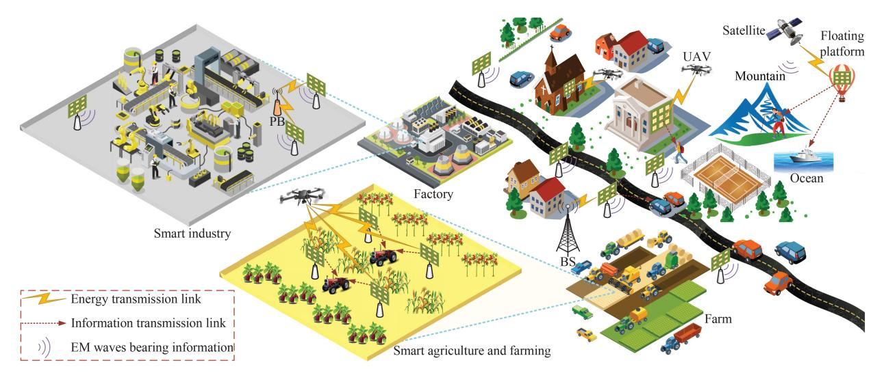

Fig. 1. Illustration of RIS-BackCom use scenarios in future wireless networks.

rate enhancement, and security, need to be solved. Researchers have proposed and solved diversified communication problems, including performance analysis and optimization in RIS-BackCom systems, which will be discussed in Sections [III](#page-11-0) and [III-E,](#page-17-0) respectively. Nonetheless, these endeavors are still immethodical and cannot provide a systematic tutorial for more relevant research and practical design in the future. In this context, for further research and development in this area, it is necessary to categorize the existing works and contributions to gain a deeper understanding, yielding one of the goals of this paper. Further, based on previous literature, the emerging use cases and potential challenges of the RIS-BackCom technique need to be comprehensively envisioned to inspire future studies, constituting another goal of this paper.

#### *B. Motivation, Contribution, and Organization*

Although there have been some magazine papers, surveys, and tutorials focusing on RIS, BackCom mechanism, and their variants, including basic concepts, potential improvements, real-world applications, and research challenges [\[46\]](#page-30-30), [\[47\]](#page-30-31), [\[48\]](#page-30-32), [\[49\]](#page-30-33), [\[50\]](#page-30-34), [\[51\]](#page-30-35), [\[52\]](#page-30-36), [\[53\]](#page-30-37), [\[54\]](#page-30-38), [\[55\]](#page-30-39), only a few take into account the RIS's function of being a BD in the BackCom network [\[12\]](#page-29-11), [\[53\]](#page-30-37), [\[54\]](#page-30-38), [\[55\]](#page-30-39). However, there is still a lot of literature considering RISs as BDs in the BackCom networks, except for survey publications. Hence, a comprehensive overview of the RIS-BackCom technique needs to be provided. This is the motivation of this work.

The authors in [\[46\]](#page-30-30) introduced a survey on conventional BackCom networks in terms of channel coding methods. Besides highlighting the potential coding and multiple access techniques, the authors presented challenging issues and future research areas. Note that RIS was not discussed in [\[46\]](#page-30-30). Correspondingly, the authors in [\[47\]](#page-30-31) reviewed the research on BackCom and RIS. However, the advantages of RIS in BackCom were not exploited. Different from [\[46\]](#page-30-30) and [\[47\]](#page-30-31), the authors in [\[48\]](#page-30-32) introduced the fundamentals of conventional BackCom, principles of RIS, applications of RIS-assisted BackCom networks, and challenges in future design. Meanwhile, the performance of an RIS-assisted BackCom system based on NOMA was evaluated. However, the discussion on RIS-BackCom was absent. The authors in [\[49\]](#page-30-33) designed a prototype of RIS and used it to optimize the phase of the EM waves by controlling voltage. It was utilized in a BackCom system to enhance the signal power received at the BD. The RIS's passive beamformer was optimized to minimize the bit error rate (BER) in the proposed RIS-assisted system. The authors in [\[50\]](#page-30-34) accomplished a comprehensive survey of the artificial intelligence (AI) enabled BackCom technique from the perspective of IoT. Although the RIS-aided BackCom network was mentioned, the main idea of [\[50\]](#page-30-34) was to overview and envision the application of AI to conventional BackCom networks. The detailed survey of RIS-enabled BackCom systems was not discussed. The authors in [\[51\]](#page-30-35) surveyed the existing literature on millimeter-wave (mmWave) BackCom systems, including the fundamental principles, applications, and challenges. Notably, signals experience fading during their transmission from the RF emitter to the BD and then from the BD to the BR, resulting in dual-path fading. Aiming to combat the inevitable interference and dual-path fading in BackCom systems, the authors in [\[52\]](#page-30-36) thoroughly reviewed the existing solutions for these problems, while RIS-assisted BackCom techniques were also mentioned to overcome the dual-path fading. It is worth noting that RIS was considered a transmission helper rather than an information transmitter in [\[46\]](#page-30-30), [\[47\]](#page-30-31), [\[48\]](#page-30-32), [\[49\]](#page-30-33). Further, we primarily overview the RIS-enabled BackCom technique instead of the BackCom networks, differing from [\[50\]](#page-30-34), [\[51\]](#page-30-35), [\[52\]](#page-30-36).

For the function of RIS as a sender, researchers have made some efforts–for instance, the authors in [\[53\]](#page-30-37) integrated the programmable wireless environment technique with BackCom networks. Despite the preliminary idea of using RIS as a BD, which was proposed as a future direction, the definite concept of RIS-BackCom was still deficient. Besides, the authors in [\[12\]](#page-29-11) provided an overview of RIS-BackCom for future wireless networks. The basics of BackCom and RIS were first introduced, followed by the classification of RIS-BackCom

TABLE I COMPARISON OF THIS PAPER WITH RELATED MAGAZINE PAPERS, SURVEYS, AND TUTORIALS. HERE, "(A)" REFERS TO CONVENTIONAL BACKCOM TECHNIQUE, "(B)" RIS TECHNIQUE, "(C)" REFERS TO RIS-BACKCOM NETWORKS, AND "(D)" REFERS TO RIS-ASSISTED BACKCOM NETWORKS

|                                                                       | Contribution |           |     |     |              |     |          |          |           |          |        |            |
|-----------------------------------------------------------------------|--------------|-----------|-----|-----|--------------|-----|----------|----------|-----------|----------|--------|------------|
| Objective                                                             | Theori       | es and fu |     |     | ice analysis |     | ization  | 1 1 1    | ons in 6G |          | lenges | Reference  |
|                                                                       | (A)          | (B)       | (C) | (C) | (D)          | (C) | (D)      | (C)      | (D)       | (C)      | (D)    |            |
| Survey on channel coding schemes for BackCom                          | ~            | ×         | ×   | ×   | ×            | ×   | ×        | ×        | Х         | X        | X      | [46]       |
| Survey on future full-duplex communications                     | ~            | ~         | Х   | ×   | ×            | Х   | ×        | ×        | Х         | ×        | ×      | [47]       |
| RIS-assisted BackCom for 6G IoT networks                           | ~            | ~         | ×   | X   | ~            | ×   | ×        | ×        | /         | X        | /      | [48]       |
| Prototype of practical RIS-assisted BackCom                        | ×            | ~         | Х   | Х   | <b>/</b>     | ×   | ×        | Х        | <b>'</b>  | X        | Х      | [49]       |
| Survey on AI-enabled BackCom for IoT networks                   | ~            | ×         | ×   | ×   | ×            | ×   | ×        | ×        | •         | ×        | X      | [50]       |
| Overview of mmWave BackCom networks                                | /            | X         | ×   | X   | ×            | ×   | ×        | X        | X         | ×        | X      | [51]       |
| Review of solutions for specific challenges in BackCom networks | ~            | ×         | ~   | ×   | ×            | ×   | ×        | ~        | /         | /        | ~      | [52]       |
| Preliminary RIS-BackCom concept for 6G systems                        | ~            | ~         | ×   | Х   | ~            | Х   | ×        | /        | /         | ×        | X      | [53]       |
| RIS-based V2V BackCom in SAGOI-Net                                 | /            | ~         | ~   | ×   | ×            | ~   | ×        | /        | ×         | ×        | X      | [54]       |
| Overview of different RIS-assisted BackCom networks             | ~            | ~         | ×   | ~   | ~            | ×   | ×        | ×        | <b>'</b>  | ×        | ~      | [55]       |
| Overview of RIS-BackCom for future wireless network                   | ~            | ~         | •   | ~   | ×            | ×   | ×        | <b>✓</b> | X         | <b>✓</b> | X      | [12]       |
| Comprehensive survey and outlook on RIS-BackCom                 | ~            | ~         | ~   | ~   | ~            | /   | <b>'</b> | <b>✓</b> | ~         | <b>✓</b> | ~      | This paper |

networks. The authors also presented the applications and challenges to facilitate further research. However, the specific modulation schemes in RIS-BackCom were not mentioned in [\[12\]](#page-29-11), and a detailed discussion of system-level performance and optimization needed to be improved. Further, the authors in [\[54\]](#page-30-38) considered vehicle-to-vehicle (V2V) systems in the context of SAGOI-Net. Although RIS-BackCom was applied to V2V networks and optimization was implemented, the intrinsic performance of RIS-BackCom networks, such as the channel estimation procedure, was not analyzed. Further, the authors in [\[55\]](#page-30-39) considered the networks where RIS was used for data transmission. In these networks, RIS was able to transmit the secondary information while enhancing the primary information from existing transmitters, which was similar to the symbiotic radio (SR) systems.[1](#page-3-0) Nonetheless, we mainly implement our survey based on the function of RIS as a sender, yielding the RIS-BackCom network. In this network, the RIS sends information independently, while the other transmitters' signals are not mandatory. Furthermore, we analyzed the modulation, channel estimation, and optimization issues in the following sections. For better illustration, Table [I](#page-3-1) compares the works in this paper with those in related magazine papers, surveys, and tutorials.

The RIS-BackCom technique enables the RIS to transmit information without the need for active RF components, which significantly reduces energy consumption. This approach has the potential to achieve wireless data transmission with ultralow energy consumption. In this context, a comprehensive overview of the RIS-BackCom technique is essential to provide new insights for further research and practical implementation in future wireless networks. To our knowledge, none of the existing works comprehensively surveys the diversified functionalities, emerging applications, challenges, and potential solutions of the RIS-BackCom technique. Hence, we aim to fill this gap specifically. Herein, the main contributions of this treatise are as follows.

- We overview the basic principles as well as the classification of BackCom networks and RIS. We then introduce two functions of RIS in BackCom, i.e., pure helper and message sender. In addition, three modulation schemes of RIS in the BackCom procedure are also summarized.
- We discuss the performance of RIS-BackCom systems with different modulation methods. We also investigate two achievable channel estimation approaches. Besides, we present SR technique and related research developed from RIS-BackCom networks.
- We identify optimization issues to improve the upperbound performance of RIS-BackCom networks from three perspectives, i.e., spectrum and energy efficiency

1Different from cognitive radio, there is a symbiosis between the two networks in SR systems, which will be discussed in Section [VI-D](#page-28-0) in detail

- and physical layer security (PLS). We systematically survey specific minimization and maximization problems.
- Based on the above-mentioned issues, we summarize the superiority of the RIS-BackCom technique in terms of low-power and cost-effective transmission. Further, we extend our discussion of current RIS-BackCom systems to diverse emerging use cases in future 6G networks.
- We discuss the major challenges related to practical implementation, instantaneous control techniques, transmission distance, PLS, and channel fading characteristics in future RIS-BackCom systems. Correspondingly, the potential solution techniques are also discussed to inspire further research.

Fig. 2 illustrates the overall organization of this paper. Specifically, Section II categorizes the legacy BackCom and RIS-BackCom systems and introduces their basic principles. In Section III, we then analyze the modulation and channel estimation methods and discuss the performance of benchmark schemes. Section IV presents various applications and the common optimization problems of RIS-BackCom networks. Based on Section VII, Section V envisions emerging cases and applications toward 6G systems. In Section VI, we finally propose the main challenges of the future RIS-BackCom systems and some potential solutions and conclude this paper. For ease of reference, the main nomenclature and its definition in this paper are summarized in Table II.

# II. PRINCIPLES AND CATEGORIZATION OF RIS-BACKCOM SYSTEMS

Conventional BackCom networks aim to facilitate extremely low-power transmission while constantly undergoing the double-fading effect, leading to the extreme weakness of the received signals at the BRs. RIS can capture the EM waves and reflect them in the desired direction. The numerous reflecting elements endow RIS with high beamforming gain. Thus, applying RIS to BackCom networks can alleviate the short-comings of the latter. This section surveys the basic principles and the classification of conventional BackCom networks and the fundamental structure of RIS, laying the foundation for various applications of RIS in BackCom systems. Then, we introduce typical functions of RIS in BackCom networks and summarize the commonly used modulation methods.

#### A. Theories and Classification of Conventional BackCom

A fundamental legacy BackCom network consists of the PB, the BDs, and the BRs. Based on the antenna scattering theory in [60], when the EM waves impinge on the BD's antennas, the scattering procedure occurs according to the function in the following:

$$\vec{E} = \vec{E_0} - \frac{Z - Z_{\rm m}}{Z + Z_0} I_{\rm m} \frac{\vec{E_a}}{I_{\rm t}},$$
 (1)

where  $\vec{E}$  is the scattered field at the antenna.  $\vec{E_0}$  denotes a constant field influenced by the physical properties, which can be measured through the antenna impedance. Z and  $Z_0$  are the antenna load impedance with incident EM signals and the antenna impedance, respectively.  $\vec{E_a}$  denotes the antenna

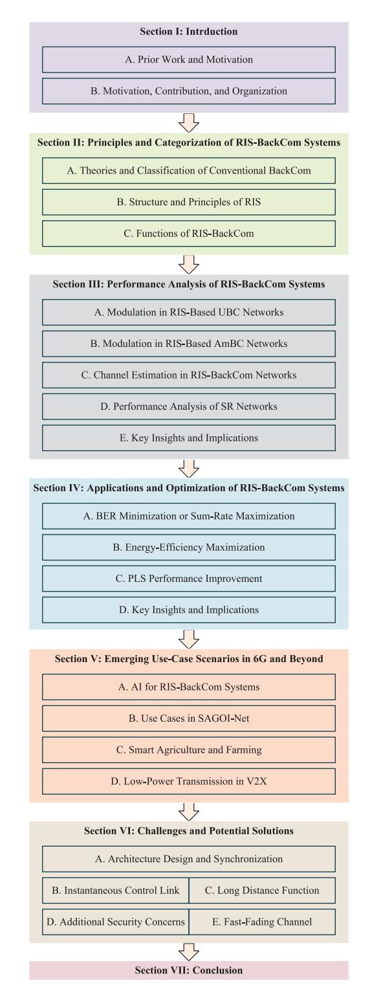

Fig. 2. Organization of this paper.

radiated field with the terminal current  $I_t$  and  $I_m$  is the current with the matched load impedance  $Z_m$  [61].

There are two kinds of scatter after the incidence of EM waves on the BD's antennas. For the first one, the incident EM wave is reflected because of the dissimilarity between the antenna material and the free space. For the second one, the antenna circuit reflects the residual wave due to the

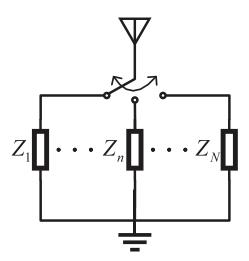

Fig. 3. Conventional backscatter modulation with *N* states.

discontinuity of the load impedance and the antenna. Finally, the BD's antennas return the EM wave to the free space.

Based on the scattering procedure shown in Eq. [\(1\),](#page-4-2) we can analyze the backscatter modulation in the conventional BackCom. Specifically, Fig. [3](#page-5-0) shows the backscatter modulation with *N* states. The BD can map its symbols to the different reflection coefficients by changing the antenna load impedance and thus transmits its own information to BR, yielding the legacy backscatter modulation. Let A*c* be the collection of the constellation symbols, *c*[*n*] the *n*th symbol transmitted by the BD, the corresponding reflection coefficient Γ can be expressed as

$$\Gamma = \alpha \frac{c[n]}{\max_{c \in \mathcal{A}_c} |c|} = \frac{Z_n - Z_{\text{m}}}{Z_n + Z_0},\tag{2}$$

where α denotes the reflection efficiency. Note that this parameter is constant and influenced by the backscatter power. Correspondingly, the antenna load impedance at the BD can be designed as follows.

$$Z_n = \frac{\Gamma Z_0 + Z_{\rm m}}{1 - \Gamma}.$$
 (3)

It is seen that *Zn* can be obtained based on Γ, which is designed according to the specific symbol.

According to the location of the PB, BackCom networks can be classified into two categories, i.e., monostatic backscatter communication (MBC) [\[62\]](#page-30-42), [\[63\]](#page-30-43), [\[64\]](#page-31-0), [\[65\]](#page-31-1) and bistatic backscatter communication (BBC) [\[66\]](#page-31-2), [\[67\]](#page-31-3), [\[68\]](#page-31-4), [\[69\]](#page-31-5), which are shown in Fig. [4.](#page-5-1) It is seen that the BR and the PB are combined in MBC while separated in BBC. Furthermore, when the EM waves are pure sinusoidal signals from the specific transmitter, the BackCom procedure is called unmodulated backscatter communication (UBC) [\[70\]](#page-31-6). The signals can also be RF signals from the external environment, such as cellular BSs and TV towers, yielding ambient backscatter communication (AmBC) system [\[71\]](#page-31-7), [\[72\]](#page-31-8), [\[73\]](#page-31-9), [\[74\]](#page-31-10). In a BackCom network, the PB emits the RF signals through the forward link, and after the BD's backscatter modulation, the BD's signals bearing information can be sent to the BR. Note that direct link interference exists from the PB to the BR in AmBC, which intensely reduces the received signals' quality at the BR. Thus, aiming to eliminate this adverse effect, the SR technique flourishes. In an SR system, the EM waves from the primary network (PN) are used as carriers for BackCom in the secondary network (SN), which means that there is a symbiosis between the two networks. Specifically, on the one hand, the SN without active RF

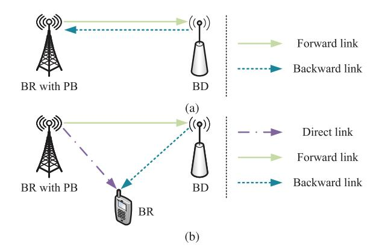

Fig. 4. Two architectures in BackCom: (a) MBC; (b) BBC.

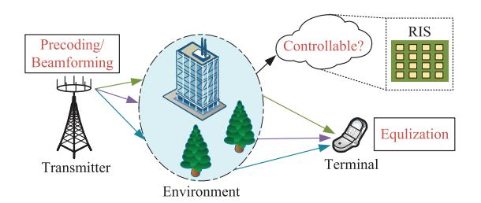

Fig. 5. RIS-assisted wireless communications.

components leverages the RF signals from the PN for lowpower BackCom. On the other hand, the PN benefits from the multipath components generated by the SN [\[75\]](#page-31-11). The users (UEs) in SN adopt the successive interference cancellationbased (SIC-based) detector to subtract the information from the PN and then decode the desired message, realizing the joint decoding of received composite signals.

In MBC networks, the unmodulated signals are leveraged by the BD, which requires a specialized spectrum. The direct link interference can be eliminated because of the received signal type. In addition to unmodulated signals, the signals can be ambient modulated RF signals in BBC networks, yielding AmBC and SR. Compared with the SR network, the AmBC network undergoes direct link interference since the BR cannot subtract the ambient signals from the received composite signals. However, the BR in the SR network desires signals from both the PB and the BD, and thus, direct interference is non-existent in the SR network. Unlike UBC, the specialized spectrum is not mandatory in the AmBC and the SR networks because of the different modulation modes, which are discussed in detail in Section [II-C.](#page-9-0) Table [III](#page-6-1) illustrates the categorization and comparison of conventional BackCom networks and the summary of the related works.

#### *B. Structure and Principles of RIS*

RIS is a two-dimensional (2D) surface with controllable macroscopic physical property [\[83\]](#page-31-12). The main characteristic of RIS is its ability to manipulate the EM waves' characteristics arbitrarily. From the wireless communications point of view, the logic of the RIS's emergence can be seen in Fig. [5.](#page-5-2) Aiming to alleviate the adverse effects caused by the multipath effect, there have been lots of conspicuous technologies such as

TABLE II LIST OF MAIN NOMENCLATURE

| Nomenclature | Definition                                   | Nomenclature | Definition                                  |
|--------------|----------------------------------------------|--------------|---------------------------------------------|
| 5G           | Fifth-generation                             | OOK          | On-off keying                               |
| 6G           | Sixth-generation                             | OTFS         | Orthogonal time-frequency space             |
| ADMM         | Alternative direction method of multipliers  | PB           | Power beacon                                |
| AI           | Artificial intelligence                      | PIN          | Positive intrinsic-negative                 |
| AmBC         | Ambient backscatter communication            | PLS          | Physical layer security                     |
| AP           | Access point                                 | PN           | Primary network                             |
| BackCom      | Backscatter communication                    | PSK          | Phase shift keying                          |
| BBC          | Bistatic backscatter                         | QAM          | Quadrature amplitude modulation             |
| BCD          | Block coordinate                             | QoS          | Quality of service                          |
| BD           | Backscatter device                           | QR           | Quick response                              |
| BER          | Bit error rate                               | RF           | Radio frequency                             |
| BR           | Backscatter receiver                         | RFID         | Radio frequency identification              |
| BS           | Base station                                 | RIS          | Reconfigurable Intelligent Surface          |
| CRA          | Cooperative receiver architecture            | RIS-BackCom  | RIS backscatter communication               |
| CSI          | Channel state information                    | RL           | Reinforcement learning                      |
| C-V2X        | Cellular vehicle to everything               | RSMA         | Rate-splitting multiple access              |
| DC           | Direct current                               | RSUs         | Roadside units                              |
| DL           | Deep learning                                | SAGOI-Net    | Space-air-ground-ocean-integrated network   |
| DRL          | Deep reinforcement learning                  | SC           | Symbiotic coevolution                       |
| DSRC         | Dedicated short-range communication          | SCA          | Successive convex approximation             |
| EM           | Electromagnetic                              | SDR          | Semidefinite relaxation                     |
| ESC          | Extremum seeking control                     | SIC          | Successive interference cancellation        |
| FDD          | Frequency-division duplexing                 | SIMO         | Single-input multiple-output                |
| FM           | Frequency modulation                         | SISO         | Single-input single-output                  |
| FPGA         | Field-programmable gate array                | SN           | Secondary network                           |
| FSK          | Frequency shift keying                       | SNR          | Signal-to-noise ratio                       |
| GPM          | Generalized power method                     | SR           | Symbiotic radio                             |
| IoT          | Internet of Things                           | SRA          | Separate receiver architecture              |
| LoRa         | Long range radio                             | SS           | Symbiotic synthesis                         |
| MBC          | Monostatic backscatter communication         | SSK          | Space shift keying                          |
| MCQT         | Multidimensional complex quadratic transform | STAR         | Simultaneously transmitting and reflecting  |
| MEC          | mobile-edge computing                        | TDD          | Time-division duplexing                     |
| MIMO         | Multiple-input multiple-output               | TDMA         | Time-division multiple access               |
| MISO         | Multiple-input single-output                 | THz          | Terahertz                                   |
| ML           | Maximum likelihood                           | UAV          | Unmanned aerial vehicle                     |
| MM           | Majorization-minimization                    | UBC          | Unmodulated backscatter communication       |
| MMSE         | Minimum mean square error                    | UE           | User                                        |
| mmWave       | Millimeter-wave                              | V2I          | Vehicle-to-infrastructure                   |
| MSE          | Mean-square error                            | V2V          | Vehicle-to-vehicle                          |
| NB-IoT       | Narrow band Internet of Things               | V2X          | Vehicle-to-everything                       |
| NOMA         | Non-orthogonal multiple access               | Wi-Fi        | Wireless fidelity                           |
| OFDM         | Orthogonal frequency division multiplexing   | WiMax        | World interoperability for microwave access |

TABLE III SUMMARY OF WORKS RELATED TO CONVENTIONAL BACKCOM NETWORKS

| BackCo | BackCom Type   Location of the PB |                                 | Signal Type | Direct Link Interference | Spectrum    | Reference  |
|--------|-----------------------------------|---------------------------------|-------------|--------------------------|-------------|------------|
| MBC    | UBC                               | Combined with the BR            | Unmodulated | Can be eliminated        | Specialized | [70], [76] |
|        | UBC                               |                                 | Unmodulated | Can be eliminated        | Specialized | [77], [78] |
| BBC    | AmBC                              | Separated from the BR Modulated |             | Existent                 | Shared      | [79], [80] |
|        | SR                                |                                 | Wiodulated  | Inexistent               | Shared      | [81], [82] |

precoding and beamforming at the transmitter, equalization at the terminal, multiple-input multiple-output (MIMO), etc. However, all of them are implemented by the transceiver and are limited by the hardware complexity and energy consumption criterion. In this scenario, researchers attempt to explore the manipulability of signals in their wireless propagation, yielding the initial idea of RIS. With the help of RIS, the characteristics of the transmitted EM waves can be artificially managed in the desired modes. In other words, the multipath effect is transformed into an advantage for wireless communication with the emergence of RIS. In this subsection, the categories of RIS and their structures are first summarized. Then, we analyze the RIS's reflection principles and categorize its reflection coefficients based on the existing literature, laying the foundation for the analysis of RIS-BackCom networks.

*1) Categories of RIS:* There are many categories of existing RIS technique [\[83\]](#page-31-12). According to the hardware structure, RIS can be classified into metamaterial-based and patcharray-based architectures. Herein, it is worth noting that the metasurfaces denote the metamaterial-based RIS. RIS can be deployed in the transmission links and used as reflecting or refracting surfaces, while they can also be waveguide surfaces at the transmitters. Meanwhile, one of the main limitations of RIS is that the receivers are required to be located on the

| Structure        | •2D metamaterial based                  | Antonno goin    | •21.7 dBi at 2.3 GHz                       |
|------------------|-----------------------------------------|-----------------|--------------------------------------------|
| Structure        | •2D path-array based                    | Antenna gain    | •19.1 dBi at 28.5 GHz                      |
|                  | •Reflecting surface •Refracting surface |                 | •FPGA                                      |
| Used Type        | Waveguide surface •Active surface       | Controller      | Bias network                               |
|                  | •STAR-RIS •Planar-antenna surface       |                 | •DC voltage source                         |
| Element Interval | •Half wavelength                        | Frequency Range | •Full-frequency response                   |
| Element Interval | •STAR-RIS •Planar-antenna surface       | rrequency Kange | -i un-nequency response                    |
|                  | Binary relay                            |                 |                                            |
| Phase Control    | Binary PIN diodes                       | Element Size    | Half wavelength                            |
| rnase Control    | Varactor diodes switches                | Element Size    | •5 $\sim$ 10 times smaller than wavelength |
|                  | DIN switches and versator diadas        |                 |                                            |

TABLE IV
SUMMARY OF BASIC INFORMATION OF RIS

same side as the emitter. The reason is that RIS is a pure reflective surface. To tackle this limitation, researchers have proposed a simultaneously transmitting and reflecting intelligent reflecting surface (STAR-RIS). STAR-RIS can realize full-space coverage since its reflecting elements can transmit and reflect EM waves simultaneously [84]. However, the short transmission distance limits the application range of passive RIS. To solve this, RIS can be equipped with power amplifiers to overcome the transmit attenuation, yielding active RIS. In addition, researchers have also investigated planar-antenna surfaces [85], which are similar to the legacy active points. The broader definition of RIS includes additional functionalities, such as transmission and scattering. However, the fundamental mechanism of BackCom can be applied to various types of RIS, though the received signal components may differ. For example, an active RIS may introduce noise, requiring different algorithmic designs. This paper aims to review existing research and offer insights into potential future directions. Accordingly, we primarily focus on passive reflective RIS composed of metamaterials to provide a detailed discussion of the RIS-BackCom technique in the following sections.

2) Structure of RIS: RIS is an artificial metasurface composed of plentiful passive reflecting elements. These elements are fixed on the control substrate and made of metallic or dielectric particles, each combined with a varactor diode. The element interval and size are generally set as half wavelength or even  $5 \sim 10$  times smaller than the wavelength. The RIS can realize phase shifts and beamforming by adjusting the biasing voltage levels, which is dominated by an RIS controller such as a field-programmable gate array (FPGA), a direct current (DC) voltage source, etc [86]. The RIS's phase control can be realized by binary positive intrinsic-negative (PIN) diodes, varactor diodes, binary relay switches, etc. Moreover, RIS can support different operating frequencies, enabling it to backscatter various signals in a wireless environment. RIS can realize full-frequency response and considerable antenna gain [54]. The author in [87] investigated specific configurations and responses of RIS with multiple frequency bands. For instance, the authors in [88] demonstrated that considered RIS consisting of 47 elements and one-bit programmable metaatoms achieved the most efficient performance at 2.5 GHz within a 400 MHz bandwidth. The authors in [89] developed a type of RIS with 256 reflecting elements. Using the proposed prototype composed of modular hardware and flexible software, the performance evaluation showed that the developed

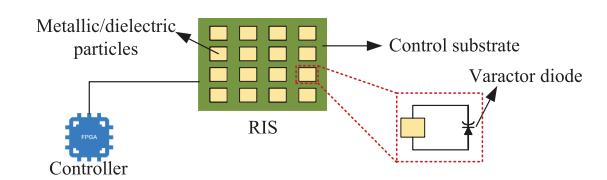

Fig. 6. Basic architecture of RIS.

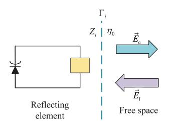

Fig. 7. Basic reflection principle of RIS.

RIS was able to achieve a 21.7 dBi at 2.3 GHz and a 19.1 antenna gain at 28.5 GHz. To directly illustrate, the complete basic architecture of RIS can be seen in Fig. 6. It is seen that RIS requires electricity to support its controller and program. We emphasize that passive RIS means that its elements bring no power amplification while purely reflecting the EM waves, differing from the active point equipped with power amplifiers. For ease of illustration, we summarize the fundamental information of RIS in Table IV.

3) Principles of RIS: RIS recasts the incident EM waves' amplitude and phase by designing its reflection coefficient. However, RIS's reflection coefficient changes not based on the transformation of the elements' physical angle but on the change of equivalent load impedance. Fig. 7 shows the primary process of RIS's EM wave remodeling. When the EM waves impinge on the boundary between the free space and the RIS elements, the reflection occurs because of the inhomogeneity of the transmission medium [90]. Specifically, the reflection coefficient of the *i*th element is represented as

$$\Gamma_i = \frac{Z_i - \eta_0}{Z_i + \eta_0} = A_i e^{j\theta_i},\tag{4}$$

where  $Z_i$  is the equivalent load impedance of the ith element.  $\eta_0$  is the constant free space characteristic impedance related to the electric and magnetic fields generated by EM waves.  $A_i$  and  $\theta_i$  denote the ith element's adjustable amplitude and phase shift, respectively. Let  $\vec{E}_{\rm c}$ ,  $\vec{E}_i$ ,  $A_{\rm c}$ , and  $\theta_{\rm c}$  represent

the incident EM wave, reflected field from the *i*th element, amplitude and phase of the incident EM wave, respectively. It is deduced that

$$\vec{E}_i = \Gamma_i \vec{E}_c = \Gamma_i A_c e^{j\theta_c} = A_i A_c e^{j(\theta_i + \theta_c)}.$$
 (5)

Notice that Eq. (4) and Eq. (5) show the principle of the RIS controlling incident EM waves' amplitude and phase shift. By designing the equivalent load impedance  $Z_i$ , the characteristics of the EM waves can be manipulated. Ideally, the amplitude and phase of each RIS element are independently controlled.

In order to establish a clear framework for the analysis of the RIS-BackCom technique, the commonly considered types of RIS reflection coefficient with L elements in the existing literature can be categorized as follows.

i) Ideal Reflection Coefficient [91], [92], [93]: The amplitude and phase of each element can be artificially and independently designed, which is expressed as

$$S_1 = \left\{ v_l = \beta_l e^{j\theta_l} | \ \theta_l \in [0, 2\pi], \ 0 \le \beta_l \le 1 \right\}, \quad (6)$$

where  $v_l$  denotes the coefficient of the RIS's lth element with  $l \in \mathcal{L} = \{1, 2, \dots, L\}$ .  $\beta_l$  and  $\theta_l$  are the corresponding amplitude and phase, respectively. Note that the constant amplitude of each RIS element is a common assumption in current research regarding RIS [94], [95], [96], which can be considered as a special case of  $\mathcal{S}_1$ .

ii) Discrete Reflection Coefficient [97], [98], [99]: The amplitude of each element is constant while the phase shift is discrete. For m-bit modulation RIS, the reflection coefficient with  $M=2^m$  can be denoted by

$$S_2 = \left\{ v_l | \theta_l \in \left[ 0, \frac{2\pi}{M}, \dots, \frac{2\pi(M-1)}{M} \right] \right\}. \tag{7}$$

Note that RIS can only discretely adjust the phase of each reflecting element in practical manipulation because of the limitation of the existing hardware, which is in line with  $S_2$ . Although  $S_2$  is more practical than  $S_1$  in terms of the implementation, the research based on  $S_1$  will provide an upper bound of communication performance, such as outage probability, energy efficiency, spectral efficiency, and BER, for most of the relevant works [100], [101], [102]. Based on these structure and principles, the overall channel gain in wireless networks can be further improved through RIS modifications.

For instance, consider a simple wireless network with a transmitter and receiver. Let  $\mathbf{h} \in \mathbb{C}^{1 \times A}$  represent the channel from the A-antenna transmitter to the single-antenna receiver. By applying beamforming, the overall channel gain is expressed as  $|\mathbf{h}\mathbf{w}|^2$ , where  $\mathbf{w} \in \mathbb{C}^{A \times 1}$  is the beamformer. Introducing a RIS with reflection coefficients  $\mathbf{\Theta} \in \mathbb{C}^{E \times E}$ , where E represents the number of RIS elements, we update the channel model. The channels from the transmitter to the RIS and from the RIS to the receiver are represented by  $\mathbf{H} \in \mathbb{C}^{E \times A}$  and  $\mathbf{g} \in \mathbb{C}^{1 \times E}$ , respectively. The overall channel gain becomes  $|\mathbf{g}\mathbf{\Theta}\mathbf{H}\mathbf{w}|^2$ . Jointly optimizing the RIS reflection coefficients and the transmitter's beamforming vector enhances the channel gain compared to the conventional  $|\mathbf{h}\mathbf{w}|^2$  without RIS. The additional spatial freedom offered by multi-element

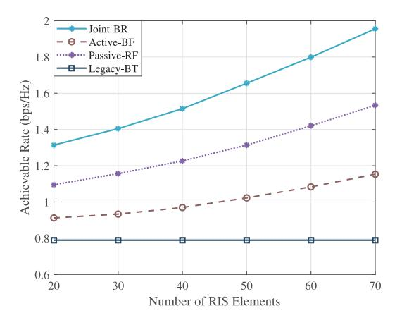

Fig. 8. Effect of the number of RIS elements on the achievale rate with different schemes.

RIS contributes to this improvement. Furthermore, RIS can be integrated with other wireless communication technologies, making it suitable for applications like BackCom networks.

Furthermore, RIS-assisted wireless communication networks offer advantages in terms of both energy and spectrum efficiency. For instance, the authors in [103] investigated a RIS-aided simultaneous wireless information and power transfer network and demonstrated significant improvements in energy efficiency through the adoption of RIS. Similarly, the authors in [104] mounted a RIS on a UAV to enhance transmission between a base station and a ground user, and they demonstrated improvements in both energy and spectrum efficiency with the use of programmable RIS. Additionally, we have conducted a preliminary simulation analysis of the transmission rate performance in a RIS-assisted wireless communication network. In this simplified system, a RIS is deployed between a multi-antenna transmitter and a single-antenna receiver. The transmitter sends data using beamforming, and the wireless signals are reflected by the RIS during transmission. In this scenario, we jointly optimize the beamforming and RIS reflection coefficients to maximize the achievable rate of the communication system. For comparison, we proposed three additional schemes, which are summarized as follows:

- Joint-BR: This scheme jointly optimizes the transmitter's beamformer and RIS reflection coefficient.
- Active-BF: This scheme designs the transmitter's beamformer with the random RIS reflection coefficent.
- Passive-RF: This scheme only optimizes the RIS reflection coefficient, while the transmitter's beamformer is randomly generated.
- Legacy-BT: This legacy scheme purely designs the transmitters' beamformer in the wireless network without using any RIS.

Without loss of generality, assuming all links follow the quasi-static flat Rayleigh fading distribution, the path loss can be modeled as  $PL = (PL_0 - 20\rho \lg(d/d_0))$  dB, where  $\rho$  is the path loss exponent and  $d_0 = 1$  m is the reference distance.  $PL_0 = -20 \text{dB}$  represents the path loss at  $d_0$ . The other simulation parameters are as follows: the total transmit power of the transmitter is 27 dBm; the number of transmitter

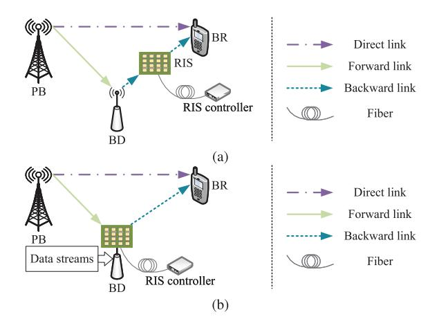

Fig. 9. Two functions of RIS in BackCom: (a) RIS acts as a collaborator; (b) RIS acts as a BD.

antennas is 4; the distances from the transmitter to the RIS and from the RIS to the receiver are 10 m, while the distance from the transmitter to the receiver is 30 m. The noise variance is set to −60 dBm, and all path loss exponents are given by ρ = 2. The experiment is repeated 200 times and averaged to obtain the simulation results. As shown in Fig. [8,](#page-8-1) the three RIS-assisted schemes achieve higher rates compared with the Legacy-BT scheme without RIS. Moreover, the Passive-RF scheme outperforms the Active-BF scheme in terms of the achievable rate. This is because the RIS, with its multiple reflecting elements, provides a higher degree of spatial freedom than the conventional transmitter, which has a limited number of antennas. Thus, the RIS can achieve a higher beamforming gain compared to the transmitter. Furthermore, jointly optimizing the RIS reflection coefficient and the transmitter's active beamformer can further enhance the achievable rate, as demonstrated by the Joint-BR scheme. Additionally, it is worth noting that RIS can be utilized with other wireless communication technique for further improvement, thus being suitable for various scenarios such as BackCom networks.

#### *C. Functions of RIS-BackCom*

For conventional BackCom networks, both the forward and the backward links undergo channel fading, especially the Rayleigh fading, which results in the shortage of doublefading effect in the BackCom procedure. It is worth noting that the reflection mechanism of RIS and BackCom is similar, and thus, RIS can be applied to BackCom and make up for the channel fading problem. In general, RIS has two functions in the BackCom. On the one hand, it can be deployed in the transmission links to assist the communication as a **collaborator**. On the other hand, in addition to the ability of performance improvement, RIS can realize high-performance passive modulation to transmit its message [\[12\]](#page-29-11). Thus, RIS can be used as a **BD** to send information to the BR. Fig. [9](#page-9-1) illustrates the two functions of RIS in BackCom networks.

When RIS acts as a helper, as shown in Fig. [9\(](#page-9-1)a), the transmission links can be enhanced or suppressed by designing the RIS's reflection coefficient. More specifically, RIS can be fixed on dynamic devices such as UAVs [\[105\]](#page-31-34) or static places such as buildings [\[106\]](#page-31-35). Then, RIS can capture the desired signals to emit them in a specific location through beamforming. In the system model described in Fig. [9\(](#page-9-1)b), RIS is utilized as a BD. It reflects the incident EM waves from the PB and transmits its information to the BR according to the data streams from IoT sensing devices, BSs, etc. With both functions, it is worth noting that RIS can further suppress the direct interference from the PB to the BR in AmBC scenarios. The reason is that RIS has a high degree of spatial freedom, significantly improving its passive beamforming ability.

A great deal of literature has focused on RIS's function shown in Fig. [9\(](#page-9-1)a), which is pure reflection without modulation. Hence, most of the proposed technologies for RIS [\[120\]](#page-32-0), [\[121\]](#page-32-1), [\[122\]](#page-32-2) can be effectively leveraged. In particular, when RIS acts as a BD, the reflection coefficient of RIS needs to be simultaneously designed for both passive beamforming and modulation. Based on the conventional modulation [\[107\]](#page-32-3), [\[108\]](#page-32-4) and spatial modulation [\[109\]](#page-32-5), [\[110\]](#page-32-6) in legacy BackCom networks, researchers have developed and verified several modulation methods for RIS-BackCom networks [\[111\]](#page-32-7), [\[112\]](#page-32-8), [\[113\]](#page-32-9), [\[114\]](#page-32-10), [\[115\]](#page-32-11), [\[116\]](#page-32-12), [\[117\]](#page-32-13), [\[118\]](#page-32-14), [\[119\]](#page-32-15), [\[123\]](#page-32-16), [\[124\]](#page-32-17), [\[125\]](#page-32-18). Specifically, the primary RIS-BackCom modulation schemes can be clarified into three categories as follows.

*1) Conventional Modulation [\[111\]](#page-32-7), [\[112\]](#page-32-8), [\[113\]](#page-32-9), [\[123\]](#page-32-16):* Similar to conventional BackCom modulation, phases and amplitudes of the transmitted signals can be transformed by adjusting the reflection coefficient of RIS, yielding conventional modulation techniques such as phase shift keying (PSK) and quadrature amplitude modulation (QAM). The information on the received signals at the BR depends on the type of RIS-BackCom networks. Specifically, in UBC networks, the incident signal is a pure carrier, and thus, the modulated signal only bears RIS's information. On the other hand, the BD receives the composite signals of the ambient and modulated signals in AmBC networks. The primary modulation procedure in the UBC and the AmBC networks are respectively represented as

$$\Psi s_{\mathbf{p}} = \alpha \Theta x, \tag{8a}$$

$$\mathbf{\Psi}s = \alpha \mathbf{\Theta}sx, \tag{8b}$$

where **Ψ** and **Θ** are the backscattering and reflection matrices, respectively. Besides, *s*p is the pure sinusoidal or cosinoidal signal, *s* is the modulated ambient signal, α denotes the reflection efficiency coefficient and *x* is the signal bearing RIS transmitted information.

*2) Spatial Modulation [\[114\]](#page-32-10), [\[115\]](#page-32-11), [\[116\]](#page-32-12), [\[124\]](#page-32-17):* This is a promising technology widely used in MIMO networks, which maps the desired information to the index of transceiver's antennas. Hence, this modulation approach is especially suitable for AmBC scenarios. Furthermore, this modulation method can be combined with conventional modulation schemes to improve the data transmission rate. Since RIS has a high degree of spatial freedom, the signals with different beamforming designs evoke different responses, yielding spatial modulation.

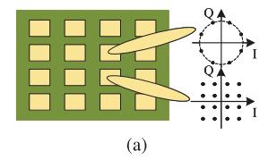

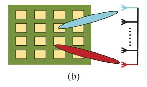

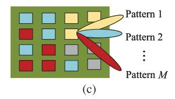

Fig. 10. Three modulation schemes of RIS in BackCom networks: (a) Conventional modulation; (b) Spatial modulation; (c) Reflection pattern modulation.

TABLE V COMPARISON BETWEEN CONVENTIONAL BACKCOM AND RIS-BACKCOM TECHNIQUES

| Technique   | Modulation Scheme             | Realization                   | Information Index       | Capacity | Scenario | Reference    |
|-------------|-------------------------------|-------------------------------|-------------------------|----------|----------|--------------|
| BackCom     | Conventional modulation       | Reflection coefficient design | Phases and amplitudes   | Limited  |          | [107], [108] |
| BackColli   | Spatial modulation            | Active beamforming            | Transceivers' antennas  | Weak     | UBC,     | [109], [110] |
|             | Conventional modulation       | Passive beamforming           | Phases and amplitudes   |          | AmBC     | [111]–[113]  |
| RIS-BackCom | Spatial modulation            | rassive beamforming           | Elements and antennas   | Strong   | AllibC   | [114]–[116]  |
|             | Reflection pattern modulation | Element state adjustment      | Reflection coefficients |          |          | [117]–[119]  |

Specifically, the received signal-to-noise ratio (SNR) at a specific receive antenna is maximized by designing the modulation matrix **Ξ**, which represents a specific symbol's transmission. The BR can leverage a simple energy detector to detect the information from the received signal with the highest energy. The primary modulation procedure can be expressed as

$$\Psi s = \Theta \Xi s = \alpha \Theta x. \tag{9}$$

*3) Reflection Pattern Modulation [\[117\]](#page-32-13), [\[118\]](#page-32-14), [\[119\]](#page-32-15), [\[125\]](#page-32-18):* The main idea of this scheme is to map the different RIS's reflection coefficients to the multiple corresponding symbols. Specifically, the RIS controller can adaptively change the on/off state of each element of RIS according to the input data streams, yielding the reflection pattern modulation. Meanwhile, the turned-on elements can be further designed to achieve passive beamforming for system optimization. This modulation scheme is applicable to both UBC and AmBC scenarios. The primary modulation procedure can be represented as

$$\Psi \mathbf{T} s_{\mathbf{p}} = \alpha \mathbf{\Theta}_{n}, \tag{10a}$$

$$\Psi \mathbf{T} s = \alpha \mathbf{\Theta}_n s, \tag{10b}$$

where **T** denotes the on/off state matrix of RIS. Additionally, **Θ***n* is denoted by the reflection coefficient of RIS, corresponding to the *n*th symbol to be transmitted.

These three RIS-BackCom modulation modes are illustrated in Fig. [10.](#page-10-0) To summarize, unlike spatial modulation, the conventional and reflection pattern modulation schemes map the information symbols to the phases, amplitudes, or reflection coefficients of the reflected signals. In this case, the ambient signals intensely jeopardize the BR's signalreceiving performance, and thus, these RF signals may need to be subtracted by the BRs. In other words, besides the spatial modulation method, the other methods face direct path interference from the ambient PB with RF to the BR. Nevertheless, the ambient RF signals also benefit the BR in some scenarios. For example, the messages from the primary and the secondary networks are both desired at the BRs and are jointly decoded through the SIC detector in SR systems [\[82\]](#page-31-36). The detailed analysis and summary of RIS-based SR systems are given in Section [III.](#page-11-0) Compared to traditional transmitters with active antennas, RIS operates independently within the communication environment and does not require RF emitters for data transmission. Instead, when utilizing the RIS-BackCom technique, it passively reflects and modulates incident signals from the wireless environment by adjusting the phase shifts of its elements, resulting in a significant reduction in energy consumption. RIS can be equipped with a large number of reflecting elements, offering a higher degree of spatial freedom compared to conventional transmitters with limited antennas. Unlike active transmitters, the RIS is positioned separately rather than attached to any specific antenna, allowing it to flexibly enhance spectral efficiency without the need for exclusive spectrum allocation. This unique ability to leverage existing electromagnetic waves for data transmission enables RIS-BackCom networks to achieve both higher spectral and energy efficiency than traditional wireless networks.

In addition, the RIS-BackCom technique has a higher passive beamforming gain and can transmit information with a higher data rate than conventional BackCom networks [\[40\]](#page-30-20). RIS-BackCom networks can implement the reflection pattern modulation by adjusting the element state, and thus, the channel capacity of the systems can be enhanced [\[126\]](#page-32-19). In addition, RIS is flexible in shape and size and can be deployed in buildings, billboards, walls, etc. Thus, RIS has promising potential to be an alternative to the legacy BD and facilitate ubiquitous connection in future wireless communication systems. Table [V](#page-10-1) shows the comparison between RIS-BackCom and conventional BackCom networks. Further, RIS-BackCom systems necessitate that RISs support efficient modulation schemes. While traditional RIS-assisted networks primarily use RISs as reflectors to enhance transmission, their hardware design does not typically accommodate modulation processes. However, RIS backscatter modulation schemes still rely on the fundamental reflection characteristics of RISs. In conclusion, the basic hardware of RISs does not require specialized design. Instead, more sophisticated designs are needed in the controllers for configuration and computation within practical RIS-BackCom systems.

#### III. PERFORMANCE ANALYSIS OF RIS-BACKCOM SYSTEMS

As discussed in Section II, the RIS-BackCom technique is compatible with existing and emerging wireless communications technologies, attracting much attention from industrial and academic researchers. However, a comprehensive survey on the performance analysis of various RIS-BackCom systems from the communication viewpoint still needs to be provided. Note that the three modulation schemes summarized in Fig. 10 are all implemented through the UBC and AmBC techniques. Consequently, in this section, we systematically survey current RIS-BackCom networks encompassing the detailed modulation approaches based on UBC and AmBC mechanisms, channel estimation methods, and the SR communication technique.

#### A. Modulation in RIS-Based UBC Networks

Based on the modulation schemes summarized in Section II, the performance analysis of different modulation methods in diverse RIS-BackCom networks plays a vital role in the practical designs of wireless communication systems, meaning that the information modulation mode influences the capacity of RIS-BackCom networks. Until now, literature has been devoted to validating the modulation modes and the corresponding detectors. As summarized in Section II, these related works are principally based on UBC and AmBC networks, which are presented in this subsection and the next.

To illustrate the RIS-based UBC networks, let us first focus on prior literature on conventional UBC networks. For instance, some basic modulation methods, such as on-off keying (OOK) [127], [128], frequency shift keying (FSK) [129], and PSK [130], have been investigated and demonstrated with the help of the time-varying antennas mentioned in Section II-A. However, conventional UBC networks suffer from low data rates due to architecture constraints such as the number of transmit antennas [113]. The authors in [127], [128] accomplished OOK modulation in a single-input single-output (SISO) communication system through the time-varying antennas. The achievable data rates were 1 kb/s at 10 GHz carrier frequency and 100 Mb/s at 2.4 GHz carrier frequency. In the same SISO system as [127], [128], the authors in [129], [130] realized binary frequency shift keying (BFSK) with 12 Mb/s at 42/57 MHz and quadrature phase shift keying (QPSK) with 200 kb/s at 7 GHz. In addition, M-QAM modulation mode can also be accomplished in conventional BackCom systems. For instance, the authors in [131], [132] performed 4QAM modulation with 100 kb/s and 400 kb/s at 900-930 MHz carrier frequency, respectively. Furthermore, the authors in [133], [134], [135] realized 16QAM modulation with 96 Mb/s at 900-930 MHz, 120 Mb/s and 960 Mb/s at 2.45 GHz, respectively. In order to further improve the achievable data transmission rate, the authors in [136] investigated a mmWavebased UBC system, where a data rate of 2 Gb/s at 24-28GHz carrier frequency was accomplished with only 0.17 pJ/bit front-end energy consumption. Nonetheless, although a lot of bandwidth can be available in the mmWave band, mmWave signals are attenuated and weak during their transmission. Meanwhile, the channel characteristics will become different from those at the lower band, which indicates that plenty of technical problems still need to be tackled at the mmWave band.

The existing research on conventional UBC networks has shown the drawback of low transmission rates due to the double-fading phenomenon. Therefore, researchers have begun to explore the possibility of using RIS in UBC networks, yielding RIS-based UBC networks. For example, the author in [137] proposed an RIS-based BFSK transmitter with a simplified structure in the SISO system, which achieved a 78.125 kb/s data rate at 3.6 GHz carrier frequency. Based on [137], the authors in [138] developed an RIS-based QPSK prototype transmitter and realized a data rate of 1.6384 Mb/s. Furthermore, the authors in [139] have realized 8PSK modulation for RIS-BackCom, where the achievable data rate reached 6.144 Mb/s. Distinguished from the SISO-based BackCom system in [137], [138], [139], the authors in [113] extended the network to a  $2 \times 2$  MIMO transmission system, in which 16QAM modulation was performed with 20 Mb/s at 4.25 GHz carrier frequency. Meanwhile, in addition to effectiveness, the reliability of the communication system is another key indicator.

From the perspective of communication reliability improvement, the hardware and software system construction and experiments of the RIS-based UBC networks have been carried out in literature [139], [140], [141]. The performance gain in RIS-based UBC networks can be evaluated by analyzing the received SNR or BER. The authors in [116] proposed RIS-space shift keying and RIS-spatial modulation schemes, derived the theoretical BER of these two schemes, and then proved that the optimal RIS phase selection can achieve the best BER performance. Specifically, these two modulation schemes are based on the spatial modulation mode proposed in Section II-C, accomplished by RIS phase selection for the maximum received SNR at the corresponding antenna. Herein, let us focus on the two kinds of detectors proposed in [116], i.e., the Greedy and the maximum likelihood (ML) detectors. The performance analysis of them is summarized as follows.

i) Performance Analysis of Greedy Detector: This detector is simple yet effective and needs no channel estimation at the BRs. The main idea is to detect the received signal with the highest instantaneous energy, which can be expressed as  $\hat{m} = \arg\max_m |r_m|^2$ , where  $r_m$  is the mth antenna's received signal and  $\hat{m}$  denotes the erroneous detection.

ii) Performance Analysis of ML Detector: This detector is more complex than the Greedy detector. It requires the channel state information (CSI) and takes into account all the received antennas' signals, which can be represented as  $\hat{m} = \arg\min_{m} \sum_{l=1}^{n_{\rm R}} |r_l - r_m|^2$ .  $n_{\rm R}$  is the number of the antennas and  $r_l$  is the lth antenna's received signal.

After the theoretical derivations, the authors in [116] concluded that as the number of the receive antennas  $n_{\rm R}$  increases, the BER and data rate deteriorated with the Greedy detector while being improved with the ML detector. That is to say, the spectral efficiency and BER performance of RIS-BackCom systems with spatial modulation and ML detectors

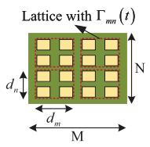

Fig. 11. Time-varying RIS consisting of lattices.

are competitive with the existing communication systems. As described in Section II-C, the spatial modulation mode can be combined with conventional modulation schemes such as PSK and QAM. Correspondingly, the effectiveness and feasibility of M-ary modulation, i.e., M-PSK/QAM in RIS-BackCom networks, was investigated and proved in [116]. Note that although M-ary modulation is considered at the PB, we still define the BackCom network as a UBC system instead of an AmBC system. The reason is that the modulation mode is precisely known and thus can be directly demodulated by the BRs. However, in the AmBC networks, the information on the transmitted signals from the PB is unavailable at the BR. To sum up, the spatial modulation scheme has more potential than the other modulation schemes and is able to achieve high spectral efficiency and a good BER performance.

Meanwhile, the authors in [142], [143], [144] considered RIS a metasurface hologram synthesized, with unit cells forming an array. Then, a radiation pattern can be produced with the help of an unmodulated signals emitter, which can be a compendious patch antenna, as widely adopted in [145], [146], [147]. Motivated by these foundational works, the authors in [148] presented a beam-steering problem to realize RIS spatial modulation scheme in the BackCom systems. Specifically, define a threshold, for example, -10 dB, on the normalized E-field magnitude. The correct RIS reflection phases were chosen to shift the focal point at the BR for an E-field magnitude of above -10 dB, yielding a symbol "1", while the randomizing reflection phases were used to achieve a defocusing radiated field for a magnitude of below -10dB, generating a symbol "0". Furthermore, to reduce the cost and complexity of RIS's architecture, the authors in [148] designed a time-varying modulation scheme for RIS-BackCom systems, in which the RIS's reflection coefficient alternates between "+1" and "-1" periodically. RIS is decomposed into a  $M \times N$  orthogonal  $(d_m \times d_n)$ -dimension lattices, which can be seen in Fig. 11.  $\Gamma_{mn}(t)$  denotes the time varying reflection coefficient of the mn-th lattice of RIS. It was proved that the spatial modulation could be realized by inserting a time delay between the lattices of RIS, while the reflection coefficient of RIS needed no specific design. As a result, the architecture cost and complexity in RIS-BackCom systems can be significantly reduced by implementing the scheme proposed in [148].

In addition, the authors in [149] investigated the power-splitting mechanism at the PB for an RIS-based UBC BackCom system. Distinguished from the other related works, the main idea was to transmit the signals of the PB and RIS simultaneously. In the RIS-BackCom system proposed, the PB emitted unmodulated carriers and message signals. RIS leveraged the unmodulated signal for its own BackCom while

enhancing the message signals from the PB. After the PB transmission and RIS reflection, the UE received the composite signals and decoded the message signals from the PB and RIS in turn. By properly setting the power-splitting factor at the PB, it was proved in [149] that the RIS-based UBC system outperforms the legacy BackCom systems in terms of data rate. Motivated by literature [149], the authors in [150] combined NOMA with the power-splitting idea to serve a two-UE RIS-BackCom network. The decoding order and NOMA power coefficients were meticulously designed to balance quality of service (QoS) and achievable data rate requirements. Furthermore, the multiple UE and multiple antenna PB cases, and the energy-efficiency problem were respected as future extensions, which will facilitate the development of future work on RIS-BackCom networks. In addition, it is worth noting that RIS-based UBC networks are flexible for modulation. The reason is that RIS can directly utilize the incident unmodulated signals to implement all the modulation schemes summarized in Section II-C, thus improving the data transmission rate.

#### B. Modulation in RIS-Based AmBC Networks

Note that the unmodulated signals require a specific spectrum, while the exclusive PB does not fit all the practical wireless communication scenarios. Furthermore, the unmodulated signals cannot be guaranteed to remain pure during the wireless propagation from the PB to RIS. Moreover, the transmission distance is short due to the low frequency of the baseband signals, limiting the range of BackCom. In this respect, AmBC networks show much more potential than UBC networks. The modern wireless environment mainly consists of cellular, Wi-Fi, and Bluetooth signals, which can be used for effective AmBC implementation. On the other hand, the direct signals from the PB generate strong interference to the BRs, which is required to be suppressed through systematic designs. The authors in [151] proposed an AmBC-based SISO system at an early stage, where the existing TV signals were leveraged for BD's BackCom to serve BRs while enhancing the legacy TV receivers' QoS. The feasibility of the proposed AmBC system was verified by prototyping AmBC devices in hardware, which achieved data rates of 1 kb/s at 2.5 feet indoor and 1.5 feet outdoor at 470-890 MHz carrier frequency.

Aiming to cancel the interference of the PB's RF signals, the authors in [152] investigated that the BRs could decode the BD's backscatter signals through the rate difference of slow backscatter signals and fast PB's signals. Note that the fast-changing RF signals were regarded as noise at the BRs. Then, the authors introduced two schemes:  $\mu mo$ , a multiple antenna receiver aiming to harvest energy in a single-input multiple-output (SIMO) system, and  $\mu code$ , a coding mechanism enabling large transmission ranges. Compared with [151], the authors in [152] realized 1 Mb/s at 4 feet with  $\mu mo$  scheme and 1 kb/s at 80 feet with  $\mu code$  scheme. Different from [151], [152], the authors in [153] utilized the commercial frequency modulation (FM) radio to be the carrier for BackCom, and realized 3.2 kb/s at the distance of 16 feet and 88-108 MHz carrier frequency. Some literature focused

on the utilization of Wi-Fi signals. For instance, the authors in [\[154\]](#page-33-2) presented an ambient Wi-Fi transmission system, where the Wi-Fi signals from an AP were used as carriers for BDs integrated with IoT sensors. It was concluded that the proposed prototypes could reach 5 Mb/s data rate at a range of 1 meters and 1 Mb/s at a range of 5 meters. However, the interference from the PB and the weakness of the backscattered signals in conventional AmBC networks are still hard to overcome.

Meanwhile, RIS plays an essential role in AmBC networks because of its high spatial freedom and beamforming capacity. Resorting to the spatial modulation technique, RIS can directly use the received ambient RF signals for BackCom instead of demodulation and equalization. Hence, utilizing RIS to tackle the drawbacks of conventional AmBC networks has shown great appeal in recent years. The authors in [\[40\]](#page-30-20) investigated an RIS-based AmBC network and derived the probability of the backscatter channel's domination in the composite channel, which was a helpful performance indicator for choosing the number of RIS reflecting elements. However, obtaining a closed-form solution was hard; thus, the backscatter link gain was described with a Gamma or Gaussian distribution. Then, it was demonstrated in [\[40\]](#page-30-20) that the backscatter channel gain was possibly always more potent than the direct channel gain by designing the number of RIS reflecting elements. Meanwhile, AmBC networks can also serve multiple UEs with considerable communication performance. The authors in [\[155\]](#page-33-3) introduced a multi-UE downlink cellular network, where an RIS was leveraged to modulate data and realize beamforming in the backscatter manner jointly. It was demonstrated that the UEs' spectral efficiency was able to be improved while meeting the minimum mean square error (MMSE) criterion. Therefore, RIS-based AmBC systems show comparable performance with legacy communication systems.

Considering that the NOMA technique has been widely investigated for massive connections in existing wireless communication systems, the effectiveness and feasibility of integrating RIS-based AmBC networks and NOMA have been discussed recently. The authors in [\[156\]](#page-33-4) accomplished the outage analysis of an RIS-BackCom network based on AmBC and NOMA mechanisms, where two UEs with both backscatter and direct links were considered. In this network, the outage probability, throughput, and ergodic capacity were analyzed based on their closed-form expressions through Monte Carlo simulations. Besides, the authors in [\[157\]](#page-33-5) considered a downlink RIS-based AmBC network with NOMA, where a two-UE case with channel disparity was established and studied. In particular, RIS was divided into two zones, which could simultaneously reflect the NOMA signals from a legacy BS. Although the authors set the same reflection coefficients and the number of RIS reflecting elements, the reflection coefficients of the two zones could be separately configured. It was assumed that one zone reflected the NOMA signals to enhance the UE's reception while the other zone performed the ambient backscatter function to transmit its information to the UE. Then, a scheme to balance the outage performance of the BS's NOMA signals and RIS's backscatter signals was obtained by deriving the closed-form outage probability. The

results in [\[157\]](#page-33-5) have also proved the possibility that legacy signals from the BS and backscatter signals from RIS coexist.

Since RIS-based AmBC networks are well suited to future low-power IoT communication systems, researchers have finished some relevant studies. For example, the authors in [\[158\]](#page-33-6) focused on integrated sensing and RIS-BackCom system, where a conventional BS detected the backscattered signals from RIS and the echo signals from targets simultaneously. In this system, multiple IoT devices, each equipped with an RIS, were supposed to transmit the IoT information passively through the backscatter technique. Notably, the BS also executed the sense of a nearby target through the received echo signals. The trade-off between sense and RIS-BackCom performance was illustrated by analyzing the numerical results. In addition, the authors in [\[159\]](#page-33-7) analyzed an RIS-assisted AmBC network. Then, a practical scheme was proposed in which the conventional BD performed energy harvest, spatial modulation, and space shift keying (SSK) in parallel. Meanwhile, RIS was a helper for the legacy BackCom network. The authors derived and analyzed the BER and outage probability performance with the proposed scheme through Monte Carlo simulation. It is worth noting that although RIS is a helper rather than a BD in [\[159\]](#page-33-7), the derivation and the algorithm design process can lay the foundation for analyzing RIS-based AmBC networks. Table [VI](#page-14-0) compares the performance of conventional BackCom and RIS-BackCom networks on different indicators in the hardware simulation system. It is seen that the majority of the existing works on legacy BackCom and RIS-BackCom techniques focus on the SISO system, which indicates that the multi-path effect intensely influences the system performance. Besides, the hardware simulations of RIS-BackCom systems are still in their infancy. As a result, future research on RIS-BackCom is anticipated to explore the potential performance of MIMO systems.

# *C. Channel Estimation in RIS-BackCom Networks*

Although the ML detector outperforms the Greedy detectors in RIS-BackCom systems, it requires accurate CSI. Consequently, channel modeling and estimation are critical for harnessing passive beamforming gains in RIS-BackCom systems. The study in [\[160\]](#page-33-8) introduced free-space path loss models tailored for RIS-enhanced RFID systems, taking into account factors such as tag radar cross-section, radiative nearfield/far-field effects of RIS, and the physical properties of the RIS. Experimental measurements and numerical simulations later validated this channel model. Similarly, the research in [\[161\]](#page-33-9) developed a comprehensive model for the channels in RIS-assisted communication networks, incorporating variables like RIS configurations, frequency bands, and specific channel conditions. This model accounted for phenomena such as the Doppler effect, multipath fading, and channel reciprocity. Moreover, employing a 3D geometry-based stochastic model within a 3GPP standardized framework, the study in [\[162\]](#page-33-10) explored RIS cascade channel modeling. Despite these advancements, these studies primarily view RISs as supplementary aids rather than as Backscatter Devices.

| Technique     | Modulation Mode      | Transmission Scheme | Carrier Source      | Carrier Frequency | Data Rate                    | Reference |
|---------------|----------------------|---------------------|---------------------|-------------------|------------------------------|-----------|
|               | OOK                  | SISO                | Unmodulated carrier | 10 GHz            | 1 kb/s                       | [127]     |
|               | OOK                  | SISO                | Unmodulated carrier | 2.4 GHz           | 100 Mb/s                     | [128]     |
|               | BFSK                 | SISO                | Unmodulated carrier | 42/57 MHz         | 12 Mb/s                      | [129]     |
|               | QPSK                 | SISO                | Unmodulated carrier | 7 GHz             | 200 kb/s                     | [130]     |
|               | 4QAM                 | SISO                | Unmodulated carrier | 900-930 MHz       | 100 kb/s                     | [131]     |
|               | 4QAM                 | SISO                | Unmodulated carrier | 900-930 MHz       | 400 kb/s                     | [132]     |
| BackCom       | 16QAM                | SISO                | Unmodulated carrier | 900-930 MHz       | 96 Mb/s                      | [133]     |
| BackColli     | 16QAM                | SISO                | Unmodulated carrier | 2.45 GHz          | 120 Mb/s                     | [134]     |
|               | 16QAM                | SISO                | Unmodulated carrier | 2.45 GHz          | 960 Mb/s                     | [135]     |
|               | 16QAM                | MIMO                | Unmodulated carrier | 24-28 GHz         | 2 Gb/s                       | [136]     |
|               | OOK                  | SISO                | TV tower            | 470-890 MHz       | 1 kb/s                       | [151]     |
|               | OOK                  | SIMO                | TV tower            | 539 MHz           | μmo: 1 Mb/s μcode: 1 kb/s | [152]     |
|               | OOK, 4FSK            | SISO                | FM radio            | 88-108 MHz        | 3.2 kb/s                     | [153]     |
|               | BPSK, QPSK, 16PSK | MIMO                | Wi-Fi AP            | 2.4 GHz           | 5 Mb/s                       | [154]     |
|               | BFSK                 | SISO                | Unmodulated carrier | 3.6 GHz           | 78.125 kb/s                  | [137]     |
| RIS-BackCom   | QPSK                 | SISO                | Unmodulated carrier | 4 GHz             | 1.6384 Mb/s                  | [138]     |
| KIS-BackColli | 8PSK                 | SISO                | Unmodulated carrier | 4.25 GHz          | 6.144 Mb/s                   | [139]     |
| 1             | 16O A M              | MIMO                | Unmadulated comics  | 4.95 CHz          | 20 Mb/a                      | [112]     |

TABLE VI PERFORMANCE OF CONVENTIONAL BACKCOM AND RIS-BACKCOM NETWORKS ON DIFFERENT INDICATORS

While the findings and methodologies from [\[161\]](#page-33-9) and [\[162\]](#page-33-10) offer valuable insights, a more detailed investigation into channel modeling specifically for RIS-BackCom networks is warranted. On the other hand, the CSI acquisition can be accomplished through efficient channel estimation method.

Thanks to the RIS's same reflection principles and similar channel models in conventional communication and BackCom systems, the methods commonly used in RIS channel estimation can be leveraged in RIS-BackCom networks. For instance, the authors in [\[163\]](#page-33-11) investigated an RIS-assisted MIMO system, where the RIS reflection coefficients were predesigned for the superposed channel estimation rather than separately training the links between source, RIS, and terminal. On the other hand, in order to reduce the training time, the authors in [\[164\]](#page-33-12) proposed and verified a fast channel estimation scheme based on a sampling-wise method for an RIS-assisted orthogonal frequency division multiplexing (OFDM) communication system.

Aiming to realize high-rate transmission in future wireless networks, researchers have studied RIS-aided communication systems based on high-frequency bands. The authors in [\[165\]](#page-33-13) proposed a cascaded channel estimation strategy for mmWave communication systems based on pilot and investigated the sparsity and correlation of multiple channels. Further, the authors in [\[166\]](#page-33-14) focused on the channel estimation for the ultra-large RIS-assisted terahertz (THz) system. The nearfield channel model was established, and the corresponding second-order Fresnel approximation was derived. The authors proved the effectiveness through the simulation results by utilizing the proposed channel estimation and localization algorithm. Aiming to avoid pilot spoofing attacks from active illegitimate eavesdroppers, the authors in [\[167\]](#page-33-15) designed a three-step pilot-aided channel estimation method based on RIS. However, the computational complexity of these methods tends to overgrow with the number of RIS reflecting elements. Correspondingly, the authors in [\[168\]](#page-33-16) derived a neoteric signal model through vectorization and reduction. Then, an efficient channel estimator was developed, whose complexity was linear with the number of RIS reflecting elements. Additionally, to tackle the challenging acquisition of the CSI of forward and backward links in BackCom systems, the authors in [\[169\]](#page-33-17) proposed a channel estimation method for an RISassisted BackCom system and minimized the mean square error (MSE).

On the other hand, burgeoning AI technologies such as deep learning (DL) and deep reinforcement learning (DRL) have brought novel vitalities for RIS channel estimation. The traditional MMSE method in RIS-BackCom with a multidimensional calculation is complicated to implement [\[170\]](#page-33-18). By modeling the channel estimation as a deep denoising problem and leveraging the DL method, e.g., deep residual learning, the channel coefficients were obtained in [\[170\]](#page-33-18), [\[171\]](#page-33-19), [\[172\]](#page-33-20). Furthermore, the authors in [\[173\]](#page-33-21) resorted to DRL and extremum seeking control (ESC) approaches for the smart radio environment, where the RIS's control was independent of the CSI and adaptive to different channel dynamics. This way, the interaction between the RIS and the wireless environment could be reduced. The authors in [\[174\]](#page-33-22) proposed a framework to decompose and predict channels and acquire CSI jointly. Then, a deep neural network was designed to address the fast timevarying channel. Simulation results demonstrated that the pilot overhead was lower while the CSI acquisition was more accurate with the proposed algorithm than conventional channel estimation methods. When double RIS exists, the channel estimation becomes more intractable. The authors in [\[175\]](#page-33-23) studied the estimation of cascaded channels in a double-RISassisted MIMO system. With the help of the self-attention and skip-connection approaches, the accuracy performance of the channel estimation was improved. Notice that RIS is commonly combined with UAV to realize stable, widecoverage communication. The authors in [\[176\]](#page-33-24) investigated a deep off-line training neural network to pre-estimate channel for an RIS-aided UAV-enabled network. It was proved that the proposed DL-based method required small pilot overheads while achieving practical channel estimation.

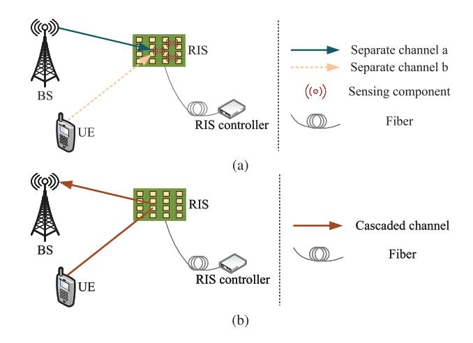

Fig. 12. Two current channel estimation methods: (a) separate estimation; (b) cascaded estimation.

To summarize, based on [\[177\]](#page-33-25), the current channel estimation methods can be categorized into "separate estimation" and "cascaded estimation," which are depicted in Fig. [12.](#page-15-0) The main pros and cons of these two methods are as follows.

*1) Separate Estimation:* With the help of the semi-passive RIS, the separate channels from the BS and the UE to RIS can be estimated. As shown in Fig. [12\(](#page-15-0)a), the semi-passive RIS is equipped with several low-cost sensing components with lowpower RF chains, through which the channel estimation can be performed by emitting pilots. This method is available for the time-division duplexing (TDD) system, in which the CSI between RIS and the BS/UE can be acquired according to the channel reciprocity. Nonetheless, this method performs poorly in the frequency-division duplexing (FDD) system. The reason is that the ability of sensing components to emit and receive pilots concurrently is ideal and costly in practice. Considering the architecture cost, the main challenge of separate channel estimation at RIS is the precise CSI acquisition with limited sensing components. To tackle this challenge, researchers have proposed some signal processing approaches to grab channel properties, e.g., sparsity and low-rank in mmWave [\[178\]](#page-33-26) and THz [\[179\]](#page-33-27) frequency bands. Nevertheless, further studies on channel estimation in RIS-BackCom networks are required since the noise from the wireless environment, the non-linear circuits, and the error in signal quantization are inevitable in practical wireless communication systems.

*2) Cascaded Estimation:* When RIS is entirely passive without active sensing components, a separate estimation procedure is infeasible. In other words, the channels from RIS to the BS and from RIS to the UE cannot be accurately characterized independently. In this case, the cascaded channel from the BS to the RIS and then to the UE is estimated at the BS or UE, allowing the determination of optimal phase shifts for the RIS elements. This estimation can be performed by the BS or the RIS controller. Subsequently, the estimation information will be used to obtain the "optimal" control (e.g., optimal phase shifts) for the RIS elements. Again, this computation can be performed at the BS or the RIS controller. The RIS controller then applies this control to the RIS elements by using control signals. As shown in Fig. [12\(](#page-15-0)b), the uplink channel estimation with the pilots emitted from the UE can be realized. Different from the separate estimation, this approach is applicable to both TDD and FDD systems. That is because the pilot emitters can be fixed on the BS and the UE, indicating the feasibility of simultaneously estimating the downlink and uplink channels. Hence, the cascaded estimation method is more practical and feasible than the separate estimation method because of the lower architecture cost at RIS. The main idea of the cascaded channel estimation approach can be categorized into three aspects, i.e., designing the pilot sequence emitted by the UE based on ON/OFF or full-ON states [\[180\]](#page-33-28), blueprinting the training reflecting the pattern of RIS [\[181\]](#page-33-29), and developing effective signal processing algorithms at the BS [\[182\]](#page-33-30). Furthermore, these aspects can be jointly designed to precisely estimate the cascaded channels in RIS-based communication systems, while the target is to minimize the training overhead of the channel estimation process.

In conclusion, although the legacy channel estimation methods can be used in RIS-BackCom systems, researchers have also designed and verified exclusive methods to estimate CSI in RIS-BackCom networks. The authors in [\[183\]](#page-33-31) acquired the channel parameters by designing an estimator to fulfill initial estimation and iteration. Then, the Cramer-Rao lower bounds of the channel estimation were derived to measure the proposed estimator's performance. Applying the linear MMSE estimator, the authors in [\[184\]](#page-33-32) effectively realized the compound channel estimation for static environments, where the channel coherence time was relatively long. To sum up, the channel estimation methods of RIS, which are applicable to the RIS-BackCom systems, have been comprehensively investigated. However, the research on specialized channel estimation approaches for RIS-BackCom is in its infancy. Compared with the legacy RIS-assisted system, the reflection pattern of RIS in RIS-BackCom systems with cascaded estimation methods is supposed to simultaneously support channel estimation and information modulation, bringing higher requirements of RIS hardware and design accuracy. Moreover, when implementing separate estimation, the weakness of transmitted signals in RIS-BackCom systems requires the RIS's pilot emitters to have high transmit power. Further, due to the RIS's passive reflection mode in RIS-BackCom networks, the interference between the composite pilot and backscattered signals needs to be considered in designing systems and protocols.

#### *D. Performance Analysis of SR Networks*

Conventional SR communication systems include two modes, i.e., symbiotic coevolution (SC) and symbiotic synthesis (SS) [\[185\]](#page-33-33). In SC, SR systems can evolve with multi-agent learning, while in SS, SR systems ingeniously design the transmission parameters and protocols with multi-objective optimization. Applying the backscatter and RIS techniques to the cognitive radio networks can remove the strong direct interference from the PB, yielding RIS-SR networks. Specifically, RIS can serve as a secondary transmitter by leveraging primary signals through the RIS-BackCom technique. Simultaneously, primary transmission can be enhanced

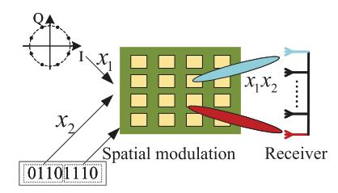

Fig. 13. Illustration of the star-QAM-assisted joint spatial modulation scheme.

by optimizing the RIS reflection coefficient. These combined techniques are applicable to SAGOI-Net and V2X scenarios, which are detailed in the following section. The authors in [\[13\]](#page-29-12) demonstrated the effectiveness and feasibility of an RIS-SR system, while a novel star-QAM-assisted joint spatial modulation scheme was proposed. This modulation scheme enabled the symbol design in the system to be flexible and diversiform. Specifically, the incident primary signal *x*1 at RIS utilized the star-QAM scheme. Then, RIS adopted the PSK scheme to map a part of the IoT data stream to signal *x*2, while leveraging spatial modulation to map the other part of the IoT data stream to the transceivers' antenna index. The composite signal at the receiver was denoted by *x*1*x*2. The modulation procedure at RIS is illustrated in Fig. [13.](#page-16-0) Then, the simulation results proved the superiority of the proposed scheme in the RIS-SR system compared with legacy modulation schemes.

Further, the existing RIS-SR system architecture can be clarified into two categories, i.e., the cooperative receiver architecture (CRA) [\[81\]](#page-31-37) and the separate receiver architecture (SRA) [\[111\]](#page-32-7). In the CRA system, the PN, served by legacy infrastructures such as cellular BSs, and the SN, dominated by RIS, transmit their messages to the same UEs, yielding the receiver's requirement for interference constellation to distinguish between primary and secondary signals. In the SRA system, the UEs served by the conventional transmitters in the primary networks are separated from those in the SN. In other words, RIS is tasked to emit information to its own UEs in the SN while enhancing the primary transmission between the legacy BSs and their UEs. Up to now, although the contemporary studies on RIS-SR systems are still in their infancy, there have been some works that investigated the performance of different RIS-SR systems [\[82\]](#page-31-36), [\[111\]](#page-32-7), [\[112\]](#page-32-8), [\[186\]](#page-33-34), [\[187\]](#page-33-35), [\[188\]](#page-33-36), [\[189\]](#page-33-37), [\[190\]](#page-33-38). In particular, as illustrated in Fig. [14,](#page-16-1) the systems in these studies can be classified into two categories, i.e., the SRA-based RIS-SR system and the CRA-based RIS-SR system, which are discussed as follows.

*1) SRA-based RIS-SR System:* Since the primary UEs and secondary UEs are separated in this system, the QoS requirement at the UEs differs in the primary and secondary networks, triggering various systematic design problems. The authors in [\[111\]](#page-32-7) leveraged RIS and MIMO techniques to assist an SRA-SR system, where the RIS-BackCom technique was utilized to serve a multi-antenna secondary UE. Simultaneously, RIS was tasked to enhance the primary message transmission of a legacy MIMO network. Aiming to reduce the transmit power at the multi-antenna BS in the PN while guaranteeing the primary and secondary data rates, the

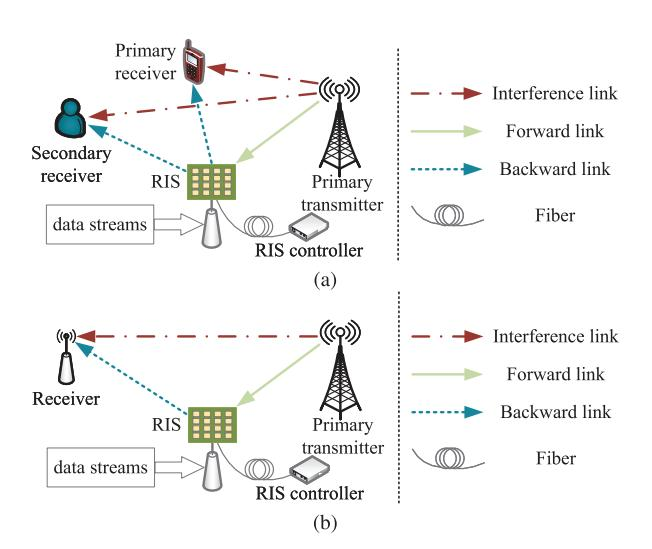

Fig. 14. Two categories of RIS-SR system: (a) SRA-based RIS-SR system; (b) CRA-based RIS-SR system.

authors jointly designed the active beamformer of the BS and the passive beamformer of RIS. Resorting to the semidefinite relaxation (SDR) method, the superiority of the proposed SR system was validated. The authors in [\[186\]](#page-33-34) investigated an RIS-powered SRA-SR system, where the BS broadcasted the primary signals to its UEs. RIS was adopted to sense and transfer the IoT information to an IoT receiver. In this system, the transmit power at the BS was minimized through the generalized power method (GPM) and block coordinate descent (BCD) algorithms. Meanwhile, the SNR constraints at the primary UEs and the IoT receiver were simultaneously satisfied. Regarding a mmWave RIS-SR network, the authors in [\[187\]](#page-33-35) considered the latent wiretapper lurking among the primary UEs, while the secondary QoS of the UE was guaranteed. Then, the broadcast secrecy rate was improved through the successive convex approximation-based (SCAbased) beamforming design at the BS and RIS, realizing the secure transmission in the proposed system.

*2) CRA-based RIS-SR system:* In this system, the common UEs simultaneously require the primary and secondary messages, indicating that the design of this system is distinguished from that of SRA-based RIS-SR systems. The authors in [\[188\]](#page-33-36) investigated a CRA-based RIS-SR system, where RIS was leveraged to enhance the primary transmission and realize a spatial modulation to transmit the IoT data. Then, the authors introduced three symbiotic modulation schemes based on the mechanism of spatial modulation, with which the UEs could detect the composite signals from the legacy BS and RIS. Specifically, the first scheme was coherent and based on a star-QAM constellation, while the latter two modulation schemes were noncoherent. The authors corroborated the competitiveness of the detection performance of the proposed three schemes in RIS-SR systems by resorting to the ML and the successive Greedy detectors. Besides, aiming to improve the PB's flexibility, the authors in [\[82\]](#page-31-36) leveraged the dynamic UAV instead of the static BS to serve the primary transmission. In the proposed system, RIS was utilized to reflect the EM waves from the UAV for secondary transmission. Considering that the state of RIS being served by the UAV changes at different time slots, the authors proposed a scheduling parameter for explicit description. Then, the reflection coefficient and scheduling parameter of RIS and the trajectory of the UAV were jointly designed with the help of a penalty-based algorithm. The numerical results showed that the BER can be significantly reduced. Furthermore, the authors in [\[112\]](#page-32-8) proposed a mechanism to adopt multiple RISs to serve multiple UEs in an SR network. Taking into account the limited total transmit power, the weighted sum rate was maximized through the BCD and fractional programming algorithms. Based on the numerical results, the authors demonstrated that the introduced RIS-SR system was able to realize low-power IoT transmission while accomplishing better performance of the primary communication than conventional multi-UE systems.

In addition, the authors in [\[189\]](#page-33-37) considered two scenarios in a CRA-based RIS-SR system. For the first one, the RIS's secondary symbol rate was much smaller than the BS's primary symbol rate. For the second one, the RIS's symbol rate was equal to the primary symbol rate. After deriving the BER expression of the secondary messages from RIS, the bisection search-based, and SCA methods were adopted to achieve a lower BER than benchmark schemes while guaranteeing the transmission rate in the legacy network. Based on the MIMO technique, the authors in [\[190\]](#page-33-38) focused on channel capacity maximization in an RIS-SR system, which provided an upper bound for other practical designs. Notably, the RIS's reflection pattern modulation scheme summarized in Section [II-C](#page-9-0) was adopted in the proposed system. In contrast, the RIS's reflection pattern, activation probability, and the legacy emitter's transmit covariance matrix were jointly designed. With the help of the gradient ascent algorithm, the channel capacity of the proposed RIS-SR system became higher than that of conventional RIS-aided MIMO systems.

In Table [VII,](#page-18-0) we summarize the main related works on existing RIS-SR systems. It is worth noting that despite the conceptual differences, SR and RIS-BackCom systems share similarities. To be specific, the SN dominated by RIS is an RIS-BackCom system, where RIS performs a backscatter procedure to transmit the secondary information. As a result, the superiority of RIS-BackCom systems, such as energy efficiency, cost-effectiveness, and spectrum-economization, also applies to RIS-SR systems. Nonetheless, the existing research still leaves us with many open problems to be solved in RIS-SR systems. For example, the symbol rate of RIS in the SN is lower than in the PN. Consequently, more effective modulation schemes or more attempts at the application of active RIS are required. In addition, the control links in RIS-SR systems may be more costly than those in conventional RIS-assisted systems, which will require a more cost-effective systematic design. Furthermore, the compatibility of the mechanism of RIS-SR networks with the protocols and standards of conventional networks remains to be addressed in future research.

## *E. Key Insights and Implications*

The analysis of RIS-BackCom systems delves into the various modulation methods utilized, highlighting the considerable benefits and challenges these systems pose. This section emphasizes how RIS-BackCom enhances channel capacity and signal quality through innovative modulation schemes like conventional, spatial, and reflection pattern modulation. Each method offers unique strategies for improving beamforming gains and managing interference, essential for robust communication. The RIS-BackCom systems capitalize on existing environmental signals for backscatter modulation, which is not only energy-efficient but also expands the potential for higher data rates compared to traditional backscatter methods. However, the integration of these systems into practical applications faces challenges such as direct path interference from ambient signals, which can affect the base receiver's performance. Furthermore, the complexity of channel estimation in RIS-based MIMO systems escalates with the number of RIS elements, challenging both theoretical and practical deployments. To address this, advanced AI techniques like DL and DRL have been proposed, which streamline the channel estimation process and reduce computational demands. Besides, while RIS-BackCom systems hold significant promise for transforming wireless communication landscapes, their deployment requires careful consideration of interference management and system optimization to fully realize their potential.

# IV. APPLICATIONS AND OPTIMIZATION OF RIS-BACKCOM SYSTEMS

Based on the analysis in Section [III,](#page-11-0) different information can be transmitted through the RIS-BackCom technique, yielding various applications in wireless communication networks. Correspondingly, diversified optimization problems arise, which are crucial to improve the performance upper bound of RIS-BackCom networks. In this section, we discuss the potential optimization problems with BER, sum rate, energy efficiency, and PLS. The discussions and classification in this section can provide various ideas on the optimization of future RIS-BackCom system designs.

# *A. BER Minimization or Sum-Rate Maximization*

*1) BER Minimization:* Since the transmissions in RIS-BackCom systems involve energy, high BER could be a major problem. The authors in [\[191\]](#page-33-39) researched an RIS-SR system, where a UE intended to acquire the signals from the legacy BS and RIS synchronously. To minimize the BER in the proposed RIS-BackCom network, the active beamformer and RIS phase shift were jointly designed while guaranteeing the conventional transmission rate. Then, the semi-closed form solutions for the corresponding optimization problem were derived through a penalty algorithm with the help of the Lagrange duality and majorization-minimization (MM) approaches. Subsequently, it was shown that the proposed scheme could achieve better BER performance than the benchmark schemes in the RIS-BackCom network. Based on [\[191\]](#page-33-39), the authors extended the studies to a parasitic scenario in [\[189\]](#page-33-37). In this scenario, the symbol rate of RIS was equal to the primary symbol rate. Then, the BER was minimized through bisection and SCA methods. On the other hand, the BER of the primary transmission is also worth exploring. Correspondingly,

| System Structure | Types | Goal                         | Active Beam- forming | RIS Phase Shift | Other Variables                          | Proposed Algo- rithm/Scheme              | Main Results                                 | Reference |
|---------------------|-------|------------------------------|----------------------------|-----------------------|---------------------------------------------|------------------------------------------------|----------------------------------------------|-----------|
| BS-Assisted         | SRA   | Minimize transmit power      | Optimized                  | Optimized             | N/A                                         | SDR                                            | Validate the advantages of the RIS-SR system | [111]     |
| BS-Assisted         | SRA   | Minimize transmit power   | Optimized                  | Optimized             | N/A                                         | BCD and GPM                                 | Performance improved with reduced complexity | [186]     |
| BS-Assisted         | SRA   | Maximize secrecy rate        | N/A                        | Optimized             | Hybrid beamforming                          | BCD and SCA                                 | Improved secrecy performance                 | [187]     |
| UAV-Assisted        | CRA   | Minimize BER                 | N/A                        | Optimized             | UAV trajectory and RIS scheduling     | Penalty-based algorithm                        | Significant reduction in BER                 | [82]      |
| BS-Assisted         | CRA   | Maximize weighted sum rate   | Optimized                  | Optimized             | N/A                                         | BCD and fractional programming                 | Enhanced primary and secondary transmission  | [112]     |
| UE-Assisted uplink  | CRA   | Realize symbiotic modulation | N/A                        | Optimized             | N/A                                         | Suboptimal successive Greedy detector | Good detection performance                   | [188]     |
| BS-Assisted         | CRA   | Minimize BER                 | Optimized                  | Optimized             | N/A                                         | Bisection search-based method and SCA | Lower BER than benchmarks                    | [189]     |
| MIMO                | CRA   | Maximize channel capacity    | N/A                        | Optimized             | Reflecting activation probability and | Gradient ascent algorithm                | Improved channel capacity                    | [190]     |

TABLE VII SUMMARY OF RELATED WORKS ON EXISTING RIS-SR SYSTEMS

the authors in [\[192\]](#page-33-40) minimized the primary BER through RIS phase shift optimization based on BCD and SDR methods.

From another perspective, the authors in [\[193\]](#page-33-41) focused on symbol detection at the UE in an RIS-BackCom network. In particular, the RIS reflection coefficient was divided into two matrices, which were jointly designed to minimize the detection BER of the backscattered symbols. With the help of a deep unfolding neural network, the problem was tackled, and the proposed detection scheme was demonstrated to be superior. Moreover, the authors in [\[194\]](#page-33-42) investigated a cellfree RIS-SR system. In this system, an RIS was utilized to facilitate primary transmissions from multiple BSs while realizing a secondary multi-UE transmission based on the RIS-BackCom technique. The BER of the transmitted symbols from RIS was minimized by jointly optimizing the beamformers at the BSs and RIS reflection coefficient. Resorting to the multidimensional complex quadratic transform (MCQT) and the consensus alternative direction method of multipliers (ADMM) methods, the proposed non-convex problem was solved. As a result, the RIS-BackCom mechanism applies to cell-free communication scenarios. When the PB becomes dynamic, the energy supply for RIS-BackCom implementation can be further optimized. For instance, the authors in [\[82\]](#page-31-36) leveraged a UAV as a PB and optimized the UAV's trajectory, RIS reflection coefficient, and RIS scheduling to minimize the weighted sum BER. Compared with static PBs, the dynamic PB was proved to adjust its location flexibly to obtain a higher beamforming gain, thus facilitating a lower BER.

*2) Sum-Rate Maximization:* On the other hand, the achievable rate of the transmission of RIS-BackCom is also worth investigating, especially compared with conventional transmission schemes. There have been studies focusing on the sum-rate maximization problem. For example, the authors in [\[195\]](#page-33-43) developed a self-sustainable wireless-powered RIS-BackCom network based on a legacy BS-dominated system. In the proposed network, an RIS without active RF components was leveraged to store energy from the BS and transmit messages, yielding two RIS operation phases. Then, the sum rate was maximized by jointly designing the beamformers of the BS and RIS, as well as the time scheduling of the RIS's two procedures. From the simulation results, the authors verified the feasibility of the sustainable RIS-BackCom-based system. To effectively utilize the RIS reflecting elements, the authors in [\[196\]](#page-34-0) developed an RISsegmented BackCom system, where RIS was divided into two zones, i.e., reflection zone and backscatter zone. In this system, RIS utilized the reflection zone to strengthen the conventional transmission of the BS, while the other zone was leveraged for the BackCom procedure. Then, the UE simultaneously received the information from the legacy BS and RIS and decoded it with the help of the SIC technique. The sum rate was maximized with a high SNR threshold after deriving the approximate closed form of the coexistence outage probability. In particular, it was proved that the number of RIS reflecting elements could be minimized while guaranteeing the sum rate, which provided a new perspective for relevant practical designs.

The emerging techniques, e.g., NOMA and rate-splitting multiple access (RSMA), enable multiple UEs to handle information with the same spectrum, significantly improving spectral efficiency. Under the circumstances, studies on multiple UEs in wireless communication systems, including RIS-BackCom systems, have flourished. For instance, the authors in [\[197\]](#page-34-1) focused on a multi-UE SR network combining NOMA and RIS-BackCom techniques. In this system, multiple RISs were used to assist the legacy NOMA-based network through backscatter while transmitting their own messages to

TABLE VIII SUMMARY OF BER OR SUM-RATE MAXIMIZATION IN RIS-BACKCOM SYSTEMS

| Optimization Problem  | System Structure                          | Active Beam- forming | RIS Reflection Coefficient | Other Variables                      | Proposed Algorithm/Scheme                               | Main Results                                                                                          | Reference |
|--------------------------|----------------------------------------------|----------------------------|----------------------------------|-----------------------------------------|------------------------------------------------------------|-------------------------------------------------------------------------------------------------------|-----------|
|                          | BS-Assisted MISO downlink                 | Optimized                  | Optimized                        | N/A                                     | Lagrange duality and MM methods                            | Prove the effectiveness of proposed scheme's BER performance                                          | [191]     |
| BER minimization      | BS-Assisted MISO downlink                 | Optimized                  | Optimized                        | N/A                                     | Bisection and SCA methods                                  | Verify the broad application scope of RIS-BackCom mechanism in SR system                     | [189]     |
|                          | BS-Assisted MIMO downlink              | N/A                        | Optimized                        | N/A                                     | BCD and SDR methods                                     | Justify the achievable primary BER in RIS-SR system                                                   | [192]     |
|                          | BS-Assisted MIMO downlink              | N/A                        | Optimized                        | Two divided RIS matrices                | Deep unfolding neural network                           | Demonstrate the proposed detection scheme to be superior for RIS-BackCom                     | [193]     |
|                          | BS-Assisted MISO downlink                 | Optimized                  | Optimized                        | N/A                                     | BCD, MCQT, and ADMM methods                                | Prove the feasibility of RIS-BackCom in cell-free system                                        | [194]     |
|                          | UAV-Assisted MISO uplink                  | N/A                        | Optimized                        | UAV trajectory and RIS scheduling | Relaxation- and penalty-based methods                      | Justify that the BER performance can be improved through the proposed scheme                          | [82]      |
|                          | BS-Assisted MISO downlink                 | Optimized                  | Optimized                        | RIS time scheduling                  | BCD and SDR methods                                        | Verify the feasibility of a sustainable RIS-BackCom-based system                             | [195]     |
| Sum-rate maximization | BS-Assisted MISO downlink                 | N/A                        | N/A                              | Number of RIS elements                  | Exhaustive searching algorithm                             | Validate the superiority of the proposed system over an OFDM-based BackCom system            | [196]     |
|                          | BS-Assisted MISO NOMA downlink         | N/A                        | Optimized                        | Transmit power allocation               | BCD and Lagrange multiplier methods                        | Demonstrate the effectiveness of the RIS-BackCom strategy                                             | [197]     |
|                          | UE-Assisted MIMO uplink                   | Optimized                  | Optimized                        | N/A                                     | BCD and online SCA methods                                 | Prove the feasibility of a UE uplink-based RIS-BackCom mechanism                                      | [198]     |
|                          | Dedicated PB-assisted MIMO multi-cell uplink | Optimized                  | Optimized                        | Uplink scheduling                    | BCD and fractional programming methods                     | Validate the achievable sum rate of the RIS-BackCom uplink transmission                      | [199]     |
|                          | BS-Assisted MISO multi-cell downlink   | Optimized                  | Optimized                        | N/A                                     | BCD, Lagrangian dual transform, and SDR methods      | Prove the feasibility of an RIS-BackCom assisted multi-cell network                             | [200]     |
|                          | BS-Assisted MISO downlink                 | Optimized                  | Optimized                        | UAV trajectory                          | BCD, Lagrangian dual transform, and RL methods             | Verify the feasibility of the optimization scheme in RIS-BackCom networks                    | [201]     |
|                          | BS-Assisted MISO downlink                 | Optimized                  | Optimized                        | N/A                                     | Fractional programming, BCD, and the exact penalty methods | Validate the sum-rate performance, and the tradeoff between the sensing and communication | [158]     |

a secondary UE. To maximize the sum rate of the primary and secondary UEs, the authors optimized the legacy transmit power of the BS for each primary UE and the RIS reflection coefficient with the imperfect hardware hypothesis. However, NOMA was only utilized in the legacy BS-based network instead of the RIS-BackCom network in [\[197\]](#page-34-1). Thus, the current related research still has limitations. For example, the diverse UE devices, such as mobile vehicles, joint optimization with clustering, and NOMA-based multiple UEs in RIS-BackCom networks can be further investigated in the future.

Different from the research on downlink transmission, the authors in [\[198\]](#page-34-2) focused on a MIMO-based uplink RIS-SR system, where multiple RISs were deployed to be a BD and enhance the uplink transmission from the UEs to a BS.

Moreover, the authors took into account the imperfect CSI and maximized the weighted sum rate of the introduced RIS-SR system by designing the beamformers at the BS and RIS. The simulation results showed that the proposed RIS-BackCom mechanism outperformed the baseline schemes in terms of enhancement for the legacy transmission. Therefore, RIS-BackCom systems are also appropriate for UE-assisted uplink communication. Besides, the authors in [\[199\]](#page-34-3) were also interested in the uplink transmission and proposed an RIS-BackCom-assisted coordinated multi-cell system. Distinguished from literature [\[198\]](#page-34-2), research [\[199\]](#page-34-3) fixed RIS at each multi-antenna UE to receive the RF signals from the PB and emit the backscattered information to the BS. In this system, the UEs' sum rate was maximized by jointly optimizing the uplink scheduling, the PB's beamformers, and RIS reflection coefficients.

On the other hand, the RIS-BackCom mechanism can also be used in multi-cell systems. For instance, the authors in [\[200\]](#page-34-4) first proposed an RIS-BackCom-aided multi-cell network, where multiple RISs were tasked to backscatter the received RF signals from an ambient BS. Each RIS served multiple UEs in this network in one cell based on coordinated multipoint transmission. Then, the weighted sum rate was maximized by optimizing the beamformers of the BS and RIS. Furthermore, the sum-rate performance can be further improved when the PB is dynamic. The authors in [\[201\]](#page-34-5) replaced the static BS with a dynamic UAV to provide RF signals for RIS-BackCom implementation. In the proposed system, an RIS was adopted to send messages to multiple UEs, whose sum rate was maximized by designing the beamformers of the UAV and RIS, as well as the trajectory of the UAV. The optimization was accomplished through BCD, Lagrangian dual transform, and reinforcement learning (RL) methods.

In addition to conventional wireless communication systems, RIS-BackCom networks can be embedded into integrated sensing and communication systems. For instance, the authors in [\[158\]](#page-33-6) proposed a novel integrated sensing and RIS-BackCom system. In this system, a dedicated BS was able to demodulate the backscattered messages from multiple RISs and sensed specific targets through the echo signals simultaneously. The Cramér-Rao bound constraint was given to estimate the target angle accurately. Then, a sum-rate maximization problem was established, where the transmit beamformer, RIS reflection coefficient, and the receive beamformer were jointly optimized with a fractional programming-based BCD algorithm and the exact penalty method. The results validated the sum-rate performance and the tradeoff between sensing and communication procedures. For ease of comparison, Table [VIII](#page-19-0) summarizes the current BER or sum-rate maximization problems in RIS-BackCom systems. In summary, a common problem of RIS-BackCom systems is the lower achievable data rate compared with legacy communication systems. To tackle this, other effective modulation schemes and active RIS may need to be investigated, and this is an open area of research.

#### *B. Energy-Efficiency Maximization*

In addition to the sum rate and BER, the energy efficiency of RIS-BackCom networks is a decisive indicator that can significantly affect the beamformer design gain. Correspondingly, some literature has focused on energy efficiency maximization, which can be divided into two classifications. For the first one, the system's energy efficiency can be directly maximized. For the second one, the transmit power at the BS or other active devices is minimized to reduce system energy consumption.

*1) Energy-efficiency maximization:* The authors in [\[202\]](#page-34-6) took into account the energy consumption of multiple RISs and the SIC procedure, as well as the multiple backscatter links interference. Specifically, the authors proposed a novel RIS-SR network. The PN was a conventional BS-based multi-UE system, while the SN was an IoT devices-clustered

RIS-BackCom system with time division multiple access (TDMA). Then, the RIS reflection coefficient was optimized to reduce the useless SIC-based decoding consumption while the power allocation strategy was simultaneously designed. The simulation results demonstrated that the considered RIS-BackCom system could suppress interference and increase energy efficiency compared with legacy BackCom systems. Considering the increasing power consumption of full use of RIS reflecting elements, the authors in [\[203\]](#page-34-7) divided RIS reflecting elements into several groups. Then, the RIS phase shift was independently designed to maximize the energy efficiency of the introduced RIS-BackCom system directly. The simulation results showed that the proposed subarray RIS scheme outperformed conventional RIS schemes regarding energy efficiency in RIS-BackCom networks. To precisely investigate the performance trade-off of the spectrum and energy efficiency, the authors in [\[204\]](#page-34-8) proposed an RIS-SR NOMA system, where the uplink transmission was researched. The resource efficiency related to the spectrum and energy efficiency was maximized by designing the time-frequency resource allocation, RIS reflection coefficient, and power control. With the help of the proposed scheme in [\[204\]](#page-34-8), the performance of the proposed RIS-BackCom system can be further improved. It is worth noting that although the definition of energy efficiency can be different in miscellaneous literature, the energy consumption of RIS-BackCom systems can be markedly reduced through the various optimization schemes mentioned above.

*2) Transmit power minimization:* Instead of defining and targeting energy efficiency variables, another group of researchers is interested in transmit power minimization. For example, the authors in [\[205\]](#page-34-9) solved a power minimization problem to perform RIS-BackCom in an energy-efficient way. To be specific, the authors proposed an RIS-SR system, where a UE aimed to receive the composite signals from a multiantenna BS and RIS. Then, the active and passive beamformers were elaborately designed to minimize the transmit power of the BS while maintaining the SNR threshold of the UE. Resorting to the BCD, SDR, and S-procedure techniques, the optimization problem was effectively worked out with imperfect CSI. As a result, the energy-effective scheme in the considered RIS-BackCom system was demonstrated to be feasible and effective. Considering the combination of RIS-BackCom and multi-antenna techniques, the authors in [\[111\]](#page-32-7) first developed an energy-efficient proposal for a MIMObased RIS-SR system. In the introduced system, the transmit power at the BS was minimized by optimizing the active beamformer at the BS and the RIS reflection coefficient. Meanwhile, the conventional network's primary symbol rate and the RIS-centered network's secondary SNR were simultaneously guaranteed. In addition, the authors theoretically analyzed the primary and secondary information transmissions and showed that they could mutually benefit from each other. To extend the communication range and cover the blind area, the authors in [\[206\]](#page-34-10) applied an active STAR-RIS for BackCom networks. In the proposed system, an RIS served multiple UEs by backscattering the legacy signals from a BS. For the purpose of transmit power minimization, the BS's and RIS's beamformers and RIS's amplification matrix were optimized. Furthermore, the authors extended the scenarios in [\[207\]](#page-34-11). The proposed communication system considered the broadcast and unicast modes at the BS and the RIS phase correlation. Then, the extensive simulation results validated the feasibility and effectiveness of active STAR-RIS in BackCom systems.

Table [IX](#page-22-0) summarizes the current energy-efficiency maximization problems in RIS-BackCom systems. Note that the RIS-BackCom technique is able to reduce power consumption significantly due to the absence of RF components compared with the legacy BDs and IoT devices. Therefore, with the help of the summarized approaches in this subsection, the energy efficiency can be further reduced, extending the life of BackCom networks. Since purely improving the energy efficiency triggers the suppression of the data transmission rate, the spectrum and energy efficiency are required to be balanced. Nonetheless, the current studies solve this trade-off problem by optimizing the spectrum efficiency with a given energy-efficiency constraint or maximizing the energy efficiency with the constraint of an achievable rate. These methods cannot precisely weigh the two considered indicators, which indicates that the trade-off between the spectrum and energy efficiency still requires further research.

Additionally, the operating consumption and computational consumption of RIS configuration are also worth investigating. In particular, different operations in the RIS configuration may involve varying levels of energy consumption. For instance, the modification of phase shifts in RIS is expected to consume less energy, as it primarily involves simple hardware operations. In contrast, the optimization of phase shifts likely requires more computational resources and, thus, higher energy consumption. This distinction is crucial in practical scenarios, where phase-shift optimization tasks involve complex algorithms and iterative computations. Considering the operating power consumption of RIS, the authors in [\[208\]](#page-34-12) proposed a resource allocation scheme for a symbiotic network consisting of multiple RIS and receivers. Further studies, such as those in [\[203\]](#page-34-7) and [\[209\]](#page-34-13), have addressed the energy consumption of phase shift circuits and RIS configurations. Further, the authors in [\[210\]](#page-34-14) investigated the RIS's dynamic energy consumption corresponding to the PIN diodes states. Then, the total consumption of the proposed system was minimized through a beamforming scheme.

#### *C. PLS Performance Improvement*

In addition to the spectral and energy efficiency, secure transmission is paramount, especially from the perspective of PLS. Up to now, the research on PLS based on the idea of RIS's information transmission in RIS-BackCom networks can be classified into two categories. On the one hand, the confidential signals can be enhanced by fulfilling backscatter at RIS to generate the desired signals, yielding RIS-BackComenhanced PLS. On the other hand, RIS can directly be the confidential transmitter (Alice) to send messages to legitimate UEs (Bobs) through backscatter, yielding RIS-BackCom-based

PLS. Specifically, these two kinds of functions of RIS for PLS of communications are summarized as follows.

*1) RIS-BackCom-Enhanced PLS:* In this mode, Alice can be the legacy BSs and other active points rather than RIS. The RIS's function is to generate the desired signals for Bobs while disturbing illegal eavesdroppers (Eves). For example, the RIS backscatter could be exerted to guarantee secure transmission in a MIMO system, where a passive Eve and a vicious jammer simultaneously existed [\[211\]](#page-34-15). In this system, RIS was utilized to modulate the malicious jamming signals into the required signals with the help of Alice. Then, the BCD algorithm combined with the Lagrange multiplier and MM methods were developed to optimize the beamformers at the BS and RIS. Besides, the authors in [\[187\]](#page-33-35) investigated the use of the RIS-BackCom technique in a mmWave system. In the considered network, the broadcast secrecy rate was maximized by jointly optimizing the beamformer at the BS and RIS reflection coefficient with the help of the SCA method.

On the other hand, an RIS can also emit jamming signals to improve the communication system's secrecy performance. The authors in [\[212\]](#page-34-16) firstly proposed a strategy based on the RIS-BackCom mechanism, in which an RIS sent jamming signals to Bob and multiple Eves by backscattering the confidential signals from Alice. Compared with conventional RIS-assisted PLS schemes, the proposed RIS-BackCom-enhanced PLS network in [\[212\]](#page-34-16) was validated to be more effective and feasible with the proposed SDR-based method through extensive simulation. In addition, the authors in [\[213\]](#page-34-17) considered a surveillance system where an RIS was leveraged to wiretap suspicious communication proactively. In the introduced system, the task of RIS was to interfere with a suspicious receiving point while reflecting the signals from a monitored source to the monitor. The secrecy performance of the considered system was improved by reasonably deploying the RIS and optimizing its reflecting coefficient.

Furthermore, RIS can transmit hybrid jamming and confidential signals. The authors in [\[214\]](#page-34-18) developed a strategy to realize RIS-BackCom-enhanced PLS, in which an RIS transforms the incident signal from Alice into a composite one containing confidential information and artificial noise. Besides, active RIS can also be used for low-power RIS-BackCom. The authors in [\[215\]](#page-34-19) adopted an active RIS to backscatter the primary signals while transmitting secondary information. At the same time, multiple Eves attempted to intercept both the primary and secondary information. In this scenario, the imperfect CSI was taken into account, and the power consumption was minimized through robust beamforming design. Then, the numerical results showed the effectiveness of the proposed active RIS-based secure communication scheme. With this method, the power consumption could be reduced to 27% compared with passive RIS-based schemes.

*2) RIS-BackCom-Based PLS:* In this mode, RIS directly acts as Alice to backscatter the incident RF signals into desired signals, which are sent to legitimate Bobs. Distinguished from the RIS-BackCom-enhanced PLS pattern, the legacy BS and other active points in the RIS-BackCom-based PLS pattern provide RF carriers for RIS backscatter and modulation. To be

| Optimization Problem | System Structure                  | Transmit Power Allocation | RIS Reflection Coefficient | Other Variables                                   | Proposed Algorithm/Scheme                                     | Main Results                                                                                      | Reference |
|-------------------------|--------------------------------------|---------------------------------|----------------------------------|---------------------------------------------------|------------------------------------------------------------------|---------------------------------------------------------------------------------------------------|-----------|
| Energy-Efficiency       | BS-Assisted MISO TDMA downlink | Optimized                       | Optimized                        | N/A                                               | BCD, SDR, and SCA methods                                        | Validate the higher energy efficiency of an RIS-BackCom system than legacy systems       | [202]     |
| maximization            | BS-Assisted MIMO downlink      | N/A                             | Optimized                        | Power amplifier factor                            | DRL method and Markov decision process                     | Prove that the proposed subarray RIS scheme outperformed conventional RIS schemes     | [203]     |
|                         | BS-Assisted MISO NOMA uplink   | Optimized                       | Optimized                        | Time-frequency resource allocation          | Matching theory, fractional programming, and MM methods | Verify the proposed scheme's performance trade-off of the spectrum and energy efficiency | [204]     |
| Transmit power          | BS-Assisted MISO downlink      | N/A                             | Optimized                        | Active beamformer                              | BCD, SDR, and S-procedure methods                          | Demonstrate feasibility of the energy-effective scheme in an RIS-BackCom system          | [205]     |
| minimization            | BS-Assisted MIMO downlink      | N/A                             | Optimized                        | Active beamformer                                 | BCD and SDR methods                                              | Certify the effectiveness and feasibility of the proposed scheme and system              | [111]     |
|                         | BS-Assisted MISO downlink      | N/A                             | Optimized                        | Beamformers and RIS amplification matrix | BCD method                                                       | Show the feasibility of active STAR-RIS in BackCom systems                                  | [206]     |
|                         | BS-Assisted                          |                                 |                                  | Beamformers and simultaneous                   | BCD, SDR, penalty                                                | Demonstrate the                                                                                   |           |

TABLE IX SUMMARY OF ENERGY-EFFICIENCY MAXIMIZATION IN RIS-BACKCOM SYSTEMS

more specific, considering the multicast secure transmission, the authors in [\[216\]](#page-34-20) investigated a RIS-BackCom-based PLS scheme for a RIS-BackCom system serving multiple UEs. In this scheme, the active beamformer at the PB and the RIS reflecting coefficient were alternatively optimized to improve the multicast secrecy rate with perfect CSI. On the other hand, since the eavesdropping CSI acquisition is intractable in practice, the authors in [\[217\]](#page-34-21) accomplished secure transmission for a RIS-BackCom system without eavesdroppers' CSI through artificial noise and beamforming methods. The power at the PB was divided into two parts: to deliver RF carriers and artificial noise, respectively. Then, the power for emitting artificial noise was maximized through the proposed alternative optimization. Considering that the adjustable location of the PB has an effect on the power supply for RIS backscatter, the authors in [\[218\]](#page-34-22) proposed a novel UAV-powered RIS-BackCom network. Resorting to the BCD algorithm, SDR, SCA, and RL methods, the authors maximized the broadcast secrecy rate by jointly designing the dynamic trajectory of the UAV, active beamforming vector, and RIS reflection coefficient.

Moreover, RIS can transmit information in different coding schemes. For instance, the authors in [\[219\]](#page-34-23) proposed a mechanism for RIS to transmit quick response (QR) code through the backscatter technique. In this scenario, the legitimate Bob sent RF signals to RIS to acquire the confidential information borne by the reflected signals from RIS. Then, the transmitted signals from Bob and its beamformer for reception were jointly optimized to minimize the signal-to-interference plus noise ratio (SINR) at Eve, yielding a secure transmission scheme. After deriving the bit error probabilities, this scheme was investigated and validated by using simulation results. Furthermore, it is worth noting that covert communications can be realized thanks to the passive characteristic and the weakness of the transmitted signals of the RIS-BackCom procedure. On the other hand, the authors in [\[220\]](#page-34-24) developed a passive RIS-based covert transmission scheme, where the RIS phase shift and reflecting amplitude were jointly adjusted to satisfy the QoS at legitimate Bob and the system covert constraint. By deriving the detection error probability at an illegal warden (Willie) and the decoding error probability at Bob and using simulation results, the authors demonstrated that the proposed scheme was able to guarantee communication reliability with a low leaked signal power.

Fig. [15](#page-23-1) illustrates the two categories mentioned in this subsection. As shown in Fig. [15\(](#page-23-1)a), the task of RIS is to backscatter the confidential signals from Alice to interfere with Eve while enhancing Bob's reception. Meanwhile, Eve aims to wiretap the information from Alice instead of that from RIS. Fig. [15\(](#page-23-1)b) shows the RIS-BackCom-based PLS mode, where RIS acts as Alice and sends confidential information to Bob. It is worth noting that the target of Eve's wiretap is RIS rather than the PB. In other words, the signals from the PB are interference for both Bob and Eve. To conclude, the RIS's function in Fig. [15\(](#page-23-1)a) is to improve the conventional PLS communication systems' secrecy performance, while that in Fig. [15\(](#page-23-1)b) focuses on the RIS-BackCom systems themselves' secure transmission. Moreover, RIS-BackCom networks face inherent security challenges due to the nature of wireless signals. Then, PLS techniques are employed to ensure secure

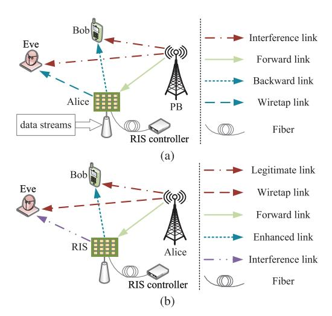

Fig. 15. Two kinds of function of RIS in PLS communications: (a) RIS-BackCom-enhanced PLS; (b) RIS-BackCom-based PLS.

transmissions. Designing the RIS reflection coefficient and other parameters can further enhance the security performance of RIS-BackCom networks. For ease of comparison and further research, we summarize the existing relevant works on the application of RIS-BackCom on PLS in Table [X.](#page-24-0)

#### *D. Key Insights and Implications*

This section critically examines the applications and optimization challenges of RIS-BackCom systems, focusing on their role in enhancing performance across diverse 6G communication scenarios. This section details the optimization of BER, sum rate, energy efficiency, and PLS, highlighting the adaptability of RIS-BackCom systems to modern wireless networks. Key applications discussed include the integration of RIS with THz communications and support for UAV-assisted networks, showcasing how RIS technology can optimize communication paths and enhance system robustness and reliability. Further, we explore innovative strategies for BER minimization and sum-rate maximization, utilizing advanced algorithms like SDR and BCD to tackle complex, non-convex optimization challenges. Moreover, enhancements in security through PLS techniques are discussed, underscoring the use of RIS to bolster defenses against eavesdropping and secure communication channels, especially in scenarios vulnerable to passive eavesdropping or requiring covert communications. Overall, this section articulates the strategic importance of RIS-BackCom systems in future networks, emphasizing their pivotal role in both performance optimization and security. It calls for continued research into advanced algorithmic strategies and hardware innovations to fully exploit the capabilities of RIS in evolving network scenarios, setting the stage for robust, efficient, and secure future wireless communications.

# V. EMERGING USE-CASE SCENARIOS IN 6G AND BEYOND

The RIS-assisted BackCom technique is envisioned to be applicable to various systems. For example, THz communication systems can be integrated with RIS-assisted BackCom networks, yielding energy-efficient and high-rate data transmission. Meanwhile, the effectiveness of optical wireless communications relies on the direct link between the transceivers. Correspondingly, utilizing the RIS-assisted BackCom technique can reduce direct link obstructions through optical beam adjustment. Moreover, the RIS-assisted BackCom technique is also feasible for UAV and visible light communications [\[55\]](#page-30-39). Under this trend, the potential applications of the RIS-BackCom technique also need to be envisioned. As analyzed in previous sections, the applications of the RIS-BackCom mechanism are capable of cost-effectively facilitating unprecedented performance improvement for communication systems through various elaborate designs and optimization. We have reviewed the performance analysis of RIS-BackCom systems, including modulation, channel estimation, and SR networks. Although the optimization of RIS-BackCom systems has been discussed with respect to BER minimization, sum-rate maximization, energy efficiency maximization, and PLS, the potential use of the RIS-BackCom technique is wider than the aspects mentioned earlier. Consequently, in this section, we systematically extend the discussion of existing RIS-BackCom networks to several emerging use scenarios in 6G (and beyond) wireless systems, i.e., the combination with AI techniques, SAGOI-Net, smart agriculture and farming, and V2X systems.

#### *A. AI for RIS-BackCom Systems*

As demonstrated in Section [IV,](#page-17-1) most formulations of optimization problems in RIS-BackCom networks are nonconvex, which are solved by implementing alternative iteration methods. Nonetheless, the computational complexity becomes higher as the number of RIS reflecting elements increases, triggering difficulties for practical implementation. In this context, AI techniques show a competitive capacity to alleviate the increasing complexity caused by the large number of RIS reflecting elements. Although Sections [III](#page-11-0) and [IV](#page-17-1) have mentioned several works that leverage AI for RIS-BackCom systems, a systematic review is still missing. Up to now, the research on the application of AI on RIS-BackCom systems is limited. The authors in [\[193\]](#page-33-41) considered the BER minimization problem in an RIS-based AmBC system. In this system, the passive beamformer at RIS and backscattered symbol detection at the UE were jointly designed, triggering an intractable non-convex problem. The reason is that the BER had no closed-form expression, and RIS had unit-modulus constraints. To solve this problem, the authors designed a deep unfolding neural network, whose implementation was based on the data and model, to maximize the detection expectation and optimize the RIS phase shift. After that, the numerical results validated that the proposed RIS-BackCom system was able to gain superior detection performance compared with benchmark schemes and conventional AmBC systems.

When the RIS reflecting elements are all activated, the energy efficiency is inevitably reduced. To tackle this problem, the authors in [\[203\]](#page-34-7) developed a subarray RIS framework for RIS-BackCom, where the RIS reflecting elements were divided into multiple parts. Then, the partition scheme of RIS's subarray and the BS's beamforming vector were jointly

TABLE X SUMMARY OF EXISTING WORKS ON THE APPLICATIONS OF RIS-BACKCOM ON PLS

| Types                     | Function of RIS-BackCom                                                    | Active Beam- forming | RIS Phase Shift | Other Variables               | Proposed Algorithm/Scheme                                             | Main Results                                                                                                    | Reference |
|---------------------------|-------------------------------------------------------------------------------|----------------------------|-----------------------|----------------------------------|--------------------------------------------------------------------------|-----------------------------------------------------------------------------------------------------------------|-----------|
|                           | Transform the jamming signals into desired signals                            | Optimized                  | Optimized             | N/A                              | BCD, Lagrange multiplier, and MM methods                           | Validate the superiority of an RIS-BackCom PLS strategy                                                   | [211]     |
| RIS-BackCom-              | Enhance the BS's signals and deliver RIS's information                        | Optimized                  | Optimized             | N/A                              | BCD and SCA                                                              | Achieve a higher secrecy rate than benchmark schemes                                                      | [187]     |
| Enhanced PLS              | Transform the confidential signals into jamming signals                       | Optimized                  | Optimized             | N/A                              | SDR and Gaussian randomization                                           | Demonstrate the secrecy performance of the proposed schemes                                                     | [212]     |
|                           | Generate jamming signals and reflect suspicious signals                 | N/A                        | Optimized             | Deployment of RIS             | SDR and simulated annealing algorithm                                    | The effectiveness of RIS's eavesdropping rate can be improved                                                   | [213]     |
|                           | Transform the incident signals into confidential signals and artificial noise | Optimized                  | Optimized             | N/A                              | BCD and SDR                                                              | The transmit power at Alice is minimized while guaranteeing security                                      | [214]     |
|                           | Enhance the primary signals while generating secondary information   | Optimized                  | Optimized             | N/A                              | S-Procedure and Bernstein-Type Inequality methods, BCD, and SDR | The proposed active scheme can reduce up to 27% power consumption compared with passive schemes                 | [215]     |
|                           | Transform the incident signals into confidential signals through backscatter  | Optimized                  | Optimized             | N/A                              | BCD and SDR                                                              | The multicast secrecy rate is improved in an RIS-BackCom network                                                | [216]     |
| RIS-BackCom- Based PLS | Transform the incident signals and artificial noise into confidential signals | Optimized                  | Optimized             | N/A                              | BCD and SDR                                                              | The proposed strategy can guarantee the secure RIS-BackCom with unknown CSI                            | [217]     |
|                           | Transform the incident signals into confidential signals through backscatter  | Optimized                  | Optimized             | UAV's trajectory              | BCD, SDR, SCA, and RL                                                 | The secrecy performance is improved with the dynamic PB                                                         | [218]     |
|                           | Generate QR code through backscatter                                       | Optimized                  | N/A                   | Transmitted signals design | BCD and SDR                                                              | The proposed scheme improves the secrecy performance whether the eavesdropper's CSI is known or not | [219]     |
|                           | Transmit the confidential signals                                             | N/A                        | Optimized             | Reflecting amplitude             | Bisection method                                                         | The proposed secure strategy is energy- and cost-effective, and suits IoT scenarios                    | [220]     |

optimized to maximize the energy efficiency, which was a hybrid non-convex problem. Hence, the RIS's subarray partition was modeled based on the Markov decision process, and DRL techniques were utilized to address the intractable problem. The simulation results confirmed that the proposed DRL-based method outperformed the traditional full-array RIS schemes in BackCom networks. In addition, the authors in [\[221\]](#page-34-25) applied DRL to an SR-based MEC system to minimize the PB's energy consumption by designing the UE's offloading schemes, the PB's beamformers, and the RIS reflection coefficient. Although RIS was a helper instead of a BD in the system proposed in [\[221\]](#page-34-25), the proposed AIbased algorithm could be developed for other data offloading schemes in the MEC-based RIS-BackCom networks such as the network investigated in [\[222\]](#page-34-26). In RIS-BackCom networks, since the RIS also serves as a transmitter, the modulation schemes and modulation orders differ from conventional RIS networks, which affects the design of AI models like neural networks. Additionally, RIS-BackCom systems require the RIS to obtain the CSI between the PB and BR, making traditional cascaded signal estimation methods less applicable. These factors significantly influence the design of AI-based solutions in RIS-BackCom scenarios. Aiming to systematically analyze the performance of the combination of AI and BackCom techniques, the authors in [\[50\]](#page-30-34) have presented an overview of diverse AI algorithms for designs of conventional BackCom networks, e.g., backscatter signal detection and interference management.

As illustrated in Fig. [16\(](#page-25-0)a), the BR can detect the received backscattered signals with the help of DL, whose function is to perform channel estimation, demodulation, and decoding. Fig. [16\(](#page-25-0)b) depicts an AI-based scheme for interference management in RIS-BackCom systems. Specifically, the overlapping EM waves will trigger inevitable interference when multiple RISs act as BDs to serve different BRs. To enhance the reception at the BR, the transmit beamforming at the PB and the clustering of the BDs can be flexibly optimized through DRL algorithms. Nevertheless, the primary function of AI in RIS-BackCom system design in the existing literature is to develop various algorithms for different optimization. Thus, there are still various open problems. For instance, the application of AI models to complex practical wireless

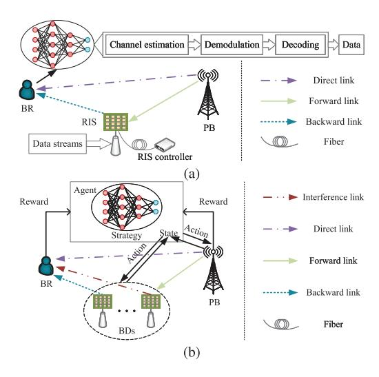

Fig. 16. Illustration of AI-based schemes in RIS-BackCom systems: (a) signal detection; (b) interference management.

communication scenarios considering time-varying channels and the reduction of the algorithms' computational complexity are expected to be accomplished better than in the present research. In future studies, in addition to research on the designs of AI-enhanced algorithms, the application of AI in RIS-BackCom networks can be extended to the RIS's deployment, the RIS's channel estimation, and the designs of adaptive schemes for variable RIS-BackCom scenarios.

#### *B. Use Cases in SAGOI-Net*

Future SAGOI-Net is anticipated to include numerous battery-powered devices, indicating that one of the crucial factors is energy efficiency [\[223\]](#page-34-27). This trend coincides with the low power consumption superiority of the RIS-BackCom technique, which also requires no additional spectrum. Thus, the RIS-BackCom mechanism has excellent potential in SAGOI-Net. To be specific, RIS can be fixed on an aerial vehicle or platform to be a secondary message transmitter based on the SR mechanism. This mechanism has been discussed in detail in Section [III-D.](#page-15-1) The corresponding terrestrial BR aims to acquire information from satellite and RIS by detecting the received composite signals with the help of the SIC method [\[224\]](#page-34-28). Fig. [17](#page-25-1) shows this envisioned RIS-BackCombased SAGOI-Net framework, which brings many inevitable problems such as theoretical analysis of the fading channel model, achievable data rate, BER, power consumption, and security that have not been investigated so far. For all of these, there has already been some existing research that can facilitate the development of the envisaged scenario in terms of algorithms, technical proposals, and system architectures.

The authors in [\[225\]](#page-34-29) theoretically analyzed the downlink of SAGOI-Net with Nakagami-*m* fading, laying a foundation for the channel model's use of the RIS-BackCom technique in SAGOI-Net. The authors in [\[226\]](#page-34-30) integrated a ground-based network with an IoT system, where multiple BDs leveraged signals from legacy BSs for IoT data transmission. The BRs sent the received data to air- and space-based networks

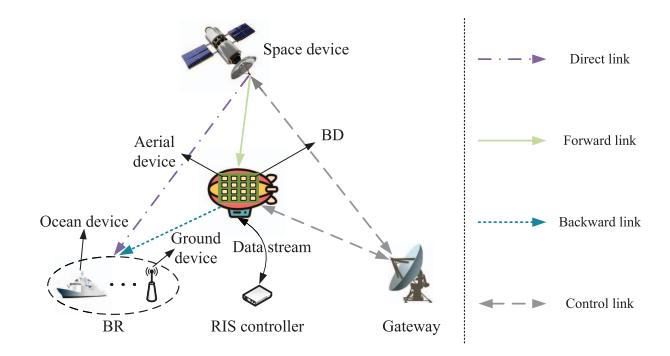

Fig. 17. An envisioned framework of RIS-BackCom-based SAGOI-Net.

through data backhaul links. Note that the RIS-assisted AmBC mechanism was utilized in the IoT system, where RISs acted as helpers to enhance BRs' reception. Based on [\[226\]](#page-34-30), RIS-BackCom networks can replace legacy IoT systems in ground-based networks, where RISs directly act as BDs to send IoT messages back to aircraft, floating platforms, and satellites. In the face of the doubly selective high-Doppler in RIS-assisted SAGOI-Net, the legacy OFDM needs to be improved to support RIS. To tackle this problem, the authors in [\[227\]](#page-34-31) researched the combination of orthogonal time– frequency space (OTFS) modulation and RIS. The simulation results validated that the OTFS-based scheme outperformed the OFDM-based method. Although RIS-BackCom is not used in [\[227\]](#page-34-31), the proposed scheme and algorithm can be extended to RIS-BackCom-assisted SAGOI-Net. Moreover, the authors in [\[54\]](#page-30-38) proposed an RIS-BackCom-based V2V system in a space-ground network. In this system, RIS was fixed on a vehicle (V0) to backscatter the RF signals from the satellite. When V0 received no satellite signal, another RIS was installed on a tall building to reflect the signals from the satellite to V0. Then, information from V0 was transmitted to multiple vehicles through RIS backscatter. The simulation results demonstrated the achievable transmission rate of the proposed system.

On the other hand, since the signaling exchanges among the UEs may be massive, the resources of SAGOI-Net will be overwhelmed, yielding inevitable service outages. Therefore, the resource management needs to be performed efficiently. From this perspective, the authors in [\[228\]](#page-34-32) proposed a framework that combines the SR mechanism and the SAGOI-Net. In this framework, heterogeneous radio trading was trusted and decided with the help of blockchain and AI, respectively. Meanwhile, the channel characteristics of RIS-BackComassisted SAGOI-Net significantly influence the performance of system-level optimization. Correspondingly, the authors in [\[229\]](#page-34-33) modeled the RIS MIMO channels in SAGOI-Net with respect to far-field and near-field. Then, a channel estimation method based on sparse Bayesian super-resolution, whose superiority was verified through numerical results, was proposed. Furthermore, the authors in [\[230\]](#page-34-34) envisioned the RIS-assisted satellite communication system, where multiple RISs were mounted on satellites to be energy-efficient relays. Nevertheless, the RIS's maintenance, operation lifetime, and dynamic control are challenging in this system.

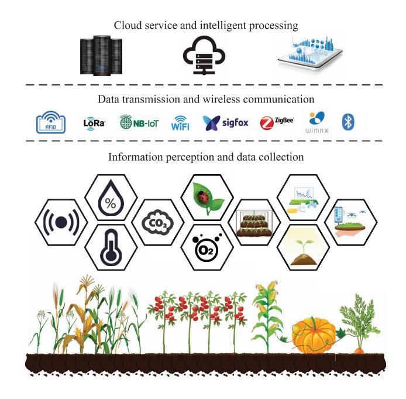

Fig. 18. Basic architecture and main technologies for modern smart agriculture and farming.

Note that the schemes and algorithms in [\[228\]](#page-34-32), [\[229\]](#page-34-33), [\[230\]](#page-34-34) can be developed and extended to RIS-BackCom systems because of the RIS's same reflection mechanism. However, the central challenge of applying RIS-BackCom to SAGOI-Net is the weakness of the signals caused by long-distance transmission. Correspondingly, several potential approaches can tackle this problem. On the one hand, greatly increasing the number of RIS elements can improve the beamforming gain at RIS. On the other hand, adopting active RIS with power amplification enables the incident signal to spread further. Besides, RIS can be directly mounted on floating platforms or reflect the EM waves from the aircraft that relay satellite signals. Additionally, to flexibly manage the heterogeneous resource with multiple sources in the integrated network, the authors in [\[231\]](#page-34-35) utilized the emerging digital twin technique to control the resources. It is worth noting that the framework and proposed algorithms in [\[231\]](#page-34-35) can provide novel perspectives for related designs of RIS-BackCom-based SAGOI-Net.

#### *C. Smart Agriculture and Farming*

As shown in Fig. [18,](#page-26-0) modern smart agriculture and farming technologies have been closely linked to IoT mechanisms regarding comprehensive perception, reliable transmission, and intelligent processing. Utilizing sensing technologies, agricultural information, e.g., temperature and humidity of air and soil, wind speed, carbon dioxide concentration, and rainfall, can be collected. Then, the information is transmitted to the processing center through IoT nodes and wireless networks, yielding intelligent temperature and humidity detection, disaster detection, insect detection, etc. From the perspective of data transmission, various composite IoT technologies such as RFID, long-range radio (LoRa), narrow band Internet of Things (NB-IoT), Wi-Fi, Sigfox, ZigBee, world interoperability for microwave access (WiMax), and Bluetooth can be adopted in smart agriculture and farming. Nonetheless, the corresponding low-power IoT communication chips have a transceiver power consumption of tens of milliwatts or even hundreds of milliwatts. Since the energy obtained by environmental energy collection is only at the microwatt level, it is impossible to drive these IoT devices. Hence, the power supply is mainly based on battery. Meanwhile, the sharp shortage of wireless spectrum resources caused by the extensive deployment of devices has become one of the main challenges in IoT communications. As a result, the extensive deployment of limited-capacity battery-powered IoT devices in smart agriculture has led to limited network life and a shortage of spectrum resources. To tackle these problems, the energy- and spectrum-efficient RIS-BackCom technology can be leveraged. Specifically, RIS can replace the conventional RF-driven transmitter to send the agricultural information to the processing center through backscatter. Note that the application of conventional backscatter technology in smart agriculture has been investigated in recent years. The BDs can be fixed on the plants, legacy IoT devices, and even in the soil [\[232\]](#page-34-36), while the field vehicles, e.g., tractors and UAVs, play a role in the BRs. Then, the RF emitters can be mounted on the vehicles or dedicated infrastructure based on the MBC and BBC mechanisms illustrated in Section [II-C.](#page-9-0)

The authors in [\[233\]](#page-34-37), [\[234\]](#page-34-38), [\[235\]](#page-34-39) proposed a wireless sensing system for leaf temperature monitoring, where the BDs were connected to temperature sensors attached to the leaves. Leveraging the ambient EM waves from FM stations, the BDs implemented AmBC and modulated the temperature information sent to the central reader. The prototype was validated to accomplish 2.5 bps over a 5-meter distance with an energy per packet of 36.9 μJ. The authors in [\[236\]](#page-34-40) considered an intelligent agricultural farm where numerous BDs were deployed with sensors for soil moisture, humidity, and the crops' temperature. In this farm, the MBC mechanism was leveraged for data collection. Specifically, the tractors combined with RF emitters were BRs, while the NOMA technique was utilized to alleviate the spectrum resource shortage. Aiming to conduct sensing of soil moisture in greenhouses and small-scale farms, the authors in [\[237\]](#page-34-41) designed an ultralow-cost and batteryless architecture of BD. With the proposed probabilistic graphical model-based algorithm, the effectiveness and superiority of the backscatter sensing network were demonstrated. Although the conventional BackCom technique has been studied and envisioned to be widely utilized in agriculture and farming, the double-fading phenomenon still needs to be addressed. In this context, RIS shows excellent potential in applications involving precision agriculture. The use of RIS-BackCom in smart farming and agricultural systems is promising, and further research will be required in this area.

# *D. Low-Power Transmission in V2X*

In order to accomplish unprecedented UE experiences such as intelligent transportation and high road safety, V2X communication systems are required to support massive and reliable

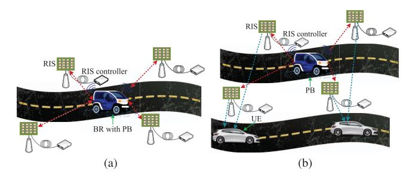

Fig. 19. An example of RIS-BackCom-based V2I systems: (a) MBC mode; (b) BBC mode.

information transmission, which is anticipated to be achieved in the 6G communication networks [\[238\]](#page-34-42). In V2X systems, the vehicles can exchange information reciprocally, yielding V2V communications. On the other hand, data transmission can occur between the infrastructure and vehicles, which are called vehicle-to-infrastructure (V2I) communications [\[239\]](#page-34-43). Furthermore, the wireless communication technologies in V2X systems follow two primary technical standards, i.e., dedicated short-range communication (DSRC) and cellular vehicle to everything (C-V2X), which rely on RF components with high energy requirements. As a result, the large number of batterypowered RF nodes deployed in V2X systems limits the overall network life, causing a shortage of spectrum resources.

Considering the energy-effectiveness of the BackCom technique, researchers have been exploring the use of the BackCom mechanism in V2X communications. The authors in [\[34\]](#page-30-14) designed RF components, high-gain directional antennas, and modulation coding schemes in a dynamic V2I communication scenario. The simulation results verified that the proposed scheme could achieve long-distance BackCom of 600 meters with 1 bit/s data transmission rate. However, the complexity of this scheme was high, and the presence of RF components increases the system's energy consumption. The authors in [\[27\]](#page-30-7) configured low-power BDs near the road while roadside units (RSUs) were used as the PB. Through the joint design of the power allocation of vehicles, RSUs, and BS, the simulation results demonstrated that the data transmission rate could reach 18.2 bit/s, which required 20 W of BS and vehicle total transmit power. Based on [\[27\]](#page-30-7), the authors in [\[240\]](#page-35-0) utilized RSUs to transmit information and act as PBs. The vehicles received RSUs' and BD's messages simultaneously. Nevertheless, the proposed scheme still needed to be designed in combination with vehicles, RSUs, and BDs.

To summarize, the feasibility and effectiveness of conventional BackCom application in V2X systems has been preliminarily validated. However, the approach to overcome the signal weakness caused by the double-fading phenomenon is still limited to increasing the total transmit power, which requires high system power consumption. Correspondingly, the RIS-BackCom technique provides a new perspective for low-power V2X transmission in terms of improving energy efficiency. For example, RIS can be configured on both sides of the road to act as an information sender, yielding novel V2I communication. As shown in Fig. [19\(](#page-27-1)a), the vehicles can be the PBs and BRs concurrently based on the MBC mode, which has been introduced in Section [II-A.](#page-4-3) In this mode, information on infrastructure can be collected during the movement of vehicles. Using the model depicted in Fig. [19\(](#page-27-1)a), the authors in [\[241\]](#page-35-1) introduced an RIS-based V2I BackCom system. In this system, multiple RISs backscatter road information from signals emitted by a vehicle, which then collects the backscattered data. To maximize data collection, the authors jointly optimized the RIS reflection coefficients and the vehicle's transmit power using an alternating optimization algorithm. Moreover, Fig. [19\(](#page-27-1)b) depicts a BBC-based V2I communication network in which the BRs are independent of the PBs. Adjusting RIS's passive beamforming can increase the data rate with lower power than legacy V2I BackCom networks. Nevertheless, the effectiveness and security of data transmission in RIS-BackCom-based V2X systems remain to be explored. That is because of the weak signal caused by passive working mode and the vulnerability of data to eavesdropping caused by real-time interactive communication. In other words, the energy efficiency, spectral efficiency, and transmission security of the RIS-BackCom mechanism in lowpower V2X communication networks require further research. For example, the sum rate of the systems depicted in Fig. [19](#page-27-1) can be maximized by jointly optimizing the beamformers. Given the varied distribution of RISs, the development of efficient data collection and secure transmission schemes is also crucial.

#### VI. CHALLENGES AND POTENTIAL SOLUTIONS

Note that RIS-assisted BackCom networks inevitably undergo intractable problems such as CSI acquisition, mobility devices, and radio resource management [\[48\]](#page-30-32), which are common topics of existing literature. Further, the deployment of the cells in RIS-BackCom networks is a challenge [\[55\]](#page-30-39). To overcome this, different parameters, such as the angle and distance between the RIS and other devices, need to be jointly considered. Besides, the feasibility of RIS-assisted BackCom techniques in THz communication systems is worth demonstrating. Since the channel and signal characteristics differ, the design of the RIS requires more exploration. For the RIS-BackCom technique, the prediction and analysis of various challenges are also essential. Meanwhile, RIS-BackCom networks face more significant challenges in addressing fast-fading channel issues compared to RIS-assisted wireless networks. This difficulty arises because efficient channel estimation depends heavily on the computational capacity of the transceivers. Unlike traditional networks where RISs merely reflect signals and BSs handle transmissions, RISs act as transmitters in RIS-BackCom networks. This shift means that the computational capacity for channel estimation is typically lower than that at BSs. Different aspects reviewed in this paper have demonstrated that RIS-BackCom networks outperform legacy communication networks regarding energy and spectrum efficiency. With optimization methods, the performance of BER, sum rate, energy efficiency, and PLS can be enhanced. Further, the RIS-BackCom mechanism can be utilized in IoT networks, e.g., smart agriculture and V2V systems. Nonetheless, the RIS-BackCom technique is still a long way from being widely applied to practical wireless communication systems, which brings some challenges summarized as follows.

#### *A. Architecture Design and Synchronization*

Historical BackCom systems, initially conceptualized independently of mainstream wireless networks [\[12\]](#page-29-11), have found a promising integration pathway by leveraging AmBC and SR techniques. This integration is especially relevant in the realms of IoT systems, where BackCom can significantly enhance communication efficiency and reduce energy consumption. To effectively utilize RIS technology in these systems, aligning the RIS architecture with IoT standards is crucial. Currently, the symbol rate in RIS-BackCom systems is lower than in traditional systems, requiring timely adjustments to RIS elements within each symbol interval, a significant challenge for hardware design [\[13\]](#page-29-12). Moreover, precise synchronization between the RIS and receivers is essential, impacting detection capabilities and spectral efficiency significantly. This is similar to challenges in legacy systems, where RIS's sophisticated signal processing must balance energy and cost efficiency. Thus, developing innovative synchronization schemes and refining RIS architecture are critical for the successful integration of RIS-BackCom in IoT applications, ensuring robust and efficient communication to meet the demands of modern integrated networks.

## *B. Instantaneous Control Link*

In RIS-BackCom systems, the reliability of specific RF emitters like TV, Wi-Fi, or cellular signals in dynamic environments is uncertain, leading to a growing interest in ultra-wideband BackCom techniques [\[242\]](#page-35-2). These techniques are particularly useful in V2V networks, enabling the use of a wide range of ambient RF signals to enhance vehicular communication connectivity and reliability. The diversity in signal characteristics–such as frequency and modulation modes–across different channels demands sophisticated joint transmission strategies. These strategies are crucial for managing the composite signals in the mixed environment of RIS-BackCom and traditional wireless networks, where signals often overlap, complicating control and impacting clarity and efficiency. Future developments in RIS-BackCom for wireless systems such as V2V networks will likely focus on refining instantaneous control strategies to optimize the use of ambient RF signals, minimize intersignal interference, and increase system throughput. Effective implementation of these strategies is essential for robust and efficient communication in the complex landscape of smart vehicular networks.

#### *C. Long Distance Function*

In SAGOI-Net, where diverse platforms such as satellites, airborne systems, ground networks, and oceanic sensors converge, RIS-BackCom emerges as a promising solution for ultra-low power communication across varied environments. However, the transmission rate deteriorates over long distances due to two main factors. First, conventional passive RIS units only reflect incident EM waves without amplification, limiting their effectiveness in extensive networks. Second, the dual link structure of BackCom systems causes significant signal fading. To counter these issues, the deployment of active RIS units with integrated power amplifiers has been proposed [\[243\]](#page-35-3). These units enhance signal strength, thus improving communication robustness within SAGOI-Net's diverse settings. However, the active components introduce noise that may affect signal clarity, necessitating a careful balance between amplification and noise suppression. Advanced transmission methods and efficient active RIS association schemes are essential to fully exploit these capabilities, ensuring robust, high-intensity links for effective integration of all SAGOI-Net components in future RIS-BackCom networks.

#### *D. Additional Security Concerns*

The RIS-BackCom technique brings a new perspective to low-power transmission but also inevitably produces additional security concerns. On the one hand, SR systems need joint designs for the primary conventional and secondary RIS-BackCom networks. This requirement indicates that information leaked from one network can be used to infer that from the other network, especially with the help of AI. On the other hand, since the transmitted signal intensity in RIS-BackCom networks is relatively lower than that in legacy systems, the security performance of conventional PLS schemes will be degraded. In this regard, the authors in [\[216\]](#page-34-20), [\[217\]](#page-34-21), [\[218\]](#page-34-22) have finished some preliminary works on transmission security. Moreover, the weak signals are susceptible to interference from active Eves. The weakness of EM waves also poses difficulty for Eves' detection, which aligns with the idea of covert communication. As a result, the signals in RIS-BackCom networks can be guaranteed not to be detected by vicious Eves by designing RIS reflection coefficient based on the covert communication technique [\[244\]](#page-35-4). However, the spectral efficiency of transmissions to legitimate UEs may decrease due to the suppression of the Eves' signal detection ability, meaning that the QoS at Bobs is supposed to be ensured while implementing covert transmission.

#### *E. Fast-Fading Channel*

In terms of data transmission procedure, the application of the RIS-BackCom mechanism in IoT, V2X, and highspeed rail communication systems shows excellent potential, but it also comes with some challenges due to the dynamic transceivers. Generally, the vehicles can act as PBs or BRs, while RISs may be fixed on dynamic devices as BDs. Hence, fast-fading channels require high symbol period and channel estimation requirements. Although the data rate can be improved through optimization summarized in Section [IV-A,](#page-17-2) it is still strictly limited in the RIS-BackCom system due to the passive transmitter and double-fading phenomenon. To address this challenge, several strategies can be considered. First, more efficient algorithms or sub-optimal solutions may be explored to reduce the computational complexity of realtime adjustments. Second, using long-term channel statistics can help in approximating optimal performance over a longer period. Third, DRL and OTFS techniques offer possible solutions for fast-fading channels. The DRL method can realize RIS-BackCom by splitting motion time into static slots [\[201\]](#page-34-5), while OTFS modulation achieves excellent error performance over delay-Doppler channels [\[245\]](#page-35-5). However, the training time of DRL may be too long, while OTFS requires high signal processing capacity of RIS. Therefore, to be successfully applied in IoT and V2X systems, future RIS-BackCom techniques need cooperation with comprehensive schemes to deal with fast-fading channel issues.

#### VII. CONCLUSION

We have presented a comprehensive survey on the principles and applications of the RIS-BackCom technique to wireless communication systems. Specifically, we have first introduced the fundamental theories, structures, and categorizations of conventional BackCom networks and the RIS technique, followed by the two primary functions of the RIS-BackCom mechanism. Next, we have presented an overview of the state-of-the-art research on the modulation and channel estimation methods for RIS-BackCom systems. Meanwhile, we have summarized the related works on the RIS-SR mechanism, which was developed from the RIS-BackCom technique. Then, we have discussed the BER, sum rate, energy efficiency, and PLS of RIS-BackCom networks from the perspective of their applications and optimization. Further, based on the performance analysis and diversified approaches for optimization, we have outlined the RIS-BackCom technique's emerging use cases and incorporation with AI in future 6G wireless networks. Finally, we highlighted five new challenges and their potential solutions in practical design to inspire further research. In conclusion, there is abundant room for studies on the various aspects of the RIS-BackCom operation.

Due to the high spatial freedom, RIS-BackCom networks outperform conventional BackCom systems in beamforming gain. Therefore, the double-fading problem can be suppressed in RIS-BackCom systems. When RIS acts as a BD, it can implement conventional, spatial, and reflection pattern modulations to deliver information. On the other hand, strong interference from the PB is inevitable in RIS-BackCom systems. In this aspect, the RIS-SR mechanism, developed from the cognitive radio technique, considers the signals from the PB as desired information instead of interference. Moreover, the low data rate caused by the weak signals needs to be increased to match legacy wireless systems. We have reviewed the BER and sum-rate maximization methods to support this target. Besides spectrum efficiency, energy efficiency and PLS performance are another two crucial indicators, which have also been surveyed in detail. Based on the various performance validation and optimization designs, the RIS-BackCom mechanism incorporated with AI technique has great potential in SAGOI-Net, smart agriculture, and V2X communication systems to realize ultra-low-power transmission. However, RIS architecture needs to be designed elaborately to accomplish an adequate data rate and precise synchronization. Furthermore, novel instantaneous control

strategies and efficient association schemes are required to guarantee high quality and security in RIS-BackCom systems, especially under fast-fading channels. We hope this survey paper on the RIS-BackCom technique is able to provide a ponderable and timely tutorial for relevant researchers and practitioners to accomplish high-efficiency designs in future wireless communication networks.

#### REFERENCES

- [\[1\]](#page-0-0) Z. Wei, F. Liu, C. Masouros, N. Su, and A. P. Petropulu, "Toward multi-functional 6G wireless networks: Integrating sensing, communication, and security," *IEEE Commun. Mag.*, vol. 60, no. 4, pp. 65–71, Apr. 2022.
- [\[2\]](#page-0-0) G. K. Kurt et al., "A vision and framework for the high altitude platform station (HAPS) networks of the future," *IEEE Commun. Surveys Tuts.*, vol. 23, no. 2, pp. 729–779, 2nd Quart., 2021.
- [\[3\]](#page-0-1) F. Tang, X. Chen, M. Zhao, and N. Kato, "The roadmap of communication and networking in 6G for the metaverse," *IEEE Wireless Commun.*, vol. 30, no. 4, pp. 72–81, Aug. 2023.
- [\[4\]](#page-0-1) W. Shi, W. Xu, X. You, C. Zhao, and K. Wei, "Intelligent reflection enabling technologies for integrated and green Internet-of-Everything beyond 5G: Communication, sensing, and security," *IEEE Wireless Commun.*, vol. 30, no. 2, pp. 147–154, Apr. 2023.
- [\[5\]](#page-0-1) M. Cui, Z. Wu, Y. Lu, X. Wei, and L. Dai, "Near-field MIMO communications for 6G: Fundamentals, challenges, potentials, and future directions," *IEEE Commun. Mag.*, vol. 61, no. 1, pp. 40–46, Jan. 2023.
- [\[6\]](#page-0-2) H. Stockman, "Communication by means of reflected power," *Proc. IRE*, vol. 36, no. 10, pp. 1196–1204, Oct. 1948.
- [\[7\]](#page-0-3) D. Li, W. Peng, and F. Hu, "Capacity of backscatter communication systems with tag selection," *IEEE Trans. Veh. Technol.*, vol. 68, no. 10, pp. 10311–10314, Oct. 2019.
- [\[8\]](#page-0-4) Z. Niu, L. Xiao, W. Ma, M. Peng, and T. Jiang, "Generalized spacetime architecture for ambient backscatter communication," *IEEE Trans. Commun.*, vol. 71, no. 4, pp. 1912–1925, Apr. 2023.
- [\[9\]](#page-0-5) Q. Wu and R. Zhang, "Intelligent reflecting surface enhanced wireless network via joint active and passive beamforming," *IEEE Trans. Wireless Commun.*, vol. 18, no. 11, pp. 5394–5409, Nov. 2019.
- [\[10\]](#page-0-5) S. Aboagye, A. R. Ndjiongue, T. M. N. Ngatched, O. A. Dobre, and H. V. Poor, "RIS-assisted visible light communication systems: A tutorial," *IEEE Commun. Surveys Tuts.*, vol. 25, no. 1, pp. 251–288, 1st Quart., 2023.
- [\[11\]](#page-0-5) Q. Wu and R. Zhang, "Towards smart and reconfigurable environment: Intelligent reflecting surface aided wireless network," *IEEE Commun. Mag.*, vol. 58, no. 1, pp. 106–112, Jan. 2020.
- [\[12\]](#page-0-6) Y.-C. Liang, Q. Zhang, J. Wang, R. Long, H. Zhou, and G. Yang, "Backscatter communication assisted by reconfigurable intelligent surfaces," *Proc. IEEE*, vol. 110, no. 9, pp. 1339–1357, Sep. 2022.
- [\[13\]](#page-0-6) X. Lei, M. Wu, F. Zhou, X. Tang, R. Q. Hu, and P. Fan, "Reconfigurable intelligent surface-based symbiotic radio for 6G: Design, challenges, and opportunities," *IEEE Wireless Commun.*, vol. 28, no. 5, pp. 210–216, Oct. 2021.
- [\[14\]](#page-0-6) Z. Tu, R. Long, and Y.-C. Liang, "Reconfigurable intelligent surfaceenabled two-way backscatter communication in symbiotic radio," in *Proc. IEEE ICC*, 2022, pp. 3747–3752.
- [\[15\]](#page-0-7) A. Zanella, N. Bui, A. Castellani, L. Vangelista, and M. Zorzi, "Internet of Things for smart cities," *IEEE Internet Things J.*, vol. 1, no. 1, pp. 22–32, Feb. 2014.
- [\[16\]](#page-0-7) Y. K. Teoh, S. S. Gill, and A. K. Parlikad, "IoT and fog-computingbased predictive maintenance model for effective asset management in industry 4.0 using machine learning," *IEEE Internet Things J.*, vol. 10, no. 3, pp. 2087–2094, Feb. 2023.
- [\[17\]](#page-0-7) S. Namasudra, P. Sharma, R. G. Crespo, and V. Shanmuganathan, "Blockchain-based medical certificate generation and verification for IoT-based healthcare systems," *IEEE Consum. Electron. Mag.*, vol. 12, no. 2, pp. 83–93, Mar. 2023.
- [\[18\]](#page-0-8) T. Jiang et al., "Backscatter communication meets practical battery-free Internet of Things: A survey and outlook," *IEEE Commun. Surveys Tuts.*, vol. 25, no. 3, pp. 2021–2051, 3rd Quart., 2023.
- [\[19\]](#page-1-0) J. Landt, "The history of RFID," *IEEE Potentials*, vol. 24, no. 4, pp. 8–11, Oct./Nov. 2005.

- [\[20\]](#page-1-1) S. Gong, X. Huang, J. Xu, W. Liu, P. Wang, and D. Niyato, "Backscatter relay communications powered by wireless energy beamforming," *IEEE Trans. Commun.*, vol. 66, no. 7, pp. 3187–3200, Jul. 2018.
- [\[21\]](#page-1-2) D. T. Hoang, D. Niyato, D. I. Kim, N. Van Huynh, and S. Gong, *Ambient Backscatter Communication Networks*. Cambridge, U.K.: Cambridge Univ. Press, 2020.
- [\[22\]](#page-1-3) X. Lu, D. Niyato, H. Jiang, D. I. Kim, Y. Xiao, and Z. Han, "Ambient backscatter assisted wireless powered communications," *IEEE Wireless Commun.*, vol. 25, no. 2, pp. 170–177, Apr. 2018.
- [\[23\]](#page-1-4) L. Shi, R. Q. Hu, Y. Ye, and H. Zhang, "Modeling and performance analysis for ambient backscattering underlaying cellular networks," *IEEE Trans. Veh. Technol.*, vol. 69, no. 6, pp. 6563–6577, Jun. 2020.
- [\[24\]](#page-1-5) X. Cao, Z. Song, B. Yang, X. Du, L. Qian, and Z. Han, "Deep reinforcement learning MAC for backscatter communications relying on Wi-Fi architecture," in *Proc. IEEE GLOBECOM*, 2019, pp. 1–6.
- [\[25\]](#page-1-6) C. Xu, L. Yang, and P. Zhang, "Practical backscatter communication systems for battery-free Internet of Things: A tutorial and survey of recent research," *IEEE Signal Process. Mag.*, vol. 35, no. 5, pp. 16–27, Sep. 2018.
- [\[26\]](#page-1-6) J. Wang, J. Xiong, H. Jiang, X. Chen, and D. Fang, "D-Watch: Embracing 'bad' multipaths for device-free localization with COTS RFID devices," *IEEE/ACM Trans. Netw.*, vol. 25, no. 6, pp. 3559–3572, Dec. 2017.
- [\[27\]](#page-1-6) W. U. Khan, F. Jameel, N. Kumar, R. Jäntti, and M. Guizani, "Backscatter-enabled efficient V2X communication with nonorthogonal multiple access," *IEEE Trans. Veh. Technol.*, vol. 70, no. 2, pp. 1724–1735, Feb. 2021.
- [\[28\]](#page-1-6) F. Jameel, R. Duan, Z. Chang, A. Liljemark, T. Ristaniemi, and R. Jantti, "Applications of backscatter communications for healthcare networks," *IEEE Netw.*, vol. 33, no. 6, pp. 50–57, Nov./Dec. 2019.
- [\[29\]](#page-1-6) P. X. Nguyen et al., "Backscatter-assisted data offloading in OFDMA-based wireless-powered mobile edge computing for IoT networks," *IEEE Internet Things J.*, vol. 8, no. 11, pp. 9233–9243, Jun. 2021.
- [\[30\]](#page-1-6) J.-P. Niu and G. Y. Li, "An overview on backscatter communications," *J. Commun. Inf. Netw.*, vol. 4, no. 2, pp. 1–14, Jun. 2019.
- [\[31\]](#page-1-7) Y. H. Al-Badarneh, M.-S. Alouini, and C. N. Georghiades, "Performance analysis of monostatic multi-tag backscatter systems with general order tag selection," *IEEE Wireless Commun. Lett.*, vol. 9, no. 8, pp. 1201–1205, Aug. 2020.
- [\[32\]](#page-1-8) F. Amato, H. M. Torun, and G. D. Durgin, "RFID backscattering in long-range scenarios," *IEEE Trans. Wireless Commun.*, vol. 17, no. 4, pp. 2718–2725, Apr. 2018.
- [\[33\]](#page-1-8) J. Hu, L. Zhong, T. Ma, Z. Ding, and Z. Xu, "Long-range FM backscatter tag with tunnel diode," *IEEE Microw. Wireless Compon. Lett.*, vol. 32, no. 1, pp. 92–95, Jan. 2022.
- [\[34\]](#page-1-8) X. Wang et al., "AllSpark: Enabling long-range backscatter for vehicleto-infrastructure communication," *IEEE Internet Things J.*, vol. 9, no. 24, pp. 25525–25537, Dec. 2022.
- [\[35\]](#page-1-9) K. H. Altuwairgi, A. M. T. Khel, and K. A. Hamdi, "Energy detection for reflecting surfaces-aided ambient backscatter communications," *IEEE Trans. Green Commun. Netw.*, vol. 8, no. 1, pp. 279–290, Mar. 2024.
- [\[36\]](#page-1-10) Q. Wu and R. Zhang, "Beamforming optimization for wireless network aided by intelligent reflecting surface with discrete phase shifts," *IEEE Trans. Commun.*, vol. 68, no. 3, pp. 1838–1851, Mar. 2020.
- [\[37\]](#page-1-10) C. Huang, R. Mo, and C. Yuen, "Reconfigurable intelligent surface assisted multiuser MISO systems exploiting deep reinforcement learning," *IEEE J. Sel. Areas Commun.*, vol. 38, no. 8, pp. 1839–1850, Aug. 2020.
- [\[38\]](#page-1-10) X. Yue and Y. Liu, "Performance analysis of intelligent reflecting surface assisted NOMA networks," *IEEE Trans. Wireless Commun.*, vol. 21, no. 4, pp. 2623–2636, Apr. 2022.
- [\[39\]](#page-1-11) Q. Wu, X. Guan, and R. Zhang, "Intelligent reflecting surface-aided wireless energy and information transmission: An overview," *Proc. IEEE*, vol. 110, no. 1, pp. 150–170, Jan. 2022.
- [\[40\]](#page-1-12) W. Zhao, G. Wang, S. Atapattu, T. A. Tsiftsis, and C. Tellambura, "Is backscatter link stronger than direct link in reconfigurable intelligent surface-assisted system?" *IEEE Commun. Lett.*, vol. 24, no. 6, pp. 1342–1346, Jun. 2020.
- [\[41\]](#page-1-13) U. S. Toro, M. Elsayed, B. M. ElHalawany, and K. Wu, "Performance analysis of intelligent reflecting surfaces in ambient backscattering NOMA systems," *IEEE Trans. Veh. Technol.*, vol. 73, no. 2, pp. 2854–2859, Feb. 2024.

- [\[42\]](#page-1-13) M.-S. V. Nguyen, D.-T. Do, A. Vahid, S. Muhaidat, and D. Sicker, "Enhancing NOMA backscatter IoT communications with RIS," *IEEE Internet Things J.*, vol. 11, no. 4, pp. 5604–5622, Feb. 2024.
- [\[43\]](#page-1-13) W. Wan, Y. Liu, and H. Zhang, "Cooperative beamforming and flexible index modulation for reconfigurable intelligent surface-aided symbiotic radio systems," *IEEE Trans. Cogn. Commun. Netw.*, vol. 10, no. 1, pp. 180–197, Feb. 2024.
- [\[44\]](#page-1-13) J. Zhao, J. Ye, S. Guo, Z. Bai, D. Zhou, and A. Mohamed, "Reconfigurable intelligent surface enabled joint backscattering and communication," *IEEE Trans. Veh. Technol.*, vol. 73, no. 1, pp. 771–782, Jan. 2024.
- [\[45\]](#page-1-13) S. Xu, Y. Du, J. Zhang, J. Liu, J. Wang, and J. Zhang, "Intelligent reflecting surface enabled integrated sensing, communication and computation," *IEEE Trans. Wireless Commun.*, vol. 23, no. 3, pp. 2212–2225, Mar. 2024.
- [\[46\]](#page-2-1) F. Rezaei, D. Galappaththige, C. Tellambura, and S. Herath, "Coding techniques for backscatter communications—A contemporary survey," *IEEE Commun. Surveys Tuts.*, vol. 25, no. 2, pp. 1020–1058, 2nd Quart., 2023.
- [\[47\]](#page-2-1) M. Mohammadi, Z. Mobini, D. Galappaththige, and C. Tellambura, "A comprehensive survey on full-duplex communication: Current solutions, future trends, and open issues," *IEEE Commun. Surveys Tuts.*, vol. 25, no. 4, pp. 2190–2244, 4th Quart., 2023.
- [\[48\]](#page-2-1) S. Basharat, S. A. Hassan, A. Mahmood, Z. Ding, and M. Gidlund, "Reconfigurable intelligent surface-assisted backscatter communication: A new frontier for enabling 6G IoT networks," *IEEE Wireless Commun.*, vol. 29, no. 6, pp. 96–103, Dec. 2022.
- [\[49\]](#page-2-1) R. Fara, P. Ratajczak, D.-T. Phan-Huy, A. Ourir, M. Di Renzo, and J. De Rosny, "A prototype of reconfigurable intelligent surface with continuous control of the reflection phase," *IEEE Wireless Commun.*, vol. 29, no. 1, pp. 70–77, Feb. 2022.
- [\[50\]](#page-2-1) F. Xu et al., "The state of AI-empowered backscatter communications: A comprehensive survey," *IEEE Internet Things J.*, vol. 10, no. 24, pp. 21763–21786, Dec. 2023.
- [\[51\]](#page-2-1) W. Chen, W. Yang, and W. Gong, "A survey of millimeter wave backscatter communication systems," *Comput. Netw.*, vol. 242, Apr. 2024, Art. no. 110235. [Online]. Available: https://www. sciencedirect.com/science/article/pii/S1389128624000677
- [\[52\]](#page-2-1) B. Gu, D. Li, H. Ding, G. Wang, and C. Tellambura, "Breaking the interference and fading gridlock in backscatter communications: State-of-the-art, design challenges, and future directions," 2024, *arXiv:2308.16031*.
- [\[53\]](#page-2-1) C. Liaskos, A. Tsioliaridou, S. Ioannidis, A. Pitsillides, and I. F. Akyildiz, "Realizing ambient backscatter communications with intelligent surfaces in 6G wireless systems," *IEEE Wireless Commun.*, vol. 29, no. 1, pp. 178–185, Feb. 2022.
- [\[54\]](#page-2-1) S. Xu, J. Liu, T. K. Rodrigues, and N. Kato, "Envisioning intelligent reflecting surface empowered space-air-ground integrated network," *IEEE Netw.*, vol. 35, no. 6, pp. 225–232, Nov./Dec. 2021.
- [\[55\]](#page-2-1) M. Saiam, M. Z. Chowdhury, S. R. Hasan, and Y. M. Jang, "Reconfigurable intelligent surface assisted BackCom: An overview, analysis, and future research directions," *ICT Exp.*, vol. 9, no. 5, pp. 927–940, 2023.
- [\[56\]](#page-1-14) H. Ren, K. Wang, and C. Pan, "Intelligent reflecting surface-aided URLLC in a factory automation scenario," *IEEE Trans. Commun.*, vol. 70, no. 1, pp. 707–723, Jan. 2022.
- [\[57\]](#page-1-15) Y. Zhang, X. Guan, Q. Wu, and Y. Cai, "Optimizing age of information in UAV-mounted IRS assisted short packet systems," *IEEE Trans. Veh. Technol.*, vol. 73, no. 11, pp. 17760–17764, Nov. 2024.
- [\[58\]](#page-1-16) J. Wang, S. Han, J. Li, and C. Li, "IRS-enabled monostatic backscatter MIMO communication design for V2I networks," *IEEE Trans. Veh. Technol.*, vol. 73, no. 12, pp. 19287–19298, Dec. 2024.
- [\[59\]](#page-1-17) S. Han, J. Wang, J. Li, and C. Li, "IRS-enabled secure backscatter communication design for V2I MIMO networks," *IEEE Wireless Commun. Lett.*, vol. 13, no. 9, pp. 2591–2595, Sep. 2024.
- [\[60\]](#page-4-4) R. C. Hansen, "Relationships between antennas as scatterers and as radiators," *Proc. IEEE*, vol. 77, no. 5, pp. 659–662, May 1989.
- [\[61\]](#page-4-5) F. Fuschini, C. Piersanti, F. Paolazzi, and G. Falciasecca, "Analytical approach to the backscattering from UHF RFID transponder," *IEEE Antennas Wireless Propag. Lett.*, vol. 7, pp. 33–35, 2008.
- [\[62\]](#page-5-3) A. Hakimi, S. Zargari, C. Tellambura, and S. Herath, "Sum rate maximization of MIMO monostatic backscatter networks by suppressing residual self-interference," *IEEE Trans. Commun.*, vol. 71, no. 1, pp. 512–526, Jan. 2023.
- [\[63\]](#page-5-3) J. Guo, S. Durrani, and X. Zhou, "Monostatic backscatter system with multi-tag to reader communication," *IEEE Trans. Veh. Technol.*, vol. 68, no. 10, pp. 10320–10324, Oct. 2019.

- [\[64\]](#page-5-3) A. Al-Nahari, R. Jäntti, R. Duan, D. Mishra, and H. Yigitler, ˘ "Multi-bounce effect in multi-tag monostatic backscatter communications," *IEEE Wireless Commun. Lett.*, vol. 11, no. 1, pp. 43–47, Jan. 2022.
- [\[65\]](#page-5-3) G. Dumphart, J. Sager, and A. Wittneben, "Load modulation for backscatter communication: Channel capacity and near-capacity schemes," *IEEE Trans. Wireless Commun.*, vol. 23, no. 5, pp. 3946–3958, May 2024.
- [\[66\]](#page-5-4) A. Kaplan, J. Vieira, and E. G. Larsson, "Direct link interference suppression for bistatic backscatter communication in distributed MIMO," *IEEE Trans. Wireless Commun.*, vol. 23, no. 2, pp. 1024–1036, Feb. 2024.
- [\[67\]](#page-5-4) Q. Tao, Y. Li, C. Zhong, S. Shao, and Z. Zhang, "A novel interference cancellation scheme for bistatic backscatter communication systems," *IEEE Commun. Lett.*, vol. 25, no. 6, pp. 2014–2018, Jun. 2021.
- [\[68\]](#page-5-4) X. Jia and X. Zhou, "Power beacon placement for maximizing guaranteed coverage in bistatic backscatter networks," *IEEE Trans. Commun.*, vol. 69, no. 11, pp. 7895–7909, Nov. 2021.
- [\[69\]](#page-5-4) D. Galappaththige, F. Rezaei, C. Tellambura, and A. Maaref, "Cell-free bistatic backscatter communication: Channel estimation, optimization, and performance analysis," *IEEE Trans. Commun.*, vol. 72, no. 10, pp. 6617–6632, Oct. 2024.
- [\[70\]](#page-5-5) C. Boyer and S. Roy, "Invited paper—Backscatter communication and RFID: Coding, energy, and MIMO analysis," *IEEE Trans. Commun.*, vol. 62, no. 3, pp. 770–785, Mar. 2014.
- [\[71\]](#page-5-6) X. Kang, Y.-C. Liang, and J. Yang, "Riding on the primary: A new spectrum sharing paradigm for wireless-powered IoT devices," *IEEE Trans. Wireless Commun.*, vol. 17, no. 9, pp. 6335–6347, Sep. 2018.
- [\[72\]](#page-5-6) B. Liu, S. Han, H. Peng, Z. Xiang, G. Sun, and Y.-C. Liang, "A cross-layer analysis for full-duplex ambient backscatter communication system," *IEEE Wireless Commun. Lett.*, vol. 9, no. 8, pp. 1263–1267, Aug. 2020.
- [\[73\]](#page-5-6) S. Zhou, W. Xu, K. Wang, C. Pan, M.-S. Alouini, and A. Nallanathan, "Ergodic rate analysis of cooperative ambient backscatter communication," *IEEE Wireless Commun. Lett.*, vol. 8, no. 6, pp. 1679–1682, Dec. 2019.
- [\[74\]](#page-5-6) W. Liu, S. Shen, D. H. K. Tsang, R. K. Mallik, and R. Murch, "An efficient ratio detector for ambient backscatter communication," *IEEE Trans. Wireless Commun.*, vol. 23, no. 6, pp. 5908–5921, Jun. 2024.
- [\[75\]](#page-5-7) Y.-C. Liang, Q. Zhang, E. G. Larsson, and G. Y. Li, "Symbiotic radio: Cognitive backscattering communications for future wireless networks," *IEEE Trans. Cogn. Commun. Netw.*, vol. 6, no. 4, pp. 1242–1255, Dec. 2020.
- [76] A. Juels, "RFID security and privacy: A research survey," *IEEE J. Sel. Areas Commun.*, vol. 24, no. 2, pp. 381–394, Feb. 2006.
- [77] J. Kimionis, A. Bletsas, and J. N. Sahalos, "Increased range bistatic scatter radio," *IEEE Trans. Commun.*, vol. 62, no. 3, pp. 1091–1104, Mar. 2014.
- [78] K. Han and K. Huang, "Wirelessly powered backscatter communication networks: Modeling, coverage, and capacity," *IEEE Trans. Wireless Commun.*, vol. 16, no. 4, pp. 2548–2561, Apr. 2017.
- [79] N. Van Huynh, D. T. Hoang, X. Lu, D. Niyato, P. Wang, and D. I. Kim, "Ambient backscatter communications: A contemporary survey," *IEEE Commun. Surveys Tuts.*, vol. 20, no. 4, pp. 2889–2922, 4th Quart., 2018.
- [80] G. Wang, F. Gao, R. Fan, and C. Tellambura, "Ambient backscatter communication systems: Detection and performance analysis," *IEEE Trans. Commun.*, vol. 64, no. 11, pp. 4836–4846, Nov. 2016.
- [\[81\]](#page-16-2) R. Long, Y.-C. Liang, H. Guo, G. Yang, and R. Zhang, "Symbiotic radio: A new communication paradigm for passive Internet of Things," *IEEE Internet Things J.*, vol. 7, no. 2, pp. 1350–1363, Feb. 2020.
- [\[82\]](#page-10-2) M. Hua, L. Yang, Q. Wu, C. Pan, C. Li, and A. L. Swindlehurst, "UAVassisted intelligent reflecting surface symbiotic radio system," *IEEE Trans. Wireless Commun.*, vol. 20, no. 9, pp. 5769–5785, Sep. 2021.
- [\[83\]](#page-5-8) Y. Liu et al., "Reconfigurable intelligent surfaces: Principles and opportunities," *IEEE Commun. Surveys Tuts.*, vol. 23, no. 3, pp. 1546–1577, 3rd Quart., 2021.
- [\[84\]](#page-7-4) Y. Liu et al., "STAR: Simultaneous transmission and reflection for 360◦ coverage by intelligent surfaces," *IEEE Wireless Commun.*, vol. 28, no. 6, pp. 102–109, Dec. 2021.
- [\[85\]](#page-7-5) V. Arun and H. Balakrishnan, "RFocus: Beamforming using thousands of passive antennas," in *Proc. 17th USENIX Symp. Netw. Syst. Design Implement.*, 2020, pp. 1047–1061.

- [\[86\]](#page-7-6) S. Gong et al., "Toward smart wireless communications via intelligent reflecting surfaces: A contemporary survey," *IEEE Commun. Surveys Tuts.*, vol. 22, no. 4, pp. 2283–2314, 4th Quart., 2020.
- [\[87\]](#page-7-7) W. Wang, W. Zhang, and H. Xiong, "Model-free configuration of intelligent reflecting surfaces: Toward pervasive adaptability and enhanced robustness," *IEEE Wireless Commun.*, vol. 31, no. 2, pp. 142–148, Apr. 2024.
- [\[88\]](#page-7-8) G. C. Alexandropoulos, N. Shlezinger, and P. Del Hougne, "Reconfigurable intelligent surfaces for rich scattering wireless communications: Recent experiments, challenges, and opportunities," *IEEE Commun. Mag.*, vol. 59, no. 6, pp. 28–34, Jun. 2021.
- [\[89\]](#page-7-9) L. Dai et al., "Reconfigurable intelligent surface-based wireless communications: Antenna design, prototyping, and experimental results," *IEEE Access*, vol. 8, pp. 45913–45923, 2020.
- [\[90\]](#page-7-10) W. Tang et al., "MIMO transmission through reconfigurable intelligent surface: System design, analysis, and implementation," *IEEE J. Sel. Areas Commun.*, vol. 38, no. 11, pp. 2683–2699, Nov. 2020.
- [\[91\]](#page-8-2) Y. Cai, W. Yu, X. Nie, Q. Cheng, and T. Cui, "Joint resource allocation for RIS-assisted heterogeneous networks with centralized and distributed frameworks," *IEEE Trans. Circuits Syst. I, Reg. Papers*, vol. 71, no. 5, pp. 2132–2145, May 2024.
- [\[92\]](#page-8-2) S. Saini, V. S. Bhat, and A. Chockalingam, "RIS-aided media based modulation," in *Proc. IEEE 97th VTC*, 2023, pp. 1–5.
- [\[93\]](#page-8-2) J. Zuo, Y. Liu, Z. Ding, L. Song, and H. V. Poor, "Joint design for simultaneously transmitting and reflecting (STAR) RIS assisted NOMA systems," *IEEE Trans. Wireless Commun.*, vol. 22, no. 1, pp. 611–626, Jan. 2023.
- [\[94\]](#page-8-3) T. V. Nguyen, D. N. Nguyen, M. D. Renzo, and R. Zhang, "Leveraging secondary reflections and mitigating interference in multi-IRS/RIS aided wireless networks," *IEEE Trans. Wireless Commun.*, vol. 22, no. 1, pp. 502–517, Jan. 2023.
- [\[95\]](#page-8-3) M. Hua, Q. Wu, W. Chen, O. A. Dobre, and A. L. Swindlehurst, "Secure intelligent reflecting surface-aided integrated sensing and communication," *IEEE Trans. Wireless Commun.*, vol. 23, no. 1, pp. 575–591, Jan. 2024.
- [\[96\]](#page-8-3) D. Wang, M. Wu, Z. Wei, K. Yu, L. Min, and S. Mumtaz, "Uplink secrecy performance of RIS-based RF/FSO three-dimension heterogeneous networks," *IEEE Trans. Wireless Commun.*, vol. 23, no. 3, pp. 1798–1809, Mar. 2024.
- [\[97\]](#page-8-4) J. Chen, L. Ruan, and H. Zhu, "A practical design of RIS with subsurfaces using codebook-based configuration method," *IEEE Wireless Commun. Lett.*, vol. 13, no. 4, pp. 1098–1102, Apr. 2024.
- [\[98\]](#page-8-4) J.-C. Chen, "Designing STAR-RIS-assisted wireless systems with coupled and discrete phase shifts: A computationally efficient algorithm," *IEEE Trans. Veh. Technol.*, vol. 73, no. 7, pp. 10772–10777, Jul. 2024.
- [\[99\]](#page-8-4) J. Sang et al., "Quantized phase alignment by discrete phase shifts for reconfigurable intelligent surface-assisted communication systems," *IEEE Trans. Veh. Technol.*, vol. 73, no. 4, pp. 5259–5275, Apr. 2024.
- [\[100\]](#page-8-5) Z. Sun and Y. Jing, "On the performance of multi-antenna IRS-assisted NOMA networks with continuous and discrete IRS phase shifting," *IEEE Trans. Wireless Commun.*, vol. 21, no. 5, pp. 3012–3023, May 2022.
- [\[101\]](#page-8-5) L. You, J. Xiong, D. W. K. Ng, C. Yuen, W. Wang, and X. Gao, "Energy efficiency and spectral efficiency tradeoff in RIS-aided multiuser MIMO uplink transmission," *IEEE Trans. Signal Process.*, vol. 69, pp. 1407–1421, Mar. 2021.
- [\[102\]](#page-8-5) Y. Huang, P. Yang, B. Zhang, Z. Liu, and M. Xiao, "A novel maximum distance separable coded OFDM-RIS for 6G wireless communications," *IEEE Wireless Commun. Lett.*, vol. 12, no. 5, pp. 927–931, May 2023.
- [\[103\]](#page-8-6) R. Zhang, K. Xiong, Y. Lu, P. Fan, D. W. K. Ng, and K. B. Letaief, "Energy efficiency maximization in RIS-assisted SWIPT networks with RSMA: A PPO-based approach," *IEEE J. Sel. Areas Commun.*, vol. 41, no. 5, pp. 1413–1430, May 2023.
- [\[104\]](#page-8-7) Y. Su, X. Pang, S. Chen, X. Jiang, N. Zhao, and F. R. Yu, "Spectrum and energy efficiency optimization in IRS-assisted UAV networks," *IEEE Trans. Commun.*, vol. 70, no. 10, pp. 6489–6502, Oct. 2022.
- [\[105\]](#page-9-2) S. Solanki, S. Gautam, S. K. Sharma, and S. Chatzinotas, "Ambient backscatter assisted co-existence in aerial-IRS wireless networks," *IEEE Open J. Commun. Soc.*, vol. 3, pp. 608–621, 2022.
- [\[106\]](#page-9-3) Y. Chen, "Performance of ambient backscatter systems using reconfigurable intelligent surface," *IEEE Commun. Lett.*, vol. 25, no. 8, pp. 2536–2539, Aug. 2021.

- [\[107\]](#page-9-4) M. A. ElMossallamy, M. Pan, R. Jäntti, K. G. Seddik, G. Y. Li, and Z. Han, "Noncoherent backscatter communications over ambient OFDM signals," *IEEE Trans. Commun.*, vol. 67, no. 5, pp. 3597–3611, May 2019.
- [\[108\]](#page-9-4) J. Hu, X. Cai, and K. Yang, "Joint trajectory and scheduling design for UAV aided secure backscatter communications," *IEEE Wireless Commun. Lett.*, vol. 9, no. 12, pp. 2168–2172, Dec. 2020.
- [\[109\]](#page-9-5) J. Chen, H. Yu, Q. Guan, G. Yang, and Y.-C. Liang, "Spatial modulation based multiple access for ambient backscatter networks," *IEEE Commun. Lett.*, vol. 26, no. 1, pp. 197–201, Jan. 2022.
- [\[110\]](#page-9-5) E. Goudeli, C. Psomas, and I. Krikidis, "Spatial-modulation-based techniques for backscatter communication systems," *IEEE Internet Things J.*, vol. 7, no. 10, pp. 10623–10634, Oct. 2020.
- [\[111\]](#page-9-6) Q. Zhang, Y.-C. Liang, and H. V. Poor, "Reconfigurable intelligent surface assisted MIMO symbiotic radio networks," *IEEE Trans. Commun.*, vol. 69, no. 7, pp. 4832–4846, Jul. 2021.
- [\[112\]](#page-9-6) J. Hu, Y.-C. Liang, and Y. Pei, "Reconfigurable intelligent surface enhanced multi-user MISO symbiotic radio system," *IEEE Trans. Commun.*, vol. 69, no. 4, pp. 2359–2371, Apr. 2021.
- [\[113\]](#page-9-6) W. Tang et al., "Wireless communications with programmable metasurface: New paradigms, opportunities, and challenges on transceiver design," *IEEE Wireless Commun.*, vol. 27, no. 2, pp. 180–187, Apr. 2020.
- [\[114\]](#page-9-6) J. Yuan, M. Wen, Q. Li, E. Basar, G. C. Alexandropoulos, and G. Chen, "Receive quadrature reflecting modulation for RIS-empowered wireless communications," *IEEE Trans. Veh. Technol.*, vol. 70, no. 5, pp. 5121–5125, May 2021.
- [\[115\]](#page-9-6) T. Ma, Y. Xiao, X. Lei, P. Yang, X. Lei, and O. A. Dobre, "Large intelligent surface assisted wireless communications with spatial modulation and antenna selection," *IEEE J. Sel. Areas Commun.*, vol. 38, no. 11, pp. 2562–2574, Nov. 2020.
- [\[116\]](#page-9-6) E. Basar, "Reconfigurable intelligent surface-based index modulation: A new beyond MIMO paradigm for 6G," *IEEE Trans. Commun.*, vol. 68, no. 5, pp. 3187–3196, May 2020.
- [\[117\]](#page-9-6) W. Yan, X. Yuan, and X. Kuai, "Passive beamforming and information transfer via large intelligent surface," *IEEE Wireless Commun. Lett.*, vol. 9, no. 4, pp. 533–537, Apr. 2020.
- [\[118\]](#page-9-6) S. Guo, S. Lv, H. Zhang, J. Ye, and P. Zhang, "Reflecting modulation," *IEEE J. Sel. Areas Commun.*, vol. 38, no. 11, pp. 2548–2561, Nov. 2020.
- [\[119\]](#page-9-6) Y. Ma, R. Liu, M. Li, and Q. Liu, "Passive information transmission in intelligent reflecting surface aided MISO systems," *IEEE Commun. Lett.*, vol. 24, no. 12, pp. 2951–2955, Dec. 2020.
- [\[120\]](#page-9-7) Q. Wu, S. Zhang, B. Zheng, C. You, and R. Zhang, "Intelligent reflecting surface-aided wireless communications: A tutorial," *IEEE Trans. Commun.*, vol. 69, no. 5, pp. 3313–3351, May 2021.
- [\[121\]](#page-9-7) X. Mu, Y. Liu, L. Guo, J. Lin, and R. Schober, "Simultaneously Transmitting And Reflecting (STAR) RIS aided wireless communications," *IEEE Trans. Wireless Commun.*, vol. 21, no. 5, pp. 3083–3098, May 2022.
- [\[122\]](#page-9-7) Z. Yang et al., "Energy-efficient wireless communications with distributed reconfigurable intelligent surfaces," *IEEE Trans. Wireless Commun.*, vol. 21, no. 1, pp. 665–679, Jan. 2022.
- [\[123\]](#page-9-6) Q. Li, M. El-Hajjar, I. Hemadeh, A. Shojaeifard, A. A. M. Mourad, and L. Hanzo, "Reconfigurable intelligent surface aided amplitude-and phase-modulated downlink transmission," *IEEE Trans. Veh. Technol.*, vol. 72, no. 6, pp. 8146–8151, Jun. 2023.
- [\[124\]](#page-9-6) B. A. Ozden, F. Cogen, E. Aydin, H. Ilhan, E. Basar, and M. Wen, "A novel reconfigurable intelligent surface-supported code index modulation-based receive spatial modulation system," in *Proc. IEEE WCNC*, 2024, pp. 1–6.
- [\[125\]](#page-9-6) P. Karunasena, N. Rajatheva, N. Rajapaksha, D. Dampahalage, D. Marasinghe, and M. Latva-Aho, "Jointly-mapped reflection modulation with reconfigurable intelligent surfaces," in *Proc. IEEE ICC*, 2024, pp. 581–586.
- [\[126\]](#page-10-3) H. Sun, S. Zhang, J. Ma, and O. A. Dobre, "Path loss of RIS-aided spatial modulation with on/off pattern," *IEEE Commun. Lett.*, vol. 26, no. 4, pp. 937–941, Apr. 2022.
- [\[127\]](#page-11-1) V. Fusco and Q. Chen, "Direct-signal modulation using a silicon microstrip patch antenna," *IEEE Trans. Antennas Propag.*, vol. 47, no. 6, pp. 1025–1028, Jun. 1999.
- [\[128\]](#page-11-1) W. Yao and Y. Wang, "Direct antenna modulation-a promise for ultrawideband (UWB) transmitting," in *Proc. IEEE MTT-S Int. Microw. Symp. Dig.*, 2004, pp. 1273–1276.

- [\[129\]](#page-11-2) M. Manteghi, H. G. Skinner, S. Y. Suh, M. Salehi, and S. Sajuyigbe, "A wideband frequency-shift keying modulation technique using transient state of a small antenna," *Prog. Electromagn. Res.*, vol. 143, no. 143, pp. 421–445, 2013.
- [\[130\]](#page-11-3) M. P. Daly, E. L. Daly, and J. T. Bernhard, "Demonstration of directional modulation using a phased array," *IEEE Trans. Antennas Propag.*, vol. 58, no. 5, pp. 1545–1550, May 2010.
- [\[131\]](#page-11-4) J. Kimionis and M. M. Tentzeris, "Pulse shaping: The missing piece of backscatter radio and RFID," *IEEE Trans. Microw. Theory Tech.*, vol. 64, no. 12, pp. 4774–4788, Dec. 2016.
- [\[132\]](#page-11-4) S. J. Thomas, E. Wheeler, J. Teizer, and M. S. Reynolds, "Quadrature amplitude modulated backscatter in passive and semipassive UHF RFID systems," *IEEE Trans. Microw. Theory Tech.*, vol. 60, no. 4, pp. 1175–1182, Apr. 2012.
- [\[133\]](#page-11-5) S. J. Thomas and M. S. Reynolds, "A 96 Mbit/sec, 15.5 pJ/bit 16-QAM modulator for UHF backscatter communication," in *Proc. IEEE Int. Conf. RFID*, 2012, pp. 185–190.
- [\[134\]](#page-11-5) R. Correia, A. Boaventura, and N. B. Carvalho, "Quadrature amplitude backscatter modulator for passive wireless sensors in IoT applications," *IEEE Trans. Microw. Theory Tech.*, vol. 65, no. 4, pp. 1103–1110, Apr. 2017.
- [\[135\]](#page-11-5) R. Correia and N. B. Carvalho, "Ultrafast backscatter modulator with low-power consumption and wireless power transmission capabilities," *IEEE Microw. Wireless Compon. Lett.*, vol. 27, no. 12, pp. 1152–1154, Dec. 2017.
- [\[136\]](#page-11-6) S. Daskalakis, A. Georgiadis, J. Kimionis, and M. Tentzeris, "A printed millimeter-wave modulator and antenna array for low-complexity gigabit-datarate backscatter communications," *Nat. Electron.*, vol. 4, no. 6, pp. 439–446, 2021.
- [\[137\]](#page-11-7) J. Zhao et al., "Programmable time-domain digital-coding metasurface for non-linear harmonic manipulation and new wireless communication systems," *Nat. Sci. Rev.*, vol. 6, no. 2, pp. 231–238, 2019.
- [\[138\]](#page-11-8) J. Y. Dai et al., "Wireless communications through a simplified architecture based on time-domain digital coding metasurface," *Adv. Mater. Technol.*, vol. 4, no. 7, pp. 1–8, 2019.
- [\[139\]](#page-11-9) W. Tang et al., "Programmable metasurface-based RF chain-free 8PSK wireless transmitter," *Electron. Lett.*, vol. 55, no. 7, pp. 417–420, 2019.
- [\[140\]](#page-11-10) L. Li et al., "Electromagnetic reprogrammable coding-metasurface holograms," *Nat. Commun.*, vol. 8, p. 197, Aug. 2017.
- [\[141\]](#page-11-10) S. Hu, F. Rusek, and O. Edfors, "Beyond massive MIMO: The potential of data transmission with large intelligent surfaces," *IEEE Trans. Signal Process.*, vol. 66, no. 10, pp. 2746–2758, May 2018.
- [\[142\]](#page-12-1) D. Headland et al., "Terahertz reflectarrays and nonuniform metasurfaces," *IEEE J. Sel. Topics Quantum Electron.*, vol. 23, no. 4, pp. 1–18, Jul./Aug. 2017.
- [\[143\]](#page-12-1) H.-F. Huang and S.-N. Li, "High-efficiency planar reflectarray with small-size for OAM generation at microwave range," *IEEE Antennas Wireless Propag. Lett.*, vol. 18, no. 3, pp. 432–436, Mar. 2019.
- [\[144\]](#page-12-1) S. R. Silva, A. Rahman, W. D. M. Kort-Kamp, J. J. Rushton, and A. K. Azad, "Metasurface-based ultra-lightweight high-gain off-axis flat parabolic reflectarray for microwave beam collimation/focusing," *Sci. Rep.*, vol. 9, no. 1, 2019, Art. no. 18984.
- [\[145\]](#page-12-2) F. Lu, H. Wang, Y. Guo, Q. Tan, W. Zhang, and J. Xiong, "Microwave backscatter-based wireless temperature sensor fabricated by an alumina-backed au slot radiation patch," *Sensors*, vol. 18, no. 1, p. 242, 2018.
- [\[146\]](#page-12-2) R. A. A. Rodrigues, V. M. U. L. Oliveira, F. M. D. Assis, E. C. Gurjão, and R. R. M. D. Valle, "Performance analysis of antennas for backscatter radio reader," in *Proc. IEEE IMOC*, 2013, pp. 1–6.
- [\[147\]](#page-12-2) A. Khaleghi, A. Hasanvand, and I. Balasingham, "Wireless backscatter communication using multiple transmitter scheme," in *Proc. IEEE EuCAP*, 2016, pp. 1–4.
- [\[148\]](#page-12-3) O. Yurduseven, S. D. Assimonis, and M. Matthaiou, "Intelligent reflecting surfaces with spatial modulation: An electromagnetic perspective," *IEEE Open J. Commun. Soc.*, vol. 1, pp. 1256–1266, 2020.
- [\[149\]](#page-12-4) S. Y. Park and D. In Kim, "Intelligent reflecting surface-aided phaseshift backscatter communication," in *Proc. IEEE IMCOM*, 2020, pp. 1–5.
- [\[150\]](#page-12-5) A. Hakimi, S. Zargari, C. Tellambura, and S. Herath, "IRS-enabled backscattering in a downlink non-orthogonal multiple access system," *IEEE Commun. Lett.*, vol. 26, no. 12, pp. 2984–2988, Dec. 2022.
- [\[151\]](#page-12-6) V. Liu, A. N. Parks, V. Talla, S. Gollakota, D. J. Wetherall, and J. R. Smith, "Ambient backscatter: Wireless communication out of thin air," *SIGCOMM Comput. Commun. Rev.*, vol. 43, no. 4, pp. 39–50, 2013.

- [\[152\]](#page-12-7) A. N. Parks, A. Liu, S. Gollakota, and J. R. Smith, "Turbocharging ambient backscatter communication," *SIGCOMM Comput. Commun. Rev.*, vol. 44, no. 4, pp. 619–630, 2014.
- [\[153\]](#page-12-8) A. Wang, V. Iyer, V. Talla, J. R. Smith, and S. Gollakota, "FM backscatter: Enabling connected cities and smart fabrics," in *Proc. 14th USENIX Symp. Netw. Syst. Design Implement. (NSDI)*, 2017, pp. 243–258.
- [\[154\]](#page-13-0) D. Bharadia, K. Joshi, M. Kotaru, and S. Katti, "BackFi: High throughput WiFi backscatter," *SIGCOMM Comput. Commun. Rev.*, vol. 45, no. 4, pp. 283–296, 2015.
- [\[155\]](#page-13-1) H. U. Rehman, F. Bellili, A. Mezghani, and E. Hossain, "Modulating intelligent surfaces for multiuser MIMO systems: Beamforming and modulation design," *IEEE Trans. Commun.*, vol. 70, no. 5, pp. 3234–3249, May 2022.
- [\[156\]](#page-13-2) C.-B. Le, D.-T. Do, X. Li, Y.-F. Huang, H.-C. Chen, and M. Voznak, "Enabling NOMA in backscatter reconfigurable intelligent surfacesaided systems," *IEEE Access*, vol. 9, pp. 33782–33795, 2021.
- [\[157\]](#page-13-3) S. Li, L. Bariah, S. Muhaidat, A. Wang, and J. Liang, "Outage analysis of NOMA-enabled backscatter communications with intelligent reflecting surfaces," *IEEE Internet Things J.*, vol. 9, no. 16, pp. 15390–15400, Aug. 2022.
- [\[158\]](#page-13-4) X. Wang, Z. Fei, and Q. Wu, "Integrated sensing and communication for RIS assisted backscatter systems," *IEEE Internet Things J.*, vol. 10, no. 15, pp. 13716–13726, Aug. 2023.
- [\[159\]](#page-13-5) A. Bhowal, S. Aïssa, and R. S. Kshetrimayum, "RIS-assisted spatial modulation and space shift keying for ambient backscattering communications," in *Proc. IEEE ICC*, 2021, pp. 1–6.
- [\[160\]](#page-13-6) M. El-Absi et al., "Path loss modeling of RFID backscatter channels with reconfigurable intelligent surface: Experimental validation," *IEEE Access*, vol. 11, pp. 108532–108543, 2023.
- [\[161\]](#page-13-7) J. Huang et al., "Reconfigurable intelligent surfaces: Channel characterization and modeling," *Proc. IEEE*, vol. 110, no. 9, pp. 1290–1311, Sep. 2022.
- [\[162\]](#page-13-8) H. Gong, J. Zhang, Y. Zhang, Z. Zhou, and G. Liu, "How to extend 3-D GBSM to RIS cascade channel with non-ideal phase modulation?" *IEEE Wireless Commun. Lett.*, vol. 13, no. 2, pp. 555–559, Feb. 2024.
- [\[163\]](#page-14-1) J. An, C. Xu, L. Gan, and L. Hanzo, "Low-complexity channel estimation and passive beamforming for RIS-assisted MIMO systems relying on discrete phase shifts," *IEEE Trans. Commun.*, vol. 70, no. 2, pp. 1245–1260, Feb. 2022.
- [\[164\]](#page-14-2) B. Zheng, C. You, and R. Zhang, "Fast channel estimation for IRS-assisted OFDM," *IEEE Wireless Commun. Lett.*, vol. 10, no. 3, pp. 580–584, Mar. 2021.
- [\[165\]](#page-14-3) G. Zhou, C. Pan, H. Ren, P. Popovski, and A. L. Swindlehurst, "Channel estimation for RIS-aided multiuser millimeter-wave systems," *IEEE Trans. Signal Process.*, vol. 70, pp. 1478–1492, 2022.
- [\[166\]](#page-14-4) Y. Pan, C. Pan, S. Jin, and J. Wang, "RIS-aided near-field localization and channel estimation for the terahertz system," *IEEE J. Sel. Topics Signal Process.*, vol. 17, no. 4, pp. 878–892, Jul. 2023.
- [\[167\]](#page-14-5) X. Liu, Y. Tao, C. Zhao, and Z. Sun, "Detect pilot spoofing attack for intelligent reflecting surface assisted systems," *IEEE Access*, vol. 9, pp. 19228–19237, 2021.
- [\[168\]](#page-14-6) Y. Guo et al., "Efficient channel estimation for RIS-aided MIMO communications with unitary approximate message passing," *IEEE Trans. Wireless Commun.*, vol. 22, no. 2, pp. 1403–1416, Feb. 2023.
- [\[169\]](#page-14-7) S. Abeywickrama, C. You, R. Zhang, and C. Yuen, "Channel estimation for intelligent reflecting surface assisted backscatter communication," *IEEE Wireless Commun. Lett.*, vol. 10, no. 11, pp. 2519–2523, Nov. 2021.
- [\[170\]](#page-14-8) C. Liu, X. Liu, D. W. K. Ng, and J. Yuan, "Deep residual learning for channel estimation in intelligent reflecting surface-assisted multiuser communications," *IEEE Trans. Wireless Commun.*, vol. 21, no. 2, pp. 898–912, Feb. 2022.
- [\[171\]](#page-14-9) S. Liu, Z. Gao, J. Zhang, M. D. Renzo, and M.-S. Alouini, "Deep denoising neural network assisted compressive channel estimation for mmWave intelligent reflecting surfaces," *IEEE Trans. Veh. Technol.*, vol. 69, no. 8, pp. 9223–9228, Aug. 2020.
- [\[172\]](#page-14-9) Y. Jin, J. Zhang, X. Zhang, H. Xiao, B. Ai, and D. W. K. Ng, "Channel estimation for semi-passive reconfigurable intelligent surfaces with enhanced deep residual networks," *IEEE Trans. Veh. Technol.*, vol. 70, no. 10, pp. 11083–11088, Oct. 2021.
- [\[173\]](#page-14-10) W. Wang and W. Zhang, "Intelligent reflecting surface configurations for smart radio using deep reinforcement learning," *IEEE J. Sel. Areas Commun.*, vol. 40, no. 8, pp. 2335–2346, Aug. 2022.

- [\[174\]](#page-14-11) W. Xu, J. An, Y. Xu, C. Huang, L. Gan, and C. Yuen, "Timevarying channel prediction for RIS-assisted MU-MISO networks via deep learning," *IEEE Trans. Cogn. Commun. Netw.*, vol. 8, no. 4, pp. 1802–1815, Dec. 2022.
- [\[175\]](#page-14-12) M. Liu, X. Li, B. Ning, C. Huang, S. Sun, and C. Yuen, "Deep learningbased channel estimation for double-RIS aided massive MIMO system," *IEEE Wireless Commun. Lett.*, vol. 12, no. 1, pp. 70–74, Jan. 2023.
- [\[176\]](#page-14-13) J. Yu, X. Liu, Y. Gao, C. Zhang, and W. Zhang, "Deep learning for channel tracking in IRS-assisted UAV communication systems," *IEEE Trans. Wireless Commun.*, vol. 21, no. 9, pp. 7711–7722, Sep. 2022.
- [\[177\]](#page-15-2) B. Zheng, C. You, W. Mei, and R. Zhang, "A survey on channel estimation and practical passive beamforming design for intelligent reflecting surface aided wireless communications," *IEEE Commun. Surveys Tuts.*, vol. 24, no. 2, pp. 1035–1071, 2nd Quart., 2022.
- [\[178\]](#page-15-3) R. W. Heath, N. González-Prelcic, S. Rangan, W. Roh, and A. M. Sayeed, "An overview of signal processing techniques for millimeter wave MIMO systems," *IEEE J. Sel. Topics Signal Process.*, vol. 10, no. 3, pp. 436–453, Apr. 2016.
- [\[179\]](#page-15-4) K. Guan et al., "Channel characterization for intra-wagon communication at 60 and 300 GHz bands," *IEEE Trans. Veh. Technol.*, vol. 68, no. 6, pp. 5193–5207, Jun. 2019.
- [\[180\]](#page-15-5) Y. Yang, B. Zheng, S. Zhang, and R. Zhang, "Intelligent reflecting surface meets OFDM: Protocol design and rate maximization," *IEEE Trans. Commun.*, vol. 68, no. 7, pp. 4522–4535, Jul. 2020.
- [\[181\]](#page-15-6) B. Zheng and R. Zhang, "Intelligent reflecting surface-enhanced OFDM: Channel estimation and reflection optimization," *IEEE Wireless Commun. Lett.*, vol. 9, no. 4, pp. 518–522, Apr. 2020.
- [\[182\]](#page-15-7) J.-M. Kang, "Intelligent reflecting surface: Joint optimal training sequence and refection pattern," *IEEE Commun. Lett.*, vol. 24, no. 8, pp. 1784–1788, Aug. 2020.
- [\[183\]](#page-15-8) H. Zheng, Z. Yang, G. Wang, R. He, and B. Ai, "Channel estimation for ambient backscatter communications with large intelligent surface," in *Proc. 11th Int. Conf. Wireless Commun. Signal Process. (WCSP)*, 2019, pp. 1–5.
- [\[184\]](#page-15-9) I. Vardakis, G. Kotridis, S. Peppas, K. Skyvalakis, G. Vougioukas, and A. Bletsas, "Intelligently wireless batteryless RF-powered reconfigurable surface: Theory, implementation & limitations," *IEEE Trans. Wireless Commun.*, vol. 22, no. 6, pp. 3942–3954, Jun. 2023.
- [\[185\]](#page-15-10) Y.-C. Liang, R. Long, Q. Zhang, and D. Niyato, "Symbiotic communications: Where Marconi meets Darwin," *IEEE Wireless Commun.*, vol. 29, no. 1, pp. 144–150, Feb. 2022.
- [\[186\]](#page-16-3) X. Xu, Y.-C. Liang, G. Yang, and L. Zhao, "Reconfigurable intelligent surface empowered symbiotic radio over broadcasting signals," *IEEE Trans. Commun.*, vol. 69, no. 10, pp. 7003–7016, Oct. 2021.
- [\[187\]](#page-16-3) C. Wang, Z. Li, T.-X. Zheng, D. W. K. Ng, and N. Al-Dhahir, "Intelligent reflecting surface-aided secure broadcasting in Millimeter wave symbiotic radio networks," *IEEE Trans. Veh. Tech.*, vol. 70, no. 10, pp. 11050–11055, Oct. 2021.
- [\[188\]](#page-16-3) M. Wu, X. Lei, X. Zhou, Y. Xiao, X. Tang, and R. Q. Hu, "Reconfigurable intelligent surface assisted spatial modulation for symbiotic radio," *IEEE Trans. Veh. Tech.*, vol. 70, no. 12, pp. 12918–12931, Dec. 2021.
- [\[189\]](#page-16-3) M. Hua, Q. Wu, L. Yang, R. Schober, and H. V. Poor, "A novel wireless communication paradigm for intelligent reflecting surface based symbiotic radio systems," *IEEE Trans. Signal Process.*, vol. 70, pp. 550–565, 2022.
- [\[190\]](#page-16-3) J. Ye, S. Guo, S. Dang, B. Shihada, and M.-S. Alouini, "On the capacity of reconfigurable intelligent surface assisted MIMO symbiotic communications," *IEEE Trans. Wireless Commun.*, vol. 21, no. 3, pp. 1943–1959, Mar. 2022.
- [\[191\]](#page-17-3) M. Hua and Q. Wu, "BER minimization for IRS-based commensal symbiotic radio systems," in *Proc. IEEE ICC*, 2022, pp. 2016–2021.
- [\[192\]](#page-18-1) X. Ding, Q. Zhang, Y.-C. Liang, and Y. Pei, "Reconfigurable intelligent surface design for symbiotic radio system through BER minimization," in *Proc. IEEE ICC*, 2022, pp. 764–769.
- [\[193\]](#page-18-2) Z. Wang, H. Xu, J. Wang, W. Liu, X. He, and A. Zhou, "Deep unfolding-based joint beamforming and detection design for ambient backscatter communications with IRS," *IEEE Commun. Lett.*, vol. 27, no. 4, pp. 1145–1149, Apr. 2023.
- [\[194\]](#page-18-3) X. Peng, Q. Tao, X. Gan, and C. Zhong, "Intelligent-reflecting-surfaceenhanced cell-free symbiotic radio systems," *IEEE Internet Things J.*, vol. 10, no. 22, pp. 19545–19557, Nov. 2023.
- [\[195\]](#page-18-4) S. Xu, J. Zhang, S. Han, and J. Li, "A self-sustainable wireless powered IRS-based backscatter communication system," in *Proc. IEEE ICC*, 2022, pp. 2260–2265.

- [\[196\]](#page-18-5) H. Yang, H. Ding, K. Cao, M. Elkashlan, H. Li, and K. Xin, "A RIS-segmented symbiotic ambient backscatter communication system," *IEEE Trans. Veh. Technol.*, vol. 73, no. 1, pp. 812–825, Jan. 2024.
- [\[197\]](#page-18-6) D. K. P. Asiedu and J.-H. Yun, "Multiuser NOMA with multiple reconfigurable intelligent surfaces for backscatter communication in a symbiotic cognitive radio network," *IEEE Trans. Veh. Technol.*, vol. 72, no. 4, pp. 5300–5316, Apr. 2023.
- [\[198\]](#page-19-1) J. Hu, Y.-C. Liang, Y. Pei, S. Sun, and R. Liu, "Reconfigurable intelligent surface based uplink MU-MIMO symbiotic radio system," *IEEE Trans. Wireless Commun.*, vol. 22, no. 1, pp. 423–438, Jan. 2023.
- [\[199\]](#page-19-2) S. Xu, C. Chen, Y. Du, J. Wang, and J. Zhang, "Intelligent reflecting surface backscatter enabled uplink coordinated multi-cell MIMO network," *IEEE Trans. Wireless Commun.*, vol. 22, no. 8, pp. 5685–5696, Aug. 2023.
- [\[200\]](#page-20-0) S. Xu, Y. Du, J. Liu, and J. Li, "Weighted sum rate maximization in IRS-backcom enabled downlink multi-cell MISO network," *IEEE Commun. Lett.*, vol. 26, no. 3, pp. 642–646, Mar. 2022.
- [\[201\]](#page-20-1) J. Wang, S. Xu, S. Han, and L. Xiao, "UAV-powered multi-user intelligent reflecting surface backscatter communication," *IEEE Trans. Veh. Technol.*, vol. 72, no. 8, pp. 10251–10262, Aug. 2023.
- [\[202\]](#page-20-2) J. Li, X. Li, Y. Bi, and J. Ma, "Energy-efficient joint resource allocation with reconfigurable intelligent surfaces in symbiotic radio networks," *IEEE Trans. Cogn. Commun. Netw.*, vol. 8, no. 4, pp. 1816–1827, Dec. 2022.
- [\[203\]](#page-20-3) T. Zhang, P. Ren, D. Xu, and Z. Ren, "RIS subarray optimization with reinforcement learning for green symbiotic communications in Internet of Things," *IEEE Internet Things J.*, vol. 10, no. 22, pp. 19454–19465, Nov. 2023.
- [\[204\]](#page-20-4) M. Wu, X. Lei, X. Zhou, X. Tang, and O. A. Dobre, "RIS-assisted energy-and spectrum-efficient symbiotic transmission in NOMA systems," *IEEE Trans. Commun.*, vol. 71, no. 5, pp. 2801–2815, May 2023.
- [\[205\]](#page-20-5) H. Zhou, X. Kang, Y.-C. Liang, S. Sun, and X. Shen, "Cooperative beamforming for reconfigurable intelligent surface-assisted symbiotic radios," *IEEE Trans. Veh. Technol.*, vol. 71, no. 11, pp. 11677–11692, Nov. 2022.
- [\[206\]](#page-20-6) C. Zhou, B. Lyu, S. Gong, and C. You, "Active STAR-RIS-assisted symbiotic radio communications under hardware impairments," *IEEE Commun. Lett.*, vol. 27, no. 10, pp. 2797–2801, Oct. 2023.
- [\[207\]](#page-21-0) C. Zhou, B. Lyu, Y. Feng, and D. T. Hoang, "Transmit power minimization for STAR-RIS empowered symbiotic radio communications," *IEEE Trans. Cogn. Commun. Netw.*, vol. 9, no. 6, pp. 1641–1656, Dec. 2023.
- [\[208\]](#page-21-1) X. Li and K. Cao, "Dynamic energy resource allocation for symbiotic wireless networks based on DDQN," in *Proc. ICIIBMS*, vol. 8, 2023, pp. 411–416.
- [\[209\]](#page-21-2) B. Chen et al., "Minimizing energy consumption of the RIS assisted offloading considering phase configuration overhead," in *Proc. FCN*, 2023, pp. 1–6.
- [\[210\]](#page-21-3) Q. Wu, T. Lin, and Y. Zhu, "Green beamforming design for IRS-aided systems under phase shift-related power consumption," in *Proc. IEEE GLOBECOM*, 2023, pp. 613–618.
- [\[211\]](#page-21-4) Y. Cao, S. Xu, J. Liu, and N. Kato, "IRS backscatter enhancing against jamming and eavesdropping attacks," *IEEE Internet Things J.*, vol. 10, no. 12, pp. 10740–10751, Jun. 2023.
- [\[212\]](#page-21-5) S. Xu, J. Liu, and Y. Cao, "Intelligent reflecting surface empowered physical-layer security: Signal cancellation or jamming?" *IEEE Internet Things J.*, vol. 9, no. 2, pp. 1265–1275, Jan. 2022.
- [\[213\]](#page-21-6) Y. Cao, S. Xu, and J. Liu, "Proactive eavesdropping strategies using hybrid reflecting-backscatter intelligent surface," *IEEE Trans. Veh. Technol.*, vol. 72, no. 4, pp. 5441–5446, Apr. 2023.
- [\[214\]](#page-21-7) B. Wu, S. Xu, Y. Shao, J. Zhang, and J. Zhang, "IRS backscatter based hybrid confidential information and AN for secrecy transmission," *IEEE Commun. Lett.*, vol. 27, no. 2, pp. 462–466, Feb. 2023.
- [\[215\]](#page-21-8) B. Lyu, C. Zhou, S. Gong, D. T. Hoang, and Y.-C. Liang, "Robust secure transmission for active RIS enabled symbiotic radio multicast communications," *IEEE Trans. Wireless Commun.*, vol. 22, no. 12, pp. 8766–8780, Dec. 2023.
- [\[216\]](#page-22-1) J. Wang, S. Xu, S. Han, and J. Li, "Multicast secrecy rate Maximization for reconfigurable intelligent surface backscatter communication," *IEEE Commun. Lett.*, vol. 26, no. 12, pp. 2855–2859, Dec. 2022.
- [\[217\]](#page-22-2) J. Wang, S. Wang, S. Han, and C. Li, "Intelligent reflecting surface secure backscatter communication without eavesdropping CSI," *IEEE Commun. Lett.*, vol. 27, no. 6, pp. 1496–1500, Jun. 2023.

- [\[218\]](#page-22-3) S. Han, J. Wang, L. Xiao, and C. Li, "Broadcast secrecy rate maximization in UAV-empowered IRS backscatter communications," *IEEE Trans. Wireless Commun.*, vol. 22, no. 10, pp. 6445–6458, Oct. 2023.
- [\[219\]](#page-22-4) Y. Du, S. Xu, K. Yu, and J. Wang, "Communication security of microwave QR code," *IEEE Wireless Commun. Lett.*, vol. 12, no. 4, pp. 635–639, Apr. 2023.
- [\[220\]](#page-22-5) Y. Wu, S. Wang, J. Luo, and W. Chen, "Passive covert communications based on reconfigurable intelligent surface," *IEEE Wireless Commun. Lett.*, vol. 11, no. 11, pp. 2445–2449, Nov. 2022.
- [\[221\]](#page-24-1) S. Zhao, Y. Liu, S. Gong, B. Gu, R. Fan, and B. Lyu, "Computation offloading and beamforming optimization for energy minimization in wireless-powered IRS-assisted MEC," *IEEE Internet Things J.*, vol. 10, no. 22, pp. 19466–19478, Nov. 2023.
- [\[222\]](#page-24-2) S. Xu, Y. Du, J. Liu, and J. Li, "Intelligent reflecting surface based backscatter communication for data offloading," *IEEE Trans. Commun.*, vol. 70, no. 6, pp. 4211–4221, Jun. 2022.
- [\[223\]](#page-25-2) B. Rong, M. Cheriet, J. Montalban, L. Shi, and Y. Qian, "Special issue on green IoT for future space–air–ground–ocean-integrated networks and applications," *IEEE Internet Things J.*, vol. 10, no. 11, pp. 9249–9251, Jun. 2023.
- [\[224\]](#page-25-3) G. Yang, Q. Zhang, and Y.-C. Liang, "Cooperative ambient backscatter communications for green Internet-of-Things," *IEEE Internet Things J.*, vol. 5, no. 2, pp. 1116–1130, Apr. 2018.
- [\[225\]](#page-25-4) Z. Li, S. Chen, and S. Han, "Performance analysis of downlink multisatellite joint service system toward SAGOI-net," *IEEE Internet Things J.*, vol. 10, no. 11, pp. 9366–9374, Jun. 2023.
- [\[226\]](#page-25-5) Q. Liu, M. Fu, W. Li, J. Xie, and M. Kadoch, "RIS-assisted ambient backscatter communication for SAGIN IoT," *IEEE Internet Things J.*, vol. 10, no. 11, pp. 9375–9384, Jun. 2023.
- [\[227\]](#page-25-6) C. Xu et al., "OTFS-aided RIS-assisted SAGIN systems outperform their OFDM counterparts in doubly selective high-doppler scenarios," *IEEE Internet Things J.*, vol. 10, no. 1, pp. 682–703, Jan. 2023.
- [\[228\]](#page-25-7) R. Cheng, Y. Sun, L. Mohjazi, Y.-C. Liang, and M. Imran, "Blockchainassisted intelligent symbiotic radio in space-air-ground integrated networks," *IEEE Netw.*, vol. 37, no. 2, pp. 94–101, Mar./Apr. 2023.
- [\[229\]](#page-25-8) X. Meng, N. Zhang, M. Jian, M. Kadoch, and D. Yang, "Channel modeling and estimation for reconfigurable-intelligent-surface-based 6G SAGIN IoT," *IEEE Internet Things J.*, vol. 10, no. 11, pp. 9273–9282, Jun. 2023.
- [\[230\]](#page-25-9) L. Bariah et al., "RIS-assisted space-air-ground integrated networks: New horizons for flexible access and connectivity," *IEEE Netw.*, vol. 37, no. 3, pp. 118–125, May/Jun. 2023.
- [\[231\]](#page-26-1) Z. Yin, N. Cheng, T. H. Luan, Y. Song, and W. Wang, "DTassisted multi-point symbiotic security in space-air-ground integrated networks," *IEEE Trans. Inf. Forensics Security*, vol. 18, pp. 5721–5734, 2023.
- [\[232\]](#page-26-2) S. Gopalakrishnan, J. Waimin, N. Raghunathan, S. Bagchi, A. Shakouri, and R. Rahimi, "Battery-less wireless chipless sensor tag for subsoil moisture monitoring," *IEEE Sensors J.*, vol. 21, no. 5, pp. 6071–6082, Mar. 2021.
- [\[233\]](#page-26-3) S.-N. Daskalakis, J. Kimionis, A. Collado, M. M. Tentzeris, and A. Georgiadis, "Ambient FM backscattering for smart agricultural monitoring," in *Proc. IEEE MTT-S*, 2017, pp. 1339–1341.
- [\[234\]](#page-26-3) S. N. Daskalakis, J. Kimionis, A. Collado, G. Goussetis, M. M. Tentzeris, and A. Georgiadis, "Ambient backscatterers using FM broadcasting for low cost and low power wireless applications," *IEEE Trans. Microw. Theory Techn.*, vol. 65, no. 12, pp. 5251–5262, Dec. 2017.
- [\[235\]](#page-26-3) S. N. Daskalakis, A. Georgiadis, G. Goussetis, and M. M. Tentzeris, "Low cost ambient backscatter for agricultural applications," in *Proc. IEEE APS APWC*, 2019, p. 201.
- [\[236\]](#page-26-4) F. Jameel, S. Zeb, W. U. Khan, S. A. Hassan, Z. Chang, and J. Liu, "NOMA-enabled backscatter communications: Toward battery-free IoT networks," *IEEE Internet Things Mag.*, vol. 3, no. 4, pp. 95–101, Dec. 2020.
- [\[237\]](#page-26-5) G. Vougioukas, N. Ntantidakis, E. Karatarakis, G. Apostolakis, and A. Bletsas, "Batteryless backscatter sensor networks—Part-II: Lessons from scalable deployment," *IEEE Commun. Lett.*, vol. 27, no. 3, pp. 768–772, Mar. 2023.
- [\[238\]](#page-27-2) M. Noor-A-Rahim et al., "6G for vehicle-to-everything (V2X) communications: Enabling technologies, challenges, and opportunities," *Proc. IEEE*, vol. 110, no. 6, pp. 712–734, Jun. 2022.
- [\[239\]](#page-27-3) O. Maraqa, A. S. Rajasekaran, S. Al-Ahmadi, H. Yanikomeroglu, and S. M. Sait, "A survey of rate-optimal power domain NOMA with enabling technologies of future wireless networks," *IEEE Commun. Surveys Tuts.*, vol. 22, no. 4, pp. 2192–2235, 4th Quart., 2020.

- [\[240\]](#page-27-4) W. U. Khan, M. A. Javed, T. N. Nguyen, S. Khan, and B. M. Elhalawany, "Energy-efficient resource allocation for 6G backscatter-enabled NOMA IoV networks," *IEEE Trans. Intell. Transp. Syst.*, vol. 23, no. 7, pp. 9775–9785, Jul. 2022.
- [\[241\]](#page-27-5) J. Wang, S. Han, C. Li, and W. Meng, "Efficient data collection scheme for IRS-based V2I backscatter communications," *IEEE Wireless Commun. Lett.*, vol. 13, no. 4, pp. 1128–1132, Apr. 2024.
- [\[242\]](#page-28-1) C. Yang, J. Gummeson, and A. Sample, "Riding the airways: Ultrawideband ambient backscatter via commercial broadcast systems," in *Proc. IEEE INFOCOM*, 2017, pp. 1–9.
- [\[243\]](#page-28-2) Z. Zhang et al., "Active RIS vs. passive RIS: Which will prevail in 6G?" *IEEE Trans. Commun.*, vol. 71, no. 3, pp. 1707–1725, Mar. 2023.
- [\[244\]](#page-28-3) Z. Xu, M. Wang, B. Xia, and J. Wang, "Covert communication for intelligent reflecting surface based symbiotic radio systems," in *Proc. IEEE/CIC ICCC*, 2023, pp. 1–6.
- [\[245\]](#page-29-20) P. Raviteja, K. T. Phan, Y. Hong, and E. Viterbo, "Interference cancellation and iterative detection for orthogonal time frequency space modulation," *IEEE Trans. Wireless Commun.*, vol. 17, no. 10, pp. 6501–6515, Oct. 2018.

**Shuai Han** (Senior Member, IEEE) received the B.S., M.E., and Ph.D. degrees from the Harbin Institute of Technology in 2004, 2007, and 2011, respectively, where he is currently a Full Professor with the Department of Electronics and Communication Engineering. His research interests include wireless communications security, satellite IoT, and the integrated satellite-terrestrial communication networks. He is an Associate Editor of IEEE CHINA COMMUNICATIONS, *Journal of Communications and Information Networks*, *Journal*

*of Telemetry, Tracking and Command*, and *Journal of Signal Processing*. He is Senior Member of IEEE Communication Society, the Chair of IEEE BTS Chapter, and the Vice Chair of IEEE Harbin ComSoc Chapter and IEEE Harbin VTS Chapter.

**Jinming Wang** (Graduate Student Member, IEEE) received the B.S. and M.E. degrees from the Harbin Institute of Technology, Harbin, China, in 2019 and 2021, respectively, where he is currently pursuing the Ph.D. degree with the Department of Electronics and Communication Engineering. His research interests include reconfigurable intelligent surfaces, movable antennas, wireless communications, physical-layer security, and satellite communications.

**Cheng Li** (Senior Member, IEEE) received the B.E. and M.E. degrees from the Harbin Institute of Technology, Harbin, China, in 1992 and 1995, respectively, and the Ph.D. degree in electrical and computer engineering from the Memorial University of Newfoundland, St. Johns, NL, Canada, in 2004. He is currently a Full Professor and the Director with the School of Engineering Science, Simon Fraser University, Vancouver, Canada. His research interests include mobile ad hoc and wireless sensor networks, wireless communications and mobile

computing, switching and routing, and broadband communication networks.

**Ekram Hossain** (Fellow, IEEE) is a Professor and an Associate Head (Graduate Studies) with the Department of Electrical and Computer Engineering, University of Manitoba, Canada. He has won several research awards including the "2017 IEEE Communications Society Best Survey Paper Award" and the "2011 IEEE Communications Society Fred Ellersick Prize Paper Award", the "2024 IEEE Communications Society Education Award" (for contributions to teaching and education in wireless communications and networking) and the "2024

IEEE Canada J.M. Ham Outstanding Engineering Educator Silver Medal Award" (for exceptional contributions to education and training in wireless communications and networks). He has been listed as a Clarivate Analytics Highly Cited Researcher in Computer Science since 2017. He served as an Editor-in-Chief for IEEE COMMUNICATIONS SURVEYS AND TUTORIALS from 2012 to 2016, an Area Editor for the IEEE TRANSACTIONS ON WIRELESS COMMUNICATIONS from 2009 to 2011, and an Editor for IEEE JOURNAL ON SELECTED AREAS IN COMMUNICATIONS–Cognitive Radio Series from 2011 to 2014 and the IEEE TRANSACTIONS ON MOBILE COMPUTING from 2007 to 2012. He was a Distinguished Lecturer for IEEE COMMUNICATIONS SOCIETY from 2012 to 2015 and from 2019 to 2020, respectively, and IEEE VEHICULAR TECHNOLOGY SOCIETY from 2017 to 2020. He was elevated to IEEE Fellow in 2015 "for contributions to spectrum management and resource allocation in cognitive and cellular radio networks". He served as an Editor-in-Chief for IEEE PRESS from 2018 to 2021, the Director of Magazines of IEEE COMMUNICATIONS SOCIETY from 2020 to 2021, and the Director of Online Content of the IEEE Communications Society from 2022 to 2023. He served as a Member-at-Large on the Board of Governors of IEEE COMMUNICATIONS SOCIETY from 2018 to 2020 and from 2025 to 2027, respectively. He is a Registered Professional Engineer in the province of Manitoba, Canada. He is a Member of the College of the Royal Society of Canada in 2016. Also, he is a Fellow of the Canadian Academy of Engineering and the Engineering Institute of Canada.