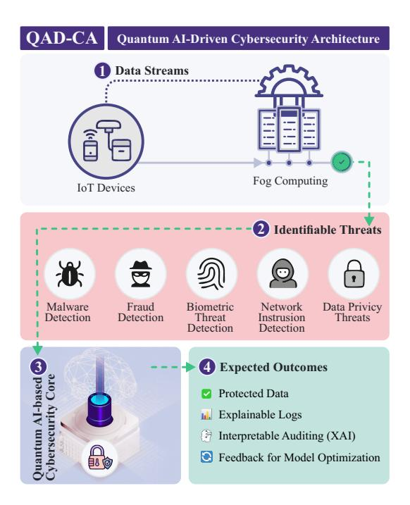
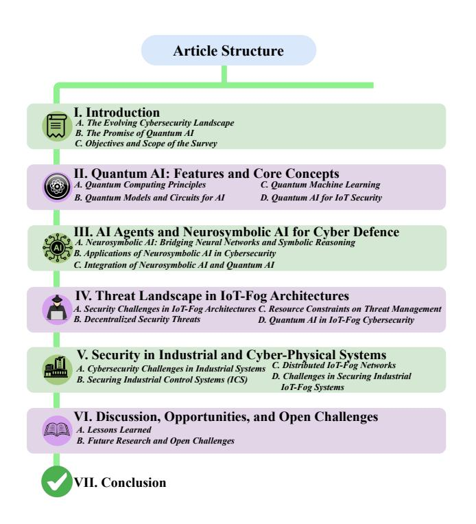
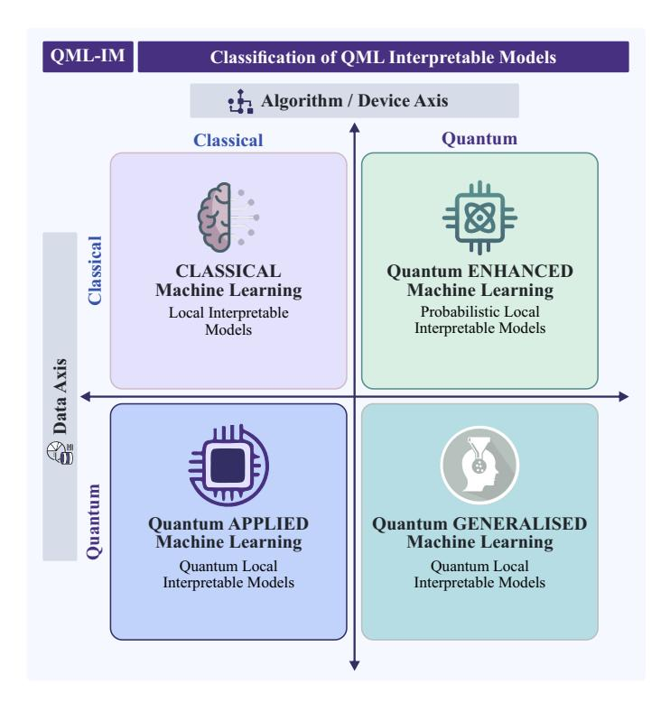
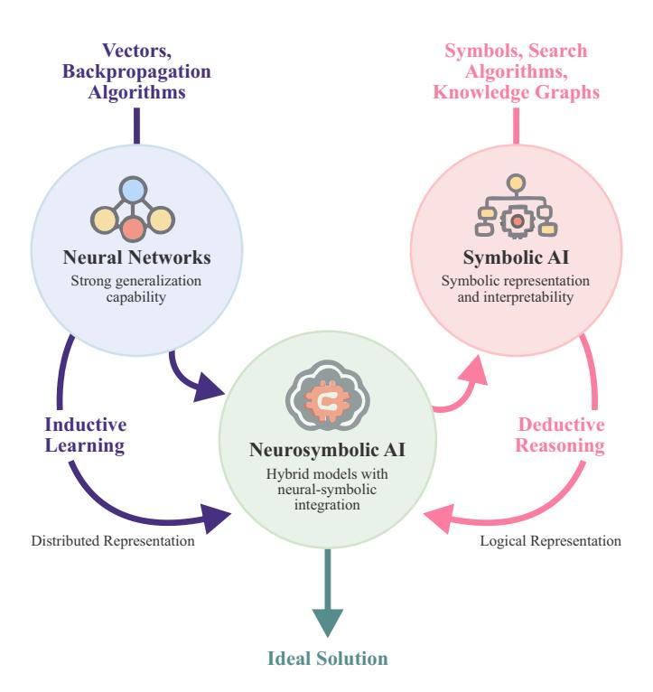
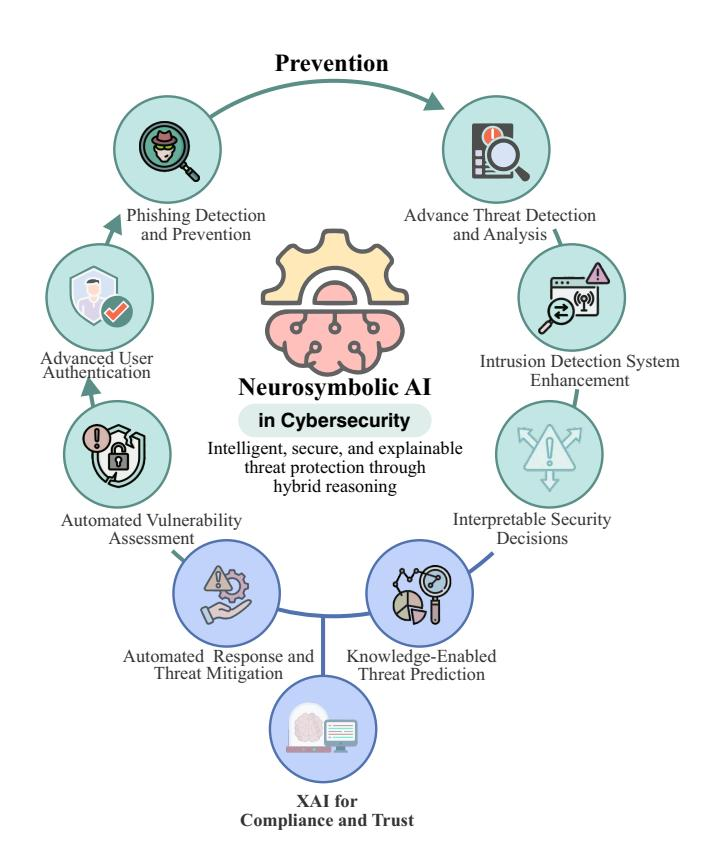
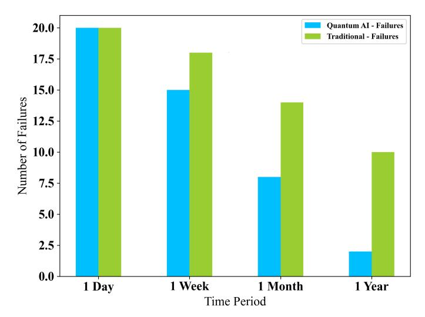
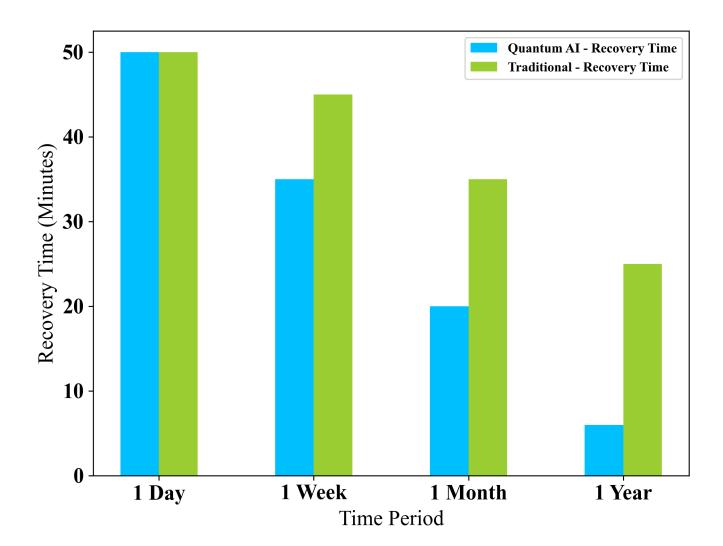
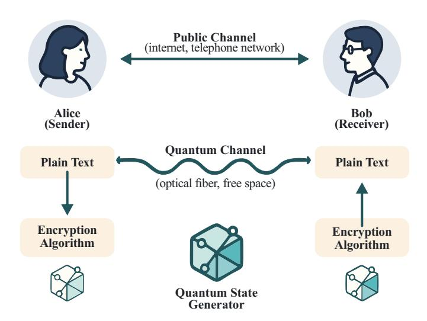
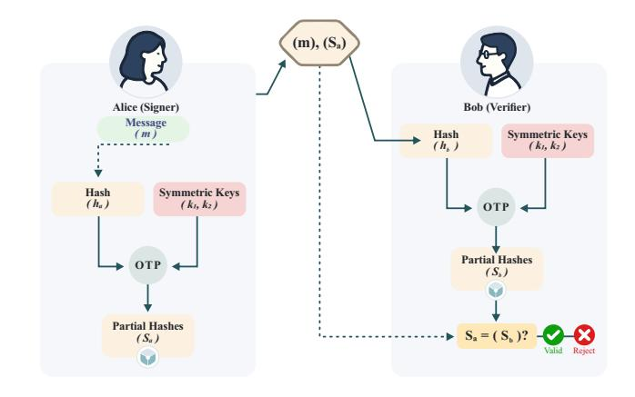
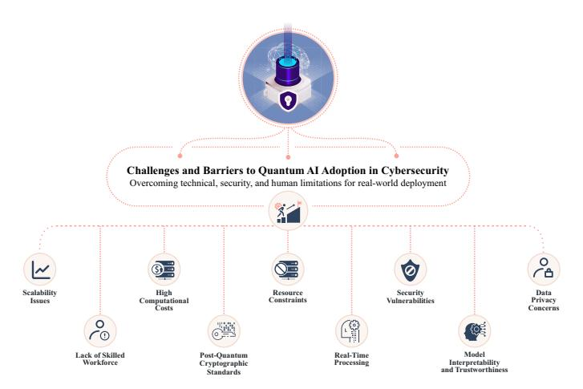

# Quantum AI-Enhanced IoT-Fog Communication: A Survey from Cybersecurity and Data Privacy Perspective

Antônio Roberto L. de Macêdo, Senthil Kumar Jagatheesaperumal, *Member, IEEE*, Kelton Augusto Pontara da Costa, *Senior Member, IEEE*, Kamal Acharya, *Graduate Student Member, IEEE*, Houbing Song, *Fellow, IEEE*, Mohsen Guizani, *Fellow, IEEE*, Victor Hugo C. de Albuquerque, *Senior Member, IEEE* 

Abstract—The need for data privacy in the next-generation communication networks encompassing the Internet of Things (IoT) and Fog infrastructure has become very significant. This enforces the need for Quantum Artificial Intelligence (AI) approaches to safeguard them. The evolving new means of threats, which are complex and challenging to predict, make conventional security solutions difficult to address and mitigate. To counteract them proactively and efficiently, most organizations have started using AI solutions, which analyze and predict patterns of threats. However, most recent threats demand more robust solutions integrated into the network infrastructure. To sort out most of the demands of IoT-Fog communication services, we present a comprehensive review of Quantum AI to provide a secure and robust framework. Specifically, we provide a taxonomy to summarize the studies on Quantum AI over the IoT-Fog infrastructure, intended to provide predictive maintenance, mitigating threats, and robust defense strategies. Furthermore, we propose the integration of Neurosymbolic AI, which combines the pattern recognition power of neural networks with the reasoning capabilities of symbolic systems, thereby enabling context-aware threat detection and explainable decision-making in critical infrastructure security. In addition, we also emphasize network protocol security and communication privacy issues, particularly in industrial and cyber-physical system networks. Finally, we discuss prominent research challenges and open-ended future research directions for Quantum AI in next-generation wireless networks.

Index Terms—Quantum AI, Cybersecurity, Infrastructure Security, Intrusion Detection, Network Protocol Security, Cyber-Physical Systems

#### I. INTRODUCTION

ITH the significant disruptions resulting from the large-scale usage of Internet of Things (IoT) devices and its associated technical transformations, which are largely prone to cybersecurity adversaries. They are highly vulnerable to dark web cybercriminals as billions of heterogeneous devices are interfaced in the cyberspace [1]. Such diverse digital threats, including ransomware, malware, and other attack vectors, impact large corporations and individuals, posing a threat to large cyber warfare.

The main focus of next-generation communication networks will be on integrating IoT and the expected progress of 6G technologies and services. This highlights the urgent need for strong data privacy solutions. Forecasts indicate that these networks will boast exceptional connectivity, minimal latency,

Manuscript received April xx, xxxx; revised August xx, xxxx.

and widely distributed infrastructures, which poses new challenges in protecting confidential information. 6G, unlike traditional communication systems, aims to accommodate billions of devices and manage significantly more data, thereby increasing the risks associated with data transfer, storage, and processing. As a result, ensuring data privacy within these extensive systems becomes a critical concern that demands innovative approaches like Quantum AI and advanced cryptographic techniques [2].

The work comprehensively reviews the use of Quantum AI as an emerging solution to address cybersecurity and data privacy challenges in next-generation IoT-Fog architectures. The study analyzes how combining quantum processing capabilities with machine learning models can improve the detection of complex threats, optimize resource management, and strengthen communication privacy. Fundamental concepts of quantum computing, such as superposition, entanglement, and quantum gates, are discussed, along with Quantum Machine Learning (QML) techniques applied to cybersecurity. The manuscript also highlights the role of Neurosymbolic AI in enhancing explainability and allowing interpretable decision-making in cyber defense systems. Finally, it shows the main technical challenges, investigation gaps, and future trends, positioning Quantum AI as a key technology for protecting decentralized networks and critical infrastructures in the face of increasingly complex digital threats.

## A. The Evolving Cybersecurity Landscape

contemporary cybersecurity environment characterized by continuous change, influenced by the rapid growth of interconnected systems and fast data transmission, and is also subjected to strange threats [3]. The complexity of protecting these decentralized networks is becoming more challenging with the expansion of technologies like IoT and fog computing across various sectors. Conventional cybersecurity strategies must be revised due to complex attacks aimed at distributed networks. This situation underscores the urgent requirement for innovative solutions to anticipate, detect, and mitigate real-time threats. The emergence of quantum computing and AI presents novel opportunities to enhance cybersecurity measures, providing innovative strategies to tackle both existing and anticipated threats [4].

Fig. 1. Quantum AI-enabled cybersecurity solutions.

Critical infrastructure encompasses essential systems fundamental to national security, economic stability, public health, and safety. This includes, but is not limited to, energy grids, water supply networks, transportation systems, and healthcare facilities. The deployment of IoT-Fog infrastructures within these domains typically encompasses distributed sensor nodes, fog gateways characterized by moderate computational and storage capabilities, and cloud backends that facilitate global coordination. Integrating Quantum AI into these configurations results in the enhancement of QML-based anomaly detection systems and the implementation of post-quantum secure communication protocols. A standard configuration comprises edge fog nodes equipped with QNN acceleration chips, hybrid artificial intelligence (AI) stacks such as TensorFlow Quantum and Qiskit, and secure multi-party processing implemented across federated devices. The increasing convergence of IoT, fog computing, and critical infrastructure within the global digital ecosystem presents significant vulnerabilities. This situation requires a thorough investigation into advanced cybersecurity models.

1) Privacy and Security in Next Generation 6G Services: A key feature of 6G networks is their ability to interconnect many heterogeneous systems, including smart gadgets, autonomous cars, industrial setups, and entire cities. With this enhanced connectivity comes notable challenges in data privacy, primarily as sensitive data spreads across various platforms. The decentralized nature of these networks, notably in IoT and fog computing, creates hurdles for applying traditional centralized security measures. This situation highlights the pressing need for innovative strategies such as decentralized trust models and blockchain-based solutions [5]. Next-generation communication systems must

adapt to dynamic and mobile devices, adding layers of complexity to developing security protocols [6]. Quantum AI offers significant promise by enhancing data processing speed, encryption techniques, and predictive analytics for 6G applications [7]. It is robust enough to detect real-time vulnerabilities and enables preventive actions to protect systems.

Researchers are increasingly exploring quantum-based cryptography, such as QKD, to enhance the effectiveness of privacy-preserving methods in 6G and IoT networks [8]. OKD enables secure communication channels that are impenetrable to traditional eavesdropping techniques, thereby ensuring the privacy of transmitted data. Moreover, Quantum AI holds promise for optimizing traffic management, boosting network efficiency, and predicting potential security threats and/or breaches. However, putting these kinds of technologies into future networks is still premature [9]. We must address numerous technical issues, such as integrating quantum algorithms into existing infrastructures and ensuring their scalability. So, it is important to keep innovating to improve lightweight quantum AI models and cryptographic frameworks that can work with the limited resources of future networks while still following privacy laws.

2) IoT and Fog Computing in Modern Networks: Incorporating IoT and fog computing within contemporary networks has significantly altered the digital environment, facilitating enhanced connectivity, scalability, and operational efficiency. Subsequent data volumes from IoT devices are generated and subsequently processed at the edge within fog computing architectures. This approach effectively minimizes latency and optimizes bandwidth utilization [10]. Implementing a decentralized approach has demonstrated significant value across essential sectors, including healthcare [11], smart cities [12], [13], and industrial automation [14]. Nonetheless, the inherent characteristics of this distributed architecture present considerable cybersecurity challenges. Interconnected IoT devices or fog nodes functioning within intricate environments present significant challenges in securing them from cyber threats [15]. Every node represents a possible entry point for malicious actors, highlighting the need for comprehensive and flexible security frameworks to protect data privacy, uphold integrity, and ensure system availability.

The reliance on critical infrastructure in energy grids [16], transportation systems [17], healthcare facilities [18], and financial networks [19] using IoT and fog computing is used for real-time monitoring and enhancing operational efficiency. Although these advancements present considerable advantages, they render critical infrastructure vulnerable to notable cybersecurity threats. The presence of vulnerabilities in these systems can result in significant failures, which may lead to extensive disruption and financial losses and pose risks to human safety. Attackers often use IoT-fog networks' weak security to launch DDoS attacks, help data leaks happen, or get malware into systems, putting critical systems at risk [20]. The essential interdependence of infrastructure heightens the associated risks, necessitating identifying and mitigating these vulnerabilities via sophisticated security protocols and

frameworks.

*3) The Role of AI and Quantum Technologies:* AI helps improve intrusion detection and threat mitigation in fog networks of the IoT by processing large datasets, finding patterns, and detecting outliers in real time [\[21\]](#page-24-14). Autonomously adapting AI-powered systems is essential to defend against sophisticated and evolving cyber threats, as they can respond effectively to new attack patterns.

Quantum computing can transform the cybersecurity landscape and undermine conventional encryption algorithms. It also shows new ways to make encryption resistant to quantum technology to withstand attacks from people with quantum technology knowledge [\[22\]](#page-24-15). Integrating AI and quantum technologies together makes them work much better to mitigate challenges. This makes it easier to create advanced cybersecurity systems that can handle the growing complexity of threats in IoT-fog environments. Using these technologies, one can get the computing power and adaptive intelligence necessary to protect sensitive data and infrastructure in the next generation of digital networks.

Quantum AI provides a potent solution to strengthen IoT-fog architectures in this evolving threat scenario. Quantum AI can improve the identification and mitigation of sophisticated cyber threats by combining advanced computational powers of quantum technology with AI [\[23\]](#page-24-16). Quantum AI, for instance, can enhance intrusion detection systems, increasing their responsiveness and ability to recognize complex assault patterns. Furthermore, quantum AI offers new methods to protect data privacy in communications between IoT fog systems, ensuring that private data is safe from attacks driven by quantum computing [\[24\]](#page-24-17). Future research and development in this field must prioritize the development of robust, quantum AI-driven cybersecurity solutions, as IoT fog systems rapidly support critical infrastructure. Table [I](#page-3-0) provides a comparative review of current survey papers focused on quantum AI applications to improve cybersecurity, assessing the depth to which each key topic is explored. The classification system uses appropriate indications that mention the volume of coverage of the topics and significant research deficiencies, especially in Quantum AI-powered threat mitigation and PQC, indicating a need for deeper research in these fields.

#### *B. The Promise of Quantum AI*

A significant divergence from classical computing is represented by quantum computing. It processes data by utilizing the ideas of quantum mechanics. Quantum computers use quantum bits, or qubits, as a fundamental unit of information, in contrast to classical computers, which use bits [\[41\]](#page-24-18). Because of the unique qualities of qubits, quantum computers can do complicated calculations at previously unheard-of rates. Superposition is one of the fundamental ideas of quantum computing, which allows a qubit to exist simultaneously in several states. In contrast, a classical bit can only exist in one of two states: 0 or 1 [\[42\]](#page-24-19). Accordingly, a qubit can exist in any 0 and 1 quantum superposition. Because of this feature, quantum computers have far more processing capacity because they can simultaneously process multiple possibilities.

Entanglement is another essential feature, representing how far apart two qubits are. Their states are intimately correlated when they get entangled [\[43\]](#page-24-20). Because of their interdependence, quantum computers can conduct coordinated, complicated computations faster than classical computers. By using the connections between entangled qubits, entanglement allows quantum algorithms to solve some problems more quickly than their classical equivalents. Another important concept that quantum computing uses is quantum interference [\[44\]](#page-24-21). Constructive and destructive interference between quantum states is a common way for quantum algorithms to magnify correct findings and cancel out faulty ones. This procedure increases the likelihood that the quantum system measurements will yield the right answer.

The basic idea behind quantum interference is fundamental to the success of quantum algorithms focused on security [\[44\]](#page-24-21). This principle is crucial for improving communication protocols by refining routing algorithms and minimizing error rates. Quantum algorithms use the ideas of constructive and destructive interference in quantum states to make it more likely that the right solution will be found while also getting rid of the wrong ones. This has significant benefits for security-related cryptographic algorithms, such as Shor's algorithm [\[45\]](#page-24-22), which can break traditional encryption systems by using the exponential factorization of large numbers, making them less efficient than conventional computers. For instance, quantum interference can improve channel estimation procedures within 6G wireless networks, guaranteeing reliable and high-quality communication connections, even in difficult situations such as densely populated urban regions or isolated foggy environments.

However, quantum computing also uses quantum gates to manage qubits. Unlike classical logic gates, which work on bits, quantum gates keep the system's quantum coherence by performing unitary transformations on qubits [\[46\]](#page-24-23). Quantum circuits are constructed from these gates, which enable the application of quantum algorithms. Shor's method [\[47\]](#page-24-24), which factors huge integers exponentially faster than the most well-known classical algorithms, is one of the most promising quantum algorithms. Since many encryption techniques rely on the challenges of factoring huge numbers, this has significant ramifications for cryptography [\[48\]](#page-24-25). Similarly, Grover's technique [\[49\]](#page-25-0) shows how quantum computing may solve complicated computational problems more quickly than classical computers by offering a quadratic speedup for unstructured search tasks.

#### *C. Objectives and Scope of the Survey*

This survey investigates the convergence of Quantum AI and IoT-fog computing, mainly focusing on their implications for cybersecurity and data privacy. This paper explores how Quantum AI-based methodologies contribute to enhancing cyberattack detection and prevention, the improvement of data privacy, and strengthening security measures for critical infrastructure. By thoroughly examining the current body of literature and recent developments, this survey aims to identify critical vulnerabilities and emerging threats

TABLE I EXISTING SURVEY PAPERS ABOUT QUANTUM AI FOR CYBERSECURITY SOLUTIONS. , G# AND #, INDICATE THAT THE TOPIC IS WELL-COVERED, PARTIALLY COVERED, AND UNCOVERED, RESPECTIVELY.

| Ref.         | Year | Focus                                                                                                                                                               | Quantum AI | IoT | Fog | Privacy | Security |
|--------------|------|---------------------------------------------------------------------------------------------------------------------------------------------------------------------|---------------|-----|-----|---------|----------|
| [25]         | 2022 | ML-based cyber threat detection using unsupervised and supervised learning methods on large-scale log data from an AWS cloud server.                             |               |     | G#  | #       | #        |
| [26]         | 2021 | Cyber threat detection on large-scale AWS cloud log data for high-confidence threat identification.                                                              | G#            | #   | #   | #       |          |
| [27]         | 2022 | Categorizes quantum computing tools, platforms, and frameworks, analyzing their applications, characteristics                                                    | G#            | #   | #   | #       | G#       |
| [28]         | 2024 | Analyzes 1,200 quantum start-ups worldwide, examining growth trends, industry categorization, investment patterns                                                |               |     | G#  | #       | #        |
| [29]         | 2023 | Explores the potential impact of quantum computing across fields like medicine, finance, and cybersecurity.                                                      | G#            | #   | #   |         |          |
| [30]         | 2024 | Reviews quantum supremacy experiments and explores advancements in quantum hardware, emphasizing the potential impact.                                           | G#            | #   | #   | #       | G#       |
| [31]         | 2022 | Reviews on quantum algorithms in power systems, focusing on hardware, and networking techniques                                                                  | G#            | #   | #   | #       |          |
| [32]         | 2024 | Integration of quantum computing with the metaverse, exploring its methodology, challenges, and potential applications.                                          | G#            | #   | #   | #       | G#       |
| [33]         | 2023 | Quantum Multi-Agent Reinforcement Learning (QMARL), with quantum computing and applications in agent coordination and decision-making.         |               | #   | #   | G#      |          |
| [34]         | 2021 | Evaluates the tipping points, barriers, and strategies for adopting quantum computers in organizations.                                                          | #             | #   | #   | #       | G#       |
| [35]         | 2023 | Quantum ML algorithms for improving in-vehicle attack identification and redefining the automotive security life cycle.                                          |               | G#  | #   | #       | G#       |
| [36]         | 2024 | Comprehensive guide to quantum computing fundamentals, hardware, algorithms, and real-world applications.                                                        | G#            | #   | #   | #       |          |
| [37]         | 2023 | Focuses on quantum computing software, system-level education, and fostering global collaboration in quantum research.                                           | G#            | #   | #   | #       | #        |
| [38]         | 2022 | Taxonomy of quantum programming tools and platforms, highlighting their features and challenges in implementing quantum solutions.                               | G#            | #   | #   | #       | #        |
| [39]         | 2023 | Quantum computing fundamentals with advanced applications like Brain-Computer Interfaces, exploring connections with quantum ML.                                 |               | #   | #   | #       | #        |
| [40]         | 2022 | Explores BayesianQNNs for improving generalization and uncertainty estimation in quantum ML                                                                      |               | #   | #   | #       | #        |
| This Work | 2025 | A review on applications of Quantum AI for IoT-Fog framework, including cybersecurity, privacy solutions with robust and trustworthy communication interfaces |               |     |     |         |          |

within IoT-fog networks, explicitly focusing on network protocol security, real-time monitoring, and intrusion detection systems. This paper further investigates the complexities involved in integrating PQC within IoT-fog systems and assesses the capabilities of Quantum AI in mitigating these challenges. The survey aims to furnish researchers, practitioners, and policymakers with a comprehensive insight into the transformative impact of Quantum AI on the security of next-generation IoT-fog architectures. The critical areas of focus of this article include:

- Investigating the potential of Quantum AI-based methodologies to improve the identification and mitigation of advanced cyber threats within decentralized IoT-fog architectures.
- Examining the correlation between Quantum AI techniques and enhanced data privacy protocols, focusing on securing data transmissions in IoT fog communications.
- Analyzing the Quantum AI-driven IDS emphasizing their accuracy, speed, and adaptability performance for protecting IoT-fog networks.
- Assessing emerging threats to IoT-fog network protocols

- reveals Quantum AI's significant role in developing resilient communication systems that can withstand these challenges.
- Assessing the impact of Quantum AI on enhancing real-time network security monitoring and traffic analysis within dynamic IoT-fog environments.
- Investigating the influence of Quantum AI-driven solutions on the resilience and availability of communications in the context of cyberattacks within IoT-fog networks.

The remainder of the article is organized as follows: Section [II](#page-4-0) presents the Quantum computing and AI background. The significant role of AI agents and Neurosymbolic AI for cyber defence in IoT-Fog environments is discussed in Section [III.](#page-7-0) The considerable impact of the threat landscape on IoT fog architectures is presented in Section [IV.](#page-11-0) Quantum AI in industrial and cyber-physical systems for enforcing security and privacy solutions is showcased in Section [V.](#page-15-0) Section [VI](#page-18-0) outlines the lessons learned, open research challenges and potential directions. Finally, Section [VII](#page-23-6) summarizes this article. Fig. [2](#page-4-1) shows the overall organization of contents discussed in this article.

Fig. 2. Overall organization of the article.

#### II. QUANTUM AI: FEATURES AND CORE CONCEPTS

This section presents a foundational overview of Quantum computing and AI, clarifying the fundamental principles and techniques crucial to understanding the integration of these transformative technologies into cybersecurity solutions designed to protect next-generation networks and data infrastructures. Table II summarizes the core concepts involved in Quantum computing and their particular relevance towards cybersecurity.

#### A. Quantum Computing Principles

Quantum computing represents a profound shift from classical computing. Using quantum mechanics principles, it transforms information processing [50]. In contrast to classical computers that depend on bits (0 or 1) as their fundamental unit of information, quantum computers employ qubits. These qubits exhibit distinctive characteristics that enable quantum systems to perform intricate computations with remarkable speed and efficiency.

Superposition is a fundamental principle within quantum computing. The classical bits are confined to one of two distinct states, 0 or 1 [42]. In contrast, a qubit possesses the unique ability to exist simultaneously in a superposition of both states. This allows quantum computers to handle numerous possibilities simultaneously, resulting in high efficiency when addressing intricate cryptographic problems, including conventional encryption algorithms for decryption.

Entanglement is a fundamental phenomenon in quantum mechanics characterized by the interconnection of two or more qubits [43]. In this state, one qubit's condition directly impacts the computational condition, irrespective of their spatial separation. In cybersecurity, the concept of entanglement plays a crucial role in improving secure communication protocols. Facilitates the safe exchange of information through quantum channels, which exhibit a reduced vulnerability to eavesdropping attacks.

Quantum gates play a crucial role in manipulating qubits within quantum circuits. In contrast to traditional logic gates, quantum gates use unitary transformations to carry out operations on qubits. These transformations are necessary to maintain quantum coherence [63]. Quantum algorithms, such as Shor's algorithm for decrypting cryptography and Grover's algorithm for better search operations, show great promise in solving cybersecurity problems related to encryption and sending data securely.

The potential of quantum computing to disrupt classical cryptographic systems has positioned it as a critical area for advancing cybersecurity measures. Modeling quantum states and predicting possible flaws in cryptographic frameworks is expected to change the field of cybersecurity and make it easier to build more robust defenses against cyber threats that are always getting stronger.

Shor's algorithm utilizes quantum factorization to undermine traditional encryption methods like RSA and ECC, which are widely used across communication networks. This poses serious security threats to future IoT systems, thus requiring the adoption of quantum-resistant cryptographic solutions. A recent study [64] reveals that executing Shor's algorithm on a quantum computer can breach RSA-encrypted digital signatures, enabling impersonation attacks within blockchain-based VANETs. The result exposes significant weaknesses in trust-based vehicular networks, highlighting the need to devise quantum-secure blockchain architectures.

Grover's algorithm significantly improves database searches, particularly enhancing pattern detection in AI-based cybersecurity systems. It boosts the speed of real-time threat identification and anomaly spotting by streamlining large security datasets. The research outlined in [65] describes the use of Grover's algorithm on IBM's 127-qubit quantum computer, highlighting its superior capability in examining unstructured datasets. The study indicates that Grover can speed up large search tasks on current quantum technology by testing it in several different oracle settings and environments.

Lattice-based encryption stands strong against quantum threats, notably Shor's algorithm, ensuring secure key exchanges within 6G and IoT-fog networks. This positions it as a promising option for crafting post-quantum cybersecurity frameworks. The study cited in [66] introduces a single-round lattice-based multi-signature scheme designed for decentralized public blockchains, effectively minimizing computational load and communication rounds. Using complicated lattice problems like Ring-SIS and Ring-LWE, the plan provides security that quantum computers cannot break and lets IoT and blockchain systems work together flawlessly.

#### B. Quantum Models and Circuits for AI

Quantum gates and circuits are crucial to quantum computing, serving as primary tools for adjusting qubits to

TABLE II SUMMARY OF CORE CONCEPTS IN QUANTUM COMPUTING AND AI FOR CYBERSECURITY

| Author                 | Year | Concept                                             | Key Principle                                                       | Relevance to Cybersecurity                                                |
|------------------------|------|-----------------------------------------------------|---------------------------------------------------------------------|---------------------------------------------------------------------------|
| Blais et al. [50]      | 2020 | Quantum Computing Principles                        | Qubits and quantum mechanics                                        | Enhances complex computation for cryptographic applications   |
| Zhao et al. [51]       | 2024 | Quantum Gates and Circuits                          | Unitary transformations for qubit manipulation                   | Maintains coherence, enabling superposition and entanglement     |
| Mummaneni et al. [52]  | 2022 | Quantum Gates (Hadamard, Pauli-X, CNOT)    | Manipulates qubit states and enables entanglement       | Supports multi-state processing crucial for quantum AI                 |
| Bataille et al. [53]   | 2022 | CNOT Gate                                           | Creates qubit entanglement                                          | Vital for secure communication and complex operations                  |
| Ugwuishiwu et al. [54] | 2022 | Quantum Interference                                | Constructive and destructive interference                  | Enhances accuracy in cryptographic algorithms                    |
| Ullah et al. [55]      | 2024 | Quantum Circuits for Algorithms                     | Circuit arrangements for Shor's and Grover's algorithms | Amplifies correct results, crucial for search and encryption           |
| Tian et al. [56]       | 2023 | Quantum Generative Learning Models (QGLMs) | Quantum GANs, Boltzmann machines                           | Addresses complex machine learning tasks in cybersecurity              |
| Safari et al. [57]     | 2024 | Quantum Neural Networks (QNNs)             | Quantum-enhanced neural network models                           | Improves predictive analytics and anomaly detection           |
| Maouaki et al. [58]    | 2024 | Quantum Support Vector Machines (QSVMs)          | High-dimensional classification                                     | Enables faster anomaly detection in cybersecurity                      |
| Li et al. [59]         | 2024 | Quantum k-Nearest Neighbors (Qk-NN)        | Quantum clustering algorithms                                       | Efficient clustering for rapid cybersecurity response         |
| Abreu et al. [60]      | 2024 | QML for Intrusion Detection                         | Anomaly and pattern detection in data traffic                    | Accelerates threat identification in network security         |
| Kumar et al. [61]      | 2024 | QML in Personalized Medicine                        | Predictive models for disease progression               | Enhances precision in healthcare security applications        |
| Grossi et al. [62]     | 2022 | QML in Financial Security                           | Pattern recognition for fraud detection                 | Quick insights mitigate losses and improve decision-making |

perform complex tasks. Quantum gates are distinct from classical logic gates because they manage qubits using unitary transformations. This helps keep quantum systems coherent and allows superposition and entanglement, two critical ways in which quantum computing is different from traditional methods [\[51\]](#page-25-6). By arranging these gates into specific sequences or quantum circuits, it is possible to form and manipulate quantum states, a critical process for carrying out quantum operations in quantum AI and other advanced applications. Quantum circuits enable the manipulation of qubits, allowing matrix multiplications to be performed exponentially faster than on classic processors. For example, utilizing quantum states accelerates the convergence speed in quantum-enhanced reinforcement learning, allowing AI models to swiftly adapt to cybersecurity threats in IoT systems.

Quantum gates such as the Hadamard, Pauli-X, CNOT, and phase gates are crucial for qubit manipulation [\[52\]](#page-25-7). When a qubit enters a superposition, the Hadamard gate allows it to embody 0 and 1 simultaneously. Meanwhile, the CNOT gate plays a crucial role in creating entanglement between a pair of qubits [\[53\]](#page-25-8). These characteristics are vital in QML and quantum AI, where handling multiple states simultaneously can improve computational efficiency and problem-solving abilities [\[26\]](#page-24-27).

Optimizing the design and placement of gates in quantum circuits is crucial for efficiently executing quantum algorithms. In complex circuits, quantum gates facilitate interference between quantum states, which can be either constructive or destructive. This interplay is essential for algorithms such as Shor's factoring and Grover's search algorithms, where precise gate arrangement directly impacts computational performance.

This interference amplifies the probability of achieving the correct results and reduces the chances of errors [\[54\]](#page-25-9). Such characteristics are particularly valuable for communication networks, where minimizing error rates and enhancing data throughput are critical. In 6G communication systems, these quantum-enhanced algorithms can optimize resource allocation, reduce latency, and improve spectral efficiency. The interference characteristic holds significant potential for Quantum AI, as it can enhance the speed and accuracy of searching and learning within large datasets, outperforming traditional algorithms [\[55\]](#page-25-10). Quantum gates facilitate effective data coding and transfer, ensuring smooth blending of IoT-fog devices with 6G wireless systems. Moreover, they enhance predictive analytics by boosting algorithms' precision for identifying network anomalies and optimizing traffic control.

*a) Variational Quantum Circuits (VQC):* VQCs are hybrid quantum-classical models where a parameterized quantum circuit is optimized using classical routines, typically through gradient descent or evolutionary strategies. These circuits consist of layers of quantum gates applied to input-encoded states, with trainable parameters representing rotation angles or entanglement patterns. The training objective is often framed as the minimization of a loss function, such as mean squared error or hinge loss, based on quantum measurement outcomes. VQCs, enable efficient and noise-resilient classification of quantum-encoded data, offering compact and robust models [\[67\]](#page-25-18).

Because VQCs operate on superpositions of states and leverage entanglement, they are capable of capturing complex, non-linear decision boundaries with fewer parameters than classical neural networks. Their expressivity, combined with their compatibility with NISQ devices, makes them an essential building block of QNNs [\[68\]](#page-25-19). Furthermore, the circuit depth can be tailored to hardware constraints, ensuring a trade-off between capacity and noise resilience.

*b) Quantum Support Vector Machines (QSVM):* QSVMs adapt the classical SVM framework to the quantum domain by utilizing quantum kernels. In classical SVMs, the kernel trick is used to compute dot products in a high-dimensional space without explicitly mapping data. In QSVMs, this is replaced by the overlap between quantum states representing the input data. The quantum feature map encodes classical data into quantum states, and the kernel matrix is computed through measurements of state overlaps.

This quantum kernel approach has shown theoretical and empirical advantages in certain problem classes, especially when the quantum encoding captures relevant problem structure. In cybersecurity and IoT anomaly detection, QSVMs enable the classification of subtle patterns in noisy, multivariate data streams tasks where classical models might struggle due to the curse of dimensionality or poor generalization [\[69\]](#page-25-20).

Both VQCs and QSVMs provide routes to implementing secure, efficient, and adaptive models within intelligent systems. In IoT networks, where devices are heterogeneous and resource-constrained, hybrid quantum-classical pipelines can help offload critical tasks—such as pattern recognition, intrusion detection, and device authentication on quantum processors. Moreover, the natural randomness of quantum measurements may offer further advantages in privacy-preserving computation.

As quantum hardware evolves, these architectures are likely to form the backbone of scalable and robust quantum AI frameworks. Integrating VQC and QSVM within federated or distributed systems is an emerging research direction, combining decentralization, privacy, and quantum acceleration.

Gate-count and depth constraints for near-term quantum circuits, the sample complexity associated with quantum kernels, and robustness bounds in the presence of noise sources such as decoherence and State Preparation and Measurement (SPAM) errors. For deployment feasibility in IoT-Fog environments, circuit *ansatze ¨* must conform to shallow-depth regimes and leverage error-mitigation strategies (e.g., zero-noise extrapolation) to maintain functional integrity. Additionally, kernel-based quantum learning methods should be regularized to prevent feature space collapse and overfitting. To support optimal architectural placement, resource models must explicitly expose mappings of quantum parameters, such as the number of qubits, circuit depth, and shot budget to corresponding system-level constraints, including inference latency and energy consumption. These mappings are critical to inform whether a given model should reside at the edge, fog, or cloud tier within a layered security architecture.

#### *C. Quantum Machine Learning*

QML is an emerging discipline that merges critical principles of quantum mechanics with machine learning strategies [\[70\]](#page-25-21). It promises higher efficiency compared to conventional approaches. Using quantum phenomena such as entanglement and superposition, QML techniques can significantly increase processing speeds and enhance data analysis capabilities, where their classifications are depicted in Fig. [3.](#page-6-0) This is especially important in complex fields such as pattern recognition and predictive modeling, where traditional machine learning methods face limitations [\[71\]](#page-25-22).

Fig. 3. Classification of QML Interpretable Models.

QNNs are essential to QML, as they take classical neural network designs and apply them to quantum settings, making computations faster and predictions more accurate. Unlike traditional neural networks, which rely on fixed weight adjustments, QNNs utilize the concept of superposition, allowing neurons to manage several states simultaneously. This fundamental ability boosts model training efficiency and speeds up the decision-making processes in cybersecurity tasks, especially for intrusion detection in IoT fog networks.

QNNs replicate the structure of classical neural networks, utilizing quantum mechanisms to improve parallelism and feature representation. A QNN comprises parameterized quantum circuits, where rotation gates act as tunable weights, and measurement operations operate as output layers [\[72\]](#page-25-23). The non-linearity observed in QNN is a consequence of the probabilistic characteristics inherent in quantum measurements, as well as the entanglement phenomena associated with qubits. QNNs enable the identification of intricate patterns with a reduced number of layers, owing to the exponential representational capacity that is characteristic of quantum states [\[73\]](#page-25-24). Furthermore, they employ quantum feature maps to transform classical data into high-dimensional Hilbert spaces, enabling the classification of linearly inseparable data [\[74\]](#page-25-25). The observed structural advantage in this context results in enhanced convergence rates and improved generalization accuracy when compared to conventional deep learning models, particularly in scenarios involving high-dimensional, low-sample datasets.

Quantum Generative Learning Models (QGLMs) offer a notable opportunity to effectively use quantum computing for tasks that classical systems cannot handle, particularly in machine learning contexts [\[75\]](#page-25-26). Authors in [\[56\]](#page-25-11) outlines QGLMs, such as quantum GANs and Boltzmann machines, highlighting their promising applications and the critical obstacles that must be overcome to advance quantum computing and machine learning.

In addition to QNNs, a range of other QML methods have emerged, such as QSVMs [\[76\]](#page-25-27) and Quantum k-Nearest Neighbors (Qk-NN) [\[77\]](#page-25-28). These innovations expand the scope of quantum computing in tackling machine learning challenges like classification, clustering, and regression. QSVMs exploit quantum computing's high-dimensional capabilities, leading to faster classification and quicker convergence than conventional techniques [\[58\]](#page-25-13). The Qk-NN method uses quantum algorithms to efficiently manage clustering operations, which are necessary to make quick decisions with large datasets [\[59\]](#page-25-14). These innovations make QML indispensable for next-generation communication systems that demand accuracy and rapid data processing. This makes QML perfect for users who need accurate and fast insights.

The use of QML extends to various sectors where demands for processing speed, precision, and real-time analytical capabilities are critical. In cybersecurity, QML could be used to look closely at the vast amounts of data that this traffic generates. This would facilitate the detection of intrusions and anomalous behavior, thus accelerating the process of identifying threats and taking appropriate action [\[60\]](#page-25-15). QML makes personalized medicine possible by using quantum-enabled predictive models that can look at patient data and accurately predict how diseases will progress and how well treatments will work [\[61\]](#page-25-16). Incorporating QML into the upcoming generation of communication systems boosts operational efficiency and provides a solid foundation for tackling scalability, security, and performance challenges in real time. As communication networks develop, QML will continue to play a crucial role in guaranteeing that decisions based on data are precise, timely, and dependable. Furthermore, the ability of QML to quickly identify patterns proves beneficial in areas such as financial forecasting and fraud detection. Obtaining timely insights from intricate datasets is crucial to mitigate losses and facilitate informed decision-making [\[62\]](#page-25-17).

## *D. Quantum AI for IoT Security*

Quantum Artificial Intelligence (QAI) plays a dual role in the IoT ecosystem, acting both as an enabler of advanced security mechanisms and as a potential threat to traditional privacy-preserving infrastructures. As QAI continues to mature, its impact on the security architecture of IoT-fog systems becomes increasingly significant.

*a) Enhancement of Security Mechanisms:* QAI introduces novel capabilities for strengthening cyber defense in IoT environments. Quantum machine learning techniques such as Quantum Neural Networks and Quantum Support Vector Machines can process high-dimensional and noisy data streams from IoT sensors with improved accuracy and reduced computational time [\[78\]](#page-25-29). These models enable real-time intrusion detection, anomaly recognition, and predictive analytics at the edge.

Furthermore, the integration of quantum cryptographic protocols, such as Quantum Key Distribution [\[79\]](#page-25-30) and Quantum Homomorphic Encryption [\[80\]](#page-25-31), ensures secure communication between fog nodes and resource-constrained IoT devices. These mechanisms offer provable guarantees of confidentiality and integrity, even under powerful quantum adversaries.

*b) Disruption of Existing Privacy Paradigms:* Despite its defensive advantages, QAI also poses substantial risks to classical security protocols. As quantum computing hardware evolves, algorithms such as Shor's algorithm are expected to break RSA and ECC-based encryption, which are still widely adopted in IoT firmware and cloud communication [\[81\]](#page-25-32)

In parallel, quantum-enhanced adversarial techniques, e.g., quantum-accelerated Membership Inference Attacks (MIA), may be capable of extracting private training data from machine learning models, even when protected with classical differential privacy [\[82\]](#page-25-33). Additionally, quantum side-channel analysis and interference-based attacks could exploit physical-layer vulnerabilities in quantum-integrated IoT devices.

*c) Architectural Implications and Research Outlook:* The dual nature of QAI necessitates a rethinking of IoT security architecture. On one hand, organizations must invest in post-quantum cryptography and quantum-aware AI models to future-proof their infrastructures. On the other hand, regulatory and ethical frameworks must be developed to mitigate risks related to quantum-enabled surveillance, inference, and manipulation.

Future IoT architectures must adopt hybrid security frameworks that combine QML-based detection with decentralized trust mechanisms, ensuring that the benefits of QAI do not compromise data sovereignty, user privacy, or system transparency.

## III. AI AGENTS AND NEUROSYMBOLIC AI FOR CYBER DEFENCE

The rapid advancement of AI technologies has opened new frontiers in cybersecurity, enabling more sophisticated and adaptive defense mechanisms against ever-evolving cyber attacks [\[83\]](#page-25-34). AI agents, designed to autonomously perform threat detection, response, and mitigation tasks, have become instrumental in enhancing cyber defense systems. Integrating AI agents and Neurosymbolic AI in cyber defense is transforming cybersecurity by enhancing robustness, adaptability, and transparency [\[84\]](#page-25-35). Neurosymbolic AI, which combines the pattern recognition capabilities of neural networks with the explicit reasoning of symbolic systems, is improving Intrusion Detection Systems (IDS) by making them more explainable and effective [\[85\]](#page-25-36). AI-driven mechanisms automate threat response, with intelligent agents significantly boosting defense efforts. Techniques like neuroevolution [\[86\]](#page-25-37) and reinforcement learning [\[87\]](#page-25-38) show promise for handling complex cyber environments.

Quantum AI and Neurosymbolic AI represent two complementary yet largely distinct research directions, whose integration has the potential to address pressing challenges in cybersecurity and data privacy. Quantum AI leverages quantum-mechanical phenomena—such as superposition and entanglement, to enable exponential speed-ups in cryptographic analysis and threat detection, as well as to support new forms of quantum-safe encryption [\[88\]](#page-25-39) [\[89\]](#page-25-40). Meanwhile, Neurosymbolic AI merges powerful pattern-recognition capabilities of neural networks with the logical rigor of symbolic reasoning, enabling automated detection of complex attack vectors and explicit auditing of algorithmic decisions [\[90\]](#page-25-41). By combining these strengths, quantum-enhanced neural networks could accelerate real-time threat identification at scale, while symbolic reasoning layers ensure policy compliance, traceability, and interpretable risk assessments [\[91\]](#page-25-42).

## *A. Neurosymbolic AI: Bridging Neural Networks and Symbolic Reasoning*

Neurosymbolic AI combines the strengths of neural networks (data-driven learning) and symbolic reasoning (rule-based logic) to create more robust and explainable AI systems and has evolved as the third wave of AI [\[92\]](#page-25-43).

*1) Overview of Neurosymbolic AI:* Neurosymbolic AI is an emerging subfield that seeks to merge two traditionally distinct approaches in AI: symbolic AI and connectionist AI (or deep learning). This integration aims to combine the best characteristics of each paradigm, thereby addressing their individual limitations and enabling the development of more powerful and versatile AI systems [\[93\]](#page-25-44).

Symbolic AI, prevalent during the early decades of AI research (1950s–1980s), is rooted in logic and rule-based reasoning. In this paradigm, knowledge is represented through explicit, human-readable symbols, and decision-making occurs through well-defined rules or logical inferences. Symbolic AI systems are highly interpretable, as their reasoning processes can be easily understood and traced back to the symbolic representations used. However, these systems are often rigid, require manual encoding of knowledge, and struggle with generalization in cases of incomplete or noisy data in next-generation communication network services. Moreover, they lack the ability to learn from new data autonomously, relying heavily on pre-programmed rules.

Neurosymbolic AI represents the convergence of symbolic and connectionist AI, with the aim of harnessing the strengths of both approaches. By combining the logical reasoning and transparency of symbolic AI with the pattern recognition and learning capabilities of connectionist AI, Neurosymbolic systems can perform tasks more efficiently, with enhanced interpretability and robustness. These hybrid models are capable of learning from data while retaining the ability to reason about abstract knowledge and provide explanations for

Fig. 4. Neurosymbolic AI Overview

their decisions, a feature that pure deep learning models often lack.

One of the key advantages of Neurosymbolic AI is its potential to reduce data dependency in the IoT-fog communication networks. While deep learning models typically require large datasets to perform well, Neurosymbolic systems can use symbolic reasoning to draw conclusions from incomplete data, significantly reducing the amount of data needed for training. Neurosymbolic systems are inherently more explainable than traditional deep learning models, as they can leverage symbolic representations to trace the steps taken in making predictions or decisions [\[94\]](#page-26-0). The rise of Neurosymbolic AI is often referred to as the "third wave" of AI, following the first wave of symbolic AI and the second wave of connectionist AI [\[92\]](#page-25-43). It represents a shift toward systems that are not only capable of learning from data but also capable of reasoning and explaining their actions, all while maintaining robustness in environments with uncertainty or incomplete information. Neurosymbolic AI seeks to overcome the limitations of both symbolic and connectionist approaches by blending their unique strengths, enabling AI systems to learn more effectively, generalize better, and offer greater transparency. This approach has gained popularity not only in applications such as cybersecurity [\[84\]](#page-25-35) but also in advancing other machine learning techniques, such as reinforcement learning [\[95\]](#page-26-1). Fig. [4](#page-8-0) provides an overview of the Neurosymbolic AI.

*2) Enhancing Explainability in Cyber Defence:* The integration of AI into cybersecurity has led to the development of highly efficient and adaptive defense mechanisms, but the "black-box" nature of many AI models presents a significant barrier to trust and widespread adoption. In the field of cyber defense, explainability is crucial for building trust with users, ensuring compliance with regulatory standards, and improving the system's effectiveness. Neurosymbolic AI can enhance threat detection and defense by enabling systems to reason about potential attack vectors, vulnerabilities, and security communication protocols while still leveraging the learning abilities of neural networks to adapt to new and evolving threats [\[84\]](#page-25-35).

As cyber defense systems become more autonomous, understanding how these systems arrive at decisions is essential. Users, particularly cybersecurity professionals, need to trust the AI systems' conclusions to implement the recommended actions confidently. Explainable AI (XAI) [\[96\]](#page-26-2) allows users to see the reasoning behind the system's decisions, fostering trust and providing a clear understanding of why specific actions (e.g., flagging traffic as suspicious, blocking IP addresses) are recommended. In regulated industries, such as finance or healthcare, accountability and transparency are legal requirements. Explainability provides a clear audit trail of decisions, which can be critical for proving compliance during regulatory reviews or security audits and helps cybersecurity teams refine their processes by providing insight into how threats are detected. Understanding the reasoning behind AI-driven alerts allows security analysts to reduce false positives, optimize detection parameters, and create more tailored responses to cyber threats in communication systems.

Neurosymbolic AI is at the forefront of enhancing explainability in cybersecurity, as it combines the pattern-recognition capabilities of neural networks with the logical reasoning and rule-based transparency of symbolic AI. Below are several approaches and techniques that are contributing to explainability:

*Symbolic Reasoning Layer:* Neurosymbolic systems use a symbolic reasoning layer to explain decisions. For instance, after a neural network detects an anomaly, the symbolic reasoning layer cross-references the anomaly with a rule-based knowledge base, explaining why the action was flagged as a potential threat. This allows for greater transparency and provides human operators with a clear path to trace the system's logic.

*Explainable AI Models:* Several XAI techniques are being used to enhance explainability: Local Interpretable Model-Agnostic Explanations (LIME) [\[97\]](#page-26-3) and Shapley Additive Explanations (SHAP) [\[98\]](#page-26-4) are commonly used for feature importance analysis, explaining which factors were most influential in a particular decision.

*Decision Trees and Rule-Based Systems* are inherently interpretable models allow for step-by-step reasoning, which is easy for human operators to understand. In Neurosymbolic systems, decision trees can complement neural network models, ensuring that each step of the AI's decision process is understandable and traceable.

*Visualization Tools:* Visual representations of AI decision-making processes, such as heatmaps or graph-based visualizations, help cybersecurity professionals quickly grasp complex data relationships. Neurosymbolic AI can use knowledge graphs to explain the links between various data

Fig. 5. Threat Landscapes in IoT-Fog Environment and Application of Neurosymbolic AI

points, allowing teams to visualize the connections between threats, vulnerabilities, and system events.

## *B. Applications of Neurosymbolic AI in Cybersecurity*

The fusion of neural networks' pattern recognition capabilities with symbolic reasoning enhances AI's application in various cybersecurity domains in modern IoT-fog communication networks. Neurosymbolic AI allows for detecting anomalies through data-driven learning and interpreting these events via symbolic reasoning, ensuring transparency in critical decisions. Fig. [5](#page-9-0) provides the overview of the different application areas of Neurosymbolic AI in various threat landscapes, which are elaborated along with the research works in the subsequent section.

*1) Advance Threat Detection and Analysis:* Traditional threat detection systems, constrained by their reliance on known signatures, often fail to detect novel or zero-day attacks. Neurosymbolic AI overcomes this limitation by merging the adaptability of neural networks in pattern recognition with the structured analysis of symbolic reasoning, allowing it to dynamically respond to new threats. In the context of a ransomware attack, for instance, the neural component can detect anomalous patterns in communication network traffic, while the symbolic component evaluates these patterns within a framework of likely impacts, mechanisms of spread, and targeted systems, thereby providing a comprehensive threat assessment [\[93\]](#page-25-44). Through this blend, Neurosymbolic AI excels not only in recognizing intricate patterns within data, such as network logs and behavioral metrics, but also in applying logical reasoning to contextualize these patterns within established security policies. This integration enhances detection capabilities against sophisticated threats, such as Advanced Persistent Threats (APTs) [\[99\]](#page-26-5), and enables zero-day exploit [\[100\]](#page-26-6) identification by generalizing from known vulnerabilities, analyzing software behavior, and inferring potential weaknesses that have yet to be documented.

- *2) Intrusion Detection System Enhancement:* In Neurosymbolic systems for Intrusion Detection, the neural network component continuously monitors real-time data streams, detecting anomalies that may indicate potential threats, while the symbolic reasoning component cross-references these anomalies against known attack patterns and security policies to minimize false positives [\[101\]](#page-26-7). This combination not only increases detection accuracy but also enhances the interpretability of alerts; symbolic reasoning offers clear, context-rich explanations that help security analysts understand the nature of detected intrusions in IoT-fog communication networks. By providing this level of transparency, Neurosymbolic systems empower analysts to make faster, better-informed decisions, supporting a timely and effective response to security incidents [\[102\]](#page-26-8).
- *3) Interpretable Security Decisions:* In cybersecurity, understanding the reasoning behind system decisions is crucial. While deep learning models excel in threat detection, their "black box" nature often obscures the logic behind their outputs, creating a barrier to trust and interpretability. Neurosymbolic AI overcomes this challenge by combining neural network capabilities with symbolic reasoning, facilitating transparent decision-making. For instance, when the neural component flags certain network behaviors as suspicious, the symbolic component can elucidate the decision by referencing established rules or domain knowledge, thereby fostering trust and providing cybersecurity professionals with actionable insights in 5G communication services [\[103\]](#page-26-9).
- *4) Knowledge-Enabled Threat Prediction:* Proactive prediction of cyber threats is invaluable, as it enables preemptive defenses. While neural models excel in identifying patterns, they may lack the ability to integrate explicit domain knowledge into predictions [\[84\]](#page-25-35). Neurosymbolic AI enhances this predictive accuracy by combining neural learning with symbolic reasoning, which incorporates structured knowledge about threat actors, techniques, and behavioral patterns. For instance, when a new malware variant emerges, the symbolic component can forecast its potential evolution based on historical data and known malware behaviors, while the neural component adapts to real-time data, keeping predictions relevant and responsive to emerging threats in communication networks [\[104\]](#page-26-10).
- *5) Automated Response and Threat Mitigation:* A rapid response is critical to mitigating the impact of cyber-attacks, and Neurosymbolic AI enhances this capability by merging insights from past incidents with reasoning about optimal actions. The neural component learns from historical data, identifying patterns and likely attack vectors, while the symbolic component reasons through the best response

- strategies. For instance, upon detecting a phishing attempt, the system can autonomously identify the source, potential targets, and propagation method, and then take swift action, such as isolating compromised systems or alerting users, thereby reducing potential damage and improving overall resilience in IoT-fog communication [\[105\]](#page-26-11).
- *6) Automated Vulnerability Assessment:* In source code analysis [\[106\]](#page-26-12), neural networks can identify potential vulnerabilities within code, such as buffer overflows or injection flaws. At the same time, symbolic reasoning evaluates these issues to assess their severity and potential impact. Such a combination enables efficient vulnerability detection and insight into the risks associated with each flaw. For Prioritization of Patches [\[107\]](#page-26-13), symbolic reasoning further aids by determining the criticality of vulnerabilities, allowing the system to prioritize which issues require immediate resolution, thus streamlining patch management in communication services and ensuring that the most impactful threats are addressed first.
- *7) Phishing Detection and Prevention:* In Email and URL Analysis, Neurosymbolic AI combines neural networks to examine the content and structure of emails and websites with symbolic reasoning that evaluates the likelihood of phishing attempts based on established tactics and linguistic patterns. Such a dual approach allows the system to detect subtle indicators of phishing that traditional filters might miss in the IoT-fog communication networks. Through Adaptive Filtering, the system continually refines its reasoning rules to adapt to emerging phishing strategies, enhancing its capacity to effectively identify and block new malicious communications. Its adaptability ensures that the system remains resilient against evolving threats [\[108\]](#page-26-14). Emotionally Engaged Neurosymbolic AI (EENAI) system-generated passwords has been shown to balance security, memorability, and usability, potentially revolutionizing password creation practices [\[109\]](#page-26-15).

#### *C. Integration of Neurosymbolic AI and Quantum AI*

At the core of Neurosymbolic AI lies the ambition to enable differentiable learning systems to manipulate structured knowledge such as logic rules, graphs, or ontologies, allowing AI systems to learn from data and also reason about that data in a logically coherent manner. In contrast, quantum computing leverages quantum mechanical principles such as superposition, entanglement, and quantum interference to perform calculations that can be exponentially faster for certain problems compared to classical algorithms. Integrating these domains involves the design and development of quantum enhanced algorithms that can perform symbolic reasoning tasks such as logical inference, constraint satisfaction, and rule-based manipulation within the quantum computational model. Several approaches are being actively explored:

*1) QML for Symbolic Representations:* QML models such as QSVMs [\[114\]](#page-26-16) and QNNs [\[115\]](#page-26-17) are being developed to efficiently learn patterns from structured datasets, including those involving symbolic representations. For instance, QSVMs exploit high-dimensional Hilbert spaces to find

TABLE III COMPARISON OF AI AGENTS AND NEUROSYMBOLIC AI AGENTS IN CYBERSECURITY

| Feature                                                                      | AI Agents                                                                                                                                             | Neurosymbolic AI Agents                                                                                                                                       |
|------------------------------------------------------------------------------|-------------------------------------------------------------------------------------------------------------------------------------------------------|---------------------------------------------------------------------------------------------------------------------------------------------------------------|
| Intrusion Detection Capabilities [101]                                 | Utilize machine learning models to detect anomalies based on learned patterns; may miss sophisticated attacks that do not match known patterns. | Combine pattern recognition with symbolic reasoning about network protocols and security policies; better at detecting sophisticated and novel attacks. |
| Malware Detection and Analysis [99]                                 | Identify malware by learning from known signatures and behaviors; struggle with obfuscated or new malware variants.                             | Use symbolic reasoning to understand code semantics and detect malicious intent; more effective against obfuscated and zero-day malware.                |
| Response to Zero-Day Attacks [100]                                        | Limited ability to detect unknown threats without prior data; rely on anomaly detection which may produce false positives.                      | Leverage symbolic knowledge of vulnerabilities and exploit patterns; can infer potential threats even without prior examples.                           |
| Explainability in Security Decisions [110]                          | Decisions are often opaque; difficult to justify why a threat was flagged or missed.                                                               | Provide transparent reasoning by explaining decisions using symbolic rules and logic; aids in compliance and auditing.                                     |
| Handling of Threat Intelligence and Security Policies [84] | Require preprocessing to incorporate threat intelligence; do not natively handle symbolic security policies.         | Natively integrate threat intelligence, security policies, and compliance requirements into reasoning processes.                                           |
| Adaptability to Evolving Threats [104]                              | Adapt through retraining on new data; may not quickly adjust to new attack vectors.                                                                | Adapt by updating symbolic knowledge and reasoning rules; quicker adaptation to new threats through logic updates.                                         |
| Robustness to Adversarial Attacks [105]                             | Vulnerable to adversarial examples crafted to fool statistical models; attackers can exploit model weaknesses.                   | More robust due to symbolic reasoning which can detect inconsistencies and resist manipulation of purely statistical features.                          |
| Ability to Correlate Multiple Security Events [107]                       | Correlate events based on statistical associations; may miss complex relationships.                                                                | Use symbolic reasoning to connect disparate events through logical relations; better at identifying coordinated attacks.                                   |
| Speed of Detection and Response [111]                            | High-speed processing once models are trained; suitable for real-time detection but may have latency in complex scenarios.                      | May have slower processing due to reasoning overhead; optimization required for real-time applications in high-speed networks.                          |
| Data Requirements in Security Context [112]                               | Require large amounts of labeled attack data; collecting such data can be challenging due to the dynamic nature of threats.   | Operate effectively with less data by leveraging symbolic knowledge; reduces dependency on large datasets of attacks.                                      |
| Scalability in Large-Scale Security Environments [113]              | Scalable with sufficient computational resources; parallel processing can enhance performance.                                                     | Scalability may be challenging due to complex reasoning tasks; requires efficient algorithms to handle large-scale environments.                        |
| Integration with Existing Security Systems [85]                     | Easier to integrate with existing machine learning-based security tools; standard interfaces and protocols.                      | Integration may require more effort due to specialized architectures; can enhance systems with advanced reasoning capabilities.                         |
| Complexity of Implementation in Cyberdefence [84]                         | Simpler to implement using existing AI frameworks; less expertise required.                                                                        | More complex implementation; requires expertise in both neural networks and symbolic reasoning; potentially higher development costs.                   |

optimal classification boundaries for complex data, which can be useful in distinguishing between logical propositions or semantic embeddings. Recent work [\[116\]](#page-26-22) introduced quantum circuit-based neural networks that enable learning of non-linear functions in quantum feature space, which could potentially encode symbolic structures more efficiently than classical models.

*2) Quantum Reasoning with Symbolic Rules:* Efforts have also been directed toward quantum representations of logic-based operations, where propositional logic, predicate calculus, and knowledge graphs are encoded into quantum states to exploit quantum parallelism and entanglement. For instance, Quantum Knowledge Graphs (QKGs) encode entities as quantum states and relations as unitary transformations, enabling relational data to be processed within quantum circuits. Such quantum encoding facilitates logical entailment and graph traversal with potential quantum speedups, as explored through variational quantum circuit models and quantum walks [\[117\]](#page-26-23). [\[118\]](#page-26-24) propose a variational approach where entities and relations are embedded in quantum Hilbert space for efficient reasoning. Moreover, symbolic techniques for quantum circuit analysis have emerged to tackle the scalability issue of direct unitary matrix computations. Shi et al. [\[119\]](#page-26-25) introduce a symbolic reasoning framework that leverages algebraic laws over vectors and matrices, offering a scalable and Coq-automatable alternative for analyzing complex quantum operations.

*3) Quantum Neurosymbolic Architectures:* A more integrative research direction lies in hybrid quantum Neurosymbolic architectures. These involve embedding symbolic constraints into QNN loss functions or structuring quantum circuits that naturally respect first-order logic constraints. A quantum symbolic transformer could encode language rules in symbolic form, while the quantum attention mechanism processes massive amounts of text in parallel. Such frameworks can be especially useful in domains such as quantum natural language processing (QNLP), where symbolic grammar and semantic rules are fused with quantum-enhanced computation [\[120\]](#page-26-26).

#### IV. THREAT LANDSCAPE IN IOT-FOG ARCHITECTURES

This section investigates the intricate security issues in IoT-fog frameworks, emphasizing the weaknesses linked to their distributed nature, finite resources, and dynamic settings. The discussion focused on specific threats, providing a detailed comprehension of the hurdles safeguarding these networked systems. Figure [5](#page-9-0) shows the visual representation of common threats and vulnerabilities in IoT-Fog ecosystems along with

TABLE IV CORE FINDINGS AND SUMMARY OF THREAT LANDSCAPE IN IOT-FOG ARCHITECTURES

| Aspect                                         | Description                                                                                                              | Challenges                                                                       | Technologies/Strategies                                             | Opportunities                                                               |
|------------------------------------------------|--------------------------------------------------------------------------------------------------------------------------|----------------------------------------------------------------------------------|---------------------------------------------------------------------|-----------------------------------------------------------------------------|
| Distributed Architecture [121]              | Fog computing decentralizes data processing and storage, increasing scalability                                    | Enlarged attack surface, inconsistent security protocols          | Decentralized trust management, blockchain                    | Enables real-time processing and localized decision-making               |
| Resource Constraints [122]                  | Limited computational power and memory in fog nodes and IoT devices                                                | Inability to deploy advanced security mechanisms                  | Lightweight cryptographic protocols, AI-based optimization | Development of resource-efficient security solutions            |
| Data Integrity [123]                           | Data processing near the source increases vulnerability to tampering                                | Risks of interception and corruption during transmission       | End-to-end encryption, secure communication protocols   | Builds trust and ensures system reliability                     |
| Dynamic Environment [121]                   | Devices frequently join and leave the network, complicating security                                                  | Ensuring authentication and secure communication for new nodes | Real-time authentication, adaptive security models            | Enhances flexibility and robustness in IoT-fog ecosystems |
| Privacy Concerns [124]                         | Localized management of sensitive data increases privacy risks                                                        | Lack of clear data ownership and privacy regulations        | Differential privacy, secure data aggregation                 | Strengthens compliance and user trust                              |
| Decentralized Security Threats           | Distributed nodes create vulnerabilities like device compromise and malware propagation [125] | Attackers exploit weak nodes to infiltrate networks            | Federated learning, anomaly detection systems           | Encourages innovation in decentralized security mechanisms   |
| Advanced Persistent Threats (APTs) [123] | Long-term, undetected attacks degrade system performance                                                        | Stealthy infiltration of systems and gradual data extraction         | AI-driven threat detection, blockchain-based logging             | Improves resilience against evolving threats                       |
| Bandwidth Limitations [126]                 | Communication between nodes must conserve bandwidth                                                             | High data exchange rates strain network resources                             | Efficient data compression, periodic monitoring         | Supports scalable and efficient IoT-fog implementations                  |
| Federated Learning [123]                       | Decentralized model training enhances privacy                                                                   | Vulnerabilities in parameter aggregation                                   | Blockchain-based verification                                    | Encourages secure AI model integration                                   |
| Blockchain Integration [127]                | Provides immutability and traceability in data exchanges                                                        | Computational demands pose challenges in constrained environments | Lightweight blockchain protocols                              | Strengthens data security in resource-limited settings                   |
| Lightweight AI Models [122]              | AI enables real-time threat detection and anomaly recognition                                                | Balancing computational efficiency with detection accuracy              | Model pruning, quantization                                   | Facilitates adaptive security for constrained devices              |
| Static Security Mechanisms               | Inflexible security systems struggle in dynamic IoT-fog networks [128]                                                | Difficulty adapting to evolving configurations and workloads      | Real-time, flexible security frameworks                       | Enhances system adaptability and defense mechanisms                      |
| Communication Security [129]                | Data transmitted between nodes is vulnerable to interception                                                          | Risks of compromised transmission channels                              | Secure data aggregation, encryption                              | Maintains data integrity across IoT-fog environments                     |
| Energy Constraints [130]                       | Monitoring, encryption, and data transfer consume significant energy                                                  | Device batteries are depleted quickly, reducing system functionality | Event-driven monitoring, periodic encryption                  | Prolongs device uptime without compromising security         |
| Integration Challenges [121]                | Compatibility issues with existing systems                                                                            | Difficulty ensuring uniform protocols across diverse devices            | Standardization efforts, hybrid frameworks                    | Promotes interoperability and cohesive operation                         |

the application of Neurosymbolic AI. Table [IV](#page-12-0) presents the most prominent threat issues that are commonly found in IoT-fog architectures, along with the key strategies to address them.

## *A. Security Challenges in IoT-Fog Architectures*

Fog computing enhances cloud infrastructure by bringing resources closer to the network edge, significantly improving latency and optimizing bandwidth utilization. Its proximity to data sources makes it particularly apt to support the rapidly expanding IoT ecosystem, where real-time data processing is often critical [\[124\]](#page-26-30). However, integrating fog computing within IoT networks introduces unique security and privacy issues distinct from those in traditional cloud systems [\[121\]](#page-26-27). These security problems mostly happen because fog environments are spread out, changeable, and resource-limited; fog nodes are often placed in different parts of the world with few resources available [\[131\]](#page-26-37).

A layered architecture that delineates the functional responsibilities associated with each level is discussed. The proposed architecture is systematically categorized into five fundamental layers: (1) Device Layer, (2) Fog Layer, (3) Edge Intelligence Layer, (4) Quantum AI Analytics Layer, and (5) Cloud and Control Layer. Within the Device Layer, various heterogeneous IoT devices, including sensors, actuators, and embedded systems, function in environments characterized by resource constraints. The devices are designed to generate real-time data, which is critical in initial data sensing and executing fundamental local operations. The security mechanisms implemented at this layer are limited, resulting in a heightened vulnerability of data privacy in the absence of intelligence from higher layers.

The Fog Layer is an intermediary consolidating data

from various devices, facilitating processing at or near the source. Quantum AI is increasingly significant in this context, facilitating secure offloading decisions, optimizing task scheduling, and enabling real-time anomaly detection. Quantum-enhanced machine learning models facilitate the transmission of only essential data to subsequent layers, optimizing bandwidth utilization and ensuring prompt responses. The Edge Intelligence Layer incorporates neuro symbolic reasoning alongside Quantum AI algorithms to facilitate improved decision-making processes. It implements quantum cryptographic protocols, including QKD and lattice-based encryption, to reduce local interpretability, predictive fault analysis, and encrypted routing, ensuring secure communication among edge nodes. The Quantum AI Analytics Layer serves as the primary analytical core. The system incorporates quantum-enabled models, including QNNs, QSVMs, and QBMs. The models under consideration facilitate the analysis of patterns, the detection of emerging threats, and the provision of intelligent defense strategies. It is achieved by utilizing quantum superposition and entanglement, which enable the parallel processing of high-dimensional security data.

The decentralized structure of fog computing poses a considerable security issue because it unintentionally enlarges the attack surface. Unlike centralized cloud systems, fog computing relies on distributed nodes to handle processing and storage locally. Each of these nodes locally can represent a potential weakness, as attackers can exploit them to gain unauthorized access, alter data, or compromise entire nodes [\[121\]](#page-26-27), [\[129\]](#page-26-35), [\[131\]](#page-26-37). The decentralized nature complicates the consistent application of security protocols between nodes, increasing the risk of cyberattacks.

Unlike cloud servers, which are generally equipped with extensive computational capabilities and storage, fog nodes often face limitations. These limitations hinder the deployment of advanced security measures, such as comprehensive encryption methods and in-depth anomaly detection systems. Therefore, it is crucial to develop security frameworks that are both lightweight and efficient; however, the creation and application of these frameworks pose significant hurdles. The innate limitations of fog nodes make them more vulnerable to attacks and data leaks, requiring the development of security solutions that balance performance and strong defense [\[124\]](#page-26-30), [\[132\]](#page-26-38).

The ever-changing and diverse attributes of fog environments pose significant security challenges. The fluidity of fog networks, marked by devices frequently joining and departing, complicates the continuous maintenance of security measures. Ensuring every new device is authenticated and establishing secure communication pathways are crucial, especially in a continuously evolving network. Furthermore, the wide variety of IoT devices in these networks complicates the application of uniform security protocols, as these devices often differ in processing power and communication standards [\[121\]](#page-26-27), [\[131\]](#page-26-37).

Tackling these security issues necessitates innovative strategies that utilize cutting-edge technologies such as AI for identifying anomalies [\[129\]](#page-26-35), blockchain for managing decentralized trust [\[124\]](#page-26-30), and federated learning for conducting privacy-preserving data analysis [\[131\]](#page-26-37). The continuous advancement of fog computing demands persistent research and development to create robust and adaptable security frameworks capable of enduring the ever-changing threat environment within IoT fog systems. It largely demands addressing the challenges related to the resource constraints, decentralization, and dynamic network topologies of IoT-Fog frameworks.

#### *B. Decentralized Security Threats*

The growing dependence on the IoT-Fog ecosystem signifies a notable transformation in the management of data and services at the network's edge, which improves latency and reduces bandwidth consumption [\[125\]](#page-26-31), yet introduces unique security challenges that are distinct from those in centralized cloud systems [\[122\]](#page-26-28). In IoT fog settings, decentralization leads to data storage and processing distribution across numerous fog nodes, thereby widening the potential attack surface [\[123\]](#page-26-29). These nodes often operate with limited computational resources and have varying security measures, making them vulnerable to various cyber threats. These threats include device compromise, attacks on data integrity, and malware distribution [\[133\]](#page-26-39).

*1) Key Threats in Decentralized IoT-Fog Architectures:* Embedded devices used for building fog nodes typically have limited computational and storage resources, which poses significant challenges for the deployment of robust security mechanisms. These resource constraints introduce vulnerabilities that attackers can exploit to compromise individual nodes, potentially enabling them to infiltrate the entire IoT-Fog communication network [\[122\]](#page-26-28), [\[125\]](#page-26-31). Moreover, the localized data processing characteristic of fog computing adds additional risks, as adversaries could intercept and modify the data during transmission between IoT devices and fog nodes. Such tampering severely undermines the integrity and reliability of critical system operations [\[123\]](#page-26-29), [\[134\]](#page-26-40). The decentralized nature of fog architecture offers an ideal setting for the rise of advanced persistent threats (APTs), aggravating the current difficulties. The complexity of these sustained attacks allows them to invade systems and go unnoticed, gradually degrading performance or siphoning off sensitive information over time [\[122\]](#page-26-28), [\[123\]](#page-26-29).

*2) Emerging Defense Mechanisms:* Given the security challenges encountered in decentralized IoT-fog environments, considerable efforts are underway to develop and implement innovative defense mechanisms. Federated learning marks a major progression in decentralized techniques for training AI models, emphasizing data privacy by keeping sensitive information localized within individual nodes. However, the combination of local model parameters introduces vulnerabilities that adversaries might exploit. To mitigate these threats, research on blockchain-based verification processes is being carried out to guarantee secure and reliable model integration across the network [\[123\]](#page-26-29), [\[127\]](#page-26-33).

Incorporating blockchain technology within fog networks serves as a key approach in this sector. Blockchain's decentralized ledger capabilities contribute to traceability and immutability in data transactions, thus providing secure communication across geographically distributed nodes. Despite the noteworthy advantages of blockchain integration, it poses substantial challenges in fog environments with limited resources, mainly because of its high computational demands [\[123\]](#page-26-29), [\[127\]](#page-26-33).

## *C. Resource Constraints on Threat Management*

In IoT-fog frameworks, addressing security threats is challenging, mainly because of the limited resources that fog nodes and IoT devices possess [\[126\]](#page-26-32). Unlike traditional servers, fog nodes often operate under restrictions related to computing power, memory, and energy [\[122\]](#page-26-28). These limitations hinder the use of standard security approaches, making it essential to develop efficient and lightweight security solutions tailored for these resource-limited settings [\[135\]](#page-26-41). Fog nodes and IoT devices often have restrictions in processing power and memory, which hinders their capability to use advanced security algorithms or conduct detailed data analysis [\[122\]](#page-26-28). More advanced encryption methods, comprehensive intrusion detection frameworks, and machine learning-based threat detection models usually need a lot of computing power, which makes them less useful in these settings [\[126\]](#page-26-32). Such constraint increases vulnerability to complex attacks, as resource-limited devices struggle to efficiently analyze and react to threats in real-time [\[135\]](#page-26-41).

Energy constraints contribute further complexity to threat management. Security measures that involve constant monitoring, encryption, or regular data transmission demand substantial energy resources [\[126\]](#page-26-32). The swift exhaustion of energy supplies presents significant difficulties for IoT devices with battery or low power, which may result in non-functionality and system disruptions [\[130\]](#page-26-36). Studies are exploring energy-efficient security strategies, like periodic and event-based monitoring, to address these issues, although these methods often compromise real-time response capabilities [\[136\]](#page-26-42). In this area, communication and bandwidth restrictions present significant challenges. Within fog computing settings, it is crucial to balance communication among various nodes while optimizing bandwidth usage [\[126\]](#page-26-32). Security protocols requiring regular data exchange can heavily burden the network, causing delays and reducing the overall performance using quantum computing frameworks, where the role of quantum AI is largely desirable [\[137\]](#page-26-43). Malicious actors often exploit system vulnerabilities through Distributed Denial-of-Service (DDoS) attacks, overwhelming the network and impairing its capacity to manage legitimate traffic [\[126\]](#page-26-32).

#### *D. Quantum AI in IoT-Fog Cybersecurity*

By moving data processing closer to edge devices in the network, IoT and fog computing frameworks provide better computational efficiency and scalability as they spread across various industries [\[23\]](#page-24-16). However, since these systems are decentralized and have many linked devices, they pose serious security risks. Using AI and the processing power of quantum mechanics, quantum AI emerges as a revolutionary solution to cybersecurity concerns in these distributed contexts [\[126\]](#page-26-32). Because quantum AI can overcome the constraints of traditional AI models and encryption techniques, it can potentially improve threat detection, data privacy, and secure communication in IoT-fog cybersecurity.

Critical infrastructure guides essential systems like energy, healthcare, and transportation that are increasingly vulnerable to cyber threats. Quantum infrastructure includes quantum computers, networks, and sensors designed to enhance computational power and security. Despite increased attack surfaces, IoT fog computing combines devices with fog nodes for low-latency data processing. Quantum AI is a promising solution to support security, optimize resources, and protect data privacy in complex environments.

*1) IoT-Fog Architectures:* IoT-fog integrated frameworks enable data processing on intermediary fog nodes rather than centralized cloud servers by bringing cloud computing closer to the network's edge [\[138\]](#page-27-0). This method is appropriate for time-sensitive applications in healthcare, smart cities, autonomous vehicles, and industrial automation since it significantly reduces latency, improves response times, and conserves bandwidth [\[139\]](#page-27-1). Since IoT fog communication systems are decentralized, they are primarily prone to cyberattacks. Such a distributed network infrastructure is challenging to manage and secure using traditional cybersecurity techniques.

IoT-fog architectures may be safer with quantum AI by utilizing quantum-enhanced threat detection and system monitoring methodologies [\[140\]](#page-27-2). Unlike traditional approaches, quantum AI is more efficient at recognizing strange patterns that point to cyber threats because it can quickly scan extensive information from several IoT devices [\[141\]](#page-27-3). Superposition and entanglement are the two fundamental characteristics of quantum computing, enabling quantum AI systems to identify threats well in advance, which was previously a much more challenging issue. Furthermore, by incorporating machine learning into quantum models, the systems can adjust to new threats and gain knowledge, providing a perfect shield to IoT-fog communication networks with real-time protection.

QKD is a prominent quantum security approach that utilizes concepts from quantum mechanics to facilitate a demonstrably secure key exchange. Protocols such as BB84 and E91 have been effectively demonstrated in multiple experimental configurations, and recent studies have suggested their integration with fog and IoT communication networks to minimize latency and enhance robustness [\[142\]](#page-27-4). Another emerging field is PQC, which aims to develop cryptographic algorithms that are resistant to quantum attacks, particularly those posed by Shor's and Grover's algorithms [\[143\]](#page-27-5). Lattice-based cryptography, code-based systems, multivariate polynomial cryptosystems, and hash-based signatures are currently under intensive investigation as quantum-resistant alternatives [\[144\]](#page-27-6).

Additionally, QHE is being developed to facilitate encrypted computation in quantum cloud settings while safeguarding plaintext data [\[145\]](#page-27-7). Complementing this are SMPC approaches in quantum environments that provide collaborative computation among untrusted parties while preserving confidentiality [\[146\]](#page-27-8). Zero-knowledge proofs (ZKPs), modified for quantum contexts, present advantageous pathways for privacy-preserving authentication and verification in decentralized frameworks like blockchain-integrated IoT-fog systems [\[147\]](#page-27-9). The integration of these concepts with Quantum AI could transform secure communication in resource-limited distributed networks.

- *2) Secure and Effective Resource Allocation:* The ongoing expansion of IoT devices presents significant challenges in securing and efficiently managing resources within fog environments. Veni et al. [\[148\]](#page-27-10) investigate applying quantum computing methods to enhance resource management in fog environments, explicitly focusing on latency-sensitive applications. The authors suggest that Quantum AI presents potential solutions for improving energy efficiency and safeguarding data privacy in modern communication systems while tackling the fundamental constraints associated with distributed and heterogeneous fog networks. Ahmed et al. [\[149\]](#page-27-11) elaborate on this concept by examining how cloud, fog, and edge computing improve IoT performance. Combining these architectures with quantum AI could produce scalable and energy-efficient IoT solutions, especially for applications that cannot wait for response times in conventional cloud computing.
- *3) Data Privacy in IoT-Fog Environments:* IoT devices and fog nodes gather, analyze, and store enormous volumes of sensitive data, giving rise to privacy concerns in IoT-fog ecosystems. These networks are frequently used to transfer financial information, personal information, and healthcare records, which make them prime targets for cyber attacks [\[150\]](#page-27-12). IoT-fog designs are distributed, which increases the risk because data passes through several nodes and is always open to interception or manipulation.

Moreover, quantum AI-based privacy-preserving algorithms make secure data analysis in IoT-fog frameworks possible, protecting user privacy without sacrificing security [\[151\]](#page-27-13). These algorithms enable fog nodes to process and analyze data for decision-making while guaranteeing that sensitive information is kept private. By utilizing the capabilities of quantum computing, IoT-fog networks can provide the required computational performance for contemporary applications while upholding a high degree of data privacy.

Table [V](#page-16-0) summarizes some of the predominant means of threat responses and its associative measures in quantum AI applications.

Fig. [7](#page-15-1) shows reduced recovery time after attacks or anomalies, significantly shorter times. Quantum AI offers much faster recovery across all periods evaluated, from 1 day to 1 year, compared to traditional methods.

The figures highlight the direct result on critical areas such as data security and resource efficiency, showing statistics how quantum AI improves resilience and reduces response times in cybersecurity scenarios.

Fig. 6. Number of failures compared to traditional classical methods.

Fig. 7. Reduced recovery time after attacks or anomalies.

## V. SECURITY IN INDUSTRIAL AND CYBER-PHYSICAL SYSTEMS

This section examines the main aspects and security challenges in industrial and cyber-physical systems, covering topics from threats in Industrial Control Systems (ICS) to the potential of Quantum AI in securing these environments. It begins by exploring security challenges in industrial systems, focusing on control mechanisms and cyber threats to these systems. Next, it analyzes the applications of Quantum AI in cyber-physical security, including real-time monitoring and enhancing physical security.

The section also investigates quantum techniques for ICS protection, with case studies illustrating the safeguarding of industrial networks. Challenges and security in distributed IoT-Fog networks are discussed, along with prospects and trends in using Quantum AI for industrial security. Finally, the section highlights research needs and essential datasets for ICS security, addressing data gaps and future directions for data collection and sharing in the field.

TABLE V CORE FINDINGS ON THREAT RESPONSE, NETWORK RESILIENCY, AND RECOVERY

| Aspect                                                                | Description                                                                                                                                | Key Technologies                                                      | Challenges                                                                | Opportunities                                                                |
|-----------------------------------------------------------------------|--------------------------------------------------------------------------------------------------------------------------------------------|-----------------------------------------------------------------------|---------------------------------------------------------------------------|------------------------------------------------------------------------------|
| Defining Network Resiliency [152]                               | Ability of networks to anticipate, withstand, and recover from disruptions while maintaining continuous operations | Cyber resiliency, AI for adaptive response                         | Complexity of distributed systems, high attack sophistication | Proactive AI-driven detection and dynamic response mechanisms |
| Importance of Resiliency [153]                                  | Critical for sustaining service availability in high-impact scenarios, such as DoS attacks                            | Machine learning, real-time analytics                           | Latency in response, static security measures                          | Integration of predictive AI models for proactive mitigation           |
| Predictive Analytics for Network Health [154]                | Monitoring network performance to identify vulnerabilities before disruptions occur                                                  | Quantum AI, real-time data processing                        | Limited predictive capabilities, computational constraints       | Early warning systems powered by Quantum AI                         |
| Fault Tolerance and Recovery [154]                           | Ensuring rapid restoration of services after network faults or attacks                                                      | Quantum-enhanced fault tolerance algorithms                     | Recovery delays, resource inefficiency                                 | Quantum AI for faster fault isolation and resolution    |
| Load Balancing and Traffic Management [155]                  | Maintaining network stability during high-demand periods through optimal resource allocation                             | AI-driven load balancing, Quantum AI for dynamic adjustments    | Congestion, latency during peak usage                               | Real-time traffic optimization and resource redistribution          |
| Quantum Techniques for Downtime Minimization [156]        | Leveraging quantum technologies like QKD for secure communication and failover                                              | QKD                                                                   | High implementation costs, integration complexity             | Automated quantum-enhanced failover and redundancy systems          |
| Scalability and Complexity in Resilient Networks [157] | Addressing challenges in real-time data handling in distributed environments                                                | Quantum AI for adaptive routing and anomaly detection     | Scalability bottlenecks, high resource demands                      | Parallel processing for large-scale data management           |
| Quantum AI in IoT-Fog [158], [159]                           | Demonstrates improved resilience and reduced recovery times in IoT-Fog environments                                      | Quantum AI for anomaly detection and load balancing       | Implementation challenges in IoT-fog systems                  | Real-time optimization of IoT-fog network resilience                      |
| Recovery Metrics [160]                                                | Evaluation of resiliency improvements over traditional methods using Quantum AI                                          | Comparative failure reduction and recovery time graphs | Lack of appropriate validation metrics                           | Longitudinal studies to validate simulated outcomes           |
| Cyber Threat Mitigation [161]                                   | Resiliency to mitigate DoS and advanced persistent threats (APTs)                                                                       | AI and ML for anomaly detection                                    | Rapid evolution of threats, lack of real-time mitigation      | AI-augmented dynamic threat response systems                           |
| Traffic Anomalies [155]                                               | Addressing real-time traffic spikes and congestion challenges                                                                           | Quantum AI for predictive traffic analysis                         | Poor scalability under high traffic loads                        | Dynamic load rebalancing to optimize network traffic flow              |
| Self-Healing Networks [162]                                        | Networks capable of automated fault detection and correction                                                                            | AI-driven self-repair algorithms                                | Dependency on pre-set configurations                             | Quantum-enhanced fault recovery and adaptive routing          |

## *A. Cybersecurity Challenges in Industrial Systems*

*1) Industrial Control Systems (ICS) Overview:* Industrial Control Systems are essential for monitoring and automating industrial processes and integrating hardware and software to ensure efficiency and safety in critical environments such as energy and manufacturing. Historically, ICS was designed to operate in closed and secure environments, using protocols like Modbus and industrial Ethernet, which initially were not developed with a focus on security [\[163\]](#page-27-25), [\[164\]](#page-27-26).

Authors in [\[165\]](#page-27-27) describe that with the convergence of Information Technology (IT) and Operational Technology (OT), promoted by Industry 4.0, ICS has begun connecting to external networks, increasing their exposure to potential cyber-attacks. Still, Chen et al. [\[166\]](#page-27-28) highlight an ICS architecture that comprises three main layers: the field control layer, the management layer, and the production control layer, each responsible for different aspects of system monitoring and control. This structure enables communication between controllers, human-machine interfaces (HMIs), and other devices, facilitating the integration of physical and digital processes. The work of Fagan et al. [\[167\]](#page-27-29) describes other threats that can compromise the integrity and availability of controlled processes. Table [VI](#page-17-0) categorizes the threats by severity and likelihood.

- Distributed Denial of Service (DDoS) Attacks: Due to the distributed nature of IoT-Fog systems, DDoS attacks pose a considerable threat, overwhelming devices and compromising the availability of critical services.
- Man-in-the-Middle (MITM) Attacks: Communication between IoT devices and fog computing nodes, typically over wireless networks, is easy to intercept, threatening data integrity and confidentiality.
- IoT Malware: IoT devices often have limited resources, making them vulnerable to malware that can compromise system security and control.
- Data and Privacy Compromise: The collection and processing of large volumes of data in fog nodes close to the data source increases the risk of exposure and manipulation of sensitive information.
- Unauthorized Access: Weak security in IoT devices and a lack of robust authentication in fog nodes make these environments vulnerable to intrusions; malicious agents can exploit gaps to gain unauthorized access.

TABLE VI RISK MATRIX

| Threat              | Probability | Impact | Risk Level |
|---------------------|-------------|--------|------------|
| DDoS                | High        | High   | Critical   |
| MITM                | Medium      | High   | High       |
| IoT Malware         | High        | Medium | High       |
| Privacy Violation   | Medium      | High   | High       |
| Unauthorized Access | High        | Medium | High       |

*2) Cyber Threats to Industrial Systems:* Industrial Control Systems face a wide range of cyber threats that can compromise the integrity and availability of controlled processes. Among the main threats are targeted attacks over IoT-fog communication services, such as the well-known Stuxnet case, which demonstrated the ability to physically damage industrial equipment through refined malware [\[168\]](#page-27-30), [\[169\]](#page-27-31). The complexity of these attacks reflects the features of ICS, which have specific protocols and are rarely updated due to the high cost and the need to ensure stability.

Additionally, Jiang et al. [\[170\]](#page-27-32) integrating cyber-physical systems and increased connectivity expand the attack surface, exposing systems to threats targeting both cyber and physical domains. Detection strategies, such as real-time monitoring and the implementation of ICS-specific honeypots, are suggested to mitigate these risks, providing defenses against intrusions and anomalous attacks [\[171\]](#page-27-33).

Figure [8](#page-17-1) illustrates that the QKD system uses two channels: the quantum channel and the public channel. The quantum channel transmits a secret key in the form of polarized photons, called qubits, while the public channel handles the negotiation and verification of the transmission process. In QKD, quantum communication occurs via optical fiber or free space [\[172\]](#page-27-34). Alice is the sender, Bob is the receiver, and Eve is a potential eavesdropper, enabling the detection of espionage attempts through quantum principles. This scenario is shown in Figure [8.](#page-17-1)

Fig. 8. Quantum Key Distribution architecture.

Figure [9](#page-17-2) describes the signature generation and verification process in quantum-resistant cryptography. In the generation phase, Alice concatenates the shared keys and calculates the hash of the message, encrypting it with a One-Time Pad (OTP) to create the signature. In the verification phase, Bob uses the known key to generate his hash and compares it with Alice's signature, validating the message's authenticity if there is sufficient correspondence.

Fig. 9. Quantum-resistant cryptography architecture.

## *B. Securing Industrial Control Systems (ICS)*

- *1) Quantum AI Techniques for ICS Security:* ICS faces continuous cybersecurity challenges that require innovative and resilient approaches to detect and mitigate threats. The application of Quantum AI techniques has emerged as a promising solution, as Quantum AI leverages quantum computing to address real-time anomaly detection and attack challenges [\[173\]](#page-27-35). Implementing methods such as rule-based learning and pattern monitoring, adapted to the quantum context, can significantly enhance the response to Advanced Persistent Threats (APTs) and real-time attacks [\[174\]](#page-27-36)–[\[176\]](#page-27-37).
- *2) Case Studies in Securing Industrial Networks:* Several case studies demonstrate the importance of multilayered security architectures for industrial networks. For instance, segmented architectures based on IIoT provide a modular and scalable structure, where each layer is protected with specific protocols and methodologies [\[177\]](#page-27-38), [\[178\]](#page-27-39). These cases highlight that defense architectures, such as object storage with erasure codes, can offer additional resilience, as observed in nuclear power control systems [\[179\]](#page-27-40). Jin et al. [\[176\]](#page-27-37) investigates security preprocessors, and the Snapshotter shows the effectiveness of low-impact solutions with secure logging capabilities, providing continuous monitoring without compromising ICS performance. These approaches confirm that employing behavioral defenses and active scanning techniques in critical industrial subnets makes it possible to detect complex intrusions while minimizing the risk of system disruption.

### *C. Distributed IoT-Fog Networks*

The distributed IoT-Fog infrastructure offers an efficient alternative to traditional cloud computing by bringing processing resources closer to the data-originating devices, reducing latency and network traffic load [\[180\]](#page-27-41), [\[181\]](#page-28-0). The distributed architecture employs the concept of fog computing, where fog nodes act as intermediaries between IoT devices and cloud servers, allowing a portion of the processing to be conducted locally [\[182\]](#page-28-1). Radhika et al. [\[183\]](#page-28-2) approaches that the configuration significantly enhances the scalability and performance of IoT systems, making them suitable for real-time, latency-sensitive applications such as smart cities and industrial systems.

Recent advances in Quantum Homomorphic Encryption (QHE) have demonstrated outstanding potential to enhance data confidentiality in distributed systems, mainly within cloud computing architectures. Based on using Einstein-Podolsky-Rosen (EPR) pairs and Quantum One-Time Pad (QOTP) encryption, the EPR scheme enables universal operations on encrypted quantum data while keeping privacy even in the presence of untrusted servers. Simulations conducted by Ganjian et al. [\[184\]](#page-28-3) show that although the computational cost associated with homomorphic evaluation is non-negligible, it is outweighed by the inherent challenges of simulating quantum operations on classical hardware.

Moreover, tools such as *py-qhe-epr*[1](#page-18-1) demonstrate the practical feasibility of using QHE for future applications in quantum networks, indicating a promising path for the secure use of quantum computing in multi-user environments [\[185\]](#page-28-4).

Similarly, the work by Ullah et al. [\[186\]](#page-28-5), addresses Quantum Enhanced Federated Learning with Differential Privacy (QE-FLDP) which integrates QHE techniques with Federated Learning and differential privacy to create resilient solutions against data exposure in collaborative systems. This approach combines parameterized quantum circuits (PQCs) for feature engineering, privacy-preserving agents such as the Laplace mechanism, and quantum teleportation channels for secure transmission of model updates. The application of QHE in these systems ensures that user data remains confidential even during inference and aggregation processes, effectively countering threats such as data reconstruction via GANs or man-in-the-middle attacks on model updates. Therefore, the intersection of QHE, quantum learning, and secure computing is foundational for the next generation of quantum AI-driven cybersecurity answers.

## *D. Challenges in Securing Industrial IoT-Fog Systems*

Security in industrial IoT-Fog systems faces significant challenges due to the increasing number of connected devices and the distributed nature of these systems [\[187\]](#page-28-6), [\[188\]](#page-28-7). The diversity of devices, such as sensors and actuators in industrial environments, creates a large attack surface where intrusions and distributed denial-of-service (DDoS) attacks are common threats [\[189\]](#page-28-8). Besides, Dave et al. [\[190\]](#page-28-9) conclude that the traditional security methods, such as centralized authentication, are neither scalable nor effective in IoT-Fog networks, as latency and limited device capacity are critical considerations.

## VI. DISCUSSION, OPPORTUNITIES, AND OPEN CHALLENGES

Despite the promising contributions in the academic literature and real-world implementations, some significant challenges in integrating quantum AI adoption into cybersecurity solutions remain unresolved. This section presents the lessons learned, challenges and research gaps we have observed in the state of the art. In particular, the stated research gaps are defined in the scope of the cybersecurity overview presented in the aforementioned sections. Following the study of academic contributions and real-world implementations, we have identified several research gaps in the state-of-the-art.

#### *A. Lessons Learned*

The integration of quantum AI in IoT-Fog cybersecurity presents significant findings that enhance our understanding of security within contemporary communication networks. A critical observation is the insufficiency of conventional security protocols in effectively managing intricate, decentralized networks. Traditional AI methodologies face significant challenges when it comes to adapting to rapidly evolving, decentralized environments that require immediate responses. In comparison, Quantum AI offers a clear benefit in handling complex data by leveraging concepts of entanglement and superposition, which enables significant advancements in solving cybersecurity issues.

Additionally, the limited resources in fog computing make it challenging to utilize regular AI models, underscoring the need for improved quantum models and systems that integrate classical and quantum computing to enhance efficiency and security. Techniques like quantum-enhanced federated learning and model pruning require further development to function effectively in real-world IoT fog networks, given the constraints on power, storage, and bandwidth of edge devices. Furthermore, a significant correlation exists between communication delay and security resilience.

Our findings indicate that latency-sensitive applications, such as autonomous vehicles, smart grids, and e-health, strongly oppose delays caused by centralized decision-making processes. Well-designed quantum AI models enable the rapid prediction of threats and the automation of responses at the fog layer, thereby reducing the need for core networks or cloud servers. Efficient coordination among quantum-enabled agents, implementing communication protocols, and establishing secure channels are essential for this endeavor.

Quantum AI models (e.g., QSVMs, QGLMs, including QGANs and QBMs), quantum-secure communications (PQC, QKD, QHE), and privacy-preserving mechanisms (SMPC, ZKPs, Differential Privacy) with deployment strata in IoT–Fog–Cloud provides promising outcomes. At the edge, lightweight quantum-enhanced classifiers (e.g., QSVMs with compact feature maps) align with DP and ZKPs for privacy-aware authentication on constrained devices. At the fog, neurosymbolic/agentic coordination and SMPC enable collaborative detection, while QHE supports encrypted analytics. At the cloud/core, PQC hardens inter-domain trust

1Open-source Python toolkit that simulates the EPR QHE

and key lifecycle, while QGANs and QBMs synthesize scarce attack patterns for robust training and systematic red teaming. This layered view explains interoperability targets and standardization gaps that hinder end-to-end resilience today.

The analysis highlights the critical need for standardization and reference architectures. The fragmented nature of the quantum AI environment, along with the various configurations of IoT and fog, has resulted in interoperability and system integration challenges. Looking at different applications and models highlights the importance of a single system combining quantum security features, better communication, and ways to manage resilience across various systems.

The decision between performing preprocessing at the edge or delegating inference to the cloud involves a delicate trade-off between computational cost, learning performance, and latency constraints. Key design questions include identifying scenarios where well-crafted feature extractors combined with weak learners outperform deep or hybrid models trained directly on raw data. It is also essential to determine the optimal division between offline feature extraction and online lightweight inference, considering the limitations of each architectural layer. Moreover, understanding under which network conditions edge preprocessing becomes preferable to full data offloading to the cloud is crucial.

For services with ultra-reliable low-latency requirements, such as those in URLLC (Ultra-Reliable Low-Latency Communications) contexts or in safety-critical control loops with end-to-end latency budgets of 10 to 50 milliseconds, local preprocessing using compact QSVM or VQC layers is advantageous. This approach minimizes jitter and reduces the attack surface. Fog-level aggregation can then enforce consistency through agentic consensus mechanisms, ensuring distributed robustness. In bandwidth-constrained environments or scenarios where data privacy is paramount, differentially private (DP)-compliant feature sketching, combined with selective encryption techniques such as QHE or PQC, should be prioritized before transmission to cloud services.

Conversely, when latency budgets are more relaxed and task complexity warrants deeper models, hybrid deep learning architectures deployed in the cloud may significantly improve detection performance, particularly in terms of AUC. However, to maintain system responsiveness, model updates should be distilled and transferred back to the weak learners at the edge. This enables continuous and efficient adaptation to local context without incurring excessive communication or inference delays.

Moreover, quantum security necessitates a fundamental transformation that extends beyond mere advancements in computation. New methods, such as QKD and QHE, along with new rules for post-quantum cryptography, are transforming the fundamental principles of secure communication [191]. The effectiveness of these emerging technologies will depend on their theoretical soundness, their compatibility with AI models and communication protocols, and their compliance with regulatory standards.

Fig. 10. Challenges and Barriers to Adoption in Quantum AI for Cybersecurity

#### B. Future Research and Open Challenges

The technological barriers on the adoption of Quantum AI, largely depends on its ethical implications in cybersecurity, and their potential usage in next-generation communication systems. Figure 10 shows the challenges and barriers in the phases of adoption of quantum AI in cybersecurity.

1) 6G Wireless Services: When wireless 6G technologies are combined with quantum AI systems, a new way to communicate with very low latency, comprehensive connectivity, and better intelligence due to quantum advances could be obtained [192]. 6G's main features, like terahertz communication and latency times of less than a millisecond, are similar to quantum AI's computing power, which lets it make decisions in real-time and respond quickly to changing circumstances [193]. On the other hand, adding quantum AI to the 6G framework comes with many technical challenges, especially when it comes to making quantum capabilities work with the huge size and complexity of 6G networks. These challenges include handling latency-sensitive operations, ensuring secure communication, and optimizing the use of the terahertz spectrum band.

One of the major hurdles involves aligning Quantum AI's vast data processing power with the urgent demands of 6G services. Smart cities, self-driving cars, and remote surgeries need answers in less than a millisecond [194]. It shows how important it is to have quantum-enhanced algorithms that can predict and adapt to network performance. Moreover, the 6G vision of linking billions of devices introduces notable resource allocation and traffic management complexities. Due to its predictive prowess, quantum AI can address these issues by optimizing spectrum use and distributing computational tasks across edge and core nodes, thus maintaining seamless operation despite shifting network conditions [195].

Within the 6G domain, ensuring security and privacy is paramount, especially since it supports crucial infrastructure. Quantum AI leverages advanced cryptographic techniques such as QKD to enhance communication security and mitigate potential threats. Researchers must constantly decide which data to process locally at edge nodes and which to process

centrally to achieve strong security. It is similar to how hybrid storage solutions in blockchain systems work. Quantum AI-driven 6G networks can improve the reliability and efficiency of communication by overcoming these problems. It paves the way for next-generation applications that demand unparalleled speed, security, and scalability.

*2) Scalability and Resource Constraints:* Integrating quantum computing into IoT-fog networks brings unique scalability challenges, particularly due to the limited resources available on fog nodes, as detailed in Section II on Quantum Computing and AI. Unlike centralized cloud solutions, IoT-fog networks enable distributed processing across multiple fog nodes, which typically face restrictions in storage, processing power, and bandwidth. Such challenge becomes more pronounced with the deployment of Quantum AI models that enhance cybersecurity and support real-time decision-making, necessitating efficient scaling of quantum resources.

Deploying Quantum AI applications in IoT-fog networks poses a considerable challenge due to the high computational demands involved. It is crucial to recognize that fog nodes are not inherently capable of handling the demanding quantum processes required for these tasks. The constrained resources of these nodes limit their ability to execute complex quantum calculations, leading to scalability challenges that obstruct the broad adoption of Quantum AI in IoT frameworks. New research indicates that quantum devices made for fog networks often have difficulty meeting the computing needs for advanced AI models used in cybersecurity solutions [\[196\]](#page-28-15).

The intrinsic constraints of fog computing environments pose a distinct challenge, requiring that each fog node adeptly handle local data processing despite having limited computational capabilities. IoT-fog architectures disseminate quantum AI operations across numerous nodes, in contrast to conventional network structures that handle large-scale AI computational tasks by centralized, high-capacity servers. Each of these nodes may only have a fractional amount of the needed processing power. To make this decentralized model work, we need to come up with new ways to handle computing workloads so that individual fog nodes do not get too busy and processing speed stays high [\[197\]](#page-28-16).

Resource allocation strategies for deploying quantum AI on devices with limited resources are essential for progressing in this domain. Grasping these limitations and optimizing resource utilization will improve the efficiency and feasibility of quantum AI technologies. Quantum resource limitations also relate to data management and processing effectiveness. Unlike cloud computing, which enables extensive dynamic resource distribution, fog networks operate under strict resource restrictions. A promising method involves adaptive resource allocation algorithms designed to assign tasks to fog nodes by evaluating their current resource availability and proximity to data sources. These algorithms look good, but they need to be improved even more to handle the huge amount of computing power needed for quantum AI applications while still being efficient and long-lasting [\[198\]](#page-28-17).

Several fundamental issues render the application of Quantum AI in the IoT ecosystem complex to implement immediately. First, hardware availability continues to be a challenge. Existing quantum processors have few qubits, brief coherence times, and high gate error rates, which constrain the scale and intricacy of quantum algorithms that can be executed. Access is usually limited to communal, cloud-based platforms, adding latency that doesn't play well with the immediate decision-making requirements of IoT networks. Second, scalability poses a twofold challenge, involving both the physical expansion of quantum hardware and the scaling of quantum-classical hybrid operations to billions of dispersed IoT nodes. As the size of problems increases, quantum circuits require additional qubits and deeper gates. This facilitates errors accumulating and makes computing more challenging to sync up and communicate with each other in remote contexts. Third, quantum representation of data is another significant issue. Encoding IoT data in a quantum fashion is not straightforward since it tends to be highly complicated and varied. Mapping features into quantum Hilbert spaces might need a large number of qubit resources and pre-processing. Unless encoding techniques are made efficient, additional effort might negate any acceleration quantum computing might provide. To enable quantum-enabled IoT cybersecurity technologies that are scalable and useful, we must advance fault-tolerant quantum hardware, low-latency hybrid architectures, and quantum resource-efficient data embedding.

*3) Post-Quantum Cryptographic Standards:* As advances in quantum computing are anticipated, current data encryption methods are likely to encounter substantial weaknesses. As discussed in Section IV on Quantum AI in Communications, PQC emerges as a new class of protocols designed to withstand the computational power of quantum computers, which jeopardizes conventional cryptographic systems like RSA and ECC [\[199\]](#page-28-18). Adopting PQC in IoT-fog networks, where data privacy and distributed security are very important, needs new approaches that know how to improve encryption performance while taking into account the limitations of devices with limited resources. These networks consist of numerous interconnected devices and fog nodes that together form a highly decentralized architecture designed to manage large volumes of sensitive data. In such settings, PQC is vital to maintaining data confidentiality, particularly since fog nodes often lack the robust security found in centralized systems.

Researchers exploring the protection of these networks continue to PQC approaches including lattice-based, hash-based, and multivariate polynomial cryptography as promising replacements for standard encryption methods. Lattice-based cryptographic protocols look especially good because they are very resistant to quantum attacks and work well with small devices [\[200\]](#page-28-19). Deploying PQC in IoT-fog networks introduces specific challenges, especially regarding data processing speed and cryptographic key management. Unlike centralized encryption systems that employ a single key across the network, distributed IoT-fog architectures require frequent key exchanges and updates, adding overhead that can hinder network efficiency. Therefore, new PQC solutions must be crafted to improve these decentralized models, ensuring data privacy is maintained while achieving optimal network performance [\[201\]](#page-28-20). The use of PQC in IoT-fog networks demands a careful balance between confidentiality and transparency, particularly where sensitive data needs visibility across different nodes or regulatory boundaries.

In healthcare IoT-fog applications, it is crucial to protect patient data privacy while allowing access to authorized nodes for timely medical evaluations [\[202\]](#page-28-21). Achieving this balance involves developing PQC algorithms that support precise access control and secure multi-party computations (SMPC). Research into integrating blockchain technology suggests that smart contracts can establish a verifiable data access record while protecting privacy with post-quantum cryptographic security [\[203\]](#page-28-22). Implementing PQC in IoT-fog networks must also consider compliance with data protection policies across various regions [\[204\]](#page-28-23). For instance, the European Union's General Data Protection Regulation (GDPR) sets specific data management criteria, requiring PQC protocols to uphold data security while meeting local privacy laws. The main challenge lies in crafting PQC systems versatile enough to adapt to diverse regulatory conditions while providing robust defenses against potential quantum threats [\[143\]](#page-27-5).

PQC is currently the most viable and scalable solution for preparing industrial and cyber-physical systems for the beginning of quantum computing. Unlike QKD, PQC algorithms are designed to operate on classical hardware while resistant to known quantum attacks, such as Shor's and Grover's algorithms. The National Institute of Standards and Technology has been leading the standardization of PQC schemes based on hard mathematical problems like lattice-based cryptography, multivariate polynomials, and hash-based signatures. Industrial systems, often constrained by computational and real-time requirements, must carefully assess which PQC algorithms to adopt to ensure minimal latency impact, especially in high-speed industrial networks. Migration strategies toward PQC must also address the coexistence with legacy systems and interoperability in hybrid environments.

*4) Real-Time Processing for IoT-Fog Architectures:* Processing real-time data is essential in IoT-fog communication architectures, particularly for applications with strict latency requirements, such as healthcare monitoring and autonomous vehicle control, both of which require prompt data analysis and responses. Unlike traditional centralized cloud architectures, IoT-fog systems enable the distribution of data processing across multiple fog nodes situated near the data source. However, there are many obstacles in the way of attaining true real-time processing in a distributed, resource-constrained environment, particularly when applying Quantum AI to the management and analysis of fast data streams. In healthcare and autonomous vehicle sectors, there is a clear need for immediate data-driven decision-making. In healthcare, real-time processing is vital for continuous patient monitoring, as any delay in data analysis can endanger patient safety. Similarly, autonomous vehicles rely on low-latency data processing for swift navigation decisions. In both cases, IoT fog communication architectures allow data processing near the source, reducing latency and enhancing system responsiveness [\[196\]](#page-28-15). However, conventional fog nodes often lack the computing power needed to meet the processing demands of Quantum AI models, particularly in complex real-time analytics.

Integrating quantum AI provides new possibilities for real-time data processing in IoT-fog networks, leveraging quantum computing's ability to process large data sets simultaneously. Quantum algorithms, like QNNs and QSVMs, speed up pattern recognition and predictive analysis. Incorporating Quantum AI models into fog nodes boosts data processing efficiency, enabling nearly instantaneous analytics and decision-making in latency-sensitive environments [\[205\]](#page-28-24). A major challenge in realizing real-time processing in IoT-fog architectures is ensuring synchronization among different fog nodes. Independent data processing of each node presents significant challenges in maintaining consistency and up-to-date information across the network, especially in timing-critical applications. For real-time processing, there needs to be a strong way to keep data flow and computation in sync across fog nodes so that the results of processing at each node are as similar as possible. Quantum enhanced distributed ledger technology (DLT) offers a promising solution to ensure data consistency by creating a decentralized transaction record, improving security and rapid accessibility for all nodes of the IoT-fog communication network [\[206\]](#page-28-25).

Another aspect of the synchronization challenge involves data management and coordination. Real-time data must be processed and transmitted to appropriate fog nodes or edge devices for further analysis or action. The constant data influx necessitates a comprehensive protocol that prioritizes tasks and balances loads across the network, allowing Quantum AI models to operate efficiently, even with limited resources. Advancing real-time Quantum AI applications in IoT-fog architectures requires developing quantum-compatible, low-latency processing protocols. Currently, researchers are working on adaptive quantum models that can be used in fog environments. These models will let nodes perform quantum-enhanced processing while managing resources well. Such adaptation might involve simplifying complex quantum algorithms or creating hybrid models that combine classical and quantum techniques for optimal use of resources [\[207\]](#page-28-26).

*5) Model Interpretability and Trustworthiness:* In comparison to conventional AI, which benefits from advanced interpretability techniques, Quantum AI faces specific challenges due to its foundation in quantum mechanics principles such as superposition and entanglement. These aspects introduce additional complexity to the logic of the models. Ensuring clarity and dependability in Quantum AI models is crucial for fostering transparent and impartial decision-making in critical domains like national security and industrial cybersecurity. Because they depend on probabilistic quantum states, Quantum AI models operate in ways that may complicate understanding and interpretation. Unlike traditional models, where it is possible to trace and examine each decision pathway, Quantum AI leverages quantum phenomena. Consequently, understanding the results requires consideration of qubit dynamics and quantum gate functions, which do not naturally align with human-intuitive logic [\[208\]](#page-28-27). Such uncertainty poses significant obstacles for cybersecurity uses, necessitating that model outputs remain verifiable and understandable to stakeholders, including IoT-fog communication system operators and regulatory bodies.

Furthermore, Quantum AI's reliance on quantum circuits introduces additional complexity to the interpretation process. The interaction between components within a multidimensional quantum environment can either enhance or reduce quantum states through interference. It complicates the decision-making processes, making them challenging to analyze, particularly in real-time security scenarios. Recent works have focused on quantum visualizations and simplified explanations of quantum logic as possible solutions. Nevertheless, these approaches currently encounter challenges related to scalability and efficiency [\[207\]](#page-28-26). Due to the opaque nature of Quantum AI's decision processes, implementing rigorous auditing protocols is essential to identify and mitigate biases or security threats within the model performance, particularly concerning cybersecurity. Adversaries may exploit vulnerabilities in Quantum AI models by modifying entanglement configurations or inducing decoherence, potentially skewing results.

To ensure the model is reliable, it must go through many tests to find and fix these bugs, keep it stable, and watch out for actions that could go against it. To ensure that Quantum AI models are reliable for tasks like threat detection, anomaly identification, and response planning in various situations, it is necessary to carefully look at how decision results meet cybersecurity standards. It is essential to look into quantum error-correction codes because they keep the quantum state stable, protect the accuracy of the Quantum AI results, and make them more reliable in security tasks [\[209\]](#page-28-28). One useful way to make Quantum AI easier to understand is to use neurosymbolic AI, which combines the logical thinking of regular AI with the adaptable learning of neural networks. By adding symbolic rules to quantum decision pathways, neurosymbolic methods could make Quantum AI results easier to understand over time. This would make the model results more straightforward to understand. Using neurosymbolic methods in cyber defense could help analysts understand the logic behind specific threat assessments, which would greatly improve trust and clarity in Quantum AI systems used in critical infrastructure settings [\[210\]](#page-28-29). Another innovative direction explores the creation of quantum explanation models, which aim to break down quantum decision-making processes into more manageable and understandable components. These models could foster the development of quantum decision trees or influence diagrams, illustrating how individual qubits and gates affect decision-making.

*6) Neurosymbolic AI for Predictive Cyber Defense:* Neurosymbolic AI is increasingly recognized as a powerful strategy in cyber defense predictive, combining the symbolic reasoning strengths of traditional AI with the adaptive learning capabilities of neural networks. This merger allows for sophisticated threat forecasting by integrating structured rule-based logic with adaptive pattern recognition, improving the ability to anticipate and counteract intricate cyber threats. Neurosymbolic AI plays a much bigger role in quantum AI in driving cyber defense over IoT-fog communication network infrastructures. The speed and ability to make probabilistic predictions made possible by quantum technology could help improve threat detection models. This is important to stop cyber attacks that change all the time. Conventional cyber defense systems often depend on rule-based identification and anomaly recognition, which may struggle to adapt to new and unexpected threats.

Neurosymbolic AI combines the adaptability of neural networks with symbolic representations to let the system learn from past cyber events and make predictions based on known patterns and logical frameworks [\[211\]](#page-28-30). In IoT fog environments, neurosymbolic models can analyze complex network interactions and identify anomalies with greater precision than traditional models. Adding quantum AI to predictive models uses quantum computing to handle large datasets more efficiently. This makes it easier for neurosymbolic AI to create real-time alerts for possible threats. Quantum-enhanced neurosymbolic AI models make proactive cybersecurity strategies much better. This is especially true in high-risk areas of infrastructure, such as critical infrastructure, where quick response to threats is very important [\[212\]](#page-28-31). Despite its promising capabilities, the merger of neurosymbolic AI with quantum AI faces considerable technical hurdles that require further research. Mapping neural-symbolic logic onto quantum circuits can be quite challenging. Quantum systems rely on a fundamentally probabilistic mechanism, which can present integration issues with the deterministic frameworks needed for symbolic reasoning. Thus, creating symbolic representations compatible with quantum systems is crucial to maintaining the logical consistency necessary for accurate threat forecasts while preserving quantum coherence [\[213\]](#page-28-32). Also, neurosymbolic AI models usually need a lot of space and data, which makes them hard to scale up when used in quantum-enabled IoT fog architectures that do not have a lot of resources. Enhancing neurosymbolic AI for efficient deployment involves devising adaptive quantum algorithms that balance processing efficiency and predictive precision. This includes making quantum circuits that combine pattern recognition based on neural networks with symbolic logic while considering the hardware limitations of quantum and fog nodes. This multifaceted challenge remains in the early stages of exploration in the field.

Beyond predictive analytics, the combination of neurosymbolic AI and Quantum AI can potentially increase network resilience. This resilience can be achieved through failover mechanisms that automatically identify and address network failures. For instance, during a cyberattack on an IoT-fog network, the synergy between neurosymbolic AI and quantum AI can identify failure points and enable immediate data rerouting, thus maintaining service continuity [\[214\]](#page-28-33). By combining quantum AI's adaptive response features with symbolic logic that comprehends network protocol architecture, neurosymbolic models assist in creating failover plans that are resilient and adjust in real time to changing network conditions. This integration provides a self-regulating network ability where quantum AI-augmented neurosymbolic models automatically tackle disruptions and optimize network flow, thereby minimizing downtime and enhancing cyber resilience. Such systems hold significant promise in areas like autonomous transportation and healthcare, where network stability and the ability to detect immediate threats are crucial to maintaining safe operations.

*7) Industrial Security:* The growing interconnectivity and convergence of Information Technology and Operational Technology infrastructures in industrial environments have created new demands for robust security strategies, especially for ICS. These systems, crucial for operations in energy, manufacturing, and water sectors, are frequently targeted by cyberattacks, requiring solutions beyond traditional intrusion detection and threat mitigation methods.

Recently, decentralized and adaptive cybersecurity architectures have been adopted, including layers of in-depth defense and implementation of intrusion detection and prevention systems based on AI. Machine learning-based solutions are increasingly used to identify anomalies and complex attack patterns in real-time, primarily due to their ability to adapt to new attack vectors. However, reinforcement learning and deep learning have shown limitations in adversarial attack scenarios, where attackers manipulate data to bypass traditional detection systems.

The integration of fog computing, especially for detecting DDoS attacks in IoT environments, also stands out as an essential trend, enabling low-latency intrusion detection. Additionally, using blockchain and cloud computing techniques to maintain event logs and facilitate rapid incident responses offers excellent reliability for ICS, even in high-criticality scenarios such as nuclear control networks and energy systems.

Quantum AI emerges as a promising solution for complex challenges in industrial cybersecurity. The potential of Quantum AI in ICS is linked to its ability to process large volumes of data and perform complex calculations at rates that are complicated by classical systems. Quantum optimization and machine learning algorithms, such as the Quantum Approximate Optimization Algorithm and variational classification models, are being explored to improve industrial systems' anomaly detection and failure prediction [\[215\]](#page-28-34).

R&D initiatives in Quantum AI include using QML-based algorithms to detect network anomalies and predict attacks by analyzing real-time behaviors of sensors and actuators. These approaches have effectively mitigated unknown threats and identified vulnerabilities in critical industrial infrastructures. In energy control systems, for instance, quantum learning models have been applied to assess and respond to attacks without disrupting essential processes, providing an additional layer of resilience.

# VII. CONCLUSION

This survey establishes an extensive framework to classify and assess cybersecurity solutions, mainly focusing on integrating Quantum AI within IoT-fog architectures and emerging communication networks. This work connects essential components across various dimensions, including cybersecurity principles, Quantum AI capabilities, Neurosymbolic AI and IoT-fog communication architectures. It emphasizes the interactions within IoT-fog ecosystems, the role of Quantum AI in boosting cybersecurity, and the specific challenges these technologies tackle. By harnessing Quantum AI's capabilities, such as real-time threat detection, enhanced data privacy, and improved network resilience, this survey highlights its transformative impact on securing communication-centric areas like 6G networks, critical infrastructure, and autonomous systems. Our thorough evaluation underscores Quantum AI's relevance in addressing principal challenges in communication networks, including managing dynamic data traffic, optimizing resources, and providing low-latency threat responses. The analysis identifies the substantial potential for Quantum AI to transform contemporary cybersecurity structures through predictive threat analytics, adaptive load balancing, and post-quantum cryptographic protocols. However, challenges such as scalability, model interpretability, and developing robust defenses against adversarial attacks remain pivotal to its broad implementation. As next-generation communication systems advance, tackling these challenges will be key to fully realizing Quantum AI's potential in securing IoT-fog and 6G ecosystems. This survey emphasizes the necessity of interdisciplinary research efforts to enhance Quantum AI applications designed for communication networks, with a focused approach to model transparency, creating post-quantum cryptographic standards, and formulating resilience strategies to confront the constantly evolving cyber threat landscape. By focusing on these priorities, a path toward strong, secure, and efficient next-generation communication networks can be effectively forged.

# ACKNOWLEDGMENT

This work was supported by the Office of Naval Research (ONR) with grant No. N62909-24-1-2012, by CNPq with grant No. 305517/2022-8, by FAPESP with grant No. 2023/12830-0, and by Petrobras with grant No. 2023/00466-1.

## REFERENCES

- [1] Y. R. Siwakoti, M. Bhurtel, D. B. Rawat, A. Oest, and R. Johnson, "Advances in iot security: Vulnerabilities, enabled criminal services, attacks, and countermeasures," *IEEE Internet of Things Journal*, vol. 10, no. 13, pp. 11 224–11 239, 2023.
- [2] V.-L. Nguyen, P.-C. Lin, B.-C. Cheng, R.-H. Hwang, and Y.-D. Lin, "Security and privacy for 6g: A survey on prospective technologies and challenges," *IEEE Communications Surveys & Tutorials*, vol. 23, no. 4, pp. 2384–2428, 2021.
- [3] M. A. I. Mallick and R. Nath, "Navigating the cyber security landscape: A comprehensive review of cyber-attacks, emerging trends, and recent developments," *World Scientific News*, vol. 190, no. 1, pp. 1–69, 2024.
- [4] P. Radanliev, "Cyber diplomacy: defining the opportunities for cybersecurity and risks from artificial intelligence, iot, blockchains, and quantum computing," *Journal of Cyber Security Technology*, pp. 1–51, 2024.
- [5] L. M. Alkwai and K. Yadav, "Blockchain-based secure 5g/6g communication for internet of things devices in consumer electronic systems," *IEEE Transactions on Consumer Electronics*, 2024.
- [6] M. Hoffmann, G. Kunzmann, T. Dudda, R. Irmer, A. Jukan, G. Macher, A. Ahmad, F. R. Beenen, A. Broring, F. Fellhauer ¨ *et al.*, "A secure and resilient 6g architecture vision of the german flagship project 6g-anna," *IEEE Access*, vol. 11, pp. 102 643–102 660, 2023.

- [7] P. Deepanramkumar and A. Helensharmila, "Ai-enhanced quantum-secured iot communication framework for 6g cognitive radio networks," *IEEE Access*, 2024.
- [8] E. Zeydan, L. Blanco, J. Mangues-Bafalluy, A. Aydeger, S. S. Arslan, Y. Turk, J. Bas, and S. K. Mishra, "Enhanced security with quantum key distribution and blockchain for digital identities," in *2024 IEEE International Mediterranean Conference on Communications and Networking (MeditCom)*. IEEE, 2024, pp. 489–494.
- [9] A. Blika, S. Palmos, G. Doukas, V. Lamprou, S. Pelekis, M. Kontoulis, C. Ntanos, and D. Askounis, "Federated learning for enhanced cybersecurity and trustworthiness in 5g and 6g networks: A comprehensive survey," *IEEE Open Journal of the Communications Society*, 2024.
- [10] E. Huaranga-Junco, S. Gonzalez-Gerpe, M. Castillo-Cara, A. Cimmino, ´ and R. Garc´ıa-Castro, "From cloud and fog computing to federated-fog computing: A comparative analysis of computational resources in real-time iot applications based on semantic interoperability," *Future Generation Computer Systems*, vol. 159, pp. 134–150, 2024.
- [11] M. S. Islam, M. A. B. Ameedeen, M. A. Rahman, H. Ajra, and Z. B. Ismail, "Healthcare-chain: Blockchain-enabled decentralized trustworthy system in healthcare management industry 4.0 with cyber safeguard," *Computers*, vol. 12, no. 2, p. 46, 2023.
- [12] S. Wang, N. Wang, T. Ji, Y. Shi, and C. Wang, "Research progress of quantum artificial intelligence in smart city," *Intelligent and Converged Networks*, vol. 5, no. 2, pp. 116–133, 2024.
- [13] N. Magaia, R. Fonseca, K. Muhammad, A. H. F. N. Segundo, A. V. L. Neto, and V. H. C. De Albuquerque, "Industrial internet-of-things security enhanced with deep learning approaches for smart cities," *IEEE Internet of Things Journal*, vol. 8, no. 8, pp. 6393–6405, 2020.
- [14] S. Palarimath, D. Chaudhary, K. Shivaram, A. Kumar, J. Vijay *et al.*, "Bridging ai and quantum computing in decentralized networks leveraging artificial intelligence for entanglement distribution in quantum networks," in *Quantum Networks and Their Applications in AI*. IGI Global, 2024, pp. 59–79.
- [15] T. A. Ahanger, U. Tariq, A. Ibrahim, I. Ullah, Y. Bouteraa, and F. Gebali, "Securing iot-empowered fog computing systems: machine learning perspective," *Mathematics*, vol. 10, no. 8, p. 1298, 2022.
- [16] M. S. Kumar, R. Krishna, V. Satyanarayana, and A. P. C. Rao, "Enabling smart power grids through quantum computing and artificial intelligence," in *Real-World Challenges in Quantum Electronics and Machine Computing*. IGI Global, 2024, pp. 58–78.
- [17] W. Yamany, N. Moustafa, and B. Turnbull, "Oqfl: An optimized quantum-based federated learning framework for defending against adversarial attacks in intelligent transportation systems," *IEEE Transactions on Intelligent Transportation Systems*, vol. 24, no. 1, pp. 893–903, 2021.
- [18] K. S. K. Rani, J. Priyadharsheni, B. Karthikeyan, and G. Pugalendhi, "Applications of quantum ai for healthcare," *Quantum Computing and Artificial Intelligence: Training Machine and Deep Learning Algorithms on Quantum Computers*, vol. 271, 2023.
- [19] Y. Yigit, M. A. Ferrag, I. H. Sarker, L. A. Maglaras, C. Chrysoulas, N. Moradpoor, and H. Janicke, "Critical infrastructure protection: Generative ai, challenges, and opportunities," *arXiv preprint arXiv:2405.04874*, 2024.
- [20] S. Cherbal, A. Zier, S. Hebal, L. Louail, and B. Annane, "Security in internet of things: a review on approaches based on blockchain, machine learning, cryptography, and quantum computing," *The Journal of Supercomputing*, vol. 80, no. 3, pp. 3738–3816, 2024.
- [21] A. S. George, "Emerging trends in ai-driven cybersecurity: An in-depth analysis," *Partners Universal Innovative Research Publication*, vol. 2, no. 4, pp. 15–28, 2024.
- [22] S. Bajric, "Enabling secure and trustworthy quantum networks: current ´ state-of-the-art, key challenges, and potential solutions," *IEEE Access*, vol. 11, pp. 128 801–128 809, 2023.
- [23] A. Hazra, P. Rana, M. Adhikari, and T. Amgoth, "Fog computing for next-generation internet of things: fundamental, state-of-the-art and research challenges," *Computer Science Review*, vol. 48, p. 100549, 2023.
- [24] S. Rani, M. Shabaz, A. K. Dutta, E. A. Ahmed *et al.*, "Enhancing privacy and security in iot-based smart grid system using encryption-based fog computing," *Alexandria Engineering Journal*, vol. 102, pp. 66–74, 2024.
- [25] S. P. Wang, M. T. Arafin, O. Osuagwu, and K. Wandji, "Cyber threat analysis and trustworthy artificial intelligence," in *2022 6th International Conference on Cryptography, Security and Privacy (CSP)*. IEEE, 2022, pp. 86–90.

- [26] J. Kusyk, S. M. Saeed, and M. U. Uyar, "c," *IEEE Transactions on Quantum Engineering*, vol. 2, pp. 1–16, 2021.
- [27] P. B. Upama, M. J. H. Faruk, M. Nazim, M. Masum, H. Shahriar, G. Uddin, S. Barzanjeh, S. I. Ahamed, and A. Rahman, "Evolution of quantum computing: A systematic survey on the use of quantum computing tools," in *2022 IEEE 46th Annual Computers, Software, and Applications Conference (COMPSAC)*. IEEE, 2022, pp. 520–529.
- [28] D. S. C. Putranto, R. W. Wardhani, J. Ji, and H. Kim, "A deep inside quantum technology industry trends and future implications," *IEEE Access*, 2024.
- [29] E. Chamma, A. McGee, A. Gillmann, I. McNallan, and M. Mahmoud, "Feasible applications of quantum computing in varying fields," in *2023 International Conference on Computational Science and Computational Intelligence (CSCI)*. IEEE, 2023, pp. 454–459.
- [30] M. AbuGhanem and H. Eleuch, "Nisq computers: a path to quantum supremacy," *IEEE Access*, 2024.
- [31] Y. Zhou, Z. Tang, N. Nikmehr, P. Babahajiani, F. Feng, T.-C. Wei, H. Zheng, and P. Zhang, "Quantum computing in power systems," *IEnergy*, vol. 1, no. 2, pp. 170–187, 2022.
- [32] E. A. Tuli, J.-M. Lee, and D.-S. Kim, "Integration of quantum technologies into metaverse: Applications, potentials, and challenges," *IEEE Access*, vol. 12, pp. 29 995–30 019, 2024.
- [33] W. Yu and J. Zhao, "Quantum multi-agent reinforcement learning as an emerging ai technology: A survey and future directions," in *2023 International Conference on Computer and Applications (ICCA)*. IEEE, 2023, pp. 1–7.
- [34] A. Bhasin and M. Tripathi, "Quantum computing at an inflection point: Are we ready for a new paradigm," *IEEE Transactions on Engineering Management*, vol. 70, no. 7, pp. 2546–2557, 2021.
- [35] V. Santa Barletta, C. Catalano, M. De Vincentiis, A. Pal, and M. Scalera, "Artificial intelligence for automotive security: How to support developers in automotive solutions," in *2023 IEEE International Conference on Metrology for eXtended Reality, Artificial Intelligence and Neural Engineering (MetroXRAINE)*. IEEE, 2023, pp. 954–959.
- [36] M. A. Shafique Muhammad Ali and L. Imran, "Quantum computing: Circuits, algorithms, and applications," *IEEE Access*, 2024.
- [37] Z. Liang and H. Wang, "Qucs: A lecture series on quantum computer software and system," in *2023 IEEE International Conference on Quantum Computing and Engineering (QCE)*, vol. 3. IEEE, 2023, pp. 40–48.
- [38] M. Belkhir, H. Benkaouha, and E. Benkhelifa, "Quantum programming taxonomy," in *2022 Ninth International Conference on Software Defined Systems (SDS)*. IEEE, 2022, pp. 1–7.
- [39] S. J. Parmar, V. R. Parmar, J. Verma, S. Roy, and P. Bhattacharya, "Quantum computing: Exploring superposition and entanglement for cutting-edge applications," in *2023 16th International Conference on Security of Information and Networks (SIN)*. IEEE, 2023, pp. 1–6.
- [40] N. Nguyen and K.-C. Chen, "Bayesian quantum neural networks," *IEEE Access*, vol. 10, pp. 54 110–54 122, 2022.
- [41] C. Wetterich, "Quantum computing with classical bits," *Nuclear Physics B*, vol. 948, p. 114776, 2019.
- [42] J. Miguel-Ramiro, Z. Shi, L. Dellantonio, A. Chan, C. A. Muschik, and W. Dur, "Enhancing quantum computation via superposition of ¨ quantum gates," *Physical Review A*, vol. 108, no. 6, p. 062604, 2023.
- [43] Z. Li, K. Xue, J. Li, L. Chen, R. Li, Z. Wang, N. Yu, D. S. Wei, Q. Sun, and J. Lu, "Entanglement-assisted quantum networks: Mechanics, enabling technologies, challenges, and research directions," *IEEE Communications Surveys & Tutorials*, 2023.
- [44] L. Zhai, G. N. Nguyen, C. Spinnler, J. Ritzmann, M. C. Lobl, ¨ A. D. Wieck, A. Ludwig, A. Javadi, and R. J. Warburton, "Quantum interference of identical photons from remote gaas quantum dots," *Nature nanotechnology*, vol. 17, no. 8, pp. 829–833, 2022.
- [45] V. Bhatia and K. Ramkumar, "An efficient quantum computing technique for cracking rsa using shor's algorithm," in *2020 IEEE 5th international conference on computing communication and automation (ICCCA)*. IEEE, 2020, pp. 89–94.
- [46] M. T. Dejpasand and M. Sasani Ghamsari, "Research trends in quantum computers by focusing on qubits as their building blocks," *Quantum Reports*, vol. 5, no. 3, pp. 597–608, 2023.
- [47] K. Oonishi and N. Kunihiro, "Shor's algorithm using efficient approximate quantum fourier transform," *IEEE Transactions on Quantum Engineering*, 2023.
- [48] R. Azhari and A. N. Salsabila, "Analyzing the impact of quantum computing on current encryption techniques," *IAIC Transactions on Sustainable Digital Innovation (ITSDI)*, vol. 5, no. 2, pp. 148–157, 2024.

- [49] N. C¸ elik and O. Bing ¨ ol, "Analysis of grover's quantum search ¨ algorithm on a classical computer: Identifying opportunities for improvement," *Sigma Journal of Engineering and Natural Sciences*, vol. 42, no. 4, pp. 1039–1049, 2024.
- [50] A. Blais, S. M. Girvin, and W. D. Oliver, "Quantum information processing and quantum optics with circuit quantum electrodynamics," *Nature Physics*, vol. 16, no. 3, pp. 247–256, 2020.
- [51] X. Zhao, X. Xu, L. Qi, X. Xia, M. Bilal, W. Gong, and H. Kou, "Unraveling quantum computing system architectures: an extensive survey of cutting-edge paradigms," *Information and Software Technology*, vol. 167, p. 107380, 2024.
- [52] B. C. Mummaneni, J. Liu, G. Lefkidis, and W. Hubner, ¨ "Laser-controlled implementation of controlled-not, hadamard, swap, and pauli gates as well as generation of bell states in a 3d–4f molecular magnet," *The Journal of Physical Chemistry Letters*, vol. 13, no. 11, pp. 2479–2485, 2022.
- [53] M. Bataille, "Quantum circuits of cnot gates: optimization and entanglement," *Quantum Information Processing*, vol. 21, no. 7, p. 269, 2022.
- [54] C. Ugwuishiwu, O. Ugochukwu, O. Ukwueze, and P. Ogbobe, "A review on the fundamental concepts of quantum elements, efficient quantum algorithms and quantum error correcting codes," *Int. J. Sci. Technol. Res*, vol. 11, no. 1, 2022.
- [55] U. Ullah and B. Garcia-Zapirain, "Quantum machine learning revolution in healthcare: a systematic review of emerging perspectives and applications," *IEEE Access*, 2024.
- [56] J. Tian, X. Sun, Y. Du, S. Zhao, Q. Liu, K. Zhang, W. Yi, W. Huang, C. Wang, X. Wu *et al.*, "Recent advances for quantum neural networks in generative learning," *IEEE Transactions on Pattern Analysis and Machine Intelligence*, vol. 45, no. 10, pp. 12 321–12 340, 2023.
- [57] A. Safari and M. A. Badamchizadeh, "Neuroquman: quantum neural network-based consumer reaction time demand response predictive management," *Neural Computing and Applications*, vol. 36, no. 30, pp. 19 121–19 138, 2024.
- [58] W. E. Maouaki, T. Said, and M. Bennai, "Quantum support vector machine for prostate cancer detection: A performance analysis," *arXiv preprint arXiv:2403.07856*, 2024.
- [59] J. Li, J. Shi, J. Zhang, Y. Lu, Q. Li, C. Yu, and S. Zhang, "Quantum nearest neighbor collaborative filtering algorithm for recommendation system," *ACM Transactions on Knowledge Discovery from Data*, vol. 18, no. 8, pp. 1–28, 2024.
- [60] D. Abreu, C. E. Rothenberg, and A. Abelem, "Qml-ids: Quantum machine learning intrusion detection system," *arXiv preprint arXiv:2410.16308*, 2024.
- [61] G. Kumar, S. Yadav, A. Mukherjee, V. Hassija, and M. Guizani, "Recent advances in quantum computing for drug discovery and development," *IEEE Access*, 2024.
- [62] M. Grossi, N. Ibrahim, V. Radescu, R. Loredo, K. Voigt, C. Von Altrock, and A. Rudnik, "Mixed quantum–classical method for fraud detection with quantum feature selection," *IEEE Transactions on Quantum Engineering*, vol. 3, pp. 1–12, 2022.
- [63] M. Li, F.-Q. Guo, Z. Jin, L.-L. Yan, E.-J. Liang, and S.-L. Su, "Multiple-qubit controlled unitary quantum gate for rydberg atoms using shortcut to adiabaticity and optimized geometric quantum operations," *Physical Review A*, vol. 103, no. 6, p. 062607, 2021.
- [64] K. H. Shakib, M. Rahman, M. Islam, and M. Chowdhury, "Impersonation attack using quantum shor's algorithm against blockchain-based vehicular ad-hoc network," *IEEE Transactions on Intelligent Transportation Systems*, 2025.
- [65] M. AbuGhanem, "Characterizing grover search algorithm on large-scale superconducting quantum computers," *Scientific Reports*, vol. 15, no. 1, p. 1281, 2025.
- [66] P. Bagchi, B. Bera, A. K. Das, and B. Sikdar, "Quantum safe lattice-based single round online collaborative multi-signature scheme for blockchain-enabled iot applications," *ACM Transactions on Sensor Networks*, 2025.
- [67] M. Schuld, A. Bocharov, K. M. Svore, and N. Wiebe, "Circuit-centric quantum classifiers," *Physical Review A*, vol. 101, no. 3, p. 032308, 2020.
- [68] M. Schuld, I. Sinayskiy, and F. Petruccione, "An introduction to quantum machine learning," *Contemporary Physics*, vol. 56, no. 2, pp. 172–185, 2015.
- [69] M. A. Nielsen and I. L. Chuang, *Quantum Computation and Quantum Information*, 10th ed. Cambridge University Press, 2010.
- [70] D. Peral-Garc´ıa, J. Cruz-Benito, and F. J. Garc´ıa-Penalvo, "Systematic ˜ literature review: Quantum machine learning and its applications," *Computer Science Review*, vol. 51, p. 100619, 2024.

- [71] H. Abbas, "Quantum machine learning-models and algorithms: Studying quantum machine learning models and algorithms for leveraging quantum computing advantages in data analysis, pattern recognition, and optimization," *Australian Journal of Machine Learning Research & Applications*, vol. 4, no. 1, pp. 221–232, 2024.
- [72] W. E. Maouaki, A. Marchisio, T. Said, M. Shafique, and M. Bennai, "Designing robust quantum neural networks: Exploring expressibility, entanglement, and control rotation gate selection for enhanced quantum models," *arXiv preprint arXiv:2411.11870*, 2024.
- [73] M. Cerezo, G. Verdon, H.-Y. Huang, L. Cincio, and P. J. Coles, "Challenges and opportunities in quantum machine learning," *Nature computational science*, vol. 2, no. 9, pp. 567–576, 2022.
- [74] L. C. Souza and R. Portugal, "Single-qudit quantum neural networks for multiclass classification," *arXiv preprint arXiv:2503.09269*, 2025.
- [75] S. K. Jagatheesaperumal, S. Ali, A. Alotaibi, K. Muhammad, V. H. C. De Albuquerque, and M. Guizani, "Generative ai-enhanced neuro-symbolic quantum architectures for secure communications and networking," *IEEE Network*, 2025.
- [76] J. Li, Y. Li, J. Song, J. Zhang, and S. Zhang, "Quantum support vector machine for classifying noisy data," *IEEE Transactions on Computers*, 2024.
- [77] J. Li, J. Zhang, J. Zhang, and S. Zhang, "Quantum knn classification with k value selection and neighbor selection," *IEEE Transactions on Computer-Aided Design of Integrated Circuits and Systems*, 2023.
- [78] R. Alluhaibi, "Quantum machine learning for advanced threat detection in cybersecurity," *International Journal of Safety and Security Engineering*, vol. 14, no. 3, pp. 875–883, 2024. [Online]. Available:<https://doi.org/10.18280/ijsse.140319>
- [79] C. H. Bennett and G. Brassard, "Quantum public key distribution reinvented," *SIGACT News*, vol. 18, no. 4, p. 51–53, Jul. 1987. [Online]. Available:<https://doi.org/10.1145/36068.36070>
- [80] Y. Dulek, C. Schaffner, and F. Speelman, "Quantum homomorphic encryption for polynomial-sized circuits," in *Advances in Cryptology - CRYPTO 2016*, M. Robshaw and J. Katz, Eds. Berlin, Heidelberg: Springer Berlin Heidelberg, 2016, pp. 3–32.
- [81] P. W. Shor, "Polynomial-time algorithms for prime factorization and discrete logarithms on a quantum computer," *SIAM Journal on Computing*, vol. 26, no. 5, p. 1484–1509, Oct. 1997. [Online]. Available:<http://dx.doi.org/10.1137/S0097539795293172>
- [82] Y. Zhang, C. Zhang, C. Zhang, L. Fan, B. Zeng, and Q. Yang, "Federated learning with quantum secure aggregation," 2023. [Online]. Available:<https://arxiv.org/abs/2207.07444>
- [83] M. M. Yamin, M. Ullah, H. Ullah, and B. Katt, "Weaponized ai for cyber attacks," *Journal of Information Security and Applications*, vol. 57, p. 102722, 2021.
- [84] A. Piplai, A. Kotal, S. Mohseni, M. Gaur, S. Mittal, and A. Joshi, "Knowledge-enhanced neuro-symbolic ai for cybersecurity and privacy," *arXiv preprint arXiv:2308.02031*, 2023.
- [85] B. Jalaian and N. D. Bastian, "Neurosymbolic ai in cybersecurity: Bridging pattern recognition and symbolic reasoning," *MILCOM 2023 - 2023 IEEE Military Communications Conference (MILCOM)*, pp. 268–273, 2023.
- [86] K. Heckel, "Neuroevolution for autonomous cyber defense," *Proceedings of the Companion Conference on Genetic and Evolutionary Computation*, 2023.
- [87] N. Dhir, H. Hoeltgebaum, N. Adams, M. Briers, A. Burke, and P. Jones, "Prospective artificial intelligence approaches for active cyber defence," *ArXiv*, vol. abs/2104.09981, 2021.
- [88] J. Biamonte, P. Wittek, N. Pancotti, P. Rebentrost, N. Wiebe, and S. Lloyd, "Quantum machine learning," *Nature*, vol. 549, no. 7671, pp. 195–202, 2017.
- [89] R. Rawat, R. K. Chakrawarti, S. K. Sarangi, J. Patel, V. Bhardwaj, A. Rawat, and H. Rawat, *Quantum Computing in Cybersecurity*. John Wiley & Sons, 2023.
- [90] A. d. Garcez, M. Gori, L. C. Lamb, L. Serafini, M. Spranger, and S. N. Tran, "Neural-symbolic computing: An effective methodology for principled integration of machine learning and reasoning," *arXiv preprint arXiv:1905.06088*, 2019.
- [91] J. D. Mart´ın-Guerrero and L. Lamata, "Quantum machine learning: A tutorial," *Neurocomputing*, vol. 470, pp. 457–461, 2022.
- [92] A. d. Garcez and L. C. Lamb, "Neurosymbolic ai: The 3 rd wave," *Artificial Intelligence Review*, vol. 56, no. 11, pp. 12 387–12 406, 2023.
- [93] M. K. Sarker, L. Zhou, A. Eberhart, and P. Hitzler, "Neuro-symbolic artificial intelligence," *AI Communications*, vol. 34, no. 3, pp. 197–209, 2021.

- [94] L. C. Lamb, A. Garcez, M. Gori, M. Prates, P. Avelar, and M. Vardi, "Graph neural networks meet neural-symbolic computing: A survey and perspective," *arXiv preprint arXiv:2003.00330*, 2020.
- [95] K. Acharya, W. Raza, C. Dourado, A. Velasquez, and H. H. Song, "Neurosymbolic reinforcement learning and planning: A survey," *IEEE Transactions on Artificial Intelligence*, 2023.
- [96] S. K. Jagatheesaperumal, Q.-V. Pham, R. Ruby, Z. Yang, C. Xu, and Z. Zhang, "Explainable ai over the internet of things (iot): Overview, state-of-the-art and future directions," *IEEE Open Journal of the Communications Society*, vol. 3, pp. 2106–2136, 2022.
- [97] M. R. Zafar and N. Khan, "Deterministic local interpretable model-agnostic explanations for stable explainability," *Machine Learning and Knowledge Extraction*, vol. 3, no. 3, pp. 525–541, 2021.
- [98] R. Alenezi and S. A. Ludwig, "Explainability of cybersecurity threats data using shap," in *2021 IEEE Symposium Series on Computational Intelligence (SSCI)*. IEEE, 2021, pp. 01–10.
- [99] P. Chen, L. Desmet, and C. Huygens, "A study on advanced persistent threats," in *Communications and Multimedia Security: 15th IFIP TC 6/TC 11 International Conference, CMS 2014, Aveiro, Portugal, September 25-26, 2014. Proceedings 15*. Springer, 2014, pp. 63–72.
- [100] N. Pureti, "Zero-day exploits: Understanding the most dangerous cyber threats," *International Journal of Advanced Engineering Technologies and Innovations*, vol. 1, no. 2, pp. 70–97, 2022.
- [101] A. Bizzarri, B. Jalaian, F. Riguzzi, and N. D. Bastian, "A neuro-symbolic artificial intelligence network intrusion detection system," in *2024 33rd International Conference on Computer Communications and Networks (ICCCN)*, 2024, pp. 1–9.
- [102] A. Bizzarri, C.-E. Yu, B. Jalaian, F. Riguzzi, and N. D. Bastian, "A synergistic approach in network intrusion detection by neurosymbolic ai," *arXiv preprint arXiv:2406.00938*, 2024.
- [103] S. Chaudhuri, K. Ellis, O. Polozov, R. Singh, A. Solar-Lezama, Y. Yue *et al.*, "Neurosymbolic programming," *Foundations and Trends® in Programming Languages*, vol. 7, no. 3, pp. 158–243, 2021.
- [104] Z. Yang, A. Ishay, and J. Lee, "Neurasp: Embracing neural networks into answer set programming," *arXiv preprint arXiv:2307.07700*, 2023.
- [105] A. Aldweesh, A. Derhab, and A. Z. Emam, "Deep learning approaches for anomaly-based intrusion detection systems: A survey, taxonomy, and open issues," *Knowledge-Based Systems*, vol. 189, p. 105124, 2020.
- [106] T. Sharma, M. Kechagia, S. Georgiou, R. Tiwari, I. Vats, H. Moazen, and F. Sarro, "A survey on machine learning techniques for source code analysis," *arXiv preprint arXiv:2110.09610*, 2021.
- [107] A. Olswang, T. Gonda, R. Puzis, G. Shani, B. Shapira, and N. Tractinsky, "Prioritizing vulnerability patches in large networks," *Expert Systems with Applications*, vol. 193, p. 116467, 2022.
- [108] K.-W. Park, S.-J. Bu, and S.-B. Cho, "Evolutionary optimization of neuro-symbolic integration for phishing url detection," in *Hybrid Artificial Intelligent Systems: 16th International Conference, HAIS 2021, Bilbao, Spain, September 22–24, 2021, Proceedings 16*. Springer, 2021, pp. 88–100.
- [109] S. Biswal, "Emotionally engaged neurosymbolic ai for usable password generation," in *International Conference on Advances in Data-driven Computing and Intelligent Systems*. Springer, 2023, pp. 251–263.
- [110] C. S. Kalutharage, X. Liu, C. Chrysoulas, and O. Bamgboye, "Neurosymbolic learning in the xai framework for enhanced cyberattack detection with expert knowledge integration," in *ICT Systems Security and Privacy Protection*, N. Pitropakis, S. Katsikas, S. Furnell, and K. Markantonakis, Eds. Cham: Springer Nature Switzerland, 2024, pp. 236–249.
- [111] M. Sewak, S. K. Sahay, and H. Rathore, "Deep reinforcement learning in the advanced cybersecurity threat detection and protection," *Information Systems Frontiers*, vol. 25, no. 2, pp. 589–611, 2023.
- [112] G. Grov, J. Halvorsen, M. W. Eckhoff, B. J. Hansen, M. Eian, and V. Mavroeidis, "On the use of neurosymbolic ai for defending against cyber attacks," in *International Conference on Neural-Symbolic Learning and Reasoning*. Springer, 2024, pp. 119–140.
- [113] J. Lee, J. Kim, I. Kim, and K. Han, "Cyber threat detection based on artificial neural networks using event profiles," *Ieee Access*, vol. 7, pp. 165 607–165 626, 2019.
- [114] M. Akrom, "Quantum support vector machine for classification task: A review," *Journal of Multiscale Materials Informatics*, vol. 1, no. 2, pp. 1–8, 2024.
- [115] S. Jeswal and S. Chakraverty, "Recent developments and applications in quantum neural network: A review," *Archives of Computational Methods in Engineering*, vol. 26, no. 4, pp. 793–807, 2019.
- [116] M. Schuld and N. Killoran, "Quantum machine learning in feature hilbert spaces," *Physical review letters*, vol. 122, no. 4, p. 040504, 2019.

- [117] X. Qiang, S. Ma, and H. Song, "Quantum walk computing: Theory, implementation, and application," *Intelligent Computing*, vol. 3, p. 0097, 2024.
- [118] Y. Ma, V. Tresp, L. Zhao, and Y. Wang, "Variational quantum circuit model for knowledge graph embedding," *Advanced Quantum Technologies*, vol. 2, no. 7-8, p. 1800078, 2019.
- [119] W.-J. Shi, Q.-X. Cao, Y.-X. Deng, H.-R. Jiang, and Y. Feng, "Symbolic reasoning about quantum circuits in coq," *Journal of Computer Science and Technology*, vol. 36, pp. 1291–1306, 2021.
- [120] R. Guarasci, G. De Pietro, and M. Esposito, "Quantum natural language processing: Challenges and opportunities," *Applied sciences*, vol. 12, no. 11, p. 5651, 2022.
- [121] N. Kaur, "A systematic review on security aspects of fog computing environment: Challenges, solutions and future directions," *Computer Science Review*, vol. 54, p. 100688, 2024. [Online]. Available: <https://www.sciencedirect.com/science/article/pii/S1574013724000728>
- [122] D. Alsadie, "Artificial intelligence techniques for securing fog computing environments: Trends, challenges, and future directions," *IEEE Access*, vol. 12, pp. 151 598–151 648, 2024.
- [123] B. Mao, J. Liu, Y. Wu, and N. Kato, "Security and privacy on 6g network edge: A survey," *IEEE Communications Surveys & Tutorials*, vol. 25, no. 2, pp. 1095–1127, 2023.
- [124] I. Ahammad, "Fog computing complete review: Concepts, trends, architectures, technologies, simulators, security issues, applications, and open research fields," *SN Computer Science*, vol. 4, no. 6, Oct. 2023. [Online]. Available: <http://dx.doi.org/10.1007/s42979-023-02235-9>
- [125] J. Ni, K. Zhang, X. Lin, and X. Shen, "Securing fog computing for internet of things applications: Challenges and solutions," *IEEE Communications Surveys & Tutorials*, vol. 20, no. 1, pp. 601–628, 2018.
- [126] G. K. Walia, M. Kumar, and S. S. Gill, "Ai-empowered fog/edge resource management for iot applications: A comprehensive review, research challenges, and future perspectives," *IEEE Communications Surveys & Tutorials*, vol. 26, no. 1, pp. 619–669, 2024.
- [127] E. Hallaji, R. Razavi-Far, M. Saif, B. Wang, and Q. Yang, "Decentralized federated learning: A survey on security and privacy," *IEEE Transactions on Big Data*, vol. 10, no. 2, pp. 194–213, 2024.
- [128] M. Bouzidi, N. Gupta, F. A. Cheikh, A. Shalaginov, and M. Derawi, "A novel architectural framework on iot ecosystem, security aspects and mechanisms: A comprehensive survey," *IEEE Access*, vol. 10, pp. 101 362–101 384, 2022.
- [129] S. AboulEla, N. Ibrahim, S. Shehmir, A. Yadav, and R. Kashef, "Navigating the cyber threat landscape: An in-depth analysis of attack detection within iot ecosystems," *AI*, vol. 5, no. 2, pp. 704–732, 2024. [Online]. Available:<https://www.mdpi.com/2673-2688/5/2/37>
- [130] S. Arisdakessian, O. A. Wahab, A. Mourad, H. Otrok, and M. Guizani, "A survey on iot intrusion detection: Federated learning, game theory, social psychology, and explainable ai as future directions," *IEEE Internet of Things Journal*, vol. 10, no. 5, pp. 4059–4092, 2023.
- [131] R. Das and M. M. Inuwa, "A review on fog computing: Issues, characteristics, challenges, and potential applications," *Telematics and Informatics Reports*, vol. 10, p. 100049, 2023. [Online]. Available: <https://www.sciencedirect.com/science/article/pii/S2772503023000099>
- [132] V. E. Quincozes, S. E. Quincozes, J. F. Kazienko, S. Gama, O. Cheikhrouhou, and A. Koubaa, "A survey on iot application layer protocols, security challenges, and the role of explainable ai in iot (xaiot)," *International Journal of Information Security*, vol. 23, no. 3, p. 1975–2002, Mar. 2024. [Online]. Available: <http://dx.doi.org/10.1007/s10207-024-00828-w>
- [133] M. Khalaf, A. Ayad, M. H. K. Tushar, M. Kassouf, and D. Kundur, "A survey on cyber-physical security of active distribution networks in smart grids," *IEEE Access*, vol. 12, pp. 29 414–29 444, 2024.
- [134] I. A. Sikiru, A. D. Kora, E. C. Ezin, A. L. Imoize, and C.-T. Li, "Hybridization of learning techniques and quantum mechanism for iiot security: Applications, challenges, and prospects," *Electronics*, vol. 13, no. 21, 2024. [Online]. Available: [https:](https://www.mdpi.com/2079-9292/13/21/4153) [//www.mdpi.com/2079-9292/13/21/4153](https://www.mdpi.com/2079-9292/13/21/4153)
- [135] I. Gulatas, H. H. Kilinc, A. H. Zaim, and M. A. Aydin, "Malware threat on edge/fog computing environments from internet of things devices perspective," *IEEE Access*, vol. 11, pp. 33 584–33 606, 2023.
- [136] W. V. Solis, J. Marcelo Parra-Ullauri, and A. Kertesz, "Exploring the synergy of fog computing, blockchain, and federated learning for iot applications: A systematic literature review," *IEEE Access*, vol. 12, pp. 68 015–68 060, 2024.
- [137] A. K. Tyagi, A. K. Mishra, S. Aswathy, and S. Kumari, "Quantum computing, qubits with artificial intelligence, and blockchain

- technologies: A roadmap for the future," *Automated Secure Computing for Next-Generation Systems*, pp. 367–384, 2024.
- [138] S. S. Hajam and S. A. Sofi, "Iot-fog architectures in smart city applications: A survey," *China Communications*, vol. 18, no. 11, pp. 117–140, 2021.
- [139] J. L. Herrera, J. Galan-Jim ´ enez, J. Berrocal, and J. M. Murillo, ´ "Optimizing the response time in sdn-fog environments for time-strict iot applications," *IEEE Internet of Things Journal*, vol. 8, no. 23, pp. 17 172–17 185, 2021.
- [140] Z. Liu, X. Jia, and B. Li, "E-healthcare application cyber security analysis using quantum machine learning in malicious user detection," *Optical and Quantum Electronics*, vol. 56, no. 3, p. 476, 2024.
- [141] A. K. Junejo, N. Komninos, and J. A. McCann, "A secure integrated framework for fog-assisted internet-of-things systems," *IEEE Internet of Things Journal*, vol. 8, no. 8, pp. 6840–6852, 2020.
- [142] N. U. Ain, M. Waqar, A. Bilal, A. Kim, H. Ali, U. U. Tariq, and M. S. Nadeem, "A novel approach based on quantum key distribution using bb84 and e91 protocol for resilient encryption and eavesdropper detection," *IEEE Access*, 2025.
- [143] M. A. Khan, S. Javaid, S. A. H. Mohsan, M. Tanveer, and I. Ullah, "Future-proofing security for uavs with post-quantum cryptography: A review," *IEEE Open Journal of the Communications Society*, 2024.
- [144] R. Vadisetty and A. Polamarasetti, "Quantum computing for cryptographic security with artificial intelligence," in *2024 12th International Conference on Control, Mechatronics and Automation (ICCMA)*. IEEE, 2024, pp. 252–260.
- [145] Z.-W. Cheng, X.-B. Chen, G. Xu, Y. Chang, L.-H. Miao, Y.-X. Yang, and Y.-L. Wang, "A secure quantum homomorphic encryption ciphertext retrieval scheme," *Soft Computing*, pp. 1–13, 2025.
- [146] Z. Qu, X. Zhao, L. Sun, and G. Muhammad, "Daqfl: Dynamic aggregation quantum federated learning algorithm for intelligent diagnosis in internet of medical things," *IEEE Internet of Things Journal*, 2025.
- [147] N. Sheybani, A. Ahmed, M. Kinsy, and F. Koushanfar, "Zero-knowledge proof frameworks: A survey," *arXiv preprint arXiv:2502.07063*, 2025.
- [148] T. Veni, "Quantum-based resource management approaches in fog computing environments: A comprehensive review," *Mobile Computing and Sustainable Informatics: Proceedings of ICMCSI 2022*, pp. 743–752, 2022.
- [149] S. F. Ahmed, S. Shuravi, S. Afrin, S. J. Rafa, M. Hoque, and A. H. Gandomi, "The power of internet of things (iot): Connecting the dots with cloud, edge, and fog computing," *arXiv preprint arXiv:2309.03420*, 2023.
- [150] A. Pasdar, N. Koroniotis, M. Keshk, N. Moustafa, and Z. Tari, "Cybersecurity solutions and techniques for internet of things integration in combat systems," *IEEE Transactions on Sustainable Computing*, 2024.
- [151] Z. Abou El Houda, H. Moudoud, B. Brik, and M. Adil, "A privacy-preserving framework for efficient network intrusion detection in consumer network using quantum federated learning," *IEEE Transactions on Consumer Electronics*, 2024.
- [152] Z. Tang, P. Zhang, W. O. Krawec, and L. Wang, "Quantum networks for resilient power grids: Theory and simulated evaluation," *IEEE Transactions on Power Systems*, vol. 38, no. 2, pp. 1189–1204, 2022.
- [153] D. Said, "Quantum computing and machine learning for cybersecurity: Distributed denial of service (ddos) attack detection on smart micro-grid," *Energies*, vol. 16, no. 8, 2023.
- [154] P. Boykin, C. Roychowdhury, T. Mor, and F. Vatan, "Fault tolerant computation on ensemble quantum computers," in *International Conference on Dependable Systems and Networks, 2004*, 2004, pp. 157–166.
- [155] J. Alvarado-Valiente, J. Romero-Alvarez, E. Moguel, J. Garcia-Alonso, ´ and J. M. Murillo, "Task manager of quantum web services through a load balancing solution," in *Web Engineering: 24th International Conference, ICWE 2024, Tampere, Finland, June 17–20, 2024, Proceedings*. Berlin, Heidelberg: Springer-Verlag, 2024, p. 329–343.
- [156] M. Rahmanpour, A. Erfanian, A. Afifi, M. Khaje, and M. Hossein Fahimifar, "A new quantum key distribution protocol to reduce afterpulse and dark counts effects," *Results in Optics*, vol. 16, p. 100718, 2024.
- [157] P. Chatterjee, D. Das, and D. B. Rawat, "A generative ai approach for ensuring data integrity security resilience in fintech systems," in *2024 IEEE 24th International Symposium on Cluster, Cloud and Internet Computing Workshops (CCGridW)*, 2024, pp. 168–173.

- [158] I. Alihamidi, A. A. Madi, and A. Addaim, "Proposed architecture of e-health iot," *International Conference on Wireless Networks and Mobile Communications WINCOM*, 2019.
- [159] S. U. Jamil, M. A. Khan, and M. Ali, "Security embedded offloading requirements for iot-fog paradigm," *IEEE Microwave Theory and Techniques in Wireless Communications (MTTW)*, 2019.
- [160] J. Dutta and S. Roy, "Iot-fog-cloud based architecture for smart city: Prototype of a smart building," in *7th International Conference on Cloud Computing, Data Science & Engineering - Confluence*, 2017, pp. 237–242.
- [161] J. M. Vidal, A. L. S. Orozco, and L. J. G. Villalba, "Adaptive artificial immune networks for mitigating dos flooding attacks," *Swarm and Evolutionary Computation*, vol. 38, pp. 94–108, 2018.
- [162] D. Peral-Garc´ıa, J. Cruz-Benito, and F. J. Garc´ıa-Penalvo, "Systematic ˜ literature review: Quantum machine learning and its applications," *Computer Science Review*, vol. 51, p. 100619, 2024.
- [163] Z. Xin, H. Ke, C. Xiaobo, Z. Shujuan, and W. Chaogang, "A dynamic security control architecture for industrial cyber-physical system," in *IEEE International Conference on Industrial Internet (ICII)*, 2019, pp. 148–154.
- [164] S. K. Jagatheesaperumal and M. Rahouti, "Building digital twins of cyber physical systems with metaverse for industry 5.0 and beyond," *IT Professional*, vol. 24, no. 6, pp. 34–40, 2023.
- [165] S. K. Jagatheesaperumal, M. Rahouti, K. Ahmad, A. Al-Fuqaha, and M. Guizani, "The duo of artificial intelligence and big data for industry 4.0: Applications, techniques, challenges, and future research directions," *IEEE Internet of Things Journal*, vol. 9, no. 15, pp. 12 861–12 885, 2021.
- [166] J. Chen, H. Zhu, Z. Chen, X. Cai, and L. Yang, "A security evaluation model based on fuzzy hierarchy analysis for industrial cyber-physical control systems," in *2019 IEEE International Conference on Industrial Internet (ICII)*. IEEE, 2019, pp. 62–65.
- [167] M. Fagan, A. C. Johnson, K. Scarfone, and M. Smith, "Considerations for managing internet of things (iot) cybersecurity and privacy risks," National Institute of Standards and Technology (NIST), Tech. Rep. NISTIR 8228, June 2019. [Online]. Available: [https:](https://nvlpubs.nist.gov/nistpubs/ir/2019/NIST.IR.8228.pdf) [//nvlpubs.nist.gov/nistpubs/ir/2019/NIST.IR.8228.pdf](https://nvlpubs.nist.gov/nistpubs/ir/2019/NIST.IR.8228.pdf)
- [168] F. P. Giuseppe Bernieri, Mauro Conti, "A novel architecture for cyber-physical security in industrial control networks," in *2018 IEEE International Conference on Cyber Security*, 2018, pp. 150–157.
- [169] F. Kargl, R. W. Van Der Heijden, H. Konig, A. Valdes, and M. C. ¨ Dacier, "Insights on the security and dependability of industrial control systems," *IEEE security & privacy*, vol. 12, no. 6, pp. 75–78, 2014.
- [170] Y. Jiang, S. Wu, R. Ma, M. Liu, H. Luo, and O. Kaynak, "Monitoring and defense of industrial cyber-physical systems under typical attacks: From a systems and control perspective," *IEEE Transactions on Industrial Cyber-Physical Systems*, vol. 1, pp. 192–198, 2023.
- [171] J. Yang, C. Zhou, S. Yang, H. Xu, and B. Hu, "Anomaly detection based on zone partition for security protection of industrial cyber-physical systems," *IEEE Transactions on Industrial Electronics*, vol. 65, no. 5, pp. 4257–4267, 2017.
- [172] I. Mahmud and A. Abdelhadi, "Artificial intelligence in quantum communications: a comprehensive survey," *IEEE Access*, 2025.
- [173] M. M. Saeed, "An ai-driven cybersecurity framework for iot: Integrating lstm-based anomaly detection, reinforcement learning, and post-quantum encryption," *IEEE Access*, 2025.
- [174] M. T. Khan, D. Serpanos, and H. Shrobe, "Armet: Behavior-based secure and resilient industrial control systems," *Proceedings of the IEEE*, vol. 106, no. 1, pp. 129–144, 2018.
- [175] M. Bere and H. Muyingi, "Initial investigation of industrial control system (ics) security using artificial immune system (ais)," in *2015 IEEE*, 2015, pp. 51–56.
- [176] C. Jin, S. Valizadeh, and M. van Dijk, "Snapshotter: Lightweight intrusion detection and prevention system for industrial control systems," in *Proceedings of the IEEE*, 2022, pp. 130–135.
- [177] S. Sen and L. Song, "An iiot-based networked industrial control system architecture to secure industrial applications," pp. 280–284, 2021.
- [178] J. Graham, J. Hieb, and J. Naber, "Improving cybersecurity for industrial control systems," in *2016 IEEE*, 2016, pp. 618–626.
- [179] Y. Cheng, G. Cui, L. Zhang, Y. Wang, H. Ma, and H. Li, "Securing nuclear power ics with mimic defense object storage system," *12th International Conference on Communication Software and Networks*, pp. 228–234, 2020.
- [180] M. B. M. Kamel, B. Crispo, and P. Ligeti, "A decentralized and scalable model for resource discovery in iot network," *IEEE WiMob*, 2019.

- [181] Y. Boloorchi and S. Azizi, "An iot-fog-cloud framework for demand side management in smart grid," *5th International Conference on Internet of Things and Applications*, 2021.
- [182] H. Tran-Dang and D.-S. Kim, "A survey on matching theory for distributed computation offloading in iot-fog-cloud systems: Perspectives and open issues," *IEEE Access*, 2022.
- [183] M. Radhika *et al.*, "Efficient route analysis and content delivery in iot-fog networks with etlo," *7th International Conference on Image Information Processing*, 2023.
- [184] S. Ganjian, C. Paddock, and A. Broadbent, "Simulation of quantum homomorphic encryption: Demonstration and analysis," in *IEEE 6th International Conference on Trust, Privacy and Security in Intelligent Systems, and Applications (TPS-ISA)*, 2024, pp. 491–498.
- [185] P. Abinaya and S. J. Kumar, "Assured and provable data expuncturing in cloud using ciphertext policy-attribute based encryption (cp-abe)," *Cybernetics and Systems*, vol. 55, no. 4, pp. 786–803, 2024.
- [186] S. Ullah, M. H. Shah, and A. Anjum, "Quantum enhanced federated learning with differential privacy," in *International Conference on Frontiers of Information Technology (FIT)*, 2024, pp. 1–6.
- [187] S. Bebortta, J. R. Behera, S. S. Tripathy, A. Nayak, and V. Sharma, "A secure deep q-reinforcement learning framework for network intrusion detection in iot-fog systems," *IEEE OPJU International Technology Conference*, 2024.
- [188] N. Raj, "Analysis of fog computing: An integrated internet of things (iot) fog cloud infrastructure for big data analytics and cyber security," *AISC*, 2023.
- [189] K. F. Hassan and M. E. Manaa, "Detecting distributed denial of service attacks in internet of things networks using machine learning in fog computing," *5th International Conference on Engineering Technology and its Applications*, 2022.
- [190] S. Dave, S. Degadwala, and D. Vyas, "Ddos detection at fog layer in internet of things," *International Conference on Edge Computing and Applications*, 2022.
- [191] M. Imran, A. B. Altamimi, W. Khan, S. Hussain, M. Alsaffar *et al.*, "Quantum cryptography for future networks security: A systematic review," *IEEE Access*, 2024.
- [192] T. Q. Duong, J. A. Ansere, B. Narottama, V. Sharma, O. A. Dobre, and H. Shin, "Quantum-inspired machine learning for 6g: fundamentals, security, resource allocations, challenges, and future research directions," *IEEE open journal of vehicular technology*, vol. 3, pp. 375–387, 2022.
- [193] A. Farouk, N. A. AbuAli, and S. Mumtaz, "Quantum-computing-based channel and signal modeling for 6g wireless systems," *IEEE Communications Magazine*, vol. 62, no. 2, pp. 64–70, 2024.
- [194] M. A. Akbar, A. A. Khan, and S. Hyrynsalmi, "Role of quantum computing in shaping the future of 6 g technology," *Information and Software Technology*, vol. 170, p. 107454, 2024.
- [195] T. Q. Duong, L. D. Nguyen, B. Narottama, J. A. Ansere, D. Van Huynh, and H. Shin, "Quantum-inspired real-time optimization for 6g networks: Opportunities, challenges, and the road ahead," *IEEE Open Journal of the Communications Society*, vol. 3, pp. 1347–1359, 2022.
- [196] A. Hammad and R. Abu-Zaid, "Applications of ai in decentralized computing systems: Harnessing artificial intelligence for enhanced scalability, efficiency, and autonomous decision-making in distributed architectures," *Applied Research in Artificial Intelligence and Cloud Computing*, vol. 7, no. 6, pp. 161–187, 2024.
- [197] S. S. Gill, M. Xu, C. Ottaviani, P. Patros, R. Bahsoon, A. Shaghaghi, M. Golec, V. Stankovski, H. Wu, A. Abraham *et al.*, "Ai for next generation computing: Emerging trends and future directions," *Internet of Things*, vol. 19, p. 100514, 2022.
- [198] M. Azeez, U. O. Ugiagbe, I. Albert-Sogules, S. Olawore, V. Hammed, E. Odeyemi, and F. S. Obielu, "Quantum ai for cybersecurity in financial supply chains: Enhancing cryptography using random security generators," *World Journal of Advanced Research and Reviews*, vol. 23, no. 1, pp. 2443–2451, 2024.
- [199] J. Oliva delMoral, A. deMarti iOlius, G. Vidal, P. M. Crespo, and J. E. Martinez, "Cybersecurity in critical infrastructures: A post-quantum cryptography perspective," *IEEE Internet of Things Journal*, 2024.
- [200] J. O. del Moral, A. d. iOlius, G. Vidal, P. M. Crespo, and J. E. Martinez, "Cybersecurity in critical infrastructures: A post-quantum cryptography perspective," *arXiv preprint arXiv:2401.03780*, 2024.
- [201] H. Gharavi, J. Granjal, and E. Monteiro, "Post-quantum blockchain security for the internet of things: Survey and research directions," *IEEE Communications Surveys & Tutorials*, 2024.
- [202] S. A. Parah, J. A. Kaw, P. Bellavista, N. A. Loan, G. M. Bhat, K. Muhammad, and V. H. C. de Albuquerque, "Efficient security and

- authentication for edge-based internet of medical things," *IEEE Internet of Things Journal*, vol. 8, no. 21, pp. 15 652–15 662, 2020.
- [203] S. Darzi and A. A. Yavuz, "Pqc meets ml or ai: Exploring the synergy of machine learning and post-quantum cryptography," *Authorea Preprints*, 2024.
- [204] C. Huang, S. Chen, Y. Zhang, W. Zhou, J. J. Rodrigues, and V. H. C. De Albuquerque, "A robust approach for privacy data protection: Iot security assurance using generative adversarial imitation learning," *IEEE Internet of Things Journal*, vol. 9, no. 18, pp. 17 089–17 097, 2021.
- [205] M. Emu, S. Choudhury, and K. Salomaa, "Stochastic resource optimization for metaverse data marketplace by leveraging quantum neural networks," *IEEE Transactions on Network and Service Management*, 2024.
- [206] S. Qadri, J. A. Malik, H. Shah, M. A. Raza, T. alsanoosy, and M. Saleem, "Innovating with quantum computing approaches in block-chain for enhanced security and data privacy in agricultural iot systems," in *Computational Intelligence in Internet of Agricultural Things*. Springer, 2024, pp. 339–370.
- [207] S. Goyal, A. S. Rajawat, R. Mittal, and D. P. Shrivastava, "Integrating ai-enabled post-quantum models in quantum cyber-physical systems opportunities and challenges," *Applied Data Science and Smart Systems*, pp. 491–498, 2024.
- [208] L. Pira and C. Ferrie, "Explicability and inexplicability in the interpretation of quantum neural networks," *arXiv preprint arXiv:2308.11098*, 2023.
- [209] ——, "On the interpretability of quantum neural networks," *Quantum Machine Intelligence*, vol. 6, no. 2, p. 52, 2024.
- [210] A. Boretti, "Technical, economic, and societal risks in the progress of artificial intelligence driven quantum technologies," *Discover Artificial Intelligence*, vol. 4, no. 1, p. 67, 2024.
- [211] S. S. Gill, H. Wu, P. Patros, C. Ottaviani, P. Arora, V. C. Pujol, D. Haunschild, A. K. Parlikad, O. Cetinkaya, H. Lutfiyya *et al.*, "Modern computing: Vision and challenges," *Telematics and Informatics Reports*, p. 100116, 2024.
- [212] I. E. Morales Mendoza, "The transformative capacity of artificial intelligence: A critical approach to alignment in security studies," 2022.
- [213] S. Abaimov and M. Martellini, "Understanding machine learning," in *Machine Learning for Cyber Agents: Attack and Defence*. Springer, 2022, pp. 15–89.
- [214] S. Tull, R. Lorenz, S. Clark, I. Khan, and B. Coecke, "Towards compositional interpretability for xai," *arXiv preprint arXiv:2406.17583*, 2024.
- [215] M. O. Butt, N. Waheed, T. Q. Duong, and W. Ejaz, "Quantum-inspired resource optimization for 6g networks: A survey," *IEEE Communications Surveys & Tutorials*, 2024.