# Rate-Splitting Multiple Access: Fundamentals, Survey, and Future Research Trends

Yijie Mao®, Member, IEEE, Onur Dizdar®, Member, IEEE, Bruno Clerckx®, Fellow, IEEE, Robert Schober®, Fellow, IEEE, Petar Popovski®, Fellow, IEEE, and H. Vincent Poor®, Life Fellow, IEEE

Abstract—Rate-splitting multiple access (RSMA) has emerged as a novel, general, and powerful framework for the design and optimization of non-orthogonal transmission, multiple access (MA), and interference management strategies for future wireless networks. By exploiting splitting of user messages as well as non-orthogonal transmission of common messages decoded by multiple users and private messages decoded by their corresponding users, RSMA can softly bridge and therefore reconcile the two extreme interference management strategies of fully decoding interference and treating interference as noise. RSMA has been shown to generalize and subsume as special cases four existing MA schemes, namely, orthogonal multiple access (OMA), physicallayer multicasting, space division multiple access (SDMA) based on linear precoding (currently used in the fifth generation wireless network-5G), and non-orthogonal multiple access (NOMA) based on linearly precoded superposition coding with successive interference cancellation (SIC). Through information and communication theoretic analysis, RSMA has been shown to be optimal (from a Degrees-of-Freedom region perspective) in several transmission scenarios. Compared to the conventional MA strategies used in 5G, RSMA enables spectral efficiency (SE), energy efficiency (EE), coverage, user fairness, reliability, and quality of service (OoS) enhancements for a wide range of network loads (including both underloaded and overloaded regimes) and user channel conditions. Furthermore, it enjoys a higher robustness against imperfect channel state information at the transmitter (CSIT) and entails lower feedback overhead and complexity. Despite its great potential to fundamentally change the physical

Manuscript received 9 January 2022; revised 9 June 2022; accepted 10 July 2022. Date of publication 18 July 2022; date of current version 22 November 2022. This work was supported in part by the U.K. Engineering and Physical Sciences Research Council (EPSRC) under Grant EP/N015312/1 and Grant EP/R511547/1, and in part by the Shanghai Sailing Program under Grant 22YF1428400. The work of Robert Schober was supported by the Federal Ministry of Education and Research of Germany under the Programme of "Souveran. Digital. Vernetzt." joint project 6G-RIC under Project PIN 16KISK023. The work of Petar Popovski was supported by the Villum Investigator Grant "WATER" from the Velux Foundation, Denmark. The work of H. Vincent Poor was supported in part by the U.S. National Science Foundation under Grant CNS-2128448. (Corresponding author: Bruno Clerckx.)

Yijie Mao is with the School of Information Science and Technology, ShanghaiTech University, Shanghai 201210, China (e-mail: maoyj@shanghaitech.edu.cn).

Onur Dizdar and Bruno Clerckx are with the Department of Electrical and Electronic Engineering, Imperial College London, London SW7 2AZ, U.K. (e-mail: o.dizdar@imperial.ac.uk; b.clerckx@imperial.ac.uk).

Robert Schober is with the Institute of Digital Communications, Friedrich-Alexander University Erlangen–Nuremberg, 91054 Erlangen, Germany (e-mail: robert.schober@fau.de).

Petar Popovski is with the Department of Electronic Systems, Aalborg University, 9220 Aalborg, Denmark (e-mail: petarp@es.aau.dk).

H. Vincent Poor is with the Department of Electrical and Computer Engineering, Princeton University, Princeton, NJ 08544 USA (e-mail: poor@princeton.edu).

Digital Object Identifier 10.1109/COMST.2022.3191937

(PHY) layer and media access control (MAC) layer of wireless communication networks, RSMA is still confronted with many challenges on the road towards standardization. In this paper, we present the first comprehensive tutorial on RSMA by providing a survey of the pertinent state-of-the-art research, detailing its architecture, taxonomy, and various appealing applications, as well as comparing with existing MA schemes in terms of their overall frameworks, performance, and complexities. An in-depth discussion of future RSMA research challenges is also provided to inspire future research on RSMA-aided wireless communication for beyond 5G systems.

Index Terms—Rate-splitting (RS), rate-splitting multiple access (RSMA), beyond 5G (B5G), multiple-input multiple-output (MIMO), interference management, non-orthogonal transmission, next generation multiple access.

#### I. Introduction

HE SIXTH generation (6G) mobile communications system is attracting significant attention from academia and industry. It is envisioned that 6G will enable the Internet of Everything, provide services with higher throughput, ultra reliability, heterogeneous quality of service (QoS), massive connectivity, and support the convergence of communications, sensing, localization, computing, and control. 6G therefore requires a more efficient use of the wireless resources and more powerful means to manage interference, which has triggered a rethinking and redesign of physical (PHY) layer and multiple access (MA) techniques for wireless communication systems [1]. In this section, we first briefly introduce a candidate MA scheme for 6G, namely, rate-splitting multiple access (RSMA), and then discuss the PHY layer challenges for the emerging MA schemes. After that, we specify the requirements of the fifth generation (5G) and 6G of mobile communication and motivate the need for RSMA. The major contributions of this treatise are summarized at the end of the section. Table I details the main abbreviations used throughout this work.

# A. Rate-Splitting Multiple Access

Over the past few decades, the evolution of cellular networks from the first generation (1G) to 5G has been reflected in the concurrent development of new MA techniques. From 1G to the fourth generation (4G) wireless networks, MA has evolved with one common goal, that is to allocate orthogonal radio resources to the users so as to avoid multi-user interference. Orthogonal multiple access (OMA), where users are scheduled in orthogonal domains (e.g., the time domain as in time division multiple access—TDMA,

TABLE I LIST OF ABBREVIATIONS

| AMC   | Adaptive Modulation and Coding               | mmWave  | millimeter-Wave                                      |
|-------|----------------------------------------------|---------|------------------------------------------------------|
| BC    | Broadcast Channel                            | MU–LP   | Multi-User Linear Precoding                          |
| BD    | Block Diagonalization                        | MU-MIMO | Multi-User Multiple-Input Multiple-Output            |
| CDMA  | Code Division Multiple Access                | NOMA    | Non-Orthogonal Multiple Access                       |
| CoMP  | Coordinated Multi-Point                      | NOUM    | Non-Orthogonal Unicast and Multicast                 |
| CSI   | Channel State Information                    | NR      | New Radio                                            |
| CSIT  | Channel State Information at the Transmitter | OFDMA   | Orthogonal Frequency Division Multiple Access        |
| C-RAN | Cloud-Radio Access Networks                  | OMA     | Orthogonal Multiple Access                           |
| DoF   | Degree-of-Freedom                            | PHY     | Physical                                             |
| DPC   | Dirty Paper Coding                           | QoS     | Quality of Service                                   |
| DPCRS | Dirty Paper Coded Rate-Splitting             | RF      | Radio Frequency                                      |
| D2D   | Device-to-Device                             | RS      | Rate-Splitting                                       |
| EE    | Energy Efficiency                            | RSMA    | Rate-Splitting Multiple Access                       |
| eMBB  | enhanced Mobile Broadband Service            | RS-CMD  | Rate-Splitting and Common Message Decoding           |
| ER    | Ergodic Rate                                 | RZF     | Regularized Zero-Forcing Beamforming                 |
| ESR   | Ergodic Sum Rate                             | SAGIN   | Space-Air-Ground Integrated Networks                 |
| FDD   | Frequency Division Duplex                    | SC      | Superposition Coding                                 |
| FDMA  | Frequency Division Multiple Access           | SCA     | Successive Convex Approximation                      |
| FBL   | Finite Blocklength                           | SDMA    | Space Division Multiple Access                       |
| F-RAN | Fog-Radio Access Networks                    | SE      | Spectral Efficiency                                  |
| GDoF  | Generalized Degree-of-Freedom                | SIC     | Successive Interference Cancellation                 |
| HARQ  | Hybrid Automatic Repeat Request              | SISO    | Single-Input Single-Output                           |
| HK    | Han and Kobayashi                            | SNR     | Signal-to-Noise Ratio                                |
| HRS   | Hierarchical RS                              | SVD     | Singular Value Decomposition                         |
| IC    | Interference Channel                         | SWIPT   | Simultaneous Wireless Information and Power Transfer |
| IRS   | Intelligent Reconfigurable Surface           | TDD     | Time Division Duplex                                 |
| JD    | Joint Detection                              | TDMA    | Time-Division Multiple Access                        |
| KPIs  | Key Performance Indicators                   | THP     | Tomlinson-Harashima Precoding                        |
| LLS   | Link-Level Simulation                        | THPRS   | Tomlinson-Harashima Precoded Rate-Splitting          |
| MA    | Multiple Access                              | UAV     | Unmanned Aerial Vehicles                             |
| MAC   | Multiple Access Channel                      | URLLC   | Ultra-Reliable Low-Latency Communication             |
| MBF   | Matched Beamforming                          | VLC     | Visible Light Communication                          |
| MIMO  | Multiple-Input Multiple-Output               | V2X     | Vehicle-to-Everything                                |
| MISO  | Multiple-Input Single-Output                 | WMMSE   | Weighted Minimum Mean Square Error                   |
| MMF   | Max-Min Fairness                             | WSR     | Weighted Sum Rate                                    |
| MMSE  | Minimum Mean Square Error                    | ZFBF    | Zero-Forcing Beamforming                             |
| mMTC  | massive Machine-Type Communication           |         |                                                      |

the frequency domain as in frequency division multiple access–FDMA, the code domain as in code division multiple access–CDMA, or both the time and frequency domains as in orthogonal frequency division multiple access–OFDMA) is therefore adopted. In 4G and 5G, the unprecedentedly exploding demand for wireless capacity and the scarcity of the spectrum resources have motivated the adoption of multipleinput multiple-output (MIMO) communication, where multiple antennas are deployed at all access points. MIMO networks create a spatial dimension, which opens the door for the application of space-division multiple access (SDMA). By properly utilizing the spatial resources and multi-antenna processing at the transmitter, SDMA is capable of serving multiple users in the same time-frequency resource, and each user can directly decode the intended data streams by treating any residual interference as noise. To further enhance the spectral efficiency (SE), MA has progressed towards the direction of non-orthogonal multiple access (NOMA), where users are superposed in the same time-frequency resources via the power domain (e.g., power-domain NOMA) or code domain (e.g., sparse code multiple access) [\[2\]](#page-47-1). Power-domain NOM[A1](#page-1-1) relies on superposition coding (SC) at the transmitter to superpose user messages in the power domain and successive interference cancellation (SIC) at the receivers (a.k.a. SC–SIC) [\[3\]](#page-47-2)–[\[6\]](#page-47-3). Such approach manages multi-user interference by forcing (at least) one user to successfully decode messages (and remove interference) of other users.

Recently, RSMA, built upon the concept of rate-splitting (RS), has been recognized as a promising PHY-layer transmission paradigm for non-orthogonal transmission, interference management and MA strategies in 6G. The main idea behind RSMA is to split user messages into common and private parts, and enable the capability of *partially decoding the interference and partially treating the interference as noise*, which contrasts with the extreme interference management strategies used in SDMA and NOMA. The flexible nature of RSMA allows it to perform well for all levels of interference. When the interference is weak or strong, RSMA automatically reduces to SDMA or NOMA by tuning the powers and contents of the common and private streams. RSMA naturally bridges SDMA and NOMA, including any hard switching between SDMA and NOMA [\[7\]](#page-47-4).

To capture the difference among the aforementioned MA schemes, we illustrate a two-user toy example for one radio resource in Fig. [1](#page-2-0) where the transmitter is equipped with *M* antennas and serves two users. For OMA, one user (i.e., user-1) is selected to occupy the entire radio resource while the other user (i.e., user-2) has to wait for access. For SDMA, the two user messages are independently encoded into two

1This treatise focuses on power-domain NOMA. In the rest of the paper, "power-domain NOMA" is referred to as "NOMA" for simplicity.

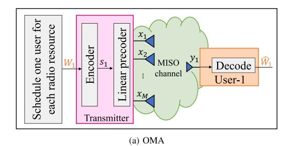

Fig. 1. Two-user OMA, SDMA, NOMA, RSMA for MISO BC (within one radio resource).

streams and linearly precoded at the transmitter. Each user directly decodes its intended stream by treating any residual interference from the other stream as noise. For NOMA, the user messages are independently encoded into streams, which are superposed at the transmitter and broadcast to the users. The data stream of one user (i.e., user-2) has to be decoded by both users. For RSMA, the transmitter splits the message *Wk* of each user-*k* into a common part *Wc*,*k* and a private part *Wp*,*k* and combines *Wc*,1, *Wc*,2 into a common message *Wc*. The three messages *Wc*, *Wp*,1, and *Wp*,2 generated from *W*1 and *W*2 are independently encoded and linearly precoded at the transmitter. Each user first decodes the common stream *sc* by treating all private streams as noise. After removing the decoded common stream from the received signal, each user decodes the intended private stream *sk* by treating the private stream of the other user as noise. This allows flexible management of the interference by partially decoding interference through the common stream decoding and partially treating the interference as noise when decoding the intended private stream at each user [\[8\]](#page-47-5). By turning off the common stream, *sc*, such that *Wk* is encoded into private stream *sk* directly, RSMA reduces to SDMA in Fig. [1\(](#page-2-0)b) and all interference between *s*1 and *s*2 is treated as noise. Similarly, RSMA reduces to NOMA in Fig. [1\(](#page-2-0)c) by turning off *s*2, encoding *W*2 into *sc*, and encoding *W*1 into *s*1.

RSMA therefore unifies the existing MA schemes, and constitutes a promising PHY-layer transmission paradigm for non-orthogonal transmission, interference management, and multi-user communications. Next, we will explain the major PHY layer challenges for the existing MA schemes and why it is imperative to employ this new paradigm in the design of modern and future wireless networks.

# *B. PHY Layer Challenges for the Multiple Access Schemes*

In this subsection, we summarize the properties of the stateof-the-art MA schemes including OMA, SDMA, NOMA along with their advantages and disadvantages.

*1) Orthogonal Multiple Access:* In 1G, FDMA was employed where the available spectrum was partitioned into non-overlapped frequency bands, each accommodating one user. The second generation (2G) standard systems adopted TDMA where time was partitioned into time slots allocated to different users. The third generation (3G) systems exploited a third dimension via CDMA. In particular, by utilizing orthogonal, user-specific codes to spread the modulated user symbols, CDMA serves multiple users simultaneously in the same timefrequency resources without causing multi-user interference (under ideal propagation conditions). In 4G, OFDMA was deployed by dividing the frequency and time resources into narrow subcarriers and time slots, which were grouped into resource units and allocated to the users. FDMA, TDMA, CDMA, and OFDMA are collectively referred to as OMA.

The advantages and disadvantages of OMA can be summarized as follows:

- *Advantages:* The benefits of OMA include a simple transceiver design and the avoidance of multi-user interference.
- *Disadvantages:* As each orthogonal radio resource in OMA is dedicated to a single user, the number of users simultaneously supported is restricted by the total number of available radio resources, which therefore limits SE. Another issue of OMA is that a low-rate user (such as an Internet of Things–IoT sensor) needing only a small amount of resources may still occupy a full resource block by itself, which further leads to an inefficient use of spectrum. Moreover, well-designed user scheduling, which entails a high signaling overhead, is required to guarantee the system performance for OMA.
- *2) Space Division Multiple Access:* MIMO has become one of the most essential and indispensable technologies for current wireless networks, and is included in virtually all high-rate wireless standards (e.g., 5G New Radio–NR, 4G

Long Term Evolution–LTE, IEEE 802.11n, WiMAX). For the MIMO/multiple-input single-output (MISO) Gaussian broadcast channel (BC), dirty paper coding (DPC) is the only known strategy for achieving the capacity region [\[9\]](#page-47-6) when the channel state information at the transmitter (CSIT) is perfect. Although appealing from an information-theoretic point of view, DPC is impractical due to the high computational burden of the encoding process. Alternative non-linear precoding techniques such as Tomlinson-Harashima precoding (THP) and vector perturbation precoding have therefore been proposed. They achieve a performance close to that of DPC, but are still relatively complex. A more practical precoding technique for the multiantenna BC (including the MIMO and MISO BC) is multi-user linear precoding (MU–LP) relying on linear precoding at the transmitter and treating multi-user interference as noise at the receivers [\[10\]](#page-47-7). Although MU–LP is suboptimal for the multi-antenna BC, it achieves near-capacity performance when the CSIT is perfect and the user channels are nearly orthogonal with similar channel strengths or similar long-term signal-to-noise ratios (SNRs). SDMA based on MU–L[P2](#page-3-0) is therefore an integral part of numerous 4G and 5G transmission schemes such as multi-user MIMO (MU–MIMO), networked MIMO, coordinated multi-point (CoMP), massive MIMO, and millimeter-wave (mmWave) MIMO.

The advantages and disadvantages of SDMA can be summarized as follows:

- *Advantages:* When the CSIT is perfect and the network is underloaded (i.e., when the number of antennas deployed at the transmitter is larger than the number of receive antennas at all users), SDMA can successfully suppress (or eliminate) multi-user interference if the user channels are not aligned, and it achieves the maximum degreesof-freedom (DoFs)[3](#page-3-1) of the underloaded multi-antenna BC [\[12\]](#page-47-8). Moreover, the transmitter and receiver complexities of SDMA are low as the transmitter employs linear precoding and each receiver directly decodes the intended message by fully treating interference as noise.
- • *Disadvantages:* The major limitations of SDMA are summarized into the following three points.
  - **–** *First*, SDMA is sensitive to the network load. It is only suitable for underloaded systems and the performance drops significantly when the network becomes overloaded (i.e., when the total number of streams, or equivalently the number of served users for the MISO BC, is larger than the number of antennas deployed at the transmitter) as having enough transmit antennas is a prerequisite for successful interference management based on using SDMA. A common method to handle overloaded settings is to separate users into different groups, schedule user groups via OMA, and perform SDMA in each

- user group, which however, reduces the QoS and increases latency.
- **–** *Second*, SDMA is sensitive to the user deployment (including the angles and strengths of the user channels), which therefore imposes a stricter requirement on the scheduler. SDMA requires the scheduler to pair users with nearly orthogonal channels and relatively similar channel strengths. Although suboptimal and low-complexity scheduling and userpairing algorithms exist, the scheduler complexity rises swiftly when an exhaustive search is conducted to maximize the SE [\[10\]](#page-47-7).
- **–** *Third*, SDMA is sensitive to CSIT inaccuracy. In contrast to its good performance in the perfect CSIT setting, SDMA cannot achieve the maximal DoFs when CSIT is imperfect [\[8\]](#page-47-5). In fact, its performance decreases dramatically in the presence of imperfect CSIT [\[13\]](#page-47-10). This is due to the fact that SDMA is designed for perfect CSIT. Applying a framework motivated by perfect CSIT under imperfect CSIT conditions results in residual multi-user interference caused by the imprecise interference mitigation at the transmitter (via imperfect linear precoding) [\[8\]](#page-47-5).
- *3) Non-Orthogonal Multiple Access:* The study of NOMA can be traced back several decades to the information theory and wireless communications literature on the single-input single-output (SISO) BC and MAC. It is well-known that SC–SIC is the capacity-achieving strategy for the SISO BC, and it is capacity-achieving with time-sharing for the SISO MAC [\[14\]](#page-47-11), [\[15\]](#page-47-12).

Driven by the performance gain of NOMA over OMA in single-antenna networks, numerous attempts have been made to synergize NOMA and multi-antenna networks in recent years [\[3\]](#page-47-2), [\[16\]](#page-47-13)–[\[20\]](#page-48-0). In the multi-antenna BC, MIMO/MISO NOMA combines SDMA and NOMA by separating *K* users into *G* (1 ≤ *G* ≤ *K*) different groups. At each user, the interference from users within the same group is managed via SC–SIC while interference from users in different groups is managed via SDMA. When *G* = 1, all users are in a single group. This corresponds to a direct extension of single-antenna NOMA (SC–SIC) to the multi-antenna BC by ordering users according to their effective channel strengths (after linear precoding) and forcing users to successfully decode messages (and remove interference) [\[17\]](#page-47-14), [\[18\]](#page-47-15). When *G* > 1, the transmitter uses linear precoding to decompose the multiantenna BC into *G* single-antenna NOMA channels and there is no interference between the decomposed NOMA channels if the transmitter has a sufficient number of transmit antennas and perfect CSIT knowledge [\[3\]](#page-47-2), [\[19\]](#page-48-1), [\[20\]](#page-48-0). In the rest of the paper, the terms "multi-antenna NOMA (*G* = 1)" and "multi-antenna NOMA (*G* > 1)" are used to denote the multiantenna NOMA schemes with one user group and multiple user groups, respectively. Fig. [2](#page-4-0) illustrates a four-user multiantenna NOMA model with *G* = 2 user groups and two users in each group (i.e., user-1/2 in group 1 and user 3/4 in group 2). The inter-group interference managed by SDMA is treated as noise at all users, while the intra-group interference managed by NOMA is fully decoded at one user in each group. For

2In the rest of the paper, for simplicity, we use "SDMA" when we want to refer to "SDMA based on MU–LP".

3DoF, also known as (a.k.a.) spatial multiplexing gain, quantitatively captures how well the spatial dimension is exploited by a given communication strategy [\[11\]](#page-47-9). The DoF of a user is the fraction or number of independent data streams that can be transmitted to that user. Its mathematical definition is detailed in Section [VI-C.](#page-30-0)

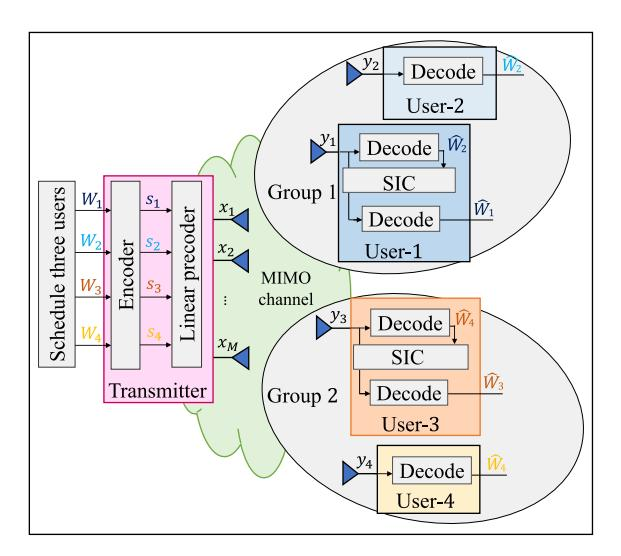

Fig. 2. Four-user multi-antenna NOMA with two user groups and two users in each group.

example, user-1 has to decode the message of user-2 before decoding its intended message, and it treats the interference from user-3/4 as noise. In the multi-antenna MAC, NOMA based on minimum mean square error (MMSE)–SIC receivers is known to achieve the vertices at the boundary of the capacity region, but time sharing is still required to achieve all points along the line segment between adjacent vertices.

The advantages and disadvantages of NOMA can be summarized as follows:

- *Advantages:* The major advantage of NOMA is its potential of improving SE in severely overloaded scenarios by serving users with closely aligned channels and diverse channel strengths in the same time-frequency resources.
- *Disadvantages:* Though SC–SIC attains the capacity region of the scalar Gaussian BC, as the number of users increases, the receiver complexity (i.e., the number of SIC layers) increases and SIC error propagation is aggravated. For the *K*-user SISO BC, the user with the strongest channel requires *K* − 1 layers of SIC to decode and remove the interference from the *K* − 1 messages of all other coscheduled users before being able to access its intended message. One practical approach to address this issue is to restrict the number of SIC layers at each user by clustering users into smaller groups, applying SC–SIC in each group, and scheduling user groups via OMA. Such approach, however, may cause a loss in performance and increase latency. While forcing a user to decode the entire message of another user is effective in the degraded SISO BC, it is not an efficient approach in multi-antenna networks for most scenarios due to the inefficient use of the multiple antennas and the SIC receivers. As revealed in [\[11\]](#page-47-9), in multi-antenna networks, NOMA has several limitations, which are summarized in the following four points:
  - **–** *First*, multi-antenna NOMA can suffer from a loss of DoF due to the inefficient use of SIC. As per [\[11,](#page-47-9) Table II], for a MISO BC employing one *M*-antenna transmitter having perfect CSIT and

simultaneously serving *K* single-antenna users, the sum-DoF achieved by multi-antenna NOMA with *G* = 1 is only 1, which is equivalent to the DoF of OMA/single user-MISO transmission. In comparison, SDMA achieves the optimal sum-DoF of min{*M* , *K*} in the same setting without using any SIC at the users. Hence, in this case, the DoF loss of multi-antenna NOMA is accompanied by a dramatic increase in the receiver complexity.

- **–** *Second*, multi-antenna NOMA can impose significant computational burdens on the transmitter and the receivers. Besides the multiple SIC layers required at each user for decoding interference, the transmitter also requires a joint optimization of the precoders, user grouping, and decoding orders as they are coupled with each other. One commonly adopted approach for complexity reduction in multiantenna NOMA is to fix the beamformers of users in the same group [\[3\]](#page-47-2). Such approach further restricts user performance because the feasible region of the precoders shrinks accordingly.
- **–** *Third*, multi-antenna NOMA can be sensitive to the user deployment. In particular, it is generally most suitable for highly overloaded scenarios where the user channels are nearly aligned in each user group and are relatively orthogonal among different user groups.
- **–** *Fourth*, multi-antenna NOMA can be vulnerable to CSIT uncertainties as the inter-group interference is managed in the same manner as in SDMA.

Comparing existing MA schemes, within one radio resource, OMA only supports a single user while both SDMA and NOMA can accommodate multiple users. In this sense, SDMA can also be regarded as a non-orthogonal transmission strategy that superposes users in the same radio resource. In fact, whether the spectrum is orthogonally or non-orthogonally allocated among users is not the fundamental problem. What is foremost is *how multi-user interference is managed*. This is indeed the major difference between OMA, SDMA, and NOMA. Specifically, OMA avoids interference by allocating orthogonal radio resources among users. SDMA and NOMA use two distinct strategies to manage interference, where *SDMA based on MU–LP relies on fully treating any residual multi-user interference as noise, while NOMA based on SC–SIC relies on fully decoding and removing multi-user interference*.

The aforementioned disadvantages of the existing MA schemes are consequences of how they manage interference. As per [\[21\]](#page-48-2), treating interference as pure noise is only promising when the multi-user interference is weak while fully decoding interference is only advisable when the interference is sufficiently strong. When the interference is medium (i.e., neither strong nor weak), decoding the interference partially can significantly improve performance. The lesson that can be learnt from [\[21\]](#page-48-2) for the design of future MA schemes is that *the amounts of interference to be decoded and treated as noise, respectively, should be adaptively changed based on the interference level.*

Unfortunately, SDMA and NOMA are only well suited for weak and strong interference levels, respectively. To achieve adaptive interference management, one intuitive approach is to dynamically switch between SDMA and NOMA [\[22\]](#page-48-3). In such an approach, however, either SDMA or NOMA is supported in the system, which does not work well for medium interference levels.

# *C. 5G/6G and the Need for RSMA*

5G New Radio (NR) has defined three core services, namely, ultra-reliable low-latency communication (URLLC), massive machine-type communication (mMTC), and enhanced mobile broadband (eMBB), where gigabit per second (Gbps)-level data rates are required for eMBB users, reliable transmissions with 10−5 block error rate (BLER) are required for URLLC users with a latency within 1 ms, and a high connection density and high energy efficiency (EE) are required for mMTC. The above key performance indicators (KPIs) of NR are expected to be further tightened and enhanced in 6G. Interference has been recognized as one of the major obstacles to achieving the aforementioned KPIs in NR, and is envisioned to become even more severe and unpredictable in 6G. If managed inappropriately, multi-user interference will become dominant and degrade the system performance. Therefore, there is an urgent need for a new paradigm for interference management in view of the limitations of existing MA schemes.

Moreover, in modern MIMO networks, one major source of multi-user interference is imperfect CSIT. In the presence of imperfect CSIT, interference management is further impeded because CSIT imperfections imply that interference cannot be managed easily by the precoders at the transmitter anymore, e.g., interference cannot be eliminated since the channel is not known accurately. Unfortunately, the acquisition of accurate CSIT is challenging due to many inevitable sources of impairment. For example, in time division duplex (TDD) MIMO networks, due to the unavoidable pilot sequence reuse of the users in different cells, the issue of pilot contamination arises, which further contributes to inter-cell interference as well as channel estimation errors [\[23\]](#page-48-4). In frequency division duplexing (FDD) MIMO networks, downlink channel estimation and uplink channel feedback usually lead to an overwhelming pilot signaling and feedback overhead, particularly when the dimension of the transmit antenna array is large, which therefore hampers CSIT acquisition [\[24\]](#page-48-5). Moreover, feedback delay, user mobility, inaccurate calibration of radio frequency (RF) chains, RF impairments (e.g., phase noise), and channel state information (CSI) estimated at the sub-band level (rather than the subcarrier level) all prevent the CSIT to be accurate [\[10\]](#page-47-7). According to the statistics revealed in [\[25\]](#page-48-6), the CSIT inaccuracy caused by an average user mobility of 13.2 km/h leads to at least 50% cell average throughput loss in 5G massive MIMO. It introduces additional multi-user interference and has become the primary performance bottleneck in MIMO networks. Such severe multi-user interference, however, is simply treated as noise by both SDMA and multi-antenna NOMA (with multiple user groups). The classical approach for dealing with this practical limitation of imperfect CSIT takes a "robustification" stance where the precoders for SDMA and NOMA that have been designed under the assumption of perfect CSIT are tweaked to account for imperfect CSIT [\[10\]](#page-47-7), [\[18\]](#page-47-15), [\[26\]](#page-48-7).

On account of the aforementioned limitations of the existing MA schemes and their underlying interference management strategies, and the resulting imperfect CSIT bottleneck in multi-antenna networks, the following three questions are raised and motivate the study of a new PHY layer:

- 1) Is there an MA scheme that is inherently *robust* to imperfect CSIT?
- 2) Is there an MA scheme that is *flexible* enough to adapt to the interference level rather than operate in the two extremes of fully treating interference as noise and fully decoding interference?
- 3) Is there an MA scheme that is *general* enough to encompass and outperform all existing MA schemes?

The three questions above can be answered with "yes" by RSMA. In the rest of this treatise, we will dive into how RSMA addresses the above three questions.

# *D. Contributions*

As summarized in the rest of this treatise, existing works on RSMA mainly focus on one narrow scenario and there is no review and tutorial paper which pedagogically explains why, how, when it is beneficial to use RSMA in wireless communication networks. Meanwhile, there is a lack of consensus in the RSMA literature because of the recent explosive increase in research activity. Hence, it is timely to consolidate the existing literature.

The main goal of this treatise is to provide the first holistic tutorial overview on RSMA including a thorough review of its state-of-the-art, a detailed illustration of its design principles, a comprehensive summary of its merits as well as a broad discussion of the related research challenges and future research directions. Our major contributions can be summarized as follows:

- • The principles and transmission frameworks of downlink, uplink, and multi-cell RSMA are respectively elaborated including a quantitative complexity comparison between the existing downlink RSMA schemes.
- • An exhaustive survey of the state of the art of RSMA is provided from both the information-theoretic and communication perspectives along with a recap of the pivotal historical milestones in the history of RSMA.
- The two prevalent precoder design strategies for RSMA, namely, precoder optimization and low-complexity precoder design, are comprehensively summarized.
- • The PHY layer architecture design of RSMA is presented, with toy examples to gain a first intuition and detailed explanations.
- RSMA and existing MA schemes including SDMA, NOMA, OMA, and multicasting are compared in terms of the achieved DoFs, complexity, and throughput performance by link-level simulations (LLS), which unveils the major advantages and disadvantages of RSMA.

#### TABLE II OUTLINE OF THE PAPER

| Section                                        | Section I. Introduction                                 |  |  |  |  |  |  |  |
|------------------------------------------------|---------------------------------------------------------|--|--|--|--|--|--|--|
| A. Rate-Splitting Multiple Access              | B. PHY Layer Challenges for the Multiple Access Schemes |  |  |  |  |  |  |  |
| C. 5G/6G and the Need for RSMA                 | D. Contributions                                        |  |  |  |  |  |  |  |
| E. Organization and Notation                   |                                                         |  |  |  |  |  |  |  |
| Section II. Principles of RSMA                 |                                                         |  |  |  |  |  |  |  |
| A. Definition and Design Principle             | B. Downlink RSMA                                        |  |  |  |  |  |  |  |
| C. Uplink RSMA                                 | D. Multi-cell RSMA                                      |  |  |  |  |  |  |  |
| Section III. Information-Theoret               | tic Background and Milestones of RSMA                   |  |  |  |  |  |  |  |
| A. RSMA in Single-Antenna Networks             | B. RSMA in Multi-Antenna Networks                       |  |  |  |  |  |  |  |
| C. Milestones of RSMA                          |                                                         |  |  |  |  |  |  |  |
| Section IV. Communication                      | on-Theoretic Background of RSMA                         |  |  |  |  |  |  |  |
| A. Resource Allocation for Single-Carrier RSMA | B. Resource Allocation for Multicarrier RSMA            |  |  |  |  |  |  |  |
| Section V. RS                                  | MA PHY Layer Design                                     |  |  |  |  |  |  |  |
| A. A Quick Introduction to RSMA PHY Layer      | B. RSMA PHY Layer Architecture                          |  |  |  |  |  |  |  |
| Section VI. Comparise                          | on of Multiple Access Schemes                           |  |  |  |  |  |  |  |
| A. Framework Comparison                        | B. Complexity Comparison                                |  |  |  |  |  |  |  |
| C. Performance Comparison                      | D. Advantages of RSMA                                   |  |  |  |  |  |  |  |
| E. Disadvantages of RSMA                       |                                                         |  |  |  |  |  |  |  |
| Section VII. Emerging Applications, Ch         | allenges, and Future Research Trends of RSMA            |  |  |  |  |  |  |  |
| A. Technical Aspects of RSMA – The Road Ahead  | B. RSMA for Enabling Technologies in 6G                 |  |  |  |  |  |  |  |
| C. Standardization and Implementation of RSMA  |                                                         |  |  |  |  |  |  |  |
| Section VIII. Conclusions                      |                                                         |  |  |  |  |  |  |  |

- Emerging applications of RSMA and related research challenges in numerous potential directions are summarized including many timely fields such as space-air-ground integrated networks (SAGIN), vehicle-to-everything (V2X) communications, and three-dimensional (3D) eMBB-URLLC-mMTC services.
- The pathways of RSMA in the context of the 3rd Generation Partnership Project (3GPP) are discussed, followed by a synopsis of RSMA standardization and implementation issues.

We hope this tutorial will shed light on the fundamental RSMA concepts, contribute to the consolidation of the existing RSMA research, provide a useful reference on the use of RSMA in wireless communications, and ultimately serve as a platform to drive forward the research in this area.

#### E. Organization and Notation

The remainder of this paper is organized as follows. Section II introduces the design principles of RSMA, and specifies the transmitter and receiver architectures for downlink, uplink, and multi-cell RSMA. Section III provides a thorough literature review on RSMA from an information-theoretic perspective followed by a summary of the milestones of RSMA research. Section IV discusses the communication-theoretic background of RSMA with a focus on RSMA resource allocation. Section V presents examples for and details of the PHY layer architecture design for RSMA. Section VI compares RSMA with other MA schemes and unveils the major advantages and disadvantages of RSMA. Section VII presents emerging applications, research challenges, and future

research trends for RSMA. Section VIII concludes this tutorial overview. The outline of this paper is illustrated in Table II.

Notation: Bold upper and lower case letters denote matrices and column vectors, respectively.  $(\cdot)^T$ ,  $(\cdot)^H$ ,  $|\cdot|$ ,  $||\cdot|$ ,  $||\cdot|$ ,  $\mathbb{E}\{\cdot\}$ , and  $\mathrm{tr}(\cdot)$  represent the transpose, Hermitian, absolute value, Euclidean norm, expectation, and trace operators, respectively.  $\mathcal{CN}(0,\sigma^2)$  denotes the circularly symmetric complex Gaussian (CSCG) distribution with zero mean and variance  $\sigma^2$ . The main notations used in this work are summarized in Table III.

# II. PRINCIPLES OF RSMA

Starting from a rigorous definition of RSMA and its design principle, this section details the transmission framework for downlink, uplink, and multi-cell RSMA.

#### A. Definition and Design Principle

Due to the broadcast nature of wireless communication, interference has become an inevitable issue encountered in today's communication networks. As has been discussed in the introduction section, the interference management approaches adopted in existing MA schemes can be categorized by the following taxonomy:

- Avoiding interference by allocating orthogonal radio resources to the users (as in OMA)
- Treating interference as noise (as in SDMA)
- Decoding interference (as in NOMA)

Next generation MA schemes are envisioned to possess a more powerful interference management capability, where the amount of interference to be decoded or treated as noise is

#### TABLE III LIST OF NOTATION

|                                                                            |                                                                       | П                                                              |                                                              |
|----------------------------------------------------------------------------|-----------------------------------------------------------------------|----------------------------------------------------------------|--------------------------------------------------------------|
| A                                                                          | subset of the user set $\mathcal K$                                   | $R_k$                                                          | instantaneous rate of $s_k$ at user- $k$                     |
| $C_k$                                                                      | amount of $R_c$ allocated to user-k                                   | $R_c$                                                          | achievable rate of $s_c$                                     |
| $\widehat{C}_k$                                                            | amount of $\widehat{R}_c$ allocated to user- $k$                      | $R_{k,tot}$                                                    | total achievable rate of user-k                              |
| $\overline{C}_k$                                                           | ergodic common rate allocated to user- $k$                            | $R_k^{th}$                                                     | QoS rate constraint of user-k                                |
| c                                                                          | common rate vector containing all $C_k$                               | $\hat{R}_{c,k}$                                                | worst-case achievable rate of $s_c$ at user- $k$             |
| $\hat{\mathbf{c}}$                                                         | common rate vector containing all $\widehat{C}_k$                     | $\widehat{R}_k$                                                | worst-case achievable rate of $s_k$ at user- $k$             |
| <u> <del>c</del></u>                                                       | ergodic common rate vector containing all $\overline{C}_k$            | $\hat{R}_c$                                                    | worst-case achievable rate of $s_c$ at all users             |
| $d_k^{(j)}$                                                                | DoF of user- $k$ achieved by scheme $j$                               | $\hat{R}_{k,tot}$                                              | worst-case achievable rate of user-k                         |
| $egin{array}{c} d_k^{(j)} \ d_{ m s}^{(j)} \ d_{ m mmf}^{(j)} \end{array}$ | sum-DoF of scheme $j$                                                 | $\overline{R}_{c,k}$                                           | ergodic rate of decoding $s_c$ at user- $k$                  |
| $d_{\mathrm{mmf}}^{(j)}$                                                   | MMF-DoF of scheme $j$                                                 | $\overline{R}_k$                                               | ergodic rate of decoding $s_k$ at user- $k$                  |
| $ER_{k,tot}$                                                               | ergodic achievable rate of user-k                                     | $\overline{R}_c$                                               | achievable ergodic rate of $s_c$                             |
| G                                                                          | number of user groups                                                 | $s_n$                                                          | data stream transmitted from the BS                          |
| $\mathcal{G}$                                                              | set of user groups                                                    | $s_c$                                                          | common stream for 1-layer RS                                 |
| $\mathbf{h}_k$                                                             | channel vector between the BS and the user- $k$                       | s                                                              | data stream vector transmitted from the BS                   |
| $ \hat{\mathbf{h}}_k $                                                     | instantaneous channel estimate of $\mathbf{h}_k$                      | $\mid t \mid$                                                  | time instance                                                |
| $ \tilde{\mathbf{h}}_k $                                                   | instantaneous channel estimation error of $\mathbf{h}_k$              | $  u_k  $                                                      | weight allocated to user-k                                   |
| H                                                                          | channel matrix containing $\mathbf{h}_k$ for all $k$                  | $U(\mathbf{P}, \mathbf{c})$                                    | utility function of <b>P</b> and <b>c</b>                    |
| $\hat{\mathbf{H}}$                                                         | channel estimate matrix containing $\hat{\mathbf{h}}_k$ for all $k$   | $W_k$                                                          | message of user-k                                            |
| $\mid \widetilde{\mathbf{H}} \mid$                                         | channel estimation error matrix containing $\mathbf{h}_k$ for all $k$ | $W_k^l$                                                        | sub-message split from $W_k$                                 |
| K                                                                          | number of users                                                       | $\begin{bmatrix} W_k^l \\ W_k^{\mathcal{K}_i} \end{bmatrix}$   | inner-group common sub-messages for group $\mathcal{K}_i$    |
| $\mathcal{K}$                                                              | set of users                                                          | $W_n^*$                                                        | message transmitted from the BS                              |
| $ \mathcal{K}_i $                                                          | set of users in group-i                                               | $W_{c,k}$                                                      | common sub-message split from $W_k$                          |
| $\mid L \mid$                                                              | number of sub-messages split from each message                        | $W_{p,k}$                                                      | private sub-message split from $W_k$                         |
| M                                                                          | number of transmit antennas at the transmitter                        | $\parallel \mathcal{W}$                                        | set of messages transmitted from the BS                      |
| N                                                                          | number of transmitted streams                                         | $  \mathcal{W}_k  $                                            | message set decoded at user-k                                |
| $n_k$                                                                      | additive white Gaussian noise of user-l                               | $   \alpha$                                                    | CSIT scaling factor                                          |
| P                                                                          | transmit power                                                        | $\mid \mid \eta \mid$                                          | power amplifier efficiency                                   |
| Pcir                                                                       | circuit power consumption                                             | $\epsilon$                                                     | time correlation coefficient                                 |
| $P_i$                                                                      | power allocated to precoder $\mathbf{p}_i$                            | $\epsilon'$                                                    | tolerance for the selection of MA schemes                    |
| P                                                                          | precoding matrix for all data streams                                 | $\pi_k$                                                        | decoding order of user-k                                     |
| $\mathbf{p}_i$                                                             | precoding vector for $s_i$                                            | $\pi_{l,k}$                                                    | decoding order at user- $k$ to decode the $l$ -order streams |
| $\bar{\mathbf{p}}_i$                                                       | direction of the precoder $\mathbf{p}_i$                              | $\sigma_k^2$                                                   | variance of $\mathbf{h}_k$ or $\widehat{\mathbf{h}}_k$       |
| $\mathcal{P}_1$                                                            | precoder optimization problem illustrated in (29)                     | $ \begin{vmatrix} \sigma_k^2 \\ \sigma_{n,k}^2 \end{vmatrix} $ | variance of $n_k$                                            |
| $\mathcal{P}_2$                                                            | precoder optimization problem illustrated in (33)                     | $\tau$                                                         | power allocated to all private streams                       |
| $\mathcal{P}_3$                                                            | long-term precoder optimization problem obtained from $\mathcal{P}_2$ | $\varpi_k$                                                     | weight allocated to user-k for matched beamforming           |
| $R_{c,k}$                                                                  | instantaneous rate of $s_c$ at user- $k$                              |                                                                |                                                              |

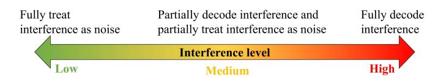

Fig. 3. Lesson learnt from [\[21\]](#page-48-2): the amount of interference to be decoded and treated as noise should be adaptively changed with the interference level.

adaptively changed with the level of interference, i.e., the interference is fully treated as noise (or fully decoded) when the level of interference is low (or high) while the interference is partially decoded and partially treated as noise when the interference level is medium, as illustrated in Fig. [3.](#page-7-1)

RSMA is a promising PHY layer strategy to serve multiple users based on the concept of RS.[4](#page-7-2) The design principle of RSMA, which is *to softly bridge the two extremes of fully decoding interference and fully treating interference as noise*

4RSMA is commonly known as RS in previous works where the message of each user is split into two parts at most, same as in Fig. [1\(](#page-2-0)d). Such model forms the basic building block of the RSMA framework for the multi-antenna BC [\[7\]](#page-47-4). In the following, we use "RS" to denote this building block of RSMA so as to maintain consistency with the literature.

TABLE IV COMPARISON OF PREFERABLE INTERFERENCE LEVELS OF DIFFERENT MA SCHEMES

| Interference levels | Low      | Medium     | High     |
|---------------------|----------|------------|----------|
| SDMA                | <b>√</b> | ×          | ×        |
| NOMA                | ×        | ×          | <b>√</b> |
| RSMA                | 1/       | <b>1</b> / | 1/       |

*by partially decoding the interference and partially treating the interference as noise*, exactly caters to the requirements of future networks. Therefore, RSMA constitutes a new paradigm for MA and non-orthogonal transmission in future wireless networks. It is also a new paradigm for interference management, as it is capable of harmonizing the existing interference management taxonomy, as illustrated in Table [IV.](#page-7-3)

In the following subsections, we illustrate why RSMA facilitates flexible and powerful interference management by elaborating in detail the RSMA transmission frameworks for downlink, uplink, and multi-cell networks, respectively.

|                | Proposed in Ref. | Number of sub-messages split from each message (L) | Message combiner | Precoding  | Number of transmitted streams $(N)$ | Layers of SIC at each user |
|----------------|------------------|----------------------------------------------------|---------------------|------------|-------------------------------------|----------------------------|
| 1-layer RS     | [27]             | 2                                                  | On                  | Linear     | K+1                                 | 1                          |
| 2-layer HRS    | [44]             | 3                                                  | On                  | Linear     | K+2                                 | 2                          |
| Generalized RS | [7]              | $2^{K-1}$                                          | On                  | Linear     | $2^{K} - 1$                         | $2^{K-1}-1$                |
| THPRS          | [51]             | 2                                                  | On                  | Non-linear | K+1                                 | 1                          |
| 1-DPCRS        | [53]             | 2                                                  | On                  | Non-linear | K+1                                 | 1                          |
| M-DPCRS        | [53]             | $2^{K-1}$                                          | On                  | Non-linear | $2^{K} - 1$                         | $2^{K-1}-1$                |
| RS-CMD         | [47]             | 2                                                  | Off                 | Linear     | 2K                                  | K                          |

TABLE V
A QUANTITATIVE COMPLEXITY COMPARISON OF THE TRANSCEIVER DESIGN OF DIFFERENT RSMA SCHEMES

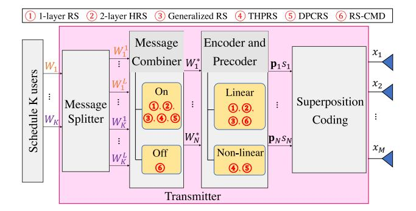

Fig. 4. K-user downlink RSMA transmitter.

# B. Downlink RSMA

Under the umbrella of downlink multi-user communication networks (a.k.a. broadcast channels–BCs), various RSMA schemes have been proposed, such as 1-layer RS [7], [27]–[43], 2-layer hierarchical RS (HRS) [7], [44], generalized RS [7], [45], [46], RS and common message decoding (RS-CMD) [47]–[50], RSMA with non-linear THP (a.k.a. THPRS) [51], [52], and dirty paper coded RS (DPCRS) [53], [54], which are detailed and compared in this subsection in terms of their transmitter and receiver designs.

1) Transmitter Design: Generally, all downlink RSMA schemes can be represented in terms of the universal RSMA transmitter and receiver designs depicted in Fig. 4 and Fig. 5, respectively. The transmitter is equipped with M antennas  $(M \ge 1)$  and serves K single-antenna users indexed by  $K = \{1, \ldots, K\}$ . K > 1 is assumed as RSMA is designed for better managing co-channel interference in multi-user transmission and it does not bring additional benefits for point-to-point transmission. The proposed framework therefore applies to the SISO BC when M = 1 and to the MISO BC when M > 1.

Compared with conventional frameworks, the fundamental difference of RSMA-enabled transmitters compared with conventional MA transmitters is the use of "message splitter" for splitting user messages into L sub-messages so as to enable rate-splitting. For each user-k, its message  $W_k$  is split into  $\{W_k^1, W_k^2, \ldots, W_k^L\}$ . The number of sub-messages L into which the original message of each user is split depends on the particular RSMA scheme, as illustrated in Table V. For

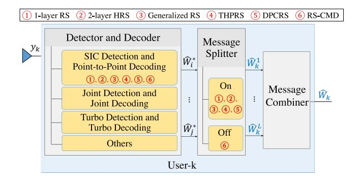

Fig. 5. Downlink RSMA receiver.

1-layer RS, THPRS, 1-DPCRS, and RS-CMD, the message of each user is split at most into two sub-messages (L=2) while 2-layer HRS employs three sub-messages (L=3) for each user message. Generalized RS and M-DPCRS are more complex as each user message is split into  $L=2^{K-1}$  sub-messages, so as to encode the common streams into different layers and achieve more flexible interference management.

After splitting, the "message combiner" is turned on for some of the RSMA schemes (including 1-layer RS, 2-layer HRS, Generalized RS, THPRS and DPCRS) to combine the user sub-messages into N messages  $W = \{W_1^*, \dots, W_N^*\}$ depending on the RSMA schemes as illustrated in Table V, where N = K + 1 for 1-layer RS, THPRS and 1-DPCRS, N = K + 2 for 2-layer HRS, and  $N = 2^K - 1$  for generalized RS and M-DPCRS. Different from other RSMA schemes, the "message combiner" is turned off for RS-CMD and the total LK sub-messages of all users are directly encoded into N = LKstreams. Among the N messages, a message to be decoded by multiple users is referred to as a *common message*, while a message to be decoded by a single user is referred to as a private message. Typically, a common message contains submessages of one or multiple users while a private message only contains a sub-message of a single user. Embedding the sub-messages of multiple users into one common message is also known as packet-level multiplexing [56].

Each common message is then encoded into a common stream using a codebook shared by the intended users6

&lt;sup>5We limit the system model to single-antenna receivers for ease of explanation. Readers are referred to [55] for a detailed treatment of the extension to multi-antenna receivers.

&lt;sup>6In LTE/5G NR systems, all codebooks are shared among the users as the same family of modulation and coding schemes (MCS) specified in the standard is used for all users [11]. Therefore, using a shared codebook is not an issue in modern communication systems.

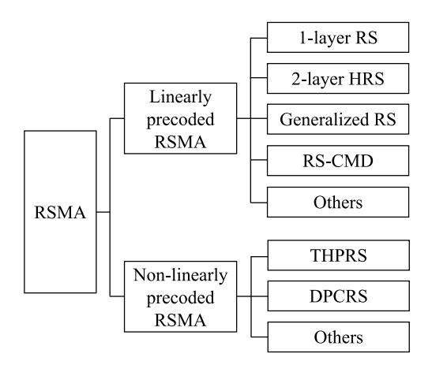

Fig. 6. Classification of RSMA strategies.

while each private message is encoded into a private stream using an independent codebook. The N encoded streams  $\mathbf{s} = [s_1, \dots, s_N]^T$  are accordingly mapped via N precoders  $\mathbf{P} = [\mathbf{p}_1, \dots, \mathbf{p}_N]^T$  onto M transmit antennas. Assuming that  $\mathbb{E}[\mathbf{s}\mathbf{s}^H] = \mathbf{I}$ , we obtain the transmit power constraint as  $\sum_{n=1}^N \|\mathbf{p}_n\|^2 \le P$ . The resulting transmit signal which superposes the precoded common and private streams is given as follows

$$\mathbf{x} = \sum_{n=1}^{N} \mathbf{p}_n s_n. \tag{1}$$

As illustrated in Fig. 6, due to the use of linear or non-linear precoding techniques, RSMA can be classified into *linearly-precoded RSMA* (including 1-layer RS, 2-layer HRS, generalized RS and RS-CMD) and *non-linearly precoded RSMA* (including THPRS and DPCRS). Specifically, the two non-linearly precoded schemes, THPRS and DPCRS, respectively adopt THP and DPC precoding. Note that all linearly-precoded RSMA strategies can be extended to their THP/DPC or other non-linearly precoded counterparts by simply changing the precoding method.

Remark 1: We highlight here that from a message content perspective, a "common message" in RSMA is fundamentally different from a "multicast message" that is originally intended for all users, though both of them are decoded by multiple users. A "common message" in RSMA includes parts of the (unicast) messages for different users. It is decoded by multiple users for interference management purposes, but the content of the message is not wholly needed by those users. Therefore, it can be considered in line with the packet-level multiplexing described in [57], which relies on obtaining new messages by concatenating multiple short messages intended for different users. In contrast, a multicast message is primarily intended for multiple users and each user wants the whole content [8]. But we should note that, from a PHY layer transmission perspective, the transmission of an encoded "common message" is multicasted regardless of the content it conveys. This is common in satellite communications where the data intended for different users is bundled in the same frame and transmitted in a multicast fashion [58], [59]. NOMA also has common messages/streams, though they are usually not referred to as such. As illustrated in Fig. 1(c),  $W_2$  in NOMA is a common

message. Though it only contains the information of user-2, it is encoded into a common stream and decoded by both users.

2) Receiver Design: The receiver designs of different RSMA schemes are illustrated in Fig. 5. Using  $\mathbf{h}_k \in \mathbb{C}^{M \times 1}$  to denote the channel vector of user-k and  $n_k$  to denote the corresponding additive white Gaussian noise (AWGN) following distribution  $\mathcal{CN}(0, \sigma_{n,k}^2)$ , the signal received at user-k can be modelled as follows

$$y_k = \mathbf{h}_k^H \mathbf{x} + n_k, \forall k \in \mathcal{K}. \tag{2}$$

 $y_k$  is passed through the decoder to obtain the output messages  $\mathcal{W}_k = \{\widehat{W}_i^*, \dots, \widehat{W}_j^*\}$ . According to the different encoding rules of the different RSMA strategies, each user decodes only selected common streams and the remaining common streams are treated as noise. The decoded message set  $\mathcal{W}_k$  at each user is therefore a subset of the transmitted messages  $\mathcal{W}$ , i.e.,  $\mathcal{W}_k \subseteq \mathcal{W}$ . Note that the common messages  $\mathcal{W}_k$  decoded at user-k do not necessarily contain the intended sub-messages of this user.

As illustrated in Fig. 5, RSMA receivers are not limited to SIC detectors (a.k.a. SIC receiver architectures). Other detectors, such as joint detectors (JD) and turbo detectors, can be used for RSMA receiver design as well [45]. For a given detector, different channel decoders can be applied, i.e., Vertical Bell Laboratories Layered Space-Time (V-BLAST) decoding and Polar decoding have been respectively used with SIC detectors in RSMA receivers in [36] and [55]. The performance of different receivers are worth investigating in future works. Mirroring the message splitter and on/off message combiner at the transmitter, each receiver contains an on/off message splitter for extracting the intended submessages as well as a message combiner for recovering the original user message.

Next, we respectively detail the transceiver design of existing RSMA schemes in Fig. 6 to further illustrate their differences.

*3) 1-Layer RS:* The simplest and most practical RSMA scheme is 1-layer RS, which is the basic building block of almost all existing RSMA schemes. 1-layer RS has been widely studied for the multi-antenna BC with perfect CSIT [7], [33]–[35], [37], [38], [40] and imperfect CSIT [27]–[32], [36], [37], [39], [41]–[43]. Fig. 7 illustrates the transceiver architecture of *K*-user 1-layer RS.

At the transmitter, the message combiner is turned on and linear precoding is adopted. Each message  $W_k$  is split into two sub-messages (L=2), namely, one common sub-message  $W_{c,k}$  and one private sub-message  $W_{p,k}$ . The common sub-messages of all users  $W_{c,1},\ldots,W_{c,K}$  are combined into one common message  $W_c$  and encoded into a common stream  $s_c$  using a codebook shared by all users.  $W_c$  has to be decoded by all users. The private sub-messages of all users  $W_{p,1},\ldots,W_{p,K}$  are independently encoded into private

&lt;sup>7Here, we consider the most general case when the messages of all users are split. Note that it is not always necessary to split all user messages. When maximizing the user sum rate without QoS rate constraint, it is sufficient to split one user message [28]. However, when user fairness is considered as one of the design criteria (i.e., when maximizing the weighted sum rate–WSR or max-min rate or any other objective with individual QoS rate constraints), splitting the messages of all users becomes a prerequisite for the optimal solution [7], [60], [61].

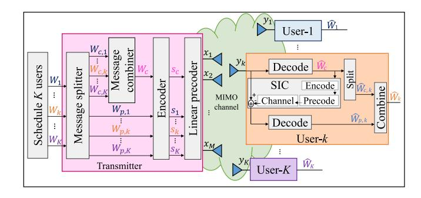

Fig. 7. Transceiver architecture of K-user 1-layer RS [8].

streams  $s_1,\ldots,s_K$ , which are decoded by the corresponding users only. Therefore, K+1 streams  $\mathbf{s}=[s_c,s_1,\ldots,s_K]^T\in\mathbb{C}^{(K+1)\times 1}$  are created from K messages  $W_1,\ldots,W_K$ . The streams are linearly precoded via precoding matrix  $\mathbf{P}=[\mathbf{p}_c,\mathbf{p}_1,\ldots,\mathbf{p}_K]\in\mathbb{C}^{M\times (K+1)}$  with  $\mathbf{p}_c,\mathbf{p}_k\in\mathbb{C}^{M\times 1}$  such that the transmit signal is obtained as follows

$$\mathbf{x} = \mathbf{p}_c s_c + \sum_{k \in \mathcal{K}} \mathbf{p}_k s_k. \tag{3}$$

The received signal at user- $k, k \in \mathcal{K}$ , is given by

$$y_k = \mathbf{h}_k^H \mathbf{p}_c s_c + \mathbf{h}_k^H \mathbf{p}_k s_k + \sum_{j \in \mathcal{K}, j \neq k} \mathbf{h}_k^H \mathbf{p}_j s_j + n_k.$$
 (4)

Each user-k first decodes the common stream  $s_c$  into  $\widehat{W_c}$  by treating the interference from all private streams as noise. Using SIC,  $\widehat{W_c}$  is then re-encoded, precoded, and subtracted from the received signal such that user-k decodes its private stream  $s_k$  into  $\widehat{W}_{p,k}$  by treating the remaining interference from the other private streams as noise. User-k reconstructs the original message by extracting  $\widehat{W}_{c,k}$  from  $\widehat{W}_c$ , and combining  $\widehat{W}_{c,k}$  with  $\widehat{W}_{p,k}$  into  $\widehat{W}_k$ . Under the assumption of Gaussian signaling and infinite block length, the instantaneous rates for decoding the common and private streams at user-k are given as follows

$$R_{c,k} = \log_2 \left( 1 + \frac{\left| \mathbf{h}_k^H \mathbf{p}_c \right|^2}{\sum_{j \in \mathcal{K}} \left| \mathbf{h}_k^H \mathbf{p}_j \right|^2 + \sigma_{n,k}^2} \right),$$

$$R_k = \log_2 \left( 1 + \frac{\left| \mathbf{h}_k^H \mathbf{p}_k \right|^2}{\sum_{j \in \mathcal{K}, j \neq k} \left| \mathbf{h}_k^H \mathbf{p}_j \right|^2 + \sigma_{n,k}^2} \right). \quad (5)$$

To ensure  $s_c$  is successfully decoded by all users, its rate can not exceed

$$R_c = \min\{R_{c,1}, \dots, R_{c,K}\}$$
 (6)

As  $s_c$  contains sub-messages  $W_{c,1}, \ldots, W_{c,K}$  of K users, the rate distribution of  $R_c$  among the users is adapted to the amount of sub-messages that each user contributed. Let  $C_k$ 

denote the portion of rate  $R_c$  allocated to user-k for  $W_{c,k}$ . Then, we have

$$\sum_{k \in \mathcal{K}} C_k = R_c. \tag{7}$$

The overall achievable rate of user-k,  $k \in \mathcal{K}$ , is

$$R_{k,tot} = C_k + R_k. (8)$$

Apparently, the rate of each user is split into two parts, namely, the rate of  $s_k$  (a.k.a. the private rate) and relevant part of the rate of  $s_c$  (a.k.a. the common rate).

Based on the system model of 1-layer RS, the precoding matrix  $\mathbf{P} = [\mathbf{p}_c, \mathbf{p}_1, \dots, \mathbf{p}_K] \in \mathbb{C}^{M \times (K+1)}$  can be designed as low-complexity precoding, such as zero-forcing beamforming (ZFBF) for the private streams and random beamforming for the common stream [34], or via optimization under different objectives, i.e., maximizing the WSR [7], [28], maximizing the worst-case user rate [29], maximizing EE [33], minimizing the transmit power [32], etc. In Section IV, the precoder design for RSMA is discussed in detail.

4) 2-Layer HRS: 2-layer HRS was initially proposed for FDD massive MIMO [44] for enhancing the robustness to imperfect CSIT and boosting the achievable rate of all users. The K users are grouped into G separate groups indexed by  $\mathcal{G} = \{1, \ldots, G\}$  and each group-i contains  $\mathcal{K}_i$  users with  $\bigcup_{i\in\mathcal{G}}\mathcal{K}_i=\mathcal{K}$ . Each user-k splits its message  $W_k$  into three sub-messages (L = 3), namely, an inter-group common sub-message  $W_k^{\mathcal{K}}$ , an inner-group common sub-message  $W_k^{\mathcal{K}_i}$ , and a private sub-message  $W_k^k$ . The inter-group common sub-messages  $\{W_k^{\mathcal{K}}|k\in\mathcal{K}\}$  are encapsulated into one common message  $W_K$ , which is encoded into a common stream  $s_{\mathcal{K}}$  using a codebook shared by all users and is decoded by all users. The inner-group common sub-messages  $\{W_k^{\mathcal{K}_i}|k\in\mathcal{K}_i\}$  of the users in group-i are merged into one common message  $W_{K_i}$  and encoded into an inner-group common stream  $s_{K_i}$  using a codebook shared by the users in  $K_i$ .  $W_{K_i}$  is therefore decoded by the users in group-i. The private sub-messages  $\{W_k^k|k\in\mathcal{K}\}$  are independently encoded into K private streams  $s_1, \ldots, s_K$ , which are decoded by the corresponding users. The overall encoded streams  $\mathbf{s} = [s_{\mathcal{K}}, s_{\mathcal{K}_1}, \dots, s_{\mathcal{K}_G}, s_1, \dots, s_K]^T \in \mathbb{C}^{(K+G+1)\times 1}$  are linearly precoded with  $\mathbf{P} = [\mathbf{p}_{\mathcal{K}}, \mathbf{p}_{\mathcal{K}_1}, \dots, \mathbf{p}_{\mathcal{K}_G}, \mathbf{p}_1, \dots, \mathbf{p}_K] \in \mathbb{C}^{(K+G+1)\times 1}$  $\mathbb{C}^{M \times (K+G+1)}$ . The signal sent from the transmitter is given as follows

$$\mathbf{x} = \mathbf{p}_{\mathcal{K}} s_{\mathcal{K}} + \sum_{i \in \mathcal{G}} \mathbf{p}_{\mathcal{K}_i} s_{\mathcal{K}_i} + \sum_{k \in \mathcal{K}} \mathbf{p}_k s_k. \tag{9}$$

The received signal at each user- $k, k \in \mathcal{K}$ , is given as follows

$$y_k = \mathbf{h}_k^H \mathbf{p}_{\mathcal{K}} s_{\mathcal{K}} + \sum_{i \in \mathcal{G}} \mathbf{h}_k^H \mathbf{p}_{\mathcal{K}_i} s_{\mathcal{K}_i} + \sum_{j \in \mathcal{K}} \mathbf{h}_k^H \mathbf{p}_j s_j + n_k.$$
 (10)

Each user-k ( $k \in \mathcal{K}_i$ ) employs two layers of SIC to sequentially decode  $s_{\mathcal{K}}$ ,  $s_{\mathcal{K}_i}$ , and  $s_k$  with  $s_{\mathcal{K}}$  being decoded first,  $s_{\mathcal{K}_i}$  second, followed by  $s_k$ . Under the assumption of Gaussian signaling and infinite block length, the rates for decoding streams

&lt;sup>8Here, we fix the decoding order at each user to  $s_C \to s_k$  as we follow the rule that streams intended for more users have a higher decoding priority [62], [63] for the entire RSMA framework. The decoding order of  $s_C$  and  $s_k$  can be further optimized.

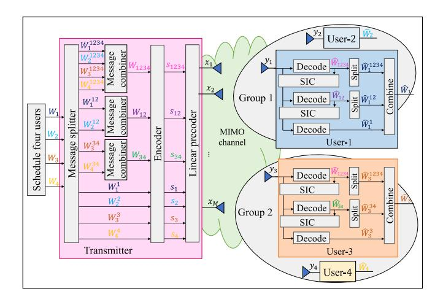

Fig. 8. Transceiver architecture of 4-user 2-layer HRS.

 $s_{\mathcal{K}}$ ,  $s_{\mathcal{K}_i}$ , and  $s_k$  at user-k are given as follows

$$\begin{split} R_k^{\mathcal{K}} &= \log_2(1 + \frac{|\mathbf{h}_k^H \mathbf{p}_{\mathcal{K}}|^2}{\sum_{i \in \mathcal{G}} |\mathbf{h}_k^H \mathbf{p}_{\mathcal{K}_i}|^2 + \sum_{j \in \mathcal{K}} |\mathbf{h}_k^H \mathbf{p}_j|^2 + \sigma_{n,k}^2}), \\ R_k^{\mathcal{K}_i} &= \log_2\left(1 + \frac{\left|\mathbf{h}_k^H \mathbf{p}_{\mathcal{K}_i}\right|^2}{\sum_{i' \in \mathcal{G}, i' \neq i} |\mathbf{h}_k^H \mathbf{p}_{\mathcal{K}_{i'}}|^2 + \sum_{j \in \mathcal{K}} |\mathbf{h}_k^H \mathbf{p}_j|^2 + \sigma_{n,k}^2}\right), \\ R_k &= \log_2\left(1 + \frac{|\mathbf{h}_k^H \mathbf{p}_k|^2}{\sum_{i' \in \mathcal{G}, i' \neq i} |\mathbf{h}_k^H \mathbf{p}_{\mathcal{K}_{i'}}|^2 + \sum_{j \in \mathcal{K}, j \neq k} |\mathbf{h}_k^H \mathbf{p}_j|^2 + \sigma_{n,k}^2}\right). \end{split}$$

$$(11)$$

Following (6) and (7), we obtain the inter-group and inner-group common rates of  $s_K$ ,  $s_{K_i}$ , as follows

$$\sum_{k \in \mathcal{K}} C_k^{\mathcal{K}} = \min \left\{ R_k^{\mathcal{K}} \mid k \in \mathcal{K} \right\},$$

$$\sum_{k \in \mathcal{K}_i} C_k^{\mathcal{K}_i} = \min \left\{ R_k^{\mathcal{K}_i} \mid k \in \mathcal{K}_i \right\}, \forall i \in \mathcal{G}, \quad (12)$$

where  $C_k^{\mathcal{K}}$  and  $C_k^{\mathcal{K}_i}$  are the respective rates allocated to user-k for transmitting  $W_k^{\mathcal{K}}$  and  $W_k^{\mathcal{K}_i}$ , respectively. The total achievable rate of user- $k, k \in \mathcal{K}_i$ , is given by

$$R_{k,tot} = C_k^{\mathcal{K}} + C_k^{\mathcal{K}_i} + R_k. \tag{13}$$

A 2-layer HRS example for K=4 users is depicted in Fig. 8 with user-1/2 in group-1, user-3/4 in group-2.  $s_{1234}$  is an inter-group common stream which is decoded by the four users.  $s_{12}$  and  $s_{34}$  are the inner-group common streams which are respectively decoded by the users in group-1 and group-2 only. By turning off  $s_{12}$  and  $s_{34}$ , the four-user 2-layer HRS example in Fig. 8 boils down to 1-layer RS where  $s_{1234}$  plays the role of  $s_c$  in Fig. 7.

5) Generalized RS: Generalized RS, introduced in [7], is a generalized linearly precoded RS scheme aiming at maximizing the achievable rate and QoS of linearly precoded RS at the expense of a higher transceiver complexity. In contrast to 1-layer RS and 2-layer HRS, which maintain a constant number of message splits L for each user message and a fixed number of SIC layers at each user independent of the number of users K, K-user generalized RS requires L to be increased with K as  $L = 2^{K-1}$  in order to synthesize different common

streams, decoded by different user subsets of K, and consequently, the number of SIC layers at each user increases with K as  $2^{K-1} - 1$ . At the transmitter, message  $W_k$  of user-k is split as  $\{W_k^{\mathcal{A}'}|\mathcal{A}'\subseteq\mathcal{K},k\in\mathcal{A}'\}$ . For any user subset  $\mathcal{A}\subseteq\mathcal{K}$ , the BS loads sub-messages  $\{W_{k'}^{\mathcal{A}}|k'\in\mathcal{A}\}$  with the same superscript A onto data stream  $s_A$ , which is decoded by all users in subset A and treated as noise by the other users. The concept of stream order is introduced in generalized RS to define the streams decoded by different numbers of users. Specifically, the streams decoded by l users are defined as lorder streams [7]. Let  $\{s_{\mathcal{A}'}|\mathcal{A}'\subseteq\mathcal{K}, |\mathcal{A}'|=l\}$  denote the set of all *l*-order streams with  $\binom{K}{l}$  elements, which forms the *l*order data stream vector  $\mathbf{s}_l \in \mathbb{C}^{\binom{K}{l} \times 1}$ . As only one K-order stream  $s_{\mathcal{K}}$  exists,  $\mathbf{s}_K$  is simplified to  $s_{\mathcal{K}}$  when l = K.  $\mathbf{s}_l$  is linearly precoded by precoding matrix  $P_l$ , which is composed of  $\{\mathbf{p}_{\mathcal{A}'}|\mathcal{A}'\subseteq\mathcal{K}, |\mathcal{A}'|=l\}$ . The transmit signal of K-user generalized RS is given as follows

$$\mathbf{x} = \sum_{l=1}^{K} \mathbf{P}_{l} \mathbf{s}_{l} = \sum_{l=1}^{K} \sum_{\mathcal{A}' \subset \mathcal{K}, |\mathcal{A}'| = l} \mathbf{p}_{\mathcal{A}'} s_{\mathcal{A}'}.$$
 (14)

Each user-k employs  $2^{K-1}-1$  SIC layers to decode the intended common streams and its private stream. Starting with the K-order stream  $s_K$ , the decoding process goes downwards until the 1-order private stream  $s_k$  is reached. The l-order streams involved in  $\mathcal{S}_{l,k} = \{s_{\mathcal{A}'}|\mathcal{A}' \subseteq \mathcal{K}, |\mathcal{A}'| = l, k \in \mathcal{A}'\}$  are decoded at user-k based on the decoding order  $\pi_{l,k}$ . We define  $\mathbf{s}_{\pi_{l,k}} = [s_{\pi_{l,k}(1)}, \ldots, s_{\pi_{l,k}(|\mathcal{S}_{l,k}|)}]^H$  as the l-order stream vector decoded at user-k with  $s_{\pi_{l,k}(i)}$  being decoded before  $s_{\pi_{l,k}(j)}$  if i < j. The rate of decoding l-order stream  $s_{\pi_{l,k}(i)}$  at user-k is

$$R_k^{\pi_{l,k}(i)} = \log_2\left(1 + \frac{|\mathbf{h}_k^H \mathbf{p}_{\pi_{l,k}(i)}|^2}{I_{\pi_{l,k}(i)} + \sigma_{n,k}^2}\right),\tag{15}$$

where

$$I_{\pi_{l,k}(i)} = \sum_{j>i} |\mathbf{h}_k^H \mathbf{p}_{\pi_{l,k}(j)}|^2 + \sum_{l'=1}^{l-1} \sum_{j=1}^{|\mathcal{S}_{l',k}|} |\mathbf{h}_k^H \mathbf{p}_{\pi_{l',k}(j)}|^2 + \sum_{\mathcal{A}' \subseteq \mathcal{K}, k \notin \mathcal{A}'} |\mathbf{h}_k^H \mathbf{p}_{\mathcal{A}'}|^2$$

is the interference received at user-k when decoding  $s_{\pi_{l,k}(i)}$  with the first term  $\sum_{j>i} |\mathbf{h}_k^H \mathbf{p}_{\pi_{l,k}(j)}|^2$  being the interference from the remaining non-decoded l-order streams in  $\mathbf{s}_{\pi_{l,k}}$ , the second term  $\sum_{l'=1}^{l-1} \sum_{j=1}^{|\mathcal{S}_{l',k}|} |\mathbf{h}_k^H \mathbf{p}_{\pi_{l',k}(j)}|^2$  being the interference from lower order streams  $\{\mathbf{s}_{\pi_{l',k}}|l'< l\}$  to be decoded at user-k, and the third term  $\sum_{\mathcal{A}'\subseteq\mathcal{K},k\notin\mathcal{A}'} |\mathbf{h}_k^H \mathbf{p}_{\mathcal{A}'}|^2$  being the interference from the unintended streams. Following (6) and (7), the rate of the  $|\mathcal{A}|$ -order stream  $s_{\mathcal{A}}$  is

$$\sum_{k \in \mathcal{A}} C_k^{\mathcal{A}} = \min_{k'} \left\{ R_{k'}^{\mathcal{A}} \mid k' \in \mathcal{A} \right\}, \tag{16}$$

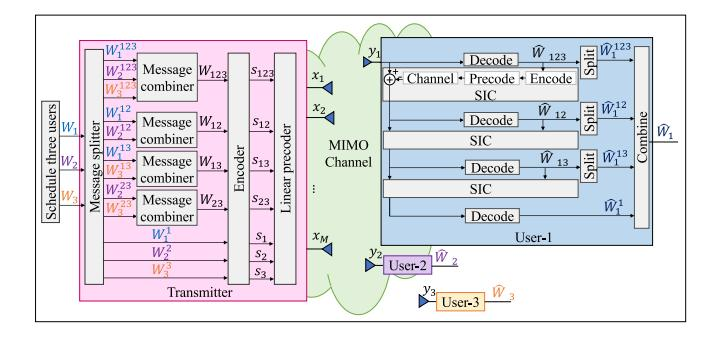

Fig. 9. Transceiver architecture of 3-user generalized RS [7].

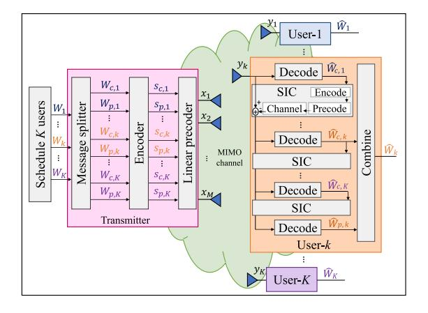

Fig. 10. Transceiver architecture of K-user RS-CMD.

where  $C_k^{\mathcal{A}}$  is the portion of the rate of stream  $s_{\mathcal{A}}$  allocated to user-k ( $k \in \mathcal{A}$ ) for  $W_k^{\mathcal{A}}$ . The total achievable rate of user-k is

$$R_{k,tot} = \sum_{\mathcal{A}' \subset \mathcal{K}, k \in \mathcal{A}'} C_k^{\mathcal{A}'} + R_k. \tag{17}$$

A 3-user generalized RS example is illustrated in Fig. 9. Each user message is split into 4 sub-messages, i.e.,  $W_1$  is split into  $\{W_1^{123}, W_1^{12}, W_1^{13}, W_1^{1}\}$ . The total 12 sub-messages are recombined and encoded into one 3-order stream  $s_{123}$ , three 2-order streams  $\mathbf{s}_2 = [s_{12}, s_{13}, s_{23}]^T$  and three 1-order streams  $\mathbf{s}_1 = [s_1, s_2, s_3]^T$ . Each user employs 3 layers of SIC to decode the intended 4 streams in order. Fig. 9 depicts the receiver of user-1 when the decoding order of the 2-order streams is  $\pi_{2,1} = 12 \rightarrow 13$ . We have  $s_{\pi_{2,1}(1)} = s_{12}$  and  $s_{\pi_{2,1}(2)} = s_{13}$ .

6) RS-CMD: RS-CMD, initially proposed in [47] for cloud-radio access networks (C-RAN), is a RSMA scheme that splits and encodes user messages without the use of message combiners, i.e., the message combiners at the RSMA transmitter in Fig. 4 and the RSMA receiver in Fig. 5 are both turned off. Fig. 10 illustrates a K-user RS-CMD transceiver for the MISO BC.

At the transmitter, message  $W_k$  intended for user-k is split into two sub-messages  $W_{c,k}$  and  $W_{p,k}$ . The resulting 2K sub-messages  $\{W_{c,k},W_{p,k}\mid k\in\mathcal{K}\}$  are independently encoded into 2K streams  $\{s_{c,k},s_{p,k}\mid k\in\mathcal{K}\}$  with  $\{s_{c,k}\mid k\in\mathcal{K}\}$  being common streams decoded by all users and  $\{s_{p,k}\mid k\in\mathcal{K}\}$ 

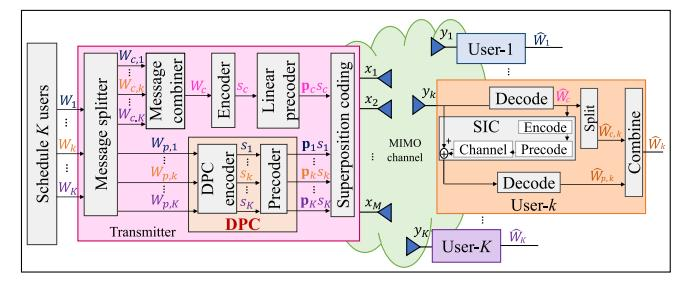

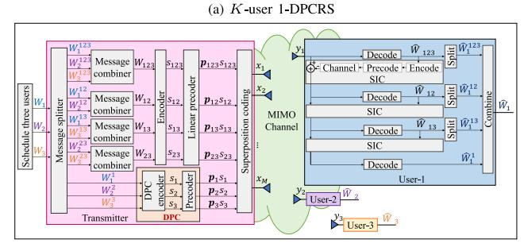

(b) 3-user M-DPCRS

Fig. 11. Transceiver architecture for DPCRS [53].

 $\mathcal{K}$ } being private streams decoded by the corresponding users only. The encoded streams are linearly precoded via precoders  $\{\mathbf{p}_{c,k},\mathbf{p}_{p,k}\mid k\in\mathcal{K}\}$ . The resulting transmit signal of the K-user RS-CMD is given as follows

$$\mathbf{x} = \sum_{k \in \mathcal{K}} (\mathbf{p}_{c,k} s_{c,k} + \mathbf{p}_{p,k} s_{p,k}). \tag{18}$$

User-k employs K layers of SIC to decode the K common streams  $\{s_{c,k'} \mid k' \in \mathcal{K}\}$  based on decoding order  $\pi_k$  before decoding the intended private stream  $s_{p,k}$ . Stream  $s_{c,\pi_k(i)}$  is decoded before  $s_{c,\pi_k(j)}$  at user-k if i < j. The rates for decoding common stream  $s_{c,\pi_k(i)}$  and private stream  $s_{p,k}$  at user-k are obtained as follows

$$R_{k,\pi_{k}(i)}^{c} = \log_{2} \left( 1 + \frac{\left| \mathbf{h}_{k}^{H} \mathbf{p}_{c,\pi_{k}(i)} \right|^{2}}{\sum_{j>i} \left| \mathbf{h}_{k}^{H} \mathbf{p}_{c,\pi_{k}(j)} \right|^{2} + \sum_{j \in \mathcal{K}} \left| \mathbf{h}_{k}^{H} \mathbf{p}_{p,j} \right|^{2} + \sigma_{n,k}^{2}} \right),$$

$$R_{k}^{p} = \log_{2} \left( 1 + \frac{\left| \mathbf{h}_{k}^{H} \mathbf{p}_{p,k} \right|^{2}}{\sum_{j \in \mathcal{K}, j \neq k} \left| \mathbf{h}_{k}^{H} \mathbf{p}_{p,j} \right|^{2} + \sigma_{n,k}^{2}} \right)$$

$$(19)$$

The overall achievable rate of user-k is given by

$$R_{k,tot} = R_k^c + R_k^p, (20)$$

where  $R_k^c = \min_i \{ R_{i,k}^c \mid i \in \mathcal{K} \}$  is the achievable rate of common stream  $s_{c,k}$  guaranteeing  $s_{c,k}$  is successfully decoded at all users. Fig. 10 illustrates an example where the decoding order of the common streams at user-k is as follows  $s_{c,1} \rightarrow s_{c,2} \rightarrow \cdots \rightarrow s_{c,K}$ .

7) DPCRS: Although DPC is the only known capacity-achieving strategy for the multi-antenna BC with perfect CSIT [12], [65], [66], it is vulnerable to CSIT estimation errors [67], [68]. This limitation of DPC can be successfully compensated by DPCRS proposed in [53], which marries RS and DPC to overcome the performance losses of DPC in imperfect CSIT. The two DPCRS schemes proposed in [53] are "1-layer Dirty Paper Coded RS (1-DPCRS)" and "multi-layer dirty paper coded rate-splitting (M-DPCRS)", as illustrated in Fig. 11. Compared with the corresponding linearly precoded

&lt;sup>9Here, we consider the case when the K common streams  $\{s_{c,k} \mid k \in \mathcal{K}\}$  are decoded by all users. The group of users that decodes each of the common streams could be further optimized to further enhance the performance of RS-CMD [64].

1-layer RS and generalized RS schemes, the main difference of DPCRS is that the private streams are generated using non-linear DPC. The common streams are still linearly precoded and superimposed on top of the non-linear private streams. The receiver architecture for DPCRS is the same as that for linearly precoded RS. Readers are referred to [53] for more details on DPCRS. Note that besides 1-layer RS and generalized RS, other linearly precoded strategies, such as 2-layer HRS and RS-CMD, also can be extended to the corresponding DPC-based RS counterparts.

8) THPRS: THPRS is proposed in [51] and combines the benefits of 1-layer RS and THP. Though THP does not achieve as good a performance as DPC, it is less complex and considered to be a practical and suboptimal implementation of DPC. Compared with 1-DPCRS, the main difference of THPRS is the use of THP to encode the private messages. The interference caused by the previously encoded private streams can be eliminated using THP while the interference caused by the subsequently encoded private streams is removed via beamforming, i.e., ZFBF based on LQ decomposition, see [51]. The common message  $W_c$  is independently encoded into  $s_c$  and superimposed on top of the THP encoded private streams. At the user sides, each user sequentially decodes the intended common and private streams. As THP requires a modulo operator at the transmitter to ensure that the transmit power does not exceed the power constraint, each user also applies the modulo operation to decode the intended private stream. The use of the modulo operation at the transmitter and receiver incurs power and modulo losses, which therefore make THPRS a suboptimal DPCRS implementation. Readers are referred to [51], [52] for more details on THPRS.

# C. Uplink RSMA

RSMA has been studied not only for the downlink, but also for the uplink [69]–[74]. It was first proposed in [69] for the SISO MAC and was shown to achieve the capacity region of the Gaussian MAC without the need for time sharing among users. The capacity region of the two-user SISO Gaussian MAC is a pentagon as shown in Fig. 12. The two corner points A and B can be achieved by SIC with two reverse decoding orders, which however does not apply to the rate points along the line segment A-B. There are three methods that can achieve the points along the line segment A-B, namely, joint encoding/decoding, time sharing, and rate splitting. Joint encoding/decoding is not practical due to the high complexity of code construction and joint decoding at the receiver. The second method, time sharing, induces communication overhead and stringent synchronization requirements due to the coordination of the transmissions of all users [69]. Thus, it is not applicable for services requiring grant-free access, which allow collisions to reduce the access latency stemming from the channel grant procedure.

In comparison to the other methods, RSMA is more attractive as it achieves every point of the capacity region (including line segment A–B) via SC and SIC. Though RSMA introduces a coordination overhead for common and private streams' rate selections, the complexity of selecting a versatile set of

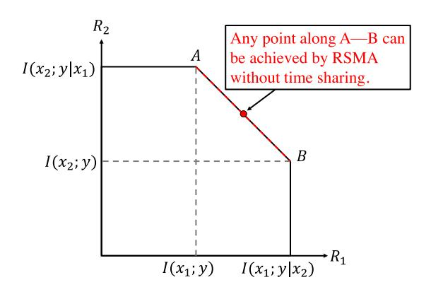

Fig. 12. Two-user Gaussian multiple-access capacity region.  $x_1$  and  $x_2$  are the information symbols of user-1 and user-2, respectively. y is the received signal.  $I(x_k; y)$  is the mutual information between  $x_k$  and y.  $I(x_k; y|x_j)$  is the conditional mutual information between  $x_k$  and y given  $x_j$  [15].

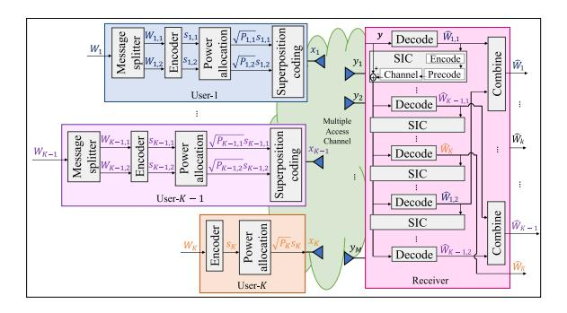

Fig. 13. Transceiver architecture of *K*-user uplink RSMA.

the parameters for RSMA is arguably lower than time sharing. Therefore, RSMA can be a low-complexity enabler for services with grant-free access and user intermittency, in which users are not always active and there is always an element of unpredictability in their activation, such as URLLC and mMTC [75]. Fig. 13 illustrates K-user uplink RSMA based on SC and SIC. In the K-user case, splitting the messages of K-1 users is sufficient to avoid time sharing and achieves every point of the capacity region [69]. Without loss of generality, we assume the messages of all users except user-K are split. At user- $k, k \in \{1, \dots, K-1\}$ , the message  $W_k$ to be transmitted is split into two sub-messages  $W_{k,1}$  and  $W_{k,2}$ . This can be interpreted as creating 2 virtual users. The messages  $W_{k,1}$  and  $W_{k,2}$  of the two virtual users are independently encoded into streams  $s_{k,1}$  and  $s_{k,2}$  with unit variance, i.e.,  $\mathbb{E}[|s_{k,i}|^2] = 1, i = 1, 2$ . The two streams are then respectively allocated with certain powers  $P_{k,1}$  and  $P_{k,2}$ , and superposed at user-k. At user-K, the message  $W_K$  is directly encoded into  $s_K$  and allocated with power  $P_K$ . The transmit signal is given by

$$x_k = \begin{cases} \sqrt{P_{k,1}} s_{k,1} + \sqrt{P_{k,2}} s_{k,2}, & \text{if } k \in \{1, \dots, K-1\}, \\ \sqrt{P_K} s_K, & \text{if } k = K. \end{cases}$$
(21)

The signal observed at the receiver is

$$\mathbf{y} = \sum_{k \in \mathcal{K}} \mathbf{h}_k x_k + \mathbf{n}_r,\tag{22}$$

where  $\mathbf{h}_k \in \mathbb{C}^{M \times 1}$  is the channel vector between user-k and the receiver, and  $\mathbf{n}_r \in \mathbb{C}^{M \times 1}$  is the AWGN vector whose elements have zero-mean and variance  $\sigma^2_{n_r}$ . The receiver employs filters  $\mathbf{w}_{k,1}, \mathbf{w}_{k,2}$  to detect the two streams of user- $k, k \in \{1, \dots, K-1\}$  and  $\mathbf{w}_K$  to detect the stream of user-K. Let  $\pi$  denote the decoding order of the 2K-1 received streams  $\{s_{k,i}, s_K \mid k \in \{1, \dots, K-1\}, i \in \{1,2\}\}$ , and let  $\pi_{k,i}$  denote the decoding order of  $s_{k,i}$  with stream  $s_{k,i}$  being decoded before stream  $s_{k',i'}$  if  $\pi_{k,i} < \pi_{k',i'}$ . For user-K,  $\pi_{K,i}$  is simplified to  $\pi_K$ . Assuming Gaussian signaling and infinite block length, the rate of decoding  $s_{ki}$  at the receiver is given as follows

$$R_{k,i} = \log_{2} \left( 1 + \frac{P_{k,i} \left| \mathbf{w}_{k,i}^{H} \mathbf{h}_{k} \right|^{2}}{\sum_{\pi_{k',i'} > \pi_{k,i}} P_{k',i'} \left| \mathbf{w}_{k,i}^{H} \mathbf{h}_{k'} \right|^{2} + \sigma_{n_{r}}^{2}} \right),$$

$$R_{K} = \log_{2} \left( 1 + \frac{P_{K} \left| \mathbf{w}_{K}^{H} \mathbf{h}_{K} \right|^{2}}{\sum_{\pi_{k',i'} > \pi_{K}} P_{k',i'} \left| \mathbf{w}_{K}^{H} \mathbf{h}_{k'} \right|^{2} + \sigma_{n_{r}}^{2}} \right).$$
(23)

Optimizing the power allocation  $\{P_{k,i}, P_K \mid k \in \{1, \dots, K-1\}, i \in \{1, 2\}\}$  to maximize the sum rate has been investigated in [73]. In order to decode all 2K-1 streams, the receiver requires 2K-2 layers of SIC. Therefore, higher receiver complexity is introduced in order to avoid time sharing.

The described system model for uplink RSMA is generic, and can be adapted to enable uplink multiple-access for both homogeneous and heterogeneous services. More specifically, RSMA can be employed to enable a specific service in a network, such as URLLC or mMTC; or it can be employed to enable non-orthogonal multiplexing of different services in heterogeneous networks, as in heterogeneous non-orthogonal multiple access (H-NOMA) [75]. The application of RSMA in both use cases require further study.

# D. Multi-Cell RSMA

Next, we increase our scope of RSMA by considering a network comprising multiple cells, each hosting one or multiple users. There are two categories of multi-cell networks, namely, "coordination" and "cooperation" networks [10]. The former terminology refers to schemes that do not rely on data sharing while the latter refers to schemes relying on data sharing, as illustrated in Fig. 14, but both (normally) require CSI sharing among the BSs. The benefits of RSMA have been explored for both coordinated multi-cell networks [21], [76]–[81] and cooperative multi-cell networks [46]–[50], [64], [82]–[84]. RSMA has been shown to achieve enhanced SE in both categories of multi-cell networks due to its ability to tackle not only the intra-cell interference but also the inter-cell interference.

1) Coordinated Transmission: Coordination techniques are motivated by interference channel (IC) concepts from information theory. The data of each user is sent from one cell while user scheduling, beamforming, and power control are designed based on coordination among cells. By

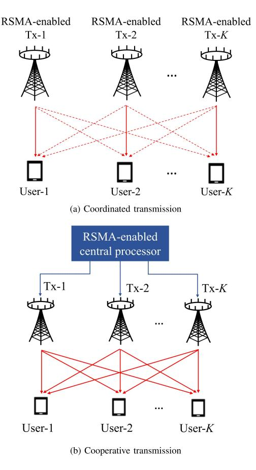

Fig. 14. Multi-cell RSMA-enabled transmission.

using RS among cell, the inter-cell interference can be partially decoded and partially treated as noise, which therefore improves the interference management between cells. Fig. 14(a) illustrates a K-cell MISO IC where each M-antenna transmitter (Tx) serves one single-antenna user. By employing RSMA at each transmitter-k, the message  $W_k$  of user-k is split into two parts  $W_{c,k}$  and  $W_{p,k}$ , which are then encoded into two streams  $s_{c,k}, s_{p,k}$  and linearly precoded via precoders  $\mathbf{p}_{c,k}, \mathbf{p}_{p,k} \in \mathbb{C}^{M \times 1}$ . The resulting transmit signal at transmitter-k is given by

$$\mathbf{x}_k = \mathbf{p}_{c,k} s_{c,k} + \mathbf{p}_{p,k} s_{p,k}. \tag{25}$$

The signal received at the receiver is given by

$$y_k = \sum_{j=1}^{K} \mathbf{h}_{kj}^{H} (\mathbf{p}_{c,j} s_{c,j} + \mathbf{p}_{p,j} s_{p,j}) + n_k,$$
 (26)

where  $\mathbf{h}_{kj} \in \mathbb{C}^{M \times 1}$  is the channel between transmitter-j and user-k. The receiver design follows the RS-CMD concept illustrated in Fig. 10. Each user-k successively decodes and removes all common streams  $s_{c,1},\ldots,s_{c,L}$  using SIC, and then decodes the desired private stream  $s_{p,k}$ . Based on the decoding order  $\pi_k$ , where stream  $s_{c,\pi_k(i)}$  is decoded before  $s_{c,\pi_k(j)}$  at user-k if i < j, the rates for decoding  $s_{c,\pi_k(i)}$  and  $s_{p,k}$  at user-k are obtained as follows

$$R_{k,\pi_{k}(i)}^{c} = \log_{2}\!\left(1 + \frac{\left|\mathbf{h}_{k\pi_{k}(i)}^{H}\mathbf{p}_{c,\pi_{k}(i)}\right|^{2}}{\sum_{j>i}|\mathbf{h}_{k\pi_{k}(j)}^{H}\mathbf{p}_{c,\pi_{k}(j)}|^{2} + \sum_{j\in\mathcal{K}}|\mathbf{h}_{kj}^{H}\mathbf{p}_{p,j}|^{2} + \sigma_{n,k}^{2}}\right)\!,$$

$$R_{k}^{p} = \log_{2} \left( 1 + \frac{|\mathbf{h}_{kk}^{H} \mathbf{p}_{p,k}|^{2}}{\sum_{j \in \mathcal{K}, j \neq k} |\mathbf{h}_{kj}^{H} \mathbf{p}_{p,j}|^{2} + \sigma_{n,k}^{2}} \right).$$
 (27)

The overall achievable rate of user-k follows

$$R_{k,tot} = R_k^c + R_k^p, (28)$$

where  $R_k^c = \min_i \{ R_{i,k}^c \mid i \in \mathcal{K} \}$ .

As discussed in [78], we could further split the message of each user into N > 2 parts with each part being decoded by a different group of users based on the specific instantaneous CSIT quality. By such means, the DoF of the MISO BC can be further boosted.

2) Cooperative Transmission: Cooperative transmission (a.k.a. network MIMO/joint transmission) on the other hand is motivated by the MIMO BC. It requires both user data and CSI to be shared among cells. Fig. 14(b) illustrates a K-cell network MIMO where each transmitter is equipped with M antennas and all transmitters serve K users jointly. The K transmitters are assumed to be connected with a central processor via high speed and large bandwidth fronthaul links. The central processor has access to the messages of all K users and to the CSI of all channels between the BSs and the users. Therefore, cooperative transmission allows the transmitters to operate as a virtual joint transmitter and all downlink RSMA strategies illustrated in Section II-B can be applied for cooperative transmission. The major differences compared with the single-cell MIMO BC lie in the transmit power constraint and the fronthaul capacity constraint. Contrary to the single-cell MIMO BC where transmit signals are not subject to a sumpower constraint, cooperative multi-cell networks require per BS power constraints. If each transmitter is equipped with a single antenna, i.e., M = 1, the cooperative multi-cell network is equivalent to a single-cell MIMO BC under a per antenna power constraint [82]. Moreover, contrary to the single-cell MIMO BC which does not include fronthaul capacity limitations, cooperative multi-cell networks such as C-RAN or F-RAN have practical fronthaul capacity constraints, which influences RSMA design [50].

# III. Information-Theoretic Background and Milestones of RSMA

RSMA has its roots in network information theory, which lays a solid foundation to the communication theory and emerging applications of RSMA. In this section, we provide a comprehensive survey of RSMA from an information theoretic perspective for both single-antenna and multi-antenna networks, followed by a summary of the main milestones in the history of RSMA.

#### A. RSMA in Single-Antenna Networks

The idea of RS was introduced by Carleial [76] for the two-user SISO IC where an inner bound on the capacity region based on RS and successive cancellation decoding was proposed. This inner bound was further improved by Han and Kobayashi (HK) [77] via RS and simultaneous decoding. In [21], a special case of the HK scheme was further shown to achieve the capacity region of the two-user SISO IC within one bit. An example of the HK scheme is illustrated in

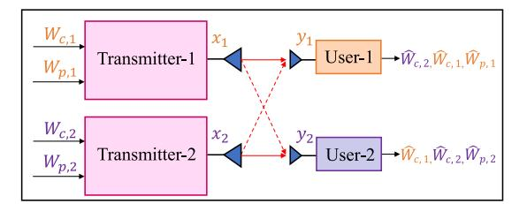

(a) RSMA for two-user SISO IC (HK scheme) [77]

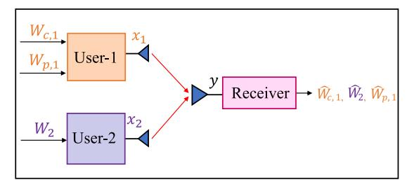

(b) RSMA for two-user SISO MAC [69]

Fig. 15. Two-user RSMA transmission framework for SISO IC and SISO MAC in information theory.

Fig. 15(a). The message  $W_k$  of user-k is split into a common part  $W_{c,k}$  and a private part  $W_{p,k}$ , which are independently encoded at the corresponding transmitter. Each user decodes the common part of the other user so as to cancel part of the interference and the remaining private part of the other user is treated as noise. Fig. 15(a) illustrates the case when user-1 decodes  $W_{c,2}$ ,  $W_{c,1}$ , and  $W_{p,1}$  while user-2 decodes  $W_{c,1}$ ,  $W_{c,2}$ , and  $W_{p,2}$ . Such HK scheme enables flexible and powerful interference management by partially decoding the interference and partially treating the remaining interference as noise. This is the fundamental principle of RS on which all applications of RS in wireless networks are based. It allows RS to bridge the two extreme strategies of fully decoding the interference and fully treating the interference as noise. Therefore, the HK scheme provides the basic concept of RS, and it can be seen as an RS strategy for the two-user SISO IC, which is a special case of the K-cell MISO IC illustrated in Fig. 14(a).

The terminology "rate-splitting multiple access (RSMA)" was first introduced in [69] for the SISO MAC. Relying on splitting user messages at the transmitters (i.e., users) and successive cancellation at the receiver (i.e., base station-BS), RSMA achieves all points on the boundary of the SISO MAC capacity region without the need for time sharing and hence synchronization among users. This contrasts with conventional capacity-achieving schemes for the SISO BC (i.e., DPC and SC-SIC), which need time sharing to attain part of the capacity region boundary. RSMA was further studied in [71] for the two-user Gaussian MAC where each user independently transmits data packets with predefined collusion probability. It has been shown that the capacity region of such systems is the same as the capacity region of MA systems where the users continuously transmit. In [99], [100], RSMA was used for opportunistic interference cancellation in cognitive networks and was shown to achieve all points on the boundary of the rate region without time sharing between primary and secondary users. The optimal decoding order and power allocation of uplink RSMA when the BS is equipped with multiple antennas was further investigated in [\[73\]](#page-49-8). Fig. [15\(](#page-15-1)b) illustrates a two-user RSMA example for the SISO MAC, which is a special case of the *K*-user uplink RSMA in Fig. [13.](#page-13-1) User-1 splits its message *W*1 into *Wc*,1 and *Wp*,1 and the receiver (i.e., the BS) decodes *Wc*,1, *Wp*,1, and *W*2 via successive cancellation. With appropriate decoding order and power allocation, the entire capacity region of the two-user SISO MAC can be attained. Though uplink RSMA has a different structure than the HK scheme, they both lean on the concept of RS to split user messages at the transmitters, and partially decode interference and partially treat interference as noise at the receiver(s). However, the motivations for the two schemes are distinct. RS for the MAC was proposed to avoid time sharing while RS for the IC was advocated to enhance the rate region over existing schemes that fully treat interference as noise or fully decode interference.

Besides the SISO IC and MAC, RS has been studied for the SISO BC with degraded message sets (i.e., with one or multiple multicast messages intended for multiple users) [\[85\]](#page-49-18), [\[87\]](#page-49-19), [\[94\]](#page-49-20), [\[101\]](#page-49-21). In this context, RS has been shown to achieve the general inner bound on the capacity region of the discrete memoryless BC with an arbitrary number of users and arbitrary sets of message demands [\[94\]](#page-49-20).

# *B. RSMA in Multi-Antenna Networks*

The success of multi-antenna networks has shifted the research focus of RSMA from single-antenna networks to multi-antenna networks. The existing information-theoretic literature on RSMA in multi-antenna networks mainly has studied four metrics, namely, the sum-DoF and DoF region, max-min fairness/symmetric-DoF, generalized DoF (GDoF), and capacity region as elaborated in the following.

*Sum-DoF and DoF region:* As the capacity region of the *K*-user MISO BC with partial CSIT remains an open problem hitherto, the research has focused on identifying the corresponding DoF and GDoF region (within a constant gap). RS was first studied for the two-user MISO BC in [\[88\]](#page-49-22) where RS was shown to achieve the optimum sum-DoF of the two-user underloaded MISO BC with partial CSIT. The authors of [\[102\]](#page-49-23) further discovered a novel sum-DoF upper bound based on aligned image sets for the *K*-user underloaded MISO BC with partial CSIT. Surprisingly, the sum-DoF achieved by RS was shown in [\[28\]](#page-48-33) to match the DoF upper bound obtained in [\[102\]](#page-49-23). This sharply contrasts with the sum-DoF of SDMA and NOMA for the MISO BC with partial CSIT, which are clearly suboptimal [\[11\]](#page-47-9). The authors of [\[103\]](#page-49-24) then proved that the entire DoF region of the underloaded MISO BC with partial CSIT is achieved by RS. Besides the conventional MISO BC, the DoF gain of RS has also been brought to light in more complicated underloaded networks with partial CSIT considering multiple transmitters [\[78\]](#page-49-13) and multiple antennas at each receiver (MIMO BC and MIMO IC) [\[89\]](#page-49-25). For the MIMO BC, RS was again shown to achieve the optimal DoF region in the general case of asymmetric numbers of receive antennas (i.e., different numbers of receive antennas deployed at different users), when the DoF region was achieved by RS matching the DoF-region upper bound [\[89\]](#page-49-25), [\[104\]](#page-49-26). For the overloaded MISO BC, where users have heterogeneous CSIT qualities (namely, no-CSIT users with statistical CSIT only and partial-CSIT users with imperfect instantaneous CSIT), it was shown in [\[30\]](#page-48-40) that the entire optimal DoF region could be achieved by adopting SC to transmit the degraded symbols for the no-CSIT users and linearly precoded RS symbols for the partial-CSIT users.

*Max-min fairness/symmetric-DoF:* Taking user fairness into consideration, the authors of [\[29\]](#page-48-39) derived the optimum maxmin fairness (MMF)-DoF (a.k.a. symmetric DoF, i.e., the DoF that can be simultaneously achieved by all users) of RS for the underloaded MISO BC with imperfect CSIT, which outperforms that of SDMA. For the *K*-user overloaded multigroup multicast channel, the achievable MMF-DoF of RS were characterized for perfect CSIT in [\[61\]](#page-48-35) and for imperfect CSIT in [\[96\]](#page-49-27). Explicit symmetric DoF gains over SDMA and NOMA are obtained in both settings. In [\[11\]](#page-47-9), the sum-DoF and MMF-DoF of RS, SDMA, and multi-antenna NOMA for the underloaded and overloaded MISO BC with perfect and imperfect CSIT are summarized comprehensively. This shows that RS fully exploits the multi-antenna DoF and the benefits of SIC receivers, and outperforms SDMA and NOMA in both underloaded and overloaded regimes relying on perfect and imperfect CSIT.

*GDoF:* Conventional DoF metrics reflect how fast the user rates increase with SNR in the high SNR regime. However, they are not able to capture the diversity of the channel strengths among the users. The GDoF introduced in [\[21\]](#page-48-2) overcome this limitation of DoF. The authors of [\[90\]](#page-49-28), [\[105\]](#page-49-29) characterized the entire GDoF region of the two-user underloaded MISO BC with imperfect CSIT, and the GDoF optimal achievable scheme is built upon RS.

*Capacity region:* Besides the DoF metrics, RS has been shown to achieve the sum capacity [\[91\]](#page-49-30) and further the entire capacity region [\[92\]](#page-49-31), [\[93\]](#page-49-32) within a constant gap for the twouser MIMO BC with perfect CSIT. The reviewed informationtheoretic works on RSMA are summarized in Table [VI.](#page-17-0)

# *C. Milestones of RSMA*

Looking back at the history of RSMA, there are a number of significant milestones paving the way towards a novel PHY layer design for future generations of wireless systems based on RSMA, which are summarized in Fig. [16.](#page-18-0) As time goes on, RSMA will continue to evolve and motivate research for next generation multiple access aiming at better performance in terms of SE, EE, throughput, latency, reliability, robustness, coverage, cost, among others.

# IV. COMMUNICATION-THEORETIC BACKGROUND OF RSMA

In recent years, the superiority of RSMA, unveiled by the information-theoretic results discussed in Section [III,](#page-15-0) has motivated the study of RSMA from the communicationtheoretic perspective in the moderate SNR regime. The main research focus in this regime is on the resource allocation for RSMA including precoder design, power control,

TABLE VI INFORMATION-THEORETIC LITERATURE ON RSMA

| Timeline | Ref.         | Scenario                                                                      | CSI Condition                   | Metric                    | Main Discovery                                                                                                                                                                   |
|----------|--------------|-------------------------------------------------------------------------------|---------------------------------|---------------------------|----------------------------------------------------------------------------------------------------------------------------------------------------------------------------------|
| 1978     | [76]         | 2-cell SISO IC                                                                | Perfect CSIT                    | Rate region               | Proposed the idea of RS for the 2-cell SISO IC.                                                                                                                                  |
| 1981     | [77]         | 2-cell SISO IC                                                                | Perfect CSIT                    | Rate region               | Proposed the HK scheme for the 2-cell SISO IC.                                                                                                                                   |
| 1996     | [69]         | K-user SISO MAC                                                               | Perfect CSIT                    | Capacity region           | Proposed uplink RSMA which achieves the capacity region of the <i>K</i> -user Gaussian MAC without time sharing.                                                                 |
| 2007     | [85]         | 2-user SISO BC with cooperative relaying                                      | Perfect CSIT                    | Rate region               | Showed that RS achieves an inner bound on the capacity region of the two-user SISO BC with cooperative relaying.                                                                 |
| 2008     | [21]         | 2-cell SISO IC                                                                | Perfect CSIT                    | Rate region               | Showed that a simplified HK scheme achieves rates within 1 bit/s/Hz of the capacity of the 2-cell SISO (Gaussian) IC.                                                            |
| 2009     | [86]         | 2-user SISO BC with a multicast message                                       | Perfect CSIT                    | Capacity region           | Showed that RS achieves the proposed inner bound on the capacity region of the two-user SISO BC with a multicast message.                                                        |
| 2009     | [87]         | 3-user SISO BC with multicast messages                                        | Perfect CSIT                    | Capacity region           | Showed that RS achieves the capacity region of the three-user SISO BC with two-degraded messages sets.                                                                           |
| 2013     | [88]         | 2-user underloaded MISO BC                                                    | Imperfect CSIT                  | Sum-DoF                   | Showed that RS achieves the optimum sum-DoF of the 2-user underloaded MISO BC with imperfect CSIT.                                                                               |
| 2016     | [29]         | K-user underloaded MISO BC                                                    | Imperfect CSIT                  | Symmetric-DoF             | Showed that RS achieves a higher symmetric-DoF than SDMA for the $K$ -user underloaded MISO BC with imperfect CSIT.                                                              |
| 2016     | [30]         | K-user overloaded MISO BC                                                     | Imperfect CSIT                  | DoF region                | Showed that RS achieves the entire DoF region of the K-user overloaded MISO BC with heterogeneous CSIT qualities.                                                                |
| 2016     | [28]         | K-user underloaded MISO BC                                                    | Imperfect CSIT                  | Sum-DoF                   | Showed that RS achieves the optimum sum-DoF of the $K$ -user underloaded MISO BC with imperfect CSIT.                                                                            |
| 2017     | [30]         | K-user underloaded MISO BC                                                    | Imperfect CSIT                  | DoF region                | Showed that RS achieves the entire DoF region of the K-user underloaded MISO BC with imperfect CSIT.                                                                             |
| 2017     | [61]         | K-user MISO BC with over- loaded multigroup multicast                      | Perfect CSIT                    | Symmetric-DoF             | Showed that RS achieves higher symmetric-DoF than SDMA and multi-antenna NOMA with one user group for the <i>K</i> -user overloaded multigroup multicast with perfect CSIT.      |
| 2017     | [78]         | K-cell MISO IC                                                                | Imperfect CSIT                  | DoF region                | Showed that RS achieves the best known DoF region of the K-cell MISO IC with imperfect CSIT.                                                                                     |
| 2017     | [89]         | 2-cell MIMO IC                                                                | Imperfect CSIT                  | DoF region                | Showed that RS achieves the optimum DoF region of the 2- cell MIMO IC with imperfect CSIT under certain antenna- configurations and CSIT qualities.                        |
| 2017     | [90]         | 2-user underloaded MISO BC                                                    | Imperfect CSIT                  | GDoF                      | Showed that RS-assisted approach achieves the entire GDoF region of the 2-user underloaded MISO BC with imperfect CSIT.                                                          |
| 2018     | [91]         | 2-user underloaded MISO BC                                                    | Perfect CSIT                    | Sum-rate                  | Showed that RS achieves the sum capacity within a constant gap for the 2-user MISO BC with perfect CSIT.                                                                         |
| 2018     | [92] [93] | 2-user underloaded MIMO BC                                                    | Perfect CSIT                    | Rate region               | Showed that RS achieves the whole capacity region within a constant gap for the 2-user MIMO BC with perfect CSIT.                                                                |
| 2020     | [94]         | K-user SISO BC with multi- cast messages                                   | Perfect CSIT                    | Rate region               | Showed that RS achieves a general inner bound for the discrete memoryless BC with an arbitrary number of users and an arbitrary set of message demands.                          |
| 2021     | [95]         | 2-user SISO BC with cooperative relaying                                      | Perfect CSIT                    | Capacity region           | Showed that RS attains the capacity region within a constant gap for a scalar Gaussian full-duplex cellular network with device-to-device (D2D) messages.                        |
| 2021     | [96]         | K-user MISO BC with under- loaded and overloaded multi- group multicast | Imperfect CSIT                  | Symmetric-DoF             | Showed that RS achieves a symmetric-DoF gain over SDMA for the $K$ -user underloaded and overloaded multigroup multicast channel with imperfect CSIT.                            |
| 2021     | [11]         | K-user underloaded and overloaded MISO BC                                     | Perfect CSIT, Imperfect CSIT | Sum-DoF, Symmetric-DoF | Showed that RS achieves both a sum-DoF and a symmetric-DoF gain over SDMA and multi-antenna NOMA in both the overloaded and underloaded MISO BC with perfect and imperfect CSIT. |

common rate allocation, user scheduling, and subcarrier allocation, which are crucial elements to reap the benefits of RSMA in modern wireless communication networks. The communication-theoretic literature on RSMA for the conventional multi-antenna BC is summarized in Table [VII.](#page-19-0) As most of the existing works focus on a single carrier (even if multiple carriers are presented), in this section, we first elaborate the resource allocation for single-carrier RSMA, and then extend to scenarios with multiple carriers.

# *A. Resource Allocation for Single-Carrier RSMA*

Resource allocation policies for single-carrier RSMA mainly consider precoder design, power control, and common rate allocation, which all influence the performance of RSMA, especially in the finite SNR regime. There are two lines of research as far as RSMA resource allocation is concerned, namely, joint resource optimization and low-complexity resource allocation. The former aims to unveil the maximum achievable performance of RSMA

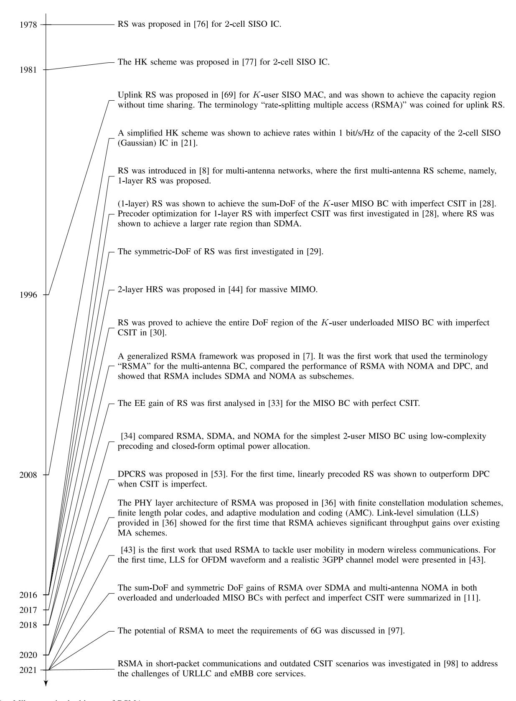

Fig. 16. Milestones in the history of RSMA.

by jointly optimizing the precoders, powers, and common rate, while the latter tries to achieve a favorable trade-off between performance and complexity for practical implementation by designing low-complexity resource allocation schemes. Both lines of research are recapped in this subsection.

*1) Joint Resource Optimization:* The availability of CSI at the transmitter plays a significant role for joint optimization

| Year | Ref.  | RSMA         | Scheme      | Precodi  | ng Scheme  | CSIT (       | Condition |              |              | KPI          | s        |         |
|------|-------|--------------|-------------|----------|------------|--------------|-----------|--------------|--------------|--------------|----------|---------|
| icai | Kei.  | 1-layer      | multi-layer | Linear   | Non-linear | Perfect      | Imperfect | WSR          | MMF          | EE           | Mobility | Latency |
| 2015 | [27]  | $\checkmark$ |             | Δ        |            |              | 0         | $\checkmark$ |              |              |          |         |
|      | [28]  | $\checkmark$ |             | <b>A</b> |            |              | $\oplus$  | $\checkmark$ |              |              |          |         |
| 2016 | [29]  | √            |             | <b>A</b> |            |              | 0         |              | <b>√</b>     |              |          |         |
|      | [30]  | $\checkmark$ |             | Δ        |            | $\checkmark$ | $\oplus$  | $\checkmark$ |              |              |          |         |
|      | [31]  | $\checkmark$ |             | Δ        |            |              | 0         | √            |              |              |          |         |
|      | [7]   | $\checkmark$ | √           | <b>A</b> |            | $\checkmark$ | $\oplus$  | $\checkmark$ |              |              |          |         |
| 2018 | [32]  | $\checkmark$ |             | <b>A</b> |            |              | 0         |              | $\sqrt{}$    |              |          |         |
|      | [33]  | $\checkmark$ |             | <b>A</b> |            | $\checkmark$ |           |              |              | $\checkmark$ |          |         |
|      | [51]  | $\checkmark$ |             |          | Δ          |              | 0         | $\checkmark$ |              |              |          |         |
|      | [34]  | $\checkmark$ |             | Δ        |            | $\sqrt{}$    |           | √            |              |              |          |         |
|      | [53]  |              | √           |          | <b>A</b>   |              | Ф         | √            |              |              |          |         |
|      | [35]  | $\checkmark$ |             | <b>A</b> |            | $\checkmark$ |           |              | $\sqrt{}$    |              |          |         |
| 2020 | [36]  | $\checkmark$ |             | <b>A</b> |            |              | $\oplus$  | $\checkmark$ |              |              |          |         |
|      | [37]  | $\checkmark$ |             |          |            |              | 0         | $\checkmark$ |              |              |          |         |
|      | [38]  | $\checkmark$ |             | <b></b>  |            | $\checkmark$ |           | $\checkmark$ |              | $\checkmark$ |          |         |
|      | [45]  | $\checkmark$ | $\sqrt{}$   | <b>A</b> |            |              | 0         |              |              |              |          |         |
|      | [39]  | $\checkmark$ |             | <b>A</b> |            |              | $\oplus$  | $\checkmark$ |              |              |          |         |
|      | [40]  | $\checkmark$ |             | <b>A</b> |            | $\checkmark$ |           |              |              | $\checkmark$ |          |         |
|      | [52]  | $\checkmark$ |             |          | Δ          |              | $\oplus$  |              |              |              |          |         |
| 2021 | [41]  | $\checkmark$ |             | <b>A</b> |            |              | 0         |              |              |              |          |         |
| 2021 | [42]  | $\checkmark$ |             | <b>A</b> |            | $\checkmark$ | 0         |              | $\checkmark$ |              |          |         |
|      | [43]  | $\checkmark$ |             | <b>A</b> |            |              | $\oplus$  | $\checkmark$ |              |              |          |         |
|      | [106] | $\checkmark$ |             | <b>A</b> |            | $\checkmark$ |           | $\checkmark$ |              |              |          | √       |
|      | [55]  |              |             | <b>A</b> |            |              | Φ         | <b>√</b>     |              |              |          |         |

TABLE VII COMMUNICATION-THEORETIC LITERATURE ON RSMA FOR THE MULTI-ANTENNA BC

Notations: A: Optimized precoding;  $\triangle$ : Low-complex precoding;  $\bigoplus$ : Partial instantaneous CSIT with unbounded channel estimation error;  $\bigcirc$ : Partial instantaneous CSIT with bounded channel estimation error; (): Statistical CSIT.

of precoders, power, and common rate allocation. If instantaneous CSIT is available, the aforementioned wireless resources can be optimized for each instantaneous channel realization and the instantaneous rate is guaranteed to be achievable. However, such method is not applicable when the instantaneous CSI is imperfect or not available at all at the transmitter. Two methods have been proposed for single-carrier RSMA resource allocation with imperfect/statistical CSIT, namely, long-term resource optimization [28] and worst-case resource optimization [29]. The former averages out the impact of CSIT estimation errors by designing precoders (including power allocation) and common rate allocation based on the ergodic performance over a long sequence of fading states while the latter considers bounded CSIT estimation errors and the wireless resources are designed to guarantee the performance for all possible channels (a.k.a. the worst-case performance) in the corresponding uncertainty regions. In this subsection, the RSMA resources optimization problems for both perfect and imperfect CSIT are formulated followed by a review of optimization algorithms adopted to solve the corresponding problems.

Perfect CSIT: The joint precoder (including power allocation) and common rate optimization for RSMA has been widely studied in perfect CSIT for different design objectives, such as maximizing the WSR [7], [46], [47], [64], [82], [106]-[117], maximizing the minimum rate among users (max-min rate) [60], [61], [83], [118], [119], maximizing the EE [33], [40], [48], [79], [80], [120]–[122], and minimizing the sum-power consumption [49], [84], [123]. For different design purposes, though the objective functions are different, the supplementary constraints introduced by RSMA are identical. Therefore, a general problem that accommodates different optimization criteria can be formulated. For the sake of simplicity, we summarize the resource optimization for 1-layer RS for perfect CSIT. The formulated problem can be easily extended to other RSMA schemes based on the system model specified in Section II.

For a given transmit power constraint P and QoS rate constraint  $R_k^{th}$  of each user-k, the joint precoder  $\mathbf{P} = [\mathbf{p}_c, \mathbf{p}_1, \dots, \mathbf{p}_K]$  and common rate allocation  $\mathbf{c} =$  $[C_1, \ldots, C_K]$  optimization problem for maximization of a certain utility function  $U(\mathbf{P}, \mathbf{c})$  for 1-layer RS can be formulated as follows

$$\mathcal{P}_1: \max_{\mathbf{P}, \mathbf{c}} U(\mathbf{P}, \mathbf{c})$$
 (29a)

s. t. 
$$\sum_{k=1}^{K} C_k \le \min\{R_{c,1}, \dots, R_{c,K}\}$$
 (29b)

$$\operatorname{tr}(\mathbf{P}\mathbf{P}^H) < P \tag{29c}$$

$$\operatorname{tr}(\mathbf{P}\mathbf{P}^{H}) \leq P$$
 (29c)  
 $R_{k} + C_{k} \geq R_{k}^{th}, \forall k \in \mathcal{K}$  (29d)  
 $C_{k} \geq 0, \forall k \in \mathcal{K}$  (29e)

$$C_k \ge 0, \forall k \in \mathcal{K}$$
 (29e)

where  $R_k$  and  $R_{c,k}$ ,  $k \in \mathcal{K}$  are functions of **P** as specified in (5). Depending on the design objective, the utility function is given by

$$U(\mathbf{P}, \mathbf{c}) = \begin{cases} \sum_{k=1}^{K} u_k(R_k + C_k), & \text{WSR} \\ \min (R_k + C_k), & \text{MMF-rate} \\ \sum_{k=1}^{K} (R_k + C_k) \\ \frac{1}{\eta} \text{tr}(\mathbf{P}\mathbf{P}^H) + P_{\text{cir}}, & \text{EE} \\ -\text{tr}(\mathbf{P}\mathbf{P}^H), & \text{sum-power} \end{cases}$$

In  $\mathcal{P}_1$ ,  $u_k$  for WSR optimization is the weight allocated to user-k. For EE maximization,  $\eta \in (0,1]$  and  $P_{\mathrm{cir}}$  are respectively the power amplifier efficiency and the circuit power consumption. Constraint (29b) guarantees the decodability of the common stream at all users. Constraint (29c) is the sumpower constraint at the transmitter, which can be omitted if the sum-power consumption is considered as the objective function. Constraint (29d) is the QoS constraint, guaranteeing that the rate of each user is no less than a certain threshold. If  $R_k^{th} = 0$ , there is no QoS rate constraint for user-k. This is commonly used when exploring the largest achievable rate region of 1-layer RS. Constraint (29e) guarantees that the rate of the common stream allocated to each user is non-negative.

By turning off the rate allocation to the common stream, i.e.,  $C_k = 0, \forall k \in \mathcal{K}, \, \mathcal{P}_1$  reduces to the problem of MU–LP design for SDMA. This reveals that RSMA is more general than SDMA and enlarges the optimization space. Optimization algorithms adopted in existing works to solve  $\mathcal{P}_1$  for different utility functions are discussed in Section IV-A1 and corresponding numerical results obtained by solving  $\mathcal{P}_1$  are illustrated in part in Section VI-C.

Imperfect CSIT: Resource optimization for RSMA has also been studied extensively for imperfect CSIT with the objective of maximizing the WSR [28], [39], [41], [45], [50], [53]–[55], [124]–[126], maximizing the minimum rate among users [29], [42], [96], [127], [128], maximizing the EE [129], and minimizing the sum-power consumption [32], [130]. For imperfect CSIT, the BS only has the knowledge of channel estimate  $\hat{\mathbf{h}}_k$  for each instantaneous CSI vector  $\mathbf{h}_k$  of user-k. A typical imperfect CSIT model is given as follows

$$\mathbf{h}_k = \widehat{\mathbf{h}}_k + \widetilde{\mathbf{h}}_k,\tag{30}$$

where  $\widetilde{\mathbf{h}}_k$  is the CSIT estimation error. Different sources of CSIT impairment would lead to different models for  $\widehat{\mathbf{h}}_k$  and  $\widetilde{\mathbf{h}}_k$ . For example, when the CSIT imperfection results from user mobility and delay in CSI feedback, it is common to model  $\widehat{\mathbf{h}}_k[t]$  at time instance t as the exact channel  $\mathbf{h}_k[t-1]$  at time instance t-1 while  $\mathbb{E}\{\widehat{\mathbf{h}}_k\widehat{\mathbf{h}}_k^H\} = \epsilon^2\mathbf{I}$ ,  $\mathbb{E}\{\mathbf{h}_k\mathbf{h}_k^H\} = \mathbf{I}$ , and  $\mathbb{E}\{\widetilde{\mathbf{h}}_k\widetilde{\mathbf{h}}_k^H\} = (1-\epsilon^2)\mathbf{I}$ . Here,  $\epsilon$  is the time correlation coefficient obeying the Jakes' model [43]. Depending on the strength of  $\widetilde{\mathbf{h}}_k$ , the existing robust precoding designs for RSMA can be generally classified into worst-case resource optimization and long-term resource optimization. Specifically, the former assumes that  $\widetilde{\mathbf{h}}_k$  is bounded, while the latter typically assumes that  $\widetilde{\mathbf{h}}_k$  is unbounded. The resource optimization problems resulting for both cases are discussed in the following.

Worst-case resource optimization: Worst-case resource optimization has been investigated in [29], [127], [129], [130].

For each instantaneous CSI vector  $\mathbf{h}_k$  of user-k, the CSIT estimation error  $\widetilde{\mathbf{h}}_k$  is assumed to be bounded by an origin-centered sphere with radius  $\delta_k$ . The instantaneous CSI  $\mathbf{h}_k$  of each user-k is therefore confined within an uncertainty region [29]:

$$\mathbb{H}_{k} = \left\{ \mathbf{h}_{k} \mid \mathbf{h}_{k} = \widehat{\mathbf{h}}_{k} + \widetilde{\mathbf{h}}_{k}, \left\| \widetilde{\mathbf{h}}_{k} \right\| \le \delta_{k} \right\}. \tag{31}$$

This is a typical imperfect CSIT model for quantized feed-back where the properties of the quantization codebook are used to bound the CSIT error. The bounded imperfect CSIT leads to a bounded uncertainty of the users' achievable rates. To guarantee successful decoding at the users for all possible channels within the uncertainty region, robust optimization is carried out where the resources are allocated with respect to the worst-case achievable rates defined as follows

$$\widehat{R}_{c,k} = \min_{\mathbf{h}_k \in \mathbb{H}_k} R_{c,k}(\mathbf{h}_k)$$
 and  $\widehat{R}_k = \min_{\mathbf{h}_k \in \mathbb{H}_k} R_k(\mathbf{h}_k)$ . (32)

 $R_{\mathrm{c},k}(\mathbf{h}_k)$  and  $R_k(\mathbf{h}_k)$  are the instantaneous rates of user-k based on the instantaneous CSIT, as specified in (5). The worst-case common rate is therefore defined as  $\widehat{R}_{\mathrm{c}} = \min\{\widehat{R}_{\mathrm{c},1},\ldots,\widehat{R}_{\mathrm{c},K}\}$ . Denote the portion of the worst-case common rate allocated to user-k as  $\widehat{C}_k$ , such that  $\sum_{k=1}^K \widehat{C}_k = \widehat{R}_{\mathrm{c}}$ , then the worst-case achievable rate of each user is  $\widehat{R}_{k,tot} = \widehat{R}_k + \widehat{C}_k$ . The resource optimization problem for imperfect CSIT is formulated in problem  $\mathcal{P}_2$  as follows

$$\mathcal{P}_2: \max_{\mathbf{P} \ \widehat{\mathbf{c}}} \ U(\mathbf{P}, \widehat{\mathbf{c}})$$
 (33a)

s. t. 
$$\sum_{k=1}^{K} \widehat{C}_k \le \min\{\widehat{R}_{c,1}, \dots, \widehat{R}_{c,K}\}$$
 (33b)

$$\operatorname{tr}(\mathbf{P}\mathbf{P}^H) \le P \tag{33c}$$

$$\widehat{R}_k + \widehat{C}_k \ge R_k^{th}, \forall k \in \mathcal{K}$$
 (33d)

$$\widehat{C}_k \ge 0, \forall k \in \mathcal{K}$$
 (33e)

where  $\hat{\mathbf{c}} = \{\hat{C}_1, \dots, \hat{C}_K\}$ . The corresponding objective function is given as follows

$$U(\mathbf{P}, \widehat{\mathbf{c}}) = \begin{cases} \sum_{k=1}^{K} u_k \left( \widehat{R}_k + \widehat{C}_k \right), & \text{WSR} \\ \min_{k \in \mathcal{K}} \left( \widehat{R}_k + \widehat{C}_k \right), & \text{MMF-rate} \\ \sum_{k=1}^{K} \left( \widehat{R}_k + \widehat{C}_k \right) \\ \frac{1}{\eta} \text{tr}(\mathbf{P}\mathbf{P}^H) + P_{\text{cir}}, & \text{EE} \\ - \text{tr}(\mathbf{P}\mathbf{P}^H), & \text{sum-power} \end{cases}$$

Optimization algorithms adopted to solve  $\mathcal{P}_2$  for different utility functions are discussed in Section IV-A1.

Long-term resource optimization: When the CSIT estimation error  $\widetilde{\mathbf{h}}_k$  is unbounded, for example, when the transmitter only knows the Gaussian distribution of the CSIT estimation error, a worst-case precoder optimization is not possible any more. Instead of designing resource allocation for each instantaneous channel, in this case, long-term RSMA resource optimization over a long sequence of fading states is more commonly used, see, e.g., [28], [39], [42], [50], [53]–[55], [124]–[126], [128]. By defining  $\mathbf{H} = [\mathbf{h}_1, \ldots, \mathbf{h}_K]$ ,  $\widehat{\mathbf{H}} = [\widehat{\mathbf{h}}_1, \ldots, \widehat{\mathbf{h}}_K]$ , and  $\widetilde{\mathbf{H}} = [\widehat{\mathbf{h}}_1, \ldots, \widehat{\mathbf{h}}_K]$  respectively as the actual

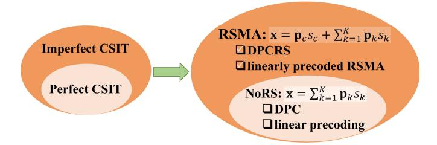

Fig. 17. Relationship between the optimization problems for perfect and imperfect CSIT, and relationship between the problems for RSMA and SDMA (a.k.a. NoRS). RSMA for imperfect CSIT introduces a more general class of problems for MIMO networks.

CSI, the estimated CSIT, and the corresponding channel estimation errors of all users, we have  $\mathbf{H} = \widehat{\mathbf{H}} + \widetilde{\mathbf{H}}$ . Assuming the fading process to be ergodic and stationary, the ergodic rates (ER) characterizing the long-term rate performance of the streams over all possible joint fading states  $\{\mathbf{H}, \widehat{\mathbf{H}}\}$  are defined as

$$\overline{R}_{c,k} = \mathbb{E}_{\{\mathbf{H},\widehat{\mathbf{H}}\}}\{R_{c,k}\} \quad \text{and} \quad \overline{R}_k = \mathbb{E}_{\{\mathbf{H},\widehat{\mathbf{H}}\}}\{R_k\}. \tag{34}$$

Sending the common stream and the private stream of user-k at respectively ERs  $\overline{R}_{c,k}$  and  $\overline{R}_k$  increases the robustness of the system. To further ensure that the common stream is decodable at all users, the ER of the common stream cannot exceed  $\overline{R}_c = \min\{\overline{R}_{c,1},\ldots,\overline{R}_{c,K}\}$  and the ergodic common rate allocated to user-k,  $\overline{C}_k$ , has to satisfy  $\sum_{k=1}^K \overline{C}_k = \overline{R}_c$ . The resulting ergodic achievable rate of each user is  $\mathrm{ER}_{k,tot} = \overline{R}_k + \overline{C}_k$ . The corresponding long-term resource optimization problem  $\mathcal{P}_3$  has a similar form as  $\mathcal{P}_2$ , when  $\widehat{R}_{c,k}$ ,  $\widehat{R}_k$ ,  $\widehat{C}_k$  are simply replaced by  $\overline{R}_{c,k}$ ,  $\overline{R}_k$ ,  $\overline{C}_k$ , respectively.

Remark 2: When the strength of the channel estimation error is zero (i.e.,  $\|\mathbf{h}_k\| = 0$ ), the CSIT becomes perfect (i.e.,  $\mathbf{h}_k = \mathbf{h}_k$ ). In this case, the worst-case resource optimization problem,  $\mathcal{P}_2$ , reduces to the problem for perfect CSIT,  $\mathcal{P}_1$ , and the long-term resource optimization problem,  $\mathcal{P}_3$ , can be equivalently decomposed into a  $\mathcal{P}_1$  subproblem for each instantaneous channel realization. Therefore, the problem to be solved for perfect CSIT is equivalent to the problems to be solved for imperfect CSIT when the channel estimation error is zero. Fig. 17 illustrates the relationship between the problems for perfect and imperfect CSIT. The relation between the problems obtained for RSMA and existing linearly precoded and non-linearly precoded strategies are also illustrated. Since the simplest RSMA schemes (i.e., linearly precoded 1-layer RS and 1-DPCRS) are more general than the conventional precoded schemes, RSMA for imperfect CSIT further enlarges the optimization space. Therefore, RSMA for imperfect CSIT introduces a more general class of optimization problems for MIMO networks and the solutions to these problems lead to a more general class of transmission strategies.

Optimization Algorithms: Problems  $\mathcal{P}_1$ ,  $\mathcal{P}_2$ , and  $\mathcal{P}_3$  are challenging to solve due to the non-convexity of the coupled rate expressions (and the fractional objective function if EE is employed as utility function). Following Remark 2, the algorithms proposed to solve  $\mathcal{P}_2$  and  $\mathcal{P}_3$  can also be applied for solving  $\mathcal{P}_1$ . In general, the resource optimization algorithms proposed to solve  $\mathcal{P}_1$ ,  $\mathcal{P}_2$ , and  $\mathcal{P}_3$  can be categorized into globally optimal algorithms and suboptimal algorithms. In [40],

a globally optimal algorithm, namely, the successive incumbent transcending (SIT) branch and bound (BB) algorithm was proposed to solve  $\mathcal{P}_1$  optimally, when the WSR, EE, and sum-power objective functions were considered. To reduce the computational complexity, a large number of works on RSMA have focused on developing suboptimal algorithms to solve  $\mathcal{P}_1$ ,  $\mathcal{P}_2$ , and  $\mathcal{P}_3$  with affordable and tractable complexities, such as weighted minimum mean square error (WMMSE)based algorithms [7], [28], [39], [42], [50], [53]–[55], [82], [108], [112], [128], successive convex approximation (SCA)based algorithms [33], [45]–[49], [60], [79], [80], [84], [106], [107], [115], [121], [122], [124], [125], alternating direction method of multipliers-based algorithms [110], [116], [126], [131], [132], and semidefinite relaxation-based algorithms [32], [41], [123], [127], [130]. These algorithms are able to converge to the Karush-Kuhn-Tucker (KKT) points of the original problem. Numerical results in [40] show that the WSR performance achieved by a WMMSE-based algorithm and the EE performance of a SCA-based algorithm almost coincide with the corresponding globally optimal performance.

Though the computational complexity of the suboptimal algorithms is tractable, it is still unfavorable for real-world applications. For example, SCA requires solving a series of convex subproblems, and in each subproblem the non-convex objective and constraints are approximated by locally tight lower bounds.

2) Low-Complexity Resource Allocation: To further reduce the computational complexity, another line of RSMA research focuses on closed-form and low-complexity resource allocation [27], [30], [31], [34], [37], [38], [43], [44], [133]–[135], which is summarized in this subsection.

The precoder  $\mathbf{p}_i$  for stream-i can be written as  $\mathbf{p}_i = \sqrt{P_i} \mathbf{\bar{p}}_i$ , where  $\mathbf{\bar{p}}_i = \frac{\mathbf{p}_i}{\|\mathbf{\bar{p}}_i\|}$  is the direction of the precoder for stream-i and  $P_i = \|\mathbf{p}_i\|^2$  is the power allocated to that precoder. Different from resource optimization, where the precoders  $\mathbf{p}_i, \forall i$ , (including their direction and power) of all streams are jointly optimized at the transmitter, for low-complexity resouce allocation, usually the design of the precoder directions  $\mathbf{\bar{p}}_i, \forall i$ , and the optimization of power  $P_i, \forall i$ , are separated. For 1-layer RS, there are K+1 streams indexed by  $i \in \{c, 1, \dots, K\}$ . The common stream  $s_c$  is required to be decoded by all users and its precoder direction  $\mathbf{\bar{p}}_c$  is usually designed in a multicast manner based on the following typical methods:

- Random precoding [27], [30], [31], [43]: Random precoding, such as setting  $\mathbf{p}_c = \mathbf{e}_1$  (where  $\mathbf{e}_1$  is a null vector with one entry 1 and all other entries 0), is commonly used in the literature of RSMA for DoF analysis. Using such random precoding for the common stream is sufficient for RSMA to achieve the entire DoF region, but is not efficient in terms of improving the SE performance.
- Weighted matched beamforming (MBF) [31], [34], [38], [44], [133]–[135]: The precoder direction  $\bar{\mathbf{p}}_c$  is designed to maximize the achievable rate of the common stream, which can be formulated as follows

$$\max_{\bar{\mathbf{p}}_c} \min_k \ \omega_k \left| \mathbf{h}_k^H \bar{\mathbf{p}}_c \right|^2$$
 (35a)

s.t. 
$$\operatorname{tr}\left(\bar{\mathbf{p}}_{c}\bar{\mathbf{p}}_{c}^{H}\right) \leq 1.$$
 (35b)

The optimal precoder direction  $\bar{\mathbf{p}}_c^*$  to solve (35) is the weighted MBF, which is given by

$$\bar{\mathbf{p}}_c = \sum_{k \in \mathcal{K}} \varpi_k \mathbf{h}_k, \tag{36}$$

where the optimal weight  $\varpi_k$  for the two-user case is obtained in [34], and the asymptotically optimal weight  $\varpi_k$  as  $M \to \infty$  is obtained in [44], [133]. In both cases,  $\varpi_k$  is a function of  $\omega_k$ . To obtain a more tractable precoder design, equal weighted MBF with  $\varpi_k = \frac{1}{\sqrt{MK}}$  is commonly employed [31], [44].

• Singular value decomposition (SVD) [28], [135]: SVD based designs choose the dominant left singular vector of  $\mathbf{H} = [\mathbf{h}_1, \dots, \mathbf{h}_K]$  for  $\bar{\mathbf{p}}_c$ . Such approach is also used to initialize the precoder of the common stream for the WMMSE and SCA algorithms in [28].

The private stream  $s_k$  is only decoded by user-k and is treated as noise by the other users. Therefore, popular linear precoding methods such as ZFBF, regularized ZFBF (RZF)/MMSE, and block-diagonalization (BD) can be used to design the precoder direction of the private streams:

• ZFBF [27], [30], [43]: ZFBF steers the precoder direction of each user  $\bar{\mathbf{p}}_k$  to the space orthogonal to the space spanned by the other users' channel vectors, i.e.,  $\bar{\mathbf{p}}_k \in \text{null}([\mathbf{h}_1, \dots, \mathbf{h}_{k-1}, \mathbf{h}_{k+1}, \dots, \mathbf{h}_K]^H)$ . It is therefore limited to the underloaded MISO BC, i.e.,  $M \geq K$ . Specifically, ZF designs  $\bar{\mathbf{P}}_p = [\bar{\mathbf{p}}_1, \dots, \bar{\mathbf{p}}_K]$  as

$$\bar{\mathbf{P}}_p = \left(\mathbf{H}\mathbf{H}^H\right)^{-1}\mathbf{H}.\tag{37}$$

Such ZFBF for the private streams together with random beamforming for the common stream achieves the optimal DoF region for the MISO BC with imperfect CSIT [28], [30], [103].

• RZF/MMSE [31], [44], [133], [134]: RZF precoding aims to tackle the ill-conditioned behavior of the largest eigenvalue of  $(\mathbf{H}\mathbf{H}^H)^{-1}$  via a regularized form of channel inversion. RZF designs the precoder direction  $\bar{\mathbf{P}}_p$  as follows

$$\bar{\mathbf{P}}_{p} = \underbrace{\left(\mathbf{H}\mathbf{H}^{H} + \kappa \mathbf{I}\right)^{-1}}_{\mathbf{F}} \mathbf{H},\tag{38}$$

where  $\kappa=K\sigma_n^2$  is a regularization parameter (assuming the noise power is the same at all users, i.e.,  $\sigma_n^2=\sigma_{n,k}^2, \forall k \in \mathcal{K}$ ). RZF (38) reduces to ZFBF (37) if  $\kappa=0$ .

• (Regularized-)BD [37], [43]: (Regularized-)BD extends (Regularized-)ZFBF to the MIMO BC with Q ( $2 \le Q \le M$ ) receive antennas at each user. The precoder direction  $\bar{\mathbf{P}}_k \in \mathcal{C}^{M \times Q}$  based on regularized-BD is designed as a cascade of two precoding matrices

$$\bar{\mathbf{P}}_k = \bar{\mathbf{V}}_k \bar{\mathbf{W}}_k,\tag{39}$$

where the first filter  $\bar{\mathbf{V}}_k$  is designed to partially remove multi-user interference. Define  $\bar{\mathbf{H}}_k = [\mathbf{H}_1, \dots, \mathbf{H}_{k-1}, \mathbf{H}_{k+1}, \dots, \mathbf{H}_K]$  as the channel matrix excluding  $\mathbf{H}_k$ . Applying SVD to  $\bar{\mathbf{H}}_k$ , we have  $\bar{\mathbf{H}}_k = \mathbf{U}_k \mathbf{\Lambda}_k \mathbf{V}_k$ .  $\bar{\mathbf{V}}_k$  is chosen as

 $ar{\mathbf{V}}_k = \mathbf{V}_k (\mathbf{\Lambda}_k^T \mathbf{\Lambda}_k + Q \sigma_{n,k}^2 \mathbf{I})^{-\frac{1}{2}}$ . The second filter  $ar{\mathbf{W}}_k$  is designed to enable parallel symbol stream detection at user-k. Defining the effective channel matrix as  $\tilde{\mathbf{H}}_k = \mathbf{H}_k \bar{\mathbf{V}}_k^H$  and applying SVD to  $\tilde{\mathbf{H}}_k$ , we have  $\tilde{\mathbf{H}}_k = \tilde{\mathbf{U}}_k \tilde{\mathbf{\Lambda}}_k \mathbf{V}_k^H$ .  $\bar{\mathbf{W}}_k$  is designed as  $\bar{\mathbf{W}}_k = \tilde{\mathbf{V}}_k$ .  $\mathbf{U}_k^H$  is used to design the receive filter at user-k.

Besides the precoder direction, the power allocation among the common and private precoders, i.e., selecting the values of  $P_c, P_1, \ldots, P_K$ , is also crucial for the performance of 1-layer RS, especially the division of power between the common stream  $P_c$  and the private streams  $P_1 + \ldots + P_K$ . Defining the fraction of the transmit power P allocated to the private streams as  $\tau$  ( $0 \le \tau \le 1$ ), we have  $P_c = (1-\tau)P$  as  $P_c + P_1 + \ldots + P_K = P$ . Optimal closed-form expressions for  $\tau$  have been reported in [34] for perfect CSIT and in [43], [44] for imperfect CSIT. The powers allocated to the different private streams can be chosen equal [43] or obtained via water-filling (WF) [34].

3) Resource Allocation by Machine Learning: Apart from optimization based resource allocation designs, machine learning methods have also been used to optimize the power allocation strategies for given precoders [136]. In [137], the authors propose a deep reinforcement learning algorithm to design the power allocation for each transmit stream, and show that RSMA achieves a significant performance gain compared to SDMA for imperfect CSIT.

#### B. Resource Allocation for Multicarrier RSMA

The pivotal role of resource allocation in single-carrier RSMA further motivates the study of RSMA in multicarrier systems. In multicarrier RSMA, each subcarrier is occupied by multiple users and each user can use multiple subcarriers. Therefore, besides the precoder design, power control, and common rate allocation as in single-carrier RSMA, user scheduling, and subcarrier assignment are also key variables for resource allocation in multicarrier RSMA.

The study of multicarrier RSMA is still in its infancy. The authors in [138] first investigate a joint subcarrier allocation, precoder design, power allocation, and common rate allocation problem to maximize the minimum rate among users in multicarrier multigroup multicast systems. The optimization problem is a mixed integer non-linear programming problem due to the applied subcarrier allocation indicators. To solve this problem, the binary subcarrier allocation indicators are relaxed to continuous variables and the non-convex constraints are reformulated and solved via semidefinite programming and SCA methods. The authors further investigated the optimal MMF-rate performance of RSMA by exhaustively searching over all possible subcarrier allocation strategies and optimizing the precoder, power, and common rate allocation for each possible subcarrier allocation scheme [119]. One major observation in [119], [138] is that RSMA without subcarrier optimization can even outperform SDMA with subcarrier optimization. Unlike SDMA which requires users with (semi-)orthogonal channel conditions in each subcarrier, RSMA is capable of serving users with arbitrary channel conditions in each subcarrier. Therefore, it can ease overhead introduced by subcarrier allocation and user scheduling at the transmitter. A similar observation has also been made in [124] for user scheduling in single-carrier RSMA. In Section VI, the scheduling complexity of RSMA is further discussed.

The aforementioned works [119], [138] only considered resource optimization in perfect CSIT. RSMA for multicarrier cognitive radio systems with imperfect CSIT was recently investigated in [125], [139] under the assumption that all legitimate users are served in all subcarriers. Hence, the subcarrier allocation and user scheduling for multicarrier RSMA with imperfect CSIT remains an open problem. Further work on low-complexity subcarrier allocation strategies for both perfect and imperfect CSIT is also needed.

#### V. RSMA PHY LAYER DESIGN

The discussions on RSMA so far have been in terms of abstract message definitions and Shannon capacity, which assumes Gaussian signalling and infinite block length coding. A practical PHY layer architecture for RSMA has been proposed in [36] including finite constellation modulation schemes, finite length polar codes, and AMC. This architecture has been further extended in [43] to the MISO/MIMO BC with CSI feedback delay and user mobility, in [55] to the MIMO BC employing a V-BLAST receiver, in [140] to satellite communications, and in [132] to joint communications and sensing. In this section, we first provide some toy examples to give an intuition about a practical PHY layer architecture of RSMA. Then, we thoroughly delineate the PHY layer transmitter and receiver architectures.

#### A. A Quick Introduction to RSMA PHY Layer

The examples in this section are based on the RSMA PHY layer architecture described in [36]. In particular, we explain how the user messages are split and combined at the transmitter based on the transmission rates and how the received signals are processed by demonstrating the bit-level processing of each user's message.

We consider a scenario where a multi-antenna transmitter serves two single-antenna receivers. The transmitter aims to send two independent messages to the users, with each message being intended only for one user. According to the RSMA framework, the transmitter forms one common message and two private messages to transmit in such a setting.

1) RSMA Transmitter Operation: Fig. 18 illustrates the operations at the transmitter for different transmission rates. In the figures,  $R_1$  and  $R_2$  denote the transmission rates of the private streams and  $C_1$  and  $C_2$  denote the portions of the rate of the common stream allocated to user-1 and user-2, respectively. The transmission rate calculations for RSMA are explained in detail in Section II. The rates can be calculated either at the transmitter using the available CSIT, or obtained as a feedback from the users to be served. In the following examples, we assume that the transmission rates provided to the transmitter are achievable by means of finite blocklength (FBL) coding and bit-interleaved coded modulation (BICM).

The transmission rates are input to the modules which perform message splitting, message combining, modulation and

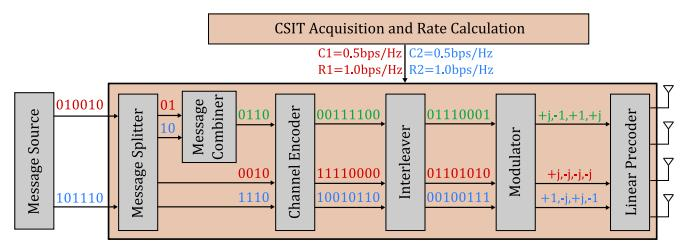

(a) Example 1:  $C_1=C_2=0.5$  bps/Hz,  $R_1=R_2=1.0$  bps/Hz. The coding rate is 1/2 and the modulation scheme is QPSK for the common and private streams, respectively.

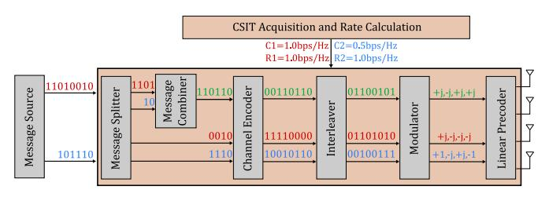

(b) Example 2:  $C_1=1.0$  bps/Hz,  $C_2=0.5$  bps/Hz,  $R_1=R_2=1.0$  bps/Hz. The coding rate is 3/4 for the common stream and 1/2 for the private streams. The modulation scheme is QPSK for the common and private streams, respectively.

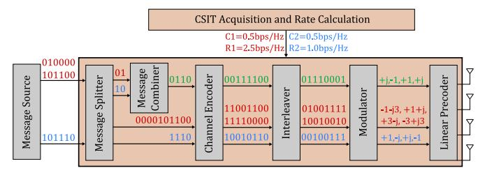

(c) Example 3:  $C_1=C_2=0.5$  bps/Hz,  $R_1=2.5$  bps/Hz,  $R_2=1.0$  bps/Hz. The coding rates is 1/2 for the common stream and the private stream of user-2, respectively, and 5/8 for the private stream of user-1. The modulation scheme is QPSK for the common stream and the private stream for user-2, respectively, and 16-QAM for the private stream of user-1.

Fig. 18. Examples for RSMA transmitters. Two separate messages are transmitted to two users over 4y consecutive symbols. The red bits represent the message intended for user-1, the blue bits represent the message intended for user-2, and the green bits represent the formed common message after message splitting and combining.  $R_1$  and  $R_2$  denote the rates of the private streams and  $C_1$  and  $C_2$  denote the portions of the rate of the common stream allocated to user-1 and user-2, respectively. Appropriate coding rates (1/2, 3/4, 5/8) and modulation schemes (QPSK, 16-QAM) are chosen to support the calculated transmission rates.

coding; and they are used to determine the number of message bits, the modulation scheme, and the channel coding parameters. The transmitter is allocated 4 consecutive symbols (channel uses) to transmit two independent messages, each intended for only one of the users. In the figures, the message intended for user-1 is depicted in red color and the message for user-2 is depicted in blue. We assume that the bits of the messages are independent. The transmission rates dictate the number of message bits transmitted in one symbol. Thus, the number of message bits that can be carried by the common and private streams is 4 times the value of the corresponding transmission rates.

For Example 1 (Fig. 18(a)), the transmission rates for the common and private streams are all 1 bps/Hz. These rates allow 4 message bits to be carried over each stream. We consider the case where the modulation scheme for transmission is chosen as QPSK and the coding rate is set as 1/2. Next,

we check the portions of the common rate of the users, which are both equal to 0.5 bps/Hz. This implies that 2 bits per user can be transmitted over the common stream, which, together with the messages carried by the private streams, sums up to 6 message bits for each user. One can also verify that the sum-rate for a single user is *C*1+*R*1 = 1.5 bps/Hz, which corresponds to transmission of 6 bits during 4 channel uses. Next, we extract 6 message bits from the message source buffer for each user. As the message bits are independent, one can split the 6 message bits of each user into the common part of 2 bits and the private part of 4 bits by means of any splitting pattern.

After the message splitting is performed, we move to the process of message combining to form the single common message to be transmitted over the common stream. As the common parts of the messages from the two users are independent, one can simply concatenate the 2-bit common message parts to form the 4-bit common message by means of any concatenation pattern.

*Remark 3:* In the considered example, the splitting operation is performed by assigning the first 2 bits to the common stream and the remaining bits to the private stream. However, any other splitting pattern can be considered (such as, selecting 2 bits randomly for the common stream), as long as the message bits are independent and a matching message desplitting operation is performed at the receivers. The splitting pattern can also depend on the message structure (for example, if the message bits from the message source are concatenated messages for two separate applications, splitting can be performed to separate these messages into common and private messages), the protocols on the upper layers (MAC and above), or any other criterion imposed by the system design.

Similarly, the combining operation is performed by appending the common message parts from the two users directly, with the common part from user-1 representing the first 2 bits of the new message and the part from user-2 representing the last 2 bits. However, any other combining pattern can be employed as long as the message bits are independent and a matching message decomposing operation is performed at the receivers. For example, a comb-like combining operation can be performed, where each bit from one user's message is followed by a bit from the other user's message, or a 1-1 mapping can be performed with a new message set consisting of all 4-bit messages.

After the message splitting and the message combining operations are performed, the resulting 4 bit messages are independently encoded by channel codes of rates 1/2 to obtain codewords of 8-bits. The channel coding applied on each stream can be performed over the same codebook or different codebooks[,10](#page-24-0) as long as the codebook for the common stream is known by both users and the codebooks for the private streams are known by the corresponding users. Similarly, the employed interleavers can be identical or different as long as the interleaver for the common stream is known by both users and the interleavers for the private streams are known by the corresponding users. The codewords are then interleaved and modulated by QPSK modulation to obtain the 4 symbols to be transmitted.

In Example 2 (Fig. [18b](#page-23-1)), the transmission rate of the common stream and the portion of user-1 are increased compared to Example 1. Again, the transmitter is allocated 4 consecutive symbols for transmission and the modulation scheme for transmission is chosen as QPSK. In this case, 4 bits can be transmitted over the common stream to user-1, while the number of bits that can be transmitted to user-2 stays the same (2 bits). Consequently, the total number of message bits intended for user-1 increases to 8 bits (this can be verified by multiplying the total sum-rate of user-1, *C*1 + *R*1 = 2 bps/Hz, by the number of transmit symbols).

Similar to the case in Example 1, the message splitting operation for user-1 is performed by assigning the first 4 bits of the message of user-1 to the common part, and the splitting operation for user-2 is performed in the exact same fashion as in Example 1. The message combiner concatenates the 4-bit message that is the common message part of user-1 and the 2-bit message that is the common message part of user-2 by appending them, resulting in a common message of 6 bits. Since the transmission is performed over 4 QPSK symbols and a total of 8 bits can be transmitted over a stream, the coding rate is calculated as 3/4 (which can also be calculated by dividing the total common rate *C*1 + *C*2 = 1.5 bps/Hz by the SE of QPSK modulation). Finally, the encoding, interleaving, and modulation operations are performed as done in Example 1.

In Example 3 (Fig. [18c](#page-23-1)), the transmission rate of the private stream for user-1 is increased compared to the one in Example 1. Again, the transmitter is allocated 4 consecutive symbols for transmission. Contrary to the previous examples, the transmission rate of the private stream of user-1 (2.5 bps/Hz) is larger than the SE of QPSK modulation (2.0 bps/Hz). Therefore, we choose 16-QAM modulation for transmission, which has a larger SE than QPSK. The number of message bits that can be transmitted over the private stream of user-1 is calculated as 10 bits and the number of codeword bits that can be transmitted using 16-QAM modulation is 16 bits, resulting in a coding rate of 5/8 for the considered stream (again, the coding rate can also be calculated by dividing *R*1 = 2.5 bps/Hz by the SE of 16-QAM modulation). The number of message bits that can be transmitted over the common stream and the private stream of user-2 are the same as in Example 1, yielding an additional 2 bits to be transmitted to user-1 over the common stream. Consequently, the total number of message bits intended for user-1 becomes 12, while the total number of message bits intended for user-2 is 6.

The message splitting and message combining operations are performed in the exact same fashion as in Example 1 (first, 2 message bits are split for the common parts, and then combined by appending them). Then, the resulting common and private messages are encoded and interleaved separately. Note that, in this case, the codebook for the channel code applied to the private stream of user-1 cannot be the same as those for the common stream and the private stream of user-2, as opposed to the cases in Examples 1 and 2. Similarly, the interleaver should

10Here, the terminology codebook refers to the set which contains all codewords of a channel code.

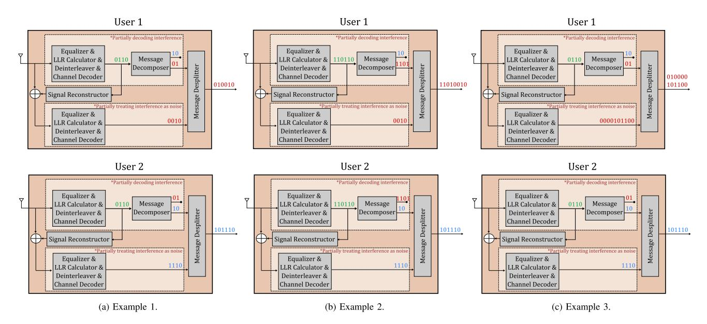

Fig. 19. Receiver operations for RSMA for the examples in Fig. [18.](#page-23-1) Each receiver performs message decomposing and desplitting to obtain the transmitted message bits.

be longer for the private stream of user-1. After interleaving, QPSK modulation is applied to the common stream and the private stream of user-2 and 16-QAM modulation is applied for the private stream of user-1, all resulting in 4 symbols for transmission.

*Remark 4:* It is worth noting that, for the considered twouser scenarios, removing the message splitting operation of the considered transmitter structure would result in the conventional transmitter architecture for other MA schemes, such as SDMA and NOMA. More specifically, SDMA transmitters do not apply message splitting and combining, and directly encode the data signals for the two users into two separate private streams. Similarly, NOMA transmitters do not apply message splitting and combining, and directly encode the data signal for one user into the common stream and that for the other user into one private stream (the reasoning behind using the common stream terminology here for NOMA will become clearer after the receiver operations are described in the next section).

*2) RSMA Receiver Operation:* Next, we explain the operations performed at the receiver for the examples considered above. Fig. [19](#page-25-0) depicts the operations at the receivers for each example. Each receiver starts by processing the common stream by performing equalization, Log-Likelihood Ratio (LLR) calculation, deinterleaving, and decoding. Assuming correct detection and decoding, the outputs of the decoders at the users are the message bits carried over the common stream. For Examples 1 and 3 (Figs. [19a](#page-25-0) and [19c](#page-25-0), respectively), the outputs are the 4-bit common message and for Example 2 (Fig. [19b](#page-25-0)), the outputs are the 6-bit common message. The decoded common messages are then input to the message decomposers, which reverse the operation done by the message combiner at the transmitter. The resulting decomposed messages are the common parts of the user messages. Each user proceeds with the corresponding common parts of their messages and discards the other user's common message

part, as illustrated in Fig. [19](#page-25-0) (the green message is decomposed into the red and blue messages, user-1 proceeds with the red message and discards the blue, while it is the other way around for user-2).

After signal reconstruction and interference cancellation, the corresponding private streams are processed at each user following the same steps as used for decoding the common stream. Assuming correct detection and decoding, the outputs of the decoders are the private message bits intended for the corresponding users. For Examples 1 and 2 (Figs. [19a](#page-25-0) and [19b](#page-25-0), respectively), the decoder outputs at each user are the 4-bit private messages and for Example 3 (Fig. [19b](#page-25-0)), the output is the 10-bit private message at user-1 and the 4-bit private message at user-2.

One can notice that processing the common stream at any user involves decoding a portion of the message of the other user. As the multi-user interference at one user stems from the message of the other user, such a process can be interpreted as partially decoding the interference. On the other hand, processing the private stream at any user is done by treating a portion of the message of the other user as noise. As the multi-user interference at one user stems from the message of the other user, such a process can be interpreted as partially treating the interference as noise.

Finally, the decoded common and private messages at each user are input to the message desplitters, which reverse the operation done by the message splitter at the transmitter. The outputs of the message desplitters at each user are the intended messages for the corresponding users.

*Remark 5:* As a final note in this section, we would like to comment on the relation between the receiver operations needed for RSMA, SDMA and NOMA. A conventional SDMA receiver does not detect or decode a common stream, and performs detection of its intended private signal only by treating all interference as noise. On the other hand, a conventional NOMA receiver in a two-user scenario performs

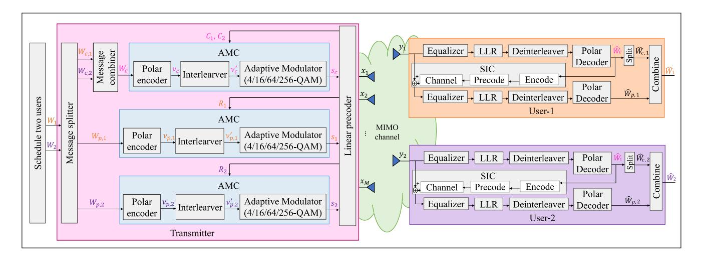

Fig. 20. PHY layer transmitter and receiver structures of RSMA with finite constellation modulation schemes, finite length polar codes, and adaptive modulation and coding (AMC) [36].

decoding of the common stream (recall from Remark 4 that the common stream in NOMA includes the full message of one user and no contributions from the message of the other user). For the user whose message is carried in the common stream, this can be interpreted as treating the interference as noise, as it does not continue with any decoding operations after the common message. For the other user (whose message is carried in one private stream), this can be interpreted as fully decoding the interference, as it performs interference cancellation to continue with decoding its own message. This underlines a key feature of RSMA - the capability to bridge the extreme regimes of decoding interference and treating it as a noise.

# B. RSMA PHY Layer Architecture

Fig. 20 illustrates the two-user PHY layer transmitter and receiver architecture of 1-layer RS for the two-user MISO BC including message splitting, finite-alphabet modulation, finite-length polar coding, AMC, and SIC. The architecture can be extended in a straightforward manner to the PHY layer of the RSMA schemes discussed in Section II. In the following, the transmitter and receiver structures are explained in detail.

1) Transmitter: At the transmitter, message  $W_k$  intended for user-k is split into two sub-messages  $W_{c,k}, W_{p,k}, k \in \{1,2\}$ . The two common sub-messages  $W_{c,1}, W_{c,2}$  are combined into one common message  $W_c$ . The three obtained messages  $W_c, W_{p,1}, W_{p,2}$  contain  $K_c, K_{p,1}, K_{p,2}$  information bits, respectively, which are assumed to be independently and uniformly distributed in binary fields of dimensions  $K_c, K_{p,1}, K_{p,2}$ , respectively. The three obtained messages  $W_c, W_{p,1}, W_{p,2}$  are independently encoded into codewords  $\nu_c, \nu_{p,1}, \nu_{p,2}$  with code blocklengths  $N_c, N_{p,1}, N_{p,2}$ , respectively.

Before passing the codewords to the modulators, the bits in  $\nu_c$ ,  $\nu_{p,1}$ ,  $\nu_{p,2}$  are interleaved based on the BICM concept in order to further improve the coding performance especially for high-order modulation [141]. The interleaved bit vectors

 $\nu_c', \nu_{p,1}', \nu_{p,2}'$  are respectively modulated into common symbol stream  $s_c$  and private symbol streams  $s_1, s_2$ . Aiming at enhancing the system throughput, an AMC algorithm uses the rates  $C_1, C_2, R_1, R_2$  calculated based on the designed precoders in Section IV and the Shannon bound in (5)–(7) as link quality metrics to determine the corresponding modulation schemes and the coding rates for the symbol streams. After modulation, the modulated symbol streams are then mapped to transmit antennas via precoding matrix **P**.

Remark 6: The PHY layer transceiver architecture described in [36] employs polar codes [142] for channel coding and the modulation formats 4-QAM, 16-QAM, 64-QAM and 256-QAM. However, any other types of coding and modulation techniques can be applied in an RSMA transceiver. For example, Low-Density Parity-Check (LDPC) codes and Phase-Shift Keying (PSK) modulation have been employed in the RSMA transceiver architectures described in [35], [119].

2) Receiver: At user-k, MMSE equalizer  $g_{c,k}^{\mathrm{MMSE}}$  is first employed to detect the common symbol stream  $s_c$ . The MMSE equalizer is calculated by minimizing mean square error (MSE) metric  $\mathbb{E}\{|g_{c,k}y_k-s_c|^2\}$ , and obtained as follows

$$g_{c,k}^{\text{MMSE}} = \frac{\mathbf{p}_c^H \mathbf{h}_k}{\left|\mathbf{h}_k^H \mathbf{p}_c\right|^2 + \sum_{l=1}^K \left|\mathbf{h}_k^H \mathbf{p}_l\right|^2 + \sigma_{n,k}^2}.$$
 (40)

Log-likelihood ratios (LLRs) are then calculated for soft decision (SD) decoding from the equalized symbols. The bit LLRs are sent to the bit deinterleaver and then to the channel decoder to obtain common message bits  $\widehat{W}_c$ . Finally, the intended common part  $\widehat{W}_{c,k}$  is extracted from  $\widehat{W}_c$ . After obtaining  $\widehat{W}_c$ , user-k employs hard decision (HD) SIC to reconstruct  $s_c$  from  $\widehat{W}_c$  by replicating the operations at the transmitter.  $s_c$  is then removed from the received signal as  $y_k' = y_k - \mathbf{h}_k^H \mathbf{p}_c s_c$ . MMSE equalizer  $g_k^{\text{MMSE}}$  is employed to detect the private symbol stream  $s_k$ . The MMSE equalizer is calculated by minimizing MSE  $\mathbb{E}\{|g_k y_k' - s_k|^2\}$ , and obtained

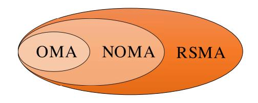

Fig. 21. Comparison of MA schemes for K-user uplink transmission.

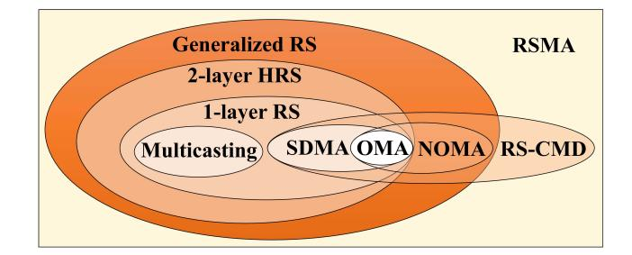

Fig. 22. Comparison of linearly precoded MA schemes for *K*-user downlink transmission.

as follows

$$g_k^{\text{MMSE}} = \frac{\mathbf{p}_k^H \mathbf{h}_k}{\sum_{\substack{l=1, \ l \neq k}}^{K} \left| \mathbf{h}_k^H \mathbf{p}_l \right|^2 + \sigma_{n,k}^2}.$$
 (41)

Following the same decoding procedure,  $\widehat{W}_c$  and  $\widehat{W}_{p,k}$  are obtained. By merging  $\widehat{W}_{p,k}$  and  $\widehat{W}_{c,k}$ ,  $\widehat{W}_k$  is recovered.

# VI. COMPARISON OF MULTIPLE ACCESS SCHEMES

In this section, we comprehensively compare downlink RSMA with existing MA schemes in terms of their design principles and frameworks, DoF performance, SE performance, LLS performance, and their complexities. The advantages and disadvantages of RSMA are summarized at the end of this section.

# A. Framework Comparison

Fig. 21 and Fig. 22 illustrate the relationship between different MA schemes for uplink and downlink transmission, respectively. RSMA is more general than NOMA and OMA in both cases. For uplink transmissions, RSMA in Fig. 13 reduces to uplink NOMA if the transmit power at each user-k is fully allocated to one stream, i.e.,  $s_{k1}$ , such that  $W_k$  is encoded directly into  $s_{k1}$  directly. When only one user is active in each time-frequency resource block, uplink NOMA further reduces to OMA.

For downlink transmission, Fig. 22 compares linearly precoded MA schemes including multicasting, SDMA, OMA, NOMA, and four linearly precoded RSMA schemes, namely, generalized RS, 2-layer HRS, 1-layer RS, and RS-CMD. Generalized RS is a universal linearly precoded scheme that comprises all other schemes except RS-CMD as sub-schemes. By allocating non-zero power to the K-order stream,  $|\mathcal{K}_i|$ -order streams, and 1-order streams while turning off all other streams, generalized RS reduces to 2-layer HRS. 2-layer HRS reduces to 1-layer RS when the  $|\mathcal{K}_i|$ -order streams of 2-layer HRS are turned off (with zero transmit power allocated to

them). RS-CMD is not a special instance of other RSMA schemes as RS-CMD does not combine and jointly encode user messages. Though the common streams in RS-CMD are decoded by all or at least several users, each stream is intended only for a single user.

SDMA illustrated in Fig. 1(b) is a sub-scheme of all linearly precoded RSMA schemes. By turning off the power allocated to all common streams, RSMA reduces to SDMA. In contrast, NOMA based on SC-SIC in Fig. 1(b) or SC-SIC per group in Fig. 2 utilizes each common stream to fully encode the entire message of a single user. It is a sub-scheme of generalized RS. By optimizing the group of users to decode each common stream, RS-CMD can be made more general than NOMA. Therefore, NOMA is shown as a special case of RS-CMD in Fig. 22. For OMA, illustrated in Fig. 1(a), only a single user can be active in each time-frequency resource block, i.e., the transmit power is fully allocated to a single private stream. It is the simplest MA scheme and is therefore a sub-scheme of all other MA schemes except for PHY layer multicasting. PHY layer multicasting allows the transmitter to serve multiple users simultaneously by jointly encoding the messages intended for different users into one common stream decoded by all users. In other words, multicasting is a sub-scheme of 1-layer RS/2-layer RS/generalized RS when the transmit power is fully allocated to the K-order common stream.

Table VIII summarizes the comparison of the different MA schemes in terms of their design principles as well as the user deployment scenarios and network loads they are best suited for. Apparently, the most important characteristic that makes RSMA distinct from the other MA schemes lies in its flexible interference management policy of partially decoding interference and partially treating residual interference as noise, which allows RSMA to generalize and encompass multi-antenna NOMA, SDMA, OMA, and multicasting as subschemes. Most importantly, RSMA smoothly bridges different sub-schemes without hard switching between them.

In the simple two-user case, 1-layer RS (see Fig. 1(d)) becomes a super-set of not only OMA (see Fig. 1(a)), SDMA (see Fig. 1(b)), and multicasting, but also NOMA (see Fig. 1(c)). As illustrated in Table IX, OMA, SDMA, NOMA, and multicasting are particular instances of 1-layer RS. Specifically, SDMA is a special case of 1-layer RS by forcing  $\|\mathbf{p}_c\|^2 = 0$ . In this way,  $W_k$  is directly encoded into  $s_k$ . By encoding message  $W_2$  entirely into  $s_c$  (i.e.,  $W_c = W_2$ ) and  $W_1$  into  $s_1$  while turning off  $s_2$  ( $\|\mathbf{p}_2\|^2 = 0$ ), we obtain NOMA. When only user-1 is scheduled (i.e.,  $\|\mathbf{p}_c\|^2 = \|\mathbf{p}_2\|^2 = 0$ ), we obtain OMA. When messages  $W_1, W_2$  are both encoded into  $s_c$  (i.e.,  $W_c = \{W_1, W_2\}$ ) and the private streams are turned off ( $\|\mathbf{p}_1\|^2 = \|\mathbf{p}_2\|^2 = 0$ ), we obtain multicasting. Note that the multicasting specified in Table IX is from a perspective of PHY layer transmission regardless of the content that  $s_c$  conveys, as discussed in Remark 1.

### B. Complexity Comparison

The complexity of different linearly precoded strategies are qualitatively compared in Table X in terms of their encoder complexity, scheduler complexity, and receiver complexity.

| Multiple Access                   | I OMA I SDMA I NOMA                                                                                                                                                                                                                                                                                                                                                                                                                                                                                                                                                                                                                                                                                                                                                                                                                                                                                                                                                                                                                                                                                                                                                                                                                                                                                                                                                                                                                                                                                                                                                                                                                                                                                                                                                                                                                                                                                                                                                                                                                                                                                                            |                                                              |                                                                                         |                                                                                                                                                                     | RSMA                                                                             |  |
|--------------------------------------|--------------------------------------------------------------------------------------------------------------------------------------------------------------------------------------------------------------------------------------------------------------------------------------------------------------------------------------------------------------------------------------------------------------------------------------------------------------------------------------------------------------------------------------------------------------------------------------------------------------------------------------------------------------------------------------------------------------------------------------------------------------------------------------------------------------------------------------------------------------------------------------------------------------------------------------------------------------------------------------------------------------------------------------------------------------------------------------------------------------------------------------------------------------------------------------------------------------------------------------------------------------------------------------------------------------------------------------------------------------------------------------------------------------------------------------------------------------------------------------------------------------------------------------------------------------------------------------------------------------------------------------------------------------------------------------------------------------------------------------------------------------------------------------------------------------------------------------------------------------------------------------------------------------------------------------------------------------------------------------------------------------------------------------------------------------------------------------------------------------------------------|--------------------------------------------------------------|-----------------------------------------------------------------------------------------|---------------------------------------------------------------------------------------------------------------------------------------------------------------------|----------------------------------------------------------------------------------|--|
| Strategy                             | LP                                                                                                                                                                                                                                                                                                                                                                                                                                                                                                                                                                                                                                                                                                                                                                                                                                                                                                                                                                                                                                                                                                                                                                                                                                                                                                                                                                                                                                                                                                                                                                                                                                                                                                                                                                                                                                                                                                                                                                                                                                                                                                                             | MU–LP                                                        | Multi-antenna NOMA $(G = 1)$                                                            | Multi-antenna NOMA $(G > 1)$                                                                                                                                        | All forms of RS                                                                  |  |
| Design principle                  | Orthogonal resource allocation to avoid interference                                                                                                                                                                                                                                                                                                                                                                                                                                                                                                                                                                                                                                                                                                                                                                                                                                                                                                                                                                                                                                                                                                                                                                                                                                                                                                                                                                                                                                                                                                                                                                                                                                                                                                                                                                                                                                                                                                                                                                                                                                                                           | e allocation interference as noise Fully decode interference |                                                                                         | Fully decode interference in each group and treat interference between groups as noise                                                                     | Partially decode interference and partially treat interference as noise |  |
| Decoder architecture              | Treat interference as noise                                                                                                                                                                                                                                                                                                                                                                                                                                                                                                                                                                                                                                                                                                                                                                                                                                                                                                                                                                                                                                                                                                                                                                                                                                                                                                                                                                                                                                                                                                                                                                                                                                                                                                                                                                                                                                                                                                                                                                                                                                                                                                    | Treat interference as noise                                  | SIC at receivers                                                                        | SIC at receivers                                                                                                                                                    |                                                                                  |  |
| Ideal user deployment scenario | user Any angle between Users user channels and (semi-any disparity in with semi-any disparity in with semi-any disparity in with semi-any disparity in with semi-any disparity in with semi-any disparity in with semi-any disparity in with semi-any disparity in with semi-any disparity in with semi-any disparity in with semi-any disparity in with semi-any disparity in with semi-any disparity in with semi-any disparity in with semi-any disparity in with semi-any disparity in with semi-any disparity in with semi-any disparity in with semi-any disparity in with semi-any disparity in with semi-any disparity in with semi-any disparity in with semi-any disparity in with semi-any disparity in with semi-any disparity in with semi-any disparity in with semi-any disparity in with semi-any disparity in with semi-any disparity in with semi-any disparity in with semi-any disparity in with semi-any disparity in with semi-any disparity in with semi-any disparity in with semi-any disparity in with semi-any disparity in with semi-any disparity in with semi-any disparity in with semi-any disparity in with semi-any disparity in with semi-any disparity in with semi-any disparity in with semi-any disparity in with semi-any disparity in with semi-any disparity in with semi-any disparity in with semi-any disparity in with semi-any disparity in with semi-any disparity in with semi-any disparity in with semi-any disparity disparity disparity disparity disparity disparity disparity disparity disparity disparity disparity disparity disparity disparity disparity disparity disparity disparity disparity disparity disparity disparity disparity disparity disparity disparity disparity disparity disparity disparity disparity disparity disparity disparity disparity disparity disparity disparity disparity disparity disparity disparity disparity disparity disparity disparity disparity disparity disparity disparity disparity disparity disparity disparity disparity disparity disparity disparity disparity disparity disparity disparity disparity disparity |                                                              | Users experience aligned channel directions and a large disparity in channel strengths. | Users in the same group experience aligned channel directions and a large disparity in channel strengths. Users in different groups experience orthogonal channels. | Any angle between channels and any disparity in channel strengths       |  |
| Network                              | Only one active                                                                                                                                                                                                                                                                                                                                                                                                                                                                                                                                                                                                                                                                                                                                                                                                                                                                                                                                                                                                                                                                                                                                                                                                                                                                                                                                                                                                                                                                                                                                                                                                                                                                                                                                                                                                                                                                                                                                                                                                                                                                                                                | Better suited for                                            | Better suited for overloaded                                                            | Better suited for                                                                                                                                                   | Suited to any network                                                            |  |

network

TABLE VIII COMPARISON OF DIFFERENT MA SCHEMES

TABLE IX MESSAGE-TO-STREAM MAPPING IN THE TWO-USER MISO BC [34]

user (in each radio

resource)

load

|              | $s_1$     | $s_2$     | $s_c$              |
|--------------|-----------|-----------|--------------------|
| SDMA         | $W_1$     | $W_2$     | -                  |
| NOMA         | $W_1$     | _         | $W_2$              |
| OMA          | $W_1$     | _         | _                  |
| Multicasting | _         | _         | $W_1,W_2$          |
| 1-layer RS   | $W_{p,1}$ | $W_{p,2}$ | $W_{c,1}, W_{c,2}$ |

decoded by its intended user and decoded by treated as noise by the other user both users

underloaded

network

1) Encoder Complexity: Due to the use of message splitting, more streams need to be encoded at the RSMA transmitter. The encoder complexity of RSMA is therefore higher than those of other MA schemes. Among the linearly precoded RSMA schemes, 1-layer RS has the lowest encoding complexity with only one additional stream (compared to the SDMA and NOMA baselines where K messages are encoded into K streams) encoded at the transmitter in the K-user case. For 2-layer HRS, as there is one group-specific common stream for each user group, in total G additional common streams are encoded at the transmitter besides the common stream for all users. Therefore, the encoder complexity difference between 1-layer RS/2-layer HRS and SDMA/NOMA11 is invariant to the number of users K while the encoder complexity difference between RS-CMD/generalized RS and SDMA/NOMA increases with K due to the large number of sub-messages split from each message, as illustrated in Table V.

2) Scheduler Complexity: Even though SDMA has the lowest encoder and receiver complexities, it entails a relatively high scheduler complexity due to the requirement of pairing users with semi-orthogonal channels and similar channel strengths to achieve high performance. Fig. 29 in Section VI-C further shows that SDMA is mainly beneficial when the users'

channels are sufficiently orthogonal. Moreover, as discussed in Section I-B, well-designed user scheduling requires accurate CSIT and leads to high signaling overhead and latency. The SIC receivers used in NOMA and RSMA introduce additional scheduler complexity compared with OMA and SDMA. Two additional aspects have to be considered at the transmitter due to the use of SIC, namely, the decoding order and the user grouping. The coupled nature of user grouping, decoding order, precoders, and user selection requires a joint optimization at the transmitter [143]. Among all strategies using SIC, multi-antenna NOMA (G > 1), 2-layer HRS, and RS-CMD bear the highest user grouping complexity. As discussed in [7], the total number of possible user groupings for these three schemes is  $\sum_{k=1}^{K} S(K,k)$ , where  $S(K,k) = \frac{1}{k!} \sum_{i=0}^{k} (-1)^{i} {k \choose i} (k-i)^{K}$  is a Stirling set number [144] representing the total number of partitions of a set of K elements into k non-empty sets.

load

underloaded network

In terms of the decoding order, multi-antenna NOMA, generalized RS, and RS-CMD all entail inevitably high decoding order complexity. For multi-antenna NOMA (G = 1), all users employ the same decoding order to decode the user messages and the transmitter should select between K! possible decoding orders for the K streams. Note that for multi-antenna NOMA (G = 1), it is advantageous for the scheduler to select users with aligned channels and significant channel strength differences, which however increases the scheduler complexity. For multi-antenna NOMA (G = 1), as the user grouping is jointly optimized with the decoding order, at most K! decoding orders have to be considered in each user group. For generalized RS, though the decoding order starts from the K-order streams downwards to the 1-order streams (see Section II-B5), there are  $\binom{K}{k}$  k-order streams for  $2 \le k \le K - 1$ , which results in  $\binom{K}{k}$ ! possible decoding orders. Therefore, the transmitter has to select between  $\prod_{k=2}^{K-1} \binom{K}{k}$ ! possible decoding orders for users to decode all intended streams [7]. For RS-CMD, if it is assumed that the K common streams are decoded at all users as in Section II-B6, in total  $(K!)^K$  decoding orders need

&lt;sup>11Here, the encoder complexity is measured in terms of the number of encoded streams.

| Multiple Access      | OMA                                          | SDMA                                                                                | NO                                                                                        | )MA                                                                                                                                                                                                                      |                                                                                                                                                                | RSMA                                                                                                                                                            |                                                                                  |                                                                                             |
|-------------------------|----------------------------------------------|-------------------------------------------------------------------------------------|-------------------------------------------------------------------------------------------|--------------------------------------------------------------------------------------------------------------------------------------------------------------------------------------------------------------------------|----------------------------------------------------------------------------------------------------------------------------------------------------------------|-----------------------------------------------------------------------------------------------------------------------------------------------------------------|----------------------------------------------------------------------------------|---------------------------------------------------------------------------------------------|
| Strategy                | LP                                           | MU–LP                                                                               | Multi-antenna NOMA $(G = 1)$                                                           | Multi-antenna NOMA $(G > 1)$                                                                                                                                                                                          | 1-layer RS                                                                                                                                                     | 2-layer HRS                                                                                                                                                     | Generalized RS                                                                   | RS-CMD                                                                                      |
| Encoder complexity   |                                              | Encode $K$ streams                                                                  | Encode $K$ streams                                                                        | Encode $K$ streams                                                                                                                                                                                                       | Encode $K+1$ streams                                                                                                                                           | Encode $K+G+1$ streams                                                                                                                                          | Encode $2^K - 1$ streams                                                         | Encode 2K streams                                                                           |
| Scheduler complexity | Complex as OMA requires subcarrier/time slot | Complex as MU-LP requires to pair semi-orthogonal users with similar channel gains. | Very complex as it requires finding aligned users and decide between $K!$ user orderings. | Very complex as it requires to divide users into orthogonal groups, with aligned users in each group. Decide between $\sum_{k=1}^{K} S(K, k)$ grouping method and at most $K!$ decoding orders for each grouping method. | Simple user scheduling as it can cope with any user deployment scenario, and does not rely on user grouping or user ordering.                                  | Decide between $\sum_{k=1}^{K} S(K, k)$ groupings without decoding order.                                                                                       | Decide between $\prod_{k=2}^{K-1} {K \choose k}!$ decoding orders.               | Decide upon $\sum_{k=1}^{K} S(K, k)$ grouping methods and at most $(K!)^K$ decoding orders. |
|                         |                                              | Does not require SIC.                                                               | Requires $K-1$ layers of SIC at each user. Sensitive to error propagation.                | Requires $ \mathcal{K}_i  - 1$ layers of SIC at each user in group- $g$ . Sensitive to error propagation.                                                                                                                | Requires 1 layer of SIC at each user. Less sensitive to error propagation (compared to NOMA, and other more complex RS schemes). | Requires 2 layers of SIC at each user. Less sensitive to error propagation (compared to NOMA, and other more complex RS schemes). | Requires $2^{K-1}-1$ layers of SIC at each user. Sensitive to error propagation. | Requires K layers of SIC at each user. Sensitive to error propagation.                      |

to be considered at the transmitter without the issue of user grouping. Otherwise, the transmitter has to jointly decide the decoding order and the group of common streams decoded at each user.

In summary, both multi-antenna NOMA (G > 1) and RS-CMD have relatively the highest scheduler complexity since the decoding order and user grouping have to be jointly decided. For multi-antenna NOMA (G > 1), users with semi-orthogonal channels should be assigned to different user groups and the user channels within the same user group should be aligned. In contrast, 1-layer RS has relatively the lowest scheduler complexity among all aforementioned MA schemes (including OMA, SDMA, NOMA, and all RSMA schemes) as it does not require grouping and ordering, and is less sensitive to user pairing. Hence, 1-layer RS does not require complex user scheduling and pairing. Generally, all RSMA schemes including 1-layer RS, 2-layer HRS, generalized RS, and RS-CMD are suited for users with any channel strength disparity and channel directions. As per [124, Fig. 13], surprisingly generalized RS and 1-layer RS without user scheduling outperform SDMA with user scheduling when the CSIT is sufficiently inaccurate.

3) Receiver Complexity: Both OMA and SDMA have comparatively the lowest receiver complexity as they do not need SIC. Among the schemes using SIC (including NOMA and all RSMA schemes), 1-layer RS and 2-layer HRS entail the lowest receiver complexity. In the *K*-user scenario, the number of SIC operations required at each user is 1 for 1-layer RS and 2 for 2-layer HRS, which is relatively low and independent of the number of users *K*. Hence, both 1-layer RS and 2-layer HRS

are not severely affected by error propagation. All remaining schemes, including NOMA (for a fixed user group G), generalized RS, and RS-CMD, require several SIC operations depending on K, which not only leads to an increased transceiver complexity but also increases the susceptibility to SIC error propagation. Specifically, each user requires K-1layers of SIC in multi-antenna NOMA (G = 1) while each user from user group-i requires  $|\mathcal{K}_i|-1$  layers of SIC in multi-antenna NOMA (G>1),  $^{12}$  where  $|\mathcal{K}_i|\leq K$  is the number of users in group-i. The receivers for RS-CMD and generalized RS are both complex as K and  $2^{K-1} - 1$  layers of SIC are required, respectively. Though generalized RS provides a higher flexibility in interference management compared with the other schemes, it also entails a higher receiver complexity. In view of the high transmitter and receiver complexities of RS-CMD and generalized RS, attempts towards low-complexity versions have been made [45], [47], [50], [83] by controlling the number of common streams decoded at each user and simplifying the decoding order design. Moreover, readers are reminded that there are two motivations for introducing generalized RS, one is to explore the best achievable performance at the expense of a higher complexity at the transceivers, and the other one is to identify which common stream(s) lead(s) to the highest performance gains, and from

&lt;sup>12For a certain decoding order, the number of SIC layers used at different users for decoding the data streams of other users is different. However, as the decoding order depends on the users' instantaneous CSI, all users are required to implement the maximum number of SIC layers as each of them may have to decode the streams of all other users (in the same user group) for some channel conditions.

&lt;sup>13Readers are referred to [11] for more details on the system model of multi-antenna NOMA.

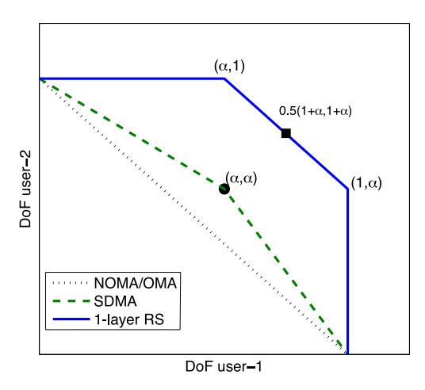

Fig. 23. The DoF region for the two-user MISO BC with imperfect CSIT,  $\alpha=0.6$  [8].

there identify which stream(s) could be turned off so as to reduce the encoding and decoding complexities.

#### C. Performance Comparison

Next, we evaluate the performance of the considered MA schemes in terms of their DoF region, rate region, operational region, user fairness, and LLS performance. Here, the operational region characterizes the channel conditions of the users which are favorable for a given MA scheme [34].

1) DoF Region: The degrees-of-freedom (DoF) (a.k.a. multiplexing gain) of user-k achieved by communication scheme  $j, j \in \{N, M, R\}$ , (N, M, R respectively stand for NOMA, MU–LP, RSMA) are defined as follows

$$d_k^{(j)} = \lim_{P \to \infty} \frac{R_k^{(j)}(P)}{\log_2(P)},\tag{42}$$

where  $R_k^{(j)}(P)$  is the rate of user-k for scheme j under transmit power constraint P. Mathematically, DoF  $d_k^{(j)}$  is the first-order approximation of the rate of user-k at high SNR and is therefore the pre-log factor of  $R_k^{(j)}(P)$  at high SNR. It can be also interpreted as the number or fraction of interference-free streams that can be simultaneously transmitted from the transmitter to user-k using scheme j. The larger  $d_k^{(j)}$  is, the faster the rate of user-k increases with SNR.

A DoF region is defined as the enclosure of all possible DoF tuples  $(d_1^{(j)},\ldots,d_K^{(j)})$ . We recall here that 1-layer RS, which is the simplest RSMA scheme, already achieves the optimal DoF region in the multi-antenna BC with imperfect CSIT [89], [103], [104], [145]. All other MA strategies therefore can only achieve the same or worse DoF compared to RSMA. The DoF region illustrated in Fig. 23 for the two-user MISO BC confirms the explicit DoF gain achieved by RSMA. Each DoF point in Fig. 23 is calculated based on the imperfect CSIT model in (30), where the estimated channel of user-k at the transmitter  $\hat{\mathbf{h}}_k$  and the corresponding channel estimation error  $\hat{\mathbf{h}}_k$  have i.i.d. complex Gaussian entries following distributions  $\mathcal{CN}(0,\sigma_k^2)$  and  $\mathcal{CN}(0,\sigma_{e,k}^2)$ , respectively. The error variance scales with SNR as  $\sigma_{e,k}^2 \sim \mathcal{O}(P^{-\alpha})$ , where  $\alpha \in [0,\infty)$  is the CSIT scaling factor representing the quality of the CSIT

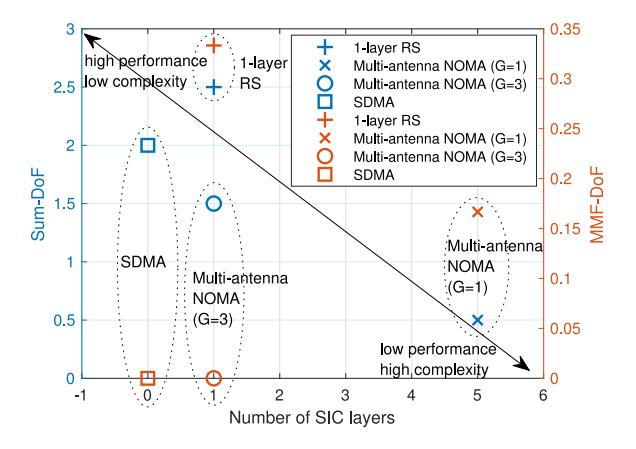

Fig. 24. Sum/MMF-DoF vs. number of SIC layers for MISO BC with imperfect CSIT,  $M=4, K=6, \alpha=0.5$  [11].

in the high SNR regime [13], [28], [88], [102], [146]. In limited feedback systems, where users send quantized versions of their channels back to the BS,  $\alpha$  can be interpreted in terms of the number of feedback bits.  $\alpha = 0$  represents partial CSIT with finite precision, i.e., a constant number of feedback bits, while  $\alpha = \infty$  represents perfect CSIT. Normally, we choose  $\alpha \in [0,1]$  since  $\alpha = 1$  corresponds to perfect CSIT in the DoF sense [88]. In Fig. 23,  $\alpha = 0.6$  is considered. In such imperfect CSIT scenarios, SDMA can only achieve a DoF of  $\alpha$  for each user. In comparison, 1-layer RS leverages the common stream to achieve an extra DoF of  $1-\alpha$  while keeping an achievable DoF of  $2\alpha$  for the two private streams. By respectively allocating the entire common stream to transmit the sub-messages of user-1 and user-2, the corner points of  $(1, \alpha)$  and  $(\alpha, 1)$  of 1-layer RS are achieved. The line segment between the two corner points can be achieved by adjusting the amount of the common stream allocated to transmit the sub-messages of the two users.

Besides the DoF region, sum-DoF and MMF-DoF have been used in the MIMO literature to assess the capability of a strategy to exploit multiple antennas. These performance metrics are defined as follows

$$d_{s}^{(j)} = \lim_{P \to \infty} \frac{R_{s}^{(j)}(P)}{\log_{2}(P)} = \sum_{k=1}^{K} d_{k}^{(j)}, \tag{43}$$

$$d_{\text{mmf}}^{(j)} = \lim_{P \to \infty} \frac{R_{\text{mmf}}^{(j)}(P)}{\log_2(P)} = \min_{k=1,\dots,K} d_k^{(j)}, \tag{44}$$

where  $R_{\rm s}^{(j)} = \sum_{k=1}^K R_k^{(j)}$  is the sum-rate and  $R_{\rm mmf}^{(j)} = \min_k \{R_k^{(j)} | k \in \mathcal{K}\}$  is the MMF rate. Sum-DoF  $d_{\rm s}^{(j)}$  is the total number of interference-free data streams that can be transmitted to all users by employing scheme j. MMF-DoF  $d_{\rm mmf}^{(j)}$  (a.k.a. symmetric DoF) are the DoF that can be simultaneously achieved by all users. The sum-DoF and MMF-DoF of NOMA, SDMA, and RSMA for the MISO BC with perfect and imperfect CSIT have been calculated in [11] and are summarized in Table XI for convenience. Without loss of generality, we assume the numbers of users in different user groups are all equal to  $g = |\mathcal{K}_i|, i \in \mathcal{G}$ , for SC-SIC per group.

In Fig. 24, the tradeoff between the sum/MMF-DoF and the number of SIC layers for the MISO BC with M=4 and K=6

| Scheme  | Sum/MMF DoF             | Perfect CSIT                                                                     | Imperfect CSIT                                                                                                                                                                                                   |
|---------|-------------------------|----------------------------------------------------------------------------------|------------------------------------------------------------------------------------------------------------------------------------------------------------------------------------------------------------------|
| NOMA    | $d_{ m s}^{( m N)}$     | $\min\left(M,G ight)$                                                            | $\max\left(1,\min\left(M,G ight)lpha ight)$                                                                                                                                                                      |
| 2,02,22 | $d_{ m mmf}^{ m (N)}$   | $\begin{cases} \frac{1}{g}, & M \ge K - g + 1 \\ 0, & M < K - g + 1 \end{cases}$ | $\begin{cases} \frac{\alpha}{g}, & G>1 \text{ and } M \geq K-g+1\\ 0, & G>1 \text{ and } M < K-g+1\\ \frac{1}{K}, & G=1 \end{cases}$                                                                             |
| SDMA    | $d_{ m s}^{({ m M})}$   | $\min\left(M,K\right)$                                                           | $\max(1, \min(M, K) \alpha)$                                                                                                                                                                                     |
|         | $d_{ m mmf}^{({ m M})}$ | $\begin{cases} 1, & M \ge K \\ 0, & M < K \end{cases}$                           | $\begin{cases} \alpha, & M \ge K \\ 0, & M < K \end{cases}$                                                                                                                                                      |
| RSMA    | $d_{ m s}^{({ m R})}$   | $\min\left(M,K ight)$                                                            | $1 + \left(\min\left(M, K\right) - 1\right)\alpha$                                                                                                                                                               |
|         | $d_{ m mmf}^{( m R)}$   | $\begin{cases} 1, & M \ge K \\ \frac{1}{1+K-M}, & M < K \end{cases}$             | $ \begin{cases} \frac{1+(K-1)\alpha}{K}, & M \geq K \\ \frac{1+(M-1)\alpha}{K}, & M < K \text{ and } \alpha \leq \frac{1}{1+K-M} \\ \frac{1}{1+K-M}, & M < K \text{ and } \alpha > \frac{1}{1+K-M} \end{cases} $ |

TABLE XI COMPARISON OF SUM-DOF AND MMF-DOF OF DIFFERENT MA SCHEMES FOR PERFECT AND IMPERFECT CSIT [11]

is illustrated. Imperfect CSIT is considered and the CSIT scaling factor is  $\alpha=0.5$ . As can be observed, multi-antenna NOMA (G=3) achieves better sum-DoF but worse MMF-DoF compared to multi-antenna NOMA (G=1). 1-layer RS achieves the highest sum/MMF-DoF among all schemes and entails a much lower complexity compared to NOMA.

Fig. 25 illustrates the sum- and MMF-DoF for the MISO BC with imperfect CSIT versus the number of users K when the number of transmit antennas is M = 6 and the CSIT scaling factor is  $\alpha = 0.5$ . 1-layer RS shows an explicit sumand MMF-DoF gain compared to all other schemes for all K. In Fig. 25(b), the MMF-DoF of SDMA and multi-antenna NOMA (G = 1) drops to 0 when K > 6 and K > 7, respectively. This implies that the rate of the worst user does not scale with the SNR and the rate saturates at high SNR. To maintain multiple access and fairness among users, multi-antenna NOMA (G = 1) is more suitable when K > M but it requires K-1 layers of SIC at each user. Taking 0.1 as the MMF-DoF threshold for all users in Fig. 25(b), we observe that 1-layer RS can serve around 15 users using 1 layer of SIC while multi-antenna NOMA (G = 1) can only serve 10 users at most using 9 layers of SIC. Hence, RSMA is significantly more efficient than NOMA since RS with only one layer of SIC can support a much larger number of users than NOMA with multiple layers of SIC.

2) Rate Region: Motivated by the DoF optimality of RSMA in the high SNR regime, attempts have been made to explore the achievable rate (or SE) of RSMA in the finite SNR regime [28], [53]. Fig. 26 evaluates the ER region of different MA schemes averaged over 100 random channel realizations for the MISO BC with imperfect CSIT. The BS has M=2 antennas and serves two single-antenna users. The imperfect CSIT model follows (30) and the channel estimates of each user,  $\hat{\mathbf{h}}_k$ , have i.i.d. complex Gaussian entries following distribution  $\mathcal{CN}(0,\sigma_k^2)$ . The variance of  $\hat{\mathbf{h}}_1$  is fixed to  $\sigma_1^2=1$  while the variance of  $\hat{\mathbf{h}}_2$  varies between  $\sigma_2^2=1$ 

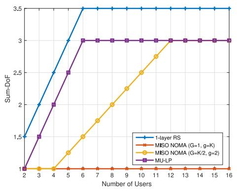

(a) Sum-DoF vs. number of users K

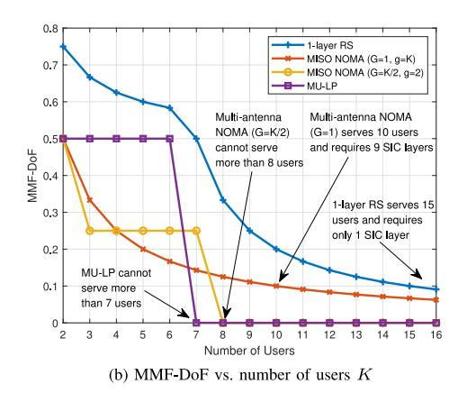

Fig. 25. Sum/MMF-DoF vs. number of users K for MISO BC with imperfect CSIT,  $\alpha = 0.5$ , M = 6 [11].

and  $\sigma_2^2=0.09$  representing equal channel strength and 10 dB channel strength disparity between the two user channels, respectively. ER is defined in the same way as in (34) and  $\text{ER}_{k,tot}=\overline{R}_k+\overline{C}_k$ . Each rate pair  $\text{ER}_{1,tot}, \text{ER}_{2,tot}$  at the boundary of the ER region is obtained by solving  $\mathcal{P}_3$  in Section IV-A1 for a certain weight pair  $u_1,u_2$  with

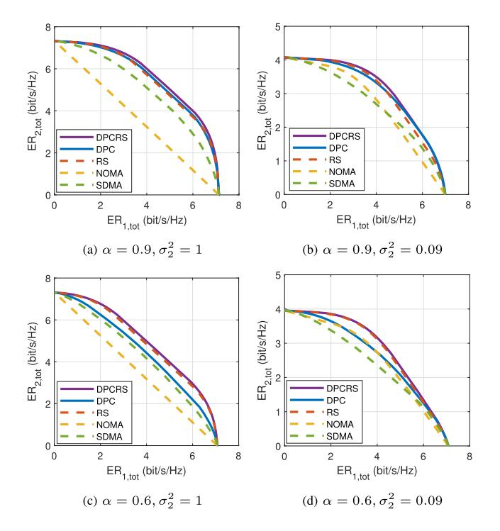

Fig. 26. Ergodic rate region comparison of different multiple access schemes with imperfect CSIT, averaged over 100 random channel realizations, K = 2, SNR = 20 dB [53].

 $U_n(\mathbf{P}, \overline{\mathbf{c}}) = \sum_{k=1}^K u_k(\overline{R}_k + \overline{C}_k)$  and  $R_k^{th} = 0$  bit/s/Hz. By changing the weight pair and optimizing the rate pair accordingly, we obtain the entire ER region. The ER region of DPC/DPCRS is the convex hull of the rate regions for all possible encoding orders. Readers are referred to [53] for details on the optimization. In the two-user case, M-DPCRS and generalized RS respectively reduce to 1-DPCRS and 1-layer RS. In Fig. 26, we use the terminology "DPCRS" to represent "M-DPCRS" and "1-DPCRS", and the terminology "RS" to represent "Generalized RS" and "1-layer RS", respectively.

From Fig. 26, we observe that DPCRS enlarges the ER region of all other schemes and linearly precoded RS even outperforms DPC when the CSIT quality is poor. DPC and SDMA (based on MU-LP) can be seen as two extreme schemes that highly rely on accurate CSIT to fully manage interference at the transmitter side, and both of them are therefore sensitive to CSIT inaccuracy. Hence, the ER regions of DPC and SDMA (based on MU-LP) quickly shrink as the CSIT quality decreases from  $\alpha = 0.9$  (in Fig. 26(a) and (b)) to  $\alpha = 0.6$  (in Fig. 26(c) and (d)). On the other hand, NOMA can be seen as an extreme scheme that fully manages/cancels interference at the receiver side. However, it cannot fully exploit the available DoF and results in poor performance [11]. DPCRS and RS bridge the two extremes and use the common streams to smartly create a mix of transmitter-side and receiver-side interference cancellation. By adjusting the contribution of the common stream, it can dynamically decide the level of interference that needs to be canceled at the transmitter or the receiver side. Therefore, we conclude that in practical deployments with partial CSIT, RSMA with a combination of transmitter-side and receiver-side interference cancellation outperforms full transmitter-side interference cancellation schemes such as SDMA (based on MU–LP or DPC) and full receiver-side interference cancellation schemes such as NOMA (based on SC–SIC). RSMA is more flexible, and hence, more robust to CSIT uncertainties and everchanging user deployments.

In Fig. 27, we further evaluate the ergodic sum rate (ESR) performance of different linearly precoded schemes for a threeuser MISO BC with imperfect CSIT where generalized RS does not reduce to 1-layer RS. RS-CMD is also considered where each user is required to decode three common streams resulting in 63 possible decoding orders to be considered at the transmitter. To ease the computational burden, we only consider one decoding order, namely, the ascending order of the users' channel strengths. The precoders of all schemes are designed to maximize the ESR (when users have equal weights). In all figures, generalized RS outperforms all other schemes, especially when the network is overloaded, see Fig. 27 (b) and (c). Generalized RS achieves significant gains compared to the other MA schemes when multi-user interference is strong and there is enough power allocated to all common streams. The ESRs of multi-antenna NOMA (G=1) and SDMA drop dramatically as  $\alpha$  decreases from 1 to 0.2. Note that in the three-user case, 1-layer RS yields an explicit performance gain over multi-antenna NOMA (G = 1) and is robust to CSIT uncertainties. Most importantly, 1-layer RS does not require transmitter scheduling and only needs one layer of SIC at each user, while multi-antenna NOMA (G = 1) requires the transmitter to select from 6 decoding orders and each user has to be capable of performing two layers of SIC. The joint transmitter-side and receiver-side interference cancellation enables 1-layer RS to simultaneously enhance SE and reduce transceiver complexity.

To further emphasize the capability of 1-layer RS to jointly boost the SE and reduce the transceiver complexity, we consider an extremely overloaded scenario with perfect CSIT in Fig. 28 where the BS has M = 2 antennas and serves ten single-antenna users. The user channels have i.i.d. complex Gaussian entries following distribution  $\mathcal{CN}(0, \sigma_k^2)$ . The variances of the ten user channels are  $\sigma_1^2 = 1, \sigma_2^2 =$  $0.9, \ldots, \sigma_{10}^2 = 0.1$ . To enable service to multiple users in such an extremely overloaded scenario, we set the QoS rate requirement of each user for SNR = [0, 5, ..., 30] dB to be [0, 0.001, 0.004, 0.01, 0.03, 0.06, 0.1] bit/s/Hz, respectively. The precoders and message splits are designed by solving  $\mathcal{P}_1$ in Section IV-A1. The rate of each user is averaged over 10 randomly generated channels and the weight of each user is assumed to be equal to 1. Fig. 28 shows an explicit WSR gain of 1-layer RS over multi-antenna NOMA (G = 1), SDMA, and multicast. RS exploits the maximum DoF of 2 in the considered deployment (that is limited by the two transmit antennas) by using the common stream to pack messages from eight users while using the two private streams to serve the remaining two users. In contrast, the DoF achieved by MU-LP is 1 because it cannot coordinate the inter-user interference when there is a non-negligible QoS rate requirement for each user, and its achieved DoF drops to 1. Multi-antenna NOMA (G = 1) also achieves a DoF of 1. It makes inefficient use of

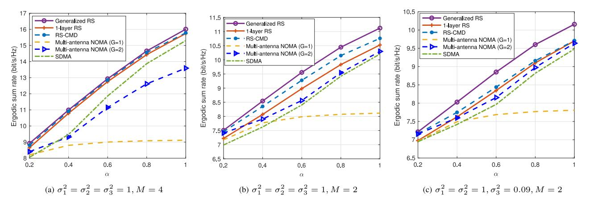

Fig. 27. Ergodic sum rate versus CSIT quality comparison of different MA schemes, averaged over 100 random channel realizations, K = 3, SNR = 20 dB.

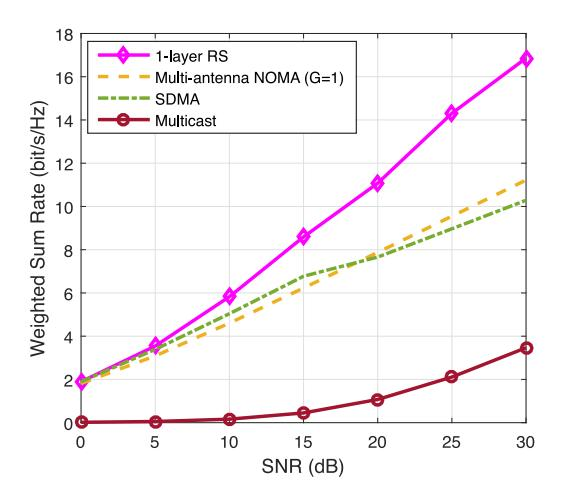

Fig. 28. Weighted sum rate versus SNR comparison of different MA schemes for an overloaded ten-user deployment with perfect CSIT, M = 2 [7].

the transmit antennas and 9 layers of SIC (deployed but not always used) at each user. Therefore, the WSR improvement of 1-layer RS comes with a much lower receiver complexity compared with multi-antenna NOMA (G=1).

- 3) Operational Region: As defined in [34], the operational region of an MA scheme is the region of channel conditions that it prefers. We obey the following rules to select the relevant MA scheme from RSMA, SDMA, NOMA, OMA:
  - i) if  $WSR_{RSMA} WSR_{OMA} < \epsilon'$ , RSMA boils down to OMA.
  - ii) if  $WSR_{SDMA} WSR_{OMA} > \epsilon'$  and  $WSR_{RSMA} WSR_{SDMA} < \epsilon'$ , RSMA boils down to SDMA.
  - iii) if  $WSR_{NOMA} WSR_{SDMA} > \epsilon'$  and  $WSR_{RSMA} WSR_{NOMA} < \epsilon'$ , RSMA boils down to NOMA.
  - iv) if  $WSR_{RSMA} WSR_{SDMA} > \epsilon'$  and  $WSR_{RSMA} WSR_{NOMA} > \epsilon'$ , RSMA is superior to all other MA schemes.

 $\epsilon'$  is the tolerance for selection. RSMA is selected as the preferred scheme when it is not equivalent to any other MA scheme.

Following the evaluations in [34], we illustrate the preferred operational regions for RSMA, SDMA, NOMA, and OMA for the two-user MISO BC with perfect CSIT in Fig. 29.

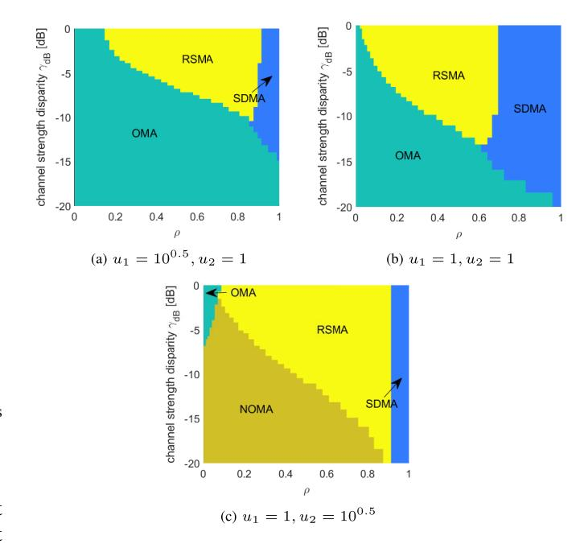

Fig. 29. Regions of operation for different MA schemes, K=2, SNR=20~dB.

The transmitter is equipped with M=2 antennas and the channel vectors are given by  $\mathbf{h}_1=1/\sqrt{2}[1,1]^H$  and  $\mathbf{h}_2=\gamma/\sqrt{2}[1,e^{j\theta}]^H$ . The precoders of all MA schemes are designed using the WMMSE optimization framework developed in [7], [28] for solving  $\mathcal{P}_1$  in Section IV-A1 for a certain weight pair  $u_1,u_2$  with  $U_n(\mathbf{P},\overline{\mathbf{c}})=\sum_{k=1}^K u_k(\overline{R}_k+\overline{C}_k)$  and  $R_k^{th}=0$  bit/s/Hz. Readers are referred to [7] for more details on the optimization of all MA schemes. The colors in Fig. 29 illustrate the preferred MA schemes (RSMA, SDMA, NOMA, OMA) that maximize the WSR as a function of  $\rho=1-\frac{|\mathbf{h}_1^H\mathbf{h}_2|^2}{\|\mathbf{h}_1\|^2\|\mathbf{h}_1\|^2}$   $(0\leq\rho\leq1)$  and  $\gamma_{\mathrm{dB}}=20\log_{10}(\gamma)$   $(-20\mathrm{dB}\leq\gamma_{\mathrm{dB}}\leq0)$ . Therefore, user-1 and user-2 have a long-term SNR of 20dB and  $0\mathrm{dB}\leq20\mathrm{dB}+\gamma_{\mathrm{dB}}\leq20\mathrm{dB},$  respectively.

From Fig. 29(a) and (b), we obtain that NOMA has no benefit at all when an equal or higher weight is allocated to the user with the stronger channel strength. Only when user fairness is

considered, i.e., a higher weight is allocated to the weaker user as in Fig. 29(c), RSMA boils down to NOMA, especially for user deployments where the users are closely aligned with a large channel strength disparity (i.e., small  $\rho$  and small  $\gamma_{\rm dB}$ ). In all subfigures, we observe that RSMA boils down to SDMA when  $\rho$  is sufficiently large. SDMA is sufficient to manage inter-user interference when the user channels are orthogonal. For different user weights, there is always an explicit operational region for RSMA where it provides a larger WSR than SDMA, NOMA, and OMA. In this critically loaded scenario, RSMA offers high flexibility in all user deployments and is capable of enhancing user fairness as well.

4) User Fairness: In practice, due to the disparate path losses experienced by users in different locations, the issue of user fairness surfaces where users closer to the transmitter are allocated with more (time/frequency/power) resources, while users far from the transmitter are starving. To cope with this issue, the max-min rate utility function is preferred for precoder design such that a certain rate performance is guaranteed for all users. Next, we evaluate the max-min rate performance of the users when the precoders are designed by solving  $\mathcal{P}_2$  in Section IV-A1 with  $U(\mathbf{P}, \overline{\mathbf{c}}) = \min_{k \in \mathcal{K}} (\overline{R}_k + \overline{C}_k)$  and  $R_k^{th} = 0$  bit/s/Hz.

Fig. 30 illustrates the max-min rate performance and the corresponding power allocation between the common and private streams for RSMA in the MISO BC with imperfect CSIT when the transmitter is equipped with M = 6 antennas and serves K = 6 single-antenna users. The imperfect CSIT model follows (30) with a CSIT scaling factor of  $\alpha = 0.5$  and the results are averaged over 100 random channel realizations. 1layer RS shows superior max-min rate performance compared to multi-antenna NOMA and SDMA in Fig. 30(a). As specified in Table X, the scheduler complexity and the receiver complexity of multi-antenna NOMA are much higher than those for 1-layer RS and SDMA. At the transmitter, for multiantenna NOMA (G = 3), the user grouping and decoding order have to be jointly optimized with the precoders. When K = 6, each user requires (but not always uses all) 5 layers of SIC for multi-antenna NOMA (G = 1). Such high complexity, however, yields worse performance than 1-layer RS with a single layer of SIC at each user or MU-LP without SIC. Therefore, multi-antenna NOMA makes inefficient use of SIC as highlighted in [11].

To shed more light on the reasons behind the large max-min rate gain achieved by 1-layer RS, the power allocation between the common and private streams is illustrated in Fig. 30(b). The sum power allocated to all K+1 streams for 1-layer RS is  $P = \|\mathbf{p}_c\|^2 + \sum_{k=1}^K \|\mathbf{p}_k\|^2$ . Let  $P_c = \|\mathbf{p}_c\|^2$  be the power allocated to the common stream  $s_c$ , then  $P-P_c$  becomes the power allocated to all private streams  $s_1, \ldots, s_K$ .  $\frac{P_c}{P}$  is therefore the fraction of transmit power allocated to the common stream and  $\frac{P-P_c}{P}$  is the fraction of transmit power allocated to all private streams. Fig. 30(b) shows that for all transmit SNR, 1-layer RS allocates a large portion of power to the common stream and  $P_c$  increases with the SNR as the interference becomes stronger (compared to the noise) in the high SNR regime. The common stream therefore plays an essential role in improving user fairness in 1-layer RS. By

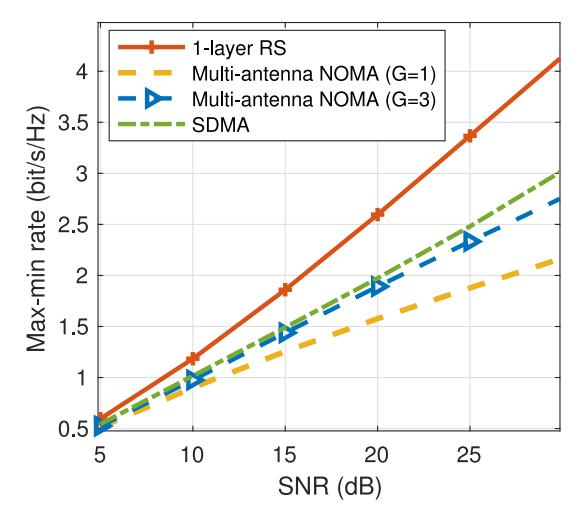

(a) Max-min rate vs. SNR in dB.

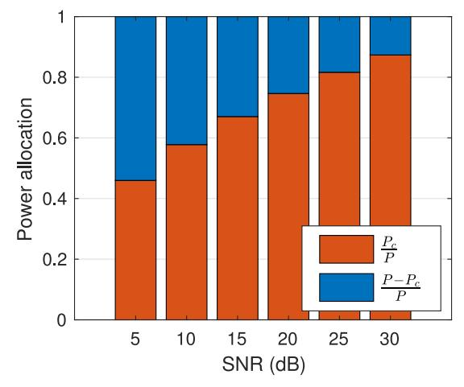

(b) Power allocation to the common and private streams for 1-layer RS.

Fig. 30. Max-min rate performance for the MISO BC with imperfect CSIT  $\alpha=0.5, M=K=6.$   $P_c=\|\mathbf{p}_c\|^2$  is the power allocated to the common stream.  $P-P_c$  is the sum power allocated to all private streams.

adjusting the message split and the power allocation to the common stream based on the level of interference that can be canceled by the receiver, 1-layer RS realizes a powerful interference management/cancellation strategy.

5) LLS Performance: The PHY layer architecture illustrated in Section V-B has been used to establish an LLS platform for RSMA, e.g., [36], [43], [55], [132], [140], [147]. In this section, we study the throughput performance of RSMA obtained from LLS for a two-user scenario, and compare the obtained throughput with the Shannon bounds.

The system throughput is defined as the total number of successfully recovered information bits at all users per channel use. Denote  $S^{(l)}$  and  $D_{s,k}^{(l)}$  respectively as the number of channel uses in the l-th Monte-Carlo realization and the number of information bits successfully recovered at user-k for the intended common sub-message  $\widehat{W}_{c,k}$  and private sub-message  $\widehat{W}_{p,k}$ . Then, the system throughput is given as follows

Throughput(bps/Hz) = 
$$\frac{\sum_{l} \left(D_{s,1}^{(l)} + D_{s,2}^{(l)}\right)}{\sum_{l} S^{(l)}}.$$
 (45)

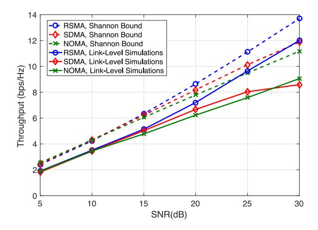

Fig. 31. Throughput vs. SNR for different MA schemes for the MISO BC with imperfect CSIT, *M* = *K* = 2, α = 0.6 [\[36\]](#page-48-24).

In total 100 Monte-Carlo realizations were used to obtain the throughput performance results shown in Figs. [31](#page-35-0) and [32,](#page-35-1) and *S*(*l*) = 256, ∀*l* ∈ {1, 2,..., 100}.

In Fig. [31,](#page-35-0) both the Shannon bounds and throughput levels achieved by RSMA, SDMA, and NOMA for the MISO BC with imperfect CSIT are illustrated. The transmitter has *M* = 2 antennas and serves *K* = 2 single-antenna users. The imperfect CSIT model follows [\(30\)](#page-20-0) with CSIT scaling factor α = 0.6. Generally, the trend of the throughput performance obtained by the LLS is in line with the corresponding Shannon bounds with a significant throughput gain of RSMA compared to SDMA and NOMA. The throughput gain of RSMA over SDMA is even larger than expected based on the Shannon bound. Furthermore, the throughput of SDMA is observed to saturate in the high SNR regime. Due to imperfect CSIT, SDMA frequently switches to single-user transmission (i.e., OMA) during the Monte-Carlo simulations of different channel realizations. This results in a large transmission rate for a single user, which exceeds the maximum SE achieved by the largest modulation order and code rate for a single stream considered in the design. AMC therefore cannot assign an appropriate modulation and coding scheme in such cases, resulting in a throughput loss.

Fig. [32](#page-35-1) further extends the LLS to a (massive) MIMO BC with imperfect CSIT where the transmitter has *M* = 32 or *M* = 64 antennas and serves *K* = 8 users, each equipped with *Nr* = 1 or *Nr* = 4 receive antennas. In Fig. [32,](#page-35-1) the imperfect CSIT is caused by user mobility and delay in CSI feedback from the users to the transmitter. The instantaneous channel matrix **H***k* [*t*] ∈ C*Nr* ×*M* at time instant *t* is modelled as follows [\[43\]](#page-48-9)

$$\mathbf{H}_{k}[t] = \sqrt{\epsilon^{2}}\mathbf{H}_{k}[t-1] + \sqrt{1-\epsilon^{2}}\mathbf{E}_{k}[t], \tag{46}$$

where = *J*0(2π*fD T*) is the time correlation coefficient obeying the Jakes' model, *J*0(·) is the modified Bessel function of the first kind and order zero, *T* is the channel instantiation interval, and *fD* = *vfc*/*c* is the maximum Doppler frequency for given user speed *v*, speed of light *c*, and carrier frequency *fc*. Both **H***k* [*t*] and **E***k* [*t*] ∈ C*Nr* ×*M* have i.i.d. entries distributed according to CN (0, 1). We assume that the transmitter

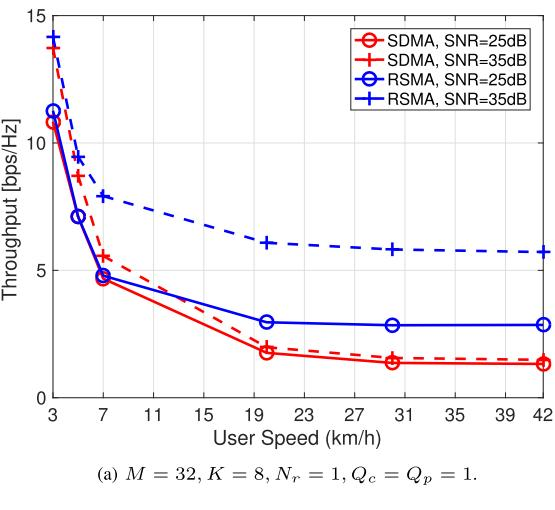

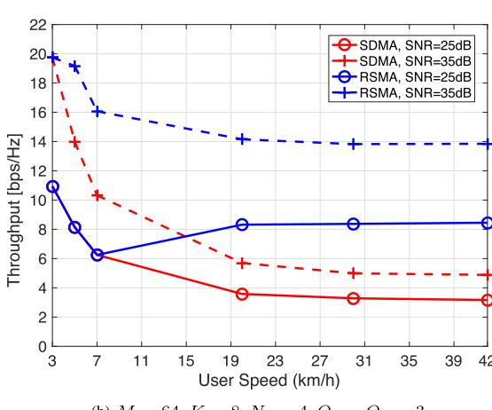

Fig. 32. Throughput vs. user speed for different MA schemes for (massive) MIMO BC with outdated CSIT employing OFDM and a 3GPP channel model, and 10 ms CSI feedback delay [\[43\]](#page-48-9).

at time *t* only has knowledge of the channel matrix observed at the previous time instant **H***k* [*t* − 1] due to the latency in CSI feedback. To simplify the RSMA transmitter design, lowcomplexity ZFBF and BD methods are used to design the precoders of the private streams for MISO and MIMO channels, respectively, while the leftmost eigenvector is used as the precoder for the common streams. The system employs an Orthogonal Frequency Division Multiplexing (OFDM) waveform in a frequency-selective channel obtained according to the Clustered Delay Line (CDL) model of 3GPP. The employed precoders are calculated for each subcarrier of the waveform for optimal performance. The closed-form power allocation scheme proposed in [\[43\]](#page-48-9) for MISO channels is used to perform the power allocation between the common and the private streams.

Fig. [32](#page-35-1) reveals a significant throughput gain of RSMA over SDMA without and with multi-antenna receivers. With the same QoS constraint (i.e., 8 bps/Hz), RSMA supports a much higher user speed (i.e., 40 km/h) than SDMA (i.e., 5 km/h). In Fig. [32\(](#page-35-1)b), one can note the non-monotonic behaviour of the RSMA throughput for SNR= 25 dB, which occurs as the employed power allocation algorithm is suboptimal for MIMO channels. The results clearly show that RSMA is indeed more robust to user mobility than SDMA owing to its ability to partially decode interference and partially treat interference as noise.

# *D. Advantages of RSMA*

The above comparisons between RSMA and existing MA schemes including SDMA, NOMA, OMA, and multicasting in terms of their respective framework, complexity, and performance allow us to unveil the major advantages of RSMA, which are summarized in the following:

- *Universality:* RSMA is a universal MA scheme that subsumes SDMA, NOMA, OMA, and multicasting as sub-schemes. In other words, RSMA is a superset of existing MA schemes and therefore always achieves equal or better performance compared to SDMA, NOMA, OMA, and multicasting. Henceforth, there does not seem to be a need to investigate other MA schemes but rather use a single unified RSMA framework.
- *Flexibility:* RSMA is suited for different network loads (underloaded/overloaded) and user deployments (diverse channel directions/strengths). It is a powerful strategy that can manage multi-user interference originating from different sources flexibly. Different from SDMA that fully mitigates interference at the transmitter side or NOMA that fully mitigates/cancels interference at the receiver side, RSMA creates common streams to enable a smart combination of transmitter-side and receiverside interference mitigation. By adjusting the amount of resources allocated to the common stream, the level of interference canceled at the transmitter and receiver can be adjusted flexibly. In fact, RSMA employs a flexible interference management strategy by partially decoding the interference and partially treating the interference as noise, which generalizes the design principle of fully treating interference as noise (as in SDMA), fully decoding interference (as in NOMA), and single-user transmission to avoid interference (as in OMA). By optimizing the power allocated to the common and private streams, RSMA automatically simplifies to SDMA when the network is underloaded and user channels are orthogonal with perfect CSIT and boils down to NOMA when the network is extremely overloaded and user channels are aligned with certain channel strength disparities. For other channel conditions, i.e., when the user channels are neither orthogonal nor aligned, RS takes advantage of the common streams to better manage the interference and outperforms all other MA schemes.
- *Robustness:* As the application of RSMA in multiantenna networks is motivated by its DoF optimality in the multi-antenna BC with imperfect CSIT, RSMA is ideally suited to manage multi-user interference originating from imperfect CSIT and is robust to CSIT uncertainties resulting from different sources of impairment, such as quantized feedback [\[44\]](#page-48-10), pilot contamination [\[148\]](#page-50-34), [\[149\]](#page-50-35), channel estimation errors [\[28\]](#page-48-33), and user mobility [\[43\]](#page-48-9). User mobility is one of the major sources of interference in NR and is expected to become more

- severe and to occur more frequently in 6G systems. Numerical results in [\[43\]](#page-48-9), [\[98\]](#page-49-40) have shown that RSMA has the capability to cope with the high mobility envisioned in 6G. Contrary to SDMA, for which the sum-rate performance quickly saturates for increasing SNR and drops quickly with the user speed, RSMA ensures robust multi-user connectivity and achieves significant sum-rate and throughput gains under user mobility. This is in contrast to the other MA schemes (OMA, SDMA, NOMA), which are primarily designed for perfect CSIT and are vulnerable to imperfect CSIT [\[53\]](#page-48-17).
- *Higher spectrally efficiency:* The SE of RSMA always exceeds or is equal to that of the other MA schemes for both perfect and imperfect CSIT. When the CSIT is perfect, the rate region of linearly precoded RSMA is larger than that of MU–LP and NOMA, and is closer to the capacity region achieved by DPC. When the CSIT is imperfect, linearly precoded RSMA can even achieve a larger rate region than DPC. By marrying the benefits of RS and DPC, nonlinearly precoded DPCRS further enlarges the rate region of the MISO BC with imperfect CSIT beyond that of DPC and that of linearly precoded RS, as illustrated in Fig. [26.](#page-32-0) RSMA optimally exploits the available CSIT and the spatial dimension of the multi-antenna BC. Furthermore, it achieves the optimum sum-DoF in both perfect CSIT and imperfect CSIT (as illustrated Table [XI](#page-31-0) and Fig. [23–](#page-30-1)[25\)](#page-31-1).
- • *Higher energy efficiency:* Since RSMA is a superset of OMA, SDMA, NOMA, and multicasting, the performance gain of RSMA is not limited to SE, but also extends to EE and their trade-off [\[38\]](#page-48-28), [\[80\]](#page-49-36), [\[150\]](#page-50-36). RSMA has been shown to outperform existing MA schemes in terms of EE for various applications with a wide range of network loads and user deployments [\[33\]](#page-48-25), [\[40\]](#page-48-29), [\[48\]](#page-48-41), [\[79\]](#page-49-35), [\[120\]](#page-50-3)–[\[122\]](#page-50-4), [\[124\]](#page-50-6), [\[129\]](#page-50-10).
- • *Enhanced QoS and user fairness:* RSMA not only better exploits the sum-DoF but also the MMF-DoF in the multi-antenna BC with perfect and imperfect CSIT, as illustrated in Table [XI](#page-31-0) and Figs. [24,](#page-30-2) [25.](#page-31-1) In the finite SNR regime, RSMA also exhibits a substantial max-min rate gain over the other MA schemes, as shown in Fig. [30\(](#page-34-0)a) and a number of recent works [\[29\]](#page-48-39), [\[35\]](#page-48-26), [\[42\]](#page-48-43), [\[60\]](#page-48-34), [\[83\]](#page-49-34), [\[96\]](#page-49-27), [\[118\]](#page-50-1), [\[127\]](#page-50-8), [\[128\]](#page-50-9), [\[138\]](#page-50-24), [\[151\]](#page-50-37). Moreover, the performance gain of RSMA becomes more pronounced when the user rates are subject to QoS constraints or when a larger weight is assigned to users with weaker channel strengths [\[7\]](#page-47-4).
- • *Lower complexity:* RSMA entails a lower transceiver complexity than many existing MA schemes. Although linearly-precoded RSMA achieves a larger rate region than DPC, see RS versus DPC in Fig. [26,](#page-32-0) this gain comes with a simpler transmitter design. Figs. [24,](#page-30-2) [25](#page-31-1) and Figs. [27,](#page-33-1) [28](#page-33-2) show that the sum/MMF-DoF gain and the sum-rate gain of 1-layer RS over multi-antenna NOMA comes with lower scheduling and receiver complexity. Different from multi-antenna NOMA, which requires joint design of user grouping and ordering at the transmitter and layer(s) of SIC at each user, 1-layer RS does

not require user ordering and grouping at the transmitter, and it only requires one SIC layer at each user. Moreover, 1-layer RS is less sensitive to difference channel conditions, which as a result, can further simplify the scheduler. Besides the merits of reducing the scheduler and receiver complexity, RSMA is also capable of reducing the CSI feedback overhead in the presence of quantized feedback [\[27\]](#page-48-8), [\[152\]](#page-51-0).

- • *Coverage extension:* It has been shown in [\[60\]](#page-48-34), [\[108\]](#page-49-37) that cooperative rate-splitting (CRS), which incorporates cooperative user relaying with 1-layer RS, and allows one user to decode and forward the common stream to the other users, significantly improves the max-min rate when users with large channel strength disparities are jointly served. Therefore, RSMA with coverage extension techniques such as unmanned aerial vehicles (UAV)/intelligent reconfigurable surface (IRS)/relay stations can further boost the rate of the users at the cell edge and offers substantial coverage extension benefits.
- *Low latency:* URLLC is one major use case in NR and 6G. One approach to achieve low-latency communication is reducing the transmitted packet size. RSMA has been shown to improve throughput over SDMA and NOMA with finite length polar codes in [\[36\]](#page-48-24), and to attain the same transmission rate as SDMA and NOMA but with shorter blocklength and therefore lower latency in [\[98\]](#page-49-40), [\[106\]](#page-49-33). Hence, RSMA is a promising enabling technology to reduce the latency for URLLC service in 6G.

# *E. Disadvantages of RSMA*

Despite of all the aforementioned advantages, RSMA inevitably also introduces some disadvantages, which are summarized as follows.

- *SIC requirement at receivers:* As summarized in Table [V,](#page-8-3) RSMA requires at least one layer of SIC at each receiver. For some RSMA schemes, i.e., 1-layer RS, 2-layer HRS, 1-DPCRS, THPRS, the number of SIC layers at each user does not depend on the number of user *K*. However, for generalized RS and M-DPCRS, the number of SIC layers increases exponentially with the number of user *K*, which imposes high receiver complexity.
- *Higher encoding complexity:* For existing MA schemes including SDMA, NOMA, and OMA, the number of data streams encoded at the transmitter is equal to the number of users. In comparison, RSMA requires more data streams to be encoded due to the message splitting (and recombining) at the transmitter as per Table [V.](#page-8-3) The encoding complexity of RSMA is therefore higher than that of other MA schemes.
- *Higher signaling burden:* As RSMA splits (and combines) user messages at the transmitter, each receiver needs to know how to (split and) combine the decoded messages in order to recover the intended message from the decoded common and private messages. Therefore, a higher downlink signaling burden might be imposed by RSMA-enabled transmission networks compared with

- other MA-enabled networks so as to guarantee the transmitter and the receivers can coordinate message splitting and combining.
- *Higher optimization burden:* In terms of precoder optimization, RSMA requires the precoders of the common and private streams to be jointly optimized with the common rate allocation as per Section [IV-A1.](#page-18-1) Though the optimization space is enlarged and more DoFs for precoder design are achieved, a higher optimization burden is exerted by RSMA compared with the conventional SDMA schemes. To reduce the computation time, efforts have been made to design low-complexity precoders. However, as discussed in Section [IV-A2,](#page-21-3) the power allocation between the common and private streams is crucial for the performance of RSMA. The fraction of the transmit power allocated to the private streams τ has to be optimized for different operational scenarios in order to realize the potential performance gain of RSMA.

Although RSMA inevitably introduces the above problems, the appealing advantages of RSMA far outweigh its disadvantages. As the study of RSMA is still in its infancy, these problems merit future exploration.

# VII. EMERGING APPLICATIONS, CHALLENGES, AND FUTURE RESEARCH TRENDS OF RSMA

As summarized in Table [XII,](#page-38-0) the appealing benefits of RSMA discovered for the multi-antenna BC have spawned an explosion of RSMA studies investigating its applicability to and interplay with multifarious 5G/6G enabling communication techniques such as massive MIMO, IRS, visible light communication (VLC), UAV, joint communication and sensing, and satellite communications networks. Despite the substantial interest, the study of RSMA is still in its infancy. For all applications listed in Section [III,](#page-15-0) there are numerous open problems in the categories of PHY layer design (such as coding and modulation, precoder design, receiver design), cross-layer design (such as joint scheduling and precoder design, subcarrier allocation, large-scale networks, stochastic geometry analysis), performance analysis (such as throughput, bit error rate, outage probability), and so on. In this section, we summarize the applications of RSMA to enabling technologies in 6G, and the research challenges for each application, followed by some potential research directions. Subsequently, we discuss the standardization and implementation of RSMA.

# *A. Technical Aspects of RSMA—The Road Ahead*

*1) MIMO BC:* The studies of RSMA for the multi-antenna broadcast channel heretofore have mainly considered a single antenna at each receiver (a.k.a. MISO BC). The extension to multi-antenna receivers, however, is not well-understood in information or communication theoretic terms. When each user has multiple receive antennas, it is capable of receiving vectors of common streams and private streams, and the receive filter can be further designed for interference management. Therefore, the number of common streams transmitted in parallel, the DoFs, and the transceiver design of RSMA have to be reconsidered for the MIMO BC.

TABLE XII COMMUNICATION-THEORETIC LITERATURE ON THE APPLICATIONS OF RSMA

| Veen | Dof          | Application                               | RSMA    | Precodin | g Scheme       | CSIT Condition |              | KPIs         |                                       |               |
|------|--------------|-------------------------------------------|---------|----------|----------------|----------------|--------------|--------------|---------------------------------------|---------------|
| Year | Ref.         | Application                               | Scheme  | Linear   | Non- linear | Perfect        | Imperfect    | WSR          | MMF                                   | EE            |
| 2016 | [44]         | Massive MIMO                              | 1,2     | Δ        |                |                | $\checkmark$ | $\checkmark$ |                                       |               |
|      | [133]        | Massive MIMO with hardware impairment     | 1       | Δ        |                |                | $\checkmark$ | $\checkmark$ |                                       |               |
| 2017 | [120]        | Cognitive D2D                             | 1       | <b>A</b> |                | √              |              |              |                                       | $\overline{}$ |
| 2017 | [61]         | Multigroup multicast                      | 1       | <b>A</b> |                | $\sqrt{}$      |              |              |                                       |               |
|      | [152]        | mmWave MISO BC                            | 1       | <b>A</b> |                |                | $\checkmark$ | <b>√</b>     |                                       |               |
|      | [79]         | Multi-cell multigroup multicast           | 1       | <b>A</b> |                | √              |              |              |                                       | √             |
| 2018 | [134]        | Multi-pair massive MIMO relaying          | 1       | Δ        |                |                | √            | √            |                                       |               |
|      | [132]        | Multi-beam satellite networks             | 1       | <b>A</b> |                |                | $\checkmark$ | <b>√</b>     |                                       |               |
|      | [82]         | Cooperative multi-cell joint transmission | 1, 2, 3 | <b>A</b> |                | √              |              | <b>√</b>     |                                       |               |
|      | [47]         | C-RAN                                     | 6       | <b>A</b> |                | <b>√</b>       |              | <b>√</b>     |                                       |               |
|      | [64]         | UAV-assisted C-RAN                        | (6)     | <b>A</b> |                | V              |              | V            |                                       |               |
|      | [121]        | MmWave UAV-assisted MISO BC               | (1)     | <b>A</b> |                | V              |              |              |                                       | <b>√</b>      |
| 2019 | [83]         | C-RAN                                     | (3)     | <b>A</b> |                | √           |              |              | <b>√</b>                              | ·             |
|      | [107]        | SWIPT for MISO BC                         | (1)     | <b>A</b> |                |                |              | <b>√</b>     | ·                                     |               |
|      | [130]        | SWIPT for MISO IC                         | 6       | <b>A</b> |                |                | <b>√</b>     | <i>\</i>     |                                       |               |
|      | [108]        | Cooperative user relaying for MISO BC     | (1)     | <b>A</b> |                | <b>√</b>       |              | V            |                                       |               |
|      | [124]        | Non-orthogonal unicast and multicast      | 1, 2, 3 | <b>A</b> |                | V              | √            | V            |                                       |               |
|      | [60]         | Cooperative user relaying for MISO BC     | (1)     | <b>A</b> |                | <b>√</b>       | ·            | <b>√</b>     |                                       | v             |
|      | [54]         | Non-orthogonal unicast and multicast      | (5)     |          | <b>A</b>       | ·              | <b>√</b>     | V            |                                       |               |
|      | [138]        | Multicarrier multigroup multicast         | (1)     | <b>A</b> |                | <b>√</b>       | v            | · ·          | <b>√</b>                              |               |
|      | [118]        | Multigroup multicast                      | (1)     | <b>A</b> |                | \              |              |              | V                                     |               |
|      | [109]        | Multicarrier MISO BC                      | (1)     | _        |                | V              |              | $\sqrt{}$    | ·                                     |               |
|      | [48]         | C-RAN                                     | (6)     | _        |                | V              |              | ·            |                                       |               |
|      | [46]         | C-RAN                                     | 3       | _        |                | V              |              | <b>√</b>     |                                       | ·             |
|      | [49]         | C-RAN                                     | 6)      | _        |                | V              |              | √ √       |                                       |               |
|      | [110]        | Joint radar and communication             | (1)     | _        |                | V              |              |              |                                       |               |
| 2020 | [111], [112] | UAV-aided MISO BC                         | 1       | _        |                | V              |              |              |                                       |               |
|      | [113]        | Visible light communication               | (1)     | _        |                | V /            |              | <b>√</b>     |                                       |               |
|      | [114]        | Multi-cell visible light communication    | (1)     | _        |                |                |              |              |                                       |               |
|      | [80]         | Multi-cell coordination                   | (1)     | _        |                | V /            |              |              |                                       | 1/            |
|      | [115]        | PHY layer security with user relaying     | (1)     | _        |                | V /            |              |              |                                       |               |
|      | [123]        | Cognitive radio system with SWIPT         | (1)     | _        |                | V /            |              |              |                                       |               |
|      | [127]        | PHY layer security                        | (1)     | _        |                | V              |              | V            | <b>√</b>                              |               |
|      | [122]        | IRS-assisted MISO BC                      | (1)     | _        |                | <b>√</b>       | V            |              | V                                     |               |
|      | [84]         | IRS-assisted C-RAN                        | 6       | _        |                | V /            |              | $\sqrt{}$    |                                       |               |
|      | [50]         | C-RAN                                     | 6       | _        |                | V              | <b>√</b>     | V √       |                                       |               |
|      | [154]        | D2D in F-RAN                              | 6       | Δ        |                | <b> </b>       | V            |              |                                       |               |
|      | [96]         | Multi-beam satellite networks             | (1)     | <u> </u> |                | V              | . /          | V            | . /                                   |               |
|      | [155]        | Finite constellation in MISO BC           | 1       | Δ        |                | ./             | V            | ./           | <b>√</b>                              |               |
|      | [129]        | Cognitive satellite-terrestrial networks  | (1)     | <u> </u> |                | <b> </b>       |              | <b>√</b>     |                                       | <b>√</b>      |
|      | [119]        | Multicarrier multigroup multicast         | (1)     |          |                |                | V            |              | <b>√</b>                              |               |
|      | [150]        | F-RAN                                     | (1)     | Δ        |                | V √            |              | <b>√</b>     | V √                                   |               |
| 2021 | [135]        | IRS-assisted MISO BC                      | (1)     | Δ        |                | V √            |              | V √          | V                                     |               |
|      | [125], [139] | Joint communication and jamming           | (1)     | <u> </u> |                | _ v            |              |              |                                       |               |
|      | [128]        | Multi-beam satellite networks             | 1       | _        |                |                |              |              | <b>√</b>                              |               |
|      | [140]        | Multi-beam satellite networks             | (1)     | _        |                |                |              |              |                                       |               |
|      | [116]        | Joint radar and communication             | (1)     | <u> </u> |                |                | V            | <b>√</b>     |                                       |               |
|      | [131]        | Joint radar and communication             | (1)     | _        |                | _ <u> </u>     |              |              |                                       |               |
|      | [110]        | Joint radar and communication             | 1)      | <b>A</b> |                |                | V            | <b>√</b>     |                                       |               |
|      | [126]        | Joint radar and communication             | (1)     | <b>A</b> |                |                |              | V √          |                                       |               |
|      | [156]        | Cache-aided C-RAN                         | (6)     | <b>A</b> |                |                | V √          | V            |                                       |               |
|      | [150]        | Visible light communication               | (1)     |          |                | ./             |              | ./           | \ \ \ \ \ \ \ \ \ \ \ \ \ \ \ \ \ \ \ |               |
|      | [137]        | visible fight communication               |         | <b>A</b> |                | <u> </u>       | <u></u> √    | $\sqrt{}$    |                                       |               |

In the information-theoretic literature, an achievable DoF region of RSMA in the two-user MIMO BC with asymmetric numbers of antennas and asymmetric levels of partial CSIT has been established in [\[89\]](#page-49-25), which is further shown to be the optimal DoF region in [\[104\]](#page-49-26). The authors of [\[55\]](#page-48-19) further establish the achievable sum-DoF of RSMA in the *K*-user symmetric MIMO BC with *M* transmit antennas, *Q* receive antennas at each user, and an arbitrary number of common streams in the range of [1, min(*M* , *Q*)]. In [\[93\]](#page-49-32), RSMA was shown to achieve the capacity region of the two-user MIMO BC with perfect CSIT up to a constant gap, but such constant-gap optimality does not extend to the three-user case.

As for the communication-theoretic literature, [\[37\]](#page-48-27) was the first work that studied the precoder design for RS in the MIMO BC but with only a single common stream. Each user therefore receives *Q* replicated common streams and a vector of private streams. Several practical stream combining techniques along with regularized block diagonalization linear precoders are proposed in [\[37\]](#page-48-27). Even though the combining techniques for RS yield a sum-rate gain over conventional multi-user MIMO (with linear precoding), the DoFs of RS in the MIMO BC are not fully exploited as multiple receive antennas at each user enable a vector of common streams to be transmitted. Recent works [\[55\]](#page-48-19), [\[158\]](#page-51-1), [\[159\]](#page-51-2) study precoder optimization for RSMA. Both [\[158\]](#page-51-1) and [\[159\]](#page-51-2) are limited to the underloaded MIMO BC with perfect CSIT and a fixed number of common streams, while [\[55\]](#page-48-19) generalizes to both the underloaded and overloaded MIMO BC with perfect and imperfect CSIT. The impact of transmitting different numbers of common streams in the MIMO BC is also investigated in [\[55\]](#page-48-19). Numerical results show a substantial ESR and sum-DoF improvement for RSMA in all settings and that this gain increases with the number of transmitted common streams when CSIT is imperfect. Besides the theoretical results under the assumptions of Gaussian signaling and infinite block lengths, the PHY layer architecture and the corresponding LLS of RSMA for realistic finite constellation modulation, finite-length polar codes, and AMC are studied in [\[43\]](#page-48-9), [\[55\]](#page-48-19). The observed significant throughput gain of RSMA over MU–MIMO and MIMO NOMA is consistent with its Shannon ESR gain. Therefore, RSMA has significant potential for communication over the MIMO BC.

The capacity region of the *K*-user MIMO BC with imperfect CSIT remains an open problem. As (linearly-precoded) RSMA was shown to achieve the optimal DoF region in the 2-user MIMO BC with imperfect CSIT as well as the optimal DoF region of the *K*-user MISO BC with imperfect CSIT, there is a good chance that RSMA will also be an efficient solution for the *K*-user MIMO BC with imperfect CSIT. Further studies of the fundamental limits of the MIMO BC with imperfect CSIT and the role played by RSMA to achieve those limits need to be conducted. Even though the performance gain of RSMA increases with the number of common streams, the receiver complexity also increases. Therefore, in view of a practical implementation, the number of common streams that RSMA requires to achieve a favorable tradeoff between complexity and performance is worth further investigation.

*2) MIMO IC:* The entire capacity region and the corresponding capacity-achieving strategy for the MIMO IC remain unknown for both perfect and imperfect CSIT. The HK scheme proposed for the SISO IC has been proved to achieve the capacity region of the two-cell MIMO IC within a constant gap [\[160\]](#page-51-3). The authors of [\[78\]](#page-49-13) further show that RSMA achieves the best known DoF region for the *K*-cell MISO IC with imperfect CSIT and the result has also been extended to the (two-cell) MIMO IC with an arbitrary number of antennas at each node in [\[89\]](#page-49-25). In [\[80\]](#page-49-36), coordinated beamforming for RSMA for the multi-cell MISO IC with perfect CSIT is studied and is shown to achieve a better SE–EE tradeoff than SDMA and NOMA. A comprehensive performance analysis for the *K*-cell RSMA-aided MIMO IC is provided in [\[161\]](#page-51-4), where the benefits of integrating RSMA with interference alignment are investigated in terms of the average sum rate, outage probability, and symbol error rate.

Motivated by the DoF, SE, and EE performance enhancement realized by RSMA in the MIMO IC, it is of interest to further explore its potential for achieving the entire DoF and capacity region of the MIMO IC for both perfect and imperfect CSIT. In terms of practical designs, the PHY layer design and LLS of the RSMA-aided MIMO IC have not been studied, yet. Existing works on the MIMO IC mainly resort to interference alignment to confine undesired interference at each receiver into a lower-dimensional subspace. This method however is very sensitive to CSIT uncertainties. The integration of RSMA and interference alignment has great potential to marry the advantages of both techniques so as to further enhance the SE of transmission. The resulting open problems such as transceiver design and cross-layer resource allocation for different objectives are worth studying.

*3) Alternative Receiver Design:* SIC at the receivers is a major component of RSMA for interference management. A well-known problem of SIC is error propagation, which affects the decoding reliability of messages after interference cancellation. It has been shown in [\[36\]](#page-48-24), [\[43\]](#page-48-9), [\[55\]](#page-48-19), [\[132\]](#page-50-18), [\[140\]](#page-50-26), [\[147\]](#page-50-33) that RSMA performs well with receivers employing SIC for perfect CSIR even with error propagation due to incorrectly decoded common messages. However, performance degradation occurs for imperfect CSIR, even if the message to be cancelled is decoded correctly [\[147\]](#page-50-33). A deep learning based receiver algorithm is proposed in [\[147\]](#page-50-33) to address this problem. The results show that the proposed receiver mitigates the effects of interference cancellation under imperfect CSIR and enhances the error rate performance by improving the detection of modulated symbols before and after interference cancellation. The results in [\[147\]](#page-50-33) highlight that the error rate performance of RSMA under imperfect CSIR is an important subject that merits further investigation.

*4) Hybrid Automatic Repeat Request (HARQ) Design:* HARQ is an important mechanism to improve the efficiency of packet-based transmission in wireless networks. HARQ combines the MAC-layer ACK-NACK feedback mechanism with channel coding to obtain an efficient re-transmission scheme for recovering messages with missing packets. Therefore, HARQ is an important mechanism in modern wireless communication standards. The design of HARQ schemes for RSMA has not been considered in the literature yet, to the best of the authors' knowledge.

For SDMA, HARQ is realized by encoding the packets intended for different users separately. Under the RSMA framework, this task is less straightforward due to the message splitting and combining operations, and the variety of scenarios where common and/or private messages are incorrectly decoded at each user. Therefore, how the user messages are to be encoded and how the re-transmissions are performed for each user when RSMA is combined with HARQ requires further study.

*5) Waveform Design:* The vast majority of studies on RSMA neglected the aspect of waveform design. The authors in [\[109\]](#page-49-41), [\[119\]](#page-50-2), [\[125\]](#page-50-15), [\[138\]](#page-50-24), [\[139\]](#page-50-25) considered resource allocation and precoder optimization for multi-carrier waveforms, however, without considering any imperfections related to the waveform structure. In practice, waveforms may be susceptible to impairments for various reasons, as in the case of OFDM suffering from intercarrier interference under Doppler shift. RSMA can help to improve the robustness of waveforms by addressing such vulnerabilities and provide flexibility in waveform design to achieve higher SE.

# *B. RSMA for Enabling Technologies in 6G*

*1) Massive MIMO:* Massive MIMO is a MU–MIMO technique where the transmitter is equipped with a large number of antennas and serves multiple users in the same resource block. It has been considered as the most promising air interface technique for achieving high SE and EE for 5G NR. To realize its substantial potential gains, massive MIMO heavily relies on accurate CSIT, which however is particularly challenging to attain when the number of transmit antennas is large. The unaffordable feedback overhead in FDD massive MIMO, and the imperfect channel estimation during the training phase and pilot contamination in TDD massive MIMO, make imperfect CSIT a major bottleneck for realizing the benefits of massive MIMO.

As has been highlighted in Section [VI-D,](#page-36-0) RSMA is more robust to CSIT uncertainties (resulting from different kinds of impairment sources) than existing MA schemes, which therefore makes the integration of RSMA and massive MIMO a promising approach to tackle the aforementioned bottleneck of massive MIMO. The authors of [\[44\]](#page-48-10) pioneered the integration of RSMA and (FDD) massive MIMO. To reduce the CSI feedback, a commonly used approach in FDD massive MIMO is two-tier precoding, where the outer precoder controls the intergroup interference based on long-term CSIT and the inner precoder controls intra-group interference based on a shortterm effective channel [\[162\]](#page-51-5)–[\[164\]](#page-51-6). Motivated by the two-tier precoding, 2-layer HRS, as illustrated in Fig. [8,](#page-11-0) was proposed in [\[44\]](#page-48-10). By utilizing two layers of common streams to respectively manage the inter-group and inner-group interference, 2-layer HRS reaps the rate saturation at high SNR and achieves a significant sum-rate gain over existing two-tier precoding strategies. For TDD massive MIMO, RSMA has been studied in a more realistic scenario where the channel estimation at the transmitter is hampered by hardware impairments in [\[133\]](#page-50-19). The authors of [\[148\]](#page-50-34) further investigate the potential of RSMA to mitigate pilot contamination. 1-layer RS has been shown to achieve a substantial gain over conventional massive MIMO based on MU–LP when CSIT is compromised by two different impairment sources (hardware impairments and pilot contamination). The impact of user mobility on (TDD/FDD) massive MIMO was studied in [\[43\]](#page-48-9). As illustrated in Fig. [32,](#page-35-1) RSMA yields a significant throughput gain over conventional

massive MIMO based on MU–LP and it is able to maintain multi-user connectivity in mobile deployments. Besides CSIT imperfection, RSMA has also shown its capability of mitigating self-interference at relay stations equipped with massive antennas in multi-pair massive MIMO relay systems [\[134\]](#page-50-21).

*Challenges and future work:* Encouraged by the appealing performance gain of RSMA in massive MIMO, the study of RSMA in cell-free massive MIMO is another promising research direction [\[149\]](#page-50-35). Cell-free massive MIMO extends single-cell massive MIMO to multi-cell scenarios without cell boundaries, and therefore, enjoys the benefits of both network MIMO and massive MIMO [\[165\]](#page-51-7). Cell-free massive MIMO usually assumes no instantaneous CSI sharing among users, and relies on the use of non-orthogonal uplink pilot sequences for channel estimation, which therefore results in pilot contamination. This could be successfully resolved by RSMA as in conventional massive MIMO [\[148\]](#page-50-34). Another issue that hinders the wide use of massive MIMO is its high power consumption dominated by the power used by the digital-to-analog converters (DACs) and analog-to-digital converters (ADCs) in each RF chain. To alleviate the power consumption burden, low-resolution ADCs/DACs could be used, which however, distort the transmit/received signals. Whether RSMA is more robust against the impact of low-resolution ADCs/DACs, and whether RSMA can help reduce the resolution of ADCs/DACs while maintaining comparable performance as conventional approaches are topics worth investigating.

*2) Millimeter-Wave:* The explosive growth of mobile data traffic and the scarcity of the spectrum resources available for cellular networks have motivated the investigation of mmWave communication which exploits the frequency band from 30 GHz to 300 GHz for wireless communication. However, mmWave communication suffers from many challenges, among which high propagation loss is the most significant one. To compensate such loss, one effective approach is to deploy massive antennas at the transmitter for providing high array gain. The small carrier wavelength of mmWave systems enables deploying massive antennas in a small physical space, but makes fully digital arrays impractical. Hybrid analog/digital processing, consisting of a high-dimensional analog beamformer cascaded with a reduced-dimensional digital precoder, has been shown to be a more practical solution [\[166\]](#page-51-8). Its performance, however, is limited by imperfect CSIT and strong multi-user interference. The conventional feedback procedure for mmWave massive MIMO relies on a two-stage approach to sequentially feedback the indices of the codewords for the analog precoders and the quantized effective channel, which entails high complexity and overhead [\[167\]](#page-51-9).

Inspired by the advantages of RSMA in the multi-antenna BC, the interplay of RSMA and mmWave was first studied in [\[152\]](#page-51-0). By leveraging statistical CSIT to design digital precoders, RSMA further reduces the training and feedback complexities via a simple one-stage feedback while achieving a sum-rate comparable to that of conventional mmWave massive MIMO based on MU–LP and two-stage feedback. The authors [\[168\]](#page-51-10) further study the joint analog and digital precoder optimization for the RSMA-aided mmWave model proposed in [\[152\]](#page-51-0). The extension to a UAV network was studied in [\[121\]](#page-50-14) where the RSMA-aided mmWave UAV network was shown to provide higher EE than NOMA for the practical 3GPP Standardized 5G channel model.

*Challenges and future work:* To further reduce the feedback overhead and to exploit the sparse nature of mmWave channels in the angle domain, compressive sensing or deep learningbased approaches could be applied in RSMA-aided mmWave massive MIMO networks to compress the pilot measurements into lower-dimensional matrices. As quantization distortion is more tolerable with RSMA, the joint use of CSI compression techniques and RSMA in mmWave massive MIMO would be beneficial to ease the feedback overhead.

*3) Multigroup Multicasting:* PHY layer multicasting characterizes the point-to-multipoint transmission when a transmitter simultaneously sends one multicast content to a group of recipients. It has been included as multimedia broadcast/multicast service (MBMS) in 3GPP Release 9 for 4G, evolved MBMS (eMBMS) in 3GPP Release 11 for LTE-A [\[169\]](#page-51-11), and NR multicast and broadcast services (MBS) in 3GPP Release 17 for 5G [\[170\]](#page-51-12). Due to the diverse requirements of different user groups, multigroup multicasting has emerged as an extension of conventional multicasting where multiple multicast contents are simultaneously disseminated to different groups of users (a.k.a. multicast group). Though such approach is promising to enhance SE, inter-group interference is introduced.

Motivated by the superior interference management capability of RSMA, research efforts have been dedicated to its application in multigroup multicasting networks [\[61\]](#page-48-35), [\[79\]](#page-49-35), [\[96\]](#page-49-27), [\[118\]](#page-50-1), [\[119\]](#page-50-2), [\[138\]](#page-50-24), [\[140\]](#page-50-26), [\[151\]](#page-50-37), [\[156\]](#page-51-13). Reference [\[61\]](#page-48-35) is the first work that studied the integration of RSMA and multigroup multicasting. For the MISO BC with perfect CSIT, RSMA was shown to achieve notable MMF-DoF gains at high SNR and a max-min rate enhancement at low SNR by enabling partial decoding of the inter-group interference and partially treating the inter-group interference as noise. The authors of [\[96\]](#page-49-27) further extended the DoF and rate analysis of RSMA to the imperfect CSIT setting for a more practical multibeam satellite communication application, and showed large DoF and rate gains for RSMA when the CSIT quality is poor. RSMA was also shown to achieve higher EE in multicell multigroup systems [\[79\]](#page-49-35) and enhanced user fairness in multicarrier multigroup multicast systems [\[138\]](#page-50-24). PHY layer design for multigroup multicasting was studied in [\[140\]](#page-50-26) and LLS results were presented for multigroup multicast cellular and satellite communications, and in [\[119\]](#page-50-2) for multicarrier multigroup multicast.

*Challenges and future work:* Each multicast stream in multigroup multicasting has to be decoded by all users in the corresponding user group, which therefore limits its achievable rate to the worst-case rate amongst the users. The large fluctuation of terrestrial channels often results in deep channel fades at the users, which therefore degrades the achievable rate of some multicast streams. Contrary to terrestrial communications, satellite communications provide a larger coverage, and are well-suited for providing multicasting services for users distributed in a wider range. Integrated terrestrial-satellite networks, aiming at providing ubiquitous services for ground users via cooperative transmission between BSs and satellites, have therefore been introduced as a new paradigm for the next generation of communication networks [\[171\]](#page-51-14). Inspired by the DoF, SE, and EE gains of RSMA-aided multigroup multicasting in both terrestrial and satellite networks, the application of RSMA in integrated terrestrial-satellite networks is interesting and promising to simultaneously reap its benefits in both component networks.

*4) Non-Orthogonal Unicast and Multicast:* Recently, nonorthogonal multiplexing (NOM) was subject to intensive research focus in academia and industry [\[172\]](#page-51-15)–[\[175\]](#page-51-16). NOM of broadcast/multicast signals has been approved by 3GPP as a study item in Release 16 as LTE-based 5G Broadcast [\[174\]](#page-51-17) and applied in the digital TV standard ATSC 3.0 under the name layer division multiplexing [\[173\]](#page-51-18). The research interest has been further extended to NOM of multiple services. Nonorthogonal unicast and multicast transmission (NOUM), which enables the concurrent delivery of both unicast and multicast services to users in the same time-frequency resource block, is one of the key research directions in multi-service NOM. In multi-antenna NOUM, a conventional approach is to adopt MU–LP at the transmitter to superpose the multicast stream on top of the unicast streams and to use SIC at each user to decode and remove the multicast stream before decoding the intended private stream. Such MU–LP-aided approach does not fully exploit the advantages of SIC as SIC is only used to manage interference between unicast and multicast streams and the interference between unicast streams is fully treated as noise.

Motivated by the performance gains of RSMA for unicastonly and multicast-only transmissions, RSMA has been applied to NOUM. The authors of [\[124\]](#page-50-6) propose a novel RSMA-aided NOUM where the unicast messages are split into common and private parts at the transmitter, and the common parts are encoded with the multicast message into a supercommon stream for all users. Each user can still use one layer of SIC to sequentially decode the super-common and the intended private stream, but the function of SIC is better exploited in RSMA-aided NOUM as SIC is used not only for managing the interference between the multicast and unicast streams, but also for managing the interference between the unicast streams. The proposed RSMA-aided NOUM was shown to yield SE and EE gains over conventional NOUM without increasing the receiver complexity, which therefore makes RSMA well-suited for NOUM. The authors of [\[54\]](#page-48-18) further propose a dirty paper coded RS-aided NOUM and showed its capability to enlarge the rate region achieved by conventional DPC-aided NOUM and linearly precoded RS-assisted NOUM when CSIT is imperfect.

*Challenges and future work:* The existing works [\[54\]](#page-48-18), [\[124\]](#page-50-6) are limited to the case when the multicast message is intended for all users, i.e., a single multicast group. When multiple multicast groups are considered, each user receives three-dimensional interference, namely, interference among the multicast streams, interference between the multicast and unicast streams, and interference among the unicast streams. How to design the transceiver for RSMA for such non-orthogonal unicast and multigroup multicasting networks in order to deal with the three-dimensional interference remains unknown.

*5) Multi-Cell MIMO Including Coordinated Multi-Point (CoMP), Cloud-Radio Access Network (C-RAN), and Fog-Radio Access Network (F-RAN):* The advancement of RSMA in the single-cell MIMO BC has motivated its study for multi-cell networks for both coordinated transmission and cooperative transmission, as illustrated in Section [II-D.](#page-14-1) In coordinated multi-cell networks with only CSI shared among all BSs, RSMA has been shown to achieve enhanced SE and EE performance when the inter-cell interference is fully treated as noise and RSMA is applied to only manage the intra-cell interference [\[79\]](#page-49-35), [\[80\]](#page-49-36), or when the inter-cell interference is partially decoded and partially treated as noise via RSMA [\[21\]](#page-48-2), [\[76\]](#page-49-9)–[\[78\]](#page-49-13), [\[81\]](#page-49-10). Apparently, schemes that manage inter-cell interference via RSMA outperform their counterparts that fully treat inter-cell interference as noise. However, the former approach imposes higher decoding burdens at the receiver side.

Recent research has investigated cooperative multi-cell networks [\[46\]](#page-48-12)–[\[50\]](#page-48-14), [\[64\]](#page-49-0), [\[82\]](#page-49-11)–[\[84\]](#page-49-12) where all BSs share the CSI and data of all users through fronthaul (a.k.a. backhaul in some papers) links as this allows the users in different cells to share the same common stream(s), which therefore simplifies the receiver design. Reference [\[82\]](#page-49-11) was the first work that investigated RSMA in cooperative multi-cell networks under the assumption of unlimited fronthaul capacity, where RSMA was shown to achieve higher SE than MU–LP and multi-antenna NOMA for various inter-user and inter-cell channel strength disparities. Considering practical cooperative multi-cell networks with non-ideal limited fronthaul capacity, C-RAN has attracted intense research interests [\[176\]](#page-51-19). The application of RSMA in C-RAN has been widely studied for both perfect CSIT [\[46\]](#page-48-12)–[\[49\]](#page-48-42), [\[64\]](#page-49-0), [\[83\]](#page-49-34) and imperfect CSIT [\[50\]](#page-48-14), where RSMA was shown to alleviate the fronthaul capacity limitation for a given QoS rate requirement. To further ease the pressure of information exchange and signal processing at the central processor, F-RAN has been proposed as a new paradigm for 5G and beyond to exploit intelligence at the network edge. Specifically, F-RAN enables edge-caching to prefetch content with high reuse probability from the centralized processor at the remote radio heads or end-users. RSMA in cache-aided C-RAN and F-RAN has been studied in [\[150\]](#page-50-36), [\[154\]](#page-51-20), [\[156\]](#page-51-13), where RSMA based on RS–CMD was shown to achieve significant performance gains over MU–LP and NOMA requiring a much smaller caching size and fronthaul capacity. Therefore, RSMA has great potential to enhance user performance and simplify the transceiver design in cache-aided C-RAN.

*Challenges and future work:* Existing works on RSMAaided F-RAN assume that the cache placement is determined in advance (without using RSMA), and RSMA is only used in the delivery phase. All messages, no matter whether they are cached or not, are split and transmitted as in conventional C-RAN and caching only influences the fronthaul capacity constraint. Though cache placement normally uses a much larger timescale than content delivery, it is still possible to jointly optimize content placement and delivery based on a mixed timescale to better enhance the system performance for a limited cache size in RSMA-aided F-RAN.

*6) Simultaneous Wireless Information and Power Transfer (SWIPT):* SWIPT unifies wireless information transfer (WIT) and wireless power transfer (WPT) by enabling the transmitter to deliver information and energy to the corresponding information receivers and energy receivers at the same time. One major issue in conventional multi-antenna SWIPT networks based on MU–LP is that a dedicated energy-carrying signal is needed for each energy receiver to guarantee its harvested power [\[177\]](#page-51-21) if energy receivers and information receivers are separated.

Inspired by the appealing WIT performance of RSMA, RSMA for multi-antenna SWIPT was proposed in [\[107\]](#page-49-38) where a multi-antenna transmitter is serving multiple separated information receivers and energy receivers. Numerical results show that for a given lower bound on the power harvested at the energy receivers, the rate region of the information receivers for 1-layer RS outperforms that of MU–LP. Moreover, the rate region performance for dedicated energy-carrying signals is almost the same as the one without dedicated energy-carrying signals. The common stream of 1 layer RS is capable of improving the interference management among information receivers, and at the same time can guarantee the energy harvested at the energy receivers. When the information receivers and energy receivers are co-located, i.e., each receiver requires both information and energy, RSMA can save more transmit power than SDMA as illustrated in [\[123\]](#page-50-5), [\[130\]](#page-50-11).

*Challenges and future work:* One major challenge of SWIPT is the limited transmission range to the energy receivers, which is a common limitation of WPT. A potential approach to resolve this issue is to exploit other coverage extension techniques such as user relaying, IRS, etc. The performance of RSMA in these SWIPT scenarios remains unknown. In addition, ensuring information security is more challenging in SWIPT as energy receivers are normally located closer to the transmitter compared with information receivers. Energy receivers are therefore capable of eavesdropping the information transmitted to the information receivers with relatively higher received signal strengths. As RSMA encodes the information of each information receiver into common and private streams, only when both the intended common and private streams are successfully decoded at the energy receivers, the information of that information receiver can be wiretapped. Therefore, RSMA has great potential to address the security issue of SWIPT, which merits further investigation in future works.

*7) Cooperative User Relaying:* Cooperative user relaying is a promising technique to enhance system capacity, transmission reliability, and coverage without requiring extra antennas at the transceivers. Motivated by the broadcast nature of wireless transmissions, cooperative user relaying allows users to overhear the information of other users emitted by the transmitter and then forward what is received to the intended users. By creating spatially independent transmission paths from the transmitter and relaying user, cooperative user relaying improves the spatial diversity and enhances the received signal strength. Therefore, it has been included in several wireless standards such as IEEE 802.11, IEEE 802.15.4a, and IEEE 802.16 standards [\[178\]](#page-51-22)–[\[180\]](#page-51-23). One of the most attractive strategies for cooperative user relaying is cooperative NOMA. As NOMA requires multiple users to decode the messages of other users, it can be easily integrated with cooperative user relaying. However, as discussed in Section [I-B3,](#page-3-2) NOMA suffers from limitations imposed by the full decoding of the interference and this drawback also limits cooperative NOMA.

Inspired by the advantages of 1-layer RS in the multiantenna BC and the need of all users to decode the common stream, the authors of [\[108\]](#page-49-37) first studied cooperative user relaying and RSMA in a two-user MISO BC and proposed a novel RSMA strategy, namely, cooperative rate-splitting (CRS). The authors of [\[60\]](#page-48-34) further extended the proposed transmission framework to the *K*-user case. Specifically, the transmission requires two phases. In the first phase, the RSMA-enabled transmitter serves all users as in the conventional BC. In the second phase, the selected relaying user(s) opportunistically forward the decoded common stream to the remaining users so as to further enhance the rate of the common stream. CRS is indeed a general strategy that includes 1-layer RS as a special case when the second phase of CRS is turned off. The numerical results in [\[60\]](#page-48-34), [\[108\]](#page-49-37) have shown substantial rate region and max-min fairness gains of CRS over cooperative NOMA, 1-layer RS, and MU–LP, even when the SNR is low. Furthermore, CRS is capable of enhancing PHY layer security, as shown in [\[115\]](#page-50-13).

*Challenges and future work:* Existing works on CRS all assume perfect CSIT. As imperfect CSIT is the major bottleneck in current wireless networks, more research attention should be dedicated to CRS with imperfect CSIT resulting from different sources of impairment. Besides the heuristic relaying user selection algorithm proposed in [\[60\]](#page-48-34), more sophisticated selection algorithms including a joint optimization of precoding and relaying user selection are worth investigating.

*8) Wireless Caching:* Wireless caching is an auspicious technology to ease backhaul traffic loads and address the issues of spectrum scarcity and latency in future wireless networks. There are two phases involved in cache-aided transmission, namely, the placement and the delivery phases. Popular contents are prefetched to local nodes such as small-cell BSs and end users during the placement phase while the transmitter delivers the requested data, including the cached and uncached contents, to the users during the delivery phase. Caching has been shown to be beneficial in wireless networks to manage interference by allowing multiple transmitters to cache and transmit the same content collaboratively [\[181\]](#page-51-24).

Motivated by the excellent interference management capability of RSMA, its application in cache-aided networks has received significant attention [\[30\]](#page-48-40), [\[156\]](#page-51-13), [\[182\]](#page-51-25)–[\[184\]](#page-51-26). By splitting each user message into a cached part and an uncached part during the placement phase, and using 1-layer RS to transmit the uncached parts during the delivery phase, RSMAaided caching has been shown to boost the DoF and the coded-caching gain, and it further reduces the CSIT requirement at the transmitter [\[30\]](#page-48-40). System level caching-aided

RSMA is further investigated in [\[184\]](#page-51-26), and the gains introduced by the co-design of wireless caching and RSMA are further exploited.

*Challenges and future work:* Existing works on RSMAaided caching mainly tackle information-theoretic problems. The optimization of caching methods (including placement and delivery policies) to enhance SE/EE or to reduce the transmission delay are worth studying. Moreover, RSMA-aided caching in F-RAN with fronthaul constraints still needs more efforts as mentioned in Section [VII-B5.](#page-42-0)

*9) Unmanned Aerial Vehicles-Aided Communications:* UAV (a.k.a. drones) are gaining prominence in 5G NR and 6G for their merits of coverage extension, convenient deployment, and low cost and highly controllable 3D mobility.

Applications of RSMA in UAV-aided communications have emerged recently [\[64\]](#page-49-0), [\[111\]](#page-50-38), [\[112\]](#page-50-12), [\[121\]](#page-50-14), [\[129\]](#page-50-10). In [\[64\]](#page-49-0), the UAVs are used to replace broken BSs in order to maintain service to mobile users. By applying RSMA at the UAVs and BSs, the sum-rate performance shows significant improvement over conventional SDMA. The authors of [\[121\]](#page-50-14) consider RSMA in UAV-aided mmWave transmission, where the UAVs are receivers and served by a terrestrial BS, and RSMA is shown to achieve superior EE compared to NOMA. The transition of MA from OMA and NOMA to RSMA for aerial networks has been documented in [\[111\]](#page-50-38). The issue of UAV placement is addressed in [\[112\]](#page-50-12), and RSMA is shown to achieve WSR gains over SDMA and NOMA. In [\[185\]](#page-51-27), RSMA is further shown to improve the sum-rate in satellite and aerial integrated networks.

*Challenges and future work:* One major challenge in UAVaided communication is the UAV deployment and trajectory design based on the estimated channels between the UAVs and the ground nodes. Perfect tracking of the channels is impossible due to the 3D channel structure and the high mobility of UAVs, which therefore results in severe co-channel interference. RSMA has great potential to address this issue thanks to its robustness towards CSIT inaccuracy. However, the trajectory design problem for RSMA and UAV-aided communication systems and the influence of UAV mobility on the system performance have not been investigated, yet. Moreover, whether using RSMA can help overcome the lifetime limitation of UAVs merits investigation.

*10) Physical Layer Security:* Privacy/security is one of the most challenging and critical issues in wireless communications due to the broadcast nature of wireless channels. One promising method to enhance security is to protect the data transmission in the PHY layer by preventing the eavesdroppers from decoding data while ensuring successful decoding at the legitimate users.

To bring RSMA on the map of the next generation communication networks, it is necessary to investigate the secrecy performance of RSMA. Reference [\[127\]](#page-50-8) was the first work to study the secrecy performance of RSMA in a two-user MISO BC where the multi-antenna transmitter simultaneously served two legitimate users and there was one eavesdropper. By maximizing the minimum secrecy rate of the two legitimate users, 1-layer RS was shown to achieve an explicit max-min secrecy rate gain over MU–LP and NOMA. The common stream in 1-layer RS was not only used as a useful means to enhance the transmission rate of the legitimate users, but also as artificial noise to confound the eavesdropper. The authors of [\[115\]](#page-50-13) further investigate the secrecy rate of CRS when cooperative user relaying is enabled at the two legitimate users such that one user decodes and forwards the common stream to the other user. Again, CRS yields a secrecy sum-rate gain over cooperative NOMA and MU–LP. Jamming is another important approach in PHY layer security, which aims at generating noise signals to confuse potential eavesdroppers. The authors of [\[125\]](#page-50-15) further investigate RSMA for joint communication and jamming where the transmitter simultaneously serves multiple information users (IUs) with imperfect CSIT and performs jamming on pilot subcarriers of adversarial users (AUs) based on statistical CSIT. For the same amount of jamming power at the AU pilot subcarriers, RSMA achieves a significantly higher sum-rate for the IUs than SDMA.

*Challenges and future work:* Ensuring the secrecy in RSMA is challenging when the eavesdroppers are internal legitimate users, i.e., one legitimate user decodes the intended streams, and then eavesdrops the private streams of the other legitimate users. After decoding the intended common and private streams, the interference impairing the private stream of the other legitimate users also becomes smaller. Such problem, however, has not been studied, yet. Moreover, in TDD massive MIMO, the uplink channel estimation could be affected by pilot-contamination attackers who are actively sending the same pilot sequence as the legitimate users in order to deteriorate the estimated CSIT of the legitimate users. Inspired by the enhanced robustness of RSMA against pilot contamination [\[148\]](#page-50-34), it is interesting to investigate the secrecy rate performance of RSMA in TDD massive MIMO to understand whether it is suitable for combating pilot contamination attacks.

*11) Satellite Communications:* To further enhance the coverage and transmission reliability especially in areas where terrestrial infrastructures are difficult to deploy, the development of satellite networks as complements to terrestrial cellular networks has been investigated. Satellite networks have evolved from single-beam to multibeam architectures, where the satellite is typically equipped with multiple feeds and serves multiple users groups within multiple co-channel beams. Such multibeam satellite communication follows the cellular multigroup multicasting paradigm, which introduces inter-beam interference.

The benefits of RSMA discovered for multigroup multicasting transmission in cellular networks have inspired the study of RSMA for multibeam satellite communications [\[59\]](#page-48-23), [\[96\]](#page-49-27), [\[128\]](#page-50-9), [\[129\]](#page-50-10), [\[140\]](#page-50-26), [\[153\]](#page-51-28), [\[185\]](#page-51-27), [\[186\]](#page-51-29). The authors of [\[153\]](#page-51-28) initiated the study of RSMA in a two-beam satellite communication network where the inter-beam interference was managed by RSMA while the inter-user interference within each beam was coordinated via TDMA. The rate region of the proposed RSMA-aided satellite communication framework was shown to be larger than that of other strategies which do not use RS or beam cooperation. The authors of [\[59\]](#page-48-23), [\[96\]](#page-49-27) further demonstrate MMF-DoF and max-min rate gains of RSMA over MU–LP in a generalized framework considering multiple beams in the same time-frequency resource blocks and multiple users in each beam with imperfect CSIT. RSMA is further applied to satellite systems with multiple gateways and feeder link interference in [\[128\]](#page-50-9) and is shown to be powerful in handling inter-gateway interference. PHY-layer designs and LLS for satellite communications are provided in [\[140\]](#page-50-26) with significant throughput gains achieved by RSMA over MU–LP. To further guarantee seamless and ubiquitous service, integrated terrestrial-satellite networks have been proposed and are a promising approach. RSMA has been studied in [\[129\]](#page-50-10), [\[185\]](#page-51-27), [\[187\]](#page-51-30) for integrated terrestrial-satellite networks, where RSMA is shown to achieve significant sum-rate, secrecy rate, and EE gains over conventional MU–LP.

*Challenges and future work:* Existing works on RSMA in integrated terrestrial-satellite networks are limited to single beam without inter-beam interference and the inter-user interference is completely managed by the BS on the ground. Furthermore, the cooperation between BSs and satellites has not been fully exploited yet. How satellites can efficiently act as a complement and cooperatively serve users with poor terrestrial channels is still unknown.

*12) Integrated Radar/Sensing and Communication:* The growing issue of radio spectrum congestion has catalyzed the electromagnetic RF convergence paradigm by enabling cooperative spectrum sharing among multiple RF systems. Integrated sensing and communication (ISAC) is one such approach that allows both functionalities to share the same transmit signals and even the same hardware platforms. However, such new paradigm incurs interference between communication and sensing, which has become one of the major challenges in ISAC [\[188\]](#page-51-31).

Inspired by the formidable interference management capability of RSMA, an RSMA-aided dual-functional radarcommunication (DFRC) transmission framework was first proposed in [\[110\]](#page-49-39), [\[189\]](#page-51-32) considering one multi-antenna transmitter simultaneously detecting radar targets and serving multiple communication users based on 1-layer RS. By designing the precoders to simultaneously maximize the WSR of the communication users and minimize the MSE for radar beampattern approximation, RSMA improves the tradeoff between WSR and MSE compared to conventional SDMAbased DFRC. RSMA not only better manages the interference among communication users, but also successfully handles the interference between communication and radar. The authors of [\[126\]](#page-50-7), [\[132\]](#page-50-18) show the tradeoff gain of RSMA-aided DFRC for imperfect CSIT. The authors of [\[116\]](#page-50-16), [\[131\]](#page-50-17) further consider low resolution digital-to-analog converter (DAC) units and RF chain selection for RSMA-aided DFRC. RSMA is shown to achieve significant sum-rate gains over SDMA for all considered numbers of quantization bits.

*Challenges and future work:* The spectrum sharing between communication and radar raises security concerns, especially for military applications. Whether RSMA-aided DFRC can enhance PHY layer security has not been investigated yet. The tradeoff between radar detection and secrecy rate is indeed worth studying.

*13) Cognitive Radio:* Cognitive radio (CR) is a promising technique to overcome the scarcity of radio resources and enhance SE by allowing secondary users (SUs) to opportunistically use the frequency band shared by the licensed primary users (PUs) as long as the interference from SUs to PUs is controlled within a certain level. One major challenge in CR is the interference management between SUs and PUs as PUs are normally unaware of the existence of the SUs and the burden of interference management is moved to the transmitter and SUs.

The powerful interference management capability of RSMA makes it a perfect fit for MIMO CR networks. The authors of [\[123\]](#page-50-5) first investigated RSMA-aided MIMO CR networks. By minimizing the transmit power subject to a minimum data rate constraint at the SU and a maximum interference power level constraint at the PUs, RSMA was shown to reduce the power consumption at the transmitter compared with SDMA. The authors of [\[139\]](#page-50-25) further identify the performance benefits of RSMA for joint communications and jamming in a MIMO CR network with imperfect and statistical CSIT.

*Challenges and future work:* The spectrum sharing between SUs and PUs gives rise to security concerns in CR as SUs and PUs may wiretap each others' information. The secrecy performance of RSMA in such scenario, however, remains an open problem.

*14) Massive Machine-Type Communication:* IoT is essential for 5G and beyond as it provides advanced solutions for smart cities via a massive number of IoT devices. mMTC, which is tailored for massive IoT applications, has been included in 3GPP Release 13 [\[190\]](#page-51-33) as an instrumental usage scenario for ultimately realizing massive connectivity among IoT devices with low complexity and low power. How to serve massive devices with lean control signaling and receiver complexity has become the major challenge in massive IoT.

Existing studies of RSMA have shown that RSMA is capable of achieving higher SE, reducing receiver complexities, and enhancing robustness with respect to CSIT inaccuracy and network loads, which therefore makes RSMA an appealing MA scheme for mMTC. The authors of [\[30\]](#page-48-40) first showed from an information-theoretic perspective that RSMA-aided power partitioning achieves the optimal DoF region in an overloaded MISO BC, where the BS has partial CSIT of some high-end users and statistical CSIT of some low-end IoT users. The DoF gain of the proposed RSMA-aided power partitioning approach in the high SNR regime motivates the study of its achievable sum-rate in the finite SNR regime, where RSMA also facilitates significant SE enhancement [\[39\]](#page-48-31).

*Challenges and future work:* IoT users in 6G are envisioned to have hybrid requirements, such as simultaneously enhancing the throughput and reducing the transmission delay. Such hybrid service is known as enhanced eMBB-URLLC-mMTC in 6G and has been identified as one of the core services in 6G. Whether RSMA is a promising MA technique to accommodate the hybrid requirements of massive IoT users is not known, yet.

*15) Visible Light Communication:* VLC, which employs the visible light spectrum between 400 and 789 THz for communication, is emerging as a compelling technique to complement the RF-based mobile communication networks for high speed communications, especially in indoor environments. To further enhance the data rate of VLC, MU–MIMO VLC, which allows multiple light emitting diodes (LEDs) to simultaneously serve multiple users, has been developed and widely studied in the VLC literature [\[114\]](#page-50-39). However, multiuser interference is still a major bottleneck in MU–MIMO VLC.

Motivated by the strong interference management capability of RSMA in RF communications and the high operating SNR offered by VLC, the application of RSMA in MU–MIMO VLC is promising as RSMA achieves high DoF and SE gains over existing MA schemes. The authors of [\[113\]](#page-50-40) and [\[114\]](#page-50-39) were the first to study RSMA for MU–MIMO VLC. Both papers show clear sum-rate gains of RSMA over conventional MA schemes even when the user channels are highly correlated. Therefore, RSMA is a suitable MA scheme for VLC networks. Both [\[113\]](#page-50-40) and [\[114\]](#page-50-39) use the Shannon formula to calculate the sum-rate, which may thus not be achievable due to the unique characteristics of VLC. This motivated the authors of [\[157\]](#page-51-34) to derive the achievable rate for RSMA-aided VLC networks. Reference [\[157\]](#page-51-34) was also the first work that studied RSMA-aided VLC for imperfect CSIT.

*Challenges and future work:* Open issues for RSMA in VLC systems have been thoroughly discussed in [\[114\]](#page-50-39). For example, practical limitations, such as imperfect CSIT, merit further investigation for RSMA-aided VLC.

*16) Intelligent Reconfigurable Surface-Aided Communications:* IRS (a.k.a. reconfigurable intelligent surface–RIS, holographic MIMO surface–HMIMOS, software controlled metasurface) has emerged as a tempting technology for 6G. IRSs consist of a number of meta-atoms or passive scatterers that are configurable and programmable in software. By dynamically tuning the reflection coefficients of the meta-atoms for an incoming signal, IRSs have the potential to control the propagation environment, thus changing the design of wireless networks [\[191\]](#page-51-35). IRSs have shown their benefits in improving PHY layer security, suppressing interference, improving wireless power transmission efficiency, improving PHY layer security, extending the cell coverage, etc.

The merits of RSMA in multi-antenna networks have motivated the study of RSMA in IRS-aided communication [\[84\]](#page-49-12), [\[122\]](#page-50-4), [\[135\]](#page-50-20), [\[192\]](#page-51-36), [\[193\]](#page-51-37). The authors of [\[122\]](#page-50-4) were the first to study RSMA for the MISO BC with multiple IRSs cooperatively assisting the downlink transmission from a BS to multiple users. By jointly optimizing the precoders, the message splits of 1-layer RS, and the phase shifts of the IRS to maximize EE, RSMA was shown to achieve a better EE performance than NOMA and OFDMA in the IRS aided MISO BC. 2-layer HRS and IRS-aided transmission strategies are further studied in [\[135\]](#page-50-20), [\[192\]](#page-51-36), [\[193\]](#page-51-37), where the transmission from the BS to the users in each HRS user group is assisted by one independent IRS. RSMA was shown to improve the WSR and outage performance compared to 1-layer RS/MU–LP/NOMA-based IRS transmission strategies.

*Challenges and future work:* Due to the absence of RF chains, it is challenging to acquire the CSI at the IRS. An alternative approach is to estimate the concatenated channel at the BS based on certain IRS reflection patterns, which however,

may result in imperfect CSIT due to limited channel training resources [\[194\]](#page-51-38), [\[195\]](#page-51-39). The integration of RSMA and IRS has a great potential to compensate such limitations of IRS and boost the system performance. However, issues such as joint passive and active beamforming design, user scheduling, and IRS allocation have not been studied for RSMA based IRS-aided networks with imperfect CSIT, which thus merits investigation.

*17) Other Open Issues:* The aforementioned 6G enabling technologies are not always independent from each other. Some of them are complementary and the combination of those techniques may introduce new research directions for RSMA. For example, both cooperative user relaying and NOUM have the capability of enhancing the SE. However, the performance of the multicast message in NOUM is restricted by the worst-case rate among the users. By integrating CRS and NOUM, the system performance of NOUM could be potentially improved as both the common parts of the unicast messages and the multicast message are transmitted in the cooperative transmission phase. The second hop/phase of CRS is therefore used for the dual functions of improving the rate of the multicast message and enhancing the interference management among the unicast messages.

In addition to the aforementioned research directions for RSMA, there are many other unplumbed and timely areas for RSMA research, such as space-air-ground integrated networks, vehicle-to-everything communications, 3D eMBB-URLLCmMTC services, etc. More research efforts are needed in each of these fields and the underlying motivation is discussed in the following:

- *Space-air-ground integrated networks (SAGIN)*: 6G is envisioned to be an all-coverage network that seamlessly integrates space, air, and ground communications. The concept of SAGIN has therefore been developed and has received considerable research attention recently. By offloading traffic among space, air, and ground network segments, the network load in each part could be balanced and alleviated. However, due to the spectrum sharing among the above segments, interference becomes one of the major challenges in SAGIN that significantly impacts the entire ecosystem of satellite-aerial-terrestrial communications. Motivated by the powerful interference management capability of RSMA demonstrated for satellite, air, and terrestrial cellular networks, RSMA has great potential to successfully address the interference in SAGIN.
- • *Vehicle-to-everything (V2X) communications*: V2X, which includes vehicle-to-network (V2N), vehicle-toinfrastructure (V2I), vehicle-to-pedestrian (V2P), and vehicle-to-vehicle (V2V) communications, has been considered as one platform for achieving intelligent transportation and is included in 3GPP release 14 as LTE-based V2X services [\[196\]](#page-51-40), [\[197\]](#page-52-0). Though appealing in its concept, V2X communication is susceptible to user mobility and there are rigorous requirements on transmission latency and reliability. Recent studies of RSMA have shown that RSMA makes MU–MIMO systems

- robust against interference resulting from user mobility and feedback delay [\[43\]](#page-48-9), and it outperforms existing MA schemes for finite block length coding [\[106\]](#page-49-33). It is therefore a promising option for V2X communication.
- *3D eMBB-URLLC-mMTC services*: NR defines three core services for 5G, namely URLLC, mMTC, and eMBB. It is envisioned that 6G needs to provide three-dimensional services for satisfying the mixed demands of the new use cases. All possible combinations of the three core services in NR, such as the enhanced eMBB-URLLC-mMTC service, enhanced eMBB-URLLC service, enhanced eMBBmMTC service, and enhanced mMTC-URLLC service, have been identified as hybrid core services in 6G. As discussed in [\[98\]](#page-49-40), RSMA provides a unified solution for facilitating the aforementioned hybrid core services in 6G thanks to its enhanced performance in terms of the 6G KPIs, i.e., data rate, mobility, network density and dynamic topology, latency and reliability, and EE. There are numerous open research topics in 6G that merit investigation in the context of RSMA.

# *C. Standardization and Implementation of RSMA*

The standardization of RSMA has yet to be considered by 3GPP. Here, we provide details on several important topics to be studied in the context of standardization and implementation of RSMA as follows:

- *HARQ*: As discussed in Section [VII-A,](#page-37-1) HARQ is crucial for efficient packet-based transmission in wireless networks, and it is less straightforward to design an HARQ scheme for RSMA. A low-complexity and compatible HARQ design is a major step for the adoption of RSMA in standards.
- *Downlink and uplink signaling*: RSMA requires the knowledge of message splitting ratios at the transmitters and receivers. Additional downlink and uplink signaling is needed to guarantee the synchronization of such knowledge.
- *System-level performance*: The PHY layer design and LLS performance of RSMA has been investigated in [\[36\]](#page-48-24) and the performance gain of RSMA over the 5G NR design has been brought to light in [\[43\]](#page-48-9). However, system-level performance evaluations, which take into account the impact of the design of the higher layers (such as HARQ, user scheduling, QoS provisioning in the application layer, etc.), are still not available.

It is clear that the abovementioned topics need to be addressed in detail for further progress with respect to standardization. Fortunately, several key components of RSMA have been considered in previous 3GPP releases, which can provide a basis for RSMA mechanisms and reduce the workload for standardization and implementation studies. Fig. [33](#page-47-17) illustrates four important study/work items, which pave the way to the inclusion of RSMA in future releases with minimal extra mechanisms to design and implement. Specifically, MU– MIMO (Release 8 [\[198\]](#page-52-1)) and CoMP (Release 11 [\[199\]](#page-52-2)) use precoding and signalling mechanisms already implemented in the standards to enable multi-user transmission. Similarly,

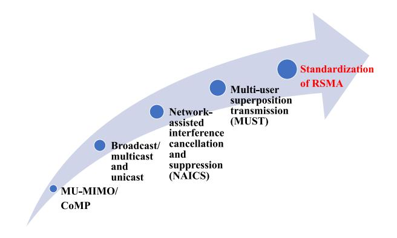

Fig. 33. Pathways to 3GPP.

a work item on MBS (Release 17 [\[200\]](#page-52-3)) addresses broadcast/multicast transmission in NR, the signalling design for which can be modified to support RSMA transmission. SIC, which is an important mechanism for RSMA at the receiver side, is considered for network-assisted interference cancellation and suppression (NAICS) (Release 12 [\[201\]](#page-52-4)) and multiuser superposition transmission (MUST) (Release 13 [\[202\]](#page-52-5)), and thus, can readily be adopted for RSMA without any additional standardization and implementation burden.

Although there is still work to be done before RSMA is employed in next generation networks, there are existing mechanisms in the standards that can be leveraged to make its integration easier.

# VIII. CONCLUSION

In this paper, we have provided the first holistic tutorial on, and survey of, RSMA including

- an exhaustive survey of the RSMA literature from both the information-theoretic and communication-theoretic perspectives,
- a thorough elaboration of the principles and transmission frameworks of downlink/uplink and multi-cell RSMA,
- a comprehensive summary of two strategies for precoder design, namely precoder optimization and lowcomplexity precoder design,
- a detailed performance comparison between RSMA and existing MA schemes (including SDMA, NOMA, OMA, multicasting) in terms of their DoF, complexity, and performance,
- a summary of the major advantages and disadvantages of RSMA,
- an illustration of the PHY layer design and link-level simulation of RSMA,
- an extensive discussion of emerging applications of RSMA as well as corresponding research challenges and future directions including many uninvestigated areas,
- a synopsis of the standardization and implementation of RSMA.

The existing literature on RSMA has shown that nonorthogonal transmission in multi-antenna networks should be designed such that interference is partially decoded and partially treated as noise in order to fully exploit the benefits of multiple antennas at the transceivers and SIC at the receivers. Thus, RSMA is a promising PHY layer transmission paradigm for interference management, non-orthogonal transmission, and multiple access in 6G, which will fundamentally reform the PHY layer and lower MAC layer design of wireless communication networks. Many previous studies of communication design merit revisiting under the RSMA framework. RSMA indeed opens up many interesting research problems for both industry and academia, and offers the prospect of boosting data rate, enhancing transmission reliability, increasing energy efficiency, saving transmit power, reducing transmission latency, improving interference management, and providing robustness to CSIT uncertainties.

# REFERENCES

- [1] H. Tataria, M. Shafi, A. F. Molisch, M. Dohler, H. Sjöland, and F. Tufvesson, "6G wireless systems: Vision, requirements, challenges, insights, and opportunities," *Proc. IEEE*, vol. 109, no. 7, pp. 1166–1199, Jul. 2021.
- [2] Y. Mao and B. Clerckx, *Multiple Access Techniques*. Cham, Switzerland: Springer Int., 2021, pp. 63–100.
- [3] Y. Saito, Y. Kishiyama, A. Benjebbour, T. Nakamura, A. Li, and K. Higuchi, "Non-orthogonal multiple access (NOMA) for cellular future radio access," in *Proc. IEEE 77th Veh. Technol. Conf. (VTC Spring)*, 2013, pp. 1–5.
- [4] L. Dai, B. Wang, Y. Yuan, S. Han, I. Chih-lin, and Z. Wang, "Nonorthogonal multiple access for 5G: Solutions, challenges, opportunities, and future research trends," *IEEE Commun. Mag.*, vol. 53, no. 9, pp. 74–81, Sep. 2015.
- [5] Z. Ding *et al.*, "Application of non-orthogonal multiple access in LTE and 5G networks," *IEEE Commun. Mag.*, vol. 55, no. 2, pp. 185–191, Feb. 2017.
- [6] W. Shin, M. Vaezi, B. Lee, D. J. Love, J. Lee, and H. V. Poor, "Non-orthogonal multiple access in multi-cell networks: Theory, performance, and practical challenges," *IEEE Commun. Mag.*, vol. 55, no. 10, pp. 176–183, Oct. 2017.
- [7] Y. Mao, B. Clerckx, and V. O. K. Li, "Rate-splitting multiple access for downlink communication systems: Bridging, generalizing, and outperforming SDMA and NOMA," *EURASIP J. Wireless Commun. Netw.*, no. 1, p. 133, May 2018.
- [8] B. Clerckx, H. Joudeh, C. Hao, M. Dai, and B. Rassouli, "Rate splitting for MIMO wireless networks: A promising PHY-layer strategy for LTE evolution," *IEEE Commun. Mag.*, vol. 54, no. 5, pp. 98–105, May 2016.
- [9] H. Weingarten, Y. Steinberg, and S. S. Shamai, "The capacity region of the Gaussian multiple-input multiple-output broadcast channel," *IEEE Trans. Inf. Theory*, vol. 52, no. 9, pp. 3936–3964, Sep. 2006.
- [\[10\]](#page-3-3) B. Clerckx and C. Oestges, *MIMO Wireless Networks: Channels, Techniques and Standards for Multi-Antenna, Multi-User and Multi-Cell Systems*. Waltham, MA, USA: Academic, 2013.
- [\[11\]](#page-3-4) B. Clerckx *et al.*, "Is NOMA efficient in multi-antenna networks? A critical look at next generation multiple access techniques," *IEEE Open J. Commun. Soc.*, vol. 2, pp. 1310–1343, 2021.
- [\[12\]](#page-3-5) A. Goldsmith, S. A. Jafar, N. Jindal, and S. Vishwanath, "Capacity limits of MIMO channels," *IEEE J. Sel. Areas Commun.*, vol. 21, no. 5, pp. 684–702, Jun. 2003.
- [\[13\]](#page-3-6) N. Jindal, "MIMO broadcast channels with finite-rate feedback," *IEEE Trans. Inf. Theory*, vol. 52, no. 11, pp. 5045–5060, Nov. 2006.
- [\[14\]](#page-3-7) T. Cover, "Broadcast channels," *IEEE Trans. Inf. Theory*, vol. 18, no. 1, pp. 2–14, Jan. 1972.
- [\[15\]](#page-3-7) D. Tse and P. Viswanath, *Fundamentals of Wireless Communication*. Cambridge, U.K.: Cambridge Univ. Press, 2005.
- [\[16\]](#page-3-8) M. Vaezi, Z. Ding, and H. V. Poor, *Multiple Access Techniques for 5G Wireless Networks and Beyond*. Cham, Switzerland: Springer, 2019.
- [\[17\]](#page-3-8) Q. Sun, S. Han, I. Chin-Lin, and Z. Pan, "On the ergodic capacity of MIMO NOMA systems," *IEEE Wireless Commun. Lett.*, vol. 4, no. 4, pp. 405–408, Aug. 2015.
- [\[18\]](#page-3-8) Q. Zhang, Q. Li, and J. Qin, "Robust beamforming for nonorthogonal multiple-access systems in MISO channels," *IEEE Trans. Veh. Technol.*, vol. 65, no. 12, pp. 10231–10236, Dec. 2016.

- [\[19\]](#page-3-8) Z. Ding, F. Adachi, and H. V. Poor, "The application of MIMO to nonorthogonal multiple access," *IEEE Trans. Wireless Commun.*, vol. 15, no. 1, pp. 537–552, Jan. 2016.
- [\[20\]](#page-3-8) Y. Liu *et al.*, "Evolution of NOMA toward next generation multiple access (NGMA) for 6G," *IEEE J. Sel. Areas Commun.*, vol. 40, no. 4, pp. 1037–1071, Apr. 2022.
- [\[21\]](#page-4-1) R. H. Etkin, D. N. C. Tse, and H. Wang, "Gaussian interference channel capacity to within one bit," *IEEE Trans. Inf. Theory*, vol. 54, no. 12, pp. 5534–5562, Dec. 2008.
- [\[22\]](#page-5-0) Z. Chen, Z. Ding, X. Dai, and G. K. Karagiannidis, "On the application of quasi-degradation to MISO–NOMA Downlink," *IEEE Trans. Signal Process.*, vol. 64, no. 23, pp. 6174–6189, Dec. 2016.
- [\[23\]](#page-5-1) J. Jose, A. Ashikhmin, T. L. Marzetta, and S. Vishwanath, "Pilot contamination and precoding in multi-cell TDD systems," *IEEE Trans. Wireless Commun.*, vol. 10, no. 8, pp. 2640–2651, Aug. 2011.
- [\[24\]](#page-5-2) B. Lee, J. Choi, J.-Y. Seol, D. J. Love, and B. Shim, "Antenna grouping based feedback compression for FDD-based massive MIMO systems," *IEEE Trans. Commun.*, vol. 63, no. 9, pp. 3261–3274, Sep. 2015.
- [\[25\]](#page-5-3) J. Wang *et al.*, "3D beamforming technologies and field trials in 5G massive MIMO systems," *IEEE Open J. Veh. Technol.*, vol. 1, pp. 362–371, Oct. 2020.
- [\[26\]](#page-5-4) M. K. Member and G. Caire, "Joint beamforming and scheduling for a multi-antenna downlink with imperfect transmitter channel knowledge," *IEEE J. Sel. Areas Commun.*, vol. 25, no. 7, pp. 1468–1477, Sep. 2007.
- [\[27\]](#page-8-6) C. Hao, Y. Wu, and B. Clerckx, "Rate analysis of two-receiver MISO broadcast channel with finite rate feedback: A rate-splitting approach," *IEEE Trans. Commun.*, vol. 63, no. 9, pp. 3232–3246, Sep. 2015.
- [\[28\]](#page-8-6) H. Joudeh and B. Clerckx, "Sum-rate maximization for linearly precoded Downlink multiuser MISO systems with partial CSIT: A rate-splitting approach," *IEEE Trans. Commun.*, vol. 64, no. 11, pp. 4847–4861, Nov. 2016.
- [\[29\]](#page-8-6) H. Joudeh and B. Clerckx, "Robust transmission in downlink multiuser MISO systems: A rate-splitting approach," *IEEE Trans. Signal Process.*, vol. 64, no. 23, pp. 6227–6242, Dec. 2016.
- [\[30\]](#page-8-6) E. Piovano, H. Joudeh, and B. Clerckx, "Overloaded multiuser MISO transmission with imperfect CSIT," in *Proc. 50th Asilomar Conf. Signals, Syst. Comput.*, 2016, pp. 34–38.
- [\[31\]](#page-8-6) G. Lu, L. Li, H. Tian, and F. Qian, "MMSE-based precoding for rate splitting systems with finite feedback," *IEEE Commun. Lett.*, vol. 22, no. 3, pp. 642–645, Mar. 2018.
- [\[32\]](#page-8-6) M. Medra and T. N. Davidson, "Robust downlink transmission: An offset-based single-rate-splitting approach," in *Proc. IEEE Int. Workshop Signal Process. Adv. Wireless Commun. (SPAWC)*, 2018, pp. 1–5.
- [\[33\]](#page-8-6) Y. Mao, B. Clerckx, and V. O. K. Li, "Energy efficiency of rate-splitting multiple access, and performance benefits over SDMA and NOMA," in *Proc. IEEE Int. Symp. Wireless Commun. Syst. (ISWCS)*, 2018, pp. 1–5.
- [\[34\]](#page-8-6) B. Clerckx, Y. Mao, R. Schober, and H. V. Poor, "Rate-splitting unifying SDMA, OMA, NOMA, and Multicasting in MISO broadcast channel: A simple two-user rate analysis," *IEEE Wireless Commun. Lett.*, vol. 9, no. 3, pp. 349–353, Mar. 2020.
- [\[35\]](#page-8-6) H. Chen, D. Mi, Z. Chu, P. Xiao, Y. Xu, and D. He, "Linklevel performance of rate-splitting based Downlink multiuser MISO systems," in *Proc. IEEE Annu. Symp. Pers. Indoor Mobile Radio Commun. (PIMRC)*, 2020, pp. 1–5.
- [\[36\]](#page-8-6) O. Dizdar, Y. Mao, W. Han, and B. Clerckx, "Rate-splitting multiple access for Downlink multi-antenna communications: Physical layer design and link-level simulations," in *Proc. IEEE Annu. Symp. Pers. Indoor Mobile Radio Commun. (PIMRC)*, 2020, pp. 1–6.
- [\[37\]](#page-8-6) A. R. Flores, R. C. De Lamare, and B. Clerckx, "Linear precoding and stream combining for rate splitting in multiuser MIMO systems," *IEEE Commun. Lett.*, vol. 24, no. 4, pp. 890–894, Apr. 2020.
- [\[38\]](#page-8-6) G. Zhou, Y. Mao, and B. Clerckx, "Rate-splitting multiple access for multi-antenna downlink communication systems: Spectral and energy efficiency tradeoff," *IEEE Trans. Wireless Commun.*, vol. 21, no. 7, pp. 4816–4828, Jul. 2022.
- [\[39\]](#page-8-6) Y. Mao, E. Piovano, and B. Clerckx, "Rate-splitting multiple access for overloaded cellular Internet of Things," *IEEE Trans. Commun.*, vol. 69, no. 7, pp. 4504–4519, Jul. 2021.
- [\[40\]](#page-8-6) B. Matthiesen, Y. Mao, P. Popovski, and B. Clerckx, "Globally optimal Beamforming for rate splitting multiple access," in *Proc. IEEE Int. Conf. Acoust. Speech Signal Process. (ICASSP)*, 2021, pp. 4775–4779.
- [\[41\]](#page-8-6) J. An, O. Dizdar, B. Clerckx, and W. Shin, "Rate-splitting multiple access for multi-antenna broadcast channel with imperfect CSIT and CSIR," in *Proc. IEEE Annu. Symp. Pers. Indoor Mobile Radio Commun. (PIMRC)*, 2020, pp. 1–7.

- [\[42\]](#page-8-6) L. Yin, B. Clerckx, and Y. Mao, "Rate-splitting multiple access for multi-antenna broadcast channels with statistical CSIT," in *Proc. IEEE Int. Conf. Commun. (ICC) Workshop*, 2021, pp. 1–6.
- [\[43\]](#page-8-6) O. Dizdar, Y. Mao, and B. Clerckx, "Rate-splitting multiple access to mitigate the curse of mobility in (massive) MIMO networks," *IEEE Trans. Commun.*, vol. 69, no. 10, pp. 6765–6780, Oct. 2021.
- [\[44\]](#page-8-7) M. Dai, B. Clerckx, D. Gesbert, and G. Caire, "A rate splitting strategy for massive MIMO with imperfect CSIT," *IEEE Trans. Wireless Commun.*, vol. 15, no. 7, pp. 4611–4624, Jul. 2016.
- [\[45\]](#page-8-8) Z. Li, C. Ye, Y. Cui, S. Yang, and S. Shamai, "Rate splitting for multi-antenna downlink: Precoder design and practical implementation," *IEEE J. Sel. Areas Commun.*, vol. 38, no. 8, pp. 1910–1924, Aug. 2020.
- [\[46\]](#page-8-8) A. A. Ahmad, Y. Mao, A. Sezgin, and B. Clerckx, "Rate splitting multiple access in C-RAN," in *Proc. IEEE Annu. Symp. Pers. Indoor Mobile Radio Commun. (PIMRC)*, 2020, pp. 1–6.
- [\[47\]](#page-8-9) A. Alameer Ahmad, H. Dahrouj, A. Chaaban, A. Sezgin, and M. Alouini, "Interference mitigation via rate-splitting and common message decoding in cloud radio access networks," *IEEE Access*, vol. 7, pp. 80350–80365, 2019.
- [\[48\]](#page-8-9) A. A. Ahmad, B. Matthiesen, A. Sezgin, and E. Jorswieck, "Energy efficiency in C-RAN using rate splitting and common message decoding," in *Proc. IEEE Int. Conf. Commun. (ICC) Workshop*, 2020, pp. 1–6.
- [\[49\]](#page-8-9) A. A. Ahmad, H. Dahrouj, A. Chaaban, A. Sezgin, T. Y. Al-Naffouri, and M.-S. Alouini, "Power minimization via rate splitting in downlink cloud-radio access networks," in *Proc. IEEE Int. Conf. Commun. (ICC) Workshop*, 2020, pp. 1–6.
- [\[50\]](#page-8-9) A. A. Ahmad, Y. Mao, A. Sezgin, and B. Clerckx, "Rate splitting multiple access in C-RAN: A scalable and robust design," *IEEE Trans. Commun.*, vol. 69, no. 9, pp. 5727–5743, Sep. 2021.
- [\[51\]](#page-8-10) A. R. Flores, B. Clerckx, and R. C. de Lamare, "Tomlinson-Harashima precoded rate-splitting for multiuser multiple-antenna systems," in *Proc. IEEE Int. Symp. Wireless Commun. Syst. (ISWCS)*, 2018, pp. 1–6.
- [\[52\]](#page-8-10) A. R. Flores, R. C. De Lamare, and B. Clerckx, "Tomlinson-Harashima precoded rate-splitting with stream combiners for MU-MIMO systems," *IEEE Trans. Commun.*, vol. 69, no. 6, pp. 3833–3845, Jun. 2021.
- [\[53\]](#page-8-11) Y. Mao and B. Clerckx, "Beyond dirty paper coding for multi-antenna broadcast channel with partial CSIT: A rate-splitting approach," *IEEE Trans. Commun.*, vol. 68, no. 11, pp. 6775–6791, Nov. 2020.
- [\[54\]](#page-8-11) Y. Mao and B. Clerckx, "Dirty paper coded rate-splitting for nonorthogonal unicast and multicast transmission with partial CSIT," in *Proc. 54th Asilomar Conf. Signals Syst. Comput.*, 2020, pp. 990–995.
- [\[55\]](#page-8-12) A. Mishra, Y. Mao, O. Dizdar, and B. Clerckx, "Rate-splitting multiple access for downlink multiuser MIMO: Precoder optimization and PHYlayer design," *IEEE Trans. Commun.*, vol. 70, no. 2, pp. 874–890, Feb. 2022.
- [\[56\]](#page-8-13) H. Chaskar and U. Madhow, "Statistical multiplexing and QoS provisioning for real-time traffic on wireless downlinks," *IEEE J. Sel. Areas Commun.*, vol. 19, no. 2, pp. 347–354, Feb. 2001.
- [\[57\]](#page-9-3) K. F. Trillingsgaard and P. Popovski, "Downlink transmission of short packets: Framing and control information revisited," *IEEE Trans. Commun.*, vol. 65, no. 5, pp. 2048–2061, May 2017.
- [\[58\]](#page-9-4) D. Christopoulos, S. Chatzinotas, and B. Ottersten, "Multicast Multigroup Precoding and user scheduling for frame-based satellite communications," *IEEE Trans. Wireless Commun.*, vol. 14, no. 9, pp. 4695–4707, Sep. 2015.
- [\[59\]](#page-9-4) L. Yin and B. Clerckx, "Rate-splitting multiple access for Multibeam satellite communications," in *Proc. IEEE Int. Conf. Commun. (ICC) Workshop*, 2020, pp. 1–6.
- [\[60\]](#page-9-5) Y. Mao, B. Clerckx, J. Zhang, V. O. K. Li, and M. A. Arafah, "Maxmin fairness of K-user cooperative rate-splitting in MISO broadcast channel with user relaying," *IEEE Trans. Wireless Commun.*, vol. 19, no. 10, pp. 6362–6376, Oct. 2020.
- [\[61\]](#page-9-5) H. Joudeh and B. Clerckx, "Rate-splitting for max-min fair multigroup multicast beamforming in overloaded systems," *IEEE Trans. Wireless Commun.*, vol. 16, no. 11, pp. 7276–7289, Nov. 2017.
- [\[62\]](#page-10-5) J. Zhao, D. Gündüz, O. Simeone, and D. Gómez-Barquero, "Nonorthogonal unicast and broadcast transmission via joint Beamforming and LDM in cellular networks," *IEEE Trans. Broadcast.*, vol. 66, no. 2, pp. 216–228, Jun. 2020.
- [\[63\]](#page-10-5) Y. F. Liu, C. Lu, M. Tao, and J. Wu, "Joint multicast and unicast beamforming for the MISO downlink interference channel," in *Proc. IEEE Int. Workshop Signal Process. Adv. Wireless Commun. (SPAWC)*, 2017, pp. 1–5.

- [\[64\]](#page-12-5) A. A. Ahmad, J. Kakar, R. Reifert, and A. Sezgin, "UAV-assisted C-RAN with rate splitting under base station breakdown scenarios," in *Proc. IEEE Int. Conf. Commun. (ICC) Workshop*, 2019, pp. 1–6.
- [\[65\]](#page-12-6) N. Jindal, S. Vishwanath, and A. Goldsmith, "Duality, dirty paper coding, and capacity for multiuser wireless channels," in *Information, Coding and Mathematics*. Boston, MA, USA: Springer, 2002, pp. 239–256.
- [\[66\]](#page-12-6) S. Vishwanath, N. Jindal, and A. Goldsmith, "Duality, achievable rates, and sum-rate capacity of Gaussian MIMO broadcast channels," *IEEE Trans. Inf. Theory*, vol. 49, no. 10, pp. 2658–2668, Oct. 2003.
- [\[67\]](#page-12-7) N. Lee, O. Simeone, and J. Kang, "The effect of imperfect channel knowledge on a MIMO system with interference," *IEEE Trans. Commun.*, vol. 60, no. 8, pp. 2221–2229, Aug. 2012.
- [\[68\]](#page-12-7) S. Yang and J.-C. Belfiore, "The impact of channel estimation error on the DPC region of the two-user Gaussian broadcast channel," in *Proc. Allert. Conf. Commun. Control Comput.*, 2005, pp. 1–7.
- [\[69\]](#page-13-2) B. Rimoldi and R. Urbanke, "A rate-splitting approach to the Gaussian multiple-access channel," *IEEE Trans. Inf. Theory*, vol. 42, no. 2, pp. 364–375, Mar. 1996.
- [\[70\]](#page-13-2) A. Grant, B. Rimoldi, R. Urbanke, and P. Whiting, "Rate-splitting multiple access for discrete memoryless channels," *IEEE Trans. Inf. Theory*, vol. 47, no. 3, pp. 873–890, Mar. 2001.
- [\[71\]](#page-13-2) M. Medard, J. Huang, A. Goldsmith, S. Meyn, and T. Coleman, "Capacity of time-slotted ALOHA packetized multiple-access systems over the AWGN channel," *IEEE Trans. Wireless Commun.*, vol. 3, no. 2, pp. 486–499, Mar. 2004.
- [\[72\]](#page-13-2) J. Cao and E. M. Yeh, "Asymptotically optimal multiple-access communication via distributed rate splitting," *IEEE Trans. Inf. Theory*, vol. 53, no. 1, pp. 304–319, Jan. 2007.
- [\[73\]](#page-13-2) Z. Yang, M. Chen, W. Saad, W. Xu, and M. Shikh-Bahaei, "Sum-rate maximization of uplink rate splitting multiple access (RSMA) communication," in *Proc. IEEE Global Commun. Conf. (GLOBECOM)*, 2019, pp. 1–6.
- [\[74\]](#page-13-2) H. Liu, T. A. Tsiftsis, K. J. Kim, K. S. Kwak, and H. V. Poor, "Rate splitting for uplink NOMA with enhanced fairness and outage performance," *IEEE Trans. Wireless Commun.*, vol. 19, no. 7, pp. 4657–4670, Jul. 2020.
- [\[75\]](#page-13-3) P. Popovski, K. F. Trillingsgaard, O. Simeone, and G. Durisi, "5G wireless network slicing for eMBB, URLLC, and mMTC: A communication-theoretic view," *IEEE Access*, vol. 6, pp. 55765–55779, 2018.
- [\[76\]](#page-14-2) A. Carleial, "Interference channels," *IEEE Trans. Inf. Theory*, vol. 24, no. 1, pp. 60–70, Jan. 1978.
- [\[77\]](#page-14-2) T. Han and K. Kobayashi, "A new achievable rate region for the interference channel," *IEEE Trans. Inf. Theory*, vol. 27, no. 1, pp. 49–60, Jan. 1981.
- [\[78\]](#page-14-2) C. Hao and B. Clerckx, "MISO networks with imperfect CSIT: A topological rate-splitting approach," *IEEE Trans. Commun.*, vol. 65, no. 5, pp. 2164–2179, May 2017.
- [\[79\]](#page-14-2) O. Tervo, L. Trant, S. Chatzinotas, B. Ottersten, and M. Juntti, "Multigroup multicast beamforming and antenna selection with ratesplitting in multicell systems," in *Proc. IEEE Int. Workshop Signal Process. Adv. Wireless Commun. (SPAWC)*, 2018, pp. 1–5.
- [\[80\]](#page-14-2) J. Zhang, J. Zhang, Y. Zhou, H. Ji, J. Sun, and N. Al-Dhahir, "Energy and spectral efficiency tradeoff via rate splitting and common beamforming coordination in multicell networks," *IEEE Trans. Commun.*, vol. 68, no. 12, pp. 7719–7731, Dec. 2020.
- [\[81\]](#page-14-2) N. Ha, W. Shin, M. Vaezi, and H. V. Poor, "Coordinated rate splitting multiple access for multi-cell downlink networks," in *Proc. 54th Asilomar Conf. Signals, Syst. Comput.*, 2020, pp. 996–1001.
- [\[82\]](#page-14-3) Y. Mao, B. Clerckx, and V. O. K. Li, "Rate-splitting multiple access for coordinated multi-point joint transmission," in *Proc. IEEE Int. Conf. Commun. (ICC) Workshop*, 2019, pp. 1–6.
- [\[83\]](#page-14-3) D. Yu, J. Kim, and S. Park, "An efficient rate-splitting multiple access scheme for the downlink of C-RAN systems," *IEEE Wireless Commun. Lett.*, vol. 8, no. 6, pp. 1555–1558, Dec. 2019.
- [\[84\]](#page-14-3) K. Weinberger, A. A. Ahmad, and A. Sezgin, "On synergistic benefits of rate splitting in IRS-assisted cloud radio access networks," in *Proc. IEEE Int. Conf. Commun. (ICC) Workshop*, 2021, pp. 1–6.
- [\[85\]](#page-16-1) Y. Liang and G. Kramer, "Rate regions for relay broadcast channels," *IEEE Trans. Inf. Theory*, vol. 53, no. 10, pp. 3517–3535, Oct. 2007.
- [86] J. Xu, Y. Cao, and B. Chen, "Capacity bounds for broadcast channels with confidential messages," *IEEE Trans. Inf. Theory*, vol. 55, no. 10, pp. 4529–4542, Oct. 2009.
- [\[87\]](#page-16-1) C. Nair and A. El Gamal, "The capacity region of a class of threereceiver broadcast channels with degraded message sets," *IEEE Trans. Inf. Theory*, vol. 55, no. 10, pp. 4479–4493, Oct. 2009.

- [\[88\]](#page-16-2) S. Yang, M. Kobayashi, D. Gesbert, and X. Yi, "Degrees of freedom of time correlated MISO broadcast channel with delayed CSIT," *IEEE Trans. Inf. Theory*, vol. 59, no. 1, pp. 315–328, Jan. 2013.
- [\[89\]](#page-16-3) C. Hao, B. Rassouli, and B. Clerckx, "Achievable doF regions of MIMO networks with imperfect CSIT," *IEEE Trans. Inf. Theory*, vol. 63, no. 10, pp. 6587–6606, Oct. 2017.
- [\[90\]](#page-16-4) A. G. Davoodi and S. A. Jafar, "Transmitter cooperation under finite precision CSIT: A GDoF perspective," *IEEE Trans. Inf. Theory*, vol. 63, no. 9, pp. 6020–6030, Sep. 2017.
- [\[91\]](#page-16-5) S. Yang and Z. Lit, "A constant-gap result on the multi-antenna broadcast channels with linearly Precoded rate splitting," in *Proc. IEEE Int. Workshop Signal Process. Adv. Wireless Commun. (SPAWC)*, 2018, pp. 1–5.
- [\[92\]](#page-16-6) Z. Li and S. Yang, "A linearly precoded rate splitting approach and its optimality for MIMO broadcast channels," in *Proc. IEEE Inf. Theory Workshop (ITW)*, 2018, pp. 1–5.
- [\[93\]](#page-16-6) Z. Li, S. Yang, and S. Shamai, "On linearly precoded rate splitting for Gaussian MIMO broadcast channels," *IEEE Trans. Inf. Theory*, vol. 67, no. 7, pp. 4693–4709, Jul. 2021.
- [\[94\]](#page-16-1) H. Romero and M. K. Varanasi, "Rate splitting, superposition coding and Binning for Groupcasting over the broadcast channel: A general framework," 2020, *arXiv:2011.04745*.
- [95] K. Shen, R. K. Farsani, and W. Yu, "Capacity limits of full-duplex cellular network," *IEEE Trans. Inf. Theory*, vol. 67, no. 3, pp. 1415–1432, Mar. 2021.
- [\[96\]](#page-16-7) L. Yin and B. Clerckx, "Rate-splitting multiple access for Multigroup multicast and multibeam satellite systems," *IEEE Trans. Commun.*, vol. 69, no. 2, pp. 976–990, Feb. 2021.
- [97] O. Dizdar, Y. Mao, W. Han, and B. Clerckx, "Rate-splitting multiple access: A new frontier for the PHY layer of 6G," in *Proc. IEEE 92nd Veh. Technol. Conf. (VTC Fall)*, 2020, pp. 1–7.
- [\[98\]](#page-36-1) O. Dizdar, Y. Mao, Y. Xu, P. Zhu, and B. Clerckx, "Rate-splitting multiple access for enhanced URLLC and eMBB in 6G," in *Proc. IEEE Int. Symp. Wireless Commun. Syst. (ISWCS)*, 2021, pp. 1–6.
- [\[99\]](#page-15-2) P. Popovski, H. Yomo, K. Nishimori, R. D. Taranto, and R. Prasad, "Opportunistic interference cancellation in cognitive radio systems," in *Proc. IEEE Int. Symp. Dyn. Spectr. Access Netw. (DySPAN)*, 2007, pp. 472–475.
- [\[100\]](#page-15-2) N. Devroye and P. Popovski, "Receiver-side opportunism in cognitive networks," in *Proc. ICST CROWNCOM Conf.*, 2011, pp. 321–325.
- [\[101\]](#page-16-1) A. El Gamal and Y.-H. Kim, *Network Information Theory*. Cambridge, U.K.: Cambridge Univ. Press, 2011.
- [\[102\]](#page-16-8) A. G. Davoodi and S. A. Jafar, "Aligned image sets under channel uncertainty: Settling conjectures on the collapse of degrees of freedom under finite precision CSIT," *IEEE Trans. Inf. Theory*, vol. 62, no. 10, pp. 5603–5618, Oct. 2016.
- [\[103\]](#page-16-9) E. Piovano and B. Clerckx, "Optimal doF region of the K-user MISO BC with partial CSIT," *IEEE Commun. Lett.*, vol. 21, no. 11, pp. 2368–2371, Nov. 2017.
- [\[104\]](#page-16-10) A. G. Davoodi and S. Jafar, "Degrees of freedom region of the (*M*, *N*1, *N*2) MIMO broadcast channel with partial CSIT: An application of sum-set inequalities based on aligned image sets," *IEEE Trans. Inf. Theory*, vol. 66, no. 10, pp. 6256–6279, Oct. 2020.
- [\[105\]](#page-16-4) A. G. Davoodi and S. A. Jafar, "GDoF of the MISO BC: Bridging the gap between finite precision CSIT and perfect CSIT," in *Proc. IEEE Int. Symp. Inf. Theory (ISIT)*, 2016, pp. 1297–1301.
- [\[106\]](#page-19-2) Y. Xu, Y. Mao, O. Dizdar, and B. Clerckx, "Rate-splitting multiple access with finite blocklength for short-packet and low-latency Downlink communications," 2021, *arXiv:2105.06198*.
- [\[107\]](#page-19-2) Y. Mao, B. Clerckx, and V. O. K. Li, "Rate-splitting for multi-user multi-antenna wireless information and power transfer," in *Proc. IEEE Int. Workshop Signal Process. Adv. Wireless Commun. (SPAWC)*, 2019, pp. 1–5.
- [\[108\]](#page-19-2) J. Zhang, B. Clerckx, J. Ge, and Y. Mao, "Cooperative rate splitting for MISO broadcast channel with user relaying, and performance benefits over cooperative NOMA," *IEEE Signal Process. Lett.*, vol. 26, no. 11, pp. 1678–1682, Nov. 2019.
- [\[109\]](#page-19-2) L. Li, K. Chai, J. Li, and X. Li, "Resource allocation for multicarrier rate-splitting multiple access system," *IEEE Access*, vol. 8, pp. 174222–174232, 2020.
- [\[110\]](#page-19-2) C. Xu, B. Clerckx, S. Chen, Y. Mao, and J. Zhang, "Rate-splitting multiple access for multi-antenna joint radar and communications," *IEEE J. Sel. Topics Signal Process.*, vol. 15, no. 6, pp. 1332–1347, Nov. 2021.

- [\[111\]](#page-19-2) W. Jaafar, S. Naser, S. Muhaidat, P. C. Sofotasios, and H. Yanikomeroglu, "Multiple access in aerial networks: From orthogonal and non-orthogonal to rate-splitting," *IEEE Open J. Veh. Technol.*, vol. 1, pp. 372–392, Oct. 2020.
- [\[112\]](#page-19-2) W. Jaafar, S. Naser, S. Muhaidat, P. C. Sofotasios, and H. Yanikomeroglu, "On the downlink performance of RSMAbased UAV communications," *IEEE Trans. Veh. Technol.*, vol. 69, no. 12, pp. 16258–16263, Dec. 2020.
- [\[113\]](#page-19-2) S. Tao, H. Yu, Q. Li, Y. Tang, and D. Zhang, "One-layer rate-splitting multiple access with benefits over power-domain NOMA in indoor multi-cell visible light communication networks," in *Proc. IEEE Int. Conf. Commun. (ICC) Workshop*, 2020, pp. 1–7.
- [\[114\]](#page-19-2) S. Naser *et al.*, "Rate-splitting multiple access: Unifying NOMA and SDMA in MISO VLC channels," *IEEE Open J. Veh. Technol.*, vol. 1, pp. 393–413, Oct. 2020.
- [\[115\]](#page-19-2) P. Li, M. Chen, Y. Mao, Z. Yang, B. Clerckx, and M. Shikh-Bahaei, "Cooperative rate-splitting for secrecy sum-rate enhancement in multiantenna broadcast channels," in *Proc. IEEE Annu. Symp. Pers. Indoor Mobile Radio Commun. (PIMRC)*, 2020, pp. 1–6.
- [\[116\]](#page-19-2) O. Dizdar, A. Kaushik, B. Clerckx, and C. Masouros, "Rate-splitting multiple access for joint radar-communications with low-resolution DACs," in *Proc. IEEE Int. Conf. Commun. (ICC) Workshop*, 2021, pp. 1–6.
- [\[117\]](#page-19-2) J. Park, J. Choi, N. Lee, W. Shin, and H. V. Poor, "Sum spectral efficiency optimization for rate splitting in downlink MU-MISO: A generalized power iteration approach," in *Proc. IEEE Wireless Commun. Netw. Conf. (WCNC) Workshop*, 2021, pp. 1–6.
- [\[118\]](#page-19-3) A. Z. Yalcin, M. Yuksel, and B. Clerckx, "Rate splitting for multi-group Multicasting with a common message," *IEEE Trans. Veh. Technol.*, vol. 69, no. 10, pp. 12281–12285, Oct. 2020.
- [\[119\]](#page-19-3) H. Chen *et al.*, "Rate-splitting for multicarrier multigroup multicast: Precoder design and error performance," *IEEE Trans. Broadcast.*, vol. 67, no. 3, pp. 619–630, Sep. 2021.
- [\[120\]](#page-19-4) A. Zappone, B. Matthiesen, and E. A. Jorswieck, "Energy efficiency in MIMO underlay and overlay device-to-device communications and cognitive radio systems," *IEEE Trans. Signal Process.*, vol. 65, no. 4, pp. 1026–1041, Feb. 2017.
- [\[121\]](#page-19-4) A. Rahmati, Y. Yapici, N. Rupasinghe, I. Guvenc, H. Dai, and A. Bhuyan, "Energy efficiency of RSMA and NOMA in cellularconnected mmWave UAV networks," in *Proc. IEEE Int. Conf. Commun. (ICC) Workshop*, 2019, pp. 1–6.
- [\[122\]](#page-19-4) Z. Yang, J. Shi, Z. Li, M. Chen, W. Xu, and M. Shikh-Bahaei, "Energy efficient rate splitting multiple access (RSMA) with reconfigurable intelligent surface," in *Proc. IEEE Int. Conf. Commun. (ICC) Workshop*, 2020, pp. 1–6.
- [\[123\]](#page-19-5) M. R. C. Acosta, C. E. G. Moreta, and I. Koo, "Joint power allocation and power splitting for MISO-RSMA cognitive radio systems with SWIPT and information decoder users," *IEEE Syst. J.*, vol. 15, no. 4, pp. 5289–5300, Dec. 2021.
- [\[124\]](#page-20-2) Y. Mao, B. Clerckx, and V. O. K. Li, "Rate-splitting for multiantenna non-orthogonal unicast and multicast transmission: Spectral and energy efficiency analysis," *IEEE Trans. Commun.*, vol. 67, no. 12, pp. 8754–8770, Dec. 2019.
- [\[125\]](#page-20-2) O. Dizdar and B. Clerckx, "Rate splitting multiple access for multiantenna multi-carrier joint communications and jamming," in *Proc. Int. Conf. Sens. Signal Process. Defence (SSPD) Sens. Decis.*, 2021, pp. 1–5.
- [\[126\]](#page-20-2) R. Cerna-Loli, O. Dizdar, and B. Clerckx, "A rate-splitting strategy to enable joint radar sensing and communication with partial CSIT," in *Proc. IEEE 22nd Int. Conf. Signal Process. Adv Wireless Commun. (SPAWC) Workshop*, 2021, pp. 491–495.
- [\[127\]](#page-20-3) H. Fu, S. Feng, W. Tang, and D. W. K. Ng, "Robust secure beamforming design for two-user downlink MISO rate-splitting systems," *IEEE Trans. Wireless Commun.*, vol. 19, no. 12, pp. 8351–8365, Dec. 2020.
- [\[128\]](#page-20-3) Z. W. Si, L. Yin, and B. Clerckx, "Rate-splitting multiple access for multigateway multibeam satellite systems with feeder link interference," *IEEE Trans. Commun.*, vol. 70, no. 3, pp. 2147–2162, Mar. 2022.
- [\[129\]](#page-20-4) Z. Lin, M. Lin, B. Champagne, W.-P. Zhu, and N. Al-Dhahir, "Secure and energy efficient transmission for RSMA-based cognitive satelliteterrestrial networks," *IEEE Wireless Commun. Lett.*, vol. 10, no. 2, pp. 251–255, Feb. 2021.
- [\[130\]](#page-20-5) X. Su, L. Li, H. Yin, and P. Zhang, "Robust power- and ratesplitting-based transceiver design in *K* -user MISO SWIPT interference channel under imperfect CSIT," *IEEE Commun. Lett.*, vol. 23, no. 3, pp. 514–517, Mar. 2019.

- [131] O. Dizdar, A. Kaushik, B. Clerckx, and C. Masouros, "Energy efficient dual-functional radar-communication: Rate-splitting multiple access, low-resolution DACs, and RF chain selection," *IEEE Open J. Commun. Soc.*, vol. 3, pp. 986–1006, 2022.
- [\[132\]](#page-21-4) R. Cerna-Loli, O. Dizdar, and B. Clerckx, "Rate-splitting multiple access for multi-antenna joint radar and communications with partial CSIT: Precoder optimization and link-level simulations," 2021, *arXiv:2201.10621*.
- [\[133\]](#page-21-4) A. Papazafeiropoulos, B. Clerckx, and T. Ratnarajah, "Rate-splitting to mitigate residual transceiver hardware impairments in massive MIMO systems," *IEEE Trans. Veh. Technol.*, vol. 66, no. 9, pp. 8196–8211, Sep. 2017.
- [\[134\]](#page-21-5) A. Papazafeiropoulos and T. Ratnarajah, "Rate-splitting robustness in multi-pair massive MIMO relay systems," *IEEE Trans. Wireless Commun.*, vol. 17, no. 8, pp. 5623–5636, Aug. 2018.
- [\[135\]](#page-21-5) A. Bansal, K. Singh, and C.-P. Li, "Analysis of hierarchical rate splitting for intelligent reflecting surfaces-aided downlink multiuser MISO communications," *IEEE Open J. Commun. Soc*, vol. 2, pp. 785–798, 2021.
- [\[136\]](#page-21-5) H. Yang, A. Alphones, Z. Xiong, D. Niyato, J. Zhao, and K. Wu, "Artificial-intelligence-enabled intelligent 6G networks," *IEEE Netw.*, vol. 34, no. 6, pp. 272–280, Nov./Dec. 2020.
- [\[137\]](#page-22-2) N. Q. Hieu, D. T. Hoang, D. Niyato, and D. I. Kim, "Optimal power allocation for rate splitting communications with deep reinforcement learning," *IEEE Wireless Commun. Lett.*, vol. 10, no. 12, pp. 2820–2823, Dec. 2021.
- [\[138\]](#page-22-3) H. Chen, D. Mi, B. Clerckx, Z. Chu, J. Shi, and P. Xiao, "Joint power and subcarrier allocation optimization for multigroup multicast systems with rate splitting," *IEEE Trans. Veh. Technol.*, vol. 69, no. 2, pp. 2306–2310, Feb. 2020.
- [\[139\]](#page-22-4) O. Dizdar and B. Clerckx, "Rate-splitting multiple access for communications and jamming in multi-antenna multi-carrier cognitive radio systems," *IEEE Trans. Inf. Forensics Security*, vol. 17, pp. 628–643, 2022.
- [\[140\]](#page-23-2) L. Yin, O. Dizdar, and B. Clerckx, "Rate-splitting multiple access for multigroup multicast cellular and satellite communications: PHY layer design and link-level simulations," in *Proc. IEEE Int. Conf. Commun. (ICC) Workshop*, 2021, pp. 1–6.
- [\[141\]](#page-23-3) G. Caire, G. Taricco, and E. Biglieri, "Bit-interleaved coded modulation," *IEEE Trans. Inf. Theory*, vol. 44, no. 3, pp. 927–946, May 1998.
- [\[142\]](#page-26-2) E. Arikan, "Channel polarization: A method for constructing capacityachieving codes for symmetric binary-input memoryless channels," *IEEE Trans. Inf. Theory*, vol. 55, no. 7, pp. 3051–3073, Jul. 2009.
- [\[143\]](#page-26-3) Z. Ding, X. Lei, G. K. Karagiannidis, R. Schober, J. Yuan, and V. K. Bhargava, "A survey on non-orthogonal multiple access for 5G networks: Research challenges and future trends," *IEEE J. Sel. Areas Commun.*, vol. 35, no. 10, pp. 2181–2195, Oct. 2017.
- [\[144\]](#page-28-3) J. Riordan, *Introduction to Combinatorial Analysis*. Chelmsford, MA, USA: Courier Corp, 2012.
- [\[145\]](#page-28-4) H. Joudeh and B. Clerckx, "DoF region of the MISO BC with partial CSIT: Proof by inductive Fourier-Motzkin elimination," in *Proc. IEEE Int. Workshop Signal Process. Adv. Wireless Commun. (SPAWC)*, 2019, pp. 1–5.
- [\[146\]](#page-30-3) G. Caire, N. Jindal, M. Kobayashi, and N. Ravindran, "Multiuser MIMO achievable rates with downlink training and channel state feedback," *IEEE Trans. Inf. Theory*, vol. 56, no. 6, pp. 2845–2866, Jun. 2010.
- [\[147\]](#page-30-4) R. C. Loli, O. Dizdar, B. Clerckx, and C. Ling, "Model-based deep learning receiver design for rate-splitting multiple access," 2022, *arXiv:2205.00849*.
- [\[148\]](#page-34-1) A. Mishra, Y. Mao, C. K. Thomas, L. Sanguinetti, and B. Clerckx, "Mitigating intra-cell pilot contamination in massive MIMO: A rate splitting approach," 2022, *arXiv:2206.07499*.
- [\[149\]](#page-36-2) A. Mishra, Y. Mao, L. Sanguinetti, and B. Clerckx, "Rate-splitting assisted massive machine-type communications in cell-free massive MIMO," *IEEE Commun. Lett.*, vol. 26, no. 6, pp. 1358–1362, Jun. 2022.
- [\[150\]](#page-36-2) M. Z. Hassan, M. J. Hossain, J. Cheng, and V. C. M. Leung, "Energy-spectrum efficient content distribution in fog-RAN using rate-splitting, common message decoding, and 3D-resource matching," *IEEE Trans. Wireless Commun.*, vol. 20, no. 8, pp. 4929–4946, Aug. 2021.
- [\[151\]](#page-36-3) H. Chen, D. Mi, Z. Liu, P. Xiao, and R. Tafazolli, "Rate-splitting for overloaded multigroup multicast: Error performance evaluation," in *Proc. IEEE Int. Conf. Commun. (ICC) Workshop*, 2020, pp. 1–6.

- [\[152\]](#page-36-4) M. Dai and B. Clerckx, "Multiuser millimeter wave beamforming strategies with quantized and statistical CSIT," *IEEE Trans. Wireless Commun.*, vol. 16, no. 11, pp. 7025–7038, Nov. 2017.
- [153] M. Caus *et al.*, "Exploratory analysis of superposition coding and rate splitting for multibeam satellite systems," in *Proc. IEEE Int. Symp. Wireless Commun. Syst. (ISWCS)*, 2018, pp. 1–5.
- [\[154\]](#page-37-2) M. Z. Hassan, M. J. Hossain, J. Cheng, and V. C. M. Leung, "Device-clustering and rate-splitting enabled device-to-device cooperation framework in fog radio access network," *IEEE Trans. Green Commun. Netw.*, vol. 5, no. 3, pp. 1482–1501, Sep. 2021.
- [\[155\]](#page-44-0) A. Salem, C. Masouros, and B. Clerckx, "Rate splitting with finite constellations: The benefits of interference exploitation vs suppression," *IEEE Open J. Commun. Soc.*, vol. 2, pp. 1541–1557, 2021.
- [\[156\]](#page-42-1) R.-J. Reifert, A. A. Ahmad, Y. Mao, A. Sezgin, and B. Clerckx, "Ratesplitting multiple access in cache-aided cloud-radio access networks," *Front. Commun. Netw.*, vol. 2, Sep. 2021, Art. no. 716620.
- [157] S. Ma *et al.*, "Robust beamforming design for rate splitting multiple access-aided MISO visible light communications," 2021, *arXiv:2108.07014*.
- [\[158\]](#page-41-0) H. D. Tuan, A. A. Nasir, M.-N. Nguyen, and M. Masood, "Han– Kobayashi signaling in MIMO broadcasting," *IEEE Commun. Lett.*, vol. 23, no. 5, pp. 855–858, May 2019.
- [\[159\]](#page-45-0) A. Krishnamoorthy and R. Schober, "Successive null-space precoder design for Downlink MU-MIMO with rate splitting and single-stage SIC," in *Proc. IEEE Int. Conf. Commun. (ICC) Workshop*, 2021, pp. 1–6.
- [\[160\]](#page-39-0) S. Karmakar and M. K. Varanasi, "The capacity region of the MIMO interference channel and its reciprocity to within a constant gap," *IEEE Trans. Inf. Theory*, vol. 59, no. 8, pp. 4781–4797, Aug. 2013.
- [\[161\]](#page-39-0) X. Su, Y. Yuan, and Q. Wang, "Performance analysis of rate splitting in *K*-user interference channel under imperfect CSIT: Average sum rate, outage probability and SER," *IEEE Access*, vol. 8, pp. 136930–136946, 2020.
- [\[162\]](#page-39-1) J. Chen and V. K. N. Lau, "Two-tier precoding for FDD multi-cell massive MIMO time-varying interference networks," *IEEE J. Sel. Areas Commun.*, vol. 32, no. 6, pp. 1230–1238, Jun. 2014.
- [\[163\]](#page-39-2) J. Park and B. Clerckx, "Multi-user linear precoding for multipolarized massive MIMO system under imperfect CSIT," *IEEE Trans. Wireless Commun.*, vol. 14, no. 5, pp. 2532–2547, May 2015.
- [\[164\]](#page-40-0) D. Kim, G. Lee, and Y. Sung, "Two-stage beamformer design for massive MIMO downlink by trace quotient formulation," *IEEE Trans. Commun.*, vol. 63, no. 6, pp. 2200–2211, Jun. 2015.
- [\[165\]](#page-40-0) H. Q. Ngo, A. Ashikhmin, H. Yang, E. G. Larsson, and T. L. Marzetta, "Cell-free massive MIMO versus small cells," *IEEE Trans. Wireless Commun.*, vol. 16, no. 3, pp. 1834–1850, Mar. 2017.
- [\[166\]](#page-40-0) O. E. Ayach, S. Rajagopal, S. Abu-Surra, Z. Pi, and R. W. Heath, "Spatially sparse precoding in millimeter wave MIMO systems," *IEEE Trans. Wireless Commun.*, vol. 13, no. 3, pp. 1499–1513, Mar. 2014.
- [\[167\]](#page-40-1) A. Alkhateeb, G. Leus, and R. W. Heath, "Limited feedback hybrid precoding for multi-user millimeter wave systems," *IEEE Trans. Wireless Commun.*, vol. 14, no. 11, pp. 6481–6494, Nov. 2015.
- [\[168\]](#page-40-2) Z. Li, S. Yang, and T. Clessienne, "A general rate splitting scheme for hybrid precoding in mmWave systems," in *Proc. IEEE Int. Conf. Commun. (ICC)*, 2019, pp. 1–6.
- [\[169\]](#page-40-3) D. Lecompte and F. Gabin, "Evolved multimedia broadcast/multicast service (eMBMS) in LTE-advanced: Overview and Rel-11 enhancements," *IEEE Commun. Mag.*, vol. 50, no. 11, pp. 68–74, Nov. 2012.
- [\[170\]](#page-40-4) "NG-RAN; NG application protocol (NGAP) (Release 17)," 3GPP, Sophia Antipolis, France, Rep. TS 38.413, Apr. 2022.
- [\[171\]](#page-41-1) X. Zhu, C. Jiang, L. Yin, L. Kuang, N. Ge, and J. Lu, "Cooperative multigroup multicast transmission in integrated terrestrial-satellite networks," *IEEE J. Sel. Areas Commun.*, vol. 36, no. 5, pp. 981–992, May 2018.
- [\[172\]](#page-41-2) "Study on scenarios and requirements for next generation access technology (release 14)," 3GPP, Sophia Antipolis, France, Rep. TR 38.913, Sep. 2016.
- [\[173\]](#page-41-3) L. Fay, L. Michael, D. Gómez-Barquero, N. Ammar, and M. W. Caldwell, "An overview of the ATSC 3.0 physical layer specification," *IEEE Trans. Broadcast.*, vol. 62, no. 1, pp. 159–171, Mar. 2016.

- [\[174\]](#page-41-4) "Evolved universal terrestrial radio access (E-UTRA); study on LTEbased 5G terrestrial broadcast," 3GPP, Sophia Antipolis, France, Rep. TR 36.776, Mar. 2019.
- [\[175\]](#page-41-4) D. Vargas and Y. J. D. Kim, "Two-layered superposition of broadcast/multicast and unicast signals in multiuser OFDMA systems," *IEEE Trans. Wireless Commun.*, vol. 19, no. 2, pp. 979–994, Feb. 2020.
- [\[176\]](#page-41-4) M. Peng, Y. Li, Z. Zhao, and C. Wang, "System architecture and key technologies for 5G heterogeneous cloud radio access networks," *IEEE Netw.*, vol. 29, no. 2, pp. 6–14, Mar./Apr. 2015.
- [\[177\]](#page-41-4) J. Xu, L. Liu, and R. Zhang, "Multiuser MISO beamforming for simultaneous wireless information and power transfer," *IEEE Trans. Signal Process.*, vol. 62, no. 18, pp. 4798–4810, Sep. 2014.
- [\[178\]](#page-42-2) I. F. Akyildiz, X. Wang, and W. Wang, "Wireless mesh networks: A survey," *Comput. Netw.*, vol. 47, no. 4, pp. 445–487, Mar. 2005.
- [\[179\]](#page-42-3) A. Ghosh, D. Wolter, J. Andrews, and R. Chen, "Broadband wireless access with WiMax/802.16: Current performance benchmarks and future potential," *IEEE Commun. Mag.*, vol. 43, no. 2, pp. 129–136, Feb. 2005.
- [\[180\]](#page-43-0) M. Lee, J. Zheng, Y.-B. Ko, and D. Shrestha, "Emerging standards for wireless mesh technology," *IEEE Wireless Commun.*, vol. 13, no. 2, pp. 56–63, Apr. 2006.
- [\[181\]](#page-43-0) N. Naderializadeh, M. A. Maddah-Ali, and A. S. Avestimehr, "Fundamental limits of cache-aided interference management," *IEEE Trans. Inf. Theory*, vol. 63, no. 5, pp. 3092–3107, May 2017.
- [\[182\]](#page-43-0) J. Zhang and P. Elia, "Fundamental limits of cache-aided wireless BC: Interplay of coded-caching and CSIT feedback," *IEEE Trans. Inf. Theory*, vol. 63, no. 5, pp. 3142–3160, May 2017.
- [\[183\]](#page-43-1) E. Lampiris, J. Zhang, and P. Elia, "Cache-aided cooperation with no CSIT," in *Proc. IEEE Int. Symp. Inf. Theory (ISIT)*, 2017, pp. 2960–2964.
- [\[184\]](#page-43-2) E. Demarchou, C. Psomas, and I. Krikidis, "Rate splitting with wireless edge caching: A system-level-based co-design," *IEEE Trans. Commun.*, vol. 70, no. 1, pp. 664–679, Jan. 2022.
- [\[185\]](#page-43-2) Z. Lin, M. Lin, T. de Cola, J.-B. Wang, W.-P. Zhu, and J. Cheng, "Supporting IoT with rate-splitting multiple access in satellite and aerial integrated networks," *IEEE Internet Things J.*, vol. 8, no. 14, pp. 11123–11134, Jul. 2021.
- [\[186\]](#page-43-2) M. Vazquez, M. Caus, and A. Perez-Neira, "Rate splitting for MIMO multibeam satellite systems," in *Proc. Int. ITG Workshop Smart Antennas*, 2018, pp. 1–6.
- [\[187\]](#page-43-3) L. Yin and B. Clerckx, "Rate-splitting multiple access for satelliteterrestrial integrated networks: Benefits of coordination and cooperation," 2021, *arXiv:2111.14074*.
- [\[188\]](#page-44-0) F. Liu, C. Masouros, A. Li, H. Sun, and L. Hanzo, "MU-MIMO communications with MIMO radar: From co-existence to joint transmission," *IEEE Trans. Wireless Commun.*, vol. 17, no. 4, pp. 2755–2770, Apr. 2018.
- [\[189\]](#page-44-1) C. Xu, B. Clerckx, S. Chen, Y. Mao, and J. Zhang, "Rate-splitting multiple access for multi-antenna joint communication and radar transmissions," in *Proc. IEEE Int. Conf. Commun. (ICC) Workshop*, 2020, pp. 1–6.
- [\[190\]](#page-44-2) "Cellular system support for ultra low complexity and low throughput Internet of Things (release 13)," 3GPP, Sophia Antipolis, France, Rep. TR 45.820, Aug. 2016.
- [\[191\]](#page-44-3) Y. Gao, C. Yong, Z. Xiong, J. Zhao, Y. Xiao, and D. Niyato, "Reflection resource management for intelligent reflecting surface aided wireless networks," *IEEE Trans. Commun.*, vol. 69, no. 10, pp. 6971–6986, Oct. 2021.
- [\[192\]](#page-45-1) A. Jolly, S. Biswas, and K. Singh, "An analysis on ratesplitting multiple access for IRS aided 6G communication," 2021, *arXiv:2106.04418*.
- [\[193\]](#page-45-2) A. Bansal, K. Singh, B. Clerckx, C.-P. Li, and M.-S. Alouini, "Rate-splitting multiple access for intelligent reflecting surface aided multi-user communications," *IEEE Trans. Veh. Technol.*, vol. 70, no. 9, pp. 9217–9229, Sep. 2021.
- [\[194\]](#page-45-3) B. Zheng and R. Zhang, "Intelligent reflecting surface-enhanced OFDM: Channel estimation and reflection optimization," *IEEE Wireless Commun. Lett.*, vol. 9, no. 4, pp. 518–522, Apr. 2020.
- [\[195\]](#page-45-3) Q.-U.-A. Nadeem, H. Alwazani, A. Kammoun, A. Chaaban, M. Debbah, and M.-S. Alouini, "Intelligent reflecting surface-assisted multi-user MISO communication: Channel estimation and beamforming design," *IEEE Open J. Commun. Soc.*, vol. 1, pp. 661–680, 2020.
- [\[196\]](#page-46-0) "Study on LTE support for V2X services (release 14)," 3GPP, Sophia Antipolis, France, Rep. TR 22.885, Sep. 2015.

- [\[197\]](#page-46-0) H. Seo, K. Lee, S. Yasukawa, Y. Peng, and P. Sartori, "LTE evolution for vehicle-to-everything services," *IEEE Commun. Mag.*, vol. 54, no. 6, pp. 22–28, Jun. 2016.
- [\[198\]](#page-46-1) "Evolved universal terrestrial radio access (E-UTRA); LTE physical layer; general description (release 8)," 3GPP, Sophia Antipolis, France, Rep. TS 36.201, Mar. 2009.
- [\[199\]](#page-46-1) "Coordinated multi-point operation for LTE physical layer aspects (release 11)," 3GPP, Sophia Antipolis, France, Rep. TR 36.819, Aug. 2016.
- [\[200\]](#page-46-2) E. Garro *et al.*, "5G mixed mode: NR multicast-broadcast services," *IEEE Trans. Broadcast.*, vol. 66, no. 2, pp. 390–403, Jun. 2020.
- [\[201\]](#page-46-3) "Study on network-assisted interference cancellation and suppression (NAIC) for LTE (release 12)," 3GPP, Sophia Antipolis, France, Rep. TR 36.866, Mar. 2014.
- [\[202\]](#page-47-18) "Study on downlink multiuser superposition transmission (MUST) for LTE (release 13)," 3GPP, Sophia Antipolis, France, Rep. TR 36.859, Dec. 2015.

**Yijie (Lina) Mao** (Member, IEEE) received the B.Eng. degree from the Beijing University of Posts and Telecommunications, Beijing, China, the B.Eng. degree (Hons.) from the Queen Mary University of London, London, U.K., in 2014, and the Ph.D. degree from the Electrical and Electronic Engineering Department, University of Hong Kong, Hong Kong, China, in 2018. She was a Postdoctoral Research Fellow with the University of Hong Kong from 2018 to 2019 and a Postdoctoral Research Associate with the Communications and Signal

Processing Group, Department of the Electrical and Electronic Engineering, Imperial College London, London, from 2019 to 2021. Since 2021, she has been an Assistant Professor with the School of Information Science and Technology, ShanghaiTech University, Shanghai, China. Her research interests include the design of future wireless communications and artificial intelligence-empowered wireless networks. She receives the Best Paper Award of *EURASIP Journal on Wireless Communications and Networking* 2022 and the Exemplary Reviewer for IEEE TRANSACTIONS ON COMMUNICATIONS 2021. She is currently serving as a Guest Editor for special issues of IEEE JOURNAL ON SELECTED AREAS IN COMMUNICATIONS and IEEE OPEN JOURNAL OF THE COMMUNICATIONS SOCIETY. She has been a Workshop Co-Chair for 2020–2022 IEEE ICC, 2021–2022 IEEE WCNC, and 2020 IEEE PIMRC, and she has been a Technical Program Committee member of many symposia on wireless communication for several leading international IEEE conferences.

**Onur Dizdar** (Member, IEEE) received the B.Sc. and M.Sc. degrees in electrical and electronics engineering from Middle East Technical University, Ankara, Turkey, in 2008 and 2011, respectively, and the Ph.D. degree in electrical and electronics engineering from Bilkent University, Ankara, in 2017. He worked as a Communications System Design Engineer with ASELSAN Inc., Turkey, from 2008 to 2019. He is currently a Postdoctoral Research Associate with the Communications and Signal Processing Group, Department of the Electrical and

Electronic Engineering, Imperial College London. His research interests include wireless communications, error-correcting codes, rate-splitting multiple access, non-orthogonal multiple access, hardware design, and signal processing.

**Bruno Clerckx** (Fellow, IEEE) received the M.Sc. and Ph.D. degrees in electrical engineering from Université Catholique de Louvain, Belgium, in 2000 and 2005, respectively, and the Doctor of Science degree from Imperial College London, London, U.K., in 2022.

He is a (Full) Professor, the Head of the Wireless Communications and Signal Processing Lab, and the Deputy Head of the Communications and Signal Processing Group, Electrical and Electronic Engineering Department, Imperial College London.

From 2006 to 2011, he was with Samsung Electronics, Suwon, South Korea, where he actively contributed to 4G (3GPP LTE/LTE-A and IEEE 802.16m) and acted as the Rapporteur for the 3GPP Coordinated Multi-Point (CoMP) Study Item. Since 2011, he has been with Imperial College London, first as a Lecturer from 2011 to 2015, a Senior Lecturer from 2015 to 2017, a Reader from 2017 to 2020, and currently as a Full Professor. From 2014 to 2016, he also was an Associate Professor with Korea University, South Korea, and from 2021 to 2022, he is a Visiting Professor with Seoul National University, South Korea. He also held various long or short-term visiting research appointments with Stanford University, EURECOM, National University of Singapore, The University of Hong Kong, Princeton University, The University of Edinburgh, The University of New South Wales, and Tsinghua University. He has authored two books on *MIMO Wireless Communications* and *MIMO Wireless Networks*, 250 peer-reviewed international research papers, and 150 standards contributions, and is the inventor of 80 issued or pending patents among which 15 have been adopted in the specifications of 4G standards and are used by billions of devices worldwide. His research spans the general area of wireless communications and signal processing for wireless networks. He received the prestigious Blondel Medal 2021 from France for exceptional work contributing to the progress of Science and Electrical and Electronic Industries, multiple awards from Samsung, and the EURASIP (European Association for Signal Processing) Best Paper Award 2022. He has been a TPC member, a symposium chair, or a TPC chair of many symposia on communication theory, signal processing for communication and wireless communication for several leading international IEEE conferences. He was an Elected Member of the IEEE Signal Processing Society "Signal Processing for Communications and Networking" (SPCOM) Technical Committee. He served as an Editor for the IEEE TRANSACTIONS ON COMMUNICATIONS, the IEEE TRANSACTIONS ON WIRELESS COMMUNICATIONS, and the IEEE TRANSACTIONS ON SIGNAL PROCESSING. He has also been a (lead) Guest Editor for special issues of the *EURASIP Journal on Wireless Communications and Networking*, IEEE ACCESS, the IEEE JOURNAL ON SELECTED AREAS IN COMMUNICATIONS, the IEEE JOURNAL OF SELECTED TOPICS IN SIGNAL PROCESSING, and the PROCEEDINGS OF THE IEEE. He was an Editor for the 3GPP LTE-Advanced Standard Technical Report on CoMP. He is a Fellow of IET, and an IEEE Communications Society Distinguished Lecturer 2021–2022.

**Robert Schober** (Fellow, IEEE) received the Diplom (Univ.) and Ph.D. degrees in electrical engineering from the Friedrich-Alexander University of Erlangen–Nuremberg (FAU), Germany, in 1997 and 2000, respectively.

From 2002 to 2011, he was a Professor and a Canada Research Chair with the University of British Columbia (UBC), Vancouver, Canada. Since January 2012, he has been an Alexander von Humboldt Professor and the Chair for Digital Communication with FAU. His research interests

fall into the broad areas of communication theory, wireless and molecular communications, and statistical signal processing. He received several awards for his work including the 2002 Heinz Maier–Leibnitz Award of the German Science Foundation (DFG), the 2004 Innovations Award of the Vodafone Foundation for Research in Mobile Communications, the 2006 UBC Killam Research Prize, the 2007 Wilhelm Friedrich Bessel Research Award of the Alexander von Humboldt Foundation, the 2008 Charles McDowell Award for Excellence in Research from UBC, a 2011 Alexander von Humboldt Professorship, the 2012 NSERC E.W.R. Stacie Fellowship, and the 2017 Wireless Communications Recognition Award by the IEEE Wireless Communications Technical Committee. Since 2017, he has been listed as a Highly Cited Researcher by the Web of Science. From 2012 to 2015, he served as Editor-in-Chief of the IEEE TRANSACTIONS ON COMMUNICATIONS. He currently serves as a member of the Editorial Board of the PROCEEDINGS OF THE IEEE and as VP Publications for the IEEE Communication Society. He is a Fellow of the Canadian Academy of Engineering and the Engineering Institute of Canada, and a member of the German National Academy of Science and Engineering.

**Petar Popovski** (Fellow, IEEE) received the Dipl.- Ing. and M.Sc. degrees in communication engineering from the University of Sts. Cyril and Methodius in Skopje and the Ph.D. degree from Aalborg University in 2005. He is a Professor with Aalborg University, where he heads the section on Connectivity and a Visiting Excellence Chair with the University of Bremen. He authored the book *Wireless Connectivity: An Intuitive and Fundamental Guide*, published by Wiley in 2020. His research interests are in the area of wireless communication

and communication theory. He received an ERC Consolidator Grant in 2015, the Danish Elite Researcher Award in 2016, the IEEE Fred W. Ellersick Prize in 2016, the IEEE Stephen O. Rice Prize in 2018, the Technical Achievement Award from the IEEE Technical Committee on Smart Grid Communications in 2019, the Danish Telecommunication Prize in 2020, and the Villum Investigator Grant in 2021. He was a Member at Large at the Board of Governors in IEEE Communication Society from 2019 to 2021. He is currently an Editor-in-Chief of IEEE JOURNAL ON SELECTED AREAS IN COMMUNICATIONS. He also serves as a Vice-Chair of the IEEE Communication Theory Technical Committee and the Steering Committee of IEEE TRANSACTIONS ON GREEN COMMUNICATIONS AND NETWORKING. He was the General Chair for IEEE SmartGridComm 2018 and IEEE Communication Theory Workshop 2019.

**H. Vincent Poor** (Life Fellow, IEEE) received the Ph.D. degree in EECS from Princeton University in 1977. From 1977 to 1990, he was on the faculty of the University of Illinois at Urbana–Champaign. Since 1990, he has been on the faculty at Princeton University, where he is currently the Michael Henry Strater University Professor. From 2006 to 2016, he served as the Dean of Princeton's School of Engineering and Applied Science. He has also held visiting appointments at several other universities, including most recently at Berkeley and Cambridge.

His research interests are in the areas of information theory, machine learning and network science, and their applications in wireless networks, energy systems and related fields. Among his publications in these areas is the forthcoming book *Machine Learning and Wireless Communications* (Cambridge University Press). He is a member of the National Academy of Engineering and the National Academy of Sciences and is a Foreign Member of the Chinese Academy of Sciences, the Royal Society, and other national and international academies. He received the IEEE Alexander Graham Bell Medal in 2017.