# Reconfigurable Intelligent Surfaces in 6G Radio Localization: A Survey of Recent Developments, Opportunities, and Challenges

Anum Umer®, Ivo Müürsepp, Muhammad Mahtab Alam®, Senior Member, IEEE, and Henk Wymeersch®, Fellow, IEEE

Abstract—In this survey paper, we present an extensive review of the use of reconfigurable intelligent surfaces (RIS) in 6G radio localization, highlighting their pivotal role as a low-cost, energyefficient technology that reshapes wireless communication and localization landscapes. Investigating the versatile capabilities of RIS, we explore their dynamic control over electromagnetic wave manipulation, including reflection, refraction, and transmission, which opens new horizons in diverse applications ranging from Internet of Things (IoT) connectivity to advanced mobile communication, and various innovative applications in Industry 4.0. Our comprehensive review provides an overview of RIS use in 6G radio localization, highlighting recent progress in RIS technology assisted localization. It focuses on key aspects, including network scenarios, transmission bands, deployment environments, and near-field operations. We discuss studies to examine the state-ofthe-art RIS-assisted localization and optimization techniques and their performance evaluation matrices. In addition, we present a detailed taxonomy of RIS-assisted radio localization, emphasizing the rapid evolution and potential of RIS technology in non-lineof-sight scenarios as an alternative to traditional base stations. Based on the careful investigation of the reviewed studies, the survey also sheds light on future research directions, technical challenges, and limitations, offering a clear perspective on the integration and optimization of RIS in 6G networks for enhanced localization capabilities.

Index Terms—6G, localization, reconfigurable intelligent surfaces, RIS.

#### I. INTRODUCTION

THE reconfigurable intelligent surfaces (RIS) are advanced metasurfaces designed with the remarkable capability of being able to be reprogrammed to alter their electromagnetic

Received 26 January 2024; revised 30 July 2024 and 5 December 2024; accepted 21 January 2025. Date of publication 30 January 2025; date of current version 19 December 2025. This work was supported in part by the European Union's Horizon 2020 Research and Innovation Program under Grant 101058505 '5G-TIMBER'; in part by the Project "Increasing the Knowledge Intensity of Ida-Viru Entrepreneurship" co-funded by the European Union; and in part by the NATO-SPS G7699 PROTECT Project. The work of Henk Wymeersch was supported in part by the European Commission through the H2020 Project RISE-6G under Grant 101017011, and in part by the SNS JU Project 6G-DISAC through the EU's Horizon Europe Research and Innovation Program under Grant 101139130. (Corresponding author: Anum Umer.)

Anum Umer, Ivo Müürsepp, and Muhammad Mahtab Alam are with the Thomas Johann Seebeck Department of Electronics, Tallinn University of Technology, 12616 Tallinn, Estonia (e-mail: anum.umer@taltech.ee; ivo.muursepp@ttu.ee; muhammad.alam@taltech.ee).

Henk Wymeersch is with the Department of Electrical Engineering, Chalmers University of Technology, 412 58 Gothenburg, Sweden (e-mail: henkw@chalmers.se).

Digital Object Identifier 10.1109/COMST.2025.3536517

properties and functionalities according to specific requirements [1]. These intelligent surfaces enable dynamic control over the reflection, transmission, and absorption of electromagnetic waves, allowing for unprecedented flexibility and adaptability in manipulating wireless signals and optimizing wireless communication systems. Through their programmability, RIS empower researchers and engineers to explore a wide range of applications, including wireless communication networks, smart environments, Internet of Things (IoT) connectivity, radar systems, and more [2]. By harnessing the potential of RIS technology, we can revolutionize the way we interact with and shape the electromagnetic world around us. They provide the ability to control and program the wireless communication channel, making it a highly versatile tool for wireless communication [3]. This feature makes RIS favorable for radio communication and localization since we can control the illumination of non-line-of-sight (NLoS) areas where direct signaling from the anchor node is not possible. Moreover, radio localization typically requires more than one anchor to function, in contrast, RIS offer a cost-effective and energyefficient solution to replace additional anchor nodes and relays [4]. This is due to the simpler hardware implementation of RIS, which are easier to deploy and maintain. RIS, with their limited power requirements, can be installed on surfaces like walls, billboards, or even autonomous aerial vehicles for emergency services [5].

Besides reconfigurability, there are other key features that promise to make RIS suitable for use in wireless networks. RIS can be fabricated using low-cost materials such as printed circuit boards, making it affordable for widespread deployment [26]. It can significantly reduce the energy consumption of wireless communication systems. By reflecting and focusing the signal towards the intended receiver, RIS can reduce the need for high-power transmitters and increase the energy efficiency of the whole system [27]. RIS can mitigate interference in wireless communication systems by reflecting and manipulating the signal, it can create nulls in the directions where interference is present, leading to improved signal quality and channel capacity [28], [29].

RIS are, thus, perceived as state-of-the-art technology for the localization of users in sixth generation (6G) mobile communication networks provided the location of the RIS is already known [1]. The research community is actively working on modeling and optimization of various aspects

TABLE I TOPIC WISE COMPARISON WITH RECENT LOCALIZATION AND RIS-ASSISTED LOCALIZATION SURVEYS AND TUTORIALS

|                                  | Article   | Article Type |          | Transn   | nission ba | nds      | Envir    | onment   | Applications |          |  |
|----------------------------------|-----------|--------------|----------|----------|------------|----------|----------|----------|--------------|----------|--|
|                                  |           | Type         | <30GHz   | mmW      | THz        | Indoor   | Outdoor  | SLAM     | ISAC         | JCAL     |  |
|                                  | [6]       | Survey       |          |          |            |          | <b>√</b> | <b>√</b> |              |          |  |
|                                  | [7]       | Survey       |          |          |            | <b>√</b> |          |          |              |          |  |
|                                  | [8]       | Survey       |          |          |            |          | <b>√</b> |          |              |          |  |
|                                  | [9]       | Survey       | <b>√</b> |          |            | <b>√</b> |          | <b>√</b> |              |          |  |
| =                                | [10]      | Survey       | <b>√</b> |          |            |          |          |          |              |          |  |
| Localization                     | [11]      | Survey       |          |          |            | <b>√</b> |          |          |              |          |  |
| Zaī                              | [12]      | Survey       | <b>√</b> |          |            |          |          |          |              |          |  |
| ij                               | [13]      | Survey       |          | <b>√</b> |            |          |          |          |              |          |  |
| á                                | [14]      | Survey       |          |          |            | <b>√</b> |          |          |              |          |  |
| _                                | [15]      | Survey       | <b>√</b> |          |            |          |          |          |              |          |  |
|                                  | [16]      | Survey       |          |          |            | <b>√</b> |          |          |              |          |  |
|                                  | [17]      | Survey       | <b>√</b> | <b>√</b> |            |          |          |          |              |          |  |
|                                  | [18]      | Survey       |          | <b>√</b> |            |          |          |          |              |          |  |
|                                  | [19]      | Survey       |          |          |            |          |          |          |              |          |  |
|                                  | [20]      | Survey       |          |          |            |          |          |          | <b>√</b>     |          |  |
|                                  | [21]      | Tutorial     | <b>√</b> | <b>√</b> | <b>√</b>   | <b>√</b> | <b>√</b> | <b>√</b> | <b>√</b>     | <b>√</b> |  |
|                                  | [22]      | Survey       |          |          |            |          |          | <b>√</b> |              |          |  |
| RIS- Assisted Localization | [23]      | Tutorial     |          |          | <b>√</b>   |          |          |          |              |          |  |
| RIS- Assisted calizati     | [24]      | Survey       |          | <b>√</b> |            | <b></b>  |          |          |              |          |  |
| ASS Cal                       | [25]      | Survey       |          | <b>√</b> |            |          |          |          |              |          |  |
| , J                              | this work | Survey       | <b>√</b> | <b></b>  | <b></b>    | <b>√</b> | <b>√</b> | <b>√</b> | <b>√</b>     | <b>√</b> |  |

of RIS-assisted radio localization to enable bigger-impact techniques and applications for 6G networks, such as simultaneous localization and communication (SLAC), simultaneous localization and mapping (SLAM), and numerous inventive applications in the realm of Industry 4.0, as elaborated further in the paper. While research in this area of radio localization is advancing rapidly, it is essential to consolidate the progress made in this field and pinpoint both past accomplishments and future avenues for exploration.

# *A. Related Work and Motivation*

In this subsection, we discuss the related works published in the recent years and highlight the motivation behind current study. Several review studies exist on localization that share the localization basics in common but each of them is primarily focused on either the type of signals used for localization, the localization environment, or the techniques for localization. For instance, indoor localization is discussed in [\[7\]](#page-28-5), [\[9\]](#page-28-6), [\[11\]](#page-29-4), [\[14\]](#page-29-5), [\[16\]](#page-29-6), outdoor localization in [\[6\]](#page-28-7), [\[8\]](#page-28-8), [\[30\]](#page-29-7) and localization in ground-air-space networks in [\[31\]](#page-29-8). As for the types of signals, radio signals are covered in [\[9\]](#page-28-6), [\[10\]](#page-29-9), [\[16\]](#page-29-6) and visible light positioning (VLP) in [\[32\]](#page-29-10). Localization techniques such as SLAM [\[6\]](#page-28-7), [\[9\]](#page-28-6), multi-dimensional scaling [\[12\]](#page-29-11), machine learning (ML) [\[14\]](#page-29-5), [\[15\]](#page-29-12) have also been discussed in the dedicated surveys. Several surveys exist on the application of localization such as device-free localization (DFL) [\[30\]](#page-29-7), autonomous driving [\[6\]](#page-28-7), [\[8\]](#page-28-8), [\[19\]](#page-29-13), pedestrian localization [\[15\]](#page-29-12), emergency response [\[7\]](#page-28-5) and network localization [\[9\]](#page-28-6). Recent studies focus on envisioned applications and use cases of localization in 6G [\[21\]](#page-29-14), technological enablers for beyond fifth generation (5G) and 6G localization including RIS [\[1\]](#page-28-0), [\[2\]](#page-28-1), surveys on localization signal processing techniques and algorithms for 6G [\[22\]](#page-29-15), [\[25\]](#page-29-16), [\[33\]](#page-29-17), as well as the convergent communication, localization, and sensing including integrated sensing and communication (ISAC) [\[2\]](#page-28-1), [\[20\]](#page-29-18), and high-frequency localization [\[1\]](#page-28-0), [\[2\]](#page-28-1), [\[23\]](#page-29-19), [\[33\]](#page-29-17). While [\[21\]](#page-29-14) provides a holistic overview of localization in 6G networks, our study is focused only on RIS-assisted localization in 6G networks. Several studies explore the potential and applications of RIS in 6G systems. Research has been conducted on the potential of RIS in radio localization and mapping, which are detailed in [\[1\]](#page-28-0) and [\[2\]](#page-28-1). Further studies and surveys discuss signal processing in RIS-assisted networks, as can be found in [\[22\]](#page-29-15), [\[25\]](#page-29-16), [\[33\]](#page-29-17). A tutorial that gives an overview on radio localization with RIS at higher frequencies is presented in [\[23\]](#page-29-19). The domain of IoT positioning has been explored in a contemporary survey presented in [\[24\]](#page-29-20). However, the breadth of this study is relatively limited. This constrained scope suggests that it may not fully encapsulate the entire spectrum of research conducted in RIS-assisted radio localization in 6G networks. Furthermore, the survey's content is not up-to-date with the most recent advancements in the field. Additionally, a notable limitation of this survey is its lack of reproducibility, which could be a critical factor for those seeking to validate or build upon its findings. The concept of ISAC with RIS is explained in a tutorial overview in [\[3\]](#page-28-2). Lastly, the study in [\[34\]](#page-29-21) examines the use of RIS in different network scenarios, such as single-input, single-output (SISO), multiple-input, multipleoutput (MIMO), multiple-input, single-output (MISO), and single-input, multiple-output (SIMO). The recent study provided an overview of the performance improvements offered by RIS over traditional network designs in smart wireless environments. It specifically focused on the network architecture, deployment scenarios, bandwidth, and area of influence enabled by RIS [\[35\]](#page-29-22). Topic wise comparison of recent articles on localization and RIS-assisted radio localization with our work is provided in Table [I.](#page-1-0)

The research community is actively exploring various aspects of RIS in radio localization. These include modeling, analysis, and optimization of various localization scenarios with base station (BS), user equipment (UE), and RIS, determining the number and type of RIS elements, as well as designing phase control and coefficient values for enhanced

TABLE II RESEARCH QUESTIONS BASED COMPARISON O WITH EXISTING SURVEYS, TUTORIALS AND REVIEW STUDIES WITH - FOR FULLY ADDRESSED, ∂ FOR PARTIALLY ADDRESSED AND × OF NOT ADDRESSED QUESTIONS

| Reference | Q1 | Q2       | Q3 | Type of study    |
|-----------|----|----------|----|------------------|
| [22]      | ×  | ×        | ×  | Survey           |
| [23]      | д  | д        | д  | Tutorial         |
| [31]      | ×  | ×        | ×  | Tutorial         |
| [24]      | д  | д        | д  | Review           |
| [21]      | д  | д        | д  | Review/ Tutorial |
| [25]      | д  | д        | ×  | Review/ Tutorial |
| [66]      | ×  | ×        | ×  | Review           |
| [67]      | ×  | ×        | ×  | Review           |
| [68]      | ×  | ×        | ×  | Review           |
| This work | ✓  | <b>√</b> | ✓  | Survey           |

localization [\[26\]](#page-29-0), [\[36\]](#page-29-23), [\[37\]](#page-29-24), [\[38\]](#page-29-25), [\[39\]](#page-29-26), [\[40\]](#page-29-27), [\[41\]](#page-29-28), [\[42\]](#page-29-29), [\[43\]](#page-29-30), [\[44\]](#page-29-31), [\[45\]](#page-29-32), [\[46\]](#page-29-33), [\[47\]](#page-29-34), [\[48\]](#page-29-35), [\[49\]](#page-29-36), [\[50\]](#page-29-37), [\[25\]](#page-29-16), [\[34\]](#page-29-21), [\[51\]](#page-29-38), [\[52\]](#page-29-39), [\[53\]](#page-30-0), [\[54\]](#page-30-1), [\[55\]](#page-30-2), [\[56\]](#page-30-3), [\[57\]](#page-30-4), [\[58\]](#page-30-5), [\[59\]](#page-30-6), [\[60\]](#page-30-7), [\[61\]](#page-30-8), [\[62\]](#page-30-9), [\[63\]](#page-30-10), [\[64\]](#page-30-11), [\[65\]](#page-30-12). Other factors being studied primarily include the placement of RIS in indoor and outdoor scenarios with variations in the number of antennas on BS and UE, and RIS operation at multiple frequency bands, i.e., frequency range 1 (FR1) (450 MHz to 6 GHz), frequency range 2 (FR2) (between 24.25 GHz and 52.6 GHz), millimeter wave (mmW) (30-300 GHz) and terahertz band (THz) (0.1-10 THz), as well as the near-field and far-field operation of RIS-assisted localization [\[23\]](#page-29-19), which are the focus of this article. Overall, there is significant interest and effort being dedicated to advancing the use of RIS for localization. To develop the understanding of basics of RIS-assisted radio localization and to determine the unexplored research avenues within this field, it is deemed necessary to carry out a comprehensive survey. We briefly shed light on role of RIS in 6G radio localization and compile the recent developments in terms of state-of-theart areas of investigation as well as the techniques. In contrast to the existing surveys and tutorials, in this survey, we first highlight the role of RIS in radio localization in terms of its potential applications and by the introduction of RIS-assisted localization taxonomy. Then we provide a comprehensive overview of the recent studies on the role of RIS in radio localization in 6G networks. Our work consolidates and builds upon existing knowledge to promote the advancement of RISassisted localization in 6G networks. In this study, we seek answers to the following questions:

- 1) How has RIS been used for localization in 6G networks?
- 2) What are the current trends and developments in the use of RIS technology for 6G radio localization?
- 3) What are the future directions of RIS-assisted radio localization in 6G and what are the associated technical challenges, and limitations?

The comparison of this survey with recent localization surveys, tutorials and review studies on the basis of aforementioned questions is given in Table [II.](#page-2-0)

# *B. Review Method*

After having identified the research questions, we defined our search string and identified the appropriate databases to find the most relevant literature based on the inclusion and exclusion criteria. For the search string, we selected the keywords from our research questions, based on which two search strings were defined. The first string limits the investigation to the RIS and its synonyms. Similarly, the second string limits the literature to localization and its synonyms. Both search strings were combined using logical operators before being applied to the literature databases. The final search string is: (*"intelligent reflecting surface" OR "reconfigurable intelligent surface" OR "RIS" OR "IRS" OR "LIS" OR "large intelligent surface") AND ("localization" OR "positioning"*) AND ("6G"). The search string was used on digital databases, i.e., IEEE Xplore, to identify the most pertinent papers. We searched for journal, workshop, and conference papers in the databases. As various studies use diverse terms to describe RIS-assisted radio localization, it is possible that our search string might not capture all relevant works. Therefore, we also performed comprehensive backward referencing. To ensure we did not miss pertinent articles, we included full texts in our analysis, even if they did not have our search terms in their titles or abstracts. In short, deliberate effort has been put to include all the works relevant to the topic of our survey.

After having collected all the relevant studies, we passed it through a rigorous inclusion and exclusion criterion to narrow down the database of relevant studies. We excluded all the studies that fulfilled the following exclusion criteria: if multiple versions of the same work are collected, such as a peer-reviewed published version and its pre-print archive version, only the published version shall be kept. The remaining set of studies was evaluated for the following inclusion criteria: the study is relevant to the topic of RIS in radio localization in 6G, and it showcases or illustrates a method, approach, or technique for RIS-assisted radio localization.

The unique aspects of our work are stated below:

- Via the survey, answers to the 3 research questions are provided in the following sections, where Section [II](#page-3-0) answers research question [1,](#page-2-1) Section [III](#page-12-0) answers research question [2](#page-2-2) and Section [IV](#page-25-0) answers research question [3.](#page-2-3)
- We present the potential applications of RIS-assisted localization from the use case families in RISE-6G project, to motivate the reader towards the topic. We also discuss the RIS-assisted radio localization taxonomy, which has not been comprehensively presented anywhere in literature before.
- We conducted our survey systematically and outlined the review method in Section [I-B,](#page-2-4) ensuring the entire review process is reproducible for validation and further research. Our method for collating, analyzing, and interpreting data is explicitly stated as part of systematic approach. Consequently, our work covers all significant advances in RIS-assisted localization, including the latest studies and their implications.
- Finally, we provide a detailed, updated, and diverse perspective on what are the future research directions in RIS-assisted radio localization in 6G networks, particularly in light of recent advancements.

In the subsequent sections, we present the results of our review. In Section [II,](#page-3-0) we give the comprehensive background

#### TABLE III ABBREVIATIONS

| integrated sensing and communication                                                |
|-------------------------------------------------------------------------------------|
| joint communication and localization                                                |
|                                                                                     |
|                                                                                     |
|                                                                                     |
|                                                                                     |
|                                                                                     |
|                                                                                     |
|                                                                                     |
|                                                                                     |
|                                                                                     |
|                                                                                     |
|                                                                                     |
| orthogonal frequency division multiplexing                                          |
|                                                                                     |
|                                                                                     |
|                                                                                     |
|                                                                                     |
|                                                                                     |
|                                                                                     |
|                                                                                     |
|                                                                                     |
|                                                                                     |
|                                                                                     |
| simultaneous localization and communication                                         |
|                                                                                     |
|                                                                                     |
|                                                                                     |
| simultaneous localization and mapping Simultaneously transmitting and reflecting |
|                                                                                     |
|                                                                                     |
|                                                                                     |
|                                                                                     |
|                                                                                     |
|                                                                                     |
|                                                                                     |
|                                                                                     |

of RIS technology and discuss it from the perspective of its potential for radio localization. In Section [III,](#page-12-0) the developments in RIS-assisted radio localization are consolidated in terms of research in various frequency bands, deployment scenarios, and RIS placement for enhanced localization. In Section [IV,](#page-25-0) we outline the limitations and unexplored research directions of RIS for localization in 6G networks, followed by conclusions in Section [V.](#page-28-9) The sections and main topics of this article are shown in Figure [1.](#page-3-1) A list

Fig. 1. The overall outline of the article.

of definitions of frequently used abbreviations is given in Table [III.](#page-3-2)

#### II. RIS IN RADIO LOCALIZATION

In this section, we briefly discuss the RIS and the different types of its working operations. We focus on the reflective RIS signal and channel modeling, as it is the most commonly researched type of RIS operation. We provide the brief overview of the system model and channel model for RISassisted radio localization networks to demonstrate how RIS is used in 6G radio localization. Subsequently, we highlight why RIS is an advantageous technology for 6G radio localization, followed by a discussion on the taxonomy of RIS-assisted localization.

#### *A. Overview of RIS Operation*

RIS represents a novel electromagnetic surface capable of altering the behavior of wireless channel, paving the way for more efficient and adaptable wireless communication systems. A RIS comprises a multitude of tunable elements designed to regulate the amplitude, phase, and polarization of electromagnetic waves either passing through or reflecting off its surface [\[45\]](#page-29-32). These individual elements are generally small, cost-effective, and programmable to accommodate varying channel conditions and modulation methods. The structure of RIS operating across different modes is depicted in Figure [2.](#page-4-0)

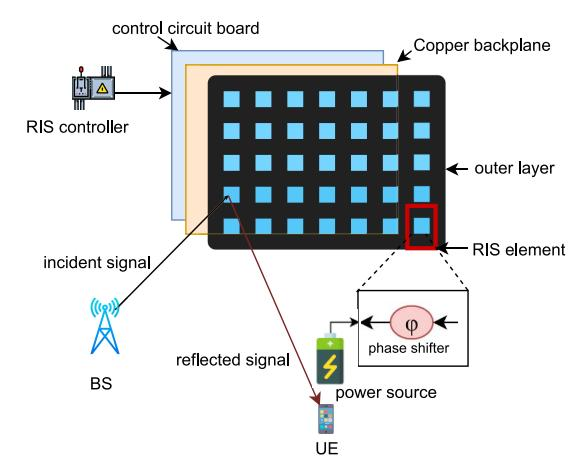

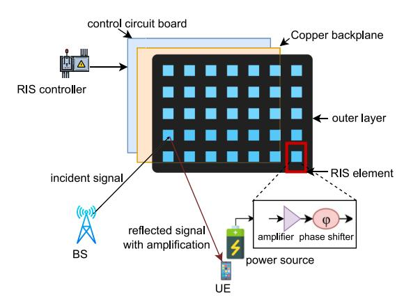

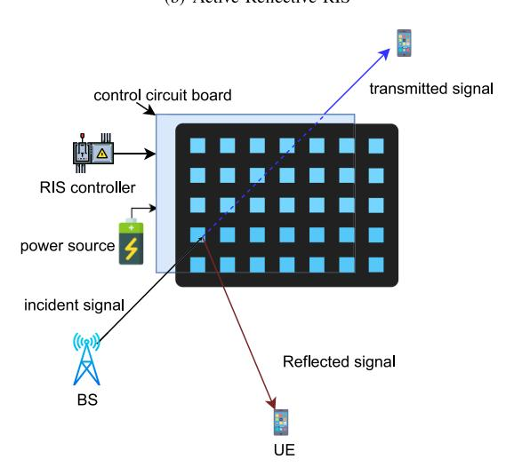

Fig. 2. Comparative structure of RIS under different modes of operation, (a) Passive Reflective RIS can alter the phase of the incident signal only, (b) Active Reflective RIS can amplify and alter the phase of the incident signal, (c) Transmissive RIS passes the signal through while STAR RIS can perform both transmission and reflection simultaneously. The reflection coefficient of each RIS element is reconfigurable in real time via the controller.

The RIS operates by modifying the propagation of electromagnetic waves by reflecting, refracting, or scattering them [\[1\]](#page-28-0). Typically, the tunable elements within RIS are diminutive antennas or resonators that can be electrically manipulated to adjust their electromagnetic properties, including resonant frequency, impedance, and polarization [\[69\]](#page-30-13). By altering the impedance of each tunable element, the RIS can govern the amplitude and phase of the reflected or transmitted wavefront, effectively directing the wave towards a desired direction or concentrating it on a specific location [\[2\]](#page-28-1). Entrusted with the role of tweaking the electrical parameters of these tunable elements in real-time, the RIS controller uses feedback from the wireless channel conditions, modulation scheme, and performance targets. It employs feedback from the receiver to fine-tune the settings of the tunable elements, optimizing signal quality while curbing interference and noise [\[3\]](#page-28-2). Various hardware and software technologies, ranging from analog, digital, or hybrid to software-defined or artificial intelligence (AI)-based solutions, can implement the RIS controllers [\[69\]](#page-30-13). The selection of a controller hinges on the RIS's application, complexity, and performance prerequisites [\[70\]](#page-30-14).

Here, we briefly discuss some of the RIS working operations:

- • *Reflective RIS:* This is the most common type, shown in Figure [2\(](#page-4-0)a), where elements of the surface can alter the phase of the incident signal. These essentially act as programmable mirrors that shape and direct the radio waves toward a specific direction [\[71\]](#page-30-15). Each RIS element reflects the incoming signal due to the copper backplane [\[72\]](#page-30-16). An RIS can reflect electromagnetic signals independently in reflection mode using its *N* reflection units. The magnitude, α*n* ∈ [0, 1], and phase, φ*n* ∈ [0, 2π), of the reflection coefficient of each reflection unit are reconfigurable via the controller. This leads to a baseband signal model of, **y***n* = α*nej*φ*n* **x***n*, for each unit, where **x***n* is the incident signal and **y***n* is the reflected signal, respectively. For the entire RIS surface, the relationship between the incident and reflected signals can be represented by a diagonal matrix, as the reflection units are independent, given as, **y** = diag(α1*ej*φ1 ,...,α1*ej*φ*n* ,...,α1*ej*φ*N* )**x** = **Ωx**, where **Ω** is the reflection coefficient matrix of RIS. The RIS is designed to reflect incident signals maximally, i.e., ideally α = 1. However, α in practice may not be equal to 1. It is usually a constant with a value dependent on the specific circuit [\[52\]](#page-29-39). The magnitude and phase, α and φ, can be varied within an interval with the limitation on cost and complexity. This leads to three practical reflection coefficient types: constant amplitude with continuous phase shift, optimized amplitude with continuous phase shift, and constant amplitude with discrete phase shift. Continuous phase shift is assumed in some papers, but it is limited by high hardware costs. Thus, a discrete phase shift is often used to increase cost-effectiveness. It is worth mentioning that the amplitude and phase control are not necessarily independent, i.e., when the phase is varied, this also varies the amplitude.
- *Transmissive RIS:* This type allows signals to pass through the surface, modifying their characteristics in the process. This provides an additional degree of flexibility

in controlling the wave propagation. Incident signal penetrates the RIS elements due to the absence of copper backplane as shown in Figure 2(c) [72].

- Hybrid RIS: Common RIS designs feature metasurfaces made of passive meta-atoms (building blocks of the meta materials) that can reflect incoming waves in adjustable ways. However, this exclusive reflection method poses considerable coordination challenges in wireless networks. For instance, RIS don't possess the needed data to modify their reflection patterns independently; this data must be gathered by other network components and then relayed to the RIS controller. Moreover, gauging the communication channel, vital for coherent RIS-aided communication, is problematic when using existing RIS models. Hybrid Reflecting and Sensing RIS offer a solution by allowing metasurfaces to not only adjustably reflect the incoming signal but also sense a fraction of it [73]. This sensing ability of hybrid RIS supports many network management tasks, like estimating channel parameters and pinpointing locations, paving the way for potentially self-regulating and selfsetting metasurfaces.
- • Simultaneously transmitting and reflecting (STAR) RIS: This variant allows the RIS to perform both transmission and reflection simultaneously, making it highly efficient and versatile for various communication needs [74]. Conventional RIS, due to their hardware design, are capable of only reflecting incident signals, serving wireless devices situated on the same side. This restricts their deployment adaptability and coverage span [75], [76]. To overcome these limitations, a new type of metamaterial called STAR-RIS has been introduced [77], [78]. It supports both electric-polarization and magnetization currents, enabling it to reflect and/or transmit the incident signals [79]. In contrast to conventional RIS, it can offer full-space service coverage (i.e., 360 degrees), leading to enhanced deployment flexibility.
- • RIS with Non-Diagonal Control: In conventional RIS structures, it is assumed that a signal hitting a specific element can only be reflected from that same element after the phase shift adjustment. There was no deliberate association between the RIS elements. The phase shift matrix in such designs was diagonal, such that each RIS element is connected to the load disassociated from the other elements on the surface, leaving untapped potential for system performance enhancement through RIS. On the contrary, RIS with non-diagonal control has a design based on non-reciprocal connections, allowing the signal impinging on one element to be reflected from a different element after phase shift adjustment [80]. Consequently, the phase shift matrix can be non-diagonal. This allows for greater adaptability in configuring the RIS structure to optimize system performance. They can increase reflected power, enhance aggregate data rate, and provide versatility in a variety of deployment scenarios.
- Active RIS: In the case of passive RIS, the path loss between the transmitter-RIS-receiver connection is determined by multiplying, rather than adding, the path losses

of the transmitter-RIS and RIS-receiver connections. This value is typically many times greater than the direct link's path loss [81]. Consequently, this "multiplicative fading" phenomenon often renders it highly challenging for passive RIS to realize significant capacity gains in numerous wireless settings [82]. It is, thus, a significant performance hindrance to passive RIS operation [83]. Active RIS was introduced as a solution. Like its passive counterpart, it can reflect incident signals with adjustable phase shifts, but it can also amplify these signals, as shown in Figure 2(b). Its hardware architecture is, thus, different from the passive RIS such that its design involves reflection-type amplifiers in addition to the phase shift circuits. Active RIS needs considerably more power to operate [84].

#### B. RIS-Assisted Localization in 6G Networks

In this subsection, we present a fundamental example for RIS-assisted radio localization, providing a foundational framework upon which more advanced and specialized methods can be developed to address a range of complex problems. The flowchart presenting the typical processing phases is shown in Figure 3. To further illustrate the functioning of RIS in collaboration with BS for UE localization, consider the scenario showing the RIS-assisted radio localization environment in Figure 4(b) where a multiantenna BS equipped with  $N_{\rm BS}$ antennas is located at  $\mathbf{p}_{BS} = (x_{\text{BS}}, y_{\text{BS}}, z_{\text{BS}})$ . RIS has  $N_{\text{RIS}}$ reflecting elements with its center located at  $(x_{RIS}, y_{RIS}, z_{RIS})$ and the UE with  $N_{\text{UE}}$  antennas is at  $\mathbf{p}_{UE} = (x_{\text{UE}}, y_{\text{UE}}, z_{\text{UE}})$ . In the context of localization, the UE has an unknown state, i.e., location, orientation and clock bias that needs to be determined based on received downlink signals. The BS, with a known state transmits signals on distinct subcarriers. These signals create observations  $\mathbf{y}_{n,k}$  at the UE receiver over the channel  $\mathbf{H}_{n,k}$ . By analyzing these downlink observations, the UE can estimate its location based on the known location of the BS and the RIS.

1) Signal Model at UE: We consider a generic frequency domain representation of the received signal and channel model for N samples spaced  $\Delta f$  apart [85]. The received signal at the UE for frequency  $n \in \{0, \ldots, N-1\}$  and symbol  $k \in \{0, \ldots, k-1\}$  can be represented as,

$$\mathbf{y}_{n,k} = \mathbf{H}_{n,k} \mathbf{x}_{n,k} + \mathbf{n}_{n,k},\tag{1}$$

where  $\mathbf{y}_{n,k}$  is the received pilot signal at the UE,  $\mathbf{x}_{n,k}$  is the transmitted pilot signal from the BS, and  $\mathbf{n}_{n,k}$  is the additive Gaussian noise.

2) Channel Model: Two types of propagation paths are available from the BS to the UE in this scenario, i.e., a direct, line-of-sight (LoS), path from the BS to the UE and reflected, NLoS, paths through the RIS or other objects in the environment. In the illustrated downlink scenario, considering a far-field channel with planar wave assumptions (as opposed to the spherical wave structure of near-field channels), the combined channel response, encompassing both the direct and NLOS reflected paths, is given as,

$$\mathbf{H}_{n,k} = \mathbf{H}_{n,k}^{\text{direct}} + \mathbf{H}_{n,k}^{\text{NLoS}}.$$
 (2)

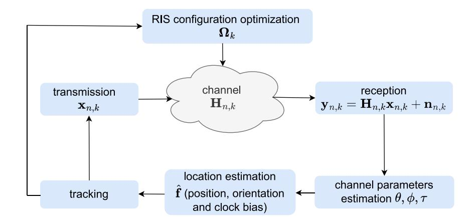

Fig. 3. Flowchart demonstrating the typical processing phases in RIS-assisted localization in 6G networks. In the downlink scenario, the transmitted signal received at the UE is used for channel parameters estimation and UE localization. Tracking information is utilized to optimize the RIS configuration.

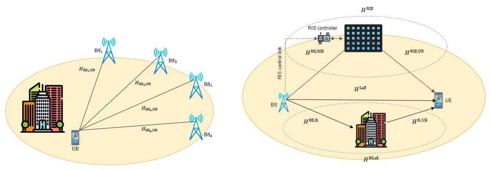

(a) Conventional non-RIS-assisted localization network.

(b) RIS-assisted localization network.

Fig. 4. Illustration of non-RIS-assisted and RIS-assisted localization networks. Localization without RIS requires multiple BSs. The use of RIS makes localization possible with lesser infrastructure with the added advantage of energy efficiency, minimal deployment, and maintenance cost.

Here,  $\mathbf{H}_{n,k}^{\mathrm{direct}} \in \mathbb{C}^{N_{\mathrm{BS}} \times N_{\mathrm{UE}}}$  is the channel frequency response of the direct path, given as [85]

$$\mathbf{H}_{n,k}^{\text{direct}} = \sum_{l=1}^{L} \alpha_l \mathbf{a}_{\text{UE}}(\theta_l) \mathbf{a}_{\text{BS}}(\phi_l) e^{-j2\pi n\Delta f \tau_l}, \tag{3}$$

where

$$|\alpha_l|^2 = \frac{\lambda^2}{(4\pi)^2} \frac{G_{\text{UE}}(\theta_l) G_{\text{BS}}(\phi_l)}{\|d_{BS-UE}\|^2},$$
 (4)

is the complex channel gain with L being the number of direct signal propagation paths,  $\mathbf{a}_{\mathrm{UE}}(\theta) \in \mathbb{C}^{N_{\mathrm{UE}}}$  is the UE array response as the function of angle-of-arrival (AOA)  $\theta \in \mathbb{R}^2$  in azimuth and elevation,  $\mathbf{a}_{\mathrm{BS}}(\phi) \in \mathbb{C}^{N_{\mathrm{BS}}}$  is the BS array response as function of angle-of-departure (AOD)  $\phi \in \mathbb{R}^2$  in azimuth and elevation,  $\lambda$  is the carrier wavelength,  $G_{\mathrm{BS}}(\cdot)$  and  $G_{\mathrm{UE}}(\cdot)$  are the antenna gains at the BS and UE, and  $\tau_l$  is the time-of-arrival (TOA) given by

$$\tau_l = \frac{d_{BS-UE}}{c} + K \tag{5}$$

where  $d_{BS-UE}$  is the distance from BS antenna element to the UE antenna element, c is the speed of light and K is the clock synchronization offset.

From (2),  $\mathbf{H}_{n,k}^{\mathrm{NLoS}}$  is the combination of reflected signal channel frequency response at the UE from the intended RIS reflectors as well as the random obstacles in the environment. It can, thus, be expressed as,

$$\mathbf{H}_{n,k}^{\text{NLoS}} = \mathbf{H}_{n,k}^{\text{RIS}} + \sum_{i=1}^{I} \mathbf{H}_{n,k}^{\text{NLoS}_{(i)}}, \tag{6}$$

where I is the number of reflectors between BS and UE, other than RIS. The channel response from such reflectors is defined as [21]

$$\mathbf{H}_{n,k}^{\text{NLoS}} = \sum_{i=1}^{I} \alpha_i \mathbf{a}_{\text{UE}}(\theta_i) \mathbf{a}_{\text{BS}}(\phi_i) \mathbf{a}_{\text{R}} e^{-j2\pi n\Delta f \tau_i}, \quad (7)$$

such that

$$|\alpha_i|^2 = \frac{\lambda^2}{(4\pi)^2} \frac{\Gamma_{R_i - UE} G_{\text{UE}}(\theta_i) G_{\text{BS}}(\phi_i)}{(d_{BS - R_i} + d_{R_i - UE})^2},$$
 (8)

and

$$\tau_i = \frac{d_{BS-R_i} + d_{R_i - UE}}{c} + K,\tag{9}$$

where  $d_{BS-R_i}$  and  $d_{R_i-UE}$  are the distances from BS to reflector  $R_i$  and from  $R_i$  to UE,  $\mathbf{a}_R$  is the steering vector of the reflector R and  $\Gamma_{R_i-UE}$  is the attenuation coefficient. Given the point of incidence of signal on a reflector be  $\mathbf{p}_{\mathrm{inc},m} \in \mathbb{R}^3$ , the UE array response  $\mathbf{a}_{\mathrm{UE}}(\theta_i)$  (similarly for BS array response vector  $\mathbf{a}_{\mathrm{BS}}(\phi_i)$  consists of entries given by [86],

$$[\mathbf{a}_{\mathrm{UE}}(\theta_i)]_k = \exp\left(j\frac{2\pi(\mathbf{p}_{\mathrm{UE},k} - \mathbf{p}_{\mathrm{UE}})^{\top}\mathbf{u}(\theta_i)}{\lambda}\right), \quad (10)$$

where  $\mathbf{p}_{\mathrm{UE},k} - \mathbf{p}_{\mathrm{UE}}$  represents the position of the k-th antenna element relative to the reference UE location, and  $\mathbf{u}(\theta_i) = \mathbf{p}_{\mathrm{inc},m} - \mathbf{p}_{\mathrm{UE}}/\|\mathbf{p}_{\mathrm{inc},m} - \mathbf{p}_{\mathrm{UE}}\|$ , all defined in the UE's frame of reference. These NLoS signals become increasingly important when the LoS between the BS and UE is absent.

The  $\mathbf{H}_{n,k}^{\mathrm{RIS}}$  in (6) is the RIS incident and reflected signal channel response such that  $\mathbf{H}_{n,k}^{\mathrm{BS},\mathrm{RIS}} \in \mathbb{C}^{N_{\mathrm{BS}} \times N_{\mathrm{RIS}}}$  is the channel response of the path from the BS to the RIS and  $\mathbf{H}_{n,k}^{\mathrm{RIS},\mathrm{UE}} \in \mathbb{C}^{N_{\mathrm{RIS}} \times N_{\mathrm{UE}}}$  is the channel response from the RIS to the UE, collectively given as [86],

$$\mathbf{H}_{n,k}^{\mathrm{RIS}} = \mathbf{H}_{n,k}^{\mathrm{BS,RIS}} \mathbf{H}_{n,k}^{\mathrm{RIS,UE}}$$

$$= \alpha_k^{\mathrm{RIS}} \mathbf{a}_{\mathrm{UE}}(\theta_{\mathrm{RIS}}) \mathbf{a}_{\mathrm{BS}}(\phi_{\mathrm{RIS}}) e^{-j2\pi n\Delta f \tau_{\mathrm{RIS}}},$$
 (11)

where

$$\alpha_k^{\rm RIS} = \alpha_{\rm BS-RIS} \alpha_{\rm RIS-UE} \mathbf{a}_{\rm RIS}^{\top} (\phi_{\rm RIS-UE}) \mathbf{\Omega}_k \mathbf{a}_{\rm RIS} (\theta_{\rm BS-RIS}). \tag{13}$$

Here,  $\alpha_k^{\rm RIS}$  is controllable,  $\alpha_{\rm BS-RIS}$  is the complex gain from BS to RIS,  $\alpha_{\rm RIS-UE}$  is the complex gain from RIS to the UE,  ${\bf a}_{\rm RIS}(.)$  is the RIS response function as the function of AOA from BS,  $\theta_{\rm BS-RIS}$ , and the AOD to the UE,  $\phi_{\rm RIS-UE}$  and  $\Omega_k$  determines the RIS configuration [86]. A RIS with a known location can provide valuable geometric information, such as TOA, an angle at the UE, and an angle at the RIS. Essentially, the RIS operates as an auxiliary, synchronized BS with a phased array, transmitting the same signal as the primary BS [86]. The RIS configurations  $\Omega_k$  can be optimized based on prior location information.

- 3) UE Localization: For the localization of the UE, its position, orientation, and clock bias information are inferred from the received signal  $\mathbf{y}_{n,k}$ , details of which are well summarized in [85], [86] and discussed briefly below. The process encompasses three steps: first, the channel parameters (TOAs, AOAs, AODs) are estimated. Second, if the LoS is available then its parameters, NLoS and RIS path parameters are extracted, and finally, the UE is localized.
- a) Channel parameter estimation: In wireless communication, channel estimation FFT/Periodograms [87], ESPRIT [88], and orthogonal matching pursuit [89] use principles of sparsity or harmonic retrieval [85]. A common approach is to first obtain a least-squares channel estimate  $\hat{\mathbf{H}}_{n,k}$ , which can then be vectorized for compressive sensing to estimate path counts and delays. Another way is to arrange least-square estimates of channel parameters in tensor form which allows multidimensional harmonic retrieval. Initial path estimates, gains, and geometry can be refined by maximizing the likelihood

function  $\log p(\mathbf{y}|\kappa)$ , where  $\kappa$  includes parameters like path gains, angles, and delays.

b) Location estimation: To estimate the UE's location, the channel parameters  $\hat{\eta}$  (e.g., angles, delays), whose estimator uncertainties need to be known, are mapped to the UE state  $\mathbf{f}$  through the relationship  $\hat{\eta} = \mathbf{h}(\mathbf{f}) + \mathbf{n}$ , where  $\mathbf{h}(\mathbf{f})$  represents the geometric model linking the UE state to channel parameters  $(\tau, \theta, \phi)$  and  $\mathbf{n}$  represents measurement noise with statistics that depend on the channel parameter estimation. The parameter  $\hat{\eta}$  provides estimated angles, and delays with associated noise. We estimate  $\mathbf{f}$  by minimizing the cost function [85] given by

$$\hat{\mathbf{f}} = \arg\min_{\mathbf{f}} (\hat{\eta} - \mathbf{h}(\mathbf{f}))^{\top} \mathbf{\Sigma}^{-1} (\hat{\boldsymbol{\eta}}) (\hat{\boldsymbol{\eta}} - \mathbf{h}(\mathbf{f})). \tag{14}$$

After obtaining an initial estimate, local optimization refines  $\hat{\mathbf{f}}$ . The uncertainty,  $\Sigma(\hat{\mathbf{f}})$ , is then calculated as

$$\Sigma^{-1}(\hat{\mathbf{f}}) = \left(\frac{\partial \eta}{\partial \mathbf{f}}\right)^{\top} \Sigma^{-1}(\hat{\eta}) \frac{\partial \eta}{\partial \mathbf{f}} \Big|_{\mathbf{f} = \hat{\mathbf{f}}}.$$
 (15)

This estimated location and uncertainty,  $(\hat{\mathbf{f}}, \Sigma(\hat{\mathbf{f}}))$ , can be further integrated into tracking algorithms for more robust localization and RIS configuration optimization.

4) Extensions: The aforementioned channel and signal modeling represent the most simple version of the RIS-assisted localization problem, setting the stage for many extensions. For instance, the channel model can be generalized to include wavefront curvature, the RIS model can be generalized to hybrid, STAR, or Non-Diagonal Control RIS, each with their own localization benefits and challenges.

#### C. RIS Support for Radio Localization

In a standard SISO non-RIS-assisted localization network, shown in Figure 4(a), four synchronized single antenna BSs transmit pilots, generating time-difference-of-arrival (TDOA) or TOA. The UE position is estimated by intersecting hyperboloids (TDOAs) or calculating TOAs for clock bias synchronization [34]. Using round-trip time (RTT) with three BSs allows localization by intersecting spheres centered at the BSs. The UE's velocity is determined from four Doppler shifts. The limitations of such conventional localization include: (i) the need for several BSs for localization, whereas only one is needed for communication, leading to network over-provisioning to support localization systems; (ii) even massive MIMO BSs offer limited angular resolution, making localization constrained by multipath; and (iii) timebased measurements, i.e., TOA and TDOA, which provide the most information for localization, require BSs to be time-synchronized at the sub-nanosecond level. In the following subsection, we show how the inclusion of RIS can address these limitations by reducing reliance on infrastructure, offering high angle resolution, and eliminating extreme synchronization requirements. We delve into the multifaceted role of RIS in enhancing radio localization capabilities, examining how RIS transforms cellular networks into intelligent environments, how it works in tandem with BS for effective UE localization, and exploring applications of RIS-assisted localization in emerging technologies.

*1) RIS-Enhanced Localization in Smart Radio Environments:* Next-generation cellular networks are evolving towards "smart radio environments" enhanced by RIScovered walls and objects, enabling them to reconstruct and modify radio signal properties like transmission direction and polarization. This innovation leads to an intelligent transmission environment, offering new possibilities in communication, sensing, and localization [\[69\]](#page-30-13), [\[90\]](#page-30-34), [\[91\]](#page-30-35). The integration of RIS promises improved localization accuracy and extended coverage, contingent upon the development of suitable models and algorithms [\[1\]](#page-28-0). Compared to traditional MIMO systems, RIS offers superior localization due to its large surface area, which improves its signal transmitting, receiving, or reflecting capabilities. The Cramér-Rao lower bound (CRLB), a measure of the lower limit of the variance for an unbiased estimator, for UE localization decreases as the RIS area increases, barring certain positions [\[27\]](#page-29-1), [\[36\]](#page-29-23). Distributed RIS deployments are found to enhance CRLB and broaden localization coverage. Further, RIS allows for high-precision radio localization and sensing, significantly estimating UE and device positions [\[38\]](#page-29-25). The RIS-aided downlink localization offers better coverage and accuracy than traditional reflecting surfaces and scatter points [\[39\]](#page-29-26). These advancements highlight the role of RIS in enhancing radio localization systems.

Accurately quantifying phase and amplitude is essential for effective localization with RIS, but full-resolution measurements can be expensive. Exploring the impact of phase and amplitude quantization on localization is therefore important. The comparison of full-resolution measurements with varying quantization resolutions shows that phase quantization has a more significant effect on the CRLB of localization than amplitude quantization, but both do not greatly differ in CRLB loss [\[36\]](#page-29-23), [\[37\]](#page-29-24). This insight is pivotal for practical RISassisted localization, suggesting enhanced phase resolution at the RIS for better accuracy. Utilizing explicit geometric information in wireless channels below 6 GHz is challenging due to limited delay and angle resolution and weak path connectivity to environment geometry. In contrast, frequencies above mmW link more closely to environment geometry and offer better resolution [\[85\]](#page-30-29), [\[93\]](#page-30-36). The high bandwidth and large antenna arrays in mmW and THz bands provide high spatial and temporal resolution, leading to a focus on these higher frequency bands in the majority of the studies in contemporary literature [\[40\]](#page-29-27), [\[89\]](#page-30-33), [\[94\]](#page-30-37), [\[95\]](#page-30-38), [\[96\]](#page-30-39). Moreover, often indoor scenarios are considered due to the limited transmission range of mmW or THz frequencies. While global navigation satellite systems (GNSS) can offer acceptable outdoor localization, its effectiveness is reduced indoors where signal strength is low. In such environments, RIS not only aids in precise localization but also helps alleviate communication congestion caused by obstructions.

When considering algorithms for RIS-assisted localization, it is important to distinguish between far-field and near-field assumptions [\[1\]](#page-28-0). In the far-field, energy travels away from the source, and the plane wave assumption is valid, while in the near-field, energy is periodically stored and returned to the source, with radiation patterns varying based on distance from the source, hence the spherical wave model applies. The near-field region's extent in RIS-assisted networks is linked to the RIS's surface area. Near-field propagation, characterized by wavefront curvature, becomes significant at moderate distances to the RIS and must be accurately represented in the communication system. The near-field area of RIS inversely correlates with the wavelength of the incident signal, and its size increases with both operation frequency and surface area, making the UE likely to be in this region. Therefore, particularly in indoor environments at mmW and THz frequencies, far-field models are generally inapplicable [\[97\]](#page-31-0).

*2) Applications of RIS-Assisted Localization in Emerging Technologies:* RIS-assisted localization offers significant benefits for various applications requiring high accuracy and low latency. It revolutionizes indoor and outdoor localization in IoT networks, smart cities, and automated factories, as shown in Figure [5](#page-9-0) [\[92\]](#page-30-40). RIS enhances IoT network performance by optimizing signal propagation in different communication scenarios, contributing to advanced multisensory extended reality applications and tele-control technologies by ensuring precise device tracking and location accuracy (Figures [5\(](#page-9-0)d) and [5\(](#page-9-0)g)) [\[24\]](#page-29-20). It also plays a crucial role in wireless brain computer interfaces, improving signal quality and reliability for patient tracking and tele-surgery applications (Figure [5\(](#page-9-0)f)) [\[98\]](#page-31-1), [\[99\]](#page-31-2). In smart indoor services, RIS overcomes NLoS challenges and improves privacy protection, crucial for secure and efficient local coverage (Figure [5\(](#page-9-0)c)). It is pivotal in smart transportation, enhancing autonomous driving and vehicle-to-vehicle communications by providing accurate three dimensional (3D) mapping and robust localization in dynamic environments (Figure [5\(](#page-9-0)b)). For automated factories and connected robotics and autonomous systems (CRAS), RIS facilitates cooperative localization, essential for IoT device interaction and efficient production processes (Figure [5\(](#page-9-0)a)) [\[98\]](#page-31-1), [\[100\]](#page-31-3). However, fulfilling these applications in 6G networks presents challenges as outlined in Section [IV.](#page-25-0) The integration of RIS into communication networks can significantly enhance localization and sensing performance. By intelligently manipulating wireless signals, RIS can optimize signal paths, minimize delay, and improve accuracy, thereby enabling intelligent interactions across various applications.

### *D. RIS-Assisted Localization Taxonomy*

RIS-assisted localization works by estimating the location and orientation of a UE with the help of anchor nodes (BS and RIS) provided the location of anchor nodes is already known [\[1\]](#page-28-0). To locate itself, UE sends out a known uplink pilot signal to the BS or receives a downlink pilot signal from the BS. The signal's behavior is influenced by the propagation channel, which depends on the location and orientation of the BS and UE, as well as the environment surrounding them. The level of distortion in the received signal is determined by reflections from the RIS and other objects in the vicinity [\[86\]](#page-30-30). The direct unobstructed link from the BS to the UE is called the LoS path, the path of the signal reflected by the RIS is RIS path, and all the other NLoS paths from walls and objects in the environment are classified as the reflected paths and

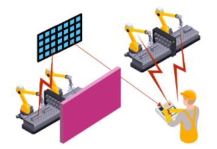

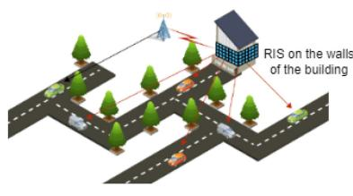

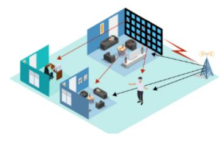

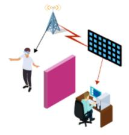

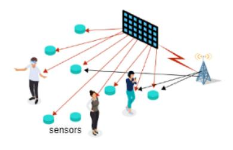

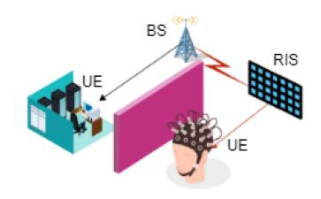

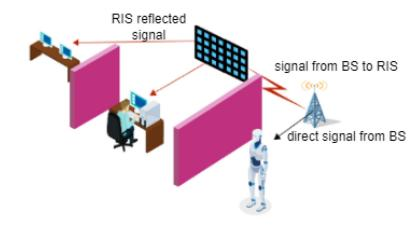

Fig. 5. Illustration of RIS-assisted localization applications in 6G networks from the use case families in [\[92\]](#page-30-40). Use cases prominently include sustainable development, massive twinning, telepresence, robots to collaborative robots, and local trust zones.

the scattered paths, respectively. Successful modeling of the pilot signal and the channel allows us to estimate the channel state information (CSI) and identify the parameters for the signal paths [\[23\]](#page-29-19). These parameters, which aid in localization, include TOA/delay, AOA, and AOD. UE location can be estimated based on these parameters and their geometrical relationships with the BS and RIS locations [\[85\]](#page-30-29). RIS-assisted radio localization scenarios can be either in indoor or outdoor environments, based on which the channel modeling is different.

RIS-assisted localization can also be classified on the basis of the application scenario, localization technique, functionality of RIS employed and its configuration and deployment details, localization method as well the localization performance matrices. A brief taxonomy of RIS-assisted localization systems is shown in Figure [6](#page-10-0) and illustrated in Figure [7,](#page-10-1) respectively.

*1) Localization Measurements:* Geometry-based techniques are widely used for radio localization and typically involve timing-based (TOA) and angle-based (AOA/AOD) methods [\[17\]](#page-29-40). The TOA is the time taken by the signal to travel from the BS to the UE. Timing-based localization technique, named trilateration, uses the measured TOA while considering the effects of RIS reflections, to estimate the location. The technique requires at least three BSs to get an unambiguous two dimensional (2D) estimate of the UE location when RIS are not considered. An alternative is to estimate RTT by recording signal transmission, processing and reception times, providing necessary TOA information. Wellsynchronized systems can directly infer TOA from signals, with resolution dependent on signal bandwidth. Angle-based localization technique, named triangulation, estimates the angle from which signals arrive at the receiver, incorporating RIS-assisted reflections, to determine the location [\[101\]](#page-31-4). It is typically employed when an antenna array is available at the BS. Some of the other estimation techniques rooted in TOA and AOA include TDOA estimation, AOD-based estimation, angle-difference-of-arrival location and orientation estimation.

The received signal strength (RSS)-based localization techniques utilize the RSS measurements from RIS-assisted reflections to estimate the location of the receiver [\[38\]](#page-29-25). It assists with the geometry-based trilateration and fingerprinting localization algorithms [\[64\]](#page-30-11). This method capitalizes on the sensitivity of RSS to spatial variations, allowing for accurate localization even in complex indoor or outdoor urban scenarios [\[102\]](#page-31-5). The reconfigurability of RIS enables real-time adaptation to changing propagation conditions, enhancing the precision and robustness of the localization system.

The channel state information (CSI)-based localization methods exploit the fine-grained CSI obtained through RISassisted reflections for accurate localization. CSI contains valuable insights into the wireless propagation environment,

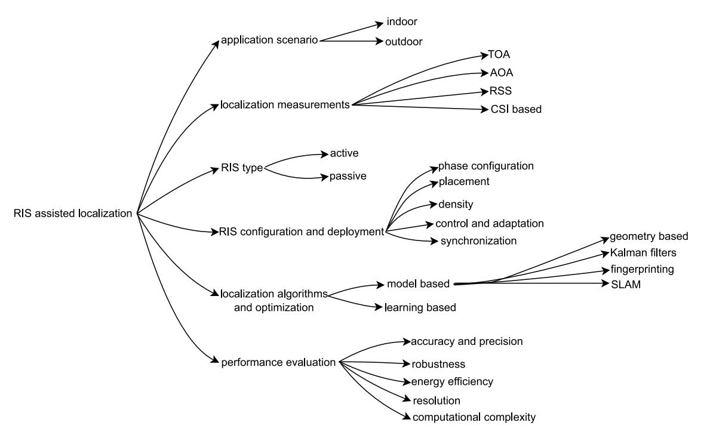

Fig. 6. Taxonomy of RIS-assisted localization. Signal processing involving localization measurements and algorithms could take place at the UE or BS depending on the mode of communication, i.e., uplink or downlink.

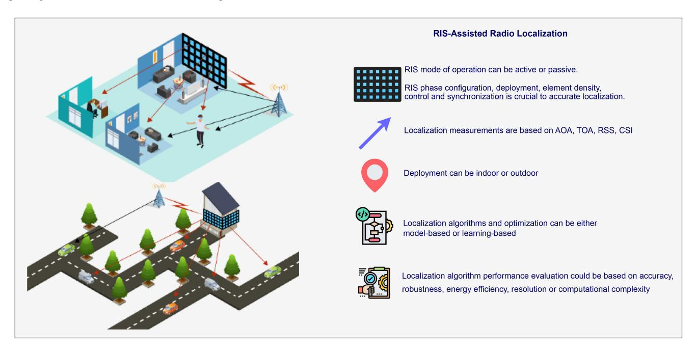

Fig. 7. Illustration of RIS-assisted localization taxonomy. Signal processing involving localization measurements and algorithms could take place at the UE or BS depending on the mode of communication, i.e., uplink or downlink.

including path loss, multipath components, and spatial signatures [\[59\]](#page-30-6). Using advanced signal processing and machine learning (ML) algorithms, the collected CSI data can be used to estimate the position of the devices [\[61\]](#page-30-8). The integration of RIS with CSI-based localization enables radio localization in dynamic scenarios with changing propagation conditions.

*2) RIS Type:* As discussed in Section [II-A,](#page-5-1) in 6G radio localization, RIS are pivotal, functioning in either passive or active states. Passive RIS, requiring little external power, adjust

only the phase of electromagnetic waves, offering simpler, energy-efficient deployment but limited signal control. In contrast, active RIS, equipped with elements like integrated circuits, can independently manipulate both signal phase and amplitude, enabling more complex functions like dynamic beamforming and interference cancellation [\[71\]](#page-30-15), [\[82\]](#page-30-26), [\[103\]](#page-31-6).

*3) RIS Configuration and Deployment:* The configuration and deployment of RIS play a crucial role in RIS-assisted radio localization. The optimization of the phase configuration in RIS systems holds immense significance in unlocking its full potential. By precisely fine-tuning the phase shifts of the RIS elements, we can achieve remarkable control over signal propagation, allowing for unprecedented customization and optimization of wireless communication links [\[1\]](#page-28-0). The optimization process involves carefully analyzing the channel characteristics, understanding the desired signal characteristics, and employing advanced algorithms to determine the optimal phase shifts for each RIS element [\[86\]](#page-30-30). Through this optimization, we can exploit constructive interference, nullify destructive interference, and shape the signal to match specific requirements, such as maximizing coverage, minimizing signal attenuation, or focusing energy in desired directions [\[23\]](#page-29-19).

The placement and arrangement of RIS in the environment directly impacts the accuracy, coverage, and performance of the localization system [\[84\]](#page-30-28). Determining the optimal locations for deploying RIS elements is fundamental to achieving the desired coverage area, signal propagation characteristics, and localization requirements. Proper deployment ensures optimal coverage of the desired area, minimizing low coverage spots and maximizing the availability of RIS reflections for localization purposes [\[1\]](#page-28-0). Additionally, the number of RIS elements deployed per unit area or volume affects the granularity of control and the accuracy of localization. The configuration of the RIS elements, including the reflection coefficients, is vital in manipulating the signal propagation and optimizing the received signal at the receiver [\[104\]](#page-31-7). The dynamic reconfigurability of RIS further enhances their role, allowing for real-time adaptation to changing propagation conditions and environmental dynamics [\[105\]](#page-31-8). Moreover, ensuring proper synchronization among the RIS elements to avoid interference is equally important to configure [\[106\]](#page-31-9), [\[107\]](#page-31-10). By intelligently configuring and deploying RIS, the localization system can achieve improved accuracy, robustness, and scalability, enabling a wide range of location-based applications in various scenarios.

- *4) Localization Algorithms and Optimization:* RIS-assisted localization algorithms can be broadly classified as modelbased and learning-based [\[23\]](#page-29-19). Model-based methods include deductive (physics-based) techniques such as geometry-based location estimation algorithms, Kalman filters, fingerprinting, and SLAM. On the other hand, learning-based techniques are inductive (data-driven) and leverage ML algorithms such as neural networks to learn and model the relationship between RIS-assisted signals and the receiver's location. The advantages of model-based approaches versus data-driven methods are numerous. They are supported by performance constraints that give solid assurances of optimality and dependability, rely on well-established signal processing techniques, and offer typically less complexity than data-driven systems. Some of the model-based approaches that are commonly employed in RIS-assisted localization are briefly discussed below.
  - *Geometry-based methods:* Geometry-based methods rely on the TOA and AOA measurements or their combination to determine the 2D or 3D location of the UE [\[85\]](#page-30-29), [\[86\]](#page-30-30). In traditional systems, such methods require a combination of measurements from multiple BSs to determine the UE location. However, the location of the UE can

- be estimated with the help of one BS and a RIS [\[39\]](#page-29-26), more details in [\[34\]](#page-29-21). Location estimation typically entails creating an objective function that incorporates geometric information and solving an optimization problem with geometric constraints. Geometry-based localization techniques are characterized by being free from training requirements, easily analyzable from a theoretical standpoint, and scalable across various environments.
- • *Kalman filter:* The Kalman filter is a recursive estimation algorithm that optimally fuses noisy measurements with a dynamic model to estimate the state of a system. In the context of localization, the Kalman filter predicts the device's position based on the previous state estimate and motion dynamics and then updates it using RIS-assisted measurements such as RSS or TOA [\[108\]](#page-31-11). The Kalman filter-based approach can effectively mitigate the impact of noise, multipath, and other propagation effects on localization accuracy by iteratively updating the state estimate and incorporating RIS-assisted measurements [\[86\]](#page-30-30). Despite its widespread use in localization, Kalman filtering has several limitations. Its assumptions of system linearity and Gaussian noise can be inaccurate in complex, real-world scenarios [\[23\]](#page-29-19). The initial state, which the filter requires, may not always be accurately known, and any errors in it can propagate, causing inaccuracies in state estimation. Furthermore, Kalman filters assume constant process and measurement noise covariances, an assumption often violated in real-world conditions. For nonlinear challenges, one can utilize an extended Kalman filter [\[109\]](#page-31-12). This approach estimates the state distribution by employing a Gaussian random variable and advances it through first-order linearization. Finally, Kalman filters are sensitive to model mismatches and outliers, which can significantly affect their performance [\[23\]](#page-29-19).
- • *Fingerprinting:* In the fingerprinting approach, a database of signal fingerprints is created by collecting and mapping the received signal characteristics at various locations in the environment [\[10\]](#page-29-9). The fingerprint database contains information such as RSS, CSI, or signal amplitude patterns specific to each location. RSS has limited precision and CSI demands significant computational resources, spatial beam signal-to-noise ratio (SNR) is chosen as an intermediate channel measurement with moderate granularity [\[110\]](#page-31-13). When a device needs to be localized, it measures the RSS or other signal characteristics at multiple RIS-assisted points in the environment. These measurements are then compared with the fingerprint database to find the closest match. The RIS play a crucial role in this process by manipulating the wireless channel to enhance the quality and reliability of the measurements. By adjusting the reflection coefficients of the RIS elements, the received signal can be optimized, leading to more accurate and consistent measurements. However, if the configuration of the RIS changes over time, it would effectively alter the environmental characteristics that the fingerprint is based on, potentially decreasing the accuracy of location estimates. To guarantee the stationarity of the environment when employing RIS

in fingerprinting, the configuration of the RIS should be kept constant during both the fingerprinting process and when using the fingerprint for location estimation. This means that the phase shifts or other manipulations applied to signals by the RIS should be fixed and not vary over time. In practice, this might require careful design and control of the RIS, and thorough testing to ensure its configuration remains stable under different conditions. This issue is resolved by including in the fingerprint the RIS configuration. This provides a richer set of fingerprints. The fingerprint matching process can utilize techniques such as pattern matching or ML algorithms, deep learning methods such as deep neural network (DNN) and convolutional neural network (CNN) to find the best match between the measured signals and the fingerprints in the database [\[23\]](#page-29-19), [\[110\]](#page-31-13), [\[111\]](#page-31-14). Once the closest match is found, the device's location is estimated based on the known location associated with the matched fingerprint [\[64\]](#page-30-11). Fingerprinting can handle complex indoor or outdoor environments where multipath and NLoS conditions pose challenges for traditional localization techniques [\[14\]](#page-29-5).

• *Simultaneous localization and mapping:* SLAM is a wellestablished method used to estimate the position of a device while constructing a map of its surroundings [\[6\]](#page-28-7). In this approach, RIS are strategically deployed in the environment to manipulate the wireless channel [\[112\]](#page-31-15). During the SLAM process, the device measures parameters such as RSS or TOA at multiple RIS-assisted points. These measurements, along with the known positions of the RIS, are used to estimate the UE location and construct a map of the environment [\[113\]](#page-31-16). The RIS plays a crucial role in improving the accuracy and reliability of the localization and mapping process by optimizing the quality of the received signals. It offers the advantage of accurate localization in complex environments where multipath propagation and NLoS conditions may exist. Additionally, RIS can adaptively adjust their reflection coefficients, enhancing the performance and robustness of the SLAM-based localization system.

Explicit modeling of geometry information becomes difficult in complicated cases when there are several nonresolvable NLoS paths [\[17\]](#page-29-40). Under such conditions the learning-based approaches are recommended [\[15\]](#page-29-12), [\[114\]](#page-31-17). MLbased techniques need offline training, which drastically decreases online calculations, in contrast to the practical algorithms employed in geometry-based localization. To train the models, however, a significant amount of system data must be gathered, and the learned models must be updated on a regular basis to account for changes in the environment. The DNN are used to perform environmental sensing to achieve the best performance in RIS-assisted radio localization [\[22\]](#page-29-15), [\[64\]](#page-30-11). Since the channels are sparse at the higher frequency bands, therefore, most of the studies use geometrybased algorithms [\[23\]](#page-29-19).

*5) Localization Performance Evaluation:* A radio localization system is designed on the basis of a number of performance objectives that include accuracy, coverage,

latency, robustness, resolution, update rate, stability, scalability, mobility and system complexity, etc [\[23\]](#page-29-19). Here we discuss most relevant ones.

Accuracy and precision are metrics to assess the accuracy of the estimated location compared to the ground truth, and the level of precision in determining the location, often represented by the standard deviation or confidence interval. Accuracy is the most widely used localization metric in stateof-the-art studies as it accounts for localization resolution as well as identifiability. CRLB are the commonly used bounds on the achievable accuracy in studies. The deployment geometry, also known as geometric dilution of precision (GDoP) or UE relative position with respect to BSs, determines accuracy in addition to link-level SNR [\[34\]](#page-29-21).

The separability of completely correlated radio propagation channels in at least one domain is referred to as resolution. Unresolvable signal paths will be treated as a single path, limiting accuracy (regardless of SNR), and producing worse performance than predicted by analytical bounds. The resolution is constrained by the physical resources available, such as antenna array aperture for angle resolution and bandwidth for delay/distance resolution [\[85\]](#page-30-29). Despite having a high degree of resolution, radio localization can nevertheless suffer from ambiguity and non-identifiability [\[34\]](#page-29-21). This indicates that the localization problem of UE might have many solutions or a continuous space of solutions. This might happen when there are barriers in the way of specific BS signals, or when infrastructure rollout or coverage is insufficient. Ambiguity, which emerges as numerous unique locations, is frequently addressed by prior knowledge or external signals. On the other hand, non-identifiability poses a more significant challenge as there are numerous equally valid solutions to the localization problem, and it is difficult to discard them based on external information.

The robustness of the localization algorithm evaluates its performance under various environmental conditions, such as multipath fading, interference, and mobility. It accounts for availability, latency, and update rate under such conditions [\[23\]](#page-29-19). Likewise, assessing the energy consumption of RIS-assisted localization techniques, considering both RIS elements and the receiver device is an important measure in RIS-assisted localization in comparison to the systems without RIS. Energy-efficient techniques aim to minimize energy consumption while achieving accurate localization. Computational complexity quantifies the computational resources needed to perform RIS-assisted localization at the hardware and algorithm level. It includes the processing power, memory requirements, and time complexity of the localization algorithm. Lower computational complexity allows for faster and more efficient localization.

# III. STATE OF THE ART IN RIS-ASSISTED RADIO LOCALIZATION

In this section, we discuss the recent literature on RISassisted radio localization for 6G networks. The trends in the latest studies are on developing algorithms, optimization, and investigation of RIS-assisted localization systems from the

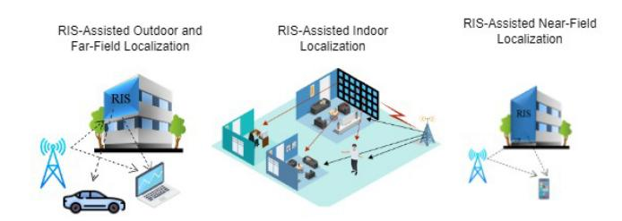

Fig. 8. State of the art literature breakdown. Studies can be broadly categorized into outdoor, far-field, indoor and near-field RIS-assisted localization. Within these categories, we notice trend towards investigation of systems on mmW and THz frequencies. Further, the passive reflective RIS is the most common type of RIS used in literature for RIS-assisted localization.

perspective of accuracy and availability at various frequency bands, near-field and far-field modeling, and indoor and outdoor scenarios, as summarized in Figure [8.](#page-13-0)

In the realm of RIS-assisted localization, we classify the frequency bands into two categories: *conventional radio frequency (CRF)*- and *high frequency bands*. CRF bands typically refer to those below 24 GHz, encompassing wellknown sub-bands such as FR1. CRF bands are recognized for their longer wavelengths, better penetration capabilities, and widespread application in various wireless services. For outdoor localization, GNSS is predominantly employed, providing meter-level precision with support from long-term evolution (LTE) communication signals. Yet, this method proves ineffective for indoor environments, where intricate surroundings and LoS channel obstructions are common challenges. As alternatives, there are documented localization systems utilizing ultra wide band (UWB) [\[115\]](#page-31-18), WiFi [\[116\]](#page-31-19), wireless local-area network (WLAN) [\[117\]](#page-31-20), and LoRA [\[11\]](#page-29-4), [\[118\]](#page-31-21). By leveraging CRF bands systems in association with the RIS, advantages are gained in location-centric services, including navigation and identification of nearby amenities.

On the other hand, we refer to the localization services in the range of spectrum above 24 GHz as high frequency bands localization. This category consists of FR2 frequencies, mmW and THz band. The range of 100- 300 GHz in mmW band is also referred to as the sub-terahertz (sub-THz) according to the deliverable D2.1 of the European HEXA-X project [\[119\]](#page-31-22). These higher frequency bands offer significant advantages in terms of data rate, capacity and localization performance but come with challenges related to limited propagation and penetration. Utilizing antenna arrays at the UE enables to estimation of its orientation [\[89\]](#page-30-33). Furthermore, through the use of NLoS paths [\[120\]](#page-31-23) and RIS [\[1\]](#page-28-0), [\[40\]](#page-29-27) localization tasks can be accomplished with only one BS. The THz systems are anticipated to complement mmW systems in diverse environments, and the comparison between the two reveals distinct advantages and challenges in terms of localization [\[23\]](#page-29-19). As technology progresses from CRF to 5G and onto 6G, expectations include higher frequencies, increased bandwidths, more compact footprints, and larger array sizes [\[121\]](#page-31-24). These changes will affect path loss, delay estimation resolutions, and antenna array design, among other features. Challenges may arise with hardware imperfections and synchronization at THz frequencies. The design of localization algorithms must also consider the specific properties of THz signals, such as the beam split effect and high path loss [\[23\]](#page-29-19). Ultimately, the adaptations and innovations within the THz systems are expected to lead to improved localization performance in 6G networks.

We group the studies as the development of methods for localization of UE in outdoor and far-field, indoor and nearfield, respectively. To enhance reader clarity, it is important to emphasize that the first group predominantly encompasses studies centered around far-field and outdoor scenario investigations. Distinct groupings have been established to specifically address indoor scenarios and near-field localization, both of which are considered specialized cases. Studies are presented in comprehensive detail and tabular format in the subsequent subsections.

#### *A. RIS-Assisted Outdoor and Far-Field Localization*

In this subsection, we explore the latest advancements and contemporary studies focused on leveraging RIS technology to augment outdoor and far-field localization at CRF and high frequency bands.

- *1) RIS-Assisted Conventional Radio Frequency Bands Localization (Below 24 GHz):* Studies are briefly summarized in Table [IV.](#page-14-0) We attempt to categorize the works into thematic groups based on their core focus as follows.
- *a) Foundational studies:* Authors in [\[126\]](#page-31-25) introduce RIS to enhance RSS fingerprinting-based outdoor localization using just one BS. By adjusting the RIS phase shifts, the approach creates distinct RSS values at the same location, optimizing this through a localization error minimization algorithm. Simulations confirm the scheme's efficacy. Article [\[63\]](#page-30-10) introduces the concept of continuous intelligent surfaces and investigates the fundamental limits of RIS-aided ISAC systems. The paper proposes a general signal model, derives theoretical limits on localization and communication performance, and performs Fisher information analyses. The numerical results demonstrate that optimized RIS can improve the SNR and spectral efficiency of communication, as well as enhance localization accuracy. Authors in article [\[60\]](#page-30-7) propose a RIS-assisted positioning method for simultaneously localizing multiple energy-limited IoT devices in location-based IoT services. The proposed method utilizes triangulation-based localization, estimating the propagation delay difference between the direct and reflected paths using cross-correlation. By optimizing the multi-antenna BS and RIS to minimize total transmission power, significant power gain and decimeter-level positioning accuracy are achieved, demonstrating the effectiveness of the proposed optimization approach compared to unoptimized RIS-assisted localization.
- *b) Novel techniques and systems:* In [\[122\]](#page-31-26), the authors propose a new RIS self-sensing system where the RIS controller transmits probing signals and dedicated sensors at the RIS are used for location and angle estimation based on the reflected signals by the target. The multiple signal classification (MUSIC) algorithm is applied to accurately estimate the AOA of the target in the RIS's vicinity, and the RIS passive reflection matrix is optimized to maximize

TABLE IV SUMMARY OF RIS-ASSISTED OUTDOOR AND FAR-FIELD LOCALIZATION ARTICLES AT CONVENTIONAL RADIO FREQUENCY BAND. HERE "R" REFERS TO "REFLECTIVE RIS"

| RIS | Ref   | $f_c$             | Link      | System | Purpose                                                                                                                                  | Technique                                                                                                                                              | Performance metric                 |
|-----|-------|-------------------|-----------|--------|------------------------------------------------------------------------------------------------------------------------------------------|--------------------------------------------------------------------------------------------------------------------------------------------------------|------------------------------------|
| R   | [122] | 1.5 GHz        | DL        | MISO   | RIS for sensing/localizing targets in wireless networks                                                                                  | Self-sensing RIS architecture, customized MUSIC algorithm, CRLB                                                                                        | Accuracy                           |
| R   | [123] | 2 GHz             | DL        | MISO   | Localization with obstructed LoS and three RIS                                                                                           | Elimination of destructive effect of the AOD                                                                                                           | Accuracy                           |
| R   | [124] | 2.5 GHz        | DL        |        | Joint active and passive beamforming design for RIS-enabled ISAC system in consideration of the target size                              | Non-convex optimization                                                                                                                                | Detection probability, SNR      |
| R   | [125] | 2 GHz             | DL        | SISO   | UE localization assisted by multiple RIS                                                                                                 | Localization algorithm design based on nodes distances                                                                                                 | Accuracy                           |
| R   | [126] | 3 GHz             | DL        | SISO   | RSS fingerprinting based multi-user outdoor localization using RIS and single BS                                                         | localization error minimization algorithm                                                                                                              | Accuracy                           |
| R   | [60]  | 3 GHz             |           | SISO   | Fundamental limits of RIS-aided lo- calization and communication system with RIS as continuous and discrete intelligent surface | RIS phase design, Fisher information matrix (FIM)                                                                                                      | Accuracy, spectral efficiency, SNR |
| R   | [127] | 3 GHz             | DL        | SISO   | Wideband localization with RIS                                                                                                           | FIM                                                                                                                                                    | Accuracy                           |
| R   | [128] | 3 GHz             | DL        | SISO   | JCAL system design                                                                                                                       | PEB, joint RIS discrete phase shifts design and subcarrier assignment using Lagrange duality and penalty-based op- timization                 | Accuracy and data rate             |
| R   | [129] | 3 GHz             | DL        | SISO   | Multi-user localization system using modulated RIS                                                                                       | TDOA                                                                                                                                                   | Accuracy                           |
| R   | [130] | 3.4/3.5/28 GHz |           | MIMO   | Localization technique that does not require RIS codewords for online lo- cation inference                                         | Domain adversarial neural network, fingerprinting                                                                                                      | Accuracy                           |
| R   | [131] | 4.9 GHz        | UL        | MIMO   | UE position estimation                                                                                                                   | Compressed sensing orthogonal simultaneous matching pursuit algorithm, maximum likelihood estimation, discrete Fourier transform, SAGE algorithm, CRLB | Accuracy                           |
| R   | [132] | 5 GHz             | DL        | MIMO   | Lower bounds on the location esti- mation error for multiple RIS-aided mmW system                                                  | CRLB, PEB, REB                                                                                                                                         | Accuracy                           |
| R   | [133] | 10 GHz            | DL        | MIMO   | Bayesian analysis of the information in LoS and RIS reflected signal                                                                     | Bayesain analysis, FIM                                                                                                                                 | Accuracy                           |
| R   | [60]  | 20 GHz            | UL        | MISO   | To localize a large number of energy- limited devices simultaneously and ac- curately                                              | Triangulation-based localization framework, optimization                                                                                               | Accuracy, energy effi- ciency   |
| R   | [134] | 2 GHz             | UL, DL | MISO   | Environment-adaptive user positioning                                                                                                    | Federated learning                                                                                                                                     | Accuracy                           |
| R   | [135] | 3 GHz             | UL        | MIMO   | ISAC for wireless extended reality using RIS                                                                                             | MUSIC, CRLB                                                                                                                                            | Accuracy, capacity                 |
| R   | [136] | 2.45 GHz       | DL        | SIMO   | Theoretical and practical design of RIS-assisted sensing system with localization                                                        | Atomic norm minimization direction of arrival estimation network, generative adversarial network                                                       | Accuracy                           |
| R   | [137] | 1 GHz             | DL        | SISO   | Method for RIS-assisted fingerprinting localization                                                                                      | Fingerprinting, graph-based radio map interpolation                                                                                                    | Accuracy                           |
| R   | [138] | 2.5 GHz        | DL        | MISO   | Joint beamforming and aerial RIS po- sitioning design with multiple access points                                                  | Generalized benders decomposition, mixed-integer semidefinite programming                                                                        | Spectral efficiency                |
| R   | [139] | 400 MHz        |           | SISO   | Positioning, navigation, and timing solution                                                                                             | Game theory                                                                                                                                            | Accuracy                           |

the received signals' power at the RIS sensors, leading to minimized AOA estimation mean square error (MSE). The results demonstrate the benefits of using the RIS controller for probing signals and provide the CRLB for target AOA estimation. In [\[123\]](#page-31-27), a positioning algorithm is introduced for RIS-assisted networks, focusing on multi-antenna BS and single-antenna UE. Leveraging three RIS and specific phase shifter adjustments, the method effectively overcomes LoS obstructions and minimizes the adverse effects of the AOD, resulting in improved localization accuracy compared to non-AOD estimating algorithms. The study [\[124\]](#page-31-28) introduces a joint active and passive beamforming design for RIS-enabled

ISAC systems, accounting for target size. Through an alternative optimization method, the paper addresses non-convex problems involving beamforming solutions and RIS phase shifts, with the developed algorithm showcasing superior target detection performance in simulations, especially for practical target sizes, against existing benchmarks. The article [\[133\]](#page-31-29) presents a Bayesian analysis of the information contained in a signal received by a UE from a BS that includes reflections from RIS. The analysis considers both near and far-field scenarios and incorporates prior information about the UE and the RIS for localization. The results indicate that the orientation offset of the RIS affects the pathloss of the RIS paths when the RIS elements are spaced half a wavelength apart. In the far-field regime, an unknown phase offset in the received signal prevents the correction of the RIS orientation offset. However, in the near-field regime, the estimation of the RIS orientation offset is possible when the UE has multiple receive antennas. The article also demonstrates that accurate localization with RIS is only possible when there is prior knowledge of their locations. Finally, numerical analysis shows the loss of information when applying a far-field model to signals received in near-field propagation.

Unlike the methods that rely on channel matrices or RIS codewords, the authors in [\[130\]](#page-31-30) proposed an approach that uses a domain adversarial neural network to extract codewordindependent representations of fingerprints for online location inference in RIS-assisted localization network. The solution is evaluated using the DeepMIMO data set, and the results show that the proposed method performs significantly closer to the theoretical upper bound (oracle case) than the lower bound (baseline case), indicating its effectiveness and robustness. Authors in [\[131\]](#page-31-31) article investigate the estimation of position and angle of rotation for a UE in a MIMO system with the assistance of a RIS. The RIS creates a virtual LoS link, along with NLoS links from scatterers in the environment, to aid in the estimation process. A two-step positioning scheme is utilized, where channel parameters are acquired first and then position-related parameters are estimated. Coarse estimation is performed using various algorithms, followed by joint refinement using the space-alternating generalized expectation maximization (SAGE) algorithm. The performance of the proposed algorithms is demonstrated to be superior through simulation results, and theoretical quantification is done using the CRLB. The authors in [\[134\]](#page-31-32) introduced HoloFed, a high-precision, environment-adaptive user positioning system that integrates multi-band reconfigurable holographic surface with federated learning. To enhance positioning accuracy, the system uses a calculated lower bound on error variance to guide multi-band reconfigurable holographic surface beamforming design. An federated learning framework is implemented for collaborative training of a position estimator, utilizing transfer learning to compensate for the lack of user position labels, while a scheduling algorithm optimizes user selection for training based on federated learning convergence and efficiency. Simulation results indicate that HoloFed reduces positioning error variance by 57% compared to traditional beam-scanning methods, demonstrating significant adaptability and precision across diverse environments. A novel RIS-enabled wireless fingerprinting localization method that addresses missing RSS data using a graph-based radio map interpolation technique is proposed in [\[137\]](#page-31-33). This approach leverages RIS configuration flexibility and encodes similarities through a multi-layer graph. Numerical results show improved radio map recovery and localization accuracy compared to other methods.

*c) Integrated sensing and communication:* The work presented in [\[135\]](#page-31-34) explores the use of RIS in future wireless networks for enhanced positioning and communication in extended reality applications. It introduces a positioning algorithm based on MUSIC and optimized RIS configurations.

The joint optimization of UE beamformers and RIS phase shifters maximizes channel capacity under CRLB constraints, solved via alternating optimization. Authors in [\[136\]](#page-31-35) present a low-cost RIS-assisted sensing system, featuring a novel atomic norm minimization direction of arrival estimation network method for improved localization and communication reliability. The system uses a cost-effective RIS structure and a practical signal model that accounts for RIS phase shifts. The atomic norm minimization direction of arrival estimation network method combines atomic norm minimization for spatial spectra and direction of arrival estimation network for angle estimation, using generative adversarial network to generate a large dataset. Experimental results show that proposed technique effectively localizes sources in the RISaided sensing system.

*2) RIS-Assisted High Frequency Bands Localization (24 GHz and Above):* Studies on RIS-assisted localization in this band of operation are briefly summarized in Table [V,](#page-16-0) [VI](#page-17-0) and [VII](#page-18-0) and discussed as follows.

*a) Foundational studies:* Authors in [\[39\]](#page-29-26) discussed the use of RIS in 6G radio positioning. The authors propose a two-step optimization scheme that selects the best combination of RIS and controls their constituent elements' phases to improve positioning performance. Preliminary simulation results demonstrate gains in coverage and accuracy compared to natural scattering, but limitations are identified in terms of low SNR and inter-path interference. Assuming the LOS route between the BS and the MS is present, authors in [\[40\]](#page-29-27) introduced RIS as a reflector into the mmW MIMO positioning system. The CRLB of the positioning as well as the orientation estimation error are obtained by calculating FIM, which reveals that the RIS-aided mmW MIMO positioning system offers better localization accuracy and coverage as compared to the conventional localization system comprising BS nodes only. It has also been demonstrated that one BS with the help of reflection from RIS can also achieve promising positional precision. Nevertheless, nothing is discussed about how to localize the UE in a LOS-obscured environment. To determine the absolute location of the MS under the NLoS scenario, authors in [\[41\]](#page-29-28) developed the CRLB based on FIM. The study suggests that, in the given setup, the localization can reach the decimeter level of accuracy by refining the reflect beamforming architecture to reduce CRLB. Authors in [\[56\]](#page-30-3) present localization and synchronization in a wireless system with a single-antenna UE, a single-antenna BS, and a RIS. They calculate the CRLB and develop a low-complexity estimator to determine the AOD from the RIS, as well as the delays of direct and reflected signals. The results indicate that efficient 3D localization and synchronization are achievable in the considered system, showcasing the potential of RIS for enabling radio localization in simple mmW wireless networks.

Authors in [\[108\]](#page-31-11) investigate the potential of RIS in replacing the function of a remote cell for DL-TDOA measurements in 6G positioning. The study demonstrates that the TDOA between the LoS path and the reflected path through the RIS can effectively replace DL-TDOA measurements, enabling accurate localization within a single cell. Simulation results indicate that RIS-enabled localization achieves positioning

TABLE V SUMMARY OF RIS-ASSISTED OUTDOOR AND FAR-FIELD LOCALIZATION ARTICLES AT HIGH FREQUENCY BANDS. HERE "R" REFERS TO "REFLECTIVE RIS", "S" REFERS TO "STAR RIS", "A" REFERS TO "ACTIVE RIS"

| RIS | Ref   | $f_c$  | Link |      | Purpose                                                                                                                                                                                  | Technique                                                                                              | Performance metric  |
|-----|-------|--------|------|------|------------------------------------------------------------------------------------------------------------------------------------------------------------------------------------------|--------------------------------------------------------------------------------------------------------|---------------------|
| R   | [108] | 24 GHz | DL   | MISO | RIS to replace the function of a remote cell in the DL-TDOA measurement                                                                                                                  | Extended Kalman filter positioning and tracking algorithm                                              | Accuracy            |
| R   | [39]  | 28 GHz | DL   | SISO | Analysis of a RIS-aided localization problem                                                                                                                                             | FIM, two step optimization                                                                             | Accuracy, coverage  |
| R   | [43]  | 28 GHz | UL   | MIMO | Beam training designs to estimate op- timal beams for BS and UE, RIS re- flection pattern and link blockage                                                                        | maximum likelihood estimation (MLE), positioning algorithm design                                      | Accuracy            |
| R   | [59]  | 28 GHz | DL   | SISO | Use of 3D localization technology to achieve the low-complexity channel estimation                                                                                                       | Reflecting unit set concept, coplanar maximum likelihood-based based 3D positioning method, CRLB | Accuracy, SNR       |
| R   | [62]  | 28 GHz | UL   | MIMO | Localization and channel reconstruc- tion in extra large RIS-assisted MIMO systems                                                                                                 | Low-overhead joint localization, chan- nel reconstruction scheme                                    | Accuracy            |
| R   | [140] | 28 GHz | DL   | MISO | Exploiting RIS with suitably designed beamforming strategies for optimized localization and synchronization per- formance                                                       | PEB, MLE                                                                                               | Accuracy            |
| S   | [141] | 28 GHz | UL   | MISO | STAR RIS potential for enhanced con- current indoor and outdoor localiza- tion                                                                                                     | CRLB, FIM, optimization                                                                                | Accuracy            |
| R   | [142] | 28 GHz | DL   | MIMO | Joint beamforming and localization for RIS-aided mmW localization system                                                                                                                 | Joint localization and beamforming op- timization algorithm                                         | Accuracy            |
| R   | [143] | 28 GHz |      |      | Enabling the user to estimate its own position by transmitting orthog- onal frequency division multiplexing (OFDM) pilots and processing the sig- nal reflected from the RIS | CRLB, low-complexity position estimation algorithm, temporal coding on RIS phase                       | Accuracy            |
| R   | [144] | 28 GHz | UL   | MIMO | Channel estimation and user localization                                                                                                                                                 | RIS training coefficients designs, array signal processing, atomic norm denois- ing techniques   | Accuracy            |
| R   | [145] | 28 GHz | DL   | SIMO | Joint RIS calibration and user positioning scheme                                                                                                                                        | FIM                                                                                                    | Accuracy            |
| R   | [146] | 28 GHz | DL   | MIMO | User localization and tracking                                                                                                                                                           | Bayesian user localization and tracking algorithm                                                      | Accuracy            |
| R   | [147] | 28 GHz |      | SISO | Cooperative localization to improve accuracy in RIS-assisted system                                                                                                                      | Beam sweeping, optimization, neural network                                                            | Accuracy            |
| R   | [104] | 28 GHz |      |      | Cooperative localization with no access point                                                                                                                                            | FIM, CRLB, RIS configuration optimization                                                              | Accuracy            |
| Rx  | [148] | 28 GHz | UL   |      | Localization of UE with partially con- nected receiving RIS only                                                                                                                      | Atomic norm minimization, MUSIC, CRLB                                                                  | Accuracy            |
| A   | [103] | 28 GHz | UL   | SIMO | Joint RIS calibration and user positioning problem with an active RIS                                                                                                                    | Tensor-ESPRIT estimator, least- squares, 2D search-based algorithm, CRLB                         | Accuracy            |
| R   | [149] | 28 GHz | DL   | SISO | misspecified Cramér-Rao bound (MCRB) with RIS geometry mismatch                                                                                                                          | Method for pseudo-true parameter de- termination for MCRB analysis                                  | Accuracy            |
| R   | [150] | 28 GHz | UL   | MISO | Localization of UE using distributed passive RIS                                                                                                                                         | compressive sensing (CS) approach based on atomic norm minimization, MLE, CRLB                   | Accuracy            |
| R   | [151] | 28 GHz |      | MIMO | Device-free target sensing via joint location and orientation estimation                                                                                                                 | Target based method for angle estima- tion, gradient descent method, manifold optimization       | Accuracy            |
| A   | [152] | 28 GHz | UL   | MISO | ISAC using sparse active RIS                                                                                                                                                             | MUSIC algorithm, optimization                                                                          | Accuracy            |
| R   | [105] | 28 GHz | DL   | MIMO | JCAL framework                                                                                                                                                                           | Novel RIS optimization and channel estimation methods                                                  | Accuracy, data rate |
| R   | [153] | 28 GHz | SL   | SISO | UE localization without BS involvement                                                                                                                                                   | Two-stage 3D sidelink positioning algorithm, CRLB                                                      | Accuracy            |
| R   | [56]  | 30 GHz | DL   | SISO | Joint 3D localization and synchronization for a SISO multi-carrier system                                                                                                                | CRLB, design of low complexity esti- mation algorithm                                               | Accuracy            |
| R   | [154] | 30 GHz | DL   | SISO | RIS in a multi-user passive localization scenario                                                                                                                                        | Low complexity TOA based positioning algorithm, CRLB                                                   | Accuracy            |
| R   | [155] | 30 GHz | DL   | SISO | Positioning UE by taking into account the its mobility spatial- wideband effects                                                                                                         | CRLB, low-complexity estimator design                                                                  | Accuracy            |
| R   | [112] | 30 GHz |      |      | RIS-enabled radio SLAM without the intervention of BS                                                                                                                                    | RIS phase profile design, marginal Poisson multi-Bernoulli SLAM filter modification, CRLB              | Accuracy            |

accuracy comparable to the traditional two-cell structure, offering a cost-effective solution. Authors present an efficient CSI acquisition method for a RIS-aided communication system in [\[59\]](#page-30-6). They propose a coplanar maximum likelihoodbased 3D localization approach and utilize the concept of reflecting unit set to acquire channel information with minimal

TABLE VI SUMMARY OF RIS-ASSISTED OUTDOOR AND FAR-FIELD LOCALIZATION ARTICLES AT HIGH FREQUENCY BANDS. HERE "R" REFERS TO "REFLECTIVE RIS", "H" REFERS TO "HYBRID RIS", "A" REFERS TO "ACTIVE RIS", "S" REFERS TO "STAR RIS"

| RIS | Ref   | $f_c$      | Link |      | Purpose                                                                                                             | Technique                                                                                                                                                                                      | Performance metric                                               |
|-----|-------|------------|------|------|---------------------------------------------------------------------------------------------------------------------|------------------------------------------------------------------------------------------------------------------------------------------------------------------------------------------------|------------------------------------------------------------------|
| R   | [156] |            | DL   |      | ISAC with RIS                                                                                                       | CS, expectation-maximization algorithm, Bayesian Cramér-Rao bound                                                                                                                           | Accuracy                                                         |
| Н   | [157] | 30 GHz     | DL   | MISO | Joint localization of a hybrid RIS and a user                                                                       | CRLB                                                                                                                                                                                           | Accuracy                                                         |
| R   | [158] | 30 GHz     | DL   | SISO | Cooperative localization in a RIS-aided mmW system                                                                  | FIM, CRLB, block coordinate descent- based reflect beamforming design algo- rithm                                                                                                        | Accuracy                                                         |
| R   | [159] | 30 GHz     |      | MISO | Location information assisted beam- forming design without the requirement of the channel training process    | Relaxed alternating optimization process                                                                                                                                                       | Data rate                                                        |
| R   | [41]  | 50 GHz     | DL   |      | RIS beamforming under NLoS                                                                                          | CRLB, optimization                                                                                                                                                                             | Accuracy                                                         |
| R   | [40]  | 60 GHz     | DL   | MIMO | Theoratical bounds for large intelligent surface                                                                    | CRLB based PEB and OEB                                                                                                                                                                         | Accuracy                                                         |
| R   | [26]  | 60 GHz     | DL   | MIMO | Improving the positioning accuracy and date rate                                                                    | Adaptive phase shifter design based on hierarchical codebook and feedback from the UE                                                                                                    | Accuracy, data rate                                              |
| R   | [44]  | 60 GHz     | UL   | MIMO | Localization of UE                                                                                                  | Two stage positioning method with dual RIS                                                                                                                                                     | Accuracy                                                         |
| R   | [42]  | 60 GHz     | DL   | MIMO | Utilizing RIS in mmW MIMO radar system for multi-target localization                                                | Adaptive localization algorithm utilizing the concept of hierarchical codebook de- sign                                                                                                  | Accuracy                                                         |
| R   | [57]  | 60 GHz     | DL   | MISO | Joint localization and synchronization                                                                              | MLE                                                                                                                                                                                            | Accuracy                                                         |
| R   | [23]  | 60 GHz     | UL   |      | RIS-assisted localization at THz band in comparison with the mmW band                                               | Geometrical modeling and simulations                                                                                                                                                           | Accuracy                                                         |
| R   | [160] | 60 GHz     | UL   | MIMO | Potential of RIS for cooperative localization performance                                                           | CRLB, manifold optimization                                                                                                                                                                    | Accuracy                                                         |
| R   | [161] | 60 GHz     | UL   | MIMO | To optimize the worst-case localiza- tion performance by jointly optimizing beamforming vectors at RIS and UE | Joint array gain and path loss search algorithm, difference of convex-based al- gorithm                                                                                                  | Accuracy                                                         |
| A   | [83]  | 60 GHz     | DL   | MIMO | UE localization with active RIS                                                                                     | Multiple signal transmissions, particle filtering, CRLB                                                                                                                                        | Accuracy                                                         |
| R   | [34]  | 60 GHz     | DL   | SISO | Overview of RIS enabled localization scenarios                                                                      | Experimental demonstration                                                                                                                                                                     | Accuracy                                                         |
| R   | [53]  | 60 GHz     | DL   | MIMO | Joint optimal point of the user position/orientation estimation error bound and effective achievable data rate      | Worst-case robust beamforming and time allocation optimization approach, majorize-minimization based algorithm                                                                           | Accuracy, data rate                                              |
| R   | [162] | 60 GHz     | DL   | MISO | Investigate the potential of employing RIS in dual-functional radar-communication vehicular networks                | Codebook design for optimal phase shift of RIS, position-based CSI design                                                                                                                      | Accuracy, data rate                                              |
| R   | [163] | 100 GHz | UL   | MISO | Sensing of channel and location under the unique hybrid far-near field effect and the beam squint effect      | Location-assisted generalized multiple measurement vector orthogonal match- ing pursuit algorithm, dictionary-based localization scheme, polar-domain gradi- ent descent algorithm | Accuracy                                                         |
| R   | [164] | 30 GHz     |      | MISO | Enhancing RIS-equipped UAVs' performance                                                                            | geometry-based simultaneous localiza- tion and phase shift method                                                                                                                           | Accuracy                                                         |
| R   | [165] | 30 GHz     |      |      | Enhancing 6G user-centric sensing with RIS for improved localization and sensing                                    | geomtry based modeling                                                                                                                                                                         | Accuracy and sens- ing performance effi- ciency            |
| R   | [166] |            | DL   | MISO | Target localization system utilizing RIS and passive radars to enhance ISAC capabilities                            | Localization alogirthm based on AOA and TOA                                                                                                                                                    | Accuracy, detection probability, successful detection probabilit |
| R   | [167] | 73 GHz     | DL   | MISO | Environment aware joint active/ passive beamforming                                                                 | Channel knowlegde map                                                                                                                                                                          | Energy efficinecy, spectrum efficiency                           |
| R   | [168] | 30 GHz     | DL   | MIMO | Fundamental localization bounds in RIS-assisted OFDM systems                                                        | FIM                                                                                                                                                                                            | PEB, OEB                                                         |
| R   | [169] | 26 GHz     | DL   | SISO | RIS-assisted positioning approach                                                                                   | FIM, MSE                                                                                                                                                                                       | Accuracy                                                         |
| S   | [170] | 28 GHz     | UL   | MISO | STAR-RIS-assisted bilateral user localization                                                                       | CSI, ML                                                                                                                                                                                        | Accuracy                                                         |
| R   | [171] | 28 GHz     | DL   | MISO | Joint 3D localization and synchronization using multiple RISs                                                       | DL                                                                                                                                                                                             | Accuracy, complexity                                             |
| R   | [172] |            | UL   | MISO | Dual-RIS assisted 3D localization and beamforming design in ISAC system                                             | CS, stepwise matching pursuit algorithm                                                                                                                                                        | MSE                                                              |

training resources. Study indicates substantial performance improvements in terms of the SNR of the received signal. Article [\[62\]](#page-30-9) presents a low-overhead joint localization and channel reconstruction scheme for extra-large RIS-assisted MIMO systems. The proposed scheme accurately identifies the visibility region of each user, achieves centimeter-level

user localization accuracy, and obtains more accurate channel reconstruction results compared to existing works. The results demonstrate the potential of RIS for improving communication and sensing integration.

Authors in [\[144\]](#page-32-0) focus on the challenges of channel estimation and user localization in a RIS-assisted MIMO-

TABLE VII SUMMARY OF RIS-ASSISTED OUTDOOR AND FAR-FIELD LOCALIZATION ARTICLES AT HIGH FREQUENCY BANDS. HERE "R" REFERS TO "REFLECTIVE RIS"

| RIS | Ref   | $f_c$            | Link | System | Purpose                                       | Technique                                                                                                                                                                                   | Performance metric            |
|-----|-------|------------------|------|--------|-----------------------------------------------|---------------------------------------------------------------------------------------------------------------------------------------------------------------------------------------------|-------------------------------|
| R   | [173] | 100 GHz       | DL   | MIMO   | User sensing and localization                 | Tensor, parallel factor method, alternating least squares algorithm                                                                                                                         | Accuracy                      |
| R   | [174] |                  |      | SISO   | RIS-assisted cooperative localization         | Cooperative localization, CRLB, Polyblock-based algorithm, heuristic algorithm                                                                                                        | Accuracy                      |
| R   | [175] | 30 GHz           | DL   | SISO   | Autonomous receiver localization and tracking | Complex extended Kalman filter                                                                                                                                                              | Accuracy                      |
| R   | [176] |                  | UL   | MISO   | ISAC systems design                           | Structure-aware sparse Bayesian learning framework, simultaneous communication and localization algorithm for multiple users                                                       | Accuracy, spectral efficiency |
| R   | [177] |                  | DL   | MIMO   | Limitation of RIS-assisted localization       | FIM, Bayesian FIM                                                                                                                                                                           | Accuracy                      |
| R   | [178] | 28 GHz           |      | MIMO   | Joint channel estimation and localization     | CS, simultaneous orthogonal matching pursuit                                                                                                                                                | Accuracy                      |
| R   | [179] | 300 GHz       |      | MIMO   | ISAC                                          | Multi-group Khatri-Rao space-time cod- ing scheme, low-complexity least squares Khatri-Rao factorization algorithm, opti- mized five linear alternating least squares algorithm | Accuracy, bit error rate      |
| R   | [180] | 70 GHz           | DL   | MISO   | Target-to-user association in ISAC Systems    | Mount RIS on the roof of the vehicular UE                                                                                                                                                   | Accuracy                      |
| R   | [181] |                  | DL   | MISO   | ISAC                                          | Modeling based heterogeneous networked sensing architecture                                                                                                                                 | Accuracy                      |
| R   | [182] | 28GHz, 5.9GHz | UL   | MIMO   | Multi-band ISAC                               | X 2 Track framework design, DL                                                                                                                                                   | Accuracy                      |
| R   | [183] | 28 GHz           | UL   | MIMO   | ISAC                                          | Tensor, DL                                                                                                                                                                                  | Accuracy                      |

OFDM system. The article proposes a unique twin-RIS structure that incorporates spatial rotation to extract the 3D propagation channel. They employ tensor factorization, sparse array processing, and atomic norm denoising techniques to design training patterns and recover the associated parameters. By decoupling the channel's angular and temporal parameters, they achieve precise channel parameter extraction and centimeter-level positioning resolution. A two-stage method is proposed in [\[150\]](#page-32-1), utilizing the tunable reflection capability of passive RIS and the multi-reflection wireless environment. The first stage employs an off-grid CS approach to estimate the angles of arrival associated with each RIS, followed by a maximum likelihood location estimation in the second stage. The study demonstrates the high accuracy of the proposed 3D localization method, consistent with the theoretical CRLB analysis.

Authors in [\[168\]](#page-32-2) establish fundamental localization bounds for OFDM systems aided by RIS. It derives Bayesian localization bounds using the Bayesian FIM and the equivalent FIM. The study reveals that constant RIS reflection coefficients across OFDM symbols make angle estimation impossible, necessitating varying coefficients for effective localization. It also decomposes the FIM for RIS-related parameters into contributions from the receiver, transmitter, and RIS components, and concludes that single-antenna UE localization via a single RIS reflection is infeasible in the far-field with constant RIS coefficients. A RIS-assisted positioning method for high-precision user localization, considering the incident planar wavefront on the RIS is proposed in [\[169\]](#page-32-3). It derives the MSE to evaluate system accuracy and offers solutions for optimal RIS placement and configuration. Numerical analyses are conducted to assess performance across different scenarios, focusing on RIS location, element count, and communication bandwidth. Results indicate that RIS significantly enhances positioning accuracy in 6G networks.

*b) Advanced techniques and systems:* In [\[141\]](#page-32-4), the authors investigate the potential of STAR-RIS for enhanced indoor and outdoor localization. They study the fundamental limits of 3D localization performance using Fisher information analysis and optimize the power splitting between refraction and reflection at the STAR-RIS, as well as the power allocation between the UE. The results indicate that high-accuracy 3D localization can be achieved for both indoor and outdoor UEs when the system parameters are well optimized, demonstrating the potential of STAR-RIS in concurrent localization. Existing RIS-aided localization approaches assume perfect knowledge of the RIS geometry, which is not realistic due to calibration errors. The authors in [\[149\]](#page-32-5) derive the MCRB for localization with RIS geometry mismatch and propose a closed-form solution for determining pseudo-true parameters. Numerical results validate the derived parameters and MCRB, demonstrating that RIS geometry mismatch leads to performance saturation in high SNR regions. The article [\[143\]](#page-32-6) introduces a concept of 3D UE self-localization using a single RIS. The approach involves the UE transmitting multiple OFDM signals and processing the reflected signal from the RIS to estimate its position. The estimation process includes separating the RIS-reflected signal from the undesired multipath, obtaining a coarse position estimate, and refining the estimation through maximum likelihood techniques. The performance of the estimator is evaluated in terms of positioning error and compared to an analytical lower bound. The results demonstrate the potential of RIS as an enabling technology for radio localization, offering improved positioning accuracy.

Authors in [\[148\]](#page-32-7) introduce the concept of partiallyconnected receiving RIS that can sense and localize users emitting electromagnetic waveforms. The receiving RIS hardware architecture consists of meta-atom subarrays with waveguides that direct the waveforms to reception RF chains for signal and channel parameter estimation. The focus is on far-field scenarios, and a 3D localization method is presented based on narrowband signaling and AOA estimates using phase configurations of meta-atoms. The results include theoretical CRLBs and extensive simulations, demonstrating the effectiveness of the proposed receiving RIS-empowered 3D localization system, providing cm-level positioning accuracy. The impact of various system parameters on localization performance is also evaluated, such as training overhead, distance between R-RIS and the user, and spacing among R-RIS subarrays and their partitioning patterns. The joint calibration and positioning problem in an uplink system with an active RIS is addressed in [\[103\]](#page-31-6). Existing approaches often assume known positions and orientations for RIS, which is not realistic for mobile or uncalibrated RIS. The proposed twostage method includes a tensor-ESPRIT estimator followed by parameter refinement and a 2D search-based algorithm to estimate user and RIS positions, RIS orientation, and clock bias. The derived CRLBs verify the effectiveness of the algorithms, and simulations show that the active RIS significantly improves localization performance compared to the passive case. Low coverage areas that limit localization performance can be mitigated by providing additional prior information or deploying more BSs.

A novel RIS-enabled SLAM framework is presented in [\[112\]](#page-31-15) for 6G wireless systems that operates without access points. RIS phase profiles are designed to illuminate the likely location of UE. The modified Poisson multi-Bernoulli SLAM filter estimates UE state and maps the radio environment efficiently. Theoretical CRLB are derived for channel parameters and UE state estimations. Performance evaluations show the method's effectiveness in scenarios with limited transmissions and channel coherence time considerations. This study performed in [\[170\]](#page-32-8) introduces a high-precision 6G positioning method using ISAC and STAR-RIS. It employs the CsiNet-Former network to extract spatial features from CSI for accurate 3D user localization and trajectory prediction. Simulation results show that in energy splitting mode, the method achieves an average localization error of 0.75 m and a single-side error of 0.034 m, outperforming existing methods and covering a larger area. The authors in [\[157\]](#page-32-9) present a method for joint localization of a hybrid RIS and a user, using a single radio frequency chain for reflections and sensing. A multi-stage approach estimates hybrid RIS position, orientation, and user location where simulations confirm the method's efficiency and identify an optimal HRIS power splitting ratio.

*c) Advanced beamforming and phase shifter designs:* The adaptive beamforming of RIS-assisted mmW MIMO placement with obstructed LoS between the BS and the UE is studied in [\[26\]](#page-29-0). The authors suggest a hierarchical codebook and receiver feedback-based adaptive phase shifter architecture to optimize the phase of each of the RIS units and in turn optimize performance in terms of localization accuracy and data rate. Authors in [\[44\]](#page-29-31) have proposed a twostage localization technique using dual RIS. The reflecting element's phase shift is first designed for each RIS, and then in the second stage, the location data is calculated and it demonstrates the localization accuracy in the range of 10−5–10−4 meters. Article [\[160\]](#page-32-10) explores the potential of RIS for improving cooperative localization performance in mmW MIMO systems. The paper presents a study on the fundamental limits of cooperative localization using the CRLB and proposes an optimal phase design at the RIS to enhance position accuracy. The study demonstrates that the proposed optimal passive beamforming algorithm significantly improves localization accuracy, and achieves near-optimal performance with minimal computational complexity. Authors in [\[43\]](#page-29-30) suggest a simultaneous beam training and placement technique to address the LoS obstruction in mmW MIMO network. The UE estimates its location using the AOD, which is determined via beam training. The location of UE, in turn, helps to improve the beam training. Results demonstrate that the proposed approach can obtain centimeter-level multi-user localization accuracy.

A low-complexity method for joint localization and synchronization in mmW systems using RIS is proposed in [\[140\]](#page-32-11). Their approach involves optimizing the beamforming strategies of the BS active precoding and RIS passive phase profiles, considering a single-antenna receiver. The results indicate that the proposed joint BS-RIS beamforming scheme achieves enhanced localization and synchronization performance compared to existing solutions, with the proposed estimator achieving the theoretical bounds even under challenging conditions such as low SNR and uncontrollable multipath propagation. The authors in [\[142\]](#page-32-12) focused on the successive localization and beamforming design of a RIS-aided mmW communication system. They formulated the problem as a multivariable coupled non-convex problem and proposed an alternating optimization algorithm to solve it. The results showed that their proposed scheme, called joint localization and beamforming optimization, significantly improved the performance compared to existing joint localization and beamforming methods, as demonstrated through simulation results.

The authors in [\[164\]](#page-32-13) proposed simultaneous localization and phase Shift method for enhancing RIS-equipped autonomous aerial vehicles in 6G networks. It focuses on integrating accurate localization with phase shift adjustments to improve coverage and address blockage issues. The method utilizes geometry-based localization to optimize passive beam-steering, benefiting aerial line-of-sight communication, especially in vehicle-to-vehicle scenarios. Simulation results validate the effectiveness of the method, showing significant improvements in communication performance and safe navigation in complex urban environments. This study [\[167\]](#page-32-14) explores environment-aware active and passive beamforming for RIS-aided communication using Channel Knowledge Map, which eliminates the need for online training and reduces overhead in mmWave systems while maintaining high energy efficiency. Simulation results show that CKM significantly enhances beamforming performance compared to traditional training-based methods and remains robust against errors in UE location.

*d) Multiuser and joint communication and localization approaches:* Authors in [\[42\]](#page-29-29) examined a multiuser localization method based on an hierarchical codebook design in light of the LoS obstruction scenario. The study results under various SNR situations demonstrate that, with the right hierarchical codebook design, the suggested approach has the ability to provide multiuser localization in mmW MIMO radar systems. In [\[53\]](#page-30-0), authors present an RIS-aided mmW-MIMO system for JCAL. They derive closed-form expressions of CRLB for position/orientation estimation errors and effective achievable data rate based on RIS phase shifts. They propose a joint optimization algorithm to balance the trade-off between the two metrics, and simulation results demonstrate the effectiveness of the algorithm in terms of estimation accuracy and effective achievable data rate, even in the presence of estimation errors and user mobility. Authors in article [\[57\]](#page-30-4) address the problem of joint localization and synchronization in a mmW MISO system using a RIS. They formulate the joint maximum likelihood estimation problem in the position domain and propose a reduced-complexity decoupled estimator for position and clock offset. Simulation results demonstrate that their approach achieves high accuracy in localization and synchronization, even in low SNR scenarios, without the need for optimizing transmit beamforming, RIS control matrix, or prior knowledge of the clock offset.

*e) Localization in special scenarios:* Authors in [\[155\]](#page-32-15) address the challenge of positioning a single-antenna user in 3D space by considering the received signal from a singleantenna BS and the reflected signal from an RIS. They take into account both user mobility and spatial-wideband effects. Initially, a spatial-wideband channel model is derived under the assumption of far-field conditions, focusing on OFDM signal transmission with a user of constant velocity. CRLB are derived as a benchmark, and a low-complexity estimator is developed to achieve these bounds under high SNR ratios. The proposed estimator compensates for user mobility by estimating radial velocities and iteratively accounting for their effects. The results indicate that spatial-wideband effects can have a detrimental impact on localization accuracy, especially for larger RIS sizes and signal bandwidths deviating from the normal of the RIS. However, the proposed estimator demonstrates resilience against spatial-wideband effects up to a bandwidth of 140 MHz for a 64x64 RIS. Notably, user velocity does not significantly affect the bounds or accuracy of the estimator, indicating that high-speed users can be localized with similar precision as static users.

The potential of 6G THz systems for localization and comparison with mmW localization systems is performed in [\[23\]](#page-29-19). They compare various aspects including system properties, channel modeling, localization problem formulation, and system design. Preliminary simulations demonstrate the potential of THz localization in terms of PEB and OEB compared to mmW systems. The article provides recommendations

for efficient localization algorithm design for RIS-assisted adaptive optics-based spatial modulation MIMO systems and highlights the anticipated applications in future communication systems, such as intelligent networks, autonomous transportation, and tactile internet. A framework for RISenabled SLAM without the need for access points is proposed in [\[112\]](#page-31-15). They design RIS phase profiles based on prior information about the UE, allowing for uniform signal illumination in the UE's probable location. They also modify the Poisson multi-Bernoulli SLAM filter to estimate the UE state and landmarks, facilitating efficient mapping of the radio propagation environment. Theoretical CRLB are derived for the estimators of channel parameters and UE state. The proposed method is evaluated under scenarios with a limited number of transmissions and considering the channel coherence time. Study demonstrates that RIS can solve the radio SLAM problem without the need for access points, and incorporating the Doppler shift improves UE speed estimates.

*f) High frequency sensing operations:* The authors in [\[163\]](#page-32-16) perform the sensing of the user's uplink channel and location in THz extra-large RIS systems. The authors propose a joint channel and location sensing scheme that includes a location-assisted generalized multiple measurement vector orthogonal matching pursuit algorithm for channel estimation and a complete dictionary-based localization scheme. They address challenges such as the hybrid far-near field effect and beam squint effect caused by the extra large array aperture and extra large bandwidth. The proposed schemes demonstrate superior performance compared to existing approaches, as indicated by simulation results. They also introduce a partial dictionary-based localization scheme to reduce sensing overhead, where the RIS serves as an anchor for user localization using TDOA. An ISAC scenario using RIS is investigated in [\[156\]](#page-32-17) where multiple devices communicate with a BS in full-duplex mode while simultaneously sensing their positions. RIS are mounted on each device to enhance reflected echoes, and device information is passively transferred to the BS through reflection modulation. The problem of joint localization and information retrieval is addressed by constructing a grid-based parametric model and formulating it as a CS problem. An expectation-maximization algorithm is applied to tune the grid parameters and mitigate model mismatch. The efficacy of various CS algorithms is analyzed using the Bayesian Cramér-Rao bound. Numerical results demonstrate the feasibility of the proposed scenario and the superior performance of the EM-tuning method.

The challenge of enhancing user-centric sensing capabilities in future 6G networks is studied in [\[165\]](#page-32-18). The study explores the use of RIS to support monostatic sensing, improving localization accuracy and sensing performance despite the limited hardware capabilities of user equipment. The proposed method leverages RIS to create a more effective sensing environment, showcasing significant enhancements in sensing precision and efficiency through simulation results. Authors in [\[166\]](#page-32-19) have introduced a novel target localization system that combines RIS and passive radars for enhanced ISAC. The system leverages the preamble of communication signals to perform detection and localization tasks. RIS helps passive radar detect targets obscured by obstacles within the propagation channel. The proposed algorithm is designed to uniquely position targets by estimating their AOA and TOA, and it can detect the number of targets present. Simulation results show that the localization method performs effectively across various detection metrics and with increasing RIS sizes.

Authors in [\[172\]](#page-32-20) address high-frequency fading in 6G ISAC systems using dual-RIS for 3D localization and beamforming. They proposes a stepwise matching pursuit algorithm for accurate, low-complexity localization and uses this data for RIS beamforming to maximize system rate with a triangle inequality-based alternating optimization algorithm. Simulations show the proposed method achieves near-optimal rates, confirming its effectiveness. The authors in [\[179\]](#page-32-21) present a nested tensor-based algorithm for ISAC in RIS-assisted THz MIMO systems. It uses Khatri-Rao space-time coding and RIS phase shifts to model the received signal as nested tensors. The algorithm includes low-complexity factorization for joint channel estimation and symbol detection, and optimized estimation of sensing parameters. Simulations show it outperforms current methods with more relaxed parameter conditions.

*g) Practical localization scenarios and applications:* The authors in [\[105\]](#page-31-8) focus on leveraging RIS to enhance communication performance when the LoS path between the UE and BS is blocked. The authors propose a novel framework that integrates localization and communications by fixing RIS configurations during location coherence intervals and optimizing BS precoders every channel coherence interval. This approach reduces pilot overhead and the need for frequent RIS reconfiguration. The framework utilizes accurate location information from multiple RIS, along with novel RIS optimization and channel estimation methods. The results indicate improved localization accuracy, reduced channel estimation error, and increased achievable rate, demonstrating the effectiveness of the proposed approach. Authors in [\[184\]](#page-33-0) focus on the requirements of localization and sensing in the context of smart cities and highlight the limitations of traditional communication infrastructure for meeting localization and sensing demands. The authors argue that RIS and sidelink communications are promising technologies that can address the localization and sensing needs of smart cities. They propose and evaluate anchor point-coordinated and self-coordinated RIS-enabled localization and sensing architectures, considering different application scenarios such as low-complexity beacons, cooperative localization, and full-duplex transceivers. The article also discusses practical issues and research challenges associated with implementing these localization and sensing systems.

Authors in [\[153\]](#page-32-22) address the importance of localization in intelligent transportation systems and explore the use of reflective RIS to enhance high-precision localization. The authors propose a two-stage 3D sidelink positioning algorithm that utilizes at least two RIS and sidelink communication between UEs to achieve localization without the involvement of BSs. They evaluate the effects of multipath and RIS profile designs on positioning performance, analyze localizability in various scenarios, and propose solutions to eliminate low coverage areas. The study demonstrates the promising accuracy of the proposed BS-free sidelink communication system in challenging intelligent transportation systems scenarios. A low-complexity, two-stage method for 3D localization and synchronization using multiple RISs in multipath scenarios is proposed in [\[171\]](#page-32-23). First, signals are preprocessed and a DL model estimates AOD. An initial user position is then estimated using an asynchronous AOD TOA approach. Finally, an optimization refines the position using estimated delays and clock offset. This method improves accuracy and robustness against multipath effects.

# *B. RIS-Assisted Indoor Localization*

Studies on RIS-assisted indoor localization are briefly summarized in Table [VIII](#page-22-0) and discussed as follows.

*1) Foundational Techniques:* The multipath signal traveling through each RIS may be labeled, which offers a workable concept for processing them, provided each of the RIS elements has a unique phase, i.e., φ1 = φ2, ······ = φ*n* ∈ [0, 2π). Taking advantage of the high multipath resolution of UWB signals and the capability of RIS to identify multipath channels, authors in [\[47\]](#page-29-34) created a unique indoor RIS-assisted localization technique. The suggested localization scheme's CRLB is calculated, demonstrating how RIS has the ability to provide precise location with just one access point. Also, the suggested system offers a more precise and economical option for indoor placement because it only calls for a single access point and a few inexpensive RIS devices. RIS may be used to complement the RSS-based localization technique in many ways, such as, strengthening the signal received, diminishing co-channel interference, and providing additional propagation paths. As a result, RIS can significantly improve the RSSbased localization algorithms that rely on it. Nevertheless, because it is challenging to tell apart nearby RSS data, the accuracy of such algorithms is constrained. A deep learning method for efficient online wireless configuration of RIS in indoor communication environments is proposed in [\[38\]](#page-29-25). They use a database of coordinate fingerprints to train a DNN that maps user location information to the optimal phase configurations of the RIS, maximizing the RSS at the intended location. Simulations in a 3D indoor environment show that the proposed DNN-based configuration method effectively increases the achievable throughput at the target user location in all considered cases.

A RIS-assisted localization scheme utilizing multiple RSS fingerprints and a DNN is presented in [\[64\]](#page-30-11). The scheme utilizes RSS values obtained under different RIS configurations as fingerprints and employs an optimization method based on the CRLB to find the optimal RIS configurations. A DNN regression network is trained for localization. The simulation results demonstrate that the proposed scheme achieves robust and accurate location estimation, with an accuracy of approximately 0.5 meters in the NLoS scenario.

*2) Accuracy Improvement With RIS:* By theoretical analysis and practical testing, it has been shown in [\[102\]](#page-31-5) that RIS can in fact customize the wireless environment. Authors have clearly shown with the help of measurements that RIS configuration changes the RSS at a particular location. Thus, the issue of similar RSS values from nearby sites can be resolved

TABLE VIII SUMMARY OF RIS-ASSISTED INDOOR LOCALIZATION ARTICLES. HERE "R" REFERS TO "REFLECTIVE RIS, "T" REFERS TO "TRANSMISSIVE RIS", "H" REFERS TO "HYBRID RIS"

| RIS | Ref   | $f_c$      | Link | System | Purpose                                                                                        | Technique                                                                                                | Performance metric   |
|-----|-------|------------|------|--------|------------------------------------------------------------------------------------------------|----------------------------------------------------------------------------------------------------------|----------------------|
| R   | [45]  | 2.4 GHz | UL   | SISO   | Enhancing the accuracy of RSS based localization                                               | Configuration optimization iterative algorithm                                                           | Accuracy             |
| R   | [46]  | 2.4 GHz | DL   | SISO   | Enhancing the accuracy of RSS based positioning                                                | particle swarm optimization algorithm                                                                    | Accuracy             |
| R   | [47]  | 2.4 GHz | DL   | SIMO   | Employment of RIS in indoor local- ization                                                  | UWB technique, CRLB                                                                                      | Accuracy             |
| R   | [185] | 2.4 GHz | DL   | SISO   | Fingerprinting localization estimation using RIS                                               | Supervised learning feature selection method, localization heuristics states se- lection framework | Accuracy             |
| R   | [64]  | 2.4 GHz | UL   | MISO   | Investigating multiple RSS fingerprint based localization                                      | CRLB, projected gradient descent optimization, DNN                                                       | Accuracy             |
| R   | [186] | 2.4 GHz | DL   | SIMO   | Passive person localization                                                                    | Phase control optimization algorithm, side-lobe Cancellation Algorithm                                   | Accuracy             |
| R   | [187] | 2.4 GHz | DL   | SIMO   | Passive multi person localization                                                              | Phase control optimization algorithm, side-lobe Cancellation Algorithm                                   | Accuracy             |
| R   | [38]  | 2.6 GHz | UL   | MISO   | Method for efficient online wireless configuration of RIS                                      | DNN                                                                                                      | Throughput           |
| R   | [188] | 3.5 GHz |      |        | Radio sensing                                                                                  | ML and computer vision (clustering, template matching and component la- beling)                    | Accuracy             |
| R   | [189] | 5 GHz      | DL   | SISO   | Fingerprint-based indoor localization system using RIS                                         | RIS configuration design                                                                                 | Accuracy             |
| R   | [190] | 5 GHz      | DL   | MISO   | RIS-enabled fingerprinting-based lo- calization                                             | Deep RL                                                                                                  | Accuracy             |
| R   | [191] | 5 GHz      | UL   | MISO   | Distributed RIS assisted localization                                                          | Two-step positioning approach, CRLB, theoretical analysis                                                | Accuracy             |
| R   | [113] | 10 GHz     | DL   | SIMO   | Indoor wireless SLAM system assisted by a RIS                                                  | RIS-assisted indoor SLAM optimiza- tion problem and design of error mini- mization algorithm       | Accuracy             |
| R   | [192] | 30 GHz     |      |        | User localization with multiple RIS                                                            | MLE, least squares line intersection technique                                                           | Accuracy             |
| R   | [193] | 60 GHz     | DL   | MIMO   | RIS-assisted downlink mmW indoor localization framework                                        | Coarse-to-fine localization algorithm with low-complexity grid design                                    | Accuracy             |
| R   | [194] | 90 GHz     | UL   | MIMO   | RIS aided UE localization                                                                      | Space-time channel response vector, residual convolution network regression learning algorithm     | Accuracy             |
| R   | [195] | 150 GHz | DL   | SISO   | Optimal RIS placement with respect to position and orientation                                 | Analytical modeling                                                                                      | Received power       |
| T   | [196] | 28 GHz     |      |        | Improve the accuracy of indoor positioning                                                     | Fingerprinting, near-field multi-focal focusing method                                                   | Accuracy, throughput |
| Н   | [197] |            | DL   | SISO   | RIS configuration optimization for lo- calization in dynamic rich scattering environment | Physics based simulator, bi-directional long short term memory                                           | Accuracy             |
| R   | [198] |            | DL   |        | Enhancing indoor localization through RIS-Based RSS optimization                               | TDOA based static reconfiguration algorithm                                                              | Accuracy             |
| R   | [199] | 30Ghz      |      | SISO   | Passive localization and tracking of a RIS-equipped object using monostatic sensing      | Temporal coding                                                                                          | Accuracy             |

in smart radio environments enabled by the RIS. Authors in [\[45\]](#page-29-32) have designed an RIS-assisted localization algorithm that is focused on enhancing localization accuracy. To do so, an iterative configuration optimization algorithm is proposed whose purpose is to select the RIS configuration that improves the localization accuracy. The localization accuracy of the suggested technique is substantially higher than that of the localization method without RIS. The authors also designed a Phase shift optimization technique to address the same issue in [\[46\]](#page-29-33). This approach offers a unique solution to the multiuser localization problem and can minimize localization error by at least three times when compared to the conventional RSSbased solution.

Work presented in [\[198\]](#page-33-1) focuses on improving the accuracy of RSS-based indoor positioning system by addressing the limitations caused by temporal and spatial uncertainties in the indoor wireless environment. An algorithm is introduced that utilizes RIS technology to optimize RSS values at specific reference points. This is achieved by adjusting the RIS reflection coefficients to enhance the differentiation of RSS values between reference points. Simulation results indicate that this method, even with a relatively small number of RIS elements, significantly boosts the efficiency and accuracy of indoor positioning. Authors in [\[190\]](#page-33-2) present an RIS-enabled fingerprinting-based localization method enhanced by deep RL. The methodology involves creating a database of RSS lists through periodic RIS configurations, which are then used to estimate receiver positions by comparing them with online-measured RSS data via the nearest neighbor algorithm. Additionally, a deep RL-based RIS configuration selector is developed to optimize RIS configurations and minimize localization error. A communication protocol for the system's operation is also proposed. Extensive simulations demonstrate that the localization accuracy improves with an increasing number of RIS configurations and is further enhanced by over 40% with the incorporation of deep RL compared to previous methods.

*3) Wireless Indoor Simultaneous Localization and Mapping:* Researchers developed a RIS-assisted wireless indoor SLAM system in [\[113\]](#page-31-16). Channel models incorporating RIS are proposed, and a RIS-aided SLAM protocol is introduced to coordinate the RIS and the agent. An optimization problem for SLAM is formulated and solved using a particle filter-based localization and mapping algorithm. The study demonstrates that the RIS significantly enhances channel amplitudes compared to scattered environments. Furthermore, the RIS-assisted SLAM system reduces agent estimation errors by 0.1 meters compared to non-RIS wireless SLAM systems. The article [\[186\]](#page-33-3) presents a framework for passive human localization using WiFi signals enhanced by RIS. The RIS, consisting of controllable reflective elements, overcomes the limited spatial resolution of WiFi devices to achieve accurate localization. The proposed framework includes a phase control optimization algorithm to maximize the discrepancy between human reflection and multipath interference. Simulation results demonstrate sub-centimeter accuracy in locating moving individuals passively, even in the presence of noise and multipath interference. As an extension, the article [\[187\]](#page-33-4) addresses the challenge of achieving accurate passive multi-human localization using commodity WiFi devices. A side-lobe cancellation algorithm is introduced to achieve accurate localization iteratively. Results indicate that the proposed framework enables sub-centimeter accurate localization of multiple moving individuals without modifications to existing WiFi infrastructure, even in the presence of multipath interference and random noise.

A new application for RIS-enabled passive localization and tracking is introduced in [\[199\]](#page-33-5). It utilizes a single-antenna full duplex transceiver to send multiple OFDM signals and analyze the reflections from a RIS-equipped object in an efficient use of the spectrum. The RIS phase profile is designed to separate desired signal reflections from unwanted multipath signals, allowing for the estimation of the object's location and velocity with low-complexity estimators. Simulations show that this method can achieve centimeter-level location accuracy with just 6 MHz of bandwidth.

*4) Wireless Indoor Integrated Sensing and Communication:* Authors in [\[196\]](#page-33-6) introduced a RIS-aided method to enhance RSS fingerprinting-based indoor positioning accuracy in 6G networks. By utilizing RIS diversity and requiring RSS from a single access point, it achieves centimeter-level precision. The proposed near-field multi-focal focusing method maintains communication performance while supporting high-precision positioning. Simulations confirm the scheme's effectiveness, offering improved positioning accuracy with only a 10% reduction in average throughput.

# *C. RIS-Assisted Near-Field Localization*

Studies on RIS-assisted near-field localization are briefly summarized in Table [IX](#page-24-0) and discussed as follows.

*1) Foundational Studies:* A two-stage positioning technique for determining the transmitter's location with a RIS, employed as a lens, running at mmW frequency demonstrates the capability of decimeter-level localization accuracy in the near-field region [\[48\]](#page-29-35). A generic model of near-field as well as the far-field placement was constructed in [\[49\]](#page-29-36), and it suggests an SNR-based RIS phase design algorithm for CLRB reduction. The suggested technique can reduce PEB and directional error bounds significantly compared to the conventional system without RIS. Both of these RISassisted near-field localization studies disregard the scenario of LoS obstruction, however, it is necessary to take care of to cater for the successful localization in real-world scenarios. Authors in [\[202\]](#page-33-7) propose a general framework for RIS-assisted regional localization, including RIS phase design and position determination. The results demonstrate the effectiveness of the proposed framework, showing that the designed RIS phase schemes lead to near-optimal localization performance. Authors in article [\[61\]](#page-30-8) investigate the localization and CSI estimation scheme for a near-field sub-THz system with a RIS. The authors propose a near-field joint channel estimation and localization algorithm, which demonstrates superior performance in terms of localization and CSI estimation root MSE compared to conventional far-field algorithms. The complexity of near-field CSI estimation is influenced by the array steering vector formulation, which takes into account the reflection elements and their coupling effects, leading to higher resolution accuracy. The study highlights the importance of considering the near-field effects and angle separations between UEs for achieving high-precision localization with a single RIS panel. Additionally, it is emphasized that the inclusion of a large RIS panel with more elements must consider the spherical wavefront feature to avoid performance degradation.

A RIS-assisted OFTS system in both near-field and far-field conditions is studied in [\[215\]](#page-33-8). It derives signal expressions in the Doppler-delay domain and uses the FIM to find localization error limits. Simulations show that localization error decreases with more antennas and RIS elements. The paper also investigates estimating RIS orientation from UE signals, finding it feasible only in near-field conditions. A major finding is that RIS orientation errors significantly impact localization accuracy. Authors in [\[217\]](#page-33-9) describe the nearfield features of new 6G technologies, such as the spherical wave model, spatial non-stationarity, and beam squint effect, and explores their implications for localization, sensing, and communication.

*2) LoS Blockages:* Researchers in [\[50\]](#page-29-37) have investigated the SISO system's near-field localization capabilities in the presence of a significant LoS blockage. A two-step localization algorithm based on TOA was presented in [\[51\]](#page-29-38), and the results supported the feasibility of retaining high localization accuracy even under the situation of significant blockage in the nearfield region of RIS. Using the Jacobi-Anger expansion and taking into account the RIS amplitude, a low complexity nearfield localization approach, termed approximation mismatched maximum likelihood, has been devised in [\[52\]](#page-29-39). It also suggests

TABLE IX SUMMARY OF RIS-ASSISTED NEAR-FIELD LOCALIZATION ARTICLES. HERE "R" REFERS TO "REFLECTIVE RIS", "H" REFERS TO "HYBRID RIS", "A" REFERS TO "ACTIVE RIS"

| RIS | Ref   | $f_c$              |    |               | Purpose                                                                                                                                                              | Technique                                                                                                                                                            | Performance metric                           |
|-----|-------|--------------------|----|---------------|----------------------------------------------------------------------------------------------------------------------------------------------------------------------|----------------------------------------------------------------------------------------------------------------------------------------------------------------------|----------------------------------------------|
| R   | [200] | 3 GHz              | DL | SISO          | RSS based localization algorithms Weighted least square and alternate is eration methods                                                                             |                                                                                                                                                                      | Accuracy                                     |
| R   | [201] | 3.5/28 GHz      | DL | SISO          | conditions gorithms design based on an OFDM, RIS time-varying reflection coefficients design                                                                         |                                                                                                                                                                      | Coverage, accuracy                           |
| R   | [48]  | 28 GHz             | DL | SISO          | Localization of a transmitter using a RIS-based lens                                                                                                                 | FIM, two stage localization algorithm                                                                                                                                | Accuracy                                     |
| R   | [49]  | 28 GHz             | UL | MIMO          | Localization performance limits in single BS and RIS-assisted UE localization                                                                                        | CRLB, signaling model design applica- ble for near and far-field localization                                                                                     | Accuracy                                     |
| R   | [50]  | 28 GHz             | DL | SISO          | Potential to exploit wavefront curva- ture in geometric near-field conditions                                                                                     | FIM                                                                                                                                                                  | Accuracy                                     |
| R   | [51]  | 28 GHz             | DL | SISO          | Localization of UE under NLoS                                                                                                                                        | Propose a low complexity algorithm                                                                                                                                   | Accuracy, latency, ro- bustness, coverage |
| R   | [58]  | 28 GHz             | UL | MISO          | Performance limits of the RIS-based near-field localization in the asyn- chronous scenario, impact of cascaded channel on the localization perfor- mance | FIM, PEB                                                                                                                                                             | Accuracy                                     |
| R   | [202] | 28 GHz             | DL | SISO          | Near-field regional target localization with the RIS-assisted system                                                                                                 | Iterative entropy regularization based algorithm for RIS phase design, near- field target localization algorithm                                               | Accuracy                                     |
| R   | [203] | 28 GHz             | DL | SISO          | RIS-assisted near-field localization system under hardware impairment                                                                                                | MCRB, PEB, mismatched maximum likelihood estimator                                                                                                                   | Accuracy                                     |
| R   | [204] | 28 GHz             | DL | SISO          | Suitable phase profiles design at a reflective RIS to enable NLoS localization                                                                                       | PEB, localization-optimal phase profile design                                                                                                                       | Accuracy                                     |
| R   | [205] | 28 GHz             | UL | MIMO          | UE localization in near-field                                                                                                                                        | Atomic norm minimization                                                                                                                                             | Accuracy                                     |
| R   | [206] | 28 GHz             | DL | SISO          | Multiuser localization using RIS and cooperative links                                                                                                               | CRLB, iterative searching algorithm                                                                                                                                  | Accuracy, power allo- cation              |
| R   | [65]  | 28 GHz             |    | MISO          | Integration of holographic RIS into mmW localization system                                                                                                          | FIM, CRLB, iterative entropy regularization based RIS phase optimization                                                                                             | Accuracy                                     |
| R   | [52]  | 28 GHz             | DL | SISO          | Near-field localization of a UE under phase-dependent amplitude variations at each RIS element                                                                 | Low-complexity approximated mismatched maximum likelihood estimator, iterative refinement algorithm to update individual parameters of the RIS amplitude model, MCRB | Accuracy                                     |
| R   | [207] | 5.15/28 GHz     | DL | SISO          | Optimizing the precoders that control RIS under hardware constraints                                                                                                 | Low-complexity algorithm design for RIS configuration, FIM, PEB                                                                                                   | Accuracy                                     |
| R   | [208] | 28 GHz             | DL | SISO          | RIS-aided Localization under Pixel Failures                                                                                                                          | MCRB, joint localization and failure diagnosis method                                                                                                                | Accuracy                                     |
| Н   | [209] | 28 GHz             | UL | MISO          | Hybrid RIS-assisted UE localization                                                                                                                                  | CRLB, automatic differentiation-based gradient descent approach                                                                                                      | Accuracy                                     |
| R   | [210] | 30 GHz             | DL | SIMO/ SISO | Design RIS coefficient to convert pla- nar waves into spherical waves and cylindrical wave                                                                     | MLE, focus scanning method, PEB                                                                                                                                      | Accuracy, energy leakage                     |
| R   | [211] | 30 GHz             |    | SISO          | RIS localization                                                                                                                                                     | FIM, multistage low-complexity RIS localization algorithm, quasi-Newton method                                                                                       | Accuracy                                     |
| R   | [212] | 45 GHz             | UL | MISO          | Near-field localization                                                                                                                                              | Second-order Fresnel approximation, RIS training phase shifts and pilots de- sign                                                                              | Accuracy                                     |
| R   | [61]  | 90 GHz             | UL | MISO          | Spherical wavefront propagation in the near-field of the subTHz system with the assistance of a RIS                                                                  | Near-field channel estimation and local- ization algorithm based on second-order Fresnel approximation of the near-field channel                            | Accuracy                                     |
| R   | [213] | 100 GHz         | UL |               | UE localization under beam squint effect                                                                                                                             | Polar-domain gradient descent algorithm, MUSIC algorithm                                                                                                             | Accuracy                                     |
| R   | [61]  | 320/325/ 330GHz | UL | MISO          | Spherical wavefront propagation in the near-field                                                                                                                    | Proposed near-field channel estimation and localization algorithm                                                                                                    | Accuracy                                     |
| A   | [214] | 28 GHz             | SL | SISO          | SL localization through a single active RIS                                                                                                                          | Time-orthogonal random codebook, CRLB                                                                                                                                | Accuracy                                     |
| R   | [215] |                    | DL | MIMO          | Fundamental limits of RIS-assisted orthogonal time frequency space (OFTS) systems for localization                                                             | FIM                                                                                                                                                                  | PEB, OEB                                     |
| R   | [216] | 28 GHz             | DL | SISO          | Near-field joint position and velocity estimation under user mobility                                                                                                | Optimization                                                                                                                                                         | Accuracy                                     |

an iterative refinement approach for joint localization and RIS amplitude model parameter updating, using the result as the initial location estimate. The suggested low-complexity

localization technique performs well in simulations, and the iterative algorithm's localization accuracy is asymptotically approaching CRLB.

*3) Performance and Considerations:* RIS-based asynchronous localization is studied in [\[58\]](#page-30-5) by examining the PEB and equivalent Fisher information for the intermediate parameters involved. The study considers multi-paths between the BS and the RIS, taking into account amplitude differences. The results indicate that near-field spherical wavefront modeling enables UE localization in the asynchronous scenario, but the equivalent Fisher information decreases as the distance between the UE and RIS increases. The study also highlights the performance difference between spatial gain and power gain in the BS-RIS channel, and cautions against using the SNR-maximizing focusing control scheme for RIS in localization applications. In article [\[65\]](#page-30-12), the performance of a holographic RIS assisted mmW near-field localization system is investigated. The FIM and CRLB are derived, considering the radiation pattern of antennas. The theoretical analysis demonstrates that the position accuracy improves quadratically with the size of the RIS. An iterative entropy regularization-based method is proposed to minimize the worst-case CRLB by optimizing the holographic RIS phases. Authors in [\[207\]](#page-33-10) propose a low-complexity approach to optimize the precoders that control the RIS, considering hardware constraints. The method approximates desired beam patterns using pre-characterized reflection coefficients. The evaluation includes beam fidelity for different RIS hardware prototypes and theoretical analysis of the impact on near-field downlink positioning in NLoS conditions. Results demonstrate the effectiveness of the proposed optimization scheme in producing desired RIS beams within hardware limitations, while also highlighting the sensitivity to hardware characteristics and the specific requirements of RIS-aided localization applications.

Authors address the problem of near-field localization using RIS in the presence of phase-dependent amplitude variations at each RIS element in [\[52\]](#page-29-39). The authors analyze the performance limitations using a MCRB and demonstrate that performance penalties can occur, particularly at high SNRs, when the UE is unaware of the amplitude variations. They propose a lowcomplexity approximated mismatched maximum likelihood estimator, leveraging Jacobi-Anger expansion, to mitigate performance loss. The method shows fast convergence and performance close to the CRLB, indicating the effectiveness of the proposed method in recovering performance and calibrating the RIS amplitude model. The issue of RIS pixel failures is studied in [\[208\]](#page-33-11), which can severely impact localization accuracy. The paper investigates the impact of pixel failures on accuracy and develops two strategies for joint localization and failure diagnosis to detect failing pixels while accurately locating the UE. The proposed algorithms demonstrate significant performance improvements over conventional failure-agnostic approaches, enabling successful localization in the presence of pixel failures. The sidelink positioning in near-field wireless communication using a single active RIS is studies in [\[214\]](#page-33-12). It jointly estimates transmitter and receiver positions and clock bias. A time-orthogonal random codebook is used for channel separation, followed by coarse positioning and least-squares refinement. The CRLB validates the algorithm's efficiency. Simulations show that positioning accuracy depends on RIS size and transmission power, with an optimal power allocation ratio that minimizes CRLB.

# IV. CHALLENGES AND RESEARCH OUTLOOK

Based on the review performed in the previous section, in this section, we present a detailed overview of the limitations, open areas of research and challenges in RIS-assisted radio localization that need to be investigated to make it a practical and feasible solution to radio localization in 6G networks. While RIS offers significant benefits for localization, there are some associated limitations, as shown in Figure [9](#page-26-0) [\[71\]](#page-30-15). Implementing RIS-assisted localization may involve significant costs, including the installation and maintenance of RIS devices throughout the target environment. The deployment of RIS infrastructure can be challenging and require careful planning. Inferring from the reviewed literature, RIS devices typically rely on LoS communication with the devices they assist in localizing. This means that obstacles, such as walls or objects, can obstruct the signal path and potentially degrade the accuracy or reliability of localization. While RIS can optimize signal propagation, there may still be scenarios where NLoS signal paths exist, leading to potential inaccuracies in localization. Overcoming NLoS challenges in complex environments with reflective or obstructive surfaces can be a limitation for RIS-assisted localization. RIS devices require power and connectivity to function effectively. Ensuring an adequate power supply and reliable connectivity to each RIS device can be a logistical challenge, particularly in large-scale deployments or areas with limited infrastructure. RIS-assisted localization may face scalability limitations when applied to larger or more complex environments. As the number of devices and users increases, coordinating and optimizing the RIS network can become more challenging. Additionally, adapting the RIS configuration to accommodate changes in the environment or user requirements may require significant adjustments and maintenance. In situations where multiple RIS devices are deployed in proximity, potential interference and coexistence challenges may arise [\[106\]](#page-31-9). Careful planning and coordination are necessary to ensure that RIS devices do not interfere with each other or with other wireless communication systems operating in the same frequency band [\[107\]](#page-31-10). These limitations should be carefully considered and addressed during the planning, deployment, and operation of RIS systems to maximize their effectiveness.

Here we discuss the research directions related to the limitations and open areas of research in the path of practical applications of RIS-assisted radio localization in 6G networks that includes the technical as well as the deployment challenges.

• *Availability, Scalability, Privacy and Security*: It is observed in the previous section that the theoretical approaches being developed in the literature are primarily focused on the accuracy of localization. While devising new methods for RIS-assisted localization in 6G networks, it is an important factor to consider also the coverage area and availability of the service [\[218\]](#page-33-13). Techniques must be developed in a fashion that it is

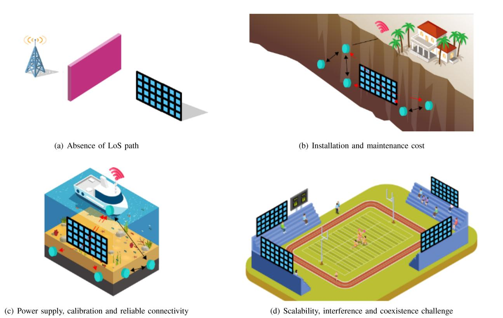

Fig. 9. Illustration of limitations to RIS-assisted radio localization. (a) NLoS challenges in complex environments with reflective or obstructive surfaces can be challenging, (b)The deployment, installation and maintenance of RIS infrastructure can be challenging and require careful planning (c) Ensuring an adequate power supply, RIS calibration and reliable connectivity to each RIS device can be a logistical challenge, (d) when multiple RIS devices are deployed in proximity, potential interference and coexistence challenges may arise.

scalable without any major hardware as well as the software limitations, as shown in Figure [9\(](#page-26-0)a) and [9\(](#page-26-0)d). Lastly, user privacy in such networks is an interesting area of investigation since the transmission and processing of data within RIS systems can be susceptible to eavesdropping, leading to the leakage of sensitive information [\[34\]](#page-29-21).

- *Mobile User Localization*: Mobility of the UE is an important factor in a real-world scenario that needs to be considered in addition to the 3D position and 3D orientation to localize the user with maximum accuracy [\[86\]](#page-30-30). If the Doppler delay effects due to user mobility are ignored, it will negatively impact the location estimates. It is, thus, necessary to account for the velocity of the user and its relative impact on UE position and orientation in a RIS-assisted localization scenario. Continuous monitoring of mobile UEs would gain advantages by incorporating NLoS channel identification to ensure optimal activation of RIS, and the ability to control RIS with low-latency locationbased capabilities. Consequently, this necessitates the availability of accurate UE location and uncertainty information at all times. Adapting localization algorithms to changing propagation conditions would be required.
- *Multi-User Localization*: Methods scalable to multi-user localization need to be developed for both LoS and obstructed LoS scenarios for more realistic and holistic

- designs for 6G networks [\[2\]](#page-28-1). It would require the development of algorithms for managing interference and optimizing resource allocation.
- *Modeling and Analysis of RIS-assisted Localization at Multiple Frequencies*: In practical scenarios, access points operating at different frequency bands, i.e., conventional, mmW and THz, will coexist in future 6G networks. The operation of RIS when interacting with BS operating at different frequency bands needs to be modeled and analyzed. What kind of element configuration is required at RIS to how would the phase and amplitude change of the RIS be modeled to successfully allow multi-band radio localization.
- • *Integrated Localization, Sensing and Communication:* Convergence of hardware as well as the technical design of radio localization, sensing and communication is one of the major agenda of 6G network design [\[219\]](#page-33-14), [\[220\]](#page-33-15). In light of this design requirement, it would be an interesting study direction to devise and analyze the methods for RIS-assisted joint localization, sensing and communication such that a unique trade-off is worked out between their performance matrices, thus, they complement one another depending on the scenario at hand. The introduction of these services within a wireless environment enabled by RIS presents new challenges related to optimizing RIS for multiple purposes. These challenges involve striking a suitable balance between configurations

that prioritize localization, communication, and sensing. It entails selecting the appropriate protocols, managing resource sharing among multiple users and operators in complex ecosystems, achieving synchronization between BS and RIS, and seamlessly integrating RIS into open radio access network (RAN) architectures. Such RIS-based solutions also need to be cost-effective for supporting localization and sensing functionalities together with communication. These alternatives include vehiclemounted reflective RIS, approaches resembling BS-free or multi-static radar systems, and hybrid RIS that can operate in the receiving mode to sense both connected UEs and passive objects.

- *Deployment and Optimization of RIS-Assisted Localization Radio Network*: Most of the contemporary literature quoted in the previous section is based on the development of theoretical approaches where there have been little to no practical campaigns to study the practical design and deployment perspectives of RIS-assisted radio localization. It is, therefore, an important area to explore the practicality of the methods proposed in the literature. The optimization of both the number and positioning of RIS is essential to achieve optimal performance in terms of communication metrics, localization/sensing accuracy, and coverage. Additionally, it is crucial to ensure that the optimized RIS deployment indeed offers advantages, when compared to traditional BS deployments, in terms of overall power consumption and coordination efforts. This optimization process also includes addressing the challenge of accurately calibrating the location and orientation of the RIS and its synchronization with BSs.
- *AI Controlled RIS:* In the age of AI, model-based signal processing is being replaced with data-driven approaches as it leads to more robust algorithms [\[86\]](#page-30-30). Based on this, developing AI-driven methods for RIS-assisted radio localization can prove to improve the radio localization performance manifolds. Control of RIS using AI can empower their design manifolds, it is thus an important direction to study.
- *Low Latency Control:* Efficient radio localization with RIS requires low-latency control capabilities. This necessitates real-time knowledge of UE location and uncertainty. Developing location-based RIS control mechanisms that offer low-latency control while maintaining accuracy and reliability is a challenge that must be overcome.
- • *RIS Standardization:* In order to analyze the theoretical methods by practical experimentation as well as to develop more suitable methods while considering the practical deployment scenarios, standardization of RIS hardware is necessary. Global standardization of RIS is in very early stages and the process is well summarized in [\[221\]](#page-33-16). RIS hardware is not yet available but the efforts for the development of RIS hardware prototypes are underway [\[222\]](#page-33-17), [\[223\]](#page-33-18), [\[224\]](#page-33-19), [\[225\]](#page-33-20), [\[226\]](#page-34-0), [\[227\]](#page-34-1), [\[228\]](#page-34-2). Standardized RIS hardware platforms will contribute to the acceleration of development progress. Researchers can build upon existing work, leveraging the availability

- of standardized platforms to iterate and refine their ideas. The collective efforts of researchers using standardized platforms can lead to the development of best practices, optimization techniques, and benchmark datasets that drive innovation and efficiency in RIS-related research.
- *Multi-Operator and Multi-RIS Localization:* The coordination and communication between multiple operators can be complex, especially in heterogeneous network environments, potentially leading to increased latency and decreased system efficiency. The synchronization of signals between different operators is another hurdle, as it requires precise timing control to avoid interference and ensure accurate localization. Moreover, the deployment and management of multiple RIS introduces further complexities, from determining optimal placement and density of the RIS to managing their phase configurations, as shown in Figure [9\(](#page-26-0)d) [\[229\]](#page-34-3). Additionally, privacy and security concerns may arise with multiple operators, necessitating robust protocols to protect data integrity. Lastly, as the number of operators and RIS increases, so does the computational complexity of localization algorithms, potentially impacting system performance and energy-efficiency.
- *RIS Control and User Mobility:* The process of controlling a RIS typically involves adjusting the electromagnetic properties of the RIS elements to optimize signal reflection and transmission. However, this process can be relatively slow, which poses significant challenges for high-mobility applications. As devices move rapidly across the coverage area, the channel conditions change quickly. By the time the RIS has collected enough information and adjusted its properties for optimal performance, the device may have already moved to a different location with entirely different channel conditions. Thus, the slow control of RIS may lead to outdated or ineffective configurations that fail to improve, or even degrade, the system performance. This lag in RIS control poses a major challenge in realizing the full potential of RIS technology in high-mobility applications such as autonomous vehicles, drones, and high-speed trains.
- *RIS Hardware Limitations and Pixel Failures:* The hardware components of RIS bring about several challenges that can impact their performance and efficacy [\[71\]](#page-30-15). RIS are composed of numerous smaller elements or "pixels" that each need to be individually controlled to manipulate the phase and amplitude of incoming electromagnetic waves. However, these pixel-level controls can be limited by hardware constraints such as processing speed, energy consumption, and design complexity. Additionally, the risk of pixel failures is a significant concern. Given the high density of pixels in an RIS, even a small percentage of pixel failures can lead to significant degradation in the overall performance of the RIS. Furthermore, identifying and repairing these failed pixels can be a complex and time-consuming task, especially when the RIS is deployed in hard-to-reach locations, as shown in Figure [9\(](#page-26-0)b). These hardware limitations and pixel failures

- pose substantial challenges to the reliable and effective deployment of RIS technology.
- *RIS Calibration:* The calibration of RIS is a challenging phase due to the inherent complexities of these devices [\[230\]](#page-34-4). RIS calibration involves adjusting each individual element, or "pixel", on the surface to manipulate the phase and amplitude of incident signals. Given that a RIS can consist of hundreds or thousands of these elements, this process can be highly complex and time-consuming. In addition, each element may respond differently to adjustments due to manufacturing variances, further complicating the calibration process. Real-world environmental factors, such as temperature and humidity, can also cause drift in the performance of the elements over time, necessitating frequent recalibration. Given that RIS are often deployed in inaccessible or hard-to-reach locations, performing this recalibration can be logistically challenging and costly, as shown in Figure [9\(](#page-26-0)c). Consequently, achieving precise and efficient RIS calibration remains a major hurdle in the wider adoption of RIS technology.
- *New RIS Antenna Technologies:*
  - Developing and integrating RIS antenna technologies into everyday items, such as clothing [\[71\]](#page-30-15), [\[230\]](#page-34-4), is an area ripe with potential but also rife with challenges. For instance, creating antennas thin and flexible enough to be woven into fabric without sacrificing performance is a significant technical obstacle. The material used in clothing also presents difficulties as it must be able to withstand regular wear and tear, washing, and various weather conditions while maintaining the antenna's functionality. Furthermore, it is critical to ensure that these RIS antennas do not negatively affect the wearer's health, particularly given concerns around prolonged exposure to electromagnetic fields. This necessitates strict control of the emitted power levels. From a design perspective, seamlessly incorporating the antennas in a way that is aesthetically pleasing and unobtrusive is also a major challenge. Given that each piece of clothing may be shaped and sized differently, custom calibration of these antennas could be needed for each garment, presenting further complexities.
- *From RIS to SIM:* The introduction of stacked intelligent metasurfaces (SIM) opens new possibilities in the context of radio localization [\[231\]](#page-34-5). Unlike traditional single-layer RIS, SIM consist of multiple reconfigurable metasurface layers, providing enhanced control over electromagnetic wave propagation in 3D. This added dimensionality enables SIM to manipulate complex multi-path environments more effectively, improving the robustness of localization or providing means for replacing digital with analog processing. Additionally, SIM can support multifunctional operations, such as SLAM and ISAC [\[232\]](#page-34-6), by leveraging their ability to perform spatial filtering, polarization control, and adaptive beamforming across multiple layers. The inter-layer coupling in SIM also allows for greater flexibility in addressing near-field

localization challenges, particularly at higher frequency bands like mmW and THz. These capabilities suggest that SIM could serve as a transformative enabler for high-accuracy and resilient localization in 6G networks, warranting further exploration and experimental validation.

## V. CONCLUSION

We presented a comprehensive overview of the utilization of RIS technology for radio localization in 6G networks. We discussed the RIS-assisted localization taxonomy, and recent advancements in theoretical approaches for RIS-assisted localization, identified opportunities, explored challenges, and examined various applications alongside the limitations of RIS-assisted localization. Recent advancements are based primarily on modeling and ML-based techniques where the focus is on improving the accuracy of the user location estimate. RIS can optimize wireless signals for improved localization in smart indoor services, smart transportation, and automated factories. However, there are some limitations to its use that need to be overcome such as the line-of-sight dependency, scalability, and interference. There are technical challenges and open areas of research that need to be addressed such as multi-user and mobile user localization, integrated localization, sensing, and communication algorithms, RIS standardization for practical experimentation as well as the investigation of availability, scalability, and privacy in RIS-assisted localization. Therefore, further research is required to fully realize the potential of RIS technology for localization in 6G.

# REFERENCES

- [\[1\]](#page-0-0) H. Wymeersch, J. He, B. Denis, A. Clemente, and M. Juntti, "Radio localization and mapping with reconfigurable intelligent surfaces: Challenges, opportunities, and research directions," *IEEE Veh. Technol. Mag.*, vol. 15, no. 4, pp. 52–61, Dec. 2020.
- [\[2\]](#page-0-1) C. De Lima et al., "Convergent communication, sensing and localization in 6G systems: An overview of technologies, opportunities and challenges," *IEEE Access*, vol. 9, pp. 26902–26925, 2021.
- [\[3\]](#page-0-2) S. P. Chepuri, N. Shlezinger, F. Liu, G. C. Alexandropoulos, S. Buzzi, and Y. C. Eldar, "Integrated sensing and communications with reconfigurable intelligent surfaces: From signal modeling to processing," *IEEE Signal Process. Mag.*, vol. 40, no. 6, pp. 41–62, Sep. 2023.
- [\[4\]](#page-0-3) M. Jian et al., "Reconfigurable intelligent surfaces for wireless communications: Overview of hardware designs, channel models, and estimation techniques," *Intell. Converg. Netw.*, vol. 3, no. 1, pp. 1–32, 2022.
- [\[5\]](#page-0-4) A. Albanese, V. Sciancalepore, and X. Costa-Pérez, "First responders got wings: UAVs to the rescue of localization operations in beyond 5G systems," *IEEE Commun. Mag.*, vol. 59, no. 11, pp. 28–34, Nov. 2021.
- [\[6\]](#page-1-1) G. Bresson, Z. Alsayed, L. Yu, and S. Glaser, "Simultaneous localization and mapping: A survey of current trends in autonomous driving," *IEEE Trans. Intell. Veh.*, vol. 2, no. 3, pp. 194–220, Sep. 2017.
- [\[7\]](#page-1-2) A. F. G. G. Ferreira, D. M. A. Fernandes, A. P. Catarino, and J. L. Monteiro, "Localization and positioning systems for emergency responders: A survey," *IEEE Commun. Surveys Tuts.*, vol. 19, no. 4, pp. 2836–2870, 4th Quart., 2017.
- [\[8\]](#page-1-1) S. Kuutti, S. Fallah, K. Katsaros, M. Dianati, F. Mccullough, and A. Mouzakitis, "A survey of the state-of-the-art localization techniques and their potentials for autonomous vehicle applications," *IEEE Internet Things J.*, vol. 5, no. 2, pp. 829–846, Apr. 2018.
- [\[9\]](#page-1-2) C. Laoudias, A. Moreira, S. Kim, S. Lee, L. Wirola, and C. Fischione, "A survey of enabling technologies for network localization, tracking, and navigation," *IEEE Commun. Surveys Tuts.*, vol. 20, no. 4, pp. 3607–3644, 4th Quart., 2018.

- [\[10\]](#page-1-3) J. A. del Peral-Rosado, R. Raulefs, J. A. López-Salcedo, and G. Seco-Granados, "Survey of cellular mobile radio localization methods: From 1G to 5G," *IEEE Commun. Surveys Tuts.*, vol. 20, no. 2, pp. 1124–1148, 2nd Quart., 2018.
- [\[11\]](#page-1-2) F. Zafari, A. Gkelias, and K. K. Leung, "A survey of indoor localization systems and technologies," *IEEE Commun. Surveys Tuts.*, vol. 21, no. 3, pp. 2568–2599, 3rd Quart., 2019.
- [\[12\]](#page-1-4) N. Saeed, H. Nam, T. Y. Al-Naffouri, and M.-S. Alouini, "A state-of-the-art survey on multidimensional scaling-based localization techniques," *IEEE Commun. Surveys Tuts.*, vol. 21, no. 4, pp. 3565–3583, 4th Quart., 2019.
- [13] F. Wen, H. Wymeersch, B. Peng, W. P. Tay, H. C. So, and D. Yang, "A survey on 5G massive MIMO localization," *Digit. Signal Process.*, vol. 94, pp. 21–28, Nov. 2019.
- [\[14\]](#page-1-2) X. Zhu, W. Qu, T. Qiu, L. Zhao, M. Atiquzzaman, and D. O. Wu, "Indoor intelligent fingerprint-based localization: Principles, approaches and challenges," *IEEE Commun. Surveys Tuts.*, vol. 22, no. 4, pp. 2634–2657, 4th Quart., 2020.
- [\[15\]](#page-1-5) V. F. Miramá, L. E. Díez, A. Bahillo, and V. Quintero, "A survey of machine learning in pedestrian localization systems: Applications, open issues and challenges," *IEEE Access*, vol. 9, pp. 120138–120157, 2021.
- [\[16\]](#page-1-2) A. Motroni, A. Buffi, and P. Nepa, "A survey on indoor vehicle localization through RFID technology," *IEEE Access*, vol. 9, pp. 17921–17942, 2021.
- [\[17\]](#page-9-1) O. Kanhere and T. S. Rappaport, "Position location for futuristic cellular communications: 5G and beyond," *IEEE Commun. Mag.*, vol. 59, no. 1, pp. 70–75, Jan. 2021.
- [18] Z. Xiao and Y. Zeng, "An overview on integrated localization and communication towards 6G," *Sci. China Inf. Sci.*, vol. 65, no. 1, pp. 1–46, 2022.
- [\[19\]](#page-1-6) J. Laconte, A. Kasmi, R. Aufrère, M. Vaidis, and R. Chapuis, "A survey of localization methods for autonomous vehicles in highway scenarios," *Sensors*, vol. 22, no. 1, p. 247, 2022.
- [\[20\]](#page-1-7) A. Liu et al., "A survey on fundamental limits of integrated sensing and communication," *IEEE Commun. Surveys Tuts.*, vol. 24, no. 2, pp. 994–1034, 2nd Quart., 2021.
- [\[21\]](#page-1-8) S. E. Trevlakis et al., "Localization as a key enabler of 6G wireless systems: A comprehensive survey and an outlook," *IEEE Open J. Commun. Soc.*, vol. 4, pp. 2733–2801, 2023.
- [\[22\]](#page-1-9) S. Zhang, M. Li, M. Jian, Y. Zhao, and F. Gao, "AIRIS: Artificial intelligence enhanced signal processing in reconfigurable intelligent surface communications," *China Commun.*, vol. 18, no. 7, pp. 158–171, 2021.
- [\[23\]](#page-1-10) H. Chen, H. Sarieddeen, T. Ballal, H. Wymeersch, M.-S. Alouini, and T. Y. Al-Naffouri, "A tutorial on terahertz-band localization for 6G communication systems," *IEEE Commun. Surveys Tuts.*, vol. 24, no. 3, pp. 1780–1815, 3rd Quart., 2022.
- [\[24\]](#page-1-11) R. Chen, M. Liu, Y. Hui, N. Cheng, and J. Li, "Reconfigurable intelligent surfaces for 6G IoT wireless positioning: A contemporary survey," *IEEE Internet Things J.*, vol. 9, no. 23, pp. 23570–23582, Dec. 2022.
- [\[25\]](#page-1-9) C. Pan et al., "An overview of signal processing techniques for RIS/IRS-aided wireless systems," *IEEE J. Sel. Topics Signal Process.*, vol. 16, no. 5, pp. 883–917, Aug. 2022.
- [\[26\]](#page-0-5) J. He, H. Wymeersch, T. Sanguanpuak, O. Silven, and M. Juntti, "Adaptive beamforming design for mmWave RIS-aided joint localization and communication," in *Proc. IEEE Wireless Commun. Netw. Conf. Workshops (WCNCW)*, 2020, pp. 1–6.
- [\[27\]](#page-0-6) S. Hu, F. Rusek, and O. Edfors, "Cramér-Rao lower bounds for positioning with large intelligent surfaces," in *Proc. IEEE 86th Veh. Technol. Conf. (VTC-Fall)*, 2017, pp. 1–6.
- [\[28\]](#page-0-7) S. Zeng, H. Zhang, B. Di, Z. Han, and L. Song, "Reconfigurable intelligent surface (RIS) assisted wireless coverage extension: RIS orientation and location optimization," *IEEE Commun. Lett.*, vol. 25, no. 1, pp. 269–273, Jan. 2021.
- [\[29\]](#page-0-7) C. Huang, A. Zappone, G. C. Alexandropoulos, M. Debbah, and C. Yuen, "Reconfigurable intelligent surfaces for energy efficiency in wireless communication," *IEEE Trans. Wireless Commun.*, vol. 18, no. 8, pp. 4157–4170, Aug. 2019.
- [\[30\]](#page-1-1) R. C. Shit et al., "Ubiquitous localization (UbiLoc): A survey and taxonomy on device free localization for smart world," *IEEE Commun. Surveys Tuts.*, vol. 21, no. 4, pp. 3532–3564, 4th Quart., 2019.
- [\[31\]](#page-1-12) H. Sallouha, S. Saleh, S. D. Bast, Z. Cui, S. Pollin, and H. Wymeersch, "On the ground and in the sky: A tutorial on radio localization in ground-air-space networks," *IEEE Commun. Surveys Tuts.*, early access, Jun. 19, 2024, doi: [10.1109/COMST.2024.3417336.](http://dx.doi.org/10.1109/COMST.2024.3417336)

- [\[32\]](#page-1-13) M. F. Keskin, A. D. Sezer, and S. Gezici, "Localization via visible light systems," *Proc. IEEE*, vol. 106, no. 6, pp. 1063–1088, Jun. 2018.
- [\[33\]](#page-1-9) E. Björnson, H. Wymeersch, B. Matthiesen, P. Popovski, L. Sanguinetti, and E. de Carvalho, "Reconfigurable intelligent surfaces: A signal processing perspective with wireless applications," *IEEE Signal Process. Mag.*, vol. 39, no. 2, pp. 135–158, Mar. 2022.
- [\[34\]](#page-1-14) K. Keykhosravi et al., "Leveraging RIS-enabled smart signal propagation for solving infeasible localization problems: Scenarios, key research directions, and open challenges," *IEEE Veh. Technol. Mag.*, vol. 18, no. 2, pp. 20–28, Jun. 2023.
- [\[35\]](#page-1-15) G. C. Alexandropoulos et al., "Smart wireless environments enabled by RISs: Deployment scenarios and two key challenges," in *Proc. Joint Eur. Conf. Netw. Commun. 6G Summit (EuCNC/6G Summit)*, 2022, pp. 1–6.
- [\[36\]](#page-2-5) S. Hu, F. Rusek, and O. Edfors, "Beyond massive MIMO: The potential of positioning with large intelligent surfaces," *IEEE Trans. Signal Process.*, vol. 66, no. 7, pp. 1761–1774, Apr. 2018.
- [\[37\]](#page-2-5) J. V. Alegría and F. Rusek, "Cramér-Rao lower bounds for positioning with large intelligent surfaces using quantized amplitude and phase," in *Proc. 53rd Asilomar Conf. Signals, Syst., Comput.*, 2019, pp. 10–14.
- [\[38\]](#page-2-5) C. Huang, G. C. Alexandropoulos, C. Yuen, and M. Debbah, "Indoor signal focusing with deep learning designed reconfigurable intelligent surfaces," in *Proc. IEEE 20th Int. Workshop Signal Process. Adv. Wireless Commun. (SPAWC)*, 2019, pp. 1–5.
- [\[39\]](#page-2-5) H. Wymeersch and B. Denis, "Beyond 5G wireless localization with reconfigurable intelligent surfaces," in *Proc. IEEE Int. Conf. Commun. (ICC)*, 2020, pp. 1–6.
- [\[40\]](#page-2-5) J. He, H. Wymeersch, L. Kong, O. Silvén, and M. Juntti, "Large intelligent surface for positioning in millimeter wave MIMO systems," in *Proc. IEEE 91st Veh. Technol. Conf. (VTC-Spring)*, 2020, pp. 1–5.
- [\[41\]](#page-2-5) Y. Liu, E. Liu, R. Wang, and Y. Geng, "Reconfigurable intelligent surface aided wireless localization," in *Proc. IEEE Int. Conf. Commun.*, 2021, pp. 1–6.
- [\[42\]](#page-2-5) E. Cišija, A. M. Ahmed, A. Sezgin, and H. Wymeersch, "Ris-aided ˇ mmWave MIMO radar system for adaptive multi-target localization," in *Proc. IEEE Stat. Signal Process. Workshop (SSP)*, 2021, pp. 196–200.
- [\[43\]](#page-2-5) W. Wang and W. Zhang, "Joint beam training and positioning for intelligent reflecting surfaces assisted millimeter wave communications," *IEEE Trans. Wireless Commun.*, vol. 20, no. 10, pp. 6282–6297, Oct. 2021.
- [\[44\]](#page-2-5) J. Zhang, Z. Zheng, Z. Fei, and X. Bao, "Positioning with dual reconfigurable intelligent surfaces in millimeter-wave MIMO systems," in *Proc. IEEE/CIC Int. Conf. Commun. China (ICCC)*, 2020, pp. 800–805.
- [\[45\]](#page-2-5) H. Zhang, H. Zhang, B. Di, K. Bian, Z. Han, and L. Song, "Towards ubiquitous positioning by leveraging reconfigurable intelligent surface," *IEEE Commun. Lett.*, vol. 25, no. 1, pp. 284–288, Jan. 2021.
- [\[46\]](#page-2-5) H. Zhang, H. Zhang, B. Di, K. Bian, and Z. Han, "Metalocalization: Reconfigurable intelligent surface aided multi-user wireless indoor localization," *IEEE Trans. Wireless Commun.*, vol. 20, no. 12, pp. 7743–7757, Dec. 2021.
- [\[47\]](#page-2-5) T. Ma, Y. Xiao, X. Lei, W. Xiong, and Y. Ding, "Indoor localization with reconfigurable intelligent surface," *IEEE Commun. Lett.*, vol. 25, no. 1, pp. 161–165, Jan. 2021.
- [\[48\]](#page-2-5) Z. Abu-Shaban, K. Keykhosravi, M. F. Keskin, G. C. Alexandropoulos, G. Seco-Granados, and H. Wymeersch, "Near-field localization with a reconfigurable intelligent surface acting as lens," in *Proc. IEEE Int. Conf. Commun.*, 2021, pp. 1–6.
- [\[49\]](#page-2-5) A. Elzanaty, A. Guerra, F. Guidi, and M.-S. Alouini, "Reconfigurable intelligent surfaces for localization: Position and orientation error bounds," *IEEE Trans. Signal Process.*, vol. 69, pp. 5386–5402, 2021.
- [\[50\]](#page-2-5) M. Rahal, B. Denis, K. Keykhosravi, B. Uguen, and H. Wymeersch, "RIS-enabled localization continuity under near-field conditions," in *Proc. IEEE 22nd Int. Workshop Signal Process. Adv. Wireless Commun. (SPAWC)*, 2021, pp. 436–440.
- [\[51\]](#page-2-6) D. Dardari, N. Decarli, A. Guerra, and F. Guidi, "Localization in NLOS conditions using large reconfigurable intelligent surfaces," in *Proc. IEEE 22nd Int. Workshop Signal Process. Adv. Wireless Commun. (SPAWC)*, 2021, pp. 551–555.
- [\[52\]](#page-2-6) C. Ozturk, M. F. Keskin, H. Wymeersch, and S. Gezici, "RIS-aided near-field localization under phase-dependent amplitude variations," *IEEE Trans. Wireless Commun.*, vol. 22, no. 8, pp. 5550–5566, Aug. 2023.

- [\[53\]](#page-2-6) R. Wang, Z. Xing, E. Liu, and J. Wu, "Joint localization and communication study for intelligent reflecting surface aided wireless communication system," *IEEE Trans. Commun.*, vol. 71, no. 5, pp. 3024–3042, May 2023.
- [\[54\]](#page-2-6) K. Dovelos, S. D. Assimonis, H. Q. Ngo, B. Bellalta, and M. Matthaiou, "Intelligent reflecting surfaces at terahertz bands: Channel modeling and analysis," in *Proc. IEEE Int. Conf. Commun. Workshops (ICC Workshops)*, 2021, pp. 1–6.
- [\[55\]](#page-2-6) H. Guo, B. Makki, M. Åström, M.-S. Alouini, and T. Svensson, "Dynamic blockage pre-avoidance using reconfigurable intelligent surfaces," 2022, *arXiv:2201.06659*.
- [\[56\]](#page-2-6) K. Keykhosravi, M. F. Keskin, G. Seco-Granados, and H. Wymeersch, "SISO RIS-enabled joint 3D downlink localization and synchronization," in *Proc. IEEE Int. Conf. Commun.*, 2020, pp. 1–6.
- [\[57\]](#page-2-6) A. Fascista, A. Coluccia, H. Wymeersch, and G. Seco-Granados, "RISaided joint localization and Synchronization with a single-antenna mmWave receiver," in *Proc. IEEE Int. Conf. Acoust., Speech Signal Process. (ICASSP)*, 2020, pp. 4455–4459.
- [\[58\]](#page-2-6) Z. Gong, L. Wu, Z. Zhang, J. Dang, Y. Wu, and J. Wang, "Asynchronous RIS-assisted localization: A comprehensive analysis of fundamental limits," *IEEE Trans. Wireless Commun.*, vol. 23, no. 9, pp. 10974–10989, Sep. 2024.
- [\[59\]](#page-2-6) Y. Cui and H. Yin, "Channel estimation for RIS-aided mmWave communications via 3D positioning," in *Proc. IEEE/CIC Int. Conf. Commun. China (ICCC Workshops)*, 2021, pp. 399–404.
- [\[60\]](#page-2-6) J. Zhang, Z. Zheng, Z. Fei, and Z. Han, "Energy-efficient multiuser localization in the RIS-assisted IoT networks," *IEEE Internet Things J.*, vol. 9, no. 20, pp. 20651–20665, Oct. 2022.
- [\[61\]](#page-2-6) Y. Pan, C. Pan, S. Jin, and J. Wang, "RIS-aided near-field localization and channel estimation for the terahertz system," *IEEE J. Sel. Topics Signal Process.*, vol. 17, no. 4, pp. 878–892, Jul. 2023.
- [\[62\]](#page-2-6) Y. Han, S. Jin, C.-K. Wen, and T. Q. S. Quek, "Localization and channel reconstruction for extra large RIS-assisted massive MIMO systems," *IEEE J. Sel. Topics Signal Process.*, vol. 16, no. 5, pp. 1011–1025, Aug. 2022.
- [\[63\]](#page-2-6) Z. Wang, Z. Liu, Y. Shen, A. Conti, and M. Z. Win, "Location awareness in beyond 5G networks via reconfigurable intelligent surfaces," *IEEE J. Sel. Areas Commun.*, vol. 40, no. 7, pp. 2011–2025, Jul. 2022.
- [\[64\]](#page-2-6) Z. Zhang, L. Wu, Z. Zhang, J. Dang, B. Zhu, and L. Wang, "Multiple RSS fingerprint based indoor localization in RIS-assisted 5G wireless communication system," *Int. Arch. Photogrammetry, Remote Sens. Spatial Inf. Sci.*, vol. XLVI-3/W1-2022, pp. 287–292, Apr. 2022.
- [\[65\]](#page-2-7) X. Gan, C. Huang, Z. Yang, C. Zhong, and Z. Zhang, "Near-field localization for holographic RIS assisted mmWave systems," *IEEE Commun. Lett.*, vol. 27, no. 1, pp. 140–144, Jan. 2023.
- [66] N. González-Prelcic et al., "The integrated sensing and communication revolution for 6G: Vision, techniques, and applications," *Proc. IEEE*, vol. 112, no. 7, pp. 676–723, Jul. 2024.
- [67] K. Muthineni, A. Artemenko, J. Vidal, and M. Nájar, "A survey of 5G-based positioning for industry 4.0: State of the art and enhanced techniques," in *Proc. Joint Eur. Conf. Netw. Commun. 6G Summit (EuCNC/6G Summit)*, 2023, pp. 120–125.
- [68] B. Rother, N. Kalis, C. Haubelt, and F. Golatowski, "Localization in 6G: A journey along existing wireless communication technologies," in *Proc. IEEE 20th Int. Conf. Factory Commun. Syst. (WFCS)*, 2024, pp. 1–7.
- [69] C. Liaskos, S. Nie, A. Tsioliaridou, A. Pitsillides, S. Ioannidis, and I. Akyildiz, "A new wireless communication paradigm through software-controlled metasurfaces," *IEEE Commun. Mag.*, vol. 56, no. 9, pp. 162–169, Sep. 2018.
- [\[70\]](#page-4-1) Q. Wu and R. Zhang, "Towards smart and reconfigurable environment: Intelligent reflecting surface aided wireless network," *IEEE Commun. Mag.*, vol. 58, no. 1, pp. 106–112, Jan. 2020.
- [\[71\]](#page-4-2) Y. Liu et al., "Reconfigurable intelligent surfaces: Principles and opportunities," *IEEE Commun. Surveys Tuts.*, vol. 23, no. 3, pp. 1546–1577, 3rd Quart., 2021.
- [\[72\]](#page-4-3) S. Zeng et al., "Reconfigurable intelligent surfaces in 6G: Reflective, transmissive, or both?" *IEEE Commun. Lett.*, vol. 25, no. 6, pp. 2063–2067, Jun. 2021.
- [\[73\]](#page-4-4) G. C. Alexandropoulos, N. Shlezinger, I. Alamzadeh, M. F. Imani, H. Zhang, and Y. C. Eldar, "Hybrid reconfigurable intelligent metasurfaces: Enabling simultaneous tunable reflections and sensing for 6G wireless communications," *IEEE Veh. Technol. Mag.*, vol. 19, no. 1, pp. 75–84, Mar. 2024.
- [74] J. Xu, Y. Liu, X. Mu, and O. A. Dobre, "STAR-RISs: Simultaneous transmitting and reflecting reconfigurable intelligent surfaces," *IEEE Commun. Lett.*, vol. 25, no. 9, pp. 3134–3138, Sep. 2021.

- [\[75\]](#page-5-2) Q. Wu and R. Zhang, "Intelligent reflecting surface enhanced wireless network via joint active and passive beamforming," *IEEE Trans. Wireless Commun.*, vol. 18, no. 11, pp. 5394–5409, Nov. 2019.
- [\[76\]](#page-5-3) Q. Wu, "Beamforming optimization for wireless network aided by intelligent reflecting surface with discrete phase shifts," *IEEE Trans. Commun.*, vol. 68, no. 3, pp. 1838–1851, Mar. 2020.
- [\[77\]](#page-5-4) Y. Liu et al., "STAR: Simultaneous transmission and reflection for 360◦ coverage by intelligent surfaces," *IEEE Wireless Commun.*, vol. 28, no. 6, pp. 102–109, Dec. 2021.
- [\[78\]](#page-5-4) X. Mu, Y. Liu, L. Guo, J. Lin, and R. Schober, "Simultaneously transmitting and reflecting (STAR) RIS aided wireless communications," *IEEE Trans. Wireless Commun.*, vol. 21, no. 5, pp. 3083–3098, May 2022.
- [\[79\]](#page-5-5) "DOCOMO conducts world's first successful trial of transparent dynamic metasurface," 2020. [Online]. Available: https://www.nttdocomo.co.jp/english/info/mediacenter/pr/2020/0117 00.html
- [\[80\]](#page-5-5) Q. Li et al., "Reconfigurable intelligent surfaces relying on nondiagonal phase shift matrices," *IEEE Trans. Veh. Technol.*, vol. 71, no. 6, pp. 6367–6383, Jun. 2022.
- [\[81\]](#page-5-6) M. Najafi, V. Jamali, R. Schober, and H. V. Poor, "Physics-based modeling and scalable optimization of large intelligent reflecting surfaces," *IEEE Trans. Commun.*, vol. 69, no. 4, pp. 2673–2691, Apr. 2021.
- [\[82\]](#page-5-7) G. Mylonopoulos, C. D'Andrea, and S. Buzzi, "Active reconfigurable intelligent surfaces for user localization in mmWave MIMO systems," in *Proc. IEEE 23rd Int. Workshop Signal Process. Adv. Wireless Commun. (SPAWC)*, 2022, pp. 1–5.
- [\[83\]](#page-5-8) Z. Zhang et al., "Active RIS vs. passive RIS: Which will prevail in 6G?" *IEEE Trans. Commun.*, vol. 71, no. 3, pp. 1707–1725, Mar. 2023.
- [\[84\]](#page-5-9) K. Zhi, C. Pan, H. Ren, M. Chai, and M. Elkashlan, "Active RIS versus passive RIS: Which is superior with the same power budget?" *IEEE Commun. Lett.*, vol. 26, pp. 1150–1154, May 2022.
- [\[85\]](#page-5-10) H. Wymeersch and G. S. Granados, "Radio localization and sensing— Part I: Fundamentals," *IEEE Commun. Lett.*, vol. 26, no. 12, pp. 2816–2820, Dec. 2022.
- [\[86\]](#page-5-11) H. Wymeersch and G. Seco-Granados, "Radio localization and sensing—Part II: State-of-the-art and challenges," *IEEE Commun. Lett.*, vol. 26, no. 12, pp. 2821–2825, Dec. 2022.
- [\[87\]](#page-5-12) K. M. Braun, "OFDM adar algorithms in mobile communication networks," Ph.D. dissertation, Commun. Eng. Lab, Karlsruher Institut für Technologie (KIT), Karlsruhe, Germany, 2014.
- [\[88\]](#page-7-0) F. Roemer, M. Haardt, and G. Del Galdo, "Analytical performance assessment of multi-dimensional matrix- and tensor-based ESPRITtype algorithms," *IEEE Trans. Signal Process.*, vol. 62, no. 10, pp. 2611–2625, May 2014.
- [\[89\]](#page-7-1) A. Shahmansoori, G. E. Garcia, G. Destino, G. Seco-Granados, and H. Wymeersch, "Position and orientation estimation through millimeter-wave MIMO in 5G systems," *IEEE Trans. Wireless Commun.*, vol. 17, no. 3, pp. 1822–1835, Mar. 2018.
- [\[90\]](#page-7-2) I. Yildirim, A. Uyrus, and E. Basar, "Modeling and analysis of reconfigurable intelligent surfaces for indoor and outdoor applications in future wireless networks," *IEEE Trans. Commun.*, vol. 69, no. 2, pp. 1290–1301, Feb. 2021.
- [\[91\]](#page-7-3) S. Hu, F. Rusek, and O. Edfors, "The potential of using large antenna arrays on intelligent surfaces," in *Proc. IEEE 85th Veh. Technol. Conf. (VTC Spring)*, 2017, pp. 1–6.
- [\[92\]](#page-8-0) "Localisation and sensing use cases and gap analysis," presented at HEXA-X, WP2/D3.1, 2021. [Online]. Available: https://hexa-x.eu/wpcontent/uploads/2022/02/Hexa-X\_D3.1\_v1.4.pdf
- [\[93\]](#page-8-0) K. Witrisal et al., "High-accuracy localization for assisted living: 5G systems will turn multipath channels from foe to friend," *IEEE Signal Process. Mag.*, vol. 33, no. 2, pp. 59–70, Mar. 2016.
- [94] A. Shahmansoori, B. Uguen, G. Destino, G. Seco-Granados, and H. Wymeersch, "Tracking position and orientation through millimeter wave lens MIMO in 5G systems," *IEEE Signal Process. Lett.*, vol. 26, no. 8, pp. 1222–1226, Aug. 2019.
- [\[95\]](#page-8-1) R. Mendrzik, H. Wymeersch, and G. Bauch, "Joint localization and mapping through millimeter wave MIMO in 5G systems," in *Proc. IEEE Global Commun. Conf. (GLOBECOM)*, 2018, pp. 1–6.
- [\[96\]](#page-8-2) R. Mendrzik, H. Wymeersch, G. Bauch, and Z. Abu-Shaban, "Harnessing NLOS components for position and orientation estimation in 5G millimeter wave MIMO," *IEEE Trans. Wireless Commun.*, vol. 18, no. 1, pp. 93–107, Jan. 2019.

- [\[97\]](#page-8-2) M. Di Renzo et al., "Smart radio environments empowered by reconfigurable intelligent surfaces: How it works, state of research, and the road ahead," *IEEE J. Sel. Areas Commun.*, vol. 38, no. 11, pp. 2450–2525, Nov. 2020.
- [\[98\]](#page-8-2) A. U. Makarfi, K. M. Rabie, O. Kaiwartya, O. S. Badarneh, X. Li, and R. Kharel, "Reconfigurable intelligent surface enabled IoT networks in generalized fading channels," in *Proc. IEEE Int. Conf. Commun. (ICC)*, 2020, pp. 1–6.
- [\[99\]](#page-8-3) Y. Cao, T. Lv, W. Ni, and Z. Lin, "Sum-rate maximization for multi-reconfigurable intelligent surface-assisted device-to-device communications," *IEEE Trans. Commun.*, vol. 69, no. 11, pp. 7283–7296, Nov. 2021.
- [\[100\]](#page-8-4) X. Mu, Y. Liu, L. Guo, J. Lin, and R. Schober, "Intelligent reflecting surface enhanced indoor robot path planning: A radio mapbased approach," *IEEE Trans. Wireless Commun.*, vol. 20, no. 7, pp. 4732–4747, Jul. 2021.
- [\[101\]](#page-8-4) H. Chen, T. Ballal, A. H. Muqaibel, X. Zhang, and T. Y. Al-Naffouri, "Air writing via receiver array-based ultrasonic source localization," *IEEE Trans. Instrum. Meas.*, vol. 69, no. 10, pp. 8088–8101, Oct. 2020.
- [\[102\]](#page-8-5) H. Zhang et al., "MetaRadar: Indoor localization by reconfigurable metamaterials," *IEEE Trans. Mobile Comput.*, vol. 21, no. 8, pp. 2895–2908, Aug. 2022.
- [\[103\]](#page-9-2) P. Zheng, H. Chen, T. Ballal, M. Valkama, H. Wymeersch, and T. Y. Al-Naffouri, "JrCUP: Joint RIS calibration and user positioning for 6G wireless systems," *IEEE Trans. Wireless Commun.*, vol. 23, no. 6, pp. 6683–6698, Jun. 2024.
- [\[104\]](#page-9-3) M. Ammous and S. Valaee, "Cooperative positioning with the aid of reconfigurable intelligent surfaces and zero access points," in *Proc. IEEE 96th Veh. Technol. Conf. (VTC-Fall)*, 2022, pp. 1–5.
- [\[105\]](#page-10-2) F. Jiang, A. Abrardo, K. Keykhosravi, H. Wymeersch, D. Dardari, and M. Di Renzo, "Two-timescale transmission design and RIS optimization for integrated localization and communications," *IEEE Trans. Wireless Commun.*, vol. 22, no. 12, pp. 8587–8602, Dec. 2023.
- [\[106\]](#page-11-0) T. V. Nguyen, D. N. Nguyen, M. D. Renzo, and R. Zhang, "Leveraging secondary reflections and mitigating interference in multi-IRS/RIS aided wireless networks," *IEEE Trans. Wireless Commun.*, vol. 22, no. 1, pp. 502–517, Jan. 2023.
- [\[107\]](#page-11-1) T. V. Nguyen and D. N. Nguyen, "Secondary reflections amongst multiple IRSs: Friends or foes?" in *Proc. IEEE Wireless Commun. Netw. Conf. (WCNC)*, 2022, pp. 1347–1352.
- [\[108\]](#page-11-2) M. Ammous and S. Valaee, "Positioning and tracking using reconfigurable intelligent surfaces and extended Kalman filter," in *Proc. IEEE 95th Veh. Technol. Conf. (VTC-Spring)*, 2022, pp. 1–6.
- [\[109\]](#page-11-2) E. Wan and R. Van Der Merwe, "The unscented Kalman filter for nonlinear estimation," in *Proc. IEEE Adapt. Syst. Signal Process., Commun., Control Symp.*, 2000, pp. 153–158.
- [\[110\]](#page-11-3) T. Koike-Akino, P. Wang, M. Pajovic, H. Sun, and P. V. Orlik, "Fingerprinting-based indoor localization with commercial MMWave WiFi: A deep learning approach," *IEEE Access*, vol. 8, pp. 84879–84892, 2020.
- [\[111\]](#page-11-4) J. Vieira, E. Leitinger, M. Sarajlic, X. Li, and F. Tufvesson, "Deep convolutional neural networks for massive MIMO fingerprint-based positioning," in *Proc. IEEE 28th Annu. Int. Symp. Pers., Indoor, Mobile Radio Commun. (PIMRC)*, 2017, pp. 1–6.
- [\[112\]](#page-11-5) H. Kim et al., "RIS-enabled and access-point-free simultaneous radio localization and mapping," *IEEE Trans. Wireless Commun.*, vol. 23, no. 4, pp. 3344–3360, Apr. 2024.
- [\[113\]](#page-12-1) Z. Yang, H. Zhang, B. Di, H. Zhang, K. Bian, and L. Song, "Wireless indoor simultaneous localization and mapping using reconfigurable intelligent surface," in *Proc. IEEE Global Commun. Conf. (GLOBECOM)*, 2021, pp. 1–6.
- [\[114\]](#page-12-2) T. M. Mitchell, *Machine Learning*. Cham, Switzerland: Springer, 1997.
- [\[115\]](#page-12-3) A. Alarifi et al., "Ultra wideband indoor positioning technologies: Analysis and recent advances," *Sensors*, vol. 16, no. 5, p. 707, 2016.
- [\[116\]](#page-12-4) X. Guo, N. R. Elikplim, N. Ansari, L. Li, and L. Wang, "Robust WiFi localization by fusing derivative fingerprints of RSS and multiple classifiers," *IEEE Trans. Ind. Informat.*, vol. 16, no. 5, pp. 3177–3186, May 2020.
- [\[117\]](#page-13-1) X. Tian, W. Li, Y. Yang, Z. Zhang, and X. Wang, "Optimization of fingerprints reporting strategy for WLAN indoor localization," *IEEE Trans. Mobile Comput.*, vol. 17, no. 2, pp. 390–403, Feb. 2018.
- [\[118\]](#page-13-2) K.-H. Lam, C.-C. Cheung, and W.-C. Lee, "RSSI-based LoRa localization systems for large-scale indoor and outdoor environments," *IEEE Trans. Veh. Technol.*, vol. 68, no. 12, pp. 11778–11791, Dec. 2019.
- [\[119\]](#page-13-3) "Towards TBPS communication in 6G: Use cases and gap analysis," presented at HEXA-X, WP2/D2.1, 2021. [Online]. Available: https://hexa-x.eu/wpcontent/uploads/2021/06/Hexa-X\_D2.1.pdf

- [\[120\]](#page-13-4) Z. Abu-Shaban, X. Zhou, T. Abhayapala, G. Seco-Granados, and H. Wymeersch, "Error bounds for uplink and downlink 3D localization in 5G millimeter wave systems," *IEEE Trans. Wireless Commun.*, vol. 17, no. 8, pp. 4939–4954, Aug. 2018.
- [\[121\]](#page-13-5) N. Kouzayha, M. A. Kishk, H. Sarieddeen, M.-S. Alouini, and T. Y. Al-Naffouri, "Coexisting terahertz and RF finite wireless networks: Coverage and rate analysis," *IEEE Trans. Wireless Commun.*, vol. 22, no. 7, pp. 4873–4889, Jul. 2023.
- [\[122\]](#page-13-6) X. Shao, C. You, W. Ma, X. Chen, and R. Zhang, "Target sensing with intelligent reflecting surface: Architecture and performance," *IEEE J. Sel. Areas Commun.*, vol. 40, no. 7, pp. 2070–2084, Jul. 2022.
- [\[123\]](#page-13-7) S. Ghiasvand, A. Nasri, A. H. A. Bafghi, and M. Nasiri-Kenari, "MISO wireless localization in the presence of reconfigurable intelligent surface," 2022, *arXiv:2208.09546*.
- [\[124\]](#page-13-8) Z. Xing, R. Wang, and X. Yuan, "Joint active and passive beamforming design for reconfigurable intelligent surface enabled integrated sensing and communication," *IEEE Trans. Commun.*, vol. 71, no. 4, pp. 2457–2474, Apr. 2023.
- [\[125\]](#page-14-1) A. Nasri, A. H. A. Bafghi, and M. Nasiri-Kenari, "Wireless localization in the presence of intelligent reflecting surface," *IEEE Wireless Commun. Lett.*, vol. 11, no. 7, pp. 1315–1319, Jul. 2022.
- [\[126\]](#page-14-2) H. Zhang et al., "RSS fingerprinting based multi-user outdoor localization using reconfigurable intelligent surfaces," in *Proc. 15th Int. Symp. Med. Inf. Commun. Technol. (ISMICT)*, 2021, pp. 167–172.
- [127] Z. Wang, Z. Liu, Y. Shen, A. Conti, and M. Z. Win, "Wideband localization with reconfigurable intelligent surfaces," in *Proc. IEEE 95th Veh. Technol. Conf. (VTC-Spring)*, 2022, pp. 1–6.
- [\[128\]](#page-13-9) M. Luan, B. Wang, Z. Chang, T. Hämäläinen, Z. Ling, and F. Hu, "Joint subcarrier and phase shifts optimization for RIS-aided localizationcommunication system," in *Proc. IEEE 95th Veh. Technol. Conf. (VTC-Spring)*, 2022, pp. 1–5.
- [129] C. Gaudreauand and A. Chaaban, "Localization by modulated reconfigurable intelligent surfaces," *IEEE Commun. Lett.*, vol. 26, no. 12, pp. 2904–2908, Dec. 2022.
- [130] X. Luo and N. Meratnia, "A codeword-independent localization technique for reconfigurable intelligent surface enhanced environments using adversarial learning," *Sensors*, vol. 23, no. 2, p. 984, 2023.
- [131] S. Hong, M. Li, C. Pan, M. D. Renzo, W. Zhang, and L. Hanzo, "RISposition and orientation estimation in MIMO-OFDM systems with practical scatterers," 2023, *arXiv:2302.04499*.
- [\[132\]](#page-15-0) Y. Liu, S. Hong, C. Pan, Y. Wang, Y. Pan, and M. Chen, "Cramér-Rao lower bound analysis of multiple-RIS-aided mmWave positioning systems," in *Proc. IEEE 33rd Annu. Int. Symp. Pers., Indoor Mobile Radio Commun. (PIMRC)*, 2022, pp. 1110–1115.
- [\[133\]](#page-15-1) D.-R. Emenonye, H. S. Dhillon, and R. M. Buehrer, "RIS-aided localization under position and orientation offsets in the near and far field," *IEEE Trans. Wireless Commun.*, vol. 22, no. 12, pp. 9327–9345, Dec. 2023.
- [134] J. Hu, Z. Chen, T. Zheng, R. Schober, and J. Luo, "HoloFed: Environment-adaptive positioning via multi-band reconfigurable holographic surfaces and federated learning," *IEEE J. Sel. Areas Commun.*, vol. 41, no. 12, pp. 3736–3751, Dec. 2023.
- [\[135\]](#page-14-3) T. Ma, Y. Xiao, X. Lei, and M. Xiao, "Integrated sensing and communication for wireless extended reality (XR) with reconfigurable intelligent surface," *IEEE J. Sel. Topics Signal Process.*, vol. 17, no. 5, pp. 980–994, Sep. 2023.
- [\[136\]](#page-15-2) Y. Zhao, P. Chen, M. Sun, T. Luo, and Z. Cao, "RIS-aided sensing system with localization function: Fundamental and practical design," *IEEE Sensors J.*, vol. 24, no. 1, pp. 506–514, Jan. 2024.
- [\[137\]](#page-15-3) S. Sardellitti, P. D. Lorenzo, and S. Barbarossa, "RIS-aided wireless fingerprinting localization based on multilayer graph representations," *IEEE Commun. Lett.*, vol. 28, no. 5, pp. 1043–1047, May 2024.
- [\[138\]](#page-15-4) T. Chao, C. C. Fung, Z.-E. Ni, and M. Servetnyk, "Joint beamforming and aerial IRS positioning design for IRS-assisted MISO system with multiple access points," *IEEE Open J. Commun. Soc.*, vol. 5, pp. 612–632, 2024.
- [\[139\]](#page-15-5) M. S. Siraj, A. B. Rahman, E. E. Tsiropoulou, S. Papavassiliou, and J. Plusquellic, "Symbiotic positioning, navigation, and timing," in *Proc. 19th Int. Conf. Distrib. Comput. Smart Syst. Internet Things (DCOSS-IoT)*, 2023, pp. 261–268.

- [140] A. Fascista, M. F. Keskin, A. Coluccia, H. Wymeersch, and G. Seco-Granados, "RIS-aided joint localization and synchronization with a single-antenna receiver: Beamforming design and low-complexity estimation," *IEEE J. Sel. Topics Signal Process.*, vol. 16, no. 5, pp. 1141–1156, Aug. 2022.
- [141] J. He, A. Fakhreddine, and G. C. Alexandropoulos, "Simultaneous indoor and outdoor 3D localization with STAR-RIS-assisted millimeter wave systems," in *Proc. IEEE 96th Veh. Technol. Conf. (VTC-Fall)*, 2022, pp. 1–6.
- [\[142\]](#page-19-0) Y. Xanthos, W. Lyu, S. Yang, C. Assi, X. Zou, and N. Wei, "Joint localization and beamforming for reconfigurable intelligent surface aided 5G mmWave communication systems," 2022, *arXiv:2210.17530*.
- [\[143\]](#page-18-1) K. Keykhosravi, G. Seco-Granados, G. C. Alexandropoulos, and H. Wymeersch, "RIS-enabled self-localization: Leveraging controllable reflections with zero access points," in *Proc. IEEE Int. Conf. Commun.*, 2022, pp. 2852–2857.
- [\[144\]](#page-19-1) Y. Lin, S. Jin, M. Matthaiou, and X. You, "Channel estimation and user localization for IRS-assisted MIMO-OFDM systems," *IEEE Trans. Wireless Commun.*, vol. 21, no. 4, pp. 2320–2335, Apr. 2022.
- [\[145\]](#page-18-2) Y. Lu, H. Chen, J. Talvitie, H. Wymeersch, and M. Valkama, "Joint RIS calibration and multi-user positioning," in *Proc. IEEE 96th Veh. Technol. Conf. (VTC-Fall)*, 2022, pp. 1–6.
- [\[146\]](#page-17-1) B. Teng, X. Yuan, R. Wang, and S. Jin, "Bayesian user tracking for reconfigurable intelligent surface aided mmWave MIMO system," in *Proc. IEEE 12th Sensor Array Multichannel Signal Process. Workshop (SAM)*, 2022, pp. 201–205.
- [147] M. Ammous and S. Valaee, "Cooperative positioning with the aid of reconfigurable intelligent surfaces and device-to-device communications in mmWave," in *Proc. IEEE 33rd Annu. Int. Symp. Pers., Indoor Mobile Radio Commun. (PIMRC)*, 2022, pp. 683–688.
- [148] J. He, A. Fakhreddine, C. Vanwynsberghe, H. Wymeersch, and G. C. Alexandropoulos, "3D localization with a single partiallyconnected receiving RIS: Positioning error analysis and algorithmic design," *IEEE Trans. Veh. Technol.*, vol. 72, no. 10, pp. 13190–13202, Oct. 2023.
- [149] P. Zheng, H. Chen, T. Ballal, H. Wymeersch, and T. Y. Al-Naffouri, "Misspecified Cramér-Rao bound of RIS-aided localization under geometry mismatch," in *Proc. IEEE Int. Conf. Acoust., Speech Signal Process. (ICASSP)*, 2023, pp. 1–5.
- [\[150\]](#page-19-2) J. He, A. Fakhreddine, H. Wymeersch, and G. C. Alexandropoulos, "Compressed-sensing-based 3D localization with distributed passive reconfigurable intelligent surfaces," in *Proc. IEEE Int. Conf. Acoust., Speech Signal Process. (ICASSP)*, 2023, pp. 1–5.
- [\[151\]](#page-18-3) P. Wang, W. Mei, J. Fang, and R. Zhang, "Target-mounted intelligent reflecting surface for joint location and orientation estimation," *IEEE J. Sel. Areas Commun.*, vol. 41, no. 12, pp. 3768–3782, Dec. 2023.
- [\[152\]](#page-18-4) M. A. Haider, Y. D. Zhang, and E. Aboutanios, "ISAC system assisted by RIS with sparse active elements," *EURASIP J. Adv. Signal Process.*, vol. 2023, no. 1, pp. 1–22, 2023.
- [153] H. Chen, P. Zheng, M. F. Keskin, T. Al-Naffouri, and H. Wymeersch, "Multi-RIS-enabled 3D sidelink positioning," *IEEE Trans. Wireless Commun.*, vol. 23, no. 8, pp. 8700–8716, Aug. 2024.
- [154] K. Keykhosravi, M. F. Keskin, S. Dwivedi, G. Seco-Granados, and H. Wymeersch, "Semi-passive 3D positioning of multiple RIS-enabled users," *IEEE Trans. Veh. Technol.*, vol. 70, no. 10, pp. 11073–11077, Oct. 2021.
- [\[155\]](#page-21-0) K. Keykhosravi, M. F. Keskin, G. Seco-Granados, P. Popovski, and H. Wymeersch, "RIS-enabled SISO localization under user mobility and spatial-wideband effects," *IEEE J. Sel. Topics Signal Process.*, vol. 16, no. 5, pp. 1125–1140, Aug. 2022.
- [156] Z. Shao, X. Yuan, W. Zhang, and M. Di Renzo, "Joint localization and information transfer for RIS aided full-duplex systems," in *Proc. IEEE Global Commun. Conf.*, 2022, pp. 3253–3258.
- [\[157\]](#page-20-0) R. Ghazalian, H. Chen, G. C. Alexandropoulos, G. Seco-Granados, H. Wymeersch, and R. Jäntti, "Joint user localization and location calibration of a hybrid reconfigurable intelligent surface," *IEEE Trans. Veh. Technol.*, vol. 73, no. 1, pp. 1435–1440, Jan. 2024.
- [\[158\]](#page-20-1) Q. Cheng, L. Li, M.-M. Zhao, and M.-J. Zhao, "Cooperative localization for reconfigurable intelligent surface-aided mmWave systems," in *Proc. IEEE Wireless Commun. Netw. Conf. (WCNC)*, 2022, pp. 1051–1056.
- [\[159\]](#page-19-3) Z. Xing, R. Wang, X. Yuan, and J. Wu, "Location information assisted beamforming design for reconfigurable intelligent surface aided communication systems," *IEEE Trans. Wireless Commun.*, vol. 22, no. 11, pp. 7676–7695, Nov. 2023.

- [160] P. Gao, L. Lian, and J. Yu, "Optimal passive beamforming for cooperative localization with RIS-assisted mmWave systems," in *Proc. IEEE Wireless Commun. Netw. Conf. (WCNC)*, 2022, pp. 222–227.
- [161] P. Gao, L. Lian, and J. Yu, "Wireless area positioning in RIS-assisted mmWave systems: Joint passive and active beamforming design," *IEEE Signal Process. Lett.*, vol. 29, pp. 1372–1376, 2022.
- [\[162\]](#page-19-4) J. Feng, P. Zhang, L. Huang, and G. Qian, "Reconfigurable intelligent surface aided DFRC vehicular networks," in *Proc. 6th World Conf. Comput. Commun. Technol. (WCCCT)*, 2023, pp. 1–6.
- [163] Z. Li, Z. Gao, and T. Li, "Sensing user's channel and location with terahertz extra-large reconfigurable intelligent surface under hybridfield beam squint effect," *IEEE J. Sel. Topics Signal Process.*, vol. 17, no. 4, pp. 893–911, Jul. 2023.
- [164] M. Eskandari and A. V. Savkin, "SLAPS: Simultaneous localization and phase shift for a RIS-equipped UAV in 5G/6G wireless communication networks," *IEEE Trans. Intell. Veh.*, vol. 8, no. 12, pp. 4722–4733, Dec. 2023.
- [\[165\]](#page-20-2) A. Fazli, E. Tohidi, Z. Utkovski, and S. Stanczak, "User-centric ´ monostatic sensing aided by reconfigurable intelligent surfaces," in *Proc. IEEE Wireless Commun. Netw. Conf. (WCNC)*, 2024, pp. 1–6.
- [\[166\]](#page-19-5) D. Wang, A. Bazzi, and M. Chafii, "RIS-enabled integrated sensing and communication for 6G systems," in *Proc. IEEE Wireless Commun. Netw. Conf. (WCNC)*, 2024, pp. 1–6.
- [\[167\]](#page-20-3) E. M. Taghavi, R. Hashemi, N. Rajatheva, and M. Latva-Aho, "Environment-aware joint active/passive beamforming for RIS-aided communications leveraging channel knowledge map," *IEEE Commun. Lett.*, vol. 27, no. 7, pp. 1824–1828, Jul. 2023.
- [\[168\]](#page-20-4) D.-R. Emenonye, H. S. Dhillon, and R. M. Buehrer, "Fundamentals of RIS-aided localization in the far-field," *IEEE Trans. Wireless Commun.*, vol. 23, no. 4, pp. 3408–3424, Apr. 2024.
- [\[169\]](#page-19-6) A. Mondal and S. Biswas, "RIS-assisted environment aware positioning in 6G wireless networks," in *Proc. IEEE Globecom Workshops (GC Wkshps)*, 2023, pp. 1892–1897.
- [\[170\]](#page-18-5) J. Li, W. Wang, R. Jiang, and S. Huang, "CsiNet-former network for bilateral user 3D localization in STAR-RIS-assisted MISO systems," in *Proc. IEEE Globecom Workshops (GC Wkshps)*, 2023, pp. 1886–1891.
- [171] A. Fadakar, M. Sabbaghian, and H. Wymeersch, "Multi-RIS-assisted 3D localization and Synchronization via deep learning," *IEEE Open J. Commun. Soc.*, vol. 5, pp. 3299–3314, 2024.
- [\[172\]](#page-18-6) D. Ma et al., "Dual-RIS assisted 3D positioning and beamforming design in ISAC system," in *Proc. 26th Int. Conf. Adv. Commun. Technol. (ICACT)*, 2024, pp. 187–192.
- [\[173\]](#page-19-7) W. Jia, J. Cao, M. Li, and Z. Yu, "User sensing and localization with reconfigurable intelligent surface for terahertz massive MIMO systems," *IEEE Access*, vol. 12, pp. 91089–91100, 2024.
- [\[174\]](#page-21-1) K. Meng, Q. Wu, W. Chen, and D. Li, "Vehicle-mounted intelligent surface for cooperative localization in cellular networks," in *Proc. IEEE Globecom Workshops (GC Wkshps)*, 2023, pp. 1904–1909.
- [\[175\]](#page-21-2) Z. Ye, F. Junaid, R. Nilsson, and J. van de Beek, "Autonomous single antenna receiver localization and tracking with RIS and EKF," in *Proc. Joint Eur. Conf. Netw. Commun. 6G Summit (EuCNC/6G Summit)*, 2023, pp. 216–221.
- [176] X. Gan et al., "Bayesian learning for double-RIS aided ISAC systems with superimposed pilots and data," *IEEE J. Sel. Topics Signal Process.*, vol. 18, no. 5, pp. 766–781, Jul. 2024.
- [177] D.-R. Emenonye, H. S. Dhillon, and R. M. Buehrer, "Limitations of RIS-aided localization: Inspecting the relationships between channel parameters," in *Proc. IEEE Int. Conf. Commun. Workshops (ICC Workshops)*, 2023, pp. 1890–1895.
- [178] U. Mutlu, M. Bilim, and Y. Kabalci, "Joint channel estimation and localization in RIS assisted OFDM-MIMO system," in *Proc. 6th Global Power, Energy Commun. Conf. (GPECOM)*, 2024, pp. 687–692.
- [179] J. Du, Y. Cheng, L. Jin, S. Li, and F. Gao, "Nested tensor-based integrated sensing and communication in RIS-assisted THz MIMO systems," *IEEE Trans. Signal Process.*, vol. 72, pp. 1141–1157, 2024.
- [180] M. Mizmizi, D. Tagliaferri, D. Badini, and U. Spagnolini, "Targetto-user association in ISAC systems with vehicle-lodged RIS," *IEEE Wireless Commun. Lett.*, vol. 12, no. 9, pp. 1558–1562, Sep. 2023.
- [181] Q. Wang, L. Liu, S. Zhang, B. Di, and F. C. M. Lau, "A heterogeneous 6G networked sensing architecture with active and passive anchors," *IEEE Trans. Wireless Commun.*, vol. 23, no. 8, pp. 9502–9517, Aug. 2024.
- [182] J. Hu, D. Niyato, and J. Luo, "Cross-domain learning framework for tracking users in RIS-aided multi-band ISAC systems with sparse Labeled data," *IEEE J. Sel. Areas Commun.*, vol. 42, no. 10, pp. 2754– 2768, Oct. 2024.

- [\[183\]](#page-21-3) J. Du, M. He, J. He, J. Liu, L. Jin, and Y. Guan, "A tensor-based signal processing for ISAC using C-DRCNN in RIS-assisted mmWave MIMO-OFDM systems," *IEEE Internet Things J.*, vol. 11, no. 18, pp. 29470–29485, Sep. 2024.
- [184] H. Chen et al., "RISs and sidelink communications in smart cities: The key to seamless localization and sensing," *IEEE Commun. Mag.*, vol. 61, no. 8, pp. 140–146, Aug. 2023.
- [185] C. L. Nguyen, O. Georgiou, G. Gradoni, and M. Di Renzo, "Wireless fingerprinting localization in smart environments using reconfigurable intelligent surfaces," *IEEE Access*, vol. 9, pp. 135526–135541, 2021.
- [186] G. Zhang, D. Zhang, Y. He, J. Chen, F. Zhou, and Y. Chen, "Passive human localization with the aid of reconfigurable intelligent surface," in *Proc. IEEE Wireless Commun. Netw. Conf. (WCNC)*, 2023, pp. 1–6.
- [187] G. Zhang, D. Zhang, Y. He, J. Chen, and F. Zhou, "Multi-person passive WiFi indoor localization with intelligent reflecting surface," *IEEE Trans. Wireless Commun.*, vol. 22, no. 10, pp. 6534–6546, Oct. 2023.
- [\[188\]](#page-21-4) C. J. Vaca-Rubio, P. Ramirez-Espinosa, K. Kansanen, Z.-H. Tan, and E. de Carvalho, "Radio sensing with large intelligent surface for 6G," in *Proc. IEEE Int. Conf. Acoust., Speech Signal Process. (ICASSP)*, 2023, pp. 1–5.
- [189] N. Afzali, M. J. Omidi, K. Navaie, and N. S. Moayedian, "Low complexity multi-user indoor localization using reconfigurable intelligent surface," in *Proc. 30th Int. Conf. Elect. Eng. (ICEE)*, 2022, pp. 731–736.
- [\[190\]](#page-23-0) Y. Wang, I. W.-H. Ho, S. Zhang, and Y. Wang, "Intelligent reflecting surface enabled fingerprinting-based localization with deep reinforcement learning," *IEEE Trans. Veh. Technol.*, vol. 72, no. 10, pp. 13162–13172, Oct. 2023.
- [\[191\]](#page-23-1) T. Ma, Y. Xiao, X. Lei, W. Xiong, and M. Xiao, "Distributed reconfigurable intelligent surfaces assisted indoor positioning," *IEEE Trans. Wireless Commun.*, vol. 22, no. 1, pp. 47–58, Jan. 2023.
- [192] G. C. Alexandropoulos, I. Vinieratou, and H. Wymeersch, "Localization via multiple reconfigurable intelligent surfaces equipped with single receive RF chains," *IEEE Wireless Commun. Lett.*, vol. 11, no. 5, pp. 1072–1076, May 2022.
- [193] B. Luo et al., "Reconfigurable intelligent surface assisted millimeter wave indoor localization systems," in *Proc. IEEE Int. Conf. Commun.*, 2022, pp. 4535–4540.
- [\[194\]](#page-22-1) T. Wu, C. Pan, Y. Pan, H. Ren, M. Elkashlan, and C.-X. Wang, "Fingerprint based mmWave positioning system aided by reconfigurable intelligent surface," *IEEE Wireless Commun. Lett.*, vol. 12, no. 8, pp. 1379–1383, Aug. 2023.
- [195] G. Stratidakis, S. Droulias, and A. Alexiou, "Optimal position and orientation study of reconfigurable intelligent surfaces in a mobile user environment," *IEEE Trans. Antennas Propag.*, vol. 70, no. 10, pp. 8863–8871, Oct. 2022.
- [196] F. Wang, X. Houv, X. Wang, X. Li, L. Chen, and T. Asai, "Reconfigurable intelligent surface aided joint communication and positioning," in *Proc. IEEE 98th Veh. Technol. Conf. (VTC-Fall)*, 2023, pp. 1–6.
- [197] A. Umer, I. Müürsepp, and M. M. Alam, "Reconfigurable intelligent surfaces in dynamic rich scattering environments: BiLSTM-based optimization for accurate user localization," in *Proc. 3rd Int. Conf. 6G Networking (6GNet)*, 2024, pp. 122–126.
- [198] S. Bazin and K. Navaie, "Improving indoor positioning accuracy using RIS-based RSS optimization," in *Proc. Joint Eur. Conf. Netw. Commun. 6G Summit (EuCNC/6G Summit)*, 2023, pp. 663–668.
- [199] Z. Ye, F. Junaid, E. Ibrahim, R. Nilsson, and J. Van De Beek, "Monostatic sensing for passive RIS localization and tracking," *IEEE Wireless Commun. Lett.*, vol. 13, no. 5, pp. 1260–1264, May 2024.
- [\[200\]](#page-23-2) S. Huang, B. Wang, Y. Zhao, and M. Luan, "Near-field RSS-based localization algorithms using reconfigurable intelligent surface," *IEEE Sensors J.*, vol. 22, no. 4, pp. 3493–3505, Feb. 2022.
- [201] D. Dardari, N. Decarli, A. Guerra, and F. Guidi, "LOS/NLOS nearfield localization with a large reconfigurable intelligent surface," *IEEE Trans. Wireless Commun.*, vol. 21, no. 6, pp. 4282–4294, Jun. 2022.
- [\[202\]](#page-22-2) M. Luan, B. Wang, Y. Zhao, Z. Feng, and F. Hu, "Phase design and near-field target localization for RIS-assisted regional localization system," *IEEE Trans. Veh. Technol.*, vol. 71, no. 2, pp. 1766–1777, Feb. 2022.
- [\[203\]](#page-23-3) C. Öztürk, M. F. Keskin, H. Wymeersch, and S. Gezici, "On the impact of hardware impairments on RIS-aided localization," in *Proc. IEEE Int. Conf. Commun.*, 2022, pp. 2846–2851.

- [204] M. Rahal, B. Denis, K. Keykhosravi, M. F. Keskin, B. Uguen, and H. Wymeersch, "Constrained RIS phase profile optimization and time sharing for near-field localization," in *Proc. IEEE 95th Veh. Technol. Conf. (VTC-Spring)*, 2022, pp. 1–6.
- [205] O. Rinchi, A. Elzanaty, and A. Alsharoa, "Single-snapshot localization for near-field RIS model using atomic norm minimization," in *Proc. IEEE Global Commun. Conf.*, 2022, pp. 2432–2437.
- [\[206\]](#page-23-4) F. Zhang, M.-M. Zhao, M. Lei, and M. Zhao, "Joint power allocation and phase-shift design for RIS-aided cooperative near-field localization," in *Proc. Int. Symp. Wireless Commun. Syst. (ISWCS)*, 2022, pp. 1–6.
- [207] M. Rahal et al., "Performance of RIS-aided near-field localization under beams approximation from real hardware characterization," *EURASIP J. Wireless Commun. Netw.*, vol. 2023, no. 1, p. 86, 2023.
- [208] C. Ozturk, M. F. Keskin, V. Sciancalepore, H. Wymeersch, and S. Gezici, "RIS-aided localization under pixel failures," *IEEE Trans. Wireless Commun.*, vol. 23, no. 8, pp. 8314–8329, Aug. 2024.
- [209] X. Zhang and H. Zhang, "Hybrid reconfigurable intelligent surfacesassisted near-field localization," *IEEE Commun. Lett.*, vol. 27, no. 1, pp. 135–139, Jan. 2023.
- [210] Y. Jiang, F. Gao, M. Jian, S. Zhang, and W. Zhang, "Reconfigurable intelligent surface for near field communications: Beamforming and sensing," *IEEE Trans. Wireless Commun.*, vol. 22, no. 5, pp. 3447–3459, May 2023.
- [\[211\]](#page-25-1) R. Ghazalian, K. Keykhosravi, H. Chen, H. Wymeersch, and R. Jäntti, "Bi-static sensing for near-field RIS localization," in *Proc. IEEE Global Commun. Conf.*, 2022, pp. 6457–6462.
- [\[212\]](#page-25-2) Y. Pan, C. Pan, S. Jin, and J. Wang, "Localization in the near field of a RIS-assisted mmWave/subTHz system," in *Proc. IEEE Global Commun. Conf.*, 2022, pp. 3905–3910.
- [213] Z. Li, Z. Wan, K. Ying, Y. Mei, M. Ke, and Z. Gao, "Reconfigurable intelligent surface assisted localization over near-field beam squint effect," in *Proc. Int. Symp. Wireless Commun. Syst. (ISWCS)*, 2022, pp. 1–6.
- [214] P. Zheng, H. Chen, H. Wymeersch, and T. Y. Al-Naffouri, "Near field sidelink positioning through a single active RIS," in *Proc. IEEE Global Commun. Conf.*, 2023, pp. 2511–2516.
- [215] D.-R. Emenonye, A. Pradhan, H. S. Dhillon, and R. M. Buehrer, "OTFS enabled RIS- aided localization: Fundamental limits and potential drawbacks," in *Proc. IEEE/ION Position, Location Navigation Symp. (PLANS)*, 2023, pp. 344–353.
- [216] M. Rahal, B. Denis, M. F. Keskin, B. Uguen, and H. Wymeersch, "RISenabled NLoS near-field joint position and velocity estimation under user mobility," *IEEE J. Sel. Topics Signal Process.*, vol. 18, no. 4, pp. 633–645, May 2024.
- [217] H. Chen et al., "6G localization and sensing in the near field: Features, opportunities, and challenges," *IEEE Wireless Commun.*, vol. 31, no. 4, pp. 260–267, Aug. 2024.
- [218] A. Yassin et al., "Recent advances in indoor localization: A survey on theoretical approaches and applications," *IEEE Commun. Surveys Tuts.*, vol. 19, no. 2, pp. 1327–1346, 2nd Quart., 2017.
- [\[219\]](#page-25-3) M. A. Uusitalo et al., "6G vision, value, use cases and technologies from European 6G flagship project Hexa-X," *IEEE Access*, vol. 9, pp. 160004–160020, 2021.
- [\[220\]](#page-23-5) H. Wymeersch et al., "Integration of communication and sensing in 6G: A joint industrial and academic perspective," in *Proc. IEEE 32nd Annu. Int. Symp. Pers., Indoor Mobile Radio Commun. (PIMRC)*, 2021, pp. 1–7.
- [221] R. Liu, Q. Wu, M. Di Renzo, and Y. Yuan, "A path to smart radio environments: An industrial viewpoint on reconfigurable intelligent surfaces," *IEEE Wireless Commun.*, vol. 29, no. 1, pp. 202–208, Feb. 2022.
- [\[222\]](#page-23-6) W. Tang et al., "MIMO transmission through reconfigurable intelligent surface: System design, analysis, and implementation," *IEEE J. Sel. Areas Commun.*, vol. 38, pp. 2683–2699, Nov. 2020.
- [\[223\]](#page-25-4) L. Dai et al., "Reconfigurable intelligent surface-based wireless communications: Antenna design, prototyping, and experimental results," *IEEE Access*, vol. 8, pp. 45913–45923, 2020.
- [\[224\]](#page-26-1) X. Pei et al., "RIS-aided wireless communications: Prototyping, adaptive beamforming, and indoor/outdoor field trials," *IEEE Trans. Commun.*, vol. 69, no. 12, pp. 8627–8640, Dec. 2021.
- [\[225\]](#page-26-1) R. Fara, D.-T. Phan-Huy, P. Ratajczak, A. Ourir, M. Di Renzo, and J. De Rosny, "Reconfigurable intelligent surface-assisted ambient backscatter communications—Experimental assessment," in *Proc. IEEE Int. Conf. Commun. Workshops (ICC Workshops)*, 2021, pp. 1–7.

- [\[226\]](#page-27-0) G. C. Alexandropoulos et al., "RIS-enabled smart wireless environments: Deployment scenarios, network architecture, bandwidth and area of influence," *EURASIP J. Wireless Commun. Netw.*, vol. 2023, no. 1, p. 103, 2023.
- [\[227\]](#page-27-1) E. J. Khatib, C. S. Á. Merino, H. Q. Luo-Chen, and R. B. Moreno, "Designing a 6G testbed for location: Use cases, challenges, enablers and requirements," *IEEE Access*, vol. 11, pp. 10053–10091, 2023.
- [\[228\]](#page-27-1) S. Kerboeuf et al., "Design methodology for 6G end-to-end system: Hexa-X-II perspective," *IEEE Open J. Commun. Soc.*, vol. 5, pp. 3368–3394, 2024.
- [\[229\]](#page-27-1) E. C. Strinati et al., "Reconfigurable, intelligent, and sustainable wireless environments for 6G smart connectivity," *IEEE Commun. Mag.*, vol. 59, no. 10, pp. 99–105, Oct. 2021.
- [\[230\]](#page-27-1) X. Yuan, Y.-J. A. Zhang, Y. Shi, W. Yan, and H. Liu, "Reconfigurableintelligent-surface empowered wireless communications: Challenges and opportunities," *IEEE Wireless Commun.*, vol. 28, no. 2, pp. 136–143, Apr. 2021.
- [\[231\]](#page-27-1) J. An et al., "Stacked intelligent metasurfaces for efficient holographic MIMO communications in 6G," *IEEE J. Sel. Areas Commun.*, vol. 41, no. 8, pp. 2380–2396, Aug. 2023.
- [\[232\]](#page-27-1) J. An et al., "Two-dimensional direction-of-arrival estimation using stacked intelligent metasurfaces," *IEEE J. Sel. Areas Commun.*, vol. 42, no. 10, pp. 2786–2802, Oct. 2024.

**Anum Umer** received the B.E. degree in electrical (telecommunication) engineering and the M.S. degree in electrical engineering from the National University of Science and Technology (NUST), Pakistan, in 2015 and 2017, respectively. She is currently pursuing the Ph.D. degree in information and communication technology with the Thomas Johann Seebeck Department of Electronics, Tallinn University of Technology, Estonia. She was a Research Associate with the System Analysis and Verification Lab, School of Electrical Engineering

and Computer Science, NUST in 2018, where she was a Research Engineer with the Research and Development Wing from 2019 to 2022. Her areas of research include wireless communication, localization, and sensing.

**Ivo Müürsepp** was born in Tallinn, Estonia, in 1980. He received the bachelor's, M.Sc., and Ph.D. degrees in telecommunication from the Tallinn University of Technology (TUT), Estonia, in 2002, 2004, and 2013, respectively. In 2002, he joined the Department of Radio- and Communication Technology, TUT as a Teaching Assistant, where he currently works with the Thomas Johann Seebeck Department of Electronics as a Senior Lecturer. Has also been employed for five years by Cyber Command of Estonian Defence Forces. His research

interest includes signal processing, RF engineering, radio communication, and mobile positioning.

**Muhammad Mahtab Alam** (Senior Member, IEEE) received the M.Sc. degree in electrical engineering from Aalborg University, Denmark, in 2007, and the Ph.D. degree in signal processing and telecommunication from the INRIA Research Center, University of Rennes 1, France, in 2013. From 2014 to 2016, he was Postdoctoral Research with the Qatar Mobility Innovation Center, Qatar. In 2016, he joined as the European Research Area Chair and as an Associate Professor with the Thomas Johann Seebeck Department of Electronics, Tallinn

University of Technology, where he was elected as a Professor in 2018 and a Tenured Full Professor in 2021. Since 2019, he has been the Communication Systems Research Group Leader. He has over 15 years of combined academic and industrial multinational experiences while working in Denmark, Belgium, France, Qatar, and Estonia. He has several leading roles as a PI in multimillion Euros international projects funded by European Commission (Horizon Europe LATEST-5GS, 5G-TIMBER, H2020 5GROUTES, NATOSPS (G5482), Estonian Research Council (PRG424), and Telia Industrial Grant). He is an author and a co-author of more than 100 research publications. He is actively supervising a number of Ph.D. and postdoctoral researchers. He is also a contributor in two standardization bodies (ETSI SmartBAN and IEEE-GeeenICT-EECH), including "Rapporteur" of work item: DTR/ SmartBAN-0014. His research focuses on the fields of wireless communications–connectivity, mobile positioning, 5G/6G services, and applications.

**Henk Wymeersch** (Fellow, IEEE) received the Ph.D. degree in electrical engineering/applied sciences from Ghent University, Belgium, in 2005. He is currently a Professor of Communication Systems with the Department of Electrical Engineering, Chalmers University of Technology, Sweden. He is also a Distinguished Research Associate with the Eindhoven University of Technology. Prior to joining Chalmers, he was a Postdoctoral Researcher with the Laboratory for Information and Decision Systems, Massachusetts Institute of Technology

from 2005 until 2009. His current research interests include the convergence of communication and sensing, in a 5G and Beyond 5G context. He served as an Associate Editor for IEEE COMMUNICATION LETTERS from 2009 to 2013 and IEEE TRANSACTIONS ON COMMUNICATIONS from 2016 to 2018. He has been serving as an Associate Editor for IEEE TRANSACTIONS ON WIRELESS COMMUNICATIONS since 2013. He is currently a Senior Member of the IEEE Signal Processing Magazine Editorial Board. From 2019 to 2021, he was an IEEE Distinguished Lecturer with the Vehicular Technology Society.