# RIS-Assisted Physical Layer Security in Emerging RF and Optical Wireless Communications Systems: A Comprehensive Survey

Majid H. Khoshaf[a](https://orcid.org/0000-0002-8882-6952) , *Senio[r](https://orcid.org/0000-0001-6849-923X) [M](https://orcid.org/0000-0001-6849-923X)ember, IEEE*, Omar Maraqa [,](https://orcid.org/0000-0003-4520-2223) Jules [M.](https://orcid.org/0000-0001-7646-9452) [M](https://orcid.org/0000-0001-7646-9452)oualeu [,](https://orcid.org/0000-0003-0307-1931) *Senior Member, IEEE*, Sylvester Aboagye , *Member, IEEE*, Telex M. N. Ngatched , *Senior Member, IEEE*, Mohamed H. Ahmed [,](https://orcid.org/0000-0002-3477-0834) *Senior Member, IEEE*[,](https://orcid.org/0000-0003-0772-8793) [Y](https://orcid.org/0000-0003-0772-8793)asser Gadalla[h](https://orcid.org/0000-0001-8099-505X) , *Senior Member, IEEE*, and Marco Di Renzo , *Fellow, IEEE*

*Abstract***—Security and latency are crucial aspects in the design of future wireless networks. Physical layer security (PLS) has received a growing interest from the research community in recent years for its ability to safeguard data confidentiality without relying on key distribution or encryption/decryption, and for its latency advantage over bit-level cryptographic techniques. However, the evolution towards the fifth generation wireless technology and beyond poses new security challenges that must be addressed in order to fulfill the unprecedented performance requirements of future wireless communications networks. Among the potential key-enabling technologies, reconfigurable intelligent surface (RIS) has attracted extensive attention due to its ability to proactively and intelligently reconfigure the wireless propagation environment to combat dynamic channel**

Received 8 March 2024; revised 21 July 2024 and 14 September 2024; accepted 17 October 2024. Date of publication 28 October 2024; date of current version 14 August 2025. This work was supported in part by McMaster University, and in part by the Natural Sciences and Engineering Research Council (NSERC) of Canada under Discovery Grant (DG) Program under Grant RGPIN 2019-04626 and Grant RGPIN 2021-03323. The work of Jules M. Moualeu was supported by the Centre for Telecommunications Access Services (CeTAS) through the Telkom Centre of Excellence (CoE) Program. The work of Sylvester Aboagye was supported by the University of Guelph. The work of Marco Di Renzo was supported in part by the European Union through the Horizon Europe project COVER under Grant 101086228; in part by the Horizon Europe project UNITE under Grant 101129618, in part by the Horizon Europe project INSTINCT under Grant 101139161; in part by the Horizon Europe project TWIN6G under Grant 101182794; in part by the Agence Nationale de la Recherche (ANR) through the France 2030 project ANR-PEPR Networks of the Future Grant NF-Founds 22-PEFT-0010, and in part by the CHIST-ERA project PASSIONATE under Grant CHIST-ERA-22- WAI-04 and Grant ANR-23-CHR4-0003-01. *(Corresponding author: Majid H. Khoshafa.)*

Majid H. Khoshafa, Omar Maraqa, and Telex M. N. Ngatched are with the Department of Electrical and Computer Engineering, McMaster University, Hamilton, ON L8S 4L8, Canada (e-mail: khoshafm@mcmaster.ca; maraqao@mcmaster.ca; ngatchet@mcmaster.ca).

Jules M. Moualeu is with the School of Electrical and Information Engineering, University of the Witwatersrand, Johannesburg 2000, South Africa (e-mail: jules.moualeu@wits.ac.za).

Sylvester Aboagye is with the School of Engineering, University of Guelph, Guelph, ON N1G 2W1, Canada (e-mail: saboagye@uoguelph.ca).

Mohamed H. Ahmed is with the School of Electrical Engineering and Computer Science, University of Ottawa, Ottawa, ON K1N 6N5, Canada (e-mail: mahme3@uottawa.ca).

Yasser Gadallah is with the Department of Electronics and Communications Engineering, The American University in Cairo, New Cairo 11835, Egypt (e-mail: ygadallah@ieee.org).

Marco Di Renzo is with the Université Paris-Saclay, CNRS, CentraleSupélec, Laboratoire des Signaux et Systémes, 91192 Gif-sur-Yvette, France, and also with Centre for Telecommunications Research, King's College London – Department of Engineering, WC2R 2LS London, U.K. (email: marco.di-renzo@universite-paris-saclay.fr; marco.di\_renzo@kcl.ac.uk).

Digital Object Identifier 10.1109/COMST.2024.3487112

**impairments. Consequently, the RIS technology can be adopted to improve the information-theoretic security of both radio frequency (RF) and optical wireless communications (OWC) systems. It is worth noting that the configuration of RIS in RF communications is different from that in optical systems at many levels (e.g., RIS materials, signal characteristics, and functionalities). This survey article provides a comprehensive overview of the information-theoretic security of RIS-based RF and optical systems. The article first discusses the fundamental concepts of PLS and RIS technologies, followed by their combination in both RF and OWC systems. Subsequently, some optimization techniques are presented in the context of the underlying system model, followed by an assessment of the impact of RIS-assisted PLS through a comprehensive performance analysis. Given that the computational complexity of future communications systems that adopt RIS-assisted PLS is likely to increase rapidly as the number of interactions between the users and infrastructure grows, machine learning (ML) is seen as a promising approach to address this complexity issue while sustaining or improving the network performance. A discussion of recent research studies on RIS-assisted PLS-based systems embedded with ML is presented. Furthermore, some important open research challenges are proposed and discussed to provide insightful future research directions, with the aim of moving a step closer towards the development and implementation of the forthcoming sixth-generation (6G) wireless technology.**

*Index Terms***—Physical layer security (PLS), reconfigurable intelligent surface (RIS), smart radio environment, beyond 5G (B5G) networks, multiple-input multiple-output (MIMO), millimeter wave (mmWave), terahertz (THz), autonomous aerial vehicle (AAV), device-to-device (D2D) communications, cognitive radio networks (CRNs), simultaneous wireless information and power transfer (SWIPT), energy harvesting (EH), mobile edge computing (MEC), satellite communications, multicast communications, cell-free networks, relay-aided networks, vehicular communications, wireless body area network (WBAN), integrated sensing and communications (ISAC), Internet-of-Everything (IoT), Industrial Internet of Thing (IIoT), Internet of Medical Things (IoMT), backscatter communications, wireless sensor networks (WSNs), optical wireless communications (OWC), visible light communications (VLC), free space optical (FSO), high-altitude platform systems (HAPs), coordinated multipoint (CoMP) communications, blockchain technology, ad-hoc networks, under-water communications, mixed reality, optimization, performance analysis, machine learning (ML), nonorthogonal multiple access (NOMA).**

LIST OF ABBREVIATIONS

2D Two-dimensional 5G Fifth generation

1553-877X c 2024 IEEE. Personal use is permitted, but republication/redistribution requires IEEE permission. See https://www.ieee.org/publications/rights/index.html for more information.

| 6G                                     | Sixth generation                          | MSE    | Mean square error                           |
|----------------------------------------|-------------------------------------------|--------|---------------------------------------------|
| AANET                                  | Aeronautical Ad-hoc networks              | MWN    | Multiband wireless network                  |
| AAV                                    | Autonomous aerial vehicle                 | NLoS   | Non-line-of-sight                           |
| AI                                     | Artificial intelligence                   | NOMA   | Non-orthogonal multiple access              |
| AN                                     | Artificial noise                          | OWC    | Optical wireless communication              |
| AO                                     | Alternating optimization                  | PLS    | Physical layer security                     |
| AP                                     | Access point                              | PNSC   | Probability of non-zero secrecy capacity    |
| AR                                     | Augmented reality                         | QCQP   | Quadratically constrained quadratic         |
| ARIS                                   | Aerial RIS                                |        | programming                                 |
| ASR                                    | Average secrecy rate                      | QoS    | Quality of service                          |
| BackCom                                | Backscatter communication                 | RF     | Radio frequency                             |
| BCD                                    | Block coordinate descent                  | RGB    | Red-green-blue                              |
| <b>BD-RIS</b>                          | Beyond-diagonal RIS                       | RIS    | Reconfigurable intelligent surface          |
| BER                                    | Bit error rate                            | RL     | Reinforcement learning                      |
| BF                                     | Beamforming                               | RRS    | Reconfigurable refractive surface           |
| BS                                     | Base station                              | RSMA   | Rate splitting multiple access              |
| CCP                                    | Convex-concave procedure                  | SC     | Secrecy capacity                            |
| CoMP                                   | Coordinate multi-point                    | SCA    | Successive convex approximation             |
| CRN                                    | Cognitive radio network                   | SDP    | Semidefinite programming                    |
| CSI                                    | Channel state information                 | SDR    | Semidefinite relaxation                     |
| D2D                                    | Device-to-Device                          | SIC    | Successive interference cancellation        |
| DDPG                                   | Deep deterministic policy gradient        | SIMO   | Single-input multiple-output                |
| DNN                                    | Deep neural network                       | SINR   | Signal-to-interference-plus-noise ratio     |
| DoF                                    | Degree of freedom                         | SISO   | Single-input single-output                  |
| DPG                                    | Deterministic policy gradient             | SNR    | Signal-to-noise ratio                       |
| DQN                                    | Deep Q-learning                           | SOCP   | Second order cone programming               |
| DRL                                    | Deep reinforcement learning               | SOP    | Secrecy outage probability                  |
| Eav                                    | Eavesdropper                              | SPSC   | Strictly positive secrecy capacity          |
| EE                                     | Energy efficiency                         | SR     | Secrecy rate                                |
| EM                                     | Electromagnetic                           | SSR    | Sum secrecy rate                            |
| ESC                                    | Ergodic secrecy capacity                  | STAR   | Simultaneous transmitting and reflecting    |
| EST                                    | Effective secrecy throughput              | SWIPT  | Simultaneous wireless information and power |
| FPA                                    | Fixed position antenna                    | 5 11 1 | transfer                                    |
| FSO                                    | Free space optical                        | TDD    | Time division duplexing                     |
| FSS                                    | Frequency selective surface               | THz    | Terahertz                                   |
| HAPS                                   | High-altitude platform systems            | AAV    | Autonomous aerial vehicle                   |
| HARQ                                   | Hybrid automatic repeat request           | V2X    | Vehicle-to-everything                       |
| II II II II II II II II II II II II II | Industrial internet of things             | VLC    | Visible light communications                |
| IM/DD                                  | Intensity modulation and direct detection | VEC    | Virtual reality                             |
| IoE                                    | Internet-of-everything                    | WBAN   | Wireless body area network                  |
| IOS                                    | Intelligent omni-surface                  | WPAN   | Wireless personal area network              |
| IoT                                    | Internet of things                        | WPC    | Wireless power communication                |
| IP                                     | Intercept probability                     | WPT    | Wireless power transfer                     |
| IR                                     | Infrared                                  | WSNs   | Wireless sensor networks                    |
| ISAC                                   | Integrated sensing and communications     | WSSCE  | Weighted sum secrecy computation efficiency |
| ISAC                                   | integrated sensing and communications     | WOOCE  | weighted sum secrecy computation emclency   |

### I. INTRODUCTION

ESPITE the enormous potential of the fifth generation (5G) technology as a key enabler for the Internet-of-Everything (IoE), it is anticipated that the rapid emergence of fully intelligent and automated systems such as tactile Internet, industrial automation, augmented reality (AR), mixed reality (MR), virtual reality (VR), telemedicine, haptics, flying vehicles, brain-computer interfaces, and connected autonomous systems, will overburden the capacity and limit the performance of 5G mobile networks in supporting the stringent requirements of next-generation networks such as

Key performance indicators

Low power wide area network

Multiple-input multiple-output

Multiple-input single-output

Majorization-minimization

Liquid crystal

Line-of-sight

Movable antenna

Machine learning

Light emitting diode

Mobile edge computing

**KPIs** 

LC

LED

LoS

MA

**MEC** 

**MIMO** 

**MISO** 

ML

MM

mmWave

LPWAN

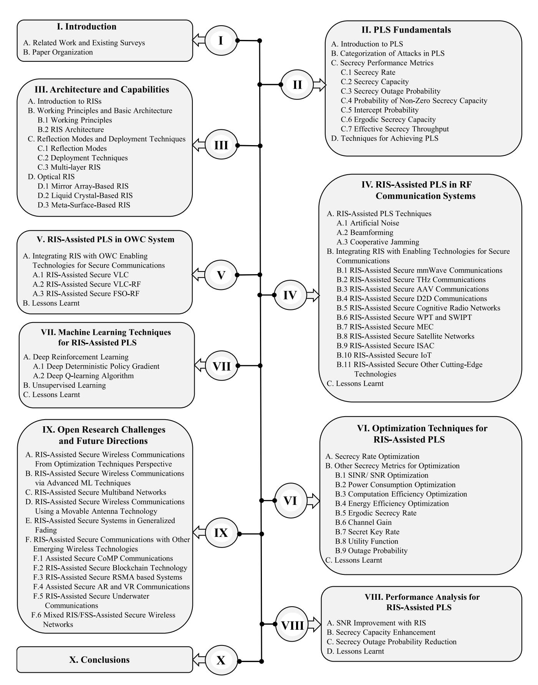

extremely high-spectrum- and energy-efficiency, ultra-low latency, ultra-massive and ubiquitous wireless connectivity, full dimensional network coverage, as well as connected intelligence [\[1\]](#page-37-0), [\[2\]](#page-37-1), [\[3\]](#page-37-2). As a result, there have been intensive research efforts from both industry and academia devoted to the sixth generation (6G) wireless technology

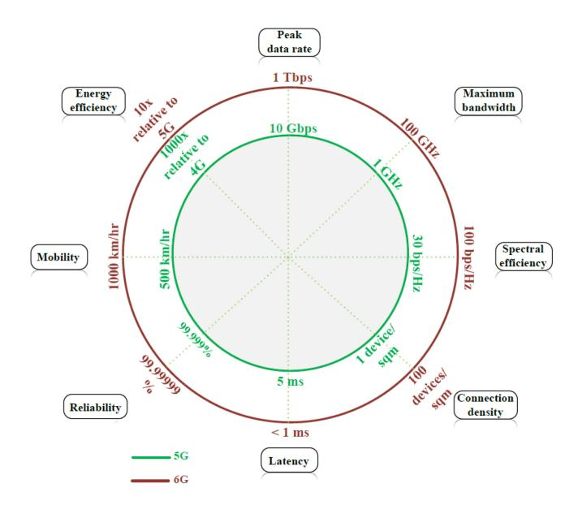

Fig. 1. Comparison of some KPIs between 5G and 6G communications systems [\[5,](#page-37-3) Table [IV\]](#page-22-0).

to meet such technical requirements and demands as it is expected to provide much improved key performance indicators (KPIs) [\[4\]](#page-37-4), [\[5\]](#page-37-3). Fig. [1](#page-3-0) shows a comparison between the 5G and 6G technologies in terms of some important KPIs, including peak data rate, maximum bandwidth, energy efficiency, mobility, reliability, latency, connection density, and spectral efficiency.

Although the key requirements of the above-mentioned future wireless technologies are mainly characterized by low latency and high reliability, the leakage of critical and confidential information remains a challenge that must be addressed to fulfill its full potential. These security loopholes are due to the broadcast nature of the wireless environment, which makes it difficult to prevent information leakage by unauthorized receivers (e.g., an eavesdropper (Eav)). To deal with security threats or attacks, cryptography-based tools have traditionally been adopted. However, such techniques may not be suitable for next-generation technologies for the following reasons: (a) cryptography algorithms cannot be adopted in resourcelimited networks because they require a high computational complexity yielding a large amount of energy consumption [\[6\]](#page-37-5); (b) encryption-based techniques may not be able to sufficiently protect against information leakage due to the unlimited computing resources of the adversaries [\[7\]](#page-37-6); (c) processes involving key distribution and management in distributed networks (e.g., Internet of Things (IoT) and vehicular networks) are challenging. To overcome these limitations, physical layer security (PLS) has emerged as a promising solution to achieve secrecy by exploiting the inherent randomness of wireless channels [\[8\]](#page-37-7), [\[9\]](#page-37-8), [\[10\]](#page-38-0), [\[11\]](#page-38-1), [\[12\]](#page-38-2). Unlike encryption-based techniques, PLS does not require key distribution/sharing that may violate the low-latency requirements of future wireless systems and is, therefore, an attractive approach to provide security and privacy for such systems. Several studies reported in the literature have investigated the PLS enhancement of wireless networks through artificial noise (AN) [\[13\]](#page-38-3), cooperative jamming [\[14\]](#page-38-4), [\[15\]](#page-38-5), [\[16\]](#page-38-6), beamforming (BF) [\[17\]](#page-38-7), directional

modulation [\[18\]](#page-38-8), multiple-input multiple-output (MIMO) [\[19\]](#page-38-9), etc. However, these techniques cannot always guarantee secure communications under certain system configurations. Additionally, they do require extra power and/or hardware costs for their practical implementation.

The advancement of metamaterial techniques has led to the emergence of a low-cost and energy-efficient wireless device termed reconfigurable intelligent surface (RIS) that can control the phase shift of the reflecting units via a programmable surface [\[20\]](#page-38-10), [\[21\]](#page-38-11), [\[22\]](#page-38-12). These features enable the RIS technology to intelligently reconfigure the wireless propagation environment. Unlike conventional techniques that only adapt to or have limited control over dynamic wireless channels, RIS provides a new and cost-effective approach to combat channel impairments by guiding the reflected signal in a desirable direction for better reception reliability while suppressing the interference at unintended or unauthorized receivers [\[23\]](#page-38-13). These appealing features have motivated the integration of RIS into next-generation wireless networks for performance improvement. More specifically, RIS has been adopted into future wireless networks since it has the potential to offer an effective way for PLS improvements. In light of the above, RIS has emerged as a viable solution to tackle wireless security concerns from an information-theoretic perspective. By incorporating the RIS technology into PLS, a new paradigm that mitigates eavesdropping threats is introduced, leading to more secure and reliable communications for future wireless networks [\[24\]](#page-38-14), [\[25\]](#page-38-15), [\[26\]](#page-38-16), [\[27\]](#page-38-17).

To fully implement the IoE concept, next-generation wireless networks will require large bandwidths to meet the stringent real-time demands of IoE applications. To this end, the exploration of high-frequency bands for radio frequency (RF) communications (e.g., millimeter wave (mmWave) and terahertz (THz)) and optical communications (e.g., free space optical (FSO), visible light communications (VLC), infrared (IR)) is imperative. However, communications occurring at these frequency bands suffer from severe atmospheric attenuations owing to the absorption by water vapor and oxygen molecules - yielding short transmission distances. Consequently, a deadzone problem may arise in many scenarios (e.g., a long distance between the transmitter and the receiver or a blocked received signal due to an obstacle between the transmitter and the receiver). Recent efforts have adopted the RIS technology as an effective approach to solve skip-zone situations as opposed to the cooperative relaying technology (see [\[28\]](#page-38-18), [\[29\]](#page-38-19), [\[30\]](#page-38-20), [\[31\]](#page-38-21), [\[32\]](#page-38-22), [\[33\]](#page-38-23) and the references therein). Hence, RIS can be deployed in RF and optical communications in the highfrequency bands to mitigate privacy and security threats such as jamming, eavesdropping, and pilot contamination attacks.

## *A. Related Work and Existing Surveys*

A few works have reported the progress made on the integration of RIS in RF and/or optical systems for the development of future wireless communications to provide a plethora of services to the users (see [\[34\]](#page-38-24), [\[35\]](#page-38-25), [\[36\]](#page-38-26) and references therein). In [\[34\]](#page-38-24), a contemporary overview of the RIS architecture and deployment strategies in the future 6G was presented. The authors particularly focused on the integration of the RIS technology with other 6G-enabling applications such as non-orthogonal multiple access (NOMA), THz/mmWave, autonomous aerial vehicle (AAV), mobile edge computing (MEC), and PLS for the system performance improvement. The research work of [\[35\]](#page-38-25) provided an indepth survey on the integration of RIS and AAV in the context of emerging communications, deep reinforcement learning (DRL), optimization, secrecy performance, and IoT. The authors of [\[36\]](#page-38-26) presented a comprehensive tutorial on the design and application of the RIS technology in indoor VLC systems. Moreover, an overview of optical RISs was provided and the differences with RF-RIS in terms of functionalities were highlighted. However, the security aspect of these systems was not investigated.

Only a handful of research works has considered the integration of RIS-assisted PLS for future wireless systems[\[26\]](#page-38-16), [\[37\]](#page-38-27), [\[38\]](#page-38-28), [\[39\]](#page-38-29). In [\[26\]](#page-38-16), the authors conducted a literature review on the information-theoretic security of RIS-assisted wireless networks focusing on the classification of the RISassisted PLS applications, on multi-antenna configurations, and on optimization problems for the maximization of some performance metrics such as secrecy rate (SR) and secrecy capacity (SC). In [\[37\]](#page-38-27), the authors reviewed the security challenges impacting the integration of RIS in future wireless networks. To this end, they outlined the security and privacy threats associated with the adoption of RIS and mmWave, THz, Device-to-Device (D2D), IoT networks, MEC, simultaneous wireless information and power transfer (SWIPT), integrated sensing and communications (ISAC), and AAVs. In [\[38\]](#page-38-28), the authors discussed the designs of RIS-assisted PLS for 6G-IoT networks against security and privacy attacks. Moreover, simulation results were provided to illustrate the effectiveness of RIS from an information-theoretic security viewpoint. The authors in [\[39\]](#page-38-29) discussed various secrecy performance metrics of wireless networks and presented an overview of the RIS-assisted PLS for various antenna configurations including single-input single-output (SISO), multiple-input single-output (MISO) and MIMO. Some common points of the existing research works are: (a) the reported studies of RIS-assisted PLS are mainly investigated in RF systems; (b) the issue of security from an information-theoretic security perspective is only partially investigated except in [\[39\]](#page-38-29).

However, considering the aforementioned antenna architectures, the work of [\[39\]](#page-38-29) mainly focuses on exploring RIS-assisted PLS in RF systems—with a brief discussion in the context of optical wireless communication (OWC) systems. To the best of the authors' knowledge, there is no up-to-date survey work in the open literature that presents a comprehensive overview of the information-theoretic security aspects in both RIS-assisted RF and OWC systems. This is the knowledge gap that the present survey article aims to fill by emphasizing the following aspects:

• *Integration of RIS technology with PLS in RF communications systems*: We first introduce some PLS techniques such as AN, BF and cooperative jamming to mitigate the security threats in different scenarios for RF wireless communications systems. Subsequently, we provide valuable insights into the adaptability and optimization

- of RIS for various RF wireless communications scenarios. We also highlight the scalability and adaptability of RIS-assisted PLS techniques when the network complexity increases. Moreover, we outline the integration of RIS in emerging RF communications systems, namely with multi-antenna communications, mmWave communications, THz communications, AAV communications, D2D communications, cognitive radio networks (CRNs), wireless power communication (WPC)/SWIPT, MEC, satellite-enabled networks, multicast communications, cell-free networks, relay-aided networks, vehicular communications, wireless body area network (WBAN), Ad-hoc networks, ISAC, radar communications, IoT networks, backscatter communications, wireless sensor networks, and high-altitude platform systems (HAPS).
- • *Integration of RIS technology with PLS in OWC systems*: We review the integration of RIS-assisted PLS in VLC systems by discussing its evolution from singleuser scenarios for static or mobile user to multi-user scenarios. Furthermore, an extension of RIS-assisted PLS in hybrid VLC-RF and FSO-RF systems is discussed with emphasis on the motivation for such mixed systems and some useful secrecy performance measures.
- *Optimization techniques*: We first review state-of-the-art optimization techniques for PLS and then summarize existing optimization strategies for the SR maximization and various secrecy metrics associated with RIS-assisted PLS systems such as: (a) alternating optimization (AO) and block coordinate descent (BCD) to decouple joint optimization variables into sub-problems; (b) semidefinite relaxation (SDR) to relax non-convex RIS phase constraints; (c) majorization-minimization (MM), successive convex approximation (SCA), and quadratic transform for non-convex and nonlinear objective functions and constraint; (d) convex-concave procedure (CCP) to solve the base station (BS) BF suboptimization problem. A discussion on the optimization of the SR and various secrecy metrics such as signal-tonoise ratio (SNR), power consumption, computation and energy efficiencies, ergodic secrecy rate, channel gain, secrecy key rate, utility function, and outage probability.
- *Machine learning techniques*: Machine learning (ML) has become popular in wireless communications due to its ability to solve complex optimization problems in wireless networks. We explore state-of-the-art ML techniques for optimizing RIS-assisted PLS in RF and OWC systems, such as DRL and unsupervised learning. Besides addressing the issues associated with the stringent requirements of future wireless communications networks, the adoption of ML algorithms in improving the security of wireless networks results in some advantages, such as proactive detection and preventive threats.
- *Performance analysis*: We explore the improvement of some performance metrics such as SNR, SC and secrecy outage probability (SOP) via the integration of the RIS technology within the context of PLS in RF and OWC systems. Furthermore, we highlight the important role of

RIS to mitigate the noise and increase the signal strength on one hand and to improve the SC and reduce the SOP on the other hand.

Applications and challenges: We give a general review
of applications of RIS-assisted PLS towards future wireless networks. Moreover, we discuss how the integration
of RIS and cutting-edge technologies can improve the
security of future wireless networks. Finally, we highlight some key research challenges and future directions
for RIS-assisted PLS in upcoming wireless networks.

#### B. Paper Organization

The remainder of this survey paper is organized as follows. Section II presents the basic concepts of PLS followed by a description of the type of attacks and performance metrics in PLS. Section III introduces the RIS technology and its fundamental principles that enable its basic operation. A description of the RIS architectures and the integration of this emerging technology in optical systems is subsequently provided. Section IV discusses PLS techniques associated with RIS-aided systems, and further explores the efficacy of integrating RIS with RF-based emerging technologies for security and privacy improvements of future wireless communications systems. Section V elaborates on PLS in wireless systems that integrate RIS with OWC. Some optimization techniques tailored for RIS-assisted PLS are comprehensively reviewed in Section VI. Section VII explores various ML techniques adopted to the optimization of RIS-assisted PLS for both RF and optical systems. Section VIII highlights the impact of RIS-assisted PLS some key a performance analysis viewpoint. Section IX highlights the key challenges and future research directions associated with the adoption of RIS-assisted PLS in future wireless networks. Further discussions on the integration of PLS and cutting-edge technologies to improve wireless network security are presented. Concluding remarks are given in Section X.

#### II. PLS FUNDAMENTALS

This section introduces the notion of information-theoretic security through some basic concepts, and in the context of attack classifications and performance metrics including SR, SC, SOP, probability of non-zero secrecy capacity (PNSC), intercept probability (IP), ergodic secrecy capacity (ESC), and effective secrecy throughput (EST). Moreover, we introduce some techniques for achieving information-theoretic security, including AN and BF.

#### A. Introduction to PLS

Wireless communications is crucial in connecting individuals globally, regardless of location or time. While wireless technologies offer numerous advantages, it is essential to acknowledge the significant risk users face from potential attacks due to the broadcast nature of wireless signals. As a result, the attention to communications security has increased. The conventional approach to enhancing communications security involves employing encryption techniques in the upper layers of the communications stack to protect user

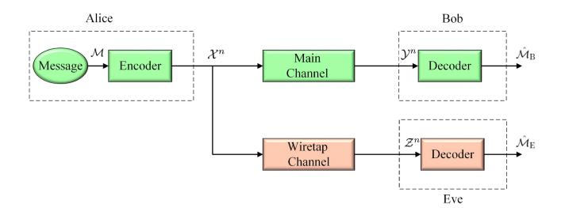

Fig. 2. Wireless wiretap system model.

data [8]. However, these methods have limitations regarding adaptability and flexibility owing to computational tasks and system complexity. Nevertheless, the unique characteristics of wireless channels enable signals to be transmitted securely between transmitters and receivers at the physical layer. This concept has proven effective in improving communications security. Consequently, PLS has emerged as a prominent topic of interest, given the advancements in wireless communications techniques [9], [40]. In this section, we will provide the fundamentals of PLS, covering its concepts, technical evolution, and applications in wireless networks.

In 1949, Shannon established the information-theoretic principles that form the basis of modern cryptography [41]. Shannon's model encompassed the assumption that a nonreusable private key, denoted as K, is employed to encrypt a confidential message, referred to as  $\mathcal{M}$ , generating a cryptogram, denoted as C. This cryptogram is subsequently transmitted across a channel that is assumed to be noise-free. The eavesdropper is assumed to have unlimited computational power, full knowledge of the transmission coding scheme, and access to an identical copy of the signal intended for the receiver. The concept of perfect secrecy was introduced, which necessitates that the a posteriori probability of the eavesdropper correctly deducing the secret message based on the received signal is equal to the a priori probability of that message. In essence, perfect secrecy implies that the eavesdropper gains no additional knowledge about the secret message beyond what was already known before intercepting the signal. From the information-theoretic perspective, perfect secrecy can be expressed as

$$I(\mathcal{M}; \mathcal{C}) = 0, \tag{1}$$

where  $I(\cdot;\cdot)$  represent the mutual information. Equation (1) states that the mutual information between the message  $\mathcal{M}$  and the cryptogram  $\mathcal{C}$  is zero, indicating their statistical independence. This absence of correlation implies that there exists no means for the adversary to obtain information about the original message. Thus, perfect secrecy can only be assured if and only if the secret key  $\mathcal{K}$  possesses entropy that is equal to or greater than that of the message  $\mathcal{M}$ , i.e.,  $H(\mathcal{K}) \geq H(\mathcal{M})$ , where  $H(\cdot)$  is the entropy.

In 1975, Wyner introduced a significant advancement in the area of information-theoretic security with the proposal of the wiretap channel [42]. Wyner's system, in contrast to Shannon's original secrecy system, incorporated a random noise channel, which is considered an inherent element of physical communications. As illustrated in Fig. 2, the system consists of

a legitimate transmitter and receiver, which are commonly referred to as Alice and Bob, respectively; the general wiretap model of PLS endeavors to establish communications while contending with the existence of an eavesdropper, commonly referred to as Eve. Both the legitimate channel and the wiretap channel are modeled as discrete memoryless channels. The transmitter encodes the message  $\mathcal{M}$  into a codeword  $\mathcal{X}^n$  comprising n symbols, where  $\mathcal{X}^n = [\mathcal{X}_1, \dots, \mathcal{X}_n]$ , and transmits it to the intended receiver as a degraded message  $\mathcal{Y}^n$ , where  $\mathcal{Y}^n = [\mathcal{Y}_1, \dots, \mathcal{Y}_n]$ , while simultaneously sending it via a wiretap channel to the adversary as  $\mathbb{Z}^n$ , where  $\mathcal{Z}^n = [\mathcal{Z}_1, \dots, \mathcal{Z}_n]$ , as illustrated in Fig. 2. Moreover, Wyner proposed an alternative definition to (1) for perfect secrecy. A new secrecy condition was introduced, according to which the equivocation rate  $\mathcal{R}_e = \frac{1}{n}H(\mathcal{M}/\mathcal{Z}^n)$  should approach the entropy rate  $\mathcal{R}$  of the message  $\mathcal{R} = \frac{1}{n}H(\mathcal{M})$  as n tends to infinity. Consequently, as the value of  $\mathcal{R} - \mathcal{R}_e = \frac{1}{n}I(\mathcal{M};\mathcal{Z}^n)$ suggests, the message  $\mathcal M$  gradually achieves perfect security against the adversary if  $\frac{1}{n}I(\mathcal{M};\mathcal{Z}^n) \leq \varepsilon$ , where  $\varepsilon$  is an arbitrary small, positive number [43]. Furthermore, Wyner defined the SC as the highest achievable transmission rate to the legitimate receiver that guarantees reliability and informationtheoretic security against eavesdroppers.

#### B. Categorization of Attacks in PLS

In PLS, attacks can be classified into two categories based on the capabilities of the illegitimate nodes: passive attacks and active attacks [10]. Passive attacks involve illegitimate nodes assuming the role of eavesdroppers, discreetly intercepting transmitted information from legitimate wireless channels without actively transmitting any signals. By concealing their presence, these nodes do not disrupt network operations. Their primary objective is to clandestinely intercept and potentially analyze the information received from the legitimate source, Alice. Consequently, it becomes imperative to prevent eavesdroppers from successfully intercepting information by employing carefully designed signaling techniques [44].

On the other hand, active attacks involve illegitimate nodes with the capacity to withstand the risk of detection by legitimate nodes, enabling them to engage in powerful active attacks. These nodes transmit deceptive signals to confuse the intended recipient, Bob. They can intercept and forge messages, thus compromising the security performance of the communications system. Such attacks are also known as masquerade attacks [10]. Also, malicious nodes can act as jammers, transmitting noisy signals intending to interrupt communications [45]. When Bob receives both the desired and jamming signals simultaneously, the legitimacy of the intended signal becomes less trustworthy, potentially preventing successful decoding. Active attacks can significantly impact normal network operations since adversaries seek to manipulate network data. In the event of an attack, legitimate users must identify the presence of such attacks and subsequently implement appropriate protective measures to safeguard the transmitted signal accordingly.

#### C. Secrecy Performance Metrics

1) Secrecy Rate: The SR of the Gaussian noise wiretap channel is determined by calculating the difference between the achievable rates of the main channel and the wiretap channel when utilizing a Gaussian codebook [45]. Mathematically, the SR,  $\mathcal{R}_s$ , can be represented as

$$\mathcal{R}_s = \left[ \mathcal{R}_b - \mathcal{R}_e, 0 \right]^+, \tag{2}$$

where  $\mathcal{R}_b$  is the achievable rate of the legitimate link,  $\mathcal{R}_e$  is the achievable rate of the eavesdropping link, and  $[x,0]^+ = \max(x,0)$ .

2) Secrecy Capacity: The SC,  $C_s$ , can be defined as the highest achievable rate  $\mathcal{R}_s$  that ensures perfect secrecy rate, i.e., the maximum rate at which secure information can be transmitted over a wireless channel while maintaining confidentiality [46]. The SC indicates the amount of secure communications that can be achieved in the presence of eavesdroppers. In this regard,  $C_s$  can be obtained as

$$C_s = \left[C_b - C_e, 0\right]^+,\tag{3}$$

where  $C_b$  and  $C_e$  are the legitimate link and the eavesdropping link capacities, respectively. The primary requirement in this context is that  $C_b$  should be greater than  $C_e$ , highlighting the crucial aspect that the quality of the main channel must surpass that of the wiretap channel, regardless of the computational capabilities possessed by the eavesdropper.

3) Secrecy Outage Probability: In specific scenarios, Alice may not possess perfect channel state information (CSI) regarding Bob and Eve. Consequently, the SOP is employed as a performance metric. The secrecy outage occurs when the secrecy rate  $\mathcal{R}_s$  falls below a predefined threshold, indicating the inability to meet the security requirement. The SOP corresponds to the likelihood of observing a secrecy outage given a specific fading distribution [47]. Mathematically, it is represented as:

$$SOP = Pr(\mathcal{C}_s < \mathcal{R}_s). \tag{4}$$

4) Probability of Non-Zero Secrecy Capacity: The PNSC, which can be called the probability of strictly positive secrecy capacity (SPSC), is a performance metric used in PLS to evaluate the probability that a secure communications link can be established, i.e., the probability that the SC is greater than zero. It indicates the likelihood of achieving positive, secure communications rates and provides insights into the effectiveness of PLS mechanisms [48], [49], and is given by

$$PNSC = Pr(\mathcal{C}_s > 0). \tag{5}$$

5) Intercept Probability: The IP,  $P_{\text{int}}$ , is a performance metric used to assess the vulnerability of wireless communications systems to eavesdropping attacks. The IP is the likelihood that  $C_s$  of a wireless communications system is below zero, indicating a situation where the system fails to achieve secure communications [50], [51], and is given by

$$P_{\rm int} = \Pr(\mathcal{C}_s < 0). \tag{6}$$

This probability quantifies the vulnerability of the system to unauthorized interception and provides insight into the probability of unsuccessful secrecy establishment. A lower IP indicates a more secure system, while a higher IP indicates a higher vulnerability to eavesdropping. It serves as a crucial metric for evaluating system security and guiding the implementation of PLS techniques to mitigate interception risks and enhance the confidentiality of communications.

6) Ergodic Secrecy Capacity: The ESC refers to the statistical mean of the secrecy rate across fading channels. This metric provides insights into the system's ability to maintain confidentiality over time. Mathematically, the ESC,  $\bar{\mathcal{C}}_s$ , can be represented as

$$\bar{\mathcal{C}}_s = \mathbb{E}\left[\mathcal{C}_b - \mathcal{C}_e, 0\right]^+. \tag{7}$$

7) Effective Secrecy Throughput: The EST is a metric introduced in [52] to explicitly account for the reliability and secrecy constraints inherent in wiretap channels. This metric quantifies the average rate at which confidential information is transmitted from the transmitter to the receiver without being wiretapped. In this regard, the EST can be obtained by [52]

$$EST = (\mathcal{R}_b - \mathcal{R}_e)[1 - \mathcal{O}_r(\mathcal{R}_b)][1 - \mathcal{O}_s(\mathcal{R}_e)], \quad (8)$$

where  $\mathcal{O}_r(\mathcal{R}_b) = \Pr(\mathcal{R}_b > \mathcal{C}_b)$  and  $\mathcal{O}_s(\mathcal{R}_e) = \Pr(\mathcal{R}_e < \mathcal{C}_e)$  are the reliability outage probability and the SOP, respectively.

#### D. Techniques for Achieving PLS

PLS techniques have been extensively studied and developed to enhance the security of wireless communications at the physical layer. These techniques exploit the unique characteristics of the wireless channel to protect the confidentiality and integrity of transmitted data. One well-known technique is AN generation [53], which involves deliberately introducing carefully designed random noise to confuse eavesdroppers and make it difficult for them to decode the desired signal accurately. BF is another effective technique [54] that focuses the transmitted signal toward the intended receiver while minimizing signal leakage to unintended eavesdroppers, thereby improving communications security. Secure coding schemes, incorporating error correction and channel coding techniques, add redundancy and error correction capabilities to thwart eavesdroppers' decoding attempts [55]. Physical layer key generation leverages the channel's randomness to establish shared secret keys between communicating parties [56]. Interference alignment aligns interference caused by eavesdroppers to minimize its impact on the desired signal [57]. Cooperative jamming involves the coordinated transmission of jamming signals to disrupt eavesdroppers' reception [58], [59]. These techniques, among others, have demonstrated their effectiveness in enhancing the security of wireless communications at the physical layer (see [60] and the references therein). Their selection and adaptation depend on system requirements, channel conditions, and potential eavesdropper capabilities, including combining techniques enhancing security. The significance of PLS approaches within relay networks is highlighted by the heightened susceptibility of intermediate relay nodes to potential wiretapping compared to other network terminals [61], [62].

#### III. RIS: ARCHITECTURE AND CAPABILITIES

An important aspect of this survey paper is the RIS technology. In that regard, this section first gives a brief introduction of the RIS technology, followed by a review of its basic architecture and fundamental working principles that enable both its mode of operation and deployment techniques. Moreover, the versatility of the RIS technology is presented by highlighting its integration into standalone RF and OWC systems.

#### A. Introduction to RISs

RISs are man-made sheets of electromagnetic (EM) material with programmable macroscopic physical characteristics that intelligently reconfigure the wireless propagation environment by guiding or modifying radio waves towards desired directions (e.g., through reflection, refraction, diffraction properties) to boost the signal power at intended receivers and/or to suppress interference at unintended receivers [22], [23], [63], [64], [65]. Furthermore, they consist of a large number of lowcost and low-power scattering elements that can individually adjust the wireless channel with amplitude and/or phase shift control of the incident signals. They can also integrate power amplifiers in some elements to further enhance the power of the scattered signals, making the RIS technology attractive to fulfill some of the requirements for future wireless communications systems. In general, RISs can be considered as nearly-passive devices as they require power only to ensure their reconfigurability. Recently, hybrid RISs have been proposed where some elements may be active [66]. Unlike similar key-enabling technologies for 5G and beyond (e.g., active relays, massive MIMO, ultra-dense networks and mmWave communications [67]) that can compensate or adapt with no control over dynamic wireless channels, RISs provide an innovative and cost-effective approach to achieve the KPIs of 5G and beyond (see Fig. 1) without the need for power amplifiers, RF chains, and information encoding/decoding algorithms [2].

In light of the potential benefits, the RIS technology has emerged as a promising solution to mitigate a range of practical challenges inherent to future wireless systems, such as the ever-increasing energy consumption, hardware cost, and intra-/inter-system interference. Besides controlling the wireless environment to a certain extent, RISs are economical and environmentally friendly due to their low power consumption and carbon footprint. Moreover, they yield improvement of key performance metrics such as network coverage, spectral efficiency, throughput, and energy efficiency (EE), especially in deep-fade and non-lineof-sight (NLoS) environments wherein the transmitted signal cannot reach the end user with enough power. Moreover, they can readily and seamlessly be integrated into existing wireless networks by mounting them on various structures such as building facades, walls, ceilings, roadside billboards, clothes as well as mobile vehicles due to their flexibility [68].

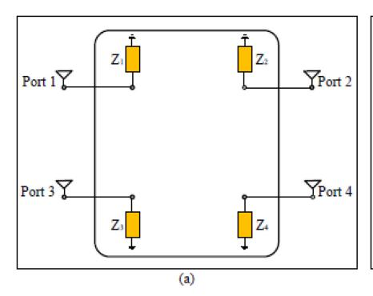

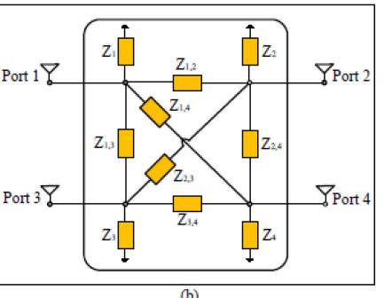

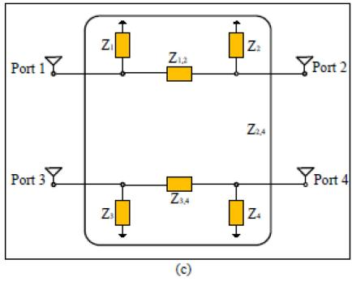

Fig. 3. 4-element RIS with (a) single connected reconfigurable impedance network, (b) fully connected reconfigurable impedance network, and (c) group connected (2 groups and group size of 2) reconfigurable impedance network.

### *B. Working Principles and Basic Architecture*

In what follows, we provide an overview of the working principles of the RIS technology as well as its architecture from a hardware architecture and operating principles viewpoint.

- *1) Working Principles:* An RIS is a two-dimensional (2D) planar metasurface consisting of a very large number of nearlypassive elements that reflect the impinging EM in a desired manner by adjusting the amplitude and/or the phase of the incident signals. In practice, an RIS can be implemented by using different technologies, such as liquid crystals (LCs), microelectromechanical systems, doped semiconductors, and electromechanical switches [\[69\]](#page-39-12). Broadly speaking, an RIS requires a smart controller, and it often consists of three layers:
  - A meta-atom layer including a large number of passive scattering elements that interacts directly with the incident signals.
  - A control layer that aims at adjusting the reflection amplitude and phase shift of each meta-atom element, triggered by the smart controller.
  - A communications layer that serves as a gateway to communicate between the control layer and other network components (e.g., BSs, access points (APs), etc.).

As mentioned, the most studied implementation for RIS assumes that the RIS elements are nearly passive, i.e., they do not amplify the incident signals (see [\[20\]](#page-38-10), [\[22\]](#page-38-12), [\[23\]](#page-38-13), [\[63\]](#page-39-6), [\[70\]](#page-39-13), [\[71\]](#page-39-14), [\[72\]](#page-39-15) and references therein). Due to the absence of power amplifiers, a nearly-passive RIS needs to be sufficiently large in size in order to achieve the desired BF gain in the far field, since in this regime the path-loss scales with the product of the transmitter-RIS and RIS-receiver links [\[73\]](#page-39-16), [\[74\]](#page-39-17). To increase the coverage of RIS-aided links while keeping the size of the RIS small, a possible solution is to use active or hybrid RISs [\[75\]](#page-39-18), [\[76\]](#page-39-19), [\[77\]](#page-39-20), [\[78\]](#page-39-21). The reflecting elements of an active RIS consist of active RF components, which are capable of amplifying the incident signals. Although the basic operation principle is the same in both the passive and active RIS, the latter necessitates additional power consumption during the amplification process to support the active elements.

*2) RIS Architecture:* Each RIS reflecting element is conventionally controlled by a tunable circuit, which can be modeled as a tunable impedance connected to the ground [\[79\]](#page-39-22). In [\[80\]](#page-39-23), two new circuit topologies have been proposed, wherein all or a subset of the RIS reflecting elements are connected via a reconfigurable impedance network. This is referred to beyond-diagonal RIS (BD-RIS). Based on the connection configuration of the reflecting elements, an RIS can be classified into three types of architecture (see Fig. [3\)](#page-8-0):

- Single connected RIS: This is the conventional architecture widely adopted in the literature in which each RIS reflecting element is independently controlled by a reconfigurable impedance connected to the ground. It is the simplest of all the RIS architectures with limited performance.
- Fully connected RIS: In this setup, each RIS element is connected to all the other reflecting elements through a reconfigurable impedance network. This architecture enables an improvement of the RIS received signal power due to the additional degrees of freedom [\[80\]](#page-39-23). However, this performance gain comes at the cost of a complex circuit topology.
- Group or partially connected RIS: As the number of reconfigurable impedance components in the network becomes increasingly large, the practical use of the fully connected RIS is limited. Consequently, the group/partially connected RIS architecture represents a good trade-off between complexity and performance as it combines both the single and fully connected RIS architectures.

Recent results have shown that beyond-diagonal RISs (BD-RISs) are especially useful in the presence of mutual coupling among the RIS elements, as they enable better control of the EM coupling among the elements [\[81\]](#page-39-24).

## *C. Reflection Modes and Deployment Techniques*

- *1) Reflection Modes:* Fig. [4](#page-9-0) depicts the reflected and refracted signals from an incident signal of a generic RIS element. With an appropriate design of the geometric parameters and arrangement of the meta-atoms, the incident signal on the metasurface can be controlled in three possible modes[\[82\]](#page-39-25), [\[83\]](#page-39-26): reflective, refractive, and reflective-refractive.
  - In the reflective-refractive mode, the surface can simultaneously reflect and refract the incident signal to serve users on either side of the surface. This surface is also

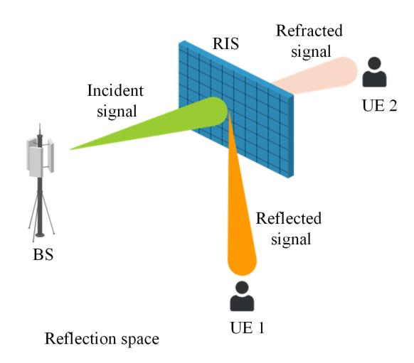

Fig. 4. Illustration of signal propagation on an RIS, where UE1 and UE2 denote User 1 and User 2, respectively.

#### TABLE I VARIOUS RIS MODES

|       | IOS                   |            |  |  |  |
|-------|-----------------------|------------|--|--|--|
| RIS   | Reflective-Refractive |            |  |  |  |
| Modes | Reflective            | Reflective |  |  |  |
|       | RIS                   | RIS        |  |  |  |

called intelligent omni-surface (IOS) [\[84\]](#page-39-27) or simultaneous transmitting and reflecting (STAR)-RIS [\[85\]](#page-39-28), [\[86\]](#page-39-29), and has been proposed to address the half-space limitation of reflecting-only RISs [\[22\]](#page-38-12), [\[87\]](#page-39-30), [\[88\]](#page-39-31). Here, the amplitude response of both the reflection and transmission coefficients, denoted by Γ*l* and Γ*r* , respectively, can be jointly optimized.

- In the reflective mode, the surface fully reflects the incident signal in the direction of the users located on the same side of the transmitter. This is possible through an RIS [\[89\]](#page-39-32) whose transmission coefficient is close to zero to ensure that the energy of the incident signal can be optimally reflected by the surface.
- • In the refractive mode, the surface also known as reconfigurable refractive surface (RRS) (see [\[90\]](#page-39-33)) fully refracts the incident EM wave to serve users located on the opposite side of the transmitter with respect to the surface. To ensure that the incident signal fully penetrates the surface, it is required that the transmission coefficient be much larger than the reflection coefficient, which should be ideally equal to zero.

As illustrated in Table [I,](#page-9-1) an IOS encompasses reflecting and refracting RISs, provided that the reflection and transmission coefficients can be appropriately optimized.

*2) Deployment Techniques:* To further improve the performance gains of RIS-assisted wireless networks, it is crucial to appropriately design the reflection pattern of the RIS and optimize its deployment in various system setups (i.e., single/multi-antenna, single/multi-user [\[20\]](#page-38-10), [\[91\]](#page-39-34), [\[92\]](#page-39-35)). However, the design of the reflection coefficients is an intricate task since the location of the RIS, which is dependent on the path-loss function, is different from that of a relay [\[93\]](#page-39-36) and [\[94\]](#page-39-37). A comprehensive comparison between RIS and relays can be found in [\[74\]](#page-39-17). From the perspective of RIS deployment, there are two main strategies [\[95\]](#page-39-38), [\[96\]](#page-39-39), [\[97\]](#page-39-40), [\[98\]](#page-39-41): distributed and centralized. Fig. [5](#page-10-0) illustrates a downlink communications between a BS and a single and multiple user clusters in a centralized and distributed configurations, respectively.

- • *Centralized RIS:* For the centralized RIS setup, multiple RIS elements are co-located or are grouped as a single large RIS and placed in the vicinity of an AP as shown on the left-hand side of Fig. [5.](#page-10-0)
- *Distributed RIS:* In the distributed RIS strategy shown on the right side of Fig. [5,](#page-10-0) RIS elements are divided into multiple RISs, each positioned near a user cluster to serve it. Due to the deployment of multiple RISs, there is a high probability of establishing line-of-sight (LoS) link between the AP or BS and the RISs. However, communication between the AP or BS and the RISs requires coordination, increasing signaling overhead.

From a system performance viewpoint, both strategies yield different user achievable rates. This is because the effective channels between the user and the AP are different from one another.

*3) Multi-Layer RIS (or Stacked Intelligent Metasurface):* Beyond-diagonal RISs offer more optimization variables in the presence of mutual coupling; however, they increase the system's complexity and power consumption due to fullyconnected architecture among the RIS elements and hence the non-diagonal phase-shift matrices. An alternative way to realize a non-diagonal scattering matri[x1](#page-9-2) is to leverage the multi-layer RIS architecture presented in [\[99\]](#page-39-42) and [\[100\]](#page-39-43), and illustrated in Fig. [6.](#page-10-1) A multi-layer RIS is constituted by closely spaced refracting metasurfaces where the incident signal illuminates the first layer, which then refracts the signal towards the second layer, until the signal reaches the last layer, where it is finally radiated towards the receiver. As the wave propagates through the layers, it is appropriately shaped by the tunable meta-atoms in each of the layers, resulting in an end-to-end scattering matrix that is not diagonal any more thanks to the broadcast nature of wireless signals when propagating from one layer to another [\[100,](#page-39-43) Eq. (7) and Fig. 2]. In other words, a non-diagonal scattering matrix is obtained by utilizing dynamic refracting metasurfaces, each equipped with single-connected electronics, i.e., with singleconnected reconfigurable surfaces.

## *D. Optical RIS*

The RIS technology discussed in this section is focused on tailored for RF communications. Unlike RF systems where

1A scattering matrix denoted by Φ ∈ C*N ×N* provides the complete description of the scattering characteristics of an *N*-port reconfigurable impedance network regardless of specific circuit designs [\[80\]](#page-39-23). These characteristics depend on the circuit topology of the *N*-port reconfigurable impedance network. From an RIS perspective, a conventional RIS where each port is only connected to its own reconfigurable impedance, leading to a diagonal scattering matrix. However, a BD-RIS yields a scattering matrix not limited to diagonal matrices, as all the ports are connected to each other.

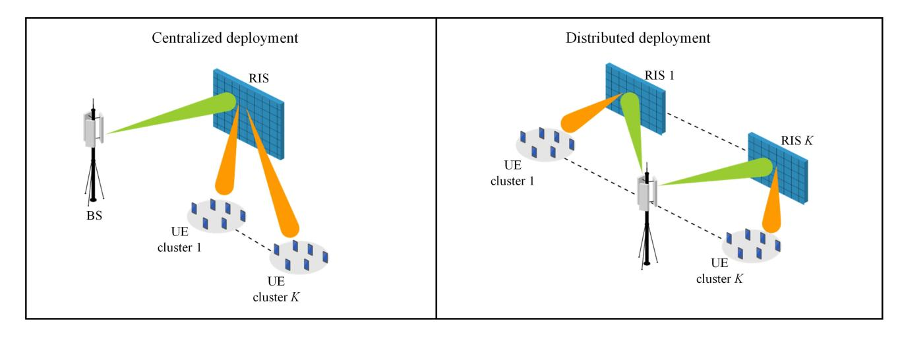

Fig. 5. An RIS-aided multi-user downlink communications system with different RIS deployment strategies.

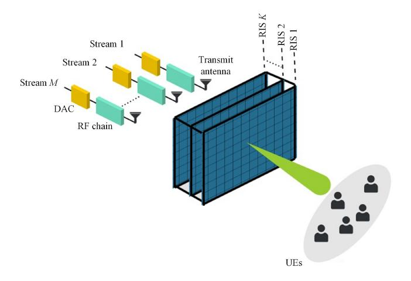

Fig. 6. A stacked intelligent metasurface-assisted multi-user MISO downlink system.

RISs can manipulate the phase of the reflected signal, the integration of RIS in optical wireless system[s2](#page-10-2) is possible using either a mirror arrays-based RISs or a metasurface based RIS designed to steer any incident light in a desired direction [\[104\]](#page-40-0), [\[105\]](#page-40-1), [\[106\]](#page-40-2).

In RIS-aided VLC systems, phase control is not directly applicable, as these systems use intensity modulation and direct detection (IM/DD), focusing solely on the non-negative and real part of the signal [\[107\]](#page-40-3). There are three primary approaches for incorporating RIS into VLC systems, namely, mirror array-based RIS [\[107\]](#page-40-3), [\[108\]](#page-40-4), [\[109\]](#page-40-5), [\[110\]](#page-40-6), [\[111\]](#page-40-7), metasurface-based RIS [\[112\]](#page-40-8), [\[113\]](#page-40-9), [\[114\]](#page-40-10), [\[115\]](#page-40-11), [\[116\]](#page-40-12), and LC-based RIS [\[117\]](#page-40-13), [\[118\]](#page-40-14), [\[119\]](#page-40-15), [\[120\]](#page-40-16). Both the mirror array-based and metasurface-based optical RISs consist of nearly-passive elements in the form of mirror arrays or intelligent metasurfaces used to control incident lights based on the light reflection or refraction principle and the manipulation of the EM waves, while the latter uses LCs as front-row materials embedded in a layered structure to control light reflection and/or refraction.

- *1) Mirror Array-Based RIS:* The mirror array-based RIS is typically made of glass with a flat or curvy surface covered by a reflective coat. Moreover, it relies on geometric optics principles such as the generalized Snell's law of reflection and refraction. Each mirror within the array is controlled by a mechanical unit which enables independent rotation around two axes that are both orthogonal.
- *2) Metasurface-Based RIS:* In contrast, the metasurfacebased RIS relies on a range of metamaterials to control the light propagation [\[121\]](#page-40-20). These materials are metallic nanospheres in a dielectric structure, thin metallic rods isotropically distributed in a dielectric medium, splitting metallic elements in a dielectric structure, negative index metamaterials, and hyperbolic metamaterials among others. Unlike its mirror-array counterpart, which does not operate in refractive mode as it only reflects the incident light, a metasurfacebased RIS can yield all light phenomena related to the impact of photon on the unit surface, i.e., reflection, refraction, scattering, and absorption. However, this versatility comes at the expense of cost and complexity. Furthermore, a mirror array-based RIS exhibits better performance gains than its metasurface-based RIS counterpart in VLC systems according to the findings in [\[104\]](#page-40-0).
- *3) Liquid Crystal-Based RIS:* This type of RIS primarily consists of LC materials due to their duplex transparency which can be used as reflectors and/or refractors [\[117\]](#page-40-13), [\[118\]](#page-40-14), since an RIS element can smoothly steer and amplify the light signal owing to its electrically controllable birefingence property. Furthermore, RIS-based LC materials can be placed (a) in front of the light emitting diode (LED) arrays of the VLC transmitter for high data rates and adequate illumination performance [\[119\]](#page-40-15), (b) in the VLC receiver for light amplification and beam steering [\[120\]](#page-40-16), and (c) in the channel as a refractor surface for coverage extension [\[118\]](#page-40-14). The integration of LC in RIS-aided systems can greatly contribute to satisfying the joint illumination and communications needs of indoor VLC technology.

2OWCs have gained significant interest in recent years due to (a) their ability to offer large bandwidth required for the next generation of wireless applications and beyond [\[101\]](#page-40-17), [\[102\]](#page-40-18), [\[103\]](#page-40-19) and (b) their low cost and ease of implementation with cheap transceivers.

#### IV. RIS-ASSISTED PLS IN RF COMMUNICATION SYSTEMS

RIS-assisted PLS has emerged as a promising strategy for enhancing the security of RF communications systems. By incorporating the RIS technology, this approach introduces a new paradigm for mitigating eavesdropping risks and achieving secure wireless communications. RIS elements act as as nearly passive reflecting surfaces that can intelligently modify the wireless channel characteristics. Through careful adjustment of the reflection coefficients, transmitted signals can be manipulated to optimize the signals strength at legitimate receivers while simultaneously degrading the signal quality at potential eavesdroppers. Achieving this dual optimization involves joint consideration of BF, power allocation, and RIS phase shifts. RIS-assisted PLS not only enhances SC but also enhances the performance of RF communications systems against eavesdropping attacks. Various aspects of RIS design and deployment have been explored, including RIS placement, channel estimation, resource allocation, and signal processing algorithms, to optimize the efficacy of RIS-assisted PLS techniques. Integration of the RIS technology with PLS in RF communications systems holds substantial potential for addressing security challenges in wireless networks and enabling secure and reliable communications in applications such as IoE, 5G/6G, and future wireless systems.

This section is pivotal in the survey by introducing RIS-assisted PLS as a novel and practical security paradigm for RF communications systems, particularly in emerging 5G/6G technologies.ItprovidesacomprehensivediscussiononhowRIS elements can be strategically deployed to enhance signal strength at legitimate receivers while degrading the signal quality at eavesdroppers, addressing key security concerns. Furthermore, the section highlights the seamless integration of RIS with various advanced RF technologies, such as mmWave, THz, AAV communications, and CRNs, demonstrating the adaptability of RIS to diverse communication environments. By addressing the specific security challenges associated with these cutting-edge technologies, this section highlights the versatility of the RIS technology in enhancing PLS, offering a basis for future research and contributing significantly to the survey's broader objectives. Furthermore, by discussing system models, this section also lays the foundation for the subsequent sections on optimization techniques, machine learning techniques, and performance analysis of RIS-assisted PLS.

#### *A. RIS-Assisted PLS Techniques*

RIS offers a unique opportunity to enhance the PLS in wireless communications systems through their ability to intelligently manipulate the wireless channel characteristics. Here are some techniques that can be used in conjunction with RIS to improve PLS.

*1) Artificial Noise:* To enhance the security of communications, AN is deliberately injected into the transmitted signal with the purpose of confounding potential eavesdroppers [\[53\]](#page-38-43). A critical aspect of AN design lies in its ability to avoid causing interference to the intended receiver while simultaneously degrading the intercepted signal quality for the eavesdropper. To achieve this objective, AN is integrated

with multiple-antenna techniques. By leveraging the spatial degrees of freedom provided by multiple transmit antennas, spatial BF allows for the joint adjustment of AN and the transmit signal's directions, thereby optimizing the secrecy performance [\[122\]](#page-40-21), [\[123\]](#page-40-22). The effectiveness of AN depends on the transmitter's CSI accuracy. When the transmitter possesses perfect CSI, it has the maximum spatial degrees of freedom for designing the beamformer. However, in practical scenarios, the CSI at the eavesdropper's end is often imperfect or entirely unavailable, introducing challenges and limitations to the AN's overall performance.

Integrating AN into RIS presents a promising avenue to enhance PLS in wireless communications systems. By strategically incorporating AN during transmission, RIS can introduce controlled random noise alongside the primary signal, confounding potential eavesdroppers and enhancing the confidentiality of transmitted information. This approach benefits from RIS's unique channel manipulation capabilities, enabling it to create constructive interference at the intended receiver and destructive interference at unauthorized recipients. Combining AN and RIS can strengthen security measures, reducing the risk of unauthorized data interception and providing additional protection beyond conventional encryption techniques. The potential benefits of integrating AN to enhance the SR in a wireless communications system assisted by RIS were investigated in [\[124\]](#page-40-23). To optimize the achievable SR, a joint design problem for optimizing transmit BF with AN or jamming alongside RIS and reflecting BF was formulated. The complexity of this problem arises from its non-convex nature and coupled variables, leading to the proposal of an efficient AO algorithm as a suboptimal solution. Simulation results demonstrate the benefits of incorporating AN in transmit BF. Notably, the findings reveal that the RISaided design without AN performs worse than the AN-aided design without RIS, particularly when a higher number of eavesdroppers are in the proximity of the RIS. The authors of [\[125\]](#page-40-24) proposed an approach based on the virtual division of RIS into two distinct segments. This division aims to strategically configure the phase shifts for each partition, enhance the achievable rate for legitimate users, and strengthen the impact of AN on illegitimate users. Two optimization problems were formulated, one focusing on maximizing the SC and the other on minimizing the power consumption. Closed-form solutions were derived by jointly optimizing the partitioning ratio and signal or noise power levels. In [\[126\]](#page-40-25), the PLS for an RIS-aided NOMA was investigated, considering scenarios involving both internal and external eavesdropping. A sub-optimal scheme, combining joint BF and power allocation, was proposed to enhance the system's PLS against internal eavesdropping, while the AN scheme was introduced to effectively counter external eavesdropping.

Using AN for a STAR-RIS-assisted NOMA transmission system was investigated in [\[127\]](#page-40-26) to maximize the sum secrecy rate (SSR). To address the inherent non-convexity of the optimization problem, a decoupling strategy was proposed, wherein the optimization of active and passive BF vectors at the BS and STAR-RIS, respectively, were separated. It was found found that the proposed algorithm provides better secrecy performance with less AN power compared with the other schemes by using more RIS elements to reduce the AN power. Increasing the number of transmit antennas at the BS reduces the AN power if the eavesdropper is quite close to the transmitter while improving it when the eavesdropper is far away. The authors of [\[125\]](#page-40-24) utilized the AN and RIS-partitioning to optimize secure communications. The proposed technique maximizes the legitimate SC while constraining Eve's achievable rate by simultaneously reflecting the signal towards the legitimate user and jamming Eve with AN. The proposed scheme showed improved SC performance compared to traditional AN-only and RIS-only scenarios. An AN-aided secure MIMO wireless communications system was investigated in [\[128\]](#page-40-27), where an advanced RIS technology was employed, and multiple antennas were deployed at the BS, legitimate receiver, and Eve. The main objective was to maximize the SR while considering transmit power constraints and unit modulus conditions for the RIS phase shifts. The efficacy of the proposed approach was demonstrated through simulation results, affirming the effectiveness of RIS in enhancing system security.

The authors of [\[129\]](#page-40-28) proposed a secure aerial-ground communications system integrated with RIS to counter potential eavesdropping threats via AN. The proposed system involves confidential data transmission from a AAV operating at a fixed altitude to a legitimate user, while an RIS strategically placed on a building's facade enhances secrecy communications performance. The focus was to jointly optimizing the phase shifts, trajectory, and transmit power of the AAV to improve the secrecy performance of the downlink communications. A prototype of the aerial-ground communications system was implemented, revealing the superiority of the proposed scheme and showing significant performance improvement. Given the imperfect CSI possessed by potential eavesdroppers, the authors of [\[25\]](#page-38-15) introduced a strategy for optimizing the system sum rate while ensuring that information leakage to eavesdroppers remains within acceptable bounds. However, acquiring the CSI of potential eavesdroppers is challenging, particularly in scenarios where a passive eavesdropper aims to remain inconspicuous within the network. Furthermore, increasing the transmitted power corresponds to an increased susceptibility of the eavesdropper to extract valuable information, thereby decreasing the secrecy performance. The utilization of the RIS characterized by multiplicative randomness to enhance security against passive eavesdropping in wireless communications systems was investigated in [\[130\]](#page-40-29). Enhanced security was achieved without prior knowledge of specific wiretap channels by applying the dynamic adjustment of reflection coefficients during data transmission while maintaining the reliability of the main channel. Performance assessment employs degree of freedom (DoF), spectral efficiency, and bit error rate (BER). The investigation highlighted the potential of RIS-enabled multiplicative randomness to substantially enhance wireless network security.

*2) Beamforming:* Employing BF techniques together with RIS presents a significant advancement in enhancing PLS within wireless communications systems [\[131\]](#page-40-30). BF, a signal processing method, holds the potential to profoundly influence

the signal propagation characteristics by focusing the radiated energy in a specific direction or spatial region, thereby shaping the wireless channel for improved communications quality and performance [\[132\]](#page-40-31). Two main approaches exist: nearly passive BF at the RIS and active BF at the transmitter [\[92\]](#page-39-35). Nearly passive BF employs an RIS to reflect incoming signals, directing the desired signal toward the intended receiver and creating null zones around eavesdroppers. It is an energyefficient solution for resource-constrained applications like the IoT and wireless sensor networks [\[133\]](#page-40-32). On the other hand, active BF involves controlling the phase and amplitude of an antenna array at the transmitter to direct the beam toward the intended receiver. Although this approach necessitates complex signal processing, it provides higher gain and adaptability. Active BF is particularly suitable for highsecurity and dynamic environments, such as massive MIMO systems. The choice between nearly passive and active BF depends on the unique needs of the specific application. When integrated with RISs, BF confers several substantial benefits that enhance PLS. Firstly, strategically manipulating the phase shifts of the reflecting elements through BF enables precise control over signal propagation paths [\[134\]](#page-40-33). This control extends to actively steering the transmitted signal towards intended legitimate users while simultaneously attenuating or redirecting signals intended for potential eavesdroppers. Such targeted control over signal distribution significantly mitigates eavesdropping, thereby improving the security of transmitted information. Secondly, the adaptability of RISs in real-time facilitates dynamic adjustments to configurations of the reflecting elements' responding to changing communications scenarios [\[135\]](#page-40-34). Integrating BF with RISs allows for real-time adjustments in signal directionality and spatial focus, thereby aiding in establishing secure communications links amidst dynamic and potentially insecure environments. This adaptability also empowers the system to counteract eavesdropping attempts through instantaneous reconfiguration of the reflecting elements, making identifying secure transmission paths challenging for potential adversaries [\[136\]](#page-40-35). Moreover, the integration of BF with RISs augments the overall link quality by mitigating signal fading and shadowing effects. By intelligently redistributing and focusing energy, the combined approach enhances SNRs and minimizes the impact of interference, thereby contributing to improved communications reliability and strength against unauthorized access.

In [\[137\]](#page-40-36), a self-sustainable RIS was employed to enhance the security at the PLS within a MISO broadcast configuration featuring multiple eavesdroppers. The unique characteristic of the RISs is their ability to manage the activation status of their reflecting elements, assigning them either for signal reflection or energy-harvesting purposes. The authors in [\[138\]](#page-40-37) proposed a secure communications system between of AAVs and ground stations, where the operation of an RIS was incorporated. A joint optimization endeavor concerning the optimal trajectory of the AAV and the passive BF configuration of the RIS, where imperfect CSI on the RIS-eavesdropper and AAV-eavesdropper connections were considered. In addition, enhancing the ergodic SR within a secure communications paradigm employing MIMO architectures was investigated in [\[139\]](#page-40-38), where direct links between the BS and authorized users, and potential eavesdroppers were blocked, and considering statistical CSI when optimizing the RIS. A deterministic approximation for this scenario was derived using random matrix theory. The resource allocation in multi-user communications networks was investigated in [\[140\]](#page-40-39), focusing on a scenario where an RIS enhances a wireless transmitter. The aim was to minimize the total network transmit power by optimizing, the phase shifts of the RIS and the transmit power of the BS, subject to user signal-to-interference-plusnoise ratio (SINR) constraints. A dual technique, transforming the problem into a semidefinite programming (SDP) form was proposed closed-form RIS phase BF was provided, and an optimal transmit power was obtained based on standard interference functions. Simulation results highlighted the proposed method the effectiveness of the, achieving substantial reductions in total transmit power compared to maximal ratio transmission and zero-forcing BF techniques.

In [\[141\]](#page-40-40), the RIS was used to reduce power consumption and enhance information security in a multi-user cellular network, particularly with imperfect angular CSI. The main objective was to maximize worst-case sum rates by designing the system to optimize the receive decoders, digital precoding, and AN at the transmitter and analog precoders at the RIS. The optimization was done while meeting the constraints, including minimum achievable rate, maximum wiretap rate, and maximum power allocation. The authors of [\[142\]](#page-40-41) investigated enhancing PLS in a multi-antenna communications system using an RIS by jointly optimizing the active and nearly passive BF to maximize SRs and minimize power consumption. An algorithm was proposed to utilize the mathematical structure of optimal active BF vectors, in which the iterative updates between transmit and RIS-reflecting beamformers were not required. Robust and secure BF in an RIS-assisted mmWave MISO system was investigated in [\[143\]](#page-41-0) in the presence of multiple single-antenna eavesdroppers near the legitimate receiver, and the CSI of cascaded wiretap channels was imperfectly known to the legitimate transmitter. The target was to formulate optimization design problems to maximize the worst-case achievable SR while considering constraints on total transmission power and unit modulus. Maximizing SRs in a mmWave network containing a BS, multiple RISs, multiple users, and a single eavesdropper was considered in [\[144\]](#page-41-1). The objective was to ensure fairness in the SRs among users, which yielded rise to a mixed integer problem under a maxmin fairness criterion. The proposed algorithm converges to a Karush-Kuhn-Tucker point for the original problem, and its overall convergence and computational complexity were analyzed.

The authors of [\[145\]](#page-41-2) investigated integrating secure directional modulation in RIS-assisted communications networks. The technique involved selecting specific antenna subsets to generate randomized signals, enhancing PLS. However, introducing RIS poses the challenge of aligning an additional beam, which can lead to high sidelobe effects due to discrete optimization in antenna subset selection. To address this, a cross-entropy iterative method was proposed to achieve low-sidelobe hybrid BF for secure directional modulation in RIS-aided networks. The approach minimizes maximum sidelobe energy and employs the Kullback-Leibler divergence to select suitable antenna subsets. The RIS-assisted singleinput multiple-output (SIMO) system was utilized in [\[146\]](#page-41-3) to improve the PLS, considering the presence of a multi-antenna eavesdropper. To do so, the legitimate receiver employs active full-duplex jamming while simultaneously coordinating the BF capabilities of the RIS with legitimate reception and jamming. This coordination leads to a joint optimization approach encompassing receive BF, active jamming, and nearly passive BF. The complexity of this optimization was managed through a BCD framework, utilizing techniques such as the generalized eigenvalue decomposition and SDP. In [\[147\]](#page-41-4), the use of an RIS from the standpoint of wireless attackers to degrade communications performance in a time-division duplex system was examined, considering a time division duplexing (TDD) massive MIMO system. The RIS was strategically employed to disrupt channel estimates obtained by the BS during the training phase and distort signals received by users during the transmission phase. The performance assessment utilized the mean square error (MSE), and an efficient method for optimizing the RIS's reflection pattern based on theoretical findings was proposed. In [\[148\]](#page-41-5), considering active and passive eavesdroppers, the authors investigated a multi-antenna secure transmission system with RIS enhancement. A zero-forcing BF strategy was proposed to nullify the transmit beam towards active eavesdroppers' channels and simultaneously enhance SNRs for legitimate users and passive eavesdroppers, even without perfect CSI. The goal was to optimize the user's SNR while satisfying constraints on transmit power, SNRs of passive eavesdroppers, and RIS reflection.

*3) Cooperative Jamming:* In wireless communications systems, ensuring robust security while maintaining efficient data transmission has become an increasingly critical challenge. The emergence of the RIS technology has introduced a novel dimension to enhancing the PLS. This subsection investigates the promising avenue of employing cooperative jamming methods to increase the security of systems featuring RIS integration. As an advanced signal processing strategy, cooperative jamming offers the potential to prevent eavesdropping attempts and optimizes the use of RIS-enabled BF to enhance the confidentiality of information transmission [\[149\]](#page-41-6). As shown in Fig. [7,](#page-14-0) the RIS technology is a novel approach to strengthening communications security through intelligent manipulation of the wireless propagation channel. RIS can induce destructive interference by strategically reflecting signals with a phase shift towards potential eavesdroppers, significantly degrading the intercepted signal. Additionally, active sensing elements embedded within the RIS can gather real-time information regarding the eavesdropper's location. Friendly jamming signals can also be reflected by the RIS to to further disrupt disrupt the eavesdropper's reception.

Enhancing secure communications through an RIS-assisted MISO wireless communications network with independently cooperative jamming was investigated in [\[150\]](#page-41-7). The main objective of maximizing the EE was achieved through the joint optimization of BF, jamming precode vectors, and the RIS phase shift matrix under perfect and imperfect CSI

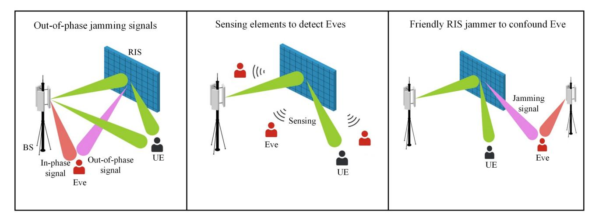

Fig. 7. RIS-enabled techniques for enhancing PLS: Destructive interference, active sensing, and friendly jamming.

conditions. Additionally, a trade-off between the SR and EE was observed, highlighting the capacity of the RIS to enhance the EE, even when faced with cases of imperfect CSI. The authors of [\[151\]](#page-41-8) investigated the potential of utilizing the RIS, focusing on aerial RIS (ARIS), for anti-jamming communications. A joint ARIS deployment and passive BF optimization through an AO framework was explored, effectively mitigating jamming attacks and ensuring the security of legitimate data transmissions. In [\[152\]](#page-41-9), the RIS was utilized to suppress interference and jamming in radio wireless communications systems. The goal was to enhance the quality of service (QoS). The results demonstrated the significance of employing RIS, yielding importance anti-interference and jamming benefits. An approach to enhance the resistance of wireless communications systems against jamming interference using RIS in [\[153\]](#page-41-10) by improving signal reception for legitimate users while mitigating jamming signals was presented in [\[153\]](#page-41-10). An optimization problem was formulated to jointly optimize the transmit power allocation at the BS and reflecting BF at the RIS, resulting in anti-jamming performance enhancement. A secure communications scheme using an RIS was investigated in [\[154\]](#page-41-11), where the RIS allocated power from incoming signals to transmit confidential information and generate passive jamming signals simultaneously. Each RIS's reflection coefficient served communications and jamming functions, and their joint optimization aimed to maximize the SR. The authors of [\[155\]](#page-41-12) investigated the secure communications techniques utilizing a fixed RIS in conjunction with an aerial platform equipped with another RIS and a friendly jamming device to enhance security. Considering imperfect CSI, the ARIS improved the legitimate signal, and the fixed RIS reinforced cooperative jamming. The problem of configuring RISs to counter jamming attacks in a multi-user OFDMA system was discussed in [\[156\]](#page-41-13), with the uncertainties posed by an uncooperative jammer and limited CSI availability. To tackle this problem, a DRL-based approach was proposed. The DRL framework efficiently learned the RIS configuration, expedited learning through this strategy, and achieved rapid convergence in simulations.

## *B. Integrating RIS with Enabling Technologies for Secure Communications*

Current research contributions have demonstrated that the RIS technology plays a pivotal role in increasing the levels of security and confidentiality within wireless networks. This notable secrecy performance enhancement holds considerable potential for application across diverse wireless communications networks. This subsection dives into the integration of the RIS technology with emerging and cutting-edge technologies, which encompass mmWave, THz, AAVs, NOMA, CRN, D2D communications, and other pertinent techniques. We explore the efficacy of integrating the RIS with emerging technologies to heighten wireless networks' security and confidentiality, and thus offering tangible benefits for various wireless communications networks. The integration of RIS in PLS-aided systems with RF-enabling technologies for secure communications is summarized in Fig. [8.](#page-15-0)

*1) RIS-Assisted Secure mmWave Communications:* Integrating RIS into mmWave communications represents a significant advancement in enhancing security. RIS's adaptability enables dynamic adjustments to the propagation environment, establishing secure communications channels in mmWave contexts. Its role in optimizing BF and channel characteristics addresses the directional communications requirements of mmWave, minimizing the risk of unauthorized interception. The authors of [\[304\]](#page-44-0) investigated the SR of an mmWave system improved by an RIS with low-resolution digital-to-analog converters, focusing on mitigating hardware losses and improving secrecy rates by integrating with RIS. The obtained results demonstrated the effectiveness of RIS in reducing hardware losses. Secure BF in the mmWave MISO system, aided by an RIS, was explored in [\[143\]](#page-41-0). The presence of multiple single-antenna eavesdroppers near the legitimate receiver was addressed, taking into account imperfect knowledge of cascaded wiretap CSI at the transmitter and the colluding and non-colluding eavesdropping scenarios. Simulation results showed the superior performance of the proposed scheme in terms of the average secrecy rate (ASR).

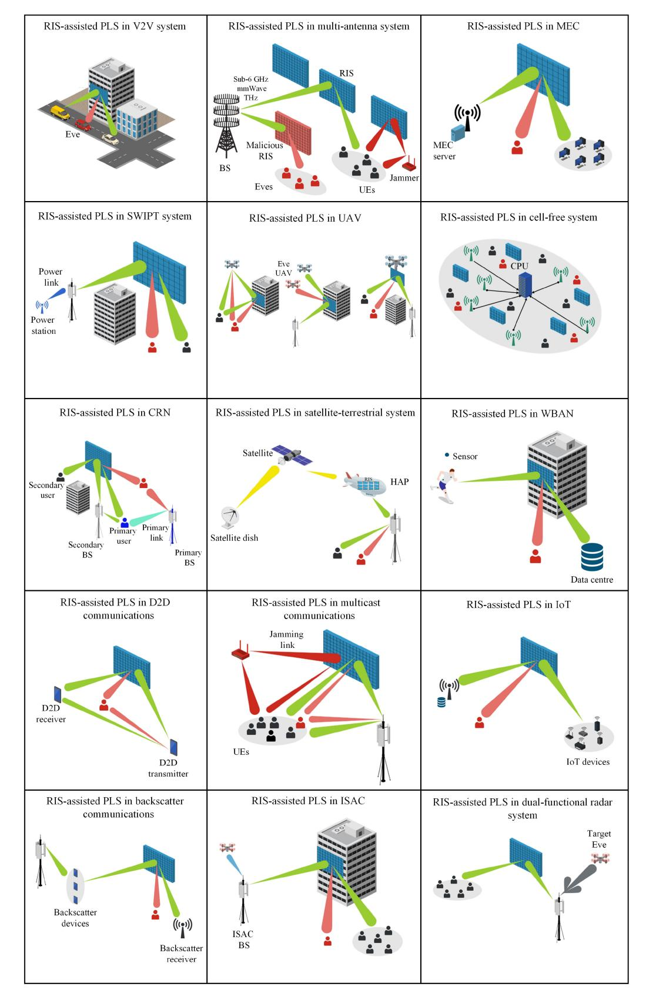

Fig. 8. The integration of RIS in PLS-aided systems with RF enabling technologies for secure communications.

*2) RIS-Assisted Secure THz Communications:* In the THz communications domain, incorporating RIS represents a noteworthy advancement, elevating security within this frequency band. Leveraging the adaptability of RIS, the propagation environment undergoes dynamic modulation to optimize BF and channel characteristics, particularly salient in the distinctive context of THz communications. The authors in of [\[197\]](#page-42-0) investigated a secure THz-empowered network, which involved transmitting confidential information from a low earth orbit satellite to a AAV via RIS-mounted HAPS in the presence of an untrustworthy AAV. The RIS phase shifts were optimized to enhance the secrecy performance. In [\[198\]](#page-42-1), a THz MIMO-NOMA system with the assistance of an RIS was investigated, considering the presence of an eavesdropper. Results demonstrated that deploying RIS led to substantial BF gains, effectively mitigating eavesdropping threats.

*3) RIS-Assisted Secure AAV Communications:* Integrating RIS with AAVs offers significant potential for increasing security measures within wireless communications networks. This convergence between RIS and AAV technologies represents a pivotal advancement, as it harnesses the unique capabilities of both systems to address security challenges across various operational scenarios. Utilizing a swarm of AAVs with ARIS presents an effective avenue for increasing ground users' PLS through control of phase shifts, spatial placement, and strategic movement. Additionally, a traceable PLS mechanism conducive to secure vehicle-to-everything (V2X) communications was introduced in [\[305\]](#page-44-1). Utilizing an RIS in the presence of AAVs acting as potential eavesdroppers was analyzed in [\[205\]](#page-42-2), where enhanced security was achieved through RIS deployment. The authors of [\[155\]](#page-41-12) proposed a strategy for enhancing wireless security by employing aerial reflection and jamming techniques to address channel uncertainties effectively. ARIS mounted on a AAV was introduced to improve the wireless secrecy of fixed-deployed RISs and optimize the ARIS trajectory to maximize the ASR [\[204\]](#page-42-3). The authors of [\[209\]](#page-42-4) investigated a secure multi-user AAV communications system supported by an RIS and considered hardware impairments in the transceiver and the RIS. In [\[211\]](#page-42-5), the minimum number of reflecting elements required for secure and energy-efficient RIS-assisted AAV systems was investigated, considering the phase estimation errors. Robust optimization methods were utilized, and aerial deployment was accomplished through DRL. Additionally, the superiority of flexible deployment of ARIS over fixed RIS was highlighted, and significant security improvements were achieved through the collaboration between fixed RIS and ARIS.

*4) RIS-Assisted Secure D2D Communications:* RIS presents a compelling avenue for strengthening the security infrastructure of D2D communications. The capacity of RIS to dynamically modulate surface properties affords the selective manipulation of wireless signals, establishing secure communications channels by redirecting signals away from potential eavesdroppers or unauthorized users. Through careful manipulation of the propagation environment, RIS engenders the dynamic reconfiguration of wireless communications channels, confusing interception and interference by unauthorized devices, thereby adding an additional level of security. Furthermore, the precision of RIS in producing highly directional communications links heightens privacy and security by constricting signal exposure to unintended recipients, thereby attenuating the susceptibility to signal interception. These diverse capabilities, encompassing the mitigation of jamming, interference, and dynamic signal

BF, collectively form a robust security framework for D2D communications. The authors of [\[224\]](#page-42-6) explored the application of RIS technology to enhance the reliability and robustness of D2D communications and improve the security level of cellular networks. New analytical expressions were derived for the cellular SOP, PNSC, and the D2D outage probability. In [\[223\]](#page-42-7), an RIS was introduced to enhance system robustness and security against eavesdropping threats, employing an FD jamming receiver. In [\[225\]](#page-42-8), the RIS-aided secure uplink communications scheme was investigated by maximizing the ASR for the cellular network while improving the achievable rate of D2D communications.

*5) RIS-Assisted Secure Cognitive Radio Networks:* Regarding the CRN, the utilization of RIS aims to enhance the PLS of the network. Leveraging the numerous reflecting elements in the RIS facilitates establishing a highly directional and manipulable wireless transmission environment. Furthermore, integrating RIS allows the generation of multiple virtual channels, which can effectively separate legitimate and malicious signals, providing an additional layer of protection against eavesdropping and jamming attacks. The authors in [\[226\]](#page-42-9) proposed a novel system model that utilized the RIS technology to enhance simultaneous wireless communications and security in CRN environments. They aimed to improve the transmission of the secondary network and enhance the secrecy performance of the primary network concurrently. In [\[228\]](#page-42-10), utilizing an RIS in CRN was explored, focusing on improving secrecy rates under various scenarios, including perfect/imperfect Eve's CSI. Additionally, an AN-aided approach was proposed for scenarios without Eve's CSI to enhance the SR. The authors of [\[229\]](#page-42-11) focused on employing an active RIS in a secure cognitive satellite-terrestrial network to optimize the SR. This involved concurrently optimizing the design of the BF, AN, and reflection coefficients. The provided results revealed the superior performance of the active RIS scheme in enhancing secrecy within the network.

*6) RIS-Assisted Secure WPT and SWIPT:* The utility of the RIS's technology extends further to secure wireless power transfer (WPT) and SWIPT communications, optimizing energy transfer efficiency while ensuring secure communications channels. By manipulating EM waves, an RIS improves the signals strength, reduces interference, and establishes secure communications links. This integration ensures safe and efficient power and data transmission, protecting against eavesdropping and unauthorized access in modern wireless technologies. Integrating an RIS into a secure WPCN multicast setup was proposed in [\[232\]](#page-43-0) to enhance energy transfer efficiency and ensure secure communications. Specifically, the energy was initially harvested from a power station and subsequently utilized to transmit data to multiple IoT devices in the presence of multiple eavesdroppers. The BF optimization challenge within an RIS-enhanced SWIPT framework was investigated in [\[237\]](#page-43-1), with energy users accounted for as potential eavesdroppers. The purpose was to maximize the average worst-case SR while adhering to power and energy harvesting constraints. The authors of [\[235\]](#page-43-2), [\[236\]](#page-43-3) explored the PLS of a WPC system with enhancements provided by an RIS in the presence of a passive eavesdropper. Three secure modes for RIS-WPC systems were introduced and examined. In [\[233\]](#page-43-4), an RIS was utilized to maximize secure SWIPT systems with a power splitting scheme. The objective was to optimize the system's SR by choosing the optimal transmitter power and RIS phase shifts while ensuring user energy-harvesting requirements and adhering to transmit power constraints at the transmitter.

*7) RIS-Assisted Secure MEC:* The integration of the RIS technology into MEC enhances the security of edge networks. Through the dynamic configuration of the wireless environment, an RIS contributes to secure data transmission and computation processes in MEC systems. This integration enhances data processing and storage security at the network edge, which is crucial for protecting sensitive information and preventing unauthorized access in MEC environments. The authors of [\[289\]](#page-44-2) presented an approach for ensuring secure task offloading and efficient wireless resource management in MEC networks equipped with an RIS, considering IoT devices' secure computation rate constraints. The secure computation performance in an RIS-assisted WPT and MEC system with a passive eavesdropper was investigated in [\[251\]](#page-43-5). A harvest-then-offload protocol was the main focus, where users were charged by the AP in the first slot, and the harvested energy was used to offload computation tasks in the second slot, assuming concurrent local computation during energy harvesting. Strategies to enhance the security of MEC systems by leveraging the RIS technology and AN in the IoT, were explored in [\[247\]](#page-43-6), aiming to strengthen users' signals while simultaneously attenuating eavesdroppers' signals by manipulating RIS phase configurations.

*8) RIS-Assisted Secure Satellite Networks:* The sophisticated integration of the RIS technology into satellite communications systems provides insights into applications for enhancing communications security in space-based systems. In doing so, security protocols are strengthened, ensuring secure and efficient data transmission while mitigating risks such as unauthorized access and eavesdropping. This strategy is essential for protecting sensitive data and upholding the reliability of satellite communications systems. The authors of [\[252\]](#page-43-7) introduced a two-hop content delivery strategy within a cache-enabled satellite-terrestrial network supported by an RIS. The system incorporated probabilistic caching policies at both the satellite and ground station. The analysis evaluated the system's connection and secrecy probability, utilizing asymptotic and closed-form expressions. In [\[253\]](#page-43-8), a secure BF design for cognitive satellite-terrestrial networks with an active RIS was introduced. The objective was to minimize the transmission power at the BS while ensuring an satisfactory SR for primary users and an acceptable rate for secondary users. Two configurations of RIS-aided spaceground networks, double-RIS and single-RIS schemes, were explored in [\[254\]](#page-43-9) to maximize the SR. The superiority of the double-RIS scheme in terms of security performance compared to the single-RIS method was demonstrated.

*9) RIS-Assisted Secure ISAC:* Integrating an RIS with ISACs systems enhances secrecy performance by dynamically controlling signal propagation. The RIS enables precise communications through dynamic BF, directing signals to intended recipients and reducing interception threats. By incorporating an RIS into ISAC systems, security measures can be significantly enhanced, ensuring safe and efficient data transmission while preventing unauthorized access or eavesdropping. The combined optimization of transmit and reflection BF for secure RIS-ISAC systems was analyzed in [\[280\]](#page-44-3). The results validated that the proposed design enhances the radar SNR performance, confirming the benefits of incorporating an RIS in secure ISAC systems. The authors of [\[281\]](#page-44-4) introduced a BF design assisted by RIS in an ISAC system to enhance the PLS. The objective was to maximize the secrecy performance while meeting the minimum requirements for communications and sensing performance. An RIS-assisted secure ISAC system was examined in [\[282\]](#page-44-5) wherein the objective was to maximize the SR by concurrently optimizing the transmit BF, AN matrix, and RIS phase-shift matrix. The results confirmed the significance of the proposed DRL algorithm compared to benchmark techniques. The secure transmission in an active RIS-assisted ISAC in THz was discussed in [\[283\]](#page-44-6), where the target was considered as a possible eavesdropper. The objective was to maximize the secrecy rate while ensuring the lowest illumination power for the target. In [\[284\]](#page-44-7), a secure transmission within a STAR-RIS-assisted ISAC system was investigated, where the system was partitioned into distinct sensing and communications regions. The STAR-RIS was strategically positioned to establish LoS links for confidential signal transmission to users and for target sensing and confidential signal transmission to users using NOMA. The PLS of RIS-assisted ISAC systems was investigated in [\[285\]](#page-44-8), where AN was utilized. The main objective was to maximize the multi-user sum secrecy rate by optimizing a joint active and passive BF.

*10) RIS-Assisted Secure IoT:* Incorporating an RIS into IoT networks optimizes security through dynamic signal reflection control, interference mitigation, secure zone establishment, adaptability to changes, jamming prevention, and enhanced privacy measures [\[306\]](#page-44-9). This collaborative integration strengthens the overall security resilience of IoT networks, providing robust protection against a spectrum of potential threats. An innovative approach was presented in [\[292\]](#page-44-10) to enhance confidentiality in low power wide area networks (LPWANs) by combining the RIS technology with AAV, improving the secure data transmission between IoT sensors and gateways within LPWAN environments. Analytical expressions were derived for the SOP, PNSC, and ASR, considering Nakagami-*m* fading channels. The impact of the eavesdropper's locations was also explored. An IRS-based model was introduced in [\[291\]](#page-44-11) to tackle security challenges in IoT environments with diverse trusted and untrusted devices, where untrusted devices could pose eavesdropping risks. The SR of trusted devices was optimized for the model while ensuring the QoS for all legitimate devices. The low-latency computing demands of IoT devices with limited resources have been acknowledged and addressed by the MEC. However, security risks could be created for these devices due to the inherent broadcast nature of wireless EM communications. In response, a secure MEC network framework was proposed in [\[289\]](#page-44-2), leveraging the RIS technology to enhance security in task offloading.

*11) RIS-Assisted Secure Other Cutting-Edge Technologies:* The exploration extends to RIS-assisted secure multicast communications, strategically deploying an RIS to reinforce security in the face of the unique challenges posed by one-to-many communications paradigms [\[258\]](#page-43-10), [\[259\]](#page-43-11), [\[260\]](#page-43-12), [\[261\]](#page-43-13). RIS-assisted secure cell-free networks utilize an RIS to optimize the signal coverage and mitigate interference in distributed antenna systems [\[263\]](#page-43-14), [\[265\]](#page-43-15). Transitioning to relay networks, an RIS dynamically configures relay paths and signal reflections, enhancing the security and reliability of relayed communications [\[266\]](#page-43-16), [\[267\]](#page-43-17). In vehicular networks, a critical domain for secure communications, the strategic deployment of an RIS to optimize communications links in vehicular environments, addressing security concerns and improving overall network performance was proposed in [\[272\]](#page-43-18). WBANs find an RIS enhancing communications security and reliability in healthcare and wearable technologies, especially in wearable health monitoring devices [\[277\]](#page-44-12).

Integrating an RIS with a radar system enhances security by dynamically controlling the EM wave propagation. This integration improves signal directionality, supports stealth and camouflage, facilitates adaptive radar sensing, and mitigates interference [\[286\]](#page-44-13), [\[288\]](#page-44-14). Moreover, backscatter communications can be integrated with an RIS to improve security performance by dynamically optimizing signal reflection, establishing secure signal directionality, adapting security configurations, and creating secure zones [\[294\]](#page-44-15), [\[295\]](#page-44-16), [\[296\]](#page-44-17). Furthermore, the benefits of using an RIS to improve the secrecy performance of wireless sensor networks (WSNs) were investigated in [\[301\]](#page-44-18). As summarized in Tables [II.A](#page-19-0) to [II.D,](#page-22-0) the attractive advantages of an RIS-assisted PLS have generated enormous studies investigating its applicability to 5G/6G cutting-edge wireless technologies such as multi-antenna communications, mmWave communications, THz communications, AAV communications, D2D communications, CRNs, WPC/SWIPT, MEC, satellite-enabled networks, multicast communications, cell-free networks, relay-aided networks, vehicular communications, WBAN, ad-hoc networks, ISAC, radar communications, IoT networks, backscatter communications, wireless sensor networks, and HAPS.

## *C. Lessons Learnt*

This section explored how an RIS can enhance the PLS in wireless communications systems. Here are the key takeaways:

- RISs can be combined with various techniques to enhance the PLS. It can control the direction of ANs to confuse eavesdroppers, manipulate signal reflection paths for BF, and optimize jamming strategies in cooperative jamming approaches. Understanding how these techniques address attacks like eavesdropping and jamming provides valuable insights. Moreover, understanding how cooperative strategies, possibly involving multiple RIS elements, impact the overall security of the communications system can provide valuable insights into the potential for collaborative security tools against potential threats.
- RISs empower a versatile PLS approach applicable to various communications systems. By manipulating high-frequency propagation such as mmWave and THz,

RIS mitigates eavesdropping across diverse scenarios. Integrating an RIS with AAV communications enables flexible and secure links, while in D2D communications, an RIS controls the environment for directional beams and enhanced security. The CRN and WPT systems benefit from improved secrecy and optimized energy transfer, respectively. Similarly, the MEC leverages an RIS for secure data transmission and computation. An RIS's dynamic control extends security to satellite networks, ISAC systems, and IoT networks, maintaining overall network resilience. Furthermore, an RIS-assisted PLS presents promising applications in emerging technologies like secure multicast communications, cell-free networks, and various network types.

- • The real-world potential of an RIS-assisted PLS hinges on addressing implementation challenges, scalability, and adaptability. Research works explore how well an RIS scales with complex networks and adapts to dynamic communications scenarios. Additionally, an active RIS is a potential solution for the dual-fading issue in RIS-supported links, although it comes with increased complexity and power consumption. Active RIS elements amplify reflected signals, offering improved the PLS compared to mostly passive RIS modules.
- • The success of reliable beamforming and optimal reflection in RIS-assisted wireless communications systems is intrinsically linked to the precise acquisition of the CSI. Despite the well-established conventional channel estimation methods in traditional wireless systems, applying these techniques to RIS-assisted secured wireless communications presents significant challenges. As observed in Table II, much of the existing research assumes perfect CSI for RIS-assisted secured wireless communications. Additionally, the Rayleigh fading channel is predominantly utilized, whereas more complex channel fading models are seldom employed, as indicated in Table II. Furthermore, although various types of RIS exist, passive RIS is the most prevalent in the literature due to its relative simplicity in analysis.

## V. RIS-ASSISTED PLS IN OWC SYSTEMS

This section discusses the potential of the adoption of the RIS technology to secure OWC networks. Specifically, its the integration with VLC, VLC-RF, and FSO-RF, which are summarized in both Fig. [9](#page-22-1) and Table [III.](#page-21-0)

## *A. Integrating RIS With OWC Enabling Technologies for Secure Communications*

*1) RIS-Assisted Secure VLC:* The research on RIS-aided PLS in VLC systems, the research started with single user scenarios for a static user [\[107\]](#page-40-3), [\[110\]](#page-40-6), [\[111\]](#page-40-7) or a mobile user [\[109\]](#page-40-5), then evolved to multi-user scenarios [\[108\]](#page-40-4). These works employed different PLS techniques to improve the secrecy rate performance. Specifically, in [\[107\]](#page-40-3), [\[110\]](#page-40-6), the mirror-array-based RIS elements are optimized to increase the channel gain difference between the trusted and untrusted users. In [\[108\]](#page-40-4), the closest LED to the eavesdropper is

TABLE II.A SUMMARY OF RIS-ASSISTED PLS ADOPTED SYSTEM MODELS IN RF COMMUNICATION SYSTEMS

| 164 |  |  |  |  |  |
|-----|--|--|--|--|--|
| 165 |  |  |  |  |  |
|     |  |  |  |  |  |
|     |  |  |  |  |  |
|     |  |  |  |  |  |
|     |  |  |  |  |  |
|     |  |  |  |  |  |
|     |  |  |  |  |  |
|     |  |  |  |  |  |
|     |  |  |  |  |  |
|     |  |  |  |  |  |
|     |  |  |  |  |  |
|     |  |  |  |  |  |
|     |  |  |  |  |  |
|     |  |  |  |  |  |
|     |  |  |  |  |  |
|     |  |  |  |  |  |
|     |  |  |  |  |  |
|     |  |  |  |  |  |
|     |  |  |  |  |  |
|     |  |  |  |  |  |
|     |  |  |  |  |  |
|     |  |  |  |  |  |
|     |  |  |  |  |  |
|     |  |  |  |  |  |
|     |  |  |  |  |  |
|     |  |  |  |  |  |
|     |  |  |  |  |  |
|     |  |  |  |  |  |
|     |  |  |  |  |  |
|     |  |  |  |  |  |
|     |  |  |  |  |  |
|     |  |  |  |  |  |
|     |  |  |  |  |  |
|     |  |  |  |  |  |
|     |  |  |  |  |  |
|     |  |  |  |  |  |
|     |  |  |  |  |  |
|     |  |  |  |  |  |
|     |  |  |  |  |  |
|     |  |  |  |  |  |
|     |  |  |  |  |  |

employed to send an unintended interference to the eavesdropper in an attempt to degrade its SINR. In [\[109\]](#page-40-5), the transmit BF of the VLC AP is optimized to maximize the system's SC. Lastly, in [\[111\]](#page-40-7), an RIS is deployed close to a jamming receiver to transmit a jamming interference toward the eavesdropper.

TABLE II.B SUMMARY OF RIS-ASSISTED PLS ADOPTED SYSTEM MODELS IN RF COMMUNICATION SYSTEMS

| r#1            |                                         | System related           | content             |                      | RIS rela          | ted content      | Security rela    | ated content       | Performance           |
|----------------|-----------------------------------------|--------------------------|---------------------|----------------------|-------------------|------------------|------------------|--------------------|-----------------------|
| [#]            | Technology                              | System Model             | CSI Condition    | Channel Model     | RIS Type       | RIS(s)           | PLS Technique | Eve(s)             | Metric(s)             |
| [202]          |                                         | SU-SISO-DL               | Perfect             | Rayleigh             | Passive           | Single           | BF               | Single             | SR                    |
| [129]          |                                         | SU-SISO-DL               | Perfect             | Rician               | Passive           | Single           | AN               | Single             | ASR                   |
| [203]          |                                         | MU-SISO-DL               | Perfect             | Rician               | Passive           | Single           | AN               | Single             | ASR                   |
| [204]          |                                         | SU-SISO-DL               | Perfect             | Rayleigh             | Passive           | Multiple         | BF               | Multiple           | ASR                   |
| [138]          |                                         | SU-SISO-UL/DL            | Perfect             | Rician               | Passive           | Single           | BF               | Single             | ASR                   |
| [155]          |                                         | SU-SISO-DL               | Perfect             | Rician               | Passive           | Multiple         | Jamming          | Multiple           | SR                    |
| [205]          |                                         | SU-SISO-DL               | Perfect             | Rayleigh             | Passive           | Single           | BF               | Multiple           | SC                    |
| [206]          |                                         | SU-MISO-DL               | Perfect             | Rician               | Passive           | Single           | BF               | Multiple           | SR                    |
| [207]          |                                         | SU-SISO-DL               | Perfect             | Rician               | Passive           | Single           | BF               | Single             | ASR                   |
| [208]          |                                         | MU-MISO-DL MU-SISO-DL | Perfect             | Rayleigh             | Passive           | Single           | BF               | Multiple           | SSR                   |
| [209]          |                                         | SU-MISO-DL               | Perfect             | Rician               | Passive           | Single           | BF BF         | Single             | SSR ASR            |
| [210]          |                                         | SU-MISO-DL               | Perfect             | Rayleigh             | Passive           | Single           |                  | Single             | Number of             |
| [211]          | *****                                   | SU-SISO-DL               | Perfect             | Nakagami-m           | Passive           | Single           | BF               | Multiple           | RIS elements          |
| [212]          | UAV                                     | MU-SISO-UL               | Perfect             | Rician               | Passive           | Single           | DE               | Multiple           | Secrecy EE            |
| [213]          | commun.                                 | SU-MISO-DL               | Perfect             | Rician               | Passive           | Single           | BF               | Multiple           | ASR                   |
| [214]          |                                         | SU-SISO-UL               | Perfect             | Rayleigh             | Passive           | Single           | BF               | Multiple           | Energy consumption    |
| [215]          |                                         | SU-SISO-DL               | Outdated            | Rayleigh/ Rician  | Passive           | Single           | BF               | Single             | ASR                   |
| [216]          |                                         | SU-SISO-DL               | Imperfect           | Rayleigh/ Rician  | Passive           | Single           | Jamming          | Single             | ASR                   |
| [217]          |                                         | SU-SISO-DL               | Perfect             | Rayleigh             | Passive           | Single           | BF               | Single             | ASR                   |
| [218]          |                                         | SU-SISO-DL               | Perfect             | Rayleigh             | Passive           | Single           | AN               | Multiple           | Ergodic SC            |
| [219]          |                                         | MU-MISO-DL               | Statistical         | Rayleigh/ Rician  | Passive           | Single           | BF               | Multiple           | Multicast rate        |
| [220]          |                                         | MU-SISO-UL               | Perfect Perfect/ | Nakagami-m           | Passive           | Multiple         | BF               | Single             | EC, ECP, ESC          |
| [221]          |                                         | SU-MISO-DL               | Statistical         | Rayleigh             | Passive           | Single           | BF               | Single             | ASR and SOP           |
| [222]          |                                         | MU-MISO-DL               | Imperfect           | Rician               | Active            | Single           | BF               | Single             | Transmit power        |
| [223]          | D2D                                     | SU-SIMO                  | Perfect             | Rayleigh             | Passive           | Multiple         | AN/BF            | Single             | Ergodic capacity      |
| [224]          | commun.                                 | SU-SISO                  | Perfect             | Rayleigh             | Passive           | Single           | Jamming          | Single             | SOP and PNSC          |
| [225]          | • • • • • • • • • • • • • • • • • • • • | SU-SISO                  | Perfect             | Rayleigh             | Passive           | Single           | BF               | Single             | Data rate and SR      |
| [226]          |                                         | SU-SISO-DL               | Perfect             | Rayleigh             | Passive           | Single           | Jamming          | Single             | SOP and PNSC          |
| [227]          |                                         | SU-MISO-DL               | Perfect             | Rayleigh             | Passive           | Single           | BF               | Multiple           | SR                    |
| [228]          | CRN                                     | SU-MISO-DL SU-MISO-DL | Perfect Perfect  | Rayleigh             | Passive           | Single           | AN               | Single             | SR SR              |
| [229] [230] |                                         | SU-MISO-DL SU-MISO-DL | Perfect             | Rayleigh Rayleigh | Active Passive | Single Single | AN BF         | Single Multiple | Secrecy EE            |
| [231]          |                                         | SU-MISO-DL SU-MISO-DL | Imperfect           | Quasi-static         | Passive           | Single           | BF               | Multiple           | Worst-case SR         |
| [231]          |                                         | 30-MI3O-DL               | Imperiect           | Quasi-static         | 1 assive          | Single           | DI.              | •                  | Consumed              |
| [232]          |                                         | MU-SISO-DL               | Perfect             | Rayleigh             | Passive           | Single           | BF               | Multiple           | energy                |
| [233]          |                                         | SU-SISO-DL               | Perfect             | Rayleigh/ Rician  | Passive           | Single           | BF               | Single             | ASR                   |
| [234]          |                                         | MU-MISO-DL/UL            | Perfect             | Rayleigh             | Passive           | Single           | BF               | Single             | Secrecy throughput |
| [235]          |                                         | SU-SISO-DL               | Perfect             | Rayleigh/ Rician  | Passive           | Single           | BF               | Single             | SOP, and EST          |
| [236]          |                                         | SU-SISO-DL               | Perfect             | Rayleigh/ Rician  | Passive           | Single           | BF               | Single             | ESC                   |
| [237]          |                                         | SU-MISO-DL               | Statistical         | Rician               | Passive           | Single           | BF               | Multiple           | ASR                   |
| [238]          |                                         | SU-MISO-DL               | Perfect             | Rician               | Passive           | Single           | BF               | Single             | SR                    |
| [239]          | WPC/                                    | MU-MISO-DL               | Statistical         | Rician               | Passive           | Multiple         | AN               | Multiple           | Power consumption     |
| [240]          | SWIPT                                   | MU-MISO-DL               | Perfect             | Rayleigh/ Rician  | Passive           | Single           | Jamming          | Multiple           | Transmit power        |
| [241]          |                                         | MU-MISO-DL               | Imperfect           | Rayleigh/ Rician  | Passive           | Single           | AN               | Multiple           | Outage rate           |
| [242]          |                                         | SU-SISO-UL               | Perfect             | Rayleigh/ Rician  | Passive           | Single           | Jamming          | Single             | SR                    |
| [243]          |                                         | MU-MISO-DL               | Statistical         | Rayleigh             | Passive           | Single           | AN               | Multiple           | SR                    |
| [244]          |                                         | SU-MISO-DL/UL            | Perfect             | Rayleigh/ Rician  | Active            | Single           | BF               | Multiple           | SR                    |
| [245]          |                                         | SU-MISO-DL/UL            | Imperfect           | Rayleigh/ Rician  | Passive           | Single           | BF               | Single             | SR                    |
| [246]          |                                         | SU-MIMO-DL               | Perfect             | Rayleigh/            | Passive           | Single           | AN               | Single             | SR                    |
|                |                                         |                          |                     | Rician               |                   |                  |                  |                    | (C .: 1)              |

*2) RIS-Assisted Secure VLC-RF:* The high data rates of VLC and the extended coverage of RF communications have motivated the research on VLC-RF hybrid systems. In [\[113\]](#page-40-9), [\[114\]](#page-40-10), a two-hop scenario is considered, where in the first hop, VLC is used for data transmission in an EM-sensitive environment, and in the second hop, a relay that can perform

TABLE II.C SUMMARY OF RIS-ASSISTED PLS ADOPTED SYSTEM MODELS IN RF COMMUNICATION SYSTEMS (CONTINUED)

| r#1            |                    | System related           | content               |                       | RIS related        | content          | Security rela           | ted content      | Performance                              |
|----------------|--------------------|--------------------------|-----------------------|-----------------------|--------------------|------------------|-------------------------|------------------|------------------------------------------|
| [#]            | Technology         | System Model             | CSI                   | Channel               | RIS                | RIS(s)           | PLS                     | Eve(s)           | Metric(s)                                |
|                | recimology         | System Woder             | Condition             | Model                 | Type               | KID(5)           | Technique               | Live(s)          | C                                        |
| [247]          |                    | MU-FD-UL/DL              | Perfect               | Rayleigh              | Passive            | Single           | AN                      | Multiple         | Secure energy consumption                |
| [248]          |                    | MU-SISO-UL               | Perfect               | Rayleigh              | Passive            | Single           | -                       | Multiple         | Sum secrecy computation efficiency |
| [249]          | MEC                | MU-MISO-UL               | Perfect               | Rayleigh/ Rician   | Passive            | Single           | BF                      | single           | SR, secure EE                            |
| [250]          |                    | MU-SISO-UL               | Perfect               | Rician                | Passive            | Single           | Jamming                 | Single           | Secure computational tasks               |
| [251]          |                    | MU-FD-UL/DL              | Perfect               | Rayleigh              | Passive            | Single           | BF                      | Single           | Secure computational bits          |
| [252]          |                    | SU-SISO-DL               | Statistical           | Rayleigh/ Rician   | Passive            | Single           | BF                      | Single           | Secure transmission probability    |
| [253]          |                    | SU-MISO-DL               | Imperfect             | Rayleigh/ Rician   | Active             | Single           | BF                      | Single           | Transmit power                           |
| [254]          | Satellite          | SU-MISO-DL               | Imperfect             | Rician                | Passive            | Single           | BF                      | Multiple         | SR                                       |
| [255]          | commun.            | SU-SISO-DL               | Perfect               | Rayleigh/ Rician   | Passive            | Single           | BF                      | Multiple         | SOP                                      |
| [256]          |                    | MU-MISO-DL               | Imperfect             | Rayleigh              | Passive            | Single           | Unintended interference | Multiple         | Sum rate                                 |
| [257]          |                    | SU-MISO-DL               | Perfect               | Rayleigh/ Rician   | Passive            | Single           | Jamming                 | Single           | Eve SINR                                 |
| [258]          |                    | MU-MISO-DL               | Perfect               | Rician                | Passive            | Single           | -                       | Single           | SC                                       |
| [259]          |                    | MU-MISO-DL               | Imperfect Bounded/ | Rayleigh Rayleigh/ | Passive            | Single           | BF                      | Single           | SR Power                              |
| [260]          | Multicast          | SU-MISO-DL               | Statistical           | Rician                | Active             | Single           | BF                      | Multiple         | consumption                              |
| [261]          | commun.            | MU-MISO-DL               | Imperfect             | Rayleigh              | Passive            | Single           | Jamming                 | Multiple         | Secure EE                                |
| [262]          |                    | MU-MISO-DL               | Imperfect             | Rayleigh/ Rician   | Passive            | Single           | BF                      | Multiple         | Worst Bob SNR                         |
| [263]          | Cell-free          | MU-MISO-DL               | Perfect/ Imperfect | Rayleigh/ Rician   | Passive            | Multiple         | BF                      | Multiple         | Weighted SSR                             |
| [264]          | networks           | MU-MISO-DL               | Perfect               | Rician                | Passive            | Multiple         | BF                      | Single           | Secure EE                                |
| [265]          |                    | MU-MIMO-DL               | Perfect               | Rician                | Passive            | Multiple         | BF                      | Single           | ASR                                      |
| [266]          |                    | SU-SISO-DL               | Perfect               | Rayleigh Rayleigh/ | Passive            | Single           | Jamming                 | Single           | SR ASR and                            |
| [267]          |                    | SU-SISO-DL               | Perfect               | Rician                | Passive            | Single           | BF                      | Single           | throughput                               |
| [268]          | Relay              | SU-MISO-DL               | Perfect               | Rayleigh              | Passive            | Single           | BF                      | Single           | ASR                                      |
| [269]          | networks           | MU-MISO-DL/UL            | Perfect/ Imperfect | Rayleigh              | Active             | Single           | BF                      | Single           | SSR                                      |
| [270]          |                    | SU-SISO-DL               | Statistical           | Rayleigh              | Active             | Single           | BF                      | Single           | SOP and IP                               |
| [271]          |                    | SU-MISO-DL               | Perfect Perfect    | Rayleigh              | Semi-active        | Single           | BF                      | Single           | Secrecy EE                               |
| [272] [273] |                    | SU-SISO-DL SU-SISO-DL | Imperfect             | Rayleigh Rayleigh  | Passive Passive | Single Single | BF BF                | Single Single | SOP ASR                               |
| [274]          | Vehicular          | SU-MISO-DL               | Unavailable           | Rayleigh              | Passive            | Single           | AN                      | Single           | SR                                       |
| [275]          | commun.            | MU-SISO-DL               | Imperfect             | Rayleigh              | Passive            | Single           | AN                      | Single           | OP and IP                                |
| [276]          |                    | SU-SISO-DL               | Perfect               | Rayleigh              | Passive            | Single           | BF                      | Multiple         | SOP and SC                               |
| [277]          | WBAN               | SU-SISO-D2D              | Estimated             | Rayleigh              | Semi- passive   | Single           | Anti- jamming        | Single           | Eve rate, energy, latency, SC         |
| [278]          | Ad-hoc Networks | SU-MISO-DL               | Perfect               | Rician                | Passive            | Single           | BF                      | Single           | ASR                                      |
| [279]          | -                  | MU-MISO-DL               | Perfect               | Rician                | Active             | Single           | BF                      | Single           | ASR                                      |
| [280]          |                    | MU-MISO-DL               | Perfect               | Rayleigh/ Rician   | Passive            | Single           | BF                      | Single           | SNR                                      |
| [281]          | ISAC               | SU-MISO-DL               | Perfect               | Rayleigh              | Passive            | Single           | BF                      | Single           | Ergodic SR                               |
| [282]          | ISAC               | MU-MISO-DL               | Perfect               | Rayleigh              | Passive            | Single           | BF                      | Single           | SR                                       |
| [283]          |                    | SU-MISO-DL               | Perfect               | Rayleigh              | Active             | Single           | BF                      | Single           | SR                                       |
| [284]          |                    | MU-MISO-DL               | Perfect               | Rician                | Passive            | Single           | Jamming                 | Single           | SR                                       |
| [285]          |                    | MU-MISO-DL               | Perfect               | Rayleigh              | Passive            | Single           | BF                      | Single           | SSR Bodon consino                     |
| [286]          | Radar              | MU-MISO-DL               | Perfect               | Rayleigh/ Rician   | Passive            | Single           | BF                      | Multiple         | Radar sensing power                      |
| [287]          | commun.            | MU-MISO-DL               | Statistical           | Rayleigh/ Rician   | Passive            | Single           | BF                      | Single           | Radar SINR                               |
| [288]          |                    | MU-MIMO-DL               | Perfect               | Rayleigh/ Rician   | Passive            | Single           | AN                      | Single           | SR                                       |

an optical-to-electrical conversion is deployed next to an RIS to extend the communications coverage. Additionally, there exists an eavesdropper in the second hop trying to wiretap the RF link. The aforementioned works evaluated both the SOP and the SPSC of the proposed systems without employing a specific PLS technique. Rather, the introduction

| [#]   |                     | System relat | ed content            |                     | RIS relat          | ted content | Security rela    | ated content | Performance           |
|-------|---------------------|--------------|-----------------------|---------------------|--------------------|-------------|------------------|--------------|-----------------------|
| [#]   | Technology          | System Model | CSI Condition      | Channel Model    | RIS Type        | RIS(s)      | PLS Technique | Eve(s)       | Metric(s)             |
| [289] |                     | MU-SISO-UL   | Perfect               | Rayleigh/ Rician | Passive            | Single      | BF               | Multiple     | Computation EE        |
| [290] | 1                   | SU-SISO-DL   | Perfect               | Rayleigh            | Passive            | Single      | Jamming          | Single       | ASR                   |
| [291] | IoT                 | MU-MISO-DL   | Perfect               | Rayleigh            | Passive            | Single      | BF               | Multiple     | SSR                   |
| [292] | Networks            | SU-SISO-DL   | Perfect               | Nakagami-m          | Passive            | Single      | BF               | Single       | SOP, PNSC, and ASR |
| [293] |                     | MU-MISO-DL   | Perfect               | Rician              | Passive/ Active | Multiple    | BF               | Multiple     | SSR and Secrecy EE |
| [294] |                     | MU-MISO-DL   | Perfect               | Rician              | Active             | Single      | BF               | Multiple     | ASR                   |
| [295] | 1                   | SU-MISO-DL   | Unavailable           | Nakagami-m          | Passive            | Single      | AN               | Single       | SR                    |
| [296] |                     | MU-MISO-DL   | Perfect               | Rayleigh            | Active             | Single      | BF               | Multiple     | SR                    |
| [297] | D1                  | SU-MISO-DL   | Perfect               | Rician              | Passive            | Single      | BF               | Multiple     | Transmit power        |
| [298] | Backscatter Commun. | MU-SIMO-UL   | Estimated             | Rayleigh            | Passive            | Multiple    | BF               | Single       | SSR                   |
| [299] | Commun.             | SU-SISO-DL   | Perfect/ Imperfect | Rayleigh            | Passive            | Single      | BF               | Single       | SOP                   |
| [300] |                     | SU-SIMO-UL   | Perfect               | Rician              | Passive            | Single      | BF               | Single       | Destination SINR   |
| [301] | WSNs                | MU-SISO-UL   | Perfect               | Rayleigh            | Passive            | Single      | BF               | Single       | SNR                   |
| [302] | W SINS              | MU-SIMO-UL   | Perfect               | Rayleigh            | Active             | Single      | BF               | Single       | SR                    |
| [303] |                     | MU-MIMO-DL   | Perfect               | Rayleigh            | Passive            | Single      | BF               | Multiple     | EE                    |
| [115] | HAPs                | MU-SISO-UL   | Perfect               | Nakagami-m          | Passive            | Single      | BF               | Single       | SOP and PPSC          |
| [199] | liars               | SU-SISO-DL   | Perfect/              | Gamma-              | Passive            | Single      | BF               | Single       | Ergodic SR            |

TABLE II.D SUMMARY OF RIS-ASSISTED PLS ADOPTED SYSTEM MODELS IN RF COMMUNICATION SYSTEMS (CONTINUED)

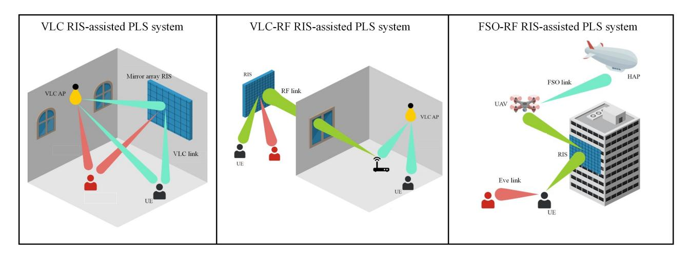

Fig. 9. The integration of RIS in PLS-aided systems with OWC enabling technologies for secure communications.

of the RIS is shown to increase the SOP to a certain extent.

*3) RIS-Assisted Secure FSO-RF:* The motivation for RF/FSO networks arises from the need for high-speed, reliable, and flexible communications solutions in various scenarios, ranging from urban environments with high data demands to remote areas with limited infrastructure. The security of the FSO links is inherently assured by the laser beam's narrow and imperceptible nature, while the inherent broadcast nature of wireless RF communications implies the likelihood of information leakage to eavesdroppers [\[115\]](#page-40-11). However, the propagation characteristics of the FSO llink such as pointing errors, path loss due to the random atmospheric radio medium, and atmospheric turbulence, were taken into account. In [\[116\]](#page-40-12), a secure mixed RF/FSO RIS-aided system was proposed, where a secure message is conveyed from an RF transmitter to an FSO receiver with the assistance of a decode-and-forward intermediary relay. This work deployed one RIS between the RF transmitter and the relay and another one between the relay and the FSO receiver. Such deployment is suitable in urban environments. In [\[115\]](#page-40-11), a secure mixed RF/FSO RIS-aided HAPS-AAV collaborative system suitable to serve remote areas users was proposed. A wiretap RF link was assumed from the users to an eavesdropper.

#### *B. Lessons Learnt*

The lessons learnt from this section can be summarized as follows.

• The literature on RIS-assisted PLS VLC confirms that increasing the number of RIS elements improves the overall security performance of VLC systems. Specifically, additional RIS elements enable spatial BF and nulling,

| [#]   | Sys        | tem related conte | ent              | RIS         | related con | tent                                       | Security relate                 | ed content | Performance                    |
|-------|------------|-------------------|------------------|-------------|-------------|--------------------------------------------|---------------------------------|------------|--------------------------------|
| [#]   | Technology | System Model   | CSI Condition | RIS Type | RIS(s)      | RIS Arch.                               | PLS Technique                | Eve(s)     | Metric(s)                      |
| [107] |            | SU-SISO-DL        | Perfect          | Passive     | Single      | Mirror array                            | Channel gain manipulation | Single     | SC                             |
| [108] |            | MU-SISO-DL        | Perfect          | Passive     | Single      | Mirror array                            | Unintended interference         | Single     | SR                             |
| [109] | VLC        | SU-SISO-DL        | Perfect          | Passive     | Single      | Mirror array                            | BF                              | Single     | SC                             |
| [110] |            | SU-SISO-DL        | Perfect          | Passive     | Single      | Mirror array                            | Channel gain manipulation | Single     | SR                             |
| [111] |            | SU-SISO-DL        | Perfect          | Passive     | Single      | Mirror array                            | Jamming                         | Single     | SC                             |
| [113] |            | SU-SISO-DL        | Perfect          | Passive     | Single      | Meta- surface                           | Jamming                         | Single     | SOP and SPSC                   |
| [307] | VLC-RF     | SU-MISO-DL        | Perfect          | Passive     | Multiple    | Mirror array and Meta- surface | BF                              | Single     | SC                             |
| [114] |            | SU-SISO-DL        | Perfect          | Passive     | Single      | Meta- surface                           | BF                              | Single     | SOP and SPSC                   |
| [116] |            | SU-SISO-DL        | Perfect          | Passive     | Multiple    | Meta- surface                           | BF                              | Multiple   | SOP, SPSC, IP, ASC, and EST |
| [115] | FSO-RF     | MU-SISO-UL        | Perfect          | Passive     | Single      | Meta- surface                           | BF                              | Single     | SOP and PPSC                   |
| [309] |            | SU-SISO-DL        | Perfect          | Passive     | Single      | Meta- surface                           | BF                              | Single     | SOP, ASC, SPSC, and EST     |

TABLE III
SUMMARY OF RIS-ASSISTED PLS ADOPTED SYSTEM MODELS IN OWC SYSTEMS

allowing precise directional control of transmitted light and the formation of constructive interference patterns directed toward intended receivers, while creating destructive interference for potential eavesdroppers. The greater flexibility provided by a larger number of RIS elements supports continuous optimization to adapt to changing environmental conditions, thereby enhancing security against eavesdropping attempts. This increased spatial diversity and improved SNR at the legitimate receiver enhances the reliability of communications links, thereby raising the difficulty for unauthorized entities attempting to intercept communications.

- VLC offers inherent properties that make it suitable for advanced PLS techniques. These properties, combined with the potential of using red-green-blue (RGB) LEDs as transmitters, open doors for improved security in VLC systems. For instance, advancements like the Watermark Blind PLS algorithm, which uses a combination of spread-spectrum watermarking and a jamming receiver to achieve confidentiality, have been implemented in VLC. Recent research has explored leveraging RIS technology alongside such advanced PLS techniques, demonstrating further enhancements in VLC security. Overall, the capabilities of the RIS technology pave the way for the effective adoption of novel PLS techniques in VLC, significantly improving its security.
- The research of RIS-assisted PLS in OWC is still in its infancy compared to the more developed investigations in RF systems. This is evident in the amount of presented works in Table III as compared to Table II. Hence, most works presented in Table III considered simple scenarios

to illustrate the feasibility of such integration. Exploring more practical scenarios such as multi-cell scenarios, imperfect CSI, active eavesdropper, and LoS blockage, is needed to better understand the potential and complexity of the integration of RIS-assisted PLS in OWC systems.

## VI. OPTIMIZATION TECHNIQUES FOR RIS-ASSISTED PLS

A general mathematical optimization problem typically has the form

$$\min_{\mathbf{x}} f(\mathbf{x})$$
s.t.
$$g_i(\mathbf{x}) \le b_i, \ i = 1, 2, \dots, m, \\
h_i(\mathbf{x}) = c_i, \ i = 1, 2, \dots, n, \tag{9}$$

where the function  $f(\mathbf{x})$  is the objective function that needs to be minimized, **x** is the set of optimization variables,  $g_i(\mathbf{x}) \leq b_i$ and  $h_i(\mathbf{x}) = c_i$ , are the inequality and equality constraints that restrict the feasible region, respectively, m denotes the number of inequality constraints, and n is the number of equality constraints. The optimization problem in (9) is a constrained optimization problem and can be a convex or non-convex problem. It is convex if  $f(\mathbf{x})$  and  $g_i(\mathbf{x})$  are convex functions and  $h_i(\mathbf{x}) - c_i$  is affine [315]. In the context of optimizing RIS-assisted PLS, typical objective functions include SR, SC, SOP, PNSC, IP, secure EE, and transmit power. The decision variables include resources such as power and bandwidth allocation, RIS phase shifts and deployment, beamformer/precoder design, and antenna selection. A brief introduction of the various optimization techniques in this section can be found in [316], [317]. This section reviews state-of-the-art

TABLE IV SUMMARY OF SECRECY RATE MAXIMIZATION RELATED LITERATURE FOR RIS-ASSISTED PLS SYSTEMS

| [#]   | Phase-shift resolution  | Optimization variables                                                                                                  | Optimization techniques                                                                                                      | Constraints                                                                                                                                            |
|-------|-------------------------|-------------------------------------------------------------------------------------------------------------------------|------------------------------------------------------------------------------------------------------------------------------|--------------------------------------------------------------------------------------------------------------------------------------------------------|
| [129] | Continuous              | RIS phase shifts, drones' trajectory, transmit power                                                                 | BCD, AO, SCA, One-dimension search                                                                                           | Drone mobility, Power, and RIS phase constraints                                                                                                       |
| [311] | Continuous              | RIS location, RIS phase shifts                                                                                          | Heuristic search, Charnes-Cooper transformation,                                                                             | RIS location and RIS phase constraints                                                                                                                 |
| [263] | Continuous              | BS beamforming vector, RIS phase shifts                                                                                 | Sequential rank-one constraint relaxation  AO, SDR, SCA, Linear conic relaxation                                             | Min. SNR and RIS phase constraints                                                                                                                     |
| [146] | Continuous              | BS beamforming vector, RIS phase shifts                                                                                 | AO, SDR, BCD                                                                                                                 | Power and RIS phase constraints                                                                                                                        |
| [229] | Continuous              | BS beamforming vector, RIS phase shifts                                                                                 | AO, Dinkelbach Method, SCA, CCP                                                                                              | Interference threshold, power, and RIS phase constraints                                                                                            |
| [170] | Continuous/ Discrete | Transmit covariance matrix, RIS phase shifts                                                                            | AO, SCA, Dinkelbach Method                                                                                                   | Power, transmit covariance matrix, and RIS phase constraints                                                                                           |
| [234] | Continuous              | Time allocation, energy transmit covariance matrix, information transmit beamforming matrix, and RIS phase shifts | Mean-square error method, AO, dual subgradient method, MM, SCA, Second-order cone programming                          | Energy and information transmit power constraints, RIS phase constraints                                                                               |
| [167] | Continuous              | BS beamforming vector, phase shifts for transmitting and reflecting RISs, users' digital decorder                       | Akaike information criterion, BCD, AO, Double Deterministic Transformation, Lagrange multiplier method, Penalty method | SR, power, and RIS phase shifts constraints                                                                                                            |
| [166] | Continuous              | BS precoding matrix, number of data streams, AN covariance matrix, combining matrix, RIS phase shifts                   | AO, MM, Manifold optimization                                                                                                | Power, thermal noise, and RIS phase shifts constraints                                                                                                 |
| [163] | Continuous              | BS covariance matrix, RIS phase shifts                                                                                  | AO, Bisection search                                                                                                         | Power and RIS phase shifts constraints                                                                                                                 |
| [156] | Continuous              | BS beamforming matrix, RIS phase shifts                                                                                 | AO, SDR AO, Manifold optimization,                                                                                           | Power and RIS phase shifts constraints                                                                                                                 |
| [310] | Continuous              | BS beamforming vector, RIS phase shifts                                                                                 | Fractional programming                                                                                                       | Power and RIS phase shifts constraints                                                                                                                 |
| [162] | Continuous              | BS beamforming vector, RIS phase shifts                                                                                 | AO, SCA, SDR                                                                                                                 | Power and RIS phase shifts constraints                                                                                                                 |
| [258] | Continuous              | Transmit covariance matrix, RIS phase shifts  BS beamforming vector, RIS amplification and                              | Logarithmic barrier method                                                                                                   | Power and RIS phase shifts constraints  BS and RIS reflecting power budget,                                                                            |
| [311] | Continuous              | phase shifts matrix                                                                                                     | AO, Dual-SCA, SDR                                                                                                            | and SOP constraints                                                                                                                                    |
| [315] | Continuous              | BS beamforming vector, RIS reflective and transmissive coefficients                                                     | AO, SOCP, SCA                                                                                                                | BS power budget, Min. SNR requirement, transmissive and reflective phase shifts and SIC order constraint                                         |
| [312] | Continuous              | BS beamforming vector, RIS phase shifts                                                                                 | AO, SCA, SDR, multi-dimensional quadratic transform                                                                          | BS power budget, Min. SINR requirement, RIS phase shift, and SIC order constraint                                                                   |
| [313] | Continuous              | BS beamforming vector, RIS phase shifts                                                                                 | AO, SDR, SCA, Dual ascent, Quadratic transform method                                                                        | Power and RIS phase shifts constraints                                                                                                                 |
| [108] | N/A                     | RIS-LED association matrix                                                                                              | Bipartite graph, Kuhn-Munkres algorithm                                                                                      | RIS-LED association and fairness constraints                                                                                                           |
| [206] | Continuous              | BS beamforming vector, RIS phase shifts, UAV-mounted RIS location                                                    | SCA, Sequential rank-one constraint relaxation, Penalty method                                                            | UAV and BS power budgets, RIS phase shifts constraint                                                                                                  |
| [207] | Continuous              | UAV trajectory, BS beamforming vector, RIS phase shifts                                                                 | Dinkelbach method, SCA                                                                                                       | RIS phase shifts constraints, UAV power budget, UAV mobility constraints                                                                               |
| [279] | Continuous              | Radar receive beamforming, RIS phase shifts, BS transmit beamforming                                                    | Quadratic transformation, MM                                                                                                 | Radar detection QoS, power budgets of BS and RIS                                                                                                    |
| [209] | Continuous              | BS transmit precoding matrix, RIS phase shifts, UAV trajectory                                                          | AO, SDR, SCA, Riemannian Manifold gradient                                                                                   | UAV trajectory constraints, UAV power budget, RIS phase shifts constraint                                                                              |
| [290] | Continuous              | AP and UAV transmit power, UAV trajectory, RIS transmit and reflective phase shifts, power splitting factor             | SCA, SDR                                                                                                                     | UAV trajectory constraints, jamming and transmit power budget, power splitting ratio constraint, harvested energy and RIS phase shifts           |
| [259] | Continuous              | BS beamforming vector, RIS phase shifts                                                                                 | AO, SCA                                                                                                                      | BS transmit power budget, RIS phase shift constraint                                                                                                   |
| [281] | Continuous              | BS transmit and receive beamforming vectors, AN covariance matrix, RIS phase shifts                                     | AO, SCA, SDR                                                                                                                 | BS transmit power budget, RIS phase shift constraint, Min. data rate and sensing SNR requirements                                                   |
| [294] | Continuous              | UAV BS beamforming, UAV's trajectory,                                                                                   | BCD, SDP, SCA, Reinforcement learning                                                                                        | BS transmit power budget, RIS phase shift constraint,                                                                                                  |
| [296] | Continuous              | RIS phase shifts BS beamforming vector, RIS phase shifts                                                                | AO, SDP                                                                                                                      | UAV trajectory constraints  BS transmit power budget, RIS phase shifts constraint                                                                      |
| [107] | Continuous              | BS transmit power, RIS allocation matrix                                                                                | Heuristics, Adaptive restart genetic algorithm                                                                               | BS transmit power budget, minimum rate requirement,                                                                                                    |
| [225] | Continuous              | User transmit power, RIS phase shifts                                                                                   | AO, MM, Difference of concave programming                                                                                    | RIS allocation constraints User transmit power budget, RIS phase shifts constraints                                                                    |
| [197] | Continuous              | BS transmit power, RIS phase shifts                                                                                     | AO, SDR                                                                                                                      | BS transmit power budget, RIS phase shifts constraints,                                                                                                |
| [198] | Continuous              | RIS phase shifts                                                                                                        | SDR                                                                                                                          | Min. data rate requirement  RIS phase shifts constraints                                                                                               |
| [229] | Continuous              | BS beamforming vector, BS AN, RIS phase shifts                                                                          | AO, QCQP                                                                                                                     | BS transmit power budget, interference threshold, RIS phase shifts constraints                                                                      |
| [254] | Continuous              | Ground BS beamforming vector, ground and satellite RIS phase shifts                                                  | Dinkelbach's method, AO                                                                                                      | BS transmit power budget, RIS phase shifts constraints                                                                                                 |
| [266] | Continuous              | BS transmit power, RIS phase shifts                                                                                     | AO, SDR                                                                                                                      | BS transmit power budget, RIS phase shifts constraints                                                                                                 |
| [161] | Continuous              | BS beamforming vector, RIS phase shifts                                                                                 | Fractional programming Manifold optimization                                                                                 | BS transmit power budget, RIS phase shifts constraints                                                                                                 |
| [110] | Continuous              | RIS orientation angles UAV BS beamforming vector, RIS phase shifts, UAV BS                                              | Particle swarm optimization                                                                                                  | RIS orientation angle constraints  Power, minimum rate, RIS phase shifts, and                                                                          |
| [192] | Continuous              | and RIS positions BS receive beamforming vector,                                                                        | AO, Exhaustive search, SDR  BCD, SCA                                                                                         | UAV position constraints BS amplification power budget                                                                                                 |
|       | Continuous              | Active RIS reflection coefficients, Users power budget                                                                  | , , , , , , , , , , , , , , , , , , ,                                                                                        | Users' transmit power budget                                                                                                                           |
| [195] | Discrete                | BS transmit beamforming vector, RIS phase shifts                                                                        | Fractional programming, SCA  Iterative algorithm, SCA,                                                                       | BS power budget, RIS unit-modulus                                                                                                                      |
| [217] | Continuous              | ARIS 3D deployment, ARIS phase shifts                                                                                   | Phase alignment methods                                                                                                      | UAV's mobility, RIS phase shifts  QoS constraints for user and Eves,                                                                                   |
| [218] | Continuous              | ARIS 3D deployment, ARIS user portions                                                                                  | Iterative algorithm                                                                                                          | total number of active RIS elements                                                                                                                    |
| [244] | Continuous              | AP energy transmit beamforming vector, AP receive beamforming vector, ARIS time allocation, ARIS phase shifts           | AO, SCA                                                                                                                      | AP transmit power budget, ARIS amplification power budget, RIS amplitude constraint                                                              |
| [245] | Continuous              | AP transmit beamforming vector, time allocation, RIS energy and information reflection coefficients                  | AO, SDR, Gaussian randomization procedure                                                                                    | Transmission time allocation constraints, AP transmit power budget, RIS modulus constraints of the energy and information refection coefficients |
| [269] | Discrete                | BS beamforming matrix, RIS phase shifts                                                                                 | AO, SCA, augmented Lagrange method, and the quasi-Newton method                                                           | RIS unit-modulus, BS power budget                                                                                                                      |
| [283] | Continuous              | BS transmit beamforming, RIS phase shifts                                                                               | AO, majorization-minimization, SDR                                                                                           | Target minimum illumination power, BS power budget                                                                                                     |
| [284] | Continuous              | BS transmit beamforming, BS artificial jamming, STAR-RIS passive transmission and reflection beamformings            | AO, SCA                                                                                                                      | Target minimum beampattern gain                                                                                                                        |

optimization techniques for RIS-assisted PLS and summarizes existing optimization schemes for the SR maximization and other secrecy metric optimization in Tables [IV](#page-22-0) and [V,](#page-25-0) respectively.

## *A. Secrecy Rate Optimization*

In [\[129\]](#page-40-28), the authors investigated the SR maximization by optimizing the phase shifts of the RIS, the trajectory of a drone BS, and its transmit power. In this paper, the authors

TABLE V SUMMARY OF SECRECY METRICS OPTIMIZATION (OTHER THAN SECRECY RATE MAXIMIZATION) RELATED LITERATURE FOR RIS-ASSISTED PLS SYSTEMS

| [#]            | Phase-shift resolution   | Optimization variables                                                                                      | Objective                          | Optimization techniques                                              | Constraints                                                                                                                                        |
|----------------|--------------------------|-------------------------------------------------------------------------------------------------------------|------------------------------------|----------------------------------------------------------------------|----------------------------------------------------------------------------------------------------------------------------------------------------|
| [237]          | Continuous               | BS beamforming vector, RIS phase shifts                                                                     |                                    | Stochastic SCA                                                       | Energy harvesting and Power constraints                                                                                                            |
| [164]          | Continuous/ Discrete  | BS beamforming vector, RIS phase shifts                                                                     |                                    | AO, Path-following algorithm                                         | Power and RIS phase shifts constraints                                                                                                             |
| [142]          | Continuous               | BS beamforming vector, RIS phase shifts                                                                     |                                    | AO, SDR                                                              | Power and RIS phase shifts constraints                                                                                                             |
| [158]          | Continuous               | BS beamforming matrix, RIS phase shifts, AN matrix, RIS assignment matrix                                |                                    | AO, SDR, SCA                                                         | RIS-user single connectivity, power, and RIS phase shifts constraints                                                                           |
| [160]          | Continuous               | BS beamforming vector, RIS phase shifts                                                                     |                                    | AO, SCA, SDR AO, Dual-SCA, SDR, Dinkelbach                        | Power and RIS phase shifts constraints                                                                                                             |
| [310]          | Continuous               | BS beamforming vector, RIS amplification and phase shifts matrix                                         |                                    | method, Bisection search                                             | BS and RIS reflecting power budget, maximum amplification coefficient and SOP constraints  Min. rate requirement of legitimate users, LoS          |
| [208]          | Continuous               | UAV position, AP transmit beamforming phase shifts matrix                                                   |                                    | AO, SCA, SDR                                                         | connection requirement, power budget, RIS phase constraints, UAV position constraints                                                              |
| [155]          | Continuous               | UAV position, covariance of jamming signal by UAV RIS, fixed RIS and UAV RIS phase shifts matrix      | Maxmin SR                          | AO, BCD, SDP, SCA, DRL                                               | Jamming Power budget, RIS phase constraints, UAV position constraints                                                                           |
| [273]          | Continuous               | BS Power allocation, RIS phase shifts, RIS-UAV trajectory UAV BS transmit power, RIS phase shifts,    |                                    | AO, SCA, SDR                                                         | BS Power budget, RIS phase constraints, UAV position constraints BS and legitimate user power budget, RIS phase                                    |
| [138]          | Continuous               | UAV trajectory                                                                                              |                                    | AO, SCA, SDR                                                         | constraints, UAV position constraints                                                                                                              |
| [144]          | Continuous               | BS beamforming vector, RIS phase shifts                                                                     |                                    | BCD, SCA, SDP                                                        | BS power budget, RIS phase constraints AP power budget, user minimum energy                                                                        |
| [240]          | Continuous               | AP transmit beamforming, AP AN covariance matrix, RIS phase shifts, User power allocation                   |                                    | AO, SDR, SCA                                                         | harvesting requirement, SOP constraint, non-negativity of AN convariance matrix, RIS phase shift                                             |
| [303]          | Continuous               | Transmit power allocation, receiver filter, RIS amplification matrix, RIS phase shifts                   |                                    | AO algorithm                                                         | User and RIS transmit power thresholds                                                                                                             |
| [317]          | Continuous               | BS beamforming vector, RIS phase shifts                                                                     | 1                                  | AO, Ring-penalty based SCA, Dinkelbach method                     | BS power budget, RIS phase shifts, users' SIC decoding, and SOP constraints                                                                     |
| [141]          | Continuous               | Receive decoder, digital precoder, analog precoder, artificial noise                                        | Maxmin rate                        | AO, MM, QCQP, Riemannian manifold optimization                       | Minimum user and eavesdropper rates, transmit power budget and RIS phase constraint                                                             |
| [318]          | Continuous               | RIS phase shifts, BS precoding vector                                                                       | Max. SINR                          | BCD, Brute force, Penalty method                                     | Interference constraints, Power and RIS phase constraints                                                                                          |
| [265]          | Continuous               | BS transmit power, RIS phase shifts                                                                         | Min. SINR                          | AO, SDR, Dinkelbach method                                           | Minimum SINR, power, and RIS phase constraints                                                                                                     |
| [148] [301] | Continuous Discrete   | BS beamforming vector, RIS phase shifts BS precoding vector, RIS phase shifts                               | Max. SNR                           | AO, CCP, SDR AO, SDR                                              | Power, SNR, and RIS phase constraints Power budget, eavesdropper SNR constraint                                                                    |
| [280]          | Continuous               | BS beamforming vector, RIS phase shifts,                                                                    | Max. radar SNR                     | BCD,SDR, MM, Quadratic                                               | Communication QoS, secure transmission rate,                                                                                                       |
|                |                          | radar receive filter                                                                                        | Maxmin approximate                 | transformation AO, CCP, SDR, MM,                                     | power budget and RIS phase shifts constraint                                                                                                       |
| [319]          | Continuous               | BS beamforming vector, RIS phase shifts  RIS phase shifts                                                   | ergodic SR Max. variance of     | Quadratic transform, BCD, SOCP                                       | Power and RIS phase constraints  RIS phase shifts constraints                                                                                      |
| [320]          | Continuous               | Rio phase sints                                                                                             | Eve-RIS channel                    | Water-filling algorithm, Bisection                                   | *                                                                                                                                                  |
| [321]          | Continuous               | BS precoding matrix, RIS phase shifts                                                                       | Max. secret key rate               | search, Grassmann manifold optimization                              | RIS unit-module constraint, channel measurement constraints, power budget                                                                          |
| [165]          | Continuous               | BS BF vector, RIS phase shifts BS transmit beamforming, AN spatial distribution at the BS,                  |                                    | AO, SDR                                                              | Minimum rate requirement, and RIS phase shifts  Minimum rate requirements,                                                                         |
| [183]          | Continuous               | RIS phase shifts                                                                                            | Min. power                         | AO, SDR, penalty CCP method                                          | Outage probability limitation                                                                                                                      |
| [227]          | Continuous               | BS BF vector, RIS phase shifts                                                                              | *                                  | SOCP                                                                 | Minimum rate requirements, Interference threshold, and RIS phase                                                                                   |
| [322]          | Continuous               | BS BF vector, RIS phase shifts                                                                              | Min. power,                        | AO, SCA Riemannian gradient-                                      | SR and Power                                                                                                                                       |
| [142]          | Continuous               | BS BF vector, RIS phase shifts                                                                              | Max. SR                            | based method                                                         | Power budget, Minimum SR and RIS phase                                                                                                             |
| [160]          | Continuous               | BS BF vector, RIS phase shifts                                                                              | Max. power Max. AN power,       | Alternating direction algorithm difference of convex programming, | Power, minimum SNR, and RIS phase shifts                                                                                                           |
| [191]          | Continuous               | BS BF vector, RIS phase shifts  IoT transmit power, RIS phase shifts,                                       | Max. SR                            | SCA Manifold optimization AO, SCA, BCD,                              | Power, RIS phase shifts and minimum rate  SR, Minimum computation requirements, Power,                                                             |
| [289]          | Continuous               | computing frequencies, time assignment BS receive BF vector, AN covariance matrix,                          | Maxmin computation efficiency      | Dinkelbach method                                                    | Time, Computing frequencies, and RIS phase                                                                                                         |
| [247]          | Continuous               | RIS phase shifts, users' offloading time transmit power, local computation tasks                         | Min. secure energy                 | AO, SDR, Dinkelbach Method                                        | Task offloading, BS and users' Power, Delay, Computation, BF, and RIS phase                                                                     |
| [150]          | Continuous               | BS BF vector, Jamming BF vector, RIS phase shifts                                                        |                                    | AO, SDR, Dinkelbach method                                           | Minimum rate requirement, power and RIS phase shifts                                                                                               |
| [186]          | Continuous               | Active RIS reflecting matrix, BS beamforming vector                                                      | May as EE                          | SCA, Lagrange dual method                                            | Min. SR threshold, BS power budget, RIS amplitude constrain                                                                                     |
| [171]          | Continuous               | Transmit covariance matrix, RIS phase shifts, and redundancy rate                                           | Max. secure EE                     | AO, concave-convex procedure                                         | SOP, Power and RIS phase shifts                                                                                                                    |
| [261]          | Continuous/              | BS BF vector, RIS phase shifts,                                                                             |                                    | AO, Path-following procedure,                                        | SOP, Power and RIS phase shifts                                                                                                                    |
| [286]          | Discrete                 | and transmission rate  Transmission waveform signal, BS BF vector, RIS transmit and reflective phase shifts | Max. received radar sensing power  | Quadratic transformation  Distance-majorization based algorithm, AO  | Signal waveform and peak-to-average-power ratio constraints, amplitude on transmit and reflective RIS, constructive interference for communication |
| [260]          | Continous                | BS BF vector, RIS phase shift                                                                               |                                    | AO, SDR, Sequential                                                  | users, security constraints for malicious radar targets  Eve's worst-case SNR and SNR OP                                                           |
|                |                          | , 1                                                                                                         | Min. BS transmit power          | rank-one constraint relaxation                                       | Minimum SINR requirements for legitimate                                                                                                           |
| [295]          | Continuous               | BS BF vector, RIS phase shift  Energy price, energy transfer time, energy                                   | -                                  | BCD, SDP Stackelberg game, AO,                                    | user, RIS phase shifts Scheduling and RIS phase shifts constraints                                                                                 |
| [232]          | Continuous               | and information phases matrices, BF vector                                                                  | Max. utility function  Max. secure | SDR, BCD, Golden search method, SCA                               | and Power budget                                                                                                                                   |
| [252]          | Continuous               | Redundant rate, caching probability                                                                         | transmission probability        | AO, Bisection search, Exhaustive search                           | Caching probability and cache storage capacity                                                                                                     |
| [253]          | Continuous               | Transmit power, RIS phase shifts                                                                            | Min. ground BS transmit power   | AO, S-procedure                                                      | Min. secrecy rate requirements                                                                                                                     |
| [173]          | Continuous               | BS BF vector, RIS phase shifts                                                                              | Min. SOP                           | AO, SDR, Manifold optimization                                       | BS transmit power budget, RIS phase shifts                                                                                                         |
| [250]          | Continuous               | RIS phase shift, UAV deployment, power and computing resource allocation                                 | Max. Secure computational tasks | BCD method                                                           | Non-negative SR, UAV and user power constraints, UAV location, RIS phase shift                                                                  |
| [287]          | Continuous               | RIS phase shift                                                                                             | Max. radar SINR                    | Manifold optimization                                                | RIS unit modulus constraints                                                                                                                       |
| [298] [181] | Continuous Continuous | BS transmit waveform, RIS phase shifts RIS phase shifts                                                     | Max. sum rate Max. inter-user      | AO, SCA, manifold optimization  Projected gradient-based algorithm   | Aerial Eve SNR and Cramer-Rao lower bound RIS amplitude coefficients RIS phase shifts                                                              |
|                |                          | *                                                                                                           | interference Max average        | AO, Lagrangian dual transform,                                       | RIS phase shifts                                                                                                                                   |
| [216]          | Continuous               | UAV transmit power, UAV trajectory RIS phase shifts                                                      | Max. average secrecy rate       | Quadratic transform,S-procedure, SCA, SDP                         | UAV's mobility, UAV's power budget, RIS amplitude constraint                                                                                    |

first used the BCD approach, an iterative optimization method, to decompose the joint problem into three subproblems. A closed-form expression of the optimal phase shifts given the

drone's trajectory and transmit power was proposed. Then, an SCA method was developed to obtain an approximate solution for the drone trajectory subproblem. Finally, a one-dimension search method was designed for the transmit power allocation subproblem. Under the criteria of maximizing the SR, the authors in [\[142\]](#page-40-41) proposed a low-complexity technique based on the Riemannian conjugate gradient approach to optimize the BS BF vector and the RIS phase shift under transmit power budget and RIS phase constraint. In [\[309\]](#page-44-21), the RIS phase shift and location were optimized to maximize the SR by exploiting the Charnes-Cooper transformation and sequential rank-one constraint relaxation methods while considering constraints on the RIS phase shifts and the RIS location. In [\[141\]](#page-40-40), the authors examined a worst-case sum rate maximization problem under minimum achievable rate, maximum wiretap rate, and maximum transmit power constraints. An algorithm to design the receive decoder at the users, both the digital precoder and the AN at the BS, and the analog precoder at the RIS, was developed by leveraging on AO, another iterative optimization method, the MM method, quadratically constrained quadratic programming (QCQP), and the Riemannian manifold optimization technique. In [\[237\]](#page-43-1), the authors investigated a stochastic SCA-based algorithm to optimize the BF vectors at the BS and the phase shifts of an RIS to maximize the average worst-case SR subject to both the power constraint at the BS and energy harvesting constraints at the energy harvesting users.

An SR maximization problem to optimize the BS BF vector and RIS phase shifts was explored and solved using the AO, SDR, SCA, and the linear conic relaxation method in [\[263\]](#page-43-14). The authors in [\[146\]](#page-41-3) developed an algorithm based on the SDR and the BCD framework to optimize the BS BF vector and RIS phase shifts while considering constraints on the BS transmit power and RIS phase shifts. In [\[228\]](#page-42-10), the authors proposed an algorithm to optimize the BF vector of the BS and the RIS phase shift subject to total power constraint at the secondary transmitter, interference power constraint at the primary receiver as well as unit modulus constraint at the RIS. Under the assumption of both continuous and discrete RIS phase shift resolution, the joint optimization of transmit covariance matrix at the BS and RIS phase shifts to maximize the SR under power budget, the positive semidefinite constraint on transmit covariance matrix, and RIS phase constraints was investigated in [\[170\]](#page-41-14). In that paper, the authors proposed an AO-based algorithm in which, given the reflecting coefficients at the IRS and by leveraging the SCA, a convex approach was used to solve the transmit covariance matrix optimization at the AP, while AO was explored to find the RIS phase shifts. In [\[234\]](#page-43-19), the authors maximized the sum SR by optimizing the downlink/uplink time allocation, the energy transmit covariance matrix of a BS, the information transmit BF matrix of users and the RIS phase shift matrix subject to constraints on energy/information transmit power at the hybrid BS/users and the RIS phase shifts. The proposed AO method involved the MSE method to reformulate the original problem, an AO algorithm, and the dual subgradient method to optimize the energy covariance and information BF matrices, a one-dimensional search to obtain the optimal time allocation, and second order cone programming (SOCP), SCA, and the MM algorithm to find the RIS phase shifts.

A worst-case rate maximization problem to optimize the joint transmissive and reflective phase shifts, cascaded angular uncertainties, and the unknown jamming and BSs BF vectors, under power budgets, secure QoS requirements, and RISs' phase shift constraints was explored in [\[167\]](#page-41-15). The authors proposed several optimization techniques for the individual subproblems. First, an Akaike information criterion-based diagonalization method was designed to estimate the unknown jamming covariance matrix. Second, a double deterministic transformation method was proposed to tackle the cascaded angular uncertainties. Third, a two-layer iterative Lagrange multiplier algorithm was developed to obtain the globally optimal solution of the digital precoder. Finally, a polyblockbased multiple penalty method was designed to obtain the solutions to RISs' phase shifts. Focusing on SR maximization, the authors in [\[166\]](#page-41-16) proposed an algorithm to optimize the BS precoding matrix, the number of data streams, the AN covariance matrix, the receive combining matrices for the legitimate user and eavesdropper, and the RIS phase shifts for the legitimate and malicious RISs under constraints on undesired amplification of thermal noise, power budget, and RIS phase shifts constraint. The designed algorithm was based on AO, MM, and manifold optimization. In [\[143\]](#page-41-0), the authors proposed a scheme based on AO and SDR techniques to optimize the BS BF matrix and the RIS phase shifts under power and unit-modulus constraints to maximize the worstcase SR.

In [\[164\]](#page-41-17), the authors explored a minimum SR maximization problem to optimize the BS BF vector and RIS phase shifts under power budget and RIS phase shifts constraints. The proposed solution involved AO to deal with the coupled optimization variables and the path-following algorithm to handle the non-convexity of the objective function. An SR maximization algorithm that optimizes the covariance matrix of the BS and the RIS phase shifts subject to transmit power and RIS phase shifts constraints was explored in [\[163\]](#page-41-18). By exploiting AO and the bisection search method, the authors developed closed-form and semi-closed-form solutions for the BS transmit covariance and the RIS phase shift matrix, respectively. An algorithm based on AO and SDR techniques to maximize the SR by optimizing the BS BF vector and RIS phase shifts under the RIS unit modulus constraints and BS power budget was proposed in [\[157\]](#page-41-19). In [\[24\]](#page-38-14), the authors developed a an SR maximization algorithm based on fractional programming and manifold optimization to optimize the BS BF vector and RIS phase shifts under BS power budget and RIS phase shifts constraint. In [\[162\]](#page-41-20), the authors investigated the SR maximization while ensuring the transmit power constraint on the BS BF vector and the unit modulus constraint on the RIS phase shifts. An AO-based minimum SR maximization algorithm that exploits the SCA and SDR techniques to optimize the BS BF vector and RIS phase shifts under power budget and RIS phase shifts constraints was proposed in [\[161\]](#page-41-21).

In [\[159\]](#page-41-22), the authors investigated a max-min problem regarding the SR by optimizing the BS BF matrix, RIS phase shifts, AN matrix, and the RIS-user association matrix under constraints on BS power budget, RIS phase shifts, and that each user should be served by one RIS. An SR maximization algorithm based on the difference of convex programming, SCA, and manifold optimization to optimize the BS BF vector and RIS phase shifts under power and RIS phase shifts constraint was explored in [\[191\]](#page-42-12). Aiming to maximize SR in a AAV and RIS assisted mmWave wireless network, the optimization of AAV BS and RIS positions, the AAV BS BF vector, and the RIS phase shift was investigated in [\[192\]](#page-42-13). To tackle this non-convex problem, the AO approach, SDR technique, and the exhaustive search method were exploited to propose a solution method. A logarithmic barrier methodbased SR maximization algorithm was proposed to optimize the transmit covariance matrix and RIS phase shift under power budget and RIS phase shifts constraints in [\[258\]](#page-43-10). Focusing on maximizing the worst-case SR and weighted sum SR by optimizing BS BF vector, RIS phase shifts and amplification coefficients under the BS and RIS power budgets, the minimum RIS amplification coefficient, and SOP constraints, two AO-based algorithms were proposed in [\[311\]](#page-44-22). In [\[318\]](#page-45-1), the authors maximized the minimum SR by designing the BS BF vector and RIS phase shifts subject to transmit power constraint at the BS, phase shifts constraints of the RIS, the successive interference cancellation (SIC) decoding constraints and the SOP constraints for single-antenna and multi-antenna BS scenarios. For the single-antenna BS scenario, the authors derived the exact SOP in closed-form expressions and proposed a ring-penalty-based SCA algorithm. In addition, a Bernstein-type inequality approximation based AO algorithm that uses the Dinkelbach method and the ring-penalty based SCA algorithm was proposed for the multiantenna BS case. The study in [\[312\]](#page-44-23) considered a maximum SR problem and proposed an SCA-based AO algorithm to design the BS BF vector and the reflective and transmissive phase shift vectors of STAR-RIS under constraints on the minimum SINR of legitimate users, BS maximum transmit power, SIC decoding order, and the reflective and transmissive coefficients of the RIS.

In [\[313\]](#page-44-24), the authors investigated the sum SR maximization by optimizing the BS transmit BF vector and the RIS phase shifts under constraints on minimum SINR requirements for legitimate users, maximum transmit power, SIC decoding condition, and the RIS phase shifts. An AO-based solution was proposed that uses the multi-dimensional quadratic transform method and the SDR technique to transform the non-convex objective functions into convex forms and the SCA algorithm to deal with the non-convex constraints. Optimization techniques to maximize the average SR by adjusting the BS BF vector and the RIS phase shift under transmit power budget and RIS phase shifts constraints were studied in [\[314\]](#page-44-25). An iterative Khun-Munkres algorithm was proposed in [\[108\]](#page-40-4) to maximize the sum secrecy rate in an RIS-aided VLC system by optimizing the association of LEDs to RIS elements. In [\[208\]](#page-42-14), the authors optimized the hovering position of the AAV, the transmit BF of the AP, and the phase shift matrix of the RIS to maximize the worst-case sum secrecy rate. An AO-based algorithm whereby the non-convex hovering position optimization sub-problem is transformed into a convex problem by the SCA and the BF and RIS phase shift optimization sub-problems are converted into rank-constrained problems by the SCA and tackled by SDR is developed. A secrecy rate maximization problem was formulated in a AAVmounted multi-functional-RIS assisted secure communication system by optimizing the BS BF, RIS phase shifts, and the 3D location of the AAV-enabled RIS in [\[206\]](#page-42-15). Under the consideration of BS and AAV power budgets and RIS phase shift constraints, an AO algorithm that exploits SCA and the sequential rank-one constraint relaxation method was proposed. In [\[155\]](#page-41-12), the authors proposed a two-layer worstcase secrecy rate maximization algorithm for a AAV-enabled RIS and fixed the RIS and secured communication system. The inner layer optimizes RIS phase shifts and jamming by the aerial RIS via the BCD framework while the outer layer solves the AAV deployment problem using the DRL technique. An AO algorithm based on fractional programming and SCA was developed in [\[207\]](#page-42-16) to maximize the SR via the optimization of the BS BF vector, trajectory of the AAV, and RIS phase shifts. In [\[144\]](#page-41-1), the authors proposed an algorithm that exploits continuous relaxation, BCD approach, SCA, and penalizing methods to maximize the minimum secrecy rate by optimizing the BS BF vector and RIS phase shifts matrix under BS power budget and RIS phase constraints. The optimization problem to maximize the worst-case secrecy rate by designing the AAV's trajectory, RIS phase shifts, and AAV and BS transmit power under constraints on the AAV trajectory, RIS phase shifts and transmit power budgets was considered and a solution based on SCA and SDR was proposed in [\[138\]](#page-40-37). To achieve the maximum worst-case secrecy rate via optimizing power allocation, RIS phase shifts, and AAV trajectory, an AObased algorithm that leverages SDR and SCA was investigated in [\[273\]](#page-44-26).

A particle swarm optimization-based algorithm was proposed in [\[110\]](#page-40-6) to optimize the orientation of RIS mirrors and maximize the SR. An algorithm that exploits fractional programming and manifold optimization to optimize the BS BF and RIS phase shifts for the SR maximization was proposed in [\[24\]](#page-38-14). An iterative algorithm based on SDR for optimizing RIS phase shift and BS power allocation to maximize the SR under the constraints of unit modulus and total power is developed in [\[266\]](#page-43-16). In [\[254\]](#page-43-9), the authors proposed two AO-based algorithms to maximize the SR by optimizing the BF vector of a ground BS and phase shifts of a pair of RIS under power budget and RIS phase constraints. In [\[229\]](#page-42-11), the authors focused on maximizing the SR subject to the transmit power constraint and interference threshold by proposing an AO scheme to optimize the beamformer and AN at the BS and the RIS phase shifts. In [\[198\]](#page-42-1), the authors developed an algorithm to optimize RIS phase shifts by using the SDR method. A SR aximization problem via the optimization of radar receive beamformers, RIS phase shifts, and radar transmit beamformers under minimum radar detection SNR and total system power budget constraints was studied in [\[279\]](#page-44-27). The authors tackled this problem by exploiting MM and fractional programming techniques to achieve a solution. In [\[209\]](#page-42-4), the authors focused on maximizing the secrecy rate by optimizing BS transmit precoding matrices, RIS phase shifts matrices, and AAV trajectory under constraints on AAV flying distance, maximum transmit power, and RIS phase shifts. For this design problem, an AObased procedure where the SDP is used to solve the transmit precoding and RIS phase shift matrices while the SCA is used to obtain the AAV trajectory was proposed.

An SCA-based procedure to maximize the SR by optimizing BS and AAV transmit powers, AAV trajectory, transmit and reflect phase shifts of RIS, and power splitting factor at the legitimate receiver under the AAV trajectory constraints, power budgets, power splitting and energy harvesting constraints, and RIS phase constraints was examined in [\[290\]](#page-44-28). The study in [\[198\]](#page-42-1) focused on maximizing the SR by optimizing the BS BF vector and RIS phase shifts under transmit power budget and RIS phase shift constraints. An optimization problem to maximize ergodic SR by optimizing the BS transmit and receive beamformer, the covariance matrix of the AN, and the RIS phase shift matrix was considered and solved by exploiting the the SCA and Rayleigh-quotient techniques in [\[281\]](#page-44-4). In [\[294\]](#page-44-15), the authors investigated secrecy rate maximization by optimizing the AAV BS BF vector, AAV trajectory, and the RIS phase shifts with constraints on power budgets, AAV trajectory, and RIS phase shifts. The proposed AO-based algorithm involved SDP and theSCA techniques for beamformer and RIS phase optimization and an DRL scheme for the trajectory optimization. An alternating algorithm to optimize the RIS phase shifts and BF vector at the BS under constraints on total transmit power and RIS phase shifts was developed in [\[296\]](#page-44-17). In [\[107\]](#page-40-3), the authors proposed an algorithm to maximize the SR of the trusted user under minimum rate requirements for the untrusted user and transmit power budget by optimizing NOMA power allocation and RIS allocation matrix. In [\[225\]](#page-42-8), the authors studied the optimization of D2D transmit power and RIS phase shifts to maximize the SR while guaranteeing transmit power budgets and RIS phase constraints. An optimization problem to maximize the SR by optimizing the BS power allocation and RIS phase shifts subject to the total transmit power budget, minimal achievable rate requirements, and RIS phase shifts was examined and solved in [\[197\]](#page-42-0).

## *B. Other Secrecy Metrics for Optimization*

*1) Signal-to-Interference-Noise/Signal-to-Noise Ratio Optimization:* In [\[319\]](#page-45-2), the authors studied SINR maximization problem via RIS phase shift and BS precoding vector optimization. By utilizing the BCD technique, a brute force-maximum likelihood detection method was proposed to obtain the BS precoding vector, while a penalty method-based solution was developed for the RIS phase shift optimization. Focusing on maximizing the SNR of the legitimate user, the authors in [\[148\]](#page-41-5) considered the joint optimization of the BS BF vector and the RIS phase shifts while considering constraints on the SNR of the eavesdropper, the RIS phase shifts, and the maximum transmit power. An AO solution method that uses the SDR technique to solve the RIS phase shift optimization subproblem and the SCA and CCP to solve the BS BF optimization subproblem was developed. In [\[265\]](#page-43-15), the authors proposed Dinkelbach-style algorithms to optimize the transmit power of BSs and the RIS phase shifts to minimize the SINR of the eavesdroppers subject to constraints on the legitimate users' SINR, BS power, and RIS phase shifts. In [\[301\]](#page-44-18), the authors proposed an SDR-based iterative algorithm for RIS phase shifts and sensor nodes precoding vector optimization to maximize the SNR at the fusion center under constraints on transmit power budgets for sensor nodes, RIS phase shifts, and the SNR at the eavesdropper.

*2) Power Consumption Optimization:* In [\[142\]](#page-40-41), the authors proposed the BS BF vector and RIS phase optimization scheme based on the Riemannian conjugate gradient method to minimize the total power consumed while considering the minimum SR requirement. An alternating algorithm to optimize the BF vectors for cognitive and primary BSs and the phase shifts of an RIS while considering rate requirements of primary and secondary users, interference thresholds, and power budgets of the BS was designed in [\[227\]](#page-42-17). In [\[323\]](#page-45-3), the authors proposed an alternating algorithm to optimize the beamformer vector at the BS and the RIS phase shift under SR constraints and power budget in order to minimize the total power consumption. A transmit power minimization algorithm based on AO and SDR techniques to optimize the BS BF vector and RIS phase shifts subject to the SR and RIS phase shifts constraints was investigated in [\[165\]](#page-41-23). In [\[160\]](#page-41-24), the authors proposed an alternating direction algorithm to optimize the BS BF vector and RIS phase shifts under QoS, transmit power, and RIS phase shifts constraints. In [\[191\]](#page-42-12), an SCA-based algorithm was proposed to maximize the AN power by optimizing the BS BF vector, the RIS phase shifts, and AN power under transmit power and minimum user rate constraints. Focusing on minimizing the transmit power at the ground BS while guaranteeing the achievable the SR of the satellite user and the achievable rate of the terrestrial user, an AO-based algorithm for optimizing the BS precoding matrix and RIS phase matrix was proposed in [\[253\]](#page-43-8).

*3) Computation Efficiency Optimization:* In [\[289\]](#page-44-2), the authors studied the optimization of time-slot assignment, RIS phase shifts, local computing frequencies, and the transmit power of IoT devices, with the objective of max-min computation efficiency, while guaranteeing the IoT devices' secure computation rate and minimum computation requirements. The authors proposed an iterative algorithm in which the Dinkelbach method and the BCD technique are utilized to tackle the fractional objective function and coupled optimization variables, respectively. A secure energy consumption minimization problem that optimizes the BS receive BF vectors, AN covariance matrix, RIS phase shifts, users' offloading time, transmit power, and local computation tasks was examined in [\[247\]](#page-43-6). To efficiently solve this non-convex problem, the authors decomposed the joint problem and adopted an SDR algorithm to optimize the BS receive BF vectors, AN covariance matrix, and RIS phase shifts, and the Dinkelbach method to optimize the power and local computation tasks. The design constraints included task offloading time, users' maximum power, maximum delay, maximum local computation tasks, BS receive BF vectors, maximum power for BS transmitting AN, and the phase shifts of the RIS. In [\[251\]](#page-43-5), the design problem of maximizing the secure computation task bits of users by optimizing the AP energy transmit BF, the RIS phase shifts, users' uplink transmit power, users' offloading time, and the local computation frequency of users under energy harvesting, energy BF, and RIS phase constraints and users' transmit power budget was examined. The authors proposed an alternating solution method in which the SDP and SDR algorithms were used to optimize the energy transmit BF of the AP and the RIS phase shifts, and the Lagrange duality method and Karush-Kuhn-Tucker condition were utilized to obtain the users' transmit power and computation time.

- *4) Energy Efficiency Optimization:* An EE maximization problem to optimize the BS BF vector, jamming BF vector, and RIS phase shifts under minimum the SR requirement, power budgets, and RIS phase shift constraints was investigated in [\[150\]](#page-41-7). To tackle the problem, the authors proposed an AO-based algorithm that leverages the SDR technique and Dinkelbach method. In [\[261\]](#page-43-13), the authors proposed an AO algorithm that exploits a path-following procedure and quadratic transformation to maximize the EE by optimizing the BS BF vector, RIS phase shift, and transmission rate under the SOP, BS power and RIS phase shifts constraints. In [\[171\]](#page-41-25), the authors studied secure EE maximization by optimizing the BS transmit covariance matrix, RIS phase shifts, and the redundancy rate subject to the SOP, RIS phase shifts constraints, and transmit power constraints. The proposed AOframework explored the CCP and the Dinkelbach algorithm.
- *5) Ergodic Secrecy Rate:* In [\[320\]](#page-45-4), the authors investigated the optimization of the BS BF vector and the phase shifts of the reflecting elements at the RIS so as to maximize the weighted minimum approximate ergodic SR subject to the BS transmit power constraint and RIS phase shifts constraints. To solve this challenge, the joint problem was first decoupled into two tractable subproblems, which were tackled alternatively via the BCD method. Two different methods were proposed to solve the two subproblems. The first method exploited the SOCP, CCP, and the quadratic transform, while the second method was based on the MM algorithm.
- *6) Channel Gain:* An SDR approach to maximize the variance of the Eve-RIS generated deceiving channel by optimizing the RIS phase shift was investigated in [\[321\]](#page-45-5).
- *7) Secret Key Rate:* In [\[322\]](#page-45-6), the authors investigated an RIS-assisted key generation system by focusing on the design of precoding and phase shift matrices to fully exploit the randomness from the direct and cascaded channels. First, a water-filling algorithm was proposed to find the upper bound on the key rate of the system. In addition, the authors developed an algorithm by exploring the bisection search method and Grassmann manifold optimization to obtain the phase shift and precoding matrices such that the key rate approaches the upper bound. The authors in [\[324\]](#page-45-7) proposed a multi-user secret key generation system that utilized RISs within the given environment. The channel model induced by RISs was characterized as the sum of products involving the channel from the transmitter to the RIS, the phase shifts introduced by the RIS, and the subsequent channel from the RIS to the receiver. A closed-form expression for the secret key

rate was derived, providing a general analytical representation of the key generation process.

- *8) Utility Function:* The study in [\[232\]](#page-43-0) explored the integration of RIS in a wireless-powered communications network, focusing on energy harvesting from a power station and secure information transmission to IoT devices in the presence of eavesdroppers. In that paper, the authors proposed an RIS-aided energy trading and secure communications scheme that employs a Stackelberg game model between the transmitter and power station where the transmitter optimizes the energy price, wireless energy transfer time, RIS phase shift, and BF vector to maximize its utility function. On the other hand, the power station adjusts the transmit power based on the energy price of the transmitter.
- *9) Outage Probability:* In [\[173\]](#page-41-26), the authors first developed an expression of the SOP as a metric for RIS-assisted PLS system and then formulated a SOP minimization problem that optimizes the BS BF vectors and RIS phase shift matrices under RIS phase and BS transmit power budget constraint. An AO-based procedure that involves a closed-form solution for the optimal BF vector and two techniques for phase shifter matrix optimization, namely, the SDR-based and manifold-based methods were proposed. An iterative scheme to maximize the secure transmission probability of an RISassisted cache-enabled space-terrestrial network by optimizing the transmission rates and caching probability under cache storage capacity limitations was explored in [\[252\]](#page-43-7).

#### *C. Lessons Learnt*

This subsection has investigated various optimization frameworks for RIS-assisted PLS systems. A summary and the key points are presented below.

- • Most objective functions and constraint sets in RISassisted PLS systems are inherently non-convex and non-linear, involving highly coupled decision variables. This complexity is compounded when RIS phase shift optimization is integrated with techniques like the BS BF, AAV trajectory optimization, and RIS location design. To address these challenges, various transformation and convexifying techniques are often employed. As an example, the AO and BCD are used to decouple joint optimization variables into subproblems, the SDR is used to relax non-convex RIS phase constraints, the MM, SCA, and quadratic transform are used for nonconvex and non-linear objective functions and constraints. Although these current approaches are effective, they often yield suboptimal solutions. In order to realize practical and optimal solutions, future research should focus on advanced global optimization techniques capable of handling coupled variables without decomposition, addressing non-convexity, and efficiently navigating large solution spaces. This shift could lead to more optimal and robust solutions for RIS-assisted PLS systems.
- • Most studies in the literature focused on the the SR optimization. However, 6G and beyond networks seek significant improvements in the EE, connection density, mobility management, transmission latency, and the

| [#]   | Phase-shift resolution | Optimization variables                                                                 | Objective                                            | ML technique(s)                                                                            | Constraints                                                                  |
|-------|------------------------|----------------------------------------------------------------------------------------|------------------------------------------------------|--------------------------------------------------------------------------------------------|------------------------------------------------------------------------------|
| [153] | Continuous             | BS transmit power, RIS phase shifts                                                 |                                                      | Fast-policy hill-climbing RL algorithm                                                     | Minimum SINR, transmit power                                                 |
| [324] | Continuous             | BS beamforming vector, RIS phase shifts                                             |                                                      | Deep Q-learning algorithm                                                                  | BS transmit power                                                            |
| [325] | Continuous             | BS BF matrix, RIS phase shifts                                                      |                                                      | DDPG RL algorithm                                                                          | BS transmit power, RIS phase                                                 |
| [291] | Continuous             | BS BF matrix, RIS phase shifts                                                      |                                                      | DDPG RL algorithm                                                                          | Minimum SINR, BS transmit power, RIS phase                                   |
| [282] | Continuous             | BS BF, BS AN vector, RIS phase shifts                                               | Max. SR                                              | Soft actor-critic DRL algorithm                                                            | BS transmit power, maximum error                                             |
| [193] | Continuous             | UAV BF matrix, UAV trajectory, RIS phase shifts                                  | Max. Six                                             | Twin-DDPG RL algorithm                                                                     | SOP                                                                          |
| [202] | Continuous             | ARIS deployment, ARIS phase shifts                                                  |                                                      | Inner layer: semidefinite programming and outer layer: deep Q-learning algorithm           | ARIS location, ARIS phase                                                    |
| [204] | Continuous             | RIS phase shifts, UAV trajectory                                                    |                                                      | Inner layer: manifold optimization and outer layer: DRL algorithm                          | UAV flying waypoints and velocities, RIS phase                               |
| [278] | Continuous             | BS BF vector, RIS phase shifts                                                      |                                                      | Unsupervised projection-based DNN algorithm                                                | BS transmit power, RIS phase                                                 |
| [109] | N/A                    | AP BF vector, RIS mirror orientations                                               |                                                      | DDPG RL algorithm                                                                          | BF weights, orientation angles limits                                        |
| [326] | Continuous             | BS BF matrix, RIS phase shifts                                                      | Maxmin SR                                            | Post-decision state and prioritized experience replay DRL algorithm                        | Minimum SR and data rate, power, RIS phase                                   |
| [267] | Discrete               | Relay selection, RIS phase shifts                                                   | Max. SR, Max. throughput                          | Distributed multi-agent RL algorithm                                                       | delay, secrecy, RIS phase                                                    |
| [249] | Continuous             | BS BF matrix, Jammer BF matrix, RIS phase shifts                                 | Max. SR, Max. secure EE                           | DDPG RL algorithm                                                                          | BS transmit power, user minimum SR, RIS phase                                |
| [327] | Discrete               | RIS phase shifts                                                                       | Max. Eve rate                                        | Double DQN algorithm                                                                       | RIS phase, proactive eavesdropping                                           |
| [210] | Continuous             | RIS phase shifts, UAV trajectory                                                    | Max. achievable rate                                 | Q-learning and DQN algorithms                                                              | UAV horizontal coordinate, RIS phase                                         |
| [248] | Continuous             | RIS phase shift, Device power control, Device computation rate, Device time allocation | Weighted sum secrecy computation efficiency | DDPG RL algorithm                                                                          | Device transmit power, RIS phase                                             |
| [219] | Continuous             | UAV trajectories, UAV active BF, RIS passive BF                                  | Maxmin multicast rate                                | Multi-agent RL algorithm                                                                   | Flight duration, SOP                                                         |
| [221] | Discrete               | UAV BF matrix, UAV trajectory, RIS phase shifts                                  | Max. ASR, Min. secrecy outage duration         | Proximal policy optimization algorithm and DRL algorithm                                   | BS transmit power, RIS phase, UAV speed                                      |
| [264] | Continuous             | BS power, RIS phase shifts                                                          | Max. system EE                                       | Batch normalization (BN), prioritized experience replay (PER), and DDPG RL algorithm | Backhaul capacity limit, minimum user SR, BS transmit power, RIS phase |
| [307] | Continuous             | LED BF weights, mmWave AP BF weights, RIS mirror orientations,                   | Max. SC                                              | DDPG RL algorithm                                                                          | Orientation angles limits, mmWave RIS phase, LED and mmWave AP BF weights |

TABLE VI SUMMARY OF ML RELATED LITERATURE FOR RIS-ASSISTED PLS SYSTEMS

support for sensing services. There is a pressing need to formulate novel objective functions and multi-objective optimization problems that concurrently address these diverse requirements. This holistic optimization strategy will ensure that RIS-assisted PLS systems align with the comprehensive performance targets of next-generation networks.

• It can be observed from Tables [IV](#page-22-0) and [V](#page-25-0) that most existing works assume continuous, i.e., infinite resolution, phase shifts for RIS, which is impractical for realworld implementations. There is a significant gap in understanding the impact of limited phase shifts on system performance, particularly on secrecy rates. Future studies should rigorously analyze the performance degradation due to discrete (finite-level) phase shifters and develop optimization techniques tailored to these realistic scenarios. This practical perspective is crucial for the deployment of RIS in actual network environments.

## VII. MACHINE LEARNING TECHNIQUES FOR RIS-ASSISTED PLS

ML has demonstrated high success across various fields, including solving optimization problems in wireless communications systems. There has been significant advancements in integrating ML techniques into wireless communications for enhancing PLS. A notable advantage of ML lies in the capability to detect and prevent security threats. Applying ML strengthens PLS by mitigating eavesdropping, jamming attacks, and unauthorized access. Moreover, DRL can be utilized to optimize adaptive strategies for securing communications channels over time. This section reviews state-of-the-art ML techniques for RIS-assisted PLS and summarizes existing ML schemes for SR maximization and other secrecy metric optimization in Table [VI.](#page-30-1)

#### *A. Deep Reinforcement Learning*

Reinforcement learning (RL) is a potent ML technique with significant implications for advancing artificial intelligence (AI). In RL, an autonomous agent undergoes a learning process, consistently making decisions by observing environmental states and autonomously adjusting its approach to attain an optimal policy [\[329\]](#page-45-8). However, the time-intensive nature of this learning process renders RL less suitable for large-scale networks, given the dynamic nature of wireless channels over time. Consequently, RL applications face substantial limitations in real-world scenarios [\[330\]](#page-45-9). Recently, the emergence of deep learning [\[331\]](#page-45-10) has been identified as a transformative approach capable of addressing RL's shortcomings. In light of these considerations, DRL is proposed, representing a revolutionary development in AI and a promising avenue for autonomous systems. Presently, deep learning facilitates the scalability of RL to previously intractable problems. DRL algorithms find application in robotics, enabling real-time learning from inputs, such as camera data, by leveraging the advantages of deep neural networks (DNNs) to enhance the learning speed of the DRL [\[331\]](#page-45-10), [\[332\]](#page-45-11). In [\[326\]](#page-45-12), a secure communications system utilizing RIS in a full-duplex setting was investigated, considering the impact of hardware impairments. An optimization problem was formulated to maximize the the SSR through joint optimization of transmit BF at the BS and phase shifts at the RIS. Due to the mathematical intractability, a DRL-based algorithm was proposed to obtain a solution. The efficacy of the developed DRL-based algorithm in enhancing SSR was validated through extensive simulation results. An RIS-assisted secure ISAC system was investigated in [\[282\]](#page-44-5). The technique aimed to maximize the SR through the joint optimization of transmit BF, AN matrix, and RIS phase-shift matrix. An algorithm based on DRL was introduced to tackle the optimization problem. The effectiveness of the proposed technique revealed higher secrecy performance. An energy-efficient and secure wireless personal area network (WPAN) transmission system, enhanced by RIS and RL, was introduced in [\[277\]](#page-44-12). The sensor encryption key, transmit power, and optimized RIS phase shifts were coordinated to minimize eavesdropping rates. Secrecy performance improvement was achieved through a DRL approach. ARISassisted secure communications were explored in [\[204\]](#page-42-3) to enhance security. The proposed approach involved trajectory design based on RL and reflection optimization. The PLS enhancement was validated through simulation results. The RL was utilized to maximize the eavesdropping rate in [\[328\]](#page-45-13) in the presence of legitimate RIS to assess the eavesdropping performance. The authors in [\[267\]](#page-43-17) utilized the multi-agent DRL-based technique to design RIS reflection coefficients and relay selection to secure buffer-aided cooperative networks. To enhance the anti-jamming strategy of wireless communications systems, the RIS was used in [\[153\]](#page-41-10), where the fast RL technique was presented to achieve the optimal anti-jamming design.

*1) Deep Deterministic Policy Gradient:* deep deterministic policy gradient (DDPG) is a specialized RL algorithm for addressing challenges associated with continuous action spaces. Extending the foundations of the deterministic policy gradient (DPG), DDPG incorporates DNNs for both the policy and value function [\[333\]](#page-45-14). Noteworthy is its adoption of a deterministic policy, directly mapping states to specific actions, offering a streamlined approach for learning in continuous action domains. The algorithm employs an actorcritic architecture, where the actor-network formulates the optimal action policy, and the critic assesses the selected actions. Integration of experience replay involves storing past experiences in a buffer, mitigating temporal correlations in training sequences [\[334\]](#page-45-15).

Utilizing the DDPG in PLS introduces an innovative approach for addressing security challenges within wireless communications networks. The DDPG's ability to handle continuous action spaces makes it a strategic choice for optimizing decision-making processes about PLS. The deterministic policy inherent in DDPG facilitates precise and strategic decision-making for secure wireless communications systems. The DDPG provides a sophisticated framework capable of adapting security strategies in response to the dynamic nature of wireless channels by integrating DNNs for policy formulation and value function evaluation. The advantages of implementing RIS in MEC to secure the Industrial Internet of Things (IIoT) networks were investigated in [\[248\]](#page-43-20). The optimization of RIS phase shift, power control, local computation rate, and time slot was collectively undertaken to maximize the weighted sum secrecy computation efficiency, in which a DDPG-based algorithm was developed to address the intricate optimization problem. Simulation results demonstrated that deploying RIS in MEC-enabled IIoT networks enhanced task offloading security, and the proposed DDPG-based algorithm surpassed baseline methods in terms of weighted sum secrecy computation efficiency (WSSCE). A cooperative jamming technique, incorporating DRL for RIS-enhanced secure cooperative network in the IoT, was introduced in [\[249\]](#page-43-21), considering the presence of eavesdroppers. The primary objective was maximizing the ASR by jointly optimizing transmit and jamming BF matrices and the RIS phase-shift matrix, where the DDPG optimization algorithm was proposed. The obtained results show improvements in secrecy rate compared to benchmark schemes. Secure communications within diverse multi-device IoT environments was explored in [\[291\]](#page-44-11). The classification of legitimate devices into trusted and untrusted categories addressed varying levels of network security in the presence of potential eavesdroppers. A joint optimization problem involving active and passive BF was formulated to maximize the SSR of trusted devices while ensuring performance guarantees for all trusted and untrusted devices. An algorithm based on the DDPG was introduced to obtain the optimal phases for RIS and the transmit BF matrix. The results demonstrated a significant increase in the SR of trusted devices. The authors of [\[109\]](#page-40-5) introduced a DRL-based approach for a secure VLC system utilizing RIS. The adjustment of BF weights at light fixtures and mirror orientations within the mirror array sheet to optimize the SR was controlled by the DDPG-based algorithm. The adaptability of the DDPG-based algorithm in managing the system's high complexity and user mobility was demonstrated. Findings indicated enhancing the security of the VLC communications systems. In [\[193\]](#page-42-18), the robust and secure transmission of RIS-assisted mmWave AAV communication was explored. A DDPG algorithm was introduced to maximize the SR for all authorized users. Simulation results confirmed that superior performance could be attained compared to several benchmark methods through the joint optimization of AAV trajectory and active (passive) BF.

*2) Deep Q-Learning Algorithm:* deep Q-learning (DQN) extends the capabilities of the Q-learning algorithm by incorporating DNNs to manage intricate and high-dimensional

state spaces effectively. In DQN, the conventional Q-table is replaced with a neural network called the Q-network, which approximates Q-values for each action within a given state. This adaptation equips DQN to navigate scenarios with continuous or extensive state spaces proficiently. The neural network undergoes training to minimize the disparity between its predicted and target Q-values, computed using the Bellman equation. DQN has demonstrated notable success in tackling demanding problems within RL, especially in domains like playing intricate video games, where the conventional Qlearning approach encounters challenges due to the expansive and continuous state space. Integrating DNNs enables DQN to generalize and acquire insights into intricate patterns, establishing it as a robust tool in AI.

Secure communications enabled by ARIS were explored in [\[202\]](#page-42-19), employing ARIS deployment and passive BF, with the strategic design leveraging DQN. Simulation results revealed that the proposed DQN successfully approximated optimal deployment, resulting in significant improvements in security performance compared to baseline methods. Moreover, a better performance could be achieved with more reflecting elements. The authors of [\[210\]](#page-42-20) presented ARIS, wherein AAV and RIS capabilities were utilized to enhance average downlink achievable rates in wireless networks. The implementation used Q-learning and DQN algorithms to evaluate the approach's effectiveness in enhancing security. The findings indicated that the DQN algorithm was more suitable than the Q-learning algorithm for systems with huge action and state spaces. In [\[325\]](#page-45-16), the security of RIS-enabled wireless networks was investigated in the presence of intelligent attackers. The DQN was introduced to enable adaptive modulation of the BS and RIS reflection BF. When an eavesdropping attempt was detected, the BS allocated a portion of transmit power to emit AN, disrupting eavesdroppers. The provided results demonstrated the efficacy of the proposed strategy, contributing to enhancing the SR in RIS-assisted wireless communications systems.

#### *B. Unsupervised Learning*

Unsupervised learning-based algorithms do not rely on labeled training data to enhance and optimize processes. Instead, these algorithms autonomously uncover patterns and structures within the data, making them particularly valuable in situations where labeled data is limited or costly to obtain. In [\[278\]](#page-44-29), an ASR maximization for secure RIS-aided aeronautical Ad-hoc networks (AANET) has been designed through a deep unsupervised learning algorithm. Specifically, the proposed algorithm relied on a projection-based DNN to get suitable solutions. The DNN addresses the given optimization problem without constraints. Simultaneously, the projection method ensures that the DNN's output is subsequently mapped to the constrained domain.

## *C. Lessons Learnt*

This subsection investigates the promising ML techniques for RIS-assisted PLS. Here are the key takeaways:

- Integrating ML techniques into RIS-assisted wireless communications to enhance PLS holds significant promise across various dimensions. Supervised and unsupervised ML algorithms offer robust frameworks for proactive threat detection and prevention, addressing attacks like eavesdropping, jamming attacks, and unauthorized access. Specifically, DDPG algorithms, known for managing continuous action spaces effectively, are pivotal in optimizing decision-making processes related to PLS. Supervised learning algorithms enable proactive threat detection by learning from labeled datasets to recognize security breach patterns, while DDPG's deterministic policy enhances decision precision in establishing secure communications channels and optimizing parameters like RIS phase shifts and beamforming matrices. Additionally, algorithms like DQN enhance security protocols in RIS-enabled systems by managing complex state spaces and optimizing deployment strategies to mitigate evolving security risks without relying on labeled data, making them cost-effective solutions for optimizing PLS in wireless networks.
- • It can be observed in Table [VI](#page-30-1) that studies that use ML techniques to optimize PLS in wireless networks also make the simplifying assumption of continuous phase shifts. Devising ML schemes capable of handling discrete phase shifts is an interesting future direction. Furthermore, the majority of research efforts have focused on leveraging DRL to enhance secrecy performance in RIS-assisted PLS for wireless networks. However, there remains potential in exploring advanced ML techniques such as federated, graph-based, transfer, and quantum machine leanings for optimizing RIS functionalities. Incorporating these advanced ML methods offers novel insights and potentially superior performance in practical deployments, addressing existing constraints and paving the way for more robust and efficient RISassisted wireless communications systems.

#### VIII. PERFORMANCE ANALYSIS FOR RIS-ASSISTED PLS

The performance analysis for RIS-assisted PLS represents an essential aspect of evaluating the potential of RIS technology in enhancing the security of wireless communications systems. In the context of PLS, RIS holds promise for strengthening security measures by selectively adjusting signal characteristics, managing interference, and mitigating eavesdropping attempts. This section focuses on conducting a comprehensive performance analysis to assess the impact of RIS-assisted PLS in terms of SNR improvement, SC enhancement, and SOP reduction. By examining the performance of RIS-enabled systems under different scenarios, valuable insights can be gained into the significance and feasibility of leveraging RIS to enhance wireless communications systems' PLS.

## *A. SNR Improvement With RIS*

This subsection explores the SNR enhancement via RIS within the paradigm of PLS, highlighting its crucial role in mitigating noise and optimizing signal strength. Specifically, the adaptive nature of RIS facilitates dynamic adjustments, a feature of paramount significance in addressing varying interference patterns and ensuring high SNR. The high SNR contributes to enhancing communications links, particularly in challenging urban settings. This increases communications reliability and directly impacts security by strengthening communications links against eavesdropping and other security threats. The secrecy capabilities of wireless communications systems enhanced by using an RIS were examined in the presence of a potential eavesdropper, where an RIS was strategically placed between the source and the intended user, creating an intelligent environment to maintain link security. The results confirmed the positive influence of RIS utilization on improving the secrecy performance of wireless systems [\[224\]](#page-42-6), [\[347\]](#page-45-17). The performance analysis of secure communications assisted by RIS with discrete phase shifts was investigated in [\[339\]](#page-45-18), [\[341\]](#page-45-19), [\[348\]](#page-45-20). The security performance of a communications system aided by RIS was examined in [\[205\]](#page-42-2), with spatially random AAVs serving as eavesdroppers. The obtained results highlighted the security enhancements achieved through the deployment of RIS. The secrecy performance of a relay communications system utilizing an RIS on a AAV was investigated in [\[349\]](#page-45-21) in the presence of multiple ground eavesdroppers. Specifically, a AAV equipped with an RIS was a passive relay, forwarding signals from the BS to users. Secrecy performance for integrated satellite and AAV relay networks with multiple vehicle eavesdroppers was investigated in [\[255\]](#page-43-22) by employing an RIS. The AAV was used to relay the legitimate signal to the destination user, facilitated by the RIS. The authors in [\[75\]](#page-39-18) proposed a novel technique by designing active elements in the RIS to overcome the double-fading problem introduced in the RIS-aided link in wireless communications system for secure data transmission. In this approach, the reflected incident signal was amplified by RIS's active elements, departing from the sole reflective function observed in passive RIS modules. The analysis and simulation results revealed a significant reduction in the required size of the RIS to achieve a specified performance level when active elements were employed. Additionally, a practical design for active RIS was proposed.

## *B. Secrecy Capacity Enhancement*

This subsection focuses on enhancing the SC through using RIS within the context of PLS. Recent research conveys how the reconfigurable nature of RIS strategically influences channel dynamics, improving the system's capacity for secure data transmission through adaptive configurations that dynamically manipulate signal propagation, offering insights into potential gains in secure communications. The results illustrate how the RIS contributes to heightened the SC by dynamically adapting to the communications environment and strategically configuring itself to minimize the impact of potential eavesdropping attempts. Comparative analyses against scenarios without an RIS intervention further highlight the high improvements in the SC obtained by the RIS. This integrated approach clarifies how the RIS enhances the SC, establishing its role as a promising technology in improving the PLS. The effectiveness

of STAR-RIS in enhancing security within the MISO network was explored in [\[350\]](#page-45-22). Three transmission protocols, namely, energy splitting, mode selection, and time splitting, were examined to maximize the weighted SSR. In [\[237\]](#page-43-1), high passive BF gains for signal enhancement were achieved by RISs through the dynamic adjustment of their reflection coefficients, improving wireless security and RF-based wireless power transfer efficiency. An RIS-assisted secure SWIPT system was investigated for transferring information and power. The worstcase downlink secure communications scenario was addressed in [\[273\]](#page-44-26), applying RIS-AAV as an aerial passive relay to enhance communications. The objective was to maximize the worst-case downlink the SR by optimizing power allocation, RIS passive BF, and AAV trajectory. The results demonstrated the effectiveness of the proposed scheme compared to other benchmarks. The impact of hardware impairments on the secrecy performance of an mmWave system assisted by an RIS was investigated in [\[196\]](#page-42-21). In this regard, a system model was constructed without considering hardware impairments, and optimal solutions were presented for signal and AN powers, BF design, and phase shifts of the RIS elements. The authors in [\[351\]](#page-45-23) explored the PLS of active RIS-assisted NOMA networks in the presence of external and internal eavesdroppers. Specifically, closed-form expressions for the SOP and secrecy system throughput were derived, considering both imperfect SIC and perfect SIC. An innovative approach to enhancing the secrecy performance of an LPWAN by integrating an RIS with an AAV was introduced in [\[292\]](#page-44-10). The primary goal was to improve the secure data transmission between an IoT sensor and a gateway in LPWAN applications. Closed-form expressions for the SOP, PNSC, and ASR were derived for the proposed network operating over Nakagami*m* fading channels. Additionally, the practical impact of the eavesdropper's location was explored. The obtained results illustrated that integrating an RIS-AAV significantly improves the secrecy performance of the LPWAN, enabling reliable long-range transmission.

## *C. Secrecy Outage Probability Reduction*

By employing thorough techniques, RIS has great promise in reducing the SOP in wireless communications. Through selective signal reflection and BF, RIS can direct signals precisely to the intended receiver, minimizing the risk of information leakage. The dynamic adaptability of RIS allows real-time adjustments in response to changing wireless conditions, enhancing secrecy against evolving threats. Intelligent jamming approaches strengthen the communications link, while controlled AN and collaborative RIS networks add complexity to intercepted signals, maintaining confidentiality and reducing the SOP. Utilizing RIS presents an opportunity to improve the in wireless communication systems, as highlighted in [\[169\]](#page-41-27). One strategy involves leveraging RIS to implement virtual BF, enabling the product of multiple directed beams toward different users. This can potentially enhance the secrecy performance of cellular networks by reducing the signal strength at unintended receivers, thereby confounding the eavesdroppers and decreasing the SOP. Also,

TABLE VII SUMMARY OF PERFORMANCE ANALYSIS RELATED LITERATURE FOR RIS-ASSISTED PLS SYSTEMS

| [#]   | Phase-shift              | Security                       | Eavesdropper    | Performance            | Main Findings                                                                                                                                                |
|-------|--------------------------|--------------------------------|-----------------|------------------------|--------------------------------------------------------------------------------------------------------------------------------------------------------------|
| [334] | resolution Continuous | attack                         | type Passive | metric(s)              | Impact of electromagnetic interference's on secrecy performance                                                                                              |
| [335] | Continuous               | Jamming                        | Passive         |                        | Enhancing the PLS using RIS                                                                                                                                  |
| [115] | Continuous               | Eavesdropping Eavesdropping | Passive         |                        | Analyzing secure RIS-assisted HAP-UAV joint MU mixed RF/FSO system                                                                                           |
| [336] | Continuous               | Eavesdropping                  | Passive         |                        | Utilizing cooperative jamming and BF design to improve the PLS of NOMA                                                                                       |
| [337] | Continuous               | Eavesdropping                  | Passive         |                        | Utilizing cooperative jamming and BF design to improve the FLS of NOMA  Utilizing cooperative jamming and BF design to improve PLS of NOMA                   |
| [338] | Discrete                 | Eavesdropping                  | Passive         | SOP                    | Revealing the SOP's scaling law for RIS's elements and quantization's bits                                                                                   |
| [339] | Continuous               | Eavesdropping                  | Passive         |                        | Reducing the secrecy performance due to residual hardware impairments                                                                                        |
| [272] | Continuous               | Eavesdropping                  | Passive         |                        | Enhancing secrecy performance due to residual hardware impariments  Enhancing secrecy performance of V2V communications with the aid of RIS                  |
| [2/2] | Continuous               | Eavesdropping                  | rassive         |                        | Investigating an RIS-aided ambient backscatter communications (BackCom) with                                                                                 |
| [229] | Discrete                 | Eavesdropping                  | Passive         |                        | perfect and imperfect CSI and showing the superior secrecy outage behaviors compared to the conventional BackCom networks                                    |
| [224] | Continuous               | Eavesdropping                  | Passive         |                        | Friendly Jamming Eve using RIS to improve the security performance                                                                                           |
| [226] | Continuous               | Eavesdropping                  | Passive         | SOP, PNSC              | Improving the secrecy performance of primary network using secondary RIS                                                                                     |
| [236] | Continuous               | Eavesdropping                  | Passive         | SOP, PNSC              | Designing phase shift to maximize information at the legitimate destination                                                                                  |
| [75]  | Continuous               | Eavesdropping                  | Passive         |                        | Enhancing secrecy performance of wireless network using active RIS                                                                                           |
| [292] | Continuous               | Eavesdropping                  | Passive         | SOP, PNSC, ASR         | Improving a secure data transmission of LPWAN IoT sensor                                                                                                     |
| [169] | Continuous               | Jamming                        | Active          | SOF, FINSC, ASK        | Reducing the secrecy performance due to residual hardware impairments                                                                                        |
| [340] | Discrete                 | Eavesdropping                  | Passive         | SOP, ASR               | Unveiling the secrecy loss due to phase resolution                                                                                                           |
| [341] | Continuous               | Eavesdropping                  | Passive         | SOP, ASC               | Investigating the effect of REs on the secrecy diversity orders                                                                                              |
| [172] | Continuous               | Eavesdropping                  | Passive         | SOP, ESC               | Showing the effects of REs on the SOP and ESC                                                                                                                |
| [342] | Continuous               | Eavesdropping                  | Passive         | SOP                    | HARQ is beneficial to improve system security-reliability balance                                                                                            |
| [185] | Continuous/ Discrete  | Eavesdropping                  | Passive         | SOP, ESR               | Investigating the fundamental limits of RIS-aided wiretap MIMO communications                                                                                |
| [270] | Continuous               | Eavesdropping                  | Passive         | SOP, IP                | Showing that the active RIS improves the UAV system security and reliability tradeoff (SRT) more than passive and hybrid RIS                                 |
| [116] | Continuous               | Eavesdropping                  | Passive         | SOP, ASC, SPSC, EST | Exploring secure RIS-assisted relaying system for mixed RF/FSO system                                                                                        |
| [343] | Discrete                 | Eavesdropping                  | Passive         | PNSC, ESC              | Investigating the influence of RIS's size and location on the secrecy performance                                                                            |
| [130] | Continuous               | Eavesdropping                  | Passive         |                        | Enhancing the security by using RIS as a source of multiplicative randomness                                                                                 |
| [274] | Continuous               | Eavesdropping                  | Passive         | SR                     | Investigating a secure RIS-aided vehicle road cooperation (VRC) system with consecutive artificial noise and index modulation                                |
| [168] | Continuous               | Spoofing                       | Active          | Sum SR                 | Detecting spoofing and designing BF to improve secrecy performance                                                                                           |
| [145] | Continuous               | Eavesdropping                  | Passive         | SER                    | Reducing the side-lobe energy toward Eve                                                                                                                     |
| [205] | Continuous               | Eavesdropping                  | Passive         |                        | Enhancing the secrecy performance by integrating multiple antennas with RIS                                                                                  |
| [344] | Continuous               | Eavesdropping                  | Passive         | IP                     | Improving secrecy performance by using friendly jamming and RIS                                                                                              |
| [265] | Continuous               | Spoofing                       | Active          | ASR                    | Utilizing RIS in increasing the reliability of CF mMIMO systems                                                                                              |
| [345] | Continuous               | Eavesdropping                  | Passive         | Secret key rates       | Analyzing the impact of cooperative multi-Eve scheme                                                                                                         |
| [198] | Discrete                 | Eavesdropping                  | Passive         |                        | Investigating secure transmission of an LEO satellite using ARIS-equipped HAP                                                                                |
| [188] | Continuous               | Eavesdropping                  | Passive         | ESR                    | Investigating secure massive MIMO RIS-aided system with CSI imperfections, transceiver hardware impairments, RIS phase noise, and correlated Rayleigh fading |
| [235] | Continuous               | Eavesdropping                  | Passive         | ESC                    | Enhancing the PLS of WPC system via RIS                                                                                                                      |
| [220] | Continuous               | Eavesdropping                  | Passive         | EC, ECP, ESC           | Investigating three secure UAV wireless-powered NOMA transmission modes under Nakagmi-m channels and phase compensation errors                               |
| [275] | Continuous               | Eavesdropping                  | Passive         | OP, IP                 | Investigating secure RIS-Aided cognitive V2X networks with imperfect CSI over double Rayleigh fading channels                                                |

an RIS can establish a secure communications zone by directing the signal towards the intended receiver while diverting it away from potential eavesdroppers [\[205\]](#page-42-2). Additionally, an RIS can serve as a friendly jammer to disrupt eavesdropper signals [\[146\]](#page-41-3). The unique capabilities of RIS extend to detecting and identifying eavesdropper locations. By doing so, an RIS can assess the proximity of unintended receivers and adjust BF to minimize signal strength at those locations. To secure the transmission link, the RIS was strategically placed near the eavesdropper, effectively shortening information disclosure and heightening the confidentiality of the wireless network [\[126\]](#page-40-25). The secrecy performance of a communications system assisted by RIS was investigated in [\[172\]](#page-41-28) in the presence of spatially random eavesdroppers, where closedform expressions for the SOP and the eavesdropper SC were derived. To evaluate the SOP, the STAR-RIS-assisted cognitive NOMA-hybrid automatic repeat request (HARQ) network was investigated in [\[343\]](#page-45-24).

The reviewed performance analysis works on RIS-assisted PLS are summarized in Table [VII.](#page-34-0) Future research needs to prioritize further investigation into improving the SNR, SC enhancement, and SOP reduction to strengthen the PLS in emerging technologies such as movable antenna technology and multiband networks, as well as in generalized fading models like α−μ, κ−μ, and η−μ fading models. These new technologies introduce dynamic propagation environments and complex channel conditions that secure wireless communications. Optimizing RIS-assisted systems to adaptively manage the SNR, SC, and SOP under these conditions is essential for mitigating eavesdropping and ensuring reliable, secure transmission.

## *D. Lessons Learnt*

This subsection analyzes how the RIS technology improves the performance of the PLS in wireless communications systems. Here are the key takeaways:

• An RIS effectively reduces the SOP by precisely directing signals to intended receivers and minimizing leakage. The strategic placement of RIS creates intelligent environments that enhance links security. Techniques such as intelligent jamming and controlled AN add complexity to intercepted signals, further improving the secrecy performance. This setup is especially effective in maintaining secure communications links in complex scenarios, including urban settings and diverse network configurations.

- Deploying RIS in relay communications systems, including satellite and AAV networks, enhances security against multiple ground eavesdroppers. Incorporating active elements in RIS design addresses the double-fading issues, resulting in smaller RIS sizes without compromising performance. This innovation highlights the potential for more compact and efficient RIS deployments that maintain high security and signal quality, showcasing the versatility of the RIS technology in various applications.
- Conducting thorough performance analyses of RISassisted PLS provides valuable insights into SNR improvement, SC enhancement, and SOP reduction. These analyses demonstrate the feasibility and significance of leveraging the RIS technology to bolster the security of wireless communications systems. Investigating real-world scenarios, such as hardware impairments and spatially random eavesdroppers, emphasizes the practical applicability of the RIS technology. This ensures that theoretical benefits translate into tangible security improvements in real-world deployments, highlighting the crucial role of RIS in enhancing wireless communications security.
- From Table [VII,](#page-34-0) it is clear that most existing research on RIS-assisted PLS performance primarily focuses on passive eavesdropping, where attackers only intercept communications. While mathematically tractable, this approach overlooks the growing threat of active eavesdropping. Active attackers can disrupt communications or manipulate signals, making passive-only analysis insufficient. Moreover, the RIS technology itself can be exploited for jamming by active attackers. Future research needs to prioritize active eavesdropping scenarios to ensure robust security, including developing analytical models for these attacks and designing secure signal processing techniques to detect and mitigate them.

## IX. OPEN RESEARCH CHALLENGES AND FUTURE DIRECTIONS

This section highlights key challenges and future research directions for RIS-assisted PLS in emerging RF and OWC networks aiming at improving wireless network security.

## *A. RIS-Assisted Secure Wireless Communications From Optimization Techniques Perspective*

The optimization of RIS-assisted secure wireless communications usually involves challenging mathematical problems due to the multiple and typically coupled variables, nonconvex objective functions and constraints, the presence of discrete and continuous decision variables, and the high dimensionality of the optimization problems. As a result, most proposed approaches adopt relaxation, approximation, and decomposition techniques, which lead to suboptimal performance or result in heuristics without any performance guarantee. This calls for studies on the application of advanced optimization techniques such as global

optimization solution methods, [\[352\]](#page-45-25), and non-convex nonsmooth optimization [\[353\]](#page-45-26), [\[354\]](#page-45-27). Metaheuristics, on the other hand, can tackle various optimization problems without any stringent requirements (e.g., convexity, continuity, and differentiability) for objective functions and constraints and can cope with high dimensional optimization problems. It is therefore important to examine the application of some recently proposed metaheuristics [\[355\]](#page-45-28) in optimizing RISassisted secure wireless systems.

## *B. RIS-Assisted Secure Wireless Communications via Advanced ML Techniques*

Utilizing advanced ML techniques with RIS (see [\[316\]](#page-44-20) and the references therein) offers a compelling avenue to increase the PLS within wireless communications systems. Federated learning, characterized by decentralized model training while preserving data privacy, could be utilized to collectively optimize RIS configurations across distributed network nodes, protecting sensitive information. Graph learning techniques have the potential to facilitate the analysis of complex interaction patterns between RIS components and wireless channels, thereby enabling more accurate prediction and mitigation of potential security vulnerabilities. Transfer learning, involving knowledge transfer from related tasks to enhance RIS configuration optimization for the PLS, could expedite the convergence of security-aware RIS designs. Quantum learning techniques, leveraging the computational power of quantum computing, could offer unprecedented capabilities for optimizing RIS configurations and cryptographic protocols, strengthening PLS against quantum-based attacks. Additionally, meta-learning strategies could empower RISs to autonomously adapt and refine their security mechanisms based on past experiences and emerging threats, strengthening the resilience of wireless communications systems against security challenges. Exploring the integrated deployment of these advanced ML techniques with RIS represents a promising future research direction to advance PLS within wireless communications systems.

## *C. RIS-Assisted Secure Multiband Networks*

The 6G technology will enable the standalone and integrated deployment of various transmission frequencies, including conventional RF, mmWave, THz, and VLC to offer a tradeoff between capacity, latency, network coverage, and mobility. However, this comes at the expense of some drawbacks among which is wireless security. Malicious users can exploit the different signal propagation characteristics of the various frequency bands for enhanced eavesdropping. A promising avenue for future research studies is to leverage the RIS technology for the security improvement of multiband wireless networks (MWNs), which can be intricate. This is due to the fact that with the coexistence of multiple spectrum transmissions, employing RIS for security improvement to operate in one frequency band may not necessarily work as well on another spectrum band. Moreover, RISs have different capabilities in various frequency bands. These capabilities affect the role of RIS and the decision variables that need to be optimized in enhancing PLSs. It is therefore important to investigate the role of multiband RISs in PLS.

## D. RIS-Assisted Secure Wireless Communications Using a Movable Antenna Technology

Movable antenna (MA) is a novel antenna architecture (see [356] and the references therein) that enables the performance improvement of wireless communications systems by fully leveraging the dynamic transmit/receive antenna placement at positions with more favorable channel conditions in a confined region.3 This architecture can be integrated into the RIS technology to ensure the dynamic nature of the latter with a non-uniform activity across all its elements and thus facilitate more real-time adjustments to wireless communications properties than the fixed position antenna (FPA)-RIS setup. However, obtaining precise CSI at the transmitting/receiving ends or optimizing antenna positions that yield the best communications performance can be very challenging. There is limited research on the adoption of RIS in MA-based wireless systems, let alone in the context of PLS. Exciting areas worth investigating include jointly optimizing MA position, power allocation, and RIS deployment and parameters, such as phase shifts for RF-based RISs and orientation angles for optical RISs tuning to maximize the PLS. Exploring this research direction has the potential to bring significant advancements in future wireless networks while enabling secure and reliable networks for practical scenarios.

#### E. RIS-Assisted Secure Systems in Generalized Fading

Exploring the potential of RIS to improve the informationtheoretic security of wireless systems in generalized fading scenarios represents a promising direction for future studies. The generalized fading models such as  $\alpha - \mu$ ,  $\kappa - \mu$  and  $\eta - \mu$ , adequately fit real-time experimental data and can be used to characterize small-scale fading in the mmWave and THz bands where a large contiguous bandwidth is available and can be exploited to support the demand for bandwidthhungry applications in ultra-dense networks. As in the case of classical fading models such as Rayleigh, Rician, Nakagamim, etc,..., wireless transmissions over generalized fading channels are susceptible to security vulnerabilities. In this context, the deployment of RIS wireless systems subject to generalized fading emerges as an appealing direction for future investigations. However, it is worth noting the analytical intricacies of obtaining the exact statistics of RIS-aided secure systems in such fading models, let alone the various exact performance measures. Addressing these challenges is crucial and will, therefore, constitute an advancement to the current state-of-the-art. Furthermore, utilizing PLS performance metrics such as the SC and the SOP is crucial for evaluating RIS-assisted secure systems in generalized fading scenarios. These metrics provide valuable insights into the system's ability to enhance secure communications. By improving the SNR, maximizing the SC, and reducing the SOP, RIS can mitigate the security

vulnerabilities inherent in  $\alpha-\mu$ ,  $\kappa-\mu$  and  $\eta-\mu$  fading models, ensuring robust and secure wireless transmissions in challenging propagation environments like mmWave and THz bands.

## F. RIS-Assisted Secure Communications With Other Emerging Wireless Technologies

This subsection highlights the key challenges and future research directions for emerging applications that have not yet been explored in terms of information-theoretic security through the RIS technology.

- 1) RIS-Assisted CoMPSecure Communications: RIS-assisted secure coordinate multi-point (CoMP) communications are considered an open research area that aims to enhance the performance and security of wireless networks. By integrating RIS within the CoMP framework, the technology endeavors to optimize parameters such as signal strength, coverage, and overall system capacity while simultaneously addressing issues such as interference mitigation and signal confidentiality enhancement. Key areas of research focus include the development of efficient strategies for RIS deployment and joint optimization of CoMP and RIS to increase the security level. Despite the complexity of such challenges, RIS-assisted secure CoMP communications maintain significant promise in securing wireless communications networks by offering enhanced performance and security capabilities that align with the evolving requirements of next-generation applications and services.
- 2) RIS-Assisted Secure Blockchain Technology: Integrating RIS into secure blockchain technology is an innovative strategy for reinforcing the security and confidentiality of distributed ledgers [360]. RIS actively plays a role in mitigating potential attacks, such as jamming from malicious nodes, by intelligently redirecting and optimizing communications links. Consequently, the security of blockchain technology is improved, establishing a more robust and reliable framework. Moreover, the adaptability and flexibility of RIS align with the decentralized nature of blockchain, offering an additional layer of security. Despite existing challenges in deployment and integration, the prospective advantages of RIS-assisted secure blockchain technology lie in its ability to elevate the reliability and robustness of decentralized systems, resulting in secure and efficient blockchain applications.
- 3) RIS-Assisted Secure RSMA-Based System: NOMA was initially explored as a key-enabling technology for 5G networks [361]. However, major challenges such as hardware complexity, receiver design, and error propagation in SIC, just to name a few, have hampered its development for 5G and beyond wireless systems. To this end, rate splitting multiple access (RSMA) is envisioned as a key-enabling multiple-access scheme that addresses the massive connectivity problem by accommodating different users in future heterogeneous networks. Incorporating RIS into RSMA-based systems may be used to improve the network performance in the context of PLS. By taking advantage of the reflective elements in the RIS technology, it is feasible to establish a highly directional

&lt;sup>3A similar approach to MA is the fluid antenna technology wherein an antenna can freely switch positions in a fixed-length linear space in search of the strongest signal [357], [358], [359].

and controllable wireless transmission environment. This capability may facilitate the improvement of the legitimate user's signal strength or the attenuation of the malicious' signal, thereby enhancing the overall wireless security of practical RSMA-based systems without the need for extra processing and signaling. This is worthwhile to be explored as a potential direction for future research studies.

- *4) RIS-Assisted Secure AR and VR Communications:* AR and VR applications require seamless communications with negligible latency and ultra-high bandwidth that can be achieved via abundant spectrum bands, such as mmWave and THz bands, at the expense of limited range and high blockage by physical barriers. To this end, ensuring the wireless security of such applications is a challenging task. A potential research direction on RIS-aided secure AR and VR communications may focus on leveraging RIS to enhance the security of communications channels in AR and VR applications. The goal is to strategically deploy RIS elements to ensure the confidentiality of sensitive data transmitted in immersive environments. The investigation will address challenges such as adapting RIS configurations to the dynamic nature of AR and VR and balancing security needs with low-latency communications.
- *5) RIS-Assisted Secure Under-Water Communications:* Achieving secure underwater wireless communications is a necessity for governments, commercial companies, and the military. This is because underwater wireless communications play an important role in both civilian applications, such as oil and gas exploration, and military applications. Exploring the potential of securing both underwater OWCs that has a medium communications range that spans between 50-100 meters and underwater RF wireless communications that is suitable for short-distance propagation of around 10 meters can be an attractive area for future research. One possible way to attain this is by mounting RISs on underwater entities such as autonomous underwater vehicles, submarines, and divers, at sea level or at the ground level under the sea while employing one of the PLS techniques.
- *6) Mixed RIS/FSS-Assisted Secure Wireless Networks:* Despite providing more security and interference immunity, the users' confidentiality of a frequency selective surface (FSS)-aided wireless communication systems may still be compromised through the FSS filters which may expose users' sensitive data, including location information, behavior patterns, etc., by revealing the users' communications frequency usage. In this context, the deployment of RIS in FSSassisted communications networks emerges as an appealing research direction for future studies to mitigate users' security. Although both the RIS and FSS belong to the family of intelligent surfaces, they differ in their structure and working principle. To this end, the adoption of RIS in the present context is undeniably of utmost interest for the development of 6G communications networks since it is likely to bring forth design issues as well as challenges on the optimization of the signal quality and coverage.

#### X. CONCLUSION

This paper has provided a comprehensive review on the up-to-date research for the information-theoretic security of RIS-enabled future wireless systems. To begin with, an overview of the PLS fundamentals has been presented, focusing on the various types of attacks, the techniques used to achieve PLS, and the secrecy performance metrics. Moreover, the working principles and architecture of the RIS technology have been explored, followed by its corresponding deployment strategies for future wireless communications systems. Besides, the RIS technology suited for OWC has also been presented. Subsequently, RIS-enabled PLS scenarios and techniques in both RF and OWC systems have been discussed. Furthermore, the state-of-the-art optimization techniques for PLS have been reviewed and some existing optimization methods for secrecy performance maximization have been summarized. To address the complexity issues associated with the rapid increase in the number of interactions between users and infrastructures in future wireless networks, the adoption of ML in RIS-assisted PLS-based systems has been well investigated. A comprehensive discussion on the performance analysis of RIS-assisted PLS-based wireless systems has been presented, and useful insights into the adoption of the RIS technology for performance improvement have been provided. Finally, some insightful open research challenges have been proposed and thoroughly discussed, and corresponding future research directions have ensued to further close the knowledge gap towards the development of forthcoming wireless communications technologies. We hope that this survey paper will serve as a valuable resource for researchers and practitioners in an effort to bring the deployment of RIS-assisted PLS in emerging wireless systems closer to reality.

#### REFERENCES

- [\[1\]](#page-2-0) Z. Zhang et al., "6G wireless networks: Vision, requirements, architecture, and key technologies," *IEEE Veh. Technol. Mag.*, vol. 14, no. 3, pp. 28–41, Sep. 2019.
- [\[2\]](#page-2-0) W. Saad, M. Bennis, and M. Chen, "A vision of 6G wireless systems: Applications, trends, technologies, and open research problems," *IEEE Netw.*, vol. 34, no. 3, pp. 134–142, May/Jun. 2020.
- [\[3\]](#page-2-0) H. Tataria, M. Shafi, A. F. Molisch, M. Dohler, H. Sjöland, and F. Tufvesson, "6G wireless systems: Vision, requirements, challenges, insights, and opportunities," *Proc. IEEE*, vol. 109, no. 7, pp. 1166–1199, Jul. 2021.
- [\[4\]](#page-3-1) K. B. Letaief, W. Chen, Y. Shi, J. Zhang, and Y.-J. A. Zhang, "The roadmap to 6G: AI empowered wireless networks," *IEEE Commun. Mag.*, vol. 57, no. 8, pp. 84–90, Aug. 2019.
- [\[5\]](#page-3-1) C.-X. Wang et al., "On the road to 6G: Visions, requirements, key technologies, and testbeds," *IEEE Commun. Surveys Tuts.*, vol. 25, no. 2, pp. 905–974, 2nd Quart., 2023.
- [\[6\]](#page-3-2) A. Mukherjee, S. A. A. Fakoorian, J. Huang, and A. L. Swindlehurst, "Principles of physical layer security in multiuser wireless networks: A survey," *IEEE Commun. Surveys Tuts.*, vol. 16, no. 3, pp. 1550–1573, 3rd Quart., 2014.
- [\[7\]](#page-3-3) M. Ahmed, H. Shi, X. Chen, Y. Li, M. Waqas, and D. Jin, "Socially aware secrecy-ensured resource allocation in D2D underlay communication: An overlapping coalitional game scheme," *IEEE Trans. Wireless Commun.*, vol. 17, no. 6, pp. 4118–4133, Jun. 2018.
- [\[8\]](#page-3-4) Y. Wu, A. Khisti, C. Xiao, G. Caire, K.-K. Wong, and X. Gao, "A survey of physical layer security techniques for 5G wireless networks and challenges ahead," *IEEE J. Sel. Areas Commun.*, vol. 36, no. 4, pp. 679–695, Apr. 2018.
- [\[9\]](#page-3-4) D. Wang, B. Bai, W. Zhao, and Z. Han, "A survey of optimization approaches for wireless physical layer security," *IEEE Commun. Surveys Tuts.*, vol. 21, no. 2, pp. 1878–1911, 2nd Quart., 2019.

- [\[10\]](#page-3-4) Y.-S. Shiu, S. Y. Chang, H.-C. Wu, S. C.-H. Huang, and H.-H. Chen, "Physical layer security in wireless networks: A tutorial," *IEEE Wireless Commun.*, vol. 18, no. 2, pp. 66–74, Apr. 2011.
- [\[11\]](#page-3-4) J. M. Moualeu, P. C. Sofotasios, D. B. da Costa, S. Muhaidat, W. Hamouda, and U. S. Dias, "Physical-layer security of SIMO communication systems over multipath fading conditions," *IEEE Trans. Sustain. Comput.*, vol. 6, no. 1, pp. 105–118, Jan.–Mar. 2021.
- [\[12\]](#page-3-4) M. H. Khoshafa, J. M. Moualeu, T. M. Ngatched, and M. H. Ahmed, "On the performance of secure underlay cognitive radio networks with energy harvesting and dual-antenna selection," *IEEE Commun. Lett.*, vol. 25, no. 6, pp. 1815–1819, Jun. 2021.
- [\[13\]](#page-3-5) Y. Feng, S. Yan, Z. Yang, N. Yang, and J. Yuan, "User and relay selection with artificial noise to enhance physical layer security," *IEEE Trans. Veh. Technol.*, vol. 67, no. 11, pp. 10906–10920, Nov. 2018.
- [\[14\]](#page-3-6) L. Hu et al., "Cooperative jamming for physical layer security enhancement in Internet of Things," *IEEE Internet Things J.*, vol. 5, no. 1, pp. 219–228, Feb. 2018.
- [\[15\]](#page-3-6) M. H. Khoshafa, T. M. Ngatched, M. H. Ahmed, and A. Ibrahim, "Improving physical layer security of cellular networks using fullduplex jamming relay-aided D2D communications," *IEEE Access*, vol. 8, pp. 53575–53586, 2020.
- [\[16\]](#page-3-6) M. H. Khoshafa, T. M. Ngatched, and M. H. Ahmed, "Relay selection for improving physical layer security in D2D underlay communications," *IEEE Access*, vol. 10, pp. 95539–95552, 2022.
- [\[17\]](#page-3-7) F. Zhu and M. Yao, "Improving physical-layer security for CRNs using SINR-based cooperative beamforming," *IEEE Trans. Veh. Technol.*, vol. 65, no. 3, pp. 1835–1841, Mar. 2016.
- [\[18\]](#page-3-8) A. Kalantari, M. Soltanalian, S. Maleki, S. Chatzinotas, and B. Ottersten, "Directional modulation via symbol-level precoding: A way to enhance security," *IEEE J. Sel. Top. Signal Process.*, vol. 10, no. 8, pp. 1478–1493, Dec. 2016.
- [\[19\]](#page-3-9) A. Khisti and G. W. Wornell, "Secure transmission with multiple antennas-part II: The MIMOME wiretap channel," *IEEE Trans. Inf. Theory*, vol. 56, no. 11, pp. 5515–5532, Nov. 2010.
- [\[20\]](#page-3-10) C. Huang, A. Zappone, G. C. Alexandropoulos, M. Debbah, and C. Yuen, "Reconfigurable intelligent surfaces for energy efficiency in wireless communication," *IEEE Trans. Wireless Commun.*, vol. 18, no. 8, pp. 4157–4170, Aug. 2019.
- [\[21\]](#page-3-10) W. Tang et al., "Wireless communications with reconfigurable intelligent surface: Path loss modeling and experimental measurement," *IEEE Trans. Wireless Commun.*, vol. 20, no. 1, pp. 421–439, Jan. 2021.
- [\[22\]](#page-3-10) M. Di Renzo et al., "Smart radio environments empowered by reconfigurable intelligent surfaces: How it works, state of research, and the road ahead," *IEEE J. Sel. Areas Commun.*, vol. 38, no. 11, pp. 2450–2525, Nov. 2020.
- [\[23\]](#page-3-11) Q. Wu and R. Zhang, "Towards smart and reconfigurable environment: Intelligent reflecting surface aided wireless network," *IEEE Commun. Mag.*, vol. 58, no. 1, pp. 106–112, Jan. 2020.
- [\[24\]](#page-3-12) K. Feng, X. Li, Y. Han, S. Jin, and Y. Chen, "Physical layer security enhancement exploiting intelligent reflecting surface," *IEEE Commun. Lett.*, vol. 25, no. 3, pp. 734–738, Mar. 2021.
- [\[25\]](#page-3-12) X. Yu, D. Xu, Y. Sun, D. W. K. Ng, and R. Schober, "Robust and secure wireless communications via intelligent reflecting surfaces," *IEEE J. Sel. Areas Commun.*, vol. 38, no. 11, pp. 2637–2652, Nov. 2020.
- [\[26\]](#page-3-12) A. Almohamad et al., "Smart and secure wireless communications via reflecting intelligent surfaces: A short survey," *IEEE Open J. Commun. Soc.*, vol. 1, pp. 1442–1456, 2020.
- [\[27\]](#page-3-12) Y. Ge and J. Fan, "Robust secure beamforming for intelligent reflecting surface assisted full-duplex MISO systems," *IEEE Trans. Inf. Forensics Security*, vol. 17, pp. 253–264, 2022.
- [\[28\]](#page-3-13) M. T. Mamaghani and Y. Hong, "Terahertz meets untrusted AAVrelaying: Minimum secrecy energy efficiency maximization via trajectory and communication co-design," *IEEE Trans. Veh. Technol.*, vol. 71, no. 5, pp. 4991–5006, May 2022.
- [\[29\]](#page-3-13) C. G. Ruiz, A. Pascual-Iserte, and O. Muñoz, "Analysis of blocking in mmWave cellular systems: Application to relay positioning," *IEEE Trans. Commun.*, vol. 69, no. 2, pp. 1329–1342, Feb. 2021.
- [\[30\]](#page-3-13) M. H. Khoshafa, T. M. Ngatched, and M. H. Ahmed, "On the physical layer security of underlay multihop device-to-device relaying," in *Proc. IEEE Wireless Commun. Netw. Conf. (WCNC)*, Apr. 2019, pp. 1–6.
- [\[31\]](#page-3-13) G. Pan et al., "Secure cooperative hybrid VLC-RF systems," *IEEE Trans. Wireless Commun.*, vol. 19, no. 11, pp. 7097–7107, Nov. 2020.
- [\[32\]](#page-3-13) S. Aboagye, T. M. N. Ngatched, O. A. Dobre, and A. G. Armada, "Energy efficient subchannel and power allocation in cooperative VLC systems," *IEEE Commun. Lett.*, vol. 25, no. 6, pp. 1935–1939, Jun. 2021.

- [\[33\]](#page-3-13) A. A. F. Osman, J. M. Moualeu, and F. Takawira, "Secrecy performance of uplink MIMO-NOMA with antenna selection in a mixed RF-FSO system," in *Proc. IEEE Int. Conf. Adv. Commun. Technol. Netw. (CommNet)*, Dec. 2023, pp. 1–6.
- [\[34\]](#page-3-14) F. Naeem, G. Kaddoum, S. Khan, K. S. Khan, and N. Adam, "IRS-empowered 6G networks: Deployment strategies, performance optimization, and future research directions," *IEEE Access*, vol. 10, pp. 118676–118696, 2022.
- [\[35\]](#page-3-14) A. C. Pogaku, D.-T. Do, B. M. Lee, and N. D. Nguyen, "UAV-assisted RIS for future wireless communications: A survey on optimization and performance analysis," *IEEE Access*, vol. 10, pp. 16320–16336, 2022.
- [\[36\]](#page-3-14) S. Aboagye, A. R. Ndjiongue, T. M. N. Ngatched, O. A. Dobre, and H. V. Poor, "RIS-assisted visible light communication systems: A tutorial," *IEEE Commun. Surveys Tuts.*, vol. 25, no. 1, pp. 251–288, 1st Quart. 2023.
- [\[37\]](#page-4-0) F. Naeem, M. Ali, G. Kaddoum, C. Huang, and C. Yuen, "Security and privacy for reconfigurable intelligent surface in 6G: A review of prospective applications and challenges," *IEEE Open J. Commun. Soc.*, vol. 4, pp. 1196–1217, 2023.
- [\[38\]](#page-4-0) W. Khalid, M. A. U. Rehman, T. Van Chien, Z. Kaleem, H. Lee, and H. Yu, "Reconfigurable intelligent surface for physical layer security in 6G-IoT: Designs, issues, and advances," *IEEE Internet Things J.*, vol. 11, no. 2, pp. 3599–3613, Jan. 2024.
- [\[39\]](#page-4-0) R. Kaur, B. Bansal, S. Majhi, S. Jain, C. Huang, and C. Yuen, "A survey on reconfigurable intelligent surface for physical layer security of nextgeneration wireless communications," *IEEE Open J. Veh. Technol.*, vol. 5, pp. 172–199, 2024.
- [\[40\]](#page-5-3) N. Yang, L. Wang, G. Geraci, M. Elkashlan, J. Yuan, and M. Di Renzo, "Safeguarding 5G wireless communication networks using physical layer security," *IEEE Commun. Mag.*, vol. 53, no. 4, pp. 20–27, Apr. 2015.
- [\[41\]](#page-5-4) C. E. Shannon, "Communication theory of secrecy systems," *Bell Syst. Tech. J.*, vol. 28, no. 4, pp. 656–715, 1949.
- [\[42\]](#page-5-5) A. D. Wyner, "The wire-tap channel," *Bell Syst. Tech. J.*, vol. 54, no. 8, pp. 1355–1387, 1975.
- [\[43\]](#page-6-0) R. Liu, T. Liu, H. V. Poor, and S. Shamai, "New results on multipleinput multiple-output broadcast channels with confidential messages," *IEEE Trans. Inf. Theory*, vol. 59, no. 3, pp. 1346–1359, Mar. 2013.
- [\[44\]](#page-6-1) D. Kapetanovic, G. Zheng, and F. Rusek, "Physical layer security for massive MIMO: An overview on passive eavesdropping and active attacks," *IEEE Commun. Mag.*, vol. 53, no. 6, pp. 21–27, Jun. 2015.
- [\[45\]](#page-6-2) H.-M. Wang and T.-X. Zheng, *Physical Layer Security in Random Cellular Networks*. Singapore: Springer, 2016.
- [\[46\]](#page-6-3) P. K. Gopala, L. Lai, and H. El Gamal, "On the secrecy capacity of fading channels," *IEEE Trans. Inf. Theory*, vol. 54, no. 10, pp. 4687–4698, Oct. 2008.
- [\[47\]](#page-6-4) J. Barros and M. R. Rodrigues, "Secrecy capacity of wireless channels," in *Proc. IEEE Int. Symp. Inf. Theory (ISIT)*, Seattle, WA, USA, Jul. 2006, pp. 356–360.
- [\[48\]](#page-6-5) M. Bloch, J. Barros, M. R. Rodrigues, and S. W. McLaughlin, "Wireless information-theoretic security," *IEEE Trans. Inf. Theory*, vol. 54, no. 6, pp. 2515–2534, Jun. 2008.
- [\[49\]](#page-6-5) N. Yang, P. L. Yeoh, M. Elkashlan, R. Schober, and I. B. Collings, "Transmit antenna selection for security enhancement in MIMO wiretap channels," *IEEE Trans. Commun.*, vol. 61, no. 1, pp. 144–154, Jan. 2013.
- [\[50\]](#page-6-6) Y. Zou, J. Zhu, X. Wang, and V. C. Leung, "Improving physical-layer security in wireless communications using diversity techniques," *IEEE Netw.*, vol. 29, no. 1, pp. 42–48, Feb. 2015.
- [\[51\]](#page-6-6) Y. Zou, X. Wang, and W. Shen, "Optimal relay selection for physicallayer security in cooperative wireless networks," *IEEE J. Sel. Areas Commun.*, vol. 31, no. 10, pp. 2099–2111, Oct. 2013.
- [\[52\]](#page-7-1) S. Yan, N. Yang, G. Geraci, R. Malaney, and J. Yuan, "Optimization of code rates in SISOME wiretap channels," *IEEE Trans. Wireless Commun.*, vol. 14, no. 11, pp. 6377–6388, Nov. 2015.
- [\[53\]](#page-7-2) S. Goel and R. Negi, "Guaranteeing secrecy using artificial noise," *IEEE Trans. Wireless Commun.*, vol. 7, no. 6, pp. 2180–2189, Jun. 2008.
- [\[54\]](#page-7-3) H.-M. Wang, Q. Yin, and X.-G. Xia, "Distributed beamforming for physical-layer security of two-way relay networks," *IEEE Trans. Signal Process.*, vol. 60, no. 7, pp. 3532–3545, Jul. 2012.
- [\[55\]](#page-7-4) W. K. Harrison, J. Almeida, M. R. Bloch, S. W. McLaughlin, and J. Barros, "Coding for secrecy: An overview of error-control coding techniques for physical-layer security," *IEEE Signal Process. Mag.*, vol. 30, no. 5, pp. 41–50, Sep. 2013.
- [\[56\]](#page-7-5) K. Zeng, "Physical layer key generation in wireless networks: Challenges and opportunities," *IEEE Commun. Mag.*, vol. 53, no. 6, pp. 33–39, Jun. 2015.

- [\[57\]](#page-7-6) L. Hu et al., "Interference alignment for physical layer security in multi-user networks with passive eavesdroppers," *IEEE Trans. Inf. Forensics Security*, vol. 18, pp. 3692–3705, 2023.
- [\[58\]](#page-7-7) M. H. Khoshafa, T. M. N. Ngatched, and M. H. Ahmed, "On the physical layer security of underlay relay-aided device-to-device communications," *IEEE Trans. Veh. Technol.*, vol. 69, no. 7, pp. 7609–7621, Jul. 2020.
- [\[59\]](#page-7-7) M. H. Khoshafa, T. M. N. Ngatched, M. H. Ahmed, and A. Ibrahim, "Secure transmission in wiretap channels using full-duplex relay-aided D2D communications with outdated CSI," *IEEE Wireless Commun. Lett.*, vol. 9, no. 8, pp. 1216–1220, Aug. 2020.
- [\[60\]](#page-7-8) F. Jameel, S. Wyne, G. Kaddoum, and T. Q. Duong, "A comprehensive survey on cooperative relaying and jamming strategies for physical layer security," *IEEE Commun. Surveys Tuts.*, vol. 21, no. 3, pp. 2734–2771, 3rd Quart., 2019.
- [\[61\]](#page-7-9) M. H. Khoshafa, T. M. Ngatched, M. H. Ahmed, and A. Ibrahim, "Enhancing physical layer security using underlay full-duplex relayaided D2D communications," in *Proc. IEEE Wireless Commun. Netw. Conf. (WCNC)*, Seoul, South Korea, Apr. 2020, pp. 1–7.
- [\[62\]](#page-7-9) M. H. Khoshafa, T. M. Ngatched, and M. H. Ahmed, "Secure transmission in underlay D2D communications using optimal relay selection," in *Proc. IEEE 92nd Veh. Technol. Conf. (VTC-Fall)*, Victoria, BC, Canada, Apr. 2020, pp. 1–6.
- [\[63\]](#page-7-10) E. Basar, M. Di Renzo, J. De Rosny, M. Debbah, M.-S. Alouini, and R. Zhang, "Wireless communications through reconfigurable intelligent surfaces," *IEEE Access*, vol. 7, pp. 116753–116773, 2019.
- [\[64\]](#page-7-10) C. Liaskos, S. Nie, A. Tsioliaridou, A. Pitsillides, S. Ioannidis, and I. Akyildiz, "A new wireless communication paradigm through software-controlled metasurfaces," *IEEE Commun. Mag.*, vol. 56, no. 9, pp. 162–169, Sep. 2018.
- [\[65\]](#page-7-10) J. Xu et al., "Reconfiguring wireless environments via intelligent surfaces for 6G: Reflection, modulation, and security," *Sci. China Inf. Sci.*, vol. 66, no. 3, Feb. 2023, Art. no. 130304.
- [\[66\]](#page-7-11) R. K. Fotock, A. Zappone, and M. Di Renzo, "Energy efficiency optimization in RIS-aided wireless networks: Active versus nearlypassive RIS with global reflection constraints," *IEEE Trans. Commun.*, vol. 72, no. 1, pp. 257–272, Jan. 2024.
- [\[67\]](#page-7-12) F. Boccardi, R. W. Heath, A. Lozano, T. L. Marzetta, and P. Popovski, "Five disruptive technology directions for 5G," *IEEE Commun. Mag.*, vol. 52, no. 2, pp. 74–80, Feb. 2014.
- [\[68\]](#page-7-13) Y. Liu et al., "Reconfigurable intelligent surfaces: Principles and opportunities," *IEEE Commun. Surveys Tuts.*, vol. 23, no. 3, pp. 1546–1577, 3rd Quart., 2021.
- [\[69\]](#page-8-1) C. Huang et al., "Holographic MIMO surfaces for 6G wireless networks: Opportunities, challenges, and trends," *IEEE Wireless Commun.*, vol. 27, no. 5, pp. 118–125, Oct. 2020.
- [\[70\]](#page-8-2) M. H. Khoshafa, Y. Gadallah, T. M. N. Ngatched, and M. H. Ahmed, "Aerial reconfigurable intelligent surface-assisted LPWANs for IoT: A cross-layer analysis," *IEEE Wireless Commun. Lett.*, vol. 13, no. 10, pp. 2912–2916, Oct. 2024.
- [\[71\]](#page-8-2) C. Pan et al., "Multicell MIMO communications relying on intelligent reflecting surfaces," *IEEE Trans. Wireless Commun.*, vol. 19, no. 8, pp. 5218–5233, Aug. 2020.
- [\[72\]](#page-8-2) P. Wang, J. Fang, X. Yuan, Z. Chen, and H. Li, "Intelligent reflecting surface-assisted millimeter wave communications: Joint active and passive precoding design," *IEEE Trans. Veh. Technol.*, vol. 69, no. 12, pp. 14960–14973, Dec. 2020.
- [\[73\]](#page-8-3) F. H. Danufane, M. Di Renzo, J. de Rosny, and S. Tretyakov, "On the path-loss of reconfigurable intelligent surfaces: An approach based on green's theorem applied to vector fields," *IEEE Trans. Commun.*, vol. 69, no. 8, pp. 5573–5592, Aug. 2021.
- [\[74\]](#page-8-3) M. Di Renzo et al., "Reconfigurable intelligent surfaces vs. relaying: Differences, similarities, and performance comparison," *IEEE Open J. Commun. Soc.*, vol. 1, pp. 798–807, 2020.
- [\[75\]](#page-8-4) M. H. Khoshafa, T. M. Ngatched, M. H. Ahmed, and A. R. Ndjiongue, "Active reconfigurable intelligent surfaces-aided wireless communication system," *IEEE Commun. Lett.*, vol. 25, no. 11, pp. 3699–3703, Nov. 2021.
- [\[76\]](#page-8-4) D. Xu, X. Yu, D. W. K. Ng, and R. Schober, "Resource allocation for active IRS-assisted multiuser communication systems," in *Proc. IEEE 55th Asilomar Conf. Signals, Syst., Comput.*, Pacific Grove, CA, USA, Oct. 2021, pp. 113–119.

- [\[77\]](#page-8-4) Z. Zhang et al., "Active RIS vs. passive RIS: Which will prevail in 6G?" *IEEE Trans. Commun.*, vol. 71, no. 3, pp. 1707–1725, Mar. 2023.
- [\[78\]](#page-8-4) R. Long, Y.-C. Liang, Y. Pei, and E. G. Larsson, "Active reconfigurable intelligent surface-aided wireless communications," *IEEE Trans. Wireless Commun.*, vol. 20, no. 8, pp. 4962–4975, Aug. 2021.
- [\[79\]](#page-8-5) S. Abeywickrama, R. Zhang, Q. Wu, and C. Yuen, "Intelligent reflecting surface: Practical phase shift model and beamforming optimization," *IEEE Trans. Commun.*, vol. 68, no. 9, pp. 5849–5863, Sep. 2020.
- [\[80\]](#page-8-6) S. Shen, B. Clerckx, and R. Murch, "Modeling and architecture design of reconfigurable intelligent surfaces using scattering parameter network analysis," *IEEE Trans. Wireless Commun.*, vol. 21, no. 2, pp. 1229–1243, Feb. 2022.
- [\[81\]](#page-8-7) H. Li, S. Shen, M. Nerini, M. Di Renzo, and B. Clerckx, "Beyond diagonal reconfigurable intelligent surfaces with mutual coupling: Modeling and optimization," *IEEE Commun. Lett.*, vol. 28, no. 4, pp. 937–941, Apr. 2024.
- [\[82\]](#page-8-8) J. Xu et al., "Simultaneously transmitting and reflecting intelligent omni-surfaces: Modeling and implementation," *IEEE Veh. Technol. Mag.*, vol. 17, no. 2, pp. 46–54, Jun. 2022.
- [\[83\]](#page-8-8) S. Zhang, H. Zhang, B. Di, Y. Tan, Z. Han, and L. Song, "Beyond intelligent reflecting surfaces: Reflective-transmissive metasurface aided communications for full-dimensional coverage extension," *IEEE Trans. Veh. Technol.*, vol. 69, no. 11, pp. 13905–13909, Nov. 2020.
- [\[84\]](#page-9-3) H. Zhang et al., "Intelligent omni-surfaces for full-dimensional wireless communications: Principles, technology, and implementation," *IEEE Commun. Mag.*, vol. 60, no. 2, pp. 39–45, Feb. 2022.
- [\[85\]](#page-9-4) Y. Liu et al., "STAR: Simultaneous transmission and reflection for 360 coverage by intelligent surfaces," *IEEE Wireless Commun.*, vol. 28, no. 6, pp. 102–109, Dec. 2021.
- [\[86\]](#page-9-4) Y. Zhang et al., "STAR-RIS assisted secure transmission for downlink multi-carrier NOMA networks," *IEEE Trans. Inf. Forensics Security*, vol. 18, pp. 5788–5803, 2023.
- [\[87\]](#page-9-5) T. V. Nguyen, H. D. Le, and A. T. Pham, "On the design of RIS-UAV relay-assisted hybrid FSO/RF satellite-aerial-ground integrated network," *IEEE Trans. Aerosp. Electron. Syst.*, vol. 59, no. 2, pp. 757–771, Apr. 2023.
- [\[88\]](#page-9-5) R. Alghamdi et al., "Intelligent surfaces for 6G wireless networks: A survey of optimization and performance analysis techniques," *IEEE Access*, vol. 8, pp. 202795–202818, 2020.
- [\[89\]](#page-9-6) X. Yu, V. Jamali, D. Xu, D. W. K. Ng, and R. Schober, "Smart and reconfigurable wireless communications: From IRS modeling to algorithm design," *IEEE Wireless Commun.*, vol. 28, no. 6, pp. 118–125, Dec. 2021.
- [\[90\]](#page-9-7) S. Zeng, H. Zhang, B. Di, H. Qin, X. Su, and L. Song, "Reconfigurable refractive surfaces: An energy-efficient way to holographic MIMO," *IEEE Commun. Lett.*, vol. 26, no. 10, pp. 2490–2494, Oct. 2022.
- [\[91\]](#page-9-8) Z.-Q. He and X. Yuan, "Cascaded channel estimation for large intelligent metasurface assisted massive MIMO," *IEEE Wireless Commun. Lett.*, vol. 9, no. 2, pp. 210–214, Feb. 2020.
- [\[92\]](#page-9-8) Q. Wu and R. Zhang, "Intelligent reflecting surface enhanced wireless network via joint active and passive beamforming," *IEEE Trans. Wireless Commun.*, vol. 18, no. 11, pp. 5394–5409, Nov. 2019.
- [\[93\]](#page-9-9) Q. Wu, S. Zhang, B. Zheng, C. You, and R. Zhang, "Intelligent reflecting surface-aided wireless communications: A tutorial," *IEEE Trans. Commun.*, vol. 69, no. 5, pp. 3313–3351, May 2021.
- [\[94\]](#page-9-10) C. You, B. Zheng, W. Mei, and R. Zhang, "How to deploy intelligent reflecting surfaces in wireless network: BS-side, user-side, or both sides?" *J. Commun. Inf. Netw.*, vol. 7, no. 1, pp. 1–10, Mar. 2022.
- [\[95\]](#page-9-11) Y. Cheng, K. H. Li, Y. Liu, K. C. Teh, and H. V. Poor, "Downlink and uplink intelligent reflecting surface aided networks: NOMA and OMA," *IEEE Trans. Wireless Commun.*, vol. 20, no. 6, pp. 3988–4000, Jun. 2021.
- [\[96\]](#page-9-11) G. Yang, X. Xu, Y.-C. Liang, and M. Di Renzo, "Reconfigurable intelligent surface-assisted non-orthogonal multiple access," *IEEE Trans. Wireless Commun.*, vol. 20, no. 5, pp. 3137–3151, May 2021.
- [\[97\]](#page-9-11) Y. Cheng, K. H. Li, Y. Liu, K. C. Teh, and G. K. Karagiannidis, "Non-orthogonal multiple access (NOMA) with multiple intelligent reflecting surfaces," *IEEE Trans. Wireless Commun.*, vol. 20, no. 11, pp. 7184–7195, Nov. 2021.
- [\[98\]](#page-9-11) Z. Ding and H. V. Poor, "A simple design of IRS-NOMA transmission," *IEEE Commun. Lett.*, vol. 24, no. 5, pp. 1119–1123, May 2020.
- [\[99\]](#page-9-12) J. An et al., "Stacked intelligent metasurface-aided MIMO transceiver design," *IEEE Wireless Commun.*, vol. 31, no. 4, pp. 123–131, Aug. 2024.
- [\[100\]](#page-9-13) N. U. Hassan, J. An, M. Di Renzo, M. Debbah, and C. Yuen, "Efficient beamforming and radiation pattern control using stacked intelligent metasurfaces," *IEEE Open J. Commun. Soc.*, vol. 5, pp. 599–611, 2024.

- [\[101\]](#page-10-3) M. A. Khalighi and M. Uysal, "Survey on free space optical communication: A communication theory perspective," *IEEE Commun. Surveys Tuts.*, vol. 16, no. 4, pp. 2231–2258, 4th Quart., 2014.
- [\[102\]](#page-10-3) S. Al-Ahmadi, O. Maraqa, M. Uysal, and S. M. Sait, "Multi-user visible light communications: State-of-the-art and future directions," *IEEE Access*, vol. 6, pp. 70555–70571, 2018.
- [\[103\]](#page-10-3) O. Maraqa, U. F. Siddiqi, S. Al-Ahmadi, and S. M. Sait, "On the achievable max-min user rates in multi-carrier centralized NOMA-VLC networks," *Sensors*, vol. 21, no. 11, p. 3705, May 2021.
- [\[104\]](#page-10-4) A. M. Abdelhady, A. K. S. Salem, O. Amin, B. Shihada, and M.-S. Alouini, "Visible light communications via intelligent reflecting surfaces: Metasurfaces vs mirror arrays," *IEEE Open J. Commun. Soc.*, vol. 2, pp. 1–20, 2021.
- [\[105\]](#page-10-4) M. Najafi and R. Schober, "Intelligent reflecting surfaces for free space optical communications," in *Proc. IEEE Global Commun. Conf. (GLOBECOM)*, Waikoloa, HI, USA, Dec. 2019, pp. 1–7.
- [\[106\]](#page-10-4) H. Abumarshoud, L. Mohjazi, O. A. Dobre, M. Di Renzo, M. A. Imran, and H. Haas, "LiFi through reconfigurable intelligent surfaces: A new frontier for 6G?" *IEEE Veh. Technol. Mag.*, vol. 17, no. 1, pp. 37–46, Mar. 2021.
- [\[107\]](#page-10-5) H. Abumarshoud, C. Chen, I. Tavakkolnia, H. Haas, and M. A. Imran, "Intelligent reflecting surfaces for enhanced physical layer security in NOMA VLC systems," in *Proc. IEEE Int. Conf. Commun. (ICC)*, Rome, Italy, Jun. 2023, pp. 3284–3289.
- [\[108\]](#page-10-6) S. Sun, F. Yang, J. Song, and Z. Han, "Optimization on multiuser physical layer security of intelligent reflecting surface-aided VLC," *IEEE Wireless Commun. Lett.*, vol. 11, no. 7, pp. 1344–1348, Jul. 2022.
- [\[109\]](#page-10-6) D. A. Saifaldeen, B. S. Ciftler, M. M. Abdallah, and K. A. Qaraqe, "DRL-based IRS-assisted secure visible light communications," *IEEE Photon. J.*, vol. 14, no. 6, pp. 1–9, Dec. 2022.
- [\[110\]](#page-10-6) L. Qian, X. Chi, L. Zhao, and A. Chaaban, "Secure visible light communications via intelligent reflecting surfaces," in *Proc. IEEE Int. Conf. Commun. (ICC)*, Montreal, QC, Canada, Jun. 2021, pp. 1–6.
- [\[111\]](#page-10-6) S. Soderi, A. Brighente, F. Turrin, and M. Conti, "VLC physical layer security through RIS-aided jamming receiver for 6G wireless networks," in *Proc. IEEE Int. Conf. Sens. Commun. Netw. (SECON)*, Stockholm, Sweden, Sep. 2022, pp. 370–378.
- [\[112\]](#page-10-7) X. Zhao and J. Sun, "Secure reconfigurable intelligent surface aided heterogeneous VLC–RF cooperative NOMA networks," *Opt. Commun.*, vol. 511, May 2022, Art. no. 127983.
- [\[113\]](#page-10-7) W. Zhang, X. Zhao, and G. Jiang, "Physical layer security for intelligent reflecting surface-assisted VLC/RF hybrid network," in *Proc. IEEE 14th Int. Conf. Commun. Softw. Netw. (ICCSN)*, Chongqing, China, Jun. 2022, pp. 23–27.
- [\[114\]](#page-10-7) W. Zhang, X. Zhao, Y. Zhao, and J. Sun, "On security performance analysis of IRS-aided VLC/RF hybrid system," *Phys. Commun.*, vol. 61, Dec. 2023, Art. no. 102176.
- [\[115\]](#page-10-7) D. Wang, M. Wu, Z. Wei, K. Yu, L. Min, and S. Mumtaz, "Uplink secrecy performance of RIS-based RF/FSO three-dimension heterogeneous networks," *IEEE Trans. Wireless Commun.*, vol. 23, no. 3, pp. 1798–1809, Mar. 2024.
- [\[116\]](#page-10-7) M. M. Rahman, A. Badrudduza, N. A. Sarker, M. Ibrahim, and I. S. Ansari, "RIS-aided mixed RF-FSO wireless networks: Secrecy performance analysis with simultaneous eavesdropping," *IEEE Access*, vol. 11, pp. 126507–126523, 2023.
- [\[117\]](#page-10-8) A. R. Ndjiongue, T. M. N. Ngatched, O. A. Dobre, and H. Haas, "Digital RIS (DRIS): The future of digital beam management in RIS-assisted OWC systems," *J. Lightw. Technol.*, vol. 40, no. 16, pp. 5597–5604, Aug. 15, 2022.
- [\[118\]](#page-10-8) O. Maraqa, S. Aboagye, and T. M. N. Ngatched, "Optical STAR-RISaided VLC systems: RSMA versus NOMA," *IEEE Open J. Commun. Soc.*, vol. 5, pp. 430–441, 2024.
- [\[119\]](#page-10-8) S. Aboagye, T. M. N. Ngatched, A. R. Ndjiongue, O. A. Dobre, and H. Shin, "Liquid crystal-based RIS for VLC transmitters: Performance analysis, challenges, and opportunities," *IEEE Wireless Commun.*, vol. 31, no. 4, pp. 98–105, Aug. 2023.
- [\[120\]](#page-10-8) O. Maraqa and T. M. N. Ngatched, "Optimized design of joint mirror array and liquid crystal-based RIS-aided VLC systems," *IEEE Photon. J.*, vol. 15, no. 4, pp. 1–11, Aug. 2023.
- [\[121\]](#page-10-9) S. Sun, F. Yang, J. Song, and Z. Han, "Joint resource management for intelligent reflecting surface-aided visible light communications," *IEEE Trans. Wireless Commun.*, vol. 21, no. 8, pp. 6508–6522, Aug. 2022.
- [122] N. Yang, S. Yan, J. Yuan, R. Malaney, R. Subramanian, and I. Land, "Artificial noise: Transmission optimization in multi-input singleoutput wiretap channels," *IEEE Trans. Commun.*, vol. 63, no. 5, pp. 1771–1783, May 2015.

- [\[123\]](#page-11-1) P.-H. Lin, S.-H. Lai, S.-C. Lin, and H.-J. Su, "On secrecy rate of the generalized artificial-noise assisted secure beamforming for wiretap channels," *IEEE J. Sel. Areas Commun.*, vol. 31, no. 9, pp. 1728–1740, Sep. 2013.
- [\[124\]](#page-11-1) X. Guan, Q. Wu, and R. Zhang, "Intelligent reflecting surface assisted secrecy communication: Is artificial noise helpful or not?" *IEEE Wireless Commun. Lett.*, vol. 9, no. 6, pp. 778–782, Jun. 2020.
- [\[125\]](#page-11-2) S. Arzykulov, A. Celik, G. Nauryzbayev, and A. M. Eltawil, "Artificial noise and RIS-aided physical layer security: Optimal RIS partitioning and power control," *IEEE Wireless Commun. Lett.*, vol. 12, no. 6, pp. 992–996, Jun. 2023.
- [\[126\]](#page-11-3) Z. Zhang, C. Zhang, C. Jiang, F. Jia, J. Ge, and F. Gong, "Improving physical layer security for reconfigurable intelligent surface aided NOMA 6G networks," *IEEE Trans. Veh. Technol.*, vol. 70, no. 5, pp. 4451–4463, May 2021.
- [\[127\]](#page-11-4) Y. Han, N. Li, Y. Liu, T. Zhang, and X. Tao, "Artificial noise aided secure NOMA communications in STAR-RIS networks," *IEEE Wireless Commun. Lett.*, vol. 11, no. 6, pp. 1191–1195, Jun. 2022.
- [\[128\]](#page-11-5) S. Hong, C. Pan, H. Ren, K. Wang, and A. Nallanathan, "Artificial-noise-aided secure MIMO wireless communications via intelligent reflecting surface," *IEEE Trans. Commun.*, vol. 68, no. 12, pp. 7851–7866, Dec. 2020.
- [\[129\]](#page-12-0) J. Li, S. Xu, J. Liu, Y. Cao, and W. Gao, "Reconfigurable intelligent surface enhanced secure aerial-ground communication," *IEEE Trans. Commun.*, vol. 69, no. 9, pp. 6185–6197, Sep. 2021.
- [\[130\]](#page-12-1) J. Luo, F. Wang, S. Wang, H. Wang, and D. Wang, "Reconfigurable intelligent surface: Reflection design against passive eavesdropping," *IEEE Trans. Wireless Commun.*, vol. 20, no. 5, pp. 3350–3364, May 2021.
- [\[131\]](#page-12-2) C. Jeong, I.-M. Kim, and D. I. Kim, "Joint secure beamforming design at the source and the relay for an amplify-and-forward MIMO untrusted relay system," *IEEE Trans. Signal Process.*, vol. 60, no. 1, pp. 310–325, Jan. 2012.
- [\[132\]](#page-12-3) X. Chen, D. W. K. Ng, W. H. Gerstacker, and H.-H. Chen, "A survey on multiple-antenna techniques for physical layer security," *IEEE Commun. Surveys Tuts.*, vol. 19, no. 2, pp. 1027–1053, 2nd Quart., 2017.
- [\[133\]](#page-12-4) S. Li, Y. Wu, Y. Zhang, S. Duan, J. Xu, and C. Li, "Privacy transmission via joint active and passive beamforming optimization for RIS-aided NOMA-IoMT networks," *IEEE Trans. Consum. Electron.*, vol. 70, no. 1, pp. 2290–2302, Feb. 2024.
- [\[134\]](#page-12-5) X. Pei et al., "RIS-aided wireless communications: Prototyping, adaptive beamforming, and indoor/outdoor field trials," *IEEE Trans. Commun.*, vol. 69, no. 12, pp. 8627–8640, Dec. 2021.
- [\[135\]](#page-12-6) Y. He, Y. Cai, H. Mao, and G. Yu, "RIS-assisted communication radar coexistence: Joint beamforming design and analysis," *IEEE J. Sel. Areas Commun.*, vol. 40, no. 7, pp. 2131–2145, Jul. 2022.
- [\[136\]](#page-12-7) C. Huang et al., "Multi-hop RIS-empowered terahertz communications: A DRL-based hybrid beamforming design," *IEEE J. Sel. Areas Commun.*, vol. 39, no. 6, pp. 1663–1677, Jun. 2021.
- [\[137\]](#page-12-8) S. Hu, Z. Wei, Y. Cai, C. Liu, D. W. K. Ng, and J. Yuan, "Robust and secure sum-rate maximization for multiuser MISO downlink systems with self-sustainable IRS," *IEEE Trans. Commun.*, vol. 69, no. 10, pp. 7032–7049, Oct. 2021.
- [\[138\]](#page-12-9) S. Li, B. Duo, M. Di Renzo, M. Tao, and X. Yuan, "Robust secure UAV communications with the aid of reconfigurable intelligent surfaces," *IEEE Trans. Wireless Commun.*, vol. 20, no. 10, pp. 6402–6417, Oct. 2021.
- [\[139\]](#page-12-10) J. Liu, J. Zhang, Q. Zhang, J. Wang, and X. Sun, "Secrecy rate analysis for reconfigurable intelligent surface-assisted MIMO communications with statistical CSI," *China Commun.*, vol. 18, no. 3, pp. 52–62, Mar. 2021.
- [\[140\]](#page-13-0) Z. Yang, W. Xu, C. Huang, J. Shi, and M. Shikh-Bahaei, "Beamforming design for multiuser transmission through reconfigurable intelligent surface," *IEEE Trans. Commun.*, vol. 69, no. 1, pp. 589–601, Jan. 2020.
- [\[141\]](#page-13-1) Y. Sun et al., "RIS-assisted robust hybrid beamforming against simultaneous jamming and eavesdropping attacks," *IEEE Trans. Wireless Commun.*, vol. 21, no. 11, pp. 9212–9231, Nov. 2022.
- [\[142\]](#page-13-2) Z. Cheng, N. Li, J. Zhu, X. She, C. Ouyang, and P. Chen, "RIS-assisted secure communications: Low-complexity beamforming design," *IEEE Wireless Commun. Lett.*, vol. 12, no. 6, pp. 1012–1016, Jun. 2023.

- [\[143\]](#page-13-3) X. Lu, W. Yang, X. Guan, Q. Wu, and Y. Cai, "Robust and secure beamforming for intelligent reflecting surface aided mmWave MISO systems," *IEEE Wireless Commun. Lett.*, vol. 9, no. 12, pp. 2068–2072, Dec. 2020.
- [\[144\]](#page-13-4) A. Rafieifar, H. Ahmadinejad, S. M. Razavizadeh, and J. He, "Secure beamforming in multi-user multi-IRS millimeter wave systems," *IEEE Trans. Wireless Commun.*, vol. 22, no. 9, pp. 6140–6156, Jan. 2023.
- [\[145\]](#page-13-5) N. Ye, X. Zhuo, J. Li, B. Di, and J. An, "Secure directional modulation in RIS-aided networks: A low-sidelobe hybrid beamforming approach," *IEEE Wireless Commun. Lett.*, vol. 11, no. 8, pp. 1753–1757, Aug. 2022.
- [\[146\]](#page-13-6) X. Tang, X. Lan, D. Zhai, R. Zhang, and Z. Han, "Securing wireless transmissions with RIS-receiver coordination: Passive beamforming and active jamming," *IEEE Trans. Veh. Technol.*, vol. 70, no. 6, pp. 6260–6265, Jun. 2021.
- [\[147\]](#page-13-7) K.-W. Huang, H.-M. Wang, and L. Yang, "Smart jamming using reconfigurable intelligent surface: Asymptotic analysis and optimization," *IEEE Trans. Wireless Commun.*, vol. 23, no. 1, pp. 637–651, Jan. 2024.
- [\[148\]](#page-13-8) Z. Wang et al., "Zero-forcing beamforming for RIS-enhanced secure transmission," *IEEE Trans. Veh. Technol.*, vol. 72, no. 10, pp. 13666–13670, Oct. 2023.
- [\[149\]](#page-13-9) M. H. Khoshafa, "Physical layer security in 5G and beyond wireless networks enabling technologies," Ph.D. dissertation, Faculty Eng. Appl. Sci., Memorial University of Newfoundland, St. John's, NL, Canada, Feb. 2022.
- [\[150\]](#page-13-10) Q. Wang, F. Zhou, R. Q. Hu, and Y. Qian, "Energy efficient robust beamforming and cooperative jamming design for IRS-assisted MISO networks," *IEEE Trans. Wireless Commun.*, vol. 20, no. 4, pp. 2592–2607, Dec. 2020.
- [\[151\]](#page-13-11) X. Tang, D. Wang, R. Zhang, Z. Chu, and Z. Han, "Jamming mitigation via aerial reconfigurable intelligent surface: Passive beamforming and deployment optimization," *IEEE Trans. Veh. Technol.*, vol. 70, no. 6, pp. 6232–6237, Jun. 2021.
- [\[152\]](#page-14-1) Z. Ma, Y. Wu, M. Xiao, G. Liu, and Z. Zhang, "Interference suppression for railway wireless communication systems: A reconfigurable intelligent surface approach," *IEEE Trans. Veh. Technol.*, vol. 70, no. 11, pp. 11593–11603, Nov. 2021.
- [\[153\]](#page-14-2) H. Yang et al., "Intelligent reflecting surface assisted anti-jamming communications: A fast reinforcement learning approach," *IEEE Trans. Wireless Commun.*, vol. 20, no. 3, pp. 1963–1974, Nov. 2020.
- [\[154\]](#page-14-3) Y. Wu, J. Luo, W. Chen, and S. Wang, "Passive secure communications based on reconfigurable intelligent surface," *IEEE Commun. Lett.*, vol. 27, no. 2, pp. 472–476, Feb. 2023.
- [\[155\]](#page-14-4) X. Tang, H. He, L. Dong, L. Li, Q. Du, and Z. Han, "Robust secrecy via aerial reflection and jamming: Joint optimization of deployment and transmission," *IEEE Internet Things J.*, vol. 10, no. 14, pp. 12562–12576, Jul. 2023.
- [\[156\]](#page-14-5) X. Yuan, S. Hu, W. Ni, R. P. Liu, and X. Wang, "Joint user, channel, modulation-coding selection, and RIS configuration for jamming resistance in multiuser OFDMA systems," *IEEE Trans. Commun.*, vol. 71, no. 3, pp. 1631–1645, Mar. 2023.
- [\[157\]](#page-14-6) M. Cui, G. Zhang, and R. Zhang, "Secure wireless communication via intelligent reflecting surface," *IEEE Wireless Commun. Lett.*, vol. 8, no. 5, pp. 1410–1414, Oct. 2019.
- [\[158\]](#page-26-0) H. Ren, X. Liu, C. Pan, Z. Peng, and J. Wang, "Performance analysis for RIS-aided secure massive MIMO systems with statistical CSI," *IEEE Wireless Commun. Lett.*, vol. 12, no. 1, pp. 124–128, Nov. 2022.
- [159] J. Li, L. Zhang, K. Xue, Y. Fang, and Q. Sun, "Secure transmission by leveraging multiple intelligent reflecting surfaces in MISO systems," *IEEE Trans. Mobile Comput.*, vol. 22, no. 4, pp. 2387–2401, Sep. 2023.
- [\[160\]](#page-26-1) H. Niu, X. Lei, Y. Xiao, M. Xiao, and S. Mumtaz, "On the efficient design of RIS-assisted secure MISO transmission," *IEEE Wireless Commun. Lett.*, vol. 11, no. 8, pp. 1664–1668, Apr. 2022.
- [\[161\]](#page-28-0) Y. Liu, J. Yang, K. Huang, X. Sun, and Y. Wang, "Secure wireless communications in the multi-user MISO interference channel assisted by multiple reconfigurable intelligent surfaces," *J. Commun. Netw.*, vol. 24, no. 5, pp. 530–540, Aug. 2022.
- [\[162\]](#page-26-2) G. Zhou, C. Pan, H. Ren, K. Wang, and Z. Peng, "Secure wireless communication in RIS-aided MISO system with hardware impairments," *IEEE Wireless Commun. Lett.*, vol. 10, no. 6, pp. 1309–1313, Mar. 2021.
- [\[163\]](#page-26-3) H. Shen, W. Xu, S. Gong, Z. He, and C. Zhao, "Secrecy rate maximization for intelligent reflecting surface assisted multi-antenna communications," *IEEE Commun. Lett.*, vol. 23, no. 9, pp. 1488–1492, Jun. 2019.
- [164] J. Chen, Y.-C. Liang, Y. Pei, and H. Guo, "Intelligent reflecting surface: A programmable wireless environment for physical layer security," *IEEE Access*, vol. 7, pp. 82599–82612, Jun. 2019.

- [\[165\]](#page-26-4) Z. Chu, W. Hao, P. Xiao, and J. Shi, "Intelligent reflecting surface aided multi-antenna secure transmission," *IEEE Wireless Commun. Lett.*, vol. 9, no. 1, pp. 108–112, Sep. 2019.
- [\[166\]](#page-26-5) G. C. Alexandropoulos, K. D. Katsanos, M. Wen, and D. B. Da Costa, "Counteracting eavesdropper attacks through reconfigurable intelligent surfaces: A new threat model and secrecy rate optimization," *IEEE Open J. Commun. Soc.*, vol. 4, pp. 1285–1302, Jun. 2023.
- [\[167\]](#page-28-1) Y. Sun et al., "Joint transmissive and reflective RIS-aided secure MIMO systems design under spatially-correlated angular uncertainty and coupled PSEs," *IEEE Trans. Inf. Forensics Security*, vol. 18, pp. 3606–3621, 2023.
- [\[168\]](#page-26-6) L. Chai, L. Bai, T. Bai, J. Shi, and A. Nallanathan, "Secure RIS-aided MISO-NOMA system design in the presence of active eavesdropping," *IEEE Internet Things J.*, vol. 10, no. 22, pp. 19479–19494, Nov. 2023.
- [\[169\]](#page-26-7) J. Zhang, H. Du, Q. Sun, B. Ai, and D. W. K. Ng, "Physical layer security enhancement with reconfigurable intelligent surface-aided networks," *IEEE Trans. Inf. Forensics Security*, vol. 16, pp. 3480–3495, 2021.
- [170] W. Jiang, Y. Zhang, J. Wu, W. Feng, and Y. Jin, "Intelligent reflecting surface assisted secure wireless communications with multiple-transmit and multiple-receive antennas," *IEEE Access*, vol. 8, pp. 86659–86673, 2020.
- [\[171\]](#page-33-0) Z. Li, Q. Lin, Y.-C. Wu, D. W. K. Ng, and A. Nallanathan, "Enhancing physical layer security with RIS under multi-antenna eavesdroppers and spatially correlated channel uncertainties," *IEEE Trans. Commun.*, vol. 72, no. 3, pp. 1532–1547, Mar. 2024.
- [\[172\]](#page-26-8) W. Shi, J. Xu, W. Xu, C. Yuen, A. L. Swindlehurst, and C. Zhao, "On secrecy performance of RIS-assisted MISO systems over Rician channels with spatially random eavesdroppers," *IEEE Trans. Wireless Commun.*, vol. 23, no. 8, pp. 8357–8371, Aug. 2024.
- [\[173\]](#page-29-0) Y. Liu, Z. Su, C. Zhang, and H.-H. Chen, "Minimization of secrecy outage probability in reconfigurable intelligent surface-assisted MIMOME system," *IEEE Trans. Wireless Commun.*, vol. 22, no. 2, pp. 1374–1387, Sep. 2022.
- [\[174\]](#page-34-1) M. Ji, J. Chen, L. Lv, Q. Wu, Z. Ding, and N. Al-Dhahir, "Secure NOMA systems with a dual-functional RIS: Simultaneous information relaying and jamming," *IEEE Trans. Commun.*, vol. 71, no. 11, pp. 6514–6528, Nov. 2023.
- [\[175\]](#page-29-1) L. Dong and H.-M. Wang, "Secure MIMO transmission via intelligent reflecting surface," *IEEE Wireless Commun. Lett.*, vol. 9, no. 6, pp. 787–790, Jun. 2020.
- [176] D. Yang, J. Xu, W. Xu, Y. Huang, and Z. Lu, "Secure communication for spatially correlated RIS-aided multiuser massive MIMO systems: Analysis and optimization," *IEEE Commun. Lett.*, vol. 27, no. 3, pp. 797–801, Jan. 2023.
- [177] H. Song, H. Wen, J. Tang, P.-H. Ho, and R. Zhao, "Secrecy energy efficiency maximization for distributed intelligent-reflecting-surfaceassisted MISO secure communications," *IEEE Internet Things J.*, vol. 10, no. 5, pp. 4462–4474, Mar. 2023.
- [178] C. Shi, Y. Cui, F. Yang, L. Ding, and L. Hu, "Optimization of quasi-static design for an IRS-assisted secure wireless communication system," *IEEE Trans. Wireless Commun.*, vol. 23, no. 6, pp. 6546–6561, Jun. 2024.
- [179] W. Jiang, B. Chen, J. Zhao, Z. Xiong, and Z. Ding, "Joint active and passive beamforming design for the IRS-assisted MIMOME-OFDM secure communications," *IEEE Trans. Veh. Technol.*, vol. 70, no. 10, pp. 10369–10381, Oct. 2021.
- [180] S. Fang, G. Chen, Z. Abdullah, and Y. Li, "Intelligent Omni surfaceassisted secure MIMO communication networks with artificial noise," *IEEE Commun. Lett.*, vol. 26, no. 6, pp. 1231–1235, Jun. 2022.
- [181] A. S. de Sena, J. Kibiłda, N. H. Mahmood, A. Gomes, and M. Latvaaho, "Malicious RIS versus massive MIMO: Securing multiple access against RIS-based jamming attacks," *IEEE Wireless Commun. Lett.*, vol. 13, no. 4, pp. 989–993, Apr. 2024.
- [182] H. Wang, Z. Han, and A. L. Swindlehurst, "Channel reciprocity attacks using intelligent surfaces with non-diagonal phase shifts," *IEEE Open J. Commun. Soc.*, vol. 5, pp. 1469–1485, 2024.
- [183] S. Hong, C. Pan, G. Zhou, H. Ren, and K. Wang, "Outage constrained robust transmission design for IRS-aided secure communications with direct communication links," *IEEE Trans. Commun.*, vol. 72, no. 3, pp. 1548–1564, Mar. 2024.
- [184] Y. Ma, R. Cao, H. Gao, and Y. Lu, "Physical-layer attack detection and countermeasures for RIS-assisted MIMO systems," *IEEE Wireless Commun. Lett.*, vol. 13, no. 1, pp. 123–127, Jan. 2024.
- [185] X. Zhang and S. Song, "Secrecy analysis for IRS-aided wiretap MIMO communications: Fundamental limits and system design," *IEEE Trans. Inf. Theory*, vol. 70, no. 6, pp. 4140–4159, Jan. 2024.

- [186] J. Bao, Y. Cao, J. Tang, L. Xu, N. Zhao, and X. Wang, "Secrecy energy efficiency enhancement of active IRS aided MISO networks," *IEEE Trans. Veh. Technol.*, vol. 73, no. 5, pp. 7345–7350, May 2024.
- [187] J. K. Dassanayake, D. Gunasinghe, and G. A. A. Baduge, "Secrecy rate analysis and active pilot attack detection for IRS-aided massive MIMO systems," *IEEE Trans. Inf. Forensics Security*, vol. 19, pp. 2664–2679, 2024.
- [188] D. Yang et al., "Spatially correlated RIS-aided secure massive MIMO under CSI and hardware imperfections," *IEEE Trans. Wireless Commun.*, vol. 23, no. 9, pp. 11461–11475, Sep. 2024.
- [189] Y. Li et al., "Sum secrecy rate maximization for active RIS-assisted uplink SIMO-NOMA networks," *IEEE Commun. Lett.*, vol. 28, no. 3, pp. 722–726, Mar. 2024.
- [190] L. Dong and H.-M. Wang, "Enhancing secure MIMO transmission via intelligent reflecting surface," *IEEE Trans. Wireless Commun.*, vol. 19, no. 11, pp. 7543–7556, Nov. 2020.
- [191] Y. Xiu and Z. Zhang, "Secure wireless transmission for intelligent reflecting surface-aided millimeter-wave systems," *IEEE Access*, vol. 8, pp. 192924–192935, 2020.
- [192] G. Sun, X. Tao, N. Li, and J. Xu, "Intelligent reflecting surface and UAV assisted secrecy communication in Millimeter-wave networks," *IEEE Trans. Veh. Technol.*, vol. 70, no. 11, pp. 11949–11961, Nov. 2021.
- [193] X. Guo, Y. Chen, and Y. Wang, "Learning-based robust and secure transmission for reconfigurable intelligent surface aided millimeter wave UAV communications," *IEEE Wireless Commun. Lett.*, vol. 10, no. 8, pp. 1795–1799, Aug. 2021.
- [\[194\]](#page-27-0) L. Yang, J. Wang, X. Xue, J. Shi, and Y. Wang, "Secure hybrid beamforming for IRS-assisted millimeter wave systems," *IEEE Trans. Wireless Commun.*, vol. 22, no. 8, pp. 5111–5128, Aug. 2023.
- [\[195\]](#page-27-1) Q. Tu, Z. Dong, X. Zou, and N. Wei, "Physical layer security enhancement for mmWave system with multiple RISs and imperfect CSI," *IEICE Trans. Commun.*, vol. E107-B, no. 6, pp. 430–445, Jun. 2024.
- [\[196\]](#page-31-0) M. Ragheb, A. Kuhestani, M. Kazemi, H. Ahmadi, and L. Hanzo, "RIS-aided secure millimeter-wave communication under RF-chain impairments," *IEEE Trans. Veh. Technol.*, vol. 73, no. 1, pp. 952–963, Jan. 2024.
- [197] J. Xu, Z. Zhu, Z. Chu, H. Niu, P. Xiao, and I. Lee, "Sum secrecy rate maximization for IRS-aided multi-cluster MIMO-NOMA terahertz systems," *IEEE Trans. Inf. Forensics Security*, vol. 18, pp. 4463–4474, 2023.
- [198] J. Yuan, G. Chen, M. Wen, R. Tafazolli, and E. Panayirci, "Secure transmission for THz-empowered RIS-assisted non-terrestrial networks," *IEEE Trans. Veh. Technol.*, vol. 72, no. 5, pp. 5989–6000, May 2023.
- [\[199\]](#page-33-1) J. Qiao, C. Zhang, A. Dong, J. Bian, and M.-S. Alouini, "Securing intelligent reflecting surface assisted terahertz systems," *IEEE Trans. Veh. Technol.*, vol. 71, no. 8, pp. 8519–8533, Aug. 2022.
- [\[200\]](#page-16-0) J. Qiao and M.-S. Alouini, "Secure transmission for intelligent reflecting surface-assisted mmWave and terahertz systems," *IEEE Wireless Commun. Lett.*, vol. 9, no. 10, pp. 1743–1747, Oct. 2020.
- [\[201\]](#page-16-1) A. M. Tota Khel and K. A. Hamdi, "Secrecy capacity of IRSassisted terahertz wireless communications with pointing errors," *IEEE Commun. Lett.*, vol. 27, no. 4, pp. 1090–1094, Apr. 2023.
- [202] T. Jiang, L. Niu, X. Tang, X. Tang, and D. Zhai, "Aerial reconfigurable intelligent surface-assisted secrecy: A learning approach," *IEEE Commun. Lett.*, vol. 26, no. 1, pp. 18–22, Jan. 2022.
- [203] Y. Wen, G. Chen, S. Fang, M. Wen, S. Tomasin, and M. Di Renzo, "RIS-assisted UAV secure communications with artificial noise-aware trajectory design against multiple colluding curious users," *IEEE Trans. Inf. Forensics Security*, vol. 19, pp. 3064–3076, 2024.
- [204] X. Tang et al., "Secure communication with UAV-enabled aerial RIS: Learning trajectory with reflection optimization," *IEEE Trans. Intell. Veh.*, early access, Oct. 12, 2023, doi: [10.1109/TIV.2023.3323973.](http://dx.doi.org/10.1109/TIV.2023.3323973)
- [\[205\]](#page-32-1) L. Wei, K. Wang, C. Pan, and M. Elkashlan, "Secrecy performance analysis of RIS-aided communication system with randomly flying eavesdroppers," *IEEE Wireless Commun. Lett.*, vol. 11, no. 10, pp. 2240–2244, Oct. 2022.
- [206] W. Wang, W. Ni, H. Tian, Y. C. Eldar, and D. Niyato, "UAVmounted multi-functional RIS for combating eavesdropping in wireless networks," *IEEE Wireless Commun. Lett.*, vol. 12, no. 10, pp. 1667–1671, Oct. 2023.
- [\[207\]](#page-16-2) X. Pang, N. Zhao, J. Tang, C. Wu, D. Niyato, and K.-K. Wong, "IRS-assisted secure UAV transmission via joint trajectory and beamforming design," *IEEE Trans. Commun.*, vol. 70, no. 2, pp. 1140–1152, Feb. 2022.
- [\[208\]](#page-16-3) W. Wei, X. Pang, J. Tang, N. Zhao, X. Wang, and A. Nallanathan, "Secure transmission design for aerial IRS assisted wireless networks," *IEEE Trans. Commun.*, vol. 71, no. 6, pp. 3528–3540, Jun. 2023.

- [\[209\]](#page-27-2) T. Cheng, B. Wang, K. Cao, R. Dong, and D. Diao, "IRS-assisted secure UAV communication system for multiuser with hardware impairments," *IEEE Syst. J.*, vol. 17, no. 3, pp. 4946–4957, Sep. 2023.
- [\[210\]](#page-27-3) J. Sun et al., "Leveraging UAV-RIS reflects to improve the security performance of wireless network systems," *IEEE Netw. Lett.*, vol. 5, no. 2, pp. 81–85, Jun. 2023.
- [\[211\]](#page-27-4) D. Diao et al., "Reflecting elements analysis for secure and energyefficient UAV-RIS system with phase errors," *IEEE Wireless Commun. Lett.*, vol. 13, no. 2, pp. 293–297, Feb. 2024.
- [\[212\]](#page-16-4) L. Guo, J. Jia, J. Chen, and X. Wang, "Secure communication optimization in NOMA systems with UAV-mounted STAR-RIS," *IEEE Trans. Inf. Forensics Security*, vol. 19, pp. 2300–2314, 2024.
- [\[213\]](#page-32-2) T. Cheng, B. Wang, K. Cao, R. Dong, and D. Diao, "IRS-enabled secure G2A communications for UAV system with aerial eavesdropping," *IEEE Syst. J.*, vol. 17, no. 3, pp. 3670–3681, Sep. 2023.
- [\[214\]](#page-16-5) D. Kim, S. Jeong, and J. Kang, "Energy-efficient secure offloading system designed via UAV-mounted intelligent reflecting surface for resilience enhancement," *IEEE Internet Things J.*, vol. 11, no. 3, pp. 3768–3778, Feb. 2024.
- [215] Y. Liu, C. Huang, G. Chen, R. Song, S. Song, and P. Xiao, "Deep learning empowered trajectory and passive Beamforming design in UAV-RIS enabled secure cognitive non-terrestrial networks," *IEEE Wireless Commun. Lett.*, vol. 13, no. 1, pp. 188–192, Jan. 2024.
- [216] R. Ye, Y. Peng, F. Al-Hazemi, and R. Boutaba, "A robust cooperative jamming scheme for secure UAV communication via intelligent reflecting surface," *IEEE Trans. Commun.*, vol. 72, no. 2, pp. 1005–1019, Feb. 2024.
- [217] H. Jiang et al., "Aerial IRS-enabled secure mobile communications: Joint 3-D trajectory and beamforming design," *IEEE Wireless Commun. lett.*, vol. 13, no. 3, pp. 647–651, Mar. 2024.
- [218] S. Arzykulov, A. Celik, G. Nauryzbayev, and A. M. Eltawil, "Aerial RIS-aided physical layer security: Optimal deployment and partitioning," *IEEE Trans. Cogn. Commun. Netw.*, vol. 10, no. 5, pp. 1867–1882, Oct. 2024.
- [219] L. Guo, J. Jia, J. Chen, S. Yang, Y. Xue, and X. Wang, "RISaided secure A2G communications with coordinated multi-UAVs: A hybrid DRL approach," *IEEE Trans. Netw. Sci. Eng.*, vol. 11, no. 5, pp. 4536–4550, Sep./Oct. 2024.
- [220] D. Diao, B. Wang, K. Cao, B. Zheng, J. Weng, and J. Chen, "Secure RIS deployment strategies for wireless-powered multi-UAV communication," *IEEE Internet Things J.*, vol. 11, no. 10, pp. 18154–18166, May 2024.
- [221] R. Dong, B. Wang, K. Cao, J. Tian, and T. Cheng, "Secure transmission design of RIS enabled UAV communication networks exploiting deep reinforcement learning," *IEEE Trans. Veh. Technol.*, vol. 73, no. 6, pp. 8404–8419, Jun. 2024.
- [222] Y. Ge, J. Fan, and J. Zhang, "Active reconfigurable intelligent surface enhanced secure and energy-efficient communication of jittering UAV," *IEEE Internet Things J.*, vol. 10, no. 24, pp. 22386–22400, Dec. 2023.
- [223] W. Khalid, H. Yu, D.-T. Do, Z. Kaleem, and S. Noh, "RIS-aided physical layer security with full-duplex jamming in underlay D2D networks," *IEEE Access*, vol. 9, pp. 99667–99679, 2021.
- [224] M. H. Khoshafa, T. M. Ngatched, and M. H. Ahmed, "Reconfigurable intelligent surfaces-aided physical layer security enhancement in D2D underlay communications," *IEEE Commun. Lett.*, vol. 25, no. 5, pp. 1443–1447, May 2021.
- [225] X. Hu, Y. Yi, C. Kai, Y. Zhang, and K. Li, "Securing uplink transmissions in cellular network via user-specific reconfigurable intelligent surfaces," *IEEE Commun. Lett.*, vol. 27, no. 9, pp. 2298–2302, Sep. 2023.
- [\[226\]](#page-16-6) M. H. Khoshafa, T. M. N. Ngatched, and M. H. Ahmed, "RISaided physical layer security improvement in underlay cognitive radio networks," *IEEE Syst. J.*, vol. 17, no. 4, pp. 6437–6448, Dec. 2023.
- [\[227\]](#page-16-7) X. Wu, J. Ma, and X. Xue, "Joint beamforming for secure communication in RIS-assisted cognitive radio networks," *J. Commun. Netw.*, vol. 24, no. 5, pp. 518–529, Oct. 2022.
- [\[228\]](#page-16-8) L. Dong, H.-M. Wang, and H. Xiao, "Secure cognitive radio communication via intelligent reflecting surface," *IEEE Trans. Commun.*, vol. 69, no. 7, pp. 4678–4690, Jul. 2021.
- [\[229\]](#page-16-9) H. Niu et al., "Active RIS-assisted secure transmission for cognitive satellite terrestrial networks," *IEEE Trans. Veh. Technol.*, vol. 72, no. 2, pp. 2609–2614, Feb. 2023.
- [\[230\]](#page-28-2) X. Wu, J. Ma, Z. Xing, C. Gu, X. Xue, and X. Zeng, "Secure and energy efficient transmission for IRS-assisted cognitive radio networks," *IEEE Trans. Cogn. Commun. Netw.*, vol. 8, no. 1, pp. 170–185, Mar. 2022.

- [\[231\]](#page-16-10) X. Wu, J. Ma, C. Gu, X. Xue, and X. Zeng, "Robust secure transmission design for IRS-assisted mmWave cognitive radio networks," *IEEE Trans. Veh. Technol.*, vol. 71, no. 8, pp. 8441–8456, Aug. 2022.
- [\[232\]](#page-16-11) L. Zhai, Y. Zou, J. Zhu, and B. Li, "Improving physical layer security in IRS-aided WPCN multicast systems via Stackelberg game," *IEEE Trans. Commun.*, vol. 70, no. 3, pp. 1957–1970, Mar. 2022.
- [233] H. T. Thien, P.-V. Tuan, and I. Koo, "A secure-transmission maximization scheme for SWIPT systems assisted by an intelligent reflecting surface and deep learning," *IEEE Access*, vol. 10, pp. 31851–31867, 2022.
- [234] W. Shi, Q. Wu, F. Xiao, F. Shu, and J. Wang, "Secrecy throughput maximization for IRS-aided MIMO wireless powered communication networks," *IEEE Trans. Commun.*, vol. 70, no. 11, pp. 7520–7535, Nov. 2022.
- [\[235\]](#page-16-12) K. Cao et al., "Physical-layer security for intelligent-reflecting-surfaceaided wireless-powered communication," *IEEE Internet Things J.*, vol. 10, no. 20, pp. 18097–18110, Oct. 2023.
- [\[236\]](#page-17-0) K. Cao et al., "On the ergodic secrecy capacity of intelligent reflecting surface aided wireless powered communication systems," *IEEE Wireless Commun. Lett.*, vol. 11, no. 11, pp. 2275–2279, Nov. 2022.
- [\[237\]](#page-26-9) M.-M. Zhao, K. Xu, Y. Cai, Y. Niu, and L. Hanzo, "Secrecy rate maximization of RIS-assisted SWIPT systems: A two-timescale beamforming design approach," *IEEE Trans. Wireless Commun.*, vol. 22, no. 7, pp. 4489–4504, Jul. 2023.
- [\[238\]](#page-16-13) Y. Jin, R. Guo, L. Zhou, and Z. Hu, "Secure beamforming for IRS-assisted nonlinear SWIPT systems with full-duplex user," *IEEE Commun. Lett.*, vol. 26, no. 7, pp. 1494–1498, Jul. 2022.
- [\[239\]](#page-16-13) W. Jiang, J. Yang, X. Ji, K. Huang, and J. Yang, "Robust security transmission scheme for SWIPT-enable heterogeneous networks with RIS," *IEEE Syst. J.*, vol. 17, no. 4, pp. 5417–5428, Dec. 2023.
- [\[240\]](#page-16-14) W. Wang, Y. Gong, L. Yang, Y. Zhan, and D. W. K. Ng, "Robust resource allocation design for secure IRS-aided WPCN," *IEEE Trans. Wireless Commun.*, vol. 22, no. 4, pp. 2715–2729, Apr. 2023.
- [241] H. Niu, Z. Chu, F. Zhou, Z. Zhu, L. Zhen, and K.-K. Wong, "Robust design for intelligent reflecting surface-assisted secrecy SWIPT network," *IEEE Trans. Wireless Commun.*, vol. 21, no. 6, pp. 4133–4149, Jun. 2022.
- [242] T. Qiao, Y. Cao, J. Tang, N. Zhao, and K.-K. Wong, "IRS-aided uplink security enhancement via energy-harvesting jammer," *IEEE Trans. Commun.*, vol. 70, no. 12, pp. 8286–8297, Dec. 2022.
- [243] Y. Shen, C. Wang, W. Zang, L. Xue, B. Yang, and X. Guan, "Outage constrained max–min secrecy rate optimization for IRS-aided SWIPT systems with artificial noise," *IEEE Internet Things J.*, vol. 11, no. 6, pp. 9814–9828, Mar. 2024.
- [244] Y. Kong, Y. Zou, L. Zhai, and Y. Li, "Secrecy rate maximization for ARIS-aided wireless-powered communication networks," *IEEE Wireless Commun. Lett.*, vol. 13, no. 8, pp. 2075–2079, Aug. 2024.
- [245] S. Ma, Y. Feng, M. Wen, and F. Ji, "Secure transmission optimization for IRS-aided WPCNs with linear EH model," *IEEE Trans. Green Commun. Netw.*, vol. 8, no. 2, pp. 767–779, Jun. 2024.
- [246] N. Hehao and L. Ni, "Intelligent reflect surface aided secure transmission in MIMO channel with SWIPT," *IEEE Access*, vol. 8, pp. 192132–192140, 2020.
- [247] B. Li, W. Wu, Y. Li, and W. Zhao, "Intelligent reflecting surface and artificial-noise-assisted secure transmission of MEC system," *IEEE Internet Things J.*, vol. 9, no. 13, pp. 11477–11488, Jul. 2021.
- [248] J. Xu, A. Xu, L. Chen, Y. Chen, X. Liang, and B. Ai, "Deep reinforcement learning for RIS-aided secure mobile edge computing in Industrial Internet of Things," *IEEE Trans. Ind. Inf.*, vol. 20, no. 2, pp. 2455–2464, Feb. 2024.
- [249] T. Zhang, H. Wen, Y. Jiang, and J. Tang, "Deep-reinforcementlearning-based IRS for cooperative jamming networks under edge computing," *IEEE Internet Things J.*, vol. 10, no. 10, pp. 8996–9006, May 2023.
- [\[250\]](#page-17-1) Y. Zhou et al., "Secure multi-layer MEC systems with UAV-enabled reconfigurable intelligent surface against full-duplex eavesdropper," *IEEE Trans. Commun.*, vol. 72, no. 3, pp. 1565–1577, Mar. 2024.
- [\[251\]](#page-31-1) B. L. J. Liao, W. Wu, and Y. Li, "Intelligent reflecting surface assisted secure computation of wireless powered MEC system," *IEEE Trans. Mobile Comput.*, vol. 23, no. 4, pp. 3048–3059, Apr. 2024.
- [\[252\]](#page-31-2) Q. T. Ngo, K. T. Phan, A. Mahmood, and W. Xiang, "Physical layer security in IRS-assisted cache-enabled satellite communication networks," *IEEE Trans. Green Commun. Netw.*, vol. 7, no. 4, pp. 1920–1931, Dec. 2023.

- [253] Y. Ge and J. Fan, "Active reconfigurable intelligent surface assisted secure and robust cooperative beamforming for cognitive satelliteterrestrial networks," *IEEE Trans. Veh. Technol.*, vol. 72, no. 3, pp. 4108–4113, Nov. 2022.
- [\[254\]](#page-17-2) T. M. Hoang, C. Xu, A. Vahid, H. D. Tuan, T. Q. Duong, and L. Hanzo, "Secrecy-rate optimization of double RIS-aided space–ground networks," *IEEE Internet Things J.*, vol. 10, no. 15, pp. 13221–13234, Aug. 2023.
- [\[255\]](#page-17-3) F. Zhou, X. Li, M. Alazab, R. H. Jhaveri, and K. Guo, "Secrecy performance for RIS-based integrated satellite vehicle networks with a UAV relay and MRC eavesdropping," *IEEE Trans. Intell. Veh.*, vol. 8, no. 2, pp. 1676–1685, Feb. 2023.
- [\[256\]](#page-17-4) B. Zhao, M. Lin, S. Xiao, J. Ouyang, and N. Al-Dhahir, "IRS empowered robust secure transmission for integrated satellite-terrestrial networks," *IEEE Wireless Commun. Lett.*, vol. 12, no. 2, pp. 336–340, Feb. 2023.
- [\[257\]](#page-17-5) S. Xu, J. Liu, Y. Cao, J. Li, and Y. Zhang, "Intelligent reflecting surface enabled secure cooperative transmission for satellite-terrestrial integrated networks," *IEEE Trans. Veh. Technol.*, vol. 70, no. 2, pp. 2007–2011, Feb. 2021.
- [\[258\]](#page-33-2) L. Du, C. Huang, W. Guo, J. Ma, X. Ma, and Y. Tang, "Reconfigurable intelligent surfaces assisted secure multicast communications," *IEEE Wireless Commun. Lett.*, vol. 9, no. 10, pp. 1673–1676, Oct. 2020.
- [259] S. Lin, Y. Xu, H. Wang, J. Gu, J. Liu, and G. Ding, "Secure multicast communications via RIS against eavesdropping and jamming with imperfect CSI," *IEEE Trans. Veh. Technol.*, vol. 72, no. 12, pp. 16805–16810, Dec. 2023.
- [260] B. Lyu, C. Zhou, S. Gong, D. T. Hoang, and Y.-C. Liang, "Robust secure transmission for active RIS enabled symbiotic radio multicast communications," *IEEE Trans. Wireless Commun.*, vol. 22, no. 12, pp. 8766–8780, Dec. 2023.
- [\[261\]](#page-18-1) Z. Li, S. Wang, M. Wen, and Y.-C. Wu, "Secure multicast energyefficiency maximization with massive RISs and uncertain CSI: First-order algorithms and convergence analysis," *IEEE Trans. Wireless Commun.*, vol. 21, no. 9, pp. 6818–6833, Sep. 2022.
- [\[262\]](#page-18-1) S. Wang and Q. Li, "Distributionally robust secure multicast beamforming with intelligent reflecting surface," *IEEE Trans. Inf. Forensics Security*, vol. 16, pp. 5429–5441, 2021.
- [\[263\]](#page-18-1) W. Hao, J. Li, G. Sun, M. Zeng, and O. A. Dobre, "Securing reconfigurable intelligent surface-aided cell-free networks," *IEEE Trans. Inf. Forensics Security*, vol. 17, pp. 3720–3733, 2022.
- [\[264\]](#page-18-1) H. Li, W. Sun, Q. Song, L. Guo, and A. Jamalipour, "Exploiting RIS's role for energy efficiency and security in cell-free massive MIMO networks," *IEEE Commun. Lett.*, vol. 28, no. 5, pp. 1087–1091, May 2024.
- [265] S. Elhoushy, M. Ibrahim, and W. Hamouda, "Exploiting RIS for limiting information leakage to active eavesdropper in cell-free massive MIMO," *IEEE Wireless Commun. Lett.*, vol. 11, no. 3, pp. 443–447, Mar. 2022.
- [\[266\]](#page-18-2) L. Gong, W. Xu, X. Ding, N. Zhou, and Q. Zhu, "Joint optimization scheme for the reconfigurable intelligent surface-assisted untrusted relay networks," *China Commun.*, vol. 20, no. 12, pp. 19–29, Dec. 2023.
- [267] C. Huang, G. Chen, and K.-K. Wong, "Multi-agent reinforcement learning-based buffer-aided relay selection in IRS-assisted secure cooperative networks," *IEEE Trans. Inf. Forensics Security*, vol. 16, pp. 4101–4112, 2021.
- [\[268\]](#page-18-2) C. Liu, J. Zhou, Y. Gao, D. Qiao, and H. Qian, "IRS-aided secure communications over an untrusted AF relay system," *IEEE Trans. Wireless Commun.*, vol. 22, no. 12, pp. 8620–8633, Dec. 2023.
- [\[269\]](#page-18-3) Y. Zhang, S. Zhao, Y. Shen, X. Jiang, and N. Shiratori, "Enhancing the physical layer security of two-way relay systems with RIS and beamforming," *IEEE Trans. Inf. Forensics Security*, vol. 19, pp. 5696–5711, 2024.
- [\[270\]](#page-18-3) J. Yuan, G. Chen, M. Wen, D. Wan, and K. Cumanan, "Securityreliability tradeoff in UAV-carried active RIS-assisted cooperative networks," *IEEE Commun. Lett.*, vol. 28, no. 2, pp. 437–441, Feb. 2024.
- [271] S. Zhang, H. Gao, Y. Su, J. Cheng, and M. Jo, "Intelligent mixed reflecting/relaying surface-aided secure wireless communications," *IEEE Trans. Veh. Technol.*, vol. 73, no. 1, pp. 532–543, Jan. 2024.
- [272] Y. Ai, A. Felipe, L. Kong, M. Cheffena, S. Chatzinotas, and B. Ottersten, "Secure vehicular communications through reconfigurable intelligent surfaces," *IEEE Trans. Veh. Technol.*, vol. 70, no. 7, pp. 7272–7276, Jun. 2021.

- [273] X. Liu, Y. Yu, B. Peng, X. B. Zhai, Q. Zhu, and V. C. Leung, "RIS-UAV enabled worst-case downlink secrecy rate Maximization for mobile vehicles," *IEEE Trans. Veh. Technol.*, vol. 72, no. 5, pp. 6129–6141, May 2022.
- [274] P. Shang et al., "Secure index modulation for RIS-aided vehicle road cooperation networks," *IEEE Internet Things J.*, early access, Mar. 18, 2024, doi: [10.1109/JIOT.2024.3376543.](http://dx.doi.org/10.1109/JIOT.2024.3376543)
- [\[275\]](#page-18-4) M. Li, K. Xue, W. Chen, and Z. Han, "Secure performance of RISaided NOMA in cognitive V2X networks with imperfect CSI over double rayleigh fading," *IEEE Trans. Cogn. Commun. Netw.*, vol. 10, no. 4, pp. 1339–1355, Aug. 2024.
- [\[276\]](#page-27-5) L. Chen, J. Zhu, Y. Yang, and S. Boichenko, "Physical layer security for RIS-V2V networks with different eavesdropper locations," *IEEE Internet Things J.*, early access, Feb. 5, 2024, doi: [10.1109/JIOT.2024.3362640.](http://dx.doi.org/10.1109/JIOT.2024.3362640)
- [277] L. Xiao, S. Hong, S. Xu, H. Yang, and X. Ji, "IRS-aided energyefficient secure WBAN transmission based on deep reinforcement learning," *IEEE Trans. Commun.*, vol. 70, no. 6, pp. 4162–4174, Jun. 2022.
- [278] T. M. Hoang, T. Van Luong, D. Liu, and L. Hanzo, "RIS-aided AANETs: Security maximization relying on unsupervised projectionbased neural networks," *IEEE Trans. Veh. Technol.*, vol. 71, no. 2, pp. 2214–2219, Feb. 2022.
- [279] A. A. Salem, M. H. Ismail, and A. S. Ibrahim, "Active reconfigurable intelligent surface-assisted MISO integrated sensing and communication systems for secure operation," *IEEE Trans. Veh. Technol.*, vol. 72, no. 4, pp. 4919–4931, Apr. 2023.
- [\[280\]](#page-18-5) J. Chu, Z. Lu, R. Liu, M. Li, and Q. Liu, "Joint beamforming and reflection design for secure RIS-ISAC systems," *IEEE Trans. Veh. Technol.*, vol. 73, no. 3, pp. 4471–4475, Mar. 2024.
- [\[281\]](#page-32-3) Z. Xing, R. Wang, and X. Yuan, "Reconfigurable intelligent surface aided physical-layer security enhancement in integrated sensing and communication systems," *IEEE Trans. Veh. Technol.*, vol. 73, no. 4, pp. 5179–5196, Apr. 2024.
- [\[282\]](#page-27-6) Q. Liu, Y. Zhu, M. Li, R. Liu, Y. Liu, and Z. Lu, "DRL-based secrecy rate optimization for RIS-assisted secure ISAC systems," *IEEE Trans. Veh. Technol.*, vol. 72, no. 12, pp. 16871–16875, Dec. 2023.
- [\[283\]](#page-17-6) G. Sun, H. Shi, B. Shang, and W. Hao, "Secure transmission for active RIS-assisted THz ISAC systems with delay alignment modulation," *IEEE Commun. Lett.*, vol. 28, no. 5, pp. 1019–1023, May 2024.
- [\[284\]](#page-17-7) W. Wei, X. Pang, C. Xing, N. Zhao, and D. Niyato, "STAR-RIS aided secure NOMA integrated sensing and communication," *IEEE Trans. Wireless Commun.*, vol. 23, no. 9, pp. 10712–10725, Sep. 2024.
- [\[285\]](#page-17-8) C. Jiang, C. Zhang, C. Huang, J. Ge, J. He, and C. Yuen, "Secure beamforming design for RIS-assisted integrated sensing and communication systems," *IEEE Wireless Commun. Lett.*, vol. 13, no. 2, pp. 520–524, Feb. 2024.
- [\[286\]](#page-17-9) C. Wang et al., "STAR-RIS-enabled secure dual-functional radarcommunications: Joint waveform and reflective beamforming optimization," *IEEE Trans. Inf. Forensics Security*, vol. 18, pp. 4577–4592, 2023.
- [\[287\]](#page-17-10) B. Liu, J. Jiang, Q. Liu, J. Liu, and S. Xu, "An intelligent reflecting surface based attack scheme against dual-functional radar and communication systems," *IEEE Trans. Inf. Forensics Security*, vol. 19, pp. 4945–4956, 2024.
- [\[288\]](#page-17-11) H. Zhang and J. Zheng, "IRS-assisted secure radar communication systems with malicious target," *IEEE Trans. Veh. Technol.*, vol. 73, no. 1, pp. 591–604, Jan. 2024.
- [\[289\]](#page-18-6) S. Mao et al., "Reconfigurable intelligent surface-assisted secure mobile edge computing networks," *IEEE Trans. Veh. Technol.*, vol. 71, no. 6, pp. 6647–6660, Jun. 2022.
- [290] A. Benaya, M. H. Ismail, A. S. Ibrahim, and A. A. Salem, "Physical layer security enhancement via intelligent Omni-surfaces and UAVfriendly jamming," *IEEE Access*, vol. 11, pp. 2531–2544, 2023.
- [\[291\]](#page-18-6) R. Saleem, W. Ni, M. Ikram, and A. Jamalipour, "Deep-reinforcementlearning-driven secrecy design for intelligent-reflecting-surface-based 6G-IoT networks," *IEEE Internet Things J.*, vol. 10, no. 10, pp. 8812–8824, May 2023.
- [\[292\]](#page-17-12) M. H. Khoshafa, T. M. Ngatched, Y. Gadallah, and M. H. Ahmed, "Securing LPWANs: A reconfigurable intelligent surface (RIS)-assisted UAV approach," *IEEE Wireless Commun. Lett.*, vol. 13, no. 1, pp. 158–162, Jan. 2024.
- [\[293\]](#page-28-3) H. Niu et al., "Joint beamforming design for secure RIS-assisted IoT networks," *IEEE Internet Things J.*, vol. 10, no. 2, pp. 1628–1641, Jan. 2023.

- [\[294\]](#page-17-13) S. Han, J. Wang, L. Xiao, and C. Li, "Broadcast secrecy rate Maximization in UAV-empowered IRS backscatter communications," *IEEE Trans. Wireless Commun.*, vol. 22, no. 10, pp. 6445–6458, Oct. 2023.
- [\[295\]](#page-17-14) J. Wang, S. Wang, S. Han, and C. Li, "Intelligent reflecting surface secure backscatter communication without eavesdropping CSI," *IEEE Commun. Lett.*, vol. 27, no. 6, pp. 1496–1500, Jun. 2023.
- [296] J. Wang, S. Xu, S. Han, and J. Li, "Multicast secrecy rate Maximization for reconfigurable intelligent surface backscatter communication," *IEEE Commun. Lett.*, vol. 26, no. 12, pp. 2855–2859, Dec. 2022.
- [\[297\]](#page-18-7) B. Wu, S. Xu, Y. Shao, J. Zhang, and J. Zhang, "IRS backscatter based hybrid confidential information and AN for secrecy transmission," *IEEE Commun. Lett.*, vol. 27, no. 2, pp. 462–466, Feb. 2023.
- [\[298\]](#page-18-7) F. Xia, Z. Fei, X. Wang, P. Liu, J. Guo, and Q. Wu, "Joint waveform and reflection design for sensing-assisted secure RIS-based backscatter communication," *IEEE Wireless Commun. Lett.*, vol. 13, no. 5, pp. 1523–1527, May 2024.
- [\[299\]](#page-18-7) Y. Pei, X. Yue, C. Huang, and Z. Lu, "Secrecy performance analysis of RIS assisted ambient backscatter communication networks," *IEEE Trans. Green Commun. Netw.*, vol. 8, no. 3, pp. 1222–1232, Sep. 2024.
- [300] Y. Cao, S. Xu, and J. Liu, "Proactive eavesdropping strategies using hybrid reflecting-backscatter intelligent surface," *IEEE Trans. Veh. Technol.*, vol. 72, no. 4, pp. 5441–5446, Apr. 2023.
- [301] M. F. Ahmed, K. P. Rajput, N. K. D. Venkategowda, K. V. Mishra, and A. K. Jagannatham, "Joint transmit and reflective beamformer design for secure estimation in IRS-aided WSNs," *IEEE Signal Process. Lett.*, vol. 29, pp. 692–696, 2022.
- [302] J. Zhou, W. Hou, Y. Mao, and C. Tellambura, "Securing medical sensor data: A novel uplink scheme with rate splitting and active intelligent reflecting surface," *IEEE Commun. Lett.*, vol. 28, no. 3, pp. 493–497, Mar. 2024.
- [303] Y. Sun et al., "Energy-efficient hybrid beamforming for multilayer RIS-assisted secure integrated terrestrial-aerial networks," *IEEE Trans. Commun.*, vol. 70, no. 6, pp. 4189–4210, Jun. 2022.
- [\[304\]](#page-18-8) Y. Xiu, J. Zhao, W. Sun, and Z. Zhang, "Secrecy rate maximization for reconfigurable intelligent surface aided millimeter wave system with low-resolution DACs," *IEEE Commun. Lett.*, vol. 25, no. 7, pp. 2166–2170, Jul. 2021.
- [305] B. Shang, R. Shafin, and L. Liu, "UAV swarm-enabled aerial reconfigurable intelligent surface (SARIS)," *IEEE Wireless Commun.*, vol. 28, no. 5, pp. 156–163, Oct. 2021.
- [306] A. Zappone, M. Di Renzo, and R. K. Fotock, "Surface-based techniques for IoT networks: Opportunities and challenges," *IEEE Internet Things Mag.*, vol. 5, no. 4, pp. 72–77, Dec. 2022.
- [\[307\]](#page-14-7) D. A. Saifaldeen, A. M. Al-Baseer, B. S. Ciftler, M. M. Abdallah, and K. A. Qaraqe, "DRL-based IRS-assisted secure hybrid visible light and mmWave communications," *IEEE Open J. Commun. Soc.*, vol. 5, pp. 3007–3020, 2024.
- [\[308\]](#page-16-15) T. Ahmed et al., "Enhancing physical layer secrecy performance for RIS-assisted RF-FSO mixed wireless system," *IEEE Access*, vol. 11, pp. 127737–127753, 2023.
- [\[309\]](#page-17-15) H. Guo, Z. Yang, Y. Zou, B. Lyu, Y. Jiang, and L. Hanzo, "Joint reconfigurable intelligent surface location and passive beamforming optimization for maximizing the secrecy-rate," *IEEE Trans. Veh. Technol.*, vol. 72, no. 2, pp. 2098–2110, Feb. 2022.
- [310] K. Feng, X. Li, Y. Han, S. Jin, and Y. Chen, "Physical layer security enhancement exploiting intelligent reflecting surface," *IEEE Commun. Lett.*, vol. 25, no. 3, pp. 734–738, Mar. 2021.
- [311] L. Dong, Y. Li, W. Cheng, and Y. Huo, "Robust and secure transmission over active reconfigurable intelligent surface aided multi-user system," *IEEE Trans. Veh. Technol.*, vol. 72, no. 9, pp. 11515–11531, Sep. 2023.
- [\[312\]](#page-26-10) H. Han et al., "Secure transmission for STAR-RIS aided NOMA against internal eavesdropping," *IEEE Trans. Veh. Technol.*, vol. 72, no. 11, pp. 15068–15073, Nov. 2023.
- [313] Q. Zhang et al., "Robust beamforming design for RIS-aided NOMA secure networks with transceiver hardware impairments," *IEEE Trans. Commun.*, vol. 71, no. 6, pp. 3637–3649, Jun. 2023.
- [\[314\]](#page-27-7) F. Shu et al., "Beamforming and transmit power design for intelligent reconfigurable surface-aided secure spatial modulation," *IEEE J. Sel. Top. Signal Process.*, vol. 16, no. 5, pp. 933–949, Aug. 2022.
- [\[315\]](#page-27-8) S. P. Boyd and L. Vandenberghe, *Convex Optimization*. Cambridge, U.K.: Cambridge Univ. Press, 2004.
- [\[316\]](#page-27-9) H. Zhou, M. Erol-Kantarci, Y. Liu, and H. V. Poor, "A survey on model-based, heuristic, and machine learning optimization approaches in RIS-aided wireless networks," *IEEE Commun. Surveys Tuts.*, vol. 26, no. 2, pp. 781–823, 2nd Quart., 2024.

- [\[317\]](#page-27-10) M. A. Saeidi, H. Tabassum, and M.-S. Alouini, "Multi-band wireless communication networks: Fundamentals, challenges, and resource allocation," *IEEE Trans. Commun.*, vol. 72, no. 7, pp. 4333–4383, Jul. 2024.
- [\[318\]](#page-23-2) Z. Zhang, J. Chen, Q. Wu, Y. Liu, L. Lv, and X. Su, "Securing NOMA networks by exploiting intelligent reflecting surface," *IEEE Trans. Commun.*, vol. 70, no. 2, pp. 1096–1111, Feb. 2022.
- [\[319\]](#page-23-3) S. Cai, H. Qu, J. Zhang, X. Shi, and H. Zhu, "Symbol-level precoding design in IRS-aided secure wireless communication systems," *IEEE Wireless Commun. Lett.*, vol. 11, no. 11, pp. 2315–2319, Nov. 2022.
- [\[320\]](#page-23-3) Z. Peng, R. Weng, C. Pan, G. Zhou, M. Di Renzo, and A. Lee Swindlehurst, "Robust transmission design for RIS-assisted secure multiuser communication systems in the presence of hardware impairments," *IEEE Trans. Wireless Commun.*, vol. 22, no. 11, pp. 7506–7521, Nov. 2023.
- [\[321\]](#page-27-11) Z. Wei, B. Li, and W. Guo, "Adversarial reconfigurable intelligent surface against physical layer key generation," *IEEE Trans. Inf. Forensics Security*, vol. 18, pp. 2368–2381, 2023.
- [\[322\]](#page-28-4) T. Lu, L. Chen, J. Zhang, C. Chen, and A. Hu, "Joint precoding and phase shift design in reconfigurable intelligent surfaces-assisted secret key generation," *IEEE Trans. Inf. Forensics Security*, vol. 18, pp. 3251–3266, 2023.
- [\[323\]](#page-29-2) W. Lv, J. Bai, Q. Yan, and H. M. Wang, "RIS-assisted green secure communications: Active RIS or passive RIS?" *IEEE Wireless Commun. Lett.*, vol. 12, no. 2, pp. 237–241, Feb. 2023.
- [\[324\]](#page-29-3) G. Li, C. Sun, W. Xu, M. Di Renzo, and A. Hu, "On maximizing the sum secret key rate for reconfigurable intelligent surface-assisted multiuser systems," *IEEE Trans. Inf. Forensics Security*, vol. 17, pp. 211–225, 2022.
- [\[325\]](#page-29-4) B. Li, T. Shi, W. Zhao, and N. Wang, "Reinforcement learning-based intelligent reflecting surface assisted communications against smart attackers," *IEEE Trans. Commun.*, vol. 70, no. 7, pp. 4771–4779, Jul. 2022.
- [\[326\]](#page-28-5) Z. Peng, Z. Zhang, L. Kong, C. Pan, L. Li, and J. Wang, "Deep reinforcement learning for RIS-aided multiuser full-duplex secure communications with hardware impairments," *IEEE Internet Things J.*, vol. 9, no. 21, pp. 21121–21135, Nov. 2022.
- [\[327\]](#page-29-5) H. Yang, Z. Xiong, J. Zhao, D. Niyato, L. Xiao, and Q. Wu, "Deep reinforcement learning-based intelligent reflecting surface for secure wireless communications," *IEEE Trans. Wireless Commun.*, vol. 20, no. 1, pp. 375–388, Jan. 2021.
- [\[328\]](#page-32-4) B. Li and K. Cui, "IRS-assisted proactive eavesdropping over fading channels based on deep reinforcement learning," *IEEE Commun. Lett.*, vol. 26, no. 8, pp. 1730–1734, Aug. 2022.
- [\[329\]](#page-31-3) R. S. Sutton and A. G. Barto, *Reinforcement Learning: An Introduction*. Cambridge, MA, USA: MIT Press, 2018.
- [330] N. C. Luong et al., "Applications of deep reinforcement learning in communications and networking: A survey," *IEEE Commun. Surveys Tuts.*, vol. 21, no. 4, pp. 3133–3174, 4th Quart., 2019.
- [\[331\]](#page-31-4) I. Goodfellow, Y. Bengio, and A. Courville, *Deep Learning*. Cambridge, MA, USA: MIT Press, 2016.
- [\[332\]](#page-30-2) K. Arulkumaran, M. P. Deisenroth, M. Brundage, and A. A. Bharath, "Deep reinforcement learning: A brief survey," *IEEE Signal Process. Mag.*, vol. 34, no. 6, pp. 26–38, Nov. 2017.
- [\[333\]](#page-30-3) C. Qiu, Y. Hu, Y. Chen, and B. Zeng, "Deep deterministic policy gradient (DDPG)-based energy harvesting wireless communications," *IEEE Internet Things J.*, vol. 6, no. 5, pp. 8577–8588, Oct. 2019.
- [\[334\]](#page-31-5) L. Ning, M. Zhou, Z. Hou, R. M. Goverde, F.-Y. Wang, and H. Dong, "Deep deterministic policy gradient for high-speed train trajectory optimization," *IEEE Trans. Intell. Transp. Syst.*, vol. 23, no. 8, pp. 11562–11574, Aug. 2022.
- [\[335\]](#page-31-6) J. D. Vega-Sánchez, G. Kaddoum, and F. J. López-Martínez, "Physical layer security of RIS-assisted communications under electromagnetic interference," *IEEE Commun. Lett.*, vol. 26, no. 12, pp. 2870–2874, Dec. 2022.
- [\[336\]](#page-31-7) L. Yang, J. Yang, W. Xie, M. O. Hasna, T. Tsiftsis, and M. Di Renzo, "Secrecy performance analysis of RIS-aided wireless communication systems," *IEEE Trans. Veh. Technol.*, vol. 69, no. 10, pp. 12296–12300, Oct. 2020.
- [\[337\]](#page-31-8) C. Jiang, C. Zhang, P. Hao, Z. Zhang, and J. Ge, "Robust secure design for RIS-aided NOMA network against internal near-end eavesdropping," *IEEE Access*, vol. 9, pp. 142105–142113, 2021.
- [338] Y. Pei, X. Yue, W. Yi, Y. Liu, X. Li, and Z. Ding, "Secrecy outage probability analysis for downlink RIS-NOMA networks with on-off control," *IEEE Trans. Veh. Technol.*, vol. 72, no. 9, pp. 11772–11786, Sep. 2023.

- [339] W. Shi, J. Xu, W. Xu, M. Di Renzo, and C. Zhao, "Secure outage analysis of RIS-assisted communications with discrete phase control," *IEEE Trans. Veh. Technol.*, vol. 72, no. 4, pp. 5435–5440, Apr. 2022.
- [340] X. Li, Y. Zheng, M. Zeng, Y. Liu, and O. A. Dobre, "Enhancing secrecy performance for STAR-RIS NOMA networks," *IEEE Trans. Veh. Technol.*, vol. 72, no. 2, pp. 2684–2688, Feb. 2022.
- [341] I. Trigui, W. Ajib, and W.-P. Zhu, "Secrecy outage probability and average rate of RIS-aided communications using quantized phases," *IEEE Commun. Lett.*, vol. 25, no. 6, pp. 1820–1824, Jun. 2021.
- [\[342\]](#page-33-3) Z. Tang, T. Hou, Y. Liu, J. Zhang, and L. Hanzo, "Physical layer security of intelligent reflective surface aided NOMA networks," *IEEE Trans. Veh. Technol.*, vol. 71, no. 7, pp. 7821–7834, Jul. 2022.
- [343] X. Sheng, X. Li, G. Chen, G. Huang, C. Han, and Z. Ding, "Performance analysis of STAR-RIS assisted secure cognitive NOMA-HARQ networks," *IEEE Wireless Commun. Lett.*, vol. 13, no. 3, pp. 696–700, Mar. 2024.
- [\[344\]](#page-33-3) X. Gu, W. Duan, G. Zhang, Q. Sun, M. Wen, and P.-H. Ho, "Physical layer security for RIS-aided wireless communications with uncertain eavesdropper distributions," *IEEE Syst. J.*, vol. 17, no. 1, pp. 848–859, Mar. 2023.
- [345] S. Lin, Y. Zou, B. Li, and T. Wu, "Security-reliability trade-off analysis of RIS-aided multiuser communications," *IEEE Trans. Veh. Technol.*, vol. 72, no. 5, pp. 6225–6237, May 2023.
- [\[346\]](#page-34-2) Z. Wei, W. Guo, and B. Li, "A multi-eavesdropper scheme against RIS secured LoS-dominated channel," *IEEE Commun. Lett.*, vol. 26, no. 6, pp. 1221–1225, Jun. 2022.
- [347] L. Yang and Y. Yuan, "Secrecy outage probability analysis for RIS-assisted NOMA systems," *Electron. Lett.*, vol. 56, no. 23, pp. 1254–1256, Nov. 2020.
- [348] P. Xu, G. Chen, G. Pan, and M. Di Renzo, "Ergodic secrecy rate of RISassisted communication systems in the presence of discrete phase shifts and multiple eavesdroppers," *IEEE Wireless Commun. Lett.*, vol. 10, no. 3, pp. 629–633, Mar. 2021.
- [349] W. Wang, H. Tian, and W. Ni, "Secrecy performance analysis of IRSaided UAV relay system," *IEEE Wireless Commun. Lett.*, vol. 10, no. 12, pp. 2693–2697, Dec. 2021.
- [\[350\]](#page-33-4) H. Niu, Z. Chu, F. Zhou, and Z. Zhu, "Simultaneous transmission and reflection reconfigurable intelligent surface assisted secrecy MISO networks," *IEEE Commun. Lett.*, vol. 25, no. 11, pp. 3498–3502, Nov. 2021.
- [\[351\]](#page-33-3) X. Li, Y. Pei, X. Yue, Y. Liu, and Z. Ding, "Secure communication of active RIS assisted NOMA networks," *IEEE Trans. Wireless Commun.*, vol. 23, no. 5, pp. 4489–4503, May 2024.
- [\[352\]](#page-33-5) M. Nerini, S. Shen, and B. Clerckx, "Closed-form global optimization of beyond diagonal reconfigurable intelligent surfaces," *IEEE Trans. Wireless Commun.*, vol. 23, no. 2, pp. 1037–1051, Feb. 2024.
- [\[353\]](#page-33-6) A. Cutkosky, H. Mehta, and F. Orabona, "Optimal stochastic non-smooth non-convex optimization through online-to-non-convex conversion," in *Proc. Int. Conf. Mach. Learn.*, Honolulu, Hawaii, USA, 2023, pp. 6643–6670.
- [\[354\]](#page-33-7) M. Jordan, G. Kornowski, T. Lin, O. Shamir, and M. Zampetakis, "Deterministic nonsmooth nonconvex optimization," in *Proc. 36th Annu. Conf. Learn. Theory (COLT)*, 2023, pp. 4570–4597.
- [\[355\]](#page-35-1) A. Alorf, "A survey of recently developed metaheuristics and their comparative analysis," *Eng. Appl. Artif. Intell.*, vol. 117, Jan. 2023, Art. no. 105622.
- [\[356\]](#page-35-2) G. Hu, Q. Wu, J. Ouyang, K. Xu, Y. Cai, and N. Al-Dhahir, "Movableantenna-array-enabled communications with CoMP reception," *IEEE Commun. Lett.*, vol. 28, no. 4, pp. 947–951, Apr. 2024.
- [\[357\]](#page-35-2) X. Lai, T. Wu, J. Yao, C. Pan, M. Elkashlan, and K.-K. Wong, "On performance of fluid antenna system using maximum ratio combining," *IEEE Commun. Lett.*, vol. 28, no. 2, pp. 402–406, Feb. 2024.
- [\[358\]](#page-35-3) W. K. New, K.-K. Wong, H. Xu, K.-F. Tong, C.-B. Chae, and Y. Zhang, "Fluid antenna system enhancing orthogonal and nonorthogonal multiple access," *IEEE Commun. Lett.*, vol. 28, no. 1, pp. 218–222, Jan. 2024.
- [\[359\]](#page-36-1) H. Xu et al., "Channel estimation for FAS-assisted multiuser mmWave systems," *IEEE Commun. Lett.*, vol. 28, no. 3, pp. 632–636, Mar. 2024.
- [\[360\]](#page-36-2) Y. Liu, Z. Su, and Y. Wang, "Energy-efficient and physical-layer secure computation offloading in blockchain-empowered Internet of Things," *IEEE Internet Things J.*, vol. 10, no. 8, pp. 6598–6610, Apr. 2023.
- [\[361\]](#page-36-2) O. Maraqa, A. S. Rajasekaran, S. Al-Ahmadi, H. Yanikomeroglu, and S. M. Sait, "A survey of rate-optimal power domain NOMA with enabling technologies of future wireless networks," *IEEE Commun. Surveys Tuts.*, vol. 22, no. 4, pp. 2192–2235, 4th Quart., 2020.

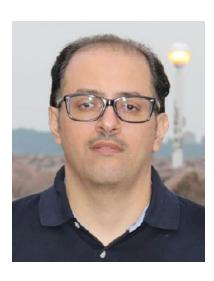

**Majid H. Khoshafa** (Senior Member, IEEE) received the B.Sc. degre in communication engineering from Ibb University, Yemen, in 2007, the M.Sc. degree in telecommunications engineering from the King Fahd University of Petroleum and Minerals, Saudi Arabia, in 2017, and the Ph.D. degree in electrical and computer engineering from the Memorial University of Newfoundland (MUN), Canada, in 2022. From 2009 to 2010, he worked as a Radio Network Planning and Optimization Engineer with MTN Telecommunications, Sana'a, Yemen. He

is currently a Postdoctoral Fellow with the Department of Electrical and Computer Engineering, McMaster University, Canada. Previously, he was a Postdoctoral Research Fellow with Queen's University, Canada, from 2022 to 2023. His research interests include wireless communications, reconfigurable intelligent surface technology, physical layer security, AI, and 6G and beyond enabling technologies. He has received several awards from MUN, including the Fellowship of the School of Graduate Studies, the Recognition of Excellence Award, the International Student Recognition Award, and the Graduate Academic Excellence Award. He serves as a Technical Program Committee Member for the IEEE Vehicular Technology Conference and a reviewer for several IEEE journals. He was recognized as an Exemplary Reviewer of IEEE WIRELESS COMMUNICATIONS LETTERS in 2024.

**Omar Maraqa** received the B.Eng. degree in electrical engineering from Palestine Polytechnic University, Palestine, in 2011, the M.Sc. degree in computer engineering and the Ph.D. degree in electrical engineering from the King Fahd University of Petroleum and Minerals, Dhahran, Saudi Arabia, in 2017 and 2022, respectively. He is currently a Postdoctoral Research Fellow with the Department of Electrical and Computer Engineering, McMaster University, Canada. His research interests include optimization and performance analysis of emerging

wireless communications systems. He was recognized as an Exemplary Reviewer for IEEE COMMUNICATIONS LETTERS in 2023. He serves as a Technical Program Committee Member for the IEEE Vehicular Technology Conference, and a reviewer for several IEEE journals.

**Jules M. Moualeu** (Senior Member, IEEE) received the Ph.D. degree in electronic engineering from the University of KwaZulu-Natal, Durban, South Africa, in 2013. During the Ph.D. studies, he was a Visiting Scholar with Concordia University, Montreal, QC, Canada, under the Canadian Commonwealth Scholarship Program offered by the Foreign Affairs and International Trade Canada (DFAIT). In 2015, he joined the Department of Electrical and Information Engineering, University of the Witwatersrand,

Johannesburg, South Africa, where he is currently an Associate Professor. He is also a Visiting Associate Professor with the Lappeenranta-Lathi University of Technology, Lappeenranta, Finland. From 2018 to 2021, he was an Affiliate Assistant Professor with Concordia University. His current research interests include 5G and 6G enabling technologies, optical wireless communications, reconfigurable intelligent surfaces, and physical-layer security in wireless networks. He received the Exemplary Reviewer Award of IEEE COMMUNICATIONS LETTERS from 2018 to 2022 and IEEE TRANSACTIONS ON COMMUNICATIONS in 2021. He served as an Associate Editor for IEEE ACCESS from 2018 to 2023. He currently serves as an Associate Editor for *Frontiers in Communications and Networks* and IEEE TRANSACTIONS ON COGNITIVE AND NETWORKING, a Senior Reviewer for the IEEE OPEN JOURNAL OF THE COMMUNICATIONS SOCIETY, and the Managing Editor for IEEE COMMUNICATIONS LETTERS.

**Sylvester Aboagye** (Member, IEEE) received the B.Sc. degree (Hons.) in telecommunication engineering from the Kwame Nkrumah University of Science and Technology, Kumasi, Ghana, in 2015, and the M.Eng. and Ph.D. degrees in electrical engineering from Memorial University, St. John's, NL, Canada, in 2018 and 2022, respectively. He was a Postdoctoral Research Fellow with the Department of Electrical Engineering and Computer Science, York University, Canada, from January to December 2023, and is currently an Assistant Professor with

the School of Engineering, University of Guelph, Canada. His current research interests include the design and optimization of multiband wireless networks, visible light communication systems, terrestrial and nonterrestrial integrated sensing and communication networks, and 6G and beyond enabling technologies. He received many prestigious awards, including the Governor General's Academic Gold Medal. He serves as an Editor for IEEE COMMUNICATIONS LETTERS, a Technical Program Committee Member for the IEEE Vehicular Technology Conference, and a reviewer for several IEEE journals. He was recognized as an Exemplary Reviewer of IEEE COMMUNICATIONS LETTERS and IEEE TRANSACTIONS ON NETWORK SCIENCE AND ENGINEERING in 2023.

**Telex M. N. Ngatched** (Senior Member, IEEE) received the B.Sc. and M.Sc. degrees in electronics from the University of Yaoundé, Cameroon, in 1992 and 1993, respectively, the M.Sc.Eng. degree (cum laude) in electronic engineering from the University of Natal, Durban, South Africa, in 2002, and the Ph.D. degree in electronic engineering from the University of KwaZulu-Natal, Durban, in 2006. From July 2006 to December 2007, he was with the University of KwaZulu-Natal as a Postdoctoral Fellow, from 2008 to 2012 with the Department of

Electrical and Computer Engineering, University of Manitoba, Canada, as a Research Associate, and from 2012 to 2022 with Memorial University. He joined McMaster University in January 2023, where he is currently an Associate Professor. His research interests include 5G and 6G enabling technologies, optical wireless communications, hybrid optical wireless and radio frequency communications, artificial intelligence and machine learning for communications, and underwater communications. He was a recipient of the Best Paper Award at the IEEE Wireless Communications and Networking Conference in 2019. He serves as an Area Editor for the IEEE OPEN JOURNAL OF THE COMMUNICATIONS SOCIETY, an Associate Technical Editor for the IEEE COMMUNICATIONS MAGAZINE, and an Editor for the IEEE Communications Society On-Line Content. He is a Professional Engineer registered with the Professional Engineers Ontario, Toronto, ON, Canada.

**Mohamed H. Ahmed** (Senior Member, IEEE) recevied the Ph.D. degree in electrical engineering from Carleton University, Ottawa, in 2001, where he worked as a Senior Research Associate from 2001 to 2003. In 2003, he joined the Faculty of Engineering and Applied Science, Memorial University, where he has worked as a Full Professor until December 2019, and as an Adjunct Professor since January 2020. He is currently a LTA Professor with the University of Ottawa. He has published more than 155 papers in international journals and conferences.

His research is sponsored by NSERC, CFI, QNRF, Bell/Aliant, and other governmental and industrial agencies. His research interests include radio resource management in wireless networks, multihop relaying, cooperative communication, vehicular ad-hoc networks, cognitive radio networks, and wireless sensor networks. He won the Ontario Graduate Scholarship for Science and Technology in 1997, the Ontario Graduate Scholarship in 1998, 1999, and 2000, and the Communication and Information Technology Ontario Graduate Award in 2000. He is a registered Professional Engineer in the province of Newfoundland, Canada. He served as an Editor for IEEE COMMUNICATION SURVEYS AND TUTORIALS from 2007 to 2018, and as a Guest Editor of a Special Issue on Fairness of Radio Resource Allocation, *EURASIP Journal on Wireless Communications and Networking* in 2009, and a Special Issue on Radio Resource Management in Wireless Internet, *Wireless and Mobile Computing* (Wiley) in 2003. He served as a the Co-Chair of the Signal Processing Track in ISSPIT'14, the Transmission Technologies Track in VTC'10-Fall, and the Multimedia and Signal Processing Symposium in CCECE'09.

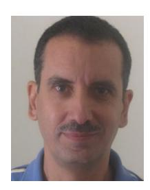

**Yasser Gadallah** (Senior Member, IEEE) is currently a Professor with the Department of Electronics and Communications Engineering, The American University in Cairo (AUC), New Cairo, Egypt. Before he joined AUC, he was an Associate Professor with the Electronics and Communications Department, Misr International University, Cairo. He was an Assistant Professor of Networking Systems with the College of Information Technology, UAE University. Prior to joining UAE University, he was a Research Scientist in the area of wireless sensor

networks with the Communications Research Centre, Ottawa, ON, Canada. He was with the networking and telecommunications industry. He was a Software Development Manager with Cisco Systems for several years, where he was involved in numerous research and development projects, which resulted in the introduction of several high-profile Cisco products. He was with Nortel Networks as the Software Project Leader and prior to that as a Software Designer. He has authored/coauthored several technical and scientific publications in the networking, communications, and IT fields. His current research interests include the Internet of Things issues, machine-to-machine communications, wireless sensor networks, mobile ad-hoc networks, and broadband wireless access networks. He was an organizer, a technical program committee member, and a reviewer of several international conferences and journals.

**Marco Di Renzo** (Fellow, IEEE) received the Laurea (cum laude) and Ph.D. degrees in electrical engineering from the University of L'Aquila, Italy, in 2003 and 2007, respectively, and the Habilitation à Diriger des Recherches (Doctor of Science) degree from University Paris-Sud (currently, Paris-Saclay University), France, in 2013. He is currently a CNRS Research Director (Professor) and the Head of the Intelligent Physical Communications Group with the Laboratory of Signals and Systems (L2S) at CNRS & CentraleSupélec, Paris-Saclay University, Paris,

France, as well as a Chair Professor in Telecommunications Engineering with the Centre for Telecommunications Research—Department of Engineering, King's College London, London, U.K. He was a France-Nokia Chair of Excellence in ICT with the University of Oulu, Finland, a Tan Chin Tuan Exchange Fellow in Engineering with Nanyang Technological University, Singapore, a Fulbright Fellow with The City University of New York, USA, a Nokia Foundation Visiting Professor with Aalto University, Finland, and a Royal Academy of Engineering Distinguished Visiting Fellow with Queen's University Belfast, U.K. He is a Fellow of the IEEE, IET, EURASIP, and AAIA; an Academician of AIIA; an Ordinary Member of the European Academy of Sciences and Arts; an Ordinary Member of the Academia Europaea; an Ambassador of the European Association on Antennas and Propagation; and a Highly Cited Researcher. His recent research awards include the Michel Monpetit Prize conferred by the French Academy of Sciences, the IEEE Communications Society Heinrich Hertz Award, and the IEEE Communications Society Marconi Prize Paper Award in Wireless Communications. He served as the Editor-in-Chief of IEEE COMMUNICATIONS LETTERS from 2019 to 2023. His current main roles within the IEEE Communications Society include serving as a Voting Member of the Fellow Evaluation Standing Committee, as the Chair of the Publications Misconduct Ad Hoc Committee, and as the Director of Journals.