# RIS-Empowered Satellite-Aerial-Terrestrial Networks With PD-NOMA

Rui Liu®, Kefeng Guo®, Xingwang Li®, Senior Member, IEEE, Kapal Dev®, Senior Member, IEEE, Sunder Ali Khowaja®, Member, IEEE, Theodoros A. Tsiftsis®, Senior Member, IEEE, and Houbing Song®, Fellow, IEEE

Abstract-Satellite-aerial-terrestrial network (SATN) is considered as a promising architecture for sixth-generation (6G) wireless communication networks to achieve seamless coverage, flexible wireless access, and high data rate. Moreover, non-orthogonal multiple access (NOMA), and reconfigurable intelligent surface (RIS) can significantly increase spectrum and energy efficiency. Recently, the integration of these two technologies and SATN has attracted a lot of attention both in academia and industry. This survey provides a comprehensive overview of RIS-empowered SATN with NOMA. In particular, the rudimentary knowledge of SATN, NOMA scheme, and RIS technology is presented. Then, the motivations for investigating the NOMA-RIS-assisted SATN are discussed. In addition, we introduce the three usage modes of RIS, two scenarios of NOMA-RIS, and the path loss model of NOMA-RIS-assisted SATN. Next, the system performance is analyzed for a case study. Besides, a comprehensive overview of resource allocation in NOMA-RIS-assisted SATN is provided, where theoretical and artificial intelligence-based methods are compared and analyzed. Moreover, physical layer security and covert communication are selected as two representative security techniques to be discussed in NOMA-RIS-aided SATN. Furthermore, the combination of

Manuscript received 10 December 2023; revised 5 March 2024 and 19 April 2024; accepted 19 April 2024. Date of publication 25 April 2024; date of current version 22 November 2024. This work was supported in part by the National Natural Science Foundation of China under Grant 62001517, and in part by the Open Research Fund of National Mobile Communications Research Laboratory Southeast University under Grant 2024D15. (Rui Liu and Kefeng Guo contributed equally to this work.) (Corresponding authors: Kefeng Guo; Xingwang Li.)

Rui Liu is with the School of Space Information, Space Engineering University, Beijing 101416, China (e-mail: lrevri@163.com).

Kefeng Guo is with the School of Space Information, Space Engineering University, Beijing 101416, China, and also with the College of Electronic and Information Engineering, Nanjing University of Aeronautics and Astronautics, Nanjing 210016, China (e-mail: guokefeng.cool@163.com).

Xingwang Li is with the School of Physics and Electronic Information Engineering, Henan Polytechnic University, Jiaozuo 454000, China, and also with the National Mobile Communications Research Laboratory, Southeast University, Nanjing 210096, China (e-mail: lixingwangbupt@gmail.com).

Kapal Dev is with the CONNECT Centre and the Department of Computer Science, Munster Technological University, Cork, T12 P928 Ireland, also with the Department of Institute of Intelligent Systems, University of Johannesburg, Auckland Park 2006, South Africa, and also with the Department of Electrical and Computer Engineering, Lebanese American University, Byblos, Lebanon (e-mail: Kapal.dev@ieee.org).

Sunder Ali Khowaja is with the School of Computer Science, Faculty of Computing, Digital and Data, Technological University Dublin, Dublin, D07 EWV4 Ireland (e-mail: Sunderali.khowaja@tudublin.ie).

Theodoros A. Tsiftsis is with the Department of Informatics and Telecommunications, University of Thessaly, 35100 Lamia, Greece (e-mail: tsiftsis@uth.gr).

Houbing Song is with the Department of Information Systems, University of Maryland Baltimore County, Baltimore, MD 21250 USA (e-mail: h.song@ieee.org; songh@umbc.edu).

Digital Object Identifier 10.1109/COMST.2024.3393612

other emerging technologies with NOMA-RIS-assisted SATN is investigated. Finally, this survey provides a detailed discussion of the main challenges and open issues that need to be deeply investigated from a practical point of view, including channel modeling, channel estimation, deployment strategies, and backhaul control.

Index Terms—Satellite-aerial-terrestrial network, non-orthogonal multiple access, reconfigurable intelligent surface.

#### I. Introduction

**▼** OMPARED with current fifth-generation (5G) wireless communication networks, the next-generation wireless communication networks is expected to provide uninterrupted and seamless connectivity for global users [1]. However, the cost of global interconnection through traditional terrestrial networks is extremely high, especially in remote areas [2]. In addition, due to geographical limitations, deploying highdensity base stations (BSs) in areas such as high mountains and seas is difficult to achieve and unprofitable. Due to the advantages such as wide coverage, large communication capacity, and not limited by terrain, satellites can make up for the above shortcomings. But compared to terrestrial networks, it also has drawbacks such as severe fading and weak processing ability. Meanwhile, aerial networks have the characteristics of flexible deployment and low cost, which have been well developed and utilized. Therefore, combining satellite communication, aerial communication and terrestrial communication to form a multi-layer integrated network can meet the requirements of various users. In view of the above observations, the satellite-aerial-terrestrial (SATN) network is regarded as an important infrastructure of the sixth-generation (6G) networks [3], [4], [5], which can improve their flexibility and coverage [6]. In terms of composition, SATN includes many devices/platforms, which are mainly divided into three categories: Satellites, aerial platforms (APs), and terrestrial nodes. Due to the fact that SATN is a three-dimensional transmission system, it has advantages such as flexibility, mobility, and high adaptability, and each node can serve as a BS [7], [8], [9], relay [10], [11], [12], or receiving device [13], [14]. Compared to current mobile communication networks, SATN tends to provide additional and more reliable line-of-sight (LoS) links because satellite/aerial nodes have higher altitudes [15]. Therefore, SATN can provide a better channel environment than complex terrestrial fading channels.

1553-877X © 2024 IEEE. Personal use is permitted, but republication/redistribution requires IEEE permission. See https://www.ieee.org/publications/rights/index.html for more information.

The channel state information (CSI) of the three-dimensional position is also easier to predict using the position information feedback from terrestrial equipment [\[16\]](#page-27-7). In addition to the above advantages, SATN in 6G will also face the following demands: 1) The connectivity density of the terminal will be 100 times compared to its 5G counterpart; 2) the peak rate requirements of either virtual reality or augmented reality users will reach the terabits per second level; 3) the energy efficiency (EE) and spectrum efficiency (SE) of 6G shall reach 100 times and 10 times of 5G, respectively. Before fulfilling these requirements, SATN still needs to address some key issues and specific challenges in the following.

- 1) *Severe fading:* Due to the long distance between satellite/aerial nodes and terrestrial users, it is inevitable that this will lead to signal delay and a decrease in communication quality. In addition, in future wireless communication, high-frequency bands and large bandwidth are the trends, such as millimeter waves (mmWave) and terahertz (THz), to solve the problems of insufficient throughput and spectrum shortage. However, fading of high-frequency signals is severe, and the effective transmission time is short. Besides, it is vulnerable to harsh environments.
- 2) *Weak connectivity:* Due to the mobility of high-altitude nodes, it is necessary to adjust the antenna pointing in a timely manner. In addition, in areas with high population density, such as cities, the wireless communication environment is relatively complex, which can lead to invisibility between APs and terrestrial users, resulting in the obscuration of LoS links and connectivity issues. For example, tall buildings, walls, and trees can all have a masking effect on signals. Therefore, not all users can establish a good quality communication link with satellite/APs.
- 3) *Mutual interference:* When terrestrial BSs transmit signals to aerial users, concentrated power is required for transmission to adapt to long-distance communication. However, strong beams cause serious interference to other aerial users in the same direction, especially for some users who require high communication quality, and lead to signal interruption. Moreover, the collaboration between multiple APs can also bring co-channel interference (CCI), and leading to a decrease in quality of service (QoS).
- 4) *Power limitation:* Energy supply is an important indicator of APs, which affects their weight, size, power, etc. Taking unmanned aerial vehicles (UAVs) as an example, due to the limitations of battery storage, it is difficult to achieve long-term operation, which is also one of the bottlenecks in the promotion of UAVs. Meanwhile, the onboard processing capability of UAVs is limited, making it difficult to execute high-complexity power allocation algorithms. In the complex wireless communication environment, fast and efficient signal processing is necessary, which also requires the system to provide sufficient energy.
- 5) *Security risks:* The satellite/APs in SATN will bring more potential safety risks. Specifically, the coverage

- area of satellite/APs is larger than the conventional terrestrial BS, thus the range of signal propagation is wider, making it more convenient for illegal users to eavesdrop on the legitimate signal.
- 6) *Hardware constraints:* In general, we can increase the spatial degree of freedom (DoF) by equipping more antennas to improve the communication performance of the system. However, due to hardware limitations of satellite/APs, such as the size of satellites and the upper bound of UAVs' weight, many advanced technologies cannot be applied to satellite/APs, such as multi input multiple output (MIMO) technology.

Furthermore, the exponential growth in the number of access users and communication demands in SATN brings great challenges to spectrum utilization. Also, it is widely known that conventional orthogonal multiple access (OMA) schemes have been widely used in wireless communication networks, such as time division multiple access (TDMA), frequency division multiple access (FDMA), code division multiple access, and orthogonal frequency division multiple access, in which only one user can be served by a basic communication resource block. However, the traditional OMA schemes are difficult to meet the demands of SATN in 6G mentioned above due to its limited orthogonal resources. In addition, space division multiple access (SDMA) can utilize the same time/frequency in different spatial directions to improve spectrum utilization, which has been widely studied, it can reduce time delay, multipath fading, and CCI. However, for cluster users, the effect of using SDMA is limited because only one user can be served in each spatial direction. Hence, more reasonable multiple access schemes and advanced technology must be introduced to solve the above challenges. On the other hand, non-orthogonal multiple access (NOMA) can effectively improve SE, user fairness, and massive connectivity by enabling multiple users to share the same resource, whose core idea is to enhance network transmission performance by sacrificing the complexity of systems [\[17\]](#page-27-8). However, NOMA is not always preferable, when the channel vectors are orthogonal, SDMA is superior to NOMA. In addition, NOMA can be combined with other multiple access schemes, such as SDMA-NOMA and TDMA-NOMA, which adopt the NOMA scheme in each beam and time slot respectively. Moreover, rate-splitting multiple-access (RSMA) is another non-orthogonal transmission scheme. It can be seen as a combination of SDMA and NOMA, which utilize SIC to deal with one part of the interference and treat the other part of the interference as noise [\[18\]](#page-27-9). Hence, it also has huge application potential. Besides, it has been proved that: (i) In the two-user case, the outage performance of RSMA mainly depends on the common power allocation factor, and there is a power allocation region, NOMA outperforms RSMA; (ii) In the multi-user case, RSMA is superior to NOMA when an imperfect SIC with 10% residual interference [\[19\]](#page-27-10). In this survey, we mainly focus on the investigation of NOMA schemes.

NOMA is categorized into code domain NOMA (CD-NOMA) and power domain NOMA (PD-NOMA) [\[20\]](#page-27-11), [\[21\]](#page-27-12). CD-NOMA shares spectrum resources through spread spectrum sequences, while PD-NOMA allocates power through differences in channel conditions, thereby achieving spectrum resource multiplexing [\[22\]](#page-27-13). In this survey, we focus on PD-NOMA. In this survey, we focus on PD-NOMA. For clarity, NOMA in the sequel refers to PD-NOMA. In the NOMA scheme, superposition coding technology (SCT) is adopted to combine the expected signals of NOMA users at the transmitter, while the successive interference cancellation (SIC) is applied to the receiver to handle the CCI caused by the NOMA scheme [\[23\]](#page-27-14). Besides, NOMA has many advantages, such as low latency, enhanced connectivity, high SE and fairness.

Although the SATN with NOMA has numerous advantages, there are still many challenges, such as severe interference, information leakage, high power consumption, hardware overhead, etc. The development of reconfigurable intelligent surfaces (RISs) provides effective and reliable solutions to these challenges, which can provide more spatial DoF, improve received signal power and EE, enrich multipath channels, reduce power consumption, expand coverage, enhance security, etc. Among these challenges, high energy consumption is very prominent and urgent to be solved, because satellites and APs in SATN are energy-limited nodes.

RIS is a digitally programmable planar array composed of a great quantity of low-cost passive reflecting elements, a copper plate, and a controller, which can change the wireless propagation by controlling each reflecting element to obtain the expected multi-path effect with high EE [\[24\]](#page-27-15). RIS is divided into three categories: Passive RIS, active RIS, and hybrid RIS. In particular, passive RIS can only reflect the signal without additional noise. Active RIS can amplify and reflect the signal, which can overcome the double path loss effects, but additional noise is introduced. Hybrid RIS can be regarded as a combination of passive and active RISs [\[25\]](#page-27-16). In this survey, we focus on passive RIS and active RISs[.1](#page-2-0)

The real-time RIS is made on the basis of the breakthrough of advanced metamaterial [\[26\]](#page-27-17). The fixed phase shifter contained in RIS can adapt to the dynamic wireless propagation environment. Due to the in-depth development of the hardware structure of RIS, many materials can currently achieve the functions of RIS, such as liquid crystal metasurfaces [\[27\]](#page-27-18), reflective arrays [\[28\]](#page-27-19), [\[29\]](#page-27-20), ferroelectric films [\[30\]](#page-27-21), etc. Besides, RIS is thin and light, thus it can be flexibly deployed in various positions of SATN and has excellent compatibility [\[31\]](#page-27-22). At the same time, it can greatly reduce the energy consumption of satellites/APs, thereby extending their working duration and improving the cost-effectiveness. Some existing technologies operate similarly to RIS, such as backscatter communication (BC) [\[32\]](#page-27-23) and multi-antenna relays [\[33\]](#page-27-24). The information of backscatter communication is contained in the environmental radio frequency (RF) signal, and the backscatter device is used to modulate and reflect the environmental RF signal to achieve signal transmission between the backscatter transmitter and receiver. Although the principles of RIS and backscatter communication are not completely consistent, RIS can be applied to assist in backscatter communication because it can adjust the phase of the signal [\[34\]](#page-27-25), [\[35\]](#page-27-26), [\[36\]](#page-27-27). Besides, simultaneous transmitting and reflecting RIS (STAR-RIS) can be seen as an upgraded version of RIS which can both reflect and transmit incident signals and provide a 360-degree coverage. Its application scenario is similar to RIS, except that it provides more coverage than RIS and supports additional design options [\[37\]](#page-27-28).

Notably, the combination of NOMA and RIS is not just a simple superposition of their advantages, they can substantially enhance system performance through mutual compensation. On the one hand, the NOMA scheme can enhance connectivity and SE of RIS-based networks by making full use of resource blocks. On the other hand, RIS can highlight the advantages of NOMA networks by intelligently changing the signal propagation environment. These huge profits urge us to apply NOMA and RIS in SATN to fully develop their potential.

At present, some magazines/surveys/tutorials have reviewed NOMA-RIS, SATN, and related works from different perspectives [\[31\]](#page-27-22), [\[38\]](#page-27-29), [\[39\]](#page-27-30), [\[40\]](#page-27-31), [\[41\]](#page-27-32), [\[42\]](#page-27-33), [\[43\]](#page-27-34), [\[44\]](#page-27-35), [\[45\]](#page-27-36), [\[46\]](#page-27-37), [\[47\]](#page-27-38), but the focus of this article is different. In particular, the authors of [\[31\]](#page-27-22) focused on the applications and research directions of RIS in 6G networks. The authors of [\[38\]](#page-27-29) provided a comprehensive survey on the principles and opportunities of RIS. In [\[39\]](#page-27-30), how to apply RIS to SATN was discussed. Reference [\[40\]](#page-27-31) summarized the deployment and optimization strategies of RIS in non-terrestrial networks (NTNs). In [\[41\]](#page-27-32), the channel estimation and beamforming in RIS systems were discussed to guide practical design issues. Reference [\[42\]](#page-27-33) reviewed the designs and applications of RIS in next-generation wireless communication networks. The authors of [\[43\]](#page-27-34) focused on the key issues of RIS assisting in the construction and operation of NOMA-assisted NTNs. In [\[44\]](#page-27-35), the secure beamforming scheme was investigated. Reference [\[45\]](#page-27-36) discussed the benefits of introducing NOMA into RIS-empowered multi-user networks. The authors of [\[46\]](#page-27-37) reviewed the performance gains that RIS can bring to NOMA-MIMO networks. In [\[47\]](#page-27-38), the progress in the combination of NOMA and RIS in conventional terrestrial networks was reviewed.

Compared to existing works, we conducted a comprehensive investigation of the basic theories and key technologies of NOMA-RIS-assisted SATN, and provided a comprehensive overview of its promising applications and development directions. The comparison of the existing surveys/tutorials/magazines with this work is summarized in Table [I.](#page-3-0) Besides, the systematic structure of this survey is shown in Fig. [1.](#page-4-0) In addition, our main contributions are summarized as follows:

- 1) The basics and applications of SATN, NOMA, and RIS are presented. In particular, the architecture of SATN and the advantages and disadvantages of each component are analyzed first. Then, the ability of NOMA to improve system performance is elaborated, and its applications in various scenarios are listed. Finally, the key ideas and advantages of RIS are revealed, and its deployment location and applicable scenarios are explained in detail.
- 2) The motivations and benefits of investigating the NOMA-RIS-assisted SATN are discussed. Then, to evaluate the performance, the power loss model of NOMA-RIS-assisted SATN, three usage modes of RIS

1To the best of the authors' knowledge, the utilization of hybrid RIS in NOMA-assisted SATN has not been reported.

TABLE I COMPARISON OF THE EXISTING SURVEYS/TUTORIALS/MAGAZINES WITH THIS WORK. HERE, "-" REFER TO "COVERED", "∂" REFER TO "PARTIALLY COVERED"

in NOMA-based SATN, and two scenarios of NOMA-RIS are summarized. Besides, we provide a case study to visually analyze the performance of the system.

- 3) Resource allocation is a necessary measure for achieving high-performance gains. This survey provides a review of existing algorithms in two aspects: Mathematical optimization, and artificial intelligence (AI)-based optimization. Traditional mathematical optimization algorithms can provide the optimal theoretical solution, which is difficult to adapt to complex and ever-changing channel environments. Although AI-based algorithms can only obtain suboptimal solutions, they are more suitable for the complex and tough optimization problems brought about by NOMA-RIS-assisted SATN.
- 4) This survey also studies the security of NOMA-RISassisted SATN, providing an overview from two aspects: Physical layer security (PLS) and covert communication. We analyze the challenges and solutions of the system in terms of PLS and introduce how to utilize RIS to achieve covert communication in NOMA-based SATN.
- 5) This survey details the combination of NOMA-RISassisted SATN with other emerging technologies, such as cognitive radio (CR), BC, wireless power transfer (WPT), mobile edge computing (MEC), mmWave/THz, and integrated sensing and communication (ISAC).
- 6) Although NOMA-RIS can bring many advantages to SATN, there are still many challenges to face and solve. This survey discusses the actual implementation, mainly focusing on channel modeling, channel estimation, deployment strategies, and backhaul control.

The remainder of this paper is organized as follows: In Section [II,](#page-3-1) the basics and applications of SATN, NOMA, and RIS are presented. In Section [III,](#page-10-0) the motivations for investigating the NOMA-RIS-assisted SATN are first discussed, and then a downlink RIS-empowered SATN with NOMA is established to validate the effectiveness of combining NOMA and RIS. By comparing the system assisted by NOMA/RIS and that without NOMA/RIS, the superiority of RIS-empowered SATN with NOMA is verified. In Sections [IV](#page-16-0) and [V,](#page-18-0) the resource allocation and security of RIS-empowered SATN are reviewed, respectively. The applications for NOMA-RISassisted SATN are introduced in Section [VI.](#page-20-0) In Section [VII,](#page-24-0) key technologies and open issues are discussed, such as channel modeling, channel estimation, deployment strategies, backhaul control, etc. Finally, the conclusions and outlooks are provided in Section [VIII.](#page-26-8) Besides, the list of abbreviations is given in Table [II.](#page-5-0)

## II. BASICS AND APPLICATIONS OF SATN, NOMA, AND RIS

This section provides a brief review of the basics and applications of SATN, NOMA, and RIS, and the benefits of combining the considered three aspects are discussed.

## *A. Satellite-Aerial-Terrestrial Networks*

SATN is a complex heterogeneous network composed of satellites nodes, aerial nodes, and terrestrial nodes, which combines the advantages of the three networks, such as the coverage of satellite networks, the flexibility of aerial networks, and the powerful signal transmission as well as processing capabilities of the terrestrial networks [\[48\]](#page-27-39). The detailed characteristics are contained in Table [III](#page-5-1) [\[40\]](#page-27-31).

*1) Satellite Network:* The satellite network can be divided into three layers according to different satellite altitudes: Geostationary earth orbit (GEO) satellites, medium earth orbit (MEO) satellites, and low earth orbit (LEO) satellites. In particular, GEO satellites mainly constitute the space-based backbone network, and MEO and LEO satellites jointly constitute the space-based access network, which directly connects with the aerial network or terrestrial network. GEO satellites are in a fixed location, namely, at an altitude of 35786 kilometers. The signal delay on this track is approximately 0.27 seconds. The coverage of GEO satellites is particularly large, with one satellite covering one-third of the Earth's surface. If three GEO satellites are evenly placed in the

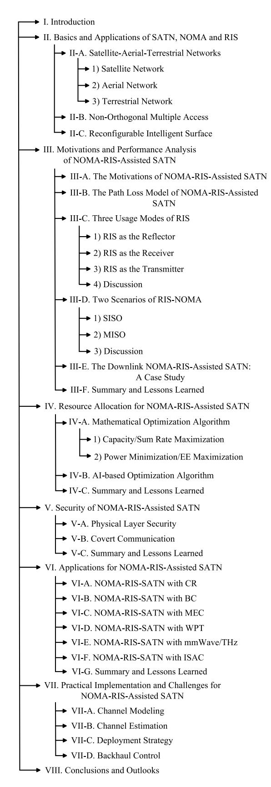

Fig. 1. The structure of this survey.

geostationary orbit, global communication can be achieved except for the South and North Poles. MEO satellites are mainly operating at an altitude of approximately 8000 miles. The signal delay on this track is approximately 0.1 seconds. They are mainly used for high-speed data and high-bandwidth signal applications, and many telecommunications and military satellites mainly operate in this orbit. LEO satellites are located between 500 and 1000 miles above sea level. The signal leaving the satellite can reach the earth station in approximately 0.05 seconds from this orbit. This track is the preferred choice for minimum signal delay applications.

Due to the extremely high altitude of satellites, a small number of satellites can achieve extremely extensive coverage without being restricted by terrain, especially important for remote areas and maritime communication. At the same time, satellites utilize solar panels to provide energy, with an average lifespan of about 10 years, which is an excellent complement to terrestrial communication. Such merits promote the development of satellite networks. For example, the United States launched Viasat-3 satellites with a capacity of 1 Tbps in 2023, and SpaceX has launched thousands of LEO Starlink satellites. However, the current satellite network still has the shortcomings of insufficient transmission capacity and long latency.

*2) Aerial Network:* The aerial network is mainly composed of APs, such as UAVs, high-altitude platforms (HAPs), etc [\[40\]](#page-27-31). The UAVs operate at altitudes ranging from hundreds to thousands of meters and can cover a range of several kilometers. Its operation is simple, deployment is convenient, and mobility is flexible. It can achieve formation networking and relay signal transmission. However, due to limited battery storage, its working hours range from tens of minutes to several hours. The HAPs are located in the stratosphere between 20 km and 50 km above the ground and remain relatively stationary. Multiple HAPs form a network with each other through optical interconnections. Due to the high location of HAPs, each HAP has a very large coverage area, which can cover an area with a diameter of up to 100 km when the elevation angle is 10 degrees. Therefore, with fewer HAP BSs, wide area coverage can be achieved and deployment is faster. Compared with satellite systems, HAP communication systems have the characteristics of low cost, low delay, fast construction, and large capacity.

The aerial network has outstanding flexibility and expansibility, which can be widely used in emergency communication, network traffic unloading, and temporary communication. For example, when the terrestrial network is destroyed due to natural disasters, the aerial network can be rapidly deployed to achieve the recovery of communication. In addition, an aerial network has a lower cost and shorter latency than a satellite network. However, due to the restrictions on energy consumption and weight, the short endurance time has become one of the main weaknesses of the aerial network. Furthermore, owing to the limited height of the AP, it is easy to cause severe interference to the terrestrial network.

*3) Terrestrial Network:* The terrestrial network has developed for decades and formed a more complete system, including but not limited to mobile cellular networks, the Internet of Things (IoT), and the Internet of Vehicles (IoV). Mobile cellular networks have evolved from the first generation (1G) to the 5G. The coverage range of mobile

TABLE II LIST OF ABBREVIATIONS

| Abbreviations | Description                          | Abbreviations | Description                                          |  |
|---------------|--------------------------------------|---------------|------------------------------------------------------|--|
| 5G            | fifth-generation                     | LEO           | low earth orbit                                      |  |
| 6G            | sixth-generation                     | LoS           | line-of-sight                                        |  |
| AI            | artificial intelligence              | MEC           | mobile edge computing                                |  |
| AGWN          | addition Gaussian white noise        | MEO           | medium earth orbit                                   |  |
| AO            | alternating optimization             | MIMO          | multi input multiple output                          |  |
| APs           | aerial platforms                     | MISO          | multiple input single output                         |  |
| BC            | backscatter communication            | ML            | machine learning                                     |  |
| BCD           | block coordinated descent            | MM            | moment matching                                      |  |
| BER           | bit error rate                       | mmWave        | millimeter wave                                      |  |
| BS            | base station                         | NOMA          | non-orthogonal multiple access                       |  |
| CCI           | co-channel interference              | NTN           | non-terrestrial network                              |  |
| CDMA          | code division multiple access        | OFDMA         | orthogonal frequency division multiple access        |  |
| CLT           | central limit theorem                | OMA           | orthogonal multiple access                           |  |
| CR            | cognitive radio                      | OP            | outage probability                                   |  |
| CSI           | channel state information            | PGS           | proper Gaussian signaling                            |  |
| DDPG          | deep deterministic policy gradient   | PLS           | physical layer security                              |  |
| DEP           | detection error probability          | PU            | primary user                                         |  |
| DL            | deep learning                        | QoS           | quality of service                                   |  |
| DNN           | deep neural network                  | RF            | radio frequency                                      |  |
| DOF           | degree of freedom                    | RIS           | reconfigurable intelligent surface                   |  |
| DQN           | deep Q-Network                       | RL            | reinforcement learning                               |  |
| D-DQN         | decaying deep Q-network              | SATN          | satellite-aerial-terrestrial network                 |  |
| DRL           | deep reinforcement learning          | SEP           | symbol error probability                             |  |
| EC            | ergodic capacity                     | SCT           | superposition coding technology                      |  |
| EE            | energy efficiency                    | SDR           | semi-definite relaxation                             |  |
| ESR           | effective secrecy rate               | SE            | spectrum efficiency                                  |  |
| FBL           | finite blocklength                   | SIC           | successive interference cancellation                 |  |
| FD            | full-duplex                          | SNR           | signal-to-noise ratio                                |  |
| FDMA          | frequency division multiple access   | SINR          | signal to interference plus noise ratio              |  |
| GEO           | geostationary earth orbit            | SISO          | single input single output                           |  |
| HAP           | high-altitude platform               | SU            | secondary user                                       |  |
| HD            | half-duplex                          | SCA           | successive convex approximation                      |  |
| HIs           | hardware limitations                 | SWIPT         | simultaneous wireless information and power transfer |  |
| IBL           | infinite blocklength                 | TDMA          | time division multiple access                        |  |
| IGS           | improper Gaussian signaling          | THz           | terahertz                                            |  |
| IM            | index modulation                     | UAV           | unmanned aerial vehicle                              |  |
| IoT           | Internet of Things                   | WIT           | wireless information transfer                        |  |
| IoV           | Internet of Vehicles                 | WPT           | wireless power transfer                              |  |
| ITC           | interference temperature constraints | ZF            | zero-forcing                                         |  |

TABLE III THE ARCHITECTURE OF SATN

| Node type   | Composition                           | Advantages                     | Shortcomings                          |
|-------------|---------------------------------------|--------------------------------|---------------------------------------|
|             | Geostationary earth orbit satellites, | 1. Seamless coverage           | 1. Serious fading                     |
| Satellite   | medium earth orbit satellites,        | 2. Not restricted by terrain   | 2. Insufficient transmission capacity |
|             | low earth orbit satellites, etc.      | 3. Long communication distance | 3. Long latency                       |
| Aerial      | Unmanned aerial vehicles,             | 1. Flexible deployment         | 1. Short endurance time               |
|             | high-altitude platforms,              | 2. Easy to expand              | 2. Severe interference                |
|             | near-space airships, etc.             | 3. Strong invulnerability      | 3. Complex networking                 |
| Terrestrial | Internet of Things,                   | 1. Strong computing capability | 1. Low coverage                       |
|             | Internet of Vehicles,                 | 2. Short latency               | 2. High power consumption             |
|             | mobile cellular network, etc.         | 3. High data transmission rate | 3. Seriously affected by terrain      |

BSs is determined by frequency and power, typically ranging from 0.5km to 35km. For the 5G network, its capacity increases by 1000 times compared to the fourth-generation (4G) in terms of mobile data traffic per unit area. In terms of transmission rate, typical user data rates are increased by 10 to 100 times with peak transmission rates reaching 10 Gbps (100 Mbps for 4G) and end-to-end latency reducing

to 1/5 of 4G. In terms of accessibility, the number of access devices has increased by 10 to 100 times. IoT is a huge network formed by combining various information-sensing devices with the Internet, achieving the interconnection of people, devices, and things at any time, anywhere. The applications of IoT in infrastructure fields such as industry, agriculture, environment, transportation, logistics, and security have effectively promoted the intelligent development of these aspects, made the limited resources more reasonable in utilization and allocation, and thus improved the efficiency of the industry. The applications in fields closely related to daily life such as home furnishing, healthcare, education, finance and services, tourism, etc., have greatly improved the scope, quality, and methods of services, tremendously improving people's quality of life.

By integrating with artificial intelligence (AI), big data, cloud computing, etc, the terrestrial network possesses mighty computing and data processing capability, ultra-high data rate, and ultra-low delay. These virtues make the driverless, smart city as well as telemedicine possible and tremendously change people's lifestyles. However, due to the limitation of geographical space, the popularity of the terrestrial network is still far from meeting the requirements of global coverage. At the same time, the power consumption of the BS has also increased significantly, which is also an important obstacle to promoting the construction of the terrestrial network. For example, the power consumption of a 5G BS is 2.5-3.5 times that of a 4G BS.

## B. Non-Orthogonal Multiple Access

In conventional OMA networks, different users are assigned orthogonal network resources. Therefore, there is no interference between users, and the receiver only needs to decode the desired signal in the corresponding frequency/time/code domain. However, the sum rate of multiuser wireless systems cannot always be achieved through the OMA scheme [47]. Meanwhile, due to the limitations on the quantity of orthogonal resources, the number of users is also strictly limited. The principle of the NOMA scheme is that multiple users share the same network resources, and power is allocated to different users based on channel conditions to achieve frequency and time resource multiplexing. Besides, NOMA has the following advantages.

Low latency: In traditional OMA schemes, users must wait for the allocation of communication resources before they can transmit the desired signal. For example, in TDMA, the user must wait for the corresponding time slot before transmission. Hence, in the communication process, the queuing delay cannot be ignored. On the contrary, NOMA can enable users to occupy the same time/frequency, allowing multiple users to be served simultaneously. In addition, we can also design user grouping methods to minimize queuing delays for as many users as possible while ensuring QoS.

Enhanced connectivity: It is a common consensus that NOMA can provide enhanced connectivity. In the OMA system, the number of users is limited by the number of system resource blocks. In NOMA, each resource block can be allocated to multiple users, which means that NOMA can serve multiple users. Therefore, the NOMA solution is very suitable for future IoT scenarios, in which a large number of devices often only need to transmit a small amount of data.

High SE: NOMA also has high SE because each NOMA user can use the entire bandwidth, and when a user does not need to occupy the frequency band, other NOMA users

are still using that frequency band. OMA users can only use a small segment of the spectrum, which is idle when not communicating. Hence, NOMA can make better use of spectrum resources.

Enhanced fairness: In conventional OMA systems, if there is a significant difference in the quality of channels between users, their achievable rates will also differ significantly. In contrast, in NOMA systems, the transmitting end allocates more power to users with poor channel strength, narrowing the communication rate gap between users.

Due to the large-scale growth of assess users in SATN, spectrum shortages and user access issues are becoming increasingly severe, and these challenges can be effectively addressed by the introduction of NOMA. Specifically, NOMA can allocate the same block of spectrum resources to multiple users, thereby enhancing SE. Meanwhile, NOMA can also increase the number of users to access. Taking TDMA as an example, each time slot can only serve one user, but NOMA can serve multiple users simultaneously. However, the application of NOMA will bring controllable interference and receiver complexity.

Uplink NOMA: In the uplink NOMA, users transmit signals to the satellite/AP/BS with maximum power, then the satellite/AP/BS decodes the signals according to the channel gains from strong to weak, thus the strong uplink signal is interfered with the weaker uplink signals.

Downlink NOMA: In the downlink NOMA, the transmitter allocates higher transmission power to the users with poor channel quality, and the receivers preferentially decode the signals with poor channel quality too. In contrast to the uplink, users in poor channels receive interference from users in strong channels.

Taking a simple downlink NOMA network as an example, assuming that there is a BS and two users, in which all nodes are equipped with the omnidirectional antenna. At the transmitting end, the BS utilizes the SCT to send the combined signal to the two users, namely,  $s = \beta_1 x_1 + \beta_2 x_2$ , where  $x_1$  and  $x_2$  are the expected signals of user 1 and user 2, and  $\beta_1$  and  $\beta_2$  denote the corresponding power allocation factors with  $\beta_1 + \beta_2 = 1$ . It is assumed that the channel condition of user  $1 (h_1)$  is weaker than that of user  $2 (h_2)$ , i.e.,  $|h_1|^2 \le |h_2|^2$ . Recalling NOMA's principle of fairness, the weak user (user 1) is allocated more power to ensure that the QoS of both users is met, thus one has  $\beta_1 \ge \beta_2$ . At the receiving end, the two users use different methods to detect signals. User 1 decodes its expected signal by treating  $x_2$  as CCI. The received signal to interference plus noise ratio (SINR) of user 1 is given by

$$SINR_1 = \frac{P_{BS}\beta_1 |h_1|^2}{P_{BS}\beta_2 |h_1|^2 + \sigma^2},$$
 (1)

where  $P_{BS}$  is the transmit power of the BS,  $\sigma^2$  denotes the variance of addition Gaussian white noise (AGWN). At the same time, user 2 executes SIC, namely,  $x_1$  is detected and removed by user 2 first, then  $x_2$  is decoded. Hence, the received SINR of  $x_1$  and  $x_2$  at user 2 can be expressed as

$$SINR_{2\to 1} = \frac{P_{BS}\beta_1|h_2|^2}{P_{BS}\beta_2|h_2|^2 + \sigma^2},$$
 (2)

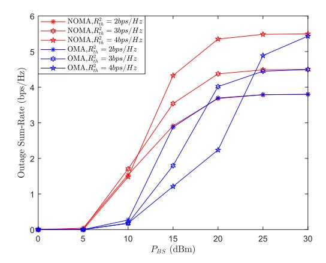

Fig. 2. The comparison between NOMA and OMA. The Raleigh fading is considered and the path loss factor is 4. The distance between the BS and the weak user is 0.05km, and that between the BS and the strong user is 0.02km. The target rate of user 1 is  $R_{th}^1=1.5b/s/Hz$ , and that of user 2 is shown in this figure.

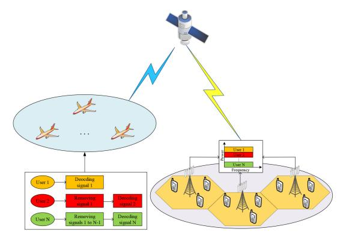

Fig. 3. An indicative model of SATN with NOMA.

and

$$SINR_2 = \frac{P_{BS}\beta_2|h_2|^2}{\sigma^2}.$$
 (3)

To the OMA network, the received SINR of user 1 and user 2 are given by  $P_{BS}|h_1|^2/\sigma^2$  and  $P_{BS}|h_2|^2/\sigma^2$ .

Let outage sum rate as an indicator for performance analysis, which is defined as  $R_{th,1}(1-P_1)+R_{th,2}(1-P_2)$ , where  $R_{th,1}$  and  $R_{th,2}$  are the target rate of user 1 and user 2,  $P_1=\Pr\left[\log_2(1+\mathrm{SINR}_1)< R_{th,1}\right],\ P_2=1-\Pr\left[\log_2(1+\mathrm{SINR}_{2\rightarrow 1})\geq R_{th,1},\log_2(1+\mathrm{SINR}_2)\geq R_{th,2}\right].$ 

Fig. 2 shows the comparison between NOMA and OMA. It can be clearly seen that the NOMA system has a significant improvement over the OMA system. For example, when  $R_{th}^2 = 4bps/Hz$  and  $P_{BS} = 15dBm$ , the outage sum rate of the NOMA system is about 4 times that of the OMA system. However, when the target rate is similar, the difference in the outage sum rate between the two systems becomes smaller. This inspires us to apply the NOMA scheme among users with significant differences in communication requirements to achieve higher performance gains.

In SATN, the NOMA scheme can be applied in satellites, APs, terrestrial BSs, and so on [49], an indicative model of SATN with NOMA is shown in Fig. 3.

For the uplink NOMA, only one SIC receiver needs to be configured at satellite/AP/BS, while each user should equip a SIC receiver in the downlink NOMA, thus uplink NOMA is easier to implement than downlink NOMA. Besides, NOMA enables SATN to have enhanced connectivity, making the load capacity of the entire network stronger. Naturally, the increase in the user number will lead to higher system complexity and more serious CCI. The common practice is to divide numerous users into multiple NOMA user clusters. Within the clusters, a NOMA scheme is adopted for transmission, and the OMA scheme is utilized among the clusters. Since NOMA schemes can obtain significant gains only when the user channel difference is obvious, users with similar channel conditions are generally divided into different user clusters. Specifically, in terrestrial networks and low-altitude networks, we take the distances of users as the basis for clustering, namely, users with different distances are grouped in the same cluster. However, in satellite networks and high-altitude networks, the channel quality is mainly affected by shadowing fading, rain fading, fog fading, multi-path fading, etc. Hence, we generally assign users whose fading values differ greatly to the same cluster.

Moreover, NOMA can be adopted in many scenarios, including but not limited to:

Cooperative communication: In the downlink SATN, NOMA can be applied to cooperative communication, namely, to assist in decoding the information of users with poor channel conditions. In particular, the users with poor channel conditions and cooperation users with good channel conditions comprise a NOMA group, and the satellite transmits the combined signal to all users in this group. Then, the cooperation user decodes all user signals and forwards the expected signals to the corresponding users.

Mobile edge computing: Due to the limited computing capacity of many nodes in SATN, the computing tasks can be offloaded to the server by applying MEC to cope with the explosive growth of service. NOMA can simultaneously offload the computing tasks of multiple nodes or enables one node to offload multiple tasks to multiple MEC servers at the same time, which obviously cuts down the processing delay of the system.

Backscatter communication: The backscatter system is capable of transmitting RF signals to the desired node with extremely low power consumption and cost, which is significant in SATN. However, simply utilizing a backscatter system is not enough to effectively connect abundant terminals in SATN, while the prominent connectivity of NOMA can offset this shortcoming.

*E-Health:* With the increasing demands for health, the concept of e-health has been put forward, which requires the establishment of ubiquitous and uninterrupted telemedicine SATN. NOMA can be utilized to meet its demands of massive connection, low latency, and high transmission rate.

#### C. Reconfigurable Intelligent Surface

Due to the inclusion of multiple passive reflective elements in RIS, each of which can independently apply the required phase shift to the incident signal, it can constructively adjust the signal propagation environment according to user needs to enhance the transmission signal. Hence, it can compensate for path losses of SATN and enhance the link budget. In addition, through beamforming design, RIS can also reduce the spread of expected signals in other directions to ensure the security of legitimate links and reduce the risk of eavesdropping. At the same time, adjusting the reflection direction of RIS can also reduce the interference of other users on the service users. When assisting in signal transmission, RIS has more prominent advantages, such as shorter transmission delay, lower energy consumption, simpler hardware, and longer working duration, than the relay because of its nearly passive mode of operation and low cost.

*Short transmission delay:* Due to the fact that RIS operates in full-duplex (FD) mode, the delay generated by it is smaller than that of conventional decode-and-forward half-duplex (HD) relays. This is because RIS only reflects signals without processing. Besides, although its delay is longer than that of a direct link, it can provide latency close to that of an FD relay at a higher EE for systems that require a relay link.

*Low energy consumption:* RIS mainly consists of a controller and passive reflective elements, thus there is no RF source in RIS. Only a small amount of power needs to be provided to ensure the operation of the controller to keep RIS working, so RIS has extremely low energy consumption.

*Simple hardware:* Since RIS is passive, it does not generate antenna noise and self-interference, which is always caused by traditional relays. More, it can also provide effects similar to MIMO gain at an extremely low cost. Even the transmitter equipped with a single antenna can obtain beamforming gain with the assistance of RIS, this also reduces the hardware complexity of the source node.

*Long working duration:* Compared to traditional relays, RIS can simplify communication links, and provide higher EE. For devices with limited energy, more energy can be utilized for communication transmission to improve working duration.

Due to the above advantages, RIS has great application prospects in SATN. Specifically, due to the long transmission distance and limited energy, the transmission delay and energy consumption of SATN are challenges that must be addressed. On the one hand, RIS can replace traditional relays to reduce transmission and hardware complexity. On the other hand, RIS improves EE of the system, which can reduce energy consumption and make the system work longer[.2](#page-8-0)

To more intuitively demonstrate the benefits of RIS, Fig. [4](#page-8-1) shows the superiority of RIS compared to FD relay-assisted and HD relay-assisted system. It can be observed that as the number of reflective elements increases, the sum rate of RIS-assisted network gradually increases and exceeds that of relay-assisted network. For example, when the transmission power is 30dBm and the number of reflective elements is 12,

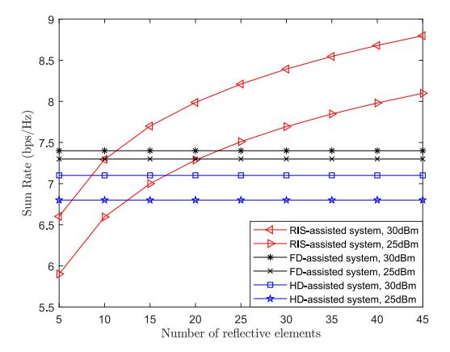

Fig. 4. The sum rate of RIS-assisted, FD relay-assisted, and HD relayassisted systems versus the number of reflective elements. The above relays are equipped with multiple antennas. The beamforming capability of both the RIS and relay are not considered. HD-assisted system adopting the same time division. The detailed simulation parameter are presented in [\[51\]](#page-27-42).

the RIS-assisted network has the highest sum rate. This also indicates that when the number of reflective elements is large, the RIS-assisted network has better transmission performance.

As shown in Fig. [5,](#page-9-0) due to the geometric characteristics and cost-effectiveness of RIS, it can be installed on the surface of almost any node without changing the existing facilities [\[40\]](#page-27-31). According to different deployment locations or methods, there are mainly the following categories.

*For motion states:* RIS can be deployed on the surface of movable satellites, APs, vehicles, etc, or fixed roofs, walls, billboards, etc [\[52\]](#page-27-43). Installing RIS on moving nodes can change the channel environment more flexibly, but it also brings new challenges in interference cancellation and wireless routing.

*For deployment locations:* According to the location of RIS deployment, it can be divided into satellite/aerial RIS and terrestrial RIS. With better deployment flexibility and higher altitude, satellite/aerial RIS has the following advantages: Wider coverage, easier LoS connection, and 360◦ panoramic reflection. However, terrestrial RIS provides more stable channel conditions and longer service time.

*For deployment modes:* RIS has three deployment modes in SATN: Centralized deployment, distributed deployment, and hybrid deployment. The centralized deployment mode is to deploy a large RIS near the source or users, and the distributed deployment mode is to deploy small RISs near each user, while the hybrid deployment mode is a combination of the two modes in front. The centralized deployment applies to the situation where all users are concentrated. It can provide additional DoF and improve the achievable rate of users. The distributed deployment can provide more LoS links with less mutual interference. However, the abundant RIS brings higher signaling overhead. The hybrid deployment can balance the proportion of the two modes according to the demands of the network to achieve complementary advantages.

Deploying RIS in SATN can effectively deal with various fading, and enhance the signal by intelligently changing the phase shift or bypassing the blocking. Besides, through the joint beamforming of RIS and sources, the directivity of

2Because the total power consumption of reasonably efficient RIS implementations is about a few to a dozen watts in the reconfigured switching state and much less in the idle state [\[50\]](#page-27-41), even for SATN with LoS path. The adopting of RIS can enhance the signal, reduce interference, improve safety, and improve working duration with very low-cost components, thus the deployment of RIS is economic in the long-term.

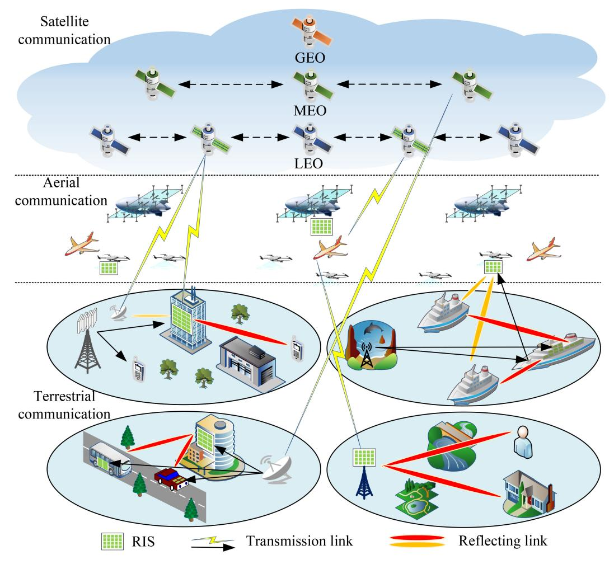

Fig. 5. The deployment of RIS in SATN.

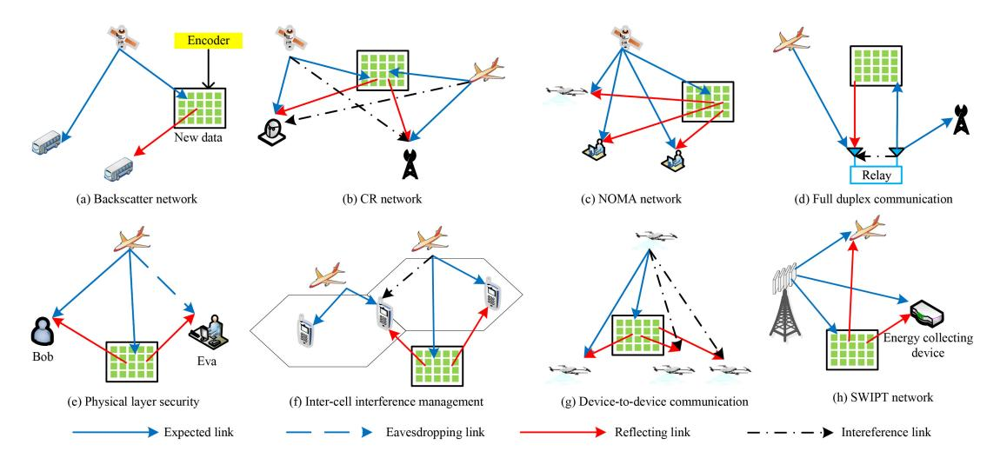

Fig. 6. The various RIS-assisted communication scenarios.

signals and the quality of transmission can be enhanced. In addition, RIS can be utilized to mitigate interference, enhance security, and cooperate transmission. Hence, RIS/STAR-RIS can be applied to various communication scenarios, including but not limited to backscatter networks, CR networks, NOMA networks, full duplex communication, PLS, inter-cell interference management, device-to-device

communication, simultaneous wireless information and power transfer (SWIPT) networks, and so on, which are shown in Fig. [6.](#page-9-1) A few typical applications are introduced in the following.

*CR network:* As shown in Fig. [6\(](#page-9-1)b), CR improves SE by permitting secondary networks, e.g., UAV-terrestrial networks, to reuse the authorized spectrum of primary networks, e.g., satellite-terrestrial networks, while controlling the interference from secondary transmitters to primary users (PUs) below the interference temperature constraints (ITCs). Owing to strict ITC, secondary users (SUs) can not be able to achieve the expected communication rates. RIS can be deployed to mitigate the interference to PUs and improve the receiving power of SUs.

Inter-cell interference management: When different cells exploit the same spectrum resources to enhance SE, users in the cell can be interfered by other cell transmitters, especially for users located at the edge of the cell. Excessive interference will affect the normal communication of users. This situation can be solved by deploying RIS at the edge of the cell, which is employed to enhance the expected signal and weaken the interference.

SWIPT network: In SATN, many nodes are energy-constrained, and SWIPT technology can provide them with efficient power supplementation. To collect more energy, the energy receiver wants as high signal power as possible, thus the received power of the signal can be enhanced by deploying RIS around it.

# III. MOTIVATIONS AND PERFORMANCE ANALYSIS OF NOMA-RIS-ASSISTED SATN

In this section, we first provide a detailed introduction to the motivations of investigating NOMA-RIS-assisted SATN. To evaluate the performance of it, we introduce the path loss model of NOMA-RIS-assisted SATN, and then analyze the three usage modes of RIS and two scenarios of NOMA-RIS. Finally, taking a case study as an example, we analyze the advantages of NOMA-RIS-assisted SATN and the impacts of key parameters on system performance.

#### A. The Motivations of NOMA-RIS-Assisted SATN

In general, due to the ongoing deployment of satellites and aerial nodes, and the fact that satellites/aerial BSs cover more terminals than terrestrial BSs, we introduce NOMA into SATN to provide enhanced connectivity and improved QoS. In the OMA-based SATN, each subchannel is occupied by one user, while NOMA can serve at least twice the number of users. However, the NOMA scheme mainly allocates power and executes SIC according to the channel condition disparity of users, so that realize resource multiplexing. When the channel differences between users are not obvious, the gain of the NOMA scheme is not significant enough. Taking a simple two-user NOMA-SATN system in Section II-B as an example, the sum rate of the NOMA system can be expressed as

$$R_{NOMA} = \log_2(1 + SINR_1) + \log_2(1 + SINR_2).$$
 (4)

When the two channel conditions are the same, namely,  $h_1 = h_2$ , by substituting (1) and (3) into (4), we get

$$R_{NOMA} = \log_2\left(1 + \frac{P_{BS}|h_1|^2}{\sigma^2}\right),\tag{5}$$

which is equivalent to the sum rate obtained by the OMA scheme. Due to the fact that the channel conditions in the

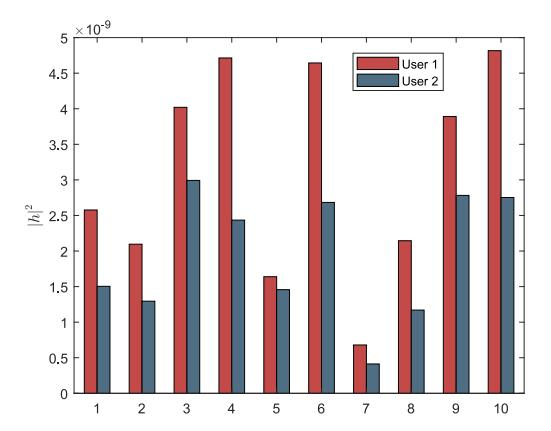

Fig. 7. The difference in channel gains between users after adopting RIS into NOMA-assisted SATN. X axis represents 10 random phase shift cases.

NOMA system are entirely determined by the wireless propagation environment, it is difficult to avoid the aforementioned shortcomings on its own. By introducing RIS and intelligently adjusting the reflection coefficient, the channel difference among diverse users can be enlarged, which makes NOMA more effective. In particular, the channel gain becomes

$$h_{n,RIS} = h_n + \mathbf{h}^H \Theta \mathbf{h}_n, n = \{1, 2\},$$
 (6)

where **h** is the channel vector between the source node and RIS,  $\mathbf{h_n}$  is the channel vector between the RIS and user n, and  $\Theta$  stands for the phase shift matrix of the RIS. By adjusting the phase shift matrix, significant differences can be generated between channels, thereby enhancing the performance of NOMA-based SATN. As shown in Fig. 7, assuming  $h_1 = h_2$ , after utilizing RIS to adjust the wireless propagation environment, the difference between channel gains the two users is enlarged, thus NOMA scheme can be effectively executed.

In addition, in traditional NOMA schemes, the decoding order is determined by the channel gain, which means users with lower decoding orders will suffer from serious CCI, resulting in the degradation of the QoS. However, in the practical communication network, the priority of users can be different. It is reasonable that a few important users want better QoS, and this demand can not be met only by adopting NOMA. RIS can help address this challenge. Specifically, we can transform the propagation environment by adjusting the phase shift matrix and sorting the channel conditions according to the QoS requirements of users.

#### B. The Path Loss Model of NOMA-RIS-Assisted SATN

Establishing a path loss model can help to verify the channel gain of NOMA-RIS-assisted SATN and further analyze the transmission performance of the system. As shown in Fig. 8, we consider a simple NOMA-RIS-assisted SATN, where the satellite communicates with *N* NOMA users, and RIS is installed on a UAV. Each user receives superimposed signals from two paths, one is the direct link, and the other is the UAV-RIS reflection link. According to the simplified path loss

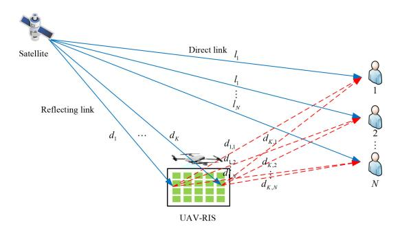

Fig. 8. A simple NOMA-RIS-assisted SATN.

model in [53], the received power at user n, n = 1, 2, ..., N is given by

$$P_{r,n} = P_t \left(\frac{\lambda}{4\pi}\right)^2 \left| \frac{1}{l_n} + \sum_{k=1}^K \frac{R_k e^{-j\Delta\phi_k}}{d_k + d_{k,n}} \right|^2, \tag{7}$$

where K is the number of reflecting elements,  $l_n$  denotes the distance between the satellite and user  $n, d_k, k = 1, 2, \ldots, K$  and  $d_{k,n}$  are the distances between the satellite and the k-th reflecting element and that between the k-th reflective element and user n, respectively.  $\phi_k$  represents the phase difference, which is mainly related to the distances of the direct connection path and the path assisted by the k-th reflecting element.  $R_k$  is the reflection coefficient of the k-th reflecting element, which can be adjusted by the controller in RIS.

By adjusting the reflection coefficient to  $R_k = e^{j\Delta\phi_k}$ , the signal reflected by RIS can be coherently aligned with the directly connected signal. When the deployment location of RIS is not far away, it can be assumed that  $l_n \approx d_k + d_{k,n}$ , and the received power of user n can be expressed as

$$P_{r,n} \propto P_t (K+1)^2 \left(\frac{\lambda}{4\pi}\right)^2$$
. (8)

When the number of reflective elements is much greater than 1 or the direct link is obscured, (8) can be rewritten as

$$P_{r,n} \propto K^2 P_t \left(\frac{\lambda}{4\pi}\right)^2$$
. (9)

Compared to the traditional free-space loss model, (9) can provide additional gain, which is the gain of the RIS reflection link. The received power is proportional to  $K^2$ , and when RIS contains 100 reflective elements, it provides an additional gain of 40dB.

Furthermore, [53] also investigated the performance of a point-to-point system, which experienced the flat fading channel and was equipped with a single antenna. We configure the phase shift of RIS to have a large number of reflective elements that achieve the optimal phase. Then, the composite channel between the source node and the user can be considered to follow a Gaussian random distribution, whose mean and variance are proportional to K, indicating that the average signal-to-noise ratio (SNR) improves proportionally with  $K^2$ . On this foundation, we can obtain the statistical characteristics of SNR and derive the symbol error probability (SEP) of NOMA-RIS-assisted SATN. At low SNR regimes, the upper bound of SEP exhibits a waterfall region, while at high SNR

regimes, its attenuation slows down. In both two cases, the large RIS can be applied to obviously reduce SEP.

The above simple path loss model preliminarily proves that RIS can provide significant additional gain in NOMA-SATN. However, in the actual signal propagation process, there are many physical characteristics that cannot be ignored, such as the size of the RIS, the angle of the incident/reflected signal, and the radiation direction of the antenna. Fully considering the physical characteristics of RIS, a more practical and reliable path loss model has been proposed. The simulation results have superior consistency with the actual measurement results, proving the accuracy of the considered model. Specifically, in the far-field cases, given the transmission power and source node/user location, the optimal received signal power can be expressed as

$$P_{r,n} \propto GK^2 P_t \left(\frac{\lambda}{4\pi d_{r,k} d_{k,n}}\right)^2 \left(\frac{\tau^2 f(\theta_t, \phi_t) f(\theta_n, \phi_n)}{4\pi}\right),\tag{10}$$

where G denotes the physical characteristic coefficient related to antenna gain and reflective component size.  $d_{r,k}$  and  $d_{k,n}$  are the distance between the source node and the center of reflecting elements k and that between the center of reflecting elements k and user n, respectively.  $\tau$  is the same reflective coefficient utilized by all reflecting elements.  $f(\theta_t, \phi_t)$  and  $f(\theta_n, \phi_n)$  represent the radiation direction of the antenna at the source node and user n, which provide the normalized power when the elevation and azimuth angles are  $(\theta_t, \phi_t)$  and  $(\theta_n, \phi_n)$ .

Obviously, the received power given in (10) is also proportional to K and correlated with the product of  $d_{r,k}$  and  $d_{k,n}$ , while in (7), it is correlated with the sum of  $d_k$  and  $d_{k,n}$ , which is more suitable for the near-field case according to the analysis of [54].

#### C. Three Usage Modes of RIS

The performance analysis of NOMA-RIS-assisted SATN is complex, where factors such as the randomness of network topology, the deployment location of RIS, changes in channels, and interference should be considered. The main evaluation indicators are as follows.

- 1) Outage probability (OP): The probability that the achievable rate is lower than the target rate.
- 2) Bit error rate (BER): The proportion of error-prone bits in the total number of transmitted bits.
- 3) *Sum rate:* The sum of achievable rates of the entire system.
- 4) *Ergodic capacity (EC):* The time average of the maximum information rate in all fading conditions from transmitter to receiver.
- Reflection probability: The probability that RIS can successfully reflect signals from the source node to the user.
- 1) RIS as the Reflector: As stated in Section II-C, RIS consumes less energy and does not require to change the system's protocol compared to traditional relays. Thus, the application of RIS as a reflector is the most extensive, and most literature adopts this setting. In [29], the authors introduced RIS into mmWave communication to improve the

probability of LoS, especially indoor scenarios. Besides, the authors derived the closed-form expression for the outage probability (OP) of the proposed system and optimized the OP by adjusting the deployment position of RIS. Experiments verified that RIS can reflect the incident signal to the target user. However, this paper only provided the basic idea of the beam search algorithm, and more detailed algorithms have not been given. The authors of [\[55\]](#page-28-0) investigated the performance of the RIS-assisted FD communication with infinite blocklength (IBL) and finite blocklength (FBL) codes. In the FBL scheme, the block-error rate was derived, while in the IBL scheme, OP and the sum rate were obtained. The results showed the use of RIS provided more DoFs for the FD network, but this work ignored imperfect CSI and modeled residual self-interference power as a constant. In [\[56\]](#page-28-1), the authors designed a unified NOMA framework and studied the application of RIS. Then, the approximate and asymptotic OPs were derived with imperfect SIC. The superiority of the proposed scheme was demonstrated through comparison with OMA-RIS, and FD/HD relay schemes. However, a two-user group was considered in the paper, and the case of the multi-user group should be further investigated. The authors of [\[57\]](#page-28-2) investigated the RIS selection schemes to enhance the performance of receivers. To accurately predict the optimal configuration scheme of RIS, the authors designed a deep neural network (DNN) algorithm to adapt to realtime communication. The results showed that the designed DNN scheme was able to utilize fewer resources to achieve results that match theoretical derivation. However, this paper assumed that the perfect CSI was obtainable, which was difficult to achieve. In [\[58\]](#page-28-3), the authors studied the system performance of the uplink RIS-aided MIMO multiple access channel. By alternately optimizing the phase shift matrix and emission covariance matrix, the sum rate of the system was maximized. The proposed algorithm brought 10 bps/Hz gain at high signal-to-noise ratio (SNR) regime. This article has considerable universality and can be extended to multiple RIS scenarios. Similarly, the authors of [\[59\]](#page-28-4) adopted RIS into the multi-group multi-cast system, the ergodic rates of all groups were derived with statistical CSI. To maximize the ergodic rates, a joint subchannel assignment (SA) and power allocation algorithm was developed. The authors of [\[60\]](#page-28-5) investigated the reflection probability of the large-scale RIS system, whose position distribution followed the Boolean model [\[61\]](#page-28-6). The results indicated that the length of randomly distributed RIS had no effect on the reflection probability. However, in this article, the author assumed that the length of all RIS was given and cannot fully simulate the real wireless environment.

*2) RIS as the Receiver:* In [\[62\]](#page-28-7), the authors regarded RIS as a receiving antenna array rather than a reflector. Specifically, the capacity of transmitting models from indoor or outdoor terminals to RIS was studied. The results showed that the received signal was approximated by the sinc function in a perfect LoS environment when the number of RIS elements was large enough. However, this work was limited to the perfect LoS scenario. On the foundation, the impacts of HIs on the RIS system were studied [\[63\]](#page-28-8), which clearly led to a decrease in system capacity. The analysis results indicated that HIs can be reduced by splitting large RIS into multiple small RIS. However, this study was limited to the single-user case, and further research is needed on multi-user cases. In [\[64\]](#page-28-9), the applications of RIS in multi-user MIMO were discussed. The authors first designed a message-passing routing scheme, and then developed three decentralized algorithms. The results showed that they effectively eliminated inter-user interference in the RIS-MIMO system. The authors of [\[65\]](#page-28-10) investigated the capability of RIS for terminal positioning. By comparing centralized and distributed deployment schemes, it can be found that the distributed deployment scheme can better improve the coverage of device positioning. Besides, the implementation of match-filtering process was not considered. Considering a more practical traffic environment, the authors of [\[66\]](#page-28-11) studied the system performance of RIS systems under imperfect CSI and HIs, where LoS/non-LoS interference links existed. The results showed that as the number of RIS components increased, channel estimation errors and non-LoS interference weakened. Moreover, the capacity of large-scale RIS was higher than that of large-scale MIMO, but it did not solve the resource allocation problem for users with similar coordinates. Similarly, the rate distribution and OP of this RIS system were presented in [\[67\]](#page-28-12). In addition, the authors also investigated the SE of the uplink RIS system, where the data frame structure was given [\[68\]](#page-28-13). The theoretical boundary of SE was derived, and the optimal pilot training length in the case of pilot contamination was provided. However, the impacts of pilot contamination and inter-RIS interference were ignored.

*3) RIS as the Transmitter:* Wireless backscatter communication can adjust the reflection coefficient of the antennas through load modulation [\[53\]](#page-27-44), [\[69\]](#page-28-14). In a similar way, RIS can also be used as a signal transmitter. In short, we can control the outgoing waves by adjusting the phase shift matrix of RIS to form different radiation patterns. Users obtain information by detecting and recognizing these radiation patterns, which is in line with the design principle of spatial modulation [\[70\]](#page-28-15), [\[71\]](#page-28-16), [\[72\]](#page-28-17). The characteristic of RIS is that it is easy to reconfigure and change the wireless propagation environment, which is suitable for the basic requirements of spatial modulation. In [\[53\]](#page-27-44), the authors utilized RIS as a transmitter to transmit modulated signals, and the error probability was derived. The analysis results indicated that RIS can be served as a highly reliable transmitter. Then, RIS was applied in the index modulation (IM) field [\[73\]](#page-28-18), where the RIS-space shift keying and RIS-spatial modulation schemes were designed. The results showed that the RIS-IM scheme can provide an extremely high data rate with high reliability. The work mainly focused on far-field RIS, and the scenario of near-field RIS is worth exploring. The authors of [\[74\]](#page-28-19) utilized the ability of RIS to change the phase shift matrix for backscatter communication. In [\[36\]](#page-27-27), the authors utilized RIS as a backscatter transmitter and developed a universal ambient backscatter system model. In fact, due to its greater flexibility and ability to provide more diverse reflection modes, RIS provided higher performance gains than traditional wireless backscatter systems. The author of [\[75\]](#page-28-20) studied passive beamforming and information transmission technology assisted by RIS. Using the compressed sensing

| - D. C    | 37.1        | C + M 11                                       | T 11                 |                            |
|-----------|-------------|------------------------------------------------|----------------------|----------------------------|
| Reference | Modes       | System Model                                   | Indicators           | Assumption                 |
| [29]      | Reflector   | mmWave communication                           | OP                   | Perfect CSI                |
| [55]      | Reflector   | FD communication with IBL/FBL                  | OP, Sum rate         | Imperfect CSI              |
| [56]      | Reflector   | Unified NOMA system                            | OP, EC               | Perfect CSI, Imperfect SIC |
| [57]      | Reflector   | Multiple RIS with RIS selection scheme         | BLER, Sum rate       | Perfect CSI                |
| [58]      | Reflector   | Uplink MIMO multiple access channel            | EC                   | Statistical CSI            |
| [59]      | Reflector   | Multi-group multi-cast system                  | EC                   | Statistical CSI            |
| [60]      | Reflector   | Large-scale RIS system with random positions   | Refection prob.      | Perfect CSI                |
| [62]      | Receiver    | Multiple terminals communicate with RIS        | Normalized capacity  | Perfect CSI                |
| [63]      | Receiver    | A single antenna terminal communicate with RIS | EC                   | Perfect CSI, HIs           |
| [65]      | Receiver    | A single antenna terminal near RIS             | Positioning coverage | Perfect CSI                |
| [66]      | Receiver    | Uplink transmission with LoS interference      | EC                   | Imperfect CSI, HIs         |
| [67]      | Receiver    | Uplink transmission                            | OP                   | Imperfect CSI              |
| [68]      | Receiver    | Uplink transmission                            | SE                   | Perfect CSI                |
| [73]      | Transmitter | RIS system with IM                             | BER                  | Perfect CSI                |
| [36]      | Transmitter | A universal ambient backscatter network        | SNR                  | Perfect CSI                |
| [75]      | Transmitter | PBIT enhanced uplink wireless system           | BER                  | Perfect CSI                |
|           | - ·         | D 1 1 1 2 D 1                                  |                      | E 4 GGT                    |

TABLE IV SUMMARY OF EXISTING REFERENCES IN THREE USAGE MODES OF RIS

and matrix decomposition method, a two-step detection algorithm was designed to solve the bilinear detection problem of maximizing the average SNR. However, the assumption of perfect CSI was made. Similarly, RIS was applied to backscatter communication in [\[35\]](#page-27-26) and [\[76\]](#page-28-21), conveying its own information while assisting the primary network communication. The authors of [\[76\]](#page-28-21) derived the probability that the capacity of the RIS-assisted backscatter channel exceeded that of the direct channel, which is an important indicator for determining the number of RIS elements. The analysis results indicated that the RIS-assisted backscatter channel can achieve higher gains than the direct channel after optimization. This work can be extended to the case of RIS with limited resolution. In [\[77\]](#page-28-22), RIS was applied in the CR network, which was used to assist the PU in communication and backscatter its own signal. The authors proposed an alternating algorithm to jointly optimize the beamforming of RIS and the power allocation of SUs. The results indicated that the introduction of RIS effectively improved the rate of SUs. The drawback of the article is that it did not consider the multi-antenna case.

*4) Discussion:* The three usage modes of RIS are discussed above, and the existing references are presented in Table [IV.](#page-13-0) RIS has tremendous potential in improving system performance in different modes. For different communication networks, it is necessary to comprehensively consider the characteristics of RIS to determine the usage mode of it. If needed, multiple RIS can be used in different modes, such as some RIS being used as signal reflectors and some as signal receivers to further enhance the transmission performance. Meanwhile, the analysis of the three usage modes of RIS is mainly aimed at studying the theoretical gain of the system. In actual network design, it is also necessary to consider the optimization of system parameters, such as the phase shift matrix of RIS, the decoding order of NOMA, beamforming of active transmitters, power control, etc. Due to the dynamic changes in the wireless environment, this not only makes system performance analysis more complex, but also makes optimization problems more difficult to solve. Therefore, we discussed the resource allocation and optimization of NOMA-RIS-assisted SATN in Section [IV.](#page-16-0)

## *D. Two Scenarios of NOMA-RIS*

In the existing works, NOMA-RIS was mainly investigated in two scenarios, i.e., single input single output (SISO) and multiple input single output (MISO). Some representative studies are summarized as follows, which is shown in Table [V.](#page-14-0) Besides, RIS is utilized as a reflector in these references.

*1) SISO:* In the SISO scenario, all nodes are equipped with a signal antenna, thus the system is simple. The authors of [\[78\]](#page-28-23) investigated the transmission performance of a downlink RISaided NOMA network, in which RIS was utilized by BSs to provide LoS links to users obscured by obstacles. The results indicated that the number of RIS elements was positively correlated with the transmission performance of the system. This work assumed that the channels were independent and could be extended to spatially correlated channels in the future. In [\[79\]](#page-28-24), the IM was adopted into the SISO NOMA-RIS network, which enhanced the SE of the considered system compared to the conventional NOMA-RIS system. To further improve SE, the author of [\[80\]](#page-28-25) introduced CR into the NOMA-RIS network, where the imperfect SIC was considered. The OP of the primary and secondary networks were derived by using Gauss Chebyshev and Gauss Laguerre quadratures. The results indicated that the CR-NOMA-RIS scheme was superior to the CR-OMA-RIS scheme. Although the article considered imperfect SIC, it did not consider imperfect CSI.

The authors of [\[81\]](#page-28-26) investigated the application of RIS in the SATN, in which RIS assisted the transmission between users and BS. Under the constraints of power and QoS, the ergodic sum rate was maximized by designing a twolayer alternating algorithm. In particular, the successive convex approximation (SCA) and *S*-procedure methods were utilized to optimize the power allocation and phase shift matrix, while the Charnes-Cooper method was applied to adjust beamforming. Similarly, the position of the UAV, power allocation at the transmitter, and transmission/reflection beamforming were

| Reference | Scenarios | System Model                                    | Indicators                |
|-----------|-----------|-------------------------------------------------|---------------------------|
| [78]      | SISO      | Downlink network without LoS link               | EC                        |
| [79]      | SISO      | IM-assisted network                             | OP                        |
| [80]      | SISO      | CR network                                      | OP                        |
| [81]      | SISO      | Uplink network with LoS link                    | Ergodic sum rate          |
| [82]      | SISO      | STAR-RIS-assisted downlink network              | Sum rate                  |
| [83]      | SISO      | Multi-cell system                               | SE                        |
| [84]      | MISO      | STAR-RIS-assisted downlink network              | SINR                      |
| [85]      | MISO      | IGS-assisted multi-cell system                  | EC, minimum weighted rate |
| [86]      | MISO      | Multi-user downlink system with wiretap channel | Sum secure rate           |
| [87]      | MISO      | Downlink network with LoS link                  | Minimum decoding SINR     |
| [88]      | MISO      | Multi-user STAR-RIS-assisted downlink network   | EE                        |
| [89]      | MISO      | Multi-cluster network                           | Total transmission power  |

TABLE V SUMMARY OF EXISTING REFERENCES IN EITHER SISO AND MIMO OF NOMA-RIS

jointly optimized to maximize the sum rate of the NOMA-RIS system [\[82\]](#page-28-27). The advantage of this scheme is that it does not require trajectory planning and can adapt to scenarios where CSI is not available. For multi-cell NOMA-RIS systems, the authors of [\[83\]](#page-28-28) improved the SE of the system by designing beamforming for RIS and optimizing power allocation for BSs. It is worth mentioning that the article considered scenarios of inter-cell interference and SIC decoding errors, which were more in line with practical communication systems, but also made optimization problems more difficult to tackle. This work has guiding significance for the application of NOMA-RIS in large-scale networks.

*2) MISO:* For the MISO NOMA-RIS system, due to the transmitter being equipped with multiple antennas, the performance of the system is enhanced, but the complexity is also higher. The authors of [\[84\]](#page-28-29) designed the phase shift matrix of RIS based on the principle of maximizing SINR, taking into account statistical CSI, and then derived the approximate analytical expression for the MISO NOMA-RIS system by adopting Jensen's inequality. The authors of [\[85\]](#page-28-30) verified that optimizing RIS components alone cannot completely alleviate interference in overload scenarios. Hence, the authors combined RIS, NOMA, and improper Gaussian signaling (IGS) technology to optimize the EE and minimum weighted rate of the system. The results indicated that the designed NOMA-RIS-IGS scheme was superior to the RIS-IGS and RIS-proper Gaussian signaling (PGS) schemes. Besides, the work can be further extended to asymmetric scenarios. In [\[86\]](#page-28-31), the authors utilized RIS to prevent pilot spoofing attacks on MISO NOMA systems by active eavesdroppers. The proposed novel bidirectional training scheme can effectively improve the confidentiality rate. In the work, the non-colluding case was considered, and the colluding case urgently needs to be studied.

To maximize the minimum decoding SINR of users, the authors of [\[87\]](#page-28-32) jointly optimized the beamforming of BS and RIS based on semi-definite relaxation (SDR) and block coordinated descent (BCD) methods. The results also indicated that there was a trade-off between the number of NOMA users and the sum rate of the system, which can be adjusted according to demands. The assumption of perfect CSI needs to be further discussed. The authors of [\[88\]](#page-28-33) maximized the EE of a multi-user MISO STAR-RIS-assisted downlink NOMA network by optimizing the active beamforming and phase shift matrix of RIS. Expanding the network to a multi-cluster MISO NOMA-RIS system made the optimization more challenging. However, the authors did not consider the impacts of RIS on the decoding order of NOMA users. In [\[89\]](#page-28-34), the goal was to minimize the total transmission power. The authors designed an algorithm based on the alternating direction multiplier method by adopting second-order cone programming, which brought significant performance gains to the system. However, the authors did not take the user pairing scheme into account.

*3) Discussion:* As mentioned above, both SISO NOMA-RIS and MISO NOMA-RIS can enhance the connectivity and transmission performance of SATN, in which the difference is the number of antennas. Specifically, the more antennas, the higher the potential gain, but also the higher the system complexity. In addition, for more general scenarios, such as the presence of multiple RIS in the system or when all nodes are equipped with multiple antennas, the system will become more complex and challenging, and there is currently little research in this field. In this regard, SDMA can be combined with NOMA-RIS, where SDMA is adopted to generate multiple orthogonal beams and serve each high-priority user. At the same time, in order to utilize NOMA to provide services to multiple low-priority users, an RIS is set within each beam, as shown in Fig. [9.](#page-15-0) Generally speaking, the beams generated by existing SDMA cannot be aligned with the channels of all low-priority users, but RIS can change the wireless propagation environment, thereby providing the possibility of channel alignment. Thus, it is possible to provide services to both high-priority and low-priority users without changing the SDMA system structure. In addition, RSMA also has promising applications in RIS-assisted SATN, but establishing reliable communication links over rapidly changing channels is still an open issue, and investigation on it is still in its initial stage.

## *E. The Downlink NOMA-RIS-Assisted SATN: A Case Study*

To evaluate the performance of RIS-Empowered SATN with NOMA, a case study is given in the following. As shown in Fig. [6\(](#page-9-1)c), we consider a downlink RIS-empowered SATN with

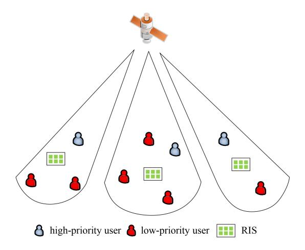

Fig. 9. NOMA-RIS assisted SATN with SDMA.

#### TABLE VI SYSTEM PARAMETERS

| Parameter                      | Value                             |
|--------------------------------|-----------------------------------|
| $(b, m, \Omega)$               | $(0.063, 2, 8.97 \times 10^{-4})$ |
| Path loss factor               | 1.8                               |
| Distance from RIS to UAV/users | 50m/20m                           |
| Height of the satellite/UAV    | 300000m/100m                      |
| Maximum gain of satellite      | 52dB                              |
| Maximum gain of UAV/users      | 4dB/4dB                           |
| Beam angles                    | 0.01°                             |
| 3-dB angle                     | $0.4^{\circ}$                     |
| Carrier frequency              | 2000MHz                           |
| Carrier bandwidth              | 15MHz                             |
| Noise temperature              | 300°                              |

NOMA, where the satellite transmits the superimposed signal to UAV and users by employing NOMA, and RIS assists in the transmission of the signals. It is assumed that the UAV and users are located in the same beam of the satellite and equipped with a single antenna. To enhance QoS, the signals are remodulated and reflected through RIS on the building, and the UAV/users constructively superimposes the direct signals with the RIS-reflected signals. Besides, we assume that the perfect CSI is available and RIS has *M* reflecting elements.

Considering the transmission characteristics of SATN, the satellite-UAV/user and satellite-RIS channels are modeled by shadowed-Rician fading, and the RIS-UAV/user links undergo Rayleigh fading. The simulation parameters are shown in Table [VI.](#page-15-1)

Fig. [10\(](#page-15-2)a) compares the performance of the NOMA-RISassisted case with three benchmark cases for the downlink SATN. It can be clearly observed that the sum rate increases with the SNR of the satellite in all cases. From Fig. [10\(](#page-15-2)a), either applying NOMA or RIS to SATN can enhance the transmission performance of the system. Moreover, the case of NOMA-RIS obviously has prime performance compared with other cases, which verifies the superiority of our considered strategy. Fig. [10\(](#page-15-2)b) illustrates the sum rate of the considered system versus the different number of reflecting elements. It can be found that the performance gain obtained by the system with more RIS reflecting elements is superior to that with fewer RIS reflecting elements. It can be explained by the fact

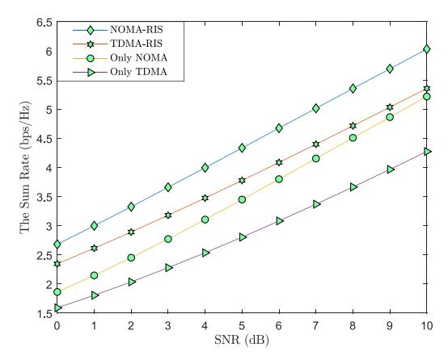

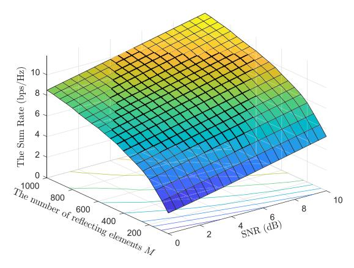

Fig. 10. Transmission performance of downlink SATN.

that more RIS reflecting elements means higher power gain can be obtained to transmit the expected signals of users.

## *F. Summary and Lessons Learned*

In this section, the motivations for investigating NOMA-RIS-assisted SATN were revealed. Then, the path loss model, usage modes of RIS and scenarios of NOMA-RIS were reviewed. Furthermore, a case study was provided to visually analyze the system performance of NOMA-RIS-assisted SATN. On the whole, NOMA and RIS have been investigated and developed in SATN respectively, but they can complement each other. The combination of the two technologies can bring about the following superiorities. NOMA-RIS-assisted SATN can naturally serve more users than OMA-RIS-assisted SATN. Moreover, RIS can improve the gain of NOMA-based SATN by changing the signal propagation environment. Besides, the decoding order of NOMA users can be adjusted by RIS according to their priority, making the NOMA scheme more intelligent. Furthermore, when the source node is configured with multiple antennas and the user has a single antenna, namely, MISO, the combination of RIS and NOMA can enable the system to achieve the identical performance as dirty paper coding with lower complexity, which can be explained by quasi-degradation criterion [\[47\]](#page-27-38). This is because RIS can reconfigure the channel and make them satisfy the quasidegradation criterion.

Meanwhile, the following lessons are brought. Firstly, most of the existing works made the assumption of perfect CSI, which is unrealistic. Therefore, in further research, it is necessary to establish system models that are more suitable for actual wireless communication scenarios. In addition, only a few literatures have considered scenarios of large-scale RIS, such as [\[60\]](#page-28-5). Moreover, these works hardly take into account the mobility of the transmitter/user/RIS, which is insufficient for the SATN studied in this survey. Considering the mobility of the RIS system will bring the following challenges: i) Handover of RIS units, ii) changes in channel environment, iii) changes in users' location. Hence, we need to combine the motion model of nodes with existing models. In addition, the frequency used by SATN for 6G will expand to a higher frequency band, such as mmWave and THz, and the fading of signals in the propagation process will be more evident. The application of NOMA-RIS can compensate for the fading.

## IV. RESOURCE ALLOCATION FOR NOMA-RIS-ASSISTED SATN

Although NOMA-RIS can improve the SE and EE of the system, dynamic resource allocation is an important measure for rational utilization of limited resources and improving system performance, as SATN is a resource-constrained network, especially for satellites and APs. It is also a current research hotspot in this field. The main optimization parameters include beamforming, phase shift matrix, power, decoding order, user grouping, etc. The resource allocation algorithms in the NOMA-RIS-assisted SATN are mainly divided into two categories, namely mathematical optimization and AI-based resource allocation schemes, thus we review the two kinds of algorithms in the following subsections.

## *A. Mathematical Optimization Algorithm*

The existing works mainly maximize the system's capacity/sum rate and EE or minimize power by optimizing one or jointly optimizing multiple parameters.

*1) Capacity/Sum Rate Maximization:* The capacity/sum rate is an important indicator for measuring transmission effectiveness and a key goal for maximization. For the transmission problem of uplink SATN, the authors of [\[90\]](#page-28-35) utilized NOMA and RIS to improve SE and wireless coverage, and designed a two-layer alternate iterative algorithm based on statistical CSI to maximize the sum rate. In [\[91\]](#page-28-36), the authors established a multi-RIS-assisted UAV network with NOMA, where RIS was used to overcome masking effects and severe fading. To maximize the sum rate of the proposed system, the authors formulated a three-stage optimization problem and adopted the interference expansion scheme, auxiliary matrices, and univariate search method to solve the RIS correlation subproblem, UAV hovering subproblem, and phase shift design of RIS, respectively. In this work, the UAV adopted hover mode to avoid the impact of movement on system performance. For the RIS-assisted multi-UAV NOMA network, the authors of [\[92\]](#page-28-37) proposed a complex sum rate maximization problem, where the three-dimensional placement of UAVs, power allocation, phase shift design of RIS, and the decoding order of NOMA users were jointly optimized. Then, a BCD-based iterative algorithm was proposed, where the original non-convex optimization problem was divided into three subproblems, and the SCA as well as penalty-based methods were utilized to tackle them. The results indicated that the deployment of RIS not only enhanced the received SNR of served users, but also reduced interference with other users. Similar to [\[92\]](#page-28-37), the authors of [\[93\]](#page-28-38) considered a multiuser NOMA-RIS system. In this work, the placement of UAV, power allocation, and passive beamforming of aerial RIS were jointly adjusted to optimize the sum rate of the proposed system. The SCA and SDP methods were adopted to design the alternative algorithm. Compared with the particle swarm optimization algorithm, the proposed algorithm had superiority. The authors of [\[94\]](#page-28-39) designed a novel RIS-enhanced UAV SWIPT, where NOMA was introduced to enhance SE and connectivity. Similarly, the authors utilized the SCA penalty function method and difference-convex (DC) programming to develop an alternating optimization (AO) framework to optimize the variables separately, i.e., trajectory and power allocation of UAV, decoding order, and reflection coefficient of RIS. Then, the achievable capacity of the system was obtained. To communicate with long-distance users simultaneously, the authors of [\[95\]](#page-28-40) introduced STAR-RIS and proposed a new signal constellation rotation algorithm to reduce the bit error rate of LEO satellite networks and improve transmission performance, where NOMA users on both sides of STAR-RIS receive reflected and transmitted signals respectively. In [\[82\]](#page-28-27), the authors optimized the placement and power allocation of the UAV, and passive transmitting/reflecting beamforming of SATR-RIS to maximize the sum rate of the NOMA-based SATN. The results showed that the system with SATR-RIS outperformed that with/without RIS.

*2) Power Minimization/EE Maximization:* With the development of IoT and IoV, the concept of green communication has been widely promoted, and the optimization of power and EE has been widely carried out. The authors of [\[96\]](#page-28-41) maximized the EE of the NOMA-RIS system by alternately optimizing the beamforming of the BS and phase shift matrix of RIS. Specifically, given the phase shift matrix, auxiliary variables and SCA were used to optimize the beamforming, then the phase shift was optimized by applying SDR. However, this system only considered the situation of two NOMA users and should be further expanded to scenarios with multiple users. By adopting active RIS, the authors of [\[97\]](#page-28-42) designed a power minimization scheme based on SCA, in which the double fading was effectively overcome. The results showed that the closer the distance between the remote user and RISs, the larger the number of transmitting antennas, and the lower the power consumption of active beamforming. For NOMA-RIS-assisted downlink SATN, CR and SDMA were introduced to enhance the transmission performance of IoT, the authors of [\[98\]](#page-29-0) designed a robust algorithm based on generalized zero breaking to minimize power consumption by using second-order Taylor expansion and Bernstein type inequalities under the constraints of interference constraints and quality of service requirements. Similarly, the active beamforming and phase shift matrix were optimized for the NOMA-RISassisted SATN with both direct links and reflecting links [99]. Furthermore, the authors applied multiple RIS to enhance the performance of NOMA in SATN, in which imperfect CSI was considered, and the active/passive beamforming and power allocation scheme were jointly designed to minimize the total transmission power [100]. For NOMA-RIS-assisted uplink SATN, a beamforming algorithm based on the central limit theorem was designed to minimize the transmit power, where the phase errors of RIS link and user-satellite link were taken into account [101]. The authors of [102] considered a RIS-empowered multi-UAV network. To minimize the total power of the system, SCA, Gaussian randomization procedure, standard convex optimization approach, and dynamic order decoding scheme were adopted to adjust the placement of UAVs, phase shift design of RIS, power allocation, and decoding order respectively. The authors of [103] considered a multi-user NOMA-RIS network, whose target was to minimize the energy consumption of the UAV by jointly adjusting the resource assignment, trajectory of the UAV, and phase shift of RIS. Besides, the optimization was carried out under the constraints of ensuring maximum tolerable OP and minimum rate demands. Then, an alternating AO was developed to solve the optimization problem. The authors of [104] studied the energy-saving optimization problem of multi-cluster SATR-RIS-NOMA systems by optimizing decoding order, transmission and reflection factors, time allocation, and active beamforming.

## B. AI-Based Optimization Algorithm

AI is one of the most important technologies for future wireless communication, which mainly includes machine learning (ML), such as supervised learning, semi-supervised learning, unsupervised learning, and reinforcement learning (RL). It can be used to solve many complex resource allocation problems and adapt to dynamically changing channel environments. The authors of [23] investigated the long-term deployment and passive beamforming design of a massive MISO NOMA-RIS system. The goal of this system was to maximize the EE. By using the long short-term memory unit as the hidden neurons, a new state network was designed to predict the communication requirements of users. Then, a decaying double deep Q-network (D3QN) based algorithm was developed to optimize the deployment and passive beamforming of RIS. The overall algorithm was able to strike a balance between complexity and accuracy. Furthermore, the authors aimed to minimize energy consumption by designing the trajectory of UAVs and phase shifting of RIS [105]. Besides, the decoding order and power allocation were also considered. A decaying deep Q-network (D-DQN) based algorithm was developed to solve the tough problem, which was dynamically adjusted according to environmental changes. The results showed that this algorithm converged faster than the traditional deep

Q-network (DQN) algorithm. Moreover, a similar algorithm was adopted to maximize the system capacity of the NOMA-RIS network in [106]. Reference [107] introduced NOMA-RIS into a heterogeneous SATN network supporting dual connections to analyze the benefits of the deployment of multiple UAV-RIS, where macro-cell and small BSs coexisted. A power consumption minimization problem was formulated, which jointly optimized the trajectory of the UAV, phase shift design of RIS, subchannel assignment, and active beamforming. The authors creatively combined AI with theoretical methods to solve this intractable problem. In particular, the dueling DQN learning method was applied to tackle the subproblem of trajectory, phase shift, and SA for macro-cell, while SCA was adopted to solve the subproblem of beamforming and SA for small BSs. This scheme was suitable for largescale heterogeneous networks and had important theoretical significance for actual network construction. At the same time, the authors' idea of combining AI with theoretical methods also brought us great inspiration. In [108], the authors considered the time-varying channel, which was not investigated in most related works. And they developed a centralized deep deterministic policy gradient (DDPG)-based algorithm to optimize the transmission power of UAVs and the phase shift matrix of RIS to maximize the EE of the considered SATN system. In [109], the authors considered an uplink aerial-terrestrial NOMA-RIS network. Under the guarantee of transmission requirements and flight safety, the trajectory of the UAV, phase shift design of RIS, and power allocation of terrestrial users were optimized to maximize the sum rate. To address the uncertainty of obstacle location, the author developed a robust deep reinforcement learning (DRL) algorithm by adopting the soft actor-critic framework, which had higher learning efficiency compared to conventional DRL algorithms. To optimize the sum rate and energy consumption of the NOMA-RIS-assisted SATN, the author of [110] proposed a multi-objective optimization problem and designed a DDPG algorithm for the joint design of trajectory, RIS configuration, and beamforming. To cope with the situation where the number of users is not fixed, the authors of [111] designed a three-step method to optimize the sum rate of the NOMA-RIS system. Similar to [23], the authors used long and short memory units to predict user changes. Then, the Gaussian mixture model was applied to group users. Finally, a DQN-based algorithm was designed to adjust phase shift and power allocation.

## C. Summary and Lessons Learned

Table VII summarizes the above references about system optimization. In NOMA-RIS-assisted SATN, to further enhance the system performance, resource allocation is indispensable, such as beamforming, user scheduling, RIS reflection coefficient design, resource allocation, etc. Different from the conventional terrestrial wireless communication network, the switching and dynamics of satellites/APs make the optimization problem more complex and hard to tackle. These optimization problems are often nonlinear, non-convex, or coupled, and the advanced solution methods are mainly divided into two kinds: Mathematical optimization and AI-based algorithms.

| Optimization objectives  | Category | Variables                                           | Algorithm                                 |
|--------------------------|----------|-----------------------------------------------------|-------------------------------------------|
| Ergodic sum rate [81]    | SIMO     | Phase shift, power, beamforming                     | Two-layer alternating algorithm           |
| Sum rate [91]            | SISO     | RIS association, altitude, phase shift              | Three-stage optimization algorithm        |
| Sum rate [92]            | SISO     | Placement, power, phase shift, decoding order       | BCD-based iterative algorithm             |
| Sum rate [93]            | SISO     | Placement, power, beamforming                       | Alternating optimization algorithm        |
| Achievable capacity [94] | SISO     | Trajectory, decoding order, phase shift, power      | Alternating optimization algorithm        |
| EE [96]                  | MISO     | Phase shift, beamforming                            | Alternating optimization algorithm        |
| Power consumption [107]  | MISO     | Trajectory, phase shift, SA, beamforming            | Distributed algorithm                     |
| EE [108]                 | SISO     | Phase shift, power                                  | DDPG-based algorithm                      |
| Power consumption [102]  | MISO     | Placement, phase shift, decoding order, beamforming | Distributed algorithm                     |
| Energy consumption [103] | SISO     | Phase shift, resource, trajectory                   | Alternating optimization algorithm        |
| EE [23]                  | MISO     | Phase shift, power, deployment                      | ESN and D 3 QN-based algorithm |
| Energy consumption [105] | MISO     | Phase shift, trajectory, power, decoding order      | D-DQN-based algorithm                     |
| System Capacity [106]    | SISO     | Phase shift, trajectory                             | DDQN-based algorithm                      |
| Sum rate [109]           | SISO     | Trajectory, phase shift, power                      | Robust DRL algorithm                      |
| Cum roto [111]           | MISO     | Dagading order power beamforming aluster            | Three stage entimization election         |

TABLE VII SUMMARY OF EXISTING REFERENCES IN SYSTEM OPTIMIZATION

*The mathematical optimization algorithm:* For convex problems, we can utilize Lagrange duality theory, interior point method, and Newton method to solve them. In addition, there are ready-made toolkits to optimize convex problems, such as YALMIP and CVX. For a non-convex problem, we should first transform it into a convex one, the applicable methods include but not limited to SCA, SDR, fractional programming, difference-of-convex, quadratic transform, penalty method, and *S*-procedure. Then the rest convex problem can be easily tackled. In addition, AO is an effective method to solve joint optimization problems and multi-objective optimization problems. However, it is difficult to obtain the difference between the suboptimal solution brought by the AO method and the actual optimal solution, and there is little literature on it.

*The AI-based algorithm:* The ML-based algorithm is widely favored because it can quickly solve non-convex and complex optimization problems, which can adapt to the rapid timevarying of dynamic SATN. Besides, AI enables SATN to have the ability of autonomous learning, accurate prediction, and autonomous decision-making. Specifically, a specific model can be trained by collecting the key parameters in the practical RIS-empowered SATN with NOMA, and then the model can be utilized to optimize the system performance [\[112\]](#page-29-14). The process of learning and training may take some time and computing resources. MEC and federated learning can be introduced to make the iteration of the model faster and more accurate.

Then, we can clearly observe that mathematical algorithms can achieve optimal/near-optimal results, but most of them have high complexity and long running time. Hence, they are hard to adapt to dynamically changing channel conditions and mobility of nodes in SATN, in which AI-based methods are the better choice. However, it is worth noting that the results obtained by the AI-based algorithm are suboptimal, thus its performance is not superior to the mathematical algorithm in static scenarios. Therefore, it is crucial to choose appropriate optimization methods for different scenarios. For future complex SATNs, these two kinds of methods can also be combined to flexibly address important challenges. For example, mathematical algorithms can be utilized to obtain optimal solutions for some decoupled parameters, and then AI-based algorithms can be applied to tackle the remaining optimization problem.

## V. SECURITY OF NOMA-RIS-ASSISTED SATN

On the one hand, the broadcast characteristics of satellite/APs cause huge security risks for SATN. On the other hand, the NOMA scheme increases the sharing of SATN, resulting in it being more prone to security problems. More specifically, since the NOMA signal contains the information of multiple users, the eavesdropper can decode all messages at once, and the NOMA user can also eavesdrop on the information of other users. RIS can reshape the propagation channel, it inspires us to exploit RIS to enhance the security for NOMA-based SATN [\[113\]](#page-29-15). In this section, we discuss the investigation of PLS and covert communication for NOMA-RIS-assisted SATN.

## *A. Physical Layer Security*

As mentioned earlier, due to the utilization of SCT technology, NOMA information can be monitored by other users or eavesdroppers, posing a security risk. NOMA-RIS also has similar issues. The introduction of RIS has led to the generation of additional links, and parameters such as beamforming must be designed to effectively ensure PLS. Recently, some existing works have analyzed and optimized the secrecy performance of the NOMA-RIS system.

In [\[114\]](#page-29-16), the authors investigated the PLS of a downlink NOMA-RIS system, where external and internal eavesdropping were concluded. Considering imperfect SIC, the authors derived the secrecy outage probability (SOP) and the effective secrecy rate (ESR). The results indicated that when RIS was deployed near the BS, it significantly reduced SOP. In [\[115\]](#page-29-17), the PLS of the NOMA-RIS-assisted SATN was investigated. Due to the fact that RIS was deployed on the UAV, the authors considered the changes in wireless propagation channels at different locations. To alleviate the impact of double path loss, the authors of [\[116\]](#page-29-18) utilized active RIS to improve security in cognitive SATN, and maximized achievable confidentiality by optimizing beamforming and artificial noise. Similarly, the author of [\[117\]](#page-29-19) utilized SCA and Nemirovski Lemma to design a SEE maximization algorithm for active RISbased SATN. The authors of [\[118\]](#page-29-20) investigated the secure cooperative transmission scheme of SATN, where RIS was located near the satellite user to help prevent the satellite signal from being eavesdropped. The beamforming and interference were optimized to degrade the SINR of eavesdroppers. In fact, to achieve efficient beamforming to improve secrecy gain, it is almost impossible to obtain the instantaneous CSI of the eavesdropper. This is because eavesdroppers generally hide themselves, such as staying silent. Even if we can sense a small amount of leaked power, it is difficult to obtain the perfect CSI. Hence, the authors of [\[119\]](#page-29-21) designed a robust beamforming scheme based on artificial noise. The analysis results indicated that the introduction of artificial noise further enhanced the secrecy performance of the system, especially when the QoS demands of users were high. Similar to [\[114\]](#page-29-16), the authors of [\[120\]](#page-29-22) designed two RIS optimization schemes to enhance the security of the downlink NOMA system with external and internal eavesdropping. For internal eavesdropping, a joint active and passive beamforming scheme was designed. For the case where both external and internal eavesdropping exist simultaneously, artificial interference was introduced to mitigate information leakage. Artificial interference, as an important auxiliary measure to improve the security of NOMA-RIS networks, was optimized in [\[121\]](#page-29-23) to prevent confidential information from being eavesdropped. The authors of [\[122\]](#page-29-24) utilized SATR-RIS to combat eavesdroppers and improve the SEE of UAV networks by optimizing the power allocation and position of UAV, as well as the transmission/reflection factors and position of STAR-RIS. The results indicated that the confidentiality performance of the system was superior to that of the reflecting RIS system.

The above works investigated passive eavesdropping, while proactive eavesdropping in the NOMA-RIS system is still in the initial stage of research, as shown in Fig. [11.](#page-19-0) In [\[86\]](#page-28-31), the pilot spoofing attack technology was applied by proactive eavesdroppers to interfere with the channel estimation of legitimate users. Therefore, a bidirectional training scheme based on RIS was designed to prevent pilot spoofing attacks. Compared to passive eavesdropping, proactive eavesdropping can lead to more serious information leakage problems. Also, proactive eavesdropping is a significant issue in PLS, which is an important future research direction in the NOMA-RIS system.

## *B. Covert Communication*

In addition to PLS technology, the security of NOMA-RIS-assisted SATN can also be improved through covert communication. The principle of covert communication is to prevent legitimate users' signals from being detected by eavesdroppers. In fact, both NOMA and RIS can enhance the covertness of wireless communication networks. The authors of [\[123\]](#page-29-25) discussed the performance of covert communication in the downlink NOMA network, where the information of weak users served as a cover for strong covert users. Considering the imperfect CSI, an optimal antenna

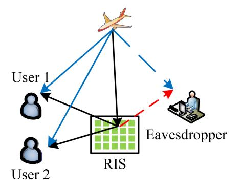

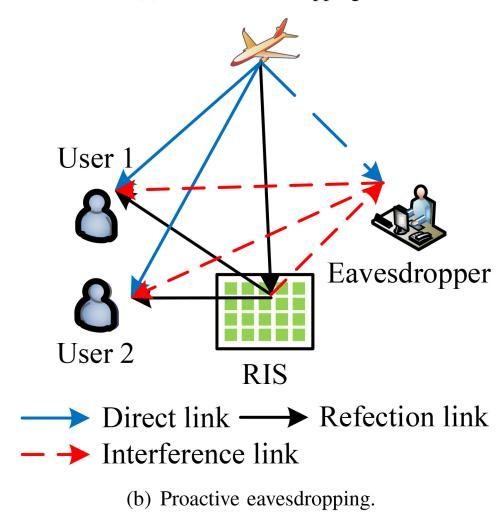

Fig. 11. Two eavesdropping modes of NOMA-RIS-assisted SATN.

selection scheme was designed and the minimum detection error probability (DEP) was derived. Besides, the optimal antenna selection scheme adapted to scenarios where a few antennas were damaged. In [\[124\]](#page-29-26), RIS was introduced to the satellite covert communication network, where RIS was used to enhance the channel gain of covert users while reducing the detection probability of eavesdroppers. An AO scheme was proposed to design the precoding of the satellite and the phase shift matrix of RIS to enhance covertness. In addition, the authors also considered the non-ideal RIS, whose phase resolution was discrete, and designed a clustering grouping method to adjust the phase.

However, simply using RIS or NOMA to enhance covertness is not enough, thus a few works combine them to further enhance system security. The authors of [\[125\]](#page-29-27) investigated the role of RIS in implementing covert communication in NOMA networks, where the transmission link of the strong user was assumed to be secret. In the work, the average minimum DEP in the worst-case scenario was derived. Moreover, the results indicated that RIS further enhanced the covertness of the system. In [\[126\]](#page-29-28), the authors analyzed the performance of a novel rate-splitting NOMA-RIS system. The DEP, cover communication rate, and SOP were obtained. The results showed that when minimizing DEP as the optimization objective, the optimal transmission power and detection threshold can be found. The authors of [\[127\]](#page-29-29) utilized the mobility of the UAV to enhance the covertness of the NOMA-RISassisted SATN. Furthermore, the height of the UAV and power assignment were designed to improve the covert SNR. Then, a successive geometric programming approximation algorithm was developed to tackle the signomial programming problem. In [\[128\]](#page-29-30), RIS was applied to assist the covert communication of both downlink and uplink NOMA networks, where additional uncertainty sources were not needed, such as artificial noise. The authors first derived the minimum average DEP, and then used it as a constraint to optimize the power allocation and beamforming of RIS. The results indicated that only using RIS or NOMA technology in this system cannot achieve covert communication.

## *C. Summary and Lessons Learned*

In the transmission, the secrecy rate of the system can be improved by intelligently adjusting the reflection coefficient of RIS, enhancing the signals reflected to users, and re-modulating the signals into artificial interference to eavesdroppers. Besides, by separately designing the beamforming of RIS at NOMA users and eavesdroppers, the signal reception of NOMA users is enhanced and the signal leakage to eavesdroppers is suppressed. In this way, the probability of eavesdroppers detecting useful signals is reduced, and the covert communication capability of the system is enhanced.

To sum up, the addition of RIS conspicuously improves the security performance of the NOMA-based SATN, which does not need to utilize environmental resources to protect the communication security of legitimate users. Moreover, RIS has excellent compatibility with existing communication security technologies, thus it is unnecessary to design appropriative protocols for it.

There are a few critical issues in the security of NOMA-RIS-based SATN. As mentioned in Section [V-A,](#page-18-2) the vast majority of current research has focused on passive eavesdropping scenarios. However, in actual practice, eavesdroppers can adopt various eavesdropping/attack modes. With the improvement of intelligence level, they can even adjust eavesdropping modes based on channel conditions. For example, when the channel gain of the eavesdropper is high, the eavesdropper adopts passive eavesdropping mode. Otherwise, it can adopt active eavesdropping mode to transmit interference signals to legitimate users. There is no specific solution to address this adaptive eavesdropping mode, and further exploration is needed. Meanwhile, the CSI of the links between RIS and eavesdroppers are difficult to obtain. This is because RIS is passive and eavesdroppers are usually in a silent state. Hence, it is worth studying how to jointly design optimization schemes to improve the security of NOMA-RISbased SATN with imperfect CSI. In addition, for the covert communication of NOMA-RIS-assisted SATN, it needs to be extended to robust system design, as current work is based on the assumption that the phase shift of RIS is continuous, which is impossible to exist in practice. Furthermore, when there are multiple cooperative eavesdroppers, the deployment of RIS may increase the risk of eavesdropping, thus the location and beamforming of RIS must be carefully designed.

## VI. APPLICATIONS FOR NOMA-RIS-ASSISTED SATN

In this section, the potential applications for NOMA-RISassisted SATN are introduced.

## *A. NOMA-RIS-SATN With CR*

CR is considered one of the key enabling technologies for the next-generation wireless communication networks to improve SE by authorizing spectrum sharing. At present, there have been many attempts to combine CR with NOMA and RIS to achieve further optimization of system resource allocation.

In [\[129\]](#page-29-31), the authors investigated the system performance of the NOMA-empowered cognitive SATN, in which the UAV assisted the transmission of the primary satellite network in overlay mode. In particular, the EC of both primary and secondary networks were derived to analyze the impacts of key parameters on transmission performance. It was observed that the NOMA-CR scheme outperformed the OMA-CR scheme. The authors of [\[116\]](#page-29-18) utilized active RIS to enhance the security of the cognitive STN, where the primary satellite network and secondary terrestrial network shared the same spectrum. Under the constraints of transmit power and interference threshold, the active beamforming, phase shift, and artificial noise were jointly designed to maximize the secrecy rate. It was found that RIS outperformed artificial noise in improving security, and active RIS performed more prominently than passive RIS in low-power scenarios.

Furthermore, the authors of [\[80\]](#page-28-25) applied NOMA, RIS, and CR to SATN simultaneously, and the outage behaviors of the system with the Rician channels were discussed. The results indicated that to improve the performance of the considered model, key parameters must be optimized. In [\[130\]](#page-29-32), the authors obtained the OP, sum rate, and the upper bound of EC, where imperfect CSI and SCI were considered because there was no negotiation mechanism between primary and secondary networks. Besides, the particle swarm optimization algorithm was applied to maximize the sum rate of the system. Groundbreaking, the authors designed a deep learning (DL) framework to predict EC. In [\[24\]](#page-27-15), the authors formulated a multi-objective optimization problem to balance SE and EE, where a MISO NOMA-RIS-assisted cognitive network was considered. In this system, both perfect and imperfect CSI scenarios were taken into account. In the perfect CSI scenario, a BCD-based algorithm was developed to adjust the phase shift and beamforming. In the imperfect CSI scenario, based on *S*-procedure, a robust optimization design was provided under the bounded channel error model.

In fact, both RIS and NOMA can increase system connectivity and EE, but they also increase the number of interfering links, causing interference to PUs, especially in underlay mode. Although RIS can reduce interference by adjusting the phase, improving the sum rate of systems while reducing interference is a complex optimization process. Currently, most research works focused on improving the transmission performance of SN while ensuring interference below ITC. Further research is needed to balance the performance improvement of both the two networks.

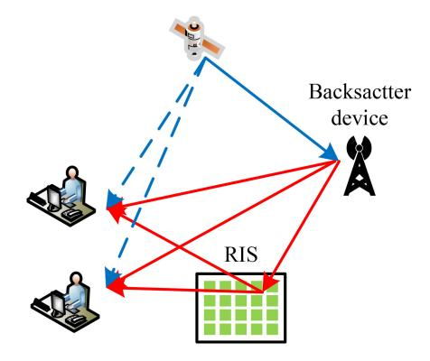

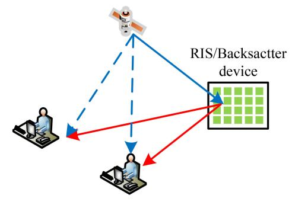

Fig. 12. NOMA-RIS-SATN with BC.

## *B. NOMA-RIS-SATN With BC*

The principle of BC is to reflect RF signals to the backscatter receiver through backscatter devices, which can achieve low energy consumption in communication. This is very similar to the reflection principle of RIS, thus RIS can be used to improve the reflection ability of backward reflection devices, which is shown in Fig. [12.](#page-21-0) In [\[131\]](#page-29-33), a RIS-assisted ambient BC system was established. To simultaneously meet the demand for energy of tag and interference limitations in the ambient BC system, RIS was applied to enhance the desired signals and suppress interference, whose phase shift was designed to optimize the achievable rate. The results showed that the proposed scheme can provide about 2.5 times the gains in achievable rate.

Moreover, NOMA is able to enhance the connectivity of BC. The authors of [\[132\]](#page-29-34) designed a BC-based downlink NOMA system, where BC was utilized to enhance the received power for weak users. Besides, the OP, EC, and diversity-multiplexing trade-off were derived. Compared to the non-cooperative NOMA, the traditional relay NOMA, and the incremental relay NOMA schemes, the superiority of the proposed scheme was verified. However, the authors only considered two NOMA users, and this work can be further expanded to multi-user scenarios. To enhance the EE of the BC-enabled NOMA IoV system, a green resource allocation scheme was designed [\[133\]](#page-29-35), in which imperfect SIC was considered. Then, the power assignment for NOMA users and the reflection power of tags were optimized to maximize the EE of the considered system. The results indicated that the proposed optimization scheme can effectively save energy in the IoV system, comply with the concept of green communication, and have lower complexity.

In conclusion, the combination of NOMA-RIS and BC can better improve the EE, SE, and connectivity of SATN. In [\[134\]](#page-29-36), a NOMA-RIS-enhanced ambient backscatter system for SATN was considered, where RIS was utilized to improve the reflection process and sum rate. Due to the fact the problem caused by multiple backscatter devices was difficult to solve, the authors first designed an optimization scheme in the single backscatter device scenario and obtained the optimal reflection coefficient and phase shift. On this foundation, an iterative algorithm was designed to solve the problem of multiple backscatter devices. Similarly, the authors of [\[135\]](#page-29-37) utilized AO, SCA, and manifold optimization to tackle this tough problem, and the designed algorithm had lower complexity. In [\[136\]](#page-29-38), the authors considered a NOMA-RIS-empowered symbiotic CR system with BC, where multiple RIS assisted the transmission of multiple users. To allocate system resources reasonably, the author proposed a convex weighted minimum mean square error problem with HIs, imperfect CSI and imperfect SIC, and designed an optimization framework to jointly optimize the power allocation of the system and the reflection coefficient of RIS to minimize the sum rate of the entire system.

The integration of BC and NOMA-RIS-assisted SATN can further enhance the reflection ability of backward reflection devices. However, it requires the design of novel network architecture and transmission protocols. Due to the characteristics of BC, it can lead to a very complex electromagnetic environment, which requires more effective wireless environment control schemes. One promising solution is symbiotic communication.

## *C. NOMA-RIS-SATN With MEC*

MEC can use wireless access networks to provide users with the services they need and cloud computing functions nearby, and create a service environment with high performance, low latency, and high bandwidth, accelerate the rapid download of various content, services, and applications in the network, so that users can enjoy an uninterrupted high-quality network experience. Combining NOMA and RIS with MEC can further improve its performance and better adapt to various SATN scenarios. The authors of [\[137\]](#page-29-39) considered a hybrid beamforming and NOMA-assisted MEC system with energy harvesting (EH). Under the constraints of EH and coverage, an optimization problem of maximizing the sum-computation rate was formulated. To tackle the complex problem, a polyhedral annexation method and DDPG-based algorithm was designed, where the placement and hybrid beamforming of the UAV, and resource allocation of MEC devices were jointly optimized. In [\[138\]](#page-29-40), the authors considered a UAV-mounted RIS-aided MEC system, and the motility of the UAV as well as the intelligent reflection of RIS were used to improve signal transmission quality. Then, the SCA and the Dinkelbach methods were adopted to maximize the EE of the considered system by jointly designing the trajectory of the UAV, passive beamforming of RIS and resource allocation of MEC devices.

Moreover, the authors of [\[139\]](#page-30-0) investigated the transmission scheme of a NOMA-RIS-empowered UAV-MEC system, where computing tasks were offloaded by the UAV to the ground MEC device. Then, the authors utilized the concaveconvex procedure scheme, SDP, and grid search method to optimize resource allocation, phase shift, and decoding order as well as deployment of the UAV respectively. The results demonstrated the superiority of introducing NOMA-RIS into MEC systems. In [\[140\]](#page-30-1), a hybrid FDMA-NOMA scheme was designed to offload the data, where the RIS was applied to enhance the QoS of the channels. To minimize the latency of the proposed system, the power allocation, phase shift of the RIS, and beamforming were jointly designed. The authors of [\[141\]](#page-30-2) utilized the RL-based method to solve the EE maximization problem with queue stability of NOMA-RIS-aided MEC system. Specifically, the authors designed the Lyapunov function-based mixed integer DDPG (LMIDDPG) algorithm and heterogeneous multi-agent-LMIDDPG algorithm, which can map continuous spaces to mixed integer action spaces, and save signaling costs as well as protect privacy respectively. The results showed that the distributed LMIDDPG algorithm was superior to the centralized LMIDDPG algorithm.

MEC can provide more efficient computation and lower latency for NOMA-RIS-SATN. It is worth mentioning that the above works are focused on specific scenarios. For large-scale networks, e.g., networks with a large number of users, RIS, and edge servers, how to associate each node and optimize the resource allocation of the system is still an unresolved issue that requires further investigation.

## *D. NOMA-RIS-SATN With WPT*

WPT transmits electricity through electromagnetic fields, which can extend the working duration and solve energy shortages, and has been widely used in the IoT. In recent years, the combination of NOMA-SATN and WPT has received a lot of attention as it can increase the number of access users. In [\[142\]](#page-30-3), the authors considered a laser-based MISO WPT system to extend the duration of the UAV, where hybrid NOMA was adopted to enhance the connectivity of terrestrial users. A hybrid ratio transmission and zero-forcing (ZF) beamforming scheme was proposed to enhance the transmission of the considered system. By deriving the approximate OP and sum rate, a power allocation and target rate selection scheme was developed. The analysis results indicated that hybrid NOMA and beamforming can significantly improve the system performance of the WPT system. The authors of [\[143\]](#page-30-4) established the power consumption and EE model for a multi-user NOMA-based WPT system, where the UAV was powered by a terrestrial power beacon. To improve the EE of the system, the authors utilized the BCD-based algorithm to jointly optimize power allocation, WPT duration, and deployment of the UAV.

At the same time, RIS can enhance the efficiency of the WPT system. In [\[144\]](#page-30-5), the RIS was applied to enhance the WPT and wireless information transfer (WIT) of a wirelesspowered sensor network in different time slots. Then, a sum rate optimization problem was formulated, where the time assignment of WPT and WIT, and the phase shift of RIS were jointly designed. The SDP relaxing and Gaussian randomization methods were adopted to solve the non-convex problem. Besides, a low-complexity algorithm based on majorizationminimization was designed. The authors of [\[145\]](#page-30-6) investigated the benefits of TDMA/NOMA-RIS-assisted WPT system with MEC, in which dynamic RIS beamforming was considered to establish time selection channels. The computation rate with TDMA/NOMA was optimized under the proposed three cases. It is worth mentioning that the NOMA scheme cannot achieve a higher computational rate than the TDMA scheme, indicating that in cases where performance is improved at the cost of increasing signaling overhead, it is better to choose the TDMA scheme.

Recently, the integration of NOMA-RIS and WPT is gradually entering the vision of engineers and industrialists, which can be applied to SATN. In [\[146\]](#page-30-7), a hybrid access point served two WPT systems simultaneously, where RIS assisted the uplink/downlink NOMA transmission. Under the premise of ensuring the QoS of downlink communication, by jointly designing power assignment, phase shift, and beamforming, the sum rate of the uplink communication was maximized. The authors of [\[147\]](#page-30-8) proposed a two-step RISenhanced WPT system with cooperative NOMA, where a non-convex optimization problem was formulated to improve the achievable rate of the strong user. The power allocation, beamforming, and phase shift of the two steps were designed, where penalty-based arithmetic-geometric mean approximation algorithm and SCA-based algorithm were developed respectively.

WPT can effectively solve the problem of limited energy in NOMA-RIS-SATN. Although there are already some investigations in this field, there are still some challenges that cannot be ignored, such as the impacts of imperfect CSI/SIC, HIs, and nonlinear energy collection on the system performance, which is still in the initial stage. In addition, there are significant differences between far-field RIS and near-field RIS, thus it is necessary to design corresponding wireless power transmission models.

## *E. NOMA-RIS-SATN With mmWave/THz*

Due to the high-throughput advantage of SATN, new spectrum resources are being developed and utilized, such as mmWave and THz. These new frequency bands have made ultra-high-speed transmission possible, leading to the implementation of high-definition video broadcasting. Although these frequency bands can provide greater bandwidth for transmission, they are easily obscured due to short wavelengths and experiencing severe fading. NOMA-RIS is considered as the promising advanced technology to solve these problems. The authors of [\[148\]](#page-30-9) investigated the secure EE of the NOMAbased CR network, where the primary satellite network shared the same mmWave band with the secondary ground network. Considering imperfect CSI, the power allocation was optimized to improve the SEE. By utilizing SCA, Dinkelbach, and *S*-procedure methods, an iterative algorithm was designed. In [\[149\]](#page-30-10), the security of the RIS-assisted SATN was discussed, where the devices operated in the THz band. To simulate the real signal propagation environment, the atmospheric turbulence as well as pointing error caused by THz characteristics, and the phase error caused by the discontinuous phase of RIS as well as imperfect CSI were considered. Then, the approximate ergodic secrecy rate was obtained. The results indicated that with the help of RIS, if the user's jitter standard deviation is higher than that of the eavesdropper, the positive secrecy rate can be ensured.

The authors of [\[150\]](#page-30-11) introduced NOMA and RIS into the mmWave network, where the EE-SE tradeoff problem was studied. The weighted-sum scheme was adopted to transform the multi-objective problem into a single-objective problem, and an iterative algorithm was designed to jointly optimize the power allocation, active and passive precoding. In [\[151\]](#page-30-12), the authors maximized the sum rate of the NOMA-RISempowered mmWave network by jointly designing active and passive beamforming as well as power allocation. The analysis results showed that RIS was able to significantly improve the coverage of the NOMA system. The authors of [\[152\]](#page-30-13) applied RIS to provide additional links for the NOMA users without LoS link. Due to the fact that the power leakage in beamspace and the power limitation of each antenna can not be ignored, the authors designed two beam selection and RF chain configuration schemes under two-dimensional and three-dimensional channel models respectively. By jointly optimizing the active and passive beamforming, the weighted sum rate was maximized.

Although the combination of mmWave/THz and NOMA-RIS-assisted SATN can bring great advantages, such as wider bandwidth and ultra high-speed rate, the technical challenges are also extremely severe. Firstly, for networks using the mmWave/THz frequency band for communication, it is necessary to develop a dedicated and accurate channel model, which is the foundation for studying its performance. In addition, the NOMA-RIS-SATN with mmWave/THz system must have the ability to quickly schedule, which also poses challenges to channel estimation. Furthermore, due to severe path fading in the mmWave/THz band, the dual path fading generated by RIS is more significant. Therefore, active RIS can be applied to NOMA-assisted SATN with mmWave/THz.

## *F. NOMA-RIS-SATN With ISAC*

ISAC enables sensing and wireless communication to share various resources, while enhancing information sharing between sensing functionalities and communication. Hence, it is regarded as a key enabling technology in NOMA-RIS-assisted SATN for its advantages in SE, EE, and cost efficiency [\[153\]](#page-30-14). At present, there are few works in this field. The summary of existing research and open issues are as follows.

The authors of [\[154\]](#page-30-15) applied ISAC to RIS-assisted BC networks, where BS sensed signals by radar echoes. To maximize the sum rate of the system, a joint algorithm based on fractional programming and manifold optimization was developed. The proposed algorithm can improve the achievable

rate while maintaining the trade-off between communication and sensing performance. However, the assumption of perfect channel estimation in the article is obviously unrealistic. In [\[155\]](#page-30-16), the authors designed two downlink and an uplink NOMA-based ISAC models. In particular, the inter-user interference and sensing-communication interference were coordinated respectively in the two downlink models, while the flexible resource allocation for sensing and communication was provided. However, when the number of communication and sensing targets is large, more reliable optimization algorithms need to be developed.

In [\[156\]](#page-30-17) and [\[157\]](#page-30-18), the authors investigated the maximizing minimum beam directional gain problem in NOMA-RIS-assisted ISAC networks, in which a BCD and a low-complexity iterative alternating optimization algorithm were proposed to jointly design the active beamforming of ISAC BS, power allocation of NOMA users, and passive beamforming of RIS. The benefits of adopting ISAC to NOMA-RIS-assisted SATN were verified. However, the user clustering scheme was not considered. The fairness of the SATR-RIS-assisted ISAC system with NOMA was discussed in [\[158\]](#page-30-19). Specifically, the fairness between communication and sensing performance was maximized, and a low-complexity algorithm was designed by using SCA and SDP methods to jointly optimize the transmit beamforming and reflection coefficients of STAR-RIS. The disadvantage is that the system did not take the echo signal reflected by SATR-RIS into account.

In a word, ISAC can provide integration and coordination benefits for NOMA-RIS-assisted SATN, but there are some open issues that need to be further explored. Specifically, the trade-off between sensing and communication capabilities needs to be further designed; Besides, ISAC will bring radar echo to NOMA-RIS-assisted SATN, so its channel modeling cannot be ignored. At the same time, NOMA-RIS will bring interference to radar echoes, one solution is to utilize the quasistatic nature of the link, but this will generate interference with time-invariant statistics. So far, most of the NOMA-RIS-SATN with ISAC were considered as narrowband systems with flatfading channels, which is not in line with practical situations. Therefore, active RIS can be introduced to adapt to multiple frequency bands and different channels.

## *G. Summary and Lessons Learned*

This section focused on the promising research opportunities in NOMA-RIS-SATN, such as CR, BC, MEC, WPT, mmWave/THz, and ISAC, which can enhance SE, EE, QoS, connectivity, and throughput. Although these technologies have been studied in-depth, their potential will be further developed in NOMA-RIS-SATN, thus we have provided a detailed introduction to them.

There are also a few critical lessons as follows. Firstly, BC can enable devices in SATN to communicate without any RF, but interference at the receiver must be eliminated before decoding the expected signal. Also, the ITC of CR is significant. These issues increase the difficulty of RIS configuration. Secondly, the highly coupled phase shift matrix, active/passive beamforming, and power allocation of NOMA-RIS-SATN also pose significant challenges to the application of MEC, especially in large-scale networks. Thirdly, the introduction of WPT is a promising method to solve the energy limitation problem in NOMA-RIS-SATN, but the mobility of nodes will lead to fast time-varying channels, which poses great challenges to the application of WPT and the design of more effective CSI acquisition schemes is required. Fourthly, the new spectrum can bring finer resolution, but the upgrade of the spectrum will increase hardware complexity for two reasons: 1) The size of RIS elements should be on the same order of magnitude as the wavelength of the signal; and 2) faster response speed is required to change the phase shift in real-time. Fifthly, the ISAC is able to enhance EE, SE, and cost efficiency, but the channel modeling is hard to address. Finally, the existing works are based on simplified models, and the results are also obtained through simulation. The actual efficiency of the system needs to be verified through a prototype.

## VII. PRACTICAL IMPLEMENTATION AND CHALLENGES FOR NOMA-RIS-ASSISTED SATN

Despite the above benefits, RIS-empowered SATN with NOMA still faces a few challenges: a) Firstly, MEO, LEO, and APs are mobile in real-time and have long transmission distances, which will bring some difficulties to the practical application of NOMA and RIS, such as Doppler frequency shift and imperfect CSI; b) Secondly, since RIS is passive and cannot generate pilot signals, it is difficult to track moving nodes, and the higher frequency band used by SATN will also reduce the positioning accuracy; c) Thirdly, the existing hardware is not perfect, and thus RIS cannot achieve infinite bit phase-shift resolution, while the SIC receiver cannot perfectly decode signals and eliminate interference; d) Fourthly, the large-scale application of NOMA and RIS in SATN requires the development of more reliable coordination and control mechanisms. However, the current computing and signal processing capabilities of nodes cannot provide a stable control link. Hence, the investigation of the integration of NOMA-RIS and SATN is still in its infancy stage. To realize the practical implementation, we elaborate on some potential research directions.

## *A. Channel Modeling*

To conduct basic research and theoretical exploration on RIS-empowered SATN with NOMA, channel modeling should be carried out first. Accurate and reasonable channel modeling is the basis for evaluating system performance and optimizing system metrics. The existing channel models of SATN with NOMA are not completely accurate for the following reasons: Firstly, most of these channel models focus on the low-frequency band and cannot adapt to the fading and blocking caused by the high-frequency band. Moreover, Doppler frequency shift needs to be considered in SATN with NOMA [\[159\]](#page-30-20), but its impact was often ignored in existing works. In addition, since most channel models are static, we should consider dynamic channel models to adapt to channel

variations caused by weather, oscillation, mobility, and other factors. On the other hand, most existing models assumed that the distances between reflecting elements and users were equal, namely, the far-field model. However, it is not applicable to all scenarios. If RIS is deployed near users or large, the near-field model is more precise. Besides, perfect reflection was assumed in most former works, which is unrealistic, and the reflection loss should be considered.

The above intractable problems make the channel modeling of RIS-empowered SATN with NOMA complicated and challenging. When substantial RISs are deployed in SATN with NOMA, two scenarios shall be considered. In one scenario, RIS assists transmission by adjusting the phase shift coefficient, thus two channels should be modeled, namely, the direct transmission channel and the RIS-assisted channel. In another scenario, RIS is not directly related to the current transmission channel, and the incident signal is not adjusted. In this case, the channel modeling is conducted with RIS as an environmental factor. No matter what scenario, the precise system model is urgently required to be established. Here, we introduce three theoretical modeling methods.

*Independent scatterer-based modeling:* In this method, each reflective element reflects signals by changing its reflection coefficient separately, and the reflection effect of RIS is changed by controlling the phase shift matrix. It is the most commonly used modeling method, but this model is limited by the physics of RIS and is difficult to be implemented on large RIS.

*Physics modeling:* The physics modeling considers the physical properties of the source node and RIS, such as the wave angle of the array, reflecting element size, and distance between reflecting elements. Hence, it is compatible with a more practical propagation environment.

*Impedance-based modeling:* In this method, multiple reflective elements are connected through an impedance network to jointly control them. The original network can be modeled as a multi-port system, which can provide extensive DoF. Furthermore, a more accurate model can be obtained.

In addition to traditional theoretical modeling methods, we can also collect actual channel data and complete channel modeling through AI algorithms.

These methods can be extended to SATR-RIS, the difference is that the channel modeling of STAR-RIS is more complex, because it also takes the transmission channels into account. The future research directions for channel modeling in SATR-RIS-NOMA-assisted SATN mainly focus on 1) establishing near-field propagation models, 2) exploring spatial replication channel models that can calculate propagation and reflection factors as well as physical layer performance, and 3) deriving mathematical approximations that can characterize fading distribution.

## *B. Channel Estimation*

Accurate and effective channel estimation is the premise to make full use of the various benefits of NOMA-RIS in SATN. Due to the inherent characteristics of SATN, NOMA, and RIS, the channel estimation of RIS-empowered SATN with NOMA is nontrivial. Specifically, in SATN with a high-frequency band, only slight movement will lead to sharp channel varieties. Therefore, terminal mobility and long latency of SATN are critical factors restricting accurate and real-time channel estimation. Moreover, NOMA requires accurate CSI at both the transmitter and the receiver. At the transmitter, CSI is the basis for user clustering and power allocation. At the receiver, the decoding order is also affected by CSI. At the same time, owing to the large-scale connections in 6G, the channel estimation of the NOMA network will face higher complexity. Furthermore, the passivity of RIS makes its channel estimation different from that of active devices. Since RIS does not have transmission RF chains, the conventional channel estimation method is not applicable to achieve accurate CSI. The number of RIS-related channels is in direct proportion to that of reflection elements, and NOMA will also improve the connectivity of RIS, resulting in incalculable signaling overhead and energy consumption of channel estimation.

To realize the channel estimation of the RIS-empowered SATN with NOMA, specialized and effective channel estimation methods must be developed. Firstly, sources, RIS, and users can utilize beam selection technology to find the optimal beam direction, which can be approximately regarded as channel estimation, because the selected beam reflects information such as signal angle. Secondly, considering the sparsity of channels, a few low-cost sensors can be installed on RIS, then they can estimate the channel by adopting compressed sensing-based reconstruction algorithm. Thirdly, slowly varying long-term CSI can be used to decrease the delay and computational complexity of channel estimation, but the investigation on it is not enough. Fourthly, it is also a promising way to apply DL, RL, and DRL for channel estimation, which can obtain approximate channel estimation results through the collected channel data.

For STAR-RIS, it is necessary to design not only the channel estimation method of reflecting link, but also the channel estimation method of transmission link, which is still in the early stage. Meanwhile, SATR-RIS also requires the design of transmission and reflection modes, so its channel estimation must revolve around hardware and protocols. Current research on channel estimation of STAR-RIS system focuses on energy splitting, mode selection and time splitting protocols. Besides, ML is also considered a promising solution. Therefore, future research directions include deriving explicit channel models or developing accurate learning algorithms. At the same time, tradeoffs between system complexity and performance must be considered.

For active RIS, due to the introduction of active elements, the accuracy of channel estimation can be improved through RF chains and training sequences. However, at the same time, the system complexity increases, due to the fact that active RIS requires obtaining CSI from both source-RIS and RISuser links, so it requires estimating more channel coefficients. This also introduces more open problems. For instance, the choice of the location of the active elements and the tradeoff between EE/system complexity and channel estimation accuracy.

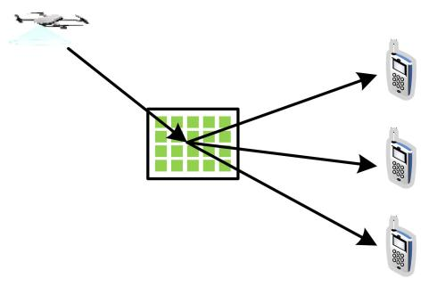

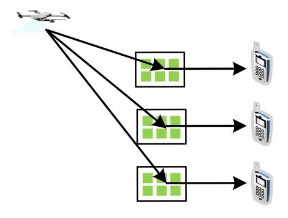

Fig. 13. Deployment strategy of RIS.

## *C. Deployment Strategy*

From previous works, it can be seen that the deployment location of RIS has a significant impact on NOMA-based SATN. There are three main deployment methods: Centralized deployment, distributed deployment, and hybrid deployment. All three methods have their own advantages and disadvantages, and are suitable for different scenarios. For SATR-RIS, the number of users on both sides needs to be considered.

*Centralized deployment:* All RISs are deployed near the source node or users, forming a large RIS, as shown in Fig. [13\(](#page-25-0)a). This deployment method is suitable for multiple NOMA user clusters, where the direct links from satellites/APs to users are highly correlated. Therefore, the source node may not have enough DoFs to achieve beamforming for user clusters, so centralized RIS can be applied to provide more DoFs. According to [\[73\]](#page-28-18), since centralized RIS contains a large number of reflective elements, it is more suitable for beamforming design and can provide high channel gain, which is conducive to user clustering [\[44\]](#page-27-35). As mentioned earlier, NOMA can generate higher gains when there is a significant channel difference, and centralized RIS can make this advantage more apparent [\[160\]](#page-30-21). Centralized RIS can provide higher reachable rate regions than distributed RIS, but the increase in RIS scale also brings new hardware and complexity challenges, thus a large RIS is not always the optimal solution. For ease of management, a small-scale RIS can also be set up in each user cluster.

*Distributed deployment:* Set up a RIS near each user, which applies to situations where users are relatively dispersed, as shown in Fig. [13\(](#page-25-0)b). Due to the distance between users, the impact of each RIS on unexpected users is minimal and even negligible. Besides, since each user is assisted by a separate RIS, it is possible to establish more LoS links. However, distributed RIS has the disadvantage of high signaling overhead, as the source node needs to exchange control information with multiple RIS controllers.

*Hybrid deployment:* When centralized or distributed deployment cannot meet the requirements of NOMA-based SATN, two methods can be combined, namely, hybrid deployment. Specifically, deploying large RISs at satellite/aerial nodes provides higher beamforming gain while relaxing the demands for source nodes, deploying multiple small RISs near the users to provide more LoS links. Therefore, hybrid RIS can combine the advantages of centralized and distributed RIS and make flexible adjustments according to actual needs. However, hybrid RIS also makes the system architecture more complex, requiring joint optimization of resources such as beamforming and the proportion of the two deployment methods, which still requires further research.

In particular, active RIS is not deployed close to the source/user as passive RIS is, because active RIS produces amplified noise, thus the balance of signal and noise power must be considered, which can be optimized based on geometry or ML-based algorithm.

## *D. Backhaul Control*

Due to the fact that RIS is passive and only adjusts the reflective components through the controller, it is generally ensured that the controller can configure RIS in real-time by communicating with computing nodes. Therefore, it is required to establish real-time and reliable links between RIS and computing nodes. Among fixed devices, the wireless propagation environment is relatively constant or less variable, and reliable communication links are easy to implement. However, in SATN, the positions of satellites and aerial nodes always change, thus channel conditions are also time-varying. Therefore, the real-time phase shift control is challenging. In addition, the application of NOMA requires RIS to serve more users, increasing several times the number of communication links and incurring significant signaling overhead. Taking a large RIS as an example, it contains hundreds of reflective components, with additional links ranging from hundreds to even thousands, which can result in extremely high feedback and computational complexity. Hence, it is difficult to meet real-time and reliable requirements, thereby affecting the configuration of the RIS. At the same time, due to a large amount of computational overhead, the controller will consume a lot of additional energy, which will reduce the duration of energylimited satellites or aerial nodes.

To solve the above problems, it is necessary to provide new ideas to ensure real-time and stable control links, reduce signaling and computing costs, and also ensure system performance. On the one hand, distributed algorithms can be used to realize the configuration of RIS. Compared to centralized algorithms, it requires less information exchange and can reduce processing costs. This can be achieved through multiple computing nodes, such as a UAV cluster. On the other hand, specialized control protocols can be designed. Due to insufficient energy supply, passive RIS is difficult to detect and decode information, thus the designed protocol should be energy-efficient. At the same time, it should have preferably compatibility with existing systems to reduce costs. Design can be based on the sensing capabilities of RIS itself. Specifically, using infrared to detect physical layer information can achieve energy savings. Then, information exchange can be achieved by adjusting the transmission power or packet length, allowing RIS to have the ability to perceive changes in signal power under low-power conditions.

## VIII. CONCLUSION AND OUTLOOKS

This paper provided a survey on the integration of NOMA and RIS into SATN to meet the demands of 6G. Specifically, we introduced the architecture of SATN, the basics and applications of NOMA and RIS respectively. Then, the benefits of investigating the NOMA-RIS-assisted SATN, three usage modes of RIS in NOMA-based SATN, and two scenarios of NOMA-RIS in SATN were discussed. In addition, a downlink RIS-empowered SATN with NOMA was presented, and the simulation results demonstrated that both NOMA and RIS can significantly improve the performance of SATN. Furthermore, it is obvious that NOMA and RIS complement each other and can be integrated into SATN to enhance coverage, connectivity, and reliability. Moreover, resource allocation and security provisioning were discussed to provide insights on improving effectiveness and safety. For the practical implementation of NOMA and RIS in SATN, a few open challenges and potential research directions have been concluded, namely, channel modeling, channel estimation, deployment strategies, and backhaul control, which is worth exploring in the near future. In a word, it is excepted that this paper can provide an overview of the issues of the simultaneous introduction of RIS and NOMA in future SATNs.

## REFERENCES

- [\[1\]](#page-0-0) P. Yang, Y. Xiao, M. Xiao, and S. Li, "6G wireless communications: Vision and potential techniques," *IEEE Newt.*, vol. 33, no. 4, pp. 70–75, Jul./Aug. 2019.
- [\[2\]](#page-0-1) K. Guo, C. Dong, and K. An, "NOMA-based cognitive satellite terrestrial relay network: Secrecy performance under channel estimation errors and hardware impairments," *IEEE Internet Things J.*, vol. 9, no. 18, pp. 17334–17347, Sep. 2022.
- [\[3\]](#page-0-2) Y. Shi, J. Liu, Z. M. Fadlullah, and N. Kato, "Cross-layer data delivery in satellite-aerial-terrestrial communication," *IEEE Wireless Commun.*, vol. 25, no. 3, pp. 138–143, Jun. 2018.
- [\[4\]](#page-0-2) M. Giordani, and M. Zorzi, "Non-terrestrial networks in the 6G era: Challenges and opportunities," *IEEE Netw.*, vol. 35, no. 2, pp. 244–251, Mar./Apr. 2021.
- [\[5\]](#page-0-2) F. Rinaldi et al., "Non-terrestrial networks in 5G & beyond: A survey," *IEEE Access*, vol. 8, pp. 165178–165200, 2020.
- [\[6\]](#page-0-3) "Study on new radio (NR) to support non-terrestrial networks, (Release 15), Version 15.4.0," 3GPP, Sophia Antipolis, France, Rep. TR 38.811, 2020.
- [\[7\]](#page-0-4) S. Enayati, H. Saeedi, H. Pishro-Nik, and H. Yanikomeroglu, "Moving aerial base station networks: A stochastic geometry analysis and design perspective," *IEEE Trans. Wireless Commun.*, vol. 18, no. 6, pp. 2977–2988, Jun. 2019.
- [\[8\]](#page-0-4) D. Wang, B. Bai, G. Zhang, and Z. Han, "Optimal placement of low-altitude aerial base station for securing communications," *IEEE Wireless Commun. Lett.*, vol. 8, no. 3, pp. 869–872, Jun. 2019.

- [\[9\]](#page-0-4) X. Wang, H. Zhang, Y. Tian, and V. C. M. Leung, "Modeling and analysis of aerial base station-assisted cellular networks in finite areas under LoS and NLoS propagation," *IEEE Trans. Wireless Commun.*, vol. 17, no. 10, pp. 6985–7000, Oct. 2018.
- [\[10\]](#page-0-5) K. Guo et al., "Power allocation and performance evaluation for NOMA-aided integrated satellite-HAP-terrestrial networks under practical limitations," *IEEE Internet Things J.*, vol. 11, no. 7, pp. 13002–13017, Apr. 2024.
- [\[11\]](#page-0-5) K. Guo et al., "Two-way satellite-HAP-terrestrial networks with nonorthogonal multiple access," *IEEE Trans. Veh. Technol.*, vol. 73, no. 1, pp. 964–979, Jan. 2024.
- [\[12\]](#page-0-5) H. Shuai, K. Guo, K. An, Y. Huang, T. A. Tsiftsis, and S. Zhu, "Joint impacts of non-ideal system limitations on the performance of NOMAbased SatCom networks," *IEEE Trans. Veh. Technol.*, vol. 72, no. 3, pp. 4091–4096, Mar. 2023.
- [\[13\]](#page-0-6) Y. Hmamouche, M. Benjillali, S. Saoudi, and D. B. D. Costa, "Uplink energy efficiency distribution with aerial users in cellular networks," *IEEE Wireless Commun. Lett.*, vol. 10, no. 2, pp. 301–305, Feb. 2021.
- [\[14\]](#page-0-6) F. Song et al., "Probabilistic caching for small-cell networks with terrestrial and aerial users," *IEEE Trans. Veh. Technol.*, vol. 68, no. 9, pp. 9162–9177, Sep. 2019.
- [\[15\]](#page-0-7) M. Mozaffari, W. Saad, M. Bennis, and M. Debbah, "Efficient deployment of multiple unmanned aerial vehicles for optimal wireless coverage," *IEEE Commun. Lett.*, vol. 20, no. 8, pp. 1647–1650, Aug. 2016.
- [\[16\]](#page-1-0) F. Qi, W. Li, P. Yu, L. Feng, and F. Zhou, "Deep learning-based BackCom multiple beamforming for 6G UAV IoT networks," *EURASIP J. Wireless Commun. Netw.*, vol. 2021, no. 1, pp. 1–17, Dec. 2021.
- [\[17\]](#page-1-1) X. Li, J. Li, Y. Liu, Z. Ding and A. Nallanathan, "Residual transceiver hardware impairments on cooperative NOMA networks," *IEEE Trans. Wireless Commun.*, vol. 19, no. 1, pp. 680–695, Jan. 2020.
- [\[18\]](#page-1-2) A. S. de Sena, P. H. J. Nardelli, D. B. da Costa, P. Popovski, and C. B. Papadias, "Rate-splitting multiple access and its interplay with intelligent reflecting surfaces," *IEEE Commun. Mag.*, vol. 60, no. 7, pp. 52–57, Jul. 2022.
- [\[19\]](#page-1-3) T.-H. Vu, Q.-V. Pham, and S. Kim, "On performance of downlink THzbased rate-splitting multiple-access (RSMA): Is it always better than NOMA?" *IEEE Trans. Veh. Technol.*, vol. 73, no. 3, pp. 4435–4440, Mar. 2024, doi: [10.1109/TVT.2023.3325244.](http://dx.doi.org/10.1109/TVT.2023.3325244)
- [\[20\]](#page-1-4) X. Li, Z. Xie, Z. Chu, V. G. Menon, S. Mumtaz, and J. Zhang, "Exploiting benefits of IRS in wireless powered NOMA networks," *IEEE Trans. Green Commun. Netw.*, vol. 6, no. 1, pp. 175–186, Mar. 2022.
- [\[21\]](#page-1-4) L. Dai, B. Wang, Y. Yuan, S. Han, I. Chih-lin, and Z. Wang, "Nonorthogonal multiple access for 5G: Solutions, challenges, opportunities, and future research trends," *IEEE Commun. Mag.*, vol. 53, no. 9, pp. 74–81, Sep. 2015.
- [\[22\]](#page-2-1) X. Li et al., "Physical-layer authentication for ambient backscatteraided NOMA symbiotic systems," *IEEE Trans. Commun.*, vol. 71, no. 4, pp. 2288–2303, Apr. 2023.
- [\[23\]](#page-2-2) Y. Liu et al., "Evolution of NOMA toward next generation multiple access (NGMA) for 6G," *IEEE J. Sel. Areas Commun.*, vol. 40, no. 4, pp. 1037–1071, Apr. 2022.
- [\[24\]](#page-2-3) Y. Wu, F. Zhou, W. Wu, Q. Wu, R. Q. Hu, and K.-K. Wong, "Multiobjective optimization for spectrum and energy efficiency tradeoff in IRS-assisted CRNs with NOMA," *IEEE Trans. Wireless Commun.*, vol. 21, no. 8, pp. 6627–6642, Aug. 2022.
- [\[25\]](#page-2-4) R. Schroeder, J. He, and M. Juntti, "Passive RIS vs. hybrid RIS: A comparative study on channel estimation," in *Proc. IEEE 93rd Veh. Tech. Conf.*, Helsinki, Finland, 2021, pp. 1–7.
- [\[26\]](#page-2-5) T. J. Cui, M. Q. Qi, X. Wan, J. Zhao, and Q. Cheng, "Coding metamaterials, digital metamaterials and programmable metamaterials," *Light, Sci. Appl.*, vol. 3, no. 10, p. 218, Oct. 2014.
- [\[27\]](#page-2-6) S. Foo, "Liquid-crystal reconfigurable metasurface reflectors," in *Proc. IEEE Int. Symp. Antennas Propag. USNC/URSI Nat. Radio Sci. Meeting*, San Diego, CA, USA, 2017, pp. 2069–2070.
- [\[28\]](#page-2-7) S. V. Hum, and J. Perruisseau-Carrier, "Reconfigurable reflect arrays and array lenses for dynamic antenna beam control: A review," *IEEE Trans. Antennas Propag.*, vol. 62, no. 1, pp. 183–198, Jan. 2014.
- [\[29\]](#page-2-7) X. Tan, Z. Sun, D. Koutsonikolas, and J. Jornet, "Enabling indoor mobile millimeter-wave networks based on smart reflectarrays," in *Proc. IEEE Conf. Comput. Commun. (INFOCOM)*, Honolulu, HI, USA, 2018, pp. 270–278.
- [\[30\]](#page-2-8) C. Liaskos, A. Tsioliaridou, A. Pitsillides, S. Ioannidis, and I. Akyildiz, "Using any surface to realize a new paradigm for wireless communications," *Commun. ACM*, vol. 61, no. 11, pp. 30–33, 2018.

- [\[31\]](#page-2-9) C. Pan et al., "Reconfigurable intelligent surfaces for 6G systems: Principles, applications, and research directions," *IEEE Commun. Mag.*, vol. 59, no. 6, pp. 14–20, Jun. 2021.
- [\[32\]](#page-2-10) G. Yang, C. K. Ho, and Y. L. Guan, "Multi-antenna wireless energy transfer for backscatter communication systems," *IEEE J. Sel. Areas Commun.*, vol. 33, no. 12, pp. 2974–2987, Dec. 2015.
- [\[33\]](#page-2-11) B. Sainath, and N. B. Mehta, "Generalizing the amplify-and-forward relay gain model: An optimal SEP perspective," *IEEE Trans. Wireless Commun.*, vol. 11, no. 11, pp. 4118–4127, Nov. 2012.
- [\[34\]](#page-2-12) H. Zheng, Z. Yang, G. Wang, R. He, and B. Ai, "Channel estimation for ambient backscatter communications with large intelligent surface," in *Proc. IEEE Int. Conf. Wireless Commun. Signal Process. (WCSP)*, Xi'an, China, 2019, pp. 1–5.
- [\[35\]](#page-2-12) Q. Zhang, Y. -C. Liang, and H. V. Poor, "Reconfigurable intelligent surface assisted MIMO symbiotic radio networks," *IEEE Trans. Commun.*, vol. 69, no. 7, pp. 4832–4846, Jul. 2021.
- [\[36\]](#page-2-12) S. Y. Park, and D. I. Kim, "Intelligent reflecting surface-aided phaseshift backscatter communication," in *Proc. Int. Conf. Ubiquitous Inf. Manag. Commun. (IMCOM)*, Taichung, Taiwan, 2020, pp. 1–5.
- [\[37\]](#page-2-13) X. Li, Y. Zheng, M. Zeng, Y. Liu, and O. A. Dobre, "Enhancing secrecy performance for STAR-RIS NOMA networks," *IEEE Trans. Veh. Technol.*, vol. 72, no. 2, pp. 2684–2688, Feb. 2023.
- [\[38\]](#page-2-14) Y. Liu et al., "Reconfigurable intelligent surfaces: Principles and opportunities," *IEEE Commun. Surveys Tuts.*, vol. 23, no. 3, pp. 1546–1577, 3rd Quart., 2021.
- [\[39\]](#page-2-14) S. Xu, J. Liu, T. K. Rodrigues, and N. Kato, "Envisioning intelligent reflecting surface empowered space-air-ground integrated network," *IEEE Netw.*, vol. 35, no. 6, pp. 225–232, Nov./Dec. 2021.
- [\[40\]](#page-2-14) J. Ye, J. Qiao, A. Kammoun, and M.-S. Alouini, "Non-terrestrial communications assisted by reconfigurable intelligent surfaces," *Proc. IEEE*, vol. 110, no. 9, pp. 1423–1465, Sep. 2022.
- [\[41\]](#page-2-14) B. Zheng, C. You, W. Mei, and R. Zhang, "A survey on channel estimation and practical passive beamforming design for intelligent reflecting surface aided wireless communications," *IEEE Commun. Surveys Tuts.*, vol. 24, no. 2, pp. 1035–1071, 2nd Quart., 2022.
- [\[42\]](#page-2-14) S. Gong et al., "Toward smart wireless communications via intelligent reflecting surfaces: A contemporary survey," *IEEE Commun. Surveys Tuts.*, vol. 22, no. 4, pp. 2283–2314, 4th Quart., 2020.
- [\[43\]](#page-2-14) P. Ramezani, B. Lyu, and A. Jamalipour, "Toward RIS-enhanced integrated terrestrial/non-terrestrial connectivity in 6G," *IEEE Netw.*, vol. 37, no. 3, pp. 178–185, May/Jun. 2023.
- [\[44\]](#page-2-14) W. Wang et al., "Secure beamforming for IRS-enhanced NOMA networks," *IEEE Wireless Commun.*, vol. 30, no. 1, pp. 134–140, Feb. 2023.
- [\[45\]](#page-2-14) Y. Liu, X. Mu, X. Liu, M. Di Renzo, Z. Ding, and R. Schober, "Reconfigurable intelligent surface-aided multi-user networks: Interplay between NOMA and RIS," *IEEE Wireless Commun.*, vol. 29, no. 2, pp. 169–176, Apr. 2022.
- [\[46\]](#page-2-14) A. S. d. Sena et al., "What role do intelligent reflecting surfaces play in multi-antenna non-orthogonal multiple access?" *IEEE Wireless Commun.*, vol. 27, no. 5, pp. 24–31, Oct. 2020.
- [\[47\]](#page-2-14) Z. Ding et al., "A state-of-the-art survey on reconfigurable intelligent surface-assisted non-orthogonal multiple access networks," *Proc. IEEE*, vol. 110, no. 9, pp. 1358–1379, Sep. 2022.
- [\[48\]](#page-3-2) H. Zhang, G. Pan, S. Ke, S. Wang, and J. An, "Outage analysis of cooperative satellite-aerial-terrestrial networks with spatially random terminals," *IEEE Trans. Commun.*, vol. 70, no. 7, pp. 4972–4987, Jul. 2022.
- [\[49\]](#page-7-4) Z. Zhang, G. Yang, Z. Ma, M. Xiao, Z. Ding, and P. Fan, "Heterogeneous ultradense networks with NOMA: System architecture, coordination framework, and performance evaluation," *IEEE Veh. Technol. Mag.*, vol. 13, no. 2, pp. 110–120, Jun. 2018.
- [\[50\]](#page-8-2) M. Poulakis, "Metamaterials could solve one of 6G's big problems [industry view]," *Proc. IEEE*, vol. 110, no. 9, pp. 1151–1158, Sep. 2022.
- [51] T. Hou, Y. Liu, Z. Song, X. Sun, Y. Chen, and L. Hanzo, "Reconfigurable intelligent surface aided NOMA networks," *IEEE J. Sel. Areas Commun.*, vol. 38, no. 11, pp. 2575–2588, Nov. 2020.
- [\[52\]](#page-8-3) H. Hashida, Y. Kawamoto, and N. Kato, "Intelligent reflecting surface placement optimization in air-ground communication networks toward 6G," *IEEE Wireless Commun.*, vol. 27, no. 6, pp. 146–151, Dec. 2020.
- [\[53\]](#page-11-5) E. Basar, M. D. Renzo, J. de Rosny, M. Debbah, M.-S. Alouini, and R. Zhang, "Wireless communications through reconfigurable intelligent surfaces," *IEEE Access*, vol. 7, pp. 116753–116773, 2019.
- [\[54\]](#page-11-6) O. Ozdogan, E. Bjornson, and E. G. Larsson, "Intelligent reflecting surfaces: Physics, propagation, and pathloss modeling," *IEEE Wireless Commun. Lett.*, vol. 9, no. 5, pp. 581–585, May 2020.

- [\[55\]](#page-12-0) K. Singh, F. Karim, S. K. Singh, P. K. Sharma, S. Mumtaz, and M. F. Flanagan, "Performance analysis of RIS-assisted full-duplex communications with infinite and finite blocklength codes," *IEEE Trans. Commun.*, vol. 71, no. 7, pp. 4262–4282, Jul. 2023.
- [\[56\]](#page-12-1) Z. Han, X. Yue, B. Dai, R. Liu, and A. Nallanathan, "Reconfigurable intelligent surface assisted unified NOMA framework," *IEEE Trans. Veh. Technol.*, vol. 72, no. 8, pp. 10617–10632, Aug. 2023.
- [\[57\]](#page-12-2) K.-T. Nguyen, T.-H. Vu, and S. Kim, "Performance analysis and deep learning design of short-packet communication in multi-RIS aided multi-antenna wireless systems," *IEEE Internet Things J.*, vol. 10, no. 19, pp. 17265–17281, Oct. 2023.
- [\[58\]](#page-12-3) K. Xu, J. Zhang, X. Yang, S. Ma, and G. Yang, "On the sum-rate of RIS-assisted MIMO multiple-access channels over spatially correlated Rician fading," *IEEE Trans. Commun.*, vol. 69, no. 12, pp. 8228–8241, Dec. 2021.
- [\[59\]](#page-12-4) Z. Chen, L. Chen, Z. Tian, M. Wang, Y. Jia, and L. Dai, "Ergodic rate of reconfigurable intelligent surface-assisted multigroup multicast system," *IEEE Trans. Veh. Technol.*, vol. 72, no. 4, pp. 5485–5490, Apr. 2023.
- [\[60\]](#page-12-5) M. D. Renzo and J. Song, "Reflection probability in wireless networks with metasurface-coated environmental objects: An approach based on random spatial processes," *EURASIP J. Wireless Commun. Netw.*, vol. 2019, p. 99, Apr. 2019.
- [\[61\]](#page-12-6) T. Bai, R. Vaze, and R. W. Heath, Jr., "Analysis of blockage effects on urban cellular networks," *IEEE Trans. Wireless Commun.*, vol. 13, no. 9, pp. 5070–5083, Sep. 2014.
- [\[62\]](#page-12-7) S. Hu, F. Rusek, and O. Edfors, "Beyond massive-MIMO: The potential of data-transmission with large intelligent surfaces," *IEEE Trans. Signal Process.*, vol. 66, no. 10, pp. 2746–2758, May 2018.
- [\[63\]](#page-12-8) S. Hu, F. Rusek, and O. Edfors, "Capacity degradation with modeling hardware impairment in large intelligent surface," in *Proc. IEEE Global Commun. Conf. (GLOBECOM)*, 2018, pp. 1–6.
- [\[64\]](#page-12-9) J. V. Alegria, J. R. Sanchez, F. Rusek, L. Liu, and O. Edfors, "Decentralized equalizer construction for large intelligent surfaces," in *Proc. IEEE Veh. Technol. Conf.*, Honolulu, HI, USA, 2019, pp. 1–6.
- [\[65\]](#page-12-10) S. Hu, F. Rusek, and O. Edfors, "Beyond massive MIMO: The potential of positioning with large intelligent surfaces," *IEEE Trans. Signal Process.*, vol. 66, no. 7, pp. 1761–1774, Apr. 2018.
- [\[66\]](#page-12-11) M. Jung, W. Saad, Y. Jang, G. Kong, and S. Choi, "Performance analysis of large intelligent surfaces (LISs): Asymptotic data rate and channel hardening effects," *IEEE Trans. Wireless Commun.*, vol. 19, no. 3, pp. 2052–2065, Mar. 2020.
- [\[67\]](#page-12-12) M. Jung, W. Saad, Y. Jang, G. Kong, and S. Choi, "Reliability analysis of large intelligent surfaces (LISs): Rate distribution and outage probability," *IEEE Wireless Commun. Lett.*, vol. 8, no. 6, pp. 1662–1666, Dec. 2019.
- [\[68\]](#page-12-13) M. Jung, W. Saad, and G. Kong, "Performance analysis of active large intelligent surfaces (LISs): Uplink spectral efficiency and pilot training," *IEEE Trans. Commun.*, vol. 69, no. 5, pp. 3379–3394, May 2021.
- [\[69\]](#page-12-14) N. Van Huynh, D. T. Hoang, X. Lu, D. Niyato, P. Wang, and D. I. Kim, "Ambient backscatter communications: A contemporary survey," *IEEE Commun. Surveys Tuts.*, vol. 20, no. 4, pp. 2889–2922, 4th Quart., 2018.
- [\[70\]](#page-12-15) E. Basar, M. Wen, R. Mesleh, M. D. Renzo, Y. Xiao, and H. Haas, "Index modulation techniques for next-generation wireless networks," *IEEE Access*, vol. 5, pp. 16693–16746, 2017.
- [\[71\]](#page-12-15) D.-T. Phan-Huy et al., "Single-carrier spatial modulation for the Internet of Things: Design and performance evaluation by using real compact and reconfigurable antennas," *IEEE Access*, vol. 7, pp. 18978–18993, 2019.
- [\[72\]](#page-12-15) M. Di Renzo, "Spatial modulation based on reconfigurable antennas— A new air interface for the IoT," in *Proc. IEEE Mil. Commun. Conf. (MILCOM)*, Baltimore, MD, USA, 2017, pp. 495–500.
- [\[73\]](#page-12-16) E. Basar, "Reconfigurable intelligent surface-based index modulation: A new beyond MIMO paradigm for 6G," *IEEE Trans. Commun.*, vol. 68, no. 5, pp. 3187–3196, May 2020.
- [\[74\]](#page-12-17) S. Mao et al., "Intelligent reflecting surface-aided wireless powered hybrid backscatter-active communication networks," *IEEE Trans. Veh. Technol.*, vol. 72, no. 1, pp. 1383–1388, Jan. 2023.
- [\[75\]](#page-12-18) W. Yan, X. Yuan, and X. Kuai, "Passive beamforming and information transfer via large intelligent surface," *IEEE Wireless Commun. Lett.*, vol. 9, no. 4, pp. 533–537, Apr. 2020.
- [\[76\]](#page-13-1) W. Zhao, G. Wang, S. Atapattu, T. A. Tsiftsis, and C. Tellambura, "Is backscatter link stronger than direct link in reconfigurable intelligent surface-assisted system?" *IEEE Commun. Lett.*, vol. 24, no. 6, pp. 1342–1346, Jun. 2020.

- [\[77\]](#page-13-2) X. Guan, Q. Wu, and R. Zhang, "Joint power control and passive beamforming in IRS-assisted spectrum sharing," *IEEE Commun. Lett.*, vol. 24, no. 7, pp. 1553–1557, Jul. 2020.
- [\[78\]](#page-13-3) B. Zhao, C. Zhang, W. Yi, and Y. Liu, "Ergodic rate analysis of STAR-RIS aided NOMA systems," *IEEE Commun. Lett.*, vol. 26, no. 10, pp. 2297–2301, Oct. 2022.
- [\[79\]](#page-13-4) J. Zhu, P. Gao, G. Chen, P. Xiao, and A. Quddus, "Index modulation for STAR-RIS assisted NOMA system," *IEEE Commun. Lett.*, vol. 27, no. 2, pp. 716–720, Feb. 2023.
- [\[80\]](#page-13-5) K. Guo, R. Liu, M. Alazab, R. H. Jhaveri, X. Li, and M. Zhu, "STAR-RIS-empowered cognitive non-terrestrial vehicle network with NOMA," *IEEE Trans. Intell. Veh.*, vol. 8, no. 6, pp. 3735–3749, Jun. 2023.
- [\[81\]](#page-13-6) X. Liu, B. Zhao, M. Lin, J. Ouyang, J.-B. Wang, and J. Wang, "IRS-aided uplink transmission scheme in integrated satellite-terrestrial networks," *IEEE Trans. Veh. Technol.*, vol. 72, no. 2, pp. 1847–1861, Feb. 2023.
- [\[82\]](#page-14-1) Y. Su, X. Pang, W. Lu, N. Zhao, X. Wang, and A. Nallanathan, "Joint location and beamforming optimization for STAR-RIS aided NOMA-UAV networks," *IEEE Trans. Intell. Veh.*, vol. 72, no. 8, pp. 11023–11028, Aug. 2023.
- [\[83\]](#page-14-2) W. U. Khan et al., "Integration of NOMA with reflecting intelligent surfaces: A multi-cell optimization with SIC decoding errors," *IEEE Trans. Green Commun. Netw.*, vol. 7, no. 3, pp. 1554–1565, Sep. 2023.
- [\[84\]](#page-14-3) J. Chen, and X. Yu, "Ergodic rate analysis and phase design of STAR-RIS aided NOMA with statistical CSI," *IEEE Commun. Lett.*, vol. 26, no. 12, pp. 2889–2893, Dec. 2022.
- [\[85\]](#page-14-4) M. Soleymani, I. Santamaria, E. Jorswieck, and S. Rezvani, "NOMAbased improper signaling for multicell MISO RIS-assisted broadcast channels," *IEEE Trans. Signal Process.*, vol. 71, pp. 963–978, Mar. 2023.
- [\[86\]](#page-14-5) L. Chai, L. Bai, T. Bai, J. Shi, and A. Nallanathan, "Secure RIS-aided MISO-NOMA system design in the presence of active eavesdropping," *IEEE Internet Things J.*, vol. 10, no. 22, pp. 19479–19494, Nov. 2023.
- [\[87\]](#page-14-6) G. Yang, X. Xu, Y.-C. Liang, and M. D. Renzo, "Reconfigurable intelligent surface-assisted non-orthogonal multiple access," *IEEE Trans. Wireless Commun.*, vol. 20, no. 5, pp. 3137–3151, May 2021.
- [\[88\]](#page-14-7) T. Wang, F. Fang, and Z. Ding, "Joint phase shift and beamforming design in a multi-user MISO STAR-RIS assisted downlink NOMA network," *IEEE Trans. Veh. Technol.*, vol. 72, no. 7, pp. 9031–9043, Jul. 2023.
- [\[89\]](#page-14-8) Y. Li, M. Jiang, Q. Zhang, and J. Qin, "Joint beamforming design in multi-cluster MISO NOMA reconfigurable intelligent surface-aided downlink communication networks," *IEEE Trans. Commun.*, vol. 69, no. 1, pp. 664–674, Jan. 2021.
- [\[90\]](#page-16-1) B. Zhao, H. Kong, J. Ouyang, J.-B. Wang, and W.-P. Zhu, "Beamforming design for IRS-assisted uplink cognitive satellite-terrestrial networks with NOMA," in *Proc. IEEE Global Commun. Conf. (GLOBECOM)*, Madrid, Spain, 2021, pp. 1–6.
- [\[91\]](#page-16-2) Y. Li, H. Zhang, K. Long, and A. Nallanathan, "Exploring sum rate maximization in UAV-based multi-IRS networks: IRS association, UAV altitude, and phase shift design," *IEEE Trans. Commun.*, vol. 70, no. 11, pp. 7764–7774, Nov. 2022.
- [\[92\]](#page-16-3) X. Mu, Y. Liu, L. Guo, J. Lin, and H. V. Poor, "Intelligent reflecting surface enhanced multi-UAV NOMA networks," *IEEE J. Sel. Areas Commun.*, vol. 39, no. 10, pp. 3051–3066, Oct. 2021.
- [\[93\]](#page-16-4) H. Zhao et al., "Air reconfigurable intelligent surface enhanced multi-user NOMA system," *IEEE Internet Things J.*, vol. 11, no. 1, pp. 29–39, Jan. 2024.
- [\[94\]](#page-16-5) Z. Li, W. Chen, H. Cao, H. Tang, K. Wang, and J. Li, "Joint communication and trajectory design for intelligent reflecting surface empowered UAV SWIPT networks," *IEEE Trans. Veh. Technol.*, vol. 71, no. 12, pp. 12840–12855, Dec. 2022.
- [\[95\]](#page-16-6) J. Y. Baek, Y.-S. Lee, and B. C. Jung, "STAR-RIS-enabled NOMA with signal constellation adjustment for 6G LEO satellite networks," in *Proc. 14th Int. Conf. Inf. Commun. Tech. Converg. (ICTC)*, 2023, pp. 1653–1655.
- [96] F. Fang, Y. Xu, Q.-V. Pham, and Z. Ding, "Energy-efficient design of IRS-NOMA networks," *IEEE Trans. Veh. Technol.*, vol. 69, no. 11, pp. 14088–14092, Nov. 2020.
- [\[97\]](#page-16-7) D. Guan, X. Sun, J. Wang, and T. Hou, "RIS-NOMA-aided LEO satellite communication networks," in *Proc. 10th Int. Conf. Inf. Syst. Comput. Tech. (ISCTech)*, Guilin, China, 2022, pp. 409–413.

- [\[98\]](#page-16-8) B. Zhao, M. Lin, S. Xiao, M. Cheng, J.-B. Wang, and J. Cheng, "Lowcomplexity robust transmission algorithm for IRS-enhanced cognitive satellite-aerial networks," in *Proc. IEEE Int. Commun. Conf. (ICC)*, Rome, Italy, 2023, pp. 6145–6150.
- [\[99\]](#page-16-9) B. Zhao, M. Lin, S. Xiao, M. Cheng, J.-B. Wang, and J. Cheng, "Angular information based robust downlink transmission for IRSenhanced cognitive satellite-aerial networks," *IEEE Trans. Veh. Technol.*, vol. 73, no. 1, pp. 559–575, Jan. 2024.
- [\[100\]](#page-17-0) B. Zhao, M. Lin, M. Cheng, J.-B. Wang, J. Cheng, and M.-S. Alouini, "Robust downlink transmission design in IRS-assisted cognitive satellite and terrestrial networks," *IEEE J. Sel. Areas Commun.*, vol. 41, no. 8, pp. 2514–2529, Aug. 2023.
- [\[101\]](#page-17-1) S. Huang, B. Zhao, M. Lin, J. Ouyang, W.-P. Zhu, and Z. Ding, "Robust beamforming for IRS-enhanced uplink NOMA transmission in satellite systems," *IEEE Trans. Veh. Technol.*, vol. 73, no. 1, pp. 1370–1375, Jan. 2024.
- [\[102\]](#page-17-2) W. Feng et al., "NOMA-based resource allocation for RIS-assisted multi-UAV systems," in *Proc. IEEE Int. Commun. Conf. (ICC)*, Seoul, Korea, 2022, pp. 4553–4558.
- [\[103\]](#page-17-3) Y. Cai, Z. Wei, S. Hu, C. Liu, D. W. K. Ng, and J. Yuan, "Resource allocation and 3D trajectory design for power-efficient IRS-assisted UAV-NOMA communications," *IEEE Trans. Wireless Commun.*, vol. 21, no. 12, pp. 10315–10334, Dec. 2022.
- [\[104\]](#page-17-4) M. Asif, A. Ihsan, W. U. Khan, Z. Ali, S. Zhang, and S. X. Wu, "Energy-efficient beamforming and resource optimization for STAR-IRS enabled hybrid-NOMA 6G communications," *IEEE Trans. Green Commun. Netw.*, vol. 7, no. 3, pp. 1356–1368, Sep. 2023.
- [\[105\]](#page-17-5) X. Liu, Y. Liu, and Y. Chen, "Machine learning empowered trajectory and passive beamforming design in UAV-RIS wireless networks," *IEEE J. Sel. Areas Commun.*, vol. 39, no. 7, pp. 2042–2055, Jul. 2021.
- [\[106\]](#page-17-6) H. Zhang, M. Huang, H. Zhou, X. Wang, N. Wang, and K. Long, "Capacity maximization in RIS-UAV networks: A DDQN-based trajectory and phase shift optimization approach," *IEEE Trans. Wireless Commun.*, vol. 22, no. 4, pp. 2583–2591, Apr. 2023.
- [\[107\]](#page-17-7) A. Khalili, E. M. Monfared, S. Zargari, M. R. Javan, N. M. Yamchi, and E. A. Jorswieck, "Resource management for transmit power minimization in UAV-assisted RIS HetNets supported by dual connectivity," *IEEE Trans. Wireless Commun.*, vol. 21, no. 3, pp. 1806–1822, Mar. 2022.
- [\[108\]](#page-17-8) I. Budhiraja, V. Vishnoi, N. Kumar, D. Garg, and S. Tyagi, "Energy-efficient optimization scheme for RIS-assisted communication underlaying UAV with NOMA," in *Proc. IEEE Int. Commun. Conf. (ICC)*, Seoul, Korea, 2022, pp. 1–6.
- [\[109\]](#page-17-9) J. Zhao, L. Yu, K. Cai, Y. Zhu, and Z. Han, "RIS-aided ground-aerial NOMA communications: A distributionally robust DRL approach," *IEEE J. Sel. Areas Commun.*, vol. 40, no. 4, pp. 1287–1301, Apr. 2022.
- [\[110\]](#page-17-10) K. Guo, M. Wu, X. Li, H. Song, and N. Kumar, "Deep reinforcement learning and NOMA-based multi-objective RIS-assisted IS-UAV-TNs: Trajectory optimization and beamforming design," *IEEE Trans. Intell. Transp. Syst.*, vol. 24, no. 9, pp. 10197–10210, Sep. 2023.
- [\[111\]](#page-17-11) X. Gao, Y. Liu, X. Liu, and L. Song, "Machine learning empowered resource allocation in IRS aided MISO-NOMA networks," *IEEE Trans. Wireless Commun.*, vol. 21, no. 5, pp. 3478–3492, May 2022.
- [\[112\]](#page-17-12) R. Zhong, Y. Liu, X. Mu, Y. Chen, and L. Song, "AI empowered RIS-assisted NOMA networks: Deep learning or reinforcement learning?" *IEEE J. Sel. Areas Commun.*, vol. 40, no. 1, pp. 182–196, Jan. 2022.
- [\[113\]](#page-18-3) S. Elhoushy, M. Ibrahim, and W. Hamouda, "Cell-free massive MIMO: A survey," *IEEE Commun. Surveys Tuts.*, vol. 24, no. 1, pp. 492–523, 1st Quart., 2022.
- [\[114\]](#page-18-4) C. Gong, X. Yue, X. Wang, X. Dai, R. Zou, and M. Essaaidi, "Intelligent reflecting surface aided secure communications for NOMA networks," *IEEE Trans. Veh. Technol.*, vol. 71, no. 3, pp. 2761–2773, Mar. 2022.
- [\[115\]](#page-18-5) D. Wang, Y. Zhao, Y. Lou, L. Pang, Y. He, and D. Zhang, "Secure NOMA based RIS-UAV networks: Passive beamforming and location optimization," in *Proc. IEEE Global Commun. Conf. (GLOBECOM)*, Rio de Janeiro, Brazil, 2022, pp. 3168–3173.
- [\[116\]](#page-18-6) H. Niu et al., "Active RIS-assisted secure transmission for cognitive satellite terrestrial networks," *IEEE Trans. Veh. Technol.*, vol. 72, no. 2, pp. 2609–2614, Feb. 2023.
- [\[117\]](#page-18-7) Y. Wang et al., "Secure satellite transmission with active reconfigurable intelligent surface," *IEEE Commun. Lett.*, vol. 26, no. 12, pp. 3029–3033, Dec. 2022.

- [\[118\]](#page-19-1) S. Xu, J. Liu, Y. Cao, J. Li, and Y. Zhang, "Intelligent reflecting surface enabled secure cooperative transmission for satellite-terrestrial integrated networks," *IEEE Trans. Veh. Technol.*, vol. 70, no. 2, pp. 2007–2011, Feb. 2021.
- [\[119\]](#page-19-2) Z. Zhang, L. Lv, Q. Wu, H. Deng, and J. Chen, "Robust and secure communications in intelligent reflecting surface assisted NOMA networks," *IEEE Commun. Lett.*, vol. 25, no. 3, pp. 739–743, Mar. 2021.
- [\[120\]](#page-19-3) H. Han, Y. Cao, M. Sheng, N. Zhao, J. Liu, and D. Niyato, "IRS-aided secure NOMA networks against internal and external eavesdropping," *IEEE Trans. Commun.*, vol. 70, no. 11, pp. 7536–7548, Nov. 2022.
- [\[121\]](#page-19-4) W. Wang et al., "Beamforming and jamming optimization for IRS-aided secure NOMA networks," *IEEE Trans. Wireless Commun.*, vol. 21, no. 3, pp. 1557–1569, Mar. 2022.
- [\[122\]](#page-19-5) L. Guo, J. Jia, J. Chen, and X. Wang, "Secure communication optimization in NOMA systems with UAV-mounted STAR-RIS," *IEEE Trans. Inf. Forensics Security*, vol. 19, pp. 2300–2314, 2024.
- [\[123\]](#page-19-6) Y. Zhang et al., "Covert communication in downlink NOMA systems with channel uncertainty," *IEEE Sensors J.*, vol. 22, no. 19, pp. 19101–19112, Oct. 2022.
- [\[124\]](#page-19-7) D. Song, Z. Yang, G. Pan, S. Wang, and J. An, "RIS-assisted covert transmission in satellite-terrestrial communication systems," *IEEE Internet Things J.*, vol. 10, no. 22, pp. 19415–19426, Nov. 2023.
- [\[125\]](#page-19-8) Y. Cheng, J. Lu, D. Niyato, B. Lyu, M. Xu, and S. Zhu, "Performance analysis of jammer-aided covert RIS-NOMA systems," in *Proc. IEEE Global Commun. Conf. (GLOBECOM)*, Rio de Janeiro, Brazil, 2022, pp. 2716–2721.
- [\[126\]](#page-19-9) L. Yang et al., "Covert transmission and secrecy analysis of RS-RIS-NOMA-aided 6G wireless communication systems," *IEEE Trans. Veh. Technol.*, vol. 72, no. 8, pp. 10659–10670, Aug. 2023.
- [\[127\]](#page-19-10) Y. Su, S. Fu, J. Si, C. Xiang, N. Zhang, and X. Li, "Optimal hovering height and power allocation for UAV-aided NOMA covert communication system," *IEEE Wireless Commun. Lett.*, vol. 12, no. 6, pp. 937–941, Jun. 2023.
- [\[128\]](#page-19-11) L. Lv, Q. Wu, Z. Li, Z. Ding, N. Al-Dhahir, and J. Chen, "Covert communication in intelligent reflecting surface-assisted NOMA systems: Design, analysis, and optimization," *IEEE Trans. Wireless Commun.*, vol. 21, no. 3, pp. 1735–1750, Mar. 2022.
- [\[129\]](#page-20-1) K. Guo, R. Liu, C. Dong, K. An, Y. Huang, and S. Zhu, "Ergodic capacity of NOMA-based overlay cognitive integrated satellite-UAVterrestrial networks," *Chin. J. Electron.*, vol. 32, no. 2, pp. 273–282, Mar. 2023.
- [\[130\]](#page-20-2) T.-H. Vu, T.-V. Nguyen, D. B. d. Costa, and S. Kim, "Reconfigurable intelligent surface-aided cognitive NOMA networks: Performance analysis and deep learning evaluation," *IEEE Trans. Wireless Commun.*, vol. 21, no. 12, pp. 10662–10677, Dec. 2022.
- [131] D. Loku Galappaththige, F. Rezaei, C. Tellambura, and S. Herath, "RISempowered ambient backscatter communication systems," *IEEE Trans. Wireless Commun.*, vol. 12, no. 1, pp. 173–177, Jan. 2023.
- [\[132\]](#page-20-3) W. Chen, H. Ding, S. Wang, D. B. da Costa, F. Gong, and P. H. J. Nardelli, "Backscatter cooperation in NOMA communications systems," *IEEE Trans. Wireless Commun.*, vol. 20, no. 6, pp. 3458–3474, Jun. 2021.
- [\[133\]](#page-21-1) W. U. Khan, M. A. Javed, T. N. Nguyen, S. Khan, and B. M. Elhalawany, "Energy-efficient resource allocation for 6G backscatter-enabled NOMA IoV networks," *IEEE Trans. Intell. Transp. Syst.*, vol. 23, no. 7, pp. 9775–9785, Jul. 2022.
- [\[134\]](#page-21-2) Q. Liu, M. Fu, W. Li, J. Xie, and M. Kadoch, "RIS-assisted ambient backscatter communication for SAGIN IoT," *IEEE Internet Things J.*, vol. 10, no. 11, pp. 9375–9384, Jun. 2023.
- [\[135\]](#page-21-3) J. Zuo, Y. Liu, L. Yang, L. Song, and Y.-C. Liang, "Reconfigurable intelligent surface enhanced NOMA assisted backscatter communication system," *IEEE Trans. Veh. Technol.*, vol. 70, no. 7, pp. 7261–7266, Jul. 2021.
- [\[136\]](#page-21-4) D. K. P. Asiedu, and J.-H. Yun, "Multiuser NOMA with multiple reconfigurable intelligent surfaces for backscatter communication in a symbiotic cognitive radio network," *IEEE Trans. Veh. Technol.*, vol. 72, no. 4, pp. 5300–5316, Apr. 2023.
- [\[137\]](#page-21-5) W. Feng et al., "Hybrid beamforming design and resource allocation for UAV-aided wireless-powered mobile edge computing networks with NOMA," *IEEE J. Sel. Areas Commun.*, vol. 39, no. 11, pp. 3271–3286, Nov. 2021.
- [\[138\]](#page-21-6) Z. Zhai, X. Dai, B. Duo, X. Wang, and X. Yuan, "Energy-efficient UAV-mounted RIS assisted mobile edge computing," *IEEE Wireless Commun. Lett.*, vol. 11, no. 12, pp. 2507–2511, Dec. 2022.

- [\[139\]](#page-21-7) Y. Xu, T. Zhang, Y. Zou, and Y. Liu, "Reconfigurable intelligence surface aided UAV-MEC systems with NOMA," *IEEE Commun. Lett.*, vol. 26, no. 9, pp. 2121–2125, Sep. 2022.
- [\[140\]](#page-21-8) G. Li, M. Zeng, D. Mishra, L. Hao, Z. Ma, and O. A. Dobre, "Latency minimization for IRS-aided NOMA MEC systems with WPT-enabled IoT devices," *IEEE Internet Things J.*, vol. 10, no. 14, pp. 12156–12168, Jul. 2023.
- [\[141\]](#page-22-0) J. Yu, Y. Li, X. Liu, B. Sun, Y. Wu, and D. Hin-Kwok Tsang, "IRS assisted NOMA aided mobile edge computing with queue stability: Heterogeneous multi-agent reinforcement learning," *IEEE Trans. Wireless Commun.*, vol. 22, no. 7, pp. 4296–4312, Jul. 2023.
- [\[142\]](#page-22-1) S. K. Singh, K. Agrawal, K. Singh, A. Bansal, C.-P. Li, and Z. Ding, "On the performance of laser-powered UAV-assisted SWIPT enabled multiuser communication network with hybrid NOMA," *IEEE Trans. Commun.*, vol. 70, no. 6, pp. 3912–3929, Jun. 2022.
- [\[143\]](#page-22-2) Z. Wang, T. Lv, J. Zeng, and W. Ni, "Placement and resource allocation of wireless-powered multiantenna UAV for energy-efficient multiuser NOMA," *IEEE Trans. Wireless Commun.*, vol. 21, no. 10, pp. 8757–8771, Oct. 2022.
- [\[144\]](#page-22-3) Z. Chu, Z. Zhu, F. Zhou, M. Zhang, and N. Al-Dhahir, "Intelligent reflecting surface assisted wireless powered sensor networks for Internet of Things," *IEEE Trans. Commun.*, vol. 69, no. 7, pp. 4877–4889, Jul. 2021.
- [\[145\]](#page-22-4) G. Chen, Q. Wu, W. Chen, D. W. K. Ng, and L. Hanzo, "IRS-aided wireless powered MEC systems: TDMA or NOMA for computation offloading?" *IEEE Trans. Wireless Commun.*, vol. 22, no. 2, pp. 1201–1218, Feb. 2023.
- [\[146\]](#page-22-5) B. Lyu, P. Ramezani, D. T. Hoang, and A. Jamalipour, "IRS-assisted downlink and uplink NOMA in wireless powered communication networks," *IEEE Trans. Veh. Technol.*, vol. 71, no. 1, pp. 1083–1088, Jan. 2022.
- [\[147\]](#page-22-6) J. Ren, X. Lei, Z. Peng, X. Tang, and O. A. Dobre, "RIS-assisted cooperative NOMA with SWIPT," *IEEE Wireless Commun. Lett.*, vol. 12, no. 3, pp. 446–450, Mar. 2023.
- [\[148\]](#page-22-7) F. Zhao, W. Hao, H. Guo, G. Sun, Y. Wang, and H. Zhang, "Secure energy efficiency for mmWave-NOMA cognitive satellite terrestrial network," *IEEE Commun. Lett.*, vol. 27, no. 1, pp. 283–287, Jan. 2023
- [\[149\]](#page-22-8) J. Yuan, G. Chen, M. Wen, R. Tafazolli, and E. Panayirci, "Secure transmission for THz-empowered RIS-assisted non-terrestrial networks," *IEEE Trans. Veh. Technol.*, vol. 72, no. 5, pp. 5989–6000, May 2023.
- [\[150\]](#page-22-9) F. Xu, and H. Zhang, "Energy efficiency and spectral efficiency tradeoff in IRS-assisted downlink mmWave NOMA systems," *IEEE Wireless Commun. Lett.*, vol. 11, no. 7, pp. 1433–1437, Jul. 2022.
- [\[151\]](#page-23-0) J. Zuo, Y. Liu, E. Basar, and O. A. Dobre, "Intelligent reflecting surface enhanced millimeter-wave NOMA systems," *IEEE Commun. Lett.*, vol. 24, no. 11, pp. 2632–2636, Nov. 2020.
- [\[152\]](#page-23-1) P. Liu, Y. Li, W. Cheng, X. Gao, and X. Huang, "Intelligent reflecting surface aided NOMA for millimeter-wave massive MIMO with lens antenna array," *IEEE Trans. Veh. Technol.*, vol. 70, no. 5, pp. 4419–4434, May 2021.
- [\[153\]](#page-23-2) F. Liu et al., "Integrated sensing and communications: Toward dualfunctional wireless networks for 6G and beyond," *IEEE J. Sel. Areas Commun.*, vol. 40, no. 6, pp. 1728–1767, Jun. 2022.
- [\[154\]](#page-23-3) X. Wang, Z. Fei, and Q. Wu, "Integrated sensing and communication for RIS-assisted backscatter systems," *IEEE Internet Things J.*, vol. 10, no. 15, pp. 13716–13726, Aug. 2023.
- [\[155\]](#page-23-4) X. Mu, Z. Wang, and Y. Liu, "NOMA for integrating sensing and communications towards 6G: A multiple access perspective," *IEEE Wireless Commun.*, early access, Jan. 23, 2023, doi: [10.1109/MWC.015.2200559.](http://dx.doi.org/10.1109/MWC.015.2200559)
- [\[156\]](#page-23-5) J. Zuo, and Y. Liu, "Reconfigurable intelligent surface assisted NOMA empowered integrated sensing and communication," in *Proc. IEEE Globecom Workshops (GC Workshops)*, Rio de Janeiro, Brazil, 2022, pp. 1028–1033.
- [\[157\]](#page-23-6) J. Zuo, Y. Liu, C. Zhu, Y. Zou, D. Zhang, and N. Al-Dhahir, "Exploiting NOMA and RIS in integrated sensing and communication," *IEEE Trans. Veh. Technol.*, vol. 72, no. 10, pp. 12941–12955, Oct. 2023.
- [\[158\]](#page-23-7) Y. Wang et al., "Optimizing the fairness of STAR-RIS and NOMA assisted integrated sensing and communication systems," *IEEE Trans. Wireless Commun.*, early access, Nov. 7, 2023, doi: [10.1109/TWC.2023.3328872.](http://dx.doi.org/10.1109/TWC.2023.3328872)

- [\[159\]](#page-23-8) J. Wang, C. Jiang, L. Kuang, and B. Yang, "Iterative Doppler frequency offset estimation in satellite high-mobility communications," *IEEE J. Sel. Areas Commun.*, vol. 38, no. 12, pp. 2875–2888, Dec. 2020.
- [\[160\]](#page-23-9) Y. Zhang, J. Zhang, M. Di Renzo, H. Xiao, and B. Ai, "Reconfigurable intelligent surfaces with outdated channel state information: Centralized vs. distributed deployments," *IEEE Trans. Commun.*, vol. 70, no. 4, pp. 2742–2756, Apr. 2022.

**Rui Liu** received the B.S. degree from Space Engineering University, Beijing, China, in 2019, where he is currently pursuing the Ph.D. degree. He has authored or coauthored over 30 papers in international journals and conferences. His research interests focus on satellite-terrestrial networks, cognitive radio systems, wireless communication systems, and multiuser communication system. He was a TPC Member for the ISCT Workshop.

**Kefeng Guo** received the B.S. degree from the Beijing Institute of Technology, Beijing, China in 2012, and the Ph.D. degree from Army Engineering University, Nanjing, China in 2018.

He is a Lecturer with the School of Space Information, Space Engineering University. He is also an Associate Professor with the College of Electronic and Information Engineering, Nanjing University of Aeronautics and Astronautics. He has authored or coauthored more than 90 research papers in international journals and conferences. His

research interests focus on cooperative relay networks, MIMO communications systems, multiuser communication systems, satellite communication, hardware impairments, cognitive radio, NOMA technology, and physical layer security. He was a recipient of an Exemplary Reviewer of IEEE TRANSACTIONS ON COMMUNICATIONS in 2022. He was the recipient of the Outstanding Ph.D. Thesis Award of the Chinese Institute of Command and Control in 2020. He also was the recipient of the Excellent Ph.D. Thesis Award of Jiangsu Province, China, in 2020. He also serves as an Editor on the editorial board for the *EURASIP Journal on Wireless Communications and Networking* and IEEE OPEN JOURNAL OF THE COMMUNICATIONS SOCIETY. He has been a TPC member of many IEEE sponsored conferences, such as IEEE ICC, IEEE GLOBECOM, and IEEE WCNC.

**Xingwang Li** (Senior Member, IEEE) received the M.Sc. degree from the University of Electronic Science and Technology of China, Chengdu, China, in 2010, and the Ph.D. degree from the Beijing University of Posts and Telecommunications, Beijing, China, in 2015. From 2010 to 2012, he was with Comba Telecom Ltd., Guangzhou, China, as an Engineer. He spent one year from 2017 to 2018 as a Visiting Scholar with Queen's University Belfast, Belfast, U.K. He is currently an Associate Professor with the School of Physics and Electronic

Information Engineering, Henan Polytechnic University, Jiaozuo, China. He is also with the National Mobile Communications Research Laboratory, Southeast University, Nanjing, China. His research interests span wireless communications, intelligent transport systems, artificial intelligence, and the Internet of Things. He was a recipient of an Exemplary Reviewer of IEEE TRANSACTIONS ON COMMUNICATIONS and the *Journal of Electronics and Information Technology* in 2022. He is on the editorial board of IEEE TRANSACTIONS ON INTELLIGENT TRANSPORTATION SYSTEMS, IEEE TRANSACTIONS ON VEHICULAR TECHNOLOGY, IEEE SYSTEMS JOURNAL, IEEE SENSORS JOURNAL, and *Physical Communication*. He served as a Guest Editor for the Special Issue on "Integrated Sensing and Communications for 6G IoE" of IEEE INTERNET OF THINGS JOURNAL, "Computational Intelligence and Advanced Learning for Next-Generation Industrial IoT" of IEEE TRANSACTIONS ON NETWORK SCIENCE AND ENGINEERING, and "AI-Driven Internet of Medical Things for Smart Healthcare Applications: Challenges, and Future Trends" of IEEE JOURNAL OF BIOMEDICAL AND HEALTH INFORMATICS. He served as a TPC Member for IEEE ICC and IEEE GLOBECOM.

**Kapal Dev** (Senior Member, IEEE) received the Ph.D. degree from the Politecnico di Milano, Italy, in 2019, under the Prestigious Fellowship of Erasmus Mundus funded by the European Commission. He is currently working as an Assistant Lecturer with the Department of Computer Science, Munster Technological University, Ireland. He is also working as a Senior Research Associate with Lebanese American University, Lebanon, and the Institute for Intelligent Systems, University of Johannesburg, South Africa. He is an expert external evaluator of

most prestigious European Research Council starting grant, several MSCA Co-Fund schemes, Elsevier, IET, Springer Book proposals, and top scientific journals and conferences. He is very active in leading successful projects as a Principal Investigator under Horizon Europe MSCA Staff Exchange, Erasmus + International Credit Mobility, Capacity Building for Higher Education, and H2020 CO-FUND Projects and won over 1.2 million Euros funding in total. He has published over 70 plus research papers majorly in top IEEE transactions, magazines, and conferences. His research interests include wireless communication networks, blockchain, and artificial intelligence targeting applications majorly toward industry 4.0/5.0 and supervised more than 22 students at masters and Ph.D. level in the same areas. He is recently award as the IEEE ComSoc EMEA Outstanding Young Researcher 2022 for promising research activities for the benefit of the Society. He received the Tom Brazil Excellence in Research Award from SFI Funded CONNECT Research Centre. He received the 2022 Irish Research Council Research Ally Prize for his mentoring/supervison services. He has also received the IEEE ComSoc Excellent Reviewer Award from IEEE TRANSACTIONS ON NETWORK SCIENCE AND ENGINEERING in 2022. He recently delivered invited talk on "Unlocking the Future: Exploring the Enchanting Possibilities of 6G" under IEEE ComSoc Distinguish Speaker Program at MUET, Jamshoro, Pakistan. He is serving as a Funded Investigator at one of top European research centres– CONNECT, Trinity College Dublin funded by Science Foundation. He is serving as an Associate Editor for *IEEE Consumer Electronics Magazine*, *Nature*, *Scientific Reports*, *Wireless Networks* (Springer), *IET Quantum Communication*, and *IET Networks*, an Area Editor for *Physical Communication* (Elsevier), and a Technical Committee Member in Elsevier COMCOM. He is a Professional Member of ACM.

**Sunder Ali Khowaja** (Member, IEEE) is currently an Assistant Lecturer with Technological University Dublin and an Associate Professor with the University of Sindh, Pakistan. He received a Postdoctoral Fellowship in industrial computer vision with the Tech University of Korea. He has more than 50 papers in international and national publication venues. He has an academic experience of more than 12 years along with three years of industrial experience in the capacity of Network and RF Engineer. His research interests include computer

vision, deep learning, privacy preservation machine learning, and data analytics. He is also a two-time Runner-Up Winner in UG2+ Challenges held in conjunction with IEEE CVPR from 2022 to 2023. He has also been included in the Top 10 teams for various competitions held at CVPR from 2022 to 2023. He is serving as an Associate Editor for *PLOS One*. He has been serving as a Guest Editor for top-tier journals, including IEEE TRANSACTIONS ON VEHICULAR TECHNOLOGY, IEEE TRANSACTIONS ON CONSUMER ELECTRONICS, IEEE TRANSACTIONS ON GREEN COMMUNICATIONS AND NETWORKING, *Journal of King Saud University-Computer and Information Sciences*, *Sustainable Energy Technologies and Assessment*, and *Computers and Electrical Engineering*.

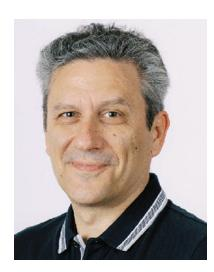

**Theodoros A. Tsiftsis** (Senior Member, IEEE) received the Ph.D. degree in electrical engineering from the University of Patras, Greece, in 2006.

He is a Professor with the Department of Informatics and Telecommunications, University of Thessaly, Greece, and also an Honorary Professor with Shandong Jiaotong University, Jinan, China. His research interests fall into the broad areas of communication theory and wireless communications, with an emphasis on wireless communications

theory, reconfigurable intelligent surfaces, optical wireless communications, and physical layer security. He served on the editorial boards of the IEEE TRANSACTIONS ON COMMUNICATIONS, IEEE TRANSACTIONS ON VEHICULAR TECHNOLOGY, IEEE COMMUNICATIONS LETTERS, and IEEE TRANSACTIONS ON MOBILE COMPUTING. He is currently an Associate Editor of the IEEE TRANSACTIONS ON WIRELESS COMMUNICATIONS, and a Specialty Chief Editor for Networks and Communications of *Frontiers in Computer Science*. He was appointed as an IEEE Vehicular Technology Society Distinguished Lecturer for two terms from 2018 to 2022 and was recently appointed as an IEEE Communications Society Distinguished Lecturer from 2024 to 2025.

**Houbing Song** (Fellow, IEEE) received the Ph.D. degree in electrical engineering from the University of Virginia, Charlottesville, VA, in August 2012.

He is currently a Professor, the Founding Director of the NSF Center for Aviation Big Data Analytics (Planning), the Associate Director for Leadership of the DOT Transportation Cybersecurity Center for Advanced Research and Education (Tier 1 Center), and the Director of the Security and Optimization for Networked Globe Laboratory (SONG Lab, the University of Maryland at Baltimore County

(UMBC), Baltimore, MD, USA. Prior to joining UMBC, he was a Tenured Associate Professor of Electrical Engineering and Computer Science with Embry-Riddle Aeronautical University, Daytona Beach, FL, USA. He is the editor of ten books, the author of more than 100 articles and the inventor of 2 patents. His research has been sponsored by federal agencies (including National Science Foundation, National Aeronautics and Space Administration, the U.S. Department of Transportation, and Federal Aviation Administration, and among others) and industry. His research has been featured by popular news media outlets, including IEEE Spectrum, IEEE GlobalSpec's Engineering360, IEEE Transmitter, Association for Uncrewed Vehicle Systems International, Security Magazine, CXOTech Magazine, Fox News, U.S. News and World Report, The Washington Times, and New Atlas. His research interests include AI/machine learning/big data analytics, cyberphysical systems/Internet of Things, and cybersecurity and privacy.

Dr. Song received the Research.com Rising Star of Science Award in 2022 and the 2021 Harry Rowe Mimno Award bestowed by IEEE Aerospace and Electronic Systems Society, and ten+ Best Paper Awards from major international conferences, including IEEE CPSCom-2019, IEEE ICII 2019, IEEE/AIAA ICNS 2019, IEEE CBDCom 2020, WASA 2020, AIAA/IEEE DASC 2021, IEEE GLOBECOM 2021, and IEEE INFOCOM 2022. He has been a Highly Cited Researcher identified by Web of Science since 2021. He has been serving as an Associate Editor for IEEE TRANSACTIONS ON ARTIFICIAL INTELLIGENCE since 2023, IEEE INTERNET OF THINGS JOURNAL since 2020, IEEE TRANSACTIONS ON INTELLIGENT TRANSPORTATION SYSTEMS since 2021, and IEEE JOURNAL ON MINIATURIZATION FOR AIR AND SPACE SYSTEMS since 2020. He was an Associate Technical Editor for *IEEE Communications Magazine* from 2017 to 2020. He has been an ACM Distinguished Speaker since 2020, an IEEE Computer Society Distinguished Visitor since 2024, an IEEE Communications Society Distinguished Lecturer since 2024, an IEEE Vehicular Technology Society Distinguished Lecturer since 2023, and an IEEE Systems Council Distinguished Lecturer since 2023. He is an Asia-Pacific Artificial Intelligence Association Fellow, an ACM Distinguished Member, and a Full Member of Sigma Xi.