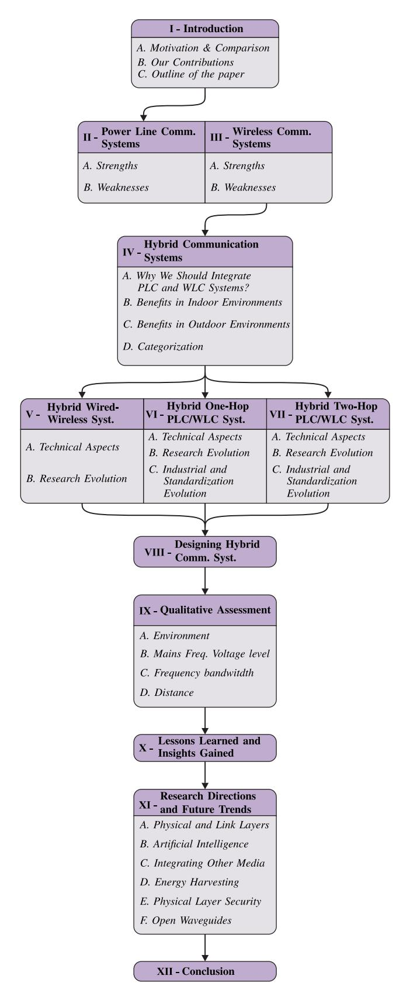
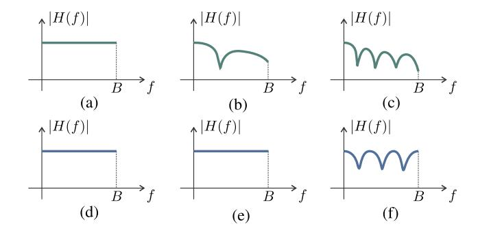
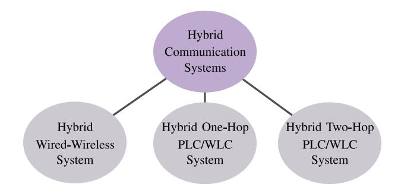
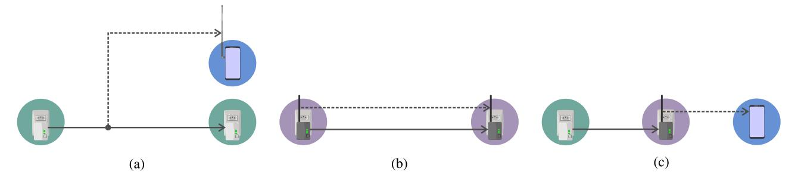
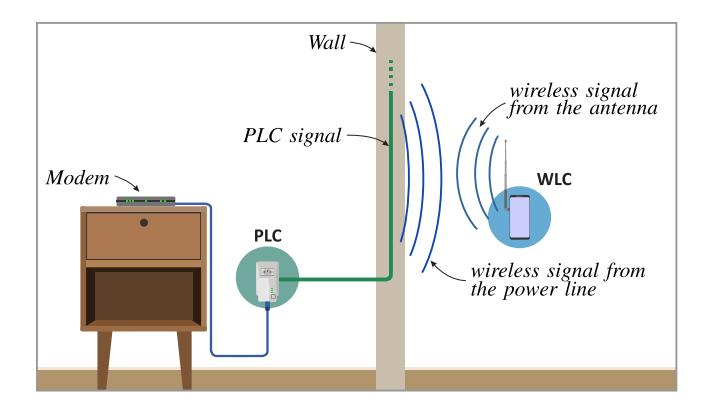
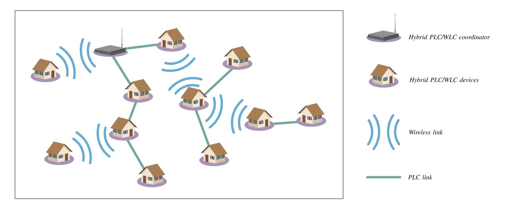
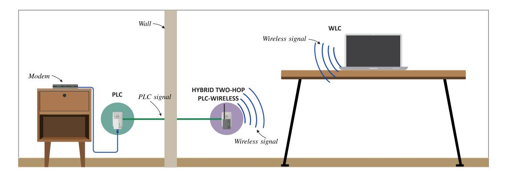
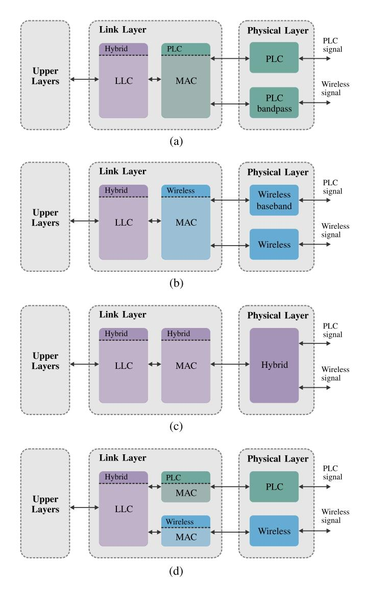
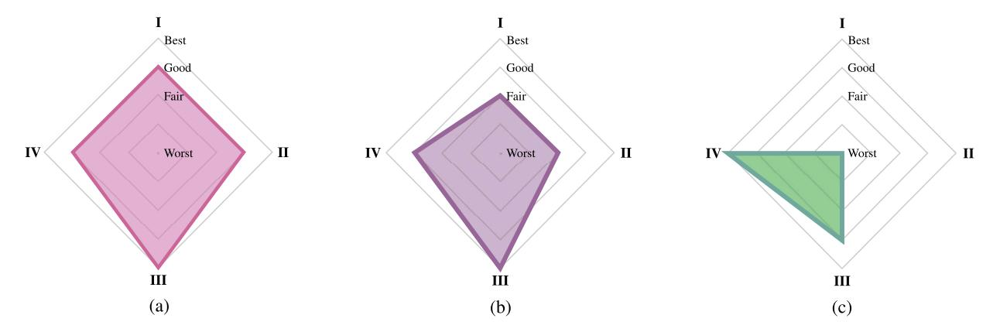
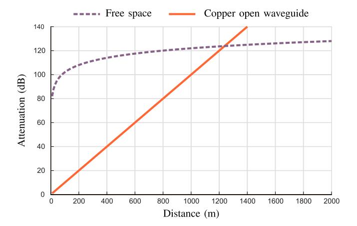

# Seamless Connectivity: The Power of Integrating Power Line and Wireless Communications

Moisés V. Ribeiro®, *Senior Member, IEEE*, Mateus de L. Filomeno®, Ândrei Camponogara®, *Member, IEEE*, Thiago Rodrigues Oliveira®, Túlio F. Moreira®, Stefano Galli®, *Fellow, IEEE*, and H. Vincent Poor®, *Life Fellow, IEEE* 

Abstract—Aimed at inspiring researchers and practitioners, this paper presents comprehensive and multidimensional discussions of the potential and benefits of integrating power line and wireless communication systems to enhance data communication in both indoor and outdoor environments. By systematically examining the strengths and weaknesses of power line and wireless communication systems, we first elucidate the rationale behind their integration—hybrid communication systems. Then we categorize these hybrid communication systems and provide an in-depth analysis of each category, considering technical, chronological, industrial, and standardization aspects. Moreover, we discuss strategies for designing hybrid communication devices. Next, a qualitative assessment of hybrid communication systems follows, offering guidance for advancing their use, while a concise summary of key lessons imparts valuable insights for future endeavors. Lastly, the paper identifies a range of pertinent topics for further exploration and, consequently, advancing hybrid communication systems for smart grid, Internet of Things, and Industry 4.0 or 5.0 applications.

*Index Terms*—Hybrid communication system, power line communication, wireless communication, diversity, integration.

Manuscript received 10 August 2023; accepted 18 October 2023. Date of publication 27 October 2023; date of current version 27 February 2024. This work was supported in part by the Coordenação de Aperfeiçoamento de Pessoal de Nível Superior (CAPES) under Grant 001; in part by the Conselho Nacional de Desenvolvimento Científico e Tecnológico (CNPq) under Grant 404068/2020-0 and Grant 314741/2020-8; in part by the Fundação de Amparo à Pesquisa do Estado de Minas Gerais (FAPEMIG) under Grant APQ-03609-17, Grant TEC-PPM 00787-18, and Grant APQ-04623-22; in part by the Instituto Nacional de Energia Elétrica (INERGE); and in part by the U.S. National Science Foundation under Grant ECCS-2335876 and Grant ECCS-2039716. (Corresponding author: Mateus de L. Filomeno.)

Moisés V. Ribeiro, Mateus de L. Filomeno, and Túlio F. Moreira are with the Electrical Engineering Department, Federal University of Juiz de Fora, Juiz de Fora 36036-900, Brazil (e-mail: mribeiro@engenharia.ufjf.br; mateus.lima@engenharia.ufjf.br; tulio.fernandes@engenharia.ufjf.br).

Ândrei Camponogara is with the Electrical Engineering Department, Federal University of Paraná, Curitiba 81530-000, Brazil (e-mail: acamponogara@ieee.org).

Thiago Rodrigues Oliveira is with the Electronics Department, Federal Institute of Education, Science and Technology of the Southeast of Minas Gerais, Campus Juiz de Fora 36080-001, Brazil (e-mail: thiago.oliveira@ifsudestemg.edu.br).

Stefano Galli is with the Wireless and Optical Department, Peraton Labs, Red Bank, NJ 07701 USA (e-mail: stefano.galli@peratonlabs.com).

H. Vincent Poor is with the Department of Electrical and Computer Engineering, Princeton University, Princeton, NJ 08544 USA (e-mail: poor@princeton.edu).

Digital Object Identifier 10.1109/COMST.2023.3327321

#### I. INTRODUCTION

**E**LECTRIC utilities around the world have been increasingly using power line communication (PLC1) for remote metering and load control [1], [2] since the early 20th century. At that time, data communication systems also employed PLC and wireless communication (WLC) a technique known in the early 1900s as "wired-wireless" or "carrier-frequency telephony." With this technique, the radiated part of the signal injected into an unshielded power line is captured by a wireless device specifically designed to process it. Similarly, a properly designed wireless device may induce signals into unshielded power lines to facilitate communication. AT&T utilized wired-wireless systems to support commercial telephony over power lines, while the power industry worldwide used them to transmit telephone signals between power line stations. By the 1930s, wiredwireless technology became a mature and widely deployed solution globally [3]. It was the first example of a hybrid communication system2 centered on PLC technologies. Thus, it marked the genesis of hybrid communication systems based on PLC and WLC.

From 1930 to 1980, the primary applications of PLC systems included home automation, telephony, and data communication through high voltage (HV) transmission systems [1], [8], [9]. Subsequently, the development of narrowband (NB) and then broadband (BB) PLC systems occurred to address the demands of various applications, such as smart grid (SG) [10], [11], [12], [13], [14], [15], BB access [16], [17], [18], home networking [19], [20], [21], in-vehicle communications [22], [23], [24], [25], and the Internet of Things (IoT) [26], [27], [28]. In the past decade, in particular, PLC systems were standardized and deployed for SG [2], [29] and in-home/BB access [16], [17], [19] applications.

Well into the 21st Century, we have seen a growing need for connectivity among things—e.g., machines. Consequently, more demands for maximizing the use of channel resources in different dimensions (time, frequency, space, etc.) have

 $^{\rm I}{\rm Regardless}$  of the period under discussion, we are going to use "PLC systems" to refer to the use of electric power systems for data communication purposes.

2In the literature, the term *heterogeneous communication systems or heterogeneous networks* is used instead of *hybrid communication systems* [4], [5], [6], [7]; however, in this paper, we replace heterogeneous with "hybrid" to emphasize that we are referring to the heterogeneous communication systems that integrate PLC systems with two or more technologies.

1553-877X © 2023 IEEE. Personal use is permitted, but republication/redistribution requires IEEE permission. See https://www.ieee.org/publications/rights/index.html for more information.

emerged. In this regard, the scarcity of the electromagnetic spectrum has become a serious and challenging problem that leads to a worldwide paradigm shift to more versatile, dynamic, and market-based ways for sharing spectrum resources [\[30\]](#page-32-29). Hence, the search for new possibilities, mainly opportunistic [\[31\]](#page-32-30) and fair [\[32\]](#page-32-31), for maximizing spectrum usage, as well as channel resources in other communication media, has motivated many advances in data communication systems, which define *sine qua non* conditions for supporting emerging applications, such as SG [\[33\]](#page-32-32), [\[34\]](#page-32-33), the IoT [\[22\]](#page-32-17), [\[35\]](#page-32-34), and Industry 4.0 or 5.0 [\[26\]](#page-32-21), and beyond.

To meet these demands, a timely and appealing research direction is to advance the effective integration of PLC with other data communication systems. In this regard, WLC [\[27\]](#page-32-22), [\[36\]](#page-32-35), visible light communication (VLC) [\[37\]](#page-32-36), [\[38\]](#page-32-37), [\[39\]](#page-32-38), [\[40\]](#page-32-39), optical communications [\[41\]](#page-32-40), and digital subscriber line (DSL) [\[42\]](#page-32-41), [\[43\]](#page-32-42), [\[44\]](#page-32-43) are the natural candidates to be included in such investigation. Furthermore, the integration of PLC systems with at least two other technologies is also promising—e.g., PLC+WLC+VLC [\[38\]](#page-32-37), [\[45\]](#page-33-0), [\[46\]](#page-33-1), [\[47\]](#page-33-2), [\[48\]](#page-33-3), [\[49\]](#page-33-4).

Hybrid multi-physical (PHY) communication systems [\[50\]](#page-33-5), [\[51\]](#page-33-6) provide a broad range of possibilities and can result in different integrations of data communication technologies e.g., PLC and WLC, PLC and VLC, among others. The common denominator for hybrid communication systems is that no single technology can always provide the desired coverage and throughput, so an additional channel can not only improve the coverage/throughput trade-offs but also provide feedback in case of link failures. Among the many wired technologies, PLC may be considered an interesting option for improving throughput, reliability, and coverage of other technologies because it leverages the most pervasive infrastructure in the world while being adequately reliable in most situations.

Moreover, hybrid communication systems that only explore the joint use of power line and wireless data communication media—i.e., media diversity—can benefit distinct applications demanding connectivity. Indeed, they can assist the telecommunication industry in supporting several requirements ranging from short to long distances, short to long frame/packets, low to high data rates, low to reasonable energy consumption, and low to high latency and delay when quality of service (QoS) or quality of experience (QoE) are considered [\[52\]](#page-33-7), [\[53\]](#page-33-8), [\[54\]](#page-33-9).

#### *A. Motivation and Comparison With Previous Contributions*

The literature reports that current wireline [\[55\]](#page-33-10), [\[56\]](#page-33-11), [\[57\]](#page-33-12), [\[58\]](#page-33-13), [\[59\]](#page-33-14) and wireless [\[60\]](#page-33-15), [\[61\]](#page-33-16), [\[62\]](#page-33-17), [\[63\]](#page-33-18), [\[64\]](#page-33-19), [\[65\]](#page-33-20), [\[66\]](#page-33-21) communication systems have been individually advanced to provide pervasive and high-rate data networks for fixed and mobile applications. As none of them can individually cover all telecommunication demands, a natural direction is to integrate various technologies, resulting in hybrid communication systems. In this context, hybrid communication systems based on PLC and WLC have flourished over the past decades, representing an opportunity to complement, expand, advance,

TABLE I SURVEYS, TUTORIALS, AND REVIEWS RELATED TO PLC, WLC, AND HYBRID COMMUNICATION SYSTEMS

| Research                | Focus      | Related works               |  |  |
|-------------------------|------------|-----------------------------|--|--|
|                         | PHY Layer  | [24], [70]–[80]             |  |  |
| PLC                     | Link Layer | [34], [81], [82]            |  |  |
|                         | General    | [2], [10], [83]–[88]        |  |  |
|                         | PHY Layer  | [89]–[100]                  |  |  |
| WLC                     | Link Layer | [101]–[104]                 |  |  |
|                         | General    | [7], [30]–[32], [105]–[110] |  |  |
|                         | PHY Layer  | [111]                       |  |  |
| Hybrid Communication | Link Layer | w/o                         |  |  |
|                         | General    | [27], [112], [113]          |  |  |

and support longstanding telecommunication systems. The industry is indeed pursuing such hybrid communication systems [\[67\]](#page-33-22), [\[68\]](#page-33-23), [\[69\]](#page-33-24) because several technical contributions covering theoretical, numerical, and field trial analyses have demonstrated effective gains in terms of performance, coverage, and reliability in various relevant environments. Therefore, the joint optimization of PLC and WLC channel resources is a valuable research endeavor. In this regard, a comprehensive treatment of hybrid communication systems should draw the attention of researchers and practitioners to challenges and opportunities for providing advanced communication infrastructures. Furthermore, a thorough investigation of PLC and WLC is essential for addressing well-established and emerging applications that a single technology may not entirely fulfill.

A search for surveys, reviews, and tutorials in the literature reveals many works related to PLC and WLC. Conveniently, the main works related to PLC can be organized into three groups: PHY layer, link layer, and general, which may include multiple layers. Table [I](#page-1-0) lists the major PLC-related surveys, reviews, and tutorials and a representative set of them for WLC. Also, review papers related to hybrid communication systems are listed. Note that a reasonable number of PLC works are characterized by addressing various aspects of PLC systems and their relevant characteristics. Regarding WLC systems, the number of survey, review, and tutorial papers approaching their properties is countless, so only a few of them were collected to compose a representative set. When it comes to hybrid communication systems, to the best of the authors' knowledge, the number of these types of papers is limited.

Table [II](#page-2-0) lists the existing four review papers approaching hybrid communication systems based on PLC or WLC. Note that these papers touch on a few distinct features of hybrid communication systems; however, none comprehensively treats the major aspects of hybrid communication systems based on PLC and WLC. In fact, various aspects of hybrid communication systems based on PLC and WLC have been discussed in numerous technical contributions. Nonetheless, it is not easy to comprehend the circumstances, constraints, boundaries, types of integration, and other

| Year | Reference                | Short description                                                                                                                     |
|------|--------------------------|---------------------------------------------------------------------------------------------------------------------------------------|
| 2003 | Lin <i>et al</i> . [112] | This paper compares PLC and WLC protocols for in-home data networks based on theoretical and field test results.                      |
| 2011 | Güzelgöz et al. [111]    | Focusing on SG applications, this paper discussed the characteristics of PLC and WLC channels, mainly regarding signal propagation.   |
| 2018 | Dib et al. [27]          | This paper discusses how SG applications based on IoT may benefit from the diversity of both PLC and WLC media.                       |
| 2022 | Vappangi and Mani [113]  | This paper reviews the joint application of PLC and VLC, considering relevant aspects of the PHY layer and multiple access techniques |

TABLE II REVIEW PAPERS RELATED TO HYBRID COMMUNICATION SYSTEMS BASED ON PLC OR WLC

crucial issues for fostering hybrid communication systems. Furthermore, no study presents a historical evolution and technical development of different types of hybrid communication systems based on PLC and WLC. In this sense, we are convinced that comprehensive discussions throughout this paper will bridge these gaps and benefit researchers and practitioners.

## *B. Our Contributions*

In this paper, we focus on hybrid communication systems based on PLC and WLC only since, over the past few years, this integration has been the most studied and deployed one.[3](#page-2-1) We also note that, despite the rich literature on the subject and the various deployed products of hybrid communication systems, no literature summarizes and categorizes ongoing academic/industrial R&D and standardization efforts on hybrid communication systems based on PLC and WLC, nor provides a comprehensive state-of-the-art and road-maps for inspiring researchers and practitioners to pursue projects related to these hybrid communication systems. In addressing these gaps, this paper offers the following contributions:

- A discussion of PLC and WLC systems focusing on their individual strengths and weaknesses that motivate their integration at different levels. This integration aims to exploit the existing diversities between the power line and wireless data communication media in the time, frequency, and space domains.
- An introduction to hybrid communication systems as the result of the integration of PLC and WLC systems, paying attention to the motivations and benefits for such integration. Also, a description of the three types of hybrid communication systems that emerge from the integration of PLC and WLC systems, highlighting scenarios where each has been effectively employed.
- A presentation of technical aspects, historical evolution, current state-of-the-art, and industrial advances of the three types of hybrid communication systems.
- An exposition of approaches for designing the three types of hybrid communication systems, providing a baseline for creating systems with varying performance, complexity, and development time trade-offs.

3In the remainder of this paper, all mentions about hybrid communication systems are related to the integration of PLC and WLC technologies.

- A thorough qualitative assessment of the three types of hybrid communication systems, considering various aspects. The chosen aspects allow us to identify situations and contexts where each hybrid communication system can effectively bridge existing problems when only a PLC or WLC system operates indoors or outdoors.
- A compilation of lessons learned addressing each type of hybrid communication system. These insights offer a better understanding of advances in hybrid communication systems, enabling researchers and practitioners to avoid pursuing worthless or previously explored research directions
- A discussion of intricate challenges, research prospects, and upcoming trends associated with the three types of hybrid communication systems.

## *C. Outline of the Paper*

The rest of this paper is organized as follows: Sections [II](#page-2-2) and [III](#page-6-0) discuss important aspects of PLC and WLC systems, respectively. Section [IV](#page-7-0) focuses on the benefits of integrating PLC and WLC systems; introduces hybrid communication systems based on PLC and WLC; and describes three typical integration of them. Sections [V](#page-11-0)[–VII](#page-19-0) detail hybrid wired-wireless systems, hybrid one-hop PLC/WLC systems, and hybrid two-hop PLC/WLC systems, respectively. Section [VIII](#page-24-0) discusses the main approaches for designing hybrid communication systems. Section [IX](#page-26-0) provides a qualitative comparison among the three types of hybrid communication systems in terms of representative features. Section [X](#page-28-0) focuses on the lessons learned and insight gained. Section [XI](#page-29-0) pays attention to research opportunities and future trends. Finally, Section [XII](#page-31-0) states our concluding remarks. The structure of this paper is shown in Fig. [1](#page-3-0) while a list of abbreviations used is given in Table [III.](#page-4-0)

## II. POWER LINE COMMUNICATION SYSTEMS

After more than 120 years of research, with the majority of advances occurring in the past three decades, our understanding of electric power systems for data communication has reached a high level of maturity. The literature suggests that PLC systems may not be the optimal choice for data communication purposes in most indoor and outdoor environments. Electric power systems were originally designed to transmit and deliver electricity from power generators to

Fig. 1. The structure of the paper.

consumers at very low frequencies (i.e., mains frequency of 50 or 60 Hz), making data communication through these systems extremely challenging. Indeed, the complexity of

electric power systems, primarily related to topology, voltage levels, component physical characteristics (e.g., types of power cables and transformers), and load dynamics [\[114\]](#page-34-0), [\[115\]](#page-34-1), creates obstacles for data communication. In addition, electric power systems continuously evolve to mitigate global warming [\[116\]](#page-34-2), [\[117\]](#page-34-3), [\[118\]](#page-34-4), promoting extensive research efforts and investments to introduce renewable energy sources and advance electricity-based mobility. Considering the nonlinear characteristics of renewable energy sources and new electricity applications, electric power systems pose even greater challenges for data communication purposes.

Because of the aforementioned complexities, the use of electric power systems for data communication exhibits several trade-offs related to coverage, applicability, performance, and feasibility when considering factors such as environment, mains frequency voltage amplitude, frequency band, and distance. Nonetheless, PLC systems have been successfully applied to alternating current (AC)-based electric power transmission and distribution systems using overhead or underground power lines, such as HV, medium voltage (MV), and low voltage (LV), in outdoor and indoor scenarios. Various PLC systems are commercially available, primarily supporting indoor wireless systems and smart metering applications. Moreover, the literature reports various uses and adaptations of PLC systems to address electricity sector-specific demands, such as sensing and monitoring of assets [\[2\]](#page-32-1), [\[119\]](#page-34-5), [\[120\]](#page-34-6). As a result, numerous standards have been developed to cater to both BB and NB applications in indoor and outdoor scenarios [\[59\]](#page-33-14), [\[121\]](#page-34-7), [\[122\]](#page-34-8).

In this regard, it is important to emphasize that the improvements of PLC systems have been mainly oriented to address different sets of applications in two well-established frequency bands by the PLC community. Each of them is briefly described as follows [\[2\]](#page-32-1), [\[81\]](#page-33-25), [\[123\]](#page-34-9), [\[124\]](#page-34-10), [\[125\]](#page-34-11), [\[126\]](#page-34-12), [\[127\]](#page-34-13):

- • *Narrowband:* The goal is to utilize the frequency band between 3 kHz and 500 kH[z4](#page-3-1) for data communication purposes, which can offer data rates up to a few hundred kbps [\[29\]](#page-32-24). NB-PLC systems can achieve data rates compatible with the requirements of low data rate applications in the contexts of SG, the IoT, and Industry 4.0 or 5.0. Several protocols, standards, and products are available for NB-PLC systems. Moreover, there are ultra-narrowband (UNB)-PLC proprietary systems, which operate under 3 kHz and as low as a few Hertz and are capable of data rates lower than a few bits per second [\[2\]](#page-32-1). NB-PLC and UNB-PLC systems are primarily used in smart metering in urban and rural areas. As these PLC systems need to cover long distances, PLC signals have to pass through existing equipment to increase reliability and coverage, which emerges as a significant challenge that cannot be addressed with the sole use of PLC systems.
- *Broadband:* The focus has been on the frequency band from 1.705 up to 528 MHz for high-speed data

4Telecommunication Regulatory Authorities allocate the frequencies between 500 kHz and 1.705 MHz to the AM radio station.

TABLE III LIST OF ABBREVIATIONS

| Acronym | Meaning                                                 | Acronym | Meaning                                             |
|---------|---------------------------------------------------------|---------|-----------------------------------------------------|
| AC      | Alternating current                                     | MV      | Medium-voltage                                      |
| ACA     | Average channel attenuation                             | NB      | Narrowband                                          |
| AF      | Amplify-and-forward                                     | NOMA    | Non-orthogonal multiple access                      |
| AI      | Artificial intelligence                                 | nSNR    | Normalized signal-to-noise ratio                    |
| AMI     | Advanced metering infrastructure                        | OC      | Optimum combining                                   |
| ANATEL  | Agência Nacional de Telecomunicações                    | OCDM    | Orthogonal chirp division multiplexing              |
| AoI     | Age of Information                                      | OFDM    | Orthogonal frequency division multiplexing          |
| AP      | Access point                                            | OSDM    | Orthogonal Stockwell division multiplexing          |
| ARIB    | Association of Radio Industries and Businesses          | PAN     | Personal area network                               |
| AWGN    | Additive white Gaussian noise                           | PHY     | Physical                                            |
| BB      | Broadband                                               | PLC     | Power line communication                            |
| CENELEC | European Committee for Electrotechnical Standardization | PLS     | Physical layer security                             |
| CFR     | Channel frequency response                              | PRIME   | PowerLine Intelligent Metering Evolution            |
| CSI     | Channel state information                               | PSD     | Power spectrum density                              |
| CSMA/CA | Carrier sense multiple access with collision avoidance  | QoE     | Quality of experience                               |
| DC      | Direct current                                          | QoS     | Quality of service                                  |
| DF      | Decode-and-forward                                      | RF      | Radio frequency                                     |
| DSL     | Digital subscriber line                                 | RMS-DS  | Root mean squared delay spread                      |
| DSO     | Distribution System Operator                            | SC      | Selection combining                                 |
| ETSI    | European Telecommunications Standards Institute         | SG      | Smart Grid                                          |
| FCC     | Federal Communications Commission                       | SISO    | Single-input single-output                          |
| FSO     | Free-space optical communication                        | SMC     | Saturated metric combining                          |
| GE      | General Electric Corporation                            | SISOME  | single-input single-output - multiple-eavesdroppers |
| HV      | High-voltage                                            | SNR     | Signal-to-noise ratio                               |
| IoT     | Internet of Things                                      | SUN-FSK | Smart Utility Network - Frequency Shift Keying      |
| ISM     | Industrial, scientific, and medical                     | TEM     | Transverse electromagnetic                          |
| LAN     | Local area network                                      | TM      | Transverse magnetic                                 |
| LLC     | Logic link control                                      | TVWS    | Television white space                              |
| LV      | Low-voltage                                             | UNB     | Ultra narrow band                                   |
| M2M     | Machine-to-machine                                      | VHF     | Very high frequency                                 |
| MAC     | Medium access control                                   | VLC     | Visible light communication                         |
| MIMO    | Multiple-input multiple-output                          | VNB     | Very narrow frequency bandwidth                     |
| MoCA    | Multimedia over Coax Alliance                           | Wi-Fi   | Wireless fidelity                                   |
| MRC     | Maximal-ratio combining                                 | WLC     | Wireless communication                              |

rates [\[2\]](#page-32-1), [\[128\]](#page-34-14). However, in practice, telecommunication regulations dictate that the maximum frequency is 86 MHz.[5](#page-4-1) Within this frequency band, the distance between two nodes must be shorter than a few hundred meters when employing outdoor BB technologies and LV electric power systems in residential, commercial, and vehicular applications. This limitation is due to the attenuation of power cables and the topology of electric power systems. However, the maximum distance can be extended to a few kilometers if a BB-PLC system operates over MV electric power systems. Currently, technologies, protocols, standards, and products cover the frequency band between 1.705 and 86 MHz. Additionally, a few studies consider television white space (TVWS) and theoretical investigations of waveguide over power lines show that frequencies up to 100 GHz for data communication can be advanced [\[126\]](#page-34-12).

5In Brazil, the frequency bandwidth allocated for BB-PLC systems is delimited by 1.705 and 50 MHz.

Regardless of the frequency band, all PLC systems initially relied on single-input single-output (SISO) communication, as they used a pair of power lines or a single power line with a single-wire ground return. However, the potential to exploit signal propagation modes, such as differential and common modes, or three-phase-based power lines combined with a single-wire earth return, motivated the adoption of multiple-input multiple-output (MIMO) communication [\[73\]](#page-33-26), [\[129\]](#page-34-15), [\[130\]](#page-34-16). Consequently, the performance of PLC systems improved significantly in terms of spectral efficiency, particularly in indoor facilities.

Furthermore, AC- and direct current (DC)-based electric power systems can be respectively described as cyclostationary and stationary random systems [\[23\]](#page-32-18), [\[72\]](#page-33-27), [\[78\]](#page-33-28). The cyclostationarity of AC-based systems arises from electricity delivered at the mains frequency—i.e., 50 or 60 Hz—and the dynamics of connected loads. In contrast, the randomness of DC-based electric power systems depends solely on the characteristics of load dynamics, and in most cases, data communication media can be modeled as quasi-static random systems. Factors such as power line topology, frequency band, building materials, component connections, voltage levels, and operating environments substantially impact the dynamics of electric power systems as data communication media. Additionally, load dynamics and signal propagation characteristics in electric power systems result in high-power impulsive noise components with various types of randomness, including cyclostationary, stationary, and non-stationary behaviors.

In recent years, research efforts aimed at improving PLC systems have diminished due to the limited potential for significant enhancements in data rate and coverage. The reasons behind this are the inherent limitations of electric power systems as data communication media and existing regulations that restrict the frequency band and maximum power spectral density (PSD) for PLC systems. This contrasts with the advancements achieved in WLC systems, which benefit from the availability of more frequency bands. Currently, numerous textbooks [\[1\]](#page-32-0), [\[13\]](#page-32-8), [\[125\]](#page-34-11), surveys and papers (see Table [I\)](#page-1-0) have extensively discussed PLC systems, addressing various aspects from the PHY to the network layer. Therefore, we focus on a few aspects related to the PHY and link layers to highlight the potential of integrating PLC and WLC systems for overcoming the limitations of both data communication systems in indoor and outdoor environments. Specifically, the subsequent subsections will emphasize the critical characteristics of power lines as communication media, encompassing their strengths and weaknesses.

#### *A. Strengths*

Nowadays, there is extensive knowledge about PLC, and we can identify several advantages of using electric power systems for data communication purposes [\[2\]](#page-32-1), [\[123\]](#page-34-9), [\[125\]](#page-34-11). The primary advantages are as follows:

- *Pervasive infrastructure:* More than 98% of the worldwide population is connected today to electric power systems. In the present day, all portions of the electric power systems are used to support applications via PLC, from the HV to the LV sections of them. Moreover, inhome LV power lines are extensively used today to form very high-speed indoor local area networks connecting via BB-PLC devices.
- *Good connectivity in a variety of situations:* The physical characteristics of power cables and the topology of electric power systems create different attenuation and noise levels that allow a variety of range-throughput trade-offs that can be fulfilled either with NB-PLC or BB-PLC solutions. This is especially true for in-home BB applications.
- *Power, data, and sensing capability:* PLC systems can be designed to simultaneously transmit power and data and be adapted to sense and monitor electric power systems' infrastructure. For instance, high impedance faults can be detected and localized using PLC systems in the HV, MV, and LV levels. Also, the degradation of power lines can be quantified using PLC systems [\[85\]](#page-33-29).
- *Cost-effectiveness:* As PLC systems use existing power lines, there is a significant cost reduction in deploying

- and maintaining communication networks. Moreover, implementing PLC systems is typically straightforward and non-invasive, as it does not require digging trenches or installing new poles.
- *Coverage:* PLC systems can be used in urban and rural areas, making it a versatile communication solution. These systems can reach locations where other communication technologies might be challenging or expensive to deploy. For instance, PLC systems are convenient for overcoming indoor physical barriers such as walls and floors.

#### *B. Weaknesses*

Although electric power systems offer several advantages for data communication purposes, they also present significant challenges. The characteristics of electric power systems pose obstacles to their use as a data communication media, see [\[1\]](#page-32-0), [\[16\]](#page-32-11), as discussed below:

- *Load dynamics:* The dynamic nature of several loads connected to the electric power systems continuously changes the behavior of these data communication media and generates high-power impulsive noise, which can corrupt a burst of information-carrying signals [\[74\]](#page-33-30), [\[131\]](#page-34-17).
- • *Cost with coupling:* The connection with the electric power systems becomes remarkably expensive and complex as the voltage level increases. The cost of coupling PLC devices to MV and HV levels is much higher than coupling with LV ones. Overall, there are limited flexibility and increasing constraints in connecting PLC devices to power lines as the voltage amplitude of mains frequency increases [\[70\]](#page-33-31).
- • *Impedance mismatching:* Impedance mismatching at the point of connections—e.g., cable to cable and cable to loads—and between components of electric power systems—e.g., power cables, connectors, and switches introduce considerable distortion and attenuation in the information-carrying signals. Also, the topology of electric distribution systems adds further attenuation to the information-carrying signals [\[71\]](#page-33-32), [\[132\]](#page-34-18).
- • *Unshielded power cables:* The widespread use of electromagnetic unshielded power cables results in interference among PLC systems and telecommunication systems that operate in the same frequency band, which are the primary users.
- *Fault and failure:* The PLC link reliability may be low because the majority of power transmission and distribution systems rely on the use of overhead and outdoor power lines that face damage or failure due to natural sources—e.g., lightning and strong wind—or artificial sources—e.g., car crash into a utility pole.
- • *Lack of mobility:* Similar to other wireline technologies e.g., DSL and ethernet—PLC systems do not offer mobility. Also, the connection points with electric power systems present some limitations because the infrastructures of electric power systems are already deployed for energy transmission and distribution purposes. For instance, we can only access electric power circuits through the outlets in a house or building facility.

- *Security concerns:* PLC systems use existing power lines to transmit data, which can create vulnerabilities exploitable by attackers. As electric power systems are interconnected, it is not possible to constitute barriers to signal propagation through electric power systems. Consequently, attackers located far from the PLC system can overhear, physically or not connected to power lines, data transmitted through power lines, compromising the confidentiality and integrity of sensitive information.
- *Regulatory constraints:* Compliance with regulations is crucial for PLC systems as technical institutions and regulatory bodies enforce standards and regulations for the safe, efficient, and fair use of electric power systems for data communication. These rules cover various aspects, including frequency allocation, transmit power, emission limits, and interference mitigation, constraining the performance and flexibility of PLC systems. Strict frequency band allocation and transmit power limitations significantly reduce coverage and data rates, affecting system performance and scalability [\[77\]](#page-33-33), [\[133\]](#page-34-19).

## III. WIRELESS COMMUNICATION SYSTEMS

WLC systems have revolutionized communication, information access, and daily tasks. Their evolution has led to increased efficiency, enhanced performance, and improved user experiences. Progress in wireless communication has brought higher data rates, coverage, and reliability, spanning from early radio broadcasting and mobile telephony to digital communication and the mobile Internet revolution. As 5G networks emerge and research on future wireless technologies progresses, WLC systems will keep advancing, providing seamless connectivity and enabling innovative applications and services.

Compared to PLC systems, WLC systems do not face severe limitations in the frequency bands used for data communication [\[90\]](#page-33-34), [\[134\]](#page-34-20). This has motivated growing research efforts to advance WLC systems due to their vast potential for improvement and widespread applicability in wirelessly connecting, sensing, and powering devices, equipment, and infrastructure. There are many applications, some of which are IoT and machine-to-machine (M2M), smart cities, autonomous vehicles, remote healthcare and telemedicine, and drone communication and control.

Wireless channels are linear random systems whose dynamics can vary significantly with the frequency band/bandwidth, distance, environment, and relative movement between the source and destination nodes [\[111\]](#page-34-21), [\[135\]](#page-34-22), [\[136\]](#page-34-23). This randomness of wireless channels encompasses the relative movement between the nodes and the transmitted signal's reflections, diffraction, and scattering. Additive noise is modeled as a stationary random process with a constant power spectral density, usually, thermal noise [\[137\]](#page-34-24).

Using high frequencies in wireless communications leads to significant signal attenuation when propagating wireless signals through obstacles such as walls, floors, and trees. Frequencies up to 6 GHz are well-established and convenient for indoor and outdoor WLC applications. However, with the vast potential and widespread applicability of WLC systems in higher frequencies, research is currently being conducted on frequencies up to sub-THz [\[90\]](#page-33-34) (i.e., frequencies up to 300 GHz). Consequently, the next generation of WLC systems will need to overcome several existing limitations and design cost-effective WLC technologies for frequencies higher than 6 GHz. Some of the limitations for using higher frequencies for data communication purposes are briefly detailed as follows [\[138\]](#page-34-25), [\[139\]](#page-34-26), [\[140\]](#page-35-0), [\[141\]](#page-35-1):

- • *Spectrum allocation and regulation:* Governmental agencies, like the U.S. Federal Communications Commission (FCC), European Telecommunications Standards Institute (ETSI), and Agência Nacional de Telecomunicações (ANATEL), regulate frequency band allocation, limiting spectrum availability for desired applications.
- *Propagation loss and signal attenuation:* Frequencies beyond 6 GHz face higher losses due to factors like freespace path loss, atmospheric absorption, and foliage loss, resulting in shorter communication ranges and reduced coverage.
- • *Multipath fading and interference:* Higher frequencies are more prone to multipath fading and interference from environmental obstacles, causing signal degradation and reduced link reliability, especially in urban and indoor settings.
- *Antenna size and design:* Frequencies over 6 GHz require smaller antennas with potentially reduced efficiency and gain. Therefore, phased array or beamforming antennas are required for better directionality and signal strength.
- *Hardware requirements and power consumption:* Implementing wireless systems at frequencies above 6 GHz demands more complex, power-hungry components, increasing power consumption, cost, and thermal management challenges.
- *Penetration and diffraction losses:* Higher frequencies have limited penetration capabilities through obstacles, causing additional signal attenuation and coverage challenges, particularly in indoor environments.

A vast body of literature is available on WLC systems, encompassing numerous textbooks, surveys, and papers (see Table [I\)](#page-1-0) that explore various aspects from the PHY to the network layer. Researchers and engineers have significantly contributed to advancing the understanding and application of WLC technologies across diverse contexts.

Taking into account that frequencies up to 6 GHz enable the design of cost-effective WLC systems for the majority of indoor and outdoor applications, the following subsections focus on significant features of WLC systems that support the integration of PLC and WLC systems. This integration addresses certain limitations of WLC systems in outdoor and indoor environments when considering frequencies below 6 GHz. In this context, the following subsections highlight the strengths and weaknesses of WLC systems in this frequency range because it is the most attractive to exploit in integration with PLC systems.

## *A. Strengths*

WLC systems offer numerous advantages over wired systems, providing end-to-end data communication in indoor and outdoor environments. Some of the most notable strengths include [\[138\]](#page-34-25), [\[139\]](#page-34-26), [\[140\]](#page-35-0), [\[141\]](#page-35-1):

- *Mobility and flexibility:* WLC systems enable users to access network resources and stay connected while on the move. This mobility supports the proliferation of smartphones, tablets, and other mobile devices, allowing users to work, communicate, and access the Internet virtually anywhere.
- *Ease of installation:* WLC systems are often easier and quicker to install than PLC counterparts, as they do not require cabling infrastructure. This makes them particularly suitable for temporary installations where the installation of wired systems is challenging.
- *Cost-effectiveness:* In many cases, WLC systems can be more cost-effective than wired networks, particularly when considering installation and maintenance expenses. The absence of physical cabling reduces material and labor costs, avoiding expensive infrastructure upgrades.
- *Reduced clutter:* By eliminating cabling, WLC systems can lead to a cleaner and more organized environment. This is particularly advantageous in offices, homes, and other spaces where aesthetic appeal and space utilization are important.
- *Geographical flexibility:* WLC systems can provide connectivity in remote or hard-to-reach locations where wired infrastructure is impractical or too expensive to deploy.
- *Rapid deployment:* WLC systems can be deployed quickly in emergency situations or during temporary events, providing essential communication infrastructure when needed. For example, they can be used to establish temporary networks during disaster relief efforts, largescale public events, or military operations.

## *B. Weaknesses*

WLC systems face challenges and weaknesses in indoor and outdoor environments, affecting performance, reliability, and user experience. Key weaknesses motivating the integration of PLC and WLC systems include signal degradation, interference, regulatory constraints, security concerns, and reduced coverage. Concise descriptions of these issues are given as follows [\[108\]](#page-34-27), [\[138\]](#page-34-25), [\[139\]](#page-34-26), [\[140\]](#page-35-0), [\[141\]](#page-35-1):

- • *Signal degradation:* WLC systems commonly face signal degradation due to distance and environmental factors. Path loss and multipath propagation significantly impact signal strength and quality. The former results from signal power dispersion over increasing areas, while the latter occurs when signals bounce off or are obstructed by physical objects, causing distortion. Thus, signal degradation challenges the performance and reliability of WLC systems in various environments.
- *Interference:* Interference refers to communication performance degradation due to other signals, devices, or systems operating in the same or nearby frequency bands. It can reduce signal quality, increase error rates, slower data transmission, and connectivity loss. Two main types of interference are co-channel interference, caused

- by devices competing for the same frequency channel, and adjacent channel interference, resulting from signals spilling over nearby channels. Factors like network congestion, poor channel planning, and inadequate filtering increase interference and reduce system performance and reliability.
- *Security concerns:* It is a crucial concern due to the inherent nature of wireless signal transmission. Unlike wired systems, unauthorized parties can more easily intercept or tamper with wireless signals. As a result, security vulnerabilities and potential attacks pose challenges, necessitating continuous research, and development of robust security solutions.
- *Regulatory constraints:* Ensuring safe, efficient, and fair spectrum use in WLC systems is crucial. Governments and regulatory bodies enforce rules and standards on various aspects of wireless communication, such as frequency allocation, transmit power, emission limits, and interference mitigation. Non-compliance with these regulations can lead to legal penalties, network interference, and safety risks. Moreover, regulatory constraints can limit system performance and flexibility, with strict frequency band allocations and transmit power restrictions resulting in reduced coverage and data rates. This can restrict spectrum availability for wireless communication, impacting system performance and scalability.
- *Reduced coverage:* Indoor and outdoor WLC systems face different coverage limitations that can impact their performance. In indoor environments, reduced coverage can occur due to various factors such as distance, walls, and interference from other wireless devices. In outdoor environments, wireless signals can be affected by natural obstacles such as trees, terrain variations, and atmospheric conditions like rain, fog, and snow, leading to reduced coverage.

# IV. HYBRID COMMUNICATION SYSTEMS

Remarkably, initial efforts to exploit the inherent diversity between the power line and wireless communication media, and consequently, develop a hybrid communication system that integrates PLC and WLC technologies, emerged at the beginning of the 20th century in a distinctive manner [\[3\]](#page-32-2). Almost a century later, Lin et al. [\[112\]](#page-34-28) rekindled interest in hybrid communication systems by detailing a field trial and presenting an in-depth comparison of throughput and coverage between prevalent BB-PLC and wireless fidelity (Wi-Fi) technologies for in-home applications, emphasizing the clear advantages of combining both approaches. Since then, the fusion of PLC and WLC has been actively pursued by both academia and industry.

In the following subsections, we highlight the motivations and benefits of adopting hybrid communication systems in various settings, including indoor and outdoor environments. Also, we introduce a categorization of hybrid communication systems.

#### *A. Why We Should Integrate PLC and WLC Systems?*

The primary purpose of hybrid communication systems, which transmit information-carrying signals and, in the future, may provide powering, sensing, and energy transfer functionalities, is to leverage the benefits of exploiting the diversity (i.e., time, frequency, and space) between PLC and WLC media. Both data communication media are subject to distinct weaknesses (e.g., signal propagation, channel frequency selectivity, coupling, and high power impulsive noise), frequency bands, impairments, coverage, security, and regulations; see Sections [II](#page-2-2) and [III.](#page-6-0)

Upon close examination of the strengths and weaknesses detailed in Sections [II](#page-2-2) and [III,](#page-6-0) it becomes evident that performance improvements in indoor and outdoor communication systems can be achieved by opportunistically integrating PLC and WLC systems. We advocate that the following reasons support such integration:

- The existence of time, frequency, and space diversities between PLC and WLC media can be exploited at the link and PHY layers.
- Given the presence of WLC media, mobility is also a feature of hybrid communication systems. Consequently, various applications demanding mobility can be fulfilled.
- There are complementary roles in indoor environments because walls and floors impose severe attenuation on the propagation of wireless signals as frequency increases. Using power line data communication media improves data communication when walls or floors separate communication nodes.
- There are complementary roles in outdoor environments since failures occur in outdoor electric power grids and wireless data communication media change. Consequently, PLC and WLC systems can assist each other to increase reliability.

Moreover, the integration of PLC and WLC systems would involve creating a single system that joins the strengths of both technologies to form a cohesive and efficient whole. On the other hand, combining PLC and WLC systems involves using each technology separately to achieve a specific goal, such as providing redundant communication channels or extending the transmission range. The integration of these systems is the best to be attained; however, in practice, the combination of PLC and WLC systems has been prevailing because it allows the industry to take advantage of the legacy of well-established standards and protocols for PLC and WLC systems. Therefore, we assume that hybrid communication systems can refer to integrating or combining PLC and WLC systems.

It is well-established that PLC and WLC media are very different in several aspects (channel frequency response, access impedance, additive noise, etc.). Consequently, the coherence time, the coherence bandwidth, and the normalized signalto-noise ratios (nSNRs) of power line and wireless channels are distinct and exert essential roles in the joint use of these data communication media in tandem or parallel. To illustrate the differences between these media, Fig. [2](#page-8-0) shows the magnitudes of channel frequency responses (CFRs) of power line and wireless channels when very narrow frequency

Fig. 2. Attenuation profiles of CFRs for power line channels: (a) VNB, (b) NB, and (c) BB. Attenuation profiles of CFRs for wireless channels: (d) VNB, (e) NB, and (f) BB.

bandwidth (VNB), NB, and BB frequency bandwidths are considered. These plots show how the frequency bandwidth might significantly impact the design of hybrid communication systems. Indeed, it will determine the choices in the PHY layer[6](#page-8-1) and the medium access control (MAC) sublayer that, in the end, will be able to fulfill distinct sets of requirements. A brief definition of VNB, NB, and BB for using hybrid communication systems[7](#page-8-2) is as follows:

- *Very narrow frequency bandwidth (VNB):* Both data communication media can be modeled as flat channels corrupted by additive noise, which is assumed to be a wide-sense stationary random process. For PLC, this frequency bandwidth is chosen in the frequencies below 500 kHz [\[2\]](#page-32-1), which includes the UNB frequencies. For wireless communications, the natural candidates are the industrial, scientific, and medical (ISM) band below 1 GHz and the frequencies centered at 433 MHz. One-tap and random channel models used in several contributions rely on adopting VNB.
- *Narrow frequency bandwidth (NB)*: PLC channels are frequency selective while WLC channels are flat. Also, the attenuation can remarkably increase as frequency increases in PLC channels while not observed in wireless channels. The additive noise is modeled as impulsive and stationary random processes in power lines and wireless channels. Also, PLC channels can be modeled as periodically time-varying systems, and WLC channels are modeled as a one-tap channel. For PLC, the frequency bandwidth is also chosen in the frequencies below 500 kHz and shorter than 500 kHz [\[2\]](#page-32-1). Wireless communications can be performed through the frequency bands of the ISM or TVWS.
- *Broad frequency bandwidth (BB):* Both PLC and WLC channels are frequency selective. The attenuation can remarkably increase as frequency increases in PLC channels while it is not observed in WLC channels. The additive noise is impulsive and stationary random

6Even though the attenuation profile of CFRs is not the only characteristic for designing link and PHY layers of data communication systems, it provides a nice picture of the possibility for exploiting both data communication media in a hybrid communication system.

7The discussion of frequency bands is based on the definition of frequency bandwidths in the PLC community, which is slightly different from the definitions in the communication community.

| Requirement           | PLC         | WLC         | Hybrid |
|-----------------------|-------------|-------------|--------|
| Installation          | ★★☆         | ***         | ★★☆    |
| Energy Efficiency     | ★★☆         | ★★☆         | ***    |
| Energy Harvesting     | ★★☆         | ★★☆         | ***    |
| Flexibility           | ***         | <b>★</b> ★☆ | ***    |
| Interference Immunity | ★★☆         | <b>★</b> ★☆ | ***    |
| Mobility              | ***         | ***         | ***    |
| Pervasiveness         | ★★☆         | ★★☆         | ***    |
| Reliability           | ★★☆         | <b>★</b> ★☆ | ***    |
| Security              | ★★☆         | ★★☆         | ***    |
| Sensing Capability    | <b>★</b> ★☆ | ★★☆         | ***    |

TABLE IV DIFFERENCES AMONG PLC, WLC, AND HYBRID COMMUNICATION SYSTEMS

processes in PLC and WLC channels. For PLC, the frequency bandwidth is defined in the frequencies below 100 MHz [\[2\]](#page-32-1), and, more recently, the TVWS has been considered [\[142\]](#page-35-2), [\[143\]](#page-35-3), [\[144\]](#page-35-4), [\[145\]](#page-35-5), [\[146\]](#page-35-6). Wireless communications can be performed through the frequency bands of the ISM or TVWS.

Regardless of the assumed frequency band, PLC, WLC, and hybrid communication systems can be conveniently compared in terms of a few features, see Table [IV.](#page-9-0) Hybrid communication systems are the best to maximize the use of the channel resources in several aspects due to the following reasons:

- *Installation:* PLC systems are relatively easy to install at the LV level, but installation becomes more complicated at MV and higher levels. WLC systems are consistently easy to install, especially in indoor environments. Therefore, the installation of hybrid communication systems is usually driven by the installation of PLC systems.
- *Energy efficiency:* Hybrid communication systems tend to be more efficient because they maximize the use of channel resources for data communication purposes [\[147\]](#page-35-7), [\[148\]](#page-35-8), [\[149\]](#page-35-9).
- • *Energy harvesting:* Harvesting energy in hybrid communication systems appears to be more effective because it can be performed in both data communication media [\[150\]](#page-35-10), [\[151\]](#page-35-11), [\[152\]](#page-35-12).
- • *Flexibility:* PLC systems are less flexible due to limited locations for connecting PLC devices to power lines and increased connection costs as voltage levels rise. On the other hand, WLC systems do not show such limitations. Consequently, hybrid communication systems offer greater flexibility because they inherit this feature from WLC ones [\[27\]](#page-32-22).
- *Interference immunity:* PLC and WLC systems demonstrate a similar capacity to deal with interference, while hybrid communication systems might offer an enhanced capability to handle interference by exploiting the existing diversity between both data communication media [\[153\]](#page-35-13), [\[154\]](#page-35-14), [\[155\]](#page-35-15).
- • *Mobility:* PLC systems can allow limited support for mobility; see Section [V](#page-11-0) for more details. On the other

- hand, WLC systems fully support mobility. As a result, hybrid communication systems provide this functionality [\[156\]](#page-35-16), [\[157\]](#page-35-17), [\[158\]](#page-35-18).
- *Pervasiveness:* Relying on an existing PLC or WLC system alone cannot achieve the pervasiveness demanded by society, but hybrid communication systems can address the weaknesses of PLC and WLC systems, offering greater pervasiveness [\[159\]](#page-35-19).
- • *Reliability:* Using multiple communication media with different characteristics can increase link reliability, enabling the system to continue functioning even if one channel or medium is compromised [\[27\]](#page-32-22).
- • *Security:* Relying on [\[160\]](#page-35-20), we can state that the diversity offered by hybrid communication systems can make it more difficult for an attacker to predict or exploit vulnerabilities. Also, it can improve the security at the PHY layer [\[161\]](#page-35-21), [\[162\]](#page-35-22), [\[163\]](#page-35-23). However, diversity alone is not enough to ensure security, and additional security measures such as encryption, authentication, and intrusion detection must also be implemented.
- • *Sensing capability:* PLC and WLC systems can sense distinct sets of parameters [\[100\]](#page-34-29), [\[119\]](#page-34-5), [\[120\]](#page-34-6), while hybrid communication systems can integrate the sensing capabilities of both of them.

Note that hybrid communication systems can leverage the unique and distinct characteristics of PLC and WLC systems to have more strengths and fewer weaknesses. By exploiting their existing diversities, hybrid communication systems offer more strengths than weaknesses. It makes them particularly useful in various in-home and in-vehicle settings, including cars, ships, trains, and aircraft, where nodes can easily access data networks and sense electric power systems without needing costly physical connections [\[164\]](#page-35-24).

We can also note that the unique and distinct characteristics of PLC and WLC systems have sparked an increasing interest in hybrid communication systems that aim to improve data rates, reliability, sensing, energy harvesting, energy efficiency, and coverage in both indoor and outdoor environments. In the following subsections, we will discuss the usefulness of integrating or combining PLC and WLC systems in these environments.

#### *B. Benefits in Indoor Environments*

Integrating PLC and WLC systems in indoor environments offers several advantages. Firstly, it provides a more reliable and consistent network connection. PLC systems offer better connectivity through walls and floors, while WLC systems can suffer from interference and signal degradation when facing those kinds of barriers. By integrating both systems, users benefit from the diversity between them [\[14\]](#page-32-9), [\[165\]](#page-35-25).

Furthermore, the integration of PLC and WLC systems can provide greater coverage and connectivity options [\[166\]](#page-35-26). In areas where WLC signals are weak or non-existent, PLC systems can provide coverage, especially in areas with thick concrete walls or metal barriers that disrupt WLC signals. The seamless handover between the two systems ensures uninterrupted connectivity. Another significant advantage of integrating PLC and WLC systems is enhanced security, as users can take advantage of the security features of both systems. Moreover, research has shown that diversity improves physical layer security (PLS) in indoor environments [\[160\]](#page-35-20).

Overall, the literature has shown that PLC systems have been widely applied to address connectivity, range, or throughput issues in BB home networking, particularly to overcome signal attenuation imposed by walls and floors. Therefore, integrating PLC and WLC systems can provide significant benefits regarding reliability, coverage, connectivity options, and security in indoor environments.

#### *C. Benefits in Outdoor Environments*

PLC systems offer the advantage of immunity from physical obstructions such as buildings, terrain, and trees in outdoor environments. However, their transmission range is limited, and their signal strength can be affected by the quality of the power lines. WLC systems have a wider transmission range but can suffer from interference and signal degradation caused by physical obstructions. Integrating PLC and WLC systems can help overcome these limitations. Short-range communication can be done using PLC systems, while WLC systems can extend the transmission range and overcome physical obstructions, providing a more reliable and robust communication system, especially in areas with poor power line quality or challenging terrain.

In addition to improved reliability, integrating PLC and WLC systems in outdoor environments can also lead to improved energy efficiency. PLC systems utilize existing power lines for data transmission, reducing the need for additional cabling and making them more energy-efficient than traditional wired communication systems. Integrating PLC and WLC systems can also improve security in outdoor environments by providing redundancy, ensuring that data is transmitted even if one system fails or is compromised. The diversity offered by PLC and WLC systems can benefit smart grid applications, where WLC systems can provide an alternative channel when PLC link failures occur due to impairments over the power lines.

Overall, the integration of PLC and WLC systems can provide significant benefits in outdoor environments by leveraging the strengths of both data communication media to provide a more reliable, energy-efficient, and secure data communication system.

#### *D. Categorization*

Distinct forms of integrating PLC and WLC systems result in a few types of hybrid communication systems that can opportunistically address distinct scenarios to deal with current and future telecommunication demands.

Having examined the literature and focusing on the cascade and parallel use of PLC and WLC systems, hybrid communication systems can be categorized into three types: hybrid wired-wireless, hybrid two-hop PLC/WLC, and hybrid onehop PLC/WLC, as shown in Fig. [3.](#page-10-0) In this paper, we use forward slash (/) and hyphen (−) symbols between PLC and WLC to indicate parallel and serial combinations of both

Fig. 3. The three types of hybrid communication systems.

data communication media, respectively. We can also replace "wireless" with radio frequency (RF) or WLC, and "WLC" with RF. Illustrations for differentiating these three hybrid communication systems are shown in Fig. [4,](#page-11-1) and a brief definition of each of them is provided as follows:

- *Hybrid wired-wireless system:* This is the oldest type of hybrid communication system. It was named *wiredwireless* at the beginning of the 20th century. It refers to the data communication between a WLC device, which is physically connected to the air through an antenna, and a PLC device, which is physically connected to a power line. Both devices operate in the same frequency band and, as a consequence, they make use of the serial or concatenation of PLC and WLC media, which has been called PLC-WLC media, see illustration in Fig. [4\(](#page-11-1)a). A recent advance of the hybrid wired-wireless system refers to the simultaneous use of a single device of both PLC and WLC interfaces. If the transmitter and receiver use such a strategy, we have a hybrid MIMO wired-wireless system [\[146\]](#page-35-6). As shown in Section [V,](#page-11-0) only academic activities are related to hybrid wired-wireless systems.
- *Hybrid one-hop PLC/WLC system:* This is characterized by the parallel use of PLC and WLC channels in distinct frequency bands in a one-hop link between source and destination link. In this case, the channels are independent, an interesting characteristic to exploit. The PLC link operates in the baseband (e.g., up to 100 MHz) while the WLC link operates in the passband (e.g., ISM frequency bands). It is the most investigated type of hybrid communication system. Typically, solutions today use one of either PLC or WLC as the default PHY while the other PHY is used only when the default PHY encounters connectivity issues. Also, the solutions on the market include both PLC and WLC interfaces in the same device. This is the most common configuration used today for supporting SG applications such as smart metering or distribution automation, where usually the default PHY is a low data rate/high data rate NB-PLC system such as Prime and G3-PLC protocols and the WLC link is typically Wi-Sun, LoRa, and ZigBee. Fig. [4\(](#page-11-1)b) illustrates a hybrid one-hop PLC/WLC system.
- *Hybrid two-hop PLC/WLC system:* This is the simplest type of hybrid communication system. It refers to using a PLC system in one hop and a WLC system in the following hop in a two-hop link between the source

Fig. 4. The three types of hybrid communication systems (continuous and dashed lines respectively represent PLC and WLC channels): (a) hybrid wiredwireless, (b) hybrid one-hop PLC/WLC, and (c) hybrid two-hop PLC/WLC.

and destination nodes. Data communication in each hop occurs in distinct frequency bands. The PLC link operates in the baseband while the WLC link operates in the passband (e.g., ISM frequency bands). A typical configuration has a PLC modem connected to a Wi-Fi router via ethernet and to another PLC modem in another room/floor via power lines, and this second PLC modem is connected to a Wi-Fi access point via ethernet. In some cases, the PLC modem and Wi-Fi Access Point (AP)/router are located in the same device. Today, it is the most common configuration for supporting BB home networks via hybrid communication systems. The PLC modems are usually based on the IEEE 1901 or ITU-T G.hn standards. This type of hybrid communication system is illustrated in Fig. [4\(](#page-11-1)c).

Based on the characteristics of each hybrid communication system, the following categorization can also be applied:

- *Hybrid communications:* This means that nodes in hybrid communication systems may be composed of one or two interfaces (i.e., PLC and WLC) to perform data communication. Also, nodes can use one medium or both depending on the need for the available interfaces in the nodes. Therefore, hybrid wired-wireless systems and hybrid two-hop PLC/WLC systems are categorized as hybrid communication systems.
- *Hybrid or dual interfaces devices:* This refers to the hybrid communication system in which all nodes always use both interfaces (i.e., PLC and WLC) to perform data communication. In this case, we have hybrid one-hop PLC/WLC and hybrid MIMO wired-wireless systems. Note that the former operates in distinct frequency bands while the latter operates in the same frequency band. In both types of hybrid communication systems, the combination of the received signal can be applied if the purpose is to transmit the same information between two nodes.

Furthermore, it is possible for nodes belonging to different hybrid communication systems to interoperate. This can be achieved through three different approaches: first, by having protocols and standards that share the same PHY and MAC; second, by implementing a conversion protocol between them; or third, by enabling the nodes to dynamically change their PHY and MAC layers, front-end, and frequency bands to select a specific hybrid communication system for each hop or set of hops between the source and destination nodes.

Finally, over the last 120 years, each hybrid communication system has been pursued at different times due to market demands and technological advances, which aimed to take advantage of the unique characteristics of both data communication media. In this sense, the following sections focus on a chronological perspective of these three types of hybrid communication systems.

#### V. HYBRID WIRED-WIRELESS SYSTEMS

This section aims to provide a comprehensive and systematic presentation of hybrid wired-wireless systems. To achieve this, the content is organized as follows: Section [V-A](#page-11-2) offers technical information, and Section [V-B](#page-12-0) focuses on the research evolution. Unlike hybrid one-hop PLC/WLC and hybrid two-hop PLC/WLC systems, which are discussed in Sections [VI](#page-14-0) and [VII](#page-19-0) respectively, there have not been any industrial or standardization efforts directed toward hybrid wired-wireless systems yet.

#### *A. Technical Aspects*

Most electric power systems are composed mainly of unshielded power lines. As a result, current signals flowing through power lines produce electromagnetic fields that can be sensed by a wireless device located close to power lines. Similarly, electromagnetic waves traveling over the air induce current signals into power lines that can be sensed by a PLC device, which is physically connected to the electric power circuit. In a conventional perspective, signals produced by PLC and WLC systems and respectively received by wireless and PLC devices are considered interference with each other. Nonetheless, in hybrid wired-wireless systems, such an inherent characteristic of unshielded power lines is used by a PLC device for transmitting information to a wireless device and vice versa, as shown in Fig. [5.](#page-12-1) Therefore, both PLC and WLC devices operate in the same frequency band. Hybrid wired-wireless systems have also been referred to as contact-less PLC systems [\[167\]](#page-35-27), [\[168\]](#page-35-28), [\[169\]](#page-35-29) and hybrid PLC-wireless systems [\[156\]](#page-35-16), [\[157\]](#page-35-17), [\[164\]](#page-35-24).

The hybrid wired-wireless channels can model the data communication medium between PLC and WLC devices [\[156\]](#page-35-16), [\[164\]](#page-35-24), [\[170\]](#page-35-30) as a cascade combination of PLC and WLC channels without an intermediate node. For hybrid communication systems operating in baseband, such as those in [\[156\]](#page-35-16), [\[157\]](#page-35-17), [\[164\]](#page-35-24), [\[170\]](#page-35-30), wireless signals do not suffer

Fig. 5. A typical scenario for hybrid wired-wireless systems.

high path losses, and up- and down-converters are not required. However, designing efficient and small antennas operating in the low-frequency range is challenging. Considering the passband [\[144\]](#page-35-4), [\[145\]](#page-35-5), [\[146\]](#page-35-6), [\[167\]](#page-35-27), [\[168\]](#page-35-28), [\[169\]](#page-35-29), path loss increases, up- and down-converters are necessary, but the antenna design and size is not a limiting factor. Another important concern is the frequency band because most of the spectrum in very high frequency (VHF)—i.e., between 30 MHz and 300 MHz—is already assigned to other data communication systems. Consequently, hybrid wired-wireless systems are secondary users who can only opportunistically access the spectrum for data communication.

Regarding the additive noise in this hybrid communication system, its characterization depends on the interface of the receiver node and frequency band [\[151\]](#page-35-11), [\[171\]](#page-35-31). In the case of reception by a PLC device, the additive noise is characterized by power line noise, which is well-known in the literature [\[74\]](#page-33-30). For WLC reception, the additive noise is usually characterized by additive white Gaussian noise (AWGN).

We can organize the findings related to hybrid wiredwireless systems into two categories:

- *SISO:* This refers to the baseband data communication between two nodes that use a single data communication interface, i.e., one communication node uses the PLC interface, whereas the other employs the WLC interface only. Investigations related to the baseband frequencies, as described in [\[156\]](#page-35-16), [\[157\]](#page-35-17), [\[164\]](#page-35-24), [\[170\]](#page-35-30), provide interesting channel characterizations based on measurement campaigns. Data communication in the baseband frequency is attractive because it allows connectivity to a PLC system without the physical connection with power lines. Nonetheless, designing efficient and small-size antennas operating in the low-frequency range remains challenging. Regarding the passband frequencies, findings from [\[167\]](#page-35-27), [\[168\]](#page-35-28), [\[169\]](#page-35-29) discuss a theoretical model without measured data, performance analysis, and measurement results of transmitting Wi-Fi signals through power lines. Using the passband frequency seems promising; however, it is necessary to correctly characterize the channels, at least in the ISM frequency bands.
- *MIMO:* This simultaneously considers transmitter and receiver nodes using both PLC and WLC interfaces. To date, there is no research effort to pursue MIMO at the

baseband frequencies. Considering passband frequencies, researchers emphasize the use of the TVWS spectrum for promoting hybrid MIMO wired-wireless systems [\[142\]](#page-35-2), [\[143\]](#page-35-3), [\[144\]](#page-35-4), [\[145\]](#page-35-5), [\[146\]](#page-35-6) in the VHF band. The findings are interesting; however, to advance hybrid MIMO wiredwireless systems, it is necessary to provide channel characterizations based on measurement campaigns to increase the knowledge about this kind of data communication media. For instance, the existing coupling between the wireless and power line communication media is unknown.

Note that research efforts for developing hybrid wiredwireless systems are totally academic and related to BB; however, VNB and NB can also be pursued. No products operate in this mode today, but academic interest has been resurgent in the last decade.

#### *B. Research Evolution*

The first hybrid wired-wireless system appeared at the beginning of the 20th century for providing voice communication over power lines [\[3\]](#page-32-2), more precisely in 1911 [\[172\]](#page-35-32), [\[173\]](#page-35-33). This technology initially used the antenna coupling method to inject/collect the voice signal into/from power lines. Then, a long wire parallel to power lines was used to induce and sense carrier-current voice signals for managing operations of power supplies [\[174\]](#page-35-34). In 1918, the first test and commercial operation of this system appeared in Japan [\[3\]](#page-32-2), [\[175\]](#page-35-35). It was successfully tested over 144 km long MV power lines. In 1921, this technology was commercialized in the United States by the General Electric Corporation (GE) company [\[3\]](#page-32-2). They operated over HV and MV electric power systems considering the frequencies between 50 kHz and 150 kHz and frequency bandwidth of a few kHz [\[3\]](#page-32-2). At the end of 1920s, around 1000 carrier-current systems spread across the United States and Europe.

Almost one century later, technological advances in telecommunication have motivated new investigations of the benefits of the radiated emissions yielded by signals traveling over power lines in distinct frequency bands for home networking and BB access applications. In fact, the concerns about the influence that electromagnetic radiation from PLC systems may have on wireless (HAM radio and shortwave broadcasting) and wired (VDSL) systems started to be raised—see [\[176\]](#page-35-36), [\[177\]](#page-35-37), [\[178\]](#page-35-38), [\[179\]](#page-35-39), [\[180\]](#page-35-40), [\[181\]](#page-35-41). Moreover, as models for PLC interference to radio systems became available, the interest in this kind of hybrid communication system also came back.

In this sense, in 2010, [\[182\]](#page-35-42) studied radiated emissions for transmitting information-carrying signals to a wireless device close to an electric power circuit. First, a capacitive coupling circuit injected the information-carrying signal, at a central frequency of 2.4 GHz generated by a wireless device, into the electric power grid. In contrast, another wireless device received it by sensing the electromagnetic field produced by the information-carrying signal transmitted through power lines. Next, in 2011, [\[183\]](#page-35-43) pointed out such radiated emissions as a possible vulnerability of BB-PLC systems since the information leaked through the electromagnetic field could be overheard by a wireless eavesdropper close to the used electric power circuit.

In contrast, in 2013, [\[156\]](#page-35-16) presented an initial discussion on hybrid wired-wireless channels considering both transmission directions (i.e., PLC to wireless and wireless to PLC). Three years later, [\[164\]](#page-35-24) discussed a measurement campaign for obtaining estimates of hybrid wired-wireless channels and characterizing them in terms of the magnitude of CFR, average channel attenuation (ACA), coherence time, root mean squared delay spread (RMS-DS), frequency bandwidth, and achievable data rate. It reported achievable data rate values up to 450 Mbps.

In 2014, [\[167\]](#page-35-27) experimentally measured the data rate of a hybrid wired-wireless system in the frequency band from 150 kHz up to 30 MHz. It showed that short distances between the antenna and the power line result in achievable data rates of up to a few megabits per second. In the following year, the authors investigated the radiated energy of signals traveling over a Cabtyre LV power cable adopting the frequency band from 1 MHz up to 3 GHz [\[181\]](#page-35-41), showing that the Cabtyre LV power cable allows the radiation of high energy levels.

Advancing the investigation addressed in [\[167\]](#page-35-27), in 2016, [\[168\]](#page-35-28) analyzed the data rate of a hybrid wired-wireless system in a typical industrial building by adopting commercial Wi-Fi modems based on the IEEE 802.11g protocol, which uses a central frequency of 2.45 GHz. The adopted measurement setup considered a Wi-Fi modem transmitter with a traveling wave antenna as a coupling circuit instead of the traditional capacitive coupling circuit and a Wi-Fi modem receiver with an omnidirectional antenna. The attained results showed that hybrid wired-wireless systems could be helpful for data communication when the distance between the transmitter and receiver is shorter than 10 m. Extending this analysis, in 2021, [\[169\]](#page-35-29) considered a multi-story building, where the data rate was measured from the Wi-Fi transmitter located on the ground floor to the Wi-Fi receiver located in distinct positions along with the upper three floors. The numerical results showed that an electromagnetic field generated by the data-carrying signal traveling over power lines could increase the Wi-Fi signal coverage at 2.45 GHz.

Also, in 2016, the hybrid wired-wireless systems evolved into a MIMO version [\[143\]](#page-35-3), namely hybrid MIMO wiredwireless system. The authors proposed not only using the interference signal between PLC and WLC data communication systems but also their separated signal components based on BB-PLC [\[184\]](#page-35-44) and TVWS standards [\[185\]](#page-36-0). Appealing results were addressed in terms of capacity and spectral efficiency. In the sequel, a power allocation algorithm to maximize the ergodic capacity in hybrid MIMO wired-wireless systems was derived in [\[145\]](#page-35-5).

Note that using multiple antennas at low frequencies can also be a drawback due to the mutual coupling between them [\[144\]](#page-35-4). In this regard, [\[144\]](#page-35-4) discussed the BB-PLC and TVWS standards and regulations as well as PLC and WLC channels characteristics, presenting a convergence between them within the VHF band (i.e., 30-300 MHz) and hence proving that both technologies could cooperate to improve data communication. In 2019, [\[146\]](#page-35-6) proposed a standard framework that enabled point-to-multipoint communication and extended the analysis carried out in [\[144\]](#page-35-4) to the frequency band from 100 up to 200 MHz. Furthermore, in such a scenario, the authors investigated the benefits of resource allocation for orthogonal frequency-division multiplexing (OFDM)-based systems and demonstrated throughput and coverage gains.

In 2020, [\[170\]](#page-35-30) discussed statistical models for the magnitude of the hybrid wired-wireless channels. In the same year, the signal propagation in hybrid wired-wireless channels covering the frequency band 1.7-100 MHz was analyzed in [\[186\]](#page-36-1). Based on a measurement campaign, the authors showed that part of the PLC signal radiated into the air could provide several hundreds of Mbps if a wireless device is located less than 6 meters away from the power lines, which corroborated [\[164\]](#page-35-24). Still in 2020, [\[158\]](#page-35-18) assessed the PLS of in-home and BB-PLC systems under the presence of a wireless eavesdropper by using the estimates of hybrid wired-wireless channels, detailed in [\[164\]](#page-35-24), for modeling the wiretap channel for this scenario, and showed that a wireless eavesdropper could threaten the security of BB-PLC systems. Moreover, [\[152\]](#page-35-12) showed that hybrid wired-wireless devices can harvest feasible energy using ambient or dedicated approaches.

In 2021 and 2022, energy harvesting continued to be investigated along with PLS. In [\[151\]](#page-35-11), the authors introduced statistical models for the energy harvested from hybrid wired-wireless systems. In the context of PLS, [\[187\]](#page-36-2) and [\[188\]](#page-36-3) investigated the effective secrecy throughput of BB-PLC systems under the presence of wireless eavesdroppers, i.e., malicious nodes using the hybrid wired-wireless channel. Whereas [\[187\]](#page-36-2) considered a single antenna eavesdropper and measurement data, [\[188\]](#page-36-3) assumed colluding eavesdroppers based on a new channel modeling. The latter therefore regards a single-input single-output - multiple eavesdroppers (SISOME) configuration and concludes that colluding eavesdroppers far from power lines result in a security threat equivalent to one eavesdropper close to power lines.

Table [V](#page-14-1) summarizes the main contributions related to hybrid wired-wireless systems. It presents a short description of each contribution, followed by the evaluated parameters, the assumed configuration, as well as the considered frequency ban[d8](#page-13-0) and rating[9](#page-13-1) We can see a long gap between the first time a hybrid wired-wireless system was seriously pursued and their current research interests. There are a few contributions because of the lack of feasibility for designing an antenna in frequencies below 100 MHz. It indicates that there is space for further investigations that provide additional improvements to data communication in this hybrid communication system. Furthermore, the benefits that have been mentioned, such as lower path loss and no need for up and down converters by the wireless signal, place the hybrid wired-wireless system

8The symbol "∼" is used to either specify the carrier frequency or indicate the signal transmission is carried in the vicinity of the pointed out frequency.

9The rating scale spans from to ---, varying based on the significance of the contribution and the excellence of the work. Therefore, represents a lower level of impact, while -- signifies a higher level of impact. Note that the listed papers were previously selected from the existing ones. In other words, the rating provides a comparison only between the most relevant contributions.

TABLE V MAIN CONTRIBUTIONS RELATED TO HYBRID WIRED-WIRELESS SYSTEMS

| Year | Ref.                                                                                                                                                                                    | Description                                                                                                                                          | Parameters                                                                             | Config.             | Freq. Band               | Rating |
|------|-----------------------------------------------------------------------------------------------------------------------------------------------------------------------------------------|------------------------------------------------------------------------------------------------------------------------------------------------------|----------------------------------------------------------------------------------------|---------------------|--------------------------|--------|
| 1911 | [172]                                                                                                                                                                                   | Demonstrated a hybrid wired-wireless system for providing voice communication over power lines for the first time.                                   | N/A                                                                                    | SISO                | 0 — 100 kHz              | ***    |
| 2011 | Indicated the radiated emissions from the PLC signal traveling over power lines as possible vulnerability of broadband PLC systems.  Current amplitude; received power; noise PSD; BER. |                                                                                                                                                      | SISO                                                                                   | $1-40~\mathrm{MHz}$ | ***                      |        |
| 2016 | [164]                                                                                                                                                                                   | Presented a measurement campaign of the hybrid wired-wireless channels and their complete characterization.                                          | Channel attenuation; delay spread; coherence time and bandwidth; noise PSD; data rate. | SISO                | 1.7 – 100 MHz            | ***    |
| 2010 | [143]                                                                                                                                                                                   | Introduced the hybrid MIMO wired-wireless systems for indoor communications.                                                                         | Spectral efficiency; data rate.                                                        | MIMO                | $30-84~\mathrm{MHz}$     | ★★☆    |
| 2017 | [144]                                                                                                                                                                                   | Investigated the convergence between broadband PLC and TVWS standards.                                                                               | Data rate; BER.                                                                        | MIMO                | 30 – 84 MHz              | ***    |
| 2010 | [157]                                                                                                                                                                                   | Addressed statistical modeling for characterization parameters of hybrid wired-wireless channels.                                                    | Channel attenuation; delay spread; coherence time and bandwidth.                       | SISO                | 1.7 – 100 MHz            | ***    |
| 2018 | [145]                                                                                                                                                                                   | Derived power allocation to maximize the capacity of hybrid MIMO wired-wireless systems.                                                             | Data rate; spectral efficiency.                                                        | MIMO                | 50 – 88 MHz              | ***    |
| 2019 | [146]                                                                                                                                                                                   | Studied the hybrid MIMO wired-wireless system in a point-to-multipoint communication scenario.                                                       | Data rate; coverage.                                                                   | MIMO                | $1.8-200~\mathrm{MHz}$   | ***    |
|      | [170]                                                                                                                                                                                   | Presented a statistical modeling for the hybrid wired-wireless channel.                                                                              | CFR; data rate.                                                                        | SISO                | 1.7 – 100 MHz            | ★★☆    |
| 2020 | [158]                                                                                                                                                                                   | Evaluated the PLS of a PLC system under the presence of a wireless eavesdropper.                                                                     | Secrecy outage probability.                                                            | SISO                | $1.7-100~\mathrm{MHz}$   | ***    |
|      | [152]                                                                                                                                                                                   | Showed that feasible amounts of energy can be harvested by hybrid wired-wireless devices                                                             | Harvested energy.                                                                      | SISO                | 1.7 - 100  MHz           | ★★☆    |
|      | [169]                                                                                                                                                                                   | Provided throughput measurements regarding a hybrid wired-wireless system.                                                                           | Channel attenuation; data rate.                                                        | SISO                | $\sim 2.45~\mathrm{GHz}$ | ★☆☆    |
| 2021 | [187]                                                                                                                                                                                   | Evaluated the effective secrecy throughput of PLC systems assuming a wireless eavesdropper.                                                          | Effective secrecy throughout.                                                          | SISO                | $1.7-86~\mathrm{MHz}$    | ★★☆    |
| 2022 | [188]                                                                                                                                                                                   | Investigated the effective secrecy throughput of a broadband power line communication system under the presence of colluding wireless eavesdroppers. | Effective secrecy throughout.                                                          | SISOME              | 1.7 – 86 MHz             | ***    |

as a natural candidate to support indoor data communication, where BB-PLC systems are convenient. In other words, hybrid wired-wireless systems can be useful for enabling wireless connectivity when short distances are taken into account. Furthermore, they can rely on either existing PLC protocols and standards if it is performed in the baseband or existing wireless protocols and standards for performing passband data communication; however, both research directions need to be deeply investigated since there are few and relevant technical issues to be addressed.

# VI. HYBRID ONE-HOP PLC/WLC SYSTEMS

This section is dedicated to providing a thorough and wellstructured overview of hybrid one-hop PLC/WLC systems, covering various aspects of their development and application. To ensure a comprehensive presentation, we have organized the content into three distinct subsections, each focusing on a specific facet of hybrid one-hop PLC/WLC systems. To do so, the following organization is considered: Section [VI-A](#page-14-2) presents relevant technical aspects; Section [VI-B](#page-16-0) considers the research evolution; and, finally, Section [VI-C](#page-18-0) focuses on industrial and standardization efforts.

#### *A. Technical Aspects*

Hybrid one-hop PLC/WLC systems can operate in two distinct frequency bands for establishing a reliable data communication link between source and destination nodes. Consequently, these data communication media (e.g., channel and additive noise) are modeled as independent random processes from each other, which is an interesting characteristic for designing hybrid communication systems. According to [\[27\]](#page-32-22), [\[189\]](#page-36-4), PLC and WLC are subjected to distinct flaws and environmental influences; hence, both of them are rarely harmed simultaneously for interrupting data communication. Consequently, considerable performance and reliability improvements can be obtained. A typical outdoor scenario for using hybrid one-hop PLC/WLC systems is shown in Fig. [6.](#page-15-0) The illustration shows the relevance of PLC/WLC systems for dealing with the lack of reliability imposed by the increasing distance between source and destination nodes within a smart metering scenario. Note that the hybrid onehop PLC/WLC systems are alternatively referred to as hybrid PLC/WLC (power line/wireless) [\[147\]](#page-35-7), [\[148\]](#page-35-8), [\[162\]](#page-35-22), [\[190\]](#page-36-5) or hybrid PLC/RF (RF/PLC) systems [\[45\]](#page-33-0), [\[67\]](#page-33-22), [\[68\]](#page-33-23), [\[69\]](#page-33-24), [\[191\]](#page-36-6), [\[192\]](#page-36-7), [\[193\]](#page-36-8), [\[194\]](#page-36-9), [\[195\]](#page-36-10), [\[196\]](#page-36-11). The former has been utilized

Fig. 6. A typical scenario for hybrid one-hop PLC/WLC systems.

in a limited number of academic investigations, while the industry and recent research publications predominantly adopt the latter.

Considering the spectrum used by hybrid one-hop PLC/WLC systems, the following comments deserve mention:

- *Narrowband:* Most of the investigations and all standards and protocols use the frequency band between 0 and 500 kHz for the PLC part because of existing international spectrum allocations. However, other frequencies (e.g., between 1.7 and 10 MHz) can also be exploited. For the WLC part, the ISM frequency band around 915 MHz (i.e., 902-928 MHz) has also been heavily used because there are well-developed WLC systems for such frequency bands; however, other ISM frequency bands can also be considered. NB frequency bands have attracted industry attention since they can be useful for smart grid and smart city applications (e.g., smart electricity and water metering). Section [VI-C](#page-18-0) presents more information about the industry and standardization processes when adopting NB frequency bands.
- *Broadband:* Up to now, BB applications in hybrid one-hop PLC/WLC are limited to research efforts [\[147\]](#page-35-7), [\[148\]](#page-35-8), [\[149\]](#page-35-9). Usually, the frequency band for PLC is from 1.7 up to 86 MHz while the WLC systems occupy the ISM spectrum around 2.45 GHz or 5.8 GHz. BB applications have been investigated for improving indoor data networks.

In the literature, several strategies exist to explore the diversity between PLC and WLC channels in the context of a hybrid one-hop PLC/WLC system. The most prominent are:

• *Multiplexing diversity:* This considers transmitting different information through the PLC and WLC channels [\[197\]](#page-36-12). The two links defined by power lines and wireless data communication media are independent of each other. The major objective is to increase the data rate, which can be exploited to use the concepts of bonding channels.

- *Transmit diversity:* This assumes transmitting different information through the PLC and WLC channels, but the received symbols are combined at the receiver side. Two time slots are required to correctly decode the information; for this reason, it has been investigated only in a cooperative scenario—see [\[198\]](#page-36-13) for further details. We can also apply bonding channels to improve the data rate.
- • *Selection diversity:* In this case, the transmitter chooses the best channel (or subchannels in a multicarrier scheme such as OFDM) to use while the other channel is put on standby. The major objective is to perform well using a total transmission power constraint [\[199\]](#page-36-14).
- • *Receive diversity:* This is also called modulation diversity and assumes the transmission of the same data symbols through the power lines and wireless channels. Later the copies of the received signals are combined [\[197\]](#page-36-12). It increases data communication reliability.

Based on the given diversity strategies, we realize the potential of hybrid one-hop PLC/WLC systems to improve data rate, reliability, coverage, energy efficiency, energy consumption, and flexibility in several scenarios and applications. With respect to the link and PHY layers, the following strategies can be applied:

• *Simultaneous:* This refers to using both data communication media simultaneously to transmit identical information between two nodes. Hybrid one-hop PLC/WLC systems, as described in [\[190\]](#page-36-5), enable the exploitation of the link layer diversity to decrease bit error probability and enhance goodput regardless of the protocol at the PHY layer. This requires synchronization between the bit blocks received from both data communication media at the link layer. Moreover, [\[147\]](#page-35-7), [\[148\]](#page-35-8) demonstrated that signal combination at the PHY layer can result in the highest data rate and lowest bit error probability. In this scenario, transmission through data communication media must employ the same digital modulation scheme (e.g., OFDM) and frequency bandwidth.

- Also, the received symbols at the output of both data communication media must be synchronized. Overall, simultaneous transmission is optimal for transmitting identical information through both data communication media; however, it has not yet gained industry interest.
- *Non-Simultaneous:* This involves a dynamic selection of a single data communication medium for transmitting information between two nodes, allowing the choice of one medium for transmitting a bit block at the link layer. It has been considered in current protocols and standardization efforts because it preserves the legacy of existing protocols for the PHY layers of PLC and WLC systems. The signal combination at the PHY layers is not feasible due to using different protocols in the data communication media. While a signal combination at the link layer is possible, compatibility with legacy protocols may pose challenges. Interestingly, nonsimultaneous transmission can be considered a specific case of [\[147\]](#page-35-7), [\[148\]](#page-35-8) if we assume the entire frequency bandwidth in data communication media is treated as a single subchannel. Section [VI-C](#page-18-0) provides more details about the use of this technique in the industry and standardization process.

#### *B. Research Evolution*

In 2003, a data concentrator equipped with both PLC and WLC interfaces was presented as a solution to provide a reliable and wide-range data communication infrastructure [\[159\]](#page-35-19), [\[200\]](#page-36-15). At that time, a simple measure of the channel quality was carried out to decide which interface to use; hence, selection diversity was considered. Although power line and wireless channels were not used simultaneously, the parallel implementation of the two technologies already characterized the hybrid one-hop PLC/WLC system.

At the beginning of the following decade, more precisely in 2010, there was a revival interesting in investigating hybrid one-hop PLC/WLC systems [\[165\]](#page-35-25), [\[201\]](#page-36-16), [\[202\]](#page-36-17). At that point, however, power line and wireless data communication media were not used only individually based on the selection diversity but also simultaneously with receive diversity strategy [\[165\]](#page-35-25), [\[202\]](#page-36-17). Assuming selection diversity, [\[201\]](#page-36-16) demonstrated that the PLC channel might be an attractive option to improve wireless communication networks' capacity and symbol error rate when relay nodes can not help. On the other hand, [\[165\]](#page-35-25), [\[202\]](#page-36-17) analyzed the hybrid one-hop PLC/WLC system performance using well-known combining techniques for receive diversity, such as selection combining (SC) and maximal-ratio combining (MRC). Whereas [\[202\]](#page-36-17) assumed single carrier modulation, [\[165\]](#page-35-25) took the OFDM scheme into account. The obtained results firstly pointed out that PLC and WLC data communication media could be jointly used to improve data communication performance in a onehop link.

The benefits from the joint use of PLC and WLC can only be realized if signal-to-noise ratios (SNRs) of the two data communication media fall within similar ranges. Otherwise, the diversity between both data communication media can not be exploited. Therefore, *a priori* investigation is needed to assess whether the use of a hybrid one-hop PLC/WLC system is advantageous or not. In this regard, in 2012, [\[36\]](#page-32-35) carried out SNR indoor BB measurements for in-home environments, concluding that the average SNRs of PLC and WLC channels are within similar and wide ranges.[10](#page-16-1) Based on this outcome, the authors stated that the existing diversity between PLC and WLC channels could be exploited to benefit indoor data communication as the SNR of power line or wireless channels is not dominant over the other. In addition, [\[36\]](#page-32-35) introduced the new receive diversity techniques, namely optimum combining (OC) and saturated metric combining (SMC), for dealing with the AWGN noise model in the wireless medium and the Middleton Class-A noise model in the PLC medium [\[203\]](#page-36-18). By comparing them with the MRC technique, the authors presented improved performance once the receiver knows the instantaneous (in case of OC technique) or statistical (in case of SMC technique) parameters of the PLC noise. Also, the authors showed the suitability of the MRC technique in several in-home scenarios in which the PLC noise is not severely impulsive.

In 2013 and 2014, the research on hybrid one-hop PLC/WLC systems was driven in different directions. Focusing on NB applications, [\[204\]](#page-36-19) exploited it to increase the security of data communication systems. In a SG context, [\[204\]](#page-36-19) showed that hybrid one-hop PLC/WLC systems are more robust to jamming attacks than non-hybrid communication systems. On the other hand, [\[198\]](#page-36-13) investigated the hybrid one-hop PLC/WLC system in a relaying scenario. First, it studied a receive diversity scheme in which equal symbols are transmitted through power line and wireless channels, and the received symbols are then combined with MRC technique at the relay and destination nodes. Afterward, the authors proposed a transmit diversity scheme that achieves higher capacity if a specific condition of the PLC and WLC SNRs is met.

From the end of 2014 to the end of 2015, the investigation of the hybrid one-hop PLC/WLC system for NB applications was raised [\[205\]](#page-36-20), [\[206\]](#page-36-21). In consideration of the MRC technique and coherent modulation, [\[205\]](#page-36-20) quantified the performance of the hybrid one-hop PLC/WLC system in terms of bit error probability. Also, it stated that the instantaneous SNR of power line and wireless data communication media should be considered to improve the receive diversity, which requires higher pilot overhead. With this in mind, [\[206\]](#page-36-21) proposed a receive diversity technique based on the power line and wireless PSD that does not introduce any pilot overhead, leading to improved performance compared to the conventional received diversity techniques that use average SNR.

In the meantime, some works also addressed different ways of exploiting the existing diversity between PLC and WLC channels. For example, based on the OFDM scheme, [\[207\]](#page-36-22) proposed a subcarrier permutation strategy to increase the capacity in hybrid one-hop PLC/WLC systems. In summary, the same information symbols were transmitted through

10Two years later, in 2014, similar results were achieved by considering office environments [\[197\]](#page-36-12).

PLC and WLC channels but distinct subchannels; at the receiver side, subcarrier permutation is carried out before receiving diversity combining, enabling the capacity increase. Furthermore, by assuming uniform power allocation, [\[207\]](#page-36-22) demonstrated that the subcarrier of a medium should be sorted in ascending order of their SNRs and then combined with the subcarrier of the other medium sorted in descending order of their SNRs. Another interesting idea was first presented in 2015 [\[153\]](#page-35-13), [\[154\]](#page-35-14). The authors proposed to estimate and then cancel the impulsive noise (in the PLC branch) and the NB interference (in the wireless branch) based on their sparsity in time and frequency domains, respectively. In other words, it assumed the NB interference affected a few subcarriers and, likewise, the impulsive noise degraded a few samples of the same OFDM block; afterward, it showed different ways to estimate their values using the compressive sensing theory. Still, in 2015, [\[208\]](#page-36-23) revealed a high power consumption if separated hardware and standards are assumed for PLC and WLC. Nonetheless, it presented a hybrid one-hop PLC/WLC transceiver capable of meeting the demands of SG communications.

During 2016 and 2017, [\[189\]](#page-36-4) discussed the key aspects of the hybrid one-hop PLC/WLC systems applied to the SG context, highlighting the complementary characteristic of power line and wireless data communication media as well as the benefits of using both technologies. At the same time, [\[209\]](#page-36-24) investigated the capacity of the NB hybrid onehop PLC/WLC systems, taking the multiplexing diversity into account, demonstrated a significant gain in terms of capacity compared to non-hybrid communication systems. In addition, in [\[210\]](#page-36-25), [\[211\]](#page-36-26), the authors proposed received diversity combining techniques for differential modulation based on the PLC noise characteristics and proved the superiority of the proposals over conventional combining techniques. Besides, [\[210\]](#page-36-25) extended the received diversity combining techniques analyses proposed in [\[205\]](#page-36-20), [\[206\]](#page-36-21). Nevertheless, [\[199\]](#page-36-14) proposed joint use of selection and receive diversities to increase the reliability of two-way vehicle-to-grid communications. Indeed, [\[199\]](#page-36-14) demonstrated that transmitting only through the best channel gains 3 dB in the received SNR.

From 2017 onward, eavesdropping attacks were also addressed in the literature, aiming to further evaluate the advantages of hybrid one-hop PLC/WLC systems in the PLS context [\[162\]](#page-35-22), [\[163\]](#page-35-23), [\[212\]](#page-36-27). For instance, [\[212\]](#page-36-27) analyzed the application of the hybrid one-hop PLC/WLC in a cooperative scenario and then derived closed-form expressions for the average secrecy capacity in case of one eavesdropping attack. On the other hand, [\[163\]](#page-35-23) introduced an artificial noise scheme to improve the physical layer security. It proposed using the best channel for data plus artificial noise transmission (legitimate transmitter to legitimate receiver) and the worst channel for artificial noise transmission (legitimate receiver to the legitimate transmitter). In this way, if the eavesdropper does not access both communication channels simultaneously (PLC and WLC), its SNR is severely degraded. Finally, [\[162\]](#page-35-22) investigated the ergodic achievable secrecy rate and the secrecy outage probability of the hybrid one-hop PLC/WLC system in the presence of one eavesdropper. The study considered

the complete and incomplete versions of the hybrid onehop PLC/WLC system, proving that both are beneficial to security, especially when the eavesdropper has only one data communication interface. Overall, the hybrid one-hop PLC/WLC systems were proved to have great potential to increase the physical layer security.

In 2018, new research directions emerged, and the previous investigations were also deeply exploited. For example, [\[155\]](#page-35-15) continued the study of [\[153\]](#page-35-13), [\[154\]](#page-35-14) and, based on compressive sensing theory, proposed an advanced framework to jointly estimate and cancel the impulsive noise and the NB interference effects on the hybrid one-hop PLC/WLC systems. Furthermore, [\[27\]](#page-32-22) pointed out how PLC and WLC characteristics complement each other in the context of IoT and SG, numerically presenting a continuous achievable data rate, even when the uptime of one channel is not constant. On the other hand, [\[150\]](#page-35-10) applied the hybrid one-hop PLC/WLC system to a cooperative scenario focusing on energy harvesting. Although PLC devices (and also hybrid one-hop PLC/WLC systems) are directly connected to electric power systems, energy harvesting enables the capture of the energy received out of the mains frequency. In this context, [\[150\]](#page-35-10) showed the most efficient way of exploiting the hybrid one-hop PLC/WLC system to use both PLC and WLC data communication media for data transmission and energy harvesting simultaneously, based on power splitting, instead of selecting one channel for data transmission and other for energy harvesting.

Throughout 2018 and 2019, hybrid one-hop PLC/WLC systems were also investigated to increase the receiving SNR in cooperative scenarios [\[213\]](#page-36-28), [\[214\]](#page-36-29), [\[215\]](#page-36-30), [\[216\]](#page-36-31). Relay nodes therefore aided data communication between source and destination nodes besides exploiting the diversities between PLC and WLC channels. On this subject, [\[213\]](#page-36-28) assumed dual-hop channel models and showed improvements in end-to-end capacity, bit error rate, and outage probability. In [\[213\]](#page-36-28), closed-form expressions were derived to evaluate the benefits a relay node can offer when selecting the signal received with higher SNR. In other words, a dual-interface relay node that can apply the SC technique was investigated. Conversely, [\[214\]](#page-36-29), [\[215\]](#page-36-30), [\[216\]](#page-36-31) did not assume the dual-hop channel model, but rather the single-relay channel model. Further improvements can be yielded based on two distinct diversities. Within this context, [\[214\]](#page-36-29) compared the ergodic achievable data rate and outage probabilities of the hybrid single-relay channel model with its non-hybrid versions. Based on analytical and numerical results, the authors pointed out the outstanding performance of hybrid one-hop PLC/WLC systems regardless of relay position and cooperative protocol (e.g., amplify-and-forward and decode-and-forward). In its turn, [\[215\]](#page-36-30) carried out a performance analysis of the incomplete version of the hybrid single-relay channel model, i.e., by taking into account the absence of any link or communication interface and the advantages of the hybrid one-hop PLC/WLC system were stated. At last, [\[216\]](#page-36-31) demonstrated SNR gains in the context of non-orthogonal multiple access (NOMA) data networks even applying the hybrid one-hop PLC/WLC system only between the relay and destination nodes.

In 2019, [\[217\]](#page-36-32) highlighted the difficulties in either creating a hybrid standard or using two different standards (one per interface) for the physical layer. The authors then concluded that using a PLC standard may be the best choice since a wireless standard could not deal with the hardness of the power line medium. In addition, [\[217\]](#page-36-32) showed that hybrid one-hop PLC/WLC transceivers might consume only 12% more energy and require 50% more hardware resources than a conventional PLC transceiver, which is quite low compared to the benefits that they can provide. On the other hand, [\[190\]](#page-36-5), [\[218\]](#page-36-33) focused on the gains that hybrid onehop PLC/WLC systems may offer in the link/MAC layer. First, [\[218\]](#page-36-33) proposed an advanced carrier sense multiple access with collision avoidance (CSMA/CA) protocol for medium access in cooperative hybrid one-hop PLC/WLC systems. The authors introduce modifications in the medium access protocol used by current PLC and WLC standards, making their proposal compatible with them. Throughput and collision probability performances were improved by selecting the most appropriate medium or simultaneous transmission. In [\[190\]](#page-36-5), only transmitting the same information through power line and wireless data communication media were considered. Unlike the previous works in which the received signals were combined in the physical layer, the authors assume that bits were combined based on a majority voting algorithm in the link layer. In this regard, two packets (transmission and retransmission) of each medium were considered based on a cooperative data network. The obtained results showed significant gains in terms of packet loss ratio.

In 2020, the investigation of power allocation for maximizing the achievable data rate of hybrid one-hop PLC/WLC systems took place for the first time [\[147\]](#page-35-7). By applying the MRC technique at the receiver side, it demonstrated that, at most, one medium should be used for data transmission in the same subchannel if the transmitter knows the nSNR (or channel-to-noise gain) of both channels. Therefore, MRC and SC diversity techniques yield equal performances in terms of achievable data rate if optimal power allocation is employed. In the sequel, the average bit error probability minimization was studied in [\[148\]](#page-35-8), assuming a similar framework. The results also indicate that only one medium should be used to transmit data in the same subchannel. These outcomes demonstrated that the receive diversity must be considered if the transmitter node does not know the channel state information. Also, in 2020, [\[192\]](#page-36-7) introduced modified MAC that addresses radio frequency energy transfer so that the RF signal provides the transmission power for the transmission of information through PLC medium. Consequently, PLC devices can operate on-demand and self-sustainable, meaning the mains frequency is not used to feed the node.

In 2021 and 2022, [\[219\]](#page-36-34) considered the hybrid one-hop PLC/WLC system in a cooperative scenario again. Focusing on indoor IoT data networks, relay nodes were considered to perform receiver diversity using the SC technique. The authors assumed opportunistic decode-and-forward (DF)/amplify-andforward (AF) protocol and then presented performance gains regarding successful transmission probability and throughput. One year later, [\[220\]](#page-36-35) investigated the performance of a massive IoT data network, proposing an edge-computing framework based on the hybrid one-hop PLC/WLC system. Assuming multiplexing diversity, the authors optimized the matching strategy between subchannels and IoT devices and demonstrated more than 10% throughput gains. In 2022, [\[149\]](#page-35-9) investigated the joint optimization of power allocation and subcarrier permutation, showing significant gains in terms of capacity and bit error probability by using both techniques. Finally, the authors of [\[221\]](#page-36-36) introduced a hybrid one-hop PLC/WLC system based on the orthogonal chirp division multiplexing (OCDM) scheme, demonstrating that such a scheme can be considered to improve bit error probability in case of incomplete channel state information (CSI) knowledge.

#### *C. Industrial and Standardization Evolution*

The industry and standardization forums have also pursued hybrid one-hop PLC/WLC systems for addressing SG applications since reliability is one of the major concerns in the electricity sector. Hybrid solutions have been mostly utilized within Advanced Metering Infrastructure (AMI) applications, an integrated system of meters, communications networks, and information management systems that enable two-way communication between utilities and customers and allow utilities to collect water/electric/gas usage data remotely in real-time. The AMI market today is divided into two main segments concerning communication. There are Distribution System Operators (DSOs) preferring a cellular-based approach and equipping their smart meters with 3GPP solutions like NB-IoT and Cat M1, and there are DSOs that prefer to use private data networks, such as PLC, and, more recently, hybrid PLC/WLC systems. Interestingly, such hybrid solutions have also opened up new use cases for PLC such as "Last Gasp" (when blackouts occur, the meter uses the internal battery to send power outage messages using the wireless interface), Multi Energy markets (where PLC meters can collect data from gas and water meters using RF), and SG application acquiring sensing data from battery-powered devices using RF.

The first hybrid one-hop PLC/WLC systems were introduced by Itron in 2014 with the OpenWay Riva smart metering solution, which supported IEEE 1901.2 for PLC and IEEE 802.15.4g for WLC [\[222\]](#page-36-37). In 2016, a single chipset supporting multiple NB-PLC standards—i.e., ITU-T G.9903 (G3-PLC), ITU-T G.9904 (PRIME), IEEE P1901.2, and IEC 61334 (S-FSK)—and RF standards and protocols—i.e., Lora, 802.15.4g (WiSUN), and Wireless MBUS—was launched by SEMTECH [\[196\]](#page-36-11). In the sequel, Texas Instruments also introduced a reference design for implementing a solution in which the PLC protocol can be loaded with the complete PowerLine Intelligent Metering Evolution (PRIME) or G3- PLC software stack [\[223\]](#page-36-38).

The PRIME technology today allows the development of hybrid PLC/WLC systems [\[69\]](#page-33-24). For example, the ZIV Automation Company, a member of the PRIME Alliance, is currently working on the development of hybrid PLC and WLC solutions focused on LV electric power systems for SG applications [\[195\]](#page-36-10). One interesting problem that arises when designing hybrid communication systems based on PRIME is that PRIME uses a synchronized MAC[11](#page-19-1) while typical WLC solutions used in SGs rely on CSMA/CA medium access protocol.

In 2020, the G3-PLC Alliance expanded G.9903 to additional power line frequency bands. It introduced a new hybrid one-hop PLC/WLC profile, thus widening the range of market opportunities and applications. ITU-T Recommendation G.9903 (2017) Amendment 1 [\[224\]](#page-36-39) covers several power line bands—Comité Européen de Normalisation Électrotechnique (CENELEC) A/B, Association of Radio Industries and Businesses (ARIB), and FCC—and also adds the hybrid one-hop PLC/WLC profile as new Annex H. In 2021, STMicroelectronics was the first company to receive the certification for the G3-PLC hybrid specification [\[225\]](#page-36-40). A few months later, Renesas also received the certification [\[226\]](#page-36-41). The products of Renesas include G3-PLC Alliance and PRIME Alliance specifications.

The hybrid one-hop PLC/WLC profile introduced by G3- PLC Alliance consists of a protocol stack allowing for a secondary radio physical layer based on IEEE 802.15.4g's Smart Utility Network - Frequency Shift Keying (SUN-FSK) specifications. The WLC PHY is used as a backup to the G3-PLC PHY when needed [\[227\]](#page-36-42). The PHY layer selection for each link in the data network is carried out automatically and adjusted dynamically, enabling hybrid mesh data networking with connectivity based on PLC or WLC systems. The additional profile increases connectivity chances when, for example, bad PLC channel conditions make the PLC PHY unusable and, consequently, cover new use cases such as connectivity to WLC-only devices. This expansion is justified mainly by IoT and SG requirements and constitutes a natural evolution of the initial standards focused only on PLC systems—see [\[194\]](#page-36-9) and references therein.

In 2021, STMicroelectronics launched an ecosystem to build and test nodes that comply with hybrid one-hop PLC/WLC profile G.9903 Amd. 1, Annex H [\[228\]](#page-37-0), which is the first standard for hybrid NB-PLC and WLC connectivity. Moreover, they focus on LV and outdoor electric power systems, NB frequency bandwidth, long distances, and low data rates (i.e., lower than 600 kbps).

Table [VI](#page-20-0) chronologically details the principal contributions related to hybrid one-hop PLC/WLC systems, presenting academic and industrial efforts. Besides the publication year, this table details the main contributions based on: a short description; evaluated parameters; operation frequency band of the PLC branch; operating frequency band of the WLC branch; and rating. A few contributions do not explicitly present the operating frequency band; instead, they describe the assumed PLC or WLC standard/protocol. Since these protocols do not use a fixed frequency bandwidth and carrier frequency, the standard/protocol is listed. From Table [VI,](#page-20-0) we see that hybrid one-hop PLC/WLC systems have been extensively investigated in recent years. Although several works address hybrid one-hop PLC/WLC systems, there is still room for further investigations for improving energy efficiency, security, coverage, and spectrum usage.

## VII. HYBRID TWO-HOP PLC/WLC SYSTEMS

This section aims to provide an in-depth and well-organized overview of hybrid two-hop PLC/WLC systems, addressing various aspects of their development and application. To ensure a comprehensive discussion, we have structured the content into three distinct subsections, each concentrating on a particular aspect of hybrid two-hop PLC/WLC systems. The organization is as follows: Section [VII-A](#page-19-2) delves into numerous pertinent technical details; Section [VII-B](#page-22-0) examines the evolution of research in the field; and lastly, Section [VII-C](#page-23-0) explores industrial and standardization aspects.

#### *A. Technical Aspects*

Hybrid two-hop PLC/WLC systems are the simplest and most straightforward type of integration of PLC and WLC systems. Note that "two-hop" can be replaced with "dualhop" or "relay-assisted" while PLC/WLC can be replaced with RF/PLC or PLC/RF [\[229\]](#page-37-1), [\[230\]](#page-37-2). Fig. [7](#page-22-1) illustrates the typical scenario for using this type of hybrid communication system. In this practical scenario, the PLC link overcomes the limitation imposed by the wall for the propagation of wireless signals, while the wireless link allows mobility to devices inside one room. This hybrid communication system can easily be recognized as a heterogeneous data communication system in which each hop is accomplished by only one data communication technology. Indeed, in this hybrid communication system, one hop is dedicated to PLC and the other to WLC, each with distinct frequency band operations. Note that the intermediate nodes operate as a bridge between PLC and WLC links, and, as a consequence, they must implement PLC and WLC transceivers.

The idea behind two-hop can also be extended to hybrid multi-hop PLC/WLC systems. Note that hybrid two-hop PLC/WLC systems switch between PLC and WLC systems in consecutive hops. Such a switching process imposes that PLC or WLC links operate as extenders of each other. Moreover, either a PLC or a WLC link can be more effective than the other in a given scenario based on the knowledge of several characteristics, such as distances, the existing barriers (e.g., a wall or a broken cable), and weather conditions, among other issues. Moreover, the nodes can be fixed or dynamically configured to switch between the data communication systems in each hop; however, in practice, only fixed configurations are deployed.

Furthermore, PLC and WLC links rely on existing protocols and standards, such as IEEE 1901 for the PLC link and IEEE 802.11 for the WLC link. Consequently, it is necessary to implement additional features to interconnect PLC and WLC systems. Note that the integration of both systems can be carried out at the link layer, which requires the inclusion of a few functionalities to allow interoperability between PLC and WLC systems. The integration at the network and transport layers is not recommended since these layers use well-established protocols and standards for dealing with data

11In PRIME, a beacon is transmitted at definitely fixed intervals of time by switch and base nodes to share information on the MAC frame structure.

TABLE VI MAIN CONTRIBUTIONS RELATED TO HYBRID ONE-HOP PLC/WLC SYSTEMS

| Year | Ref.                    | Description                                                                                                                                                                                                                                                                                                                                                              | Parameters                                   | PLC Freq. Band                         | WLC Freq. Band                                           | Rating                                  |
|------|-------------------------|--------------------------------------------------------------------------------------------------------------------------------------------------------------------------------------------------------------------------------------------------------------------------------------------------------------------------------------------------------------------------|----------------------------------------------|-------------------------------------------|-------------------------------------------------------------|-----------------------------------------|
| 2003 | [159]                   | Presented the first data concentrator equipped with both PLC and WLC interfaces.                                                                                                                                                                                                                                                                                         | Channel reliability.                         | 3 – 148.5 kHz                             | 2.4 - 2.5  GHz                                              | ₩*                                      |
| 2010 | [165]                   | Investigated well-known combining techniques for receive diversity assuming OFDM transmission.                                                                                                                                                                                                                                                                           | BER.                                         | 2 – 30 MHz                                | 20 MHz (~ 2.45 GHz)                                         | * *                                     |
| 2012 | [36]                    | Introduced combining techniques based on broadband PLC noise characteristics and showed that the indoor SNRs of PLC and WLC channels are within similar and wide ranges.                                                                                                                                                                                                 | BER; data rate; SNR.                      | 2 - 30  MHz                               | 20 MHz (~ 2.45 GHz)                                         | **                                      |
| 2013 | [204]                   | Proposed the simultaneous use of PLC and WLC channels to increase the security of data communication systems under jamming attacks.                                                                                                                                                                                                                                      | BER.                                         | 2 – 30 MHz                                | $\sim 2.45~\mathrm{GHz}$                                    | ☆☆★                                     |
| 2014 | [198]                   | Investigated a hybrid two-hop scenario with receive and transmit diversity strategies. Introduced the first hybrid PLC/WLC solution based on IEEE 1901.2 and IEEE 802.15.4g.                                                                                                                                                                                             | Data rate; SNR. N/A                       | 3 – 33 MHz 150 – 490 kHz               | 30 MHz ( $\sim 2$ GHz) IEEE 802.15.4g                    | ☆ ★ ★ ★ ★                               |
| 2015 | [206]                   | Introduced combining techniques for coherent modulation based on narrowband PLC noise. Proposed subcarrier permutation to increase the capacity of OFDM schemes assuming MRC technique.                                                                                                                                                                                  | BER. Data rate.                           | 3 – 500 kHz 1.7 – 30 MHz               | 902 - 928  MHz 20  or  40  MHz $(\sim 2 \text{ GHz})$ | ☆ ☆ ★ ★ ★                               |
| 2016 | [211] [196] [223] | Introduced combining techniques for differential modulation based on narrowband PLC noise characteristics.  Launched a single chipset supporting multiple NB-PLC and RF standards.  Introduced a reference design for implementing a hybrid solution based o PRIME or G3-PLC software stack.                                                                             | BER. N/A N/A                           | 3 – 500 kHz 9 – 490 kHz 9 – 490 kHz | 902 – 928 MHz 138 – 1200 MHz IEEE 802.15.4g           |                                         |
| 2017 | [212] [210] [199] | Analyzed the average secrecy capacity of a hybrid two-hop channel model in case of one eavesdropping attack.  Proposed combining techniques for coherent and differential modulations based on narrowband PLC noise characteristics.  Proposed the joint use of selection and receive diversities to increase the reliability of two-way vehicle-to-grid communications. | Secrecy capacity BER BER.                    | N/A 3 - 500 kHz 3 - 500 kHz               | N/A 902 – 928 MHz 902 – 928 MHz                       | ☆ ★ ☆ ☆ ★ ★ ★ ★ ★ ★ ★ ★ ★ ★ ★ ★ ★ ★ ★ ★ |
| 2018 | [27] [163] [215]  | Reviewed PLC and WLC technologies in the contexts of smart grid and IoT. Introduced an artificial noise scheme to improve the physical layer security. Carried out a performance analysis of the incomplete version of the hybrid single-relay channel model.                                                                                                            | Uptime. Secrecy throughput. Data rate. | 0 – 500 kHz N/A 0 – 500 kHz         | 915 – 915.5 MHz N/A 915 – 915.5 MHz                   | *                                       |
|      | [155]                   | Proposed a framework to jointly estimate and cancel the impulsive noise and the narrowband interference effects based on compressive sensing theory.  Applied the hybrid one-hop PLC/WLC system to a cooperative scenario focusing on energy harvesting.                                                                                                                 | BER; computational complexity.  Data rate.   | N/A 0 - 500 kHz                        | N/A 915 – 915.5 MHz                                      | * * *                                   |

TABLE VI *(Continued)* MAIN CONTRIBUTIONS RELATED TO HYBRID ONE-HOP PLC/WLC SYSTEMS

|      | Ref.                | Description                                                                                                               | Parameters                                 | PLC Freq. Band         | WLC Freq. Band                                                                                | Rating |
|------|---------------------|---------------------------------------------------------------------------------------------------------------------------|--------------------------------------------|---------------------------|--------------------------------------------------------------------------------------------------|--------|
|      | Studi [162] the p   | Studied the complete and incomplete versions of the hybrid one-hop PLC/WLC system under the presence of one eavesdropper. | Secrecy rate; secrecy outage probability.  | 0 – 500 kHz               | 500 kHz (~ 5.8 GHz)                                                                              | **     |
|      | [213] Inves         | Investigated hybrid two-hop channel models regarding capacity, bit error rate, and outage probability.                    | Data rate; SNR.                            | $2-28~\mathrm{MHz}$       | N/A                                                                                              | ☆★     |
| 2019 | [214] Anal proba    | Analyzed the hybrid single-relay channel model's ergodic achievable data rate and outage probabilities.                   | Data rate                                  | $0-500~\mathrm{kHz}$      | 915 - 915.5  MHz                                                                                 | ***    |
|      | [190] Studi         | Studied the information (bit) combining in the link layer based on the majority voting algorithm.                         | BER.                                       | N/A                       | N/A                                                                                              | ☆★★    |
|      | [217] Inves         | Investigated the design of hybrid one-hop PLC/WLC transceivers for narrowband applications.                               | Hardware resources; energy consumption.    | $0-500~\mathrm{kHz}$      | 915 - 915.5  MHz                                                                                 | **     |
|      | [218] Prop          | Proposed an advanced CSMA/CA protocol for medium access in cooperative data networks.                                     | Data rate; collision probability; latency. | 1.8 - 30  MHz             | $\begin{array}{cccc} 20 & \text{or} & 40 & \text{MHz} \\ (\sim 2.4 \text{ GHz}) & & \end{array}$ | ☆★★    |
|      | [147] Investechr    | Investigated power allocation for maximizing the achievable data rate assuming MRC technique.                             | Data rate.                                 | 1.7-81.7 MHz              | 80 MHz (~ 5.8 GHz)                                                                               | ***    |
| 2020 | [195] PRIN Com   | PRIME solution for hybrid PLC/WLC was launched for the first time by ZIV Automation Company                               | N/A                                        | $9 - 490 \; \mathrm{kHz}$ | IEEE 802.15.4                                                                                    | ***    |
|      | [224] ITU-          | ITU-T Recommendation G.9903 Amd. 1 added the hybrid PLC/WLC profile as new Annex H.                                       | N/A                                        | $9 - 490 \; \mathrm{kHz}$ | 863-870 MHz                                                                                      | **     |
|      | [219] Focu          | Focused on indoor cooperative data networks where relay nodes use the SC technique.                                       | Data rate; transmission probability.       | N/A                       | N/A                                                                                              | ☆☆★    |
| 2021 | [225] STM speci     | STMicroelectronics was the first company to receive the certification for the G3-PLC hybrid specification.                | N/A                                        | $9-490~\mathrm{kHz}$      | IEEE 802.15.4g                                                                                   | **     |
|      | [226] Rene speci | Renesas was the second company to receive the certification for the G3-PLC hybrid specification.                          | N/A                                        | $9-490~\mathrm{kHz}$      | IEEE 802.15.4g                                                                                   | ***    |
|      | [148] Studi         | Studied power allocation for minimizing the bit error probability under the MRC technique.                                | BER.                                       | 1.7-81.7 MHz              | 80 MHz ( $\sim 5.8$ GHz)                                                                         | ***    |
| 2022 | [220] Proponetw     | Proposed an edge-computing framework based on multiplexing diversity for massive IoT data networks.                       | Data rate; energy consumption.             | 42 - 472  kHz             | 125 kHz ( $\sim 868$ MHz)                                                                        | ☆★★    |

Fig. 7. A typical scenario for hybrid two-hop PLC/WLC systems.

traffic originating from PLC and WLC systems. A simple implementation of a hybrid two-hop PLC/WLC system refers to the concatenation of PLC and WLC devices, in which there are dedicated hardware and firmware to interconnect their transceivers. These hybrid communication systems can operate in all frequency bandwidths—i.e., UNB, NB, and BB—when the data rates in both hops are similar, which avoids throughput losses. In other words, these hybrid communication systems can be applied in several scenarios; however, the industry has recognized their usefulness in increasing the coverage of BB data networks in in-home or in-building facilities, in which the connection of PLC devices to LV electric power grids is simple.

Hybrid two-hop PLC/WLC systems have been successfully applied to overcome the limitation of Wi-Fi connectivity in indoor facilities, in which walls constitute a barrier for wireless signal propagation, as is well-illustrated in Fig. [7.](#page-22-1) Consequently, these systems are mainly applied to deal with BB applications. The frequency bands for the PLC part cover the frequencies between 1.7 and 86 MHz while the WLC part uses the ISM band centered at frequencies of 2.4 GHz and 5.8 GHz.

#### *B. Research Evolution*

In 2002, the combination of PLC and WLC systems started to be recognized as a complementary solution for enlarging the pervasiveness of data networks [\[231\]](#page-37-3). In the following years, the same authors presented additional theoreticaloriented discussions on the use of PLC systems to assist cooperative wireless relaying in in-home applications and showed the potential behind hybrid two-hop PLC/WLC systems [\[232\]](#page-37-4), [\[233\]](#page-37-5). In 2005, relying on a measurement campaign, [\[234\]](#page-37-6) discussed the data network performance of the combination of PLC and Wi-Fi to improve coverage when more than two floors are considered within an in-home facility. After two years, [\[235\]](#page-37-7) presented a prototype of a hybrid twohop PLC/WLC system for connecting sensors and appliances, carried out a measurement campaign in a building and a home, and concluded that the hybrid two-hop PLC/WLC system offers reliability and data rate to fulfill the demands for the targeted applications.

A feasibility analysis of hybrid two-hop PLC/WLC systems for assisting SG applications over MV electric power

systems, based on a measurement campaign, was reported in 2009 [\[166\]](#page-35-26). This paper considered a field trial of a PLC system deployed over MV electric power systems with the base stations installed in poles for providing the backbone and the wireless communication between base stations and endusers. It concluded that SG applications based on BB access technology could be suitable for middle and last-mile BB access in rural areas. Using PLC and WLC devices available in the market, [\[236\]](#page-37-8) carried out a performance analysis of a hybrid two-hop PLC/WLC system when NB applications are considered. Two years later, in 2011, [\[237\]](#page-37-9) introduced a hybrid sensor node platform equipped with a NB-PLC transceiver and a low-power RF transceiver. In the sequel, [\[238\]](#page-37-10) discussed hybrid two-hop PLC/WLC systems based on PLC and 3G mobile data networks for IoT applications and assessed its feasibility.

In 2015, [\[239\]](#page-37-11) discussed, based on ZigBee and a narrowband PLC technologies, another field trial to enable smart home, which manages appliances and sensors, for reducing the impact of wireless interference on a smart home control data network and increasing energy efficiency. Two years later, [\[240\]](#page-37-12) presented another field trial based on G3- PLC+LoRA to evaluate a sensor network testbed for enabling IoT applications in a university campus and demonstrated that PLC and WLC could result in a scalable telecommunication infrastructure for NB applications.

In 2016 and 2018, theoretical analyses of the capacity of a dual-hop link composed of WLC and PLC links were provided in [\[229\]](#page-37-1), [\[241\]](#page-37-13) when gamma or lognormal distributions model the PLC channel gain and Nakagami distribution models the WLC channel gain. The reported results are interesting but can only be applied to the VNB frequency bandwidth. In other words, it is a valuable result when dealing with a frequency bandwidth that guarantees the PLC and WLC channels are not frequency-selective. Still in 2018, [\[242\]](#page-37-14) reported a field trial and showed the improvements attained when a hybrid twohop PLC/WLC system is constituted by Wi-Fi and BB-PLC devices.

In 2019, another theoretical analysis about hybrid twohop PLC/WLC systems was portrayed in [\[243\]](#page-37-15) when a single-relay channel model makes use of the assumption made in [\[229\]](#page-37-1), [\[241\]](#page-37-13), which, in the end, applies to flat channels (i.e., VNB). In the same year, [\[213\]](#page-36-28) discussed a cooperative strategy to use hybrid two-hop PLC/WLC systems for improving the connectivity of IoT devices. Aiming to strengthen aggregate network throughput in hybrid two-hop PLC/WLC systems, [\[244\]](#page-37-16) introduced, in 2020, a method to solve the problem of assigning users to the appropriate extenders when PLC and Wi-Fi technologies are considered in building and home facilities. In the sequel, [\[193\]](#page-36-8) introduced a security solution to guard against confidentiality attacks with minimum latency and channel resources in the PLC link when the PRIME protocol is considered. Assuming that the PLC and WLC channels are modeled respectively by the lognormal and generalized Rician distributions, which are appropriate for flat channels (i.e., VNB), [\[245\]](#page-37-17) provided an investigation when AF and DF relaying protocols applies together with the additive noise modeled as Poisson–Gaussian impulsive noise. It provided theoretical and elegant closed-form expressions for channel models that incorrectly represent the well-established knowledge about PLC.

#### *C. Industrial and Standardization Evolution*

Hybrid two-hop PLC/WLC systems have also been pursued by industry and standardization forums as they rely on the maturity and legacy of existing PLC and WLC technologies, protocols, and standards, which were *a priori* introduced to individually maximize the available channel resources in each data communication medium. The industrial and standardization efforts related to this kind of hybrid communication system are toward home networking such that increasing the coverage is the main concern.

The growing desire to address service providers' stringent coverage requirements required a merge of various heterogeneous home networking technologies. This desire was the main motivation to start the IEEE 1905.1 standardization effort in 2010. The IEEE 1905.1 standard for a convergent digital home network for heterogeneous technologies [\[246\]](#page-37-18) enables seamless integration of four different communication technologies: Ethernet, wireless local area network (LAN), PLC, and Multimedia over Coax Alliance (MoCA) [\[247\]](#page-37-19), [\[248\]](#page-37-20). The standard defines an abstraction layer above the MAC layer providing a single interface to the higher layers and multiple interfaces to the PHY specifications below it. The subsequent amendment IEEE 1905.1a extended support to "*other network technologies*" which are supported by an extensible mechanism that uses an IEEE OUI and an XML formatted document [\[249\]](#page-37-21). ITU-T Recommendation G.9979 [\[250\]](#page-37-22) makes use of this generic extension mechanism to include several ITU-T technologies as supported networking technologies under the 1905.1 abstraction layer: G.hn, xDSL (HDSL, ADSL, and VDSL), G.fast (G.9701), VLC (G.9991), and Z-Wave (G.9954).

The benefits of 1905.1 technology include a simple setup, configuration, and operation of home networking devices using various connectivity technologies. In addition, leveraging multiple interfaces enables better coverage and throughput in every room via multiple solutions. Additional benefits include load balancing (e.g., supporting multiple simultaneous links over multiple physical media) and improved robustness (e.g., switching streams from one physical channel to another

in case of link degradation, such as channel interference in Wi-Fi).

Although PLC is sometimes used as a standalone home data network, its biggest in-home application so far has been as a Wi-Fi extender. As it is well known, Wi-Fi coverage in a home may not be uniform and, in some areas, it can suffer from low throughput due to RF signal attenuation through walls and floors; or it may not reach at some rooms if the attenuation is too high. In this context, PLC adapters can help restore uniform coverage by connecting Wi-Fi APs through the in-home power lines. A router/AP connects via ethernet to a PLC adapter plugged in an outlet and communicates over the in-home power lines to another PLC adapter in another room, which is also connected to an AP. As it usually happens, the throughput over the PLC channel is higher than the throughput available between distant or obstructed Wi-Fi stations, which provides an advantage over Wi-Fi mesh systems that suffer from throughput losses as the hop count grows. The application of Wi-Fi extension via PLC is just one of many examples of how much a home is increasingly hosting a growing number of heterogeneous networking technologies.

Recognizing the aforementioned opportunity for integrating PLC and Wi-Fi technologies for in-home BB applications, in 2012, Qualcomm introduced the AVM FRITZ!Powerline 546E chipset for combining HomePlug powerline communication and Wi-Fi and, in the end, delivered up to 500 Mbps [\[251\]](#page-37-23). This kind of chipset allowed the development of devices for deploying hybrid two-hop PLC/WLC systems. Currently, there are several manufacturers of devices for hybrid twohop PLC/WLC systems—such as Sagencomm, Devolo, and TP-Link—which recognize the importance of PLC systems operating as extenders. Some manufacturers integrate PLC and Wi-Fi technologies in a single device, while others keep them separate and connected via ethernet.

A further push towards hybrid two-hop PLC/WLC solutions has also occurred with Wi-Fi 6 (IEEE 802.11ax), which was developed to address dense deployment scenarios [\[252\]](#page-37-24). Indeed, the success of Wi-Fi could become the reason for its demise since interference and the ineffectiveness of channel contention when many stations are simultaneously operating became the limiting factor of Wi-Fi 6 throughput. A set of changes to the MAC was introduced to address this problem, including the support for scheduled and random access. Scheduled access means that the AP allocates channel resources to users based on a given resource allocation algorithm, thus eliminating collisions between stations served by the same Wi-Fi network. Scheduling is also what is used in BB-PLC, and this opens the door to having more "cooperation" between Wi-Fi and PLC because of the similarities of the MAC. For example, a hybrid two-hop PLC/WLC mesh data network could operate using a single scheduling scheme. Note that such hybrid communication systems are already available in the market because they benefit from the legacy of well-established protocols and standards for PLC and WLC systems.

Finally, Table [VII](#page-24-1) chronologically summarizes the main contributions of hybrid two-hop PLC/WLC systems, covering academic and industrial efforts. This table details the main contributions regarding publication year, short description,

TABLE VII MAIN CONTRIBUTIONS RELATED TO HYBRID TWO-HOP PLC/WLC SYSTEMS

| Year | Ref.  | Description                                                                                                                                                    | Parameters                                        | PLC Freq. Band      | WLC Freq. Band                   | Rating |
|------|-------|----------------------------------------------------------------------------------------------------------------------------------------------------------------|---------------------------------------------------|------------------------|-------------------------------------|--------|
| 2002 | [231] | Presented the first contribution to recognized PLC and WLC as complementary technologies for improving the coverage of data networks.                          | Data rate.                                        | 1 – 30 MHz             | N/A                                 | ★☆☆    |
| 2005 | [234] | Discussed the use of PLC to improve coverage of Wi-Fi when more than two floors are considered.                                                                | Data rate.                                        | $1-100~\mathrm{MHz}$   | IEEE 802.11b/g                      | ★☆☆    |
| 2006 | [233] | Discussed how cooperative wireless relaying for in-home applications can be improved based on PLC systems.                                                     | BER; data rate.                                   | 1 – 30 MHz             | N/A                                 | ★☆☆    |
| 2007 | [235] | Prototyped a hybrid two-hop PLC/WLC system for connecting sensors and appliances.                                                                              | PER.                                              | $2-9~\mathrm{MHz}$     | IEEE 802.15.4                       | ★★☆    |
| 2009 | [166] | Carried out a measurement campaign to analyze the feasibility of the hybrid communication system for SG applications over MV power lines.                      | Coverage; data rate                               | 1 - 34  MHz            | IEEE 802.11a/b/g                    | ***    |
|      | [236] | Made a performance analysis based on PLC and WLC devices on the shelf for narrowband applications.                                                             | Coverage.                                         | $100-400~\mathrm{kHz}$ | IEEE 802.15.4                       | ★★☆    |
|      | [251] | Qualcomm introduced a chipset for combining HomePlug PLC and Wi-Fi.                                                                                            | N/A                                               | $2-30~\mathrm{MHz}$    | IEEE 802.11                         | ***    |
| 2012 | [246] | IEEE 1905.1 standard defined an abstraction layer above the MAC layer, providing a single interface to higher layers and multiple interfaces to the PHY layer. | N/A                                               | IEEE 1901              | IEEE 802.11                         | ***    |
| 2013 | [14]  | Designed a condition monitoring, diagnosis, and supervisory control for smart grid applications combining RF, PLC, and Ethernet cabling.                       | Sampling rate; achievable data acquisition. | CENELEC A/C            | $\sim 2.4~\mathrm{GHz}$             | ⋆⋆☆    |
| 2014 | [249] | IEEE 1905.1.a standard extended support to other network technologies.                                                                                         | N/A                                               | IEEE 1901              | IEEE 802.11                         | ***    |
| 2015 | [239] | Used ZigBee and a narrowband PLC to implement an efficient smart home control data network.                                                                    | Reliability; delay.                               | 1 – 23 MHz             | IEEE 802.15.4                       | ***    |
| 2017 | [240] | Addressed a field trial based on G3-PLC+LoRA to constitute a sensor data network testbed to support IoT applications.                                          | Data rate.                                        | CENELEC A/B            | 125, 250, or 500 kHz (~ 868 MHz) | ★★☆    |
|      | [229] | Analyzed the system capacity when gamma or lognormal distributions model the PLC channel gain and Nakagami distribution models the wireless channel gain.      | BER; outage probability; data rate.               | N/A                    | N/A                                 | ★★☆    |
| 2018 | [242] | Reported a field trial and showed the improvements that can be attained when Wi-Fi and broadband PLC are combined.                                             | Throughput; dis- turbance field                | $2-86~\mathrm{MHz}$    | IEEE 802.11ac                       | ★★☆    |
|      | [250] | ITU-T Recommendation G.9979 extended the IEEE 1905.1 to several ITU-T technologies.                                                                            | N/A                                               | IEEE 1901              | IEEE 802.11                         | ***    |
| 2019 | [243] | Theoretically analyzed the system performance when adopting a single-relay channel model.                                                                      | SNR; BER; Outage Probability                      | N/A                    | N/A                                 | ★☆☆    |
| 2020 | [244] | Solved the problem of assigning users to the appropriate extenders when PLC and Wi-Fi technologies are considered in building and home facilities.             | Data rate.                                        | IEEE 1901              | IEEE 802.11                         | ***    |
|      | [193] | Introduced a security solution to guard against availability and confidentiality attacks in the PLC link.                                                      | Data rate                                         | IEEE 1901              | IEEE 802.11                         | ***    |
| 2021 | [245] | Investigated the system performance for AF and DF relaying protocols under the presence of Poisson–Gaussian impulsive noise.                                   | BER; outage probability; data rate.               | N/A                    | N/A                                 | ***    |
|      | [252] | Included the IEEE 802.11ax standard to support scheduled access, allowing cooperation between PLC and Wi-Fi.                                                   | N/A                                               | N/A                    | IEEE 802.11ax                       | ***    |

evaluated parameters, operating frequency band of the PLC branch, operating frequency band of the WLC branch, and rating. Again, instead of explicitly presenting the operating frequency band, some contributions describe the assumed PLC or WLC standard/protocol, as these protocols do not utilize a fixed frequency bandwidth and carrier frequency. Thus, the standard/protocol is specified in the listing.

## VIII. DESIGNING HYBRID COMMUNICATION SYSTEMS

PLC and WLC media present unique constraints for advancing protocols and standards, with the ultimate goal of maximizing channel resources at the link and PHY layers. As such, an optimal or near-optimal hybrid communication system can be realized by devising an innovative protocol or standard. This drives research efforts towards

Fig. 8. illustrations of the four designing approaches. (a) Approach I, (b) Approach II, (c) Approach III, and (d) Approach IV.

jointly maximizing available channel resources in both data communication media. Nevertheless, the telecommunication industry faces the challenge of creating viable technologies that ensure interoperability and compatibility with existing protocols and standards.

Concentrating on the characteristics of link and PHY layers in hybrid wired-wireless, hybrid one-hop PLC/WLC, and hybrid two-hop PLC/WLC systems, we, drawing on [\[217\]](#page-36-32), detail four approaches for designing and prototyping hybrid communication systems. These approaches are depicted in Fig. [8](#page-25-0) and can be summarized as follows:

• *Approach I:* This approach focuses on designing hybrid transceivers utilizing an existing PLC protocol or standard, incorporating adaptations to enable its use by the WLC interface. As PLC protocols or standards are designed for baseband data communication through power lines, adjustments are required for passband data communication through the air. Approach I provides the benefits of short development time and reduced hardware complexity because only one protocol is implemented. When designed using Approach I, the hybrid transceiver can be integrated into legacy PLC-based data networks. However, performance may be sub-optimal, as the PLC protocol or standard, originally designed for baseband data communication, is adapted for WLC. The logic link control (LLC) sublayer is hybrid, receiving data from both interfaces, and information-carrying signals are combined at the link layer. It is worth noting that [\[217\]](#page-36-32) documents a prototype designed based on Approach I. Fig. [8\(](#page-25-0)a) shows the block diagram for the link and PHY layers of a hybrid transceiver designed following this approach.

- *Approach II:* This approach entails designing hybrid transceivers based on a WLC protocol or standard, incorporating minor modifications to enable the PLC part [\[165\]](#page-35-25). Similar to Approach I, this approach offers short development time and significantly reduced hardware complexity, with a bit combination achieved at the link layer. As a result, the designed hybrid transceiver can be integrated into legacy WLC-based data networks. However, this design is sub-optimal, as a WLC protocol or standard intended for passband data communication through the air is adapted for baseband data communication through power lines. Analogous to Approach I, the LLC sublayer is hybrid, receiving data from both interfaces for performing bit combinations. Fig. [8\(](#page-25-0)b) presents the block diagram for the link and PHY layers of a transceiver designed following Approach II.
- *Approach III:* This approach involves developing a new protocol or standar[d12](#page-25-1) that jointly leverages PLC and WLC data communication media to maximize the utilization of their available resources. In theory, this results in optimal performance, as the characteristics of both data communication media are jointly considered when specifying and designing the hybrid transceiver.[13](#page-25-2) Although Approach III requires a longer development time, the hardware and protocol complexity tend to be the lowest, as everything is developed to achieve the best balance between performance and hardware complexity. A combination of information can be carried out at link and PHY layers. Ideally, the resulting hybrid transceiver can also be integrated into PLC or WLC-based data networks that use baseband or passband components, respectively. Fig. [8\(](#page-25-0)c) displays the block diagram for the link and PHY layers of a hybrid transceiver with both link and PHY layers being hybrid.
- *Approach IV:* This approach addresses the development of a hybrid transceiver that employs legacy PLC and WLC protocols or standards. As a result, a hybrid transceiver can simultaneously integrate into existing PLC- and WLC-based data networks. In this case, diversity is exploited only in the LLC sublayer, which will be performed over bits to enhance reliability. This approach

12In this approach, it is expected that a few components of existing protocols and standards will be used.

13We understand that the designed hybrid transceiver will benefit from the state-of-the-art advances related to PLC and WLC systems.

requires less development time and results in the highest hardware complexity because two different standards or protocols must be implemented in the hybrid transceiver. The performance and complexity will be lower than that achieved by applying Approach III due to the lack of freedom to combine signals and optimize certain functionalities. This approach is well-suited for considering the legacy of PLC and WLC systems and addressing time-to-market pressure. This is the most straightforward approach to apply, and it has been considered by industry and standardization forums. All existing hybrid communication systems rely on Approach IV. Fig. [8\(](#page-25-0)d) shows the block diagram for the hybrid transceiver designed using this approach.

A discussion of these approaches as applied to hybrid communication systems is as follows:

- *Hybrid wired-wireless systems:* Two configurations must be considered: SISO and MIMO. In the first configuration (SISO), a PLC device communicates with a WLC device. In this scenario, only Approaches I, II, and III are suitable for designing hybrid transceivers, as the only difference lies in the front-ends, which are intended to be connected to a PLC coupler or an antenna for transmitting data through PLC and WLC media, respectively. Moreover, since the data communication occurs in the baseband, only one front-end can be designed to connect the PLC coupler or the antenna to a power line or wireless data communication media. In the second configuration (MIMO), PLC and WLC devices simultaneously transmit information in the same frequency band. Consequently, only Approaches I, II, and III are appropriate, as they can rely on data communication protocols and standards designed for baseband or passband. The ideas in [\[253\]](#page-37-25) can simplify the process of transmitting data through both baseband and passband, which is expected to be below 1 GHz. To operate at frequencies below 100 MHz, Approaches I and II will require a few modifications to the existing protocols and standards. Approach III seems to be the best option because it exploits the characteristics of both data communication media, and there are no protocols or standards for them. Note that utilizing Approach IV is not practical because only one protocol or standard will be used to communicate data through both data communication media.
- *Hybrid one-hop PLC/WLC systems:* For these hybrid communication systems, we assert that Approaches I and II result in sub-optimal performance because a PLC or WLC protocol or standard is designed to handle signal propagation through power lines or the air exclusively. Approaches III and IV yield the best performance; however, the opportunity to design a novel protocol or standard that collectively considers the characteristics of both data communication media makes Approach III the most promising for introducing effective generations of hybrid transceivers. If the objective is to reduce time-to-market, as considered by industry and standardization forums, the best option is to adopt

- Approach IV, which has been widely considered by the industry and detailed in Section [VI-C.](#page-18-0)
- *Hybrid two-hop PLC/WLC systems:* For these hybrid communication systems, it is evident that Approaches I and II might be appealing in terms of complexity; however, they must operate at twice the speed to avoid excessive time delays. On the other hand, Approaches III and IV are attractive for maximizing the use of available channel resources. Moreover, Approach III is the most interesting in terms of performance because the link and PHY layers are jointly designed to deal with both data communication media; however, Approach IV is being pursued by the industry because it offers short development time and relies on existing protocols and standards.

Overall, the literature has shown that the hybrid onehop PLC/WLC and hybrid two-hop PLC/WLC systems have been pursued not only by academia but also by industry and standardization forums. Consequently, there are protocols, standards, and products related to both of them. On the other hand, the industrial development of hybrid wired-wireless systems is for now failing to materialize, in part because severe constraints (e.g., the design of efficient antennas) must be overcome if higher frequencies are to be considered (e.g., white space spectrum). Paying attention to hybrid MIMO wired-wireless systems, then the design of smallsize antennas is possible because the working frequency is far beyond 100 MHz. Consequently, data communication is uniquely carried out in the passband, allowing the integration of PLC and WLC front/ends. Note that the design of these front/ends is important for advancing practical hybrid wiredwireless systems. Lastly, Fig. [9](#page-27-0) analyzes each approach for designing the three types of hybrid communication systems. It is important to note that each listed approach may be differently recommended depending on the specific hybrid communication system.

#### IX. QUALITATIVE ASSESSMENT

To conduct a qualitative assessment of the three types of hybrid communication systems, it is crucial to examine different dimensions. Nonetheless, formulating a concise and valuable list of aspects for this comparison can be complex. In this sense, we adopt a PLC-oriented approach, focusing on characteristics pertinent to the PLC community. In this sense, we consider the types of environments, mains frequency voltage levels, data communication systems' frequency bandwidth, and point-to-point link distance. Although voltage levels may not directly relate to wireless communication, they significantly impact PLC systems, warranting their inclusion in this qualitative analysis. In the subsequent subsections, we briefly discuss each aspect, representing essential factors for the multidimensional comparison of hybrid communication systems.

## *A. Environment*

A comparison of environments is valuable because it plays an essential role in choosing a data communication system.

Fig. 9. Radar charts of the four approaches for designing the three types of hybrid communication systems. (a) hybrid wired-wireless, (b) hybrid one-hop PLC/WLC, and (c) Hybrid two-hop PLC/WLC.

TABLE VIII COMPARISON IN TERMS OF THE ENVIRONMENTS

| Hyb. Sys.\Env.  | Indoor      | Outdoor     | Vehicle     | Overhead    | Underground   |
|-----------------|-------------|-------------|-------------|-------------|---------------|
| Wired-Wireless  | ****        | ★★☆☆        | ★★☆☆        | ★★☆☆        | * \ \ \ \ \ \ |
| One-Hop PLC/WLC | <b>★★★☆</b> | ***         | ***         | <b>★★★☆</b> | ***           |
| Two-Hop PLC/WLC | ***         | <b>★★★☆</b> | <b>★★★☆</b> | <b>★★★☆</b> | <b>★</b> ☆☆☆  |

Based on the literature [\[1\]](#page-32-0), [\[15\]](#page-32-10), [\[125\]](#page-34-11), [\[139\]](#page-34-26), [\[140\]](#page-35-0), [\[141\]](#page-35-1), [\[254\]](#page-37-26), the indoor, outdoor, vehicular, overhead, and underground environments are considered for comparison purposes since they present distinct characteristics (e.g., signal propagation and additive noise) for PLC and WLC media. These environments can be defined as follows:

- *Indoor:* This concerns data communication within a building or enclosed space, such as houses and offices.
- *Outdoor:* This concerns data communication outside a building or enclosed space, where signals may be affected by weather conditions, obstacles, and other characteristics.
- *Vehicular:* This relates to data communication within a vehicle, such as a car, train, boat, etc.
- *Overhead:*[14](#page-27-1) This refers to using PLC or WLC systems over the earth's surface.
- *Underground:* This refers to data communication systems placed beneath the ground through direct burial or conduits.

Table [VIII](#page-27-2) shows the feasibility of the three types of hybrid communication systems in these environments. Note that hybrid communication systems can be applied to indoor, outdoor, and overhead environments. Regarding vehicular environments, hybrid wired-wireless systems may be impractical because the metallic material used to build vehicles constitutes a barrier to wireless signal propagation. Furthermore, hybrid communication systems may not be valuable in the underground environment because wireless signal propagation is the worst in such an environment, although this situation may not be a great problem in a tunnel.

TABLE IX COMPARISON IN TERMS OF THE VOLTAGE LEVELS IN THE ELECTRIC POWER SYSTEMS

| Hyb. Sys.\Voltage Levels | HV        | MV          | LV   |
|--------------------------|-----------|-------------|------|
| Wired-Wireless           | ***       | ***         | **** |
| One-Hop PLC/WLC          | ***       | ***☆        | **** |
| Two-Hop PLC/WLC          | * # # # # | <b>★★★☆</b> | **** |

#### *B. Mains Frequency Voltage Level*

Another crucial factor to consider is the voltage amplitude of the mains frequency in electric power systems. The voltage amplitude significantly impacts the performance of PLC systems, as the cost and complexity of coupling devices increase with rising amplitude [\[70\]](#page-33-31), [\[125\]](#page-34-11). Consequently, the effectiveness of hybrid communication systems depends on the cost and complexity of installing and operating PLC coupling devices. Table [IX](#page-27-3) presents the feasibility of hybrid communication systems as a function of the voltage amplitude of mains frequency. It is worth noting that the most suitable voltage level for hybrid communication systems is LV, as coupling with LV power lines is relatively simple to install, costeffective, and results in the lowest insertion losses [\[70\]](#page-33-31), [\[71\]](#page-33-32). Furthermore, implementing hybrid communication systems over MV power lines is possible; however, the installation and operation of coupling devices are more complex. The least favorable scenario involves HV power lines, as the cost of coupling HV power lines is prohibitively high.

#### *C. Frequency Bandwidth*

The assumed frequency bandwidth is also relevant when comparing hybrid communication systems, as it significantly impacts their design, cost, performance, and applicability. Indeed, the choice of frequency bandwidth influences the

14This can also be called **terrestrial** if a wireless communication-oriented perspective is adopted.

| Hyb. Sys.\Freq. Band. | VNB          | NB          | BB          |
|-----------------------|--------------|-------------|-------------|
| Wired-Wireless        | ***          | ***         | ****        |
| One-Hop PLC/WLC       | <b>★</b> ☆☆☆ | <b>★★★☆</b> | <b>★★★☆</b> |
| Two-Hop PLC/WLC       | <b>★</b> ☆☆☆ | <b>★★★☆</b> | ****        |

TABLE XI
COMPARISON IN TERMS OF THE DISTANCES, IN METERS

| Hyb. Sys.\Distances | $d \le 10^1$ | $10^1 < d \le 10^2$ | $d > 10^2$ |
|---------------------|--------------|---------------------|------------|
| Wired-Wireless      | ****         | ***                 | \$\$\$\$   |
| One-Hop PLC/WLC     | ****         | ***☆                | ***        |
| Two-Hop PLC/WLC     | ****         | <b>★★★</b> ☆        | ***        |

channel frequency response characteristics (e.g., frequency selectivity and attenuation profile as depicted in Fig. 2) and additive noise, which ultimately affects the joint use of PLC and WLC data communication media. Table X presents the feasibility of the three types of hybrid communication systems when considering VNB, NB, and BB frequency bands, as defined in Section IV. As the frequency band increases, hybrid communication systems become more appealing due to the potential for cost-effective design and implementation across all three types. The most favorable applications for BB frequency bands focus on indoor data networks, while NB frequency band is being successfully employed for smart metering.

#### D. Distance

The formulation of signal propagation through either a single power cable or the air with line-of-sight is not the most complex, allowing us to select the appropriate hybrid communication system as distance and frequency change in a point-to-point link. On the other hand, this selection becomes challenging as we consider electric circuits with several branches and connected loads and wireless channels with barriers (e.g., walls and floors) or lack of line-of-sight. Relying on investigations related to the measurement and characterization of PLC and WLC data communication media, we identified a few distance ranges that can be useful to compare hybrid communication systems. These distances are listed in Table XI. The reasons for choosing these ranges are as follows:

- $d \leq 10^1$  meters. This distance range is appropriate for personal area network (PAN) [157], [164], mainly in indoor data communication networks.
- 101 < d ≤ 102 meters. This range is mainly considered in PLC systems and WLC systems operating in indoor and outdoor environments. We are considering the distance from a consumer to a pole for the outdoor environment.
- $d > 10^2$  meters. This range is mainly applied to narrow-band PLC and WLC systems in outdoor environments.

Table IX lists the feasibility of the three hybrid communication systems according to the above-described distance ranges. Note that hybrid wired-wireless systems can only be useful when  $d \leq 10^1$  and therefore constitute PANs. It is mainly

due to the low effective gain introduced by antennas in the frequency range employed in this hybrid communication system, see Section V-A. The other hybrid communication systems, in their turn, can be useful to overcome the limitations and constraints related to the other distance ranges. The hybrid one-hop PLC/WLC system can explore the two available media to select the most suitable for long distances in different scenarios, while the hybrid two-hop PLC/WLC system can switch between PLC and WLC to surpass distinct barriers.

#### X. LESSONS LEARNED AND INSIGHTS GAINED

The literature demonstrates that exploiting the differences between power line and wireless communication media can effectively enhance the reliability, efficiency, coverage, and data rates of data communication systems in both indoor and outdoor environments. However, data communication via power lines faces more restrictions than wireless communication because of several factors, such as regulatory constraints on electric power systems for data communication purposes (e.g., restrictive frequency bands and transmission power); physical limitations in signal propagation through power lines as frequency increases; challenges in connecting to power lines; among others discussed in Section II. While spectrum and power transmission restrictions on WLC systems are wellknown, recent R&D efforts focusing on frequencies up to sub-THz offer remarkable opportunities for overcoming these constraints and achieving significant performance improvements.

Considering the high cost of RF-based telecommunication devices operating at frequencies beyond 6 GHz, the prudent use of frequencies below 6 GHz remains appealing. In this regard, the industry has pursued the integration of PLC and WLC systems at various layers to support BB and NB applications in indoor and outdoor environments, respectively, as documented in Sections VI and VII. The integration of PLC and WLC systems have been relying on existing and well-established PLC and WLC protocols, as the industry recognizes the natural and valuable integration of existing and mature technologies. Furthermore, the ongoing and notable advances in WLC systems will eventually make them dominant in hybrid communication systems. In such a scenario, when wireless connectivity is poor or unavailable, PLC systems will be employed.

Considering the three types of hybrid communication systems, the following statements deserve attention:

Hybrid wired-wireless systems: The development of SISO in the baseband frequencies is interesting since it allows for easy wireless connectivity to legacy PLC systems. On the other hand, the design of an effective and small-size antenna poses a significant constraint on its advancement. The existing research findings related to SISO development in the passband frequencies raise doubts that can be addressed through well-designed setups and measurement campaigns. Additionally, while MIMO communications in the white space spectrum may face regulatory constraints, it is valuable to advance the characterization of

WLC channels in this frequency range; however, regulatory restrictions on the use of this range can considerably limit the development of hybrid wired-wireless systems. Up to now, there is no standardization activity in this type of hybrid communication systems.

- *Hybrid one-hop PLC/WLC systems:* The industry has successfully integrated NB-PLC and WLC systems to develop hybrid communication systems that are effective for smart metering and beyond (e.g., smart public lighting and water metering). However, optimizing the switching criteria is necessary, considering the quality of the available communication medium and the overhead associated with the switching process. This optimization ensures seamless and uninterrupted communication, providing the required data for the respective applications. Furthermore, the literature has highlighted the need to enhance the protocols used in the upper link layer and above to improve the effective data rate, as the amount of overhead for adapting existing protocols at the network and transport layers is significant.
- *Hybrid two-hop PLC/WLC systems:* These systems are well-established for enhancing connectivity in BB data networks within indoor facilities. Since each link relies on existing PLC and WLC protocols, performance improvements can only be achieved if advances are introduced in the current protocols or standards. At present, without regulatory changes that allow a significant increase in frequency bandwidth (e.g., up to 320 MHz) and the power spectral density of transmitted signals for PLC systems, there is limited scope for substantial improvement at the PHY layer of PLC systems. As Wi-Fi technologies continue to progress, the PLC link may become a bottleneck in the future. One approach to narrowing this gap in PLC systems is to advance full-duplex communication, which currently faces significant hardware limitations. In the interim, enhancing the link, particularly the MAC sublayer, and customizing the upper layers to reduce overheads represent the natural and cost-effective direction for improving the performance of hybrid two-hop PLC/WLC systems.

## XI. RESEARCH DIRECTIONS AND FUTURE TRENDS

This section aims to bring the attention of researchers and practitioners to the challenges and opportunities for fostering powerful and new generations of hybrid communication systems. In this sense, it focuses on a few valuable research topics. We understand these topics are not exhaustive because they reflect the authors' perspectives and knowledge about what is next for hybrid communication systems. However, they can offer the basis for defining roadmaps for pursuing novelties in the three types of hybrid communication systems. These topics are detailed in the following subsections.

# *A. Physical and Link Layers*

Taking into account the ideas discussed in [\[55\]](#page-33-10), [\[255\]](#page-37-27), there is a clear opportunity to design a physical layer suitable for both PLC and WLC systems. Based on [\[55\]](#page-33-10), it is apparent that the wireless-wireline physically convergent architectur[e15](#page-29-1) can also be pursued for hybrid communication systems. Furthermore, designing a flexible physical layer capable of performing resource allocation with CSI, without CSI, or minimal CSI (e.g., one bit to inform an overall channel condition) for hybrid one-hop PLC/WLC systems is an interesting research direction. This could enable us to choose the best subchannel, subslot, tile, or subchirp for transmitting information to users, drawing attention to resource allocation in hybrid communication systems.

Recent contributions have shared important findings that allow performing resource allocation in hybrid one-hop PLC/WLC systems in a somewhat opportunistic or smart manner [\[147\]](#page-35-7), [\[148\]](#page-35-8). Extending these findings when subcarrier permutation is considered could offer additional improvements. Furthermore, addressing these findings in emerging data communication schemes, such as NOMA [\[256\]](#page-37-28), [\[257\]](#page-37-29), OCDM [\[258\]](#page-37-30), and orthogonal Stockwell division multiplexing (OSDM) [\[259\]](#page-37-31) in single- and multi-user scenarios when time, frequency, and space dimensions [\[53\]](#page-33-8) are taken into account has the potential to provide additional enhancements. Moreover, resource allocation in hybrid communication systems, finite block length regime [\[260\]](#page-37-32), [\[261\]](#page-37-33), energy harvesting [\[89\]](#page-33-35), [\[152\]](#page-35-12), Age of Information (AoI) [\[262\]](#page-37-34), QoE [\[52\]](#page-33-7), [\[53\]](#page-33-8), [\[54\]](#page-33-9), and especially full-duplex communication [\[106\]](#page-34-30), [\[263\]](#page-37-35), constitute timely research directions for increasing performance, flexibility, and energy efficiency of hybrid communication systems.

As for the link layer, [\[218\]](#page-36-33) proposed an improved CSMA/CA algorithm for using an idle link in a hybrid twohop PLC/WLC system that employs IEEE 1901 and 802.11 standards. In contrast, [\[190\]](#page-36-5) demonstrated that at the link layer, there are opportunities for exploiting diversity in hybrid onehop PLC/WLC systems to improve goodput and reliability when energy efficiency is also considered. However, further improvements are needed for designing fully hybrid link and PHY layers, enabling the design of hybrid communication systems based on Approach III. Another exciting research direction is borrowing the idea behind the hybrid PLC/RF communication profile introduced by the G3-PLC Alliance for integrating well-established and standardized PLC and Wi-Fi technologies, emphasizing the application of Approach IV.

Furthermore, a promising direction to pursue is a softwaredefined hybrid communication system in which each node can be configured to emulate the functionalities of one of the three hybrid communication systems. This approach can facilitate the implementation of mesh, point-to-point, pointto-multipoint, and multi-hop topologies for creating a large, complex, flexible, and reliable data communication infrastructure. In software-defined hybrid communication, a node can dynamically change the PHY layer and MAC sublayer to balance user demands and channel resource availability. As a result, it can accomplish effective and efficient allocation of channel resources concerning data rates, reliability,

15In this architecture, MAC and PHY of Wi-Fi protocol are proposed to transmit data through phone lines because coded-OFDM and discrete multitone transceiver (DMT) can achieve nearly the same performance in both wireless and phone line media.

coverage, energy efficiency, and energy consumption under existing regulatory constraints to fulfill QoS or QoE [\[53\]](#page-33-8), [\[54\]](#page-33-9) demands from various users and machines. In addition, channel bonding can be applied to hybrid one-hop PLC/WLC and MIMO wired-wireless systems, as it can result in additional benefits such as energy consumption reduction, interference minimization, contention avoidance, and minimization of frequency bandwidth usage [\[107\]](#page-34-31).

#### *B. Artificial Intelligence*

Incorporating artificial intelligence (AI) into hybrid communication systems presents a wealth of opportunities for optimization and adaptability, especially when faced with complex resource allocation problems involving numerous parameters and constraints [\[105\]](#page-34-32). With the ability to control and modify the link and PHY layers completely, or even implement them, AI can enable sub-optimal resource allocation in software-defined hybrid communication systems without requiring a deep understanding of the underlying problem or model [\[264\]](#page-37-36). The design of an AI-based PHY layer is particularly intriguing, as advancements in quantum computing [\[265\]](#page-37-37) could pave the way for quantum-based transceivers capable of executing highly complex routines in a short time frame. By integrating AI within a node of a hybrid communication system, dynamic selection, adjustment, and adaptation of PHY and link layers can be achieved, taking into account various constraints such as data rate, reliability, energy consumption, full- or half-duplex, QoS or QoE, frequency band, access protocol, type of interfaces, types of hybrid communication systems, among others. The concepts explored in [\[105\]](#page-34-32) provide valuable insights into potential applications of AI in hybrid communication systems, opening new avenues for innovation and improved performance.

#### *C. Integrating Other Media*

As already stated, hybrid communication systems are not limited to the integration of PLC and WLC. Indeed, PLC can be integrated to satellite communication [\[266\]](#page-37-38), free-space optical communication (FSO) [\[41\]](#page-32-40), and DSL [\[267\]](#page-37-39), [\[268\]](#page-37-40), among others. Recently, the literature has shown that the combination of PLC and VLC in both single- and multi-user scenarios has attracted a lot of attention, see [\[37\]](#page-32-36), [\[47\]](#page-33-2), [\[257\]](#page-37-29), [\[269\]](#page-37-41), [\[270\]](#page-38-0), [\[271\]](#page-38-1), [\[272\]](#page-38-2), [\[273\]](#page-38-3), [\[274\]](#page-38-4), in indoor BB applications because PLC systems exert the role of an extender, which is similar to what is considered in hybrid two-hop PLC/WLC systems for indoor BB applications. Moreover, extending the idea of using PLC in cascade with VLC, some studies have considered the parallel combination of PLC-VLC and wireless communications technologies [\[275\]](#page-38-5), [\[276\]](#page-38-6), [\[277\]](#page-38-7). Integrating these three systems is very interesting for overcoming electromagnetic spectrum scarcity in indoor facilities, which is one of the biggest problems in the telecommunication sector. Note that the combination of three data communication systems is recent, and its investigation for multi-user scenarios using full-duplex communication is also promising.

#### *D. Energy Harvesting*

Most devices in a hybrid communication system are connected to an electrical power circuit, which can provide energy. However, these devices can also harvest energy from the undesirable components of electrical signals, improving energy efficiency and contributing to reversing global warming by utilizing environmental and dedicated approaches from wireless signals. Recent findings in [\[28\]](#page-32-23), [\[171\]](#page-35-31), [\[278\]](#page-38-8) demonstrated that the harvested energy from the undesirable components in electrical signals could power many IoT devices worldwide. Furthermore, [\[151\]](#page-35-11), [\[152\]](#page-35-12) indicated that hybrid wired-wireless devices could harvest energy using ambient and dedicated approaches. Moreover, [\[150\]](#page-35-10) illustrated how diversity in hybrid one-hop PLC/WLC systems is applied to perform energy harvesting. As a result, additional research is necessary to establish the boundaries for energy harvesting in hybrid communication systems. For instance, while energy harvesting circuits for RF signals are advanced, they are still in their infancy for electrical power systems in which undesirable components in electrical signals are considered power supply options. Designing feasible electronics for performing energy harvesting in these components is challenging, as it involves several aspects irrelevant in designing electronics for harvesting energy from RF or wireless signals. Furthermore, harvesting energy from both PLC and WLC media provides more flexibility for supplying and sharing energy among hybrid data communication system devices. Consequently, it is essential to investigate feasible and efficient strategies for harvesting energy from both data communication media.

## *E. Physical Layer Security*

The literature has highlighted benefits related to leveraging the existing diversity between power line and wireless data communication media to enhance security at the physical layer [\[162\]](#page-35-22), [\[163\]](#page-35-23), [\[188\]](#page-36-3), [\[204\]](#page-36-19), [\[212\]](#page-36-27). Among them, [\[163\]](#page-35-23) proposed a scheme to combat eavesdropping, where the authors considered the presence of one eavesdropper possessing only one communication interface (i.e., power line or wireless one). Also, [\[188\]](#page-36-3) concludes that colluding eavesdroppers far from power lines result in a security threat equivalent to one eavesdropper close to power lines. However, in hybrid communication systems, PLS still demands substantial investigation to properly utilize the diversity between power line and wireless communication to improve security. Moreover, PLS presents distinct boundaries and constraints for the three types of hybrid communication systems. Ultimately, these boundaries and constraints will guide different roadmaps for developing PLS techniques, as hybrid communication systems are attractive for deploying data networks for SG, the IoT, and Industry 4.0. Given that these data networks utilize processors with limited computing capacity, PLS is a compelling research direction to be pursued.

#### *F. Open Waveguides*

The concept of utilizing power line wires as waveguides for data communication is not new. Indeed, the well-established PLC systems traditionally involve the application of (at least) a pair of conductors for carrying information signals using

Fig. 10. Path loss in dB versus distance for free space and a copper open waveguide. The frequency is 30 GHz and the open waveguide has a radius of 1 mm [\[126\]](#page-34-12).

transverse electromagnetic (TEM) wave propagation. A less explored communication strategy employs a single conductor as an open waveguide for transmitting information between source and destination nodes. The excited (principal) mode propagates around the power line—transverse magnetic (TM) mode—rather than through it, as in conventional PLC (TEM mode). For instance, overhead power lines were examined in [\[279\]](#page-38-9) for applications related to last-mile information services. Measurements performed on a 4 mm stranded copper power line conductor, considering an 18 meter distance between the launchers (couplers with the format of conical taper [\[280\]](#page-38-10)), revealed a transmission response with two regions: (i) centered at a frequency of 500 MHz with attenuations higher than 20 dB; (ii) centered at 2 GHz with minimum attenuation of approximately 7 dB. More recently, a channel capacity of 1 Tbps was numerically estimated for a 100 m long copper overhead MV power line used as an open waveguide [\[126\]](#page-34-12). The calculation considered a bandwidth of 1-100 GHz, a total transmission power of 1 W, a white noise power density of −120 dBm/Hz, and a practical spectral efficiency of 12 bits/sec/Hz.

Interestingly, the attenuation exhibited by the open waveguide is significantly lower than that of wireless free-space propagation and conventional transmission line propagation. To illustrate it, Fig. [10](#page-31-1) compares the path loss at 30 GHz for the cases of wireless free space and a copper open waveguide with a 1 mm radius. The lateral field extension of the propagating mode would be less than 10 cm—see Fig. 3 in [\[126\]](#page-34-12). For distances under 1.2 km, the open waveguide offers lower path loss than its free space counterpart. Signals transmitted over thicker wires would experience even less attenuation (at the cost of increased lateral field extension), making the use of open waveguides more advantageous than wireless over longer distances. Another advantage of open waveguides is that the propagation velocity is very close to the speed of light in a vacuum for a wide frequency range. This results in reduced latency compared to conventional transmission lines like twisted pairs and coaxial cables, which have propagation speeds around 2/3 the speed of light in a vacuum.

This technique opens the door to 5G backhauling applications in rural and suburban scenarios using a hybrid two-hop PLC-5G approach, as the analog 5G signal can be directly injected as a surface wave on the MV lines. Overhead power lines serving as waveguides can provide ubiquitous communication with low attenuation for the TM mode. Its BB nature, operating in the millimeter band, enables high achievable data rates, positioning this communication strategy as a promising option to support the requirements of 5G. A hybrid solution that includes open waveguides as 5G backhaul in suburban and rural scenarios, where 5G signals can be carried at low latency over power lines directly at RF, is what AT&T appears to be planning. In 2016, AT&T disclosed the carrier's "Project AirGig" to use MV power lines as open waveguides for delivering ultra-fast wireless connectivity to any home or handheld wireless device [\[281\]](#page-38-11).

The TM mode propagation is also subject to several impairments: wire bends and discontinuities along the line, such as nearby objects and splices, can disrupt the power flow around the wire [\[126\]](#page-34-12). Additionally, signal degradation can be caused by moisture and rainalthough rain degradation is not specific to bare metal waveguides, it also affects conventional wireless communications operating at millimeter waves.

#### XII. CONCLUSION

This paper has presented a comprehensive overview of hybrid communication systems that rely on the joint use of power line and wireless data communication media. The examination of the strengths and weaknesses of PLC and WLC systems motivates additional research efforts into integrating these distinct data communication systems for addressing existing and important applications related to indoor and outdoor environments. After describing hybrid communication systems that result from the integration of PLC and WLC systems, we have provided a detailed account of the three types of hybrid communications and their chronological evolution, allowing readers to understand the rationale behind pursuing these hybrid communication systems over time. Moreover, we have delved into industrial and standardization efforts associated with hybrid communication systems.

To guide the development of the three types of hybrid communication systems, we have also detailed four approaches for designing their physical and link layers. Additionally, we have presented a subjective analysis of the usefulness of hybrid communication systems in terms of environment types, voltage levels in electric power systems, frequency bands/bandwidth, and distances. This subjective analysis enables a quick assessment of these three hybrid communication systems. Moreover, we have provided a list of learned lessons that constitute a baseline for putting more research efforts into effectively advancing hybrid communication systems.

Finally, we have discussed a list of intriguing research problems and opportunities that demand research efforts from academia and industry to promote improvements and introduce new generations of hybrid communication systems, which can be useful for SG, IoT, and Industry 4.0 or 5.0.

#### ACKNOWLEDGMENT

The authors would like to thank the following people for their feedback and insightful comments: Cedric Chauvenet (Enedis), Chano Gómez (Qualcomm), Kaveh Razazian (Sagemcom), Paolo Treffiletti (STMicroelectronics), Marcos Martinez Vazquez (MaxLinear).

## REFERENCES

- [\[1\]](#page-0-2) K. Dostert, *Powerline Communications*. Hoboken, NJ, USA: Prentice Hall, 2001.
- [\[2\]](#page-0-2) S. Galli, A. Scaglione, and Z. Wang, "For the grid and through the grid: The role of power line communications in the smart grid," *Proc. IEEE*, vol. 99, no. 6, pp. 998–1027, Jun. 2011.
- [\[3\]](#page-0-3) M. Schwartz, "Carrier-wave telephony over power lines: Early history [history of communications]," *IEEE Commun. Mag.*, vol. 47, no. 1, pp. 14–18, Jan. 2009.
- [\[4\]](#page-0-4) A. Bouguettaya, B. Benatallah, and A. K. Elmagarmid, *Interconnecting Heterogeneous Information Systems*. Alphen aan den Rijn, The Netherlands: Kluwer, 1998.
- [\[5\]](#page-0-4) M. Ismail, M. Z. Shakir, K. Qaraqe, and E. Serpedin, *Green Heterogeneous Wireless Networks*. Hoboken, NJ, USA: Wiley Blackwell, 2016.
- [\[6\]](#page-0-4) K. Zheng, Q. Zheng, P. Chatzimisios, W. Xiang, and Y. Zhou, "Heterogeneous vehicular networking: A survey on architecture, challenges, and solutions," *IEEE Commun. Surveys Tuts.*, vol. 17, no. 4, pp. 2377–2396, 4th Quart., 2015.
- [\[7\]](#page-0-4) L. Wang and G.-S. G. Kuo, "Mathematical modeling for network selection in heterogeneous wireless networks—A tutorial," *IEEE Commun. Surveys Tuts.*, vol. 15, no. 1, pp. 271–292, 1st Quart., 2013.
- [\[8\]](#page-0-5) H. K. Podszeck, *Carrier Communication Over Power Lines*, 3rd ed. Heidelberg, Germany: Springer, 1963.
- [\[9\]](#page-0-5) C. A. Boddie, "Telephone communication over power lines by high frequency currents," *Proc. Inst. Radio Eng.*, vol. 15, no. 7, pp. 559–640, Jul. 1927.
- [\[10\]](#page-0-6) A. Zaballos, A. Vallejo, M. Majoral, and J. M. Selga, "Survey and performance comparison of AMR over PLC standards," *IEEE Trans. Power Del.*, vol. 24, no. 2, pp. 604–613, Apr. 2009.
- [\[11\]](#page-0-6) M. E. Kantarci and H. T. Mouftah, "Energy-efficient information and communication infrastructures in the smart grid: A survey on interactions and open issues," *IEEE Commun. Surveys Tuts.*, vol. 17, no. 1, pp. 179–197, 1st Quart., 2015.
- [\[12\]](#page-0-6) Y. Yan, Y. Qian, H. Sharif, and D. Tipper, "A survey on smart grid communication infrastructures: Motivations, requirements and challenges," *IEEE Commun. Surveys Tuts.*, vol. 15, no. 1, pp. 5–20, 1st Quart., 2013.
- [\[13\]](#page-0-6) I. R. Casella and A. Anpalagan, *Power Line Communication Systems for Smart Grids*. London, U.K.: Inst. Eng. Technol., 2018.
- [\[14\]](#page-0-6) F. Salvadori, C. S. Gehrke, A. C. de Oliveira, M. de Campos, and P. S. Sausen, "Smart grid infrastructure using a hybrid network architecture," *IEEE Trans. Smart Grid*, vol. 4, no. 3, pp. 1630–1639, Sep. 2013.
- [\[15\]](#page-0-6) A. Sendin, J. Matanza, and R. Ferrús, *Smart Grid Telecommunications Fundamentals and Technologies in the 5G Era*. Hoboken, NJ, USA: Wiley-IEEE Press, 2021.
- [\[16\]](#page-0-7) S. Galli, A. Scaglione, and K. Dostert, "Broadband is power: Internet access through the power line network," *IEEE Commun. Mag.*, vol. 41, no. 5, pp. 82–83, May 2003.
- [\[17\]](#page-0-7) S. Galli and O. Logvinov, "Recent developments in the standardization of power line communications within the IEEE," *IEEE Commun. Mag.*, vol. 46, no. 7, pp. 64–71, Jul. 2008.
- [\[18\]](#page-0-7) W. Liu, H. Widmer, and P. Raffin, "Broadband PLC access systems and field deployment in European power line networks," *IEEE Commun. Mag.*, vol. 41, no. 5, pp. 114–118, May 2003.
- [\[19\]](#page-0-8) V. Oksman and S. Galli, "G.hn: The new ITU-T home networking standard," *IEEE Commun. Mag.*, vol. 47, no. 10, pp. 138–145, Oct. 2009.
- [\[20\]](#page-0-8) Y. Huo, G. Prasad, L. Lampe, and V. C. M. Leung, "Efficient access control for broadband power line communications in home area networks," *IEEE Trans. Commun.*, vol. 66, no. 4, pp. 1649–1660, Apr. 2018.
- [\[21\]](#page-0-8) F. J. Canete, J. A. Cortes, L. Diez, and J. Entrambasaguas, "Modeling and evaluation of the indoor power line transmission medium," *IEEE Commun. Mag.*, vol. 41, no. 4, pp. 41–47, Apr. 2003.

- [\[22\]](#page-0-9) Y. Huo, W. Tu, Z. Sheng, and V. C. M. Leung, "A survey of in-vehicle communications: Requirements, solutions and opportunities in IoT," in *Proc. IEEE 2nd World Forum Internet Things*, 2015, pp. 132–137.
- [\[23\]](#page-0-9) Â. Camponogara, T. R. Oliveira, R. Machado, W. A. Finamore, and M. V. Ribeiro, "Measurement and characterization of power lines of aircraft flight test instrumentation," *IEEE Trans. Aerosp. Electron. Syst.*, vol. 55, no. 3, pp. 1550–1560, Jun. 2019.
- [\[24\]](#page-0-9) A. Pittolo, M. De Piante, F. Versolatto, and A. M. Tonello, "In-vehicle power line communication: Differences and similarities among the incar and the in-ship scenarios," *IEEE Veh. Technol. Mag.*, vol. 11, no. 2, pp. 43–51, Jun. 2016.
- [\[25\]](#page-0-9) H. Belhassen and E. Verney, "Proof of concept of vehicle to infrastructure power line communication link for tramway CCTV," *IEEE Intell. Transp. Syst. Mag.*, vol. 13, no. 3, pp. 89–98, Aug. 2021.
- [\[26\]](#page-0-10) L. D. Xu, W. He, and S. Li, "Internet of Things in industries: A survey," *IEEE Trans. Ind. Informat.*, vol. 10, no. 4, pp. 2233–2243, Nov. 2014.
- [\[27\]](#page-0-10) L. de M. B. A. Dib, V. Fernandes, M. de L. Filomeno, and M. V. Ribeiro, "Hybrid PLC/wireless communication for smart grids and Internet of Things applications," *IEEE Internet Things J.*, vol. 5, no. 2, pp. 655–667, Apr. 2018.
- [\[28\]](#page-0-10) V. Fernandes, N. Cravo, H. L. M. Monteiro, D. N. K. Jayakody, H. V. Poor, and M. V. Ribeiro, "Energy harvesting in the UNB-PLC spectrum: Hidden opportunities for IoT devices," *IEEE Internet Things J.*, vol. 10, no. 2, pp. 1236–1247, Jan. 2023.
- [\[29\]](#page-0-11) S. Galli and T. Lys, "Next generation narrowband (under 500 kHz) power line communications (PLC) standards," *China Commun.*, vol. 12, no. 3, pp. 1–8, Mar. 2015.
- [\[30\]](#page-1-1) S. Bhattarai, J. M. Jerry Park, B. Gao, K. Bian, and W. Lehr, "An overview of dynamic spectrum sharing: Ongoing initiatives, challenges, and a roadmap for future research," *IEEE Trans. Cogn. Commun. Netw.*, vol. 2, no. 2, pp. 110–128, Jun. 2016.
- [\[31\]](#page-1-2) A. Asadi and V. Mancuso, "A survey on opportunistic scheduling in wireless communications," *IEEE Commun. Surveys Tuts.*, vol. 15, no. 4, pp. 1671–1688, 4th Quart., 2013.
- [\[32\]](#page-1-3) H. Shi, R. V. Prasad, E. Onur, and I. G. M. M. Niemegeers, "Fairness in wireless networks: Issues, measures and challenges," *IEEE Commun. Surveys Tuts.*, vol. 16, no. 1, pp. 5–24, 1st Quart., 2014.
- [\[33\]](#page-1-4) Y. Yan, Y. Qian, H. Sharif, and D. Tipper, "A survey on cyber security for smart grid communications," *IEEE Commun. Surveys Tuts.*, vol. 14, no. 4, pp. 998–1010, 4th Quart., 2012.
- [\[34\]](#page-1-4) R. M. de Oliveira, A. B. Vieira, H. A. Latchman, and M. V. Ribeiro, "Medium access control protocols for power line communication: A survey," *IEEE Commun. Surveys Tuts.*, vol. 21, no. 1, pp. 920–939, 1st Quart., 2019.
- [\[35\]](#page-1-5) C. Chauvenet, G. Etheve, M. Sedjai, and M. Sharma, "G3-PLC based IoT sensor networks for SmartGrid," in *Proc. IEEE Int. Symp. Power Line Commun. Appl.*, Apr. 2017, pp. 1–6.
- [\[36\]](#page-1-6) S. W. Lai and G. G. Messier, "Using the wireless and PLC channels for diversity," *IEEE Trans. Commun.*, vol. 60, no. 12, pp. 3865–3875, Dec. 2012.
- [\[37\]](#page-1-7) S. Baig, H. M. Asif, T. Umer, S. Mumtaz, M. Shafiq, and J.-G. Choi, "High data rate discrete wavelet transform-based PLC-VLC design for 5G communication systems," *IEEE Access*, vol. 6, pp. 52490–52499, 2018.
- [\[38\]](#page-1-7) J. Song, W. Ding, F. Yang, H. Yang, B. Yu, and H. Zhang, "An indoor broadband broadcasting system based on PLC and VLC," *IEEE Trans. Broadcast.*, vol. 61, no. 2, pp. 299–308, Jun. 2015.
- [\[39\]](#page-1-7) S. Feng, T. Bai, and L. Hanzo, "Joint power allocation for the multiuser NOMA-downlink in a power-line-fed VLC network," *IEEE Trans. Veh. Technol.*, vol. 68, no. 5, pp. 5185–5190, May 2019.
- [\[40\]](#page-1-7) H. Ma, L. Lampe, and S. Hranilovic, "Hybrid visible light and power line communication for indoor multiuser downlink," *IEEE J. Opt. Commun. Netw.*, vol. 9, no. 8, pp. 635–647, Aug. 2017.
- [\[41\]](#page-1-8) M. Le-Tran and S. Kim, "Performance analysis of dual-hop mixed power line communication/free-space optical cooperative systems," *Photonics*, vol. 8, no. 6, p. 230, Jun. 2021.
- [\[42\]](#page-1-9) K. M. Ali, G. G. Messier, and S. W. Lai, "DSL and PLC co-existence: An interference cancellation approach," *IEEE Trans. Commun.*, vol. 62, no. 9, pp. 3336–3350, Sep. 2014.
- [\[43\]](#page-1-9) S. Galli, K. J. Kerpez, H. Mariotte, and F. Moulin, "PLC-to-DSL interference: Statistical model and impact on VDSL2, vectoring, and G.fast," *IEEE J. Sel. Areas Commun.*, vol. 34, no. 7, pp. 1992–2005, Jul. 2016.
- [\[44\]](#page-1-9) Y. Zhang et al., "Far-end crosstalk mitigation for future wireline networks beyond G.mgfast: A survey and an outlook," *IEEE Access*, vol. 8, pp. 9998–10039, 2020.

- [45] M. Kashef, M. Abdallah, and N. Al-Dhahir, "Transmit power optimization for a hybrid PLC/VLC/RF communication system," *IEEE Trans. Green Commun. Netw.*, vol. 2, no. 1, pp. 234–245, Mar. 2018.
- [\[46\]](#page-1-10) Y. S. Reddy, M. Panda, A. Dubey, A. Kumar, T. Panigrahi, and K. M. Rabie, "Optimisation of indoor hybrid PLC/VLC/RF communication systems," *IET Commun.*, vol. 14, no. 1, pp. 117–126, Jan. 2020.
- [\[47\]](#page-1-10) T. Komine and M. Nakagawa, "Integrated system of white LED visiblelight communication and power-line communication," *IEEE Trans. Consum. Electron.*, vol. 49, no. 1, pp. 71–79, Feb. 2003.
- [\[48\]](#page-1-10) S. Aboagye, A. Ibrahim, T. M. N. Ngatched, A. R. Ndjiongue, and O. A. Dobre, "Design of energy efficient hybrid VLC/RF/PLC communication system for indoor networks," *IEEE Wireless Commun. Lett.*, vol. 9, no. 2, pp. 143–147, Feb. 2020.
- [\[49\]](#page-1-10) M. Kashef, M. Abdallah, N. Al-Dhahir, and K. Qaraqe, "On the impact of PLC backhauling in multi-user hybrid VLC/RF communication systems," in *Proc. IEEE Glob. Commun. Conf.*, 2016, pp. 1–6.
- [\[50\]](#page-1-10) A. Alwarafy, B. S. Çiftler, M. Abdallah, M. Hamdi, and N. Al-Dhahir, "Hierarchical multi-agent DRL-based framework for joint multi-RAT assignment and dynamic resource allocation in next-generation HetNets," *IEEE Trans. Netw. Sci. Eng.*, vol. 9, no. 4, pp. 2481–2494, Jul./Aug. 2022.
- [\[51\]](#page-1-11) A. B. M. Alim Al Islam, M. J. Islam, N. Nurain, and V. Raghunathan, "Channel assignment techniques for multi-radio wireless mesh networks: A survey," *IEEE Commun. Surveys Tuts.*, vol. 18, no. 2, pp. 988–1017, 2nd Quart., 2016.
- [\[52\]](#page-1-11) U. Engelke et al., "Psychophysiology-based QoE assessment: A survey," *IEEE J. Sel. Topics Signal Process.*, vol. 11, no. 1, pp. 6–21, Feb. 2017.
- [\[53\]](#page-1-12) J. M. Cioffi, C. S. Hwang, and K. J. Kerpez, "Ergodic spectrum management," *IEEE Trans. Commun.*, vol. 68, no. 3, pp. 1794–1821, Mar. 2020.
- [\[54\]](#page-1-12) W. Tu, "Data-driven QoS and QoE management in smart cities: A tutorial study," *IEEE Commun. Mag.*, vol. 56, no. 12, pp. 126–133, Dec. 2018.
- [\[55\]](#page-1-12) J. M. Cioffi, C.-S. Hwang, I. Kanellakopoulos, J. Oh, and K. J. Kerpez, "Cellular subscriber lines (CSL): A wireless-wireline physically converged architecture," *IEEE Trans. Commun.*, vol. 68, no. 12, pp. 7289–7310, Dec. 2020.
- [\[56\]](#page-1-13) F. Effenberger, "Future broadband access networks [point of view]," *Proc. IEEE*, vol. 104, no. 11, pp. 2078–2081, Nov. 2016.
- [\[57\]](#page-1-13) G.-J. Stockman and W. Coomans, "Fiber to the tap: Pushing coaxial cable networks to their limits," *IEEE Commun. Mag.*, vol. 57, no. 8, pp. 34–39, Aug. 2019.
- [\[58\]](#page-1-13) "Unified high-speed wire-line based home networking transceiverssystem architecture and physical layer specification," Int. Telecommun. Union, Geneva, Switzerland, ITU-Recommendation G.9960, Dec. 2011.
- [\[59\]](#page-1-13) "Unified high-speed wireline-based home networking transceivers– Data link layer specification," Int. Telecommun. Union, Geneva, Switzerland, ITU-Recommendation G.9961, Apr. 2014.
- [\[60\]](#page-1-13) M. Z. Chowdhury, M. K. Hasan, M. Shahjalal, M. T. Hossan, and Y. M. Jang, "Optical wireless hybrid networks: Trends, opportunities, challenges, and research directions," *IEEE Commun. Surveys Tuts.*, vol. 22, no. 2, pp. 930–966, 2nd Quart., 2020.
- [\[61\]](#page-1-14) I. A. Alimi, A. L. Teixeira, and P. P. Monteiro, "Toward an efficient C-RAN optical fronthaul for the future networks: A tutorial on technologies, requirements, challenges, and solutions," *IEEE Commun. Surveys Tuts.*, vol. 20, no. 1, pp. 708–769, 1st Quart., 2018.
- [\[62\]](#page-1-14) J. Gambini and U. Spagnolini, "Wireless over cable for femtocell systems," *IEEE Commun. Mag.*, vol. 51, no. 5, pp. 178–185, May 2013.
- [\[63\]](#page-1-14) A. Matera and U. Spagnolini, "Analog MIMO radio-over-copper downlink with space-frequency to space-frequency multiplexing for multi-user 5G indoor deployments," *IEEE Trans. Wireless Commun.*, vol. 18, no. 5, pp. 2813–2827, May 2019.
- [\[64\]](#page-1-14) S. Li, L. Yang, D. B. da Costa, and S. Yu, "Performance analysis of UAV-based mixed RF-UWOC transmission systems," *IEEE Trans. Commun.*, vol. 69, no. 8, pp. 5559–5572, Aug. 2021.
- [\[65\]](#page-1-14) W. Fawaz, C. Abou-Rjeily, and C. Assi, "UAV-aided cooperation for FSO communication systems," *IEEE Commun. Mag.*, vol. 56, no. 1, pp. 70–75, Jan. 2018.
- [\[66\]](#page-1-14) D. Acatauassu et al., "An efficient fronthaul scheme based on coaxial cables for 5G centralized radio access networks," *IEEE Trans. Commun.*, vol. 69, no. 2, pp. 1343–1357, Feb. 2021.
- [\[67\]](#page-1-14) (G3-PLC Alliance, Paris, France). *Hybrid PLC & RF*. Accessed: Aug. 8, 2022. [Online]. Available: https://g3-plc.com/g3-plc/hybridplc-rf-2/

- [\[68\]](#page-1-15) A. Sanz, D. Sancho, and J. C. Ibar, "Performances of G3 PLC-RF hybrid communication systems," in *Proc. IEEE Int. Symp. Power Line Commun. Appl.*, Oct. 2021, pp. 67–72.
- [\[69\]](#page-1-15) A. Sanz, "Evolution of PRIME to PLC-RF hybrid systems," in *Proc. 1st Glob. Power Energy Commun. Conf.*, Jul. 2019, pp. 74–79.
- [\[70\]](#page-1-15) L. G. da S. Costa, A. C. M. de Queiroz, B. Adebisi, V. L. R. da Costa, and M. V. Ribeiro, "Coupling for power line communications: A survey," *J. Commun. Inf. Syst.*, vol. 32, no. 1, pp. 8–22, Mar. 2017.
- [\[71\]](#page-5-0) B. Wang and Z. Cao, "A review of impedance matching techniques in power line communications," *Electronics*, vol. 8, no. 9, p. 1022, Sep. 2019.
- [\[72\]](#page-5-1) F. J. Cañete, L. Díez, J. A. Cortés, and J. T. Entrambasaguas, "Cyclic signals and systems in power line communications," *IEEE Access*, vol. 7, pp. 96799–96817, 2019.
- [\[73\]](#page-4-2) L. T. Berger, A. Schwager, P. Pagani, and D. M. Schneider, "MIMO power line communications," *IEEE Commun. Surveys Tuts.*, vol. 17, no. 1, pp. 106–124, 1st Quart., 2015.
- [\[74\]](#page-4-3) T. Bai et al., "Fifty years of noise modeling and mitigation in powerline communications," *IEEE Commun. Surveys Tuts.*, vol. 23, no. 1, pp. 41–69, 1st Quart., 2021.
- [\[75\]](#page-5-2) L. G. de Oliveira, G. R. Colen, A. H. Vinck, and M. V. Ribeiro, "Resource allocation in HS-OFDM-based PLC systems: A tutorial," *J. Commun. Inf. Syst.*, vol. 33, pp. 308–321, Oct. 2018.
- [76] A. A. M. Picorone, T. R. Oliveira, and M. V. Ribeiro, "PLC channel estimation based on pilots signal for OFDM modulation: A review," *IEEE Latin America Trans.*, vol. 12, no. 4, pp. 580–589, Jun. 2014.
- [77] M. Girotto and A. M. Tonello, "EMC regulations and spectral constraints for multicarrier modulation in PLC," *IEEE Access*, vol. 5, pp. 4954–4966, 2017.
- [\[78\]](#page-6-1) P. Degauque et al., "Power-line communication: Channel characterization and modeling for transportation systems," *IEEE Veh. Technol. Mag.*, vol. 10, no. 2, pp. 28–37, Jun. 2015.
- [\[79\]](#page-4-2) S. Laksir, A. Chaoub, and A. Tamtaoui, "Impulsive noise reduction techniques in power line communication: A survey," *Int. J. Auton. Adapt. Commun. Syst.*, vol. 12, pp. 146–186, Jan. 2019.
- [80] F. Zhang and M. Zhai, "Review on resource allocation in broadband over power line communications (BPL) systems," in *Proc. Int. Conf. Comput. Appl. Syst. Model.*, vol. 10, pp. 55–59, Oct. 2010.
- [81] M. M. Rahman, C. S. Hong, S. Lee, J. Lee, M. A. Razzaque, and J. H. Kim, "Medium access control for power line communications: An overview of the IEEE 1901 and ITU-T G.hn standards," *IEEE Commun. Mag.*, vol. 49, no. 6, pp. 183–191, Jun. 2011.
- [\[82\]](#page-3-2) S. Goldfisher and S. Tanabe, "IEEE 1901 access system: An overview of its uniqueness and motivation," *IEEE Commun. Mag.*, vol. 48, no. 10, pp. 150–157, Oct. 2010.
- [83] C. Cano, A. Pittolo, D. Malone, L. Lampe, A. M. Tonello, and A. G. Dabak, "State of the art in power line communications: From the applications to the medium," *IEEE J. Sel. Areas Commun.*, vol. 34, no. 7, pp. 1935–1952, Jul. 2016.
- [84] A. R. Ndjiongue and H. C. Ferreira, "Power line communications (PLC) technology: More than 20 years of intense research," *Trans. Emerg. Telecommun. Technol.*, vol. 30, no. 7, 2019, Art. no. e3575.
- [85] T. R. Whiffen et al., "A concept review of power line communication in building energy management systems for the small to medium sized non-domestic built environment," *Renew. Sustain. Energy Rev.*, vol. 64, pp. 618–633, Oct. 2016.
- [\[86\]](#page-5-3) P. A. Brown, "Power line communications past, present, and future," in *Proc. IEEE Int. Symp. Power Line Commun. Appl.*, Apr. 1999, pp. 1–9.
- [87] M. Yigit, V. C. Gungor, G. Tuna, M. Rangoussi, and E. Fadel, "Power line communication technologies for smart grid applications: A review of advances and challenges," *Comput. Netw.*, vol. 70, pp. 366–383, Sep. 2014.
- [88] J. P. A. Yaacoub, J. H. Fernandez, H. N. Noura, and A. Chehab, "Security of power line communication systems: Issues, limitations and existing solutions," *Comput. Sci. Rev.*, vol. 39, Feb. 2021, Art. no. 100331.
- [89] A. J. Williams, M. F. Torquato, I. M. Cameron, A. A. Fahmy, and J. Sienz, "Survey of energy harvesting technologies for wireless sensor networks," *IEEE Access*, vol. 9, pp. 77493–77510, 2021.
- [\[90\]](#page-29-2) T. S. Rappaport et al., "Wireless communications and applications above 100 GHz: Opportunities and challenges for 6G and beyond," *IEEE Access*, vol. 7, pp. 78729–78757, 2019.
- [\[91\]](#page-6-2) F. Irram, M. Ali, M. Naeem, and S. Mumtaz, "Physical layer security for beyond 5G/6G networks: Emerging technologies and future directions," *J. Netw. Comput. Appl.*, vol. 206, Oct. 2022, Art. no. 103431.

- [92] B. Zheng, C. You, W. Mei, and R. Zhang, "A survey on channel estimation and practical passive beamforming design for intelligent reflecting surface aided wireless communications," *IEEE Commun. Surveys Tuts.*, vol. 24, no. 2, pp. 1035–1071, 2nd Quart., 2022.
- [93] S. N. Sur and R. Bera, "Intelligent reflecting surface assisted MIMO communication system: A review," *Phys. Commun.*, vol. 47, Aug. 2021, Art. no. 101386.
- [94] X. Wang et al., "Millimeter wave communication: A comprehensive survey," *IEEE Commun. Surveys Tuts.*, vol. 20, no. 3, pp. 1616–1653, 3rd Quart., 2018.
- [95] Z. Xiao et al., "A survey on millimeter-wave beamforming enabled UAV communications and networking," *IEEE Commun. Surveys Tuts.*, vol. 24, no. 1, pp. 557–610, 1st Quart., 2022.
- [96] M. Q. Khan, A. Gaber, P. Schulz, and G. Fettweis, "Machine learning for millimeter wave and terahertz beam management: A survey and open challenges," *IEEE Access*, vol. 11, pp. 11880–11902, 2023.
- [97] D. Adesina, C.-C. Hsieh, Y. E. Sagduyu, and L. Qian, "Adversarial machine learning in wireless communications using RF data: A review," *IEEE Commun. Surveys Tuts.*, vol. 25, no. 1, pp. 77–100, 1st Quart., 2023.
- [98] X. Lu et al., "Reinforcement learning-based physical cross-layer security and privacy in 6G," *IEEE Commun. Surveys Tuts.*, vol. 25, no. 1, pp. 425–466, 1st Quart., 2023.
- [99] S. M. Hernandez and E. Bulut, "WiFi sensing on the edge: Signal processing techniques and challenges for real-world systems," *IEEE Commun. Surveys Tuts.*, vol. 25, no. 1, pp. 46–76, 1st Quart., 2023.
- [100] J. Liu, H. Liu, Y. Chen, Y. Wang, and C. Wang, "Wireless sensing for human activity: A survey," *IEEE Commun. Surveys Tuts.*, vol. 22, no. 3, pp. 1629–1645, 3rd Quart., 2020.
- [\[101\]](#page-9-1) P. Zhou et al., "IEEE 802.11ay-based mmWave WLANs: Design challenges and solutions," *IEEE Commun. Surveys Tuts.*, vol. 20, no. 3, pp. 1654–1681, 3rd Quart., 2018.
- [102] L. Gavrilovska, D. Denkovski, V. Rakovic, and M. Angjelichinoski, "Medium access control protocols in cognitive radio networks: Overview and general classification," *IEEE Commun. Surveys Tuts.*, vol. 16, no. 4, pp. 2092–2124, 4th Quart., 2014.
- [103] F. Z. Djiroun and D. Djenouri, "MAC protocols with wake-up radio for wireless sensor networks: A review," *IEEE Commun. Surveys Tuts.*, vol. 19, no. 1, pp. 587–618, 1st Quart., 2017.
- [104] A. Rajandekar and B. Sikdar, "A survey of MAC layer issues and protocols for machine-to-machine communications," *IEEE Internet Things J.*, vol. 2, no. 2, pp. 175–186, Apr. 2015.
- [105] Y. Sun, M. Peng, Y. Zhou, Y. Huang, and S. Mao, "Application of machine learning in wireless networks: Key techniques and open issues," *IEEE Commun. Surveys Tuts.*, vol. 21, no. 4, pp. 3072–3108, 4th Quart., 2019.
- [\[106\]](#page-30-0) D. Kim, H. Lee, and D. Hong, "A survey of in-band full-duplex transmission: From the perspective of PHY and MAC layers," *IEEE Commun. Surveys Tuts.*, vol. 17, no. 4, pp. 2017–2046, 4th Quart., 2015.
- [\[107\]](#page-29-3) S. H. R. Bukhari, M. H. Rehmani, and S. Siraj, "A survey of channel bonding for wireless networks and guidelines of channel bonding for futuristic cognitive radio sensor networks," *IEEE Commun. Surveys Tuts.*, vol. 18, no. 2, pp. 924–948, 2nd Quart., 2016.
- [\[108\]](#page-30-1) Y. Zou, J. Zhu, X. Wang, and L. Hanzo, "A survey on wireless security: Technical challenges, recent advances, and future trends," *Proc. IEEE*, vol. 104, no. 9, pp. 1727–1765, Sep. 2016.
- [\[109\]](#page-7-1) W. Yang et al., "Semantic communications for future Internet: Fundamentals, applications, and challenges," *IEEE Commun. Surveys Tuts.*, vol. 25, no. 1, pp. 213–250, 1st Quart., 2023.
- [110] M. Alsabah et al., "6G wireless communications networks: A comprehensive survey," *IEEE Access*, vol. 9, pp. 148191–148243, 2021.
- [111] S. Güzelgöz, H. Arslan, A. Islam, and A. Domijan, "A review of wireless and PLC propagation channel characteristics for smart grid environments," *J. Elect. Comput. Eng.*, vol. 2011, Oct. 2011, Art. no. 154040. [Online]. Available: https://www.hindawi. com/journals/jece/2011/154040/
- [\[112\]](#page-6-3) Y.-J. Lin, H. A. Latchman, R. E. Newman, and S. Katar, "A comparative performance study of wireless and power line networks," *IEEE Commun. Mag.*, vol. 41, no. 4, pp. 54–63, Apr. 2003.
- [\[113\]](#page-7-2) S. Vappangi and V. Mani, "A survey on the integration of visible light communication with power line communication: Conception, applications and research challenges," *Optik*, vol. 266, Sep. 2022, Art. no. 169582.
- [114] M. Ceraolo and D. Poli, *Fundamentals of Electric Power Engineering: From Electromagnetics to Power Systems*. Hoboken, NJ, USA: Wiley-IEEE Press, 2014.

- [\[115\]](#page-3-3) J. D. Glover, T. Overbye, and S. S. Mulukutla, *Power System Analysis and Design*, 6th ed. Boston, MA, USA: Cengage Learn., 2016.
- [\[116\]](#page-3-3) S. Manabe and R. T. Wetherald, "Thermal equilibrium of the atmosphere with a given distribution of relative humidity," *J. Atmosph. Sci.*, vol. 24, no. 3, pp. 241–259, May 1967.
- [\[117\]](#page-3-4) A. H. M. S. Ula, "Global warming and electric power generation: What is the connection?" *IEEE Trans. Energy Convers.*, vol. 6, no. 4, pp. 599–604, Dec. 1991.
- [\[118\]](#page-3-4) C. Parmesan and G. Yohe, "A globally coherent fingerprint of climate change impacts across natural systems," *Nature*, vol. 421, pp. 37–42, Jan. 2003.
- [\[119\]](#page-3-4) L. G. de Oliveira, M. de L. Filomeno, H. V. Poor, and M. V. Ribeiro, "Fault detection and location in power distribution systems: The usefulness of the HS-OFDM scheme for time-domain reflectometry," *Elect. Power Syst. Res.*, vol. 203, Feb. 2022, Art. no. 107600.
- [\[120\]](#page-3-5) L. G. de Oliveira, M. de L. Filomeno, L. F. Colla, H. V. Poor, and M. V. Ribeiro, "Analysis of typical PLC pulses for sensing highimpedance faults based on time-domain reflectometry," *Int. J. Elect. Power Energy Syst.*, vol. 135, Feb. 2022, Art. no. 107168.
- [\[121\]](#page-3-5) *IEEE Standard for Broadband Over Power Line Networks: Medium Access Control and Physical Layer Specifications*, IEEE Standard 1901-2020, Sep. 2020.
- [\[122\]](#page-3-6) *IEEE Standard for Low-Frequency (Less Than 500 kHz) Narrowband Power Line Communications for Smart Grid Applications*, IEEE Standard 1901.2-2013, Oct. 2013.
- [\[123\]](#page-3-6) H. Hrasnica, A. Haidine, and R. Lehnert, *Broadband Powerline Communications: Network Design*. Hoboken, NJ, USA: Prentice Hall, 2004.
- [\[124\]](#page-3-2) H. A. Latchman, S. Katar, L. Yonge, and S. Gavette, *Homeplug AV and IEEE 1901: A Handbook for PLC Designers and Users*. Hoboken, NJ, USA: Wiley-IEEE Press, 2013.
- [\[125\]](#page-3-2) L. Lampe, A. M. Tonello, and T. G. Swart, *Power Line Communications: Principles, Standards and Applications From Multimedia to Smart Grid*, 2nd ed. Hoboken, NJ, USA: Wiley, 2016.
- [\[126\]](#page-3-2) S. Galli, J. Liu, and G. Zhang, "Bare metal wires as open waveguides, with applications to 5G," in *Proc. IEEE Int. Conf. Commun.*, May 2018, pp. 1–6.
- [\[127\]](#page-3-2) F. Barzegar et al., "Method and apparatus for providing power to waveguide systems," U.S. Patent 10,545,301 B1, Jan. 28, 2020.
- [\[128\]](#page-3-2) M. U. Rehman, S. Wang, Y. Liu, S. Chen, X. Chen, and C. G. Parini, "Achieving high data rate in multiband-OFDM UWB over powerline communication system," *IEEE Trans. Power Del.*, vol. 27, no. 3, pp. 1172–1177, Jul. 2012.
- [\[129\]](#page-4-4) L. T. Berger, A. Schwager, S. Galli, P. Pagani, D. M. Schneider, and H. Lioe, "Current power line communication systems: A survey," in *MIMO Power Line Communications: Narrow and Broadband Standards, EMC, and Advanced Processing*. Boca Raton, FL, USA: CRC Press, 2014, pp. 253–269.
- [\[130\]](#page-4-3) "Unified high-speed wireline-based home networking transceivers— Multiple input/multiple output specification, Int. Telecommun. Union Recommendation, Geneva, Switzerland, ITU-Recommendation G.9963, Jul. 2015.
- [\[131\]](#page-4-3) M. V. Ribeiro, C. A. Duque, and J. M. T. Romano, "An interconnected type-1 fuzzy algorithm for impulsive noise cancellation in multicarrierbased power line communication systems," *IEEE J. Sel. Areas Commun.*, vol. 24, no. 7, pp. 1364–1376, Jul. 2006.
- [\[132\]](#page-5-2) M. Zimmermann and K. Dostert, "A multipath model for the powerline channel," *IEEE Trans. Commun.*, vol. 50, no. 4, pp. 553–559, Apr. 2002.
- [\[133\]](#page-5-1) M. Gebhardt, F. Weinmann, and K. Dostert, "Physical and regulatory constraints for communication over the power supply grid," *IEEE Commun. Mag.*, vol. 41, no. 5, pp. 84–90, May 2003.
- [\[134\]](#page-6-1) T. S. Rappaport, G. R. MacCartney, M. K. Samimi, and S. Sun, "Wideband millimeter-wave propagation measurements and channel models for future wireless communication system design," *IEEE Trans. Commun.*, vol. 63, no. 9, pp. 3029–3056, Sep. 2015.
- [\[135\]](#page-6-2) A. Goldsmith, *Wireless Communications*. Cambridge, U.K.: Cambridge Univ. Press, 2005.
- [\[136\]](#page-6-3) A. F. Molisch, *Wireless Communications*, 2nd ed. Hoboken, NJ, USA: Wiley, 2010.
- [\[137\]](#page-6-3) L. Cohen, "The history of noise [on the 100th anniversary of its birth]," *IEEE Signal Process. Mag.*, vol. 22, no. 6, pp. 20–45, Nov. 2005.
- [\[138\]](#page-6-4) C. Drewes, W. Aicher, and J. Hausner, "The wireless art and the wired force of subscriber access," *IEEE Commun. Mag.*, vol. 39, no. 5, pp. 118–124, May 2001.
- [\[139\]](#page-6-5) T. S. Rappaport, *Wireless Communications Principles and Practice*, 2nd ed. Hoboken, NJ, USA: Prentice Hall, 2001.

- [\[140\]](#page-6-5) A. Goldsmith, *Wireless Communications*. Cambridge, U.K.: Cambridge Univ. Press, 2005.
- [\[141\]](#page-6-5) A. F. Molisch, *Wireless Communications: From Fundamentals to Beyond 5G*. Hoboken, NJ, USA: Wiley-IEEE Press, 2023.
- [\[142\]](#page-6-5) X. Zhu, K. Zhu, and M. Heggo, *Hybrid Wireless-Power Line Communication for Indoor IoT Networks*. Norwood, MA, USA: Artech House, 2020.
- [\[143\]](#page-9-2) M. Heggo, X. Zhu, Y. Huang, and S. Sun, "A hybrid power line and TV white space MIMO system for indoor broadband communications," in *Proc. IEEE Veh. Technol. Conf.*, Sep. 2016, pp. 1–5.
- [\[144\]](#page-9-2) M. Heggo, X. Zhu, S. Sumei, and Y. Huang, "White broadband power line communication: Exploiting the TVWS for indoor multimedia smart grid applications," *Int. J. Commun. Syst.*, vol. 30, no. 16, pp. 1–9, May 2017.
- [\[145\]](#page-9-2) M. Heggo, X. Zhu, S. Sun, and Y. Huang, "A cognitive TV white space-broadband power line MIMO system for indoor communication networks," *J. Frankl. Inst.*, vol. 355, no. 11, pp. 4755–4770, Jul. 2018.
- [\[146\]](#page-9-2) M. Heggo, S. Sun, X. Zhu, and Y. Huang, "TV white space regulated broadband power line communication for point-to-multipoint downlink IoT networks: A standard perspective," *IEEE Internet Things J.*, vol. 6, no. 4, pp. 6226–6236, Aug. 2019.
- [\[147\]](#page-9-2) M. de L. Filomeno, M. L. R. de Campos, H. V. Poor, and M. V. Ribeiro, "Hybrid power line/wireless systems: An optimal power allocation perspective," *IEEE Trans. Wireless Commun.*, vol. 19, no. 10, pp. 6289–6300, Oct. 2020.
- [\[148\]](#page-9-3) M. de L. Filomeno, M. L. R. de Campos, H. V. Poor, and M. V. Ribeiro, "Hybrid power line/wireless systems: Power allocation for minimizing the average bit error probability," *IEEE Trans. Commun.*, vol. 70, no. 2, pp. 810–821, Feb. 2022.
- [\[149\]](#page-9-3) M. de L. Filomeno, V. J. E. de Lima, M. L. R. de Campos, H. V. Poor, and M. V. Ribeiro, "Hybrid power line/wireless system with optimal subcarrier permutation under uniform or optimal power allocation," *IEEE Internet Things J.*, vol. 9, no. 23, pp. 23915–23926, Dec. 2022.
- [\[150\]](#page-9-3) V. Fernandes, H. V. Poor, and M. V. Ribeiro, "A hybrid power line/wireless dual-hop system with energy harvesting relay," *IEEE Internet Things J.*, vol. 5, no. 5, pp. 4201–4211, Oct. 2018.
- [\[151\]](#page-9-4) V. Fernandes, T. F. A. Nogueira, H. V. Poor, and M. V. Ribeiro, "Statistical modeling of energy harvesting in hybrid PLC-WLC channels," *Sustainability*, vol. 14, no. 1, p. 442, Dec. 2022.
- [\[152\]](#page-9-4) V. Fernandes, H. V. Poor, and M. V. Ribeiro, "Dedicated energy harvesting in concatenated hybrid PLC-wireless systems," *IEEE Trans. Wireless Commun.*, vol. 19, no. 6, pp. 3839–3853, Jun. 2020.
- [\[153\]](#page-9-4) M. Mokhtar, W. U. Bajwa, and N. Al-Dhahir, "Sparsity-aware joint narrowband interference and impulse noise mitigation for hybrid powerline-wireless transmission," in *Proc. IEEE Wireless Commun. Netw. Conf.*, Mar. 2015, pp. 615–620.
- [\[154\]](#page-9-5) M. Mokhtar, W. U. Bajwa, M. Elgenedy, and N. Al-Dhahir, "Exploiting block sparsity for joint mitigation of asynchronous NBI and IN in hybrid powerline-wireless communications," in *Proc. IEEE Int. Conf. Smart Grid Commun.*, Nov. 2015, pp. 362–367.
- [\[155\]](#page-9-5) M. Elgenedy, M. M. Awadin, R. Hamila, W. U. Bajwa, A. S. Ibrahim, and N. Al-Dhahir, "Sparsity-based joint NBI and impulse noise mitigation in hybrid PLC-wireless transmissions," *IEEE Access*, vol. 6, pp. 30280–30295, 2018.
- [\[156\]](#page-9-5) T. R. Oliveira, C. A. G. Marques, M. S. Pereira, S. L. Netto, and M. V. Ribeiro, "The characterization of hybrid PLC-wireless channels: A preliminary analysis," in *Proc. IEEE Int. Symp. Power Line Commun. Appl.*, Mar. 2013, pp. 98–102.
- [\[157\]](#page-9-6) T. R. Oliveira, A. A. M. Picorone, C. B. Zeller, S. L. Netto, and M. V. Ribeiro, "On the statistical characterization of hybrid PLCwireless channels," *Electr. Power Syst. Res.*, vol. 163, pp. 329–337, Oct. 2018.
- [\[158\]](#page-9-6) Â. Camponogara, H. V. Poor, and M. V. Ribeiro, "PLC systems under the presence of a malicious wireless communication device: Physical layer security analyses," *IEEE Syst. J.*, vol. 14, no. 4, pp. 4901–4910, Dec. 2020.
- [\[159\]](#page-9-6) Y. Chen, J. K. Hwang, and S. M. Wu, "A reliable power line carrier and wireless data concentrator for broadband energy information network," *IEEE Trans. Consum. Electron.*, vol. 49, no. 4, pp. 1054–1060, Nov. 2003.
- [\[160\]](#page-9-7) D. Borbor, L. Wang, S. Jajodia, and A. Singhal, "Optimizing the network diversity to improve the resilience of networks against unknown attacks," *Comput. Commun.*, vol. 145, pp. 96–112, Sep. 2019.
- [\[161\]](#page-9-8) Y. Zou, J. Zhu, X. Wang, and V. C. M. Leung, "Improving physicallayer security in wireless communications using diversity techniques," *IEEE Netw.*, vol. 29, no. 1, pp. 42–48, Jan./Feb. 2015.

- [\[162\]](#page-9-9) Â. Camponogara, H. V. Poor, and M. V. Ribeiro, "The complete and incomplete low-bit-rate hybrid PLC/wireless channel models: Physical layer security analyses," *IEEE Internet Things J.*, vol. 6, no. 2, pp. 2760–2769, Apr. 2019.
- [\[163\]](#page-9-9) A. El Shafie, M. F. Marzban, R. Chabaan, and N. Al-Dhahir, "An artificial-noise-aided secure scheme for hybrid parallel PLC/wireless OFDM systems," in *Proc. IEEE Int. Conf. Commun.*, May 2018, pp. 1–6.
- [\[164\]](#page-9-9) T. R. Oliveira, F. J. A. Andrade, A. A. M. Picorone, H. A. Latchman, S. L. Netto, and M. V. Ribeiro, "Characterization of hybrid communication channel in indoor scenario," *J. Commun. Inf. Syst.*, vol. 31, no. 1, pp. 224–235, Sep. 2016.
- [\[165\]](#page-9-10) S. W. Lai and G. G. Messier, "The wireless/power-line diversity channel," in *Proc. IEEE Int. Conf. Commun.*, May 2010, pp. 1–5.
- [\[166\]](#page-9-11) A. M. Sarafi, G. I. Tsiropoulos, and P. G. Cottis, "Hybrid wirelessbroadband over power lines: A promising broadband solution in rural areas," *IEEE Commun. Mag.*, vol. 47, no. 11, pp. 140–147, Nov. 2009.
- [167] A. S. de Beer, H. C. Ferreira, and A. J. Han Vinck, "Contactless powerline communications," in *Proc. IEEE Int. Symp. Power Line Commun. Appl.*, Mar. 2014, pp. 111–115.
- [\[168\]](#page-9-12) A. S. de Beer, F. N. Igboamalu, A. Sheri, H. C. Ferreira, and A. J. Han Vinck, "Contactless power line communications at 2.45 GHz," in *Proc. IEEE Int. Symp. Power Line Commun. Appl.*, Mar. 2016, pp. 42–45.
- [\[169\]](#page-11-3) F. N. Igboamalu, A. R. Ndjiongue, A. S. de Beer, and H. C. Ferreira, "Contact-less PLC: Channel analysis and measurements campaign," *Telecommun. Syst.*, vol. 77, no. 2, pp. 389–398, Jun. 2021.
- [\[170\]](#page-11-3) T. F. do A. Nogueira, G. R. Colen, V. Fernandes, and M. V. Ribeiro, "Statistical modeling of magnitudes of brazilian in-home PLC and hybrid PLC-wireless channels," *Phys. Commun.*, vol. 39, Apr. 2020, Art. no. 101014.
- [\[171\]](#page-11-3) V. Fernandes, T. R. Oliveira, and M. V. Ribeiro, "The usefulness of the energy harvested from additive noises in power line and wireless media," *J. Commun. Inf. Syst.*, vol. 35, no. 1, pp. 61–65, Mar. 2020.
- [\[172\]](#page-11-4) G. D. Squier, "Multiplex telephony and telegraphy by means of electric waves guided by wires," *Proc. Amer. Inst. Elect. Eng.*, vol. 30, no. 5, pp. 857–905, 1911.
- [\[173\]](#page-12-2) M. Schwartz and C. Batchelor, "The origins of carrier multiplexing: Major george owen squier and AT&T," *IEEE Commun. Mag.*, vol. 46, no. 5, pp. 20–24, May 2008.
- [\[174\]](#page-12-3) M. V. Ribeiro, "Power line communications: A promising communication system's paradigm for last miles and last Meters applications," in *Telecommunications: Advances and Trends in Transmission, Networking and Applications*, C. C. Cavalcante, R. F. Colares, and P. C. Barbosa, Eds. Fortaleza-CE, Brazil: Fundação Edson Queiroz, 2006, ch. 6, pp. 133–152.
- [\[175\]](#page-12-3) N. Marumi, "Simultaneous transmission and reception in radio telephony," in *Proc. Inst. Radio Eng.*, vol. 8, no. 3, pp. 199–219, Jun. 1920.
- [\[176\]](#page-12-4) M. D'Amore and M. Sarto, "Electromagnetic field radiated from broadband signal transmission on power line carrier channels," *IEEE Trans. Power Del.*, vol. 12, no. 2, pp. 624–631, Apr. 1997.
- [\[177\]](#page-12-5) E. Marthe, F. Rachidi, M. Ianoz, and P. Zweiacker, "Indoor radiated emission associated with power line communication systems," in *Proc. IEEE EMC Int. Symp. Symp. Rec. Int. Symp. Electromagn. Compat.*, vol. 1, Aug. 2001, pp. 517–520.
- [\[178\]](#page-12-6) B. Adebisi and B. Honary, "Comparisons of indoor PLC emissions measurement results and regulation standards," in *Proc. IEEE Int. Symp. Power Line Commun. Appl.*, Mar. 2006, pp. 319–324.
- [\[179\]](#page-12-6) K. Takaya, T. Abe, and T. Tominaga, "Experimental evaluation of the induced current by the PLC leakage electromagnetic wave," in *Proc. IEEE Int. Symp. Electromagn. Compat.*, Sep. 2008, pp. 1–6.
- [\[180\]](#page-12-6) Q. W. Pan and R. Kumar, "2.4 GHz propagation characteristics of power line cable," in *Proc. IEEE Symp. Wireless Technol. Appl.*, Sep. 2011, pp. 133–136.
- [\[181\]](#page-12-6) S. Jordaan, P. A. J. van Rensburg, A. S. de Beer, H. C. Ferreira, and A. J. Han Vinck, "A preliminary investigation of the UHF properties of LV cable for WiFi over power line communications," in *Proc. IEEE Int. Symp. Power Line Commun. Appl.*, Mar. 2015, pp. 35–40.
- [\[182\]](#page-12-6) Q. W. Pan and A. Kathnaur, "Power-line networks to extend ranges of 2.4 GHz wireless communications inside multi-storey buildings," in *Proc. IEEE Radio Wireless Symp.*, Jan. 2010, pp. 621–624.
- [\[183\]](#page-12-6) V. Degardin, P. Laly, M. Lienard, and P. Degauque, "Compromising radiated emission from a power line communication cable," *J. Commun. Softw. Syst.*, vol. 7, no. 1, pp. 16–21, Mar. 2011.
- [\[184\]](#page-12-7) L. Yonge et al., "An overview of the HomePlug AV2 technology," *J. Elect. Comput. Eng.*, vol. 2013, Mar. 2013, Art. no. 892628. [Online]. Available: https://www.hindawi.com/journals/jece/2013/892628/

- [\[185\]](#page-12-8) *MAC and PHY for Operation in TV White Space*, ECMA Standard, ECMA-392, Dec. 2009.
- [\[186\]](#page-13-2) G. Albuquerque, H. Oliveira, A. Picorone, T. Oliveira, L. G. da S. Costa, and M. V. Ribeiro, "The wireless signal propagation in hybrid PLC-wireless channels: A first analysis," in *Proc. Simpósio Brasileiro de Telecomunicações e Processamento de Sinais*, Nov. 2020, pp. 1–5.
- [\[187\]](#page-13-3) Â. Camponogara and M. V. Ribeiro, "The effective secrecy throughput for the hybrid wiretap channel," *J. Commun. Inf. Syst.*, vol. 36, no. 1, pp. 44–51, Feb. 2021.
- [\[188\]](#page-13-4) Â. Camponogara, R. D. Souza, and M. V. Ribeiro, "The effective secrecy throughput of a broadband power line communication system under the presence of colluding wireless eavesdroppers," *IEEE Access*, vol. 10, pp. 85019–85029, 2022.
- [189] L. de M. B. A. Dib, V. Fernandes, and M. V. Ribeiro, "A discussion about hybrid PLC-wireless communication for smart grids," in *Proc. Simpósio Brasileiro de Telecomunicações e Processamento de Sinais*, Sep. 2016, pp. 848–852.
- [\[190\]](#page-13-5) R. M. Oliveira, L. G. de Oliveira, A. B. Vieira, and M. V. Ribeiro, "An enhanced cooperative MAC protocol for hybrid PLC/wireless systems," *Comput. Netw.*, vol. 163, Nov. 2019, Art. no. 106878.
- [\[191\]](#page-13-6) F. N. Igboamalu, A. R. Ndjiongue, and H. C. Ferreira, "PLC-RF diversity: Channel outage analysis," *Telecommun. Syst.*, vol. 73, pp. 521–530, Apr. 2020.
- [\[192\]](#page-14-3) S. Hao and H. Zhang, "An energy harvesting modified MAC protocol for power-line communication systems using RF energy transfer: Design and analysis," *IEICE Trans. Commun.*, vol. E103B, no. 10, pp. 1086–1100, 2020.
- [\[193\]](#page-14-4) H. N. Noura, R. Melki, A. Chehab, and J. H. Fernandez, "Efficient and robust data availability solution for hybrid PLC/RF systems," *Comput. Netw.*, vol. 185, Feb. 2021, Art. no. 107675.
- [\[194\]](#page-14-5) (G3-PLC Alliance, Paris, France). *Hybrid PLC & RF*. Accessed: Aug. 8, 2022. [Online]. Available: https://g3-plc.com/g3-plc/hybridplc-rf-2/
- [\[195\]](#page-14-5) (PRIME Alliance, Brussels, Belgium). *PRIME Hybrid Solution Combines PLC and RF*. (2023). [Online]. Available: https://www. prime-alliance.org/blog/2020/11/03/prime-hybrid-solution-combinesplc-and-rf-by-ziv-automation-smart-energy-international/
- [\[196\]](#page-14-5) (Semtech Corp., Camarillo, CA, USA). *EV8600 Datasheet–Single-Chip Dual Modem PLC* + *RF SoC*. (2015). [Online]. Available: https:// semtech.my.salesforce.com/sfc/p/#E0000000JelG/a/44000000MDh5/ JhLJvNfHFZuGyfUjJ8.eA6K7LmndQ2FF0rPPfwTNOAs
- [\[197\]](#page-14-5) S. W. Lai, N. Shabehpour, G. G. Messier, and L. Lampe, "Performance of wireless/power line media diversity in the office environment," in *Proc. IEEE Glob. Commun. Conf.*, Dec. 2014, pp. 2972–2976.
- [\[198\]](#page-14-5) J. Lee and Y. Kim, "Diversity relaying for parallel use of power-line and wireless communication networks," *IEEE Trans. Power Del.*, vol. 29, no. 3, pp. 1301–1310, Jun. 2014.
- [\[199\]](#page-14-5) M. Sayed, A. E. Shafie, M. Elgenedy, R. C. Chabaan, and N. Al-Dhahir, "Enhancing the reliability of two-way vehicle-to-grid communications," in *Proc. IEEE Intell. Veh. Symp.*, Jun. 2017, pp. 1922–1927.
- [\[200\]](#page-15-1) Y. Chen, J. K. Hwang, and W. L. Tseng, "A reliable power line carrier and wireless data concentrator for broadband energy information network," in *Proc. IEEE Int. Conf. Consum. Electron.*, Jun. 2003, pp. 138–139.
- [\[201\]](#page-15-2) T. Sung and A. Bojanczyk, "Optimal power control and relay capacity for PLC-embedded cooperative systems," in *Proc. IEEE Consum. Commun. Netw. Conf.*, Jan. 2010, pp. 1–5.
- [\[202\]](#page-15-3) S. Güzelgöz, H. B. Celebi, and H. Arsian, "Analysis of a multi-channel receiver: Wireless and PLC reception," in *Proc. Eur. Signal Process. Conf.*, Aug. 2010, pp. 1106–1110.
- [\[203\]](#page-16-2) D. Middleton, "Statistical-physical models of electromagnetic interference," *IEEE Trans. Electromagn. Compat.*, vol. EMC-19, no. 3, pp. 106–127, Aug. 1977.
- [\[204\]](#page-16-3) Z. Li, Q. Liang, J. Mu, W. Wang, and B. Zhang, "The hybrid architecture of wireless and power line communications in HANs for smart grid security," *Security Commun. Netw.*, vol. 8, no. 14, pp. 2404–2410, Sep. 2015.
- [\[205\]](#page-16-3) M. Sayed and N. Al-Dhahir, "Narrowband-PLC/wireless diversity for smart grid communications," in *Proc. IEEE Glob. Commun. Conf.*, Dec. 2014, pp. 2966–2971.
- [\[206\]](#page-16-4) M. Sayed, G. Sebaali, B. L. Evans, and N. Al-Dhahir, "Efficient diversity technique for hybrid narrowband-powerline/wireless smart grid communications," in *Proc. IEEE Int. Conf. Smart Grid Commun.*, Nov. 2015, pp. 1–6.

- [\[207\]](#page-16-5) Y.-S. Sung, Y.-H. Kim, I. Sohn, S.-C. Kim, and J.-H. Lee, "Optimal subcarrier pairing for MRC in powerline/wireless diversity OFDM systems," *Electr. Power Syst. Res.*, vol. 121, pp. 200–206, Apr. 2015.
- [\[208\]](#page-16-6) J. Mafra, M. Hosami, L. Freitas, M. Martinelli, and A. Almeida, "Hybrid communication module - motivations, requirements, challenges and implementations," in *Proc. IEEE PES Innovat. Smart Grid Technol. Latin America*, Oct. 2015, pp. 25–29.
- [\[209\]](#page-16-6) V. Fernandes, M. de L. Filomeno, W. A. Finamore, and M. V. Ribeiro, "An investigation on narrow band PLC-wireless parallel channel capacity," in *Proc. Simpósio Brasileiro de Telecomunicações e Processamento de Sinais*, Sep. 2016, pp. 834–838.
- [\[210\]](#page-16-7) M. Sayed, T. A. Tsiftsis, and N. Al-Dhahir, "On the diversity of hybrid narrowband-PLC/wireless communications for smart grids," *IEEE Trans. Wireless Commun.*, vol. 16, no. 7, pp. 4344–4360, Jul. 2017.
- [\[211\]](#page-17-0) M. Sayed and N. Al-Dhahir, "Differential modulation diversity combining for hybrid narrowband-powerline/wireless smart grid communications," in *Proc. IEEE Glob. Conf. Signal Inf. Process.*, Dec. 2016, pp. 876–880.
- [\[212\]](#page-17-1) A. Salem, K. A. Hamdi, and E. Alsusa, "Physical layer security over correlated log-normal cooperative power line communication channels," *IEEE Access*, vol. 5, pp. 13909–13921, 2017.
- [\[213\]](#page-17-2) Y. Qian et al., "Design of hybrid wireless and power line sensor networks with dual-interface relay in IoT," *IEEE Internet Things J.*, vol. 6, no. 1, pp. 239–249, Feb. 2019.
- [\[214\]](#page-17-2) V. Fernandes, W. A. Finamore, H. V. Poor, and M. V. Ribeiro, "The low-bit-rate hybrid power line/wireless single-relay channel," *IEEE Syst. J.*, vol. 13, no. 1, pp. 98–109, Mar. 2019.
- [\[215\]](#page-17-3) V. Fernandes, H. V. Poor, and M. V. Ribeiro, "Analyses of the incomplete low-bit-rate hybrid PLC-wireless single-relay channel," *IEEE Internet Things J.*, vol. 5, no. 2, pp. 917–929, Apr. 2018.
- [\[216\]](#page-17-4) S. P. Dash and S. Joshi, "Cooperative device-to-device relaying network with power line communications," in *Proc. IEEE Veh. Technol. Conf.*, Sep. 2019, pp. 1–5.
- [\[217\]](#page-17-4) V. L. R. da Costa, V. Fernandes, and M. V. Ribeiro, "Narrowband hybrid PLC/wireless: Transceiver prototype, hardware resource usage and energy consumption," *Ad Hoc Netw.*, vol. 94, Nov. 2019, Art. no. 101945.
- [\[218\]](#page-17-4) Z. Chen, Y. Liu, R. Liu, J. Yuan, and D. Han, "Improved CSMA/CA algorithm based on alternative channel of power line and wireless and first-time idle first acquisition," *IEEE Access*, vol. 7, pp. 41380–41394, 2019.
- [\[219\]](#page-17-4) H. T. Van et al., "Opportunistic DF-AF selection relaying in hybrid wireless and power line communication for indoor IoT networks," *Sensors*, vol. 21, no. 16, p. 5469, Aug. 2021.
- [\[220\]](#page-18-1) Z. Shi, H. Wei, and J. Zhu, "Edge computing-empowered task offloading in PLC-wireless integrated network based on matching with quota," *Comput. Commun.*, vol. 182, pp. 110–116, Jan. 2022.
- [\[221\]](#page-18-2) M. de L. Filomeno, T. F. Moreira, Y. F. Coutinho, Â. Camponogara, M. L. R. De Campos, and M. V. Ribeiro, "Orthogonal chirp-division multiplexing-based hybrid power line/wireless system," in *Proc. IEEE Glob. Commun. Conf.*, 2022, pp. 5880–5885.
- [\[222\]](#page-18-3) (Itron Corp., Liberty Lake, WA, USA). *OpenWay Riva Electricity Meter*. Accessed: Aug. 8, 2022. [Online]. Available: https://www.itron. com/na/solutions/product-catalog/openway-riva-electricity-meter
- [\[223\]](#page-18-4) (Texas Instruments, Dallas, TX, USA). *TIDC-HYBRID-RF-PLC Hybrid RF and PLC Reference Design to Extend Network Coverage and Reliability*. (2019). [Online]. Available: https://www.ti.com/lit/ug/ tidubm3b/tidubm3b.pdf
- [\[224\]](#page-18-5) *Narrowband Orthogonal Frequency Division Multiplexing Power Line Communication Transceivers for G3-PLC Networks - Amendment 1*, Int. Telecommun. Union, Geneva, Switzerland, ITU-Recommendation G.9903, May 2021.
- [\[225\]](#page-18-6) "STMicroelectronics first to announce certified chipset for G3-PLC hybrid powerline and wireless communication." 2021. [Online]. Available: https://www.automation.com/en-us/products/june-2021/ stmicroelectronics-first-certified-chipset-g3-plc
- [\[226\]](#page-18-7) M. Poidevin. (G3PLC Alliance, Paris, France). *Renesas Coolphoenix 3 PLC Modem in combination With Tsurugi (Sub-Ghz Transceiver-RAA604s00) has Received the G3-PLC Hybrid Certification*. Accessed: Aug. 8, 2022. [Online]. Available: https://g3-plc.com/ renesas-coolphoenix-3-plc-modem-in-combination-with-tsurugi-subghz-transceiver-raa604s00-has-received-the-g3-plc-hybrid-certification/
- [\[227\]](#page-19-3) C. Lavenu, C. Chauvenet, P. Treffiletti, M. Varesio, and K. Hueske, "Standardization challenges, opportunities and recent evolutions for the G3-PLC technology," *Energies*, vol. 14, no. 7, p. 1937, Mar. 2021.

- [\[228\]](#page-19-4) T. Oliver. (Embedded Comput. Design, Scottsdale, AZ, USA.) *Stmicroelectronics Drives G3-PLC Hybrid Connectivity Into Smart Devices With ST8500 Development Ecosystem*. (2023). [Online]. Available: https://www.embeddedcomputing.com/technology/debugand-test/rf-network-testing/stmicroelectronics-drives-g3-plc-hybridconnectivity-into-smart-devices-with-st8500-development-ecosystem
- [\[229\]](#page-19-5) A. Mathur, M. R. Bhatnagar, Y. Ai, and M. Cheffena, "Performance analysis of a dual-hop wireless-power line mixed cooperative system," *IEEE Access*, vol. 6, pp. 34380–34392, 2018.
- [\[230\]](#page-19-6) W. Gheth, K. M. Rabie, B. Adebisi, M. Ijaz, G. Harris, and A. Alfitouri, "Hybrid power-line/wireless communication systems for indoor applications," in *Proc. Int. Symp. Commun. Syst. Netw. Digit. Signal Process.*, Jul. 2018, pp. 1–6.
- [\[231\]](#page-19-7) M. Kuhn and A. Wittneben, "PLC enhanced wireless access networks: A link level capacity consideration," in *Proc. IEEE Veh. Technol. Conf.*, vol. 1, May 2002, pp. 125–129.
- [\[232\]](#page-19-8) M. Kuhn and A. Wittneben, "Wireless relaying with partial cooperation based on power-line communication," in *Proc. 6th IEEE Workshop Signal Process. Adv. Wireless Commun.*, Jun. 2005, pp. 590–594.
- [\[233\]](#page-19-8) M. Kuhn, S. Berger, I. Hammerstrom, and A. Wittneben, "Power line enhanced cooperative wireless communications," *IEEE J. Sel. Areas Commun.*, vol. 24, no. 7, pp. 1401–1410, Jul. 2006.
- [\[234\]](#page-22-2) O. A. Gonzalez, J. Urminsky, M. Calvo, and L. de Haro, "Performance analysis of hybrid broadband access technologies using PLC and Wi-Fi," in *Proc. Int. Conf. Wireless Netw. Commun. Mobile Comput.*, vol. 1, Jun. 2005, pp. 564–569.
- [\[235\]](#page-22-3) N. Kushiro, T. Higuma, M. Nakata, H. Kubota, and K. Sato, "Practical solution for constructing ubiquitous network in building and home control system," *IEEE Trans. Consum. Electron.*, vol. 53, no. 4, pp. 1387–1392, Nov. 2007.
- [\[236\]](#page-22-3) H. Kuriyama, H. Mineno, and T. Mizuno, "Evaluation of mutually complementary multichannel sensor network for wireless and power lines," in *Proc. IEEE Int. Symp. Power Line Commun. Appl.*, Mar. 2009, pp. 223–227.
- [\[237\]](#page-22-4) Y. Sun, S. Bhadra, S.-H. Choi, M. Fu, and X. Lu, "Demo: Achieving robust sensor networks through close coordination between narrow-band power line and low-power wireless communications," in *Proc. 9th ACM Conf. Embedded Netw. Sensor Syst.*, Nov. 2011, pp. 373–374.
- [\[238\]](#page-22-5) H. C. Hsieh, C. H. Lai, and Y. T. Larosa, "Design and consideration of integrated PLC and 3G mobile networks as Internet of Things architecture," *Int. J. Internet Protocol Technol.*, vol. 7, no. 2, pp. 63–70, Nov. 2012.
- [\[239\]](#page-22-6) M. Li and H.-J. Lin, "Design and implementation of smart home control systems based on wireless sensor networks and power line communications," *IEEE Trans. Ind. Electron.*, vol. 62, no. 7, pp. 4430–4442, Jul. 2015.
- [\[240\]](#page-22-7) A. Ghiasimonfared, D. Righini, F. Marcuzzi, and A. M. Tonello, "Development of a hybrid LoRa/G3-PLC IoT sensing network: An application oriented approach," in *Proc. IEEE Int. Conf. Smart Grid Commun.*, Oct. 2017, pp. 503–508.
- [\[241\]](#page-22-8) A. Mathur, M. R. Bhatnagar, and B. K. Panigrahi, "Performance of a dual-hop wireless-powerline mixed cooperative system," in *Proc. IEEE Int. Conf. Adv. Technol. Commun.*, Oct. 2016, pp. 401–406.
- [\[242\]](#page-22-9) R. Fujdiak et al., "Investigation of power line communication and Wi-Fi co-existence in smart home," in *Proc. 10th Int. Congr. Ultra Modern Telecommun. Control Syst. Workshops)*, Nov. 2018, pp. 1–4.
- [\[243\]](#page-22-10) Z. Chen, Y. Jing, D. Han, and L. Wang, "Performance analysis of dual-media cooperative communication based on wireless and power line under hybrid fading," *Int. J. Distrib. Sensor Netw.*, vol. 15, no. 5, pp. 1–11, May 2019.
- [\[244\]](#page-22-11) H. A. Alhulayyil, K. Apicharttrisorn, J. Chen, K. Sundaresan, S. Oymak, and S. V. Krishnamurthy, "WOLT: Auto-configuration of integrated enterprise PLC-WiFi networks," in *Proc. 40th IEEE Int. Conf. Distrib. Comput. Syst.*, Dec. 2020, pp. 563–573.
- [\[245\]](#page-22-12) L. Yang, X. Yan, S. Li, D. B. da Costa, and M.-S. Alouini, "Performance analysis of dual-hop mixed PLC/RF communication systems," *IEEE Syst. J.*, vol. 16, no. 2, pp. 2867–2878, Jun. 2022.
- [\[246\]](#page-22-13) *IEEE Standard for a Convergent Digital Home Network for Heterogeneous Technologies*, IEEE Standard 1905.1, Apr. 2013.
- [\[247\]](#page-23-1) A. Al-Fuqaha, M. Guizani, M. Mohammadi, M. Aledhari, and M. Ayyash, "Internet of Things: A survey on enabling technologies, protocols, and applications," *IEEE Commun. Surveys Tuts.*, vol. 17, no. 4, pp. 2347–2376, 4th Quart., 2015.

- [248] A. Mengi et al., "IEEE 1905.1 hybrid home networking standard and its implementation with PLC, Wi-Fi and Ethernet technologies," in *Proc. IEEE Int. Symp. Power Line Commun. Appl.*, Mar. 2016, pp. 162–166.
- [\[249\]](#page-23-2) *IEEE Standard for a Convergent Digital Home Network for Heterogeneous Technologies– Amendment 1: Support of New MAC/PHYs and Enhancements*, IEEE Standard 1905.1a, Dec. 2014.
- [\[250\]](#page-23-3) "Implementation of the generic mechanism in the IEEE 1905.1a-2014 standard to include applicable ITU-T recommendations," Int. Telecommun. Union, Geneva, Switzerland, ITU-Recommendation Rec. G.9979, Nov. 2018.
- [\[251\]](#page-23-4) (Qualcomm, San Diego, CA, USA). *Qualcomm Atheros Hybrid Networking Chipset Enables AVM Combination Range Extender and Energy Management Device*. (2012). [Online]. Available: https://www. qualcomm.com/news/releases/2012/10/16/qualcomm-atheros-hybridnetworking-chipset-enables-avm-combination-range
- [\[252\]](#page-23-4) *IEEE Standard for Information Technology–Telecommunications and Information Exchange Between Systems Local and Metropolitan Area Networks–Specific Requirements Part 11: Wireless LAN Medium Access Control (MAC) and Physical Layer (PHY) Specifications Amendment 1: Enhancements for High-Efficiency WLAN*, IEEE Standard 802.11ax-2021 (Amendment to IEEE Std 802.11-2020), 2021, pp. 1–767.
- [\[253\]](#page-23-5) M. V. Ribeiro, G. R. Colen, F. P. V. de Campos, Z. Quan, and H. V. Poor, "Clustered-orthogonal frequency division multiplexing for power line communication: When is it beneficial?" *IET Commun.*, vol. 8, no. 13, pp. 2336–2347, Sep. 2014.
- [\[254\]](#page-23-6) H. C. Ferreira, L. Lampe, J. Newbury, and T. G. Swart, *Power Line Communications: Theory and Applications for Narrowband and Broadband Communications over Power Lines*, 1st ed. New York, NY, USA: Wiley, 2010.
- [\[255\]](#page-23-7) J. M. Cioffi, P. S. Chow, and K. J. Kerpez, "Optimum equivalent loading in multi-dimensional transmission," *IEEE Open J. Commun. Soc.*, vol. 1, pp. 681–699, May 2020.
- [\[256\]](#page-23-8) B. Makki, K. Chitti, A. Behravan, and M.-S. Alouini, "A survey of NOMA: Current status and open research challenges," *IEEE Open J. Commun. Soc.*, vol. 1, pp. 179–189, Jan. 2020.
- [\[257\]](#page-26-1) S. Feng, T. Bai, and L. Hanzo, "Joint power allocation for the multiuser NOMA-downlink in a power-line-fed VLC network," *IEEE Trans. Veh. Technol.*, vol. 68, no. 5, pp. 5185–5190, May 2019.
- [\[258\]](#page-27-4) L. de M. B. A. Dib, G. R. Colen, M. de L. Filomeno, and M. V. Ribeiro, "Orthogonal chirp division multiplexing for baseband data communication systems," *IEEE Syst. J.*, vol. 14, no. 2, pp. 2164–2174, Jun. 2020.
- [\[259\]](#page-29-4) G. R. Colen and M. V. Ribeiro, "A flexible multicarrier scheme based on the discrete orthogonal Stockwell transform," *IEEE Syst. J.*, vol. 14, no. 4, pp. 5284–5295, Dec. 2020.
- [\[260\]](#page-29-5) Y. Polyanskiy, H. V. Poor, and S. Verdú, "Channel coding rate in the finite blocklength regime," *IEEE Trans. Inf. Theory*, vol. 56, no. 5, pp. 2307–2359, May 2010.
- [\[261\]](#page-29-5) P. Mary, J.-M. Gorce, A. Unsal, and H. V. Poor, "Finite blocklength information theory: What is the practical impact on wireless communications?" in *Proc. IEEE Globecom Workshops*, Dec. 2016, pp. 1–6.
- [\[262\]](#page-29-6) X. Chen et al., "Age of information aware radio resource management in vehicular networks: A proactive deep reinforcement learning perspective," *IEEE Trans. Wireless Commun.*, vol. 19, no. 4, pp. 2268–2281, Apr. 2020.
- [\[263\]](#page-29-7) G. Prasad, L. Lampe, and S. Shekhar, "In-band full duplex broadband power line communications," *IEEE Trans. Commun.*, vol. 64, no. 9, pp. 3915–3931, Sep. 2016.
- [\[264\]](#page-29-8) S. Pouyanfar et al., "A survey on deep learning: Algorithms, techniques, and applications," *ACM Comput. Surveys*, vol. 51, no. 5, p. 92, Sep. 2018.
- [\[265\]](#page-29-8) L. Gyongyosi and S. Imre, "A survey on quantum computing technology," *Comput. Sci. Rev.*, vol. 31, pp. 51–71, Feb. 2019.
- [\[266\]](#page-29-9) T. L. Vasques et al., "Performance analysis of a joint PLC and satellite communication system," in *Proc. IEEE Int. Symp. Power Line Commun. Appl.*, Mar. 2010, pp. 273–278.
- [\[267\]](#page-29-3) S. Galli, K. J. Kerpez, H. Mariotte, and F. Moulin, "PLC-to-DSL interference: Statistical model and impact on VDSL2, vectoring, and G.fast," *IEEE J. Sel. Areas Commun.*, vol. 34, no. 7, pp. 1992–2005, Jul. 2016.
- [268] G. Prasad and L. Lampe, "Feasibility of full-duplex dynamic spectrum management for PLC-DSL coexistence," in *Proc. IEEE Int. Symp. Power Line Commun. Appl.*, Apr. 2018, pp. 1–6.
- [\[269\]](#page-30-2) H. Ma, L. Lampe, and S. Hranilovic, "Hybrid visible light and power line communication for indoor multiuser downlink," *IEEE/OSA J. Opt. Commun. Netw.*, vol. 9, no. 8, pp. 635–647, Aug. 2017.

- [\[270\]](#page-30-3) A. R. Ndjiongue, H. C. Ferreira, J. Song, F. Yang, and L. Cheng, "Hybrid PLC-VLC channel model and spectral estimation using a nonparametric approach," *Trans. Emerg. Telecommun. Technol.*, vol. 28, no. 12, Dec. 2017, Art. no. e3224.
- [\[271\]](#page-30-4) M. Jani, P. Garg, and A. Gupta, "Performance analysis of a co-operative PLC/VLC system with multiple access points for indoor broadcasting," *AEÜ Int. J. Electron. Commun.*, vol. 103, pp. 64–73, May 2019.
- [\[272\]](#page-30-5) A. Naz, S. Baig, and H. M. Asif, "Non orthogonal multiple access (NOMA) for broadband communication in smart grids using VLC and PLC," *Optik*, vol. 188, pp. 162–171, Jul. 2019.
- [\[273\]](#page-30-5) M. Jani, P. Garg, and A. Gupta, "Performance analysis of a mixed cooperative PLC–VLC system for indoor communication systems," *IEEE Syst. J.*, vol. 14, no. 1, pp. 469–476, Mar. 2020.
- [\[274\]](#page-30-6) H. Liu, P. Zhu, Y. Chen, and M. Huang, "Power allocation for downlink hybrid power line and visible light communication system," *IEEE Access*, vol. 8, pp. 24145–24152, 2020.
- [\[275\]](#page-30-6) M. Kashef, M. Abdallah, and N. Al-Dhahir, "Transmit power optimization for a hybrid PLC/VLC/RF communication system," *IEEE Trans. Green Commun. Netw.*, vol. 2, no. 1, pp. 234–245, Mar. 2018.
- [\[276\]](#page-30-6) Y. S. Reddy, M. Panda, A. Dubey, A. Kumar, T. Panigrahi, and K. M. Rabie, "Optimisation of indoor hybrid PLC/VLC/RF communication systems," *IET Commun.*, vol. 14, no. 1, pp. 117–126, Jan. 2020.
- [\[277\]](#page-30-6) S. Aboagye, A. Ibrahim, T. M. N. Ngatched, A. R. Ndjiongue, and O. A. Dobre, "Design of energy efficient hybrid VLC/RF/PLC communication system for indoor networks," *IEEE Wireless Commun. Lett.*, vol. 9, no. 2, pp. 143–147, Feb. 2020.
- [\[278\]](#page-30-6) M. V. Ribeiro et al., "Benefits of energy recovery from the undesirable components of electric signals in electric power systems," *Int. J. Elect. Power Energy Syst.*, vol. 138, Jun. 2022, Art. no. 107323.
- [\[279\]](#page-30-6) G. Elmore, "Introduction to the propagating wave on a single conductor," Tampa, FL, USA, Corridor Syst. Inc., White Paper, Jul. 2009. [Online]. Available: http://www.corridor.biz/FullArticle.pdf
- [\[280\]](#page-30-7) A. E. Karbowiak and L. Solymar, "Characteristics of Waveguides for long-distance transmission," *J. Res. Nat. Bur. Stand.*, vol. 65, no. 1, pp. 75–88, May 1960.
- [\[281\]](#page-30-7) (AT&T, Dallas, TX, USA). *Project AirGig: 500 Patents and Applications, One Great Idea*. (Mar. 2019). [Online]. Available: https:// about.att.com/innovationblog/2019/03/project\_airgig.html

**Mateus de L. Filomeno** received the B.S. and M.Sc. degrees in electrical engineering with a major in telecommunications and the D.Sc. degree in electrical engineering from the Federal University of Juiz de Fora, Brazil, in 2016, 2018, and 2022, respectively, where he also currently works as a Postdoctoral Researcher. His current research interests include signal processing, digital communication, information theory, power line communication, wireless communication, and hybrid communication.

**Ândrei Camponogara** (Member, IEEE) received the B.Sc. degrees in industrial design and computer engineering from the Federal University of Santa Maria, Rio Grande do Sul, Brazil, in 2010 and 2014, respectively, and the M.Sc. and D.Sc. degrees in electrical engineering from the Federal University of Juiz de Fora, Minas Gerais, Brazil, in 2016 and 2020, respectively.

He is currently an Adjunct Professor with the Federal University of Paraná. His research interests include digital signal processing, power line com-

munication, wireless communications, hybrid communication, physical layer security, and the Internet of Everything.

**Moisés V. Ribeiro** (Senior Member, IEEE) received the B.S. degree in electrical engineering from the Federal University of Juiz de Fora (UFJF), MG, Brazil, in 1999, and the M.Sc. and D.Sc. degrees in electrical engineering from the University of Campinas, Brazil, in 2001 and 2005, respectively.

He was a Visiting Scholar with the University of California at Santa Barbara, Santa Barbara, CA, USA, in 2004, and a Visiting Professor from 2005 to 2007 and an Assistant Professor from 2007 to 2015 with UFJF, where he has been an Associate

Professor since 2015. He is also the Director of the Brazilian National Institute of Science and Technology for Electricity. He co-founded Smarti9 Ltd. and Wari Ltd. in 2012 and 2015, respectively. His research interests include signal processing, power line communication, wireless communication, computational intelligence, and the Internet of Everything. He has advised 45 graduate students in these fields and authored over 255 peer-reviewed papers and nine book chapters. He holds 13 issued/pending patents.

Dr. Ribeiro was the recipient of a Fulbright Visiting Professorship at Stanford University, Stanford, CA, USA, in 2011, and at Princeton University, Princeton, NJ, USA, in 2012. He had served as the Secretary of the IEEE ComSoc TC-PLC. He was the General Chair of the 2010 IEEE ISPLC, 2013 IWSGC, and SBrT 2015, and a Guest Co-Editor for Special Issues in the *EURASIP Journal on Advances in Signal Processing* and *EURASIP Journal of Electrical and Computer Engineering*. He was awarded Student Awards from 2001 IEEE IECON and 2003 IEEE ISIE, a winner of the 2014 I2P Global Competition, Honorable Mention in 2014 Global Venture Labs Investment Competition, 3rd Place Prêmio Mineiro de Inovação 2014, the Engie Brazil Innovation Award in 2016, the Unicamp Inventor Awards in 2017 and 2018, and the 2021 TC-PLC Outstanding Service Award from the IEEE ComSoc.

**Thiago Rodrigues Oliveira** received the B.S., M.Sc., and D.Sc. degrees in electrical engineering from the Federal University of Juiz de Fora in 2007, 2010, and 2015, respectively. He has been an Associate Professor with the Department of Electronics, Federal Institute of Education, Science, and Technology of the Southeast of Minas Gerais, Juiz de Fora, Brazil. His current research works involve the following topics: digital signal processing, technologies of Industry 4.0, and measurement and characterization of power line channels.

**Túlio F. Moreira** received the B.S. and M.Sc. degrees in electrical engineering from the Federal University of Juiz de Fora, Brazil, in 2020 and 2022, respectively, where he is currently pursuing the Ph.D. degree. In 2015, he received a one-year Science without Borders (CsF) Scholarship to study with Eastern Washington University, WA, USA, funded by the Coordenação de Aperfeiçoamento de Pessoal de Nível Superior, Brazil. His research interests are digital signal processing and communication, especially multicarrier modulation schemes

for power lines, wireless, and hybrid communication systems.

**Stefano Galli** (Fellow, IEEE) received the Ph.D. degree in electrical engineering from the University of Rome "La Sapienza," Italy, in 1998.

Since 2021, he has been a Chief Scientist and a Senior Manager with the Wireless and Optical Department, Peraton Labs, NJ, USA. His past positions include technical leadership positions with Huawei's Wireless R&D Lab, ASSIA, Panasonic Corporation; Bellcore; and consulting roles for Enedis (formerly ERDF) and Systems and Technology Research. He has been very active

in standardization, submitting numerous contributions to various Standards Developing Organizations on power line communications, smart grid communications, and xDSL/G.fast. He has served in various leadership positions as ITU-T SG15 /Q15 Rapporteur for the "Smart Grid Communications" Working Group, the Co-Chair of the "Communications Technology" Task Force of the IEEE 2030 Smart Grid standard, and a Co-Leader of the "Theoretical and Mathematical Models" Group of the IEEE 1901 Broadband over Power Lines standard.

Dr. Galli has received the 2013 IEEE Donald G. Fink Best Paper Award, the 2014 Broadband Forum Outstanding Contributor Award, the 2011 IEEE ComSoc McLellan Meritorious Service Award, two IEEE ISPLC Best Paper Awards in 2010 and 2015, and various recognitions from the ComSoc Technical Committees on Power Line Communications and Smart grid Communications.

**H. Vincent Poor** (Life Fellow, IEEE) received the Ph.D. degree in EECS from Princeton University in 1977. From 1977 to 1990, he was on the faculty of the University of Illinois at Urbana–Champaign. Since 1990, he has been on the faculty at Princeton, where he is currently the Michael Henry Strater University Professor. From 2006 to 2016, he served as the Dean of Princeton's School of Engineering and Applied Science. He has also held visiting appointments at several other universities, including most recently at Berkeley and Cambridge. His

research interests are in the areas of information theory, machine learning and network science, and their applications in wireless networks, energy systems, and related fields. Among his publications in these areas is the recent book *Machine Learning and Wireless Communications*. (Cambridge University Press, 2022). Dr. Poor is a member of the National Academy of Engineering and the National Academy of Sciences, and is a foreign member of the Chinese Academy of Sciences, the Royal Society, and other national and international academies. He received the IEEE Alexander Graham Bell Medal in 2017.