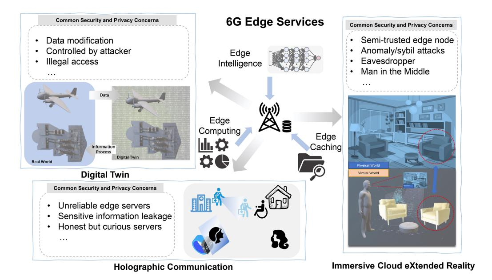
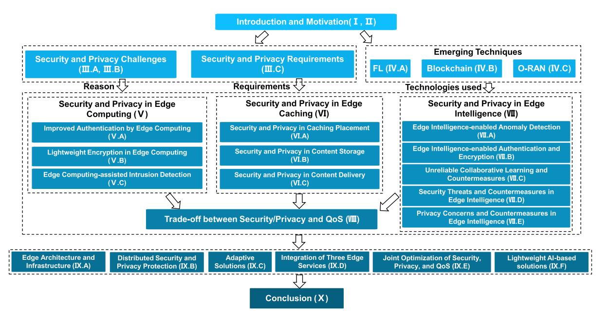
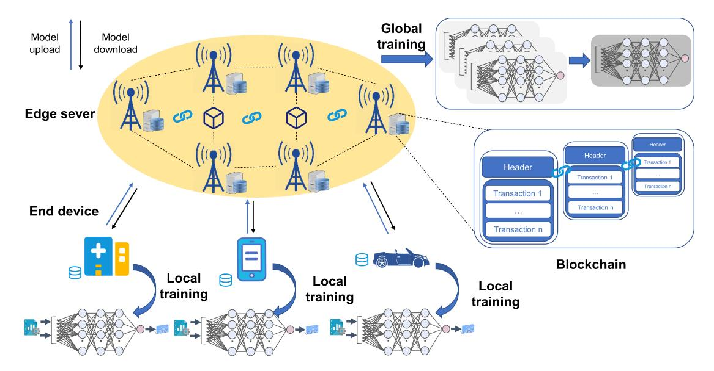
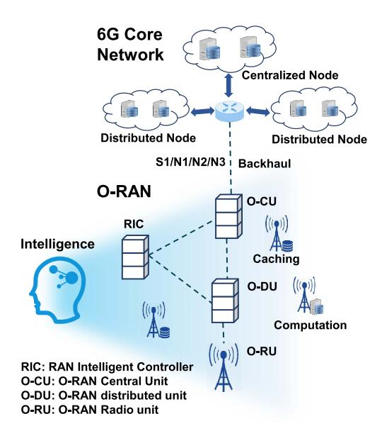
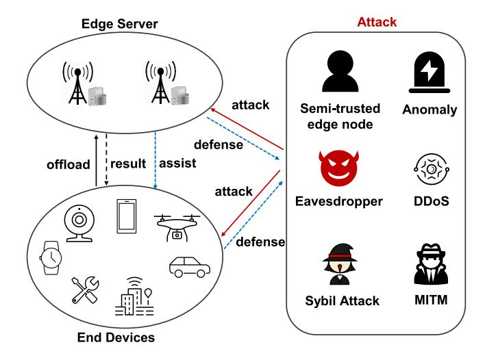
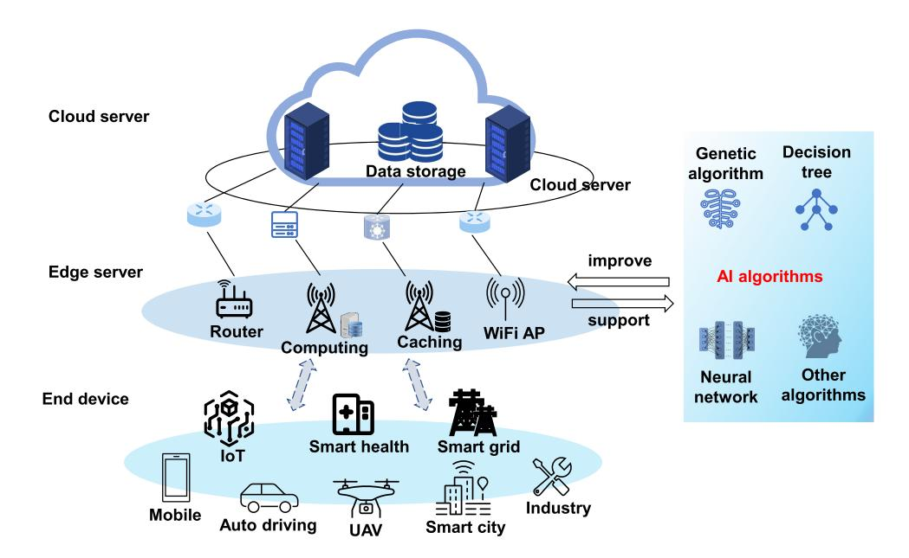
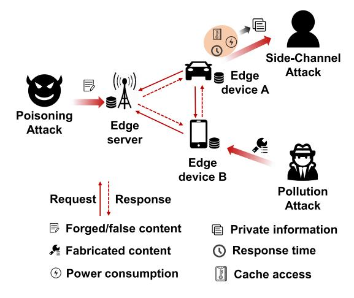
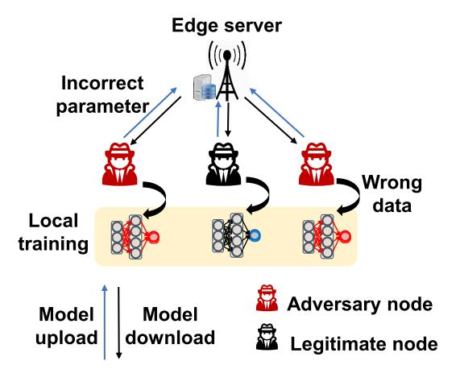
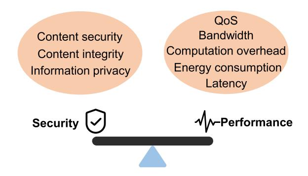

# Security and Privacy on 6G Network Edge: A Survey

Bomin Mao®, Member, IEEE, Jiajia Liu®, Senior Member, IEEE, Yingying Wu®, Student Member, IEEE, and Nei Kato®, Fellow, IEEE

Abstract—To meet the stringent service requirements of 6G applications such as immersive cloud eXtended Reality (XR), holographic communication, and digital twin, there is no doubt that an increasing number of servers will be deployed on the network edge. Then, the techniques, edge computing, edge caching, and edge intelligence will be more widely utilized for intelligent local data storage and processing generated by 6G applications, while innovative access network architecture based on the cloud-edge servers, such as the Open-Radio Access Network (O-RAN) will be adopted to improve the flexibility and openness for new service deployment and frequent network changes. On the other hand, new attack surfaces and vectors targeting local infrastructure and users will emerge along with the deployment of novel network architecture and techniques. Massive researchers have studied the potential security and privacy threats on the 6G network edge as well as the countermeasures. The three techniques, edge computing, edge caching, and edge intelligence have become a double-edged sword that can not only be synchronously utilized to develop defense countermeasures, but also become the targets of many new security and privacy threats. In this article, we provide a comprehensive survey of articles on the three techniques-related security threats and countermeasures on the 6G network edge. We explain how security and privacy can be destroyed by attacking one of the three technologies and how the three services support each other to realize efficient and achievable security protection. Moreover, the researches on the benefits and limitations of Federated Learning (FL) and blockchain for decentralized edge network systems in

Manuscript received 8 October 2022; revised 8 January 2023; accepted 8 February 2023. Date of publication 14 February 2023; date of current version 23 May 2023. This work was supported in part by the National Key Research and Development Program of China under Grant 2022YFB3104200; in part by the National Natural Science Foundation of China under Grant 62202386; in part by the 2022 Suzhou Innovation and Entrepreneurship Leading Talents Program (Young Innovative Leading Talents) under Grant ZXL2022458; in part by the Basic Research Programs of Taicang under Grant TC2021JC31 and Grant TC2022JC22; in part by the Fundamental Research Funds for the Central Universities under Grant D5000210817; in part by the Xi'an Unmanned System Security and Intelligent Communications ISTC Center; and in part by the Special Funds for Central Universities Construction of World-Class Universities (Disciplines) and Special Development Guidance under Grant 0639022GH0202237 and Grant 0639022SH0201237. (Corresponding author: Nei Kato.)

Bomin Mao is with the National Engineering Laboratory for Integrated Aero-Space-Ground-Ocean Big Data Application Technology, and the School of Cybersecurity, Northwestern Polytechnical University, Xi'an 710072, China, and also with the Yangtze River Delta Research Institute, Northwestern Polytechnical University, Taicang 215400, Jiangsu, China (e-mail: maobomin@nwpu.edu.cn).

Jiajia Liu and Yingying Wu are with the National Engineering Laboratory for Integrated Aero-Space-Ground-Ocean Big Data Application Technology, and the School of Cybersecurity, Northwestern Polytechnical University, Xi'an 710072, China (e-mail: liujiaja@nwpu.edu.cn; wu-yingying@foxmail.com).

Nei Kato is with the Graduate School of Information Sciences, Tohoku University, Sendai 980-8579, Japan (e-mail: kato@it.is.tohoku.ac.jp).

Digital Object Identifier 10.1109/COMST.2023.3244674

terms of security and privacy are also investigated. Additionally, we also analyze the existing challenges and future directions towards 6G.

*Index Terms*—Security, privacy, edge intelligence, edge computing, edge caching, 6G.

#### I. Introduction

RECENTLY, the advantages including high throughput, low latency, and great capacity of Beyond 5G (B5G) and 6G will enable exponentially increasing networked devices to provide services of immersive cloud eXtended Reality (XR), holographic communication, digital twin, and so on. Data show that the number of networked devices in 2023 is expected to reach 100 billion on the basis of 18.4 billion in 2018 [1]. And the total traffic generated by mobile users and Internet of Things (IoT) devices is predicted to reach 850 ZB in 2021 [2], which is impossible to be all transferred through the backbone networks to the remote cloud servers. Moreover, 6G has been expected to achieve a throughput of more than 1 Tbps and latency of less than  $100 \mu s$ , which is impossible to be achieved if only the central cloud servers are utilized to serve more than  $100 \text{ devices per } m^3$  [3], [4].

To meet the service requirements and alleviate the overhead in the core networks, most of the requests for computations and contents generated by bandwidth-aggressive or latencysensitive 6G applications should be satisfied near end devices as shown in Fig. 1. Deploying servers on the network edge to process the computation tasks and cache the requested files locally termed edge computing and edge caching, respectively, has been regarded as an important complement of cloud services to alleviate traffic overhead in the core network and meet the stringent Quality of Service (QoS) requirements [5], [6]. More importantly, the risks of information leakage and data tampering can be reduced by transmitting the data to adjacent edge servers instead of the remote cloud servers [7]. And the large-scale service breakdown and privacy leakage caused by security and privacy attacks become more difficult due to the distributed and relatively independent edge servers. Driven by these advantages, both Information and Communication Technology (ICT) vendors and operators including Huawei, China Mobile, and Microsoft, have launched their projects of Multi-access Edge Computing (MEC) to provide edge computing and caching services [8], [9], [10].

Another important paradigm of 6G is the application of Artificial Intelligence (AI) techniques [11], [12] in the edge

Fig. 1. 6G edge services and common security/privacy concerns.

networks as shown in Fig. [1.](#page-1-0) The motivations to accelerate the intellectualization process are multi-fold. First, AI is pressingly needed to realize automatic network management to adapt to the frequent network dynamics [\[13\]](#page-27-8). Second, cutting-edge AI has shown predominant power over conventional man-made mathematical models to address the network complexity caused by diversified service requirements, heterogeneous infrastructure, and different granularity in many research works [\[14\]](#page-27-9). Third, the increasing network data volume and rapidly developed general computing platform lay the foundation for big data-based AI/Machine Learning (ML) techniques [\[15\]](#page-27-10), [\[16\]](#page-27-11), [\[17\]](#page-27-12).

On the other hand, the application of ML increases the risks of security attacks and privacy leakage [\[18\]](#page-27-13). More specifically, the trained AI models can become new security attack surfaces. Malicious users can attack the trained network management-oriented AI models to degrade the accuracy rate. For privacy, the data-based training process of ML models can increase the risks of information leakage, malicious tampering, and unauthorized data use [\[19\]](#page-27-14). Thus, most users are unwilling to share their data even though they are promised that the data will be not shared with any third party. Since the centralized control manner of many AI techniques contributes to the process of data transmissions and sharing, researchers have considered training and running the intelligent models near end devices, which enables the collected data to be used locally. Only the parameters of locally trained AI models need to be uploaded to the centralized servers, which avoids the direct transmissions of users' original data. The manner to utilize a set of distributed edge servers to process AI models in the proximity of where the data are generated is referred as edge intelligence [\[2\]](#page-26-1), [\[20\]](#page-27-15). And this technology heavily relies on edge computing and edge caching for data processing and storage.

It can be found that the techniques of edge computing, edge caching, and edge intelligence not only significantly reduce the response time and bandwidth usage, but also effectively protect the users' privacy and data security [\[21\]](#page-27-16). However, network threats as shown in Fig. [1](#page-1-0) still exist, which challenges the data security and privacy [\[22\]](#page-27-17). And edge servers are more difficult to be managed compared with cloud servers. Moreover, the limited resource of edge servers constrains the utilization of powerful but computationaggressive security and privacy solutions [\[23\]](#page-27-18). Various attack events that happened in recent years resulted in significant loss of companies and users. For example, WannaCry, one of the worst ransomware attacks in history, hit about 230,000 computers across 150 countries [\[24\]](#page-27-19). Since the start of 2021, seven zero-day vulnerabilities have been exposed in iOS systems, among which some could be used to enable remote code execution [\[25\]](#page-27-20). With the increasing popularity of edge/cloud-based services, the misconfiguration of thirdparty edge/cloud real-time database appears as a new kind of network threat [\[26\]](#page-27-21). For instance, the improper authentication configuration could enable unauthorized access to private customer data.

Aiming at providing the required secure and private edge services, various countermeasures have been proposed according to definite threats and requirements. These proposals cover novel authentication strategies [\[27\]](#page-27-22), identity-based or attributebased encryption (ABE) algorithms [\[28\]](#page-27-23), intelligent anomaly or intrusion detection systems [\[29\]](#page-27-24), efficient information transmission models [\[30\]](#page-27-25), improved access networks and technologies [\[31\]](#page-27-26), [\[32\]](#page-27-27), and so on. Emerging techniques and infrastructure, such as Federated Learning (FL) [\[33\]](#page-27-28), blockchain [\[34\]](#page-27-29), and Intelligent Reflecting Surface (IRS) [\[35\]](#page-27-30), [\[36\]](#page-27-31), [\[37\]](#page-27-32) have been attracting increasing attention for improved security at the edge. Moreover, edge intelligence can improve the security of edge caching and edge computing, while edge caching and edge computing can provide the required storage and computing resource for intelligent security and privacy solutions [\[38\]](#page-27-33), [\[39\]](#page-27-34).

Fig. 2. The structure of this paper.

According to our above introductions, the three techniques including edge intelligence, edge computing, and edge caching are correlated and have homogeneous architecture. Moreover, they have been challenged by similar security threats, for which the considered techniques all include FL [\[20\]](#page-27-15), [\[33\]](#page-27-28) and blockchain [\[34\]](#page-27-29), [\[40\]](#page-27-35). Thus, we hope to provide a comprehensive survey that covers the security issues and countermeasures of network edge based on edge computing, edge caching, and edge intelligence. Moreover, the security and privacy issues based on FL and blockchain for emerging 6G edge networks are also discussed. Furthermore, since edge servers are constrained by computing capacity and energy consumption [\[41\]](#page-27-36), the researches on the trade-off among security/privacy, QoS [\[42\]](#page-27-37), and energy consumption [\[43\]](#page-27-38) are also investigated in this article. The contributions of this article can be summarized as below:

- *•* We introduce 6G service requirements and focus on the key techniques on the 6G network edge. The correlations among edge computing, edge caching, and edge intelligence are explained.
- *•* Security requirements and risks of edge computing, edge caching, and edge intelligence are discussed. The researches on security and privacy protection strategies are comprehensively studied in this article.
- *•* O-RAN, FL, and blockchain have been considered in this article. How these techniques can be utilized to develop security and privacy strategies is discussed.
- *•* The limitations of existing research to meet the 6G requirements have been summarized to point out future perspective directions.

The paper organization is shown in Fig. [2.](#page-2-0) And the remaining article consists of nine sections. Section [II](#page-2-1) introduces the existing similar survey papers and explains the motivations behind this research. Section [III](#page-5-0) discusses several security challenges and requirements on the 6G network edge, which is followed by the commonly utilized techniques in Section [IV.](#page-7-0) Sections [V,](#page-12-0) [VI,](#page-15-0) and [VII](#page-18-0) give comprehensive discussion on existing security/privacy-related works of edge computing, edge caching, and edge intelligence services. We introduce different trade-off issues when designing security countermeasures for edge networks in Section [VIII,](#page-22-0) and elaborate some open research issues in Section [IX.](#page-24-0) Finally, the whole paper is concluded in Section [X.](#page-26-4) Some important acronyms are given in Table [I.](#page-3-0)

## II. EXISTING SURVEY PAPERS AND MOTIVATION BEHIND THIS RESEARCH

In this section, we discuss existing survey papers on security and privacy of 6G, edge computing, and edge intelligence. Then, we introduce the topics in this paper and focus on the difference to explain the motivations behind this research.

#### *A. Existing Similar Survey Papers*

Some scholars have conducted the surveys on security and privacy of 6G by considering the paradigm technologies and architectures as shown in Table [II.](#page-4-0) Authors of [\[44\]](#page-27-39) provide a systematic review on security and privacy of the whole 6G networks including physical, connection, and service layers, while [\[45\]](#page-27-40), [\[46\]](#page-27-41), [\[47\]](#page-27-42) focus on definite key technologies or scenarios of 6G. More specifically, [\[44\]](#page-27-39) concentrates on the new threat vectors against 6G radio technologies and emerging technologies-based security protection solutions. The 6G THz-based ultra-massive Multiple Input and Multiple Output (MIMO) systems in the physical layer and the pervasive intelligence of the whole network have been studied from the perspective of network threats. Moreover, AI security, quantum-safe communications, real-time adaptive security, and novel data protection mechanisms have also been discussed in this paper. As a 6G key technology to realize the global seamless coverage, Space-Air-Ground-Sea

TABLE I SUMMARY OF IMPORTANT ACRONYMS

| Acronym | Definition                                 | Acronym     | Definition                                |
|---------|--------------------------------------------|-------------|-------------------------------------------|
| AA      | Attribute Authority                        | MIMO        | Multiple Input and Multiple Output        |
| ABE     | Attribute-Based Encryption                 | MitM        | Man in the Middle                         |
| AI      | Artificial Intelligence                    | ML          | Machine Learning                          |
| BPGM    | Bayesian Probabilistic Graphical Model     | NB          | Naive Bayes                               |
| BSs     | Base Stations                              | Near-RT RIC | Near-Real Time RAN Intelligent Controller |
| CGAN    | Conditional GAN                            | NFV         | Network Functions Virtualization          |
| CHR     | Cache Hit Ratio                            | NLP         | Non-Linear Program                        |
| CPU     | Central Processing Unit                    | OAM         | Operation Administration and Maintenance  |
| CS      | Compressive Sensing                        | O-RAN       | Open-Radio Access Network                 |
| CSI     | Channel State Information                  | OS          | Operating System                          |
| C-V2X   | Cellular Vehicle to Everything             | PBN         | Pseudo-random Binary Number               |
| DDoS    | Distributed DoS                            | PDP         | Perturbation DP                           |
| DoS     | Denial of Service                          | PEKS        | Public-key Encryption with Keyword Search |
| DP      | Differential Privacy                       | p-KNN       | probabilistic KNN                         |
| DRL     | Deep Reinforcement Learning                | PoA         | Proof of Authority                        |
| DT      | Decision Tree                              | PoET        | Proof of Elapsed Time                     |
| ECA     | Event-Condition-Action                     | PoS         | Proof of State                            |
| ECDSA   | Elliptic Curve Digital Signature Algorithm | PoW         | Proof-of-Work                             |
| FEF     | Feature Engineering Function               | QoE         | Quality of Experience                     |
| FL      | Federated Learning                         | QoS         | Quality of Service                        |
| F-RANs  | Fog Radio Access Metworks                  | RFID        | Radio Frequency Identification            |
| GAN     | Generative Adversarial Network             | RKE         | Remote Keyless Entry                      |
| IBE     | Identity-Based Encrypted                   | RMS         | root mean square                          |
| ICT     | Information and Communication Technology   | RSU         | Road Side Unit                            |
| IDS     | Intrusion Detection Systems                | SAGSIN      | Space-Air-Ground-Sea Integrated Network   |
| IIoT    | Industrial IoT                             | SDN         | Software Defined Networking               |
| ILP     | Integer Linear Program                     | SMAS        | Security Monitoring Analytic System       |
| IoT     | Internet of Things                         | SMO         | Service Management and Orchestration      |
| IoV     | Internet of Vehicle                        | SON         | Self-Organizing Network                   |
| IRS     | Intelligent Reflecting Surface             | SVC         | scalable video coding                     |
| KNN     | K-Nearest Neighbor                         | SVDD        | support vector data description           |
| LDA     | Linear Discriminant Analysis               | SVM         | support vector machine                    |
| LDP     | Local DP                                   | TGCN        | temporal graph convolutional networks     |
| LDP     | Local differential privacy                 | UE          | User Equipment                            |
| LiFi    | Light Fidelity                             | VANET       | Vehicular Ad hoc Network                  |
| LSTM    | Long Short-Term Memory                     | VIM         | Virtual Infrastructure Manager            |
| MBS     | Macro-cell BS                              | WiFi        | Wireless Fidelity                         |
| MEC     | Multi-access Edge Computing                | XR          | eXtended Reality                          |
| MHP     | Multivariate Hawkes Process                | ZTA         | Zero Trust Architecture                   |

Integrated Network (SAGSIN) has been investigated in the survey paper [\[46\]](#page-27-41) from the perspectives of security requirements, attacks, challenges, and corresponding solutions in different layers. The analysis of cross-layer attacks and countermeasures is an important feature of this article [\[46\]](#page-27-41). Privacy and ML have been investigated in [\[45\]](#page-27-40), where their doubleedged relationship including the ML-based solutions privacy solutions and privacy challenges caused by ML models are discussed. Since 6G has posed stringent requirements for QoS and security/privacy, authors of [\[47\]](#page-27-42) review the researches on their complex relationships considering resource constraints on the network edge. Two examples are also given in this paper to illustrate how to adjust the security/privacy

protection levels to reach a balance between security/privacy and QoS. Furthermore, edge computing and FL have also been envisioned to enable the intelligent balance in the 6G era.

Table [II](#page-2-1) also lists similar survey papers on security and privacy on the network edge where edge computing and edge intelligence are considered. Research [\[7\]](#page-27-2) focuses on the security and privacy of MEC, where the security vectors and solutions are analyzed based on the introduced standard ETSI architecture of MEC. The integration and deployment of the proposed solutions are emphasized in this article. Moreover, IoT networks have become the most important scenario to apply the edge computing technique and the related

TABLE II EXISTING SIMILAR SURVEY PAPERS

| Publication | Topics                                                                                               | Scenario                      | Edge computing | Edge caching | Edge intelligence |
|-------------|------------------------------------------------------------------------------------------------------|-------------------------------|----------------|--------------|-------------------|
| [44]        | security and privacy issues of 6G prospective technologies as well as the lessons and defenses | 6G                            | ×              | ×            | ×                 |
| [45]        | ML-based privacy protection and privacy challenges caused by ML                                | intelligent 6G networks    | ×              | ×            | ×                 |
| [46]        | security threats, attack methodologies, and defense countermeasures of 6G SAGSIN               | SAGSIN                        | ×              | ×            | ×                 |
| [47]        | trade-off between security and QoS at the network edge                                               | 5G+ and 6G                    | ×              | ×            | V                 |
| [7]         | security and privacy issues of MEC services                                                          | MEC scenarios                 | √              | ×            | ×                 |
| [22]        | causes, status, and challenges of 4 kinds of attacks in edge computing                         | IoT networks                  | V              | ×            | ×                 |
| [30]        | physical layer security solutions for MEC-enabled IoT networks                                    | heterogeneous IoT networks | √              | ×            | ×                 |
| [48]        | blockchain and edge computing to enable the network security and scalability                   | HoT                           | V              | ×            | ×                 |
| [49]        | blockchain-enabled security solutions for edge computing-based IoT                             | IoT networks                  | V              | ×            | ×                 |
| [19]        | FL-based solutions to protect the privacy                                                            | mobile edge networks       | √              | ×            | √                 |
| [50]        | blockchain-enhanced federated learning implementation to improve security and scalability      | IoT networks                  | V              | ×            | V                 |

works to study security and privacy have been reviewed in [\[22\]](#page-27-17), [\[30\]](#page-27-25). Authors of [\[22\]](#page-27-17) mainly focus on 4 kinds of common attacks against edge computing infrastructure including the Denial of Service (DoS) attacks, side-channel attacks, malware injection attacks, and authorization attacks. The root causes, mechanisms, solutions, and existing challenges are also explained. Research [\[30\]](#page-27-25) investigates the physical layer security solutions and the concerned topics including wiretap coding, resource allocation, and signal processing. We can find current survey papers mainly discuss the most common security/privacy attacks for 6G networks as well as how edge intelligence and edge computing are utilized in the countermeasures.

The adoption of AI and MEC techniques can cause new security and privacy vectors for the 6G network edge [\[45\]](#page-27-40). To address this issue, FL and blockchain have been widely regarded as the important solutions [\[19\]](#page-27-14), [\[48\]](#page-27-43), [\[49\]](#page-27-44), [\[50\]](#page-27-45). FL enables the local training and avoids the data transmission to the cloud, which can protect information privacy as well as ensure the peculiarity of local AI models. Related works on FL-based network optimization solutions and existing challenges have been surveyed in [\[19\]](#page-27-14). Another decentralized technique, blockchain, adopts the mechanism of ledgers and followers to record and verify any data change. Authors of [\[49\]](#page-27-44) and [\[48\]](#page-27-43) both review the blockchainbased security solutions and challenges. Furthermore, [\[50\]](#page-27-45) discusses the existing security solutions combining blockchain and FL.

#### *B. Motivations Behind This Research*

Current survey papers mainly focus on the security and privacy of general 6G networks and techniques [\[44\]](#page-27-39), [\[45\]](#page-27-40), [\[46\]](#page-27-41), [\[47\]](#page-27-42). Since the edge network will be the key component to satisfy the 6G KPI requirements for computing, caching, and intelligence, its security and privacy have aroused some researchers' attention [\[22\]](#page-27-17). Even though edge computing and edge intelligence are the double-edge swarm, most of the current surveys focus on how these two techniques can improve the security and privacy protection [\[19\]](#page-27-14), [\[30\]](#page-27-25), [\[48\]](#page-27-43), [\[49\]](#page-27-44), [\[50\]](#page-27-45). Only a few papers discuss the security concerns in edge computing services [\[7\]](#page-27-2), [\[22\]](#page-27-17). There is no survey paper to cover both the security/privacy concerns of edge services and the edge services-enabled countermeasures. Moreover, considering the deep correlations and concurrent existence to satisfy users' demand, a review covering edge computing, edge caching, and edge intelligence should be provided to introduce security and privacy from a systematic point. Furthermore, besides the commonly discussed security and privacy attacks including DoS attack, malware, and eavesdropper, the applications of cooperative computing, caching, and intelligence on the network edge have resulted in many new security and privacy attacks, such as the unreliable participants and data poisoning attacks. Since 6G access network can become open to third-party vendors and ISPs, traditional attacks existing in the core networks can become more serious for the edge networks, such as data abuse. Thus, 6G edge networks have different challenges, requirements, and adopted techniques in terms of security and privacy.

This paper aims to provide a comprehensive survey on the security and privacy issues of edge computing, edge caching, and edge intelligence. In this paper, we will review the researches on the security and privacy attacks, countermeasures, and emerging technologies of computing, caching, and intelligence services on the 6G network edge. Even though the considered scenario is similar to [\[47\]](#page-27-42), the topic range in this paper is much larger instead of only the trade-off. Different from the general 6G networks studied in [\[44\]](#page-27-39), [\[45\]](#page-27-40), [\[46\]](#page-27-41), this work concentrates on 6G access networks, where emerging techniques such as O-RAN, FL, and blockchain are important to design the security countermeasures. Moreover, this research hopes to elaborate how the FL and blockchain can improve the edge network security as well as the existing limitations. Furthermore, the correlations among edge computing, edge caching, and edge intelligence to provide security and privacy protection will be also explained.

## III. CHALLENGES AND REQUIREMENTS OF SECURITY AND PRIVACY

In this section, we first introduce the common potential attacks and threats challenging the security and privacy of edge networks. Then, according to the introduced attacks and threats, we investigate the requirements for security and privacy.

#### *A. Security Attacks on the Network Edge*

The common security attacks including DoS attacks, malware, and poisoning attacks are introduced in this part [\[51\]](#page-28-0) which are introduced in the following paragraphs one by one.

*1) DoS Attacks:* The developments of IoT, 5G, and autonomous driving applications have driven the increasing number of connected end devices, most of which are poorly secured due to the limited communication and computation resource [\[47\]](#page-27-42). These devices can be relatively easily controlled by malicious users to generate the distributed DoS (DDoS) attacks, where a huge number of computation and processing tasks are generated to exhaust the resource of edge servers. Therefore, the resilient DoS detection systems should be developed to enable the edge computing servers against the attacks. Moreover, the DoS attacks can also target the end devices, which results in the service shutdown [\[52\]](#page-28-1), [\[53\]](#page-28-2). In this regard, the edge computing is asked to help the end devices to protect against the attacks.

Many papers have discussed the DoS attacks for edge services. The survey paper [\[54\]](#page-28-3) introduces different DoS attacks including the flooding attacks, amplification attacks, and application layer attacks and also gives the corresponding solutions using the Software Defined Networking (SDN) technology. A similar survey [\[22\]](#page-27-17) has introduced the adversarial DDoS attacks for the edge computing systems. Authors of [\[55\]](#page-28-4) explore different attack techniques targeting various resources for a multi-tenant cloud server, which compromises the legitimate usage of the resource. Research [\[56\]](#page-28-5) explains

how DoS attacks disrupt the service availability of IoT devices.

*2) Malware:* The emerging network services, such as smart home, smart healthcare, and smart factory, enable remote, realtime, and convenient control and management. On the other hand, these services cause the private information exposed to the Internet, for which the increasing malware attacks occur to infringe the information security [\[57\]](#page-28-6). Moreover, the remote control can also terminate abnormally once the malware hijacks end devices [\[58\]](#page-28-7). Furthermore, the computing parts of the end devices and edge servers may be controlled by the malware to conduct the unauthorized tasks, such as the bitcoin mining, while the authorized users have to pay the high electricity cost. However, as the malware can have different Operating Systems (OS) and computational usages, it is difficult to protect edge systems against malware.

Research on malware behaviors and classification attracts increasing attention. The authors of [\[59\]](#page-28-8) measure the IoT malware and analyze the relationships, revolution, and variants. Another significant contribution is the reconstruction of IoT malware families according to the binary code similarity, which can be adopted to realize automatic detection. Besides the IoT malware family construction, the IoT sandbox which can support different Central Processing Unit (CPU) architectures has also been proposed to analyze the IoT malware and record the behaviors in [\[60\]](#page-28-9). Moreover, the malware botnet is also an important threat for edge servers. The research [\[61\]](#page-28-10) focuses on the sever malware and illustrates the caused leakage of users' private information through analysis of traffic pattern or packet contents in the backbone nodes. The malware in data centers has been studied in [\[62\]](#page-28-11) and the authors present an AI-powered edge computing-based model to detect a wider range of malware threats.

*3) Poisoning Attacks:* Poisoning attacks refer to providing the false data to the edge server to corrupt the training or running process of AI models. In the training process, illegal users can launch data poisoning attacks to degrade the training accuracy or lead the training toward a false direction [\[63\]](#page-28-12). In the running process, the input of ML models can be also poisoned. Thus, the operation of the trained AI models outputs the wrong result, which finally leads to network performance degradation. As AI has been utilized in edge computing, edge caching, and edge intelligence, data poisoning attacks can happen in these services.

The impacts of data poisoning attacks depend on the application scenarios of the ML models. Thus, poisoning attacks should be paid more attention to for the collaborative edge intelligence. For example, some adverse participants of FL can provide wrong data during the training and execution of local AI/ML models, which finally pollutes the global model and affect the whole network performance [\[64\]](#page-28-13). To address this issue, evaluating the reliability of all participants is a critical procedure in the collaborative edge system [\[63\]](#page-28-12), [\[65\]](#page-28-14), which will be carefully studied in the remaining paper. Blockchain is also efficient to address the data poisoning attacks since it can not only validate the data provided by multiple participants, but also keep the history of data changes [\[66\]](#page-28-15), [\[67\]](#page-28-16).

## *B. Privacy Concerns on the Network Edge*

Providing the services near the terminals can alleviate the risks of information leakage. However, privacy concerns still exist in the edge networks due to the existence of eavesdroppers, abuse of data access, and unreliable service providers.

*1) Existence of Eavesdropper:* Eavesdroppers have been one of the most common privacy threats for users for decades. And with the increasing applications of IoT, the transmitted signals are concerned with more privacy-sensitive data, including personal information, financial report, and trade secrets, which can be stolen by eavesdroppers for illegal purposes. Since most of the IoT devices are resource-constrained, it is tough to encrypt the packets with highly efficient but complex algorithms [\[68\]](#page-28-17). Moreover, the eavesdropper is difficult to be detected since it does not affect the normal communication process, which poses significant challenges for the network edge.

Researchers have conducted wide analyses on eavesdropping in different scenarios. The work [\[69\]](#page-28-18) analyzes how attackers eavesdrop the private video data to blackmail users and companies in the cloud-based video surveillance systems. Authors of both [\[70\]](#page-28-19) and [\[68\]](#page-28-17) focus on the edge caching scenarios in heterogeneous cellular networks. And the content caching and delivery policies are optimized to prevent from the eavesdropper attacks. Chen et al. illustrate that the personal information may be exposed to criminals through the signals generated by the wearable sensing devices [\[71\]](#page-28-20). The eavesdropping attack using a fusion of non-acoustic sensors can also be used to collect data and reconstruct the speech signal to launch a side-channel attack [\[72\]](#page-28-21). For modern vehicles relying on various electronic components, David study how the Remote Keyless Entry (RKE) system can be attacked by eavesdropping the rolling codes [\[73\]](#page-28-22). And the research also illustrates how the cryptographic key can be recovered by eavesdrop attacks with a standard laptop.

*2) Abuse of Data Access:* Even though local data storage and processing can improve the privacy, the weak security protections and sharing mechanism of edge servers still challenge the information privacy. Since the Network Functions Virtualization (NFV) technique enables the third-party applications of different services to access and process the stored data, the unclear boundaries in saving the data and excessive data access requirements of some applications threaten the data privacy. Moreover, the potential bugs in the edge system and software may cause the data tampering, which further results in the stop of other applications as some data are shared by multiple services. Another potential privacy challenge comes from the honest but curious service providers. Since the service providers are authenticated to access the data, the private information may be collected and used for some other purposes, which has increased many users' anxiousness.

To enhance the privacy protection in the data usage, the selection of the reliable edge server is very important. The evaluation mechanism has been considered in some articles which verify the reliability of edge servers [\[74\]](#page-28-23), [\[75\]](#page-28-24). Data authentication and encryption algorithms are also efficient

solutions to improve the privacy protection [\[76\]](#page-28-25), [\[77\]](#page-28-26). On the other hand, since research on the openness and open source of edge systems and related software are in the proposal period, how to limit the data access of the third-party applications still remains an open issue [\[78\]](#page-28-27), [\[79\]](#page-28-28).

*3) Unreliable Participants:* The limited resource on the network edge constrains the high-quality service provision. To address this issue, the collaborative data storage and processing will be commonly considered on the 6G network edge to provide edge computing, edge caching, and edge intelligence services. On the other hand, the privacy protection becomes more difficult since all participated edge servers should be reliable. For the collaborative data storage and processing system, the edge server can pretend to be reliable and trustworthy at the beginning, and then steal the data during the processing period, which infringes the privacy [\[80\]](#page-28-29), [\[81\]](#page-28-30). For edge intelligence, the training of AI models relies on massive data generated by users, among which the private information can be accessed by the edge servers to train and run the models. Even though FL has been regarded as an important solution to protect the privacy by keeping the data locally, the reliable but curious participants cannot be avoided while central server can still detect the local private preference through the uploaded parameters of local models.

To alleviate the privacy concerns on the network edge, researchers have proposed many strategies which process the data before usage to conceal the personal attributes. The Differential Privacy (DP) strategy which adds noise to the sensitive attributes has been proposed and its evolution versions including Local DP (LDP) and Perturbation DP (PDP) further enhance the privacy protection [\[82\]](#page-28-31), [\[83\]](#page-28-32). Another important strategy is the homomorphic encryption [\[84\]](#page-28-33) which allows the computations to be performed on encrypted data without first decryption. And the results of this method still remain encrypted and can only be decrypted with the private key. Moreover, the privacy can be also improved by choosing the reliable participants which can be achieved by defining the evaluation mechanism [\[74\]](#page-28-23).

#### *C. Security and Privacy Requirements of 6G Edge Services*

Since edge networks need to provide the services of data communication and processing, edge systems should have common security and privacy requirements including confidentiality, integrity, and availability. Moreover, the cooperative manner and limited processing resource cause extra requirements for trust, reliability, and cost-efficiency as below. Furthermore, the 6G applications, such as semantic communications, will have unique requirements for security and privacy to satisfy the service requirements, which can be referred to [\[85\]](#page-28-34), [\[86\]](#page-28-35). Thus, future 6G edge services pose security and privacy requirements for generality, diversity, cooperation, and high cost-efficiency.

*Generality:* According to our above explanations, to provide the services on the network edge cannot completely block the security attacks or privacy concerns even though the communication distance is significantly shortened. Similar to the core networks, the edge networks still have strict requirements for security and privacy, which relies on the participants including the end devices and service providers. The end devices should get authenticated before being served by the edge service providers, which can protect the edge servers against DoS attackers and malicious users. The service providers should also be reliable and trustworthy to prevent data tampering and privacy leakage [\[87\]](#page-28-36). The service providers' curiosity to the content of received data is usually the big challenge for users' willingness to consider the edge services, which should be addressed during the development of privacy solutions [\[88\]](#page-28-37), [\[89\]](#page-28-38). The data transmissions on the network edge should also be protected against any eavesdroppers.

*Diversity:* Since different terminals access the edge networks to request communications, computations, and caching, the requirements for security and privacy depend on the definite services. From the perspective of cost-efficiency, each edge server needs to provide diversified levels of security and privacy protection for its covered terminals. This is because that different security and privacy protection solutions usually lead to various processing overhead and energy consumption [\[42\]](#page-27-37), [\[90\]](#page-28-39). Increasing the granularity of provided security and privacy protection can efficiently save the resources and better meet the users' demand, which leads to more complex and difficult management on the network edge. Another motivation for the diversity is the different access technologies on the network edge such as the cellular networks, Wireless Fidelity (WiFi), Light Fidelity (LiFi), satellite connections, and Cellular Vehicle to Everything (C-V2X), which support different security and privacy solutions. Furthermore, different vendors and service providers will cooperatively construct and operate future 6G edge networks, and they will provide diversified security and privacy protection.

*Cooperation:* Due to the constrained resource, the edge servers need to cooperate with each other when handling large tasks, for which the system security and privacy depend on the cooperation of all participants. For instance, if one edge server uploads the wrong parameters in the edge intelligence technique, the accuracy rate of the global model can be polluted, resulting in the performance deterioration. To guarantee the security and privacy in the distributed edge networks, the trust evaluation has been proposed to measure the reliability, while the blockchain has been considered to record and validate the participants [\[87\]](#page-28-36), [\[91\]](#page-28-40). Moreover, the trust authority enabled by the edge computing technique is another method which has been adopted in [\[92\]](#page-28-41).

*High cost-efficiency:* Another requirement for the security and privacy solutions on the network edge is the high costefficiency for multi-fold reasons. Compared with the cloud servers, the end devices and edge servers have much lower computation capacity [\[76\]](#page-28-25), of which the majority needs to be used for requested communication, computation, and caching. Considering the extremely high transmission rate and computation rate in 6G, the widespread IoT devices and many other terminals have to compete with the resource of edge servers, while the extra processing and transmission overhead caused by security and privacy solutions should be minimized as much as possible [\[77\]](#page-28-26). For many IoT terminals, the limited energy

also needs to be considered in the development of security and privacy solutions [\[47\]](#page-27-42), while some network services, such as Industrial IoT (IIoT), have very strict requirements for latency to conduct the security and privacy protection [\[93\]](#page-28-42). Thus, high cost-efficiency is one of the basic requirements for the security and privacy solutions on the 6G network edge.

#### *D. Lessons Learned and Conclusion*

According to our above discussion, we can find that some security attacks and privacy concerns on the network edge are similar to the core networks, while new challenges targeted at the distributed and cooperative manner are emerging. Moreover, new requirements should be considered when developing the solutions for 6G edge networks. Specifically, the following three directions deserve more endeavors.

- *•* For the 6G edge networks, many new attacks and concerns are emerging due to the novel techniques, protocols, and network scenarios, such as edge intelligence, SAGSIN, and IIoT. The characteristics of these security attacks and privacy concerns may differ from traditional ones. For instance, the unreliable participants including the end terminals and local servers are emerging attacks for the 6G distributed edge networks.
- *•* The cooperation among multiple edge servers in service provision with diversified QoS and security/privacy requirements is more complex. The network dynamics and growing required performance granularity complicate the resource allocation. Moreover, to address the uneven distribution of end terminals and security attacks, the edge servers need to cooperate to provide the basic services and run the security strategies.
- *•* The balance between security protection and QoS will be the basic goal for the network edge. For the edge servers having stringent security and QoS requirements, the joint optimization will be difficult as the resource is constrained.

## IV. EMERGING TECHNIQUES TO ENHANCE SECURITY AND PRIVACY ON 6G NETWORK EDGE

To improve the performance, novel techniques including THz communications, AI, and SAGSIN have been regarded as the paradigm techniques of 6G [\[94\]](#page-28-43). And the requirements for security and privacy are also attracting increasing attention besides the stringent QoS KPIs of 6G. For security and privacy on the network edge, the decentralized techniques including FL and blockchain have been widely studied. Specifically, FL is a decentralized model to organize the intelligent optimizations of network performance on the network edge, so that the utilized private data generated by end terminals can be kept locally. Thus, the data do not need to be transferred to the cloud servers and privacy can be protected. Blockchain utilizes the public ledger to record any data changes and enables multiple participants on the network edge to verify the data correctness. In this manner, the illegal data tampering can be detected, leading to improved data security. Since many provided computing/caching/intelligence services on the network edge rely on the cooperation of multiple servers, blockchain can be adopted to guarantee the reliability of all the participants. Moreover, to realize flexible provision of edge services and automatic network configurations in 6G, the access networks should be based on general hardware and open to ISPs and vendors, for which researchers have considered new architecture, O-RAN. In this section, we discuss these three techniques.

## *A. Federated Learning*

AI techniques, especially the cutting-edge ML/DL, have been widely acknowledged as the key paradigms for 6G, which can efficiently alleviate the difficulties of traditional mathematical modeling based strategies in addressing the increasing complexity, frequent dynamics, and diversified requirements. The performance of AI models depends on the training and running data which are collected from the corresponding networks and massively connected devices. Generally, increasing the volume and diversity of the training data can benefit the accuracy and generality of the trained models [\[95\]](#page-28-44), which will finally result in better performance. On the other hand, users are reluctant to share their personal data with the unknown operators or service providers for network management due to the privacy issues [\[96\]](#page-28-45). Moreover, sending the generated data to the cloud servers which manage the network in a centralized manner can not only cause extra the traffic overhead, but also increase the possibility of information leakage, resulting in the worries of data owners over included personal privacy or sensitive parameters.

To address the above issues, Google proposed FL which utilizes a hierarchical training architecture consisting of a central coordinator and multiple distributed participants [\[97\]](#page-29-0), [\[98\]](#page-29-1). Each participant utilizes the data collected from the users in its coverage to train a local model, while the central coordinator is responsible of aggregating the parameters of all local AI models to update the global AI model. Since the distributed participants only need to transfer the parameters of trained AI models to the coordinators, personal data can be kept and utilized locally, which significantly improves the security and privacy protection as well as reduce the network traffic overhead. Yang et al. [\[99\]](#page-29-2) have extended the concept of FL to cover the general privacy-preserving decentralized collaborative learning, of which the structure may be parallel instead of hierarchical. Considering the features and sample spaces of different data parties, the FL techniques are further categorized into three types: horizontal FL, vertical FL, and federated transfer learning [\[99\]](#page-29-2).

*1) Applications in Edge Services:* According to our above introduction, it can be found FL is to utilize the distributed learning manner to avoid the centralized data collection, which can protect the data privacy against the unreliable central server. Thus, this technique should have the same widespread application scenarios as ML. In this section, we discuss three important applications of FL: distributed Intrusion Detection Systems (IDS) [\[92\]](#page-28-41), private data processing [\[100\]](#page-29-3), and content caching/recommendation [\[39\]](#page-27-34), [\[101\]](#page-29-4).

*Distributed intrusion detection systems:* AI-based traffic monitoring and analysis can efficiently find the abnormal

behaviors and detect the network intrusion. On the other hand, transferring all the data traffic to the single central server can cause the security and privacy concern as well as the unsatisfied granularity levels due to the diverse attack types. Thus, FL has been considered to construct the distributed AIbased IDS [\[102\]](#page-29-5). The researches [\[92\]](#page-28-41), [\[103\]](#page-29-6), [\[104\]](#page-29-7) focus on the FL-based IDS for industrial IoT and utilize the practical dataset to train the local AI models in a supervised manner. References [\[92\]](#page-28-41) and [\[104\]](#page-29-7) utilize the weighted average calculations [\[105\]](#page-29-8) as the aggregation functions, while [\[103\]](#page-29-6) compares the weighted average function with the new approach named Fed+ [\[106\]](#page-29-9). Reference [\[107\]](#page-29-10) also utilizes supervised learning to train the local AI models for anomaly detection, while the ensemble learning [\[108\]](#page-29-11) is considered to aggregate the decentralized updates in the cloud. To alleviate the communication bottleneck caused by the aggregations of large-scale models, the transfer learning is combined with FL in [\[74\]](#page-28-23). Besides the security and privacy protection, FL adopted in the decentralized IDS can also improve the granularity level, especially for diversified traffic types at different network zones [\[109\]](#page-29-12).

*Private data processing:* FL has been discussed in the survey paper [\[110\]](#page-29-13) to process the private data. In the intelligent healthcare application scenarios, [\[100\]](#page-29-3) and [\[111\]](#page-29-14) are good examples to illustrate the impacts of FL on privacy preservation and model personalities. Besides, heterogeneous environments and communication latency of the centralized processing are also important motivations for the usage of FL, which has been studied in [\[112\]](#page-29-15), [\[113\]](#page-29-16). Moreover, FL has been utilized for data processing work in some other intelligent applications, such as smart parking [\[114\]](#page-29-17), where the parking data are kept locally to protect the users' privacy.

*Content caching and recommendation:* Caching the mostpreferred contents near the users and making recommendations can significantly improve the probability of content retriever from the cloud servers. However, to improve the Cache Hit Ratio (CHR) requires the content popularity which may infringe users' private information including ages, income, interests, associations, and so on. Moreover, the content popularity follows the regional distribution. Therefore, FL has been regarded as an efficient and secure technique to improve the granularity levels of content caching and recommendation. Researches [\[115\]](#page-29-18) and [\[116\]](#page-29-19) employ the FL to predict the content popularity for IoT and vehicular networks, respectively. The FL-based content popularity prediction has also been studied to improve the performance of mobile edge computing [\[117\]](#page-29-20). Compared with content caching, content recommendations require more personalized learning models since the contents will be proactively sent to users. Authors of [\[118\]](#page-29-21) improve the FL algorithms to develop the individual user model for content recommendations. The research [\[101\]](#page-29-4) considers FL and private data to train the global model to improve the accuracy rate in page recommendation? system.

*2) Limitations and Countermeasures:* FL can protect the information privacy to some extent by keeping personal data locally. However, it is still challenged by the security attacks, privacy concerns, and performance limitations when being applied practically [\[119\]](#page-29-22).

Fig. 3. Blockchain-secured federated learning.

*Security attacks:* The cooperative learning manner requires all FL participants to be reliable and trustworthy. Therefore, the network can be attacked by degrading the accuracy of locally trained AI models, which can lead to large-scale network breakdown [\[64\]](#page-28-13), [\[67\]](#page-28-16). Specifically, the adversary can act as the end device to upload wrong data to corresponding participant, which finally affects the locally trained AI models. However, the impacts of just some unreliable end devices may be limited since their data just take a small part in the whole system. On the other hand, if some edge server is controlled by adversaries, it can upload inaccurate parameters to poison the global AI model, which can degrade the accuracy rate of all local AI models [\[66\]](#page-28-15). To guarantee the reliability of FL participants, many approaches have been proposed, such as the verifiable FL [\[65\]](#page-28-14) and socially-aware-clustering-enabled FL [\[120\]](#page-29-23). ML techniques have also been considered to select the reliable FL participants, such as validation accuracy-based reinforcement learning [\[74\]](#page-28-23). In recent years, blockchain, the decentralized technique, has become another attractive solution to manage FL against the unreliable participants [\[50\]](#page-27-45), [\[64\]](#page-28-13), [\[66\]](#page-28-15), [\[67\]](#page-28-16) as shown in Fig. [3,](#page-9-0) which will be introduced in the following paragraphs.

*Privacy concerns:* The privacy protection of FL is limited since the terminals still need to upload their personal data to the edge server for local training. The honest-but-curious participants or third-party central servers may extract the personal information from the uploaded coefficients. Moreover, the parameters of locally trained AI models are decided by the users' data, personal information may be deduced by the central coordinator. Thus, FL still has the risks of privacy exposure. To protect the information privacy in uploaded training data and parameters, researchers have proposed the Differential Privacy (DP) strategies [\[82\]](#page-28-31), [\[83\]](#page-28-32), where the sensitive attributes are obscured by adding the noise or using generalization method. Another method to protect the user data is to adopt the homomorphic encryption [\[84\]](#page-28-33). For example, [\[92\]](#page-28-41) considers the trust authority to generate the key pair to encrypt the transmitted parameters. However, as these methods can degrade the performance of AI models, the tradeoff between privacy protection and prediction accuracy exists. Reference [\[103\]](#page-29-6) compares different PDP mechanisms to analyze the trade-off between privacy protection and prediction accuracy.

*Performance limitation:* Besides the challenges of security and privacy, the application of FL is also limited by the performance. First, the scenario heterogeneity including the end devices, access techniques, transmission power, channel conditions, and so on, can result in the diversified statistics, while the different local computation platforms lead to differential execution performance [\[19\]](#page-27-14). The difference and personalities existing in local AI models may cause low convergence of the global model. Second, on the network edge, the local communication conditions can become the bottleneck of training performance since the limited bandwidth constraints the edge servers to collect the data from massive end devices. Third, the periodical update of AI models may be disordered due to the diversified communication conditions [\[119\]](#page-29-22). The heterogeneous system and communications are not the focus of this paper and we mainly focus on the security and privacy of FL [\[99\]](#page-29-2).

# *B. Blockchain*

Blockchain has been developed to mitigate the security concerns of centralized control using a sharing and distributed ledger system. In the blockchain-enabled system, the blocks constructed to record the transactions among users are governed by multiple users in a distributed manner instead of a centralized trusted authority. Moreover, new blocks are added to record the recent transactions rather than overwrite the existing blocks. Besides the transaction data, the value of previous block and fresh timestamp will also be recorded [\[121\]](#page-29-24). Therefore, the data on each block can be traced and verified by the users independently and inexpensively,

instead of a third party or centralized controller. Furthermore, the privilege to access the data, generate the blocks, and verify the records can be governed to protect data security and privacy [\[48\]](#page-27-43), [\[49\]](#page-27-44). For different applications, various blockchain techniques have been developed, which can be classified into four groups: public blockchain, private blockchain, consortium blockchain, and hybrid blockchain, of which more details can be found in [\[121\]](#page-29-24).

*1) Applications in Edge Services:* To protect the security of edge services, this decentralized ledger-based technique can be applied separately or combined with FL as in the following two paragraphs.

*Blockchain-secured service:* To construct the blockchainenabled architecture on the network edge can secure the data storage, transmission, and usage in a distributed manner. In the IoT field, [\[122\]](#page-29-25) adopts the blockchain to guarantee the secure data sharing among different SDN controllers, while [\[80\]](#page-28-29) and [\[123\]](#page-29-26) construct the blockchain-powered collaborative edge computing framework to enable the consensusbased correctness verification. The authors of [\[124\]](#page-29-27) model the service provision between the edge computing servers and IoT nodes as blockchain transactions to promote the security in the trustless system. To mitigate the consensus latency of blockchain-powered edge computing-enabled IoT networks, researches [\[125\]](#page-29-28) and [\[122\]](#page-29-25) develop a hierarchical architecture and propose a deep reinforcement learningbased resource allocation approach, respectively. In the smart driving field, blockchain has been considered to guarantee the secure billing data transmissions between electric vehicles and grid [\[126\]](#page-29-29), [\[127\]](#page-29-30). Combined with edge intelligence, blockchain can be used to protect the traffic light control system against the malicious attacks [\[128\]](#page-29-31). In the informationcentric networks, blockchain can not only improve the reliability of edge caching resource [\[81\]](#page-28-30), but also guarantee the secure content delivery against malevolent tampering [\[129\]](#page-29-32).

*Blockchain-secured federated learning:* As we introduced above, the global model in FL can be poisoned by unreliable local participants since they can falsify the data or submit the incorrect model, which is termed Byzantine attacks [\[66\]](#page-28-15). FL can be combined with blockchain to enhance the data security on the network edge as blockchain can provide the blocks to store the data for tracing in a decentralized manner [\[64\]](#page-28-13), [\[67\]](#page-28-16), [\[130\]](#page-29-33). The survey paper [\[50\]](#page-27-45) introduces the research on blockchain-secured FL. And it can be found that the techniques including edge computing, edge caching, and edge intelligence are popular application scenarios of blockchainsecured FL. In the edge computing field, blockchain has been utilized to select the computing nodes as FL participants [\[131\]](#page-29-34), prevent edge computing nodes from malfunctioning [\[64\]](#page-28-13), and optimize the FL-based task offloading [\[132\]](#page-29-35). Moreover, the blockchain-secured FL has been illustrated efficient to guarantee the accuracy of local model to realize edge intelligence [\[133\]](#page-29-36), [\[134\]](#page-29-37) as shown in Fig. [3.](#page-9-0) Even though blockchain is mainly used to enhance the security protection, the privacy concern can be still alleviated by this technique when using in the edge caching systems [\[135\]](#page-29-38).

*2) Limitations and Countermeasures:* Blockchain has been illustrated to enhance the security of FL. On the other hand, this emerging decentralization technique relies on the communication and computation process, causing latency and energy consumption, which is similar to FL. The block mining process requires the participants to contribute a large volume of computation resource, which is extremely computation and energy-hungry, especially the proof-of-work (PoW) mining mechanism [\[136\]](#page-29-39). Data show that the global annual electricity consumption of bitcoin transactions is up to 125.13 Terawatt Hour (TWH), which is more than that of Sweden and ranks about 27 among the world [\[137\]](#page-29-40). To address this issue, various consensus mechanisms have been proposed, including Proof of State (PoS), Proof of Authority (PoA), and Proof of Elapsed Time (PoET), which have been comprehensively studied in the survey paper [\[50\]](#page-27-45). In addition to energy consumption, the required computation resource and communication latency have also been studied in [\[122\]](#page-29-25), [\[125\]](#page-29-28), [\[138\]](#page-29-41). The authors of [\[125\]](#page-29-28) propose a hierarchical cloud-edge blockchain architecture and tree-based clustering method to address the latency issues of blockchain-based large-scale IIoT. Reference [\[138\]](#page-29-41) utilizes the direct acyclic graph theory to design the blockchain system, which can tackle the device asynchrony and resource limitation issues. Generally, the computation issues in the blockchain-enhanced FL usually depend on the edge computing or collaborated edge-cloud, while the energy and latency can be alleviated if the consensus mechanism can be well designed.

### *C. Open-Radio Access Network*

As we mentioned in the introduction, the service provision should be transferred from the cloud servers to the network edge to meet the stringent requirements in 6G, for which the interfaces and resources of access network architecture should be available for the service providers. However, as the infrastructure of existing RAN provided by only several vendors are monolithic, network operators treat them as black-box in daily government and application. This causes significant difficulties in meeting diversified requirements, let alone the provision of new business. To address these issues, the O-RAN Alliance was initiated in 2018 by several operators and vendors aiming at standardizing a new access network architecture [\[139\]](#page-29-42) where the techniques of SDN and NFV are utilized to isolate the network software from the hardware to improve the flexibility. Another motivation behind O-RAN is the emerging need to adopt AI to realize automatic network configurations on the network edge.

The logical architecture of O-RAN is mainly composed of three parts: Service Management and Orchestration (SMO) framework, O-RAN Network Functions, and the O-Cloud platforms [\[140\]](#page-29-43). The O-RAN Network Functions is the core of RAN and is extended from 5G RAN. The O-Cloud platform is to run the O-RAN based on the infrastructure including proprietary and general software and hardware, cloud components, and related management/orchestration functions. Since the O-RAN infrastructure can be produced by various vendors, the SMO framework consists of different Operation Administration and Maintenance (OAM) functions from multiple manufacturers, which is much more complex

Fig. 4. The architecture of O-RAN.

than that in traditional RAN. O-RAN is not the focus of this paper, thus more details of the architecture can be referred to [\[141\]](#page-29-44). Besides the openness to multiple vendors, intelligence is another feature of O-RAN to realize automatic network administration and the O-Cloud infrastructure platform provides the required computing and caching resource on the network edge [\[142\]](#page-30-0) as shown in Fig. [4.](#page-11-0) In this regard, edge computing, edge caching, and edge intelligence will play an important role in the OAM of O-RAN. On the other hand, the openness also brings many security and privacy threats to O-RAN [\[139\]](#page-29-42).

*1) Relationship Between O-RAN and Edge Services:* The technique of SDN splits O-RAN to the user plane and control plane. In the user plane, edge services provided by the MEC servers on the network edge play an important role to meet users' stringent requirements for latency, privacy, and distinctness. Since O-RAN allows different vendors and service providers to orchestrate the hardware, the edge services can be customized for users with great flexibility. Users can enjoy the edge computing and edge caching services in O-RAN [\[143\]](#page-30-1), [\[144\]](#page-30-2), while ISPs can provide local processing of users' private data in an intelligent manner [\[145\]](#page-30-3).

In the control plane, the edge services are important for the normal and intelligent operations of O-RAN. O-RAN Alliance hopes to construct the practical Self-Organizing Network (SON) which does the self-configurations, performance optimizations, and fault diagnosis [\[26\]](#page-27-21), all of which require the integration of ML/DL models with O-Cloud infrastructures. Moreover, automatic network operations conducted by Near-Real Time RAN Intelligent Controller (Near-RT RIC) have stringent required latency from 10 milliseconds to 1 second. To meet the latency requirement, there is no doubt that the network operation tasks and data need to be offloaded to the MEC servers deployed in O-Cloud infrastructure platform. Thus, the three services, edge computing, edge caching, and edge intelligence are strictly important for O-RAN.

We can find that the O-RAN architecture and three edge services are both important to each other. The O-RAN architecture allows different ISPs to provide the edge services with more flexibility, while the three edge services lay the foundation for the automatic orchestration of O-RAN.

*2) Security and Privacy Concerns:* The openness of O-RAN brings the flexibility to the network development and management. On the other hand, the network transparency and intelligence can also attract increasing security and privacy threats. The virtualization-related technologies including MEC, NFV, SDN, network slicing, and cloud are vulnerable to security attacks [\[146\]](#page-30-4) due to the insufficient identity, access management, and insecure interfaces. The participation of multiple vendors may cause insecure design, weak authentication, and fragile access control. The open-source code of O-RAN components provides the probability for trusted developers to implement the backdoors [\[139\]](#page-29-42). Moreover, the AI components bring another threat surface where data security and privacy can be threatened by unauthenticated data access, poisoning attacks, and training misleading [\[147\]](#page-30-5).

To address the security threats, O-RAN Alliance has analyzed the threats, made the modeling, and discussed the defense mechanisms, aiming at developing a secure architecture [\[79\]](#page-28-28). And the E2E security test specifications have also been defined [\[78\]](#page-28-27). To address security challenges caused by the unreliable infrastructure, Zero Trust Architecture (ZTA) has been considered to assess the dynamic risk and evaluate the trust [\[148\]](#page-30-6). Furthermore, researchers have studied the integration of Blockchain into the distributed O-RAN system, which provides the mechanism to evaluate and record any changes of the stored data. More discussion and related researches will be given in the remaining work.

## *D. Lessons Learned and Summary*

In this section, we can find that the two decentralized techniques, FL and blockchain, can be utilized to protect the data security and privacy. Specifically, FL aims to safeguard the data privacy by keeping the data locally, while blockchain records the data changes and verifies the correctness through multiple participants. And blockchain can help to verify the reliability of FL participants, which further improves security and privacy. On the other hand, the decentralized management manner complicates the algorithm, which results in the increased time to converge. Moreover, to realize intelligent network orchestrations and to deploy flexible edge services in 6G, new access architecture has been proposed. O-RAN has been regarded as the next access network architecture where three edge services will be integrated. However, the three techniques, FL, blockchain, and O-RAN still have many limitations in terms of the performance and security/privacy protection. We can summarize some future research directions as below.

*•* Even though FL is competent to meet the area diversity and local data privacy for 6G network edges, the accuracy rate, latency, security, and privacy are dependent on all the participants who have different hardware resource, data distribution, and communication conditions. The

Fig. 5. Security and privacy in edge computing scenarios.

selection of suitable participants needs more research endeavors for practical deployment.

- *•* The blockchain technique has been theoretically illustrated to protect the data security by recording any data changes. On the other hand, this technique is computation-aggressive, which limits its application in the future. Moreover, it is doubted that whether the privacy will be satisfied due to the transparency of this technique.
- *•* Since the network edges play a critical role in meeting the stringent 6G service requirements, new access architectures should be paid more attention to. Currently, the O-RAN is a perspective technology to enable the openness and intelligence. However, it still stays on the theory level.

# V. SECURITY AND PRIVACY IN EDGE COMPUTING

Edge computing has been evaluated as an important complementary solution to cloud computing for real-time computing assistance due to its flexibility and proximity to end devices [\[162\]](#page-30-7), [\[163\]](#page-30-8). Addressing the processing work of authentication, encryption, and intrusion detection on the proximate edge servers has been a popular solution for resourceconstrained end devices [\[164\]](#page-30-9), [\[165\]](#page-30-10), [\[166\]](#page-30-11). On the other hand, edge computing infrastructure can be also the target of attackers [\[167\]](#page-30-12) as shown in Fig. [5.](#page-12-1) In this section, we introduce related research and Table [III](#page-13-0) gives a list.

## *A. Improved Authentication by Edge Computing*

Most IoT devices are resource and energy-constrained while the built-in security mechanism is important to protect the privacy and integrity of generated messages. The processing overhead should also be studied when developing the authentication and encryption methods. Li et al. [\[149\]](#page-30-13) focus on the message authentication for legitimate IoT devices in the SDNbased collaborative edge computation systems. To alleviate the processing overhead at the end device side, the edge server utilizes the *K*-Nearest Neighbor (KNN) method to extract the required features of communication channels, which is further encrypted and sent to the IoT devices. The end devices just need to decrypt the messages to get the seed to generate the Pseudo-random Binary Number (PBN) which is used by the edge server to identify the legitimacy. It can be found that the edge servers conduct the relatively complex channel feature extraction process, while the IoT devices just need to utilize hash functions to calculate PBN. Authors of [\[150\]](#page-30-14) also consider the edge server to generate the key and judge the service request of end devices. In this article, both the end devices and service providers need to register in the edge servers in advance. And the edge servers check the request time to judge whether the end device is qualified or not. It can be found that conducting the security solutions by edge servers has been a popular method to realize the lightweight authentication. Moreover, in [\[149\]](#page-30-13) and [\[150\]](#page-30-14), we can find the proposed cloud-edge collaboration architecture, where the different types of servers are deployed on the network edge near the cellular Base Stations (BSs). This new access network architecture enables the edge computing infrastructure to be flexibly deployed and easily operated, which is similar to the O-RAN.

The above researches only consider the authentication of end devices against the malicious nodes. Nevertheless, in the cloud-edge architecture as shown in Fig. [6,](#page-14-0) the edge and cloud servers may not be reliable since they may provide unnecessary services for profit or steal the users' private information. Therefore, the lightweight authentication scheme should guarantee the secure service against not only malicious end devices, but also unreliable edge servers and cloud servers. The research [\[76\]](#page-28-25) integrates the *k*-times anonymous authentication [\[168\]](#page-30-15) and attribute-based access control strategies, which allows the service providers to autonomously accept or deny service requests. The fog nodes are responsible for the verification of end devices without knowing the secret information. Moreover, the Merkel tree is considered to resist the cloud server's forgeries. The authors of [\[77\]](#page-28-26) also analyze the security of both the end devices and edge servers. And the trusted authority is considered to register and initialize the secure communication process between each end device-edge server pair. With the initial counter, delivery key, and starter chain value generated by the trusted authority, the end device and edge server mutually authenticate each other to guarantee the security and anonymity.

Besides the traditional key-based authentication schemes, some emerging techniques including the ML and blockchain have also been adopted to enhance the efficiency. Reference [\[151\]](#page-30-16) utilizes the ML model to conduct the physical layer authentication process. In this article, the ML model is trained to predict the node label according to the Channel State Information (CSI) matrix. To reduce the training overhead, the online transfer learning is considered to fine-tune the existing deep learning model trained with the collected data with conventional methods. To avoid inefficient preparation of deep learning models, the higher layer authentication is still available. Jangirala et al. [\[152\]](#page-30-17) combine blockchain and Radio Frequency Identification (RFID) technologies in the authentication process for the 5G MEC-enabled supply chain. In the approach, the reader

TABLE III A SURVEY OF EXISTING PAPERS ON SECURITY AND PRIVACY OF EDGE COMPUTING

|                        | Literature | Scenario                                  | Threat type                                                | Attack target                              | Solution                                                                                       |
|------------------------|------------|-------------------------------------------|------------------------------------------------------------|--------------------------------------------|------------------------------------------------------------------------------------------------|
|                        | [149]      | SDN-Based IoT                             | malicious activities                                    | sensitive data                             | edge servers conduct lightweight authentication                                                |
| authentication         | [150]      | ІоТ                                       | eavesdropping, DoS, Man in the Middle                      | system availability                     | edge servers generate the key and determine access level of end devices                  |
|                        | [76]       | fog-cloud architecture                 | malicious users, untrustworthy fog and cloud servers | private data                               | integrate k-times anonymous authentication and attribute-based access control strategies |
|                        | [77]       | ІоТ                                       | general threats                                            | data security and privacy               | edge-IoT mutual authentication and pseudo random functions- based key agreement protocol |
|                        | [151]      | edge computing network                    | malicious nodes                                            | private data                               | physical layer authentication based on transfer learning                                    |
|                        | [152]      | 5G IoT                                    | general threats                                            | data security and privacy                  | lightweight blockchain-enabled RFID-based authentication                                       |
|                        | [153]      | HoT                                       | general threats                                            | data security and privacy                  | lightweight encryption scheme and digital signature                                            |
| encrption              | [93]       | ПоТ                                       | honest but curious cloud and edge servers            | private data                               | edge server conducts the cryptographic operations to derive secure ciphertext                  |
|                        | [154]      | server-users networks                  | service providers                                          | private data                               | edge nodes generate and store encrypted user location                                          |
|                        | [155]      | ІоТ                                       | illegal access                                             | private data                               | edge nodes re-encrypt IBE data and grant legitimate access                                     |
|                        | [156]      | HoT                                       | semi-trusted edge node                                     | private data                               | group signature and proxy edge server re-encryption                                            |
|                        | [157]      | IoV                                       | malicious attacks                                       | end devices                                | nearby vehicles cooperatively conduct intrusion detection                                      |
| intrusion detection | [158]      | intra-vehicle network                  | anomaly                                                    | inject and spoof instruction               | edge servers fuse properties of sensor data to identify anomaly                             |
|                        | [159]      | information centric social networks | unsafe services                                            | end devices                                | edge server conducts content- aware filtering                                               |
|                        | [160]      | ІоТ                                       | anomaly attack                                             | users' credentials, system availability | edge servers utilize LSTM autoencoder to cooperatively detect anomalies                  |
|                        | [161]      | VANET                                     | sybil attack                                               | attack legitimate users                    | utilize credibility enhanced TGCN to identity malicious nodes                                  |

processes the authentication message, which is further validated by the supply chain. The blockchain technique is adopted to manage multiple departments in the supplychain. Similarly, Wu et al. [\[80\]](#page-28-29) adopt blockchain to construct a trust reputation system, which can be utilized to select the reliable edge computing participants. Furthermore, to easily apply the blockchain technique, the fog/edge layer is proposed in [\[152\]](#page-30-17) and [\[80\]](#page-28-29) where the edge servers are deployed at the cellular BSs to construct the new RAN architecture.

#### *B. Lightweight Encryption in Edge Computing*

The privacy protection of information generated by end devices needs more attention if the data are processed by edge servers instead of end devices themselves. However, traditional encryption strategies may be not apt for the edge computing systems for multi-fold reasons. The processing overhead of conventional strategies challenges the applications in the edge computing-enabled IoT scenarios [\[153\]](#page-30-18). Moreover, existing encryption algorithms may affect the normal use of the transmitted data [\[155\]](#page-30-19). Researchers have conducted extensive research to address these issues. Reference [\[153\]](#page-30-18) utilizes two different weighted encryption methods and digital signature in the proposed privacy-aware edge computingenabled IIoT systems. The performance analysis illustrates the low time complexity with satisfied security. Moreover, the ciphertext generation in the encryption process is usually computation-aggressive. Authors of [\[93\]](#page-28-42) also focus on the

Fig. 6. 6G cloud-edge architecture. Edge computing and edge caching are deployed near the edge devices to assist the cloud servers. Edge intelligence is adopted together with edge computing/caching to improve the provided services while keep the data locally.

limitations of conventional encryption algorithms for emerging IoT scenarios, which are the difficulties in generating Public-key Encryption with Keyword Search (PEKS) ciphertexts. In this article, the edge server is considered to conduct the computations of bilinear mapping only once to generate the ciphertext. Similarly, [\[154\]](#page-30-20) adopts edge computing to generate the ciphertexts in the encryption process. Since the research target is to provide secure location-based service, the authors consider edge servers to store the encrypted location information and just provide distance to service providers.

Different from the above researches, the edge servers can also act as the proxy to re-encrypt the data against illegitimate access. The authors of [\[155\]](#page-30-19) consider the proxy edge server to re-encrypt the cached Identity-Based Encrypted (IBE) data. The ciphertext is generated by the edge server to grant the legitimate users for secure access. The utilization of proxy reencryption is illustrated to alleviate the computation overhead of the IBE algorithm. Moreover, the blockchain is adopted to manage the list of authenticated users. Similarly, [\[156\]](#page-30-21) also adopts the edge server to re-encrypt the data generated by end devices, while the purpose is to protect the confidentiality and anonymity against the semi-trusted edge servers. In this article, the edge server utilizes the pseudonym information of the data from the publisher to select the secret key for reencryption process. The re-encryption ciphertext is sent to the corresponding subscriber for decryption.

#### *C. Edge Computing-Assisted Intrusion Detection*

With the surging amount of data generated by end devices, anonymous attacks have been increasing for several years [\[25\]](#page-27-20). To alleviate the loss caused by anonymity attacks, the intrusion detection is necessary and important. On the other hand, the intrusion detection is computation-aggressive since a significant amount of data needs to be collected and compared to find the misbehavior. The research [\[157\]](#page-30-22) reports that it takes a mobile device more than 400 S of CPU, 200 J of energy, and 100 MB of RAM to execute a previous Intrusion Detection System (IDS) over a dataset of 10 MB, which seriously affects the performance of normal operations. Utilizing the edge computing technique to construct the IDS is critical and practical to guarantee the secure services.

The edge computing-assisted IDS has been an attractive direction for the Vehicular Ad hoc Network (VANET) because the intelligent applications of autonomous driving have extremely stringent latency requirements. Authors of [\[157\]](#page-30-22) focus on VANETs, where a set of federated vehicles are selected to act as the mobile edge computing systems to cooperatively conduct the intrusion detection tasks instead of relying on cloud servers. In the proposal, once a vehicle node requests the intrusion detection services, a maximum number of vehicles are selected according to their distance and speed. Then, the genetic algorithm is considered to minimize the execution latency as well as maximize the survivability of the intrusion detection task offloading problem. With increasing sensors deployed in vehicles to realize autonomous driving, the intra-vehicle security has also attracted growing attention. Guo et al. study how to adopt the edge servers to identify the anomaly events in intra-vehicle networks [\[158\]](#page-30-23). The authors utilize the edge servers to conduct the Fourier transforming of the data generated by in-vehicle sensors and analyze the multiple correlations among different invehicle readings. Then, the abnormal power spectral density in the frequency domain or the irregular correlations can be found by the edge server for the judgement of anomaly events. The final results illustrate the edge computing-enabled anomaly detection can achieve more than 99% of true positive rate.

Besides vehicular scenarios, the edge computing technique has also been utilized in many other networks to detect the intrusion. Reference [\[159\]](#page-30-24) focuses on the information-centric social networks and adopts the edge servers to filter the contents, which can finally improve the security and privacy protection in edge caching applications. In the proposal, the contents conveyed in transmitted packets and security attributions are considered to establish the filtering model, which not only enables the interest-aware content delivery, but also promotes the security and privacy protection. Another important application scenario is the IoT-based networks. The authors of [\[160\]](#page-30-25) construct the Long Short-Term Memory (LSTM) autoencoder-enabled anomaly detectors in the cloud. And edge servers are considered to fetch the edge detector to analyze the processed traffics from the end devices. If the computing capacity of a single edge server is not enough, multiple edge devices in a local network are designed to collaboratively conduct the anomaly detection tasks. The evaluation results show the edge computing-enabled anomaly detectors can address the zero-day attacks.

The above researches focus on the attacks targeting the end devices. As the resource-constrained end devices usually upload the generated data to edge servers for real-time processing, the attack targets can be not only the end devices [\[157\]](#page-30-22), but also the edge servers [\[161\]](#page-30-26), [\[169\]](#page-30-27). The authors of [\[161\]](#page-30-26) focus on the Sybil attacks towards the edge computing servers which store the vehicle position information in VANETs. To identify the malicious vehicles, the authors propose temporal graph convolutional networks (TGCNs) based on the designed credibility as the traffic classifier. Most current researches focus on the advantages of edge computing to assist intrusion detection for resource-constrained end devices. The intrusion detection targeting edge servers needs more attention since unreliable edge servers can affect most users in their coverage.

## *D. Lessons Learned and Summary*

This section introduces the research on security and privacy in edge computing scenarios. It has been widely recognized that edge computing is efficient and available to enhance the security protection for resource-constrained end devices. For example, the edge computing-enabled content filtering has been considered to detect the security threats in the transmitted packets. Moreover, the security attacks targeting the edge servers have aroused researchers' attention. Since the security protection for edge computing scenarios should consider both end devices and edge servers, the research on how to guarantee reliable edge services deserves more efforts. Emerging AI and blockchain technologies can provide new solutions, while the lightweight design deserves more attention. Furthermore, to improve the efficiency and effectiveness of edge computingenabled security/privacy solutions and emerging technologies, the edge servers are more widely deployed at the cellular BSs to construct the new access networks, while the cloud-edge collaborations provide more flexible resource allocations. We can summarize the lessons learned below:

*•* Edge computing can address the complex computations of security and privacy solutions for the resourceconstrained end terminals. Due to the massive number of end terminals, the lightweight design of the security

- and privacy strategies is important to guarantee the performance.
- *•* Since edge computing still belongs to the third party for the end terminals, the reliability of local servers is the basic requirement to provide the services. On the other hand, the malicious edge servers have become a new attack form for users' information privacy.
- *•* ML and blockchain are important techniques to realize automatic security and privacy protection for edge computing scenarios. However, due to the various types of attacks, the security and privacy protection of ML technique should be highly intelligent and comprehensive. Moreover, the lightweight design of ML and blockchain also deserves more endeavors.
- *•* To revolutionize the access networks with edge servers enables the computation-aggressive security and privacy solutions near the end devices, which protects the provided services more efficiently. The emerging decentralized techniques, FL and blockchain, also motivate the novel access network architecture.

#### VI. SECURITY AND PRIVACY IN EDGE CACHING

Caching the contents requested by users at edge servers can significantly reduce the latency compared with retrieving from the cloud. Moreover, a popularity-based edge caching policy can efficiently avoid the reduplicated transmissions of popular contents through core networks. However, the companies to provide the edge caching services may extract private information including age, interests, health, and position from the cached contents for commercial usage, such as advertising [\[87\]](#page-28-36). Even though the service providers are trustworthy, the constrained resource of edge servers limits the strong protection of cached contents against many other attacks and malware [\[170\]](#page-30-28). Besides, the distributions of contents may be eavesdropped on or attacked even though the distance is limited [\[171\]](#page-30-29). Thus, the countermeasures to protect the security and privacy of edge caching services are usually discussed from the perspectives of contents, placement, and transmissions. And edge computing is usually adopted to conduct the processing work of security and privacy solutions near the end devices. The following paragraphs will discuss the related researches and Table [IV](#page-16-0) gives a list.

#### *A. Security and Privacy in Caching Placement*

Besides the commonly considered Caching Hit Ratio (CHR), reliability is also an important metric to evaluate caching servers, which means the details of cached contents should be not exposed to the edge servers as well as others without permission. Thus, reliable edge servers which do not tamper with the contents and provide strong protection against outside attacks should be selected when providing caching service as shown in Fig. [7.](#page-16-1) Authors of [\[172\]](#page-30-30) study the content caching in untrusted vehicles. To protect the security, permitted blockchain technology is adopted, where the BSs verify the blocks. When receiving the caching requests from vehicle users and finding the available caching venues, the BSs can conduct the batch verification process to verify the validity of

TABLE IV A SURVEY OF EXISTING PAPERS ON SECURITY AND PRIVACY OF EDGE CACHING

|                     | Literature   | Network scenarios                | Solution                                                                                                                         |
|---------------------|--------------|----------------------------------|----------------------------------------------------------------------------------------------------------------------------------|
| a a a b i m a       | [172]        | vehicular edge computing         | permissioned blockchain and DRL are utilized to record verified vehicles and improve mobility                                    |
| caching placement   |              |                                  | utilize blockchain to supervise transaction between edge nodes and mobile user                                                   |
|                     | [173], [174] | mobile social network            | game model considering caching QoS and payment among caching providers and users to optimize placement                           |
|                     | [70]         | hierarchical cellular network    | integrate SVC and layered caching policy                                                                                         |
|                     | [175]        | FRNA                             | ABE-based access authorization.                                                                                                  |
| content storage  | [176]        | edge computing                   | service vendors inspect and localize corrupted data to protect the integrity                                                     |
|                     | [135]        | IoT                              | Blockchain-assisted compressed algorithm of FL to predict cache files                                                            |
|                     | [88]         | VANET                            | RSUs encrypt data requests generated by multi nearby vehicles and recover the quests to reach unlinkability                |
|                     | [68], [177]  | cellular network                 | add redundant information to maximize secure content delivery probability                                                        |
| content delivery | [53], [52]   | edge computing                   | ABE and challenge response-based authentications are utilized by content provider and edge nodes respectively for access control |
|                     | [178]        | Information-centric edge network | adopt group signatures and harsh chains for access control                                                                       |
|                     | [31]         | information-centric edge network | exploit linear all-or-nothing transform in coding design to enforce access control                                               |
|                     | [179], [180] | information-centric edge network | utilize artificial delay and notification mechanism to secure content request                                                    |
|                     | [87]         | next generation mobile network   | utilize certificateless proxy re-encryption-based service-oriented and location-based efficient key distribution protocol  |

Fig. 7. Security and privacy in edge caching scenarios.

vehicles. Additionally, Deep Reinforcement Learning (DRL) technique is used to address the vehicle mobility to ensure a stable offloading environment. Similarly, Xu et al. [\[81\]](#page-28-30) also attempt to utilize blockchain technology to manage the caching interactions between the caching service providers and mobile users to guarantee that the service information is not to be revised. In the considered scenarios of [\[172\]](#page-30-30) and [\[81\]](#page-28-30), the cellular BSs enable the function of content caching by deploying the edge servers, so that the content request can be satisfied with low latency. The novel access network architecture not only provides the communication services, but also offer the edge caching, edge computing, and edge intelligence assistance.

Above researches adopt the blockchain and caching transactions to improve the security when selecting the caching placement. Game theory, another famous optimization model, has also been studied for secure content placement [\[173\]](#page-30-31), [\[174\]](#page-30-32). The authors of these two articles consider the one-to-many caching model where each content can be only cached in one server, while one server can save multiple different contents. The reliability of caching service provided by each server is measured considering the direct trust and indirect trust which are defined with the offered caching QoS and credibility between users. And caching payment is another factor that needs to be considered when optimizing caching placement. Since different content providers have various preferences for security and cost, the interaction between content providers and edge servers is modeled as a matching game, of which the solution can improve the placement. Moreover, the DRL technique is also used to address the problem of insufficient knowledge of the interactions [\[173\]](#page-30-31). In the above researches, we can find edge computing has been utilized to assist the processing work of deep learning and blockchain to realize intelligent and reliable content placement in the edge networks, which can be regarded as the integration of three edge services as shown in Fig. [6.](#page-14-0) To improve the security, the utilized decentralized techniques including blockchain and game theory are computation-aggressive, which requires the edge servers deployed near cellular BSs to operate in real time [\[173\]](#page-30-31), [\[174\]](#page-30-32). Thus, for the content caching services, the cloud-edge structure and the edge server-assisted access networks are important.

Coding methods can be considered to optimize the caching placement if the edge servers have different levels of security protection. Authors of [\[70\]](#page-28-19) integrate the scalable video coding (SVC) [\[181\]](#page-30-33) and layered caching policy to improve the security of edge caching service in a hierarchical cellular network. The SVC method is to encode the multiple ordered subfiles of a definite content, so that the back subfile can only be decoded after the front subfiles have all been decoded. Then, the base subfile can be cached in the macro-cell BS (MBS) which is assumed to be trustworthy and reliable against eavesdroppers.

#### *B. Security and Privacy in Content Storage*

To protect the privacy of cached contents at edge servers from illegal users as shown in Fig. [7,](#page-16-1) authentication and encryption schemes are considered. Authors of [\[175\]](#page-30-34) focus on the privacy protection of cached data in Fog Radio Access Networks (F-RANs). In the article, the ABE scheme is proposed and adjusted according to the structure of F-RANs. The authors also compare ABE strategies by changing different attributes in the performance analysis, which illustrates the improved privacy and alleviated computation overhead. For private cooperative content downloading in VANET, the research [\[182\]](#page-30-35) considers the TESLA broadcast authentication [\[183\]](#page-30-36) to protect the content list. The elliptic curve digital signature algorithm (ECDSA) [\[184\]](#page-30-37) is also adopted by RSU to check the legality of contents. Authors of [\[88\]](#page-28-37) study the privacy of data requests in the VANET, where the Road Side Unit (RSU) is honest-but-curious to store and disseminate the data on the network edge. Thus, the security solutions should ensure that the RSU can correctly recover the data query without identifying its origin vehicle and the data dissemination can be only accessed by the requested vehicles. To reach these goals, the authors consider that multiple neighboring vehicles generate the data requests together which are structured by an invertible matrix. And the homomorphic Pailler cryptosystem is adopted to encrypt the data requests for confidentiality protection which is similar to [\[182\]](#page-30-35), while a batch verification scheme is proposed to confirm the correctness of the data requests. To evaluate the reliability of honest-but-curious edge servers, the research [\[89\]](#page-28-38) designs a trust mechanism considering users' Quality of Experience (QoE), the rating of the requested content size, service price, and the time duration of

content retrieval. Since the trust level is evaluated in a long term, malicious nodes can be excluded by the assumed third party due to the provided low-quality service sometimes. On the other hand, some privacy is assumed to be satisfied by the optimized content caching policy.

The popularity-based edge caching scheme has been illustrated efficient to avoid the duplicate retrieval from the cloud. However, calculating the content popularity usually requires the users' private information including interests, positions, ages, and mobility patterns [\[185\]](#page-31-0). Thus, the global popularitybased content scheme may threaten the information security and personal privacy. To tackle this issue, decentralized methods, such as FL and blockchain, have been studied to predict the popularity with the contents saved locally [\[135\]](#page-29-38). FL has been utilized to unite edge nodes to cooperatively train the prediction model without uploading the content to the cloud server, which can keep users' private information locally.

Besides the content privacy in most researches, content security is still important to guarantee the QoS of edge caching services. Researchers have paid attention to ensure the integrity of edge-cached data. Cui et al. [\[176\]](#page-30-38) propose an efficient verification scheme to confirm the integrity of edge cached data and localize the corrupted edge data from the perspective of service vendors. In the proposal, the service vendor generates challenging requests on the integrity of edge data replicas and the corresponding edge servers deployed near the BSs have to respond in a reasonable timespan. If the corresponding edge server fails to respond, the service vendor will consider the edge data replicas corrupted.

#### *C. Security and Privacy in Content Delivery*

Secure content delivery is important as it not only decides whether the information is exposed or altered by others, but also affects the achieved transmission performance in terms of rate and latency. And research on secure content delivery in edge caching services has been conducted from the physical layer to the transport layer.

Researches [\[68\]](#page-28-17) and [\[177\]](#page-30-39) concentrate on the physical layer security in edge caching, where the eavesdroppers can affect the transmission rate and probability. In [\[68\]](#page-28-17), the authors consider the cellular networks where multiple eavesdroppers exist near the information transmission paths. The redundant information is intentionally added to protect the physical layer security. Then, the caching probability and redundant rate are calculated and jointly optimized to improve secure delivery probability. This joint optimization method has also been considered to improve the secure transmission probability in [\[177\]](#page-30-39) where the BSs are considered to share the cached contents to improve the CHR. Moreover, in both [\[68\]](#page-28-17) and [\[177\]](#page-30-39), the edge servers are considered to be deployed at the cellular BSs to alleviate the content delivery latency. The new access network architecture has also been regarded as the paradigm in 6G [\[177\]](#page-30-39).

In the data link layer, the ABE-based access control is prone to suffer DoS attacks, which can easily use up the resource of edge nodes [\[53\]](#page-28-2). Authors of [\[52\]](#page-28-1), [\[53\]](#page-28-2) consider the ciphertext policy-ABE method at the content provider side. Edge routers are considered to authenticate users' requests based on the challenge-response mechanism. Specifically, the content providers generate the outsourced keys for corresponding access policy, with which the edge routers generate challenges for users who request the contents. Then, the edge routers verify the users' response to the challenges to decide the content access. Moreover, the users' signatures and collected service credentials are utilized to prevent the content forging by the routers during the transmission process. Similar to [\[52\]](#page-28-1), [\[53\]](#page-28-2), the research [\[178\]](#page-30-40) also places the access control at the edge routers to block the illegitimate users' requests. Differently, this article adopts the group signatures and harsh chains instead of the ciphertext-based challenges.

The coding design has also been adopted for access control in edge content deliveries. Wu et al. [\[31\]](#page-27-26) propose a confidentiality-enhanced network coding strategy where the linear all-or-nothing transform [\[186\]](#page-31-1), [\[187\]](#page-31-2) is adopted. In this way, the adversaries cannot learn anything if only part of the original content is decoded, which is similar to the SVC method utilized in [\[70\]](#page-28-19). Moreover, the access control policy is enforced for the encoding vector instead of the cached contents, which alleviates the processing overhead. Additionally, part of the encoding matrix utilized in the network coding is updated to block the access from expired users.

In the network layer, the router-based caching can also alleviate the congestion caused by content retrievals from content providers. However, the security of content requests may be infringed by the adversary which leverages side channel or probing attacks. Thus, the information whether a certain content is requested or not by nearby users may be revealed. To address these attacks, authors of [\[179\]](#page-30-41), [\[180\]](#page-30-42) introduce the artificial delay and notification mechanism to hide the presence and timing of content retrievals with the sacrifice of latency.

As for research focusing on the transport layer in the edge caching area, there are only several pieces. Research [\[171\]](#page-30-29) studies the HTTPS content delivery process among content providers, edge servers, and clients. Since the edge servers are considered to have very limited capacity to protect the security, the handshake process between the client and edge server is assumed proxied to a separate key server. And the connection between the edge server and the key server is authenticated mutually. However, since the processing capacity of current edge server has been increasing rapidly and the strong security protection has been deployed as we mentioned above, the considered strategy in [\[171\]](#page-30-29) may be not that important.

Besides the strategies from physical layer to transport layer, constructing another security platform is also considered to verify the contents during the transmissions. Authors of [\[188\]](#page-31-3) propose a blockchain-enabled edge computing platform that can not only record the content transmissions between edge nodes and IoT devices, but also act as the intermediate verification to detect any illegal tampering. To protect the users' privacy, the identity-based blind signature is utilized to enable IoV devices to anonymously request services. Moreover, the novel access networks with edge servers deployed at the cellular BSs conduct the realtime data processing, distributing computing, and blockchain data analysis for the end terminals. The final results illustrate the improved verification performance.

#### *D. Lessons Learned and Summary*

After discussing the researches on security and privacy in edge caching, it can be found the protection should cover the caching placement, content storage, and content delivery. The authentication and encryption algorithms should be developed to protect the content privacy and integrity. We can summarize the following lessons from the above discussion.

- *•* For the caching placement, the reliability of edge servers is important to protect the data privacy. The homomorphic encryption is effective to protect against the honest-butcurious servers.
- *•* FL plays a critical role to protect the privacy in the popularity-based content caching scenarios, which has aroused growing attention in recent years.
- *•* As a communication process, the delivery protection should be conducted from the physical layer to the transport layer. Besides the authentication and encryption strategy, the blind signature can be also adopted to blur the origin of content requests.

#### VII. SECURITY AND PRIVACY IN EDGE INTELLIGENCE

The developments of edge computing and AI techniques have laid the foundation for edge intelligence, which enables the training and execution works of intelligent models in the distributed access networks, while the central cloud is just responsible for parameter collection and global model update as shown in Fig. [6.](#page-14-0) To deploy the intelligent models on the network edge can significantly reduce the latency to configure and adjust the access networks. Since edge intelligence can realize the real-time autonomous network management, it has been widely regarded as a key paradigm of 6G access networks [\[26\]](#page-27-21). Besides alleviating the traffic congestion and improving the network performance, edge intelligence can promote the security and privacy protection [\[189\]](#page-31-4), [\[190\]](#page-31-5). However, for the ML/DL-based edge intelligence, network threats can attack the training and running data, so that the network performance can be degraded. Moreover, for the collaborative learning techniques in edge intelligence, such as FL, the malicious edge servers and terminals can become new threat vectors [\[67\]](#page-28-16) as shown in Fig. [8.](#page-20-0) Furthermore, the resource constraints at the network edge limits the utilization of strong but complex protection solutions on the network edge [\[149\]](#page-30-13). To enhance the security of intelligent edge networks, blockchain has also been evaluated as a promising solution [\[191\]](#page-31-6). This section discusses the defense methods in edge intelligence scenarios and Table [V](#page-19-0) summarizes a list of related researches.

#### *A. Edge Intelligence-Enabled Anomaly Detection*

As we mentioned in Section [V,](#page-12-0) edge computing techniques can be adopted to assist the anomaly detection near the end devices. Based on that, researchers integrate AI into edge servers, which can be regarded as edge intelligence, to improve the accuracy and efficiency of attack detection.

TABLE V A SURVEY OF EXISTING PAPERS ON SECURITY AND PRIVACY OF EDGE INTELLIGENCE

| Network scenario              | Reference    | Security treats                          | AI model                    | Solution                               |
|-------------------------------|--------------|------------------------------------------|-----------------------------|----------------------------------------|
| IoT                           | [192]        | cyber threats                            | FL                          | AI-empowered gateway to de-            |
|                               |              |                                          | tranfer learning            | tect the cyber threats.                |
| IoT                           | [57]         | malware                                  | multikernel SVM             | ML-based malware threat hunt-          |
|                               |              |                                          |                             | ing model                              |
| 5G                            | [169]        | zero-day threats                         | game theory-based           | hybrid AI framework to detect          |
|                               |              |                                          | ML                          | attacks                                |
| IIoT                          | [193]        | adversarial attacks                      | deep learning               | CGAN's discriminator                   |
|                               |              | targeting                                |                             | and deep learning-based                |
|                               |              | AI models                                |                             | OpenExample for adversary              |
|                               |              |                                          |                             | detection and defense                  |
| edge computing                | [194], [195] | cyber threats                            | SVM                         | SVM-based anomaly detection            |
| IoT                           | [196]        | malicious images                         | deep learning               | deep learning-based image fea-         |
|                               |              |                                          |                             | ture validation                        |
| IoT                           | [62]         | malware                                  | AE model                    | AE-based malware detection             |
| IoT                           | [190], [197] | anomalies                                | SVM,                        | AI-based traffic analysis and          |
|                               |              |                                          | improved SVDD               | anomaly detection                      |
| IoT                           | [198]        | malicious attack                         | BPGM                        | BPGM-based adversary behav-            |
|                               |              |                                          |                             | ior analysis                           |
| UAV                           | [199]        | malicious UAV                            | LDA                         | automatic attribute selection          |
|                               |              |                                          |                             | and LDA-based authentication           |
| IoT                           | [200]        | unauthenticated access                   | SVM,DT                      | AI-based contextual informa-           |
|                               |              |                                          | and NB                      | tion learning and then AA-             |
|                               | 50017        |                                          |                             | based encryption                       |
| IoT                           | [201]        | unauthenticated access                   | neural networks             | E2E Neural cryptosystems-              |
|                               |              |                                          |                             | based lightweight                      |
| T 77                          | F1201        | 1: :                                     | 1                           | authentication                         |
| IoV                           | [128]        | malicious attacks                        | edge intelligence           | blockchain-enhanced FL to pre-         |
| 5C 11                         | [(7]         |                                          | DRL and FL                  | vent malicious attack                  |
| 5G beyond                     | [67]         | risks incurred by centralized mechanisms | DRL and FL                  | Blockchain and DRL-based               |
| adaa aammutina                | [91]         | malicious nodes                          | FL                          | safeguard blockchain-enhanced collabo- |
| edge computing                | [91]         | mancious nodes                           | FL                          | rative FL                              |
| IoT                           | [202]        | malicious attack                         | SVM, deep learning, etc.    | The knowledge consortium               |
| 101                           | [202]        | mancious attack                          | S v Wi, deep learning, etc. | blockchain is proposed to              |
|                               |              |                                          |                             | enhance the security and               |
|                               |              |                                          |                             | efficiency in knowledge                |
|                               |              |                                          |                             | management.                            |
| vehicular networks            | [83]         | malicious centralized                    | FI                          | LDP incorporated to safeguard          |
| vemediai networks             | [65]         | curator                                  | 1 L                         | FL                                     |
| IIoT                          | [203]        | untrusted edge nodes                     | edge intelligence           | the mist layer added to protect        |
| ****                          | [203]        | annusica cage nodes                      |                             | data privacy                           |
| IIoT                          | [204]        | malicious attack                         | edge intelligence           | edge intelligence-assisted CS          |
| 5G beyond                     | [205]        | internal attacks                         | DRL                         | Identity-based cryptography            |
| - 5 0 <b>0</b> , 011 <b>u</b> | [            |                                          |                             | and DRL-based malicious                |
|                               |              |                                          |                             | detection                              |
| IoT                           | [206]        | external/internal attacks                | edge intelligence           | information-hiding-based data          |
| _ <del></del>                 |              | and transmission errors                  |                             | authentication model                   |
| IoT                           | [207]        | malicious users                          | ML                          | CP-ABE and Proxy Re-                   |
| - <del>-</del>                |              |                                          | _                           | encryption                             |
| IoT                           | [208]        | abnormal data                            | ML                          | federated data cleaning                |
| · -                           | []           |                                          |                             |                                        |

*1) Intelligent Traffic Analysis:* Authors of [\[190\]](#page-31-5), [\[197\]](#page-31-7) adopt edge intelligence to assist the cloud servers for traffic analysis. In the proposal, edge nodes utilize a hybrid ML algorithm consisting of a one-class Support Vector Machine (SVM) and improved Support Vector Data Description (SVDD) to cluster the traffic. Then, the cloud servers will judge whether each clustered traffic class is abnormal. Research [\[198\]](#page-31-8) also focuses on the malicious attack in IoT networks, while the

Fig. 8. Security and privacy in edge intelligence scenarios.

proposed framework is based on the analysis of artifacts near end devices instead of traffic. Edge AI-enabled honeypot is considered to be deployed near end devices. And in the edge AI model, the adopted Bayesian Probabilistic Graphical Model (BPGM) is trained with the collected mixed data of adversary behavior and normal behavior to group the adversaries' behaviors according to the strength. Besides, the edge AI model can also leverage the temporal information of different adversaries together with the Multivariate Hawkes Process (MHP) which recognizes the concealed behaviors with mutual exciting properties. Authors of [\[192\]](#page-31-9) propose the AI-empowered gateway in the access networks to detect the cyber threats like probe attacks and flooding attacks. Experiment with the realistic TCP dump data illustrates that the learning model is robust and effective to detect the considered 4 kinds of anomalies. Another contribution of this paper is the simple but comprehensive introductions to the security protection mechanism and potential data-driven approaches of AI-empowered gateways. Since the intelligent gateway will be an important part of 6G access networks, the security solutions are extremely important [\[78\]](#page-28-27).

Authors of [\[194\]](#page-31-10), [\[195\]](#page-31-11) propose the robust data-driven anomaly detection schemes with intelligent edge computing techniques. In their proposal, the collected data is preprocessed with the scaling process. Then it is separated into two groups by computing the squared Mahalanobis distances: the data chunks of the filtered network and the data chunk traffic of robustly preprocessed anomalies. The former data chunk is utilized to train one class SVM in a semi-supervised learning manner to better use the anomalies. And the latter group is adopted for training with the bagging method to reduce the variance and avoid over-fitting. Final performance analysis illustrates the significantly improved accuracy rate in detecting network anomalies including probing attack and flooding.

*2) Intelligent Malware Detection:* Malware detection is also another important application. The research [\[57\]](#page-28-6) also studies the AI-based malware detection for the IoT cloud-edge gateway. And this paper proposes an efficient multi-kernel SVM model which can significantly improve the high accuracy rate and reduce the training time. In IoT network scenario, the researches [\[62\]](#page-28-11) and [\[196\]](#page-31-12) adopt the edge intelligence technique to detect the Web spam and malware, respectively. Authors of [\[196\]](#page-31-12) consider that advertising images are able to penetrate the database through end devices, edge computing servers, and cloud layer by layer. To detect the malicious images, the edge computing server first extracts the features of an image including the mean, image gradient, entropy, and root mean square (RMS), and then adopts the deep learning models, such as LSTM and CNN, for validation. Malware detection in [\[62\]](#page-28-11) is also based on the feature extraction analysis of collected data. Features are first extracted with power spectral density and welch method [\[209\]](#page-31-13). Then, the autoencoder (AE) model trained with the data at normal status of the data center can detect the abnormal signatures if malware exists.

*3) Unknown Attack Detection:* For the unknown attacks, Sedjelmaci et al. [\[169\]](#page-30-27) discuss the detection in the edge computing scenario. The authors propose a hybrid framework consisting of the feature engineering function (FEF) and Generative Adversarial Network (GAN). Game theory-based unsupervised learning is also used to identify the new features caused by potential unknown attacks. The GAN-based attack detection engine monitors the traffic and detects the attacks with the feature vectors identified by FEF. And the attack detection is finished cooperatively by the rule-based generator system and two discriminator systems of the GANbased attack detection engine. Specifically, the generator sends the detected attacks to the discriminators. And one discriminator associates the attacks with the corresponding labels according to the patterns, while the other discriminator is responsible for detecting the unknown attacks with GAN and updating the signature database. A close loop of the proposed attack detection system can significantly improve the accuracy to find new attacks, such as zero-day attacks. Similarly, the research [\[193\]](#page-31-14) also focuses on the adversarial examples whose target is the deep learning models and adopts the GAN structure for vigilance. In the proposal, the conditional GAN (CGAN) is responsible for learning the dataset distribution and generating, while the formulated perceptual hashing-based discriminator judges whether adversaries exist in the input data with the assistance of CGAN's discriminator. Finally, the DLbased OpenExample generates the defense policy. It should be noted that all the above adversary detection and defense strategies are conducted with edge computing infrastructure.

*4) Blockchain-Enhanced Protection:* The malicious attacks targeting the traditional intelligent traffic lights can also threaten the safety of Internet of Vehicles (IoV) which are controlled in a centralized manner. Authors of [\[128\]](#page-29-31) adopt the blockchain and edge intelligence to improve the security protection with a distributed architecture. The consensus and verification mechanism are utilized to prevent the malicious attack node from affecting all the connected vehicles, while the centralized server is vulnerable to making a wrong decision.

#### *B. Edge Intelligence-Enabled Authentication and Encryption*

Apart from application in abnormality classification, edge intelligence has also been used to design encryption and authentication strategies [\[199\]](#page-31-15), [\[200\]](#page-31-16), [\[201\]](#page-31-17). In [\[199\]](#page-31-15), the authors focus on the UAV swarm which only has an intermittent connection to the ground station. Authentication is important to prevent the malicious UAV from becoming a new cluster head by impersonating a legitimate UAV. Thus, authors adopt the Linear Discriminant Analysis (LDA) algorithm to design an authentication algorithm by projecting high dimensional cross-layer attributes into a low-dimensional dataset. An automatic attribute selection algorithm is also proposed using eigenvalues to evaluate the significance of different attributes. To protect the data privacy in IoT, authors of [\[200\]](#page-31-16) evaluate different edge device-equipped ML models including the SVM, Decision Tree (DT), and Naive Bayes (NB), to predict the user activity which is further used to extract the attributes. Then, the associated Attribute Authority (AA) generates the security key with the users' attributes. And the security key will be utilized in the encryption process where the CP-ABE algorithm is adopted. Moreover, Sun et al. [\[201\]](#page-31-17) adopt the neural networks to design the E2E neural cryptosystems, which can be used for IoT device authentication, sensitive data encryption, and key distributions. Final performance analysis illustrates the effectiveness of edge intelligence.

## *C. Unreliable Collaborative Learning and Countermeasures*

Edge intelligence has enabled collaborative learning in a distributed manner to increase flexibility and privacy as the edge servers are free to join the process and can keep the collected users' data locally. Generally, the edge servers download the global AI models from the cloud and train the models with the data generated by covered local users. After training, edge servers just need to upload to the cloud servers the parameters of AI models trained by themselves. Then, the central server will maintain and update the global AI model periodically. We can see that collaborative learning involves knowledge sharing instead of the simple transmissions of users' data, which can avoid the privacy exposure and alleviate the traffic congestion. On the other hand, if any malicious edge server shares the false or deceptive knowledge as shown in Fig. [8,](#page-20-0) the accuracy of the global AI model will be significantly impaired, resulting in the deterioration of corresponding network performance globally.

Authors of [\[67\]](#page-28-16) focus on the security and accuracy of FL. Blockchain and DRL techniques are integrated into this collaborative learning technique to enhance the reliability. In the proposal, blockchain is utilized to maintain and verify the updated parameters of edge-trained models, while the DRL technique is to select the participating nodes in the FL with the data quality as an important metric. Similarly, blockchain is also adopted in [\[91\]](#page-28-40), [\[202\]](#page-31-18) and the consensus protocol is introduced to secure collaborative edge learning. In [\[91\]](#page-28-40), whether the nodes can participate in the consensus is based on the defined reputations in a term. The reputation value is adjustable according to the nodes' behaviors and the malicious nodes with very low reputations will be declined to participate in the consensus. Authors of [\[202\]](#page-31-18) give a more detailed introduction to their blockchain-based edge intelligence framework for IoT. In their proposal, the authors define the knowledge trading currency and contract. Moreover, the knowledge consortium blockchain is proposed to enhance the security and efficiency in knowledge management.

The security of collaborative learning can be also threatened by the centralized curator which extracts the privacy information from the uploaded information of the locally trained models. Authors of [\[83\]](#page-28-32) consider a malicious centralized curator in FL-enabled vehicular networks. Local differential privacy (LDP) is adopted to collect data, and the Gaussian noise is added to the data to perturb the parameters of local AI models to protect privacy of the uploaded AI models. A distributed update scheme is considered to protect the security of the centralized global AI model update process. In that scheme, a selected vehicle just gossips with a random group of sampled vehicles, which can prevent the malicious attacks. The simulation illustrates fast convergence and improved performance of the proposed scheme.

## *D. Security Threats and Countermeasures in Edge Intelligence*

There is no doubt that edge computing and edge caching techniques should collaborate with edge intelligence to realize the autonomous management of access networks. However, the edge networks will face new security threats due to the application of AI which is similar to O-RAN, for which researchers have developed corresponding countermeasures. Authentication strategies have been studied for 5G and B5G systems [\[205\]](#page-31-19) and IoT networks [\[206\]](#page-31-20) to detect malicious nodes which can launch internal attacks. In [\[205\]](#page-31-19), the authors exploit the identity-based cryptography to construct the authentication framework deployed in edge servers. In the primary authentication stage, the users send the authentication vector to the edge server and the edge server decrypts the users' identities. DRL-based user equipment (UE) detection method is also proposed to prevent malicious users.

Similar to the blockchain technique to ensure the secure knowledge sharing, data cleaning is another efficient method to guarantee the security [\[208\]](#page-31-21). Ma et al. [\[208\]](#page-31-21) study the problem of abnormal data with data cleaning in edge servers where the abnormal data may cause the inaccuracy of ML models in the emerging IoT applications. Data noise cleaning with privacy protection is complex and tough for centralized learning. Thus, in this article, authors adopt the federated data cleaning strategy where multiple edge nodes collaboratively address the data noise. The edge nodes jointly classify the data into different groups according to the attribute value frequency of the data. Then, the boolean shares of each group of data are generated by the edge node and sent to two non-colluded servers to ensure the data confidentiality. Finally, the data can be sorted by the implemented bitonic sorting network to detect the abnormal data.

## *E. Privacy Concerns and Countermeasures in Edge Intelligence*

Data generated by local end devices need to be collected by edge servers to train the intelligent models. Even though local training can benefit the privacy protection, privacy concerns still exist in during data collection, transmission, and processing in the access networks, which pose significant challenges for the resource-constrained edge servers. Some similar problems and countermeasures have been discussed in edge computing and edge caching scenarios, while new threats and solutions are also studied considering the characteristic of intelligence. Researches [\[203\]](#page-31-22) and [\[204\]](#page-31-23) discuss the data privacy and potential solutions for the edge intelligent industrial IoT (IIoT) networks. Authors of [\[203\]](#page-31-22) propose an optimized cloud-fog-mist-device secure storage framework that can be easily integrated into IIoT. The framework can promote the data acquisition, processing, and transition, thus protecting data security from untrusted edge nodes. In the proposal, a mist layer is added to the normal cloud-fog-device framework, which is responsible for computing and processing users' data in replace of fog computing. In this way, data privacy can be effectively protected since the capability of computing and processing can be embedded into device's sensors. Apart from data privacy, [\[204\]](#page-31-23) also focuses on the energy consumption in the constrained edge scenario. Compressive Sensing (CS) is adopted to sample and compress the signals simultaneously along with edge intelligence. CS-based data acquisition can significantly protect the data privacy since the acquisition process is also an encryption algorithm. Besides, CS only has linear sampling complexity thus reducing the energy consumption simultaneously.

Authors of [\[206\]](#page-31-20) propose an information-hiding-based data authentication model for IoT devices. Specifically, the hamming coding-based error connection method is adopted to develop the lossless biosignal hiding approach. The hiding approach is utilized by the IoT devices to hide the identity information of the data source, while AI-based edge device can extract the hidden information correctly. Moreover, the encryption methods have also been studied in [\[207\]](#page-31-24), where the CP-ABE and Proxy Re-encryption techniques are combined to ensure the security and access of the shared ML model parameters at the IoT network edge. Final performance analysis illustrates that the proposed strategy can protect the network edge against the individual and colluded malicious users.

## *F. Lessons Learning and Summary*

In this section, we can find edge intelligence is developed from the perspective of privacy protection by transferring the central training work to the distributed edge infrastructure. This technique can assist the edge computing and edge caching to improve not only the network management but also the security and privacy protections. However, this technique is a double-edged sword that the applied AI at the edge can bring new security attacks which attempt to pollute the trained ML/DL models for degrading the network performance. Moreover, as a data-based technique, edge intelligence still has the privacy concerns. To enhance the security of edge intelligence, blockchain has been widely studied. In conclusion, we can learn the following lessons:

*•* Edge intelligence has been illustrated efficient to detect the anomaly, authenticate the users, and encrypt the information. However, current researches mainly focus

Fig. 9. Considered trade-off between security and QoS.

- on theoretical analysis without considering the heterogeneity of edge servers and the diversified communication conditions. Practical deployment is worth more research.
- *•* Since edge intelligence relies on the collaboration of edge servers, the security of each participant is important to guarantee the whole system performance. On the other hand, the distributed deployment and diversified communication conditions of different edge servers complicate the management. How to improve the tolerance of edge intelligence system for the corruption of a few participants is important and meaningful.
- *•* Edge intelligence does not mean full protection of data privacy since the honest-but-curious participants can still challenge the privacy. How to solve this issue will significantly affect the users' willingness to share their data for local training.

## VIII. TRADE-OFF BETWEEN SECURITY/PRIVACY AND QOS

6G has been expected to get significant improvement in throughput, latency, spectral efficiency, energy efficiency, and user experience. Specifically, some 6G KPIs include the throughput of 1Tbps, latency of 100 *µ*s, spectral efficiency of 60b/s/Hz, and energy efficiency of 1TB/Joule. Moreover, 6G should support the users' mobility of more than 103km*/*h and 3D services everywhere with experienced throughput of more than 10Gbps [\[47\]](#page-27-42), [\[210\]](#page-31-25). The reliability of 6G services is also improved to a Frame Error Rate of 10*−*9. On the other hand, the increase of security and privacy protection usually means the growing latency, energy consumption, and computation overhead, which sometimes becomes unbearable for resource-constrained edge networks. Hence, a reasonable trade-off between security and other performance metrics should be considered as shown in Fig. [9.](#page-22-1) A lot of works have discussed the trade-off, some of which will be selected to be introduced in the following paragraphs. And Table [VI](#page-23-0) also gives a list. The survey paper [\[47\]](#page-27-42) gives a comprehensive discussion, which can be referred to for more interests.

Researches [\[43\]](#page-27-38), [\[149\]](#page-30-13), [\[152\]](#page-30-17), [\[155\]](#page-30-19), [\[193\]](#page-31-14) focus on the trade-off in IoT/IIoT networks. There is no doubt that the implementation of security mechanisms inevitably generates extra communication and computation overhead, which results in resource consumption. For instance, in [\[155\]](#page-30-19), ABE

TABLE VI A SURVEY OF EXISTING PAPERS ON TRADE-OFF BETWEEN SECURITY AND QOS METRICS

| Network scenario | Edge services     | Reference | Trade-off metrics          | Solution                                              |
|------------------|-------------------|-----------|----------------------------|-------------------------------------------------------|
|                  | edge computing    | [149]     | security and delay         | probabilistic k-nearest neighbor(p-KNN)               |
|                  |                   |           |                            | based lightweight authentication scheme               |
| IoT/HoT          |                   | [152]     | security and               | lightweight blockchain-enabled RFID-based             |
| 10171101         |                   |           | computational cost         | authentication                                        |
|                  |                   | [155]     | security and bandwidth,    | lightweight IBE mechanism and edge                    |
|                  |                   |           | computation overhead       | devices to re-encrypt                                 |
|                  |                   | [193]     | security and latency       | design the incentive mechanism                        |
|                  | edge caching      | [43]      | security and energy, delay | formulate a multi-objective optimization problem      |
|                  |                   | [157]     | security and latency,      | utilize the genetic algorithm to optimize             |
|                  | edge computing    | [165]     | energy consumption         | the offloading decision                               |
| vehicular        |                   | [166]     | security and latency       | utilize random forest to estimate vehicles' behaviors |
| network          |                   | [100]     |                            | and adopt Dempster-Shafer theory to ensure accuracy   |
|                  | edge intelligence | [28]      | security and latency       | use parallel programming model-based decryption       |
|                  |                   |           |                            | scheme to save time                                   |
|                  | edge computing    | [158]     | security and               | fuse time and frequency properties of sensors as      |
|                  |                   |           | computation complexity     | lightweight verification scheme                       |
|                  | edge caching      | [188]     | security and privacy       | adopt identity-based blind signature                  |
|                  | edge computing    | [64]      | security, privacy          | integrate blockchain into FL, utilize D2D             |
|                  | eage companing    | [01]      | and latency                | communications, and propose BFT algorithms            |
| mobile           | edge intelligence | [211]     | FL accuracy                | adopt digital twin to represent real objects          |
| network          |                   | [211]     | and latency                | and design blockchain-enhanced FL                     |
| net work         |                   | [67]      | resource consumption       | and design blockenam emaneed 12                       |
|                  |                   |           | and FL accuracy            |                                                       |
|                  | edge caching      | [174]     | security and QoE           | utilize reverse auction game and back induction       |
|                  |                   |           |                            | method to reach a Bayesesian equilibrium              |
|                  |                   |           |                            | introduce a security mechanism to detect              |
|                  |                   |           |                            | attacks and deploy security services dynamically      |
|                  | edge computing    | [213]     | security and QoS           | choose an appropriate dropout parameter               |

used to encrypt users' data increases computation overhead due to the encryption, decryption, and key management. Similarly, [\[152\]](#page-30-17) investigates the communication and computational cost of the proposed scheme which not only supports the user anonymity, traceability, and mutual authentication, but also resists privileged insider attack, DoS attack, and reply attack. As the resource is constrained in the considered scenarios, the lightweight authentication and encryption schemes are studied in [\[149\]](#page-30-13), [\[152\]](#page-30-17), [\[155\]](#page-30-19) to reach a balance between security and resource consumption. Moreover, [\[193\]](#page-31-14) decouples the decision making and data processing to reduce latency, while [\[43\]](#page-27-38) formulates a non-linear program (NLP) optimization model considering security and energy consumption. In [\[43\]](#page-27-38), the optimization model is finally converted into an integer linear program (ILP) to get the optimal caching policy. Furthermore, the trade-off between security and QoS for the energy-constrained IoT devices also attracts researchers' interests. The authors of [\[42\]](#page-27-37), [\[90\]](#page-28-39) focus on the energyharvesting-enabled IoT networks and adopt the energy-aware adaptive security configuration methods. In the considered scenario, edge servers are responsible for the energy prediction and security solution selection. Different levels of authentication and encryption solutions can be selected according to the requirements on QoS, security, and privacy as well as the remaining energy. Once the energy cannot meet the threshold, the IoT devices can be adjusted to a sleep state for saving energy.

With vehicles connected to the Internet to enable autonomous driving and intelligent transportation, the security and privacy of IoV have been attracting increasing attention besides the QoS. Due to the limited computation capacity and energy for the electric vehicles, IoV also confronts trade-off problems. To offload the computation tasks of security protection to the edge servers or nearby vehicles is an efficient method to alleviate the cost, which also results in extra latency. Thus, researches [\[157\]](#page-30-22) and [\[165\]](#page-30-10) focus on the trade-off among security, latency, and energy consumption. And the performance is finally optimized by designing the task offloading policy. The authors of the two researches try to offload intrusion detection tasks to nearby federated vehicles to protect the security while minimizing latency and energy consumption. In the proposal, a multi-objective optimization problem considering time consumption, energy consumption, and offloading survivability is proposed. The problem is finally solved with a genetic algorithm to derive an optimal offloading decision. Literature [\[166\]](#page-30-11) and [\[28\]](#page-27-23) analyze the trade-off between security and latency. Reference [\[28\]](#page-27-23) introduces a time-saving decryption scheme based on a parallel programming model termed MapReduce to reach a balance, while [\[166\]](#page-30-11) adopts random forest on the basis of verification mechanisms to decrease the delay. Specifically, authors of [\[166\]](#page-30-11) conduct verification mechanisms to safeguard the system via collecting vehicles behaviors information like timestamp, position, and speed direction. The behavior information is compared with their normal behavior pattern to implement verification, which causes great latency. Then random forest is adopted to estimate vehicles behavior ahead of their arrival to decrease the delay. Similar to [\[166\]](#page-30-11), [\[158\]](#page-30-23) implements authentication into the system as well. Authors fuse the correlation between different intra-vehicle sensors and frequency of the sensor data as the criterion to detect the vehicle anomaly. At the same time, the sensors are organized as a ring architecture to reduce complexity while keeping secure.

In mobile network, FL is often utilized to train data locally to protect privacy. As the local training relies on the data generated by massive end devices, the diverse communication conditions between local devices and edge servers can result in high latency. Moreover, not all local nodes joining in FL are trustworthy. To alleviate the latency and improve the security protection, researches [\[64\]](#page-28-13), [\[67\]](#page-28-16), [\[211\]](#page-31-26) integrate blockchain into FL. Reference [\[64\]](#page-28-13) introduces a two-layered blockchain consisting of local and global model update chains into the FL in an edge-computing-enabled mobile network. At the same time, device-to-device communications are adopted to reduce latency. Apart from blockchain, [\[67\]](#page-28-16), [\[211\]](#page-31-26) utilize digital twin in mobile network to reduce system cost via using data and functions to represent real objects. After formulating a mathematical model to optimize the learning accuracy and latency, the authors propose the multi-agent DRL to derive an optimal number of digital twins, the size of the training dataset, and bandwidth allocation. For the balance the security and QoS of edge caching system, authors of [\[174\]](#page-30-32) adopt reverse auction game and back induction method, where a Bayesian equilibrium is reached to derive optimal edge node selection and caching strategy. And [\[212\]](#page-31-27) introduces a security scheme where security services are deployed automatically and dynamically. Event-Condition-Action (ECA), virtual infrastructure manager (VIM), and Security Monitoring Analytic System (SMAS) are utilized to identify attacks and make actions decision, implement security services, and detect latent attacks, respectively, to reach that balance in edge caching-enabled network.

The trade-off between security/privacy and accuracy has also attracted interests with the development of AI. This is because that dropout operation which sets a fraction of gradients of AI/ML models to zero in the training process of ML/DL models is one of the approaches to enhance the robustness against security attacks, which on the other hand results in the accuracy degradation. Since the values of dropout parameters have different impacts on AI/ML models' accuracy rate performance and the ability to defend against backdoor attacks, how to choose an appropriate dropout parameter should be studied to achieve a good balance between accuracy and security. The authors of [\[213\]](#page-31-28) investigate the generalization operations of AI/ML models in collaborative learning to against the backdoor attacks. The impacts of different generalization operations on the performance and robustness are analyzed theoretically and experimentally. And the final results shed new approaches to enhance the robustness of intelligent edge networks. Moreover, FL can be regarded as another important technique to balance the privacy and accuracy [\[95\]](#page-28-44). As we mentioned in above sections, an increasing number of training data can lead to the growing training accuracy rate of ML/DL models. Since the AI models can be trained with more data in the centralized manner than that in the distributed manner, FL sacrifices the accuracy rate to some extent to improve the data privacy. Furthermore, the strategies including the DP and homomorphic encryption aiming to improve the security and privacy of users' data in FL also degrade the training accuracy [\[83\]](#page-28-32), [\[84\]](#page-28-33), [\[103\]](#page-29-6).

In this section, we can find the trade-off between security/privacy and different QoS metrics exist in many edge networks. If the resource is enough or the QoS requirement can be easily reached, the trade-off is usually not a big problem. On the other hand, providing strong security/privacy protection may be not allowed due to the QoS requirements. In this case, the lightweight design of the security and privacy protection will be as important as the resource management in the edge networks.

#### IX. OPEN RESEARCH ISSUES

According to our above discussion, security and privacy on the network edge have been arousing increasing attention. The new technologies in 6G have offered opportunities for emerging security and privacy solutions. On the other hand, the utilized techniques on the network edge and the infrastructure can also become the attack surfaces. The stringent QoS requirements have also challenged the adoption of security and privacy solutions. In this section, we summarize the issues remaining to be solved for 6G, which may inspire readers for more research. Some examples are also given in Table [VII.](#page-25-0)

#### *A. Emerging Edge Network Architecture and Infrastructure*

Most of the current RAN infrastructure is still proprietary hardware, which constrains the deployment of new techniques and services. To deploy the services including edge computing, edge caching, and edge computing on the network edge, researchers from industry and academia have considered the new access network architecture and infrastructure to improve the network flexibility and openness. O-RAN constructed on both general and proprietary hardware has become one promising direction to renovate the edge network in B5G and 6G [\[26\]](#page-27-21), [\[139\]](#page-29-42). On the other hand, the flexibility and openness also result in increasing attack vectors and surfaces [\[26\]](#page-27-21). Edge computing, edge caching, and edge intelligence will become both the targets and potential countermeasures for security and privacy. Future research on security and privacy considering new edge network architecture deserves more endeavors. Moreover, new infrastructure like the IRS has shown great potential to improve the network performance and security with very limited expense [\[214\]](#page-31-29), [\[215\]](#page-31-30). The research on new infrastructure-based security protection for the edge networks should be paid more attention to.

TABLE VII OPEN RESEARCH ISSUES

| Open research issues                      | Reference         | Research direction/Limitation            |
|-------------------------------------------|-------------------|------------------------------------------|
| Emerging edge network architecture and    | [26]              | New access network architecture, O-RAN   |
| infrastructure                            | [37], [214]       | Using IRS to improve QoS and security    |
| imiastructure                             | [37], [214]       | of edge networks                         |
| Improved distributed security and privacy | [83], [91], [202] | Selection of reliable FL participants    |
| protection                                | [109]             | Alleviating the energy and computation   |
| protection                                | [107]             | overhead of blockchain solutions         |
| Adaptive, multi-level, and multi-tiered   | [47], [90]        | Adaptive security and privacy strategies |
| security and privacy protection           | [47], [50]        | for diversified requirements             |
| Complex integration of edge computing,    | F413              | Collaborations of three edge services to |
| edge Caching, and edge intelligence       | [41]              | improve the system performance           |
|                                           | [42]              | Joint optimization of security, privacy, |
| Joint optimization of security, privacy,  | [42]              | and QoS                                  |
| and QoS                                   | [94]              | Practical deployment of AI models on     |
| and Qos                                   | [94]              | the network edge                         |
|                                           | [57]              | Utilizing traditional AI models to       |
| Lightweight AI-based security and privacy |                   | alleviate the computation overhead       |
| protection                                | [195]             | Balancing accuracy rate and computation  |
| protection                                | [173]             | overhead                                 |

#### *B. Improved Distributed Security and Privacy Protection*

FL and blockchain have been recognized as important techniques to improve the performance and security of edge services [\[67\]](#page-28-16). As the two techniques rely on multiple distributed participants, the prompt protection is dependent on the convergence. Therefore, accelerating the convergence speed is of great importance in future research. For FL, how to choose reliable participants has aroused increasing researchers' attention [\[83\]](#page-28-32), [\[91\]](#page-28-40), [\[202\]](#page-31-18). The solution to evaluate the participants according to predefined methods requires the records, where the security and privacy loss cannot be avoided if any participant is gradually becoming unreliable. The honest but curious participants are another challenge for data privacy in FL systems. Blockchain can be adopted to verify the data correctness and avoid malicious tampering. However, blockchainbased security protection remains in theoretical research, while the energy and time costs are ignored. The huge electric cost of digital currency mining process should have reminded researchers and industry to study more about the practical deployment [\[109\]](#page-29-12).

## *C. Adaptive, Multi-Level, and Multi-Tiered Security and Privacy Protection*

Traditional security protection usually has fixed configurations regardless of the requirements and threats. With the developments of service requirements and AI techniques to predict threats, the security and privacy strategies are expected to be adaptive [\[216\]](#page-31-31), [\[217\]](#page-31-32). And the system should adjust the security and privacy configurations according to the operating environments, security requirements, and privacy concerns, which improves the service quality and avoid unnecessary resource waste. Thus, multi-level and multi-tiered security

configurations should be prepared in advance to provide diversified protection [\[47\]](#page-27-42). Current hardware and protocols have enabled diversified security solutions [\[90\]](#page-28-39). Then, the focus becomes on how to predict the dynamics of security/privacy threats and network conditions.

To manage the adaptive security and privacy protection policies, the factors needed to be considered include operating environments, service requirements, security threats, privacy concerns, and so on [\[42\]](#page-27-37). AI techniques can be adopted to predict some unknown but precedent factors, such as some network threats and available communication resource, which can increase the knowledge to confirm the new security and privacy solutions. Edge computing techniques can be utilized to realize the security and privacy reconfiguration for end devices.

## *D. Complex Integration of Edge Computing, Edge Caching, and Edge Intelligence*

With the development of 6G, the network services are not limited to data transmissions. Computation and storage assistance are becoming growing important as the communication services. Intelligence is another new requirement of 6G services due to the wide applications of AI. Thus, the infrastructure on the 6G network edge plays more complex roles to support the edge computing, edge caching, and edge intelligence services. Moreover, the three services usually need to be provided at the same time. For example, the edge intelligence relies the edge computing and edge caching techniques to process and store the data, respectively, while the performance of edge computing and edge caching depends on the edge intelligence models.

From the security and privacy perspective, we can find more related articles that the three techniques cooperate with each other to guarantee the reliable services. However, the practical deployment of the three services is not analyzed. Even though the network slicing and NFV support the infrastructure to execute different services independently, the complex integration of the three techniques is not only important for the users' experience, but also critical for the secure and normal operations of edge systems [\[41\]](#page-27-36).

# *E. Joint Optimization of Security, Privacy, and QoS*

Since most IoT devices are connected to the network for users' convenience, the main focus is on the provided QoS which includes experienced latency, achieved throughput, transmission jitter, energy efficiency, and some other application-related metrics. Insufficient resource in end devices results in the sacrifice of QoS to protect security and privacy [\[218\]](#page-31-33). Due to the growing security attacks and privacy concerns, researchers have conducted extensive research on the balancing security, privacy, and QoS in different scenarios [\[43\]](#page-27-38), [\[149\]](#page-30-13), [\[152\]](#page-30-17), [\[155\]](#page-30-19), [\[193\]](#page-31-14). However, the strict requirements for security, privacy, and QoS in 6G era means all the three metrics should be optimized instead of sacrifice of one metric for the improvement of the other two metrics. Thus, the joint optimization of security, privacy, and QoS deserves more attention [\[42\]](#page-27-37).

Moreover, in the 6G era, the applications of edge computing, ultra-wide band communication techniques, and energy harvesting will significantly alleviate the constraints of computations, communications, and batteries [\[90\]](#page-28-39). As the computation and communication resource is shared by multiple end devices belonging to different services, how to allocate the resource to synchronously satisfy diversified security, privacy, and QoS requirements will be the challenging issue. The energy harvesting technique increases the dynamics, which further complicates the network management [\[94\]](#page-28-43). AI can be promising solutions to address the complicity, while how to deploy massive AI models for multiple end devices and different applications remains to be solved [\[94\]](#page-28-43).

## *F. Lightweight AI-Based Security and Privacy Protection*

AI techniques including the genetic algorithms and ML models have been widely studied in recent years to improve the security and privacy of edge services [\[157\]](#page-30-22), [\[165\]](#page-30-10), [\[194\]](#page-31-10), [\[195\]](#page-31-11). Most works focus on the model design and accuracy optimization, while the complexity is hardly analyzed. Some researchers utilize FL to optimize the AI architecture in edge computing scenarios so that the data privacy can be protected. However, AI techniques, especially ML, are usually computation-aggressive. Moreover, the security protection strategies of heterogeneous end devices should be developed due to different service requirements, communication protocols, and hardware architectures. Accordingly, each edge server needs to run multiple AI models to explicitly improve the performance of different end devices. Thus, the lightweight AI solutions can significantly alleviate the computation overhead [\[94\]](#page-28-43).

The complexity of AI models depends on the architecture and operation configurations. The AI models should be as simple as possible on the premise that they can meet the security and privacy requirements. However, most recent research attempts to utilize the state-of-the-art architectures to improve the novelty and ignore the increased computation overhead, even though many traditional but simple AI methods such as the genetic algorithms and shallow neural networks have already been illustrated efficient in similar scenarios [\[57\]](#page-28-6). To alleviate the computations, both the cutting-edge and traditional AI models can be analyzed according to the considered scenarios and problems. Another issue neglected in current research is that the accuracy rate of AI models does not need to be as high as possible since a moderate accuracy rate may still meet the service requirements for not that complex scenarios while improving the accuracy rate causes more computation overhead [\[195\]](#page-31-11).

#### X. CONCLUSION

In this paper, we survey the research on security and privacy for edge computing, caching, and intelligence for 6G. We can find that the stringent 6G KPI requirements push the three services transferred from the central cloud to the network edge near the users. The three services are deeply related and should be treated as a whole to meet the requirements, which is the reason that we discuss them in this article. Specifically, edge computing processes the tasks generated by edge caching and intelligence for management, optimization, and security protection. Edge intelligence can significantly improve the performance of the other two services, while edge caching can provide the data storage service. However, the transfer of three services to the users' side and their distributed manner pose significant security and privacy challenges. The security solutions including authentication, encryption, and access control should be developed according to service requirements as well as the operating environments. Moreover, two emerging decentralized technologies, FL and blockchain, have been widely recognized to improve the security and privacy of edge networks, while their cooperation can further enhance protection. Furthermore, the new access network architectures have also been studied to improve the performance as well as protect security and privacy on the network edge. However, some problems remain to be solved for the deployment of these techniques. We introduce the directions and open research issues in the end.

#### REFERENCES

- [\[1\]](#page-0-0) "Cisco Annual Internet Report (2018–2023) White Paper." Accessed: Oct. 2021. [Online]. Available: https://www.cisco.com/c/en/us/ solutions/collateral/executive-perspectives/annual-internet-report/ white-paper-c11-741490.html
- [\[2\]](#page-0-1) D. Xu et al., "Edge intelligence: Empowering intelligence to the edge of network," *Proc. IEEE*, vol. 109, no. 11, pp. 1778–1837, Nov. 2021.
- [\[3\]](#page-0-2) B. Aazhang et al., "Key drivers and research challenges for 6G ubiquitous wireless intelligence," Univ. Oulu, Oulu, Finland, White Paper, Sep. 2019.
- [\[4\]](#page-0-2) B. Mao, F. Tang, Y. Kawamoto, and N. Kato, "Optimizing computation offloading in satellite-UAV-served 6G IoT: A deep learning approach," *IEEE Netw.*, vol. 35, no. 4, pp. 102–108, Jul./Aug. 2021.

- [\[5\]](#page-0-3) H. Guo, X. Zhou, Y. Wang, and J. Liu, "Achieve load balancing in multi-UAV edge computing IoT networks: A dynamic entry and exit mechanism," *IEEE Internet Things J.*, vol. 9, no. 19, pp. 18725–18736, Oct. 2022, doi: [10.1109/JIOT.2022.3161703.](http://dx.doi.org/10.1109/JIOT.2022.3161703)
- [\[6\]](#page-0-3) C. Li, H. Zhao, Y. Zhao, B. Zhang, and C. Li, "Joint transcoding- and recommending-based video caching at network edges," *IEEE Syst. J.*, vol. 16, no. 3, pp. 4928–4937, Sep. 2022.
- [\[7\]](#page-0-4) P. Ranaweera, A. D. Jurcut, and M. Liyanage, "Survey on multi-access edge computing security and privacy," *IEEE Commun. Surveys Tuts.*, vol. 23, no. 2, pp. 1078–1124, 2nd Quart., 2021.
- [\[8\]](#page-0-5) "Technical Architecture—Edge Computing." Accessed: Oct. 2021. [Online]. Available: https://www.huaweicloud.com/intl/en-us/solution/ sc\_technology\_edge/
- [\[9\]](#page-0-5) "China's Edge Computing Server Market Forecast 2022–2025." Accessed: Oct. 2021. [Online]. Available: https://www. chinainternetwatch.com/33619/edge-computing-market-share/
- [\[10\]](#page-0-5) "The Future of Computing: Intelligent Cloud and Intelligent Edge." Accessed: Oct. 2021. [Online]. Available: https://azure.microsoft.com/ en-us/overview/future-of-cloud/
- [\[11\]](#page-0-6) K. B. Letaief, W. Chen, Y. Shi, J. Zhang, and Y.-J. A. Zhang, "The roadmap to 6G: AI empowered wireless networks," *IEEE Commun. Mag.*, vol. 57, no. 8, pp. 84–90, Aug. 2019.
- [\[12\]](#page-0-6) J. Wang and J. Liu, "Secure and reliable slicing in 5G and beyond vehicular networks," *IEEE Wireless Commun.*, vol. 29, no. 1, pp. 126–133, Feb. 2022.
- [\[13\]](#page-1-1) B. Mao et al., "A novel non-supervised deep-learning-based network traffic control method for software defined wireless networks," *IEEE Wireless Commun.*, vol. 25, no. 4, pp. 74–81, Aug. 2019.
- [\[14\]](#page-1-2) J. Wang, J. Liu, H. Guo, and B. Mao, "Deep reinforcement learning for securing software-defined industrial networks with distributed control plane," *IEEE Trans. Ind. Informat.*, vol. 18, no. 6, pp. 4275–4285, Jun. 2022.
- [\[15\]](#page-1-3) J. Chen and X. Ran, "Deep learning with edge computing: A review," *Proc. IEEE*, vol. 107, no. 8, pp. 1655–1674, Aug. 2019.
- [\[16\]](#page-1-3) Y. Xun, Y. Zhao, and J. Liu, "VehicleEIDS: A novel external intrusion detection system based on vehicle voltage signals," *IEEE Internet Things J.*, vol. 9, no. 3, pp. 2124–2133, Feb. 2022.
- [\[17\]](#page-1-3) B. Mao, F. Tang, Z. M. Fadlullah, and N. Kato, "An intelligent route computation approach based on real-time deep learning strategy for software defined communication systems," *IEEE Trans. Emerg. Topics Comput.*, vol. 9, no. 3, pp. 1554–1565, 3rd Quart., 2021.
- [\[18\]](#page-1-4) A. Alwarafy, K. A. Al-Thelaya, M. Abdallah, J. Schneider, and M. Hamdi, "A survey on security and privacy issues in edge-computingassisted Internet of Things," *IEEE Internet Things J.*, vol. 8, no. 6, pp. 4004–4022, Mar. 2021.
- [\[19\]](#page-1-5) W. Y. B. Lim et al., "Federated learning in mobile edge networks: A comprehensive survey," *IEEE Commun. Surveys Tuts.*, vol. 22, no. 3, pp. 2031–2063, 3rd Quart., 2020.
- [\[20\]](#page-1-6) Z. Zhou, X. Chen, E. Li, L. Zeng, K. Luo, and J. Zhang, "Edge intelligence: Paving the last mile of artificial intelligence with edge computing," *Proc. IEEE*, vol. 107, no. 8, pp. 1738–1762, Aug. 2019.
- [\[21\]](#page-1-7) Y. He, F. R. Yu, N. Zhao, and H. Yin, "Secure social networks in 5G systems with mobile edge computing, caching, and deviceto-device communications," *IEEE Wireless Commun.*, vol. 25, no. 3, pp. 103–109, Jun. 2018.
- [\[22\]](#page-1-8) Y. Xiao, Y. Jia, C. Liu, X. Cheng, J. Yu, and W. Lv, "Edge computing security: State of the art and challenges," *Proc. IEEE*, vol. 107, no. 8, pp. 1608–1631, Aug. 2019.
- [\[23\]](#page-1-9) S. Singh, R. Sulthana, T. Shewale, V. Chamola, A. Benslimane, and B. Sikdar, "Machine learning assisted security and privacy provisioning for edge computing: A survey," *IEEE Internet Things J.*, vol. 9, no. 1, pp. 236–260, Jan. 2022.
- [\[24\]](#page-1-10) "What Is WannaCry—Ransomware Attack Examples." Accessed: Oct. 2022. [Online]. Available: https://www.imperva.com/learn/ application-security/wannacry-ransomware/
- [\[25\]](#page-1-11) "2021 Cyber Attack Trends Mid-Year Report." Accessed: Oct. 2021. [Online]. Available: https://resources.checkpoint.com/cyber-securityresources/2021-cyber-attack-trends-mid-year-report
- [\[26\]](#page-1-12) W. Azariah, F. A. Bimo, C.-W. Lin, R.-G. Cheng, R. Jana, and N. Nikaein, "A survey on open radio access networks: Challenges, research directions, and open source approaches," 2022, *arxiv.abs/2208.09125*.
- [\[27\]](#page-1-13) J. Zhang, F. Zhang, X. Huang, and X. Liu, "Leakage-resilient authenticated key exchange for edge artificial intelligence," *IEEE Trans. Depend. Secure Comput.*, vol. 18, no. 6, pp. 2835–2847, Nov./Dec. 2021.

- [\[28\]](#page-1-14) C. Feng, K. Yu, M. Aloqaily, M. Alazab, Z. Lv, and S. Mumtaz, "Attribute-based encryption with parallel outsourced decryption for edge intelligent IoV," *IEEE Trans. Veh. Technol.*, vol. 69, no. 11, pp. 13784–13795, Nov. 2020.
- [\[29\]](#page-1-15) K. Yang, H. Ma, and S. Dou, "Fog intelligence for network anomaly detection," *IEEE Netw.*, vol. 34, no. 2, pp. 78–82, Mar./Apr. 2020.
- [\[30\]](#page-1-16) D. Wang, B. Bai, K. Lei, W. Zhao, Y. Yang, and Z. Han, "Enhancing information security via physical layer approaches in heterogeneous IoT with multiple access mobile edge computing in smart city," *IEEE Access*, vol. 7, pp. 54508–54521, 2019.
- [\[31\]](#page-1-17) D. Wu, Z. Xu, B. Chen, Y. Zhang, and Z. Han, "Enforcing access control in information-centric edge networking," *IEEE Trans. Commun.*, vol. 69, no. 1, pp. 353–364, Jan. 2021.
- [\[32\]](#page-1-17) H. Xia, X. Zhou, S. Han, C. Li, and Y. Chai, "Joint secure transceiver design and power allocation for AN-assisted MIMO networks," *IEEE Trans. Wireless Commun.*, vol. 21, no. 1, pp. 477–488, Jan. 2022.
- [\[33\]](#page-1-18) K. Yang, Y. Shi, Y. Zhou, Z. Yang, L. Fu, and W. Chen, "Federated machine learning for intelligent IoT via reconfigurable intelligent surface," *IEEE Netw.*, vol. 34, no. 5, pp. 16–22, Sep./Oct. 2020.
- [\[34\]](#page-1-19) K. Kotobi and M. Sartipi, "Efficient and secure communications in smart cities using edge, caching, and blockchain," in *Proc. IEEE Int. Smart Cities Conf. (ISC2)*, Kansas City, MO, USA, 2018, pp. 1–6.
- [\[35\]](#page-1-20) W. Wang, W. Ni, H. Tian, and L. Song, "Intelligent omni-surface enhanced aerial secure offloading," *IEEE Trans. Veh. Technol.*, vol. 71, no. 5, pp. 5007–5022, May 2022.
- [\[36\]](#page-1-20) S. Mao et al., "Reconfigurable intelligent surface-assisted secure mobile edge computing networks," *IEEE Trans. Veh. Technol.*, vol. 71, no. 6, pp. 6647–6660, Jun. 2022, doi: [10.1109/TVT.2022.3162044.](http://dx.doi.org/10.1109/TVT.2022.3162044)
- [\[37\]](#page-1-20) Y. Zhu, B. Mao, and N. Kato, "Intelligent reflecting surface in 6G vehicular communications: A survey (invited paper)," *IEEE Open J. Veh. Technol.*, vol. 3, pp. 266–277, 2022.
- [\[38\]](#page-1-21) E. Li, L. Zeng, Z. Zhou, and X. Chen, "Edge AI: On-demand accelerating deep neural network inference via edge computing," *IEEE Trans. Wireless Commun.*, vol. 19, no. 1, pp. 447–457, Jan. 2020.
- [\[39\]](#page-1-21) X. Wang, Y. Han, C. Wang, Q. Zhao, X. Chen, and M. Chen, "In-edge AI: Intelligentizing mobile edge computing, caching and communication by federated learning," *IEEE Netw.*, vol. 33, no. 5, pp. 156–165, Sep./Oct. 2019.
- [\[40\]](#page-2-2) A. Hammoud, H. Sami, A. Mourad, H. Otrok, R. Mizouni, and J. Bentahar, "AI, blockchain, and vehicular edge computing for smart and secure IoV: Challenges and directions," *IEEE Internet Things Mag.*, vol. 3, no. 2, pp. 68–73, Jun. 2020.
- [\[41\]](#page-2-3) D. Puthal, S. P. Mohanty, S. A. Bhavake, G. Morgan, and R. Ranjan, "Fog computing security challenges and future directions [energy and security]," *IEEE Consum. Electron. Mag.*, vol. 8, no. 3, pp. 92–96, May 2019.
- [\[42\]](#page-2-4) B. Mao, Y. Kawamoto, and N. Kato, "AI-based joint optimization of QoS and security for 6G energy harvesting Internet of Things," *IEEE Internet Things J.*, vol. 7, no. 8, pp. 7032–7042, Aug. 2020.
- [\[43\]](#page-2-5) M. I. A. Zahed, I. Ahmad, D. Habibi, and Q. V. Phung, "Green and secure computation offloading for cache-enabled IoT networks," *IEEE Access*, vol. 8, pp. 63840–63855, 2020.
- [\[44\]](#page-2-6) V.-L. Nguyen, P.-C. Lin, B.-C. Cheng, R.-H. Hwang, and Y.-D. Lin, "Security and privacy for 6G: A survey on prospective technologies and challenges," *IEEE Commun. Surveys Tuts.*, vol. 23, no. 4, pp. 2384–2428, 4th Quart., 2021.
- [\[45\]](#page-2-7) Y. Sun, J. Liu, J. Wang, Y. Cao, and N. Kato, "When machine learning meets privacy in 6G: A survey," *IEEE Commun. Surveys Tuts.*, vol. 22, no. 4, pp. 2694–2724, 4th Quart., 2020.
- [\[46\]](#page-2-7) H. Guo, J. Li, J. Liu, N. Tian, and N. Kato, "A survey on space-airground-sea integrated network security in 6G," *IEEE Commun. Surveys Tuts.*, vol. 24, no. 1, pp. 53–87, 1st Quart., 2022.
- [\[47\]](#page-2-7) Z. M. Fadlullah, B. Mao, and N. Kato, "Balancing QoS and security in the edge: Existing practices, challenges, and 6G opportunities with machine learning," *IEEE Commun. Surveys Tuts.*, vol. 24, no. 4, pp. 2419–2448, 4th Quart., 2022.
- [\[48\]](#page-4-1) Y. Wu, H.-N. Dai, and H. Wang, "Convergence of blockchain and edge computing for secure and scalable IIoT critical infrastructures in industry 4.0," *IEEE Internet Things J.*, vol. 8, no. 4, pp. 2300–2317, Feb. 2021.
- [\[49\]](#page-4-1) S. A. Bhat, I. B. Sofi, and C.-Y. Chi, "Edge computing and its convergence with blockchain in 5G and beyond: Security, challenges, and opportunities," *IEEE Access*, vol. 8, pp. 205340–205373, 2020.
- [\[50\]](#page-4-1) D. C. Nguyen et al., "Federated learning meets blockchain in edge computing: Opportunities and challenges," *IEEE Internet Things J.*, vol. 8, no. 16, pp. 12806–12825, Aug. 2021.

- [\[51\]](#page-5-1) L. Xiao, X. Wan, C. Dai, X. Du, X. Chen, and M. Guizani, "Security in mobile edge caching with reinforcement learning," *IEEE Wireless Commun.*, vol. 25, no. 3, pp. 116–122, Jun. 2018.
- [\[52\]](#page-5-2) P. He, K. Xue, J. Xu, Q. Xia, J. Liu, and H. Yue, "Attribute-based accountable access control for multimedia content with in-network caching," in *Proc. IEEE Int. Conf. Multimedia Expo (ICME)*, Shanghai, China, Jul. 2019, pp. 778–783.
- [\[53\]](#page-5-2) P. He, K. Xue, J. Yang, Q. Xia, J. Liu, and D. S. L. Wei, "FASE: Fine-grained accountable and space-efficient access control for multimedia content with in-network caching," *IEEE Trans. Netw. Service Manag.*, vol. 18, no. 4, pp. 4462–4475, Dec. 2021, doi: [10.1109/TNSM.2021.3096428.](http://dx.doi.org/10.1109/TNSM.2021.3096428)
- [\[54\]](#page-5-3) R. Swami, M. Dave, and V. Ranga, "Software-defined networkingbased DDoS defense mechanisms," *ACM Comput. Surveys*, vol. 52, no. 2, pp. 1–36, Apr. 2020.
- [\[55\]](#page-5-4) T. Zhang and R. B. Lee, "Host-based DoS attacks and defense in the cloud," in *Proc. Hardw. Archit. Support Security Privacy*, Jun. 2017, pp. 1–8.
- [\[56\]](#page-5-5) H. Kim, E. Kang, D. Broman, and E. A. Lee, "Resilient authentication and authorization for the Internet of Things (IoT) using edge computing," *ACM Trans. Internet Things*, vol. 1, no. 1, pp. 1–27, Feb. 2020.
- [\[57\]](#page-5-6) H. Haddadpajouh, A. Mohtadi, A. Dehghantanaha, H. Karimipour, X. Lin, and K.-K. R. Choo, "A multikernel and metaheuristic feature selection approach for IoT malware threat hunting in the edge layer," *IEEE Internet Things J.*, vol. 8, no. 6, pp. 4540–4547, Mar. 2021.
- [\[58\]](#page-5-7) K. Suzaki, A. Tsukamoto, A. Green, and M. Mannan, "Reboot-oriented IoT: Life cycle management in trusted execution environment for disposable IoT devices," in *Proc. Annu. Comput. Security Appl. Conf.*, Dec. 2020, pp. 428–441.
- [\[59\]](#page-5-8) E. Cozzi, P.-A. Vervier, M. Dell'Amico, Y. Shen, L. Bilge, and D. Balzarotti, "The tangled genealogy of IoT malware," in *Proc. Annu. Comput. Security Appl. Conf.*, Dec. 2020, pp. 1–16.
- [\[60\]](#page-5-9) K.-C. Chang, R. Tso, and M.-C. Tsai, "IoT sandbox: To analysis IoT malware Zollard," in *Proc. 2nd Int. Conf. Internet Things Data Cloud Comput.*, Mar. 2017, pp. 1–8.
- [\[61\]](#page-5-10) M. Jakobsson and A. Juels, "Server-side detection of malware infection," in *Proc. Workshop New Security Paradigms Workshop*, Sep. 2009, pp. 11–22.
- [\[62\]](#page-5-11) A. Libri, A. Bartolini, and L. Benini, "pAElla: Edge AI-based real-time malware detection in data Centers," *IEEE Internet Things J.*, vol. 7, no. 10, pp. 9589–9599, Oct. 2020.
- [\[63\]](#page-5-12) J. Kang, Z. Xiong, D. Niyato, Y. Zou, Y. Zhang, and M. Guizani, "Reliable federated learning for mobile networks," *IEEE Wireless Commun.*, vol. 27, no. 2, pp. 72–80, Apr. 2020.
- [\[64\]](#page-5-13) L. Feng, Z. Yang, S. Guo, X. Qiu, W. Li, and P. Yu, "Twolayered blockchain architecture for federated learning over mobile edge network," *IEEE Netw.*, vol. 36, no. 1, pp. 45–51, Jan./Feb. 2022.
- [\[65\]](#page-5-14) G. Xu, H. Li, S. Liu, K. Yang, and X. Lin, "VerifyNet: Secure and verifiable federated learning," *IEEE Trans. Inf. Forensics Security*, vol. 15, pp. 911–926, 2020.
- [\[66\]](#page-5-15) Z. Li et al., "Byzantine resistant secure blockchained federated learning at the edge," *IEEE Netw.*, vol. 35, no. 4, pp. 295–301, Jul./Aug. 2021.
- [\[67\]](#page-5-15) Y. Lu, X. Huang, K. Zhang, S. Maharjan, and Y. Zhang, "Blockchain and federated learning for 5G beyond," *IEEE Netw.*, vol. 35, no. 1, pp. 219–225, Jan./Feb. 2021.
- [\[68\]](#page-6-0) S. Zhang, W. Sun, J. Liu, and K. Nei, "Physical layer security in largescale probabilistic caching: Analysis and optimization," *IEEE Commun. Lett.*, vol. 23, no. 9, pp. 1484–1487, Sep. 2019.
- [\[69\]](#page-6-1) J. Obermaier and M. Hutle, "Analyzing the security and privacy of cloud-based video surveillance systems," in *Proc. 2nd ACM Int. Workshop IoT Privacy Trust Security (IoTPTS)*, 2016, pp. 22–28.
- [\[70\]](#page-6-2) Q. Xu, Z. Su, Y. Wang, and K. Zhang, "Secure edge caching for layered multimedia contents in heterogeneous networks," in *Proc. IEEE Global Commun. Conf. (GLOBECOM)*, Waikoloa, HI, USA, Dec. 2019, pp. 1–6.
- [\[71\]](#page-6-3) G. Chen, X. Liu, M. Shorfuzzaman, A. Karime, Y. Wang, and Y. Qi, "MEC-based jamming-aided anti-eavesdropping with deep reinforcement learning for WBANs," *ACM Trans. Internet Technol.*, vol. 22, no. 3, pp. 1–17, Dec. 2021.
- [\[72\]](#page-6-4) J. Han, A. J. Chung, and P. Tague, "Pitchln: Eavesdropping via intelligible speech reconstruction using non-acoustic sensor fusion," in *Proc. 16th ACM/IEEE Int. Conf. Inf. Process. Sensor Netw. (IPSN)*, 2017, pp. 181–192.
- [\[73\]](#page-6-5) D. F. Oswald, "Wireless attacks on automotive remote keyless entry systems," in *Proc. 6th Int. Workshop Trustworthy Embedded Devices (TrustED)*, 2016, pp. 43–44.

- [\[74\]](#page-6-6) Y. Cheng, J. Lu, D. Niyato, B. Lyu, J. Kang, and S. Zhu, "Federated transfer learning with client selection for intrusion detection in mobile edge computing," *IEEE Commun. Lett.*, vol. 26, no. 3, pp. 552–556, Mar. 2022, doi: [10.1109/LCOMM.2022.3140273.](http://dx.doi.org/10.1109/LCOMM.2022.3140273)
- [\[75\]](#page-6-6) J. Kang et al., "Optimizing task assignment for reliable blockchainempowered federated edge learning," *IEEE Trans. Veh. Technol.*, vol. 70, no. 2, pp. 1910–1923, Feb. 2021.
- [\[76\]](#page-6-7) J. Hong, K. Xue, N. Gai, D. S. Wei, and P. Hong, "Service outsourcing in F2C architecture with attribute-based anonymous access control and bounded service number," *IEEE Trans. Depend. Secure Comput.*, vol. 17, no. 5, pp. 1051–1062, Sep./Oct. 2020.
- [\[77\]](#page-6-7) M. Nakkar, R. AlTawy, and A. Youssef, "Lightweight authentication and key agreement protocol for edge computing applications," in *Proc. IEEE 7th World Forum Internet Things (WF-IoT)*, New Orleans, LA, USA, Jul. 2021, pp. 415–420.
- [\[78\]](#page-6-8) "O-RAN ALLIANCE Specifications: O-RAN End-to-End Test Specification 3.0." Accessed: Oct. 2015. [Online]. Available: https:// orandownloadsweb.azurewebsites.net/specifications
- [\[79\]](#page-6-8) "O-RAN ALLIANCE Specifications: O-RAN Security Threat Modeling and Remediation Analysis 3.0." Accessed: Oct. 2015. [Online]. Available: https://orandownloadsweb.azurewebsites.net/ specifications
- [\[80\]](#page-6-9) B. Wu, K. Xu, Q. Li, S. Ren, Z. Liu, and Z. Zhang, "Toward blockchain-powered trusted collaborative services for edge-centric networks," *IEEE Netw.*, vol. 34, no. 2, pp. 30–36, Mar./Apr. 2020.
- [\[81\]](#page-6-9) Q. Xu, Z. Su, and Q. Yang, "Blockchain-based trustworthy edge caching scheme for mobile cyber-physical system," *IEEE Internet Things J.*, vol. 7, no. 2, pp. 1098–1110, Feb. 2020.
- [\[82\]](#page-6-10) C. Dwork, "Differential privacy: A survey of results," in *Proc. Int. Conf. Theory Appl. Models Comput.*, 2008, pp. 1–19.
- [\[83\]](#page-6-10) Y. Lu, X. Huang, Y. Dai, S. Maharjan, and Y. Zhang, "Differentially private asynchronous federated learning for mobile edge computing in urban informatics," *IEEE Trans. Ind. Informat.*, vol. 16, no. 3, pp. 2134–2143, Mar. 2020.
- [\[84\]](#page-6-11) R. L. Rivest, L. Adleman, and M. L. Dertouzos, "On data banks and privacy homomorphisms," *Found. Secure Comput.*, vol. 4, no. 11, pp. 169–180, Oct. 1978.
- [\[85\]](#page-6-12) H. Du et al., "Rethinking wireless communication security in semantic Internet of Things," 2022, *arxiv.abs/2210.04474*.
- [\[86\]](#page-6-12) J. Kang et al., "Personalized saliency in task-oriented semantic communications: Image transmission and performance analysis," *IEEE J. Sel. Areas Commun.*, vol. 41, no. 1, pp. 186–201, Jan. 2023, doi: [10.1109/JSAC.2022.3221990.](http://dx.doi.org/10.1109/JSAC.2022.3221990)
- [\[87\]](#page-7-1) J. Ni, K. Zhang, and A. V. Vasilakos, "Security and privacy for mobile edge caching: Challenges and solutions," *IEEE Wireless Commun.*, vol. 28, no. 3, pp. 77–83, Jun. 2021.
- [\[88\]](#page-7-2) Q. Kong, R. Lu, M. Ma, and H. Bao, "A privacy-preserving and verifiable querying scheme in vehicular fog data dissemination," *IEEE Trans. Veh. Technol.*, vol. 68, no. 2, pp. 1877–1887, Feb. 2019.
- [\[89\]](#page-7-2) P. Zhou, K. Wang, J. Xu, and D. Wu, "Differentially-private and trustworthy online social multimedia big data retrieval in edge computing," *IEEE Trans. Multimedia*, vol. 21, no. 3, pp. 539–554, Mar. 2019.
- [\[90\]](#page-7-3) B. Mao, Y. Kawamoto, J. Liu, and N. Kato, "Harvesting and threat aware security configuration strategy for IEEE 802.15.4 based IoT networks," *IEEE Commun. Lett.*, vol. 23, no. 11, pp. 2130–2134, Nov. 2019.
- [\[91\]](#page-7-4) K. Wang et al., "A trusted consensus scheme for collaborative learning in the edge AI computing domain," *IEEE Netw.*, vol. 35, no. 1, pp. 204–210, Jan./Feb. 2021.
- [\[92\]](#page-7-5) B. Li, Y. Wu, J. Song, R. Lu, T. Li, and L. Zhao, "DeepFed: Federated deep learning for intrusion detection in industrial cyber–physical systems," *IEEE Trans. Ind. Informat.*, vol. 17, no. 8, pp. 5615–5624, Aug. 2021.
- [\[93\]](#page-7-6) W. Wang, P. Xu, D. Liu, L. T. Yang, and Z. Yan, "Lightweighted secure searching over public-key ciphertexts for edge-cloud-assisted Industrial IoT devices," *IEEE Trans. Ind. Informat.*, vol. 16, no. 6, pp. 4221–4230, Jun. 2020.
- [\[94\]](#page-7-7) B. Mao, F. Tang, Y. Kawamoto, and N. Kato, "AI models for green communications towards 6G," *IEEE Commun. Surveys Tuts.*, vol. 24, no. 1, pp. 210–247, 1st Quart., 2022.
- [\[95\]](#page-8-0) F. Chen, M. Luo, Z. Dong, Z. Li, and X. He, "Federated metalearning with fast convergence and efficient communication," 2019, *arXiv:1802.07876*.
- [\[96\]](#page-8-1) J. Kang, Z. Xiong, D. Niyato, S. Xie, and J. Zhang, "Incentive mechanism for reliable federated learning: A joint optimization approach to combining reputation and contract theory," *IEEE Internet Things J.*, vol. 6, no. 6, pp. 10700–10714, Dec. 2019.

- [\[97\]](#page-8-2) "Federated Learning: Collaborative Machine Learning Without Centralized Training Data." Accessed: Oct. 2021. [Online]. Available: https://ai.googleblog.com/2017/04/federated-learning-collaborative. html
- [\[98\]](#page-8-2) H. Guo, W. Huang, J. Liu, and Y. Wang, "Inter-server collaborative federated learning for ultra-dense edge computing," *IEEE Trans. Wireless Commun.*, vol. 21, no. 7, pp. 5191–5203, Jul. 2022.
- [\[99\]](#page-8-3) Q. Yang, Y. Liu, T. Chen, and Y. Tong, "Federated machine learning: Concept and applications," *ACM Trans. Intell. Syst. Technol.*, vol. 10, no. 2, pp. 1–19, Mar. 2019.
- [\[100\]](#page-8-4) Y. Chen, X. Qin, J. Wang, C. Yu, and W. Gao, "FedHealth: A federated transfer learning framework for wearable Healthcare," *IEEE Intell. Syst.*, vol. 35, no. 4, pp. 83–93, Jul./Aug. 2020.
- [\[101\]](#page-8-5) S. Zhao, R. Bharati, C. Borcea, and Y. Chen, "Privacy-aware federated learning for page recommendation," in *Proc. IEEE Int. Conf. Big Data (Big Data)*, Atlanta, GA, USA, Dec. 2020, pp. 1071–1080.
- [\[102\]](#page-8-6) Y. Sun, H. Esaki, and H. Ochiai, "Adaptive intrusion detection in the networking of large-scale LANs with segmented federated learning," *IEEE Open J. Commun. Soc.*, vol. 2, pp. 102–112, 2021.
- [\[103\]](#page-8-7) P. Ruzafa-Alcazar et al., "Intrusion detection based on privacypreserving federated learning for the Industrial IoT," *IEEE Trans. Ind. Informat.*, vol. 19, no. 2, pp. 1145–1154, Feb. 2023, doi: [10.1109/TII.2021.3126728.](http://dx.doi.org/10.1109/TII.2021.3126728)
- [\[104\]](#page-8-7) I. A. Khan, D. N. Moustafa, D. Pi, Y. Hussain, and N. A. Khan, "DFF-SC4N: A deep federated defence framework for protecting supply chain 4.0 networks," *IEEE Trans. Ind. Informat.*, early access, Sep. 1, 2021, doi: [10.1109/TII.2021.3108811.](http://dx.doi.org/10.1109/TII.2021.3108811)
- [\[105\]](#page-8-8) B. McMahan, E. Moore, D. Ramage, S. Hampson, and B. A. Y. Arcas, "Communication-efficient learning of deep networks from decentralized data," in *Proc. 20th Int. Conf. Artif. Intell. Stat.*, vol. 54, Apr. 2017, pp. 1273–1282.
- [\[106\]](#page-8-9) P. Yu, L. Wynter, and S. H. Lim, "FED+: A family of fusion algorithms for federated learning," 2020, *arxiv.abs/2009.06303*.
- [\[107\]](#page-8-10) V. Mothukuri, P. Khare, R. M. Parizi, S. Pouriyeh, A. Dehghantanha, and G. Srivastava, "Federated learning-based anomaly detection for IoT security attacks," *IEEE Internet Things J.*, vol. 9, no. 4, pp. 2545–2554, Feb. 2022, doi: [10.1109/JIOT.2021.3077803.](http://dx.doi.org/10.1109/JIOT.2021.3077803)
- [\[108\]](#page-8-11) T. G. Dietterichl, *Ensemble Learning*. Cambridge, MA, USA: MIT Press, 2002.
- [\[109\]](#page-8-12) T. G. Nguyen, T. V. Phan, D. T. Hoang, T. N. Nguyen, and C. So-In, "Federated deep reinforcement learning for traffic monitoring in SDNbased IoT networks," *IEEE Trans. Cogn. Commun. Netw.*, vol. 7, no. 4, pp. 1048–1065, Dec. 2021.
- [\[110\]](#page-8-13) J. Han et al., "Deep learning for mobile mental health: Challenges and recent advances," *IEEE Signal Process. Mag.*, vol. 38, no. 6, pp. 96–105, Nov. 2021.
- [\[111\]](#page-8-14) T. A. Khoa, D.-V. Nguyen, M.-S. Dao, and K. Zettsu, "Fed xData: A federated learning framework for enabling contextual health monitoring in a cloud-edge network," in *Proc. IEEE Int. Conf. Big Data (Big Data)*, Orlando, FL, USA, Dec. 2021, pp. 4979–4988.
- [\[112\]](#page-8-15) Q. Wu, K. He, and X. Chen, "Personalized federated learning for intelligent IoT applications: A cloud-edge based framework," *IEEE Open J. Comput. Soc.*, vol. 1, pp. 35–44, 2020.
- [\[113\]](#page-8-15) Y. Gao, L. Liu, X. Zheng, C. Zhang, and H. Ma, "Federated sensing: Edge-cloud elastic collaborative learning for intelligent sensing," *IEEE Internet Things J.*, vol. 8, no. 14, pp. 11100–11111, Jul. 2021.
- [\[114\]](#page-8-16) X. Huang, P. Li, R. Yu, Y. Wu, K. Xie, and S. Xie, "FedParking: A federated learning based parking space estimation with parked vehicle assisted edge computing," *IEEE Trans. Veh. Technol.*, vol. 70, no. 9, pp. 9355–9368, Sep. 2021.
- [\[115\]](#page-8-17) Z. Yu, J. Hu, G. Min, Z. Wang, W. Miao, and S. Li, "Privacy-preserving federated deep learning for cooperative hierarchical caching in fog computing," *IEEE Internet Things J.*, vol. 9, no. 22, pp. 22246–22255, Nov. 2022.
- [\[116\]](#page-8-18) Z. Yu, J. Hu, G. Min, Z. Zhao, W. Miao, and M. S. Hossain, "Mobility-aware proactive edge caching for connected vehicles using federated learning," *IEEE Trans. Intell. Transp. Syst.*, vol. 22, no. 8, pp. 5341–5351, Aug. 2021.
- [\[117\]](#page-8-19) S. Liu, C. Zheng, Y. Huang, and T. Q. S. Quek, "Distributed reinforcement learning for privacy-preserving dynamic edge caching," *IEEE J. Sel. Areas Commun.*, vol. 40, no. 3, pp. 749–760, Mar. 2022.
- [\[118\]](#page-8-20) J. Mills, J. Hu, and G. Min, "Multi-task federated learning for personalised deep neural networks in edge computing," *IEEE Trans. Parallel Distrib. Syst.*, vol. 33, no. 3, pp. 630–641, Mar. 2022.
- [\[119\]](#page-8-21) T. Li, A. K. Sahu, A. Talwalkar, and V. Smith, "Federated learning: Challenges, methods, and future directions," *IEEE Signal Process. Mag.*, vol. 37, no. 3, pp. 50–60, May 2020.

- [\[120\]](#page-9-1) L. U. Khan, Z. Han, D. Niyato, and C. S. Hong, "Socially-awareclustering-enabled federated learning for edge networks," *IEEE Trans. Netw. Service Manag.*, vol. 18, no. 3, pp. 2641–2658, Sep. 2021.
- [\[121\]](#page-9-2) A. S. Rajasekaran, M. Azees, and F. Al-Turjman, "A comprehensive survey on blockchain technology," *Sustain. Energy Technol. Assessments*, vol. 52, Aug. 2022, Art. no. 102039.
- [\[122\]](#page-10-0) D. Wang, N. Zhao, B. Song, P. Lin, and F. R. Yu, "Resource management for secure computation offloading in softwarized cyber–physical systems," *IEEE Internet Things J.*, vol. 8, no. 11, pp. 9294–9304, Jun. 2021.
- [\[123\]](#page-10-1) S. Gu et al., "Joint chain-based service provisioning and request scheduling for blockchain-powered edge computing," *IEEE Internet Things J.*, vol. 8, no. 4, pp. 2135–2149, Feb. 2021.
- [\[124\]](#page-10-2) Y. He, Y. Wang, C. Qiu, Q. Lin, J. Li, and Z. Ming, "Blockchain-based edge computing resource allocation in IoT: A deep reinforcement learning approach," *IEEE Internet Things J.*, vol. 8, no. 4, pp. 2226–2237, Feb. 2021.
- [\[125\]](#page-10-3) Y. Yu, S. Liu, P. L. Yeoh, B. Vucetic, and Y. Li, "LayerChain: A hierarchical edge-cloud blockchain for large-scale low-delay Industrial Internet of Things applications," *IEEE Trans. Ind. Informat.*, vol. 17, no. 7, pp. 5077–5086, Jul. 2021.
- [\[126\]](#page-10-4) X. Ye, M. Li, P. Si, R. Yang, E. Sun, and Y. Zhang, "Blockchain and MEC-assisted reliable billing data transmission over electric vehicular network: An actor–critic RL approach," *China Commun.*, vol. 18, no. 8, pp. 279–296, Aug. 2021.
- [\[127\]](#page-10-4) Z. Zhou, B. Wang, M. Dong, and K. Ota, "Secure and efficient vehicle-to-grid energy trading in cyber physical systems: Integration of blockchain and edge computing," *IEEE Trans. Syst., Man, Cybern., Syst.*, vol. 50, no. 1, pp. 43–57, Jan. 2020.
- [\[128\]](#page-10-5) P. Zeng, X. Wang, H. Li, F. Jiang, and R. Doss, "A scheme of intelligent traffic light system based on distributed security architecture of blockchain technology," *IEEE Access*, vol. 8, pp. 33644–33657, 2020.
- [\[129\]](#page-10-6) G. Li, M. Dong, L. T. Yang, K. Ota, J. Wu, and J. Li, "Preserving edge knowledge sharing among IoT services: A blockchain-based approach," *IEEE Trans. Emerg. Topics Comput. Intell.*, vol. 4, no. 5, pp. 653–665, Oct. 2020.
- [\[130\]](#page-10-7) J. Kang et al., "Communication-efficient and cross-chain empowered federated learning for artificial intelligence of things," *IEEE Trans. Netw. Sci. Eng.*, vol. 9, no. 5, pp. 2966–2977, Sep./Oct. 2022.
- [\[131\]](#page-10-8) M. Shen et al., "Exploiting unintended property leakage in blockchainassisted federated learning for intelligent edge computing," *IEEE Internet Things J.*, vol. 8, no. 4, pp. 2265–2275, Feb. 2021.
- [\[132\]](#page-10-9) G. Qu, N. Cui, H. Wu, R. Li, and Y. Ding, "ChainFL: A simulation platform for joint federated learning and blockchain in edge/cloud computing environments," *IEEE Trans. Ind. Informat.*, vol. 18, no. 5, pp. 3572–3581, May 2022.
- [\[133\]](#page-10-10) S. H. Alsamhi et al., "Drones' edge intelligence over smart environments in B5G: Blockchain and federated learning synergy," *IEEE Trans. Green Commun. Netw.*, vol. 6, no. 1, pp. 295–312, Mar. 2022, doi: [10.1109/TGCN.2021.3132561.](http://dx.doi.org/10.1109/TGCN.2021.3132561)
- [\[134\]](#page-10-10) B. Ghimire and D. B. Rawat, "Secure, privacy preserving and verifiable federating learning using blockchain for Internet of Vehicles," *IEEE Consum. Electron. Mag.*, vol. 11, no. 6, pp. 67–74, Nov. 2022, doi: [10.1109/MCE.2021.3097705.](http://dx.doi.org/10.1109/MCE.2021.3097705)
- [\[135\]](#page-10-11) L. Cui et al., "CREAT: Blockchain-assisted compression algorithm of federated learning for content caching in edge computing," *IEEE Internet Things J.*, vol. 19, no. 16, pp. 14151–14161, Aug. 2022, doi: [10.1109/JIOT.2020.3014370.](http://dx.doi.org/10.1109/JIOT.2020.3014370)
- [\[136\]](#page-10-12) Y. Xiao, N. Zhang, W. Lou, and Y. T. Hou, "A survey of distributed consensus protocols for blockchain networks," *IEEE Commun. Surveys Tuts.*, vol. 22, no. 2, pp. 1432–1465, 2nd Quart., 2020.
- [\[137\]](#page-10-13) "Bitcoin Network Power Demand." Accessed: Oct. 2021. [Online]. Available: https://ccaf.io/cbeci/index
- [\[138\]](#page-10-14) M. Cao, L. Zhang, and B. Cao, "Toward on-device federated learning: A direct acyclic graph-based blockchain approach," *IEEE Trans. Neural Netw. Learn. Syst.*, early access, Aug. 30, 2021, doi: [10.1109/TNNLS.2021.3105810.](http://dx.doi.org/10.1109/TNNLS.2021.3105810)
- [\[139\]](#page-10-15) M. Polese, L. Bonati, S. D'Oro, S. Basagni, and T. Melodia, "Understanding O-RAN: Architecture, interfaces, algorithms, security, and research challenges," 2022, *arxiv.abs/2202.01032*.
- [\[140\]](#page-10-16) "O-RAN ALLIANCE Specifications: O-RAN Architecture-Description 6.0." Accessed: Oct. 2022. [Online]. Available: https:// orandownloadsweb.azurewebsites.net/specifications
- [\[141\]](#page-11-1) "O-RAN ALLIANCE Specifications." Accessed: Oct. 2022. [Online]. Available: https://orandownloadsweb.azurewebsites.net/specifications

- [\[142\]](#page-11-2) "O-RAN ALLIANCE Specifications: O-RAN AI/ML Workflow Description and Requirements 1.03." Accessed: Oct. 2022. [Online]. Available: https://orandownloadsweb.azurewebsites.net/specifications
- [\[143\]](#page-11-3) M. S. Hossain, M. R. Ramli, J. M. Lee, and D.-S. Kim, "Fog radio access networks in Internet of Battlefield Things (IoBT) and load balancing technology," in *Proc. Int. Conf. Inf. Commun. Technol. Converg. (ICTC)*, Jeju, South Korea, Oct. 2019, pp. 750–754.
- [\[144\]](#page-11-3) N. Makris, V. Passas, C. Nanis, and T. Korakis, "On minimizing service access latency: Employing MEC on the Fronthaul of heterogeneous 5G architectures," in *Proc. IEEE Int. Symp. Local Metrop. Area Netw. (LANMAN)*, Paris, France, Jul. 2019, pp. 1–6.
- [\[145\]](#page-11-4) J. Oueis, E. C. Strinati, and S. Barbarossa, "Distributed mobile cloud computing: A multi-user clustering solution," in *Proc. IEEE Int. Conf. Commun. (ICC)*, Kuala Lumpur, Malaysia, May 2016, pp. 1–6.
- [\[146\]](#page-11-5) C. Suraci, G. Araniti, A. Abrardo, G. Bianchi, and A. Iera, "A stakeholder-oriented security analysis in virtualized 5G cellular networks," *Comput. Netw.*, vol. 184, Jan. 2021, Art. no. 107604.
- [\[147\]](#page-11-6) T. F. Rahman, A. S. Abdalla, K. Powell, W. AlQwider, and V. Marojevic, "Network and physical layer attacks and countermeasures to AI-enabled 6G O-RAN," 2021, *arxiv.abs/2106.02494*.
- [\[148\]](#page-11-7) K. Ramezanpour and J. Jagannath, "Intelligent zero trust architecture for 5G/6G networks: Principles, challenges, and the role of machine learning in the context of O-RAN," *Comput. Netw.*, vol. 217, Nov. 2022, Art. no. 109358.
- [\[149\]](#page-12-2) J. Li et al., "A secured framework for SDN-based edge computing in IoT-enabled healthcare system," *IEEE Access*, vol. 8, pp. 135479–135490, 2020.
- [\[150\]](#page-12-3) A. Shahidinejad, M. Ghobaei-Arani, A. Souri, M. Shojafar, and S. Kumari, "Light-edge: A lightweight authentication protocol for IoT devices in an edge-cloud environment," *IEEE Consum. Electron. Mag.*, vol. 11, no. 2, pp. 57–63, Mar. 2022.
- [\[151\]](#page-12-4) Y. Chen, P.-H. Ho, H. Wen, S. Y. Chang, and S. Real, "On physical-layer authentication via online transfer learning," *IEEE Internet Things J.*, vol. 9, no. 2, pp. 1374–1385, Jan. 2022, doi: [10.1109/JIOT.2021.3086581.](http://dx.doi.org/10.1109/JIOT.2021.3086581)
- [\[152\]](#page-12-5) S. Jangirala, A. K. Das, and A. V. Vasilakos, "Designing secure lightweight blockchain-enabled RFID-based authentication protocol for supply chains in 5G mobile edge computing environment," *IEEE Trans. Ind. Informat.*, vol. 16, no. 11, pp. 7081–7093, Nov. 2020.
- [\[153\]](#page-13-1) A. S. M. S. Hosen, P. K. Sharma, I.-H. Ra, and G. H. Cho, "SPTM-EC: A security and privacy-preserving task management in edge computing for IIoT," *IEEE Trans. Ind. Informat.*, vol. 18, no. 9, pp. 6330–6339, Sep. 2022, doi: [10.1109/TII.2021.3123260.](http://dx.doi.org/10.1109/TII.2021.3123260)
- [\[154\]](#page-14-1) L. Ma, Q. Pei, H. Xiao, H. Li, Z. Li, and K. Fan, "Edge computing enhanced privacy preserving for location based services," in *Proc. IEEE INFOCOM Conf. Comput. Commun. Workshops (INFOCOM WKSHPS)*, Paris, France, Apr.–May 2019, pp. 1–6.
- [\[155\]](#page-13-2) K. O.-B. O. Agyekum, Q. Xia, E. B. Sifah, C. N. A. Cobblah, H. Xia, and J. Gao, "A proxy re-encryption approach to secure data sharing in the Internet of Things based on blockchain," *IEEE Syst. J.*, vol. 19, no. 1, pp. 1685–1696, Mar. 2022, doi: [10.1109/JSYST.2021.3076759.](http://dx.doi.org/10.1109/JSYST.2021.3076759)
- [\[156\]](#page-14-2) J. Cui, F. Wang, Q. Zhang, Y. Xu, and H. Zhong, "Anonymous message authentication scheme for Semitrusted edge-enabled IIoT," *IEEE Trans. Ind. Electron.*, vol. 68, no. 12, pp. 12921–12929, Dec. 2021.
- [\[157\]](#page-14-3) A. Mourad, H. Tout, O. A. Wahab, H. Otrok, and T. Dbouk, "Ad hoc vehicular fog enabling cooperative low-latency intrusion detection," *IEEE Internet Things J.*, vol. 8, no. 2, pp. 829–843, Jan. 2021.
- [\[158\]](#page-14-4) F. Guo et al., "Detecting vehicle anomaly in the edge via sensor consistency and frequency characteristic," *IEEE Trans. Veh. Technol.*, vol. 68, no. 6, pp. 5618–5628, Jun. 2019.
- [\[159\]](#page-15-1) J. Wu, M. Dong, K. Ota, J. Li, and Z. Guan, "FCSS: Fog-computingbased content-aware filtering for security services in informationcentric social networks," *IEEE Trans. Emerg. Topics Comput.*, vol. 7, no. 4, pp. 553–564, Oct.–Dec. 2019.
- [\[160\]](#page-15-2) R. Li, Q. Li, J. Zhou, and Y. Jiang, "ADRIoT: An edge-assisted anomaly detection framework against IoT-based network attacks," *IEEE Internet Things J.*, vol. 9, no. 13, pp. 10576–10587, Jul. 2022, doi: [10.1109/JIOT.2021.3122148.](http://dx.doi.org/10.1109/JIOT.2021.3122148)
- [\[161\]](#page-15-3) B. Luo, X. Liu, and Q. Zhu, "Credibility enhanced temporal graph convolutional network based sybil attack detection on edge computing servers," in *Proc. IEEE Intell. Veh. Symp. (IV)*, Nagoya, Japan, Jul. 2021, pp. 524–531.
- [\[162\]](#page-12-6) J. Guevara and N. da Fonseca, "Task scheduling in cloud-fog computing systems," *Peer-to-Peer Netw. Appl.*, vol. 14, pp. 962–977, Mar. 2021.

- [\[163\]](#page-12-6) R. A. C. da Silva, N. L. S. da Fonseca, and R. Boutaba, "Evaluation of the employment of UAVs as fog nodes," *IEEE Wireless Commun.*, vol. 28, no. 5, pp. 20–27, Oct. 2021.
- [\[164\]](#page-12-7) J. Ni, K. Zhang, Y. Yu, X. Lin, and X. S. Shen, "Providing task allocation and secure deduplication for mobile crowdsensing via fog computing," *IEEE Trans. Depend. Secure Comput.*, vol. 17, no. 3, pp. 581–594, May/Jun. 2020.
- [\[165\]](#page-12-7) T. Dbouk, A. Mourad, H. Otrok, H. Tout, and C. Talhi, "A novel ad-hoc mobile edge cloud offering security services through intelligent resource-aware offloading," *IEEE Trans. Netw. Service Manag.*, vol. 16, no. 4, pp. 1665–1680, Dec. 2019.
- [\[166\]](#page-12-7) Z. Li, X. Yang, C. Wang, K. Ma, and C. Jiang, "Crowd-learning: A behavior-based verification method in software-defined vehicular networks with MEC framework," *IEEE Internet Things J.*, vol. 9, no. 2, pp. 1622–1639, Jan. 2022.
- [\[167\]](#page-12-8) T. Sechkova, E. Barberis, and M. Paolino, "Secure location-aware VM deployment on the edge through OpenStack and ARM TrustZone," in *Proc. Eur. Conf. Netw. Commun. (EuCNC)*, Valencia, Spain, Jun. 2019, pp. 278–282.
- [\[168\]](#page-12-9) I. Teranishi, J. Furukawa, and K. Sako, "*k*-times anonymous authentication (extended abstract)," in *Proc. 10th Int. Conf. Theory Appl. Cryptology Inf. Security*, Jeju Island, South Korea, Dec. 2004, pp. 308–322.
- [\[169\]](#page-15-3) H. Sedjelmaci, S. M. Senouci, N. Ansari, and A. Boualouache, "A trusted hybrid learning approach to secure edge computing," *IEEE Consum. Electron. Mag.*, vol. 11, no. 3, pp. 30–37, May 2022, doi: [10.1109/MCE.2021.3099634.](http://dx.doi.org/10.1109/MCE.2021.3099634)
- [\[170\]](#page-15-4) A. Araldo, G. Dán, and D. Rossi, "Caching encrypted content via stochastic cache partitioning," *IEEE/ACM Trans. Netw.*, vol. 26, no. 1, pp. 548–561, Feb. 2018.
- [\[171\]](#page-15-5) D. Stebila and N. Sullivan, "An analysis of TLS handshake proxying," in *Proc. IEEE Trustcom/BigDataSE/ISPA*, vol. 1. Helsinki, Finland, Aug. 2015, pp. 279–286.
- [\[172\]](#page-15-6) Y. Dai, D. Xu, K. Zhang, S. Maharjan, and Y. Zhang, "Deep reinforcement learning and permissioned blockchain for content caching in vehicular edge computing and networks," *IEEE Trans. Veh. Technol.*, vol. 69, no. 4, pp. 4312–4324, Apr. 2020.
- [\[173\]](#page-16-2) Q. Xu, Z. Su, and R. Lu, "Game theory and reinforcement learning based secure edge caching in mobile social networks," *IEEE Trans. Inf. Forensics Security*, vol. 15, pp. 3415–3429, 2020.
- [\[174\]](#page-16-2) Q. Xu, Z. Su, and M. Dai, "Trustworthy caching for mobile big data in social networks," in *Proc. IEEE INFOCOM Conf. Comput. Commun. Workshops (INFOCOM WKSHPS)*, Honolulu, HI, USA, Apr. 2018, pp. 808–812.
- [\[175\]](#page-17-0) Y. Liu, J. Li, B. Cao, and M. Peng, "Authorization for access in fog radio access networks," in *Proc. IEEE Int. Symp. Broadband Multimedia Syst. Broadcast. (BMSB)*, Chengdu, China, Aug. 2021, pp. 1–6.
- [\[176\]](#page-17-1) G. Cui et al., "Efficient verification of edge data integrity in edge computing environment," *IEEE Trans. Services Comput.*, vol. 15, no. 6, pp. 3233–3244, Nov./Dec. 2022, doi: [10.1109/TSC.2021.3090173.](http://dx.doi.org/10.1109/TSC.2021.3090173)
- [\[177\]](#page-17-2) S. Li, W. Sun, H. Zhang, and Y. Zhang, "Physical layer security for edge caching in 6G networks," in *Proc. IEEE Global Commun. Conf. (GLOBECOM)*, Taipei, Taiwan, Dec. 2020, pp. 1–6.
- [\[178\]](#page-18-1) K. Xue et al., "A secure, efficient, and accountable edge-based access control framework for information centric networks," *IEEE/ACM Trans. Netw.*, vol. 27, no. 3, pp. 1220–1233, May 2019.
- [\[179\]](#page-18-2) G. Acs, M. Conti, P. Gasti, C. Ghali, and G. Tsudik, "Cache privacy in named-data networking," in *Proc. IEEE 33rd Int. Conf. Distrib. Comput. Syst.*, Philadelphia, PA, USA, Jul. 2013, pp. 41–51.
- [\[180\]](#page-18-2) G. Acs, M. Conti, P. Gasti, C. Ghali, G. Tsudik, and C. A. Wood, "Privacy-aware caching in information-centric networking," *IEEE Trans. Depend. Secure Comput.*, vol. 16, no. 2, pp. 313–328, Mar./Apr. 2019.
- [\[181\]](#page-17-3) D. Grois and O. Hadar, "Complexity-aware adaptive preprocessing scheme for region-of-interest spatial scalable video coding," *IEEE Trans. Circuits Syst. Video Technol.*, vol. 24, no. 6, pp. 1025–1039, Jun. 2014.
- [\[182\]](#page-17-4) J. Cui, L. Wei, H. Zhong, J. Zhang, Y. Xu, and L. Liu, "Edge computing in VANETs-an efficient and privacy-preserving cooperative downloading scheme," *IEEE J. Sel. Areas Commun.*, vol. 38, no. 6, pp. 1191–1204, Jun. 2020.
- [\[183\]](#page-17-5) A. Perrig, "The TESLA broadcast authentication protocol)," *Rsa Cryptobytes*, vol. 20, no. 2, pp. 2–13, 2002.
- [\[184\]](#page-17-6) D. Johnson, A. Menezes, and S. Vanstone, "The elliptic curve digital signature algorithm (ECDSA)," *Int. J. Inf. Security*, vol. 1, no. 1, pp. 36–63, Aug. 2001.

- [\[185\]](#page-17-7) M. Chen, M. Mozaffari, W. Saad, C. Yin, M. Debbah, and C. S. Hong, "Caching in the sky: Proactive deployment of cache-enabled unmanned aerial vehicles for optimized quality-of-experience," *IEEE J. Sel. Areas Commun.*, vol. 35, no. 5, pp. 1046–1061, May 2017.
- [\[186\]](#page-18-3) R. L. Rivest, "All-or-nothing encryption and the package transform," in *Proc. Int. Workshop Fast Softw. Encrypt.*, 1997, pp. 210–218.
- [\[187\]](#page-18-3) D. R. Stinson, "Something about all or nothing (transforms)," *Designs Codes Cryptography*, vol. 22, no. 2, pp. 133–138, 2001.
- [\[188\]](#page-18-4) Y. Wang, Y. Tian, X. Hei, L. Zhu, and W. Ji, "A novel IoV blockstreaming service awareness and trusted verification scheme in 6G," *IEEE Trans. Veh. Technol.*, vol. 70, no. 6, pp. 5197–5210, Jun. 2021.
- [\[189\]](#page-18-5) M. Mukherjee, R. Matam, C. X. Mavromoustakis, H. Jiang, G. Mastorakis, and M. Guo, "Intelligent edge computing: Security and privacy challenges," *IEEE Commun. Mag.*, vol. 58, no. 9, pp. 26–31, Sep. 2020.
- [\[190\]](#page-18-5) Y. An, F. R. Yu, J. Li, J. Chen, and V. C. M. Leung, "Edge intelligence (EI)-enabled HTTP anomaly detection framework for the Internet of Things (IoT)," *IEEE Internet Things J.*, vol. 8, no. 5, pp. 3554–3566, Mar. 2021.
- [\[191\]](#page-18-6) Y. Li, Y. Yu, W. Susilo, Z. Hong, and M. Guizani, "Security and privacy for edge intelligence in 5G and beyond networks: Challenges and solutions," *IEEE Wireless Commun.*, vol. 28, no. 2, pp. 63–69, Apr. 2021.
- [\[192\]](#page-20-1) S. Xu, Y. Qian, and R. Q. Hu, "Edge intelligence assisted gateway defense in cyber security," *IEEE Netw.*, vol. 34, no. 4, pp. 14–19, Jul./Aug. 2020.
- [\[193\]](#page-20-2) G. Li, K. Ota, M. Dong, J. Wu, and J. Li, "DeSVig: Decentralized swift vigilance against adversarial attacks in industrial artificial intelligence systems," *IEEE Trans. Ind. Informat.*, vol. 16, no. 5, pp. 3267–3277, May 2020.
- [\[194\]](#page-20-3) S. Xu, Y. Qian, and R. Q. Hu, "Data-driven network intelligence for anomaly detection," *IEEE Netw.*, vol. 33, no. 3, pp. 88–95, May/Jun. 2019.
- [\[195\]](#page-20-3) S. Xu, Y. Qian, and R. Q. Hu, "Data-driven edge intelligence for robust network anomaly detection," *IEEE Trans. Netw. Sci. Eng.*, vol. 7, no. 3, pp. 1481–1492, Jul./Sep. 2020.
- [\[196\]](#page-20-4) A. Makkar, U. Ghosh, and P. K. Sharma, "Artificial intelligence and edge computing-enabled Web spam detection for next generation IoT applications," *IEEE Sensors J.*, vol. 21, no. 22, pp. 25352–25361, Nov. 2021.
- [\[197\]](#page-19-1) Y. An, J. Li, F. R. Yu, J. Chen, and V. C. M. Leung, "A novel HTTP anomaly detection framework based on edge intelligence for the Internet of Things (IoT)," *IEEE Wireless Commun.*, vol. 28, no. 2, pp. 159–165, Apr. 2021.
- [\[198\]](#page-19-2) J. Zhang et al., "AntiConcealer: Reliable detection of adversary concealed behaviors in EdgeAI assisted IoT," *IEEE Internet Things J.*, vol. 9, no. 22, pp. 22184–22193, Nov. 2022, doi: [10.1109/JIOT.2021.3103138.](http://dx.doi.org/10.1109/JIOT.2021.3103138)
- [\[199\]](#page-20-5) H. Wang, H. Fang, and X. Wang, "Safeguarding cluster heads in UAV swarm using edge intelligence: Linear discriminant analysisbased cross-layer authentication," *IEEE Open J. Commun. Soc.*, vol. 2, pp. 1298–1309, 2021.
- [\[200\]](#page-20-5) T. Ghosh, A. Roy, S. Misra, and N. S. Raghuwanshi, "CASE: A context-aware security scheme for preserving data privacy in IoT-enabled society 5.0," *IEEE Internet Things J.*, vol. 9, no. 4, pp. 2497–2504, Feb. 2021.
- [\[201\]](#page-20-5) Y. Sun, F. P.-W. Lo, and B. Lo, "Light-weight Internet-of-Things device authentication, encryption and key distribution using end-toend neural cryptosystems," *IEEE Internet Things J.*, vol. 9, no. 16, pp. 14978–14987, Aug. 2022, doi: [10.1109/JIOT.2021.3067036.](http://dx.doi.org/10.1109/JIOT.2021.3067036)
- [\[202\]](#page-21-0) X. Lin, J. Li, J. Wu, H. Liang, and W. Yang, "Making knowledge tradable in edge-AI enabled IoT: A consortium blockchain-based efficient and incentive approach," *IEEE Trans. Ind. Informat.*, vol. 15, no. 12, pp. 6367–6378, Dec. 2019.
- [\[203\]](#page-22-2) Y. Yu, R. Chen, H. Li, Y. Li, and A. Tian, "Toward data security in edge intelligent IIoT," *IEEE Netw.*, vol. 33, no. 5, pp. 20–26, Sep./Oct. 2019.
- [\[204\]](#page-22-3) Y. Zhang, H. Huang, L.-X. Yang, Y. Xiang, and M. Li, "Serious challenges and potential solutions for the Industrial Internet of Things with edge intelligence," *IEEE Netw.*, vol. 33, no. 5, pp. 41–45, Sep./Oct. 2019.
- [\[205\]](#page-21-1) Q. Cui, Z. Zhu, W. Ni, X. Tao, and P. Zhang, "Edge-intelligenceempowered, unified authentication and trust evaluation for heterogeneous beyond 5G systems," *IEEE Wireless Commun.*, vol. 28, no. 2, pp. 78–85, Apr. 2021.

- [\[206\]](#page-21-2) M. S. Rahman, I. Khalil, X. Yi, M. Atiquzzaman, and E. Bertino, "A lossless data-hiding based IoT data authenticity model in edge-AI for connected living," *ACM Trans. Internet Technol.*, vol. 22, no. 3, pp. 1–25, Aug. 2022.
- [\[207\]](#page-22-4) X. Zhou et al., "A secure and privacy-preserving machine learning model sharing scheme for edge-enabled IoT," *IEEE Access*, vol. 9, pp. 17256–17265, 2021.
- [\[208\]](#page-21-3) L. Ma, Q. Pei, L. Zhou, H. Zhu, L. Wang, and Y. Ji, "Federated data cleaning: Collaborative and privacy-preserving data cleaning for edge intelligence," *IEEE Internet Things J.*, vol. 8, no. 8, pp. 6757–6770, Apr. 2021.
- [\[209\]](#page-20-6) P. Welch, "The use of fast Fourier transform for the estimation of power spectra: A method based on time averaging over short, modified periodograms," *IEEE Trans. Audio Electroacoustics*, vol. AE-15, no. 2, pp. 70–73, Jun. 1967.
- [\[210\]](#page-22-5) M. Xu et al., "A full dive into realizing the edge-enabled metaverse: Visions, enabling technologies, and challenges," *IEEE Commun. Surveys Tuts.*, early access, Nov. 10, 2022, doi: [10.1109/COMST.2022.3221119.](http://dx.doi.org/10.1109/COMST.2022.3221119)
- [\[211\]](#page-24-1) Y. Lu, X. Huang, K. Zhang, S. Maharjan, and Y. Zhang, "Low-latency federated learning and blockchain for edge association in digital twin empowered 6G networks," *IEEE Trans. Ind. Informat.*, vol. 17, no. 7, pp. 5098–5107, Jul. 2021.
- [\[212\]](#page-24-2) E. Jalalpour, M. Ghaznavi, D. Migault, S. Preda, M. Pourzandi, and R. Boutaba, "A security orchestration system for CDN edge servers," in *Proc. 4th IEEE Conf. Netw. Softw. Workshops (NetSoft)*, Montreal, QC, Canada, Jun. 2018, pp. 46–54.
- [\[213\]](#page-24-3) Y. Zhao, K. Xu, H. Wang, B. Li, and R. Jia, "Stability-based analysis and defense against backdoor attacks on edge computing services," *IEEE Netw.*, vol. 35, no. 1, pp. 163–169, Jan./Feb. 2021.
- [\[214\]](#page-24-4) Y. Zhu, B. Mao, and N. Kato, "A dynamic task scheduling strategy for multi-access edge computing in IRS-aided vehicular networks," *IEEE Trans. Emerg. Topics Comput.*, vol. 10, no. 4, pp. 1761–1771, Oct.–Dec. 2022.
- [\[215\]](#page-24-4) Y. Zhu, B. Mao, Y. Kawamoto, and N. Kato, "Intelligent reflecting surface-aided vehicular networks toward 6G: Vision, proposal, and future directions," *IEEE Veh. Technol. Mag.*, vol. 16, no. 4, pp. 48–56, Dec. 2021.
- [\[216\]](#page-25-1) B. Jiang, J. Li, H. Wang, and H. Song, "Privacy-preserving federated learning for industrial edge computing via hybrid differential privacy and adaptive compression," *IEEE Trans. Ind. Informat.*, vol. 19, no. 2, pp. 1136–1144, Feb. 2023, doi: [10.1109/TII.2021.3131175.](http://dx.doi.org/10.1109/TII.2021.3131175)
- [\[217\]](#page-25-1) A. Elkhodary and J. Whittle, "A survey of approaches to adaptive application security," in *Proc. 29th Int. Conf. Softw. Eng. Workshops (SEAMS)*, 2007, pp. 1–2.
- [\[218\]](#page-26-5) S. Gallenmüller, J. Naab, I. Adam, and G. Carle, "5G QoS: Impact of security functions on latency," in *Proc. IEEE/IFIP Netw. Oper. Manag. Symp. (NOMS)*, Budapest, Hungary, 2020, pp. 1–9.

**Bomin Mao** (Member, IEEE) is currently a Professor with the School of Cybersecurity, Northwestern Polytechnical University, China. His research interests are involving wireless networks, software-defined networking, quality of service, and particularly with applications of machine learning. He received several best paper awards from IEEE conferences, namely, IEEE GLOBECOM'17 and IC-NIDC'18. He was a recipient of the prestigious IEEE COMSOC Asia–Pacific Outstanding Paper Award in 2020, the Niwa Yasujiro Outstanding

Paper Award in 2019, and the IEEE Computer Society Tokyo/Japan Joint Local Chapters Young Author Award in 2020.

**Jiajia Liu** (Senior Member, IEEE) was a Full Professor (Vice Dean) with the School of Cybersecurity, Northwestern Polytechnical University, Xi'an, China. He has authored or coauthored more than 220 peer-reviewed papers in many high quality publications, including prestigious IEEE journals and conferences. His research interests include intelligent and connected vehicles, mobile/edge/cloud computing and storage, IoT security, wireless and mobile ad hoc networks, and SAGIN. He was the recipient of

the IEEE ComSoc Best YP in Academia Award in 2020, the IEEE VTS Early Career Award in 2019, the IEEE ComSoc Asia–Pacific Outstanding Young Researcher Award in 2017, and the IEEE ComSoc Asia–Pacific Outstanding Paper Award in 2019. He has been actively joining the society activities, including an Associate Editor for IEEE TRANSACTIONS ON WIRELESS COMMUNICATIONS since 2018, IEEE TRANSACTIONS ON COMPUTERS from 2015 to 2017, and IEEE TRANSACTIONS ON VEHICULAR TECHNOLOGY from 2016 to 2020, and the Editor for IEEE NETWORK since 2015, and IEEE TRANSACTIONS ON COGNITIVE COMMUNICATIONS AND NETWORKING in 2019. He is the Chair of IEEE IoT, Ad Hoc and Sensor Networks Technical Committee and the Distinguished Lecturer of the IEEE Communications Society and Vehicular Technology Society.

**Yingying Wu** (Student Member, IEEE) received the B.S. degree in information management and information system from Tianjin Foreign Studies University, Tianjin, China, in 2022. She is currently pursuing M.S. degree with the School of Cybersecurity, Northwestern Polytechnical University. Her research interests include intelligent reflecting surface, federated learning, and cybersecurity.

**Nei Kato** (Fellow, IEEE) is a Full Professor and the Dean with the Graduate School of Information Sciences, Tohoku University. He has researched on computer networking, wireless mobile communications, satellite communications, ad hoc and sensor and mesh networks, UAV networks, smart grid, AI, IoT, Big Data, and pattern recognition. He has published more than 500 papers in prestigious peerreviewed journals and conferences. He served as the Vice-President (Member and Global Activities) of IEEE Communications Society from 2018 to

2021, and the Editor-in-Chief of IEEE TRANSACTIONS ON VEHICULAR TECHNOLOGY from 2017 to 2021. He is the Editor-in-Chief of IEEE INTERNET OF THINGS JOURNAL. He is a Fellow of the Engineering Academy of Japan and IEICE.