# Semantics-Empowered Space-Air-Ground-Sea Integrated Network: New Paradigm, Frameworks, and Challenges

Siqi Meng®, Shaohua Wu®, *Member*, *IEEE*, Jiaming Zhang®, Junlan Cheng, Haibo Zhou®, *Senior Member*, *IEEE*, and Qinyu Zhang®, *Senior Member*, *IEEE* 

Abstract—In the coming sixth generation (6G) communication era, to provide seamless and ubiquitous connections, the space-air-ground-sea integrated network (SAGSIN) is envisioned to address the challenges of communication coverage in areas with difficult conditions, such as the forest, desert, and sea. Considering the fundamental limitations of the SAGSIN including large-scale scenarios, highly dynamic channels, and limited device capabilities, traditional communications based on Shannon information theory cannot satisfy the communication demands. Moreover, bit-level reconstruction is usually redundant for many human-to-machine or machine-to-machine applications in the SAGSIN. Therefore, it is imperative to consider high-level communications towards semantics exchange, called semantic communications. In this survey, according to the interpretations of the term "semantics", including "significance", "meaning", and "effectiveness-related information", we review state-of-the-art works on semantic communications from three perspectives, which are 1) significance representation and protection, 2) meaning similarity measurement and meaning enhancement, and 3) ultimate effectiveness and effectiveness yielding. Sequentially, three types of semantic communication systems can be correspondingly introduced, namely the significance-oriented, meaning-oriented, and effectiveness/task-oriented semantic communication systems. Implementation of the above three types of systems in the SAGSIN necessitates a new perception-communicationcomputing-actuation-integrated paradigm (PCCAIP), where all the available perception, computing, and actuation techniques jointly facilitate significance-oriented sampling & transmission, semantic extraction & reconstruction, and task decision. Finally, we point out some future challenges on semantic communications

Manuscript received 20 September 2023; revised 5 February 2024 and 3 May 2024; accepted 12 June 2024. Date of publication 18 June 2024; date of current version 17 February 2025. This work was supported in part by the National Key Research and Development Program of China under Grant 2020YFB1806403; in part by the Guangdong Basic and Applied Basic Research Foundation under Grant 2022B1515120002; in part by the National Natural Science Foundation of China under Grant 62027802; in part by the Major Key Project of PCL under Grant PCL2024A01; and in part by the Shenzhen Science and Technology Program under Grant ZDSYS20210623091808025. (Corresponding authors: Shaohua Wu; Qinyu Zhang.)

Siqi Meng, Jiaming Zhang, and Junlan Cheng are with the School of Electronics Engineering, Harbin Institute of Technology (Shenzhen), Shenzhen 518055, China (e-mail: mengsiqi@stu.hit.edu.cn; hitzhangjiaming @163.com; hitzz.chengjunlan@foxmail.com).

Shaohua Wu and Qinyu Zhang are with the Guangdong Provincial Key Laboratory of Aerospace Communication and Networking Technology, Harbin Institute of Technology (Shenzhen), Shenzhen 518055, China, and also with the Department of Broadband Communication, Peng Cheng Laboratory, Shenzhen 518055, China (e-mail: hitwush@hit.edu.cn; zqy@hit.edu.cn).

Haibo Zhou is with the School of Electronic Science and Engineering, Nanjing University, Nanjing 210023, China (e-mail: haibozhou@nju.edu.cn). Digital Object Identifier 10.1109/COMST.2024.3416309

in the SAGSIN. This survey provides a comprehensive review on the future semantic communications in the SAGSIN, and elaborates on the performance metrics and techniques related to semantic communications for references and further in-depth investigations.

Index Terms—Space-air-ground-sea integrated network (SAGSIN), semantic communications, perception-communication-computing-actuation integrated paradigm (PCCAIP), data significance, task-oriented communications, deep learning (DL).

#### I. INTRODUCTION

A. Motivation

THE SIXTH generation (6G) networks have been envi-**\\_** sioned to provide seamless and ubiquitous services in an extremely reliable and energy-efficient manner with ultra low latency [1], [2], [3]. Especially, heterogeneous communication nodes distributed in city, rural area, no man's land, as well as sea, air, and space, are envisioned to be seamlessly and continuously connected via 6G networks. However, the widely used terrestrial networks in fifth generation (5G) communications are facing severe challenges in facilitating such seamless and ubiquitous connections due to the following reasons. Firstly, with the proliferating number of connected devices, the surge of data traffic, and the rapidly growing demand of communication coverage, the terrestrial network alone cannot satisfy such massive and broad connections due to limited communication distance of terrestrial 5G networks. Secondly, almost 90 percent of the Earth area is covered by the sea, forest, and desert where no people live, and the 5G terrestrial networks are not accessible in these areas for the harsh environment and expensive infrastructure costs. To tackle the above inherent challenges in the current 5G network, terrestrial networks should be extended by integrating the nodes deployed in the space, air, and (or) sea to form a spaceair-ground(-sea) integrated network (SAGIN or SAGSIN), which has garnered a surge of interest by researchers [4], [5], [6], [7], [8].

The SAGSIN is comprised of space-based network, air-based network, and sea-based network along with ground-based (terrestrial) network, as shown in Fig. 1. Specifically, space-based network consists of geostationary Earth orbit (GEO) satellites and low Earth orbit (LEO) satellites, which

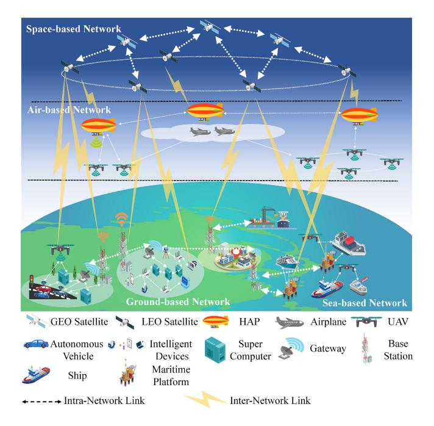

Fig. 1. An Illustration of the SAGSIN.

usually form constellations respectively; air-based network is composed of airplanes, unmanned aerial vehicles (UAVs), and high-altitude platforms (HAPs), which usually appear as platoons; sea-based network includes nodes such as maritime base stations, ships, and unmanned ships; ground-based network has been extensively developed with the advent of cell mobile communications, autonomous driving, and Internet of Things (IoT). By connecting the nodes within a certain part via short or long wireless links to construct the abovementioned four types of networks, and integrating the four parts via internetwork links, the SAGSIN can perfectly reap the promised benefits of 6G communications owing to its massive connections among long-distance nodes.

However, the realization of 6G communications with extremely high reliability, very low latency, and high energy efficiency based on the SAGSIN will be affected by several fundamental limitations, which are *large-scale scenarios, highly dynamic channels, and limited device capabilities.* Firstly, the communication distance between the transceiver nodes in the SAGSIN scenarios is considerably large in stark comparison with terrestrial communications. For instance, the distance from LEO satellites to ground nodes (e.g., base stations or user equipment) is 500-2,000 kilometers, which causes inherent and non-negligible propagation latency. Secondly, the communication channels over transceivers in the SAGSIN vary rapidly compared with terrestrial channels. Taking UAV-LEO-ground multi-hop communications as an example, the LEO orbits around the Earth with significantly high velocity, leading to inherent Doppler shift in UAV-LEO and LEO-ground channels; besides, the cosmic environment is so harsh that deep fading will appear due to cosmic ray and atmospheric attenuation. Thirdly, the available communication and computing resources are strictly limited for node devices in the SAGSIN. Specifically, due to hardware and battery limitations on the satellites, UAVs, and so on, transmission rate and computing speed of space/air-ground communications are remarkably lower in comparison to terrestrial communications.

The abovementioned inherent and fundamental characteristics of the SAGSIN impose severe challenges on current traditional communication technologies in facilitating the envisioned 6G communications. On the other hand, traditional communications based on classic Shannon information theory are reaching their limits, which may not support communications in the SAGSIN with such severe limitations. Concretely speaking, since Shannon completed his masterpiece which lays the foundation of information theory in 1948 [\[9\]](#page-38-8), researchers have contributed much effort to find state-of-the-art coding and modulation schemes that can reach the channel capacity. From near Shannon limit codes such as Turbo codes [\[10\]](#page-38-9) and low-density parity-check (LDPC) codes [\[11\]](#page-38-10), to capacity-achievable channel codes such as Polar codes [\[12\]](#page-38-11) and Spinal codes [\[13\]](#page-38-12), the Shannon limit has been reached approximately by these advanced channel coding techniques. From frequency division multiple access applied in the first generation communications, to non-orthogonal multiple access (NOMA) emerging in 5G communications, the revolution of modulation methods has also enhanced the channel capacity and been reaching the Shannon limit. Therefore, a new revolution in current communication technologies is imperative to satisfy the proliferating need for data exchange in the SAGSIN.

Moreover, in many human-to-machine and machine-tomachine application scenarios in the SAGSIN, the ultimate goal of communications is to complete specific tasks at the machine terminal. Thus, perfect or approximate reconstruction of information on the bit level is usually unnecessary. For instance, in the ship detection tasks, the observer can detect the ships from an image based on only the pixels related to ships, where reconstruction of the whole image is evidently redundant. Another example is emergency monitoring and rescue tasks, where monitors are expected to only perceive and transmit urgent status information, while missed detection or error transmission of other statuses that are not very urgent are tolerable. Under harsh conditions of the SAGSIN, pursuing perfect or approximate restoration of raw data not only will consume a huge amount of resources but is also not feasible due to limited device capabilities.

Therefore, the above reasons necessitate an idea change from traditional communication technologies to high-level communications towards semantics exchange, named semantic communications [\[14\]](#page-38-13). The reason is that semantic communications aim at recovering only semantics at the receiver instead of reconstructing every code symbol accurately. In [\[14\]](#page-38-13), Weaver identifies the three levels of communications, which are technical communications, semantic communications, and effectiveness communications. The abovementioned state-ofthe-art coding and modulation schemes all make remarkable contributions to technical communications, while deliberately neglecting the semantic and effectiveness levels of communications. This is because Shannon believes that the technology of symbol transmission can be independent from the semantics that the symbols hold. However, the idea change from technical communications to semantic communications inspires us to reconsider the assumption of semantic independence and take semantic aspects of communications into consideration. This serves as the principal line of this survey. That is, by means of semantic and effectiveness communications, the semantics of the source data can be extracted at the transmitter side and utilized for task actuation at the receiver side.[1](#page-2-0)

This survey is dedicated to answering the following three questions regarding to semantic communication systems deployed in the SAGSIN.

*Question 1. How should we interpret "semantics" for semantic communications?*

*Question 2. How should we design semantic communication systems based on the interpretations of "semantics"?*

*Question 3. How should we utilize the available while limited resources in the SAGSIN to implement semantic communications?*

Overall, the term "semantics" has three interpretations in state-of-the-art research on semantic communications. Firstly, from the perspective of etymology, the word "semantics" originates from the Greek "semanticós", which means "signif- ¯ icance". Secondly, "semantics" has its common explanation, which is "meaning". Thirdly, since "semantic communications" includes both semantic and effectiveness level, this term can also be interpreted as "effectiveness-related information".

Based on above, we introduce three types of semantic communication systems, which are respectively significanceoriented, meaning-oriented, and effectiveness-oriented semantic communication systems.

- (1) *Significance-oriented semantic communication system.* In fact, source data are not equally significant, and thus sampling and transmitting unimportant data will cause waste in resource consumption. Taking the emergency monitoring task as an example, the status message generated later is more significant than the one generated earlier, since the former contains fresher information for the receiver; moreover, the status message which is different from the previous one is more significant, since the status variation usually implies policy or decision change for the task actuator; besides, an abnormal status message is more significant than a normal one, since urgent abnormal statuses may cause potential severe consequences. Therefore, from the significance perspective, source data should be sampled, coded, and modulated in a significance-oriented manner, such that only data with more semantics (i.e., more significant data) are reserved and transmitted while those with less semantics (i.e., less significant data) get discarded. How we can measure the "significance" will be elaborated in Section [III.](#page-9-0)
- (2) *Meaning-oriented semantic communication system.* After significance-oriented sampling, although the amount of data has been preliminarily reduced, the remaining data still include considerably a large amount of redundancy due to

meaning-unrelated information. Therefore, semantic extraction from the data should be further adopted at the transmitter in order to eliminate the meaning-unrelated redundancy, such that the receiver can reconstruct data with similar meaning to the original data. In the era of Shannon, semantic extraction and reconstruction were tough problems, and researchers had to temporarily neglect the semantic aspects of source data and dedicate themselves to technical communication revolution. The principal reason is that the semantics of different modals of source data are distinct and complex, which cannot be mathematically expressed in a unified form. Nowadays, the thriving of artificial intelligence (AI), especially the unprecedented proliferation of deep learning (DL) applications, will enable deep feature (semantics) extraction from various data such as texts, images, audios, and videos by massive computing resources, and utilizing DL to realize semantic communication systems is becoming a major approach. How DL-based semantic communication systems are designed for various modals of data will be discussed in Section [IV.](#page-17-0)

(3) *Effectiveness-oriented semantic communication system.* After the extraction of meaning-related information from the data, most of the redundancy is eliminated with only the meaning of data to be transmitted. However, not all of the extracted meaning is useful for the receiver, since there is still redundant information for the ultimate actuation. Moreover, symbolor semantics-level reconstruction is also unnecessary from effectiveness-oriented perspective, since task actuation process may be intelligently conducted based directly on received messages. Therefore, a task-oriented design for semantic communications can be adopted in order that the source data yield ultimate effectiveness more efficiently at the terminal. Specifically, a more intelligent effectiveness-related semantic extractor is introduced to replace common semantic extractor for capturing effectiveness-related information. Moreover, taking full advantage of DL-based techniques, intelligent actuator is adopted which receives the effectiveness-related information and directly outputs the actuation results of the task without reconstruction of original data. By such task-oriented design, the reconstruction process at the receiver gets omitted and thus computing resource consumption will decline. How such taskoriented communication system is constructed can be found in Section [V.](#page-30-0)

Furthermore, in order to implement semantic communication systems in the SAGSIN from the above three perspectives, all the available perception, computing, and actuation techniques should be jointly adopted. Specifically, significance-oriented semantic communication system adopts a perception-communication-integrated design by filtering insignificant information and protecting significant one; meaning-oriented semantic communication system utilizes perception, communication, and computing techniques through DL-based meaning extraction and reconstruction; effectiveness-oriented semantic communication system integrates all the perception, communication, computing, and actuation techniques via an effectiveness-related semantic extractor and an intelligent actuator without reconstruction. Therefore, a new paradigm called *Perception-Communication-Computing-Actuation Integrated Paradigm (PCCAIP)* can be

1It is worth noting that in this survey, we consider both semantic and effectiveness communications as semantic communications, since they both conduct data pre-processing (i.e., extraction of semantics) before data transmission. According to [\[14\]](#page-38-13), the principal difference of semantic and effectiveness communication is whether the effectiveness of terminal task actuation is considered in system design, and this is why we review task-oriented communications (a kind of effectiveness communications) in Section [V.](#page-30-0)

proposed that guides the design of the above three types of semantic communication systems in the SAGSIN.

# *B. Related Surveys & Tutorials on SAGSIN*

Since implementing SAG(S)IN in future 6G networks has become as a consensus from both industry and academia, there have been a plethora of survey papers on the topic of SAG(S)IN. Specifically, many magazine articles have contributed to the tutorial works on various applications facilitated by SAG(S)IN. References [\[15\]](#page-38-14), [\[16\]](#page-38-15) focuses on random access technologies in space communications as well as SAGINbased communications. In [\[17\]](#page-38-16), challenges and opportunities of non-terrestrial networks (including space, air, and sea networks in SAGSIN) in 6G era are elaborated through a case study on the millimeter wave communication among air/space nodes and ground nodes. The authors in [\[18\]](#page-38-17) also give a brief tutorial on new three-dimension communication architecture through SAGSIN. In terms of newly emerging technologies such as software-defined radio [\[19\]](#page-38-18), [\[20\]](#page-38-19), optical communications [\[21\]](#page-38-20), and radar communications [\[22\]](#page-38-21), SAG(S)IN is also recommended as promising application scenarios. Recently, with the surge of AI applications, optimizing the performance of next generation communications facilitated by SAGIN has raised much attention [\[23\]](#page-38-22), [\[24\]](#page-38-23), [\[25\]](#page-39-0), [\[26\]](#page-39-1), [\[27\]](#page-39-2). Moreover, some tutorial works on simulation platforms of SAGIN scenario can guide the communication system design of future 6G network [\[28\]](#page-39-3).

There are also some comprehensive survey papers that elaborate on the characteristics, design methods, and challenges of implementing SAG(S)IN. The first of such survey papers is [\[4\]](#page-38-3), where the issues of system integration, protocol design, and performance analysis & optimization are discussed in the integrated networks in order to overcome the heterogeneity (i.e., limited device capabilities), self-organization, and time-variability (i.e., highly dynamic channels) characteristics of SAGIN. Inspired by this pioneering work, [\[5\]](#page-38-4) gives a tutorial on how SAGIN facilitates next-generation communications in high-speed railway scenarios. Moreover, in order to address the security issues of heterogeneous SAGIN, blockchain-empowered space-air-ground IoT is proposed and the state-of-the art solutions for implementing blockchainempowered SAGIN are reviewed in [\[6\]](#page-38-5). Security issues in SAGSIN are also the focus of [\[7\]](#page-38-6), where a comprehensive tutorial is presented on the topic of secure threats as well as attack technologies and corresponding defense methods. Also, the recent work [\[8\]](#page-38-7) envisions the integration of terrestrial network and non-terrestrial network in the future 6G era.

However, the above tutorial works all pay close attention to only traditional communication technologies. As has been emphasized before, the inherent characteristics of SAGSIN may hinder the implementation of bit-level communications because of Shannon limits. Moreover, perfect bit reconstruction will be not that necessary in human-to-machine (or machine-to-machine) communications in future 6G networks. Hence, an idea change from traditional bit-level communication to semantic-level communication is imperative, especially in the future SAGSIN.

# *C. Related Surveys & Tutorials on Semantic Communications*

Given that there is a recent surge of research interest on semantic communications, quite a few review and tutorial works on this topic have also emerged in the literature. In [\[29\]](#page-39-4), the authors envision a significance-oriented semantic communication system with sparse and effectiveness-aware sampling, where semantics of data are measured by timeliness metrics and end-to-end mean square error (MSE). Another magazine article [\[30\]](#page-39-5) gives a tutorial on the framework of semantic communications by reconsidering semantic information theory. From the perspective of semantic network, [\[31\]](#page-39-6) proposes a semantic-aware network architecture by utilizing federated edge learning. Moreover, [\[32\]](#page-39-7) presents a comprehensive review on DL-based semantic communications. Nevertheless, all these articles on semantic communications focus on only a certain interpretation of "semantics" listed in the previous subsection.

Some comprehensive tutorial works on semantic communication topics can also be found in the literature. The first of such tutorial works is [\[33\]](#page-39-8), where three communication modalities including human-human, human-machine, and machine-machine are addressed by semantic communications using DL-based techniques. In [\[34\]](#page-39-9), semantic communication theory is reviewed, and DL-based semantic communications for different types of sources are respectively discussed. In [\[35\]](#page-39-10), a new perspective called reasoning-driven semantic communication system is proposed, and a new semantic representation method called semantic language is studied for next generation communications. Moreover, in the recent literature of [\[36\]](#page-39-11), the authors review semantic communications from perspectives of semantic measures, semantic compression based on semantic rate-distortion theory, semantic transmission via joint source-channel coding (JSCC), and timeliness of semantic communications, respectively. In the recent tutorial work [\[37\]](#page-39-12), research on semantic communications is reviewed from three perspectives, which are semanticoriented communications, goal-oriented communications, and semantic-awareness communications. Correspondingly, the three directions on semantic communications are pointed out, which are semantic extraction, semantic transmission, and semantic metrics. In addition to the above tutorial works, some other tutorials on edge learning [\[38\]](#page-39-13) and new challenges of 6G [\[39\]](#page-39-14) also consider semantic communications as competitive solutions.

However, a principal implementation of the future 6G network is SAGSIN, while these studies do not provide an integrated paradigm of semantic communication system design that satisfies the needs in the SAGSIN. For instance, communication over highly dynamic channels is a core characteristic of SAGSIN, and thus robust semantic communications that resist channel fading as well as semantic noise must be taken into consideration when implementing semantic communications in SAGSIN. Also, given the limited capabilities of nodes in SAGSIN, it is crucial to prioritize semantic rate allocation and reduce computing complexity. Moreover, as has been pointed out in [\[6\]](#page-38-5), [\[7\]](#page-38-6), security issues should be addressed in

TABLE I COMPARISON OF CONTRIBUTIONS BETWEEN RELATED SURVEYS AND OUR SURVEY

|                | Survey Papers                    |                | Contributions                                                         |  |  |
|----------------|----------------------------------|----------------|-----------------------------------------------------------------------|--|--|
|                |                                  | [15], [16]     | Random access technologies in SAGSIN                                  |  |  |
|                |                                  | [17]           | Non-terrestrial network for 6G                                        |  |  |
|                |                                  | [18]           | Three-dimension communication architecture of SAGSIN                  |  |  |
|                | Magazine                         | [19], [20]     | Software-defined radio facilitated by SAGSIN                          |  |  |
|                | Articles                         | [21], [22]     | Optical communications and radar communications in SAGSIN             |  |  |
|                |                                  | [23]–[27]      | AI-enabled SAGSIN                                                     |  |  |
| Related to     |                                  | [28]           | Simulation platform establishment for SAGSIN                          |  |  |
| SAGSIN         |                                  | [4]            | First survey on SAGSIN, discussing system integration,                |  |  |
|                |                                  | [4]            | protocol design, and performance analysis & optimization              |  |  |
|                | Comprehensive                    | [5]            | Tutorial on high-speed railway facilitated by SAGSIN                  |  |  |
|                | Surveys                          | [6]            | Blockchain-empowered SAGSIN aiming at security issues                 |  |  |
|                | Surveys                          | [7]            | SAGSIN security issues including attack & defense methods             |  |  |
|                |                                  | [8]            | Integrating terrestrial network and non-terrestrial network in 6G era |  |  |
|                |                                  | [29]           | Significance-oriented communications via effectiveness-aware sample   |  |  |
|                | Magazine Articles  Comprehensive | [30]           | Reconsidering semantic information theory                             |  |  |
|                |                                  | [31]           | Federated edge learning-based semantic-aware network                  |  |  |
|                |                                  | [32]           | Comprehensive review on DL-based semantic communications              |  |  |
|                |                                  | [33]           | First tutorial on semantic communications, reviewing human-human,     |  |  |
| Related to     |                                  |                | human-machine, and machine-machine communications                     |  |  |
| Semantic       |                                  | [34]           | Reviewing semantic communication theory and DL-based                  |  |  |
| Communications |                                  |                | semantic communications for different sources                         |  |  |
| Communications |                                  | [35]           | Reasoning-driven semantic communication system and                    |  |  |
|                | Surveys                          | [33]           | semantic language for semantic representation                         |  |  |
|                | Surveys                          | [36]           | Focusing on semantic measures, semantic compression,                  |  |  |
|                |                                  | [30]           | semantic transmission via JSCC, and timeliness issues                 |  |  |
|                |                                  | [37]           | Semantic-oriented, goal-oriented, and semantic-aware communications   |  |  |
|                |                                  | [38], [39]     | Semantic communications as solutions in future networks               |  |  |
|                | Contributions f                  | or SAGSIN      | Contributions for Semantic communications                             |  |  |
| Our Survey     | Proposes PCO                     | CAIP as a      | • Reviewing SPTs for significance-oriented communications             |  |  |
| Jui Suivey     | unified framewor                 | k facilitating | • Reviewing METs for meaning-oriented communications                  |  |  |
|                | task-critical applications       |                | Reviewing EYTs for effectiveness-oriented communications              |  |  |

SAGSIN-based semantic communications. Goal-oriented communications for specific task-critical applications in SAGSIN are also in their nascent age. As a result, a comprehensive review of semantic communications in the future SAGSIN is of vital importance.

# *D. Contributions*

To fill the void in literature of semantic communications for the SAGSIN, in this survey, we propose a comprehensive paradigm called PCCAIP which fully addresses fundamental limitations in the SAGSIN. Sequentially, we review recent literature on semantic communications from three perspectives, which are 1) significance representation and protection, 2) meaning similarity measurement and meaning enhancement, and 3) ultimate effectiveness and effectiveness yielding. The contributions of the related survey papers and ours are compared in Table [I.](#page-4-0) Specifically, our contributions are listed as follows.

• We propose a new paradigm for the implementation of semantic communications in the SAGSIN called PCCAIP, in which perception, computing, and actuation techniques

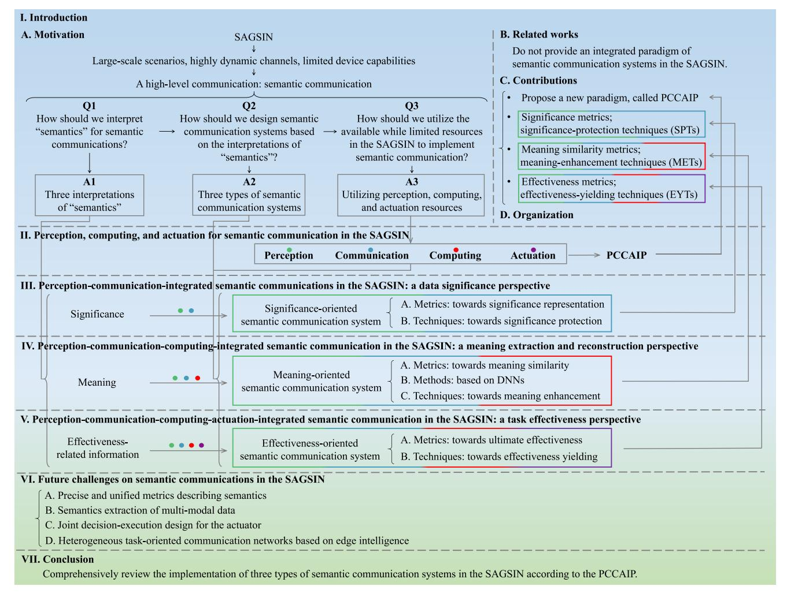

Fig. 2. The architecture of this survey.

are jointly utilized for communications, and thus the design of the three types of state-of-the-art semantic communication systems can be guided by PCCAIP.

- Aiming at designing significance-oriented semantic communication systems, we introduce the significance metrics, including content-agnostic, content-aware, and unified metrics. We then review recent works on *Significance Protection Techniques (SPTs)*, including sampling, coding, and modulation.
- We elaborate on a major approach to semantic communications, namely meaning-oriented semantic communication system, focusing on the implementation of DL-based meaning extraction and reconstruction. We provide an idea of system design, which starts from maximizing meaning similarity metrics, and next trains DL models, and finally utilizes *Meaning-Enhancement Techniques (METs)*.
- We discuss a newly emerging approach of semantic communications called effectiveness/task-oriented semantic communication system, which is guided by PCCAIP. We review metrics that measure the ultimate effectiveness of tasks, and discuss *Effectiveness-Yielding Techniques (EYTs)* facilitating typical services in the SAGSIN.

## *E. Organization*

The rest of this survey is organized as follows. Section [II](#page-5-0) proposes the PCCAIP, where the utilization of perception, computing, and actuation modules in the SAGSIN is elaborated respectively. In Section [III,](#page-9-0) we introduce significance metrics as semantic measures, and review SPTs including significance-oriented sampling, coding, and modulation. Section [IV](#page-17-0) introduces meaning similarity metrics, DL models, and METs based on meaning extraction and reconstruction. The focus of Section [V](#page-30-0) is task-oriented communications guided by PCCAIP, where effectiveness metrics are reviewed and EYTs are discussed for specific tasks. We then envision some future challenges on semantic communication implementation in the SAGSIN in Section [VI,](#page-36-0) and Section [VII](#page-38-24) concludes the survey. The architecture of this survey is illustrated in Fig. [2,](#page-5-1) and the majority of the abbreviations/acronyms used in this survey are listed in Table [II.](#page-6-0)

# II. PERCEPTION, COMPUTING, AND ACTUATION FOR SEMANTIC COMMUNICATIONS IN THE SAGSIN

As mentioned in Section [I,](#page-0-0) semantic communication systems play a crucial role in the SAGSIN by enabling

TABLE II SUMMARY OF THE ABBREVIATIONS/ACRONYMS USED IN THIS SURVEY

| Abbreviation                                                 | Full Name                                                                       | Abbreviation      | Full Name                                                     |
|--------------------------------------------------------------|---------------------------------------------------------------------------------|-------------------|---------------------------------------------------------------|
| 5G/6G                                                        | 5G/6G fifth/sixth generation                                                    |                   | space-air-ground(-sea)                                        |
|                                                              | -                                                                               | SAG(S)IN          | integrated network                                            |
| LEO/GEO                                                      | low/geostationary Earth orbit                                                   | UAV               | unmanned aerial vehicle                                       |
| HAP                                                          | high-altitude platform                                                          | IoT/IoV           | Internet of things/vehicles                                   |
| LDPC                                                         | low density parity check                                                        | NOMA              | non-orthogonal multiple access                                |
| AI                                                           | artificial intelligence                                                         | DL                | deep learning                                                 |
| MSE/MAE                                                      | mean square/absolute error                                                      | JSCC              | joint source-channel coding                                   |
| SPT                                                          | significance protection technique                                               | MET               | meaning-enhancement technique                                 |
| EYT                                                          | effectiveness-yielding technique                                                | AR/VR/MR          | augmented/virtual/mixed reality                               |
| AoI                                                          | age of information                                                              | AoS               | age of synchronization                                        |
| AoII                                                         | age of incorrect information                                                    | UoI               | urgency of information                                        |
| GoT                                                          | goal-oriented tensor                                                            | QAoI              | query age of information                                      |
| VoI                                                          | value of information                                                            | ACK               | acknowledgment                                                |
| MDP                                                          | Markov decision process                                                         | (H)ARQ            | (hybrid) automatic repeat request                             |
| HARQ-CC                                                      | HARQ with chase combining                                                       | (HARQ-)IR         | (HARQ with) incremental redundancy                            |
| BSC/BEC                                                      | binary symmetric/erasure channel                                                | SNR               | signal-to-noise ratio                                         |
| AWGN                                                         | additive white Gaussian noise                                                   | FBL               | finite block-length                                           |
| NACK                                                         | negative acknowledgment                                                         | OMA               | orthogonal multiple access                                    |
| MDP                                                          | Markov decision process                                                         | PSO               | particle swarm optimization                                   |
| ANN                                                          | artificial neural network                                                       | DNN               | deep neural network                                           |
| NN                                                           | neural network                                                                  | BER               | bit error rate                                                |
| WER                                                          | word error rate                                                                 | BLEU              | bilingual evaluation understudy                               |
|                                                              | consensus-based image                                                           |                   | -                                                             |
| CIDEr                                                        | description evaluation                                                          | MSS               | metric of semantic similarity                                 |
| BERT bidirectional encoder representations from Transformers |                                                                                 | PSNR              | peak signal-to-noise ratio                                    |
| SSIM                                                         | structural similarity index                                                     | MS-SSIM           | multi-scale SSIM                                              |
|                                                              | learned perceptual image                                                        |                   |                                                               |
| LPIPS                                                        | patch similarity                                                                | GAN               | generative adversarial network                                |
| FID/FDSD                                                     | Fréchet Inception/DeepSpeech distance                                           | KID/KDSD          | kernel Inception/DeepSpeech distance                          |
| AKD                                                          | average keypoint distance                                                       | SDR               | signal-to-distortion ratio                                    |
| PESQ                                                         | perceptual evaluation of speech quality                                         | IRS               | intelligent reflecting surface                                |
| FFT                                                          | fast Fourier transform                                                          | MCD               | Mel cepstral distortion                                       |
| RL                                                           | reinforcement learning                                                          | SSCC              | separate source-channel coding                                |
| DeepJSCC                                                     | deep-learning based JSCC                                                        | CNN               | convolutional neural network                                  |
| RNN                                                          | recurrent neural network                                                        | ReLU              | rectified linear unit                                         |
| FCN                                                          | fully convolutional network                                                     | LSTM              | long short-term memory                                        |
| GRU                                                          | gated recurrent unit                                                            | NLP               | natural language processing                                   |
| GPU                                                          | graphics processing unit                                                        | GCN               | graph convolutional network                                   |
| RLN                                                          | reinforcement learning network                                                  | DeepSSCC          | DL-based SSCC                                                 |
|                                                              | channel state information                                                       | BPSK              | binary phase shift keying                                     |
| CSI                                                          |                                                                                 | RS (codes)        | Reed-Solomon (codes)                                          |
| CSI NTSCC                                                 | nonlinear fransform source-channel coding                                       |                   | i ixeea ooronion (coaco)                                      |
| NTSCC                                                        | nonlinear transform source-channel coding                                       |                   |                                                               |
| NTSCC KG                                                  | knowledge graph                                                                 | KB                | knowledge base                                                |
| NTSCC KG ProbLog                                       | knowledge graph probabilistic logic programming language                        | KB ML          | knowledge base machine learning                            |
| NTSCC KG ProbLog TP/TN                              | knowledge graph probabilistic logic programming language true positive/negative | KB ML FP/FN | knowledge base machine learning false positive/negative |
| NTSCC KG ProbLog                                       | knowledge graph probabilistic logic programming language                        | KB ML          | knowledge base machine learning                            |

efficient information exchange and intelligent actuation. However, relying solely on traditional communication techniques may not meet the requirements of complex tasks due to the limitations in network resources. Therefore, perception, computing, and actuation techniques facilitate semantic communications to form the PCCAIP, by which

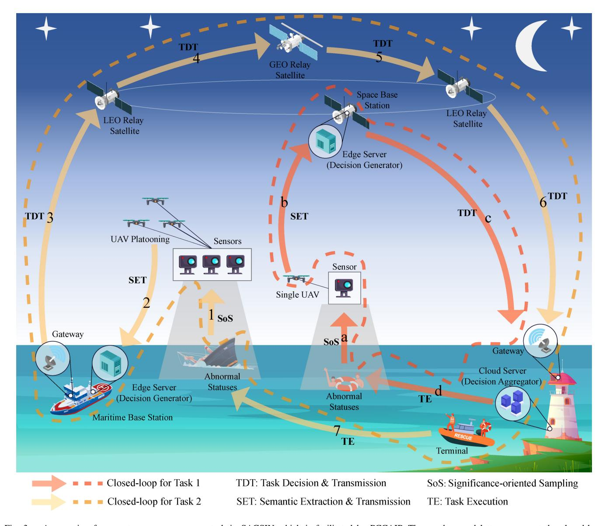

Fig. 3. A scenario of a remote emergency rescue task in SAGSIN which is facilitated by PCCAIP. The numbers and letters represent the closed-loop information flows. For task 1, the letters represent the following processes: a. significance-oriented sampling of abnormal statuses from a drowning person; b. semantic extraction and transmission from a single UAV to the space base station; c. task decision transmission from the base station to the cloud server; d. decision aggregation (if necessary) and task execution (the terminal will send rescue to the drowning person). For task 2, the numbers represent the following processes: 1. significance-oriented sampling of abnormal statuses from a sinking ship; 2. semantic extraction and transmission from UAV platooning to the maritime base station; 3. task decision transmission from the base station to an LEO satellite; 4. relay from an LEO satellite to the GEO satellite; 5. relay from the GEO satellite to another LEO satellite; 6. task decision transmission from the LEO satellite to the cloud server; 7. decision aggregation (if necessary) and task execution (the terminal will send rescue to the sinking ship).

a "target-perception-communication-actuation-target" closedloop framework facilitated by intelligent computing is constructed. Specifically, perception techniques are utilized to observe the targets (e.g., abnormal statuses shown in Fig. [3\)](#page-7-0) in the physical world. Next, communication techniques help transmit the observed target information to remote nodes (e.g., edge servers in Fig. [3\)](#page-7-0) for further processing. Sequentially, actuation techniques will guide the actuator (e.g., both edge servers and cloud servers in Fig. [3\)](#page-7-0) to generate the best task decision commands. Finally, the commands will be executed by the terminal, and the status of the target will be changed due to task execution. In the following discussion, we will firstly address these techniques, and then provide a detailed introduction to the PCCAIP.

# *A. Perception*

The integration of space-based, air-based, ground-based, and sea-based networks results in a significant increase in business volume. Multiple types of sensors deployed in these networks enable real-time perception of various targets. Meanwhile, since the targets may belong to different physical processes in the real world, a substantial amount of multi-modal data is collected, which poses a great challenge in supporting services and applications with extremely low latency requirements. One feasible solution is to reduce the volume of data to decrease the latency in subsequent communication and processing stages. This is why we need to perceive the significance, meaning, and effectiveness-related information of the source data in the SAGSIN. Capturing significance can be achieved through significance-oriented sampling, while capturing the other two can be accomplished through intelligent semantic extraction, which is typically facilitated by DL, knowledge graphs (KGs), and so on. The significance-oriented sampling and semantic extraction are collectively referred to as perception in this survey.

Perception plays a significant role in various application scenarios. For example, in the emergency response and rescue applications for maritime incidents, ocean buoys deployed in the maritime area are used to collect oceanographic source data such as sea currents, wind speeds, and wave conditions. UAVs deployed above the sea surface capture image data with cameras. During non-urgent situations, the sensors operate at a relatively low sampling frequency to conserve energy and reduce data processing burden. However, in the emergency events such as maritime shipwrecks, oil spills, fires, or drownings, the sensors immediately increase their sampling frequency to keep data freshness and let the server estimate the source status more accurately. The source data are further processed to extract semantic information, such as the situation of stranded crew members and ocean current information. The extracted semantic information is then transmitted to the emergency rescue center in real-time to facilitate rescue operations.

## *B. Computing*

In the semantic-empowered SAGSIN, computing refers to the AI-related complex operations, such as the feature extraction, semantic coding, and adaptive decision. Therefore, it is imperative to use AI algorithms to extract semantic information and make intelligent decisions, which will release data traffic and thus decrease processing latency. However, AI algorithms rely heavily on sufficient computing resources, and it is unlikely to achieve satisfactory performance when these algorithms are deployed on end devices such as ocean buoys and UAVs due to limitations in computing and caching resources. The SAGSIN encompasses various types of devices, resulting in a large volume of data that usually require realtime processing and analysis. Edge computing technology has emerged to address this issue.

In recent years, there have been significant academic and industrial interests in on-orbit edge computing based on space-based networks [\[40\]](#page-39-15), [\[41\]](#page-39-16), as well as edge storage technologies [\[27\]](#page-39-2), [\[42\]](#page-39-17). A large number of cloud servers, edge servers, and other computing units are distributed in the SAGSIN, providing supports for perception, communication, and actuation techniques. For instance, in the context of satellite-based edge computing, efficient interconnection is achieved among space-based and ground-based networks by leveraging LEO satellites as the core. An edge computing platform is built on the satellites, empowering the entire network with on-orbit capabilities for intelligent data collection, processing, and caching [\[43\]](#page-39-18). The authors assume a geographically dispersed remote team with diverse members. Through augmented reality (AR) and virtual reality (VR) technologies, remote team members can share a virtual workspace, enabling collaborative working and real-time communications.

In this scenario, the on-orbit edge servers are equipped with a semantic encoding network driven by DL models. Team members wear head-mounted displays integrated with semantic decoding networks, accessing the shared virtual workspace through VR technology. In this example, the satellite-based edge computing platform provides robust support for the combination of VR technology and semantic communications.

# *C. Actuation*

The receiver utilizes the received messages, which are relevant to task performance, to accomplish the task decision. Based on the decision results, the task execution process will exert an influence on the physical world. In this survey, the task decision and task execution comprise the definition of actuation. Taking remote control services as an example, the intelligent decision-maker generates and transmits task decision commands based on the received messages, and then the terminal receives the decision commands and executes specific tasks.

With the development of 5G/6G, the variety of taskcritical applications in the SAGSIN continues to enrich. For instance, the stability control of UAVs can be modeled as a classical CartPole problem. In this scenario, sensors collect environmental data, which will be then processed on the edge server using DL-based autoencoders to extract task-related semantic features. These features are transmitted to the remote control center on the ground to generate control commands, enabling remote control of the UAVs [\[44\]](#page-39-19).

Another example is found in remote surgeries, which is a typical use case of haptic Internet. Sensors located in remote areas (e.g., mountainous areas and remote seas) collect crucial patient data, which are transmitted to the medical center with the aid of satellites. Surgeons receive real-time auditory, visual, and haptic feedback through a human-machine interface. Visual feedback is provided using streaming technologies, such as holographic-type communications, depending on whether surgeons interact with holograms or wear head-mounted devices. Subsequently, surgeons operate haptic devices through the human-machine interface and perform surgical actions based on real-time visual feedback and haptic information transmitted to the robot [\[45\]](#page-39-20).

## *D. PCCAIP*

According to the interpretation of perception, computation, actuation, we introduce the perception-communicationcomputing-actuation-integrated framework under the guidance of PCCAIP. This framework aims to maximize the effectiveness of tasks by establishing a closed information flow loop, as shown in Fig. [3.](#page-7-0) We consider an emergency detection and rescue scenario in the SAGSIN as an example. It is worth noting that, in the current industrial infrastructure, the emergency detection task and emergency rescue task can both be independently implemented in real world. However, the collaborative design and coordination of detection & rescue operations still rely on the comprehensive SAGSIN which provides heterogeneous connections as well as computing resources.

Specifically, various sensors (e.g., cameras deployed on the UAVs) continuously observe the environment that contains abnormal statuses (e.g., sinking ships or drowning persons), and decide to sample data representing the current statuses when the data are significant enough (e.g., untimeliness, status change, or environment change). After data sampling, these data will be further processed by the computing-intensive semantic extractor deployed on UAVs and then transmitted to remote edge servers (e.g., servers deployed on a maritime base station or space base station), by which multi-level data perceptions are completed by distributed computing resources.

Based on the received status data, the edge servers conduct real-time decision making and generate commands, which can guide the terminals (e.g., rescue ships) in responding to the emergencies if necessary. Subsequently, the decision commands are transmitted to the remote terrestrial cloud server via LEO/GEO satellite relays. After the cloud server receives the decision commands, it will undertake task execution (e.g., rescuing the ships/persons, or doing nothing) based on the commands, by which task actuation is completed. Moreover, in cases where rescue capabilities are constrained, the cloud servers will firstly aggregate the received commands from all the edge servers and secondly decide which emergencies should be rescued according to various factors (e.g., significance, environment statuses, and effectiveness aspects). After the decision making process, the task execution will be completed by the terminal.

Task execution will further determine the statuses and thus the decisions at the next time interval (for example, if a sinking ship gets rescued by the rescue ship, there will be no emergency in the next period of time, and thus the rescue ship does not need to rescue in the next), by which closed loops for the emergency rescue tasks are formed by the PCCAIP framework.

## *E. Lessons Learned From This Section*

This section elaborates on how the perception, computing, and actuation techniques help realize semantic communications. Overall, perception techniques help select the data with more semantics, computing techniques facilitate intelligent communications in various aspects, and actuation techniques aid in the interaction between system and environment to complete all-inclusive tasks. PCCAIP integrates all these techniques which can realize a closed-loop communication and a joint design to achieve high effectiveness of tasks. Moreover, maritime rescue tasks are adopted as an example to showcase how PCCAIP guides semantic communication system design.

The proposed PCCAIP is essentially a novel paradigm which significantly deviates from traditional integrated sensing and communication (ISAC) paradigm [\[46\]](#page-39-21) along with integrated sensing, communication, and computing (ISCC) paradigm [\[47\]](#page-39-22) in two aspects. Firstly, the ISAC and ISCC both focus on the integration of radar sensing (as well as traditional data capturing) and communication (computing), which belong to the category of traditional bit-level communication, while PCCAIP aims at high-level semantic communication facilitated by intelligent significance-oriented sampling and

meaning extraction. Secondly, ISAC and ISCC both address the issue of only communication processes, while PCCAIP can facilitate more comprehensive task-critical applications by jointly designing both communication processes and the ultimate actuation processes. Therefore, it is a promising idea to implement semantic-communication-based task-critical applications in the future network via PCCAIP.

As typical semantic communication frameworks facilitated by PCCAIP, we will introduce significance-oriented, meaningoriented, and effectiveness/task-oriented communications systems respectively in the following sections. In Section [III,](#page-9-0) we design a significance-oriented semantic communication system which belongs to the perception-communicationintegrated semantic communications. In Section [IV,](#page-17-0) we study a meaning-oriented semantic communication system which falls under the category of a perception-communication-computingintegrated semantic communication system. In Section [V,](#page-30-0) we introduce a task-oriented communication system which achieves perception-communication-computing-actuation integration.

# III. PERCEPTION-COMMUNICATION-INTEGRATED SEMANTIC COMMUNICATIONS IN THE SAGSIN: A DATA SIGNIFICANCE PERSPECTIVE

In this section, we will review the research on semantic communications from the data significance perspective. Here, the term "semantics" is explained as its etymological meaning "significance", which implies a significance-oriented semantic communication system.

In significance-oriented semantic communications in the SAGSIN, a joint perception-communication framework is adopted as shown in Fig. [4.](#page-10-0) In Fig. [4,](#page-10-0) the source data can be of various types, such as given data and status updates. Given data are usually collected from fixed files provided by users, such as texts, images, and audios, while status updates are collected from a time-variant physical process from the real world. Aiming at studying the significance evolution and optimization of a physical process, all of the works reviewed in this section assume that the source data are status updates. Specifically, source data are firstly sampled by significanceoriented sampler in order to release the heavy data burden, and the sampled data will be coded and modulated for transmission over wireless channel. The receiver demodulates and decodes the received message to recover the sampled data. According to the recovery results, the significance of source data varies to affect the evolution of significance metric; sequentially, the variation of significance metric will affect the further decision of sampler and coder/modulator at the transmitter via feedback from the receiver. It is worth noting that both coding and modulation techniques mentioned in this section are traditional technologies based on Shannon information theory.

Considering the fundamental limits of the SAGSIN and the time-sensitivity of various tasks facilitated by SAGSIN, the data freshness/timeliness is naturally significant for semantic communication system due to large communication distance. Therefore, timeliness metrics, including age of information (AoI) and its variants, are of vital importance in describing

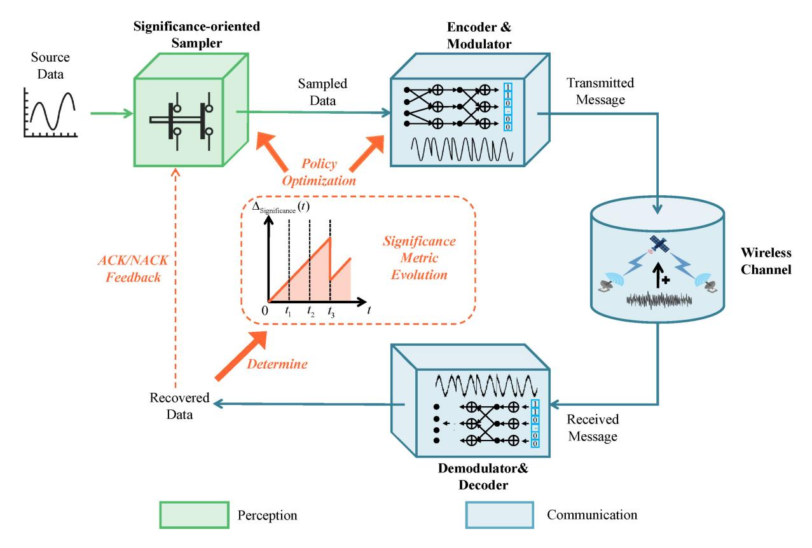

Fig. 4. The framework of perception-communication-integrated semantic communications in the SAGSIN.

the performance of the tasks. Thus, we will first introduce AoI and AoI variants as significance metrics in Section III-A, and then review the literature on techniques towards significance-protection in Section III-B.

## A. Metrics: Towards Significance Representation

We start our review on significance metrics by AoI, and then we introduce its variants, including nonlinear AoI, age of synchronization (AoS), age of incorrect information (AoII), urgency of information (UoI) and the recently proposed goal-oriented tensor (GoT), to describe multi-dimensional significance (e.g., timeliness, status synchronization cost, and environment variation cost). The characteristics of significance metrics reviewed in this survey are listed in Table III.

AoI is firstly proposed in [48], where the authors use this metric to find the optimal information transmission rate in vehicular networks. In [49], the authors further use AoI to evaluate the performance of status update systems. Specifically, AoI is defined as the time elapsed since the latest successfully received status update was generated. The instantaneous AoI expression for the system is

$$\Delta_{\text{AoI}}(t) = t - U(t),\tag{1}$$

where t represents the current time and U(t) represents the generation time of the currently received information. The evolution of AoI is rather simple, that is, only when a status update is successfully received does AoI update as the age of the newly received update, and otherwise AoI continuously increases in a linear manner.

In the SAGSIN, status update messages are exchanged among UAVs, satellites, ships, and ground base stations through wireless channels. High AoI implies long delay and frequent errors of the status update transmission, thereby affecting the significance (or timeliness) of data. Usually, the average AoI or peak AoI is used to measure long-term significance of data. Some research also focuses on the AoI at specific query instants to propose query age of information (QAoI) [56] as an AoI variant.

However, the linearly increasing cost of AoI is insufficient in describing the nonlinear significance variation incurred by untimely information. For applications that are more sensitive to time, such as autonomous driving and remote surgery, the performance degradation caused by information aging may not be a linear function of time. For instance, in the state estimation problem of Gaussian linear time-invariant systems, if the system is stable, the state estimation error (which directly determines the significance of source data) is a sublinear function of  $\Delta_{\rm AoI}$ ; if the system is unstable, the state estimation error increases exponentially with  $\Delta_{\rm AoI}$  [57]. Therefore, it is necessary to evaluate the significance of data which is varying nonlinearly in age. Some scholars have proposed value of information (VoI) [50] (also called nonlinear AoI [51]). Nonlinear AoI is a nonlinear function of AoI, that is

$$\Delta_{\text{nonlinearAoI}}(t) = f(t - U(t)),$$
 (2)

where  $f(\cdot)$  is a nonlinear penalty function for linear information age. For example, if the penalty function is chosen as an exponential function, a possible evolution of nonlinear

TABLE III SUMMARY OF SIGNIFICANCE METRICS

AoI is shown in Table [III.](#page-11-0) The choice of penalty function is dependent on how the significance varies in data aging. If the significance increases slowly in time, we adopt functions with decreasing derivatives in time, such as logarithmic functions; in contrast, if the significance increases rapidly, we adopt functions with increasing derivatives in time, such as exponential functions.

However, both AoI and nonlinear AoI only reflect the time elapsed from the generation of the current information to its successful reception, without considering whether the receiver correctly estimates the information from the source. That is, they only focus on the timeliness of the currently transmitting information and ignore the real-time status synchronization between the recovered information and the current source status information. This characteristic of AoI (and nonlinear AoI) is also called content-agnostic. However, synchronization of statuses between transceivers also affects the significance of data, since wrong estimation will lead to biased decisions on current status and cause severe consequences. For instance, missed detection of the fire will cause considerably large financial losses due to untimely rescue. Therefore, to reflect whether the receiver fully understands the source information, researchers have proposed a series of content-aware significance metrics including AoS, AoII, and UoI.

In [\[52\]](#page-39-29), the authors define a novel metric called AoS, which extends the freshness of information to the synchronization duration of information. Unlike AoI, AoS is calculated as the duration since the latest time of perfect inference of the current process status, that is

$$\Delta_{\text{AoS}}(t) = t - W(t), \tag{3}$$

where *W*(*t*) represents the latest time slot that the statuses between transceivers are synchronized. A possible AoS evolution shown in Table [III](#page-11-0) demonstrates that when statuses are synchronized, AoS is equal to zero, and otherwise AoS linearly increases in asynchronized status duration.

As a general case of AoS, AoII is defined as a function of AoS. Specifically, in [\[53\]](#page-39-30), AoII is described as a (non)linear function with regard to time duration multiplying a function reflecting the difference between source status and estimated status, that is

$$\Delta_{\text{AoII}}(t) = f(t) \times g(X(t), \hat{X}(t)),$$
 (4)

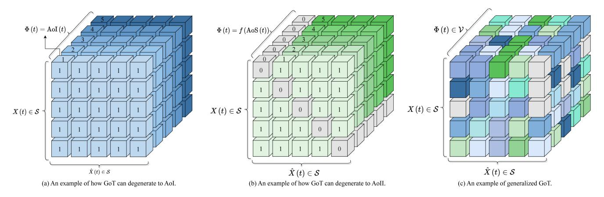

Fig. 5. Examples of how GoT can degenerate to existing metrics. By setting the environment states as related to current message ages, the GoT can characterize AoI shown in subfigure (a). By setting the matrices composed of source status dimension and estimated status dimension as symmetric, with values on the main diagonal as zeros, the GoT can describe AoII shown in subfigure (b). Naturally, by relaxing these constraints, a generalized metric called GoT can be constructed as shown in subfigure (c).

where X(t) is the source status at time t,  $\hat{X}(t)$  is the estimated result of X(t) predicted by the receiver, f(t) is an increasing time penalty function, and  $g(X(t),\hat{X}(t))$  is an information penalty function that reflects the difference between the predicted result of the receiver and the actual status. Since the difference between two identical statuses is zero, the information penalty function  $g(X(t),\hat{X}(t))$  should be equal to zero when  $X(t) = \hat{X}(t)$ . The AoII evolution is similar to that of AoS, that is, if the statuses between transceivers are synchronized, AoII is zero; if they are asynchronized, then AoII increases with the time duration of the asynchronized state in a (non)linear manner.

Furthermore, [54] proposes a new metric called UoI, which is used to measure the nonlinear time-varying significance of state information by considering the impact of external environment. Specifically, UoI is defined as

$$\Delta_{\text{UoI}}(t) = f(t, \mathbf{\Phi}(t)) \cdot g(X(t), \hat{X}(t)), \tag{5}$$

where  $\Phi(t)$  represents the environment states at time t. That is, the time penalty function f(t) is time-variant according to the current environment state  $\Phi(t)$ . As shown in Table III, the UoI evolution is rather complex due to the time-variant environment. Even the current statuses between transceivers keep asynchronized during time interval  $[t_1, t_4]$ , the manners of UoI increase are different in  $[t_1, t_2]$  (linear) and  $[t_2, t_4]$  (exponential), for the data in the latter time interval are more significant due to more urgent environment.

The recent works enrich the concept of significance to propose a comprehensive tensor-based metric which unifies the above significance metrics. Specifically, the authors in [55] investigate a novel performance metric called GoT to directly quantify the significance of data considering the impacts of environments, status synchronization, and inherent costs, which is defined as

$$\Delta_{\text{GoT}}(t) = \text{GoT}\Big(X(t), \hat{X}(t), \mathbf{\Phi}(t)\Big), \tag{6}$$

where  $GoT(\cdot)$  is a tensor with three dimensions, namely source status, estimated status, and environment states. Each element of GoT reflects the significance value (i.e., inherent

cost) depending on the difference of source and estimated statuses between transceivers and the current environment state. As shown in Table III, the significance values in different time intervals are rather distinct. The authors prove that the GoT metric can reduce to existing metrics such as AoI, AoS, AoII, and UoI under certain conditions, as illustrated in Fig. 5.

Remark 1: The preference of significance metric depends on our demands on system performance. Specifically, contentagnostic metrics can describe the delay aspect (or staleness), while content-aware metrics captures the fidelity aspect (or mismatch). Therefore, we should firstly explore the demand of specific services and secondly choose corresponding metrics. For instance, in a remote control scenario under timevarying environment, UoI may demonstrate the significance of information better than AoII, since remote control services necessitate precise source status information calling for content-aware metrics, and UoI is more suitable for describing time-varying costs. Also, since GoT is a unified significance metric, it is preferable in most services as long as the number of statuses X(t) is sufficiently large. In Table III, we have briefly compared the application scenarios of each metric.

## B. Techniques: Towards Significance Protection

This subsection discusses the design of a significance-oriented semantic communication system within SAGSIN. The main focus is on ensuring appropriate sampling and accurate transmission of information with high significance, referred to as "significance protection". Taking into account the characteristics of SAGSIN, such as large-scale scenarios, highly dynamic channels, and limited device capabilities, we categorize existing research into the design of sampling, coding, and modulation policies, which we term SPTs. These techniques aim to optimize the significance of transmitted data throughout the signal processing and transmission stages, which are listed in Table IV.

1) Significance-Oriented Sampling Policy Design: Given the limited device capabilities of the SAGSIN, significance-oriented sampling policy is designed to alleviate the burden on data transmission. Generally, in a status update system

| TABLE IV                                      |
|-----------------------------------------------|
| SUMMARY OF SIGNIFICANCE-PROTECTION TECHNIQUES |

| Perspective | SAGSIN Issues Addressment                | Related Metrics |                                           | Related References                                                         |                  |
|-------------|------------------------------------------------|--------------------|-------------------------------------------|-------------------------------------------------------------------------------|------------------|
| Sampling    |                                                | AoI, AoS,       | Content- agnostic                      | AoI-optimal threshold-based sampling with (non)linear age penalty             | [51], [58], [59] |
|             |                                                |                    |                                           | AoI-optimal threshold-based sampling for Wiener or Ornstein-Uhlenbeck sources | [60], [61]       |
|             | Limited device                                 | AoII,              |                                           | Multi source joint sampling                                                   | [62]             |
|             | capabilities                                   | Nonlinear AoI   | Content- aware                         | AoS-optimal threshold-based sampling                                          | [52]             |
|             |                                                |                    |                                           | AoII-optimal threshold-based sampling                                         | [53], [63], [64] |
|             |                                                |                    |                                           | AoII-optimal sampling under random delay                                      | [65]             |
|             |                                                |                    |                                           | AoII-optimal sampling with retransmission                                     | [66]             |
|             | Highly dynamic channels, large-scale scenarios | AoI                | Neglecting propagation delay              | HARQ-IR                                                                       | [67], [68]       |
|             |                                                |                    |                                           | Truncated HARQ-CC for LDPC code                                               | [69]             |
|             |                                                |                    |                                           | HARQ-based Polar coded system                                                 | [70]             |
| Coding      |                                                |                    | Considering - propagation - delay - | Codeblock assignment                                                          | [71]             |
|             |                                                |                    |                                           | HARQ-IR                                                                       | [72]–[74]        |
|             |                                                |                    |                                           | HARQ-based Spinal coded system                                                | [75]             |
|             |                                                |                    |                                           | HARQ-based Polar coded system                                                 | [76]             |
|             | Limited device                                 | AoI                |                                           | [77], [78]                                                                    |                  |
| Modulation  | Limited device                                 |                    |                                           | [79]                                                                          |                  |
|             | capabilities                                   |                    |                                           | [80], [81]                                                                    |                  |

shown in Fig. [6,](#page-13-1) a status update will be sampled only when the significance metric of the system reaches a certain threshold, implying that the current status update is significant enough that the receiver should acquire the current source status. By such significance-oriented sampling, most of data with less importance are filtered by the sampler, with only data with more semantics (i.e., significance) being sampled and transmitted to the receiver. Thus, the pre-processing burden of transmitter gets initially released, saving considerably large perception and communication resources which is severely limited the SAGSIN.

*Content-agnostic sampling policy design.* Since AoI is a typical timeliness metric, the design of AoI-related sampling policy has been studied widely in the literature. Intuitively, a zero-wait sampling policy, where a new update is sampled just when an acknowledgment (ACK) feedback is received by transmitter, will be naturally AoI-optimal since the newest sampled status update is the freshest and contains the most semantics. However, the authors in [\[58\]](#page-39-33) point out that zerowait policy is not always AoI-optimal, especially when the status varies slowly, since most of the status updates are repetitive and thus useless. To solve the AoI-optimal sampling problem for such cases, [\[58\]](#page-39-33) adopts a penalty function to measure the dissatisfaction level on data staleness, and formulates

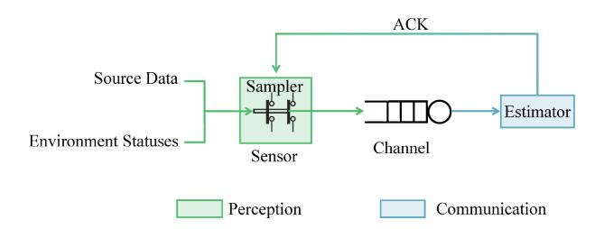

Fig. 6. A general system model of status update system facilitated by significance-oriented sampling. It is assumed that source data, environment statuses, and channel are all time-variant, affecting the significance of source data and thus determining whether to sample the current update. Moreover, the channel is usually assumed to be a queuing system with/without preemption, which will also affect the optimal sampling policy.

the age penalty minimization problem as a semi Markov decision process (MDP), which is solved by a divide-and-conquer approach. The zero-wait policy is proven to be optimal when the variance of log-normal distribution for service time is small; in contrast, the policy of waiting is optimal when the variance is large (i.e., a heavy tail distribution) or the penalty function increases rapidly with age growing. Similarly, the AoI-optimal sampling policy under energy constraint is solved in [\[59\]](#page-39-34). The choice of nonlinear age penalty and its impact on optimal sampling policy can also be seen in [\[51\]](#page-39-28).

With regard to AoI-optimal sampling policy for specific distributions of source data, [\[60\]](#page-39-35) discusses the optimal sampling policies for remote estimation of a Wiener process for different metrics including AoI and MSE. Specifically, the AoI-optimal sampling policy follows a threshold structure, that is, only when AoI reaches a threshold does the sampler generate a new status update for transmission. Meanwhile, the MSE-optimal sampling policy is equivalent to AoI-optimal one only when sampling times are independent with Wiener process; however, when the sampling times are determined by the knowledge of the Wiener process, the AoI-optimal sampling policy will no longer achieve the minimum estimation error as compared to MSE-optimal one. Another similar work is [\[61\]](#page-39-36), where the optimal sampling policy of a Ornstein-Uhlenbeck source is studied serving as a general case of the study in [\[60\]](#page-39-35). The sampling optimization problem is formulated as a timecontinuous MDP, and the solution is also proven to be a threshold structure related to instantaneous estimation error (which is related to MSE).

The above research focuses on sampling design of a single source. For the case of multiple sources, [\[62\]](#page-39-37) studies the total-peak-AoI-optimal and total-average-AoI-optimal sampling strategies, respectively. To simplify the solution of overall scheduling-sampling policy for multi-source case, the authors firstly prove that a maximum age first scheduling policy provides the best age performance. Next, the optimal sampling policy for each source can be solved easily by a dynamic programming algorithm based on the maximum age first policy. The total-peak-AoI-optimal sampling policy is proven to be zero-wait, while the total-average-AoI-optimal sampling policy can be solved by water filling, which holds a threshold structure similar to [\[58\]](#page-39-33), [\[60\]](#page-39-35), [\[61\]](#page-39-36).

*Content-aware sampling policy design.* Although AoIoriented sampling policy does select more significant data for transmission, this design is inherently content-agnostic, since the sampler selects only fresh status updates without knowing the content of data. In order to design a contentaware significance-oriented sampling policy, we should resort to AoI variants such as AoS and AoII, etc.

A major content-aware significance metric is AoII, and thus we review AoII-related data sampling optimization. In [\[52\]](#page-39-29), the AoS-optimal and AoI-optimal sampling rates are respectively solved under a multi-source scenario. As a general case of AoS, the authors in [\[53\]](#page-39-30) discuss AoIIoptimal sampling policy with and without power constraints respectively. Under no power constraint, the optimal policy is "always update", which also achieves the minimum AoI and MSE simultaneously; however, the optimal policy is complex under a power constraint, which is solved by a constraint MDP. Reference [\[63\]](#page-39-38) further studies AoII-optimal sampling policy under the power constraint over an unreliable channel, where a threshold-based policy is proven to be optimal and adopted to reduce the complexity of the global optimization problem. The authors in [\[64\]](#page-39-39) point out the semantic (i.e., significance) characteristics of AoII, and showcase the superiority of significance-oriented AoII-optimal policy as compared to MSE-optimal and AoI-optimal ones. Considering the nontrivial transmission delay which is a fundamental characteristic in the SAGSIN, [\[65\]](#page-39-40) solves AoII-optimal sampling policy when the status updates experience random delay, which also holds a threshold structure related to the maximum transmission delay. Also, a recent work [\[66\]](#page-39-41) introduces limited retransmission with a resource constraint to enhance the AoII performance.

*2) Significance-Oriented Coding Policy Design:* Considering the large-scale scenarios and highly dynamic channels of the SAGSIN, the implementation of significanceoriented coding policy necessitates the allocation of data rates, striking a trade-off between system efficiency and reliability. In particular, in scenarios involving bad channel conditions or a large volume of significant data, introducing more redundancy can improve the successful transmission probability. However, in contrast, when the channel conditions are favorable or there are less important data, using fewer codewords can still yield satisfactory results. A widely used rate allocation method is introducing retransmission protocols, such as automatic repeat request (ARQ) and hybrid ARQ (HARQ) including HARQ with chase combining (HARQ-CC) and HARQ with incremental redundancy (HARQ-IR). ARQ and HARQ protocols accomplish code rate allocation by dynamically adapting the number of retransmissions and/or the redundancy length in each retransmission, taking into account the factors such as channel conditions, delay constraints, and data significance. The differences among simple ARQ protocol, HARQ-CC protocol, and HARQ-IR protocol are illustrated in Fig. [7.](#page-15-0)

*Coding policy design without considering propagation delay.* Most of the works in this field have only considered the transmission delay and neglected the propagation delay, i.e., the only delay element that affects AoI evolution is the code length. For example, [\[67\]](#page-39-42) considers a scenario where the sensor transmits the collected data to a central entity over an unreliable link, and coding policies with low latency are designed to protect significant data. HARQ is used for the transmission of updates and the relationship between average timeliness and physical layer decisions (i.e., whether to retransmit the old data or send new data) is analyzed. The analysis reveals a trade-off between average feedback rate and average timeliness. Specifically, for a constrained set of HARQ code word lengths, refining the code length can improve the average timeliness at the receiver. The work formulates the optimization problem with average age as the objective function and finds out the block allocation vector that minimizes the average age under the constraint of the average feedback rate. The results show that HARQ can greatly outperform ARQ protocol and fixed-length coding schemes with no retransmission when the size of the incremental redundancy sub-block is properly chosen. The HARQ protocol considered in [\[67\]](#page-39-42) is called HARQ-IR (illustrated in Fig. [7\(](#page-15-0)c)). Different from the ARQ protocol where the same packet is retransmitted after a failed decoding until an ACK reception, in the HARQ-IR protocol, a different sub-block from the previous packet will be transmitted in each retransmission, and the receiver combines previous sub-blocks with the current sub-block in the decoding process to enhance the successful decoding probability [\[82\]](#page-40-0).

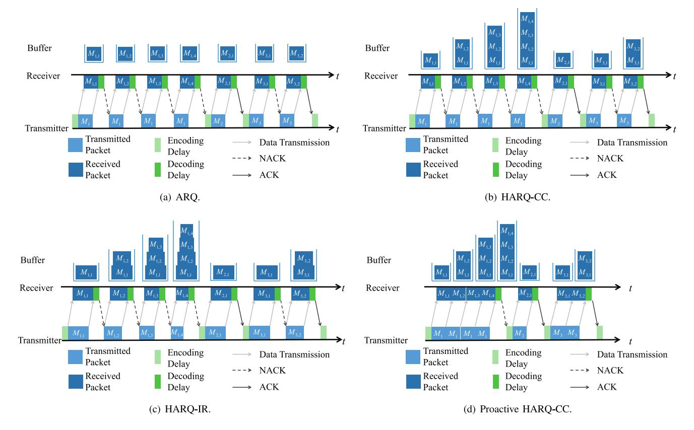

Fig. 7. The comparison of ARQ, HARQ-CC, and HARQ-IR. Specifically, the main difference between ARQ and HARQ is whether receiver uses the previous packets (or sub-blocks) stored in the buffer in the current decoding. Moreover, the packets transmitted in HARQ-CC are the same in the retransmission rounds, and the receiver simply combine the received packets using maximum ratio combining method. However, the packets transmitted in HARQ-IR (also called sub-blocks) are different in the retransmission rounds (usually with different code lengths), and the receiver combine the received sub-blocks into a whole vector for decoding. Hence, HARQ-IR usually achieves high coding gain than HARQ-CC, while the protocol design of the former is naturally more complex. Note that the subfigures (b) and (c) both show reactive HARQ protocols where a retransmission occurs only if a negative acknowledgment (NACK) feedback is received by transmitter, while subfigure (d) shows a proactive HARQ protocol with chase combining. In proactive HARQ, the transmitter will continuously retransmit the packets no matter whether the message is successfully received or not. Unless otherwise specified, the mentioned HARQ protocols in this paper are all reactive HARQ.

In [\[68\]](#page-39-43), the authors utilize the HARQ-IR protocol in the status update system over a noisy channel. In case of decoding failure at the receiver, IR bits are transmitted to increase the successful decoding probability in the future. If decoding remains unsuccessful after a specified duration, a new status update is transmitted as a replacement. Conversely, when decoding is successful, the transmitter enters an idle state for a certain period after successful transmission, prior to sending a new update. The research focuses on optimizing the code word and IR length for each update, along with the waiting time, with the objective of minimizing the long-term average AoI over the binary symmetric channel (BSC).

In recent years, there has been an increase in research focusing on analyzing and comparing AoI based on retransmission protocols for specific state-of-the-art channel coding techniques. The authors in [\[69\]](#page-39-44) firstly investigate the AoI performance of specific coding schemes. Specifically, the authors analyze the average AoI and energy cost in the LDPC coded status update system with and without ARQ using a fixed redundancy scheme. Different coding policies, including the non-ARQ, classical ARQ, truncated ARQ, and truncated HARQ-CC protocols, are analyzed and compared. Among them, truncated ARQ (illustrated in Fig. [7\(](#page-15-0)a)) involves repeated transmission of the current update until a maximum number of transmissions or a successful reception is achieved. Moreover, truncated HARQ-CC (illustrated in Fig. [7\(](#page-15-0)b)) combines previous packets with the currently received packet for decoding using maximum ratio combining method. In HARQ-CC, additional encoding schemes are unnecessary as the packets are the same for each retransmission. Additionally, the accumulation effect of signal-to-noise ratio (SNR) in each HARQ retransmission improves the successful decoding probability. These inherent characteristics empower truncated HARQ-CC to strike a balance between AoI and energy consumption, achieving the best average age and moderate energy cost among the considered protocols.

As for AoI performance of the status update system coded by capacity-achieving codes, the average AoI performance of Polar coded status updates over the additive white Gaussian noise (AWGN) channel is firstly investigated in [\[70\]](#page-39-45). Similar to the conclusion drawn by [\[69\]](#page-39-44), compared to non-ARQ protocols, the HARQ-CC protocol can effectively reduce the average AoI, especially in low SNR regions. To further optimize the AoI of the system, two methods are proposed to optimize the design SNR and puncture length, both of which are important construction parameters of Polar codes.

*Coding policy design considering propagation delay.* Instead of only concentrating on transmission delay, some research further considers other types of delays (including propagation delay) and specific application scenarios, thereby providing a more precise depiction of the transmission process in the SAGSIN [\[71\]](#page-40-1), [\[72\]](#page-40-2), [\[73\]](#page-40-3), [\[74\]](#page-40-4). The authors in [\[71\]](#page-40-1) conduct a comprehensive analysis of the AoI for two types of HARQ protocols, namely reactive HARQ and proactive HARQ (the latter protocol is illustrated in Fig. [7\(](#page-15-0)d)). Considering various types of delay, including coding delay, transmission delay, propagation delay, decoding delay, and feedback delay, [\[71\]](#page-40-1) derives unified closed-form expressions for the average AoI and average peak AoI for the two protocols. Based on the derived explicit expressions, an optimization problem is formulated to minimize the AoI by investigating the optimal block assignment strategy in the finite block-length (FBL) regime. The numerical results show that proactive HARQ offers advantages in terms of both age performance and system robustness.

In [\[72\]](#page-40-2), the authors focus on the scenarios characterized by non-trivial propagation delays, such as space communications and satellite communications. The authors study AoI performance in a communication system with non-trivial propagation delays, where status updates are transmitted to the receiver through a binary erasure channel (BEC). In order to mitigate the effect of erasures on timeliness performance, an HARQ-IR protocol with a predetermined maximum number of retransmissions is employed. It is shown that a critical upper threshold related to propagation delay exists, within which retransmissions benefit the AoI. In cases where the propagation delay is longer than the threshold, allocating all the symbols to the first transmission is the optimal coding policy. Following [\[72\]](#page-40-2), in [\[73\]](#page-40-3), the author considers a satellite-based IoT system, where IoT devices observe physical processes and transmit status updates to a monitor node through an error-prone channel with significant propagation delay. Reference [\[73\]](#page-40-3) applies HARQ-IR protocol to the satellite-based IoT system and investigates the age-optimal redundancy allocation problem under reliability constraints. The results also demonstrate the superiority of HARQ-IR in minimizing AoI below a certain propagation delay threshold. In SAGSIN scenarios, [\[74\]](#page-40-4) presents a novel fast HARQ-IR protocol which omits the decoding and feedback operations of the standard HARQ-IR in the first few rounds. Under the constraint of finite block lengths, it is also demonstrated that the fast HARQ-IR protocol outperforms in the age-optimal rate allocation problem when the propagation delay is shorter than a certain threshold.

Taking into account specific channel coding schemes, the authors in [\[75\]](#page-40-5) firstly consider a Spinal coded timely status update system based on HARQ with all practical delay elements. An upper bound of average AoI for Spinal codes is derived. Moreover, the HARQ transmission protocol is optimized in two steps to minimize the AoI. Firstly, the authors optimize the puncture pattern of Spinal codes and propose a transmission scheme based on incremental tail transmission puncturing pattern. Secondly, an optimal HARQ protocol is solved based on a coarse-grained incremental tail transmission puncturing pattern, where the number of code symbols (i.e., the sub-block length) in each round is refined.

Based on the previous work [\[70\]](#page-39-45), the authors in [\[76\]](#page-40-6) investigate a Polar coded status update system that accounts for encoding, transmission, propagation, decoding, and feedback delays. The average AoI of the proposed system with different transmission protocols is analyzed. Based on the analysis, the authors focus on the optimization for Polar-coded HARQ design. Specifically, an effective algorithm is devised to optimize the design SNR in code construction and the code length in HARQ-CC transmission. Additionally, a greedy algorithm is utilized to optimize the code lengths for each transmission and the number of transmissions in Polar-coded HARQ-IR.

*3) Significance-Oriented Modulation Policy Design:* Modulation techniques are crucial in the wireless communication system, for they can enhance the reliability, spectral efficiency, and data transmission rate. However, the modulation technique design encounters challenges in efficiently utilizing limited spectrum resources to ensure timeliness in the SAGSIN. To address this, NOMA has emerged as a promising solution, which enables multiple users to share time-frequency resources by using power domain multiplexing. By adopting power allocation (i.e., assigning varying power levels to different users) which is a modulation policy, NOMA facilitates simultaneous message transmission of multiple users. Allocating more power to the data of higher significance not only ensures reliable transmission of significant data but also enhances the timeliness of the system by directly influencing data rates and system capacity.

Various techniques are employed to enhance the timeliness performance of NOMA systems. Reference [\[77\]](#page-40-7) considers the problem of energy-efficient scheduling for minimizing the AoI in an opportunistic NOMA/orthogonal-multiple-access (NOMA/OMA) downlink broadcast wireless network. The initial step involves formulating a resource allocation problem to minimize the average AoI in the network. To address energy-efficiency considerations, the work takes into account both a long-term average power constraint and a maximum power constraint. Then, the Lyapunov framework is employed to approximate the original problem as a queue stability problem. The obtained single time-slot optimization problem is further decomposed into power allocation and user scheduling subproblems. An efficient piece-wise linear approximation is utilized to solve the non-convex power allocation subproblem, while linear programming algorithm is adopted to solve the user scheduling subproblem. Unlike the approach discussed in [\[77\]](#page-40-7) that focuses solely on NOMA and OMA transmission schemes, [\[78\]](#page-40-8) proposes an adaptive NOMA/OMA/cooperative-SWIPT-NOMA transmission scheme. In the NOMA scheme, the base station is responsible for allocating power to each user. However, in the cooperative-SWIPT-NOMA scheme, the base station not only allocates power to each user but also determines the power splitting coefficient (which determines the amount of harvested energy). The authors focus on a short packet communication system within a wireless network, where a base station transmits timely status updates to the users. The objective is to minimize the weighted average AoI by selecting appropriate multiple access techniques and corresponding power allocations. The resource allocation problem for the adaptive transmission scheme is formulated as an MDP and solved by iterative algorithms. Similar to [\[78\]](#page-40-8), the authors in [\[79\]](#page-40-9) investigate the AoI performance in a downlink wireless communication system, while HARQ-CC aided NOMA technology is employed in [\[79\]](#page-40-9). Reference [\[79\]](#page-40-9) considers a more flexible scenario where both power allocation decisions and retransmission decisions are made adaptively to minimize the system average AoI in each time slot. An AoI minimization problem is formulated, and the optimal policy is obtained by transforming the problem to an MDP. Furthermore, the authors notice the issue of fairness between users, and propose a greedy algorithm to minimize the users' maximal expected AoI, ensuring fairness by preventing the far user (with a weak channel condition) from being deprived of timely service.

The aforementioned works primarily focus on ground-based wireless communication scenarios, while [\[80\]](#page-40-10), [\[81\]](#page-40-11) consider the satellite-based IoT (S-IoT) network. In particular, the authors in [\[80\]](#page-40-10) propose an AoI-minimal resource allocation scheme in the NOMA-based S-IoT downlink network. In this system, the satellite sends timely status updates to multiple user equipment devices. To ensure the freshness of the status updates in the network, an AoI optimization problem is formulated, taking into account long-term average power, peak power, and throughput constraints. The problem is then transformed into a series of online power allocation problems using Lyapunov optimization tools. Considering the limited computing resources of satellites, the particle swarm optimization (PSO) algorithm is employed to solve the non-convex optimization problem with linear computational complexity, named the NOMA-AoI scheme. In the PSO algorithm, each particle represents a possible solution which is the power allocation factors. By iteratively updating the velocities and positions of particles based on their historical information and the globally best information, the PSO algorithm explores the search space to find the optimal power allocation strategy. Based on [\[80\]](#page-40-10), the authors in [\[81\]](#page-40-11) further consider the network stability constraint in the AoI optimization problem under the NOMA-based S-IoT network. The problem is then transformed into three queue stability problems using the Lyapunov framework, which also converts the optimization problem into a series of single time slot deterministic optimization problems. The weights for the queue backlog and channel conditions are derived using the ListNet algorithm, a machine-learning-based approach, to obtain an optimized power allocation order with linear complexity. Similar to [\[80\]](#page-40-10), the proposed NOMA long-term AoI minimization power allocation problem is also addressed using the PSO algorithm.

## *C. Lessons Learned From This Section*

This section focuses on significance-oriented sampling, coding, and modulation policies to release heavy burden caused by massive source data and ensure that only significant data are sampled and transmitted for further processing and actuation. In fact, in the SAGSIN scenarios, although data generated by distributed edge devices are massive and multi-modal, not all of the data are significant enough, especially when the source data vary slowly as compared to data transmission. Therefore, as the first step of semantic signal processing, significanceoriented sampling filters out most of unimportant source data, saving communication resources for sequential coding and modulation.

Moreover, even the sampled "significant enough" data may have different levels of importance according to the varying environment. Therefore, significance-oriented coding and modulation policy designs provide unequal protection for sampled data with different levels of importance. Specifically, more significant data (e.g., status updates with lower age) are given more coding redundancy or more power allocation to ensure their successful acknowledgment at the receiver. By significance-oriented semantic communication system, the implementation of semantic communication systems in the SAGSIN (which will be elaborated in the following two sections) will be more energy-efficient.

Finally, it is also a promising idea to enrich the concept of "significance" metrics such that they are meaning-aware or effectiveness-aware, and study meaning- (effectiveness-) aware communication policy optimization. In fact, there have been pioneering works on refining AoI metric by considering spatio-temporal information correlation [\[83\]](#page-40-12). In SAGSIN, such information correlations are usually meaning-related, because the adjacent (in space or time) statuses in real world have similar meanings (such as similar fire statuses among the same area or during a period of time). Also, some preliminary efforts have sought to refine the AoII metric by introducing meaningoriented metrics (which will be elaborated in the next section) as the information penalty function [\[84\]](#page-40-13). By such means, the refined AoII can capture the meaning similarity of the statuses between transceivers. Furthermore, if we introduce the cost of decision/actuation as penalty function, effectivenessaware significance metrics can also be proposed. Note that in cases when we utilize such meaning- (effectiveness-) aware metrics to guide SPT design, we should firstly acquire the meaning (or effectiveness-related information) before sampling/coding/modulation processes. The methods for acquiring meaning and effectiveness-related information will be elaborated in Section [IV](#page-17-0) and Section [V,](#page-30-0) respectively.

# IV. PERCEPTION-COMMUNICATION-COMPUTING-INTEGRATED SEMANTIC COMMUNICATIONS IN THE SAGSIN: A MEANING EXTRACTION AND RECONSTRUCTION PERSPECTIVE

In this section, we will review another major semantic communication system, called meaning-oriented semantic communication system. Since the primary purpose of such meaning-oriented system design is to achieve perfect recovery of the original data, this meaning-oriented semantic communication system is characterized by a strict symmetrical structure as shown in Fig. [8.](#page-18-0)

In the SAGSIN, even after the semantic-aware sampling mentioned in Section [III,](#page-9-0) there are still a large volume of multimodal source data (such as texts, images, audios, and videos) collected by numerous perception devices. To reduce the

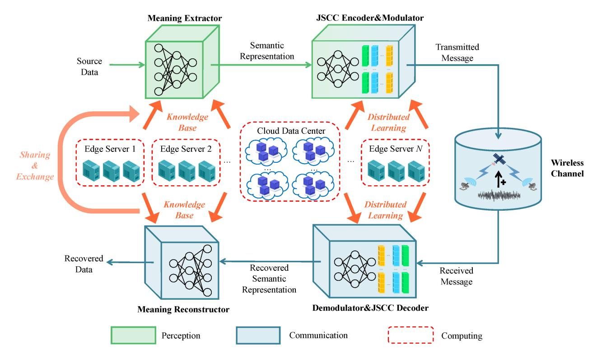

Fig. 8. The framework of joint perception-communication-computing semantic communications in the SAGSIN.

amount of transmitted data, it is necessary to perform semantic extraction from the source data. Here, the term "semantics" is interpreted as "meaning". However, the meaning of data is quite implicit to the extent that traditional codes cannot easily capture it. Hopefully, because of the similarity, we may associate meaning extraction with the process of human language learning. Humans gradually grasp semantics through extensive "training" such as teacher instruction, reading books, conversations with others, and so on. Also, a fact is that the original intention of the design for artificial neural networks (ANNs) is to mimic the human brain. Taking the deep neural network (DNN) as an example, through training on large amounts of data, it can learn something from the data to some extent just like humans. Thus, using DNNs to construct the system codec has become the most popular alternative nowadays to "learn" the semantics from original data.

Based on the above, the meaning-oriented semantic communication system adopting a joint perceptioncommunication-computing framework is established, which is illustrated in Fig. [8.](#page-18-0) Aiming at conducting intelligent semantic extraction, coding, and modulation, we assume that the type of source data is given data in this section and the next section, unless otherwise specified. Specifically, a DL-based meaning extractor captures the semantic information of source data to generate the semantic representation, which serves as the input of a JSCC encoder and modulator to generate transmitted messages for transmission. At the receiver, after demodulation and JSCC decoding, the semantic representation is recovered, which will be processed by a DL-based meaning reconstructor to recover the source data. During the training of such large-scale neural networks, edge servers and cloud data centers must be utilized to provide knowledge bases and facilitate distributed learning, since end devices are usually limited in computing resources in the SAGSIN scenarios. Also, the knowledge bases distributed among edge/cloud servers can be synchronized via data sharing between transceivers.

It is worth noting that in the distributed learning scenario, the meaning extractor/reconstructor and JSCC encoder/decoder & modulator/demodulator will be firstly pretrained by various data sets on the edge/cloud servers before being deployed. Secondly, the pre-trained models will be downloaded to the corresponding modules (or devices). Next, according to whether the module parameters are updated during communication processes, different communication modules will adopt either an offline learning policy (without parameter updating) or an online learning policy (with parameter updating). In the online learning policy, module parameters will be also updated based on the distance between the real data and the output data, similar to the gradient descent methods in training processes. In the following, unless otherwise specified, the mentioned works on meaning-oriented semantic communications all adopt offline learning methods.

In the following subsections, we will firstly elaborate on the metrics for representing the system performance in terms of the "meaning similarity" in Section [IV-A.](#page-19-0) Next, in Section [IV-B,](#page-22-0) we will provide a detailed description of the DNNs used to construct the system codec, which strongly intersects with the field of computer science. Finally, we discuss the related techniques for meaning enhancement in Section [IV-C.](#page-25-0)

#### A. Metrics: Towards Meaning Similarity

In this subsection, we review the metrics for the meaningoriented semantic communication system. A perfect metric can maximally represent the "meaning similarity" between the recovered data at the receiver and the original one at the transmitter. We classify these metrics according to the source type and acquisition method. For the former, we consider text, image/video, and speech sources. As for the latter, based on using whether explicit formulas or neural networks (NNs) to obtain metric values, we analyze objective metrics and learning-based metrics. Please note that the NNs for obtaining metrics are different from those for building semantic communication systems. The comparison of all the involved metrics is presented in Table V, and these metrics play crucial guiding roles in the system design in Section IV-C. As will be elaborated later, learning-based metrics are usually more effective in describing the meaning similarity than objective metrics. The reason behind this is that the NNs that evaluate the similarity are trained from various aspects, while objective metrics usually demonstrate the similarity from only one of the aspects.

1) Text Sources: Here, the "meaning similarity" can be interpreted as the similar degree of the meaning contained in the texts (which is composed of words and sentences) of the transmitter and receiver.

Objective metrics. Similar to the bit error rate (BER) in traditional communication systems, the word error rate (WER) is a fundamental metric to measure the text differences. It is calculated by

WER = 
$$\frac{S + D + I}{N}$$
, (7)

where S, D, I denote the numbers of word substitutions, deletions, and insertions respectively, and N is the word number of the original text. Unlike BER, WER can be greater than 1 due to a large number of insertions.

WER focuses on the similarity of individual words, while the bilingual evaluation understudy (BLEU) score [85] simultaneously considers the differences in *n*-length combinations of consecutive words (named *n*-grams) in two texts. As a typical method for measuring translation quality in machine translation, BLEU is now commonly used to describe the recovery performance in semantic communication systems. It is commonly used in logarithmic form as

$$\log \text{BLEU} = \min\left(1 - \frac{l_{\hat{s}}}{l_s}, 0\right) + \sum_{n=1}^{N} w_n \log p_n, \quad (8)$$

where  $l_{\hat{s}}$  and  $l_s$  are the lengths of recovered texts  $\hat{s}$  and original texts s,  $w_n$  is the weight of n-grams, N is the total number of grams,  $p_n$  is the n-grams score, which is defined as

$$p_n = \frac{\sum_{k=1}^{K_n} \min(C_k(\hat{s}), C_k(s))}{\sum_{k=1}^{K_n} \min(C_k(\hat{s}))}, \tag{9}$$

where  $K_n$  is the number of elements in the *n*-th gram, and  $C_k(\cdot)$  is the frequency count function for the *k*-th element in the *n*-th gram. The BLEU score falls within the range of 0 to 1, and a higher score indicates greater text similarity.

Besides, consensus-based image description evaluation (CIDEr) [86] is used to assess the consistency and quality between the reference and generated image descriptions, and thus it can be seen as a metric for evaluating the similarity between texts. Moreover, the metric of semantic similarity (MSS) [87] can measure both the meaning similarity between texts and the correctness of the recovered text (i.e., whether it is a fluent statement), and the contribution weights of the two aspects for the metric can be adjusted.

The aforementioned metrics are all based on the text words, and their exploration for text semantics is far from sufficient. Taking the BLEU as an example, sentences "I am available on the weekend." and "I am not busy during the weekend." have the same semantics, but the BLEU score for them is not 1. To explore deep semantics of sentences (such as synonyms and expressions with similar meanings), we should resort to learning-based metrics.

Learning-based metrics. The bidirectional encoder representations from Transformers (BERT) model [99] is a pre-trained language model that learns rich language representations from a vast amount of text data through large-scale unsupervised training.

The BERT score [88] is a metric built upon the BERT model to evaluate text similarity, utilizing the contextual understanding learned by the BERT neural network. Reference [88] mentions three types of BERT scores, which are recall, precision, and F1 scores.2 Considering the need to measure the meaning similarity, the BERT score here specifically refers to the precision score. We assume that the representation vector generated by the embedding model for the original text  $\langle x_1, x_2, \ldots, x_k \rangle$  is denoted as  $\langle \boldsymbol{x}_1, \boldsymbol{x}_2, \ldots, \boldsymbol{x}_m \rangle$ , and the representation vector for the recovered text  $\langle \hat{x}_1, \hat{x}_2, \ldots, \hat{x}_m \rangle$  is denoted as  $\langle \hat{\boldsymbol{x}}_1, \hat{\boldsymbol{x}}_2, \ldots, \hat{\boldsymbol{x}}_m \rangle$ . The BERT score is given by

BERT = 
$$\frac{\sum_{\hat{x}_j \in \hat{x}} \operatorname{idf}(\hat{x}_j) \max_{x_i \in x} \boldsymbol{x}_i^{\mathrm{T}} \boldsymbol{\hat{x}}_j}{\sum_{\hat{x}_j \in \hat{x}} \operatorname{idf}(\hat{x}_j)}, \quad (10)$$

where  $idf(\cdot)$  is the importance weighting function. Given M sentences from the test corpus  $\{x^{(i)}\}_{i=1}^{M}$ ,  $idf(\cdot)$  is defined as

$$idf(w) = -\log \frac{1}{M} \sum_{i=1}^{M} I[w \in x^{(i)}],$$
 (11)

where I[ $\cdot$ ] is an indicator function. To increase the score readability, we adjust the scale of the BERT score in relation to its empirical lower bound b. The rescaled value BERT of BERT is

$$\hat{BERT} = \frac{BERT - b}{1 - b}.$$
 (12)

BERT is between 0 and 1, and a higher score implies the better text similarity.

Sentence similarity [89] is another metric based on the BERT model that effectively evaluates the meaning similarity between two sentences. It is given by

$$\operatorname{match}(\hat{s}, s) = \frac{\boldsymbol{B}_{\Phi}(s) \cdot \boldsymbol{B}_{\Phi}(\hat{s})^{\mathrm{T}}}{\|\boldsymbol{B}_{\Phi}(s)\| \|\boldsymbol{B}_{\Phi}(\hat{s})\|}, \tag{13}$$

2For the definitions of these scores, readers can go to Section V-A for more

| Sources | Metrics            |                                             | Explanation and Application Scenarios             | Formula | Initial Reference |
|---------|--------------------|---------------------------------------------|---------------------------------------------------|---------|----------------------|
|         |                    | WER Focusing on individual words            |                                                   | (7)     | /                    |
|         | 01: 4:             | BLEU Focusing on consecutive words          |                                                   | (8)     | [85]                 |
| Text    | Objective          | CIDEr                                       | CIDEr Reflecting the consistency and quality      |         | [86]                 |
| Text    |                    | MSS                                         | Measuring the similarity and correctness          | (*)     | [87]                 |
|         | Learning-          | BERT score                                  | A precision score by contextual understanding     | (10)    | [88]                 |
|         | based              | Sentence similarity                         | Focusing on complete sentences                    | (13)    | [89]                 |
|         |                    | PSNR Focusing on the pixel grayscale values |                                                   | (14)    | /                    |
|         | Objective          | SSIM                                        | Considering the luminance, contrast and structure |         | [90]                 |
| T/      |                    | MS-SSIM                                     | Analyzing SSIMs at different scales               | (21)    | [90]                 |
| Image/  |                    | LPIPS                                       | S Starting from human perception                  |         | [91]                 |
| Video   | Learning- based | FID                                         | A biased estimator                                | (23)    | [92]                 |
|         |                    | KID                                         | An unbiased estimator                             |         | [93]                 |
|         |                    | AKD                                         | Analyzing facial keypoints                        | (*)     | [94]                 |
|         |                    | SDR Comparing signal quality and disto      |                                                   | (26)    | [95]                 |
|         | Objective          | PESQ                                        | Calculating speech quality scores                 | (*)     | [96]                 |
| Speech  |                    | MCD                                         | Measuring spectral distortion                     | (*)     | [97]                 |
|         |                    | FDSD                                        | Extension based on FID                            | (27)    | [98]                 |
|         | Learning-          | KDSD                                        | Extension based on KID                            | (28)    | [98]                 |
|         | based              | cFDSD                                       | FDSD under specific feature distributions         | (*)     | [98]                 |
|         |                    | cKDSD                                       | KDSD under specific feature distributions         | (*)     | [98]                 |

TABLE V SUMMARY OF METRICS BASED ON MEANING SIMILARITY

where *B*Φ(·) is the BERT model to map the sentence to its semantic vector space. Like the rescaled BERT score, sentence similarity also ranges from 0 to 1. When the similarity between two sentences is maximum, the sentence similarity value is equal to 1.[3](#page-20-1)

The above two metrics are both based on the BERT model, which leverages the learning from billions of sentences to comprehend certain semantic information within the sentences. Therefore, they can provide a more accurate evaluation of the meaning similarity between texts than objective metrics.

*2) Image (Video) Sources:* A digital image is composed of a finite number of pixels, while a video is composed of a continuous sequence of images, with each image referred to as a "frame". Therefore, when discussing metrics, images and videos can be grouped together for analysis, and we take image sources as an example next. The semantics of images heavily rely on context, making it challenging to directly define the "meaning similarity". For instance, without providing contextual information, we cannot determine whether "a yellow triangle" is more similar to "a green triangle" or "a yellow square".

*Objective metrics.* Assume that the original and recovered images are respectively *x* and *x*ˆ. The matrix dimensions

3In table [V,](#page-20-0) formulas for some metrics are omitted by \* due to space limits in the main text. Readers can go to corresponding initial references for details.

depend on the image properties, such as two dimensions for grayscale images, and three dimensions for colorful images.

The peak signal-to-noise ratio (PSNR), comparing each corresponding pixel of two images, is one of the typical metrics to measure the differences between images. The PSNR of a grayscale image is defined as

$$PSNR(\boldsymbol{x}, \hat{\boldsymbol{x}}) = 20 \lg \frac{MAX}{\sqrt{MSE(\boldsymbol{x}, \hat{\boldsymbol{x}})}},$$
 (14)

where MAX is the maximum grayscale value (typically 255 for an 8-bit image), and MSE(*x*, *x*ˆ) (mean squared error) is given by

$$MSE(x, \hat{x}) = ||x - \hat{x}||_2^2.$$
 (15)

As for colorful images, one common approach is to calculate the MSE for each color channel separately and then take the average, which is used in [\(14\)](#page-20-2) to get the PSNR. Obviously, PSNR cannot provide an accurate similarity measurement of colorful images.

The structural similarity index (SSIM) [\[90\]](#page-40-20), considering the similarity of the luminance, the contrast and the structure, is effective in evaluating the colorful image similarity. It is defined as

$$SSIM(\boldsymbol{x}, \boldsymbol{\hat{x}}) = [l(\boldsymbol{x}, \boldsymbol{\hat{x}})]^{\alpha} \cdot [c(\boldsymbol{x}, \boldsymbol{\hat{x}})]^{\beta} \cdot [s(\boldsymbol{x}, \boldsymbol{\hat{x}})]^{\gamma}, \quad (16)$$

where  $l(x, \hat{x})$ ,  $c(x, \hat{x})$ , and  $s(x, \hat{x})$  represent the similarity of the luminance, contrast, and structure comparisons, respectively. They are given by

$$l(\mathbf{x}, \hat{\mathbf{x}}) = \frac{2\mu_{\mathbf{x}}\mu_{\hat{\mathbf{x}}} + C_1}{\mu_{\mathbf{x}}^2 + \mu_{\hat{\mathbf{x}}}^2 + C_1},\tag{17}$$

$$c(\boldsymbol{x}, \hat{\boldsymbol{x}}) = \frac{2\sigma_{\boldsymbol{x}}\sigma_{\hat{\boldsymbol{x}}} + C_2}{\sigma_{\boldsymbol{x}}^2 + \sigma_{\hat{\boldsymbol{x}}}^2 + C_2},\tag{18}$$

$$s(\boldsymbol{x}, \hat{\boldsymbol{x}}) = \frac{\sigma_{\boldsymbol{x}\hat{\boldsymbol{x}}} + C_3}{\sigma_{\boldsymbol{x}}\sigma_{\hat{\boldsymbol{x}}} + C_3},\tag{19}$$

where  $\mu_{\boldsymbol{x}}$ ,  $\sigma_{\boldsymbol{x}}^2$  and  $\sigma_{\boldsymbol{x}\hat{\boldsymbol{x}}}^2$  are the mean of  $\boldsymbol{x}$ , variance of  $\boldsymbol{x}$ , and the covariance between  $\boldsymbol{x}$  and  $\hat{\boldsymbol{x}}$ , respectively, and  $C_1$ ,  $C_2$ , and  $C_3$  are the constants to avoid instability. If we set  $\alpha=\beta=\gamma=1$  and  $C_3=C_2/2$ , we obtain a simplified expression, which is given by

SSIM
$$(\boldsymbol{x}, \hat{\boldsymbol{x}}) = \frac{(2\mu_{\boldsymbol{x}}\mu_{\hat{\boldsymbol{x}}} + C_1)(2\sigma_{\boldsymbol{x}\hat{\boldsymbol{x}}} + C_2)}{(\mu_{\boldsymbol{x}}^2 + \mu_{\hat{\boldsymbol{x}}}^2 + C_1)(\sigma_{\boldsymbol{x}}^2 + \sigma_{\hat{\boldsymbol{x}}}^2 + C_2)}.$$
 (20)

SSIM is a value between 0 and 1, and a larger value indicates smaller differences between images.

The multi-scale structural similarity index (MS-SSIM) [90] is an extension of SSIM. It applies multiple downsampling operations on the original image to obtain images at different scales. Then, the SSIMs for these images are calculated separately, and finally a weighted summation operation of these SSIMs is performed, that is

$$MS - SSIM(\boldsymbol{x}, \boldsymbol{\hat{x}}) = [l_M(\boldsymbol{x}, \boldsymbol{\hat{x}})]^{\alpha_M} \cdot \prod_{j=1}^{M} [c_j(\boldsymbol{x}, \boldsymbol{\hat{x}})]^{\beta_j} \cdot [s_j(\boldsymbol{x}, \boldsymbol{\hat{x}})]^{\gamma_j}, (21)$$

where  $\alpha_M$ ,  $\beta_j$ , and  $\gamma_j$  are used to adjust the relative importance for different components. MS-SSIM takes into account local details and global structures of images, thereby generally providing a better evaluation of the image quality compared to SSIM.

Considering the need for the accurate measurement of meaning similarity between images, the aforementioned three metrics are simple and shallow, and thus cannot capture the subtle differences perceived by humans.

Learning-based metrics. The learned perceptual image patch similarity (LPIPS) [91] learns image semantics from the human perception perspective through DNNs. It evaluates image similarity by calculating the distance between the feature representations of images extracted from pretrained DNNs such as the SqueezeNet, AlexNet and VGG. LPIPS is defined as

LPIPS = 
$$\sum_{l} \frac{1}{H_l W_l} \sum_{h,w} \| w_l \odot \left( f_{hw}^l - \hat{f}_{hw}^l \right) \|_2^2$$
, (22)

where  $H_l$  and  $W_l$  denote the height and width of layer l,  $f^l$  and  $\hat{f}^l$  are the normalized latent feature maps by layer l of the specific neural network for two images, h and w represent the (h, w)-th element of the feature map, and  $\odot$  denotes the scale operation with scale vector  $w_l$ . By comparing the feature representations, LPIPS (lower values being better) can capture higher-level visual information.

Another category of metrics measures the meaning similarity between the generating image (created by the generative adversarial network (GAN) based on latent features from the real image distribution) and the real image, including the Fréchet Inception distance (FID) [92] and the kernel Inception distance (KID) [93], which utilize the pre-trained model from the Inception network for feature representations. FID is defined as

FID = 
$$d^2((\boldsymbol{m}, \boldsymbol{C}), (\boldsymbol{m}_w, \boldsymbol{C}_w))$$
  
=  $\|\boldsymbol{m} - \boldsymbol{m}_w\|_2^2 + \text{Tr}(\boldsymbol{C} + \boldsymbol{C}_w - 2(\boldsymbol{C}\boldsymbol{C}_w)^{\frac{1}{2}}),$  (23)

where m and C are the mean vector and covariance matrix in the feature space of the generating image distribution,  $m_w$  and  $C_w$  are the mean vector and covariance matrix of the real image distribution, and  $\text{Tr}(\cdot)$  indicates the trace of a square matrix. During the derivation of FID, [92] assumes that both the real and generated images follow the normal distribution (which is an ideal assumption), and the final FID is a biased estimator. As an improvement, [93] proposed KID, which is an unbiased estimator without the assumption of a normal distribution. It is given by

$$KID = \frac{1}{m(m-1)} \sum_{i \neq j}^{m} k(\boldsymbol{x}_i, \boldsymbol{x}_j)$$

$$+ \frac{1}{n(n-1)} \sum_{i \neq j}^{n} k(\boldsymbol{y}_i, \boldsymbol{y}_j)$$

$$- \frac{2}{mn} \sum_{i=1}^{m} \sum_{i=1}^{n} k(\boldsymbol{x}_i, \boldsymbol{y}_j), \qquad (24)$$

where m and n are respectively the number of samples in the generating and real images,  $x_i$ ,  $x_j$  are the 2048-dimensional vectors obtained from the Inception network for the generating image,  $y_i$ ,  $y_j$  are the ones for the real image, and  $k(\cdot)$  is the polynomial kernel defined as

$$k(\boldsymbol{x}, \boldsymbol{y}) = \left(\frac{1}{d} \boldsymbol{x}^{\mathrm{T}} \boldsymbol{y} + 1\right)^{3}, \tag{25}$$

where d is the representation dimension, which equals 2048 here.

Smaller values of FID and KID indicate greater meaning similarity between images. They are consistent with human perception and can reveal semantic differences between images at a deeper level.

In addition, considering the video conferencing scenario, [94] proposes the average keypoint distance (AKD) based on the keypoints (containing certain semantic information) extracted by a pretrained facial landmark detector to evaluate the differences between images.

The learning-based metrics above go beyond the pixel level and instead extract deeper semantic information from images using different pre-trained models. Thus, they can effectively measure the meaning similarity between images.

3) Speech Sources: The semantics in speeches, which encompass not only the vocabulary and grammar but also the intonation, timbre, and speed of speech, are significantly complex and subjective. The same sentence with different

intonations can convey different meanings. There are two evaluation methods, respectively evaluating the meaning similarity of the texts contained in the speeches or the speeches themselves. For the former, we can use all the aforementioned metrics for text sources. For the latter, we focus on the "meaning similarity" of speeches, which can be interpreted as the similarity degree of the inferred meanings derived from the speeches at the transmitter and receiver. The metrics related to the second method are introduced below.

Objective metrics. Assume that the original and recovered speeches are respectively s and  $\hat{s}$ . Similar to the SNR, the signal-to-distortion ratio (SDR) [95] was initially proposed to calculate the ratio between the signal quality and distortion. As an extension, the SDR can be used to measure the similarity between two speeches [100].

$$SDR(\boldsymbol{s}, \hat{\boldsymbol{s}}) = 10 \lg \frac{\|\boldsymbol{s}\|^2}{\|\boldsymbol{s} - \hat{\boldsymbol{s}}\|^2},$$
(26)

where  $||s||^2 = \langle s, s \rangle$  represents the energy of s. A larger SDR indicates a higher similarity between speeches.

Another metric called perceptual evaluation of speech quality (PESQ) [96] calculates the speech quality score by comparing the differences between speeches, which was established as Recommendation ITU-T P.862 in 2001. The specific process of calculating the PESQ score for two speeches mainly includes two stages: the alignment routine and the perceptual model. The former consists of the computation of the overall system gain, the intelligent reflecting surface (IRS) filtering, the time alignment (including the envelope-based alignment, the fine time alignment, the utterance splitting, and the perceptual realignment), and so on. The latter includes the IRS-receive filtering, the short-term fast Fourier transform (FFT), the calculation of the pitch power densities, the realignment of bad intervals, the computation of the PESQ score, and so on. The range of the PESQ score is -0.5 to 4.5, and the larger value reveals the higher similarity between speeches. The calculation process of the PESQ is quite complex, and due to limited space, we have provided only a brief description here. For more details, see, e.g., [96] and the references therein.

Furthermore, the Mel cepstral distortion (MCD) [97], which measures the spectral distortion between synthesized and target speeches, can be regarded as a metric to evaluate the similarity between speeches. The smaller the MCD is, the closer the spectra between speeches are.

The aforementioned metrics do not sufficiently represent the semantic information of speeches, making it difficult to accurately evaluate the similarity between speeches at the semantic level.

Learning-based metrics. Based on the FID and KID, the unconditional Fréchet DeepSpeech distance (FDSD) and unconditional kernel DeepSpeech distance (KDSD) are proposed in [98] to measure the meaning similarity between speeches. By utilizing the pre-trained DeepSpeech2 model from the NVIDIA OpenSeq2Seq library, the KDSD and FDSD are able to capture the semantic information in the high-level speech feature space. The computational differences between

the FDSD and FID are only reflected in the source and network types. According to (23), the FDSD is defined as

$$FDSD = d^{2}((\boldsymbol{\mu}_{s}, \boldsymbol{\Sigma}_{s}), (\boldsymbol{\mu}_{\hat{s}}, \boldsymbol{\Sigma}_{\hat{s}}))$$

$$= \|\boldsymbol{\mu}_{s} - \boldsymbol{\mu}_{\hat{s}}\|_{2}^{2} + Tr(\boldsymbol{\Sigma}_{s} + \boldsymbol{\Sigma}_{\hat{s}} - 2(\boldsymbol{\Sigma}_{s}\boldsymbol{\Sigma}_{\hat{s}})^{\frac{1}{2}}), (27)$$

where  $\mu_s$ ,  $\Sigma_s$  are the mean vector and covariance matrix in the feature space of the original speech distribution,  $\mu_{\hat{s}}$ ,  $\Sigma_{\hat{s}}$  are the ones of the recovered speech distribution, and  $\mathrm{Tr}(\cdot)$  indicates the trace of a square matrix. Moreover, the KDSD is given by

$$KDSD = \frac{1}{K(K-1)} \sum_{i \neq j}^{K} k(\boldsymbol{s}_{i}, \boldsymbol{s}_{j})$$

$$+ \frac{1}{\hat{K}(\hat{K}-1)} \sum_{i \neq j}^{\hat{K}} k(\hat{\boldsymbol{s}}_{i}, \hat{\boldsymbol{s}}_{j}) + \sum_{i=1}^{K} \sum_{j=1}^{\hat{K}} k(\boldsymbol{s}_{i}, \hat{\boldsymbol{s}}_{j}),$$
(28)

where K,  $\hat{K}$  are respectively the number of samples in the original and recovered speeches,  $s_i$ ,  $s_j$  are the vectors obtained from the DeepSpeech2 model for the original speech,  $\hat{s}_i$ ,  $\hat{s}_j$  are the ones for the recovered speech, and  $k(\cdot)$  is the polynomial kernel defined as (25). Additionally, [98] also proposes the conditional Fréchet DeepSpeech distance (cFDSD) and conditional kernel DeepSpeech distance (cKDSD) to evaluate the meaning similarity between speeches under the specific linguistic feature distribution condition.

Compared to objective metrics, learning-based metrics utilize NNs to assist in capturing the semantic information, which can better represent the meaning similarity of speeches.

Remark 2: "Perfect" metrics are believed to completely represent the "meaning similarity". However, there is not a unified definition for "semantics". Hopefully, with the development of semantic information theory, the metrics may also evolve accordingly.

Remark 3: The aforementioned objective metrics are not differentiable. Also, the learning-based metrics cannot be expressed in an explicit form, making it impossible to determine the differentiability as well. Therefore, they cannot be used to design the loss function in the training of semantic communication systems. The inconsistency between the objective (loss) function in the training phase and the evaluation metrics in the testing phase restricts the performance of meaning-oriented semantic communication systems. One obvious solution is to focus on researching differentiable evaluation metrics. However, these metrics should represent the "meaning similarity" as accurately as possible at the same time. One possible solution is to leverage the reinforcement learning (RL), where non-differentiable metrics can be used to guide learning processes and train high-performing systems by maximizing long-term rewards [101], [102].

## B. Methods: Based on DNNs

Shannon's separation theorem [9] proves that under the condition of infinite block lengths, the separate source-channel coding (SSCC) scheme can achieve the same performance as

| TABLE VI                                |
|-----------------------------------------|
| SUMMARY OF NEURAL NETWORKS USED IN JSCC |

| Types          | Neural Networks         | Explanation and Application Scenarios                                                   | Initial                     |
|----------------|-------------------------|-----------------------------------------------------------------------------------------|-----------------------------|
| Types          | Neurai Networks         | Explanation and Application Scenarios                                                   | Reference                   |
|                | LeNet-5                 | First CNN model, laying the foundation for CNN structure                                | [104]                       |
|                | AlexNet                 | Deeper CNN, having improvements compared to LeNet-5                                     | [105]                       |
| CNN-Related    | FCN                     | Consisting of only convolutional layers for semantic segmentation                       | [106]                       |
| CIVIN-IXelateu | ResNet                  | A residual block via "shortcut connection"                                              | [107]                       |
|                | Others                  | Including CNN variants such as ZFNet, VGGNet, GoogLeNet, DenseNet, PSPNet, and PatchGAN | [108]–[110], [111]–[113] |
|                | Hopfield/Jordan network | Initial exploration on standard RNNs                                                    | [114], [115]                |
|                | Elman network           | Standard RNN that can utilize historical information                                    | [116]                       |
| RNN-Related    | LSTM network            | Addressing long-term dependency issue by memory units                                   | [117]                       |
|                | BiRNN/BiLSTM network    | Two independent networks to capture more context information                            | [118]–[120]                 |
|                | GRU network             | Simpler than LSTM model                                                                 |                             |
|                | Classic Transformer     | Initially for NLP tasks, extracting long-term dependency                                | [122]                       |
| Transformer    | Others                  | Including ViT for image classification, DETR for object detection, and swin Transformer | [123]–[125]                 |
|                | Classic GAN             | Generator-discriminator unsupervised adversarial training                               | [126]                       |
|                | CGAN                    | Introducing supervised learning to avoid unstable training                              | [127]                       |
|                | DCGAN                   | Lighter GAN model implementation by CNN                                                 | [128]                       |
| GAN            | WGAN                    | Introducing Wasserstein distance as loss function                                       | [129]                       |
| GAIN           | SAGAN                   | Attention-based GAN                                                                     | [130]                       |
|                | BigGAN                  | Large scale training for better image quality                                           | [131]                       |
|                | Others                  | Including StyleGAN for customized images and HiFi-GAN for audio sources                 | [132], [133]                |

the JSCC scheme. Due to its modularity and ease of implementation, the SSCC scheme is widely applied in traditional communication systems, with source codes and channel codes being proposed in parallel on separate tracks.

However, affected by the typical characteristics of largescale scenarios, highly dynamic channels, and limited device capabilities in the SAGSIN, the communication systems have extremely stringent requirements on latency, while the computing resources of IoT devices are limited. Moreover, in the semantic communication systems, redundant information is removed through semantic extraction before encoding. All these facts lead to the prevalence of finite block lengths (even short ones) in the SAGSIN. Thus, the SSCC scheme cannot achieve the Shannon limit, and the JSCC one regains attention.

The mainstream approach in constructing semantic communication systems currently involves utilizing DNNs as source (semantic) and channel codecs, and training them jointly, called deep learning based JSCC (DeepJSCC), which is firstly applied in [\[103\]](#page-40-32) to implement semantic communications. Taking the transmitter as an example here, DNNs sequentially perform operations such as semantic extraction and encoding on the source data. The output of the network can be directly transmitted over the channel. Therefore, it is necessary to review typical DNNs which can be used in JSCC.

In semantic communication systems, commonly used DNNrelated models primarily include four categories: convolutional neural Networks (CNNs), recurrent neural networks (RNNs), Transformer and GANs. These networks, which are listed in Table [VI,](#page-23-0) become the base of the system in Section [IV-C.](#page-25-0)

*1) CNN-Related Models:* CNN is primarily used for spacerelevant sources, particularly image ones. The development of CNN can be traced back to 1962 when Hubel and Wiesel introduced the concept of Receptive fields [\[134\]](#page-41-0). In 1980, [\[135\]](#page-41-1) proposed a neural network including convolutional and pooling layers. The first formal CNN model, called LeNet-5 [\[104\]](#page-40-33), was proposed in 1998. It laid the foundation for the basic structure of CNNs: convolutional, pooling, and fully connected layers. However, due to limited computing resources and the vanishing gradient caused by sigmoidal activation functions, LeNet-5 did not receive the deserving attention.

AlexNet [\[105\]](#page-40-34) marks the triumphant return of CNN, which consists of eight layers, including five convolutional ones and three fully connected ones. Compared to LeNet-5, AlexNet has the following four main improvements: First, a deeper network architecture is used to learn more intricate semantic features. Second, the sigmoidal activation function is replaced by the rectified linear unit (ReLU) one, alleviating the vanishing gradient. Third, researchers utilize two data augmentation methods and the dropout technique to reduce overfitting. Fourth, overlapping pooling further enhances the richness of feature maps and extracts more detailed semantic information. Later, ZFNet [\[108\]](#page-40-35) (a fine-tuned version of AlexNet), VGGNet [\[109\]](#page-40-36) (a "very deep" version of AlexNet), and GoogLeNet [\[110\]](#page-40-37) (also known as Inception-V1) are successively proposed.

The aforementioned CNNs are primarily used for image classification tasks, and thus the network output is the classification result. However, for image semantic segmentation tasks, the network should output an image of the same size as the input one and classify each pixel of the image into semantic categories (e.g., person, car, and tree). Based on this purpose, [\[106\]](#page-40-38) proposes the fully convolutional network (FCN), which consists entirely of convolutional layers.

The development history of CNNs implies a belief: increasing the network depth does not decrease the model performance. A straightforward example is that adding a layer with the "identity mapping" does not change the model's performance, but makes the network deeper. However, "Is learning better networks as easy as stacking more layers? [\[107\]](#page-40-39)" Researchers discovered the "degradation" phenomenon through experiments, revealing a negative answer to the question. In order to make the network fully learn the data's semantic features, activation functions are set to be nonlinear, to the extent that deep layers cannot simply perform the linear transformations (e.g., "identity mapping"). One solution is to build a "shortcut connection" between certain layers to strike a better balance between nonlinear and linear transformations, forming a residual block. This is the ResNet [\[107\]](#page-40-39).

Recently, some new variants of CNNs have been also proposed consecutively, including DenseNet [\[111\]](#page-40-40) (employing dense connection structures), PSPNet [\[112\]](#page-40-41) (utilizing pyramid pooling), and PatchGAN [\[113\]](#page-40-42) (commonly used as a discriminator in GANs).

*2) RNN-Related Models:* RNN is mainly used for timerelevant sources, particularly text and speech ones. In 1982, a Hopfield network was introduced by [\[114\]](#page-40-43) as a precursor to RNNs. Later, a Jordan network was proposed in [\[115\]](#page-40-44). In [\[116\]](#page-40-45), a Jordan network was improved, resulting in an Elman network, which is also known as the standard RNN. It consists of an input layer, a hidden layer, and an output layer. The neurons in the hidden layer are recurrently connected over time, allowing the output from the previous time step to be fed as input to the current one, thus enabling the network to remember and utilize historical information. This is why RNNs can process sequential data and learn semantic features from the context.

When the input sequence is too long, the time steps of the standard RNN become large, which may lead to the vanishing/exploding gradients during training. The solution is to utilize techniques like gradient clipping or more stable RNN variants such as long short-term memory (LSTM) networks. LSTM [\[117\]](#page-40-46) effectively addresses the issue of longterm dependencies in standard RNNs by introducing memory units and gate mechanisms (an input gate, a forget gate, and an output gate). It can efficiently propagate and express information in long sequences without neglecting/forgetting

useful information from earlier time steps. In fact, only a portion of the input sequence is crucial (i.e., having more semantic information), and it needs to be remembered for a long time, while the remaining one can be appropriately forgotten. Therefore, the concept of "long short-term memory" was proposed in [\[117\]](#page-40-46).

Because standard RNNs only consider past information of the input sequence, [\[118\]](#page-40-47) introduced two independent RNN modules (forward and backward processing) simultaneously to capture both past and future context information, resulting in the bidirectional RNN (BiRNN). Afterwards, [\[119\]](#page-40-48) combined the essence of LSTM and BiRNN to create bidirectional LSTM (BiLSTM) networks. Furthermore, [\[120\]](#page-41-2) proposed deep BiLSTM networks to achieve better extraction and representation of semantic features. Gated recurrent unit (GRU) networks [\[121\]](#page-41-3), a variant of LSTM, control the flow of information by using an update gate and a reset gate. It is simpler than the LSTM model and can achieve comparable performance to LSTM with higher training efficiency.

*3) Transformer-Related Models:* The Transformer [\[122\]](#page-41-4) was initially proposed in the field of natural language processing (NLP) (which is for text sources). Its primary purpose is to address the limitations of RNNs in handling sequential data, such as long-term dependencies and computational inefficiency. However, due to its powerful capabilities, the Transformer has been successfully applied to other domains, including computer vision (image sources) and speech processing (speech sources).

The Transformer primarily comprises an encoder and a decoder. The encoder utilizes multiple (typically 6) encoding layers to convert input sequences into semantic space representations. Each encoding layer consists of a multi-head self-attention sub-layer and a position-wise fully connected feed-forward network sub-layer. The former is employed to establish global dependencies, while the latter performs nonlinear transformations. Residual connections are applied around each of the two sub-layers, followed by layer normalization. In comparison to the encoder, the decoder introduces an extra masked multi-head self-attention sub-layer at each decoding layer. By setting the attention weights of future positions to negative infinity, the masking operation prevents leakage of future information.

The Transformer is powerful due to the following aspects: Firstly, the multi-head self-attention mechanism divides the model into multiple heads to form subspaces and allows the model to automatically learn the relationships between different positions in the input sequence, capturing contextual information more effectively. Secondly, the self-attention mechanism allows for "parallel" computation of the encoder and decoder, effectively harnessing the parallel computing capabilities of modern hardware accelerators such as graphics processing units (GPUs). Thirdly, the Transformer effectively models long-term dependencies in sequences, alleviating the issue of gradient vanishing/exploding in RNNs when processing long sequences. Fourthly, the Transformer structure is simple, highly modular, and easy to extend and modify.

In addition, there are several variants of the Transformer proposed recently, such as the vision Transformer (ViT) [\[123\]](#page-41-5) (for image classification tasks), the detection Transformer (DETR) [\[124\]](#page-41-6) (for object detection tasks), the shifted window (swin) Transformer [\[125\]](#page-41-7) (reducing computational complexities by the window self-attention mechanism), and so on.

*4) GAN-Related Models:* In practical applications, the GAN can be applied to various types of sources. The classic GAN was first proposed in [\[126\]](#page-41-8), which consists of a generator and a discriminator. The purpose of the generator is to generate instances that appear natural and realistic, closely resembling the original data, and the role of the discriminator is to determine whether a given instance is real or fake. Clearly, they have an "adversarial" relationship. The generator and discriminator are trained alternately, progressing together in the "game" and ideally reaching a dynamic equilibrium (i.e., Nash equilibrium). At this point, the generated instances from the generator are indistinguishable from real ones. There are two key points to note: Firstly, the ultimate goal is to obtain a well-trained generator, while the discriminator is an additional benefit. Secondly, there are no specific constraints on DNNs used for the generator and discriminator, and thus they can be CNNs, RNNs, or even Transformers.

The initial GAN is an unsupervised learning model, and its training process does not require labeled data. Conditional GANs (CGANs) [\[127\]](#page-41-9) bring GANs back into the realm of supervised learning, alleviating the problem of unstable training in GANs. Deep convolutional GANs (DCGANs) [\[128\]](#page-41-10) are the first successful implementation of GANs that use CNNs instead of fully connected layers. This significantly reduces the number of network parameters while greatly improving the quality of generated data. Wasserstein GANs (WGANs) [\[129\]](#page-41-11) improve the stability of model training by introducing the Wasserstein distance as a loss function. Self-attention GANs (SAGANs) [\[130\]](#page-41-12) introduce an attention mechanism that enables the network to better understand the semantic information. The introduction of BigGANs [\[131\]](#page-41-13) reveals that GAN network training can also benefit from large-scale data and computing resources. BigGANs achieve unprecedented levels of image generation quality. Recently, some new variants of GANs have been proposed, such as StyleGANs [\[132\]](#page-41-14) (controlling the style and features of generated images), HiFi-GAN [\[133\]](#page-41-15) (focusing on generating high-fidelity audio signals), and so on.

*Remark 4:* There are also other neural networks used in JSCC schemes. Graph convolutional networks (GCNs) [\[136\]](#page-41-16), which are commonly utilized to extract semantic features from non-Euclidean structured images (e.g., social networks and knowledge graphs), are used in [\[137\]](#page-41-17) to construct joint sourcechannel codecs. References [\[101\]](#page-40-30), [\[102\]](#page-40-31), [\[138\]](#page-41-18), [\[139\]](#page-41-19), [\[140\]](#page-41-20) employ reinforcement learning networks (RLNs) to construct semantic communication systems.

*Remark 5:* Semantic communication systems can be also constructed by DL-based SSCC (DeepSSCC) schemes, which consist of two categories. The first one uses traditional codecs for channel coding, and only the source (semantic) codec are trained [\[141\]](#page-41-21), [\[142\]](#page-41-22), [\[143\]](#page-41-23), [\[144\]](#page-41-24). The source and channel codecs of the second one are both DNNs, but trained separately [\[145\]](#page-41-25), [\[146\]](#page-41-26).

# *C. Techniques: Towards Meaning Enhancement*

From a macro perspective, the meaning-oriented semantic communication system proposed in this section integrates the perception, communication, and computing parts. The coordinated collaboration of these three parts contributes to better application of the system in various scenarios within the SAGSIN. Now, let's narrow our focus to some specific details and consider the practical works of system implementation. It is evident that DNNs serve as the core to build semantic codecs. However, considering the objective realities such as limited device capabilities, highly dynamic channels, and sensitive communication security issues in the SAGSIN, it is necessary to incorporate additional targeted "designs" for the components of semantic communication systems. We name these "designs" as METs and categorize them into four major classes, which respectively focus on the channel adaptation, rate control, interpretability, and security. In the following, we will review the existing related works for each category, and the summary of these techniques is shown in Table [VII.](#page-26-0)

*1) Channel-Related METs:* Complex and highly dynamic channels in the SAGSIN pose challenges for channel modeling in system design. Meanwhile, in order to ensure high recovery performance, DL-based systems require similar channel conditions during both training and testing phases. Therefore, it is necessary to conduct targeted channel-related analysis and design, such as the extraction of channel semantics, noise-resistant mechanisms, and the capturing & utilization of channel state information (CSI). The main procedures for realizing these channel-related METs are demonstrated in Fig. [9.](#page-27-0)

Analyzing and extracting the channel semantics to assist source information encoding is a new research direction [\[147\]](#page-41-27), [\[148\]](#page-41-28). In [\[149\]](#page-41-29), the authors introduce the concept of "channel semantics", which encompasses parameter semantics (e.g., angle of departure, angle of arrival, number of paths, and so on) and environmental semantics (e.g., the layout, shape, and category of objects in the images). The system obtains environmental information in the SAGSIN through devices such as cameras and radars, and extracts channel semantics by DL techniques. The system considering channel semantics exhibits superiority in terms of meaning similarity metrics such as WER and FDSD.

To address the impact of noise in complex channels, a confidence-based distillation mechanism is established in [\[102\]](#page-40-31) to achieve the "joint semantic-noise coding (JSNC)". The distillation time in the semantic distillation mechanism of JSNC can be automatically adjusted to accommodate the fluctuating channel conditions. Taking the example of the AWGN channel with 10 dB SNR, JSNC achieves a 24% lower WER compared to the Transformer baseline. Furthermore, considering the unique "semantic channel" (the information flow from semantic representation to semantic recovery) of the semantic communication system, the authors in [\[150\]](#page-41-30) classify semantic noise for text sources into "literal semantic noise" and "adversarial semantic noise", and propose a robust DLbased semantic communication system (R-DeepSC) to resist them. Specifically, a calibrated self-attention mechanism is

TABLE VII SUMMARY OF MEANING-ENHANCEMENT TECHNIQUES

| Techniques                | SAGSIN Issue Addressment | Techi                                    | Technical Details Reference                                      |              |
|---------------------------|--------------------------------|------------------------------------------|------------------------------------------------------------------|--------------|
|                           |                                | Enterestine channel concertion           | Role as a new research direction                                 | [147], [148] |
|                           |                                | Extracting channel semantics             | Concept of "channel semantics"                                   | [149]        |
|                           |                                | D                                        | Joint semantic-noise coding                                      | [102]        |
| CI I                      |                                | Designing noise- resistant mechanisms | Literal semantic noise and adversarial semantic noise            | [150]        |
| Channel-                  | Highly dynamic                 |                                          | Channel ModNet                                                   | [151], [152] |
| related METs              | channels                       |                                          | Response network                                                 | [153]        |
|                           |                                | Contribution (CC)                        | Attention feature module                                         | [154]        |
|                           |                                | Capturing and utilizing CSI              | Encoding and modulation match with CSI                           | [155]        |
|                           |                                |                                          | Training with CSI                                                | [156]        |
|                           |                                |                                          | SC-RS-HARQ, SCHARQ                                               | [144]        |
|                           |                                | Retransmission-based                     | SVC-HARQ                                                         | [94]         |
|                           |                                |                                          | IK-HARQ                                                          | [157]        |
| Rate-control-             | Uiahly dynamia                 | Non-retransmission-based                 | Channel feedback                                                 | [158]        |
| related METs              | Highly dynamic channels        |                                          | Policy network                                                   | [159]        |
| related ME18              |                                |                                          | Rate adaptive transmission                                       | [160], [161] |
|                           |                                |                                          | Rate allocation network                                          | [162]        |
|                           |                                |                                          | Adaptive density learning module                                 | [141]        |
|                           |                                |                                          | Rate controller                                                  | [140]        |
|                           | Limited device capabilities    | W.C.                                     | Interpretable semantic information detection algorithm           | [163]        |
|                           |                                | KG                                       | Transformer-based knowledge extractor                            | [164]        |
|                           |                                |                                          | Semantic representation based-on KG                              | [87]         |
| Interpretability-         |                                |                                          | Conversion from NPM                                              | [165]        |
| related METs              |                                | ProbLog                                  | to a symbolic graph                                              | [103]        |
|                           |                                |                                          | ProbLog-based KB                                                 | [166]        |
|                           |                                | Conceptual space                         | Mapping semantic information into coordinates in geometric space | [167]        |
|                           | Security                       | Understanding attack                     | Destructive physical layer semantic attacks                      | [168], [169] |
|                           |                                | mechanisms                               | Backdoor (Trojan) attacks                                        | [170]        |
| Security- related METs |                                | Designing defense                        | Counter-eavesdropping DeepJSCC model                             | [171]        |
|                           |                                | mechanisms                               | Adversarial encryption training scheme                           | [145]        |
|                           |                                |                                          | Privacy filter                                                   | [172]        |
|                           |                                | New security-related metrics             | [173]                                                            |              |

utilized to counteract the former, and an adversarial training method is employed to combat the latter. Compared to other baselines considering physical noise only, R-DeepSC achieves superior BLEU and BERT scores at different SNRs.

Effectively capturing and utilizing the rich CSI in the SAGSIN will bring extra recovery performance gains. The authors of [\[151\]](#page-41-31) design a plugin-in CSI modulation module, called "Channel ModNet". Reference [\[151\]](#page-41-31) inserts it into the DeepJSCC decoder and proposes an adaptive semantic communication (ASC) based on the overfitting of the source and channel. Different from offline learning method adopted by most works on semantic communications, [\[151\]](#page-41-31) firstly introduces online learning policies, where the model parameters will be updated in model inference procedure besides training. This design adapts well to different SNRs in block fading channels. Reaching the same PSNR, ASC

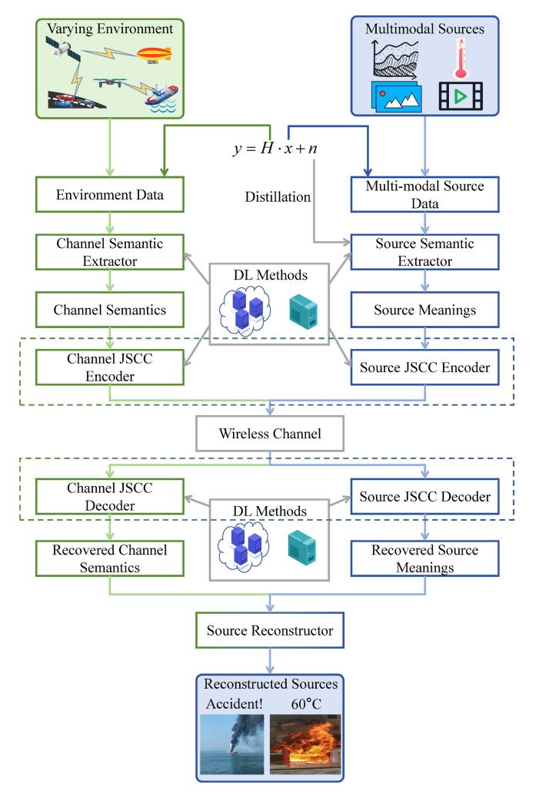

Fig. 9. An illustration of typical channel-related METs, including channel semantic extraction (with CSI involved) and noise resistance. Here, *x* denotes the original source data, *H* denotes the channel gain parameter (which is a part of CSI), *n* denotes the noise, and *y* denotes the channel outputs. The "Environment Data" in the figure include far more than the CSI, and here we use the CSI extraction as an example to illustrate the functions of these METs. Also, it is worth noting that the source and channel JSCC encoders (decoders) are usually integrated into one module in the literature.

saves bandwidth up to 41% compared to the benchmark. Similarly, [\[153\]](#page-41-32) also adopts an online design in order to adapt to dynamic channel conditions. The authors introduce a "response network" enabled nonlinear transform sourcechannel coding (NTSCC) framework to explicitly construct response functions and directly embed CSI into the parameters of the DeepJSCC codec. Under the AWGN channel with 10 dB SNR, this architecture achieves higher PSNR than traditional transmission schemes with standardized image codecs across a wide range of channel bandwidth ratios.

Also, in [\[152\]](#page-41-33), the authors propose a wireless image transmission Transformer (WITT) model, utilizing the Swin Transformer and incorporating "Channel ModNet" [\[151\]](#page-41-31) into the codec. Compared to two baselines, namely the CNNbased DeepJSCC and the traditional BPG-LDPC SSCC, WITT exhibits superior PSNR and MS-SSIM at a wide range of (particularly low) SNRs. Reference [\[154\]](#page-41-34) proposes an improved version of the classical DeepJSCC, called the adaptive DeepJSCC. Specifically, an "attention feature module" is utilized to interact with codec DNNs, which can process the input CSI to adapt to different channel conditions. Experimental results show that the adaptive DeepJSCC achieves better PSNR than the classical DeepJSCC under a wide range of SNRs. Besides, a joint coding-modulation scheme based on binary phase shift keying (BPSK) modulation for digital semantic communications is proposed in [\[155\]](#page-41-35), matching the encoding and modulation processes with CSI better and achieving a larger PSNR. Also, a lite distributed DL-based semantic communication system in [\[156\]](#page-41-36) is assisted by CSI during training, reducing the impact of fading channels on the transmission and increasing BLEU scores.

*Remark 6:* Though introducing online learning methods will achieve performance gain owing to adaptability to dynamic channels [\[151\]](#page-41-31), [\[153\]](#page-41-32), the inherent spacial/temporal computing complexity cannot be neglected, especially for the devices with limited capabilities distributed in SAGSIN. Specifically, the deep networks utilized in semantic extraction & reconstruction possess a huge amount of parameters, and updating such networks will consume caching resources and cause long processing delays. Therefore, striking a trade-off between performance gain and computing complexity in online learning policies will be a promising idea.

*2) Rate-Control-Related METs:* Rate control is another measure to address the issues of highly dynamic channels in the SAGSIN. In the JSCC encoding process, allocating flexible rates to the extracted semantics allows for better adaptation to time-variant channels. Specifically, based on whether the retransmission protocols are adopted to prompt the correct decoding of the current codeword after decoding failure, ratecontrol techniques can be classified into retransmission-based ones and non-retransmission-based ones.

A typical retransmission-based technique is the HARQ. Recently, a few variants of HARQ have been proposed for semantic communication systems. It is worth noting that the HARQs here are improved versions to adapt to the meaningoriented semantic communication system, which is the main difference compared to the ones discussed in Section [III-B.](#page-12-0) In [\[144\]](#page-41-24) and [\[94\]](#page-40-24), HARQ-IR used in traditional communication systems is improved to apply to semantic communication systems. The authors in [\[144\]](#page-41-24) firstly propose SC-RS-HARQ, which belongs to the first category of DeepSSCC mentioned in Remark [5.](#page-25-1) The semantic codec is based on Transformers, while the channel codec utilize Reed-Solomon (RS) codes. Because HARQ-IR is only based on RS codes, the authors directly incorporate it into SC-RS-HARQ. To further improve system performance, they improve HARQ-IR and apply it to the DeepJSCC architecture, resulting in SCHARQ. Simulation results show that in a wide range of (especially low) SNRs, SCHARQ achieves lower WER compared to SC-RS-HARQ. Reference [\[94\]](#page-40-24) proposes a semantic video conferencing (SVC) network and improves HARQ-IR specifically for SVC, resulting in SVC-HARQ. The semantic error detector is employed to ascertain whether an incremental transmission is necessary for the received frame. Compared to traditional communication systems, SVC-HARQ exhibits lower AKD at high BERs. In [\[157\]](#page-41-37), the authors propose a progressive semantic HARQ scheme based on the incremental knowledge (IK-HARQ). An encoding mechanism with adaptive semantic rate control is employed to dynamically adjust rates based on the contextual semantic complexity and channel conditions. Compared to other benchmarks, IK-HARQ outperforms in terms of BLEU in a wide range of SNRs.

It is worth noting that non-retransmission does not imply non-feedback. In [\[158\]](#page-41-38), no retransmission mechanism is employed, but the authors utilize feedback signals from the current codeword to guide the encoding of subsequent codewords, and introduce an autoencoder-based JSCC scheme, called DeepJSCC-f. They employ layered autoencoders and leverage channel output feedback to achieve variable codeword length transmission. The simulation results demonstrate the benefits of feedback in improving system performance. Compared to the non-feedback DeepJSCC and traditional communication systems, DeepJSCC-f reaches higher PSNR at different SNRs.

The following works on rate control are all without retransmission or feedback. Reference [\[159\]](#page-41-39) proposes an adaptive JSCC for wireless image transmission. A "policy network" is introduced to activate or freeze visual features by dynamically generating binary masks, thereby achieving rate control. In scenarios with high SNR and lower information content in the image, this model can learn reasonable strategies with less bandwidth. References [\[160\]](#page-41-40) and [\[161\]](#page-41-41) propose the same "rate adaptive transmission" mechanism to apply to embedding vectors in the latent representation on the encoder side. This enables the model to learn to allocate limited bandwidth resources in order to maximize overall performance. The model in [\[160\]](#page-41-40) exhibits superior performance in terms of PSNR and MS-SSIM compared to DeepJSCC and traditional communication systems at various SNRs. In [\[161\]](#page-41-41), the proposed architecture achieves up to 50% savings in channel bandwidth costs compared to traditional communication systems while maintaining the same PSNR and MS-SSIM performance. Besides, [\[162\]](#page-41-42) introduces a variable-length semantic-channel coding method, where a "rate allocation network" is utilized to estimate the optimal code length and enhance the PSNR and LPIPS performance. The forward-adaption-based autoencoder scheme proposed in [\[141\]](#page-41-21) improves performance in MS-SSIM and PSNR by introducing an "adaptive density learning module" at the transmitter to adaptively construct the codebook. Reference [\[140\]](#page-41-20) proposes a reinforcement learning-based adaptive semantic coding (RL-ASC) model, which uses a "rate controller" to adaptively adjust the code length. At different rates, RL-ASC exhibits superior performance to benchmarks in terms of PSNR, SSIM, FID, and KID.

*3) Interpretability-Related METs:* One of the widely criticized flaws of DL is the lack of interpretability. The black-box nature makes it hard for people to understand the internal decision processes of models, hindering model improvement and optimization. Therefore, enhancing the interpretability of semantic communication systems by specific means (e.g., KG and probabilistic logic programming language (ProbLog)) can help further improve communication performance in the SAGSIN. Meanwhile, enhancing interpretability also facilitates the efficient learning of NNs by accelerating the convergence of complex models. This can better address the characteristic of limited device capabilities in the SAGSIN.

KG is a graphical structure used to describe the relationships between entities. It is an extension and development of a knowledge base (KB). KGs contain a series of semantic triplets in the form of "entity-relation-entity". As an advantage compared to KBs, KGs provide richer semantic associations and contextual information. Therefore, with the backdrop of building the meaning-oriented semantic communication system, KGs gain increasing attention recently. Reference [\[163\]](#page-41-43) proposes an interpretable semantic information detection algorithm by using KG triplets as semantic symbols. Also, an efficient semantic correction algorithm is also introduced by extracting inference rules from the KG. The KG-based semantic communication system in [\[163\]](#page-41-43) exhibits high sentence similarity in a wide range of (particularly low) SNRs. The authors in [\[164\]](#page-41-44) present a KG-enhanced semantic communication framework. In particular, they design a Transformer-based knowledge extractor on the decoder side to extract relevant factual triplets based on the received noisy signal, thereby enhancing the semantic decoding capability. The experimental results demonstrate that regardless of channel types, at low SNRs, the semantic communication system based on the knowledge extractor always yields a BLEU improvement of over 5% for the model. An interpretable semantic communication framework for text data transmission is considered in [\[87\]](#page-40-16). The semantic information is represented through a collection of semantic triplets based on a KG. In addition, the authors also define a new metric, namely MSS, which comprehensively measures the accuracy and completeness of the reconstructed data. The framework proposed in [\[87\]](#page-40-16), compared to traditional communication systems, can reduce the amount of transmission data by 41.3% and improve the overall MSS by two times.

ProbLog is a programming language that combines logic programming with probability theory, extending traditional logic programming. It represents knowledge in the form of logical clauses and allows specifying probability facts and rules within these logical clauses, enabling the representation and inference of knowledge involving uncertainty and probability. ProbLog has been widely applied in various fields, including machine learning (ML), NLP, and so on. In [\[165\]](#page-41-45), the authors propose a semantic protocol model (SPM) to enhance the interpretability of the NN-based protocol models (NPMs). Specifically, ProbLog is employed to convert the NPM into a symbolic graph. The experimental results confirm that the SPM performs closely to the NPM while occupying only 0.02% of the memory. Reference [\[166\]](#page-41-46) introduces a KBbased model interpreted by the ProbLog to facilitate semantic information exchange at the semantic communication level.

In addition, [\[167\]](#page-41-47) proposes semantic communications based on the conceptual space. Conceptual spaces are similar to KBs, wherein the coder maps the semantic information to the coordinates of a geometric space. By this means, semantic distortion is quantified as the distance between received information and original information in the conceptual space. This approach also enhances the interpretability of the model.

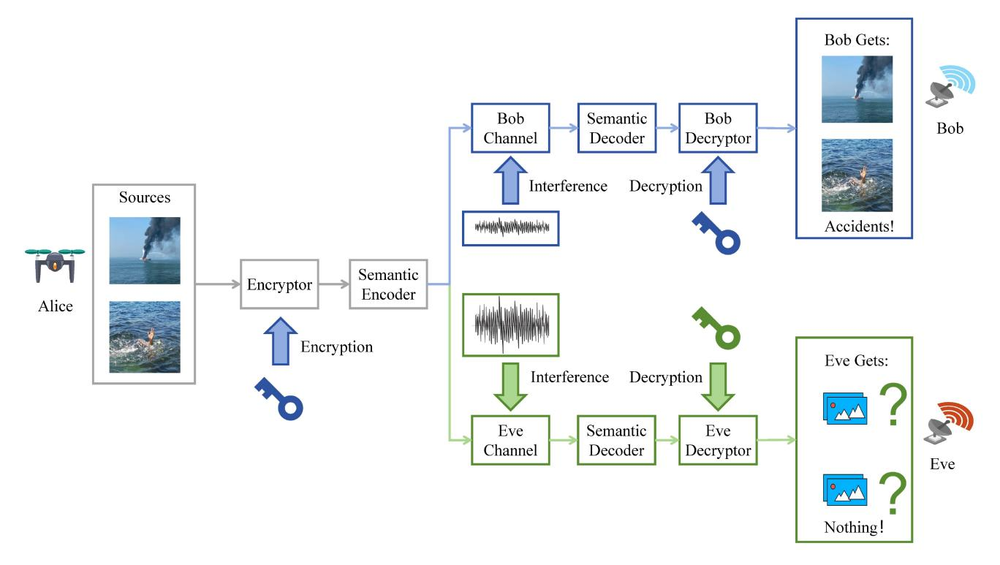

Fig. 10. An illustration of typical secure communication in the SAGSIN scenario. Alice and Bob share the key such at the source data encrypted by Alice can be decrypted by Bob and cannot be decrypted by those who do not have the key. Eve aims to eavesdrop on the transmitted data while suffering from severe interference and not knowing the key. Thus, Eve cannot recover the data sent by Alice.

*4) Security-Related METs:* Communication security, as a prerequisite for accurately transmitting information, has always been an essential concern, especially in the SAGSIN. This comprehensive network consists of numerous nodes, handling massive services at any given moment. When two specific nodes engage in the end-to-end communications, they do not want to be eavesdropped on by other unrelated nodes. Therefore, focusing on the security issues under the background of semantic communications becomes an emerging research direction [\[174\]](#page-42-0). A typical semantic communication system with eavesdropping is shown in Fig. [10.](#page-29-0)

The first step of designing techniques to defend against attacks is understanding the attack mechanisms. A few works validate the impact of certain specific attacks on the performance of the semantic communication system, demonstrating the necessity of researching semantic communication security. Reference [\[168\]](#page-41-48) proposes a model called SemBLK, which can learn to generate destructive physical layer semantic attacks for end-to-end semantic communication systems in a black-box setting. Semantic perturbations are generated by introducing a surrogate semantic encoder in the SemBLK. Experimental results demonstrate the destructive and imperceptible nature of black-box attacks in the SemBLK by comparing metrics such as PSNR and SSIM with benchmarks. Similarly, in the recent work [\[169\]](#page-42-1), a semantic perturbation generator called SemAdv is trained for physical-layer attacks that can pollute the images with specific semantics in an imperceptible, controllable, and input-agnostic manner. Besides, the authors in [\[170\]](#page-42-2) demonstrate that the meaning-oriented semantic communication system exhibits weak resistance against backdoor (Trojan) attacks. The experimental results indicate that backdoor attacks are stealthy and selective.

The second step is to design defense mechanisms to enhance the semantic security. Reference [\[171\]](#page-42-3) proposes a countereavesdropping DeepJSCC model, called DeepJSCEC. It can resist the eavesdroppers' chosen-plaintext attacks without assuming their channel conditions. Compared to the SSCC encryption schemes of traditional communication systems, this model exhibits comparable or even superior PSNR, SSIM, and MS-SSIM performance at different SNRs. An encrypted semantic communication system (ESCS) is proposed in [\[145\]](#page-41-25). Specifically, the authors introduce an adversarial encryption training scheme, which enables the model to achieve high communication accuracy in both encrypted and unencrypted modes. Under the support of ESCS, at high SNRs, the BLEU score of Bob (receiver) approaches 1, while that of Eve (attacker) is less than 0.2. Reference [\[172\]](#page-42-4) proposes a StyleGAN-based semantic communication framework, which utilizes a privacy filter and a KB to replace private information with natural features in the KB, ensuring communication security. Compared to the benchmark (a kind of DeepJSCC), the model has a smaller and more stable LPIPS value under different SNRs.

Some new security-based metrics used in semantic communications are also proposed in the literature. In [\[173\]](#page-42-5), the authors examine and contrast traditional security methods, such as physical layer security, covert communications, and encryption, in terms of semantic information security. They introduce two metrics, which are semantic secrecy outage probability (SOP) for physical layer security techniques, and detection failure probability (DFP) for covert communication techniques. With these metrics as the ultimate goal, the security-related design becomes clearer.

*Remark 7:* Finally, the following works, not classified into the above four categories, have also made significant contributions to semantic communications. Many of these have been used as benchmarks of the aforementioned references. We categorize them based on the source types: text [\[89\]](#page-40-19), [\[103\]](#page-40-32), [\[142\]](#page-41-22), [\[175\]](#page-42-6), [\[176\]](#page-42-7), [\[177\]](#page-42-8), image/video [\[138\]](#page-41-18), [\[139\]](#page-41-19), [\[178\]](#page-42-9), [\[179\]](#page-42-10), [\[180\]](#page-42-11), [\[181\]](#page-42-12), [\[182\]](#page-42-13), [\[183\]](#page-42-14), [\[184\]](#page-42-15), [\[185\]](#page-42-16), [\[186\]](#page-42-17), [\[187\]](#page-42-18), and speech [\[100\]](#page-40-26), [\[146\]](#page-41-26), [\[188\]](#page-42-19), [\[189\]](#page-42-20), [\[190\]](#page-42-21). Readers can delve into the details.

## *D. Lessons Learned From This Section*

This section provides a detailed review of the meaningoriented semantic communication system. The metrics reflecting the "meaning similarity" between the original and reconstructed data serve as key guidelines for the system design, and it is worth noting that the accurate representation of the "meaning similarity" for the utilized evaluation metrics is the basis to improve the system performance. As the fundamental method for system design, DNNs are considered as the absolute core of the meaning-oriented communication system. When designing the system, considering the characteristics of SAGSIN such as highly dynamic channels and limited device capabilities, incorporating meaning-enhancement techniques into DNNs is a powerful approach to further improve the system performance. As a summary, this section provides an idea for designing the meaning-oriented semantic communication system: starting from maximum meaning similarity metrics, establishing DNN-related models, and then proposing targeted meaning-enhancement techniques.

It is worth noting that, the NNs introduced in the meaningoriented semantic communications will not deteriorate the processing delay performance despite a high computing complexity. Since most of the meaning-oriented semantic communication systems are trained offline, i.e., pre-trained at edge/cloud servers before implementation, the high computation costs in the training phases can be neglected in the communication phases. Moreover, some existing works have quantitatively demonstrated that the processing delay of DL-based semantic communications is shorter than traditional communications. For instance, in [\[178\]](#page-42-9), the authors do extensive experiments and simulation results show that the image processing delay under DeepJSCC method is only 18 ms in average, while this value under traditional joint photographic experts group (JPEG) source coding and LDPC channel coding method is larger than 30 ms. Therefore, DLbased meaning-oriented semantic communications will be a promising option in implementing task-critical applications requiring lower delay.

V. PERCEPTION-COMMUNICATION-COMPUTING-ACTUATION-INTEGRATED SEMANTIC COMMUNICATIONS IN THE SAGSIN: A TASK EFFECTIVENESS PERSPECTIVE

In this section, we interpret the term "semantics" as "effectiveness-related information" and review a newly proposed approach of semantic communications called effectiveness-oriented semantic communications (also called task-oriented semantic communications), which focus on the effects yielded by the task actuation process by adopting a joint reconstructor & decision-maker design.[4](#page-30-1)

Before the review, we firstly elaborate on the reason for the introduction of task-oriented communications. Traditionally, both technical communications and meaning-oriented semantic communications adopt a separate reconstructor and decision-maker design, where the receiver are expected to firstly reconstruct the estimation of source data by the inverse process of the transmitter, and secondly generate task decision results based on the estimation of data. The reason why the reconstruction process is imperative is that the receiver cannot distinguish which part of the received data is task-oriented, and thus all the source data must be firstly reconstructed for further decision. In stark comparison, task-oriented communications jointly design the reconstructor and decision-maker, where an intelligent module at the receiver implicitly processes the received data and directly produces task decision results.

This joint design has a salient characteristic of non-symmetry, since no explicit reconstruction process corresponding to pre-processing (e.g., encoding or modulating) occurs at the receiver. Joint reconstructor & decision-maker design is feasible for the receiver side to generate moderate decision results, because the received data contain all the information that is needed for tasks, and thus reconstruction is unnecessary for decision processes except when the task itself is to reconstruct source data. Moreover, such non-symmetric design of joint reconstructor & decision-maker module is proven to be simpler in computation than the separate design by state-of-the-art literature to be elaborated in Section [V-B,](#page-33-0) which perfectly addresses the issue of limited computing resources in the SAGSIN.

Moreover, since the goal of task-oriented communications is just yielding perfect decisions at receiver side for task actuation at the terminal, the semantic extractor at the transmitter can be further refined to be also task-oriented. Specifically, the semantic extractor introduced in Section [IV](#page-17-0) can extract all of the semantic information contained in source data. However, the extracted semantic information is not all useful for task decisions. Therefore, a more intelligent task-oriented semantic extractor can be introduced, which extracts only effectivenessrelated information (i.e., task-related information) from source data to generate effectiveness-related semantic representation for further transmission. Since the decision-maker at the receiver needs only task-related information for decision, this effectiveness-related information extractor is feasible for taskoriented communications. Furthermore, the amount of data gets thoroughly declined as compared to extracting all the semantic information, which also tackles the challenge of limited communication capabilities in the SAGSIN. Similar to meaning-oriented semantic communication system introduced in Section [IV,](#page-17-0) distributed learning methods are utilized for joint training and knowledge sharing. Through the design

4In this section, the actuation process mentioned in the references is in fact only decision process mentioned in Section [II.](#page-5-0)

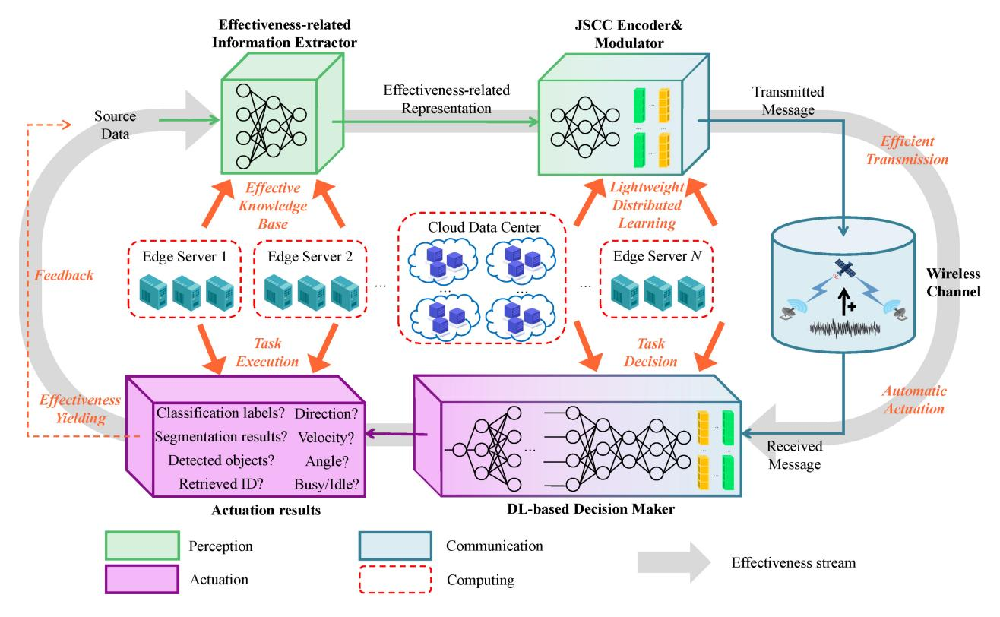

Fig. 11. The framework of perception-communication-computing-actuation-integrated semantic communications in the SAGSIN.

of the effectiveness-related information extractor and joint reconstructor & decision-maker, the computing complexity gets significantly decreased compared to the meaning-oriented semantic communication system, resulting in a lightweight distributed learning-based effectiveness-oriented communication system.

In task-oriented communications, a radical departure of the communication goal from reconstruction to enhancing ultimate effectiveness represents that the actuation process at the terminal along with abovementioned perception, communication, and computing processes is taken into account in the network design, by which a new PCCAIP is developed as demonstrated in Fig. 11. Specifically, in order to reduce the redundancy caused by effectiveness-unrelated information, we utilize an effectiveness-related information extractor as the semantic extractor at the transmitter to remove unrelated information and generate effectiveness-related representation. The representation of effectiveness-related information will be further coded and modulated by JSCC encoder and modulator to generate transmitted messages. At the receiver, different from Sections III and IV where received messages are reconstructed or recovered by the demodulator, decoder, and reconstructor, only one intelligent DL-based actuator receives messages as input and outputs directly the task decision results. Similarly, edge servers and cloud data centers provide knowledge bases and support the distributed learning process of the whole network. By an intelligent actuator, the actuation of tasks will affect the physical world (e.g., the variation of source data) at the transmitter via terminal execution and effectiveness is thus yielded. The task decision results will be also transmitted back through feedback channel, which will further affect the behavior of transmitter side. Therefore, the effectiveness-oriented semantic communication system is a closed-loop framework.

In the following subsections, we firstly introduce metrics to measure the ultimate effectiveness of task-oriented communications; then, we detail the EYTs for the task-oriented semantic communication system according to specific task categories, including image processing services, remote control services, and other computing-intensive services.

## A. Metrics: Towards Ultimate Effectiveness

Since the reconstruction of symbols or semantics no longer exists in task-oriented communications, we cannot use end-to-end metrics, which are based on the distance between reconstructed messages/semantics and the original ones, to measure the performance. Instead, metrics that directly evaluate the ultimate performance of the tasks should be considered, such as the accuracy and preciseness.

1) Accuracy of Tasks: The tasks related to classification, such as image/video classification, image retrieval, and audio recognition, necessitate the correctness or accuracy of output results. For these classification tasks, the samples can be coarsely divided into four categories, which are true positive (TP), true negative (TN), false positive (FP), and false negative (FN). Denote the number of classified samples as n, and a specific category of samples as  $n_{\rm TP}$ ,  $n_{\rm TN}$ ,  $n_{\rm FP}$ , or  $n_{\rm FN}$ , respectively. Generally, the precision rate  $\mathcal{R}_{\rm precision}$  is defined as

$$\mathcal{R}_{\text{precision}} = \frac{n_{\text{TP}}}{n_{\text{TP}} + n_{\text{FP}}},\tag{29}$$

and the recall rate  $\mathcal{R}_{\text{precision}}$  is defined as

$$\mathcal{R}_{\text{recall}} = \frac{n_{\text{TP}}}{n_{\text{TP}} + n_{\text{FN}}}.$$
 (30)

The classification accuracy  $\mathcal{R}_{acc}$  is defined as the ratio of correctly classified samples including TPs and FNs, that is

$$\mathcal{R}_{\rm acc} = \frac{n_{\rm TP} + n_{\rm FN}}{n_{\rm total}},\tag{31}$$

where  $n_{\text{total}} = n_{\text{TP}} + n_{\text{TN}} + n_{\text{FP}} + n_{\text{FN}}$  is the number of total samples.

The classification accuracy defined in equation (31) describes how many samples of one category is correctly classified, which is also called top-1 accuracy. As a general case of top-1 accuracy, top-k accuracy is defined as the ratio of samples whose real category (also called ground truth) belong to the categories with the highest k degree of confidence.5

In specific classification tasks where the negative impact of FPs is comparable to that of TNs,  $\mathcal{R}_{acc}$  is sufficient for serving as ultimate effectiveness metric. However, in the SAGSIN scenario, the costs yielded by different classification results may be remarkably distinct, implying that the impact of FPs and TNs should be considered as different in more general situations. By adopting this idea, the F-measure metric is proposed [191] to endow different weights for FPs and TNs by a hyper parameter  $\beta$ , defined as

$$\mathcal{R}_{\text{Fmeasure}} = \frac{\left(1 + \beta^2\right) \mathcal{R}_{\text{precision}} \mathcal{R}_{\text{recall}}}{\beta^2 \mathcal{R}_{\text{precision}} + \mathcal{R}_{\text{recall}}}.$$
 (32)

F1-score is defined as a special F-measure when  $\beta=1$ , that is

$$\mathcal{R}_{\text{F1score}} = \frac{2\mathcal{R}_{\text{precision}} \mathcal{R}_{\text{recall}}}{\mathcal{R}_{\text{precision}} + \mathcal{R}_{\text{recall}}}.$$
 (33)

As a more comprehensive accuracy metric, the weighted F1-score combines the accuracy of all categories of samples, which is expressed as

$$\mathcal{R}_{\text{wF1}} = \sum_{i=1}^{m} p_i \mathcal{R}_{\text{F1score},i}, \tag{34}$$

where m is the number of categories,  $p_i$  is the ratio of category i among all samples, and  $\mathcal{R}_{\text{F1score},i}$  is the F1-score of category i calculated by (33).  $\mathcal{R}_{\text{wF1}}$  can serve as an ultimate effectiveness metric for multi-classification tasks.

For object detection and image segmentation tasks, we are interested in specific classified results in the pixel level. That is, the accuracy of these tasks is determined by the ratio of correctly classified pixels in each image, i.e., whether the detected area or segmented area overlaps the ground truth area. The intersection over union (IoU) metric is defined as the ratio

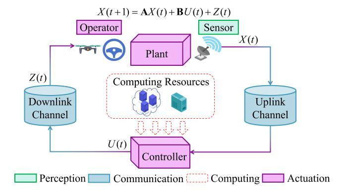

Fig. 12. An illustration of WNCS supported by computing resources distributed in the SAGSIN. The WNCS is a typical closed-loop framework, where sensors, controllers, and operators cooperate to maintain the stability of the processes at the plant. The sensor captures the state of a process X(t) and transmit it to the remote controller through uplink channel. After that, the controller analyzes the state, generates a control command U(t), and sends the command back to the operator through downlink channel. Finally, the operator executes the command interrupted by noises, and the state X(t) will vary according to the execution processes, as shown in equation (36).

of the intersected area by the union area between the task output results  $n_{\text{output}}$  and the ground truth  $n_{\text{gt}}$ , that is

$$\mathcal{R}_{\text{IoU}} = \frac{S_{n_{\text{output}} \cap n_{\text{gt}}}}{S_{n_{\text{output}} \cup n_{\text{gt}}}},$$
(35)

where S represents the area (i.e., the number of pixels).

It is worth noting that the ground truth is usually labeled manually, which represents the perception of human on the task results. Because these detection and segmentation tasks necessitate evaluation from human during task decision, the IoU between classification and real results (i.e., approximate perception of human) is competent for these tasks.

2) Preciseness of Tasks: The tasks related to operation and control, such as automatic driving and UAV route tracking, are subject to the preciseness of the commands generated by the decision-maker, for only the precise and exact commands based on the environment and current situation will yield a positive effect on the tasks, while inappropriate commands will hinder the effectiveness of tasks. For these operation tasks, the most determinant factor is system stability, which means that the generated commands must render the state of the system convergent.

Here we take wireless network control system (WNCS), as illustrated in Fig. 12, as an example to introduce the preciseness metrics that measure the ultimate effectiveness. Consider a discrete-time process denoted by  $X(t) \in \mathbb{R}^n$  which is controlled by command  $U(t) \in \mathbb{R}^n$  and interrupted by a noise Z(t) normally distributed with zero mean and covariance matrix N. The process X(t) is assumed as a linear time-invariant system, that is [192], [193]

$$X(t+1) = \mathbf{A}X(t) + \mathbf{B}U(t) + Z(t),$$
 (36)

where  $\mathbf{A}, \mathbf{B} \in \mathbb{R}^{n \times n}$  are the state transition matrix and control coefficient matrix, respectively.

One of the most common preciseness metric is the MSE of process X(t), with a tacit assumption that the goal of the control task is maintaining X(t) as close as zero. Usually, we

&lt;sup>5The degree of confidence is usually the direct output of DL-based classifier, which represents the probabilities of all the categories. In the cases where the number of categories is small, top-1 accuracy is usually adopted. When the number of categories is large, in order to avoid feature overlapping among categories (a sample has similar degree of confidence on several categories), top-k accuracy is more common.

utilize the long-term average MSE as preciseness metric of the WNCS, denoted by

$$\mathcal{R}_{\text{MSE}} = \frac{1}{T} \sum_{t=0}^{T} Q(t), \tag{37}$$

where  $Q(t)=E(X(t)X(t)^H)$  represents the MSE of each time slot, and  $(\cdot)^H$  represents conjugate transpose operation.

## B. Techniques: Towards Effectiveness Yielding

In the task-oriented semantic communication system, the extraction, dissemination, and ultimate actuation processes are remarkably distinct from the meaning-oriented semantic communication system discussed in Section IV. Task-oriented semantic communication systems are designed towards task actuation at the terminal, and thus the resource consumption of perception, communication, and computing gets reduced, which satisfies the resource-efficient demand in the SAGSIN. In this subsection, we review the EYTs applied in the task-oriented communications which facilitate typical services in the SAGSIN, such as image processing, remote control, and other computing-intensive services. A summary of these EYTs can be seen in Table VIII.

1) EYTs for Image Processing Services: Image processing tasks include image classification, objective detection, image segmentation (semantic segmentation included), and image retrieval, etc, and the main differences among these tasks are illustrated in Fig. 13. These services require only for accurate results at the terminal instead of the exact restoration of image itself. Therefore, a joint transmitter-actuator training method can perfectly and efficiently conduct these image processing tasks in the SAGSIN with limited computing resources, benefiting from light model size and high computing speed.

Image classification services. In [194], the authors study a task-oriented image classification system from a freshness perspective. In this system, the transmitter encodes the images as analog code symbols (i.e., code symbols in a float type) for transmission, and the intelligent classifier deployed at the receiver directly outputs the category of a specific image based on received symbols without reconstruction of image. Taking the age of task information (AoTI) as the objective function, the optimal arrival rate and analog code length are respectively solved to achieve highest classification accuracy. The authors in [195] theoretically analyze a task-oriented communication system for classification based on robust information bottleneck theory, by which both high relevance of information on tasks and low data distortion are guaranteed, achieving high inference accuracy on images. From the resource allocation perspective, an adaptive compression method of the taskoriented communication system for classification is proposed in [196]. According to the relevance on tasks, the compression ratio and resource consumption are jointly optimized by a two-stage iterative algorithm. Simulation results demonstrate that compared to baseline schemes, the proposed adaptive compression scheme saves 80% transmission data while maintaining the classification accuracy, implying that both high ultimate effectiveness and high efficiency are achieved.

For the sake of realization of task-oriented communications in the SAGSIN scenarios based on digital modulation, [197] proposes a possible solution which utilizes a spiking-neuralnetwork-based (SNN-based) semantic communication system for image classification tasks. Compared with other NNs such as CNN, RNN which have been introduced in Section IV-B, a remarkable feature of SNN [214] is that the output of the last layer is only a vector z consisting of binary elements, i.e.,  $\mathbf{z} \in \{0,1\}^n$ , where n is the number of neurons at the last layer of SNN. This remarkable feature implies that SNN directly outputs digital symbols that can be modulated by constellations such as BPSK without the quantization procedure, reducing distortion of effectiveness-related information caused by extra quantization. Reference [197] considers a task-oriented semantic codec equipped with SNN over the BSC or BEC, and provides simulation results on the classification accuracy with regards to transition/erasure probability.

To enhance the robustness of task-oriented communication system against adversarial attacks, the authors in [198], [199] focus on anti-semantic-noise semantic communications for robust image classification. The GAN is utilized for generating image data sets polluted by semantic noise which cannot be distinguished by human but may mislead the intelligent classifier to output wrong category results. The authors introduce a mask auto-encoder to counter the negative effect of semantic noise, and propose a semantic codebook method similar to [215], [216] in order to extract only the most significant features (i.e., the most task-relevant semantics) for transmission. By these means the classification accuracy does not decline because of semantic noise compared with noise-free scenarios.

Objective detection services. Reference [200] considers task-oriented edge video transmission and detection. Specifically, a temporal entropy model and a temporal-spatial integrated model are respectively proposed to extract effectiveness-related information from both current frame and previous frame. The reason why the proposed method is feasible is that video sources are temporally continuous and thus the information involved by the previous frame can be neglected for feature extraction in the current frame. The ultimate effectiveness in specific tasks, e.g., precision (based on IoU thresholds) of pedestrian distribution detection and multi-device joint objective detection, gets enhanced by task-oriented model design while achieving better rate-effectiveness trade-off.

Image segmentation services. Reference [201] studies Internet-of-Vehicles-based (IoV-based) task-oriented communication networks for real-time image segmentation. The cars in the front row capture, process, and transmit environment images in real time by swin Transformer encoder, and the cars in the back row conduct image segmentation tasks for received images. The intelligent task-oriented transmitter-actuator pair achieves higher mean IoU performance than traditional data-oriented codec pair, showing the superiority of ultimate effectiveness of task-oriented design.

*Image retrieval services*. The authors in [202] consider the image retrieval issue at the edge, where one edge device

TABLE VIII SUMMARY OF EFFECTIVENESS YIELDING TECHNIQUES FOR DIFFERENT TASKS

| Tasks                     | SAGSIN Issue Addressment | Related Metrics                               | Specific Services                          | Technical Details                                      | Related References |
|---------------------------|--------------------------------|--------------------------------------------------|--------------------------------------------|--------------------------------------------------------|-----------------------|
|                           |                                | Accuracy of tasks                                | Image classification                    | AoTI-based rate-accuracy joint optimization            | [194]                 |
|                           |                                |                                                  |                                            | Information bottleneck theory                          | [195]                 |
|                           |                                |                                                  |                                            | Adaptive compression method                            | [196]                 |
|                           |                                | OI tasks                                         |                                            | SNN-based digital modulation                           | [197]                 |
| Image                     | Limited device                 |                                                  |                                            | GAN to resist semantic noise, semantic codebook method | [198], [199]          |
| processing                | capabilities                   | Accuracy, IoU                                 | Object detection                           | Temporal-spatial integrated model                      | [200]                 |
|                           |                                | IoU                                              | Image (semantic) segmentation              | Collaborative task decision in internet of vehicles    | [201]                 |
|                           |                                | Accuracy                                         |                                            | JSCC encoder and FCN actuator                          | [202]                 |
|                           |                                | of tasks                                         | Image retrieval                            | Collaborative task decision for multi-device scenario  | [203]                 |
|                           | Highly dynamic channels        | Accuracy of tasks                                | Transmission control                       | Multi-device joint communication- control design    | [204]                 |
|                           |                                | Accuracy, throughput, or MSE               | Multi-device scheduling                    | Task-oriented data compression based on Dec-POMDP      | [205]                 |
| Remote control         |                                |                                                  |                                            | Scheduling for multi-modal tasks based on MDP          | [206]                 |
|                           |                                |                                                  | Practical implementation of remote control | CartPole problem solution                              | [44]                  |
| Other computing-intensive | Limited device capabilities    | Accuracy, traditional metrics (e.g., rate, error | Mixed reality                              | Scene construction according to specific angle of view | [207]                 |
|                           |                                |                                                  | UAV-based image transmission               | Personal-saliency-related semantic triplets            | [208]                 |
|                           |                                |                                                  | Identification                             | Centralized identification in multi-device scenario    | [209]                 |
| tasks                     |                                |                                                  | Question                                   | Multi-user VQA                                         | [210], [211]          |
|                           |                                | probability)                                     | answering                                  | Question answering with memory                         | [212]                 |
|                           |                                |                                                  | Sentiment analysis                         | Semantic triplets                                      | [213]                 |

captures and transmits images to the edge server, and the server conducts retrieval task to predict the identification of the images. Specifically, two task-oriented schemes namely SSCC and JSCC schemes are utilized for effectivenessoriented feature extraction, coding, and modulation. Moreover, a fully-connected-network-based classifier at the receiver directly conducts retrieval tasks without image reconstruction. Numerical results show that JSCC scheme achieves better task

accuracy in a higher actuation speed. Further considering the multi-device scenario at the edge, [\[203\]](#page-42-34) studies collaborative image retrieval problem based on edge computing. Taking twodevice case as an example, edge devices capture images and conduct JSCC-based effectiveness-oriented feature extraction independently, and the JSCC outputs (i.e., effectiveness-related information representation) are transmitted over a shared multiple access channel using NOMA or OMA modulation.

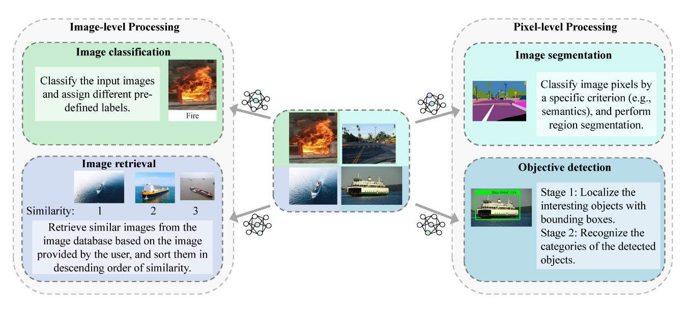

Fig. 13. A comparison of typical image processing tasks that can be facilitated by SAGSIN.

The task actuator at the edge server conducts joint image retrieval task by simultaneously processing information from two edge devices. Such collaborative task actuation achieves performance gain in total retrieval accuracy as compared to separate task actuation design.

*2) EYTs for Remote Control Services:* In remote control applications under the support of WNCS shown in Fig. [12,](#page-32-4) the sensor should transmit the real-time status messages through uplink channel to the controller for command generation, and the commands will be transmitted back to the operator through downlink channel. The controlling process may be corrupted by noise and interference from highly dynamic channels in the SAGSIN. In order to resist the effect of dynamic erroneous channels and yield high ultimate effectiveness, the commands generated based on the received messages are expected to be precise at each time slot, i.e., commands should maintain the stability and convergence of the controlled process.

From a transmission control perspective, [\[204\]](#page-42-35) constructs a task-oriented multi-device communication system with multimodal sources and transmission control. Specifically, in the considered human activity recognition task, sources including room environment and human acceleration information are firstly captured by several end devices and then transmitted over wireless channel. Then, a DL-based processor generates commands of whether to empower the monitoring cameras for video transmission based on the captured sources. By controlling the dissemination process of video sources, the task-oriented system achieves both high total transmission rate and moderate human activity recognition accuracy, which implies a positive ultimate effectiveness.

For multi-device control services, the authors in [\[205\]](#page-42-36) aim at task-oriented data compression in a multi-agent scenario, conducting a joint communication and control optimization. The optimization problem is modeled as a decentralized partially observable MDP (Dec-POMDP) to minimize the distortion caused by compression (a mean absolute error (MAE) metric which is similar to MSE) under the constraint of transmission rate. A state-aggregation for information compression algorithm is proposed as near-optimal solution for the optimization problem, yielding low MAE and thus high ultimate effectiveness of the task-oriented communications. Moreover, [\[206\]](#page-42-37) considers scheduling problem among multimodal users over a time-varying channel, where some of the users conduct task-oriented status updating while others conduct traditional data transmission. In order to jointly optimize the ultimate effectiveness of such multi-user system with multi-modal tasks (i.e., both data reconstruction and status updating tasks), both the significance of information (i.e., AoII) for task-oriented user data and the throughput of data-oriented user data should be considered. The joint AoIIthroughput optimization problem is formulated as an MDP, and the solution verifies a better trade-off between the status prediction accuracy of status updating tasks and the throughput of data recovery tasks.

As a practical example of remote control services which can be deployed in the SAGSIN, [\[44\]](#page-39-19) studies both semanticlevel (meaning-level) and effectiveness-level communications in remote control over unreliable channel based on dynamic feature compression. The authors consider a classic CartPole control task actuated by two agents, where one agent serves as an observer which captures and encodes the CartPole status image into symbols implicitly representing semantic features, and the other agent serves as an actuator which generates a binary command of "left" and "right" based on the received semantic symbols. The problem can be modeled as a POMDP, and different levels of communications can be achieved using different reward functions. The authors point out that by setting the reward function as minus MSE, the communication system is semantics-oriented; by setting the reward function as the Q-function learned by the actuator, the communication system is effectiveness-oriented, since the Qfunction comprehensively reflects the cost of each decision.

*3) EYTs for Other Computing-Intensive Services:* In this part, we review some recent work on task-oriented communication systems designed for other tasks that also consume

considerably large amount of computing resources. By a task-oriented design, the resource consumption from communication, computing, and task actuation can get further reduced while ensuring effectiveness of tasks, satisfying the energyefficiency need for the SAGSIN with limited computing resources.

For instance, [\[207\]](#page-42-38) studies information sharing between mixed reality (MR) devices (e.g., wearable devices) supported by task-oriented communications. The transmitter user captures and transmits the scene information from his angle of view via semantic extractor, and the receiver user receives the information and utilizes a generative network to reproduce the scene from the angle of view of receiver user. Simulation results show that the transmission rate and successful transmission probability at the receiver side get enhanced by task-oriented designs. Another example is [\[208\]](#page-42-39), in which the personal saliency of users in task-oriented communication networks is considered. UAVs conduct semantic extraction for captured images to generate a semantic triplet, and personalized users decide whether to download the whole image based on the preference score of the received semantic triplet. By formulating and solving the multi-user resource allocation problem, high comprehensive utility values (i.e., the match scores between personal query and received triplets) of all the users can be achieved, hence yielding high ultimate effectiveness. Moreover, an identification-task-oriented multiuser communication system is studied in [\[209\]](#page-42-40). Cars in the IoV extract the environment semantics and transmit them to the central server, and the server conducts identification task for each car based on the integrated semantics from all the cars to ensure high identification accuracy. There are also some efforts on task-oriented communications for question asking and answering tasks. [\[210\]](#page-42-41), [\[211\]](#page-42-42) propose multi-user DL-enabled semantic communication systems for visual question answering (VQA) tasks, both of which increase correct answering ratio of the tasks. Reference [\[212\]](#page-42-43) also proposes a context-based semantic communication system with memory to enhance the correction ratio of question answering tasks. Besides, [\[213\]](#page-42-44) proposes a semantic-triplet-based semantic communication system to complete sentiment analysis and question answering tasks, and the proposed system achieves at least 43.5% and 52% accuracy gains respectively on the two tasks.

# *C. Lessons Learned From This Section*

This section elaborates on how a task-oriented communication system is designed by non-symmetric transceivers. Specifically, the core of such non-symmetric transceiver design is to reduce the resource consumption in source processing, data transmission and task decision. An effectiveness-related information extractor is adopted at transmitter side to release the burden of data amount, while an intelligent actuator is utilized to substitute traditional separate reconstructor-actuator design and thus reduce computing resource consumption as compared to reconstruction-based methods. We believe that the task-oriented communication is a promising idea for semantic communications in the SAGSIN for its energy efficiency and brief design.

# VI. FUTURE CHALLENGES ON SEMANTIC COMMUNICATIONS IN THE SAGSIN

In this section, we point out some major challenges and future directions on implementation and enhancement for semantic communications in the SAGSIN scenarios.

## *A. Precise and Unified Metrics Describing Semantics*

Currently, there still lack precise and unified semantic metrics that can accurately and comprehensively measure multi-dimensional significance/meaning/effectiveness of the source data. On the one hand, the current semantic metrics, especially meaning similarity metrics, can only describe the structural or learned implicit similarity between original and received messages, which is rather inaccurate in "semantic domain" description. One of the major reasons is that semantic information theory is still in its infant age. Although there have been some state-of-the-art works [\[217\]](#page-43-3) to refine classical semantic information theory [\[218\]](#page-43-4), semantic communication theory is naturally abstract and vague in semantic representation, since it is based on the logical probability which cannot be explicitly calculated. Therefore, scholars are forced to seek alternative metrics that describe semantics from various perspectives, which indirectly while partly define how much semantic information is received by the receiver.

On the other hand, the existing semantic metrics are only suitable for a certain type/modal of data, which lack unity and generality. For instance, AoI and nonlinear AoI reflect only the freshness aspect of semantics, and meaning similarity metrics such as BERT and SSIM are customized for specific modal of sources. Also, it is an indisputable fact that massiveness and multi-modality are fundamental characteristics of data in SAGSIN scenario. The existing one-dimensional metrics are not sufficient for describing the significance/meaning/effectiveness of multi-modal and multidimensional source data. Therefore, it is imperative to seek a class of precise and unified semantic metrics for semantic communication system design of multi-modal and multidimensional data. Our previous works [\[55\]](#page-39-32), [\[219\]](#page-43-5) initially make some efforts on unifying the significance metrics to propose the GoT metric as a comprehensive goal-oriented semantic metric, which describes the significance by involving the effect of all the natural cost, actuation cost, and the potential cost caused by actuation. In order to propose comprehensive meaning similarity or effectiveness metrics, some problems should be further solved. For instance, a distancebased metric in a certain domain can be considered to unify current meaning-related metrics that respectively reflect the similarity of image, text, and speech sources. Moreover, to measure the effectiveness yielded by source data, we may quantify the potential cost in the life cycle of a certain message, including cost of total transmission delay, cost of total energy consumption, and cost reduced by a precise actuation (or cost increased by a wrong actuation), and a weighted "unified effectiveness metric" can be finely designed.

# *B. Semantic Extraction of Multi-Modal Data*

Semantic extraction is always the initial and essential step in DL-based semantic communications, since the performance of extractor directly affects the performance of semantic transmission and further source reconstruction. Nevertheless, current research focuses on semantic extraction for only one specific modal of source data, which cannot directly extract the multi-dimensional semantics from multi-modal data widely distributed in the SAGSIN. In fact, scholars have recently discussed the semantic extraction for multi-modal image-textfused source data in VQA task [\[210\]](#page-42-41), while they separately extract the image semantics and text semantics by ResNet and LSTM network, respectively. This separate extractor design for different modals of sources must adopt two or more exclusive NNs. Training such semantic extractor will consume considerably large amounts of computing resources, which may not be feasible for end devices and edge servers that have access to limited computing resources in the SAGSIN. Therefore, the issue of extracting semantics of massive multi-modal data with only one intelligent NN has to be addressed.

For instance, videos are a typical type of multi-modal data with both image and audio sources. Instead of separating audio information from image frames and extracting the semantics respectively, we may consider image frames and audio information at the same time as semantic-related. We can cut audio signal frame by frame, and utilize state-of-the-art DL techniques such as Transformer to simultaneously extract semantic information of both the audio signal and image frame in the current time slot. Because of semantic-related audio and image sources, the parameters of NNs will get reduced as compared to separate design, for semantic representation includes the relation of image and audio of current frame, and thus representation length the for current frame is shorter. By integrated extractor design for multi-modal data, a lite semantic coder can be realized and may be directly trained and deployed on small IoT devices in the SAGSIN. This promising idea has been initially explored by [\[220\]](#page-43-6), where a joint image-audio generative diffusion model is utilized for video reconstruction. In their work, the authors quantitatively draw the conclusion that the computational complexity of the proposed model gets significantly decreased compared to baseline models. Such GAN-based model can be potentially utilized for end-to-end semantic communication systems that have smaller parameter sizes.

## *C. Joint Decision-Execution Design for the Actuator*

In the SAGSIN, task execution at the terminals will directly affect the environment statuses, which is the direct effectiveness yielded by the decision commands generated from actuator. However, the current execution modules (or techniques) are principally assumed as separate from the decision-maker design, which is still way from the envisioned PCCAIP in Fig. [3](#page-7-0) of Section [II.](#page-5-0) For instance, the current task-oriented image classification decision-maker only gives the category results on a certain image without considering how the classification results facilitate task execution to affect the external environment. The only exception is [\[44\]](#page-39-19), where the intelligent actuator both gives decision results (i.e., left or right) and conducts task execution to complete CartPole game.

The real tasks facilitated by the SAGSIN are far more complex and heterogeneous than simple CartPole control, which necessitate more intelligent and comprehensive techniques of joint decision-execution realization for the actuator in order to directly yield ultimate effectiveness.

Here we study an abnormal status observation and rescue task to demonstrate the advantage of such joint decisionactuation design. The observers distributed in the network monitor the environment, and when detecting abnormal statuses, the observer will transmit them using SPTs, METs, or EYTs. The terminals receive the statuses using a joint reconstruction & task-decision & task-execution technique to directly conduct rescue tasks, e.g., sending rescuers to dangerous areas for sinking ships. The state-of-the-art works reviewed in Section [V](#page-30-0) mainly focus on the (remote) monitoring steps of this task in order to enhance the accuracy of observation. However, in joint decision-execution design, we are not only interested in the accuracy of observation but also the effect of the decision (which is based on observation results) caused by task execution, e.g., recovery of abnormal statuses due to timely rescue. When several observed objects are detected as abnormal at the same time but the terminal can only support one of the objects to be rescued, the actuator should be finely designed to find out the decision yielding the most ultimate effectiveness via considering the different levels of significance of all the objects. In such cases, we must resort to joint design instead of only enhancing the accuracy of observation.

# *D. Heterogeneous Task-Oriented Communication Networks Based on Edge Intelligence*

In SAGSIN, massive tasks are actuated by heterogeneous nodes in a distributed manner by edge devices. Given the diverse nature of tasks, the relations among nodes may have two principal manners. For nodes which aim at the same task, they should cooperate with each other for the identical task. Conversely, for nodes which target different tasks, they may compete with each other to preempt for limited resources. Therefore, in the task-oriented communication network, it is of vital importance to study intelligent multi-dimensional resource scheduling policies among heterogeneous nodes based on edge intelligence. In the current literature, taskoriented communication network design usually considers homogeneous task executed cooperatively by edge devices [\[221\]](#page-43-7), [\[222\]](#page-43-8), which cannot be directly applied for heterogeneous task scenarios, since the former design considers each device as achieving the same goal. The only exceptions are [\[175\]](#page-42-6), [\[223\]](#page-43-9), where both semantic communication users and technical communication users work to achieve heterogeneous goals (i.e., both semantic and bit-level reconstruction). However, in the practical applications, tasks are more complex and different users may have distinct perception qualities and computing resources, which calls for more intelligent and comprehensive design for each user based on edge intelligence.

For nodes which cooperate with each other for the same task, we may consider a multi-UAV tracking scenario where several heterogeneous UAVs track one moving object. Because of limited device capabilities of each UAV, the computing resources and perceived information are insufficient for each UAV to independently maintain the tracking task. As a result, they should resort to remote edge/cloud servers that can aggregate the perceived information from all the nodes to generate global status information (e.g., the absolute position and speed of the object). Next, the remote servers can compute moderate actuation commands (e.g., the speed and direction) for each UAV. Also, each UAV can compute its own actuation command based on local perception of the object. In order to better track the object while avoiding collision between UAVs, command merging algorithms can be utilized at each UAV to integrate the commands from both itself and the remote server. In this case, both centralized and decentralized policies are adopted, which rely highly on the proposed PCCAIP in this survey.

However, for nodes which compete with each other due to the pursuit of distinct tasks, it is worth noting that the shared communication/actuation resources must be moderately allocated to ensure high effectiveness for each task. Since the nodes serve different tasks, the feasibility of implementing centralized policies becomes physically constrained. In this case, a decentralized resource scheduling policy based on game theory can be adopted, such that the nodes can reach equilibrium in utilizing shared resources. We may consider NOMA-based multi-UAV tracking scenarios where each UAV tracks its own object and communicate with a remote server using the same spectrum. UAVs must adjust their own transmitting power to mitigate interference among themselves, thereby facilitating the reliable transmission of status information to the remote server. This in turn enables the remote server to make more effective task decisions for each UAV. Here, decentralized gaming among UAVs also relies highly on the proposed PCCAIP in the manuscript because of limited device capabilities in SAGSIN.

# VII. CONCLUSION

In this survey, we have comprehensively reviewed the implementation of three types of semantic communication systems in the SAGSIN according to the PCCAIP. Starting with significance-oriented semantic communication systems, we introduce metrics measuring the significance of source data and review SPTs including sampling, coding, and modulation policy designs aiming at enhancing the performance in capturing data significance. Then, we review meaning-oriented semantic communication systems by elaborating on meaning similarity metrics, DNN-based methods, and METs focusing on semantic reconstruction performance improvement. Next, we discuss a newly emerging semantic communication approach called effectiveness-oriented semantic communication systems by introducing effectiveness metrics and studying EYTs intended to increase ultimate effectiveness of task actuation. Finally, we propose several research challenges on implementation of semantic communications in the SAGSIN which will draw further insight research interests.

## REFERENCES

- [\[1\]](#page-0-1) B. Aazhang et al., *Key Drivers and Research Challenges for 6G Ubiquitous Wireless Intelligence (White Paper)*, 6G Flagship Univ. Oulu Finland, Oulu, Finland, Sep. 2019.
- [\[2\]](#page-0-1) X. Cheng, Z. Huang, and L. Bai, "Channel nonstationarity and consistency for beyond 5G and 6G: A survey," *IEEE Commun. Surveys Tuts.*, vol. 24, no. 3, pp. 1634–1669, 3rd Quart., 2022.
- [\[3\]](#page-0-1) F. Guo, F. R. Yu, H. Zhang, X. Li, H. Ji, and V. C. M. Leung, "Enabling massive IoT toward 6G: A comprehensive survey," *IEEE Internet Things J.*, vol. 8, no. 15, pp. 11891–11915, Aug. 2021.
- [\[4\]](#page-0-2) J. Liu, Y. Shi, Z. M. Fadlullah, and N. Kato, "Space–air–ground integrated network: A survey," *IEEE Commun. Surveys Tuts.*, vol. 20, no. 4, pp. 2714–2741, 4th Quart., 2018.
- [\[5\]](#page-0-2) J. Sheng et al., "Space–air–ground integrated network development and applications in high-speed railways: A survey," *IEEE Trans. Intell. Transp. Syst.*, vol. 23, no. 8, pp. 10066–10085, Aug. 2022.
- [\[6\]](#page-0-2) Y. Wang, Z. Su, J. Ni, N. Zhang, and X. Shen, "Blockchain-empowered space–air–ground integrated networks: Opportunities, challenges, and solutions," *IEEE Commun. Surveys Tuts.*, vol. 24, no. 1, pp. 160–209, 1st Quart., 2022.
- [\[7\]](#page-0-2) H. Guo, J. Li, J. Liu, N. Tian, and N. Kato, "A survey on space–air– ground-sea integrated network security in 6G," *IEEE Commun. Surveys Tuts.*, vol. 24, no. 1, pp. 53–87, 1st Quart., 2022.
- [\[8\]](#page-0-2) M. M. Azari et al., "Evolution of non-terrestrial networks from 5G to 6G: A survey," *IEEE Commun. Surveys Tuts.*, vol. 24, no. 4, pp. 2633–2672, 4th Quart., 2022.
- [\[9\]](#page-1-1) C. E. Shannon, "A mathematical theory of communication," *Bell Syst. Tech. J.*, vol. 27, no. 3, pp. 379–423, Jul. 1948.
- [\[10\]](#page-1-2) C. Berrou, A. Glavieux, and P. Thitimajshima, "Near Shannon limit error-correcting coding and decoding: Turbo-codes. 1," in *Proc. IEEE Int. Conf. Commun. (ICC)*, vol. 2, May 1993, pp. 1064–1070.
- [\[11\]](#page-1-3) R. Gallager, "Low-density parity-check codes," *IRE Trans. Inf. Theory*, vol. 8, no. 1, pp. 21–28, Jan. 1962.
- [\[12\]](#page-1-4) E. Arikan, "Channel polarization: A method for constructing capacityachieving codes," in *Proc. IEEE Int. Symp. Inf. Theory (ISIT)*, Jul. 2008, pp. 1173–1177.
- [\[13\]](#page-1-5) J. Perry, P. A. Lannucci, K. Fleming, H. Balakrishnan, and D. Shah, "Spinal codes," in *Proc. ACM SIGCOMM Comput. Commun. Rev.*, vol. 42, Aug. 2012, pp. 49–60.
- [\[14\]](#page-1-6) W. Weaver, "Recent contributions to the mathematical theory of communication," *ETC Rev. Gen. Semant.*, vol. 10, no. 4, pp. 261–281, 1953.
- [\[15\]](#page-3-0) J. Jiao, S. Wu, R. Lu, and Q. Zhang, "Massive access in space-based Internet of Things: Challenges, opportunities, and future directions," *IEEE Wireless Commun.*, vol. 28, no. 5, pp. 118–125, Oct. 2021.
- [\[16\]](#page-3-0) L. Bai, R. Han, J. Liu, J. Choi, and W. Zhang, "Relay-aided random access in space–air–ground integrated networks," *IEEE Wireless Commun.*, vol. 27, no. 6, pp. 37–43, Dec. 2020.
- [\[17\]](#page-3-1) M. Giordani and M. Zorzi, "Non-terrestrial networks in the 6G era: Challenges and opportunities," *IEEE Netw.*, vol. 35, no. 2, pp. 244–251, Mar./Apr. 2021.
- [\[18\]](#page-3-2) G. Geraci, D. López-Pérez, M. Benzaghta, and S. Chatzinotas, "Integrating terrestrial and non-terrestrial networks: 3D opportunities and challenges," *IEEE Commun. Mag.*, vol. 61, no. 4, pp. 42–48, Apr. 2023.
- [\[19\]](#page-3-3) N. Zhang, S. Zhang, P. Yang, O. Alhussein, W. Zhuang, and X. S. Shen, "Software defined space–air–ground integrated vehicular networks: Challenges and solutions," *IEEE Commun. Mag.*, vol. 55, no. 7, pp. 101–109, Jul. 2017.
- [\[20\]](#page-3-3) Z. Zhou, J. Feng, C. Zhang, Z. Chang, Y. Zhang, and K. M. S. Huq, "SAGECELL: Software-defined space-air-ground integrated moving cells," *IEEE Commun. Mag.*, vol. 56, no. 8, pp. 92–99, Aug. 2018.
- [\[21\]](#page-3-4) R. Samy, H.-C. Yang, T. Rakia, and M.-S. Alouini, "Space–air–ground FSO networks for high-throughput satellite communications," *IEEE Commun. Mag.*, vol. 61, no. 3, pp. 82–87, Mar. 2023.
- [\[22\]](#page-3-5) T. Hong, M. Lv, S. Zheng, and H. Hong, "Key technologies in 6G SAGS IoT: Shape-adaptive antenna and RaDAR-communication integration," *IEEE Netw.*, vol. 35, no. 5, pp. 150–157, Sep./Oct. 2021.
- [\[23\]](#page-3-6) N. Kato et al., "Optimizing space–air–ground integrated networks by artificial intelligence," *IEEE Wireless Commun.*, vol. 26, no. 4, pp. 140–147, Aug. 2019.
- [\[24\]](#page-3-6) H. Li, K. Ota, and M. Dong, "AI in SAGIN: Building deep learning service-oriented space–air–ground integrated networks," *IEEE Netw.*, vol. 37, no. 2, pp. 154–159, Mar./Apr. 2023.

- [\[25\]](#page-3-6) F. Tang, C. Wen, M. Zhao, and N. Kato, "Machine learning for space– air–ground integrated network assisted vehicular network: A novel network architecture for vehicles," *IEEE Veh. Technol. Mag.*, vol. 17, no. 3, pp. 34–44, Sep. 2022.
- [\[26\]](#page-3-6) D. Liu, J. Zhang, J. Cui, S.-X. Ng, R. G. Maunder, and L. Hanzo, "Deep learning aided routing for space–air–ground integrated networks relying on real satellite, flight, and shipping data," *IEEE Wireless Commun.*, vol. 29, no. 2, pp. 177–184, Apr. 2022.
- [\[27\]](#page-3-6) S. Gu, Q. Zhang, and W. Xiang, "Coded storage-and-computation: A new paradigm to enhancing intelligent services in space–air– ground integrated networks," *IEEE Wireless Commun.*, vol. 27, no. 6, pp. 44–51, Dec. 2020.
- [\[28\]](#page-3-7) N. Cheng et al., "A comprehensive simulation platform for space–air– ground integrated network," *IEEE Wireless Commun.*, vol. 27, no. 1, pp. 178–185, Feb. 2020.
- [\[29\]](#page-3-8) E. Uysal et al., "Semantic communications in networked systems: A data significance perspective," *IEEE Netw.*, vol. 36, no. 4, pp. 233–240, Jul./Aug. 2022.
- [\[30\]](#page-3-9) K. Niu et al., "A paradigm shift toward semantic communications," *IEEE Commun. Mag.*, vol. 60, no. 11, pp. 113–119, Nov. 2022.
- [\[31\]](#page-3-10) G. Shi, Y. Xiao, Y. Li, and X. Xie, "From semantic communication to semantic-aware networking: Model, architecture, and open problems," *IEEE Commun. Mag.*, vol. 59, no. 8, pp. 44–50, Aug. 2021.
- [\[32\]](#page-3-11) X. Luo, H.-H. Chen, and Q. Guo, "Semantic communications: Overview, open issues, and future research directions," *IEEE Wireless Commun.*, vol. 29, no. 1, pp. 210–219, Feb. 2022.
- [\[33\]](#page-3-12) Q. Lan et al., "What is semantic communication? A view on conveying meaning in the era of machine intelligence," *J. Commun. Inf. Netw.*, vol. 6, pp. 336–371, Dec. 2021.
- [\[34\]](#page-3-13) Z. Qin, X. Tao, J. Lu, and G. Y. Li. "Semantic communications: Principles and challenges." 2021. [Online]. Available: http://arxiv.org/abs/2201.01389
- [\[35\]](#page-3-14) C. Chaccour, W. Saad, M. Debbah, Z. Han, and H. V. Poor. "Less data, more knowledge: Building next generation semantic communication networks." 2022. [Online]. Available: http://arxiv.org/abs/2211.14343
- [\[36\]](#page-3-15) D. Gündüz et al., "Beyond transmitting bits: Context, semantics, and task-oriented communications," *IEEE J. Sel. Areas Commun.*, vol. 41, no. 1, pp. 5–41, Jan. 2023.
- [\[37\]](#page-3-16) W. Yang et al., "Semantic communications for future Internet: Fundamentals, applications, and challenges," *IEEE Commun. Surveys Tuts.*, vol. 25, no. 1, pp. 213–250, 1st Quart., 2023.
- [\[38\]](#page-3-17) W. Xu, Z. Yang, D. W. K. Ng, M. Levorato, Y. C. Eldar, and M. Debbah, "Edge learning for B5G networks with distributed signal processing: Semantic communication, edge computing, and wireless sensing," *IEEE J. Sel. Topics Signal Process.*, vol. 17, no. 1, pp. 9–39, Jan. 2023.
- [\[39\]](#page-3-18) M. Chafii, L. Bariah, S. Muhaidat, and M. Debbah, "Twelve scientific challenges for 6G: Rethinking the foundations of communications theory," *IEEE Commun. Surveys Tuts.*, vol. 25, no. 2, pp. 868–904, 2nd Quart., 2023.
- [\[40\]](#page-8-0) Z. Wang, Z. Zhou, H. Zhang, G. Zhang, H. Ding, and A. Farouk, "AI-based cloud-edge-device collaboration in 6G space–air–ground integrated power IoT," *IEEE Wireless Commun.*, vol. 29, no. 1, pp. 16–23, Feb. 2022.
- [\[41\]](#page-8-0) S. Yu, X. Gong, Q. Shi, X. Wang, and X. Chen, "EC-SAGINs: Edgecomputing-enhanced space–air–ground-integrated networks for Internet of Vehicles," *IEEE Internet Things J.*, vol. 9, no. 8, pp. 5742–5754, Apr. 2022.
- [\[42\]](#page-8-1) S. Gu, Y. Wang, N. Wang, and W. Wu, "Intelligent optimization of availability and communication cost in satellite-UAV mobile edge caching system with fault-tolerant codes," *IEEE Trans. Cogn. Commun. Netw.*, vol. 6, no. 4, pp. 1230–1241, Dec. 2020.
- [\[43\]](#page-8-2) Z. Zhang, W. Zhang, and F.-H. Tseng, "Satellite mobile edge computing: Improving QoS of high-speed satellite-terrestrial networks using edge computing techniques," *IEEE Netw.*, vol. 33, no. 1, pp. 70–76, Jan./Feb. 2019.
- [\[44\]](#page-8-3) P. Talli, F. Pase, F. Chiariotti, A. Zanella, and M. Zorzi, "Semantic and effective communication for remote control tasks with dynamic feature compression," in *Proc. IEEE Conf. Comput. Commun. Workshops (INFOCOM WKSHPS)*, May 2023, pp. 1–6.
- [\[45\]](#page-8-4) "Representative use cases and key network requirements for network 2030," ITU, Geneva, Switzerland, Rep. FG-NET2030-Sub-G1, Jan. 2020.
- [\[46\]](#page-9-1) A. Liu et al., "A survey on fundamental limits of integrated sensing and communication," *IEEE Commun. Surveys Tuts.*, vol. 24, no. 2, pp. 994–1034, 2nd Quart., 2022.

- [\[47\]](#page-9-2) H. Xing, G. Zhu, D. Liu, H. Wen, K. Huang, and K. Wu, "Task-oriented integrated sensing, computation and communication for wireless edge AI," *IEEE Netw.*, vol. 37, no. 4, pp. 135–144, Jul./Aug. 2023.
- [\[48\]](#page-10-2) S. Kaul, M. Gruteser, V. Rai, and J. Kenney, "Minimizing age of information in vehicular networks," in *Proc. 8th Annu. IEEE Commun. Soc. Conf. Sensor Mesh Ad Hoc Commun. Netw. (SECOM)*, Jun. 2011, pp. 350–358.
- [\[49\]](#page-10-3) S. Kaul, R. Yates, and M. Gruteser, "Real-time status: How often should one update?" in *Proc. IEEE Conf. Comput. Commun. (INFOCOM)*, Mar. 2012, pp. 2731–2735.
- [\[50\]](#page-10-4) A. Kosta, N. Pappas, A. Ephremides, and V. Angelakis, "Age and value of information: Non-linear age case," in *Proc. IEEE Int. Symp. Inf. Theory (ISIT)*, Jun. 2017, pp. 326–330.
- [\[51\]](#page-10-5) Y. Sun and B. Cyr, "Sampling for data freshness optimization: Nonlinear age functions," *J. Commun. Netw.*, vol. 21, no. 3, pp. 204–219, Jun. 2019.
- [\[52\]](#page-11-1) J. Zhong, R. D. Yates, and E. Soljanin, "Two freshness metrics for local cache refresh," in *Proc. IEEE Int. Symp. Inf. Theory (ISIT)*, Jun. 2018, pp. 1924–1928.
- [\[53\]](#page-11-2) A. Maatouk, S. Kriouile, M. Assaad, and A. Ephremides, "The age of incorrect information: A new performance metric for status updates," *IEEE/ACM Trans. Netw.*, vol. 28, no. 5, pp. 2215–2228, Oct. 2020.
- [\[54\]](#page-12-2) X. Zheng, S. Zhou, and Z. Niu, "Urgency of information for contextaware timely status updates in remote control systems," *IEEE Trans. Wireless Commun.*, vol. 19, no. 11, pp. 7237–7250, Nov. 2020.
- [\[55\]](#page-12-3) A. Li, S. Wu, S. Sun, and J. Cao. "Goal-oriented tensor: Beyond age of information towards semantics-empowered goal-oriented communications." 2023. [Online]. Available: https://arxiv.org/abs/2307.00535
- [\[56\]](#page-10-6) F. Chiariotti et al., "Query age of information: Freshness in pull-based communication," *IEEE Trans. Commun.*, vol. 70, no. 3, pp. 1606–1622, Mar. 2022.
- [\[57\]](#page-10-7) R. D. Yates, Y. Sun, D. R. Brown, S. K. Kaul, E. Modiano, and S. Ulukus, "Age of information: An introduction and survey," *IEEE J. Sel. Areas Commun.*, vol. 39, no. 5, pp. 1183–1210, May 2021.
- [\[58\]](#page-13-2) Y. Sun, E. Uysal-Biyikoglu, R. D. Yates, C. E. Koksal, and N. B. Shroff, "Update or wait: How to keep your data fresh," *IEEE Trans. Inf. Theory*, vol. 63, no. 11, pp. 7492–7508, Nov. 2017.
- [\[59\]](#page-13-3) B. Zhou and W. Saad, "Optimal sampling and updating for minimizing age of information in the Internet of Things," in *Proc. IEEE Global Commun. Conf. (GLOBECOM)*, Dec. 2018, pp. 1–6.
- [\[60\]](#page-14-0) Y. Sun, Y. Polyanskiy, and E. Uysal, "Sampling of the Wiener process for remote estimation over a channel with random delay," *IEEE Trans. Inf. Theory*, vol. 66, no. 2, pp. 1118–1135, Feb. 2020.
- [\[61\]](#page-14-1) T. Z. Ornee and Y. Sun, "Sampling and remote estimation for the Ornstein–Uhlenbeck process through queues: Age of information and beyond," *IEEE/ACM Trans. Netw.*, vol. 29, no. 5, pp. 1962–1975, Oct. 2021.
- [\[62\]](#page-14-2) A. M. Bedewy, Y. Sun, S. Kompella, and N. B. Shroff, "Age-optimal sampling and transmission scheduling in multi-source systems," in *Proc. 20th ACM Int. Symp. Mobile Ad Hoc Netw. Comput. (MOBIHOC)*, Jul. 2019, pp. 121–130.
- [\[63\]](#page-14-3) Y. Chen and A. Ephremides, "Minimizing age of incorrect information for unreliable channel with power constraint," in *Proc. IEEE Global Commun. Conf. (GLOBECOM)*, Dec. 2021, pp. 1–6.
- [\[64\]](#page-14-4) A. Maatouk, M. Assaad, and A. Ephremides, "Semantics-empowered communications through the age of incorrect information," in *Proc. IEEE Int. Conf. Commun. (ICC)*, May 2022, pp. 3995–4000.
- [\[65\]](#page-14-5) Y. Chen and A. Ephremides. "Minimizing age of incorrect information in the presence of timeout." 2022. [Online]. Available: http://arxiv.org/abs/2207.02926
- [\[66\]](#page-14-6) K. Bountrogiannis, A. Ephremides, P. Tsakalides, and G. Tzagkarakis. "Age of incorrect information with hybrid ARQ under a resource constraint for N-ary symmetric Markov sources." 2023. [Online]. Available: http://arxiv.org/abs/2303.18128
- [\[67\]](#page-14-7) S. C. Bobbili, P. Parag, and J.-F. Chamberland, "Real-time status updates with perfect feedback over erasure channels," *IEEE Trans. Commun.*, vol. 68, no. 9, pp. 5363–5374, Sep. 2020.
- [\[68\]](#page-15-1) A. Arafa, K. Banawan, K. G. Seddik, and H. V. Poor, "On timely channel coding with hybrid ARQ," in *Proc. IEEE Global Commun. Conf. (GLOBECOM)*, Dec. 2019, pp. 1–6.
- [\[69\]](#page-15-2) M. Xie, Q. Wang, J. Gong, and X. Ma, "Age and energy analysis for LDPC coded status update with and without ARQ," *IEEE Internet Things J.*, vol. 7, no. 10, pp. 10388–10400, Oct. 2020.
- [\[70\]](#page-15-3) J. You, S. Wu, Y. Deng, J. Jiao, and Q. Zhang, "An age optimized hybrid ARQ scheme for polar codes via Gaussian approximation," *IEEE Wireless Commun. Lett.*, vol. 10, no. 10, pp. 2235–2239, Oct. 2021.

- [\[71\]](#page-16-0) A. Li, S. Wu, J. Jiao, N. Zhang, and Q. Zhang, "Age of information with hybrid-ARQ: A unified explicit result," *IEEE Trans. Commun.*, vol. 70, no. 12, pp. 7899–7914, Dec. 2022.
- [\[72\]](#page-16-0) Y. Wang, S. Wu, D. Li, J. Jiao, and Q. Zhang, "Age-optimal IR-HARQ design in the presence of non-trivial propagation delay," in *Proc. IEEE 11th Int. Conf. Wireless Commun. Signal Process. (WCSP)*, Oct. 2019, pp. 1–6.
- [\[73\]](#page-16-0) D. Li, S. Wu, Y. Wang, J. Jiao, and Q. Zhang, "Age-optimal HARQ design for freshness-critical satellite-IoT systems," *IEEE Internet Things J.*, vol. 7, no. 3, pp. 2066–2076, Mar. 2020.
- [\[74\]](#page-16-0) D. Li, S. Wu, J. Jiao, N. Zhang, and Q. Zhang, "Age-oriented transmission protocol design in space–air–ground integrated networks," *IEEE Trans. Wireless Commun.*, vol. 21, no. 7, pp. 5573–5585, Jul. 2022.
- [\[75\]](#page-16-1) S. Meng, S. Wu, A. Li, J. Jiao, N. Zhang, and Q. Zhang, "Analysis and optimization of the HARQ-based spinal coded timely status update system," *IEEE Trans. Commun.*, vol. 70, no. 10, pp. 6425–6440, Oct. 2022.
- [\[76\]](#page-16-2) Y. Deng, S. Wu, J. You, J. Jiao, N. Zhang, and Q. Zhang, "Optimizing age of information in polar-coded status update system," *IEEE Internet Things J.*, vol. 11, no. 1, pp. 1285–1300, Jan. 2024.
- [\[77\]](#page-16-3) B. R. Sharan, S. Deshmukh, S. R. B. Pillai, and B. Beferull-Lozano, "Energy efficient AoI minimization in opportunistic NOMA/OMA broadcast wireless networks," *IEEE Trans. Green Commun. Netw.*, vol. 6, no. 2, pp. 1009–1022, Jun. 2022.
- [\[78\]](#page-16-4) S. Wu, C. Guo, Z. Deng, J. Jiao, N. Zhang, and Q. Zhang, "Optimizing age of information in adaptive NOMA/OMA/cooperative-SWIPT-NOMA system," *IEEE Trans. Wireless Commun.*, vol. 21, no. 12, pp. 11125–11138, Dec. 2022.
- [\[79\]](#page-17-1) S. Wu, Z. Deng, A. Li, J. Jiao, N. Zhang, and Q. Zhang, "Minimizing age-of-information in HARQ-CC aided NOMA systems," *IEEE Trans. Wireless Commun.*, vol. 22, no. 2, pp. 1072–1086, Feb. 2023.
- [\[80\]](#page-17-2) S. Liao, J. Jiao, S. Wu, R. Lu, and Q. Zhang, "Age-optimal power allocation scheme for NOMA-based S-IoT downlink network," in *Proc. IEEE Int. Conf. Commun. (ICC)*, 2021, pp. 1–6.
- [\[81\]](#page-17-2) J. Jiao, H. Hong, Y. Wang, S. Wu, R. Lu, and Q. Zhang, "Age-optimal downlink NOMA resource allocation for satellite-based IoT network," *IEEE Trans. Veh. Technol.*, vol. 72, no. 9, pp. 11575–11589, Sep. 2023.
- [\[82\]](#page-14-8) Z. Shi, H. Ding, S. Ma, K.-W. Tam, and S. Pan, "Inverse moment matching based analysis of cooperative HARQ-IR over time-correlated Nakagami fading channels," *IEEE Trans. Veh. Technol.*, vol. 66, no. 5, pp. 3812–3828, May 2017.
- [\[83\]](#page-17-3) A. A. Al-Habob, O. A. Dobre, and H. V. Poor, "Age- and correlationaware information gathering," *IEEE Wireless Commun. Lett.*, vol. 11, no. 2, pp. 273–277, Feb. 2022.
- [\[84\]](#page-17-4) J. Chen, J. Wang, C. Jiang, and J. Wang, "Age of incorrect information in semantic communications for NOMA aided XR applications," *IEEE J. Sel. Topics Signal Process.*, vol. 17, no. 5, pp. 1093–1105, Sep. 2023.
- [\[85\]](#page-19-2) K. Papineni, S. Roukos, T. Ward, and W.-J. Zhu, "BLEU: A method for automatic evaluation of machine translation," in *Proc. Annu. Meet. Assoc. Comput. Linguist. (ACL)*, Jul. 2002, pp. 311–318.
- [\[86\]](#page-19-3) R. Vedantam, C. L. Zitnick, and D. Parikh, "CIDEr: Consensusbased image description evaluation," in *Proc. IEEE Conf. Comput. Vis. Pattern Recognit. (CVPR)*, Jun. 2015, pp. 4566–4575.
- [\[87\]](#page-19-4) Y. Wang et al., "Performance optimization for semantic communications: An attention-based reinforcement learning approach," *IEEE J. Sel. Areas Commun.*, vol. 40, no. 9, pp. 2598–2613, Sep. 2022.
- [\[88\]](#page-19-5) T. Zhang, V. Kishore, F. Wu, K. Q. Weinberger, and Y. Artzi. "BERTSCORE: Evaluating text generation with BERT." 2019. [Online]. Available: https://arxiv.org/abs/1904.09675
- [\[89\]](#page-19-6) H. Xie, Z. Qin, G. Y. Li, and B.-H. Juang, "Deep learning enabled semantic communication systems," *IEEE Trans. Signal Process.*, vol. 69, pp. 2663–2675, 2021.
- [\[90\]](#page-20-3) Z. Wang, E. P. Simoncelli, and A. C. Bovik, "Multiscale structural similarity for image quality assessment," in *Proc. 37th Asilomar Conf. Signals Syst. Comput.*, vol. 2, Nov. 2003, pp. 1398–1402.
- [\[91\]](#page-21-2) R. Zhang, P. Isola, A. A. Efros, E. Shechtman, and O. Wang, "The unreasonable effectiveness of deep features as a perceptual metric," in *Proc. IEEE Conf. Comput. Vis. Pattern Recognit. (CVPR)*, Jun. 2018, pp. 586–595.
- [\[92\]](#page-21-3) M. Heusel, H. Ramsauer, T. Unterthiner, B. Nessler, and S. Hochreiter, "GANs trained by a two time-scale update rule converge to a local Nash equilibrium," in *Proc. Adv. Neural Inf. Process. Syst. (NIPS)*, Dec. 2017, pp. 6627–6638.
- [\[93\]](#page-21-4) M. Binkowski, D. J. Sutherland, M. Arbel, and A. Gretton. ´ "Demystifying MMD GANs." 2018. [Online]. Available: https://arxiv.org/abs/1801.01401

- [\[94\]](#page-21-5) P. Jiang, C.-K. Wen, S. Jin, and G. Y. Li, "Wireless semantic communications for video conferencing," *IEEE J. Sel. Areas Commun.*, vol. 41, no. 1, pp. 230–244, Jan. 2023.
- [\[95\]](#page-22-1) E. Vincent, R. Gribonval, and C. Févotte, "Performance measurement in blind audio source separation," *IEEE Trans. Audio, Speech, Lang. Process.*, vol. 14, no. 4, pp. 1462–1469, Jul. 2006.
- [\[96\]](#page-22-2) "Perceptual evaluation of speech quality (PESQ): An objective method for end-to-end speech quality assessment of narrow-band telephone networks and speech CodeCS," ITU, Geneva, Switzerland, ITU-T Recommendation P.862, Feb. 2001.
- [\[97\]](#page-22-3) R. Kubichek, "Mel-cepstral distance measure for objective speech quality assessment," in *Proc. IEEE Pac. Rim Conf. Commun. Comput. Signal Process.*, vol. 1, May 1993, pp. 125–128.
- [\[98\]](#page-22-4) M. Binkowski et al. "High fidelity speech synthesis with adversarial ´ networks." 2019. [Online]. Available: https://arxiv.org/abs/1909.11646
- [\[99\]](#page-19-7) J. Devlin, M.-W. Chang, K. Lee, and K. Toutanova, "BERT: Pretraining of deep bidirectional transformers for language understanding," in *Proc. Conf. North Amer. Assoc. Comput. Linguist. Human Lang. Technol. (NAACL HLT)*, Jun. 2019, pp. 4171–4186.
- [\[100\]](#page-22-5) Z. Weng and Z. Qin, "Semantic communication systems for speech transmission," *IEEE J. Sel. Areas Commun.*, vol. 39, no. 8, pp. 2434–2444, Aug. 2021.
- [\[101\]](#page-22-6) K. Lu, R. Li, X. Chen, Z. Zhao, and H. Zhang. "Reinforcement learning-powered semantic communication via semantic similarity." 2021. [Online]. Available: https://arxiv.org/abs/2108.12121
- [\[102\]](#page-22-6) K. Lu et al., "Rethinking modern communication from semantic coding to semantic communication," *IEEE Wireless Commun.*, vol. 30, no. 1, pp. 158–164, Feb. 2023.
- [\[103\]](#page-23-1) N. Farsad, M. Rao, and A. Goldsmith, "Deep learning for joint sourcechannel coding of text," in *Proc. IEEE Int. Conf. Acoust. Speech Signal Process. (ICASSP)*, Apr. 2018, pp. 2326–2330.
- [\[104\]](#page-23-2) Y. LeCun, L. Bottou, Y. Bengio, and P. Haffner, "Gradient-based learning applied to document recognition," *Proc. IEEE*, vol. 86, no. 11, pp. 2278–2324, Nov. 1998.
- [\[105\]](#page-23-3) A. Krizhevsky, I. Sutskever, and G. E. Hinton, "ImageNet classification with deep convolutional neural networks," in *Proc. Adv. Neural Inf. Process. Syst.*, 2012, pp. 1097–1105.
- [\[106\]](#page-24-0) J. Long, E. Shelhamer, and T. Darrell, "Fully convolutional networks for semantic segmentation," in *Proc. IEEE Conf. Comput. Vis. Pattern Recognit. (CVPR)*, Jun. 2015, pp. 3431–3440.
- [\[107\]](#page-24-1) K. He, X. Zhang, S. Ren, and J. Sun, "Deep residual learning for image recognition," in *Proc. IEEE Conf. Comput. Vis. Pattern Recognit. (CVPR)*, Jun. 2016, pp. 770–778.
- [\[108\]](#page-24-2) M. D. Zeiler and R. Fergus, "Visualizing and understanding convolutional networks," in *Proc. Eur. Conf. Comput. Vis. (ECCV)*, Sep. 2014, pp. 818–833.
- [\[109\]](#page-24-3) K. Simonyan and A. Zisserman. "Very deep convolutional networks for large-scale image recognition." 2014. [Online]. Available: https://arxiv.org/abs/1409.1556
- [\[110\]](#page-24-4) C. Szegedy et al., "Going deeper with convolutions," in *Proc. IEEE Conf. Comput. Vis. Pattern Recognit. (CVPR)*, Jun. 2015, pp. 1–9.
- [\[111\]](#page-24-5) G. Huang, Z. Liu, L. Van Der Maaten, and K. Q. Weinberger, "Densely connected convolutional networks," in *Proc. IEEE Conf. Comput. Vis. Pattern Recognit. (CVPR)*, Jul. 2017, pp. 2261–2269.
- [\[112\]](#page-24-6) H. Zhao, J. Shi, X. Qi, X. Wang, and J. Jia, "Pyramid scene parsing network," in *Proc. IEEE Conf. Comput. Vis. Pattern Recognit. (CVPR)*, Jul. 2017, pp. 6230–6239.
- [\[113\]](#page-24-7) P. Isola, J.-Y. Zhu, T. Zhou, and A. A. Efros, "Image-to-image translation with conditional adversarial networks," in *Proc. IEEE Conf. Comput. Vis. Pattern Recognit. (CVPR)*, Jul. 2017, pp. 5967–5976.
- [\[114\]](#page-24-8) J. J. Hopfield, "Neural networks and physical systems with emergent collective computational abilities," *Proc. Nat. Acad. Sci. USA*, vol. 79, no. 8, pp. 2554–2558, Apr. 1982.
- [\[115\]](#page-24-9) M. Jordan, *Serial Order: A Parallel Distributed Processing Approach. Technical Report, June 1985–March 1986*, Inst. Cogn. Sci., California Univ., San Diego, LA, USA, May 1986.
- [\[116\]](#page-24-10) J. L. Elman, "Finding structure in time," *Cogn. Sci.*, vol. 14, no. 2, pp. 179–211, Mar. 1990.
- [\[117\]](#page-24-11) S. Hochreiter and J. Schmidhuber, "Long short-term memory," *Neural Comput.*, vol. 9, no. 8, pp. 1735–1780, Nov. 1997.
- [\[118\]](#page-24-12) M. Schuster and K. K. Paliwal, "Bidirectional recurrent neural networks," *IEEE Trans. Signal Process.*, vol. 45, no. 11, pp. 2673–2681, Nov. 1997.
- [\[119\]](#page-24-13) A. Graves and J. Schmidhuber, "Framewise phoneme classification with bidirectional LSTM networks," in *Proc. IEEE Int. Joint Conf. Neural Netw.*, vol. 4, Jul. 2005, pp. 2047–2052.

- [\[120\]](#page-24-14) A. Graves, A.-R. Mohamed, and G. Hinton, "Speech recognition with deep recurrent neural networks," in *Proc. IEEE Int. Conf. Acoust. Speech Signal Process. (ICASSP)*, May 2013, pp. 6645–6649.
- [\[121\]](#page-24-15) K. Cho et al. "Learning phrase representations using RNN encoderdecoder for statistical machine translation." 2014. [Online]. Available: https://arxiv.org/abs/1406.1078
- [\[122\]](#page-24-16) A. Vaswani et al., "Attention is all you need," in *Proc. Adv. Neural Inf. Process. Syst.*, 2017, pp. 6000–6010.
- [\[123\]](#page-24-17) A. Dosovitskiy et al. "An image is worth 16×16 words: Transformers for image recognition at scale." 2020. [Online]. Available: https://arxiv.org/abs/2010.11929
- [\[124\]](#page-25-2) N. Carion, F. Massa, G. Synnaeve, N. Usunier, A. Kirillov, and S. Zagoruyko, "End-to-end object detection with transformers," in *Proc. Eur. Conf. Comput. Vis. (ECCV)*, Aug. 2020, pp. 213–229.
- [\[125\]](#page-25-3) Z. Liu et al., "Swin transformer: Hierarchical vision transformer using shifted windows," in *Proc. IEEE/CVF Int. Conf. Comput. Vis. (ICCV)*, Oct. 2021, pp. 9992–10002.
- [\[126\]](#page-25-4) I. J. Goodfellow et al., "Generative adversarial nets," in *Proc. Adv. Neural Inf. Process. Syst.*, Dec. 2014, pp. 2672–2680.
- [\[127\]](#page-25-5) M. Mirza and S. Osindero. "Conditional generative adversarial nets." 2014. [Online]. Available: https://arxiv.org/abs/1411.1784
- [\[128\]](#page-25-6) A. Radford, L. Metz, and S. Chintala. "Unsupervised representation learning with deep convolutional generative adversarial networks." 2015. [Online]. Available: https://arxiv.org/abs/1511.06434
- [\[129\]](#page-25-7) M. Arjovsky, S. Chintala, and L. Bottou, "Wasserstein generative adversarial networks," in *Proc. Int. Conf. Mach. Learn.*, Aug. 2017, pp. 214–223.
- [\[130\]](#page-25-8) H. Zhang, I. J. Goodfellow, D. Metaxas, and A. Odena, "Self-attention generative adversarial networks," in *Proc. Int. Conf. Mach. Learn. (ICML)*, Jun. 2019, pp. 7354–7363.
- [\[131\]](#page-25-9) A. Brock, J. Donahue, and K. Simonyan. "Large scale GAN training for high fidelity natural image synthesis." 2018. [Online]. Available: https://arxiv.org/abs/1809.11096
- [\[132\]](#page-25-10) T. Karras, S. Laine, and T. Aila, "A style-based generator architecture for generative adversarial networks," in *Proc. IEEE Conf. Comput. Vis. Pattern Recognit. (CVPR)*, Jun. 2019, pp. 4396–4405.
- [\[133\]](#page-25-11) J. Kong, J. Kim, and J. Bae, "HiFi-GAN: Generative adversarial networks for efficient and high fidelity speech synthesis," in *Proc. Adv. Neural Inf. Process. Syst.*, Dec. 2020, pp. 17022–17033.
- [\[134\]](#page-23-4) D. H. Hubel and T. N. Wiesel, "Receptive fields, binocular interaction and functional architecture in the CAT's visual cortex," *J. Physiol.*, vol. 160, no. 1, p. 106, Jan. 1962.
- [\[135\]](#page-23-5) K. Fukushima, "Neocognitron: A self-organizing neural network model for a mechanism of pattern recognition unaffected by shift in position," *Biol. Cybern.*, vol. 36, no. 4, pp. 193–202, Apr. 1980.
- [\[136\]](#page-25-12) T. N. Kipf and M. Welling. "Semi-supervised classification with graph convolutional networks." 2016. [Online]. Available: https://arxiv.org/abs/1609.02907
- [\[137\]](#page-25-13) Z. Lu et al., "Adversarial learning for implicit semantic-aware communications," in *Proc. IEEE Int. Conf. Commun. (ICC)*, May 2023, pp. 4063–4069.
- [\[138\]](#page-25-14) C. K. Thomas and W. Saad, "Neuro-symbolic artificial intelligence (AI) for intent based semantic communication," in *Proc. IEEE Global Commun. Conf. (GLOBECOM)*, Dec. 2022, pp. 2698–2703.
- [\[139\]](#page-25-14) C. K. Thomas and W. Saad, "Neuro-symbolic causal reasoning meets signaling game for emergent semantic communications," *IEEE Trans. Wireless Commun.*, vol. 23, no. 5, pp. 4546–4563, May 2024, doi: [10.1109/TWC.2023.3319981.](http://dx.doi.org/10.1109/TWC.2023.3319981)
- [\[140\]](#page-25-14) D. Huang, F. Gao, X. Tao, Q. Du, and J. Lu, "Toward semantic communications: Deep learning-based image semantic coding," *IEEE J. Sel. Areas Commun.*, vol. 41, no. 1, pp. 55–71, Jan. 2023.
- [\[141\]](#page-25-15) J. Huang, D. Li, C. Huang, X. Qin, and W. Zhang, "Joint task and data-oriented semantic communications: A deep separate sourcechannel coding scheme," *IEEE Internet Things J.*, vol. 11, no. 2, pp. 2255–2272, Jan. 2024.
- [\[142\]](#page-25-15) J.-H. Lee, D.-H. Lee, E. Sheen, T. Choi, and J. Pujara, "SEQ2SEQ-SC: End-to-end semantic communication systems with pre-trained language model," in *Proc. 57th Asilomar Conf. Signals Syst. Comput.*, Oct. 2023, pp. 260–264.
- [\[143\]](#page-25-15) F. Liu, W. Tong, Y. Yang, Z. Sun, and C. Guo. "Task-oriented image semantic communication based on rate-distortion theory." 2022. [Online]. Available: http://arxiv.org/abs/2201.10929
- [\[144\]](#page-25-15) P. Jiang, C.-K. Wen, S. Jin, and G. Y. Li, "Deep source-channel coding for sentence semantic transmission with HARQ," *IEEE Trans. Commun.*, vol. 70, no. 8, pp. 5225–5240, Aug. 2022.

- [\[145\]](#page-25-16) X. Luo, Z. Chen, M. Tao, and F. Yang, "Encrypted semantic communication using adversarial training for privacy preserving," *IEEE Commun. Lett.*, vol. 27, no. 6, pp. 1486–1490, Jun. 2023.
- [\[146\]](#page-25-16) T. Han, Q. Yang, Z. Shi, S. He, and Z. Zhang, "Semantic-preserved communication system for highly efficient speech transmission," *IEEE J. Sel. Areas Commun.*, vol. 41, no. 1, pp. 245–259, Jan. 2023.
- [\[147\]](#page-25-17) S. Imran, G. Charan, and A. Alkhateeb, "Environment semantic aided communication: A real world demonstration for beam prediction," in *Proc. IEEE Int. Conf. Commun. Workshops (ICC Workshops)*, May 2023, pp. 48–53.
- [\[148\]](#page-25-17) Y. Yang, F. Gao, X. Tao, G. Liu, and C. Pan, "Environment semantics aided wireless communications: A case study of mmWave beam prediction and blockage prediction," *IEEE J. Sel. Areas Commun.*, vol. 41, no. 7, pp. 2025–2040, Jul. 2023.
- [\[149\]](#page-25-18) Z. Qin, F. Gao, B. Lin, X. Tao, G. Liu, and C. Pan, "A generalized semantic communication system: From sources to channels," *IEEE Wireless Commun.*, vol. 30, no. 3, pp. 18–26, Jun. 2023.
- [\[150\]](#page-25-19) X. Peng et al., "A robust deep learning enabled semantic communication system for text," in *Proc. IEEE Global Commun. Conf. (GLOBECOM)*, Dec. 2022, pp. 2704–2709.
- [\[151\]](#page-26-1) J. Dai et al. "Adaptive semantic communications: Overfitting the source and channel for profit." 2022. [Online]. Available: https://arxiv.org/abs/2211.04339
- [\[152\]](#page-27-1) K. Yang, S. Wang, J. Dai, K. Tan, K. Niu, and P. Zhang, "WITT: A wireless image transmission transformer for semantic communications," in *Proc. IEEE Int. Conf. Acoust. Speech Signal Process. (ICASSP)*, Jun. 2023, pp. 1–5.
- [\[153\]](#page-27-2) S. Wang, J. Dai, X. Qin, Z. Si, K. Niu, and P. Zhang, "Improved nonlinear transform source-channel coding to catalyze semantic communications," *IEEE J. Sel. Topics Signal Process.*, vol. 17, no. 5, pp. 1022–1037, Sep. 2023.
- [\[154\]](#page-27-3) J. Xu, T.-Y. Tung, B. Ai, W. Chen, Y. Sun, and D. Gündüz, "Deep joint source-channel coding for semantic communications," *IEEE Commun. Mag.*, vol. 61, no. 11, pp. 42–48, Nov. 2023.
- [\[155\]](#page-27-4) Y. Bo, Y. Duan, S. Shao, and M. Tao, "Learning based joint codingmodulation for digital semantic communication systems," in *Proc. IEEE 14th Int. Conf. Wireless Commun. Signal Process. (WCSP)*, Nov. 2022, pp. 1–6.
- [\[156\]](#page-27-5) H. Xie and Z. Qin, "A lite distributed semantic communication system for Internet of Things," *IEEE J. Sel. Areas Commun.*, vol. 39, no. 1, pp. 142–153, Jan. 2021.
- [\[157\]](#page-27-6) Q. Zhou, R. Li, Z. Zhao, Y. Xiao, and H. Zhang, "Adaptive bit rate control in semantic communication with incremental knowledge-based HARQ," *IEEE Open J. Commun. Soc*, vol. 3, pp. 1076–1089, 2022.
- [\[158\]](#page-28-0) D. B. Kurka and D. Gündüz, "DeepJSCC-F: Deep joint source-channel coding of images with feedback," *IEEE J. Sel. Areas Inf. Theory*, vol. 1, no. 1, pp. 178–193, May 2020.
- [\[159\]](#page-28-1) M. Yang and H.-S. Kim, "Deep joint source-channel coding for wireless image transmission with adaptive rate control," in *Proc. IEEE Int. Conf. Acoust. Speech Signal Process. (ICASSP)*, May 2022, pp. 5193–5197.
- [\[160\]](#page-28-2) J. Dai et al., "Nonlinear transform source-channel coding for semantic communications," *IEEE J. Sel. Areas Commun.*, vol. 40, no. 8, pp. 2300–2316, Aug. 2022.
- [\[161\]](#page-28-3) S. Wang et al., "Wireless deep video semantic transmission," *IEEE J. Sel. Areas Commun.*, vol. 41, no. 1, pp. 214–229, Jan. 2023.
- [\[162\]](#page-28-4) B. Zhang, Z. Qin, and G. Y. Li, "Semantic communications with variable-length coding for extended reality," *IEEE J. Sel. Topics Signal Process.*, vol. 17, no. 5, pp. 1038–1051, Sep. 2023.
- [\[163\]](#page-28-5) F. Zhou, Y. Li, X. Zhang, Q. Wu, X. Lei, and R. Q. Hu, "Cognitive semantic communication systems driven by knowledge graph," in *Proc. IEEE Int. Conf. Commun. (ICC)*, May 2022, pp. 4860–4865.
- [\[164\]](#page-28-6) B. Wang, R. Li, J. Zhu, Z. Zhao, and H. Zhang, "Knowledge enhanced semantic communication receiver," *IEEE Commun. Lett.*, vol. 27, no. 7, pp. 1794–1798, Jul. 2023.
- [\[165\]](#page-28-7) S. Seo, J. Park, S.-W. Ko, J. Choi, M. Bennis, and S.-L. Kim, "Toward semantic communication protocols: A probabilistic logic perspective," *IEEE J. Sel. Areas Commun.*, vol. 41, no. 8, pp. 2670–2686, Aug. 2023.
- [\[166\]](#page-28-8) J. Choi, S. W. Loke, and J. Park, "A unified approach to semantic information and communication based on probabilistic logic," *IEEE Access*, vol. 10, pp. 129806–129822, 2022.
- [\[167\]](#page-28-9) D. Wheeler, E. E. Tripp, and B. Natarajan, "Semantic communication with conceptual spaces," *IEEE Commun. Lett.*, vol. 27, no. 2, pp. 532–535, Feb. 2023.
- [\[168\]](#page-29-1) Z. Li et al., "Boosting physical layer black-box attacks with semantic adversaries in semantic communications," in *Proc. IEEE Int. Conf. Commun. (ICC)*, May 2023, pp. 5614–5619.

- [\[169\]](#page-29-2) G. Nan et al., "Physical-layer adversarial robustness for deep learningbased semantic communications," *IEEE J. Sel. Areas Commun.*, vol. 41, no. 8, pp. 2592–2608, Aug. 2023.
- [\[170\]](#page-29-3) Y. E. Sagduyu, T. Erpek, S. Ulukus, and A. Yener, "Vulnerabilities of deep learning-driven semantic communications to backdoor (Trojan) attacks," in *Proc. 57th Annu. Conf. Inf. Sci. Syst. (CISS)*, Mar. 2023, pp. 1–6.
- [\[171\]](#page-29-4) T.-Y. Tung and D. Gündüz, "Deep joint source-channel and encryption coding: Secure semantic communications," in *Proc. IEEE Int. Conf. Commun. (ICC)*, May 2023, pp. 5620–5625.
- [\[172\]](#page-29-5) T. Han, J. Tang, Q. Yang, Y. Duan, Z. Zhang, and Z. Shi, "Generative model based highly efficient semantic communication approach for image transmission," in *Proc. IEEE Int. Conf. Acoust. Speech Signal Process. (ICASSP)*, Jun. 2023, pp. 1–5.
- [\[173\]](#page-29-6) H. Du et al., "Rethinking wireless communication security in semantic Internet of Things," *IEEE Wireless Commun.*, vol. 30, no. 3, pp. 36–43, Jun. 2023.
- [\[174\]](#page-29-7) Z. Yang, M. Chen, G. Li, Y. Yang, and Z. Zhang. "Secure semantic communications: Fundamentals and challenges." 2023. [Online]. Available: https://arxiv.org/abs/2301.01421
- [\[175\]](#page-30-2) X. Mu, Y. Liu, L. Guo, and N. Al-Dhahir, "Heterogeneous semantic and bit communications: A semi-NOMA scheme," *IEEE J. Sel. Areas Commun.*, vol. 41, no. 1, pp. 155–169, Jan. 2023.
- [\[176\]](#page-30-2) W. Li, H. Liang, C. Dong, X. Xu, P. Zhang, and K. Liu, "Non-orthogonal multiple access enhanced multi-user semantic communication," *IEEE Trans. Cogn. Commun. Netw.*, vol. 9, no. 6, pp. 1438–1453, Dec. 2023.
- [\[177\]](#page-30-2) H. Hu, X. Zhu, F. Zhou, W. Wu, R. Q. Hu, and H. Zhu, "Oneto-many semantic communication systems: Design, implementation, performance evaluation," *IEEE Commun. Lett.*, vol. 26, no. 12, pp. 2959–2963, Dec. 2022.
- [\[178\]](#page-30-3) E. Bourtsoulatze, D. B. Kurka, and D. Gündüz, "Deep joint sourcechannel coding for wireless image transmission," *IEEE Trans. Cogn. Commun. Netw.*, vol. 5, no. 3, pp. 567–579, Sep. 2019.
- [\[179\]](#page-30-3) D. B. Kurka and D. Gündüz, "Successive refinement of images with deep joint source-channel coding," in *Proc. IEEE 20th Int. Workshop Signal Process. Adv. Wireless Commun. (SPAWC)*, Jul. 2019, pp. 1–5.
- [\[180\]](#page-30-3) M. Ding, J. Li, M. Ma, and X. Fan, "SNR-adaptive deep joint source-channel coding for wireless image transmission," in *Proc. IEEE Int. Conf. Acoust. Speech Signal Process. (ICASSP)*, Jun. 2021, pp. 1555–1559.
- [\[181\]](#page-30-3) C. Dong, H. Liang, X. Xu, S. Han, B. Wang, and P. Zhang, "Semantic communication system based on semantic slice models propagation," *IEEE J. Sel. Areas Commun.*, vol. 41, no. 1, pp. 202–213, Jan. 2023.
- [\[182\]](#page-30-3) J. Dai, P. Zhang, K. Niu, S. Wang, Z. Si, and X. Qin, "Communication beyond transmitting bits: Semantics-guided source and channel coding," *IEEE Wireless Commun.*, vol. 30, no. 4, pp. 170–177, Aug. 2023.
- [\[183\]](#page-30-3) H. Zhang, S. Shao, M. Tao, X. Bi, and K. B. Letaief, "Deep learning-enabled semantic communication systems with task-unaware transmitter and dynamic data," *IEEE J. Sel. Areas Commun.*, vol. 41, no. 1, pp. 170–185, Jan. 2023.
- [\[184\]](#page-30-3) W. Zhang et al., "DeepMA: End-to-end deep multiple access for wireless image transmission in semantic communication," *IEEE Trans. Cogn. Commun. Netw.*, vol. 10, no. 2, pp. 387–402, Apr. 2024.
- [\[185\]](#page-30-3) S. Ma et al., "Features disentangled semantic broadcast communication networks," *IEEE Trans. Wireless Commun.*, vol. 23, no. 6, pp. 6580–6594, Jun. 2024, doi: [10.1109/TWC.2023.3334225.](http://dx.doi.org/10.1109/TWC.2023.3334225)
- [\[186\]](#page-30-3) S. Yang, H. Pan, T.-T. Chan, and Z. Wang, "Semantic communicationempowered physical-layer network coding," in *Proc. IEEE Wireless Commun. Netw. Conf. (WCNC)*, Mar. 2023, pp. 1–6.
- [\[187\]](#page-30-3) Q. Fu, H. Xie, Z. Qin, G. Slabaugh, and X. Tao, "Vector quantized semantic communication system," *IEEE Wireless Commun. Lett.*, vol. 12, no. 6, pp. 982–986, Jun. 2023.
- [\[188\]](#page-30-4) Z. Weng, Z. Qin, and G. Y. Li, "Semantic communications for speech signals," in *Proc. IEEE Int. Conf. Commun. (ICC)*, Jun. 2021, pp. 1–6.
- [\[189\]](#page-30-4) Y. Tang et al., "Intelligent fabric enabled 6G semantic communication system for in-cabin scenarios," *IEEE Trans. Intell. Transp. Syst.*, vol. 24, no. 1, pp. 1153–1162, Jan. 2023.
- [\[190\]](#page-30-4) Z. Weng, Z. Qin, X. Tao, C. Pan, G. Liu, and G. Y. Li, "Deep learning enabled semantic communications with speech recognition and synthesis," *IEEE Trans. Wireless Commun.*, vol. 22, no. 9, pp. 6227–6240, Sep. 2023.
- [\[191\]](#page-32-5) N. Chinchor, "MUC-4 evaluation metrics," in *Proc. 4th Conf. Message Understand.*, Jun. 1992, pp. 22–29.

- [\[192\]](#page-32-6) Y. Qiu, S. Wu, Y. Wang, J. Jiao, N. Zhang, and Q. Zhang, "On scheduling policy for multiprocess cyber–physical system with edge computing," *IEEE Internet Things J.*, vol. 9, no. 19, pp. 18559–18572, Oct. 2022.
- [\[193\]](#page-32-6) K. Huang, W. Liu, Y. Li, B. Vucetic, and A. Savkin, "Optimal downlink–uplink scheduling of wireless networked control for industrial IoT," *IEEE Internet Things J.*, vol. 7, no. 3, pp. 1756–1772, Mar. 2020.
- [\[194\]](#page-33-1) Y. E. Sagduyu, S. Ulukus, and A. Yener, "Age of information in deep learning-driven task-oriented communications," in *Proc. IEEE Conf. Comput. Commun. Workshops (INFOCOM WKSHPS)*, May 2023, pp. 1–6.
- [\[195\]](#page-33-2) S. Xie, S. Ma, M. Ding, Y. Shi, M. Tang, and Y. Wu, "Robust information bottleneck for task-oriented communication with digital modulation," *IEEE J. Sel. Areas Commun.*, vol. 41, no. 8, pp. 2577–2591, Aug. 2023.
- [\[196\]](#page-33-3) C. Liu, C. Guo, Y. Yang, and N. Jiang, "Adaptable semantic compression and resource allocation for task-oriented communications," *IEEE Trans. Cogn. Commun. Netw.*, vol. 10, no. 3, pp. 769–782, Jun. 2024, doi: [10.1109/TCCN.2023.3346481.](http://dx.doi.org/10.1109/TCCN.2023.3346481)
- [\[197\]](#page-33-4) M. Wang, J. Li, M. Ma, and X. Fan. "SNN-SC: A spiking semantic communication framework for classification." 2023. [Online]. Available: http://arxiv.org/abs/2210.06836
- [\[198\]](#page-33-5) Q. Hu, G. Zhang, Z. Qin, Y. Cai, G. Yu, and G. Y. Li, "Robust semantic communications against semantic noise," in *Proc. IEEE 96th Veh. Technol. Conf. (VTC-Fall)*, Sep. 2022, pp. 1–6.
- [\[199\]](#page-33-5) Q. Hu, G. Zhang, Z. Qin, Y. Cai, G. Yu, and G. Y. Li, "Robust semantic communications with masked VQ-VAE enabled codebook," *IEEE Trans. Wireless Commun.*, vol. 22, no. 12, pp. 8707–8722, Dec. 2023.
- [\[200\]](#page-33-6) J. Shao, X. Zhang, and J. Zhang, "Task-oriented communication for edge video analytics," *IEEE Trans. Wireless Commun.*, early access, Sep. 20, 2023, doi: [10.1109/TWC.2023.3314888.](http://dx.doi.org/10.1109/TWC.2023.3314888)
- [\[201\]](#page-33-7) Q. Pan et al., "Image segmentation semantic communication over Internet of Vehicles," in *Proc. IEEE Wireless Commun. Netw. Conf. (WCNC)*, Mar. 2023, pp. 1–6.
- [\[202\]](#page-33-8) M. Jankowski, D. Gündüz, and K. Mikolajczyk, "Wireless image retrieval at the edge," *IEEE J. Sel. Areas Commun.*, vol. 39, no. 1, pp. 89–100, Jan. 2021.
- [\[203\]](#page-34-1) W. F. Lo, N. Mital, H. Wu, and D. Gündüz, "Collaborative semantic communication for edge inference," *IEEE Wireless Commun. Lett.*, vol. 12, no. 7, pp. 1125–1129, Jul. 2023.
- [\[204\]](#page-35-1) S. Wan, Q. Yang, Z. Shi, Z. Yang, and Z. Zhang, "Cooperative task-oriented communication for multi-modal data with transmission control," in *Proc. IEEE Int. Conf. Commun. Workshops (ICC Workshops)*, May 2023, pp. 1635–1640.
- [\[205\]](#page-35-2) A. Mostaani, T. X. Vu, S. Chatzinotas, and B. Ottersten, "Task-oriented data compression for multi-agent communications over bit-budgeted channels," *IEEE Open J. Commun. Soc.*, vol. 3, pp. 1867–1886, 2022.
- [\[206\]](#page-35-3) R. Li, C. Huang, X. Qin, S. Jiang, N. Ma, and S. Cui, "Coexistence between task- and data-oriented communications: A Whittle's index guided Multiagent reinforcement learning approach," *IEEE Internet Things J.*, vol. 11, no. 2, pp. 2630–2647, Jan. 2024.
- [\[207\]](#page-36-1) H. Du, J. Wang, D. Niyato, J. Kang, Z. Xiong, and D. I. Kim, "AI-generated incentive mechanism and full-duplex semantic communications for information sharing," *IEEE J. Sel. Areas Commun.*, vol. 41, no. 9, pp. 2981–2997, Sep. 2023.
- [\[208\]](#page-36-2) J. Kang et al., "Personalized saliency in task-oriented semantic communications: Image transmission and performance analysis," *IEEE J. Sel. Areas Commun.*, vol. 41, no. 1, pp. 186–201, Jan. 2023.
- [\[209\]](#page-36-3) W. Xu, Y. Zhang, F. Wang, Z. Qin, C. Liu, and P. Zhang, "Semantic communication for the Internet of Vehicles: A multiuser cooperative approach," *IEEE Veh. Technol. Mag.*, vol. 18, no. 1, pp. 100–109, Mar. 2023.
- [\[210\]](#page-36-4) H. Xie, Z. Qin, and G. Y. Li, "Task-oriented multi-user semantic communications for VQA," *IEEE Wireless Commun. Lett.*, vol. 11, no. 3, pp. 553–557, Mar. 2022.
- [\[211\]](#page-36-4) H. Xie, Z. Qin, X. Tao, and K. B. Letaief, "Task-oriented multi-user semantic communications," *IEEE J. Sel. Areas Commun.*, vol. 40, no. 9, pp. 2584–2597, Sep. 2022.
- [\[212\]](#page-36-5) H. Xie, Z. Qin, and G. Y. Li, "Semantic communication with memory," *IEEE J. Sel. Areas Commun.*, vol. 41, no. 8, pp. 2658–2669, Aug. 2023.
- [\[213\]](#page-36-6) C. Liu, C. Guo, S. Wang, Y. Li, and D. Hu, "Task-oriented semantic communication based on semantic triplets," in *Proc. IEEE Wireless Commun. Netw. Conf. (WCNC)*, Mar. 2023, pp. 1–6.

- [\[214\]](#page-33-9) W. Maass, "Network of spiking neurons: The third generation of neural network models," *Neural Netw.*, vol. 10, no. 9, pp. 1659–1671, Dec. 1997.
- [\[215\]](#page-33-10) G. Zhang, Q. Hu, Z. Qin, Y. Cai, G. Yu, and X. Tao, "A unified multi-task semantic communication system for multimodal data," *IEEE Trans. Commun.*, early access, Feb. 9, 2024, doi: [10.1109/TCOMM.2024.3364990.](http://dx.doi.org/10.1109/TCOMM.2024.3364990)
- [\[216\]](#page-33-10) G. Zhang, Q. Hu, Z. Qin, Y. Cai, and G. Yu, "A unified multitask semantic communication system with domain adaptation," in *Proc. IEEE Global Commun. Conf. (GLOBECOM)*, Dec. 2022, pp. 3971–3976.
- [\[217\]](#page-36-7) J. Bao et al., "Towards a theory of semantic communication," in *Proc. IEEE Netw. Sci. Workshop*, Jun. 2011, pp. 110–117.
- [\[218\]](#page-36-8) Y. Bar-Hillel and R. Carnap, "Semantic information," *Brit. J. Philosophy Sci.*, vol. 4, no. 14, pp. 147–157, Aug. 1953.
- [\[219\]](#page-36-9) A. Li, S. Wu, S. Meng, and Q. Zhang. "Towards goal-oriented semantic communications: New metrics, open challenges, and future research directions." 2023. [Online]. Available: http://arxiv.org/abs/2304.00848
- [\[220\]](#page-37-0) L. Ruan et al., "MM-diffusion: Learning multi-modal diffusion models for joint audio and video generation," in *Proc. IEEE Conf. Comput. Vis. Pattern Recognit. (CVPR)*, Jun. 2023, pp. 10219–10228.
- [\[221\]](#page-37-1) D. Wen et al., "Task-oriented sensing, computation, and communication integration for multi-device edge AI," *IEEE Trans. Wireless Commun.*, vol. 23, no. 3, pp. 2486–2502, Mar. 2024.
- [\[222\]](#page-37-1) P. Liu et al., "Toward ambient intelligence: Federated edge learning with task-oriented sensing, computation, and communication integration," *IEEE J. Sel. Topics Signal Process.*, vol. 17, no. 1, pp. 158–172, Jan. 2023.
- [\[223\]](#page-37-2) X. Mu and Y. Liu, "Exploiting semantic communication for nonorthogonal multiple access," *IEEE J. Sel. Areas Commun.*, vol. 41, no. 8, pp. 2563–2576, Aug. 2023.

**Jiaming Zhang** received the B.E. degree in electronic and information engineering from the Harbin Institute of Technology (Shenzhen) in 2022, where he is currently pursuing the M.S. degree with the Department of Electronic Engineering. His research interests include non-orthogonal multiple access, wireless networked control system, and age of information.

**Junlan Cheng** received the B.E. degree in electronic and information engineering from the Harbin Institute of Technology (Shenzhen) in 2022, where she is currently pursuing the M.S. degree with the Department of Electronic Engineering. Her research interests include space-air-ground-sea integrated networks, real-time systems, and wireless communications.

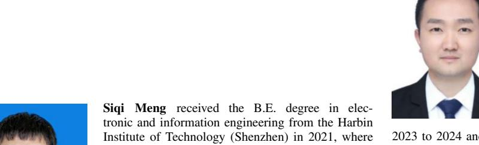

he is currently pursuing the Ph.D. degree with the Department of Electronic Engineering. His research interests include advanced channel coding techniques, age of information, semantic communications, and task-oriented communications.

**Haibo Zhou** (Senior Member, IEEE) received the Ph.D. degree from Shanghai Jiao Tong University in 2014. He is currently a Full Professor with the School of Electronic Science and Engineering, Nanjing University. His research interests include resource management and protocol design in B5G/6G networks, vehicular ad-hoc networks, and space-air-ground integrated networks. He was a recipient of the IEEE ComSoc Asia-Pacific Outstanding Young Researcher Award in 2019. He was an IEEE ComSoc Distinguished Lecturer from

2023 to 2024 and an IEEE VTS Distinguished Lecturer from 2023 to 2025.

degree in communication engineering from the Harbin Institute of Technology in 2009. From 2009 to 2011, he was a Postdoctoral Fellow with the Department of Electronics and Information Engineering, Shenzhen Graduate School, Harbin Institute of Technology, where he has been with since 2012. From 2014 to 2015, he was a Visiting Researcher with the BBCR, University of Waterloo, Canada. He is currently a Full Professor with the Harbin Institute of Technology (Shenzhen), China.

He is also a Professor with Peng Cheng Laboratory, Shenzhen, China. He has authored or coauthored over 100 papers in these fields and holds over 40 Chinese patents. His research interests include satellite and space communications, advanced channel coding techniques, space-air-ground-sea integrated networks, and B5G/6G wireless transmission technologies.

**Qinyu Zhang** (Senior Member, IEEE) received the bachelor's degree in communication engineering from the Harbin Institute of Technology (HIT), Harbin, China, in 1994, and the Ph.D. degree in biomedical and electrical engineering from the University of Tokushima, Tokushima, Japan, in 2003. From 1999 to 2003, he was an Assistant Professor with the University of Tokushima. From 2003 to 2005, he was an Associate Professor with the Shenzhen Graduate School, HIT, and was the Founding Director of the Communication

Engineering Research Center, School of Electronic and Information Engineering. Since 2005, he has been a Full Professor and the Dean of EIE School, HIT. He is also a Professor with Peng Cheng Laboratory, Shenzhen, China. His research interests include aerospace communications and networks, wireless communications and networks, cognitive radios, signal processing, and biomedical engineering. He is on the editorial board of some academic journals, such as *Journal of Communication*, *KSII Transactions on Internet and Information Systems*, and *Science China Information Sciences*. He was an Associate Chair for Finance of the International Conference on Materials and Manufacturing Technologies 2012, the TPC Co-Chair of the IEEE/CIC ICCC 2015, and the Symposium Co-Chair of the CHINACOM 2011 and the IEEE Vehicular Technology Conference 2016 (Spring). He has been a TPC Member for the Infocom, IEEE ICC, IEEE Globecom, IEEE Wireless Communications and Networking Conference, and other flagship conferences in communications. He was the Founding Chair of the IEEE Communications Society Shenzhen Chapter.