# Spectrum Sharing and Interference Management for 6G LEO Satellite–Terrestrial Network Integration

Navid Heydarishahreza®, *Graduate Student Member, IEEE*, Tao Han®, *Senior Member, IEEE*, and Nirwan Ansari®, *Life Fellow, IEEE* 

Abstract—The rapid emergence of satellite systems introduces unprecedented interference challenges to both existing satellite networks and Terrestrial Networks (TNs), necessitating innovative strategies to efficiently manage spectrum resources amid heightened competition. Traditional interference management methods fail to address the unique challenges facing satellite systems. These challenges include higher propagation delays caused by the high altitude of Low Earth Orbit (LEO) satellites, increased Doppler shifts due to their high speeds, atmospheric attenuations affecting LEO satellite-TN links, and limited processing capacity in satellite systems. This article provides a comprehensive exploration of interference in LEO satellite-Integrated Terrestrial Networks (LITNets), encompassing various types of interference, including Inter-Beam Interference (IBI), which occurs between different beams of the same satellites; Inter-Satellite Interference (ISI), which arises between different satellites; and LEO satellite-Terrestrial infrastructure Interference (LTI). Moreover, it outlines strategies for interference management and reviews current mitigation methods. Finally, the article concludes by discussing the research challenges and proposing future directions for enhancing spectrum efficiency and interference management in LITNets.

*Index Terms*—6G, interference management, LEO satellite, non-terrestrial networks, resource allocation, spectrum efficiency, spectrum sharing.

#### I. INTRODUCTION

SATELLITE and terrestrial communication networks each serve a key role in their specialized service areas. While terrestrial wireless technology has advanced swiftly, it still grapples with the challenge of limited coverage. Conversely, satellite communication systems offer vast coverage and global connectivity, rendering them essential for forthcoming 6G mobile networks. Consequently, integrating satellites—specifically LEO satellites, as referred to in this article—and terrestrial networks into the LEO satellite-Integrated Terrestrial Networks (LITNets) has garnered significant interest in both the academic and industrial sectors. LITNet facilitates various types of services and flexible terminal access modes. Moreover, as the quantity of terminals grows, the competition for spectrum resources escalates between terrestrial and satellite networks within LITNet. Coupled with the rise in LEO

Received 4 June 2024; revised 29 September 2024 and 11 November 2024; accepted 21 November 2024. Date of publication 27 November 2024; date of current version 20 October 2025. (Corresponding author: Nirwan Ansari.)

The authors are with the Helen and John C. Hartmann Department of Electrical and Computer Engineering, New Jersey Institute of Technology, Newark, NJ 07102 USA (e-mail: nh323@njit.edu; tao.han@njit.edu; nirwan.ansari@njit.edu).

Digital Object Identifier 10.1109/COMST.2024.3507019

satellites, the radio spectrum resource becomes increasingly scarce, posing a bottleneck for satellite system development. Consequently, the next generation of satellite systems must exhibit substantially higher spectral efficiency to tackle this spectrum scarcity challenge. Dynamic spectrum sharing technology addresses this by enabling the sharing of spectrum resources between these networks, fostering efficiency and mitigating overuse. LITNet facilitates spectrum sharing between satellite and terrestrial terminals through overlay and underlay spectrum sharing modes, which will be examined in further detail in the following sections [1], [2], [3]. Effectively managing interference presents a pervasive challenge affecting wireless networks' performance. Traditional signal processing methods face limitations when addressing interference on a large scale. Within satellite communications, one critical issue emerges from the increasing need for high-speed data rates for satellite multimedia and broadcasting services, exacerbated by the large scale and scarcity of spectrum in satellite bands. Consequently, this challenge has prompted the exploration of novel approaches to bolster spectral efficiency in satellite communication [4], [5].

#### A. Preliminary

For an extended period, terrestrial and satellite operators have competed for spectrum resources. Within the International Telecommunication Union-Radiocommunication (ITU-R) sector, spectrum allocation for International Mobile Telecommunications (IMT) (cellular/terrestrial) and satellite operations follows an exclusive allocation approach. The 5G Non-Terrestrial Network (NTN) satellite system mainly adopts a physical layer, protocol, and network architecture similar to those of 5G cellular networks. This alignment simplifies Terrestrial Network (TN) and NTN coordination, enhancing mobility management and improving interference co-existence. Ultimately, it enables a more feasible sharing of the same spectrum resources among terrestrial and satellite operators [6]. Despite their numerous potential benefits, LITNets face several significant challenges emerging from factors such as long communication distances (resulting in long delay times), the rapid orbital speed of satellites (leading to significant Doppler shifting), atmospheric attenuations, and limitations in processing capacity within satellite communication systems. Furthermore, the diverse and densely deployed terrestrial network infrastructures have led to intricate distributed network topologies, exacerbating LITNet interference in urban areas compared to rural areas, especially under

1553-877X © 2024 IEEE. Personal use is permitted, but republication/redistribution requires IEEE permission. See https://www.ieee.org/publications/rights/index.html for more information.

Quality of Service (QoS) constraints. Consequently, there is a pressing need for the development of efficient interference management methods that consider the LITNet architecture and all possible types of interference [\[7\]](#page-27-6), [\[8\]](#page-27-7). In light of the challenges mentioned earlier, this article thoroughly examines the different types of interference in LITNets, namely Inter-Beam Interference (IBI), Inter-Satellite Interference (ISI), and LEO satellite-Terrestrial Infrastructure Interference (LTI). We outline strategies for managing interference within this context and provide a summary of current methods for interference mitigation.

#### *B. Previous Comparable Research*

In the past few years, there has been a surge of insightful surveys and tutorials dedicated to the realm of spectrum efficiency in LEO satellite communications within literature [\[9\]](#page-27-8), [\[10\]](#page-27-9), [\[11\]](#page-27-10), [\[12\]](#page-27-11), [\[13\]](#page-27-12), [\[14\]](#page-27-13), [\[15\]](#page-27-14), [\[16\]](#page-27-15), [\[17\]](#page-27-16), [\[18\]](#page-27-17). In the following, we will briefly outline the scope of the research and the contributions of these relevant surveys. Following this, a summary of these surveys will be presented in Table [I,](#page-2-0) showcasing the distinctive contributions made by our research. The frequency of publication within this domain has escalated in recent years, as demonstrated by Table [I,](#page-2-0) underscoring the current trendiness of this topic.

Reference [\[9\]](#page-27-8) presents an overview of spectrum databases designed to facilitate coexistence in various spectrum sharing environments within satellite communications. It emphasizes the application of database techniques in defined use cases and scenarios while also highlighting the need for additional sharing techniques to ensure seamless operations. Reference [\[10\]](#page-27-9) explores the optimization of system capacity and QoS in LITNets by employing joint multigroup precoding and resource allocation. The simulation results demonstrated the effectiveness of this approach in improving system capacity and guaranteeing QoS satisfaction, providing a valuable reference for mitigating the impact of various interferences in LITNets. Reference [\[11\]](#page-27-10) delineates the key opportunities and connectivity challenges faced by LEO small-satellite constellations. Furthermore, it examines the physical links within LEO constellations, taking into account factors such as Doppler shift, propagation delay, and achievable data rates have been examined. Reference [\[12\]](#page-27-11) aims to illustrate the latest developments in satellite communications, highlighting the most significant areas for continuing research. It investigates key drivers of innovation, such as emerging constellation types, improved on-board processing capabilities, and spacebased data collection and processing, taking into account different aspects of resource allocation and interference management. Reference [\[13\]](#page-27-12) delivers a structured overview of effective interference mitigation technologies, focusing on their application within LITNets for the advancement of 6G communications. By considering integrated architectures, it categorizes related interference mitigation technologies. However, it does not explore the underlying mechanisms of interference occurrence and mitigation, particularly at the physical layer. Reference [\[14\]](#page-27-13) explores the dynamics of multi-group LEO satellite networks tasked with delivering

downlink services to ground users while operating with scarce frequency resources. With LEO satellites passing along various orbits, ground users encounter fluctuating interference stemming from the main and side lobes of multiple satellites simultaneously. The research in this article focuses on effective interference management strategies that operate without relying on direct communication links between satellites, known as Inter-Satellite Links (ISLs). Reference [\[15\]](#page-27-14) explores the latest advances and future prospects in LEO satellite communication systems and discusses the critical technical challenges involved in integrating LEO satellites into universal wireless communication platforms. Specifically, it examines various communication aspects of LEO satellites, spanning from the physical layer to applications and overall structural design concepts. Reference [\[16\]](#page-27-15) investigates the Co-Frequency Interference (CFI) and out-of-band leakage power transmission originating from terrestrial networks to satellites. It offers guidelines for designing terrestrial networks to protect existing satellite services. Reference [\[17\]](#page-27-16) presents a comprehensive review of foundational studies and current advancements in Multiple-Input-Multiple-Output (MIMO) satellite communications. Specifically, it outlines and contrasts the disparities between terrestrial and satellite networks. Reference [\[18\]](#page-27-17) introduces a framework aimed at seamlessly integrating LEO satellites with terrestrial-wired networks, with the goal of enhancing coverage, throughput, and transmission reliability for 6G IoT networks.

The previously mentioned surveys have addressed significant aspects of spectrum efficiency in LEO satellite developments. However, a notable gap remains: a comprehensive survey that purely explores LITNets with a focus on spectrum efficiency and interference, detailing all constituent elements and discussing interference types such as IBI, ISI, and LTI, while exploring the fundamental mechanisms underlying interference occurrence and mitigation. This observation has inspired the creation of this article, which aims to provide an in-depth analysis of spectrum efficiency and interference management within LITNets. Additionally, while some existing survey articles touch upon these topics, they often offer only high-level discussions. Therefore, this article seeks to explore the current state-of-the-art in LITNets spectrum efficiency and interference management and to highlight key research challenges. Table [I](#page-2-0) summarizes the key points of the aforementioned articles in comparison to this article, showcasing the contrasting features they present.

## *C. Contributions and Structure*

This article focuses on the challenges of 6G LEO satelliteterrestrial spectrum sharing and interference due to the surge in LEO satellite launches. Geostationary Orbit (GSO) satellites operate at an altitude of 35,678 km, orbiting the equator with nearly zero inclination. In contrast, Non-Geostationary Orbit (NGSO) satellites—which include LEO, Medium Earth Orbit (MEO), and Highly Elliptical Orbit (HEO) satellites operate at lower altitudes, resulting in reduced link losses and latency. Since NGSO satellites cover smaller areas compared

TABLE I CONTRAST WITH PREVIOUSLY CONDUCTED SURVEYS

| Reference | Year | Main Contributions                                                                                                                                                                                                                                                                                                                      | LITNets fundamen- tals | Spectrum sharing and interference scenarios | IBI      | ISI      | LTI      | AI and spectrum sharing |
|-----------|------|-----------------------------------------------------------------------------------------------------------------------------------------------------------------------------------------------------------------------------------------------------------------------------------------------------------------------------------------|------------------------------|------------------------------------------------------|----------|----------|----------|-------------------------|
| [9]       | 2017 | An overview of spectrum databases designed for spectrum sharing environments within satellite communications                                                                                                                                                                                                                            | ×                            | <b>√</b>                                             | ×        | <b>√</b> | <b>√</b> | ×                       |
| [10]      | 2019 | Joint multigroup precoding and resource allocation for mitigating the impact of LTI in LITNets                                                                                                                                                                                                                                          | ×                            | ×                                                    | ×        | ×        | <b>√</b> | ×                       |
| [11]      | 2020 | LEO small-satellite constellation characteristics, along with a comprehensive overview of the physical and logical links                                                                                                                                                                                                                | <b>√</b>                     | ×                                                    | ×        | ×        | ×        | ×                       |
| [12]      | 2021 | The latest developments in satellite communications, highlighting key innovation drivers such as new constellation types, onboard processing capabilities, and the integration of non-terrestrial networks                                                                                                                              | <b>√</b>                     | <b>√</b>                                             | ×        | ×        | ×        | <b>√</b>                |
| [13]      | 2022 | A high level overview of interference mitigation technologies within LITNets for 6G, without exploring the underlying mechanisms of interference occurrence and mitigation, particularly at the physical layer                                                                                                                          | ×                            | ×                                                    | <b>√</b> | <b>√</b> | <b>√</b> | ×                       |
| [14]      | 2023 | Effective interference management strategies that operate independently of direct communication between different satellite constellations                                                                                                                                                                                              | ×                            | ×                                                    | ×        | ✓        | ×        | ✓                       |
| [15]      | 2023 | An examination of various communication aspects of LEO satellites, spanning from the physical layer to applications and overall structural design concepts                                                                                                                                                                              | ✓                            | ×                                                    | ×        | ×        | ×        | ×                       |
| [16]      | 2023 | Offering guidelines for designing terrestrial networks to protect existing satellite services                                                                                                                                                                                                                                           | ×                            | ✓                                                    | ×        | ×        | <b>√</b> | ×                       |
| [17]      | 2023 | Current advancements in MIMO satellite communications                                                                                                                                                                                                                                                                                   | ✓                            | ×                                                    | <b>√</b> | ×        | <b>√</b> | ×                       |
| [18]      | 2024 | A framework aimed at seamlessly integrating LEO satellites with terrestrial-wired networks, with the goal of enhancing coverage, throughput, and transmission reliability for 6G IoT networks                                                                                                                                           | ×                            | ×                                                    | ×        | <b>√</b> | <b>√</b> | ×                       |
| Ours      | 2024 | A comprehensive study on the fundamentals of LITNets, spectrum sharing, and interference scenarios. A systematic review of IBI, ISI, and LTI interference, along with the role of RISs. Exploration of recent trends in spectrum sharing, including the integration of AI in LITNets and advancements in Generative AI, such as ChatGPT | <b>√</b>                     | <b>√</b>                                             | <b>√</b> | ✓        | <b>√</b> | ✓                       |

to GSO satellites, a constellation with a large number of NGSO satellites is required for complete Earth coverage, including high-latitude regions. Over the past decade, the number of launched NGSO satellites has surged dramatically, with LEO

satellites making up the majority. The proliferation of LEO satellites necessitates the development of effective interference management and spectrum sharing solutions [\[15\]](#page-27-14). Note that while other types of interference, including those among LEO, MEO, HEO, and GSO satellites, are discussed in the literature, they fall outside the scope of this article.

Advancements in mitigating interference for LEO constellation coexistence have remained predominantly absent from public reporting [\[19\]](#page-27-18). In recent years, several valuable survey articles have been published, each focusing on distinct aspects discussed in the previous subsection. Although each survey provides valuable insight into individual interference management methods, none have systematically categorized all potential interference scenarios within LITNets, as we have done with IBI, ISI, and LTI. Moreover, our categorization includes the latest trends in mitigation techniques specific to each interference type. The core contributions of this article are as follows:

- *Comprehensive Study of LITNets' Fundamentals:* We provide a thorough examination of LITNets, covering key aspects such as architecture, constellation design, handover mechanisms, intrinsic channel impairments, edge computing, and diversity schemes. This foundational knowledge supports the subsequent sections, offering insights into spectrum sharing and interference management research.
- *In-Depth Investigation of Interference Scenarios:* We conduct an extensive investigation into all potential interference scenarios within LITNets. Our study also delves into cognitive techniques, the distinct features of cognitive satellite communications, and how spectrum sharing influences system performance metrics.
- *Analysis of IBI:* We investigate the causes of IBI and explore various techniques for mitigating its effects. This includes identifying contributing factors and presenting solutions for interference mitigation.
- *Examination of ISI in LEO Satellites:* We classify ISI mitigation techniques into two primary approaches: exclusion zone and joint beam and power optimization. We also address the unique challenges LEO satellites face in effectively managing ISI.
- *Introduction of LTI Concepts:* We introduce preliminary concepts of LTI and examine frequency pairing modes, including normal and reverse spectrum sharing modes, as strategies for mitigating interference. Furthermore, we explore additional methods for enhancing spectrum efficiency, such as multiple access design and Reconfigurable Intelligent Surfaces (RISs).
- *AI-Enhanced Spectrum Sharing and Interference Management:* Our study explores the role of AI in enhancing spectrum sharing and interference management in LITNets. We discuss AI's potential for detecting interference and optimizing resource allocation within these networks. Furthermore, a separate subsection explores how Large Language Models (LLMs) can support interference management within LITNets.
- *Research Challenges and Future Directions:* We identify key research challenges and future directions for spectrum sharing and interference management in LITNets, addressing issues such as extreme heterogeneity, RSMA and NOMA, OTFS, and the application of LLMs.

Fig. [1](#page-4-0) outlines the structure of this article. We also include Table [II,](#page-5-0) which features important acronyms along with corresponding definitions.

#### II. FUNDAMENTALS OF LEO SATELLITE-INTEGRATED TERRESTRIAL NETWORKS (LITNETS)

In this section, we explore the critical elements of LITNets, elucidating key concepts essential for understanding the nuances of spectrum sharing and interference management. We commence with an examination of the integrated architecture of LITNets, followed by discussions on LEO satellite constellation, service handover, intrinsic channel impairment factors, and the role of satellite edge computing, culminating in an examination of diversity schemes. Table [III](#page-6-0) provides a summary of the articles reviewed in this section.

#### *A. Integrated Architecture*

The most recent architecture in 5G is a 2-dimensional planar coverage deployed by terrestrial cellular networks. The limited coverage and total dependence on the terrestrial infrastructure are bottlenecks for the seamless pervasive coverage demanded by the increasing capacity towards the future 6G ecosystem. Hence, 6G has to undertake innovative reformations in the network architecture to offer a 3-dimensional instantaneous service [\[20\]](#page-27-19). To provide the third dimension for a global service, LEO satellites, with their lower orbit height—meaning lower atmospheric altitude—and consequently, shorter transmission delays and smaller Path Loss (PL), have become the top priority for 5G/6G scenarios [\[21\]](#page-27-20), [\[22\]](#page-27-21), [\[23\]](#page-27-22). Based on 3rd Generation Partnership Project's (3GPP's) Releases 16 and 17, the general architecture for LITNets can be composed of the following elements:

- • **User Equipment (UE):** The UE is a handheld device capable of direct communication with the LEO satellite and/or TN.
- **Ground Gateway (GG):** The GG is a Very Small Aperture Terminal (VSAT) directly connected to the LEO satellite.
- **Satellite:** As the key element of the architecture, the LEO satellite holds the payload between the GGs and UEs. It can also serve as backhaul.
- **Base Station (BS):** The BS serves TN users.

Satellite and terrestrial networks in LITNets can work together in what is known as *complementary architecture*, as shown in Fig. [2.](#page-6-1) Unlike conventional setups where the two networks function independently, these two networks collaborate within LITNets to offer seamless connectivity. Dual-mode terminals play a crucial role by enabling users to access both terrestrial and satellite networks seamlessly. In urban areas, where terrestrial networks are typically available, users will connect to the terrestrial cellular network for broadband access. However, when users move into regions without terrestrial coverage, the system automatically switches them to the satellite network. Switching from terrestrial to satellite networks requires integrated mobility and resource management between the two networks. Through this cooperation, LITNets ensure ubiquitous coverage and uninterrupted service,

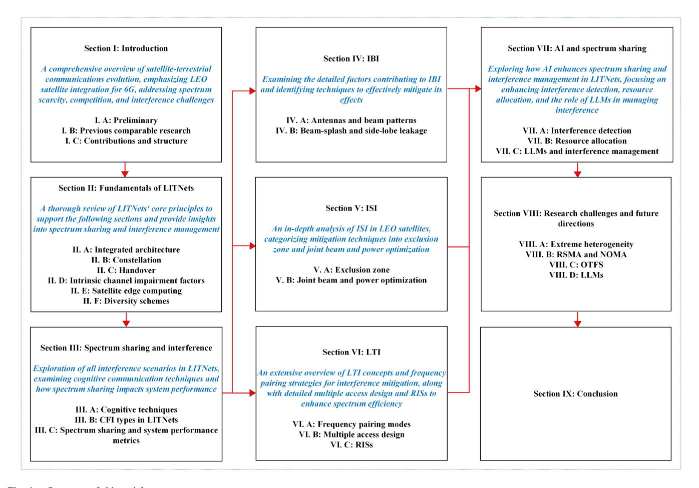

Fig. 1. Structure of this article.

as unified terminal devices allow access to both networks using common physical-layer protocols. LITNets can also play a critical role in regions where TN signals are insufficient or weak. This approach, referred to as the *enhanced architecture* and illustrated in Fig. [2,](#page-6-1) eliminates the rigid separation between satellite and terrestrial users. Dual-mode terminals enable seamless access to both networks, allowing users to connect to either the satellite or terrestrial network based on preferences or switch automatically depending on signal strength and service requirements. In scenarios where full cooperation is possible, simultaneous transmission over both networks can enhance communication reliability and capacity through spatial diversity [\[24\]](#page-27-23), [\[25\]](#page-27-24), [\[26\]](#page-28-0).

The integrated satellite-terrestrial network extends coverage to rural and remote areas, connecting underserved populations and IoT devices. It also boosts maritime communication by linking remote sea regions and supporting IoT applications. Furthermore, it ensures uninterrupted broadband access for airborne networks, including airplanes, UAVs, and balloons, while offering reliable communication during emergencies when terrestrial infrastructure may be compromised. Additionally, it enhances multicast and broadcast transmission efficiency, optimizing the distribution of multimedia content to diverse user groups [\[25\]](#page-27-24).

*Lessons Learned:* While 5G networks rely on a 2-dimensional terrestrial architecture with limited coverage,

6G needs a more advanced 3-dimensional approach to meet future demands. With their lower orbit height and reduced transmission delays and PLs, LEO satellites are essential for enhancing global coverage, communication capacity, and reliability.

# *B. Constellation*

Constellations are collections of satellites arranged within orbital planes. Satellites within the same orbital plane follow identical trajectories and are evenly distributed throughout the orbit. Another concept is Orbital Shells, which denote a cluster of orbital planes deployed at nearly identical altitudes, with a slight difference of a few kilometers, known as Orbital Separation. Constellations, or more specifically orbital shells, primarily comprise three types: Walker Delta (Rosette), Walker Star, and mixed geometry. The Walker Delta constellation consists of inclined orbits with inclinations less than 60◦, uniformly distributed within 360◦. Conversely, the Walker Star constellation features inclinations of approximately 90◦ (nearly-polar orbits), evenly distributed within 180◦. Walker Delta orbital shells do not extend to the polar regions, ensuring that satellites remain concentrated in more densely populated areas. Note that increasing the number of satellite orbits raises the risk of collisions. Therefore, a minimum difference of 4 km between the altitudes of the orbital

TABLE II TABLE OF IMPORTANT ACRONYMS

| Acronym | Full Form                                                | Acronym | Full Form                                 |
|---------|----------------------------------------------------------|---------|-------------------------------------------|
| LITNet  | LEO satellite-Integrated Terrestrial Network             | TN      | Terrestrial Network                       |
| NTN     | Non-Terrestrial Network                                  | CR      | Cognitive Radio                           |
| ISI     | Inter-Satellite Interference                             | IBI     | Inter-Beam Interference                   |
| LTI     | LEO satellite-Terrestrial infrastructure Interference    | RSMA    | Rate-Splitting Multiple Access            |
| LEO     | Low Earth Orbit                                          | CFI     | Co-Frequency Interference                 |
| ITU-R   | International Telecommunication Union-Radiocommunication | IMT     | International Mobile Telecommunication    |
| QoS     | Quality of Service                                       | LoS     | Line-of-Sight                             |
| MIMO    | Multiple-Input-Multiple-Output                           | PL      | Path Loss                                 |
| GSO     | Geostationary Orbit                                      | NGSO    | Non-Geostationary Orbit                   |
| MEO     | Medium Earth Orbit                                       | HEO     | Highly Elliptical Orbit                   |
| UE      | User Equipment                                           | ISL     | Inter-Satellite Link                      |
| VSAT    | Very Small Aperture Terminal                             | SINR    | Signal-to-Interference-and-Noise Ratio    |
| DRL     | Deep Reinforcement Learning                              | FCC     | Federal Communications Commission         |
| NR      | New Radio                                                | URLLC   | Ultra Reliable Low Latency Communications |
| CSI     | Channel State Information                                | iCSI    | instantaneous Channel State Information   |
| OTFS    | Orthogonal Time Frequency Space                          | SNR     | Signal-to-Noise-Ratio                     |
| RIS     | Reconfigurable Intelligent Surface                       | FSO     | Free-Space-Optical                        |
| MEC     | Multi-access Edge Computing                              | FR      | Frequency Reuse                           |
| INR     | Interference-to-Noise Ratio                              | EZ      | Exclusion Zone                            |
| ВНТР    | Beam Hopping Time Plan                                   | RSRP    | Reference Symbol Received Power           |
| FDD     | Frequency Division Duplex                                | TDD     | Time Division Duplex                      |
| gNB     | Next generation Node B                                   | BS      | Base Station                              |
| OMA     | Orthogonal Multiple Access                               | NOMA    | Non-Orthogonal Multiple Access            |
| SDMA    | Space Division Multiple Access                           | GG      | Ground Gateway                            |
| ED      | Energy Detection                                         | MFD     | Matched Filter Detection                  |
| CFD     | Cyclostationary Feature Detection                        | LLM     | Large Language Model                      |

planes is required [\[27\]](#page-28-1), [\[28\]](#page-28-2). Fig. [3](#page-7-0) illustrates the geometric arrangements of both the Starlink and OneWeb constellations, while Fig. [4](#page-7-1) showcases the progressive growth of the Starlink constellation [\[29\]](#page-28-3), [\[30\]](#page-28-4), [\[31\]](#page-28-5). With the increase in the number of LEO satellites, as depicted in Fig. [4,](#page-7-1) understanding these satellites' formation, movement, and spacing within a constellation is paramount for anticipating potential interference scenarios and developing spectrum management strategies. Del Portillo [\[32\]](#page-28-6) provided an overview of the TN and NTN segments and a detailed comparison of additional aspects for each constellation. Liu et al. [\[33\]](#page-28-7) presented a lightweight simulation for an ultra-dense LEO satellite constellation network

aimed at 6G. Reference [\[34\]](#page-28-8) presents initial measurement results and observations on Starlink, the largest LEO satellite constellation, focusing on end-to-end network characteristics for worldwide Internet coverage. Additionally, it examines Starlink's bent-pipe relay strategy and its constraints, specifically concerning cross-ocean routes.

*Lessons Learned:* Satellite constellations are organized into orbital planes with specific patterns, such as Walker Delta and Walker Star, each offering different coverage and inclination characteristics. These constellations help provide global coverage but require careful planning of orbital spacing to avoid collisions. As the number of satellites increases,

TABLE III REVIEWED ARTICLES ON THE FUNDAMENTALS OF LITNETS

| Classification                 | Reference | Summary                                                                                                     |
|--------------------------------|-----------|-------------------------------------------------------------------------------------------------------------|
|                                | [22]      | Review of NTNs' evolution, role in 6G, key NTN-TN integration aspects, architectures, and technologies      |
| Architecture and constellation | [25]      | Review of integrated satellite-terrestrial networks for 6G, covering architecture, design, and applications |
|                                | [32]      | An overview of the TN and NTN segments and a detailed comparison of each constellation's aspects            |
|                                | [33]      | A lightweight simulation for an ultra-dense LEO satellite constellation network designed for 6G             |
|                                | [34]      | Measurement results and observations on Starlink, the largest LEO satellite constellation                   |
|                                | [37]      | Analysis of handover techniques for satellite-to-ground links                                               |
|                                | [39]      | A time-based graph where vertices denote satellite instances within a specific timeframe, and edge weights  |
|                                |           | represent customizable handover criteria                                                                    |
|                                | [40]      | An overview of conditional handover signaling challenges related to NTN coverage and mobility               |
| Handover                       |           | functionalities                                                                                             |
|                                | [41]      | Exploring the impact of expanding mega-LEO satellite constellations on handovers                            |
|                                | [42]      | Presenting a DRL handover protocol designed to tackle the ongoing challenge of extended propagation         |
|                                |           | delays in handover procedures                                                                               |
|                                | [48]      | Examination of existing channel models for LEO satellite communication                                      |
|                                | [49]      | A DL-based CSI prediction scheme designed to address channel deterioration issues                           |
| Channel modeling               | [50]      | The design of a physical random access channel preamble specific to NTN                                     |
| Chainer modering               | [55]      | Presenting methods for modeling weather attenuation                                                         |
|                                | [56]      | A hybrid FSO/RF transmission strategy in which the satellite dynamically chooses between FSO and RF         |
|                                |           | links based on real-time weather data                                                                       |
|                                | [58]      | Classification and examination of MECs into four categories: aerial, vehicular, spatial, and maritime       |
|                                |           | nodes                                                                                                       |
| Satellite edge computing       | [67]      | Proposing strategies for effectively deploying services on satellite edge computing nodes to guarantee      |
|                                |           | robust service coverage despite resource constraints                                                        |
|                                | [61]      | A framework for categorizing potential failures in LEO satellite edge computing                             |
|                                | [65]      | A novel architecture for satellite networks that utilizes distributed massive MIMO technology to connect    |
|                                |           | ground user terminals to a cluster of LEO satellites                                                        |
| Diversity schemes              | [66]      | Leveraging distributed massive MIMO methods to enhance the data rates of handheld devices, aiming to        |
|                                |           | boost their broadband connectivity by taking advantage of high-speed ISLs and the ultra-dense deployment    |
|                                |           | of LEO satellites                                                                                           |

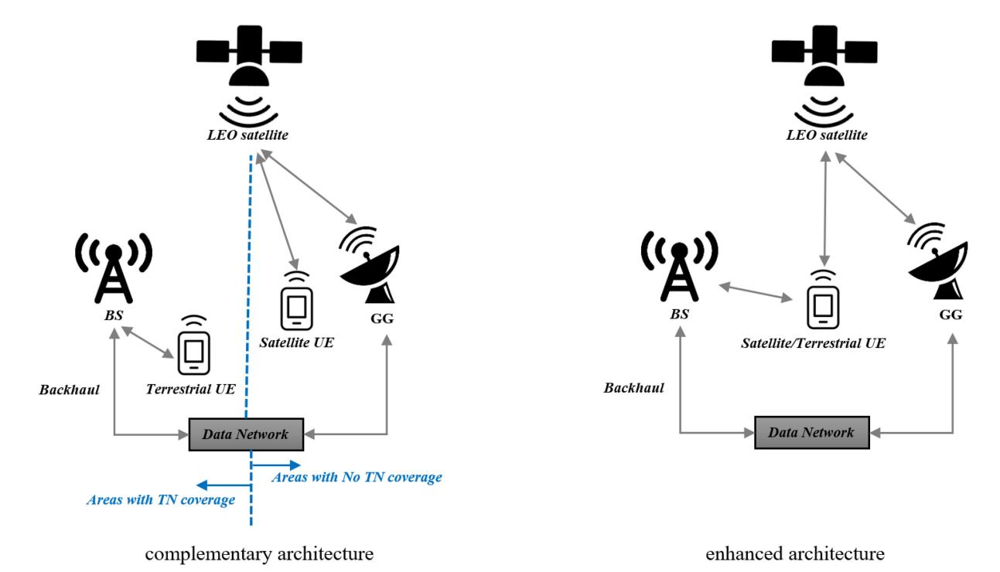

Fig. 2. LITNets architecture [\[25\]](#page-27-24).

understanding their arrangement and movement becomes crucial for managing interference and optimizing spectrum use.

#### *C. Handover*

In TNs, the focus lies in ensuring service continuity for UEs within fixed cells, while LEO satellites offer high-speed moving cells on Earth [\[35\]](#page-28-9). Due to the high orbital velocities

of LEO satellites, the time duration for a UE to remain within a spot beam, i.e., the fast-moving cell, is only a few minutes, resulting in frequent handovers. With a large number of UEs within these moving cells, the handover process can be degraded. Therefore, efficiently executing handovers is crucial to minimize interruptions in link connections and, consequently, for effective spectrum management. Three types

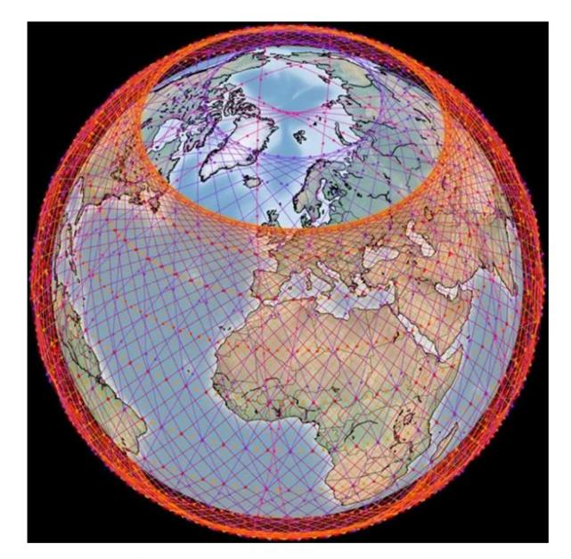

Fig. 3. Geometries of the Starlink and OneWeb constellations [\[30\]](#page-28-4).

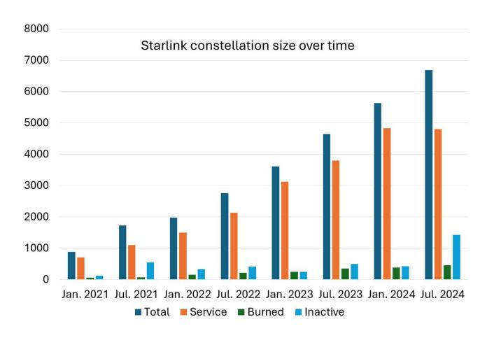

Fig. 4. The growing size of the Starlink constellation over recent years [\[31\]](#page-28-5).

of handovers can occur: **intra-satellite handover**, which happens between different beams of the same satellite due to the high-speed movement of the beam footprint on earth; **inter-satellite handover**, which takes place between satellites; and **vertical handover**, occurring between satellites from different constellations in LITNets, or between LEO satellites and BS, or vice versa [\[36\]](#page-28-10), [\[37\]](#page-28-11), [\[38\]](#page-28-12). In [\[37\]](#page-28-11), three handover strategies are proposed: *Closest satellite*, which ensures constant connection from the ground station to the nearest satellite; *Maximum visibility*, where the ground station connects to the satellite with the longest remaining visibility duration; and *Signal-to-Interference-and-Noise Ratio (SINR)- Threshold*, triggering a handover if the received SINR falls below a predefined threshold relative to a reference value. Hozayen et al. [\[39\]](#page-28-13) constructed a time-based graph where vertices represent instances of satellites over a specific time frame, while edge weights represent customizable handover

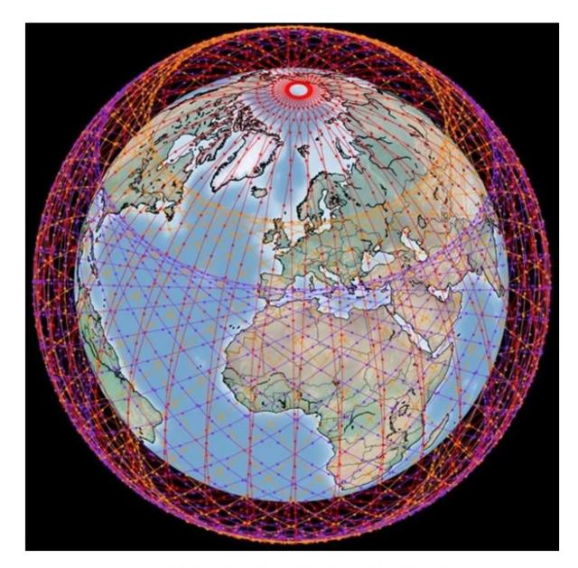

criteria (e.g., data rate and delay). The optimal sequence and timing of handovers to meet the required QoS are determined by finding the shortest path in the graph.

Conditional handover is specified in 3GPP Rel-16 for TN but cannot be directly employed in NTN to tackle mobility challenges. Consequently, novel enhancements are necessary. Reference [\[40\]](#page-28-14) provides an outline of conditional handover and discusses signaling challenges with respect to NTN coverage and mobility functionalities, along with potential remedies. Reference [\[41\]](#page-28-15) investigates the impact of growing mega-LEO satellite constellations on handovers. It focuses on establishing conditions for seamless coverage and analyzing trade-offs between handover times, satellite coverage time duration, and system performance. Reference [\[42\]](#page-28-16) introduces a Deep Reinforcement Learning (DRL) handover protocol designed to address the ongoing issue of extended propagation delays during handover procedures.

*Lessons Learned:* Efficient handover execution is essential to prevent link interruptions and ensure effective spectrum management. Three key handover strategies—closest satellite, maximum visibility, and SINR-threshold—are designed to address these challenges [\[37\]](#page-28-11). However, the conditional handover mechanism from 3GPP Rel-16, while effective in TNs, is inadequate for NTNs due to unique mobility challenges. Reference [\[40\]](#page-28-14) outlines conditional handover tailored for NTNs.

#### *D. Intrinsic Channel Impairment Factors*

Regardless of external interference from other satellites or terrestrial infrastructure, channel impairments themselves can be categorized as follows:

• **Propagation delay:** 5G New Radio (NR) operates under the assumption of relatively short distances between UEs and BSs, with a maximum of 300 km. However, in LITNets, communication distances for a LEO satellite at 1200 km altitude and a 10◦ elevation angle can extend up to 3100 km, resulting in a round-trip delay of 20.89 ms [\[35\]](#page-28-9). Compared to TNs, the increase in propagation delays in LEO satellite networks presents challenges in meeting the end-to-end requirements specified by 5G NR [\[43\]](#page-28-17). This propagation delay affects the latency experienced by UEs, requiring spectrum management strategies to minimize latency while ensuring efficient utilization of available spectrum. It is worth mentioning that the requirements set by 3GPP for Ultra-Reliable Low Latency Communications (URLLC) cannot be met in satellite communications due to propagation delays [\[44\]](#page-28-18). The propagation delay is calculated using the real-time location of the UE and satellite ephemeris data for each time snapshot [\[45\]](#page-28-19).

• **Doppler shift:** Doppler shift refers to the change in carrier signal frequency due to the motion of the receiver, transmitter, or both and is determined by the carrier frequency and the respective velocities of the LEO satellite and UE. Doppler variation, also called Doppler rate, which indicates fluctuations in Doppler shift over time, is determined as:

$$\Delta F = F_o \cdot V \cdot \cos(\theta)/c \tag{1}$$

where *Fo* is the nominal carrier frequency, *c* is the speed of light, *V* denotes the velocity of UE, and θ is the angle between the velocity vector *V* of the mobile (transmitter or receiver) and the direction in which the signal propagates between the LEO satellite and the UE. The Doppler effect introduces time-varying frequency deviations, complicating the channel estimation process and necessitating higher channel estimation overheads. These frequency fluctuations must be considered in spectrum management strategies to optimize spectrum usage effectively and maintain the reliability of communication links [\[46\]](#page-28-20), [\[47\]](#page-28-21). Motivated by these complexities in LEO channel modeling and the diverse range of link conditions and scenarios, [\[48\]](#page-28-22) investigates an analysis of existing channel models documented in the open literature. Acquiring precise instantaneous Channel State Information (iCSI) presents challenges due to dynamic propagation environments and delay. In [\[49\]](#page-28-23), a Deep Learning (DL)-based Channel State Information (CSI) prediction scheme is introduced to address channel deterioration concerns. Prolonged propagation delays and Doppler shifts require a reassessment of the NR physical layer, specifically the physical random access channel, which was not originally engineered to tolerate large carrier frequency offsets. Reference [\[50\]](#page-28-24) discusses the rationale for the design of an NTN-specific physical random access channel preamble.[1](#page-8-0)

• **Atmospheric attenuation:** Atmospheric attenuation in the slant pat[h2](#page-8-1) of the user link disrupts the signal-tonoise-ratio (SNR) of the user link, influencing the bit error rate and the data transmission succession rate, resulting in lower link availability [\[50\]](#page-28-24), [\[51\]](#page-28-25). The link availability, which evaluates the system's ability to provide specific services to UEs, is determined as:

$$A = E \left[ \frac{t_{\text{uptime}}}{\left(t_{\text{uptime}}\right) + \left(t_{\text{downtime}}\right)} \right], \tag{2}$$

where *t*downtime and *t*uptime are random variables representing the time periods during which the system is unable and able to fulfill UE service requirements, respectively. Here, *E* denotes the expectation operation [\[52\]](#page-28-26). Total atmospheric attenuation is the result of various factors and is influenced by multiple sources. The factors recommended by ITU-R include but are not limited to, rain attenuation, cloud attenuation, gaseous attenuation, etc. Once the satellite position and atmospheric conditions are established, the carrier-to-noise ratio (C/N) in decibels and spectral efficiency in bits/sec/Hz can be calculated [\[53\]](#page-28-27), [\[54\]](#page-28-28). Reference [\[55\]](#page-28-29) presents two methodologies for modeling weather attenuation: one method employs model-based DL to forecast the weather, while the other uses a statistical channel simulator to generate PL as a random process in time series. It is mandatory to find solutions to mitigate the effects of atmospheric attenuation. Inspired by the complementary interaction between Free-Space-Optical (FSO) and Radio Frequency (RF) communication, Yahia et al. [\[56\]](#page-28-30) introduced a hybrid FSO/RF transmission strategy, where the satellite dynamically selects between FSO and RF links based on real-time weather data, thus improving context awareness.

*Lessons Learned:* From the analysis of channel impairments in satellite communication, key lessons were identified regarding the impact of propagation delay, Doppler shift, and atmospheric attenuation. These impairments highlight the importance of effective spectrum management strategies to mitigate latency, optimize spectrum usage, and maintain reliable communication links. The Doppler effect introduces complexities in channel estimation, requiring higher overheads, while atmospheric attenuation, influenced by factors such as rain and cloud cover, directly affects the signal-tonoise ratio, bit error rate, and link availability. Understanding and addressing these challenges are critical for ensuring efficient and reliable satellite communication.

## *E. Satellite Edge Computing*

Multi-access Edge Computing (MEC) has emerged as a foundational concept within terrestrial infrastructure, facilitating content caching, computing offloading, routing, and the implementation of innovative network services. It harnesses resources located at the network's edge, as opposed

1The preamble refers to symbol or signal sequences transmitted at the beginning of data transmission. Its purpose is to assist in synchronization, frame alignment, and channel estimation

2The slant path, also known as the absolute path, is defined as the path between a LEO satellite and a ground station, accounting for the curvature of the earth.

to relying on distant cloud servers. To enhance spectrum management and facilitate traffic offloading in satelliteterrestrial networks, software-defined edge computing can be employed effectively. In order to implement MEC within satellite systems, also referred to as satellite edge computing, it is essential to leverage caching and processing capacities across the network, including BSs connected to satellites, on satellites with on-board processing, and at the LEO satellite GGs. Distributing these tasks enables local operations, thus mitigating propagation and processing delays. Notably, the challenges in adopting satellite edge computing stem from limitations in storage space and processing capabilities [\[57\]](#page-28-31), [\[58\]](#page-28-32), [\[59\]](#page-28-33), [\[60\]](#page-28-34). Reference [\[58\]](#page-28-32) classifies MECs into four categories: aerial, vehicular, spatial, and maritime nodes. It examines each category for shared terminology, node types, network architecture, methodologies, algorithms, and challenges encountered. Furthermore, it explores integrated architectures, wherein different node categories collectively serve as MECs. In [\[57\]](#page-28-31), methods are proposed for efficiently deploying services on satellite edge computing nodes to ensure robust service coverage despite resource constraints. Given the complexities of spatial-temporal system dynamics and the conflict between service coverage and robustness, the authors also proposed a novel online service placement algorithm. Meanwhile, [\[61\]](#page-28-35) offers a taxonomy of failures that might arise in LEO edge computing and discusses their consequences.

*Lessons Learned:* Effective use of edge resources, such as BSs and satellites with onboard processing, is crucial in LEO satellite networks to minimize latency and enhance service efficiency. Implementing satellite edge computing necessitates careful attention to storage and processing constraints, as well as the development of advanced algorithms and methodologies to tackle the spatial-temporal dynamics of these systems.

#### *F. Diversity Schemes*

Capacity issues span the spectrum for LEO satellite systems. Enhancing connectivity involves taking advantage of satellite diversity and assigning distinct channels to each satellite to prevent interference [\[62\]](#page-28-36). Traditional spatial diversity is achieved using the MIMO technique in environments with rich scattering. However, in high-frequency band scenarios, due to the dominance of Line-of-Sight (LoS) links, direct exploitation of MIMO is challenged, resulting in a rank-dominant MIMO channel matrix. Instead, two sources of spatial diversity can be outlined as follows:

• **Multiple LEO satellites as inputs:** This involves coordinating multiple satellites located in different orbits to communicate with the ground segment, ensuring independent channel fading of incoming signals. In this setup, the attenuation of rain on various antenna arrays is considered a source of spatial diversity and is thus mitigated. The varying propagation delays caused by LEO satellites at different altitudes result in the reception of asynchronous signals from multiple LEO satellites in the terrestrial segment. *Matched filtering* can be deployed at the receiver to identify the delay offsets. Subsequently, the filtered

- data can be forwarded to a timing aligner for additional processing using a signal converter.
- **Multiple spot beams per LEO satellite:** Another setup to leverage the spatial domain resources is by generating multiple spot beams through multi-beam antennas. This entails each satellite autonomously deploying a sequence of spot beams, ensuring that the coverage area of each spot beam does not overlap with other spot beams, and can be fully steered [\[63\]](#page-28-37), [\[64\]](#page-28-38).

In [\[65\]](#page-28-39), [\[66\]](#page-28-40), the authors proposed a novel LITNet architecture that uses distributed massive MIMO technology to connect ground UEs with satellite clusters, with the aim of improving broadband connectivity by exploiting the ultradense deployment of LEO satellites and high-speed ISLs. The study explores various aspects of distributed massive-MIMO-based satellite network design, including its benefits, challenges, and potential solutions. Additionally, it assesses the performance of these networks theoretically by deriving closed-form expressions for spectral efficiency and through extensive simulations using real data from a Starlink constellation.

*Lessons Learned:* Traditional spatial diversity employs MIMO techniques in environments with abundant scattering. However, MIMO encounters difficulties in high-frequency bands where LoS links are predominant due to a rankdominant channel matrix. Instead, spatial diversity can be achieved using multiple LEO satellites at various altitudes and multiple spot beams per satellite.

#### III. SPECTRUM SHARING AND INTERFERENCE

As depicted in Fig. [4,](#page-7-1) the satellite population continues to expand, exacerbating the depletion of frequency bands, regarded as non-renewable resources, thereby placing a significant constraint on the future development of spaceearth integration networks. This scarcity of frequency band resources requires various satellite constellations to operate within the same frequency band and carefully share spectrum resources. Consequently, the allocation and sharing of spectrum resources among diverse satellite constellations, particularly those operating on separate orbital planes, become crucial concerns in designing future 6G satellite systems. With the increasing number of satellites and ground users, it will become increasingly routine for multiple satellites in different orbits to overlap to cover the same geographical area. Failure to properly tackle the matter of spectrum sharing among satellites could result in mutual interference and throughput degradation, significantly jeopardizing the stability of LITNets communications and consequently affecting the overall accessibility of the space network. The current spectrum regulations enforced by the Federal Communications Commission (FCC) in the U.S. are notably permissive. When designing the integrated network, we anticipate integrating satellite communications alongside existing terrestrial infrastructure for long-term operation. Consequently, it is imperative to develop advanced technologies specifically tailored to support both terrestrial and satellite communication systems, facilitating seamless integration of this diverse network while effectively

| Classification             | Reference | Summary                                                                                                   |
|----------------------------|-----------|-----------------------------------------------------------------------------------------------------------|
|                            | [72]      | Introducing CR to detect and utilize unused spectrum resources, often referred to as spectrum holes       |
|                            | [75]      | An intelligent resource management scheme within the spectrum management unit encompassing                |
| Cognitive techniques       |           | spectrum sensing, prediction, and allocation to enhance spectrum efficiency across varying user densities |
| Cognitive techniques       |           | (overlay paradigm)                                                                                        |
|                            | [76]      | Enhancing spectrum efficiency in satellite systems to accommodate a large number of IoT devices           |
|                            |           | (underlay paradigm)                                                                                       |
|                            | [79]      | Exploring spectrum sensing techniques, including CFD, MFD, and ED, highlighting their performance         |
| Spectrum sensing           |           | and limitations, especially at low SNR levels                                                             |
|                            | [80]      | An ML approach for cyclostationary spectrum sensing in dual satellite cognitive networks                  |
|                            | [77]      | A joint multi-domain resource-assisted interference management approach for a spectrum-sharing satellite  |
|                            |           | and ground integrated network, which includes a pair of NGSO constellations and several terrestrial base  |
| System performance metrics |           | stations                                                                                                  |
|                            | [84]      | A dynamic spectrum access system intended to facilitate spectrum sharing between TN and NTN in the        |
|                            |           | 2 GHz band, assessing interference caused by spectrum sharing and examining performance metrics such      |
|                            | 1         | as canacity coverage and enectrum utilization efficiency                                                  |

TABLE IV REVIEWED ARTICLES ON SPECTRUM SHARING AND INTERFERENCE

managing interference [\[25\]](#page-27-24), [\[63\]](#page-28-37), [\[67\]](#page-28-41), [\[68\]](#page-28-42), [\[69\]](#page-28-43). While addressing spectrum scarcity, spectrum sharing also introduces significant security challenges, including risks of information leakage and unauthorized access. When multiple users—either primary (licensed) or secondary (unlicensed)—share spectrum, sensitive data, such as user location and usage patterns, can be compromised. Attackers, whether insiders with privileged access or outsiders without permission, can use queries to infer the presence and positions of other users, thus posing privacy risks. Additionally, the open accessibility inherent in spectrum sharing raises the risk of unauthorized link access, potentially resulting in disruptive interference for authorized users. Such unauthorized access undermines system integrity and introduces risks like impersonation, eavesdropping, and message replay. To prevent jamming and other interference-related attacks that could degrade service quality for authorized users, addressing challenges in securing communication and ensuring device compliance is essential. As a result, implementing robust spectrum management protocols and advanced security mechanisms—such as encrypted data, secure device verification, and real-time interference detection—is essential to reduce these risks and protect the integrity and confidentiality of shared spectrum environments [\[70\]](#page-28-44). In this section, we first examine cognitive techniques, followed by an indepth analysis of co-frequency interference types in LITNets. We then explore spectrum sharing and system performance metrics. Table [IV](#page-10-0) summarizes the articles discussed in this section.

#### *A. Cognitive Techniques*

Cognitive techniques enable primary and secondary systems to coexist within a shared spectrum without interference. Wireless networks can operate within the same spectrum band in various configurations, including two/dual satellite networks and hybrid satellite-terrestrial networks [\[71\]](#page-28-45). The concept of Cognitive Radio (CR) was initially introduced by Dr. Joseph Mitola in 1999 [\[72\]](#page-29-0), with the aim of detecting and utilizing unused spectrum resources, commonly referred to as *spectrum holes*. The fundamental principle of CR is to identify and efficiently employ these spectrum holes-frequency bands not used by *primary users*—without disrupting the

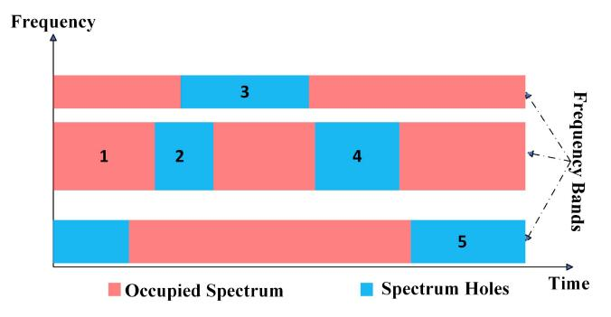

Fig. 5. Spectrum holes and dynamic spectrum allocation fulfilled by CR; a typical scenario.

normal communications of primary users. It is essential for *cognitive users* to vacate the frequency band promptly upon detection of primary user activity, ensuring *dynamic spectrum allocation*, as illustrated by a typical example in Fig. [5.](#page-10-1) The workflow of CR technology encompasses the following sequential steps: spectrum sensing, analysis, decision-making, and handoff [\[72\]](#page-29-0), [\[73\]](#page-29-1).

**The unique features of cognitive satellite communications** that warrant consideration when exploring satellite CR techniques are as follows:

- Additional degrees of freedom are available through polarization and elevation angle adjustments, facilitating the coexistence of terrestrial and satellite networks.
- Uplink transmissions from terrestrial UEs to satellites at low elevation angles are prone to more interference from terrestrial communication systems.
- Limited power in the space results in existing levels of intra-satellite and/or inter-satellite interference.
- • Implementing dynamic spectrum sensing in downlink of satellites poses challenges due to extensive coverage areas and weak levels of signal, even in multispot coverage scenarios.
- Techniques of wideband sensing are necessary for detecting satellite signals in Ka/Ku band, given that spectrum sensing techniques investigated within terrestrial CR contexts may not be applicable.

- The management of resources in satellite CR networks diverges from that of isolated wireless systems due to the non-uniformity of resources, which may not be under the ownership of a single operator.
- When investigating effective coexistence techniques, the directional capabilities of fixed GGs can be leveraged [\[71\]](#page-28-45).

The CR spectrum management modes offer the potential to optimize various aspects of system performance. Prioritizing different systems within the network can lead to a more stable coexistence performance. Moreover, beyond the advantages gained from the dedicated spectrum, the capacity of satellitesatellite GG links can be further enhanced by enabling satellite GGs to function as secondary users accessing the spectrum of GSO/MEO or other existing satellite systems. Substantial reduction in interference to existing WiFi users is achievable when VSAT users act as secondary users to WiFi users. Implementing an unlicensed spectrum sensing protocol for users can facilitate balanced usage of the shared spectrum among different user types. Each of these scenarios underscores the need for satellite GGs and LEO satellites to possess the capability to identify vacant spectrum and understand users' demand within a context-aware environment [\[63\]](#page-28-37), [\[71\]](#page-28-45), [\[74\]](#page-29-2). Two main methods of spectrum sharing have been declared: *Overlay* in [\[75\]](#page-29-3) and *Underlay* in [\[76\]](#page-29-4). In the *Overlay method*, spectrum sharing relies on precise spectrum sensing and prediction as fulfilled by CR. However, there exist blind spots where spectrum sensing and prediction fail to recognize and utilize the spectrum holes. In this case, the spectrum sharing can take place in the absence of spectrum holes through the *Underlay method*, albeit at the expense of introducing CFI [\[77\]](#page-29-5), [\[78\]](#page-29-6).

Spectrum sensing primarily involves Energy Detection (ED), Matched Filter Detection (MFD), and Cyclostationary Feature Detection (CFD). ED is characterized by its low computational complexity and the lack of a need for prior information about the primary user. However, its performance is sensitive to noise uncertainty and deteriorates at low SNRs. MFD offers a short detection duration and high detection accuracy but requires prior knowledge of the primary user. CFD provides good detection accuracy even at low SNRs but is burdened by significant computational complexity and long detection duration [\[79\]](#page-29-7). The study presented in [\[80\]](#page-29-8) introduces a Machine Learning (ML)-based method for cyclostationary spectrum sensing in cognitive dual satellite networks. This novel approach shows strong performance in low SNR scenarios, surpassing the traditional cyclostationary spectrum sensing technique. The classifiers used in this method include logistic regression, softmax regression, decision tree, and support vector machine. Simulation results across a broad range of low SNRs further validate the effectiveness of this ML-based approach. The logistic regression model demonstrates moderate performance, with the probability of detection steadily increasing alongside SNR, approaching 0.9 at higher SNR levels. Similarly, the softmax regression model exhibits comparable performance, with detection probability improving as the SNR rises. In contrast, the support vector machine model excels, closely mirroring the performance of

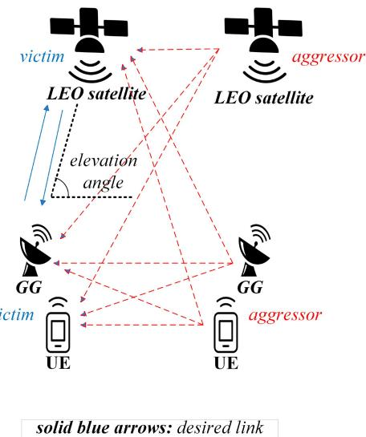

Fig. 6. Interference scenarios between a pair of adjacent LEO satellites and their ground UEs/gateways.

both logistic and softmax regression models, with detection probability approaching 1 at high SNR levels. However, the decision tree model underperforms relative to the others, showing a lower initial detection probability and a slower rate of improvement as SNR increases.

*Lessons Learned:* The concept and workflow of CR is introduced in [\[72\]](#page-29-0), [\[73\]](#page-29-1). When exploring cognitive satellite communications, it is essential to recognize that uplink transmissions from ground-based UEs to satellites at low elevation angles experience heightened interference from terrestrial systems and limited power, exacerbating the overall interference problem. Moreover, detecting Ka/Ku band satellite signals effectively requires wideband sensing, as traditional terrestrial methods may not be sufficient. Additionally, two spectrum sharing methods—Overlay [\[75\]](#page-29-3) and Underlay [\[76\]](#page-29-4) along with three spectrum sensing techniques—ED, MFD, and CFD—have been studied [\[79\]](#page-29-7), [\[80\]](#page-29-8).

### *B. Co-Frequency Interference Types in LITNets*

CFI can arise within beams of the same satellite, termed IBI or intra-satellite interference, between LEO satellites themselves (ISI), and between LEO satellites and Terrestrial Infrastructure (LTI). As previously mentioned, interference among LEO, MEO, HEO, and GSO satellites has been studied in the literature, but it falls outside the scope of this article. Consequently, in the following sections, we focus on IBI, ISI, and LTI, and provide a comprehensive analysis of interference mitigation techniques tailored to these specific scenarios. Before exploring the following sections on specific interference types in detail, Fig. [6](#page-11-0) depicts the potential interference scenarios between a pair of adjacent LEO satellites and their ground UEs/gateways *from aggressor* (interfering element) *to victim* (affected element), as outlined in the FCC Technological Advisory Council's report [\[81\]](#page-29-9), which can be categorized and analyzed as follows:

# • Gateway to gateway:

- **–** Zero risk, except when bands are used bidirectionally.[3](#page-12-0)
- **–** Negligible risk if bands are used bi-directionally, provided that gateways are both at ground level, ensuring good angular separation of antenna beams directed at satellites.
- **–** Gateway antennas can be kept at a sufficient distance from each other to mitigate risks.

# • Satellite to gateway:

- **–** Victim satellite interference in downlink transmission co-frequency and in beam alignment with the desired downlink for aggressor satellite received at the gateway.
- **–** Downlink power limited by Power Flux Density (PFD) to protect terrestrial services.
- **–** The signals of both systems may be similar in level due to power limitations.

# • UE to gateway:

- **–** Zero risk, unless bands are used bi-directionally.
- **–** Small risk if bands are used bi-directionally, depending on the distance between UE and gateway.
- **–** Angular separation of antenna beams directed at satellites is crucial, especially when both UE and gateway are at ground level.

# • Gateway to satellite:

- **–** Victim satellite irregularities in uplink transmission from the gateway co-frequency and in beam alignment with the desired uplink for the aggressor satellite.
- **–** Gateways have higher transmit power than UEs.
- **–** Beams may be narrower, but the risk exists.

# • Satellite to satellite:

- **–** Zero risk, except when bands are used bidirectionally, or GG frequency bands are utilized for intersatellite services.
- **–** Limited risk if two applicants propose intra-system intersatellite links, with bilateral coordination being relatively straightforward.

# • Gateway to UE:

- **–** Zero risk, unless bands are used bi-directionally.
- **–** Small risk if bands are used bi-directionally, depending on the distance between gateway and UE.
- **–** The angular separation of the antenna beams is crucial.

# • Satellite to UE:

- **–** Victim satellite interference in downlink transmission co-frequency, in line with desired downlink for aggressor satellite received at UE.
- **–** Downlink power limited by PFD to protect terrestrial services.

# • UE to UE:

- **–** Zero risk, unless bands are used bi-directionally.
- **–** Small risk, depending on the distance between UEs.

3In bi-directional bands, the same frequency band is used for both transmitting (uplink) and receiving (downlink) data.

**–** The angular separation of the antenna beams is crucial.

*Lessons Learned:* The literature identifies three types of CFI in LITNets, which we refer to as IBI, ISI, and LTI in this article. Fig. [6](#page-11-0) presents eight possible interference scenarios involving adjacent LEO satellites and their ground UEs/gateways, demonstrating the impact of the interfering element (aggressor) on the affected element (victim), as detailed in the FCC Technological Advisory Council's report [\[81\]](#page-29-9).

#### *C. Spectrum Sharing and System Performance Metrics*

Spectrum sharing can negatively impact several system performance metrics, such as latency, throughput, and security. Interference levels can affect data transmission timeliness, with high interference potentially causing increased latency and degrading service quality. To mitigate these effects and improve timeliness, spectrum sharing systems should incorporate real-time interference detection and mitigation strategies. These strategies allow for rapid adjustments in transmission parameters, minimizing delay and ensuring efficient spectrum use. Additionally, spectrum sharing can introduce vulnerabilities that might lead to security breaches. Without robust spectrum management protocols, there is a risk of unauthorized access or eavesdropping. Implementing security measures such as encryption and secure authentication protocols is crucial to protect communications [\[82\]](#page-29-10), [\[83\]](#page-29-11). Reference [\[77\]](#page-29-5) examines interference in a scenario involving two LEO constellations and multiple terrestrial BSs. In this case, one LEO constellation, designated as LEO 1, shares its spectrum with the other constellation, LEO 2, and the BSs. Their interference analysis identifies significant CFI. An optimization problem is then formulated to maximize the throughput of LEO 1 while meeting the transmission requirements of LEO 2 and the BSs. Kokkinen et al. [\[84\]](#page-29-12) introduced a dynamic spectrum access system to share the spectrum between TN and NTN in the 2 GHz band. Their study analyzes interference resulting from spectrum sharing and investigates performance metrics, including capacity, coverage, and spectrum utilization efficiency.

*Lessons Learned:* Spectrum sharing systems require realtime interference detection and mitigation to promptly adjust transmission parameters, minimizing delays and enhancing spectrum efficiency. Furthermore, robust spectrum management should incorporate encryption and secure authentication to safeguard against security breaches, such as unauthorized access and eavesdropping.

#### IV. INTER-BEAM INTERFERENCE (IBI)

#### *A. Antennas and Beam Patterns*

The predominant approach to designing multibeam satellite systems typically adopts a regular beam pattern offered by passive traditional antennas, characterized by fixed spot beam width across all beams. This standardized layout brings notable advantages by reducing the complexity of optimization procedures. For example, it facilitates the implementation of simple Frequency Reuse (FR) schemes, effectively minimizing IBI. However, some beams may cover densely populated

| TABLE V                  |  |  |  |
|--------------------------|--|--|--|
| REVIEWED ARTICLES ON IBI |  |  |  |

| Classification Reference           |      | Summary                                                                                                |  |  |
|------------------------------------|------|--------------------------------------------------------------------------------------------------------|--|--|
|                                    | [85] | Advantages and design considerations of active phased array antennas, along with an implemented        |  |  |
| Antennas and beam patterns         |      | antenna architecture for multi-beam applications                                                       |  |  |
|                                    | [87] | Recent advancements in phased array antennas, including the integration of metamaterial technology     |  |  |
|                                    | [82] | Examining the reliability issues confronting LEO satellites, particularly side-lobe leakage as a cause |  |  |
| Beam-splash and side-lobe leakage  |      | of IBI, and suggesting transmit precoding as a mitigation strategy                                     |  |  |
| Beam-spiasii and side-tobe leakage | [89] | Analyzing the beam-splash, conducting link budget assessments, and suggesting beam-nulling             |  |  |
|                                    |      | techniques to reduce interference                                                                      |  |  |

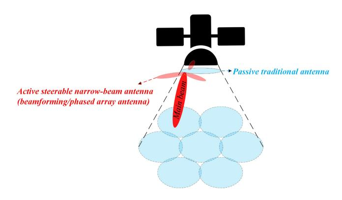

Fig. 7. Active and passive antennas.

regions with high throughput demands, whereas narrow penciltype beams with high antenna gains seem to be a promising solution. Active steerable narrow-beam antennas that facilitate beamforming technology through phased antenna arrays have been proven to be highly effective in tracking high-demand regions, as demonstrated in studies such as [\[85\]](#page-29-13). Meanwhile, passive antennas provide basic coverage across the broader field of view, as illustrated in Fig. [7.](#page-13-0) Therefore, optimizing the time/frequency plans for steerable beams is mandatory to prevent IBI [\[86\]](#page-29-14), [\[87\]](#page-29-15), [\[88\]](#page-29-16).

#### *B. Beam-Splash and Side-Lobe Leakage*

IBI is introduced by the side-lobe leakage of LEO satellite antennas and the beam splash of the LEO satellites on the ground, which is extensively discussed in [\[89\]](#page-29-17). Transmit precoding techniques can be employed, utilizing channel state information at the transmitter side to mitigate interference from side-lobe leakage and enhance capacity [\[82\]](#page-29-10). To mitigate undesired link degradation resulting from the beam splash issue, Ivanov et al. [\[90\]](#page-29-18) proposed modifying the beamforming network during the beam tracking mode. This involves considering the known locations of ground sites affected by interference and employing zero-forcing precoding, a signalshaping technique that aims to efficiently deliver the desired data stream to each user. Precoding takes advantage of the spatial degrees of freedom provided by multiple antennas and utilizes available data and CSI while effectively managing IBI and improving spectral efficiency. Although zero-forcing precoding has traditionally been applied to GSO satellite systems and implemented in terrestrial infrastructure rather than on the satellite antenna, its effectiveness in adapting to LEO satellite-based solutions has been demonstrated in the

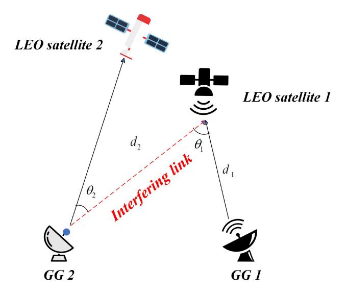

Fig. 8. Fluctuating link distances and angles.

literature [\[53\]](#page-28-27), [\[91\]](#page-29-19), [\[92\]](#page-29-20). Table [V](#page-13-1) provides a summary of the articles reviewed in this section.

*Lessons Learned:* Interference in LEO satellite systems caused by side-lobe leakage can be mitigated using transmit precoding techniques with channel state information. Additionally, modifying the beamforming network during beam tracking, as proposed by Ivanov et al. [\[90\]](#page-29-18), can address beam splash issues by considering ground site locations and employing zero-forcing precoding to enhance signal delivery.

#### V. INTER-SATELLITE INTERFERENCE (ISI)

Consider a scenario involving LEO Satellite 1 with its corresponding GG 1, alongside LEO Satellite 2 with its corresponding GG 2 (Fig. [8\)](#page-13-2). When there is interference between any of these pairs, there is ISI. In typical large constellation scenarios, link distances and angles between links are timevariable due to the large number of LEO satellites as well as their dynamics. As a result, interference among LEO systems varies over time, influenced by the fluctuating link distances and angles (Fig. [8,](#page-13-2) Fig. [9\)](#page-14-0). In this section, we provide a detailed examination of ISI in LEO satellites and categorize the associated mitigation techniques into two main approaches: exclusion zone and joint beam and power optimization. We then discuss LEO satellites' unique challenges in effectively managing ISI [\[19\]](#page-27-18), [\[93\]](#page-29-21). Table [VI](#page-17-0) presents a summary of the articles examined in this section.

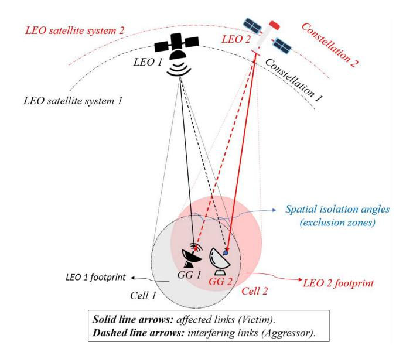

Fig. 9. Spatial isolation angles in downlink interference scenario (for one beam per satellite).

#### A. Exclusion Zone

For large-scale LEO constellation systems, a single GG often accesses multiple satellites, sometimes numbering in the dozens. In the case where LEO satellite system 1, consisting of LEO satellites and GGs, is the first established system, its GGs typically establish communication links with LEO satellites in system 1 using various criteria such as shortest distance, maximum elevation angle, and longest viewing time. The parameter  $\theta_1$  is significantly influenced by the distance between GGs. When the distance between GGs is small,  $\theta_1$ remains small, resulting in an increased gain in receiving interference signals. By solely reducing the power of the interference signal in the  $\theta_2$  direction, we can decrease the cumulative probability of interference over time. However, before proceeding with any further steps, the spatial isolation angle indicated as  $\theta_2$  should be optimized. Assuming that the GG of LEO system 1 adopts a shortest distance link strategy, if the GG of LEO system 2 also employs the same strategy, it could result in harmful interference to LEO system 1, especially when the two GGs are geographically close. Therefore, revising the access strategy of LEO system 2's GG becomes imperative to mitigate the risk of interference with LEO system 1. Optimization of the spatial isolation angle is crucial to minimize interference. An excessively large spatial isolation angle may overly protect the interfered satellite, hindering communication within the satellite system. In contrast, a too-small angle may result in a long-term interference probability that exceeds the ITU-R S.132.3-2 recommendation of 10% for the Interference-to-Noise Ratio (INR) at the receiver of the interfered satellite. Thus, a reasonable spatial isolation angle ensures frequency compatibility between LEO satellite systems. The optimal objective is to minimize  $\theta_2$ , considering thresholds for INR and SINR to restrict changes in link angle caused by LEO system satellite longitude and latitude. If the GG of LEO system 2 establishes communication with its own satellite based on the optimal spatial isolation angle, it can potentially mitigate interference with LEO system 1 satellites. Reference [94] presents a novel approach aimed at mitigating interference by optimizing the spatial isolation angle. Initially, the spatial isolation angle for the GG antenna tracking strategy is determined through the interference analysis mentioned above. Subsequently, a genetic algorithm is employed to address the nonlinear multivariate optimization problem, taking into account constraints such as SINR and INR, to obtain the optimal spatial isolation angle. Finally, the access strategy of LEO system GGs is dynamically adjusted based on the optimal spatial isolation angle. In such cases, the LEO satellite 2 GG must initiate interference mitigation measures, such as disabling and switching the beam (beam hopping). As a result of interference mitigation, the cumulative probability of harmful interference time between LEO systems is significantly reduced [67], [68], [94]. As noted in [19], the same mitigation technique can also be applied to downlink communication (inversion property). While the transmission direction changes, the fundamental principles remain consistent for both the uplink and downlink scenarios [88]. It is worth mentioning that several solution approaches are applicable to this problem, including genetic algorithms [95], [96], greedy algorithms [97], [98], beam search algorithms [99], and the Monte Carlo method [100], [101].

Lessons Learned: GGs generally establish communication links with LEO satellites based on criteria such as shortest distance, highest elevation angle, and longest viewing time. ISI can be mitigated by optimizing the spatial isolation angle, with the access strategy for GGs in the LEO system dynamically adjusted according to the optimal angle, as explored in [94]. It is important to note that ITU-R S.132.3-2 recommends an interference probability of up to 10% for the INR at the receiver of the affected satellite.

#### B. Joint Beam and Power Optimization

To gain a better understanding of interference management in the downlink, this subsection examines downlink interference scenarios, while incorporating more sophisticated assumptions such as beamforming and power allocation. This approach effectively demonstrates the inversion property and is employed to fully address both uplink and downlink scenarios outlined in our article.

We explore a scenario with two LEO satellites from two different constellations, each equipped with switchable multibeam antennas capable of directing signals in specific directions. For simplicity, we focus solely on the co-frequency beams of LEO 1 and LEO 2, assuming only one beam per satellite (inter-constellation interference). As shown in Fig. 9, a spatial isolation angle  $\theta_{LEO1.Gateway1.LEO2}$  between LEO  $1\rightarrow$ gateway 1 and LEO  $2\rightarrow$ gateway 1 is used to detect the event that LEO 2 enters the Exclusion Zone (EZ) of LEO 1. Such an angle is formulated as

$$\theta_{LEO1.gateway1.LEO2} = \arccos\left(\frac{d_{LEO1.gateway1}^2 + d_{LEO2.gateway1}^2 - d_{LEO1.LEO2}^2}{2d_{LEO1.gateway1}.d_{LEO2.gateway1}}\right),$$
(3)

where  $d_{LEO1,LEO2}$  can be expressed by

$$d_{LEO1,LEO2} = \sqrt{(X_{LEO1} - X_{LEO2})^2 + (Y_{LEO1} - Y_{LEO2})^2 + (Z_{LEO1} - Z_{LEO2})^2},$$
(4

where  $\{X_{\text{LEO}1}, Y_{\text{LEO}1}, Z_{\text{LEO}1}\}$  and  $\{X_{\text{LEO}2}, Y_{\text{LEO}2}, Y_{\text{LEO}2}, Y_{\text{LEO}2}, Y_{\text{LEO}2}, Y_{\text{LEO}2}, Y_{\text{LEO}2}, Y_{\text{LEO}2}, Y_{\text{LEO}2}, Y_{\text{LEO}2}, Y_{\text{LEO}2}, Y_{\text{LEO}2}, Y_{\text{LEO}2}, Y_{\text{LEO}2}, Y_{\text{LEO}2}, Y_{\text{LEO}2}, Y_{\text{LEO}2}, Y_{\text{LEO}2}, Y_{\text{LEO}2}, Y_{\text{LEO}2}, Y_{\text{LEO}2}, Y_{\text{LEO}2}, Y_{\text{LEO}2}, Y_{\text{LEO}2}, Y_{\text{LEO}2}, Y_{\text{LEO}2}, Y_{\text{LEO}2}, Y_{\text{LEO}2}, Y_{\text{LEO}2}, Y_{\text{LEO}2}, Y_{\text{LEO}2}, Y_{\text{LEO}2}, Y_{\text{LEO}2}, Y_{\text{LEO}2}, Y_{\text{LEO}2}, Y_{\text{LEO}2}, Y_{\text{LEO}2}, Y_{\text{LEO}2}, Y_{\text{LEO}2}, Y_{\text{LEO}2}, Y_{\text{LEO}2}, Y_{\text{LEO}2}, Y_{\text{LEO}2}, Y_{\text{LEO}2}, Y_{\text{LEO}2}, Y_{\text{LEO}2}, Y_{\text{LEO}2}, Y_{\text{LEO}2}, Y_{\text{LEO}2}, Y_{\text{LEO}2}, Y_{\text{LEO}2}, Y_{\text{LEO}2}, Y_{\text{LEO}2}, Y_{\text{LEO}2}, Y_{\text{LEO}2}, Y_{\text{LEO}2}, Y_{\text{LEO}2}, Y_{\text{LEO}2}, Y_{\text{LEO}2}, Y_{\text{LEO}2}, Y_{\text{LEO}2}, Y_{\text{LEO}2}, Y_{\text{LEO}2}, Y_{\text{LEO}2}, Y_{\text{LEO}2}, Y_{\text{LEO}2}, Y_{\text{LEO}2}, Y_{\text{LEO}2}, Y_{\text{LEO}2}, Y_{\text{LEO}2}, Y_{\text{LEO}2}, Y_{\text{LEO}2}, Y_{\text{LEO}2}, Y_{\text{LEO}2}, Y_{\text{LEO}2}, Y_{\text{LEO}2}, Y_{\text{LEO}2}, Y_{\text{LEO}2}, Y_{\text{LEO}2}, Y_{\text{LEO}2}, Y_{\text{LEO}2}, Y_{\text{LEO}2}, Y_{\text{LEO}2}, Y_{\text{LEO}2}, Y_{\text{LEO}2}, Y_{\text{LEO}2}, Y_{\text{LEO}2}, Y_{\text{LEO}2}, Y_{\text{LEO}2}, Y_{\text{LEO}2}, Y_{\text{LEO}2}, Y_{\text{LEO}2}, Y_{\text{LEO}2}, Y_{\text{LEO}2}, Y_{\text{LEO}2}, Y_{\text{LEO}2}, Y_{\text{LEO}2}, Y_{\text{LEO}2}, Y_{\text{LEO}2}, Y_{\text{LEO}2}, Y_{\text{LEO}2}, Y_{\text{LEO}2}, Y_{\text{LEO}2}, Y_{\text{LEO}2}, Y_{\text{LEO}2}, Y_{\text{LEO}2}, Y_{\text{LEO}2}, Y_{\text{LEO}2}, Y_{\text{LEO}2}, Y_{\text{LEO}2}, Y_{\text{LEO}2}, Y_{\text{LEO}2}, Y_{\text{LEO}2}, Y_{\text{LEO}2}, Y_{\text{LEO}2}, Y_{\text{LEO}2}, Y_{\text{LEO}2}, Y_{\text{LEO}2}, Y_{\text{LEO}2}, Y_{\text{LEO}2}, Y_{\text{LEO}2}, Y_{\text{LEO}2}, Y_{\text{LEO}2}, Y_{\text{LEO}2}, Y_{\text{LEO}2}, Y_{\text{LEO}2}, Y_{\text{LEO}2}, Y_{\text{LEO}2}, Y_{\text{LEO}2}, Y_{\text{LEO}2}, Y_{\text{LEO}2}, Y_{\text{LEO}2}, Y_{\text{LEO}2}, Y_{\text{LEO}2}, Y_{\text{LEO}2}, Y_{\text{LEO}2}, Y_{\text{LEO}2}, Y_{\text{LEO}2}, Y_{\text{LEO}2}, Y_{\text{LEO}2}, Y_{\text{LEO}2}, Y_{\text{LEO}2}, Y_{\text{LEO}2}, Y_{\text{LEO}2}, Y_{\text{LEO}2}, Y_{\text{LEO}2}, Y_{\text{LEO}2}, Y_{\text{LEO}2}, Y_{\text{LEO}2}, Y_{\text{LEO}2}, Y_{\text{LEO}2}, Y_{\text{LEO}2}, Y_{\text{LEO}2}, Y_$  $Z_{\rm LEO2}$ } represent the coordinates of LEO1 and LEO2, respectively, in the earth-fixed earth-centered coordinate system. If the calculated angle  $\theta_{\rm LEO1.gateway1.LEO2}$  is less than  $\theta_{EZ}$ , spectrum sharing between these two satellites is deactivated, and this region is designated as the EZ. It should be noted that optimizing the SINR of a gateway does not substantially increase the interference inflicted on other gateways at the same frequency in each constellation. Likewise, the SINR of a gateway might not be readily influenced when enhancing the SINR of other gateways utilizing the identical frequency. Hence, despite numerous gateways within each constellation, the optimization of the SINR for other gateways can be carried out in a manner similar to that of this gateway. This optimization problem pertains to the coverage provided by a pair of LEO constellations. In areas of overlapping coverage, the attainable SINR relies on both beam scheduling and power allocation, considering traffic conditions, CSI, and transmission requirements. Directly solving such a complex problem, which depends on both coverage analysis and beampower scheduling, presents a notable challenge.

To mitigate interference on LEO 1's gateways due to traffic congestion, the idle beams of LEO 1 and LEO 2 are deactivated. Additionally, active beams from LEO 2 satellites directed towards gateway 1 undergo beam-switching. Specifically, if a satellite, denoted LEO 2', in the LEO 2→gateway 2 path possesses an idle co-frequency beam not covering gateway 1, traffic from LEO 2 is rerouted to LEO 2' with notification to gateway 2. Subsequently, LEO 2' deploys the beam directed towards gateway 2, transmitting data received from LEO 2 to gateway 2. This beam-switching mechanism operates similarly to LEO 1. Algorithm 1 elaborates on the shut-off and switching-based beam scheduling procedure (beam hopping) comprehensively [77], [102].

In a LEO beam hopping satellite system, resources are dynamically allocated to cells containing ground-based gateways. These resources comprise illuminated beams, frequency bands, transmit power levels, and time slots. The satellite controls the downlink beams based on the Beam Hopping Time Plan (BHTP), also known as the beam hopping pattern. However, allocating these resources is interdependent, posing challenges in achieving a globally optimal solution. To address this issue, as depicted in Fig. 10, the resource allocation problem can be divided into three sub-problems: beam hopping, frequency band selection, and transmitting power allocation. The allocation of time slots is merged into the process of resource allocation and is not calculated independently. Each sub-problem is tackled, culminating in the formulation of a comprehensive resource allocation scheme. Each LEO satellite spot beam typically operates with a single carrier occupying either one sub-band or multiple continuous sub-bands to provide broadband coverage. In the Algorithm 1 Beam Shut-Off and Switching (Beam Hopping) [77]

- 1: Assume satellite set  $\phi_1$  covers gateway 1 and the satellite set  $\phi_2$  covers gateway 2.
- 2: Shut-off the co-frequency beams of the satellites in  $\phi_2$  targeting gateway 1 and in  $\phi_1$  targeting gateway 2 if these beams have no active traffic during a given time slot.
- 3: Remove the satellites from  $\phi_2$  targeting gateway 1 and from  $\phi_1$  targeting gateway 2 if their beams are shut off in Step 2
- 4: if idle beams of the satellites in  $\phi_2$  targeting gateway 2 are available and there is an idle beam not covering gateway 1 then
- 5: Switch the interfering beams of the satellites in  $\phi_2$  targeting gateway 1, which have active traffic, to idle beams of the satellites in  $\phi_2$  targeting gateway 2.
- 6: Remove the satellites from  $\phi_2$  targeting gateway 1 if their beams are switched in Step 5.
- 7: **end** if
- 8: **if** idle beams of the satellites in  $\phi_1$  targeting gateway 1 are available and there is an idle beam not covering gateway 2 **then**
- 9: Switch the interfering beams of the satellites in  $\phi_1$  targeting gateway 2, which have active traffic, to idle beams of satellites, similar to Step 5.

10: end if

frequency band selection phase, the total transmitting power  $(P_{\text{tot}})$  of the LEO satellite is evenly distributed among  $N_b$  spot beams, ensuring that the maximum transmitting power per spot beam does not exceed  $P_{\text{tot}}/N_b$ . The frequency band selection problem aims to select the optimal bandwidth and squared transmitting power to maximize transmission capacity for each cell. During each timeslot  $T_{slot}$ , cells are sequentially chosen for illumination based on their requirement of timeslots, arranged in descending order. As illustrated in Fig. 11, when the distance between a cell i and any previously chosen cell, such as j, drops below an interference distance threshold  $D_{IDTh}$ , that cell is skipped, and the next one is considered, until one of the following three conditions is met: a)  $N_b$  cells are selected; b) no cell needs a transmission; c) there is no cell that can be illuminated due to the constraint of  $D_{IDTh}$ . In an illustrative example in Fig. 10, the shared spectrum is partitioned into 7 sub-bands spanning from  $f_1$  to  $f_7$  (It is important to note that the sub-band widths may vary). Each sub-band has an associated maximum transmitting power ranging from  $p_1$  to  $p_7$  for a given cell, denoted as x. We denote  $p_0 = P_{\text{tot}}/N_b$ . Cell transmission capacity x peaks when it operates within subbands  $f_2, f_3, f_4, f_5$  with a corresponding transmitting power  $p_4$ . Consequently,  $f_2, f_3, f_4, f_5$ should be designated as the broadband for serving cell x, with  $p_4$  assigned as the transmission power. However, in practice, the transmitting power allocation for certain cells can surpass  $p_0$ , provided it remains within the maximum transmitting power limit of the broadband utilized by those cells. To fully utilize the total transmitting power, during the

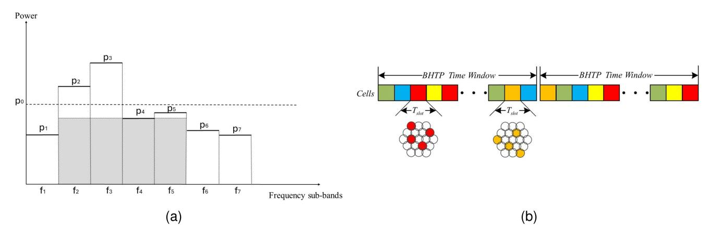

Fig. 10. Resource allocation; (a) Frequency band selection in transmitting power allocation: an example. (b) BHTP [\[107\]](#page-29-31).

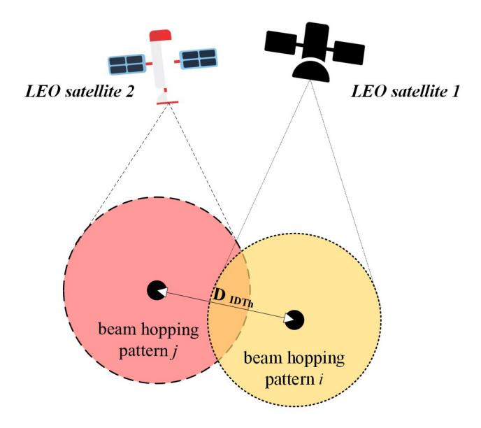

Fig. 11. Interference distance threshold *DIDTh* (for one beam per satellite): an example.

transmitting power allocation phase, the transmitting power of illuminated beams within the same time slot needs adjustment. A straightforward and effective approach involves allocating unused power to cells using the water-filling algorithm. **The resource allocation problem seeks to maximize the total system throughput** [\[103\]](#page-29-32), [\[104\]](#page-29-33), [\[105\]](#page-29-34), [\[106\]](#page-29-35), [\[107\]](#page-29-31)**.** To tackle the challenge of resource allocation, Tian et al. [\[106\]](#page-29-35) proposed a greedy algorithm. Initially, the satellite identifies the cell with the highest traffic demands at time slot *Tslot* and assigns a spot beam to serve the satellite terminals in that cell (Fig. [10\)](#page-16-0). The algorithm then allocates the corresponding power and bandwidth to this beam. Subsequently, the satellite continues to select cells based on their traffic demands and allocates spot beams, power, and bandwidth until the remaining power and bandwidth reach zero. Throughout each iteration, the aggregated frequency and power resources on board are updated accordingly. As the traffic in each cell increases or decreases, cells can be sequentially scanned across the coverage area to meet demand [\[102\]](#page-29-30).

**The unique challenges that LEO satellites face in addressing ISI** are outlined as follows:

- **Dense constellations:** The number of planned LEO satellite constellations is continuously growing, all set to utilize the Ku, Ka, and V frequency bands. This situation becomes notably problematic with the ongoing launch of mega-constellations by companies such as Amazon, and SpaceX, each launching thousands of satellites. As a result, system coexistence is increasingly difficult to manage. With multiple operators vying for the same spectrum, the inevitable consequence is a surge in ISI [\[108\]](#page-29-36).
- • **Doppler shift:** Employing frequency compensation techniques with respect to a reference point within the cell can partially mitigate the common Doppler shift experienced by all UEs. While the reference point experiences no Doppler shift, other locations retain a residual Doppler shift. The intensity of this residual Doppler shift depends on how close the UE location is to the reference point. The variation in residual Doppler shifts among any pair of UEs leads to uplink interference because of the diminished orthogonality of subcarriers. Typically, UEs positioned farther apart experience greater discrepancies in Doppler shifts [\[109\]](#page-29-37).
- • **Dynamic orbital paths:** It is essential to account for dynamic interference environments, where satellite movements along their orbits significantly influence ground user interference over time. Addressing effective allocation of time-frequency channels and maximizing throughput while ensuring interference from other satellites remains below a certain threshold presents a significant challenge in situations where there is no prior knowledge of their channel allocation or statistical information [\[14\]](#page-27-13).
- **Handover:** Throughout the handover process, ensuring minimal disruption or degradation in service for the UE as it transitions between cells is paramount. Therefore, centralizing handover decisions within the central resource manager onboard LEO satellites is essential for cohesive resource management and interference coordination. As satellites move towards higher latitudes, LEO satellites tend to be closer to each other due to orbital dynamics,

TABLE VI REVIEWED ARTICLES ON ISI

| Classification                  | Reference | Summary                                                                                                    |
|---------------------------------|-----------|------------------------------------------------------------------------------------------------------------|
|                                 | [19]      | Proposing a new interference mitigation method for spectral coexistence in large-scale NGSO satellite      |
|                                 |           | systems by optimizing satellite antenna beam pointing while establishing a dynamic exclusion zone          |
| Englasian sans                  | [67]      | Establishing an exclusion zone for LEO satellites, requiring them to disable their beams within the zone   |
| Exclusion zone                  |           | to prevent interference in dynamic spectrum sharing                                                        |
|                                 | [94]      | Introducing a method to reduce uplink interference in NGSO constellation systems by optimizing the         |
|                                 |           | spatial isolation angle                                                                                    |
|                                 | [88]      | Introducing a beamforming and power control-aided interference mitigation scheme for both uplink and       |
|                                 |           | downlink scenarios of a pair of spectrum-sharing LEO satellites                                            |
|                                 | [102]     | Enhancing power gain and spectral efficiency with parallel multibeams while addressing power allocation    |
|                                 |           | for satellite downlinks                                                                                    |
|                                 | [103]     | Exploring the optimization of satellite resource allocation in a spectrum-sharing scenario using a beam-   |
| Joint beam and power allocation | F10.43    | hopping approach                                                                                           |
| 1                               | [104]     | A novel water-filling algorithm for power allocation in OFDM-based systems                                 |
|                                 | [106]     | Developing a beam-hopping-based system tailored for LEO satellite communication to enhance through-        |
|                                 | [107]     | put and resource utilization and introducing a greedy algorithm to solve the resource allocation challenge |
|                                 | [107]     | Proposing a multi-satellite beam-hopping algorithm for load balancing and interference mitigation,         |
|                                 |           | utilizing NGSO constellations with spatial isolation to reduce inter- and intra-satellite interference     |
|                                 |           |                                                                                                            |

potentially resulting in more frequent handover events and increased ISI [\[110\]](#page-29-38), [\[111\]](#page-29-39).

*Lessons Learned:* Optimizing the SINR of one gateway generally does not significantly increase interference for other gateways using the same frequency within a constellation. Similarly, improving the SINR of other gateways on the same frequency might not directly impact a specific gateway's SINR. In areas of overlapping coverage, the achievable SINR is influenced by factors such as beam scheduling, power allocation, traffic conditions, CSI, and transmission requirements. Addressing this complex issue involving coverage analysis and beam-power scheduling is challenging. The overall resource allocation problem, aimed at maximizing total system throughput, is divided into three sub-problems: beam hopping, frequency band selection, and transmitting power allocation. Time slot allocation is integrated into the resource allocation process and not calculated separately. Each subproblem is addressed to develop a comprehensive resource allocation scheme, as explored in [\[102\]](#page-29-30), [\[103\]](#page-29-32), [\[104\]](#page-29-33), [\[105\]](#page-29-34), [\[106\]](#page-29-35), [\[107\]](#page-29-31). Algorithm [1](#page-15-0) details the beam scheduling process (beam hopping), as shown in Fig. [10.](#page-16-0) Managing system coexistence is becoming more difficult as the number of operators competing for the same spectrum increases, leading to higher ISI. Moreover, effective time-frequency channel allocation and throughput optimization are challenging without prior knowledge of other satellites' channel use. Additionally, centralized handover management on LEO satellites is essential for coordinated resource management, especially as satellites move to higher latitudes, increasing handovers and ISI.

# VI. LEO SATELLITE-TERRESTRIAL INFRASTRUCTURE INTERFERENCE (LTI)

The transition from early mobile phones that featured external antennas to the integrated design seen in smartphones marked a significant evolution. Similarly, both satellite operators and consumers stand to gain from the integration of satellite communications into consumer-grade smartphones, eliminating the need for bulky protruding antennas. A series of announcements made in 2022 indicates a rising momentum toward bringing these solutions to market. With that being said, it is worth noting that, in general, a maximum of eight potential LTI patterns can be generated in both satellite and terrestrial systems, which we will study in this section, as illustrated in Fig. [12.](#page-18-0) Table [VII](#page-19-0) consolidates the findings from the articles reviewed in this section.

The objective is to deliver mobile services within the coverage area of a LEO satellite network. Within this architecture, the terrestrial network primarily handles mobile services in densely populated regions, such as urban areas, due to the higher costs associated with deployment and greater capacity. Consequently, operators usually opt for a denser deployment of BSs in cities to accommodate the large volume of users and guarantee robust connectivity. In contrast, in areas with a lower population density, such as suburban and rural regions, operators opt for a sparser BS deployment to minimize costs while maintaining satisfactory service levels. In the envisioned LITNets, mobile services for users in rural areas would be facilitated by LEO satellite networks. To deliver a highthroughput user experience, UE within the coverage area follows a policy of connecting to either a terrestrial BS or the LEO satellite network's BS (i.e., satellite) based on the maximum received signal quality, such as Reference Symbol Received Power (RSRP). This policy also mandates that UE within the TN's coverage area favors the terrestrial network over the LEO satellite network, as outlined in the adjacent channel co-existence study report TR 38.863 [\[112\]](#page-29-40). Presently, frequency bands are commonly categorized into two types: Frequency Division Duplex (FDD) and Time Division Duplex (TDD) bands. In practical terms, most LEO satellite network systems operate under the FDD mode due to the limitation on spectrum efficiency posed by the guard time in the TDD mode, and hence, we only focus on the FDD mode.

In LITNets, each **TN BS** consists of three sectors, each equipped with a planar array antenna typically utilized in 5G gNBs for directional transmission. Directional transmission focuses the signal toward the preferred direction to amplify transmission antenna gain and diminish interference in undesired directions. Following the association of the UE, the optimal beam direction is established through beam measurements to refine the quality of the signal and ensure efficient transmission. The proposed LITNet employs a

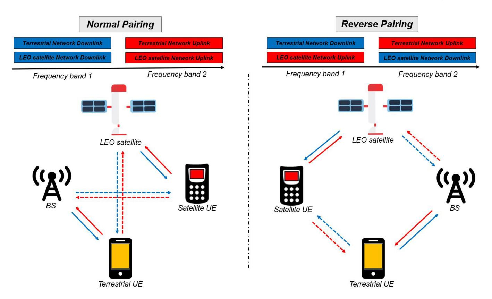

Fig. 12. The architecture of LITNets spectrum sharing system, along with potential operational pairing modes and their corresponding interference patterns. Solid and dashed arrows represent the desired links and interference, respectively.

quasi-earth-fixed LEO satellite with a regenerative payload as the **BS of the LEO satellite network**. Communication satellites can be classified according to their orbital path, beam trajectory, and signal processing capacities. Due to the reduced need for frequent inter-beam handovers, quasiearth-fixed beams, which entail lower signaling overhead, are preferred for servicing links within LEO satellite networks. Within the proposed LITNet, the **UE** is envisioned as a standard handset equipped with Global Navigation Satellite System (GNSS) capability, aligning with the specifications in 3GPP Rel-18 [\[112\]](#page-29-40). The UE can establish connections within the extended coverage of the integrated network, accessing either the terrestrial network (terrestrial UE) or the LEO satellite network (satellite UE).

#### *A. Frequency Pairing Modes*

All eight LTI patterns mentioned earlier in the system are contingent upon the operating pairing modes. **The LITNets adopt two frequency pairing modes: normal pairing and reverse pairing**. In **reverse pairing**, the terrestrial network's downlink spectrum is shared with the LEO satellite uplink, whereas the terrestrial network's uplink spectrum is shared with the LEO satellite downlink. In **normal pairing**, both terrestrial network and LEO satellite network share the same downlink and uplink spectrum (Fig. [12\)](#page-18-0).

Interference from the satellite to terrestrial UE and terrestrial BS and from terrestrial UE and terrestrial BS to the satellite can be regarded as negligible owing to significant distances in these scenarios. Due to the substantial PL of satellite signals during their traverse from space to earth, the downlink signal in a LEO satellite network, transmitted from the satellite to satellite UE on the ground, is much weaker compared to signals in terrestrial networks, such as cellular networks. This weak signal does not typically cause much degradation in terrestrial networks, with the loss in downlink throughput usually being less than 10% in urban areas. Because of this, current research focuses more on studying the uplink scenario in LEO satellite networks. In this scenario, the interferences that affect the satellite receiver come from the terrestrial network.

Spectrum sharing hinges on proficiently mitigating and managing interference, ensuring all systems involved can operate as if they were utilizing dedicated spectrum. Hence, it is crucial to initially assess the origin of interference, with the SINR serving as a significant metric for each system. **For evaluation purposes** outlined in [\[112\]](#page-29-40), [\[113\]](#page-29-41), a snapshot-based system simulator, integrated within the Mediatek 3GPP standard team simulator, was developed and calibrated in accordance with TR 38.863 in Rel-17 [\[112\]](#page-29-40). Both the LEO satellite network and terrestrial network operate in FDD mode with a 100 MHz bandwidth. A multibeam LEO satellite positioned at 600 km altitude, covering a radius of 250 km is simulated. The LEO satellite uses a frequency reuse factor of 3 to mitigate IBI. The BSs of the terrestrial network are strategically placed within the coverage area of the LEO satellite network with a density of 0.1 *BS*/*km*2, inspired by Taiwan. The down-tilt angles for terrestrial network BSs

TABLE VII REVIEWED ARTICLES ON LTI

| Classification          | Reference | Summary                                                                                                                               |
|-------------------------|-----------|---------------------------------------------------------------------------------------------------------------------------------------|
|                         | [112]     | Normal and reverse frequency pairing between TN and NTN in 6G TN-NTN integrated systems                                               |
|                         | [113]     | MediaTek's white paper on emerging 6G technologies for enhancing NTN and analyzing TN-NTN                                             |
|                         |           | frequency pairing                                                                                                                     |
|                         | [16]      | Studying terrestrial network interference on satellites and providing design guidelines to safeguard satellite                        |
|                         |           | services                                                                                                                              |
|                         | [120]     | Research on the interference from 5G cellular systems operating in the sub-6 GHz frequency range,                                     |
| Frequency pairing modes |           | focusing on both co-channel and adjacent channel scenarios                                                                            |
|                         | [121]     | Applying stochastic geometry to analytically determine the performance of NTN-TN integrated networks,                                 |
|                         |           | in two coexistence scenarios                                                                                                          |
|                         | [122]     | Assessment of the frequency reuse scenario by investigating the effects of terrestrial interference on the                            |
|                         |           | uplink of a LEO satellite constellation operating in high-frequency bands                                                             |
|                         | [123]     | Assigning frequency bands for each link, investigating timing schedules for NTN and TN terminals, and                                 |
|                         |           | using a radio map to calculate system interference with reverse pairing effects                                                       |
|                         | [134]     | Demonstrating how multi-user communications and multiple access design for 6G and beyond should be                                    |
|                         |           | closely tied to the core issue of interference management                                                                             |
| Multiple access design  | [143]     | Studying Doppler characteristics in LEO satellite communications to motivate OTFS, followed by a case                                 |
|                         | F1.443    | study evaluating OTFS-enabled LEO satellite reliability                                                                               |
|                         | [144]     | Comparing OFDM and OTFS capacity in a multi-satellite diversity scenario to improve throughput                                        |
|                         | F1.451    | uniformity and system reliability                                                                                                     |
|                         | [145]     | Exploiting RISs in LEO satellite networks to improve link quality, minimize Doppler shift, and reduce                                 |
|                         | F1.461    | interference                                                                                                                          |
|                         | [146]     | Introducing active RIS to address the limitations of passive RIS                                                                      |
| RISs                    | [148]     | Proposing optimal RIS reflection, or passive beamforming, to maximize terrestrial user SINR in the presence of satellite interference |
|                         | [149]     | Introducing the use of RIS in 6G sub-THz networks                                                                                     |
|                         | [150]     | Exploring STAR-RIS potential in Full Duplex systems for future wireless communications, offering                                      |
|                         | [150]     | advanced self interference cancellation capabilities                                                                                  |
|                         |           | advanced sen interference cancenation capabilities                                                                                    |

are set at 10 degrees in urban areas and 3 degrees in rural areas. These terrestrial network BSs offer a maximum directional gain of 17 dBi. Transmission power levels for the satellite and terrestrial network BSs are fixed at 53 dBm and 46 dBm, respectively, while the maximum transmission power of UEs is assumed to be 23 dBm. All UEs adhere to the uplink power control model outlined in Section IX-A of TR 36.942. For each randomly scheduled LEO satellite network UE and terrestrial network UE, 2 resource blocks and 10 MHz uplink bandwidth are allocated, respectively. It is assumed that all UEs are fully buffered. Channel models for the LEO satellite network and the terrestrial network are sourced from Sections 6.6 and 7.4 of TR 38.811 and TR 38.901, respectively. Compared to the independent operation of terrestrial network and LEO satellite systems, a decrease of 10 dB in SINR for LEO satellite downlink and a decrease of 30 dB in SINR for LEO satellite uplink has been observed in the shared spectrum scenario, as depicted in Fig. [13.](#page-20-0) Notably, the impact on the terrestrial network SINR is negligible. In the LEO satellite network downlink, interference originates from the terrestrial network base station, while in uplink, it originates from the terrestrial network device. The interference in the uplink of the LEO satellite network is notably more severe due to numerous terrestrial network devices equipped with omnidirectional antennas transmitting in that uplink. This has directed the researchers' focus toward enhancing the uplink of the LEO satellite network to mitigate interference. This entails examining possibilities arising from changing the uplink interference source, aiming to mitigate any issues caused by the omnidirectional antennas of terrestrial network devices. In [\[113\]](#page-29-41), an additional investigation into the source of the interference was carried out using Monte Carlo simulations. It was found that a significant portion

(up to 90%) of the interference originates from only 33% of the interference sources in the LEO satellite network uplink. This indicates that the substantial variations in SINR between sharing and non-sharing scenarios stem from a few highly influential interference sources, which are not evenly distributed. Consequently, the solution path is narrowed down to targeting and eliminating these critical sources geographically to enhance the performance of the LEO satellite network uplink system. The analysis on interference has provided a perspective into tackling interference mitigation in two ways: (i) altering the source of interference and (ii) physically relocating the source of interference. Altering the interference source can be achieved through a reverse pairing mechanism, where downlink channels share with an uplink channel rather than a downlink, as depicted in Fig. [12.](#page-18-0) Initially, within the LEO satellite network downlink, interference stems from terrestrial BS. Through the implementation of the reverse spectrum pairing scheme, wherein the LEO satellite network uplink concurrently transmits alongside the LEO satellite network downlink, the interference source has shifted to terrestrial network devices. Consequently, interference within the LEO satellite network downlink has been effectively mitigated, restoring the 10 dB SINR drop caused by spectrum sharing in the default/original scheme. Similarly, the interference source in the LEO satellite network uplink shifts from terrestrial network devices to terrestrial network BS with reverse pairing. This transition has marginally enhanced the LEO satellite network uplink SINR by approximately 5 dB, due to the reduced number of base stations (interference sources) compared to the larger number of terrestrial network devices. Additionally, the downward-pointing base station antennas alleviate impact on the LEO satellite network uplink compared to the omni-directional antennas from the devices. It is worth

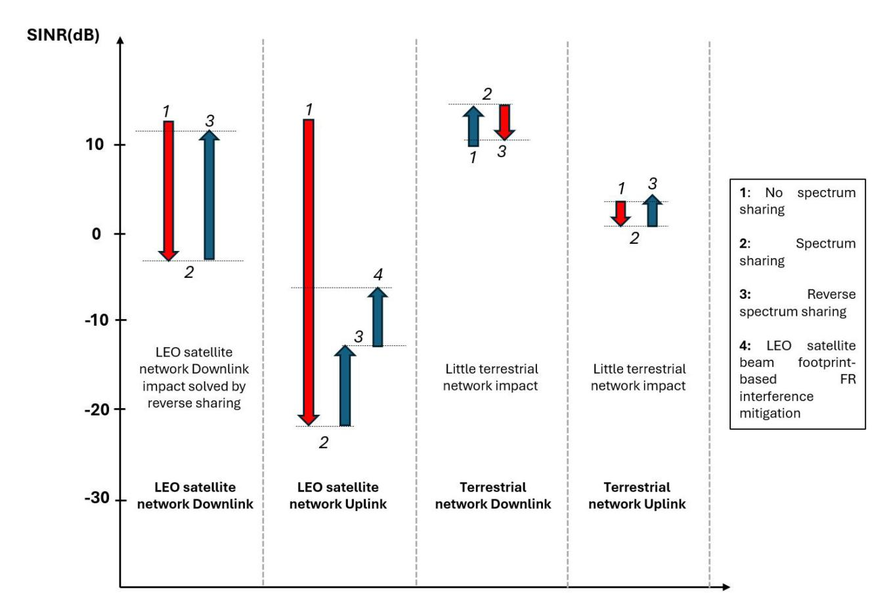

Fig. 13. Average SINR fluctuations due to spectrum sharing [113].

mentioning that deploying reverse pairing, the uplink of LEO satellite networks can still deliver communication services equivalent to cellular networks provided that the elevation angle is high. LEO satellite network UEs at a low elevation angle are more prone to interference from the BS than those at a high elevation angle. Expanding upon the reverse spectrum pairing mechanism and simulation outcomes, a proposition is made for employing beam footprint-based frequency reuse in a LEO satellite network. This approach relies on geometric separation to address interference in the LEO satellite network uplink, recognizing the non-uniform distribution of interference. It takes advantage of the dimensions of the LEO satellite network beam footprint, delineated by its antenna beamwidth. A protective angle is established, within which BSs are prohibited from sharing spectrum but retain the option to utilize distinct frequencies. No base station located within this protective zone is permitted to share the LEO satellite network spectrum. In other words, if the LEO satellite network utilizes frequency  $f_1$ , no BS within the protection zone is permitted to employ  $f_1$  for terrestrial network downlink. However, this improvement remains distant from the 30 dB SINR drop, necessitating further interference mitigation **techniques** in the LEO satellite network uplink [112], [113], [114], [115], [116], [117], [118], [119].

Reference [16] examines CFI and out-of-band leakage power from terrestrial networks to satellites, providing design criteria for terrestrial networks to safeguard existing satellite services. Reference [120] discusses the potential coexistence of C-band spectrum between upcoming 5G cellular systems and a LEO satellite GG receiver. Similarly, [121] explores co-existence considerations with respect to the S-band spectrum. Yastrebova et al. [122] investigated a frequency reuse scenario by assessing the effects of terrestrial interference on the uplink of a LEO satellite constellation in the high IMT frequency bands. They introduced a new analytical framework based on stochastic geometry that can handle different aspects of practical satellite networks. In [123], a radio map is used to calculate the interference between systems, containing data on radio propagation in space for wireless communication. To mitigate interference among UEs, particularly during reverse pairing, terminal scheduling is performed using the radio map. The received signal power from the terrestrial UE, as determined by the radio map, is utilized to ascertain the separation distance between the satellite UE and the terrestrial UE to prevent mutual interference. Itayama et al. [124] suggested a methodology aimed at improving the predictability of the radio environment within LEO satellite networks. This involves the construction of a measurement-based spectrum database for the LEO satellite network, along with the use of a statistical approach to process the observation data within the database. Nakajo et al. [125] developed a database tailored for spectrum management within a 3-dimensional (3D) space, factoring in the altitude of LEO satellites. This expands on existing databases designed

for 2-dimensional (2D) grid squares defined by latitude and longitude.

Further investigations into methods for mitigating interference and enhancing spectrum efficiency in LITNets suggest that joint management of radio resources and interference for spectrum sharing can be divided into four main categories: (1) cooperative strategies [\[126\]](#page-30-9), [\[127\]](#page-30-10), [\[128\]](#page-30-11), [\[129\]](#page-30-12), [\[130\]](#page-30-13), (2) CR spectrum utilization [\[131\]](#page-30-14), [\[132\]](#page-30-15), [\[133\]](#page-30-16), (3) multiple access design [\[134\]](#page-30-17), [\[135\]](#page-30-18), [\[136\]](#page-30-19), [\[137\]](#page-30-20), [\[138\]](#page-30-21), [\[139\]](#page-30-22), [\[140\]](#page-30-23), [\[141\]](#page-30-24), [\[142\]](#page-30-25), [\[143\]](#page-30-26), [\[144\]](#page-30-27), and (4) RIS [\[145\]](#page-30-28), [\[146\]](#page-30-29), [\[147\]](#page-30-30), [\[148\]](#page-30-31). Typically, the investigation of cooperative strategies between LEO satellites and terrestrial networks often employs game theory to analyze or optimize such strategies. For example, Zhang et al. [\[126\]](#page-30-9) explored the concept of cooperative multichannel spectrum sharing in hybrid satelliteterrestrial IoT networks using an auction mechanism. This approach aims to lower the operational costs of the satellitebased IoT network and address spectrum scarcity challenges in the terrestrial-based IoT network. Selected cluster heads from terrestrial-based IoT networks aid in the transmission of primary satellite users by employing cooperative relaying techniques in return for access to spectrum resources. The articles on LITNets on cognitive spectrum explore the application of CR to facilitate spectrum sharing between LEO satellite and terrestrial networks. Power control is of considerable importance within cognitive networks, enabling spectrum sharing among heterogeneous systems. In [\[131\]](#page-30-14), a mathematical framework is introduced for cognitive LEO satellite constellations in conjunction with terrestrial networks, accounting for the dynamic attributes of LEO satellites. Two optimal power control strategies are suggested from both long-term and short-term viewpoints, with the goal of maximizing delay-limited capacity and minimizing outage probability correspondingly. Research on multiple access design in LITNets examines how interference cancellation technology can boost spectral efficiency [\[112\]](#page-29-40), [\[118\]](#page-30-1). The following subsections explore multiple access design and RIS technology.

*Lessons Learned:* In LEO satellite networks, the severity of uplink interference is heightened by the numerous terrestrial devices equipped with omnidirectional antennas. This issue has led researchers to focus on mitigating uplink interference. Two primary strategies have been identified: (i) reverse pairing, which alters the interference source, and (ii) creating exclusion zones by physically relocating the interference source. While reverse pairing allows LEO satellites to deliver services comparable to cellular networks at high elevation angles, low elevation angles still face significant interference. Despite these efforts, more advanced techniques are required to effectively address the substantial SINR degradation, which will be explored in the next two sub-sections.

#### *B. Multiple Access Design*

This subsection examines two significant multiple access schemes within LITNets: RSMA and OTFS.

• **RSMA:** Rate-splitting entails splitting a user's message, such as information bits, into multiple segments,

each capable of independent decoding by one or more receivers. To reconstruct the original message, each receiver must retrieve all the segments. A significant advantage of rate-splitting, including its ability to split messages, is its ability to effectively manage interference between users. Although the concept of rate-splitting first surfaced in the late 1970s and early 1980s information theory literature, there has been a renewed interest in ratesplitting and, consequently, the emerging RSMA over the past decade [\[134\]](#page-30-17). Recently, Clerckx et al. [\[134\]](#page-30-17) provided a tutorial on RSMA [\[135\]](#page-30-18), [\[136\]](#page-30-19), [\[137\]](#page-30-20), [\[138\]](#page-30-21) as an effective multiple access, interference mitigation, and multi-user approach for future communication systems. In this tutorial, they departed from the ongoing debate between Orthogonal Multiple Access (OMA) and Non-Orthogonal Multiple Access (NOMA) [\[139\]](#page-30-22), [\[140\]](#page-30-23) prevalent in 5G, as well as the traditional multi-user linear precoding method employed in Space-Division Multiple Access (SDMA) [\[141\]](#page-30-24), [\[142\]](#page-30-25), multi-user, and massive MIMO in 4G and 5G. Instead, they illustrated how the design of multi-user communications and multiple access for 6G and beyond should be closely linked to the core issue of interference management. Starting from the foundational principles of interference management and rate-splitting, they progressively outlined RSMA frameworks for downlink, uplink, and multi-cell networks. Contrary to previous generations of multiple access techniques (OMA, NOMA, SDMA), RSMA presents numerous advantages:

- 1) Improved spectral, energy, and computational efficiency.
- 2) Universality achieved by consolidating and generalizing OMA, SDMA, NOMA, physical layer multicasting, and multiuser MIMO within a single framework applicable to any number of antennas at each node (Single-Input-Single-Output (SISO), Single-Input-Multiple-Output (SIMO), Multiple-Input-Single-Output (MISO), and MIMO settings).
- 3) Flexibility in handling various interference levels (from weak to strong), network loads (underloaded, overloaded), service types (unicast, multicast), traffic patterns, user distributions (channel directions, and strengths).
- 4) Resilience to inaccurate CSI and mixed-critical quality of service, ensuring robustness.
- 5) Resilience when employing short channel codes and experiencing low latency.

They then investigated how these benefits lead to numerous opportunities for RSMA across more than forty diverse applications and scenarios of 6G, such as network slicing, millimeter wave and terahertz communications, cooperative relaying, physical layer security, reconfigurable intelligent surfaces, IoT, CR, massive access, joint communication and jamming, non-orthogonal unicast and multicast, multigroup multicast, multibeam satellite systems, space-air-ground integrated networks, UAVs, integrated sensing and communications, grantfree access, optical/visible light communications, MEC, machine/federated learning, and more. Finally, they addressed common myths and responded to frequently asked questions, initiating discussions on intriguing future research avenues. Powered by the array of benefits and applications, the tutorial concludes by highlighting the crucial role RSMA plays in next-generation networks, with the aim of inspiring future research, development and standardization of RSMA-enhanced communication for 6G [\[134\]](#page-30-17).

• **OTFS:** The substantial Doppler effect resulting from the high-speed mobility of satellites creates significant discrepancies among the various Doppler effects observed across multipath signals, resulting in significant channel fluctuations over time. When dealing with time-varying channels, the process of channel estimation and precoding becomes considerably more challenging compared to handling time-invariant channels. A method to address this challenge involves utilizing the OTFS modulation scheme. The OTFS technique allows for treating timevariant channels as though they were time-invariant ones, achieved through a transformation process [\[17\]](#page-27-16). Traditional OFDM operates by transmitting data across numerous orthogonal carrier frequencies simultaneously through inverse fast Fourier transform/fast Fourier transform processing at the transmitter/receiver. However, the orthogonality between these carriers is greatly prone to significant Doppler frequency shifts in LITNet scenarios, potentially leading to severe CFI. On the contrary, OTFS modulation utilizes the delay-Doppler domain instead of the time-frequency domain employed by OFDM. These two domains are connected correspondingly via inverse symplectic finite Fourier transform/symplectic finite Fourier transform processing at the transmitter/receiver. This process enables bidirectional mapping between delay-Doppler symbols and time-frequency samples. Via this method the fluctuating attributes of the channel within the time-frequency domain transition into an approximately time-invariant within the delay-Doppler domain, characterized by relatively sparse and resilient channel responses [\[143\]](#page-30-26). Viewing OTFS modulation as a conventional OFDM modulation with appropriately precoded data symbols and subsequent processing at the receiver offers a significant advantage. Specifically, in this scenario, a conventional OFDM transceiver can be repurposed. Given the widespread use of OFDM in wireless standards, this facilitates a seamless transition to OTFS [\[144\]](#page-30-27). The study described in [\[144\]](#page-30-27) compares the practical capacity of OFDM and OTFS modulation in a scenario utilizing multi-satellite diversity. This approach aims to ensure consistent throughput and enhance system reliability against unexpected blockages. The scenario resembles a cell-free system, where each user can be simultaneously served by multiple satellites for improved and stable performance. The numerical findings demonstrate the effectiveness of multi-satellite diversity in enhancing link performance, with OTFS exhibiting superior performance and greater resilience to impairments induced by significant Doppler shifts.

*Lessons Learned:* The focus of this article on RSMA stems from its superior performance compared to earlier multiple access techniques such as OMA, NOMA, and SDMA. RSMA excels in spectral, energy, and computational efficiency. It integrates OMA, SDMA, and NOMA into a unified framework that adapts to various antenna setups (SISO, SIMO, MISO, MIMO). RSMA is versatile in managing varying interference levels, network loads, service types, traffic patterns, and user distributions. It also demonstrates robustness against inaccurate CSI and mixed-quality services while maintaining performance with short channel codes and low latency. Additionally, the high-speed motion of satellites introduces varying Doppler effects and significant channel fluctuations, complicating channel estimation and precoding in timevarying channels. The OTFS modulation scheme addresses this by transforming the channels to appear time-invariant. Unlike OFDM, which operates in the time-frequency domain, OTFS modulation employs the delay-Doppler domain. It achieves a bidirectional mapping between delay-Doppler symbols and time-frequency samples through a specific transform, leading to more stable and sparse channel responses. These characteristics make OTFS particularly suitable for use in multiple access techniques within the resource allocation schemes to enhance spectrum efficiency.

#### *C. RISs*

RISs are a type of intelligent metasurface that can manipulate the propagation of electromagnetic waves. This manipulation is achieved by introducing controlled amplitude changes and/or phase shifts to the reflected signal. Each element of an RIS is composed of micro-electromechanical system switches or microelectronic devices, such as varactors, memristors, and PIN diodes. These elements can be dynamically adjusted to generate specific reflection coefficients. RISs can be classified into two operational modes: active and passive. Due to its passive mode of operation, which does not involve active RF components, a passive RIS element typically consumes zero direct-current power, and any resulting thermal noise is negligible. Active RISs differ from passive RISs because they incorporate amplification circuits to mitigate the multiplicative fading effects that impose constraints on capacity gains. Moreover, two classifications of RIS technologies concerning their reflection/refraction coverage are conventional RIS, which reflects electromagnetic waves solely within half-space coverage, and Simultaneous Transmission and Reflection STAR-RIS. The latter reflects and refracts electromagnetic waves across a complete 360-degree field. The potential advantages of RIS stem from their cost-effectiveness and energy efficiency, attributed to their avoidance of complex signal processing operations, reduced transmission delays compared to relay-based systems, and noise-free design. Effectively managing interference in satellite systems using multiple access techniques necessitates ample spatial resources at LEO satellites. However, due to the extensive coverage areas served by satellites, the number of users within these regions tends to be significantly high. This often leads to user overload, where the number of users exceeds the capacity of transmission antennas. Integrating RISs within the coverage area emerges as a potential solution to mitigate these challenges. Within this framework, RISs can manipulate signal phases to nullify interference and enhance desired signals, redirecting them toward the satellite UEs/GGs. Consequently, employing hybrid beamforming techniques, which optimize both the RIS element phases and the precoders at the LEO satellite, becomes crucial. This approach introduces additional spatial dimensions, effectively improving spectrum efficiency. Mitigating interference between LEO satellite and terrestrial network signals can be achieved by deploying multiple dedicated RISs for LEO satellite UEs/GGs and terrestrial UEs. However, this endeavor poses challenges as it necessitates ensuring precise phase adjustments. The distinct challenges faced by RIS in LEO satellite communications encompass channel estimation, phase uncertainty, mobility management, unified multi-layer architecture, and radiation from electromagnetic interference [\[145\]](#page-30-28), [\[146\]](#page-30-29).

Incorporating RIS into the LEO system is proposed in [\[147\]](#page-30-30) to extend satellite coverage during blockage scenarios. Reference [\[148\]](#page-30-31) suggests maximizing the received SINR of terrestrial UEs by employing optimal reflection, using passive beamforming, particularly in scenarios where interfering satellites are present. In [\[149\]](#page-30-32), a new method is proposed to maximize the coverage of LEO satellites by utilizing RIS within 6G sub-THz networks. The optimization objectives include optimizing associations between satellites and remote user equipment, determining data packet routing in satellite constellations, increasing end-to-end (E2E) data rates, adjusting RIS phase shifts, and controlling the transmit power of ground base stations (i.e., active beamforming). Reference [\[150\]](#page-30-33) investigates the potential of STAR-RIS in Full Duplex (FD) systems for future wireless communications, highlighting a cutting-edge technology that offers effective self-interference cancellation (SIC) for FD systems. The authors leverage the refraction capability of STAR-RIS to boost the transmission capacity of FD systems. At the same time, its reflection functionality is employed to mitigate selfinterference within the FD system.

*Lessons Learned:* RISs can be integrated into the network architecture to adjust signal phases, thereby canceling interference, amplifying desired signals, and directing them toward the receiver. As a result, using hybrid beamforming techniques—optimizing both RIS element phases at the RIS and precoders at the transmitter—becomes crucial. This strategy adds extra spatial dimensions, significantly enhancing spectrum efficiency.

#### VII. AI AND SPECTRUM SHARING

#### *A. Interference Detection*

Interference sensing (or detection) is the initial step in the chain of interference management, which includes detection, classification, localization, and mitigation [\[151\]](#page-30-34). EDs mainly measure the signal energy to identify interference by applying a threshold to the signal power. In dense orbital environments with numerous low-power signals, EDs might lack the sensitivity required to detect hidden or weak interference

amidst background noise. This limited sensitivity can result in missed detections. While CFD can address the limitations of EDs in low SNR environments, they require high computational resources because all cycle frequencies must be calculated. This complexity becomes a challenge in rapidly changing conditions, such as in LEO satellites, where the rapid movement can cause interference to affect the desired signal for a relatively short period of time. Traditional techniques face challenges such as limited adaptability to fast-changing and increasingly crowded satellite environments, necessitating more advanced real-time processing and analysis capabilities. They also rely heavily on external factors, including environmental conditions and signal strength. These challenges underscore the need for more flexible, advanced, and robust interference detection methods as satellite communications evolve.

The shortcomings of conventional interference detection methods have spurred the exploration of advanced ML techniques as potential solutions. The accuracy of an interference detector is vital, as false negatives can greatly reduce SINR and negatively affect QoS. ML is expected to decrease the probability of false detections by 44% compared to traditional methods [\[152\]](#page-30-35). AI algorithms can be categorized based on their learning approach, such as supervised learning, unsupervised learning, and RL. Another classification method is based on the algorithm methodology, distinguishing between the ML and DL algorithms [\[5\]](#page-27-4). Recent advancements in Generative Artificial Intelligence (GenAI), where sophisticated algorithms are trained to generate new, original content, such as recent transformer-based models and Variational Autoencoder models (VAEs), offer promising new approaches to tackling complex interference detection tasks [\[153\]](#page-30-36).

#### *B. Resource Allocation*

References [\[24\]](#page-27-23), [\[154\]](#page-30-37) emphasize the potential of AI techniques in tackling multiple NTN challenges, such as spectrum sharing and interference. They propose AI as a viable solution, using its ability to identify complex correlations among various parameters of the NTN network. Reference [\[155\]](#page-30-38) thoroughly examines LITNets, considering the interference scenarios in the proposed network model. In response to the critical need for intelligent resource allocation linked to network state perception, a DL-based approach for predicting CSI is developed, encompassing predictions for interference duration and atmospheric attenuation. A resource allocation strategy is then crafted based on a complete perception of CSI. The simulation results indicate that the proposed DRL-based resource allocation scheme effectively mitigates interference and increases the constellation's capacity. Yun et al. [\[14\]](#page-27-13) explored strategies for managing interference in LEO satellite networks that deliver downlink services to ground users while sharing the same frequency spectrum. The presence of multiple LEO satellite groups with varying constellation orbits causes ground users to experience time-varying interference due to the overlap of the main and side lobes of satellite beams. This challenge is exacerbated when the interfering satellites lack direct communication capabilities. The study considers two groups of LEO

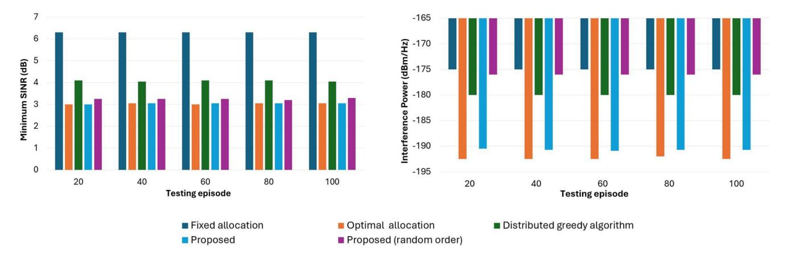

Fig. 14. Results from the stationary satellite scenario simulation [\[130\]](#page-30-13).

satellites that provide communication services to the same geographic area and compete for communication resources. The authors proposed to maximize throughput and maintain timevarying interference within acceptable levels without the need for direct message exchanges between satellite groups. Using statistical learning and DRL techniques, the study introduces learning-based resource allocation schemes and evaluates their performance through simulations. The results demonstrate the effectiveness of these approaches under various reward settings and interference management scenarios, showing that a Deep Q-Network (DQN)-based scheme can achieve nearoptimal performance. Cho et al. [\[130\]](#page-30-13) introduced a multiagent DRL framework for developing a multi-beam uplink channel allocation strategy aimed at minimizing interference with existing stations while adhering to specified QoS constraints. Each beam within the NTN contains 10 randomly distributed UEs. The victim system operates on a single channel in the 29.8-30 GHz frequency band, with an assumed antenna gain of 29 dBi. Table [VIII](#page-24-0) presents the parameters of the NTN system as outlined by 3GPP. The framework employs an innovative approach that sequentially trains agents in a defined order to manage the inherent non-stationarity of multiagent DRL systems. To enhance learning efficiency, the authors design the training sequence based on the reward function and initial state. Consequently, executing actions according to the level of interference with the incumbent station yields better performance than taking actions in a random sequence. Furthermore, the proposed channel allocation method achieves performance comparable to the optimal exhaustive search and surpasses the traditional greedy graph coloring method. The simulation assesses the five percentile UE SINR by running the scenario 1,000 times, accounting for SINR variations due to the random distribution of UEs. The performance of the proposed algorithm is evaluated in both stationary and moving satellite scenarios. Fig. [14](#page-24-1) illustrates the simulation results of different channel allocation methods in the stationary satellite scenario, where the NTN remains fixed at the origin.

# *C. Large Language Models (LLMs) and Interference Management*

The swift progress in LLMs has catalyzed the growth of the Artificial Intelligence Generated Content (AIGC) sector.

TABLE VIII NTN SYSTEM PARAMETERS [\[130\]](#page-30-13)

| LEO Satellite                 |                            |  |  |  |
|-------------------------------|----------------------------|--|--|--|
| Parameter                     | Value [Unit]               |  |  |  |
| Number of beams               | 19                         |  |  |  |
| Number of channels            | 3                          |  |  |  |
| Frequency band                | 29.8-30.2 [GHz]            |  |  |  |
| Channel bandwidth             | 133.3 [MHz]                |  |  |  |
| Altitude                      | 600 [km]                   |  |  |  |
| Antenna diameter              | 0.33 [m]                   |  |  |  |
| Receive antenna maximum gain  | 38.5 [dBi]                 |  |  |  |
| 3 dB beamwidth                | 0.88 [degree]              |  |  |  |
| Antenna pattern               | Section 6.1.1 in TR 38.821 |  |  |  |
| Beam diameter                 | 20 [km]                    |  |  |  |
| Received noise power          | -174 [dBm/Hz]              |  |  |  |
| SINR threshold                | 3 [dB]                     |  |  |  |
| User Equipment                |                            |  |  |  |
| Parameter                     | Value [Unit]               |  |  |  |
| Transmit power                | 2 [W]                      |  |  |  |
| Antenna diameter              | 0.6 [m]                    |  |  |  |
| Transmit antenna maximum gain | 39.7 [dBi]                 |  |  |  |
| Antenna pattern               | ITU-R S.465-6              |  |  |  |

In recent years, generative AI has experienced substantial advancement, with Large Models (LMs) being integrated across diverse fields. Notable language generation models such as ChatGPT by OpenAI, LLaMA by Meta, Gemini by Google, MM1 by Apple, and PanGu by Huawei have achieved considerable milestones. These innovations offer numerous possibilities, including spectrum management for enhancing 6G and future communication technologies. However, the high demands for computational resources and the latency problems linked to these technologies present considerable obstacles, particularly for edge intelligence within 6G networks [\[156\]](#page-30-39).

LLMs are capable of interpreting high-level policies and requirements concerning interference management in LITNets [\[157\]](#page-30-40). These models provide a thorough understanding of network states and potential sources of interference, promoting effective collaboration and coordination among various network entities. LLMs can also mitigate CFI by

| TABLE IX                                     |
|----------------------------------------------|
| REVIEWED ARTICLES ON AI AND SPECTRUM SHARING |
|                                              |

| Classification         | Reference | Summary                                                                                                   |
|------------------------|-----------|-----------------------------------------------------------------------------------------------------------|
|                        | [151]     | Defining AI/ML processing requirements, establishing a reference architecture, analyzing use cases, and   |
|                        |           | evaluating hardware for space AI processors                                                               |
| Interference detection | [152]     | Implementation of ML-driven techniques in operation centers of satellite networks, including interference |
|                        |           | detection                                                                                                 |
|                        | [153]     | Advanced AI models to detect interference, focusing on LEO satellite downlink scenarios                   |
|                        | [131]     | A multi-agent DRL framework for multi-beam uplink channel allocation                                      |
|                        | [24]      | Leveraging AI's capability to uncover complex relationships among various network parameters to address   |
| Resource allocation    |           | the challenges posed by TN-NTN integration in 6G, such as resource allocation                             |
|                        | [155]     | Tackling the need for intelligent resource allocation through network state awareness and developing a    |
|                        |           | CSI prediction method using DL algorithms for LITNets                                                     |
|                        | [156]     | A detailed study of DL's key role in 6G, alongside the rapid growth of AIGC and its impact on the 6G      |
| LLMs                   |           | ecosystem                                                                                                 |
| LLIVIS                 | [158]     | Exploring the impact of integrating LLMs into satellite-terrestrial networks using advanced AI and ML     |
|                        |           | technologies to enhance performance                                                                       |

predicting and recommending optimal power control strategies for LITNets components, such as aerial vehicles and terrestrial BSs, based on real-time interference scenarios. By dynamically adjusting transmit power, LLMs help mitigate CFI while ensuring sufficient signal strength required for reliable communication. Moreover, LLMs can analyze spectrum usage and suggest optimal channel assignments and frequency planning strategies to mitigate interference across LITNets components. Despite their promise, several challenges remain when applying LLMs for intelligent interference mitigation in LITNets, including high computational demands, concerns around trust and security, interoperability issues, and data availability constraints. These challenges can be addressed through approaches like federated training, collaborative learning, explainable AI, and adherence to established standards [\[158\]](#page-30-41). Table [IX](#page-25-0) summarizes the key articles reviewed in this section.

*Lessons Learned:* The limitations of traditional interference detection methods have prompted the exploration of advanced ML techniques as potential solutions. AI has also emerged as a promising tool for intelligent resource allocation, particularly due to its ability to identify complex correlations within NTN networks.

Recent advancements in LLMs have significantly improved the AIGC sector, particularly in managing interference in LITNets. LLMs are highly effective at understanding network states and identifying sources of interference, enhancing collaboration, and mitigating CFI through optimized power control and spectrum management. However, challenges such as high computational demands, concerns around trust and security, issues with interoperability, and data availability constraints must be addressed to fully leverage the potential of LLMs in this context.

#### VIII. RESEARCH CHALLENGES AND FUTURE DIRECTIONS

This section begins with evaluating the spectrum sharing and interference management approaches presented in this paper, focusing on their feasibility and practical applicability. Our analysis addresses key challenges, including implementation complexity and compatibility with current infrastructure. We then explore ongoing research challenges and outline future directions to advance this field.

In the context of spectrum sharing, each interference management strategy presents unique advantages and challenges for applications in LEO satellite networks. *Cognitive spectrum sharing* supports flexible and dynamic access but may increase computational demands for real-time processing. *Frequency pairing modes* facilitate adaptable spectrum usage, especially in regulated or traffic-heavy areas, though they require precise coordination to avoid interference. *Exclusion zones* provide a straightforward approach to isolating interference but suffer from spatial inefficiency. They have scalability limitations in smaller networks or constellation. *Joint optimization of beam and power* significantly boosts spectral efficiency but requires advanced, real-time adaptation, which increases computational demands. Additionally, it relies on advanced beamforming capabilities for optimal performance. *Multiple access design*, such as NOMA and RSMA, promote efficient user access in high-traffic networks but introduce regulatory complexities and increase implementation costs. *RISs* allow innovative control over signal paths, which is particularly useful for interference management in dense urban networks. However, precise channel estimation, high mobility, and multi-layer integration remain challenging. *AI-driven techniques* offer significant potential for interference detection and resource management, with ML improving adaptability in complex interference environments. However, these approaches require considerable data processing capabilities and are challenging to implement effectively for real-time interference management. Selecting an interference management strategy relies on the LEO satellite network's operational needs and regulatory frameworks. Cognitive spectrum sharing and frequency pairing modes work well in adaptable regulatory settings, while exclusion zones suit high-density constellations. Joint beam and power optimization and multiple access designs offer versatile options for managing high traffic. In contrast, RISs and AIenhanced methods deliver advanced solutions for interference control in dense, dynamic environments.

#### *A. Extreme Heterogeneity*

One primary obstacle to achieving a LITNet is its significant heterogeneity, evident across various levels, as elaborated below:

- *1) Radio Propagation Characteristics:* NTNs consist of systems and end devices situated at various altitude layers, each possessing different service attributes. The integration of RF with FSO links exacerbates this heterogeneity. Aligning the service types offered by each layer with user demand requires dynamic management and scheduling of TN-NTN quality of experience, considering the interaction among different layers.
- *2) Node and Device Capabilities:* The discrepancies in capabilities are further accentuated by aerial vehicles designed for widely varying objectives and settings, as well as terminals equipped with antennas that range from compact and isotropic units to active units capable of tracking.
- *3) Ownership and Operations:* The emergence of megaconstellations aimed at expanding Internet coverage using thousands of satellites introduces challenges such as frequency coordination and collision avoidance. Current systems lack compatibility, with each operator having a vertically integrated stack. 3GPP's standardization will be pivotal for facilitating interconnection, leading to more heterogeneous scenarios. Given the ad-hoc design and operation of multiple systems, their decentralized optimization and management could be fundamental in realizing a practical LITNet [\[159\]](#page-30-42).

Optimizing the performance of LEO systems requires effective utilization of available resources, including time, beam hopping, frequency band selection, transmit power allocation and multiple access techniques. When these resources are integrated with service and user management tailored to diverse requirements, numerous opportunities for resource optimization emerge. However, formulating and solving such problems becomes increasingly complex due to the extensive interference concerns, the size of the resource pool, and challenges related to CSI availability. In addition, customized resource management schemes can be designed to align with specific objectives in different satellite systems, e.g., maximizing throughput, minimizing power consumption, decreasing latency, or improving overall QoS [\[160\]](#page-31-0).

#### *B. RSMA and NOMA*

Using particular multiple access techniques can aid in mitigating interference within LITNets. Approaches like NOMA and RSMA concentrate on reducing interference at the receiver's end to amplify SINR. Despite their potential to achieve greater spectral efficiency compared to methods such as FDMA, these techniques often require sophisticated receiver engineering and increased information exchange between receivers and transmitters. Given the extensive coverage area of the NTN system, the introduction of NOMA or RSMA could entail significant signaling overhead, which presents significant challenges. For example, when integrating RSMA into spectrum sharing of TN-NTN within LITNets, it might be necessary for NTN and TN to share specific segments of their data streams. This sharing requires improved coordination and synchronization between NTN and TN. Although the theoretical advantages of NOMA and RSMA are attractive, practical execution, especially with respect to RSMA in NTN-TN spectrum sharing, presents numerous hurdles. When implementing a multiple access approach

such as NOMA or RSMA within LITNets, it is essential to thoroughly examine efficient communication overhead management [\[112\]](#page-29-40).

#### *C. OTFS*

OTFS-based approaches are constructed within the traditional technical framework, often neglecting the transmitted data's semantic content, resulting in limited improvements in data transmission efficiency. Additionally, while OTFSbased schemes demonstrate resilience against Doppler shifts, maintaining link stability in low SNR scenarios remains challenging. Furthermore, when facing particular challenges like transmitting High-Definition (HD) images, OTFS-based solutions are restricted by the dependability of traditional algorithms of image compression, limiting their ability to fully perform their potential. Hence, additional improvements are necessary for OTFS-based LITNets to meet the rigorous requirements of 6G networks [\[161\]](#page-31-1).

#### *D. Large Language Models (LLMs)*

Future research should emphasize the integration of LLMs with DRL techniques to enable continuous, real-time adaptation to dynamic spectrum environments. This proactive approach can lead to significant reductions in interference, enhanced bandwidth utilization, and improved service quality for end-users. Additionally, studies should explore the development of RL algorithms that allow integrated satelliteterrestrial networks to leverage historical data and adjust strategies based on current conditions. Integrating these algorithms with the predictive power of LLMs can enable the anticipation of spectrum usage patterns and environmental changes, leading to more informed and effective decisionmaking. Additionally, LLMs can analyze vast amounts of heterogeneous data from different network sources to uncover patterns and insights that may not be immediately apparent. These insights can subsequently inform RL strategies for optimal resource allocation, ensuring efficient spectrum utilization by balancing factors such as signal strength, user demand, and interference levels.

Future research should also leverage the strengths of LLMs to integrate RIS within integrated satellite-terrestrial networks for improved control and placement. LLMs can be utilized to analyze extensive network and environmental data, providing real-time adjustments to RIS configurations to enhance signal quality and strength. Advanced RL algorithms should enable LLMs to adaptively manage RIS elements based on user interactions and evolving network conditions. This would involve developing models capable of anticipating environmental changes and proactively adjusting RIS settings. Additionally, addressing the computational challenges of realtime RIS control is essential. Further studies should explore the use of edge computing and distributed processing to support the deployment of LLMs in RIS management. It is also vital to ensure that LLM-driven decisions in RIS control are explainable and trustworthy [\[158\]](#page-30-41), [\[162\]](#page-31-2), [\[163\]](#page-31-3), [\[164\]](#page-31-4).

To advance the implementation of mega LEO satellite constellations within 6G LITNets, this article suggests design strategies aimed at enhancing spectrum sharing and interference management. Main approaches include CR techniques to dynamically adapt spectrum usage based on real-time environmental sensing and interference levels, as well as RISs to steer signals and minimize interference. Additionally, employing power control can mitigate CFI with TNs, optimizing transmission power according to channel conditions and link requirements. Multi-beam antenna systems and beamhopping further contribute by providing flexible spectrum use across high-traffic areas while isolating signals to prevent overlap and interference. These strategies, coupled with AIdriven resource allocation, offer a roadmap for efficient and scalable operation of LEO mega-constellations in future communication networks [\[165\]](#page-31-5).

#### IX. CONCLUSION

This article addresses the challenges of spectrum efficiency and interference management in LITNets. The complexities stemming from CFI between satellites themselves, as well as between satellites and TNs, present significant hurdles due to inherent differences in interference characteristics in TNs and NTNs. Traditional interference management methods prove inadequate, necessitating novel approaches tailored to the unique attributes of LITNets. Factors such as long communication distances, rapid orbital speeds of satellites, and limitations in processing capacity within satellite systems exacerbate interference problems. Furthermore, the dynamic nature of satellite systems and densely deployed terrestrial infrastructures further complicate interference management, particularly in urban areas.

In this article, we provide a comprehensive overview of the fundamental aspects of LITNets, delve into the intricacies of spectrum sharing and interference, and examine IBI, ISI, and LTI, along with their respective proposed mitigation strategies. We also explore additional strategies to enhance spectrum efficiency in LITNets, including RSMA and OTFS modulations, each with its distinct characteristics, as well as the utilization of RISs. Finally, we examine how AI, including the latest LLMs, can be used for interference detection and resource allocation in LITNets. By addressing these critical aspects, we aim to enhance comprehension of spectrum efficiency and interference management in LITNets, establishing a foundation for future research and development in this evolving domain.

# REFERENCES

- [\[1\]](#page-0-0) Z. Li, S. Han, M. Peng, C. Li, and W. Meng, "Dynamic multiple access based on RSMA and spectrum sharing for integrated satellite-terrestrial networks," *IEEE Trans. Wireless Commun.*, vol. 23, no. 6, pp. 5393– 5408, Jun. 2024.
- [\[2\]](#page-0-0) Y. Wang, X. Ding, and G. Zhang, "A novel dynamic spectrum-sharing method for GEO and LEO satellite networks," *IEEE Access*, vol. 8, pp. 147895–147906, 2020.
- [\[3\]](#page-0-0) H. Martikainen, M. Majamaa, and J. Puttonen, "Coordinated dynamic spectrum sharing between terrestrial and non-terrestrial networks in 5G and beyond," in *Proc. IEEE 24th Int. Symp. World Wireless, Mobile Multimedia Netw. (WoWMoM)*, Boston, MA, USA, Jul. 2023, pp. 419–424.

- [\[4\]](#page-0-1) W. Xu, Z. Yang, D. W. K. Ng, M. Levorato, Y. C. Eldar, and M. Debbah, "Edge learning for B5G networks with distributed signal processing: Semantic communication, edge computing, and wireless sensing," *IEEE J. Sel. Topics Signal Process.*, vol. 17, no. 1, pp. 9–39, Jan. 2023.
- [\[5\]](#page-0-1) A. Bakambekova, N. Kouzayha, and T. Al-Naffouri, "On the interplay of artificial intelligence and space-air-ground integrated networks: A survey," Jan. 2024, *arXiv:2402.00881*.
- [\[6\]](#page-0-2) I.-K. Fu et al., "Satellite and terrestrial network convergence on the way toward 6G," *IEEE Wireless Commun.*, vol. 30, no. 1, pp. 6–8, Feb. 2023.
- [\[7\]](#page-1-0) S. Yan, X. Cao, Z. Liu, and X. Liu, "Interference management in 6G space and terrestrial integrated networks: Challenges and approaches," *Intell. Converg. Netw.*, vol. 1, no. 3, pp. 271–280, Dec. 2020.
- [\[8\]](#page-1-0) A. Sattarzadeh et al., "Satellite-based non-terrestrial networks in 5G: insights and challenges," *IEEE Access*, vol. 10, pp. 11274–11283, 2021.
- [\[9\]](#page-1-1) M. Höyhtyä et al., "Database-assisted spectrum sharing in satellite communications: A survey," *IEEE Access*, vol. 5, pp. 25322–25341, 2017.
- [\[10\]](#page-1-1) B. Deng, C. Jiang, J. Yan, N. Ge, S. Guo, and S. Zhao, "Joint multigroup precoding and resource allocation in integrated terrestrial-satellite networks," *IEEE Trans. Veh. Technol.*, vol. 68, no. 8, pp. 8075–8090, Aug. 2019.
- [\[11\]](#page-1-1) I. Leyva-Mayorga et al., "LEO small-satellite constellations for 5G and beyond-5G communications," *IEEE Access*, vol. 8, pp. 184955–184964, 2020.
- [\[12\]](#page-1-1) O. Kodheli et al., "Satellite communications in the new space era: A survey and future challenges," *IEEE Commun. Surveys Tuts.*, vol. 23, no. 1, pp. 70–109, 1st Quart., 2021.
- [\[13\]](#page-1-1) D. Peng, D. He, Y. Li, and Z. Wang, "Integrating terrestrial and satellite multibeam systems toward 6G: Techniques and challenges for interference mitigation," *IEEE Wireless Commun.*, vol. 29, no. 1, pp. 24–31, Feb. 2022.
- [\[14\]](#page-1-1) J. Yun, T. An, H. Jo, B.-J. Ku, D. Oh, and C. Joo, "Dynamic downlink interference management in LEO satellite networks without direct communications," *IEEE Access*, vol. 11, pp. 24137–24148, 2023.
- [\[15\]](#page-1-1) H. Al-Hraishawi, H. Chougrani, S. Kisseleff, E. Lagunas, and S. Chatzinotas, "A survey on nongeostationary satellite systems: The communication perspective," *IEEE Commun. Surveys Tuts.*, vol. 25, no. 1, pp. 101–132, 1st Quart., 2023.
- [\[16\]](#page-1-1) B. Lim and M. Vu, "Interference analysis for coexistence of terrestrial networks with satellite services," *IEEE Trans. Wireless Commun.*, vol. 23, no. 4, pp. 3146–3161, Apr. 2024.
- [\[17\]](#page-1-1) J. Heo, S. Sung, H. Lee, I. Hwang, and D. Hong, "MIMO satellite communication systems: A survey from the PHY layer perspective," *IEEE Commun. Surveys Tuts.*, vol. 25, no. 3, pp. 1543–1570, 3rd Quart., 2023.
- [\[18\]](#page-1-1) A. Ahmed, A. Al-Dweik, Y. Iraqi, and E. Damiani, "Integrated terrestrial-wired and leo satellite with offline bidirectional cooperation for 6G IoT networks," *IEEE Internet Things J.*, vol. 11, no. 9, pp. 15767–15782, May 2024.
- [\[19\]](#page-3-0) L. Yin, R. Yang, Y. Yang, L. Deng, and S. Li, "Beam pointing optimization based downlink interference mitigation technique between NGSO satellite systems," *IEEE Wireless Commun. Lett.*, vol. 10, no. 11, pp. 2388–2392, Nov. 2021.
- [\[20\]](#page-3-1) F. Ding, C. Bao, D. Zhou, M. Sheng, Y. Shi, and J. Li, "Towards autonomous resource management architecture for 6G satellite-terrestrial integrated networks," *IEEE Netw.*, vol. 38, no. 2, pp. 113–121, Mar. 2024.
- [\[21\]](#page-3-2) A. Baltaci, E. Dinc, M. Ozger, A. Alabbasi, C. Cavdar, and D. Schupke, "A survey of wireless networks for future aerial communications (FACOM)," *IEEE Commun. Surveys Tuts.*, vol. 23, no. 4, pp. 2833–2884, 4th Quart., 2021.
- [\[22\]](#page-3-2) M. M. Azari et al., "Evolution of non-terrestrial networks from 5G to 6G: A survey," *IEEE Commun. Surveys Tuts.*, vol. 24, no. 4, pp. 2633–2672, 4th Quart., 2022.
- [\[23\]](#page-3-2) D. C. Nguyen et al., "6G Internet of Things: A comprehensive survey," *IEEE Internet Things J.*, vol. 9, no. 1, pp. 359–383, Jan. 2022.
- [\[24\]](#page-4-1) S. Mahboob and L. Liu, "Revolutionizing future connectivity: A contemporary survey on AI-empowered satellite-based non-terrestrial networks in 6G," *IEEE Commun. Surveys Tuts.*, vol. 26, no. 2, pp. 1279–1321, 2nd Quart., 2024.
- [\[25\]](#page-4-1) X. Zhu and C. Jiang, "Integrated satellite-terrestrial networks toward 6G: Architectures, applications, and challenges," *IEEE Internet Things J.*, vol. 9, no. 1, pp. 437–461, Jan. 2022.

- [\[26\]](#page-4-1) Z. Xiao et al., "LEO satellite access network (LEO-SAN) toward 6G: Challenges and approaches," *IEEE Wireless Commun.*, vol. 31, no. 2, pp. 89–96, Apr. 2024.
- [\[27\]](#page-5-1) I. Leyva-Mayorga et al.,"NGSO constellation design for global connectivity," Apr. 2022, *arXiv:2203.16597*.
- [\[28\]](#page-5-1) J. Scott and M. Mansouri, "Resilience in space—An applied systems thinking approach," in *Proc. 18th Annu. Syst. Syst. Eng. Conf. (SoSe)*, Lille, France, Jun. 2023, pp. 1–8.
- [\[29\]](#page-5-2) G. Chen, S. Wu, Y. Deng, J. Jiao, and Q. Zhang, "VLEO satellite constellation design for regional aviation and marine coverage," *IEEE Trans. Netw. Sci. Eng.*, vol. 11, no. 1, pp. 1188–1201, Jan./Feb. 2024.
- [\[30\]](#page-5-2) "Starlink and OneWeb constellations," 2021. [Online]. Available: https://news.mit.edu/2021/study-compares-internet-meganetworks-0610
- [\[31\]](#page-5-2) "Starlink constellation size," Sep. 2024. [Online]. Available: https://satellitemap.space
- [\[32\]](#page-5-3) I. Del Portillo, B. G. Cameron, and E. F. Crawley, "A technical comparison of three low earth orbit satellite constellation systems to provide global broadband," *Acta Astronautica*, vol. 159, pp. 123–135, Jun. 2019.
- [\[33\]](#page-5-4) X. Liu, T. Ma, Z. Tang, X. Qin, H. Zhou, and X. S. Shen, "UltraStar: A lightweight simulator of ultra-dense LEO satellite constellation networking for 6G," *IEEE/CAA J. Automatica Sinica*, vol. 10, no. 3, pp. 632–645, Mar. 2023.
- [\[34\]](#page-5-5) S. Ma, Y. C. Chou, H. Zhao, L. Chen, X. Ma, and J. Liu, "Network characteristics of LEO satellite constellations: A starlink-based measurement from end users," in *Proc. IEEE Conf. Comput. Commun.*, New York, NY, USA, May 2023, pp. 1–10.
- [\[35\]](#page-6-2) E. Juan, M. Lauridsen, J. Wigard, and P. E. Mogensen, "5G new radio mobility performance in LEO-based non-terrestrial networks," in *Proc. IEEE Globecom Workshop*, Taipei, Taiwan, Dec. 2020, pp. 1–6.
- [\[36\]](#page-7-2) F. Rinaldi et al., "Non-terrestrial networks in 5G & beyond: A survey," *IEEE Access*, vol. 8, pp. 165178–165200, 2020.
- [\[37\]](#page-7-2) A. Bhattacharya and M. Petrova, "Study on handover techniques for satellite-to-ground links in high and low interference regimes," in *Proc. Joint Eur. Conf. Netw. Commun. 6G Summit (EuCNC/6G Summit)*, Gothenburg, Sweden, Jun. 2023, pp. 359–364.
- [\[38\]](#page-7-2) Q. Ye et al., "5G new radio and non-terrestrial networks: Reaching new heights," in *Proc. IEEE Int. Conf. Commun. Worksh. (ICC Wkshps)*, May 2022, pp. 538–543.
- [\[39\]](#page-7-3) M. Hozayen, T. Darwish, G. K. Kurt, and H. Yanikomeroglu, "A graphbased customizable handover framework for LEO satellite networks," in *Proc. IEEE Globecom Workshop (GC Wkshps)*, Rio de Janeiro, Brazil, Dec. 2022, pp. 868–873.
- [\[40\]](#page-7-4) M. I. Saglam, "Conditional handover for non-terrestrial networks," in *Proc. 10th Int. Conf. Wireless Netw. Mobile Commun. (WINCOM)*, Istanbul, Türkiye, Oct. 2023, pp. 1–5.
- [\[41\]](#page-7-5) S. Ji, D. Zhou, M. Sheng, D. Chen, L. Liu, and Z. Han, "Mega satellite constellations analysis regarding handover: Can constellation scale continue growing?" in *Proc. IEEE Global Commun. Conf.*, Rio de Janeiro, Brazil, Dec. 2022, pp. 4697–4702.
- [\[42\]](#page-7-6) J.-H. Lee, C. Park, S. Park, and A. F. Molisch, "Handover protocol learning for leo satellite networks: Access delay and collision minimization," *IEEE Trans. Wireless Commun.*, vol. 23, no. 7, pp. 7624–7637, Jul. 2024.
- [\[43\]](#page-8-2) F. Wang, D. Wu, W. He, Z. Li, Q. Zhang, and H. Yao, "CPF: Bridging time-sensitive networks into large-scale LEO satellite networks," in *Proc. Int. Wireless Commun. Mobile Comput. (IWCMC)*, Marrakesh, Morocco, Jun. 2022, pp. 1–6.
- [\[44\]](#page-8-3) M. N. Dazhi, H. Al-Hraishawi, M. R. B. Shankar, S. Chatzinotas, and B. Ottersten, "Energy-efficient service-aware multi-connectivity scheduler for uplink multi-layer non-terrestrial networks," *IEEE Trans. Green Commun. Netw.*, vol. 7, no. 3, pp. 1326–341, Sep. 2023.
- [\[45\]](#page-8-4) Y. Wang, C. Kong, X. Meng, H. Luo, K. Li, and J. Wang, "Systematic performance evaluation framework for LEO mega-constellation satellite networks," Jan. 2024, *arXiv:2401.11934v1*.
- [\[46\]](#page-8-5) "Study on new radio (NR) to support non-terrestrial networks," 3GPP, Sophia Antipolis, France, Rep. TR 38.811, 2020.
- [\[47\]](#page-8-5) O. Kodheli, A. Guidotti, and A. Vanelli-Coralli, "Integration of satellites in 5G through LEO constellations," in *Proc. IEEE Global Commun. Conf.*, Singapore, Dec. 2017, pp. 1–6.
- [\[48\]](#page-8-6) V. M. Baeza, E. Lagunas, H. Al-Hraishawi, and S. Chatzinotas, "An overview of channel models for NGSO satellites," in *Proc. IEEE 96th Veh. Technol. Conf. (VTC-Fall)*, London, U.K., Sep. 2022, pp. 1–6.

- [\[49\]](#page-8-7) Y. Zhang, Y. Wu, A. Liu, X. Xia, T. Pan, and X. Liu, "Deep learning-based channel prediction for LEO satellite massive MIMO communication system," *IEEE Wireless Commun. Lett.*, vol. 10, no. 8, pp. 1835–1839, Aug. 2021.
- [\[50\]](#page-8-8) T. A. Khan and X. Lin, "Random access preamble design for 3GPP non-terrestrial networks," in *Proc. IEEE Globecom Worksh. (GC Wkshps)*, Madrid, Spain, Dec. 2021, pp. 1–5.
- [\[51\]](#page-8-9) E. Kim, I. P. Roberts, and J. G. Andrews, "Downlink analysis and evaluation of multi-beam LEO satellite communication in shadowed Rician channels," *IEEE Trans. Veh. Technol.*, vol. 73, no. 2, pp. 2061–2075, Feb. 2024.
- [\[52\]](#page-8-10) Y. Wang, R. Li, J. Ma, Y. Song, L. Liu, and X. Wang, "Effect of rain attenuation on the availability of LEO satellite communication system," *Proc. 5th Int. Conf. Electron. Commun., Netw. Comput. Technol. (ECNCT)*, Guangzhou, China, Aug. 2023, pp. 11–17.
- [\[53\]](#page-8-11) S. Tonkin and J. P. De Vries, "NewSpace spectrum sharing: Assessing interference risk and mitigations for new satellite constellations," in *Proc. 46th Res. Conf. Commun., Inform. Internet Policy*, Oct. 2018, p. 108.
- [\[54\]](#page-8-11) F. Cuervo, J. Ebert, M. Schmidt, and P.-D. Arapoglou, "Q-band LEO earth observation data downlink: Radiowave propagation and system performance," *IEEE Access*, vol. 9, pp. 165611–165617, 2021.
- [\[55\]](#page-8-12) B. A. Homssi et al., "Deep learning forecasting and statistical modeling for Q/V-band LEO satellite channels," *IEEE Trans. Mach. Learn. Commun. Netw.*, vol. 1, pp. 78–89, 2023.
- [\[56\]](#page-8-13) O. B. Yahia, E. Erdogan, G. K. Kurt, I. Altunbas, and H. Yanikomeroglu, "A weather-dependent hybrid RF/FSO satellite communication for improved power efficiency," *IEEE Wireless Commun. Lett.*, vol. 11, no. 3, pp. 573–577, Mar. 2022.
- [\[57\]](#page-9-0) Q. Li et al., "Service coverage for satellite edge computing," *IEEE Internet Things J.*, vol. 9, no. 1, pp. 695–705, Jan. 2022.
- [\[58\]](#page-9-0) F. Shirin Abkenar et al., "A survey on mobility of edge computing networks in IoT: State-of-the-art, architectures, and challenges," *IEEE Commun. Surveys Tuts.*, vol. 24, no. 4, pp. 2329–2365, 4th Quart., 2022.
- [\[59\]](#page-9-0) S. Kota and G. Giambene, "6G integrated non-terrestrial networks: Emerging technologies and challenges," in *Proc. IEEE Int. Conf. Commun. Worksh. (ICC Wkshps)*, Jun. 2021, Montreal, QC, Canada, pp. 1–6.
- [\[60\]](#page-9-0) S. Kota et al., "INGR roadmap satellite chapter," in *Proc. IEEE Future Netw. World Forum (FNWF)*, Montreal, QC, Canada, Oct. 2022, pp. 1–182.
- [61] T. Pfandzelter and D. Bermbach, " Edge computing in low-earth orbit— What could possibly go wrong?" in *Proc. 1st ACM Worksh. LEO Netw. Commun. (LEO-NET)*, Oct. 2023, pp. 19–24.
- [\[62\]](#page-9-1) D. Goto, H. Shibayama, F. Yamashita, and T. Yamazato, "LEO-MIMO satellite systems for high capacity transmission," in *Proc. IEEE Global Commun. Conf. (GLOBECOM)*, Abu Dhabi, UAE, Dec. 2018, pp. 1–6.
- [\[63\]](#page-9-2) B. Di, L. Song, Y. Li, and H. V. Poor, "Ultra-dense LEO: Integration of satellite access networks into 5G and beyond," *IEEE Wireless Commun.*, vol. 26, no. 2, pp. 62–69, Apr. 2019.
- [\[64\]](#page-9-3) F. Yamashita, K. Kobayashi, M. Ueba, and M. Umehira, "Broadband multiple satellite MIMO system," in *Proc. IEEE 62nd Veh. Technol. Conf.*, Dallas, TX, USA, Sep. 2005, pp. 2632–2636.
- [\[65\]](#page-9-3) M. Y. Abdelsadek, G. K. Kurt, and H. Yanikomeroglu, "Distributed massive MIMO for LEO satellite networks," *IEEE Open J. Commun. Soc.*, vol. 3, pp. 2162–2177, 2022.
- [\[66\]](#page-9-4) M. Y. Abdelsadek, G. Karabulut-Kurt, H. Yanikomeroglu, P. Hu, G. Lamontagne, and K. Ahmed, "Broadband connectivity for handheld devices via LEO satellites: Is distributed massive MIMO the answer?" *IEEE Open J. Commun. Soc.*, vol. 4, pp. 713–726, 2023.
- [\[67\]](#page-9-4) P. Gu, R. Li, C. Hua, and R. Tafazolli, "Dynamic cooperative spectrum sharing in a multi-beam LEO-GEO co-existing satellite system," *IEEE Trans. Wireless Commun.*, vol. 21, no. 2, pp. 1170–1182, Feb. 2022.
- [\[68\]](#page-10-2) P. Gu, R. Li, C. Hua, and R. Tafazolli, "Cooperative spectrum sharing in a co-existing LEO-GEO satellite system," in *Proc. IEEE Global Commun. Conf.*, Taipei, Taiwan, Dec. 2020, pp. 1–6.
- [\[69\]](#page-10-2) C. Braun, A. M. Voicu, L. Simic, and P. Mähönen, "Should we worry ´ about interference in emerging dense NGSO satellite constellations?" in *Proc. IEEE Int. Symp. Dyn. Spectrum Access Netw. (DySPAN)*, Newark, NJ, USA, Nov. 2019, pp. 1–10.
- [\[70\]](#page-10-2) S. Shi et al., "Challenges and new directions in securing spectrum access systems," *IEEE Internet Things J.*, vol. 8, no. 8, pp. 6498–6518, Apr. 2021.
- [\[71\]](#page-10-3) S. K. Sharma, S. Chatzinotas, and B. Ottersten, "Cognitive radio techniques for satellite communication systems," in *Proc. IEEE 78th Veh. Technol. Conf. (VTC Fall)*, Las Vegas, NV, USA, Sep. 2013.

- [\[72\]](#page-10-4) J. Mitola and G. Q. Maguire, "Cognitive radio: Making software radios more personal," *IEEE Pers. Commun.*, vol. 6, no. 4, pp. 13–18, Aug. 1999.
- [\[73\]](#page-10-5) Z. Liu, X. Ren, X. Zha, and Q. Yao, "Application research of spectrum sensing and spectrum allocation in cognitive satellite networks," in *Proc. 4th Int. Conf. Adv. Electron. Mater. Comput. Softw. Eng. (AEMCSE)*, Changsha, China, Mar. 2021.
- [\[74\]](#page-10-6) M. Höyhtyä, J. Kyröläinen, A. Hulkkonen, J. Ylitalo, and A. Roivainen, "Application of cognitive radio techniques to satellite communication," in *Proc. IEEE Int. Symp. Dyn. Spectrum Access Netw.*, Bellevue, WA, USA, Oct. 2012, pp. 540–551.
- [\[75\]](#page-11-1) M. Jia, X. Zhang, J. Sun, X. Gu, and Q. Guo, "Intelligent resource management for satellite and terrestrial spectrum shared networking toward B5G," *IEEE Wireless Commun.*, vol. 27, no. 1, pp. 54–61, Feb. 2020.
- [\[76\]](#page-11-2) Y. Yan, K. An, B. Zhang, W.-P. Zhu, G. Ding, and D. Guo, "Outage-constrained robust multigroup multicast beamforming for satellite-based Internet of Things coexisting with terrestrial networks," *IEEE Internet Things J.*, vol. 8, no. 10, pp. 8159–8172, May 2021.
- [\[77\]](#page-11-3) X. Ding, Y. Lei, Y. Zou, G. Zhang, and L. Hanzo, "Interference management by harnessing multi-domain resources in spectrum-sharing aided satellite-ground integrated networks," *IEEE Trans. Veh. Technol.*, vol. 73, no. 6, pp. 8306–8321, Jun. 2024.
- [\[78\]](#page-11-4) X. Liu, K.-Y. Lam, F. Li, J. Zhao, L. Wang, and T. S. Durrani, "Spectrum sharing for 6G integrated satellite-terrestrial communication networks based on NOMA and CR," *IEEE Netw.*, vol. 35, no. 4, pp. 28–34, Jul./Aug. 2021.
- [\[79\]](#page-11-4) B. Jiang, Y. Cao, J. Bao, C. Liu, and X. Tang, "Novel piecewise normalized bistable stochastic resonance strengthened cooperative spectrum sensing," *IEEE Trans. Cogn. Commun. Netw.*, vol. 9, no. 5, pp. 1167–1182, Oct. 2023.
- [\[80\]](#page-11-5) Q. T. Ngo, B. Jayawickrama, Y. He, and E. Dutkiewicz, "Machine learning-based cyclostationary spectrum sensing in cognitive dual satellite networks," in *Proc. 22nd Int. Symp. Commun. Inf. Technol. (ISCIT)*, Oct. 2023, pp. 1–5.
- [\[81\]](#page-11-6) *A Risk Assessment Framework for NGSO-NGSO Interference*, Federal Commun. Comm., Washington, DC, USA, Dec. 2017.
- [\[82\]](#page-11-7) P. Yue et al., "Low earth orbit satellite security and reliability: Issues, solutions, and the road ahead," *IEEE Commun. Surveys Tuts.*, vol. 25, no. 3, pp. 1604–1652, 3rd Quart., 2023.
- [\[83\]](#page-12-1) F. Ortiz, E. Lagunas, A. Saifaldawla, M. Jalali, L. Emiliani, and S. Chatzinotas, "Emerging NGSO constellations: Spectral coexistence with GSO satellite communication systems," Apr. 2024, *arXiv:2404.12651v1*.
- [\[84\]](#page-12-1) H. Kokkinen, A. Piemontese, L. Kulacz, F. Arnal, and C. Amatetti, "Coverage and interference in co-channel spectrum sharing between terrestrial and satellite networks," in *Proc. IEEE Aerosp. Conf.*, Mar. 2023, pp. 1–9.
- [\[85\]](#page-12-2) A. Jacomb-Hood and E. Lier, "Multibeam active phased arrays for communications satellites," *IEEE Microw. Mag.*, vol. 1, no. 4, pp. 40–47, Dec. 2000.
- [\[86\]](#page-13-3) S. Kisseleff, E. Lagunas, T. S. Abdu, S. Chatzinotas, and B. Ottersten, "Radio resource management techniques for multibeam satellite systems," *IEEE Commun. Lett.*, vol. 25, no. 8, pp. 2448–2452, Oct. 2021.
- [\[87\]](#page-13-4) Z. N. Chen, X. Qing, X. Tang, W. E. I. Liu, and R. Xu, "Phased array metantennas for satellite communications," *IEEE Commun. Mag.*, vol. 60, no. 1, pp. 46–50, Jan. 2022.
- [\[88\]](#page-13-4) X. Xie, X. Ding, and G. Zhang, "Interference mitigation via beamforming for spectrum-sharing LEO satellite communication systems," *IEEE Syst. J.*, vol. 17, no. 4, pp. 5822–5830, Dec. 2023.
- [\[89\]](#page-13-4) E. Lagunas, A. Perez-Neira, J. Grotz, S. Chatzinotas, and B. Ottersten, "Beam splash mitigation for NGSO spectrum coexistence between feeder and user downlink," in *Proc. 26th Int. ITG Worksh. Smart Antennas 13th Conf. Syst. Commun. Coding*, Braunschweig, Germany, Feb. 2023, pp. 1–6.
- [\[90\]](#page-13-5) A. Ivanov, R. Bychkov, and E. Tcatcorin, "Spatial resource management in LEO satellite," *IEEE Trans. Veh. Technol.*, vol. 69, no. 12, pp. 15623–15632, Dec. 2020.
- [\[91\]](#page-13-6) M. Alsenwi, E. Lagunas, and S. Chatzinotas, "Robust beamforming for massive MIMO LEO satellite communications: A risk-aware learning framework," *IEEE Trans. Veh. Technol.*, vol. 73, no. 5, pp. 6560–6571, May 2024.
- [\[92\]](#page-13-7) M. Khammassi, A. Kammoun, and M.-S. Alouini, "Precoding for high-throughput satellite communication systems: A survey," *IEEE Commun. Surveys Tuts.*, vol. 26, no. 1, pp. 80–118, 1st Quart., 2024.

- [\[93\]](#page-13-7) J. E. Allnutt and T. Pratt, "Satellite link design," in *Satellite Communication*, 3rd ed. Hoboken, NJ, USA: Wiley, Oct. 2019.
- [\[94\]](#page-13-8) Y. Zhang, D. Wu, and T. Hu, "Uplink interference mitigation technology for NGSO constellation systems based on optimal spatial isolation angle," in *Proc. 2nd Int. Conf. Comput. Sci. Electron. Inf. Eng. Intell. Control Technol. (CEI)*, Nanjing, China, Sep. 2022, pp. 219–223.
- [\[95\]](#page-14-1) D. Whitley, "A genetic algorithm tutorial," *Stat. Comput.*, vol. 4, pp. 65–85, Jun. 1994, doi: [10.1007/BF00175354.](http://dx.doi.org/10.1007/BF00175354)
- [\[96\]](#page-14-2) A. Konak, D. W. Coit, and A. E. Smith, "Multi-objective optimization using genetic algorithms: A tutorial," *Rel. Eng. Syst. Safety*, vol. 91, no. 9, pp. 992–1007, Sep. 2006.
- [\[97\]](#page-14-2) D. Jungnickel, "The Greedy algorithm," in *Graphs, Networks and Algorithms*, vol. 5. Heidelberg, Germany: Springer, 1999, pp. 129–153.
- [\[98\]](#page-14-3) A. R. Barron, A. Cohen, W. Dahmen, and R. A. DeVore, "Approximation and learning by greedy algorithms," Mar. 2008, *arXiv:0803.1718*.
- [\[99\]](#page-14-3) I. Sabuncuoglu and M. Bayiz, "Job shop scheduling with beam search," *Eur. J. Oper. Res.*, vol. 118, no. 2, pp. 390–412, Aug. 1998.
- [\[100\]](#page-14-4) N. Metropolis and U. Stanislaw, "The Monte Carlo method," *J. Amer. Stat. Assoc.*, vol. 44, no. 247, pp. 335–341, 1949.
- [\[101\]](#page-14-5) M. H. Kalos and P. A. Whitlock, *Monte Carlo Methods*, 2nd ed. Hoboken, NJ, USA: Wiley, 2009, pp. 1–203, doi: [10.1002/9783527626212.](http://dx.doi.org/10.1002/9783527626212)
- [\[102\]](#page-14-5) J. P. Choi and V. W. S. Chan, "Optimum power and beam allocation based on traffic demands and channel conditions over satellite downlinks," *IEEE Trans. Wireless Commun.*, vol. 4, no. 6, pp. 2983–2993, Nov. 2005.
- [\[103\]](#page-15-1) J. Tang, D. Bian, G. Li, J. Hu, and J. Cheng, "Resource allocation for LEO beam-hopping satellites in a spectrum sharing scenario," *IEEE Access*, vol. 9, pp. 56468–56478, 2021.
- [\[104\]](#page-16-2) Q. Qi, A. Minturn, and Y. Yang, "An efficient water-filling algorithm for power allocation in OFDM-based cognitive radio systems," in *Proc. Int. Conf. Syst. Inform. (ICSAI)*, Yantai, China, May 2012, pp. 2069–2073.
- [\[105\]](#page-16-2) G. Scutari, D. P. Palomar, and S. Barbarossa, "The MIMO iterative waterfilling algorithm," *IEEE Trans. Signal Process.*, vol. 57, no. 5, pp. 1917–1935, May 2009.
- [\[106\]](#page-16-2) F. Tian, L. Huang, G. Liang, X. Jiang, S. Sun, and J. Ma, "An efficient resource allocation mechanism for beam-hopping based LEO satellite communication system," in *Proc. IEEE Int. Symp. Broadband Multimedia Syst. Broadcast. (BMSB)*, Jun. 2019, pp. 1–5.
- [\[107\]](#page-16-2) Z. Lin, Z. Ni, L. Kuang, C. Jiang, and Z. Huang, "Multi-satellite beam hopping based on load balancing and interference avoidance for NGSO satellite communication systems," *IEEE Trans. Commun.*, vol. 71, no. 1, pp. 282–295, Jan. 2023.
- [\[108\]](#page-16-3) J. Suilmann, A. M. Voicu, L. Simic, and P. Mähönen, "The dense sky: ´ Evaluating system coexistence of new NGSO satellite constellations in the Ka band," in *Proc. IEEE Globecom Workshop (GC Wkshps)*, Madrid, Spain, Dec. 2021, pp. 1–6.
- [\[109\]](#page-16-4) T. A. Khan and M. Afshang, "A stochastic geometry approach to Doppler characterization in a LEO satellite network," in *Proc. IEEE Int. Conf. Commun. (ICC)*, Jun. 2020, Dublin, Ireland, pp. 1–6.
- [\[110\]](#page-16-5) Y. Li, W. Zhou, and S. Zhou, "Forecast based handover in an extensible multi-layer LEO mobile satellite system," *IEEE Access*, vol. 8, pp. 42768–42783, 2020.
- [\[111\]](#page-17-1) E. Juan, M. Lauridsen, J. Wigard, and P. Mogensen, "Handover solutions for 5G low-earth orbit satellite networks," *IEEE Access*, vol. 10, pp. 93309–93325, 2022.
- [\[112\]](#page-17-1) H.-W. Lee, A. Medles, C.-C. Chen, and H.-Y. Wei, "Feasibility and opportunities of terrestrial network and non-terrestrial network spectrum sharing," *IEEE Wireless Commun.*, vol. 30, no. 6, pp. 36–42, Dec. 2023.
- [\[113\]](#page-17-2) "Satellite and terrestrial network convergence," White Paper, MediaTek 6G Technology, Hsinchu, Taiwan, Apr. 2023.
- [\[114\]](#page-18-1) H.-W. Lee et al., "Reverse spectrum allocation for spectrum sharing between TN and NTN," *Proc. IEEE Conf. Stand. Commun. Netw. (CSCN)*, Thessaloniki, Greece, Dec. 2021, pp. 1–6.
- [\[115\]](#page-20-1) R. K. Saha, "Multi-band spectrum sharing with indoor small cells in hybrid satellite-mobile systems," in *Proc. IEEE 90th Veh. Technol. Conf. (VTC-Fall)*, Honolulu, HI, USA, Sep. 2019, pp. 1–7.
- [\[116\]](#page-20-1) S. K. Sharma, S. Chatzinotas, and B. Ottersten, "Satellite cognitive communications: Interference modeling and techniques selection," in *Proc. 6th Adv. Satellite Multimedia Syst. Conf. (ASMS) 12th Signal Process. Space Commun. Worksh. (SPSC)*, Sep. 2012, pp. 111–118.

- [\[117\]](#page-20-1) C. Zhang, C. Jiang, L. Kuang, J. Jin, Y. He, and Z. Han, "Spatial spectrum sharing for satellite and terrestrial communication networks," *IEEE Trans. Aerosp. Electron. Syst.*, vol. 55, no. 3, pp. 1075–1089, Jun. 2019.
- [\[118\]](#page-20-1) H.-W. Lee et al., "Interference mitigation for reverse spectrum sharing in B5G/6G satellite-terrestrial networks," *IEEE Trans. Veh. Technol.*, vol. 73, no. 3, pp. 4247–4263, Mar. 2024.
- [\[119\]](#page-20-1) H.-W. Lee, S. Liao, C.-C. Chen, I.-K. Fu, and H.-Y. Wei, "Rate region and Interference impact analysis for spectrum sharing in 6G NTN-TN networks," in *Proc. 35th Gen. Assem. Sci. Symp. Int. Union Radio Sci. (URSI GASS)*, Aug. 2023, pp. 1–4.
- [\[120\]](#page-20-1) E. Lagunas, C. G. Tsinos, S. K. Sharma, and S. Chatzinotas, "5G cellular and fixed satellite service spectrum coexistence in C-band," *IEEE Access*, vol. 8, pp. 72078–72094, 2020.
- [\[121\]](#page-20-2) N. Okati, A. N. Barreto, L. U. Garcia, and J. Wigard, "Co-existence of terrestrial and non-terrestrial networks in S-band," Jan. 2024, *arXiv:2401.08453*.
- [\[122\]](#page-20-3) A. Yastrebova et al., "Theoretical and simulation-based analysis of terrestrial interference to LEO satellite uplinks," in *Proc. IEEE Global Commun. Conf.*, Taipei, Taiwan, Dec. 2020, pp. 1–6.
- [\[123\]](#page-20-4) S. Hirano, H. Nakajo, and T. Fujii, "User pairing method using radio map for spectrum sharing between non-terrestrial networks and terrestrial networks," in *Proc. 26th Int. Symp. Wireless Pers. Multimedia Commun. (WPMC)*, Tampa, FL, USA, Nov. 2023, pp. 248–253.
- [\[124\]](#page-20-5) Y. Itayama, H. Nakajo, S. Matsuo, and T. Fujii, "Measurementbased spectrum database for non-terrestrial networks," in *Proc. Int. Conf. Inf. Netw. (ICOIN)*, Bangkok, Thailand, Jan. 2023, pp. 98–103.
- [\[125\]](#page-20-6) H. Nakajo, Y. Itayama, S. Matsuo, and T. Fujii, "5D spectrum database," in *Proc. Int. Conf. Artif. Intell. Inf. Commun. (ICAIIC)*, Bali, Indonesia, Feb. 2023, pp. 133–138.
- [\[126\]](#page-20-7) X. Zhang, D. Guo, K. An, G. Zheng, S. Chatzinotas, and B. Zhang, "Auction-based multichannel cooperative spectrum sharing in hybrid satellite-terrestrial IoT networks," *IEEE Internet Things J.*, vol. 8, no. 8, pp. 7009–7023, Apr. 2021.
- [\[127\]](#page-21-0) P. Wang, J. Zhang, X. Zhang, Z. Yan, B. G. Evans, and W. Wang, "Convergence of satellite and terrestrial networks: A comprehensive survey," *IEEE Access*, vol. 8, pp. 5550–5588, 2020.
- [\[128\]](#page-21-0) S. Chan, H. Lee, S. Kim, and D. Oh, "Intelligent low complexity resource allocation method for integrated satellite-terrestrial systems," *IEEE Wireless Commun. Lett.*, vol. 11, no. 5, pp. 1087–1091, May 2022.
- [\[129\]](#page-21-0) D. Peng, A. Bandi, Y. Li, S. Chatzinotas, and B. Ottersten, "Hybrid beamforming, user scheduling, and resource allocation for integrated terrestrial-satellite communication," *IEEE Trans. Veh. Technol.*, vol. 70, no. 9, pp. 8868–8882, Sep. 2021.
- [\[130\]](#page-21-0) Y. Cho, W. Yang, D. Oh, and H.-S. Jo, "Multi-agent deep reinforcement learning for interference-aware channel allocation in non-terrestrial networks," *IEEE Commun. Lett.*, vol. 27, no. 3, pp. 936–940, Mar. 2023.
- [\[131\]](#page-21-0) J. Hu, G. Li, D. Bian, L. Gou, and C. Wang, "Optimal power control for cognitive LEO constellation with terrestrial networks," *IEEE Commun. Lett.*, vol. 24, no. 3, pp. 622–625, Mar. 2020.
- [\[132\]](#page-21-1) H. Niu et al., "Active RIS-assisted secure transmission for cognitive satellite terrestrial networks," *IEEE Trans. Veh. Technol.*, vol. 72, no. 2, pp. 2609–2614, Feb. 2023.
- [\[133\]](#page-21-1) M. A. Qureshi, E. Lagunas, and G. Kaddoum, "Reinforcement learning for link adaptation and channel selection in LEO satellite cognitive communications," *IEEE Commun. Lett.*, vol. 27, no. 3, pp. 951–955, Mar. 2023.
- [\[134\]](#page-21-1) B. Clerckx et al., "A primer on rate-splitting multiple access: Tutorial, myths, and frequently asked questions," *IEEE J. Sel. Areas Commun.*, vol. 41, no. 5, pp. 1265–1308, May 2023.
- [\[135\]](#page-21-2) Y. Mao, O. Dizdar, B. Clerckx, R. Schober, P. Popovski, and H. V. Poor, "Rate-splitting multiple access: Fundamentals, survey, and future research trends," *IEEE Commun. Surveys Tuts.*, vol. 24, no. 4, pp. 2073–2126, 4th Quart., 2022.
- [\[136\]](#page-21-2) Y. Mao, E. Piovano, and B. Clerckx, "Rate-splitting multiple access for overloaded cellular Internet of Things," *IEEE Trans. Commun.*, vol. 69, no. 7, pp. 4504–4519, Jul. 2021.
- [\[137\]](#page-21-2) J. Huang, Y. Yang, L. Yin, D. He, and Q. Yan, "Deep reinforcement learning-based power allocation for rate-splitting multiple access in 6G LEO satellite communication system," *IEEE Wireless Commun. Lett.*, vol. 11, no. 10, pp. 2185–2189, Oct. 2022.

- [\[138\]](#page-21-2) A. Schroeder, M. Roeper, D. Wuebben, B. Matthiesen, P. Popovski, and A. Dekorsy, "A comparison between RSMA, SDMA, and OMA in multibeam LEO satellite systems," in *Proc. 26th Int. ITG Worksh. Smart Antennas 13th Conf. Syst. Commun. Coding*, Braunschweig, Germany, Feb. 2023, pp. 1–6.
- [\[139\]](#page-21-2) Y. Saito, Y. Kishiyama, A. Benjebbour, T. Nakamura, A. Li, and K. Higuchi, "Non-orthogonal multiple access (NOMA) for cellular future radio access," in *Proc. IEEE 77th Veh. Technol. Conf. (VTC Spring)*, Dresden, Germany, Jun. 2013, pp. 1–5.
- [\[140\]](#page-21-2) S. M. R. Islam, N. Avazov, O. A. Dobre, and K.-S. Kwak, "Powerdomain non-orthogonal multiple access (NOMA) in 5G systems: Potentials and challenges," *IEEE Commun. Surveys Tuts.*, vol. 19, no. 2, pp. 721–742, 2nd Quart., 2017.
- [\[141\]](#page-21-2) S. V. Bana and P. Varaiya, "Space division multiple access (SDMA) for robust ad hoc vehicle communication networks," in *Proc. IEEE Intell. Transp. Syst.*, Oakland, CA, USA, Aug. 2001, pp. 962–967.
- [\[142\]](#page-21-2) S. D. Ilcev, "Space division multiple access (SDMA) applicable for mobile satellite communications," in *Proc. 10th Int. Conf. Telecommun. Modern Satellite Cable Broadcast. Services (TELSIKS)*, Oct. 2011, pp. 693–696.
- [\[143\]](#page-21-2) J. Shi et al., "OTFS enabled LEO satellite communications: A promising solution to severe Doppler effects," *IEEE Netw.*, vol. 38, no. 1, pp. 203–209, Jan. 2024.
- [\[144\]](#page-21-2) S. Buzzi et al., "LEO satellite diversity in 6G non-terrestrial networks: OFDM vs. OTFS," *IEEE Commun. Lett.*, vol. 27, no. 11, pp. 3013–3017, Nov. 2023.
- [\[145\]](#page-21-2) M. Toka et al., "RIS-empowered LEO satellite networks for 6G: Promising usage scenarios and future directions," Feb. 2024, *arXiv:2402.07381*.
- [\[146\]](#page-21-3) Z. Zhang et al., "Active RIS vs. passive RIS: Which will prevail in 6G?" *IEEE Trans. Commun.*, vol. 71, no. 3, pp. 1707–1725, Mar. 2023.
- [\[147\]](#page-21-3) N. Cao, Z. Zheng, W. Jing, Z. Lu, and X. Wen, "RIS-assisted coverage extension for LEO satellite communication in blockage scenarios," in *Proc. IEEE 34th Annu. Int. Symp. Pers. Indoor Mobile Radio Commun. (PIMRC)*, Toronto, ON, Canada, Sep. 2023, pp. 1–6.
- [\[148\]](#page-21-3) H. Son and M. Jung, "Phase shift design for RIS-assisted satelliteaerial-terrestrial integrated network," *IEEE Trans. Aerosp. Electron. Syst.*, vol. 59, no. 6, pp. 9799–9806, Dec. 2023.
- [\[149\]](#page-21-3) S. S. Hassan, Y. M. Park, Y. K. Tun, W. Saad, Z. Han, and C. S. Hong, "SpaceRIS: LEO satellite coverage maximization in 6G sub-THz networks by MAPPO DRL and whale optimization," *IEEE J. Sel. Areas Commun.*, vol. 42, no. 5, pp. 1262–1278, May 2024.
- [\[150\]](#page-23-0) C. Huang, Y. Wen, L. Zhang, G. Chen, Z. Gao, and P. Xiao, "Reconfigurable intelligent surface empowered full duplex systems: Opportunities and challenges," Jul. 2024, *arXiv:2407.15782*.
- [\[151\]](#page-23-1) F. Ortiz et al., "Onboard processing in satellite communications using AI accelerators," *Aerospace*, vol. 10, no. 2, p. 101, Jan. 2023.
- [\[152\]](#page-23-2) M. Á. Vázquez et al., "Machine learning for satellite communications operations," *IEEE Commun. Mag.*, vol. 59, no. 2, pp. 22–27, Feb. 2021.
- [\[153\]](#page-23-3) A. Saifaldawla, F. Ortiz, E. Lagunas, A. B. M. Adam, and S. Chatzinotas, "GenAI-based models for NGSO satellites interference detection," *IEEE Trans. Mach. Learn. Commun. Netw.*, vol. 2, pp. 904–924, 2024.
- [\[154\]](#page-23-4) A. Iqbal et al., "Empowering non-terrestrial networks with artificial intelligence: A survey," *IEEE Access*, vol. 11, pp. 100986–101006, 2023.
- [155] H. Zhang et al., "Intelligent channel prediction and power adaptation in LEO constellation for 6G," *IEEE Netw.*, vol. 37, no. 2, pp. 110–117, Mar./Apr.. 2023.
- [\[156\]](#page-23-5) L. Jiao et al., "Advanced deep learning models for 6G: Overview, opportunities and challenges," *IEEE Access*, vol. 12, pp. 133245–133314, 2024.
- [\[157\]](#page-23-6) A. Gupta, I. Sheth, V. Raina, M. Gales, and M. Fritz, "LLM task interference: An initial study on the impact of task-switch in conversational history," Feb. 2024, *arXiv:2402.18216*.
- [\[158\]](#page-24-2) S. Javaid, R. A. Khalil, N. Saeed, B. He, and M-S. Alouini, "Leveraging large language models for integrated satellite-aerialterrestrial networks: Recent advances and future directions," Jul. 2024, *arXiv:2407.04581*.
- [\[159\]](#page-24-3) G. Geraci, D. López-Pérez, M. Benzaghta, and S. Chatzinotas, "Integrating terrestrial and non-terrestrial networks: 3D opportunities and challenges,"*IEEE Commun. Mag.*, vol. 61, no. 4, pp. 42–48, Apr. 2023.

- [\[160\]](#page-25-1) H. Al-Hraishawi, S. Chatzinotas, and B. Ottersten, "Broadband nongeostationary satellite communication systems: Research challenges and key opportunities," in *Proc. IEEE Int. Conf. Commun. Worksh. (ICC Wkshps)*, Montreal, QC, Canada, Jun. 2021, pp. 1–6.
- [\[161\]](#page-26-0) W. Chen, S. Li, C. Ju, D. Wang, J. Li, and D. Wang, "Semanticenhanced downlink LEO satellite communication system with OTFS modulation," *IEEE Commun. Lett.*, vol. 28, no. 6, pp. 1377–1381, Jun. 2024.
- [\[162\]](#page-26-1) T. Bai, C. Pan, Y. Deng, M. Elkashlan, A. Nallanathan, and L. Hanzo, "Latency minimization for intelligent reflecting surface aided mobile edge computing," *IEEE J. Sel. Areas Commun.*, vol. 38, no. 11, pp. 2666–2682, Nov. 2020.
- [\[163\]](#page-26-2) Z. Chu, P. Xiao, M. Shojafar, D. Mi, J. Mao, and W. Hao, "Intelligent reflecting surface assisted mobile edge computing for Internet of Things," *IEEE Wireless Commun. Lett.*, vol. 10, no. 3, pp. 619–623, Mar. 2021.
- [\[164\]](#page-26-3) C. Sun, W. Ni, Z. Bu, and X. Wang, "Energy minimization for intelligent reflecting surface-assisted mobile edge computing," *IEEE Trans. Wireless Commun.*, vol. 21, no. 8, pp. 6329–6344, Aug. 2022.
- [\[165\]](#page-26-3) H. Xie, Y. Zhan, G. Zeng, and X. Pan, "LEO mega-constellations for 6G global coverage: Challenges and opportunities," *IEEE Access*, vol. 9, pp. 164223–164244, 2021.

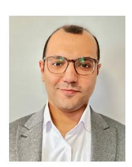

**Navid Heydarishahreza** (Graduate Student Member, IEEE) received the B.Sc. degree in electrical engineering from Islamic Azad University, Tehran Central, in 2017, and the M.Sc. degree in electrical engineering from the Iran University of Science and Technology in 2021. He is currently pursuing the Ph.D. degree with the Helen and John C. Hartmann Department of Electrical and Computer Engineering, New Jersey Institute of Technology. His research focuses on spectrum management, resource allocation, nonterrestrial networks, and

reconfigurable intelligent surfaces with applications in 5G/6G systems. He actively serves as a reviewer for IEEE journals, conferences, and magazines.

**Tao Han** (Senior Member, IEEE) received the Ph.D. degree in electrical engineering from New Jersey Institute of Technology (NJIT) in 2015. He is an Associate Professor with the Department of Electrical and Computer Engineering, NJIT. Before joining NJIT, he was an Assistant Professor with the Department of Electrical and Computer Engineering, University of North Carolina at Charlotte. His research interest includes mobile-edge computing, machine learning, mobile X reality, 5G system, Internet of Things, and smart grid. He is the recip-

ient of NSF CAREER Award 2021, the Newark College of Engineering Outstanding Dissertation Award 2016, the NJIT Hashimoto Prize 2015, and the New Jersey Inventors Hall of Fame Graduate Student Award 2014. His papers win IEEE International Conference on Communications Best Paper Award 2019 and IEEE Communications Society's Transmission, Access, and Optical Systems Best Paper Award 2019.

**Nirwan Ansari** (Life Fellow, IEEE) received the B.S.E.E. degree (summa cum laude with a perfect GPA) from New Jersey Institute of Technology (NJIT), the M.S.E.E. degree from the University of Michigan, and the Ph.D. degree from Purdue University.

He is a Distinguished Professor of Electrical and Computer Engineering with NJIT. He authored *Green Mobile Networks: A Networking Perspective* (Wiley-IEEE, 2017) with T. Han, and co-authored two other books. He has also (co-)authored over

700 technical publications, with more than half of them published in widely cited journals and magazines. He has also been granted more than 40 U.S. patents. His current research focuses on green communications and networking, edge computing, drone-assisted networking, and various aspects of broadband networks. Among his many recognitions are several excellence in teaching awards, multiple best paper awards, the NCE Excellence in Research Award, several ComSoc TC technical recognition awards, the NJ Inventors Hall of Fame Inventor of the Year Award, the Thomas Alva Edison Patent Award, the Purdue University Outstanding Electrical and Computer Engineering Award, the NCE 100 Medal, the NJIT Excellence in Research Prize and Medal, and designation as a COMSOC Distinguished Lecturer. He has served as a guest editor for numerous special issues on various emerging topics in communications and networking. He currently serves as the Editor-in-Chief for IEEE WIRELESS COMMUNICATIONS and has been on the editorial/advisory board of over ten journals. He was elected to serve on the IEEE Communications Society (ComSoc) Board of Governors as a memberat-large. He has served as the Director of ComSoc Educational Services Board, chaired various technical and steering committees within ComSoc, and has served on many committees such as the IEEE Fellow Committee. He has actively participated in organizing numerous IEEE International Conferences/Symposia/Workshops. He is also a Fellow of National Academy of Inventors.