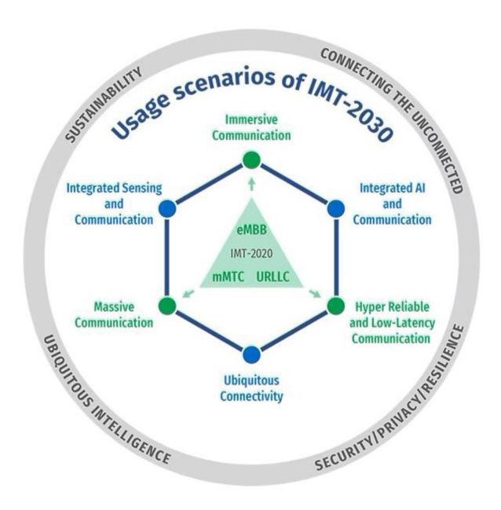
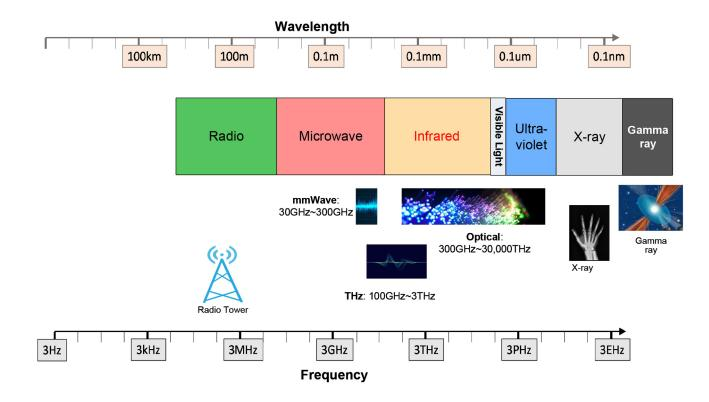
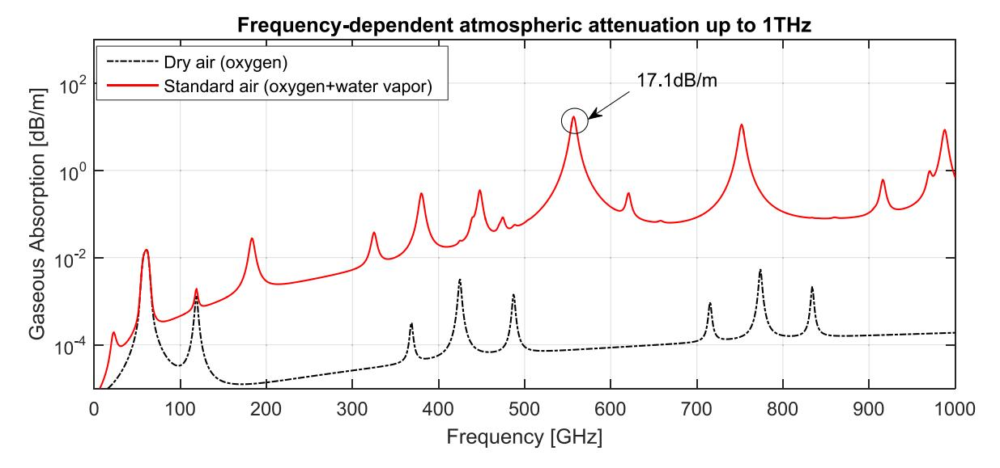
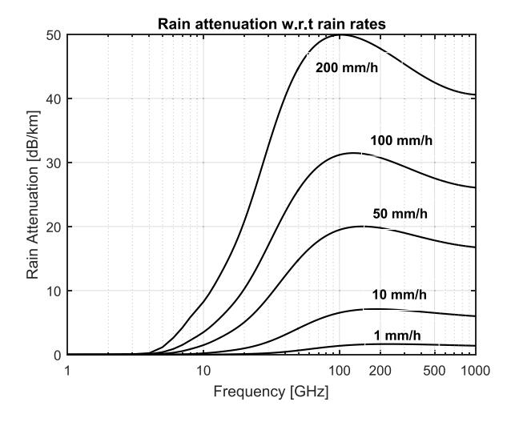
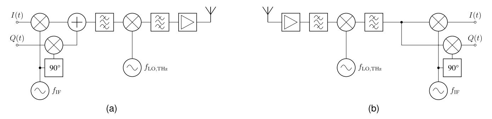
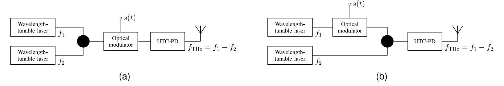
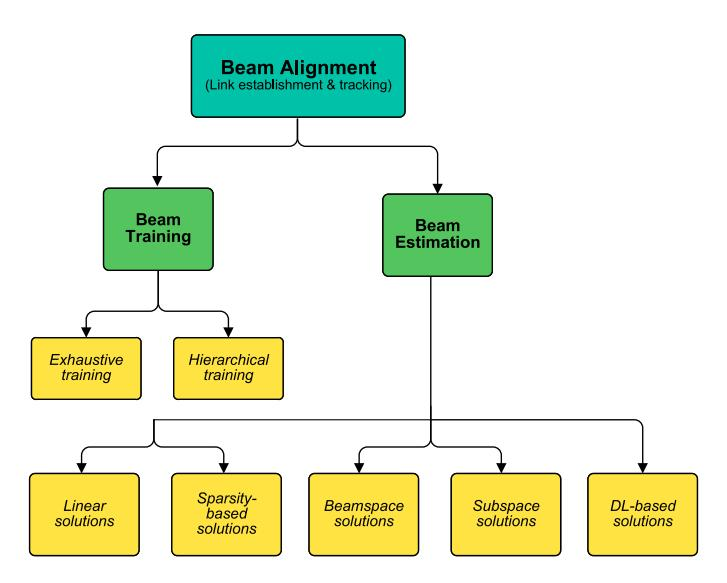
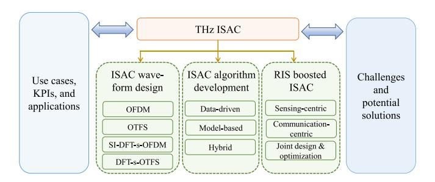

# Terahertz Communications and Sensing for 6G and Beyond: A Comprehensive Review

Wei Jiang®, Senior Member, IEEE, Qiuheng Zhou, Jiguang He®, Senior Member, IEEE, Mohammad Asif Habibi®, Member, IEEE, Sergiy Melnyk, Mohammed El-Absi®, Member, IEEE, Bin Han®, Senior Member, IEEE, Marco Di Renzo®, Fellow, IEEE, Hans Dieter Schotten®, Member, IEEE, Fa-Long Luo®, Fellow, IEEE, Tarek S. El-Bawab®, Fellow, IEEE, Markku Juntti®, Fellow, IEEE, Mérouane Debbah®, Fellow, IEEE, and Victor C. M. Leung®, Life Fellow, IEEE

Abstract—Next-generation cellular technologies, commonly referred to as the sixth generation (6G), are envisioned to support a higher system capacity, better performance, and network sensing capabilities. The terahertz (THz) band is one potential enabler to this end due to the large unused frequency bands and the high spatial resolution enabled by the short signal wavelength and large bandwidth. Different from earlier surveys, this paper presents a comprehensive treatment and technology survey on THz communications and sensing in terms of advantages, applications, propagation characterization, channel modeling, measurement campaigns, antennas, transceiver devices, beamforming, networking, the integration of communications and sensing, and experimental testbeds. Starting from the motivation and use cases, we survey the development and historical perspective of THz communications and sensing with the anticipated 6G requirements. We explore the radio propagation, channel modeling, and measurement for the THz band. The transceiver requirements, architectures, technological challenges, and stateof-the-art approaches to compensate for the high propagation

Manuscript received 16 June 2023; revised 13 November 2023; accepted 21 December 2023. Date of publication 8 April 2024; date of current version 22 November 2024. The work of Wei Jiang, Qiuheng Zhou, and Sergiy Melnyk was supported in part by German Federal Ministry of Education and Research (BMBF) through Open6G-Hub under Grant 16KISK003K, through 6G NeXt under Grant 16KISK177, and through AI-NET PROTECT under Grant 16KIS1283; and in part by the European Commission (EC) H2020 Framework through AI@EDGE under Grant 101015922. The work of Mohammad Asif Habibi was supported by the BMBF through Open6G-Hub under Grant 16KISK004. The work of Mohammed El-Absi was supported in part by BMBF through 6GEM under Grant 16KISK038, and in part by the State of Northrhine Westphalia, Germany, through Netzwerke 2021. The work of Marco Di Renzo was supported in part by EC through COVER under Grant 101086228, through UNITE under Grant 101129618, and through INSTINCT under Grant 101139161; and in part by the Agence Nationale de la Recherche (ANR) through the France 2030 Project titled ANR-PEPR Networks of the Future under Grant NF-YACARI 22-PEFT-0005 and Grant NF-SYSTERA 22-PEFT-0006; and in part by the CHIST-ERA Project titled PASSIONATE under Grant CHIST-ERA-22-WAI-04 through ANR-23-CHR4-0003-01. The work of Hans Dieter Schotten was supported in part by German Federal Ministry of Education and Research (BMBF) through Open6G-Hub under Grant 16KISK003K, through 6G NeXt under Grant 16KISK177, and through AI-NET PROTECT under Grant 16KIS1283; in part by the European Commission (EC) H2020 Framework through AI@EDGE under Grant 101015922; and BMBF through Open6G-Hub under Grant 16KISK004. The work of Markku Juntti was supported by the Research Council of Finland through the 6G Flagship Programme under Grant 346208. The work of Victor C. M. Leung was supported in part by the Guangdong Pearl River Talent Program under Grant 2019ZT08X603 and Grant 2019JC01X235, and in part by the Canadian Natural Sciences and Engineering Council under Grant RGPIN-2019-06348. (Corresponding author: Wei Jiang.)

Please see the Acknowledgment section of this article for the author affiliations.

Digital Object Identifier 10.1109/COMST.2024.3385908

losses, including appropriate antenna design and beamforming solutions. We overview several related technologies that either are required by or are beneficial for THz systems and networks. The synergistic design of sensing and communications is explored in depth. Practical trials, demonstrations, and experiments are also summarized. The paper gives a holistic view of the current state of the art and highlights the open research challenges towards 6G and beyond.

*Index Terms*—6G, beamforming, imaging, integrated communications and sensing, positioning, THz communications.

#### I. INTRODUCTION

ODAY, the fifth generation (5G) of mobile networks is being deployed [1]. Meanwhile, both academia and industry have shifted their research focus to the next generation of communications technologies, which are commonly referred to as the sixth generation (6G) and are officially named by the International Telecommunication Union - Radiocommunication (ITU-R) as International Mobile Telecommunications for 2030 (IMT-2030) [2]. Several research groups, standardization bodies, regulatory organizations, and government agencies [3] have initiated a variety of programs to discuss the 6G vision [4] and to develop key technologies [5], as we will elaborate in Section II-A. To support disruptive applications, such as virtual and augmented reality [6], Internet of Things [7], Industry 4.0, connected and autonomous vehicles [8], and yet-to-be-conceived use cases like Metaverse, holographic-type telepresence [9], Tactile Internet [10], digital twin [11], full immersiveness [12], multi-sense experience, and blockchain [13], 6G requires significantly stringent performance, e.g., hyper rates on the order of terabits-per-second (Tbps) [14], ultra-reliability, nearzero latency, and massive connectivity density, far beyond what its predecessors can offer [15].

Starting from 1985, when 3G (known in ITU jargon as IMT-2000) was under development, the ITU-R has been actively engaged in the standardization of each generation of cellular systems. Like the visions for 4G (a.k.a IMT-Advanced) and 5G (a.k.a IMT-2020), in its recommendations M.1645 [16] and M.2083 [17], respectively, the ITU-R started the development process for 6G by defining the IMT-2030 vision as the first step. The first recommendation for IMT-2030 was completed on 22nd June 2023 during the 44th ITU-R WP5D meeting in Geneva.

Fig. 1. Six usage scenarios for IMT-2030 and four overarching aspects, specified by the ITU-R in June 2023 [\[2\]](#page-42-1).

As shown in Fig. [1,](#page-1-0) the three IMT-2020 usage scenarios, i.e., enhanced Mobile Broadband (eMBB), Ultra-Reliable Low-Latency Communications (URLLC), and massive Machine-Type Communications (mMTC) are upgraded to *Immersive Communication*, *Hyper Reliable and Low-Latency Communication*, and *Massive Communication*, respectively. In addition, three new usage scenarios – *Integrated Sensing and Communication*, *Ubiquitous Connectivity*, and *Integrated AI and Communication* – are introduced.

In what follows, this paper focuses on the usage scenario of *Integrated Sensing and Communication*. Driven by the continuous progress in frequency assignment, antennas, devices, and signal processing, 6G will be a dual-functional system that is able to not only communicate but also sense as well [\[18\]](#page-42-17). This usage scenario enables 6G and beyond to *see* the physical world through electromagnetic (EM) waves [\[19\]](#page-42-18). It offers high-resolution sensing, localization, imaging, and environment reconstruction capabilities to improve communications performance. Also, it supports a wide range of novel applications beyond communications such as object tracking, security screening, remote sensing, process monitoring, simultaneous localization and mapping (SLAM), gesture recognition, and activity detection [\[20\]](#page-42-19), distinguishing 6G from the traditional communication-oriented cellular systems from the first generation (1G) to 5G.

#### *A. Why Do 6G and Beyond Need the THz Band?*

The THz band has attracted a lot of interest in recent years and is recognized as a promising enabler for 6G [\[21\]](#page-42-20). Prior to stepping into technical details, we would like to first clarify a fundamental question that might cause some confusion or disputes in some prior literature. That is, *why do we need to exploit the THz band in 6G and beyond*? We try to address

Fig. 2. The electromagnetic spectrum and the positions of mmWave, THz, and optical bands.

this aspect from the perspectives of both THz communications and THz sensing, as well as their synergy.

*1) THz Communications:* At the World Radiocommunication Conference (WRC) held in 2019, a.k.a WRC-19, the ITU-R assigned a total of 13.5 GHz spectrum, consisting of a group of high-frequency bands, for the deployment of 5G millimeter wave (mmWave) communications [\[1\]](#page-42-0), as we will elaborate in Section [II-B.](#page-6-0) Despite the spectral abundance of mmWave bands, it might not be sufficient to meet the growing need for bandwidth over the next decade. There are enormous spectral resources at higher frequencies that were already used for a wide variety of non-cellular applications, such as remote sensing, radio astronomy, and radar [\[22\]](#page-42-21), to name a few. With the advancement in antenna technology and radio frequency (RF) components, these frequencies previously considered unsuitable for mobile communications due to their unfavorable propagation characteristics become technologically usable [\[23\]](#page-42-22).

Fig. [2](#page-1-1) illustrates the whole EM spectrum, consisting of radio, microwave, infrared (IR), visible light, ultraviolet, X-rays, and Gamma rays, from the lower to higher frequencies [\[24\]](#page-42-23). It is noted that the definition of the EM spectrum in the general case differs from the naming of frequency bands from the perspective of wireless communications, as shown in the figure. Based on these considerations, it is argued that the THz band is a suitable candidate to realize Tbps communications under the current level of hardware and signal-processing technologies. The reasons are explained as follows:

• *Spectrum scarcity of the sub-6 GHz band:* The favourable propagation characteristics of sub-6 GHz frequencies facilitate the use of sophisticated transmission technologies such as massive multi-input multioutput (MMIMO) [\[25\]](#page-42-24), non-orthogonal multiple access (NOMA) [\[26\]](#page-42-25), and high-order modulation like 1024-ary quadrature amplitude modulation (1024QAM) to achieve high spectral efficiency. However, spectrum scarcity and non-continuity pose a significant challenge to achieving higher rates. Even if the sub-6 GHz band ultimately determines a bandwidth of 1 GHz for International Mobile Telecommunications (IMT) services, a Tbps link can only be realized under the extreme spectral

- efficiency of 1000 bps/Hz, as suggested by the Shannon capacity *R* = *B* log (1 + *S*/*N*). However, such high performance is impractical in the foreseeable future. In comparison, as specified in ITU-R M.2410 [\[27\]](#page-42-26), the peak spectral efficiency for IMT-2020 is 30 bps/Hz (in ideal conditions).
- *Insufficient mmWave bandwidth below 100 GHz:* At WRC-19, the mmWave spectrum in 24.25-27.5 GHz, 37- 43.5 GHz, 45.5-47 GHz, 47.2-48.2 GHz and 66–71 GHz, was assigned to IMT services [\[28\]](#page-42-27). There is a challenge from the perspective of RF implementation, which is typically constrained by the limit of around 10% relative bandwidth. That is to say, mmWave technologies below 100 GHz can support a single RF transceiver with a maximal bandwidth of 10 GHz due to the nonlinearity of RF components. Thus, Tbps can only be reached with spectral efficiency of 100 bps/Hz. This is currently infeasible for high-frequency signal transmission, which is prone to the use of low-order modulation and singlecarrier techniques due to the constraints of mmWave components [\[29\]](#page-42-28). Therefore, it is argued that the potential for realizing Tbps communications relies on massively abundant frequencies above 100 GHz.
- • *Constraint of optical sensing:* Optical bands at IR [\[30\]](#page-42-29), visible-light [\[31\]](#page-42-30), and ultraviolet frequencies [\[32\]](#page-42-31) offer enormous spectral resources. Like THz frequencies, the application of optical wireless communications (OWC) faces some challenges, such as eye-safety constraints, atmospheric (fog, rain, dust, or pollution) absorption, high diffusion loss, low optical-emitter output power, photonic phase noise, line-of-sight (LoS) reliance, and beam misalignment [\[33\]](#page-42-32). Many recent research progresses have been made in OWC [\[34\]](#page-42-33), making it a valuable solution for communications. Nevertheless, lightwave does not exhibit comparable *sensing*, *imaging*, and *positioning* capabilities as THz signals [\[35\]](#page-42-34). From the perspective of integrated sensing and communications, the THz band is considered a suitable option to efficiently realize a dual-functional 6G system.
- • *Adverse health effects at extreme high bands:* Ionizing radiation, including ultraviolet, X-rays, and Gamma rays, poses a significant risk to human health, as it has strong energy power to dislodge electrons and generate free radicals that can lead to cancer [\[36\]](#page-42-35). The adverse health effects of ionizing radiation are controllable if used with care, so extreme high-frequency signals have been used in specific fields such as radiotherapy, photography, semiconductor manufacturing, and nuclear medicine, among others. However, it is still too dangerous for personal communications [\[21\]](#page-42-20).

Unlike ionizing radiation, THz frequencies are non-ionizing because their photon energy is not sufficient (0.1 to 12.4meV, which is over three orders of magnitude weaker than ionizing photon energy levels) to release an electron from an atom or a molecule, where typically 12eV is required for ionization. The THz band offers abundant spectral resources, ranging from tens of gigahertz to several terahertz, depending on the transmission distance. This makes the available bandwidth

- more than ten times greater than that of mmWave bands, while the operating frequency is at least one order of magnitude below the optical bands. In addition, the technologies required to make Tbps-level transmission over the THz band a reality is rapidly advancing [\[37\]](#page-42-36). For example, novel antennas and components are under development by exploiting cutting-edge materials like graphene, to overcome *the THz gap*, where the operating frequency is too high for conventional *electronic* transmitters and too low for *photonic* emitters [\[33\]](#page-42-32), as we will elaborate in Section [VI.](#page-20-0) Moreover, ultra-massive multiinput multi-output (UMMIMO) and lens antenna arrays to generate high-gain beams, with the aid of appropriate beam alignment techniques, compensating for the large free-space loss, atmospheric absorption, and weather effects, are other promising technologies, as introduced in Sections [IV](#page-11-0) and [VII.](#page-23-0)
- *2) THz Sensing:* The spatial resolution of a propagated signal becomes much finer at higher frequencies, thereby enabling high-definition spatial differentiation [\[35\]](#page-42-34). In addition to THz communications, THz sensing (including positioning, imaging, and spectroscopy) exploits the tiny wavelength on the order of micrometers and the frequency-selective resonances of various materials over the measured environment to gain unique information based on the observed signal signature [\[38\]](#page-42-37). Compared with wireless sensing over other bands, THz sensing offers the following advantages:
  - *High resolution and penetration capabilities:* Although low-frequency signals are able to sense, detect, and localize objects, as the radar [\[22\]](#page-42-21) and Global Navigation Satellite System (GNSS), THz sensing/positioning can improve the resolution due to the small wavelength, even for objects hidden from direct view. THz waves are able to penetrate a variety of non-conductive materials, e.g., plastics, fabrics, paper, ceramics, and dielectric substances. This allows THz sensing to detect hidden objects, structural defects, and layers beneath surfaces, making it useful in security screening, quality control, process monitoring, and material characterization [\[39\]](#page-42-38).
  - *Non-ionizing radiation:* Compared to X-rays and Gamma rays, THz waves have much lower photon energy, making them non-ionizing [\[40\]](#page-42-39). This implies that THz sensing is generally considered safe for biological samples and humans, allowing for non-destructive and non-invasive imaging and diagnosing.
  - *Low environmental interference:* In contrast to visible or IR radiation [\[41\]](#page-42-40), THz waves are less vulnerable to environmental factors such as ambient light, fog, or smoke. It allows THz sensing for outdoor environments or adverse conditions, expanding its usability in fields such as remote sensing, atmospheric monitoring, and outdoor stand-off security screening of dangerous items like firearms, bombs, and explosive belts hidden beneath clothing [\[35\]](#page-42-34).
  - *Spectroscopic analysis:* THz waves interact with molecules in a characteristic manner, leading to unique spectral fingerprints. THz spectroscopy provides valuable information about molecular vibrations and rotational transitions, enabling the identification and analysis of

chemical substances, including explosives, drugs, and biomolecules [\[42\]](#page-42-41). It is particularly effective for identifying substances with distinct THz absorption or reflection properties.

*3) Synergy Between THz Communications and THz Sensing:* Based on these considerations, the THz band offers not only massive spectral resources for wireless communications but also unique advantages for sensing, positioning, imaging, and spectroscopy [\[35\]](#page-42-34). Hence, it attracted a lot of interest recently as a key enabler for implementing integrated sensing and communications (ISAC) for 6G and beyond [\[61\]](#page-43-0). On top of implementing THz communications and THz sensing in a unified system, these dual-functional wireless networks offer a great synergy through **sensing-aided communication** [\[62\]](#page-43-1), [\[63\]](#page-43-2) and **communication-aided sensing** [\[64\]](#page-43-3), as we will elaborate in Section [IX.](#page-34-0)

Using sensing information in communications may be one of the significant benefits of ISAC, which enables a more deterministic and predictable propagation channel. It facilitates the design of efficient communication algorithms and protocols, such as sensing-aided channel estimation [\[65\]](#page-43-4), predictive beamforming served by sensing [\[66\]](#page-43-5), [\[67\]](#page-43-6), fast beam alignment and tracking [\[68\]](#page-43-7), and link blockage mitigation [\[69\]](#page-43-8). On the other hand, mobile communication networks also provide significant opportunities and benefits for network sensing or sensing as a service [\[70\]](#page-43-9). Nodes share sensing results through the mobile network, where multiple network nodes (base stations, user equipment, etc.) can act as a collaborative sensing system [\[71\]](#page-43-10). This collaboration, achieved through sensing data fusion, reduces measurement uncertainties and provides larger coverage areas, as well as higher sensing accuracy and resolutions.

#### *B. Motivations and Contributions*

Recently, the wireless community has published several research articles and surveys on THz communications. As listed in Table [I,](#page-4-1) the existing surveys tend to focus on specific aspects of THz communications, such as antenna fabrication [\[49\]](#page-42-42), propagation characterization [\[52\]](#page-43-11), measurement [\[57\]](#page-43-12), channel modeling [\[58\]](#page-43-13), beamforming [\[51\]](#page-43-14), and hardware [\[47\]](#page-42-43). These surveys are more beneficial for researchers who are focusing on a particular aspect of THz communications and need an exhaustive collection of the existing research outcomes in this aspect. On the other hand, some magazine articles such as [\[45\]](#page-42-44), [\[60\]](#page-43-15) offer overviews that cover relatively wide ranges of aspects but are rather concise on many topics. Therefore, a comprehensive survey, which can provide researchers with a holistic view of all the necessary ingredients to build a THz system, is still missing. In addition, prior literature primarily concentrated on THz communications from the perspective of conventional wireless systems and applications, while THz sensing has received much less attention. Last but not least, most of the current literature does not take into account the particular demands, applications, requirements, and scenarios of 6G.

Therefore, this article presents a comprehensive treatment and technology survey about THz communications and sensing. We clarify the advantages of THz over other bands for 6G and beyond, potential THz-based 6G applications, THz signal propagation characterization, THz channel modeling, THz measurement, THz antennas, photonic-electronic devices for THz transceiver, beamforming, beam alignment, THz networking, the synergy with other potential 6G technologies, THz-based integrated sensing and communications, and THz experimental test-beds. Table [I](#page-4-1) compares this work with the published works in terms of the topics covered. From an application and implementation perspectives, this work can provides researchers in THz communications, THz sensing, and 6G with a holistic view of the current state of the art and highlight the issues and challenges [\[72\]](#page-43-16) that are open for further research.

The major contributions of this survey include:

- First, this work aims to answer a fundamental question: *Why do 6G and beyond need to exploit the THz band*? It clarifies the comparative advantages of THz over other frequency bands for communications and sensing in the scenarios envisioned for 6G and beyond.
- • This paper provides a state-of-the-art overview of related fields by summarizing the global 6G development, latest spectrum assignment for IMT, and early exploration efforts in THz technologies.
- • This article envisions potential THz-based communications and sensing applications for 6G and beyond.
- This survey comprehensively characterizes THz signal propagation, including the *path loss, atmospheric absorption, weather effects, and blockage*.
- This paper reports up-to-date THz measurement campaigns by means of three measurement methods, i.e., *frequency-domain vector network analyzer (VNA), timedomain sliding, and time-domain spectroscopy (TDS)*.
- This article overviews both deterministic and statistical THz channel models.
- This survey provides readers with the necessary knowledge required to design and build transceivers for THz communications and sensing, including the recent advances in THz antennas, THz electronic devices, and THz photonic devices.
- • This work elaborates on how to compensate for the large propagation loss through beamforming over large-scale antenna arrays. The fundamentals of UMMIMO, lens antenna array, beam tracking, beam estimation, and beam alignment are introduced as well.
- From a systematic perspective, this survey explores the paradigms for THz networking, with an emphasis on the synergy of THz communications and sensing with other 6G-enabling technologies, covering MMIMO, UMMIMO, NOMA, reconfigurable intelligent surfaces (RIS), non-terrestrial networks, digital twins, artificial intelligence (AI) and machine learning (ML). Moreover, security, localization, integrated communications and sensing, multi-connectivity, and channel awareness for THz networks, are discussed.
- This article discusses the building blocks, opportunities, challenges, and potential solutions for ISAC over the THz band, elaborating its unique advantages, use cases, key

TABLE I A COMPARISON OF THIS SURVEY WITH THE EXISTING WORKS

|                              |      |    |         |          |                | Content Co                | verage                      |                            |                           |
|------------------------------|------|----|---------|----------|----------------|---------------------------|-----------------------------|----------------------------|---------------------------|
| Reference                    | Year | 6G | Sensing | ISAC     | THz Channel | THz Ant. & Beamforming | THz Device & Transceiver | Synergy w. 6G Key Tech. | THz Trial & Experiment |
| Mukherjee and Gupta [43]     | 2008 |    |         |          |                | ✓                         | ✓                           |                            |                           |
| Ostmann and Nagatsuma [44]   | 2011 |    |         |          | <b>√</b>       | ✓                         | ✓                           |                            | <b>√</b>                  |
| Nagatsuma et al. [23]        | 2016 |    |         |          |                |                           | ✓                           |                            |                           |
| K. M. S. Huq et al. [45]     | 2019 | ✓  |         |          | 0              |                           | 0                           | 0                          |                           |
| K. Tekbiyik et al. [46]      | 2019 |    |         |          | <b>√</b>       | ✓                         | ✓                           |                            | ✓                         |
| Z. Chen et al. [47]          | 2019 |    |         |          |                | ✓                         | ✓                           |                            |                           |
| M. Naftaly et al. [48]       | 2019 |    | ✓       |          |                |                           |                             |                            |                           |
| Y. He et al. [49]            | 2020 |    |         |          |                | ✓                         |                             |                            |                           |
| S. Ghafoor et al. [50]       | 2020 | 0  |         |          | <b>√</b>       | 0                         |                             |                            |                           |
| B. Ning et al. [51]          | 2021 |    |         |          |                | ✓                         |                             |                            |                           |
| F. Lemic <i>et al.</i> [52]  | 2021 | 0  |         |          | <b>√</b>       | √                         |                             |                            |                           |
| H. Sarieddeen et al. [53]    | 2021 | 0  | ✓       |          |                | ✓                         |                             | ✓                          |                           |
| E. CastroCamus1 et al. [54]  | 2021 |    | ✓       |          |                |                           |                             |                            |                           |
| CX. Wang et al. [55]         | 2021 | ✓  |         |          | <b>√</b>       | ✓                         | 0                           |                            |                           |
| D. Moltchanov et al. [56]    | 2022 | ✓  |         |          | <b>√</b>       | 0                         |                             |                            |                           |
| C. Chaccour et al. [38]      | 2022 | ✓  | ✓       | ✓        |                |                           |                             | ✓                          |                           |
| C. Han et al. [57]           | 2022 |    |         |          | ✓              |                           |                             |                            | 0                         |
| D. Serghiou et al. [58]      | 2022 | ✓  |         |          | <b>√</b>       |                           |                             |                            |                           |
| I. F. Akyildiz et al. [59]   | 2022 | ✓  |         |          | ✓              |                           | ✓                           |                            | ✓                         |
| A. Shafie <i>et al.</i> [60] | 2022 | 0  |         |          |                | 0                         | 0                           | ✓                          |                           |
| This survey paper            | 2023 | ✓  | ✓       | <b>√</b> | ✓              | ✓                         | ✓                           | ✓                          | ✓                         |

performance indicators (KPIs), joint waveform design, and efficient algorithm design.

• Last but not least, the latest advances in THz trials and experiments are reported to provide readers with an insightful view of practical aspects of THz communications and sensing.

#### *C. The Structure of This Survey*

Overall, this survey aims to provide researchers with a holistic view of the current state of the art about all aspects required to design and build THz-based wireless communications and sensing systems for 6G and beyond. Also, this work highlights the challenges that are open for future research. To improve the readability, an outline of the survey is illustrated in Fig. [3.](#page-5-0)

#### II. OVERVIEW OF THZ-BASED 6G SYSTEMS

Intending to facilitate an insightful view and knowledge, this section summarizes the current state of the art in the related fields. First, Section [II-A](#page-4-0) offers a global view of 6G development, followed by the status of spectrum usage for IMT services worldwide in Section [II-B.](#page-6-0) Then, the early THz exploration efforts are listed in Section [II-C.](#page-7-0)

#### *A. Global View of 6G Development*

At the beginning of 2019, South Korea's three network operators and U.S. Verizon were in a dispute with each other, vying for the title of being the world's first provider of the 5G communication services. This event marked the arrival of the 5G era [\[1\]](#page-42-0). In the past few years, the term '5G' has remained one of the most prominent buzzwords in the media, drawing unprecedented attention from the whole society. Apart from continuously enhancing network capacity and improving system performance as previous generations had done, 5G expands mobile communications services from human-centric to human-and-things, as well as from the consumer market to vertical industries [\[73\]](#page-43-17). This has substantially increased the potential scale of mobile subscriptions from billions (i.e., equivalent to the world's population) to almost countless interconnectivity among humans, machines, and things.

In 2020, the outbreak of the COVID-19 pandemic led to a significant loss of human lives worldwide and imposed unprecedented challenges on societal and economic activities. However, this public health crisis has underscored the unique role of telecommunication networks and the digital infrastructure in keeping society operational and families connected. This is particularly relevant for the values of 5G applications, such as remote health care, online education, mobile working, autonomous vehicles, unmanned delivery, and smart manufacturing [\[74\]](#page-43-18). In July 2018, the International Telecommunication Union - Telecommunication (ITU-T) standardization sector had established a focus group called *Technologies for Network 2030* with the aim of studying the capabilities of networks for 2030 and beyond [\[75\]](#page-43-19).

The European Commission (EC) initiated the beyond 5G program in 2020, under its Horizon 2020 calls — *ICT-20 5G Long Term Evolution* and *ICT-52 Smart Connectivity beyond 5G* — where a batch of pioneer research projects was

#### Overview of THz-based 6G and Beyond

This section provides the current state of the art related to THz communications and sensing for 6G and beyond networks. It outlines the major development on 6G, spectrum usage, and early THz explorations. The subsections included in this section are: (a) global view of 6G deployment; (b) state-of-the-art spectrum assignment; and (c) prior exploration of THz technologies.

### Section II

#### **THz Propagation and Channel Characterization**

This section comprehensively characterizes THz signal propagation with the grand objective of providing readers with the prerequisite knowledge of THz channels as the basis for designing THz communications and sensing in 6G and beyond. The major contributions that are organized in a number of subsections are included in this section as follows: (a) high free-space path loss; (b) atmospheric absorption; (c) weather effects; and (d) blockage loss.

## Section IV

#### THz Transceiver: Antenna and Devices

This section covers THz transceivers for 6G and beyond communications systems. It provides a comprehensive overview and survey of antenna types that can be utilized for the THz band, such as horn antennas, planar antennas, substrate-integrated antennas, etc. It also conducts an exahustive survey on the THz components and devices for 6G and beyond. This section includes two main subsections: (a) THz antennas; and (b) THz components and devices.

## Section VI

#### THz Systems and Networks Toward 6G & Beyond

In this section, we explore THz from a systematic point of view, with an emphasis on the synergy of THz with a range of 6G-enabling technologies. It includes the following subsections: (a) out-of-band channel estimation for THz; (b) massive MIMO THz; (c) multiconnectivity for THz; (d) non-orthogonal multi-access THz; (e) digita win-assisted THz; (f) THz for Non-terrestrial network; (g) Al/ML for THz; (h) RIS for THz; (i) physical layer security for THz; and (j) localization services for THz.

#### Potential THz Applications in 6G and Beyond

In this section, we discuss the potential applications and innovative use cases of integrated communication and sensing in the THz band. We also list and compare the relevant literature on THz applications and use cases in the 6G era and beyond. The major subsections that are included in this section are mainly: (a) THz communications applications and use cases; and (b) THz sensing applications and use cases.

## Section III

#### THz Channel Measurement and Modeling for 6G

This section surveys the state-of-the-art measurement campaigns and channel modeling efforts in the THz band for the use of 6G and beyond. It also compares extensive measurement campaigns and channel modeling efforts, as well as many challenging issues such as capable measurement equipment and novel modeling methodologies that are barriers ahead. This section includes two subsections: (a) THz channel measurement; and (b) THz channel modeling.

#### Beamforming and Alignment for THz Comm. & Sens.

In this section, we will discuss cutting-edge antenna forms, novel beamforming techniques and solutions, and necessary beam alignment schemes and mechanisms in the THz band for 6G and beyond communication systems. To that end, this section includes the following four subsections: (a) ultra-massive MIMO; (b) lens antenna array; (c) beam alignment: training of beams; and (d) beam alignment: estimating of beams.

#### **Integrated THz Communications and Sensing**

In this section, we provide a holistic survey of the recent activities in integrated THz communications and sensing. Special attention is paid to use cases and KPIs, waveform design, algorithm development, RIS-boosted ISAC, and potential challenges and solutions. The subsections are: (a) THz-ISAC use cases and KPIs; (b) THz-ISAC waveform design; (c) THz-ISAC algorithm development; (d) RIS-boosted THz-ISAC; and (e) challenges and solutions for THz-ISAC.

#### THz Trials and Experiments

In this section, we provide an exhaustive overview of the most recent THz trials and experiments conducted around the globe (by both academia and industry) in order to provide interested readers with a comprehensive understanding of the current state-of-the-art of THz communications and sensing for 6G and beyond. We also present a detailed survey of the achieved data rates at specific THz bands with specific characteristics.

Fig. 3. Outline of the structure of this survey.

sponsored. At the beginning of 2021, the EC launched its 6G flagship research project *Hexa-X* [76], followed by the second phase of European level 6G research *Hexa-X-II* in early 2023 [77]. The EC has also announced its strategy to accelerate investments in 'Gigabit Connectivity' including 5G and 6G to shape Europe's digital future [78]. In October 2020, the Next Generation Mobile Networks (NGMN) alliance announced its new '6G Vision and Drivers' project, intending to provide early and timely guidelines for global 6G activities. The first report for this project was published in April 2021 [79]. At its meeting in February 2020, the ITU-R decided to start studying future technology trends for the evolution towards IMT-2030 [80].

Motivated by the revolutionary force of 5G, the governments of many countries recognized the significance of mobile communications technologies for driving economic prosperity and sustainable growth. In the past years, many countries have set up research initiatives officially or announced ambitious plans for the development of 6G. The world's first 6G effort, '6G-Enabled Wireless Smart Society and Ecosystem (6Genesis) Flagship Program', was carried out by the University of Oulu in April 2018, as part of the Academy of Finland's flagship program [81]. This project focuses on groundbreaking 6G research, with four interrelated strategic areas including wireless connectivity, distributed computing, devices and circuit technology, and services and applications.

In September 2019, the world's first 6G white paper 'key drivers and research challenges for 6G ubiquitous wireless intelligence' was published as an outcome of the first 6G Wireless Summit [82]. Subsequently, a series of white papers have been published, covering twelve specific areas of interest, such as ML, edge intelligence, localization, sensing, and security.

In October 2020, the Alliance for Telecommunications Industry Solutions (ATIS) established the 'Next G Alliance', an industry-led initiative aimed at advancing North American mobile technology leadership in 6G over the next decade [83]. Founding members of the initiative include leading companies such as AT&T, T-Mobile, Verizon, Qualcomm, Ericsson, Nokia, Apple, Google, Facebook, and Microsoft. The Next G Alliance places a strong emphasis on technology commercialization and seeks to encompass the full lifecycle of 6G research, development, manufacturing, standardization, and market readiness. In addition to this, SpaceX, a U.S. company known for its revolutionary reusable rockets, announced the Starlink project in 2015 [84]. This project aims to deploy a very large-scale low Earth orbit (LEO) communications satellite constellation to offer ubiquitous Internet access services across the whole planet. The Federal Communications Commission (FCC) approved its initial plan of launching 12,000 satellites, and an application for 30,000 additional satellites is currently under consideration. As of 31 October 2023, the number of Starlink satellites in orbit has reached 5011, and the service is commercially available in many countries and regions. Although Starlink may not replace 5G or be considered 6G, the impact of such a very large-scale LEO satellite constellation on 6G and beyond should be taken into account by the mobile industry.

In November 2019, the Chinese Ministry of Science and Technology kicked off the research and development efforts for 6G technology, in collaboration with five other ministries or national institutions. The event also marked the establishment of a working group, named *IMT-2030(6G) Promotion Group*, responsible for managing and coordinating the program, and an expert group comprising 37 top researchers from academia, research institutes, and industry. In June 2021, the IMT-2030(6G) Promotion Group released its white paper titled '6G Vision and Candidate Technologies', outlining the state-of-the-art research findings of the group [85]. It covers the 6G vision, the driving forces behind its development, potential use cases, ten candidate technologies, and additional insights.

In late 2017, the Japanese Ministry of Internal Affairs and Communications formed a working group to investigate next-generation wireless technologies. Their research findings indicated that 6G should offer transmission rates at least ten times faster than 5G, near-instant connectivity, and massive connection of up to ten million devices per square kilometer. In December 2020, Japan established the *Beyond 5G Promotion Consortium (B5GPC)* with the objective of expediting the development of 6G while enhancing the country's international competitiveness through industry-academia-government collaboration. B5GPC published its inaugural white paper 'Beyond 5G white paper: Message to the 2030s' in March 2022 [86], summarizing the requirements and expectations

of each industry for 6G, the necessary capabilities, and technological trends. South Korea announced its ambition to set up the world's first 6G trial in 2026. In addition, South Korea has unveiled the *K-Network 2030* initiative, which aims to sponsor the development of key 6G technologies, e.g., developing cloud-native networks on South Korean-made AI chips, launching a low-orbit communications satellite by 2027, and creating an open radio access network (ORAN) ecosystem for domestic firms.

The German Federal Ministry of Education and Research (BMBF) announced in February 2021 a new funding program called '6G Vision' as part of Germany's broader initiative to establish the country as a leader in 6G technology. In August 2021, under the umbrella organization and networking of a leading project named *the 6G platform*, four 6G research hubs, i.e., 6G-life, 6GEM, 6G RIC, and Open6GHub, were built [87]. A total budget of approximately 250 million euros was assigned, covering 160 research groups in 21 universities and 15 research institutes, as well as more than 40 small and medium enterprises. In the subsequent year, eighteen 6G industry projects, such as 6G-ANNA, 6G-TakeOff, 6G-Terafactory, and 6G-Next, and seven projects on resilience, e.g., HealthNet, AKITA, and ConnRAD, were established [88].

In 2021, the National Agency for Research (ANR) in France launched the France 2030 plan [89], a comprehensive national acceleration strategy focused on the evolution of communication technologies. This forward-looking initiative prioritizes digital transition, telecommunications, and global innovation. In May 2023, the France 2030 plan introduced the pivotal program PEPR-NF - Networks of the Future. This program has a shared goal of advancing technologies for beyond 5G and future network infrastructures while considering their environmental and societal impacts, as well as data security. The PEPR-NF program comprises ten interconnected projects, with one of them being NF-SYSTERA (Devices and SYStems for high-speed links in the sub-TERAhertz range). NF-SYSTERA aims to explore frequency bands beyond 90 GHz for future wireless communication systems in the sub-THz and THz range.

#### B. Up-to-Date Spectrum Usage for IMT

Over the past few decades, the evolution of mobile communications has considered the following key criteria:

- the signal bandwidth becomes increasingly wide;
- the operating frequency band is increasingly high; and
- • the spectral demand is increasingly large.

Each new generation of cellular systems demanded more spectral resources and utilized a larger channel bandwidth to support more system capacity and realize a higher data rate than its predecessor. To provide an insightful view, Table II summarizes the evolution of mobile generations from Advanced Mobile Phone System (AMPS) [90], Global System for Mobile Communications (GSM), Wideband Code-Division Multiple Access (WCDMA), Long-Term Evolution Advanced (LTE-Advanced) [91], to 5G new radio (NR) [1] in terms of operating frequencies and signal bandwidths.

|                       | Mobile Generation    |                    |               |              |                                        |  |  |  |  |
|-----------------------|----------------------|--------------------|---------------|--------------|----------------------------------------|--|--|--|--|
|                       | 1G                   | 2G                 | 3G            | 4G           | 5G                                     |  |  |  |  |
| Main Standard         | AMPS                 | GSM                | WCDMA         | LTE-Advanced | NR                                     |  |  |  |  |
| First Deployment Year | 1979                 | 1991               | 2000          | 2009         | 2019                                   |  |  |  |  |
| Peak Data Rate        | 10 kbps (signalling) | 384 kbps           | 2 Mbps        | 1 Gbps       | 20 Gbps                                |  |  |  |  |
| Signal Bandwidth      | 30 kHz               | 200 kHz            | 5 MHz         | 100 MHz      | 1 GHz                                  |  |  |  |  |
| Frequency Bands    | 800 MHz              | 900 MHz & 1800 MHz | below 2.1 GHz | Sub-6 GHz    | Sub-6 GHz/ millimeter wave (mmWave) |  |  |  |  |

### TABLE II EVOLUTION OF CELLULAR SYSTEMS

TABLE III
OPERATING FREQUENCY BANDS SPECIFIED BY
3GPP FOR NR IN FR2. SOURCE: [1]

| NR Band | Freq. Range [GHz] | Duplex Mode | Regions        |
|---------|-------------------|-------------|----------------|
| n257    | 26.5-29.5         | TDD         | Asia, Americas |
| n258    | 24.25-27.5        | TDD         | Asia, Europe   |
| n259    | 39.5-43.5         | TDD         | Global         |
| n260    | 37.0-40.0         | TDD         | Americas       |
| n261    | 27.5-28.35        | TDD         | Americas       |

Until the fourth generation (4G), cellular systems operated in low-frequency bands below 6 GHz, which are referred to as *the sub-6 GHz band* when high-frequency bands are considered in 5G NR [1]. During the ITU-R WRC held in 2015, also known as WRC-15, an item on the agenda was designated to identify high-frequency bands above 24 GHz that could be used for IMT-2020 mobile services. After conducting follow-up studies after WRC-15, the ITU-R found that ultra-low latency and high data-rate applications would require larger, contiguous spectrum blocks. At WRC-19, the ITU-R assigned several pieces of high-frequency bands for the deployment of 5G mmWave communications worldwide. That is

- 24.25-27.5 GHz
- 37-43.5 GHz
- 45.5-47 GHz
- 47.2-48.2 GHz
- 66-71 GHz

Meanwhile, the Third Generation Partnership Project (3GPP) specified the relevant spectrum for 5G NR, which was divided into two frequency ranges:

- FR1 the First Frequency Range, including the sub-6 GHz frequency band from 450 MHz to 6 GHz
- FR2 the Second Frequency Range, covering 24.25 GHz to 52.6 GHz.

Initial mmWave deployments are expected to operate in 28 GHz (3GPP NR band n257 and n261) and 39 GHz (3GPP n260) based on the time-division multiplexing (TDD) mode, followed by 26 GHz (3GPP n258), as specified in Table III.

#### C. Prior Exploration of THz.

The term *terahertz* was initially used in the 1970s to describe the spectral line frequency coverage of a Michelson interferometer or the frequency coverage of point contact

diode detectors [92]. Before that, spectroscopists had coined this term for emission frequencies below the far IR range, which is the lowest frequency part of the IR radiation with a frequency range of about 300 GHz to 20 THz. Millimeter wave refers to the frequency band from 30 GHz to 300 GHz. Hence, the border between the far IR and THz, and the border between mmWave and THz, are still rather blurry. Typically, the THz band refers to EM waves with a frequency band from 0.1 THz to 10 THz. However, other definitions, e.g., 300 GHz to 3 THz, are used parallelly. The difference in using frequency (THz) and wavelength (mmWave) for identifying the two bands leaves some ambiguity for the range from 100 GHz to 300 GHz, which is also referred to as the upper-mmWave or sub-THz by some researchers. It is envisaged that 5G mainly focuses on the frequency bands below 100 GHz while 6G and beyond will cross over this frequency point. The current trend seems to give more emphasis on using centimeter wave and low mmWaves for enhancing 6G networks, but the THz band is certainly critical for sensing.

To avoid harmful interference to Earth Exploration Satellite Service (EESS) and radio astronomy operating in the spectrum between 275 GHz and 1 THz, the ITU-R WRC-15 has initiated the activity called 'Studies towards an identification for use by administrations for land-mobile and fixed services applications operating in the frequency range 275–450 GHz'. At the WRC-19 conference, a new footnote was added to the radio regulations, allowing for the opening of the spectrum between 275 GHz and 450 GHz to land mobile and fixed services. Together with the already assigned spectrum below 275 GHz, a total of 160 GHz spectrum, containing two big contiguous spectrum bands with 44 GHz bandwidth (i.e., from 252 GHz to 296 GHz) and 94 GHz bandwidth, respectively, is available for THz communications without specific requirements to protect EESS [93].

The *mmWave Coalition*, a group of innovative companies and universities united in the objective of removing regulatory barriers to technologies using frequencies ranging from 95 GHz to 275 GHz, submitted comments in January 2019 to the FCC and the National Telecommunications and Information Administration (NTIA) for developing a sustainable spectrum strategy and urged NTIA to facilitate the access to the spectrum above 95 GHz. In March 2019, the FCC announced that it would open up the use of frequencies between 95 GHz and 3 THz in the United States, providing 21.2 GHz of spectrum for unlicensed use and permitting experimental licensing for 6G and beyond. In 2016, the

Defense Advanced Research Projects Agency (DARPA), in collaboration with prominent entities from the semiconductor and defense industries, such as Intel, Micron, and Analog Devices, established the Joint University Microelectronics Program (JUMP), comprising six research centers with the goal of addressing current and emerging challenges in the realm of microelectronic technologies. One such center, the *Center for Converged TeraHertz Communications and Sensing (ComSecTer)*, is focused on the development of advanced technologies tailored to meet the requirements of the future cellular infrastructure.

The first attempt to build a wireless communications system at THz frequencies started in 2008 with the foundation of a Terahertz Interest Group (IGTHz) under the IEEE 802.15 umbrella. In May 2014, the Task Group 3d was formed to standardize a switched point-to-point communications system operating in the frequencies from 60 GHz to the lower THz bands. During the meeting in March 2016, the supporting documents for IEEE 802.15.3d were approved, and the call for proposals was issued. Based on the proposal reviews and two sponsor recirculation ballots, the IEEE 802.15.3d-2017 specifications were ratified by the IEEE Standards Association (SA) Standards Board in September 2017 [\[94\]](#page-43-38). IEEE 802.15.3d-2017 specifies an alternative Physical (PHY) layer tailored to the lower THz frequency band from 252 GHz to 325 GHz for switched point-to-point connections. This standard aims for a maximum speed of over 100 Gbps with eight bandwidth configurations from 2.16 GHz to 69.12 GHz and with an effective coverage from tens of centimeters to a few hundred meters [\[95\]](#page-43-39).

#### III. POTENTIAL THZ APPLICATIONS IN 6G AND BEYOND

The massive amount of spectrum at THz frequencies offers opportunities for ultra-fast wireless connections [\[45\]](#page-42-44). It also introduces a new level of flexibility in mobile system design, as THz links can be utilized for wireless backhaul among network nodes, which enables ultra-dense architectures, accelerates the deployment, and reduces the costs associated with site acquisition, installation, and maintenance. Due to the tiny wavelengths, the antenna dimension is very small, opening up possibilities for innovative applications such as nanoscale communications for nanoscale devices or nanomachines, on-chip communications, the Internet of Nano-Things, and intra-body networks [\[52\]](#page-43-11). Moreover, THz signals can be used beyond communication applications, facilitating high-definition sensing, imaging, and positioning of the surrounding physical environment [\[35\]](#page-42-34). This offers the potential to efficiently implement integrated communications and sensing at the THz band. Table [IV](#page-9-0) summarizes the available survey papers and the potential THz applications and use cases presented therein, including the present survey.

#### *A. Terahertz Communications Applications*

*1) Terabit Cellular Hotspots:* The proliferation of mobile and fixed users with high-throughput demands in densely populated urban areas or specific locations, such as industrial sites, necessitates the deployment of ultra-dense networks. The utilization of the THz band can offer an abundance of spectral resources and ultra-wide bandwidth for small cells, which possess a relatively short coverage distance and high likelihood of LoS paths, allowing for Terabit communications links. These small cells cater to both static and mobile users in both indoor and outdoor settings, providing specific applications such as ultra-high-definition video delivery, information shower, high-quality virtual reality, and holographic-type communications [\[9\]](#page-42-8). By incorporating conventional cellular networks operating in low-frequency bands, a heterogeneous network, consisting of a macro-base-station tier and a small-cell tier, can facilitate seamless connectivity and full transparency across a wide coverage area and global roaming, thus fulfilling the extreme performance requirements of 6G and beyond mobile networks [\[45\]](#page-42-44).

*2) Terabit Campus/Private Networks:* THz frequencies provide a means for implementing super-high-rate, ultrareliable, and hyper-low-latency connectivity within a private or campus network for specific applications such as Industry 4.0 and Tactile Internet [\[10\]](#page-42-9). This allows for seamless interconnection between ultra-high-speed optical networks and production devices with no discernible speed or delay difference between wireless and wired links. In addition, abundant bandwidths at THz frequencies also make massive connection density a reality [\[57\]](#page-43-12). These capabilities facilitate the deployment of industrial networks, linking a vast number of sensors and actuators within a factory, and campus networks providing high data-throughput, low-latency, and high-reliability connections for equipment and machines such as automated guided vehicle (AGV) in a logistic center.

*3) Terabit Device-to-Device and Vehicle-to-Everything:* THz communications represent a promising tool for providing direct Tbps links between devices in close proximity [\[99\]](#page-43-40). Indoor usage scenarios, such as homes or offices, can benefit from the formation of particular device-to-device (D2D) links [\[116\]](#page-44-0) among a set of personal or commercial devices [\[115\]](#page-44-1). Applications such as multimedia kiosks and ultra-high-speed data transfer between personal devices can be supported with Tbps links, enabling the transfer of the equivalent content of a blue-ray disk to a high-definition largesize display in less than one second. THz communications could also have a significant impact on Brain-Computer Interface (BCI) applications, enabling the transfer of vast amounts of collected brain-wave data to the computer that processes the data. In computer vision, THz communications can facilitate the transfer of high-definition video data to platforms running machine learning-based analytical software. Additionally, Tbps D2D links can be applied in outdoor settings for vehicle-to-everything scenarios [\[100\]](#page-43-41), providing high-throughput, low-latency connectivity between vehicles or between vehicles and surrounding infrastructure [\[98\]](#page-43-42).

*4) Secure Wireless Connectivity:* THz channels exhibit sparsity [\[117\]](#page-44-2) where the angular spread is remarkably smaller than that of low frequencies due to the decreased diffraction effects for small wavelengths [\[57\]](#page-43-12). Additionally, to compensate for the severe signal attenuation due to large free-space path loss, atmospheric absorption, and weather effects, as detailed in Section [IV,](#page-11-0) the use of large-scale antenna arrays is a good

TABLE IV A SURVEY OF THZ APPLICATIONS AND USE CASES FOR 6G AND BEYOND

|                                       | THz Communications |          |          |          |            |          |          |                | THz Sensing |             |  |
|---------------------------------------|--------------------|----------|----------|----------|------------|----------|----------|----------------|-------------|-------------|--|
| Reference                             | Hotspot            | Campus   | D2D      | Vehicle  | Security   | Backhaul | Nanocom. | Sensing        | Imaging     | Positioning |  |
| H. Sarieddeen et al. [35]             |                    |          |          |          |            |          |          | <b>√</b>       | <b>√</b>    | <b>√</b>    |  |
| K. M.S Huq et al. [45]                | ✓                  |          | 0        | <b>√</b> |            | <b>√</b> | 0        | 0              |             |             |  |
| K. Tekbiyik et al. [46]               |                    |          | 0        | <b>√</b> | <b>√</b>   | <b>√</b> | <b>√</b> | 0              | 0           | 0           |  |
| Z. Chen et al. [47]                   | 0                  |          |          |          |            |          | <b>√</b> | <b>√</b>       | <b>√</b>    | <b>√</b>    |  |
| Y. He et al. [49]                     |                    |          |          |          |            |          | <b>√</b> |                | ✓           |             |  |
| B. Ning et al. [51]                   |                    |          |          | <b>√</b> | <b>√</b>   | 0        | 0        | <b>√</b>       | 0           | 0           |  |
| F. Lemic <i>et al.</i> [52]           |                    |          |          |          |            |          | <b>√</b> |                |             |             |  |
| C. Chaccour et al. [38]               |                    |          |          | <b>√</b> |            | <b>√</b> | 0        | <b>√</b>       | <b>√</b>    | 0           |  |
| H. Sarieddeen et al. [35]             |                    |          |          |          |            |          |          | <b>√</b>       | <b>√</b>    | <b>√</b>    |  |
| J. M. Jornet <i>et al.</i> [96]       |                    |          |          |          |            |          | <b>√</b> |                |             |             |  |
| J, Bo Kum <i>et al</i> . [97]         |                    |          |          |          |            | <b>√</b> |          |                |             |             |  |
| C. Han et al. [57]                    |                    | 0        |          | <b>√</b> |            | <b>√</b> | <b>√</b> | 0              | 0           | 0           |  |
| J. M. Eckhardt <i>et al.</i> [98]     |                    |          |          | <b>√</b> |            |          |          |                |             |             |  |
| S. Ju <i>et al.</i> [99]              |                    |          |          | <b>√</b> |            |          |          |                |             | <b>√</b>    |  |
| G. Ke et al. [100]                    |                    |          | <b>1</b> | √ ·      |            |          |          |                |             |             |  |
| K. Rikkinen <i>et al.</i> [101]       |                    |          |          |          |            | <b>√</b> |          |                |             |             |  |
| J. M. Jornet <i>et al.</i> [102]      |                    |          |          |          |            |          | <b>√</b> |                |             |             |  |
| A. Faisal <i>et al.</i> [103]         |                    |          | 0        | 0        |            |          | √ ·      | <b>√</b>       | <b>√</b>    | <b>√</b>    |  |
| J. M. Jornet <i>et al.</i> [104]      |                    |          | -        | -        |            |          | · ·      | ,              | · ·         | · ·         |  |
| K.O. Kenneth <i>et al.</i> [105]      |                    |          |          |          |            |          | -        | <b>√</b>       | <b>√</b>    |             |  |
| CX. Wang et al. [55]                  |                    |          |          |          |            | <b>√</b> | <b>√</b> | 0              | 0           | 0           |  |
| S. Helal <i>et al.</i> [106]          |                    |          |          | <b>√</b> | <b>√</b>   |          | •        | - √            | <u> </u>    | <u>-</u>    |  |
| Q. H. Abbasi et al. [42]              |                    |          |          |          | · ·        |          | <b>√</b> |                | · ·         | · ·         |  |
| H. Park et al. [107]                  |                    |          |          |          |            |          | •        |                | <b>√</b>    |             |  |
| Akyildiz and Jornet [108]             |                    |          |          |          |            |          | <b>√</b> |                | •           |             |  |
| Z. Chen <i>et al.</i> [109]           |                    |          |          |          | <b>√</b>   | <b>√</b> | •        | <b>/</b>       |             | <b>√</b>    |  |
| I. B. Djordjevic <i>et al.</i> [110]  |                    |          | <b>√</b> |          | <u> </u>   | <b>→</b> |          | ,              |             | ,           |  |
| Z. Fang <i>et al.</i> [111]           |                    |          | _        |          | <b>→</b>   | ı v      |          |                |             |             |  |
| Y. Yang et al. [112]                  |                    |          |          |          | <b>v</b>   |          | <b>√</b> |                |             |             |  |
| H. Wymeersch <i>et al.</i> [18]       |                    |          |          |          | <b>√</b>   |          | •        | <b>\</b>       | <b>√</b>    | <b>√</b>    |  |
| J. Ma et al. [113]                    |                    |          | -        |          | <b>V</b> ✓ |          |          | <del>, ,</del> | •           |             |  |
| A. A. Mamrashev <i>et al.</i> [40]    |                    |          |          |          | <u>'</u>   |          | <b>√</b> |                |             |             |  |
| A. A. Boulogeorgos <i>et al.</i> [37] |                    | <b>√</b> | <b>√</b> |          |            | <b>√</b> | •        |                |             |             |  |
| M. Lotti <i>et al.</i> [114]          |                    | <b>—</b> | <u> </u> |          |            | •        |          |                | <b>√</b>    |             |  |
| S. Helal <i>et al.</i> [106]          |                    |          |          |          |            |          |          | <b>\</b>       | •           |             |  |
| N. A. Abbasi <i>et al.</i> [115]      |                    |          | <b>√</b> |          |            |          |          |                |             |             |  |
| C. Zandonella [39]                    |                    |          | <u> </u> |          |            |          |          |                | <b>√</b>    |             |  |
| O. Li <i>et al.</i> [61]              | <b>√</b>           | <b>√</b> |          |          |            |          | <b>√</b> |                | <u> </u>    |             |  |
| E. CastroCamus1 et al. [54]           | •                  | + -      |          |          |            |          | ,        |                | ✓           |             |  |
| This survey paper                     | <b>√</b>           | <b>√</b> | <b>√</b> | <b>√</b> | <b>√</b>   | <b>√</b> | <b>√</b> | <b>√</b>       | ✓           | <b>√</b>    |  |
| Note:                                 |                    |          | _ •      | · •      | · •        |          |          | _ •            | •           |             |  |

option for THz communications and sensing. With appropriate beam steering and alignment methods, as elaborated in Section [VII,](#page-23-0) pencil-like beams with high gains are generated to extend the transmission range. This setting brings a unique advantage from the perspective of information security. That is, highly directional beams are able to effectively confine unauthorized users to be on the same narrow path as the intended users, therefore lowering the risks of eavesdropping [\[111\]](#page-44-3). The equipment needed to demodulate and amplify THz signals is large and bulky. Hence, it is difficult for an eavesdropper to intercept signals without blocking the intended recipient and therefore raising an alarm. Regardless of its inherent nature of security, the immunity from THz eavesdropping cannot be fully guaranteed (e.g., placing a passive reflector in the beam), unless counter-measures are applied [\[113\]](#page-44-4). Further aspects related to secure THz systems are discussed in Section [VIII-G.](#page-32-0)

*5) Terabit Wireless Backhaul:* The installation of fiber optical connections is typically time-consuming and costly, and it may not always be feasible to deploy public optical networks within certain buildings or areas due to property owner objections. However, the next-generation mobile network is expected to be highly heterogeneous, requiring high-throughput backhaul or fronthaul connectivity between network elements such as macro base stations, small cells, relays, and distributed antennas. Highly directive THz links can provide ultra-high-speed wireless backhaul or fronthaul [\[97\]](#page-43-43), reducing the time and cost of installation and maintenance while enabling greater flexibility in network architecture and communications mechanisms [\[101\]](#page-44-5). Nowadays, in addition, mobile or fixed users in rural or remote areas suffer from worse coverage and low quality of service (QoS). If a cost-efficient and flexible solution cannot be guaranteed, the digital divide between rural areas and major cities will increase. As a wireless backhaul extension of the optical fiber [\[37\]](#page-42-36), THz wireless links can work well as an essential building block to guarantee a universal telecommunications service with high-quality, ubiquitous connections everywhere.

*6) Terahertz Nano-Networks:* Nanotechnology enables the development of nanomachines in the size of up to a few hundred nanometers that perform simple tasks at the nanoscale in the biomedical, environmental, industrial, and military fields. Nano-communications [\[108\]](#page-44-6), which interconnect nanomachines, can expand the potential applications and extend the range of operation. Existing RF and optical transceivers suffer from several constraints such as size, complexity, and power consumption for being used in nano-communications. This motivated the use of new nano-materials to build nanotransceivers, as well as determining the frequency band to operate these nano-transceivers [\[104\]](#page-44-7). Hardware advances such as graphene-based plasmonic nano-antenna [\[104\]](#page-44-7), microchip emitters and detectors for THz sensing [\[118\]](#page-44-8), graphene-based nano-transceiver [\[119\]](#page-44-9), and plasmonic nanoantenna array [\[120\]](#page-44-10), further motivate the use of the THz band although challenges like molecular absorption noise need to be tackled [\[102\]](#page-44-11).

One of the early applications of nano-networks is found in the field of nanosensing [\[121\]](#page-44-12). Nanosensors are not merely tiny sensors but nanomachines that exploit the characteristics of nano-materials to identify and measure nanoscale events. For instance, nanosensors can identify chemical compounds at concentrations as low as one part per billion, or even detect the presence of a virus or harmful bacteria. Possible use cases for THz-based nano-networks are the following:

- *In-Vivo Body-Centric Monitoring:* Sodium, glucose, and other ions in the blood, cholesterol, cancer biomarkers, or the presence of different infectious agents can be detected utilizing nanoscale biosensors injected into the human body due to its non-invasive nature [\[122\]](#page-44-13). A set of biosensors distributed within or around the body, comprising a body sensor network, could collect relevant physical or biochemical data related to human health for in-vivo body monitoring, as well as long-term health treatment [\[42\]](#page-42-41). In addition to nano-communications, THz waves exhibit unique advantages for imaging purposes. For example, their non-ionization nature and ability to penetrate dielectrics to a suitable depth are useful for non-destructive disease diagnosis and biomedical imaging [\[123\]](#page-44-14).
- • *Nuclear, Biological, and Chemical Defense:* Chemical and biological nanosensors are able to detect harmful chemicals and biological threats in a distributed manner. One of the main benefits of using nanosensors rather than classical macroscale or microscale sensors is that a

- chemical composite can be detected in a concentration as low as one molecule and much more timely than classical sensors [\[40\]](#page-42-39).
- • *Internet-of-Nano-Things:* Using THz nanocommunications to interconnect nanoscale machines, devices, and sensors with existing wireless networks [\[102\]](#page-44-11) and the Internet allows for the realization of a truly cyber-physical system that can be named as the Internet of Nano-Things (IoNT) [\[108\]](#page-44-6). The IoNT enables disruptive applications that may change how humans work or live.
- • *On-Chip Communication:* THz communications can provide an efficient and scalable approach to intercore connections in on-chip wireless networks using planar nano-antenna arrays to create ultra-high-speed links [\[112\]](#page-44-15). This novel approach may expectedly fulfill the stringent requirements of the area-constraint and communication-intensive on-chip scenario by its high bandwidth, low latency, and low overhead.

#### *B. Terahertz Sensing Applications*

- *1) Terahertz Sensing:* At THz frequencies, the spatial resolution of a signal becomes much finer due to the tiny wavelengths, allowing for high-definition spatial differentiation [\[18\]](#page-42-17). THz sensing techniques take advantage of the frequency-selective resonances of various materials in the measured environment, as well as the small wavelengths, typically on the order of micrometers [\[61\]](#page-43-0). This enables the extraction of unique information based on the observed signal signature. THz signals can penetrate non-conducting materials like plastics, fabrics, paper, wood, and ceramics, but they face challenges when penetrating metallic materials or when water heavily attenuates their radiation power. The specific strength and phase variations of THz signals caused by different thicknesses, densities, or chemical compositions of materials enable the accurate identification of physical objects [\[106\]](#page-44-16).
- *2) Terahertz Imaging:* Using THz radiation to form images has many technical advantages over microwaves and visible light. THz imaging [\[107\]](#page-44-17) exhibits high spatial resolution due to smaller wavelengths and ultra-wide bandwidths with moderately sized hardware than imaging using low frequencies. Compared with infrared and visible light, THz waves have better penetration performance, making common materials relatively transparent to THz signals. There are many security screening applications, such as checking postal packages for concealed objects, allowing THz imaging through envelopes, packages, parcels, and small bags to identify potential hazardous items [\[39\]](#page-42-38). THz radiation is non-ionizing, and therefore it has no known health risks to biological cells except for heating, which has motivated its application for imaging of the human body, where ionizing radiations, i.e., ultraviolet, X-ray, and Gamma-ray, cannot be utilized due to high health risks. Therefore, THz imaging is suitable for the stand-off detection of items such as firearms, bombs, and explosive belts hidden beneath clothing in airports, train stations, and border crossings [\[54\]](#page-43-44).

TABLE V POTENTIAL SUPPORTS OF THZ SENSING AND COMMUNICATIONS FOR IMT-2030 USAGE SCENARIOS

|                                              | THz Communications    |                      |                  |                       |                    |                        |                   | THz Sensing |             |                 |
|----------------------------------------------|-----------------------|----------------------|------------------|-----------------------|--------------------|------------------------|-------------------|-------------|-------------|-----------------|
| 6G Usage Scenarios                           | Tbps Cellular Hotspot | Tbps Campus Networks | Tbps D2D Commun. | Tbps Vehicle Networks | Secure THz Commun. | Tbps Wireless Backhaul | THz Nano-Networks | THz Sensing | THz Imaging | THz Positioning |
| Immersive Communication                      | ✓                     | 0                    | ✓                | ✓                     |                    | <b>√</b>               |                   | 0           |             | <b>✓</b>        |
| Hyper Reliable and Low-Latency Communication | 0                     | ✓                    | ✓                | ✓                     | ✓                  | <b>√</b>               |                   | 0           |             | 0               |
| Massive Communication                        |                       | 0                    |                  |                       |                    |                        | <b>√</b>          |             |             | <b>√</b>        |
| Integrated AI and Communication              | ✓                     | ✓                    | ✓                | <b>√</b>              | ✓                  | <b>√</b>               |                   | <b>√</b>    | ✓           | <b>√</b>        |
| Integrated Sensing and Communication         |                       |                      |                  |                       | 0                  | 0                      | <b>√</b>          | <b>√</b>    | ✓           | <b>√</b>        |
| <b>Ubiquitous Connectivity</b>               |                       |                      | ✓                |                       |                    | <b>√</b>               |                   |             |             | <b>√</b>        |

*3) Terahertz Positioning:* It is envisioned that 6G and beyond systems are required to offer high-accurate positioning and localization in both indoor and outdoor environments, in addition to communications services, which GNSS and conventional multi-cell-based localization techniques using low-frequency bands fail to provide. Devices incorporating THz sensing and THz imaging will likely provide centimeter-level localization anywhere [\[124\]](#page-44-18). On the other hand, leveraging THz imaging for localization has unique benefits compared to other methods. THz imaging can localize users in non-line-of-sight (NLoS) areas, even if their travel paths to the base station experience more than one reflection (e.g., multiple bounces). High-frequency localization techniques are based on the concept of SLAM [\[114\]](#page-44-19), in which the accuracy is improved by collecting high-resolution images of the environment, where THz imaging can provide such high-resolution images. SLAM-based techniques consist of three main steps: imaging the surrounding environment, estimation of ranges to the user, and fusion of images with the estimated ranges. Since SLAM deals with relatively slow-moving objects, there is sufficient time to process high-resolution THz measurement. Such measurement can hold sensing information, resulting in complex state models comprising the fine-grained location, size, and orientation of target objects, as well as their electromagnetic properties and material types [\[35\]](#page-42-34).

To summarize how THz communications and THz sensing can support 6G and beyond systems, Table [V](#page-11-1) shows the interconnection between THz applications and IMT-2030 usage scenarios (see Fig. [1\)](#page-1-0).

#### IV. THZ PROPAGATION AND CHANNEL CHARACTERIZATION

Compared with low-frequency channels, THz channels are much less understood, as they possess several distinct characteristics [\[57\]](#page-43-12), [\[125\]](#page-44-20). Like microwave and mmWave, THz signals suffer from free-space path loss (FSPL), as inherent attenuation when an electromagnetic wave is radiated from an isotropic antenna. Unfortunately, THz antennas have a weak ability to capture the radiation power due to their small aperture. This leads to a FSPL that proportionally grows with the increase of the carrier frequency.

Since the wavelength of a THz wave falls into the same order of magnitude as the dimensions of molecules in the atmosphere and human tissue, strong molecular absorption and particle scattering, which are negligible in low-frequency bands, become significant [\[58\]](#page-43-13). To be specific, water vapor and oxygen molecules suspended in the atmosphere impose an incredible loss of thousands of dB per kilometer in the worst case. In addition to this gaseous absorption from water molecules, liquid water droplets, in the form of suspended particles into clouds, rain-falling hydrometeors, snowflakes, and fogs, can attenuate the signal strength since their dimensions are comparable to the THz wavelength. Furthermore, surrounding physical objects become sufficiently large in size for scattering, and ordinary surfaces are also too rough to make specular reflections. As a result, a THz wave is susceptible to being blocked by buildings, furniture, vehicles, foliage, and even the human body.

Characterizing the propagation of THz signals is mandatory for designing transmission algorithms, developing network protocols, evaluating system performance, and deploying commercial networks. Therefore, this section comprehensively characterizes THz signal propagation, including path loss, atmospheric absorption, weather effects, and blockage, aiming to provide the readers with the prerequisite knowledge of THz channels for designing THz systems for communications and sensing.

#### *A. High Free-Space Path Loss*

When an isotropic radiator feeds an EM wave into free space, the energy evenly spreads over the surface of an ever-increasing sphere. The metric *effective isotropic radiated power (EIRP)* indicates the maximal energy in a particular direction relative to a unity-gain isotropic antenna. Hence, it equals the product of the transmit power  $P_t$  and the transmit antenna gain  $G_t$  in the direction of a receive antenna. The law of conservation of energy states that the total energy contained on the surface of a sphere of any radius d remains constant [126]. Power flux density, namely the power flow per unit area of the incident field at the antenna, is equivalent to the EIRP divided by the surface area of a sphere with radius d, i.e.,  $\frac{P_t G_t}{4\pi d^2}$ . The received power captured by a receive antenna is proportional to its aperture  $A_T$ , and it is equal to

$$P_r = \left(\frac{P_t G_t}{4\pi d^2}\right) A_r. \tag{1}$$

Meanwhile, the gain of a receive antenna  $G_r$  depends on its effective aperture area according to the following relationship

$$A_r = G_r \left(\frac{\lambda^2}{4\pi}\right),\tag{2}$$

where  $\lambda$  stands for the wavelength of the transmitted signal. Substituting (2) into (1) yields the well-known Friis transmission equation introduced by Harald T. Friis in 1946 [127], i.e.,

$$P_r = P_t G_t G_r \left(\frac{\lambda}{4\pi d}\right)^2. \tag{3}$$

Due to the large dynamic range across several orders of magnitude, we usually express the strength of signals and noise in decibels (dB). Free-space path loss is defined as the ratio between the transmit and receive power on a logarithmic scale:

$$PL = 10 \lg \frac{P_t}{P_r} = 20 \lg \left(\frac{4\pi d}{\lambda}\right) - 10 \lg (G_t G_r),$$
 (4)

which implies that the FSPL increases  $20\,\mathrm{dB}$  per decade (ten times) as a function of the carrier frequency. For example, the loss increases by  $20\,\mathrm{dB}$  from  $30\,\mathrm{GHz}$  to  $300\,\mathrm{GHz}$  under the assumption that d,  $G_t$ , and  $G_r$  are kept fixed. Note that the high path loss at THz frequencies is due to the small aperture area of the receive antenna, which is proportional to the square of wavelength, based on (2) and assuming that  $G_r$  is kept fixed.

FSPL does not completely account for the realistic characteristics of wireless propagation because the physical environment of a terrestrial wireless communication system is distinct from free space. In addition to the LoS path, an electromagnetic wave may be reflected, diffracted, and scattered by the surrounding objects in an urban or indoor scenario, creating NLoS paths between a pair of transmit and receive antennas. Due to the differences in energy attenuation, propagation delays, and phase rotations, the additional copies of an electromagnetic wave, which are referred to as multipath components, cause an extra drop in the received signal power. The novel use cases for the THz band in 6G and beyond networks, such as kiosk downloading, nano-scale networks, and wireless backhaul, introduce many peculiarities, which need to be well investigated. Hence, extensive measurement and accurate modeling of the path loss in terms of frequency, distance, and propagation environment have to be carried out. In this context, existing research works are summarized in Table VI.

#### B. Atmospheric Absorption

Although gaseous molecules absorb some energy of an EM wave, atmospheric absorption is negligible over the sub-6G band such that traditional cellular systems do not take it into account when calculating the link budget. However, this effect substantially magnifies for the THz wave, and the absorption loss becomes extremely large at certain frequencies. Such attenuation arises from the interaction of an EM wave with a gaseous molecule [159]. When the THz wavelength approaches the size of molecules in the atmosphere, the incident wave causes rotational and vibrational transitions in polar molecules. These processes have a quantum nature where resonances take place at particular frequencies depending on the internal molecular structure, leading to large absorption peaks at certain frequencies [160].

As a main gaseous component of the atmosphere, oxygen plays a major role in atmospheric absorption under clear air conditions. In addition, water vapor suspended in the air strongly affects the propagation of an electromagnetic wave. The attenuation caused by water vapor dominates the THz band, with the exception of a few specific spectral regions where the effect of oxygen is more evident. A more extensive study of atmospheric absorption is often carried out in radio astronomy and remote sensing. However, from the perspective of wireless communications, the absorption of some additional molecular species, e.g., oxygen isotopic species, oxygen vibrationally excited species, stratospheric ozone, ozone isotopic species, ozone vibrationally excited species, a variety of nitrogen, carbon, and sulfur oxides, is usually negligible compared with that of water vapor and oxygen [161].

Responding to the need to accurately estimate the gaseous absorption at any air pressure, temperature, and humidity, the ITU-R conducted a study item and recommended a mathematical procedure to model these attenuation characteristics. As a combination of the individual spectral lines from oxygen and water vapor, along with small additional factors for the non-resonant Debye spectrum of oxygen below 10 GHz, pressure-induced nitrogen absorption over 100 GHz, and a wet continuum to account for the excess absorption from water vapor, the ITU-R P676 model [158] has been built to generate the values of atmospheric attenuation at any frequency from 1 GHz to 1000 GHz. Alternatively, the high-resolution transmission molecular absorption (HITRAN) database [162], which is a compilation of spectroscopic parameters, can be used to predict and analyze the transmission in the atmosphere. To compute the atmospheric absorption at THz, it needs to extract spectroscopic data from the HITRAN database and then apply radiative transfer theory.

The atmospheric attenuation from 1 GHz to 1000 GHz is illustrated in Fig. 4. Assume the air is perfectly dry with a water vapor density of 0 g/m3, then only the effect of oxygen molecules exists, as indicated by the *Dry Air* curve in the figure. On the other hand, the *Standard Air* line shows the usual atmospheric condition at the sea level (with an air pressure of 1013.25 hPa, the temperature of 15 °C, and a water-vapor density of 7.5 g/m3). Except for two frequency

TABLE VI SUMMARY OF RESEARCH WORKS ON THE PROPAGATION CHARACTERISTICS

| Effects            | Year       | Reference      | Major Contributions                                                                                                                                                                                                                                                                                                                                                    |
|--------------------|------------|----------------|------------------------------------------------------------------------------------------------------------------------------------------------------------------------------------------------------------------------------------------------------------------------------------------------------------------------------------------------------------------------|
|                    | 2020       | [128]          | Employed a channel sounder that covers 140 GHz - 220 GHz and a frequency extender for THz channel measurement and built a platform for the exploration of THz communications within a short distance up to 5 m.                                                                                                                                                        |
|                    | 2020       | [129]          | a platform for the exploration of THZ communications within a short distance up to 3 in.  Presented the first set of double-directional outdoor measurement over a 100 m distance in urban scenarios based on RF-over-Fiber (RFoF) extensions in the 141 GHz - 148.5 GHz range.                                                                                        |
|                    | 2021       | [130]          | Presented the results in an urban environment of the above-listed reference on a linear moving route for a distance up to 15 m in the 140 GHz - 141 GHz range. Analyzed how key channel parameters change as they move from short to longer distances.                                                                                                                 |
|                    | 2021 [131] |                | Unveiled that metallic-covered surfaces lead to a considerable enhancement of multi-path, indicating a critical impact of building materials. Relying on pronounced sparsity for THz system design might not always be valid in this type of environment.                                                                                                              |
| Free-Space         | 2021       | [132]          | Wideband channel measurement campaigns at 140 GHz and 220 GHz are conducted in indoor scenarios including a meeting room and an office room. Developed single-band close-in path loss models to investigate the large-scale fading characteristics.                                                                                                                    |
| Path Loss          | 2021       | [133]          | A wideband channel measurement campaign between 130 GHz and 143 GHz is investigated in a typical meeting room.                                                                                                                                                                                                                                                         |
|                    | 2021       | [134]          | Introduced outdoor UMi propagation measurement at 142 GHz along a 39 m 12 m rectangular route, where each consecutive and adjacent receiver location is 3 m apart from each other.                                                                                                                                                                                     |
|                    | 2022       | [135]          | Investigated the LoS and NLoS path loss by carrying out measurement in indoor scenarios at frequencies ranging from 130 GHz to 320 GHz with a frequency-domain VNA-based sounder.                                                                                                                                                                                      |
|                    | 2022       | [136]          | Path-loss analyses in a factory building based on sub-THz channel measurement with a maximal distance of 40 m using directional horn antennas at 142 GHz. Facilitated emerging sub-THz applications for future smart factories.                                                                                                                                        |
|                    | 2022       | [99]           | Investigated the urban microcell (UMi) large-scale path loss at 28, 38, 73, and 142 GHz. Introduced a detailed spatial statistical multi-input multi-output (MIMO) channel generation procedure based on the derived empirical channel statistics.                                                                                                                     |
|                    | 1982       | [137]          | Calculated the absorption values due to atmospheric oxygen and water vapor with frequencies spanning from 1 GHz to 340 GHz.                                                                                                                                                                                                                                            |
|                    | 1987       | [138]          | Performed laboratory measurement of water vapor attenuation at 138 GHz and formed an empirical propagation model that utilizes a local line base to address frequencies up to 1 THz.                                                                                                                                                                                   |
|                    | 2011       | [102]          | Revealed that oxygen molecules are the main cause of atmospheric absorption. Investigated channel capacity of the THz band for different power allocation schemes, including a scheme based on the transmission of femtosecond-long pulses.                                                                                                                            |
| Atmospheric        | 2016       | [139]          | Studied the molecular absorption noise from different perspectives and gave their derivations and the general ideas behind the noise modeling in the higher frequency bands, such as THz band (0.1 THz to 10 THz).                                                                                                                                                     |
| Absorption         | 2019       | [46]           | Discussed open issues and the state-of-the-art solutions to these issues for THz communication system design. Highlighted that propagation losses at THz frequencies are more heavily affected by atmospheric absorption compared to that of the mmWave.                                                                                                               |
|                    | 2020       | [95]           | Showed that high atmospheric absorption can be alleviated by a proper choice of the carrier frequency, e.g., the band from 275 GHz to 325 GHz while having drastically more bandwidth than 5G.                                                                                                                                                                         |
|                    | 2021       | [140]          | A wireless backhaul network for a given ultra-dense mobile network is automatically planned and analyzed in the ThoR project.                                                                                                                                                                                                                                          |
|                    | 2021 [141] |                | Developed an automatic planning algorithm for backhaul links operating at 300 GHz, which is tested and evaluated in a realistic scenario of an ultra-dense network, taking into account various atmospheric effects.                                                                                                                                                   |
|                    | 2015       | [142]          | Measured THz pulse propagation through a 186 m distance under different weather conditions such as rain falling at 3.5 mm/h and snow falling at 2 cm/h, demonstrating the potential of LoS THz communications, sensing, and imaging through fog and smoke.                                                                                                             |
|                    | 2015       | [143]          | Measured the effects of rain attenuation on 0.1 THz to 1 THz frequencies through THz time-domain spectroscopy and a rain chamber, which was designed to generate controllable and reproducible rain conditions.                                                                                                                                                        |
|                    | 2015       | [144]          | Experimentally demonstrated the propagation of THz signals through 137 m of dense fog with approximate visibility of 7 m, and reported the observed THz attenuation.                                                                                                                                                                                                   |
|                    | 2017       | [145]          | Quantified the attenuation of 150 GHz and 300 GHz THz waves in the sand for the outdoor scenario of low-THz sensing.                                                                                                                                                                                                                                                   |
|                    | 2018       | [146]          | Assessed the attenuation through various intensities of snowfall experimentally at 300 GHz, which is characterized by measuring the ratio of the received power from the target through the snow precipitation and through the same path with no precipitation.                                                                                                        |
| Weather Effects | 2019       | [147]          | Assessed the attenuation through various intensities of snowfall experimentally at low-THz frequencies (100 GHz to 300 GHz), showing that snow attenuation at 300 GHz is less than 20 dB/km for snowfall rates below 20 mm/h.                                                                                                                                          |
|                    | 2019       | [148]          | Theoretically and experimentally studied the effects of water droplets suspended in the atmosphere on the propagation of mmWave and THz waves, using a frequency-modulated continuous-wave high-resolution radar operating at 330 GHz.                                                                                                                                 |
|                    | 2019       | [149]          | The characteristics of rain attenuation have been investigated using raindrop size distribution collected in Indonesia. Reports indicating that the regional variation of rain attenuation should be considered.                                                                                                                                                       |
|                    | 2019       | [150]          | Evaluated the rain induced interference at 300 GHz. Results are calculated also at 60 GHz for comparison. Analyzed possible co-channel interference due to rain droplets, showing that the typical interference levels remain modest.                                                                                                                                  |
|                    | 2020       | [151]          | Studied rain attenuation with different rainfall rates at mmWave (77 GHz) and low-THz (300 GHz) frequencies. Revealed that the measured results at 77 GHz best agree with the ITU-R P838 model whereas the calculation based on Mie scattering and the                                                                                                                 |
|                    | 2014       | [152]          | Weibull distribution are best fit to the measured data at 300 GHz.  Developed models with variations in the LoS probability expressions across different channel measurement campaigns.                                                                                                                                                                                |
|                    | 2014       | [152] [153] | Presented a novel spatial dynamic channel sounding system based on phased array transmitters and receivers operating at 60 GHz.                                                                                                                                                                                                                                        |
|                    | 2018       | [154]          | Verified that the blockage duration is dependent on the density and speed of dynamic blockers that can last longer than 100 ms.  Studied the impact of micro-mobility such as shakes and rotations of user equipment even when the user is in a stationary position.                                                                                                   |
|                    | 2018       | [154]          | Proposed a novel spatially-consistent human body blockage state generation procedure, which extends the standardized 3D channel                                                                                                                                                                                                                                        |
|                    | 2317       | [155]          | model by 3GPP to capture the correlation between the LoS links and the reflected cluster states affected by human body blockage.  Showed that a dynamic blockage causes an extra loss of around 15 dB to 40 dB.                                                                                                                                                        |
| Blockage Loss   | 2020       | [128]          | Employed a channel sounder that covers 140 GHz - 220 GHz and a frequency extender for THz channel measurement and built a platform for the exploration of THz communications within a short distance up to 5 m. Pointed out that the reflection from rough surfaces like concrete or brick walls attenuates THz signals with a power drop ranging from 40 dB to 80 dB. |
|                    | 2021       | [98]           | Reported a comprehensive measurement campaign with the aim of analyzing the wave propagation at 300 GHz in typical vehicular deployments. Showed that the blockage caused by vehicles leads to a loss of 25 dB to 60 dB over the frequency band of 300 GHz.                                                                                                            |
|                    | 2021       | [156]          | Proposed several models characterized by various degrees of details to capture micromobility patterns of different applications. Assumed that the user behavior is more regulated as a micro-mobility. It shows that drift to the origin is a critical property that has to be captured by the model.                                                                  |
|                    | 2022       | [157]          | Measured and statistically investigated the micromobility process of various applications including video viewing, phone calls, virtual reality viewing, and racing games. Suggested that micro-mobility follows a Markov pattern where user behavior is not controlled.                                                                                               |

windows centered around 60 GHz and 118.7 GHz, where many oxygen absorption lines merged, the attenuation due to water vapor dominates the THz band. As we can see, this absorption can bring a peak loss of 17.1 dB/m at 560 GHz, accounting

for an extreme level of approximately 17 000 dB/km, which is prohibitive for wireless communications. In contrast, the attenuation at the sub-6 GHz band is less than 0.0001 dB/m, seven orders of magnitude smaller.

Fig. 4. Illustration of gaseous absorption from 1 GHz to 1000 GHz, where the legend *Standard Air* denotes a normal atmosphere condition with air pressure 1013.25hPa, temperature  $15\,^{\circ}$ C, and water-vapor density  $7.5\,$ g/m³, according to [158], while *Dry Air* considers the effect of oxygen absorption only with a water-vapor density of  $0\,$ g/m³. Except for frequencies centered at  $60\,$ GHz and  $118.7\,$ GHz, the effect of water vapor dominates.

Early in the 1980s, some researchers reported their studies for various atmospheric conditions and elevation angles. Ernest K. Smith calculated the absorption values due to atmospheric oxygen and water vapor for frequencies spanning from 1 GHz to 340 GHz [137]. Liebe and Layton [138] performed laboratory measurement of water vapor attenuation at 138 GHz and formed an empirical propagation model that utilizes a local line base to address frequencies up to 1 THz. For some studies focusing on very short-range indoor coverage or nano-communications [163], this effect is typically not a major factor. However, for macro-scale THz communications and sensing, especially in outdoor environments, atmospheric absorption should be taken into consideration. We provide a summary of state-of-the-art studies in Table VI.

#### C. Weather Effects

Besides the gaseous absorption, an additional atmospheric impact in an outdoor environment is the weather [164]. Extensive studies focused on satellite communications channels since the 1970s provided many insights into the propagation characteristics of mmWave and THz signals under various weather conditions [165]. Like water vapor in the atmosphere, the outcomes revealed that liquid water droplets, in the form of suspended particles in clouds, fogs, snowflakes, or rain falling hydrometeors, absorb or scatter the incident signals since their physical dimensions are in the same order as the THz wavelength. Such attenuation is not as strong as the path loss and atmospheric absorption but still needs to be taken into account for proper channel characterization [166].

A cloud is an aggregate of tiny water particles (with a dimension as small as  $1\,\mu m$ ) or ice crystals (from  $0.1\,mm$  to  $1\,mm$ ). Water droplets, in the form of raindrops, fogs, hailstones, and snowflakes, are oblate spheroids with radii up to a few tens of millimeters or generally perfect spheres with radii below  $1\,mm$ . The size of water droplets is comparable to the THz wavelength ( $0.1\,mm$  to  $1\,mm$ ). As a result, water

droplets attenuate the power of THz waves through absorption and scattering. The ITR-R provided a power-low equation to model the rain attenuation as a function of distance, rainfall rate in millimeters per hour (mm/h), and the mean dimension of raindrops [167]. Fig. 5 shows the rain attenuation described by the ITU-R P838 model from 1 GHz to 1000 GHz and rain rate from light rain (1 mm/h) to heavy rain (200 mm/h).

Such attenuation can be treated as an additional loss that is simply added on top of the path loss and gaseous absorption. Besides the ITU-R model, there are other models, such as a simplified one given in [168] to describe the rain attenuation. The measurement at 28 GHz demonstrated that heavy rainfall with a rain rate of more than 25 mm/h brings an attenuation of about 7 dB/km. Extreme attenuation of up to 50 dB/km occurs at a particular frequency of 120 GHz and an extreme rain rate of 100 mm/h to 150 mm/h. As a rule of thumb, rain provides an excess attenuation of approximately 10 dB to 20 dB over a distance of 1 km at the THz band. Furthermore, the attenuation of cloud and fog can be calculated by the ITU-R P840 model [169] under the assumption that the signals go through a uniform fog or cloud environment.

In addition to mmWave signals [166], many recent efforts of investigating THz waves in the presence of rains and fogs have been conducted, as listed in Table VI. Besides, the propagation loss during snowfall has been studied through measurement campaigns. F. Norouzian et al. assessed the attenuation through various intensities of snowfall experimentally at 300 GHz in their work [146], as well as sub-THz frequencies (100 GHz to 300 GHz) in [147]. Unlike other weather conditions, there is no theoretical basis for snow because of the challenging nature of defining snowflake shape and size distributions. An equivalent ITU-R model to calculate the snow attenuation does not exist and the snow particles are merely considered as raindrops. As a rule of thumb, measurement results indicate that snow attenuation at 300 GHz is less than 20 dB/km for snowfall rates below 20 mm/h [147]. Last but not least, much work has been done to investigate one of the most common types of

Fig. 5. Rain attenuation measured in dB/km for terrestrial communications links as a function of the rain rate and frequency, covering the range from 1 GHz to 1000 GHz. The rain rate is measured in millimeters per hour (mm/h), averaging over a period of time such as one hour. The values from light rain (1 mm/h) to heavy rain (200 mm/h) are illustrated. The peak of attenuation occurs on the frequency band from 100 GHz to 300 GHz since the wavelength in this band matches the size of raindrops.

contaminant in outdoor environments, i.e., dust or sand. The authors of [145] quantified the attenuation at 150 GHz and 300 GHz in the presence of sand for outdoor THz sensing.

#### D. Blockage Loss

Due to the small wavelength of THz waves, the dimensions of surrounding physical objects are sufficiently large for scattering, while specular reflections on ordinary surfaces become difficult. On the other hand, THz systems rely heavily on pencil beams to extend the effective propagation distance. As a result, a direct path between the transmitter and receiver is desired. However, the LoS THz link is highly susceptible to being blocked by macro objects, such as buildings, furniture, vehicles, and foliage, and micro-objects, e.g., humans, in comparison with traditional sub-6G signals [152].

A single blockage might cause a signal loss of a few tens of dB. The extent of foliage loss is related to the depth of vegetation [168], where 17 dB, 22 dB, and 25 dB are observed at 28 GHz, 60 GHz, and 90 GHz, respectively. The blockage loss due to vehicles [154] is determined by the vehicle type and geometry, from 20 dB in the front-shield glass to 50 dB in the engine area. The human body blockage imposes a more profound influence because of the dynamic movement of humans and the close interaction of THz devices with humans. The loss attributed to the self-body blockage [153] is expected to reach approximately 40 dB in the THz band. Such blockage losses can dramatically decay the signal power and may even lead to a thorough outage. Hence, it is necessary to clarify the traits of blockage and find effective solutions to avoid being blocked or quickly recover the connection when a link gets blocked.

Statistical models can be applied to estimate the impact of blockage loss. For instance, the self-body blockage loss may be approximated as a Boolean model where a human is treated as a three-dimensional cylinder with centers forming a two-dimensional (2D) Poisson point process (PPP). A LoS blockage probability model assumes that a link of distance d will be LoS with probability  $p_L(d)$  and NLoS otherwise. The expressions of  $p_L(d)$  are usually obtained empirically for different settings. The blockage probability for a LoS link with a self-body blockage can be estimated by the method given in [170]. In [171], 3GPP specified an urban macro-cell scenario, where a calculation method for a LoS blockage probability is given. The same model applies to the urban micro-cell scenario, with a smaller distance range. There are some variations in the expressions of the LoS probability across different channel measurement campaigns and environments, e.g., the model developed by NYU [152]. Some other prior works also revealed quantitative results to estimate the blockage loss at THz frequencies, as given in Table VI.

## V. THZ CHANNEL MEASUREMENT AND MODELING FOR 6G AND BEYOND

Novel 6G usage scenarios such as kiosk downloading, nano-communications, wireless backhauling, and integrated communications and sensing pose many peculiarities in transmission distances, hardware capabilities, and propagation environments [57]. These unique propagation characteristics and particular requirements motivate the research community to perform further research on wireless channels. Extensive measurement campaigns and channel modeling efforts are expected for the success of deploying 6G and beyond. On the other hand, many challenging issues such as appropriate measurement equipment and novel modeling methodologies are barriers ahead [102]. This section summarizes the state of the art in channel measurement campaigns and presents upto-date channel models of the THz band for 6G and beyond use cases.

#### A. THz Channel Measurement

Profound knowledge of propagation characteristics and proper channel models are prerequisites for designing transmission algorithms, developing network protocols, and evaluating the performance of THz communications and sensing. Channel measurement are the most appropriate methods for a full understanding of THz signal propagation and the subsequent modeling. Due to the unique propagation characteristics, innovative measurement equipment is required. There are two major kinds of measurement devices for THz channels, i.e., the vector network analyzer (VNA) [172] and the channel sounder (CS) [173].

Both devices acquire channel state information by transmitting a reference signal and processing the corresponding received signal at the receiver. However, their implementations are distinct. The VNA operates in the *frequency domain* [172], which measures the channel transfer function (CTF) for a specific narrowband channel at each time and sequentially scans all frequency points within the band of interest. The CTF of each narrowband channel is modeled by a scalar, and the wideband CTF is obtained by aggregating a large

number of narrowband CTFs. The channel impulse response (CIR) is the inverse discrete Fourier transform (IDFT) of the wideband CTF. This method inherits the advantages of narrowband channel measurement, such as high precision due to individual calibrations for each frequency point, and low measurement noise. But it takes a long time and cannot capture dynamic channel effects.

The channel-sounding approach in [\[173\]](#page-45-18) operates in the *time domain*, taking advantage of the classical technique called direct-sequence spread spectrum (DSSS). The transmitter of a CS sends a maximal-length sequence (m-sequence) as a stimulus signal so as to approximate a Dirac-impulseshaped auto-correlation function. Since a received signal is the convolution of a transmitted signal and a time-varying channel, cross-correlating the received signal with a delayed version of the m-sequence yields the CIR of a measured wideband channel. Time-domain CS works much faster than a VNA with frequency scanning and can capture channel dynamic variations. However, its precision is disturbed by strong thermal noise, which is proportional to the signal bandwidth.

When deciding on a measurement technique for THz channels, several factors such as the signal bandwidth, speed, distance, power consumption, cost, and complexity of the measurement system need to be taken into consideration. According to the aforementioned two basic methods, three techniques are employed for measuring THz channels [\[57\]](#page-43-12), i.e., *frequency-domain measurement using VNA, time-domain measurement using sliding correlation, and time-domain spectroscopy*. We comparatively introduce these techniques in the following, while an overview of recent measurement campaigns is offered in Table [VII.](#page-17-0)

- *1) Frequency-Domain VNA Measurement:* A VNA is a measuring device utilized to assess the response of a component or network at one port, in response to an incoming wave at another port. The frequency-domain channel measurement performed using VNA are based on the principle of linear systems. It is important to note that commercial VNAs typically have a limitation on the frequency range that is less than 67 GHz, requiring the use of up-conversion modules for measurement in the THz band. Most of the VNAbased measurement campaigns were focused on frequencies ranging from 140 GHz to 750 GHz and utilized directional horn antennas with antenna gains between 15 dBi to 26 dBi. The separation between the transmitter and receiver (i.e., the Tx-Rx distance) varied from a minimum of 0.1 m to a maximum of 14 m, and in some cases, was extended to a distance of 100 m with the use of the radio frequency over fiber (RFoF) technique [\[129\]](#page-44-28).
- *2) Time-Domain Sliding Correlation Measurement:* Some studies have been conducted to measure the characteristics of THz waves using the sliding correlation (SC) method over the frequency range up to 300 GHz. A team from NYU developed a measurement system that can switch between two modes: sliding correlation and real-time spread spectrum [\[185\]](#page-45-19). Using the SC mode, they focused on the study of how the THz waves at 140 GHz reflect and scatter [\[187\]](#page-45-20). They measured THz channels in indoor scenarios including offices, conference

rooms, classrooms, long hallways, open-plan cubicles, elevators, and factory buildings, some results are reported in the literature such as [\[136\]](#page-44-29), [\[186\]](#page-45-21), [\[193\]](#page-45-22), [\[199\]](#page-46-0). Besides, this team also conducted an outdoor wideband measurement campaign in an urban microcell environment [\[99\]](#page-43-40), [\[134\]](#page-44-30), [\[200\]](#page-46-1). Further examples based on this measurement method can be found in Table [VII.](#page-17-0)

*3) Time-Domain Spectroscopy Measurement:* TDS is the most straightforward method for measuring impulse responses. It involves transmitting a train of extremely narrow pulses, where the period of the pulse train is greater than the maximum excess delay of the channel. The amplitude of a sampling instance can be considered as the amplitude of the CIR at the time of the exciting pulse, at a delay equal to the difference between the pulse transmission and the sampling time [\[57\]](#page-43-12). By sampling the received signal at a high speed in the time domain, the impulse response can be directly calculated. THz-TDS makes use of an extensive and scalable bandwidth in the THz frequency band. However, the large setup size and low power output limit its application scenarios [\[164\]](#page-45-6). To mitigate these aspects, lens antennas are often used at both the transmitter and receiver to enhance the intensity of the pulse signal. The lens beam is highly concentrated, making it wellsuited for measuring material properties such as reflection, scattering, and diffraction in the THz frequency range. TDS for THz is primarily utilized for channel measurement over short distances, typically less than a few meters.

#### *B. THz Channel Modeling*

Developing a wireless communication system requires an accurate channel model that fully captures the major propagation characteristics of the operating carrier frequency. It allows wireless researchers and engineers to assess the performance of different transmission algorithms and mediumcontrol protocols without having to conduct expensive and time-consuming real-world field measurements on their own. A large number of channel models, focusing on the sub-6 GHz frequency band for traditional cellular systems [\[171\]](#page-45-16), have been built through curve fitting or analytical analysis based on field measurement data. These models reflect all propagation effects, both known and unknown, and therefore work well. Given the peculiarities of THz signal propagation, it is necessary to develop appropriate THz channel models for research, development, performance evaluation, and standardization [\[201\]](#page-46-2) of THz communications and sensing in 6G and beyond.

Two widely used techniques for developing appropriate channel models are deterministic [\[202\]](#page-46-3) and stochastic [\[203\]](#page-46-4) methods. The former methods utilize the electromagnetic laws of wave propagation to determine the received signal strength at a particular location. The most popular deterministic modeling approach is known as ray tracing [\[204\]](#page-46-5). The parameters of each ray, such as the attenuation, angle of departure, angle of arrival, propagation delay, and Doppler shift, can be computed taking into account the geometric optic rules of propagation including the computation of path losses via the Friis transmission equation, the Fresnel equation for

TABLE VII SUMMARY OF THZ CHANNEL MEASUREMENT CAMPAIGNS

| Techniques                         | Year | Reference      | Main Features and Contributions                                                                                                                                                                                                            |
|------------------------------------|------|----------------|--------------------------------------------------------------------------------------------------------------------------------------------------------------------------------------------------------------------------------------------|
|                                    | 2015 | [174]          | Developed a measurement system for the frequency band of 280-320 GHz using an N5224A PNA VNA and VDI                                                                                                                                       |
|                                    | 2016 | [175]          | transceivers (Tx210/Rx148), which was utilized to measure short-range scenarios in a desktop environment up to 0.7 m.                                                                                                                      |
|                                    | 2016 | [175]          | Utilized the system in [174] to measure short-range scenarios in computer motherboards at frequencies of 300-312 GHz. Found that a few centimeters of vertical misalignment between the transmitter and the receiver result in a path loss |
|                                    |      |                | greater than 5 dB.                                                                                                                                                                                                                         |
|                                    | 2016 | [176]          | Measured THz LoS scenarios with the Tx-Rx distance ranging from 0.01 m to 0.95 m over the frequency band of                                                                                                                                |
|                                    | 2019 | [177]          | 260-400 GHz, which was conducted using a VNA in conjunction with a sub-harmonic mixer.                                                                                                                                                     |
|                                    | 2019 | [177] [178] | Performed measurement campaigns for NLoS scenarios with the presence of a reflective surface, in addition to LoS.  Utilized their above-developed system to measure short-range scenarios in a data center with a propagation distance of  |
|                                    | -0-0 | [170]          | 0.4-2.1 m at 300-320 GHz.                                                                                                                                                                                                                  |
|                                    | 2020 | [179]          | Evaluated the THz wave propagation in a realistic data-center environment. The measurement were taken at a Tx-Rx                                                                                                                           |
|                                    | 2020 | [129]          | distance of 1.75 m and 2.28 m, within the frequency range of 300-312 GHz.  Extended the separation between the transmitter and receiver to a distance of 100 m with the use of radio frequency                                             |
|                                    | 2020 | [129]          | over fiber (RFoF) technique.                                                                                                                                                                                                               |
| Frequency-Domain                   | 2020 | [180]          | Established a channel measurement system covering the frequency range of 500-750 GHz, which utilized the Keysight                                                                                                                          |
| VNA Measurement                    |      |                | PNA-X VNA, which was configured with VDI extender heads. Investigated the effect of linear and angular displacement                                                                                                                        |
|                                    | 2020 | [181]          | between the transmitter and receiver.  Investigated a wideband channel measurement between 130 GHz and 143 GHz in a typical meeting room for future THz                                                                                    |
|                                    | 2020 | [101]          | wireless communication access networks. Utilized directional antennas for resolving the multipath components in the                                                                                                                        |
|                                    |      |                | angular domain. Analyzed the line-of-sight path loss, power-delay-angular profiles, temporal and spatial features, and                                                                                                                     |
|                                    | 2020 | [120]          | correlations among THz multipath characteristics.                                                                                                                                                                                          |
|                                    | 2020 | [128]          | Made advancements to the existing 140 GHz VNA-based measurement equipment, enabling it to support frequencies ranging from 140 GHz to 220 GHz. Conducted indoor LoS measurement in an office setting, with the measurement                 |
|                                    |      |                | distance ranging from 0.5 m to 5.5 m.                                                                                                                                                                                                      |
|                                    | 2021 | [132]          | Analyzed the large-scale fading characteristics of THz signals in indoor scenarios and proposed two multi-band path                                                                                                                        |
|                                    | 2021 | [192]          | loss models. Investigated coherent and non-coherent beam combination methods for reducing path loss.                                                                                                                                       |
|                                    | 2021 | [182]          | Discussed and compared the propagation of NLoS multipath components in the office room scenario and its impact on the THz channel with the channel measurement in the meeting at 140 GHz.                                                  |
|                                    | 2021 | [133]          | Investigated a wideband channel measurement campaign between 130 GHz and 143 GHz in a typical meeting room,                                                                                                                                |
|                                    |      |                | proposed a combined MPC clustering and matching procedure with ray-tracing techniques to investigate the cluster                                                                                                                           |
|                                    | 2022 | F1021          | behavior and wave propagation of THz signals.  Built a VNA-based measurement system covering the THz band from 260 GHz to 400 GHz. Indoor channel measurement                                                                              |
|                                    | 2022 | [183]          | in the frequency range of 306-321 GHz were performed in an L-shaped hallway and a long corridor at the campus, with                                                                                                                        |
|                                    |      |                | distances ranging from 7.7-25 m and 5-31 m, respectively.                                                                                                                                                                                  |
|                                    | 2007 | [184]          | Considered channel measurement, simulation, and antenna design for THz frequencies up to 300 GHz.                                                                                                                                          |
|                                    | 2017 | [185]          | Developed a measurement system that can switch between two modes: sliding correlation and real-time spread spectrum.                                                                                                                       |
|                                    | 2018 | [186]          | Summarized wireless communication research and activities above 100 GHz, provided the design of a 140 GHz wideband channel sounder system, and proposed indoor wideband propagation measurement and penetration measurement for            |
|                                    |      |                | common materials at 140 GHz.                                                                                                                                                                                                               |
|                                    | 2019 | [187]          | Provided an analysis of radio wave scattering for frequencies ranging from the microwave to the Terahertz band (e.g.,                                                                                                                      |
|                                    | 2010 | F1003          | 1 GHz1 THz). Focused on the study of how the THz waves at 140 GHz reflect and scatter.                                                                                                                                                     |
|                                    | 2019 | [100]          | Conducted channel measurement and modeling for a variety of specific scenarios such as train-to-train (T2T) and infrastructure-to-infrastructure (I2I).                                                                                    |
|                                    | 2019 | [188]          | Measured, simulated, and characterized the train-to-infrastructure (T2I) inside-station channel at the THz band for the                                                                                                                    |
| Time-Domain                        |      |                | first time. Provided the foundation for future work that aims to add the T2I inside-station scenario into the standard                                                                                                                     |
| Sliding Correlation Measurement | 2019 | F1901          | channel model families.                                                                                                                                                                                                                    |
| Measurement                        | 2019 | [189]          | Carried out measurement in an actual data center at 300 GHz with a channel sounder, dividing the environment into inter-rack and intra-rack components.                                                                                    |
|                                    | 2020 | [190]          | Conducted channel measurement and modeling for an intra-wagon scenario, covering the frequency range from 60 GHz                                                                                                                           |
|                                    | 2020 | F1013          | to 300 GHz.                                                                                                                                                                                                                                |
|                                    | 2020 | [191]          | Investigated reflection and penetration losses of THz frequencies at 300 GHz band in vehicular communications. Revealed that the vehicle body is extremely heterogeneous in terms of the propagation losses.                               |
|                                    | 2021 | [98]           | A comprehensive measurement campaign is reported with the aim of analyzing the wave propagation at 300 GHz in                                                                                                                              |
|                                    |      |                | typical vehicular deployments.                                                                                                                                                                                                             |
|                                    | 2021 | [192]          | Utilized a channel sounder at 300 GHz that uses the sliding correlation method with m-sequences of order 12, to observe                                                                                                                    |
|                                    | 2021 | [193]          | the propagation of mmWave and THz waves in railway scenarios.  Developed a corresponding indoor channel simulator, which can recreate 3-D omnidirectional, directional, and mMIMO                                                          |
|                                    | 2021 | [195]          | channels for arbitrary carrier frequency up to 150 GHz.                                                                                                                                                                                    |
|                                    | 2022 | [99]           | Investigated the UMi large-scale path loss at 28, 38, 73, and 142 GHz. Introduced a detailed spatial statistical MIMO                                                                                                                      |
|                                    | 2007 | F1041          | channel generation procedure based on the derived empirical channel statistics.                                                                                                                                                            |
|                                    | 2007 | [194]          | Proposed a new approach for modeling the reflective properties of building materials in THz communication systems, which uses modified Fresnel equations to account for losses due to diffuse scattering in materials with rough surfaces. |
|                                    | 2008 | [195]          | Presented reflection THz-TDS measurement and matching transfer matrix simulations of the frequency-dependent                                                                                                                               |
|                                    |      | ' '            | reflection coefficient of multi-layer building materials in the frequency range from 100 GHz to 500 GHz for a set                                                                                                                          |
| Time-Domain                        |      | [107]          | of angles, both in TE- and TM-polarization.                                                                                                                                                                                                |
| Spectroscopy                       | 2011 | [196]          | Investigated the influence of diffuse scattering at 300 GHz on the characteristics of the communication channel and its implications on the NLoS propagation path.                                                                         |
| Measurement                        | 2015 | [143]          | implications on the NLoS propagation path.  Measured the attenuation of THz signals due to weather conditions with the THz-TDS equipment, conducted theoretical                                                                            |
|                                    |      | [ [,,,,,       | analysis, and summarized the impact of various weather factors on THz communications links.                                                                                                                                                |
|                                    | 2017 | [197]          | Reviewed VNA and TDS measurement techniques and discussed the different issues involved in making measurement                                                                                                                              |
|                                    | 2010 | F1001          | using these systems. Briefly discussed the operating principles of electro-optic sampling (EOS).                                                                                                                                           |
|                                    | 2019 | [198]          | Used the THz-TDS to assess the interference between THz devices in the 300 GHz frequency band and applied stochastic geometric techniques to model and analyze the interference.                                                           |
|                                    |      | <u> </u>       | geometre techniques to mouel and analyze the interference.                                                                                                                                                                                 |

reflections, Khirchoff's scattering theory, and the universal theory of diffraction. Ray tracing is highly applicable for various static 6G applications at the THz band, e.g., indoor hot spots, wireless backhaul, and nano-networks.

However, the ray-tracing approach suffers from high computational complexity and long simulation time. Also, accurate information about the geometric environment, the exact knowledge of the boundary conditions, and the properties of different objects are required [\[204\]](#page-46-5). To alleviate the complexity of channel modeling, stochastic methods are applied to provide a statistical description of the propagation channel. These models are derived from empirical data and need much less computational complexity in comparison with the deterministic ones [\[205\]](#page-46-6). By using stochastic models, channel data can be generated easily without profound channel knowledge, allowing researchers and engineers to focus on their design and simulation works.

The state-of-the-art channel models in terms of different methodologies are surveyed next and are summarized in Table [VIII.](#page-19-0) The channel models are divided into three categories: *deterministic, statistical, and hybrid*.

*1) Deterministic Channel Modelling:* Generally, there exist mainly three representative methods for deterministic channel modeling, including ray tracing [\[204\]](#page-46-5), finite-difference time-domain (FDTD) [\[212\]](#page-46-7), and channel measurement-based methods.

Let us first look at the most popular method, namely ray tracing. Visibility tree [\[206\]](#page-46-8) and ray launching [\[230\]](#page-46-9) are two alternatives to achieve ray tracing. To date, ray tracing has been calibrated through field measurement, e.g., the work [\[188\]](#page-45-23) reports indoor and T2I inside-station scenarios at 300 GHz THz frequencies. The calibration and validation for frequencies between 1.0-10 THz remain challenging due to the lack of material parameters. For single-antenna systems, conventional ray-tracing models are suitable for analyzing point-to-point communications. By contrast, when dealing with multiple-antenna systems, performing ray tracing for each Tx-Rx link can be prohibitively complex [\[231\]](#page-46-10). To reduce the computational complexity associated with multiple antennas, it is possible to perform a single ray-tracing simulation that extracts not only the amplitudes and delays but also the directions of the paths. This information can be combined with the array characteristics to generate the transfer function between each transmit and receive antenna pair, which is independent of the antenna array size [\[232\]](#page-46-11). Another approach to alleviating the computational burden is to use simplified ray-tracing models. For instance, map-based models are based on ray-tracing and use a simplified three-dimensional (3D) geometrical description of the environment [\[233\]](#page-46-12), which can be more accurate if a laser is employed for scanning the environment [\[208\]](#page-46-13), [\[209\]](#page-46-14), [\[234\]](#page-46-15).

FDTD is a numerical analysis method that relies on solving Maxwell's equations directly. This technique is particularly suited for scenarios involving small and complex scatterers, where surface materials exhibit a higher degree of roughness at THz frequencies [\[212\]](#page-46-7). However, it demands many memory resources to track all the locations, as well as substantial time and computational power to update the desired estimates at successive time instants [\[211\]](#page-46-16). When applied to objects with large dimensions compared with the wavelength of THz signals, FDTD suffers from high computational complexity. In order to apply it effectively, a database of the target environment with sufficiently high resolution is required. This database may be generated from a laser scanning for a point cloud [\[234\]](#page-46-15). In a small intra-device channel, a comparison

between the ray-tracing and FDTD method was presented in [\[213\]](#page-46-17).

Last but not least, another approach, which is referred to as the channel measurement-based method relies on real-world field measurement of the target environment and large-volume data analysis [\[214\]](#page-46-18). In recent years, the trend of opensource data has motivated many researchers to make their measurement results available online. Some standardization groups, such as the NextG Channel Model Alliance [\[235\]](#page-46-19) under the National Institute of Standards and Technology (NIST), aim to make data exchange easier. The European project ARIADNE has provided initial measurement results and created channel models for D band links in LoS and NLoS office environments [\[236\]](#page-46-20). In the context of THz channels, there are some challenges due to the volume of measured data, which is affected by both the large bandwidth and large number of elements of the antenna arrays.

*2) Statistical Channel Modelling:* Statistical approaches are used to capture the statistical behaviors of wireless channels in various scenarios [\[218\]](#page-46-21). One of its main strengths is the low computational complexity, which enables fast construction of channel models based on key channel statistics and facilitates simulation-based studies of wireless communications. It is broadly classified into two categories, i.e., physical models and analytical models [\[237\]](#page-46-22), [\[238\]](#page-46-23), [\[239\]](#page-46-24). The former models describe the statistics of double-directional channel characteristics, such as the power delay profile, arrival time, and angle distribution, which are independent of the antenna properties. In contrast, the latter methods characterize the impulse response of a channel and the characteristics of antennas in mathematical terms.

*a) Physical models:* Early research work on statistical channel modeling for the mmWave or THz band focused on enhancing and adapting the well-known Saleh-Valenzuela (S-V) model through calibration [\[219\]](#page-46-25), which is based on the observation that multipath components arrive in the form of clusters [\[215\]](#page-46-26). Some other research work maintained the model based on clustering while utilizing different distributions, instead of the Poisson process, to describe the time of arrival (ToA) in order to improve the accuracy compared with measurement [\[217\]](#page-46-27), [\[218\]](#page-46-21), [\[220\]](#page-46-28). Another example, which is referred to as the Zwick model [\[240\]](#page-46-29), is based on multipath components rather than clusters and does not account for amplitude fading. In [\[216\]](#page-46-30), the original Zwick model was enhanced to incorporate its applicability to multi-input multioutput (MIMO) systems.

*b) Analytical models:* Analytical models take into account the channel and antenna characteristics as a whole, thereby characterizing the impulse response from the antenna elements between the transmitter (Tx) and the receiver (Rx). These individual impulse responses are organized into a matrix and the statistical properties of the matrix elements, including the correlations, are considered. The Kroneckerbased model [\[221\]](#page-46-31) assumes that the correlation between the transmit and receive arrays is separable. However, as the number of antennas increases and single-reflection propagation is dominant in the THz band, this assumption becomes less accurate. To overcome this, some other models account for

TABLE VIII SUMMARY OF THZ CHANNEL MODELLING FOR 6G AND BEYOND

|               | Methods                | Year                            | References                | Contributions                                                                                                                                                                                                                                                                                                                                                                                                                                       |  |  |  |
|---------------|------------------------|---------------------------------|---------------------------|-----------------------------------------------------------------------------------------------------------------------------------------------------------------------------------------------------------------------------------------------------------------------------------------------------------------------------------------------------------------------------------------------------------------------------------------------------|--|--|--|
|               |                        | 2012                            | Saadane et al. [206]      | Presents and validates a ray-tracing method for ultra wideband (UWB) indoor propagation channels.                                                                                                                                                                                                                                                                                                                                                   |  |  |  |
|               |                        | 2018                            | Sheikh et al. [207]       | Presents a novel three-dimensional (3D) ray-tracing algorithm based on the Beckmann-Kirchhoff model to model diffuse scattering mechanisms in non-specular directions at terahertz frequencies                                                                                                                                                                                                                                                      |  |  |  |
|               |                        | 2018                            | Virk et al. [208]         | Presents a new method of on-site permittivity estimation for accurate site-specific radio propagation simulations, which is important for cellular coverage analysis.                                                                                                                                                                                                                                                                               |  |  |  |
|               | Ray Tracing            | 2019                            | Guan <i>et al</i> . [188] | Presents measurement, simulation, and characterization of the train-to-infrastructure inside-station channel at the Terahertz band for the first time.                                                                                                                                                                                                                                                                                              |  |  |  |
| stic          | 3                      | 2019                            | Gougeon et al. [209]      | Describes the BRAVE project, which aims to explore the use of higher frequencies in the sub-THz domain for future wireless communications systems. Discusses the challenges of channel modeling at these frequencies and presents extensions made to a ray-based deterministic tool to address these challenges.                                                                                                                                    |  |  |  |
| Deterministic |                        | 2020                            | Sheikh et al. [210]       | Explores the use of massive MIMO systems at terahertz frequencies. Develops a 3D ray-tracing modeling approach to investigate the impact of surface roughness on THz channel capacity, and calculate channel capacities for both line-of-sight and non-line-of-sight scenarios with different surface roughnesses.                                                                                                                                  |  |  |  |
| ı             |                        | 2000                            | Wang et al. [211]         | Develops a technique that combines the ray-tracing and FDTD methods for site-specific models of indoor radio wave propagation.                                                                                                                                                                                                                                                                                                                      |  |  |  |
|               | FDTD                   | 2007                            | Zhao et al. [212]         | Describes an FDTD-based method for modeling the radio channel in an UWB indoor environment.                                                                                                                                                                                                                                                                                                                                                         |  |  |  |
|               |                        | 2014                            | Fricke et al. [213]       | Analyzes the propagation effects in electromagnetic wave propagation modeling for intra-device communications. Presents a new approach based on FDTD calculations.                                                                                                                                                                                                                                                                                  |  |  |  |
|               | Channel Measurement | 2022                            | Rappaport et al. [214]    | Offers comprehensive, practical guidance on RF propagation channel characterization at mmWave and sub-terahertz frequencies, with an overview of both measurement systems and current and future channel models.                                                                                                                                                                                                                                    |  |  |  |
|               |                        | 1999                            | Kunisch et al. [215]      | Describes a study where radio waves at 60 GHz carrier frequency with a bandwidth of 960 MHz were measured in an indoor environment. Using the data collected, the authors determine parameters for a multipath model based on a well-known statistical indoor channel model by Saleh <i>et al.</i> (1987).                                                                                                                                          |  |  |  |
|               |                        | 2002                            | Zwick et al. [216]        | Introduces a new stochastic channel model for indoor propagation that is designed specifically for future communications systems with multiple antennas such as spatial-division multiple access, spatial filtering for interference reduction, or MIMO. The model is designed to provide an accurate representation of the indoor propagation channel, taking into account various factors that affect communications performance in such systems. |  |  |  |
|               | Physical               | 2010                            | Azzaoui et al. [217]      | Introduces a statistical model of the UWB channel impulse response at 60 GHz. Considers the transfer function as an $\alpha$ -stable random process.                                                                                                                                                                                                                                                                                                |  |  |  |
| ical          |                        | 2013 Priebe <i>et al.</i> [218] |                           | Introduces a new stochastic 300 GHz indoor channel model to facilitate fast system simulations and adequate design of upcoming terahertz communications systems. A complete scenario-specific parameter set is provided for the considered environment.                                                                                                                                                                                             |  |  |  |
| Statistica    |                        | 2014                            | Gustafson et al. [219]    | Presents clustering results for a double-directional 60 GHz MIMO channel model and derives a model that is validated with measured data. Suggests that when creating these models, it's important to consider small details in the environment.                                                                                                                                                                                                     |  |  |  |
|               |                        | 2015                            | Samimi et al. [220]       | Presents an omnidirectional spatial and temporal 3-dimensional statistical channel model for 28 GHz dense urban non-line of sight environments.                                                                                                                                                                                                                                                                                                     |  |  |  |
|               |                        | 2003                            | Svantesson et al. [221]   | Reports on a study that uses measurement taken at Brigham Young University to investigate the statistical properties of indoor MIMO channels. Investigates whether the covariance matrix can be modeled as a Kronecker product of correlations at the transmitter and receiver, using a likelihood ratio test.                                                                                                                                      |  |  |  |
|               | Analytical             | 2015                            | Sun et al. [222]          | Investigates MU-MIMO systems with a large number of antennas at the base station. Proposes a beam division multiple access (BDMA) transmission scheme that serves multiple users via different beams, which performs near-optimally, and that the proposed pilot sequences have advantages over other sequences.                                                                                                                                    |  |  |  |
|               |                        | 2017                            | You et al. [205]          | Proposes a new method for wideband massive MIMO transmission over mmWave/Terahertz bands called BDMA with per-beam synchronization (PBS) in time and frequency. Investigates beam scheduling to maximize the ergodic achievable rates for both uplink and downlink BDMA and develop a greedy beam scheduling algorithm.                                                                                                                             |  |  |  |
|               |                        | 2000                            | Wang et al. [211]         | Presents a hybrid technique based on combining ray-tracing and FDTD methods for site-specific modeling of indoor radio wave propagation.                                                                                                                                                                                                                                                                                                            |  |  |  |
|               |                        | 2006                            | Reynaud et al. [223]      | Presents an original approach, combining the advantages of UTD and FDTD methods.                                                                                                                                                                                                                                                                                                                                                                    |  |  |  |
|               | Deterministic          | 2008                            | Thiel et al. [224]        | Introduces a novel method for analyzing wave propagation in a building consisting of a heterogeneous mixture of homogeneous and periodic walls is presented. Walls are discretized into finite-size building blocks. FDTD approach is used to compute their electromagnetic response in a periodic arrangement as well as in corner and terminal locations.                                                                                         |  |  |  |
| Hybrid        | Hybrid                 | 2020                            | Lecci et al. [225]        | Introduces a detailed mathematical formulation for quasi-deterministic models/Q-D at mmWave frequencies, that can be used as a reference for their implementation and development. Moreover, it compares channel instances obtained with an open-source National Institute of Standards and Technology Q-D model implementation against real measurement at 60 GHz, substantiating the accuracy of the model.                                       |  |  |  |
| Hy            |                        | 2021                            | Zhu <i>et al.</i> [226]   | Reviews the main existing channel models suitable for mmWave frequency band as well as the typical channel modeling methods, illustrates the generation procedure of stochastic channel model in the 3GPP standard, he map-based hybrid channel model is demonstrated and analyzed.                                                                                                                                                                 |  |  |  |
|               | Deterministic-         | 2014                            | Maltsev et al. [227]      | Introduces a new Q-D approach for modeling mmWave channels. The proposed channel model allows the natural description of scenario-specific geometric properties, reflection attenuation and scattering, ray blockage, and mobility effects.                                                                                                                                                                                                         |  |  |  |
|               | Statistical Hybrid  | 2014                            | Samimi et al. [228]       | Presents UWB statistical spatial and omnidirectional channel models for 28 GHz mmWave cellular dense urban NLoS environments, developed from wideband measurement in New York City that used synthesized timing from 3D ray-tracing.                                                                                                                                                                                                                |  |  |  |
|               |                        | 2021                            | Bian et al. [229]         | Proposes a novel 3D non-stationary GBSM for 5G and beyond 5G systems.                                                                                                                                                                                                                                                                                                                                                                               |  |  |  |

either MIMO or MMIMO channels from the perspective of beams or eigenspaces. For instance, an approach called the virtual channel representation (VCR) [\[205\]](#page-46-6) characterizes the physical propagation by sampling rays in a beam space. These aforementioned models can be also called correlation-based stochastic models (CBSMs). Despite their limited capability in spatial determinism, CBSMs are well-suited for evaluating the performance of MMIMO systems due to their low complexity. Unfortunately, it is challenging to properly describe MMIMO channels, especially UMMIMO channels over the THz band, due to difficulties in modeling the near-field and the spatial non-stationarity. To address this issue, an enhanced method referred to as beam-domain channel model (BDCM) was proposed [\[222\]](#page-46-32), making the BDCM applicable to UMMIMO scenarios for the THz band.

*3) Hybrid Channel Modelling:* Since different methods have specific advantages and limitations, hybrid methods are often considered for combining the benefits of deterministic and statistical models, depending on the considered scenarios [\[7\]](#page-42-6). As the deterministic methods offer high accuracy at the price of long computing times and large memory usage but the statistical methods require less computational power, most existing approaches focus on hybrid deterministic-statistical models [\[223\]](#page-46-33), [\[224\]](#page-46-34), [\[225\]](#page-46-35), [\[226\]](#page-46-36). Moreover, some methods combine two deterministic approaches, like ray tracing and FDTD, which are referred to as hybrid deterministic methods. In these methods, FDTD is typically utilized for studying regions close to complex discontinuities, while ray tracing is used to trace the rays outside the FDTD regions. The synergy between ray tracing and FDTD was presented in [\[211\]](#page-46-16), where the location of the receiver is restricted in the FDTD region. Later, some works such as [\[223\]](#page-46-33), [\[224\]](#page-46-34) extended it for improving the time efficiency and modeling multiple interactions between ray tracing and FDTD.

Although statistical channel models are highly efficient, they struggle to accurately capture spatial consistency and the temporal evolution of cluster correlations. These aspects motivated the development of some hybrid models that incorporate both statistical and geometrical approaches. This hybrid approach enables the inclusion of some channel features that are impossible to characterize through a stochastic model. In 2002, a quasi-deterministic (Q-D) channel model [\[241\]](#page-46-37) was initially proposed for mmWave channels, which was adopted by the IEEE 801.11ad standardization group for indoor scenarios at 60 GHz [\[242\]](#page-46-38). Moreover, the Q-D channel model has been successfully applied to other wireless standards, such as the mmWave Evolution for Backhaul and Access (MiWEBA) [\[227\]](#page-46-39) and the IEEE 802.11ay [\[243\]](#page-46-40), which is an evolution of the IEEE 802.11ad standard.

Another hybrid method called geometry-based stochastic channel model (GSCM) incorporates a geometrical component during the stochastic modeling process [\[218\]](#page-46-21), [\[238\]](#page-46-23), [\[239\]](#page-46-24). Although the placement of scatterers is stochastic, the simplified ray-tracing method employed in GSCM is deterministic. A new non-stationary GSCM, called the beyond 5G channel model (B5GCM), was recently introduced in [\[229\]](#page-46-41), where the correlation functions were derived based on a general 3D space-time-frequency model. This model can be categorized into two types: regular-shaped GSCM, which is primarily used for theoretical analysis, such as correlation functions, and irregular-shaped GSCM that can better replicate measured results. Notably, the COST259, COST273, and COST2100 models [\[244\]](#page-46-42) take advantage of hybrid models. The well-known 3GPP Spatial Channel Model (SCM) [\[245\]](#page-46-43) and WINNER II model [\[246\]](#page-46-44) also considered this approach. Furthermore, Samimi and Rappaport [\[228\]](#page-46-45) utilized temporal clusters and spatial lobes to handle the temporal and spatial components.

#### VI. THZ TRANSCEIVER: ANTENNAS AND DEVICES

This section aims to provide readers with the necessary knowledge required to design and build THz transceivers, which is recognized as one of the most challenging issues to block the practical use of THz communications and sensing. We discuss the cutting-edge antenna technologies that are appropriate for transmitting and receiving THz signals, along with the fundamental and innovative aspects of photonicelectronic devices and components used in constructing THz transceivers.

#### *A. THz Antennas*

The conventional concepts of EM antennas can also be applied in the THz regime, as mentioned in the references like [\[247\]](#page-47-0). Nevertheless, the exceptionally high THz frequencies raise specific limitations and issues that must be carefully considered. The tiny wavelength necessitates the use of extremely small structures, imposing disruptive challenges in the manufacturing processes. Fortunately, this reduction in structure size opens up opportunities for the implementation of innovative manufacturing techniques like low-temperature co-fired ceramic (LTCC), antenna-on-chip design, substrateintegrated waveguide (SIW), and others. Another major issue is the skin effect in conductive materials [\[49\]](#page-42-42). This phenomenon occurs as the skin depth, indicating the depth to which current penetrates in a conductive material, decreases significantly. As a result, the conductivity of metallic materials decreases, leading to extra losses in the antenna system. To address this challenge, researchers have been investigating the utilization of novel materials, such as graphene. Graphene, with its outstanding electrical and thermal properties, shows great potential in alleviating the skin effect and enhancing the performance of THz antennas. Its high electron mobility and low resistivity render it an appealing choice for overcoming the constraints associated with conventional conductive materials.

To provide readers with an insightful view, we present the fundamentals of different THz antenna techniques and a summary of current research advances in the following.

*1) Horn Antennas:* Horn antennas are widely used in wireless applications due to their favorable characteristics. They belong to the category of high directivity antennas, capable of achieving gains of up to 25 dBi. Similar to hollow waveguides, these antennas have low power loss, making them appropriate for low-noise and high-power applications. Furthermore, they can operate across a wide frequency range, which is advantageous for broadband signals. Various manufacturing technologies have been considered to address the challenges posed by the short wavelength of THz signals. Among these, the authors of [\[248\]](#page-47-1) introduced elective laser-melting 3D printing technology to produce conical horn antennas, which are capable of operating in the frequency bands of E (60 GHz to 90 GHz), D (110 GHz to 170 GHz), and H (220 GHz to 325 GHz). Another appropriate manufacturing technology for THz horn antennas is LTCC, as reported in [\[249\]](#page-47-2). By utilizing substrate-integrated waveguide technology, a horn structure is created within the multi-layer LTCC substrate. It achieves a peak gain of 25 dBi and supports a bandwidth of 100 GHz. Remarkably, the dimensions of the LTCC horn antenna are compact, measuring only 5 *×* 5 *×* 2.8mm.

- *2) Planar Antennas:* Planar transmission line technology, commonly used for THz frequencies, offers flexible antenna designs. Among these designs, patch antennas based on microstrip line technology are particularly wellknown. However, planar antennas generally exhibit inferior performance compared to horn antennas. This is primarily due to the EM wave partially propagating within a dielectric substrate, resulting in increased overall loss. Additionally, the small thickness in THz planar structures leads to substrate mode issues [\[250\]](#page-47-3), where some of the wave energy is trapped in the substrate and cannot be effectively utilized. Despite these drawbacks, planar antennas remain popular, primarily due to the flexibility in producing the planar structures. The planar shapes can be easily designed and realized [\[251\]](#page-47-4), [\[252\]](#page-47-5), [\[253\]](#page-47-6), [\[254\]](#page-47-7). Moreover, patch antennas can be efficiently packaged to build an antenna array, allowing flexible control on the antenna pattern [\[255\]](#page-47-8), [\[256\]](#page-47-9), [\[257\]](#page-47-10). Another advantage of THz planar antennas is the feasibility of designing high-gain on-chip antennas [\[258\]](#page-47-11), [\[259\]](#page-47-12). Sandwiched between the silicon and polycarbonate substrates, a 15-element array comprising circular and rectangular patches on the top surface of the polycarbonate layer achieved a gain of 11.71 dBi [\[260\]](#page-47-13).
- *3) Substrate-Integrated Antennas:* The small wavelength of THz signals causes some challenges in the design of planar antennas. However, it turns into an advantage by leveraging the capability of low-cost manufacturing and the flexibility of planar structures to build SIW. The key idea behind SIW is to connect the upper and the lower conductive layers of a substrate by the via walls, as discussed in a comprehensive review of this technology in [\[261\]](#page-47-14). This process builds a rectangular waveguide inside the substrate, with the distance between vias defining the upper cutoff frequency. The SIW technology can be integrated with a variety of antennas and array designs, such as horn antennas [\[262\]](#page-47-15), [\[263\]](#page-47-16), slot antennas [\[264\]](#page-47-17), [\[265\]](#page-47-18), patch antennas [\[266\]](#page-47-19), [\[267\]](#page-47-20), and others [\[268\]](#page-47-21), [\[269\]](#page-47-22), [\[270\]](#page-47-23), [\[271\]](#page-47-24).
- *4) Carbon-Based Antennas:* Graphene and carbon nanotubes, which are rolled sheets of graphene, are two promising materials for use over the THz frequency band. Due to the skin effect, metallic materials, especially copper, suffer low conductivity and therefore inferior performance. In contrast, graphene features high conductivity due to the propagation of plasmon mode in a high-frequency range. The conductivity can be tuned not only by chemical doping, but also by applying electric and magnetic fields, enabling the production of tunable antennas [\[272\]](#page-47-25). These properties make graphene suitable for fabricating THz antennas. The most discussed use is to replace the metallic conductors with graphene or carbon nanotubes in, for example, planar antenna structures [\[273\]](#page-47-26), [\[274\]](#page-47-27). Besides, the approach of building a dipole antenna based on carbon nanotubes was reported [\[275\]](#page-47-28), [\[276\]](#page-47-29).

#### *B. THz Components and Transceiver Design*

For a long time, there has existed a terahertz gap [\[46\]](#page-42-45) between the microwave and infrared regions. The gap arises because traditional electronics are not efficient at generating or detecting THz signals, while optical techniques like lasers and photonic detectors are generally not applicable due to limitations related to the wavelengths involved. On the one hand, these frequencies are too low for *photonic* devices. On the other hand, they are too high for *electronic* devices. In this regard, the THz band used to be unreachable for either *photonic* or *electronic* technologies. Prior THz research was concentrated on applications such as imaging or spectrometry [\[39\]](#page-42-38). This fact is attributed to two major reasons:

- These applications require comparably high output power but are not demanding on the receiver side, since the amplitude rather than the phase of a signal acts as the information carrier.
- • The equipment or operational conditions are not so challenging, compared with small, lightweight, cheap, and battery-powered mobile terminals. Some technologies, especially photonic generation and detection are applicable.

In contrast, THz communications and sensing require the capability of accurate phase recovery, especially the case for digital modulation when both in-phase and quadrature (IQ) branches are exploited. Furthermore, compactness and low energy consumption play critical roles. Thus, the utilization of semiconductor-based integrated circuits is advantageous for THz communications and sensing applications in 6G and beyond systems. We present the fundamentals and state-of-theart advances in photonic and electronic components as follows.

*1) Electronic Devices:* There are two classes of electronic devices capable of generating THz radiation. The first class is high-power devices primarily based on the principle of electron tubes, capable of producing signal power ranging from 10 W to 1 MW. These high-power devices are typically necessary for specialized applications, such as satellite communications. Another class consists of semiconductor devices, constructed from various semiconductor materials, which provide a more compact and cost-effective solution. While they may have limitations in terms of transmission power, semiconductor devices are suitable for THz communications and sensing [\[277\]](#page-47-30). III-V-semiconductors such as Gallium Arsenide (GaAs), Gallium Nitride (GaN), and Indium Phosphide (InP), are commonly used to fabricate THz components. In addition, Silicon Germanium (SiGe) based devices show promising performance. Compared to the aforementioned technologies, the complementary metal-oxidesemiconductor (CMOS) technology has limitations such as low transmit power and high noise figure. However, recent research argues that the CMOS technology may also be suitable for THz communications and sensing applications [\[105\]](#page-44-31).

Most semiconductor-based THz transceivers follow the conventional design for lower frequencies, such as the heterodyne transceiver approach, as shown in Fig. [6.](#page-22-0) This entails passing a modulated baseband signal to the front-end circuitry. Then, it is up-converted to the THz carrier frequency by mixing

Fig. 6. Architecture of superheterodine (a) transmitter and (b) receiver design including IQ-modulator.

with the local oscillator (LO) signal. The signal is amplified and sent over an antenna. At the receiver, the same steps are applied in a reverse order, and the down-converted signal is passed to the baseband circuitry for further processing. The most critical aspect lies in LO generation, as it involves synthesizing a THz signal. To achieve this, a multiplexer is employed to upconvert a high-frequency signal into the THz range. However, it's important to note that each multiplexer stage introduces additional inter-modulation products, which in turn raise the noise figure and distort the generated signal. Consequently, the number of multiplexer stages becomes a limiting factor for THz signal generation.

Table IX offers a summary of the literature on the transmitter and receiver front end in terms of different semiconductor technologies. Among III-V semiconductor materials, InP components demonstrate superior results in terms of output power and noise figure. Furthermore, InP transistors can reach a maximum oscillating frequency  $f_{\rm max}$  of up to 1.5 THz [291]. A transceiver design based on a high-electron-mobility transistor (HEMT) was reported. HEMT supports THz frequencies up to 850 GHz, with particular attention given to the frequency band around 300 GHz [278], [292], [293].

SiGe and CMOS are both silicon-based technologies suitable for the THz frequency band. Due to the intrinsic characteristics of silicon, the maximum oscillation frequency is limited below 1 THz. There are studies that show heterojunction bipolar transistors (HBTs) based on 130 nm SiGe process reaching  $f_{\text{max}}$  of 620 GHz [294] as well as 720 GHz [295]. The SiGe components fabricated for HBTs exhibit advantages such as good linearity, high gain, and low noise. However, the power gain is limited, which prevents the operation above 500 GHz. Recent research focused particularly on the components and devices for THz communications and sensing over the D-band, which refers to the range of frequencies around 110 GHz to 170 GHz. As a result, novel transceiver design was introduced such as those presented in [282], [283], [296], [297]. The authors of [298] demonstrated a complete communication link that realizes a high throughput of 200 Gbps. Some researchers present their transceiver design operating around 300 GHz [286], [288], [299], [300], [301]. A detailed survey on SiGe transceiver for different purposes is provided in [302].

THz devices built from CMOS exhibit lower performance compared to other semiconductor technologies. CMOS field-effect transistors (FETs) can only reach a maximum oscillating frequency of around 450 GHz, with limited power gain. Nevertheless, CMOS technology is known for its low production costs, which is its major advantage. The transceivers operating at 240 GHz [286], [303], [304] or 300 GHz [305], [306], [307], [308] were implemented. The authors of [287], [288], [289] showcased some CMOS transcivers operating in 300 GHz, which achieve high data rates such as 105 Gbps or 32 Gbps. The highest reported operating frequency is 390 GHz, reaching a data throughput of 28 Gbps. Further achievements of CMOS transceiver are summarized in [105], [309], [310].

2) Photonic Devices: To transition from extremely highfrequency photonic radiation to a lower THz frequency, an optical frequency downconverter, commonly known as photomixing, is required. Illustrated in Fig. 7, this process involves feeding two laser signals with frequencies  $f_1$  and  $f_2$ towards a photomixing diode, such as the uni-traveling-carrier photodiode (UTC-PD) [312]. Subsequently, the photodiode, akin to traditional high-frequency mixing, generates a THz signal at frequency  $f_{THz} = f_1 - f_2$ . Photomixing provides high tunability and modulation bandwidth. Also, a variety of complex modulation schemes may be implemented with moderate efforts, as compared to electronic solutions. Fig. 7 shows two modulation approaches, modulation of both laser signals as well as the single laser signal only [311]. A further advantage is the ability to deliver an optical signal over a large distance by means of an optical fiber. Thus, optical signal generation and modulation may be performed separated from the THz signal generation, which may yield flexibility to the transmission system [23].

Another photonic method of generating THz signals is through quantum cascade laser (QCL). Conventional lasers emit photons through the recombination of electron-hole pairs across the band gap. Thus, the lower bound for the frequency of the emitted photons is defined by the band gap, which limits the ability of the lasers to work below the IR band. In contrast, QCLs are unipolar [313]. The photons are emitted by quantum jumps of electrons between two different energy levels. These energy levels are defined by the structure of the quantum wells. This provides the possibility to tune the frequency of the laser. Due to the low energy gap between the energy levels, QCLs are well suited for mid-IR applications. In recent decades, there was also a big progress on QCL development for the far-IR or THz range [314]. QCLs are able to cover the frequency band from 1 THz to 5 THz with a peak radiation power of

| Semiconductor Techno. | Freq. [GHz] | Transmit Power [dBm] | Noise Figure [dB] | Throughput [Gbps] | Reference    | Pub. Year |
|-----------------------|-------------|----------------------|-------------------|-------------------|--------------|-----------|
| 70 nm InP             | 300         | 10                   | 9.8               | 20                | [278]        | 2016      |
| 80 nm InP             | 300         | -3                   | N/A               | 120               | [279]        | 2020      |
| 130 nm InP            | 590         | -2                   | <u> </u>          | _                 | [280]        | 2016      |
| 25 nm InP             | 850         | -0.3                 | 12.7              | _                 | [281]        | 2017      |
| 130 nm SiGe           | D-band      | 9                    | 9                 | 48                | [282]        | 2016      |
| 130 nm SiGe           | D-band      | 10                   | 10                | _                 | [283]        | 2020      |
| 130 nm SiGe           | 240         | 8.5                  | <u> </u>          | 50                | [284]        | 2017      |
| 130 nm SiGe           | 300         | -4.1                 | _                 | _                 | [285]        | 2021      |
| 130 nm SiGe           | 400         | -20                  | _                 | _                 | [264]        | 2012      |
| 28 nm CMOS            | 240         | 0.7                  | <u> </u>          | _                 | [286]        | 2022      |
| 40 nm CMOS            | 300         | -5.5                 | <u> </u>          | 105               | [287], [288] | 2017      |
| 40 nm CMOS            | 300         | <u> </u>             | 27                | 32                | [288], [289] | 2017      |
| 28 nm CMOS            | 390         | -5.4                 | _                 | 28                | [290]        | 2020      |

TABLE IX OVERVIEW OF SEMICONDUCTOR TRANSMITTER AND RECEIVER TECHNOLOGIES

Fig. 7. Configuration of photo-mixing transmitters with (a) Double sub-carrier modulation and (b) Single sub-carrier modulation [\[311\]](#page-48-21).

1 W [\[315\]](#page-48-24), [\[316\]](#page-48-25), [\[317\]](#page-48-26). However, the operating frequency for QCL is in the cryogenic range, which limits their applications.

#### VII. BEAM-FORMING AND ALIGNMENT FOR THZ COMMUNICATIONS AND SENSING

The use of the THz band can alleviate the problem of spectrum scarcity and facilitate novel applications, such as nano-scale networks and in-device communications. However, its practical use is challenged by large propagation losses, which generally lead to very short distances of signal transmission [\[318\]](#page-48-27). The main causes of this problem include the high spreading loss that grows quadratically with carrier frequency, the gaseous absorption due to oxygen molecules and water vapor in the atmosphere, and the adverse effects of weather conditions, as discussed in the previous section. Such a propagation loss can reach hundreds of decibels per kilometer or even higher. Additionally, this problem is further aggravated by the following two factors [\[172\]](#page-45-17):

- *Strong thermal noise:* Noise power is proportional to signal bandwidth with the constant power density. Therefore, the unique advantage of massive bandwidth at the THz band imposes a side effect of strong thermal noise.
- *Hardware constraint:* The transmit power at the THz band is quite constrained since the output power decreases with frequency and is at the level of decibelmilli-Watts in the foreseeable future. Hence, raising power to extend the communications distance is not feasible [\[101\]](#page-44-5).

To extend the signal transmission distance beyond a few meters, high-gain directional antennas are necessary to compensate for such a high propagation loss in THz communications and sensing. Thanks to tiny wavelengths, massive numbers of elements can be tightly packed in a small area to generate high beamforming gains [\[319\]](#page-48-28), [\[320\]](#page-48-29), [\[321\]](#page-48-30). In this section, we will discuss the cutting-edge antenna forms, novel beamforming techniques, and necessary beam alignment schemes at the THz band [\[51\]](#page-43-14).

#### *A. Ultra-Massive MIMO*

Since the length of a resonant antenna is typically in the order of the wavelength at the resonance frequency, the dimension of an array with tens of elements is a few square meters and a few square centimeters at the sub-6G and mmWave bands [\[103\]](#page-44-32), respectively. Moving to the THz band, the antenna length further reduces. Hundreds of elements can be compacted in an array within a few centimeters using conventional metallic materials. However, this number is not sufficient to overcome the huge propagation loss suffered by THz signals [\[318\]](#page-48-27).

Taking advantage of surface plasmon polariton (SPP) waves [\[322\]](#page-48-31), the inter-element separation of an array can be further reduced to the SPP wavelength, which is much smaller than the EM wavelength. Consequently, nanomaterials that support the propagation of SPP waves, such as graphene and metamaterials, are employed to further improve the hardware compactness. Graphene, a one-atom-thick carbon nanomaterial with unprecedented mechanical, electrical, and optical properties, is employed to fabricate plasmonic nano-antennas with a smaller size of almost two orders of magnitude compared to metallic THz antennas [\[104\]](#page-44-7). In particular, thousands of graphene-based nano-antennas can be embedded in a few square millimeters at 1 THz. The emergence of nano-antennas paves the way for building very large-scale arrays for THz communications. In 2016, Akyildiz and Jornet [\[323\]](#page-48-32) presented the concept of UMMIMO communications, and demonstrated a 1024 *×* 1024 system where both the transmitter and receiver are equipped with an array of 1024 nano-antennas.

A massive number of elements impose challenges such as prohibitive power consumption and high hardware complexity [\[324\]](#page-48-33). It is worth rethinking the array architecture and beamforming schemes in UMMIMO systems at the THz band. Fully digital beamforming can generate a desired beam but it leads to unaffordable energy consumption and hardware cost since each antenna in a large-scale array needs its dedicated RF chain. This motivates the study of analog beamforming with low complexity. By employing analog phase shifters, only a single RF chain is needed, substantially lowering hardware and power costs. Nevertheless, the analog architecture supports only a single stream, limiting data rates and the number of users. As a compromise of these two forms, hybrid digital-analog architecture is the best choice for THz from the perspective of performance and complexity trade-off. Combining an analog-shifter network with a few RF chains, hybrid beamforming can significantly reduce hardware cost and low energy consumption, while achieving comparable performance as digital beamforming.

Although hybrid beamforming has been extensively studied for the sub-6GHz and mmWave bands [\[325\]](#page-48-34), [\[326\]](#page-48-35), [\[327\]](#page-48-36), the peculiarities of the THz band, such as channel sparsity [\[117\]](#page-44-2) and beam squint [\[328\]](#page-48-37), impose many difficulties for designing an UMMIMO system. Currently, many new forms of hybrid beamforming are discussed in the literature, including array of subarrays (AoSA) to balance the power consumption and data rate, widely-spaced multi-subarray to overcome the low spatial multiplexing gain due to channel sparsity, and truetime-delay-based hybrid beamforming to address the problem of beam squint [\[329\]](#page-48-38).

*1) Array of Subarrays:* In a hybrid architecture, the connection between elements and RF chains has two basic forms: fully-connected (FC) and AoSA [\[330\]](#page-48-39). In the FC hybrid beamforming, each element is fully connected to all RF chains via a signal combiner, and the signal of an RF chain radiates over all antenna elements via an individual group of phase shifters. Any RF chain should have the capability to drive the entire large-scale antenna array, which is power-aggressive. Particularly, the use of a large number of phase shifters and combiners will exacerbate the problems of high hardware cost and power consumption. In contrast, all elements in AoSA are divided into disjoint subsets called subarrays, and a subarray is only accessible to one specific RF chain [\[331\]](#page-48-40). AoSA conducts signal processing at a subarray level with fewer phase shifters, such that hardware cost, power consumption, and signal power loss can be dramatically reduced. In addition, beamforming and spatial multiplexing can be jointly optimized by cooperating with precoding in the baseband.

Recent literature shows the strong interest to exploit an array of subarrays. For instance, Lin and Li published a series of works on this topic. In [\[332\]](#page-48-41), they analyzed the ergodic capacity of an indoor single-user THz communications system and obtained an upper bound, providing guidance on the design of antenna subarray size and numbers for certain long-term data rate requirements with different distances. An adaptive beamforming scheme, which considers the impact of transmission distance, was proposed for multi-user THz communications in [\[333\]](#page-48-42). Therein the array-of-subarray structure for multi-user sub-THz communications was considered and its spectral and energy efficiency were analyzed. They then showcased a THz-based multi-user system for indoor usage that uses an array-of-subarrays architecture to handle hardware restrictions and channel characteristics in the THz band, which has shown a great advantage by comparing with the FC structure in both spectral and energy efficiency [\[330\]](#page-48-39). In [\[334\]](#page-48-43), Tarboush et al. proposed an accurate stochastic simulator of statistical THz channels, named TeraMIMO, aiming at catalyzing the research of UMMIMO antenna configurations. TeraMIMO adopted the AoSA antenna structure for hybrid beamforming and accounted for spatial sparsity.

To further reduce the complexity, various alternating optimization algorithms have been proposed for the AoSA architectures [\[331\]](#page-48-40). In contrast to the FC architecture, the AoSA architecture has a restricted number of phase shifters that equals the number of antennas. However, since the RF chains and antennas are connected exhaustively, the FC architecture can achieve data rates comparable to those of the optimal fully-digital beamforming architecture. Conversely, the data rate of the AoSA architecture is significantly lower compared to that of the FC architecture. This is attributed to the partial interconnection between antennas and RF chains. Hence, we need to balance the power consumption and data rate of the THz hybrid beamforming, inspired by the challenge of designing large-scale antenna arrays in THz UMMIMO systems. To address this issue, some researchers introduced a new form of hybrid beamforming called dynamic arrayof-subarrays (DAoSA) [\[335\]](#page-48-44), [\[336\]](#page-48-45), [\[337\]](#page-48-46), which features a flexible hardware connection. DAoSA achieves a good balance between power consumption and data rates by intelligently determining the connection between sub-arrays and RF chains.

*2) Widely-Spaced Multi-Subarray:* Due to the tiny wavelength, the THz channel is usually sparse, consisting of a LoS path and a few reflection paths. The transmit power concentrates on the LoS path, and the overall angular spread of THz signals is small. For instance, a maximal angular spread of 40◦ has been observed for indoor environments in the THz band, compared to 120◦ for indoor scenarios at 60 GHz mmWave frequencies [\[338\]](#page-48-47). Since the number of spatial degrees of freedom is upper-bounded by the number of multipath components, the number of data streams or the potential spatial multiplexing gain is usually small, limiting the achievable bandwidth efficiency at the THz band. A widelyspaced multi-subarray hybrid beamforming architecture is proposed [\[339\]](#page-49-0) to overcome the low spatial multiplexing gain due to channel sparsity. Instead of critical spacing, the intersubarray separation is over hundreds of wavelengths, reducing the correlation between the subarrays.

The widely-spaced multi-subarray (WSMS) hybrid beamforming architecture is promising by exploiting intra-path multiplexing for THz UMMIMO systems [\[340\]](#page-49-1). It was discovered in [\[341\]](#page-49-2) that when the distance between antennas is expanded, the planar-wave assumption becomes invalid, and it is necessary to consider the propagation of spherical waves between antennas. Previous research has examined the use of intra-path multiplexing in LoS MIMO architecture operating at microwave and mmWave frequencies, which enables multiplexing gain to be achieved using just a single LoS path [\[342\]](#page-49-3). Given that the intra-path multiplexing gain is not restricted by the number of multipath, it is a highly viable and promising solution for THz communications, which are known to exhibit significant channel sparsity [\[343\]](#page-49-4). In [\[344\]](#page-49-5), the authors demonstrated that the WSMS architecture can substantially improve the spectral efficiency of THz systems through the use of additional intra-path multiplexing gain, which sets it apart from existing hybrid beamforming that solely relies on inter-path multiplexing. As the follow-up, the authors designed an alternating optimization algorithm to maximize the sum rate [\[345\]](#page-49-6) under the WSMS architecture.

*3) True-Time-Delay-Based Hybrid Beamforming:* Most of the current hybrid beamforming architectures rely on phase shifters, which are frequency-independent, inducing the same phase rotation at different frequency components of a signal. Under the ultra-wide bandwidth at the THz, these shifters only provide correct phase shifting for a certain frequency, whereas other frequencies suffer from phase misalignment. As a result, the formed beam is squinted with a substantial power loss, e.g., 5 dB reported in [\[329\]](#page-48-38). To solve the problem of beam squint at the THz band, true-time-delay (TTD) can be applied to substitute phase shifters [\[328\]](#page-48-37). The TTD is frequency-dependent, and the phase rotation adjusted by TTD is proportional to the carrier frequency and perfectly matches the ultra-wideband THz beamforming.

According to [\[346\]](#page-49-7), the TTD-based phase shifting is aligned with the requirements of wideband THz hybrid beamforming, given its proportional relationship with the carrier frequency. While ideal TTDs with infinite or high resolution are capable of precise phase adjustments, they are often associated with high power consumption and hardware complexity [\[347\]](#page-49-8). For the perspective of practical THz systems, low-resolution TTDs that strike a balance between energy efficiency and performance are more suitable, as reported in the literature such as [\[347\]](#page-49-8), [\[348\]](#page-49-9), [\[349\]](#page-49-10). In [\[350\]](#page-49-11), a novel hybrid precoding architecture named delay-phase precoding (DPP) was introduced to mitigate the issue of beam squint in THz communications systems. By incorporating a time delay network between digital and analog precoding, DPP generates frequency-dependent beamforming vectors. Similarly, Gao et al. [\[351\]](#page-49-12) proposed a TTD-based hybrid beamforming that aims to address beam squint through virtual subarrays, as first presented in [\[352\]](#page-49-13). The proposed algorithm achieves near-optimal performance as that of full-digital precoding.

In order to address the limitation of TTD, Nguyen and Kim [\[353\]](#page-49-14) proposed a hybrid beamforming scheme that takes into account the relationship between the number of antennas and the required delay for TTD. They also carried out joint optimization under limited delay to create an optimal compensation scheme for beam squint. It is noted that most research work, as mentioned above, focused on 2D hybrid beamforming, which is primarily designed for uniform linear array (ULA). However, ULAs may not be suitable for UMMIMO systems due to limited antenna aperture. In contrast, uniform planar arrays (UPAs) that can accommodate a large number of elements compactly, are more potential for deploying UMMIMO systems. There is a lack of research on beam squint compensation in 3D hybrid beamforming using ULAs for THz broadband UMMIMO systems. Responding to this, the authors of [\[328\]](#page-48-37) proposed a 3D beamforming architecture by leveraging two-tier TTD, which is able to combat the beam squint effect from both the horizontal and vertical directions. The impact of the array structure on the beam squint has been analyzed in [\[354\]](#page-49-15).

#### *B. Lens Antenna Array*

Despite its high potential at the THz band, hybrid beamforming is still confined by high hardware and power costs due to the use of many analog phase shifters. Some studies [\[355\]](#page-49-16) demonstrate that the power consumed by phase shifters becomes critical. In this context, a disruptive antenna technology called *lens antenna* [\[356\]](#page-49-17) has been studied in recent years.

James Clerk Maxwell predicted the existence of EM waves in 1873 and inferred that visible light is one type of EM waves. To verify Maxwell's theory, early scientists who believed a radio wave is a form of invisible light, concentrated on duplicating classic optics experiments into radio. Heinrich Hertz proved the existence of EM waves and also first demonstrated the refraction phenomena of radio waves at 450 MHz using a prism. These experiments revealed the possibility of focusing radio waves on a narrow beam as visible lights through an optical lens. In 1894, Lodge [\[357\]](#page-49-18) successfully used an optical lens to concentrate 4 GHz radio waves. In the same year, Indian physicist Jagadish Chandra Bose [\[358\]](#page-49-19) built a cylindrical sulfur lens to generate a beam in his microwave experiments over 6 GHz to 60 GHz. In 1894, Augusto Righi at the University of Bologna focused radio waves at 12 GHz with 32 cm lenses. In World War II, the race of developing radar technology fostered the emergence of modern lens antennas. Used as a radar reflector, the famous Luneberg lens [\[359\]](#page-49-20) was invented in 1946, which is also attached to stealth fighters nowadays to make it detectable during training or to conceal their true EM signature.

As refracting visible light by an optical lens, a lens antenna uses a shaped piece of radio-transparent material to bend and concentrate EM waves [\[360\]](#page-49-21). It usually comprises an emitter radiating radio waves and a piece of dielectric or composite material in front of the emitter as a converging lens to force the radio waves into a narrow beam. Conversely, the lens directs the incoming radio waves into the feeder in a receive antenna, converting the induced electromagnetic waves into electric currents. To generate narrow beams, the lens needs to be much larger than the wavelength of the EM wave [\[361\]](#page-49-22). Hence, a lens antenna is more suitable for mmWave and THz communications, with tiny wavelengths. Like an optical lens, radio waves have a different speed within the lens material than in free space so the varying lens thickness delays the waves passing through it by different amounts, changing the shape of the wavefront and the direction of the waves.

On top of lens antennas, an advanced antenna structure referred to as a lens antenna array has been developed [\[362\]](#page-49-23). A lens antenna array usually consists of two major components: an EM lens and an array with antenna elements positioned in the focal region of the lens. EM lenses can be implemented in different ways, e.g., dielectric materials, transmission lines with variable lengths, and periodic inductive and capacitive structures. Despite its various implementation, the purpose of EM lenses is to provide variable phase shifting for electromagnetic waves at different angles [\[363\]](#page-49-24). In other words, a lens antenna array can direct the signals emitted from different transmit antennas to different beams with sufficiently separated angles of departure. Conversely, a lens antenna array at the receiver can concentrate the incident signals from sufficiently separated directions to different receive antennas [\[364\]](#page-49-25).

Recent research work reported a few high-gain THz lens antennas, such as dielectric or metallic lens antennas [\[365\]](#page-49-26), [\[366\]](#page-49-27), [\[367\]](#page-49-28). Dielectric lens antennas have been demonstrated with high gain and wide operating bandwidth by integrating the dielectric lens with a standard rectangular waveguide feed [\[365\]](#page-49-26) or a leaky-wave feed [\[366\]](#page-49-27). But their radiation efficiency needs to be improved. On the other hand, metallic lens antennas have no dielectric loss, making them suitable for THz communications and sensing. In [\[367\]](#page-49-28), a high-gain THz antenna using a metallic lens composed of metallic waveguide delay lines was reported. For wideband signal transmission, recently, the authors of [\[368\]](#page-49-29) presented a fully metallic lens antenna with a wide impedance bandwidth and high gain at the D band from 110 GHz to 170 GHz. A flared H-plane horn is used to achieve a large H-plane radiation aperture to further increase the radiation gain.

The deployment of MMIMO systems entails the challenges associated with a huge amount of antenna elements [\[369\]](#page-49-30). EM lens arrays with a reasonable number of elements can lower the required number of antennas and corresponding RF chains while maintaining high beamforming gain. However, dielectric EM lenses are difficult to integrate with multiple antenna techniques due to their bulky size, high insertion loss, and long focal lengths to control the beam gain. The metallic lens antennas are defined as artificial composites that obtain electrical properties from their structure rather than their constituent materials. Some studies on metallic lens antennae have been done to achieve beam gain from a single antenna, like [\[370\]](#page-49-31). Lee et al. proposed a large-aperture metallic lens antenna designed for multi-layer MIMO transmission for 6G, demonstrating that a single large-aperture metallic lens antenna can achieve a beam gain of up to 14 dB compared to the case without a lens. By adopting the proposed largeaperture metallic lens antenna, system-level simulations show that the data throughput of the user equipment is effectively increased [\[371\]](#page-49-32).

#### *C. Beam Alignment: Training of Beams*

The utilization of the promising THz spectrum range is hindered by significant propagation losses imposed on its frequencies. To counteract the losses, large antenna arrays, such as UMMIMO and lens antenna array discussed above,

Fig. 8. Illustration of beam alignment techniques.

can be employed, but this leads to highly directional and narrow beams [\[372\]](#page-49-33). To ensure a satisfactory signal-to-noise ratio (SNR) at the receiver and prevent connection loss, it is critical to maintaining degree-level alignment between the transmitter and receiver beams. Therefore, beam alignment is a critical issue that must be addressed for establishing a reliable connection. This is accomplished by aligning the beams at the transmitter and receiver to the direction of the channel paths, where channel state information (CSI) is critical for implementing the fine alignment [\[373\]](#page-49-34). However, traditional channel sensing methods used at lower frequencies are not feasible at THz frequencies due to the significant path losses that render pilot signals undetectable during the link establishment stage.

Significant research efforts have been made in recent years to understand the unique characteristics of the THz channel and to develop appropriate beam alignment algorithms. These efforts aim to establish beam alignment during the link establishment stage [\[374\]](#page-49-35), [\[375\]](#page-49-36) and to maintain alignment while the beams are in motion (beam tracking). Two categories of beam alignment techniques have been identified: *beam training* [\[376\]](#page-49-37) and *beam estimation* [\[377\]](#page-49-38), as shown in Fig. [8.](#page-26-0) The former involves transmitting known signals and adjusting beamforming parameters to align the beams. The latter involves estimating CSI from received signals and using it to refine the beamforming parameters. This part surveys the state-of-the-art advances in beam tracking techniques, while beam estimation is discussed in the subsequent part.

Beam training involves scanning the channel with directional beams from a codebook to determine the beam pair at the transmitter and receiver that results in the highest SNR of the received signal [\[378\]](#page-49-39). Beam training can be broadly classified into two categories: exhaustive and hierarchical training, which are discussed as follows:

*1) Exhaustive Training:* Many studies have adopted exhaustive training, which involves sequentially probing all the predefined directions in the codebook to find the optimal beam pair that maximizes the SNR at the receiver [\[379\]](#page-49-40). The approach is used in the IEEE 802.15.3c standard [\[380\]](#page-49-41). However, the method is time-consuming and not practical at THz frequencies, where beams from a large-scale antenna array tend to be very narrow, making it difficult to scan the entire space in a reasonable amount of time. Additionally, the accuracy of the training is limited by the codebook's resolution.

Responding to these limitations, Tan and Dai [\[381\]](#page-49-42) have improved the exhaustive search by exploiting the beam split or squint effect. They used delay-phase-precoding architecture to control the beam split effect and accelerate the tracking process [\[382\]](#page-49-43). By doing so, the split beams have wider angular coverage and can scan many directions in a single shot. Another approach from the RF domain used leaky-wave antennas (LWA) at the transmitter and receiver of a THz link to estimate the angle-of-departure (AoD) and angle-of-arrival (AoA) [\[383\]](#page-49-44). The angular radiation of an LWA is frequencydependent, and the received spectral peak determines the AoD. The bandwidth of the received signal is proportional to the rotation angle over the AoA of the LWA receiver, which speeds up the channel scanning process but requires additional hardware at both the transmitter and receiver.

*2) Hierarchical Training:* From a practical point of view, many studies have adopted hierarchical training to reduce training overhead [\[346\]](#page-49-7), [\[376\]](#page-49-37), [\[379\]](#page-49-40), [\[384\]](#page-49-45), [\[385\]](#page-49-46). Hierarchical algorithms are based on multi-resolution codebooks, which contain wide beams at lower levels and narrow beams at higher levels. The search begins at the lowest level and gradually moves to higher levels to find the optimal narrow beam. In [\[346\]](#page-49-7), the authors proposed a subarray-based multiresolution codebook, where beams at each level are generated by the contribution of all subarrays. In [\[385\]](#page-49-46), the authors proposed an accelerated hierarchical training that concurrently scans angular space with different RF chains. The authors of [\[386\]](#page-50-0) proposed a multi-modal beam pattern-based training that simultaneously radiates beams targeting at different directions using a single RF chain. The equally spaced activation approach has been proposed to generate the steering vector for multiple beam radiation. However, the loss at THz frequencies may render the training algorithm ineffective. The authors in [\[373\]](#page-49-34) and [\[387\]](#page-50-1) adopted hierarchical training that utilizes the power-angular spectral correlation between sub-6GHz and THz frequencies.

In [\[388\]](#page-50-2), Stratidakis et al. proposed a localization-aided hierarchical beam tracking algorithm that uses location information to reduce pilot overhead. This algorithm assumes the linear motion of a user, which may not be accurate in realistic scenarios. In [\[389\]](#page-50-3), the authors proposed a unified 3D training and tracking framework based on a 3D hierarchical codebook built upon the quadruple-uniform-planar-array architecture. This proposal offers two advantages: a unified framework for training and tracking and 3D space coverage compared to 2D space coverage in most existing works. The training overhead of hierarchical algorithms is much lower compared to exhaustive ones. However, hierarchical algorithms suffer from a high overhead of feedback messages required for coordination between the transmitter and receiver. The number of levels in multi-resolution codebooks also leads to higher training overhead, which may not enhance performance, especially in multi-hop THz links [\[390\]](#page-50-4). A new approach is proposed in [\[391\]](#page-50-5), where it is based on a multi-armed bandit algorithm and utilizes prior knowledge of channel frequency-selective fading. This algorithm is designed with a hierarchical structure to accelerate the beam alignment process.

#### *D. Beam Alignment: Estimating of Beams*

Beam estimation is a method of acquiring channel information with the goal of reducing training overhead when compared to beam scanning techniques. The estimation process begins with initial training, which involves collecting channel measurement. These measurement are then processed to derive the angular information of the target channel. Prior studies have proposed a variety of algorithms, based on linear estimation [\[392\]](#page-50-6), [\[393\]](#page-50-7), compressive sensing (ComS)-based sparse estimation [\[394\]](#page-50-8), [\[395\]](#page-50-9), [\[396\]](#page-50-10), [\[397\]](#page-50-11), [\[398\]](#page-50-12), beamspace-based estimation [\[399\]](#page-50-13), [\[400\]](#page-50-14), subspace-based estimation [\[377\]](#page-49-38), [\[401\]](#page-50-15), [\[402\]](#page-50-16), [\[403\]](#page-50-17), or deep learning-based estimation [\[377\]](#page-49-38), [\[404\]](#page-50-18), [\[405\]](#page-50-19).

*1) Linear Estimation:* The authors of [\[392\]](#page-50-6) used an extended Kalman filter, which is a well-known example of linear estimation, to perform beam tracking for a mobile station (MS). The MS sends training symbols over the uplink during each time slot, and the extended Kalman filter-based algorithm at the base station (BS) iteratively estimates the channel parameters (the path gain, AoD, and AoA) from the observed signal. The proposed algorithm achieves millidegree level angle estimation with moderate mobility of the MS and antenna array size. However, the study assumes the BS is equipped with a fully digital beamformer, which is not practical due to the high power consumption imposed by a large number of RF chains. Additionally, the study assumes that the MS is parallel to the BS during tracking, such that AoD equals AoA, which is not realistic because the orientation of the MS can be arbitrary in real-world scenarios. Other linear methods, such as maximum likelihood and least squares, can also be applied [\[393\]](#page-50-7). However, these estimators require a large number of observations and do not exploit the sparsity feature of THz channels.

*2) Compress Sensing-Based Sparse Estimation:* The sparsity property of THz channels can significantly reduce the computational complexity of beam estimation algorithms by transforming the problem into a sparse recovery problem. A technique referred to as ComS is considered an optimal approach to solving these problems, as discussed by the authors in [\[397\]](#page-50-11). They analyzed two ComS-based algorithms, i.e., *greedy compressive sampling matching* and *Dantzig selector-based method*, for solving convex programs. The results show that the ComS-based methods have higher accuracy compared to linear estimation based on least squares. The authors in [\[394\]](#page-50-8) utilized ComS-based techniques to accelerate the training proposed in [\[373\]](#page-49-34). In this approach, the estimated angles from wide beams in the first stage are refined using an L1-norm regularized least squares method to obtain accurate estimates of AoD and AoA, reducing the scope of the narrow beam search in the second stage.

Yang et al. [\[398\]](#page-50-12) proposed an orthogonal matching pursuitbased fast algorithm to estimate the AoA and AoD of a BS-MS link. This study considered the cost and power consumption of adopting an auxiliary fully-digital array for channel estimation and evaluated the effect of RF imperfections and low-resolution analogue-to-digital converter (ADC) per RF chain. The study adopts the virtual channel model, which assumes that the AoA and AoD are discretely distributed over a spatial grid utilizing the angular sparsity of the THz channel, making it a sparse recovery problem suitable for ComS-based algorithms. However, this discrete grid assumption reduces the estimation accuracy due to the grid resolution. To mitigate this limitation, the authors in [\[406\]](#page-50-20) proposed an iterative reweightbased super-resolution estimation scheme, which optimizes the on-grid estimation iteratively to converge to neighboring offgrid angles. Simulation results show that the off-grid solution has an improved accuracy and spectral efficiency compared to on-grid solutions. Similarly, the authors in [\[407\]](#page-50-21) proposed a gridless ComS-based algorithm to estimate the AoA for arbitrary 3D antenna arrays, eliminating the quantization error of the grid assumption.

The mentioned ComS-based estimators are generally built on the assumption of angular sparsity of THz channels, which holds in the far field but is not valid in the near field. Therefore, the work in [\[395\]](#page-50-9) considers ComS-based estimation in the near field where the angular sparsity assumption does not hold. The results show that the channel in the near field exhibits polar sparsity rather than angular sparsity, which was exploited by a ComS-based polar-domain simultaneous orthogonal matching pursuit algorithm.

*3) Beamspace-Based Estimation:* As we know, the MIMO beamspace channel can be realized through the use of a discrete lens array (DLA). Such arrays function as passive phase shifters that steer beams towards specific directions based on the incident point to the lens aperture [\[408\]](#page-50-22). The number of these directions is limited by the number of antenna elements, resulting in a beam-sparse channel. This artificially created sparsity reduces the pilot overhead required for channel estimation compared to conventional methods. In [\[399\]](#page-50-13), the authors adopted the DLA-based MIMO system architecture to create the MIMO beamspace channel and utilized its sparsity for fast channel tracking. A *priori* information-aided tracking scheme was proposed for MIMO beamspace systems, where the channel was conventionally estimated in the first three time slots and the physical direction of the MS was then derived based on a temporal variation law. The estimated physical direction was used to determine the support of the beamspace channel, which corresponds to the dominant beam directions. However, the estimation accuracy depends strongly on the localization accuracy. In [\[400\]](#page-50-14), the authors extended the work in [\[399\]](#page-50-13) and proposed a cooperative localizationaided tracking algorithm with multiple BSs, each equipped with a DLA. These BSs cooperate to accurately localize the MS for improved channel tracking. While beamspace MIMO solutions significantly reduce the overhead in comparison with that of conventional estimation methods, their accuracy may be limited by the discrete directions generated by the DLA and restricted numbers of beams.

*4) Subspace-Based Estimation:* When estimating continuously distributed AoA and AoD, another way referred to as subspace-based algorithms can be performed, with the aim of avoiding the estimation error caused by the sparse solutions or beam sparsity in beamspace solutions. In general, these algorithms collect channel measurement and identify the eigenvectors that correspond to the signal subspace. Two widely known algorithms, i.e., MUSIC (MUltiple SIgnal Classification) and ESPRIT (Estimation of Signal Parameters via Rotational Invariance Technique), belong to subspacebased estimation [\[377\]](#page-49-38), [\[401\]](#page-50-15).

In [\[377\]](#page-49-38), the authors adopted the MUSIC algorithm to achieve millidegree-level AoA estimation. This study utilized a hybrid AoSA architecture and collected measurement data by probing random steering vectors. The covariance matrix of the measurement data was then calculated and decomposed into signal and noise subspaces. The AoA was estimated by searching the MUSIC pseudospectrum function for vectors orthogonal to the noise eigenvectors. The estimation was further refined by collecting new measurement based on the coarse estimated angles. In [\[401\]](#page-50-15), the ESPRIT algorithm was adopted for super-resolution channel estimation, which involved multiple steps such as spatial smoothing, forward-backward averaging techniques [\[409\]](#page-50-23), singular value decomposition (SVD), and joint diagonalization. While subspace solutions show improved performance compared to sparse solutions, their computational complexity is significantly higher.

*5) Deep Learning-Based Estimation:* Recently, deep learning (DL)-based techniques have emerged as a promising alternative to replace conventional estimators. DL-based solutions are particularly effective for complex multi-user scenarios where the input and output of the channel are not directly related. In [\[377\]](#page-49-38), a branch of DL referred to as deep convolutional neural network (DCNN) is used to estimate the AoA of a multipath channel. The measurement matrix is collected through random beamforming and combining matrices at the transmitter and receiver, respectively. The measured data is fed into the neural network. Three convolutional layers extract the spatial peculiarities of the channel, and two fullyconnected layers capture the non-linear relationship between these peculiarities and AoA estimation. The results show higher estimation accuracy compared to that of the subspacebased MUSIC algorithm at high SNR.

In [\[404\]](#page-50-18), a DCNN architecture is used to estimate the nearfield channel under the spherical wave propagation model. The proposed DCNN-based approach addresses the spherical wave propagation model by considering the inter-subarray phase error as an output parameter of the network. In [\[405\]](#page-50-19), deep kernel learning (DKL) combined with Gaussian process regression (GPR) is used to estimate the indoor THz channel in a multi-user scenario. In particular, a deep neural network (DNN) is trained to capture the non-linear relationship between the input and output of the channel. The results show that this DNN-based solution outperformed the minimummean square error (MMSE) and least squares-based linear estimators.

Prior studies have demonstrated the superiority of DL-based solutions over the conventional solutions in complex scenarios. It also revealed that DL networks need lots of computational and storage resources, intensive offline training, and validation. Moreover, their efficiency in low SNR scenarios requires further investigation. In order to achieve fast initial access in wireless networks, a DNN framework called DeepAI has been proposed, which maps the received signal strength (RSS) to identify the optimal beam direction [\[410\]](#page-50-24). The authors have introduced a sequential feature selection (SFS) algorithm that selects efficient and reliable beam pairs for DeepAI's inputs in LoS mmWave channels. However, the SFS algorithm fails to improve the accuracy and performance of DeepAI in NLoS scenarios. The simulation results show that DeepAI outperforms the conventional beam-sweeping method. Another DL-based beam selection algorithm is suitable for 5G NR has been proposed by the authors in [\[411\]](#page-50-25).

#### VIII. THZ SYSTEMS AND NETWORKS TOWARD 6G AND BEYOND

The ongoing research and development of the 6G system is set to revolutionize the way that various domains and layers of a mobile network interact and communicate with each other and with authorized third parties [\[412\]](#page-50-26), [\[413\]](#page-50-27). As we stated numerous times throughout this paper, one of the key enablers of 6G is THz communications and sensing, which promise to deliver ultra-high data rates, ultra-low-latency connectivity, high-resolution sensing, and high-accuracy positioning in the coming decades. Nevertheless, the full potential of THz communications and sensing can only be realized through its integration with other emerging technologies.

This section explores THz networks from a systematic point of view, with an emphasis on the synergy of THz communications and sensing with a variance of potential 6G technologies, including massive multi-input multi-output, ultra-massive multi-input multi-output, nonorthogonal multiple access, reconfigurable intelligent surfaces, non-terrestrial networks, digital twins, artificial intelligencem machine learning. Moreover, we discuss security, localization, joint communications and sensing, multi-connectivity, and channel awareness for THz systems and networks. By examining these synergies, we hope to shed light on the most significant research challenges and opportunities facing the development and deployment of THz communications and sensing in 6G and beyond networks, as well as the potential benefits for future applications and services.

#### *A. THz-MMIMO Systems and Networks*

Compared to lower frequencies at sub-6 GHz and mmWave, the THz bands have a much smaller signal wavelength, which leads to a tiny size of antenna (i.e., a larger number of antennas within the same surface area) and narrower beams. Both the factors are beneficial for MMIMO and grant a great potential in the THz band than at lower frequencies. For example,

Akyildiz and Jornet demonstrated that an UMMIMO system operating in 1 THz with the dimension of 1024 *×* 1024 is realized by the arrays that have a size of only 1 mm2 [\[318\]](#page-48-27). However, the application of MMIMO and/or UMMIMO in practical 6G THz communications and sensing are challenged in various aspects. In addition to the barriers in the fabrication of nano-antenna arrays, the complexity and sparsity of THz channels are also limiting the exploitation of MMIMO in this band. Accurate channel models, physical (PHY) layer enabling technologies, as well as novel link layer design, are needed to release the full potential of THz MMIMO.

A lot of works in modeling THz MMIMO channels have been reported since the late 2010s, overwhelmingly with the ray-tracing methodology. Han et al. proposed in [\[414\]](#page-50-28) a model for UMMIMO channels over a distance to 20 m and in the frequency windows of 0.3 THz to 0.4 THz and 0.9 THz to 1 THz. Busari et al. studied the 0.1 THz MMIMO channel in [\[415\]](#page-50-29) a specific outdoor street-side scenario, investigating the impacts of precoding scheme, carrier frequency, bandwidth, and antenna gain on the system regarding spectral and energy efficiencies. Sheikh et al. focused on the critical features of rough surface reflection and diffuse scattering at THz frequencies, and proposed in [\[210\]](#page-46-46) a 3D indoor model for 0.3 THz and 0.35 THz MMIMO channels with different surface roughness levels, considering both LoS and NLoS scenarios. In the recent work [\[334\]](#page-48-43), Tarboush et al. reported their channel model for wideband UMMIMO THz communications and a simulator based thereon.

Efforts on the physical layer deal with the problem of beamforming and combining from the perspectives of beam training and beam tracking, i.e., finding the best beam pattern and online adjusting it, in order to obtain the best link quality and maintain it against the time variation of the channel. As outlined by Ning et al. in their tutorial [\[51\]](#page-43-14), there are two basic principles of beamforming: the precoding/decoding that is executed in the digital domain, and the beam steering that works in the analog domain. Each of the principles, as well as their hybrid, when applied in the wideband THz systems, must be carefully designed to address two main issues: the spatial-wideband effect that different antennas receive different symbols at the same time, and the frequency-wideband effect that the beam pattern of a phase array codeword changes with the frequency of the signal (a.k.a. the beam squint or beam split). While most existing methods leverage either the digital precoding approach [\[350\]](#page-49-11), [\[351\]](#page-49-12), or the precoding/steering hybrid [\[351\]](#page-49-12), [\[377\]](#page-49-38), [\[399\]](#page-50-13), [\[416\]](#page-50-30), new research interests in the steering approach based on RIS are arising [\[417\]](#page-50-31), [\[418\]](#page-50-32). Whilst higher layer design has not been a major research focus of MMIMO THz systems so far, there is pioneering work on multi-access scheme reported in [\[205\]](#page-46-6).

#### *B. THz-NOMA Systems and Networks*

Another promising radio access network (RAN) technology for enabling THz-MIMO systems and networks is NOMA, which allows allocating of the same radio resources to more than one user simultaneously and invokes the so-called successive interference cancellation (SIC) approach on the receiver side to decode the information for different users successively [\[419\]](#page-50-33). Compared to lower frequencies, the lowrank channels in the THz bands can be much more correlated because of the limited-scattering transmission, which reduces the channel orthogonality between different users and makes NOMA a promising technique to improve the spectral efficiency [\[26\]](#page-42-25). Serghiou et al. [\[58\]](#page-43-13) believe that in LoS scenarios where spatial processing approaches fail to separate the users from each other, a combination of NOMA with UMMIMO can provide more fair user access in terms of resource allocation, and therewith achieve better spectral efficiency of the overall network. Meanwhile, with proper resource allocation algorithm, NOMA can also enhance the energy efficiency in THz communications and sensing systems [\[420\]](#page-50-34).

To evaluate the feasibility of MIMO-NOMA systems in THz bands, Sabuj et al. proposed in [\[421\]](#page-50-35) a finite blocklength (FBL) channel model and therewith evaluated the system performance regarding critical machine-type communications (CMTC) scenarios. In contrast to its good performance in LoS scenarios, THz-NOMA performs much more poorly when the connected devices are blocked by obstacles [\[422\]](#page-50-36). To address this issue, RIS appears as a promising solution. In [\[423\]](#page-50-37), Xu et al. proposed a smart RIS framework for THz-NOMA, which delivers significant enhancements in the system energy efficiency and the reliability of super-fastexperience users. The principle of NOMA requires users to be paired/clustered for sharing radio resources, and relies on an appropriate clustering to achieve satisfactory system performance. Shahjala et al. comparatively reviewed the user clustering techniques for MMIMO-NOMA THz systems in [\[424\]](#page-50-38), and proposed a fuzzy C-means-based clustering approach in [\[425\]](#page-50-39).

It should be noted that many popular clustering policies are tending to pair a user with good channel, called cell center user (CCU), to another with poor channel, called cell edge user (CEU). Such policies lead to a gain in the spectral efficiency of the overall system, but a degradation at the CEU due to power splitting. To address this issue, Ding et al. proposed in [\[426\]](#page-50-40) a cooperative non-orthogonal multiple access (CNOMA) scheme where the CCU always forwards the message for CEU that it obtains during the SIC, so that the performance loss at CEU is compensated. However, this design is forcing the CCU to work as a relay which drains its battery. Therefore, simultaneous wireless information and power transfer (SWIPT) is often introduced into CNOMA systems so that the CCU is able to harvest energy from the radio signal to support the relaying [\[427\]](#page-50-41). At THz frequencies, due to the high spreading loss and atmospheric absorption, the power propagation loss is more critical than that at lower frequencies, and the SWIPT-assisted CNOMA solution can be more important. Oleiwi and Al-Raweshidy analyzed the performance of SWIPT THz-NOMA in [\[428\]](#page-50-42), and correspondingly designed a channel-aware pairing mechanism [\[428\]](#page-50-42).

#### *C. THz-RIS Systems and Networks*

The 6G and beyond systems will be revolutionized by the tremendous potential of RIS [\[429\]](#page-50-43), [\[430\]](#page-50-44), [\[431\]](#page-50-45) and THz [\[432\]](#page-51-0), the two cutting-edge enablers for the access domain of a futuristic communications and sensing network. The synergy between RIS and THz lies in the fact that RIS can be utilized to improve the performance of THz systems by providing a cost-effective solution to the propagation challenges associated with THz frequencies [\[109\]](#page-44-33). By utilizing the reconfigurability and versatility features of RIS, it is possible to address the challenges of THz wave propagation, especially the use of bypassing the blockage of THz beams [\[433\]](#page-51-1), thereby improving the overall performance of THz communications and sensing.

By controlling the phase, amplitude, and polarization, RIS can effectively steer, reflect, and amplify electromagnetic waves in THz systems and networks. Consequently, it enables a vast array of applications and use-case scenarios, including beamforming, wireless power transfer, and indoor localization, among others. In addition, by employing RIS-assisted spatial modulation, the THz-RIS systems and networks have the potential to dramatically improve their spectral efficiency. More importantly, RIS can be used to generate virtual channels that compensate for the propagation losses of THz waves so that SNR and the coverage area of THz communications and sensing could be increased. By far, the intersection of the RIS and THz has been intensively studied in the literature. There exist a number of overview and survey papers that provide an insight into such synergies, including [\[53\]](#page-43-45), [\[434\]](#page-51-2), [\[435\]](#page-51-3), [\[436\]](#page-51-4). In addition to the aforementioned surveys, we discovered during our research that the intersection between these two technologies has been dramatic, including in the context of massive MIMO, millimeter wave, 3D beamforming, satellite networks, and many others. Moreover, a large number and various types of physical layer-related optimization problems have been jointly investigated.

#### *D. THz-Aided Non-Terrestrial Networks*

With its ambition of ubiquitous 3D coverage, 6G and beyond are envisioned to include different non-terrestrial infrastructures, such as unmanned aerial vehicle (UAV), highaltitude platform (HAP), LEO satellites, and geostationary Earth orbit (GEO) satellites, as an indispensable part of its architecture. Since the air/space channels and air/space-toground channels are less subject to blockages w.r.t. terrestrial channels, the LoS link availability is much higher, implying a vast potential for THz communications and sensing [\[437\]](#page-51-5). On the one hand, the tremendous amount of spectral resources offers the feasibility of efficient interconnection among these terrestrial, air, and space platforms through THz communications links. On the other hand, non-terrestrial infrastructures enable the flexible deployment of a variety of THz sensing equipment at favorable altitudes and places.

Nevertheless, the practical deployment of THz-nonterrestrial network (NTN) is still facing various technical challenges, which include but are not limited to the feasibility assessment of THz frequencies for space-to-earth links, transceiver implementation, and accurate NTN platform positioning [\[438\]](#page-51-6). Regarding the characterization of THz-NTN channels, the authors of [\[439\]](#page-51-7) proposed an analytical propagation model for low-altitude NTN platforms such as UAVs in the frequency range 0.275 THz to 3 THz, while the authors of [\[440\]](#page-51-8) modeled the cross-link interference for LEO satellites. The use of satellites to serve air planes on the THz band and related channel models have been analyzed in [\[441\]](#page-51-9). Concerning the THz transceiver implementation, NTN systems pose high antenna design requirements. For example, the antennas are supposed to produce multiple high-gain beams to support dynamic networking and realize long-range communications. There are various approaches towards this aim, which are well summarized in the survey by Guo et al. [\[442\]](#page-51-10). For THz CubeSat networks, the antennas are required to provide sufficient beamwidth angle to enable faster neighbor discovery, while simultaneously providing a high gain to overcome the path loss. To fulfill these requirements, Alqaraghuli et al. designed a two-stage Origami horn antenna [\[443\]](#page-51-11).

On the PHY layer, digital signal processing techniques are studied to overcome the limitations of the analog front end in THz transceivers. Tamesue et al. proposed to deploy digital predistortion in RF power amplifiers of THz-NTN systems to compensate for nonlinear distortion [\[444\]](#page-51-12). In [\[445\]](#page-51-13), Kumar and Arnon reported a DNN beamformer to replace the phase shifters in THz-MMIMO antenna arrays for wideband LEO satellite communication. It also creates additional benefits for NTN by deploying THz communications and sensing in conjunction with other novel enabling technologies. For example, RIS can contribute to the deployment of THz in future integrated terrestrial/non-terrestrial networks by means of enhancing the beamforming [\[446\]](#page-51-14). By leveraging the ISAC technology, the differential absorption radars (DARs), which are traditionally used for weather sensing, can be granted an extra capability of communicating with LEO satellites [\[447\]](#page-51-15).

#### *E. Digital Twin-Aided THz Systems and Networks*

The digital-twin technology [\[448\]](#page-51-16) is an emerging novel concept (which is also considered to be a key enabler of the 6G and beyond systems) in which a virtual replica of a physical system, object, process, network, or link is created through employing accurate data collected in real-time [\[449\]](#page-51-17). It enables the autonomous control, intelligent monitoring, and accurate self-optimization of physical networks, processes, and systems in a fully virtualized environment. To our knowledge, there exists synergy between the digital-twin technology and THz communications/sensing networks that can produce a combined effect on the 6G and beyond aimed at improving the overall performance in delivering data-driven services. This synergy stems from the fact that both rely on accurate and real-time data that is collected from their corresponding data nodes. On the one hand, THz communications can support the transmission of large amounts of data generated by digital-twin nodes by facilitating high-speed communications links [\[448\]](#page-51-16), while THz sensing can help the acquisition of high-accuracy environment data for digital twin. On the other hand, a digital twin can improve the overall performance of THz communications and sensing by offering a virtual testing, monitoring, decision-making, and optimization environment for the said THz systems and networks [\[448\]](#page-51-16).

To be specific, digital twins can be utilized to generate and enable virtual replicas (also known as virtual models) for manufacturing processes and systems, such as the digital twins for the machines, links, services, materials, networks, and products contained in industry. By controlling and monitoring the virtual replicas in a real-time manner, it can be feasible to detect and subsequently address any maintenance issues and bottlenecks that may arise in the said industry, including device and machine complete failures, unsuccessful service delivery attempts, and material shortages, among many others. To enable the digital twinning of the manufacturing industry, THz communications/sensing systems and networks can be deployed to acquire, transmit, and receive data (and at some points enrichment information) between the physical objects and virtual replicas of the manufacturing systems, enabling real-time control, accurate decision-making, and autonomous optimization [\[450\]](#page-51-18).

In the literature, the relationship between digital-twin technologies and THz systems has received scant attention. We uncovered three references addressing this intersection of the two technologies. First, the authors in [\[451\]](#page-51-19) proposed a THz signal guidance system in which a digital twin is utilized to aim at modeling, controlling, and predicting the indoor signal propagation features and characteristics. The authors claim that their methodology achieved the "best" THz signal path from a nearby base station to the targeted user equipment using a number of certain models. Second, in reference [\[452\]](#page-51-20), the authors proposed a framework that is based on the THz communications system and aimed at implementing the digital-twin prediction for enabling extremely securitysensitive systems and objects. Finally, [\[450\]](#page-51-18) studies the delay minimization optimization problem within the context of THz communications system and visible light communications system. In their study, the authors claim that their approach reduces up to 33.2% transmission delay in comparison with the traditional methods.

#### *F. AI/ML-Aided THz Systems and Networks*

THz communication/sensing systems and AI/ML [\[453\]](#page-51-21), [\[454\]](#page-51-22), [\[455\]](#page-51-23) can benefit from each other synergistically. There are several facets of THz systems that can benefit from the application of AI techniques and ML algorithms in 6G and beyond networks. For example, AI/ML can be employed for (a) signal processing to enhance the quality of THz signals and reduce noise; (b) THz channel estimation to be maintained over long distances and not be affected by atmospheric effects; and (c) the optimization of error correction codes and modulation schemes. On the one hand, the performance, effectiveness, and dependability of THz systems and networks can be improved through the utilization of AI/ML approaches. On the other hand, THz systems can offer high-speed wireless data transfer and high-accuracy sensing capabilities that can be helpful for the deployment of AI/ML services.

In addition, AI/ML technologies can be utilized to create intelligent and data-driven THz communications and sensing systems with being capable of adapting to quickly changing environmental conditions. For instance, with advanced AI/ML algorithms, a self-healing, self-optimizing, and self-regulating THz communication and sensing network can be built that can modify their parameters autonomously to maintain required performance and service levels. Moreover, AI/ML can be utilized in THz imaging and sensing application use-case scenarios, including security screening, medical diagnosis, industrial inspection, and many others. THz images can be processed using AI/ML algorithms to extract enrichment and/or useful information, resulting in more accurate and reliable results.

The synergistic relationship between AI/ML and THz systems has also been demonstrated by some recently published works. During our investigation, we found three papers [\[55\]](#page-43-46), [\[106\]](#page-44-16), [\[456\]](#page-51-24), which provide an overview of various aspects of the AI/ML applicability in THz systems and future research directions in this domain. To be specific, the authors in [\[55\]](#page-43-46) provide a survey of the current state-of-the-art research in THz communication, including signal processing, front-end chip design, channel modeling, modulation schemes, and resource management. The paper also highlights the challenges and opportunities in 6G THz communications systems and discusses the potential applications of THz communications in various fields. Reference [\[456\]](#page-51-24) provides a comprehensive review of the recent achievements and future challenges of ML in THz communication. More specifically, the paper summarizes the state-of-the-art research on MLbased THz imaging, sensing, and communications systems, including signal processing, feature extraction, classification, and optimization. The paper also discusses the potential applications of ML in THz technology, such as medical diagnosis, security screening, and wireless communication, and outlines the future research directions and challenges in this field. The authors of [\[106\]](#page-44-16) cover the fundamentals of THz sensing, including sources of THz radiation, detection techniques, and applications. This paper presents a comprehensive survey of signal processing techniques, including time-domain and frequency-domain methods, feature extraction, and classification. It also reviews recent developments in ML-based THz sensing and highlights the challenges and future directions for signal processing and ML techniques in THz sensing.

Finally, and in addition to the above three overview papers related to THz communications systems, there exist a number of papers that study ML techniques for time-domain spectroscopy and THz imaging [\[107\]](#page-44-17), the application of AI in THz healthcare technologies [\[457\]](#page-51-25), two types of low-cost THz tags using ML-assisted algorithms [\[458\]](#page-51-26), and molecular screening for THz detection using ML-assisted techniques [\[459\]](#page-51-27).

#### *G. Security in THz Systems and Networks*

Resiliency against eavesdropping and other security threats has become one of the key design priorities. Security measures are accessible at every layer of a wireless network and can be integrated across layers to ensure redundancy. These measures encompass various forms, including software (e.g., encryption and authentication at the upper layers), hardware (e.g., trusted platform modules), and the physical layer (e.g., wave-front engineering, near-field antenna modulation, and polarization multiplexing) [\[113\]](#page-44-4). Physical-layer security offers notable advantages: they do not require a shared private key, demand minimal additional computing resources, and do not hinge on the assumption that the attacker possesses limited computational capacity, making it attractive, especially in THz systems.

The intersection between physical-layer security and THz communications and sensing is raised from the particular properties of THz waves, such as channel sparsity and pencillike beams, where an eavesdropper is difficult to intercept highly directional THz signals. Additionally, the use of ultrawide signal bandwidth and spread spectrum techniques can enhance the security of THz transmission. Spread-spectrum techniques spread a signal over a wide range of frequencies, making it hard for signal detection and improving robustness against common jamming attacks [\[122\]](#page-44-13). To the best of our knowledge, physical-layer security can be deployed in the following aspects of THz communications and sensing: channel authentication, PHY encryption, beamforming, and PHY key generation. These security techniques can improve the security of THz communications and sensing and make them suitable for a variety of 6G scenarios, such as hot spots, wireless backhaul, satellite interconnection, industrial networks, positioning, and imaging.

As of the time of this writing, a number of studies have uncovered numerous facets of physical-layer security for THz systems. In [\[110\]](#page-44-34), a hybrid physical and multi-dimensional coded modulation scheme for THz communications systems was proposed. In [\[460\]](#page-51-28), physical-layer authentication in THz systems was presented. Following that, some works [\[111\]](#page-44-3), [\[113\]](#page-44-4), [\[461\]](#page-51-29) were conducted (both based on simulation and calculation) on resiliency against eavesdropping using a directional atmosphere-limited LoS THz link. Regarding the probability of eavesdropping, the authors of [\[462\]](#page-51-30) have also investigated about decreasing message detection using inherent multi-path THz systems. Moreover, a physically secure THz system operating in 310 GHz using orbital angular momentum was presented in [\[463\]](#page-51-31). Last but not least, it is worth noting that THz sensing and communications face unique security challenges that must be addressed. For example, THz waves can penetrate some materials, including clothing and certain types of packaging, which could potentially be exploited by malicious actors [\[113\]](#page-44-4).

#### *H. Localization Services in THz Systems and Networks*

Localization services and THz systems are two completely different research areas. Nevertheless, they can be integrated synergistically with being aimed at improving their capabilities and opening up new avenues for a variety of applications and services in 6G. The intersection of localization and THz systems results from the unique propagation characteristics of THz frequencies, which can be utilized for localization purposes in the access network domain. THz frequencies are particularly sensitive to rapidly occurring environmental changes, such as the presence of obstacles (a.k.a. problematic objects) or changes in the refractive index of materials in an environment. This extreme sensitivity can be utilized to create THz-based localization services and systems that can operate in a variety of environments, including indoor environments where GPS-based systems may not function optimally.

The integration of localization services into THz systems and network has the potential to enable a variety of novel use cases and applications in the 6G era, such as intelligent factories, manufacturing, healthcare, and many others. THz-based localization services, for instance, could be used to track assets within a factory or warehouse, while THz communications could be used to enable high-speed data transfer between machines and objects in the said factory. THz-based localization services could be deployed to monitor and control patient movement within a hospital, while THz communications could be used to enable wireless video transmission for remote consultations and many other services.

The intersection between localization services and THz communications systems has been studied to some extent in the literature. A tutorial [\[464\]](#page-51-32) provides a comprehensive review of THz-band localization techniques for 6G systems. The authors discussed various aspects of THz waves, including propagation characteristics, channel modeling, and antenna design. They also explore different localization methods such as the time of arrival, angle of arrival, and hybrid techniques. The paper concludes by highlighting some potential applications of THz-band localization in 6G networks. In addition, two research articles discuss various aspects of this intersection. In [\[465\]](#page-51-33), the authors proposed a deep learning model for 3D THz indoor localization using a structured bidirectional long short-term memory network. The authors claim that their proposed method achieves better localization accuracy than state-of-the-art methods, making it a promising solution for indoor localization in THz-band communications systems. Finally, reference [\[466\]](#page-51-34) proposes a new deep learning method for THz indoor localization called SIABR, utilizing a structured intra-attention bidirectional recurrent neural network to learn features from the received signal and estimate the location of the target.

#### *I. Multi-Connectivity for THz Systems and Networks*

Due to the high atmospheric absorption and low penetration capability, THz signals suffer from such strong propagation loss, fading, shadowing, and blockage, that they are hard to maintain with mobility even when beamforming and combining are ideally performed. To address this issue, THz systems will need multi-connectivity (MC) as an essential feature so that a continuous and stable data connection between the users and the network can be ensured by means of radio link redundancy in case a single radio link fails. The basic principle of MC is to keep multiple radio connections to different BSs simultaneously, but only use one of them at a time for signal transmission. The effectiveness of multi-connectivity in addressing the issue of blockage in THz band has been confirmed by evidence from various studies: a higher density of BSs is proven to enhance the system performance from the perspectives of link probability [\[467\]](#page-51-35), capacity [\[467\]](#page-51-35), [\[468\]](#page-51-36), and session completion rate [\[469\]](#page-51-37), [\[470\]](#page-51-38).

Especially, there are two different strategies for selecting the active radio link, namely the closest line of sight multiconnectivity (CMC) where the closest BS with LoS link is always selected for communications and the reactive multiconnectivity (RMC) in which the active radio link is only re-selected when the current LoS link is blocked. While the CMC strategy is significantly outperforming the singleconnectivity strategy, the RMC strategy brings only a marginal - sometimes even negative - gain, and is therefore discouraged despite its low signaling overhead [\[468\]](#page-51-36). It should also be noted that the application of MC has an influence on the handover mechanism since it links the status model. In [\[471\]](#page-51-39), Özkoç et al. established an analytical framework to assess the joint impact of the MC degree and the handover constraints on system performance of THz cellular networks.

An alternative approach to exploit MC is to allow multiple BSs to simultaneously *serve* multiple mobile stations, i.e., each user may be communicating with multiple BSs rather than one at a time. This is usually known as the network MIMO or distributed MIMO (DMIMO), which exploits the spatial diversity by means of intensifying the BSs instead of antenna units in each array like in classical MMIMO/UMMIMO. To minimize the cross-interference among adjacent BSs and maximize the throughput in DMIMO networks, the coordinated multi-point (CoMP) technologies shall be invoked. CoMP allows different BSs to be clustered into small groups, and to coordinately optimize their user association and beamforming within each group. More specifically, there are two principles of CoMP: the joint transmission (JT) where multiple BSs transmit the same signal simultaneously to the same user equipment (UE), and the coordinated scheduling and beamforming (CSCB) where each BS sends a different signal and the signals are combined at the UE. An example of applying CoMP in the THz band is presented in [\[472\]](#page-51-40), which combines joint power allocation and quantized co-phasing schemes to maximize the aggregated data rate.

Since the late 2010s, the concepts of DMIMO and CoMP have evolved into the cell-free network (CFN) paradigm, where all UEs in an area are jointly served by numerous singleantenna BSs in a CoMP manner [\[9\]](#page-42-8). Having been well studied at mmWave frequencies, the applicability of CFN in the THz band still remains under-studied [\[103\]](#page-44-32). Pioneering work was reported in 2022 by Abbasi and Yanikomeroglu [\[473\]](#page-51-41), considering a NTN scenario. In some research works [\[474\]](#page-51-42), multi-connectivity also refers to establishing connections in different communications bands, e.g., transmitting control signaling in the sub-6GHz band while delivering data in the THz band (also deliver data when the THz band is in an outage).

#### *J. Channel Awareness for THz Systems and Networks*

While modern wireless data transmission technologies generally rely on the knowledge of channel state to achieve satisfactory performance, the acquisition of accurate CSI can be a critical challenge for THz systems and networks. First, the pilot symbols can be easily blocked due to the susceptibility of THz channels, leading to a low efficiency of classical channel estimation methods. Second, THz channels are selective regarding many different parameters, e.g., time, frequency, beam pattern, beam direction, polarization, etc. Therefore, it takes much effort to comprehensively measure the CSI of a THz channel, in addition to a significant overhead to encode the dimensional and sparse CSI. Similar to the pilots, the CSI reported from UE to the network can also be blocked if transmitted in the THz band itself [\[60\]](#page-43-15).

Regarding these challenges, the out-of-band channel estimation occurs as a promising solution. This involves acquiring the CSI of THz channels using the channel estimation at lower frequencies, leveraging the spatial correlation. To assess the feasibility of this approach, the authors of [\[475\]](#page-51-43) and [\[476\]](#page-52-0) studied the spatial similarity among THz, mmWave, and sub-6 GHz bands based on point cloud ray-tracing simulation and field measurement. Their results support the use of out-ofband beam search strategy, not only in LoS scenarios but also even in NLoS ones, when using well-designed antenna patterns in specific frequency bands. Meanwhile, Peng et al. demonstrated the feasibility of out-of-band channel estimation beam searching with both ray-tracing simulations [\[387\]](#page-50-1) and real-world experiments [\[373\]](#page-49-34).

However, the exploitation of channel similarity for THz communications and sensing is still facing technical challenges. First, the difference in the size of the antenna array within the same aperture leads to a mismatch in the beamwidth between the lower frequencies and the THz ones [\[60\]](#page-43-15), which is proven to have a strong impact on channel similarity than the frequency gap itself [\[476\]](#page-52-0). Second, the correlation matrix is difficult to estimate, considering its large size and the small dimension of antenna arrays measuring at lower frequencies [\[60\]](#page-43-15). Third, despite the feasibility of out-of-band estimation on static THz channels, the dynamics such as user mobility, scatter mobility, and blockages, are lifting the difficulty of this task to the next level [\[475\]](#page-51-43).

#### IX. INTEGRATED THZ COMMUNICATIONS AND SENSING

The novel concepts of "network as a sensor" and "Internet of Senses" are becoming unprecedented essentials in the upcoming 6G and beyond cellular networks so as to support a multitude of emerging use cases [\[18\]](#page-42-17). The two major functionalities, i.e., communications and sensing (including positioning and imaging), will be merged, synergized, and integrated, benefiting from each other rather than competing for network resources. Future base stations are supposed to provide not only legacy communication services but also localization, sensing, and even electromagnetic imaging capabilities, acting as dual-functional ISAC transceivers [\[477\]](#page-52-1), [\[478\]](#page-52-2).

In general on the physical layer, ISAC has two widely adopted terminologies, i.e., radar-communications coexistence (RCC) and dual-functional radar-communications (DFRC) [\[479\]](#page-52-3). It aims for enhanced spectral and energy efficiency, reduced hardware cost, and decreased power consumption as well as deployment and computational complexity. In the literature, such as [\[47\]](#page-42-43), [\[53\]](#page-43-45), [\[464\]](#page-51-32), [\[480\]](#page-52-4), [\[481\]](#page-52-5), [\[482\]](#page-52-6), THz sensing, imaging, localization, and communications are treated separately. Different from these, we in this

Fig. 9. An architectural overview of THz ISAC.

section provide a holistic survey on the recent activities in integrated THz communications and sensing. Special attention is paid to use cases and KPIs, waveform design, algorithm development, RIS-boosted ISAC, and potential challenges and solutions. The architectural overview of THz ISAC is depicted in Fig. [9,](#page-34-1) and the selected major contributions related to THz ISAC are summarized in Table [X.](#page-35-0)

#### *A. THz-ISAC Use Cases and KPIs*

Localization and sensing, including determining the 2D/3D location and EM properties of objects, alongside multi-scale communications enable a multitude of emerging use cases, which may have different functional and non-functional QoS requirements in terms of accuracy, range, latency, velocity, update rate, reliability, and availability. The use case families consist of various vertical applications, e.g., massive twinning, immersive telepresence, wireless extended reality (XR), cooperative robots, THz Internet-of-Things (Tera-IoT), local trust zones, vehicular communication and radar sensing [\[493\]](#page-52-7), and THz integrated access and backhaul (IAB). In general, these fall into the category of data-demanding and delaysensitive applications. However, the QoS requirements differ from one use case to another. For instance, manufacturing and smart cities, as two sub-categories of massive twining, need different accuracy, data rates, latency, update rates, reliability, and availability [\[18\]](#page-42-17). A full list of selected use cases and their corresponding performance metrics can be referred to [\[18\]](#page-42-17), [\[35\]](#page-42-34), [\[56\]](#page-43-47), [\[59\]](#page-43-48), [\[109\]](#page-44-33), [\[483\]](#page-52-8), [\[494\]](#page-52-9), [\[495\]](#page-52-10), [\[496\]](#page-52-11), [\[497\]](#page-52-12), closely tied to these of upcoming 6G and beyond systems, for which the ultimate goal would be realizing terabit-per-second links and millimeter-level sensing/localization accuracy [\[38\]](#page-42-37), [\[109\]](#page-44-33).

#### *B. THz-ISAC Waveform Design*

THz channels usually have short delay spread and THz transceivers suffer from low power amplifier (PA) efficiency (rapid decline on its saturated output power). Besides, frequency selectivity becomes less severe. As a result, coherence bandwidth increases. Therefore, the single-carrier waveform is more preferred compared to the orthogonal frequency-division multiplexing (OFDM) waveform [\[498\]](#page-52-13). Sensing integrated DFT-spread-orthogonal frequency-division multiplexing (SI-DFT-s-OFDM) can yield lower peak-toaverage power ratio (PAPR) than OFDM while maintaining single-carrier characteristic, as reported in [\[484\]](#page-52-14), [\[485\]](#page-52-15), [\[499\]](#page-52-16). In addition, it brings a ten-fold improvement in velocity

TABLE X SUMMARY OF SELECTED MAJOR CONTRIBUTIONS ON THZ-ISAC

| Category                       | Year | Authors                | Contributions                                                                                                                                                                                                                                                                                                         |  |  |  |  |  |  |
|--------------------------------|------|------------------------|-----------------------------------------------------------------------------------------------------------------------------------------------------------------------------------------------------------------------------------------------------------------------------------------------------------------------|--|--|--|--|--|--|
|                                | 2020 | Wymeersch et al. [481] | Listed a series of application examples of RIS-based localization and mapping services.                                                                                                                                                                                                                               |  |  |  |  |  |  |
| Use cases, KPIs,         | 2021 | Wymeersch et al. [18]  | Provided an overview of the vision of the European 6G flagship project Hexa-X alongside the envisioned use cases; Discussed the technical enablers and associated research challenges.                                                                                                                                |  |  |  |  |  |  |
| and                            | 2022 | Chen et al. [464]      | Identified the prospects, challenges, and requirements of THz localization techniques.                                                                                                                                                                                                                                |  |  |  |  |  |  |
| applications                   | 2022 | Moltchanov [56]        | Evaluated user- and system-centric KPIs of mmWave and THz communication systems.                                                                                                                                                                                                                                      |  |  |  |  |  |  |
|                                | 2021 | Zhang [483]            | Set up joint communications and sensing (JCAS) in the mobile network context and envisage its poten applications.                                                                                                                                                                                                     |  |  |  |  |  |  |
|                                | 2022 | Akyildiz [59]          | Pointed out 6G applications enabled by THz communications and their corresponding performance objectives.                                                                                                                                                                                                             |  |  |  |  |  |  |
| Waveform                       | 2022 | Wu [484]               | Proposed SI-DFT-s-OFDM system for THz ISAC with flexible guard interval (FGI) scheme, which tremendously enhances the data transmission rate.                                                                                                                                                                         |  |  |  |  |  |  |
| design                         | 2022 | Wu [485]               | Proposed discrete Fourier transform spread OTFS (DFT-s-OTFS) system to improve the robustness to Doppler effects and reduce peak-to-average power ratio (PAPR) for THz ISAC.                                                                                                                                          |  |  |  |  |  |  |
| ISAC                           | 2021 | Yang [486]             | Leveraged multi-domain cooperation to enhance the performance of the ISAC system through active and passive sensing, multi-user, and multi-frequency-band networks.                                                                                                                                                   |  |  |  |  |  |  |
| algorithms                     | 2022 | Helal [106]            | Addressed the effectiveness of deep learning techniques by exploring their promising sensing and localization capabilities at the THz band.                                                                                                                                                                           |  |  |  |  |  |  |
|                                | 2022 | Mateos-Ramos [487]     | Studied model-driven end-to-end learning for joint single target sensing and multiple-input single-output (MISO) communication.                                                                                                                                                                                       |  |  |  |  |  |  |
| RIS- boosted ISAC        | 2021 | Jiang [488]            | Investigated the joint optimization of the intelligent reflecting surfaces (IRS) passive phase-shift matrix (PSM) and precoding matrix of the radar-aided base station for the dual-function radar and communication (DRC) system.                                                                                    |  |  |  |  |  |  |
|                                | 2021 | Wang [489]             | Investigated joint constant-modulus waveform and discrete RIS phase shift design, with the aim of minimizing multi-user interference (MUI) under the Cramér-Rao bound (CRB) constraint for direction of arrival (DoA) estimation.                                                                                     |  |  |  |  |  |  |
|                                | 2021 | Wang [490]             | Studied the minimization of MUI under the strict beam pattern constraint by jointly optimizing DFRC waveform and RIS phase shift matrix.                                                                                                                                                                              |  |  |  |  |  |  |
|                                | 2022 | Wang [491]             | Minimized the CRB of the 2D DoAs estimation of the sensing target subject to the minimum communication requirement.                                                                                                                                                                                                   |  |  |  |  |  |  |
| Challenges and solutions | 2022 | Elbir [479]            | Studied several design challenges such as beam split, range-dependent bandwidth, near-field beamforming, and distinct channel model for ISAC at THz-band, and provided research opportunities in developing novel methodologies for channel estimation, near-field beam split, waveform design and beam misalignment. |  |  |  |  |  |  |
|                                | 2022 | Han [492]              | Elaborated challenges from THz channel and transceiver perspectives, as well as the difficulties of ISAC.                                                                                                                                                                                                             |  |  |  |  |  |  |

estimation of the moving target and significant enhancement on data rate, beneficial from the flexible guard interval (FGI) approach, which is capable of reducing the cyclic prefix (CP) overhead. In ISAC systems, communication and sensing channels may possess different properties. For instance, a sensing channel can expose a significant delay spread. Thus, different design criteria for communications and sensing waveforms should be considered in terms of cyclic prefix lengths and pilots [\[499\]](#page-52-16).

Another type of intensively studied waveform, so-called orthogonal time frequency space (OTFS), can well handle the Doppler effect and accommodate the channel dynamics in the delay-Doppler domain. Nevertheless, it still can not meet the strict requirements of power amplifier efficiency and signal processing complexity. Similar to SI-DFT-s-OFDM, discrete Fourier transform spread OTFS (DFT-s-OTFS) was proposed to address the high PAPR issue faced in the original OTFS [\[485\]](#page-52-15). In contrast to OTFS, DFT-s-OTFS can achieve strong robustness to Doppler spread compared to OFDM and DFT-spread-OFDM (DFT-s-OFDM) and reach lower PAPR compared to its OTFS counterpart

[\[59\]](#page-43-48), [\[485\]](#page-52-15), [\[500\]](#page-52-17). By imposing superimposed pilots in the delay-Doppler domain alongside the discrete Fourier transform (DFT) precoding operation, THz ISAC system facilitates lowcomplexity iterative channel estimation and data detection. Because of the aforementioned advantages, DFT-s-OTFS is the most promising candidate waveform for THz ISAC systems.

#### *C. THz-ISAC Algorithm Development*

The ISAC algorithms typically fall into three categories, i.e., the data-driven AI-based approaches, model-based approaches, and hybrid approaches (a combination of the former two). AI techniques rely on large-volume date sets for training customized neural network (NN) models for sensing, localization, and signal detection, while tackling the mathematically intractable non-linearity issues from, e.g., phase noise and offset, power amplifier, and mutual coupling. On the contrary, for the model-based ISAC algorithms, the majority of them need to harness the well-justified domain knowledge and modeling, such as geometric relationship among the transceivers and the environmental objects, and take full advantage of channel sparsity in the form of rank deficiency of the channel matrix or a limited number of resolvable paths, as to obtain satisfactory performance.

Under the framework of THz ISAC, joint data detection (signal recovery) and sensing parameter estimation are conducted with multi-task NNs in [498]. In a broad sense, the ML roles on ISAC can be classified into three categories:

- joint sensing and communication (JSAC)
- sensing-aided communications [62], [63]
- communication-aided sensing [64].

To be specific, the first category includes the following activities: JSAC waveform design, spatial beam pattern design, inter- and self-interference cancellation, resource allocation, etc. Without any doubt, communications and sensing can be mutually beneficial for each other. In the category of sensingaided communication, sensing information (treated as prior information), e.g., the location of the transmitter, receiver, and environmental objects, can be leveraged for enhancing the beam prediction/alignment and reducing the overhead of beam training as well as channel sounding [482], [486]. In dynamic scenarios where the user is under mobility, regardless of low or high velocity, such sensing information can be utilized for predicting potential blockages and enabling smooth handovers [22]. Similarly, communication signals can also be exploited to boost the sensing performance during the data transmission phase. The back-scattered data signals can gradually refine/improve the sensing parameter estimation, similar to data-aided channel estimation in the literature [501].

The DL algorithms alongside other counterparts, e.g., deep reinforcement learning and transfer learning, pave the way for the integrated detectors and estimators for both communications and sensing, in terms of, e.g., sensing parameters estimation, interference mitigation/cancellation, beam tracking/prediction, and network resource allocation/management [106], [484]. Meanwhile, it can successfully tackle the mathematically intractable non-linearity issues and hardware impairments in ISAC systems [484]. Furthermore, the latent features related to sensing parameters can be more readily learned and extracted by the adoption of DL algorithms. For instance, two sensing neural network (SensingNet) models, one for range estimation and the other for velocity estimation, were proposed in [484], composed of an input layer, a flatting layer, five dense layers for feature extraction and nonlinear mapping, and an average output layer. Meanwhile, a concatenated two-level communication neural network (ComNet) model for data detection was developed, where the first level is leveraged for channel information acquisition and its output is further utilized in the second level. Combining both the SensingNet and ComNet models bring us a promising DL-empowered solution for THz ISAC systems. It should be noted that other DL variants can also be adopted for both sensing and communication applications.

In the DFT-s-OTFS system [485], a two-stage sensing parameter estimation approach was proposed, i.e., coarse on-grid search in the first stage followed by refined offgrid search in the second stage for extracting the sensing parameters. Under the framework of ISAC, data detection

and sensing parameter estimation can be performed in an iterative manner by considering the conjugate gradient method until a certain preset stopping criterion is reached. Besides, ISAC performance can be further enhanced by multi-domain cooperation through joint active and passive sensing, and multi-user and multi-frequency operations [486]. The tensor decomposition approach is capable of leveraging the channel sparsity and guaranteeing a unique solution for each environmental sensing parameter without any ambiguity [496]. Such sensed information can be then utilized to reconstruct a high-resolution indoor mapping to further boost the prediction of blockages and the availability of LoS path, and reduce the beam tracking frequency. Thus, higher spectrum efficiency in data transmission can be achieved accordingly.

The traditional model-based algorithms adopt compressive sensing techniques, on-the-grid, off-the-grid, and the combination of the former two (e.g., in [485]), for extracting channel and sensing parameters by taking advantage of channel sparsity [502], [503], [504]. Model-driven end-to-end learning, falling into the category of hybrid approaches, for joint single target sensing and precoder design in multiple-input singleoutput (MISO) communication networks was studied in [487]. In particular, the authors jointly consider precoder design at the transmitter and target AoA estimation at the receiver by applying an autoencoder (AE) while accounting for the hardware impairment. During the model-driven end-to-end learning, the matrix composed of steering vectors at discretized grid points is considered as trainable parameters to simplify the transmit precoder design and optimized by only maximizing the sensing-related performance metric [487].

#### D. RIS-Boosted THz-ISAC

With the newly-introduced capability of manipulating the radio propagation environment, RIS is able to expand the communication coverage and enhance the sensing performance [479], [505]. The potential roles that can be played by an RIS are multi-fold: scattering, reflecting, refraction, absorption, polarization, and diffraction. With all the preceding degree of freedom (DoF), intelligent, programmable wireless propagation environments can be established for different tasks, e.g., communications, sensing, localization, and imaging. The RIS can enrich the LoS availability by establishing a virtual one when the real one is suffering from temporary blockage, which frequently occurs at THz frequencies.

The various benefits of integrating RIS into ISAC were discussed in [506]. The gains against the RIS-free counterpart heavily rely on the cross-correlation between the sensing and communication channels. The more the mutual coupling, the more gain can be accomplished in terms of ISAC performance. By introducing the RIS, enhanced flexibility and adaptation to channel dynamics is seen in altering the coupling level of these channels [506]. The importance of tight coupling of communications and localization was also emphasized in [507] for the purpose of harnessing the full potential of RISs. That is to say, the simultaneous localization and communications (SLAC) requires smart RIS control, co-design

of communications and localization, and the flexible trade-off and reinforcement between the two functionalities.

In the rich RIS-boosted ISAC literature, various optimization problems are formulated with different objectives along with different constraints. These works can be cast into three different classes:

- sensing-centric design [488]
- • communication-centric design [489]
- joint design and optimization [19], [490].

For the first category, the objective is sensing-oriented, while the communication metrics are taken as constraints. For instance, the authors of [488] maximized the SNR at the radar while considering a communication SNR constraint. By addressing this optimization problem, semidefinite relaxation (SDR) along with bisection search was considered for transmit beamforming design while majority-minimization is considered for RIS design. With respect to the second category, the reference [489] takes interference among the communication users as the objective while treating the desired mean square error (MSE) of direction of arrival (DoA) estimation as a constraint. To be specific, the authors developed an alternating optimization algorithm for finding the optimal design of constant-modulus waveform and discrete RIS phase shifts for the RIS-assisted ISAC systems. For the former design, manifold optimization algorithm was considered, while for the later design, two schemes, one based on manifold optimization and the other based on successive optimization, were proposed. In terms of the last category, the weighted sum of two objectives, one for communications and the other for sensing, are usually considered [490]. Similar to that in [489], an alternating optimization algorithm based on oblique manifold optimization alongside Riemannian steepest descent was introduced to jointly optimize the DFRC waveform and RIS phase shift matrix. All the above categories share some common constraints, e.g., individual transmit power, sum transmit power, hardware (especially for RIS, e.g., phase quantization, constant modulus of amplitude), etc. A holistic comparison among the three classes can be referred to [20], [483].

Recently, a more promising type of RIS, termed as simultaneously transmitting (refracting) and reflecting reconfigurable intelligent surface (STAR-RIS), was introduced, which is able to offer additional benefits thanks to its inherent dual-mode operation and full-dimensional coverage [508], [509]. The STAR-RIS can concurrently reflect and refract the incident signals towards multiple desired MSs. Because of this, the STAR-RIS can further boost the ISAC performance compared to the sole-reflection-type RIS [491], [510], [511] with extended flexibility. Either an outdoor or indoor BS is capable of providing both communications and sensing services to the users located indoors and outdoors by installing a STAR-RIS on a transparent glass window [508], [509].

#### E. Challenges and Solutions for THz-ISAC

The open problems for THz-ISAC are listed and discussed in [18], [498]. For example, waveform design should be customized depending on sensing applications. Dynamic beamforming control faces great challenges since

the beamwidth is narrow and highly directional [35]. As a consequence, the probability of beam misalignment can be inevitably high. A robust design of candidate beams for communication purposes requires a wider beamwidth. However, to enhance the sensing resolution and accuracy, narrow beams are preferred. Multiple concurrent beams comprise one fixed sub-beam for point-to-point communications and multiple time-varying sub-beams for sensing purposes can achieve a well-balanced performance between communications and sensing [109]. However, multiple simultaneous beams suffer from degraded beamforming gains.

Imperfections, resulting from IQ imbalance, PA nonlinear distortions, and phase noise at the local oscillator, need to be compensated for when designing robust THz-ISAC algorithms. The wide-band channel becomes highly selective with high Doppler spread, which may break the orthogonality of OFDM transmission and incur inter-carrier interference [479], [492]. Besides, the near-filed propagation, where channel sparsity vanishes in the angular domain, makes the beamforming design intractable. However, a recent study [512] shows that sparse representations of the near-field channel from the polar domain are still available, making efficient CSI acquisition feasible with the aid of advanced compressive sensing techniques.

The beam squint effect makes the designed beam deviate from the exact one, resulting in reduced array gain and performance degradation [492]. The beam squint and split effect will become more obvious as the increase of carrier frequency and bandwidth, causing significant performance degradation on sensing and communication. As examined in [479] for a broadside target, beam split can reach as much as  $4^{\circ}$  for 0.3 THz with 30 GHz bandwidth while it is only 1.4° for 60 GHz with 2 GHz bandwidth. This effect should be mitigated and compensated for when designing the beamforming patterns, such as DPP [350]. By introducing a time delay network between the RF chains and frequency-independent phase shifters in the hybrid precoding architecture, DPP is capable of performing frequency-dependent delay-phase controlled beamforming for reducing the array gain loss introduced by the beam split effect. The newly-introduced time delays can make beams aligned with the target physical directions across the entire bandwidth. Due to the user mobility and frequent blockage, beam misalignment occurs when LoS path is unavailable between the BS and MS. Provided that the user can be tracked and blockage can be predicted in advance, beam misalignment can be avoided. However, this requires high-precision sensing information. In line with the 5G CSI acquisition signals, the authors in [513] adopt synchronization signal block (SSB) for blockage detection and reference signal (RS) for user tracking.

Until all the above-mentioned challenges are thoroughly addressed in the forthcoming years, the vision that everything will be sensed, connected, and intelligent can be fulfilled.

#### X. THZ TRIALS AND EXPERIMENTS

In order to give readers an insightful view of the current status of the practical use of THz communications and sensing

TABLE XI SUMMARY OF EXPERIMENTAL AND DEMONSTRATION SYSTEMS FOR THZ COMMUNICATIONS AND SENSING

| Ref.  | Year | Freq.[GHz] | BW[GHz]    | Rate[Gbps] | Distance [m] | Contributions                                                                                                                                                                                                                                                                                                                                                                                               |
|-------|------|------------|------------|------------|--------------|-------------------------------------------------------------------------------------------------------------------------------------------------------------------------------------------------------------------------------------------------------------------------------------------------------------------------------------------------------------------------------------------------------------|
| [514] | 2011 | 625        | narrow N/A | 2.5        | 0.2          | A novel approach is reported for 2.5 Gbps signalling at a carrier frequency of 625 GHz. Duobinary baseband modulation on the transmitter side generates a signal with a sufficiently narrow spectral bandwidth to pass an upconverting frequency multiplier chain.                                                                                                                                          |
| [515] | 2013 | 237.5      | 35         | 100        | 20           | Present for the first time, a single-input and single-output wireless communications system at 237.5 GHz for transmitting data over 20 m at a data rate of 100 Gbps from combining terahertz photonics and electronics.                                                                                                                                                                                     |
| [516] | 2015 | 240        | 32         | 64         | 850          | A directive fixed wireless link operating at a center frequency of 240 GHz achieves a data rate of 64 Gbps over a transmission distance of 850 m using QPSK and 8PSK modulation, in a single-channel approach without the use of spatial diversity concepts.                                                                                                                                                |
| [517] | 2017 | 140        | N/A        | 5          | 21000        | The 16QAM modulation scheme is used in baseband processing, and mixers are used for cascading frequency up and down-converting. Cascading power amplification technique is adopted with a solid-state power amplifier and a vacuum electronic device. A 21 km wireless communications testing is carried out, by means of two Cassegrain antennas with 50 dBi gain each.                                    |
| [518] | 2019 | 375-500    | 30         | 120        | 1.42         | The first experimental demonstration of 2 2 MIMO wireless transmission of multi-channel THz-wave signal, which realizes 6 x 20 Gbps six-channel polarization division multiplexing QPSK THz-wave signal delivery over 10 km wireline single-mode fiber-link and 142 cm wireless 2 x 2 MIMO link.                                                                                                            |
| [519] | 2020 | 335-365    | 30         | 600        | 2.8          | Demonstration of a hybrid THz photonic-wireless transmission based on a THz orthogonal polarization dual-antenna scheme. Probabilistic shaped 64QAM-OFDM modulation format is used to realize a high transmission rate. A potential total system throughput of 612.65 Gbps is successfully achieved.                                                                                                        |
| [520] | 2020 | 300        | 40         | 115        | 110          | A local-oscillator tone is transmitted along with the signal, and the amplitude and phase of the complex signal envelope are digitally reconstructed from the photocurrent by exploiting their KramersKronigtype relation. Using Schottky-barrier diode as a nonlinear receiver element and 16-state QAM, a net data rate of 115 Gbps at a carrier frequency of 0.3THz over a distance of 110m is achieved. |
| [521] | 2021 | 340        | 30         | 44.8       | 104          | Demonstrates the capability of over 54/104 meters wireless transmission with a record-breaking net data rate of 128/44.8 Gbps at THzband by utilizing both suitable dielectric lenses and DSP algorithms, without THz amplifier.                                                                                                                                                                            |
| [522] | 2021 | 231        | 79         | 240        | 115          | The first transparent optical-THz-optical link providing record-high line-rates up to 240 and 190 Gbps over distances from 5 to 115 meters is demonstrated.                                                                                                                                                                                                                                                 |
| [523] | 2022 | 340-510    | 37.7       | 103        | 3            | Demonstrates a real-time fiber-THz-fiber 2 2 MIMO seamless integration system at 340510 GHz using commercial DCO modules for baseband signals processing, which realizes a record net rate of 103.125 Gbps DP-QPSK signals delivery over two spans of 20 km wireline single-mode fiber-link and 3 m wireless 2 2 MIMO link without using THz power amplifier.                                               |
| [524] | 2023 | 360-430    | 37.7       | 206        | 1            | A novel UWB fiber-THz-fiber seamlessly converged real-time architecture, which utilizes the commercially mature digital coherent optical module to realize ultrahigh-capacity THz real-time wireless communication, is proposed.                                                                                                                                                                            |

towards 6G and beyond, we summarize state-of-the-art THz trials and experiments worldwide in this section, where the achieved data rates at the certain THz bands with specific features are surveyed.

In the past decade, the electronic mixing technology was widely applied to generate high-frequency THz signals by up-converting a low-frequency microwave signal, as the traditional way to realize THz transmission as listed in Table [XI](#page-38-0) [\[514\]](#page-52-38), [\[516\]](#page-52-39), [\[517\]](#page-52-40). One of the most remarkable approaches was done by Bell Labs in 2011, where THz radiation at 625 GHz was generated by using an all-solidstate electric mixer. It achieved a data rate of 2.5 Gbps at a distance of 0.2 m under the transmission power of 1 mW [\[514\]](#page-52-38). In 2015, the researchers at the University of Stuttgart in Germany successfully transmitted 240 GHz THz signals to the receiver at a distance of 850 m. The trial achieved a peak data rate of 64 Gbps using quadrature phaseshift keying (QPSK) and 8-ary phase-shift keying (8PSK) modulation in a single-channel approach without the use of spatial diversity [\[516\]](#page-52-39). In the year 2017, a research team from the China Academy of Engineering Physics achieved ultralong-distance THz wireless communications over up to 21 km and realized single-channel transmission speed up to 5 Gbps, taking advantage of two Cassegrain antennas with 50 dBi gain each [\[517\]](#page-52-40). In the same year, the first demonstration of photonically-enabled independent side-bands D-Band wireless transmission up to 352 Gbps by means of 2 *×* 2 antenna polarization multiplexing was achieved [\[525\]](#page-52-41).

Because of the inherent properties of electronic devices, the parameters of high-frequency electronic devices gradually approach the theoretical limit, with relatively lower bandwidth and a limited transmission rate. Recently, much attention was shifted to the photonics-assisted heterodyne beating technique for higher data rate and better signal quality, where the rates of THz transmission is able to reach hundreds of Gbps or even Tbps [\[515\]](#page-52-42), [\[518\]](#page-52-43), [\[519\]](#page-52-44), [\[520\]](#page-52-45), [\[521\]](#page-52-46), [\[522\]](#page-52-47). It should be pointed out that the THz signal power generated by the photonics-assisted heterodyne beating method is usually limited to the mW level because of the lower responsivity of the uni-traveling carrier photodiode (UTC-PD), resulting in the limited transmission distance. Therefore, some researchers utilized high-gain THz amplifiers or high-gain lens antennas to extend distances to 100 m. In early 2013, the researchers [\[515\]](#page-52-42) utilized the large frequency range in the THz window between 200 GHz and 300 GHz to implement a single-input singleoutput (SISO) wireless 100 Gbps link with a carrier frequency of 237.5 GHz over a distance of 20 m. Several years later, a team from Fudan University, China successfully applied 2 *×* 2 MIMO and wavelength division multiplexing (WDM) technologies at THz signal transmission, achieving a data rate of 120 Gbps by using QPSK modulation [\[518\]](#page-52-43). Meanwhile, some researchers at Zhejiang University in China achieved THz signal transmission of 600 Gbps using 64QAM multicarrier modulation [\[519\]](#page-52-44). However, the distances of THz signal transmission of the above two approaches are only 1.42 m and 2.8 m, respectively.

In the past three years, some research teams have presented prominent improvements in THz communications. The wireless transmission distances were effectively extended to more than 100 m with the assistance of high-gain THz amplifiers or high-gain lens antenna. In 2020, a team at Karlsruhe Institute of Technology (KIT), Germany took advantage of THz amplifiers and the Kramers-Kronig method for simplifying the design of the receiver and launched an offline multi-carrier THz system. It offers a peak data rate of 115 Gbps at a carrier frequency of 300 GHz over a distance of 110 m [\[520\]](#page-52-45). One year later, the Fudan University in China successfully transmitted a 44.8 Gbps 64QAM-modulated signal over a distance of 104 m without using the THz amplifier but utilizing both suitable dielectric lenses and digital signal processing (DSP) algorithms [\[521\]](#page-52-46). In the same year, Yannik Horst et al. [\[522\]](#page-52-47) from Switzerland demonstrated the transparent optical-THzoptical link, providing a transmission rate of 240 Gbps over a distance up to 115 m.

With the objective of achieving full-coverage and lowcost deployment towards future 6G mobile communications, the priority of the hybrid optoelectronic down-conversation solution was presented [\[523\]](#page-52-48) and [\[524\]](#page-52-49), where a novel fiber-THz-fiber seamlessly converged real-time architecture was successfully demonstrated. It adopts both dual-polarization photonic up-conversion for THz signal generation and hybrid optoelectronic down-conversion for THz reception,

by thoroughly reusing commercial digital coherent optical modules. In the case of hybrid channel transmission with two hops consisting of a 20km-long fiber and 1m-long THz wireless link, a THz signal with a net rate of 206.25 Gbps was successfully transmitted real-timely [\[524\]](#page-52-49). It is also pointed out that zhe THz phased array techniques are key to realizing 6G THz mobile communications and sensing, which meets the needs of application scenarios, such as multiple users and beam tracking.

In addition to the excellent demonstrations and validations that have been achieved by research teams around the world, some equipment suppliers and organizations have also presented great advances in THz commercialization. The NYU WIRELESS is currently focusing on sub-THz bands at 140 GHz, 220 GHz, and higher. The radio-frequency integrated circuit (RFIC) probe stations working up to 220 GHz, and channel sounders for propagation measurement at 140 GHz [\[99\]](#page-43-40) are provided by the Keysight Technologies. Keysight has also closely corporated with Nokia Bell labs on the sub-THz testbed, which was chosen to verify the performance of transceiver modules, power amplifiers, and antennas under both linear and nonlinear conditions. Recently, the Huawei 6G research team has developed and demonstrated THz integrated sensing and communications (THz-ISAC) prototype. Using wireless electromagnetic waves, the prototype can sense and produce images of blocked objects with millimeter-level resolution and communicates at an ultra-high rate of 240 Gbps, opening up new service possibilities for 6G and beyond systems [\[61\]](#page-43-0).

#### XI. CONCLUSION

In summary, the upcoming 6G and beyond cellular systems are envisioned to exploit the THz band beyond 100 GHz, which not only offers an abundant amount of spectral resources for globally ubiquitous, ultra-high-rate, super-reliable, hyperlow-latency, massive-density telecommunications services but also empowers high-resolution cognition through THz sensing, positioning, and imaging. The use of THz frequencies will bring novel applications such as tera-bits-per-second/Tbps hot spots or links, and, in addition, disruptive uses like nanoscale networks and on-chip communications. Despite its high potential, we do not expect that the THz band can replace the sub-6GHz and mmWave bands, which have been employed as the basis of previous generations of cellular communications networks. Instead, the THz band is highly probably being used as the complementary resource to aid the success of low-frequency bands in future generations of cellular systems. Meanwhile, there is still tremendous work to be done in terms of characterizing and modeling THz channels, developing affordable, usable THz antennas and devices, designing novel algorithms for long-range THz signal transmission, proposing efficient protocols for flexible THz networking, and elaborately considering its synergy with other 6G-enabling technologies. It is hoped that this survey could be able to provide the researchers with a holistic view of all technical aspects and issues required to design and build THz communications and sensing for 6G and beyond from an application and

DFT-s-OTFS discrete Fourier transform spread OTFS

DFT-s-OFDM DFT-spread-OFDM

DKL deep kernel learning DL deep learning DLA discrete lens array

implementation perspective. Although there is a long journey to go before the success of THz communications and sensing in 6G and beyond cellular systems, this survey might be able to speed up a bit the research endeavors.

|         | LIST OF ACRONYMS                          | DMIMO        | distributed MIMO                        |  |  |
|---------|-------------------------------------------|--------------|-----------------------------------------|--|--|
|         |                                           | DNN          | deep neural network                     |  |  |
| 1024QAM | 1024-ary quadrature amplitude modula      | DoA          | direction of arrival                    |  |  |
|         | tion                                      | DoF          | degree of freedom                       |  |  |
| 1G      | first generation                          | DPP          | delay-phase precoding                   |  |  |
| 2D      | two-dimensional                           | DRC          | dual-function radar and communication   |  |  |
| 3D      | three-dimensional                         | DSP          | digital signal processing               |  |  |
| 3G      | third generation                          | DSSS         | direct-sequence spread spectrum         |  |  |
| 3GPP    | Third Generation Partnership Project      | EC           | European Commission                     |  |  |
| 4G      | fourth generation                         | EESS         | Earth Exploration Satellite Service     |  |  |
| 5G      | fifth generation                          | EIRP         | effective isotropic radiated power      |  |  |
| 5GPPP   | Fifth Generation Private Public  | EM           | electromagnetic                         |  |  |
|         | Partnership                               | FBL          | finite blocklength                      |  |  |
| 6G      | sixth generation                          | FC           | fully-connected                         |  |  |
| 8PSK    | 8-ary phase-shift keying                  | FCC          | Federal Communications Commission       |  |  |
| ADC     | analogue-to-digital converter             | FDTD         | finite-difference time-domain           |  |  |
| AE      | autoencoder                               | FET          | field-effect transistor                 |  |  |
| AGV     | automated guided vehicle                  | FGI          | flexible guard interval                 |  |  |
| AI      | artificial intelligence                   | FSPL         | free-space path loss                    |  |  |
| AMPS    | Advanced Mobile Phone System              | GaAs         | Gallium Arsenide                        |  |  |
| AoA     | angle-of-arrival                          | GaN          | Gallium Nitride                         |  |  |
| AoD     | angle-of-departure                        | GEO          | geostationary Earth orbit               |  |  |
| AoI     | age of information                        | GHz          | gigahertz                               |  |  |
| AoS     | age of synchronization                    | GNSS         | Global Navigation Satellite System      |  |  |
| AoSA    | array of subarrays                        | GPR          | Gaussian process regression             |  |  |
| AP      | access point                              | GSM          | Global System for Mobile       |  |  |
| AR      | augmented reality                         |              | Communications                          |  |  |
| B6G     | beyond sixth generation                   | HAP          | high-altitude platform                  |  |  |
|         |                                           |              |                                         |  |  |
| BDCM    | beam-domain channel model                 | HBT          | heterojunction bipolar transistor       |  |  |
| BDMA    | beam division multiple access             | HEMT         | high-electron-mobility transistor       |  |  |
| BS      | base station                              | IAB          | integrated access and backhaul          |  |  |
| CCU     | cell center user                          | IMT          | International Mobile Telecommunications |  |  |
| CEU     | cell edge user                            | InP          | Indium Phosphide                        |  |  |
| CFN     | cell-free network                         | IoNT         | Internet of Nano-Things                 |  |  |
| CMC     | closest line of sight multi-connectivity  | IQ           | in-phase and quadrature                 |  |  |
| CMOS    | complementary metal-oxide-semiconductor   | IR           | infrared                                |  |  |
| CMTC    | critical machine-type communications      | IRS          | intelligent reflecting surfaces         |  |  |
| CNOMA   | cooperative non-orthogonal multiple | ISAC         | integrated sensing and communications   |  |  |
|         | access                                    | ITU-R        | International Telecommunication Union - |  |  |
| CoMP    | coordinated multi-point                   |              | Radiocommunication                      |  |  |
| ComS    | compressive sensing                       | ITU-T        | International Telecommunication Union - |  |  |
| CP      | cyclic prefix                             |              | Telecommunication                       |  |  |
| CRB     | Cramér-Rao bound                          | JCAS         | joint communications and sensing        |  |  |
| CS      | channel sounder                           | JSAC         | joint sensing and communication         |  |  |
| CSCB    | coordinated scheduling and beamforming    | JT           | joint transmission                      |  |  |
| CSI     | channel state information                 | KPI          | key performance indicator               |  |  |
| CTF     | channel transfer function                 | LEO          | low Earth orbit                         |  |  |
| D2D     | device-to-device                          | LO           | local oscillator                        |  |  |
| DAoSA   | dynamic array-of-subarrays                | LoS          | line-of-sight                           |  |  |
| DAR     | differential absorption radar             | LTCC         | low-temperature co-fired ceramic        |  |  |
| DCNN    | deep convolutional neural network         | LTE-Advanced | Long-Term Evolution Advanced            |  |  |
| DFRC    | dual-functional radar-communications      | LWA          | leaky-wave antennas                     |  |  |
| DFT     | discrete Fourier transform                | MC           | multi-connectivity                      |  |  |
|         |                                           |              |                                         |  |  |

SiGe Silicon Germanium SISO single-input single-output SIW substrate-integrated waveguide

SNR signal-to-noise ratio SPP surface plasmon polariton SSB synchronization signal block

surface

power transfer TDD time-division multiplexing TDMA time division multiple access

SLAC simultaneous localization and communi-

STAR-RIS simultaneously transmitting (refracting)

SWIPT simultaneous wireless information and

and mapping

cations SLAM simultaneous localization

and reflecting reconfigurable intelligent

|        | JIANG et al.: THz COMMUNICATIONS AND SENSING FOR 6G AND BEYOND: A COMPREHENSIVE REVIEW |                      | 2367                                                                                                                                             |
|--------|----------------------------------------------------------------------------------------|----------------------|--------------------------------------------------------------------------------------------------------------------------------------------------|
| MIMO   | multi-input multi-output                                                               | TDS                  | time-domain spectroscopy Tera-IoT THz                                                                                                            |
| MISO   | multiple-input single-output                                                           |                      | internet-of-things                                                                                                                               |
| ML     | machine learning                                                                       | THz                  | terahertz                                                                                                                                        |
| MMIMO  | massive multi-input multi-output                                                       | ToA                  | time of arrival                                                                                                                                  |
| MMSE   | minimum-mean square error                                                              | TTD                  | true-time-delay                                                                                                                                  |
| mmWave | millimeter wave                                                                        | UAV                  | unmanned aerial vehicle                                                                                                                          |
| MS     | mobile station                                                                         | UE                   | user equipment                                                                                                                                   |
| MSE    | mean square error                                                                      | ULA                  | uniform linear array                                                                                                                             |
| MUI    | multi-user interference                                                                | ULBC                 | ultra-reliable low-latency broadband com                                                                                                         |
| NF     | near field                                                                             |                      | munication                                                                                                                                       |
| NGMN   | Next Generation Mobile Networks                                                        | uMBB                 | ubiquitous mobile broadband                                                                                                                      |
| NLoS   | non-line-of-sight                                                                      | UMi                  | urban microcell                                                                                                                                  |
| NN     | neural network                                                                         | UMMIMO               | ultra-massive multi-input multi-output                                                                                                           |
| NOMA   | non-orthogonal multiple access                                                         | UPAs                 | uniform planar arrays                                                                                                                            |
| NR     | new radio                                                                              | URLLC                | ultra-reliable low-latency communica                                                                                                       |
| NTN    | non-terrestrial network                                                                |                      | tions                                                                                                                                            |
| OFDM   | orthogonal frequency-division                                                       | UTC-PD               | uni-traveling-carrier photodiode                                                                                                                 |
|        | multiplexing                                                                           | UWB                  | ultra wideband                                                                                                                                   |
| ORAN   | open radio access network                                                              | VLC                  | visible light communication                                                                                                                      |
| OTFS   | orthogonal time frequency space                                                        | VNA                  | vector network analyzer                                                                                                                          |
| OWC    | optical wireless communications                                                        | VNF                  | virtual network function                                                                                                                         |
| PA     | power amplifier                                                                        | VR                   | virtual reality                                                                                                                                  |
| PAPR   | peak-to-average power ratio                                                            | WCDMA                | Wideband Code-Division Multiple                                                                                                            |
| PHY    | physical                                                                               |                      | Access                                                                                                                                           |
| PPP    | Poisson point process                                                                  | WRC                  | World Radiocommunication Conference                                                                                                              |
| PSM    | phase-shift matrix                                                                     | WSMS                 | widely-spaced multi-subarray                                                                                                                     |
| QAM    | quadrature amplitude modulation                                                        | WSN                  | wireless sensor network                                                                                                                          |
| QCL    | quantum cascade laser                                                                  | XR                   | extended reality                                                                                                                                 |
| QoS    | quality of service                                                                     |                      |                                                                                                                                                  |
| QPSK   | quadrature phase-shift keying                                                          |                      |                                                                                                                                                  |
| RAN    | radio access network                                                                   |                      |                                                                                                                                                  |
| RCC    | radar-communications coexistence                                                       |                      | ACKNOWLEDGEMENT                                                                                                                                  |
| RF     | radio frequency                                                                        |                      | Wei Jiang, Qiuheng Zhou, and Sergiy Melnyk are with the Intelligent Networking Department, German Research Center for Artificial Intelligence |
| RFoF   | radio frequency over fiber                                                             | (DFKI), 67663     | Kaiserslautern, Germany (e-mail: wei.jiang@dfki.de;                                                                                     |
| RIS    | reconfigurable intelligent surfaces                                                    |                      | qiuheng.zhou@dfki.de; sergiy.melnyk@dfki.de).                                                                                                    |
| RMC    | reactive multi-connectivity                                                            |                      | Jiguang He is with Technology Innovation Institute, Abu Dhabi, UAE, and also with the Department of Communications Engineering, University of |
| RS     | reference signal                                                                       |                      | Oulu, 90014 Oulu, Finland (e-mail: jiguang.he@tii.ae).                                                                                           |
| RSS    | received signal strength                                                               |                      | Mohammad Asif Habibi and Bin Han are with the Department of Electrical                                                                           |
| SC     | sliding correlation                                                                    |                      | and Computer Engineering, University of Kaiserslautern (RPTU), 67663 Kaiserslautern, Germany (e-mail: m.asif@rptu.de; bin.han@rptu.de).       |
| SDR    | semidefinite relaxation                                                                |                      | Mohammed El-Absi is with the Institute of Digital Signal Processing                                                                              |
| SIC    | successive interference cancellation                                                   | (DSV), University | of Duisburg-Essen, 47057 Duisburg, Germany                                                                                           |
|        |                                                                                        |                      | (e-mail: mohammed.el-absi@uni-due.de).                                                                                                           |

Marco Di Renzo is with the Université Paris-Saclay, CNRS, CentraleSupélec, Laboratoire des Signaux et Systèmes, 91192 Gif-sur-Yvette, France (e-mail: marco.di-renzo@universite-paris-saclay.fr).

Hans Dieter Schotten is with the German Research Center for Artificial Intelligence (DFKI), 67663 Kaiserslautern, Germany, and also with the Department of Electrical and Computer Engineering, University of Kaiserslautern (RPTU), 67663 Kaiserslautern, Germany (e-mail: hans.schotten@dfki.de).

Fa-Long Luo is with the Electrical and Computer Engineering Department, University of Washington, Seattle, WA 98195 USA (e-mail: falong@uw.edu).

Tarek S. El-Bawab is with the School of Engineering, American University of Nigeria, Yola 640101, Nigeria (e-mail: telbawab@ieee.org).

Markku Juntti is with the Center for Wireless Communications, University of Oulu, 90014 Oulu, Finland (e-mail: markku.juntti@oulu.fi).

Mérouane Debbah is with the KU 6G Research Center, Khalifa University of Science and Technology, Abu Dhabi, UAE, and also with the CentraleSupelec, University Paris-Saclay, 91192 Gif-sur-Yvette, France (e-mail: merouane.debbah@ku.ac.ae).

Victor C. M. Leung is with the College of Computer Science and Software Engineering, Shenzhen University, Shenzhen 518060, China, and also with the Electrical and Computer Engineering Department, The University of British Columbia, Vancouver, BC V6T 1Z4, Canada (e-mail: vleung@ieee.org).

#### REFERENCES

- [\[1\]](#page-0-0) E. Dahlman, S. Parkvall, and J. Sköld, *5G NR—The Next Generation Wireless Access Technology*. London, U.K.: Academic, 2021.
- [\[2\]](#page-0-1) "Framework and overall objectives of the future development of IMT for 2030 and beyond," ITU, Geneva, Switzerland, ITU-Recommendation IMT-2030, Jun. 2023.
- [\[3\]](#page-0-2) W. Jiang and H. D. Schotten, "The KICK-OFF of 6G research worldwide: An overview," in *Proc. 7th IEEE Int. Conf. Comput. Commun. (ICCC)*, Chengdu, China, Dec. 2021, pp. 1–7.
- [\[4\]](#page-0-3) W. Saad, M. Bennis, and M. Chen, "A vision of 6G wireless systems: Applications, trends, technologies, and open research problems," *IEEE Netw.*, vol. 34, no. 3, pp. 134–142, May/Jun. 2020.
- [\[5\]](#page-0-4) T.-Y. Huang, W. Yang, J. Wu, J. Ma, X. Zhang, and D. Zhang, "A survey on green 6G network: Architecture and technologies," *IEEE Access*, vol. 7, pp. 175758–175768, 2019.
- [\[6\]](#page-0-5) "Cloud VR network solution white paper," HUAWEI, Shenzhen, China, White Paper, 2018.
- [\[7\]](#page-0-6) B. Han, M. A. Habibi, and H. D. Schotten, "Optimal resource dedication in grouped random access for massive machine-type communications," in *Proc. IEEE Conf. Stand. Commun. Netw. (CSCN)*, 2017, pp. 72–77.
- [\[8\]](#page-0-7) M. Nasimi, M. A. Habibi, and H. D. Schotten, "Platoon—Assisted vehicular cloud in VANET: Vision and challenges," in *Proc. Eur. Symp. Comput. Commun. (ESCC)*, Paris, France, Sep. 2019, pp. 1–8.
- [\[9\]](#page-0-8) W. Jiang, B. Han, M. A. Habibi, and H. D. Schotten, "The road towards 6G: A comprehensive survey," *IEEE Open J. Commun. Soc.*, vol. 2, pp. 334–366, 2021.
- [\[10\]](#page-0-9) G. Fettweis, "The tactile Internet: Applications and challenges," *IEEE Veh. Technol. Mag.*, vol. 9, no. 1, pp. 64–70, Mar. 2014.
- [\[11\]](#page-0-10) Y. Wu, K. Zhang, and Y. Zhang, "Digital twin networks: A survey," *IEEE Internet Things J.*, vol. 8, no. 18, pp. 13789–13804, Sep. 2021.
- [\[12\]](#page-0-11) P. Yang, Y. Xiao, M. Xiao, and S. Li, "6G wireless communications: Vision and potential techniques," *IEEE Netw.*, vol. 33, no. 4, pp. 70–75, Jul./Aug. 2019.
- [\[13\]](#page-0-12) Z. Xiong, Y. Zhang, D. Niyato, P. Wang, and Z. Han, "When mobile blockchain meets edge computing," *IEEE Commun. Mag.*, vol. 56, no. 8, pp. 33–39, Aug. 2018.
- [\[14\]](#page-0-13) K. David and H. Berndt, "6G vision and requirements: Is there any need for beyond 5G?" *IEEE Veh. Technol. Mag.*, vol. 13, no. 3, pp. 72–80, Sep. 2018.
- [\[15\]](#page-0-14) B. Zong, C. Fan, X. Wang, X. Duan, B. Wang, and J. Wang, "6G technologies: Key drivers, core requirements, system architectures, and enabling technologies," *IEEE Veh. Technol. Mag.*, vol. 14, no. 3, pp. 18–27, Sep. 2019.
- [\[16\]](#page-0-15) "Framework and overall objectives of the future development of IMT-2000 and systems beyond IMT-2000," ITU, Geneva, Switzerland, ITU-Recommendation M.1645, Jun. 2003.
- [\[17\]](#page-0-16) "IMT vision-framework and overall objectives of the future development of IMT for 2020 and beyond," ITU, Geneva, Switzerland, ITU-Recommendation M.2083, Sep. 2015.
- [\[18\]](#page-1-2) H. Wymeersch et al., "Integration of communication and sensing in 6G: A joint industrial and academic perspective," in *Proc. IEEE 32nd Int. Symp. Pers. Indoor Mobile Radio Commun. (PIMRC)*, Helsinki, Finland, Sep. 2021, pp. 1–7.
- [\[19\]](#page-1-3) J. A. Zhang et al., "An overview of signal processing techniques for joint communication and radar sensing," *IEEE J. Sel. Topics Signal Process.*, vol. 15, no. 6, pp. 1295–1315, Nov. 2021.
- [\[20\]](#page-1-4) J. Wang, N. Varshney, C. Gentile, S. Blandino, J. Chuang, and N. Golmie, "Integrated sensing and communication: Enabling techniques, applications, tools and data sets, standardization, and future directions," *IEEE Internet Things J.*, vol. 9, no. 23, pp. 23416–23440, Dec. 2022.
- [\[21\]](#page-1-5) T. S. Rappaport et al., "Wireless communications and applications above 100 GHz: Opportunities and challenges for 6G and beyond," *IEEE Access*, vol. 7, pp. 78729–78757, 2019.
- [\[22\]](#page-1-6) U. Demirhan and A. Alkhateeb, "Radar aided proactive blockage prediction in real-world millimeter wave systems," in *Proc. IEEE Int. Conf. Commun. (ICC)*, 2022, pp. 4547–4552.
- [\[23\]](#page-1-7) T. Nagatsuma, "Advances in terahertz communications accelerated by photonics," *Nat. Photon.*, vol. 10, no. 6, pp. 371–379, 2016.
- [\[24\]](#page-1-8) W. Jiang and H. D. Schotten, "Full-spectrum wireless communications for 6G and beyond: From microwave, millimeter-wave, terahertz to lightwave," in *Proc. IEEE Int. Conf. Comput. Commun. Artif. Intell. (CCAI)*, Taiyuan, China, May 2023, pp. 1–8.

- [\[25\]](#page-1-9) W. Jiang and H. D. Schotten, "Cell-free massive MIMO-OFDM transmission over frequency-selective fading channels," *IEEE Commun. Lett.*, vol. 25, no. 8, pp. 2718–2722, Aug. 2021.
- [\[26\]](#page-1-10) Y. Liu, W. Yi, Z. Ding, X. Liu, O. A. Dobre, and N. Al-Dhahir, "Developing NOMA to next generation multiple access: Future vision and research opportunities," *IEEE Wireless Commun.*, vol. 29, no. 6, pp. 120–127, Dec. 2022.
- [\[27\]](#page-2-0) "Minimum requirements related to technical performance for IMT-2020 radio interface(s)," ITU-Recommandation M.2410, ITU, Geneva, Switzerland, Nov. 2017.
- [\[28\]](#page-2-1) M. J. Marcus, "ITU WRC-19 spectrum policy results," *IEEE Wireless Commun.*, vol. 26, no. 6, pp. 4–5, Dec. 2019.
- [\[29\]](#page-2-2) A. V. Lopez, A. Chervyakov, G. Chance, S. Verma, and Y. Tang, "Opportunities and challenges of mmWave NR," *IEEE Wireless Commun.*, vol. 26, no. 2, pp. 4–6, Apr. 2019.
- [\[30\]](#page-2-3) K. Zou et al., "High-capacity free-space optical communications using wavelength- and mode-division-multiplexing in the mid-infrared region," *Nat. Commun.*, vol. 13, p. 7662, Dec. 2022.
- [\[31\]](#page-2-4) M. S. Amjad et al., "Towards an IEEE 802.11 compliant system for outdoor vehicular visible light communications," *IEEE Trans. Veh. Technol.*, vol. 70, no. 6, pp. 5749–5761, Jun. 2021.
- [\[32\]](#page-2-5) A. Vavoulas, H. G. Sandalidis, N. D. Chatzidiamantis, Z. Xu, and G. K. Karagiannidis, "A survey on ultraviolet C-band (UV-C) communications," *IEEE Commun. Surveys Tuts.*, vol. 21, no. 3, pp. 2111–2133, 3rd Quart., 2019.
- [\[33\]](#page-2-6) H.-J. Song and N. Lee, "Terahertz communications: Challenges in the next decade," *IEEE Trans. THz Sci. Technol.*, vol. 12, no. 2, pp. 105–117, Mar. 2022.
- [\[34\]](#page-2-7) H. Haas, J. Elmirghani, and I. White, "Optical wireless communication," *Philos. Trans. R. Soc. A*, vol. 374, Mar. 2020, Art. no. 20200051.
- [\[35\]](#page-2-8) H. Sarieddeen, N. Saeed, T. Y. Al-Naffouri, and M.-S. Alouini, "Next generation terahertz communications: A rendezvous of sensing, imaging, and localization," *IEEE Commun. Mag.*, vol. 58, no. 5, pp. 69–75, May 2020.
- [\[36\]](#page-2-9) W. Jiang and F.-L. Luo, *6G Key Technologies: A Comprehensive Guide*. New York, NY, USA: Wiley, 2023, ch. 6.
- [\[37\]](#page-2-10) A.-A. A. Boulogeorgos et al., "Terahertz technologies to deliver optical network quality of experience in wireless systems beyond 5G," *IEEE Commun. Mag.*, vol. 56, no. 6, pp. 144–151, Jun. 2018.
- [\[38\]](#page-2-11) C. Chaccour, M. N. Soorki, W. Saad, M. Bennis, P. Popovski, and M. Debbah, "Seven defining features of terahertz (THz) wireless systems: A fellowship of communication and sensing," *IEEE Commun. Surveys Tuts.*, vol. 24, no. 2, pp. 967–993, 2nd Quart., 2022.
- [\[39\]](#page-2-12) C. Zandonella, "Terahertz imaging: *T*-Ray specs," *Nature*, vol. 424, no. 6950, p. 721, Aug. 2003.
- [\[40\]](#page-2-13) A. A. Mamrashev, L. V. Maximov, N. A. Nikolaev, and P. L. Chapovsky, "Detection of nuclear spin isomers of water molecules by terahertz time-domain spectroscopy," *IEEE Trans. THz Sci. Technol.*, vol. 8, no. 1, pp. 13–18, Jan. 2018.
- [\[41\]](#page-2-14) J. Kahn and J. Barry, "Wireless infrared communications," *Proc. IEEE*, vol. 85, no. 12, pp. 265–298, Feb. 1997.
- [\[42\]](#page-3-0) Q. H. Abbasi et al., "Nano-communication for biomedical applications: A review on the state-of-the-art from physical layers to novel networking concepts," *IEEE Access*, vol. 4, pp. 3920–3935, 2016.
- [43] P. Mukherjee and B. Gupta, "Terahertz (THz) frequency sources and antennas—A brief review," *Int. J. Infrared Millimeter Waves*, vol. 29, pp. 1091–1102, Sep. 2008.
- [44] T. Kleine-Ostmann and T. Nagatsuma, "A review on terahertz communications research," *J. Infrared Mil. THz Waves*, vol. 32, pp. 143–171, Jan. 2011.
- [\[45\]](#page-3-1) K. M. S. Huq et al., "Terahertz-enabled wireless system for beyond-5G ultra-fast networks: A brief survey," *IEEE Netw.*, vol. 33, no. 4, pp. 89–95, Jul./Aug. 2019.
- [\[46\]](#page-21-0) K. Tekbiyik, A. R. Ekti, G. K. Kurt, and A. Görçin, "Terahertz band communication systems: Challenges, novelties and standardization efforts," *Phys. Commun.*, vol. 35, Aug. 2019, Art. no. 100700.
- [\[47\]](#page-3-2) Z. Chen et al., "A survey on terahertz communications," *China Commun.*, vol. 16, no. 2, pp. 1–35, Feb. 2019.
- [48] M. Naftaly, N. Vieweg, and A. Deninger, "Industrial applications of terahertz sensing: State of play," *Sensors*, vol. 19, no. 19, p. 4203, Sep. 2019.
- [\[49\]](#page-3-3) Y. He, Y. Chen, L. Zhang, S.-W. Wong, and Z. N. Chen, "An overview of terahertz antennas," *China Commun.*, vol. 17, no. 7, pp. 124–165, Jul. 2020.

- [50] S. Ghafoor, N. Boujnah, M. H. Rehmani, and A. Davy, "MAC protocols for terahertz communication: A comprehensive survey," *IEEE Commun. Surveys Tuts.*, vol. 22, no. 4, pp. 2236–2282, 4th Quart., 2020.
- [\[51\]](#page-3-4) B. Ning et al., "Beamforming technologies for ultra-massive MIMO in terahertz communications," *IEEE Open J. Commun. Soc.*, vol. 4, pp. 614–658, 2023.
- [\[52\]](#page-3-5) F. Lemic et al., "Survey on terahertz nanocommunication and networking: A top-down perspective," *IEEE J. Sel. Areas Commun.*, vol. 39, no. 6, pp. 1506–1543, Jun. 2021.
- [\[53\]](#page-30-0) H. Sarieddeen, M.-S. Alouini, and T. Y. Al-Naffouri, "An overview of signal processing techniques for terahertz communications," *Proc. IEEE*, vol. 109, no. 10, pp. 1628–1665, Oct. 2021.
- [\[54\]](#page-10-0) E. Castro-Camus, M. Koch, and D. M. Mittleman, "Recent advances in terahertz imaging: 1999 to 2021," *Appl. Phys.*, vol. 128, p. 12, Dec. 2021.
- [\[55\]](#page-32-1) C.-X. Wang, J. Wang, S. Hu, Z. H. Jiang, J. Tao, and F. Yan, "Key technologies in 6G terahertz wireless communication systems: A survey," *IEEE Veh. Technol. Mag.*, vol. 16, no. 4, pp. 27–37, Dec. 2021.
- [\[56\]](#page-34-2) D. Moltchanov et al., "A tutorial on mathematical modeling of 5G/6G millimeter wave and terahertz cellular systems," *IEEE Commun. Surveys Tuts.*, vol. 24, no. 2, pp. 1072–1116, 2nd Quart., 2022.
- [\[57\]](#page-3-6) C. Han et al., "Terahertz wireless channels: A holistic survey on measurement, modeling, and analysis," *IEEE Commun. Surveys Tuts.*, vol. 24, no. 3, pp. 1670–1707, 3rd Quart., 2022.
- [\[58\]](#page-3-7) D. Serghiou, M. Khalily, T. W. C. Brown, and R. Tafazolli, "Terahertz channel propagation phenomena, measurement techniques and modeling for 6G wireless communication applications: A survey, open challenges and future research directions," *IEEE Commun. Surveys Tuts.*, vol. 24, no. 4, pp. 1957–1996, 4th Quart., 2022.
- [\[59\]](#page-34-2) I. F. Akyildiz, C. Han, Z. Hu, S. Nie, and J. M. Jornet, "Terahertz band communication: An old problem revisited and research directions for the next decade," *IEEE Trans. Commun.*, vol. 70, no. 6, pp. 4250–4285, Jun. 2022.
- [\[60\]](#page-3-1) A. Shafie, N. Yang, C. Han, J. M. Jornet, M. Juntti, and T. Kürner, "Terahertz communications for 6G and beyond wireless networks: Challenges, key advancements, and opportunities," *IEEE Netw.*, vol. 37, no. 3, pp. 162–169, May/Jun. 2023.
- [\[61\]](#page-3-8) O. Li et al., "Integrated sensing and communication in 6G a prototype of high resolution THz sensing on portable device," in *Proc. IEEE Eur. Conf. Netw. Commun. (EUCNC) 6G Summit*, Porto, Portugal, Jun. 2021, pp. 544–549.
- [\[62\]](#page-3-9) A. Hu and J. He, "Position-aided beam learning for initial access in mmWave MIMO cellular networks," *IEEE Syst. J.*, vol. 16, no. 1, pp. 1103–1113, Mar. 2022.
- [\[63\]](#page-3-9) J. He, H. Wymeersch, and M. Juntti, "Leveraging location information for RIS-aided mmWave MIMO communications," *IEEE Wireless Commun. Lett.*, vol. 10, no. 7, pp. 1380–1384, Jul. 2021.
- [\[64\]](#page-3-10) U. Demirhan and A. Alkhateeb, "Integrated sensing and communication for 6G: Ten key machine learning roles," 2022, *arXiv:2208.02157*.
- [\[65\]](#page-3-11) X. Chen, Z. Feng, J. A. Zhang, Z. Wei, X. Yuan, and P. Zhang, "Sensing-aided uplink channel estimation for joint communication and sensing," *IEEE Wireless Commun. Lett.*, vol. 12, no. 3, pp. 441–445, Mar. 2023.
- [\[66\]](#page-3-12) F. Liu, W. Yuan, C. Masouros, and J. Yuan, "Radar-assisted predictive beamforming for vehicular links: Communication served by sensing," *IEEE Trans. Wireless Commun.*, vol. 19, no. 11, pp. 7704–7719, Nov. 2020.
- [\[67\]](#page-3-12) J. Mu, Y. Gong, F. Zhang, Y. Cui, F. Zheng, and X. Jing, "Integrated sensing and communication-enabled predictive beamforming with deep learning in vehicular networks," *IEEE Commun. Lett.*, vol. 25, no. 10, pp. 3301–3304, Oct. 2021.
- [\[68\]](#page-3-13) W. Chen, L. Li, Z. Chen, T. Q. S. Quek, and S. Li, "Enhancing THz/mmWave network beam alignment with integrated sensing and communication," *IEEE Commun. Lett.*, vol. 26, no. 7, pp. 1698–1702, Jul. 2022.
- [\[69\]](#page-3-14) J. Wang, C. Jiang, Z. Han, Y. Ren, and L. Hanzo, "Internet of Vehicles: Sensing-aided transportation information collection and diffusion," *IEEE Trans. Veh. Technol.*, vol. 67, no. 5, pp. 3813–3825, May 2018.
- [\[70\]](#page-3-15) W. Wang and Q. W. A. K. Sohraby, "Multimedia sensing as a service (MSaaS): Exploring resource saving potentials of at cloud-edge IoT and fogs," *IEEE Internet Things J.*, vol. 4, no. 2, pp. 487–495, Apr. 2017.
- [\[71\]](#page-3-16) S. He, K. Shi, C. Liu, B. Guo, J. Chen, and Z. Shi, "Collaborative sensing in Internet of Things: A comprehensive survey," *IEEE Commun. Surveys Tuts.*, vol. 24, no. 3, pp. 1435–1474, 3rd Quart., 2022.

- [\[72\]](#page-3-17) W. Jiang and H. D. Schotten, "Terahertz-enpowered communications and sensing in 6G systems: Opportunities and challenges," in *Proc. IEEE 9th Int. Conf. Comput. Commun. (ICCC)*, Chengdu, China, Dec. 2023, p. 5.
- [\[73\]](#page-4-2) J. Navarro-Ortiz, P. Romero-Diaz, S. Sendra, P. Ameigeiras, J. J. Ramos-Munoz, and J. M. Lopez-Soler, "A survey on 5G usage scenarios and traffic models," *IEEE Commun. Surveys Tuts.*, vol. 22, no. 2, pp. 905–929, 2nd Quart., 2020.
- [\[74\]](#page-4-3) Y. Siriwardhana, C. D. Alwis, G. Gür, M. Ylianttila, and M. Liyanage, "The fight against the COVID-19 pandemic with 5G technologies," *IEEE Eng. Manag. Rev.*, vol. 48, no. 3, pp. 72–84, Sep. 2020.
- [\[75\]](#page-4-4) *A Blueprint of Technology, Applications and Market Drivers Towards the Year 2030 and Beyond*, ITU, Geneva, Switzerland, May 2019.
- [\[76\]](#page-5-1) "Eu horizon2020 hexa-x preject." Accessed: Nov. 11, 2023. [Online]. Available: https://hexa-x.eu/
- [\[77\]](#page-5-2) "Horizon Europe Hexa-X-ii preject." Accessed: Nov. 11, 2023. [Online]. Available: https://hexa-x-ii.eu/
- [\[78\]](#page-5-3) *Shaping Europe's Digital Future*, Eur. Commission, Brussels, Belgium, Feb. 2020.
- [\[79\]](#page-5-4) *6G Drivers and Vision (1st Version)*, NGMN Alliance, Düsseldorf, Germany, Apr. 2021.
- [\[80\]](#page-5-5) *Future Technology Trends for the Evolution of IMT Towards 2030 and Beyond*, ITU, Geneva, Switzerland, Oct. 2020.
- [\[81\]](#page-5-6) "Finland 6Genesis flagship project." Accessed: Nov. 11, 2023. [Online]. Available: https://www.6gflagship.com/
- [\[82\]](#page-6-1) "Key drivers and research challenges for 6G ubiquitous wireless intelligence," 6G Flagship, Univ. Oulu, Oulu, Finland, White Paper, Sep. 2019.
- [\[83\]](#page-6-2) "6G market development: A North American perspective," Next G Alliance, Düsseldorf, Germany, White Paper, 2022.
- [\[84\]](#page-6-3) "Spacex Starlink." Accessed: Nov. 11, 2023. [Online]. Available: https://www.starlink.com/
- [\[85\]](#page-6-4) "6G vision and candidate technologies," IMT, Ghaziabad, India, White Paper, Jun. 2021.
- [\[86\]](#page-6-5) "Beyond 5G white paper: Message to the 2030s," 3GPP, Sophia Antipolis, France, White Paper, Mar. 2022.
- [\[87\]](#page-6-6) F. Fitzek et al. "6G activities in Germany." Dec. 2022. [Online]. Available: https://www.6g-platform.com/
- [\[88\]](#page-6-7) H. D. Schotten, *Overview of German 6G Program*, ETSI, Sophia Antipolis, France, Feb. 2023.
- [\[89\]](#page-6-8) "France 2030 plan." 2024. [Online]. Available: https://www.gouvernement.fr/france-2030
- [\[90\]](#page-6-9) N. Ehrlich, "The advanced mobile phone service," *IEEE Commun. Mag.*, vol. CM-17, no. 2, pp. 9–16, Mar. 1979.
- [\[91\]](#page-6-10) W. Jiang et al., "Key issues towards beyond LTE-advanced systems with cognitive radio," in *Proc. IEEE Workshop Signal Process Adv. Wireless Commun. (SPAWC)*, Darmstadt, Germany, Jun. 2013, pp. 510–514.
- [\[92\]](#page-7-3) P. H. Siegel, "Terahertz technology," *IEEE Trans. Microw. Theory Techn.*, vol. 50, no. 3, pp. 910–928, Mar. 2002.
- [\[93\]](#page-7-4) T. Kuerner and A. Hirata, "On the impact of the results of WRC 2019 on THz communications," in *Proc. 3rd Int. Workshop Mobile Terahertz Syst. (IWMTS)*, Essen, Germany, Jul. 2020, pp. 1–3.
- [\[94\]](#page-8-0) *IEEE Standard for High Data Rate Wireless Multi-Media Networks— Amendment 2: 100 Gb/s Wireless Switched Point-to-Point Physical Layer*, IEEE Standard 802.15.3d-2017, 2017.
- [\[95\]](#page-8-1) V. Petrov, T. Kurner, and I. Hosako, "IEEE 802.15.3d: First standardization efforts for sub-terahertz band communications toward 6G," *IEEE Commun. Mag.*, vol. 58, no. 11, pp. 28–33, Nov. 2020.
- [96] J. M. Jornet and I. F. Akyildiz, "Femtosecond-long pulse-based modulation for terahertz band communication in nanonetworks," *IEEE Trans. Commun.*, vol. 62, no. 5, pp. 1742–1754, May 2014.
- [\[97\]](#page-10-1) B. K. Jung, N. Dreyer, J. Eckhardt, and T. Kürner, "Simulation and automatic planning of 300 GHz backhaul links," in *Proc. Int. Conf. Infrared Mil. THz Waves (IRMMW-THz)*, Paris, France, Sep. 2019, pp. 1–3.
- [98] J. M. Eckhardt, V. Petrov, D. Moltchanov, Y. Koucheryavy, and T. Kürner, "Channel measurements and modeling for low-terahertz band vehicular communications," *IEEE J. Sel. Areas Commun.*, vol. 39, no. 6, pp. 1590–1603, Jun. 2021.
- [\[99\]](#page-8-2) S. Ju and T. S. Rappaport, "Sub-terahertz spatial statistical MIMO channel model for urban microcells at 142 GHz," in *Proc. IEEE Global Commun. Conf. (Globecom)*, Madrid, Spain, Dec. 2022, pp. 1–6.
- [\[100\]](#page-8-3) K. Guan et al., "Channel sounding and ray tracing for train-to-train communications at the THz band," in *Proc. Eur. Conf. Antennas Propag. (EuCAP)*, Krakow, Poland, Apr. 2019, pp. 1–5.

- [\[101\]](#page-8-4) K. Rikkinen, P. Kyosti, M. E. Leinonen, M. Berg, and A. Parssinen, "THz radio communication: Link budget analysis toward 6G," *IEEE Commun. Mag.*, vol. 58, no. 11, pp. 22–27, Nov. 2020.
- [\[102\]](#page-10-2) J. M. Jornet and I. F. Akyildiz, "Channel modeling and capacity analysis for electromagnetic wireless nanonetworks in the terahertz band," *IEEE Trans. Wireless Commun.*, vol. 10, no. 10, pp. 3211–3221, Oct. 2011.
- [\[103\]](#page-10-3) A. Faisal, H. Sarieddeen, H. Dahrouj, T. Y. Al-Naffouri, and M.-S. Alouini "Ultramassive MIMO systems at terahertz bands: Prospects and challenges," *IEEE Veh. Technol. Mag.*, vol. 15, no. 4, pp. 33–42, Dec. 2020.
- [\[104\]](#page-23-3) J. M. Jornet and I. F. Akyildiz, "Graphene-based plasmonic nanoantenna for terahertz band communication in nanonetworks," *IEEE J. Sel. Areas Commun.*, vol. 31, no. 12, pp. 685–694, Dec. 2013.
- [\[105\]](#page-10-4) K. O. Kenneth et al., "Opening terahertz for everyday applications," *IEEE Commun. Mag.*, vol. 57, no. 8, pp. 70–76, Aug. 2019.
- [\[106\]](#page-21-1) S. Helal, H. Sarieddeen, H. Dahrouj, T. Y. Al-Naffouri, and M.-S. Alouini, "Signal processing and machine learning techniques for terahertz sensing: An overview," *IEEE Signal Process. Mag.*, vol. 39, no. 5, pp. 42–62, Sep. 2022.
- [\[107\]](#page-10-5) H. Park and J.-H. Son, "Machine learning techniques for THz imaging and time-domain spectroscopy," *Sensors*, vol. 21, no. 4, p. 1186, 2021.
- [\[108\]](#page-10-6) I. F. Akyildiz and J. M. Jornet, "The Internet of Nano-Things," *IEEE Wireless Commun.*, vol. 17, no. 6, pp. 58–63, Dec. 2010.
- [\[109\]](#page-10-7) Z. Chen et al., "Terahertz wireless communications for 2030 and beyond: A cutting-edge Frontier," *IEEE Commun. Mag.*, vol. 59, no. 11, pp. 66–72, Nov. 2021.
- [\[110\]](#page-30-1) I. B. Djordjevic, "OAM-based hybrid free-space optical-terahertz multidimensional coded modulation and physical-layer security," *IEEE Photon. J.*, vol. 9, no. 4, pp. 1–12, Aug. 2017.
- [\[111\]](#page-32-2) Z. Fang, H. Guerboukha, R. Shrestha, M. Hornbuckle, Y. Amarasinghe, and D. M. Mittleman, "Secure communication channels using atmosphere-limited line-of-sight terahertz links," *IEEE Trans. THz Sci. Techn.*, vol. 12, no. 4, pp. 363–369, Jul. 2022.
- [\[112\]](#page-9-1) Y. Yang et al., "Terahertz topological photonics for on-chip communication," *Nat. Photon.*, vol. 14, pp. 446–451, Oct. 2020.
- [\[113\]](#page-10-8) J. Ma et al., "Security and eavesdropping in terahertz wireless links," *Nature*, vol. 563, pp. 89–93, Oct. 2018.
- [\[114\]](#page-9-2) M. Lotti et al., "Radio SLAM for 6G systems at THz frequencies: Design and experimental validation," Dec. 2022, *arXiv:2212.12388*.
- [\[115\]](#page-11-2) J. G. Ponce et al., "THz band channel measurements and statistical modeling for urban D2D environments," *IEEE Trans. Wireless Commun.*, vol. 22, no. 3, pp. 1466–1479, Mar. 2023.
- [\[116\]](#page-8-5) W. Jiang, "Device-to-device based cooperative relaying for 5G network: A comparative review," *ZTE Commun.*, vol. 15, pp. 60–66, Jun. 2017.
- [\[117\]](#page-8-6) R. He et al., "Wireless channel sparsity: Measurement, analysis, and exploitation in estimation," *IEEE Wireless Commun.*, vol. 28, no. 4, pp. 113–119, Aug. 2021.
- [\[118\]](#page-8-7) T. Otsuji et al., "Plasmon-resonant microchip emitters and detectors for terahertz sensing and spectroscopic applications," in *Proc. SPIE Defense Security, Sens.*, Dec. 2010, Art. no. 767102.
- [\[119\]](#page-10-9) J. M. Jornet and I. F. Akyildiz, "Graphene-based plasmonic nanotransceiver for terahertz band communication," in *Proc. 8th Eur. Conf. Antennas Propag. (EuCAP)*, The Hague, The Netherlands, Apr. 2014, pp. 492–496.
- [\[120\]](#page-10-10) A. Singh, M. Andrello, N. Thawdar, and J. M. Jornet, "Design and operation of a graphene-based plasmonic nano-antenna array for communication in the terahertz band," *IEEE J. Sel. Areas Commun.*, vol. 38, no. 9, pp. 2104–2117, Jun. 2020.
- [\[121\]](#page-10-11) I. F. Akyildiz and J. M. Jornet, "Electromagnetic wireless nanosensor networks," *Nano Commun. Netw. J.*, vol. 1, no. 1, pp. 3–19, Mar. 2010.
- [\[122\]](#page-10-12) I. F. Akyildiza, J. M. Jornet, and C. Han, "Terahertz band: Next frontier for wireless communications," *Phys. Commun.*, vol. 12, pp. 16–32, Sep. 2014.
- [\[123\]](#page-10-13) Y. Roh et al., "Terahertz imaging with metamaterials for biological applications," *Sensors Actuators B Chem.*, vol. 352, no. 1, Feb. 2022, Art. no. 130993.
- [\[124\]](#page-10-14) H. Sarieddeen, M.-S. Alouini, and T. Y. Al-Naffouri, "Terahertz-band ultra-massive spatial modulation MIMO," *IEEE J. Sel. Areas Commun.*, vol. 37, no. 9, pp. 2040–2052, Sep. 2019.
- [\[125\]](#page-11-3) T.-I. Jeon et al., *Free Space Loss and Atmospheric Effects*. Cham, Switzerland: Springer Int., 2022, pp. 51–64.
- [\[126\]](#page-11-4) D. Tse and P. Viswanath, *Fundamentals of Wireless Communication*. Cambridge, U.K.: Cambridge Univ. Press, Jul. 2005.
- [\[127\]](#page-12-2) H. T. Friis, "A note on a simple transmission formula," in *Proc. IRE Waves Electrons*, May 1946, pp. 254–256.

- [\[128\]](#page-12-3) N. A. Abbasi et al., "Channel measurements and path loss modeling for indoor THz communication," in *Proc. 14th Eur. Conf. Antennas Propag. (EuCAP)*, Copenhagen, Denmark, Mar. 2020, pp. 1–5.
- [129] N. A. Abbasi et al., "Double directional channel measurements for THz communications in an urban environment," in *Proc. IEEE Int. Commun. Conf. (ICC)*, Dublin, Ireland, Jun. 2020, pp. 1–6.
- [\[130\]](#page-16-0) N. A. Abbasi et al., "Double-directional channel measurements for urban THz communications on a linear route," in *Proc. IEEE Int. Commun. Conf. Workshops (ICC Workshops)*, Montreal, QC, Canada, Jul. 2021, pp. 1–6.
- [131] N. A. Abbasi et al., "Ultra-wideband double directional channel measurements for THz communications in urban environments," in *Proc. IEEE Int. Commun. Conf. (ICC)*, Montreal, QC, Canada, Jun. 2021, pp. 1–6.
- [132] J. He et al., "Channel measurement and path-loss characterization for low-terahertz indoor scenarios," in *Proc. IEEE Int. Commun. Conf. Workshops (ICC Workshops)*, Montreal, QC, Canada, Jul. 2021, pp. 1–6.
- [133] Y. Chen, Y. Li, C. Han, Z. Yu, and G. Wang, "Channel measurement and ray-tracing-statistical hybrid modeling for low-terahertz indoor communications," *IEEE Trans. Wireless Commun.*, vol. 20, no. 12, pp. 8163–8176, Jun. 2021.
- [134] S. Ju and T. S. Rappaport, "140 GHz urban microcell propagation measurements for spatial consistency modeling," in *Proc. IEEE Int. Commun. Conf. (ICC)*, Montreal, QC, Canada, Jun. 2021, pp. 1–6.
- [\[135\]](#page-16-1) Y. Li, Y. Wang, Y. Chen, Z. Yu, and C. Han, "Channel measurement and analysis in an indoor corridor scenario at 300 GHz," in *Proc. IEEE Int. Commun. Conf. (ICC)*, Seoul, South Korea, May 2022, pp. 2888–2893.
- [136] S. Ju, Y. Xing, O. Kanhere, and T. S. Rappaport, "Sub-terahertz channel measurements and characterization in a factory building," in *Proc. IEEE Int. Commun. Conf. (ICC)*, Seoul, South Korea, May 2022, pp. 2882–2887.
- [\[137\]](#page-16-2) E. K. Smith, "Centimeter and millimeter wave attenuation and brightness temperature due to atmospheric oxygen and water vapor," *Radio Sci.*, vol. 17, pp. 1455–1464, Nov. 1982.
- [\[138\]](#page-14-1) H. J. Liebe and D. H. Layton, "Millimeter-wave properties of the atmosphere: Laboratory studies and propagation modeling," in *Proc. NASA*, Washington, DC, USA, Oct. 1987, Art. no. 21387.
- [\[139\]](#page-14-2) J. Kokkoniemi, J. Lehtomäki, and M. Juntti, "A discussion on molecular absorption noise in the terahertz band," *Nano Commun. Netw.*, vol. 8, pp. 35–45, Jun. 2016.
- [140] B. K. Jung et al., "Link-level and system-level simulation of 300 GHz wireless backhaul links," in *Proc. Int. Symp. Antennas Propag. (ISAP)*, Osaka, Japan, Jan. 2021, pp. 619–620.
- [141] B. K. Jung and T. Kürner, "Automatic planning algorithm of 300 GHz backhaul links using ring topology," in *Proc. Eur. Conf. Antennas Propag. (EuCAP)*, Dusseldorf, Germany, Mar. 2021, pp. 1–5.
- [142] E.-B. Moon, T.-I. Jeon, and D. R. Grischkowsky, "Long-path THz-TDS atmospheric measurements between buildings," *IEEE Trans. THz. Sci. Technol.*, vol. 5, no. 5, pp. 742–750, Sep. 2015.
- [143] J. Ma, F. Vorrius, L. Lamb, L. Moeller, and J. F. Federici, "Comparison of experimental and theoretical determined terahertz attenuation in controlled rain," *J. Infrared Mil. THz. Waves*, vol. 36, pp. 1195–1202, Aug. 2015.
- [144] Y. Yang, M. Mandehgar, and D. R. Grischkowsky, "Broadband THz signals propagate through dense fog," *IEEE Photon. Technol. Lett.*, vol. 27, no. 4, pp. 383–386, Feb. 2015.
- [145] R. Du et al., "Characterisation of attenuation by sand in low-THz band," in *Proc. IEEE Radar Conf. (RadarConf)*, Seattle, WA, USA, Jun. 2017, pp. 294–297.
- [146] F. Norouziari et al., "Low-THz wave snow attenuation," in *Proc. Int. Conf. Radar (RADAR)*, Brisbane, QLD, Australia, Aug. 2018, pp. 1–4.
- [\[147\]](#page-15-1) F. Norouziari et al., "Experimental study on low-THz automotive radar signal attenuation during snowfall," *IET Radar Sonar Navig.*, vol. 13, pp. 1421–1427, May 2019.
- [\[148\]](#page-14-3) Y. Golovachev, A. Etinger, G. A. Pinhasi, and Y. Pinhasi, "Propagation properties of sub-millimeter waves in foggy conditions," *J. Appl. Phys.*, vol. 125, Apr. 2019, Art. no. 151612.
- [\[149\]](#page-14-4) Marzuki et al., "Characteristics of rain attenuation for microwaveto-terahertz waveband from raindrop size distribution observation in Indonesia," in *Proc. Photon. Electromagn. Res. Symp. Spring (PIERS-Spring)*, Rome, Italy, Jun. 2019, pp. 362–367.
- [150] H. Juttula, J. Kokkoniemi, J. Lehtomäki, A. Mäkynen, and M. Juntti, "Rain induced co-channel interference at 60GHz and 300GHz frequencies," in *Proc. IEEE Int. Commun. Conf. (ICC)*, Shanghai, China, May 2019, pp. 1–5.

- [151] F. Norouzian et al., "Rain attenuation at millimeter wave and low-THz frequencies," *IEEE Trans. Antennas Propag.*, vol. 68, no. 1, pp. 421–431, Jan. 2020.
- [152] T. S. Rappaport et al., *Millimeter Wave Wireless Communications*. Englewood Cliffs, NJ, USA: Pearson Educ., Sep. 2014.
- [153] C. Slezak et al., "Empirical effects of dynamic human-body blockage in 60 GHz communications," *IEEE Commun. Mag.*, vol. 56, no. 12, pp. 60–66, Dec. 2018.
- [\[154\]](#page-15-2) V. Petrov, D. Moltchanov, Y. Koucheryavy, and J. M. Jornet, "The effect of small-scale mobility on terahertz band communications," in *Proc. 5th ACM Int. Conf. Nanoscale Comput. Commun.*, New York, NY, USA, Sep. 2018, pp. 1–2.
- [\[155\]](#page-15-3) M. Gapeyenko et al., "Spatially-consistent human body blockage modeling: A state generation procedure," *IEEE Trans. Mobile Comput.*, vol. 19, no. 9, pp. 2221–2233, Sep. 2020.
- [\[156\]](#page-15-4) N. Stepanov, D. Moltchanov, V. Begishev, A. M. Turlikov, and Y. Koucheryavy, "Accuracy assessment of user micromobility models for thz cellular systems," in *Proc. 5th ACM Workshop Mil. Wave THz Netw. Sens. Syst.*, New York, NY, USA, Oct. 2021, pp. 37–42.
- [157] N. Stepanov, D. Moltchanov, V. Begishev, A. M. Turlikov, and Y. Koucheryavy, "Statistical analysis and modeling of user micromobility for THz cellular communications," *IEEE Trans. Veh. Technol.*, vol. 71, no. 1, pp. 725–738, Jan. 2022.
- [158] "Attenuation by atmospheric gases and related effects," ITU, Geneva, Switzerland, ITU-Recommandation P.676, Aug. 2019.
- [159] D. V. der Weide, J. Murakowski, and F. Keilmann, "Gas-absorption spectroscopy with electronic terahertz techniques," *IEEE Trans. Microw. Theory Techn.*, vol. 48, no. 4, pp. 740–743, Apr. 2000.
- [160] D. M. Slocum et al., "Atmospheric absorption of terahertz radiation and water vapor continuum effects," *J. Quant. Spectr. Radiative Transfer*, vol. 127, pp. 49–63, Sep. 2013.
- [\[161\]](#page-12-4) G. A. Siles, J. M. Riera, and P. G. del Pino, "Atmospheric attenuation in wireless communication systems at millimeter and THz frequencies," *IEEE Antennas Propag. Mag.*, vol. 57, no. 1, pp. 48–61, Feb. 2015.
- [\[162\]](#page-12-5) I. Gordon et al., "The HITRAN2020 molecular spectroscopic database," *J. Quant. Spectr. Radiative Transfer*, vol. 277, Jan. 2022, Art. no. 107949.
- [\[163\]](#page-12-6) J. Kokkoniemi, J. Lehtomäki, K. Umebayashi, and M. Juntti, "Frequency and time domain channel models for nanonetworks in terahertz band," *IEEE Trans. Antennas Propag.*, vol. 63, no. 2, pp. 678–691, Feb. 2015.
- [\[164\]](#page-12-7) J. F. Federici, J. Ma, and L. Moeller, "Review of weather impact on outdoor terahertz wireless communication links," *Nano Commun. Netw.*, vol. 10, pp. 13–26, Dec. 2016.
- [\[165\]](#page-14-5) R. K. Crane, "Prediction of attenuation by rain," *IEEE Trans. Commun.*, vol. 28, no. 9, pp. 1717–1733, Sep. 1980.
- [\[166\]](#page-14-6) Z.-K. Weng et al., "Millimeter-wave and terahertz fixed wireless link budget evaluation for extreme weather conditions," *IEEE Access*, vol. 9, pp. 163476–163491, 2021.
- [\[167\]](#page-14-7) "Specific attenuation model for rain for use in prediction methods," ITU, Geneva, Switzerland, ITU-Recommandation P.838, 2005.
- [\[168\]](#page-14-8) P. F. M. Smulders and L. M. Correia, "Characterisation of propagation in 60 GHz radio channels," *Electron. Commun. Eng. J.*, vol. 9, no. 2, pp. 73–80, Apr. 1997.
- [\[169\]](#page-14-9) "Attenuation due to clouds and fog," ITU, Geneva, Switzerland, ITU-Recommendation P840-8, Aug. 2019.
- [\[170\]](#page-14-10) S. Tripathi et al., "Millimeter-wave and terahertz spectrum for 6G wireless," in *6G Mobile Wireless Networks*, Y. Wu et al., Eds. Cham, Switzerland: Springer Int., 2021, pp. 83–121.
- [\[171\]](#page-14-11) "Study on channel model for frequency spectrum above 6 GHz," 3GPP, Sophia Antipolis, France, Rep. TR 38.900, Jun. 2018.
- [\[172\]](#page-15-5) B. Peng et al., "Channel modeling and system concepts for future terahertz communications: Getting ready for advances beyond 5G," *IEEE Veh. Technol. Mag.*, vol. 15, no. 2, pp. 136–143, Jun. 2020.
- [\[173\]](#page-15-6) S. Rey et al., "Channel sounding techniques for applications in THz communications: A first correlation based channel sounder for ultrawideband dynamic channel measurements at 300 GHz," in *Proc. 9th Int. Congr. Ultra Modern Telecommun. Control Syst. Workshops (ICUMT)*, Munich, Germany, Nov. 2017, pp. 449–453.
- [\[174\]](#page-15-7) S. Kim and A. G. Zajic, "Statistical characterization of 300-GHz ´ propagation on a desktop," *IEEE Trans. Veh. Technol.*, vol. 64, no. 8, pp. 3330–3338, Aug. 2015.
- [\[175\]](#page-15-8) S. Kim and A. G. Zajic, "Characterization of 300-GHz wireless channel ´ on a computer motherboard," *IEEE Trans. Antennas Propag.*, vol. 64, no. 12, pp. 5411–5423, Dec. 2016.
- [176] N. Khalid and O. B. Akan, "Wideband THz communication channel measurements for 5G indoor wireless networks," in *Proc. IEEE Int. Commun. Conf. (ICC)*, Kuala Lumpur, Malaysia, May 2016, pp. 1–6.

- [177] N. Khalid, N. A. Abbasi, and O. B. Akan, "Statistical characterization and analysis of low-THz communication channel for 5G Internet of Things," *Nano Commun. Netw.*, vol. 22, Dec. 2019, Art. no. 100258.
- [178] C.-L. Cheng and A. G. Zajic, "Characterization of propagation phe- ´ nomena relevant for 300 GHz wireless data Center links," *IEEE Trans. Antennas Propag.*, vol. 68, no. 1, pp. 1074–1087, Feb. 2020.
- [179] C.-L. Cheng, S. Sangodoyin, and A. Zajic, "THz cluster-based ´ modeling and propagation characterization in a data center environment," *IEEE Access*, vol. 8, pp. 56544–56558, 2020.
- [180] D. Serghiou et al., "Ultra-wideband terahertz channel propagation measurements from 500 to 750 GHz," in *Proc. Int. Conf. U.K.–China Emerg. Technol. (UCET)*, Glasgow, U.K., Aug. 2020, pp. 1–4.
- [181] Z. Yu, Y. Chen, G. Wang, W. Gao, and C. Han, "Wideband channel measurements and temporal–spatial analysis for terahertz indoor communications," in *Proc. IEEE Int. Commun. Conf. Workshops (ICC Workshops)*, Dublin, Ireland, Jun. 2020, pp. 1–6.
- [182] Y. Chen, C. Han, Z. Yu, and G. Wang, "140 GHz channel measurement and characterization in an office room," in *Proc. IEEE Int. Commun. Conf.*, Dublin, Ireland, Jun. 2021, pp. 1–6.
- [183] Y. Wang, Y. Li, Y. Chen, Z. Yu, and C. Han, "0.3 THz channel measurement and analysis in an L-shaped indoor hallway," in *Proc. IEEE Int. Commun. Conf. (ICC)*, Seoul, South Korea, May 2022, pp. 2870–2875.
- [184] R. Piesiewicz et al., "Short-range ultra-broadband terahertz communications: Concepts and perspectives," *IEEE Antennas Propag. Mag.*, vol. 49, no. 6, pp. 24–39, Dec. 2007.
- [185] G. R. MacCartney and T. S. Rappaport, "A flexible millimeter-wave channel sounder with absolute timing," *IEEE J. Sel. Areas Commun.*, vol. 35, no. 6, pp. 1402–1418, Mar. 2017.
- [186] Y. Xing and T. S. Rappaport, "Propagation measurement system and approach at 140 GHz-moving to 6G and above 100 GHz," in *Proc. IEEE Global Commun. Conf. (Globecom)*, Abu Dhabi, UAE, Dec. 2018, pp. 1–6.
- [\[187\]](#page-16-3) S. Ju et al., "Scattering mechanisms and modeling for terahertz wireless communications," in *Proc. IEEE Int. Commun. Conf.*, Shanghai, China, May 2019, pp. 1–7.
- [\[188\]](#page-16-2) K. Guan et al., "Measurement, simulation, and characterization of trainto-infrastructure inside-station channel at the Terahertz band," *IEEE Trans. THz Sci. Technol.*, vol. 9, no. 3, pp. 291–306, May 2019.
- [\[189\]](#page-16-4) J. Eckhardt, T. Doeker, S. Rey, and T. Kürner, "Measurements in a real data center at 300 GHz and recent results," in *Proc. Eur. Conf. Antennas Propag. (EuCAP)*, Krakow, Poland, Mar. 2019, pp. 1–5.
- [\[190\]](#page-18-0) K. Guan et al., "Channel sounding and ray tracing for THz channel characterization," in *Proc. U.K.–Europe–China Workshop Millimetre Waves Thz. Technol. (UCMMT)*, Tianjin, China, Sep. 2020, pp. 1–3.
- [191] V. Petrov et al., "Measurements of reflection and penetration losses in low terahertz band vehicular communications," in *Proc. Eur. Conf. Antennas Propag. (EuCAP)*, Copenhagen, Denmark, Mar. 2020, pp. 1–5.
- [192] K. Guan et al., "Channel characterization and capacity analysis for THz communication enabled smart rail mobility," *IEEE Trans. Veh. Technol.*, vol. 70, no. 5, pp. 4065–4080, Apr. 2021.
- [193] S. Ju, Y. Xing, O. Kanhere, and T. S. Rappaport, "Millimeter wave and sub-terahertz spatial statistical channel model for an indoor office building," *IEEE J. Sel. Areas Commun.*, vol. 39, no. 6, pp. 1561–1575, Apr. 2021.
- [194] R. Piesiewicz, C. Jansen, D. Mittleman, T. Kleine-Ostmann, M. Koch, and T. Kurner, "Scattering analysis for the modeling of THz communication systems," *IEEE Trans. Antennas Propag.*, vol. 55, no. 11, pp. 3002–3009, Nov. 2007.
- [\[195\]](#page-16-2) C. Jansen, R. Piesiewicz, D. Mittleman, T. Kurner, and M. Koch, "The impact of reflections from stratified building materials on the wave propagation in future indoor terahertz communication systems," *IEEE Trans. Antennas Propag.*, vol. 56, no. 5, pp. 1413–1419, May 2008.
- [196] C. Jansen et al., "Diffuse scattering from rough surfaces in THz communication channels," *IEEE Trans. THz Sci. Technol.*, vol. 1, no. 2, pp. 462–472, Nov. 2011.
- [197] M. Naftaly, R. G. Clarke, D. A. Humphreys, and N. M. Ridler, "Metrology state-of-the-art and challenges in broadband phasesensitive terahertz measurements," *Proc. IEEE*, vol. 105, pp. 1151–1165, Jun. 2017.
- [198] Z. Hossain, C. N. Mollica, J. F. Federici, and J. M. Jornet, "Stochastic interference modeling and experimental validation for pulse-based terahertz communication," *IEEE Trans. Veh. Technol.*, vol. 18, no. 8, pp. 4103–4115, Aug. 2019.

- [199] Y. Xing, O. Kanhere, S. Ju, and T. S. Rappaport, "Indoor wireless channel properties at millimeter wave and sub-terahertz frequencies," in *Proc. IEEE Global Commun. Conf. (Globecom)*, Waikoloa, HI, USA, Dec. 2019, pp. 1–6.
- [200] O. Kanhere and T. S. Rappaport, "Outdoor sub-THz position location and tracking using field measurements at 142 GHz," in *Proc. IEEE Int. Commun. Conf.*, Montreal, QC, Canada, Jun. 2021, pp. 1–6.
- [\[201\]](#page-16-2) S.-K. Yong, "Channel modeling sub-committee final report," IEEE, Rep. 15-07-0584-01-003c, Piscataway, NJ, USA, Mar. 2007.
- [\[202\]](#page-16-1) C. Han and Y. Chen, "Propagation modeling for wireless communications in the terahertz band," *IEEE Commun. Mag.*, vol. 56, no. 6, pp. 96–101, Jun. 2018.
- [\[203\]](#page-16-5) A. A. M. Saleh and R. Valenzuela, "A statistical model for indoor multipath propagation," *IEEE J. Sel. Areas Commun.*, vol. SAC-5, no. 2, pp. 128–137, Feb. 1987.
- [\[204\]](#page-16-6) A. S. Glassner, *An Introduction to Ray Tracing*. San Francisco, CA, USA: Academic, 1989.
- [\[205\]](#page-16-7) L. You, X. Gao, G. Y. Li, X.-G. Xia, and N. Ma, "BDMA for millimeter-wave/terahertz massive MIMO transmission with per-beam synchronization," *IEEE J. Sel. Areas Commun.*, vol. 35, no. 7, pp. 1550–1563, Jul. 2017.
- [\[206\]](#page-16-8) R. Saadane and M. Wahbi, "UWB indoor radio propagation modelling in presence of human body shadowing using ray tracing technique," *Int. J. Commun. Netw. Inf. Security*, vol. 4, no. 2, p. 2, Apr. 2022.
- [\[207\]](#page-18-1) F. Sheikh et al., "A novel Ray-tracing algorithm for non-specular diffuse scattered rays at terahertz frequencies," in *Proc. Int. Workshop Mobile THz Syst. (IWMTS)*, Duisburg, Germany, Jul. 2018, pp. 1–6.
- [\[208\]](#page-18-2) G. Gougeon, Y. Corre, and M. Z. Aslam, "On-site permittivity estimation at 60 GHz through reflecting surface identification in the point cloud," *IEEE Trans. Antennas Propag.*, vol. 66, no. 8, pp. 3599–3609, Jul. 2018.
- [209] G. Gougeon et al., "Ray-based deterministic channel modelling for sub-THz band," in *Proc. IEEE Int. Symp. Pers. Indoor Mobile Radio Commun. (PIMRC Workshops)*, Boston, MA, USA, Jul. 2019, pp. 1–6.
- [\[210\]](#page-18-3) F. Sheikh, Y. Gao, and T. Kaiser, "A study of diffuse scattering in massive MIMO channels at terahertz frequencies," *IEEE Trans. Antennas Propag.*, vol. 68, no. 2, pp. 997–1008, Feb. 2020.
- [\[211\]](#page-18-3) Y. Wang, S. Safavi-Naeini, and S. K. Chaudhuri, "A hybrid technique based on combining ray tracing and FDTD methods for site-specific modeling of indoor radio wave propagation," *IEEE Trans. Antennas Propag.*, vol. 48, no. 5, pp. 743–754, May 2000.
- [\[212\]](#page-29-0) Y. Zhao, Y. Hao, and C. Parini, "FDTD characterisation of UWB indoor radio channel including frequency dependent antenna directivities," in *Proc. Antennas Wireless Propag. Lett.*, Apr. 2007, pp. 191–194.
- [\[213\]](#page-18-4) A. Fricke et al., "Time-domain propagation investigations for terahertz intra-device communications," in *Proc. Eur. Conf. Antennas Propag. (EuCAP)*, The Hague, The Netherlands, May 2014, pp. 1760–1764.
- [\[214\]](#page-18-5) T. S. Rappaport et al., *Radio Propagation Measurements and Channel Modeling*. Cambridge, U.K.: Cambridge Univ. Press, Jul. 2022.
- [\[215\]](#page-18-6) J. Kunisch et al., "MEDIAN 60 GHz wideband indoor radio channel measurements and model," in *Proc. IEEE Veh. Technol. Conf. (VTC)*, Amsterdam, The Netherlands, Sep. 1999, pp. 2393–2397.
- [\[216\]](#page-18-7) T. Zwick, C. Fischer, and W. Wiesbeck, "A stochastic multipath channel model including path directions for indoor environments," *IEEE J. Sel. Areas Commun.*, vol. 20, no. 6, pp. 1178–1192, Aug. 2002.
- [\[217\]](#page-18-8) N. Azzaoui and L. Clavier, "Statistical channel model based on αstable random processes and application to the 60 GHz ultra wide band channel," *IEEE Trans. Commun.*, vol. 58, no. 5, pp. 1457–1467, May 2010.
- [\[218\]](#page-18-9) S. Priebe and T. Kurner, "Stochastic modeling of THz indoor radio channels," *IEEE Trans. Wireless Commun.*, vol. 12, no. 9, pp. 4445–4455, Sep. 2013.
- [\[219\]](#page-18-10) C. Gustafson et al., "On mm-Wave multipath clustering and channel modeling," *IEEE Trans. Antennas Propag.*, vol. 62, no. 3, pp. 1445–1455, Mar. 2014.
- [\[220\]](#page-18-11) M. K. Samimi and T. S. Rappaport, "3-D statistical channel model for millimeter-wave outdoor mobile broadband communications," in *Proc. IEEE Int. Conf. Commun. (ICC)*, London, U.K., Jun. 2015, pp. 2430–2436.
- [\[221\]](#page-18-12) T. Svantesson and J. Wallace, "Tests for assessing multivariate normality and the covariance structure of MIMO data," in *Proc. IEEE Int. Conf. Acoust. Speech Signal Process. (ICASSP)*, Hong Kong, Apr. 2003, pp. 656–659.
- [\[222\]](#page-18-10) C. Sun, X. Gao, S. Jin, M. Matthaiou, Z. Ding, and C. Xiao, "Beam division multiple access transmission for massive MIMO communications," *IEEE Trans. Commun.*, vol. 63, no. 6, pp. 2170–2184, Jun. 2015.

- [\[223\]](#page-18-13) S. Reynaud, Y. Cocheril, R. Vauzelle, C. Guiffaut, and A. Reineix, "Hybrid FDTD/UTD indoor channel modeling. application to Wifi transmission systems," in *Proc. IEEE Veh. Technol. Conf. (VTC)*, Montreal, QC, Canada, Sep. 2006, pp. 1–5.
- [\[224\]](#page-20-1) M. Thiel and K. Sarabandi, "A hybrid method for indoor wave propagation modeling," *IEEE Trans. Antennas Propag.*, vol. 56, no. 8, pp. 2703–2709, Aug. 2008.
- [\[225\]](#page-20-2) M. Lecci et al., "Quasi-deterministic channel model for mm-Waves: Mathematical formalization and validation," in *Proc. IEEE Global Commun. Conf. (GLOBECOM)*, Taipei, Taiwan, Dec. 2020, pp. 1–6.
- [\[226\]](#page-20-2) Z. Qiuming et al., "3GPP TR 38.901 channel model," 3GPP, Sophia Antipolis, France, Rep. TR38.901, Jan. 2021.
- [\[227\]](#page-20-2) A. Maltsev et al., "Quasi-deterministic approach to mmWave channel modeling in a non-stationary environment," in *Proc. IEEE Global Commun. Conf. (Globecom)*, Austin, TX, USA, Dec. 2014, pp. 966–971.
- [\[228\]](#page-20-2) M. K. Samimi and T. S. Rappaport, "Ultra-wideband statistical channel model for non line of sight millimeter-wave urban channels," in *Proc. IEEE Global Commun. Conf. (GLOBECOM)*, Austin, TX, USA, Dec. 2014, pp. 3483–3489.
- [\[229\]](#page-20-3) J. Bian, C.-X. Wang, X. Gao, X. You, and M. Zhang, "A general 3D non-stationary wireless channel model for 5G and beyond," *IEEE Trans. Wireless Commun.*, vol. 20, pp. 3211–3224, May 2021.
- [\[230\]](#page-20-4) J. S. Lu et al., "A discrete environment-driven GPU-based ray launching algorithm," *IEEE Trans. Antennas Propag.*, vol. 67, no. 2, pp. 1180–1192, Feb. 2019.
- [\[231\]](#page-20-5) K. H. Ng, E. K. Tameh, and A. R. Nix, "Modelling and performance prediction for multiple antenna systems using enhanced ray tracing," in *Proc. IEEE Wireless Commun. Netw. Conf. (WCNC)*, Orleans, LA, USA, Mar. 2005, pp. 933–937.
- [\[232\]](#page-18-14) A. F. Molisch, "Modeling of directional wireless propagation channels," *URSI Radio Sci. Bull.*, vol. 66, pp. 16–26, Sep. 2002.
- [\[233\]](#page-18-15) I. Carton, W. Fan, P. Kyösti, and G. F. Pedersen, "Validation of 5G METIS map-based channel model at mmWave bands in indoor scenarios," in *Proc. Eur. Conf. Antennas Propag. (EuCAP)*, Davos, Switzerland, Apr. 2016, pp. 1–5.
- [\[234\]](#page-18-16) J. Pascual-Garcia et al., "Wireless channel simulation using geometrical models extracted from point clouds," in *Proc. IEEE Int. Symp. Antennas Propag. USNC/URSI Nat. Radio Sci.*, Boston, MA, USA, Jul. 2018, pp. 83–84.
- [\[235\]](#page-18-17) "Nextg channel model alliance." 2022. [Online]. Available: https://www.nist.gov/ctl/nextg-channel-model-alliance
- [\[236\]](#page-18-3) J. Kokkoniemi, V. Hovinen, K. Nevala, and M. Juntti, "Initial results on D band channel measurements in LOS and NLOS office corridor environment," in *Proc. 16th Eur. Conf. Antennas Propag. (EUCAP)*, Madrid, Spain, Apr. 2022, pp. 1–8.
- [\[237\]](#page-18-18) J. Blanz and P. Jung, "A flexibly configurable spatial model for mobile radio channels," *IEEE Trans. Commun.*, vol. 46, no. 3, pp. 367–371, Mar. 1998.
- [\[238\]](#page-18-19) P. Petrus, J. Reed, and T. Rappaport, "Geometrical-based statistical macrocell channel model for mobile environments," *IEEE Trans. Commun.*, vol. 50, no. 3, pp. 495–502, Mar. 2002.
- [\[239\]](#page-18-20) O. Norklit and J. Andersen, "Diffuse channel model and experimental results for array antennas in mobile environments," *IEEE Trans. Antennas Propag.*, vol. 46, no. 6, pp. 834–840, Jun. 1998.
- [\[240\]](#page-18-20) T. Zwick, C. Fischer, D. Didascalou, and W. Wiesbeck, "A stochastic spatial channel model based on wave-propagation modeling," *IEEE J. Sel. Areas Commun.*, vol. 18, no. 1, pp. 6–15, Jan. 2000.
- [\[241\]](#page-18-20) J. Kunisch and J. Pamp, "An ultra-wideband space-variant multipath indoor radio channel model," in *Proc. IEEE Conf. Ultra Wideband Syst. Technol.*, Reston, VA, USA, Nov. 2003, pp. 290–294.
- [\[242\]](#page-18-21) A. Maltsev et al., "Statistical channel model for 60 GHz WLAN systems in conference room environment," in *Proc. 4th Eur. Conf. Antennas Propag.*, Barcelona, Spain, Nov. 2010, pp. 1–5.
- [\[243\]](#page-20-6) A. Maltsev et al., "Channel modeling in the next generation mmWave Wi-Fi: IEEE 802.11ay standard," in *Proc. Eur. Wireless Conf.*, Oulu, Finland, May 2016, pp. 1–8.
- [\[244\]](#page-20-7) A. F. Molisch, H. Asplund, R. Heddergott, M. Steinbauer, and T. Zwick, "The COST259 directional channel model—Part I: Overview and methodology," *IEEE Trans. Wireless Commun.*, vol. 5, no. 12, pp. 3421–3433, Dec. 2006.
- [\[245\]](#page-20-8) "Study on 3D channel model for LTE, v12.7.0," 3GPP, Sophia Antipolis, France, Rep. TR36.873, Jan. 2018.
- [\[246\]](#page-20-9) M. Döttling et al., *WINNER II Channel Models*. Hoboken, NJ, USA: Wiley, 2010, pp. 39–92.

- [\[247\]](#page-20-10) R. Xu et al., "A review of broadband low-cost and high-gain lowterahertz antennas for wireless communications applications," *IEEE Access*, vol. 8, pp. 57615–57629, 2020.
- [\[248\]](#page-20-11) B. Zhang et al., "Metallic 3D printed antennas for millimeter- and submillimeter wave applications," *IEEE Trans. THz. Sci. Technol.*, vol. 6, no. 4, pp. 592–600, Jul. 2016.
- [\[249\]](#page-20-12) T. Tajima, H.-J. Song, K. Ajito, M. Yaita, and N. Kukutsu, "300- GHz step-profiled corrugated horn antennas integrated in LTCC," *IEEE Trans. Antennas Propag.*, vol. 62, no. 11, pp. 5437–5444, Nov. 2014.
- [\[250\]](#page-20-13) G. Rebeiz, "Millimeter-wave and terahertz integrated circuit antennas," *Proc. IEEE*, vol. 80, no. 11, pp. 1748–1770, Nov. 1992.
- [\[251\]](#page-21-2) A. Sharma and G. Singh, "Rectangular microstirp patch antenna design at THz frequency for short distance wireless communication systems," *J. Infrared Mil. THz Waves*, vol. 30, pp. 1–7, Sep. 2009.
- [\[252\]](#page-21-3) A. S. Dhillon, D. Mittal, and E. Sidhu, "THz rectangular microstrip patch antenna employing polyimide substrate for video rate imaging and homeland defence applications," *Optik*, vol. 144, pp. 634–641, Sep. 2017. [Online]. Available: https://www.sciencedirect.com/science/article/pii/S0030402617308355
- [\[253\]](#page-21-4) Q. Rubani, S. H. Gupta, and A. Kumar, "Design and analysis of circular patch antenna for WBAN at terahertz frequency," *Optik*, vol. 185, pp. 529–536, May 2019. [Online]. Available: https://www.sciencedirect.com/science/article/pii/S0030402619304437
- [\[254\]](#page-21-4) I. Llatser, C. Kremers, A. Cabellos-Aparicio, J. M. Jornet, E. Alarcón, and D. N. Chigrin, "Graphene-based nano-patch antenna for terahertz radiation," *Photon. Nanostruct. Fundam. Appl.*, vol. 10, no. 4, pp. 353–358, 2012. [Online]. Available: https://www.sciencedirect.com/science/article/pii/S1569441012000727
- [\[255\]](#page-21-4) U. Nissanov et al., "High gain terahertz microstrip array antenna for future generation cellular communication," in *Proc. Int. Conf. Artif. Intell. Big Data Comput. Data Commun. Syst. (icABCD)*, Aug. 2020, pp. 1–6.
- [\[256\]](#page-21-4) S. A. Naghdehforushha and G. Moradi, "High directivity plasmonic graphene-based patch array antennas with tunable THz band communications," *Optik*, vol. 168, pp. 440–445, Sep. 2018. [Online]. Available: https://www.sciencedirect.com/science/article/pii/S0030402618305977
- [\[257\]](#page-21-5) K. R. Jha and G. Singh, "Microstrip patch array antenna on photonic crystal substrate at terahertz frequency," *Infrared Phys. Technol.*, vol. 55, no. 1, pp. 32–39, 2012. [Online]. Available: https://www.sciencedirect.com/science/article/pii/S1350449511001009
- [\[258\]](#page-21-5) M. Alibakhshikenari et al., "Study on on-chip antenna design based on metamaterial-inspired and substrate-integrated waveguide properties for millimetre-wave and THz integrated-circuit applications," *J. Infrared Mil. THz. Waves*, vol. 42, pp. 17–28, Oct. 2021.
- [\[259\]](#page-21-5) E. Seok et al., "A 410GHz CMOS push-push oscillator with an on-chip patch antenna," in *IEEE Int. Solid-State Circuits Conf. Dig. Papers*, Feb. 2008, pp. 472–629.
- [\[260\]](#page-21-6) M. Alibakhshikenari et al., "High-gain on-chip antenna design on silicon layer with aperture excitation for terahertz applications," *IEEE Antennas Wireless Propag. Lett.*, vol. 19, no. 9, pp. 1576–1580, Sep. 2020.
- [\[261\]](#page-21-6) K. Wu, Y. Cheng, T. Djerafi, and W. Hong, "Substrate-integrated millimeter-wave and terahertz antenna technology," *Proc. IEEE*, vol. 100, no. 7, pp. 2219–2232, Jul. 2012.
- [\[262\]](#page-21-7) Y. Cai, Y. Zhang, L. Yang, Y. Cao, and Z. Qian, "A low-profile wideband surface-mountable substrate-integrated waveguide horn antenna," *IEEE Antennas Wireless Propag. Lett.*, vol. 16, pp. 2730–2733, 2017.
- [\[263\]](#page-21-8) H. Jin, Y. M. Huang, H. Jin, and K. Wu, "E-band substrate integrated waveguide orthomode transducer integrated with dual-polarized horn antenna," *IEEE Trans. Antennas Propag.*, vol. 66, no. 5, pp. 2291–2298, May 2018.
- [\[264\]](#page-21-9) S. Hu et al., "A SiGe BiCMOS transmitter/receiver chipset with on-chip SIW antennas for terahertz applications," *IEEE J. Solid-State Circuits*, vol. 47, no. 11, pp. 2654–2664, Nov. 2012.
- [\[265\]](#page-21-9) J. Xu, Z. N. Chen, X. Qing, and W. Hong, "140-GHz planar SIW slot antenna array with a large-via-fence dielectric loading in LTCC," in *Proc. 6th Eur. Conf. Antennas Propag. (EUCAP)*, Mar. 2012, pp. 3542–3545.
- [\[266\]](#page-21-10) M. Alibakhshikenari et al., "High-isolation antenna array using SIW and realized with a graphene layer for sub-terahertz wireless applications," *Sci. Rep.*, vol. 11, no. 1, pp. 1–14, 2021.

- [\[267\]](#page-21-10) K. Fan, Z.-C. Hao, and Q. Yuan, "A low-profile wideband substrateintegrated waveguide cavity-backed E-shaped patch antenna for the Q-LINKPAN applications," *IEEE Trans. Antennas Propag.*, vol. 65, no. 11, pp. 5667–5676, Nov. 2017.
- [\[268\]](#page-21-11) U. Nissanov, G. Singh, and N. Kumar, "High gain microstrip array antenna with SIW and FSS for beyond 5G at THz band," *Optik*, vol. 236, Jun. 2021, Art. no. 166568. [Online]. Available: https://www.sciencedirect.com/science/article/pii/S0030402621002928
- [\[269\]](#page-21-11) A. A. Althuwayb, "On-chip antenna design using the concepts of metamaterial and SIW principles applicable to terahertz integrated circuits operating over 0.6–0.622 THz," *Int. J. Antennas Propag.*, vol. 2020, pp. 1–9, Dec. 2020.
- [\[270\]](#page-21-12) R. Camblor-Diaz et al., "Sub-millimeter wave frequency scanning 8 × 1 antenna array," *Progr. Electromagn. Res.*, vol. 132, pp. 215–232, Sep. 2012.
- [\[271\]](#page-21-12) M. Alibakhshikenari et al., "A comprehensive survey on antennas on-chip based on metamaterial, metasurface, and substrate integrated waveguide principles for millimeter-waves and terahertz integrated circuits and systems," *IEEE Access*, vol. 10, pp. 3668–3692, 2022.
- [\[272\]](#page-21-12) R. R. Hartmann, J. Kono, and M. E. Portnoi, "Terahertz science and technology of carbon nanomaterials," *Nanotechnology*, vol. 25, no. 32, Jul. 2014, Art. no. 322001. doi: [10.1088/0957-4484/25/32/322001.](http://dx.doi.org/10.1088/0957-4484/25/32/322001)
- [\[273\]](#page-21-12) G. Lu et al., "Carbon-based THz Microstrip antenna design: A review," *IEEE Open J. Nanotechnol.*, vol. 3, pp. 15–23, 2022.
- [\[274\]](#page-21-13) D. Correas-Serrano and J. S. Gomez-Diaz. "Graphene-based antennas for terahertz systems: A review." 2017. [Online]. Available: https://arxiv.org/abs/1704.00371
- [\[275\]](#page-21-14) J. Hao and G. W. Hanson, "Infrared and optical properties of carbon nanotube dipole antennas," *IEEE Trans. Nanotechnol.*, vol. 5, no. 6, pp. 766–775, Nov. 2006.
- [\[276\]](#page-21-14) S. F. Mahmoud and A. R. AlAjmi, "Characteristics of a new carbon nanotube antenna structure with enhanced radiation in the sub-terahertz range," *IEEE Trans. Nanotechnol.*, vol. 11, no. 3, pp. 640–646, May 2012.
- [\[277\]](#page-21-15) J.-S. Rieh, S. Jeon, and M. Kim, "An overview of integrated THz electronics for communication applications," in *Proc. IEEE 54th Int. Midwest Symp. Circuit Syst. (MWSCAS)*, Aug. 2011, pp. 1–4.
- [\[278\]](#page-21-15) H.-J. Song et al., "Demonstration of 20Gbps wireless data transmission at 300GHz for KIOSK instant data downloading applications with InP MMICs," in *Proc. IEEE MTT-S Int. Microw. Symp. (IMS)*, May 2016, pp. 1–4.
- [\[279\]](#page-21-16) H. Hamada et al., "300GHz-band 120-Gb/s wireless front-end based on InP-HEMT PAs and mixers," *IEEE J. Solid-State Circuits*, vol. 55, no. 9, pp. 2316–2335, Sep. 2020.
- [\[280\]](#page-22-1) M. Urteaga et al., "A 130nm InP HBT integrated circuit technology for THz electronics," in *Proc. IEEE Int. Electron Devices Meeting (IEDM)*, Dec. 2016, pp. 29.2.1–29.2.4.
- [281] K. M. K. H. Leong et al., "850GHz receiver and transmitter frontends using InP HEMT," *IEEE Trans. THz. Sci. Techno.*, vol. 7, no. 4, pp. 466–475, Jul. 2017.
- [282] S. Carpenter et al., "A *D*-band 48Gbit/s 64-QAM/QPSK directconversion i/Q transceiver chipset," *IEEE Trans. Microw. Theory Techn.*, vol. 64, no. 4, pp. 1285–1296, Apr. 2016.
- [283] M. Elkhouly et al., "D-band phased-array TX and RX front ends Utilizing radio-on-glass technology," in *Proc. IEEE Radio Freq. Integr. Circuits Symp. (RFIC)*, Aug. 2020, pp. 91–94.
- [\[284\]](#page-22-2) J. Grzyb et al., "A 240GHz high-speed transmission link with highlyintegrated transmitter and receiver modules in SiGe HBT technology," in *Proc. 42nd Int. Conf. Infrared Mil. THz. Waves (IRMMW-THz)*, Aug. 2017, pp. 1–2.
- [\[285\]](#page-22-2) J. Yu et al., "A 300GHz transmitter front end with -4.1 dBm peak output power for sub-THz communication using 130nm SiGe BiCMOS technology," *IEEE Trans. Microw. Theory Techn.*, vol. 69, no. 11, pp. 4925–4936, Nov. 2021.
- [286] S. Londhe and E. Socher, "A 232–242GHz coherent transmitter with 1.2mW peak radiated power in 28nm CMOS," in *Proc. 52nd Eur. Microw. Conf. (EuMC)*, Sep. 2022, pp. 143–146.
- [287] K. Takano et al., "A 105gb/s 300GHz CMOS transmitter," in *Proc. IEEE Int. Solid-State Circuits Conf. (ISSCC)*, Feb. 2017, pp. 308–309.
- [\[288\]](#page-22-3) M. Fujishima, "300-GHz-band CMOS transceiver," in *Proc. IEEE MTT-S Int. Microw. RF Conf. (IMaRC)*, Dec. 2017, pp. 306–309.
- [\[289\]](#page-22-4) S. Hara et al., "A 32Gbit/s 16QAM CMOS receiver in 300GHz band," in *Proc. IEEE MTT-S Int. Microw. Symp. (IMS)*, Jun. 2017, pp. 1703–1706.
- [\[290\]](#page-22-3) C. D'heer and P. Reynaert, "A high-speed 390GHz BPOOK transmitter in 28nm CMOS," in *Proc. IEEE Radio Freq. Integr. Circuit Symp. (RFIC)*, Aug. 2020, pp. 223–226.

- [\[291\]](#page-22-4) X. Mei et al., "First demonstration of amplification at 1THz using 25-nm InP high electron mobility transistor process," *IEEE Electron Device Lett.*, vol. 36, no. 4, pp. 327–329, Apr. 2015.
- [292] S. Kim et al., "300GHz integrated heterodyne receiver and transmitter with on-chip fundamental local oscillator and mixers," *IEEE Trans. THz. Sci. Technol.*, vol. 5, no. 1, pp. 92–101, Jan. 2015.
- [\[293\]](#page-22-5) H. Hamada et al., "300GHz 100Gb/s InP-HEMT wireless transceiver using a 300GHz fundamental mixer," in *Proc. IEEE/MTT-S Int. Microw. Symp. (IMS)*, Jun. 2018, pp. 1480–1483.
- [\[294\]](#page-22-1) H. Rücker and B. Heinemann, "Device architectures for high-speed SiGe HBTs," in *Proc. IEEE BiCMOS Compd Semicond. Integr. Circuits Techno. Symp. (BCICTS)*, Nov. 2019, pp. 1–7.
- [\[295\]](#page-22-1) B. Heinemann et al., "SiGe HBT with fx/fmax of 505GHz/720GHz," in *Proc. IEEE Int. Electron Devices Meeting (IEDM)*, Dec. 2016, pp. 3.1.1–3.1.4.
- [\[296\]](#page-22-6) A. Karakuzulu, M. H. Eissa, D. Kissinger, and A. Malignaggi, "Full D-band transmit–receive module for phased array systems in 130-nm SiGe BiCMOS," *IEEE Solid-State Circuits Lett.*, vol. 4, pp. 40–43, 2021.
- [\[297\]](#page-22-7) Y. Zhao, E. Ojefors, K. Aufinger, T. F. Meister, and U. R. Pfeiffer, "A 160-GHz subharmonic transmitter and receiver chipset in an SiGe HBT technology," *IEEE Trans. Microw. Theory Techn.*, vol. 60, no. 10, pp. 3286–3299, Oct. 2012.
- [\[298\]](#page-22-2) A. Karakuzulu, W. A. Ahmad, D. Kissinger, and A. Malignaggi, "A four-channel bidirectional *D*-band phased-array transceiver for 200Gb/s 6G wireless communications in a 130-nm BiCMOS technology," *IEEE J. Solid-State Circuits*, vol. 58, no. 5, pp. 1310–1322, May 2023.
- [\[299\]](#page-22-2) R. Han et al., "A SiGe terahertz heterodyne imaging transmitter with 3.3 mW radiated power and fully-integrated phase-locked loop," *IEEE J. Solid-State Circuits*, vol. 50, no. 12, pp. 2935–2947, Dec. 2015.
- [\[300\]](#page-22-8) M. H. Eissa et al., "Wideband 240-GHz transmitter and receiver in BiCMOS technology with 25-Gbit/s data rate," *IEEE J. Solid-State Circuits*, vol. 53, no. 9, pp. 2532–2542, Sep. 2018.
- [\[301\]](#page-22-3) M. H. Eissa et al., "Frequency interleaving IF transmitter and receiver for 240-GHz communication in SiGe:C BiCMOS," *IEEE Trans. Microw. Theory Techn.*, vol. 68, no. 1, pp. 239–251, Jan. 2020.
- [\[302\]](#page-22-3) D. Kissinger, G. Kahmen, and R. Weigel, "Millimeter-wave and terahertz transceivers in SiGe BiCMOS technologies," *IEEE Trans. Microw. Theory Techn.*, vol. 69, no. 10, pp. 4541–4560, Oct. 2021.
- [\[303\]](#page-22-3) S. V. Thyagarajan, S. Kang, and A. M. Niknejad, "A 240GHz fully integrated wideband QPSK receiver in 65nm CMOS," *IEEE J. Solid-State Circuits*, vol. 50, no. 10, pp. 2268–2280, Oct. 2015.
- [\[304\]](#page-22-9) S. Kang, S. V. Thyagarajan, and A. M. Niknejad, "A 240 GHz fully integrated wideband QPSK transmitter in 65nm CMOS," *IEEE J. Solid-State Circuits*, vol. 50, no. 10, pp. 2256–2267, Oct. 2015.
- [\[305\]](#page-22-10) M. Fujishima, "Ultrahigh-speed terahertz transceiver with CMOS technology," in *Proc. Eur. Microw. Conf. Central Europe (EuMCE)*, May 2019, pp. 199–202.
- [\[306\]](#page-22-10) K. Katayama et al., "A 300 GHz CMOS transmitter with 32-QAM 17.5 gb/s/ch capability over six channels," *IEEE J. Solid-State Circuits*, vol. 51, no. 12, pp. 3037–3048, Dec. 2016.
- [\[307\]](#page-22-11) I. Abdo et al., "A 300GHz wireless transceiver in 65nm CMOS for IEEE802.15.3d using push-push subharmonic mixer," in *Proc. IEEE/MTT-S Int. Microw. Symp. (IMS)*, Aug. 2020, pp. 623–626.
- [\[308\]](#page-22-11) Q. Zhong, Z. Chen, N. Sharma, S. Kshattry, W. Choi, and K. O. Kenneth, "300-GHz CMOS QPSK transmitter for 30-Gbps dielectric waveguide communication," in *Proc. IEEE Custom Integr. Circuits Conf. (CICC)*, Apr. 2018, pp. 1–4.
- [\[309\]](#page-22-11) Q. Zhong et al., "CMOS terahertz receivers," in *Proc. IEEE Cust. Integr. Circuit Conf. (CICC)*, Apr. 2018, pp. 1–8.
- [\[310\]](#page-22-11) M. Fujishima, "Overview of sub-terahertz communication and 300GHz CMOS transceivers," *IEICE Electron. Exp.*, vol. 18, no. 8, 2021, Art. no. 20212002.
- [\[311\]](#page-22-12) T. Nagatsuma et al., "Terahertz wireless communications based on photonics technologies," *Opt. Exp.*, vol. 21, no. 20, pp. 23736–23747, Oct. 2013. [Online]. Available: https://opg.optica.org/oe/abstract.cfm?URI=oe-21-20-23736
- [\[312\]](#page-22-12) T. Ishibashi and H. Ito, "Uni-traveling-carrier photodiodes," *J. Appl. Phys.*, vol. 127, no. 3, Jan. 2020, Art. no. 31101. [Online]. Available: https://doi.org/10.1063/1.5128444
- [\[313\]](#page-23-4) R. Kazarinov and R. Suris, "Possible amplification of electromagnetic waves in a semiconductor with a superlattice," *Fiz. Tekh. Poluprovodn*, vol. 5, pp. 797–800, Jan. 1971.
- [\[314\]](#page-22-13) M. A. Belkin and F. Capasso, "New frontiers in quantum cascade lasers: High performance room temperature terahertz sources," *Physica Scripta*, vol. 90, no. 11, Oct. 2015, Art. no. 118002. [Online]. Available: https://dx.doi.org/10.1088/0031-8949/90/11/118002

- [\[315\]](#page-22-14) S. Kumar, "Recent progress in terahertz quantum cascade lasers," *IEEE J. Sel. Topics Quantum Electron.*, vol. 17, no. 1, pp. 38–47, Jan. 2011.
- [\[316\]](#page-22-15) M. S. Vitiello and A. Tredicucci, "Physics and technology of terahertz quantum cascade lasers," *Adv. Phys. X*, vol. 6, no. 1, 2021, Art. no. 1893809.
- [\[317\]](#page-23-5) Z. Chen et al., "Wireless communication demonstration at 4.1THz using quantum cascade laser and quantum well photodetector," *Electron. Lett.*, vol. 47, no. 17, p. 1, 2011.
- [\[318\]](#page-23-5) I. F. Akyildiz, C. Han, and S. Nie, "Combating the distance problem in the millimeter wave and Terahertz frequency bands," *IEEE Commun. Mag.*, vol. 56, no. 6, pp. 102–108, Jun. 2018.
- [\[319\]](#page-23-5) X. Yang, W. Jiang, and B. Vucetic, "A random beamforming technique for omnidirectional coverage in multiple-antenna systems," *IEEE Trans. Veh. Technol.*, vol. 62, no. 3, pp. 1420–1425, Mar. 2013.
- [\[320\]](#page-23-6) W. Jiang and X. Yang, "An enhanced random beamforming scheme for signal broadcasting in multi-antenna systems," in *Proc. IEEE 23rd Int. Symp. Pers. Indoor Mobile Radio Commun. (PIMRC)*, Sydney, NSW, Australia, Sep. 2012, pp. 2055–2060.
- [\[321\]](#page-23-7) X. Yang, W. Jiang, and B. Vucetic, "A random beamforming technique for broadcast channels in multiple antenna systems," in *Proc. IEEE Veh. Techno. Conf. (VTC Fall)*, San Francisco, CA, USA, Sep. 2011, pp. 1–6.
- [\[322\]](#page-23-7) M. J. Lockyear, A. P. Hibbins, and J. R. Sambles, "Microwave surfaceplasmon-like modes on thin metamaterials," *Phys. Rev. Lett.*, vol. 102, no. 7, Feb. 2009, Art. no. 73901.
- [\[323\]](#page-23-7) I. F. Akyildiz and J. M. Jornet, "Realizing ultra-massive MIMO (1024×1024) communication in the (0.06–10) terahertz band," *Nano Commun. Netw. J.*, vol. 8, pp. 46–54, Jan. 2016.
- [\[324\]](#page-23-8) W. Jiang and H. Schotten, "Impact of channel aging on zero-forcing Precoding in cell-free massive MIMO systems," *IEEE Commun. Lett.*, vol. 25, no. 9, pp. 3114–3118, Sep. 2021.
- [\[325\]](#page-23-9) A. F. Molisch et al., "Hybrid beamforming for massive MIMO: A survey," *IEEE Trans. Commun.*, vol. 55, no. 9, pp. 134–141, Sep. 2017.
- [\[326\]](#page-24-0) J. Zhang, X. Yu, and K. B. Letaief, "Hybrid beamforming for 5G and beyond millimeter-wave systems: A holistic view," *IEEE Open J. Commun. Soc.*, vol. 1, pp. 77–91, 2019.
- [\[327\]](#page-24-1) I. Ahmed et al., "A survey on hybrid beamforming techniques in 5G: Architecture and system model perspectives," *IEEE Commun. Surveys Tuts.*, vol. 20, no. 4, pp. 3060–3097, 4th Quart., 2018.
- [\[328\]](#page-24-1) Y. Wu, G. Song, H. Liu, L. Xiao, and T. Jiang, "3-D hybrid beamforming for terahertz broadband communication system with beam squint," *IEEE Trans. Broadcast.*, vol. 69, no. 1, pp. 264–275, Mar. 2023.
- [\[329\]](#page-24-1) C. Han, L. Yan, and J. Yuan, "Hybrid beamforming for terahertz wireless communications: Challenges, architectures, and open problems," *IEEE Wireless Commun.*, vol. 28, no. 4, pp. 198–204, Aug. 2021.
- [\[330\]](#page-24-2) C. Lin and G. Y. Li, "Terahertz communications: An array-ofsubarrays solution," *IEEE Commun. Mag.*, vol. 54, no. 12, pp. 124–131, Dec. 2016.
- [\[331\]](#page-24-3) X. Yu, J.-C. Shen, J. Zhang, and K. B. Letaief, "Alternating minimization algorithms for hybrid precoding in millimeter wave MIMO systems," *IEEE J. Sel. Topics Signal Process.*, vol. 10, no. 3, pp. 485–500, Apr. 2016.
- [\[332\]](#page-24-4) C. Lin and G. Y. Li, "Indoor terahertz communications: How many antenna arrays are needed?" *IEEE Trans. Wireless Commun.*, vol. 14, no. 6, pp. 3097–3107, Jun. 2015.
- [\[333\]](#page-24-5) C. Lin and G. Y. Li, "Adaptive beamforming with resource allocation for distance-aware multi-user indoor terahertz communications," *IEEE Trans. Commun.*, vol. 63, no. 8, pp. 2985–2995, Aug. 2015.
- [\[334\]](#page-24-6) S. Tarboush et al., "TeraMIMO: A channel simulator for wideband ultra-massive MIMO terahertz communications," *IEEE Trans. Veh. Technol.*, vol. 70, no. 12, pp. 12325–12341, Dec. 2021.
- [\[335\]](#page-24-7) L. Yan, C. Han, and J. Yuan, "A dynamic array-of-subarrays architecture and hybrid precoding algorithms for terahertz wireless communications," *IEEE J. Sel. Areas Commun.*, vol. 38, no. 9, pp. 2041–2056, Sep. 2020.
- [\[336\]](#page-24-8) L. Yan, C. Han, N. Yang, and J. Yuan, "Dynamic-subarray with fixed phase shifters for energy-efficient terahertz hybrid beamforming under partial CSI," *IEEE Trans. Wireless Commun.*, vol. 22, no. 5, pp. 3231–3245, May 2023.
- [\[337\]](#page-24-9) L. Yan, C. Han, and J. Yuan, "Energy-efficient dynamic-subarray with fixed true-time-delay design for terahertz wideband hybrid beamforming," *IEEE J. Sel. Areas Commun.*, vol. 40, no. 10, pp. 2840–2854, Oct. 2022.
- [\[338\]](#page-24-9) Y. Xing and T. S. Rappaport, "Millimeter wave and terahertz urban microcell propagation measurements and models," *IEEE Commun. Lett.*, vol. 25, no. 12, pp. 3755–3759, Dec. 2021.

- [\[339\]](#page-24-9) L. Yan, Y. Chen, C. Han, and J. Yuan, "Joint inter-path and intra-path multiplexing for terahertz widely-spaced multi-subarray hybrid beamforming systems," *IEEE Trans. Commun.*, vol. 70, no. 2, pp. 1391–1406, Feb. 2022.
- [\[340\]](#page-24-10) X. Song, W. Rave, N. Babu, S. Majhi, and G. Fettweis, "Two-level spatial multiplexing using hybrid beamforming for millimeterwave backhaul," *IEEE Trans. Wireless Commun.*, vol. 17, no. 7, pp. 4830–4844, Jul. 2018.
- [\[341\]](#page-24-11) J. Chen, S. Wang, and X. Yin, "A spherical-wavefront-based scatterer localization algorithm using large-scale antenna arrays," *IEEE Commun. Lett.*, vol. 20, no. 10, pp. 1796–1799, Sep. 2016.
- [\[342\]](#page-24-12) H. Do, N. Lee, and A. Lozano, "Reconfigurable ULAs for line-of-sight MIMO transmission," *IEEE Trans. Wireless Commun.*, vol. 20, no. 5, pp. 2933–2947, Sep. 2021.
- [\[343\]](#page-24-13) H. Do, S. Cho, J. Park, H.-J. Song, N. Lee, and A. Lozano, "Terahertz line-of-sight MIMO communication: Theory and practical challenges," *IEEE Commun. Mag.*, vol. 59, no. 3, pp. 104–109, Mar. 2021.
- [\[344\]](#page-25-0) L. Yan, C. Han, J. Yuan, "Joint two-level spatial multiplexing and beamforming in terahertz ultra-massive MIMO systems," in *Proc. IEEE Int. Conf. Comput. Commun. (INFOCOM) Workshops*, Paris, France, May 2019, pp. 873–878.
- [\[345\]](#page-25-1) H. Shen, L. Yan, C. Han, and H. Liu, "Alternating optimization based hybrid beamforming in terahertz widely-spaced multi-subarray systems," in *Proc. IEEE Global Commun. Conf. (Globecom)*, Rio de Janeiro, Brazil, Dec. 2022, pp. 1760–1765.
- [\[346\]](#page-25-2) C. Lin, G. Y. Li, and L. Wang, "Subarray-based coordinated beamforming training for mmWave and sub-THz communications," *IEEE J. Sel. Areas Commun.*, vol. 35, no. 9, pp. 2115–2126, Mar. 2017.
- [\[347\]](#page-25-3) R. Rotman, M. Tur, and L. Yaron, "True time delay in phased arrays," *Proc. IEEE*, vol. 104, no. 3, pp. 504–518, Mar. 2016.
- [\[348\]](#page-25-4) V. Boljanovic et al., "Fast beam training with true-time-delay arrays in wideband millimeter-wave systems," *IEEE Trans. Circuits Syst. I, Regular Papers*, vol. 68, no. 4, pp. 1727–1739, Apr. 2021.
- [\[349\]](#page-25-5) E. Ghaderi, A. S. Ramani, A. A. Rahimi, D. Heo, S. Shekhar, and S. Gupta, "An integrated discrete-time delay-compensating technique for large-array beamformers," *IEEE Trans. Circuits Syst. I, Regular Papers*, vol. 66, no. 9, pp. 3296–3306, Sep. 2019.
- [\[350\]](#page-25-6) L. Dai, J. Tan, Z. Chen, and H. V. Poor, "Delay-phase precoding for wideband THz massive MIMO," *IEEE Trans. Wireless Commun.*, vol. 21, no. 9, pp. 7271–7286, Sep. 2022.
- [\[351\]](#page-25-6) F. Gao, B. Wang, C. Xing, J. An, and G. Y. Li, "Wideband beamforming for hybrid massive MIMO terahertz communications," *IEEE J. Sel. Areas Commun.*, vol. 39, no. 6, pp. 1725–1740, Jun. 2021.
- [\[352\]](#page-25-7) B. Wang et al., "Wideband beamforming for hybrid phased array Terahertz systems," in *Proc. IEEE Int. Conf. Commun. (ICC)*, Montreal, QC, Canada, Jun. 2021, pp. 1–6.
- [\[353\]](#page-25-8) D. Q. Nguyen and T. Kim, "Joint delay and phase precoding under true-time delay constraints for THz massive MIMO," in *Proc. IEEE Int. Conf. Commun. (ICC)*, Seoul, South Korea, May 2022, pp. 3496–3501.
- [\[354\]](#page-25-9) N. T. Nguyen et al., "Beam squint effects in THz communications with UPA and ULA: Comparison and hybrid beamforming design," in *Proc. IEEE Global Commun. Conf. (Globecom)*, Rio de Janeiro, Brazil, Dec. 2022, pp. 1–7.
- [\[355\]](#page-25-10) S. Payami, M. Ghoraishi, and M. Dianati, "Hybrid beamforming for large antenna arrays with phase shifter selection," *IEEE Trans. Wireless Commun.*, vol. 15, no. 11, pp. 7258–7271, Nov. 2016.
- [\[356\]](#page-25-11) O. Quevedo-Teruel, M. Ebrahimpouri, and F. Ghasemifard, "Lens antennas for 5G communications systems," *IEEE Commun. Mag.*, vol. 56, no. 7, pp. 36–41, Jul. 2018.
- [\[357\]](#page-25-12) O. Lodge, "The origin or basis of wireless communication," *Nature*, vol. 111, pp. 328–332, Mar. 1923.
- [\[358\]](#page-25-13) A. A. Mhaske et al., "A Bose horn antenna radio telescope (BHARAT) design for 21cm hydrogen line experiments for radio astronomy teaching," *Amer. J. Phys.*, vol. 90, p. 948, Nov. 2022.
- [\[359\]](#page-25-14) C. Pfeiffer and A. Grbic, "A printed, broadband Luneburg lens antenna," *IEEE Trans. Antennas Propag.*, vol. 58, no. 9, pp. 3055–3059, Sep. 2010.
- [\[360\]](#page-25-15) M. Bosiljevac et al., "Non-uniform metasurface Luneburg lens antenna design," *IEEE Trans. Antennas Propag.*, vol. 60, no. 9, pp. 4065–4073, Sep. 2012.
- [\[361\]](#page-25-16) R. Milne, "Dipole array lens antenna," *IEEE Trans. Antennas Propag.*, vol. AP-30, no. 4, pp. 704–712, Jul. 1982.
- [\[362\]](#page-25-17) Y. Zeng and R. Zhang, "Millimeter wave MIMO with lens antenna array: A new path division multiplexing paradigm," *IEEE Trans. Commun.*, vol. 64, no. 4, pp. 1557–1571, Apr. 2016.

- [\[363\]](#page-25-18) J. Yang, Y. Zeng, S. Jin, C.-K. Wen, and P. Xu, "Communication and localization with extremely large lens antenna array," *IEEE Trans. Wireless Commun.*, vol. 20, no. 5, pp. 3031–3048, May 2021.
- [\[364\]](#page-26-1) Y. Zeng and R. Zhang, "Cost-effective millimeter-wave communications with lens antenna array," *IEEE Wireless Commun.*, vol. 24, no. 4, pp. 81–87, Aug. 2017.
- [\[365\]](#page-26-2) Z.-C. Hao, J. Wang, Q. Yuan, and W. Hong, "Development of a lowcost THz metallic lens antenna," *IEEE Antennas Wireless Propag. Lett.*, vol. 16, pp. 1751–1754, 2017.
- [\[366\]](#page-26-3) K. Konstantinidis et al., "Low-THz dielectric lens antenna with integrated waveguide feed," *IEEE Trans. THz. Sci. Technol.*, vol. 7, no. 5, pp. 572–581, Sep. 2017.
- [\[367\]](#page-26-4) S. Van Berkel et al., "Wideband double leaky slot lens antennas in CMOS technology at submillimeter wavelengths," *IEEE Trans. THz. Sci. Technol.*, vol. 10, no. 5, pp. 540–553, Sep. 2020.
- [\[368\]](#page-26-4) Q. Xiong et al., "A wideband and high-gain fully metallic lens antenna for terahertz applications," *Electron. Lett.*, vol. 58, pp. 337–339, Mar. 2022.
- [\[369\]](#page-26-4) L. Lu, G. Y. Li, A. L. Swindlehurst, A. Ashikhmin, and R. Zhang, "An overview of massive MIMO: Benefits and challenges," *IEEE J. Sel. Topics Signal Process.*, vol. 8, no. 5, pp. 742–758, Mar. 2014.
- [\[370\]](#page-26-5) S. Li, Z. N. Chen, T. Li, F. H. Lin, and X. Yin, "Characterization of metasurface lens antenna for sub-6GHz dual-polarization fulldimension massive MIMO and multibeam systems," *IEEE Trans. Antennas Propag.*, vol. 68, no. 3, pp. 1366–1377, Mar. 2020.
- [\[371\]](#page-26-6) J. Lee, H. Kim, and J. Oh, "Large-aperture metamaterial lens antenna for multi-layer MIMO transmission for 6G," *IEEE Access*, vol. 10, pp. 20486–20495, 2022.
- [\[372\]](#page-26-7) Y. Chen and C. Han, "Razor-sharp narrowbeam communications and management for terahertz wireless networks (invited paper)," in *Proc. Comput. Commun. IoT Appl.*, 2021, pp. 335–340.
- [\[373\]](#page-26-8) B. Peng, K. Guan, S. Rey, and T. Kürner, "Power-angular spectra correlation based two step angle of arrival estimation for future indoor Terahertz communications," *IEEE Trans. Antennas Propag.*, vol. 67, no. 11, pp. 7097–7105, Apr. 2019.
- [\[374\]](#page-26-9) W. Jiang and H. D. Schotten, "Initial beamforming for millimeter-wave and terahertz communications in 6G mobile systems," in *Proc. IEEE Wireless Commun. Netw. Conf. (WCNC)*, Austin, CA, USA, Apr. 2022, pp. 1–8.
- [\[375\]](#page-26-10) W. Jiang and H. D. Schotten, "Initial access for millimeter-wave and terahertz communications with hybrid beamforming," in *Proc. IEEE Int. Commun. Conf. (ICC)*, Seoul, South Korea, May 2022, pp. 3960–3965.
- [\[376\]](#page-26-11) Z. Xiao, T. He, P. Xia, and X.-G. Xia, "Hierarchical codebook design for beamforming training in millimeter-wave communication," *IEEE Trans. Wireless Commun.*, vol. 15, no. 5, pp. 3380–3392, May 2016.
- [\[377\]](#page-26-11) Y. Chen, L. Yan, C. Han, and M. Tao, "Millidegree-level directionof-arrival estimation and tracking for terahertz ultra-massive MIMO systems," *IEEE Trans. Wireless Commun.*, vol. 21, no. 2, pp. 869–883, Feb. 2022.
- [\[378\]](#page-26-12) S. Hur et al., "Millimeter wave beamforming for wireless backhaul and access in small cell networks," *IEEE Trans. Commun.*, vol. 61, no. 10, pp. 4391–4403, Oct. 2013.
- [\[379\]](#page-26-13) J. Wang et al., "Beam codebook based beamforming protocol for multi-Gbps millimeter-wave WPAN systems," *IEEE J. Sel. Areas Commun.*, vol. 27, no. 8, pp. 1390–1399, Oct. 2009.
- [\[380\]](#page-26-14) *IEEE Standard for Information Technology—Local and Metropolitan Area Networks—Specific Requirements—Part 15.3: Amendment 2: Millimeter-Wave-Based Alternative Physical Layer Extension*, IEEE Standard 802.15.3c-2009, Oct. 2009.
- [\[381\]](#page-26-15) J. Tan and L. Dai, "Wideband beam tracking based on beam zooming for THz massive MIMO," in *Proc. IEEE Global Commun. Conf. (GLOBECOM)*, 2020, pp. 1–6.
- [\[382\]](#page-27-0) J. Tan and L. Dai, "Delay-phase precoding for THz massive MIMO with beam split," in *Proc. IEEE Global Commun. Conf. (GLOBECOM)*, 2019, pp. 1–6.
- [\[383\]](#page-27-1) Y. Ghasempour et al., "Single-shot link discovery for terahertz wireless networks," *Nat. Commun.*, vol. 11, no. 1, p. 2017, Apr. 2020.
- [\[384\]](#page-27-2) S. Noh, M. D. Zoltowski, and D. J. Love, "Multi-resolution codebook and adaptive beamforming sequence design for millimeter wave beam alignment," *IEEE Trans. Wireless Commun.*, vol. 16, no. 9, pp. 5689–5701, Sep. 2017.
- [\[385\]](#page-27-3) R. Zhang et al., "Coordinated subarray based multi-user beam training for indoor sub-THz communications," in *Proc. IEEE 88th Veh. Technol. Conf. (VTC-Fall)*, 2018, pp. 1–5.

- [\[386\]](#page-27-4) Y.-R. Tsai and W.-H. Chen, "High efficiency beam alignment based on multi-modal beam patterns for massive MIMO antenna systems," *IEEE Trans. Veh. Technol.*, vol. 70, no. 12, pp. 13035–13046, Dec. 2021.
- [\[387\]](#page-27-4) B. Peng, S. Priebe, and T. Kürner, "Fast beam searching concept for indoor terahertz communications," in *Proc. Eur. conf. Antennas Propag. (EuCAP)*, 2014, pp. 639–643.
- [\[388\]](#page-27-5) G. Stratidakis et al., "A low-overhead hierarchical beam-tracking algorithm for THz wireless systems," in *Proc. Eur. Conf. Netw. Commun. (EuCNC)*, 2020, pp. 74–78.
- [\[389\]](#page-27-6) B. Ning, Z. Chen, Z. Tian, C. Han, and S. Li, "A unified 3D beam training and tracking procedure for terahertz communication," *IEEE Trans. Wireless Commun.*, vol. 21, no. 4, pp. 2445–2461, Apr. 2022.
- [\[390\]](#page-27-7) A. Ahmadi and O. Semiari, "Reinforcement learning for Optimized beam training in multi-hop terahertz communications," in *Proc. IEEE Int. Conf. Commun. (ICC)*, 2021, pp. 1–6.
- [\[391\]](#page-27-8) Y. Wu et al., "Hierarchical beam alignment in single-user MIMO single-carrier frequency division multiple access terahertz communication systems," in *Proc. IEEE Int. Conf. Commun. Workshops (ICC Workshops)*, 2021, pp. 1–7.
- [\[392\]](#page-27-9) S. Jayaprakasam, X. Ma, J. W. Choi, and S. Kim, "Robust beamtracking for mmWave mobile communications," *IEEE Commun. Lett.*, vol. 21, no. 12, pp. 2654–2657, Dec. 2017.
- [\[393\]](#page-27-10) M. PremKumar et al., "Least squares based channel estimation approach and bit error rate analysis of cognitive radio," in *Proc. Int. Conf. Robot. Autom. Control Embedded Syst. (RACE)*, 2015, pp. 1–4.
- [\[394\]](#page-27-11) T. Doeker et al., "Angle of arrival and angle of departure estimation using compressed sensing for terahertz communications," in *Proc. Eur. Conf. Antennas Propag. (EuCAP)*, 2021, pp. 1–5.
- [\[395\]](#page-27-11) M. Cui and L. Dai, "Near-field channel estimation for extremely largescale MIMO with hybrid precoding," in *Proc. IEEE Global Commun. Conf. (GLOBECOM)*, 2021, pp. 1–6.
- [\[396\]](#page-27-12) R. Méndez-Rial et al., "Channel estimation and hybrid combining for mmWave: Phase shifters or switches?" in *Proc. Inf. Theory Appl. Workshop (ITA)*, 2015, pp. 90–97.
- [\[397\]](#page-27-12) V. Schram, A. Moldovan, and W. H. Gerstacker, "Compressive sensing for indoor THz channel estimation," in *Proc. Asilomar Conf. Signals Syst. Comput.*, 2018, pp. 1539–1546.
- [\[398\]](#page-27-12) J. Yang et al., "Fast beam training architecture for hybrid mmWave transceivers," *IEEE Trans. Veh. Technol.*, vol. 69, no. 3, pp. 2700–2715, Mar. 2020.
- [\[399\]](#page-27-12) X. Gao, L. Dai, Y. Zhang, T. Xie, X. Dai, and Z. Wang, "Fast channel tracking for terahertz beamspace massive MIMO systems," *IEEE Trans. Veh. Technol.*, vol. 66, no. 7, pp. 5689–5696, Jul. 2017.
- [\[400\]](#page-27-12) G. Stratidakis, A.-A. A. Boulogeorgos, and A. Alexiou, "A cooperative localization-aided tracking algorithm for THz wireless systems," in *Proc. IEEE Wireless Commun. Netw. Conf. (WCNC)*, 2019, pp. 1–7.
- [\[401\]](#page-27-13) A. Liao et al., "2D unitary ESPRIT based super-resolution channel estimation for millimeter-wave massive MIMO with hybrid precoding," *IEEE Access*, vol. 5, pp. 24747–24757, 2017.
- [\[402\]](#page-27-13) Y. Chen, L. Yan, and C. Han, "Millidegree-level direction-of-arrival (DoA) estimation and tracking for terahertz wireless communications," in *Proc. Annu. IEEE Int. Conf. Sens. Commun. Netw. (SECON)*, 2020, pp. 1–9.
- [\[403\]](#page-27-14) A. Liao, Z. Gao, Y. Yang, H. H. Nguyen, H. Wang, and H. Yin, "Angle estimation for terahertz ultra-massive MIMO-based space-toair communications," in *Proc. IEEE/CIC Int. Conf. Commun. China (ICCC)*, 2021, pp. 776–781.
- [\[404\]](#page-27-14) Y. Chen and C. Han, "Deep CNN-based spherical-wave channel estimation for terahertz ultra-massive MIMO systems," in *Proc. IEEE Global Commun. Conf. (GLOBECOM)*, 2020, pp. 1–6.
- [\[405\]](#page-27-14) S. Nie and I. F. Akyildiz, "Deep kernel learning-based channel estimation in ultra-massive MIMO communications at 0.06-10 THz," in *Proc. IEEE Global Commun. Conf. (GLOBECOM)*, 2019, pp. 1–6.
- [\[406\]](#page-27-15) C. Hu, L. Dai, T. Mir, Z. Gao, and J. Fang, "Super-resolution channel estimation for mmWave massive MIMO with hybrid precoding," *IEEE Trans. Veh. Technol.*, vol. 67, no. 9, pp. 8954–8958, Sep. 2018.
- [\[407\]](#page-27-15) M. Sánchez-Fernández, V. Jamali, J. Llorca, and A. M. Tulino, "Gridless multidimensional angle-of-arrival estimation for arbitrary 3D antenna arrays," *IEEE Trans. Wireless Commun.*, vol. 20, no. 7, pp. 4748–4764, Jul. 2021.
- [\[408\]](#page-28-0) Y. J. Cho, G.-Y. Suk, B. Kim, D. K. Kim, and C.-B. Chae, "RF lens-embedded antenna array for mmWave MIMO: Design and performance," *IEEE Commun. Mag.*, vol. 56, no. 7, pp. 42–48, Jul. 2018.
- [\[409\]](#page-28-1) A.-J. van der Veen, M. C. Vanderveen, and A. Paulraj, "Joint angle and delay estimation using shift-invariance techniques," *IEEE Trans. Signal Process.*, vol. 46, no. 2, pp. 405–418, Feb. 1998.

- [\[410\]](#page-28-2) T. S. Cousik, V. K. Shah, T. Erpek, Y. E. Sagduyu, and J. H. Reed, "Deep learning for fast and reliable initial access in AI-driven 6G mm wave networks," *IEEE Trans. Netw. Sci. Eng.*, early access, Aug. 29, 2022, doi: [10.1109/TNSE.2022.3201748.](http://dx.doi.org/10.1109/TNSE.2022.3201748)
- [\[411\]](#page-28-3) M. S. Sim, Y. G. Lim, S. H. Park, L. Dai, and C. B. Chae, "Deep learning-based mmWave beam selection for 5G NR/6G with sub-6 GHz channel information: Algorithms and prototype validation," *IEEE Access*, vol. 8, pp. 51634–51646, 2020.
- [\[412\]](#page-29-1) M. A. Habibi et al., "Towards a fully virtualized, cloudified, and slicingaware RAN for 6G mobile networks," in *6G Mobile Wireless Networks. Computer Communications and Networks*, Y. Wu et al., Eds. Cham, Switzerland: Springer, 2021, pp. 327–358.
- [\[413\]](#page-29-2) M. A. Habibi et al., "Enabling network and service programmability in 6G mobile communication systems," in *Proc. IEEE Future Netw. World Forum*, 2022, pp. 320–327.
- [\[414\]](#page-29-3) C. Han, J. M. Jornet, and I. Akyildiz, "Ultra-massive MIMO channel modeling for graphene-enabled terahertz-band communications," in *Proc. IEEE 87th Veh. Technol. Conf. (VTC Spring)*, 2018, pp. 1–5.
- [\[415\]](#page-29-3) S. A. Busari, K. M. S. Huq, S. Mumtaz, and J. Rodriguez, "Terahertz massive MIMO for beyond-5G wireless communication," in *Proc. IEEE Int. Conf. Commun. (ICC)*, 2019, pp. 1–6.
- [\[416\]](#page-29-4) K. Dovelos, M. Matthaiou, H. Q. Ngo, and B. Bellalta, "Channel estimation and hybrid combining for wideband terahertz massive MIMO systems," *IEEE J. Sel. Areas Commun.*, vol. 39, no. 6, pp. 1604–1620, Jun. 2021.
- [\[417\]](#page-29-5) Z. Wan, Z. Gao, F. Gao, M. D. Renzo, and M.-S. Alouini, "Terahertz massive MIMO with holographic reconfigurable intelligent surfaces," *IEEE Trans. Wireless Commun.*, vol. 69, no. 7, pp. 4732–4750, Jul. 2021.
- [418] B. Ning, Z. Chen, W. Chen, Y. Du, and J. Fang, "Terahertz multiuser massive MIMO with intelligent reflecting surface: Beam training and hybrid beamforming," *IEEE Trans. Veh. Technol.*, vol. 70, no. 2, pp. 1376–1393, Feb. 2021.
- [\[419\]](#page-29-6) W. Jiang and H. Schotten, "Orthogonal and non-orthogonal multiple access for intelligent reflection surface in 6G systems," in *Proc. IEEE Wireless Commun. Netw. Conf. (WCNC)*, Glasgow, U.K., Mar. 2023, pp. 1–6.
- [420] H. Zhang, Y. Duan, K. Long, and V. C. M. Leung, "Energy efficient resource allocation in terahertz downlink NOMA systems," *IEEE Trans. Commun.*, vol. 69, no. 2, pp. 1375–1384, Feb. 2021.
- [\[421\]](#page-29-7) S. R. Sabuj et al., "Machine-type communications in NOMA-based terahertz wireless networks," *Int. J. Intell. Syst.*, vol. 3, pp. 31–47, May 2022.
- [\[422\]](#page-29-7) Z. Chen et al., "Towards intelligent reflecting surface empowered 6G terahertz communications: A survey," *China Commun.*, vol. 18, no. 5, pp. 93–119, 2021.
- [\[423\]](#page-30-2) X. Xu, Q. Chen, X. Mu, Y. Liu, and H. Jiang, "Graph-embedded multiagent learning for smart reconfigurable THz MIMO-NOMA networks," *IEEE J. Sel. Areas Commun.*, vol. 40, no. 1, pp. 259–275, Jan. 2022.
- [\[424\]](#page-30-3) M. Shahjalal, M. H. Rahman, M. O. Ali, B. Chung, and Y. M. Jang, "User clustering techniques for massive MIMO-NOMA enabled mmWave/THz communications in 6G," in *Proc. 12th Int. Conf. Ubiquitous Future Netw. (ICUFN)*, 2021, pp. 379–383.
- [\[425\]](#page-30-4) M. Shahjalal, M. F. Ahmed, M. M. Alam, M. H. Rahman, and Y. M. Jang, "Fuzzy C-means clustering-based mMIMO-NOMA downlink communication for 6G ultra-massive interconnectivity," in *Proc. Int. Conf. Artif. Intell. Inf. Commun. (ICAIIC)*, 2021, pp. 421–424.
- [\[426\]](#page-30-5) Z. Ding, M. Peng, and H. V. Poor, "Cooperative non-orthogonal multiple access in 5G systems," *IEEE Commun. Lett.*, vol. 19, no. 8, pp. 1462–1465, Aug. 2015.
- [\[427\]](#page-30-6) A. S. Parihar, P. Swami, V. Bhatia, and Z. Ding, "Performance analysis of SWIPT enabled cooperative-NOMA in heterogeneous networks using carrier sensing," *IEEE Trans. Veh. Technol.*, vol. 70, no. 10, pp. 10646–10656, Oct. 2021.
- [\[428\]](#page-30-7) H. W. Oleiwi and H. Al-Raweshidy, "Cooperative SWIPT THz-NOMA/6G performance analysis," *Electronics*, vol. 11, no. 6, p. 873, 2022.
- [\[429\]](#page-30-8) W. Jiang and H. Schotten, "Performance impact of channel aging and phase noise on intelligent reflecting surface," *IEEE Commun. Lett.*, vol. 27, no. 1, pp. 347–351, Jan. 2023.
- [\[430\]](#page-30-9) W. Jiang and H. D. Schotten, "Intelligent reflecting vehicle surface: A novel IRS paradigm for moving vehicular networks," in *Proc. IEEE 40th Mil. Commun. Conf. (MILCOM)*, Rockville, MA, USA, Nov. 2022, pp. 793–798.
- [\[431\]](#page-30-10) W. Jiang and H. D. Schotten, "Capacity analysis and rate maximization design in RIS-aided uplink multi-user MIMO," in *Proc. IEEE Wireless Commun. Netw. Conf. (WCNC)*, Glasgow, U.K., Mar. 2023, pp. 1–6.

- [\[432\]](#page-30-11) Y. Pan, K. Wang, C. Pan, H. Zhu, and J. Wang, "UAV-assisted and intelligent reflecting surfaces-supported terahertz communications," *IEEE Wireless Commun. Lett.*, vol. 10, no. 6, pp. 1256–1260, Jun. 2021.
- [\[433\]](#page-30-12) W. Jiang and H. Schotten, "Dual-beam intelligent reflecting surface for millimeter and THz communications," in *Proc. IEEE 95th Veh. Technol. Conf. (VTC-Spring)*, Helsinki, Finland, Jun. 2022, pp. 1–6.
- [\[434\]](#page-30-12) W. Hao, F. Zhou, M. Zeng, O. A. Dobre, and N. Al-Dhahir, "Ultra wideband THz IRS communications: Applications, challenges, key techniques, and research opportunities," *IEEE Netw.*, vol. 36, no. 6, pp. 214–220, Nov./Dec. 2022.
- [\[435\]](#page-30-12) F. Yang, P. Pitchappa, and N. Wang, "Terahertz reconfigurable intelligent surfaces (RISs) for 6G communication links," *Micromachines*, vol. 13, no. 2, p. 285, 2022.
- [\[436\]](#page-30-13) C. Xu, Z. Ren, J. Wei, and C. Lee, "Reconfigurable terahertz metamaterials: From fundamental principles to advanced 6G applications," *iScience*, vol. 25, no. 2, 2022, Art. no. 103799.
- [\[437\]](#page-30-14) G. Geraci et al., "What will the future of UAV cellular communications be? A flight from 5G to 6G," *IEEE Commun. Surveys Tuts.*, vol. 24, no. 3, pp. 1304–1335, 3rd Quart., 2022.
- [\[438\]](#page-30-0) G. Araniti, A. Iera, S. Pizzi, and F. Rinaldi, "Toward 6G non-terrestrial networks," *IEEE Netw.*, vol. 36, no. 1, pp. 113–120, Jan./Feb. 2022.
- [\[439\]](#page-30-0) K. Y. You, "Propagation channel modeling for low-altitude platform non-terrestrial networks from 275 GHz to 3 THz," *Int. J. Microw. Wireless Technol.*, vol. 12, no. 3, pp. 1–17, 2022.
- [\[440\]](#page-30-0) S. Aliaga, V. Petrov, and J. M. Jornet, "Cross-link interference modeling in 6G millimeter wave and terahertz LEO satellite communications," 2023, *arXiv:2302.04169*.
- [\[441\]](#page-30-15) J. Kokkoniemi, J. M. Jornet, V. Petrov, Y. Koucheryavy, and M. Juntti, "Channel modeling and performance analysis of airplane-satellite terahertz band communications," *IEEE Trans. Veh. Technol.*, vol. 70, no. 3, pp. 2047–2061, Mar. 2021.
- [\[442\]](#page-30-16) Y. J. Guo, M. Ansari, R. W. Ziolkowski, and N. J. G. Fonseca, "Quasioptical multi-beam antenna technologies for B5G and 6G mmWave and THz networks: A review," *IEEE Open J. Antennas Propag.*, vol. 2, pp. 807–830, 2021.
- [\[443\]](#page-30-17) A. J. Alqaraghuli, A. Singh, and J. M. Jornet, "Compact two-stage origami horn antenna for terahertz CubeSat networks," in *Proc. IEEE Int. Symp. Antennas Propag. USNC-URSI Radio Sci. Meeting (AP-S/URSI)*, 2022, pp. 1102–1103.
- [\[444\]](#page-31-0) K. Tamesue et al., "Digital predistortion for THz RF power amplifier with 16-APSK modulation in non-terrestrial-networks," in *Proc. IEICE*, vol. 72, 2022, pp. 12–13.
- [\[445\]](#page-31-1) R. Kumar and S. Arnon, "DNN beamforming for LEO satellite communication at sub-THz bands," *Electronics*, vol. 11, no. 23, p. 3937, 2022.
- [\[446\]](#page-31-2) P. Ramezani, B. Lyu, and A. Jamalipour, "Toward RIS-enhanced integrated terrestrial/non-terrestrial connectivity in 6G," *IEEE Netw.*, vol. 37, no. 3, pp. 178–185, May/Jun. 2023.
- [\[447\]](#page-31-3) S. Aliaga, A. J. Alqaraghuli, and J. M. Jornet, "Joint Terahertz communication and atmospheric sensing in low earth orbit satellite networks: Physical layer design," in *Proc. IEEE 23rd Int. Symp. World Wireless Mobile Multimedia Netw. (WoWMoM)*, 2022, pp. 457–463.
- [\[448\]](#page-31-4) N. P. Kuruvatti et al., "Empowering 6G communication systems with digital twin technology: A comprehensive survey," *IEEE Access*, vol. 10, pp. 112158–112186, 2022.
- [\[449\]](#page-31-5) B. Han et al. "Digital twins for industry 4.0 in the 6G era." Accessed: Feb. 26, 2023. [Online]. Available: https://arxiv.org/abs/2210.08970
- [\[450\]](#page-31-6) Z. Tao et al., "Optimal control for digital-twin THz/VLC communication networks," in *Proc. IEEE Int. Conf. Commun. Workshop (ICC Workshops)*, 2022, pp. 910–915.
- [\[451\]](#page-31-7) M. Pengnoo et al., "Digital twin for metasurface reflector management in 6G Terahertz communications," *IEEE Access*, vol. 8, pp. 114580–114596, 2020.
- [\[452\]](#page-31-8) L. Zhang, H. Wan, X. Zheng, M. Tian, Y. Liu, and L. Su, "Digital-twin prediction of metamorphic object transportation by multi-robots with THz communication framework," *IEEE Trans. Intell. Transp. Syst.*, vol. 24, no. 7, pp. 7757–7765, Jul. 2023.
- [\[453\]](#page-31-9) W. Jiang and H. Schotten, "Neural network-based fading channel prediction: A comprehensive overview," *IEEE Access*, vol. 7, pp. 118112–118124, 2019.
- [\[454\]](#page-31-10) W. Jiang and H. D. Schotten, "Deep learning for fading channel prediction," *IEEE Open J. Commun. Soc.*, vol. 1, pp. 320–332, 2020.
- [\[455\]](#page-31-11) W. Jiang and H. D. Schotten, "A comparison of wireless channel predictors: Artificial intelligence versus kalman filter," in *Proc. IEEE Int. Commun. Conf. (ICC)*, Shanghai, China, May 2019, pp. 1–6.

- [\[456\]](#page-31-12) Y. Jiang et al., "Machine learning and application in terahertz technology: A review on achievements and future challenges," *IEEE Access*, vol. 10, pp. 53761–53776, 2022.
- [\[457\]](#page-31-13) A. Banerjee, C. Chakraborty, and M. Rathi, "Chapter 8—Medical imaging, artificial intelligence, Internet of Things, wearable devices in terahertz healthcare technologies," in *Terahertz Biomedical and Healthcare Technologies*. Amsterdam, The Netherlands: Elsevier, 2020, pp. 145–165.
- [\[458\]](#page-31-13) R. Mitsuhashi et al., "Terahertz tag identifiable through shielding materials using machine learning," *Opt. Exp.*, vol. 28, no. 3, pp. 3517–3527, Feb. 2020.
- [\[459\]](#page-31-14) Z. Koczor-Benda et al., "Molecular screening for terahertz detection with machine-learning-based methods," *Phys. Rev. X*, vol. 11, Nov. 2021, Art. no. 41035.
- [\[460\]](#page-32-1) M. M. U. Rahman, Q. H. Abbasi, N. Chopra, K. A. Qaraqe, and A. Alomainy, "Physical layer authentication in Nano networks at Terahertz frequencies for biomedical applications," *IEEE Access*, vol. 5, pp. 7808–7815, 2017.
- [\[461\]](#page-32-3) Z. Fang and D. M. Mittleman, "Physical-layer security using atmosphere-limited line-of-sight terahertz links," in *Proc. Conf. Lasers Electro-Opt.*, 2021, Art. no. JW1A.18.
- [\[462\]](#page-32-4) V. Petrov, D. Moltchanov, J. M. Jornet, and Y. Koucheryavy, "Exploiting multipath terahertz communications for physical layer security in beyond 5G networks," in *Proc. IEEE INFOCOM Conf. Comput. Commun. Workshop*, 2019, pp. 865–872.
- [\[463\]](#page-32-5) J. Woo, M. I. W. Khan, M. I. Ibrahim, R. Han, A. P. Chandrakasan, and R. T. Yazicigil, "Physical-layer security for THz communications via orbital angular momentum waves," in *Proc. IEEE Workshop Signal Process. Syst.*, 2022, pp. 1–6.
- [\[464\]](#page-32-6) H. Chen, H. Sarieddeen, T. Ballal, H. Wymeersch, M.-S. Alouini, and T. Y. Al-Naffouri, "A tutorial on terahertz-band localization for 6G communication systems," *IEEE Commun. Surveys Tuts.*, vol. 24, no. 3, pp. 1780–1815, 3rd Quart.,
- [\[465\]](#page-32-7) S. Fan, Y. Wu, C. Han, and X. Wang, "A structured bidirectional LSTM deep learning method for 3D Terahertz indoor Localization," in *Proc. IEEE INFOCOM IEEE Conf. Comput. Commun.*, 2020, pp. 2381–2390.
- [\[466\]](#page-32-8) S. Fan, Y. Wu, C. Han, and X. Wang, "SIABR: A structured intraattention bidirectional recurrent deep learning method for ultra-accurate terahertz indoor localization," *IEEE J. Sel. Areas Commun.*, vol. 39, no. 7, pp. 2226–2240, Jul. 2021.
- [\[467\]](#page-32-9) X. Liu et al., "Performance analysis of multi-connectivity under blockage in terahertz communication system," in *Proc. IEEE 33rd Annu. Int. Symp. Pers. Indoor Mobile Radio Commun. (PIMRC)*, 2022, pp. 1146–1152.
- [\[468\]](#page-33-0) A. Shafie, N. Yang, and C. Han, "Multi-connectivity for indoor terahertz communication with self and dynamic blockage," in *Proc. IEEE Int. Conf. Commun. (ICC)*, 2020, pp. 1–7.
- [\[469\]](#page-33-1) D. Moltchanov, V. Beschastnyi, D. Y. Ostrikova, Y. Gaidamaka, and Y. Koucheryavy, "Uninterrupted connectivity time in THz systems under user micromobility and blockage," in *Proc. IEEE Global Commun. Conf. (GLOBECOM)*, 2021, pp. 1–6.
- [\[470\]](#page-33-2) E. Sopin, D. Moltchanov, A. Daraseliya, Y. Koucheryavy, and Y. Gaidamaka, "User association and multi-connectivity strategies in joint terahertz and millimeter wave 6G systems," *IEEE Trans. Veh. Technol.*, vol. 71, no. 12, pp. 12765–12781, Dec. 2022.
- [\[471\]](#page-33-3) M. F. Özkoç, A. Koutsaftis, R. Kumar, P. Liu, and S. S. Panwar, "The impact of multi-connectivity and handover constraints on millimeter wave and terahertz cellular networks," *IEEE J. Sel. Areas Commun.*, vol. 39, no. 6, pp. 1833–1853, Jun. 2021.
- [\[472\]](#page-33-4) A. A. Dowhuszko, V. P. G. Jiménez, B. G. Guzmán, and A. I. Pérez-Neira, "Distance-aware coordinated multi-point transmission for terahertz band communication," in *Proc. IEEE 18th Int. Workshop Signal Process. Adv. Wireless Commun. (SPAWC)*, 2017, pp. 1–5.
- [\[473\]](#page-33-5) O. Abbasi and H. Yanikomeroglu, "A cell-free scheme for UAV base stations with HAPS-assisted backhauling in terahertz band," in *Proc. IEEE Int. Conf. Commun. (ICC)*, 2022, pp. 249–254.
- [\[474\]](#page-33-5) M.-T. Suer, C. Thein, H. Tchouankem, and L. Wolf, Multi-connectivity as an enabler for reliable low latency communications—An overview," *IEEE Commun. Surveys Tuts.*, vol. 21, no. 1, pp. 156–169, 1st Quart., 2020.
- [\[475\]](#page-33-6) P. Kyösti, P. Zhang, A. Pärssinen, K. Haneda, P. Koivumäki, and W. Fan, "Out-of-band information aided mmWave/THz beam search: A spatial channel similarity perspective," *IEEE Commun. Mag.*, vol. 62, no. 2, pp. 86–92, Feb. 2024.

- [\[476\]](#page-33-7) P. Kyösti, P. Zhang, A. Pärssinen, K. Haneda, P. Koivumäki, and W. Fan, "On the feasibility of out-of-band spatial channel information for Millimeter-wave beam search," *IEEE Trans. Antennas Propag.*, vol. 71, no. 5, pp. 4433–4443, May 2023.
- [\[477\]](#page-33-8) J. Yang, J. Xu, X. Li, S. Jin, and B. Gao, "Integrated communication and localization in millimeter-wave systems," *Front. Inf. Technol. Electron. Eng.*, vol. 22, no. 4, pp. 457–470, 2021.
- [\[478\]](#page-33-9) X. Li, J. He, Z. Yu, G. Wang, and P. Zhu, "Integrated sensing and communication in 6G: The deterministic channel models for THz imaging," in *Proc. IEEE 32nd Int. Symp. Pers. Indoor Mobile Radio Commun. (PIMRC)*, 2021, pp. 1–6.
- [\[479\]](#page-34-3) A. M. Elbir et al., "Terahertz-band integrated sensing and communications: Challenges and opportunities," 2022, *arXiv:2208.01235*.
- [\[480\]](#page-34-4) S. Nie and I. F. Akyildiz, "Three-dimensional dynamic channel modeling and tracking for terahertz band indoor communications," in *Proc. IEEE 28th Int. Symp. Pers. Indoor Mobile Radio Commun. (PIMRC)*, 2017, pp. 1–5.
- [481] H. Wymeersch, J. He, B. Denis, A. Clemente, and M. Juntti, "Radio localization and mapping with reconfigurable intelligent surfaces: Challenges, opportunities, and research directions," *IEEE Veh. Technol. Mag.*, vol. 15, no. 4, pp. 52–61, Dec. 2020.
- [\[482\]](#page-34-5) D. K. P. Tan et al., "Integrated sensing and communication in 6G: Motivations, use cases, requirements, challenges and future directions," in *Proc. IEEE Int. Online Symp. Joint Commun. Sens. (JCS)*, 2021, pp. 1–6.
- [\[483\]](#page-34-5) J. A. Zhang et al., "Enabling joint communication and radar sensing in mobile networks—A survey," *IEEE Commun. Surveys Tuts.*, vol. 24, no. 1, pp. 306–345, 1st Quart., 2021.
- [\[484\]](#page-34-6) Y. Wu, F. Lemic, C. Han, and Z. Chen, "Sensing integrated DFTspread OFDM waveform and deep learning-powered receiver design for terahertz integrated sensing and communication systems," *IEEE Trans. Commun.*, vol. 71, no. 1, pp. 595–610, Jan. 2023.
- [\[485\]](#page-34-7) Y. Wu, C. Han, and Z. Chen, "DFT-spread orthogonal time frequency space system with superimposed pilots for terahertz integrated sensing and communication," 2022, *arXiv:2202.10035*.
- [\[486\]](#page-34-7) J. Yang et al., "Integrated sensing and communication with multidomain cooperation," 2021, *arXiv:2105.03065*.
- [\[487\]](#page-34-7) J. M. Mateos-Ramos et al., "Model-driven end-to-end learning for integrated sensing and communication," 2022, *arXiv:2212.10211*.
- [\[488\]](#page-34-2) Z.-M. Jiang et al., "Intelligent reflecting surface aided dual-function radar and communication system," *IEEE Syst. J.*, vol. 16, no. 1, pp. 475–486, Mar. 2022.
- [\[489\]](#page-34-8) X. Wang, Z. Fei, J. Huang, and H. Yu "Joint waveform and discrete phase shift design for RIS-assisted integrated sensing and communication system under Cramér–Rao bound constraint," *IEEE Trans. Veh. Technol.*, vol. 71, no. 1, pp. 1004–1009, Oct. 2021.
- [\[490\]](#page-34-8) X. Wang, Z. Fei, Z. Zheng, and J. Guo, "Joint waveform design and passive beamforming for RIS-assisted dual-functional radarcommunication system," *IEEE Trans. Veh. Technol.*, vol. 70, no. 5, pp. 5131–5136, May 2021.
- [\[491\]](#page-36-0) Z. Wang et al., "Simultaneously transmitting and reflecting surface (STARS) for Terahertz communications," 2022, *arXiv:2212.00497*.
- [\[492\]](#page-36-1) C. Han et al., "THz ISAC: A physical-layer perspective of Terahertz integrated sensing and communication," 2022, *arXiv:2209.03145*.
- [\[493\]](#page-37-0) V. Petrov et al., "On unified vehicular communications and radar sensing in millimeter-wave and low terahertz bands," *IEEE Wireless Commun.*, vol. 26, no. 3, pp. 146–153, Jun. 2019.
- [\[494\]](#page-37-1) H. Wymeersch et al., "6G radio requirements to support integrated communication, localization, and sensing," in *Proc. Joint Eur. Conf. Netw. Commun. 6G Summit (EuCNC/6G Summit)*, 2022, pp. 463–469.
- [\[495\]](#page-37-2) Z. Zhang et al., "6G wireless networks: Vision, requirements, architecture, and key technologies," *IEEE Veh. Technol. Mag.*, vol. 14, no. 3, pp. 28–41, Sep. 2019.
- [\[496\]](#page-37-3) C. Chaccour et al., "Joint sensing and communication for situational awareness in wireless THz systems," 2021, *arXiv:2111.14044*.
- [\[497\]](#page-37-4) T. Wild, V. Braun, and H. Viswanathan, "Joint design of communication and sensing for beyond 5G and 6G systems," *IEEE Access*, vol. 9, pp. 30845–30857, 2021.
- [\[498\]](#page-34-9) Y. Wu, C. Han, and Z. Chen, "THz ISCI: Terahertz integrated sensing, communication and intelligence," in *Proc. Int. Conf. Mill. THz. Waves (IRMMW-THz)*, 2021, pp. 1–2.
- [\[499\]](#page-34-2) Y. Wu, F. Lemic, C. Han, and Z. Chen, "A sensing integrated DFTspread OFDM system for terahertz communications," in *Proc. IEEE 93rd Veh. Technol. Conf. (VTC-Spring)*, 2021, pp. 1–5.
- [\[500\]](#page-34-2) Y. Wu, C. Han, and T. Yang, "DFT-spread orthogonal time frequency space modulation design for terahertz communications," in *Proc. IEEE Global Commun. Conf. (GLOBECOM)*, 2021, pp. 1–6.

- [\[501\]](#page-34-2) J. Ma and L. Ping, "Data-aided channel estimation in large antenna systems," *IEEE Trans. Signal Process.*, vol. 62, no. 12, pp. 3111–3124, Jun. 2014.
- [\[502\]](#page-34-2) W. Cui, Q. Shen, W. Liu, and S. Wu, "Low complexity DOA estimation for wideband off-grid sources based on re-focused compressive sensing with dynamic dictionary," *IEEE J. Sel. Topics Signal Process.*, vol. 13, no. 5, pp. 918–930, Sep. 2019.
- [503] M. L. Rahman, P.-F. Cui, J. A. Zhang, X. Huang, Y. J. Guo, and Z. Lu, "Joint communication and radar sensing in 5G mobile network by compressive sensing," *IET Commun.*, vol. 14, no. 22, pp. 3977–3988, 2020.
- [\[504\]](#page-34-10) J. He, H. Wymeersch, and M. Juntti, "Channel estimation for RIS-aided mmWave MIMO systems via atomic norm minimization," *IEEE Trans. Wireless Commun.*, vol. 20, no. 9, pp. 5786–5797, Sep. 2021.
- [\[505\]](#page-34-8) J. He, A. Fakhreddine, and G. C. Alexandropoulos, "Joint channel and direction estimation for ground-to-UAV communications enabled by a simultaneous reflecting and sensing RIS," 2022, *arXiv:2210.15238*.
- [\[506\]](#page-35-1) S. P. Chepuri et al., "Integrated sensing and communications with reconfigurable intelligent surfaces," 2022, *arXiv:2211.01003*.
- [\[507\]](#page-36-2) J. He, F. Jiang, K. Keykhosravi, J. Kokkoniemi, H. Wymeersch, and M. Juntti, "Beyond 5G RIS mmWave systems: Where communication and localization meet," *IEEE Access*, vol. 10, pp. 68075–68084, 2022.
- [\[508\]](#page-36-3) J. He, A. Fakhreddine, and G. C. Alexandropoulos, "Simultaneous indoor and outdoor 3D localization with STAR-RIS-assisted millimeter wave systems," in *Proc. IEEE 96th Veh. Technol. Conf. (VTC-Fall)*, 2022, pp. 1–6.
- [\[509\]](#page-36-3) J. He, A. Fakhreddine, and G. C. Alexandropoulos, "STAR-RISenabled simultaneous indoor and outdoor 3D Localization: Theoretical analysis and algorithmic design," 2023, *arXiv:2302.03342*.
- [\[510\]](#page-36-3) Q. Gao et al., "Joint location and beamforming design for STAR-RIS assisted NOMA systems," 2022, *arXiv:2206.12836*.
- [\[511\]](#page-36-4) Z. Wang, X. Mu, and Y. Liu, "STARS enabled integrated sensing and communications," 2022, *arXiv:2207.10748*.
- [\[512\]](#page-36-5) M. Cui and L. Dai, "Channel estimation for extremely large-scale MIMO: Far-field or near-field?" *IEEE Trans. Commun.*, vol. 70, no. 4, pp. 2663–2677, Apr. 2022.
- [\[513\]](#page-36-6) W. Chen et al., "An ISAC-based beam alignment approach for enhancing terahertz network coverage," 2022, *arXiv:2212.01728*.
- [\[514\]](#page-37-5) L. Moeller, J. Federici, and K. Su, "2.5 Gbit/s duobinary signalling with narrow bandwidth 0.625 terahertz source," *Electron. Lett.*, vol. 47, pp. 856–858, Jul. 2011.
- [\[515\]](#page-37-5) S. Koenig et al., "Wireless sub-THz communication system with high data rate," *Nat. Photon.*, vol. 7, pp. 977–981, Oct. 2013.
- [\[516\]](#page-37-3) I. Kallfass et al., "64 Gbit/s transmission over 850 m fixed wireless link at 240 GHz carrier frequency," *J. Infrared Mil. THz. Waves*, vol. 36, pp. 221–233, Jan. 2015.
- [\[517\]](#page-37-3) W. Qiuyu et al., "Design and tests of 21 km, 5 Gbps, 0.14 THz wireless communication system," *High Power Laser Beams*, vol. 29, Jun. 2017, Art. no. 60101.
- [\[518\]](#page-37-6) X. Li et al., "120 gb/s wireless Terahertz-wave signal delivery by 375 GHz-500 GHz multi-carrier in a 2 × 2 MIMO system," *J. Lightw. Technol.*, vol. 37, no. 2, pp. 606–611, Jan. 15, 2019.
- [519] S. Jia et al., "2 × 300 Gbit/s line rate PS-64QAM-OFDM THz Photonic-wireless transmission," *J. Lightw. Technol.*, vol. 38, no. 1, pp. 4715–4721, Sep. 15, 2020.
- [\[520\]](#page-37-7) T. Harter et al., "Generalized Kramers–Kronig receiver for coherent terahertz communications," *Nat. Photon.*, vol. 14, pp. 601–606, Sep. 2020.
- [\[521\]](#page-38-1) W. Li et al., "54/104 meters Terahertz wireless delivery of 124.8/44.8 Gbit/s signals without terahertz amplifier," in *Proc. Asia Commun. Photon. Conf.*, Shanghai, China, Oct. 2021, pp. 1–3.
- [\[522\]](#page-39-0) Y. Horst et al., "Transparent optical-THz-optical link transmission over 5/115 m at 240/190 Gbit/s enabled by Plasmonics," in *Proc. Opt. Fiber Commun. Conf. Exhibit. (OFC)*, San Francisco, CA, USA, Jun. 2021, pp. 1–3.
- [\[523\]](#page-38-1) J. Zhang et al., "Real-time demonstration of 100 GbE THz-wireless and fiber seamless integration networks," *J. Lightw. Technol.*, vol. 14, no. 4, pp. 1129–1138, Feb. 15, 2022.
- [\[524\]](#page-38-1) M. Zhu et al., "Ultra-wideband fiber-THz-fiber seamless integration communication system toward 6G: Architecture, key techniques, and testbed implementation," *Sci. China Inf. Sci.*, vol. 66, pp. 1–18, Jan. 2023.
- [\[525\]](#page-39-0) R. Puerta et al., "Demonstration of 352 Gbit/s Photonically-enabled D-band wireless delivery in one 2×2 MIMO system," in *Proc. Opt. Fiber Commun. Conf. Exhib.*, Mar. 2017, pp. 1–3.

**Wei Jiang** (Senior Member, IEEE) received the Ph.D. degree in computer science from the Beijing University of Posts and Telecommunications in 2008. From 2008 to 2012, he was with the 2012 Laboratory, HUAWEI Technologies. From 2012 to 2015, he was with the Institute of Digital Signal Processing, University of Duisburg-Essen, Germany. Since 2015, he has been a Senior Researcher with the German Research Center for Artificial Intelligence (DFKI), the biggest European AI research institution and the birthplace of the

"Industry 4.0" strategy. Meanwhile, he was a Senior Lecturer with the University of Kaiserslautern, Germany, from 2016 to 2018. He has published two monographs – *6G Key Technologies: A Comprehensive Guide* (Wiley & IEEE Press, 2023) and *Cellular Communication Networks and Standards: The Evolution from 1G to 6G* (Springer, 2024), and contributed three book chapters in 5G and machine-learning-based communications. He has over 100 conference and journal papers, holds around 30 granted patents, and participated in a number of EU and German research projects: ABSOLUTE, 5G COHERENT, 5G SELFNET, 5G-ACIA, AI@EDGE, TACNET4.0, KICK, AI-NET-ANTELLAS, and Open6GHub. He received the Best Paper Award in IEEE CQR 2022 and the Best Presentation Award in IEEE CCAI 2023. He was a Guest Editor for the Special Issue on "Computational Radio Intelligence: A Key for 6G Wireless" in *ZTE Communications* in December 2019. He serves as an Associate Editor for IEEE ACCESS from 2019 to 2023, an Editor for IEEE COMMUNICATIONS LETTERS and IEEE OPEN JOURNAL OF THE COMMUNICATIONS SOCIETY, and a Moderator for *IEEE TechRxiv*. He served as a member of the organizing committee or technical committee for many conferences, such as IEEE ICASSP 2022, CCS 2014, PIMRC 2015/2020, GLOBECOM 2022/2023/2024, ICC 2023/2024, WCNC 2024, ICCC 2017/2021/2022/2023, HP3C 2022, HSPR 2024, and icWCSN 2022/2023. He was a Founding Member and the Vice Chair of the Special Interest Group "Cognitive Radio in 5G" under the IEEE Technical Committee on Cognitive Networks.

**Qiuheng Zhou** received the B.Sc. degree in electronics and information engineering from the Tianjin University of Technology, China, in 2015, and the M.Sc. degree in autonomous and networked driving from the University of Stuttgart, Germany, in 2020. Since April 2020, he has been working as a Researcher of Intelligent Networks with the German Research Center for Artificial Intelligence (DFKI). His main research interests include channel measurement, software-defined radio networks, machine learning, channel prediction, and resource allocation.

**Jiguang He** (Senior Member, IEEE) received the Ph.D. degree in communications engineering from the University of Oulu, Finland, in 2018. He is currently a Senior Researcher with Technology Innovation Institute, Abu Dhabi, UAE, and holds Docentship (Adjunct Professor) with the University of Oulu. From September 2013 to March 2015, he was with the State Key Laboratory of Terahertz and Millimeter Waves, The City University of Hong Kong, working on beam tracking over millimeter wave MIMO systems. From June 2015 to August

2021, he was with the Centre for Wireless Communications, University of Oulu first as a Doctoral Candidate, and then a Postdoctoral Researcher. He was an Assistant Professor with the Macau University of Science and Technology from August 2021 to March 2022. He has participated in many international and national projects, e.g., EU FP7 RESCUE, EU H2020 ARIADNE, and 6G Flagship, and received one FDCT-GDST joint research project from Macau Science and Technology Development Fund. His research interests span millimeter wave MIMO communications, reconfigurable intelligent surfaces for simultaneous localization and communications, and advanced signal processing techniques. He is an Exemplary Reviewer of IEEE TRANSACTIONS ON COMMUNICATIONS as well as IEEE COMMUNICATIONS LETTERS and a TPC member for various prestigious IEEE conferences.

**Mohammad Asif Habibi** (Member, IEEE) received the B.Sc. degree in telecommunications engineering from Kabul University, Afghanistan, in 2011, and the M.Sc. degree in systems engineering and informatics from the Czech University of Life Sciences, Czech Republic, in 2016. He is currently pursuing the Ph.D. degree with the Division of Wireless Communications and Radio Navigation, Rheinland-Pfälzische Technische Universität (previously known as Technische Universität Kaiserslautern), Germany, where he has been working as a Research Fellow

since January 2017. From 2011 to 2014, he worked as a Radio Access Network Engineer with HUAWEI. His main research interests include network slicing, network function virtualization, resource allocation, machine learning, and radio access network architecture.

**Sergiy Melnyk** received the Dipl.-Ing. degree in electronics and information engineering from Technische University Munich in 2012. Since April 2015, he has been working as a Researcher with the Intelligent Networks Group, German Research Center for Artificial Intelligence (DFKI). His main research interests include industrial communications systems, software-defined radio networks, and lower-layer protocol design.

**Mohammed El-Absi** (Member, IEEE) received the B.E. degree in electrical engineering from the Islamic University of Gaza, Gaza, Palestine, in 2005, the M.S. degree in electrical engineering from the Jordan University of Science and Technology in 2008, and the Ph.D. degree (summa cum laude) in electrical engineering from the University of Duisburg-Essen, Duisburg, Germany, in 2015, where he is currently working as a Senior Researcher with the Digital Signal Processing Institute. He received a Mercator Fellow with the Collaborative

Research Center "Mobile Material Characterization and Localization by Electromagnetic Sensing" (MARIE) from 2017 to 2018. He received the German Academic Exchange Service Fellowship in 2006 and 2011. He is currently contributing in 6G research hub for open, efficient and secure mobile radio systems (6GEM) and Collaborative Research Center "Mobile Material Characterization and Localization by Electromagnetic Sensing" (MARIE). He is a principal investigator in the excellent terahertz research for communication, localization, material characterization, medical technology and environmental monitoring (terahertz.NRW). His research interests are in the area of communications and signal processing.

**Bin Han** (Senior Member, IEEE) received the B.E. degree from Shanghai Jiao Tong University in 2009, the M.Sc. degree from the Technical University of Darmstadt in 2012, and the Ph.D. degree from the Karlsruhe Institute of Technology in 2016. Since July 2016, he has been with the Division of Wireless Communications and Radio Positioning, RPTU Kaiserslautern-Landau (formerly: Technical University of Kaiserslautern) as a Postdoctoral Researcher and a Senior Lecturer. He is the author of one book, five book chapters, and over 50 research

papers. He has participated in multiple EU research projects. His research interests are in the broad area of wireless communications and networking, with the current focus on B5G/6G and MEC. He is an Editorial Board Member for *Network*, a Guest Editor for *Electronics*, and has served as an Organizing Committee Member and/or a TPC Member for GLOBECOM, ICC, EuCNC, EW, and ITC. He is a Voting Member of the IEEE Standards Association Working Groups P2303 and P3106.

**Marco Di Renzo** (Fellow, IEEE) received the Laurea (cum laude) and Ph.D. degrees in electrical engineering from the University of L'Aquila, Italy, in 2003 and 2007, respectively, and the Habilitation à Diriger des Recherches (Doctor of Science) degree from University Paris-Sud (currently Paris-Saclay University), France, in 2013. He is currently a CNRS Research Director (Professor) and the Head of the Intelligent Physical Communications Group, Laboratory of Signals and Systems (L2S), Paris-Saclay University – CNRS and CentraleSupelec,

Paris, France. He is a Member of the Admission and Evaluation Committee of the Ph.D. School on Information and Communication Technologies, Paris-Saclay University. Also, he holds the 2023 France-Nokia Chair of Excellence in ICT, and was a Fulbright Fellow with The City University of New York, USA, a Nokia Foundation Visiting Professor in Finland, and a Royal Academy of Engineering Distinguished Visiting Fellow in U.K. His recent research awards include the 2021 EURASIP Best Paper Award, the 2022 IEEE COMSOC Outstanding Paper Award, the 2022 Michel Monpetit Prize conferred by the French Academy of Sciences, the 2023 EURASIP Best Paper Award, the 2023 IEEE ICC Best Paper Award, the 2023 IEEE COMSOC Fred W. Ellersick Prize, the 2023 IEEE COMSOC Heinrich Hertz Award, the 2023 IEEE VTS James Evans Avant Garde Award, and the 2023 IEEE COMSOC Technical Recognition Award from the Signal Processing and Computing for Communications Technical Committee. He served as the Editor-in-Chief of IEEE COMMUNICATIONS LETTERS from 2019 to 2023, and he is currently serving on the advisory board. He currently serves as a Voting Member of the Fellow Evaluation Standing Committee and as the Director of Journals of the IEEE Communications Society. He is a Highly Cited Researcher. Also, he is an Elected Member of the L2S Board Council and a member of the L2S Management Committee. He is a Founding Member and the Academic Vice Chair of the Industry Specification Group on Reconfigurable Intelligent Surfaces within the European Telecommunications Standards Institute, where he served as the Rapporteur for the work item on communication models, channel models, and evaluation methodologies. He is a Fellow of EURASIP, IET and AAIA; an Academician of AIIA; and an Ordinary Member of the European Academy of Sciences and Arts, and of the Academia Europaea.

**Hans Dieter Schotten** (Member, IEEE) received the Ph.D. degree from the RWTH Aachen University of Technology, Germany, in 1997. From 1999 to 2003, he worked with Ericsson. From 2003 to 2007, he worked with Qualcomm. He became manager of a Research and Development Group, Research Coordinator for Qualcomm Europe, and the Director for Technical Standards. In 2007, he accepted the offer to become a Full Professor with the University of Kaiserslautern. In 2012, he - in addition - became a Scientific Director of the German Research Center

for Artificial Intelligence (DFKI) and the Head of the Department for Intelligent Networks. He served as the Dean of the Department of Electrical Engineering, University of Kaiserslautern from 2013 to 2017. He is the author of more than 200 papers and participated in 30+ European and national collaborative research projects. Since 2018, he has been the Chairman of the German Society for Information Technology and a member of the Supervisory Board of the VDE.

**Fa-Long Luo** (Fellow, IEEE) has 39 years of academic, industry, and research experience with an emphasis on translating adaptive signal processing techniques to practical applications and commercial products related to multimedia, wireless communications, and digital broadcasting. Including his well-received books: *Applied Neural Networks for Signal Processing* (Cambridge University Press, 1997) and *Signal Processing for 5G: Algorithms and Implementations* (Wiley-IEEE, 2016). He has published seven books and more than 100 technical

papers in the related fields. He has also contributed 115 USA patents (issued or pending) which have successfully resulted in a number of new or improved commercial products in mass production. He has served as a Board Member of both the Conference Board and a Membership Board of the IEEE Signal Processing Society (SPS). He served as the Society Representative of SPS in the IEEE TAB Committee on Standards. He was the Chairman of the Industry DSP Technology Standing Committee and a Technical Directions Board Member of IEEE SPS as well as a Founding Member of the IoT SIG of SPS. He was the founding Editor-in-Chief of the *International Journal of Digital Multimedia Broadcasting*.

**Tarek S. El-Bawab** (Fellow, IEEE) received the B.Sc. degree in electrical engineering from Ain Shams University, Egypt, the first M.Sc. degree in solid state science from American University, Cairo, the second M.Sc. degree in telecommunications and information systems from the University of Essex, U.K., and the Ph.D. degree in electrical engineering from Colorado State University, USA.

He is the Dean of the School of Engineering and a Professor of Electrical and Computer Engineering with the American University of Nigeria. Before

this, he was a Professor and the Dean of Engineering and Applied Sciences, Nile University, Egypt, a Professor of Electrical and Computer Engineering with Jackson State University, USA, and a Project Manager with the Network Strategy Group, Alcatel-Lucent, USA, (now Nokia). Earlier, he assumed research roles with Alcatel-Lucent, Colorado State University, USA, and the University of Essex, U.K. Before this he led large-scale international telecommunication projects in the Middle East and Africa for ten years. He has more than 80 scholarly journal/conference papers and patents. His book Optical Switching is one of the most comprehensive references in its subject. His research interests include telecommunications, network architectures, performance analysis, and Discipline-Based Education Research.

Dr. El-Bawab is the first recipient of the IEEE Communications Society's Education Award in 2015. He is a Series Editor of *Textbooks in Telecommunication Engineering* (Springer), and the Editor-in-Chief of the *IEEE Communications Magazine* from 2017-to 2021. He led the Telecommunication Engineering Education initiative and movement from 2008-to 2014, which resulted in recognition of network/telecommunication engineering as distinct ABET-accreditable education discipline. He has served IEEE and ComSoc in numerous capacities. He serves/served as a Board Member of the IEEE Educational Activities Board from 2016 to 2017, as a Board Member of the IEEE PSPB's Thesaurus Editorial Board from 2021 to 2023, as a Board Member of the ComSoc Board of Governors from 2014 to 2015, 2018 to 2019, and 2020 to 2021, and a Board Member of the ComSoc Educational Services Board from 2012 to 2019. He served as the ComSoc Director of Industry Communities from 2020 to 2021, the Director for Standards Development from 2018 to 2019 and the Director of Conference Operations from 2014 to 2015. He was elected as the Chair of the Transmission, Access, and Optical Systems Technical Committee for two terms, and as the chair in several ICC/Globecom Conferences. He is an IEEE Distinguished Lecturer from 2016 to 2019, an Eta Kappa Nu (HKN) Member, and an NSF Review Panelist.

**Markku Juntti** (Fellow, IEEE) received the M.Sc. and Dr.Sc. degrees in EE from the University of Oulu, Oulu, Finland, in 1993 and 1997, respectively.

He was with the University of Oulu from 1992 to 1998. From 1994 to 1995, he was a Visiting Scholar with Rice University, Houston, TX, USA. From 1999 to 2000, he was a Senior Specialist with Nokia Networks, Oulu. He has been a Professor of Communications Engineering with the Centre for Wireless Communications (CWC), University of

Oulu since 2000, where he leads the Communications Signal Processing Research Group. He also serves as the Leader of CWC – Radio Technologies Research Unit. He is also an Adjunct Professor with the Department of Electrical and Computer Engineering, Rice University. He is an author or coauthor in almost 500 papers published in international journals and conference records as well as in books *Wideband CDMA for UMTS* in 2000 and 2010, *Handbook of Signal Processing Systems* in 2013 and 2018, and *5G Wireless Technologies* in 2017. His research interests include signal processing for wireless networks as well as communications and information theory.

Dr. Juntti is an Editor of IEEE TRANSACTIONS ON WIRELESS COMMUNICATIONS, and served previously in a similar role in IEEE TRANSACTIONS ON COMMUNICATIONS and IEEE TRANSACTIONS ON VEHICULAR TECHNOLOGY. He was a Secretary of IEEE Communications Society Finland Chapter in 1996 to 1997 and the Chairman from 2000 to 2001. He has been the Secretary of the Technical Program Committee of the 2001 IEEE International Conference on Communications, and the Chair or Co-Chair of the Technical Program Committee of several conferences, including 2006 and 2021 IEEE International Symposium on Personal, Indoor and Mobile Radio Communications, the Signal Processing for Communications Symposium of IEEE Globecom 2014, Symposium on Transceivers and Signal Processing for 5G Wireless and mm-Wave Systems of IEEE GlobalSIP 2016, ACM NanoCom 2018, and 2019 International Symposium on Wireless communications Systems. He has also served as the General Chair of 2011 IEEE communications Theory Workshop and 2022 IEEE Workshop on Signal Processing Advances in Wireless Communications.

**Mérouane Debbah** (Fellow, IEEE) is a Professor with the Khalifa University of Science and Technology, Abu Dhabi, and a founding Director of the KU 6G Research Center, Khalifa University of Science and Technolog. He is a frequent keynote speaker at international events in the field of telecommunication and AI. His research has been lying at the interface of fundamental mathematics, algorithms, statistics, information, and communication sciences with a special focus on random matrix theory and learning algorithms. In the

Communication field, he has been at the heart of the development of small cells (4G), massive MIMO (5G), and large intelligent surfaces (6G) technologies. In the AI field, he is known for his work on Large Language Models, distributed AI systems for networks, and semantic communications. He received multiple prestigious distinctions, prizes, and best paper awards for his contributions to both fields. He is a WWRF Fellow, an EURASIP Fellow, an AAIA Fellow, an Institut Louis Bachelier Fellow, and a Membre émérite SEE.

**Victor C. M. Leung** (Life Fellow, IEEE) is the Dean of the Artificial Intelligence Research Institute and a Professor of Engineering with Shenzhen MSU-BIT University, China, and a Distinguished Professor of Computer Science and Software Engineering with Shenzhen University, China. He is also an Emeritus Professor of Electrical and Computer Engineering and the Director of the Laboratory for Wireless Networks and Mobile Systems, The University of British Columbia, Canada. His published works have together attracted more than 60 000 citations. His

research is in the broad areas of wireless networks and mobile systems, and he has published widely in these areas. He received the 1977 APEBC Gold Medal, the 1977–1981 NSERC Postgraduate Scholarships, the IEEE Vancouver Section Centennial Award, the 2011 UBC Killam Research Prize, the 2017 Canadian Award for Telecommunications Research, the 2018 IEEE TCGCC Distinguished Technical Achievement Recognition Award, and the 2018 ACM MSWiM Reginald Fessenden Award. He coauthored papers that won the 2017 IEEE ComSoc Fred W. Ellersick Prize, the 2017 IEEE Systems Journal Best Paper Award, the 2018 IEEE CSIM Best Journal Paper Award, and the 2019 IEEE TCGCC Best Journal Paper Award. He is named in the current Clarivate Analytics list of "Highly Cited Researchers." He is serving on the editorial boards for the IEEE TRANSACTIONS ON GREEN COMMUNICATIONS AND NETWORKING, IEEE TRANSACTIONS ON COMPUTATIONAL SOCIAL SYSTEMS, and several other journals. He is a Fellow of the Royal Society of Canada (Academy of Science), the Canadian Academy of Engineering, and the Engineering Institute of Canada.