# Two Decades of Research Progress in Resource Allocation for PLC Systems: From Core Concepts to Frontiers

Yan F. Coutinho®, Ândrei Camponogara®, Mateus de L. Filomeno®, Marcello L. R. de Campos®, *Senior Member, IEEE*, Andrea M. Tonello®, and Moisés V. Ribeiro®, *Senior Member, IEEE* 

Abstract—In this paper, we review the current state-of-theart of resource allocation for power line communication systems. The study systematically presents the advancements achieved in this field over the past decades. To achieve this, we adopt two complementary perspectives: a power line communicationcentric view and an optimization-centric view. The former highlights resource allocation within the eye of the power line communication community, while the latter emphasizes optimization principles, focusing on the technical aspects of resource allocation. Subsequently, we meticulously present the progress made in both single- and multi-user scenarios, employing a chronological approach to provide readers with a coherent narrative of the evolution and important findings. Furthermore, we accentuate critical insights and valuable lessons gathered from these developments. In conclusion, we explore future trends and prospects within the scope of resource allocation for power line communication systems, intending to inspire research initiatives that push the boundaries beyond the existing state-of-the-art.

*Index Terms*—Electric power systems, multi-user, power line communication, resource allocation, single-user.

## I. INTRODUCTION

A FTER more than a century of recurring interest from both academia and industry, power line communication (PLC) systems have achieved a significant level of maturity

Manuscript received 5 May 2023; revised 6 November 2023 and 31 January 2024; accepted 6 March 2024. Date of publication 25 March 2024; date of current version 23 August 2024. This work was supported in part by the Coordenação de Aperfeiçoamento de Pessoal de Nível Superior (CAPES) under Grant 001; in part by the Conselho Nacional de Desenvolvimento Científico e Tecnológico (CNPq) under Grant 404068/2020-0 and Grant 314741/2020-8; in part by the Fundação de Amparo à Pesquisa do Estado de Minas Gerais (FAPEMIG) under Grant APQ-03609-17, Grant TEC-PPM 00787-18, and Grant APQ-04623-22; and in part by the Instituto Nacional de Energia Elétrica (INERGE). (Corresponding author: Yan F. Coutinho.)

Yan F. Coutinho, Mateus de L. Filomeno, and Moisés V. Ribeiro are with the Electrical Engineering Department, Federal University of Juiz de Fora, Juiz de Fora 36036-900, Brazil (e-mail: yan.coutinho@engenharia.ufjf.br; mateus.lima@engenharia.ufjf.br; mribeiro@engenharia.ufjf.br).

Ândrei Camponogara is with the Electrical Engineering Department, Federal University of Paraná, Curitiba 81530-000, Brazil (e-mail: andrei.camponogara@ufpr.br).

Marcello L. R. de Campos is with the PEE/COPPE, Federal University of Rio de Janeiro, Rio de Janeiro 21941-972, Brazil (e-mail: mcampos@ieee.org).

Andrea M. Tonello is with the Institute of Networked and Embedded Systems, Alpen-Adria University Klagenfurt, 9020 Klagenfurt, Austria (e-mail: andrea.tonello@aau.at).

Digital Object Identifier 10.1109/COMST.2024.3380901

as a viable communication technology. During this long period, several PLC technologies have been introduced to address the evolving telecommunication requirements, mainly in the electricity sector, since power lines are the natural link among loads and equipment connected to electric power systems [1], [2], [3], [4]. Currently, there are well-established worldwide standards and mature PLC technologies for dealing with contemporary telecommunication needs [5], [6], [7], [8], [9], [10]. Indeed, PLC systems play a role in providing a communication infrastructure for several applications such as smart grid (SG), smart home (SH), and in-vehicle networking.

Research activities have shown that PLC is a challenging since electric power systems were conceived and designed for the efficient transmission and delivery of electricity at very low frequencies (e.g., mains frequency at 50 or 60 Hz). Consequently, they are not inherently well-suited for data communication. The increasing size and complexity of electric power systems combined with the characteristics of power cables, the dynamics of loads and infrastructure equipment, existing regulations, and the integration of new energy sources are resulting in data communication media with harsh characteristics. Ultimately, these media impose severe constraints on the use of the available channel resources for data communication [1], [2], [11], [12].

The literature consistently acknowledges the difficult nature of electric power systems for data communication, primarily due to several factors. These include impedance mismatching, which results in selective channel frequency response (CFR) [13]; the use of power cables that imposes significant attenuation as frequency and distance increase [2]; the use of unshielded power cables, which leads to electromagnetic interference (EMI) issues [14], [15]; the dynamics of loads that cause the presence of impulsive noise and time-varying channels [16], [17], [18]; conductive emissions resulting in electromagnetic compatibility (EMC) concerns [19], [20]; and the occurrence of natural or artificial events such as faults and failures, among other issues. Consequently, RA techniques for PLC systems that individually or collectively address different communication layers have been recognized as enabling tools to foster PLC systems. In the PLC context, the available resources are time, power, frequency, and

1553-877X © 2024 IEEE. Personal use is permitted, but republication/redistribution requires IEEE permission. See https://www.ieee.org/publications/rights/index.html for more information.

TABLE I RELATED SURVEYS AND REVIEWS ON RESOURCE ALLOCATION (RA)

| Year | Reference   | Technology  | Research Topic                                                                                   | Methodology |              | Scenario    |            | Optimization-based |
|------|-------------|-------------|--------------------------------------------------------------------------------------------------|-------------|--------------|-------------|------------|--------------------|
|      |             |             |                                                                                                  | Qualitative | Quantitative | Single-User | Multi-User | formulation        |
| 2002 | [28]        | DSL         | • Dynamic spectrum management                                                                    | ✓           | ×            | ×           | ✓          | ×                  |
| 2009 | [29]        | WLC         | <ul><li>RA algorithms</li><li>Downlink</li></ul>                                                 | 1           | ×            | ×           | 1          | ✓                  |
|      | [30]        | WLC         | • OFDMA                                                                                          | ✓           | X            | X           | ✓          | ✓                  |
| 2010 | [31]        | PLC         | RA algorithms                                                                                    | ✓           | X            | ×           | ✓          | ×                  |
| 2012 | [32]        | WLC         | <ul><li>Uplink</li><li>OFDMA</li></ul>                                                           | 1           | Х            | Х           | 1          | х                  |
| 2013 | [33]        | WLC         | <ul><li>Scheduling</li><li>OFDMA</li></ul>                                                       | ✓           | Х            | х           | ✓          | /                  |
| 2015 | [34]        | WLC         | • LTE                                                                                            | 1           | ×            | ×           | ✓          | ×                  |
| 2016 | [35]        | WLC         | Cognitive radio                                                                                  | 1           | ×            | ×           | ✓          | ✓                  |
| 0017 | [36]        | WLC         | • MIMO                                                                                           | 1           | Х            | Х           | 1          | ✓                  |
| 2017 | [37]        | WLC         | • Cognitive radio                                                                                | 1           | ✓            | ×           | ✓          | ✓                  |
| 9010 | [38]        | PLC         | RA algorithms                                                                                    | 1           | Х            | 1           | Х          | ✓                  |
| 2018 | [39]        | Fiber-optic | • RA algorithms                                                                                  | ✓           | ✓            | ✓           | ✓          | ✓                  |
| 2019 | [40]        | VLC         | Hybrid VLC/RF     RA algorithms                                                                  | 1           | Х            | Х           | 1          | /                  |
|      | [41]        | WLC         | <ul><li>Deep learning</li><li>In-vehicle communication</li></ul>                                 | ✓           | Х            | ✓           | ✓          | /                  |
| 2020 | [42]        | WLC         | <ul><li>Energy efficiency</li><li>Radio access network</li></ul>                                 | ✓           | ×            | ×           | ✓          | ×                  |
|      | [43]        | Fiber-optic | <ul><li> Machine learning</li><li> Routing</li></ul>                                             | ✓           | ×            | ×           | ✓          | Х                  |
| 2021 | [44]        | WLC         | • 5G                                                                                             | 1           | ✓            | ×           | ✓          | Х                  |
|      | [45]        | WLC         | • 5G Heterogeneous Networks                                                                      | ✓           | ✓            | ×           | ✓          | ×                  |
| 2022 | [46]        | WLC         | In-vehicle communication                                                                         | 1           | ✓            | ×           | ✓          | х                  |
| _    | This survey | PLC         | <ul><li>RA algorithms</li><li>RA problem formulation</li><li>Chronological development</li></ul> | 1           | 1            | 1           | 1          | /                  |

Communication media, such as electric power cables, require smart channel resource management to be effective, or even viable [\[21\]](#page-29-20), [\[22\]](#page-30-0). Generally speaking, RA for PLC systems implies the use of available resources at network, link, and physical (PHY) layer levels. This optimization aims to ensure quality of service (QoS) [\[3\]](#page-29-2), [\[23\]](#page-30-1), quality of experience (QoE) [\[24\]](#page-30-2) and, soon, other criteria related to semantic aspects of data communication [\[25\]](#page-30-3), [\[26\]](#page-30-4), [\[27\]](#page-30-5).

# *A. Motivation and Comparison With Other Surveys*

Considering the limitations and constraints for performing data communication through electric power systems, RA is, similar to other telecommunication systems, a key to promoting PLC as a competitive communication technology. Originally designed for power transmission, electric power systems introduce diverse challenges for transmitting and receiving information-carrying signals. RA mitigates these challenges effectively, thus improving data transmission rates, reliability, and overall performance. Consequently, RA serves as a crucial technique for elevating PLC to a viable communication technology capable of leveraging existing electric power systems infrastructure for data communication needs.

The relevance of RA techniques and PLC systems is notorious and has led to the emergence of several progresses on either. In order to illustrate this relevance, Table [I](#page-1-0) lists the main surveys and reviews dedicated to RA whereas Table [II](#page-2-0) lists the main surveys and reviews on PLC systems. Note that although wireless communication (WLC) technologies have gathered the most attention, RA is a broad research topic studied for different communication technologies, such as visible light communication (VLC), fiber-optic communication, and digital subscriber line (DSL). Furthermore, there is also a reasonable amount of work related to several aspects of PLC systems. Tables [I](#page-1-0) and [II](#page-2-0) reveal, however, a lack of surveys addressing RA for PLC systems.

Although there have been numerous studies focusing on RA for PLC systems, this specific topic was only reviewed by

TABLE II RELATED SURVEYS AND REVIEWS ON PLC

| Year | Reference   | Research Topic                                                                                   | PLC Ba | ckground | Frequency Bands |            | RA discussion |
|------|-------------|--------------------------------------------------------------------------------------------------|--------|----------|-----------------|------------|---------------|
|      | Reference   |                                                                                                  | PHY    | MAC      | Broadband       | Narrowband | KA discussion |
| 2010 | [5]         | • IEEE 1901 standard                                                                             | ×      | ✓        | ✓               | ×          | ×             |
|      | [31]        | • RA algorithms                                                                                  | ✓      | Х        | ✓               | ×          | ✓             |
| 2011 | [1]         | <ul><li>Smart grid</li><li>PLC standards</li></ul>                                               | ✓      | ✓        | ✓               | ✓          | Х             |
| 2011 | [47]        | <ul><li>IEEE 1901 standard</li><li>ITU-T G.hn standard</li></ul>                                 | X      | ✓        | ✓               | ✓          | ×             |
| 2014 | [48]        | <ul><li>Smart grid</li><li>PLC standards</li></ul>                                               | ✓      | ✓        | ✓               | ✓          | ×             |
|      | [49]        | • Channel estimation                                                                             | ✓      | Х        | ✓               | ×          | Х             |
| 2015 | [50]        | <ul><li>MIMO</li><li>Regulations</li></ul>                                                       | ✓      | X        | ✓               | ×          | ×             |
| 2015 | [51]        | <ul><li>Channel characterization</li><li>In-vehicle communication</li></ul>                      | ✓      | X        | ✓               | ×          | ×             |
|      | [4]         | <ul><li>Regulations</li><li>PLC standards</li><li>Channel characterization</li></ul>             | ✓      | ✓        | ✓               | ✓          | ×             |
| 2016 | [52]        | • In-vehicle communication                                                                       | ✓      | ×        | ✓               | ×          | ×             |
|      | [53]        | • Energy management                                                                              | ✓      | ×        | ✓               | ×          | ×             |
| 2017 | [14]        | <ul><li>EMC regulations</li><li>PLC standards</li></ul>                                          | 1      | Х        | ✓               | ✓          | Х             |
|      | [54]        | <ul> <li>Coupling</li> </ul>                                                                     | ✓      | Х        | ✓               | ✓          | ×             |
| 2018 | [38]        | PLC algorithms                                                                                   | 1      | ×        | ✓               | ×          | ✓             |
|      | [23]        | MAC protocols                                                                                    | Х      | ✓        | <b>√</b>        | ✓          | ×             |
|      | [55]        | Channel characterization                                                                         | ✓      | Х        | ✓               | ×          | ×             |
| 2019 | [56]        | • Impulsive noise mitigation                                                                     | 1      | X        | ✓               | ✓          | ×             |
| 2019 | [57]        | • Impedance matching                                                                             | 1      | X        | ✓               | ✓          | ×             |
|      | [58]        | <ul><li>PLC standards</li><li>Channel characterization</li><li>Applications</li></ul>            | ✓      | ✓        | ✓               | ✓          | ×             |
| 0001 | [59]        | Noise mitigation                                                                                 | ✓      | Х        | <b>✓</b>        | ✓          | Х             |
| 2021 | [60]        | Security                                                                                         | ✓      | 1        | ✓               | ✓          | Х             |
| 2022 | [61]        | Hybrid PLC-VLC communication                                                                     | 1      | <b>✓</b> | <b>✓</b>        | /          | Х             |
| _    | This survey | <ul><li>RA algorithms</li><li>RA problem formulation</li><li>Chronological development</li></ul> | /      | <b>✓</b> | <b>/</b>        | <b>✓</b>   | /             |

Zhang and Zhai [\[31\]](#page-30-6). Note that our survey can be distinguished from the study by Zhang and Zhai [\[31\]](#page-30-6) by offering a more comprehensive overview of RA for PLC systems. Notably, it covers both PLC and RA fundamentals, utilizes a dualmethodology approach, and introduces a valuable PLC-centric taxonomy for RA. It also encompasses two frequency bands and addresses single- and multi-user scenarios. This comprehensive approach bridges the gap in RA studies within the PLC context, making it a valuable asset for understanding the scope, limitations, and use-cases of RA for PLC systems.

#### *B. Scope and Contributions*

Over the years, research on RA for PLC systems has encompassed network, link, and PHY layers. The emphasis of RA at the network layer is on the optimal positioning of PLC devices within the infrastructure of electric power systems. This implies the placement and interplay of PLC devices, such as modems, repeaters, gateways, and bridges, about the core infrastructure of electric power systems [\[62\]](#page-30-7), [\[63\]](#page-30-8), [\[64\]](#page-30-9), [\[65\]](#page-30-10), [\[66\]](#page-30-11), [\[67\]](#page-30-12), [\[68\]](#page-31-0). Although we recognize the importance of contributions on RA at a network layer level, it is still a research topic rarely explored by the PLC community. This paper thus covers link and PHY layers, which have been the focus of research over the years regarding RA for PLC systems.

RA at the link layer contemplates the medium access control (MAC) sublayer, thereby more oriented to medium access [\[3\]](#page-29-2), [\[23\]](#page-30-1). The PHY layer, in turn, deals predominantly with transmission power, CFR, and power spectral density (PSD) of additive noise. RA at the PHY layer has been pursued rigorously, strengthened by the challenges of PLC systems. Notably, RA research has been focused on the PHY layer to establish electric power systems as efficient data communication media.

RA problems covering both PHY and link layers might significantly improve performance since channel resources in both layers can be jointly optimized. As the complexity of RA problems remarkably increases with the inclusion of distinct layers, the "divide to conquer" principle is widely applied to individually and independently formulate RA problems in each layer. The adoption of multi-layer RA for PLC systems was only contemplated for PHY and link layers, which characterizes cross-layer RA problems [\[69\]](#page-31-1), [\[70\]](#page-31-2), [\[71\]](#page-31-3), [\[72\]](#page-31-4), [\[73\]](#page-31-5).

This paper presents a comprehensive discussion of RA within the context of PLC systems. It emphasizes the primary challenges and opportunities while also discussing potential advances. The focus is primarily on the link and PHY layers, which have received significant attention in recent decades. The following is a concise list of contributions offered by this paper:

- *•* To emphasize the driving factors and inherent challenges of PLC systems, focusing on the intricate nature of electric power systems to be communication media under existing regulations from electric energy and telecommunication regulatory authorities.
- *•* To introduce a comprehensive taxonomy of RA from a PLC-centric perspective. This taxonomy enables readers to readily identify critical issues the PLC community addresses when pursuing RA.
- *•* To introduce a perspective of RA within PLC systems, framing it as an optimization problem. This section outlines the objectives, resources, constraints, and channel state information (CSI) availability, which are essential elements to formulate RA problems.
- *•* To showcase the chronological progression of RA advancements in PLC systems, distinguishing between single- and multi-user scenarios while highlighting crucial breakthroughs and developments.
- *•* To analyze the insights and lessons drawn from the evolution of RA within the context of PLC systems.
- *•* To present alluring directions for future research in the field of RA for PLC systems. This aims to inspire researchers and practitioners, encouraging their contributions to the ongoing advancement of RA for PLC systems.

#### *C. Outline of the Survey*

The remainder of the paper is organized as follows. Section [II](#page-3-0) points out fundamental aspects of electric power systems. Section [III](#page-6-0) offers a comprehensive taxonomy of RA based on a PLC perspective. By taking a PLC-focused perspective, this section provides a detailed investigation of the topics most explored by researchers in the field of PLC. In Section [IV,](#page-11-0) we shift our focus to an optimization-oriented perspective. We formulate RA as an optimization problem, highlighting the technical aspects and detailing the optimization features relevant to PLC systems. This complements the previous section, offering different perspectives for researchers engaged in the field of PLC and for researchers interested in a more technical discussion of RA. Sections [V](#page-14-0) and [VI](#page-19-0) provide a chronological review of singleand multi-user RA for PLC systems, respectively. By tracing the historical development and evolution of the subject, readers gain insights into how the field has evolved, leading to the current state-of-the-art of both single- and multi-user RA for PLC systems. Section [VII](#page-25-0) summarizes the main findings throughout the paper. Section [VIII](#page-26-0) pays attention to potential research opportunities. Section [IX](#page-29-21) outlines concluding remarks. Finally, Table [III](#page-4-0) lists the acronyms, whereas Fig. [1](#page-5-0) illustrates the organization of the survey [\[74\]](#page-31-6).

#### II. POWER LINE COMMUNICATION

Despite the inherent challenges of using electric power systems for data communication [\[75\]](#page-31-7), the appeal of PLC systems remains undiminished among researchers and practitioners worldwide. Historically, electric power systems were deployed to generate, transmit, and deliver electrical energy, seamlessly connecting sources with consumers/prosumers. Fig. [2](#page-6-1) illustrates how pervasive is the infrastructure of electric power systems. These systems support urban and rural areas and supply energy to the vehicular infrastructure.

This section delves into the motivations for adopting electric power systems for data communication. It also outlines the inherent characteristics and limitations of this data communication medium, as well as the regulation and standardization imposed on PLC systems.

## *A. Motivations*

The use of power lines to transmit energy opened the opportunity to perform sensing and information transfer. PLC has been established to denote data communication through electric power systems, and several contributions have addressed the motivations for advancing PLC systems [\[1\]](#page-29-0), [\[76\]](#page-31-8), [\[77\]](#page-31-9), [\[78\]](#page-31-10). Among many motivations, the following ones deserve attention:

- *•* Electric power systems serve the vast majority of residences and buildings worldwide. Consequently, they are already an established medium for information transfer, requiring few adaptations.
- *•* The frequency band up to 100 MHz offers channel capacity over 1 Gbps. Also, recent contributions highlighted that channel capacities beyond 1 Tbps are achieved if power lines are considered open waveguides and frequencies up to 100 GHz are used for data communication [\[79\]](#page-31-11), [\[80\]](#page-31-12).
- *•* Not only utility, consumer, and prosumer facilities take advantage of PLC systems, but also vehicles [\[52\]](#page-30-13), [\[81\]](#page-31-13) (e.g., cars, ships, airplanes, submarines, and drones) are assisted with information and power transfer through their dedicated power lines and metallic structures.

TABLE III LIST OF ACRONYMS

| Acronym | Meaning                                                 | Acronym | Meaning                                           |
|---------|---------------------------------------------------------|---------|---------------------------------------------------|
| AC      | Alternating current                                     | MIMO    | Multiple-input multiple-output                    |
| ACN     | Additive colored noise                                  | MISO    | Multiple-input single-output                      |
| AI      | Artificial intelligence                                 | ML      | Machine learning                                  |
| AIN     | Additive impulsive noise                                | MOO     | Multi-objective optimization                      |
| AM      | Analog modulation                                       | MV      | Medium-voltage                                    |
| AoI     | Age of Information                                      | NB-PLC  | Narrowband power line communication               |
| AWGN    | Additive white Gaussian noise                           | NEXT    | Near-end crosstalk                                |
| BB-PLC  | Broadband power line communication                      | NOMA    | Non-orthogonal multiple access                    |
| BER     | Bit error rate                                          | NRT     | Non real-time                                     |
| BEP     | Bit error probability                                   | nSNR    | Normalized signal-to-noise ratio                  |
| CENELEC | European Committee for Electrotechnical Standardization | OFDM    | Orthogonal frequency division multiplexing        |
| CCo     | Central coordinator                                     | OFDMA   | Orthogonal frequency division multiple access     |
| CDMA    | Code division multiple access                           | OCDM    | Orthogonal chirp division multiplexing            |
| CFR     | Channel frequency response                              | OSDM    | Orthogonal Stockwell division multiplexing        |
| CIR     | Channel impulse response                                | PHY     | Physical                                          |
| CSI     | Channel state information                               | PLC     | Power line communication                          |
| CSMA    | Carrier sense multiple access                           | PLS     | Physical layer security                           |
| CP      | Cyclic prefix                                           | PSD     | Power spectral density                            |
| CW      | Contention window                                       | QoE     | Quality of experience                             |
| DC      | Direct current                                          | QoS     | Quality of service                                |
| DFT     | Discrete Fourier transform                              | QSI     | Queue state information                           |
| DMT     | Discrete multitone                                      | RA      | Resource allocation                               |
| DSL     | Digital subscriber line                                 | RT      | Real-time                                         |
| EMC     | Electromagnetic compatibility                           | RF      | Radio frequency                                   |
| EMI     | Electromagnetic interference                            | SC      | Smart city                                        |
| FEXT    | Far-end crosstalk                                       | SCRA    | Spectral compressive resource allocation          |
| FMT     | Filtered multitone                                      | SER     | Symbol error rate                                 |
| FDMA    | Frequency division multiple access                      | SG      | Smart grid                                        |
| HS-OFDM | Hermitian symmetric OFDM                                | SH      | Smart home                                        |
| HV      | High-voltage                                            | SIC     | Self-interference cancellation                    |
| IBFD    | In-band full-duplex                                     | SIMO    | Single-input multiple-output                      |
| IEEE    | Institute of Electrical and Electronics Engineers       | SISO    | Single-input single-output                        |
| IoT     | Internet of Things                                      | SNR     | Signal-to-noise ratio                             |
| ISI     | Inter-symbol interference                               | SOO     | Single-objective optimization                     |
| ITU-T   | ITU Telecommunication Standardization Sector            | SS      | Spread spectrum                                   |
| LED     | Light-emitting diode                                    | STCRA   | Spectral-temporal compressive resource allocation |
| LPTV    | Linear periodically time variant                        | TCRA    | Temporal compressive resource allocation          |
| LP-DMT  | Linear precoded DMT                                     | TDMA    | Time division multiple access                     |
| LTI     | Linear time-invariant                                   | VLC     | Visible light communication                       |
| LV      | Low-voltage                                             | WLC     | Wireless communication                            |
| MAC     | Medium access control                                   |         |                                                   |

- *•* Besides information and power transfer, PLC systems can also be extended to sensing [\[82\]](#page-31-14), [\[83\]](#page-31-15), [\[84\]](#page-31-16), [\[85\]](#page-31-17). The synergetic combination of these three functionalities results in effective, powerful, and low-cost technologies.
- *•* PLC devices are physically connected to electric power systems, and consequently, there is usually plenty of energy supply.

# *B. Main Characteristics*

PLC systems are influenced by the topology of electric power systems, the voltage level of the mains frequency, and the profile of the connected load, among others [\[86\]](#page-31-18), [\[87\]](#page-31-19), [\[88\]](#page-31-20), [\[89\]](#page-31-21). In this sense, a list of the main characteristics of PLC systems is as follows:

- *•* Power lines are electromagnetically unshielded components that irradiate signals and, consequently, interfere with WLC systems. Although such effect allows WLC nodes to be integrated into PLC systems [\[90\]](#page-31-22), [\[91\]](#page-31-23), it generates undesirable interference. Moreover, interference between PLC nodes is significant due to the topology and pervasiveness of electric power systems [\[3\]](#page-29-2).
- *•* Due to the skin effect, the attenuation of power lines exponentially increases with frequency. Also, multipath propagation and cable losses result in power lines with higher attenuation as distance increases [\[76\]](#page-31-8), [\[92\]](#page-31-24).

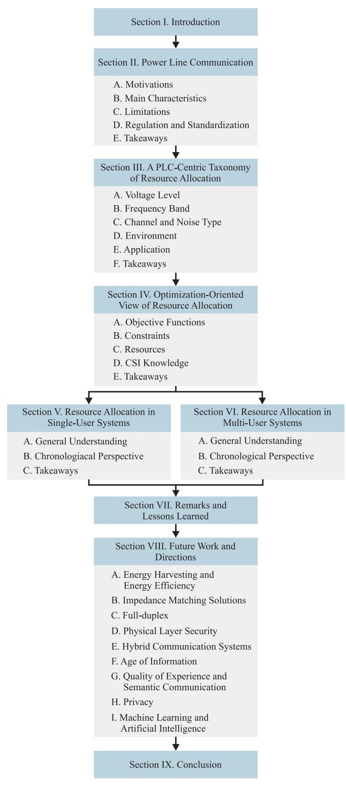

Fig. 1. Organization of the survey.

- *•* As the mains frequency voltage rises, the coupling with electric power systems becomes increasingly complex and expensive [\[54\]](#page-30-14). Consequently, the use of wide frequency bandwidth is determined by the voltage level.
- *•* The dynamic of loads, which are becoming massively non-linear, the occurrence of natural events, and impedance mismatching [\[93\]](#page-31-25), [\[94\]](#page-31-26) introduce random

- effects in the propagation of information-carrying signals through electric power systems [\[57\]](#page-30-15), [\[58\]](#page-30-16).
- *•* PLC channels are difficult to characterize since the dynamic of loads and type of power supplies – i.e., alternating current (AC) and direct current (DC) – dictate their behavior. In AC circuits, PLC channels are modeled as cyclostationary random processes with sudden and significant fading during distinct time slots within the period of the mains frequency [\[1\]](#page-29-0), [\[76\]](#page-31-8). As for DC circuits, PLC channels are stationary random processes with slow fading based on the dynamic of loads [\[20\]](#page-29-19), [\[95\]](#page-31-27).
- *•* The additive noise in PLC systems is constituted by non-stationary random processes due to switching events associated with AC/DC converters, lightning strikes, and equipment malfunction [\[17\]](#page-29-16), [\[56\]](#page-30-17), [\[59\]](#page-30-18). The additive noise characteristics also strongly depend on the dynamic of loads [\[96\]](#page-31-28).
- *•* Impedance matching between electric power systems and PLC devices cannot be ensured since the access impedance varies with time, frequency, and space [\[97\]](#page-31-29), [\[98\]](#page-31-30), [\[99\]](#page-31-31), [\[100\]](#page-31-32).
- *•* The number of power cables (i.e., two, three, or four) and the mode of propagation (i.e., common and differential) produce single-input single-output (SISO) or multiple-input multiple-output (MIMO) channels [\[101\]](#page-31-33). PLC systems using more than two conductors suffer from crossover effects [\[50\]](#page-30-19), since power cables are electromagnetically unshielded.

#### *C. Limitations*

As the infrastructure of electric power systems aims at generating, transmitting, and delivering electricity, there are intrinsic limitations to data communication. In this sense, the major limitations are described as follows:

- *•* The availability of connection points is oriented to supply energy; consequently, the location of PLC nodes cannot be arbitrary. In other words, PLC devices are connected to electric power systems only at certain locations. For instance, only a few outlets are available for connecting PLC devices in buildings and homes. Also, poles are used to hold PLC devices in medium-voltage (MV) or lowvoltage (LV) outdoor electric power systems.
- *•* PLC systems are constrained by the limited number of power cables (two, three, or four), preventing the use of ultra-massive MIMO. They can only be used in combination with other technologies like WLC, phone lines, and VLC [\[61\]](#page-30-20), [\[88\]](#page-31-20), [\[102\]](#page-31-34).
- *•* PLC systems are secondary spectrum users. Consequently, their coexistence with primary users imposes severe constraints regarding PSD levels and EMC [\[14\]](#page-29-13).

#### *D. Regulation and Standardization*

Regulatory authorities and standardization institutions impose constraints on the operation of PLC systems to coexist with other well-established communication systems. The regulations focus on avoiding interference with legacy WLC

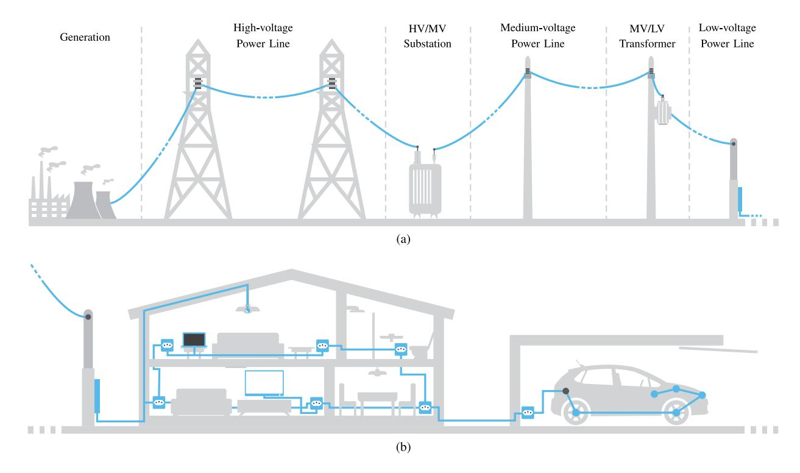

Fig. 2. Representation of the electric power system in both (a) outdoor and (b) indoor environments.

systems (i.e., EMI) and other devices physically connected to electric power systems (i.e., EMC). These constraints are organized as follows:

- *• Frequency bands*. Telecommunication authorities manage spectrum usage [\[1\]](#page-29-0). Most of them define the frequency bands for broadband power line communication (BB-PLC) systems, and their definitions are country-dependent. Standardization institutions and regulatory authorities define the frequency bands for narrowband power line communication (NB-PLC) systems.
- *• Prohibited sub-bands*. BB-PLC systems are secondary users of the spectrum. Consequently, telecommunication authorities prohibit data communication in several sub-bands [\[14\]](#page-29-13). This is one of the reasons why PLC technologies rely heavily on multicarrier schemes.
- *• Transmission power*. BB-PLC and NB-PLC systems must comply with existing EMI and EMC regulations. Consequently, they are subject to specific PSD masks for the transmitted signals [\[14\]](#page-29-13), [\[103\]](#page-31-35).

#### *E. Takeaways*

This section has provided a background of PLC systems. It delved into the primary motivations driving the adoption of PLC systems and detailed the fundamental characteristics, inherent limitations, and the constraints imposed by regulations and standards. Based on these aspects, PLC systems offer an attractive solution for data communication through electric power systems due to their widespread applicability.

Due to the ubiquity of the electric power infrastructure, PLC systems have become attractive across many sectors, including utility services and vehicular communication. On the other

hand, the challenges addressed, such as interference, attenuation, and limited connection points, highlighted the harsh conditions in which PLC systems operate, which motivates the need to develop novel RA solutions.

# III. A PLC-CENTRIC TAXONOMY OF RESOURCE ALLOCATION

This section introduces a structured taxonomy of RA with a particular focus on aspects considered relevant to the PLC R&D community. The main objective of this taxonomy is to offer valuable guidance to understand RA in the context of PLC and with a PLC-oriented perspective.

The taxonomy organizes RA contributions and advancements based on several criteria, including voltage level of electric power systems, the employed frequency band, the adopted channel and noise model, the typical environment, and the core application. This categorization is visually represented in Fig. [3,](#page-7-0) which systematically displays the main categories, subcategories, and the corresponding papers. In the following subsections, we elaborate on the taxonomy as mentioned above and provide concise explanations of each of the considered categories.

# *A. Voltage Level*

Electrical power systems are sorted into three distinct voltage levels [\[77\]](#page-31-9), [\[192\]](#page-33-0). Each of them presents distinct characteristics, which are described as follows:

*• High-voltage*. It refers to electric power transmission systems. The amplitude of the mains voltage signal ranges from 35 to 230 kV, the covered distances surpass 500 km, and only a few branches are observed. Coupling with high-voltage (HV) power lines is very expensive,

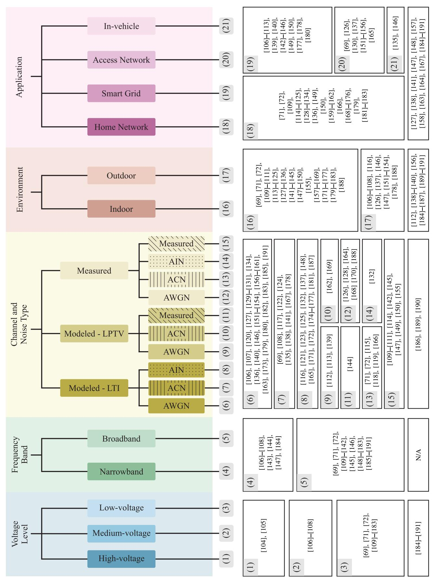

Fig. 3. PLC-centric taxonomy of RA for PLC systems (contributions in unnumbered boxes on the last row did not specify the stipulated taxonomy).

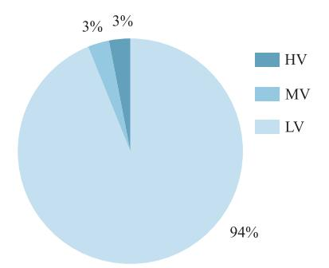

Fig. 4. Percentage of RA papers for PLC in terms of voltage levels.

and its installation is very complex. Consequently, high data rates are not technically feasible [\[54\]](#page-30-14). Currently, commercial products from Hitachi and Siemens use the discrete multitone (DMT) scheme [\[193\]](#page-33-1), [\[194\]](#page-33-2), and there is a renewed interest in advancing HV PLC systems [\[104\]](#page-31-36), [\[195\]](#page-33-3), [\[196\]](#page-33-4).

- *• Medium-voltage*. It refers to electric power distribution systems when the amplitude of the mains voltage signal is in the range of 1–35 kV, and it covers a few kilometers (5–25 km). Although MV power lines are usually overhead, they can also be underground (mainly in urban areas) [\[76\]](#page-31-8). NB-PLC prevails over BB-PLC since signals with relevant spectrum content in low-frequencies (i.e., below 500 kHz) pass through MV/LV transformers [\[197\]](#page-33-5), [\[198\]](#page-34-0), [\[199\]](#page-34-1) and the use of bypass devices to overcome them in BB-PLC systems is expensive.
- *• Low-voltage*. It refers to electric power distribution systems in which the amplitude of the mains voltage signal is below 1 kV. It covers distances shorter than a few hundred meters. Coupling with LV power lines is cheap and easy. Moreover, LV electric power distribution systems seem to be less favorable for PLC systems compared to the MV counterpart due to the number of branches, proximity, and the load profile [\[77\]](#page-31-9). However, the simplicity of coupling and the short distances make them much more attractive for SG, home networking, and SH applications [\[1\]](#page-29-0), [\[48\]](#page-30-21).

Fig. [3](#page-7-0) shows the list of papers on RA for PLC system regarding the voltage level. We can see that LV electric power distribution systems have been mainly investigated since they encompass indoor and outdoor environments. Regarding MV electric power distribution systems, there are fewer research efforts towards RA since PLC systems are not as attractive as current WLC systems. Also, RA for HV electric power transmission systems is rare since few applications of transmission utilities are demanded. Finally, Fig. [4](#page-8-0) quantitatively shows the research efforts towards PLC systems.

#### *B. Frequency Band*

PLC systems are fundamentally designed for baseband data communication, attributable to their utilization of lower frequency spectrum. This characteristic inherently simplifies the architecture of the front-end components. Within the PLC domain, the classifications "narrowband" and "broadband"

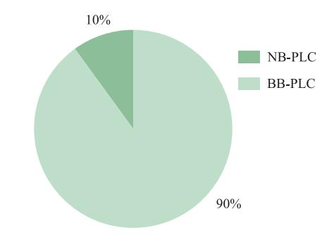

Fig. 5. Percentages of RA papers for PLC in terms of frequency bands.

serve as critical terminologies, delineating the frequency bands employed for data transmission. The distinction between these two categories is described as follows:

- *• Narrowband*. It refers to any frequency band below 500 kH[z1](#page-8-1) [\[7\]](#page-29-6). For data communication, the European Committee for Electrotechnical Standardization (CENELEC) defines four bands in the frequency range 3– 148.5 kHz, and the Federal Communications Commission from the US defines the frequency band 9–490 kHz. Moreover, the frequency band 10–450 kHz is defined in Japan, whereas the frequency band 3–500 kHz is adopted in China. The remaining countries follow either the US or European specifications. NB-PLC is mainly dedicated to smart metering.
- *• Broadband*. It covers any frequency band from 1.7 up to 100 MH[z2](#page-8-2) [\[8\]](#page-29-7). Also, the frequency band for white space is being considered, specifically, the very high-frequency band (i.e., 30–300 MHz) [\[200\]](#page-34-2). In broadband frequencies, there is a severe constraint on the PSD of transmitted PLC signals, which are also prohibited in several subbands [\[14\]](#page-29-13). Also, BB-PLC is mainly dedicated to home network applications.

Fig. [3](#page-7-0) shows the list of papers related to RA for PLC systems when a frequency band taxonomy is taken into account. As can be noticed and confirmed from Fig. [5,](#page-8-3) the majority of RA research activities are related to BB-PLC systems since the telecommunication sector has heavily searched for opportunities to increase data rates in access and home networks. Moreover, BB-PLC solutions can offer higher flexibility in terms of data rate, latency, robustness, and energy efficiency in comparison to NB-PLC [\[201\]](#page-34-3). NB-PLC systems have received renewed attention since they can assist several SG and sensing applications. Moreover, the need to achieve low-cost and low energy consumption PLC devices for SG applications shows that simple RA techniques (i.e., adaptive modulation) have been deployed in NB-PLC systems. On the other hand, more sophisticated RA techniques are widely used

1The frequency band between 500 kHz and 1.7 MHz is prohibited to PLC systems as it is dedicated to analog modulation (AM) radio systems.

2Although standardization efforts have limited the upper edge of the frequency band to 100 MHz, it can be much higher than this. For instance, the frequency band between 1–100 GHz has been recognized as a new frontier for PLC systems to achieve data rates up to 1 Tbps by using power line wires as waveguides [\[79\]](#page-31-11), [\[80\]](#page-31-12).

in BB-PLC systems since there are severe constraints and relevant benefits in using such RA techniques.

#### *C. Channel and Noise Type*

The composition of topology, essential components, and loads result in time-varying PLC channel impulse responses (CIRs), high-power additive noise, and time-varying access impedance. Based on the existing literature, a helpful approach consists of classifying RA works according to the types of PLC channels and additive noise.

PLC CIRs originate from multipath propagation created by impedance mismatching between loads and electric power systems [\[11\]](#page-29-10). Consequently, impedance mismatching is one of the sources of the frequency-selective behavior of NB-PLC [\[1\]](#page-29-0) and BB-PLC channels [\[202\]](#page-34-4). RA works have considered the following types of PLC channels:

- *• Linear time invariant (LTI) model*. This model assumes that changes in the CIR occur only with connection/disconnection of loads to the power grid, representing long-term variations[3](#page-9-0) at a timescale several orders of magnitude higher than the time interval corresponding to a symbol period [\[203\]](#page-34-5).
- *• Linear periodically time variant (LPTV) model*. Recent research has evidenced that PLC channels may exhibit long- and short-term variations [\[18\]](#page-29-17), [\[204\]](#page-34-6), [\[205\]](#page-34-7). The appliances connected to AC electric power systems usually use AC/DC converters. Consequently, an LPTV behavior synchronous to the mains frequency is observed in PLC CIRs [\[18\]](#page-29-17), [\[110\]](#page-31-37).
- *• Measured*. Measurements allow a complete characterization of data communication media. Carrying out measurements allows obtaining valuable insights and characterizing the dynamics of PLC CIRs. However, performing a measurement campaign is not an easy task [\[89\]](#page-31-21), [\[206\]](#page-34-8), [\[207\]](#page-34-9). Consequently, the literature reports few RA works that rely on measured channels.

The PLC noise is unique and characterized by an additive random process that is supposed to be constituted by the following five components [\[17\]](#page-29-16), [\[59\]](#page-30-18): (i) colored background noise, (ii) narrowband noise, (iii) periodic impulsive noise synchronous to the mains frequency, (iv) periodic impulsive noise asynchronous to the mains frequency, and (v) asynchronous impulsive noise. Each component has a different source, except for the periodic impulsive noise components, as both originate from AC/DC converters. The asynchronous components, however, may often be disregarded due to low amplitude and/or rate of occurrence. Furthermore, the additive noise differs at the input of each PLC device [\[59\]](#page-30-18) and yet shows certain levels of spatial correlation. The literature shows that distinct models have been adopted, and the organization of RA works based on noise types arises as follows:

*• Additive white Gaussian noise (AWGN) model*. It models the PLC noise as an additive, stationary, and white Gaussian random process. The AWGN model has been

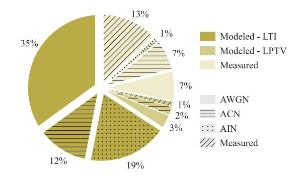

Fig. 6. Percentages of RA papers for PLC in terms of channel and noise types.

- adopted in the PLC literature without a trustful justification. Unlike WLC systems, where the AWGN model is well-accepted, the PLC noise cannot be properly characterized by a stationary and white random process.
- *• Additive colored noise (ACN) model*. It models the PLC noise as an additive, stationary, and colored random process. The literature reports that the PSD of the PLC noise is not flat, and its magnitude typically decreases with increasing frequency [\[59\]](#page-30-18), [\[208\]](#page-34-10), [\[209\]](#page-34-11). Usually, the ACN is mostly modeled as a colored Gaussian random process with a non-flat PSD [\[108\]](#page-31-38), [\[210\]](#page-34-12) and it is widely applicable to evaluate RA techniques.
- *• Additive impulsive noise (AIN) model*. The additive noise is constituted by background and impulsive components. The former may comprise components (i) and (ii), whereas the latter may consider all or some of the three remaining components. A stationary and colored Gaussian random process models the background component. The impulsive component is modeled by a stationary non-Gaussian random process [\[59\]](#page-30-18), [\[211\]](#page-34-13), [\[212\]](#page-34-14). Currently, the most accepted statistical distributions for the impulsive component are based on Middleton Class A [\[171\]](#page-33-6) and Bernoulli-Gaussian [\[213\]](#page-34-15).
- *• Measured*. The lack of trustfulness in AWGN, ACN, and AIN models to precisely characterize additive noise motivates the use of measured noise sample realizations to perform RA. Acquiring noise sample realizations, however, may be a tough task. Overall, contributions based on measured noise sample realizations provide a greater sense of trustworthiness regarding the effects of additive noise in RA problems.

Fig. [3](#page-7-0) shows the list of papers on RA for PLC systems following the taxonomy of channel and noise types, while Fig. [6](#page-9-1) shows the percentage of papers regarding each combination of channel and noise. Most researchers adopt mathematical models to carry out works on RA for PLC systems, which is not a novelty as RA problems rely on heavy mathematical formulations. Indeed, representative mathematical models for channel and additive noise constitute a baseline to research RA applied to PLC systems. Although several works in the literature have evidenced the LPTV behavior synchronous to the mains frequency of PLC channels, the LTI model is by far the most adopted, constituting more than half of the works. This is possible since authors assume that the

3Long-term variations occur due to the random on/off switch of appliances. As expected, this causes variation in both CIRs and access impedance [\[97\]](#page-31-29), [\[98\]](#page-31-30).

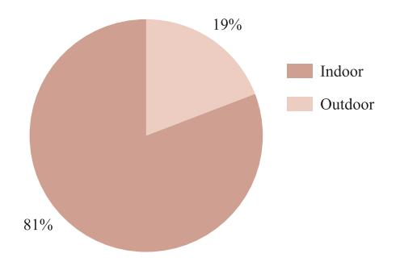

Fig. 7. Percentages of RA papers for PLC in terms of environments.

coherence time is longer than the time interval of a transmitted symbol. LTI models are also easier to handle when compared to LPTV models. In fact, due to the vast association of RA for PLC systems with multicarrier schemes, the channel can be considered LTI as long as its coherence time is several orders of magnitude larger than the symbol period.

LPTV channel models can result in more realistic evaluation of RA techniques. As the dynamics of AC electric power systems are related to the mains frequency and loads, the overhead associated with control signaling needs to be considered. Exploiting the LPTV behavior of PLC channels can reduce the necessity of exchanging control information among PLC devices.

The adoption of measured channels together with the measured noise is also notable. This is expected since measurement campaigns are carried out to obtain CIR estimates and sample functions of additive noise.

Lastly, most works model the noise as AWGN, and only a few papers consider the presence of impulsive noise, which is the major source of performance degradation in PLC systems.

# *D. Environment*

The environments in which PLC systems operate are diverse and change dramatically. In this sense, PLC environments are divided into indoor and outdoor. They are described in a PLCoriented perspective as follows:

- *• Indoor*. This environment refers to in-home, in-building, and in-vehicle electric circuits and covers only LV electric power systems. Considering in-home and in-building facilities, the wiring is a tree-like network deployed from the service panel through several branch circuits that reach the outlets in a non-specified manner [\[76\]](#page-31-8). Most of the time, the exact layout of the circuits, the number of sections of wire in each branch circuit, and their lengths are unknown. The proximity between PLC devices and the load profile result in more degradation of PLC signals.
- *• Outdoor*. This environment refers to electric power systems applied to the transmission and distribution of electricity. It comprises LV, MV, and HV power lines. Outdoor electric power systems often cover a wider area and are subject to external factors such as weather conditions and electric power grid operations, which can seriously impact the communication medium.

Fig. [3](#page-7-0) shows the list of RA papers based on the considered environments, and Fig. [7](#page-10-0) confirms that the majority of RA research activities focus on the study of indoor PLC systems. This focus on the indoor environment is expected as in-home and in-building connectivity is a pressing telecommunication demand. The installed infrastructure of electrical power systems in the indoor environment makes PLC a technology with low installation cost and high pervasiveness, pushing research efforts towards increasing connectivity in indoor environments.

# *E. Application*

As PLC transmits data through electric power systems, they have been widely applied to deal with telecommunication needs from electric utilities. The pervasiveness of electric power systems worldwide makes PLC a formidable candidate for several applications, mainly those in which the infrastructure of electric power systems is already installed. For example, PLC systems are recognized as an enabling technology for SG applications. Also, access networks, home networking, and in-vehicle applications have been recognized as other main applications for PLC systems. In this sense, contributions related to RA for PLC systems can be organized according to the applications, which are detailed as follows:

- *• Home Network*. It applies SG concepts within a residence or apartment, allowing a more effective data network as well as monitoring, securing, and controlling domestic assets (appliances) and commodities (energy and water). PLC systems can assist the data network by overcoming the impairment imposed by the walls over wireless signal propagation. Moreover, home automation and intelligent buildings are the major topics home networks encompassed [\[214\]](#page-34-16). SHs use sensors and data networks to establish communication between devices, which constantly report consumption records and allow owners to monitor remote devices [\[215\]](#page-34-17), [\[216\]](#page-34-18). In this context, PLC systems provide a natural telecommunication infrastructure for various devices, such as sensors in an automated house.
- *• Smart Grid*. It allows the intelligent and dynamic integration of diverse energy sources, utilities, consumers/prosumers, and other stakeholders to provide sustainable, efficient, flexible, robust, and secure transmission and distribution of electricity. PLC systems are well-desirable for assisting SGs as they are useful for communication and sensing [\[76\]](#page-31-8). PLC systems are costeffective and comparable to WLC systems to assist several SG applications [\[1\]](#page-29-0). PLC-based SG applications include smart metering, smart monitoring, vehicle-to-grid communications, demand side management, and energy management.
- *• Access Network*. It denotes the infrastructure of the electric power systems that establish data communication between a backbone network and customers over ACbased LV and MV electric power systems. The PLC access network architecture depends upon repeaters in both MV and LV electric power systems to achieve full coverage [\[76\]](#page-31-8).

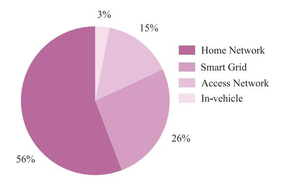

Fig. 8. Percentages of RA papers for PLC in terms of applications.

*• In-vehicle*. It refers to data communication inside vehicles, i.e., cars, ships, planes, or trains [\[52\]](#page-30-13), which are mainly powered by DC power sources. The interest in PLC for in-vehicle applications has increased considerably, as they provide a convenient way to perform communication, sensing, powering, and control using the existing electrical wiring, facilitating the integration of various vehicular systems.

As listed in Fig. [3](#page-7-0) and showed in Fig. [8,](#page-11-1) most research activities regarding RA for PLC systems are related to home network applications since both academia and industry recognized the suitability of PLC systems for such applications when narrowband and broadband demands are considered. Consequently, the literature shows a tremendous research effort to advance RA for home network applications. The second most demanding application is SG, as utility companies correctly understand the advantages of PLC systems to their daily operations. Also, research efforts toward access networks are less representative since other technologies offer better trade-offs in terms of performance and cost than PLC. Last, there are only a few investigations related to in-vehicle applications, as most research can be extended to these applications.

#### *F. Takeaways*

This section has introduced a taxonomy for categorizing RA proposed solutions and progress, focusing on different areas relevant to the PLC R&D community. It has categorized RA papers based on the voltage level of electric power systems, frequency band, channel and noise model, the considered environment, and application. By analyzing the proportion of RA publications, we have not only discerned the main directions pursued to advance RA for PLC systems but also identified areas that deserve further research attention.

# IV. OPTIMIZATION-ORIENTED VIEW OF RESOURCE ALLOCATION

Aiming at complementing the previous section, this section focuses on RA within the formal and well-established framework of an optimization problem. In essence, RA optimizes parameters fundamental to any telecommunication system. RA for PLC systems has greatly benefited from wireline and WLC systems advancements. However, certain characteristics unique to electric power systems result in distinct communication channels and additive noise profiles.

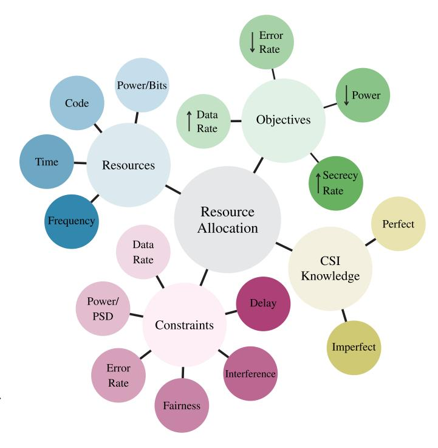

Fig. 9. The four components of RA for PLC systems and each of their branches.

Rigorous examinations of electric power distribution systems as a data communication medium have driven the PLC technology to introduce innovations and adaptations of well-established RA solutions derived from other telecommunication systems.

Briefly, RA is related to the formulation of an optimization problem [\[217\]](#page-34-19) where an objective (value/loss) function is defined and several constraints are introduced as follows:

$$\begin{aligned} & \underset{\boldsymbol{x}}{\text{min/max}} & f(\boldsymbol{x}) \\ & \text{subject to} & p_j(\boldsymbol{x}) \leq \alpha_j, \quad j = 1, 2, \dots, J, \\ & q_k(\boldsymbol{x}) = \beta_k, \quad k = 1, 2, \dots, K \end{aligned} \tag{1}$$

in which *f* (*x*) is termed the objective function, *pj*(*x*) and *qk* (*x*) are known as inequality and equality constraints, respectively, the constants α*j* and β*k* are limits (or bounds) for both constraints and *x* = [*x*1 *x*2 ··· *xn*] *T* is the vector containing the resources to be allocated.[4](#page-11-2)

Note that objective functions, constraint functions, and resources characterize RA problems. There is another aspect, however, that should also be taken into account when dealing with RA problems in a PLC context, which is the CSI. Therefore, RA for PLC systems can be adequately characterized by the four components presented in Fig. [9.](#page-11-3) In the following subsections, we briefly discuss each of these components. Additionally, for establishing a taxonomy centered around RA, similar to the role played by Fig. [3](#page-7-0) in providing the PLC perspective, Fig. [10](#page-12-0) illustrates a categorization of RA under an optimization-oriented perspective.

4In the optimization literature, the *n*-dimensional vector with the resources to be allocated is also known as design vector [\[217\]](#page-34-19) or optimization variable [\[218\]](#page-34-20).

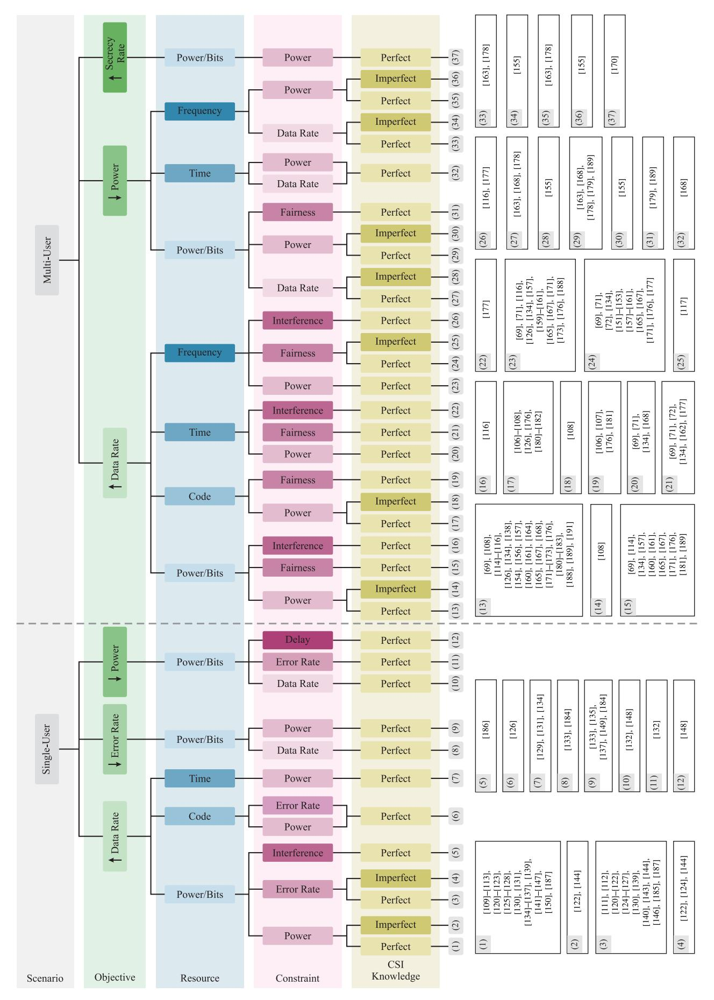

Fig. 10. Optimization-oriented taxonomy of RA for PLC systems.

#### A. Objective Functions

This component – characterized by the function f(x) in (1) – includes but may not be limited to data rate maximization, signal-to-noise ratio (SNR) maximization, secrecy rate maximization, error rate minimization, utility function maximization, and transmission power minimization. Although the choice of the objective function is straightforward in most problems, the optimization for a particular criterion might lead to solutions that are not satisfactory for another criterion. Selecting the objective function is thus one central stage of the RA process. While single-user scenarios typically deal with a single criterion, several criteria must be satisfied simultaneously in multi-user scenarios. An optimization problem involving multiple objective functions is commonly known as a multi-objective optimization (MOO).

Among the assumed objective functions of RA problems for PLC systems, error rate minimization and secrecy rate maximization are less exploited. The most common are data rate maximization and transmission power minimization. These two objective functions are quite frequent in the RA literature and can be formulated together with a constraint, which leads to the following criteria [38]:

- *Rate-adaptive*. Maximizes the data rate given a maximum transmission power constraint.
- *Margin-adaptive*. Minimizes the transmission power given a minimum data rate constraint.

The literature of RA for PLC systems focuses mainly on rate adaptation due to the recent needs of modern society for higher achievable data rates. However, the current pressing demand for energy consumption reduction [219], [220] also brings attention to the margin-adaptive criterion.

Due to the wide use of unshielded power cables and massive connectivity between electric circuits in electric power systems, existing EMC and EMI issues can be opportunistically exploited by malicious devices, physically or not connected to power lines, to overhear transmitted PLC signals. Consequently, confidentiality, integrity, availability, and access control might be seriously compromised. Therefore, secrecy rate maximization has become relevant to ensure security at the PHY layer level [221], [222], [223], [224], [225].

#### B. Constraints

The constraints in RA problems for PLC systems – characterized by the functions  $p_j(\boldsymbol{x})$  and  $q_k(\boldsymbol{x})$  and constants  $\alpha_j$  and  $\beta_k$  in (1) – involve error rate or error probability, transmission power, data rate, delay, fairness, and interference, which are discussed hereafter.

One of the critical goals of any communication system is to transmit and receive data without any error. Error rates are vital indicators of how well a communication system is designed. Therefore, the presence of error rate as a constraint in RA problems is common and crucial as it ensures reliable data communication. Error rate as a constraint appears in RA problems in the form of symbol error rate (SER) or symbol error probability ( $\mathbb{P}_e$ ) and bit error rate (BER) or bit error probability ( $\mathbb{P}_b$ ).

Both data rate and transmission power constraints are usually formulated considering rate-adaptive or margin-adaptive criteria [38]. The data rate constraint in some scenarios is necessary to provide QoS for fixed-rate applications [226], [227], [228], while the transmission power constraint is becoming relevant due to the necessity of reducing energy consumption and improving energy efficiency worldwide [219], [220]. The recent concerns about energy consumption also highlight impedance mismatching, as it might result in expressive energy losses and thermal problems in a transceiver [13], [54], [94]. However, an impedance mismatching constraint has not been included in RA problem formulations.

In the PLC literature, bit error rate, transmission power, and data rate as constraints are well investigated. Among the remainders, delay and interference are still overlooked. Delay can be categorized as propagation [229], processing [230], and queuing [230], [231]. Although interference in PLC systems can be theoretically distinguished and classified into different types, a PLC device perceives them concurrently. Consequently, RA problems are formulated considering the overall interference.

Lastly, the literature has shown that fairness is a fundamental principle that establishes equitable access and RA [29]. It encompasses the idea that all users and applications should be treated fairly and without discrimination when sharing channel resources [232]. PLC systems leverage existing power lines to enable data communication, making it essential that all users, whether utilities, businesses, or consumers, have fair and equitable access to this shared infrastructure. Achieving fairness involves implementing mechanisms such as QoE or QoS policies capable of fairly sharing resources among users while considering the dynamic nature of power lines and varying data transmission requirements. In addition to fostering equitable conditions for all users, this fairness simultaneously boosts the efficiency of the communication system by optimizing resource utilization.

#### C. Resources

In communication systems, resources – characterized by  $\boldsymbol{x}$  in (1) – are quantities that assume values within a feasible region. In optimization problems, the resources are thus variables used to find the minimum (or maximum) of the objective function, provided that constraints are fulfilled. In the PLC literature, the resources that can be found are frequency, time, power/bits, and code.

When the frequency is the main resource, RA can be related to either bandwidth or carrier allocation. The former determines the frequency spectrum allocated to a specific communication system for data transmission, whereas the latter assigns specific frequency carriers (or bands) to different communication systems to avoid interference. Frequency and time allocation are usually carried out at the link layer and distributed among users for medium access.

Power allocation, which is also associated with bit allocation, refers to the distribution of available transmission power among different transmission signals. Power and bit (or modulation order) allocation is the most typical way to perform RA, especially at the PHY layer. Code allocation, on the other hand, is the resource less explored in the PLC context. It refers to assigning specific codes to different transmission signals to distinguish them. These codes are used in spread spectrum (SS) communication systems [\[233\]](#page-34-35), [\[234\]](#page-34-36) to improve the resistance to interference and increase the number of users sharing the same communication channel within frequency and/or time domains.

Other resources could be mentioned, but either they have not yet been exploited in the literature, or they have been pointed out indirectly such that they cannot be classified as a resource or constraint. Processing capacity, for instance, is a resource that has already been indirectly pointed out in several contributions [\[110\]](#page-31-37), [\[111\]](#page-32-0), [\[112\]](#page-32-1), [\[113\]](#page-32-2). It is expected to become more relevant due to the necessity of integrating sensing and monitoring applications and advances in protocols used at both PHY and link layers, which eventually demand more processing capacity.

#### *D. Channel State Information Knowledge*

The CSI is essential to suitably address the RA problem. The parameters of the RA optimization problem are defined by the level of CSI knowledge the entity responsible for carrying out the RA has. In this sense, the CSI knowledge can be arranged as described below:

- *• Perfect CSI knowledge*. It is the best-case scenario for RA. Once the transmitter has perfect CSI knowledge in real-time, the RA problem becomes less restrictive, making it feasible to achieve optimal solutions. Despite most RA problems being based on this assumption, it can be unrealistic for fast varying channels.
- *• Imperfect CSI knowledge*. It is a more realistic assumption, as the transmitter often has incomplete or inaccurate knowledge of the channel conditions. This may result from various factors, including errors, noise, or outdated CSI. Depending on the level of CSI knowledge by the transmitter, it is possible to perform suboptimal RA.

Electric power systems are well-known as a hostile communication media, not only because of the frequency selective CFR but also due to the presence of impulsive and colored additive noise. Consequently, the CSI knowledge also involves the normalized signal-to-noise ratio (nSNR)[,5](#page-14-1) which is a more reliable parameter to perform RA for PLC systems [\[235\]](#page-34-37). Due to the frequency selective nature of PLC channels, RA for PLC systems is strongly associated with muticarrier schemes such as DMT, hermitian symmetric OFDM (HS-OFDM), orthogonal frequency division multiple access (OFDMA) [\[73\]](#page-31-5), [\[236\]](#page-34-38), [\[237\]](#page-34-39), [\[238\]](#page-34-40), [\[239\]](#page-34-41), clustered-orthogonal frequency division multiplexing (OFDM) [\[240\]](#page-34-42), [\[241\]](#page-34-43), [\[242\]](#page-34-44), [\[243\]](#page-35-0), [\[244\]](#page-35-1), wavelet-OFDM [\[245\]](#page-35-2), [\[246\]](#page-35-3), [\[247\]](#page-35-4), and filtered multitone (FMT) [\[248\]](#page-35-5), [\[249\]](#page-35-6), [\[250\]](#page-35-7). Also, some other schemes are being pointed out as promising alternatives, such as orthogonal chirp division multiplexing (OCDM) [\[251\]](#page-35-8) and orthogonal Stockwell division multiplexing (OSDM) [\[252\]](#page-35-9).

5nSNR or channel-to-noise gain is the channel energy gain/attenuation divided by the noise energy.

Indeed, multicarrier schemes have been the baseline for the introduction of remarkable findings related to RA for PLC systems, and there is a tendency to drive more attention towards these schemes in coming years[.6](#page-14-2)

#### *E. Takeaways*

This section has formulated RA for PLC systems as an optimization problem. With this formulation, we can detail each element of the RA problem, describing the relevant features for PLC systems. We have introduced the definition of objective functions, the relevant resources, and the commonly imposed constraints. The objective functions encompass various criteria, with data rate maximization and transmission power minimization being the most adopted ones. Furthermore, constraints include error rates, transmission power, data rate, fairness, interference, and delay, whereas resources for RA include frequency, time, power/bits, and codes. Finally, this section has emphasized the relevance of CSI knowledge in formulating RA problems and has pointed out that perfect or imperfect CSI knowledge impacts the available solutions of the RA problem.

# V. RESOURCE ALLOCATION IN SINGLE-USER SYSTEMS

Single-user communication involves a scenario where two distinct nodes within the same PLC network communicate exclusively through a point-to-point link. Consequently, single-user RA for PLC systems revolve around optimizing the utilization of limited resources within electric power systems within the frequency band designated for the exclusive use of a single pair of nodes. To provide an in-depth exploration of single-user RA, this section is structured as follows: Section [V-A](#page-14-3) delves into general aspects related to single-user RA for PLC systems; Section [V-B](#page-15-0) provides a chronological overview of the contributions; and Section [V-C](#page-19-1) offers a summary of the presented discussions.

#### *A. General Understanding*

Single-user RA is typically tied to the PHY layer. Due to the necessity of maximizing the use of channel resources in both narrowband and broadband PLC systems, RA have mostly relied on multicarrier schemes and their combination with other schemes. Consequently, the overall solution to the singleuser RA problem in multicarrier systems is accomplished by bit-loading algorithms, which are responsible for allocating bits and transmission power to subcarriers given a set of resources and constraints, besides an objective function.

Some of the most well-known bit-loading algorithms are the water-filling algorithm [\[121\]](#page-32-3), [\[253\]](#page-35-10), [\[254\]](#page-35-11), [\[255\]](#page-35-12), the Chow's algorithm [\[256\]](#page-35-13), [\[257\]](#page-35-14), and the Levin Campello algorithm [\[258\]](#page-35-15), [\[259\]](#page-35-16), [\[260\]](#page-35-17). The solution of the water-filling algorithm is unique since the optimized function is convex and, therefore, provides optimal allocation in the sense of the non-quantized number of bits [\[261\]](#page-35-18). Despite the unquantized

6Other schemes such as single-carrier and spread-spectrum can also be of interest. However, the authors understand that the next advances related to RA for PLC systems will rely on the use of multiple multicarrier schemes.

unit, such an optimal solution is crucial for obtaining an achievable data rate close to the channel capacity. The other two algorithms are capable of providing a quantized number of bits. Chow's algorithm provides suboptimal results that approximate the water-filling solution. In contrast, the Levin-Campello algorithm is based on the denominated greedy approach and, therefore, provides an optimal solution for a discrete number of bits.

Although these are well-known and widely adopted algorithms in the literature, RA problems can be solved differently. Some authors rely on water-filling-based algorithms to create distinct approaches [\[123\]](#page-32-4). However, many other works look for solutions that are not based on any of these algorithms and, thus, propose alternative solutions for RA problems [\[128\]](#page-32-5), [\[133\]](#page-32-6), [\[138\]](#page-32-7).

As previously mentioned, RA problems are optimization problems and can be treated as such. Given an optimization problem, the optimal solution is the desired one. However, one of the drawbacks of algorithms capable of producing optimal solutions is their intrinsic high computational complexity. Many works focus on reducing such complexity to provide more feasible approaches [\[110\]](#page-31-37), [\[111\]](#page-32-0), [\[142\]](#page-32-8).

## *B. Chronological Perspective*

This subsection gives a chronological perspective of singleuser contributions within the scope of RA for PLC systems. To begin with, Table [IV](#page-16-0) lists the main single-user RA progress organized by year, presenting their short description and relevant optimization features (convexity, solution/algorithm, and optimality). The convexity of the RA problem impacts the choice of optimization methods and the reliability of results. Second, the solution/algorithm, i.e., the method used to solve the RA problem, dictates whether the obtained outcome can be a global or local optimum. Lastly, optimization problems are all about finding the best solution. The concept of optimality is thus central in this regard, as it represents the solution's effectiveness in achieving the desired objectives.

By analyzing Table [IV,](#page-16-0) we also infer that the start of RA for single-user scenarios dates back to the early 2000s. However, between 2006 and 2018, research related to RA gained greater attention, as illustrated in Fig. [11.](#page-15-1) During those years, several algorithms and techniques were introduced, focusing on distinct objectives, from increasing the overall data rate and, at the same time, minimizing BER or transmission power of PLC systems to reducing the complexity of wellknown algorithms.

The subsequent paragraphs present a year-by-year exploration of single-user RA advancements for PLC systems. We aim at providing a clear perspective on the continuous growth and evolution of RA over the past twenty years. By adopting a chronological approach, we trace the development of RA, emphasizing how earlier research has laid the groundwork for subsequent progress and innovation in this area. This perspective is crucial to understand the cumulative influence of these research endeavors.

Between 2003 and 2009, the enhancement of RA for PLC systems significantly drew upon contemporary RA solutions

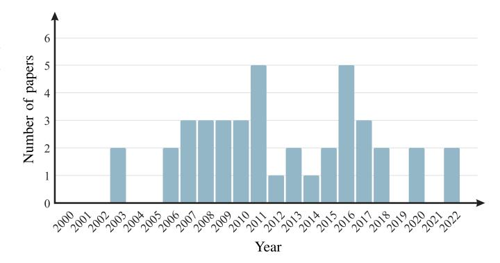

Fig. 11. Number of papers in the single-user RA context over the years.

in DSL technologies. This synergy was a natural outcome, considering that both PLC and DSL are wireline communication technologies. A key aspect of this period was the influence of DSL's advanced OFDM implementation in the baseband, known as DMT in DSL contexts, which became a crucial model for PLC development. This era also marked a strategic shift towards leveraging the unique features of electric power systems, especially those powered by AC sources. This shift led to the development of RA solutions that were designed to adapt to the periodically fluctuating nature of PLC channels. Additionally, research efforts were dedicated to examining the impact of cyclic prefix (CP) length within DMT frameworks for PLC systems. A relevant focus of these endeavors was on the advancement of BB-PLC systems, particularly for home networking applications, since the attenuation characteristics of power lines as frequency increases impose severe constraints on the distance between devices. The major contributions from this era can be outlined as follows:

- *•* **2003**. The main focus of discussion in 2003 was using bitloading algorithms introduced for DMT in DSL systems. For example, the authors of [\[120\]](#page-32-9), [\[121\]](#page-32-3) addressed the use of bit-loading techniques, such as water-filling, applied to DMT transceivers in an in-home PLC environment. The researchers of [\[120\]](#page-32-9) discussed ways to implement a DMT transceiver considering several features, from the basic structure to the use of a guard band, the impact of noise in the system, and a forward error correction to offer more reliability, whereas in [\[121\]](#page-32-3) they focused on presenting performance results of a DMT transceiver design when a dynamic rate-adaptive RA is applied to a PLC system.
- *•* **2006**. After two years without contributions on singleuser RA, this subject regained the attention of researchers. At the end of the year, Morosi et al. [\[122\]](#page-32-10) discussed a rate-adaptive bit-loading algorithm, which is based on the algorithm proposed years before for DMT systems in [\[262\]](#page-35-19), to distinct channel conditions, taking into account an in-building PLC system using DMT modulation. Besides that, in [\[123\]](#page-32-4), a distinct version of the water-filling algorithm was proposed to fulfill an individual channel-power constraint.
- *•* **2007**. This year was marked by many contributions to single-user RA. With the recent publication of a new

TABLE IV RELEVANT INFORMATION ON THE OPTIMIZATION PROBLEMS AND RESPECTIVE SOLUTIONS ADOPTED TO THE MAIN CONTRIBUTIONS RELATED TO SINGLE-USER RA

| Year | Reference | Description                                                                                                                                   | Convexity      | Solution/Algorithm  | Optimality           |
|------|-----------|-----------------------------------------------------------------------------------------------------------------------------------------------|----------------|---------------------|----------------------|
| 2003 | [121]     | Investigation of bit-loading techniques in DMT transceivers in an in-home PLC environment.                                                    | Convex         | KKT-based           | Optimal              |
| 2006 | [122]     | Addressing of a RA technique to distinct channel conditions in an in-building PLC system.                                                     | Convex         | KKT-based           | Optimal & suboptimal |
| 2007 | [126]     | Introduction of a RA technique applied to an SS-OFDM-based PLC system.                                                                        | Relaxed-convex | Analytical          | Suboptimal           |
| 2008 | [128]     | Introduction of a fast bit-loading algorithm for LPTV PLC channels.                                                                           | Convex         | Greedy              | Suboptimal           |
|      | [130]     | Proposal of a bit-loading algorithm together with an LP-DMT scheme for in-home PLC systems.                                                   | Convex         | Look-up-table-based | Suboptimal           |
| 2009 | [184]     | Introduction of a bit-loading algorithm for NB-PLC systems considering the cyclostationary behavior of the additive noise.                    | Convex         | Greedy              | Suboptimal           |
| 2010 | [134]     | Discussion on several criteria for CP length optimization in PLC systems.                                                                     | Convex         | Analytical          | Optimal & suboptimal |
| 2011 | [137]     | Proposal of a new metric, termed goodput, which considers the bit-loading and its interaction with the coding scheme.                         | Convex         | Greedy              | Optimal              |
| 2013 | [113]     | Discussion on two bit and power allocation approaches for LPTV channels.                                                                      | Convex         | Greedy              | Optimal & suboptimal |
| 2014 | [141]     | Investigation of a RA algorithm for PLC systems in the presence of ICI and ISI.                                                               | Non-convex     | Greedy              | Suboptimal           |
| 2015 | [110]     | Introduction of the TCRA technique for PLC systems under time-varying channel conditions with computational complexity reduction.             | Convex         | Greedy              | Suboptimal           |
|      | [144]     | Proposal of a RA technique for NB-PLC systems with time-varying PLC channels.                                                                 | Convex         | Analytical          | Optimal              |
| 2016 | [145]     | Discussion on optimal and uniform RA in cooperative in-home PLC systems.                                                                      | Convex         | KKT-based           | Optimal & suboptimal |
|      | [186]     | Introduction of an optimal power allocation algorithm for NB-PLC systems with constraint to the electromagnetic emission from the PLC signal. | Convex         | Analytical          | Optimal              |
| 2017 | [111]     | Introduction of the SCRA technique for reducing computational complexity and signaling overhead in PLC systems.                               | Convex         | Greedy              | Suboptimal           |
| 2018 | [147]     | Proposal of a bit-loading algorithm cyclic with the mains signal for NB-PLC systems.                                                          | Convex         | Greedy              | Optimal              |
| 2020 | [148]     | Proposal of a bit allocation scheme for PLC systems in the presence of interference and impulsive noise.                                      | Convex         | KKT-based           | Optimal & suboptimal |
|      | [109]     | Addressing of optimal power allocation for hybrid PLC/WLC data communication systems.                                                         | Convex         | KKT-based           | Optimal              |
|      | [149]     | Investigation of power allocation for hybrid PLC/WLC systems focusing on BER minimization.                                                    | Convex         | KKT-based           | Suboptimal           |
| 2022 | [150]     | Discussion on optimal subcarrier permutation for hybrid PLC/WLC systems to better exploit the frequency selectivity of the considered media   | Convex         | KKT-based           | Optimal              |

version for the HomePlug technology, called HomePlug AV [\[263\]](#page-35-20), Guerrini et al. [\[124\]](#page-32-11) introduced two rateadaptive bit-loading algorithms with uniform power allocation compatible with this standard. The first guarantees a target mean BER while the other assures a target BER per subcarrier. Also, a coded low-density parity check with rate-adaptive DMT system was investigated in [\[125\]](#page-32-12). Again, the algorithm described by [\[262\]](#page-35-19) was applied to the system, and a comparison between coded and uncoded schemes was made based on data rate and BER. Finally, Baudais and Crussière [\[126\]](#page-32-13) proposed an algorithm in an SS-OFDM system for both single- and multi-user. In the single-user approach, the RA algorithm allocates bit, energy, subcarrier, and spreading code by exploiting both time and frequency domains.

*•* **2008**. The authors of [\[128\]](#page-32-5) presented a bit-loading algorithm based on the fractional knapsack algorithm. Due to the high number of iterations this algorithm requires, it presents high computational complexity. For that reason, the researchers proposed the reduction of iterations and a comparison between water-filling, a fast version of the fractional knapsack, and uniform power allocation algorithms. However, only a data rate comparison was made, disregarding the complexity of such algorithms. Later that year, the authors of [\[127\]](#page-32-14) addressed a series of research on coded linear precoded DMT (LP-DMT) scheme applied to RA for PLC systems. In this specific contribution, the researchers used a simple energy and bit-loading algorithm to highlight the advantages of using coded LP-DMT for PLC systems. Also, at the end of the year, a new concept of CP optimization in a PLC context was introduced [\[129\]](#page-32-15). Such optimization was considered in the RA problem to maximize the channel capacity for single- and multi-user scenarios.

*•* **2009**. This year started with Sawada et al. [\[184\]](#page-33-7) discussing RA according to a greedy rate-adaptive algorithm when the communication system is impaired by nonwhite and cyclostationary noise. It showed that the RA pattern could be repeated for half a cycle of the mains frequency. This was a quite relevant achievement for RA for PLC systems as the cyclostationary characteristics of the noise and LPTV behavior of PLC channels allow reducing the complexity of RA algorithms, which was investigated in the following years. Regarding the use of LP-DMT in PLC systems, in [\[130\]](#page-32-16), a bit-loading algorithm with peak BER constraint was introduced to maximize the overall data rate. The algorithm is based on a look-up table, which reduces the complexity of usual bit-loading algorithms since no convergence iterations are required. Later that year, the authors of [\[131\]](#page-32-17) advanced their previous work of 2008 [\[129\]](#page-32-15). In [\[131\]](#page-32-17), metrics for the choice of the CP length over PLC channels to maximize the capacity of the PLC system were discussed. The RA algorithm proposed in this work is a modification of the one described in [\[261\]](#page-35-18).

During the period from 2010 to 2015, RA research for PLC systems tackled critical challenges. These challenges encompassed impulsive noise, optimizing CP length, boosting energy efficiency, and designing new metrics for RA solutions. This era was also characterized by efforts to adapt to the periodically time-varying nature of PLC channels to develop RA solutions that were less demanding regarding computational resources. Much of this research was devoted to enhancing BB-PLC systems, particularly for home networking applications. The advancements in BB-PLC technology emerged as a practical solution for supporting indoor WLC systems. This approach effectively addressed the challenge of wireless signal attenuation through walls, employing point-to-point PLC systems to seamlessly connect wireless networks across adjacent rooms within residential environments. A concise overview of contributions and developments from this period is outlined as follows:

*•* **2010**. A novel margin-adaptive algorithm was presented in [\[132\]](#page-32-18) to deal with the effects caused by the presence of impulsive noise in the communication system. Also, Wang et al. [\[133\]](#page-32-6) presented improvements to a previous

- RA algorithm. The modified version focuses on limiting the number of bits allocated per subcarrier. Later that year, the authors of [\[134\]](#page-32-19) further expanded the subject of CP length adaptation applied to RA for PLC systems discussed in two previous years [\[129\]](#page-32-15), [\[131\]](#page-32-17). This study thoroughly discussed the criteria for optimizing the CP length. The optimal channel capacity criterion and three suboptimal metrics were evaluated. Moreover, according to the presented criteria, two RA procedures were proposed (one with variation of the signal constellation across subcarriers and one with uniform bit-loading), resulting in four bit-loading algorithms with CP length adaptation.
- *•* **2011**. This year was marked by introducing several RA algorithms. In [\[136\]](#page-32-20), an energy-efficient RA algorithm, called the green algorithm, was proposed to minimize the energy consumption of PLC systems. Also, a non-iterative discrete rate-adaptive low computational complexity bit-loading algorithm was presented in [\[185\]](#page-33-8). Biagi et al. [\[137\]](#page-32-21) introduced a metric called goodput, which considered both the bit-loading and its interaction with the coding scheme. Such a metric can be considered a good tool when data rate maximization and BER minimization are jointly considered for a better transmission link quality in the communication system. Furthermore, Tunç et al. [\[139\]](#page-32-22) discussed the effects of the LPTV behavior of BB-PLC channels and the use of microslots in an RA problem. In this work, the entitled LPTV-aware bit-loading was proposed, considering the cyclic behavior of the PLC channel. The proposed algorithm allocates power across frequency and time in one cycle of the mains frequency. The LPTV behavior of PLC channels was the focus of several works in the following years, mainly due to its capability of lowering the complexity of RA problems. Lastly, the authors of [\[135\]](#page-32-23) applied an MOO approach to finding the best compromise between power, data rate, and BER in a naval PLC system.
- *•* **2012**. The main contribution was made by Tunç et al. [\[112\]](#page-32-1). The authors advanced their work of 2011 [\[139\]](#page-32-22), which considered the effects brought out by the LPTV behavior of PLC channels. In a more recent work [\[112\]](#page-32-1), the LPTV-aware bit-loading algorithm was described in more detail, and enhancements were introduced to the original technique. The first modification focused on increasing the number of active subcarriers and, thus, better utilizing the available spectrum. Although such modification to the algorithm is crucial and improved the overall performance, the main focus of the work was based on the complexity reduction of the original LPTV-aware bit-loading algorithm, which was accomplished by reducing the dimensionality of the RA problem.
- *•* **2013**. At the beginning of the year, Noreen et al. [\[140\]](#page-32-24) proposed a modified version of the incremental bitloading algorithm for a DMT-based PLC system. The modified version focused on increasing the overall data rate, maintaining the target BER while reducing the

- algorithm's complexity. Unfortunately, the complexity was presented regarding computational time, which is not the best analysis parameter. Later that year, Tunç et al. [\[113\]](#page-32-2) advanced even further the previous works [\[112\]](#page-32-1), [\[139\]](#page-32-22). In [\[113\]](#page-32-2), the authors discussed two approaches for bit and power allocation for LPTV channels. First, the formulation and discussion on greedytype algorithms were presented and compared with the optimal allocation. Next, the discussion on a suboptimal allocation scheme was presented, as in [\[112\]](#page-32-1), which was achieved based on two main modifications to the optimal version.
- *•* **2014**. Rate-adaptive RA in the presence of intercarrier interference and inter-symbol interference (ISI) in OFDM-based PLC systems was addressed in [\[141\]](#page-32-25). The first approach considered a greedy-type algorithm to solve the RA problem, which yields high computational complexity due to the great number of iterations. Several reduced complexity approaches were proposed in the sequel to achieve feasible solutions. The reduced complexity approaches, together with the RA of several subcarriers per algorithm iteration, resulted in the main contribution of the work, named the reduced complexity algorithm.
- *•* **2015**. Colen et al. [\[142\]](#page-32-8) proposed a bit-loading technique for OFDM-based PLC systems, which is capable of reducing computational complexity in exchange for data rate by taking advantage of the LPTV behavior of PLC channels. The technique exploits the correlation among microslots within one cycle and among consecutive cycles of the mains frequency. Soon after, Colen et al. [\[110\]](#page-31-37) extended this bit-loading technique, naming it as temporal compressive resource allocation (TCRA) technique. The novelty was using the nSNR in the correlation process, reducing the computation complexity significantly.

Beyond 2016, RA research witnessed a considerable expansion, with a particular emphasis on the development of NB-PLC systems. This expansion was driven by the growing needs of SG applications. Central to this research phase were several critical focuses: the advancement of cooperative communication, strict adherence to electromagnetic emission standards, the pursuit of reduced computational complexity in system designs, and the integration of hybrid communication systems. A significant milestone in this period was the introduction of the nSNR coherence bandwidth. This innovation marked a pivotal step in refining the computational efficiency of RA solutions within the PLC context. Although there was an evident increase in research activities centered around NB-PLC systems, it is important to note that most research efforts continued prioritizing BB-PLC systems. This continued focus can be attributed to the inherent limitations posed by the narrow frequency bandwidth and the hardware constraints of NB-PLC devices, which offer significant challenges to advancing the capabilities of NB-PLC systems. The subsequent discussion provides an overview of the significant contributions and developments in the PLC field during this period:

- *•* **2016**. The authors of [\[143\]](#page-32-26), [\[144\]](#page-32-27) proposed a bit and power loading scheme for OFDM-based NB-PLC systems operating in the frequency band 200–500 kHz. The time-varying behavior of PLC channels within one cycle of the mains signal, power spectral mask, and BER constraints were considered. Next, Milioudis et al. [\[186\]](#page-33-9) proposed an optimum power allocation algorithm for NB-PLC systems, which considers the electromagnetic emission from the PLC signal as a constraint to avoid interference with other communication systems operating in the same frequency band. Colen et al. [\[187\]](#page-33-10) addressed a procedure to choose the gap from the Shannon capacity curve to attend a given SER constraint in RA problems for OFDM-based PLC systems in the presence of impulsive Gaussian noise. Lastly, the authors of [\[145\]](#page-32-28) analyzed the influence of both optimal and uniform power allocation to a cooperative PLC system.
- *•* **2017**. Colen et al. [\[235\]](#page-34-37) introduced the nSNR coherence bandwidth parameter in OFDM-based PLC systems, which states the maximum frequency bandwidth in which the same amount of power and bits can be allocated. The authors pointed out that the nSNR coherence bandwidth is the best parameter to consider when performing RA for PLC systems operating over AC electric power systems. Soon after, Colen et al. [\[111\]](#page-32-0) proposed the spectral compressive resource allocation (SCRA) technique for reducing computational complexity and the signaling overhead in OFDM-based PLC systems. This technique arranges subcarriers into chunks with lengths based on the nSNR coherence bandwidth [\[235\]](#page-34-37). In the sequel, the authors proposed the combination of the SCRA and TCRA [\[110\]](#page-31-37) techniques, which was termed spectral-temporal compressive resource allocation (STCRA) technique. Note that this technique exploits information in both time and frequency domains for reducing complexity and signaling overhead. Finally, similar to their previous work of 2011 [\[135\]](#page-32-23), the authors of [\[146\]](#page-32-29) applied an MOO approach aiming at the optimization of the data communication within a distributed energy storage system composed of several electrical cars.
- *•* **2018**. An adaptive greedy-type bit and power loading algorithm for OFDM-based NB-PLC systems was discussed in [\[147\]](#page-32-30). This algorithm considers the cyclostationary behavior of the PLC additive noise and regulatory limits of amplitude and PSD of the transmission signal. Also, de Oliveira et al. [\[38\]](#page-30-22) presented a detailed tutorial on RA for OFDM-based PLC systems. Important concepts, such as power, energy, and nSNR, were discussed in detail to facilitate their understanding of the PLC community.
- *•* **2020**. Jiravanstit and Santipach [\[148\]](#page-32-31) proposed a bit allocation technique for OFDM-based PLC systems that minimize the total transmit energy subject to total bit and delay constraints. They considered the nSNR and the presence of impulsive noise. Also, Filomeno et al. [\[109\]](#page-31-39) studied optimal power allocation for hybrid PLC/WLC systems. The RA problem was formulated, focusing on

maximizing the achievable rate and considering two distinct approaches. The first approach consists of limiting the total transmission power. The second one limits the total transmission power and the given power to each medium. As an interesting outcome, it was shown that when frequency-selective channels are considered for both approaches, only one medium per subcarrier must be employed to maximize the achievable data rate.

*•* **2022**. Filomeno et al. [\[149\]](#page-32-32), [\[150\]](#page-32-33) published two papers on RA applied to hybrid PLC/WLC systems. In [\[149\]](#page-32-32), the RA problem was formulated aiming at the minimization of the average bit error probability (BEP) and, similar to [\[109\]](#page-31-39), it was observed that for each subcarrier in a multicarrier scheme, the data communication should be performed only by one medium. In a more recent paper [\[150\]](#page-32-33), the authors investigated the optimal subcarrier permutation when uniform and optimal power allocation is performed in an OFDM-based hybrid PLC/WLC system. The RA problem was formulated aiming at either the maximization of data rate or minimization of BEP.

# *C. Takeaways*

This section has reviewed single-user RA for PLC systems following an historical contribution perspective. This has allowed us to understand how the research questions and topics have evolved and have been addressed. First, many studies have gravitated toward the rate-adaptive criterion.

Second, initial RA efforts heavily relied on well-established solutions in wireline systems, notably DSL. However, research initiatives progressively shifted focus over time towards a more PLC-centric approach. This shift was driven by remarkable efforts to measure and characterize the PLC medium.

Furthermore, one significant development for single-user RA was the concept of the cyclostationary behavior of the additive noise in PLC systems. This finding was first introduced in 2009 [\[184\]](#page-33-7), triggering several subsequent works related to the variation with time of both the PLC channel and additive noise. Previously, PLC channels were predominantly modeled as LTI, and the additive noise was characterized as a stationary random process, which followed the DSL paradigm.

The adoption of the LPTV model for PLC channels over AC-based electric power systems fostered the development of RA techniques that exploit such characteristics, creating opportunities to increase their efficiency. Nonetheless, many other contributions neglected these channel characteristics, most likely due to the lack of a common established channel and noise models and their dependency on the specific application domain.

#### VI. RESOURCE ALLOCATION IN MULTI-USER SYSTEMS

Multi-user communication encompasses interactions among multiple nodes interconnected within the same PLC network. These nodes can be classified as either central nodes or as distributed nodes (users). Multi-user RA focuses on the dynamic resource management for a variable number of users. Consequently, the challenge lies in optimizing the utilization of

the limited resources available within electric power systems to ensure the diverse requirements of each user [\[76\]](#page-31-8), [\[77\]](#page-31-9). To detail the multi-user RA for PLC systems, this section is structured as follows: Section [VI-A](#page-19-2) introduces key aspects related to the topic; Section [VI-B](#page-20-0) provides a chronological overview of the contributions; and Section [VI-C](#page-25-1) offers a summary of the main findings.

#### *A. General Understanding*

In multi-user PLC systems, RA is related to several factors that must be understood. Among them, it is the choice of multiple access schemes. For example, in a time division multiple access (TDMA) scheme, resources are divided into time slots, and each user is assigned a specific set of time slots to transmit their data. In this case, RA is primarily concerned with assigning time slots to users fairly and efficiently. Similarly, resources are frequency bands and codes in frequency division multiple access (FDMA) and code division multiple access (CDMA) schemes, respectively. Overall, the choices of RA technique and multiple access scheme are strongly related and depend on the specific requirements and constraints of the PLC systems, e.g., the number of users, resources, and foremost objective. In the PLC context, the FDMA is the most addressed scheme due to its inherent connection with the DMT[,7](#page-19-3) which is, in turn, widely adopted and allows for fulfilling the spectrum usage constraints imposed by telecommunication regulatory authorities.

RA for multi-user PLC systems is also considerably influenced by the case scenario in which it is applied, i.e., downlink (from the central node to the users' nodes) or uplink (from the users' nodes to the central node). The access to PLC systems makes time and frequency sharing approaches for uplink and downlink convenient. Consequently, RA differs according to the uplink and downlink cases based on factors such as the number of users, the channel quality, the type of data being transmitted, and the overall data rate. Note that the downlink term derives from the WLC context and is the most used by the PLC community, being also found in the literature as downstream, broadcast channel, or point-to-multipoint. The uplink term also derives from its definition in WLC context, appearing in the literature as an upstream, multiple-access channel, or multipoint-to-point.

Regardless of downlink and uplink cases, RA in a multi-user PLC context is performed using centralized or distributed configurations. Based on the structure of electric power systems, these configurations can be defined as follows:

- *• Centralized*. In this configuration, a centralized entity, e.g., a PLC central coordinator (CCo), is responsible for performing RA for the entire PLC network.
- *• Distributed*. Each PLC device individually performs RA to fulfill its demands.

The adoption of the centralized approach has driven multiuser RA research efforts since the early 2000s. Nonetheless, the advent of novel demands associated with Internet of Things

7It is expected to find papers using DMT with frequency division, DMT-FDMA, and OFDMA to refer to the same scheme in the PLC context. In this paper, the authors adopt the term OFDMA.

(IoT) and SG applications have motivated the investigation of distributed approaches for multi-user PLC systems. If the multi-user RA is based on the centralized approach, then a CCo may not only perform optimal or near-optimal multiuser RA but also operate as a bridge for indoor and outdoor access networks. It means that the CCo operates as a PLC gateway, routing the local data traffic to the Internet or the user terminals. Furthermore, the CCo can be used in LV outdoor electric power systems to manage the RA among multiple users connected to a PLC access system. In this case, the CCo acts as a base station, similar to what is found in WLC systems.

Another relevant aspect of RA for multi-user PLC systems relates to data rate maximization. This objective function is the most investigated one, appearing differently in the multi-user context. In this context, three types of data rate maximization can be used [\[161\]](#page-33-11), which are briefly explained below:

- *• Maximization of the sum rate*. It aims at maximizing the sum of the data rate of all users in the PLC system [\[107\]](#page-31-40), [\[108\]](#page-31-38).
- *• Maximization of the weighted sum rate*. It seeks to maximize a weighted sum of the data rate of all users in the PLC system [\[157\]](#page-33-12), [\[159\]](#page-33-13), [\[160\]](#page-33-14).
- *• Maximization of the minimum user's rate*. It aims at maximizing the lowest data rate in the PLC network. This objective tends to force an equal data rate among users in the PLC system.

#### *B. Chronological Perspective*

In this subsection, we provide a chronological perspective of multi-user contributions within the scope of RA for PLC systems. Table [V](#page-21-0) compiles key multi-user RA advances, arranged by year. It concisely describes each paper and summarizes the optimization features, similar to Table [IV.](#page-16-0) Moreover, Table [V](#page-21-0) makes evident that the exploration of multi-user RA for PLC systems dates back to the end of the last century, approximately 20 years ago. Additionally, Fig. [12](#page-20-1) highlights that the most significant research endeavors in this field were concentrated between 2006 and 2019. This timeframe also aligns with the standardization efforts for PLC undertaken by Institute of Electrical and Electronics Engineers (IEEE) and ITU Telecommunication Standardization Sector (ITU-T).

In this section, a year-by-year comprehensive analysis of the multi-user RA developments for PLC systems is presented. This detailed chronological overview provides insight into the gradual progression and evolution of RA over the past two decades. Such a chronological approach not only exphasizes the advancements in RA but also illustrates how earlier contributions laid the groundwork for subsequent breakthroughs and developments in this field. This perspective is crucial in understanding the cumulative impact of these research efforts and their role in shaping the current state of RA in PLC systems.

The period from 2000 to 2008 is distinguished by significant findings in RA solutions, predominantly linked to the refinement of OFDM, OFDM and CDMA combinations, and

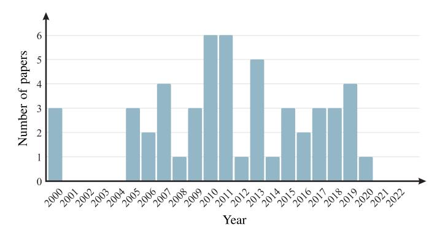

Fig. 12. Number of papers in the multi-user RA context over the years.

OFDMA schemes for both downlink and uplink scenarios. The primary impetus behind these advancements was to enhance BB-PLC technologies. This endeavor was jointly initiated by the academic and industrial communities, driven by a shared objective to overcome prevailing challenges in access and home network systems utilizing PLC technologies. The relevant contributions in this period are briefly described as follows:

- *•* **2000**. It was a remarkable year for multi-user RA for PLC systems, with Sartenaer et al. [\[151\]](#page-32-34), [\[152\]](#page-32-35), [\[153\]](#page-33-15) introducing the first three contributions on the topic. The authors focused on the uplink case based on the centralized approach. First, they discussed the OFDMA scheme and then the allocation of subcarriers (i.e., frequency) among users under rate-adaptive criterion [\[151\]](#page-32-34). Next, the authors introduced the carrierless/amplitude phase modulation direct sequence CDMA scheme, thus allocating codes instead of subcarriers. They compared both schemes and concluded that RA is more effective for the OFDMA scheme. Despite the obtained results, Sartenaer et al. [\[153\]](#page-33-15) kept investigating both schemes, paying more attention to the RA formulation problem. The authors proposed a simple and adaptive RA algorithm for either scheme.
- *•* **2005**. After five years without noticeable contributions, the downlink case was first addressed, assuming the OFDMA scheme and margin-adaptive criterion [\[155\]](#page-33-16). The authors proposed a suboptimal algorithm, which tries to evenly share the resources without compromising the total data rate. However, the authors noted the necessity of introducing fairness among weak and strong users in their proposed algorithm. In the same year, the concept of balanced capacit[y8](#page-20-2) to characterize the multi-user scenario (downlink and uplink) was introduced in [\[154\]](#page-33-17). The balanced capacity is a specific point of the capacity region boundary that ensures all users incur the same relative cost, consequently implying fairness among users. Additionally, the authors of [\[154\]](#page-33-17) introduced an

8Balanced capacity was theoretically defined as the distribution of maximum simultaneous achievable data rates that are proportional to the single-user rates. It is an interesting compromise between the symmetric capacity and total data rate [\[154\]](#page-33-17).

TABLE V RELEVANT INFORMATION ON THE OPTIMIZATION PROBLEMS AND RESPECTIVE SOLUTIONS ADOPTED TO THE MAIN CONTRIBUTIONS RELATED TO MULTI-USER RA

| Year | Reference | Description                                                                                                  | Convexity         | Solution/Algorithm             | Optimality         |
|------|-----------|--------------------------------------------------------------------------------------------------------------|-------------------|--------------------------------|--------------------|
| 2000 | [153]     | Addressing of RA in a downlink multiple access scenario.                                                     | Non-convex Convex | Lagrange-based Heuristic       | Optimal Suboptimal |
| 2005 | [154]     | Introduction of the concept of balanced capacity in multi-user wireline systems.                             | Non-convex Convex | KKT-based Newton-Raphson-based | Optimal Suboptimal |
| 2006 | [188]     | Proposal of RA based on frequency-domain SS for multi-user data communications.                              | Non-convex        | Greedy                         | Suboptimal         |
|      | [126]     | Proposal of a RA technique using 2D spreading in both time and frequency domains.                            | Relaxed-convex    | Analytical                     | Suboptimal         |
| 2007 | [159]     | Introduction of a bandwidth allocation criterion for performing multi-user RA.                               | Non-convex        | Analytical                     | Suboptimal         |
|      | [160]     | Introduction of a suboptimal multi-user RA solution for simultaneous uplink and downlink data communication. | Non-convex        | Round-robin-based              | Suboptimal         |
|      | [134]     | Discussion on the CP length design in a multi-user RA problem.                                               | Non-convex        | Analytical                     | Optimal            |
| 2010 | [165]     | Discussion on a MOO RA in which RT and NRT traffics are simultaneously and fairly allocated.                 | Non-convex        | Look-up-table-based            | Optimal            |
|      | [163]     | Introduction of suboptimal bit-loading algorithm with computational complexity reduction.                    | Non-convex        | Analytical                     | Suboptimal         |
| 2011 | [69]      | Investigation of cross-layer RA for scheduling at the link layer according to each user's QoS requirements.  | Non-convex        | Look-up-table-based            | Suboptimal         |
| 2012 | [168]     | Investigation of cooperative time division relay protocols for in-home PLC systems.                          | Non-convex Convex | KKT-based                      | Optimal Suboptimal |
| 2013 | [169]     | Analysis of the outage probability of multi-user RA in OFDMA.                                                | Non-convex        | Scheduling                     | Suboptimal         |
| 2014 | [171]     | Discussion on multi-user RA in the presence of impulsive noise.                                              | Convex            | Scheduling                     | Optimal            |
| 2015 | [172]     | Investigation of multi-user RA in multi-way relaying scheme for cooperative in-home PLC systems.             | Non-convex        | N/A                            | Suboptimal         |
| 2016 | [173]     | Application of a suboptimal RA algorithm when PLC is backhauling for a VLC system.                           | Relaxed-convex    | KKT-based                      | Suboptimal         |
|      | [175]     | Discussion on multi-user RA applied to both hybrid PLC-VLC and hybrid PLC-WLC systems.                       | Non-convex Convex | Heuristic N/A                  | Optimal Suboptimal |
| 2017 | [176]     | Addressing of multi-user RA in MIMO-OFDM systems.                                                            | Non-convex        | Greedy                         | Suboptimal         |
|      | [177]     | Proposal of subcarrier assignment and link schedule algorithms to reduce interference.                       | Non-convex        | Scheduling                     | Suboptimal         |
| 2018 | [108]     | Discussion on RA for MIMO-OFDM NB-PLC systems in the presence of an eavesdropper.                            | Convex            | KKT-based                      | Optimal            |
| 2018 | [179]     | Investigation of energy efficiency in hybrid PLC/VLC/RF data communication systems.                          | Relaxed-convex    | N/A                            | Optimal            |
|      | [181]     | Discussion on the benefits of using NOMA for RA in multi-user hybrid PLC/VLC systems.                        | Non-convex        | KKT-based                      | Suboptimal         |
| 2019 | [116]     | Introduction of an optimal downlink multi-user RA technique for relay-based OFDMA PLC systems.               | Convex            | KKT-based                      | Optimal            |
| 2020 | [183]     | Proposal of a RA algorithm for a NOMA-based hybrid PLC-VLC communication system.                             | Convex            | KKT-based                      | Optimal            |
|      |           |                                                                                                              |                   |                                |                    |

iterative algorithm for computing the maximum balanced rates.

*•* **2006**. In this year, Papandreou and Antonakopoulos [\[157\]](#page-33-12) were the first to address the downlink case assuming OFDMA and rate-adaptive criterion, in contrast with the margin-adaptive assumed in 2005 [\[155\]](#page-33-16). The authors argued the rate-adaptive is more suitable for achieving proportional fairness since the PLC medium has timevarying characteristics. In this context, they provide an iterative RA algorithm that assigns the resources according to the user's priority and channel quality. Then Crussière et al. [\[188\]](#page-33-18) investigated a frequency-domain SS

- to multiplex each user's information symbols over their associated subcarriers. Due to the granularity of the modulations, there was potential for residual power/energy to be lost on each subcarrier in previous OFDMA. The SS component allowed such residual energy to be explored. Crussière et al. [\[188\]](#page-33-18) thus compared their proposed scheme with the previous OFDMA, proving the superiority of the former in terms of data rate but at the cost of greater computational complexity, see Table [V.](#page-21-0)
- *•* **2007**. Several findings were published this year. Baudais and Crussière [\[126\]](#page-32-13) extended their work of 2006 [\[188\]](#page-33-18) to the use of SS with OFDMA to perform RA using spreading in both time and frequency domains. The authors showed significant data rate improvements compared to OFDMA without SS. At the same time, Papandreou and Antonakopoulos published three papers on multiuser RA for PLC with OFDMA [\[158\]](#page-33-19), [\[159\]](#page-33-13), [\[160\]](#page-33-14), extending their discussion initiated in 2006 [\[157\]](#page-33-12) for uplink and downlink. First, in [\[160\]](#page-33-14), the authors introduced a suboptimal algorithm for simultaneous uplink and downlink multi-user RA, which considers that the total available frequency band is not only divided among users but also into downlink and uplink access. Second, they proposed a low-complexity RA algorithm to fairly allocate subcarriers (frequency) among users assuming a constraint on the PSD of the transmitted signal [\[159\]](#page-33-13), which was not considered in the previous contribution [\[160\]](#page-33-14). Finally, the authors [\[158\]](#page-33-19) compared the TDMA-DMT with fixed time slots (convex optimization problem) with OFDMA (mixed-integer optimization problem) in multiuser downlink case. Under a set of assumptions, the authors showed that OFDMA is better than TDMA-DMT in frequency selective PLC channels. Note that the above papers mentioned above provided interesting contributions to the PLC literature. However, a comparison with previous works [\[126\]](#page-32-13), [\[188\]](#page-33-18) was indeed a relevant absence.
- *•* **2008**. This year, Sartenaer et al. [\[156\]](#page-33-20) extended the idea of balanced capacity, which was discussed in 2005 [\[154\]](#page-33-17), for providing fairness in the uplink when individual power constraints apply. In this sense, the authors introduced an iterative algorithm for optimal and suboptimal RA that is interesting in PLC systems for LV outdoor electric power systems. Also, in [\[114\]](#page-32-36), the OFDMA RA problem for uplink and downlink cases was reformulated as a maximum weighted-sum rate optimization problem. An elegant definition of an equivalent interference channel allowed applying convex optimization methods in both cases and performing a near-optimal RA.

Between 2009 and 2015, RA research witnessed significant advancements by adopting diverse innovations, including cooperative communication, relaying schemes, impulsive noise presence, and cross-layer. These innovations paved the way for enhanced channel resource efficiency, enabling communication across extended distances and effectively meeting varied QoS requirements in scenarios affected by colored additive noise. Moreover, this era was characterized by a heightened focus on the dynamic nature of PLC channels. Concurrently, RA

- research began to intensively explore SG applications, driven by the recognition of the cost-effectiveness of using power lines for data communication by utilities. This was particularly relevant in addressing emerging needs in SG, such as smart metering, which was becoming increasingly critical. A brief description of the main contributions in this period is as follows:
  - *•* **2009**. New contributions about RA were published this year. Notably, Zou et al. [\[115\]](#page-32-37) addressed the joint allocations of subcarriers and power in a two-hop relaybased transmission, assuming centralized configuration and OFDMA scheme. The main value of [\[115\]](#page-32-37) relies on the improvement obtained by allocating subcarrier sets and power for source-relay and relay-destination links. Simultaneously, Maiga et al. [\[161\]](#page-33-11) advanced a previous contribution of 2006 [\[188\]](#page-33-18), introducing a peak BER constraint on the downlink of the OFDMA with SS in the frequency domain. The authors proposed a simple RA algorithm and discussed some improvements without comparing previous techniques. At last, Tonello et al. [\[162\]](#page-33-21) discussed optimal time slot design in a TDMA-DMT under rate-adaptive criterion system. The authors showed that it is possible to obtain a higher data rate by calculating a near-optimal time slot duration and the optimization of the time slots scheduling among the users in the downlink when the LPTV behavior of PLC channels is considered.
  - *•* **2010**. This year was marked by the first review about RA in BB-PLC systems [\[31\]](#page-30-6), which addressed multiuser RA through the discussion on fairness, cross-layer, and subcarrier sharing. In [\[134\]](#page-32-19), the authors extended the discussion addressed in 2009 [\[162\]](#page-33-21) to include the design of the CP length (assuming DMT) in the RA formulation. As a result, additional data rate improvements, which can be obtained by controlling the amount of ISI in an OFDMA scheme, were pointed out. In addition, the authors of [\[163\]](#page-33-22) made use of the assumption SNR 1 to perform margin-adaptive RA in OFDMA-based multiuser with less computational complexity. The authors proposed a heuristic approach to allocate subcarriers to different users, but it lacks comparison with previous proposals for PLC systems. Also, RA for hybrid PLC-WLC systems[,9](#page-22-0) in which PLC links are used to improve digital communications in blind zones were, for the first time, investigated in [\[164\]](#page-33-23). Unfortunately, [\[164\]](#page-33-23) did not provide enough information about the considered system model. Moreover, the authors of [\[71\]](#page-31-3), [\[72\]](#page-31-4) provide discussions on cross-layer RA by combining the user's channel conditions and QoS requirements when OFDMA scheme is considered. The authors based on the utility theory to evaluate network performance in terms of users' satisfaction. Unfortunately, they did not offer enough information related to the RA at the PHY layer, and, thus, it is difficult to understand the offered gain precisely. A compelling discussion on cross-layer

9The use of symbol "-" in hybrid PLC-WLC means that one hop is in the WLC link and the other is in the PLC link.

- RA was also introduced by Xu et al. in [\[165\]](#page-33-24). The authors discussed multi-traffic and multi-user in OFDMA, in which real time (RT) and non real time (NRT) traffic are simultaneously and fairly allocated by using the Pareto optimal RA. In this sense, the authors discussed a MOO RA based on the use of what is termed resource factor and proposed the use of a lookup table to reduce computational complexity when MOO is replaced by multiple single-objective optimization (SOO).
- *•* **2011**. First, Xu et al. [\[189\]](#page-33-25) extended their ideas from the previous year [\[165\]](#page-33-24) to cover a different set of constraints, proposing a two-step RA for dealing with distinct fairness over the OFDMA scheme. In this respect, QoS requirements of multiple services, users' priorities, constraints on the transmission power, and the scenarios where the system's resources are sufficient or scarce are discussed. In addition, Xu et al. [\[69\]](#page-31-1) investigated cross-layer RA in the link layer according to each user's QoS requirements, QoS satisfaction degree, distinct packet traffic models, and CSI and queue state information (QSI) availability, assuming fairness and power constraints. Using delay and queue information of the traffic offered additional flexibility to perform RA. In [\[69\]](#page-31-1), the introduction of the QSI was an important contribution of this work in comparison to [\[165\]](#page-33-24). Still, in 2011, the authors of [\[167\]](#page-33-26) introduced an iterative RA technique for dealing with subcarrier and power allocations for multi-users in the OFDMA scheme. It ensures fairness and QoS when applying a transmission power constraint to each subcarrier. Also, it enables a drop of users that negatively affects the overall multi-user system performance. The simulation results in [\[167\]](#page-33-26) assumed the transmission power equal to 1 W, which is 5 to 10 times the maximum allowed transmission power. Furthermore, Dong et al. [\[166\]](#page-33-27) discussed RA assuming a centralized approach by taking into account short-term fairness for OFDMA scheme in the uplink case. It opportunistically adjusts the backoff time for each active user according to channel dynamics in time and frequency domains. Also, it modifies the contention window (CW) size when collisions occur. Similar to [\[162\]](#page-33-21), it is a kind of simplified cross-layer RA technique since it addresses both PHY layer and MAC sublayer. A comparison with [\[162\]](#page-33-21) is a missing and important contribution of [\[166\]](#page-33-27). Moreover, in [\[118\]](#page-32-38), the authors provided a very similar investigation of the RA problem addressed in [\[166\]](#page-33-27).
- *•* **2012**. In this year, Dong et al. [\[119\]](#page-32-39) extended their findings from the previous year [\[166\]](#page-33-27) related to the exploitation of multi-user diversity in frequency and time domains for performing channel allocation and dealing with contention processes in [\[166\]](#page-33-27), using a random access scheme for an OFDMA scheme in the uplink case. Uplink transmissions cannot avoid contentions unless a user has a specific channel dedicated to it. The contention procedure induces collisions, especially under heavily loaded conditions, and together with idle slots, may severely degrade throughput. To overcome this problem, in [\[119\]](#page-32-39), the authors worked in the saturated throughput

- scenario. They also advocated obtaining the optimal settings that maximize the system throughput, assuming that the number of users and subcarriers are known and fairness replaces the short-term fairness constraint. Moreover, the authors of [\[264\]](#page-35-21) addressed random access, aiming at introducing an adaptive MAC protocol capable of updating data rates and CW sizes based on users' requirements and channel conditions. Interestingly, the authors of [\[264\]](#page-35-21) cited [\[166\]](#page-33-27) but did not compare with the algorithm introduced in the latter, which was designed to perform the same task. Also, D'Alessandro and Tonello [\[168\]](#page-33-28) studied both rate improvements and power savings in amplify-and-forward and decode-andforward relay systems formulating optimization problems leading to optimal and suboptimal RA including time allocation and relay position selection.
- *•* **2013**. This year started with Qian et al. [\[190\]](#page-33-29) addressing cross-layer RA in multi-user OFDMA by applying a simplified version of the proposals introduced by Xu et al. in 2011 [\[69\]](#page-31-1), [\[189\]](#page-33-25), without providing a comparison with these previous works. Recognizing that PLC channels can be modeled as LPTV corrupted by cyclostationary additive noise, the authors of [\[169\]](#page-33-30) analyzed the outage probability of the data rate of multi-user RA in OFDMA schemes since it is a reasonable tool to quantify when the channel quality cannot ensure the QoS requirements. The authors presented three RA approaches: "winner-takesall", "shortest job first", and "greedy". A comparison analysis was presented; however, the comparisons did not take into account previous multi-user RA techniques applied to multi-user OFDMA in PLC systems. In addition, Yoon et al. [\[117\]](#page-32-40) combined carrier sense multiple access (CSMA) and OFDMA to introduce a multi-user RA for allocating subcarriers among users when the LPTV characteristic of PLC channels are taken into account. The main contribution was to discuss the RA problem in which a reduced number of users are allocated to a subset of subcarriers. Unfortunately, [\[117\]](#page-32-40) lacks a comparison with previous techniques, such as the contributions of 2012 [\[119\]](#page-32-39), [\[166\]](#page-33-27), [\[264\]](#page-35-21), which could provide more insights about the effective improvement. Moreover, Vinck and Dai [\[191\]](#page-33-31) theoretically addressed the gains associated with different aspects of multi-user data communication through PLC channels. It is not a contribution about multi-user RA in particular, but its findings are relevant to pursue RA in this scenario. Moreover, the authors of [\[170\]](#page-33-32) discussed physical layer security (PLS) aspects related to multi-user PLC systems in the downlink case. It indicated that multi-user RA for improving secrecy at the PHY layer is an important issue to investigate since it can potentially mitigate security breaches.
- *•* **2014**. Chaudhuri and Bhatnagar [\[171\]](#page-33-6) discussed multiuser RA based on OFDMA by taking into account the inclusion of the AIN in the problem formulation. It was one of the first works addressing AIN presence based on the time domain model in the multi-user context. Unfortunately, the description of the proposed algorithm

- is not well-presented. Simulation results related to data rate and BER performances covered different conditions of AIN. They addressed the problems related to cochannel and ISI without discussing the assumptions for performing this kind of simulation. It is worth emphasizing that using the AIN model in the time domain adds more complexity for dealing with the multi-user RA problem.
- *•* **2015**. The first contributions related to multi-user RA with the eyes on SG applications were published this year. The authors of [\[106\]](#page-31-41) investigated precoding techniques to improve multi-user RA in MIMO broadcasting/multicasting for NB-PLC systems over MV distribution lines. It optimized the precoder design and showed a significant data rate gain for multicasting when up to two messages are simultaneously transmitted on the same subcarrier. Also, the same authors discussed MIMO-OFDM in a similar scenario [\[107\]](#page-31-40). Similar to [\[106\]](#page-31-41), in [\[107\]](#page-31-40), the authors focused on the precoder design and evaluated the performance in terms of the data rate for a multicasting model. Also, they presented a performance comparison between broadcast and multicast models and addressed QoS constraints over the two messages that can be simultaneously transmitted through the same subcarrier [\[107\]](#page-31-40). Overall, the main difference between [\[106\]](#page-31-41) and [\[107\]](#page-31-40) is the design of the precoder. Also, in 2015, multi-user RA in a cooperative PLC network was investigated in [\[172\]](#page-33-33). It relied on the amplify-and-forward protocol and derived the minimum users' rate and the sum rate expressions. Also, it showed several scenarios in which multi-way cooperative protocols can offer improvements compared to one-way cooperative protocols, mainly in the presence of AIN. In the end, the multi-way relaying is an interesting solution for multi-user RA; however, the problem is the computational complexity associated with the decoding process.

From 2016 onwards, RA research expanded to include integration with other technologies such as VLC and WLC. Notably, the application of MIMO became feasible and advantageous when more than two power cables connected the transmitter and receiver. This period also saw an increased focus on PLS, the implementation of non-orthogonal multiple access (NOMA), and continued progress in areas initiated in earlier years. Concurrently, there was a growing interest in developing RA solutions for MV power lines. This shift was driven by the interest of electric utilities in utilizing distribution electric power systems for data communication. This highlights a broader movement towards leveraging existing infrastructure for enhanced data communication capabilities, particularly in the context of the distribution level of electric power systems. The major contributions of this period are briefly described as follows:

*•* **2016**. This year, RA was investigated in the multi-user context of hybrid VLC-PLC links. The authors of [\[173\]](#page-33-34) proposed power and subcarrier allocation to maximize a utility function based on the data rate of each user and medium, assuming not only the cascaded connection of

- VLC and PLC links but also their parallel connection with the radio frequency (RF) link. On the other hand, Ma et al. [\[174\]](#page-33-35) addressed multi-user RA when a hybrid PLC-VLC system operates in the downlink and a hybrid PLC-WLC system, which relies on the Wi-Fi technology, operates in the uplink. The hybrid PLC-VLC link is appealing since power lines are the power source and the data source. Also, PLC devices can operate as a CCo, which avoids inter-luminary interference when multiple luminaries are closely located. The authors focused on the subcarrier allocation with permutation to fully exploit the frequency diversity between PLC and VLC channels.
- *•* **2017**. Ma et al. [\[175\]](#page-33-36) published another paper, which is the journal version of its contribution of 2016 [\[174\]](#page-33-35), and, as a consequence, it offered more details about the system model. The authors applied spatial-optical OFDM, which involves transmitting specific subsets of OFDM subcarriers through designated subsets of light-emitting diodes (LEDs) located in a luminaire, to come up with a cooperative communication system. In this work, the authors analyzed OFDM-TDMA and OFDMA schemes and proposed RA algorithms for attaining achievable data rates under distinct boundaries. In addition, Hassan [\[176\]](#page-33-37) addressed multi-user RA in MIMO-OFDM systems by considering crosstalk and hardware impairments for indoor facilities. In this sense, the authors proposed a precoded low complexity RA (subcarrier and power) greedy algorithm for dealing with BB-PLC systems. The results of this work could be even more relevant if the system model had been carefully detailed. Moreover, the authors of [\[177\]](#page-33-38) focused on subcarrier allocation in PLC systems subjected to interference and traffic fairness constraints. Also, they suggested sharing one subcarrier to several interference-free links at the same time slot and proposed a near-optimal allocation algorithm. The authors stated that this proposal could succeed if in-home PLC channels are quasi-stationary. However, in-home PLC channels are cyclostationary. Thus, this proposal can succeed in a shorter time than the coherence time of an in-home PLC channel (i.e., 600μ s).
- *•* **2018**. In this year, the extended versions of [\[107\]](#page-31-40) from 2015 and [\[173\]](#page-33-34) from 2016 were presented in [\[108\]](#page-31-38) and [\[179\]](#page-33-39), respectively. First, ElSamadouny et al. [\[108\]](#page-31-38) came up with the optimal secrecy sum rate of MIMO-OFDM NB-PLC systems in MV distribution lines. The presence of an active (i.e., one of the users) or passive (i.e., not one of the users) eavesdropper was portrayed. The authors optimally allocate codes and power for multicasting, assuming the cases as mentioned earlier. Also, the adopted optimization direction to deal with this problem deserves attention. In its turn, Kashef et al. [\[179\]](#page-33-39) addressed a general QoS constraint in the formulated problem and reported results related to energy efficiency as an interesting outcome. The authors also discussed the coordination between the PLC-VLC and RF links that operate in parallel to reduce power consumption under a given QoS constraint. The attained results can be useful for multi-user RA.

- *•* **2019**. Several works addressed the multi-user RA for PLC systems based on NOMA scheme this year. For instance, the authors of [\[180\]](#page-33-40) addressed how the CSMA and NOMA schemes can be jointly used for improving multi-user RA for PLC systems applied to SG. However, the lack of details about PLC channels and additive noise makes it difficult to see how close the reported results are to realistic PLC scenarios. On the other hand, Feng et al. [\[181\]](#page-33-41) discussed the benefits of using NOMA for performing downlink RA in multi-user hybrid PLC/VLC systems for in-home applications. The improvement offered by applying NOMA is relevant; however, the authors missed offering a performance comparison with previous works [\[174\]](#page-33-35), [\[175\]](#page-33-36) and, as a consequence, it is not possible to see the real improvement offered by NOMA in hybrid PLC/VLC systems. Furthermore, the authors of [\[182\]](#page-33-42) investigated the allocation of power coefficients in a NOMA scheme using a hybrid PLC-VLC communication system. Finally, Zhu et al. [\[116\]](#page-32-41) addressed an optimal downlink multiuser RA for relay-based OFDMA PLC systems. The authors took the AIN into account, non-regenerative relay (amplify-and-forward protocol), and subcarrier interferences, which result from the spread of the pulses used to transmit data through the subcarrier by the OFDM scheme. Unfortunately, a performance comparison among [\[116\]](#page-32-41) and previous works about the same subject and related to PLC systems, such as [\[114\]](#page-32-36) and [\[115\]](#page-32-37), was missing. Also, the transmission power values are beyond the ones used in practical applications.
- *•* **2020**. Only Liu et al. [\[183\]](#page-33-43) proposed a power allocation algorithm aiming at the maximization of the sum rate while offering proportional fairness among users in a hybrid PLC-VLC communication system based on the NOMA scheme, where PLC systems act as a backhaul for the VLC system.

#### *C. Takeaways*

This section has chronologically reviewed multi-user RA for PLC systems. In this regard, several observations deserve attention. The first fifteen years of research showcased multiuser RA mainly applied to in-home BB-PLC systems since it was the market niche in which PLC systems offered advantages to overcome the limitations related to WLC technologies. However, post-2015, research efforts shifted towards SG, arising from the innate suitability of PLC devices for sensing and data communication.

The period post-2009 also highlighted the interest in integrating PHY and link layers—termed cross-layer—into RA problems, especially when formulated with distinct QoS constraints. Moreover, a comprehensive analysis of the findings related to DSL systems has contributed to coming up with more mature multi-user RA techniques specifically designed for PLC systems. On the other hand, a lack of comparison with previous works characterizes the majority of contributions, which is a significant drawback. Additionally, the discussion on computational complexity and hardware usage demanded by the proposed multi-user RA techniques remains largely unexplored despite being an important issue when considering energy savings.

Lastly, multi-user RA for dealing with NB-PLC is barely seen in the literature despite the fact that RA problems also originate for NB-PLC. For instance, the optimization of many physical layer parameters present in NB-PLC standards and channel access methods in large NB-PLC deployments.

# VII. REMARKS AND LESSONS LEARNED

RA for PLC systems have evolved significantly to meet the growing demand for reliable and flexible data communication over electric power systems. Indeed, RA has been crucial for optimizing the performance of PLC systems, which have become increasingly accepted for SG, home networking, and in-vehicle communications. Advances in RA for PLC systems allowed adaptation to evolving traffic demands and existing interference, as well as to dynamically allocate the available resources based on QoS or QoE requirements. Over the years, RA has evolved from simple and static schemes to more sophisticated and dynamic ones, improving throughput, coverage, flexibility, and reliability of PLC systems. However, it has not addressed new constraints (e.g., energy harvesting, energy efficiency, and privacy) that are more related to new applications, such as IoT and Industry 4.0.

In addition, it has been acknowledged that developing RA techniques exploiting intrinsic features of electric power systems is a hard task since these systems are complex and evolve continuously. The channel conditions experienced by PLC systems vary significantly, making reliable and consistent data communication through electric power systems challenging. Several factors contribute to the variability of these communication media. For instance, the on/off switches of loads, AC/DC and DC/AC conversions, and dynamics of components in electric power systems cause fluctuations in channel conditions (e.g., channel become cyclic timevarying). Also, they are the underlying sources of high-power impulsive noise that significantly deteriorates the performance of RA techniques. The difficulty of defining channel models to represent realistic scenarios for a wide range of electrical power systems has led to adopting measured channel responses and measured noise sample functions, which only represent a few electric power circuits. Another setback of the difficulty in defining channel models is the adoption of simpler and more convenient mathematical channel models that are not derived from measured data, because measurement campaigns that generate representative measures of channel responses and noise sample functions are not easy to carry out. Overall, the non-uniformity and unrealistic assumptions in modeling electric power grids as communication media is a serious concern, since the developed RA techniques may not be helpful for practical PLC systems.

PLC systems are being pursued in various applications, mainly including home networking, SG, and in-vehicle communications. The flexibility of the existing PLC technology to offer reliable and consistent data communication over electric power systems makes it a valuable asset for many applications. Each application requires distinct traffic demands, delay sensitivities, reliability, and security levels, and therefore, they may require specific RA strategies and priorities. In the context of RA for PLC systems, the majority of works have proposed techniques capable of solving RA problems for home networking since the industry recognized a substantial benefit of using power lines to overcome the impairment offered by existing walls within buildings and residences to wireless signal propagation. Consequently, broadband and indoor PLC systems have been widely pursued and implemented to effectively assist indoor WLC systems. Broadband access networks have received much less attention regarding RA since the advances in home networking are easily translated to access networking and the interest in advancing PLC-based access networking is less advantageous than other access technologies (e.g., xDSL, 4G, and optical fiber).

The literature shows that PLC systems also play a crucial role in SG and, more recently, in-vehicle communications. Regarding SG, it has been recognized the value of PLC systems to assist electric utilities, mainly at the distribution level (e.g., smart metering). Up to now, RA has relied on adaptive modulation when NB-PLC systems are considered for smart metering. Regarding in-vehicle communications, NB-PLC systems have been pursued to provide data communication among different components within a vehicle, such as sensors, meters, and control systems. This allows for cost-effective and reliable data transmission without additional wiring infrastructure. Since SG and in-vehicle applications are mostly narrowband, academia and industry have advanced low-cost and low-energy consumption PLC devices. Consequently, simple RA techniques (e.g., SNR sensing and adaptive modulation) have been introduced because they are suitable for a OFDM-based scheme used by the standardized NB-PLC systems.

Furthermore, advances in the understanding of electric power systems as data communication media have allowed to figure out the limitations of PLC systems and, most importantly, the benefits of integrating them with other data communication systems (e.g., PLC+WLC or PLC+VLC). Indeed, the literature has recognized that PLC systems are strong candidates for constituting hybrid communication systems, mainly with WLC [\[10\]](#page-29-9), and RA plays a vital role in this context. Hybrid communication systems leverage the strengths of different communication technologies to provide better performance. For instance, PLC is used to provide a wired backbone for home networking, whereas wireless technologies such as VLC and WLC are used to provide the last meters of connectivity to end-users [\[10\]](#page-29-9). Works in the literature also reported using parallel channels of PLC and WLC systems to improve data communication. Consequently, hybrid communication systems, in which PLC is combined with other data communication systems, have been a research topic of great interest to academia and industry for improving coverage, data rate, and reliability based on RA techniques.

The joint adoption of PLC and WLC systems, in reality, could be much more explored in terms of RA regarding the investigation of hybrid communication systems. As power cables are electromagnetically unshielded and loads inject disturbances into electric power systems, the energy spread over the spectrum beyond the mains frequency may be helpful to feed small devices. The radiated signals are sensed by devices not connected physically to electric power systems, which results in opportunities for hybrid communication and energy harvesting. However, RA has not yet been pursued in such directions.

Over the years, a few works have presented new criteria to perform RA, investigated essential issues such as the difference between power and energy in RA problems, and discussed the adoption of the nSNR coherence bandwidth as a crucial parameter to perform RA in multicarrier-based PLC systems operating over AC electric power systems. Although some authors have considered delay as a constraint to the RA problem, we could not find contributions addressing how the freshness of information impacts the performance of RA solutions. Moreover, the impedance mismatching issues have not been correctly addressed in RA formulation.

Lastly, the trends shown in Figs. [11](#page-15-1) and [12](#page-20-1) indicate a declining interest in RA for PLC systems, attributed to a few key reasons. Firstly, PLC technologies have primarily found success in applications like smart metering and home networking backbones, with limited opportunities for expansion in other areas where novel WLC technologies are more effective. Secondly, ongoing technical challenges, such as effective coupling with electric power systems for minimal power losses and the dynamics of loads connected to these systems, remarkably affect PLC performance and are still open problems. The most significant impediment, however, stems from restrictive regulatory constraints on transmission power and frequency bands. Despite these challenges, Section [VIII](#page-26-0) highlights several new and intriguing research topics within this field.

# VIII. FUTURE WORK AND DIRECTIONS

The future trajectory of PLC technology is intrinsically linked to the development of innovative RA solutions. Such development arises from a need accentuated by the growing demand for great data rates, varied requirements, low power consumption, reliability, and enhanced privacy and security. Additionally, there is an increasing need for seamless integration with other data communication technologies. This urgency is further compounded by existing regulatory constraints, which limit transmission power and frequency bandwidth. In light of these challenges, this section ventures into an exploration of several cutting-edge research topics[.10](#page-26-1) and potential breakthroughs in RA for PLC systems. The aim is to broaden the scope of this research field, addressing both current limitations and future possibilities.

In the given context, this section is structured as follows. Sections [VIII-A](#page-27-0)[–VIII-E](#page-28-0) delve into topics closely related to channel resource aspects. These sections particularly highlight the potential advancements achievable by integrating concepts such as energy harvesting, energy efficiency, impedance

10The Authors acknowledge that while these areas may have been extensively covered in WLC literature, they present significant untapped potential in the context of PLC systems, where they are either less explored or entirely new areas of inquiry

mismatching, full-duplex communication, and physical layer security. Subsequently, Sections [VIII-F–](#page-28-1)[VIII-H](#page-28-2) shift the focus towards application-oriented aspects. These sections cover various topics, including information freshness, hybrid communication, QoE enhancement, semantic communication, and privacy. Finally, Section [VIII-I](#page-29-22) embarks on a discussion about the potential integration of artificial intelligence (AI) and Machine learning (ML) into RA problems for PLC systems. Both AI and ML could span across all previously mentioned areas, offering a transformative approach for developing innovative and groundbreaking RA solutions. This incorporation of AI and ML into RA problems is presented as a crucial step towards realizing the full potential of PLC systems in the future.

#### *A. Energy Harvesting and Energy Efficiency*

Harvesting energy from electric signals in electric power systems still demands research and development efforts [\[265\]](#page-35-22), [\[266\]](#page-35-23), [\[267\]](#page-35-24), [\[268\]](#page-35-25), [\[269\]](#page-35-26). In contrast, harvesting energy from RF signals shows remarkable maturity and a clear roadmap for improvements in the next years [\[270\]](#page-35-27), [\[271\]](#page-35-28), [\[272\]](#page-35-29), [\[273\]](#page-35-30). According to [\[265\]](#page-35-22), [\[268\]](#page-35-25), harvesting energy from the noise in electric signals can be exploited to feed low-power consumption IoT devices, raising the opportunity for introducing energy harvesting functionality into PLC devices. For instance, RA formulation could consider harvesting energy as suggested in [\[265\]](#page-35-22), [\[274\]](#page-35-31) under the assumption that mains frequency is unavailable for energy supply and the wasted power associated with off mains frequency is enough for data communication purposes. Energy efficiency is a well-addressed subject, but there is room for improvement, and it is regularly considered in telecommunication systems [\[275\]](#page-35-32), [\[276\]](#page-35-33), [\[277\]](#page-35-34). As we struggle to reverse global warming, energy efficiency becomes important as telecommunication systems expand and demand more energy consumption. A few contributions have addressed energy efficiency in RA for PLC systems. Consequently, it can be further exploited to advance the current state-of-theart, mainly for multi-user scenarios constituted by several IoT devices that use PLC systems to provide connectivity. In this sense, it is necessary to advance RA for PLC systems that consider energy harvesting and energy efficiency aspects, mainly to deal with the constraints associated with using low-power consumption devices in environments with limited energy supplies. Therefore, including these constraints into RA formulations to develop feasible or practical solutions is a valuable research direction.

# *B. Impedance Matching Solutions*

The intricate and ever-evolving nature of electric power systems presents unique challenges in transmitting information-carrying signals, thereby adding complexity to the development of RA solutions. A primary concern in this regard is the dynamic behavior of access impedance, as detailed in [\[13\]](#page-29-12), [\[57\]](#page-30-15), [\[278\]](#page-35-35). This dynamic nature often leads to significant issues of impedance mismatching, requiring further advancements in integrating models of impedance mismatch into the RA problem formulation. The challenge of

impedance mismatching is further intensified by the growing incorporation of renewable energy sources, like solar and wind power, into electric power grids. These sources are known to contribute to increased variability in impedance. Moreover, the situation is compounded by the fact that PLC devices, which are responsible for both transmitting and receiving information-carrying signals, draw their power from the same connection points within the electric power systems, thereby introducing additional layers of impedance mismatch challenges. Given these complexities, the accurate modeling of impedance mismatching and its effective integration into RA problem formulations emerge as critical components in pursuing practical and efficient RA solutions.

## *C. Full-Duplex*

Full-duple[x11](#page-27-1) has been extensively investigated for several years to improve data rate in wireline and WLC systems [\[279\]](#page-35-36), [\[280\]](#page-35-37), [\[281\]](#page-35-38). However, only recently, it has been investigated in the context of BB-PLC systems [\[282\]](#page-35-39), [\[283\]](#page-35-40) since the current hardware for broadband devices can accommodate its complexity. The full-duplex mode allows transmitting and receiving data simultaneously over the same power line and possibly in the same frequency band, potentially doubling the bidirectional throughput of the PLC systems. In-band full-duplex (IBFD) can be performed by canceling the transmitted interfering signal component of the received signal [\[284\]](#page-35-41), known in the literature as self-interference or echo [\[285\]](#page-35-42), [\[286\]](#page-35-43), [\[287\]](#page-35-44). Full-duplex communication was also studied for network sensing [\[288\]](#page-35-45) and relaying systems [\[283\]](#page-35-40), [\[289\]](#page-35-46). However, the discussion on RA for PLC systems considering IBFD is far more limited, focusing on PLS and the maximization of the achievable secrecy rate through IBFD-jamming [\[290\]](#page-35-47). Due to its significance for introducing a remarkable advance in PLC systems, full-duplex communication will be part of future PLC standards [\[291\]](#page-35-48). Currently, the main issue related to full-duplex is finding feasible and effective hybrid couplers, which has been the focus of research in recent years [\[283\]](#page-35-40), [\[287\]](#page-35-44), [\[288\]](#page-35-45), [\[292\]](#page-36-0). Lastly, the introduction of effective self-interference cancellation (SIC) [\[293\]](#page-36-1), [\[294\]](#page-36-2) needs to be pursued to advance RA mainly when near-end crosstalk (NEXT) and far-end crosstalk (FEXT) coupling are considered in multi-conductor-based PLC systems.

#### *D. Physical Layer Security*

In recent years, the emergence of flexible and low-power consumption data networks for emerging applications, such as IoT, smart city (SC), SG, and Industry 4.0 have driven the attention of researchers to the potential of securing information at the PHY layer level. The PLS relies on the knowledge of the communication medium to guarantee information security in a communication link by using limited computational resources, which is a significant advantage compared to existing cryptography schemes. Regarding PLC systems, there have been

11In the full-duplex mode, information is simultaneously transmitted and received in both directions and consequently, a significant capacity improvement can be attained.

a few studies evaluating security at the PHY layer [\[170\]](#page-33-32), [\[221\]](#page-34-23), [\[222\]](#page-34-24), [\[223\]](#page-34-25), [\[224\]](#page-34-26), [\[290\]](#page-35-47), [\[295\]](#page-36-3), [\[296\]](#page-36-4), [\[297\]](#page-36-5). The majority of them are devoted to quantifying PLS in a singleuser scenario in terms of achievable secrecy rate. In these investigations, the authors assumed a complete knowledge of CSI of an eavesdropper, which is physically or not connected to power lines. Also, they have investigated to which extent a colluding of passive eavesdroppers can compromise PLS of PLC systems [\[222\]](#page-34-24). However, advancing the investigation regarding multi-user PLC systems and using realistic scenarios with representative channel models are essential issues to be considered. Moreover, and most importantly, the materialization of techniques using cooperative jamming and considering the presence of mistrusted relays, in which the orthogonality of the channels is exploited and Byzantine or selfish attacks are considered, for improving secrecy is also relevant because it can benefit PLC applications when RA also includes security at the physical layer level into its formulation. Lastly, the investigation of RA when feasible PLS schemes apply to hybrid communication systems, which was initially investigated in [\[225\]](#page-34-27), [\[298\]](#page-36-6), can also be relevant to increase security at the PHY layer level, mainly in IoT applications characterized by low-power computational and processing capacities.

#### *E. Hybrid Communication Systems*

Hybrid communication systems offer striking opportunities for combining distinct communication media to improve data rate, BER, QoS, QoE, and to provide reliable data networks [\[10\]](#page-29-9). In particular, RA in the context of hybrid PLC-VLC systems have already been investigated in the multiuser scenario [\[173\]](#page-33-34), [\[174\]](#page-33-35). Even with few studies, relevant gains have been shown using RA techniques. Furthermore, the parallel combination of the power line and wireless media (hybrid PLC/WLC) can result in flexible and robust data communication systems for assisting the deployment of IoT, SC, SG, and Industry 4.0 [\[299\]](#page-36-7). However, hybrid PLC/WLC systems require more study in terms of RA since few works have addressed it in a single-user scenario, see [\[10\]](#page-29-9), [\[109\]](#page-31-39), [\[149\]](#page-32-32), [\[150\]](#page-32-33). To the best of the authors' knowledge, no study in the literature investigated multi-user RA applied to hybrid PLC/WLC systems, which is essential to enable the use of such data communication systems. Moreover, the existence of other configurations for combining PLC with other media, such as WLC, VLC, or phone lines, results in heterogeneous data networks in which RA solutions need to be designed to optimize the available channel resources.

#### *F. Age of Information*

Age of Information (AoI) has gained much attention from the academic community in recent years as a performance metric of communication systems since research efforts have been directed towards low-latency networks [\[300\]](#page-36-8). However, the literature of RA for PLC systems have not yet considered this metric. With the development of IoT technologies, it is coherent to state that the allocation of limited communication resources to various IoT devices is necessary for the deployment of such technology in SG, SH, and Industry 4.0 [\[301\]](#page-36-9). AoI is, therefore, a beneficial metric in terms of RA, but still underused for PLC systems. The link to RA is how to introduce AoI into the RA problem formulation and take advantage of it in applications demanding as timely as possible updates. The discussion in WLC systems is vast [\[302\]](#page-36-10), [\[303\]](#page-36-11), and the concept of AoI has wide applicability for PLC. Considering a PHY layer perspective, the study of finite-length blocks of data and the allocation of different block lengths among IoT devices is quite pertinent [\[304\]](#page-36-12). Furthermore, throughput optimization in PLC systems can be discussed subject to an AoI constraint [\[305\]](#page-36-13). Finally, two of the most latent topics in recent years are energy harvesting and energy efficiency, which can be investigated from an AoI perspective [\[306\]](#page-36-14), [\[307\]](#page-36-15).

#### *G. Quality of Experience and Semantic Communication*

First, it is important to differentiate the concept of QoE and QoS. The former is measured by the user opinion/satisfaction, while the latter is measured in a more quantitative way [\[24\]](#page-30-2), [\[308\]](#page-36-16), [\[309\]](#page-36-17). The adoption of QoE into RA problems introduces improvements in multi-user PLC systems. However, it can be challenging for hybrid communication systems in which PLC is combined with other data communication systems (i.e., VLC, DSL, or WLC). The authors of [\[310\]](#page-36-18) offered insightful research directions to introduce effective RA solutions for hybrid or heterogeneous communication systems. Moreover, QoE can be adopted in RA problems when semantic communication takes place [\[311\]](#page-36-19). Semantic communication involves exchanging meaningful information between devices and nodes within a network [\[25\]](#page-30-3), [\[26\]](#page-30-4), [\[27\]](#page-30-5). By accurately conveying the requirements, constraints, and priorities of various devices and applications, semantic communication enables RA algorithms to optimize the use of the available resources. This is particularly important in PLC systems, wherein multiple devices with diverse communication needs, such as smart meters, appliances, and automation systems, coexist on the same network.

## *H. Privacy*

Ensuring privacy in data communication systems is an ongoing challenge. As technology evolves, so do the privacy risks. Therefore, users, service providers, and policymakers must collaborate to implement adequate safeguards to protect individuals' privacy. Although PLS is an exciting approach for ensuring secrecy among legitimate users, its deployment can render data useless in specific communication systems [\[312\]](#page-36-20). For instance, in sensing systems, data accessibility is crucial for its utility, which introduces the concept of privacy. Unlike secrecy, privacy allows for some data leakage, and its main idea is to control the amount of data that can be leaked without exposing sensitive information. Another example is smart metering networks, where data is essential for price-aware usage and load balancing but may leak information about in-home activities [\[312\]](#page-36-20). Numerous studies have investigated privacy leakage in smart meter networks [\[313\]](#page-36-21), [\[314\]](#page-36-22), [\[315\]](#page-36-23), [\[316\]](#page-36-24). However, to the best of the authors' knowledge, no study has addressed privacy into RA problems for PLC systems, which are widely used to assist smart metering systems. Therefore, it also constitutes an open and suitable subject for further investigation within RA for PLC systems.

#### *I. Machine Learning and Artificial Intelligence*

Currently, ML and AI have emerged as prominent tools for enhancing RA, especially for PLC systems. For instance, RA problems can be addressed using bit-loading algorithms that dynamically evaluate the most suitable allocation for varying channel states. However, a paradigm shift from traditional physical model-based approaches for channel condition assessment to employing neural networks is noteworthy. These neural networks can be trained to solve RA problems swiftly and with high efficiency [\[317\]](#page-36-25). ML has been widely applied to WLC systems to perform RA [\[318\]](#page-36-26). Nonetheless, the application of ML and AI in PLC systems encounters specific hurdles. This is primarily due to the rapid fluctuations in channel states, influenced by load dynamics and the introduction of unconventional noise sources. This can considerably increase the complexity of a neural network and the dynamics of how that network is trained. A pivotal application of ML lies in criating generative models for channel and additive noise that are both reliable and representative of the diverse scenarios discussed in Section [III.](#page-6-0) Indeed, a significant advancement in RA for PLC systems is the development of accessible channel and additive noise models that are comprehensive and universally available, and AI and ML can facilitate it. The application of ML and AI in the context of RA for PLC systems remains under-exploited. This represents a substantial research field with significant potential for further exploration and development.

#### IX. CONCLUSION

In this paper, we have reviewed RA within the scope of PLC systems, elucidating key findings and contributions in the last twenty years. We have highlighted important aspects of PLC systems, shedding light on the inherent limitations and distinguishing features of this data communication medium. We have also introduced a PLC-centric taxonomy of RA, delineating the pertinent attributes of PLC systems, encompassing voltage levels, frequency bands, channel and noise types, environments, and targeted applications. Furthermore, we have introduced the RA problem through an optimizationbased perspective and reviewed the optimization elements within the PLC context. We have critically discussed works based on single- and multi-user RA for PLC systems, offering a chronological overview and pointing out the unique contributions of each work. We have also highlighted vital lessons gathered throughout these investigations.

Lastly, we have investigated emergent topics that deserve further attention to advance RA for PLC systems. While the topics discussed might not cover all the possibilities, they undeniably serve as compelling directions, guiding the development of research on RA for PLC systems.

#### ACKNOWLEDGMENT

The authors wish to express our gratitude to the anonymous reviewers who thoroughly evaluated our manuscript. Their comments and constructive suggestions played a crucial role in improving the quality of this work.

# REFERENCES

- [\[1\]](#page-0-0) S. Galli, A. Scaglione, and Z. Wang, "For the grid and through the grid: The role of power line communications in the smart grid," *Proc. IEEE*, vol. 99, no. 6, pp. 998–1027, Jun. 2011.
- [\[2\]](#page-0-0) K. Dostert, *Powerline Communications*. Upper Saddle River, NJ, USA: Prentice Hall, 2001.
- [\[3\]](#page-0-0) H. Hrasnica, A. Haidine, and R. Lehnert, *Broadband Powerline Communications: Network Design*. Upper Saddle River, NJ, USA: Prentice Hall, 2004.
- [\[4\]](#page-0-0) C. Cano, A. Pittolo, D. Malone, L. Lampe, A. M. Tonello, and A. G. Dabak, "State of the art in power line communications: From the applications to the medium," *IEEE J. Sel. Areas Commun.*, vol. 34, no. 7, pp. 1935–1952, Jul. 2016.
- [\[5\]](#page-0-1) S. Goldfisher and S. Tanabe, "IEEE 1901 access system: An overview of its uniqueness and motivation," *IEEE Commun. Mag.*, vol. 48, no. 10, pp. 150–157, Oct. 2010.
- [\[6\]](#page-0-1) S. Galli and T. Lys, "Next generation narrowband (under 500 kHz) power line communications (PLC) standards," *China Commun.*, vol. 12, no. 3, pp. 1–8, 2015.
- [\[7\]](#page-0-1) *IEEE Standard for Low-Frequency (less than 500 kHz) Narrowband Power Line Communications for Smart Grid Applications*, IEEE Standard 1901.2-2013, Dec. 2013.
- [\[8\]](#page-0-1) *IEEE Standard for Broadband over Power Line Networks: Medium Access Control and Physical Layer Specifications*, IEEE Standard 1901-2020, Dec. 2010.
- [\[9\]](#page-0-1) *Narrowband Orthogonal Frequency Division Multiplexing Power Line Communication Transceivers for G3-PLC Networks*, ITU-Rec. G. 9903, Int. Telecommun. Union, Geneva, Switzerland, Feb. 2014.
- [\[10\]](#page-0-1) M. V. Ribeiro et al., "Seamless connectivity: The power of integrating power line and wireless communications," *IEEE Commun. Surveys Tuts.*, vol. 26, no. 1, pp. 1–40, 1st Quart., 2024.
- [\[11\]](#page-0-2) M. Zimmermann and K. Dostert, "A multipath model for the powerline channel," *IEEE Trans. Commun.*, vol. 50, no. 4, pp. 553–559, Apr. 2002.
- [\[12\]](#page-0-2) C. Zhang, X. Zhu, Y. Huang, and G. Liu, "High-resolution and lowcomplexity dynamic topology estimation for PLC networks assisted by impulsive noise source detection," *Inst. Eng. Technol. Commun.*, vol. 10, no. 4, pp. 443–451, Mar. 2016.
- [\[13\]](#page-0-3) L. G. da S. Costa, A. Queiroz, V. Costa, and M. V. Ribeiro, "An analog filter bank-based circuit for performing the adaptive impedance matching in PLC systems," *J. Commun. Inf. Syst.*, vol. 36, no. 1, pp. 133–150, Aug. 2021.
- [\[14\]](#page-0-4) M. Girotto and A. M. Tonello, "EMC regulations and spectral constraints for multicarrier modulation in PLC," *IEEE Access*, vol. 5, pp. 4954–4966, 2017.
- [\[15\]](#page-0-4) M. Gebhardt, F. Weinmann, and K. Dostert, "Physical and regulatory constraints for communication over the power supply grid," *IEEE Commun. Mag.*, vol. 41, no. 5, pp. 84–90, May 2003.
- [\[16\]](#page-0-5) M. V. Ribeiro, C. A. Duque, and J. M. T. Romano, "An interconnected type-1 fuzzy algorithm for impulsive noise cancellation in multicarrierbased power line communication systems," *IEEE J. Sel. Areas Commun.*, vol. 24, no. 7, pp. 1364–1376, Jul. 2006.
- [\[17\]](#page-0-5) M. Zimmermann and K. Dostert, "Analysis and modeling of impulsive noise in broad-band powerline communications," *IEEE Trans. Electromagn. Compat.*, vol. 44, no. 1, pp. 249–258, Feb. 2002.
- [\[18\]](#page-0-5) F. Corripio, J. Arrabal, L. del Rio, and J. Munoz, "Analysis of the cyclic short-term variation of indoor power line channels," *IEEE J. Sel. Areas Commun.*, vol. 24, no. 7, pp. 1327–1338, Jul. 2006.
- [\[19\]](#page-0-6) *Information Technology Equipment-Radio Disturbance Characteristics-Limits and Methods of Measurement, EN* IEC Standard 55022:2006, 2006.
- [\[20\]](#page-0-6) F. Grassi, S. A. Pignari, and J. Wolf, "Channel characterization and EMC assessment of a PLC system for spacecraft DC differential power buses," *IEEE Trans. Electromagn. Compat.*, vol. 53, no. 3, pp. 664–675, Aug. 2011.
- [\[21\]](#page-1-1) A. Sendin, J. Matanza, and R. Ferrús, *Smart Grid Telecommunications Fundamentals and Technologies in the 5G Era*. Hoboken, NJ, USA: Wiley-IEEE Press, 2021.

- [\[22\]](#page-1-1) S. Galli, "Exact conditions for the symmetry of a loop," *IEEE Commun. Lett.*, vol. 4, no. 10, pp. 307–309, Oct. 2000.
- [\[23\]](#page-1-2) R. M. de Oliveira, A. B. Vieira, H. A. Latchman, and M. V. Ribeiro, "Medium access control protocols for power line communication: A survey," *IEEE Commun. Surveys Tuts.*, vol. 21, no. 1, pp. 920–939, 1st Quart., 2019.
- [\[24\]](#page-1-3) J. M. Cioffi, C.-S. Hwang, and K. J. Kerpez, "Ergodic spectrum management," *IEEE Trans. Commun.*, vol. 68, no. 3, pp. 1794–1821, Mar. 2020.
- [\[25\]](#page-1-4) W. Yang et al., "Semantic communications for future Internet: Fundamentals, applications, and challenges," *IEEE Commun. Surveys Tuts.*, vol. 25, no. 1, pp. 213–250, 1st Quart., 2023.
- [\[26\]](#page-1-4) D. Wheeler and B. Natarajan, "Engineering semantic communication: A survey," *IEEE Access*, vol. 11, pp. 13965–13995, 2023.
- [\[27\]](#page-1-4) D. Gündüz et al., "Beyond transmitting bits: Context, semantics, and task-oriented communications," *IEEE J. Sel. Areas Commun.*, vol. 41, no. 1, pp. 5–41, Jan. 2023.
- [28] K. B. Song, S. T. Chung, G. Ginis, and J. Cioffi, "Dynamic spectrum management for next-generation DSL systems," *IEEE Commun. Mag.*, vol. 40, no. 10, pp. 101–109, Oct. 2002.
- [\[29\]](#page-13-0) S. Sadr, A. Anpalagan, and K. Raahemifar, "Radio resource allocation algorithms for the downlink of multiuser OFDM communication systems," *IEEE Commun. Surveys Tuts.*, vol. 11, no. 3, pp. 92–106, 3rd Quart., 2009.
- [30] S. Chieochan and E. Hossain, "Adaptive radio resource allocation in OFDMA systems: A survey of the state-of-the-art approaches," *Wireless Commun. Mobile Comput.*, vol. 9, no. 4, pp. 513–527, Apr. 2009.
- [\[31\]](#page-2-1) F. Zhang and M. Zhai, "Review on resource allocation in broadband over power line communications (BPL) systems," in *Proc. Int. Conf. Comput. Appl. Syst. Model.*, 2010, pp. 55–59.
- [32] E. Yaacoub and Z. Dawy, "A survey on uplink resource allocation in OFDMA wireless networks," *IEEE Commun. Surveys Tuts.*, vol. 14, no. 2, pp. 322–337, 2nd Quart., 2012.
- [33] R. O. Afolabi, A. Dadlani, and K. Kim, "Multicast scheduling and resource allocation algorithms for OFDMA-based systems: A survey," *IEEE Commun. Surveys Tuts.*, vol. 15, no. 1, pp. 240–254, 1st Quart., 2013.
- [34] G. Ku and J. M. Walsh, "Resource allocation and link adaptation in LTE and LTE advanced: A tutorial," *IEEE Commun. Surveys Tuts.*, vol. 17, no. 3, pp. 1605–1633, 3rd Quart., 2015.
- [35] G. I. Tsiropoulos, O. A. Dobre, M. H. Ahmed, and K. E. Baddour, "Radio resource allocation techniques for efficient spectrum access in cognitive radio networks," *IEEE Commun. Surveys Tuts.*, vol. 18, no. 1, pp. 824–847, 1st Quart., 2016.
- [36] E. Castañeda, A. Silva, A. Gameiro, and M. Kountouris, "An overview on resource allocation techniques for multi-user MIMO systems," *IEEE Commun. Surveys Tuts.*, vol. 19, no. 1, pp. 239–284, 1st Quart., 2017.
- [37] M. El Tanab and W. Hamouda, "Resource allocation for underlay cognitive radio networks: A survey," *IEEE Commun. Surveys Tuts.*, vol. 19, no. 2, pp. 1249–1276, 2nd Quart., 2017.
- [\[38\]](#page-13-1) L. G. de Oliveira, G. R. Colen, A. H. Vinck, and M. V. Ribeiro, "Resource allocation in HS-OFDM-based PLC systems: A tutorial," *J. Commun. Inf. Syst.*, vol. 33, pp. 308–321, Oct. 2018.
- [39] M. Klinkowski, P. Lechowicz, and K. Walkowiak, "Survey of resource allocation schemes and algorithms in spectrally-spatially flexible optical networking," *Opt. Switch. Netw.*, vol. 27, pp. 58–78, Jan. 2018.
- [40] M. Obeed, A. M. Salhab, M.-S. Alouini, and S. A. Zummo, "On optimizing VLC networks for downlink multi-user transmission: A survey," *IEEE Commun. Surveys Tuts.*, vol. 21, no. 3, pp. 2947–2976, 3rd Quart., 2019.
- [41] L. Liang, H. Ye, G. Yu, and G. Y. Li, "Deep-learning-based wireless resource allocation with application to vehicular networks," *Proc. IEEE*, vol. 108, no. 2, pp. 341–356, Feb. 2020.
- [42] F. Marzouk, J. P. Barraca, and A. Radwan, "On energy efficient resource allocation in shared RANs: Survey and qualitative analysis," *IEEE Commun. Surveys Tuts.*, vol. 22, no. 3, pp. 1515–1538, 3rd Quart., 2020.
- [43] Y. Zhang, J. Xin, X. Li, and S. Huang, "Overview on routing and resource allocation based machine learning in optical networks," *Opt. Fiber Technol.*, vol. 60, Dec. 2020, Art. no. 102355.
- [44] M. A. Kamal, H. W. Raza, M. M. Alam, M. M. Su'ud, and A. b. A. B. Sajak, "Resource allocation schemes for 5G network: A systematic review," *Sensors*, vol. 21, no. 19, p. 6588, Oct. 2021.

- [45] Y. Xu, G. Gui, H. Gacanin, and F. Adachi, "A survey on resource allocation for 5G heterogeneous networks: Current research, future trends, and challenges," *IEEE Commun. Surveys Tuts.*, vol. 23, no. 2, pp. 668–695, 2nd Quart., 2021.
- [46] M. Noor-A-Rahim, Z. Liu, H. Lee, G. G. M. N. Ali, D. Pesch, and P. Xiao, "A survey on resource allocation in vehicular networks," *IEEE Trans. Intell. Transp. Syst.*, vol. 23, no. 2, pp. 701–721, Feb. 2022.
- [47] M. M. Rahman, C. S. Hong, S. Lee, J. Lee, M. A. Razzaque, and J. H. Kim, "Medium access control for power line communications: An overview of the IEEE 1901 and ITU-T G.hn standards," *IEEE Commun. Mag.*, vol. 49, no. 6, pp. 183–191, Jun. 2011.
- [\[48\]](#page-8-4) M. Yigit, V. C. Gungor, G. Tuna, M. Rangoussi, and E. Fadel, "Power line communication technologies for smart grid applications: A review of advances and challenges," *Comput. Netw.*, vol. 70, pp. 366–383, Sep. 2014.
- [49] A. A. M. Picorone, T. R. Oliveira, and M. V. Ribeiro, "PLC channel estimation based on pilots signal for OFDM modulation: A review," *IEEE Latin Am. Trans.*, vol. 12, no. 4, pp. 580–589, Mar. 2014.
- [\[50\]](#page-5-1) L. T. Berger, A. Schwager, P. Pagani, and D. M. Schneider, "MIMO power line communications," *IEEE Commun. Surveys Tuts.*, vol. 17, no. 1, pp. 106–124, 1st Quart., 2015.
- [51] P. Degauque et al., "Power-line communication: Channel Characterization and modeling for transportation systems," *IEEE Veh. Technol. Mag.*, vol. 10, no. 2, pp. 28–37, Jun. 2015.
- [\[52\]](#page-3-1) A. Pittolo, M. De Piante, F. Versolatto, and A. M. Tonello, "In-vehicle power line communication: Differences and similarities among the incar and the in-ship scenarios," *IEEE Veh. Technol. Mag.*, vol. 11, no. 2, pp. 43–51, Jun. 2016.
- [53] T. R. Whiffen et al., "A concept review of power line communication in building energy management systems for the small to medium sized non-domestic built environment," *Renew. Sustain. Energy Rev.*, vol. 64, pp. 618–633, Jul. 2016.
- [\[54\]](#page-5-2) L. G. da S. Costa, A. C. M. de Queiroz, B. Adebisi, V. L. R. da Costa, and M. V. Ribeiro, "Coupling for power line communications: A survey," *J. Commun. Inf. Syst.*, vol. 32, no. 1, pp. 1–15, Mar. 2017.
- [55] F. J. Cañete, L. Díez, J. A. Cortés, and J. T. Entrambasaguas, "Cyclic signals and systems in power line communications," *IEEE Access*, vol. 7, pp. 96799–96817, 2019.
- [\[56\]](#page-5-3) S. Laksir, A. Chaoub, and A. Tamtaoui, "Impulsive noise reduction techniques in power line communication: A survey," *Int. J. Auton. Adapt. Commun. Syst.*, vol. 12, pp. 146–186, Jan. 2019.
- [\[57\]](#page-5-4) B. Wang and Z. Cao, "A review of impedance matching techniques in power line communications," *Electronics*, vol. 8, no. 9, p. 1022, Sep. 2019.
- [\[58\]](#page-5-4) A. Ndjiongue and H. Ferreira, "Power line communications (PLC) technology: More than 20 years of intense research," *Trans. Emerg. Telecommun. Technol.*, vol. 30, no. 7, Jul. 2019, Art. no. e3575.
- [\[59\]](#page-5-3) T. Bai et al., "Fifty years of noise modeling and mitigation in powerline communications," *IEEE Commun. Surveys Tuts.*, vol. 23, no. 1, pp. 41–69, 1st Quart., 2021.
- [60] J. P. A. Yaacoub, J. H. Fernandez, H. N. Noura, and A. Chehab, "Security of power line communication systems: Issues, limitations and existing solutions," *Comput. Sci. Rev.*, vol. 39, Feb. 2021, Art. no. 100331.
- [\[61\]](#page-5-5) S. Vappangi and V. Mani, "A survey on the integration of visible light communication with power line communication: Conception, applications and research challenges," *Optik*, vol. 266, Sep. 2022, Art. no. 169582.
- [\[62\]](#page-2-2) A. Haidine and R. Lehnert, "Analysis of the channel allocation problem in broadband power line communications access networks," in *Proc. IEEE Int. Symp. Power Line Commun. Appl.*, 2007, pp. 192–197.
- [\[63\]](#page-2-2) A. Haidine and R. Lehnert, "Improvement of bandwidth assignment in broadband PLC access networks by means of dispatching method," in *Proc. IEEE Int. Symp. Power Line Commun. Appl.*, 2009, pp. 107–112.
- [\[64\]](#page-2-2) A. Haidine and R. Lehnert, "Optimisation of base station location in broadband power line communications access networks," *Int. J. Commun. Netw. Distrib. Syst.*, vol. 5, pp. 347–374, Sep. 2010.
- [\[65\]](#page-2-2) S. Canale, A. Di Giorgio, A. Lanna, A. Mercurio, M. Panfili, and A. Pietrabissa, "Optimal planning and routing in medium voltage powerline communications networks," *IEEE Trans. Smart Grid*, vol. 4, no. 2, pp. 711–719, Jun. 2013.
- [\[66\]](#page-2-2) N. Xing, S. Zhang, Y. Shi, and S. Guo, "PLC-oriented access point location planning algorithm in smart-grid communication networks," *China Commun.*, vol. 13, no. 9, pp. 91–102, Sep. 2016.
- [67] A. Sanz, E. Manero, B. Melguizo, and J. C. Ibar, "Performances of PRIME PLC-RF hybrid communication systems," in *Proc. IEEE Int. Symp. Power Line Commun. Appl.*, 2023, pp. 43–48.

- [\[68\]](#page-2-2) A. Sanz, D. Sancho, and J. C. Ibar, "Performances of G3 PLC-RF hybrid communication systems," in *Proc. IEEE Int. Symp. Power Line Commun. Appl.*, 2021, pp. 67–72.
- [\[69\]](#page-2-2) Z. Xu, M. Zhai, and J. Lu, "Crosslayer optimization of user scheduling and resource allocation in power-line communication systems," *IEEE Trans. Power Del.*, vol. 26, no. 3, pp. 1449–1458, Jul. 2011.
- [\[70\]](#page-3-2) A. M. Sarafi, A. E. Drougas, and P. G. Cottis, "Cross-layer resource allocation in medium-voltage broadband over power-line networks," *IEEE Trans. Power Del.*, vol. 27, no. 4, pp. 2247–2254, Oct. 2012.
- [\[71\]](#page-3-2) R. Dong, M. Ouzzif, and S. Saoudi, "A cognitive cross-layer resource allocation scheme for in-home power line communications," in *Proc. IEEE Int. Conf. Commun.*, 2010, pp. 1–5.
- [\[72\]](#page-3-2) R. Dong, M. Ouzzif, and S. Saoudi, "Utility-based joint resource allocation and scheduling for indoor power line communications," in *Proc. IEEE Int. Symp. Power Line Commun. Appl.*, 2010, pp. 84–89.
- [\[73\]](#page-3-2) S. Ezzine, F. Abdelkefi, J. P. Cances, V. Meghdadi, and A. Bouallégue, "Joint network coding and OFDMA based MAC-layer in PLC networks," in *Proc. IEEE Int. Symp. Power Line Commun. Appl.*, 2014, pp. 311–315.
- [\[74\]](#page-3-2) Y. Teng, M. Liu, F. R. Yu, V. C. M. Leung, M. Song, and Y. Zhang, "Resource allocation for ultra-dense networks: A survey, some research issues and challenges," *IEEE Commun. Surveys Tuts.*, vol. 21, no. 3, pp. 2134–2168, 3rd Quart., 2019.
- [\[75\]](#page-3-3) E. Biglieri, "Coding and modulation for a horrible channel," *IEEE Commun. Mag.*, vol. 41, no. 5, pp. 92–98, May 2003.
- [\[76\]](#page-3-4) H. C. Ferreira, L. Lampe, J. Newbury, and T. G. Swart, *Power Line Communications: Theory and Applications for Narrowband and Broadband Communications over Power Lines*, 1st ed. Hoboken, NJ, USA: Wiley, 2010.
- [\[77\]](#page-3-5) L. Lampe, A. M. Tonello, and T. G. Swart, *Power Line Communications: Principles, Standards and Applications From Multimedia to Smart Grid*, 2nd ed. Hoboken, NJ, USA: Wiley, 2016.
- [\[78\]](#page-3-5) I. R. Casella and A. Anpalagan, *Power Line Communication Systems for Smart Grids*. U.K.: IET, 2018.
- [\[79\]](#page-3-5) G. Elmore, "Introduction to the propagating wave on a single conductor," Corridor Syst. Inc., Santa Rosa, CA, USA, White Paper, Jul. 2009. [Online]. Available: http://www.corridor.biz/FullArticle.pdf
- [\[80\]](#page-3-6) S. Galli, J. Liu, and G. Zhang, "Bare metal wires as open waveguides, with applications to 5G," in *Proc. IEEE Int. Conf. Commun.*, 2018, pp. 1–6.
- [\[81\]](#page-3-6) Â. Camponogara, T. R. Oliveira, R. Machado, W. A. Finamore, and M. V. Ribeiro, "Measurement and characterization of power lines of aircraft flight test instrumentation," *IEEE Trans. Aerosp. Electron. Syst.*, vol. 55, no. 3, pp. 1550–1560, Jun. 2019.
- [\[82\]](#page-3-1) F. Passerini and A. M. Tonello, "Smart grid monitoring using power line modems: Anomaly detection and localization," *IEEE Trans. Smart Grid*, vol. 10, no. 6, pp. 6178–6186, Nov. 2019.
- [\[83\]](#page-4-1) F. Passerini and A. M. Tonello, "Analysis of high-frequency impedance measurement techniques for power line network sensing," *IEEE Sensors J.*, vol. 17, no. 23, pp. 7630–7640, Dec. 2017.
- [\[84\]](#page-4-1) L. G. de Oliveira, M. de L. Filomeno, L. F. Colla, H. V. Poor, and M. V. Ribeiro, "Analysis of typical PLC pulses for sensing highimpedance faults based on time-domain reflectometry," *Int. J. Elect. Power Energy Syst.*, vol. 135, Feb. 2022, Art. no. 107168.
- [\[85\]](#page-4-1) L. G. de Oliveira, M. de L. Filomeno, H. V. Poor, and M. V. Ribeiro, "Fault detection and location in power distribution systems: The usefulness of the HS-OFDM scheme for time-domain reflectometry," *Elect. Power Syst. Res.*, vol. 203, Feb. 2022, Art. no. 107600.
- [\[86\]](#page-4-1) A. M. Tonello and F. Versolatto, "Bottom-up statistical PLC channel modeling—Part-I: Random topology model and efficient transfer function computation," *IEEE Trans. Power Del.*, vol. 26, no. 2, pp. 891–898, Apr. 2011.
- [\[87\]](#page-4-2) A. M. Tonello and F. Versolatto, "Bottom-up statistical PLC channel modeling—Part-II: Inferring the statistics," *IEEE Trans. Power Del.*, vol. 25, no. 4, pp. 2356–2363, Oct. 2010.
- [\[88\]](#page-4-2) T. F. do A. Nogueira, G. R. Colen, V. Fernandes, and M. V. Ribeiro, "Statistical modeling of magnitudes of Brazilian in-home PLC and hybrid PLC-wireless channels," *Phys. Commun.*, vol. 39, Apr. 2020, Art. no. 101014.
- [\[89\]](#page-4-2) A. A. M. Picorone, T. R. de Oliveira, R. Sampaio-Neto, M. Khosravy, and M. V. Ribeiro, "Channel characterization of low voltage electric power distribution networks for PLC applications based on measurement campaign," *Int. J. Elect. Power Energy Syst.*, vol. 116, Mar. 2020, Art. no. 105554.

- [\[90\]](#page-4-2) T. R. Oliveira, F. J. A. Andrade, A. A. M. Picorone, H. A. Latchman, S. L. Netto, and M. V. Ribeiro, "Characterization of hybrid communication channel in indoor scenario," *J. Commun. Inf. Syst.*, vol. 31, no. 1, pp. 224–235, Sep. 2016.
- [\[91\]](#page-4-3) T. R. Oliveira, A. A. M. Picorone, C. B. Zeller, S. L. Netto, and M. V. Ribeiro, "On the statistical characterization of hybrid PLCwireless channels," *Electr. Power Syst. Res.*, vol. 163, pp. 329–337, Oct. 2018.
- [\[92\]](#page-4-3) A. M. Tonello, F. Versolatto, and A. Pittolo, "In-home power line communication channel: Statistical characterization," *IEEE Trans. Commun.*, vol. 62, no. 6, pp. 2096–2106, Jun. 2014.
- [\[93\]](#page-4-4) M. Antoniali and A. M. Tonello, "Measurement and characterization of load impedances in home power line grids," *IEEE Trans. Instrum. Meas.*, vol. 63, no. 3, pp. 548–556, Mar. 2014.
- [\[94\]](#page-5-6) L. G. da S. Costa et al., "Access impedance in Brazilian in-home, broadband and low-voltage electric power grids," *Electr. Power Syst. Res.*, vol. 171, pp. 141–149, Jun. 2019.
- [\[95\]](#page-5-6) A. Pinomaa, J. Ahola, and A. Kosonen, "Power-line communicationbased network architecture for LVDC distribution system," in *Proc. IEEE Int. Symp. Power Line Commun. Appl.*, 2011, pp. 358–363.
- [\[96\]](#page-5-7) D. Righini and A. M. Tonello, "Characterization and exploitation of quasi determinism in multi-conductor power line communication noise," *IEEE Open J. Commun. Soc.*, vol. 2, pp. 1809–1825, 2021.
- [\[97\]](#page-5-8) G. Hallak, C. Nieß, and G. Bumiller, "Accurate low access impedance measurements with separated load impedance measurements on the power-line network," *IEEE Trans. Instrum. Meas.*, vol. 67, no. 10, pp. 2282–2293, Oct. 2018.
- [\[98\]](#page-5-9) G. Hallak and G. Bumiller, "Impedance measurement of electrical equipment loads on the power line network," in *Proc. IEEE Int. Symp. Power Line Commun. Appl.*, 2017, pp. 1–6.
- [\[99\]](#page-5-9) N. Taherinejad, R. Rosales, S. Mirabbasi, and L. Lampe, "A study on access impedance for vehicular power line communications," in *Proc. IEEE Int. Symp. Power Line Commun. Appl.*, 2011, pp. 440–445.
- [\[100\]](#page-5-9) P. A. C. Lopes, J. A. M. M. Pinto, and J. B. Gerald, "Modeling and optimization of the access impedance of power line channels," in *Proc. IEEE Int. Symp. Power Line Commun. Appl.*, 2010, pp. 142–147.
- [\[101\]](#page-5-9) A. Pittolo and A. M. Tonello, "Synthetic statistical MIMO PLC channel model applied to an in-home scenario," *IEEE Trans. Commun.*, vol. 65, no. 6, pp. 2543–2553, Jun. 2017.
- [\[102\]](#page-5-10) X. Zhu, K. Zhu, and M. Heggo, *Hybrid Wireless-Power Line Communication for Indoor IoT Networks*. Norwood, MA, USA: Artech House, 2020.
- [\[103\]](#page-5-5) A. Mescco, P. Pagani, M. Ney, and A. Zeddam, "Radiation mitigation for power line communications using time reversal," *J. Elect. Comput. Eng.*, vol. 2013, pp. 5284–5295, Mar. 2013. [Online]. Available: https:// www.hindawi.com/journals/jece/2013/402514/
- [\[104\]](#page-6-2) J. Kussyk and R. Adelseck, "Cooperative reuse of fragmented spectrum in high-voltage power-line carrier systems—A new approach of powerLink IP," in *Proc. Global Power, Energy Commun. Conf.*, 2019, pp. 41–45.
- [\[105\]](#page-8-5) R. Pighi and R. Raheli, "On multicarrier signal transmission for highvoltage power lines," in *Proc. IEEE Int. Symp. Power Line Commun. Appl.*, 2005, pp. 32–36.
- [106] A. ElSamadouny, N. Al-Dhahir, M. Abdallah, A. I. Chrysochos, T. A. Papadopoulos, and G. K. Papagiannis, "Multi-user MIMO broadcasting/multicasting for medium-voltage narrowband-PLC networks," in *Proc. IEEE Int. Symp. Power Line Commun. Appl.*, 2015, pp. 77–82.
- [\[107\]](#page-24-0) A. ElSamadouny and N. Al-Dhahir, "Sum-rate-optimal dual-QoS MIMO multicasting over medium-voltage NB-PLC networks," in *Proc. IEEE Int. Conf. Smart Grid Commun.*, 2015, pp. 683–688.
- [\[108\]](#page-20-3) A. ElSamadouny, A. El Shafie, M. Abdallah, and N. Al-Dhahir, "Secure sum-rate-optimal MIMO multicasting over medium-voltage NB-PLC networks," *IEEE Trans. Smart Grid*, vol. 9, no. 4, pp. 2954–2963, Jul. 2018.
- [\[109\]](#page-9-2) M. de L. Filomeno, M. L. R. de Campos, H. V. Poor, and M. V. Ribeiro, "Hybrid power line/wireless systems: An optimal power allocation perspective," *IEEE Trans. Wireless Commun.*, vol. 19, no. 10, pp. 6289–6300, Oct. 2020.
- [\[110\]](#page-18-0) G. R. Colen et al., "A temporal compressive resource allocation technique for complexity reduction in PLC transceivers," *Trans. Emerg. Telecommun. Technol.*, vol. 28, no. 2, 2017, Art. no. e2951.

- [\[111\]](#page-9-3) G. R. Colen, L. G. de Oliveira, A. J. H. Vinck, and M. V. Ribeiro, "A spectral compressive resource allocation technique for PLC systems," *IEEE Trans. Commun.*, vol. 65, no. 2, pp. 816–826, Feb. 2017.
- [\[112\]](#page-14-4) M. A. Tunç, E. Perrins, and L. Lampe, "Reduced complexity LPTVaware bit loading for channel adaptation in broadband PLC," in *Proc. IEEE Int. Symp. Power Line Commun. Appl.*, 2012, pp. 206–211.
- [\[113\]](#page-14-4) M. A. Tunç, E. Perrins, and L. Lampe, "Optimal LPTV-aware bit loading in broadband PLC," *IEEE Trans. Commun.*, vol. 61, no. 12, pp. 5152–5162, Dec. 2013.
- [\[114\]](#page-14-4) H. Zou, S. Jagannathan, and J. M. Cioffi, "Multiuser OFDMA resource allocation algorithms for in-home power-line communications," in *Proc. IEEE Glob. Telecommun. Conf.*, 2008, pp. 1–5.
- [\[115\]](#page-22-1) H. Zou, A. Chowdhery, S. Jagannathan, J. M. Cioffi, and J. Le Masson, "Multi-user joint subchannel and power resource-allocation for powerline relay networks," in *Proc. IEEE Int. Conf. Commun.*, 2009, pp. 1–5.
- [\[116\]](#page-22-2) Q. Zhu, Z. Chen, and X. He, "Resource allocation for relay-based OFDMA power line communication system," *Electronics*, vol. 8, no. 2, p. 125, Jan. 2019.
- [\[117\]](#page-25-2) S.-G. Yoon, D. Kang, and S. Bahk, "Multichannel CSMA/CA protocol for OFDMA-based broadband power-line communications," *IEEE Trans. Power Del.*, vol. 28, no. 4, pp. 2491–2499, Oct. 2013.
- [\[118\]](#page-23-0) R. Dong, M. Ouzzif, and S. Saoudi, "A two-dimension opportunistic CSMA/CA protocol for OFDMA-based in-home PLC networks," in *Proc. IEEE Int. Conf. Commun.*, 2011, pp. 1–6.
- [119] R. Dong, M. Ouzzif, and S. Saoudi, "Opportunistic random-access scheme design for OFDMA-based indoor PLC networks," *IEEE Trans. Power Del.*, vol. 27, no. 4, pp. 2073–2081, Oct. 2012.
- [\[120\]](#page-23-1) S. Baig and N. D. Gohar, "A discrete multitone transceiver at the heart of the PHY layer of an in-home power line communication local-area network," *IEEE Commun. Mag.*, vol. 41, no. 4, pp. 48–53, Apr. 2003.
- [\[121\]](#page-15-2) S. Baig and N. D. Gohar, "Discrete multi-tone (DMT) transceiver with dynamic rate adaptive water-filling bit-loading technique for in-home power line communication networks," in *Proc. Int. Multi Topic Conf.*, 2003, pp. 84–89.
- [\[122\]](#page-14-5) S. Morosi, D. Marabissi, E. Del Re, R. Fantacci, and N. Del Santo, "A rate adaptive bit-loading algorithm for inbuilding power-line communications based on DMT-modulated systems," *IEEE Trans. Power Del.*, vol. 21, no. 4, pp. 1892–1897, Oct. 2006.
- [\[123\]](#page-15-3) D. Jiang, "Optimal bit loading algorithm for power-line communication systems subject to individual channel power constraints," in *Proc. Int. Conf. Commun. Technol.*, 2006, pp. 1–4.
- [\[124\]](#page-15-4) E. Guerrini, G. Dell'Amico, P. Bisaglia, and L. Guerrieri, "Bit-loading algorithms and SNR estimate for HomePlug AV," in *Proc. IEEE Int. Symp. Power Line Commun. Appl.*, 2007, pp. 77–82.
- [\[125\]](#page-16-1) K.-H. Kim and S.-C. Kim, "Performance analysis of LDPC coded DMT systems with bit-loading algorithms for powerline channel," in *Proc. IEEE Int. Symp. Power Line Commun. Appl.*, 2007, pp. 234–239.
- [\[126\]](#page-16-2) J. Baudais and M. Crussière, "Resource allocation with adaptive spread spectrum OFDM using 2D spreading for power line communications," *EURASIP J. Adv. Signal Process.*, vol. 2007, Jan. 2007, Art. no. 20542. [Online]. Available: https://asp-eurasipjournals. springeropen.com/articles/10.1186/1687-6180-2012-194
- [\[127\]](#page-16-3) F. S. Muhammmad, J.-Y. Baudais, J.-F. Hélard, and M. Crussière, "A coded bit-loading linear precoded discrete multitone solution for power line communication," in *Proc. IEEE 9th Workshop Signal Process. Adv. Wireless Commun.*, 2008, pp. 555–559.
- [\[128\]](#page-17-0) S. Honda, D. Umehara, T. Hayasaki, S. Denno, and M. Morikura, "A fast bit loading algorithm synchronized with commercial power supply for in-home PLC systems," in *Proc. IEEE Int. Symp. Power Line Commun. Appl.*, 2008, pp. 336–341.
- [\[129\]](#page-15-5) A. M. Tonello, S. D'Alessandro, and L. Lampe, "Bit, tone and cyclic prefix allocation in OFDM with application to in-home PLC," in *Proc. 1st IFIP Wireless Days*, 2008, pp. 1–5.
- [\[130\]](#page-17-1) A. Maiga, J. Baudais, and J. Hélard, "An efficient bit-loading algorithm with peak BER constraint for the band-extended PLC," in*Proc. Int. Conf. Telecommun.*, 2009, pp. 292–297.
- [\[131\]](#page-17-2) S. D'Alessandro, A. M. Tonello, and L. Lampe, "Bit-loading algorithms for OFDM with adaptive cyclic prefix length in PLC channels," in *Proc. IEEE Int. Symp. Power Line Commun. Appl.*, 2009, pp. 177–181.
- [\[132\]](#page-17-3) K. S. Al-Mawali, F. S. Al-Qahtani, and Z. M. Hussain, "Adaptive power loading for OFDM-based power line communications impaired by impulsive noise," in *Proc. IEEE Int. Symp. Power Line Commun. Appl.*, 2010, pp. 178–182.

- [\[133\]](#page-17-4) L. Wang, E. Van Lil, and G. Deconinck, "An improved Fischer-Huber loading algorithm for reliable applications on access power line communications," in *Proc. Int. Conf. Commun. Netw. China*, 2010, pp. 1–5.
- [\[134\]](#page-15-5) A. M. Tonello, S. D'Alessandro, and L. Lampe, "Cyclic prefix design and allocation in bit-loaded OFDM over power line communication channels," *IEEE Trans. Commun.*, vol. 58, no. 11, pp. 3265–3276, Nov. 2010.
- [\[135\]](#page-17-5) S. Carcangiu, A. Montisci, and M. Usai, "Bit loading optimization for naval PLC systems," in *Proc. IEEE Int. Symp. Power Line Commun. Appl.*, 2011, pp. 84–89.
- [\[136\]](#page-17-6) A. Hamini, J.-Y. Baudais, and J. Hélard, "Green resource allocation for powerline communications," in *Proc. IEEE Int. Symp. Power Line Commun. Appl.*, 2011, pp. 393–398.
- [\[137\]](#page-17-7) M. Biagi, V. Polli, and T. Patriarca, "Power-constrained physicallayer goodput maximization for broadband power line communication links," *IEEE Trans. Commun.*, vol. 59, no. 3, pp. 695–700, Mar. 2011.
- [\[138\]](#page-17-8) T. Zhang, R. Zhang, Y. Liu, and C. Yang, "The application of Mary quantum evolutionary algorithm in bit and power allocation for OFDM system over the power line," *Adv. Mater. Res.*, vols. 219–220, pp. 1085–1088, May 2011.
- [\[139\]](#page-15-5) M. A. Tunç, E. Perrins, and L. Lampe, "The effect of LPTV channel adaptation on the performance of broadband PLC for smart grid," in *Proc. IEEE Int. Conf. Smart Grid Commun.*, 2011, pp. 167–171.
- [\[140\]](#page-17-9) U. Noreen and S. Baig, "Modified incremental bit allocation algorithm for powerline communication in smart grids," in *Proc. 1st Int. Conf. Commun., Signal Process., Appl.*, 2013, pp. 1–6.
- [\[141\]](#page-17-10) T. N. Vo, K. Amis, T. Chonavel, and P. Siohan, "Achievable throughput optimization in OFDM systems in the presence of interference and its application to power line networks," *IEEE Trans. Commun.*, vol. 62, no. 5, pp. 1704–1715, May 2014.
- [\[142\]](#page-18-1) G. R. Colen, F. P. V. de Campos, M. V. Ribeiro, and H. A. Latchman, "A bit loading technique with reduced complexity for periodically time varying PLC channel," in *Proc. IEEE Int. Symp. Power Line Commun. Appl.*, 2015, pp. 137–141.
- [\[143\]](#page-15-6) F. Gianaroli, F. Pancaldi, and G. M. Vitetta, "A novel bit and power loading algorithm for narrowband indoor powerline communications," in *Proc. IEEE Int. Conf. Commun. Workshop*, 2015, pp. 1557–1562.
- [\[144\]](#page-18-2) F. Pancaldi, F. Gianaroli, and G. M. Vitetta, "Bit and power loading for narrowband indoor powerline communications," *IEEE Trans. Commun.*, vol. 64, no. 7, pp. 3052–3063, Jul. 2016.
- [\[145\]](#page-18-2) M. S. P. Facina, H. A. Latchman, H. V. Poor, and M. V. Ribeiro, "Cooperative in-home power line communication: Analyses based on a measurement campaign," *IEEE Trans. Commun.*, vol. 64, no. 2, pp. 778–789, Feb. 2016.
- [\[146\]](#page-18-3) S. Carcangiu, G. Celli, A. Fanni, M. Garau, A. Montisci, and F. Pilo, "Bit loading optimization for smart grid energy storage management," in *Proc. IEEE 3rd Int. Forum Res. Technol. Soc. Ind.*, 2017, pp. 1–6.
- [\[147\]](#page-18-4) C. Kaiser, N. Mitschke, and K. Dostert, "Cyclic bit loading for adaptive OFDM in narrowband power line communications," in *Proc. IEEE Int. Symp. Power Line Commun. Appl.*, 2018, pp. 1–6.
- [\[148\]](#page-18-5) K. Jiravanstit and W. Santipach, "Energy-minimizing bit allocation for powerline OFDM with multiple delay constraints," *Phys. Commun.*, vol. 39, Apr. 2020, Art. no. 101015.
- [\[149\]](#page-18-6) M. de L. Filomeno, M. L. R. de Campos, H. V. Poor, and M. V. Ribeiro, "Hybrid power line/wireless systems: Power allocation for minimizing the average bit error probability," *IEEE Trans. Commun.*, vol. 70, no. 2, pp. 810–821, Feb. 2022.
- [\[150\]](#page-19-4) M. de L. Filomeno, V. J. E. de Lima, M. L. R. de Campos, H. V. Poor, and M. V. Ribeiro, "Hybrid power line/wireless system with optimal subcarrier permutation under uniform or optimal power allocation," *IEEE Internet Things J.*, vol. 9, no. 23, pp. 23915–23926, Dec. 2022.
- [\[151\]](#page-19-4) T. Sartenaer, F. Horlin, and L. Vandendorpe, "DMT-FDMA as a multiple access technique for wideband upstream powerline communications," in *Proc. IEEE Int. Symp. Power Line Commun. Appl.*, 2000, pp. 89–96.
- [\[152\]](#page-20-4) T. Sartenaer, F. Horlin, and L. Vandendorpe, "Multiple access techniques for wideband upstream powerline communications: CAP-CDMA and DMT-FDMA," in *Proc. IEEE Int. Conf. Commun.*, 2000, pp. 1064–1068.

- [\[153\]](#page-20-4) T. Sartenaer and L. Vandendorpe, "Resource allocation for frequencyselective multiple access channels with adaptive QAM modulation," in *Proc. IEEE Benelux Chapter Veh. Technol. Commun.*, 2000, pp. 178–185.
- [\[154\]](#page-20-4) T. Sartenaer, L. Vandendorpe, and J. Louveaux, "Balanced capacity of wireline multiuser channels," *IEEE Trans. Commun.*, vol. 53, no. 12, pp. 2029–2042, Dec. 2005.
- [\[155\]](#page-20-5) C. Assimakopoulos and F.-N. Pavlidou, "Multiuser power and bit allocation over power line channels," in *Proc. IEEE Int. Symp. Power Line Commun. Appl.*, 2005, pp. 255–259.
- [\[156\]](#page-20-6) T. Sartenaer, J. Louveaux, and L. Vandendorpe, "Balanced capacity of wireline multiple access channels with individual power constraints," *IEEE Trans. Commun.*, vol. 56, no. 6, pp. 925–936, Jun. 2008.
- [\[157\]](#page-22-3) N. Papandreou and T. Antonakopoulos, "Fair resource allocation in multiuser indoor power line communications," in *Proc. IEEE Int. Symp. Power Line Commun. Appl.*, 2006, pp. 349–354.
- [\[158\]](#page-20-7) N. Papandreou and T. Antonakopoulos, "A bandwidth allocation algorithm for multiuser OFDM systems and its efficient implementation," in *Proc. 14th IEEE Int. Conf. Electron., Circuits Syst.*, 2007, pp. 107–110.resource allocation with improved
- [\[159\]](#page-22-4) N. Papandreou and T. Antonakopoulos, "Fair resource allocation with improved diversity performance for indoor power-line networks," *IEEE Trans. Power Del.*, vol. 22, no. 4, pp. 2575–2576, Oct. 2007.
- [\[160\]](#page-20-7) N. Papandreou and T. Antonakopoulos, "Resource allocation management for indoor power-line communications systems," *IEEE Trans. Power Del.*, vol. 22, no. 2, pp. 893–903, Apr. 2007.
- [\[161\]](#page-20-7) A. Maiga, J.-Y. Baudais, and J.-F. Hélard, "An efficient channel condition aware proportional fairness resource allocation for powerline communications," in *Proc. Int. Conf. Telecommun.*, 2009, pp. 286–291.
- [\[162\]](#page-20-8) A. M. Tonello, J. A. Cortes, and S. D'Alessandro, "Optimal time slot design in an OFDM-TDMA system over power-line time-variant channels," in *Proc. IEEE Int. Symp. Power Line Commun. Appl.*, 2009, pp. 41–46.
- [\[163\]](#page-22-5) Z. Marijic, Z. Ilic, and A. Bazant, "Fixed-data-rate power minimization algorithm for OFDM-based power-line communication networks," *IEEE Trans. Power Del.*, vol. 25, no. 1, pp. 141–149, Jan. 2010.
- [\[164\]](#page-22-6) T.-E. Sung and A. Bojanczyk, "Optimal power control and relay capacity for PLC-embedded cooperative systems," in *Proc. 7th IEEE Consum. Commun. Netw. Conf.*, 2010, pp. 1–5.
- [\[165\]](#page-22-7) Z. Xu, M. Zhai, and Y. Zhao, "Optimal resource allocation based on resource factor for power-line communication systems," *IEEE Trans. Power Del.*, vol. 25, no. 2, pp. 657–666, Apr. 2010.
- [\[166\]](#page-23-2) R. Dong, M. Ouzzif, and S. Saoudi, "An opportunistic random access MAC protocol for indoor PLC networks with short-term fairness," in *Proc. IEEE Int. Symp. Power Line Commun. Appl.*, 2011, pp. 382–387.
- [\[167\]](#page-23-3) M. Biagi and V. Polli, "Iterative multiuser resource allocation for inhome power line communications," in *Proc. IEEE Int. Symp. Power Line Commun. Appl.*, 2011, pp. 388–392.
- [\[168\]](#page-23-4) S. D'Alessandro and A. M. Tonello, "On rate improvements and power saving with opportunistic relaying in home power line networks," *EURASIP J. Adv. Signal Process.*, vol. 2012, pp. 1–17, Dec. 2012. [Online]. Available: https://asp-eurasipjournals. springeropen.com/articles/10.1155/2007/20542
- [\[169\]](#page-23-5) J. Shin and J. Jeong, "Improved outage probability of indoor PLC system for multiple users using resource allocation algorithms," *IEEE Trans. Power Del.*, vol. 28, no. 4, pp. 2228–2235, Oct. 2013.
- [\[170\]](#page-23-6) A. Pittolo and A. M. Tonello, "Physical layer security in power line communication networks: An emerging scenario, other than wireless," *IET Commun.*, vol. 8, pp. 1239–1247, May 2014.
- [\[171\]](#page-23-7) A. Chaudhuri and M. R. Bhatnagar, "Optimised resource allocation under impulsive noise in power line communications," *IET Commun.*, vol. 8, no. 7, pp. 1104–1108, May 2014.
- [\[172\]](#page-9-4) M. Noori and L. Lampe, "Multi-way relaying for cooperative indoor power line communications," *IET Commun.*, vol. 10, no. 1, pp. 72–80, Jan. 2016.
- [\[173\]](#page-24-1) M. Kashef, M. Abdallah, N. Al-Dhahir, and K. Qaraqe, "On the impact of PLC backhauling in multi-user hybrid VLC/RF communication systems," in *Proc. IEEE Glob. Commun. Conf.*, 2016, pp. 1–6.
- [\[174\]](#page-24-2) H. Ma, L. Lampe, and S. Hranilovic, "Subcarrier allocation in hybrid visible light and power line communication system," in *Proc. IEEE Int. Symp. Circuits Syst.*, 2016, pp. 2819–2822.
- [\[175\]](#page-24-3) H. Ma, L. Lampe, and S. Hranilovic, "Hybrid visible light and power line communication for indoor multiuser downlink," *IEEE/OSA J. Opt. Commun. Netw.*, vol. 9, no. 8, pp. 635–647, Aug. 2017.

- [\[176\]](#page-24-4) E. S. Hassan, "Multi user MIMO-OFDM-based power line communication structure with hardware impairments and crosstalk," *IET Commun.*, vol. 11, no. 9, pp. 1466–1476, Jun. 2017.
- [\[177\]](#page-24-5) Y. Qian, Z. Wang, J. Li, T. Zhang, and F. Shu, "Sub-channel assignment and link schedule for in-home power line communication network," *IET Commun.*, vol. 11, no. 5, pp. 673–679, Mar. 2017.
- [\[178\]](#page-24-6) Y. M. Hwang, J. H. Jung, J. K. Seo, J. Lee, and J. Y. Kim, "Energyefficient transmission strategy with dynamic load for power line communications," *IEEE Trans. Smart Grid*, vol. 9, no. 3, pp. 2382– 2390, May 2018.
- [179] M. Kashef, M. Abdallah, and N. Al-Dhahir, "Transmit power optimization for a hybrid PLC/VLC/RF communication system," *IEEE Trans. Green Commun. Netw.*, vol. 2, no. 1, pp. 234–245, Mar. 2018.
- [\[180\]](#page-24-7) C. Deng et al., "CSMA-and-NOMA-based random massive access in power line communication for smart grid applications," in *Proc. IEEE Int. Conf. Commun., Control, Comput. Technol. Smart Grids*, 2019, pp. 1–6.
- [\[181\]](#page-25-3) S. Feng, T. Bai, and L. Hanzo, "Joint power allocation for the multiuser NOMA-downlink in a power-line-fed VLC network," *IEEE Trans. Veh. Technol.*, vol. 68, no. 5, pp. 5185–5190, May 2019.
- [\[182\]](#page-25-4) A. Naz, S. Baig, and H. M. Asif, "Non orthogonal multiple access (NOMA) for broadband communication in smart grids using VLC and PLC," *Optik, Int. J. Light Electron Opt.*, vol. 188, pp. 162–171, Jul. 2019.
- [\[183\]](#page-25-5) H. Liu, P. Zhu, Y. Chen, and M. Huang, "Power allocation for downlink hybrid power line and visible light communication system," *IEEE Access*, vol. 8, pp. 24145–24152, 2020.
- [\[184\]](#page-25-6) N. Sawada, T. Yamazato, and M. Katayama, "Bit and power allocation for power-line communications under nonwhite and cyclostationary noise environment," in *Proc. IEEE Int. Symp. Power Line Commun. Appl.*, 2009, pp. 307–312.
- [\[185\]](#page-17-11) K. S. Al-Mawali, A. Z. Sadik, and Z. M. Hussain, "Simple discrete bitloading for OFDM systems in power line communications," in *Proc. IEEE Int. Symp. Power Line Commun. Appl.*, 2011, pp. 267–270.
- [\[186\]](#page-17-12) A. Milioudis, G. Andreou, and D. Labridis, "Optimum transmitted power spectral distribution for broadband power line communication systems considering electromagnetic emissions," *Electric Power Syst. Res.*, vol. 140, pp. 958–964, Apr. 2016.
- [\[187\]](#page-18-7) G. R. Colen, L. G. de Oliveira, A. J. H. Vinck, and M. V. Ribeiro, "Resource allocation in OFDM-based PLC systems impaired by additive impulsive gaussian noise," in *Proc. IEEE Int. Symp. Power Line Commun. Appl.*, 2016, pp. 70–75.
- [\[188\]](#page-18-8) M. Crussière, J.-Y. Baudais, and J.-F. Hélard, "Adaptive spreadspectrum multicarrier multiple-access over wirelines," *IEEE J. Sel. Areas Commun.*, vol. 24, no. 7, pp. 1377–1388, Jul. 2006.
- [\[189\]](#page-21-1) Z.-Q. Xu, M.-Y. Zhai, X. Cui, and Y.-M. Zhao, "Adaptive resource allocation for multi-user multi-server power-line communication OFDM systems," *J. Cent. South Univ. Technol.*, vol. 18, pp. 479–489, Apr. 2011.
- [\[190\]](#page-23-8) H. Qian, L. Jun, X. Chen, and D. Ruichao, "Cross-layer resource allocation on broadband power line based on novel QoS-priority scheduling function in MAC layer," *Commun. Netw.*, vol. 5, pp. 69–73, Sep. 2013.
- [\[191\]](#page-23-9) A. J. H. Vinck and B. Dai, "Multi-user power-line communication," in *Proc. IEEE 17th Int. Symp. Power Line Commun. Appl.*, 2013, pp. 13–17.
- [\[192\]](#page-23-10) A. Sendin, I. Peña, and P. Angueira, "Strategies for power line communications smart metering network deployment," *Energies*, vol. 7, no. 4, pp. 2377–2420, Apr. 2014.
- [\[193\]](#page-6-3) (Hitachi Energy, Zürich, Switzerland). *ETL600 R4—Power Line Carrier System*. Accessed: Dec. 2022. [Online]. Available: https: //www.hitachienergy.com/products-and-solutions/communicationnetworks/power-line-carrier-communications/etl600-r4
- [\[194\]](#page-8-6) (Siemens AG, Munich, Germany). *Powerline Carrier Powerlink IP*. Accessed: Dec. 2022. [Online]. Available: https://new.siemens.com/ global/en/products/energy/energy-automation-and-smart-grid/smartcommunications/powerline-carrier-power-link
- [\[195\]](#page-8-6) A. G. Merkulov, "High voltage power line carrier. Obsolete technology or inherent part of the power transmission electrical grid?" in *Proc. Global Power, Energy Commun. Conf.*, 2021, pp. 251–256.
- [\[196\]](#page-8-5) A. G. Merkulov, R. Frankenberg, and J. Kussyk, "Distinctive features, characteristics and field tests of the W-DPLC systems," in *Proc. Global Power, Energy Commun. Conf.*, 2019, pp. 80–85.
- [\[197\]](#page-8-5) T. A. Papadopoulos, C. G. Kaloudas, A. I. Chrysochos, and G. K. Papagiannis, "Application of narrowband power-line communication in medium-voltage smart distribution grids," *IEEE Trans. Power Del.*, vol. 28, no. 2, pp. 981–988, Apr. 2013.

- [\[198\]](#page-8-7) L. H. Sathler and A. De Conti, "Single-phase distribution transformer modeling for narrowband power line communications," *IEEE Trans. Power Del.*, vol. 35, no. 2, pp. 674–683, Apr. 2020.
- [\[199\]](#page-8-7) A. I. Chrysochos, T. A. Papadopoulos, A. ElSamadouny, G. K. Papagiannis, and N. Al-Dhahir, "Optimized MIMO-OFDM design for narrowband-PLC applications in medium-voltage smart distribution grids," *Electr. Power Syst. Res.*, vol. 140, pp. 253–262, Nov. 2016.
- [\[200\]](#page-8-7) M. Heggo, S. Sun, X. Zhu, and Y. Huang, "TV white space regulated broadband power line communication for point-to-multipoint downlink IoT networks: A standard perspective," *IEEE Internet Things J.*, vol. 6, no. 4, pp. 6226–6236, Aug. 2019.
- [\[201\]](#page-8-8) A. M. Tonello and A. Pittolo, "Considerations on narrowband and broadband power line communication for smart grids," in *Proc. IEEE Int. Conf. Smart Grid Commun.*, 2015, pp. 13–18.
- [\[202\]](#page-8-9) L. Yonge et al., "An overview of the HomePlug AV2 technology," *J. Elect. Comput. Eng.*, vol. 2013, pp. 1–20, Mar. 2013. [Online]. Available: https://www.hindawi.com/journals/jece/2013/892628/
- [\[203\]](#page-9-5) F. Canete, J. Cortes, L. Diez, and J. Entrambasaguas, "Modeling and evaluation of the indoor power line transmission medium," *IEEE Commun. Mag.*, vol. 41, no. 4, pp. 41–47, Apr. 2003.
- [\[204\]](#page-9-6) F. Gianaroli, F. Pancaldi, and G. M. Vitetta, "On the use of Zadeh's series expansion for modeling and estimation of indoor powerline channels," *IEEE Trans. Commun.*, vol. 62, no. 7, pp. 2558–2568, Jul. 2014.
- [\[205\]](#page-9-7) S. Barmada, A. Musolino, and M. Raugi, "Innovative model for timevarying power line communication channel response evaluation," *IEEE J. Sel. Areas Commun.*, vol. 24, no. 7, pp. 1317–1326, Jul. 2006.
- [206] G. R. Colen, C. A. G. Marques, T. R. Oliveira, F. P. V. de Campos, and M. V. Ribeiro, "Measurement setup for characterizing low-voltage and outdoor electric distribution grids for PLC systems," in *Proc. IEEE PES Conf. Innov. Smart Grid Technol.*, 2013, pp. 1–5.
- [\[207\]](#page-9-7) D. Chariag, D. Guezgouz, J.-C. Le Bunetel, and Y. Raingeaud, "Modeling and simulation of temporal variation of channel and noise in indoor power-line network," *IEEE Trans. Power Del.*, vol. 27, no. 4, pp. 1800–1808, Oct. 2012.
- [\[208\]](#page-9-8) T. Esmailian, F. Kschischang, and P. Gulak, "In-building power lines as high-speed communication channels: Channel characterization and a test channel ensemble," *Int. J. Commun. Syst.*, vol. 16, pp. 381–400, Jun. 2003.
- [\[209\]](#page-9-8) T. R. Oliveira, A. A. M. Picorone, S. L. Netto, and M. V. Ribeiro, "Characterization of Brazilian in-home power line channels for data communication," *Electr. Power Syst. Res.*, vol. 150, pp. 188–197, Sep. 2017.
- [\[210\]](#page-9-9) H. Meng, Y. L. Guan, and S. Chen, "Modeling and analysis of noise effects on broadband power-line communications," *IEEE Trans. Power Del.*, vol. 20, no. 2, pp. 630–637, Apr. 2005.
- [\[211\]](#page-9-9) Y. Ma, P. So, and E. Gunawan, "Performance analysis of OFDM systems for broadband power line communications under impulsive noise and multipath effects," *IEEE Trans. Power Del.*, vol. 20, no. 2, pp. 674–682, Apr. 2005.
- [\[212\]](#page-9-2) T. Shongwe, A. J. H. Vinck, and H. C. Ferreira, "The effects of periodic impulsive noise on OFDM," in *Proc. IEEE Int. Symp. Power Line Commun. Appl.*, 2015, pp. 189–194.
- [\[213\]](#page-9-10) V. Fernandes, W. A. Finamore, M. V. Ribeiro, N. Marina, and J. Karamachoski, "Bernoulli-Gaussian distribution with memory as a model for power line communication noise," in *Proc. Simpósio Brasileiro de Telecomunicações e Processamento de Sinais*, 2017, pp. 1–5.
- [\[214\]](#page-9-10) Y.-J. Lin, H. Latchman, M. Lee, and S. Katar, "A power line communication network infrastructure for the smart home," *IEEE Wireless Commun.*, vol. 9, no. 6, pp. 104–111, Dec. 2002.
- [\[215\]](#page-9-11) M. Li and H.-J. Lin, "Design and implementation of smart home control systems based on wireless sensor networks and power line communications," *IEEE Trans. Ind. Electron.*, vol. 62, no. 7, pp. 4430–4442, Jul. 2015.
- [\[216\]](#page-10-1) Y.-S. Son, T. Pulkkinen, K.-D. Moon, and C. Kim, "Home energy management system based on power line communication," *IEEE Trans. Consum. Electron.*, vol. 56, no. 3, pp. 1380–1386, Aug. 2010.
- [\[217\]](#page-10-2) S. S. Rao, *Engineering Optimization: Theory and Practice*, 5th ed. Hoboken, NJ, USA: Wiley, 2019.
- [\[218\]](#page-10-2) S. Boyd and L. Vandenberghe, *Convex optimization*. Cambridge, U.K.: Cambridge Univ., 2004.
- [\[219\]](#page-11-5) B. Bossy, P. Kryszkiewicz, and H. Bogucka, "Energy-efficient OFDM radio resource allocation optimization with computational awareness: A survey," *IEEE Access*, vol. 10, pp. 94100–94132, 2022.

- [\[220\]](#page-11-6) Z. Fan et al., "Smart grid communications: Overview of research challenges, solutions, and standardization activities," *IEEE Commun. Surveys Tuts.*, vol. 15, no. 1, pp. 21–38, 1st Quart., 2013.
- [\[221\]](#page-13-2) A. Salem, K. A. Hamdi, and E. Alsusa, "Physical layer security over correlated log-normal cooperative power line communication channels," *IEEE Access*, vol. 5, pp. 13909–13921, 2017.
- [\[222\]](#page-13-2) A. Camponogara, R. D. Souza, and M. V. Ribeiro, "The effective secrecy throughput of a broadband power line communication system under the presence of colluding wireless eavesdroppers," *IEEE Access*, vol. 10, pp. 85019–85029, 2022.
- [\[223\]](#page-13-3) J. Zhang, X. Liu, Y. Cui, and D. Xu, "Physical-layer secret key generation in power line communication networks," *IEEE Access*, vol. 10, pp. 48539–48550, 2022.
- [\[224\]](#page-13-3) R. K. Ahiadormey, P. Anokye, H.-S. Jo, C. Song, and K.-J. Lee, "Secrecy outage analysis in NOMA power line communications," *IEEE Commun. Lett.*, vol. 25, no. 5, pp. 1448–1452, May 2021.
- [\[225\]](#page-13-3) A. Camponogara and M. V. Ribeiro, "The effective secrecy throughput for the hybrid wiretap channel," *J. Commun. Inf. Syst.*, vol. 36, no. 1, pp. 44–51, Feb. 2021.
- [\[226\]](#page-13-3) N. U. Hassan and M. Assaad, "Low complexity margin adaptive resource allocation in downlink MIMO-OFDMA system," *IEEE Trans. Wireless Commun.*, vol. 8, no. 7, pp. 3365–3371, Jul. 2009.
- [\[227\]](#page-13-3) C. Wei, L. Qiu, and J. Zhu, "Margin adaptive optimization in multiuser MISO-OFDM systems under rate constraint," *J. Commun. Netw.*, vol. 9, no. 2, pp. 112–117, Jun. 2007.
- [\[228\]](#page-13-4) P. He, "Sum power minimization with mixed power and QoS bounded constraints," *IEEE Trans. Commun.*, vol. 68, no. 8, pp. 5259–5268, Aug. 2020.
- [\[229\]](#page-13-4) G. Huang, D. Akopian, and C. L. P. Chen, "Measurement and characterization of channel delays for broadband power line communications," *IEEE Trans. Instrum. Meas.*, vol. 63, no. 11, pp. 2583–2590, Nov. 2014.
- [\[230\]](#page-13-4) R. Al-Saadi, G. Armitage, J. But, and P. Branch, "A survey of delaybased and hybrid TCP congestion control algorithms," *IEEE Commun. Surveys Tuts.*, vol. 21, no. 4, pp. 3609–3638, 4th Quart., 2019.
- [231] N. Nomikos et al., "A survey on buffer-aided relay selection," *IEEE Commun. Surveys Tuts.*, vol. 18, no. 2, pp. 1073–1097, 2nd Quart., 2016.
- [\[232\]](#page-13-5) H. Shi, R. V. Prasad, E. Onur, and I. G. M. M. Niemegeers, "Fairness in wireless networks: Issues, measures and challenges," *IEEE Commun. Surveys Tuts.*, vol. 16, no. 1, pp. 5–24, 1st Quart., 2014.
- [\[233\]](#page-13-6) H. Zhang, Y. Lu, and R. Nie, "A multi-access method for BPL based on orthogonal pulse division multiplexing, barker-code-based spectrum spreading and orthogonal frequency division multiplexing," *Int. J. Commun. Syst.*, vol. 22, pp. 1563–1572, Dec. 2009.
- [\[234\]](#page-13-7) P. Frenger, P. Orten, and T. Ottosson, "Code-spread CDMA using maximum free distance low-rate convolutional codes," *IEEE Trans. Commun.*, vol. 48, no. 1, pp. 135–144, Jan. 2000.
- [235] G. R. Colen, L. G. de Oliveira, C. Zeller, A. H. Vinck, and M. V. Ribeiro, "Statistical analysis and modeling of a novel parameter for resource allocation in multicarrier PLC systems," *Trans. Emerg. Telecommun. Technol.*, vol. 28, no. 11, May 2017, Art.no. e3180.
- [\[236\]](#page-13-8) D. Ayyagari and W.-C. Chan, "Comparison of TDM and OFDMA access methods for powerline OFDM systems," in *Proc. IEEE Consum. Commun. Netw. Conf.*, 2005, pp. 364–368.
- [\[237\]](#page-14-6) T. Hayasaki, D. Umehara, S. Denno, and M. Morikura, "A bit-loaded OFDMA for in-home power line communications," in *Proc. IEEE Int. Symp. Power Line Commun. Appl.*, 2009, pp. 171–176.
- [\[238\]](#page-14-6) S. Yoon, D. Kang, and S. Bahk, "OFDMA CSMA/CA protocol for power line communication," in *Proc. IEEE Int. Symp. Power Line Commun. Appl.*, 2010, pp. 297–302.
- [\[239\]](#page-14-7) Y. Wu, Y. Li, J. Li, and S. Zhang, "Adaptive resource allocation and capacity comparison of OFDMA and MC-CDMA schemes based on imperfect power-line CSI," *Int. J. Innov. Comput., Inf. Control*, vol. 14, pp. 437–454, Apr. 2018.
- [\[240\]](#page-14-8) F. P. V. de Campos, C. A. Duque, A. S. Cerqueira, and M. V. Ribeiro, "Clustered-COFDM for broadband PLC systems," in *Proc. IEEE Int. Symp. Power Line Commun. Appl.*, 2007, pp. 216–221.
- [\[241\]](#page-14-8) F. da C. Pinto, F. S. O. Scoralick, F. P. V. de Campos, Z. Quan, and M. V. Ribeiro, "A low cost OFDM based modulation schemes for data communication in the passband frequency," in *Proc. IEEE Int. Symp. Power Line Commun. Appl.*, 2011, pp. 424–429.
- [\[242\]](#page-14-8) M. V. Ribeiro, G. R. Colen, F. V. P. de Campos, Z. Quan, and H. V. Poor, "Clustered-orthogonal frequency division multiplexing for power line communication: When is it beneficial?" *IET Commun.*, vol. 8, no. 13, pp. 2336–2347, Sep. 2014.

- [243] M. V. Ribeiro et al., "A novel power line communication system for outdoor electric power grids,"'in *Proc. IEEE Int. Symp. Power Line Commun. Appl.*, vol. 12, 2015, pp. 228–233.
- [\[244\]](#page-14-8) V. L. R. da Costa, H. V. Schettino, Â. Camponogara, F. P. V. de Campos, and M. V. Ribeiro, "Digital filters for clustered-OFDM-based PLC systems: Design and implementation," *Digit. Signal Process.*, vol. 70, pp. 166–177, Nov. 2017.
- [\[245\]](#page-14-9) S. Galli, H. Koga, and N. Kodama, "Advanced signal processing for PLCs: Wavelet-OFDM," in *Proc. IEEE Int. Symp. Power Line Commun. Appl.*, 2008, pp. 187–192.
- [\[246\]](#page-14-9) F. A. Pinto-Benel, M. Blanco-Velasco, and F. Cruz-Roldán, "Throughput analysis of wavelet OFDM in broadband power line communications," *IEEE Access*, vol. 6, pp. 16727–16736, 2018.
- [\[247\]](#page-14-9) F. A. Pinto-Benel and F. Cruz-Roldán, "A bandpass wavelet OFDM system for power line communications," *J. Franklin Inst.*, vol. 357, no. 11, pp. 7211–7228, Jul. 2020.
- [\[248\]](#page-14-9) A. M. Tonello and F. Pecile, "A filtered multitone modulation modem for multiuser power line communications with an efficient implementation," in *Proc. IEEE Int. Symp. Power Line Commun. Appl.*, 2007, pp. 155–160.
- [\[249\]](#page-14-9) L. Zbydniewski, P. Turcza, T. Zielinski, and J. P. Lopez, "Performance analysis of uncoded/coded windowed-OFDM and circular wavelet-OFDM transmission in PLC channel with bit-loading," in *Proc. Int. Conf. Signals Electron. Syst.*, 2008, pp. 423–426.
- [\[250\]](#page-14-10) D. Umehara, H. Nishiyori, and Y. Morihiro, "Performance evaluation of CMFB transmultiplexer for broadband power line communications under narrowband interference," in *Proc. IEEE Int. Symp. Power Line Commun. Appl.*, 2006, pp. 50–55.
- [\[251\]](#page-14-10) L. de M. B. A. Dib, G. R. Colen, M. de L. Filomeno, and M. V. Ribeiro, "Orthogonal chirp division multiplexing for baseband data communication systems," *IEEE Syst. J.*, vol. 14, no. 2, pp. 2164–2174, Jun. 2020.
- [\[252\]](#page-14-10) G. R. Colen and M. V. Ribeiro, "A flexible multicarrier scheme based on the discrete orthogonal stockwell transform," *IEEE Syst. J.*, vol. 14, no. 4, pp. 5284–5295, Dec. 2020.
- [\[253\]](#page-14-11) S. K. Taskou and M. Rasti, "Fast water-filling method for sumpower minimization in OFDMA networks," *IEEE Signal Process. Lett.*, vol. 24, no. 7, pp. 1058–1062, Jul. 2017.
- [\[254\]](#page-14-11) M. Li, P. He, and L. Zhao, "Dynamic load balancing applying waterfilling approach in smart grid systems," *IEEE Internet Things J.*, vol. 4, no. 1, pp. 247–257, Feb. 2017.
- [\[255\]](#page-14-11) P. Almers, F. Tufvesson, O. Edfors, and A. F. Molisch, "Measured capacity gain using water filling in frequency selective MIMO channels," in *Proc. IEEE Int. Symp. Pers., Indoor Mobile Radio Commun.*, vol. 3, 2002, pp. 1347–1351.
- [\[256\]](#page-14-12) L. Yang, M. Yu, L. Zhou, and Y. Xu, "Adaptive bit loading algorithm of shortwave broadband OFDM system," in *Proc. Int. Conf. Mech. Autom. Control Eng.*, 2011, pp. 49–52.
- [\[257\]](#page-14-13) C. Lupo and K. Wilken, "Post register allocation spill code optimization," in *Proc. Int. Symp. Code Gener. Optim.*, 2006, pp. 1–11.
- [\[258\]](#page-14-5) J. Campello, "Optimal discrete bit loading for multicarrier modulation systems," in *Proc. IEEE Int. Symp. Inf. Theory*, 1998, p. 193.
- [\[259\]](#page-14-5) J. Campello, "Practical bit loading for DMT," in *Proc. IEEE Int. Conf. Commun.*, vol. 2, 1999, pp. 801–805.
- [\[260\]](#page-14-5) L. Nadal et al., "DMT modulation with adaptive loading for high bit rate transmission over directly detected optical channels," *J. Lightw. Technol.*, vol. 32, no. 21, pp. 4143–4153, Nov. 1, 2014.
- [\[261\]](#page-14-14) J. M. Cioffi, *Multi-Channel Modulation*. Redwood City, CA, USA: Stanford Univ., Oct. 2021, ch. 4. [Online]. Available: http://cioffigroup.stanford.edu/doc/book/chap4.pdf
- [\[262\]](#page-14-14) A. Leke and J. M. Cioffi, "A maximum rate loading algorithm for discrete multitone modulation systems," in *Proc. IEEE Global Telecommun. Conf.*, vol. 3, 1997, pp. 1514–1518.
- [\[263\]](#page-14-15) *HomePlug AV Baseline specification, Version 1.0.00*," HomePlug PowerLine Alliance, Portland, OR, USA, Dec. 2005.
- [\[264\]](#page-14-15) K.-H. Liu, D.-R. Hsieh, J.-Y. Hsu, and S.-Y. Chang, "Throughput improvement for power line communication by adaptive MAC protocol," in *Proc. IEEE Int. Power Eng. Optim. Conf.*, 2012, pp. 135–140.
- [\[265\]](#page-14-15) M. V. Ribeiro et al., "Benefits of energy recovery from the undesirable components of electric signals in electric power systems," *Int. J. Elect. Power Energy Syst.*, vol. 138, Jun. 2022, Art. no. 107323.
- [\[266\]](#page-14-16) V. Fernandes, T. R. Oliveira, and M. V. Ribeiro, "The usefulness of the energy harvested from additive noises in power line and wireless media," *J. Commun. Inf. Syst.*, vol. 35, no. 1, pp. 61–65, Mar. 2020.
- [\[267\]](#page-15-7) V. Fernandes, H. V. Poor, and M. V. Ribeiro, "Dedicated energy harvesting in concatenated hybrid PLC-wireless systems," *IEEE Trans. Wireless Commun.*, vol. 19, no. 6, pp. 3839–3853, Jun. 2020.

- [\[268\]](#page-16-4) V. Fernandes, T. F. A. Nogueira, H. V. Poor, and M. V. Ribeiro, "Statistical modeling of energy harvesting in hybrid PLC-WLC channels," *Sustainability*, vol. 14, no. 1, p. 442, Dec. 2021.
- [\[269\]](#page-23-11) V. Fernandes, Â. Camponogara, M. de L. Filomeno, and M. V. Ribeiro, "Energy harvesting in electric power systems for data communication systems," *J. Commun. Inform. Syst.*, vol. 39, no. 1, Feb. 2024.
- [\[270\]](#page-27-2) X. Gu, S. Hemour, and K. Wu, "Far-field wireless power harvesting: Nonlinear modeling, rectenna design, and emerging applications," *Proc. IEEE*, vol. 110, no. 1, pp. 56–73, Jan. 2022.
- [\[271\]](#page-27-2) B. Clerckx, J. Kim, K. W. Choi, and D. I. Kim, "Foundations of wireless information and power transfer: Theory, prototypes, and experiments," *Proc. IEEE*, vol. 110, no. 1, pp. 8–30, Jan. 2022.
- [\[272\]](#page-27-2) H. Azarhava and J. M. Niya, "Energy efficient resource allocation in wireless energy harvesting sensor networks," *IEEE Wireless Commun. Lett.*, vol. 9, no. 7, pp. 1000–1003, Jul. 2020.
- [\[273\]](#page-27-2) Z. Zhou et al., "Energy-efficient resource allocation for energy harvesting-based cognitive machine-to-machine communications," *IEEE Trans. Cogn. Commun. Netw.*, vol. 5, no. 3, pp. 595–607, Sep. 2019.
- [\[274\]](#page-27-3) V. Fernandes, N. Cravo, H. L. M. Monteiro, D. N. K. Jayakody, H. V. Poor, and M. V. Ribeiro, "Energy harvesting in the UNB-PLC spectrum: Hidden opportunities for IoT devices," *IEEE Internet Things J.*, vol. 10, no. 2, pp. 1236–1247, Jan. 2023.
- [\[275\]](#page-27-3) D. Feng, C. Jiang, G. Lim, L. J. Cimini, G. Feng, and G. Y. Li, "A survey of energy-efficient wireless communications," *IEEE Commun. Surveys Tuts.*, vol. 15, no. 1, pp. 167–178, 1st Quart., 2013.
- [\[276\]](#page-27-3) S. Shen, C. Yu, K. Zhang, J. Ni, and S. Ci, "Adaptive and dynamic security in AI-empowered 6G: From an energy efficiency perspective," *IEEE Commun. Stand. Mag.*, vol. 5, no. 3, pp. 80–88, Sep. 2021.
- [\[277\]](#page-27-3) S. Fu, J. Wu, H. Wen, Y. Cai, and B. Wu, "Software defined wirelinewireless cross-networks: Framework, challenges, and prospects," *IEEE Commun. Mag.*, vol. 56, no. 8, pp. 145–151, Aug. 2018.
- [\[278\]](#page-27-4) M. De Piante and A. M. Tonello, "On impedance matching in a powerline-communication system," *IEEE Trans. Circuits Syst. II, Exp. Briefs*, vol. 63, no. 7, pp. 653–657, Jul. 2016.
- [\[279\]](#page-27-5) H. Ju and R. Zhang, "Optimal resource allocation in full-duplex wireless-powered communication network," *IEEE Trans. Commun.*, vol. 62, no. 10, pp. 3528–3540, Oct. 2014.
- [\[280\]](#page-27-5) T. P. Do and Y. H. Kim, "Resource allocation for a full-duplex wirelesspowered communication network with imperfect self-interference cancelation," *IEEE Commun. Lett.*, vol. 20, no. 12, pp. 2482–2485, Dec. 2016.
- [\[281\]](#page-27-5) S. Dang, J. P. Coon, and G. Chen, "Resource allocation for full-duplex relay-assisted device-to-device multicarrier systems," *IEEE Wireless Commun. Lett.*, vol. 6, no. 2, pp. 166–169, Apr. 2017.
- [\[282\]](#page-27-6) G. Prasad, L. Lampe, and S. Shekhar, "In-band full duplex broadband power line communications," *IEEE Trans. Commun.*, vol. 64, no. 9, pp. 3915–3931, Sep. 2016.
- [\[283\]](#page-27-7) F. Passerini and A. M. Tonello, "Analog full-duplex amplify-andforward relay for power line communication networks," *IEEE Commun. Lett.*, vol. 23, no. 4, pp. 676–679, Apr. 2019.
- [\[284\]](#page-27-7) M. Mohammadi, Z. Mobini, D. Galappaththige, and C. Tellambura, "A comprehensive survey on full-duplex communication: Current solutions, future trends, and open issues," *IEEE Commun. Surveys Tuts.*, vol. 25, no. 4, pp. 2190–2244, 4th Quart., 2023.
- [\[285\]](#page-27-7) G. Prasad, L. Lampe, and S. Shekhar, "Analog interference cancellation for full-duplex broadband power line communications," in *Proc. IEEE Int. Symp. Power Line Commun. Appl.*, 2017, pp. 1–6.
- [\[286\]](#page-27-8) G. Prasad, L. Lampe, and S. Shekhar, "Digitally controlled analog cancellation for full duplex broadband power line communications," *IEEE Trans. Commun.*, vol. 65, no. 10, pp. 4419–4432, Oct. 2017.
- [\[287\]](#page-27-8) D. Righini and A. M. Tonello, "MIMO in-band-full-duplex PLC: Design, analysis and first hardware realization of the analog selfinterference cancellation stage," *IEEE Open J. Commun. Soc.*, vol. 2, pp. 1344–1357, 2021.
- [\[288\]](#page-27-9) F. Passerini and A. M. Tonello, "Full duplex power line communication modems for network sensing," in *Proc. IEEE Int. Conf. Smart Grid Commun.*, 2017, pp. 213–217.
- [\[289\]](#page-27-10) F. J. Cañete, G. Prasad, and L. Lampe, "PLC networks with in-band full-duplex relays," in *Proc. IEEE Int. Symp. Power Line Commun. Appl.*, 2020, pp. 1–6.
- [\[290\]](#page-27-10) G. Prasad, O. Taghizadeh, L. Lampe, and R. Mathar, "Securing MIMO power line communications with full-duplex jamming receivers," in *Proc. IEEE Int. Symp. Power Line Commun. Appl.*, 2019, pp. 1–6.
- [\[291\]](#page-27-10) G. Prasad and L. Lampe, "Full-duplex power line communications: Design and applications from multimedia to smart grid," *IEEE Commun. Mag.*, vol. 58, no. 2, pp. 106–112, Feb. 2020.

- [\[292\]](#page-27-11) F. Passerini and A. M. Tonello, "Adaptive hybrid circuit for enhanced echo cancellation in full duplex PLC," in *Proc. IEEE Int. Symp. Power Line Commun. Appl.*, 2018, pp. 1–5.
- [\[293\]](#page-27-12) C. D. Nwankwo, L. Zhang, A. Quddus, M. A. Imran, and R. Tafazolli, "A survey of self-interference management techniques for single frequency full duplex systems," *IEEE Access*, vol. 6, pp. 30242–30268, 2018.
- [\[294\]](#page-27-13) V. Panse, T. K. Jain, P. K. Sharma, and A. Kothari, "Digital self-interference cancellation in the era of machine learning: A comprehensive review," *Phys. Commun.*, vol. 50, Feb. 2022, Art. no. 101526.
- [\[295\]](#page-27-14) Y.-J. Yoon, J.-W. Choi, S.-C. Kim, J.-H. Lee, and Y.-H. Kim, "The optimal power allocation for security in multicarrier relay power line communication," in *Proc. IEEE Int. Symp. Power Line Commun. Appl.*, 2016, pp. 190–195.
- [\[296\]](#page-27-15) A. Camponogara, H. V. Poor, and M. V. Ribeiro, "PLC systems under the presence of a malicious wireless communication device: Physical layer security analyses," *IEEE Syst. J.*, vol. 14, no. 4, pp. 4901–4910, Dec. 2020.
- [\[297\]](#page-27-16) A. Camponogara, H. V. Poor, and M. V. Ribeiro, "Physical layer security of in-home PLC systems: Analysis based on a measurement campaign," *IEEE Syst. J.*, vol. 15, no. 1, pp. 617–628, Mar. 2021.
- [\[298\]](#page-27-16) A. Camponogara, H. V. Poor, and M. V. Ribeiro, "The complete and incomplete low-bit-rate hybrid PLC/wireless channel models: Physical layer security analyses," *IEEE Internet Things J.*, vol. 6, no. 2, pp. 2760–2769, Apr. 2019.
- [\[299\]](#page-28-3) L. de M. B. A. Dib, V. Fernandes, M. de L. Filomeno, and M. V. Ribeiro, "Hybrid PLC/wireless communication for smart grids and Internet of Things applications," *IEEE Internet Things J.*, vol. 5, no. 2, pp. 655–667, Apr. 2018.
- [\[300\]](#page-28-3) R. D. Yates, Y. Sun, D. R. Brown, S. K. Kaul, E. Modiano, and S. Ulukus, "Age of information: An introduction and survey," *IEEE J. Sel. Areas Commun.*, vol. 39, no. 5, pp. 1183–1210, May 2021.
- [\[301\]](#page-28-3) T. Park, W. Saad, and B. Zhou, "Centralized and distributed age of information minimization with nonlinear aging functions in the Internet of Things," *IEEE Internet Things J.*, vol. 8, no. 10, pp. 8437–8455, May 2021.
- [\[302\]](#page-28-4) Q. Gu, G. Wang, R. Fan, F. Li, H. Jiang, and Z. Zhong, "Optimal resource allocation for wireless powered sensors: A perspective from age of information," *IEEE Commun. Lett.*, vol. 24, no. 11, pp. 2559–2563, Nov. 2020.
- [\[303\]](#page-28-5) N. Hirosawa, H. Iimori, K. Ishibashi, and G. T. F. D. Abreu, "Minimizing age of information in energy harvesting wireless sensor networks," *IEEE Access*, vol. 8, pp. 219934–219945, 2020.
- [\[304\]](#page-28-6) B. Han, Y. Zhu, Z. Jiang, Y. Hu, and H. D. Schotten, "Optimal Blocklength allocation towards reduced age of information in wireless sensor networks," in *Proc. IEEE Globecom Workshops*, 2019, pp. 1–6.
- [\[305\]](#page-28-7) R. V. Bhat, R. Vaze, and M. Motani, "Throughput maximization with an average age of information constraint in fading channels," in *Proc. IEEE Int. Conf. Commun. Workshops*, 2020, pp. 1–6.
- [\[306\]](#page-28-8) Y. Wang et al., "Joint age of information and energy minimization in wireless sensor systems," in *Proc. IEEE/CIC Int. Conf. Commun. China*, 2021, pp. 557–562.
- [\[307\]](#page-28-8) M. Moltafet, M. Leinonen, M. Codreanu, and N. Pappas, "Power minimization for age of information constrained dynamic control in wireless sensor networks," *IEEE Trans. Commun.*, vol. 70, no. 1, pp. 419–432, Jan. 2022.
- [\[308\]](#page-28-9) W. Tu, "Data-driven QoS and QoE management in smart cities: A tutorial study," *IEEE Commun. Mag.*, vol. 56, no. 12, pp. 126–133, Dec. 2018.
- [\[309\]](#page-28-10) U. Engelke et al., "Psychophysiology-based QoE assessment: A survey," *IEEE J. Sel. Topics Signal Process.*, vol. 11, no. 1, pp. 6–21, Feb. 2017.
- [310] J. M. Cioffi, P. S. Chow, and K. J. Kerpez, "Optimum equivalent loading in multi-dimensional transmission," *IEEE Open J. Commun. Soc.*, vol. 1, pp. 681–699, 2020.
- [\[311\]](#page-28-11) Q. Lan et al., "What is semantic communication? A view on conveying meaning in the era of machine intelligence," *J. Commun. Inf. Netw.*, vol. 6, no. 4, pp. 336–371, Dec. 2021.
- [\[312\]](#page-28-11) H. V. Poor, *Privacy in the Smart Grid: Information, Control, and Games*. Cambridge, U.K.: Cambridge Univ. Press, 2017, pp. 499–518.
- [\[313\]](#page-28-12) L. Sankar, S. R. Rajagopalan, S. Mohajer, and H. V. Poor, "Smart meter privacy: A theoretical framework," *IEEE Trans. Smart Grid*, vol. 4, no. 2, pp. 837–846, Jun. 2013.
- [\[314\]](#page-28-12) K. Parker, M. Hale, and P. Barooah, "Spectral differential privacy: Application to smart meter data," *IEEE Internet Things J.*, vol. 9, no. 7, pp. 4987–4996, Apr. 2022.

- [\[315\]](#page-28-13) M. Akgün, E. U. Soykan, and G. Soykan, "A privacy-preserving scheme for smart grid using trusted execution environment," *IEEE Access*, vol. 11, pp. 9182–9196, 2023.
- [\[316\]](#page-28-14) Y. You, Z. Li, and T. J. Oechtering, "Non-cooperative games for privacy-preserving and cost-efficient smart grid energy management," *IEEE Trans. Inf. Forensics Security*, vol. 18, pp. 423–434, 2023.
- [\[317\]](#page-28-15) A. M. Tonello, N. A. Letizia, D. Righini, and F. Marcuzzi, "Machine learning tips and tricks for power line communications," *IEEE Access*, vol. 7, pp. 82434–82452, 2019.
- [\[318\]](#page-28-16) H. Zhang, H. Zhang, K. Long, and G. K. Karagiannidis, "Deep learning based radio resource management in NOMA networks: User association, subchannel and power allocation," *IEEE Trans. Netw. Sci. Eng.*, vol. 7, no. 4, pp. 2406–2415, Oct.–Dec. 2020.

**Yan F. Coutinho** received the B.S. and M.S. degrees in electrical engineering from the Federal University of Juiz de Fora, Brazil, in 2018 and 2021, respectively, where he is currently pursuing the D.Sc. degree.

His current research interests include signal processing, power line communication, wireless communication, resource allocation, full-duplex communication, and hybrid communication.

**Ândrei Camponogara** received the B.S. degrees in industrial design and computer engineering from the Federal University of Santa Maria, Brazil, in 2010 and 2014, respectively, and the M.Sc. and D.Sc. degrees in electrical engineering from the Federal University of Juiz de Fora, Brazil, in 2016 and 2020, respectively.

He is a Professor with the Federal University of Paraná. His current research interests include digital signal processing, power line communication, wireless communication, hybrid communication, physical layer security, and the Internet of Everything.

**Mateus de L. Filomeno** received the B.S. and M.Sc. degrees in electrical engineering with a major in telecommunications from the Federal University of Juiz de Fora (UFJF), Brazil, in 2016 and 2018, respectively, and the D.Sc. degree in electrical engineering from UFJF in 2022.

He works as a Postdoctoral Researcher with UFJF. His current research interests include signal processing, digital communication, information theory, power line communication, wireless communication, and hybrid communication.

**Marcello L. R. de Campos** (Senior Member, IEEE) was born in Niterói, Brazil, in 1968. He received the engineering degree (cum laude) in electrical engineering from the Federal University of Rio de Janeiro (UFRJ), Rio de Janeiro, Brazil, in 1990, the M.Sc. degree in electrical engineering from COPPE/UFRJ in 1991, and the Ph.D. degree in electrical engineering from the University of Victoria, Victoria, BC, Canada, in 1995.

He is currently serving a four-year term as the Vice-Director of COPPE/UFRJ, after being the Deputy Director for academic affairs from 2019 to 2023. He is a Professor of the Program of Electrical Engineering, where he has also served as the Department Vice-Chair and the Chair in the years 2004 and 2005, respectively. As a visiting scholar, he has spent small sabbatical periods with the Laboratory for Telecommunications Technology, Helsinki University of Technology, Espoo, Finland; with the Centre for Wireless Communications, University of Oulu, Oulu, Finland; with the University Graduate Center, University of Oslo, Oslo, Norway; with Aalto University, Helsinki, Finland; and with the Norwegian University of Science and Technology, Trondheim, Norway. His research interests include adaptive signal processing in general and its application to distributed networks in particular, adaptive beamforming, statistical signal processing, statistical and machine learning, optimization, signal processing for communications, underwater, mobile and wireless communications, and MIMO systems.

Prof. Campos served as the IEEE Communications Society Regional Director for Latin America in 2000 and 2001, the Local-Arrangements Co-Chair for GLOBECOM'99, the Finance Chair for SPAWC 2008, the Plenary Chair for ISCAS 2011, and the Technical Co-Chair for the 2013 Brazilian Telecommunications Symposium. He founded and was the Chair of the IEEE Signal Processing Society Rio de Janeiro Chapter for four years. He is the Chair of the Visibility and Outreach Committee of the Education Board of the Signal Processing Society.

**Andrea M. Tonello** received the Laurea degree (summa cum laude) in electrical engineering and the Ph.D. degree in electronics and telecommunications from the University of Padova, Padua, Italy, in 1996 and 2002, respectively. From 1997 to 2002, he was with Bell Labs-Lucent Technologies, Whippany, NJ, USA, first as a member of the Technical Staff. He was then promoted to a Technical Manager and appointed as the Managing Director of the Bell Labs, Italy Division. In 2003, he joined the University of Udine, Udine, Italy, where he became an Aggregate Professor in 2005, and an Associate Professor in 2014. He is currently a Professor with the Chair of Embedded Communication Systems with the University of Klagenfurt, Klagenfurt, Austria. He also has a post as a part-time Associate Professor with the University of Udine. He received several awards, including the Bell Labs Recognition of Excellence Award in 1999, the Distinguished Visiting Fellowship from the Royal Academy of Engineering, U.K., in 2010, the IEEE Distinguished Lecturer Award from VTS from 2011 to 2015, and from COMSOC from 2018 to 2019, the Italian Full Professor Habilitation in 2013, and the Chair of Excellence from Carlos III Universidad, Madrid, from 2019 to 2020. He was also a co-recipient of ten best paper awards. He serves/served as an Associate Editor for several journals, including IEEE TRANSACTIONS ON VEHICULAR TECHNOLOGY, IEEE TRANSACTIONS ON COMMUNICATIONS, IEEE ACCESS, and *IET Smart Grid*. He was the general chair or the TPC co-chair of several conferences. He was the Chair of the IEEE COMSOC Technical Committee on Power Line Communications from 2014 to 2018. He is currently the Chair of the TC on *Smart Grid Communications*. He also served as the Director of Industry Outreach of IEEE COMSOC from 2019 to 2020.

**Moisés V. Ribeiro** (Senior Member, IEEE) received the B.S. degree in electrical engineering from the Federal University of Juiz de Fora (UFJF), Brazil, in 1999, and the M.Sc. and D.Sc. degrees in electrical engineering from the University of Campinas, Brazil, in 2001 and 2005, respectively.

He was a Visiting Scholar with the University of California at Santa Barbara, Santa Barbara, CA, USA, in 2004, and a Visiting Professor from 2005 to 2007, and an Assistant Professor from 2007 to 2015 with UFJF, where he has been an Associate Professor since 2015. He is also the Director of the Brazilian National Institute of Science and Technology for Electricity. He co-founded Smarti9 LTD. and Wari LTD. in 2012 and 2015, respectively. He has advised 45 graduate students in these fields and authored over 256 peerreviewed papers and nine book chapters. He holds 13 issued/pending patents. His research interests include signal processing, power line communication, wireless communication, computational intelligence, and the Internet of Everything.

Dr. Ribeiro was the recipient of a Fulbright Visiting Professorship at Stanford University, Stanford, CA, USA, in 2011, and at Princeton University, Princeton, NJ, USA, in 2012. He was the General Chair of the 2010 IEEE ISPLC, 2013 IWSGC, and SBrT 2015, and a Guest Co-Editor for Special Issues in the *EURASIP Journal on Advances in Signal Processing* and *EURASIP Journal of Electrical and Computer Engineering*. He was awarded Student Awards from 2001 IEEE IECON and 2003 IEEE ISIE, a winner of the 2014 I2P Global Competition, Honorable Mention in 2014 Global Venture Labs Investment Competition, 3rd Place Prêmio Mineiro de Inovação 2014, Engie Brazil Innovation Award 2016, Unicamp Inventor Awards in 2017 and 2018, and 2021 TC-PLC Outstanding Service Award from the IEEE ComSoc. He had served as the Secretary of the IEEE ComSoc TC-PLC.