# UAV-Assisted Communications With RF Energy Harvesting: A Comprehensive Survey

Gaurav Kumar Pandey®, Student Member, IEEE, Devendra Singh Gurjar®, Senior Member, IEEE, Suneel Yadav®, Senior Member, IEEE, Yuming Jiang®, Senior Member, IEEE, and Chau Yuen®, Fellow, IEEE

Abstract—Unmanned aerial vehicles (UAVs) have recently achieved sky-rocketed prominence in assisting various wireless communication scenarios due to their implicit characteristics like line-of-sight connectivity, three-dimensional mobility, on-demand deployment, and payload abilities. For realizing UAV-assisted communications in practical scenarios, one of the key challenges is the onboard power limitation of UAVs, which can affect their flight duration, maneuverability, and network lifetime. Exploiting energy harvesting (EH) techniques with UAV networks can improve operational time by addressing the UAV's power constraints. In addition, UAVs can facilitate seamless connectivity for energy-constrained low-power devices in remote locations, disaster-struck areas, emergencies, and areas where human intervention is challenging and recharging or replacing batteries is problematic. In such scenarios, a low-altitude UAV, which flies flexibly, can serve as a radio-frequency (RF) energy transmitter to charge the nearby low-power devices efficiently and help enable their communications. Focusing on these aspects, this paper comprehensively surveys the current state-of-the-art EH techniques that can be utilized with UAV communications in various practical scenarios. Then, we highlight crucial challenges in integrating UAVs with prevailing wireless infrastructure and discuss different RF-EH receiver architectures that can be viable solutions for power-constrained UAV networks. Further, we show the channel modeling of UAV-assisted communications with EH and provide critical insights into the system performance. Besides, we offer an exhaustive review of recent works on RF-EH in UAV networks with next-generation paradigms and different problem-solving techniques/optimization methods. Finally, we suggest forthcoming trends and highlight open issues and future research directions.

Index Terms—Unmanned aerial vehicles (UAVs), energy harvesting (EH), wireless power transfer (WPT), beyond 5G communications.

Manuscript received 11 January 2024; revised 14 May 2024; accepted 4 July 2024. Date of publication 9 July 2024; date of current version 2 May 2025. (Corresponding authors: Devendra Singh Gurjar; Chau Yuen.)

Gaurav Kumar Pandey and Devendra Singh Gurjar are with the Department of Electronics and Communication Engineering, National Institute of Technology Silchar, Silchar 788010, India (e-mail: gaurav\_rs@ece.nits.ac.in; dsgurjar@ece.nits.ac.in).

Suneel Yadav is with the Department of Electronics and Communication Engineering, Indian Institute of Information Technology Allahabad, Prayagraj 211015, India (e-mail: suneel@iiita.ac.in).

Yuming Jiang is with the Department of Information Security and Communication Technology, Norwegian University of Science and Technology (NTNU), 7491 Trondheim, Norway (e-mail: yuming.jiang@ntnu.no).

Chau Yuen is with the School of Electrical and Electronic Engineering, Nanyang Technological University, Singapore 639798 (e-mail: chau.yuen@ntu.edu.sg).

Digital Object Identifier 10.1109/COMST.2024.3425597

# I. INTRODUCTION

NMANNED aerial vehicles (UAVs)1 as flying base stations (BSs) offer great attributes for various applications, such as extending cellular connectivity, defense scenarios, and natural disaster situations, owing to their flexibility in deployment and remote accessibility [1]. Key attributes such as low production cost, control over accurate flight trajectory, efficient power management strategies, adaptive deployment, and variable payload capabilities have triggered the multi-dimensional adoption of UAVs in diverse applications [2], [3]. Focusing on the beyond fifth-generation (B5G) communication, some features like ultra-reliable low-latency communication (uRLLC), massive-machine type communications (m-MTC), enhanced mobile broadband (eMBB), and massive-Internet of Things (m-IoT) need further advancement to satisfy the upcoming demands with future generation infrastructures [4]. Although B5G paradigms are expected to provide high-speed, low latency, and seamless communications for various applications, several features like network topologies, on-demand network infrastructure, high-mobility support, lowpower computation, and high-precision positioning still require significant upgradation.

According to the Ericsson Mobility Report (for the period of 2024 to 2029) [5], the Internet of Things (IoT) connections are expected to grow from 15.7 billion in 2023 to 38.9 billion in 2029 at compound annual growth rate of 16%. Likewise, the fifth-generation (5G) connections are anticipated to rise by 58%, i.e., 5.3 billion users by 2029. Moreover, as per the IMARC report (for the period of 2023 to 2032) [6], the machine-to-machine (M2M) communication market is projected to rise from USD 21.2 billion in 2023 to USD 30.6 billion by 2032 at a compound annual growth rate of 4%. To address such a massive requirement for global connectivity and improved spectral efficiency, various novel strategies/schemes have emerged, such as non-terrestrial networks (NTNs), edge computing, reconfigurable intelligent surface (RIS), terahertz (THz) communication [7]. Specifically, NTNs comprise satellites, higher-altitude platforms (HAPs), and UAVs that have been largely employed for different civilian applications [8]. Utilizing UAVs in aerospace-integrated networks may provide enhanced coverage, reduced latency, and improved network resilience, facilitating ubiquitous services and advanced applications such as remote sensing, precision agriculture, disaster

&lt;sup>1The list of acronyms is given in Table I.

TABLE I LIST OF ACRONYMS

| Acronym       | Meaning                                           | Acronym      | Meaning                                              |
|---------------|---------------------------------------------------|--------------|------------------------------------------------------|
| 1D            | One-dimensional                                   | ML           | Machine learning                                     |
| 2D            | Two-dimensional                                   | m-MIMO       | Massive multiple-input multiple-output               |
| 3D            | Three-dimensional                                 | m-MTC        | Massive machine-type communication                   |
| 3GPP          | Third generation partnership project              | mmWave       | Milli-meter wave                                     |
| 5G            | Fifth-generation                                  | NASA         | National aeronautics and space administration        |
| 6G            | Sixth-generation                                  | NLoS         | Non line-of-sight                                    |
| A2A           | Air-to-air                                        | NOMA         | Non-orthogonal multiple access                       |
| A2G           | Air-to-ground                                     | OFDM         | Orthogonal frequency division multiplexing           |
| $\mathbf{AF}$ | Amplify and forward                               | OP           | Outage probability                                   |
| ΑI            | Artificial intelligence                           | PHY-security | Physical layer security                              |
| AmBSC         | Ambient backscatter communication                 | PS           | Power splitting                                      |
| AWGN          | Additive white Gaussian noise                     | PU           | Primary user                                         |
| BCD           | Block coordinate descent                          | QoS          | Quality of service                                   |
| BS            | Base station                                      | RAN          | Radio access network                                 |
| BSC           | Backscatter communication                         | REL-15,17,18 | Release-15, Release-17, Release-18                   |
| BSD           | Backscatter device                                | RF           | Radio frequency                                      |
| CCC           | Command and control center                        | RF-EH        | Radio frequency energy harvesting                    |
| CCI           | Co-channel interference                           | RIS          | Reconfigurable intelligent surface                   |
| CDF           | Cumulative distribution function                  | RL           | Reinforcement learning                               |
| CRN           | Cognitive radio network                           | SAR          | Search and rescue                                    |
| CSI           | Channel state information                         | SATCOM       | Satellite communication                              |
| D2D           | Device-to-device                                  | SATN         | Satellite-aerial-terrestrial network                 |
| DRL           | Deep reinforcement learning                       | SCA          | Successive convex approximation                      |
| EE            | Energy efficiency                                 | SINR         | Signal-to-interference-and-noise ratio               |
| EH            | Energy harvesting                                 | SN           | Sensor node                                          |
| eMBB          | Enhanced mobile broadband                         | SNR          | Signal-to-noise ratio                                |
| FD            | Full-duplex                                       | SOP          | Secrecy outage probability Signal-to-noise ratio     |
| FSO           | Free-space optics                                 | ST           | System throughput                                    |
| G2A           | Ground-to-air                                     | SWAP         | Size, weight and power                               |
| G2G           | Ground-to-ground                                  | SWIPT        | Simultaneous wireless information and power transfer |
| GDC           | Geometry disk cover                               | TDMA         | Time-division multiple access                        |
| GSM           | Global system for mobile communication            | THz          | Terahertz                                            |
| HAP           | Higher-altitude platform                          | TNs          | Terrestrial nodes                                    |
| HD            | Half-duplex                                       | TR           | Technical report                                     |
| ID            | Information decoding                              | TS           | Time-switching                                       |
| IEEE          | Institute of electrical and electronics engineers | TUAV         | Tethered UAV                                         |
| IoT           | Internet of things                                | UAS          | Unmanned aircraft system                             |
| ISM           | Industrial, scientific, and medical               | UAV          | Unmanned aerial vehicle                              |
| IT            | Information transfer                              | UE           | User equipment                                       |
| ITU           | International telecommunication union             | uRLLC        | Ultra-reliable low-latency communication             |
| KPI           | Key performance indicator                         | UTM          | UAS traffic management                               |
| LAP           | Lower-altitude platform                           | WPCN         | Wireless-powered communication network               |
| LoS           | Line-of-sight                                     | WPRN         | Wireless-powered relay network                       |
| LTE           | Long-term evolution                               | WPT          | Wireless power transfer                              |
| M2M           | Machine-to-machine                                | WSN          | Wireless sensor network                              |
| MEC           | Mobile edge computing                             | WSTN         | Wireless sensor terrestrial network                  |
| 1.1LC         | moone eage companing                              | ,, 0111      | THE TOO SENSOT CHESTIAI NEWORK                       |

response, and real-time data delivery under challenging terrains [\[9\]](#page-48-8). These capabilities of UAVs emanate from their adjustable operational heights, mobility, adaptability to various payloads, and flexibility to operate in diverse environments. Fig. [1](#page-2-0) depicts the outline of potential applications (such as vehicular communication, cellular communication, naval communication, remote accessing, agricultural and military applications) and services (such as smart cities, intelligent e-Healthcare systems, smart homes, etc.) offered by the UAVassisted networks in diverse areas that require the integration of satellite-to-UAV, UAV-to-UAV, UAV-swarms, and UAV-toterrestrial communication infrastructures.

Furthermore, various research institutions and standardization agencies have collaborated to develop practical UAV design frameworks in order to assure reliability and durability in UAV operations. As a sequence, a special committee named SC–228 established the radio technical commission for aeronautics in 2013 to define standards for the minimum performance of operational UAVs [\[7\]](#page-48-6). Later, an advisory council for drones was constituted in the year 2016 to facilitate the secure adoption of UAVs in the United States national airspace system [\[10\]](#page-48-9). Further, the federal aviation administration and national aeronautics and space administration (NASA) have commenced a collaborative research initiative for integrating UAVs for their operations [\[4\]](#page-48-3), [\[5\]](#page-48-4). Flourishing UAV applications in the telecommunications sector, like realtime data streaming, relaying BSs, and data transmission access points, along with applications in emergencies such as forest and wildfire monitoring, search and rescue (SAR) operations, earthquake-prone zones evacuations as well as in hazardous zones like oil rigs, high power lines, and construction sites have driven the UAV's surge in recent times. In contrast to satellite communications (SATCOM), UAVs offer reduced latency and a higher signal-to-interference-and-noise ratio (SINR). Additionally, due to their infrastructure-less and ease of deployment, UAVs are a feasible alternative

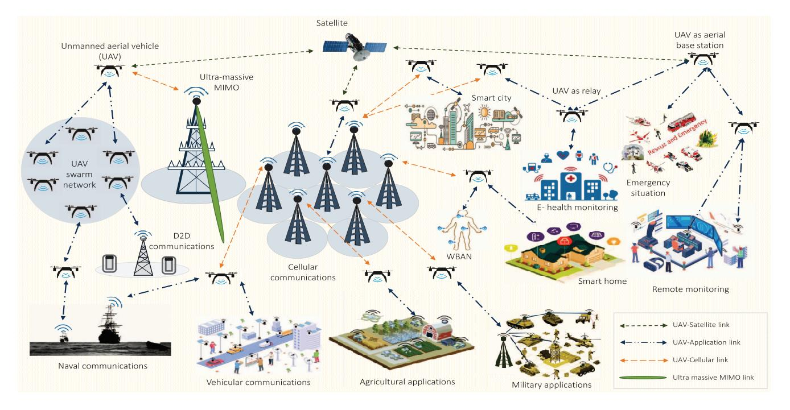

Fig. 1. UAV-aided communication networks for various applications.

for restoring wireless services when the terrestrial BSs become inoperable due to natural calamities like floods, earthquakes, etc.

Integrating UAVs with other wireless technologies is one of the current focuses of the third generation partnership project (3GPP) [\[11\]](#page-48-10). Recently, 3GPP has released a study report to thoroughly examine the current limitations, constraints, expectations, and prospects of integrating UAVs with prevailing long-term evolution, 5G, and B5G communication key performance indicators (KPIs) like uRLLC, eMBB, m-MTC [\[12\]](#page-48-11). The following characteristics of UAV-enabled communication systems distinguish them from current terrestrial communication systems:

- • Dynamically varying communication channels due to UAV's mobility and air-to-ground (A2G) transmissions cause excessive temporal and spatial variations in the transmitted data.
- The structural design of UAVs and their rotational motion often results in airframe shadowing, making the characterization of the UAV's propagation channel more difficult.
- UAV-enabled aerial BSs can be deployed in three-dimensional (3D) vector space in contrast to static BSs of the current cellular networks spaced in two-dimensional (2D). This results in sophisticated hybrid network connectivity and coverage, along with concerns due to the mobility of aerial BSs.
- Both large-scale fading and small-scale fading models are required to characterize depending on the region of operation, like urban, suburban, rural, and remote/hardto-reach areas.

UAVs are typically powered by onboard power storage modules such as batteries, therefore their size and weight should be

optimally designed to make them compact and portable, which further ensures their increased flight duration. Additionally, advances in UAV hardware technologies like high computational capabilities, intelligent sensing, and extensive data collection require an accurate energy budget to increase the durability of UAV-assisted networks substantially [\[13\]](#page-48-12). However, battery sources of UAVs suffer from frequent discharging limitations that affect their deployment in large-scale networks due to low operational duration. As batteries can store only fixed amounts of energy, they must be recharged or replaced. Replacing the batteries in remote areas or hardto-reach scenarios becomes rather tricky. Moreover, manual deployment of batteries also poses high safety concerns in several hazardous scenarios, and discharging may sometimes lead to the loss of the device's operational period, causing network breakdown. Dumping many unsafe batteries can toxify the environment, so increasing on-boarded batteries on the device modules is not recommended for long-term solutions [\[14\]](#page-48-13). These concerns have spurred the exploration of new technologies, specifically the concept of energy harvesting (EH), which has garnered significant research interest in recent years.

In an attempt to overcome battery limitations in communication networks, numerous approaches like thermo-electric, solar, and mechanical EH techniques have been reviewed in design and functionality simultaneously to fit into sizeconstrained embedded devices [\[15\]](#page-48-14). These advancements in EH techniques hold the potential to ensure longer operational duration and contribute to the seamless integration of UAVs in wireless communication networks. They offer sustainable solutions to power the UAVs, overcoming challenges associated with limited battery life, frequent replacements, and environmental hazards caused by battery disposal.

| Key Technologies I       | Discussed                         | [ <b>16</b> ] (2018) | [ <b>17</b> ] (2019) | [ <b>18</b> ] (2019) | [ <b>19</b> ] (2019) | [ <b>20</b> ] (2020) | [ <b>21</b> ] (2020) | [ <b>22</b> ] (2021) | [ <b>23</b> ] (2021) | [ <b>24</b> ] (2022) | [ <b>25</b> ] (2022) | [ <b>26</b> ] (2022) | This survey |
|--------------------------|-----------------------------------|----------------------|----------------------|----------------------|----------------------|----------------------|----------------------|----------------------|----------------------|----------------------|----------------------|----------------------|-------------|
|                          | Task scheduling                   |                      | V                    | V                    |                      | V                    | ,                    |                      |                      |                      |                      | <b>V</b>             | <b>√</b>    |
|                          | Taxonomy                          | <b>√</b>             | <b>√</b>             | <b>√</b>             | <b>√</b>             | <b>√</b>             |                      |                      |                      |                      |                      | <b>√</b>             | <b>√</b>    |
|                          | Applications                      | <b>√</b>             | <b>√</b>             | <b>√</b>             | <b>√</b>             | <b>√</b>             |                      |                      |                      |                      |                      | <b>√</b>             | <b>√</b>    |
|                          | Design and development challenges |                      |                      |                      |                      |                      | <b>√</b>             |                      | <b>√</b>             |                      |                      |                      | <b>√</b>    |
|                          | Flight duration optimization      |                      |                      | <b>√</b>             | <b>√</b>             | <b>√</b>             |                      |                      |                      | <b>√</b>             | <b>√</b>             | <b>√</b>             | <b>√</b>    |
| <b>UAV</b> preliminaries | 2D/3D trajectory planning         | <b>√</b>             |                      | <b>√</b>             | <b>√</b>             | <b>√</b>             |                      |                      |                      | <b>√</b>             | <b>√</b>             | <b>√</b>             | <b>√</b>    |
|                          | Relaying schemes                  | <b>√</b>             | <b>√</b>             | <b>√</b>             | <b>√</b>             | <b>√</b>             |                      |                      |                      | <b>√</b>             | <b>√</b>             | <b>√</b>             | <b>√</b>    |
|                          | Resource optimization             | <b>√</b>             | <b>√</b>             | <b>√</b>             | <b>√</b>             | <b>√</b>             | <b>√</b>             | <b>√</b>             | <b>√</b>             | <b>√</b>             | <b>√</b>             | <b>√</b>             | <b>√</b>    |
|                          | Cooperative UAV networks          | <b>√</b>             | <b>√</b>             | <b>√</b>             | <b>√</b>             | <b>√</b>             |                      |                      |                      | <b>√</b>             | <b>√</b>             | <b>√</b>             | <b>√</b>    |
|                          | Energy and power budget           |                      |                      |                      |                      |                      | <b>✓</b>             |                      | <b>√</b>             |                      |                      |                      | <b>√</b>    |
|                          | Standardization                   |                      | <b>√</b>             |                      |                      | <b>√</b>             |                      |                      |                      |                      |                      | <b>√</b>             | <b>√</b>    |
|                          | Industrial developments           |                      | <b>√</b>             |                      | <b>√</b>             | <b>√</b>             |                      |                      |                      |                      |                      | <b>√</b>             | <b>√</b>    |
| EH                       | RF-EH                             |                      |                      |                      | <b>√</b>             |                      | <b>√</b>             | <b>√</b>             | <b>√</b>             |                      |                      | <b>√</b>             | <b>√</b>    |
| 1211                     | SWIPT Receiver architectures      |                      |                      |                      | <b>√</b>             |                      | <b>√</b>             | <b>√</b>             | <b>√</b>             |                      |                      |                      | <b>√</b>    |
|                          | Optimization of EH parameters     | <b>√</b>             | <b>√</b>             |                      | <b>√</b>             | <b>√</b>             | <b>✓</b>             | ✓                    | <b>√</b>             | <b>√</b>             | <b>√</b>             | <b>√</b>             | <b>√</b>    |
|                          | IoT networks                      | <b>√</b>             | <b>√</b>             | <b>√</b>             | <b>√</b>             | <b>√</b>             | <b>√</b>             | <b>√</b>             | <b>\</b>             | <b>√</b>             | <b>√</b>             | <b>√</b>             | <b>√</b>    |
|                          | Hybrid communications             | <b>√</b>             | <b>√</b>             | <b>√</b>             | <b>√</b>             | <b>√</b>             | <b>√</b>             | ✓                    | <b>√</b>             | <b>√</b>             | <b>√</b>             | <b>√</b>             | <b>√</b>    |
|                          | CRNs                              | <b>√</b>             |                      | <b>√</b>             |                      | <b>√</b>             | <b>√</b>             | <b>√</b>             | <b>\</b>             |                      |                      | <b>√</b>             | <b>√</b>    |
| state_of_the_art         | mm-Wave and THz links             | ✓                    | ✓                    |                      | ✓                    |                      |                      |                      |                      | ✓                    | <b>√</b>             | <b>√</b>             | ✓           |
| techniques               | NOMA and m-MIMO                   | <b>√</b>             | <b>√</b>             | <b>√</b>             |                      | <b>√</b>             | <b>√</b>             | ✓                    | <b>√</b>             | <b>√</b>             | <b>√</b>             | <b>√</b>             | <b>√</b>    |
| comiques                 | MEC and Fog computing             |                      |                      |                      |                      |                      | <b>√</b>             | ✓                    | <b>√</b>             |                      | <b>√</b>             | <b>√</b>             | <b>√</b>    |
|                          | AI and ML                         | <b>√</b>             | <b>√</b>             |                      |                      | <b>√</b>             | <b>√</b>             |                      |                      |                      | <b>√</b>             | <b>√</b>             | <b>√</b>    |
|                          |                                   |                      |                      |                      |                      |                      |                      |                      |                      |                      |                      |                      |             |

TABLE II SURVEY PAPERS FOCUSED ON EITHER UAVS OR EH METHODS WITH STATE-OF-THE-ART COMMUNICATION TECHNOLOGIES

EH-powered UAVs can operate for extended periods without interruptions by harnessing energy from different sources. Thus, integrating the EH techniques in UAV communications is essential for applications that require prolonged aerial surveillance, data collection, and relaying in remote or hardto-reach areas. However, the availability issues and high cost associated with the conventional EH techniques have led the researchers to find other EH sources that are abundant in nature. In this direction, recent studies have considered radio frequency (RF)-energy harvesting (RF-EH) technique as a prominent contender in making B5G wireless networks more self-sustainable, energy-efficient, and reliable. RF-EH-enabled UAVs can harvest energy from the surrounding ambient or dedicated RF sources to contribute to the development of energy-efficient and reliable B5G UAV-aided wireless networks.

# *A. Review of Existing Surveys*

Many research studies have explored the RF-EH in the different network architectures, where UAVs are deployed as a relay node or aerial BS. As a sequence, numerous survey studies have been conducted focusing on 1) EH techniques for 5G and beyond systems and 2) UAV-assisted wireless and mobile communication networks. For instance, different protocols and UAV's attributes for aerial communication were surveyed by Cao et al. [\[16\]](#page-48-15) with special emphasis on HAPs and lower-altitude platforms (LAPs).

Further, Shakhatreh et al. [\[17\]](#page-48-16) explained the major obstacles in the path of civil applications of UAVs and highlighted solutions for collision avoidance, EH, and security. Later, Fotouhi et al. [\[18\]](#page-48-17) focused on various challenges, research developments, and the future scope of UAV's integration with the communication network. In particular, they reported several critical challenges for the UAV's deployment and highlighted possible solutions/approaches. On the other hand, Khawaja et al. [\[19\]](#page-48-18) provided a rigorous survey on channel measurements for UAV-aided A2G communication and discussed several models of the fading channels, their limitations, along with some research directions.

Various UAV attributes for integrating UAVs with future communication techniques were presented in [\[20\]](#page-48-19) for different network architectures. Furthermore, Ma et al. [\[21\]](#page-48-20) thoroughly marked different EH techniques and optimization solutions and summarized diverse standardization and commercialization prospects of EH-enabled communication systems. Likewise, Williams et al. [\[22\]](#page-48-21) studied existing EH techniques considering various EH models with particular emphasis on rising industrial applications of the wireless sensor networks (WSNs). A comprehensive survey on energy and spectrum harvesting techniques was recently reported in [\[23\]](#page-48-22), where some key network protocols for next-generation wireless communications were presented. In contrast, Xiao et al. [\[24\]](#page-48-23) have focused on various challenges and research developments in millimeter wave (mmWave) beamforming-assisted UAV networks.

Wie et al. [\[25\]](#page-48-24) reviewed the key technologies and different scenarios of UAV-assisted data collection. They have presented different mathematical and network models for data collection in UAV-assisted IoT. The recent 3GPP and 5G-based industrial standpoints related to UAV communications were highlighted in [\[26\]](#page-48-25). Most of these works focused either on the comprehensive study of UAV-enabled communications or EH techniques for conventional communication networks, as summarized in Table [III](#page-4-0) to provide a quicker look to the reader about the

TABLE III COMPARISON OF RELATED SURVEY PAPERS ON UAVS AND EH TECHNIQUES WITH THIS WORK

| Key Technologies    | [27]     | [28]     | [29]     | [30]     | [31]     | [32]     | This     |
|---------------------|----------|----------|----------|----------|----------|----------|----------|
| Discussed           | (2023)   | (2023)   | (2023)   | (2023)   | (2023)   | (2024)   | work     |
| 2D/3D trajectory    |          | <b>\</b> | 1        | <b>√</b> | <b>√</b> | <b>√</b> | <b>1</b> |
| planning            |          | · •      | <b>'</b> | · ·      | \ \ \    | · ·      | <b>'</b> |
| CRNs                | ✓        | <b>√</b> |          | ✓        | <b>√</b> |          | <b>√</b> |
| Conventional EH     | <b>√</b> |          |          | <b>√</b> |          |          | ,        |
| sources             | <b> </b> |          |          | <b>V</b> | ✓        |          | ✓        |
| Cooperative UAV     |          | ,        |          | ,        |          | ,        | ,        |
| networks            |          | ✓        | ✓        | <b>√</b> | ✓        | ✓        | ✓        |
| EH-UAV resource     |          | ,        | ,        | ,        | ,        | ,        | ,        |
| allocation          |          | <b>√</b> | ✓        | ✓        | ✓        | <b>√</b> | ✓        |
| Flight duration     | ,        | ,        |          | ,        |          | ,        |          |
| optimization        | ✓        | <b>√</b> |          | ✓        | ✓        | <b>√</b> | ✓        |
| Power budget        |          | ,        |          | ,        |          |          | ,        |
| discussion          | ✓        | ✓        | ✓        | <b>√</b> |          |          | ✓        |
| IoT and sensor      | ,        |          | ,        | ,        | ,        | ,        |          |
| networks            | ✓        |          | ✓        | ✓        | ✓        | ✓        | ✓        |
| EH-UAV-assisted     |          |          |          |          |          |          |          |
| Hybrid networks     |          | ✓        | ✓        |          | ✓        | ✓        | ✓        |
| PHY-security in     |          |          |          |          |          |          |          |
| EH-UAV networks     |          |          |          | ✓        | ✓        |          | ✓        |
| NOMA and            |          |          |          |          |          |          |          |
| m-MIMO              | ✓        |          | ✓        | ✓        | ✓        | ✓        | ✓        |
| MEC and fog         |          |          |          |          |          |          |          |
| computing           |          | ✓        | ✓        | ✓        | ✓        |          | ✓        |
| EH-UAV              |          |          |          |          |          |          |          |
| applications        | ✓        | ✓        | ✓        | ✓        |          | ✓        | ✓        |
| ML/AI in EH-UAV     |          |          |          |          |          |          |          |
| networks            |          | ✓        | ✓        | ✓        | ✓        | ✓        | ✓        |
| UAV-integrated RIS  |          |          |          |          |          |          |          |
| links               |          | ✓        | ✓        | ✓        | ✓        |          | ✓        |
| RF-EH               |          | <b>/</b> | <b>-</b> | <b>√</b> | <b>-</b> | <b>√</b> | <b>/</b> |
| SWIPT receiver      |          | · ·      | · ·      | · ·      | · ·      | · ·      |          |
| architectures       | ✓        |          |          |          |          | ✓        | ✓        |
| Solar driven UAV    |          |          |          |          |          |          |          |
| networks            | ✓        |          |          |          | ✓        |          | ✓        |
|                     |          |          |          |          |          |          |          |
| UAV design          | ✓        | ✓        |          | ✓        |          |          | ✓        |
| challenges          |          |          |          |          |          |          |          |
| UAV-integrated      |          |          |          |          | ✓        |          | ✓        |
| AmBSCs              |          |          |          |          |          |          |          |
| UAV standardization |          |          |          |          |          |          | <b>√</b> |
| UAV industrial      |          |          |          |          |          |          | <b>√</b> |
| development         |          |          |          |          |          |          |          |
| EH-UAV channel      |          |          |          |          |          |          | <b>√</b> |
| modeling            |          |          |          |          |          |          | •        |

fundamental technical differences between the existing surveys and this survey work.

Apart from the above mentioned surveys, several recent surveys have focused on the energy transfer and management aspects of UAV-aided communications. These papers have tossed wireless power transfer (WPT) and EH techniques to harness the energy limitations effectively. Precisely, Wie et al. [\[27\]](#page-48-26) have explored the solar and mechanical energy based EH techniques and showcased some of the latest UAV and EH architectures based on these energy sources.

Expanding on the energy-focused exploration, Abubakar et al. [\[28\]](#page-48-27) have reviewed various energy optimization techniques for UAV charging mechanisms based on conventional methods and machine learning (ML) algorithms. Likewise, Jin et al. [\[29\]](#page-48-28) have extensively reviewed several energy efficiency (EE) enhancing techniques for UAVs by broadly covering the areas such as planning UAV's trajectory, resource allocations, energy-saving communication protocols, and energy transfer mechanisms.

In tandem with these efforts, Ojha et al. [\[30\]](#page-48-29) have categorized recent advancements in WPT methods for UAV-aided applications based on design architectures, enabling technologies, and optimization aspects. Furthermore, Amodu et al. [\[31\]](#page-48-30) delved into the age minimization perceptive of UAV-assisted data-gathering architectures and proposed a systematic literature review on three key design components, i.e., energy management, flight trajectory, and UAV/ sensor nodes (SN) scheduling. Likewise, Mayarakaca and Lee [\[32\]](#page-48-31) have covered the scenarios of employing NOMA techniques and ML algorithms to improve the performance of UAV-assisted wireless networks.

The survey works [\[27\]](#page-48-26), [\[28\]](#page-48-27), [\[29\]](#page-48-28), [\[30\]](#page-48-29), [\[31\]](#page-48-30), [\[32\]](#page-48-31), provide the fundamental aspects of the EH-powered UAVassisted communications for different applications. However, key points such as standardization of UAVs, simultaneous wireless information and power transfer (SWIPT) architecture, industrial developments of UAVs and EH techniques are not covered by the above mentioned works. To the best of the authors' knowledge, an exhaustive survey on different aspects of RF-based EH for diverse UAV-enabled communications with state-of-the-art techniques is still unavailable in the literature. For completeness, Table [III](#page-4-0) summarizes the critical technologies discussed in the surveys, as mentioned earlier, allowing readers to capture a quick look about the contributions made by this survey work with respect to other existing survey works.

# *B. Contributions of This Paper*

In recent years, extensive research has been conducted on integrating RF-EH with UAV-enabled communications to address energy limitation issues. Therefore, a survey paper on this innovative and promising technological integration can serve as a comprehensive resource, consolidating manifold research exertions and illustrating the current landscape, challenges, and advancements in this domain. Motivated by this, we first provide the details of the UAV's taxonomy, standardization, and industrial developments in this paper. Moreover, we describe the energy and deployment challenges of UAVs, EH techniques, and receiver architectures. Then, we discuss the implementation and modeling perspectives of EH in UAV-assisted communications and provide key insights about the system's performance in terms of system throughput (ST) and EE. The main focus is to comprehensively summarize the most recent research on EH and UAV-aided state-ofthe-art techniques. The proposed survey has a broad scope that covers UAV communication, EH techniques, UAV and EH attributes, and relevant use cases of the optimization techniques. This survey paper discusses the following major aspects.

• We provide a taxonomy for UAVs based on attributes like payload, operating scenarios, operating altitudes, tethering, etc., and delve into their current standardization and industrial advancements. Moreover, we highlight challenges in integrating UAVs with existing wireless networks.

- Next, we outline various EH techniques and RF-EH receiver architectures and focus on the implementation and modeling aspects of EH in UAV-assisted communication networks under composite A2G channel conditions. We use an elevation angle-dependent probabilistic lineof-sight (LoS)/non-line-of-sight (NLoS)-based model to show some insights into the system behavior in terms of ST and EE.
- Further, we highlight developments on EH in UAVenabled communications integrated with emerging techniques such as non-orthogonal multiple access (NOMA), massive multiple-input multiple-output (m-MIMO), mm-Wave, THz communication, cooperative relaying, satellite-aerial-terrestrial network (SATN), mobile edge computing (MEC), and IoT.
- We also cover optimization techniques utilized for UAVs' operations like trajectory, power allocation, and flight time to enhance overall information transfer (IT) rate, coverage probability, link reliability, etc., and reduce power consumption.
- We classify the recent research developments covering various state-of-the-art techniques with EH in UAV communications under different categories, such as physical layer techniques, communication networks, advanced computing technologies, and ML/artificial intelligence (AI). Lastly, we underline various exciting interdisciplinary future research directions and pave the way for fostering the integration of UAVs and RF-EH into practical communication networks.

# *C. Organization of This Paper*

The remainder of this paper is organized as follows. Section [II](#page-5-0) covers the preliminaries related to UAV communications, which include information about the different types of UAVs, industry standards, and developments in UAV technology. It also highlights the challenges of designing and deploying UAVs in the prevailing networks. Section [III](#page-13-0) provides the details of RF-EH techniques and different receiver architectures for enabling SWIPT. Section [IV](#page-20-0) discusses the integration of EH techniques with UAV-assisted communications. It underlines two scenarios: RF-EH empowered UAV communications and UAV-enabled RF-EH. Sections [V–](#page-23-0)[VIII](#page-43-0) provide in-depth discussions on the recent and relevant research works that utilize EH in UAV-aided communications with various state-of-the-art techniques. Specifically, Section [V](#page-23-0) focuses on exploiting EH in UAV communications with different physical layer techniques, whereas Section [VI](#page-34-0) covers recent developments on EH in UAV-enabled communication networks. Then, Section [VII](#page-41-0) emphasizes recent works on EH in UAV communications with advanced computing techniques, and Section [VIII](#page-43-0) discusses EH in UAV communications with ML/AI algorithms. After that, Section [IX](#page-46-0) summarizes the future research areas that will pave the path for researchers, and lastly, Section [X](#page-47-0) concludes the paper.

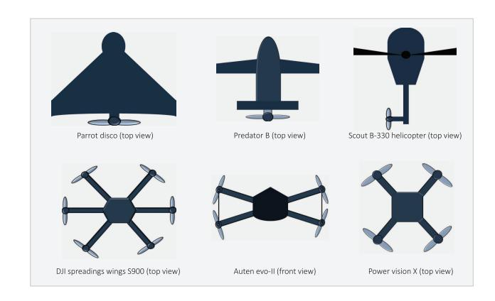

Fig. 2. Top view of different types of UAVs.

# II. UAV COMMUNICATIONS: PRELIMINARIES, DEVELOPMENTS, AND CHALLENGES

UAV-assisted networks have emerged as promising solutions for offering infrastructure-less, adaptable, and versatile deployability across diverse application scenarios ranging from remote and hard-to-reach regions to densely populated urban areas. Moreover, different attributes of UAVs, such as operating height, endurance, payload, maximum range of operation, etc., can be utilized based on specific requirements and scenarios. This section thoroughly describes the taxonomy of UAVs based on different attributes and configurations, followed by their standardization and developments. We also highlight crucial obstacles in realizing UAV-enabled wireless systems.

# *A. UAVs Taxonomy*

We categorize UAVs based on various characteristics, including the physics behind the flying mechanism, payload, flight time and speed, operational altitude, power source, and connectivity. Moreover, we provide Fig. [3,](#page-6-0) which summarizes different types of UAVs based on these attributes, illustrating the different ranges of these characteristics for each type.

*1) Physics Behind Flying Mechanism:* The versatile flight mechanism makes the UAVs capable of making vertical and horizontal take-offs and imparts hovering capabilities, making them viable for broader application scenarios. Based on the wing configuration and different flying mechanisms, the UAVs are categorized as follows [\[33\]](#page-48-32).

• *Fixed Wing UAVs:* Fixed-wing UAVs can efficiently carry large payloads while gliding along the aerial path, making them a feasible solution to transport the transceivers over considerable distances for cellular connectivity. Their high-speed mobility enables them to reach the destined nodes within a specified operational time for emergency scenarios and mission-critical applications. However, they have several drawbacks, such as (i) inability to hover at a specific location, (ii) inability to vertically take off and land, (iii) cost-inefficient, and (iv) increased infrastructure requirements due to the need for a runway. Specifically, Parrot Disco, Predator B, etc., are some examples of fixed-wing UAVs shown in Fig. [2.](#page-5-1)

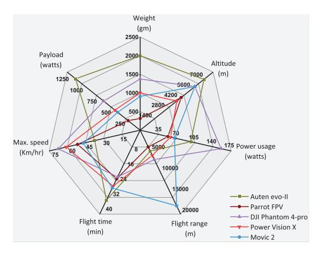

Fig. 3. Comparison of different UAVs based on various attributes [34], [35], [36], [37].

- Rotatory Wing UAVs: Rotary wing UAVs, also known as multi-rotor drones, can perform vertical take-off and landing owing to their aerodynamics, which allows them to hover over a specific location. Therefore, their reliable LoS link and static position can enhance the cellular coverage to the terrestrial nodes in UAV-aided cellular communications. Furthermore, UAV's maneuverability is highly suited for cellular communications due to their accurate navigation and precise deployment to maintain a fixed location and follow the scheduled trajectory over the service cell. On the contrary, fixed-wing UAVs face limitations, including restricted velocity and high power requirements, due to constantly overcoming gravity. Particularly, Scout B-330 helicopter, DJI Spreadings wings S900, etc., are some UAVs that come under this category and are shown in Fig. 2.
- Hybrid Rotary-Fixed Wing UAVs: The parrot swing drones are commercially designed under the category of hybrid rotary-fixed-wing UAVs. As shown in Fig. 2, they have four rotors that allow them to hover and increase aerodynamics due to lighter materials improving the gliding speed.
- 2) Real-Time Payload: Payload is defined as the UAV's capacity to carry the maximum possible weight during its flight, which depends upon the UAV's aerodynamic design, size, and the type of motor attached. Generally, the payload varies from a few grams to several tonnes. Based on this category, the UAVs can be classified as follows [20].
  - Micro UAVs (Payload range of < 1 kg)
  - Small UAVs (Payload range of 1-20 kg)
  - Medium UAVs (Payload range of 20-150 kg)
  - Large UAVs (Payload range of 150 kg several tons)

However, the UAVs' size, weight, and power (SWAP) constrain their payload capability. For instance, increasing the size and power storage capacity can improve payload endurance but results in compromised flight duration [33]. Therefore, optimizing the UAV payloads and flight duration is essential based on the requirements. In addition, the mechanical designs need to be improvised to carry heavier payloads, which involves strengthening the UAV's structure, upgrading propulsion systems, and improving aerodynamic stability.

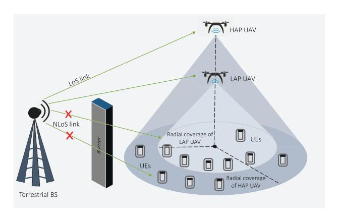

Fig. 4. UAV operating at different height with variation in radial coverage.

- 3) Size, Flight Time, and Speed: Different types of UAVs can be classified based on several closely related attributes, such as their size, flight time, and maximum flight speed. Specifically, small UAVs have shorter flight duration and lower maximum speeds. Contrarily, large UAVs can have longer flight duration and potentially higher speeds. The maximum velocity of small and large drones can reach up to 15 m/s and 100 m/s, respectively, as shown in Fig. 3. For UAVs, endurance is the ability to fly or hover in the air without charging or refueling. The endurance of the small-sized UAVs is typically in the range of 15 to 20 minutes, whereas it can be higher, e.g., a few hours for large-sized UAVs [38]. With the advancements in the automotive and aviation sectors, the payload of small-sized UAVs and their endurance have been sufficiently increased. For instance, a hybrid-electric Skyfront Tailwind drone has recorded 4 hours 34 minutes flight time [12]. Nonetheless, long-lasting and self-powered drones are the best option for cellular applications and remote access, which requires EH as a backup source.
- 4) Operational Altitude: UAVs can be deployed in different aerial platforms, and their operating height can vary from a few meters to a few kilometers depending on the requirements of application scenarios and access links. Specifically, the elevation angle between the terrestrial nodes and UAVs increases with the increase in UAV's altitude, subsequently affecting their LoS connectivity, path loss, and QoS. It is important to note that the UAVs from higher altitudes can offer large coverage areas but with degraded signal quality due to signal attenuation, airframe shadowing, and other factors, as shown in Fig. 4. Conversely, the UAVs deployed at lower altitudes offer low path loss and a more reliable cellular network over a smaller coverage area. In this direction, UAVs can dynamically adjust the hovering altitude to improve the quality of links by employing ML techniques in UAV communications. Based on the UAV's operational height, two popular UAV types can be categorized as HAPs and LAPs, which are as follows.
  - HAPs: They cover larger radial distances due to their high elevations and higher flight durations than their counterpart. HAPs are more suitable for the rural scenario, hard-to-reach places, mountainous locations, etc., due to high LoS connectivity. The deployment of HAPbased UAVs is challenging due to high path loss and

atmospheric conditions. Furthermore, their prime role is to bring network access to a large population with a futuristic cellular scope. It has been observed that the high inter-cell interference and channel variations may hamper the UAVs in a HAP-assisted cellular scenario and may result in link outage [\[39\]](#page-49-0), [\[40\]](#page-49-1). The HAP-based UAVs are prone to interference in high-rise urban zones compared to suburban areas, which restricts their use in cellular applications.

- • *LAPs:* LAPs-based UAVs are less expensive and can be deployed in less time due to an infrastructure-less framework [\[41\]](#page-49-2), enhancing their applicability in cellular communications. Furthermore, they can improve the quality of service (QoS) for mobile users in suburban scenarios through LoS connectivity. However, the radial coverage is restricted due to its low operational height. Nevertheless, their coverage area can be increased through proper trajectory planning.
- *5) Power Source:* Based on different powering sources for the UAVs, they can be classified as electric-powered, gasoline-powered, hybrid-gasoline-electric-powered, and hydrogen-powered UAVs [\[42\]](#page-49-3). However, most small-sized UAVs operate on rechargeable batteries or fuel cells, but large-sized UAVs require more power to fly and carry large payloads, so they often use fuel compounds, gasoline, or gases. Several other types of UAVs, such as hybrid-powered and hydrogen-powered UAVs, have recently gained some popularity due to their high efficiency and environmental friendliness. Over the last few decades, the power constraint of the UAVs tossed the concept of EH techniques by using different energy sources like wind, solar, radio signals, etc.
- *6) Wired and Wireless UAVs:* UAVs can potentially be a key player in communication technologies due to their free mobility and deployment flexibility. Furthermore, operating at HAPs and LAPs increases the probability of LoS connectivity. But, limited onboard power sources restrain the flight duration and payload limits. To overcome this limitation, tethered UAVs (TUAVs) are introduced, as they can be connected to the power source via a wired cable capable of providing a stable power supply. However, the physical connectivity fetters the UAV's mobility, thus restricting its freedom of gliding over the target. In TUAVs, sustainable power supply and higher reliability compensate for the lack of unlimited mobility [\[43\]](#page-49-4).

# *B. UAV Standardization*

The exponential growth of UAV's commercial market has led global companies and researchers to develop networking topologies, protocols, and communication techniques supporting UAV-aided applications. The regulations for UAV wireless communication have already been drafted by Europe's electronic communications committee and U.S.'s federal communications commission. The UAV's standards, which included protocols, technologies, and requirements for UAV communications, were first formulated by 3GPP, followed by International telecommunication union (ITU) in the same year, 2017, which the Institute of electrical and electronics engineers (IEEE) joined in the next year.

*1) 3GPP Standards for UAV Communications:* In 2017, Report RP-171050 of the 3GPP radio access network (RAN)#76 meeting concluded that enhanced LTE can be used for UAV communications. It was followed by Technical Report (TR)-36.777 of 3GPP Release-15 (Rel-15), which suggested the required LTE system enhancements for maximizing the performance of secured UAV-assisted networks [\[44\]](#page-49-5). Then, 3GPP Technical Specification-22.125 specified the airspace regulation. This is followed by TR-22.829 of 3GPP, published in 2019 and identified various 5G-supported UAV-based application scenarios and use cases. It also summarized necessary performance improvement strategies [\[45\]](#page-49-6). In 2020, the 3GPP Release-17 (Rel-17) specified two TRs, in which TR-23.754 focused on network infrastructures, identifying, connecting, and tracking the UAV. In contrast, TR-23.755 have targeted efficient UAV operations by designing application architecture [\[46\]](#page-49-7). In 2021, 3GPP Rel-17 reported two Technical Specifications, i.e., Technical Specification-23.256, which focused on stage 2 of identification, connectivity, and tracking of unmanned aircraft system (UAS), whereas Technical Specification-23.255 specified the UAS-based application layer design and its functional architecture [\[47\]](#page-49-8). In the same year, TR-23.776 provided the second phase of enhanced architecture design for 3GPP for supporting vehicleto-everything applications.

In 2021, Report of RAN#94 meeting, 3GPP Release-18 (Rel-18) laid TR-23.700-05 and TR-23.700-79 that have aimed to design an enhanced architecture for vehicle-mounted relays and have studied the gateway user equipment (UE) function of mission-critical communications [\[48\]](#page-49-9). In the meeting, the team concluded that Rel-18 plays a crucial role in the commencement of sixth-generation (6G) or 5G advancement. This release's primary goal is to increase wireless networks' level of intelligence by incorporating sophisticated ML-based algorithms at various UAV communication infrastructure layers [\[49\]](#page-49-10). UAV-based enhancements in Rel-18 (6G and beyond drones), such as rogue drone detection, RAN improvement for remote controlling, and UAV-assisted marine communications [\[50\]](#page-49-11), were targeted other than enhancing the UAV's capacity and speed. Rel-18 also mentioned the onboard radio access node, UxNB, the modern aerial radio capable of establishing a broadband data network to support terrestrial RANs. 3GPP Technical Specification-24.334 introduced proximitybased services and routing using the UxNB.

*2) IEEE and ITU Standards for UAV Communications:* The IEEE has provided three standards, P1936.1, P1939.1, and P1920.1, in 2018, 2019, and 2020, respectively. *P*1936.1 standard has focused on UAV's application framework, *P*1939.1 has targeted designing an architectural framework for LAP-based UAVs, and *P*1920.1 have provided aerial communications and networking guideline. Whereas, standards ITU-TY.UAV.arch and ITU-T F.749.10 were published by ITU in 2017 and 2019, respectively. ITU-TY.UAV.arch have focused on the UAV's functional architecture and control using IMT-2020 networks. However, ITU-T F.749.10 have laid the requirements for communication services of civilian UAVs.

*3) 3GPP Specified UAS Identification and Control Procedure:* The UAV and controller are considered as

| KPIS FOR THE CCC MODES ACCORDING TO 3GPP TS 22.125 VERSION 17.6.0 RELEASE 17 |  |  |  |
|------------------------------------------------------------------------------|--|--|--|
|                                                                              |  |  |  |
|                                                                              |  |  |  |
|                                                                              |  |  |  |
|                                                                              |  |  |  |
|                                                                              |  |  |  |
|                                                                              |  |  |  |

# TABLE IV

TABLE V KPIS FOR UAV-ASSISTED WIRELESS SERVICES ACCORDING TO 3GPP TECHNICAL SPECIFICATION 22.125 VERSION 17.6.0 RELEASE 17

| Use Scenarios                                   | Applications                                    | Uplink D | ata              | Downlink | Data      | Height   | Service area                  |
|-------------------------------------------------|-------------------------------------------------|----------|------------------|----------|-----------|----------|-------------------------------|
| OSC SCENATIOS                                   | Applications                                    | Latency  | Data Rate        | Latency  | Data Rate | Height   | Scrvice area                  |
| Virtual and Augmented reality, Healthcare       | 8K video live broadcast                         | 200 ms   | 100 mbps         | 20 ms    | 600 mbps  | 100 m    | Urban, scenic                 |
| Bidirectional Non LoS controlling               | Remote UAV controller via high definition video | 100 ms   | >= 25 mbps       | 20 ms    | 300 kbps  | 300 m    | Urban, rural                  |
| Advanced vehichles, 3D mapping                  | Laser mapping                                   | 200 ms   | 120 mbps         | 20 ms    | 300 kbps  | 30-300 m | Urban, rural, and scenic   |
| Healthcare, Military, Surveillance              | 4×4 K AI surveillance                           | 20 ms    | 120 mbps         | 20 ms    | 50 mbps   | 200 m    | Urban, rural                  |
| Entertainment, Security, Broadcasting           | Real-Time Video                                 | 100 ms   | 0.06 Mbps        | 10 ms    | 0.1 mbps  | 100 m    | Urban, rural, and countryside |
| Emergency and health-care surveillance security | Video streaming 720 p 1080 p                 | 100 ms   | 4 mbps 9 mbps | 10 ms    | 1 mbps    | 100 m    | Urban, rural, and countryside |
| SAR applications, inspections                   | Periodic still photos                           | 1 sec    | 1 mbps           | 0.1 ms   |           | 120 m    | Urban, rural, and countryside |

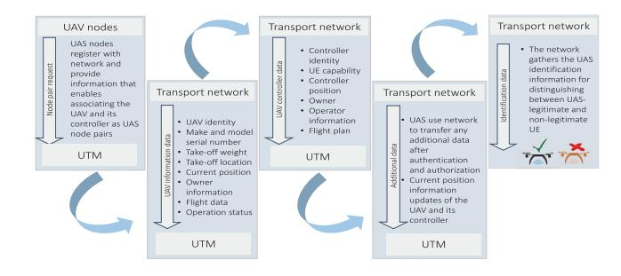

Fig. 5. Steps for remote identification of UAS.

a UAS, in which the controller leverages a satellite or terrestrial communication network to control the UAV. Concluding from the technical reports of 3GPP, for establishing effective communications, initially, the UAS nodes require authentication and registration with the network, followed by providing regular updates. The complete process is done by remote identification, command and control communications [\[44\]](#page-49-5).

*a) Remote identification of UAS nodes:* As mentioned above, UAS must provide regular updates and confirm their identification to the network that forwards the information to a centralized flight management system, the UAS traffic management (UTM) system. It performs crucial tasks like airspace authorization, sharing the flight intent with others, remote identification, flight routes, and aerial deconfliction between aerial operators. Fig. [5](#page-8-0) summarizes the identification requirements and related procedures.

*b) CCC communications:* The control signals manage the UAVs in their pre-planned trajectory and other commands that keep them updated with the controller or UTM. The bidirectional command and control center (CCC) links are responsible for message exchange between UTM, the controller, and UAV, which includes crucial instructions to UAV flight controlling and packet reception acknowledgment. Table [IV](#page-8-1) and Table [V](#page-8-2) highlight the KPIs for CCC modes and wireless services provided by UAVs according to 3GPP Technical Specification 22.125 version 17.6.0 Rel-17 [\[47\]](#page-49-8). The following are the CCC modes for controlling the UAV flight and operations:

- *Steer-waypoints (uplink and downlink)*: UTM or UAV controller communicates pre-planned waypoints or other crucial flight information to the UAV.
- *Direct stick steering (uplink and downlink)*: In real-time, the UAV controller provides flight directions directly to the UAV via waypoints.
- *Automatic flight by UTM (uplink and downlink)*: The array of pre-planned 3D and beyond polygons is provided by UTM for autonomous flight to the UAV, which feedback its position information for tracking.

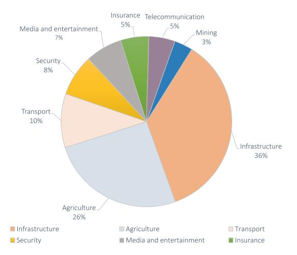

Fig. 6. UAV-based services in key industries.

• *Approaching autonomous navigation infrastructure (uplink and downlink)*: Flight instructions such as autonomous departing and landing, and pre-scheduled altitude, speed, and next waypoint are updated by CCC.

# *C. Industrial Developments and Field Testing*

The market experts expect UAVs' sales to grow from USD 26.2 billion in 2022 to 38.3 billion in 2027 with a compound annual growth rate of 7.9%, which rise by 7.6% from 2016 [\[51\]](#page-49-12). The industries and academic research communities are collaboratively focusing on harnessing the UAV's potential in forming a massive integrated network cluster [\[52\]](#page-49-13), [\[53\]](#page-49-14). Various UAV prototypes and test beds have been designed with the latest aviation and communication standards to enhance the user experience by installing the UAVs at remote locations to increase network coverage. Giant companies like Google, DHL, Huawei, Amazon, Boeing, Airbus, and Uber invest large capital in UAV technology's research and development by observing and forecasting the lucrative opportunities in the world's market. The market trend for UAV-assisted key industries are shown in Fig. [6](#page-9-0) [\[51\]](#page-49-12).

For the first time, UAV communication achieved a landmark when they are utilized for a UAV-aided entanglement distribution in quantum communication [\[54\]](#page-49-15). Further, UAVs have been included in the airborne 'Loon' project sponsored by Google in 2011 for delivering reliable Internet access supporting data rate of 1 Mbps to the rural and inaccessible regions at the height of 18 to 26 km in 2.4 GHz and 5.8 GHz ISM band [\[55\]](#page-49-16). On the other hand, Amazon 'Prime air' has also launched a UAVassisted rapid package delivery model [\[56\]](#page-49-17). Qualcomm and Nokia's joint venture '5G Drones' program has been executing numerous trials for UAVs as the future generation connectivity solutions [\[57\]](#page-49-18), [\[58\]](#page-49-19). The project, named 'PERFUME', was started by European Research Council in 2015 that was funded till 2020 [\[59\]](#page-49-20). It investigated the 'autonomous aerial cellular relay robots', wherein a UAV relay BS was introduced to improve ST and coverage for commercial applications. The project's primary focus was to create an ML algorithm for locating and updating the 3D coordinates of the UAV node.

Similarly, in 2016, the 'Nokia F-cell' project was introduced for the backhaul communication that utilized a self-configured solar-powered UAV BS prototype with 64 antennas [\[60\]](#page-49-21). The project employed the m-MIMO spatial multiplexing technique at a frequency less than 6 GHz to provide complete wireless networking under NLoS scenarios. On the contrary, Facebook launched the 'Aquila' project in 2016, using high altitude UAVassisted BS at 18 to 20 km height to provide Internet access to remote locations at approximately 100 km [\[61\]](#page-49-22), [\[62\]](#page-49-23). It used the Free-space optics (FSO) links to connect to terrestrial access nodes that leveraged LTE or Wi-Fi technology to serve terrestrial users. Huawei initiated a digital Sky project in its wireless X-Lab in 2017 to enhance the network coverage of airspace at a 200 m altitude, and 3 km flying zone radius [\[63\]](#page-49-24).

The leading UAV manufacturing companies like Parrot (France), Yuneec (China), and DJI (China) maintained widespread distribution networks and strong product portfolios that accounted for the dominant share in the global market in 2019. Nevertheless, rising other UAV manufacturers such as AeroVironment Inc. (U.S.), Holy Stone (Taiwan), 3D Robotics (U.S.), Sense Fly (Switzerland), GoPro (U.S.), Hexagon (Sweden), Autel Robotics (U.S.), Kesper Drone (U.S.), and Delair (France) also entered the global market in 2021-22. The cab company, Uber, has invested high capital for the growth of Air taxi, and logistics company DHL has also put large capital for UAV-based air transportation in the same fiscal year [\[64\]](#page-49-25).

Other than these UAV projects, in January 2021, U.S.'s AeroVironment, Inc. acquired a large UAS manufacturing company Arcturus UAV, Inc., to increase its investment capital to USD 405 million. The same year, the Indian army signed a USD 20 million contract with ideaForge Technology Pvt. Ltd. to delivering high-altitude 'SWITCH' fixed-wing UAVs for surveillance, intelligence, and reconnaissance applications [\[45\]](#page-49-6). The federal aviation administration has stepped closer to developing a traffic management system based on UAS, for which they have permitted American Robotics, Inc. to operate the UAVs. The U.S. Army has granted a contract of 15.4 million to Teledyne FLIR LLC for delivering a Black Hornet 3, a small-sized UAV of 33 g weight, 168 mm length, and a rotor diameter of 123 mm in May 2021. In comparison, the Israeli aerospace industries ordered a UAV with mediumaltitude long-endurance, Heron, worth 200 million in June 2021. Additionally, in February 2021, NASA landed the Perseverance rover on Mars [\[65\]](#page-49-26).

# *D. Design and Deployment Challenges*

Several drawbacks/limitations of terrestrial BSs, like high installation cost, time-consuming setup, static infrastructure, higher probability of NLoS, and lesser coverage area, have initiated the idea of adopting UAVs or a swarm of UAVs for upgrading wireless networks infrastructure. The UAVs as aerial BSs and relay nodes can also be integrated with ground-based BSs to impart better network coverage, higher spectrum efficiency, and a more reliable consumer experience. However, the adoption of aerial BSs is still in its initial stage. There are several practical challenges in integrating UAVs with the existing network infrastructure, which must be addressed. In particular, optimizing the trajectory and mobility of the UAVs are the most serious concerns for aerial BSs, which are constrained by UAVs' SWAP requirements that have grabbed the attention of academic researchers in recent times.

Furthermore, leveraging UAVs' power usage efficiently and developing feasible solutions to recharge UAVs' batteries are also significant challenges in keeping air-borne BSs operational. Moreover, it is challenging to maintain the nodeto-node link when these mobile UAVs are integrated with the ground BSs to form the front-haul and backhaul networks. This section highlights the design issues and trajectory planning and discusses the energy constraints related to this topic. However, extensive research efforts have been made in overcoming these challenges related to the design and deployment of UAV communication networks. A comprehensive exploration of these research endeavors and their solutions is done in Sections [V](#page-23-0)[–VIII](#page-43-0) of this survey, shedding light on the ingenuity applied to tackle these pressing issues.

*1) Deployment of UAV Base Stations:* The UAVs' paths are predefined and require precision in planning the optimum trajectory. Also, positioning the UAVs as aerial relay nodes is more challenging than the conventional static terrestrial BSs. They can be placed at different altitudes in 2D and 3D spaces depending upon the different scenarios in which they are utilized. In various applications, the UAV swarm network provides additional advantages like secured data transmission, low latency, high reliability, and increased coverage area. However, the presence of terrestrial BSs in the same radial coverage area can hamper the signal quality of both A2G and G2G links [\[66\]](#page-49-27). For instance, data transfer from the UAV-mounted BS to the terrestrial user can cause severe interference to neighboring cells operating in the same frequency band because of its dominant LoS channels with the user. Conversely, when data is transmitted from a terrestrial user to the UAV-mounted BS, it may experience substantial interference from co-channel base stations.

The impact of the path loss and different multi-paths experienced at UAVs in distinct scenarios such as hills, open fields, forests, dense urban areas, or other regions greatly confines the performance of UAV-enabled communications. For the discussed cases, the UAV's inherent attributes and system parameters can be optimally designed and chosen to reduce interference and path loss and improve signal quality. Along with maximizing the signal strength with optimal UAV trajectory, the next task is to obtain the desired performance using the least number of UAV-mounted BSs and relays satisfying the required QoS of the terrestrial users. In this direction, various recent research works that have focused on the deployment of UAV-mounted BS in different state-of-theart techniques are provided in Sections [V](#page-23-0)[–VIII.](#page-43-0)

It is observed from the research works [\[67\]](#page-49-28), [\[68\]](#page-49-29), [\[69\]](#page-49-30), [\[70\]](#page-49-31), [\[71\]](#page-49-32), [\[72\]](#page-49-33), [\[73\]](#page-49-34), [\[74\]](#page-49-35), [\[75\]](#page-49-36), [\[76\]](#page-49-37), [\[77\]](#page-49-38) that there is a trade-off between the coverage area and performance metrics like ST, OP, etc. These research works emphasized either maximizing the system performance or minimizing the networks transmit power via UAV trajectory planning. Among these, [\[67\]](#page-49-28), [\[68\]](#page-49-29), [\[69\]](#page-49-30) investigated the deployment of UAVs in 2D aerial space, whereas [\[70\]](#page-49-31), [\[71\]](#page-49-32) have utilized 3D placement of UAVs. Without compromising on the system performance and QoS, the work in [\[72\]](#page-49-33), [\[73\]](#page-49-34) focused on restricting the least possible number of aerial BSs that could be able to provide services to the user in its radial area was investigated. Specifically, Merwadey and Guvenc [\[67\]](#page-49-28) utilized the brute force search method to show that the cell edges were optimal positions for aerial BS nodes in the 2D space. They concluded that the 5th percentile throughout gets drastically improved by decreasing the elevation of the UAVs.

Several other studies also investigated UAVs' 2D placement and utilized *K*-means clustering [\[68\]](#page-49-29) and genetic algorithm [\[69\]](#page-49-30) to obtain the optimal solution. Similarly, Bor-Yaliniz et al. [\[70\]](#page-49-31) utilized 3D positioning of the aerial BS to assist the existing terrestrial BSs in wireless links for better connectivity and high QoS. To reduce the total transmit signal power of aerial BSs, Mozaffari et al. [\[71\]](#page-49-32) considered the 3D placement of UAVs under different environmental scenarios. Further, Kosmeri and Vilhar [\[72\]](#page-49-33) considered UAV-assisted terrestrial users present in circular zones of the same radii. They employed the Geometry disk cover (GDC) algorithm to solve complex iterative mathematical equations. Whereas Lyu et al. [\[73\]](#page-49-34) utilized an evolved computing algorithm and concluded that the GDC algorithm yielded near-optimal solutions due to the spiral placement technique. To cope with the dynamic trajectory optimization problem of the A2G network, the model-free multi-agent RL was tossed by the authors in Feng et al. [\[74\]](#page-49-35). Whereas, the authors in [\[75\]](#page-49-36), [\[76\]](#page-49-37) have focused on practical constraints such as limited power, inter-cell interference, and position of aerial BS while planning UAV's placement.

When the connection between the aerial BS and the terrestrial user is established, the transfer of information generally occurs via two wireless links, namely the backhaul link and access link. The backhaul link forms a network between the core data center and the UAVs, whereas the access link allows information sharing between the terrestrial station and UAVs. The UAV's operating altitude affects both links due to the change in the elevation angle and distance between these links and the UAV. As a result, the path loss between links increases, which degrades the SINR [\[77\]](#page-49-38). Most of the research works [\[67\]](#page-49-28), [\[68\]](#page-49-29), [\[69\]](#page-49-30), [\[70\]](#page-49-31), [\[71\]](#page-49-32), [\[72\]](#page-49-33), [\[73\]](#page-49-34) assumed that the backhaul link has infinite bandwidth, and thus they focused only on the access link. Whereas, Sun and Ansari [\[77\]](#page-49-38) proposed the joint optimization technique of both heterogeneous links for the lateral placement of the aerial base station by taking the backhaul link's finite bandwidth.

*2) Planning of UAV's Trajectory and Mobility:* The mobility of UAV-mounted BSs can provide additional advantages to enhance their placements in far-reaching sites for serving mobile users. In recent years, enhancing mobility, task scheduling, and path planning have been employed in UAV communications to tackle real-time challenges adaptively. In particular, Liu et al. [\[78\]](#page-49-39) analyzed the UAV's performance at different UAV heights ranging from 2000-6000 meters while following a predefined path. Specifically, the initial and final locations of the UAV's path were fixed to *qI* = *q*[0] and *qF* = *q*[*T*], respectively, where *T* represents the total flight

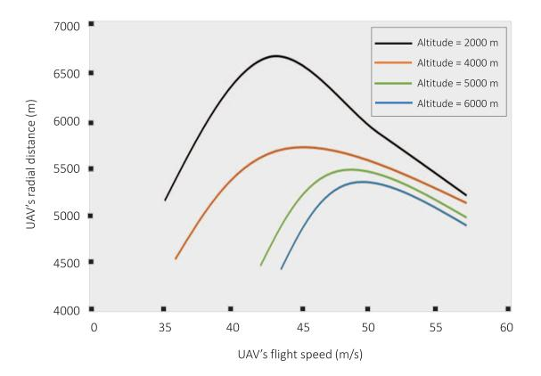

Fig. 7. UAV's flight distance vs flight time for different altitudes [\[78\]](#page-49-39).

duration of the UAV and *q* is the 2D location of the UAV. In their research study, UAV's flight speed was studied at different altitudes, and the result is depicted in Fig. [7.](#page-11-0) This figure provides an essential insight that the operating altitude up to which the UAV can hover or glide initially increases to its maximum and then decreases with a further increase in speed. There is a clear trade-off between the UAV's operating height and flight speed. The reason for this behavior can be observed from [\(2\)](#page-12-0) and [\(3\)](#page-12-1) as reported on 'page no. 14', where several factors like blade profile, UAV's weight, air density, and fuse-lag drag ratio limit the UAV's maximum operating height with the increased in its speed beyond the optimal range. Additionally, carrying a heavy battery increases the UAV's weight and limits the network lifetime if the UAV's speed is increased beyond a specific range.

In the literature, mainly two types of mobilities exist for UAVs, depending upon the transport mechanisms for relocating or recharging the UAV-BSs and serviceability. In the first type of UAV mobility, the UAV-mounted BS is inoperative while relocating to a specific location or moving to the nearest recharging station. The drawback of this category is that they cannot serve the users while moving and can only resume the services when the target location is reached or after being charged. Very limited research focused on the first category of aerial BSs transportation model, among which Chou et al. [\[79\]](#page-49-40) evaluated time-lapse in the service due to BS mobility and considered it an essential point for optimization. They proposed a placement mechanism by evaluating its target location distance from its initial position. Further, they employed a facility location method to reduce the LoS time that took transport cost as a cost function variable.

The second type of mobility allows UAV-mounted BS to serve terrestrial users while relocating. These UAV-mounted BS carry the backup power modules, enabling them to continue their ubiquitous services. This type of UAV's mobility is more suited for carrying the BSs because of their ability to serve terrestrial users while relocating or recharging. Moreover, optimizing the UAV's mobility can enhance the system performance and ensure uninterrupted network access for terrestrial users. Plenty of research works [\[80\]](#page-49-41), [\[81\]](#page-49-42), [\[82\]](#page-49-43), [\[83\]](#page-49-44) focused on improving the system performance by optimizing the mobility of a single UAV, whereas [\[84\]](#page-49-45), [\[85\]](#page-49-46), [\[86\]](#page-49-47), [\[87\]](#page-50-0), [\[88\]](#page-50-1), [\[89\]](#page-50-2), [\[90\]](#page-50-3) optimized the mobility and deployment of multiple UAVs' to improve the overall performance. Specifically, a distributed mobility model was considered to design the optimal trajectory of UAV-mounted BS using the SINR at mobile terrestrial UE in [\[80\]](#page-49-41) and at mobile UAV-mounted BS in [\[81\]](#page-49-42).

In this line, Zhang et al. [\[82\]](#page-49-43) analyzed the performance of the cellular network in relocating a UAV-mounted BS from source to destination node while maintaining the high QoS of terrestrial UE. Whereas Lyu et al. [\[83\]](#page-49-44) utilized the UAV as hotspots to deliver reliable offload data to the clients positioned at the cell edges and optimized the UAV's trajectory to enhance the throughput. Considering the fact that multiple UAVs can provide more effective data transmission as compared to a single UAV, Zhao et al. [\[84\]](#page-49-45) utilized a cooperative swarm of UAVs to strengthen the robustness of the considered system. However, the main challenges in employing cooperative UAVs are maintaining network connectivity between these nodes while avoiding collisions and optimizing the spacing between these aerial mobile relay nodes [\[85\]](#page-49-46).

Specifically, the obstacle avoidance for the UAV and collision avoidance between two UAVs are given by *qi*[*n*] − *r*- ≥ *D*1,min and *qi*[*n*] − *qj* [*n*]- ≥ *D*2,min, where *D*1,min and *D*2,min are safety distances for obstacle and collision avoidance, *qi*[*n*] and *qj* [*n*] are the time-dependent locations of cooperative UAVs at time slot [*n*], and *r* represents the known location of the obstacle. Multiple UAVs are suitable in different application scenarios that require primary attributes like maximizing network coverage [\[86\]](#page-49-47), cooperative work scheduling [\[87\]](#page-50-0), [\[88\]](#page-50-1), searching and localizing a target [\[89\]](#page-50-2), and many more. An autonomous mobility control algorithm can enable the UAV-mounted BS to dynamically adjust its movement in any random direction to keep them safe from one another and avoid collisions. Following this, Hassan et al. [\[90\]](#page-50-3) proposed a game-theoretic-based mobility control mechanism for multiple hovering UAV-mounted BSs to serve flexibly over a large coverage area.

- *3) Energy Constraints in UAV Communications:* The lifetime of the energy-constrained UAV-mounted BSs is generally extensive due to the fast battery depletion. Over the last few decades, numerous methods have been developed to extend the UAV's battery life. It is evident that the power-efficient UAV-assisted IT and minimizing energy consumption for UAVs hovering are paramount. Therefore, this section comprehensively discusses the equally essential electronic and mechanical aspects of energy conservation.
- *a) Energy requirement for communication:* The serious concern of UAV-aided communication is its limited onboard energy, which demands formulating a proper energy consumption model at UAV and emphasizing energy-efficient signal transmissions [\[91\]](#page-50-4). Thus, minimizing the signal transmission power is the key to reducing the UAVs' energy consumption in communication and prolonging the UAV networks' lifetime. In the last few years, utilization of swarm of small-sized UAVs [\[92\]](#page-50-5), [\[93\]](#page-50-6), [\[94\]](#page-50-7), efficient data transfer [\[95\]](#page-50-8), [\[96\]](#page-50-9), [\[97\]](#page-50-10), mobility and trajectory optimization [\[98\]](#page-50-11), [\[99\]](#page-50-12), [\[100\]](#page-50-13) have gained the interest of many research endeavors for reducing the overall signal transmission power.

Specifically, the authors in [92], [93] optimized the transmit power of single and multi UAVs. Whereas, Claussen [94] minimized the number of blockages and signal-transmitting nodes required by the UEs to reduce power dissipation without compromising the QoS in handling the downlink BSs. Later, for efficient data transfer, Mozaffari et al. [95] investigated the UAV-assisted data transfer between a sensor and a remote BS. Similarly, Li et al. [96] proposed an energy-efficient cooperative UAV-relaying and data transfer technique for extending the networks' lifetime. Abdulla et al. [97] have considered a circular path following UAV that gathered the data via clusters of terrestrial data sources. For this setup, they maximized the EE and system reliability.

Several works have utilized the ML algorithms along with UAVs' optimal trajectory planning and mobility optimization to enhance ST and EE of the network. Specifically, Abdulla et al. [98] tossed a game-theoretic algorithm for the UAV's mobility to maximize EE of the network comprising terrestrial nodes (TNs) and UAV. Similarly, Koulali et al. [99] proposed an induced non-cooperative game that scheduled two random UAVs for transmitting the information. Whereas, Kandeepan et al. [100] proposed a real-time optimal link selection technique to improve EE. They considered the channel variations and temporal nature of the G2A uplink channel during the data transfer.

A trade-off can be obtained between the radial coverage of the UAVs and power dissipation while considering the data transfer through A2G link in UAV-assisted terrestrial networks [99], [100], [101]. However, Zorbas et al. [101] demonstrated that communication energy is nearly negligible compared to the overall energy consumption. This fact paved direction for the researchers to focus on the mechanical aspects of UAV's design by considering the SWAP limitations.

b) Energy requirement for maneuvering and propulsion: Various research studies have revealed that the energy consumed for data transfer in the communication network is much less than the energy required for the mechanical operations of UAVs. Moreover, it requires additional power for propulsion and hovering over a specific location, which needs to be modeled separately. Modeling the UAV's mechanical energy is more complex and dynamic due to the atmospheric variations and application scenarios compared to terrestrial robots. This section studies various research works on mechanical energy models for fixed-wing and rotary-wing UAVs that differ in operating mechanisms. Thus, propulsion and endurance for these configurations are required to be characterized separately.

In the earlier energy models [102], the basic mathematical expression used to calculate the energy consumption of UAVs for their flying height can be expressed as  $\mathcal{E} = mgh$ . Where m is the total mass of the UAV, h is its flying altitude, and g is the acceleration due to gravity. But, this does not account for the propulsion energy required for hovering and taking off. In order to obtain a more exact energy model, [103], [104] modified the energy consumption expression by considering the propulsion energy of the UAV and expressed the total energy as

$$\mathcal{E} = (\mu + \alpha h) \ t + P_{\text{max}}(h/v), \tag{1}$$

where initial energy required to take-off from the terrestrial before hovering is  $\mu$  and  $\alpha$  is known as a motor speed multiplier. Both  $\mu$  and  $\alpha$  are weight-dependent factors.  $P_{\max}$  defines the maximum motor power, t is operation time, and  $v=v_i+at$  where v and  $v_i$  are the final and initial velocity of UAV. The initial power needed to lift the UAV at a specific height h is referred as  $P_{\max}(h/v)$ . The mechanical energy dissipation is subdivided into maneuvering and propulsion energy, which are mathematically expressed separately for UAVs' fixed and rotary types. Specifically, Zeng and Zhang [104] derived the mathematical closed-form expression for the propulsion energy consumption for fixed-wing UAVs, which is expressed as

$$P(v) = Av^3 + B/v, (2)$$

where A and B are variables depending on weight, wing size, air density and other factors of drones. The first term denotes parasitic component and second describes the induced energy. On the other hand, for a rotary-wing UAV, the equation is shown below [103, eq. (64)]

$$P(v) = \underbrace{P_0 \left(1 + \frac{3v^2}{U_t^2}\right)}_{\text{Bladeprofile}} + \underbrace{P_i \sqrt{\sqrt{\kappa + \frac{v^4}{4v_0^4} - \frac{v^2}{2v_0^2}}}_{\text{Inducedpower}} + vF_{\text{pull}},$$
(3)

where  $F_{\text{pull}}$  is pulling force applied by the UAV horizontally to overcome the air resistance that equals to the fuselage drag  $d = \frac{d_0 \rho s A v^2}{2}$ ,  $v_0$  denotes the average rotor induced hovering velocity, and  $\kappa$  is defined as the ratio of thrust to weight. The blade power and power induced at the time of hovering are denoted by  $P_0$  and  $P_i$  respectively. These power factors are velocity independent but are affected by the weight of the drone, rotor area A, and air density  $\rho$ . The other parameters like rotor solidity, fuselage drag ratio, and rotor tip speed are expressed as s,  $d_0$  and  $U_t$ , respectively. The research works [105], [106], [107], [108] investigated different efficient energy saving algorithms and flight time reduction-based path planning models. These research works focused on energyaware UAVs' path planning, flying duration, task scheduling, and resource optimization for efficient task completion and providing onboard services to terrestrial UEs or BSs.

- c) Optimizing the UAV's energy consumption: Energy consumption is a significant challenge in using UAVs in wireless communication networks and state-of-the-art techniques. While UAVs offer flexibility and adaptability for various network tasks, their energy-intensive operations pose challenges. Although different power supply and charging methods have been explored, optimizing the UAV's energy consumption is crucial in expanding the network's longevity. Energy optimization in UAV-based cellular networks focuses on four main aspects:
  - Propulsion Energy Optimization: This addresses the significant energy consumption associated with UAV movement. To minimize energy usage during flight

operation, we need to design some strategies that include altitude regulation and trajectory planning.

- *Communication Energy Optimization:* This aspect targets energy consumed during signal processing and data transmission in wireless communication. Various techniques are required to involve such as, power allocation, transmission scheduling, and optimal UAV positioning to reduce energy consumption.
- *Joint Optimization of Communication and Propulsion Energy:* This approach combines propulsion and communication energy optimization strategies to achieve overall energy conservation in UAV-BSs.
- *Energy Consumption Optimization in UAV-Assisted Cellular Networks:* This aspect deals with scenarios where UAV-BSs are deployed alongside terrestrial BSs to enhance network performance. To reduce the energy consumption of both UAV-BSs and fixed BSs, introducing UAV-assisted BS sleeping strategies will be helpful.
- *Energy Consumption Optimization in State-of-the-Art Technology:* Optimizing power consumption and management can enhance UAVs' endurance and reliability and empower the integration of these cutting-edge technologies into our daily lives.
- *4) Network Access Links and Front Hauling:* The drawbacks of terrestrial BSs include high installation cost, setup complexity, inability to remote access, and low LoS availability, resulting in the surge of UAVs' ubiquitous demand [\[109\]](#page-50-22). Moreover, UAV-mounted BS nodes have been a reliable solution for users and devices compared to the traditional infrastructure due to their dominant LoS and radial coverage. However, forming a networking access link between the mobile UAVs' aerial nodes and the terrestrial BSs is critical for the UAV-based communication system. The front haul network integrates the UAVs with the cluster head or CCC through a cloud-RAN, which requires a large bandwidth to enable the UAVs to access the terrestrial BS smoothly. To provide strong network access link and front haul, many research works [\[110\]](#page-50-23), [\[111\]](#page-50-24), [\[112\]](#page-50-25), [\[113\]](#page-50-26), [\[114\]](#page-50-27) focused upon efficient signal transmission from the UAVs to CCC center via utilizing multiple UAVs, NOMA technique, m-MIMO, etc.

To increase the front haul link's coverage, Almohamad et al. [\[110\]](#page-50-23) utilized the UAV swarms that used multi-hops for data transmission. In the same line, Ji et al. [\[111\]](#page-50-24) efficiently used the spectrum by allowing multiple access for data transmission and front haul at the same frequency. Whereas, Bonfante et al. [\[112\]](#page-50-25) evaluated the system performance of an m-MIMO front haul link incorporating small cell relays, wherein the TNs were employed in small cells via spatial multiplexing technique. Similarly, Chen et al. [\[113\]](#page-50-26) compared multi-hop relay techniques for multiple UAVs and multi-hop single UAV links by employing amplify and forward (AF) and decode and forward (DF) relay techniques, respectively. They concluded that multiple UAVs have substantially shown more significant SINR improvement than their counterparts. Considering front haul and backhaul network, Fouda et al. [\[114\]](#page-50-27) investigated the in-band integrated network, a MIMO-based full-duplex (FD) structure comprising terrestrial BS and UAV in a small cellular cell.

*5) Effects of Interference and Channel Measurements:* The increasing demands for higher bandwidth and extensive connectivity have led to multi-tier HetNets of satellite, and terrestrial cellular networks, with air-to-air (A2A) and A2G interfacing. Consequently, UAV-enabled systems suffer from interference while transmitting data through the channel, which hampers the received information and message signals at the destination. The co-channel interference (CCI) caused due to multi UAV swarms network and high-frequency interference resulting from the Doppler shift due to UAV mobility degrades the system performance. Therefore, it is important to minimize the interference through appropriate interference mitigation schemes. Moreover, include the interference effects in modeling the UAV-assisted networks under realistic scenarios.

Many research works have been carried out to perform channel measurements and accurately model the channel for UAV communications. Channel estimation plays a vital role in enhancing UAVs' performance. The imperfections in the measurements hamper the QoS, and system's reliability, which may lead to the system's failure [\[25\]](#page-48-24). Its channel characterization depends largely on A2A and A2G channel measurements. The A2A propagating channel is a crucial aspect of UAV– UAV communications that primarily depends upon the UAVs' flight direction and LoS alignment, environmental conditions, and relative velocities [\[28\]](#page-48-27). However, the A2G propagation channel also suffers path loss and shadowing due to blockages like buildings, mountains, etc., which generally account for large-scale fading. UAVs' flight dynamics, such as the elevation, altitude, and distance, must be statistically obtained in 3D coordinates to provide a realistic and accurate UAV channel model [\[115\]](#page-50-28). For instance, the free-space channel model is generally employed for offline UAV trajectory design in rural or high-altitude areas due to its simplicity. Conversely, urban environments often require more complex models, such as elevation angle-, altitude-, and depression angle-dependent channel models, for optimizing the UAV's trajectory.

# III. EH TECHNIQUES: PRELIMINARIES AND DEVELOPMENTS

In recent years, many research works have utilized the EH at different network nodes to drive various energy-constrained IoT applications such as agriculture, smart city, intelligent e-Healthcare systems, smart home, device-to-device (D2D) communications, etc. Due to the enormous increase in energy utilization by the wireless communication and information technology domains [\[139\]](#page-51-0), the demand for environmentfriendly green energy has spurred a staggering amount of study in related disciplines. The two primary ways to achieve green communications are, namely, making energy-efficient systems, which means efficient utilization of less energy for large IT [\[140\]](#page-51-1), [\[141\]](#page-51-2) and secondly, extracting energy from ambient or dedicated environmental sources like wind energy,

| Energy source         | Technique       | Application Scenario                           | Key Features                                                         | Benefits                                                           | Drawbacks                                                                                        | Power Density                   | Reference                            |
|--------------------------|-----------------|---------------------------------------------------|-------------------------------------------------------------------------|--------------------------------------------------------------------|--------------------------------------------------------------------------------------------------|------------------------------------|--------------------------------------|
| Solar                    | Photovoltaic    | Indoor spaces Natural light                    | Light intensity Temperature gradient Material properties          | Mature technology Predictable Scalable Simple form factor | Limited predictions Long periods of non availability                                          | 7-26.7 mW/cm2 @ 128-400 klux | [116], [117], [118], [119]        |
| Magnetic                 |                 | Power delivery scenarios                          | Magnetic field strength                                                 | Predictable energy source                                          | Resonant frequency matching is required Limited range                                            | 40 - 120 mW/cm2                 | [120]                                |
| Thermal                  | Thermoelectric  | Domestic heaters Body heat Industrial waste | gradient                                                                | Long life due to stationary parts                                  | constant thermal gradient Low conversion efficiency Poor performance on small gradients | 14 μW/cm2                          | [121], [122]                         |
|                          | Pyroelectric    | heat IC engines                                | Cycle frequency Temporal temperature gradient                     | Wide spectral Flexible Thin form factor                      | Requires cyclic temperature variations                                                           | 14 μ W / C ΙΙΙ 2                   | [123], [116]                         |
| Flow                     | Aerodynamics    | Ventilation ducts Outdoor environment       | Turbine design Flow speed                                            | Mature technology availability                                     | Difficult to apply form factor Hostile application environments                               | 370 μW/cm2                         | [124], [125]                         |
|                          | Hydrodynamic    | Water pipes Rivers/oceans                      |                                                                         |                                                                    |                                                                                                  |                                    | [126]                                |
| Mechanical Vibrations | Electromagnetic | Infrastructure Transportations                 | Vibration acceleration Vibration frequency                           | Operate at low frequencies                                         | Resonant frequency matching Low voltage Interference                                          |                                    | [127], [128]                         |
| VIDIATIONS               | Electrostatic   | Human activity Industrial                      | vioration frequency                                                     | Reliable                                                           |                                                                                                  | 49 μW/cm2                          | [129]                                |
|                          | Piezoelectric   | machinery                                         |                                                                         | High power density                                                 | Not receptive at low frequencies Delicate materials Resonant frequency matching            | ·                                  | [130], [131]                         |
| Radio Free               | quency          | Urban-rural scenarios Wireless link         | Transmission power Distance from source Channel modeling Antenna design | Ambient of                                                         | Requires interference cancellation Requires channel modeling Suffers from fading           | in $\mu$ W-mW                      | [132], [133] [134] [135]–[138] |

TABLE VI SUMMARY OF MOSTLY UTILIZED EH METHODS

thermal power, solar energy, and further transforming it for use cases, referring to EH [\[142\]](#page-51-3).

# *A. Early Approach Towards EH*

From the last few decades, researchers have rigorously focused on the quest for novel techniques of EH with the: i) motivation for tackling CO2 emission leading to the climatic abruptions and issues of global warming, ii) desire for autonomously driven WSN and wireless sensor terrestrial network (WSTN) without a dedicated power source. These EH technologies have several pros and cons when considering their deployment in different environmental scenarios. Different EH techniques are summarized in Table [VI,](#page-14-0) which provides benefits and drawbacks of each technique along with their key features and application scenarios [\[116\]](#page-50-29), [\[117\]](#page-50-30), [\[118\]](#page-50-31), [\[119\]](#page-50-32), [\[120\]](#page-50-33), [\[121\]](#page-50-34), [\[122\]](#page-50-35), [\[123\]](#page-50-36), [\[124\]](#page-50-37), [\[125\]](#page-50-38), [\[126\]](#page-50-39), [\[127\]](#page-50-40), [\[128\]](#page-50-41), [\[129\]](#page-50-42), [\[130\]](#page-50-43), [\[131\]](#page-50-44), [\[132\]](#page-50-45), [\[133\]](#page-50-46), [\[134\]](#page-51-4), [\[135\]](#page-51-5), [\[136\]](#page-51-6), [\[137\]](#page-51-7), [\[138\]](#page-51-8). In Table [VI,](#page-14-0) power density, which is defined as the power output per unit area in W/cm2 serves as a commonly used metric for comparing various EH techniques.

Depending upon the specific application and demands, it is indeed conceivable to combine multiple renewable energy sources to harvest more power at a greater scale [\[143\]](#page-51-9). In a cellular communication network, solar-powered BSs can efficiently serve its customers [\[144\]](#page-51-10) and [\[145\]](#page-51-11). However, if the harvested energy of the BSs falls below a certain threshold, resulting in outages, they may switch to an alternative energy source. In other direction, these alternative renewable resources can power the energy-constrained sensors and devices employed in cyber and real-time scenarios. Moreover, frequent battery replacement is complicated as IoT sensors generally monitor the environment in a distant location, e.g.,

mountains, international boundaries, forests, etc. [\[146\]](#page-51-12). Such scenarios are ideally suited to EH technology, where sensors with limited power can capture energy through ambient resources like wind and solar. However, the small size of sensors and IoT devices constrains the dimensions of energyreceiving antenna apertures and imposes restrictions on the receiving power. This challenge can be tackled by strategically deploying RIS close to the devices. The RIS elements can capitalize on their expansive apertures and robust passive beamforming gains to establish an immensely efficient energy charging zone [\[147\]](#page-51-13).

# *B. EH From RF Signals*

The rapid surge in wireless technologies has increased the accessibility of RF energy in real-world environments, making RF-EH a viable alternative to the devices' energy source [\[21\]](#page-48-20). A typical RF-EH centralized infrastructure comprises three core elements, namely, RF energy sources, information gateways, and network nodes or devices. Specifically, ambient and dedicated RF transmitters (e.g., TV and radio towers) act as RF energy sources for the RF-EH-enabled networks. Whereas, information gateways are comprised of wireless routers, relays, and terrestrial or airborne BSs. In addition, the UE communicating with information gateways is referred to as network nodes. It is noteworthy that RF energy sources and information gateways typically have a consistent and stable power supply. In contrast, network nodes harvest the energy via RF sources to sustain their operations. For detailed information, both infrastructure-less and infrastructure-based architectures of EH are depicted in Fig. [8.](#page-15-0) An RF-EH node comprises the following key components.

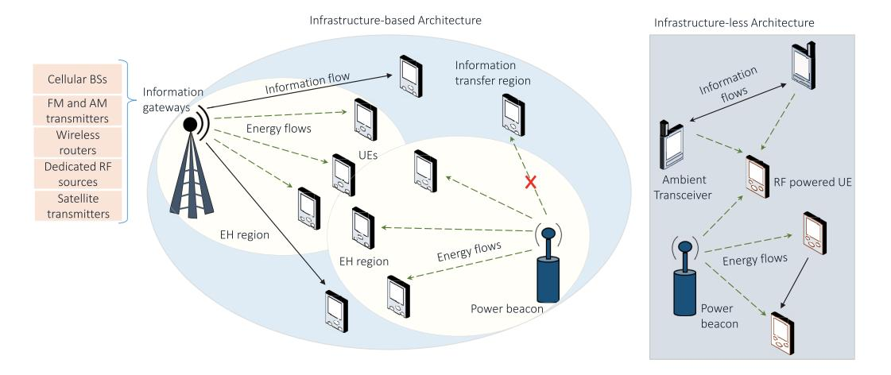

Fig. 8. Infrastructure-based and Infrastructure-less architecture of EH.

- Low-powered micro-controllers for processing the data acquired for the application.
- Low-powered RF transceiver for transmission and reception of information.
- Energy harvester circuit comprised of an antenna, voltage multiplier, a capacitor, and impedance matching circuit for storing and transforming the RF signals into DC power.
- A power management unit determines whether the power collected through the RF energy harvester should be stored or used to transmit the information immediately.
- Battery or energy storage unit.

For harvesting and utilizing the energy, four protocols have been identified [\[148\]](#page-51-14), [\[149\]](#page-51-15).

- • *Harvest-Use Protocol:* The corresponding node has no power storage unit, so it can directly drive system using the harvested energy.
- *Harvest-Store-Use Protocol:* The harvested energy is stored in the buffer, and the node utilizes it further for its operation.
- *Harvest-Use-Store Protocol:* The harvested energy is used initially through instantaneously stored energy in the super-capacitor. Then, residual energy gets stored in the buffer after processing.
- *Harvest-then-Cooperate Protocol:* It was tossed in [\[150\]](#page-51-16), where the involved nodes, i.e., the source and relay, harvested the energy from an access point in the downlink and cooperatively relayed the source's information to the access point in the uplink.

Fig. [9](#page-15-1) depicts a basic architecture of an RF energy harvester module which can employ 'harvest-store-use' protocol. Certain modifications can be done in the module to make it work for the other protocols. The details of the different blocks depicted in Fig. [9](#page-15-1) are as follows. The antenna is designed to switch between mono-frequency or multi-frequency bands while in operation, thus enabling the connected node to harvest energy from single or multiple sources simultaneously. However, it typically operates over a diverse range of frequencies because the RF signal's energy density varies with the frequency. This is followed by impedance matching,

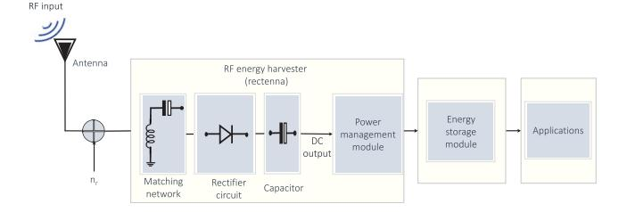

Fig. 9. Block diagram of RF-EH module.

which comprises resonator circuits to enhance the power transmission between the antenna and rectifier by operating at a particular frequency. The RF signal received by the antenna is further sent to the rectifier via an intermediate matching network. The matching network consists of capacitive and inductive resonator circuits that ensure maximum power transfer by accurately matching the impedance of the antenna and rectifier. The performance of RF energy harvester is affected mainly by the efficiency of rectenna components, i.e., the rectifier circuit and impedance matching. In particular, the diode is an integral component of the rectification, and specifically, the diodes with a lower cut-in voltage are suited for the rectifier circuit as they possess better conversion efficiency. The capacitor present in the circuit guarantees a smooth and consistent electrical power supply to loads. Additionally, it can act as a reserved energy backup for a short period of time whenever the RF energy is unavailable or insufficient.

It can be observed that the RF waves' energy degrades as the distance from the source increases. Besides, the source antenna gains and signal transmission power affect the amount of energy that can be harvested. Different RF techniques can be categorized based on the energy conversion efficiency, which typically ranges between 0.50 to 0.75 per unit [\[151\]](#page-51-17). However, like other EH techniques, their power density is generally in the micro-watt to milli-watt range [\[152\]](#page-51-18). Lowpower devices that utilize RF-EH are classified into two kinds: one having a single radio transceiver and another with dualradio transceivers. In a single radio transceiver model, one transceiver performs both EH and communication operations, whereas there are dedicated radio transceivers for both purposes in the other case. Multiple antennas are desirable to enhance the amount of harvested energy [\[153\]](#page-51-19). However, it is beneficial to leverage a single radio model to limit the size, hardware, and communication software complexity and expenses [\[154\]](#page-51-20). RF-EH techniques are distinct from other EH methods, such as wind, solar, and vibrations, based on the following attributes. RF sources can provide scalable, steady, and controllable energy transfer to RF-EH-enabled nodes located at some distance. Due to its fixed distance transmission, the harvested energy is comparatively stable for time duration and predictable for the fixed RF-EH-enabled network. Since RF harvested energy varies with the distance from the RF source, the distributed network nodes in various locations harvest different amounts of energy to support their operations.

The RF energy sources are categorized as dedicated and ambient sources depending upon their deployment in the operational scenario [\[155\]](#page-51-21), [\[156\]](#page-51-22).

- • *Dedicated RF Sources:* They are terrestrially deployed energy sources that consistently supply specific areas. These RF sources operate on a particular frequency and are optimized for efficient power transmission to EHenabled devices while complying with environmental standards [\[156\]](#page-51-22). As observed by Want [\[157\]](#page-51-23), a portable or non-portable external reader supplies the on-demand power to radio frequency identification tags. Likewise, the authors in [\[158\]](#page-51-24) and [\[159\]](#page-51-25) coined manual and automated techniques for RF-aided mobile charging to track the power-depleted SNs and charge wirelessly. Further, Munir and Dyo [\[132\]](#page-50-45) introduced an RF-EH model for the roaming WSN distributed over a wide geographical region and designed a stationary dedicated infrastructure for charging nodes within its range. Dedicated RF sources are beneficial, especially for rural locations and indoor spaces where ambient RF energy is scarce [\[160\]](#page-51-26). These sources exploit far less power and are relatively inexpensive due to their limited integration with network architecture and specific range of operation.
- *Ambient RF Sources:* These refer to the RF transmitters that are not delicately installed for energy transfer. However, energy-constrained wireless devices can harvest the energy from the transmitted signals intended for other application scenarios [\[161\]](#page-51-27), [\[162\]](#page-51-28). Such sources include satellite transmitters, cellular BSs, radio towers, and broadcasting television. These sources operate in a wide range of frequencies and transmit powers [\[156\]](#page-51-22). Nevertheless, the energy density has substantially increased with the increase in dense wireless networks and the penetrating nature of broadcasted RF signals. Several ambient RF sources like television and radio towers are static and predictable as they can radiate constant energy over a long time. Therefore, they are termed static ambient sources. They can deliver consistent RF energy to the EH nodes but with limited power density, causing fading of the signal's amplitude and power blackouts due to the scheduled maintenance. Hence, the receiver of the EH

TABLE VII EXPERIMENTAL RF-EH IN DIFFERENT SCENARIOS [\[134\]](#page-51-4), [\[164\]](#page-51-29), [\[165\]](#page-51-30)

|                           | Distance    | Available  | Frequency | Harvested |
|---------------------------|-------------|------------|-----------|-----------|
| Source                    |             | Power      |           | Power     |
|                           | (in meters) | (in watts) | (in MHz)  | (in µW)   |
| Inside Madrid university  | 1-10        | 480 μW     | 1000-6000 | 4         |
| laboratory                | 1-10        | 400 μ 11   | 1000-0000 | 4         |
| Outside Madrid university | 1500        | 1535 μW    | 1000-6000 | 0.8       |
| laboratory                | 1000        | 1000 μ 11  | 1000-0000 | 0.0       |
| Inside Madrid university  | 1-10        | 380 μW     | 920-970   | 2.5       |
| laboratory                | 1 10        | υσο μπ     | 220 370   | 2.0       |
| Outside Madrid university | 1500        | 1300 μW    | 920-970   | 0.4       |
| laboratory                | 1000        | 1000 μπ    | 320 310   | 0.4       |
| Isotropic RF transmitter  | 15          | 4 watts    | 902-928   | 5.5       |
| TX91501 power caster      | 5           | 3 watts    | 915       | 189       |
| transmitter               |             | 0 watts    | 310       | 100       |
| TX91501 power caster      | 11          | 3 watts    | 915       | 1         |
| transmitter               |             | o watts    | 510       |           |
| Isotropic RF transmitter  | 27          | 1.78 watts | 868       | 2.3       |
| Isotropic RF transmitter  | 27          | 1.78 watts | 868       | 2         |
| King-TV tower             | 4100        | 960 kW     | 674-680   | 60        |
| TV tower                  | 6000        | 126 μW     | 512-566   | 16        |

node should have a high-gain antenna and wideband spectrum-designed rectifier to compensate for both power and frequency variations. Conversely, microwave radio, Wi-Fi routers [\[163\]](#page-51-31), and CRNs are examples of dynamic ambient RF sources. These RF transmitters operate periodically, i.e., time-varying power transmissions, and therefore are challenging to predict [\[156\]](#page-51-22). To harvest the energy from these RF sources, the receiver architecture of the EH nodes should be adaptive and intelligent to predict the signal transmissions along with an appropriate energy-storing module [\[160\]](#page-51-26).

RF-EH circuits have been designed, and their performance has been investigated in different parts of the world, such as Tokyo, London, Universidad Politecnica de Madrid [\[164\]](#page-51-29), and others. Various frequency bands ranging from 512 to 6000 MHz have been considered with different ambient and dedicated sources like Isotropic RF transmitters, television towers, power caster transmitters, BSs, and Wi-Fi hotspots. The results are summarized in Table [VII.](#page-16-0)

Specifically, the authors in [\[134\]](#page-51-4), [\[165\]](#page-51-30) have surveyed the semi-urban and metropolitan areas in Boston and London, respectively, and demonstrated that the ambient RF-EH sources are credible means of powering the WSNs. Muncuk et al. [\[134\]](#page-51-4) have utilized multiple frequency bands like industrial, scientific, and medical (ISM) 900-MHz, global system for mobile communications (GSM) 850-MHz, and LTE 700-MHz for a tuneable single EH circuit and obtained a conversion efficiency of 45% at network nodes and devices. Similarly, Piuela et al. [\[165\]](#page-51-30) have also considered multiple frequency bands such as 3G, GSM1800, DTV, and GSM900 for enabling RF-EH in London's tube station. The study reported that the station had obtained the harvested power density in the 'watt' range.

Due to its abundant availability and non-reliance on environmental attributes, RF-EH has excellent potential in different application scenarios. Although some power fluctuations in RF-EH, their ubiquitous presence, and consistency reveal that

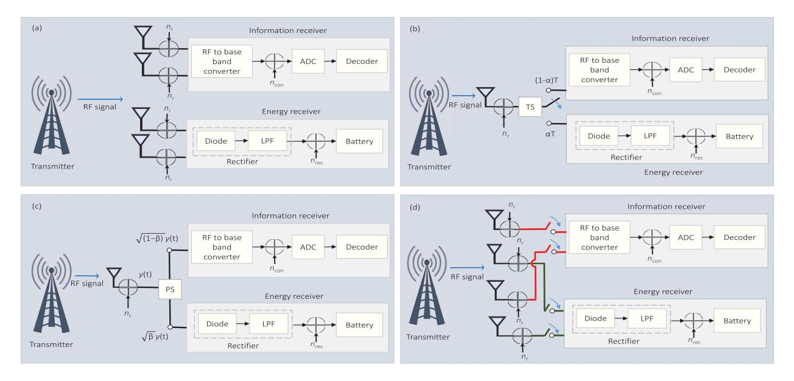

Fig. 10. Different receiver architectures for SWIPT: (a) Separate receiver (b) Time switching (c) Power splitting (d) Antenna switching.

they are superior to other ambient energy forms [\[154\]](#page-51-20). RF-EH can be productive in indoor and outdoor scenarios with strong RF signals, such as metropolitan, urban, and densely populated areas. Furthermore, a dedicated RF source or hybrid dedicated-ambient transmitter can also be deployed in remote regions with weaker RF signals. The RF harvester circuits pose feasible attributes, low form factor, longer lifetime due to non-moving parts, and cost competitiveness. Additionally, the reconfigurable antennas can be tuned to accommodate various novel technologies like beamforming, NOMA, etc. [\[166\]](#page-51-32).

# *C. SWIPT*

WPT can be realized in two ways based on near-field (non-radiative) and far-field (radiative) regions depending on different application scenarios. Near-field WPT includes inductive and resonance coupling, and it is utilized for shortdistance applications, e.g., charging mobile phones or other smart devices [\[167\]](#page-51-33). Among these, inductive coupling exploits the magnetic field, which provides an electrical connection between two coils by tuning them to resonate at identical frequencies. The electric charge is transferred through the coils using the electromagnetic induction principle. Some general examples are transformers, mobile chargers, and so on. The evanescent-wave connecting mechanism is exploited in magnetic resonance coupling to generate and transmit electrical energy between the two resonators. These resonators are formed by binding the induction coil and capacitance together, thus creating electromagnetic fluxes responsible for generating electrical power.

The coupling coefficient is proportional to the resonators (in the case of resonant coupling) or coils (in the case of inductive coupling). With the increase in the spacing between the coils or resonators, power strength is attenuated by the cube of the distance, i.e., 60 dB per decade, thus putting the spacing constraint for the energy transfer [\[168\]](#page-51-34). Additionally, both resonance and inductive techniques need accuracy in aligning the resonators or coils and calibration at transmitters and receivers, leading to a sophisticated framework. The next is the far-field region which comes into the picture when the distance is larger than the linear dimension of the transmitting antenna [\[169\]](#page-51-35).

Far-field WPT is suitable for long-range applications, e.g., powering a remote sensor or transmitting power over long distances. The radiating electromagnetic waves dominate the far field, enabling wireless energy transfer over larger areas without any physical connections. The RF signals are generally utilized as the electromagnetic radiative source for the far-field WPT. Furthermore, the advancements in the WPT architecture have led to the origin of SWIPT, which is intended for delivering RF power to energy-constrained scenarios like WSNs, D2D communications, IoT, and so on [\[170\]](#page-51-36). The SWIPT technology has the potential to simultaneously deliver on-demand wireless energy and information, rendering a reliable solution for wireless transmission without necessitating modifications in transmitter modules. It operates on the principle that both information and power can be carried by RF transmission to receiving node. As a sequence, it allows low power devices to receive both data and power wirelessly at the same time.

In the SWIPT technique, performing the information processing and EH on the same received signal is not feasible because the information content is destroyed in the EH operation. Thus, the information receiver and energy receiver operate separately to perform the information decoding (ID) and energy extraction from the received signal, respectively, as shown in Fig. [10.](#page-17-0) The transmitted signal propagates through the wireless channel, which is then received by the receiving antenna. The noise imposed at the receiver is denoted by *n*r ∼ N (0, σ2) and can be modeled as additive white Gaussian noise (AWGN). Initially, the received RF-band signal is converted to a baseband signal in the information receiver, followed by the analog-to-digital converter (ADC). The noise introduced from the RF-to-baseband conversion is denoted as *n*con ∼ N (0, σ2) and is modeled as the AWGN. Next is the energy receiver, which consists of a rectifier and battery. The received RF signal is converted to a DC signal using a rectifier consisting of a diode circuit and a low-pass filter (LPF). The DC signal is then stored in the battery for power consumption. The noise introduced by the rectifier circuit can be modeled as AWGN and is denoted as *n*rec ∼ N (0, σ2). Different receiver architectures are designed for recovering the information and energy from transmitted wireless RF signals simultaneously [\[146\]](#page-51-12).

- *1) Separate Receiver Architecture:* In this type of receiver architecture, both EH and ID are handled by different receivers, as shown in Fig. [10\(](#page-17-0)a). Moreover, these two antennas detect multiple channels, allowing the processing of EH and ID simultaneously. It has the advantage that the receiver architecture is simple to implement, leverages off-the-shelf modules, and is cost-efficient. The proper trade-off can achieve the optimum receiver performance between information rate and achievable energy [\[170\]](#page-51-36).
- *2) Time-Switching (TS) Receiver Architecture:* The TS receiver is also termed as correlater receiver that exploits the same antenna for receiving information and EH. As depicted in Fig. [10\(](#page-17-0)b), the receiver architecture comprises an information and energy receiver and a switching mechanism based on the TS factor (α). The receiver antenna periodically switches between the ID and EH circuits for a fixed α value, which ranges from (0 <α< 1). Additionally, the TS receiver requires temporal synchronization and accurate energy or information scheduling. Zhong et al. [\[171\]](#page-51-37) evaluated the optimal TS splitting factor for maximizing the ST and minimizing the outages for the FD relaying system. Extending the prior works, Gong et al. [\[172\]](#page-51-38) employed TS architecture in the beamforming-enabled multi-relaying transmission network in the presence of intruders to improve the ST and SOP. Likewise, Nasir et al. [\[173\]](#page-51-39) proposed a dynamic TS protocol and exploited both AF and DF relaying schemes through intelligent harvested energy tracking installed at the relay.
- *3) Power-Splitting (PS) Receiver Architecture:* In PS-based architecture, as illustrated in Fig. [10\(](#page-17-0)c), the receiver splits the received signal into a dual power level based on the PS factor (β). After that, the power streams are forwarded to energy and information receivers, enabling ID and EH simultaneously. Apart from some modifications in receiver architecture, no other changes are required in the conventional communication system's design. Furthermore, adjusting β that ranges from (0 <β< 1) can optimize harvested energy and information rate according to system requirements. Several research articles discussed in the later part of the survey have employed PS receiver architecture.
- *4) Antenna Switching Architecture:* In antenna switching architecture, the receiver utilizes some antennas for EH and the remaining for ID, as shown in Fig. [10\(](#page-17-0)d). The antenna switching strategy is less complex and comparatively more feasible for SWIPT operations than the TS and PS architectures. Multiple-antenna architecture can also be utilized in dense application scenarios, but it may suffer from destructive interference leading to a null-power effect in the antenna [\[170\]](#page-51-36).

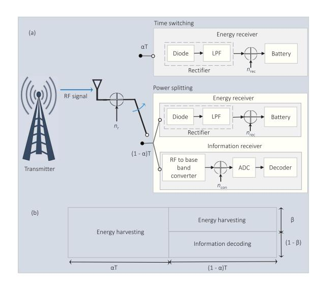

Fig. 11. Hybrid TS-PS receiver architecture.

*5) Hybrid TS-PS Receiver Architecture:* The TS and PS techniques perform poorly at high and low SNRs, respectively [\[174\]](#page-51-40). Therefore, a hybrid architecture is designed by blending the low complexity of the TS structure and trumping the performance of the PS architecture. The energy and information receivers achieve high EE and system performance in signal transmission. The hybrid TS-PS model is shown in Fig. [11\(](#page-18-0)a), wherein the EH parameters α and β are simultaneously varied to attain high EE [\[174\]](#page-51-40). In the transmission block, shown in Fig. [11\(](#page-18-0)b), αT is used for EH by employing TS protocol, whereas the PS-based SWIPT is used in (1−α)*T* time interval. Next, in (1−α)*T* time duration, the signal power is bifurcated into √β*P*t and (1 − β)*P*t, which are used for EH and ID, respectively, where *Pt* is the transmit power of the transmitter.

The hybrid SWIPT receive model has been investigated in several research papers. Hu et al. [\[175\]](#page-51-41) considered the hybrid TS-PS-based SWIPT-enabled network using the finite block length domain. It is concluded that the integrated TS and PS protocols yielded an improved error probability compared to each technique separately. In another work, hybrid TS-PS architecture was employed by Gu and Aissa [\[176\]](#page-51-42), wherein a cooperative DF relaying scheme was utilized for EH and ID. They observed that the PS protocol performed better at higher SNR and achieved higher ST, whereas the TS approach was proved to be superior at lower SNR values. Zhao et al. [\[177\]](#page-51-43) employed the hybrid TS-PS model for EH and provided the exact expressions for the final harvested EE. Additionally, they proposed a joint optimization of time duration, energy consumption, and QoS to divide the time interval for WPT and data transmission. Boshkovska et al. [\[178\]](#page-51-44) studied a practical non-linear EH model by leveraging the resource allocation method for a hybrid TS-PS aided SWIPT system model to maximize the total harvested energy.

# *D. Research Projects and Industrial Developments*

Numerous recent projects, as shown in Table [VIII,](#page-19-0) sponsored by major funding organizations validate the viability

TABLE VIII SUMMARY OF EH-BASED PROJECTS

| Project              | Objective and Focus                              |  |  |  |  |  |
|----------------------|--------------------------------------------------|--|--|--|--|--|
| PlugN-Harvest [179]  | Develop innovative EH solutions,                 |  |  |  |  |  |
| Flugiv-narvest [1/9] | User-friendly EH devices for versatility.        |  |  |  |  |  |
| Tryst Energy [180]   | Research and innovate in EH,                     |  |  |  |  |  |
| Tryst Energy [160]   | Exploring novel EH techniques.                   |  |  |  |  |  |
| Re-Vibe [181]        | Focus on kinetic EH,                             |  |  |  |  |  |
| Ke-vibe [161]        | Capturing energy from motion and vibrations.     |  |  |  |  |  |
| EnABLES [182]        | Advance EH technologies for IoT,                 |  |  |  |  |  |
| EllABLES [162]       | Miniaturized and efficient EH solutions.         |  |  |  |  |  |
| Dura-Cap [183]       | Develop durable energy storage solutions,        |  |  |  |  |  |
| Dura-Cap [165]       | Efficient energy storage systems.                |  |  |  |  |  |
| CAREER [184]         | Integrate data access and EH,                    |  |  |  |  |  |
| CARLER [104]         | Integrated systems for EH and data applications. |  |  |  |  |  |
| SMALL [185]          | Develop multi-modal EH systems,                  |  |  |  |  |  |
| SWIALL [103]         | Capture energy from various sources.             |  |  |  |  |  |
| CORE [186]           | Develop Core technologies for EH,                |  |  |  |  |  |
| CORE [180]           | Fundamental research in EH systems.              |  |  |  |  |  |
| HALE [50]            | Power high-altitude UAVs for long time,          |  |  |  |  |  |
| HALL [30]            | EH methods for prolong UAV operations.           |  |  |  |  |  |
| GJ7 and GJ8 [187]    | Research specific EH areas,                      |  |  |  |  |  |
| OJ/ and OJo [10/]    | Target efficiency improvements.                  |  |  |  |  |  |
| ELIOT [188]          | Design energy-efficient UAVs,                    |  |  |  |  |  |
| ELIOI [100]          | Incorporate various RF-EH techniques             |  |  |  |  |  |
| WiBEC [25]           | Develop battery-less wireless SNs,               |  |  |  |  |  |
| WIDEC [23]           | Explore WSNs without traditional batteries.      |  |  |  |  |  |
| FP7 Project [25]     | Focus on EH for WSNs,                            |  |  |  |  |  |
| 11 / 110ject [23]    | Develop RF-EH methods for UAVs.                  |  |  |  |  |  |

of EH techniques for the next generation's energy-constraint wireless networks. Some of them are mentioned as follows:

- • PlugN-Harvest [\[179\]](#page-51-45), Tryst Energy [\[180\]](#page-52-0), Re-Vibe [\[181\]](#page-52-1), EnABLES [\[182\]](#page-52-2), and Dura-Cap [\[183\]](#page-52-3) are several European Union funded EH-based projects which they started as innovation and research programs under Horizon 2020.
- National science foundation of United States have recently funded CAREER-Integrated data and energy access [\[184\]](#page-52-4), SMALL [\[185\]](#page-52-5), and CORE [\[186\]](#page-52-6) for the progression of EH techniques.
- • Clustering protocol for EH, HALE [\[189\]](#page-52-7), GJ7, and GJ8 [\[187\]](#page-52-8) are various research projects supported by national science foundation of China.
- Some other projects like ELIOT [\[188\]](#page-52-9), Energy drone, WiBEC, and FP7 Project WiBEC have focused on designing and developing energy-efficient UAVs [\[25\]](#page-48-24).

In the above-mentioned projects, EnABLES [\[182\]](#page-52-2), CAREER-Integrated data and energy access [\[184\]](#page-52-4), GJ7 and GJ8 [\[187\]](#page-52-8), ELIOT [\[188\]](#page-52-9), and FP7 Project WiBEC [\[25\]](#page-48-24) are focused on RF-EH technique. According to a report, the RF-EH market size is expected to reach USD 39,650 million in 2027 [\[190\]](#page-52-10). This tremendous increase in market growth is expected mainly due to the exploitation of IoT and WSNs with reduced maintenance costs and increased operational lifespan. However, the practical use case of RF-EH with UAV communications is still in its initial phase and has to counter several technical challenges, which are highlighted in Section [VII.](#page-41-0) In the past years, the method of converting solar energy to electricity using lightweight and highly efficient photovoltaic cells, grounded in the photovoltaic effect, has gained widespread popularity, especially in the context of UAVs. Installing photovoltaic cells on UAV surfaces, a straightforward and effective method for solar EH, has been applied in various designs, including SoLong, EasyGlider, solar MAV, AtlantikSolar, Micro-UAV, and Syma [\[25\]](#page-48-24).

Notably, the self-powered AtlantikSolar UAV, boasting a 5.69 meter wingspan, achieved an impressive 81-hour flight duration. The groundbreaking Robo Raven III, the first flapping-wing UAV with photovoltaic cells capable of flight, utilizes harvested solar energy to charge lithium polymer batteries or power servomotors. Modified versions, Robo Raven III-v4 and Robo Raven III-v5 generate more power and extend flight time by increasing the wing area. Inspired by natural fliers like birds and insects, flapping-wing UAVs, exemplified by RoboBee X-Wing equipped with a six-cell photovoltaic array, promise lightweight construction, low energy consumption, and adept maneuverability, including hovering, due to their principle-based design. In the same line, several leading companies have made significant strides in solarpowered drone technology [\[191\]](#page-52-11):

- • *Airbus:* Zephyr, a high altitude pseudo satellite UAV, has set multiple world records, including the longest endurance flight of 336 hours and the highest altitude at 18,805 meters.
- *Boeing:* SolarEagle (Vulture II), a solar-powered UAV, was designed for a continuous flight over 5 years. It features a 120 meter wingspan and received investment from DARPA, with power generated by 5 kW solar panels.
- • *Google:* Google's Solara 50 and Solara 60 drones have operated at 20 km altitude for over 5 years, providing Internet connectivity in remote areas using atmospheric satellite technology.
- *Facebook:* Ascenta has been designed for delivering highspeed Internet, employing satellites for remote regions and high-altitude solar drones with laser communication systems for densely populated areas.
- • *AeroVironment and NASA:* They have developed a range of solar-powered UAVs, including Gossamer Penguin, Solar Challenger, Pathfinder, Pathfinder Plus, Centurion, and Helios for serving various forecasting applications.
- • *Lockheed Martin:* HALE-D, a remotely controlled solarpowered UAV floating above the jet stream, has been designed for surveillance, relaying, weather observation, etc.
- *Bye Engineering:* They have created Starlight and Silent Falcon UAVs featuring efficient solar electric propulsion.
- *Atlantik Solar:* An autonomous solar-powered drone with a 5.6 meters wingspan was developed to achieve the firstever crossing of the Atlantic Ocean.

These prototypes represent the advancements in solar-powered drone technology, showcasing their potential in various applications, including telecommunications, surveillance, Internet connectivity, and atmospheric research. However, the availability issues and high cost of infrastructure set-up for these techniques pave the researchers to find other EH sources that are abundant in nature. As a sequence, research frameworks encouraged the utilization of dedicated or ambient RF transmissions to harvest energy. Nevertheless, a crucial challenge for designing RF-EH-empowered UAV communications is to accurately model the A2G or G2A channels between the UAVs and TNs [19]. UAV communication generally occurs in three channels: UAV-to-UAV, UAV-to-terrestrial BSs or BSs-to-UAV, and satellite-to-UAV. The choice of channel models considered for studying the UAV-assisted system model dramatically affects the system performance and optimal design. Thus, channel modeling and estimation largely depend on practical scenarios and applications. Section VI discusses works that exploit different channel fading models like Rician, Rayleigh, Rician with log-normal distribution, and Nakagami-m. For example, in an urban scenario, channel models incorporating altitude- and angle-dependent channel parameters and LoS probabilities have been widely employed in theoretical analyses for optimizing the placement and coverage performance of UAV-assisted networks [20]. One such UAV-assisted communication channel modeling is done in the following section by considering a composite channel model using shadowing and Nakagami-*m* that provides several key insights.

#### IV. EH WITH UAV COMMUNICATIONS

Integrating EH with UAV communications provides a pioneering solution to prolong the UAVs' flight duration, which enhances the adaptability and versatility of UAVs in different applications. On the other hand, UAVs can also be utilized as energy transmitters to enable RF-EH at the energy-constrained SNs and low-power devices in order to improve their operational time. As a result, two scenarios have been popularly considered in the past few years, i.e., EH-empowered UAV communications and UAV-enabled EH. In the first scenario, UAVs utilize RF signals from dedicated or ambient sources for harvesting energy and making them self-reliant aerial platforms. This scenario is highly applicable when extended UAV flight duration is crucial for diverse applications, such as surveillance, monitoring, or data collection missions. In the second scenario, UAVs can fly over challenging situations, localize the energy-requiring devices in real time, and deliver power by transmitting RF signals [16], [17]. This ensures the uninterrupted operation of terrestrial-based sensors and IoT devices, thus addressing the challenges posed by limited access to conventional power sources. The application scenarios range from disaster response and recovery to large-scale agricultural fields where building the power infrastructure for terrestrial low-power devices is impractical [18]. The research studies in Section VI are categorized according to whether the UAV is harvesting energy from received RF signals or functioning as an energy transmitter to the network nodes.

# A. RF-EH Empowered UAV Communications

Incorporating UAVs with IoT can provide infrastructure-less connectivity to the IoT devices deployed in remote locations. On the other hand, large-scale IoT devices can be exploited to enhance the UAV's capabilities in sensing applications such as agriculture, traffic management, emergencies, and so on. In this line, UAV-assisted communication can be categorized as:

• *UAV-assisted relay network:* To enable communication between IoT devices where the direct link is not available

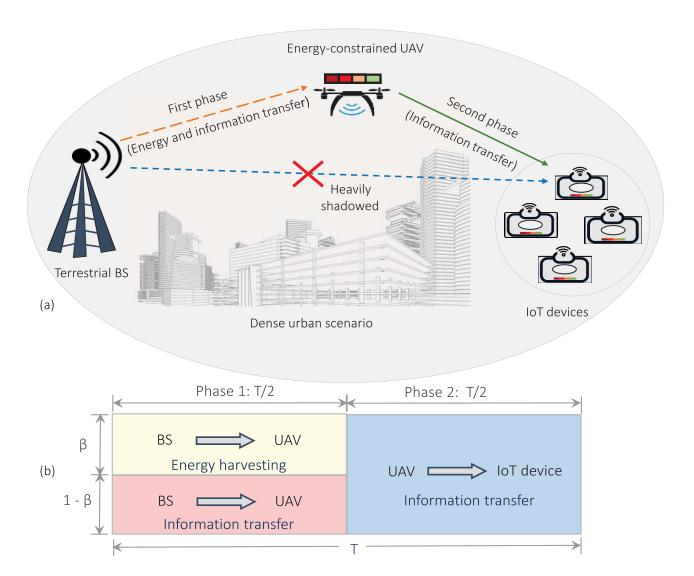

Fig. 12. (a) System model for energy constrained UAV-assisted network (b) Transmission block of overall data transfer.

due to deep fading, high blockage, or a lack of terrestrial infrastructure.

- UAV-assisted ubiquitous connectivity: UAVs are employed to extend the existing cellular network's coverage.
- UAV-assisted data gathering: UAVs help collect data from small and energy-constrained IoT devices deployed for diverse applications.
- 1) System Model for UAV-Assisted Network: A UAV-assisted relay network is considered that enables the communication between a terrestrial BS and an IoT device deployed in remote location or disaster-struck area where communication through the terrestrial infrastructure is not feasible. As depicted in Fig. 12, the link between the IoT device and the BS is heavily obstructed. Thus, an energy-constrained UAV is leveraged to enable IT between the nodes. UAV hovers at the height of h and the horizontal distances between the terrestrial BS to UAV and UAV to the considered IoT device are taken as  $r_{i,j}$ , where  $(i,j) \in \{(b,u),(u,i)\}$ . The distance between the considered node is given as  $d_{i,j} = \sqrt{h^2 + r_{i,j}^2}$  and the elevation angles between these nodes are given by  $\theta_{i,j} = \arctan(h/r_{i,j})$ .

All the involved nodes are assumed to communicate in half-duplex (HD) mode and are equipped with a single antenna. Assuming the block fading scenario, the channel coefficients from BS to UAV and UAV to IoT device are represented as  $h_{i,j}$  with  $(i,j) \in \{(b,u),(u,i)\}$ , respectively, remain constant for the T block duration. Furthermore, the overall exchange of information between the BS and IoT device is executed in two equal phases (T/2). Specifically, in the first time phase, the BS transmits the information signal to the UAV, which employs the PS protocol to harvest the energy and process the information. In the second phase, UAV transmits the information to the IoT device by using the AF protocol. The composite effects of both multi-path fading and shadowing have been considered while modeling the A2G

channel between the involved nodes. Due to the presence of an aerial node, considering LoS and NLoS components is inevitable. Thus, we utilize Nakagami-*m* and Rayleigh distributions to characterize both components. Moreover, the log-normal distribution is used to model the shadowing effects, and A2G probabilistic LoS model is leveraged to compute the path-loss.

For the accurate A2G model, the spatial expectation of the path-loss between the terrestrial BS, UAV, and IoT device can be obtained as  $\mu_{i,j} = (\mathcal{P}_{\text{LoS}}(\theta)\mu_{\text{LoS}} + \mathcal{P}_{\text{NLoS}}(\theta)\mu_{\text{NLoS}}),$  where  $\mathcal{P}_{\text{LoS}}(\theta)$  and  $\mathcal{P}_{\text{NLoS}}(\theta)$  represent the probability of LoS and NLoS, respectively that are given as  $\mathcal{P}_{\text{LoS}}(\theta) = 1/(1+a\mathrm{e}^{-b(\theta_{i,j}-a)})$  and  $\mathcal{P}_{\text{NLoS}}(\theta) = 1-P_{LoS}(\theta).$  Moreover,  $\mu_{\text{LoS}}$  and  $\mu_{\text{NLoS}}$  denote the mean path-loss for the LoS and NLoS components, respectively [192], which are expressed as  $\mu_{\text{LoS}} = 20\mathrm{log}_{10}\,d_{i,j} + 20\mathrm{log}_{10}(4\pi f_c/c) + \psi_{\text{LoS}},$  and  $\mu_{\text{NLoS}} = 20\mathrm{log}_{10}\,d_{i,j} + 20\mathrm{log}_{10}(4\pi f_c/c) + \psi_{\text{NLoS}},$  where  $\theta$  is the angle between the UAV and TNs (expressed in degrees),  $a,b,\psi_{\text{LoS}},$  and  $\psi_{\text{NLoS}}$  represent the propagation environment constants, c and  $f_c$  are the speed of light and operational frequency, respectively.

The probability density function (PDF) of the composite fading channels can be obtained by using the log-normal PDF for shadowing, i.e.,  $f_W(w)$  and Nakagami-m faded signal amplitude distribution [193], i.e.,  $f_X(x/w)$ , which is given as

$$f_X(x) = \int_0^\infty \frac{1}{\Gamma[m_{i,j}]} \left(\frac{m_{i,j}}{w}\right)^{m_{i,j}} x^{m_{i,j}-1} e^{-\left(\frac{m_{i,j}x}{w}\right)} \times \frac{10}{\log_e 10\sqrt{2\pi}\delta_{i,j}w} e^{-\left(\frac{(10\log_{10}w - \mu_{i,j})^2}{2\delta_{i,j}^2}\right)} dw, (4)$$

where  $m_{i,j}$  is the fading severity parameters, and  $\delta_{i,j}$  is the standard deviation for shadowing given as  $\delta_{i,j} = c_t \mathrm{e}^{-\theta_{i,j} d_t}$ , the environment parameters  $c_t$  and  $d_t$  vary for different scenarios, for  $(i,j) \in \{(b,u),(u,i)\}$  and  $t \in \{1,2\}$ . After performing some mathematical operations, we can simplify (4) by using the Gauss-Hermite Quadrature numerical technique [194], as

$$f_X(x) = \frac{1}{\sqrt{\pi}} \sum_{n=1}^{N} w_n \left(\frac{m_{i,j}}{A_{i,j}}\right)^{m_{i,j}} \frac{x^{m_{i,j}-1}}{\Gamma[m_{i,j}]} e^{-\left(\frac{m_{i,j}x}{A_{i,j}}\right)}.$$
(5)

where  $\mathcal{A}_{i,j}=10^{(\sqrt{2}\delta_{i,j}t_n+\mu_{i,j})/10}$ ,  $w_n$  provides the weights of the Gauss-Hermite quadrature, and  $[t_n]_{n=1}^N$  provides the roots of Gauss-Hermite polynomial with N number of samples. Following the same line, the PDF of composite channel model, i.e.,  $f_Y(y)$ , following Rayleigh faded signal amplitude distribution, i.e.,  $f_Y(y/w)$  and log-normal PDF for shadowing, i.e.,  $f_W(w)$ , can be expressed as

$$f_Y(y) = \int_0^\infty \frac{10y^{m_{i,j} - 1} e^{-\frac{y}{w}}}{w \log_e 10\sqrt{2\pi}\delta_{i,j} w} e^{-\left(\frac{(10\log_{10} w - \mu_{i,j})^2}{2\delta_{i,j}^2}\right)} dw.$$
(6)

After performing some mathematical simplifications in (6), we can use Gauss-Hermite Quadrature numerical technique

to obtain the closed form PDF of shadowed Rayleigh fading distribution [195], given as

$$f_Y(y) = \frac{1}{\sqrt{\pi}} \sum_{k=1}^K \left(\frac{w_k}{\mathcal{A}_{i,j}}\right) e^{-\left(\frac{y}{\mathcal{A}_{i,j}}\right)}.$$
 (7)

where  $\mathcal{A}_{i,j}=10^{(\sqrt{2}\delta_{i,j}t_k+\mu_{i,j})/10}$ ,  $w_k$  gives the weights of the Gauss-Hermite quadrature, and  $[t_k]_{k=1}^K$  provides the roots of Gauss-Hermite polynomial with N the number of samples. Now, we focus on obtaining the end-to-end signal-to-noise ratio (SNR) equations for the considered system.

The energy harvested by the UAV can be given as  $\mathcal{E}_{\mathcal{H}} = \eta \beta (P_b|h_{b,u}|^2 + \sigma^2) \frac{T}{2}$ . Therefore, the transmit power available at the UAV is given as  $P_u = \frac{\eta \beta}{2} (P_b|h_{b,u}|^2 + \sigma^2)$ . The information signal received at the UAV is given as  $y_{b,u} = \sqrt{(1-\beta)P_b}h_{b,u}x_b + n_{b,u}$ , where  $P_b$  and  $x_b$  are the transmit power and unit energy symbol transmitted by the terrestrial BS,  $n_{b,u} \in \mathcal{N}(0,\sigma^2)$  is the AWGN at the UAV, and  $\eta$  denotes the energy conversion efficiency.

Now, in the second phase, the UAV employs the AF protocol for relaying the information signal to the IoT device, wherein the UAV scales the signal received in the first phase with amplification factor,  $\mathcal{G} = \sqrt{P_u/(1-\beta)(P_b|h_{b,u}|^2+\sigma^2)}$ . Thus, the information received at IoT device from the UAV,  $y_{u,i}$  is expressed as  $y_{u,i} = \mathcal{G}(\sqrt{(1-\beta)P_b}h_{b,u}x_b + n_{b,u})h_{u,i} + n_{u,i}$ , where  $n_{u,i} \in \mathcal{N}(0,\sigma^2)$  represents the AWGN at the IoT device. Based on the signal received at the IoT device and substituting the values of  $\mathcal{G}$  and approximated value of  $P_u$ , the instantaneous SNR at the IoT device can be expressed as

$$\gamma_{b,i} = \frac{\eta \beta (1-\beta) P_b |h_{b,u}|^2 |h_{u,i}|^2}{\eta \beta |h_{u,i}|^2 \sigma^2 + 2(1-\beta) \sigma^2 + \left(\frac{2\sigma^4}{P_b |h_{b,u}|^2}\right)}.$$
 (8)

Now, we investigate the performance of the considered UAV-assisted relay network over the composite fading channel, i.e., shadowed Nakagami-*m* and shadowed Rayleigh distribution models, in terms of the OP, ST, and EE. We aim to draw key insights from the PS factor, threshold data rates, and average transmit SNR.

Each simulation is run for  $10^5$  iterations to obtain the accurate results, and the average transmit SNR is expressed as  $(P_b/\sigma^2)$ . The operational height of UAV, h=30 m, and horizontal distance  $r_{b,u}=r_{u,i}=50$  m, and  $f_c$  is taken as 700 MHz. The fading severity parameter is considered as  $m_{i,j}=2$ , and the dense urban environment scenario is considered, where the parameters are set as follows  $a=12.081,\ b=0.1139,\ (c_1,d_1)=(9.64,0.04),\ (c_2,d_2)=(30.83,0.04),\ (\psi_{\text{LoS}},\psi_{\text{NLoS}})=(1,20).$ 

2) Outage Probability (OP): We define the OP as an event at the IoT device that occurs when the instantaneous data rate falls below the predefined target rate. This crucial performance metric is used to measure the reliability of a communication network subjected to fading channels. It can be mathematically formulated as

$$\mathcal{P}_{\text{out}} = \Pr[R_{b,i} < R_{\text{th}}] = \Pr[\gamma_{b,i} < \phi] = F_{\gamma_{b,i}}(\phi), \quad (9)$$

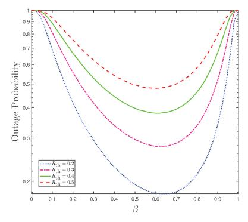

Fig. 13. OP versus  $\beta$  curves for different values of  $R_{\rm th}$ .

where  $R_{b,i}=\frac{1}{2}\log_2\left(1+\gamma_{b,i}\right)$  represents the instantaneous rate,  $r_{\rm th}$  is the threshold target rate,  $\phi=2^{2R_{\rm th}}-1$  is the target SNR, and  $F_{\gamma_{b,i}}(\phi)$  is the cumulative distribution function (CDF) of  $\gamma_{b,i}$ . It is obvious that the existence of the LoS component has a significant impact on the performance of the UAV-assisted communications. Accordingly, the expression of OP can be modified by incorporating  $\mathcal{P}_{\rm LoS}$  and  $\mathcal{P}_{\rm NLoS}$  in (9), and can be expressed as

$$\mathcal{P}_{\text{out}} = \mathcal{P}_{\text{LoS}}(\theta) \left( \mathcal{P}_{\text{LoS}}(\theta) F_{\gamma_{b,i}^{\text{SN,SN}}}(\phi) + \mathcal{P}_{\text{NLoS}}(\theta) F_{\gamma_{b,i}^{\text{SN,SR}}}(\phi) \right) + \mathcal{P}_{\text{NLoS}}(\theta) \left( \mathcal{P}_{\text{LoS}}(\theta) F_{\gamma_{b,i}^{\text{SR,SN}}}(\phi) + \mathcal{P}_{\text{NLoS}}(\theta) F_{\gamma_{b,i}^{\text{SR,SR}}}(\phi) \right),$$

$$(10)$$

where  $F_{\gamma_{b,i}^{\mathrm{SN,SN}}}(\phi)$  and  $F_{\gamma_{b,i}^{\mathrm{SR,SR}}}(\phi)$  are the CDFs of  $\gamma_{b,i}$  when both the associated channel coefficients follow shadowed Nakagami-m and shadowed Rayleigh distribution, respectively. Whereas,  $F_{\gamma_{b,i}^{\mathrm{SN,SR}}}(\phi)$  and  $F_{\gamma_{b,i}^{\mathrm{SR,SN}}}(\phi)$  are the CDFs of  $\gamma_{b,i}$ , when any one of the involved channel coefficients follows shadowed Nakagami-m distribution and the other follows shadowed Rayleigh distribution.

Fig. 13 shows the OP versus  $\beta$  curves for different values of the target rate. From the figure, it can be inferred that the OP is minimum for mid-range values of  $\beta$ , i.e., 0.45 to 0.65. For high values of  $\beta$ , the power allocated to EH becomes higher, substantially decreasing the power corresponding to the information signal and resulting in a drastically increased system outage. Whereas, for low  $\beta$  values, the harvested power is less, consequently increasing the OP. Also, the increasing target rate reduces the optimal value of the  $\beta$  value at which the OP is minimal.

3) System Throughput (ST): Considering the delay-limited IT, ST is defined as the average target rate that can be successfully acquired over the fading channels. Therefore, the ST expression can be formulated using OP,  $\mathcal{P}_{out}$  of the link and a fixed target rate,  $R_{th}$ , as

$$S_T = \frac{1}{2}(1 - \mathcal{P}_{\text{out}})R_{\text{th}}.$$
 (11)

Based on the formulated expression of (11), ST curves with varying transmit SNR and target rate are depicted in Fig. 14. While operating in a low SNR region, the instantaneous SNR acquired at the IoT device is significantly lower than the target SNR, resulting in a high OP and lower ST. Additionally, it can

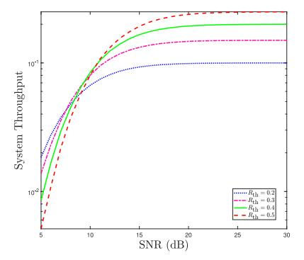

Fig. 14. ST versus SNR curves for different values of  $R_{th}$ .

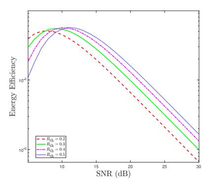

Fig. 15. EE versus SNR curves for different values of  $R_{
m th}$ .

be clearly seen that ST gets better when the SNR increases up to a specific value before attaining saturation. As a result, the system achieves higher throughput with high SNR values. Nevertheless, the improvement in the ST becomes insignificant when the transmit SNR increases beyond a specific threshold and reaches its maximum value corresponding to that particular target rate. This saturated value is considered the maximum ST that can be obtained with that particular set of parameters. A crucial insight can be highlighted from the curves that the maximum achievable throughput and the threshold value responsible for saturation vary with different target rates. It is worth noting that the ST for comparatively high target rates becomes saturated at higher SNR values. These characteristics are evinced by the fact that the outage performance corresponding to the higher target rate at a fixed SNR degrades compared to that at a lower target rate.

4) Energy Efficiency (EE): With an energy-constrained UAV and IoT device in the network, obtaining higher ST at minimum energy consumption is beneficial and crucial. Therefore, EE becomes essential for designing any efficient system model and it can be expressed as

$$\xi_{\rm EE} = \frac{{
m Throughput}}{{
m Total\ energy\ consumed}} = \frac{2\mathcal{S}_T}{\beta P_b}.$$
 (12)

Fig. 15 depicts the energy-efficiency curves for varying transmit SNR and target rates. From the figure, it can be inferred that the system can achieve higher EE over a particular range of transmit SNR. The harvested power is initially lower in the low SNR region, so the EE is poor. Also, the EE at the high SNR is very low, evinced by the saturated ST achieved after the mid-range of SNR values. From Figs. 14 and 15, it can

be inferred that the balanced performance in terms of ST and EE is achieved in the mid-range of SNR, ranging from 9-15 dB for the considered set of parameters.

*Key Insights of This Section:*

- EH-employing UAV relay provides solutions against two fundamental problems of wireless-powered communication networks (WPCN), i.e., establishing reliable communication links in heavily shadowed areas and extending the network's lifetime.
- The deployment of UAVs in different environmental scenarios, such as urban, suburban, and dense urban, affects the performance due to shadowing, interference, and path-loss between network links.
- For the mobile UAV-assisted system model, the relative mobility between UAV and nodes can be characterized by exploiting the first-order auto-regressive process to model the channel coefficients.
- Utilizing advanced algorithms based on ML predictive models can enhance the UAV's proactive decisionmaking, allowing it to adjust its trajectory and optimize energy consumption.

# *B. UAV-Enabled RF-EH*

The advances in IoT technology are based on the plethora of compact, intelligent, and widely distributed sensing equipment deployed to integrate the real and virtual realms [\[7\]](#page-48-6). IoT devices generally operate in locations that are hard to reach, such as national borders, sites with poor connectivity or lack of powering infrastructure, and unforeseen natural or artificial disasters [\[21\]](#page-48-20). Considering these vital and adverse scenarios, data acquisition and dissemination are challenging. On top of that, low-power devices like SNs and IoT devices are energy-constrained, and their operational duration is restricted. Regardless of implementing the energy-saving protocols, the IoT devices function over a limited period, thus mandating the recharging or replacing of their batteries frequently.

In such scenarios, UAVs can act as aerial relay nodes to assist the data transmission between the user pairs where the direct path is unavailable or highly shadowed [\[25\]](#page-48-24). Due to the controllable high mobility exhibited by UAVs, UAV relays gain an extra degree of freedom to enhance communication performance. On the other hand, UAVs can also operate as aerial energy transmitters to offer widespread wireless energy supply to these devices with more flexibility [\[28\]](#page-48-27). This notably enhances wireless charging efficiency compared to conventional terrestrial charging stations situated at fixed locations, a concept referred to as UAV-enabled wirelesspowered networks [\[194\]](#page-52-14). The following subsection discusses one such scenario of UAV-assisted EH and communications for IoT devices.

*1) System Model of UAV-Assisted EH for IoT Networks:* Owing to their ease of deployment and flexible trajectory, the UAVs are deployed in remote locations to address the energy limitations of the IoT devices and facilitate reliable communication between them. Fig. [16](#page-23-1) depicts one such scenario where a UAV transmits RF signals to enable EH at IoT devices. Also, energy-constrained IoT devices aim to share

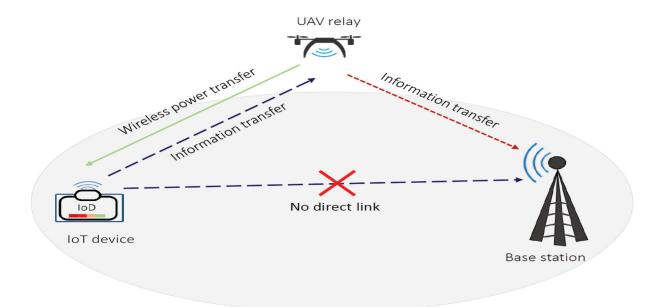

Fig. 16. System model of UAV-assisted EH for IoT network.

the collected information with the nearby BS. However, the direct link between the IoT device and BS is unavailable or heavily obstructed. In the first phase, the UAV transmits the RF signals to the IoT devices for EH and provides relay assistance in the IT phases. Such a model can be used in distant areas, emergencies, and disaster-affected regions where practical battery replacement or recharging intervention is unfeasible. Similar to Section [III,](#page-13-0) the composite channel model, i.e., Nakagami-*m*, can be used to characterize smallscale fading, and log-normal distribution can be employed to show the effects of shadowing in the considered UAV's A2G and G2A links. Additionally, due to the presence of UAVs, the elevation angle-dependent probabilistic LoS/NLoS-based model can be utilized to accurately model the path-loss of A2G links. The following section comprehensively discusses the most relevant and recent research works focused on UAVassisted state-of-the-art EH-enabled techniques.

# V. EH IN UAV COMMUNICATIONS WITH DIFFERENT PHYSICAL LAYER TECHNIQUES

This section provides a detailed overview of the research incorporating RF-EH with UAV communications and physical layer techniques in various application scenarios. These research works are highlighted based on whether the UAV harvests the energy from the received RF signals or acts as an energy transmitter for low-power devices. The following subsections contain the specifics of these works.

# *A. EH in UAV-Assisted Communications With Massive MIMO/Antenna Arrays*

With the increasing number of UEs and inter-connected devices, the demand for high ST and spectral efficiency has become crucial for upcoming wireless generations. In this context, m-MIMO communications have evolved as an advanced wireless communication technique that utilizes a large number of antennas at both the transmitter and receiver ends [\[7\]](#page-48-6). It can significantly enhance ST, improve spectral efficiency, and provide better coverage and reliability. This is feasible by integrating UAVs with multi-antenna systems to leverage their high LoS links, flexible deployment, and better channel conditions. However, energy limitations of the network nodes and CCI in the m-MIMO links are the two challenging problems faced in the UAV-enabled m-MIMO networks [\[11\]](#page-48-10). In this vein, EH techniques can solve the energy

| Works | Model                                                                                              | Problem category and                                         |                                           | ctives of opti       | •                                         |                                        | Relaying,            |
|-------|----------------------------------------------------------------------------------------------------|--------------------------------------------------------------|-------------------------------------------|----------------------|-------------------------------------------|----------------------------------------|----------------------|
|       |                                                                                                    | solving technique utilized                                | Optimizing the flight trajectory | the other attributes | Optimizing the system throughput | Optimizing the system outages | EH protocol          |
| [196] | Poisson's cluster process-based UAV EHNs annexed with cluster of user devices                      | Convex (Derived the compact expressions)               |                                           |                      | √ ·                                       | <b>√</b>                               | Harvest- then-use |
| [197] | Cell-free massive MIMO-aided UAV communication system model with WPT                               | Convex (Derived the compact expressions)               |                                           | <b>√</b>             |                                           |                                        | Harvest- then-use |
| [198] | 3D uniform linear antenna array embedded- UAV                                                   | Non-convex (Cosine approximation, Iterative algorithm) | <b>√</b>                                  |                      | <b>√</b>                                  |                                        | Harvest- then-use |
| [199] | UAV-aided WPT network with static altitude directional antenna arrays for multiple terrestrial SNs | Non-convex (Modified cosine- antenna patterns)         | <b>√</b>                                  | <b>√</b>             | <b>√</b>                                  | <b>√</b>                               | AF, TS               |
| [200] | Data and energy transfer for single and dual hops in Internet of MIMO Things                       | Convex (Derived the compact expressions)                     |                                           |                      |                                           |                                        | Harvest- then-use |
| [201] | Mismatch index obtained for UAV-assisted RF energy transfer                                        | Convex (Derived the compact expressions)                     | <b>√</b>                                  | <b>√</b>             |                                           | <b>√</b>                               | TS, DF               |
| [202] | Analyzed 3D antenna radiation patterns and inter-beam interference for wideband                    | Non-convex (Iterative algorithm)                          | ✓                                         | ✓                    | ✓                                         |                                        | PS                   |

TABLE IX RESEARCH WORKS ON EH IN UAV-ASSISTED M-MIMO COMMUNICATIONS AND ANTENNA ARRAYS

limitation problems of m-MIMO networks, thereby improving the network's lifetime. The UAVs can use the harvested energy for hovering and/or utilizing this energy to power the antenna array and signal processing circuits [\[12\]](#page-48-11). With such a setup, optimal antenna array designs and beamforming methods can improve spectral efficiency and reduce CCI in dense communication networks. Moreover, beamforming techniques can be more effective when they are performed by the UAVs utilizing their dominating LoS links than the terrestrial infrastructure.

Numerous research works [\[196\]](#page-52-16), [\[197\]](#page-52-17), [\[198\]](#page-52-18), [\[199\]](#page-52-19), [\[200\]](#page-52-20), [\[201\]](#page-52-21), [\[202\]](#page-52-22) have incorporated the RF-EH technique and UAV communications with m-MIMO technology to provide massive connectivity to the terrestrial users in a UAVsassisted WPCNs. The research works in [\[196\]](#page-52-16), [\[197\]](#page-52-17), [\[198\]](#page-52-18), [\[199\]](#page-52-19), [\[200\]](#page-52-20), [\[201\]](#page-52-21), [\[202\]](#page-52-22) have used the UAVs as the energy transmitter to drive the network components and are summarized in Table [IX,](#page-24-0) showing their research objectives, problem formation category, and solving techniques.

*1) Contemporary Research Endeavors:* Over the last few years, significant attention has been given to mitigating the energy limitations of IoT devices to achieve pervasive IoT adoption [\[196\]](#page-52-16), [\[197\]](#page-52-17). For instance, Cetinkaya et al. [\[196\]](#page-52-16) introduced an architecture for the Internet of MIMO Things that utilizes single and dual hopping to reduce network data traffic and enable efficient energy sharing to meet demanding IoT services. Integrating cell-free massive MIMO with IoT can provide seamless connectivity for large number of devices and services, ensuring robust communication. Following this, Zheng et al. [\[197\]](#page-52-17) introduced a downlink WPT scheme for a cell-free massive MIMO system, which assists its pilot and enables uplink data transfer. Their results showed that the uplink spectral efficiency was five times higher than conventional MIMO and two times higher than that of small cells.

The use of directional antenna arrays can significantly enhance antenna gain, thereby improving the directivity of both power and IT [\[198\]](#page-52-18), [\[199\]](#page-52-19), [\[200\]](#page-52-20), [\[201\]](#page-52-21), [\[202\]](#page-52-22). To achieve high directivity, two beamforming techniques, i.e., analog and digital beamforming methods, are widely used. In this vein, Yuan et al. [\[198\]](#page-52-18) considered a 3D uniform linear antenna array embedded on a UAV that performs analog beamforming to power multiple terrestrial SNs via the non-linear EH method. They aimed to determine the total energy consumption and flight energy cost of UAV by characterizing its EE. Another study by Yuan et al. [\[199\]](#page-52-19) explored the use of modified cosine antenna pattern-based directional antenna arrays and multiple terrestrial SNs in a fixed altitude-based UAV-assisted WPTN. Here, the objective was to maximize the minimal harvested energy over a specific time frame by optimizing the UAV's trajectory and alignment of the directional antenna.

A clustered network architecture that involves UAVs, UEs, and other terrestrial devices can pose challenges in identifying node locations in practical urban scenarios. Focusing on this issue, Turgut et al. [\[200\]](#page-52-20) utilized the Poisson cluster process model locations of nodes and evaluated the system performance in terms of EE. They also studied the impact of 3D radiation patterns of antennas and highlighted the importance of improving directivity through beamforming. In another work, Suman et al. [\[201\]](#page-52-21) examined the effect of hovering inaccuracy on UAV-assisted RF energy transfer while powering the TNs. They analyzed the mismatch index of the UAV's localization and orientation while hovering, which is the ratio of harvested power loss with and without mismatch. Varshney and De [\[202\]](#page-52-22) analyzed the 3D antenna radiation patterns and inter-beam interference by considering the sub-array hybrid precoder for wideband mmWave channels and user locations. Their findings indicated that implementing UAVaided communication at mmWave frequencies can improve the data rate twice as compared to sub-6 GHz frequencies.

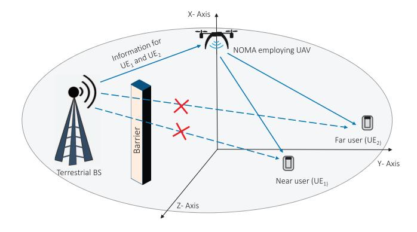

Fig. 17. NOMA with UAV for providing LoS connectivity to UEs.

# *2) Key Insights of This Section:*

- UAV-aided m-MIMO networks offer better QoS and coverage performance than the prevailing cellular m-MIMO systems.
- UAV-assisted m-MIMO communications can effectively handle data collection and transmission and enable WPT in dense IoT systems.
- Optimization of UAV's position and trajectory, angle, directional antenna alignment, and power allocation can achieve higher ST and spectral efficiency.
- Adopting dynamic energy management approach can efficiently utilize the harvested energy while ensuring uninterrupted operation in energy-constrained systems.

# *B. EH in UAV-Assisted NOMA Systems*

NOMA has recently drawn much attention as a key B5G paradigm owing to its higher spectral efficiency using superposition coding and SIC schemes at the transmitter and receiver nodes [\[10\]](#page-48-9). Compared to orthogonal techniques, NOMA can serve multiple users with diverse channel conditions located nearby and far distances. The difference in channel conditions of the users is adjusted by either allocating different power levels to these users, precisely termed as power domain-NOMA, or by using user-specific spreading sequences that are either non-orthogonal cross-correlated or sparse sequences, known as code-division NOMA. By incorporating UAV-assisted NOMA links, the network's scalability and spectral efficiency can be increased many folds compared to terrestrial infrastructure. The deployment of UAVs in the network provides better LoS links and coverage to the terrestrial UEs and IoT device nodes that are obstructed or heavily shadowed [\[2\]](#page-48-1). One such use scenario of UAV-assisted data transmission is depicted in Fig. [17,](#page-25-0) where the direct links between the terrestrial BS and multiple users are obstructed. In this setup, the BS needs to communicate with near and far users, by deploying NOMAenabled UAV. However, these UAVs suffer from limited energy and computation resources as they typically operate on finite batteries, posing constraints on their flight duration. Furthermore, the complexity of the NOMA-based system design also increases as there is a requirement for sophisticated algorithms and interference cancellation schemes. In this direction, the EH technique is crucial in harnessing the energy challenges in the UAV-assisted NOMA systems [\[15\]](#page-48-14).

Many research works [\[203\]](#page-52-23), [\[204\]](#page-52-24), [\[205\]](#page-52-25), [\[206\]](#page-52-26), [\[207\]](#page-52-27), [\[208\]](#page-52-28), [\[209\]](#page-52-29) have reported different EH methods with UAVassisted NOMA systems. For instance, [\[205\]](#page-52-25), [\[206\]](#page-52-26), [\[207\]](#page-52-27) used the UAVs as the energy transmitter to drive the network components. In contrast, the research works in [\[203\]](#page-52-23), [\[204\]](#page-52-24), [\[208\]](#page-52-28), [\[209\]](#page-52-29) utilized the energy-constrained UAVs to charge their onboard batteries by exploiting the EH techniques. These works are summarized in Table [X.](#page-26-0)

*1) Contemporary Research Endeavors:* In recent years, highly coherent laser beams have emerged as a prominent solution for recharging UAV onboard batteries, effectively reducing operational downtime and enabling sophisticated NOMA techniques and seamless relay communications [\[203\]](#page-52-23), [\[204\]](#page-52-24). In this direction, Singh et al. [\[203\]](#page-52-23) investigated the performance of laser-powered UAV-mounted BS that employs the NOMA technique to transmit the signal to multiple IoT devices and a cellular user. They utilized distributed laser charging, which is more advanced and feasible than wireless charging through laser beams. In addition to their previous works, Singh et al. [\[204\]](#page-52-24) proposed a hybrid clustering-based multiple access technique for the UAV-BS that uses orthogonal multiple access and NOMA signaling to serve multiple terrestrial users. They adopted a hybrid beamforming technique at the UAV-BS that combines zero-forcing beamforming and maximum ratio transmission to improve ST and spectral efficiency. Research studies in [\[205\]](#page-52-25), [\[206\]](#page-52-26) focused on performance analysis, while [\[207\]](#page-52-27), [\[208\]](#page-52-28), [\[209\]](#page-52-29) optimized system parameters and UAV attributes to enhance performance. Specifically, Ernest et al. [\[205\]](#page-52-25) analyzed the NOMA-aided UAV communications wherein the UAV receivers utilize a dual diversity method under a bi-variate Rician shadowing faded channel. They highlighted that the diversity gain of the considered NOMA-aided networks is least affected by correlation at high SNR regions.

Li et al. [\[206\]](#page-52-26) developed a neoteric gravitational search algorithm for the NOMA-based UAV-assisted IoT system to maximize overall ST. The developed algorithm focused on organizing multiple constraints to simplify the problemsolving process and constructing force sets to improve the overall search for the optimal solution. Further, Hadzi-Velkov et al. [\[207\]](#page-52-27) optimized the performance of UAVenabled WPRNs, wherein the UAV simultaneously acts as an RF power source and assists in relaying between terrestrial BS and EH users. The EH-aided UAV moves around the BS in a circular trajectory and leverages hybrid multiple access by combining NOMA and time-division multiple access (TDMA).

Likewise, Do et al. [\[208\]](#page-52-28) considered an energy-constrained UAV relay wirelessly powered from a BS. The UAV utilizes the harvested power and NOMA technique to relay the data from the BS to two users. They demonstrated that the ergodic capacity consistently improves for the far user but degrades with increased SNR due to interference. In another work, Hoang et al. [\[209\]](#page-52-29) considered a UAV-BS with multiple antennas that harvest the energy from a TV/radio tower. The ambient source utilized the maximal-ratio transmission to improve the UAV's harvested energy. Subsequently, the UAV

| Works | Model                                                                     | Problem category and                                      |                                           | ctives of opti       | •                                         |                                        | Relaying,            |
|-------|---------------------------------------------------------------------------|-----------------------------------------------------------|-------------------------------------------|----------------------|-------------------------------------------|----------------------------------------|----------------------|
|       |                                                                           | solving technique utilized                             | Optimizing the flight trajectory | the other attributes | Optimizing the system throughput | Optimizing the system outages | EH protocol          |
| [203] | Studied a laser-powered UAV-mounted BS employing NOMA technique           | Convex (Derived the compact expressions)            | ✓                                         |                      | <b>√</b>                                  | <b>√</b>                               | TS, DF               |
| [204] | Proposed orthogonal multiple access and NOMA method for an UAV-mounted BS | Convex (Derived the compact expressions)            | <b>√</b>                                  | <b>√</b>             | <b>√</b>                                  |                                        | Harvest- then-use |
| [205] | NOMA-aided UAV for bi-variate Rician shadowing faded channel              | Convex (Derived the compact expressions)            | <b>√</b>                                  | <b>√</b>             | <b>√</b>                                  | <b>√</b>                               | PS, AF               |
| [206] | Considered a NOMA-employing UAV-assisted IoT communications               | Non-Convex (Neoteric gravitational search approach) | <b>√</b>                                  | <b>√</b>             |                                           |                                        | Harvest- then-use |
| [207] | UAV-aided WPRN model for terrestrial BS and EH users                      | Convex (Derived the compact expressions)            | <b>√</b>                                  | <b>√</b>             | <b>√</b>                                  |                                        | TS, DF               |
| [208] | Compared the AF and DF protocol employing a NOMA-assisted UAV relay       | Convex (Derived the compact expressions)            | <b>√</b>                                  | <b>√</b>             |                                           | <b>√</b>                               | AF, DF, TS           |
| [209] | Considered NOMA employing BS-mounted UAV equipped with antennas           | Convex (Derived the compact                            | <b>√</b>                                  | ✓                    |                                           | <b>√</b>                               | Harvest- then-use |

TABLE X RESEARCH WORKS ON EH IN UAV-ASSISTED NOMA SYSTEMS

employs the NOMA technique to forward the information to terrestrial IoT users in HD mode. The study showed that optimizing the UAV's trajectory and adjusting the number of antennas at both the TV tower and the UAV can significantly enhance the overall system performance.

- *2) Key Insights of This Section:*
- The UAV empowered with the NOMA techniques can leverage SIC, superposition coding, and beamforming methods to enhance the ST, EE, and spectrum efficiency.
- NOMA-empowered UAVs can be used to counter the interfering signals while serving as a power transmitter and as a relay node simultaneously.
- The dominant LoS channels of the UAV make the beamforming and NOMA techniques more effective by enhancing the network coverage compared to the terrestrial channels with fewer LoS links.
- UAVs can transmit the data with high reliability to the users residing at the cell edges using NOMA and 3D beamforming techniques.

# *C. EH in UAV-Assisted Backscatter Communications (BSCs)*

BSCs enable IT by allowing communicating devices to modulate and reflect the incoming RF signals. These devices do not actively generate RF signals but modify existing RF signals to encode and transmit the intended data [\[210\]](#page-52-30). On the other hand, RF-EH involves capturing and converting RF signals' energy into usable electrical energy [\[211\]](#page-52-31). Nevertheless, BSC and RF-EH are related concepts in this line but serve diverse objectives. BSC is suitable for applications requiring long-range communication with minimal power consumption because it offers a low-cost communication solution.

In recent years, BSC systems for low-power wireless communications have gained much attention, and they have

emerged as a prominent technique for designing low-power, large-scale wireless networks with EH capabilities. The lowpowered backscatter devices (BSDs) without the active RF components consume power in the order of 10μ*W* , which makes them a viable solution for UAV links and passive IoT devices deployed in remote locations [\[212\]](#page-52-32). The antenna mismatch level is adjusted to modify the reflection coefficient and allow the BSDs to harvest the energy from the signal [\[213\]](#page-52-33), [\[214\]](#page-52-34). The RF components like oscillators and analog-to-digital converters are not present in a backscatter node that consumes energy while operating, so they consume low power. Therefore, combining the EH methods with low-power BSCs can provide a power-efficient passive IoT infrastructure and UAV networks in different scenarios [\[215\]](#page-52-35). As shown in Fig. [19,](#page-27-0) BSDs or tags are passive units embedded in the ambient backscatter communications (AmBSCs) system and widely utilized in cooperative RF-based passive networks. AmBSCs allow ambient EH BSDs to acquire energy from RF signals from various sources such as Wi-Fi, Bluetooth, TV, and FM transmitters. Due to its ample signal coverage, minimal transmission losses, and large frequency availability, the sub-7-GHz band is considered the best candidate for ambient RF energy transmission. This frequency band could be further classified into seven categories, comprising the LTE700, LTE1-700/2-100, LTE2-600, GSM/LTE850, GSM/LTE1-900, digital TV, and Wi-Fi bands [\[216\]](#page-52-36). RF band below the digital TV band, such as FM radio, is not considered because the size of the harvester circuit for IoT SNs at such low frequencies will be a significant problem.

The BSDs transmit information signals by adjusting the impedance of the antenna. The BSC system comprising a single antenna with ambient EH tag is shown in Fig. [18\(](#page-27-1)a), which includes a primary transmitter and receiver denoted as Tx and Rx, respectively, forming a backscatter link. The BSC system with a multi-antenna ambient EH tag is depicted

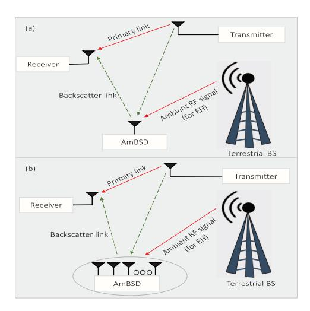

Fig. 18. (a) AmBSC architecture for single-antenna EH tag (b) AmBSC architecture for multi-antenna EH tag.

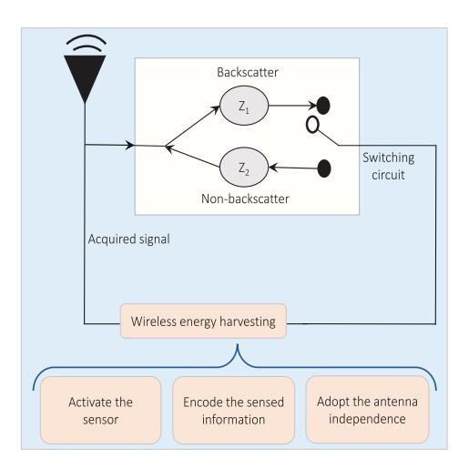

Fig. 19. Block diagram of AmBSD (sensor or tag).

in Fig. [18\(](#page-27-1)b) [\[212\]](#page-52-32). Several tags can be installed with single or multiple antennas for passive IoT systems in large-scale communications. However, the complexity of channel state estimation and sophisticated energy management requirements increases with more installed tags [\[210\]](#page-52-30).

Before realizing the diverse BSC system, various practical constraints must be addressed and mitigated over structure and computation, energy requirement, deployment costs, capacity, and caching relationship [\[217\]](#page-52-37). Several research works [\[218\]](#page-52-38), [\[219\]](#page-52-39), [\[220\]](#page-52-40), [\[221\]](#page-52-41), [\[222\]](#page-52-42), [\[223\]](#page-52-43), summarized in Table [XI,](#page-28-0) have focused on tackling the challenges in UAV-assisted AmBSC incorporated with EH technology. The authors in [\[218\]](#page-52-38), [\[220\]](#page-52-40), [\[221\]](#page-52-41), [\[223\]](#page-52-43) employed UAVs as energy transmitters to power network components, whereas [\[219\]](#page-52-39), [\[222\]](#page-52-42) focused on energy-constrained UAVs that harness transmitted signals from network components, implementing EH techniques to extend their battery life.

*1) Contemporary Research Endeavors:* EH-enabled BSDs can transmit data by reflecting the available RF signals, eliminating the need for a dedicated energy source. This enables the deployment of IoT devices and SNs in remote locations where

power supply is unavailable. In this direction, Yang et al. [\[218\]](#page-52-38) employed a mobile UAV-enabled power beacon to power the IoT nodes that use backscattering to transmit the information to a reader by leveraging the harvest-then-transmit protocol. Further, Hassan et al. [\[219\]](#page-52-39) proposed a heterogeneous network structure to enable uplink data transmission from IoT devices via a UAV relay. They emphasized the significance of utilizing wirelessly powered BSDs to support IoT devices in RF access links. They also suggested the implementation of a lowcomplexity modulating retro-reflector-based FSO backhaul link to connect the UAV relay with the ground station and laser-driven adaptive WPT for energy supply.

In another work, Mao et al. [\[220\]](#page-52-40) proposed a distributed beamforming-based backscattering model for multiple SNs in a UAV-assisted WSN. They enhanced the signal strength by employing distributed beamforming through multiple SNs that acted as virtual transmitting antenna arrays and distributed backscattering through multiple passive backscatter relay nodes. In the same direction, Yang et al. [\[221\]](#page-52-41) focused on maximizing the EE of a UAV-aided BSC network by planning the UAV's trajectory and resource allocation. They employed a rotary-winged UAV that follows a communicatewhile-fly protocol to acquire signals from the carrier emitters of terrestrial BSDs. Whereas Tran et al. [\[222\]](#page-52-42) offered WPT and caching assistance to the UAV to enhance its sustainability and computational capability. In return, the UAV performs backscattering for passive networks and relays the information transmitted from source to destination. The lack of energyefficient data encryption in low-power IoT devices and passive BSDs may impose a secrecy threat to the sensitive data transfer. In this direction, Hu et al. [\[223\]](#page-52-43) leveraged the robust trajectory of UAV and scheduling to enhance the data secrecy against multiple eavesdroppers. Herein, the UAV acted as the power source and data collector for the lowpower BSDs that transmit information signals by utilizing the UAVs' power.

- *2) Key Insights of This Section:*
- Adaptive protocols can dynamically adjust several parameters like transmit power, harvested power, and power allocation factors based on the energy availability and channel conditions in UAV-assisted AmBSCs.
- Using high-gain antennas on both the UAVs and TNs, along with error-correcting codes, can improve signal quality and reliability of BSCs.
- • Achieving precise synchronization between the reader/transmitter and BSDs is essential for reliable communication and is challenging in dynamic and mobile scenarios.

# *D. EH in UAV-Assisted Multi-User Communications*

Next-generation wireless networks are expected to offer ubiquitous connectivity to a vast number of users and devices. In order to support multi-user communications, UAVs can be deployed as aerial nodes due to their better radial coverage and channel conditions, even in remote and challenging locations. Concurrently, the EH techniques allow UAVs to extend their operational time and to act as backup communication nodes in

| Works | Model                                                                                  | Problem category and                                                                                            | Obje                                      | ectives of opt                           | imization pro                             | blem                                   | Relaying, or               |
|-------|----------------------------------------------------------------------------------------|-----------------------------------------------------------------------------------------------------------------|-------------------------------------------|------------------------------------------|-------------------------------------------|----------------------------------------|-------------------------------|
|       |                                                                                        | solving technique utilized                                                                                   | Optimizing the flight trajectory | Optimizing the other attributes | Optimizing the system throughput | Optimizing the system outages | EH protocol                   |
| [218] | Proposed harvest-then-transmit for UAV-aided IoT nodes that uses backscattering        | Convex (Derived the compact expressions)                                                                        | 3 3                                       | <b>√</b>                                 | 3 1                                       | √ ·                                    | Harvest- then- transmit |
| [219] | Heterogeneous networks of Laser- driven UAV relays, BSC, and FSO backhaul link   | Non-convex (Iterative algorithm)                                                                             | <b>√</b>                                  |                                          | <b>√</b>                                  | <b>√</b>                               | Harvest- then-use          |
| [220] | Proposed backscattering model and distributed beamforming for UAV- assisted WSNs | Non-convex (One-dimensional search)                                                                       |                                           | <b>√</b>                                 |                                           | <b>√</b>                               | TS                            |
| [221] | Studied a UAV-aided BSC network using communicate-while-fly protocol                   | Non-convex (Dinkelbach's, successive convex approximation (SCA), block coordinate descent (BCD)) |                                           | 1                                        |                                           | 1                                      | Communicate while-fly         |
| [222] | Considered backscatter and cache embedded UAV wirelessly powered by a source     | Non-convex (SCA and BCD)                                                                                     | <b>√</b>                                  |                                          | <b>√</b>                                  | <b>√</b>                               | TS                            |
| [223] | Studied the BSC having low-power BSDs and UAVs in the presence of                      | Convex (Derived the compact                                                                                     |                                           | ✓                                        | ✓                                         | <b>√</b>                               | Harvest- then-use          |

TABLE XI RESEARCH WORKS ON EH IN UAV-ASSISTED BSCS

case of network failures or disrupted terrestrial infrastructure to resume the service. Such UAV communications can offer several advantages over conventional infrastructure that are leveraged for serving multiple users in various scenarios.

Numerous research works [\[224\]](#page-52-44), [\[225\]](#page-53-0), [\[226\]](#page-53-1), [\[227\]](#page-53-2), [\[228\]](#page-53-3), [\[229\]](#page-53-4), [\[230\]](#page-53-5), [\[231\]](#page-53-6), [\[232\]](#page-53-7), [\[233\]](#page-53-8), [\[234\]](#page-53-9), [\[235\]](#page-53-10), [\[236\]](#page-53-11), [\[237\]](#page-53-12) have utilized the RF-EH techniques and UAV communications in multiple user-based scenarios. In particular, [\[229\]](#page-53-4), [\[234\]](#page-53-9), [\[235\]](#page-53-10), [\[237\]](#page-53-12) considered the energy-constrained UAVs in multi-user communication scenarios where UAVs exploit the transmitted RF signals for harvesting energy. In contrast, [\[224\]](#page-52-44), [\[225\]](#page-53-0), [\[226\]](#page-53-1), [\[227\]](#page-53-2), [\[228\]](#page-53-3), [\[230\]](#page-53-5), [\[231\]](#page-53-6), [\[232\]](#page-53-7), [\[233\]](#page-53-8), [\[236\]](#page-53-11) adopted UAVs as the energy transmitter. These works are summarized in Table [XII,](#page-29-0) depicting their research objectives, problem formation category, and solving techniques.

*1) Contemporary Research Endeavors:* Several research works have leveraged UAVs to address the challenges of power-constrained terrestrial users [\[224\]](#page-52-44), [\[225\]](#page-53-0), [\[226\]](#page-53-1), [\[227\]](#page-53-2), [\[228\]](#page-53-3), [\[229\]](#page-53-4), [\[230\]](#page-53-5). Specifically, [\[224\]](#page-52-44), [\[225\]](#page-53-0), [\[226\]](#page-53-1) focused on improving EE by considering practical constraints such as UAV's propulsion energy, EH causality, etc. In this vein, Yang et al. [\[224\]](#page-52-44) investigated an EH-enabled UAV-based wireless communication system, wherein the UAV delivers energy to the users in HD or FD mode, which transfers information to the UAV. The operational height and propulsion energy of UAVs are crucial factors that can significantly impact the EE and QoS. In this direction, Wang et al. [\[225\]](#page-53-0) proposed a rotary-wing UAV-aided WPCN in order to mitigate lower EH efficiency caused by channel fading. It was shown that UAV-aided WPCN significantly improved EE compared to a terrestrial network due to its higher sum throughput and ability to communicate with terrestrial users at far distances. On the other hand, Pan et al. [\[226\]](#page-53-1) emphasized 3D trajectory planning, power allocation, and scheduling to enhance EE in the UAVassisted WPCNs. The aim was to increase the number of covered devices and time efficiency by reducing the UAV's overall flying distance.

In recent studies, the authors in [\[227\]](#page-53-2), [\[228\]](#page-53-3) aimed to improve the ST of UAV-assisted WPCNs. Specifically, Park et al. [\[227\]](#page-53-2) considered a UAV that operates as an access node to energy-constrained terrestrial users. They used linear and non-linear EH models to analyze two scenarios, i.e., integrated UAV WPCNs, where a single UAV performs both energy transfer and information reception, and separate UAV WPCNs, where two UAVs handle energy transfer and information reception. It has been observed that the performance of such systems can be significantly improved by employing dual UAVs. However, this approach poses certain challenges related to deployment, interference management, and resource allocation. Furthermore, UAVs can efficiently address the doubly near-far fairness issue that arises when multiple users are dispersed at near and far locations. In this line, Xie et al. [\[228\]](#page-53-3) investigated a UAV-aided WPCN, wherein a UAV is employed as a mobile access point to serve a group of terrestrial users simultaneously.

In this context, maximizing ST or EE in a network comprising multiple nodes can lead to excess data transmission capacity for certain nodes and deficient data transfer capacity for others. To address this issue, Chen et al. [\[229\]](#page-53-4) considered irregular throughput demands among the SNs. Specifically, they used the UAV-flight-region discretization technique to minimize the transmission completion time required for the UAV-based hybrid sink to collect a specific number of bits from each node. In another study, Wu et al. [\[230\]](#page-53-5) employed a rotary-wing UAV as a hybrid accessing node that could hover

TABLE XII RESEARCH WORKS ON UAV-ASSISTED MULTI-USER COMMUNICATIONS

| Works | Model                                                                                                                  | Problem category and                                                                   | Obje                                      | ctives of opt                            | imization pr                              | oblem                                  | Relaying, or           |
|-------|------------------------------------------------------------------------------------------------------------------------|-------------------------------------------------------------------------------------------|-------------------------------------------|------------------------------------------|-------------------------------------------|----------------------------------------|---------------------------|
|       |                                                                                                                        | solving technique utilized                                                             | Optimizing the flight trajectory | Optimizing the other attributes | Optimizing the system throughput | Optimizing the system outages | EH protocol               |
| [224] | EH-enabled UAV-based wireless communication with HD or FD mode                                                         | Non-convex (SCA, one-dimensional (1D) search method)                                | <b>√</b>                                  |                                          |                                           | <b>√</b>                               | Fly-hover- communicate |
| [225] | Rotary-wing UAV-aided WPCN for both EH and IT to multiple terrestrial users                                            | (Route discretization, SCA)                                                               | <b>√</b>                                  |                                          |                                           | <b>√</b>                               | Harvest- then-use      |
| [226] | Emphasized on challenges in UAV-aided WPCNs such as power allocation and scheduling to enhance EE                      | (Genetic algorithm, K-means initialization operator)                                      | <b>√</b>                                  | <b>√</b>                                 |                                           | <b>√</b>                               | Fly-hover- transmit    |
| [227] | UAV-mounted WPCN system operating as ANs to serve the TUs having energy constraints                                    | Non-convex (SCA, alternate optimization method)                                           | <b>√</b>                                  | ✓                                        |                                           | <b>√</b>                               | TS, DF                    |
| [228] | UAV-aided WPCN wherein it acts as mobile access point to simultaneously serve a group of terrestrial users       | Non-convex (SCA)                                                                          | <b>√</b>                                  |                                          | ✓                                         |                                        | AF, TS                    |
| [229] | UAV-assisted WPCN wherein UAV operates as a hybrid sink                                                                | Non-convex (Discretized area, Lagrange dual problem)                                | <b>√</b>                                  | <b>√</b>                                 |                                           |                                        | Harvest- then-use      |
| [230] | Rotary-wing UAV-enabled WPCN where the UAV serves multiple terrestrial users                                           | Convex (Derived the compact expressions)                                                  |                                           |                                          |                                           |                                        | Fly-hover- communicate |
| [231] | UAV-aided multiple user WPTN, where UAV provided energy to few deployed groups of terrestrial devices wirelessly | Non-convex (Iterative algorithm)                                                       | <b>√</b>                                  | <b>√</b>                                 |                                           | <b>√</b>                               | Successive- hover- fly |
| [232] | UAV-enabled WPTN wherein the UAV forms link between terrestrial devices                                                | Non-convex (Iterative method)                                                          | ✓                                         |                                          |                                           | <b>√</b>                               | TS                        |
| [233] | Rotary-wing UAV-aided WPT model wherein UAV RF signals periodically to receivers                                       | Non-convex (Decomposition-aided evolutionary algorithm, branch and bound method) | <b>√</b>                                  | ✓                                        | ✓                                         |                                        | TS, AF                    |
| [234] | Multipath routing scenario with combined resource allocation for a UAV-aided SWIPT technique                     | Non-convex (Quadratic transformation approach iterative algorithm)                  | <b>√</b>                                  |                                          | <b>√</b>                                  | <b>√</b>                               | PS                        |
| [235] | Rotary-wing UAV-aided relay system with laser charging framework                                                       | Non-convex (Penalty dual decompose method)                                          | <b>√</b>                                  | ✓                                        | <b>√</b>                                  |                                        | Harvest- then-use      |
| [236] | UAV-assisted terrestrial station and randomly located multi-users                                                      | Convex (Derived Cramer Rao lower bound)                                             | <b>√</b>                                  |                                          | <b>√</b>                                  | <b>√</b>                               | Harvest- then-use      |
| [237] | Deployment of UAV for the end-to -end interconnections of UEs to the MCC                                         | Convex (Derived the compact expressions)                                                  | <b>√</b>                                  |                                          | <b>√</b>                                  |                                        | TS                        |

over multiple terrestrial users to transmit power and collect data. Interestingly, they explored the energy-time tradeoff by defining a boundary over the "Energy-Time" region and considering the minimum energy consumption and completion time. This approach is used to explore the relationship between energy consumption and completion time.

In the context of multi-user scenarios, some research studies [\[231\]](#page-53-6), [\[232\]](#page-53-7), [\[233\]](#page-53-8) have used UAVs as energy transmitters to terrestrial devices. For instance, Yuan et al. [\[231\]](#page-53-6) investigated UAV-aided multiple-user WPCNs, where the UAV wirelessly transfers energy to several deployed groups of TNs via a successive-hover-and-fly protocol. This setup showed the energy fairness and causality for non-linear EH over a fixed recharging time and an upper limit on the UAV's flight velocity. Likewise, Hu et al. [\[232\]](#page-53-7) employed a UAV that provided energy to all TNs such that the charging process occurs periodically, i.e., the UAV flies from a landing position during each working period. Their transition-based sustainable design for UAV mobility could be effectively applied in scenarios where only a subset of IoT nodes or TNs are operational, thus alleviating the requirement for the UAV to sustain all devices. UAVs can be equipped with antenna arrays to transmit 3D energy multi-beams to meet the energy demands of multiple terrestrial-based energy receivers. However, to ensure the proper functioning of these 3D energy multi-beam antenna arrays, mutual coupling, coverage area, and the altitude of the UAV must be taken into consideration during the design process. In this context, a rotary-wing UAVaided WPT model was considered by Feng et al. [\[233\]](#page-53-8) wherein a UAV was deployed as an energy transmitter to a group of energy receivers.

UAVs can transmit information and energy using the SWIPT technique for the WSNs and WPCNs. Recent exploration in this context has shown the UAV's potential to increase the network's longevity and sustainability. Specifically, Kang and Chun [\[234\]](#page-53-9) investigated a resource allocation for EH and

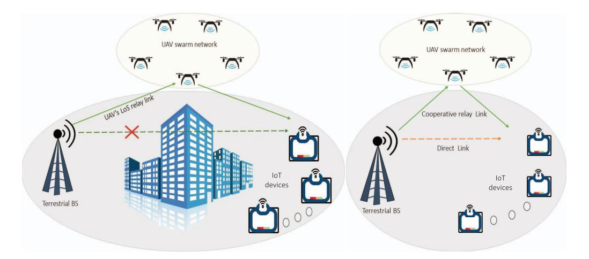

Fig. 20. UAV-assisted relay networks: a) when direct link is not present, and b) when direct link is present.

UAV-aided multicasting systems. The UAV was deployed for IT and WPT to multiple terrestrial users using PS-based SWIPT architecture. Furthermore, UAV-based relays can establish a reliable network between multi-user groups when the direct link is obstructed by deep fade or shadowing. However, excessive energy consumption can affect the UAV relay's sustainable operation and deplete its battery storage. Therefore, it is essential to consider the energy-causality constraint at the UAV relay when planning the UAV's trajectory or resource allocations. In this regard, Zhao et al. [\[235\]](#page-53-10) aimed to provide a sustainable energy supply to a rotary-wing UAVrelay through a laser charging based power beacon. They accounted for the UAV's energy-causality constraint which means that the total energy consumed by the UAV relay in the current time slot cannot exceed its remaining battery storage.

Many recent studies have integrated clustered techniques with UAV-aided communications to provide seamless connectivity to the communicating nodes, thus allowing efficient resource-sharing opportunities [\[236\]](#page-53-11), [\[237\]](#page-53-12). To improve the achievable throughput and localizing performance of the UAVassisted clustered networks, the impact of the UAV's altitude and way-point numbers, EH duration, and correlated shadowing need to be considered. Specifically, Le et al. [\[236\]](#page-53-11) proposed a clustering model constituting a UAV-assisted terrestrial BS and randomly located multi-users. They obtained the Cramer-Rao lower bound and ST for delay tolerant and delay-limited transmission modes. Further, during a natural calamity, ensuring connectivity between on-scene UEs and CCC becomes reluctant due to the disrupted conventional infrastructures. In this vein, Hassan et al. [\[237\]](#page-53-12) explored endto-end connectivity between UEs and the mobile CCC by considering disaster-aware clustering schemes. They designed an experimental layout for a disaster scenario and provided useful results regarding the tradeoff between intra-cluster and cluster head-UAV distance.

# *2) Key Insights of This Section:*

• With optimal path planning and power allocations, UAV's data and power transmission capabilities can be enhanced while serving multiple distributed users.

- UAVs can employ beamforming to adjust antenna patterns that improve signal quality for users and minimize the interference for closely spaced other users.
- Efficient scheduling algorithms and resource allocation can efficiently allocate communication slots to multiple users while considering energy limitations and QoS requirements.
- Considering practical constraints like non-linear EH receivers, self-interference, hardware impairments, shadowing, and network congestion may give valuable insights while optimizing the UAV's trajectory.

# *E. EH in Multi UAVs/Swarm of UAVs-Assisted Communications*

The communicating nodes deployed in remote and dense urban areas suffer from high path loss and shadowing due to the unavailability of direct links. To meet ever-increasing data connectivity requirements across the globe, we need some effective and efficient technological solutions, as can be accomplished by deploying the intermediate relaying terminals. In this vein, owing to the dominating LoS connectivity, scalability, and ease of deployment, UAV relays can be profound solutions by applying an appropriate relaying operation like AF and DF. However, employing a single UAV may not be sufficient in specific mission-oriented applications like SAR, weather forecasts, and covert military surveillance. Multi-UAV relaying and UAV swarm networks can be preferred in demanding situations to increase network coverage and reliability. Such a use case is depicted in Fig. [20\(](#page-30-0)a), where a terrestrial BS transmits the control signal to the IoT device via a UAV swarm network as the direct link between the BS and IoT devices is heavily obstructed. Furthermore, using cooperative relay links along with direct links can further enhance the system performance, as illustrated in Fig. [20\(](#page-30-0)b).

Multi-UAV-assisted networks may suffer from energy limitations due to the involvement of energy-constrained devices and relaying operations that cost energy to forward the received signal. In this context, the RF-EH method is a viable solution to tackle the energy limitations of these

| Works | Model                                                                                                          | Problem category and                                      | Objec                | ctives of opti   | mization pro         |                   | Relaying, or      |
|-------|----------------------------------------------------------------------------------------------------------------|-----------------------------------------------------------|----------------------|------------------|----------------------|-------------------|----------------------|
|       |                                                                                                                | solving technique                                         | Optimizing           | 1                | Optimizing           |                   | EH protocol          |
|       |                                                                                                                | utilized                                                  | the                  | the              | the                  | the               |                      |
|       |                                                                                                                |                                                           | flight trajectory | other attributes | system throughput | system outages |                      |
| [238] | EH employing multiple UAV relays-assisted IoT communication under the effects of aggregated interference | Convex (Derived the compact expressions)            |                      |                  | <b>√</b>             | <b>√</b>          | TS, PS               |
| [239] | UAV swarm concatenated with complex IoT networks in randomly spaced macro-cells                                | Convex (Derived the compact expressions)            |                      | <b>√</b>         | <b>√</b>             | <b>√</b>          | Harvest- then-use |
| [240] | OFDMA technique for multi UAVs wirelessly powered IoT                                                          | Convex (Derived the compact expressions)            |                      | ✓                |                      | ✓                 | Harvest- then-use |
| [241] | Multiple UAV WPC systems for 6G-aided IoT with downlink and uplink sub-slots                                   | Non-convex   (Improved iteration   algorithm)       | <b>√</b>             | <b>√</b>         |                      | <b>√</b>          | DF, TS               |
| [242] | UAV-aided WPCN mm-Wave communication for maximization of efficacy of WPCNs throughput                    | Non-convex (Dual stage iteration using SCA and BCD) | <b>√</b>             | <b>√</b>         |                      | <b>√</b>          | Harvest- then-use |
| [243] | UAV-aided cooperative relaying system model                                                                    | Non-Convex (KKT method)                                | <b>√</b>             | ✓                | <b>√</b>             |                   | TS                   |

TABLE XIII RESEARCH WORKS ON EH IN MULTI UAVS/SWARM OF UAVS-ASSISTED COMMUNICATIONS

energy-constrained nodes that can utilize SWIPT techniques to transmit or receive the power or information signals. On the other hand, multi-UAV relay networks also suffer from challenges such as self-interference and CCI, spectrum scarcity, security threats, and stochastic positioning. Numerous research works [\[238\]](#page-53-13), [\[239\]](#page-53-14), [\[240\]](#page-53-15), [\[241\]](#page-53-16), [\[242\]](#page-53-17), [\[243\]](#page-53-18) have employed the RF-EH technique and multi-UAV relaying to tackle various practical challenges and enhance the terrestrial user's connectivity. The authors in [\[240\]](#page-53-15), [\[241\]](#page-53-16) used the UAVs as the energy transmitter to drive the network nodes, whereas [\[238\]](#page-53-13), [\[239\]](#page-53-14), [\[242\]](#page-53-17), [\[243\]](#page-53-18) utilized the energyconstrained multiple-UAVs that leverage on the transmitted signal from the network components and employ the EH technique to increase their battery life. These works are summarized in Table [XIII,](#page-31-0) depicting their research objectives, problem formation category, and solving techniques.

*1) Contemporary Research Endeavors:* Numerous studies have recently explored the potential of using multiple UAVs or swarms of UAVs to improve QoS, network throughput, and EE while also expanding the coverage area to reach sparsely located IoT nodes [\[238\]](#page-53-13), [\[239\]](#page-53-14), [\[240\]](#page-53-15), [\[241\]](#page-53-16). Relay selection based on SNR is one of the techniques that can improve system performance in multi-layer ultra-dense networks with aggregated interference. In line with this, Ji et al. [\[238\]](#page-53-13) considered an EH-powered multiple UAV relay-aided IoT system in the prospect of achieving green cooperative communications. In another scenario, multiple UAVs can form aerial swarm nodes that can transmit energy to distant IoT devices and are sparsely distributed devices. These devices can use the harvested energy to share the data with nearby macro-cells. In this context, Yao et al. [\[239\]](#page-53-14) investigated the EE of a UAV swarm-assisted large-scale complex IoT comprised of energy-constrained IoT transmitters and randomly spaced macro-cells.

In another work, Ye et al. [\[240\]](#page-53-15) explored the potential of a multi-UAV-enabled FD-OFDMA system for wireless charging and data collection from multiple IoT nodes. Herein, the UAVs follow the predefined path to collect data from scheduled nodes in several epochs by utilizing a limited number of available channels. Similarly, Wang et al. [\[241\]](#page-53-16) introduced multi-user scheduling and trajectory optimization for multiple UAVs-assisted IoT networks. In the downlink subslot, multiple UAVs are deployed as aerial platforms to transfer energy to multiple IoT users. Subsequently, the user scheduling occurs in the uplink sub-slot, where the scheduled user uploads data to the designated UAV utilizing the harvested energy.

UAV-enabled mmWave communication combines the advantages of mmWave, such as abundant unoccupied bandwidth and shorter wavelength, with the benefits of UAV links. This results in a high data rate suitable for high-definition pictures and high-quality video streams. Moreover, a UAVenabled system offers a higher possibility of establishing LoS links that can compensate for the drawback of signal blockage resulting from physical obstacles in mmWave communication. In this context, Miao et al. [\[242\]](#page-53-17) considered multiple UAVaided WPCN mmWave communication networks in which the UAVs transmit the gathered information to the micro-ground stations using the harvested energy. They only considered the energy consumption in the IT process while optimizing the network's throughput. However, the energy consumption in propulsion and following the trajectory were left unexplored. In another work, Jayakody et al. [\[243\]](#page-53-18) proposed a unified EH strategy for WPT, SWIPT, and UAV's self-interference. They leveraged the SWIPT technique in a cooperative relaying scenario in which EH-enabled UAV relays operated in FD mode and utilized DF protocol to improve the overall ST.

- *2) Key Insights of This Section:*
- Deployment of multiple UAVs as the relay nodes in the IoT significantly improves signal quality using appropriate relay selection strategies.
- Based on the number of UAVs engaged in a swarm, there is a trade-off between the IT rate and EE or ST of the network.

- The challenge lies in minimizing the energy consumption of multiple UAVs while engaged in mission-oriented applications to prolong the operating node's duration.
- Practical constraints like self-interference, hardware impairments, imperfect channel state information (CSI), and non-linearity in the EH receiver must be considered for designing the UAV's trajectory or task scheduling for any multi-relay-based application scenario.

# *F. PHY-Security With EH and UAV-Assisted Communications*

As aerial nodes, UAVs have been extensively used in different scenarios for diverse applications due to their inherent features. For example, UAV nodes and UCS can form a temporary cellular network in regions where the terrestrial infrastructure is unavailable or is disrupted due to natural calamity. However, the increased prevalence of LoS connections exposes UAV-assisted communications to different security breaches compared to terrestrial-based communications [\[11\]](#page-48-10). The intruders in the vicinity can easily exploit the dynamic and scalable UAV links, which can compromise data security. On another front, remote malicious UAVs can also be used by intruders to control the strong A2G link and intercept information transmitted from the UAV-BS to UEs [\[244\]](#page-53-19). These hostile UAVs can leverage their high platform to cause more severe attacks on the legitimate network than terrestrial-based jammers with equivalent jamming signal strength. Consequently, A2G and G2A links are considerably more susceptible to eavesdropping and jamming than terrestrial links.

PHY-security emerged as a potential technology to safeguard the information by capitalizing on the inherent properties of communication channels by enhancing the legitimate signal strength or by degrading the potential eavesdropper's ability to access information. Furthermore, PHY-security methods can serve as an additional layer of security, collaborating with existing security protocols to safeguard UAV-enabled networks efficiently [\[194\]](#page-52-14), [\[244\]](#page-53-19). In this direction, cooperative methods such as artificial noise injection, cooperative jamming, and legitimate eavesdropping have been integrated with cutting-edge techniques to enhance secrecy rates and reduce security vulnerabilities. Recent research studies [\[245\]](#page-53-20), [\[246\]](#page-53-21), [\[247\]](#page-53-22), [\[248\]](#page-53-23), [\[249\]](#page-53-24), [\[250\]](#page-53-25), [\[251\]](#page-53-26), [\[252\]](#page-53-27), [\[253\]](#page-53-28), [\[254\]](#page-53-29), [\[255\]](#page-53-30), [\[256\]](#page-53-31), [\[257\]](#page-53-32) have demonstrated the viability of PHY-security as a security measure for EH-powered UAVenabled communication systems. The authors in [\[246\]](#page-53-21), [\[247\]](#page-53-22), [\[253\]](#page-53-28), [\[255\]](#page-53-30), [\[256\]](#page-53-31) considered UAVs as energy transmitters to power network components, whereas [\[245\]](#page-53-20), [\[248\]](#page-53-23), [\[249\]](#page-53-24), [\[250\]](#page-53-25), [\[251\]](#page-53-26), [\[252\]](#page-53-27), [\[254\]](#page-53-29), [\[257\]](#page-53-32) focused on energy-constrained UAVs that harness transmitted signals for EH to extend their battery life. Detailed information on these studies is presented in Table [XIV,](#page-33-0) indicating their research objectives, problem formulation categories, and the methodologies used to address them.

*1) Contemporary Research Endeavors:* Artificial noise injection and cooperative jamming are two promising methods that have been shown to effectively improve the secrecy performance of legitimate links [\[245\]](#page-53-20), [\[246\]](#page-53-21), [\[247\]](#page-53-22), [\[248\]](#page-53-23), [\[249\]](#page-53-24), [\[250\]](#page-53-25). Furthermore, optimizing the EH parameter (the TS ratio) can further enhance the network's secrecy, as it determines the amount of energy harvested from the power source, significantly affecting the secrecy performance. In this context, Tang et al. [\[245\]](#page-53-20) addressed the UAV's limited onboard battery capacity and security threat by applying WPT and UAV's trajectory planning. They considered a two-phase timing block for charging and data transfer from the energy-constrained UAV to terrestrial Bob. In order to create a realistic system model and make efficient analyses or maximize confidential information's secrecy, practical constraints such as positioning error, collision avoidance, and UAV's maximum velocity must be considered. Considering this, Wang et al. [\[246\]](#page-53-21) proposed a dual UAV-assisted secure communication, wherein a UAV hovers and transmits secret information to a mobile user. In contrast, another UAV transmits artificial noise to the terrestrial eavesdropper.

UAV-based jamming is more effective than terrestrial jamming because UAVs can use A2G channels with dominant LoS to infer the wiretap link more effectively. With this regard, Mamaghani and Hong [\[247\]](#page-53-22) investigated the use of SWIPT for dual cooperative UAVs and wireless power-driven TNs in the presence of a malicious terrestrial intruder. They aimed to address the issue of ensuring secure communication when legitimate nodes do not have accurate information about the eavesdropper's location. To this end, they introduced friendly UAV jamming and Gaussian jamming transmission schemes. Multiple eavesdroppers can launch more severe attacks by intruding in different phases and using various combining schemes to obtain information. In this context, Dang-Ngoc et al. [\[248\]](#page-53-23) proposed cooperative jamming and EH in a UAV swarm network that utilizes AF relaying to assist terrestrial BS and confuse the eavesdropper with jamming signals. They obtained the closed-form expressions of SOP for maximum ratio combining and selection combining techniques employed by an eavesdropper.

Mamaghani and Hong [\[249\]](#page-53-24) performed the secrecy analysis by taking the Rician distribution and elevation angledependent probabilistic model. Their model employed the SWIPT technique and destination-aided cooperative jamming scheme to enhance data secrecy in the UAV-assisted relaying network. They obtained a considerable improvement in performance as compared to terrestrial relaying and without jamming transmission schemes. Similarly, Wang et al. [\[250\]](#page-53-25) defined a worst-case secrecy rate problem for a secure energyconstrained UAV-assisted communication system. For this scenario, a UAV assisted in IT between a legitimate source and a FD destination that transmitted AN to confuse multiple eavesdroppers having imperfect locations.

Using state-of-the-art techniques requires stringent security measures to ensure robust protection against evolving security threats. In this direction, the research works [\[251\]](#page-53-26), [\[252\]](#page-53-27), [\[253\]](#page-53-28), [\[254\]](#page-53-29), [\[255\]](#page-53-30), [\[256\]](#page-53-31), [\[257\]](#page-53-32) have utilized cooperative security measures along with the UAVs to either conduct secrecy analysis or to maximize the secrecy performance. Specifically, Ji et al. [\[251\]](#page-53-26) proposed a secrecy transmission model for the energy-constrained DF-based UAVassisted CRNs in the presence of a secondary eavesdropper.

TABLE XIV RESEARCH WORKS ON PHY-SECURITY IN EH AND UAV-ASSISTED COMMUNICATIONS

| Works | Model                                                                                                | Problem category                                          | Objec                                     | tives of opti                            | mization pro                              | blem                                   | Relaying,            |
|-------|------------------------------------------------------------------------------------------------------|-----------------------------------------------------------|-------------------------------------------|------------------------------------------|-------------------------------------------|----------------------------------------|----------------------|
|       |                                                                                                      | solving technique utilized                             | Optimizing the flight trajectory | Optimizing the other attributes | Optimizing the system throughput | Optimizing the system outages | EH protocol          |
| [245] | Tackling the UAV network's PHY security and on-board power limitations                               | Non-convex (Iterative algorithm)                       | ✓                                         | ✓                                        |                                           | ✓                                      | Harvest- then-use |
| [246] | Dual UAV-assisted secured communication network model                                                | Non-convex (S-Procedure, BCD, SCA Integer relaxing) | ✓                                         | ✓                                        | ✓                                         |                                        | AF, DF, TS           |
| [247] | UAV-enabled communication model with dual cooperative UAVs to use SWIPT strategy               | Non-convex (BCD, SCA)                                  | ✓                                         | <b>√</b>                                 |                                           | <b>√</b>                               | TS, AF               |
| [248] | Proposed cooperative jamming and EH employing a UAV swarm network                                    | Convex (Derived the compact expressions)            | <b>√</b>                                  | ✓                                        |                                           | ✓                                      | DF, TS               |
| [249] | SWIPT-based cooperative jamming scheme at the UAV-enabled relay node                                 | Convex (Derived the compact expressions)            | <b>√</b>                                  | ✓                                        |                                           | ✓                                      | Harvest- then-use |
| [250] | Mobile relay-assisted secured energy -constrained UAV-assisted communication system            | Non-convex (Multi-D search, Analytical approach)    | ✓                                         | ✓                                        |                                           | <b>√</b>                               | TS, PS, DF           |
| [251] | Dedicated RF with EH and DF-based UAV selection in secrecy transmission model                  | Convex (Derived the compact expressions)            |                                           | <b>√</b>                                 |                                           |                                        | TS, DF               |
| [252] | EH-based UAV-aided relay with for spectrum scarcity in wireless networks                             | Convex (Derived the compact expressions)            |                                           |                                          |                                           |                                        | TS, PS, DF           |
| [253] | PHY security in MISO and NOMA-based EH system using the UAV relays                                | Convex (Derived the compact expressions)            |                                           | <b>√</b>                                 | <b>√</b>                                  | <b>√</b>                               | TS, DF               |
| [254] | PHY security performance of NOMA- based CRN having multiple UAVs                                  | Non-convex (PSO method, Genetic algorithm)          |                                           | ✓                                        | <b>√</b>                                  | ✓                                      | Harvest- then-use |
| [255] | Physical layer security of UAV and SWIPT aided mm-Wave network                                       | Non-convex (Iterative algorithm)                       |                                           | ✓                                        |                                           | ✓                                      | TS, DF               |
| [256] | UAV-assisted wireless-powered D2D communication network against terrestrial a airborne eavesdroppers | (Herative algorithm)                                      | <b>√</b>                                  | <b>√</b>                                 |                                           | <b>√</b>                               | TS, DF               |
| [257] | Security challenges in offloading signals transmitted by MEC-assisted UAV                            | Convex (Derived the compact expressions             | ✓                                         |                                          | <b>√</b>                                  |                                        | Harvest-offload      |

They considered the primary user (PU) as an RF source and employed secrecy capacity maximization criteria-based UAV-relay selection and optimal antenna selection for the destination node. They derived the compact expressions of secrecy metrics by considering the random noise introduced by the DF UAV relay. In another work, Ji et al. [\[252\]](#page-53-27) focused on the spectrum scarcity and data secrecy in wireless communication networks. Their study proposed a two-hop cognitive secrecy transmission strategy for DF-based UAVs assisted relay under Nakagami-*m* fading channels. Both works [\[251\]](#page-53-26) and [\[252\]](#page-53-27) emphasized that selecting the appropriate PS factor and system parameters can significantly enhance the system's secrecy performance.

In UAV-assisted CRNs, spectral efficiency and secrecy throughput can be improved by utilizing multiple antenna and NOMA techniques. Specifically, Dang et al. [\[254\]](#page-53-29) studied the impact of secondary user (SU) interference on system performance and security limitations in NOMA-based CRNs with multiple UAV-based DF relaying systems. They employed a power beacon to charge the communicating nodes and considered two communication phases to accomplish the IT in the presence of a malicious jammer and eavesdroppers. For this setup, they proposed an algorithm that improves

the outage performance and reduces the information leakage. Similarly, a UAV-assisted EH-based CRN was considered for an IoT system in a study conducted by Vo et al. [\[253\]](#page-53-28). They examined a scenario where a terrestrial base station with multiple antennas transmits data to IoT nodes through DF employing UAV-relay using the NOMA technique to transmit data in the presence of an eavesdropper. The study derived compact expressions for the secondary network's throughput and information leakage probability.

Comparing different antenna array configurations reveals that for a certain number of antennas, the secrecy performance of a uniform planar array is better than that of a uniform linear array. However, the uniform linear array becomes superior as the number of antennas increases. In this context, Sun et al. [\[255\]](#page-53-30) conducted a study on the security aspect of a UAV-assisted SWIPT-enabled mm-Wave communication network by comparing various antenna configurations. They introduced a random frequency diversity array-aided directional modulation scheme by considering 3D antenna gain and beamforming structures. In an energy-constrained network model, joint optimization of EH parameters and resource allocation outperforms single-parameter optimization or resource allocations. In this direction, Yin et al. [\[256\]](#page-53-31) focused on maximizing secrecy EE in a UAV-assisted wirelesspowered D2D communication network against terrestrial and airborne eavesdroppers. They proposed and compared three different optimization algorithms for their setup. Regarding MEC-assisted UAV communications, optimal resource allocation can significantly improve the secrecy EE of the offloaded tasks. In this domain, Gu et al. [\[257\]](#page-53-32) focused on tackling the security challenges in receiving the offloading signals transmitted by MEC-assisted UAV and receiving the broadcasted control signals simultaneously under the presence of a terrestrial eavesdropper.

- *2) Key Insights of This Section:*
- A trade-off emerges in deciding the power allocations for signal and AN transmissions to achieve better system performance and security.
- The elevated altitude of the UAV and its strong LoS connection can be utilized to jam the distant located malicious terrestrial attackers.
- Implementation of the cooperative jamming technique and multiple UAVs or swarm networks requires stringent path planning to prevent collisions.
- Using UAVs as aerial jammers can affect the legitimate communication link, so it must be employed against intruders far from the legitimate node.
- Unlike terrestrial channels, which are less likely to have LoS links, the UAVs dominating LoS links make them suitable for using beamforming or antenna positioning techniques to enhance security.

# VI. EH IN UAV-ENABLED COMMUNICATION NETWORKS

In this section, we provide details of the research that employs RF-EH in different UAV networks in various application scenarios. Furthermore, the research in each subsection is bifurcated based on whether the UAV acts as an energy transmitter to the network nodes or harvests the energy from the received RF signals. The details of these works are furnished in the following subsections.

# *A. EH in UAV Communications for IoT*

The concept of IoT is instrumental in realizing the connectivity of many low-power devices deployed in diverse application scenarios to the Internet. In various IoT applications, such as industrial monitoring, precision farming, defense scenarios, low-power IoT devices require high data rates and low latency. However, ensuring reliable communications with these low-cost, remote-located, and power-constrained IoT devices poses a significant deployment challenge. In this direction, coupling UAVs and EH techniques together can play pivotal roles in expanding the capabilities of IoT by providing improved coverage and sustainability. Their integration into IoT allows for enhanced data collection, connectivity, and realtime responsiveness, making IoT more versatile and crucial in various applications.

Numerous research works [\[195\]](#page-52-15), [\[258\]](#page-53-33), [\[259\]](#page-53-34), [\[260\]](#page-53-35), [\[261\]](#page-53-36), [\[262\]](#page-53-37), [\[263\]](#page-53-38), [\[264\]](#page-53-39), [\[265\]](#page-53-40), [\[266\]](#page-53-41) have focused on enhancing the reliability and lifetime of IoT by using EH techniques and UAV communications. When the terrestrial infrastructure gets completely disrupted in emergency situation, UAVs can be deployed to restore the wireless services quickly. However, compared to terrestrial BSs or TNs, UAVs consume additional energy due to their flying operations, such as propulsion, flight altitude, flight time, and mobility. Therefore, energyconstrained UAVs can increase their operational time by harvesting energy through various sources, including RF-EH [\[264\]](#page-53-39). On the other hand, the research works in [\[195\]](#page-52-15), [\[258\]](#page-53-33), [\[259\]](#page-53-34), [\[260\]](#page-53-35), [\[261\]](#page-53-36), [\[262\]](#page-53-37), [\[263\]](#page-53-38), [\[265\]](#page-53-40), [\[266\]](#page-53-41) have utilized the UAVs as the energy transmitter to drive the low power devices. These works are summarized in Table [XV,](#page-35-0) showing their research objectives, problem formation category, and solving techniques.

*1) Contemporary Research Endeavors:* Numerous studies have highlighted the advantages of UAVs for IoT applications in recent years. UAVs can act as airborne hybrid access points that enable energy and IT with ease of deployment and dominant LoS capabilities. Following an optimal trajectory for a specific time can significantly improve the wireless communication links between the UAVs and terrestrial nodes, enhancing data collection from the nodes. For example, Huang et al. [\[258\]](#page-53-33) considered the minimum average data rate threshold, UAV's velocity, and transmit power budget to maximize the harvested energy at multiple IoT devices via UAV transmitter. In another recent study, Jiang et al. [\[259\]](#page-53-34) employed multiple UAVs equipped with directional antennas to improve energy and IT to the TNs. For the considered setup, they compared the performance of linear and nonlinear EH models in terms of energy and information coverage probabilities by exploiting the stochastic geometry and the approximate scaling methods.

Various research works, including [\[260\]](#page-53-35), [\[261\]](#page-53-36), [\[262\]](#page-53-37), [\[263\]](#page-53-38), [\[264\]](#page-53-39), [\[265\]](#page-53-40), have utilized UAVs to transmit RF energy to low-power IoT devices, enabling real-time monitoring for applications such as smart farming and ranching. These IoT devices can use the harvested energy to acquire data and transmit information. The allocation of time between hovering and flying exhibits distinct trends depending on application, and an optimal range of UAV power transmission exists that minimizes energy consumption throughout the entire period. For instance, Ye et al. [\[260\]](#page-53-35) adopted a rotary-winged UAVaided IoT wherein a UAV acts as a hybrid accessing point with FD transmission mode. For this setup, they defined three optimization problems: total-energy minimization, total-time minimization, and sum-throughput maximization.

In [\[260\]](#page-53-35), limited aerial energy is not taken into account when considering data or energy transmission through a UAV node. To address this, Ma et al. [\[261\]](#page-53-36) studied an m-MIMO network consisting of a UAV-aerial node with multiple antennas and terrestrial IoT users. The UAV performed energy beamforming to enhance WPT for the terrestrial users, which enabled them to transmit the collected data to the UAV. They considered UAV's dynamics, time duration, and rate threshold of the terrestrial users in their EE maximization problem.

Several recent studies have adopted a dynamic energy consumption model that can effectively differentiate between the UAV's power consumption for hovering, flying, and charging while performing the mission for a finite duration.

| TABLE XV                                             |
|------------------------------------------------------|
| RESEARCH WORKS ON EH AND UAV COMMUNICATIONS FOR IOTS |

| Works | Model                                                                                                | Problem category and                                                        | Objectives of optimization problem        |                                          |                                           |                                        | Relaying, or                 |
|-------|------------------------------------------------------------------------------------------------------|-----------------------------------------------------------------------------|-------------------------------------------|------------------------------------------|-------------------------------------------|----------------------------------------|---------------------------------|
|       |                                                                                                      | solving technique utilized                                               | Optimizing the flight trajectory | Optimizing the other attributes | Optimizing the system throughput | Optimizing the system outages | EH protocol                     |
| [258] | Constrained IoT for jointly optimizing the UAV's power allocation and trajectory planning            | Non-convex (Iterative algorithm)                                         | <b>√</b>                                  | ✓                                        | ✓                                         |                                        | PS                              |
| [259] | UAV-enabled SWIPT-based IoT considering both TS and PS receiver architectures                        | Non-convex (Approximate scaling stochastic geometry)                  | <b>√</b>                                  | <b>√</b>                                 | <b>√</b>                                  | <b>√</b>                               | TS, PS, DF                      |
| [260] | Rotary-winged UAV-aided FD wireless driven IoT network work as a hybrid accessing point              | Convex (Derived the compact expressions)                              |                                           |                                          |                                           |                                        | Harvest- then-use            |
| [261] | UAV-assisted IoT in which a UAV employed energy beamforming to deliver power to terrestrial use      | Non-convex (Non-linear fractional ry program algorithm)            | ✓                                         |                                          |                                           |                                        | TS                              |
| [262] | Energy-constrained UAV network recharging the IoT SNs                                                | (Derived the compact expressions)                                           |                                           | <b>√</b>                                 | <b>√</b>                                  |                                        | Fly-and-hover energy harvest |
| [263] | OFDM-aided UAV-driven IoT with multiple TNs driven by dual UAVs                                   | Non-convex (Successive Convex Program)                                |                                           | <b>√</b>                                 | <b>√</b>                                  |                                        | Harvest- then-use            |
| [264] | Non-linear EH-enabled UAV assisted FD IoT                                                            | Convex (Derived the compact expressions)                              | <b>√</b>                                  |                                          | <b>√</b>                                  | <b>√</b>                               | TS, PS                          |
| [265] | UAV-assisted wireless IoT system wherein it delivers energy to SNs and acquire information           | Non-convex (Heuristic algorithms, ant colony, dynamic programming) |                                           | <b>√</b>                                 |                                           |                                        | Harvest- then-use            |
| [195] | DF employing UAV relay-aided WPT-enabled communications for a pair of energy-constrained IoT devices | Convex (Derived the compact expressions)                              |                                           |                                          |                                           |                                        | TS, DF                          |
| [266] | UAV employing PS-based EH method for designing multi-criterion system relay                          | Non-convex (Mesh adaptive direct search algorithm)                    | <b>√</b>                                  | <b>√</b>                                 | <b>√</b>                                  |                                        | PS, DF                          |

In particular, Ye et al. [\[262\]](#page-53-37) introduced the energy constraint on the UAV while charging the IoT SNs. Integrating efficient spectrum management techniques with UAVs can offer several advantages, such as interference mitigation, enhanced signal quality, and improved coverage. In this context, Lu et al. [\[263\]](#page-53-38) proposed a dynamic interference cancellation scheme for the orthogonal frequency division multiplexing (OFDM)-aided multiple TNs that are powered by dual UAVs. Herein, the TNs transmit the gathered information to the UAVs via an orthogonal sub-carrier capable of avoiding interference in the uplink network.

Numerous research works, including [\[264\]](#page-53-39), [\[265\]](#page-53-40), have studied the non-linearities in energy harvester circuits to model more sophisticated and practical UAV-assisted data collection scenarios. While evaluating the performance in practical scenarios, it becomes crucial to consider factors such as finite and infinite block code lengths, shadowing, non-linear EH, and fading effects. In this context, Raut et al. [\[264\]](#page-53-39), considered a dual HD UAV-assisted FD IoT system by focusing on spectrum management. In their setup, the UAV harvests energy from a ground-based laser and sends data to a terrestrial FD IoT device while simultaneously transmitting control information to another UAV. Real-time monitoring data and control signals are crucial in IoT systems. A lower age of information (AoI) of signal transmission ensures that decision-making algorithms can access the most up-to-date information. This is particularly important in applications such as environmental monitoring, where timely responses are vital. Similarly, in mission-critical UAV operations like surveillance and disaster response, minimizing the AoI is essential for making informed decisions and adapting quickly to changing conditions. However, as the UAV's operational altitude and data size increase, the age of information performance decreases. In this context, Hu et al. [\[265\]](#page-53-40) examined the average age of information of the collected data in the UAV-assisted wireless IoT system. In the considered system, a UAV starts from a data center, flies to each terrestrial SN to deliver the energy and acquire information, and returns to the data center.

The traditional path loss models may not be accurate in rugged terrain or urban areas with tall buildings. In this context, the elevation-angle-dependent path loss model can better represent the propagation environment. It considers the UAV's altitude and elevation concerning terrestrial nodes, which allows the model to adapt dynamically to changes in LoS conditions. This adaptability significantly enhances accuracy, particularly in challenging environments. In this line, Prathima et al. [\[195\]](#page-52-15) investigated the performance of UAV relay-assisted communications for a pair of energyconstrained IoT devices with WPT and DF operation. They considered the elevation angle-based path-loss model and shadowing to characterize the channel between UAVs and IoT devices. By leveraging the Gauss-Hermite quadrature, they obtained the closed-form expressions of OP, ST, and EE at the IoT device nodes. Ramzan et al. [\[266\]](#page-53-41) developed a PSbased EH method for designing an efficient radio resource management multi-criterion system for the UAV relay, which

| Works | Model                                                                                                | Problem category and                                                                  | Obje                                      | Objectives of optimization problem       |                                           |                                        |                        |  |
|-------|------------------------------------------------------------------------------------------------------|---------------------------------------------------------------------------------------|-------------------------------------------|------------------------------------------|-------------------------------------------|----------------------------------------|------------------------|--|
|       |                                                                                                      | solving technique utilized                                                         | Optimizing the flight trajectory | Optimizing the other attributes | Optimizing the system throughput | Optimizing the system outages | EH protocol            |  |
| [267] | Explored resource allocation in EH-powered cognitive industrial M2M networks with UAV communications | Non-convex (Non-linear fractional programming, variable relaxation approach) | ,                                         | attributes                               | √                                         | √                                      | TS                     |  |
| [268] | Focused on UAVs-assisted two-hop CRN, where UAVs serve as aerial access points and relay nodes       | Non-convex (Recursive search, 1-D linear program, Frank Wolfe method)        |                                           | <b>√</b>                                 | <b>√</b>                                  |                                        | Fly-hover- transmit |  |
| [269] | Analyzed the performance of a rotary UAV -assisted cooperative CRN                                   | Convex (Derived the compact expressions)                                        | <b>√</b>                                  |                                          | <b>√</b>                                  | <b>√</b>                               | AF, DF, TS             |  |
| [270] | EH employing UAV-based CRN wherein hovering UAV performs spectrum sensing                            | Non-onvex (1D linear program, Lagrange method)                                  |                                           | <b>√</b>                                 | <b>√</b>                                  |                                        | TS, DF                 |  |
| [271] | Versatile fly-hover-transmit UAV hover model for around terrestrial terminals                        | Convex (Markov Decision Process)                                                | <b>√</b>                                  | <b>√</b>                                 | <b>√</b>                                  |                                        | Fly-hover- transmit |  |
| [272] | UAV-assisted spectrum and EH model for avoiding near-far effect                                      | Non-convex (SCA-aided iterative approach)                                       |                                           | <b>√</b>                                 |                                           | <b>√</b>                               | TS, DF                 |  |
| [273] | Resource control algorithm for EH-aided mobile cognitive relaying network                            | Convex (Lagrange dual                                                              | <b>√</b>                                  |                                          | ✓                                         | ✓                                      | Fly-hover- transmit |  |

TABLE XVI RESEARCH WORKS ON EH IN UAV-ASSISTED CRNS

assisted in IT from satellite terminals to IoT devices. Using a weighted-sum approach, they address three objectives, i.e., maximizing network sum rate, number of serviced IoT devices, and minimizing CO2 emissions.

- *2) Key Insights of This Section:*
- On utilizing the dominant LoS links and high altitudes of UAVs, we can significantly enhance the reach of energy-constrained IoT devices, enabling seamless connectivity even in remote locations.
- Adopting cooperative communication with EHempowered UAV relays assures robust connectivity and boosts reliability, coverage, capacity, and EE in IoT.
- Implementing adaptive energy allocation algorithms based on real-time data analysis ensures efficient utilization of harvested energy, maximizes the network's performance, and enables seamless connectivity even in fluctuating harvested energy conditions.

# *B. EH in UAV-Assisted CRNs*

In addition to the energy constraints, the limited spectrum is another crucial challenge for different wireless networks. The primary reasons for this challenge are: i) exponential growth of wireless devices/IoT devices leads to increased wireless links, and ii) different wireless networks coexist in the same operating band. However, this spectrum scarcity problem can be effectively addressed by incorporating CRNs with UAV communications. This enables the UAVs-empowered CRNs to dynamically utilize the available frequency bands and increase spectrum-sharing opportunities. The integrated UAV-assisted CRNs can form a viable architecture that enables UAV and terrestrial mobile devices to coexist by sharing the same radio spectrum.

Numerous research works [\[267\]](#page-54-0), [\[268\]](#page-54-1), [\[269\]](#page-54-2), [\[270\]](#page-54-3), [\[271\]](#page-54-4), [\[272\]](#page-54-5), [\[273\]](#page-54-6) have utilized the EH techniques and UAV-assisted communications in CRNs to provide more spectrum-sharing opportunities to terrestrial users. For instance, [\[267\]](#page-54-0), [\[268\]](#page-54-1), [\[269\]](#page-54-2), [\[270\]](#page-54-3), [\[271\]](#page-54-4) have used the UAVs as the energy transmitter to drive the low-power devices whereas [\[272\]](#page-54-5), [\[273\]](#page-54-6) have considered the energy-constrained UAVs that leverage the transmitted signal from the communicating nodes or power beacon and employ the EH technique to increase their battery lifetime. These works are summarized in Table [XVI,](#page-36-0) depicting their research objectives, problem formation category, and solving techniques and discussed in the following subsection.

*1) Contemporary Research Endeavors:* Several factors related to interference management [\[267\]](#page-54-0), [\[268\]](#page-54-1), spectrum sensing [\[269\]](#page-54-2), [\[270\]](#page-54-3), and practical system modeling [\[271\]](#page-54-4), [\[272\]](#page-54-5), [\[273\]](#page-54-6) may affect the performance of UAV-assisted CRNs. In M2M networks, integrating mechanical arms and optimizing EH parameters can help improve the EE. In this direction, Xu et al. [\[267\]](#page-54-0) performed resource allocation in EH-enabled cognitive industrial M2M networks with UAV communications. They focused on enhancing the average EE with the constraints over QoS and the available status of the terminal's energy. On the other hand, the EH-aided SUs can simultaneously connect with the UAV relay in the UAV-assisted CRNs by sharing the licensed spectrum of PUs. However, this can result in inter-cell interference and challenges related to resource management. Optimal UAV placement and power allocation can help to improve the overall EE, even under physical constraints like inter-cell interference, energy availability, and minimum data rate requirements. Considering this aspect, Xiao et al. [\[268\]](#page-54-1) modeled a dual-hop UAV-aided CRNs where multiple UAVs serve as air access points and relay nodes for EH-powered secondary users.

In another work, the impact of aerodynamic power consumption and successive interference cancellation (SIC) on the performance of a rotary UAV-assisted cooperative sensing in CRN was analyzed by Bhowmick et al. [\[269\]](#page-54-2). They developed a two-stage fusion scheme based on the cooperative decision of primary nodes and the UAV regarding the status of a PU's band. Following the decision, the UAV periodically rotates over the circular region of interest and transmits to the fusion center. Several works used UAVs as hybrid access points that can transmit energy to improve the network's longevity. Additionally, the LoS can enhance the spectrum sensing capability of the UAVs. Using resource allocation algorithms, UAVs can adjust their power based on feedback from PU to communicate with the terrestrial receiver at an optimal outage rate. In this line, Xiao et al. [\[270\]](#page-54-3) considered a dynamic scheme to provide different on-demand outage EE for a UAV-based EH-enabled CRN, wherein a hovering UAV is employed as a cognitive user.

Many recent works on UAV-assisted CRNs utilized channel models based on conventional assumptions, often impractical in real-world scenarios. However, when practical constraints such as limited battery storage, energy, information causality, and the UAV's propulsion energy model are taken into account, the optimization problem becomes non-convex and intractable. In such cases, the problem can be decomposed into subproblems and solved iteratively using BCD and SCA to obtain sub-optimal solutions. In this context, considering a more practical and realistic model, Che et al. [\[271\]](#page-54-4) utilized a location-dependent A2G channel and a non-linear EH model. Here, the UAV hovers around the TNs for optimal wireless energy or IT to the idle PU. They formulated the UAV's sum throughput maximization problem as a Markov Decision Process with battery energy constraints at all nodes.

An asymmetric time allocation scheme provides more adaptability and flexibility in scheduling than symmetric time allocations, which offer equal duration for all users. This is particularly useful when users are located at different distances. The scheme misaligned the uplink and downlink phases of both nearby and remote secondary users, thereby allowing for more efficient resource use. In their regard, Shi et al. [\[272\]](#page-54-5) considered closely located secondary users harvest energy from the BS and transmit data to BS. Remote SUs harvest energy from both the BS and UAV but send the data only to the UAV to mitigate the near-far problem. Practical constraints such as the energy causality of SUs, the maximum transmit power of mobile relays, and interference temperature must be considered to ensure optimal wireless communication performance. In another work, Li and Zhao [\[273\]](#page-54-6) designed resource allocation strategies for an EH-aided DF employing UAV-assisted CRNs. For this setup, they considered three straight and one circular trajectory for the UAV and maximized the ST by optimizing the transmission powers of the mobile relay and SU.

- *2) Key Insights of This Section:*
- UAV-assisted CRNs can be benefited from adaptive spectrum sensing techniques that dynamically adjust

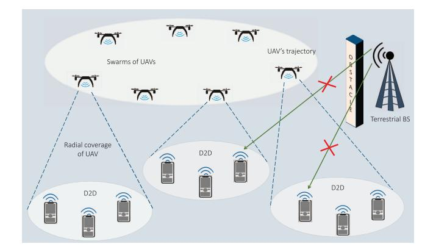

Fig. 21. UAV swarms assisting D2D communications.

their sensing parameters to enhance overall spectrum utilization.

- Sophisticated UAV trajectory planning by considering spectrum availability, energy replenishment, and traffic demand is crucial for cognitive UAV networks.
- UAV-aided CRNs with RF-EH can enable energy transfer to the secondary nodes that concurrently improve the network's spectral and EE.

# *C. EH in UAV-Assisted D2D Communications and WSNs*

In D2D communication, devices such as UEs or IoT devices can communicate with each other directly, forming a local network without relying on a central base station or cellular network. Therefore, they have evolved as a prominent solution for massive connectivity, drastically enhancing the network capacity by offloading traffic bursts. By incorporating UAVs with the D2D networks, the UAVs acting as aerial relays can significantly extend the network coverage for devices and IoT device nodes located remotely or distantly. Additionally, the mobility of UAVs allows for dynamic placement and optimized signal strength that ensures reliable direct communication between the WSNs and IoT devices.

Fig. [21](#page-37-0) depicts a disaster-stricken scenario where terrestrial infrastructure is disrupted or obstructed, affecting the direct communication between TNs and BS. In such a situation, the swarm of UAVs equipped with communication capabilities can swiftly deploy over the affected area. By forming a decentralized network, UAVs bridge the communication gap, allowing vital information to be exchanged among survivors, emergency responders, and relief agencies. This dynamic aerial network not only ensures connectivity where terrestrial signals fail but also offers mobility, allowing UAVs to adapt their positions, optimize coverage, and maintain uninterrupted communication links. Despite the various benefits of UAV-aided D2D connections and WSNs, it imposes various challenges regarding energy and interference management that must be addressed to realize its full potential. In this direction, RF-EH-assisted UAVs have been widely used to enhance the resilience of D2D communications for efficient data transfer.

Plenty of research works [\[274\]](#page-54-7), [\[275\]](#page-54-8), [\[276\]](#page-54-9), [\[277\]](#page-54-10), [\[278\]](#page-54-11), [\[279\]](#page-54-12), [\[280\]](#page-54-13), [\[281\]](#page-54-14), [\[282\]](#page-54-15) have focused on the D2D connectivity and WSNs by leveraging the EH technique and UAV-assisted communications to offer massive connectivity

| Works | Model                                                                                          | Problem category and                                                       |                                           | Objectives of optimization problem       |                                           |                                        |                      |
|-------|------------------------------------------------------------------------------------------------|----------------------------------------------------------------------------|-------------------------------------------|------------------------------------------|-------------------------------------------|----------------------------------------|----------------------|
|       |                                                                                                | solving technique utilized                                              | Optimizing the flight trajectory | Optimizing the other attributes | Optimizing the system throughput | Optimizing the system outages | EH protocol          |
| [274] | UAV acts as a power recharger for WPT and terrestrial BS                                       | Convex (Derived the compact expressions)                             |                                           | <b>√</b>                                 | <b>√</b>                                  |                                        | TS, AF               |
| [275] | UAV-aided WCSNs, simultaneously addressing sensor's power usage and EH                         | Non-convex (Lagrange multiplier, Geometry-based update algorithm) | <b>√</b>                                  | <b>√</b>                                 |                                           | <b>√</b>                               | Harvest- then-use |
| [276] | Directional antenna-aided UAV-powered WSN for powering the TNs                                 | Convex (Derived the compact expressions)                             | <b>√</b>                                  | <b>√</b>                                 |                                           | <b>√</b>                               | AF, TS               |
| [277] | UAV-enabled WSN, where multi-antenna UAV extracted the data from SNs                           | Non-convex (Lagrange duality, BCD, SCA)                              | <b>√</b>                                  | <b>√</b>                                 |                                           | <b>√</b>                               | Harvest- then-use |
| [278] | Considered the channel and coordinate information uncertainties in UAV-assisted EH D2D network | Non-convex (Lagrange dual theory)                                       |                                           | <b>√</b>                                 | <b>√</b>                                  |                                        | TS, AF               |
| [279] | SWIPT-aided D2D communication with UAV operating as relay node                                 | Convex (Derived the compact expressions)                             | <b>√</b>                                  | <b>√</b>                                 | <b>√</b>                                  |                                        | TS                   |
| [280] | Clustering techniques and EH-based UAV -enabled D2D connectivity to feed devices               | Convex (Derived the compact expressions)                             |                                           | <b>√</b>                                 | <b>√</b>                                  | <b>√</b>                               | TS, PS, DF           |
| [281] | SNs remotely-driven via RF- wireless Powered Beacons                                        | Non-convex (Lagrangian duality, Heuristic algorithm)                 | <b>√</b>                                  |                                          |                                           | <b>√</b>                               | Harvest- then-use |
| [282] | UAV-assisted WPCN with energy-                                                                 | Non-convex (Weighted Chebycheff                                         | ✓                                         | <b>√</b>                                 | <b>√</b>                                  |                                        | TS, AF               |

TABLE XVII RESEARCH WORKS ON EH IN UAV-ASSISTED D2D COMMUNICATIONS AND WSNS

to the TNs and devices in their considered system setup. To this end, the works in [\[274\]](#page-54-7), [\[275\]](#page-54-8), [\[276\]](#page-54-9), [\[277\]](#page-54-10), [\[278\]](#page-54-11), [\[279\]](#page-54-12), [\[282\]](#page-54-15) used the UAVs as the energy transmitter to drive the network components, whereas [\[280\]](#page-54-13), [\[281\]](#page-54-14) utilized the energyconstrained UAVs that leverage on the transmitted signal from the network components and employ the EH technique to increase their battery lifetime. These works are summarized in Table [XVII,](#page-38-0) showing their research objectives, problem formation category, and solving techniques.

*1) Contemporary Research Endeavors:* With RF-EH and UAV-integrated networks, D2D communications and WSNs can become sustainable and self-reliable in adverse application scenarios due to enhanced longevity. The authors in [\[274\]](#page-54-7), [\[275\]](#page-54-8) focused on designing the UAV's trajectory to improve the WSNs' longevity by considering the SN's energy. In the WPT scheme for UAVs assisted by charging stations, the optimal location tends to be closer to the charging station when the power allocation of both the charging station and UAVs is taken into account. In this regard, Yan et al. [\[274\]](#page-54-7) employed the BS-charged UAV as a power transmitter for SNs transmitting the collected data to the UAV in return. They considered both 1D and 2D WPT schemes to determine the optimal UAV deployment strategy that would maximize the total energy of the sensors. However, their model did not incorporate information causality and UAV energy consumption constraints while enhancing the lifetime of SNs. In this context, Baek et al. [\[275\]](#page-54-8) used the SWIPT technique to reserve power for the UAV to complete its round-trip flight during data collection. They considered reducing SN's energy consumption, charging process, and UAV's trajectory planning by taking practical constraints, leading to a more efficient system.

The authors in [\[276\]](#page-54-9), [\[277\]](#page-54-10) focused on maximizing the data rate at which the terrestrial SNs transmitted the collected data using different techniques in UAV-assisted WSNs. Optimal directional antenna beamwidth and UAV design can significantly reduce data collection time in the WSN. In this context, Choi and Lee [\[276\]](#page-54-9) used a directional antenna-equipped UAV to power the terrestrial SNs, which transmitted sensing information to the UAV in response by leveraging the harvested energy. Another approach to enhance the data rate, subject to the maximum transmission power of SNs and UAV velocity constraints, is to use power allocation strategy, transmission scheduling, and UAV trajectory planning. The UAV can also use beamforming based on zero-forcing to mitigate inter-user interference among transmitting SNs. In this line, Zhang et al. [\[277\]](#page-54-10) considered a UAV-enabled WSN, wherein a multi-antenna UAV was deployed to collect data from SNs.

Recent studies have mainly concentrated on optimizing transmission rates, assuming flawless CSI and accurate node location. However, this assumption could be more optimistic for practical systems due to channel and coordinate estimation errors. To provide a more realistic scenario, it is necessary to consider various constraints such as OP for ground terminals, flight altitude for UAVs, minimum harvested energy for D2D users, and transmission time constraints. In this context, Xu et al. [\[278\]](#page-54-11) considered radio resource allocation and UAV's placement to enhance the EE of EH-based UAV-assisted D2D nodes with imperfect CSI and coordinate information. To improve the EE of UAVs in real-time applications, a realtime power management and dynamic resource allocation framework is required. With this regard, Nguyen et al. [\[279\]](#page-54-12) investigated the UAVs' flight time and energy constraints of a UAV-relay node in a SWIPT-employing UAV-assisted D2D network.

Numerous research works [\[280\]](#page-54-13), [\[281\]](#page-54-14) have aimed to extend the lifespan, coverage, and reliability of widely spread WSNs and D2D networks by utilizing cluster techniques in EH and UAV-assisted communications. They offer different approaches to improve EE and reduce the network's power consumption while maintaining a high data rate and transmission reliability. It can be observed that the transmit power required for both the UAV and user devices can be drastically reduced by employing the cluster head. In this context, Saif et al. [\[280\]](#page-54-13) integrated cluster techniques with EH-enabled UAV-assisted D2D networks to extend the durability of preand post-disaster networks. They designed a deployment framework for UAVs that integrates D2D links and cluster techniques to extend the network's lifespan via harvested energy. Similarly, Perera et al. [\[281\]](#page-54-14) proposed a time-block structure for eliminating the necessity for long-range transmission and multi-hop communication to the data sink. In the first phase, SNs harvest energy from power beacons and transmit their sensed data to selected cluster heads. In the second phase, a UAV collects data from the cluster heads and delivers it to the data sink. They investigated the information collection and resource allocation for this setup. It has been noticed that there is a significant tradeoff between the minimum power consumption required, maximum achievable data rate, and EE. This highlights the need to balance these parameters optimally to achieve efficient and effective communication systems. In this context, Hashir et al. [\[282\]](#page-54-15) considered a vertically moving UAV that delivered wireless power to a cluster of SNs that utilized the harvested power to transmit their data to the UAV. They aimed to enhance the achievable sum rate in the uplink and simultaneously reduce the transmit power in the downlink.

- *2) Key Insights of This Section:*
- RF-EH-enabled UAVs facilitate seamless integration with D2D communication and WSNs that can facilitate continuous data transmission and monitoring capabilities.
- While considering UAV-aided multiple D2D links that share the same spectrum, CCI must be addressed for system performance improvements.
- The effects of channel and localization errors should be considered while formulating an optimization problem.

# *D. EH in UAV-Assisted Hybrid and Heterogeneous Networks*

With the multicasting and heterogeneous network support, many users and inter-connected devices can utilize diverse Internet services and access high data rates [\[16\]](#page-48-15). The users and devices in the disaster-struck areas may be affected by wireless service failures and require quick restoration of the disrupted terrestrial infrastructure. In this line, the UAV-assisted hybrid multicasting network can serve sparsely located terrestrial users and quickly restore emergency wireless services [\[20\]](#page-48-19). Additionally, integrating RIS technology with UAVs can employ intelligent and network-aware reflections in urban and densely populated areas to increase data dates and reliability. However, energy-constrained low-power devices and remotely located UAVs require a continuous and longlasting power source to charge onboard batteries. These nodes can utilize the EH technique from the available energy sources like RF signals, solar, and light beams to transmit their information. On the other hand, traditional RF-based wireless backhaul transmission from the BS to the UAVs can suffer severe interference due to LoS dominating robust A2G links. Therefore, creating reliable wireless backhaul links for UAVs is a challenging task [\[26\]](#page-48-25). In this direction, the emerging FSO technology is a prominent solution for creating backhaul links, as it can transmit data at a higher speed with low co-channel interference.

Various research works [\[283\]](#page-54-16), [\[284\]](#page-54-17), [\[285\]](#page-54-18), [\[286\]](#page-54-19), [\[287\]](#page-54-20), [\[288\]](#page-54-21), [\[289\]](#page-54-22), [\[290\]](#page-54-23), [\[291\]](#page-54-24), [\[292\]](#page-54-25), [\[293\]](#page-54-26), [\[294\]](#page-54-27), [\[295\]](#page-54-28), [\[296\]](#page-54-29) have utilized different EH techniques along with UAV communications to form the hybrid A2G networks for the terrestrial-based infrastructure. The authors in [\[283\]](#page-54-16), [\[284\]](#page-54-17), [\[285\]](#page-54-18), [\[296\]](#page-54-29) used UAVs as the energy transmitter whereas, the works [\[286\]](#page-54-19), [\[287\]](#page-54-20), [\[288\]](#page-54-21), [\[289\]](#page-54-22), [\[290\]](#page-54-23), [\[291\]](#page-54-24), [\[292\]](#page-54-25), [\[293\]](#page-54-26), [\[294\]](#page-54-27), [\[295\]](#page-54-28) utilized the EH at energy-constrained UAVs. These works are briefly discussed in Table [XVIII,](#page-40-0) indicating their research objectives, problem formation category, and solving techniques.

*1) Contemporary Research Endeavors:* Many recent studies have highlighted the advantages of UAVs in forming a hybrid-aeronautical system to address the spectrum scarcity in control and non-payload communication applications [\[283\]](#page-54-16), [\[284\]](#page-54-17), [\[285\]](#page-54-18), [\[286\]](#page-54-19). In particular, [\[283\]](#page-54-16), [\[284\]](#page-54-17), [\[285\]](#page-54-18) focus on different interference mitigation techniques for HD and FD models at different SNR regions. The FD model outperforms the HD model in low SNR regions, but due to increased self-interference, its performance is inferior in mid- and high-SNR regions. In this regard, Ernest et al. [\[283\]](#page-54-16) explored the merits of joint detection in the hybrid-duplex UAV control station to overcome spectrum scarcity. They considered an FDenabled terrestrial station that simultaneously received payload information from one UAV and transmitted control and nonpayload signals to another UAV.

SIC detectors are well-suited for effectively mitigating interference in the moderate and high SNR regions. In this context, Ernest et al. [\[284\]](#page-54-17) obtained the finite SNR diversity gain expressions and diversity multiplexing tradeoff for the two-stage SIC and interference ignorant detectors in aerospace communication networks over Rician fading channels. When considering the combined effects of shadowing and multi-UAV interference, the joint detector achieves better reliability than the hybrid-duplex UAV-assisted network and the model with the interference-ignorant detector. In this context, Ernest et al. [\[285\]](#page-54-18) performed the outage assessment of the hybrid-UAV control station under the Rician distributed channel. In a different study, Park et al. [\[286\]](#page-54-19) explored an identification network for UAVs that utilize EH technology. Specifically, the UAVs collected energy from the terrestrial control stations and transmitted the identification data to the receivers. For this setup, they designed a fast-converging algorithm that offered sub-optimal solutions. However, the algorithm showed more significant deviations when the UAV's maximum velocity was higher.

TABLE XVIII RESEARCH WORKS ON EH IN UAV-ASSISTED HYBRID AND HETEROGENEOUS NETWORKS

| Works | Model                                                                                            | Problem category and                                     | Obje                                      | Objectives of optimization problem       |                                           |                                        |                               |  |
|-------|--------------------------------------------------------------------------------------------------|----------------------------------------------------------|-------------------------------------------|------------------------------------------|-------------------------------------------|----------------------------------------|-------------------------------|--|
|       |                                                                                                  | solving technique utilized                            | Optimizing the flight trajectory | Optimizing the other attributes | Optimizing the system throughput | Optimizing the system outages | or EH protocol             |  |
| [283] | HBD-UAV control station model to overcome UAV spectrum scarcity                                  | Convex (Derived the compact expressions)                 |                                           |                                          |                                           |                                        | AF, TS                        |  |
| [284] | HBD-ACS model comprising of an FD terrestrial station and dual HD airborne stations              | Convex (Derived the compact expressions)                 | <b>√</b>                                  |                                          |                                           | <b>√</b>                               | AF, PS                        |  |
| [285] | HBD-UAV control station model to enhance spectrum efficiency and utilization                     | Convex (Derived the compact expressions)                 | <b>√</b>                                  | ✓                                        |                                           | <b>√</b>                               | Harvest- then-use          |  |
| [286] | UAV identification network wherein UAVs perform EH from terrestrial control stations             | Non-Convex (KKT method)                               | <b>√</b>                                  | ✓                                        | ✓                                         |                                        | Harvest- then-use          |  |
| [287] | Satellite-aided Aerial-Terrestrial Network links utilizing FSO in fading channel                 | Convex (Derived the compact expressions)                 | ✓                                         |                                          |                                           |                                        | Harvest- then-use          |  |
| [288] | Tossed SLIPT technique for DF employing UAV-based relaying and FSO networks                      | Convex (Derived the compact expressions)                 | ✓                                         | <b>√</b>                                 | ✓                                         |                                        | Harvest- then-use          |  |
| [289] | Proposed LASER-based UAV relay charging system                                                   | Non-convex (Perturbation-based iterative approach) |                                           | ✓                                        | ✓                                         | <b>√</b>                               | Harvest- then-use          |  |
| [290] | Studied a PS-based EH employing a UAV-aided multi-casting system                                 | Convex (Derived the compact expressions)                 |                                           |                                          | ✓                                         | <b>√</b>                               | AF, PS                        |  |
| [291] | Heterogeneous UAV-aided wireless network model for small-sized UAVs                              | Convex (Derived the compact expressions)           |                                           |                                          | ✓                                         |                                        | TS, DF                        |  |
| [292] | Resource allocation model for solar-driven multi-carrier UAV communication system                | Non-convex (Monotonic optimization approach, SCA)  | <b>√</b>                                  | <b>√</b>                                 | ✓                                         | <b>√</b>                               | Harvest- then-use          |  |
| [293] | Restricted feedback control for navigating a UAV in solar-aided EH and assists terrestrial users | Non-convex (MPC strategy, Iterative algorithms)    | <b>√</b>                                  | ✓                                        | <b>√</b>                                  |                                        | Harvest- then-use          |  |
| [294] | Harvest Store Consume design for the novel EH model                                              | Convex (Derived the compact expressions)                 |                                           | ✓                                        |                                           | ✓                                      | Harvest- Store- Consume |  |
| [295] | EH employing RIS-assisted UAV network serving terrestrial users                                  | Non-convex (BCD method)                               | ✓                                         | ✓                                        |                                           | ✓                                      | Harvest- then-use          |  |
| [296] | User scheduling and trajectory optimization in SWIPT-powered RIS-mounted UAV network             | Non-convex (Alternating optimization method)       | <b>√</b>                                  | <b>√</b>                                 |                                           | <b>√</b>                               | Harvest- then-use          |  |

FSO communication technology offers a broader optical spectrum bandwidth, resulting in much higher data transmission rates [\[26\]](#page-48-25). It also enables the development of cost-effective, compact, and non-coherent energy-detecting receivers that can be deployed on UAVs. As a result, many researchers have employed UAV relays to establish FSO-based backhaul links for high-speed IT [\[287\]](#page-54-20), [\[288\]](#page-54-21), [\[289\]](#page-54-22), [\[290\]](#page-54-23). To simulate a practical scenario, the pointing errors and imperfect CSI for the FSO and RF links should be considered. In this context, Liu et al. [\[287\]](#page-54-20) investigated the outage performance of a SATN. The satellite-to-aerial and A2G links utilized the FSO channel modeled as Gamma-Gamma distribution, whereas the RF channel was modeled as Rayleigh distribution.

Higher QoS and EE can be achieved through optimal allocation of beam energy for decoding, transmitting, and UAV's rotor circuits. With this regard, Bashir and Alouini [\[288\]](#page-54-21) proposed a technique for simultaneous light wave information and power transfer in a UAV-based relaying system with an FSO backhaul link. Moreover, optimal allocation of blocklength and UAV trajectory planning can minimize decoding error compared to a fixed blocklength and trajectory scenario. In this line, Ranjha and Kaddoum [\[289\]](#page-54-22) proposed an 'over-the-air' laser-based UAV relay charging system by focusing on the energy constraints in UAVs and high data rate requirements in uRLLC. In another work, Che et al. [\[290\]](#page-54-23) obtained sub-optimal EE performance by balancing the tradeoff between data rate and transmit power for the system by focusing on the natural calamity-struck areas. In particular, they studied a PS-based EH employing a UAV-aided multicasting system with the simultaneous FSO-assisted backhaul link for IT to multiple terrestrial users.

In addition to RF-EH techniques, solar-based EH methods have received significant attention in the last few decades due to the availability and development of compact solar panels that can be implanted in UAVs [\[291\]](#page-54-24), [\[292\]](#page-54-25), [\[293\]](#page-54-26), [\[294\]](#page-54-27). In a network, the energy transmitter can evenly distribute the energy among energy-constrained UAVs by using an efficient energy-sharing strategy to enhance the system's lifetime. In this direction, Lakew et al. [\[291\]](#page-54-24) investigated a heterogeneous UAV-enabled wireless communication network of battery-powered swarms of small-sized follower UAVs, energy-constrained and a heavy dispatcher solar EH-enabled UAV. The tradeoff between solar EH and power-efficient communication in WSNs depends on the application's requirements and available resources. In particular, Sun et al. [\[292\]](#page-54-25) developed a resource allocation algorithm for communication systems powered by solar UAVs. The algorithm focuses on providing sustainable communication services for terrestrial users. Initially, they designed an offline resource allocation algorithm considering non-causal channel gain information. Later, they formulated an online algorithm that requires real-time channel gain information.

The optimization of flight duration and trajectory can improve the prospect of low-altitude solar-powered UAV networks, which can meet the demands for high-speed data transfer over long periods. In this context, Tuan et al. [\[293\]](#page-54-26) addressed the challenge of navigating a solar-aided UAV that employs an EH system while serving multiple terrestrial users by using a novel restricted feedback control approach. In another work, Sekander et al. [\[294\]](#page-54-27) considered the 'harvest store consume' protocol for the EH model while analyzing various scenarios of non-replenishable energy, i.e., (i) wind power EH model, (ii) solar power EH model, and (iii) wind and solar power hybrid EH model. Further, they used the Gil-Pelaez inversion method to evaluate the signal outages at terrestrial cellular users and the probability of UAV energy outages.

RIS has revolutionized wireless networks by utilizing the characteristics of wireless channels. It comprises discrete elements controlled by the microcontroller, which allows them to reflect the incident signal by adjusting the signal amplitude and phase shift to create specific multi-path effects. In most research studies related to RIS, the energy consumption of the RIS is typically considered negligible due to its passive reflection mode. However, this assumption is only practical for a small number of reflecting elements. Therefore, incorporating EH techniques in RIS-UAV networks has gained interest in achieving efficient energy and data transfer [\[31\]](#page-48-30).

Many research works have integrated RIS with UAV-aided networks to improve interference mitigation, signal quality, and coverage to terrestrial users [\[295\]](#page-54-28), [\[296\]](#page-54-29). The system's performance can be improved by considering various parameters, including the phase of RIS, transmit power, user time allocation, and UAV trajectory. In this context, Liu et al. [\[295\]](#page-54-28) discussed the RIS-assisted UAV communication model. The direct link between the UAV and terrestrial users was obstructed. Therefore, the UAV acted as a power transmitter for RIS and terrestrial users. Likewise, Zargari et al. [\[296\]](#page-54-29) conducted a study on user scheduling and trajectory optimization in a RIS-mounted UAV network powered by SWIPT. They considered non-linear EH and no-flying zones to model practical scenarios. Using their proposed algorithm, they achieved a significant reduction of 7.13% in energy consumption with a 50-element RIS. It is worth noting that the model without EH performed better, as the IRS reflected the incident signals without engaging in EH processes.

- *2) Key Insights of This Section:*
- The masking effects in hybrid terrestrial networks can be tackled by utilizing an EH-aided UAV node effectively, which enables LoS communications and overcomes shadowing between satellite and TNs.

- By carefully selecting the time slots for RF/FSO transmissions, the reliability of both RF/FSO links can be enhanced. For instance, when the FSO link is affected during adverse weather conditions, the RF links can provide backup connectivity to the users.
- Hardware distortions generated from phase noises, amplifier non-linearities, and I/Q imbalances should be mitigated using accurate compensation techniques while modeling the SATNs to get the desired system performance.
- In UAV-RIS based communications, the configuration of RIS elements can be dynamically adjusted to optimize the signal path, mitigate interference, enhance QoS, and ensure efficient and reliable data transmissions.

# VII. EH IN UAV COMMUNICATIONS WITH ADVANCED COMPUTING TECHNOLOGIES

The number of interconnected devices for the 6G wireless networks is expected to be more than 10 million/km2 [\[297\]](#page-54-30). With the increase in the number of devices and data flow, there is a requirement for more sophisticated and efficient computing techniques. In this line, MEC technology has emerged as a prominent contender to address low computation capability and high offloading tasks for executing real-time applications [\[26\]](#page-48-25). In addition, MEC facilitated by UAVs has recently appeared as an economical solution that can offer computational services to dispersed devices in areas lacking terrestrial infrastructure. By deploying the MEC server, the terrestrial UEs and low-power IoT devices can perform the offloading tasks by employing cloud computing with low latency and improved QoS. The flexible deployment, scalable connectivity, and high computing ability of the UAV-equipped MEC server can perform computation-intensive offloading tasks for resource-constrained users [\[30\]](#page-48-29). Moreover, MEC servers can tackle high computational complexity and assist in task assignments among the UAV swarms engaged in complicated missions with dynamic conditions [\[298\]](#page-54-31).

Plenty of research works [\[299\]](#page-54-32), [\[300\]](#page-54-33), [\[301\]](#page-54-34), [\[302\]](#page-54-35), [\[303\]](#page-54-36), [\[304\]](#page-54-37), [\[305\]](#page-54-38), [\[306\]](#page-54-39), [\[307\]](#page-54-40) have focused on reducing the computational complexity of the EH-based UAV-assisted networks by using MEC/fog computing for gathering information from the terrestrial users. These research works used the UAVs as the energy transmitter to enable RF-EH at the low-power devices. We summarize these works in Table [XIX,](#page-42-0) discussing their research objectives, problem formation category, and solving techniques.

# *A. Contemporary Research Endeavors*

Integrating RF-EH capabilities with the UAVs can facilitate the deployment of IoT in hard-to-reach areas with limited power supply. In this scenario, UAVs can act as mobile power and computing hubs to expand network coverage, reduce latency, and enable real-time data processing. Focusing on this aspect, the authors in [\[299\]](#page-54-32), [\[300\]](#page-54-33), [\[301\]](#page-54-34), [\[302\]](#page-54-35) utilized the synergy between EH and UAV-assisted MEC networks to unlock a new realm of possibilities for interconnected

| Works | Model                                                                                       | Problem category and                                       | Obje                                      | Relaying,                                |                                           |                                        |                      |
|-------|---------------------------------------------------------------------------------------------|------------------------------------------------------------|-------------------------------------------|------------------------------------------|-------------------------------------------|----------------------------------------|----------------------|
|       |                                                                                             | solving technique utilized                              | Optimizing the flight trajectory | Optimizing the other attributes | Optimizing the system throughput | Optimizing the system outages | EH protocol          |
| [299] | Studied UAV-assisted wireless powered MEC with EH employing TNs                             | Non-convex (Iterative algorithms)                       | ✓                                         | ✓                                        | ✓                                         |                                        | Harvest-offload      |
| [300] | UAV-assisted MEC network employing WPT to power IoTDs                                       | Non-convex (Flow shop planning)                         | <b>√</b>                                  |                                          |                                           | ✓                                      | Harvest- then-use |
| [301] | Hybrid beamforming method and NOMA in UAV- supported wireless driven MEC system model | Non-convex (Deterministic policy gradient algorithm) | <b>√</b>                                  |                                          |                                           | <b>√</b>                               | Harvest-offload      |
| [302] | TS-based EH technique employing UAV relay for the NOMA-assisted MEC network              | Non-convex (Particle swarm optimization)             | <b>√</b>                                  | <b>√</b>                                 | <b>√</b>                                  | <b>√</b>                               | TS, PS, AF           |
| [303] | A2G interconnected system for B5G wireless communications                                   | Non-convex (BCD, Greedy algorithm)                   | ✓                                         | <b>√</b>                                 |                                           |                                        | TS                   |
| [304] | UAV-supported MEC network for the WPT aided vehicular communications                        | Convex (Successive convex programming)               | <b>√</b>                                  |                                          | ✓                                         | ✓                                      | Harvest- then-use |
| [305] | Nonlinear EH employing Rotary wing UAV-assisted fog network                                 | Non-convex (Iterative algorithm)                        | <b>√</b>                                  | ✓                                        | ✓                                         | ✓                                      | Harvest- then-use |
| [306] | UAVs with processing elements in fog network for handling workloads in metropolitan areas.  | Convex (UAV fog node location algorithm]             | <b>√</b>                                  | <b>√</b>                                 |                                           |                                        | Harvest- then-use |
|       | HAV-mounted for node to cope with peak demands                                              | Convex (Spatia temporal HAV                             |                                           |                                          |                                           |                                        | Horwest              |

TABLE XIX RESEARCH WORKS ON EH IN UAV COMMUNICATIONS WITH ADVANCED COMPUTING TECHNOLOGIES

smart devices in various domains. The hybrid partial activepassive and binary offloading scenarios should consider QoS and energy-causality constraints to enhance weighted sum computational bits for realistic applications. In this regard, Li et al. [\[299\]](#page-54-32) studied UAV-assisted wireless-powered MEC networks with EH-aided terrestrial multiple IoT nodes that perform communications-based offloading tasks Resource allocation and UAV mobility planning need to consider computing resources, IoT device connectivity, UAV flight time, and service orders of IoT devices. In this context, Du et al. [\[300\]](#page-54-33) proposed a TDMA-based model to facilitate the parallel transmissions and executions in the UAV-assisted system. With this setup, a UAV transmits power to the IoT devices, which utilize the harvested energy to send the gathered and processed data back to the UAV.

Beamforming and NOMA stand out as promising strategies for enhancing the spectral efficiency of large-scale networks. Combining beamforming and NOMA maximizes the use of available resources and increases the number of users accommodated in the same frequency band, resulting in better performance and efficiency. In this direction, Feng et al. [\[301\]](#page-54-34) explored the use of hybrid beamforming and NOMA techniques in a wireless-driven MEC system supported by UAVs. In this setup, the UAV carries an MEC platform that provides energy and computing services to IoT devices. Large-scale IoT networks are made up of different clusters of IoT devices with varying priority levels. These clusters often need more resources to process their tasks effectively. Therefore, when meeting the demands of these IoT device clusters, it is essential to consider the impact of imperfect SIC and CSI. In this regard, Nguyen et al. [\[302\]](#page-54-35) proposed a TS-based EH technique employing a UAV that relays the signal in a NOMA-assisted MEC network. In this setup, they derived expressions for energy consumption and successful computation probability for the Nakagami-*m* fading channel.

The optimal allocation of task offloading decisions, connection scheduling, and UAV computation resources can significantly reduce the operational latency of the device. In this direction, Wang et al. [\[303\]](#page-54-36) designed an intelligent strategy for task offloading and considered EH for terrestrial devices. They framed a joint charging-offloading scheduling mechanism for UAV-based radio access platforms employed in remote areas or disrupted conventional network infrastructure scenarios. Several research studies [\[304\]](#page-54-37), [\[305\]](#page-54-38) have addressed the rapidly growing demand for real-time communication and computing by focusing on specific application-based scenarios. For example, vehicle-to-vehicle communication is crucial in developing intelligent transportation systems. This allows vehicles to share real-time data and collaborate to enhance road safety, traffic efficiency, and the overall driving experience [\[16\]](#page-48-15). Additionally, platooning in autonomous vehicles requires high computational capabilities to handle resourceintensive applications. While platooning, various practical attributes, such as platooning vehicles' coupling impacts, hovering UAVs, and onboard computations, must be taken into consideration. In this direction, Liu et al. [\[304\]](#page-54-37) improved the computational capacity of a UAV-assisted MEC network by placing constraints on computational resources.

Delay-sensitive applications, like virtual reality and autonomous vehicle platooning, require high computing power with low latency. However, traditional caching techniques are not sufficient to meet the real-time demands of these applications when it comes to offloading large amounts of data. Fog computing offers several advantages to address this challenge, including scalability, energy and computational efficiency, and data security. In fog computing, resources such as processing, network, and storage are located near end-users to minimize latency. However, fog nodes are typically stationary, which can lead to either inadequate or excessive provisioning in response to fluctuating demands across locations and time. This challenge can drive up capital and operational expenses required to meet user demands. Therefore, deploying fog nodes on UAVs can offer significant benefits, particularly in remote or hard-to-reach areas. Additionally, UAV-assisted fog computing enables dynamic resource allocation, allowing system designers to adjust system parameters in real time.

Recent studies in [\[305\]](#page-54-38), [\[306\]](#page-54-39), [\[307\]](#page-54-40) have leveraged the use of EH in UAV-assisted fog computing networks to provide energy-efficient data offloading for terrestrial nodes. Specifically, Xiong et al. [\[305\]](#page-54-38) introduced a UAV-assisted fog computing network as a flexible and reliable solution to increase the efficiency of cloud computing. They optimized the performance of a rotary-wing UAV-mounted fog node that operates as a wireless power source and mobile fog server for multiple terrestrial SNs utilizing the partial offloading policy. Interestingly, heuristic-based algorithms can be utilized for fog nodes mounted on UAVs to cover multiple locations at different time slots. This approach can significantly reduce deployment costs by avoiding the placement of fixed terrestrial nodes. In this context, da Silva et al. [\[306\]](#page-54-39) embedded the UAV with the processing elements and suggested it as an alternative to the fixed nodes in a fog infrastructure for handling variable traffic in urban areas. Similarly, da Silva and da Fonseca [\[307\]](#page-54-40) deployed a UAV-mounted fog node to cope with peak demands. Their formulated UAV-aided fog node location algorithm significantly improved end-to-end services. Through experimental evaluation, both studies [\[306\]](#page-54-39), [\[307\]](#page-54-40) demonstrated that UAVs have the potential to replace parts of the fixed fog infrastructure, thus providing a promising solution for energy-efficient data offloading.

# *B. Key Insights of This Section*

- Computation offloading bits can be maximized by optimizing the UAV's trajectory and offloading decisions based on computational data size and resource allocation.
- EH-enabled UAVs can provide localized data processing to the resource-constrained devices employed in lowlatency applications like vehicular communications.
- The challenge of spectrum scarcity in the MEC-based IoT can be tackled by integrating the NOMA and beamforming techniques with UAVs.
- UAVs offer cost-efficient offloading assistance to terrestrial devices, which eases the burden on terrestrial networks, especially in urban or suburban scenarios.
- Disrupted terrestrial computing infrastructure can be quickly restored in the remote or disaster-struck locations by deploying the EH-employing UAVs as a radio access platform.

# VIII. EH IN UAV COMMUNICATIONS WITH ML/AI

Despite myriad benefits, UAV-assisted links face crucial challenges regarding deployment, trajectory, EE, resource management, etc. Therefore, the optimization methods are

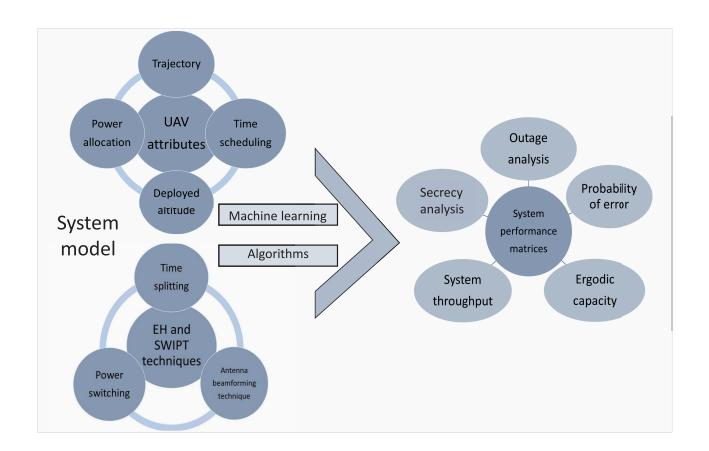

Fig. 22. Optimizing UAV and EH-based system model using ML techniques for better performance.

critical for the UAV-assisted EH-enabled communication networks as they allow optimal system performance. The optimization techniques widely utilized in the past few years can be classified into conventional and ML-based algorithms. The conventional methods are further grouped into exact, heuristics, and meta-heuristics algorithms, in which the heuristic algorithms, such as SCA, BCD, Dinkelbacks, etc, can yield sub-optimal solutions. Meta-heuristic algorithms, such as genetic, swarm intelligence, and trajectory-based algorithms, can simulate evolutionary processes to find optimal solutions with a fast convergence rate.

In contrast, exact or white-box optimization methods employ mathematical techniques to solve constrained or unconstrained problems. Examples of these algorithms include linear and nonlinear programming, integer and quadratic programming, and mixed-integer linear or nonlinear programming methods. A notable advantage of these techniques is their capability to offer a globally optimal solution to a given problem. Other parts of this section emphasize conventional optimization solutions depending on the nature of their formulated problem. However, as the complexity of the problem increases due to the dynamic trajectory of UAVs, mobility of TNs, varying harvested energy, and resource allocations, these conventional methods become inefficient.

As a result, ML algorithms have gained much research interest over the past years. ML is a set of algorithms that can learn from data without explicit programming. These algorithms analyze the patterns in large datasets and use this information to make predictions, identify trends, and solve complex problems. They are generally categorized based on the level and type of supervision they receive during training. These algorithms fall into six main categories: supervised learning, unsupervised learning, semi-supervised learning, deep learning (DL), reinforcement learning (RL), and federated learning (FL). These algorithms are a boon for UAVassisted EH-powered communication networks as they enable the nodes to choose the optimal values of different UAVs and system attributes efficiently. Moreover, UAV-assisted networks require intelligence and learning for effective decision-making and tackling multi-objective optimization of parameters [\[308\]](#page-55-0). These algorithms allow UAVs to dynamically select the best

| TABLE XX                                              |  |  |  |  |  |  |  |  |
|-------------------------------------------------------|--|--|--|--|--|--|--|--|
| RESEARCH WORKS ON EH IN UAV COMMUNICATIONS WITH ML/AI |  |  |  |  |  |  |  |  |

| Works | Model                                                                                           | Problem category and                                                          | Objectives of optimization problem        |                                          |                                           |                                        | Relaying, or           |
|-------|-------------------------------------------------------------------------------------------------|-------------------------------------------------------------------------------|-------------------------------------------|------------------------------------------|-------------------------------------------|----------------------------------------|---------------------------|
|       |                                                                                                 |                                                                               | Optimizing the flight trajectory | Optimizing the other attributes | Optimizing the system throughput | Optimizing the system outages | EH protocol               |
| [309] | Studied the UAV communication channel model for MIMO-NOMA networks                              | Convex (DL algorithm)                                                         | ✓                                         |                                          | ✓                                         | ✓                                      | Harvest- then-use      |
| [310] | Deep learning-aided technique to tackle terminal challenges of IoT                              | Non-convex (DL algorithm)                                                  |                                           |                                          | ✓                                         | ✓                                      | Harvest- then-use      |
| [311] | Energy-efficient FL for the UAV-assisted WPNs                                                   | Convex (FL algorithm)                                                      |                                           | ✓                                        | ✓                                         |                                        | Harvest- then-use      |
| [312] | Multi-agent DRL algorithm in the UAV-assisted D2D communication                                 | Non-convex (Multi-agent DRL algorithm)                                  |                                           |                                          | <b>√</b>                                  | <b>√</b>                               | PS,DF                     |
| [313] | Recharging centers and solar powered UAV network enhancing the sustained communication services | Non-convex (RL algorithm)                                                  | <b>√</b>                                  | <b>√</b>                                 | <b>√</b>                                  | <b>√</b>                               | Harvest- then-use      |
| [314] | Cognitive UAV-assisted network to boost offloading and spectrum efficiency                      | Non-convex (DRL algorithm)                                                 | ✓                                         | ✓                                        |                                           | <b>√</b>                               | Harvest- then-use      |
| [315] | Energy-constrained UAV-assisted D2D communication with continuous mobile users                  | Non-convex (DRL algorithm)                                                 |                                           | ✓                                        | ✓                                         | <b>√</b>                               | Harvest- then-use      |
| [316] | Rotary-wing UAV-enabled IoT communications with fly-hover-communicate protocol                  | Non-convex (Deep Deterministic Policy Gradient algorithm)            | <b>√</b>                                  | <b>√</b>                                 | <b>√</b>                                  | <b>√</b>                               | Fly-hover- communicate |
| [317] | UAV-enabled MEC network that serves multiple EH devices                                         | Convex (Derived the compact expressions)                                |                                           | <b>√</b>                                 |                                           | <b>√</b>                               | Harvest- then-use      |
| [318] | DRL-based resource allocation and trajectory design for UAV                                     | Non-convex (Lyapunov technique, DRL algorithm)                          | <b>√</b>                                  | <b>√</b>                                 | <b>√</b>                                  | <b>√</b>                               | Harvest- then-use      |
| [319] | Multi-UAV-based wireless chargers to provide sustainable power to large-scale WSNs              | Non-convex (Lyapunov technique, DRL algorithm)                          | <b>√</b>                                  | <b>√</b>                                 |                                           |                                        | Harvest- then-use      |
| [320] | Computational processing demands and energy consumption of human-centric metaverse applications | Non-convex (Multi-task DRL algorithm)                                   | <b>√</b>                                  | <b>√</b>                                 |                                           |                                        | Harvest- then-use      |
| [321] | UAV-enabled WPT system to power a set of SNs with unknown positions                             | Non-convex (Dynamic genetic clustering algorithm)                       | <b>√</b>                                  |                                          | <b>√</b>                                  |                                        | Harvest- then-use      |
| [322] | Laser-powered UAV-assisted data collection scheme with for SN's cluster                         | Non-convex (Logarithm kernel- based mean shift clustering algorithm) | <b>√</b>                                  |                                          |                                           |                                        | Harvest- then-use      |

routes, spectrum, and transmission power levels to improve reliability and reduce congestion. At the same time, these algorithms can also enhance EE by optimizing the allocation of resources, energy consumption and storage, and harvesting processes by analyzing data from dynamic communication conditions. Furthermore, in UAV-assisted WSNs and IoT, ML algorithms can proactively schedule maintenance activities by analyzing sensor data and usage patterns, thus reducing downtime and ensuring the longevity of the sensor and nodes.

Numerous research works [\[309\]](#page-55-1), [\[310\]](#page-55-2), [\[311\]](#page-55-3), [\[312\]](#page-55-4), [\[313\]](#page-55-5), [\[314\]](#page-55-6), [\[315\]](#page-55-7), [\[316\]](#page-55-8), [\[317\]](#page-55-9), [\[318\]](#page-55-10), [\[319\]](#page-55-11), [\[320\]](#page-55-12), [\[321\]](#page-55-13), [\[322\]](#page-55-14) have utilized ML algorithms to optimize the EH parameters and UAV's attributes to enhance the system's performance, as shown in Fig. [22.](#page-43-1) The works in [\[309\]](#page-55-1), [\[310\]](#page-55-2), [\[311\]](#page-55-3), [\[312\]](#page-55-4), [\[315\]](#page-55-7), [\[316\]](#page-55-8), [\[317\]](#page-55-9), [\[318\]](#page-55-10), [\[319\]](#page-55-11), [\[320\]](#page-55-12), [\[321\]](#page-55-13), [\[322\]](#page-55-14) have used the UAVs as the energy transmitter to drive the network components. In contrast, [\[313\]](#page-55-5), [\[314\]](#page-55-6) have utilized energyconstrained UAVs that leverage the transmitted signal from the network components and employ the EH technique to increase their battery life. These works are summarized in Table [XX,](#page-44-0) showing their research objectives, problem formation category, and solving techniques.

# *A. Contemporary Research Endeavors*

DL algorithms are designed to imitate the way the human brain processes information, forming artificial neural networks that enable them to handle complex tasks. These algorithms have advanced architecture with inherent feature extraction and representation abilities, which enables them to handle large amounts of data. As a result, they are suitable for specific applications that require processing of large amounts of data. Several studies [\[309\]](#page-55-1), [\[310\]](#page-55-2) presented AI/ML-based solutions to improve the performance and reliability of wireless networks, which benefit various industries and applications reliant on wireless communication. Specifically, Misra et al. [\[309\]](#page-55-1) proposed a DL-based UAV communication channel model for MIMO-NOMA networks for better link reliability and spectrum utilization. This work utilized taped delay line-driven layers to process the context and accurately capture CSI using the Jakes model. The model comprised several crucial layers, such as contextual processing, denoising, feature learning, recovery, and discrimination. These layers worked together to eliminate irrelevant data, identify essential features, eliminate noise and errors, and make precise predictions.

Utilizing UAV-assisted edge computing and satellite-based cloud computing can address the challenges of transmission latency and energy constraints faced by wireless-powered IoT devices. Focusing on this, Mao et al. [\[310\]](#page-55-2) considered processing the tasks of terrestrial IoT devices locally or offloading them to UAV-based edge servers or remote cloud servers through satellites. FL is another emerging method that utilizes multiple decentralized edge devices and servers without needing data exchange among these diverse entities. This enhances data privacy compared to DL algorithms. Furthermore, it accurately accounts for physical limitations, such as local accuracy requirements, location of the aerial FL server, local computing resources, and transmission time. In this line, Pham et al. [\[311\]](#page-55-3) proposed an energy-efficient FL algorithm for UAV-assisted WPRNs to tackle the nonconvexity and non-linearity of the energy usage minimization problem.

RL has gained significant popularity among ML algorithms in recent years. RL differs from supervised and unsupervised learning methods as it can make optimal decisions based on the learning perceived through the interaction with the environment without prior knowledge. These methods find their usefulness in time-varying system models involving mobile UAVs and nodes, dynamic traffic, varying power allocations, and other similar scenarios. Numerous research papers, including citenew6, IOT14, CR7, DD4, pow7, MECn5, trpn11, have utilized RL to make decisions regarding dynamic resource allocation and UAV-related aspects such as trajectory, flight duration, power consumption, etc. Moreover, the optimization problem of UAV-assisted D2D networks is challenging due to the non-linear characteristics of practical EH circuits and inter-cell interference. Additionally, to increase EE, selecting the optimal number of D2D pairs deployed in the UAVassisted D2D network's coverage area and the UAV's altitude is crucial. Ouamri et al. [\[312\]](#page-55-4) employed a multi-agent RL algorithm by defining a reward function in a UAV-assisted D2D network to tackle these challenges. Meanwhile, efficient off-policy and on-policy RL algorithms can design optimal UAV trajectories based on average data rate, overall energy usage, and IoT terminal coverage. Specifying this context, Zhang et al. [\[313\]](#page-55-5) studied the potential of UAV networks with recharging centers and solar power to provide consistent communication services while minimizing energy outages.

Deep reinforcement learning (DRL) algorithms have recently been preferred over RL algorithms as DRL methods leverage deep neural networks to handle complex and highdimensional data, facilitating automatic feature extraction. Therefore, based on their designed system model, different research studies have utilized these algorithms to counter real-time challenges. Notably, a DRL-based solution for UAVs can autonomously determine the optimal time duration for data collection and transmission, UAV trajectory, and network band selection for heterogeneous networks. This helps utilize UAV-facilitated D2D networks to significantly improve network performance and enhance user experience during public events. In this regard, Li et al. [\[314\]](#page-55-6) developed a cognitive network with the assistance of UAVs to improve offloading efficiency, increase spectrum availability, address traffic demand, and replenish energy.

Real-time challenges like continuous D2D user movement, time-variant CSI, limited energy, and UAV flight duration can be modeled using a random walk model based on DRL. This approach allows the system to adapt to changing conditions in real time, maximizing the network's EE and improving overall performance. In this direction, Nguyen et al. [\[315\]](#page-55-7) introduced a DRL-based optimal algorithm for scheduling EH duration for UAVs to support D2D communications. Further, multiobjective deep deterministic policy gradient algorithm agents can be trained to generate optimal policies by considering priority-based data collection, specified weight conditions, and preventing device data overflow. In this line, Yu et al. [\[316\]](#page-55-8) investigated a rotary-wing UAV-enabled wireless IoT network with practical propulsion power consumption and non-linear EH models. They incorporated an FD UAV, which exploits the 'fly-hover-communicate' protocol to access the IoT devices, collect the data from the desired IoT device, and charge other devices simultaneously.

Dynamic algorithms are essential to efficiently predict information on stochastic tasks and users' received energy by considering various EH devices in the network. In this context, Yang et al. proposed a technique for solving multistage stochastic programming problems in MEC networks for UAVs that serve multiple EH devices. When allocating bandwidth resources, UAV energy, and harvested energy, the Lyapunov optimization technique and Markov decision process can be used jointly for precise decision-making. Specifying this, Do et al. [\[318\]](#page-55-10) proposed a DRL-based resource allocation and trajectory design for the UAV that powers the energy-constrained user devices. Effective coordination among multi-UAV adaptive scheduling methods is crucial for meeting the varied energy needs of large-scale rechargeable WSNs [\[319\]](#page-55-11) and high-speed computational processing requirements [\[320\]](#page-55-12). DRL-based scheduling can efficiently handle complex coupling problems between energy allocation for individual UAVs and workload allocation for multiple SNs. Specifying this, Guo et al. [\[319\]](#page-55-11) employed a hierarchical decomposition framework to achieve an accurate payoff balance for multi-UAV-based wireless chargers to provide sustainable power to large-scale WSNs.

Recent works emphasized the importance of high-speed processing for developing mobile-based metaverse applications. Optimizing computational speed, EE, and user experience is crucial for providing seamless user experience in these applications. In this direction, Wang et al. [\[320\]](#page-55-12) aimed to tackle challenges associated with human-centric metaverse applications. They developed a multi-tasking DRL algorithm that considers the interconnected variables related to these applications. On the other hand, DRL-based clustering methods demonstrated significant potential as a solution for scenarios in which numerous devices are deployed in a specific region. The authors implemented DRL-based clusters in [\[321\]](#page-55-13) and [\[322\]](#page-55-14) to enhance scalability, decrease communication overhead, and ensure robustness in complicated environments. Specifically, utilizing a UAV motion control algorithm for localizing SNs and dynamic genetic clustering for power transfer to the SN cluster can minimize flight energy consumption while maximizing UAV energy utilization efficiency. In this regard, Shi et al. [\[321\]](#page-55-13) studied a UAV-based WPT system that aimed to power a group of sensors with unknown locations. Whereas Li et al. [\[322\]](#page-55-14) designed a laser-powered UAV-assisted data collection scheme with a logarithm kernel-based mean shift clustering algorithm to improve the power of the SN's cluster.

# *B. Key Insights of This Section*

- ML algorithms in EH-empowered UAV-aided communication networks can enable intelligent and adaptive network management and improve EE.
- These algorithms can also be applied to improve the reliability and performance of UAV communications by planning and optimizing UAVs' trajectories and task scheduling.
- The error in CSI arising from the node mobility and UAV trajectory can be estimated using highly precise multiagents using the Markov decision process.
- These algorithms can dynamically allocate communication resources to multiple users efficiently based on real-time network conditions, energy constraints, and QoS requirements.

# IX. FUTURE TRENDS FOR RESEARCH

In the preceding sections, we have examined the existing state-of-the-art technologies integrated with UAVs and powered by the EH technique, providing an initial grasp of the associated technology. Despite the potential benefits of integrating UAVs and EH techniques with futuregeneration paradigms, the research is still in its infant phases, with various unresolved problems that must be addressed. This section highlights relevant research topics for future paths and growth avenues in evolving network design.

# *A. AI Techniques for Enhanced UAV Communications*

The emerging AI techniques are envisioned to be utilized for modeling, designing, and intelligently operating the future cellular networks in concatenation with massive MIMO, NOMA, and mm-Wave communication techniques [\[323\]](#page-55-15). Considering the UAV communications enabled with EH, following AI employing fields are worth investigating;

- For the high mobility of UAVs, mobility management, trajectory design, and dynamic resource allocation.
- Lack of statistical model, which must be spatially consistent for channel modeling of the UAVs A2G channel operating at high frequencies and speed.

- Deployment of an intelligent terrestrial network to support the diverse aerial nodes in 3D space.
- Intelligent algorithms for the time-series prediction of fast-moving UAVs eliminate the requirement of acquiring high-frequency CSI.
- UAV's obstacle-aware trajectory optimization technique should be considered using accurate terrestrial user mobility models.

# *B. Practical Constraints in EH-Based UAV Communications*

Energy related issues impose many constrained in UAV communication scenarios, which can be effectively tackled with EH techniques. However, the SWIPT technique is significantly affected by hardware impairments, like quadrature phase or in-phase imbalances, phase noises, degraded hardware transceiver components, pilot contamination, nonlinearity of high-powered amplifiers, channel estimation errors, and outdated feedback [\[29\]](#page-48-28). In addition, EH receivers also suffer from poor EH efficiency, which can be improved using novel strategies like multiple antenna energy beamforming and scattered multi-point SWIPT. Further, analyzing and modeling the HI parameters along with the system model is an exciting research direction. Several practical design and deployment aspects of EH-aided UAV communication:

- Joint optimization strategies for obtaining the use case objectives through an effective trade-off between the number of drones, maximum radial coverage, power consumption, and EH factors.
- Scalable and configurable EH-employing UAVs-based network for meeting exponentially rising energyconstrained D2D and IoT demand with minimum outages and high fidelity and reliability [\[324\]](#page-55-16).
- • Integrating ML and AI-based algorithms to make UAVs more time-sensitive and data-intensive using inbuilt data filtering models to limit redundant or duplicate data transmissions.
- MEC-aided UAVs will enhance computing capability and payload, but at the same time, they require excessive energy. UAV on-board data processing is required to trade off with overall energy usage.
- Accurate modeling of both channel and the control link for vertical landing and take-off can strengthen the blockchain technology of UAVs in unfavorable conditions.
- Genetic topologies for EH in UAVs: Some optimal EH architecture topologies like autonomous harvesting architecture, hybrid harvesting architecture, and batterysupplemented harvesting architecture [\[23\]](#page-48-22) can improve the overall EE in EH-powered UAVs.

# *C. Collision Avoidance for UAV Swarms*

The cluster formed by UAV swarms can provide reliable wireless services to terrestrial devices over a large operating region. However, these connecting links suffer from outages due to high-speed mobility, disconnecting cooperative links due to collisions among UAVs. These link failures increase maintenance costs and operational time-lapse, thus degrading the performance of the network link. Moreover, collision avoidance among cooperative relaying UAVs is a crucial deployment challenge. For the complex and ever-increasing network frameworks, protocols' scalability and flexibility attributes can achieve more information exchange among HetNets.

# *D. HETNETs for Energy-Constrained Vehicular Communications*

Integrating vehicular networks and SATN offers improved data rates and coverage expansion in urban and suburban areas and congested regions. SATN requires new techniques for integrating terrestrial devices, airborne transceivers, seamless space-aided HetNets, and specific protocols for cross-layer interactions to upgrade the communication link. In the HetNets of SATN, the high mobility of UAVs and satellites will instantly change the state of the propagating channel due to the Doppler Effect and free space path losses. A sophisticated network model like Jake's mobility model can be leveraged to cope effectively with this inter connectivity drawback. Additionally, novel techniques like link scheduling and spectrum allocation can help provide high reliability and low latency in communication.

# *E. Security Threats in UAV-Assisted Networks*

The integrated network's open interfaces and dynamic network topologies are more prone to malicious intruders, like jamming, eavesdropping, spoofing, software attacks, manin-the-middle threats, etc. Several routing algorithms in the literature are proposed for tackling these attacks but fail to provide satisfactory and reliable secrecy performance. In UAV-assisted communication, security is crucial due to its unmanned nature and remote deployability; thus, it can be easily attacked or captured. Cyber-intrusions on the UAV controllers challenge their reliable utilization in defense and other strategic applications. AI and ML-based timely mechanisms, counter strategies, and PHY-security should be incorporated to mitigate these malicious cyber threats. Additionally, softwaredefined security algorithms and blockchain-based techniques can be leveraged for designing promising UAV topologies that are adaptive to use scenarios.

# *F. RIS-Aided UAV Cellular Communications*

RIS-equipped UAVs offer some desirable features, like configurable location and direction, 3D mobility, adaptive altitude, power-efficient beamforming, and ease of deployment that can enhance network coverage and reliability [\[325\]](#page-55-17). The adaptive altitude can be varied to obtain the RIS element's optimum phase adjustments to acquire the receiver's location. In practice, the maneuvering capabilities are constrained for a single RIS-embedded UAV, thus, more UAVs must be required for desired network performance. Although, the performance assessment of RIS-aided UAV communications has received a lot of attention in the literature. However, there are currently no optimizing techniques for deploying the RISs that enable UAV-assisted cellular communications in practical large-scale networks. The performance of these techniques should be evaluated under the large dimension of scenarios by using retracing and system-level simulators. The combination of RISs with the UAVs poses a challenging challenge, which may demand the adoption of learning-based schemes for jointly optimizing the UAV trajectories and the data adjustments made by the RISs.

# *G. Fog Architecture Design With MEC*

Integrating MEC servers with UAVs can significantly improve the data processing capability and latency of UAV networks. MEC devices possess more computational processing capacity and storage than UAVs, facilitating more rapid and effective communications. Consequently, MEC-enabled UAVs can accomplish more efficient navigation and accurate real-time decision-making, allowing them to follow their trajectories with higher precision and agility. However, MEC nodes are expensive due to the need for more storage and sophisticated infrastructure. On the other hand, fog networks can provide increased scalability, flexible adoption, reduced platform dependency, and lower latency, making them an alternative solution. A UAV-aided fog node can be created using multi-layer resourcing, which can help terrestrial users to offload their tasks. This approach reduces the amount of data that needs to be transmitted from the fog to the cloud, reducing latency and enhancing security by making task handling more independent. In certain situations, fog nodes can communicate and evenly assign computing tasks among themselves, which can help them share the offloaded operations. This approach minimizes the need to transfer data from fog to the cloud, improving spectral efficiency and data security. However, the current fog computing architecture doesn't support sharing resources and tasks between fog nodes, especially for the UAVmounted fog nodes, where certain nodes or access points may have higher workloads than others.

# *H. Learning Algorithms With UAV's SAR Applications*

UAVs embedded with high-resolution, high-fidelity cameras following the flexible trajectory provide better accessibility for SAR applications in the military and civilian domains. Additionally, the limitations of on-board power restricting the UAV's flight time are tackled by enabling EH techniques. However, serving the energy-constrained terrestrial IoT device or D2D networks with fewer deployed UAVs leads to less harvesting of energy. Thus, in these scenarios, ML techniques can be exploited by the UAV controllers to configure the UAVs to select the optimum 3D trajectory and hovering altitude adaptively [\[326\]](#page-55-18). In order to accurately locate unpredictable objects in SAR applications, data sensing, and estimating unpredictable trajectories with minimal latency, ML benefits from environment-based training. For jointly optimizing the operating altitude, 3D location, and effective trajectory planning of the UAVs for future communication networks, effective learning-based algorithms are essential.

# X. CONCLUSION

UAVs and EH techniques are promising and timely topics that offer seamless benefits in vast wireless application scenarios and satisfy the upsurge in connectivity demands. This work provided a comprehensive overview of the current state of the art on UAV-assisted communications with EH in different scenarios. First, we presented the detailed taxonomy of UAVs and the various challenges in integrating UAVs with existing wireless networks. A thorough exploration of the UAV's design parameters and energy budget has been performed, which lays a strong background for future research in this area. Next, we discussed and compared the EH techniques based on their benefits, drawbacks, and operating scenarios. Then, we focused on the implementation and modeling aspects of EH and UAV-assisted communication networks under composite A2G channel conditions and provided important insights into the system's performance. Further, we offered extended coverage of EH and UAV-aided communication integrated with emerging and potential techniques to enhance the network's performance. This work also explored the optimization techniques utilized for UAVs' operations like trajectory, power allocation, and flight time to improve overall IT rate, coverage probability, link reliability, etc., and reduce power consumption. Lastly, we unearthed various exciting future trends that will be an inspiring source for researchers regarding energy-efficient future generation perspectives.

# REFERENCES

- [\[1\]](#page-0-1) M. Mozaffari, W. Saad, M. Bennis, Y.-H. Nam, and M. Debbah, "A tutorial on UAVs for wireless networks: Applications, challenges, and open problems," *IEEE Commun. Surveys Tuts.*, vol. 21, no. 3, pp. 2334–2360, 3rd Quart., 2019.
- [\[2\]](#page-0-2) M. M. Azari, G. Geraci, A. Garcia-Rodriguez, and S. Pollin, "UAVto-UAV communications in cellular networks," *IEEE Trans. Wireless Commun.*, vol. 19, no. 9, pp. 6130–6144, Sep. 2020.
- [\[3\]](#page-0-2) F. Al-Turjman, "A novel approach for drones positioning in mission critical applications," *Trans. Emerg. Telecommun. Tech.*, vol. 33, no. 3, Apr. 2019, Art. no. e3603.
- [\[4\]](#page-0-3) S. Chen, S. Sun, G. Xu, X. Su, and Y. Cai, "Beam-space multiplexing: Practice, theory, and trends, from 4G TD-LTE, 5G, to 6G and beyond," *IEEE Wireless Commun.*, vol. 27, no. 2, pp. 162–172, Apr. 2020.
- [\[5\]](#page-0-4) (Ericson, Stockholm, Sweden). *Ericsson Mobility Report (2023-2029)*. Nov. 2023. [Online]. Available: https://www.ericsson.com/en/reportsand-papers/mobility-report/reports
- [\[6\]](#page-0-5) (IMARC, Uttar Pradesh, India). *Global Machine-to-Machine (M2M) Connections Market Analysis*. 2023. [Online]. Available: https://www.imarcgroup.com/machine-to-machine-connections-market
- [\[7\]](#page-0-6) S. Chen, Y.-C. Liang, S. Sun, S. Kang, W. Cheng, and M. Peng, "Vision, requirements, and technology trend of 6G: How to tackle the challenges of system coverage, capacity, user data-rate and movement speed," *IEEE Wireless Commun.*, vol. 27, no. 2, pp. 218–228, Apr. 2020.
- [\[8\]](#page-0-7) C. Yan, Z. Peiying, and T. Wen (Huawei, Shenzhen, China). *ITU-R WP5D Completed the Recommendation Framework for IMT-2030 (global 6G vision)*. Jun. 2023. [Online]. Available: https://www.huawei.com/en/huaweitech/future-technologies
- [\[9\]](#page-1-1) D. Zhou, M. Sheng, J. Li, and Z. Han, "Aerospace integrated networks innovation for empowering 6G: A survey and future challenges," *IEEE Commun. Surveys Tuts.*, vol. 25, no. 2, pp. 975–1019, 2nd Quart., 2023.
- [\[10\]](#page-1-2) M. Abo-Zeed, J. B. Din, I. Shayea, and M. Ergen, "Survey on land mobile satellite system: Challenges and future research trends," *IEEE Access*, vol. 7, pp. 137291–137304, 2019.
- [\[11\]](#page-2-1) A. Shafique, A. Mehmood, and M. Elhadef, "Survey of security protocols and vulnerabilities in unmanned aerial vehicles," *IEEE Access*, vol. 9, pp. 46927–46948, 2021.
- [\[12\]](#page-2-2) A. A. Khuwaja, Y. Chen, N. Zhao, M.-S. Alouini, and P. Dobbins, "A survey of channel modeling for UAV communications," *IEEE Commun. Surveys Tuts.*, vol. 20, no. 4, pp. 2804–2821, 4th Quart., 2018.
- [\[13\]](#page-2-3) P. Chini, G. Giambene, and S. Kota, "A survey on mobile satellite systems," *Int. J. Satell. Commun. Netw.*, vol. 28, no. 1, pp. 29–57, 2010.
- [\[14\]](#page-2-4) S. Ulukus et al., "Energy harvesting wireless communications: A review of recent advances," *IEEE J. Select. Areas Commun.*, vol. 33, no. 3, pp. 360–381, Mar. 2015.

- [\[15\]](#page-2-5) Y. He, X. Cheng, W. Peng, and G. L. Stuber, "A survey of energy harvesting communications: Models and offline optimal policies," *IEEE Commun. Mag.*, vol. 53, no. 6, pp. 79–85, Jun. 2015.
- [\[16\]](#page-3-0) X. Cao, P. Yang, M. Alzenad, X. Xi, D. Wu, and H. Yanikomeroglu, "Airborne communication networks: A survey," *IEEE J. Select. Areas Commun.*, vol. 36, no. 9, pp. 1907–1926, Sep. 2018.
- [\[17\]](#page-3-1) H. Shakhatreh et al., "Unmanned aerial vehicles (UAVs): A survey on civil applications and key research challenges," *IEEE Access*, vol. 7, pp. 48572–48634, 2019.
- [\[18\]](#page-3-2) A. Fotouhi et al., "Survey on UAV cellular communications: Practical aspects, standardization advancements, regulation, and security challenges," *IEEE Commun. Surveys Tuts.*, vol. 21, no. 4, pp. 3417–3442, 4th Quart., 2019.
- [\[19\]](#page-3-3) W. Khawaja, I. Guvenc, D. W. Matolak, U.-C. Fiebig, and N. Schneckenburger, "A survey of air-to-ground propagation channel modeling for unmanned aerial vehicles," *IEEE Commun. Surveys Tuts.*, vol. 21, no. 3, pp. 2361–2391, 3rd Quart., 2019.
- [\[20\]](#page-3-4) Z. Ullah, F. Al-Turjman, and L. Mostarda, "Cognition in UAV-aided 5G and beyond communications: A survey," *IEEE Trans. Cogn. Commun. Netw.*, vol. 6, no. 3, pp. 872–891, Sep. 2020.
- [\[21\]](#page-3-5) D. Ma, G. Lan, M. Hassan, W. Hu, and S. K. Das, "Sensing, computing, and communications for energy harvesting IoTs: A survey," *IEEE Commun. Surveys Tuts.*, vol. 22, no. 2, pp. 1222–1250, 2nd Quart., 2020.
- [\[22\]](#page-3-6) A. J. Williams, M. F. Torquato, I. M. Cameron, A. A. Fahmy, and J. Sienz, "Survey of energy harvesting technologies for wireless sensor networks," *IEEE Access*, vol. 9, pp. 77493–77510, 2021.
- [\[23\]](#page-3-7) A. Padhy, S. Joshi, S. Bitragunta, V. Chamola, and B. Sikdar, "A survey of energy and spectrum harvesting technologies and protocols for next generation wireless networks," *IEEE Access*, vol. 9, pp. 1737–1769, 2021.
- [\[24\]](#page-3-8) Z. Xiao et al., "A survey on Millimeter-wave beamforming enabled UAV communications and networking," *IEEE Commun. Surveys Tuts.*, vol. 24, no. 1, pp. 557–610, 1st Quart., 2022.
- [\[25\]](#page-3-9) Z. Wei et al., "UAV-assisted data collection for Internet of Things: A survey," *IEEE Internet Things J.*, vol. 9, no. 17, pp. 15460–15483, Sep. 2022.
- [\[26\]](#page-3-10) G. Geraci, A. Garcia-Rodriguez, M. M. Azari, and A. Lozano, "What will the future of UAV cellular communications be? A flight from 5G to 6G," *IEEE Commun. Surveys Tuts.*, vol. 24, no. 3, pp. 1304–1335, 3rd Quart., 2022.
- [\[27\]](#page-4-1) X. Wei, Z. Yi, W. Li, L. Zhao, and W. Zhang, "Energy harvesting fueling the revival of self-powered unmanned aerial vehicles," *Energy Convers. Manage.*, vol. 283, May 2023, Art. no. 116863.
- [\[28\]](#page-4-2) A. Abubakar et al., "A survey on energy optimization techniques in UAV-based cellular networks: From conventional to machine learning approaches," *Drones*, vol. 7, no. 3, p. 214, Mar. 2023.
- [\[29\]](#page-4-3) H. Jin et al., "A survey of energy efficient methods for UAV communication," *Veh. Commun.*, vol. 41, Jun. 2023, Art. no. 100594.
- [\[30\]](#page-4-4) T. Ojha, T. P. Raptis, A. Passarella, and M. Conti, "Wireless power transfer with unmanned aerial vehicles: State of the art and open challenges," *Pervasive Mobile Comput.*, vol. 93, Jun. 2023, Art. no. 101820.
- [\[31\]](#page-4-5) O. Amodu, R. Nordin, C. Jarray, U. Bukar, R. Raja Mahmood, and M. Othman, "A survey on the design aspects and opportunities in ageaware UAV-aided data collection for sensor networks and Internet of Things applications," *Drones*, vol. 7, no. 4, p. 260, Apr. 2023.
- [\[32\]](#page-4-6) M. C. Mayarakaca and B. M. Lee, "A survey on non-orthogonal multiple access for unmanned aerial vehicle networks: Machine learning approach," *IEEE Access*, vol. 12, pp. 51138–51165, 2024.
- [\[33\]](#page-5-2) L. Tang and G. Shao, "Drone remote sensing for forestry research and practices," *J. Forestry Res.*, vol. 26, pp. 791–797, Jun. 2015.
- [34] *Front Matter*. Hoboken, NJ, USA: Wiley, pp. 1–25. Accessed: May 14, 2024. [Online]. Available: https://onlinelibrary.wiley.com
- [35] A. Al-Hourani and K. Gomez, "Modeling cellular-to-UAV path-loss for suburban environments," *IEEE Wireless Commun. Lett.*, vol. 7, no. 1, pp. 82–85, Feb. 2018.
- [36] S. Sekander, H. Tabassum, and E. Hossain, "Multi-tier drone architecture for 5G/B5G cellular networks: Challenges, trends, and prospects," *IEEE Commun. Mag.*, vol. 56, no. 3, pp. 96–103, Mar. 2018.
- [37] H. Wang, G. Ding, F. Gao, J. Chen, J. Wang, and L. Wang, "Power control in UAV-supported ultra dense networks: Communications, caching, and energy transfer," *IEEE Commun. Mag.*, vol. 56, no. 6, pp. 28–34, Jun. 2018.
- [\[38\]](#page-6-2) M. Ding, P. Wang, D. Lopez-Perez, G. Mao, and Z. Lin, "Performance impact of LoS and NLoS transmissions in dense cellular networks," *IEEE Trans. Wireless Commun.*, vol. 15, no. 3, pp. 2365–2380, Mar. 2016.

- [\[39\]](#page-7-0) T. Ding, M. Ding, G. Mao, Z. Lin, D. Lopez-Perez, and A. Y. Zomaya, "Uplink performance analysis of dense cellular networks with LoS and NLoS transmissions," *IEEE Trans. Wireless Commun.*, vol. 16, no. 4, pp. 2601–2613, Apr. 2017.
- [\[40\]](#page-7-0) M. Ding and D. Lopez Perez, "Please lower small cell antenna heights in 5G," in *Proc. IEEE Global Commun. Conf. (GLOBECOM)*, 2016, pp. 1–6.
- [\[41\]](#page-7-1) M. Ding and D. Lopez-Perez, "Performance impact of base station antenna heights in dense cellular networks," *IEEE Trans. Wireless Commun.*, vol. 16, no. 12, pp. 8147–8161, Dec. 2017.
- [\[42\]](#page-7-2) M. Dudek, P. Tomczyk, P. Wygonik, M. Korkosz, P. Bogusz, and B. Lis, "Hybrid fuel cell-battery system as a main power unit for small unmanned aerial vehicles (UAV)," *Int. J. Electrochem. Sci.*, vol. 8, pp. 8442–8463, Jun. 2013.
- [\[43\]](#page-7-3) V. U. Pai and B. Sainath, "UAV selection and link switching policy for hybrid tethered UAV-assisted communication," *IEEE Commun. Lett.*, vol. 25, no. 7, pp. 2410–2414, Jul. 2021.
- [\[44\]](#page-7-4) A. S. Abdalla and V. Marojevic, "Communications standards for unmanned aircraft systems: The 3GPP perspective and research drivers," *IEEE Commun. Stand. Mag.*, vol. 5, no. 1, pp. 70–77, Mar. 2021.
- [\[45\]](#page-7-5) R. Bajracharya, R. Shrestha, S. Kim, and H. Jung, "6G NR-U based wireless infrastructure UAV: Standardization, opportunities, challenges and future scopes," *IEEE Access*, vol. 10, pp. 30536–30555, 2022.
- [\[46\]](#page-7-6) "Release 17 description; summary of Rel-17 work items; (Release 17)," 3GPP, Sophia Antipolis, France, Rep. TR 21.917, 2020. [Online]. Available: https://www.3gpp.org/specificationstechnologies/releases/release-17
- [\[47\]](#page-7-7) "5G unmanned aerial system (UAS) support in 3GPP; (Release 16), 3GPP, Sophia Antipolis, France, ETSI TS 22.125, 2022. [Online]. Available: https://standards.iteh.ai/catalog/standards
- [\[48\]](#page-7-8) "6G and beyond drones; (Release 18)," 3GPP, Sophia Antipolis, France, Rep. TR 21.918, 2021. [Online]. Available: https://www.3gpp.org/specifications-technologies/releases/release-18
- [\[49\]](#page-7-9) (Ericsson, Stockholm, Sweden). *An Overview of 3GPP Releases 17 and 18*. 2021. [Online]. Available: https://www.ericsson.com
- [\[50\]](#page-7-10) (Ericson, Stockholm, Sweden). *The Sky is Not the Limit: The Past, Present, and Future of the Internet of Drones*. 2021. [Online]. Available: https://www.ericsson.com/en/blog/2021/6/internetof-drones-sky-isnot-the-limit
- [\[51\]](#page-9-1) "UAV market report code-as 2802." Sep. 2022. [Online]. Available: https://www.marketsandmarkets.com
- [\[52\]](#page-9-2) W. Ejaz, M. A. Azam, S. Saadat, F. Iqbal, and A. Hanan, "Unmanned aerial vehicles enabled IoT platform for disaster management," *Energies*, vol. 12, no. 14, p. 2706, 2019. [Online]. Available: https://www.mdpi.com/1996-1073/12/14/2706
- [\[53\]](#page-9-2) B. Li, Z. Fei, and Y. Zhang, "UAV communications for 5G and beyond: Recent advances and future trends," *IEEE Internet Things J.*, vol. 6, no. 2, pp. 2241–2263, Apr. 2019.
- [\[54\]](#page-9-3) H.-Y. Liu et al., "Drone-based entanglement distribution towards mobile quantum networks," *Nat. Sci. Rev.*, vol. 7, no. 5, pp. 921–928, Jan. 2020.
- [\[55\]](#page-9-4) "Google's loon project." Jul. 2019. [Online]. Available: https://loon.com/
- [\[56\]](#page-9-5) "Amazon prime air project for parcel delivery." 2019. [Online]. Available: https://www.amazon.com/Amazon-Prime-Air
- [\[57\]](#page-9-6) "Nokia 5G! drones project." Jul. 2019. [Online]. Available: https://5gppp.eu/5gdrones/
- [\[58\]](#page-9-6) (ZDNET, New York, NY, USA). *Qualcomm and AT and T Project About UAVs Utilization for Next Generation Wireless Communications*. May 2019. [Online]. Available: https://www.zdnet.com/article
- [\[59\]](#page-9-7) (Cordis Corp., Hialeah, FL, USA). *Smart Device Communication: A Paradigm for High Performance Future Mobile Networking*. 2019. [Online]. Available: https://cordis.europa.eu/project/id/670896
- [\[60\]](#page-9-8) (Nokia, Espoo, Finland). *F-cell Technology from Nokia Bell Labs Revolutionizes Small Cell Deployment by Cutting Wires, Costs and Time*. Oct. 2016. [Online]. Available: https://www.nokia.com/news/releases
- [\[61\]](#page-9-9) (Eng. Meta, Menlo Park, CA, USA). *Building Communications Networks in the Stratosphere*. Jun. 2016. [Online]. Available: https://engineering.fb.com/2015/07/30
- [\[62\]](#page-9-9) (Spectrum, Stamford, CT, USA). *Facebook Aims to Remake Telecom with Millimeter Waves and Tether-Tennas*. Apr. 2017. [Online]. Available: https://spectrum.ieee.org
- [\[63\]](#page-9-10) "Connected aerial vehicle live." Dec. 2021. [Online]. Available: https://www.huawei.com

- [\[64\]](#page-9-11) X. Kang, Y.-C. Liang, and J. Yang, "Riding on the primary: A new spectrum sharing paradigm for wireless-powered IoT devices," *IEEE Trans. Wireless Commun.*, vol. 17, no. 9, pp. 6335–6347, Sep. 2018.
- [\[65\]](#page-9-12) M. Mozaffari, X. Lin, and S. Hayes, "Toward 6G with connected sky: UAVs and beyond," *IEEE Commun. Mag.*, vol. 59, no. 12, pp. 74–80, Dec. 2021.
- [\[66\]](#page-10-0) C. Liu, M. Ding, C. Ma, Q. Li, Z. Lin, and Y.-C. Liang, "Performance analysis for practical unmanned aerial vehicle networks with LoS/NLoS transmissions," in *Proc. IEEE Int. Conf. Commun. Works. (ICC Workshops)*, 2018, pp. 1–6.
- [\[67\]](#page-10-1) A. Merwaday and I. Guvenc, "UAV assisted heterogeneous networks for public safety communications," in *Proc. IEEE Wireless Commun. Netw. Conf. Works. (WCNCW)*, 2015, pp. 329–334.
- [\[68\]](#page-10-1) S. Rohde, M. Putzke, and C. Wietfeld, "Ad hoc self-healing of OFDMA networks using UAV-based relays," *Ad Hoc Netw.*, vol. 11, no. 7, pp. 1893–1906, 2013.
- [\[69\]](#page-10-1) B. Galkin, J. Kibilda, and L. A. DaSilva, "Deployment of UAVmounted access points according to spatial user locations in two-tier cellular networks," in *Proc. Wireless Days (WD)*, 2016, pp. 1–6.
- [\[70\]](#page-10-1) R. I. Bor-Yaliniz, A. El-Keyi, and H. Yanikomeroglu, "Efficient 3D placement of an aerial base station in next generation cellular networks," in *Proc. IEEE Int. Conf. Commun. (ICC)*, 2016, pp. 1–5.
- [\[71\]](#page-10-1) M. Mozaffari, W. Saad, M. Bennis, and M. Debbah, "Optimal transport theory for power-efficient deployment of unmanned aerial vehicles," in *Proc. IEEE Int. Conf. Commun. (ICC)*, 2016, pp. 1–6.
- [\[72\]](#page-10-1) J. Kosmerl and A. Vilhar, "Base stations placement optimization in wireless networks for emergency communications," in *Proc. IEEE Int. Conf. Commun. Workshop (ICC)*, 2014, pp. 200–205.
- [\[73\]](#page-10-1) J. Lyu, Y. Zeng, R. Zhang, and T. J. Lim, "Placement optimization of UAV-mounted mobile base stations," *IEEE Commun. Lett.*, vol. 21, no. 3, pp. 604–607, Mar. 2017.
- [\[74\]](#page-10-1) Z. Feng, M. Huang, D. Wu, E. Q. Wu, and C. Yuen, "Multi-agent reinforcement learning with policy clipping and average evaluation for UAV-assisted communication Markov game," *IEEE Trans. Intell. Transp. Syst.*, vol. 24, no. 12, pp. 14281–14293, Dec. 2023.
- [\[75\]](#page-10-1) M. Misbah, Z. Kaleem, W. Khalid, C. Yuen, and A. Jamalipour, "Phase and 3-D placement optimization for rate enhancement in RISassisted UAV networks," *IEEE Wireless Commun. Letts.*, vol. 12, no. 7, pp. 1135–1138, Jul. 2023.
- [\[76\]](#page-10-1) Z. Kaleem, W. Khalid, A. Muqaibel, A. A. Nasir, C. Yuen, and G. K. Karagiannidis, "Learning-aided UAV 3D placement and power allocation for sum-capacity enhancement under varying altitudes," *IEEE Commun. Lett.*, vol. 26, no. 7, pp. 1633–1637, Jul. 2022.
- [\[77\]](#page-10-1) X. Sun and N. Ansari, "Jointly Optimizing drone-mounted base station placement and user association in heterogeneous networks," in *Proc. IEEE Int. Conf. Commun. (ICC)*, 2018, pp. 1–6.
- [\[78\]](#page-10-2) R.-L. Liu, Z. Zhang, Y.-F. Jiao, C.-H. Yang, and W.-J. Zhang, "Study on flight performance of propeller-driven UAV," *Int. J. Aerosp. Eng.*, vol. 2019, pp. 1–11, Apr. 2019.
- [\[79\]](#page-11-1) S.-F. Chou, T.-C. Chiu, Y.-J. Yu, and A.-C. Pang, "Mobile small cell deployment for next generation cellular networks," in *Proc. IEEE Global Commun. Conf.*, 2014, pp. 4852–4857.
- [\[80\]](#page-11-2) A. Fotouhi, M. Ding, and M. Hassan, "Dynamic base station repositioning to improve spectral efficiency of drone small cells," in *Proc. IEEE 18th Int. Symp. World Wireless, Mobile Multimedia Net. (WoWMoM)*, 2017, pp. 1–9.
- [\[81\]](#page-11-2) M. Ding, A. Fotouhi, and M. Hassan, "Dynamic base station repositioning to improve performance of drone small cells," in *Proc. IEEE GLOBECOM Worksohps. (GC Wkshps)*, 2016, pp. 1–6.
- [\[82\]](#page-11-2) S. Zhang, Y. Zeng, and R. Zhang, "Cellular-enabled UAV communication: A connectivity-constrained trajectory optimization perspective," *IEEE Trans. Commun.*, vol. 67, no. 3, pp. 2580–2604, Mar. 2019.
- [\[83\]](#page-11-2) J. Lyu, Y. Zeng, and R. Zhang, "UAV-aided offloading for cellular Hotspot," *IEEE Trans. Wireless Commun.*, vol. 17, no. 6, pp. 3988–4001, Jun. 2018.
- [\[84\]](#page-11-3) J. Zhao, F. Gao, G. Ding, T. Zhang, W. Jia, and A. Nallanathan, "Integrating communications and control for UAV systems: Opportunities and challenges," *IEEE Access*, vol. 6, pp. 67519–67527, 2018.
- [\[85\]](#page-11-3) Y. Qu, J. Wu, B. Xiao, and D. Yuan, "A fault-tolerant cooperative positioning approach for multiple UAVs," *IEEE Access*, vol. 5, pp. 15630–15640, 2017.
- [\[86\]](#page-11-3) L. Ruan et al., "Energy-efficient multi-UAV coverage deployment in UAV networks: A game-theoretic framework," *China Commun.*, vol. 15, no. 10, pp. 194–209, 2018.

- [\[87\]](#page-11-3) T. Chen, Q. Gao, and M. Guo, "An improved multiple UAVs cooperative flight algorithm based on leader follower strategy," in *Proc. Chin. Control Decis. Conf. (CCDC)*, 2018, pp. 165–169.
- [\[88\]](#page-11-3) Y. H. Tan, S. Lai, K. Wang, and B. M. Chen, "Cooperative heavy lifting using unmanned multi-agent systems," in *Proc. IEEE 14th Int. Conf. Control Autom. (ICCA)*, 2018, pp. 1119–1126.
- [\[89\]](#page-11-3) P. de Sousa Paula, M. F. de Castro, G. A. L. Paillard, and W. W. F. Sarmento, "A swarm solution for a cooperative and selforganized team of UAVs to search targets," in *Proc. 8th Eur. Am. Conf. Telemat. Inf. Syst. (EATIS)*, 2016, pp. 1–8.
- [\[90\]](#page-11-3) M. Hassan, A. Fotouhi, and M. Ding, "Service on demand: Drone base stations cruising in the cellular network," in *Proc. IEEE GLOBECOM Workshops*, 2017, pp. 1–6.
- [\[91\]](#page-11-4) M. Aboulhassan, A. Abd El-Malek, A. Salhab, and S. Zummo, "Performance analysis and path-planning for self-energized UAVassisted relay networks," *IEEE Trans. Aerosp. Electron. Syst.*, vol. 60, no. 1, pp. 907–917, Feb. 2024.
- [\[92\]](#page-11-5) M. Mozaffari, W. Saad, M. Bennis, and M. Debbah, "Drone small cells in the clouds: Design, deployment and performance analysis," in *Proc. IEEE Global Commun. Conf. (GLOBECOM)*, 2015, pp. 1–6.
- [\[93\]](#page-11-5) W. Saad, M. Mozaffari, M. Bennis, and M. Debbah, "Efficient deployment of multiple unmanned aerial vehicles for optimal wireless coverage," *IEEE Commun. Lett.*, vol. 20, no. 8, pp. 1647–1650, Aug. 2016.
- [\[94\]](#page-11-5) H. Claussen, "Autonomous self-deployment of wireless access networks," *Bell Labs Tech. J.*, vol. 14, no. 1, pp. 55–71, 2009.
- [\[95\]](#page-11-6) M. Mozaffari, W. Saad, M. Bennis, and M. Debbah, "Unmanned aerial vehicle with underlaid device-to-device communications: Performance and tradeoffs," *IEEE Trans. Wireless Commun.*, vol. 15, no. 6, pp. 3949–3963, Jun. 2016.
- [\[96\]](#page-11-6) K. Li, W. Ni, X. Wang, R. P. Liu, S. S. Kanhere, and S. Jha, "Energyefficient cooperative relaying for unmanned aerial vehicles," *IEEE Trans. Mob. Comp.*, vol. 15, no. 6, pp. 1377–1386, Jun. 2016.
- [\[97\]](#page-11-6) A. E. Abdulla, Z. M. Fadlullah, H. Nishiyama, N. Kato, F. Ono, and R. Miura, "An optimal data collection technique for improved utility in UAS-aided networks," in *Proc. IEEE INFOCOM Conf. Comput. Commun.*, 2014, pp. 736–744.
- [\[98\]](#page-11-7) A. E. A. A. Abdulla, Z. M. Fadlullah, H. Nishiyama, N. Kato, F. Ono, and R. Miura, "Toward fair maximization of energy efficiency in multiple UAS-aided networks: A game-theoretic methodology," *IEEE Trans. Wireless Commun.*, vol. 14, no. 1, pp. 305–316, Jan. 2015.
- [\[99\]](#page-11-7) S. Koulali, E. Sabir, T. Taleb, and M. Azizi, "A green strategic activity scheduling for UAV networks: A sub-modular game perspective," *IEEE Commun. Mag.*, vol. 54, no. 5, pp. 58–64, May 2016.
- [\[100\]](#page-11-7) S. Kandeepan, K. Gomez, L. Reynaud, and T. Rasheed, "Aerialterrestrial communications: Terrestrial cooperation and energy-efficient transmissions to aerial base stations," *IEEE Trans. Aerosp. Electron. Syts.*, vol. 50, no. 4, pp. 2715–2735, Oct. 2014.
- [\[101\]](#page-12-2) D. Zorbas, T. Razafindralambo, L. Di Puglia Pugliese, and F. Guerriero, "Energy efficient mobile target tracking using flying drones," *Procedia Comput. Sci.*, vol. 19, pp. 80–87, Jun. 2013.
- [\[102\]](#page-12-3) L. Di Puglia Pugliese, F. Guerriero, D. Zorbas, and T. Razafindralambo, "Modelling the mobile target covering problem using flying drones," *Opt. Lett.*, vol. 10, no. 5, p. 29, Jan. 2016. [Online]. Available: https://hal.inria.fr/hal-01187118
- [\[103\]](#page-12-4) Y. Zeng, J. Xu, and R. Zhang, "Energy minimization for wireless communication with rotary-wing UAV," *IEEE Trans. Wireless Commun.*, vol. 18, no. 4, pp. 2329–2345, Apr. 2019.
- [\[104\]](#page-12-4) Y. Zeng and R. Zhang, "Energy-efficient UAV communication with trajectory optimization," *IEEE Trans. Wireless Commun.*, vol. 16, no. 6, pp. 3747–3760, Jun. 2017.
- [\[105\]](#page-12-5) S.-J. Yoo, J.-H. Park, S.-H. Kim, and A. P. Shrestha, "Flying path optimization in UAV-assisted IoT sensor networks," *ICT Exp.*, vol. 2, no. 3, pp. 140–144, Aug. 2016.
- [\[106\]](#page-12-5) C. Di Franco and G. Buttazzo, "Energy-aware coverage path planning of UAVs," in *Proc. IEEE Int. Conf. Auton. Rob. Sys. Compet.*, 2015, pp. 111–117.
- [\[107\]](#page-12-5) M. Torres, D. Pelta, J. L. Verdegay, and J. C. Torres, "Coverage path planning with unmanned aerial vehicles for 3D terrain reconstruction," *Expert Syst. Appl.*, vol. 55, pp. 441–451, Feb. 2016.
- [\[108\]](#page-12-5) E. Yanmaz, R. Kuschnig, M. Quaritsch, C. Bettstetter, and B. Rinner, "On path planning strategies for networked unmanned aerial vehicles," in *Proc. IEEE Conf. Comp. Commun. Workshops (INFOCOM WKSHPS)*, 2011, pp. 212–216.
- [\[109\]](#page-13-1) Y. Li and L. Cai, "UAV-assisted dynamic coverage in a heterogeneous cellular system," *IEEE Netw.*, vol. 31, no. 4, pp. 56–61, Jul./Aug. 2017.

- [\[110\]](#page-13-2) A. Almohamad, M. O. Hasna, T. Khattab, and M. Haouari, "Maximizing dense network flow through wireless multihop backhauling using UAVs," in *Proc. Int. Conf. Inf. Commun. Technol.*, 2018, pp. 526–531.
- [\[111\]](#page-13-2) L. Ji, J. Chen, and Z. Feng, "Spectrum allocation and performance analysis for backhauling of UAV assisted cellular network," *China Commun.*, vol. 16, no. 8, pp. 83–92, Aug. 2019.
- [\[112\]](#page-13-2) A. Bonfante et al., "5G massive MIMO architectures: Self-backhauled small cells versus direct access," *IEEE Trans. Veh. Tech.*, vol. 68, no. 10, pp. 10003–10017, Oct. 2019.
- [\[113\]](#page-13-2) Y. Chen, N. Zhao, Z. Ding, and M.-S. Alouini, "Multiple UAVs as relays: Multi-hop single link versus multiple dual-hop links," *IEEE Trans. Wireless Commun.*, vol. 17, no. 9, pp. 6348–6359, Sep. 2018.
- [\[114\]](#page-13-2) A. Fouda, A. S. Ibrahim, I. Guvenc, and M. Ghosh, "UAV-based inband integrated access and backhaul for 5G communications," in *Proc. IEEE 88th Veh. Technol. Conf.*, 2018, pp. 1–5.
- [\[115\]](#page-13-3) Y. Zeng, Q. Wu, and R. Zhang, "Accessing from the sky: A tutorial on UAV communications for 5G and beyond," *Proc. IEEE*, vol. 107, no. 12, pp. 2327–2375, Dec. 2019.
- [\[116\]](#page-14-1) A. Thakre, A. Kumar, H.-C. Song, D.-Y. Jeong, and J. Ryu, "Pyroelectric energy conversion and its applications—Flexible energy harvesters and sensors," *Sensors*, vol. 19, no. 9, p. 2170, 2019. [Online]. Available: https://www.mdpi.com/1424-8220/19/9/2170
- [\[117\]](#page-14-1) K. Williams and A. Qouneh, "Internet of Things: Solar array tracker," in *Proc. IEEE 60th Int. Midwest Symp. Circuit Syst. (MWSCAS)*, 2017, pp. 1057–1060.
- [\[118\]](#page-14-1) V. Milichko et al., "Solar photovoltaics: Current state and trends," *Phys.-Uspekhi*, vol. 59, no. 8, p. 727, Aug. 2016.
- [\[119\]](#page-14-1) S. Mousavi, E. Mostafavi, and P. Jiao, "Next generation prediction model for daily solar radiation on horizontal surface using a hybrid neural network and simulated annealing method," *Energy Consum. Manag.*, vol. 153, pp. 671–682, Dec. 2017.
- [\[120\]](#page-14-1) J. Ryu et al., "Ubiquitous magneto-mechano-electric generator," *Energy Environ. Sci.*, vol. 8, pp. 2402–2408, Apr. 2015.
- [\[121\]](#page-14-1) B. Xiong, F. Meng, and F. Sun, "Modeling and performance analysis of a two-stage thermoelectric energy harvesting system from blast furnace slag water waste heat," *Energy*, vol. 77, Dec. 2014, pp. 562–569.
- [\[122\]](#page-14-1) U. Datta, S. Dessouky, and A. Papagiannakis, "Harvesting of thermoelectric energy from asphalt pavements," *Transp. Res. Rec. J. Transp. Res. Board*, vol. 2628, no. 1, pp. 12–22, Jan. 2017.
- [\[123\]](#page-14-1) R. Kishore and S. Priya, "A review on low-grade thermal energy harvesting: Materials, methods and devices," *Materials*, vol. 11, p. 1433, Aug. 2018.
- [\[124\]](#page-14-1) X. Chen et al., "A triboelectric nanogenerator exploiting the bernoulli effect for scavenging wind energy," *Cell Rep. Phys. Sci.*, vol. 1, Sep. 2020, Art. no. 100207.
- [\[125\]](#page-14-1) A. Jushi, A. Pegatoquet, and T. N. Le, "Wind energy harvesting for autonomous wireless sensor networks," in *Proc. Euromicro Conf. Digit. Syst. Design (DSD)*, 2016, pp. 301–308.
- [\[126\]](#page-14-1) R. Song, X. Shan, F. Lv, and T. Xie, "A study of vortex-induced energy harvesting from water using PZT piezoelectric cantilever with cylindrical extension," *Ceram. Int.*, vol. 41, pp. S768–S773, Apr. 2015.
- [\[127\]](#page-14-1) A.-R. El-Sayed, K. Tai, M. Biglarbegian, and S. Mahmud, "A survey on recent energy harvesting mechanisms," in *Proc. IEEE Can. Conf. Electron. Comput. Eng. (CCECE)*, 2016, pp. 1–5.
- [\[128\]](#page-14-1) W. Wang, A. Vinco, N. Pavlov, N. Wang, M. Hayes, and C. O'Mathuna, "A rotating machine acoustic emission monitoring system powered by multi-source energy harvester," in *Proc. 1st Int. Workshop Energy Neutral Sens. Syst.*, 2013, pp. 1–6.
- [\[129\]](#page-14-1) X. Tang, X. Wang, R. Cattley, F. Gu, and A. D. Ball, "Energy harvesting technologies for achieving self-powered wireless sensor networks in machine condition monitoring: A review," *Sensors*, vol. 18, no. 12, p. 4113, 2018.
- [\[130\]](#page-14-1) J. Yang, M. Lee, M.-J. Park, S.-Y. Jung, and J. Kim, "A 2.5-V, 160-μJoutput piezoelectric energy harvester and power management IC for batteryless wireless switch (BWS) applications," in *Proc. Symp. VLSI Circiuts*, 2015, pp. C282–C283.
- [\[131\]](#page-14-1) J. Lee and B. Choi, "Development of a piezoelectric energy harvesting system for implementing wireless sensors on the tires," *Energy Consum. Manage.*, vol. 78, pp. 32–38, Feb. 2014.
- [\[132\]](#page-14-2) B. Munir and V. Dyo, "On the impact of mobility on battery-less RF energy harvesting system performance," *Sensors*, vol. 18, p. 3597, Oct. 2018.
- [\[133\]](#page-14-2) G. Charalampidis, A. Papadakis, and M. Samarakou, "Power estimation of RF energy harvesters," *Energy Procedia*, vol. 157, pp. 892–900, Jan. 2019.

- [\[134\]](#page-14-2) U. Muncuk, K. Alemdar, J. D. Sarode, and K. R. Chowdhury, "Multiband ambient RF energy harvesting circuit design for enabling batteryless sensors and IoT," *IEEE Internet Things J.*, vol. 5, no. 4, pp. 2700–2714, Aug. 2018.
- [\[135\]](#page-14-2) K. Chi, Z. Chen, K. Zheng, Y.-H. Zhu, and J. Liu, "Energy provision minimization in wireless powered communication networks with network throughput demand: TDMA or NOMA?" *IEEE Trans. Commun.*, vol. 67, no. 9, pp. 6401–6414, Sep. 2019.
- [\[136\]](#page-14-2) X. Gao, D. Niyato, P. Wang, K. Yang, and J. An, "Contract design for time resource assignment and pricing in backscatter-assisted RFpowered networks," *IEEE Wireless Commun. Lett.*, vol. 9, no. 1, pp. 42–46, Jan. 2020.
- [\[137\]](#page-14-2) Z. Yu, K. Chi, P. Hu, Y.-H. Zhu, and X. Liu, "Energy provision minimization in wireless powered communication networks with node throughput requirement," *IEEE Trans. Veh. Tech.*, vol. 68, no. 7, pp. 7057–7070, Jul. 2019.
- [\[138\]](#page-14-2) H. Dai et al., "SCAPE: Safe charging with adjustable power," *IEEE/ACM Transp. Netw.*, vol. 26, no. 1, pp. 520–533, Feb. 2018.
- [\[139\]](#page-13-4) C. Despins et al., "Leveraging green communications for carbon emission reductions: Techniques, testbeds, and emerging carbon footprint standards," *IEEE Commun. Mag.*, vol. 49, no. 8, pp. 101–109, Aug. 2011.
- [\[140\]](#page-13-5) N. Zhao, F. R. Yu, and H. Sun, "Adaptive energy-efficient power allocation in green interference-alignment-based wireless networks," *IEEE Trans. Veh. Tech.*, vol. 64, no. 9, pp. 4268–4281, Sep. 2015.
- [\[141\]](#page-13-5) R. Xie, F. R. Yu, H. Ji, and Y. Li, "Energy-efficient resource allocation for heterogeneous cognitive radio networks with femtocells," *IEEE Trans. Wireless Commun.*, vol. 11, no. 11, pp. 3910–3920, Nov. 2012.
- [\[142\]](#page-14-3) D. Gunduz, K. Stamatiou, N. Michelusi, and M. Zorzi, "Designing intelligent energy harvesting communication systems," *IEEE Commun. Mag.*, vol. 52, no. 1, pp. 210–216, Jan. 2014.
- [\[143\]](#page-14-4) V. Chamola and B. Sikdar, "Power outage estimation and resource dimensioning for solar powered cellular base stations," *IEEE Trans. Commun.*, vol. 64, no. 12, pp. 5278–5289, Dec. 2016.
- [\[144\]](#page-14-5) B. Sikdar and V. Chamola, "A multistate Markov model for dimensioning solar powered cellular base stations," *IEEE Trans. Sustain. Energy*, vol. 6, no. 4, pp. 1650–1652, Oct. 2015.
- [\[145\]](#page-14-6) V. Chamola and B. Sikdar, "Solar powered cellular base stations: Current scenario, issues and proposed solutions," *IEEE Commun. Mag.*, vol. 54, no. 5, pp. 108–114, May 2016.
- [\[146\]](#page-14-7) T. D. Ponnimbaduge Perera, D. N. K. Jayakody, S. K. Sharma, S. Chatzinotas, and J. Li, "Simultaneous wireless information and power transfer (SWIPT): Recent advances and future challenges," *IEEE Commun. Surveys Tuts.*, vol. 20, no. 1, pp. 264–302, 1st Quart., 2018.
- [\[147\]](#page-14-8) Q. Wu, S. Zhang, B. Zheng, C. You, and R. Zhang, "Intelligent reflecting surface-aided wireless communications: A tutorial," *IEEE Trans. Commun.*, vol. 69, no. 5, pp. 3313–3351, May 2021.
- [\[148\]](#page-15-2) N. Michelusi, L. Badia, and M. Zorzi, "Optimal transmission policies for energy harvesting devices with limited state-of-charge knowledge," *IEEE Trans. Commun.*, vol. 62, no. 11, pp. 3969–3982, Nov. 2014.
- [\[149\]](#page-15-2) I. Krikidis, G. Zheng, and B. Ottersten, "Harvest-use cooperative networks with half/full-duplex relaying," in *Proc. IEEE Wireless Commun. Netw. Conf. (WCNC)*, 2013, pp. 4256–4260.
- [\[150\]](#page-15-3) H. Chen, Y. Li, J. Luiz Rebelatto, B. F. Uchoa-Filho, and B. Vucetic, "Harvest-then-cooperate: Wireless-powered cooperative communications," *IEEE Trans. Signal Process.*, vol. 63, no. 7, pp. 1700–1711, Apr. 2015.
- [\[151\]](#page-15-4) F. Shaikh and S. Zeadally, "Energy harvesting in wireless sensor networks: A comprehensive review," *Renew. Sustain. Energy Rev.*, vol. 55, pp. 1041–1054, Mar. 2016.
- [\[152\]](#page-15-5) G. Tuna and V. Gungor, "Energy harvesting and battery technologies for powering wireless sensor networks," in *Industrial Wireless Sensor Nets*. Sawston, U.K.: Woodhead Publ., 2016, pp. 25–38.
- [\[153\]](#page-16-1) P. Nintanavongsa, U. Muncuk, D. R. Lewis, and K. R. Chowdhury, "Design optimization and implementation for RF energy harvesting circuits," *IEEE J. Emerg. Select. Topics Circuits Syst.*, vol. 2, no. 1, pp. 24–33, Mar. 2012.
- [\[154\]](#page-16-2) M. Prauzek, J. Konecny, M. Borova, K. Janosova, J. Hlavica, and P. Musilek, "Energy harvesting sources, storage devices and system topologies for environmental wireless sensor networks: A review," *Sensors*, vol. 18, p. 2446, Jul. 2018.
- [\[155\]](#page-16-3) K. Z. Panatik et al., "Energy harvesting in wireless sensor networks: A survey," in *Proc. IEEE 3rd Int. Symp. Telecommun. Technol. (ISTT)*, 2016, pp. 53–58.

- [\[156\]](#page-16-3) P. Kamalinejad, C. Mahapatra, Z. Sheng, S. Mirabbasi, V. C. M. Leung, and Y. L. Guan, "Wireless energy harvesting for the Internet of Things," *IEEE Commun. Mag.*, vol. 53, no. 6, pp. 102–108, Jun. 2015.
- [\[157\]](#page-16-4) R. Want, "An introduction to RFID technology," *IEEE Pervasive Comput.*, vol. 5, no. 1, pp. 25–33, Jan.–Mar. 2006.
- [\[158\]](#page-16-5) P. Zhou, C. Wang, and Y. Yang, "Self-sustainable sensor networks with multi-source energy harvesting and wireless charging," in *Proc. IEEE Conf. Comp. Commun.*, 2019, pp. 1828–1836.
- [\[159\]](#page-16-6) L. Fu, P. Cheng, Y. Gu, J. Chen, and T. He, "Optimal charging in wireless rechargeable sensor networks," *IEEE Trans. Veh. Tech.*, vol. 65, no. 1, pp. 278–291, Jan. 2016.
- [\[160\]](#page-16-7) S. Kim et al., "Ambient RF energy-harvesting technologies for selfsustainable standalone wireless sensor platforms," *Proc. IEEE*, vol. 102, no. 11, pp. 1649–1666, Nov. 2014.
- [\[161\]](#page-16-8) V. Dyo, T. Ajmal, B. Allen, D. Jazani, and I. Ivanov, "Design of a ferrite rod antenna for harvesting energy from medium wave broadcast signals," *IET J. Eng.*, vol. 2013, no. 12, pp. 89–96, Nov. 2013.
- [\[162\]](#page-16-8) T. Ajmal, V. Dyo, B. Allen, D. Jazani, and I. Ivanov, "Design and optimisation of compact RF energy harvesting device for smart applications," *Electron. Lett.*, vol. 50, pp. 111–113, Jan. 2014.
- [\[163\]](#page-16-9) U. Olgun, C.-C. Chen, and J. Volakis, "Design of an efficient ambient wiFi energy harvesting system," *IET Microelectron., Antenna Propog.,* vol. 6, pp. 1200–1206, Aug. 2012.
- [\[164\]](#page-16-10) J. Finnegan, K. Niotaki, and S. Brown, "Exploring the boundaries of ambient RF energy harvesting with loRaWAN," *IEEE Internet Things J.*, vol. 8, no. 7, pp. 5736–5743, Apr. 2021.
- [\[165\]](#page-16-11) M. Pinuela, P. D. Mitcheson, and S. Lucyszyn, "Ambient RF energy harvesting in urban and semi-urban environments," *IEEE Trans. Micro. Theory Tech.*, vol. 61, no. 7, pp. 2715–2726, Jul. 2013.
- [\[166\]](#page-17-1) G. Medeiros de Araujo, A. Pinto, J. Kaiser, and L. Becker, "Genetic machine learning approach for link quality prediction in mobile wireless sensor networks," in *Cooperative Robots and Sensor Networks*, vol. 507. Berlin, Germany: Springer, Jan. 2014, pp. 1–18.
- [\[167\]](#page-17-2) R. Johnson, H. Ecker, and J. Hollis, "Determination of far-field antenna patterns from near-field measurements," *Proc. IEEE*, vol. 61, no. 12, pp. 1668–1694, Dec. 1973.
- [\[168\]](#page-17-3) Q. Wu, G. Y. Li, W. Chen, D. W. K. Ng, and R. Schober, "An overview of sustainable green 5G networks," *IEEE Wireless Commun.*, vol. 24, no. 4, pp. 72–80, Aug. 2017.
- [\[169\]](#page-17-4) V. R. Gowda, O. Yurduseven, G. Lipworth, T. Zupan, M. S. Reynolds, and D. R. Smith, "Wireless power transfer in the radiative near field," *IEEE Antenna Wireless Propag. Lett.*, vol. 15, pp. 1865–1868, 2016.
- [\[170\]](#page-17-5) X. Lu, P. Wang, D. Niyato, D. I. Kim, and Z. Han, "Wireless networks with RF energy harvesting: A contemporary survey," *IEEE Commun. Surveys Tuts.*, vol. 17, no. 2, pp. 757–789, 2nd Quart., 2015.
- [\[171\]](#page-18-1) C. Zhong, H. A. Suraweera, G. Zheng, I. Krikidis, and Z. Zhang, "Wireless information and power transfer with full duplex relaying," *IEEE Trans. Commun.*, vol. 62, no. 10, pp. 3447–3461, Oct. 2014.
- [\[172\]](#page-18-2) S. Gong, L. Duan, and N. Gautam, "Optimal scheduling and beamforming in relay networks with energy harvesting constraints," *IEEE Trans. Wireless Commun.*, vol. 15, no. 2, pp. 1226–1238, Feb. 2016.
- [\[173\]](#page-18-3) A. A. Nasir, X. Zhou, S. Durrani, and R. A. Kennedy, "Wirelesspowered relays in cooperative communications: Time-switching relaying protocols and throughput analysis," *IEEE Trans. Commun.*, vol. 63, no. 5, pp. 1607–1622, May 2015.
- [\[174\]](#page-18-4) S. Wang, L. Ma, and W. Wu, "Joint TS beamforming and hybrid TS-PS receiving design for SWIPT systems," *IEEE Access*, vol. 9, pp. 50686–50699, 2021.
- [\[175\]](#page-18-5) Y. Hu, Y. Zhu, M. C. Gursoy, and A. Schmeink, "SWIPT-enabled relaying in IoT networks operating with finite blocklength codes," *IEEE J. Select. Areas Commun.*, vol. 37, no. 1, pp. 74–88, Jan. 2019.
- [\[176\]](#page-18-6) Y. Gu and S. Aissa, "RF-based energy harvesting in decode-andforward relaying systems: Ergodic and outage capacities," *IEEE Trans. Wireless Commun.*, vol. 14, no. 11, pp. 6425–6434, Nov. 2015.
- [\[177\]](#page-18-7) F. Zhao, L. Wei, and H. Chen, "Optimal time allocation for wireless information and power transfer in wireless powered communication systems," *IEEE Trans. Veh. Tech.*, vol. 65, no. 3, pp. 1830–1835, Mar. 2016.
- [\[178\]](#page-18-8) E. Boshkovska, D. W. K. Ng, N. Zlatanov, and R. Schober, "Practical non-linear energy harvesting model and resource allocation for SWIPT systems," *IEEE Commun. Lett.*, vol. 19, no. 12, pp. 2082–2085, Dec. 2015.
- [\[179\]](#page-19-1) "PlugN-Harvest." 2020. [Online]. Available: https://www.plug-nharvest.eu/

- [\[180\]](#page-19-2) "Tryst energy," Factsheet, CORDIS, Eur. Comm., Brussels, Belgium, 2020. [Online]. Available: https://cordis.europa.eu/project/rcn/218156/ factsheet/it
- [\[181\]](#page-19-3) C. E. Newsletter (Eur. Comm., Brussels, Belgium). *Vibration Energy Harvesters to Power the IoT Revolution (Re-Vibe)*. 2020. [Online]. Available: https://trimis.ec.europa.eu/project/vibrationenergyharvesters-power IOT-revolution
- [\[182\]](#page-19-4) (Fraunhofer Inst., Munich, Germany). *IoT Systems-ANW Project*. 2020. [Online]. Available: https://www.iis.fraunhofer.de/en/ff/lv/iotsystem/anwproj/ enables.html
- [\[183\]](#page-19-5) C. E. News, "Dura-Cap," Factsheet, Eur. Comm., Brussels, Belgium, 2020. [Online]. Available: https://cordis.europa.eu/project/rcn/221100/factsheet/en
- [\[184\]](#page-19-6) (U.S. Nat. Sci. Found., Alexandria, VA, USA). *IDEA: Integrated Data and Energy Access for Wireless Sensor Networks*. Apr. 2015. Accessed: Dec. 2021. [Online]. Available: https://genesys-lab.org/projects/nsfcareer
- [\[185\]](#page-19-7) (United Nations Found., Washington, DC, USA). *Collaborative Research: SHF: SMALL: Enabling Caches and GPUs for Energy Harvesting Systems*. May 2022. [Online]. Available: https://www.nsf.gov/awardsearch
- [\[186\]](#page-19-8) (U.S. Nat. Sci. Found., Alexandria, VA, USA). *CORE*. 2020. [Online]. Available: https://www.nsf.gov/awardsearch
- [\[187\]](#page-19-9) Y. Ye, L. Shi, X. Chu, and G. Lu, "On the outage performance of ambient backscatter communications," *IEEE Internet Things J.*, vol. 7, no. 8, pp. 7265–7278, Aug. 2020.
- [\[188\]](#page-19-10) J. Linnartz et al., "ELIoT: Enhancing LiFi for next-generation Internet of Things," *J. Wireless Commun. Netw.*, vol. 2022, p. 89, Sep. 2022, doi: [10.1186/s13638-022-02168-6.](http://dx.doi.org/10.1186/s13638-022-02168-6)
- [\[189\]](#page-19-11) D. Hasenfratz, A. Meier, C. Moser, J.-J. Chen, and L. Thiele, "Analysis, comparison, and optimization of routing protocols for energy harvesting wireless sensor networks," in *Proc. IEEE Int. Conf. Sensor Netw., Ubiquitous, Trustworthy Comput.*, 2010, pp. 19–26.
- [\[190\]](#page-19-12) "Radio frequency (RF) energy harvesting market." Dec. 2023. [Online]. Available: https://www.businessresearchinsights.com/marketreports/radio-frequency-rf-energy-harvesting-market-108906
- [\[191\]](#page-19-13) "Top 8 solar powered drone (UAV) developing companies." 2022. [Online]. Available: https://sinovoltaics.com/technology/top8-leadingcompanies-developing-solar-powered-drone-uav-technology
- [\[192\]](#page-21-3) A. Al-Hourani, S. Kandeepan, and A. Jamalipour, "Modeling air-to-ground path loss for low altitude platforms in urban environments," in *Proc. IEEE Global Commun. Conf.*, 2014, pp. 2898–2904.
- [\[193\]](#page-21-4) M. Mozaffari, W. Saad, M. Bennis, and M. Debbah, "Wireless communication using unmanned aerial vehicles (UAVs): Optimal transport theory for hover time optimization," *IEEE Trans. Wireless Commun.*, vol. 16, no. 12, pp. 8052–8066, Dec. 2017.
- [\[194\]](#page-21-5) G. K. Pandey, D. S. Gurjar, S. Yadav, and S. Solanki, "UAV-empowered IoT network with hardware impairments and shadowing," *IEEE Sensors Lett.*, vol. 7, no. 7, pp. 1–4, Jul. 2023.
- [\[195\]](#page-21-6) A. Prathima, D. S. Gurjar, S. Yadav, D. Krstic, N. Milosevic, and J. Jokovic, "UAV-assisted wireless information and power transfer for self-sustained IoT communications," *IEEE Sensors J.*, vol. 22, no. 24, pp. 24593–24606, Dec. 2022.
- [\[196\]](#page-24-1) O. Cetinkaya, D. Balsamo, and G. V. Merrett, "Internet of MIMO Things: UAV-assisted wireless-powered networks for future smart cities," *IEEE Internet Things Mag.*, vol. 3, no. 1, pp. 8–13, Mar. 2020.
- [\[197\]](#page-24-1) J. Zheng, J. Zhang, and B. Ai, "UAV communications with WPT-aided cell-free massive MIMO systems," *IEEE J. Select. Areas Commun.*, vol. 39, no. 10, pp. 3114–3128, Oct. 2021.
- [\[198\]](#page-24-1) X. Yuan, H. Jiang, Y. Hu, and A. Schmeink, "Joint analog beamforming and trajectory planning for energy-efficient UAV-enabled nonlinear wireless power transfer," *IEEE J. Select. Areas Commun.*, vol. 40, no. 10, pp. 2914–2929, Oct. 2022.
- [\[199\]](#page-24-1) X. Yuan, Y. Hu, and A. Schmeink, "Joint design of UAV trajectory and directional antenna orientation in UAV-enabled wireless power transfer networks," *IEEE J. Select. Areas Commun.*, vol. 39, no. 10, pp. 3081–3096, Oct. 2021.
- [\[200\]](#page-24-1) E. Turgut, M. Cenk Gursoy, and I. Guvenc, "Energy harvesting in unmanned aerial vehicle networks with 3D antenna radiation patterns," *IEEE Trans. Green Commun. Netw.*, vol. 4, no. 4, pp. 1149–1164, Dec. 2020.
- [\[201\]](#page-24-1) S. Suman, S. Kumar, and S. De, "Impact of hovering inaccuracy on UAV-aided RFET," *IEEE Commun. Lett.*, vol. 23, no. 12, pp. 2362–2366, Dec. 2019.
- [\[202\]](#page-24-1) N. Varshney and S. De, "Design optimization for UAV aided sustainable 3D wireless communication at mmWaves," *IEEE Trans. Veh. Tech.*, vol. 72, no. 3, pp. 3274–3287, Mar. 2023.

- [\[203\]](#page-25-1) S. K. Singh, K. Agrawal, K. Singh, C.-P. Li, and M.-S. Alouini, "NOMA enhanced UAV-assisted communication system with nonlinear energy harvesting," *IEEE Open J. Commun. Soc.*, vol. 3, pp. 936–957, 2022.
- [\[204\]](#page-25-1) S. K. Singh, K. Agrawal, K. Singh, A. Bansal, C.-P. Li, and Z. Ding, "On the performance of laser-powered UAV-assisted SWIPT enabled multiuser communication network with hybrid NOMA," *IEEE Trans. Commun.*, vol. 70, no. 6, pp. 3912–3929, Jun. 2022.
- [\[205\]](#page-25-1) T. Z. H. Ernest, A. S. Madhukumar, R. P. Sirigina, and A. K. Krishna, "NOMA-aided UAV communications over correlated Rician shadowed fading channels," *IEEE Trans. Signal Process.*, vol. 68, pp. 3103–3116, May 2020.
- [\[206\]](#page-25-1) H. Li, J. Li, M. Liu, Z. Ding, and F. Gong, "Energy harvesting and resource allocation for cache-enabled UAV based IoT NOMA networks," *IEEE Trans. Veh. Technol.*, vol. 70, no. 9, pp. 9625–9630, Sep. 2021.
- [\[207\]](#page-25-1) Z. Hadzi-Velkov, S. Pejoski, N. Zlatanov, and R. Schober, "UAV-assisted wireless powered relay networks with cyclical NOMA-TDMA," *IEEE Wireless Commun. Letts.*, vol. 9, no. 12, pp. 2088–2092, Dec. 2020.
- [\[208\]](#page-25-1) D.-T. Do, A.-T. Le, Y. Liu, and A. Jamalipour, "User grouping and energy harvesting in UAV-NOMA system with AF/DF relaying," *IEEE Trans. Veh. Tech.*, vol. 70, no. 11, pp. 11855–11868, Nov. 2021.
- [\[209\]](#page-25-1) T. M. Hoang, L. T. T. Huyen, X. N. Tran, and P. T. Hiep, "Outage probability of aerial base station NOMA MIMO wireless communication with RF energy harvesting," *IEEE Internet Things J.*, vol. 9, no. 22, pp. 22874–22886, Nov. 2022.
- [\[210\]](#page-26-1) F. Rezaei, C. Tellambura, and S. Herath, "Large-scale wireless-powered networks with backscatter communications—A comprehensive survey," *IEEE Open J. Commun. Soc.*, vol. 1, pp. 1100–1130, 2020.
- [\[211\]](#page-26-2) O. B. Akan, O. Cetinkaya, C. Koca, and M. Ozger, "Internet of Hybrid Energy Harvesting Things," *IEEE Internet Things J.*, vol. 5, no. 2, pp. 736–746, Apr. 2018.
- [\[212\]](#page-26-3) U. S. Toro, K. Wu, and V. C. M. Leung, "Backscatter wireless communications and sensing in green Internet of Things," *IEEE Trans. Green Commun. Netw.*, vol. 6, no. 1, pp. 37–55, Mar. 2022.
- [\[213\]](#page-26-4) K. Han and K. Huang, "Wirelessly powered backscatter communication networks: Modeling, coverage and capacity," in *Proc. IEEE Glob. Commun. Conf. (GLOBECOM)*, 2016, pp. 1–6.
- [\[214\]](#page-26-4) H. Stockman, "Communication by means of reflected power," *Proc. IRE*, vol. 36, no. 10, pp. 1196–1204, Oct. 1948.
- [\[215\]](#page-26-5) W. Liu, K. Huang, X. Zhou, and S. Durrani, "Next generation backscatter communication: Systems, techniques, and applications," *EURASIP J. Wireless Commun. Netw.*, vol. 2019, p. 69, Mar. 2019.
- [\[216\]](#page-26-6) J. H. Bryant, "The first century of microwaves-1886 to 1986," *IEEE Trans. Microw. Theory Tech.*, vol. 36, no. 5, pp. 830–858, May 1988.
- [\[217\]](#page-27-2) C. Chen, S. Gong, W. Zhang, Y. Zheng, and Y. Kiat, "DRL-based contract incentive for wireless-powered and UAV-assisted backscattering MEC system," *IEEE Trans. Cloud Comput.*, vol. 12, no. 1, pp. 264–276, Jan.–Mar. 2024.
- [\[218\]](#page-27-3) H. Yang, Y. Ye, X. Chu, and S. Sun, "Energy efficiency Maximization for UAV-enabled hybrid backscatter-harvest-then-transmit communications," *IEEE Trans. Wireless Commun.*, vol. 21, no. 5, pp. 2876–2891, May 2022.
- [\[219\]](#page-27-3) M. Z. Hassan, M. J. Hossain, J. Cheng, and V. C. M. Leung, "Statistical-QoS guarantee for IoT network driven by laser-powered UAV relay and RF backscatter communications," *IEEE Trans. Green Commun. Netw.*, vol. 5, no. 1, pp. 406–425, Mar. 2021.
- [\[220\]](#page-27-3) Z. Mao, F. Hu, Q. Li, W. Wu, and X. S. Shen, "Joint distributed beamforming and backscatter cooperation for UAV-assisted WPSNs," in *Proc. IEEE Glob. Commun. Conf. (GLOBECOM)*, 2021, pp. 1–6.
- [\[221\]](#page-27-3) G. Yang, R. Dai, and Y.-C. Liang, "Energy-efficient UAV backscatter communication with joint trajectory design and resource optimization," *IEEE Trans. Wireless Commun.*, vol. 20, no. 2, pp. 926–941, Feb. 2021.
- [\[222\]](#page-27-3) D.-H. Tran, S. Chatzinotas, and B. Ottersten, "Throughput Maximization for backscatter-and cache-assisted wireless powered UAV technology," *IEEE Trans. Veh. Technol.*, vol. 71, no. 5, pp. 5187–5202, May 2022.
- [\[223\]](#page-27-3) J. Hu, X. Cai, and K. Yang, "Joint trajectory and scheduling design for UAV aided secure backscatter communications," *IEEE Wireless Commun. Lett.*, vol. 9, no. 12, pp. 2168–2172, Dec. 2020.
- [\[224\]](#page-28-1) Z. Yang, W. Xu, and M. Shikh-Bahaei, "Energy efficient UAV communication with energy harvesting," *IEEE Trans. Veh. Technol.*, vol. 69, no. 2, pp. 1913–1927, Feb. 2020.

- [\[225\]](#page-28-1) Z. Wang, W. Xu, D. Yang, and J. Lin, "Joint trajectory optimization and user scheduling for rotary-wing UAV-enabled wireless powered communication networks," *IEEE Access*, vol. 7, pp. 181369–181380, 2019.
- [\[226\]](#page-28-1) H. Pan, Y. Liu, G. Sun, J. Fan, S. Liang, and C. Yuen, "Joint power and 3D trajectory optimization for UAV-enabled wireless powered communication networks with obstacles," *IEEE Trans. Commun.*, vol. 71, no. 4, pp. 2364–2380, Apr. 2023.
- [\[227\]](#page-28-1) J. Park, H. Lee, S. Eom, and I. Lee, "UAV-aided wireless powered communication networks: Trajectory optimization and resource allocation for minimum throughput maximization," *IEEE Access*, vol. 7, pp. 134978–134991, 2019.
- [\[228\]](#page-28-1) L. Xie, J. Xu, and R. Zhang, "Throughput maximization for UAVenabled wireless powered communication networks," *IEEE Internet Things J.*, vol. 6, no. 2, pp. 1690–1703, Apr. 2019.
- [\[229\]](#page-28-1) Z. Chen, K. Chi, K. Zheng, G. Dai, and Q. Shao, "Minimization of transmission completion time in UAV-enabled wireless powered communication networks," *IEEE Internet Things J.*, vol. 7, no. 2, pp. 1245–1259, Feb. 2020.
- [\[230\]](#page-28-1) F. Wu, D. Yang, L. Xiao, and L. Cuthbert, "Energy consumption and completion time tradeoff in rotary-wing UAV enabled WPCN," *IEEE Access*, vol. 7, pp. 79617–79635, 2019.
- [\[231\]](#page-28-1) X. Yuan, T. Yang, Y. Hu, J. Xu, and A. Schmeink, "Trajectory design for UAV-enabled multiuser wireless power transfer with nonlinear energy harvesting," *IEEE Trans. Wireless Commun.*, vol. 20, no. 2, pp. 1105–1121, Feb. 2021.
- [\[232\]](#page-28-1) Y. Hu, X. Yuan, G. Zhang, and A. Schmeink, "Sustainable wireless sensor networks with UAV-enabled wireless power transfer," *IEEE Trans. Veh. Tech.*, vol. 70, no. 8, pp. 8050–8064, Aug. 2021.
- [\[233\]](#page-28-1) W. Feng et al., "Joint 3D trajectory design and time allocation for UAVenabled wireless power transfer networks," *IEEE Trans. Veh. Technol.*, vol. 69, no. 9, pp. 9265–9278, Sep. 2020.
- [\[234\]](#page-28-1) J.-M. Kang and C.-J. Chun, "Joint trajectory design, Tx power allocation, and Rx power splitting for UAV-enabled multicasting SWIPT systems," *IEEE Syst. J.*, vol. 14, no. 3, pp. 3740–3743, Sep. 2020.
- [\[235\]](#page-28-1) M.-M. Zhao, Q. Shi, and M.-J. Zhao, "Efficiency maximization for UAV-enabled mobile relaying systems with laser charging," *IEEE Trans. Wireless Commun.*, vol. 19, no. 5, pp. 3257–3272, May 2020.
- [\[236\]](#page-28-1) N. P. Le et al., "Energy-harvesting aided unmanned aerial vehicles for reliable ground user localization and communications under lognormal-Nakagami-*m* fading channels," *IEEE Trans. Veh. Technol.*, vol. 70, no. 2, pp. 1632–1647, Feb. 2021.
- [\[237\]](#page-28-1) A. Hassan, R. Ahmad, W. Ahmed, M. Magarini, and M. M. Alam, "UAV and SWIPT assisted disaster aware clustering and association," *IEEE Access*, vol. 8, pp. 204791–204803, 2020.
- [\[238\]](#page-31-1) B. Ji, Y. Li, B. Zhou, C. Li, K. Song, and H. Wen, "Performance analysis of UAV relay assisted IoT communication network enhanced with energy harvesting," *IEEE Access*, vol. 7, pp. 38738–38747, 2019.
- [\[239\]](#page-31-1) Y. Yao, Z. Zhu, S. Huang, X. Yue, C. Pan, and X. Li, "Energy efficiency characterization in heterogeneous IoT system with UAV swarms based on wireless power transfer," *IEEE Access*, vol. 8, pp. 967–979, 2020.
- [\[240\]](#page-31-1) H.-T. Ye, X. Kang, J. Joung, and Y.-C. Liang, "Joint uplinkand-downlink optimization of 3-D UAV swarm deployment for wireless-powered IoT networks," *IEEE Internet Things J.*, vol. 8, no. 17, pp. 13397–13413, Sep. 2021.
- [\[241\]](#page-31-1) J. Wang, Z. Na, and X. Liu, "Collaborative design of multi-UAV trajectory and resource scheduling for 6G-enabled Internet of Things," *IEEE Internet Things J.*, vol. 8, no. 20, pp. 15096–15106, Oct. 2021.
- [\[242\]](#page-31-1) J. Miao, P. Wang, Q. Zhang, and Y. Wang, "Throughput maximization for multi-UAV enabled millimeter wave WPCN: Joint time and power allocation," *China Commun.*, vol. 17, no. 10, pp. 142–156, Oct. 2020.
- [\[243\]](#page-31-1) D. N. K. Jayakody, T. D. P. Perera, A. Ghrayeb, and M. O. Hasna, "Self-Energized UAV-assisted scheme for cooperative wireless relay networks," *IEEE Trans. Veh. Technol.*, vol. 69, no. 1, pp. 578–592, Jan. 2020.
- [\[244\]](#page-32-0) G. K. Pandey, D. S. Gurjar, H. H. Nguyen, and S. Yadav, "Security threats and mitigation techniques in UAV communications: A comprehensive survey," *IEEE Access*, vol. 10, pp. 112858–112897, 2022.
- [\[245\]](#page-32-1) G. Tang, P. Du, H. Lei, I. S. Ansari, and Y. Fu, "Trajectory design and communication resources allocation for wireless powered secure UAV communication systems," *IEEE Syst. J.*, vol. 16, no. 4, pp. 6300–6308, Dec. 2022.
- [\[246\]](#page-32-1) W. Wang et al., "Robust 3D-trajectory and time switching optimization for dual-UAV-enabled secure communications," *IEEE J. Select. Areas Commun.*, vol. 39, no. 11, pp. 3334–3347, Nov. 2021.

- [\[247\]](#page-32-1) M. T. Mamaghani and Y. Hong, "Improving PHY-security of UAVenabled transmission with wireless energy harvesting: Robust trajectory design and communications resource allocation," *IEEE Trans. Veh. Technol.*, vol. 69, no. 8, pp. 8586–8600, Aug. 2020.
- [\[248\]](#page-32-1) H. Dang-Ngoc et al., "Secure swarm UAV-assisted communications with cooperative friendly jamming," *IEEE Internet Things J.*, vol. 9, no. 24, pp. 25596–25611, Dec. 2022.
- [\[249\]](#page-32-1) M. T. Mamaghani and Y. Hong, "On the performance of lowaltitude UAV-enabled secure AF relaying with cooperative jamming and SWIPT," *IEEE Access*, vol. 7, pp. 153060–153073, 2019.
- [\[250\]](#page-32-1) W. Wang et al., "Energy-constrained UAV-assisted secure communications with position optimization and cooperative jamming," *IEEE Trans. Commun.*, vol. 68, no. 7, pp. 4476–4489, Jul. 2020.
- [\[251\]](#page-32-1) B. Ji, Y. Li, D. Cao, C. Li, S. Mumtaz, and D. Wang, "Secrecy performance analysis of UAV assisted relay transmission for cognitive network with energy harvesting," *IEEE Trans. Veh. Technol.*, vol. 69, no. 7, pp. 7404–7415, Jul. 2020.
- [\[252\]](#page-32-1) B. Ji, Y. Li, S. Chen, C. Han, C. Li, and H. Wen, "Secrecy outage analysis of UAV assisted relay and antenna selection for cognitive network under Nakagami-*m* channel," *IEEE Trans. Cognative Commun. Netw.*, vol. 6, no. 3, pp. 904–914, Sep. 2020.
- [\[253\]](#page-32-1) V. N. Vo, C. So-In, H. Tran, D.-D. Tran, and T. P. Huu, "Performance analysis of an energy-harvesting IoT system using a UAV friendly jammer and NOMA under cooperative attack," *IEEE Access*, vol. 8, pp. 221986–222000, 2020.
- [\[254\]](#page-32-1) V.-H. Dang et al., "Throughput optimization for NOMA energy harvesting cognitive radio with multi-UAV-assisted relaying under security constraints," *IEEE Trans. Cognative Commun. Netw.*, vol. 9, no. 1, pp. 82–98, Feb. 2023.
- [\[255\]](#page-32-1) X. Sun, W. Yang, Y. Cai, and M. Wang, "Secure mmWave UAV-enabled SWIPT networks based on random frequency diverse arrays," *IEEE Internet Things J.*, vol. 8, no. 1, pp. 528–540, Jan. 2021.
- [\[256\]](#page-32-1) C. Yin, H. Yang, P. Xiao, Z. Chu, and E. Garcia-Palacios, "Resource allocation for UAV-assisted wireless powered D2D networks with flying and ground eavesdropping," *IEEE Commun. Lett.*, vol. 27, no. 8, pp. 2103–2107, Aug. 2023.
- [\[257\]](#page-32-1) X. Gu, G. Zhang, M. Wang, W. Duan, M. Wen, and P.-H. Ho, "UAVaided energy-efficient edge computing networks: Security offloading optimization," *IEEE Internet Things J.*, vol. 9, no. 6, pp. 4245–4258, Mar. 2022.
- [\[258\]](#page-34-1) F. Huang et al., "UAV-assisted SWIPT in Internet of Things with power splitting: Trajectory design and power allocation," *IEEE Access*, vol. 7, pp. 68260–68270, 2019.
- [\[259\]](#page-34-1) R. Jiang, K. Xiong, H.-C. Yang, J. Cao, Z. Zhong, and B. Ai, "Coverage performance of UAV-assisted SWIPT networks with directional antennas," *IEEE Internet Things J.*, vol. 9, no. 13, pp. 10600–10609, Jul. 2022.
- [\[260\]](#page-34-1) H.-T. Ye, X. Kang, J. Joung, and Y.-C. Liang, "Optimization for full-duplex rotary-wing UAV-enabled wireless-powered IoT networks," *IEEE Trans. Wireless Commun.*, vol. 19, no. 7, pp. 5057–5072, Jul. 2020.
- [\[261\]](#page-34-1) X. Ma, Z. Na, B. Lin, and L. Liu, "Energy efficiency optimization of UAV-assisted wireless powered systems for dependable data collections in Internet of Things," *IEEE Trans. Rel.*, vol. 72, no. 2, pp. 472–482, Jun. 2023.
- [\[262\]](#page-34-1) X. Ye, H.-T. Ye, J. Joung, and Y.-C. Liang, "Optimization for wirelesspowered IoT networks enabled by an energy-limited UAV under practical energy consumption model," *IEEE Wireless Commun. Lett.*, vol. 10, no. 3, pp. 567–571, Mar. 2021.
- [\[263\]](#page-34-1) W. Lu et al., "Trajectory and resource optimization in OFDM-based UAV-powered IoT network," *IEEE Trans. Green Commun. Net.*, vol. 5, no. 3, pp. 1259–1270, Sep. 2021.
- [\[264\]](#page-34-1) P. Raut, K. Singh, C.-P. Li, M.-S. Alouini, and W.-J. Huang, "Nonlinear EH-based UAV-assisted FD IoT networks: Infinite and finite blocklength analysis," *IEEE Internet Things J.*, vol. 8, no. 24, pp. 17655–17668, Dec. 2021.
- [\[265\]](#page-34-1) H. Hu, K. Xiong, G. Qu, Q. Ni, P. Fan, and K. B. Letaief, "AoI-minimal trajectory planning and data collection in UAV-assisted wireless powered IoT networks," *IEEE Internet Things J.*, vol. 8, no. 2, pp. 1211–1223, Jan. 2021.
- [\[266\]](#page-34-1) M. R. Ramzan, M. Naeem, M. Altaf, and W. Ejaz, "Multicriterion resource management in energy-harvested cooperative UAV-enabled IoT networks," *IEEE Internet Things J.*, vol. 9, no. 4, pp. 2944–2959, Feb. 2022.

- [\[267\]](#page-36-1) X.-R. Xu, Y.-H. Xu, W. Zhou, and A. Nallanathan, "Energy efficient resource allocation for UAV-served energy harvesting-supported cognitive industrial M2M networks," *IEEE Wireless Commun. Lett.*, vol. 12, no. 8, pp. 1454–1458, Aug. 2023.
- [\[268\]](#page-36-1) H. Xiao, C. Wu, H. Jiang, L.-P. Deng, Y. Luo, and Q.-Y. Zhang, "Energy-efficient resource allocation in multiple UAVs-assisted energy harvesting-powered two-hop cognitive radio network," *IEEE Sensors J.*, vol. 23, no. 7, pp. 7644–7655, Apr. 2023.
- [\[269\]](#page-36-1) A. Bhowmick, S. D. Roy, and S. Kundu, "Throughput maximization of a UAV assisted CR network with NOMA-based communication and energy-harvesting," *IEEE Trans. Veh. Technol.*, vol. 71, no. 1, pp. 362–374, Jan. 2022.
- [\[270\]](#page-36-1) H. Xiao, H. Jiang, L.-P. Deng, Y. Luo, and Q.-Y. Zhang, "Outage energy efficiency maximization for UAV-assisted energy harvesting cognitive radio networks," *IEEE Sensors J.*, vol. 22, no. 7, pp. 7094–7105, Apr. 2022.
- [\[271\]](#page-36-1) Y. Che, Y. Lai, S. Luo, K. Wu, and L. Duan, "UAV-aided information and energy transmissions for cognitive and sustainable 5G networks," *IEEE Trans. Wireless Commun.*, vol. 20, no. 3, pp. 1668–1683, Mar. 2021.
- [\[272\]](#page-36-1) S. Shi, Y. Li, S. Gu, T. Huang, and X. Gu, "Time allocation optimization and trajectory design in UAV-assisted energy and spectrum harvesting network," *IEEE Access*, vol. 8, pp. 160537–160548, 2020.
- [\[273\]](#page-36-1) H. Li and X. Zhao, "Throughput Maximization with energy harvesting in UAV-assisted cognitive mobile relay networks," *IEEE Trans. Cognative Commun. Netw.*, vol. 7, no. 1, pp. 197–209, Mar. 2021.
- [\[274\]](#page-37-1) H. Yan, Y. Chen, and S.-H. Yang, "UAV-enabled wireless power transfer with base station charging and UAV power consumption," *IEEE Trans. Veh. Technol.*, vol. 69, no. 11, pp. 12883–12896, Nov. 2020.
- [\[275\]](#page-37-1) J. Baek, S. I. Han, and Y. Han, "Optimal UAV route in wireless charging sensor networks," *IEEE Internet Things J.*, vol. 7, no. 2, pp. 1327–1335, Feb. 2020.
- [\[276\]](#page-37-1) H.-H. Choi and J.-R. Lee, "Joint optimization of altitude and beamwidth for UAV-powered wireless sensor networks," *IEEE Trans. Veh. Technol.*, vol. 72, no. 1, pp. 1279–1284, Jan. 2023.
- [\[277\]](#page-37-1) J. Zhang, Y. Zeng, and R. Zhang, "Multi-antenna UAV data harvesting: Joint trajectory and communication optimization," *J. Commun. Inf. Netw.*, vol. 5, no. 1, pp. 86–99, Mar. 2020.
- [\[278\]](#page-37-1) Y. Xu, Z. Liu, C. Huang, and C. Yuen, "Robust resource allocation algorithm for energy-harvesting-based D2D communication underlaying UAV-assisted networks," *IEEE Internet Things J.*, vol. 8, no. 23, pp. 17161–17171, Dec. 2021.
- [\[279\]](#page-37-1) M.-N. Nguyen, L. D. Nguyen, T. Q. Duong, and H. D. Tuan, "Realtime optimal resource allocation for embedded UAV communication systems," *IEEE Wireless Commun. Lett.*, vol. 8, no. 1, pp. 225–228, Feb. 2019.
- [\[280\]](#page-37-1) A. Saif et al., "An efficient energy harvesting and optimal clustering technique for sustainable postdisaster emergency communication systems," *IEEE Access*, vol. 9, pp. 78188–78202, 2021.
- [\[281\]](#page-37-1) T. D. P. Perera, S. Panic, D. N. K. Jayakody, P. Muthuchidambaranathan, and J. Li, "A WPT-enabled UAV-assisted condition monitoring scheme for wireless sensor networks," *IEEE Trans. Intell. Transp. Syst.*, vol. 22, no. 8, pp. 5112–5126, Aug. 2021.
- [\[282\]](#page-37-1) S. M. Hashir, A. Mehrabi, M. R. Mili, M. J. Emadi, D. W. K. Ng, and I. Krikidis, "Performance trade-off in UAV-aided wireless-powered communication networks via multi-objective optimization," *IEEE Trans. Veh. Technol.*, vol. 70, no. 12, pp. 13430–13435, Dec. 2021.
- [\[283\]](#page-39-0) T. Z. H. Ernest, A. S. Madhukumar, R. P. Sirigina, and A. K. Krishna, "A hybrid-duplex system with joint detection for interference-limited UAV communications," *IEEE Trans. Veh. Technol.*, vol. 68, no. 1, pp. 335–348, Jan. 2019.
- [\[284\]](#page-39-0) T. Z. H. Ernest, A. S. Madhukumar, R. P. Sirigina, and A. K. Krishna, "Outage analysis and finite SNR diversity-multiplexing tradeoff of hybrid-duplex systems for aeronautical communications," *IEEE Trans. Wireless Commun.*, vol. 18, no. 4, pp. 2299–2313, Apr. 2019.
- [\[285\]](#page-39-0) T. Z. H. Ernest, A. S. Madhukumar, R. P. Sirigina, and A. K. Krishna, "A power series approach for hybrid-duplex UAV communication systems under Rician shadowed fading," *IEEE Access*, vol. 7, pp. 76949–76966, 2019.
- [\[286\]](#page-39-0) J. C. Park, K.-M. Kang, and J. Choi, "Low-complexity algorithm for outage optimal resource allocation in energy harvesting-based UAV identification networks," *IEEE Commun. Letts.*, vol. 25, no. 11, pp. 3639–3643, Nov. 2021.
- [\[287\]](#page-39-0) X. Liu, M. Lin, W.-P. Zhu, J.-Y. Wang, and P. K. Upadhyay, "Outage performance for mixed FSO-RF transmission in satelliteaerial-terrestrial networks," *IEEE Photon. Techn. Lett.*, vol. 32, no. 21, pp. 1349–1352, Nov. 2020.

- [\[288\]](#page-39-0) M. S. Bashir and M.-S. Alouini, "Energy optimization of a laserpowered hovering-UAV relay in optical wireless backhaul," *IEEE Trans. Wireless Commun.*, vol. 22, no. 5, pp. 3216–3230, May 2023.
- [\[289\]](#page-39-0) A. Ranjha and G. Kaddoum, "URLLC-enabled by laser powered UAV relay: A quasi-optimal design of resource allocation, trajectory planning and energy harvesting," *IEEE Trans. Veh. Technol.*, vol. 71, no. 1, pp. 753–765, Jan. 2022.
- [\[290\]](#page-39-0) Y. L. Che, W. Long, S. Luo, K. Wu, and R. Zhang, "Energyefficient UAV multicasting with simultaneous FSO Backhaul and power transfer," *IEEE Wireless Commun. Lett.*, vol. 10, no. 7, pp. 1537–1541, Jul. 2021.
- [\[291\]](#page-39-0) D. S. Lakew, W. Na, N.-N. Dao, and S. Cho, "Aerial energy orchestration for heterogeneous UAV-assisted wireless communications," *IEEE Syst. J.*, vol. 16, no. 2, pp. 2483–2494, Jun. 2022.
- [\[292\]](#page-39-0) Y. Sun, D. Xu, D. W. K. Ng, L. Dai, and R. Schober, "Optimal 3D-trajectory design and resource allocation for solar-powered UAV communication systems," *IEEE Trans. Commun.*, vol. 67, no. 6, pp. 4281–4298, Jun. 2019.
- [\[293\]](#page-39-0) H. D. Tuan, A. A. Nasir, A. V. Savkin, H. V. Poor, and E. Dutkiewicz, "MPC-based UAV navigation for simultaneous solar-energy harvesting and two-way communications," *IEEE J. Select. Areas Commun.*, vol. 39, no. 11, pp. 3459–3474, Nov. 2021.
- [\[294\]](#page-39-0) S. Sekander, H. Tabassum, and E. Hossain, "Statistical performance modeling of solar and wind-powered UAV communications," *IEEE Trans. Mobile Comput.*, vol. 20, no. 8, pp. 2686–2700, Aug. 2021.
- [\[295\]](#page-39-0) Z. Liu, S. Zhao, Q. Wu, Y. Yang, and X. Guan, "Joint trajectory design and resource allocation for IRS-assisted UAV communications with wireless energy harvesting," *IEEE Commun. Lett.*, vol. 26, no. 2, pp. 404–408, Feb. 2022.
- [\[296\]](#page-39-0) S. Zargari, A. Hakimi, C. Tellambura, and S. Herath, "User scheduling and trajectory optimization for energy-efficient IRS-UAV networks with SWIPT," 2022, *arXiv:2209.05639*.
- [\[297\]](#page-41-1) M. Z. Chowdhury, M. Shahjalal, S. Ahmed, and Y. M. Jang, "6G wireless communication systems: Applications, requirements, technologies, challenges, and research directions," *IEEE Open J. Commun. Soc.*, vol. 1, pp. 957–975, 2020.
- [\[298\]](#page-41-2) P. Cao et al., "Computational intelligence algorithms for UAV swarm networking and collaboration: A comprehensive survey and future directions," *IEEE Commun. Surveys Tuts.*, early access, May 1, 2024, doi: [10.1109/COMST.2024.3395358.](http://dx.doi.org/10.1109/COMST.2024.3395358)
- [\[299\]](#page-41-3) Q. Li, L. Shi, Z. Zhang, and G. Zheng, "Resource allocation in UAV-enabled wireless powered MEC networks with hybrid passive and active communications," *IEEE Internet Things J.*, vol. 10, no. 3, pp. 2574–2588, Feb. 2023.
- [\[300\]](#page-41-3) Y. Du, K. Yang, K. Wang, G. Zhang, Y. Zhao, and D. Chen, "Joint resources and workflow scheduling in UAV-enabled wirelessly-powered MEC for IoT systems," *IEEE Trans. Veh. Technol.*, vol. 68, no. 10, pp. 10187–10200, Oct. 2019.
- [\[301\]](#page-41-3) W. Feng et al., "Hybrid beamforming design and resource allocation for UAV-aided wireless-powered mobile edge computing networks with NOMA," *IEEE J. Select. Areas Commun.*, vol. 39, no. 11, pp. 3271–3286, Nov. 2021.
- [\[302\]](#page-41-3) A.-N. Nguyen, D.-B. Ha, V. N. Vo, V.-T. Truong, D.-T. Do, and C. So-In, "Performance analysis and optimization for IoT mobile edge computing networks with RF energy harvesting and UAV relaying," *IEEE Access*, vol. 10, pp. 21526–21540, 2022.
- [\[303\]](#page-41-3) J. Wang, C. Jin, Q. Tang, N. N. Xiong, and G. Srivastava, "Intelligent ubiquitous network accessibility for wireless-powered MEC in UAV-assisted B5G," *IEEE Trans. Netw. Sci. Eng.*, vol. 8, no. 4, pp. 2801–2813, Oct.–Dec. 2021.
- [\[304\]](#page-41-3) Y. Liu et al., "Joint communication and computation resource scheduling of a UAV-assisted mobile edge computing system for platooning vehicles," *IEEE Trans. Intell. Transp. Sys.*, vol. 23, no. 7, pp. 8435–8450, Jul. 2022.
- [\[305\]](#page-41-3) K. Xiong et al., "Joint optimization of trajectory, task offloading, and CPU control in UAV-assisted wireless powered fog computing networks," *IEEE Trans. Green Commun. Netw.*, vol. 6, no. 3, pp. 1833–1845, Sep. 2022.
- [\[306\]](#page-41-3) R. A. C. da Silva, N. L. S. Da Fonseca, and R. Boutaba, "Evaluation of the employment of UAVs as fog nodes," *IEEE Wireless Commun.*, vol. 28, no. 5, pp. 20–27, Oct. 2021.
- [\[307\]](#page-41-3) R. A. da Silva and N. L. da Fonseca, "Location of fog nodes mounted on fixed-wing UAVs," *Veh. Commun.*, vol. 41, Jun. 2023, Art. no. 100600.

- [\[308\]](#page-43-2) Y. Bai, H. Zhao, X. Zhang, Z. Chang, R. Jäntti, and K. Yang, "Toward autonomous multi-UAV wireless network: A survey of reinforcement learning-based approaches," *IEEE Commun. Surveys Tuts.*, vol. 25, no. 4, pp. 3038–3067, 4th Quart., 2023.
- [\[309\]](#page-44-1) A. Misra, M. P. Sarma, K. K. Sarma, and N. Mastorakis, "Temporal deep learning assisted UAV communication channel model for application in EH-MIMO-NOMA set-up," *J. Commun. Netw.*, vol. 24, no. 2, pp. 166–183, Apr. 2022.
- [\[310\]](#page-44-1) B. Mao, F. Tang, Y. Kawamoto, and N. Kato, "Optimizing computation offloading in satellite-UAV-served 6G IoT: A deep learning approach," *IEEE Netw.*, vol. 35, no. 4, pp. 102–108, Jul./Aug. 2021.
- [\[311\]](#page-44-1) Q.-V. Pham, M. Le, T. Huynh-The, Z. Han, and W.-J. Hwang, "Energy-efficient federated learning over UAV-enabled wireless powered communications," *IEEE Trans. Veh. Technol.*, vol. 71, no. 5, pp. 4977–4990, May 2022.
- [\[312\]](#page-44-1) M. A. Ouamri, G. Barb, D. Singh, A. B. M. Adam, M. S. A. Muthanna, and X. Li, "Nonlinear energy-harvesting for D2D networks underlaying UAV with SWIPT using MADQN," *IEEE Commun. Lett.*, vol. 27, no. 7, pp. 1804–1808, Jul. 2023.
- [\[313\]](#page-44-1) L. Zhang, A. Celik, S. Dang, and B. Shihada, "Energy-efficient trajectory optimization for UAV-assisted IoT networks," *IEEE Trans. Mobile Comput.*, vol. 21, no. 12, pp. 4323–4337, Dec. 2022.
- [\[314\]](#page-44-1) X. Li, S. Cheng, H. Ding, M. Pan, and N. Zhao, "When UAVs meet cognitive radio: Offloading traffic under uncertain spectrum environment via deep reinforcement learning," *IEEE Trans. Wireless Commun.*, vol. 22, no. 2, pp. 824–838, Feb. 2023.
- [\[315\]](#page-44-1) K. K. Nguyen, N. A. Vien, L. D. Nguyen, M.-T. Le, L. Hanzo, and T. Q. Duong, "Real-time energy harvesting aided scheduling in UAVassisted D2D networks relying on deep reinforcement learning," *IEEE Access*, vol. 9, pp. 3638–3648, 2021.
- [\[316\]](#page-44-1) Y. Yu, J. Tang, J. Huang, X. Zhang, D. K. C. So, and K.-K. Wong, "Multi-objective optimization for UAV-assisted wireless powered IoT networks based on extended DDPG algorithm," *IEEE Trans. Commun.*, vol. 69, no. 9, pp. 6361–6374, Sep. 2021.
- [\[317\]](#page-44-1) Z. Yang, S. Bi, and Y.-J. A. Zhang, "Dynamic offloading and trajectory control for UAV-enabled mobile edge computing system with energy harvesting devices," *IEEE Trans. Wireless Commun.*, vol. 21, no. 12, pp. 10515–10528, Dec. 2022.
- [\[318\]](#page-44-1) Q. V. Do, Q.-V. Pham, and W.-J. Hwang, "Deep reinforcement learning for energy-efficient federated learning in UAV-enabled wireless powered networks," *IEEE Commun. Lett.*, vol. 26, no. 1, pp. 99–103, Jan. 2022.
- [\[319\]](#page-44-1) H. Guo et al., "Adaptive payoff balance among mobile wireless chargers for rechargeable wireless sensor networks," *IEEE Internet Things J.*, vol. 11, no. 4, pp. 7013–7023, Feb. 2024.
- [\[320\]](#page-44-1) X. Wang, J. Li, Z. Ning, Q. Song, L. Guo, and A. Jamalipour, "Wireless powered metaverse: Joint task scheduling and trajectory design for multi-devices and multi-UAVs," *IEEE J. Select. Areas Commun.*, vol. 42, no. 3, pp. 552–569, Mar. 2024.
- [\[321\]](#page-44-1) J. Shi, P. Cong, L. Zhao, X. Wang, S. Wan, and M. Guizani, "A two-stage strategy for UAV-enabled wireless power transfer in unknown environments," *IEEE Trans. Mobile Comput.*, vol. 23, no. 2, pp. 1785–1802, Feb. 2024.
- [\[322\]](#page-44-1) D. Li, S. Xu, C. Zhao, Y. Wang, R. Xu, and B. Ai, "Data collection in laser-powered UAV-assisted IoT networks: Phased scheme design based on improved clustering algorithm," *IEEE Trans. Green Commun. Netw.*, vol. 8, no. 1, pp. 482–497, Mar. 2024.
- [\[323\]](#page-46-1) H. Gao, C. Jia, W. Xu, C. Yuen, Z. Feng, and Y. Lu, "Machine learningempowered beam management for mmWave-NOMA in multi-UAVs networks," *IEEE Trans. Veh. Technol.*, vol. 71, no. 8, pp. 8487–8502, Aug. 2022.
- [\[324\]](#page-46-2) L. Yang, J. Yang, W. Xie, M. O. Hasna, T. Tsiftsis, and M. Di Renzo, "Secrecy performance analysis of RIS-aided wireless communication systems," *IEEE Trans. Veh. Technol.*, vol. 69, no. 10, pp. 12296–12300, Oct. 2020.
- [\[325\]](#page-47-1) X. Cao et al., "Reconfigurable intelligent surface-assisted aerialterrestrial communications via multi-task learning," *IEEE J. Select. Areas Commun.*, vol. 39, no. 10, pp. 3035–3050, Oct. 2021.
- [\[326\]](#page-47-2) B. Yang, X. Cao, C. Yuen, and L. Qian, "Offloading optimization in edge computing for deep-learning-enabled target tracking by Internet of UAVs," *IEEE Internet Things J.*, vol. 8, no. 12, pp. 9878–9893, Jun. 2021.

**Gaurav Kumar Pandey** (Student Member, IEEE) received the B.Tech. degree in electrical and electronics engineering from the Krishna Institute of Engineering and Technology, Ghaziabad, India, in 2015, and the M.Tech. degree in communication engineering from the National Institute of Technology Nagaland, India, in 2018. He is currently pursuing the Ph.D. degree with the Department of Electronics and Communication Engineering, National Institute of Technology Silchar, India. His research interests include simultaneous wireless

information and power transfer, UAV communications, and physical-layer security. He is a recipient of a GATE Fellowship for pursuing a Ph.D. He has received the Best Paper Award at IEEE ANTS-2023. He serves as a Reviewer for IEEE TRANSACTIONS ON GREEN COMMUNICATIONS AND NETWORKING.

**Devendra Singh Gurjar** (Senior Member, IEEE) received the B.Tech. degree in electronics and communications engineering from Uttar Pradesh Technical University, Lucknow, India, in 2011, the M.Tech. degree in wireless communications and computing from the Indian Institute of Information Technology Allahabad, India, in 2013, and the Ph.D. degree in electrical engineering from the Indian Institute of Technology Indore, India, in 2017. He was with the Department of Electrical and Computer Engineering, University of Saskatchewan,

Canada, as a Postdoctoral Research Fellow. He is currently working as an Assistant Professor with the Department of Electronics and Communication Engineering, National Institute of Technology Silchar, India. He has worked with the Department of Information Security and Communication Technology, Norwegian University of Science and Technology (NTNU), Norway. He has numerous publications in peer-reviewed journals and conferences. His research interests include MIMO communication systems, cooperative relaying, device-to-device communications, smart grid communications, physical-layer security, and simultaneous wireless information and power transfer. He is a recipient of the Alain Bensoussan Fellowship in 2019 from European Research Consortium for Informatics and Mathematics. He is a member of the IEEE Communications Society and the IEEE Vehicular Technology Society.

**Suneel Yadav** (Senior Member, IEEE) received the B.Tech. degree in electronics and communication engineering from the Meerut Institute of Engineering and Technology, Meerut, India, in 2008, the M.Tech. degree in digital communications from the ABV-Indian Institute of Information Technology and Management, Gwalior, India, in 2012, and the Ph.D. degree in electrical engineering from the Indian Institute of Technology Indore, Indore, India, in 2016. He is currently working with the Department of Electronics and Communication Engineering,

Indian Institute of Information and Technology Allahabad, Prayagraj, India, as an Assistant Professor. He is serving as a faculty in-charge of the Mobile and Wireless Networking Laboratory, Indian Institute of Information and Technology Allahabad. He has numerous publications in peer-reviewed journals and conferences. His current research interests include wireless relaying techniques, cooperative communications, cognitive relaying networks, device-to-device communications, reconfigurable intelligent surfaces, signal processing, physical-layer security, and MIMO systems. He also served as a TPC member, the session chair, the program co-chair, and a reviewer for various national and international conferences. He is serving as a Reviewer in a number of international journals, including the IEEE TRANSACTIONS ON VEHICULAR TECHNOLOGY, the IEEE COMMUNICATIONS LETTERS, the IEEE TRANSACTIONS ON COMMUNICATIONS, the IEEE TRANSACTIONS ON INFORMATION FORENSICS AND SECURITY, the IEEE SYSTEMS JOURNAL, the IEEE ACCESS, the IEEE INTERNET OF THINGS JOURNAL, the IEEE TRANSACTIONS ON SIGNAL AND INFORMATION PROCESSING OVER NETWORKS, and the *Physical Communication*.

**Yuming Jiang** (Senior Member, IEEE) received the B.Sc. degree from Peking University, the M.Eng. degree from the Beijing Institute of Technology, and the Ph.D. degree from the National University of Singapore (NUS). Before his Ph.D. study, he worked with Motorola. He was a Research Engineer with NUS from 1999 to 2001. From 2001 to 2003, he was with the Institute for Infocomm Research, Singapore, as a Technical Staff Member and a Research Scientist. In January 2004, he joined the Norwegian University of Science and Technology

(NTNU), where he has been a Full Professor since December 2005. He visited Northwestern University, USA, from August 2009 to July 2010, and Columbia University, USA, from August 2015 to July 2016. He is the author of the book *Stochastic Network Calculus* (Springer, 2008). In addition, a recent effort is on investigating basic properties of the traffic and service models adopted in time-sensitive networking and deterministic networking. His research interests are in the provision and analysis of quality-of-service guarantees in communication networks, network management, and network calculus. In the area of network calculus, his focus has been on developing fundamental models and investigating their basic properties for stochastic network calculus (SNETCAL) and applying SNETCAL to performance analysis of various types of networks, particularly wireless networks. He is a recipient of a Fellowship from the European Research Consortium for Informatics and Mathematics. He was the Chair and a Board Member of IEEE Norway Section. He was the Co-Chair of IEEE Globecom2005— General Conference Symposium, the TPC Co-Chair of 67th IEEE Vehicular Technology Conference 2008, the General/TPC Co-Chair of International Symposium on Wireless Communication Systems (ISWCS) 2007–2010, the Steering Committee Chair of ISWCS since 2009, the General Chair of IFIP Networking 2014 Conference, the Chair of 2018 International Workshop on Network Calculus and Applications (NetCal 2018), and the TPC Co-Chair of the 32nd International Teletraffic Congress 2020.

**Chau Yuen** (Fellow, IEEE) received the B.Eng. and Ph.D. degrees from Nanyang Technological University, Singapore, in 2000 and 2004, respectively. He was a Postdoctoral Fellow with Lucent Technologies Bell Labs, Murray Hill, in 2005. From 2006 to 2010, he was with the Institute for Infocomm Research, Singapore. From 2010 to 2023, he was with the Engineering Product Development Pillar, Singapore University of Technology and Design. Since 2023, he has been with the School of Electrical and Electronic Engineering, Nanyang

Technological University, where he is currently the Provost's Chair of Wireless Communications and the Assistant Dean of Graduate College. He has four U.S. patents and published over 400 research papers at international journals. He received the IEEE Communications Society Leonard G. Abraham Prize in 2024, the IEEE Communications Society Best Tutorial Paper Award in 2024, the IEEE Communications Society Fred W. Ellersick Prize in 2023, the IEEE Marconi Prize Paper Award in Wireless Communications in 2021, the IEEE APB Outstanding Paper Award in 2023, and the EURASIP Best Paper Award for Journal on Wireless Communications and Networking in 2021. He currently serves as the Editor-in-Chief for *Springer Nature Computer Science* and an Editor for IEEE TRANSACTIONS ON VEHICULAR TECHNOLOGY, IEEE SYSTEMS JOURNAL, and IEEE TRANSACTIONS ON NETWORK SCIENCE AND ENGINEERING, where he was awarded as the IEEE TNSE Excellent Editor Award and the Top Associate Editor for TVT from 2009 to 2015. He also served as the Guest Editor for several special issues, including IEEE JOURNAL ON SELECTED AREAS IN COMMUNICATIONS, *IEEE Wireless Communications Magazine*, *IEEE Communications Magazine*, *IEEE Vehicular Technology Magazine*, IEEE TRANSACTIONS ON COGNITIVE COMMUNICATIONS AND NETWORKING, and *Applied Energy* (Elsevier). He is a Distinguished Lecturer of the IEEE Vehicular Technology Society, Top 2% Scientists by Stanford University, and also a Highly Cited Researcher by Clarivate Web of Science.