# Unleashing the Power of Edge-Cloud Generative AI in Mobile Networks: A Survey of AIGC Services

Minrui [Xu](https://orcid.org/0000-0002-7442-7416) [,](https://orcid.org/0000-0002-8203-8146) *Graduate Student Memb[er,](https://orcid.org/0000-0002-8218-3490) IEEE*, Hongyang D[u](https://orcid.org/0000-0002-8220-6525) , *Graduate St[ude](https://orcid.org/0000-0002-4440-941X)nt Member, IEEE*, Dusit Niyato , *Fellow, IEEE*, Jiawen Kang , *Senior Member, IEEE*, Zehui Xiong , *Senior Member, IEEE*, Shiwe[n](https://orcid.org/0000-0001-7711-8072) [M](https://orcid.org/0000-0001-7711-8072)ao [,](https://orcid.org/0000-0002-7052-0007) *Fellow, IEEE*, Zhu Ha[n](https://orcid.org/0000-0002-6606-5822) , *Fellow, IEEE*, Abbas Jamalipou[r](https://orcid.org/0000-0002-1807-7220) , *Fellow, IEEE*, Dong In Kim , *Fellow, IEEE*, Xuemin She[n](https://orcid.org/0000-0002-4140-287X) , *Fel[low](https://orcid.org/0000-0002-2062-131X), IEEE*, Victor C. M. Leun[g](https://orcid.org/0000-0003-3529-2640) , *Life Fellow, IEEE*, and H. Vincent Poor , *Life Fellow, IEEE*

*Abstract***—Artificial Intelligence-Generated Content (AIGC) is an automated method for generating, manipulating, and modifying valuable and diverse data using AI algorithms creatively. This survey paper focuses on the deployment of AIGC applications, e.g., ChatGPT and Dall-E, at mobile edge networks, namely mobile AIGC networks, that provide personalized and customized AIGC services in real time while maintaining user privacy. We begin by introducing the background and fundamentals of generative models and the lifecycle of AIGC services at mobile AIGC networks, which includes data collection, training, fine-tuning, inference, and product management. We then discuss the collaborative cloud-edge-mobile infrastructure and technologies required to support AIGC services and enable users to access AIGC at mobile edge networks. Furthermore, we explore AIGC-driven creative applications and use cases for mobile AIGC networks. Additionally, we discuss the implementation, security, and privacy challenges of deploying mobile AIGC networks. Finally, we highlight some future research directions and open issues for the full realization of mobile AIGC networks.**

*Index Terms***—AIGC, generative AI, mobile edge networks, communication and networking, AI training and inference, Internet technology.**

Manuscript received 28 March 2023; revised 13 July 2023 and 31 October 2023; accepted 23 December 2023. Date of publication 12 January 2024; date of current version 23 May 2024. This work was supported in part by NSFC under Grant 62102099 and Grant U22A2054; in part by the Guangzhou Basic Research Program under Grant SL2022A04J01471; in part by the Pearl River Talent Recruitment Program under Grant 2021QN02S643; in part by the National Research Foundation, Singapore; in part by the Infocomm Media Development Authority under its Future Communications Research and Development Programme; in part by the DSO National Laboratories through the AI Singapore Programme (AISG) under Award AISG2-RP-2020-019 and Grant FCP-ASTAR-TG-2022-003; in part by the Energy Research Test-Bed and Industry Partnership Funding Initiative, Energy Grid (EG) 2.0 Programme; in part by the DesCartes and the Campus for Research Excellence and Technological Enterprise (CREATE) Programme; in part by MOE Tier 1 under Grant RG87/22; in part by NSF under Grant CNS-2148382; in part by the Infocomm Media Development Authority under the Future Communications Research Development Programme (FCP); in part by SUTD under Grant SRG-ISTD-2021-165; in part by the Ministry of Education, Singapore, under its SMU-SUTD Joint Grant under Grant 22-SIS-SMU-048; in part by the Ministry of Science and ICT (MSIT), South Korea, through the ICT Creative Consilience Program supervised by the Institute for Information and Communications Technology Planning and Evaluation (IITP) under Grant IITP-2020-0-01821; and in part by the U.S. National Science Foundation under Grant CNS-2128448 and Grant ECCS-2335876. *(Corresponding author: Hongyang Du.)*

Please see the Acknowledgment section of this article for the author affiliations.

Digital Object Identifier 10.1109/COMST.2024.3353265

#### I. INTRODUCTION

*A. Background*

**I** N RECENT years, artificial intelligence-generated content (AIGC) has emerged as a novel approach to the production, manipulation, and modification of data [\[1\]](#page-35-0). By utilizing AI technologies, AIGC automates content generation alongside traditionally professionally-generated content (PGC) and user-generated content (UGC) [\[2\]](#page-35-1), [\[3\]](#page-35-2), [\[4\]](#page-35-3). With the marginal cost of data creation reduced to nearly zero, AIGC, e.g., ChatGPT [\[5\]](#page-35-4), promises to supply a vast amount of synthetic data for AI development and the digital economy, offering significant productivity and economic value to society. The rapid growth of AIGC capabilities is driven by the continuous advancements in AI technology, particularly in the areas of large-scale and multimodal models [\[6\]](#page-35-5), [\[7\]](#page-35-6). A prime example of this progress is the development of the transformer-based DALL-E [\[8\]](#page-35-7) which is designed to generate images by predicting successive pixels. In its latest iteration, DALL-E2 [\[9\]](#page-35-8), a diffusion model is employed to reduce noise generated during the training process, leading to more refined and novel image generation. In the context of text-to-image generation using generative AI models, the language model serves as a guide, enhancing semantic coherence between the input prompt and the resulting image. Simultaneously, the generative AI model processes existing image attributes and components, generating limitless synthesis images from existing datasets.

Based on large-scale pre-trained models with billions of parameters, AIGC services are designed to enhance knowledge and creative work fields that employ billions of people. By leveraging generative AI, these fields can achieve at least a 10% increase in efficiency for content creation, potentially generating trillions of dollars in economic value [\[10\]](#page-35-9). AIGC can be applied to various forms of text generation, ranging from practical applications, such as customer service inquiries and messages, to creative tasks like activity tracking and marketing copywriting [\[11\]](#page-35-10). For example, OpenAI's ChatGPT [\[12\]](#page-35-11) can automate the generation of socially valuable content based on user-provided prompts. Through extended and coherent conversations with ChatGPT, individuals from diverse professions from all walks of life, can seek assistance in debugging code, discovering healthy recipes, writing scripts, and devising

1553-877X c 2024 IEEE. Personal use is permitted, but republication/redistribution requires IEEE permission. See https://www.ieee.org/publications/rights/index.html for more information.

marketing campaigns. In the realm of image generation, generative AI models can process existing images according to their attributes and components, enabling end-to-end image synthesis, such as generating complete images directly from existing ones [\[9\]](#page-35-8). Moreover, generative AI models hold immense potential for cross-modal generation, as they can spatially process existing video attributes and simultaneously process multiple video clips automatically [\[13\]](#page-35-12).

The benefits of AIGC in content creation, when compared to PGC and UGC, are already apparent to the public. Specifically, generative AI models can produce high-quality content within seconds and deliver personalized content tailored to users' needs [\[3\]](#page-35-2), [\[14\]](#page-35-13). Over time, the performance of AIGC has significantly improved, driven by enhanced models, increased data availability, and greater computational power [\[15\]](#page-35-14). On one hand, superior models [\[6\]](#page-35-5), such as diffusion models, have been developed to provide more robust tools for crossmodal AIGC generation. These advancements are attributed to the foundational research in generative AI models and the continuous refinement of learning paradigms and network structures within generative deep neural networks (DNNs). On the other hand, data and computing power for generative AI training and inference have become more accessible as networks grow increasingly interconnected [\[11\]](#page-35-10), [\[16\]](#page-35-15), [\[17\]](#page-35-16). For instance, generative AI models that require thousands of GPUs can be trained and executed in cloud data centers, enabling users to submit frequent data generation requests over core networks.

# *B. Motivation*

Although AIGC is acknowledged for its potential to revolutionize existing production processes, users accessing AIGC services on mobile devices currently lack support for interactive and resource-intensive data generation services [\[1\]](#page-35-0), [\[18\]](#page-35-17), [\[29\]](#page-35-18). Initially, the robust computing capabilities of cloud data centers can be utilized to pre-train generative AI models, such as GPT-3 for ChatGPT and GPT-4 for ChatGPT Plus. Subsequently, users can access cloud-based AIGC services via the core network by executing generative AI models on cloud servers. However, due to their remote nature, cloud services exhibit high latency. Consequently, deploying interaction-intensive AIGC services on mobile edge networks, i.e., mobile AIGC networks, as shown in Fig. [1,](#page-1-0) should be considered a more practical option [\[30\]](#page-35-19), [\[31\]](#page-35-20), [\[32\]](#page-35-21). In mobile AIGC networks, the cloud layer handles the pretraining and fine-tuning of AIGC models, which require a significant amount of computing and storage resources. In addition, the edge layer is responsible for data collection, inference, and product management, requiring specialized hardware and software, as well as efficient communication protocols. Finally, the mobile device layer is crucial for data collection, inference, and product management with low latency, presenting unique challenges that can be addressed with specialized techniques such as federated learning and differential privacy. In detail, the motivations for developing mobile AIGC networks include

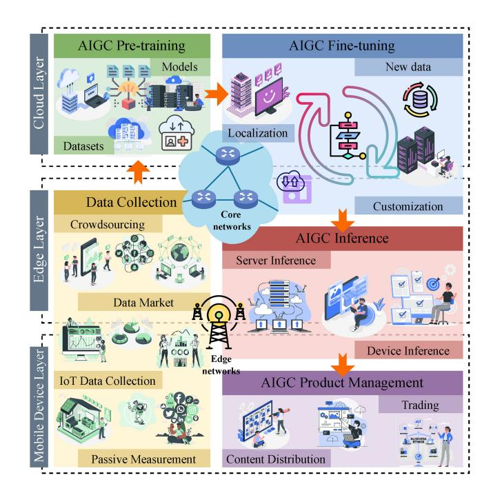

Fig. 1. The overview of mobile AIGC networks, including the cloud layer, the edge layer, and the mobile device layer. The lifecycle of AIGC services, including data collection, pre-training, fine-tuning, inference, and product management, is circulated among the core networks and edge networks.

- *• Low-latency:* Instead of directing requests for AIGC services to cloud servers within the core network, users can access low-latency services in mobile AIGC networks [\[33\]](#page-35-22). For example, users can obtain AIGC services directly in radio access networks (RANs) by downloading pre-trained models to edge servers and mobile devices for fine-tuning and inference, thereby supporting real-time, interactive AIGC.
- *• Localization and Mobility:* In mobile AIGC networks, base stations with computing servers at the network's edge can fine-tune pre-trained models by localizing service requests [\[34\]](#page-35-23), [\[35\]](#page-35-24). Furthermore, users' locations can serve as input for AIGC fine-tuning and inference, addressing specific geographical demands. Additionally, user mobility can be integrated into the AIGC service provisioning process, enabling dynamic and reliable AIGC service provisioning.
- *• Customization and Personalization:* Local edge servers can adapt to local user requirements and allow users to request personalized services based on their preferences while providing customized services according to local service environments. On one hand, edge servers can tailor AIGC services to the needs of the local user community by fine-tuning them accordingly [\[3\]](#page-35-2). On the other hand, users can request personalized services from edge servers by specifying their preferences.
- *• Privacy and Security:* AIGC users only need to submit service requests to edge servers, rather than sending preferences to cloud servers within the core network. Therefore, the privacy and security of AIGC users can be preserved during the provisioning, including fine-tuning and inference, of AIGC services.

TABLE I SUMMARY OF RELATED WORKS VERSUS OUR SURVEY

| Year | Ref. | Contributions                                                                                                                                                                                                                                                       | AIGC Algorithms | AIGC Applications | Edge Intelligence |
|------|------|---------------------------------------------------------------------------------------------------------------------------------------------------------------------------------------------------------------------------------------------------------------------|--------------------|----------------------|----------------------|
| 2019 | [18] | Introduce mobile edge intelligence, and discuss the infrastructure, implementation methodologies, and use cases                                                                                                                                                     | ×                  | X                    | <b>√</b>             |
| 2020 | [19] | Present the implementation challenges of FL at mobile edge networks                                                                                                                                                                                                 | 1                  | ×                    | ✓                    |
|      | [15] | Discuss the visions, implementation details, and applications of the convergence of edge computing and DL                                                                                                                                                           | 1                  | ×                    | ✓                    |
|      | [20] | Investigate the copyright laws regarding AI-generated music                                                                                                                                                                                                         | <b>✓</b>           | <b>✓</b>             | X                    |
| 2021 | [2]  | Illustrate the interaction of art and AI from two perspectives, i.e., AI for art analysis and AI for art creation                                                                                                                                                   | ×                  | ✓                    | X                    |
| 2021 | [3]  | Discuss the application of computational arts in Metaverse to create surrealistic cyberspace                                                                                                                                                                        | ✓                  | ✓                    | X                    |
|      | [21] | Investigate the deployment of distributed learning in wireless networks                                                                                                                                                                                             | ×                  | ×                    | ✓                    |
|      | [22] | Provide a comprehensive overview of the major approaches, datasets, and metrics used to synthesize and process multimodal images                                                                                                                                    | 1                  | <b>✓</b>             | X                    |
|      | [23] | Propose a novel conceptual architecture for 6G networks, which consists of holistic network virtualization and pervasive network intelligence                                                                                                                       | ×                  | ×                    | <b>√</b>             |
|      | [24] | Discusses the visions and potentials of low-power, low-latency, reliable, and trustworthy edge intelligence for 6G wireless networks                                                                                                                                | ×                  | ×                    | ✓                    |
| 2022 | [6]  | Provide comprehensive guidance and comparison among advanced generative models, including GAN, energy-based models, VAE, autoregressive models, flow-based models, and diffusion models                                                                             | 1                  | ×                    | ×                    |
|      | [25] | Present fundamental algorithms, classification and applications of diffusion models                                                                                                                                                                                 | 1                  | ×                    | ×                    |
|      | [11] | Provide a comprehensive overview of generation and detection methods for machine-generated text                                                                                                                                                                     | 1                  | 1                    | Х                    |
|      | [26] | Provide a comprehensive examination of what, why, and how edge intelligence and blockchain can be integrated                                                                                                                                                        | ×                  | ×                    | <b>√</b>             |
|      | [27] | Introduce the architecture of edge-enabled Metaverse and discuss enabling technologies in communication, computing, and blockchain                                                                                                                                  | ×                  | <b>✓</b>             | ✓                    |
| 2023 | [28] | Summarize existing works on the generation of gestures with simultaneous speeches based on deep generative models                                                                                                                                                   | 1                  | 1                    | ×                    |
|      | [1]  | A comprehensive tutorial on applying generative diffusion model in various network optimization tasks. Case studies explore integrating the diffusion model with DRL, incentive mechanism design, semantic communications, and Internet of Vehicles (IoV) networks. | <b>√</b>           | ×                    | <b>√</b>             |
|      | Ours | Investigate the deployment of mobile AIGC networks via collaborative cloud-edge-mobile infrastructure, discuss creative mobile applications and exemplary use cases, and identify existing implementation challenges                                                | 1                  | 1                    | <b>√</b>             |

As illustrated in Fig. [1,](#page-1-0) when users access AIGC services on mobile edge networks through edge servers and mobile devices, limited computing, communication, and storage resources pose challenges for delivering interactive and resource-intensive AIGC services. First, resource allocation on edge servers must balance the tradeoff among accuracy, latency, and energy consumption of AIGC services at edge servers. In addition, computationally intensive AIGC tasks can be offloaded from mobile devices to edge servers, improving inference latency and service reliability. Moreover, AI models that generate content can be cached in edge networks, similar to content delivery networks (CDNs) [\[36\]](#page-35-25), [\[37\]](#page-35-26), to minimize delays in accessing the model. Finally, mobility management and incentive mechanisms should be explored to encourage user participation in both space and time [\[38\]](#page-35-27). Compared to traditional AI, AIGC technology requires overall technical maturity, transparency, robustness, impartiality, and insightfulness of the algorithm for effective application implementation. From a sustainability perspective, AIGC can use both existing and synthetic datasets as raw materials for generating new data. However, when biased data are used as raw data, these biases persist in the knowledge of the model, which inevitably leads to unfair algorithm results. Finally, static generative AI models rely primarily on templates to generate machinegenerated content that may have similar text and output structures.

# *C. Related Works and Contributions*

In this survey, we provide an overview of research activities related to AIGC and mobile edge intelligence, as illustrated in Fig. [2.](#page-3-0) Given the increasing interest in AIGC, several surveys

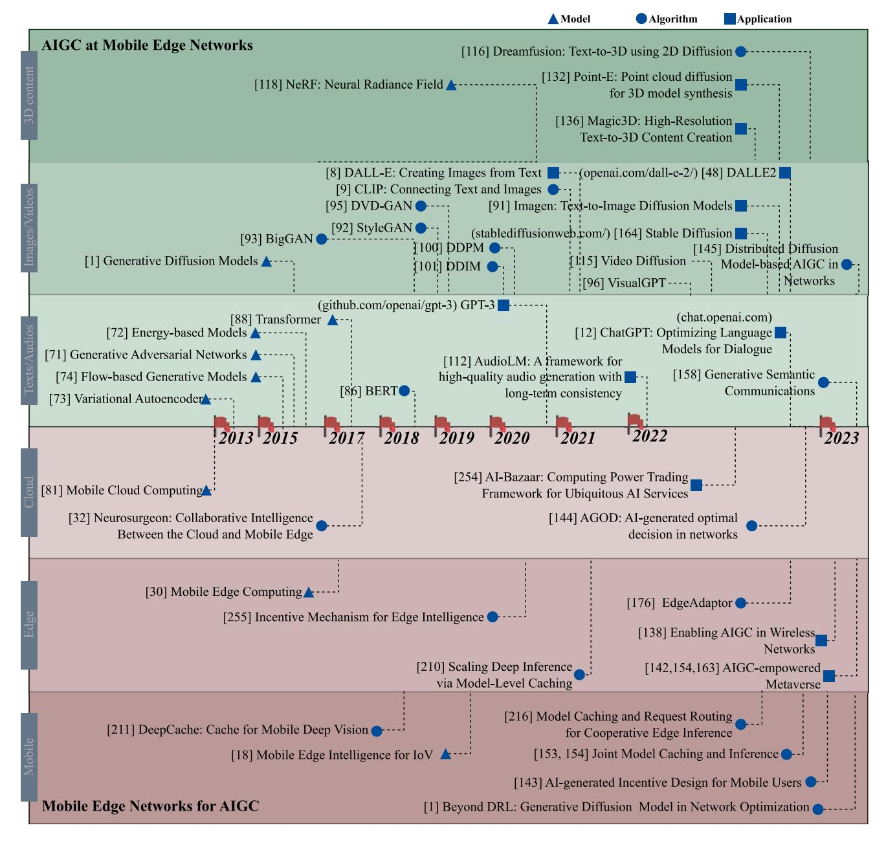

Fig. 2. The development roadmap of AIGC and mobile edge networks from 2013 to Oct 2023. From the perspective of AIGC technology development, AIGC has evolved from generating text and audio to generating 3D content. From the perspective of mobile edge computing, computing has gradually shifted from cloud data centers to mobile device computing.

on related topics have recently been published. Table [II](#page-12-0) presents a comparison of these surveys with this paper.

The study by [\[1\]](#page-35-0) offers a focused exploration of Generative Diffusion Models (GDMs) in network optimization tasks[.1](#page-3-1) Commencing with an essential background on GDMs, it outlines their ability to model complex data distributions effectively. This enables them to excel in diverse tasks, ranging from image generation to reinforcement learning. The paper advances by presenting case studies that integrate GDMs with Deep Reinforcement Learning, incentive mechanism design, Semantic Communications, and Internet of Vehicles networks. These case studies substantiate the model's practical utility in solving complex network optimization problems. The study in [\[39\]](#page-35-28) provides a comprehensive overview of the current generative AI models published by researchers and the industry. The authors identify nine categories summarizing the evolution of generative AI models, including text-to-text, text-to-image, text-to-audio, text-to-video, text-to-3D, textto-code, text-to-science, image-to-text, and other models. In addition, they reveal that only six organizations with enormous computing power and highly skilled and experienced teams can deploy these state-of-the-art models, which is even fewer than the number of categories. Following the taxonomy of generative AI models developed in [\[39\]](#page-35-28), other surveys discuss generative AI models in detail subsequently. The study in [\[11\]](#page-35-10) examines existing methods for generating text and detecting

1The code is available at https://github.com/HongyangDu/GDMOPT.

models. The study in [\[22\]](#page-35-29) provides a comprehensive overview of the major approaches, datasets, and evaluation metrics for multimodal image synthesis and processing. Based on techniques of speech and image synthesis, the study in [\[28\]](#page-35-30) summarizes existing works on the generation of gestures with simultaneous speeches based on deep generative models. The study in [\[20\]](#page-35-31) investigates the copyright laws regarding AIgenerated music, which includes the complicated interactions among AI tools, developers, users, and the public domain. The study in [\[6\]](#page-35-5) provides comprehensive guidance and comparison among advanced generative models, including GANs, energybased models, variational autoencoder (VAE), autoregressive models, flow-based models, and diffusion models. As diffusion models draw tremendous attention in generating creative data, the study in [\[25\]](#page-35-32) presents fundamental algorithms and comprehensive classification for diffusion models. Based on these algorithms, the authors [\[2\]](#page-35-1) illustrate the interaction of art and AI from two perspectives, i.e., AI for art analysis and AI for art creation. In addition, the authors in [\[3\]](#page-35-2) discuss the application of computational arts in the Metaverse to create surrealistic cyberspace.

In 6G [\[23\]](#page-35-33), mobile edge intelligence based on edge computing systems, including edge caching, edge computing, and edge intelligence, for intelligent mobile networks, is introduced in [\[18\]](#page-35-17), [\[40\]](#page-35-34). The study in [\[21\]](#page-35-35) investigates the deployment of distributed learning in wireless networks. The study [\[19\]](#page-35-36) provides a guide to federated learning (FL) and a comprehensive overview of implementing FL at mobile edge networks. The authors offer a detailed analysis of the challenges of implementing FL, including communication costs, resource allocation, privacy, and security. In [\[15\]](#page-35-14), various application scenarios and technologies for edge intelligence and intelligent edges are presented and discussed in detail. In addition, the study [\[24\]](#page-35-37) discusses the visions and potentials of low-power, low-latency, reliable, and trustworthy edge intelligence for 6G wireless networks. The study [\[26\]](#page-35-38) explores how blockchain technologies can be used to enable edge intelligence and how edge intelligence can support the deployment of blockchain at mobile edge networks. The authors provide a comprehensive review of blockchain-driven edge intelligence, edge intelligence-amicable blockchain, and their implementation at mobile edge networks.

Distinct from existing surveys and tutorials, our survey concentrates on the deployment of mobile AIGC networks for real-time and privacy-preserving AIGC service provisioning. We introduce the current development of AIGC and collaborative infrastructure in mobile edge networks. Subsequently, we present the technologies of deep generative models and the workflow of provisioning AIGC services within mobile AIGC networks. Additionally, we showcase creative applications and several exemplary use cases. Furthermore, we identify implementation challenges, ranging from resource allocation to security and privacy, for the deployment of mobile AIGC networks. The *contributions of our survey* are as follows.

*•* We initially offer a tutorial that establishes the definition, lifecycle, models, and metrics of AIGC services. Then, we propose the mobile AIGC networks, i.e., provisioning AIGC services at mobile edge networks with

- collaborative mobile-edge-cloud communication, computing, and storage infrastructure.
- *•* We present several use cases in mobile AIGC networks, encompassing creative AIGC applications for text, images, video, and 3D content generation. We summarize the advantages of constructing mobile AIGC networks based on these use cases.
- *•* We identify crucial implementation challenges in the path to realizing mobile AIGC networks. The implementation challenges of mobile AIGC networks stem not only from dynamic channel conditions but also from the presence of meaningless content, insecure content precepts, and privacy leaks in AIGC services.
- *•* Lastly, we discuss future research directions and open issues from the perspectives of networking and computing, machine learning (ML), and practical implementation considerations, respectively.

As the outline illustrated in Fig. [3,](#page-5-0) the survey is organized as follows. Section [II](#page-4-0) examines the background and fundamentals of AIGC. Section [III](#page-8-0) presents the technologies and collaborative infrastructure of mobile AIGC networks. The applications and advantages of mobile AIGC networks are discussed in Section [IV,](#page-12-1) and potential use cases are shown in Section [V.](#page-15-0) Section [VI](#page-22-0) addresses the implementation challenges. Section [VII](#page-33-0) explores future research directions. Section [VIII](#page-34-0) provides the conclusions.

# II. BACKGROUND AND FUNDAMENTALS OF AIGC

In this section, the background and fundamentals of AIGC technology are presented. Specifically, we examine the definition of AIGC, its classification, and the technological lifecycle of AIGC in mobile networks. Finally, we introduce ChatGPT as a use case, which is the most famous and revolutionary application of AIGC.

#### *A. Definitions of PGC, UGC, and AIGC*

In the next generation of the Internet, i.e., Web 3.0 and Metaverse [\[41\]](#page-35-39), [\[42\]](#page-35-40), [\[43\]](#page-35-41), there are three primary forms of content [\[2\]](#page-35-1), including PGC, UGC, and AIGC.

- *1) Professionally-Generated Content:* PGC refers to professional-generated digital content [\[44\]](#page-35-42). Here, the generators are individuals or organizations with professional skills, knowledge, and experience in a particular field, e.g., journalists, editors, and designers. As these experts who create PGC are typically efficient and use specialized tools, PGC has the advantages in terms of *automation* and *multimodality*. However, because PGC is purposeful, the *diversity* and *creativity* of PGC can be limited.
- *2) User-Generated Content:* UGC refers to digital material generated by users, rather than by experts or organizations [\[45\]](#page-36-0). The users include website visitors and social media users. UGC can be presented in any format, including text, photos, video, and audio. The barrier for users to create UGC is being lowered. For example, some websites[2](#page-4-1) allow users to

2Example of a website that allows users to create their own UGC: https://ugc-nft.io/Home

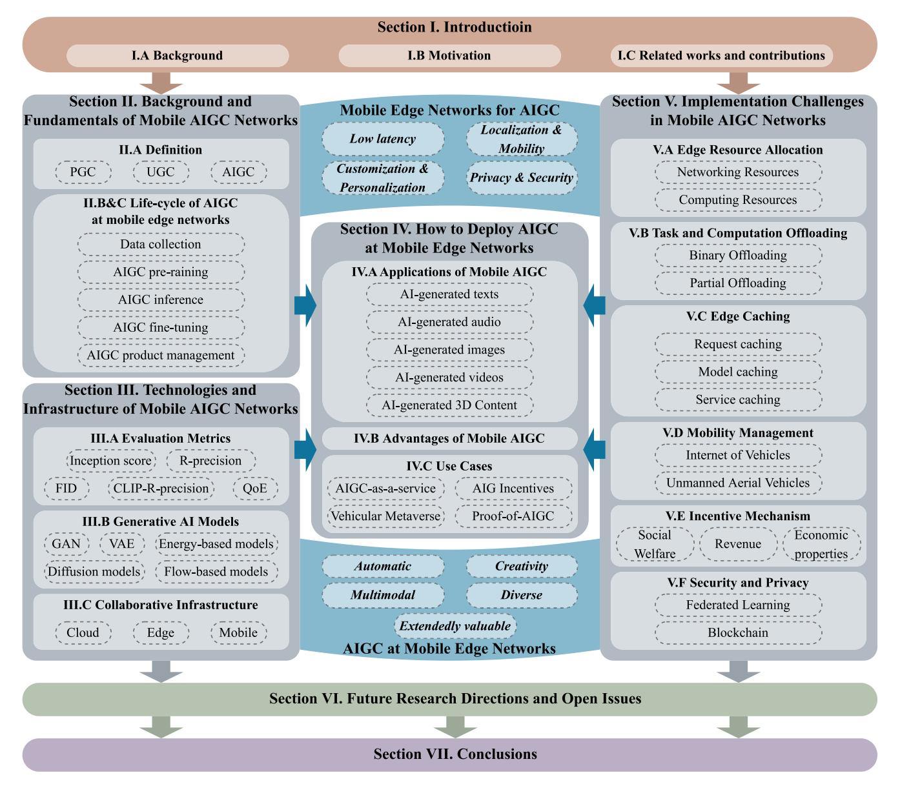

Fig. 3. The outline of this survey, where we introduce the provisioning of AIGC services at mobile edge networks and highlight some essential implementation challenges about mobile edge networks for provisioning AIGC services.

create images with a high degree of freedom on a pixel-bypixel basis. As a result, UGC is more *creative* and *diverse*, thanks to a wide user base. However, UGC is less *automated* and less *multimodal* than the PGC that is generated by experts.

- *3) AIGC:* AIGC is generated by using generative AI models according to input from users. Because AI models can learn the features and patterns of input data from the human artistic mind, they can develop a wide range of content. The recent success of text-to-image applications based on the diffusion model [\[46\]](#page-36-1) and the ChatGPT based on transformer [\[12\]](#page-35-11) has led to AIGC gaining a lot of attention. We have defined the AIGC according to its characteristics as follows
  - *•* Automatic: AIGC is generated by AI models automatically. After the AI model has been trained, users only need to provide input, such as the task description, to efficiently obtain the generated content. The process,

- from input to output, does not require user involvement and is done automatically by the AI models.
- *•* Creativity: AIGC refers to an idea or item that is innovative. For example, AIGC is believed to be leading to the development of a new profession, called Prompt Engineer [\[47\]](#page-36-2), which aims to improve human interaction with AI. In this context, the prompt serves as the starting point for the AI model, and it significantly impacts the originality and quality of the generated content. A wellcrafted prompt that is specific results in more relevant and creative content than a vague or general prompt.
- *•* Multimodal: The AI models to generate AIGC can handle multimodal input and output. For example, ChatGPT [\[12\]](#page-35-11) allows conversational services that employ text as input and output, DALL-E 2 [\[48\]](#page-36-3) can create original, realistic images from a text description, and AIGC services with

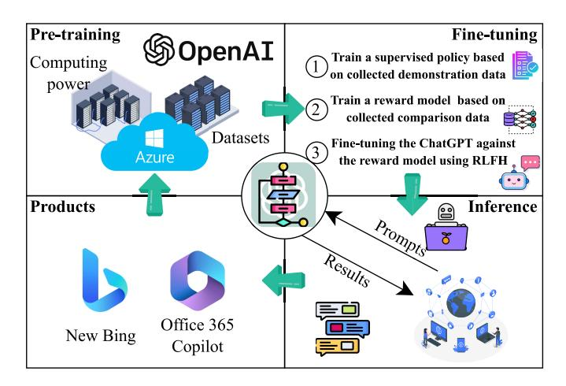

Fig. 4. The four development stages of ChatGPT, including pre-training, fine-tuning, inference, and product management.

voice and 3D models as input or output are progressing [\[49\]](#page-36-4).

- *•* Diverse: AIGC is diverse in service personalization and customization. On the one hand, users can adjust the input to the AI model to suit their preferences and needs, resulting in a personalized output. On the other hand, AI models are trained to provide diverse outputs. For example, consider the DALL-E 2 as an example, the model can generate images of individuals that more correctly represent the diversity of the global population, even with the same text input.
- *•* Extendedly valuable: AIGC should be extendedly valuable to society, economics, and humanity [\[50\]](#page-36-5). For example, AI models can be trained to write medical reports and interpret medical images, enabling healthcare personnel to make accurate diagnoses.

AIGC provides various advantages over PGC and UGC, including better efficiency, originality, diversity, and flexibility. The reason is that AI models can produce vast amounts of material quickly and develop original content based on established patterns and principles. These advantages have led to the growing creative applications of the generative AI models, which are discussed in Section [IV-A1.](#page-13-0)

#### *B. Serving ChatGPT at Mobile Edge Networks*

ChatGPT, developed by OpenAI, excels at generating human-like text and engaging in conversations [\[12\]](#page-35-11). Based on the GPT-3 [\[51\]](#page-36-6), this transformer-based neural network model can produce remarkably coherent and contextually appropriate text. Among its primary advantages, ChatGPT is capable of answering questions, providing explanations, and assisting with various tasks in a manner nearly indistinguishable from human responses. As illustrated in Fig. [4,](#page-6-0) the development of ChatGPT involves four main stages, including pre-training, fine-tuning, inference, and product management.

*1) Pre-Training:* In the initial stage, known as pre-training, the foundation model of ChatGPT, GPT-3, is trained on a large corpus of text, which includes books, articles, and other information sources. This process enables the model

to acquire knowledge of language patterns and structures, as well as the relationships between words and phrases. The base model, GPT-3, is an autoregressive language model with a Transformer architecture that has 175 billion parameters, making it one of the largest language models available. During pre-training, GPT-3 is fed with a large corpus of text from diverse sources, such as books, articles, and websites for self-supervised learning, where the model learns to predict the next word in a sentence given the context. To train the foundation model, the technique used is called maximum likelihood estimation, where the model aims to maximize the probability of predicting the next word correctly. Training GPT-3 demands significant computational resources and time, typically involving specialized hardware like graphics processing units (GPUs) or tensor processing units (TPUs). The exact resources and time required depend on factors such as model size, dataset size, and optimization techniques.

- *2) Fine-Tuning:* The fine-tuning stage of ChatGPT involves adapting the model to a specific task or domain, such as customer service or technical support, to enhance its accuracy and relevance for that task. To transform ChatGPT into a conversational AI, a supervised learning process is employed using a dataset containing dialogues between humans and AI models [\[52\]](#page-36-7). To optimize ChatGPT's parameters, a reward model for reinforcement learning is built by ranking multiple model responses by quality. Alternative completions are ranked by AI trainers, and the model uses these rankings to improve its performance through several iterations of Proximal Policy Optimization [\[53\]](#page-36-8). This technique allows ChatGPT to learn from its mistakes and improve its responses over time.
- *3) Inference:* In the inference stage, ChatGPT generates text based on a given input or prompt, testing the model's ability to produce coherent and contextually appropriate responses relevant to the input. ChatGPT generates responses by leveraging the knowledge it acquired during pre-training and fine-tuning, analyzing the context of the input to generate relevant and coherent responses. In-context learning involves analyzing the entire context of the input [\[54\]](#page-36-9), including the dialogue history and user profile, to generate responses that are personalized and tailored to the user's needs. ChatGPT employs chain-of-thought to generate responses that are coherent and logical, ensuring that the generated text is not only contextually appropriate but also follows a logical flow. The resources consumed during inference are typically much lower than those required for training, making real-time applications and services based on ChatGPT computationally feasible.
- *4) Product Management:* The final product management phase involves deploying the model in a production environment and ensuring its smooth and efficient operation. In the context of mobile edge networks, the applications of AI-powered tools such as the new Bing [\[55\]](#page-36-10) and Office 365 Copilot [\[56\]](#page-36-11) could be particularly useful due to their ability to provide personalized and contextually appropriate responses while conserving resources. The new Bing offers a new type of search experience with AI-powered features such as detailed replies to complex questions, summarized answers, and personalized responses to follow-up questions, while Office 365 Copilot, powered by GPT-4 from OpenAI,

assists with generating documents, emails, presentations, and other tasks in Microsoft 365 apps and services. These tools can be integrated into mobile edge networks with specialized techniques that balance performance and accuracy while preserving data integrity.

- *•* New bing: The new Bing offers a set of AI-powered features that provide a new type of search experience, including detailed replies to complex questions, summarized answers, and personalized responses to follow-up questions. Bing also offers creative tools such as assistance with writing poems and stories. In the context of mobile edge networks, Bing's ability to consolidate reliable sources across the Web and provide a single, summarized answer could be particularly useful for users with limited resources. Additionally, Bing's ability to generate personalized responses based on user behavior and preferences could improve the experience of users in mobile edge networks.
- *•* Office 365 copilot: Microsoft has recently launched an AI-powered assistant named Office 365 Copilot, which can be summoned from the sidebar of Microsoft 365 apps and services. Copilot can help users generate documents, emails, and presentations, as well as provide assistance with features such as PivotTables in Excel. It can also transcribe meetings, remind users of missed items, and provide summaries of action items. However, when deploying Copilot in mobile edge networks, it is important to keep in mind the limited resources of these devices and to develop specialized techniques that can balance performance and accuracy while preserving data integrity.

In addition to the previously mentioned commercial applications, ChatGPT holds substantial commercial potential owing to its capacity for producing human-like text, which is characteristically coherent, pertinent, and contextually fitting. This language model can be fine-tuned to accommodate a diverse array of tasks and domains, rendering it highly adaptable for numerous applications. ChatGPT exhibits remarkable proficiency in comprehending and generating text across multiple languages. Consequently, it can facilitate various undertakings, such as composing emails, developing code, generating content, and offering explanations, ultimately leading to enhanced productivity. By automating an assortment of tasks and augmenting human capabilities, ChatGPT contributes to a paradigm shift like human work, fostering new opportunities and revolutionizing industries. In addition to ChatGPT, more use cases developed by various generative AI models are discussed in Section [V.](#page-15-0)

#### *C. Life-Cycle of AIGC at Mobile Edge Networks*

AIGC has gained tremendous attention as a technology superior to PGC and UGC. However, the lifecycle of the AIGC is also more elaborate. In the following, we discuss the AIGC lifecycle with mobile edge network enablement:

*1) Data Collection:* Data collection is an integral component of AIGC and plays a significant role in defining the quality and diversity of the material created by AI systems [\[57\]](#page-36-12). The data used to train AI models influences the patterns and relationships that the AI models learn and, consequently, the output. There are several data collection techniques for AIGC:

- *•* Crowdsourcing: Crowdsourcing is the process of acquiring information from a large number of individuals, generally via the use of online platforms [\[58\]](#page-36-13). Crowdsourced data may be used to train ML models for text and image generation, among other applications. One common example is the use of Amazon Mechanical Turk,[3](#page-7-0) where individuals are paid to perform tasks such as annotating text or images, which can then be used to train generative AI models.
- *•* Data Market: Another way to obtain data is to buy it from a data provider. For example, Datatan[g4](#page-7-1) is a firm that offers high-quality datasets and customized data services to assist businesses in enhancing the performance of their AI models. By giving access to varied, high-quality data, Datatang enables organizations to train AI models that are more accurate and effective, resulting in enhanced business performance and results.
- *•* Internet-of-Things (IoT) data collection: In IoT, edge devices can help to collect the data, e.g., Global Positioning System (GPS) records and wireless sensing data [\[59\]](#page-36-14). For example, mobile phone sensors can track the device's movement and location or users [\[60\]](#page-36-15). The sensors can be used to collect data on the location, speed, and direction of movement of the device. These data are important for the implementation of personalized generative AI models. In addition to these traditional data collection methods, large-scale datasets are specifically designed for training generative AI models. For instance, the LAION-400M dataset [\[61\]](#page-36-16), a large-scale, non-curated dataset consisting of 400 million English (image, text) pairs, is used in training models like CLIP.
- *•* Passive data collection can be achieved with the help of edge networks [\[62\]](#page-36-17). In the smart city, sensors can be placed at strategic locations, such as on lamp posts, buildings, or other structures, to collect data on various aspects of the city environment. The data obtained by the sensors might be used to train AI models, which could subsequently be utilized to produce insights on air quality, traffic flow, and pedestrian density. Using data obtained from air quality sensors, an AI model can be trained to forecast air quality. The model can then be used to create a real-time map of the city's air quality. This real-time map could be used to guide policy choices about the management of air quality, leading to the development of generative AI models that are capable of generating decision solutions for managing air quality.

After the data has been collected, the data is then used to train the generative AI model.

*2) Pre-Training:* The collected data is used to train the generative AI model. In mobile networks, training is typically

3The website of Amazon Mechanical Turk as a crowdsourcing marketplace: https://www.mturk.com/.

4The website of Datatang: https://www.datatang.ai/.

done by central servers with powerful computing power. During the training process, the generative model automatically learns the patterns and features in the data and predicts the target outcome. We introduce several generative AI technologies in Section [III-B,](#page-9-0) including Generative Adversarial Networks (GANs), VAE, Flow-based models, and diffusion models. These different training techniques have different strengths and weaknesses. The choice of technique depends on the specific requirements of the AIGC task, the available data, the desired output, and the computational resources available. After training is complete, cloud data centers can accept requests uploaded by network users to perform subsequent fine-tuning and inference tasks. Alternatively, cloud data centers can deliver the trained generative AI models down to network edge servers, which can process user requests locally. It is important to note the substantial computational resources required for the pre-training of generative AI models. For instance, the pre-training process of the Stable Diffusion model, a large-scale AI model developed by Stability AI, was conducted on a cloud cluster with 256 Nvidia A100 GPUs for about 150,000 hours, which equates to a cost of approximately \$600,000 (https://huggingface.co/CompVis/stable-diffusion-v1-4). This highlights the intensive computational demands of training such models.

- *3) Fine-Tuning:* Fine-tuning in AIGC is the process of adjusting a pre-trained generative AI model to new tasks or domains by including a modest quantity of extra data. This approach can be used to enhance the model's performance on a given task or in a specific area by adjusting the AI model's parameters to suit the new data better. In mobile networks, tasks of fine-tuning can be performed by the edge network, using the small-size dataset uploaded by mobile users.
- *4) Inference:* Using the trained generative AI model, inference can be done, which involves generating the desired content based on the input. generative AI models are traditionally managed via centralized servers, such as the Hugging Face platform [\[63\]](#page-36-18). In this setting, a large number of users make requests to the central server, wait in line, and obtain the requested services. Researchers aim to install AIGC services on edge networks to prevent request congestion and optimize service latency. Edge devices have sufficient computational capacity for AIGC inference and are closer to consumers than central servers. Therefore, users can interact with devices with a reduced transmission delay. In addition, as AIGC services are dispersed to several edge devices, the latency can be significantly reduced.
- *5) Product Management:* The preceding stages cover content generation. However, as an irreplaceable online property comparable to NFT, AIGC possesses unique ownership, copyright, and worth for each content. Consequently, the preservation and management of AIGC products should be incorporated into the AIGC life cycle. Specifically, we refer to the party requesting the production of the AIGC as producers, e.g., mobile users or companies, who hire AIGC generators, e.g., network servers, to perform the AIGC tasks. Then, the main process in AIGC product management includes:

- *• Distribution:* After the content is generated in network edge servers, the producers acquire ownership of the AIGC products. Consequently, they have the right to distribute these products to social media or AIGC platforms through edge networks
- *• Trading:* Since AIGC products are regarded as a novel kind of non-fungible digital properties, they can be traded. The trading process can be modeled as a fund ownership exchange between two parties.

To implement the aforementioned AIGC lifecycle in mobile networks, we further investigate the technical implementation of AIGC in the following section.

## III. TECHNOLOGIES AND COLLABORATIVE INFRASTRUCTURE OF MOBILE AIGC NETWORKS

In this section, we delve into the technologies and collaborative infrastructure of mobile AIGC networks. This section aims to provide a comprehensive understanding of the rationale and objectives of edge computing systems designed to support AIGC. Before we explore the design of these systems, it is crucial to establish the performance metrics that measure whether the system can maximize user satisfaction and utility.

#### *A. Evaluation Metrics of Generative AI Models and Services*

We first discuss several metrics for assessing the quality of generative AI models, which can be used by AIGC service providers and users in mobile networks.

- *1) Inception Score:* The Inception Score (IS) can be used to measure the accuracy of images generated by generative AI models in the mobile network [\[64\]](#page-36-19). The IS is based on the premise that high-fidelity generated images should have high-class probabilities, which suggest a reliable classification model, and a low Kullback-Leibler (KL) divergence between the projected class probability and a reference class distribution. To compute the IS, an exponential function is applied to the KL divergence between the anticipated class probabilities and the reference class distribution. The resulting value is then averaged over all created photos to obtain the IS. A higher IS indicates better overall image quality.
- *2) Frechet Inception Distance:* The Frechet Inception Distance (FID) has emerged as a well-established metric for evaluating the effectiveness of generative models, particularly GANs, in terms of image quality and diversity [\[65\]](#page-36-20). FID leverages a pre-trained Inception network to calculate the distance between actual and synthetic image embeddings. This metric can be used by generative AI model providers to evaluate the quality of their generative models in mobile networks. Additionally, users can assess the capabilities of AIGC service providers through multiple requests for services based on FID measurements. However, when evaluating conditional text-toimage synthesis, FID only measures the visual quality of the output images, ignoring the adequacy of their conditioning on the input text [\[66\]](#page-36-21). Thus, while FID is an excellent evaluation metric for assessing image quality and diversity, it is limited when applied to conditional text-to-image synthesis.
- *3) R-Precision:* R-Precision is a standard metric to evaluate how AI-generated images align with text inputs [\[67\]](#page-36-22). In

mobile networks, the generative AI model producers can retrieve matching text from 100 text candidates using the AI-generated image as a query. The R-Precision measures the proportion of relevant items retrieved among the top-R retrieved items, where R is typically set to 1. Specifically, the Deep Attentional Multimodal Similarity Model (DAMSM) is commonly used to compute the text-image retrieval similarity score [\[68\]](#page-36-23). DAMSM maps each subregion of an image and its corresponding word in the sentence to a joint embedding space, allowing for the measurement of fine-grained imagetext similarity for retrieval. However, it should be noted that text-to-image generative AI models can directly optimize the DAMSM module used to calculate R-Precision. This results in the metric being model-specific and less objective, limiting the evaluation of generative AI models in mobile networks.

- *4) CLIP-R-Precision:* CLIP-R-Precision is an assessment metric to address the model-specific character of the R-Precision metric [\[69\]](#page-36-24). Instead of the conventional DAMSM, the suggested measure uses the latest multimodal CLIP model [\[7\]](#page-35-6) to obtain R-Precision scores. Here, CLIP is trained on a massive corpus of Web-based image-caption pairings and is capable, via a contrastive aim, of bringing together the two embeddings (visual and linguistic). Thus, the CLIP-R-Precision can provide a more objective evaluation of text-to-image generative AI model performance in mobile networks.
- *5) Quality of Experience:* The Quality of Experience (QoE) metric plays a critical role in evaluating the performance of AIGC in mobile network applications [\[70\]](#page-36-25). QoE measures user satisfaction with the generated content, considering factors such as visual quality, relevancy, and utility. Gathering and analyzing user surveys, interaction, and behavioral data are standard methods used to determine QoE. In addition, the definition of QoE can vary depending on the objectives of the mobile network system designer and the user group being considered. With the aid of QoE, AIGC performance can be improved, and new models can be created to meet user expectations. It is essential to account for QoE when analyzing the performance of AIGC in mobile network applications to ensure that the generated content meets user expectations and provides a great user experience.

Based on the aforementioned evaluation metrics, diverse and valuable synthetic data can be generated from deep generative models. Therefore, in the next section, we introduce several generative AI models for mobile AIGC networks.

## *B. Generative AI Models*

Generative AI models aim to understand and replicate the true data distribution of input data through iterative training. This understanding allows the generation of novel data that closely aligns with the original distribution. As depicted in Fig. [5,](#page-9-1) this section delves into five fundamental generative models: Generative Adversarial Networks (GANs), energybased models, Variational Autoencoders (VAEs), flow-based models, and diffusion models.

*1) Generative Adversarial Networks:* GANs are a fundamental framework for AIGC, comprising a generative model

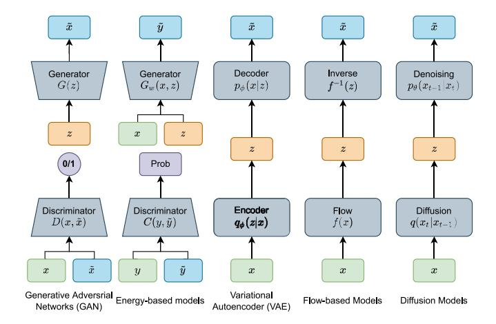

Fig. 5. The model architecture of generative AI models, including generative adversarial networks, energy-based models, variational autoencoder, flowbased models, and diffusion models.

and a discriminative model [\[71\]](#page-36-26). The generative network aims to generate data that is as realistic and similar to the original data as possible to deceive the discriminative model based on the data in the original dataset. Conversely, the discriminant model's task is to differentiate between real and fake instances. During the GAN training process, the two networks continually enhance their performance by competing against each other until they reach a stable equilibrium. The advantages and disadvantages of GANs can be summarized as follows [\[71\]](#page-36-26):

# *• Advantages:*

- **–** GANs can generate new data closely resembling the original dataset, making them useful for tasks such as image synthesis and text-to-image translation.
- **–** The adversarial training process leads to continuous improvement in the performance of both the generative and discriminative models.

# *• Disadvantages:*

- **–** GANs can be difficult to train because the two networks in a GAN, i.e., the generator and the discriminator, constantly compete against others, making training unstable and slow.
- **–** GANs primarily augment the existing dataset rather than creating entirely new content, limiting their ability to generate new content with other modalities.
- *2) Energy-Based Generative Models:* Energy-based generative models are a class of generative models that represent input data using energy values [\[72\]](#page-36-27). These models define an energy function and then minimize the input data's energy value through optimization and training. This approach is easily comprehensible, and the models exhibit excellent flexibility and generalization ability in providing AIGC services. EBMs capture dependencies by associating an unnormalized probability scalar (energy) to each configuration of the combination of observed and latent variables. Inference consists of finding latent variables that minimize the energy given a set of observed variables. The model learns a function that associates low energies with the latent variables' correct values and higher energies with incorrect values.

- *3) Variational Autoencoder:* The VAE [\[73\]](#page-36-28) is a type of generative models that consist of two primary components: an encoder and a decoder network. The encoder transforms the input data into a set of parameters (mean and variance) in a latent space. These parameters are then used to sample from the latent space, generating latent variables. The decoder takes these latent variables as input and generates new data. VAEs differ from GANs in their training methods. While GANs are trained using a supervised learning approach, VAEs employ an unsupervised learning approach. This difference is reflected in how they generate data. VAEs generate data by sampling from the learned distribution, while GANs approximate the data distribution using the generator network.
- *4) Flow-Based Generative Models:* Flow-based generative models [\[74\]](#page-36-29) facilitate the data generation process by employing probabilistic flow formulations. Additionally, these models compute gradients during generation using backpropagation algorithms, enhancing training and learning efficiency. Consequently, flow-based models in mobile edge networks present several benefits. One such advantage is computational efficiency. Flow-based models can directly compute the probability density function during generation, circumventing resource-intensive calculations. This promotes more efficient computation within mobile edge networks.
- *5) Generative Diffusion Models:* Diffusion models are likelihood-based models trained with Maximum Likelihood Estimation (MLE) [\[25\]](#page-35-32), as opposed to GANs trained with a minimax game between the generator and the discriminator. Therefore, the pattern collapses and thus the training instabilities can be avoided. Specifically, diffusion models are inspired by non-equilibrium thermodynamics theory [\[1\]](#page-35-0). They learn the inverse diffusion process to construct the desired data sample from noise by defining a Markov chain of diffusion steps that gradually add random noise to the data. In addition, diffusion can mathematically transform the computational space of the model from pixel space to a low-dimensional space called latent space. This reduces the computational cost and time required and improves the training efficiency of the model. Unlike VAE or flow-based models, diffusion models are learned using a fixed procedure, and the hidden variables have high dimensions that are the same as the original data. This versatility and computational efficiency make diffusion models highly effective across a broad range of applications, including computer vision, natural language processing, audio synthesis, 3D modeling, and network optimization [\[1\]](#page-35-0).
- *6) Large Language Models:* Large language models (LLM), which consist of billions of parameters, are trained on large-scale datasets [\[75\]](#page-36-30), and thus demonstrate the ability to handle various downstream tasks. LLMs can understand input prompts and generate human-like text in response. These models have greatly influenced our interaction with technology and have helped pave the way for advancements in artificial general intelligence. For instance, Google's PaLM-E [\[76\]](#page-36-31) is an embodied language model that can handle tasks involving reasoning, visuals, and language. It can process multimodal sentences and transfer knowledge across domains, enabling it to perform tasks such as robot planning and embodied question answering.

In wireless networks, deploying LLMs faces several important issues from the perspectives of wireless communications, computing, and storage [\[77\]](#page-36-32). In terms of wireless communications, efficient utilization of computing and energy resources is crucial due to the large sizes of LLMs and the need to process vast amounts of data [\[78\]](#page-36-33). Compatibility with existing infrastructure is also a concern, including potential limitations in data, configuration, and transmission protocols. From a computing perspective, LLMs face challenges such as long response times, high bandwidth requirements, and data privacy concerns [\[79\]](#page-36-34). Deploying LLMs at the network edge is necessary to address these challenges. The staggering size of LLMs poses significant obstacles for mobile edge computing (MEC) systems. Balancing inference accuracy and memory usage is crucial when employing parameter sharing in LLMs. Furthermore, there are still numerous open research problems regarding the utilization of MEC systems to support LLMs. In terms of storage and caching [\[80\]](#page-36-35), managing the computation and memory-intensive nature of LLMs is essential during loading and execution on edge servers. Core network latency and congestion can be problematic when offloading services for caching and inference, particularly due to the high number of service requests. Designing effective caching algorithms that consider the frequency of use for LLMs and user preferences is important. Dynamic cache structures based on service runtime configuration, such as batch size, add complexity to cache loading and eviction. Balancing the tradeoff between latency, energy consumption, and accuracy is a key consideration when managing cached models at edge servers.

#### *C. Collaborative Infrastructure for Mobile AIGC Networks*

By asking ChatGPT the question "Integrating AI-generated content and mobile edge networks, please define mobile AIGC networks in one sentence," we can get the answer "*Mobile AIGC networks are a fusion of AI-generated content and mobile edge networks, enabling rapid content creation, delivery, and processing at the network's edge for enhanced user experiences and reduced latency.*" (from Mar. 14 Version based on GPT-4) To support the pre-training, fine-tuning, and inference of the aforementioned models, substantial computation, communication, and storage resources are necessary. Consequently, to provide low-latency and personalized AIGC services, a collaborative cloud-edge-mobile AIGC framework shown in Fig. [6](#page-11-0) is essential, requiring extensive cooperation among heterogeneous resource shareholders.

*1) Cloud Computing:* In mobile AIGC networks, cloud computing [\[81\]](#page-36-36) represents a centralized infrastructure supplying remote server, storage, and database resources to support AIGC service lifecycle processes, including data collection, model training, fine-tuning, and inference. Cloud computing allows users to access AIGC services through the core network where these services are deployed, rather than building and maintaining physical infrastructure. Specifically, there are three primary delivery models in cloud computing: Infrastructure as a Service (IaaS), Platform as a Service (PaaS), and Software as a Service (SaaS). In mobile AIGC networks,

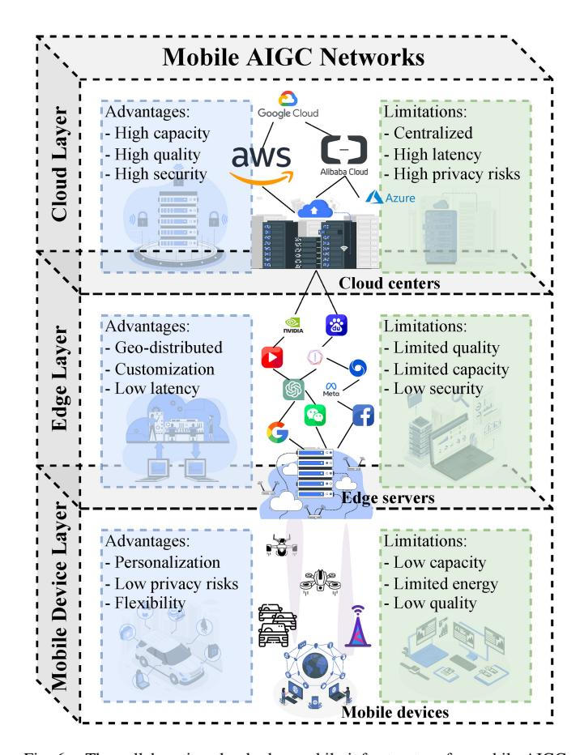

Fig. 6. The collaborative cloud-edge-mobile infrastructure for mobile AIGC networks. The advantages and limitations of provisioning AIGC services in each layer are elaborated.

IaaS providers offer access to virtualized AIGC computing resources such as servers, storage, and databases [\[23\]](#page-35-33). Additionally, PaaS provides a platform for developing and deploying AIGC applications and services. Lastly, SaaS delivers applications and services over the Internet, enabling users to access generative AI models directly through a Web browser or mobile application. In summary, cloud computing in mobile AIGC networks allows developers and users to harness the benefits of AI while reducing costs and mitigating challenges associated with constructing and maintaining physical infrastructure, playing a critical role in the development, deployment, and management of AIGC services.

*2) Edge Computing:* By providing computing and storage infrastructure at the edge of the core network [\[29\]](#page-35-18), users can access AIGC services through radio access networks (RAN). Unlike the large-scale infrastructure of cloud computing, edge servers' limited resources often cannot support generative AI model training. However, edge servers can offer real-time fine-tuning and inference services that are less computationally and storage-intensive. By deploying edge computing at the network's periphery, users need not upload data through the core network to cloud servers to request AIGC services. Consequently, reduced service latency, improved data protection, increased reliability, and decreased bandwidth consumption are benefits of AIGC services delivered via edge servers. Compared to exclusively delivering AIGC services

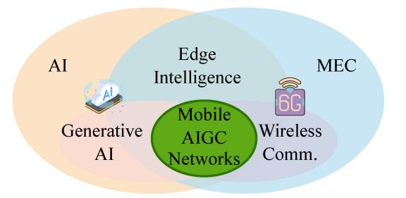

Fig. 7. The connections among AIGC services, wireless communication, mobile edge computing, and generative AI.

through centralized cloud computing, location-aware AIGC services at the edge can significantly enhance user experience [\[82\]](#page-36-37). Furthermore, edge servers for local AIGC service delivery can be customized and personalized to meet user needs. Overall, edge computing enables users to access highquality AIGC services with lower latency.

*3) Mobile Computing:* Device-to-device (D2D) mobile computing involves using mobile devices for the direct execution of AIGC services by users [\[18\]](#page-35-17), [\[83\]](#page-36-38). On one hand, mobile devices can directly execute generative AI models and perform local AIGC inference tasks. While running generative AI models on devices demands significant computational resources and consumes mobile device energy, it reduces AIGC service latency and protects user privacy. On the other hand, mobile devices can offload AIGC services to edge or cloud servers operating over wireless connections, providing a flexible scheme for delivering AIGC services. However, offloading AIGC services to edge or cloud servers for execution necessitates stable network connectivity and increases service latency. Lastly, model compression and quantization must be considered to minimize the resources required for execution on mobile devices, as generative AI models are often large-scale.

Specifically, the connections among AIGC services, wireless communication, mobile edge computing, and generative AI are illustrated in Fig. [7.](#page-11-1)

# *D. Lessons Learned*

*1) Cloud-Edge Collaborative Training and Fine-Tuning for Generative AI Models:* To support AIGC services with required performance evaluated based on metrics discussed in Section [III-A,](#page-8-1) cloud-edge collaborative pre-training and finetuning are envisioned to be promising approaches. On the one hand, cloud data centers can train generative AI models by using powerful computing and data resources. Pre-training in cloud data centers enables leveraging powerful computing and data resources and pre-training on large datasets, which can help models learn general features. However, AIGC services require significant communication and bandwidth resources, and thus raise privacy concerns, and may not be as effective for fine-tuning on smaller more specific datasets. On the other hand, utilizing a large amount of user data in the edge network, the generative AI model can be finetuned to be more customized and personalized. The selection discusses the pros and cons of fine-tuning AIGC models on

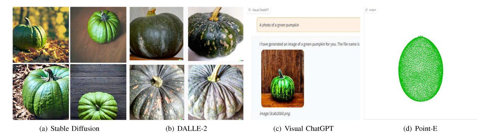

Fig. 8. Generated images of different generative AI models, including Stable Diffusion (https://huggingface.co/spaces/stabilityai/stable-diffusion), DALLE-2 (https://labs.openai.com/), Visual ChatGPT (https://huggingface.co/spaces/microsoft/visual\_chatgpt), Point-E (https://huggingface.co/spaces/openai/point-e), using the prompt "A photo of a green pumpkin."

TABLE II SUMMARY OF STATE-OF-THE-ART GENERATIVE AI MODELS

| Application      | Models                                                                                                                                                                                                                                         | Network Archi- tectures                                          | Datasets                                       | <b>Evaluation Metrics</b>           |
|------------------|------------------------------------------------------------------------------------------------------------------------------------------------------------------------------------------------------------------------------------------------|---------------------------------------------------------------------|------------------------------------------------|-------------------------------------|
| Text Generation  | GPT-3 [85], GPT-4, BERT [86], LaMDA [87], ChatGPT [12]                                                                                                                                                                                      | Transformer [88], Diffusion Model                                | WebText, BookCorpus [89], Common Crawl         | BLEU [90], ROUGE [91], Perplexity   |
| Image Generation | StyleGAN [92], BigGANs [93], StyleGANXL [94], DVD-GAN [95], DALLE [8], DALLE2 [9], CLIP [7], VisualGPT [96], VAE [97], Energy-based GAN [72], Flow-based models [74], Imagen [98], diffusion probabilistic models [99], DDPM [100], DDIM [101] | Diffusion Model, GAN [102], VQ-VAE [103], Transformer [88] | ImageNet [104], CelebA [105], COCO [106] | FID [107], IS [108], LPIPS [109] |
| Music Generation | MuseNet [110], Jukedeck, WaveNet [111], AudioLM [112]                                                                                                                                                                                       | Transformer, RNN, CNN, Diffusion Model                              | MIDI Dataset, MAESTRO [113]              | ABC-notation, Music IS              |
| Video Generation | Diffusion models beat GANs [114], Video Diffusion Models [115], Dreamfusion [116]                                                                                                                                                              | Diffusion Model [1], GAN                                            | Kinetics [117]                                 | PSNR, SSIM                          |
| 3D Generation    | NeRF [118]                                                                                                                                                                                                                                     | Diffusion Model, MLP                                             | Synthetic and real-world scenes                | PSNR, SSIM, LPIPS                   |

edge devices, including the utilization of user data available on edge devices, real-time interaction/response, and reduced privacy concerns, as well as limitations such as computing and storage resources and the need for specialized hardware and software.

*2) Edge-Mobile Collaborative Inference for AIGC Services:* In a mobile AIGC network, the user's location and mobility change over time [\[84\]](#page-36-39). Therefore, a large number of edge and mobile collaborations are required to complete the provision of AIGC inference services. Due to the different mobility of users, the AIGC services forwarded to the edge servers for processing are also dynamic. Several techniques can be leveraged to address the mobility issues in mobile AIGC networks, which include federated learning and distributed training to improve the efficiency of AIGC model updates, advanced DRL algorithms, and meta-learning techniques to optimize the AIGC provider selection strategy in response to changing network conditions, edge caching to deliver low-latency content generation and computing services, and gathering user historical requests and profiles to provide personalized services. Therefore, dynamic resource allocation and task offloading decisions of AIGC applications are some of the challenges in deploying mobile AIGC networks, which we discuss in Section [VI.](#page-22-0)

## IV. HOW TO DEPLOY AIGC AT MOBILE EDGE NETWORKS: APPLICATIONS AND ADVANTAGES OF AIGC

This section introduces creative applications and advantages of AIGC services in the mobile edge network. Then, we provide four use cases of AIGC applications of mobile AIGC networks. Some examples of generative AI models are shown in Fig. [8.](#page-12-2) The applications elaborated in this section are summarized in Table [II.](#page-12-0)

#### *A. Applications of Mobile AIGC Networks*

*1) AI-Generated Texts:* Recent advancements in Natural Language Generation (NLG) technology have led to AI-generated text that is nearly indistinguishable from humanwritten text [\[11\]](#page-35-10). The availability of powerful open-source AI-generated text models, along with their reduced computing power requirements, has facilitated widespread adoption, particularly in mobile networks. The development of lightweight NLG models that can operate on resource-constrained devices, such as smartphones and IoT devices, while maintaining highperformance levels, has made AI-generated text an essential service in mobile AIGC networks [\[39\]](#page-35-28).

One example of such a model is ALBERT (A Lite BERT), designed to enhance the efficiency of BERT (Bidirectional Encoder Representations from Transformers) while reducing its computational and memory requirements [\[119\]](#page-37-0). ALBERT is pre-trained on a vast corpus of text data and uses factorized embedding parameterization, cross-layer parameter sharing, and sentence-order prediction tasks to optimize BERT's performance while minimizing computational and memory demands. ALBERT has achieved performance levels comparable to BERT on various natural language processing tasks, such as question answering and sentiment analysis [\[12\]](#page-35-11). Its lighter model design makes it more suitable for deployment on edge devices with limited resources.

MobileBERT is another model designed for deployment on mobile and edge devices with minimal resources [\[120\]](#page-37-1). This more compact variant of the BERT model is pre-trained on the same amount of data as BERT but features a more computationally efficient design with fewer parameters. Quantization is employed to reduce the model's weight accuracy, further decreasing its processing requirements. MobileBERT is a highly efficient model compatible with various devices, including smartphones and IoT devices, and can be used in multiple mobile applications, such as personal assistants, chatbots, and text-to-speech systems [\[39\]](#page-35-28). Additionally, it can be employed in small-footprint cross-modal applications, such as image captioning, video captioning, and voice recognition. These AIgenerated text models offer significant advantages to mobile edge networks, enabling new applications and personalized user experiences in real time while preserving user privacy.

*2) AI-Generated Audio:* AI-generated audio has gained prominence in mobile networks due to its potential to enhance user experience, and increase efficiency, security, personalization, cost-effectiveness, and accessibility [\[20\]](#page-35-31). For instance, AIGC-based speech synthesis and enhancement can improve call quality in mobile networks, while AIGC-based speech recognition and compression can optimize mobile networks by reducing the data required to transmit audio and automating tasks such as speech-to-text transcription. Voice biometrics powered by AI can bolster mobile network security by utilizing the user's voiceprint as a unique identifier for authentication [\[111\]](#page-37-2). AIGC-driven audio services, such as personalized music generation, can automate tasks and reduce network load, thereby cutting costs.

Audio Albert [\[49\]](#page-36-4), a streamlined version of the BERT model adapted for self-supervised learning of audio representations, demonstrates competitive performance levels compared to other popular AI-generated audio models in various natural language processing tasks such as speech recognition, speaker identification, and music genre classification. In terms of latency, Audio Albert shows faster inference times than previous models, with a 20% reduction in average inference time on average, which can significantly improve response times in mobile edge networks. Additionally, Audio Albert's accuracy is comparable to BERT and achieves state-of-the-art results on several benchmarks. Furthermore, Audio Albert's model design is lighter than other models, making it suitable for deployment on edge devices with limited resources, improving computational efficiency while maintaining highperformance levels. Utilizing Audio Albert in mobile edge networks can provide several benefits, such as faster response times, reduced latency, and lower power consumption, making it a promising solution for AI-generated audio in mobile edge networks.

*3) AI-Generated Images:* AI-generated images offer numerous applications in mobile networks, such as image enhancement, image compression, image recognition, and textto-image generation [\[121\]](#page-37-3). Image enhancement can improve picture quality in low-light or noisy environments, while image compression decreases the data required to transmit images, enhancing overall efficiency. Various image recognition applications include object detection, facial recognition, and image search. Text-to-image generation enables the creation of images from textual descriptions for visual storytelling, advertising, and virtual reality/augmented reality (VR/AR) experiences [\[122\]](#page-37-4), [\[123\]](#page-37-5), [\[124\]](#page-37-6), [\[125\]](#page-37-7).

Make-a-Scene, a novel text-to-image generation model proposed in [\[126\]](#page-37-8), leverages human priors to generate realistic images based on textual descriptions. The model consists of a text encoder, an image generator, and a prior human module trained on human-annotated data to incorporate common sense knowledge. In mobile networks, this model can be trained on a large dataset of images and textual descriptions to swiftly generate images in response to user requests, such as creating visual representations of road maps. This approach complements the techniques employed in [\[127\]](#page-37-9) for generating images with specific attributes.

Furthermore, the Semi-Parametric Neural Image Synthesis (SPADE) method introduced in [\[127\]](#page-37-9) generates new images from existing images and their associated attributes using a neural network architecture. This method produces highly realistic images conditioned on input attributes and can be employed for image-to-image translation, inpainting, and style transfer in mobile networks. The SPADE method shares similarities with the text-to-image generation approach in [\[126\]](#page-37-8), where both techniques focus on generating high-quality, realistic images based on input data.

However, the development of AI-generated image technology also raises concerns around deep fake technology, which uses AI-based techniques to generate realistic photos, movies, or audio depicting nonexistent events or individuals, as discussed in [\[16\]](#page-35-15). Deep fakes can interfere with system performance and affect mobile user tasks, leading to ethical and legal concerns that require more study and legislation.

*4) AI-Generated Videos:* AI-generated videos, like AIgenerated images, can be utilized in mobile networks for various applications, such as video compression, enhancement, summarization, and synthesis [\[95\]](#page-36-40). AI-generated videos offer several advantages over AI-generated images in mobile networks. They provide a more immersive and engaging user experience by dynamically conveying more information [\[128\]](#page-37-10). Moreover, AI-generated videos can be tailored to specific characteristics, such as style, resolution, or frame rate, to improve user experience or create videos for specific purposes, such as advertising, entertainment, or educational content [\[115\]](#page-37-11). Furthermore, AI-generated videos can generate new content from existing videos or other types of data, such as images, text, or audio, offering new storytelling methods [\[115\]](#page-37-11).

Various models can be employed to achieve AI-generated videos in mobile networks. One such model is Imagen Video, presented in [\[13\]](#page-35-12), which is a text-conditioned video generation system based on a cascade of video diffusion models. Imagen Video generates high-definition videos from text input using a base video generation model and an interleaved sequence of spatial and temporal video super-resolution models. The authors describe the process of scaling up the system as a high-definition text-to-video model, including design choices such as selecting fully-convolutional temporal and spatial super-resolution models at specific resolutions and opting for v-parameterization for diffusion models. They also apply progressive distillation with classifier-free guidance to video models for rapid, high-quality sampling [\[13\]](#page-35-12), [\[115\]](#page-37-11). Imagen Video not only produces high-quality videos but also boasts a high level of controllability and world knowledge, enabling the generation of diverse videos and text animations in various artistic styles and with 3D object comprehension.

*5) AI-Generated 3D:* AI-generated 3D content is becoming increasingly promising for various wireless mobile network applications, including AR and VR [\[129\]](#page-37-12), [\[130\]](#page-37-13). It also enhances network efficiency and reduces latency through optimal base station placement [\[131\]](#page-37-14), [\[132\]](#page-37-15). Researchers have proposed several techniques for generating high-quality and diverse 3D content using deep learning (DL) models, some of which complement one another in terms of their applications and capabilities.

One such technique is the Latent-NeRF model, proposed in [\[133\]](#page-37-16), which generates 3D shapes and textures from 2D images using the NeRF architecture. This model is highly versatile and can be used for various applications, such as 3D object reconstruction, 3D scene understanding, and 3D shape editing for wireless VR services. Another technique, the Latent Point Diffusion (LPD) model presented in [\[134\]](#page-37-17), generates 3D shapes with fine-grained details while controlling the overall structure. LPD has been shown to create more diverse shapes than other state-of-the-art models, making it suitable for 3D shape synthesis, 3D shape completion, and 3D shape interpolation. The LPD model complements the latent-NeRF approach by offering more diverse shapes and finer details.

Moreover, researchers in [\[135\]](#page-37-18) proposed the Diffusion-SDF model, which generates 3D shapes from natural language descriptions. This model utilizes a combination of voxelized

signed distance functions and diffusion-based generative models, producing high-quality 3D shapes with fine-grained details while controlling the overall structure. This technique accurately generates 3D shapes from natural language descriptions, making it useful for applications such as 3D shape synthesis, completion, and interpolation. It shares similarities with the Latent-NeRF and LPD models in terms of generating highquality 3D content [\[136\]](#page-37-19).

#### *B. Advantages of Mobile AIGC*

We then discuss several advantages of generative AI in mobile networks.

- *1) Efficiency:* Generative AI models offer several efficiency benefits in mobile networks. As demonstrated in the applications of AI-generated text models like ALBERT [\[119\]](#page-37-0) and MobileBERT [\[120\]](#page-37-1), these models can automate the process of creating text, reducing the need for human labor and significantly boosting productivity [\[137\]](#page-37-20). Moreover, as shown in the applications of AI-generated audio models like Audio Albert [\[49\]](#page-36-4), these models can be implemented at the edge of mobile networks [\[138\]](#page-37-21), [\[139\]](#page-37-22), allowing them to produce data locally on devices like smartphones and IoT sensors. This results in improved user experiences and reduced latency in mobile applications that rely on real-time data generation and processing [\[138\]](#page-37-21).
- *2) Reconfigurability:* The reconfigurability of AIGC in mobile networks is a significant advantage. As demonstrated in the ChatGPT application, AIGC can produce a vast array of content, which can be seamlessly adjusted to suit evolving network demands and user preferences [\[140\]](#page-37-23). Furthermore, as shown in the applications of AI-generated image models like Make-a-Scene [\[126\]](#page-37-8) and SPADE [\[126\]](#page-37-8), AIGC can contribute to reconfigurability in mobile networks by utilizing image and audio-generative models. These models can be trained to generate new visuals and auditory content based on specific parameters, such as user preferences or contextual information.
- *3) Accuracy:* Employing generative AI models in mobile networks provides significant benefits in terms of accuracy, leading to more precise predictions and well-informed decision-making [\[114\]](#page-37-24). Similarly, AI-generated visuals and audio can be employed to improve the quality and accuracy of network-provided content, encompassing domains such as advertising, entertainment, and accessibility services. By using generative AI models, tailored and engaging content can be produced, resulting in a more impactful and personalized user experience. In the context of mobile networks, this can mean generating high-quality images or videos adapted to various devices and network conditions, improving the user perception of the provided services. By harnessing the power of generative AI models, mobile networks can offer more accurate and efficient services, ultimately fostering a superior user experience and enabling innovative solutions tailored to the diverse needs of mobile users [\[47\]](#page-36-2).
- *4) Scalability and Sustainability:* Utilizing AIGC in mobile networks offers significant scalability and sustainability benefits [\[114\]](#page-37-24). AIGC can produce a wide range of content [\[13\]](#page-35-12),

enhancing mobile networks' overall scalability and sustainability in numerous ways. Specifically, AIGC facilitates scalability in mobile networks by reducing the reliance on human labor and resources. Furthermore, AIGC streamlines the entire content production process, encapsulating activities from initial capture to retouching, and from synergistic designer collaboration to large-scale production. This process efficiency leads to a substantial time saving, which not only results in diminished energy consumption, but also contributes to a reduced carbon footprint associated with maintaining physical storage infrastructures [\[141\]](#page-37-25). Despite the challenges associated with generative AI models, such as large model sizes and complex training processes, leveraging edge servers in mobile networks can help mitigate these issues by adopting an "AIGCas-a-Service" approach [\[138\]](#page-37-21). Users can interact with the system by submitting requests through their mobile devices and subsequently receiving computational results from edge servers. This strategy eliminates the need to deploy generative AI models on devices with constrained computing resources, optimizing overall efficiency and improving scalability and sustainability within the mobile network infrastructure [\[25\]](#page-35-32).

*5) Security and Privacy:* AIGC can offer potential security and privacy advantages by embedding sensitive information within AI-generated content. This approach can serve as a form of steganography, a technique that conceals data within other types of data, making it difficult for unauthorized parties to detect the hidden information. However, it is essential to be aware of potential security and privacy risks associated with AIGC, such as adversarial attacks on AI models or the misuse of AI-generated content for malicious purposes, like deepfakes [\[16\]](#page-35-15). To ensure the secure and privacy-preserving use of AIGC in mobile networks, robust security measures and encryption techniques must be in place, along with ongoing research to counter potential threats [\[142\]](#page-37-26).

### V. CASE STUDIES OF AIGC IN MOBILE NETWORK

Many case studies have been done for achieving effective and efficient mobile AIGC networks as shown in Table [III.](#page-16-0) In this section, we review several representative cases, e.g., the AIGC service provider (ASP) selection, generative AI-empowered traffic and driving simulation, AI-generated incentive mechanism, and blockchain-powered lifecycle management for AIGC.

#### *A. AI-Generated Incentive Mechanism*

In this case study, we present the idea of using AI-generated optimization solutions with a focus on the use of diffusion models and their ability to optimize the utility function.

In today's world of advanced Internet services, including the Metaverse, MR technology is essential for delivering captivating and immersive user experiences [\[162\]](#page-38-0), [\[163\]](#page-38-1). Nevertheless, the restricted processing power of head-mounted displays (HMDs) used in MR environments poses a significant challenge to the implementation of these services. To tackle this problem, the researchers in [\[143\]](#page-37-27) introduce an innovative information-sharing strategy that employs full-duplex deviceto-device semantic communication [\[164\]](#page-38-2). This method enables

users to circumvent computationally demanding and redundant processes, such as producing AIGC in-view images for all MR participants. By allowing users to transmit generated content and semantic data derived from their view image to nearby users, these individuals can subsequently utilize the shared information to achieve spatial matching of computational outcomes within their view images. In their work, the authors of [\[143\]](#page-37-27) primarily concentrate on developing a contract theoretic incentive mechanism to promote semantic information exchange among users. Their goal is to create an optimal contract that, while adhering to the utility threshold constraints of the semantic information provider, simultaneously maximizes the utility of the semantic information recipient. Consequently, they devised a diffusion model-based AI-generated contract algorithm [\[1\]](#page-35-0), as illustrated in Fig. [9.](#page-17-0)

Specifically, the researchers developed a cutting-edge algorithm for creating AI-generated incentive mechanisms [\[1\]](#page-35-0), which tackle the challenge of utility maximization by devising optimal contract designs [\[143\]](#page-37-27). This approach is distinct from traditional neural network backpropagation algorithms or DRL methods, as it primarily focuses on enhancing contract design through iterative denoising of the initial distribution instead of optimizing model parameters. The policy for contract design is defined by the reverse process of a conditional diffusion model, linking environmental states to contract arrangements. The primary goal of this policy is to produce a deterministic contract design that maximizes the expected total reward over a series of time steps. To optimize system utility through contract design, the researchers in [\[143\]](#page-37-27) create a contract quality network that associates an environmentcontract pair with a value representing the expected total reward when an agent implements a particular contract design policy from the current state and adheres to it in the future. The optimal contract design policy maximizes the system's predicted cumulative utility. The researchers then carried out an extensive comparison between their suggested AI-powered contract algorithm and two DRL algorithms, specifically SAC and PPO. As illustrated in the training process in [\[143\]](#page-37-27) (see Fig. [10\)](#page-17-1), PPO requires more iteration steps to achieve convergence, while SAC converges more quickly but with a lower final reward value in comparison to the AI-driven contract algorithm.

The enhanced performance of the suggested AI-driven contract algorithm can be ascribed to two main aspects:

- *•* Improved sampling quality: By configuring the diffusion step to 10 and applying multiple refinement steps, the diffusion models generate higher quality samples, mitigating the influence of uncertainty and augmenting sampling precision [\[114\]](#page-37-24).
- *•* Enhanced long-term dependence processing capability: Unlike conventional neural network generation models that take into account only the current time step input, the diffusion model creates samples with additional time steps through numerous refinement iterations, thereby bolstering its long-term dependence processing capability [\[121\]](#page-37-3).

As demonstrated in Fig. [10,](#page-17-1) the authors in [\[143\]](#page-37-27) examine the optimal contract design capacities of the trained models. For a

TABLE III KEY LITERATURE CONSIDERING AIGC WITHIN WIRELESS NETWORK

| Reference | System Model                                                                                                                                        | Method Used                                                                                                                                                  |
|-----------|-----------------------------------------------------------------------------------------------------------------------------------------------------|--------------------------------------------------------------------------------------------------------------------------------------------------------------|
| [1]       | A comprehensive tutorial on generative diffusion models in                                                                                          | Integration of diffusion models with DRL, incentive                                                                                                          |
|           | various network optimization problems                                                                                                               | design, semantic communications, and IoV networks                                                                                                            |
| [143]     | Users sharing information through full-duplex device-to-device semantic communications                                                              | Diffusion model-based incentive mechanism generation to maximize the users' utilities                                                                        |
| [144]     | Selection of AIGC service providers (ASPs) capable of effectively executing user tasks                                                              | Generative diffusion model for optimal decision generation in ASP selection problem                                                                          |
| [145]     | Distributed diffusion model where the user transmits the results after several shared denoising steps to other users                                | A collaborative distributed diffusion-based AIGO framework                                                                                                   |
| [138]     | Large-scale deployment of AaaS with 20 AIGC service providers (ASPs) and 1000 edge users                                                            | Deep reinforcement learning (DRL)-enabled solutio to maximize a utility function                                                                             |
| [146]     | AIGC lifecycle management framework with three ESPs and three producers, supported by the Draw Things application                                   | Blockchain technology to protect the ownership an copyright of AIGC, along with a reputation-base service provider selection strategy                        |
| [147]     | Deep generative model-empowered wireless network management and use cases, e.g., network routing, resource allocation, and network economics        | Diffusion model to generate effective contracts for incentivizing mobile AIGC services                                                                       |
| [148]     | Wireless sensing platform based on the 801.11ac protocol with a signal transmitter and five receivers                                               | Multi-scale wireless perception for AIGC services                                                                                                            |
| [149]     | A user requests a specific number of images from a service provider that is attacked by data poisoning, while diffusion models provide the defense  | Generative diffusion model-aided optimization to identify the optimal diffusion steps to minimize the total energy cost                                      |
| [150]     | A multi-modality semantic-aware framework for generative AI-enabled vehicular networks                                                              | A double deep Q-network-based approach to address the resource allocation problem in generative All enabled V2V communication                          |
| [151]     | An integrated semantic communication and AIGC (ISCA) framework for Metaverse services                                                               | Diffusion model-based joint resource allocation i ISCA systems                                                                                               |
| [152]     | A semantic communication framework based on You Only Look Once (YOLO) to construct a virtual apple orchard                                          | Semantic communications with generative diffusion model-aided resource optimization                                                                          |
| [153]     | A foundation model caching and inference framework to balance the tradeoff among inference latency, accuracy, and resource consumption        | Managing cached foundation models and user request during the provisioning of generative AI services                                                         |
| [80]      | A framework of joint model caching and inference for managing models and allocating resources                                                       | A least context algorithm for managing cached mode at edge servers                                                                                           |
| [154]     | An autonomous driving architecture, where generative AI is leveraged to synthesize conditioned traffic and driving data                             | A multi-task digital twin offloading model and a mult task enhanced auction-based mechanism                                                                  |
| [155]     | A framework that used mobile AIGC to drive Human Digital Twin (HDT) applications, focusing on personalized healthcare solutions                     | Using generative diffusion model for the resource allocation in mobile AIGC-driven HDT system                                                                |
| [156]     | The model combines Federated Learning (FL) with AIGC to improve AIGC creation and privacy in wireless networks                                      | Using FL techniques to fine-tune AIGC, yielding reduced communication cost and training latency                                                              |
| [157]     | Exploring the application of Generative Artificial Intelligence (GAI) in the physical layer of Integrated Sensing and Communications (ISAC) systems | Using a diffusion model-based method for signal d rection estimation demonstrates GAI's efficacy in nea field ISAC                                           |
| [158]     | GAI-aided Semantic Communication (SemCom) system that uses multi-model prompts for accurate content decoding and incorporates security measures     | Using a diffusion model to ensure secure and accurate message transmission                                                                                   |
| [159]     | Using Pretrained Foundation Models (PFMs) and prompt engineering to expand the applications of AIGC in edge networks                                | Using ChatGPT to train an effective prompt optimize measuring its impact on user experience                                                                  |
| [160]     | Flexible-position multiple-input multiple-output (MIMO) systems                                                                                     | Using generative diffusion model to generate optimal antenna trajectories to maximize system efficiency                                                      |
| [142]     | A blockchain-aided semantic communication framework for AIGC services in virtual transportation networks                                            | A training-based targeted semantic attack scheme an counters it with a blockchain and zero-knowledg proof-based defense mechanism                            |
| [142]     | A blockchain-aided semantic communication framework for AIGC services in virtual transportation networks                                            | A training-based targeted semantic attack scheme an counters it with a blockchain and zero-knowledg proof-based defense mechanism                            |
| [161]     | A framework that uses wireless perception to guide generative AI in producing digital content                                                       | A Sequential Multi-Scale Perception algorithm for user skeleton prediction and a diffusion model-base approach to generate an optimal pricing strategy |

specific environmental state, the AI-driven contract algorithm provides a contract design that attains a utility value of 189.1, markedly outperforming SAC's 185.9 and PPO's 184.3. These

results highlight the practical advantages of the proposed AI-based contract algorithm in contrast to traditional DRL techniques.

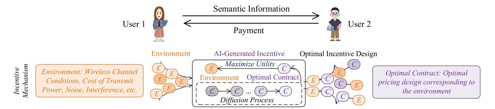

Fig. 9. System model of contract design in semantic information sharing network, and the AI-generated contract algorithm. The diffusion models generate different optimal contract designs under different environmental variables.

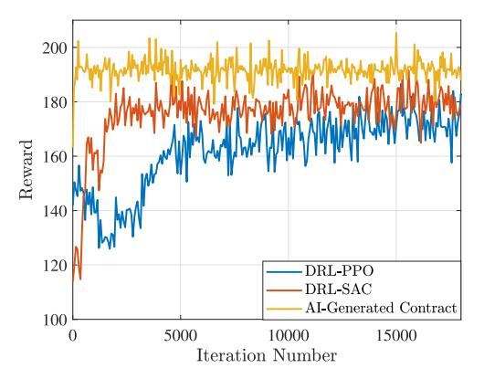

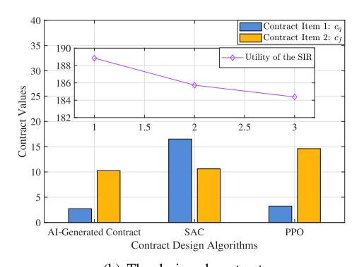

Fig. 10. The effect of different incentive design schemes, e.g., PPO, SAC, and AI-generated contract [\[143\]](#page-37-27).

*Lesson Learned:* The case study in this research highlights the potential of AI-generated optimization solutions, particularly diffusion models, for addressing complex utility maximization problems within incentive mechanism design. The authors in [\[143\]](#page-37-27) present an innovative approach that employs full-duplex device-to-device semantic communication for information-sharing in mixed reality environments, overcoming the limitations of HMDs. The diffusion modelbased AI-generated contract algorithm proposed in this study demonstrates superior performance compared to traditional DRL algorithms, such as SAC and PPO. The superior performance of the AI-generated contract algorithm can be attributed to improved sampling quality and enhanced longterm dependence processing capability. This study underscores the effectiveness of employing AI-generated optimization solutions in complex, high-dimensional environments, particularly in the context of incentive mechanism design. Some promising directions for future research include:

- *•* Expanding the application of diffusion models: Investigate the application of diffusion models in other domains, such as finance, healthcare, transportation, and logistics, where complex utility maximization problems often arise.
- *•* Developing novel incentive mechanisms: Explore the development of new incentive mechanisms that combine AI-generated optimization solutions with other approaches, such as game theory or multi-agent reinforcement learning, to create even more effective incentive designs.
- *•* Exploring the role of human-AI collaboration: Investigate how AI-generated optimization solutions can be combined with human decision-making to create hybrid incentive mechanisms that capitalize on the strengths of both human intuition and AI-driven optimization.

#### *B. AIGC Service Provider Selection*

The integration of generative AI models within wireless networks offers significant potential, as these state-of-theart technologies have exhibited exceptional capabilities in generating a wide range of high-quality content. By harnessing the power of artificial intelligence, generative AI models can astutely analyze user inputs and produce tailored, contextually relevant content in real-time [\[114\]](#page-37-24). This stands to considerably enhance user experience and foster the creation of innovative applications across various domains, such as entertainment, education, and communication. Nonetheless, the deployment and application of these advanced models give rise to challenges, including extensive model sizes, complex training processes, and resource constraints. Consequently, deploying large-scale AI models on every network edge device poses considerable difficulties.

To address this challenge, the authors in [\[138\]](#page-37-21) introduce the "AIGC-as-a-service" architecture. This approach entails ASPs deploying AI models on edge servers, which facilitates the provision of instantaneous services to users via wireless networks, thereby ensuring a more convenient and adaptable experience. By enabling users to effortlessly

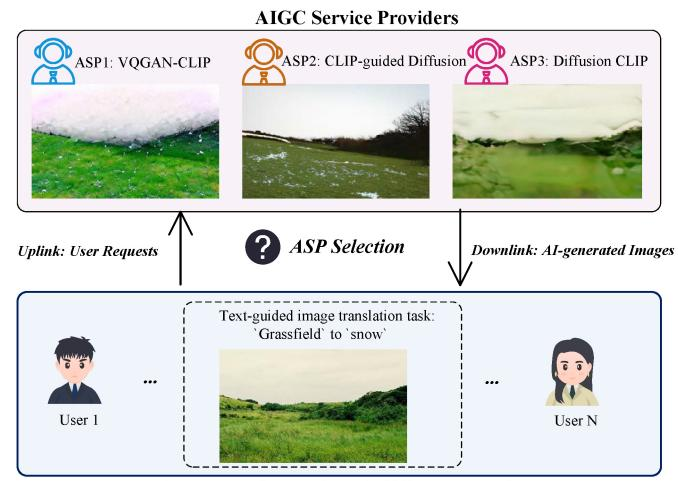

Fig. 11. The system model of AIGC service provider selection. Different ASPs performing user tasks can bring different results and different user utilities. Considering that different mobile users have different task requirements and different ASP's AI models have different capabilities and computation capacities, a proper ASP selection algorithm is needed to maximize the total utilities of network users.

access and engage with AIGC, the proposed solution minimizes latency and resource consumption. Consequently, edge-based AIGC-as-a-service holds the potential to transform the creation and delivery of AIGC across wireless networks.

However, one problem is that the effectiveness of ASP in meeting user needs displays significant variability due to a variety of factors. Certain ASPs may concentrate on generating specific content types, while others boast more extensive content generation capabilities. For instance, some providers may specialize in producing particular content categories, whereas others offer a wider range of content generation options. Moreover, several ASPs may have access to advanced computing and communication resources, empowering them to develop and deploy more sophisticated generative AI models within the mobile network. As depicted in Fig. [11,](#page-18-0) users uploading images and requirement texts to different ASPs encounter diverse results owing to the discrepancies in models employed. For example, a user attempting to add snow to grass in an image may experience varying outcomes depending on the ASP chosen.

With a large number of mobile users and increasing demand for accessing requests, it is crucial to analyze and select ASPs with the necessary capability, skill, and resources to offer high-quality AIGC services. This requires a rigorous selection process considering the provider's generative AI model capabilities and computation resources. By selecting a provider with the appropriate abilities and resources, organizations can ensure that they have effective AIGC services to increase the QoE for mobile users. Motivated by the aforementioned reasons, the authors in [\[138\]](#page-37-21) examine the viability of large-scale deployment of AIGC-as-a-Service in wireless edge networks. Specifically, in the ASP selection problem, which can be framed as a resource-constrained task assignment problem, the system consists of a series of sequential user tasks, a set of available ASPs, and the unique utility function for each ASP. The objective is to find an assignment of tasks to ASPs, such that the overall utility is maximized. Note that the utility of the task assigned to the ASP is a function of the required resource. Without loss of generality, the authors in [\[138\]](#page-37-21) consider that is in the form of the diffusion step of the diffusion model, which is positively correlated to the energy cost. The reason is that each step of the diffusion model has energy consumption as it involves running a neural network to remove Gaussian noise. Finally, the total availability of resources for each ASP is taken into account to ensure that the resource constraints are satisfied.

In this formulation of AIGC service provisioning, the resource constraints are incorporated through the resource constraint, which specifies the limitations on the available resources. Note that failing to satisfy the resource constraint can result in the crash of ASP, causing the termination and restart of its running tasks.

Several baseline policies are used for comparison:

- *• Random Allocation Policy.* This strategy distributes tasks to ASPs in a haphazard manner, without accounting for available resources, task duration, or any restrictions. The random allocation serves as a minimum benchmark for evaluating scheduling efficiency.
- *• Round-Robin Policy.* The round-robin policy allocates tasks to ASPs sequentially in a repeated pattern. This approach can generate effective schedules when tasks are evenly distributed. However, its performance may be suboptimal when there are significant disparities among them.
- *• Crash-Avoid Policy.* The crash-avoid policy prioritizes ASPs with greater available resources when assigning tasks. The goal is to prevent overburdening and maintain system stability.
- *• Upper Bound Policy.* In this hypothetical scenario, the scheduler has complete knowledge of the utility each ASP offers to every user before task distribution. The omniscient allocation strategy sets an upper limit on the performance of user-centric services by allocating tasks to ASPs with the highest utility and avoiding system failures. However, this approach relies on prior information about the unknown utility function, which is unrealistic in practice.

The authors in [\[138\]](#page-37-21) employed a Deep Reinforcement Learning (DRL) technique to optimize Application Service Provider (ASP) selection. In particular, they implemented the Soft Actor-Critic (SAC) method, which alternates between evaluating and improving the policy. Unlike traditional actorcritic frameworks, the SAC approach maximizes a balance between expected returns and entropy, allowing it to optimize both exploitation and exploration for efficient decision-making in dynamic ASP selection scenarios. To conduct the simulation, the authors consider 20 ASPs and 1000 edge users. Each ASP offered AaaS with a maximum resource capacity, measured by total diffusion timesteps in a given time frame, varying randomly between 600 and 1,500. Each user submits multiple AIGC task requests to ASPs at varying times. These requests detailed the necessary AIGC resources

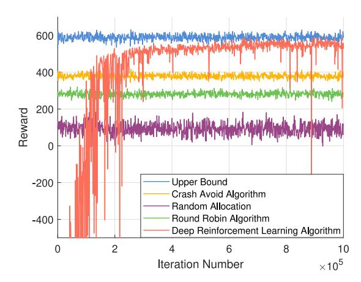

Fig. 12. The cumulative rewards under different ASP selection algorithms [\[138\]](#page-37-21). DRL-based algorithms can outperform multiple baseline policies, i.e., overloading-avoidance, random, and round-robin, and approximate the optimal policy.

in terms of diffusion timesteps, randomly set between 100 and 250. Task arrivals from users adhered to a Poisson distribution, with a rate of 0.288 requests per hour over a 288-hour duration, amounting to 1,000 tasks in total. As shown in Fig. [12,](#page-19-0) simulation results indicate that the proposed DRL-based algorithm outperforms three benchmark policies, i.e., overloading-avoidance, random, and round-robin, by producing higher-quality content for users and achieving fewer crashed tasks.

*Lesson Learned:* The lesson learned from this study is that the proper selection of ASPs is crucial for maximizing the total utilities of network users and enhancing their experience. The authors in [\[138\]](#page-37-21) introduced a DRL-based algorithm for ASP selection, which outperforms other baseline policies, such as overloading-avoidance, random, and round-robin. By leveraging the SAC approach, the algorithm strikes a balance between exploitation and exploration in decision-making for dynamic ASP selection scenarios. Consequently, this method can provide higher-quality content for users and lead to fewer crashed tasks, ultimately improving the quality of service in wireless edge networks. To further enhance research in the area of AIGC service provider selection, future studies could have:

- *•* Investigate the integration of FL and distributed training methods to improve the efficiency of generative AI model updates and reduce the communication overhead among ASPs.
- *•* Explore advanced DRL algorithms and meta-learning techniques to adaptively adjust the ASP selection strategy in response to changing network conditions and user requirements.
- *•* Assess the impact of real-world constraints, such as network latency, data privacy, and security concerns, on the ASP selection process and devise strategies to address these challenges.
- *•* Develop multi-objective optimization techniques for ASP selection that consider additional factors, such as energy consumption, cost, and the trade-off between content quality and computational resources.

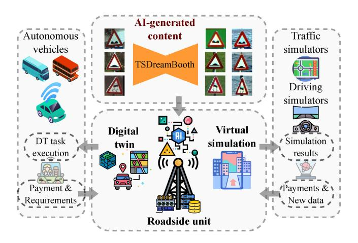

Fig. 13. Generative AI-empowered simulations for autonomous driving in vehicular Metaverse, which consists of AVs, virtual simulators, and roadside units.

#### *C. Generative AI-Empowered Traffic and Driving Simulation*

In autonomous driving systems, traffic and driving simulation can affect the performance of connected autonomous vehicles (AVs). Existing simulation platforms are established based on historical road data and real-time traffic information. However, these data collection processes are difficult and costly, which hinders the development of fully automated transportation systems. Fortunately, generative AI-empowered simulations can largely reduce the cost of data collection and labeling by synthesizing traffic and driving data via generative AI models. Therefore, as illustrated in Fig. [13,](#page-19-1) the authors in [\[154\]](#page-38-3) design a specialized generative AI model, namely TSDreambooth, for conditional traffic sign generation in the proposed vehicular mixed reality Metaverse architecture. In detail, TSDreambooth is a variation of stable diffusion [\[165\]](#page-38-4) fine-tuned based on the Belgium traffic sign (BelgiumTS) dataset [\[166\]](#page-38-5). The performance of TSDreambooth is validated via the pre-trained traffic sign classification model as generative scores. In addition, the newly generated datasets are leveraged to improve the performance of original traffic sign classification models.

In the vehicular Metaverse, connected AVs, roadside units, and virtual simulators can develop simulation platforms in the virtual space collaboratively. Specifically, AVs maintain their representations in the virtual space via digital twin (DT) technologies. Therefore, AVs need to continuously generate multiple DT tasks and execute them to update the representations. To offload these DT tasks to roadside units for remote execution in real-time, AVs need to pay for the communication and computing resources of roadside units. Therefore, to provide fine-grained incentives for RSUs in executing DT tasks with heterogeneous resource demands and various required deadlines, the authors in [\[154\]](#page-38-3) propose a multi-task enhanced physical-virtual synchronization auctionbased mechanism, namely MTEPViSA, to determine and price the resources of RSUs. There are two stage of this mechanism the online submarket for provisioning DT services and the offline submarket for provisioning traffic and driving simulation services. In the online simulation submarket, the

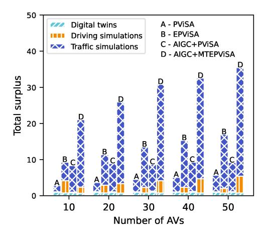

Fig. 14. Performance evaluation of the MTEPViSA under different sizes of the market.

multi-task DT scoring rule is proposed to resolve the externalities from the offline submarket. In the meanwhile, the price scaling factor is leveraged to reduce the effect of asymmetric information among driving simulators and traffic simulators in the offline submarket. The simulation experiments are performed in a vehicular Metaverse system with 30 AVs, 30 virtual traffic simulators, 1 virtual driving simulator, and 1 RSU. The experimental results demonstrate that the proposed mechanism can improve 150% social surplus compared with other baseline mechanisms. Finally, they develop a simulation testbed of generative AI-empowered simulation systems in the vehicular Metaverse.

The vehicular mixed-reality (MR) Metaverse simulation environment was constructed employing a 3D model representing several city blocks within New York City. Geopipe, Inc. developed this model by leveraging artificial intelligence to generate a digital replica based on photographs taken throughout the city. The simulation encompasses an autonomous vehicle navigating a road, accompanied by strategically positioned highway advertisements. Eye-tracking data were gathered from human participants immersed in the simulation, utilizing the HMD Eyes addon provided by Pupil Labs. Subsequent to the simulation, participants completed a survey aimed at evaluating their subjective level of interest in each simulated scenario. As the experimental results shown in Fig. [14,](#page-20-0) According to the study, as the number of AVs continues to increase, the supply and demand mechanisms in the market are changing. Therefore, to improve market efficiency and total surplus, some mechanisms need to be adopted to coordinate supply and demand. We investigate the market mechanism and propose a mechanism based on AIGC technology to enhance market efficiency. Compared with the existing Physical-virtual Synchronization auction (PViSA) and Enhanced Physical-virtual Synchronization auction (EPViSA) mechanisms [\[167\]](#page-38-6), [\[168\]](#page-38-7), the AIGC-empowered mechanism can double the total surplus under different numbers of AVs.

*Lesson Learned:* This case study on generative AIempowered autonomous driving opens a new paradigm for the vehicular Metaverse, where data and resources can be utilized more efficiently. The authors demonstrate the potential

of generative AI models in synthesizing traffic and driving data to reduce the cost of data collection and labeling. The proposed MTEPViSA mechanism also provides a solution to determine and price the resources of roadside units for remote execution of digital twin tasks, improving market efficiency and total surplus. However, there are still several open issues that need to be addressed in this field. Firstly, it is necessary to investigate the potential negative impacts of generative AI models in synthesizing traffic and driving data, such as biases and inaccuracies. Secondly, more research is needed to develop robust and trustworthy mechanisms for determining and pricing the resources of RSUs to ensure fair and efficient allocation of resources. Thirdly, the proposed mechanism needs to be tested and evaluated in more complex and varied scenarios to ensure its scalability and applicability in real-world situations.

## *D. Blockchain-Powered Lifecycle Management for AI-Generated Content Products*

This case study delves into the application of a blockchainbased framework for managing the lifecycle of AIGC products within edge networks. The framework, proposed by the authors in [\[146\]](#page-37-28), addresses concerns related to stakeholders, the blockchain platform, and on-chain mechanisms. We explore the roles and interactions of the stakeholders, discuss the blockchain platform's functions, and elaborate on the framework's on-chain mechanisms. Within edge networks, the AIGC product lifecycle encompasses four main stakeholders: content creators, Edge Service Providers (ESPs), end-users, and adversaries. The following describes their roles and interplay within the system:

- *• Producers:* Initiate the AIGC product lifecycle by proposing prompts for ESPs to generate content. They retain ownership rights and can publish and sell the generated products.
- *• ESPs:* Possess the resources to generate content for producers, charging fees based on the time and computing power used for the tasks.
- *• Consumers:* View and potentially purchase AIGC products, participating in multiple trading transactions throughout the product lifecycle.
- *• Attackers:* Seek to disrupt normal operations of AIGC products for profit through ownership tampering and plagiarism.

Considering the roles of these stakeholders, the blockchain platform fulfills two primary functions: providing a traceable and immutable ledger and supporting on-chain mechanisms. Transactions are recorded in the ledger and validated by full nodes using a consensus mechanism, ensuring security and traceability. ESPs act as full nodes, while producers and consumers serve as clients.

To address the concerns arising from stakeholder interactions, the framework employs three on-chain mechanisms [\[146\]](#page-37-28):

*• Proof-of-AIGC:* A mechanism that defends against plagiarism by registering AIGC products on the blockchain. It comprises two phases: proof generation and challenge.

- *• Incentive Mechanism:* Safeguards the exchange of funds and AIGC ownership using Hashed Timelock Contracts (HTLCs).
- *• Reputation-based ESP Selection:* Efficiently schedules AIGC generation tasks among ESPs based on their reputation scores.

The Proof-of-AIGC mechanism plays a vital role in maintaining the integrity of AIGC products. It encompasses two stages: proof generation and challenge. The objective of proof generation is to record AIGC products on the blockchain, while the challenge phase allows content creators to raise objections against any on-chain AIGC product they deem infringing upon their creations. If the challenge is successful, the duplicate product can be removed from the registry, thus protecting the original creator's intellectual property rights.

To further strengthen the security of the AIGC ecosystem, a pledged deposit is necessary to initiate a challenge, preventing arbitrary challenges that could burden the blockchain. This process comprises four steps: fetching the proofs, verifying the challenger's identity, measuring the similarity between the original product and the duplicate, and checking the results.

The AIGC economic system necessitates an incentive mechanism to motivate stakeholders and ensure legitimate exchanges of funds and ownership. The Incentive Mechanism rewards ESPs for maintaining the ledger and providing blockchain services. There are no transaction fees, and block generators follow a first-come-first-serve strategy. A two-way guarantee protocol using Hash Time Lock (HTL) is designed to build mutual trust and facilitate AIGC circulation during both the generation and trading phases.

The Proof-of-AIGC mechanism tackles issues like ownership manipulation and AIGC plagiarism, while the incentive mechanism ensures compliance with pre-established contracts. Furthermore, a reputation-based ESP selection accommodates ESP heterogeneity, which is crucial for efficient AIGC lifecycle management. Specifically, within the AIGC lifecycle management architecture, producers can concurrently interact with multiple heterogeneous ESPs, necessitating the identification of a trustworthy ESP for a specific task. Conventional approaches involve selecting the most familiar ESP to minimize potential risks, which may result in unbalanced workload distribution and increased service latency among ESPs. To address this challenge, a reputation-based ESP selection strategy is incorporated into the framework. This strategy ranks all accessible ESPs according to their reputation, which is computed using Multi-weight Subjective Logic (MWSL). The primary objectives are to assist producers in choosing the most reliable ESP, distribute the workload evenly across multiple ESPs, and motivate ESPs to accomplish tasks promptly and honestly, as a negative reputation impacts their earnings.

Producers identify suitable ESPs by computing the reputation of all potential ESPs, ranking them based on their current reputation, and allocating the AIGC generation task to the ESP with the highest standing. In MWSL, the concept of "opinion" serves as the fundamental element for reputation calculation. Local opinions represent the assessments of a specific producer who has directly interacted with the ESPs, while recommended opinions are derived from other producers

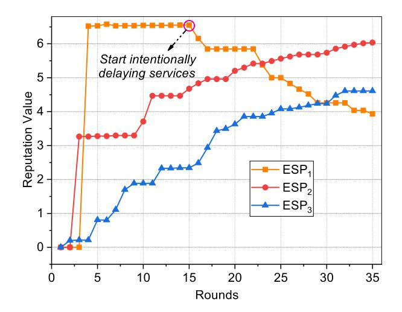

Fig. 15. The reputation trends of three ESPs (from the perspective of a random producer) [\[146\]](#page-37-28).

who have also engaged with the ESPs. To mitigate the effect of subjectivity, an overall opinion is generated for each producer by averaging all the acquired recommended opinions. As producers possess varying degrees of familiarity with ESPs, the weight of their recommended opinions differs. Reputation is determined by combining a producer's local opinion with the overall opinion. The reputation scheme accomplishes its design objectives by quantifying the trustworthiness of ESPs, aiding producers in selecting the most dependable ESP, reducing service bottlenecks, and incentivizing ESPs to deliver high-quality AIGC services to maximize their profits.

A demonstration of the AIGC lifecycle management framework is conducted to verify the proposed reputation-based ESP selection approach [\[146\]](#page-37-28). The experimental setup comprises three ESPs and three producers, with the AIGC services facilitated by the Draw Things application. Several parameters are configured, and producers can employ the Softmax function to ascertain the probability of choosing each ESP. The reputation trends of the three ESPs are shown in Fig. [15,](#page-21-0) with ESP1 attaining the highest rank and remaining stable owing to its superior service quality. When ESP1 deliberately postpones AIGC services, its reputation declines sharply, while the reputations of ESP2 and ESP3 continue to rise. The proposed reputation strategy effectively measures the trustworthiness of ESPs, enabling producers to effortlessly discern the most reliable ESPs and motivating ESPs to operate with integrity. In reality, the dynamics of ESP selection would become more complex with an increase in the number of ESPs and producers. This underlines the potential challenges and importance of effective reputation management strategies in such expanded scenarios. The reputation-based selection method's robustness and scalability in a larger network is a subject for future work. The workload of ESPs under different ESP selection methods is also demonstrated in Fig. [16.](#page-22-1) Traditional methods lead to uneven workloads and extended service latencies. Conversely, the proposed reputation-based method effectively balances the workload among ESPs. This is achieved by enabling producers to quantitatively assess the trustworthiness of ESPs without

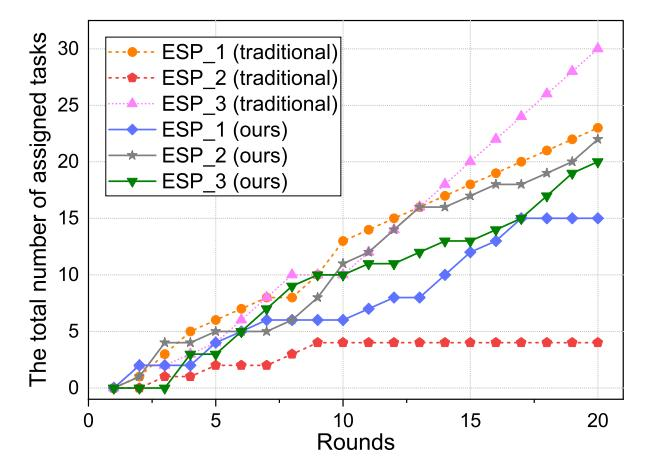

Fig. 16. The total number of assigned tasks of three ESPs [\[146\]](#page-37-28).

solely relying on their experiential judgment. The effectiveness of this approach in a network with a larger number of ESPs is an aspect that invites further exploration.

*Lesson Learned:* The case study on blockchain-powered lifecycle management for AI-generated content products highlights the potential of a blockchain-based framework in addressing key concerns like stakeholder interactions, platform functionality, and on-chain mechanisms. The primary lessons learned emphasize the importance of defining clear stakeholder roles, implementing robust mechanisms such as Proof-of-AIGC and Incentive Mechanism to ensure system integrity, and employing a reputation-based ESP selection scheme to balance workload and encourage honest performance. These insights collectively contribute to the effective management of the AIGC product lifecycle within edge networks. Future research in blockchain-powered lifecycle management for AIgenerated content products can explore several promising directions:

- *•* Enhancing the efficiency and scalability of the blockchain platform to handle an increased number of transactions and support a growing AIGC ecosystem might be critical.
- *•* Refining the reputation-based ESP selection scheme to account for more sophisticated factors, such as task complexity, completion time, and user feedback, could lead to more accurate and dynamic trustworthiness evaluations.
- *•* Incorporating privacy-preserving techniques to protect sensitive data in AIGC products and user information without compromising the transparency and traceability of blockchain technology would be valuable.

# VI. IMPLEMENTATION CHALLENGES IN MOBILE AIGC NETWORKS

When providing AIGC services, a significant amount of computational and storage resources are required to run the generative AI model. These computation and storageintensive services pose new challenges to existing mobile edge computing infrastructure. As discussed in Section [III-C,](#page-10-0) a cloud-edge-mobile collaborative computing architecture can be implemented to provide AIGC services. However, several

critical implementation challenges must be addressed to improve resource utilization and the user experience.

#### *A. Edge Resource Allocation*

AIGC service provisioning based on edge intelligence is computationally and communication-intensive for resourceconstrained edge servers and mobile devices [\[169\]](#page-38-8), [\[170\]](#page-38-9). Specifically, AIGC users send service allocation requests to edge services. Upon receiving these AIGC requests, edge servers perform the AIGC tasks and deliver the output to users [\[171\]](#page-38-10). During this AIGC service provisioning interaction, model accuracy and resource consumption are the most common metrics. Consequently, significant efforts are being made to coordinate mobile devices and edge servers for deploying generative AI at mobile edge networks. As summarized in Table [IV,](#page-23-0) several Key Performance Indicators (KPIs) for edge resource allocation in AIGC networks are presented below.

Here are several KPIs for edge resource allocation in AIGC networks.

- *•* Model accuracy: In a resource-constrained edge computing network, a key issue when allocating edge resources is optimizing the accuracy of AI services while fully utilizing network resources [\[179\]](#page-38-11). Besides objective image recognition and classification tasks, AI models are also based on the content's degree of personalization and adaptation. Thus, optimizing AIGC content networks may be more complex than traditional optimization since personalization and customization make evaluating model accuracy more unpredictable.
- *•* Bandwidth utilization: While providing AIGC services, the edge server must maximize its channel utilization to ensure reliable service in a high-density edge network. To allocate its bandwidth resources more efficiently, the edge server must control channel access to reduce interference between user requests and maximize the quality of its AIGC service to attract more users.
- *•* Edge resource consumption: Deploying AIGC services in edge networks requires computationally intensive AI training and inference tasks that consume substantial resources. Due to the heterogeneous nature of edge devices, edge services consume resources in generating appropriate AIGC while processing users' requests [\[180\]](#page-38-12). Deployment of AIGC services necessitates continuous iteration to meet actual user needs, as generation results of generative AI models are typically unstable. This constant AIGC service provisioning at edge servers leads to significant resource consumption.

Obtaining a balance between model accuracy and resource consumption can be challenging in resource-constrained edge computing networks. One potential strategy is to adjust the trade-off between model accuracy and resource consumption according to the needs of the users. For example, in some cases, a lower level of model accuracy may be acceptable if it results in faster response times or lower resource consumption. Another approach is to use transfer learning, which involves training an existing model on new

TABLE IV SUMMARY OF SCENARIOS, PROBLEMS, BENEFITS/CHALLENGES, AND MATHEMATICAL TOOLS OF EDGE RESOURCE ALLOCATION

| Ref.  | Scenarios                                                                         | Performance Metrics/Decision Variables                                                                                             | Benefits/Challenges                                                                                        | Mathematical Tools                       |
|-------|-----------------------------------------------------------------------------------|------------------------------------------------------------------------------------------------------------------------------------------|------------------------------------------------------------------------------------------------------------|------------------------------------------|
| [172] | Adaptive control for distributed edge learning                                    | Model loss/Steps of local updates, the total number of iterations                                                                        | Provisioning AIGC services in resource-constrained edge environments                                       | Control theory                           |
| [173] | Geo-distributed ML                                                                | Execution time/Selective barrier, mirror clock                                                                                           | Provisioning Localized AIGC services                                                                       | Convergence analysis                     |
| [174] | AI service placement in mobile edge intelligence                                  | Total time and energy consumption/Service placement decision, local CPU frequencies, uplink bandwidth, edge CPU frequency | Fully utilize scarce wireless spectrum and edge computing resources in provisioning AIGC services | ADMM                                     |
| [175] | Joint model training and task inference                                           | Energy consumption and execution latency/Model download decision and task splitting ratio                                       | Integrated fine-tuning and inference for generative AI models with heterogeneous computing resources       | ADMM                                     |
| [176] | Serving edge DNN inference for multiple applications and multiple models | Inference accuracy, latency, resource cost/Application configuration, DNN model selection, and edge resources                | Provision rich AIGC services for long-term utility maximization                                            | Regularization-based online optimization |
| [177] | Multi-user collaborative DNN partitioning                                      | Execution latency/Partitioning, computation resources                                                                                    | Providing insights for partitioning generative AI models under edge-mobile collaboration                   | Iterative alternating optimization       |
| [178] | Hierarchical federated edge learning                                              | Data convergence and revenue/Cluster selection and payment                                                                               | Provisioning privacy-preserving AIGC services in edge networks                                       | Evolutionary game and auction            |

data to improve accuracy while requiring fewer computational resources. Model compression techniques can also be used to reduce the size of the AI model without significantly impacting accuracy. However, it is important to note that these techniques may not be applicable in all scenarios, as personalization and customization can make evaluating model accuracy more unpredictable. Deployment of AIGC services necessitates continuous iteration to meet actual user needs, as generation results of generative AI models are typically unstable. Due to the heterogeneous nature of edge devices, edge services consume resources in generating appropriate AIGC while processing users' requests. This constant AIGC service provisioning at edge servers leads to significant resource consumption.

To provide intelligent applications at mobile edge networks, considerable effort should focus on the relationship between model accuracy, networking, communication, and computation resources at the edge. Simultaneously, offering AIGC services is challenging due to the dynamic network environment and user requirements at mobile edge networks. The authors in [\[173\]](#page-38-13) propose a threshold-based approach for reducing traffic at edge networks during collaborative learning. By considering computation resources, the authors in [\[172\]](#page-38-14) examine the distributed ML problem under communication, computation, storage, and privacy constraints. Based on the theoretical results obtained from the distributed gradient descent convergence rate, they propose an adaptive control algorithm for distributed edge learning to balance the trade-off between local

updates and global parameter aggregations. The experimental results demonstrate the effectiveness of their algorithm under various system settings and data distributions.

Generative AI models often require frequent fine-tuning and retraining for newly generated data and dynamic requests in non-stationary mobile edge networks [\[181\]](#page-38-15). Due to limited storage resources at edge servers and the different customization demands of AIGC providers, the AIGC service placement problem is investigated in [\[174\]](#page-38-16). To minimize total time and energy consumption in edge AI systems, the AI service placement and resource allocation problem is formulated as an MINLP. In the optimization problem, AI service placement and channel allocation are discrete decision variables, while device and edge frequencies are continuous variables. However, solving this problem is not trivial, particularly in large-scale network environments. Thus, the authors propose an alternating direction method of multipliers (ADMM) to reduce the complexity of solving this problem. The experimental results demonstrate that this method achieves near-optimal system performance while the computational complexity grows linearly as the number of users increases. Moreover, when edge intelligence systems jointly consider AI model training and inference [\[175\]](#page-38-17), the ADMM method can optimize edge resources. Additionally, the authors [\[176\]](#page-38-18) explore how to serve multiple AI applications and AI models at the edge. They propose EdgeAdapter, as illustrated in Fig. [17,](#page-24-0) to balance the triple trade-off between inference accuracy, latency, and resource consumption. To provide inference services with

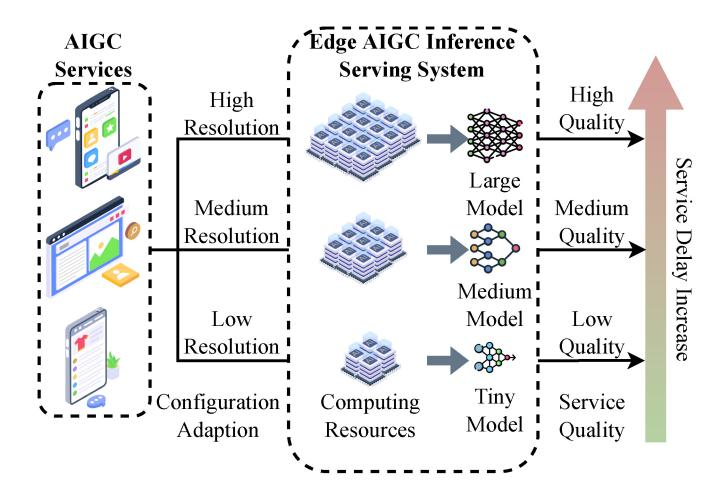

Fig. 17. Dynamic AIGC application configuration and generative AI model compression for serving AIGC services in mobile AIGC networks.

long-term profit maximization, they first analyze the problem as an NP-hard problem and then solve it with a regularizationbased online algorithm.

In mobile AIGC networks, an effective architecture for providing AIGC services is to partition a large generative AI model into multiple smaller models for local execution [\[32\]](#page-35-21). In [\[177\]](#page-38-19), the authors consider a multi-user scenario with massive IoT [\[182\]](#page-38-20) devices that cooperate to support an intelligent application collaboratively. Although partitioning large ML models and distributing smaller models to mobile devices for collaborative execution is feasible, the model distribution and result aggregation might incur extra latency during model training and inference. Additionally, the formulated optimization problem is complex due to its numerous constraints and vast solution space. To address these issues, the authors propose an alternative iterative optimization to obtain solutions in polynomial time. Furthermore, AIGC services allow users to input their preferences into generative AI models. Therefore, to preserve user privacy among multiple users during collaborative model training and inference [\[183\]](#page-38-21), the authors in [\[178\]](#page-38-22) investigate the communication efficiency issues of decentralized edge intelligence enabled by FL. In the FL network, thousands of mobile devices participate in model training. However, selecting appropriate cluster heads for aggregating intermediate models can be challenging. Decentralized learning approaches can improve reliability while sacrificing some communication performance, unlike centralized learning with a global controller. A two-stage approach can be adopted in decentralized learning scenarios to improve the participation rate. In this approach, evolutionary game-based allocation can be used for cluster head selection, and DL-based auction effectively rewards model owners.

#### *B. Task and Computation Offloading*

In general, executing generative AI models that generate creative and valuable content necessitates substantial computational resources, which is impractical for mobile devices with limited resources [\[25\]](#page-35-32), [\[190\]](#page-38-23). Offering high-quality and lowlatency AIGC services is challenging for mobile devices with low processing power and limited battery life. Fortunately, AIGC users can offload the tasks and computations of generative AI models over the RAN to edge servers located in proximity to the users. This alleviates the computational burden on mobile devices.

As listed in Table [V,](#page-25-0) several KPIs are specifically relevant to computation offloading in mobile AIGC networks:

- *•* Service latency: Service latency refers to the delay associated with data input and retrieval as well as the model inference computations that users perform to generate AIGC [\[191\]](#page-38-24). By offloading AIGC tasks from mobile devices, such as fine-tuning and inference, to edge servers for execution, the total latency in mobile AIGC networks can be reduced. Unlike local execution of the generative AI model, offloading AI tasks to the edge server for execution introduces additional latency when transmitting personalized instructions and downloading AIGC content.
- *•* Reliability: Reliability evaluates users' success rate in obtaining personalized data accurately. On the one hand, when connecting to the edge server, users may experience difficulty uploading the requested data to edge servers or downloading the results from servers due to dynamic channel conditions and wireless network instability. On the other hand, the content generated by the generative AI model may not fully meet the needs of AIGC users in terms of personalization and customization features. Unsuccessful content reception and invalid content affect the AIGC network's reliability.

When implementing cloud-edge collaborative training and fine-tuning for generative AI models [\[192\]](#page-38-25), it is important to consider specific algorithms or techniques that enable effective collaboration between cloud and edge servers [\[170\]](#page-38-9), [\[193\]](#page-38-26). For example, FL and distributed training approaches can facilitate the collaboration process by allowing edge servers to train models locally and then send the updated weights to the cloud server for aggregation [\[194\]](#page-38-27). The division of responsibilities between cloud and edge servers can also greatly affect the overall efficiency and performance of the generative AI models. Therefore, it is crucial to discuss and implement appropriate schemes for determining which tasks are offloaded to the edge servers and which are performed on the cloud server. To provide AIGC services in edge intelligence-empowered IoT, offloading ML tasks to edge servers for remote execution is a promising approach for computation-intensive AI model inference [\[195\]](#page-39-0). For instance, in Fig [18,](#page-25-1) multiple lightweight ML models can be loaded into IoT devices, while large-scale ML models can be installed and executed on edge servers [\[29\]](#page-35-18). Heterogeneous generative AI models can be deployed on mobile devices and edge servers according to their resource demands and service requirements [\[196\]](#page-39-1). However, the multiple attributes of ML tasks, such as accuracy, inference latency, and reliability, render the offloading problem of AIGC highly complex. Therefore, the authors in [\[184\]](#page-38-28) propose an ML task offloading scheme to minimize task execution latency while guaranteeing inference accuracy. Considering error inference leading to extra delays in task processing, they initially model the inference process as M/M/1 queues, which are also applicable to the

TABLE V SUMMARY OF SCENARIOS, PROBLEMS, BENEFITS/CHALLENGES, AND MATHEMATICAL TOOLS OF TASK AND COMPUTATION OFFLOADING

| Ref.  | Scenarios                                                    | Performance Metrics/Decision variables                                    | Benefits/Challenges                                                                             | Mathematical Tools                                     |
|-------|--------------------------------------------------------------|------------------------------------------------------------------------------|-------------------------------------------------------------------------------------------------|--------------------------------------------------------|
| [184] | Edge intelligence in IoT                                     | Processing delay/Task offloading decisions                                   | Offload AIGC tasks for improving inference accuracy                                             | Optimization theory                                    |
| [185] | Intelligent IoT applications                                 | Processing time/Offloading decisions                                         | Support on-demand changes for AIGC applications                                           | Random forest regression                               |
| [32]  | Collaborative intelligence between the cloud and mobile edge | Latency and energy consumption/DNN computation partitioning                  | Cloud and mobile edge collaborative intelligence for generative AI models                       | Greedy algorithm                                       |
| [31]  | Cloud-edge intelligence                                      | Service response time/Task processing node                                   | Reduce the average response time for multi-task parallel AIGC services                          | Genetic algorithm                                      |
| [186] | Cost-driven offloading for DNN-Based applications            | System costs/Number of layers                                                | Minimize costs of AIGC services in a cloud-edge-end collaborative environment          | Genetic algorithm based on particle swarm optimization |
| [187] | Industrial edge intelligence                                 | A weighted sum of task execution time and energy consumption/Task assignment | Multi-objective optimization of large-scale AIGC tasks with multiple connected devices | Generative coding evolutionary algorithm               |
| [188] | Computation offloading for ML web apps                       | Inference time/Pre-sending decisions                                         | Reduce execution overheads of AIGC tasks with pre-sending snapshots                       | Hill climbing algorithm                                |
| [189] | Cooperative edge intelligence                                | Quality of experience/Offloading decisions                                   | Enhance vertical-horizontal cooperation in multi-user AIGC co-inference scenarios      | Federated multi-agent reinforcement learning           |

AIGC service process. Furthermore, the optimization problem of ML task execution is formulated as a Mixed-Integer Nonlinear Programming (MINLP) to minimize provisioning delay, which can be adopted in the inference process of AIGC services. To extend the deterministic environment in [\[184\]](#page-38-28) into a more general environment, the authors in [\[185\]](#page-38-29) first propose an adaptive translation mechanism to automatically and dynamically offload intelligent IoT applications. Then, they make predictive offloading decisions using a random forest regression model. Their experiments demonstrate that the proposed framework reduces response times for complex applications by half. Such ML methods can also be used to analyze AIGC network traffic to improve service delivery efficiency and reliability.

The success of edge-mobile collaboration for AIGC services is dependent on several factors, including the type of service, user characteristics, computational resources, and network conditions [\[4\]](#page-35-3), [\[197\]](#page-39-2), [\[198\]](#page-39-3). For instance, a real-time AIGC service may have different latency requirements compared to an offline service. Similarly, the required computational resources may vary depending on the model's complexity [\[199\]](#page-39-4). Additionally, the user profile, including location and device type, may affect the selection of edge servers for task offloading. Furthermore, network conditions such as bandwidth and packet loss rate can impact the reliability and latency of the service. Therefore, it is necessary to implement effective resource allocation and task offloading schemes to ensure high-quality and low-latency AIGC services in dynamic and diverse environments. Cloud-edge collaborative

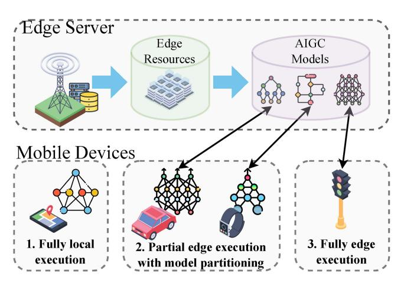

Fig. 18. Model partitioning in mobile AIGC networks. The generative AI models of mobile devices can be split and full or partial of them can be offloaded to edge servers for remote execution.

intelligence enables local tasks to be offloaded to edge and cloud servers. AIGC can benefit from cloud-edge intelligence, as edge servers can provide low-latency AIGC services while cloud servers can offer high-quality AIGC services. The authors in [\[32\]](#page-35-21) develop a scheme called Neurosurgeon to select the optimal partitioning point based on model architectures, hardware platforms, network conditions, and load information at the servers to automatically partition the computation of tensors of DNNs between cloud and edge servers. Furthermore, the authors in [\[200\]](#page-39-5) find that the layered approach can reduce the number of messages transmitted between devices by up to 97% while only decreasing the accuracy of models by a mere 3%. However, multiple AIGC services should be considered in cloud-edge collaborative intelligence that differs in types (e.g., text, images, and videos) and their diverse quality of service (QoS) requirements [\[201\]](#page-39-6). In multi-task parallel scheduling [\[31\]](#page-35-20), the genetic algorithm can also be used to make real-time model partitioning decisions. The authors in [\[186\]](#page-38-30) propose a cost-driven strategy for AI application offloading through a self-adaptive genetic algorithm based on particle swarm optimization.

In industrial edge intelligence, where edge intelligence is embedded in the industrial IoT [\[187\]](#page-38-31), [\[202\]](#page-39-7), [\[203\]](#page-39-8), [\[204\]](#page-39-9), offloading computation tasks to edge servers is an efficient solution for self-organizing, autonomous decision-making, and rapid response throughout the manufacturing lifecycle, which is similarly required by mobile AIGC networks. Therefore, efficiently solving task assignment problems is crucial for effective generative AI model inference. However, the coexistence of multiple tasks among devices makes system response slow for various tasks. For example, text-based and image-based AIGC may coexist on the same edge device. As one solution, in [\[187\]](#page-38-31), the authors propose a coding group evolution algorithm to solve large-scale task assignment problems, where tasks span the entire lifecycle of various products, including real-time monitoring, complex control, product structure computation, multidisciplinary cooperation optimization, and production process computation. Likewise, the AIGC lifecycle includes data collection, labeling, model training and optimization, and inference. Furthermore, a simple grouping strategy is introduced to parallel partition the solution space and accelerate the evolutionary optimization process. In contrast to VM-level adaptation to specific edge servers [\[205\]](#page-39-10), the authors propose application-level adaptation for generic servers. The lighter adaptation framework in [\[188\]](#page-38-32) further improves transmission time and user data privacy performance, including offloading and data/code recovery to generic edge servers.

Ensuring dependable task offloading is crucial in providing superior AIGC services with minimal latency in edge computing. For instance, data transmission redundancy can enhance dependability by transmitting data via multiple pathways to mitigate network congestion or failures. By incorporating these techniques, task offloading dependability in edge computing can be enhanced, thereby leading to more efficient and effective AIGC services. Most intelligent computing offloading solutions converge slowly, consume significant resources, and raise user privacy concerns [\[206\]](#page-39-11), [\[207\]](#page-39-12). The situation is similar when leveraging learning-based approaches to make AIGC service offloading decisions. Consequently, the authors enhance multi-user QoE [\[208\]](#page-39-13) for cooperative edge intelligence in [\[189\]](#page-38-33) with federated multi-agent reinforcement learning. They formulate the cooperative offloading problem as a Markov Decision Process (MDP). The state is composed of current tasks, local loads, and edge loads. Learning agents select task processing positions to maximize multiuser QoE, which simultaneously considers service latency, energy consumption, task drop rate, and privacy protection.

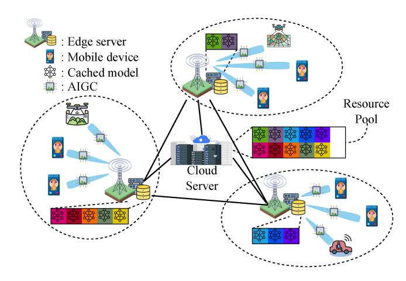

Fig. 19. An overview of edge caching in mobile AIGC networks. By caching the generative AI model on the edge servers, the latency of AIGC services can be reduced and the network congestion in the core network can be reduced.

Similarly, AIGC service provisioning systems can easily adopt the proposed solution for maximizing QoE in AIGC services.

#### *C. Edge Caching*

Edge caching is the delivery of low-latency content and computing services using the storage capacity of edge base stations and mobile devices [\[214\]](#page-39-14), [\[215\]](#page-39-15). As illustrated in Fig. [19,](#page-26-0) in mobile AIGC networks, users can request AIGC services without accessing cloud data centers by caching generative AI models in edge servers and mobile devices. Unlike the cache in traditional content distribution networks, the generative AI model cache also requires computing resources to support its execution. Additionally, the generative AI model needs to gather user historical requests and profiles in context to provide personalized services during the AIGC service process. As shown in Table [VI,](#page-27-0) here are several KPIs for edge caching in AIGC networks:

- *•* Model access delay: Model access latency is an important indicator of AIGC service quality. The latency is lowest when the generative AI model is cached in the mobile device [\[216\]](#page-39-16). The model access latency must also be calculated considering the delay in the wireless communication network when the edge server provides the generative AI model. Finally, the core network latency must be considered when the cloud provides the AIGC service.
- *•* Backhaul traffic load: The load on the backhaul traffic is significantly reduced, as the requests and results of AIGC services do not need to go through the core network when the generative AI model is cached in the mobile edge network.
- *•* Model hit rate: Similar to content hit rate, the model hit rate is an important metric for generative AI models in the edge cache. It can be used for future model exits and loading during model replacement.

As there is sufficient infrastructure and resources in the cloud computing infrastructure, the generative AI model can be fully loaded into the GPU memory for real-time service requests. In contrast, the proposed EdgeServe in [\[209\]](#page-39-17) keeps

TABLE VI SUMMARY OF SCENARIOS, PROBLEMS, PERFORMANCE METRICS, AND MATHEMATICAL TOOLS FOR EDGE CACHING IN AIGC NETWORKS

| Ref.  | Scenarios                                   | Performance Metrics/Decision Variables                                                                      | Benefits/Challenges                                                                            | Mathematical Tools           |
|-------|---------------------------------------------|-------------------------------------------------------------------------------------------------------------------|------------------------------------------------------------------------------------------------|------------------------------|
| [209] | DL Model caching at the edge                | Runtime memory consumption and loading time/Model preload policy                                                  | Manage and utilize GPU memories of edge servers for caching generative AI models      | Cache replacement algorithms |
| [210] | Caching many models at the edge             | Model load and execution latency and monetary cost /Caching eviction policy                                       | Improve scalability of mobile AIGC networks via model-level caching deployment and replacement | Model utility calculation    |
| [211] | Cache for mobile deep vision applications   | Latency, accuracy loss, energy saving/Caching policy, user selection, transmit power, bandwidth ratio | Caching for users' requests for multimodal AIGC services                                 | Greedy algorithm             |
| [212] | Cache for functions in serverless computing | Execution time, cold start proportion/Function keep-alive policy                                                  | Keep generative AI models alive and warm for in-contextual inference                     | Greedy-dual based approach   |
| [213] | Knowledge caching for FL                    | Transmission latency and energy consumption/Caching policy, user selection, transmit power, bandwidth ratio       | Privacy-preserving model caching via knowledge of AIGC requests                          | Optimization theory          |

models in main memory or GPU memory so that they can be effectively managed or used at the edge. Similar to traditional CDNs, the authors use model execution caches at edge servers to provide immediate AI delivery. In detail, there are mainly three challenges in generative AI model caching:

- *•* Resource-constraint edge servers: Compared to the resource-rich cloud, the resources of servers in the edge network, such as GPU memory, are limited [\[217\]](#page-39-18). Therefore, caching all generative AI models on one edge server is infeasible.
- *•* Model-missing cost: When the mobile device user requests AIGC, the corresponding model is missed if the generative AI model used to generate the AIGC is not cached in the current edge server [\[210\]](#page-39-19). In contrast to the instantly available AIGC service, if the generative AI model is missing, the edge server needs to send a model request to the cloud server and download the model, which causes additional overhead in terms of bandwidth and latency.
- *•* Functionally equivalent models: The number of generative AI models is large and increases depending on the number of detailed tasks [\[218\]](#page-39-20). Meanwhile, AI models have similar functions in different applications, i.e., functionally equivalent. For example, for image recognition tasks, a large number of models with different architectures are proposed to recognize features in images, which have different model architectures and computation requirements.

To address these challenges, the authors in [\[209\]](#page-39-17) formulate the problem of edge modeling as determining which DL models should be preloaded into memory and which should be discarded when the memory is full while satisfying the requirements of inferential response times. Fortunately, this edge model caching problem can be solved using existing cache replacement policies for edge content caching. The accuracies and computation complexities of DL models make this optimization problem more complicated than conventional edge caching problems. Similarly, for resource-constrained edge servers, the generative AI model can be dynamically deployed and replaced. However, an effective caching algorithm for loading and unloading the generative AI models to maximize the hit rate has not yet been investigated.

As the capabilities of AI services continue to grow and diversify, multiple models need to be deployed simultaneously at the edge to achieve various tasks, including classification, recognition, text/image/video generation [\[219\]](#page-39-21). Especially in mobile AIGC networks, multiple base models need to work together to generate a large amount of multimodal synthetic data. Many models play a synergistic role in the AIGC services at the edge of the network, while the support of multiple models also poses a challenge to the limited GPU memory of the edge servers. Therefore, the authors in [\[210\]](#page-39-19) propose a model-level caching system with an eviction policy according to model characteristics and workloads. The model eviction policy is based on model utility calculation from cache miss penalty and the number of requests. This model-aware caching approach introduces a new direction for providing AIGC services at mobile edge networks with heterogeneous requests. Experimental results show that compared to the non-penaltyaware eviction policy, the model load delay can be reduced by 1/3. This eviction policy can also be adopted in the problem of which unpopular generative AI models should be unloaded.

At mobile AIGC networks, not only the generative AI model needs to be cached, but also the AIGC requests and results can be cached to reduce the latency of service requests in AIGC networks. To this end, the authors devise a principled cache design to accelerate the execution of CNN models by exploiting the temporal locality of video for continuous vision tasks to support mobile vision applications [\[220\]](#page-39-22). The authors in [\[211\]](#page-39-23) propose a principled cache scheme, named DeepCache, to retrieve reusable results and reuse them within a fine-grained CNN by exploiting the temporal locality of the mobile video stream. In DeepCache, mobile devices do not need to offload any data to the cloud and can support the most popular models. Additionally, without requiring developers to retrain models or tune parameters, DeepCache caches inference results for unmodified CNN models. Overall, DeepCache can reduce energy consumption by caching content to reduce model inference latency while sacrificing a small fraction of model accuracy.

In serverless computing for edge intelligence, mobile devices can call functions of AIGC services at edge servers, which is more resource-efficient compared to container and virtual machine (VM)-based AIGC services. Nevertheless, such functions suffer from the cold-start problem of initializing their code and data dependencies at edge servers. Although the execution time of each function is usually short, initialization, i.e., fetching and installing prerequisite libraries and dependencies before execution, is time-consuming [\[221\]](#page-39-24). Fortunately, the authors in [\[212\]](#page-39-25) show that the caching-based keep-alive policy can be used to address the cold-start problem by demonstrating that the keep-alive function is equivalent to caching. Finally, to balance the trade-off between server memory utilization and cold-start overhead, a greedy dualbased caching algorithm is proposed.

Frequently, a large-scale generative AI model can be partitioned into multiple computing functions that can be efficiently managed and accessed during training, fine-tuning, and inference. FL models can be cached on edge servers to facilitate user access to instances and updates, thus addressing user privacy concerns [\[222\]](#page-39-26), [\[223\]](#page-39-27). For example, the authors in [\[213\]](#page-39-28) propose a knowledge cache scheme for FL in which participants can simultaneously minimize training delay and training loss according to their preference. Their insight is that there are two stimulations for caching knowledge for FL [\[224\]](#page-39-29): i) training data sufficiency and ii) connectivity stability. Experimental results show that the proposed preference-driven caching policy, based on the preferences (i.e., demands or desires for global models) of participants in FL, can outperform the random policy when user preferences are intense. Therefore, preference-based generative AI model caching should be extensively investigated for providing personalized and customized AIGC services at edge servers.

#### *D. Mobility Management*

Mobile edge intelligence for the Internet of Vehicles and Unmanned Aerial Vehicle (UAV) networks relies on effective mobility management solutions [\[201\]](#page-39-6), [\[232\]](#page-39-30), [\[233\]](#page-39-31), [\[234\]](#page-39-32) to provide mobile AIGC services. Furthermore, UAV-based AIGC service distribution offers advantages such as ease of deployment, flexibility, and extensive coverage for enhanced

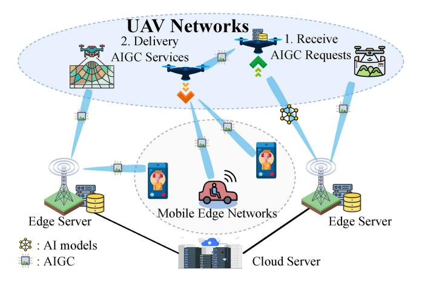

Fig. 20. An overview of mobility management in mobile AIGC networks. The coverage of the mobile AIGC network will be significantly enhanced by UAV processing the user's server request and providing AIGC services.

edge intelligence [\[235\]](#page-39-33), [\[236\]](#page-39-34). Specifically, UAVs, with their line-of-sight communication links, can extend the reach of edge intelligence [\[237\]](#page-39-35). For example, flexible UAVs equipped with AIGC servers enable users to access AIGC services with ultra-low latency and high reliability, especially when fixededge servers are often overloaded in hotspot areas or expensive to deploy in remote areas, as illustrated in Fig. [20.](#page-28-0) In addition, UAV-enabled edge intelligence can be utilized to implement mobile AIGC content and service delivery.

As summarized in Table [VII,](#page-29-0) here are several KPIs for mobility management in AIGC networks:

- *•* Task accomplishment ratio: The provisioning of AIGC services at mobile edge networks must consider the dynamic nature of users [\[238\]](#page-39-36). As a result, services must be completed before users leave the base station. To measure the effectiveness of mobility management in AIGC networks, the task completion rate can be used.
- *•* Coverage enhancement: Vehicles and UAVs can serve as reconfigurable base stations to enhance the coverage of mobile AIGC networks [\[239\]](#page-40-0), providing generative AI models and content to users anywhere and anytime.

In vehicular networks, intelligent applications, such as AIGC-empowered navigation systems, are reshaping existing transportation systems. In [\[225\]](#page-39-37), the authors propose a joint vehicle-edge inference framework to optimize energy consumption while reducing the execution latency of DNNs. In detail, vehicles and edge servers determine an optimal partition point for DNNs and dynamically allocate resources for DNN execution. They propose a chemical reaction optimizationbased algorithm to accelerate convergence when solving the resource allocation problem. This framework offers insights for implementing mobile AIGC networks, where vehicles can collaborate with base stations to provide real-time AIGC services based on DNNs during their movement.

AIGC applications require sufficient processing and memory resources to perform extensive AIGC services [\[240\]](#page-40-1), [\[241\]](#page-40-2), [\[242\]](#page-40-3), [\[243\]](#page-40-4). However, resource-constrained vehicles cannot meet the QoS requirements of the tasks. The authors in [\[226\]](#page-39-38) propose a distributed scheduling framework that

TABLE VII SUMMARY OF SCENARIOS, PROBLEMS, BENEFITS/CHALLENGES, AND MATHEMATICAL TOOLS FOR MOBILITY MANAGEMENT

| Ref.  | Scenarios                                                | Performance Metrics/Problems                                                                                                      | Benefits/Challenges                                                                               | Mathematical Tools                      |
|-------|----------------------------------------------------------|--------------------------------------------------------------------------------------------------------------------------------------|---------------------------------------------------------------------------------------------------|-----------------------------------------|
| [225] | Jointing vehicle-edge deep neural network inference      | Latency, failure rate/CPU frequency                                                                                                  | Robust AIGC service provisioning via layer-level offloading                                       | Chemical reaction optimization          |
| [226] | Vehicular edge intelligence                              | Weighted average completion time and task acceptance ratio/Task dispatching policy                                          | Provisioning AIGC service in multi-vehicle environments with motion prediction           | Greedy algorithm                        |
| [227] | Mobility-enhanced edge intelligence                      | Task completion ratio and model accuracy/Offloading redundancy, task assignment, beam selection                             | Sustainable AIGC service provisioning with mobility management                                    | FL                                      |
| [228] | Edge intelligence-assisted IoV                           | Average delay and energy consumption/Transmission decision, task offloading decision, bandwidth, and computation resource allocation | Flexible network model selection for AIGC services for balancing the tradeoff adaptively | Quantum-inspired reinforcement learning |
| [229] | Cooperative edge intelligence in IoV                     | Average delay and energy consumption/Trajectory prediction accuracy                                                                  | Optimize AIGC service with spatial and temporal correlations of users' requests          | Hybrid stacked autoencoder learning     |
| [230] | UAVs as an intelligent service                           | Model accuracy and energy consumption/Number of local iterations                                                                     | Provision AIGC services via a network of UAVs                                                     | Greedy algorithm                        |
| [231] | Knowledge distillation-empowered edge intelligence | Accuracy and inference delay/Size of model parameters                                                                                | Visual information-aided generative AI model deployment and inference scheduling         | Knowledge distillation                  |

develops a priority-driven transmission scheduling policy to address the dynamic network topologies of vehicle networks and promote vehicle edge intelligence. To meet the various QoS requirements of intelligent tasks, large-volume tasks can be partitioned and sequentially uploaded. Additionally, the impact of vehicle motion on task completion time and edge server load balancing can be independently handled by intelligent task processing requests. The effectiveness of the proposed framework is demonstrated in single-vehicle and multi-vehicle environments through simulation and deployment experiments. To facilitate smart and green vehicle networks [\[227\]](#page-39-39), the real-time accuracy of AI tasks, such as generative AI model inference, can be monitored through on-demand model training using infrastructure vehicles and opportunity vehicles.

The heterogeneous communication and computation requirements of AIGC services in highly dynamic, time-varying Internet of Vehicles (IoV) warrant further investigation [\[244\]](#page-40-5), [\[245\]](#page-40-6), [\[246\]](#page-40-7), [\[247\]](#page-40-8). To dynamically make transmission and offload decisions, the authors in [\[228\]](#page-39-40) formulate a Markov decision process for timevarying environments in their joint communication and computation resource allocation strategy. Finally, they develop a quantum-inspired reinforcement learning algorithm, in which quantum mechanisms can enhance learning convergence and performance. The authors in [\[229\]](#page-39-41) propose a stacked autoencoder to capture spatial and temporal correlations to combine road traffic management and data network traffic management. To reduce vehicle energy consumption and learning delay, the proposed learning model can minimize the required signal traffic and prediction errors. Consequently, the accuracy of AIGC services based on autoencoder techniques can be improved through this management framework.

With UAV-enhanced edge intelligence, UAVs can serve as aerial wireless base stations, edge computing servers, and edge caching providers in mobile AIGC networks [\[248\]](#page-40-9), [\[249\]](#page-40-10). To demonstrate the performance of UAV-enhanced edge intelligence while preserving user privacy at mobile edge networks, the authors in [\[230\]](#page-39-42) use UAV-enabled FL as a use case. Moreover, the authors suggest that flexible switching between compute and cache services using adaptive scheduling UAVs is a topic for future research. Therefore, flexible AIGC service provisioning and UAV-based AIGC delivery are essential for satisfying real-time service requirements and reliable generation. In this regard, the authors in [\[231\]](#page-39-43) propose a visually assisted positioning solution for UAV-based AIGC delivery services where GPS signals are weak or unstable. Specifically, knowledge distillation is leveraged to accelerate inference speed and reduce resource consumption while ensuring satisfactory model accuracy.

# *E. Incentive Mechanism*

As suitable incentive mechanisms are designed, more edge nodes participate in and contribute to the AIGC services [\[146\]](#page-37-28), [\[254\]](#page-40-11), [\[255\]](#page-40-12), [\[256\]](#page-40-13). This increases the computational capacity

| Ref.  | Scenarios                              | Problems                                                                                            | Benefits/Challenges                                                                                                      | Mathematical Tools                             |
|-------|----------------------------------------|-----------------------------------------------------------------------------------------------------|--------------------------------------------------------------------------------------------------------------------------|------------------------------------------------|
| [250] | Efficient edge learning                | A weighted sum of training time and payment/Total payment and training time                   | Incentivize AIGC service providers with heterogeneous resources under the uncertainty of edge network bandwidth          | Deep reinforcement learning                 |
| [251] | Efficient edge learning                | Model accuracy, number of training rounds, time efficiency/The total price                          | Long-term incentive mechanism for AIGC services with long-term and short-term pricing strategies                | Hierarchical deep reinforcement learning       |
| [252] | Quality-aware FL                       | Model accuracy and loss reduction/Learning quality estimation and quality-aware incentive mechanism | Estimate the performance of AIGC services with privacy-preserving methods for distributing proper incentives | Reverse auction                                |
| [253] | Cloud-Edge computing power trading for | Profits, resource utilization, security/Computing-power                                             | Trustworthy edge-cloud resource trading framework                                                                        | Stackelberg game and multi-agent reinforcement |

TABLE VIII SUMMARY OF SCENARIOS, PROBLEMS, BENEFITS/CHALLENGES, AND MATHEMATICAL TOOLS OF INCENTIVE MECHANISM

of the system. In addition, the nodes are motivated to earn rewards by providing high-quality services. Thus, the overall quality of AIGC services is improved. Finally, nodes are encouraged to engage in secure operations without security concerns by recording resource transactions through the blockchain.

As listed in Table [VIII,](#page-30-0) here are several KPIs for incentive mechanisms in AIGC networks:

- *•* Social welfare: AIGC's social welfare is the sum of the value of AIGC's services to the participants of the current network. Higher social welfare means that more AIGC users and AIGC service providers are participating in the AIGC network and providing high-value AIGC services within the network.
- *•* Revenue: Providers of AIGC use a large amount of computing and energy resources to provide AIGC, which may be offset by revenue from AIGC users. The higher the revenue, the more the AIGC service provider can be motivated to improve the AIGC service to a higher quality.
- *•* Economic properties: In AIGC networks, AIGC providers and users should be risk-neutral, which indicates the incentive mechanisms should satisfy economic properties, e.g., individually rational, incentive compatible, and budget balance [\[257\]](#page-40-14).

While edge learning has several promising benefits, the learning time for satisfactory performance and appropriate monetary incentives for resource providers are nontrivial challenges for AIGC. In [\[250\]](#page-40-15), [\[258\]](#page-40-16), [\[259\]](#page-40-17), where mobile devices are connected to the edge server, the authors design the incentive mechanism for efficient edge learning. Specifically, mobile devices collect data and train private models locally with computational resources based on the price of edge servers in each training round. Then, the updated models are uploaded to the edge server and aggregated to minimize the global loss function. Furthermore, the authors in [\[260\]](#page-40-18) not only analyze the optimal pricing strategy but also use Deep Reinforcement Learning to learn the pricing strategy to obtain the optimal solution in each round in a dynamic environment and with incomplete information. In the absence of prior knowledge, the DRL agent can learn from experience to find the optimal pricing strategy that balances payment and training time. To extend [\[250\]](#page-40-15) to long-term incentive provisioning, the authors in [\[251\]](#page-40-19) propose a long-term incentive mechanism for edge learning frameworks. To obtain the optimal shortterm and long-term pricing strategies, the hierarchical deep reinforcement learning algorithm is used in the framework to improve the model accuracy with budget constraints.

In the process of fine-tuning the AIGC edge, the incentives described above can be used to balance the time and adaptability of the fine-tuned generative AI model. In providing incentives to AIGC service providers, the quality of AIGC services also needs to be considered in the incentive mechanism. The authors in [\[252\]](#page-40-20) propose a quality-aware FL framework to prevent inferior model updates from degrading the global model quality. Specifically, based on an AI model trained from historical learning results, the authors estimate the learning quality of mobile devices. To motivate participants to contribute high-quality services, the authors propose a reverse auction-based incentive mechanism under the recruitment budget of edge servers, taking into account the model quality. Finally, the authors propose an algorithm for integrating the model quality into the aggregation process and for filtering non-optimal model updates to further optimize the global learning model.

Traditionally, resource utilization is inefficient, and trading mechanisms are unfair in cloud-edge computing power trading [\[261\]](#page-40-21) for AIGC services. To address this issue, the authors in [\[253\]](#page-40-22) develop a general trading framework for computing power grids. As illustrated in Fig. [22,](#page-32-0) the authors solve the problem of the under-utilization of computing power with AI consumers in this framework. The computing-power trading problem is first formulated as a Stackelberg game and then solved with a profit-driven multi-agent reinforcement learning algorithm. Finally, a blockchain is designed for transaction security in the trading framework. In mobile AIGC networks

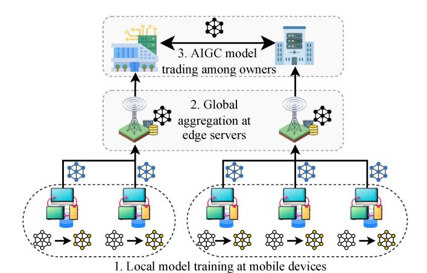

Fig. 21. Federated Learning in mobile AIGC networks, including the local model training at mobile devices, global aggregation at edge servers, and cross-server model trading.

with multiple AIGC service providers and multiple AIGC users, the Stackelberg game and its extension can still provide a valid framework for equilibrium analysis. In addition, multi-agent reinforcement learning also learns the equilibrium solution of the game by exploration and exploitation in the presence of incomplete information about the game.

#### *F. Security and Privacy*

Mobile AIGC networks leverage a collaborative computing framework on the cloud side to provide AIGC services, utilizing a large amount of heterogeneous data and computing power [\[262\]](#page-40-23), [\[263\]](#page-40-24), [\[264\]](#page-40-25), [\[265\]](#page-40-26). When mobile users are kind, AIGC can greatly enhance their creativity and efficiency. However, malicious users can also utilize AIGC for destructive purposes, posing a threat to users in mobile edge networks. For example, AI-generated text can be used by malicious users to complete phishing emails, thus compromising the security and privacy of normal users [\[11\]](#page-35-10). To ensure secure AIGC services, providers must choose trusted AIGC solutions and securely train AI models while providing secure hints and answers to AIGC service users [\[266\]](#page-40-27).

*1) Privacy-Preserving AIGC Service Provisioning:* During the lifecycle of providing AIGC services, privacy information in large-scale datasets and user requests needs to be kept secure to prevent privacy breaches. In mobile AIGC networks, the generation and storage of data for generative AI model training occur at edge servers and mobile devices [\[267\]](#page-40-28), [\[268\]](#page-40-29), [\[269\]](#page-40-30). Unlike resourceful cloud data centers, edge and mobile layers have limited defense capacities against various attacks. Fortunately, several privacy-preserving distributed learning frameworks, such as FL [\[270\]](#page-40-31), [\[271\]](#page-40-32), have been proposed to empower privacy-preserving generative AI model fine-tuning and inference at mobile AIGC networks. In preserving user privacy in AIGC networks, FL is a distributed ML approach that allows users to transmit local models instead of data during model training [\[204\]](#page-39-9), [\[272\]](#page-40-33), [\[273\]](#page-40-34). Specifically, as illustrated in Fig. [21,](#page-31-0) there are two major approaches to employing FL in AIGC networks

- *•* Secure aggregation: While FL is being learned, the mobile devices send local updates to edge servers for global aggregation. During global aggregation, authenticated encryption allows the use of secret sharing mechanisms.
- *•* Differential privacy: Differential privacy can prevent FL servers from identifying the owners of a local update. Differential privacy is similar to secure aggregation in that it prevents FL servers from identifying owners of local updates.

Therefore, in [\[274\]](#page-40-35), the authors propose a differential private federated generative model to synthesize representative examples of private data. With guaranteed privacy, the proposed model can solve many common data problems without human intervention. Moreover, in [\[275\]](#page-40-36), the authors propose an FL-based generative learning scheme to improve the efficiency and robustness of GAN models. The proposed scheme is particularly effective in the presence of varying parallelism and highly skewed data distributions. To find an inherent cluster structure in users' data and unlabeled datasets, the authors propose in [\[276\]](#page-40-37) the unsupervised Iterative Federated Clustering algorithm, which uses generative models to deal with the statistical heterogeneity that may exist among the participants of FL. Since the centralized FL frameworks in [\[275\]](#page-40-36), [\[276\]](#page-40-37) might raise security concerns and risk single-point failure, the authors propose in [\[277\]](#page-40-38) a decentralized FL framework based on a ring topology and deeply generated models. On the one hand, a method for synchronizing the ring topology can improve the communication efficiency and reliability of the system. On the other hand, generative models can solve data-related problems, such as incompleteness, low quality, insufficient quantity, and sensitivity. Finally, an InterPlanetary File System (IPFS)-based data-sharing system is developed to reduce data transmission costs and traffic congestion.

*2) Secure AIGC Service Provisioning:* Given the numerous benefits of provisioning AIGC services in mobile and edge layers, multi-tier collaboration among cloud servers, edge servers, and mobile devices enables ubiquitous AIGC service provision by heterogeneous stakeholders [\[151\]](#page-38-34), [\[278\]](#page-40-39), [\[279\]](#page-40-40), [\[280\]](#page-40-41). A trustworthy collaborative AIGC service provisioning framework must be established to provide reliable and secure AIGC services. Compared to central cloud AIGC providers, mobile and edge AIGC providers can customize AIGC services by collaborating with many user nodes while distributing data to different devices [\[281\]](#page-40-42). Therefore, a secure access control mechanism is required for multi-party content streaming to ensure privacy and security. However, the security of AIGC transmission cannot be ensured due to various attacks on mobile AIGC networks [\[282\]](#page-40-43). Fortunately, blockchain [\[282\]](#page-40-43), [\[283\]](#page-40-44), [\[284\]](#page-40-45), [\[285\]](#page-40-46), based on distributed ledger technologies, can be utilized to explore a secure and reliable AIGC service provisioning framework and record resource and service transactions to encourage data sharing among nodes, forming a trustworthy and active mobile AIGC ecosystem [\[286\]](#page-41-0). As illustrated in Fig. [22,](#page-32-0) there are several benefits that blockchain brings to mobile AIGC networks [\[26\]](#page-35-38):

*•* Computing and Communication Management: Blockchain enables heterogeneous computing and

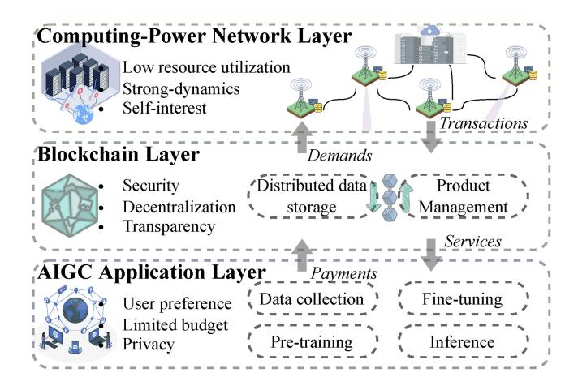

Fig. 22. Blockchain in mobile AIGC networks [\[253\]](#page-40-22), including the AIGC application layer, blockchain layer, and computing-power network layers, for provisioning AIGC services.

- communication resources to be managed securely, adaptively, and efficiently in mobile AIGC networks [\[287\]](#page-41-1).
- *•* Data Administration: By recording AIGC resource and service transactions in blockchain with smart contracts, data administration in mobile AIGC networks is made profitable, collaborative, and credible.
- *•* Optimization: During optimization in AIGC services, the blockchain always provides available, complete, and secure historical data for input to optimization algorithms.

For instance, the authors in [\[288\]](#page-41-2) propose an edge intelligence framework based on deep generative models and blockchain. To overcome the accuracy issue of the limited dataset, GAN is leveraged in the framework to synthesize training samples. Then, the output of this framework is confirmed and incentivized by smart contracts based on the proof-of-work consensus algorithm. Furthermore, the multimodal outputs of AIGC can be minted as NFTs and then recorded on the blockchain. The authors in [\[289\]](#page-41-3) develop a conditional generative model to synthesize new digital asset collections based on the historical transaction results of previous collections. First, the context information of NFT collections is extracted based on unsupervised learning. Based on the historical context, the newly minted collections are generated based on future token transactions. The proposed generative model can synthesize new NFT collections based on the contexts, i.e., the extracted features of previous transactions.

#### *G. Lessons Learned*

*1) Multi-Objective Quality of AIGC Services:* In mobile AIGC networks, the quality of AIGC services is determined by several factors, including model accuracy, service latency, energy consumption, and revenue. Consequently, AIGC service providers must optimally allocate edge resources to satisfy users' multidimensional quality requirements for AIGC services [\[176\]](#page-38-18). Moreover, the migration of AIGC tasks and computations can enhance the reliability and efficiency of AIGC services. Notably, dynamic network conditions in the edge network necessitate users to make online decisions to achieve load balancing and efficient use of computing

- resources. A variety of methodologies are proposed, enhancing the multi-objective quality of AIGC services within mobile edge networks [\[153\]](#page-38-35). The techniques encompass multi-objective optimization among QoS, QoE, latency, and resource consumption. The primary objective of designing these strategies is to optimize key parameters such as accuracy, latency, resource consumption, and user satisfaction. The benefits including heightened performance and superior user experience, are attained, albeit at the potential cost of an increase in complexity, resource consumption, and potential privacy issues. Attaining high-quality AIGC services requires proper considerations and practices to address the challenges discussed above, meet the quality requirements of multiple objectives, and improve user satisfaction and service quality.
- *2) Edge Caching for Efficient Delivery of AIGC Services:* Edge caching plays a pivotal role in the efficient delivery of AIGC services in mobile AIGC networks. Tackling the challenges of constrained-memory edge servers, modelmissing costs, and functionally equivalent models is essential for optimizing caching policies. Developing model-aware caching approaches, investigating preference-driven caching policies, and implementing principled cache designs to reduce latency and energy consumption are promising directions for enhancing the performance of mobile AIGC networks. In the quest for the efficient delivery of AIGC services via edge caching in mobile edge networks, the need for welldesigned edge caching algorithms is emphasized [\[216\]](#page-39-16). The benefits associated with these algorithms include enhanced efficiency, decreased latency, and improved dependability. Conversely, the challenges that may arise from these strategies include escalated complexity, heightened costs, and potential privacy concerns. As AI services continue to evolve, further research in caching strategies is crucial for providing effective, personalized, and low-latency AIGC services for mobile users.
- *3) Preference-Aware AIGC Service Provisioning:* Offering AIGC services based on user preferences not only improves user satisfaction but also reduces service latency and resource consumption in mobile edge networks. To implement preference-based AIGC service delivery, AIGC service providers must first collect historical user data and analyze it thoroughly. In providing AIGC services, the service provider makes personalized recommendations and adjusts its strategy according to user feedback. The exploration of preference-aware AIGC service provisioning is conducted considering several techniques, which include collaborative filtering, DRL, context awareness, user profiling, and multiobjective optimization. Although user preferences play a significant role in AIGC service provision, it is essential to use and manage this information properly to protect user privacy.
- *4) Life-Cycle Incentive Mechanism Throughout AIGC Services:* In mobile AIGC networks, the entire life cycle of AIGC services necessitates appropriate incentives for participants. A single AIGC service provider cannot provide AIGC services alone. Throughout the data collection, pre-training, fine-tuning, and inference of AIGC services, stakeholders with heterogeneous resources require reasonable incentives and must share the benefits according to their contributions.

Conversely, from the users' perspective, evaluation mechanisms must be introduced. For instance, users can assess the reputation of AIGC service providers based on their transaction history to promote service optimization and improvement. Ultimately, the provisioning and transmission logs of AIGC services can also be recorded in a tamper-proof distributed ledger. Incentive strategies for participants in the life cycle of AIGC services in mobile edge networks are also examined. The use of smart contracts, distributed ledger technology, evaluation mechanisms, and incentive design is proposed as a means to strengthen collaboration and enhance the overall quality of AIGC services [\[253\]](#page-40-22). These methodologies introduce automation, transparency, and improved reputation, which are seen as distinct advantages.

*5) Blockchain-Based System Management of Mobile AIGC Networks:* Furthermore, mobile AIGC networks connect heterogeneous user devices to edge servers and cloud data centers. This uncontrolled demand for content generation introduces uncertainty and security risks into the system. Therefore, secure management and auditing methods are required to manage devices in edge environments, such as dynamically accessing, departing, and identifying IoT devices. In the traditional centralized management architecture, the risk of central node failure is unavoidable. Thus, a secure and reliable monitoring and equipment auditing system should be developed. Lastly, we analyze a suite of techniques aimed at improving blockchain-based system management of mobile AIGC networks. Such techniques include blockchain-based data administration, secure management and auditing methods, collaborative infrastructure, decentralized management architecture, and blockchain-based optimization [\[146\]](#page-37-28).

# VII. FUTURE RESEARCH DIRECTIONS AND OPEN ISSUES

In this section, we discuss future research directions and open issues from the perspectives of networking and computing, ML, and practical implementation.

#### *A. Networking and Computing Issues*

- *1) Decentralized Mobile AIGC Networks:* With the advancement of blockchain technologies [\[290\]](#page-41-4), decentralized mobile AIGC networks can be realized based on distributed data storage, the convergence of computing and networking, and proof-of-ownership of data [\[286\]](#page-41-0). Such a decentralized network structure, enabled by digital identities and smart contracts, can protect AIGC users' privacy and data security. Furthermore, based on blockchain technologies, mobile AIGC networks can achieve decentralized management of the entire lifecycle of AIGC services. Therefore, future research should investigate specific consensus mechanisms [\[290\]](#page-41-4), [\[291\]](#page-41-5), offchain storage systems, and token structures for the deployment of decentralized mobile AIGC networks [\[145\]](#page-37-29).
- *2) Sustainability in Mobile AIGC Networks:* In mobile AIGC networks, the pre-training, fine-tuning, and inference of generative AI models typically consume a substantial amount of computing and networking resources [\[30\]](#page-35-19), [\[292\]](#page-41-6). Hence, future research can focus on the green operations of mobile AIGC networks that provide AIGC services with minimal

energy consumption and carbon emissions. To this end, effective algorithms and frameworks should be developed to operate mobile AIGC networks under dynamic service configurations, operating modes of edge nodes, and communication links. Moreover, intelligent resource management and scheduling techniques can also be proposed to balance the tradeoff between service quality and resource consumption [\[293\]](#page-41-7).

*3) Wireless Communications in Mobile AIGC Networks:* The influence of wireless communications on AIGC services is a critical area for future research. A key aspect to investigate is the robustness of AIGC services to the challenges posed by wireless communications [\[143\]](#page-37-27). This includes understanding how factors such as transmit power, fading, and device mobility within an edge network can affect the performance of distributed diffusion model-based AIGC computing [\[225\]](#page-39-37). Initial research in this area, such as the study in [\[145\]](#page-37-29), has shown that despite the increase in bit error probability, distributed AIGC computing exhibits relatively high robustness. Further exploration of this robustness, as well as the development of strategies to enhance it, could significantly improve the performance and reliability of AIGC services in wireless networks. This can involve, for example, the development of adaptive physical layer transmission strategies [\[294\]](#page-41-8) that take into account the current state of the wireless channel or the design of error correction mechanisms that can recover from bit errors introduced during wireless transmission [\[295\]](#page-41-9), [\[296\]](#page-41-10). In addition, the use of AI-generated optimization solutions, particularly diffusion models, to overcome the challenges posed by the wireless environment and generate optimal solutions for network design is a promising avenue for future research. This can involve the development of AI-generated incentive mechanisms to promote semantic information exchange among users, as demonstrated by the authors [\[143\]](#page-37-27). Such mechanisms can help to create an optimal contract that adheres to the utility threshold constraints of the semantic information provider while maximizing the utility of the semantic information recipient.

High-quality data resources are also critical for the sustainability of mobile AIGC networks [\[144\]](#page-37-30). The performance of generative models depends not only on effective network architectures but also on the quality of training datasets [\[297\]](#page-41-11). However, as AIGC becomes pervasive, training datasets are gradually replaced by synthesized data that might be irrelevant to real data. Therefore, improving the quality and reliability of data in mobile AIGC networks, such as through multimodal data fusion and incremental learning technology, can further enhance the accuracy and performance of the models.

## *B. Machine Learning Issues*

*1) Generative AI Model Compression:* As generative AI models become increasingly complex, model compression techniques are becoming more important to reduce service latency and resource consumption in provisioning AIGC services [\[298\]](#page-41-12). Fortunately, several techniques have been developed for generative AI model compressions, such as pruning, quantization, and knowledge distillation. First, pruning involves removing unimportant weights from the model, while quantization reduces the precision of the weights [\[299\]](#page-41-13). Then, knowledge distillation involves training a smaller model to mimic the larger model's behavior. Future research on generative AI model compression might continue to focus on developing and refining these techniques to improve their efficiency and effectiveness for deploying generative AI models in edge nodes and mobile devices. It is necessary to consider the limited resources of such devices and develop specialized compression techniques that can balance model size and accuracy.

- *2) AI-Generated Network Design:* Generative AI models have various potential applications in mobile networks, including design, analysis, control, monitoring, and traffic prediction [\[1\]](#page-35-0), [\[300\]](#page-41-14). They can be utilized to create efficient network architectures, understand network behavior, predict network loads, develop network control algorithms, detect anomalies, and predict future network traffic patterns and demands [\[1\]](#page-35-0). Future research directions in machine learning for mobile AIGC networks can focus on improving the efficiency and effectiveness of existing applications, exploring new applications and use cases, and addressing the challenges posed by the unique characteristics of mobile networks, such as mobility, limited resources, and privacy concerns.
- *3) Privacy-Preserving AIGC Services:* To provide privacypreserving AIGC services, it is necessary to consider privacy computing techniques in both generative AI model training and inference [\[19\]](#page-35-36), [\[142\]](#page-37-26). Techniques such as differential privacy, secure multi-party computation, and homomorphic encryption can be used to protect sensitive data and prevent unauthorized access. Differential privacy involves adding noise to the data to protect individual privacy, while secure multi-party computation allows multiple parties to compute a function without revealing their inputs to one another. Homomorphic encryption enables computations to be performed on encrypted data without decryption. To successfully deploy generative AI models in edge nodes and mobile devices, the limited resources of such devices should be considered and specialized techniques that can balance privacy and performance should be developed [\[158\]](#page-38-36). Additionally, concerns such as data ownership and user privacy leakage should be taken into account.

#### *C. Practical Implementation Issues*

*1) Integrating AIGC and Digital Twins:* Digital twins enable the maintenance of representations to monitor, analyze, and predict the status of physical entities [\[301\]](#page-41-15). On one hand, the integration of AIGC and digital twin technologies has the potential to significantly improve the performance of mobile AIGC networks. By creating virtual representations of physical mobile AIGC networks, service latency, and quality can be optimized through the analysis of historical data and online predictions. Furthermore, AIGC can also enhance digital twin applications by reducing the time required for designers to create simulation entities. However, several issues need to be considered during the integration of AIGC and DTs, such as efficient and secure synchronization.

- *2) Immersive Streaming:* AIGC can create immersive streaming content, such as AR and VR, that can transport viewers to virtual worlds [\[302\]](#page-41-16), which can be used in various applications such as education, entertainment, and social media. Immersive streaming can enhance the AIGC delivery process by providing a platform for viewers to interact with the generated content in real-time. However, combining AIGC and immersive streaming raises some concerns. Future research should focus on addressing the potential for biased content generation by the AIGC algorithms and the high bandwidth requirements of immersive streaming, which can cause latency issues, resulting in the degradation of the viewer's experience.
- *3) Alignment:* In human-oriented applications that involve digital humans and avatars, the alignment of generative AI models [\[52\]](#page-36-7), [\[303\]](#page-41-17), [\[304\]](#page-41-18) in mobile AIGC networks should be well-investigated for safety and ethnicity. There are several potential research directions for AI alignment, such as personalized AI alignment, ethical guidelines for AI-generated content, trust and transparency, emotional alignment, cultural alignment, and robustness to adversarial attacks. By focusing on these areas, future AI alignment research in mobile AIGC networks can help maintain a user-centric, respectful, and ethically responsible approach for mobile AIGC networks and their applications.

#### VIII. CONCLUSION

In this paper, we have focused on the deployment of mobile AIGC networks, which serve generative AI models, services, and applications at mobile edge networks. We have discussed the background and fundamentals of generative models and the lifecycle of AIGC services at mobile AIGC networks. We have also explored AIGC-driven creative applications and use cases for mobile AIGC networks, as well as the implementation, security, and privacy challenges of deploying mobile AIGC networks. Finally, we have highlighted some future research directions and open issues for the full realization of mobile AIGC networks.

# ACKNOWLEDGMENT

Minrui Xu, Hongyang Du, and Dusit Niyato are with the School of Computer Science and Engineering, Nanyang Technological University, Singapore 639798 (e-mail: minrui001@e.ntu.edu.sg; hongyang001@e.ntu.edu.sg; dniyato@ntu.edu.sg).

Jiawen Kang is with the School of Automation, the Key Laboratory of Intelligent Information Processing and System Integration of IoT, Ministry of Education, and the Guangdong-HongKong-Macao Joint Laboratory for Smart Discrete Manufacturing, Guangdong University of Technology, Guangzhou 510006, China (e-mail: kavinkang@gdut.edu.cn).

Zehui Xiong is with the Pillar of Information Systems Technology and Design, Singapore University of Technology and Design, Singapore 487372 (e-mail: zehui\_xiong@sutd.edu.sg).

Shiwen Mao is with the Department of Electrical and Computer Engineering, Auburn University, Auburn, AL 36849 USA (e-mail: smao@ieee.org).

Zhu Han is with the Department of Electrical and Computer Engineering, University of Houston, Houston, TX 77004 USA, and also with the Department of Computer Science and Engineering, Kyung Hee University, Seoul 446-701, South Korea (e-mail: zhan2@uh.edu).

Abbas Jamalipour is with the School of Electrical and Information Engineering, University of Sydney, Sydney, NSW 2006, Australia (e-mail: a.jamalipour@ieee.org).

Dong In Kim is with the Department of Electrical and Computer Engineering, Sungkyunkwan University, Suwon 16419, South Korea (e-mail: dikim@skku.ac.kr).

Xuemin Shen is with the Department of Electrical and Computer Engineering, University of Waterloo, Waterloo, ON N2L 3G1, Canada (e-mail: sshen@uwaterloo.ca).

Victor C. M. Leung is with the College of Computer Science and Software Engineering, Shenzhen University, Shenzhen 518061, China, and also with the Department of Electrical and Computer Engineering, The University of British Columbia, Vancouver, BC V6T 1Z4, Canada (e-mail: vleung@ieee.org).

H. Vincent Poor is with the Department of Electrical and Computer Engineering, Princeton University, Princeton, NJ 08544 USA (e-mail: poor@ princeton.edu).

#### REFERENCES

- [\[1\]](#page-0-0) H. Du et al., "Beyond deep reinforcement learning: A tutorial on generative diffusion models in network optimization," 2023, *arXiv:2308.05384*.
- [\[2\]](#page-0-1) E. Cetinic and J. She, "Understanding and creating art with AI: Review and outlook," *ACM Trans. Multimedia Comput., Commun., Appl.*, vol. 18, no. 2, pp. 1–22, Feb. 2022.
- [\[3\]](#page-0-1) L.-H. Lee et al., "When creators meet the metaverse: A survey on computational arts," Apr. 2021, *arXiv:2111.13486*.
- [\[4\]](#page-0-1) W. Wu et al., "AI-native network slicing for 6G networks," *IEEE Wireless Commun.*, vol. 29, no. 1, pp. 96–103, Feb. 2022.
- [\[5\]](#page-0-2) Y. Wang, Y. Pan, M. Yan, Z. Su, and T. H. Luan, "A survey on ChatGPT: AI-generated contents, challenges, and solutions," Feb. 2023, *arXiv:2305.18339*.
- [\[6\]](#page-0-3) S. Bond-Taylor, A. Leach, Y. Long, and C. G. Willcocks, "Deep generative modelling: A comparative review of VAEs, GANs, normalizing flows, energy-based and autoregressive models," *IEEE Trans. Pattern Anal. Mach. Intell.*, vol. 44, no. 11, pp. 7327–7347, Nov. 2022.
- [\[7\]](#page-0-3) A. Radford et al., "Learning transferable visual models from natural language supervision," in *Proc. Int. Conf. Mach. Learn.*, Jul. 2021, pp. 8748–8763.
- [\[8\]](#page-0-4) A. Ramesh et al., "Zero-shot text-to-image generation," in *Proc. Int. Conf. Mach. Learn.*, Jul. 2021, pp. 8821–8831.
- [\[9\]](#page-0-5) A. Ramesh, P. Dhariwal, A. Nichol, C. Chu, and M. Chen, "Hierarchical text-conditional image generation with CLIP latents," Apr. 2022, *arXiv:2204.06125*.
- [\[10\]](#page-0-6) S. Huang and P. Grady. "GPT-3, GenerativeAI: A creative new world." Accessed: Feb. 4, 2023. [Online]. Available: https://www. sequoiacap.com/article/generative-{AI}-a-creative-new-world/
- [\[11\]](#page-0-7) E. Crothers, N. Japkowicz, and H. Viktor, "Machine generated text: A comprehensive survey of threat models and detection methods," Oct. 2022, *arXiv:2210.07321*.
- [\[12\]](#page-0-8) "ChatGPT: Optimizing language models for dialogue." Accessed: Feb. 4, 2023. [Online]. Available: https://openai.com/blog/chatgpt/
- [\[13\]](#page-1-1) J. Ho et al., "Imagen video: High definition video generation with diffusion models," Oct. 2022, *arXiv:2210.02303*.
- [\[14\]](#page-1-2) M. Kim, A. DeRieux, and W. Saad, "A bargaining game for personalized, energy efficient split learning over wireless networks," in *Proc. IEEE Wireless Commun. Netw. Conf. (WCNC)*, Glasgow, U.K., May 2023, pp. 1–6.
- [\[15\]](#page-1-3) X. Wang, Y. Han, V. C. Leung, D. Niyato, X. Yan, and X. Chen, "Convergence of edge computing and deep learning: A comprehensive survey," *IEEE Commun. Surveys Tuts.*, vol. 22, no. 2, pp. 869–904, 2nd Quart., 2020.
- [\[16\]](#page-1-4) M. Westerlund, "The emergence of deepfake technology: A review," *Technol. Innov. Manage. Rev.*, vol. 9, no. 11, pp. 40–53, Nov. 2019.
- [\[17\]](#page-1-4) X. Yuan, L. Pu, L. Jiao, X. Wang, M. Yang, and J. Xu, "When computing power network meets distributed machine learning: An efficient federated split learning framework," Mar. 2023, *arXiv:2305.12979*.
- [\[18\]](#page-1-5) J. Zhang and K. B. Letaief, "Mobile edge intelligence and computing for the Internet of Vehicles," *Proc. IEEE*, vol. 108, no. 2, pp. 246–261, Feb. 2020.
- [\[19\]](#page-4-2) W. Y. B. Lim et al., "Federated learning in mobile edge networks: A comprehensive survey," *IEEE Commun. Surveys Tuts.*, vol. 22, no. 3, pp. 2031–2063, 3rd Quart., 2020.
- [\[20\]](#page-4-3) M. Makhmutov, S. Varouqa, and J. A. Brow, "Survey on copyright laws about music generated by artificial intelligence," in *Proc. IEEE Symp. Series Comput. Intell.*, Jan. 2020, pp. 3003–3009.

- [\[21\]](#page-4-4) M. Chen et al., "Distributed learning in wireless networks: Recent progress and future challenges," *IEEE J. Sel. Areas Commun.*, vol. 39, no. 12, pp. 3579–3605, Dec. 2021.
- [\[22\]](#page-4-5) F. Zhan, Y. Yu, R. Wu, J. Zhang, and S. Lu, "Multimodal image synthesis and editing: A survey," Dec. 2021, *arXiv:2112.13592*.
- [\[23\]](#page-4-6) X. Shen, J. Gao, W. Wu, M. Li, C. Zhou, and W. Zhuang, "Holistic network virtualization and pervasive network intelligence for 6G," *IEEE Commun. Surveys Tuts.*, vol. 24, no. 1, pp. 1–30, 1st Quart., 2021.
- [\[24\]](#page-4-7) K. B. Letaief, Y. Shi, J. Lu, and J. Lu, "Edge artificial intelligence for 6G: Vision, enabling technologies, and applications," *IEEE J. Sel. Areas Commun.*, vol. 40, no. 1, pp. 5–36, Jan. 2022.
- [\[25\]](#page-4-8) H. Cao, C. Tan, Z. Gao, G. Chen, P.-A. Heng, and S. Z. Li, "A survey on generative diffusion model," Sep. 2022, *arXiv:2209.02646*.
- [\[26\]](#page-4-9) X. Wang, X. Ren, C. Qiu, Z. Xiong, H. Yao, and V. C. Leung, "Integrating edge intelligence and blockchain: What, why, and how," *IEEE Commun. Surveys Tuts.*, vol. 24, no. 4, pp. 2193–2229, 4th Quart., 2022.
- [27] M. Xu et al., "A full dive into realizing the edge-enabled metaverse: Visions, enabling technologies, and challenges," *IEEE Commun. Surveys Tuts.*, vol. 25, no. 1, pp. 656–700, 1dt Quart., 2023.
- [\[28\]](#page-4-10) S. Nyatsanga, T. Kucherenko, C. Ahuja, G. E. Henter, and M. Neff, "A comprehensive review of data-driven co-speech gesture generation," Jan. 2023, *arXiv:2301.05339*.
- [\[29\]](#page-1-5) Z. Zhou, X. Chen, E. Li, L. Zeng, K. Luo, and J. Zhang, "Edge intelligence: Paving the last mile of artificial intelligence with edge computing," *Proc. IEEE*, vol. 107, no. 8, pp. 1738–1762, Aug. 2019.
- [\[30\]](#page-1-6) Y. Mao, C. You, J. Zhang, K. Huang, and K. B. Letaief, "A survey on mobile edge computing: The communication perspective," *IEEE Commun. Surveys Tuts.*, vol. 19, no. 4, pp. 2322–2358, 4th Quart., 2017.
- [\[31\]](#page-1-6) Z. Chen, J. Hu, X. Chen, J. Hu, X. Zheng, and G. Min, "Computation offloading and task scheduling for DNN-based applications in cloudedge computing," *IEEE Access*, vol. 8, pp. 115537–115547, 2020.
- [\[32\]](#page-1-6) Y. Kang et al., "Neurosurgeon: Collaborative intelligence between the cloud and mobile edge," *ACM SIGARCH Comput. Archit. News*, vol. 45, no. 1, pp. 615–629, Mar. 2017.
- [\[33\]](#page-1-7) H. Zhang and B. Di, "Intelligent omni-surfaces: Simultaneous refraction and reflection for full-dimensional wireless communications," *IEEE Commun. Surveys Tuts.*, vol. 24, no. 4, pp. 1997–2028, 4th Quart., 2022.
- [\[34\]](#page-1-8) D. Huang, P. Chen, R. Zeng, Q. Du, M. Tan, and C. Gan, "Locationaware graph convolutional networks for video question answering," in *Proc. AAAI Conf. Artif. Intell.*, vol. 34. New York, NY, USA, Feb. 2020, pp. 11021–11028.
- [\[35\]](#page-1-8) H. Zhang, B. Di, K. Bian, Z. Han, H. V. Poor, and L. Song, "Toward ubiquitous sensing and localization with reconfigurable intelligent surfaces," *Proc. IEEE*, vol. 110, no. 9, pp. 1401–1422, Sep. 2022.
- [\[36\]](#page-2-0) X. Wang, M. Chen, T. Taleb, A. Ksentini, and V. C. M. Leung, "Cache in the air: Exploiting content caching and delivery techniques for 5G systems," *IEEE Commun. Mag.*, vol. 52, no. 2, pp. 131–139, Feb. 2014.
- [\[37\]](#page-2-0) S. Huang, H. Zhang, X. Wang, M. Chen, J. Li, and V. C. Leung, "Fine-grained spatio-temporal distribution prediction of mobile content delivery in 5G ultra-dense networks," *IEEE Trans. Mobile Comput.*, vol. 23, no. 1, pp. 469–482, Jan. 2024.
- [\[38\]](#page-2-1) Z. Q. Liew et al., "Economics of semantic communication system: An auction approach," *IEEE Trans. Veh. Technol.*, vol. 72, no. 10, pp. 13559–13574, Oct. 2023.
- [\[39\]](#page-3-2) R. Gozalo-Brizuela and E. C. Garrido-Merchan, "ChatGPT is not all you need. A state of the art review of large generative AI models," Jan. 2023, *arXiv:2301.04655*.
- [\[40\]](#page-4-11) Z. Lin, G. Qu, X. Chen, and K. Huang, "Split learning in 6G edge networks," Jun. 2023, *arXiv:2306.12194*.
- [\[41\]](#page-4-12) H. Du et al., "Attention-aware resource allocation and QoE analysis for metaverse xURLLC services," *IEEE J. Sel. Areas Commun.*, vol. 41, no. 7, pp. 2158–2175, Jul. 2023.
- [\[42\]](#page-4-12) Q. Yang, Y. Zhao, H. Huang, Z. Xiong, J. Kang, and Z. Zheng, "Fusing blockchain and AI with metaverse: A survey," *IEEE Open J. Comput. Soc.*, vol. 3, pp. 122–136, 2022.
- [\[43\]](#page-4-12) X. Ren et al., "Building resilient Web 3.0 with quantum information technologies and blockchain: An ambilateral view," Mar. 2023, *arXiv:2303.13050*.
- [\[44\]](#page-4-13) F. Tiago, F. Moreira, and T. Borges-Tiago, "YouTube videos: A destination marketing outlook," in *Proc. Strategic Innov. Market. Tourism*, Northern Aegean, Greece, May 2019, pp. 877–884.

- [\[45\]](#page-4-14) J. Krumm, N. Davies, and C. Narayanaswami, "User-generated content," *IEEE Pervasive Comput.*, vol. 7, no. 4, pp. 10–11, Oct.–Dec. 2008.
- [\[46\]](#page-5-1) F.-A. Croitoru, V. Hondru, R. T. Ionescu, and M. Shah, "Diffusion models in vision: A survey," Sep. 2022, *arXiv:2209.04747*.
- [\[47\]](#page-5-2) J. Oppenlaender, "Prompt engineering for text-based generative art," Apr. 2022, *arXiv:2204.13988*.
- [\[48\]](#page-5-3) G. Marcus, E. Davis, and S. Aaronson, "A very preliminary analysis of DALL-E 2," Apr. 2022, *arXiv:2204.13807*.
- [\[49\]](#page-6-1) P.-H. Chi et al., "Audio ALBERT: A lite BERT for self-supervised learning of audio representation," in *Proc. IEEE Spoken Language Technol. Workshop*, Shenzhen, China, Jan. 2021, pp. 344–350.
- [\[50\]](#page-6-2) M. Chui et al., "Notes from the AI frontier: Insights from hundreds of use cases," vol. 2, Discussion Paper, McKinsey Global Inst., Washington, DC, USA, 2018.
- [\[51\]](#page-6-3) T. Brown et al., "Language models are few-shot learners," in *Proc. Adv. Neural Inf. Process. Syst.*, vol. 33, Dec. 2020, pp. 1877–1901.
- [\[52\]](#page-6-4) L. Ouyang et al., "Training language models to follow instructions with human feedback," in *Proc. Adv. Neural Inf. Process. Syst.*, vol. 35, Jul. 2022, pp. 27730–27744.
- [\[53\]](#page-6-5) J. Schulman, F. Wolski, P. Dhariwal, A. Radford, and O. Klimov, "Proximal policy optimization algorithms," Jul. 2017, *arXiv:1707.06347*.
- [\[54\]](#page-6-6) Q. Dong et al., "A survey for in-context learning," Jan. 2022, *arXiv:2301.00234*.
- [\[55\]](#page-6-7) "Introducing the new Bing." Microsoft. Accessed: Mar. 19, 2023. [Online]. Available: https://www.bing.com/new
- [\[56\]](#page-6-8) J. Spataro. "Introducing Microsoft 365 Copilot—Your copilot for work." Accessed: Mar. 19, 2023. [Online]. Available: https: //blogs.microsoft.com/blog/2023/03/16/introducing-microsoft-365 copilot-your-copilot-for-work/
- [\[57\]](#page-7-2) Y. Yang et al., "6G network AI architecture for everyone-centric customized services," *IEEE Netw.*, early access, Jul. 25, 2022, doi: [10.1109/MNET.124.2200241.](http://dx.doi.org/10.1109/MNET.124.2200241)
- [\[58\]](#page-7-3) F. Daniel, P. Kucherbaev, C. Cappiello, B. Benatallah, and M. Allahbakhsh, "Quality control in crowdsourcing: A survey of quality attributes, assessment techniques, and assurance actions," *ACM Comput. Surveys*, vol. 51, no. 1, pp. 1–40, Jan. 2018.
- [\[59\]](#page-7-4) H. Zhang et al., "Holographic integrated sensing and communication," *IEEE J. Sel. Areas Commun.*, vol. 40, no. 7, pp. 2114–2130, Jul. 2022.
- [\[60\]](#page-7-5) X. Deng, Y. Jiang, L. T. Yang, M. Lin, L. Yi, and M. Wang, "Data fusion based coverage optimization in heterogeneous sensor networks: A survey," *Inf. Fusion*, vol. 52, pp. 90–105, Dec. 2019.
- [\[61\]](#page-7-6) C. Schuhmann et al., "LAION-400M: Open dataset of CLIP-filtered 400 million image-text pairs," 2021, *arXiv:2111.02114*.
- [\[62\]](#page-7-7) H. Du et al., "Semantic communications for wireless sensing: RISaided encoding and self-supervised decoding," *IEEE J. Sel. Areas Commun.*, vol. 41, no. 8, pp. 2547–2562, Aug. 2023.
- [\[63\]](#page-8-2) S. M. Jain, "Hugging face," in *Introduction to Transformers for NLP: With the Hugging Face Library and Models to Solve Problems*. Berkeley, CA, USA: Apress, 2022, pp. 51–67.
- [\[64\]](#page-8-3) T. Kynkäänniemi, T. Karras, S. Laine, J. Lehtinen, and T. Aila, "Improved precision and recall metric for assessing generative models," in *Proc. Adv. Neural Inf. Process. Syst.*, vol. 32, Dec. 2019, pp. 3927–3936.
- [\[65\]](#page-8-4) D. H. Park, S. Azadi, X. Liu, T. Darrell, and A. Rohrbach, "Benchmark for compositional text-to-image synthesis," in *Proc. Neural Inf. Process. Syst. Datasets Benchmarks Track*, Dec. 2021, pp. 1–13.
- [\[66\]](#page-8-5) C. Wu, S. Yin, W. Qi, X. Wang, Z. Tang, and N. Duan, "Visual ChatGPT: Talking, drawing and editing with visual foundation models," Mar. 2023, *arXiv:2303.04671*.
- [\[67\]](#page-8-6) Y. Benny, T. Galanti, S. Benaim, and L. Wolf, "Evaluation metrics for conditional image generation," *Int. J. Comput. Vis.*, vol. 129, no. 5, pp. 1712–1731, May 2021.
- [\[68\]](#page-9-2) T. Xu et al., "AttnGAN: Fine-grained text to image generation with attentional generative adversarial networks," in *Proc. IEEE Conf. Comput. Vis. Pattern Recognit.*, Salt Lake City, Utah, Jun. 2018, pp. 1316–1324.
- [\[69\]](#page-9-3) M. F. Naeem, S. J. Oh, Y. Uh, Y. Choi, and J. Yoo, "Reliable fidelity and diversity metrics for generative models," in *Proc. Int. Conf. Mach. Learn.*, Nov. 2020, pp. 7176–7185.
- [\[70\]](#page-9-4) H. Du, B. Ma, D. Niyato, J. Kang, Z. Xiong, and Z. Yang, "Rethinking quality of experience for metaverse services: A consumerbased economics perspective," *IEEE Netw.*, early access, Feb. 8, 2023, doi: [10.1109/MNET.131.2200503.](http://dx.doi.org/10.1109/MNET.131.2200503)

- [\[71\]](#page-9-5) I. Goodfellow et al., "Generative adversarial networks," *Commun. ACM*, vol. 63, no. 11, pp. 139–144, Oct. 2020.
- [\[72\]](#page-9-6) J. Zhao, M. Mathieu, and Y. LeCun, "Energy-based generative adversarial network," 2016, *arXiv:1609.03126*.
- [\[73\]](#page-10-1) D. P. Kingma and M. Welling, "An introduction to variational autoencoders," *Found. Trends*-R *Mach. Learn.*, vol. 12, no. 4, pp. 307–392, Nov. 2019.
- [\[74\]](#page-10-2) D. Rezende and S. Mohamed, "Variational inference with normalizing flows," in *Proc. Int. Conf. Mach. Learn.*, Lille, France, Jul. 2015, pp. 1530–1538.
- [\[75\]](#page-10-3) W. X. Zhao et al., "A survey of large language models," 2023, *arXiv:2303.18223*.
- [\[76\]](#page-10-4) D. Driess et al., "PaLM-E: An embodied multimodal language model," 2023, *arXiv:2303.03378*.
- [\[77\]](#page-10-5) Z. Chen, Z. Zhang, and Z. Yang, "Big AI models for 6G wireless networks: Opportunities, challenges, and research directions," 2023, *arXiv:2308.06250*.
- [\[78\]](#page-10-6) L. Bariah, Q. Zhao, H. Zou, Y. Tian, F. Bader, and M. Debbah, "Large language models for telecom: The next big thing?" 2023, *arXiv:2306.10249*.
- [\[79\]](#page-10-7) Z. Lin, G. Qu, Q. Chen, X. Chen, Z. Chen, and K. Huang, "Pushing large language models to the 6G edge: Vision, challenges, and opportunities," 2023, *arXiv:2309.16739*.
- [\[80\]](#page-10-8) M. Xu et al., "Sparks of GPTs in edge intelligence for metaverse: Caching and inference for mobile AIGC services," 2023, *arXiv:2304.08782*.
- [\[81\]](#page-10-9) H. T. Dinh, C. Lee, D. Niyato, and P. Wang, "A survey of mobile cloud computing: Architecture, applications, and approaches," *Wireless Commun. Mobile Comput.*, vol. 13, no. 18, pp. 1587–1611, Oct. 2013.
- [\[82\]](#page-11-2) C. Xu, L. Luo, Y. Ding, G. Zhao, and S. Yu, "Personalized location privacy protection for location-based services in vehicular networks," *IEEE Wireless Commun. Lett.*, vol. 9, no. 10, pp. 1633–1637, Oct. 2020.
- [\[83\]](#page-11-3) H. Du, J. Zhang, J. Cheng, and B. Ai, "Millimeter wave communications with reconfigurable intelligent surfaces: Performance analysis and optimization," *IEEE Trans. Commun.*, vol. 69, no. 4, pp. 2752–2768, Apr. 2021.
- [\[84\]](#page-12-3) J. Wu, L. Wang, Q. Pei, X. Cui, F. Liu, and T. Yang, "HiTDL: Highthroughput deep learning inference at the hybrid mobile edge," *IEEE Trans. Parallel Distrib. Syst.*, vol. 33, no. 12, pp. 4499–4514, Dec. 2022.
- [85] M. Zhang and J. Li, "A commentary of GPT-3 in MIT technology review 2021," *Fund. Res.*, vol. 1, no. 6, pp. 831–833, Feb. 2021.
- [86] J. Devlin, M.-W. Chang, K. Lee, and K. Toutanova, "BERT: Pre-training of deep bidirectional transformers for language understanding," in *Proc. NAACL-HLT*, Minneapolis, MN, USA, Jun. 2019, pp. 4171–4186.
- [87] R. Thoppilan et al., "LaMDA: Language models for dialog applications," Jan. 2022, *arXiv:2201.08239*.
- [88] A. Vaswani et al., "Attention is all you need," in *Proc. Adv. Neural Inf. Process. Syst.*, Dec. 2017, pp. 6000–6010.
- [89] Y. Zhu et al., "Aligning books and movies: Towards story-like visual explanations by watching movies and reading books," in *Proc. IEEE Int. Conf. Comput. Vis.*, Santiago, Chile, Dec. 2015, pp. 19–27.
- [90] K. Papineni, S. Roukos, T. Ward, and W.-J. Zhu, "BLEU: A method for automatic evaluation of machine translation," in *Proc. 40th Annu. Meeting Assoc. Comput. Linguist.*, Philadelphia, PA, USA, Jul. 2002, pp. 311–318.
- [91] C.-Y. Lin, "ROUGE: A package for automatic evaluation of summaries," in *Proc. Text Summarization Branches Out*, Barcelona, Spain, Jul. 2004, pp. 74–81.
- [92] T. Karras, S. Laine, and T. Aila, "A style-based generator architecture for generative adversarial networks," in *Proc. IEEE/CVF Conf. Comput. Vis. Pattern Recognit.*, Long Beach, CA, USA, Jun. 2019, pp. 4401–4410.
- [93] A. Brock, J. Donahue, and K. Simonyan, "Large scale GAN training for high fidelity natural image synthesis," Sep. 2018, *arXiv:1809.11096*.
- [94] A. Sauer, K. Schwarz, and A. Geiger, "StyleGAN-XL: Scaling StyleGAN to large diverse datasets," in *Proc. ACM SIGGRAPH*, Jul. 2022, pp. 1–10.
- [\[95\]](#page-14-0) A. Clark, J. Donahue, and K. Simonyan, "Adversarial video generation on complex datasets," Jul. 2019, *arXiv:1907.06571*.
- [96] J. Chen, H. Guo, K. Yi, B. Li, and M. Elhoseiny, "VisualGPT: Data-efficient adaptation of pretrained language models for image captioning," in *Proc. IEEE/CVF Conf. Comput. Vis. Pattern Recognit.*, Jun. 2022, pp. 18030–18040.

- [97] D. P. Kingma and M. Welling, "Auto-encoding variational Bayes," 2013, *arXiv:1312.6114*.
- [98] C. Saharia et al., "Photorealistic text-to-image diffusion models with deep language understanding," in *Proc. Adv. Neural Inf. Process. Syst.*, vol. 35, Nov. 2022, pp. 36479–36494.
- [99] J. Sohl-Dickstein, E. Weiss, N. Maheswaranathan, and S. Ganguli, "Deep unsupervised learning using nonequilibrium thermodynamics," in *Proc. Int. Conf. Mach. Learn.*, Lille, France, Jul. 2015, pp. 2256–2265.
- [100] J. Ho, A. Jain, and P. Abbeel, "Denoising diffusion probabilistic models," in *Proc. Adv. Neural Inf. Process. Syst.*, vol. 33, Dec. 2020, pp. 6840–6851.
- [101] J. Song, C. Meng, and S. Ermon, "Denoising diffusion implicit models," 2020, *arXiv:2010.02502*.
- [102] I. J. Goodfellow, "On distinguishability criteria for estimating generative models," Dec. 2014, *arXiv:1412.6515*.
- [103] A. Van Den Oord, O. Vinyals, and K. Kavukcuoglu, "Neural discrete representation learning," in *Proc. Adv. Neural Inf. Process. Syst.*, Dec. 2017, pp. 6309–6318.
- [104] L. Fei-Fei, J. Deng, and K. Li, "ImageNet: Constructing a large-scale image database," *J. Vis.*, vol. 9, no. 8, p. 1037, Jun. 2009.
- [105] Z. Liu, P. Luo, X. Wang, and X. Tang, "Deep learning face attributes in the wild," in *Proc. IEEE Int. Conf. Comput. Vis.*, Santiago, Chile, Dec. 2015, pp. 3730–3738.
- [106] T.-Y. Lin et al., "Microsoft Coco: Common objects in context," in *Proc. Eur. Conf. Comput. Vis.*, Zurich, Switzerland, Sep. 2014, pp. 740–755.
- [107] M. Heusel, H. Ramsauer, T. Unterthiner, B. Nessler, and S. Hochreiter, "GANs trained by a two time-scale update rule converge to a local Nash equilibrium," in *Proc. Adv. Neural Inf. Process. Syst.*, Dec. 2017, pp. 6629–6640.
- [108] T. Salimans, I. Goodfellow, W. Zaremba, V. Cheung, A. Radford, and X. Chen, "Improved techniques for training GANs," in *Proc. Adv. Neural Inf. Process. Syst.*, Dec. 2016, pp. 2234–2242.
- [109] R. Zhang, P. Isola, A. A. Efros, E. Shechtman, and O. Wang, "The unreasonable effectiveness of deep features as a perceptual metric," in *Proc. IEEE Conf. Comput. Vis. Pattern Recognit.*, Los Alamitos, CA, USA, Jun. 2018, pp. 586–595.
- [110] A. Topirceanu, G. Barina, and M. Udrescu, "MuSeNet: Collaboration in the music artists industry," in *Proc. Eur. Netw. Intell. Conf.*, Wroclaw, Poland, Sep. 2014, pp. 89–94.
- [\[111\]](#page-13-1) A. van den Oord et al., "WaveNet: A generative model for raw audio," in *Proc. 9th ISCA Workshop Speech Synth. Workshop*, Sunnyvale, CA, USA, Sep. 2016, p. 125.
- [112] Z. Borsos et al., "AudioLM: A language modeling approach to audio generation," Sep. 2022, *arXiv:2209.03143*.
- [113] C. Hawthorne et al., "Enabling factorized piano music modeling and generation with the MAESTRO dataset," Oct. 2018, *arXiv:1810.12247*.
- [\[114\]](#page-14-1) P. Dhariwal and A. Nichol, "Diffusion models beat GANs on image synthesis," in *Proc. Adv. Neural Inf. Process. Syst.*, vol. 34, Dec. 2021, pp. 8780–8794.
- [\[115\]](#page-14-2) J. Ho, T. Salimans, A. Gritsenko, W. Chan, M. Norouzi, and D. J. Fleet, "Video diffusion models," Apr. 2022, *arXiv:2204.03458*.
- [116] B. Poole, A. Jain, J. T. Barron, and B. Mildenhall, "DreamFusion: Text-to-3D using 2D diffusion," Sep. 2022, *arXiv:2209.14988*.
- [117] W. Kay et al., "The kinetics human action video dataset," May 2017, *arXiv:1705.06950*.
- [118] B. Mildenhall, P. P. Srinivasan, M. Tancik, J. T. Barron, R. Ramamoorthi, and R. Ng, "NeRF: Representing scenes as neural radiance fields for view synthesis," *Commun. ACM*, vol. 65, no. 1, pp. 99–106, Jan. 2021.
- [\[119\]](#page-13-2) Z. Lan, M. Chen, S. Goodman, K. Gimpel, P. Sharma, and R. Soricut, "ALBERT: A lite BERT for self-supervised learning of language representations," in *Proc. Int. Conf. Learn. Represent.*, Addis Ababa, Ethiopia, Apr. 2019, pp. 1–17.
- [\[120\]](#page-13-3) Z. Sun, H. Yu, X. Song, R. Liu, Y. Yang, and D. Zhou, "MobileBERT: A compact task-agnostic BERT for resource-limited devices," in *Proc. 58th Annu. Meeting Assoc. Comput. Linguist.*, Jul. 2020, pp. 2158–2170.
- [\[121\]](#page-13-4) A. Q. Nichol et al., "GLIDE: Towards photorealistic image generation and editing with text-guided diffusion models," in *Proc. Int. Conf. Mach. Learn.*, Baltimore, MD, USA, Jun. 2022, pp. 16784–16804.
- [\[122\]](#page-13-5) J. Shi, C. Wu, J. Liang, X. Liu, and N. Duan, "DiVAE: Photorealistic images synthesis with denoising diffusion decoder," 2022, *arXiv:2206.00386*.

- [\[123\]](#page-13-5) M. Xu, D. Niyato, J. Kang, Z. Xiong, C. Miao, and D. I. Kim, "Wireless edge-empowered metaverse: A learning-based incentive mechanism for virtual reality," in *Proc. IEEE Int. Conf. Commun. (ICC)*, Seoul, South Korea, Aug. 2022, pp. 5220–5225.
- [\[124\]](#page-13-5) H. Zhang, S. Mao, D. Niyato, and Z. Han, "Location-dependent augmented reality services in wireless edge-enabled metaverse systems," *IEEE Open J. Commun. Soc.*, vol. 4, pp. 171–183, 2023.
- [\[125\]](#page-13-5) J. Du, F. R. Yu, G. Lu, J. Wang, J. Jiang, and X. Chu, "MEC-assisted immersive VR video streaming over terahertz wireless networks: A deep reinforcement learning approach," *IEEE Internet Things J.*, vol. 7, no. 10, pp. 9517–9529, Oct. 2020.
- [\[126\]](#page-13-6) O. Gafni, A. Polyak, O. Ashual, S. Sheynin, D. Parikh, and Y. Taigman, "Make-a-scene: Scene-based text-to-image generation with human priors," in *Proc. 17th Eur. Conf. Comput. Vis.*, Tel Aviv-Yafo, Israel, 2022, pp. 89–106.
- [\[127\]](#page-13-7) A. Blattmann, R. Rombach, K. Oktay, J. Müller, and B. Ommer, "Semiparametric neural image synthesis," in *Proc. Adv. Neural Inf. Process. Syst.*, Nov. 2022, pp. 1–34.
- [\[128\]](#page-14-3) H. Du et al., "Exploring attention-aware network resource allocation for customized metaverse services," *IEEE Netw.*, early access, Dec. 26, 2022, doi: [10.1109/MNET.128.2200338.](http://dx.doi.org/10.1109/MNET.128.2200338)
- [\[129\]](#page-14-4) W. Jin, N. Ryu, G. Kim, S.-H. Baek, and S. Cho, "Dr.3D: Adapting 3D GANs to artistic drawings," in *Proc. SIGGRAPH Asia*, 2022, pp. 1–8.
- [\[130\]](#page-14-4) A. Chen et al., "An introduction to point cloud compression standards," *GetMobile Mobile Comput. Commun.*, vol. 27, no. 1, pp. 11–17, May 2023.
- [\[131\]](#page-14-5) G. Chou, Y. Bahat, and F. Heide, "DiffusionSDF: Conditional generative modeling of signed distance functions," Nov. 2022, *arXiv:2211.13757*.
- [\[132\]](#page-14-5) A. Nichol, H. Jun, P. Dhariwal, P. Mishkin, and M. Chen, "Point-E: A system for generating 3D point clouds from complex prompts," Dec. 2022, *arXiv:2212.08751*.
- [\[133\]](#page-14-6) G. Metzer, E. Richardson, O. Patashnik, R. Giryes, and D. Cohen-Or, "Latent-NeRF for shape-guided generation of 3D shapes and textures," Nov. 2022, *arXiv:2211.07600*.
- [\[134\]](#page-14-7) X. Zeng et al., "LION: Latent point diffusion models for 3D shape generation," in *Proc. Adv. Neural Inf. Process. Syst.*, Nov. 2022, pp. 1–63.
- [\[135\]](#page-14-8) M. Li, Y. Duan, J. Zhou, and J. Lu, "Diffusion-SDF: Text-to-shape via voxelized diffusion," Dec. 2022, *arXiv:2212.03293*.
- [\[136\]](#page-14-9) C.-H. Lin et al., "Magic3D: High-resolution text-to-3D content creation," Nov. 2022, *arXiv:2211.10440*.
- [\[137\]](#page-14-10) A. N. Wu, R. Stouffs, and F. Biljecki, "Generative adversarial networks in the built environment: A comprehensive review of the application of GANs across data types and scales," *Build. Environ.*, vol. 223, Sep. 2022, Art. no. 109477.
- [\[138\]](#page-14-11) H. Du et al., "Enabling AI-generated content (AIGC) services in wireless edge networks," *IEEE Wireless Commun. Mag.*, submitted for publication.
- [\[139\]](#page-14-11) Z. Li, M. Xu, J. Nie, J. Kang, W. Chen, and S. Xie, "NOMA-enabled cooperative computation offloading for blockchain-empowered Internet of Things: A learning approach," *IEEE Internet Things J.*, vol. 8, no. 4, pp. 2364–2378, Feb. 2021.
- [\[140\]](#page-14-12) W.-C. Fan, Y.-C. Chen, D. Chen, Y. Cheng, L. Yuan, and Y.-C. F. Wang, "Frido: Feature pyramid diffusion for complex scene image synthesis," Aug. 2022, *arXiv:2208.13753*.
- [\[141\]](#page-15-1) H. Ma, Z. Zhou, X. Zhang, and X. Chen, "Towards carbon-neutral edge computing: Greening edge AI by harnessing spot and future carbon markets," *IEEE Internet Things J.*, vol. 10, no. 18, pp. 16637–16649, Sep. 2023.
- [\[142\]](#page-15-2) Y. Lin et al., "Blockchain-aided secure semantic communication for AI-generated content in metaverse," Jan. 2023, *arXiv:2301.11289*.
- [\[143\]](#page-15-3) H. Du, J. Wang, D. Niyato, J. Kang, Z. Xiong, and D. I. Kim, "AI-generated incentive mechanism and full-duplex semantic communications for information sharing," *IEEE J. Sel. Areas Commun.*, vol. 41, pp. 2981–2997, Sep. 2023.
- [\[144\]](#page-33-1) H. Du et al., "Diffusion-based reinforcement learning for edge-enabled AI-generated content services," *IEEE Trans. Mobile Commun.*, early access, Jan. 2024, doi: [10.1109/TMC.2024.3356178.](http://dx.doi.org/10.1109/TMC.2024.3356178)
- [\[145\]](#page-33-2) H. Du et al., "Exploring collaborative distributed diffusion-based AIgenerated content (AIGC) in wireless networks," *IEEE Netw.*, early access, Jul. 2023, doi: [10.1109/MNET.006.2300223.](http://dx.doi.org/10.1109/MNET.006.2300223)
- [\[146\]](#page-20-1) Y. Liu et al., "Blockchain-empowered lifecycle management for AIgenerated content (AIGC) products in edge networks," Mar. 2023, *arXiv:2303.02836*.

- [147] Y. Liu et al., "Deep generative model and its applications in efficient wireless network management: A tutorial and case study," *IEEE Wireless Commun. Mag.*, submitted for publication.
- [148] J. Wang et al., "Guiding AI-generated digital content with wireless perception," 2023, *arXiv:2303.14624*.
- [149] H. Du et al., "Spear or shield: Leveraging generative AI to tackle security threats of intelligent network services," 2023, *arXiv:2306.02384*.
- [150] R. Zhang et al., "Generative AI-enabled vehicular networks: Fundamentals, framework, and case study," 2023, *arXiv:2304.11098*.
- [\[151\]](#page-31-1) Y. Lin et al., "A unified blockchain-semantic framework for wireless edge intelligence enabled Web 3.0," *IEEE Wireless Commun.*, early access, Mar. 7, 2023, doi: [10.1109/MWC.018.2200568.](http://dx.doi.org/10.1109/MWC.018.2200568)
- [152] B. Du et al., "YOLO-based semantic communication with generative AI-aided resource allocation for digital twins construction," 2023, *arXiv:2306.14138*.
- [\[153\]](#page-32-1) M. Xu et al., "Joint foundation model caching and inference of generative AI services for edge intelligence," 2023, *arXiv:2305.12130*.
- [\[154\]](#page-19-2) M. Xu et al., "Generative AI-empowered simulation for autonomous driving in vehicular mixed reality metaverses," Feb. 2023, *arXiv:2302.08418*.
- [155] J. Chen et al., "A revolution of personalized healthcare: Enabling human digital twin with mobile AIGC," 2023, *arXiv:2307.12115*.
- [156] X. Huang et al., "Federated learning-empowered AI-generated content in wireless networks," 2023, *arXiv:2307.07146*.
- [157] J. Wang et al., "Generative AI for integrated sensing and communication: Insights from the physical layer perspective," 2023, *arXiv:2310.01036*.
- [\[158\]](#page-34-1) H. Du et al., "Generative AI-aided joint training-free secure semantic communications via multi-modal prompts," 2023, *arXiv:2309.02616*.
- [159] Y. Liu et al., "Optimizing mobile-edge AI-generated everything (AIGX) services by prompt engineering: Fundamental, framework, and case study," 2023, *arXiv:2309.01065*.
- [160] J. Zheng et al., "Flexible-position MIMO for wireless communications: Fundamentals, challenges, and future directions," 2023, *arXiv:2308.14578*.
- [161] J. Wang et al., "A unified framework for guiding generative AI with wireless perception in resource-constrained mobile edge networks," 2023, *arXiv:2309.01426*.
- [\[162\]](#page-15-4) J. Wang, H. Du, Z. Tian, D. Niyato, J. Kang, and X. Shen, "Semanticaware sensing information transmission for metaverse: A contest theoretic approach," *IEEE Trans. Wireless Commun.*, vol. 22, no. 8, pp. 5214–5228, Aug. 2023.
- [\[163\]](#page-15-4) J. Wang, H. Du, X. Yang, D. Niyato, J. Kang, and S. Mao, "Wireless sensing data collection and processing for metaverse avatar construction," Nov. 2022, *arXiv:2211.12720*.
- [\[164\]](#page-15-5) W. Yang et al., "Semantic communications for future Internet: Fundamentals, applications, and challenges," *IEEE Commun. Surveys Tuts.*, vol. 25, no. 1, pp. 213–250, 1st Quart., 2023.
- [\[165\]](#page-19-3) R. Rombach, A. Blattmann, D. Lorenz, P. Esser, and B. Ommer, "Highresolution image synthesis with latent diffusion models," in *Proc. IEEE/CVF Conf. Comput. Vis. Pattern Recognit.*, New Orleans, LA, USA, Jun. 2022, pp. 10684–10695.
- [\[166\]](#page-19-4) M. Mathias, R. Timofte, R. Benenson, and L. Van Gool, "Traffic sign recognition—How far are we from the solution?" in *Proc. Int. Joint Conf. Neural Netw.*, Dallas TX, USA, Aug. 2013, pp. 1–8.
- [\[167\]](#page-20-2) M. Xu et al., "EPViSA: Efficient auction design for real-time physical-virtual synchronization in the metaverse," Nov. 2022, *arXiv:2211.06838*.
- [\[168\]](#page-20-2) M. Xu et al., "Generative AI-empowered effective physical-virtual synchronization in the vehicular metaverse," Jan. 2023, *arXiv:2301.07636*.
- [\[169\]](#page-22-2) C. Hu, W. Bao, D. Wang, and F. Liu, "Dynamic adaptive DNN surgery for inference acceleration on the edge," in *Proc. IEEE INFOCOM*, Paris, France, Apr. 2019, pp. 1423–1431.
- [\[170\]](#page-22-2) W. Zhang et al., "Deep reinforcement learning based resource management for DNN inference in industrial IoT," *IEEE Trans. Veh. Technol.*, vol. 70, no. 8, pp. 7605–7618, Aug. 2021.
- [\[171\]](#page-22-3) R. Zhang, K. Xiong, Y. Lu, B. Gao, P. Fan, and K. B. Letaief, "Joint coordinated beamforming and power splitting ratio optimization in MU-MISO SWIPT-enabled HetNets: A multi-agent DDQN-based approach," *IEEE J. Sel. Areas Commun.*, vol. 40, no. 2, pp. 677–693, Feb. 2022.
- [\[172\]](#page-23-1) S. Wang et al., "When edge meets learning: Adaptive control for resource-constrained distributed machine learning," in *Proc. IEEE INFOCOM*, Honolulu, HI, USA, Jun. 2018, pp. 63–71.
- [\[173\]](#page-23-2) K. Hsieh et al., "Gaia: Geo-distributed machine learning approaching LAN speeds," in *Proc. 14th USENIX Symp. Netw. Syst. Design Implement.*, Boston, MA, USA, Mar. 2017, pp. 629–647.

- [\[174\]](#page-23-3) Z. Lin, S. Bi, and Y.-J. A. Zhang, "Optimizing AI service placement and resource allocation in mobile edge intelligence systems," *IEEE Trans. Wireless Commun.*, vol. 20, no. 11, pp. 7257–7271, Nov. 2021.
- [\[175\]](#page-23-4) X. Li, S. Bi, and H. Wang, "Optimizing resource allocation for joint AI model training and task inference in edge intelligence systems," *IEEE Wireless Commun. Lett.*, vol. 10, no. 3, pp. 532–536, Mar. 2021.
- [\[176\]](#page-23-5) K. Zhao et al., "EdgeAdaptor: Online configuration adaption, model selection and resource provisioning for edge DNN inference serving at scale," *IEEE Trans. Mobile Comput.*, vol. 22, no. 10, pp. 5870–5886, Oct. 2023.
- [\[177\]](#page-24-1) X. Tang, X. Chen, L. Zeng, S. Yu, and L. Chen, "Joint multiuser DNN partitioning and computational resource allocation for collaborative edge intelligence," *IEEE Internet Things J.*, vol. 8, no. 12, pp. 9511–9522, Jul. 2021.
- [\[178\]](#page-24-2) W. Y. B. Lim et al., "Decentralized edge intelligence: A dynamic resource allocation framework for hierarchical federated learning," *IEEE Trans. Parallel Distrib. Syst.*, vol. 33, no. 3, pp. 536–550, Mar. 2022.
- [\[179\]](#page-22-4) Y. Yang et al., "Over-the-air split machine learning in wireless MIMO networks," *IEEE J. Sel. Areas Commun.*, vol. 41, no. 4, pp. 1007–1022, Apr. 2023.
- [\[180\]](#page-22-5) R. Zhang, K. Xiong, Y. Lu, P. Fan, D. W. K. Ng, and K. B. Letaief, "Energy efficiency maximization in RIS-assisted SWIPT networks with RSMA: A PPO-based approach," *IEEE J. Sel. Areas Commun.*, vol. 41, no. 5, pp. 1413–1430, May 2023.
- [\[181\]](#page-23-6) G. Ditzler, M. Roveri, C. Alippi, and R. Polikar, "Learning in nonstationary environments: A survey," *IEEE Comput. Intell. Mag.*, vol. 10, no. 4, pp. 12–25, Nov. 2015.
- [\[182\]](#page-24-3) R. Zhang, K. Xiong, X. Tian, Y. Lu, P. Fan, and K. B. Letaief, "Inverse reinforcement learning meets power allocation in multiuser cellular networks," in *Proc. IEEE Conf. Comput. Commun. Workshops (INFOCOM WKSHPS)*, New York, NY, USA, May 2022, pp. 1–2.
- [\[183\]](#page-24-4) W. Wu, Y. Tang, P. Yang, W. Zhang, and N. Zhang, "Collaborative deep neural network inference via mobile edge computing," in *Broadband Communications, Computing, and Control for Ubiquitous Intelligence*. Cham, Switzerland: Springer, Mar. 2022, pp. 263–290.
- [\[184\]](#page-24-5) W. Fan, Z. Chen, Y. Su, F. Wu, B. Tang, and Y. Liu, "Accuracybased task offloading and resource allocation for edge intelligence in IoT," *IEEE Wireless Commun. Lett.*, vol. 11, no. 2, pp. 371–375, Feb. 2022.
- [\[185\]](#page-25-2) X. Chen, M. Li, H. Zhong, Y. Ma, and C.-H. Hsu, "DNNOff: Offloading DNN-based intelligent IoT applications in mobile edge computing," *IEEE Trans. Ind. Informat.*, vol. 18, no. 4, pp. 2820–2829, Apr. 2022.
- [\[186\]](#page-26-1) B. Lin, Y. Huang, J. Zhang, J. Hu, X. Chen, and J. Li, "Cost-driven off-loading for DNN-based applications over cloud, edge, and end devices," *IEEE Trans. Ind. Informat.*, vol. 16, no. 8, pp. 5456–5466, Aug. 2020.
- [\[187\]](#page-26-2) L. Ren, Y. Laili, X. Li, and X. Wang, "Coding-based large-scale task assignment for industrial edge intelligence," *IEEE Trans. Netw. Sci. Eng.*, vol. 7, no. 4, pp. 2286–2297, Oct.–Dec. 2020.
- [\[188\]](#page-26-3) H.-J. Jeong, I. Jeong, H.-J. Lee, and S.-M. Moon, "Computation offloading for machine learning Web apps in the edge server environment," in *Proc. IEEE 38th Int. Conf. Distrib. Comput. Syst.*, Vienna, Austria, Jul. 2018, pp. 1492–1499.
- [\[189\]](#page-26-4) X. Li, C. Sun, J. Wen, X. Wang, M. Guizani, and V. C. M. Leung, "Multi-user QoE enhancement: Federated multi-agent reinforcement learning for cooperative edge intelligence," *IEEE Netw.*, vol. 36, no. 5, pp. 144–151, Sep./Oct. 2022.
- [\[190\]](#page-24-6) Y. Zhan, S. Guo, P. Li, and J. Zhang, "A deep reinforcement learningbased offloading game in edge computing," *IEEE Trans. Comput.*, vol. 69, no. 6, pp. 883–893, Jun. 2020.
- [\[191\]](#page-24-7) Z. Lin et al., "Efficient parallel split learning over resource-constrained wireless edge networks," Mar. 2023, *arXiv:2303.15991*.
- [\[192\]](#page-24-8) Y.-C. Wang, J. Xue, C. Wei, and C.-C. J. Kuo, "An overview on generative AI at scale with edge-cloud computing," Jun. 2023, *arXiv:2306.17170*.
- [\[193\]](#page-24-9) W. Wu, P. Yang, W. Zhang, C. Zhou, and X. Shen, "Accuracyguaranteed collaborative DNN inference in industrial IoT via deep reinforcement learning," *IEEE Trans. Ind. Informat.*, vol. 17, no. 7, pp. 4988–4998, Jul. 2021.
- [\[194\]](#page-24-10) Z. Yang, M. Chen, K.-K. Wong, H. V. Poor, and S. Cui, "Federated learning for 6G: Applications, challenges, and opportunities," *Engineering*, vol. 8, pp. 33–41, Jan. 2022.

- [\[195\]](#page-24-11) Y. Tian, Z. Zhang, Z. Yang, and Q. Yang, "JMSNAS: Joint model split and neural architecture search for learning over mobile edge networks," in *Proc. IEEE Int. Conf. Commun. Workshops (ICC Workshops)*, Seoul, South Korea, May 2022, pp. 103–108.
- [\[196\]](#page-24-12) R. Zhang, K. Xiong, W. Guo, X. Yang, P. Fan, and K. B. Letaief, "Q-learning-based adaptive power control in wireless RF energy harvesting heterogeneous networks," *IEEE Syst. J.*, vol. 15, no. 2, pp. 1861–1872, Jun. 2021.
- [\[197\]](#page-25-3) D. Wen, X. Jiao, P. Liu, G. Zhu, Y. Shi, and K. Huang, "Task-oriented over-the-air computation for multi-device edge split inference," in *Proc. IEEE Wireless Commun. Netw. Conf. (WCNC)*, Glasgow, U.K., Mar. 2023, pp. 1–6.
- [\[198\]](#page-25-3) Y. Koda et al., "Communication-efficient multimodal split learning for mmWave received power prediction," *IEEE Commun. Lett.*, vol. 24, no. 6, pp. 1284–1288, Jun. 2020.
- [\[199\]](#page-25-4) W. Wu et al., "Split learning over wireless networks: Parallel design and resource management," *IEEE J. Sel. Areas Commun.*, vol. 41, no. 4, pp. 1051–1066, Apr. 2023.
- [\[200\]](#page-25-5) D. Saguil and A. Azim, "A layer-partitioning approach for faster execution of neural network-based embedded applications in edge networks," *IEEE Access*, vol. 8, pp. 59456–59469, 2020.
- [\[201\]](#page-26-5) J. Kang et al., "Personalized saliency in task-oriented semantic communications: Image transmission and performance analysis," *IEEE J. Sel. Areas Commun.*, vol. 41, no. 1, pp. 186–201, Jan. 2023.
- [\[202\]](#page-26-2) Z. Yang, R. Wang, D. Wu, H. Wang, H. Song, and X. Ma, "Local trajectory privacy protection in 5G enabled industrial intelligent logistics," *IEEE Trans. Ind. Informat.*, vol. 18, no. 4, pp. 2868–2876, Apr. 2022.
- [\[203\]](#page-26-2) W. Zhang, D. Yang, Y. Xu, X. Huang, J. Zhang, and M. Gidlund, "DeepHealth: A self-attention based method for instant intelligent predictive maintenance in industrial Internet of Things," *IEEE Trans. Ind. Informat.*, vol. 17, no. 8, pp. 5461–5473, Aug. 2021.
- [\[204\]](#page-26-2) W. Zhang et al., "Optimizing federated learning in distributed industrial IoT: A multi-agent approach," *IEEE J. Sel. Areas Commun.*, vol. 39, no. 12, pp. 3688–3703, Dec. 2021.
- [\[205\]](#page-26-6) Y. Matsubara, S. Baidya, D. Callegaro, M. Levorato, and S. Singh, "Distilled split deep neural networks for edge-assisted real-time systems," in *Proc. Workshop Hot Topics Video Anal. Intell. Edges*, Oct. 2019, pp. 21–26.
- [\[206\]](#page-26-7) K. Jiang, C. Sun, H. Zhou, X. Li, M. Dong, and V. C. Leung, "Intelligence-empowered mobile edge computing: Framework, issues, implementation, and outlook," *IEEE Netw.*, vol. 35, no. 5, pp. 74–82, Sep./Oct. 2021.
- [\[207\]](#page-26-7) C. Sun, X. Wu, X. Li, Q. Fan, J. Wen, and V. C. M. Leung, "Cooperative computation offloading for multi-access edge computing in 6G mobile networks via soft actor critic," *IEEE Trans. Netw. Sci. Eng.*, early access, Apr. 30, 2021, doi: [10.1109/TNSE.2021.3076795.](http://dx.doi.org/10.1109/TNSE.2021.3076795)
- [\[208\]](#page-26-8) X. He, K. Wang, H. Lu, W. Xu, and S. Guo, "Edge QoE: Intelligent big data caching via deep reinforcement learning," *IEEE Netw.*, vol. 34, no. 4, pp. 8–13, Jul./Aug. 2020.
- [\[209\]](#page-26-9) T. Guo, R. J. Walls, and S. S. Ogden, "EdgeServe: Efficient deep learning model caching at the edge," in *Proc. 4th ACM/IEEE Symp. Edge Comput.*, Nov. 2019, pp. 313–315.
- [\[210\]](#page-27-1) S. S. Ogden, G. R. Gilman, R. J. Walls, and T. Guo, "Many models at the edge: Scaling deep inference via model-level caching," in *Proc. IEEE Int. Conf. Auton. Comput. Self Org. Syst.*, Washington, DC, USA, Sep. 2021, pp. 51–60.
- [\[211\]](#page-28-1) M. Xu, M. Zhu, Y. Liu, F. X. Lin, and X. Liu, "DeepCache: Principled cache for mobile deep vision," in *Proc. 24th Annu. Int. Conf. Mobile Comput. Netw.*, New Delhi, India, Oct. 2018, pp. 129–144.
- [\[212\]](#page-28-2) A. Fuerst and P. Sharma, "FaasCache: Keeping serverless computing alive with greedy-dual caching," in *Proc. 26th ACM Int. Conf. Archit. Support Program. Lang. Oper. Syst.*, Mar. 2021, pp. 386–400.
- [\[213\]](#page-28-3) X.-Y. Zheng, M.-C. Lee, and Y.-W. P. Hong, "Knowledge caching for federated learning," in *Proc. IEEE Global Commun. Conf. (GLOBECOM)*, 2021, pp. 1–6.
- [\[214\]](#page-26-10) X. Wang, R. Li, C. Wang, X. Li, T. Taleb, and V. C. Leung, "Attentionweighted federated deep reinforcement learning for device-to-device assisted heterogeneous collaborative edge caching," *IEEE J. Sel. Areas Commun.*, vol. 39, no. 1, pp. 154–169, Jan. 2021.
- [\[215\]](#page-26-10) Y. Mu and C. Shen, "Communication and storage efficient federated split learning," Feb. 2023, *arXiv:2302.05599*.
- [\[216\]](#page-26-11) M. Yao, L. Chen, J. Zhang, J. Huang, and J. Wu, "Loading cost-aware model caching and request routing for cooperative edge inference," in *Proc. IEEE Int. Conf. Commun.*, Seoul, South Korea, May 2022, pp. 2327–2332.

- [\[217\]](#page-27-2) Y. Shi, K. Yang, T. Jiang, J. Zhang, and K. B. Letaief, "Communicationefficient edgeAI: Algorithms and systems," *IEEE Commun. Surveys Tuts.*, vol. 22, no. 4, pp. 2167–2191, 4th Quart., 2020.
- [\[218\]](#page-27-3) S. Xie, Y. Wu, S. Ma, M. Ding, Y. Shi, and M. Tang, "Robust information bottleneck for task-oriented communication with digital modulation," Sep. 2022, *arXiv:2209.10382*.
- [\[219\]](#page-27-4) S. S. Ogden and T. Guo, "MDInference: Balancing inference accuracy and latency for mobile applications," in *Proc. IEEE Int. Conf. Cloud Eng.*, Apr. 2020, pp. 28–39.
- [\[220\]](#page-28-4) M. Buckler, P. Bedoukian, S. Jayasuriya, and A. Sampson, "Eva2: Exploiting temporal redundancy in live computer vision," in *Proc. ACM/IEEE 45th Annu. Int. Symp. Comput. Archit. (ISCA)*, Los Angeles, CA, USA, Jun. 2018, pp. 533–546.
- [\[221\]](#page-28-5) E. Oakes et al., "{*SOCK*}: Rapid task provisioning with serverlessoptimized containers," in *Proc. {USENIX} Annu. Tech. Conf. ({USENIX} {ATC})*, Boston, MA, USA, Jul. 2018, pp. 57–70.
- [\[222\]](#page-28-6) M. Chen, Z. Yang, W. Saad, C. Yin, H. V. Poor, and S. Cui, "A joint learning and communications framework for federated learning over wireless networks," *IEEE Trans. Wireless Commun.*, vol. 20, no. 1, pp. 269–283, Jan.. 2021.
- [\[223\]](#page-28-6) M. Xu et al., "Privacy-preserving intelligent resource allocation for federated edge learning in quantum Internet," *IEEE J. Sel. Topics Signal Process.*, vol. 17, no. 1, pp. 142–157, Jan. 2023.
- [\[224\]](#page-28-7) M. Chen, N. Shlezinger, H. V. Poor, Y. C. Eldar, and S. Cui, "Communication-efficient federated learning," *Proc. Nat. Acad. Sci.*, vol. 118, no. 17, Apr. 2021, Art. no. e2024789118.
- [\[225\]](#page-28-8) Q. Wang, Z. Li, K. Nai, Y. Chen, and M. Wen, "Dynamic resource allocation for jointing vehicle-edge deep neural network inference," *J. Syst. Archit.*, vol. 117, Aug. 2021, Art. no. 102133.
- [\[226\]](#page-28-9) K. Yang, P. Sun, J. Lin, A. Boukerche, and L. Song, "A novel distributed task scheduling framework for supporting vehicular edge intelligence," in *Proc. IEEE 42nd Int. Conf. Distrib. Comput. Syst.*, Bologna, Italy, Jul. 2022, pp. 972–982.
- [\[227\]](#page-29-1) Y. Sun, B. Xie, S. Zhou, and Z. Niu, "MEET: Mobility-enhanced edge intelligence for smart and green 6G networks," *IEEE Commun. Mag.*, vol. 61, no. 1, pp. 64–70, Jan. 2023.
- [\[228\]](#page-29-2) D. Wang, B. Song, P. Lin, F. R. Yu, X. Du, and M. Guizani, "Resource management for edge intelligence (EI)-assisted IoV using quantuminspired reinforcement learning," *IEEE Internet Things J.*, vol. 9, no. 14, pp. 12588–12600, Jul. 2021.
- [\[229\]](#page-29-3) V. Balasubramanian, S. Otoum, and M. Reisslein, "VeNet: Hybrid stacked autoencoder learning for cooperative edge intelligence in IoV," *IEEE Trans. Intell. Transp. Syst.*, vol. 23, no. 9, pp. 16643–16653, Sep 2022.
- [\[230\]](#page-29-4) C. Dong et al., "UAVs as an intelligent service: Boosting edge intelligence for air-ground integrated networks," *IEEE Netw.*, vol. 35, no. 4, pp. 167–175, Jul./Aug. 2021.
- [\[231\]](#page-29-5) H. Luo et al., "KeepEdge: A knowledge distillation empowered edge intelligence framework for visual assisted positioning in UAV delivery," *IEEE Trans. Mobile Comput.*, vol. 22, no. 8, pp. 4729–4741, Aug. 2023.
- [\[232\]](#page-28-10) S. Zhou, Y. Sun, Z. Jiang, and Z. Niu, "Exploiting moving intelligence: Delay-optimized computation offloading in vehicular fog networks," *IEEE Commun. Mag.*, vol. 57, no. 5, pp. 49–55, May 2019.
- [\[233\]](#page-28-10) L. Zhu, J. Zhang, Z. Xiao, X. Cao, X.-G. Xia, and R. Schober, "Millimeter-wave full-duplex UAV relay: Joint positioning, beamforming, and power control," *IEEE J. Sel. Areas Commun.*, vol. 38, no. 9, pp. 2057–2073, Sep. 2020.
- [\[234\]](#page-28-10) H. Du, D. Niyato, Y.-A. Xie, Y. Cheng, J. Kang, and D. I. Kim, "Performance analysis and optimization for jammer-aided multiantenna UAV covert communication," *IEEE J. Sel. Areas Commun.*, vol. 40, no. 10, pp. 2962–2979, Oct. 2022.
- [235] L. N. Huynh and E.-N. Huh, "UAV-enhanced edge intelligence: A survey," in *Proc. 6th Int. Conf. Comput. Methodol. Commun.*, Erode, India, Mar. 2022, pp. 42–47.
- [\[236\]](#page-28-11) S. H. Alsamhi et al., "Drones' edge intelligence over smart environments in B5G: Blockchain and federated learning synergy," *IEEE Trans. Green Commun. Netw.*, vol. 6, no. 1, pp. 295–312, Mar. 2022.
- [\[237\]](#page-28-11) Z. Wang, Y. Zhou, Y. Shi, and W. Zhuang, "Interference management for over-the-air federated learning in multi-cell wireless networks," *IEEE J. Sel. Areas Commun.*, vol. 40, no. 8, pp. 2361–2377, Aug. 2022.
- [\[238\]](#page-28-12) T. Yang et al., "Multi-armed bandits learning for task offloading in maritime edge intelligence networks," *IEEE Trans. Veh. Technol.*, vol. 71, no. 4, pp. 4212–4224, Apr. 2022.

- [\[239\]](#page-28-13) Z. Wang et al., "Federated learning via intelligent reflecting surface," *IEEE Trans. Wireless Commun.*, vol. 21, no. 2, pp. 808–822, Feb. 2022.
- [\[240\]](#page-28-14) W. Quan, N. Cheng, M. Qin, H. Zhang, H. A. Chan, and X. Shen, "Adaptive transmission control for software defined vehicular networks," *IEEE Wireless Commun. Lett.*, vol. 8, no. 3, pp. 653–656, Jun. 2019.
- [\[241\]](#page-28-15) S. Misra and S. Bera, "Soft-VAN: Mobility-aware task offloading in software-defined vehicular network," *IEEE Trans. Veh. Technol.*, vol. 69, no. 2, pp. 2071–2078, Feb. 2020.
- [\[242\]](#page-28-15) Y. Sun, W. Shi, X. Huang, S. Zhou, and Z. Niu, "Edge learning with timeliness constraints: Challenges and solutions," *IEEE Commun. Mag.*, vol. 58, no. 12, pp. 27–33, Dec. 2020.
- [\[243\]](#page-28-15) J. Wang, K. Zhu, and E. Hossain, "Green Internet of Vehicles (IoV) in the 6G era: Toward sustainable vehicular communications and networking," *IEEE Trans. Green Commun. Netw.*, vol. 6, no. 1, pp. 391–423, Mar. 2022.
- [\[244\]](#page-28-15) X. Huang, P. Li, R. Yu, Y. Wu, K. Xie, and S. Xie, "FedParking: A federated learning based parking space estimation with parked vehicle assisted edge computing," *IEEE Trans. Veh. Technol.*, vol. 70, no. 9, pp. 9355–9368, Sep. 2021.
- [\[245\]](#page-29-6) M. Xu, D. T. Hoang, J. Kang, D. Niyato, Q. Yan, and D. I. Kim, "Secure and reliable transfer learning framework for 6G-enabled Internet of Vehicles," *IEEE Wireless Commun.*, vol. 29, no. 4, pp. 132–139, Aug. 2022.
- [\[246\]](#page-29-6) M. Li, J. Gao, L. Zhao, and X. Shen, "Deep reinforcement learning for collaborative edge computing in vehicular networks," *IEEE Trans. Cogn. Commun. Netw.*, vol. 6, no. 4, pp. 1122–1135, Dec. 2020.
- [\[247\]](#page-29-6) D. Wu, T. Liu, Z. Li, T. Tang, and R. Wang, "Delay-aware edgeterminal collaboration in green Internet of Vehicles: A multi-agent soft actor-critic approach," *IEEE Trans. Green Commun. Netw.*, vol. 7, no. 2, pp. 1090–1102, Jun. 2023.
- [\[248\]](#page-29-6) M. Wu et al., "Split learning with differential privacy for integrated terrestrial and non-terrestrial networks," *IEEE Wireless Commun.*, early access, Apr. 7, 2023, doi: [10.1109/MWC.015.2200462.](http://dx.doi.org/10.1109/MWC.015.2200462)
- [\[249\]](#page-29-7) J. Yao, "Split learning for image classification in Internet of Drones networks," in *Proc. IEEE 24th Int. Conf. High Perform. Switch. Routing (HPSR)*, Albuquerque, NM, USA, Jun. 2023, pp. 52–55.
- [\[250\]](#page-29-7) Y. Zhan and J. Zhang, "An incentive mechanism design for efficient edge learning by deep reinforcement learning approach," in *Proc. IEEE INFOCOM*, Jul. 2020, pp. 2489–2498.
- [\[251\]](#page-30-1) Y. Liu, L. Wu, Y. Zhan, S. Guo, and Z. Hong, "Incentive-driven long-term optimization for edge learning by hierarchical reinforcement mechanism," in *Proc. IEEE 41st Int. Conf. Distrib. Comput. Syst.*, Jul. 2021, pp. 35–45.
- [\[252\]](#page-30-2) Y. Deng et al., "Fair: Quality-aware federated learning with precise user incentive and model aggregation," in *Proc. IEEE INFOCOM*, May 2021, pp. 1–10.
- [\[253\]](#page-30-3) X. Ren et al., "AI-Bazaar: A cloud-edge computing power trading framework for ubiquitous AI services," *IEEE Trans. Cloud Comput.*, vol. 11, no. 3, pp. 2337–2348, Jul.–Sep. 2023.
- [\[254\]](#page-30-4) X. Wang, Y. Zhao, C. Qiu, Z. Liu, J. Nie, and V. C. Leung, "InFEDge: A blockchain-based incentive mechanism in hierarchical federated learning for end-edge-cloud communications," *IEEE J. Sel. Areas Commun.*, vol. 40, no. 12, pp. 3325–3342, Dec. 2022.
- [\[255\]](#page-29-8) Y. Zhan, J. Zhang, Z. Hong, L. Wu, P. Li, and S. Guo, "A survey of incentive mechanism design for federated learning," *IEEE Trans. Emerg. Topics Comput.*, vol. 10, no. 2, pp. 1035–1044, Apr.–Jun. 2022.
- [\[256\]](#page-29-8) H. Du, J. Kang, D. Niyato, J. Zhang, and D. I. Kim, "Reconfigurable intelligent surface-aided joint radar and covert communications: Fundamentals, optimization, and challenges," *IEEE Veh. Technol. Mag.*, vol. 17, no. 3, pp. 54–64, Sep. 2022.
- [\[257\]](#page-29-8) X. Chen, Y. Deng, G. Zhu, D. Wang, and Y. Fang, "From resource auction to service auction: An auction paradigm shift in wireless networks," *IEEE Wireless Commun.*, vol. 29, no. 2, pp. 185–191, Apr. 2022.
- [\[258\]](#page-30-5) L. Wu, S. Guo, Y. Liu, Z. Hong, Y. Zhan, and W. Xu, "Sustainable federated learning with long-term online VCG auction mechanism," in *Proc. IEEE 42nd Int. Conf. Distrib. Comput. Syst.*, Bologna, Italy, Jul. 2022, pp. 895–905.
- [\[259\]](#page-30-1) Y. Zhan, P. Li, Z. Qu, D. Zeng, and S. Guo, "A learning-based incentive mechanism for federated learning," *IEEE Internet Things J.*, vol. 7, no. 7, pp. 6360–6368, Jul. 2020.
- [\[260\]](#page-30-1) J. Du et al., "Resource pricing and allocation in MEC enabled blockchain systems: An A3C deep reinforcement learning approach," *IEEE Trans. Netw. Sci. Eng.*, vol. 9, no. 1, pp. 33–44, Jan./Feb. 2022.

- [\[261\]](#page-30-6) J. Ren, G. Yu, Y. He, and G. Y. Li, "Collaborative cloud and edge computing for latency minimization," *IEEE Trans. Veh. Technol.*, vol. 68, no. 5, pp. 5031–5044, Mar. 2019.
- [\[262\]](#page-30-7) Z. Tian, L. Cui, J. Liang, and S. Yu, "A comprehensive survey on poisoning attacks and countermeasures in machine learning," *ACM Comput. Surveys*, vol. 55, no. 8, pp. 1–35, Dec. 2022.
- [\[263\]](#page-31-2) Q. Liu, P. Li, W. Zhao, W. Cai, S. Yu, and V. C. Leung, "A survey on security threats and defensive techniques of machine learning: A data-driven view," *IEEE Access*, vol. 6, pp. 12103–12117, 2018.
- [\[264\]](#page-31-2) L. Xue, J. Ni, D. Liu, X. Lin, and X. Shen, "Blockchain-based fair and fine-grained data trading with privacy preservation," *IEEE Trans. Comput.*, vol. 72, no. 9, pp. 2440–2453, Sep. 2023.
- [\[265\]](#page-31-2) C. Chen, Z. Wu, Y. Lai, W. Ou, T. Liao, and Z. Zheng, "Challenges and remedies to privacy and security in AIGC: Exploring the potential of privacy computing, blockchain, and beyond," Jun. 2023, *arXiv:2306.00419*.
- [\[266\]](#page-31-2) J. Kang et al., "Adversarial attacks and defenses for semantic communication in vehicular metaverses," Jun. 2023, *arXiv:2306.03528*.
- [\[267\]](#page-31-3) S. Zhang, W. Wu, P. Hu, S. Li, and N. Zhang, "Split federated learning: Speed up model training in resource-limited wireless networks," May 2023, *arXiv:2305.18889*.
- [\[268\]](#page-31-4) J. Li et al., "A federated learning based privacy-preserving smart healthcare system," *IEEE Trans. Ind. Informat.*, vol. 18, no. 3, pp. 2021–2031, Mar. 2022.
- [\[269\]](#page-31-4) Z. Wang, G. Yang, H. Dai, and C. Rong, "Privacy-preserving split learning for large-scaled vision pre-training," *IEEE Trans. Inf. Forensics Security*, vol. 18, pp. 1539–1553, 2023.
- [\[270\]](#page-31-4) X. Liu, Y. Deng, and T. Mahmoodi, "Wireless distributed learning: A new hybrid split and federated learning approach," *IEEE Trans. Wireless Commun.*, vol. 22, no. 4, pp. 2650–2665, Apr. 2023.
- [\[271\]](#page-31-5) J. Kang et al., "Blockchain-based federated learning for industrial metaverses: Incentive scheme with optimal AoI," in *Proc. IEEE Int. Conf. Blockchain (Blockchain)*, Espoo, Finland, Aug. 2022, pp. 71–78.
- [\[272\]](#page-31-5) J. Kang et al., "Communication-efficient and cross-chain empowered federated learning for artificial intelligence of things," *IEEE Trans. Netw. Sci. Eng.*, vol. 9, no. 5, pp. 2966–2977, Sep./Oct. 2022.
- [\[273\]](#page-31-6) L. Cui et al., "Security and privacy-enhanced federated learning for anomaly detection in IoT infrastructures," *IEEE Trans. Ind. Informat.*, vol. 18, no. 5, pp. 3492–3500, May 2022.
- [\[274\]](#page-31-6) S. Augenstein et al., "Generative models for effective ML on private, decentralized datasets," Nov. 2019, *arXiv:1911.06679*.
- [\[275\]](#page-31-7) C. Fan and P. Liu, "Federated generative adversarial learning," in *Proc. Pattern Recognit. Comput. Vis.*, Nanjing, China, Oct. 2020, pp. 3–15.
- [\[276\]](#page-31-8) J. Chung, K. Lee, and K. Ramchandran, "Federated unsupervised clustering with generative models," in *Proc. AAAI Int. Workshop Trustable, Verifiable Auditable Federated Learn.*, 2022, pp. 1–9.
- [\[277\]](#page-31-9) Z. Wang, Y. Hu, J. Xiao, and C. Wu, "Efficient ring-topology decentralized federated learning with deep generative models for industrial artificial intelligent," *Electronics*, vol. 11, no. 10, p. 1548, May 2022.
- [\[278\]](#page-31-10) S. Shen, Y. Ren, Y. Ju, X. Wang, W. Wang, and V. C. M. Leung, "Edgematrix: A resource-redefined scheduling framework for SLAguaranteed multi-tier edge-cloud computing systems," *IEEE J. Sel. Areas Commun.*, vol. 41, no. 3, pp. 820–834, Mar. 2023.
- [\[279\]](#page-31-1) K. Gai, J. Guo, L. Zhu, and S. Yu, "Blockchain meets cloud computing: A survey," *IEEE Commun. Surveys Tuts.*, vol. 22, no. 3, pp. 2009–2030, 3rd Quart., 2020.
- [\[280\]](#page-31-11) Y. Lin et al., "A blockchain-based semantic exchange framework for Web 3.0 toward participatory economy," Nov. 2022, *arXiv:2211.16662*.
- [\[281\]](#page-31-11) Y. Lin et al., "A novel architecture combining oracle with decentralized learning for IIoT," *IEEE Internet Things J.*, vol. 10, no. 5, pp. 3774–3785, Mar. 2023.
- [\[282\]](#page-31-12) C. Huang, W. Wang, D. Liu, R. Lu, and X. Shen, "Blockchainassisted personalized car insurance with privacy preservation and fraud resistance," *IEEE Trans. Veh. Technol.*, vol. 72, no. 3, pp. 3777–3792, Mar. 2023.
- [\[283\]](#page-31-13) M. Shen, X. Tang, L. Zhu, X. Du, and M. Guizani, "Privacy-preserving support vector machine training over blockchain-based encrypted IoT data in smart cities," *IEEE Internet Things J.*, vol. 6, no. 5, pp. 7702–7712, Oct. 2019.
- [\[284\]](#page-31-14) M. Shen, H. Lu, F. Wang, H. Liu, and L. Zhu, "Secure and efficient blockchain-assisted authentication for edge-integrated Internet-ofvehicles," *IEEE Trans. Veh. Technol.*, vol. 71, no. 11, pp. 12250–12263, Nov. 2022.
- [\[285\]](#page-31-14) M. Shen et al., "Blockchain-assisted secure device authentication for cross-domain industrial IoT," *IEEE J. Sel. Areas Commun.*, vol. 38, no. 5, pp. 942–954, May 2020.

- [\[286\]](#page-31-14) M. Xu et al., "When quantum information technologies meet blockchain in Web 3.0," Nov. 2022, *arXiv:2211.15941*.
- [\[287\]](#page-31-15) Y. Lin, J. Kang, D. Niyato, Z. Gao, and Q. Wang, "Efficient consensus and elastic resource allocation empowered blockchain for vehicular networks," *IEEE Trans. Veh. Technol.*, vol. 72, no. 4, pp. 5513–5517, Apr. 2023.
- [\[288\]](#page-32-2) K. P. Dirgantoro, J. M. Lee, and D.-S. Kim, "Generative adversarial networks based on edge computing with blockchain architecture for security system," in *Proc. Int. Conf. Artif. Intell. Inf. Commun.*, Fukuoka, Japan, Feb. 2020, pp. 39–42.
- [\[289\]](#page-32-3) W. J.-W. Tann, A. Vuputuri, and E.-C. Chang, "Predicting non-fungible token (NFT) collections: A contextual generative approach," Oct. 2022, *arXiv:2210.15493*.
- [\[290\]](#page-32-4) Y. Li, C. Chen, N. Liu, H. Huang, Z. Zheng, and Q. Yan, "A blockchainbased decentralized federated learning framework with committee consensus," *IEEE Netw.*, vol. 35, no. 1, pp. 234–241, Jan./Feb. 2021.
- [\[291\]](#page-33-3) Y. Liu, Y. Lan, B. Li, C. Miao, and Z. Tian, "Proof of learning (PoLe): Empowering neural network training with consensus building on blockchains," *Comput. Netw.*, vol. 201, Dec. 2021, Art. no. 108594.
- [\[292\]](#page-33-4) S. Zhang, M. Xu, W. Y. B. Lim, and D. Niyato, "Sustainable AIGC workload scheduling of geo-distributed data centers: A multi-agent reinforcement learning approach," Apr. 2023, *arXiv:2304.07948*.
- [\[293\]](#page-33-5) H. Ma, R. Li, X. Zhang, Z. Zhou, and X. Chen, "Reliabilityaware online scheduling for DNN inference tasks in mobile edge computing," *IEEE Internet Things J.*, vol. 10, no. 13, pp. 11453–11464, Jul. 2023.
- [\[294\]](#page-33-6) Z. Wang, J. Zhang, B. Ai, C. Yuen, and M. Debbah, "Uplink performance of cell-free massive MIMO with multi-antenna users over jointly-correlated Rayleigh fading channels," *IEEE Trans. Wireless Commun.*, vol. 21, no. 9, pp. 7391–7406, Sep. 2022.
- [\[295\]](#page-33-7) Z. Wang, J. Zhang, H. Q. Ngo, B. Ai, and M. Debbah, "Uplink precoding design for cell-free massive MIMO with iteratively weighted MMSE," *IEEE Trans. Commun.*, vol. 71, no. 3, pp. 1646–1664, Mar. 2023.
- [\[296\]](#page-33-8) L. Zhu, J. Zhang, Z. Xiao, X.-G. Xia, and R. Zhang, "Multi-UAV aided millimeter-wave networks: Positioning, clustering, and beamforming," *IEEE Trans. Wireless Commun.*, vol. 21, no. 7, pp. 4637–4653, Jul. 2022.
- [\[297\]](#page-33-8) Y. Shi, Y. Zhou, D. Wen, Y. Wu, C. Jiang, and K. B. Letaief, "Task-oriented communications for 6G: Vision, principles, and technologies," Mar. 2023, *arXiv:2303.10920*.
- [\[298\]](#page-33-9) Y. Cheng, D. Wang, P. Zhou, and T. Zhang, "Model compression and acceleration for deep neural networks: The principles, progress, and challenges," *IEEE Signal Process. Mag.*, vol. 35, no. 1, pp. 126–136, Jan. 2018.
- [\[299\]](#page-33-10) Z. Li, W. Su, M. Xu, R. Yu, D. Niyato, and S. Xie, "Compact learning model for dynamic off-chain routing in blockchain-based IoT," *IEEE J. Sel. Areas Commun.*, vol. 40, no. 12, pp. 3615–3630, Dec. 2022.
- [\[300\]](#page-34-2) Y. Huang et al., "AI-generated 6G Internet design: A diffusion modelbased learning approach," Mar. 2023, *arXiv:2303.13869*.
- [\[301\]](#page-34-3) A. El Saddik, "Digital twins: The convergence of multimedia technologies," *IEEE MultiMedia*, vol. 25, no. 2, pp. 87–92, Aug.–Jun. 2018.
- [\[302\]](#page-34-4) A. Clemm, M. T. Vega, H. K. Ravuri, T. Wauters, and F. De Turck, "Toward truly immersive holographic-type communication: Challenges and solutions," *IEEE Commun. Mag.*, vol. 58, no. 1, pp. 93–99, Jan. 2020.
- [\[303\]](#page-34-5) J. Chen et al., "Multi-agent deep reinforcement learning for dynamic avatar migration in AIoT-enabled vehicular metaverses with trajectory prediction," Jun. 2023, *arXiv:2306.14683*.
- [\[304\]](#page-34-6) J. Chen, J. Kang, M. Xu, Z. Xiong, D. Niyato, and Y. Tong, "Multipleagent deep reinforcement learning for avatar migration in vehicular metaverses," in *Proc. Compan. ACM Web Conf.*, Austin, TX, USA, Apr. 2023, pp. 1258–1265.

**Minrui Xu** (Graduate Student Member, IEEE) received the B.S. degree from Sun Yat-sen University in 2021. He is currently pursuing the Ph.D. degree with the School of Computer Science and Engineering, Nanyang Technological University, Singapore. His research interests mainly focus on metaverse, deep reinforcement learning, and mechanism design.

**Hongyang Du** (Graduate Student Member, IEEE) received the B.Sc. degree from Beijing Jiaotong University, Beijing, China, in 2021. He is currently pursuing the Ph.D. degree with the School of Computer Science and Engineering, Energy Research Institute @ NTU, Nanyang Technological University, Singapore, under the Interdisciplinary Graduate Program. His research interests include semantic communications, generative AI, and resource allocation. He was the recipient of the IEEE Daniel E. Noble Fellowship Award from the

IEEE Vehicular Technology Society in 2022, the IEEE Signal Processing Society Scholarship from the IEEE Signal Processing Society in 2023, the Chinese Government Award for Outstanding Students Abroad in 2023, and the Singapore Data Science Consortium Dissertation Research Fellowship in 2024. He won the Honorary Mention Award in the ComSoc Student Competition from IEEE Communications Society in 2023, and the First and Second Prizes in the 2024 ComSoc Social Network Technical Committee Student Competition. He was recognized as an Exemplary Reviewer of the IEEE TRANSACTIONS ON COMMUNICATIONS and IEEE COMMUNICATIONS LETTERS in 2021.

**Dusit Niyato** (Fellow, IEEE) received the B.Eng. degree from the King Mongkut's Institute of Technology Ladkrabang, Thailand, in 1999, and the Ph.D. degree in electrical and computer engineering from the University of Manitoba, Canada, in 2008. He is currently a Professor with the School of Computer Science and Engineering, Nanyang Technological University, Singapore. His research interests are in the areas of the Internet of Things, machine learning, and incentive mechanism design.

**Jiawen Kang** (Senior Member, IEEE) received the Ph.D. degree from the Guangdong University of Technology, China, in 2018. He was a Postdoctoral Fellow with Nanyang Technological University, Singapore, from 2018 to 2021. He is currently a Full Professor with Guangdong University of Technology. His research interests mainly focus on blockchain, security, and privacy protection in wireless communications and networking.

**Zehui Xiong** (Senior Member, IEEE) received the B.Eng. degree (with Highest Hons.) in telecommunications engineering from the Huazhong University of Science and Technology, Wuhan, China, and the Ph.D. degree in computer science and engineering from Nanyang Technological University, Singapore. He is an Assistant Professor with the Singapore University of Technology and Design, and also a Honorary Adjunct Senior Research Scientist with Alibaba-NTU Singapore Joint Research Institute, Singapore. He was a Visiting Scholar with the

Department of Electrical Engineering, Princeton University and a Visiting Scholar with the Broadband Communications Research Lab, Department of Electrical and Computer Engineering, University of Waterloo. Recognized as a Highly Cited Researcher, he has published more than 200 peer-reviewed research papers in leading journals and flagship conferences. His research interests include wireless communications, Internet of Things, blockchain, edge intelligence, and metaverse. He has won over ten best paper awards in international conferences. In 2023, he was featured on the list of Forbes Asia 30 under 30. He is currently serving as the Associate Director of Future Communications Research and Development Programme.

**Shiwen Mao** (Fellow, IEEE) is a Professor and the Earle C. Williams Eminent Scholar Chair, and the Director of the Wireless Engineering Research and Education Center, Auburn University, Auburn, AL, USA. His research interest includes wireless networks, multimedia communications, and smart grid. He received the IEEE ComSoc MMTC Outstanding Researcher Award in 2023, the IEEE ComSoc TC-CSR Distinguished Technical Achievement Award in 2019, and the NSF CAREER Award in 2010. He is a co-recipient of the 2022 Best

Journal Paper Award of IEEE ComSoc eHealth Technical Committee, the 2021 Best Paper Award of Elsevier/*Digital Communications and Networks* (KeAi), the 2021 IEEE Internet of Things Journal Best Paper Award, the 2021 IEEE Communications Society Outstanding Paper Award, the IEEE Vehicular Technology Society 2020 Jack Neubauer Memorial Award, the 2018 ComSoc MMTC Best Journal Paper Award and the 2017 Best Conference Paper Award, the 2004 IEEE Communications Society Leonard G. Abraham Prize in the Field of Communications Systems, and several ComSoc technical committee and conference best paper/demo awards. He is the Editor-in-Chief of IEEE TRANSACTIONS ON COGNITIVE COMMUNICATIONS AND NETWORKING. He is a Distinguished Lecturer of IEEE Communications Society and the IEEE Council of RFID.

**Abbas Jamalipour** (Fellow, IEEE) received the Ph.D. degree in electrical engineering from Nagoya University, Nagoya, Japan, in 1996. He holds the position of a Professor of Ubiquitous Mobile Networking with The University of Sydney. He has authored nine technical books, 11 book chapters, over 550 technical articles, and five patents, all in the area of wireless communications and networking. He was a recipient of several prestigious awards, such as the 2019 IEEE ComSoc Distinguished Technical Achievement Award in Green Communications,

the 2016 IEEE ComSoc Distinguished Technical Achievement Award in Communications Switching and Routing, the 2010 IEEE ComSoc Harold Sobol Award, the 2006 IEEE ComSoc Best Tutorial Paper Award, and over 15 best paper awards. He has been the General Chair or the Technical Program Chair for several prestigious conferences, including IEEE ICC, GLOBECOM, WCNC, and PIMRC. He was the President of the IEEE Vehicular Technology Society from 2020 to 2021. Previously, he held the positions of the Executive Vice President and the Editor-in-Chief of VTS Mobile World and has been an Elected Member of the Board of Governors of the IEEE Vehicular Technology Society since 2014. He was the Editor-in-Chief of IEEE WIRELESS COMMUNICATIONS, the Vice President-Conferences, and a member of the Board of Governors of the IEEE Communications Society. He sits on the editorial board of IEEE ACCESS and several other journals and is a member of the advisory board of IEEE INTERNET OF THINGS JOURNAL. Since January 2022, he has been the Editor-in-Chief of the IEEE TRANSACTIONS ON VEHICULAR TECHNOLOGY. He is a Fellow of the Institute of Electrical, Information, and Communication Engineers and the Institution of Engineers Australia, an ACM Professional Member, and an IEEE Distinguished Speaker.

**Zhu Han** (Fellow, IEEE) received the B.S. degree in electronic engineering from Tsinghua University in 1997, and the M.S. and Ph.D. degrees in electrical and computer engineering from the University of Maryland, College Park, in 1999 and 2003, respectively. From 2000 to 2002, he was an Research and Development Engineer of JDSU, Germantown, Maryland. From 2003 to 2006, he was a Research Associate with the University of Maryland. From 2006 to 2008, he was an Assistant Professor with Boise State University, Idaho. He is currently a John

and Rebecca Moores Professor with the Electrical and Computer Engineering Department as well as with the Computer Science Department, University of Houston, TX, USA. His main research targets on the novel gametheory related concepts critical to enabling efficient and distributive use of wireless networks with limited resources. His other research interests include wireless resource allocation and management, wireless communications and networking, quantum computing, data science, smart grid, carbon neutralization, security, and privacy. He received the NSF Career Award in 2010, the Fred W. Ellersick Prize of the IEEE Communication Society in 2011, the EURASIP Best Paper Award for the Journal on Advances in Signal Processing in 2015, the IEEE Leonard G. Abraham Prize in the field of Communications Systems (Best Paper Award in IEEE JOURNAL ON SELECTED AREAS IN COMMUNICATIONS) in 2016, the IEEE Vehicular Technology Society 2022 Best Land Transportation Paper Award, and several best paper awards in IEEE conferences. He was an IEEE Communications Society Distinguished Lecturer from 2015 to 2018 and an ACM Distinguished Speaker from 2022 to 2025. He is also the winner of the 2021 IEEE Kiyo Tomiyasu Award (an IEEE Field Award), for outstanding early to mid-career contributions to technologies holding the promise of innovative applications, with the following citation: "for contributions to game theory and distributed management of autonomous communication networks." He is a 1% highly cited researcher since 2017 according to Web of Science. He has been an AAAS Fellow since 2019 and an ACM Distinguished Member since 2019.

**Dong In Kim** (Fellow, IEEE) received the Ph.D. degree in electrical engineering from the University of Southern California, Los Angeles, CA, USA, in 1990. He was a Tenured Professor with the School of Engineering Science, Simon Fraser University, Burnaby, BC, Canada. He is currently a Distinguished Professor with the College of Information and Communication Engineering, Sungkyunkwan University, Suwon, South Korea. He was the first recipient of the NRF of Korea Engineering Research Center in Wireless

Communications for RF Energy Harvesting from 2014 to 2021. He received several research awards, including the 2023 IEEE ComSoc Best Survey Paper Award and the 2022 IEEE Best Land Transportation Paper Award. He was selected the 2019 recipient of the IEEE ComSoc Joseph LoCicero Award for Exemplary Service to Publications. He was the General Chair of the IEEE ICC 2022, Seoul. Since 2001, he has been serving as an Editor, an Editor at Large, and an Area Editor of Wireless Communications I for IEEE TRANSACTIONS ON COMMUNICATIONS. From 2002 to 2011, he served as an Editor and a Founding Area Editor of Cross-Layer Design and Optimization for IEEE TRANSACTIONS ON WIRELESS COMMUNICATIONS. From 2008 to 2011, he served as the Co-Editor-in-Chief for the IEEE/KICS JOURNAL OF COMMUNICATIONS AND NETWORKS. He served as the Founding Editor-in-Chief for the IEEE WIRELESS COMMUNICATIONS LETTERS from 2012 to 2015. He has been listed as a 2020/2022 Highly Cited Researcher by Clarivate Analytics. He is a Fellow of the Korean Academy of Science and Technology and a member of the National Academy of Engineering of Korea.

**Xuemin (Sherman) Shen** (Fellow, IEEE) received the Ph.D. degree in electrical engineering from Rutgers University, New Brunswick, NJ, USA, in 1990. He is a University Professor with the Department of Electrical and Computer Engineering, University of Waterloo, Canada. His research focuses on network resource management, wireless network security, Internet of Things, 5G and beyond, and vehicular networks. He received the "West Lake Friendship Award" from Zhejiang Province in 2023, the President's Excellence in Research from the

University of Waterloo in 2022, the Canadian Award for Telecommunications Research from the Canadian Society of Information Theory in 2021, the R.A. Fessenden Award in 2019 from IEEE, Canada, the Award of Merit from the Federation of Chinese Canadian Professionals (Ontario) in 2019, the James Evans Avant Garde Award in 2018 from the IEEE Vehicular Technology Society, the Joseph LoCicero Award in 2015 and the Education Award in 2017 from the IEEE Communications Society (ComSoc), and the Technical Recognition Award from Wireless Communications Technical Committee in 2019 and an AHSN Technical Committee in 2013. He has also received the Excellent Graduate Supervision Award in 2006 from the University of Waterloo and the Premier's Research Excellence Award (PREA) in 2003 from the Province of Ontario, Canada. He serves/served as the General Chair for the 6G Global Conference'23, and an ACM Mobihoc'15, the Technical Program Committee Chair/Co-Chair for IEEE Globecom'24, 16, and 07, IEEE Infocom'14, IEEE VTC'10 Fall, and the Chair for the IEEE ComSoc Technical Committee on Wireless Communications. He is a registered Professional Engineer of Ontario, Canada, an Engineering Institute of Canada Fellow, a Canadian Academy of Engineering Fellow, a Royal Society of Canada Fellow, a Chinese Academy of Engineering Foreign Member, and a Distinguished Lecturer of the IEEE Vehicular Technology Society and Communications Society. He is the President of the IEEE ComSoc. He was the Vice President for Technical and Educational Activities, the Vice President for Publications, a Member-at-Large on the Board of Governors, the Chair of the Distinguished Lecturer Selection Committee, and a member of IEEE Fellow Selection Committee of the ComSoc. He served as the Editor-in-Chief of the IEEE INTERNET OF THINGS JOURNAL, IEEE NETWORK, and *Peer-to-Peer Networking and Applications*.

**Victor C. M. Leung** (Life Fellow, IEEE) is a Distinguished Professor of Computer Science and Software Engineering with Shenzhen University, China. He is also an Emeritus Professor of Electrical and Computer Engineering and the Director of the Laboratory for Wireless Networks and Mobile Systems, The University of British Columbia (UBC), Canada. His research is in the broad areas of wireless networks and mobile systems, and he has published widely in these areas. He received the 1977 APEBC Gold Medal, the 1977–1981 NSERC Postgraduate

Scholarships, the IEEE Vancouver Section Centennial Award, the 2011 UBC Killam Research Prize, the 2017 Canadian Award for Telecommunications Research, the 2018 IEEE TCGCC Distinguished Technical Achievement Recognition Award, and the 2018 ACM MSWiM Reginald Fessenden Award. He coauthored papers that won the 2017 IEEE ComSoc Fred W. Ellersick Prize, the 2017 IEEE Systems Journal Best Paper Award, the 2018 IEEE CSIM Best Journal Paper Award, and the 2019 IEEE TCGCC Best Journal Paper Award. He is named in the current Clarivate Analytics list of "Highly Cited Researchers." He is serving as a Senior Editor of the IEEE TRANSACTIONS ON GREEN COMMUNICATIONS AND NETWORKING. He is also serving on the editorial boards of the IEEE TRANSACTIONS ON CLOUD COMPUTING, IEEE TRANSACTIONS ON COMPUTATIONAL SOCIAL SYSTEMS, IEEE ACCESS, IEEE NETWORK, and several other journals. He is a Fellow of the Royal Society of Canada (Academy of Science), the Canadian Academy of Engineering, and the Engineering Institute of Canada.

**H. Vincent Poor** (Fellow, IEEE) received the Ph.D. degree in EECS from Princeton University in 1977. From 1977 to 1990, he was on the faculty of the University of Illinois at Urbana–Champaign. Since 1990, he has been on the faculty at Princeton, where he is currently the Michael Henry Strater University Professor. From 2006 to 2016, he served as the Dean of the School of Engineering and Applied Science, Princeton University. He has also held visiting appointments at several other universities, including most recently at Berkeley and Cambridge.

His research interests are in the areas of information theory, machine learning and network science, and their applications in wireless networks, energy systems, and related fields. Among his publications in these areas is the recent book *Machine Learning and Wireless Communications* (Cambridge University Press, 2022). He received the IEEE Alexander Graham Bell Medal in 2017. He is a member of the National Academy of Engineering and the National Academy of Sciences and is a foreign member of the Chinese Academy of Sciences, the Royal Society, and other national and international academies.