# Visible Light Positioning as a Next-Generation Indoor Positioning Technology: A Tutorial

Sander Bastiaens®, Morteza Alijani®, Wout Joseph®, Senior Member, IEEE, and David Plets®, Member, IEEE

Abstract—Indoor positioning technology has become undisputedly pervasive in modern society. It can be used for numerous applications in various environments, ranging from agriculture to smart industry. Among the different indoor positioning technologies, the development of the indoor visible light positioning (VLP) system has gained momentum recently thanks to its low cost and centimetre-order accuracy. Moreover, VLP is a promising candidate technology for integration with Light Fidelity (Li-Fi), which relies on the optical spectrum to build future wireless networks and plays a significant role in sixth-generation (6G) wireless networks. This tutorial investigates VLP as a novel positioning technology in depth. The inherent characteristics and fundamentals of this technology are extensively described with the components of a VLP system and possible localization approaches being discussed. Furthermore, a mathematical and technical discussion of a simple minimum retrofit of the single photodiode (PD) received signal strength (RSS) VLP systems is provided. Finally, the paper concludes with open challenges and a future roadmap for VLP.

Index Terms—Visible light positioning (VLP), indoor positioning systems (IPSs), tutorial.

# I. INTRODUCTION

POSITIONING technology has been heavily researched thanks to its wide range of applications in smart industries [1], retail [2], agriculture [3], and health [4], etc. For outdoor applications, the most widely used positioning technology is Global Navigation Satellite System (GNSS), which can provide accurate positioning at a low cost. However, due to building attenuation, GNSS signals in indoor environments will often be blocked, causing a low accuracy and mostly leaving them unusable. Several technologies, such as radio-frequency identification (RFID), wireless local area network (WLAN), ZigBee, Bluetooth Low Energy (BLE), Ultra-Wideband (UWB), and Ultrasound have been used for indoor positioning [5]. The majority of these solutions are based on radio-frequency technology but often require a dedicated and expensive positioning infrastructure. Moreover, their performance is vulnerable to multipath effects that are omnipresent in industrial or metallic environments [6], [7], [8]. Visible Light Positioning (VLP) is

Manuscript received 5 May 2023; revised 3 November 2023 and 24 January 2024; accepted 26 February 2024. Date of publication 1 March 2024; date of current version 22 November 2024. (Corresponding author: Morteza Alijani.)

The authors are with the Research Group imec-WAVES, Department of Information Technology, Ghent University, 9052 Ghent, Belgium (e-mail: Morteza.Alijani@UGent.be).

Color versions of one or more of the figures in this paper are available online at http://ieeexplore.ieee.org.

Digital Object Identifier 10.1109/COMST.2024.3372153

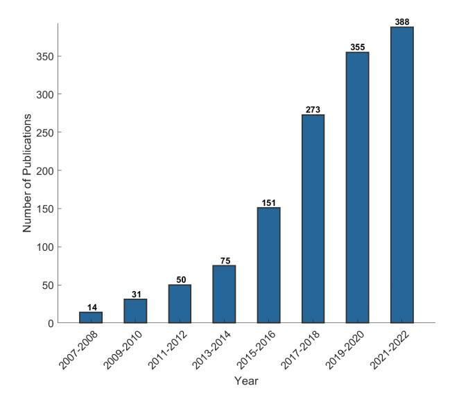

Fig. 1. Number of articles in the Scopus database whose abstracts contain the phrase "Visible Light Positioning" as a function of publication year.

a novel and promising positioning technology that exploits light-emitting diode (LED) light signals. Indeed, VLP is the umbrella term for all positioning services reliant on optical wireless signals that are, as the name suggests, confined to the visible spectrum (430–770 THz), or equivalently, the 390–700 nm wavelength range of the electromagnetic spectrum. Originated as a subdomain of visible light communication (VLC) [9], [10], VLP is designated as a key next-generation indoor localisation technology [11]. It can provide centimetre-order accurate positioning at a relatively low cost, thereby potentially enabling a variety of location-based services (LBS). Fig. 1 presents a bar chart of the number of publications in the Scopus database, whose abstract includes the phrase "Visible Light Positioning" spanning the period from 2007 to 2022, clearly showing the increasing interest in VID.

VLP systems employ a photo-electronic device-based receiver, which typically consists of one or more image sensors or photodiodes (PDs), to interpret modulated visible light signals from lighting device transmitters. A typical VLP transmitter is the commercial off-the-shelf LED lamp which has the advantage of consuming a low power, not generating radio interference, having a long lifespan of up to ten years, and having low maintenance costs [12]. In recent years, many overview works on VLP have been published [13], [14], [15],

| Publication | Ref.  | Features / Taxonomy Method           |                                                                 |                                  |                                          |                                 |                                      |                                                            |
|-------------|-------|--------------------------------------|-----------------------------------------------------------------|----------------------------------|------------------------------------------|---------------------------------|--------------------------------------|------------------------------------------------------------|
| Year        | IXCI. | Lighting& illumination aspects | VLP rationale & positioning of VLP in IPS landscape | VLP HW components (Tx, Rx) | Mathematical modelling of the VLP system | VLP modulation techniques | Localization techniques & algorithms | End-to-end HW&SW system description (Tutorial) |
| 2021        | [13]  | Very limited                      | Yes                                                             | Very limited                  | No                                       | Limited                         | Limited                              | Yes                                                        |
| 2016        | [15]  | No                                   | No                                                              | Limited                          | Limited                                  | Limited                         | In-depth, mathematical            | No                                                         |
| 2017        | [16]  | No                                   | Yes                                                             | Limited                          | Limited                                  | Yes                             | In-depth                             | No                                                         |
| 2019        | [17]  | No                                   | No                                                              | No                               | No                                       | No                              | Limited                              | No                                                         |
| 2018        | [18]  | Very limited                      | Yes                                                             | Limited                          | Yes                                      | Yes In-depth, mathematical      |                                      | No                                                         |
| 2015        | [19]  | No                                   | Yes                                                             | Limited                          | Limited                                  | Limited                         | Limited                              | No                                                         |
| 2020        | [20]  | No                                   | Yes                                                             | No                               | Very limited                          | Very limited In-depth        |                                      | No                                                         |
| 2020        | [21]  | In-depth                             | VLC rationale                                                | In-depth                         | Yes                                      | In-depth No                     |                                      | No                                                         |
| 2015        | [22]  | In-depth                             | VLC rationale                                                | Limited                          | Yes (VLC)                                | In-depth                        | No                                   | Yes (VLC)                                                  |
| Tutorial/ ( | Ours  | In-depth                             | Yes                                                             | In-depth                         | Yes                                      | In-depth                        | In-depth,                            | Yes                                                        |

TABLE I COMPARISON OF PREVIOUS WORKS WITH OURS

[\[16\]](#page-35-6), [\[17\]](#page-35-7), [\[18\]](#page-35-8), [\[19\]](#page-35-9), [\[20\]](#page-35-10), [\[21\]](#page-35-11), [\[22\]](#page-35-12). Armstrong et al. [\[14\]](#page-35-4) introduced VLP for international standardization. In [\[15\]](#page-35-5), a survey was conducted on over 100 papers focusing on VLCbased positioning systems. It describes the principles and high-level implementation of various positioning algorithms for photodiode and camera receivers, along with a comparison of their accuracy. Luo et al. [\[16\]](#page-35-6) provide an in-depth survey of VLC-based positioning systems, with a categorization on mathematical localization approach and on the used sensor(s), and explore some optimization methods. Zhuang et al. [\[18\]](#page-35-8) presented a good and detailed survey of VLP positioning techniques, some of them including a mathematical formulation. They also (generically) mention the use of Kalman and Particle Filters for including 'state' in VLP positioning systems and improving their accuracy, but dedicate less attention to lighting and illumination aspects or to the involved VLP hardware components. Chen et al. [\[17\]](#page-35-7) and Rahman et al. [\[20\]](#page-35-10) also focus on a variety of positioning algorithms. Interestingly, they explicitly distinguish solutions with modified light sources and systems with unmodified light sources. In the latter case, the light sources are being used for positioning without any alteration (e.g., modulation driver), thereby implicitly considering VLP deployment cost aspects and ways forward towards VLP adoption. After also giving an overview of several positioning techniques, Kouhini et al. [\[13\]](#page-35-3) demonstrate Light Fidelity (LiFi)-based 3D positioning for Industry 4.0 based on time-offlight measurements, with a detailed system overview. In [\[22\]](#page-35-12), Pathak et al. give an in-depth discussion of VLC modulation and medium access mechanisms, while Mapunda et al. [\[21\]](#page-35-11) provide a detailed tutorial on all aspects of VLC.

However, for VLP, an appropriate tutorial is missing, discussing all the relevant parts for realizing a VLP system. Table [I](#page-1-0) shows that most VLP overview works focus on software-related aspects (mainly positioning algorithms, [\[15\]](#page-35-5), [\[16\]](#page-35-6), [\[17\]](#page-35-7), [\[18\]](#page-35-8), [\[20\]](#page-35-10)), but do not address in detail all aspects that are relevant when setting up a VLP system (illumination requirements, transmitter and receiver hardware varieties and operation, etc). Also, no work is available that gives a complete end-to-end hardware and software description of an actual system. Therefore, this work aims to provide an allencompassing VLP tutorial, including all required background with extensive referencing for understanding the rationale of using VLP, its constraints, its different component flavours, its modulation configurations, and its positioning approaches. A primer on the most common VLP system, RSS-based with a single photodiode, should provide a full insight and allow the reader to get started with VLP. Finally, this work also sheds some light on more recent evolutions and research works in VLP, like more unconventional VLP transmitter or receiver types, unmodulated VLP varieties, or the use of machine learning for positioning.

The remainder of this paper is structured as follows. A comprehensive taxonomy of positioning systems is first presented in Section [II.](#page-2-0) Section [III](#page-6-0) then covers the fundamental technical components of the VLP system, including hardware and software. The various positioning approaches that are employed in VLP systems are discussed in Section [IV.](#page-18-0) Section [V](#page-22-0) then provides a mathematical and technical primer on a standalone received signal strength (RSS) VLP system with a single PD, which can serve as an easy-to-access tutorial, i.e., a starting point for setting up a VLP system. Next in Section [VI,](#page-29-0) open challenges and the future road map of the VLP are detailed, and finally, Section [VII](#page-32-0) summarizes the work.

## II. CONTEXT

## *A. (Indoor) Location-Based Services*

'Location, location, location' is a mantra that extends way beyond the world of real estate transactions. In fact, as of 2022, countless (micro) services, such as discovery, tracking and navigation, all rely on a location representation. These location-based services (LBS) grew to become ubiquitous to the point that they are indispensable [\[23\]](#page-35-13), [\[24\]](#page-35-14).

Particularly, the indoor LBS field is flourishing [\[5\]](#page-34-4), [\[25\]](#page-35-15), [\[26\]](#page-35-16), [\[27\]](#page-35-17), [\[28\]](#page-35-18) as a result of both humans typically spending 80-90% of their time indoors [\[29\]](#page-35-19), and a location estimation being quintessential to the automation, digitalization and sustainability trends [\[30\]](#page-35-20). Mainly, the all-pervading 'Internet of Things (IoT)' paradigm in tandem with the perpetual revolution in autonomous robotics, brings about many applications in 'Smart Industry' (SI) or 'Industry 4.0' (e.g., AGV navigation, pallet tracking) [\[1\]](#page-34-0), [\[31\]](#page-35-21), 'Smart Architectures' (SA) (e.g., occupancy management and pedestrian tracking for building comfort automation, . . . ) [\[32\]](#page-35-22), [\[33\]](#page-35-23), 'Retail 4.0' (RE) (e.g., home-delivery, shopping cart tracking for interactive and personalized shopping, ...) [\[2\]](#page-34-1), [\[34\]](#page-35-24), [\[35\]](#page-35-25), 'Health 4.0' (HE) (e.g., asset tracking and logistic flow analysis) [\[4\]](#page-34-3), 'Agriculture 4.0' (AG) (e.g., precision livestock farming, greenhouse management optimization, ...) [\[3\]](#page-34-2), [\[36\]](#page-35-26) and 'Sixth-generation' (6G) technology (e.g., Real-Time Urban Traffic Optimization) [\[37\]](#page-35-27).

## *B. (Indoor) Positioning Systems (IPSs)*

At the heart of the LBS is a positioning system that accurately and reliably estimates a user's or an asset's location. Several localisation techniques exist, which are based on various communication and information technologies. For outdoor applications, global navigation satellite systems (GNSS) are the de facto standard.

Whereas a GNSS provides a very-well functioning and freely accessible geolocalisation, its quality of service severely diminishes in areas where an insufficient number of reliable Line-Of-Sight (LOS) connections between the GNSS receiver and the GNSS satellites is available. Particularly, in indoor or underground environments, GNSS-solutions are typically unable to reliably and sub-metre accurately pinpoint entities or things [\[38\]](#page-35-28), [\[39\]](#page-35-29). Even the latest innovations, namely L5 band-based, real-time kinematic positioning (RTK), assisted or high-sensitivity GNSS generally fall short [\[40\]](#page-35-30), [\[41\]](#page-35-31), [\[42\]](#page-35-32), [\[43\]](#page-35-33), [\[44\]](#page-35-34). The same applies to other positioning technologies that solely depend on an outdoor infrastructure [\[45\]](#page-35-35), [\[46\]](#page-36-0), [\[47\]](#page-36-1), [\[48\]](#page-36-2).

The indoor environment hence necessitates an alternative, dedicated localisation approach [\[49\]](#page-36-3), [\[50\]](#page-36-4), a so-called *indoor (local) positioning system*. As opposed to GNSS for outdoor applications, unfortunately, no dominant indoor positioning system (IPS) is identified, let alone that one is the standard. In fact, the IPS landscape is diverse. It encompasses a large variety of technologies and systems of both prototypical and commercial nature.

Fig. [2](#page-2-1) categorizes the conceived wireless positioning systems on coverage area and operational principle. The global

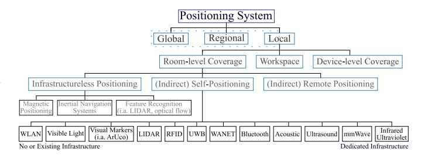

Fig. 2. A composition classification of the (indoor) positioning technologies [\[51\]](#page-36-5), [\[52\]](#page-36-6), [\[53\]](#page-36-7), [\[54\]](#page-36-8). The 'indirect' keyword denotes that when the dominant party, i.e., the master, obtains the position, it is communicated back towards dominated party, i.e., the slave, as well. The IPS technologies frequently feature in (hybrid) operation modes or in tandem with others to increase their performance.

and regional positioning systems, based on GNSS, long range ground-based radio, cellular or low-power wide-area network (LPWAN) technologies, are primarily meant for outdoors. The 'cellular' category includes among others the wellknown Long Term Evolution (LTE) and Fifth Generation New Radio (5G NR), while LPWAN encompasses LoRa, Sigfox, Narrowband Internet of Things (NB-IoT), IEEE802.11ah (Wi-Fi HaLow), etc. The collection of local positioning systems destined for the indoor environment, or equivalently the IPS, can be further subdivided on whether they provide a positioning service on either a room, workspace or device level scale.

Extending [\[51\]](#page-36-5), the room-level IPS can be subdivided into 3 categories: 'infrastructureless positioning', '(indirect) self-positioning' (device-based positioning in [\[52\]](#page-36-6)) and '(indirect) remote positioning' (monitor-based positioning [\[52\]](#page-36-6)). Magnetic positioning, inertial navigation using microelectromechanical systems (MEMS) and feature-based simultaneous localisation and mapping (SLAM) with (depth or event) cameras and/or LIDAR, together make up the former category. These technologies provide a location estimate with respect to an inherent coordinate system, such as the earth's magnetic field, instead of to a dedicated infrastructure. Unfortunately, they are unable to consistently and accurately determine an absolute position in a one-shot manner, i.e., with a single measurement and without keeping state. Without external corrections, their positioning estimates tend to drift within a short time span. The latter, '(indirect) remote positioning' class is characterised by the transmitter infrastructure actively or passively tracking the receiver(s) on its own initiative. It holds i.a. Radio-Frequency IDentification (RFID) or Near-Field Communication (NFC) tracking, and presence detection systems built on RF (e.g., Radio Detection and Ranging (RADAR), on light, on vision and even on temperature or pressure.

The main focus of this tutorial lies with the room-level (indirect) self-positioning type systems, where the user or thing itself fulfils the dominant role in self-localising with respect to a (dedicated) infrastructure. This is frequently required by many emerging or developing applications on account of privacy. IPS contained within this class can be based on: wireless local area network (e.g., 802.11ac Wi-Fi 5), visual markers (e.g., on ArUco markers or Quick Response

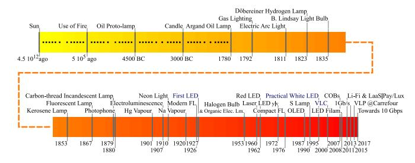

Fig. 3. A timeline of the evolution of the field of lighting. To cope with the date ambiguity in composing this time line, i.e., the historical resource-dependence and the assessment to which degree a development is characterised as 'an invention', the patent formulation of [\[59\]](#page-36-9) is used.

(QR) codes), ultra-wideband (UWB), wireless ad hoc network (e.g., Thread, Zigbee, Z-Wave), Bluetooth, acoustic sound or ultrasound, extremely high frequency (mmWave) or light (VLP, beacon-based LIDAR and infrared) technologies. From Fig. [2'](#page-2-1)s technology count, it is clear that no single IPS is dominant. In fact, an application-driven IPS fragmentation manifests [\[28\]](#page-35-18).

## *C. Rationale of VLP*

Although some attempts have been made to qualitatively compare IPS [\[52\]](#page-36-6), [\[55\]](#page-36-10), a comprehensive in-depth comparison is still lacking in literature. Moreover, a comparison of IPS is not straightforward, as an IPS's two most looked-at characteristics, cost and accuracy, occur in a trade-off. Nevertheless, it is well established that traditional mature technologies, like Wi-Fi and BLE, attain typical accuracies of 2-5 m [\[52\]](#page-36-6), where 1 m can be reached under idealized conditions (only-LoS, extensive prior fingerprinting, high anchor density, etc). Generally, these technologies are not able to achieve the sub-meter accuracies required for certain applications (sports tracking, retail cart tracking, indoor navigation, logistic flow tracking, etc). Other technologies like IR [\[56\]](#page-36-11) and LIDAR [\[57\]](#page-36-12) are cm-level accurate and have also come to a sufficient maturity level, but are still prohibitively expensive for many use cases. In addition to cost and accuracy, various other criteria have differing levels of importance depending on the use case. These include coverage, update rate, latency, scalability, practicality (including installation and maintenance), privacy, safety, applicability, and ease of use. Consequently, currently, the widespread adoption of IPSs is impeded [\[58\]](#page-36-13).

On the grounds of the cost and coverage benefits arising from VLP's claim to reuse the illumination infrastructure (to be nuanced though, see, e.g., Section [II-D2](#page-4-0) and concluding paragraph of Section [II-D\)](#page-4-1), and of light-based positioning's intrinsic beneficiary propagation properties (Section [III\)](#page-6-0), a decade ago or so, VLP has been added to the IPS solution mix. Moreover, three favourable, emerging market trends are (in)directly at the cradle of VLP's prominence:

*1) A Lighting Technology Revolution:* Building on Fig. [3'](#page-3-0)s long series of innovations, up until 2010, the in-situ illumination market was dominated by incandescent, halogen and (compact) fluorescent lamps. That changed with the maturation of solid-state lighting, and LED technology in particular. Nowadays, LEDs are considered to be the 'green' light sources of the near-future [\[18\]](#page-35-8). Compared to competitors, they offer: (i) more ruggedness and operational stability, (ii) shapely or compact form factor designs, and (iii) controllable and tunable illumination devices with a pleasantly high color rendering index. Their main selling point is however the elevated degree of environmental-friendliness and associated energy savings, by: (i) offering the top-notch luminous efficacy even after a prolonged period of continuous usage, (ii) providing a longer life expectancy, (iii) lessening the heat dissipation during operation and (iv) reducing the (eco)toxicity through limiting the usage of harmful materials in the lamp design. Concretely, the best in-class LED lamps attain 200–250 lm⁄W, far exceeding the approximately 15 lm⁄W to 60 lm⁄W of traditional (incandescent) and common energy-saving (fluorescent) light bulbs, respectively. Their lifetime is 3 to 5 times larger than that of fluorescent lamps.

The 'price per bulb' is not necessarily more modest for LEDs than for its competitors, but their 'cost per lumen' already sets them apart. Unsurprisingly, the LED lighting's market share already reaches 40-50%. Furthermore, LEDs are projected to make up anywhere between 70% to 90% of the illumination infrastructures in developed countries by 2035 [\[60\]](#page-36-14), [\[61\]](#page-36-15). The continued replacement of non-LED lamps is an indirect consequence of Haitz's law [\[62\]](#page-36-16), which forecasts significant LED efficacy gains and 'cost per lumen' reductions. With lighting accounting for 15% of world's electricity consumption, the LEDs' growing share of the energy mix also has societal and climatological foundations.

LEDs feature hitherto in nearly all lighting applications, including in traffic, commerce and households. Solid-state lighting variants, such as organic (OLEDs) or polymer (pLEDs) LEDs, and novel lighting devices, e.g., the solidstate laser diode, are also starting to find (niche) market applications.

Besides revolutionising the illumination sector, these new lighting sources also pave the way for non-lighting applications as some of their lighting properties can controllably be modified. For instance, optically birefringent or polariser materials, lenses, colour filters or driving current modulation circuits alter the light polarisation, radiation pattern, emission spectrum or intensity, respectively. This modulation of light permits its use for localisation. Importantly, leveraging the (existing), typically LED-based, illumination infrastructure turns out the main economic driver of many VLP systems.

*2) Light(ing) as a Service Business Model:* In line with the 'X as a service' trend, the illumination market is transitioning towards the *Light(ing) as a Service (LaaS)* business model [\[63\]](#page-36-17), [\[64\]](#page-36-18). LaaS is a service-based architecture that revolves around offering clients 'light' on a subscription basis rather than through to be purchased lamps. Thus, the lighting infrastructure remains the property and the responsibility of the illumination provider. Importantly, service differentiation, i.a. between LAAS competitors, paves the way for the monetization of smart lighting applications, such as human centric lighting [\[65\]](#page-36-19) or VLP. This paradigm shift from a 'cost per bulb' to a 'cost per lux' was introduced by Signify in collaboration with Thomas Rau in the form of the 'Pay per Lux' project [\[66\]](#page-36-20) (Fig. [3\)](#page-3-0).

*3) Spectrum Crunch and the Advent of Li-Fi Networks:* The continued mobile data traffic growth [\[67\]](#page-36-21) threatens to expend the combined bandwidth of the currently-marketed wireless communication technologies. This dreaded scenario is dubbed as the 'spectrum crunch'. Potential solutions entail both opening up previously allocated spectral resources and developing spectral efficiency techniques [\[68\]](#page-36-22). However, a simpler solution consists of tapping into the optical frequency bands. This is 'the RF to optical' paradigm shift.

By virtue of a vast, license, regulation and congestionexempt spectrum, optical wireless is in theory well-endowed to cope with the growing user demand. For indoor WLAN-type applications, standalone or hybrid (with Wi-Fi [\[69\]](#page-36-23), [\[70\]](#page-36-24) or 5G NR [\[71\]](#page-36-25)) Li-Fi networks offer high data rate offloading capabilities [\[72\]](#page-36-26). For an ecosystem view and technical information appertaining to the non-positioning aspects of Li-Fi, literature is referred to [\[61\]](#page-36-15), [\[72\]](#page-36-26), [\[73\]](#page-36-27).

## *D. Illumination Requirements of VLP*

Employing light as a means for indoor positioning, also preordains adhering to illumination constraints, ideally remaining compatible with the existing lighting backbone, and not causing adverse health effects.

*1) Generic Requirements on Illumination:* A lighting infrastructure is subject to a standard (set) that dictates the required illuminance distribution and minimal colour rendition quality for a defined application in a specified environment, and this both on (the immediate surrounding of) a task area and for in-room observers. For example, in Europe, the standard EN 12464-1 [\[74\]](#page-36-28) applies indoors.

Without delving deep into lighting design, the 4 most relevant parameters that standards typically dictate are: (i) the maintained illuminance *E*¯*m*, (ii) the illuminance uniformity *U*0, (iii) the unified glare rating *UGR* and (iv) colour rendering index CIE *Ra* . In composing these quantities per environment type, psycho-physiological aspects (visual comfort), safety aspects, visual ergonomics, the needs of visual tasks and even the economical aspect, are all accounted for. Importantly, standards actually also present more in-depth parameters, metrics (e.g., the cylindrical illuminance) and guidelines.

*a) Maintained illuminance: E*¯*m* represents a lower bound value, below which a task area's mean illuminance *Em* may not dwindle over the course of the lighting infrastructure's lifetime. Its value reflects the specifics, criticality, errorproneness and duration of the task at hand.

Lighting depreciation is factored in *E*¯*m*. It is often modelled in terms of a single lamp-dependent maintenance factor (*MF*), a product of the 'lamp lumen maintenance', the 'luminaire maintenance', the 'lamp survival' and the 'room surface maintenance' factors. These describe the lamps' inherent and external (i.a. dust accumulation) diminishing luminous flux, the percentage of defect lamps not immediately replaced and the reduction in environment reflectivity (i.a. by dust on the walls), respectively. A fixed *MF* = 0.8 functions as an industry standard. Though, good design practice may impose a more detailed *MF*. A walkthrough of an example LED lighting design can be found in [\[75\]](#page-36-29).

- *b) Uniformity:* Lower limits are also set on the illuminance uniformity *U*0, defined as the ratio of the minimum and mean illuminance on a surface. After all, uniform illumination is needed to neither induce eye discomfort stemming from continued vision adaptation, nor vision perception errors, e.g., when illuminance gradients are perceived as shadows.
- *c) Glare:* Excessive illumination (contrast) at an observer's eye-level effectuates a psychological sensation of discomfort or disability. This phenomenon is called glare. Glare encompasses among others vision impairment, and the temporary blindness or afterimages that result from (peripherially) looking at small light sources with high brightness. Thus an important parameter in lighting design, it is scored by means of the CIE unified glare rating metric (*UGR*). *UGR* is generally computed with the UGR table method [\[76\]](#page-36-30). Confined between 16 and 28, the lower the metric the better. The UGR limit value (UGRL) in EN 12464-1 addresses the maximal UGR allowed for a given application. Recently, new and improved glare metrics have been proposed [\[77\]](#page-36-31).
- *d) Colour rendition:* The color rendering index (CRI) governs a lamp's colour representation, i.e., to which extent the lamp enables a natural color gamut perception by an observer. Covering a scale up to 100, the CIE *Ra* is the standard CRI. In lighting design, *Ra* should exceed a prescribed minimal value. Noteworthy, initiatives are gaining traction to replace *Ra* with more truthful alternatives, e.g., the Gamut Area Index, the Color Quality Scale or the Colour Fidelity Index.
- *2) Compatibility With Existing Lighting Backbones:* In addition to the illumination considerations, current economic grounds obtrude a compatibility with both the in situ interfaces and the (dimming) functionality. After all, installing a brand new VLP-only lighting backbone network may turn out to be too expensive.
- *a) Compatibility with lighting control systems:* The VLPenabled lamps should connect to, and not compromise the health of, the existing power grid. In addition, the luminaire drivers could be expected to conjoin with the current lighting control networks, of which Digital Addressable Lighting Interface (DALI) and DMX512 are the most common. Ideally, VLP roll-outs also anticipate the near-future LAAS services (Section [II-C2\)](#page-3-1) and interface networks, such as power over Ethernet (POE) or power line communication (PLC).
- *b) Compatibility with dimming:* VLP transmitters will typically be ought to support dimming. The myriad of reasons consists of reducing the energy consumption, providing task flexibility, but also of prolonging the LEDs' lifetime.

Pulse-width modulation (PWM) is still the most popular dimming approach, on account of it being believed to minimise both the deviation in the nominated correlated color temperature at a specified driving voltage, and the instigation of health/perception effects (Section [II-D3\)](#page-5-0).

However, a recent illumination trend entails reverting back to amplitude modulation (AM), either with sine waves or by constant current reduction. It is a consequence of the temperature variations-induced chromatic instability associated with PWM turning out to be more adverse than previously anticipated [\[78\]](#page-36-32). This duty cycle-caused chromatic instability is detectable [\[79\]](#page-36-33), [\[80\]](#page-36-34), certainly for yellowish to reddish LEDs.

Amplitude dimming does have to cope with a nonlinear driving voltage/current relationship, but has the benefit of reducing perception effects at high dimming ratios. Hybrid PWM/AM dimming has emerged [\[81\]](#page-36-35), with the emphasis on diminishing the chromaticity shifts. Finally, phase dimming, through sine wave chopping, is also a potential solution [\[82\]](#page-36-36).

Besides dimming being a requirement, already in-place interfaces also present an opportunity to perform the modulation, needed in VLP, with [\(III-H\).](#page-16-0)

*3) Effects of Modulation on Health or Perception:* As mentioned in Section [II-D1,](#page-4-2) the lighting not only affects the human's perception, but its well-being (e.g., blue light deranging the circadian rhythm) as well. This is especially the case for dimmed, or more broadly temporally modulated lights. Besides inducing the temporal light artefacts (TLAs) [\[83\]](#page-36-37) discussed in the next two paragraphs, 'flashing' lights may aggravate photosensitive or other pathological medical conditions, such as photosensitive epilepsy, migraine [\[84\]](#page-36-38), nausea or asthenopia (eye strain) [\[85\]](#page-36-39), [\[86\]](#page-36-40). Knowing that modulation is (generally) inherent to VLP, this section will introduce important preventive measures.

From psychophysiology literature, it is known that the extent to which health/perception effects manifest when dimming/modulating, definitely depends on the modulation frequency and the modulation depth. The latter is related to the modulation signal's swing around its DC value, and is typically defined in terms of the percent flicker or Michelson contrast. The absolute and relative (il)luminance [\[87\]](#page-36-41), [\[88\]](#page-36-42), the mobility, the exposure duration and degree of light level adaptation, the location and surface area of the light source's projection on the retina [\[89\]](#page-37-0), [\[90\]](#page-37-1) and physiological factors (e.g., age and fatigue) all play a role too.

*a) Flicker:* The first temporal light artefacts phenomenon is *flicker*. It is the collection of possible psychophysiology effects that arise as a consequence of the prolonged (periodic) changes in the instantaneous luminous intensity of lighting devices. Perceptible flicker ranges in frequency up to about 70–80 Hz, is sometimes induced for amusement, but may be disturbing and/or injuring. Above 30 Hz, typically more hindrance is experienced when the light source occupies the peripheral eye field compared to the foveal field, whilst below 10 Hz it is the other way around. In [\[91\]](#page-37-2), a more extensive review is provided about flicker and how it pertains to LEDs.

Flickering cannot always be attributed to inferior modulation practice. Even in DC driving lights, the (double) mains, its harmonic and/or driver-specific spurious frequencies (i.a. of the LEDs' power supply ripple [\[92\]](#page-37-3)) tend to appear in the radiant output. The former may be deemed the most conspicuous cause of flickering. Flicker is proportional to the logarithm of the stimulus luminance and area, described by the Ferry-Porter and Granit-Harper law, respectively.

*b) Perception effects and faults:* Modulation frequencies above the 70–80 Hz threshold may still be prove hazardous. This is due to both the unconscious perception of the human eye, i.e., imperceptible flicker [\[93\]](#page-37-4), [\[94\]](#page-37-5) and the occurrence of both stroboscopic motion and phantom array/ghosting

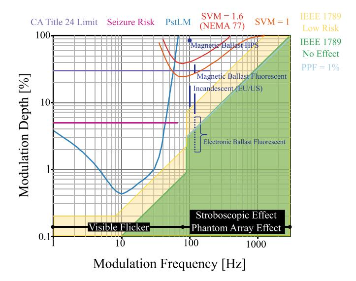

Fig. 4. A replication of the permissible modulation depth as a function of the modulation frequency based on a composition of the recommendations and standards regarding the manifestation of temporal light artefacts [\[97\]](#page-37-6), [\[103\]](#page-37-7). The typical inherent modulation of various light sources are highlighted. LEDs are the notable absentee, as their TLA behaviour is imputed to the quality and function of the LED driver.

illusion (i.a. during saccade). The effects of the former can be considered negligible for frequencies exceeding 160 Hz [\[95\]](#page-37-8), even though modulations up to 200 Hz can still be resolved by the human retina. In [\[96\]](#page-37-9), Zele et al. show the 10-90% rise time of the retina's cone photoreceptor cells, to be in the order of 10 ms, and propose the wielding of a modulation period to safeguard against perception [\[96\]](#page-37-9). The latter two TLA phenomena are mostly reported to eventuate for modulation frequencies up to modulation frequencies up to 2 kHz and 2.5 kHz, respectively. That is why Lehman et al. proposed a practical 3 kHz acceptability bound to be on the safe side [\[97\]](#page-37-6). However, Bullough et al. in [\[98\]](#page-37-10) and Brown et al. in [\[99\]](#page-37-11) demonstrated that certain 10 kHz stroboscopic effects can still be detected by some.

*c) Constraints on the VLP modulation frequency:* With VLP relying on (deliberate) transmitter modulation, care needs to be taken to not induce the mentioned TLAs. Devoidness requires restricting the minimum modulation frequency.

Fig. [4](#page-5-1) shows which modulation depth is permitted at each modulation frequency. It actually provides a composition of the IEEE 1789:2015 recommendation [\[100\]](#page-37-12) with selected supplementary of amended (proposal) acceptance criteria. These supplementary criteria are based on the Short Term Perceptibility for Light Modulation (PstLM) flicker meter reading, the physiological percent flicker (PPF) indicator [\[101\]](#page-37-13), and Stroboscopic effect Visibility Measure (SVM) [\[102\]](#page-37-14). They are treated in among others NEMA 77-2017 [\[103\]](#page-37-7).

Though the latter metrics offer better delineated recommendations, for convenience and because of the wellcorrespondence with the PPF, this discussion retrogrades to the generally more stringent IEEE 1789:2015 recommendation. IEEE 1789:2015 defines 3 zones: the 'safe' green (≤1% of observers experiences the TLA), the 'transition' yellow (≤3%) and the 'unsafe' white zone. Fig. [4](#page-5-1) displays that for modulation frequencies below 100 Hz, 500 Hz and 1 kHz, the modulation depth is best not (or is not allowed) to significantly exceed 2.5% (8%), 15% (40%) and 30% (75%) respectively. Overall, the larger the modulation frequency is, the more relaxed the modulation depth requirement is. Importantly, a modulation depth of 100% is only accepted from 3 kHz on.

Importantly, this analysis does not comprise the persondependence, and is technically only valid for elementary waveforms with a dominant frequency. Hence, more complex modulation, the exposure duration and the luminance level are not accounted for. Hereto, new criteria are/were in the works, e.g., the PPF measurement or a method that weighs the perceptible frequency components of non-fundamental signals.

A further point is that flickering caused by intensitybased modulation of LEDs can be one of the key issues in existing VLP systems. On the one hand, since human eyes are sensitive to low-rate changes in light intensity, LEDs must transmit pulses at a high rate to avoid flickering, imposing an unnecessary burden on the VLP system's receiving devices. Furthermore, appropriately modulating long linear LEDs may be more challenging than receiving the signals. To address this issue, polarization-based modulation rather than intensitybased modulation may be employed [\[104\]](#page-37-15). Humans, on the other hand, can detect the orientation of polarized light using Haidinger's brushes [\[105\]](#page-37-16). Hence, the effects of changing polarization on humans should be investigated further in the context of polarization-based VLP. Finally, an in-depth investigation of the influence of frequency range on VLP with flicker avoidance is necessary.

*4) Effects of Flicker on VLP Design:* In VLP, flicker is usually considered something to be cautious rather than anxious about. This notion may be warranted for photodiode-based VLP, but not necessarily for the lower update rate camerabased localisation (Section [III-C\)](#page-9-0). A practical TDMA OCC system with many base stations and a low frame rate camera receiver could struggle to satisfy the bounds of Fig. [4.](#page-5-1) In certain environments, higher-frequency stroboscopic/phantom array effects can be negated. This in turn relaxes the modulation preconditions. This being said, a well-designed VLP system just has to obey the recommendations and guidelines of Fig. [4.](#page-5-1)

In the context of VLP, *U*0 places strict constraints on the transmitter locations and radiation patterns, and more minutely effects the electrical performance of certain receivers, of which the conventional solar cell is the most noteable. *E*¯*m* is a stringent constraint when planning a VLP network. Particularly, in some retrofitting scenarios, the prior lighting redundancy will not be able to cover the illuminance 'loss' as a result of modulation. Then, new illumination or VLP-enabled lamps will have to be added.

As glare is mainly a characteristic of the luminaire, it is tackled on the level of the lamp manufacturer/supplier. A VLP roll-out must comply, by selecting appropriate lamps. It is important to note that glare-limiting mechanisms impact the radiation pattern of the VLP transmitters, mostly shielding away the luminous flux at the larger irradiance angles. The now no longer omnidirectional radiation pattern may complicate the localisation procedure and/or induce an accuracy penalty depending on the roll-out. More complex VLP localisation procedures cope better, as long as the pattern is a priori known. Interestingly, glare shielding may also be employed to one's benefit, e.g., to obtain more directive light sources. When partially retrofitting or in certain applications, especially when automating with robotics replacing manual intervention, the relaxed *E*¯*m* requirement outweighs the reduced illumination output of the VLP-enabled lamps.

A high CRI is particularly important for color-critical applications [\[106\]](#page-37-17). Though the CRI is (minorly) impacted by temperature and driving current, for VLP roll-outs, in essence, abiding by EN 12464-1 simply entails an adequate lamp selection.

## III. COMPONENTS AND PARADIGMS OF VLP SYSTEMS

Interestingly, despite technological developments being in full-swing, market intelligence companies have already forecast that VLP systems might be a key solution in unlocking the highly-valued Indoor Location market [\[107\]](#page-37-18). The cited emerging trends prompt(ed) significant interest and research efforts in the field of VLP/VLC. In line with the causes of IPS fragmentation, the uncoordinated spending of these R&D resources has predominantly led to an (over)supply of distinct VLP systems and/or concepts. The result is that, to date, no consensus VLP system is identified [\[14\]](#page-35-4), [\[16\]](#page-35-6), as will be attested by this section's taxonomy. Proposed VLP systems vary in the exact nature of the involved transceivers, the communication scheme i.a. regarding modulation, multiple access or point-to-point/multi-point-to-point connectivity, the localisation technique and algorithm, and the targeted application area. The variations hence even span multiple layers of the Open Systems Interconnection (OSI) model. The various VLP systems furthermore tend to diverge in their quality of positioning service (QPoS) offering, regarding accuracy, cost, weight, etc.

Therefore, it is difficult, neighing on the impossible, to currently envision which type of VLP systems will find a (niche) application. To understand the technological choices of this paper's VLP systems and to highlight VLP's overall potential as a next-generation IPS, the following subsections are devoted to providing a taxonomy on the VLP systems. It is by no means the intention to exhaustively list all available VLP systems, hereto the reader is referred to dedicated surveys in literature. Luckily, the length of this VLP taxonomy can be significantly curtailed as VLP builds on the foundations of other localisation technologies. It borrows many concepts that do not require an in-depth discussion. It does necessitate several dedicated components.

## *A. Communication Architecture View on VLP*

To overview to which extent VLP differs from pre-existing localisation technologies, Fig. [5](#page-7-0) visualises the telecommunication building block diagram that is frequently used in education [\[108\]](#page-37-19). Both standalone and VLC-integrated VLP are represented. The white background blocks, i.e., the source and channel (de)coding functionalities, are not VLC-specific and can be borrowed. Though in positioning systems, the

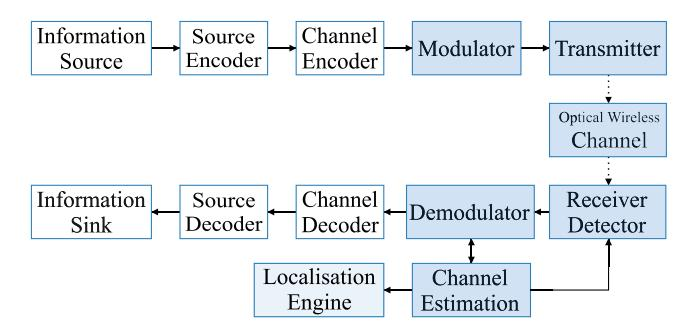

Fig. 5. Block diagram representation of the VLP/VLC building blocks.

(de)coding functionality is not explicitly used. Pilot symbols or reference signals are sent.

The light nature of VLP and the optical wireless channel do dictate dedicated modulating, transmitting and receiving components. They are indicated in blue in Fig. [5.](#page-7-0) Compared to RF, the physical properties of VLP's transceivers are evidently dissimilar. For example, the transmitters are light sources instead of radio frequency antennas. With that, also the modulation block has to account for different physical limitations. Importantly, in IM/DD, the most common VLP variant, the transceiver combination only supports modulating with positive and real-valued signals.

The manifestation of VLP-dedicated functionality in turn entails that VLP's localisation engine is required to tailor the lent, technology-agnostic localisation algorithms for optimal positioning performance. This is the reason behind the 'Localisation Engine' block's grey colour. VLP's localisation can make use of the many already-proposed algorithms. The exact nature of each of the VLP-specific building blocks are detailed hereinbelow.

## *B. Physical Properties of Transmitters*

This section focusses on the transmitter-side of the available VLP systems, from an electrical circuit standpoint. It refrains from providing a detailed description on the physics and optics involved with the various light sources appearing in literature.

- *1) Fluorescent Lights:* Localisation methods based on features of the ambient light, evidentially also work when employing fluorescent lights [\[109\]](#page-37-20), [\[110\]](#page-37-21), [\[111\]](#page-37-22), [\[112\]](#page-37-23), [\[113\]](#page-37-24). Purposely adjusting the inverter of straight tube lamps also permits the use of fluorescent lights for actively modulated VLP [\[114\]](#page-37-25). However, their aptitude for VLP purposes is scant, due to their limited modulation bandwidth. The latter renders it difficult to prevent health or perception effects for observers [\[115\]](#page-37-26). Besides for illumination, for localisation, fluorescent lamps are pushed aside in favour of their electroluminescent successors as well.
- *2) LED:* As broached in Section [II-C1,](#page-3-2) the white LEDs' vital combination of scoring high in terms of modulation bandwidth when current-controlling, average luminous efficacy, robustness, lifespan and environmental-friendliness has enabled them to not only rapidly conquer the illumination industry [\[116\]](#page-37-27), but to feature as the default light source in VLP networks as well. Depending on the exact nature, a LED

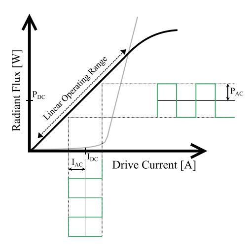

Fig. 6. A prototypical representation of a LED's (black) and a laser diode's (grey) radiant flux in response to its driving current magnitude.

lamp will exhibit different characteristics that are relevant to VLP (or VLC) [\[117\]](#page-37-28), [\[118\]](#page-37-29), [\[119\]](#page-37-30), [\[120\]](#page-37-31).

A white LED lamp can be based on a multi-die combination of bi- or trichromatic-based LED elements with optical colour filters and/or lenses. They can vary in associated powerrating (low/medium/high power) and in construction. LEDs appear as lead frame, chip on substrates, chip-scale package or COBs with a thermoplastic or thermosetter mould. Nowadays, white LEDs evince typical luminous efficacy and efficiency values in the 110–200 lm⁄W and 35-55% range, respectively. These numbers have been climbing as a consequence of the proliferation of COB LEDs, in which numerous low-power LEDs are wirebonded onto a printed circuit board to form an epoxy-covered high-power LED. Moreover, the numbers are expected to climb further, though at a reducing rate, thanks to other technology advances [\[121\]](#page-37-32). Forming a composite LED has helped in the partial (due to excess heat) circumvention of the luminous efficacy and lifetime drop at higher injection current densities. The latter phenomenon, the LED 'efficiency droop' is attributed to indirect Auger recombination [\[122\]](#page-37-33), [\[123\]](#page-37-34), [\[124\]](#page-37-35), [\[125\]](#page-37-36). At a higher current, a LED's radiant flux may turn out to be smaller than that at a lower current. The droop hence instils an efficiency - light output trade-off. The advisable operating current of LEDs typically revolves around 350 mA. Recent fabrication designs, such as the thin-film flipchip or the vertical injection topology, aim to palliate the LED efficiency droop.

Fig. [6](#page-7-1) demonstrates the impact of efficiency droop on the quasi-linear relation between a LED's driving current LED *ILED* and its radiant flux response *Pt*, which is observed above the forward voltage threshold. A saturation and/or a maximum before faulting manifests. To ensure intensity modulation of the LED's *Pt*, a LED driver simply controls *ILED* . Optimally exploiting the linearity range requires the LED driver to impose a bias current *IDC* for the modulation signal component magnitude *IAC* thereon top to maximise its swing. When a high *IAC* is essential, a nonlinear signal distortion, e.g., top-side clipping, will have to be incurred and compensated for. The *IDC* /*IAC* combination concurrently provides illumination and positioning. Modulating  $I_{AC}$  on top of existing lighting LEDs' preset  $I_{DC}$ , allows the infrastructure-reuse and associated cost savings.

Commercially-available, phosphor-type LEDs maximally achieve a 2–20 MHz modulation 3 dB bandwidth (BW). This is mainly limited by the phosphor excitation process [126], [127]. The 15–40 MHz (<500MHz [128]) bandwidth of the underlying LED (and that of the RGB LED) is constrained by i.a. the junction capacitance (BW decreases with size) and the (piezoelectric) polarization induced with the quantum confined stark effect (also limits the LED's efficiency) [129], [130].

Interestingly, conventional polar LED's (bandwidth) restrictions can to a certain degree be overcome by utilising semipolar or nonpolar substrate growing orientations. These mitigate the quantum-confined Stark effect and potentially reduce the experienced Auger effects, i.e., to ensure a larger radiative recombination rate [130], [131], [132], [133], [134]. In addition, other advantageous characteristics, such as a reduced chromaticity shift, render semipolar or nonpolar LEDs promising candidates for future VLP/VLC [129].

- 3) Micro-LED: Miniaturising the active area of a LED towards dimensions of approx. 100  $\mu$ m alleviates its bandwidth limitations. These 'micro-LEDs' (or  $\mu$ LEDs) are well-suited for VLC [118], [129], [135], [136], [137] on account of their significantly reduced inherent capacitance, of their smaller minority carrier lifetimes, of their efficiency droop combatting mechanisms [138], and of their capability for an enlarged injection current density. As a result, micro-LEDs-based VLC achieves data rates easily surpassing  $^{Gbit}$ s.  $\mu$ LEDs also manage an elevated brightness over a prolonged lifetime [129]. The individual addressing in micro-LED arrays enables parallel data streams and a high-quality color rendering. Bundled with many in a composition LED lamp, micro-LEDs can be employed for illumination as well, i.e., delivering the coveted dual positioning-illumination functionality. Interestingly, micro-LED COB structures may bridge the gap between previous low-to-medium voltage LED technology with the 230 V mains voltage.
- 4) Laser Diode: In the quest to even higher efficiencies and data rates, from  $\mu$ LEDs' 10 Gbps up to 100 Gbps, VLC turned to the near-monochromatic injection laser diode (LD). LDs feature in either direct-emittance [139] or phosphorcoated [140], [141] form with various structures that mostly rely on a Fabry-Pérot resonator cavity [142]. They operate with a higher current density, a smaller emitting area and a high radiance thanks to a (more) negligible efficiency droop manifestation [143]. Fig. 6 shows the lasing  $I_{LED}-P_t$  curve in grey.

Normally in VLC's wake, LD-based VLP will be researched as well to benefit from the larger modulation bandwidth, the temporal and spatial coherence as opposed to LEDs, and the associated more adept modulation and positioning it permits. The latter is discussed in Section III-H. Moreover, the directionality of the LD enables a long perpendicular transmitted distance with minimal dispersion. The associated disadvantage is that to ensure a workable illumination coverage [144] a (visible) light diffuser [145], [146] is a necessity. Even with

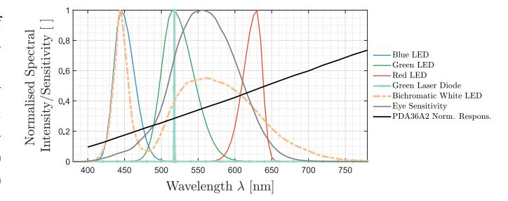

Fig. 7. Normalised spectral intensity of various light sources, and sensitivity of a reference photodiode and of human vision.

diffusers, LD VLP deployments will need to be dense. This benefits the positioning accuracy, but may prove detrimental to the overall system cost. Currently, the illumination market is not showing signs to start transitioning to LD-based lights. Interestingly, LD illumination may end up the cheaper light source in the long run though [147].

- 5) Miscellaneous Light Sources: VLP networks can also feature a combination of modulated transmitters [20]. Multi-lamps [148], a display-type matrix of light sources [149] or digital light processing projectors [150] in tandem with supplementary elements effectuate angular, colour, polarisation and/or spatial diversity. Examples of the latter are a convex lens [151], [152], a tessellated sphere of obscuring cells (Spinlight [153]), a liquid crystal-based polariser [154], [155], [156], [157] and an optical birefringence element [158], [159]. Finally, other base transmitter variants [20], such as OLEDs, are finding their way to VLP as well.
- 6) Radiometric and Photometric Properties: In addition to the device type-specific  $I_{LED}-P_t$  and their modulation bandwidth, the VLP operation depends on various radiometric and photometric properties of the light source. The main properties are the radiation pattern [160] and the emission spectrum [161]. The former dictates the angular dependence and thus directivity of the radiant intensity. Notable radiation patterns are that of the ideal diffuse radiator obeying Lambert's cosine law  $I(\theta) = I_0 \cdot cos^m(\theta)$  with  $I_0$  the maximum radiant intensity and m the Lambertian order, and that of the cylindrical lasers exhibiting a Gaussian beam profile. The radiation pattern of commercially-available LEDs can be shaped with optical concentrators and is extensively discussed in Section III-F.

Fig. 7 depicts the spectral intensity of an example of a primary blue/green and red colour LEDs based on the modelling of [162], of a blue-based bichromatic white LED and of a green laser diode. As shown, the spontaneous emission physics of a typical primary LED manifest themselves in the Gaussian-base shape. The associated spectral bandwidth is about 20–50 nm, with colour-inherent variation present [145]. Comparing the blue LED's spectrum with that of the bichromatic white LED, which is represented with the orange dotted line, implicitly shows the spectral influence of the phosphor coating. The latter converts part of the blue light to a broader colour spectrum with more yellowish components. A laser diode is very narrowband and will hence require a well-regulated receiver. Fig. 7 also visualises the human

vision's luminosity function of Sharpe et al. [\[163\]](#page-38-31) in grey to demonstrate the correspondence.

A light's emission spectrum not only determines how it is perceived by humans, both with regards to colour perception and health effects, but its degree of matching with the optical receiver's spectral sensitivity (see Section [III-C\)](#page-9-0) or the human vision system dictates the radiant power transfer efficiency. Finally, it should be noted that all light sources characteristics, including lifetime, are influenced by temperature, highlighting the importance of good thermal luminaire design.

## *C. Physical Properties of Receivers*

As was the case for the transmitter in VLP, the receiver can take on multiple forms. Section [III-C](#page-9-0) describes the most prevalent, by making a comparable high-level abstraction. Note that this tutorial focuses on device-based VLP, refering to positioning involving a physical receiver device that is to be localised. Hence, light-based device-free positioning or sensing (refered to as Visible Light Sensing (VLS), Device-Free Localization (DFL), and passive VLP in literature [\[164\]](#page-38-32), [\[165\]](#page-38-33)) falls outside the scope of this tutorial. The selection of the receiver is an important design choice. Its spectral response co-determines the transmission bandwidth and gain. Its electrical bandwidth may impact the to be allocated modulation frequency range for positioning. Moreover, the receiver's physical nature enables specialised localisation methods.

*1) Camera-Based Receiver:* Historically, the receiver role in VLP was fulfilled by one or multiple image sensor(s). This is reflected by the early pilot deployments. Nowadays, image sensors still dominate the sparsely-available, manifesting (commercial) large-scale-apt practical systems. These sensors can be standalone commercial point-and-shoot (sub)compact or digital single lens reflex(-like) camera(s) meant for photography [\[166\]](#page-38-34). However, they mainly come in the form of wide-angle smartphone cameras. As a side note, smartphone cameras are also a popular choice in visual localisation systems, e.g., in vision-aided pedestrian dead reckoning. Tracking the ambient light-induced shade provides a sense of the walking direction of a smartphone user.

Since the advent of the smartphone boom, cameras have become so omnipresent in technological societies that everyone is assumed to have one, or concurrently multiple, on hand. Herein lies forthwith the adoption potential of optical camera (communications) localisation systems [\[167\]](#page-38-35), [\[168\]](#page-38-36), [\[169\]](#page-38-37), [\[170\]](#page-38-38), [\[171\]](#page-38-39), [\[172\]](#page-38-40), namely the cost-savings attained for not having to provide a user with a dedicated receiver module.

Besides the occasional, but inferior performing global shutter-based system that may be based on the antiquated charge-coupled device technology, camera-based VLP generally makes use of the 'rolling shutter' scanning principle associated with complementary metal-oxide-semiconductor (CMOS) imaging [\[168\]](#page-38-36), [\[169\]](#page-38-37), [\[172\]](#page-38-40). It encodes the temporal light modulation into a spatial pattern of stripes. The idea is to then identify the sent transmitter ID via image processing on an image captured via the rapid line by line readout of the CMOS imaging matrix and with a short exposure duration. The imaging process can consist of image cropping, Gaussian blurring, binarization processing, edge detection and stripe width computation in [\[168\]](#page-38-36) or happen directly with deep learning-based real-time video detection algorithms.

The performance of camera-based VLP is highly dependent on the settings and specifications of the specific camera inuse, e.g., the pixel resolution, the field of view and the exposure control mechanisms. The ISO setting, f/stop and the frame rate/shutter speed all determine the achievable location error, the frequency resolution and communication range, in a trade-off with detection contrast. Small deviations in the projected transmitter locations due to the finite imaging grid space, which occur more frequently for the smaller resolution cameras, could bring forth signification positioning errors. Enlarging the pixel resolution within current technology bounds seems the evident solution, but incurs a proportional cost. The practical communication range lies around 5–10 m with a 8–18 m typical detection range. Though, it depends heavily on the transmitter dimensions and camera specifications. The field of view is typically made more wide-angle by utilising i.a. fish eye lenses or microlenses [\[173\]](#page-39-0).

Rolling shutter VLP bumps into certain fundamental performance limits hampering practical, real-time localisation solutions. The main two are the substantial computational complexity and the limited achievable bandwidth, owing to the low imaging sampling rate. The former induces a latency of the magnitude that prohibits real-time application. The required computational resources also dictate either a large battery drainage, an occurrence of function overloading, or the additional requisite of (edge) cloud processing capabilities. On the other hand, the bandwidth restrains the feasible baseband signal detection range to 6–10 kHz, which in turn necessitates specialised modulation schemes [\[174\]](#page-39-1). An example, in addition to more details on the workings of an optical camera communications (OCC) system can be found in [\[172\]](#page-38-40).

Though routinely the case in self-positioning systems, camera-based VLP does not necessarily need to capture the light from the transmitter directly. Shimada et al. in [\[166\]](#page-38-34) employ the ground-based reflection for instance. However, such approaches add a set of challenges in dealing with the disparity between modelled and actual reflection pattern, human body or object occlusion, a lower signal-to-noise ratio, and camera movement. Furthermore, VLP systems comprising a single camera necessitate additional sensors. At least a gyroscope is needed, though preferably an IMU is provisioned, to determine its quaternion angles [\[175\]](#page-39-2). Luckily, these sensors are normally already integrated in the imaging devices. Importantly, employing spatial diversity by means of multicamera receivers renounces this requirement. Systems with two identical image sensors were proposed in [\[176\]](#page-39-3), [\[177\]](#page-39-4).

As a side note, traditional VLP systems often utilize CMOS cameras as receivers, which rely on standard image processing algorithms that consume too much computational resources. Therefore, event cameras are being looked at. According to [\[178\]](#page-39-5), it is feasible to combine an LED light receiver, the event-based neuromorphic vision sensor (event camera) into a VLP system to identify multiple high-frequency flickering LEDs in asynchronous events at the same time, leaving out

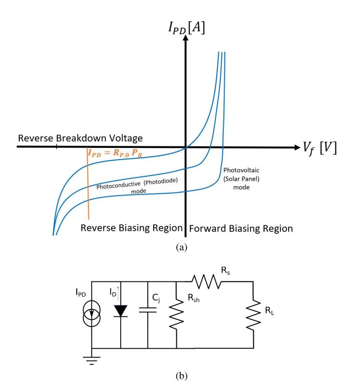

Fig. 8. The most relevant characteristics of photodiodes are depicted through (a) the forward voltage and generated current curves and (b) the simplified equivalent electrical circuit of a PD.

the need for data association and traditional image processing methods and ultimately achieving higher positioning accuracy.

*2) Photodiode-Type Photodetector:* To circumvent the limited update rate, many VLP systems just employ one or multiple standalone photodiode(s). A PD can be viewed as a larger and more sensitive single pixel. It is a square law photodetector. Under adequate reverse bias, a photodiode generates a photocurrent *IPD* (*t*) in response to the incident optical power *PR*(*t*) in a quasi-linear manner, as is displayed in Fig. [8](#page-10-0) (a). The proportion factor *RP*,0 = *IPD*/*PR* represents the receiver responsivity. It is a function of the receiver's quantum efficiency and the energy of incident photons. Though wavelength-dependent, *RP*,0 represents a wavelengthabstraction of the combined transmitter and receiver spectral dependencies. A typical *RP*,0(λ) is visualised with a black line in Fig. [7.](#page-8-0)

Besides the photocurrent *IPD* (*t*)'s contribution *IPD* , the total PD current magnitude *IPD*,*tot* contains a dark current term

$$I_{PD, tot} = \underbrace{I_{SAT} \left( e^{\frac{qV_A}{k_B T}} - 1 \right)}_{I_D} - I_{PD}, \tag{1}$$

where *ID* , *ISAT* , *q*, *VA*, *kB* and *T* denote the dark current, the reverse saturation current, the elementary charge, the applied bias voltage, the Boltzmann constant and the absolute temperature, respectively. The trade-offs pertaining to VLP with PDs are apparent from the latter's electrical circuit equivalent, shown in Fig. [8](#page-10-0) (b).

In Fig. [8](#page-10-0) (b), *Cj* , *Rsh* , *Rs* and *RL* constitute the junction capacitance, the shunt and series resistance (contact and undepleted silicon resistance), and the load impedance, respectively. While *Rsh* limits the achievable gain of the subsequent transimpedance amplifier (TIA) by offering a conduction path, *Cj* is one of the most characterising properties of a PD. It (co-) determines the PD's bandwidth and the stability of the subsequent TIA. *Cj* is directly proportional to the PD's active area, and inversely proportional to the depletion region's width. The BW of a not-gain-limited PD receiver typically revolves around a few MHz to GHz. Capacity reduction techniques are available, such as bootstrapping. A more substantial reverse bias voltage in itself already helps.

Although the PIN (positive-intrinsic-negative) is by far the most dominant flavour, the avalanche PD (APD) [\[179\]](#page-39-6), [\[180\]](#page-39-7), and even the single-photon APD [\[181\]](#page-39-8), [\[182\]](#page-39-9), feature for VLP as well. The APDs operate under high reverse bias. As such, APDs are employed when the focus lies on a high responsivity, a large distance, and when the corresponding cost, bandwidth reduction and hardware complexity can be tolerated. Photomultipliers, (field-effect) phototransistors, (intensified) charge-coupled or charge-injection devices, or solaristors are not prevalent for VLP. Multiple-quantum-well photodetectors have been applied for VLC [\[183\]](#page-39-10). The characteristics of common PIN, APD, and InGaAs photodiodes are detailed in Table [II.](#page-11-0)

As is the case at the transmitter side, angular diversity is ensured at the receiver-level as well. Various techniques have been proposed. Generally, a photodetector raster or 3D shape is formed, where the (sub)elements can be inplane or tilted [\[184\]](#page-39-11), [\[185\]](#page-39-12), [\[186\]](#page-39-13), [\[187\]](#page-39-14), [\[188\]](#page-39-15), [\[189\]](#page-39-16), [\[190\]](#page-39-17), [\[191\]](#page-39-18), [\[192\]](#page-39-19). A quadrant PD is an example of the former [\[193\]](#page-39-20), [\[194\]](#page-39-21), [\[195\]](#page-39-22), whilst a half-sphere shape is a popular choice for 3D PD arrangements [\[184\]](#page-39-11), [\[185\]](#page-39-12), [\[186\]](#page-39-13). 2D matrix constellations are frequently supplemented with apertures, e.g., in the form of a plate [\[196\]](#page-39-23), [\[197\]](#page-39-24), [\[198\]](#page-39-25), [\[199\]](#page-39-26). Another diversity method entails the utilisation of a rotating and/or tilting platform.

Hybrid imaging-photodiode (HIP) solutions, such as QADA-PLUS [\[200\]](#page-39-27), have as goal to combine the best of both camera and PD-based VLP [\[201\]](#page-39-28). HIPs exist that make use of the built-in PD of a smartphone, i.e., the ambient light sensor [\[202\]](#page-39-29), or that employ an external dongle [\[203\]](#page-39-30), [\[204\]](#page-39-31). pureLiFi Ltd., a leading Li-Fi company, markets a consumerstyle phone case [\[205\]](#page-39-32). Finally, in [\[206\]](#page-39-33), position sensitive device-based VLP is introduced. It is a one PD-type device that mimics the camera's principle through measuring the location of the directive light sources' light spot.

A further point is that according to [\[207\]](#page-39-34), the FusionVLP can be used to improve positioning accuracy. As stated in that study, measurements from a PD and a low-cost camera can be integrated to compensate for their individual deficiencies and enhance the overall accuracy of the VLP system.

*3) Solar Cell:* The previous photoconductive receivers are inapt for energy-constrained applications [\[208\]](#page-39-35), of which wearables are a prime example. Their reverse biasing requires an external supply. In essence a passive alternative, solar cells do not. They operate in the photovoltaic

| Photodiode's Material                 |                        | Silicon (SI) |           | Germanium (GE) |          | Indium Gallium Arsenide (InGaAs) |             |
|---------------------------------------|------------------------|--------------|-----------|----------------|----------|----------------------------------|-------------|
| Type of photodiode                    |                        | PIN          | APD       | PIN            | APD      | PIN                              | APD         |
|                                       | Wavelength (nm)        | 400-1100     | 400-1100  | 800-1800       | 800-1800 | 900-1700                         | 900-1700    |
|                                       | Peak (nm)              | 900          | 830       | 1550           | 1300     | 1300 (1550)                      | 1300 (1550) |
|                                       | Responsivity (A/W)     | 0.4-0.6      | 77-130    | 0.5-0.7        | 3-30     | 0.6-0.9                          | 5-20        |
|                                       | Quantum efficiency (%) | 65-90        | 77        | 50-55          | 55-75    | 60-70                            | 60-70       |
| Parameters                            | Dark Current (nA)      | 1-10         | 0.1-1     | 50-500         | 10-500   | 1-20                             | 1-5         |
| Tarameters                            | Rise time (ns)         | 0.5-1        | 0.1-2     | 0.1-0.5        | 0.5-0.8  | 0.02-0.5                         | 0.1-0.5     |
|                                       | Bias voltage (V)       | 45-100       | 200-250   | 6-10           | 20-40    | 5-6                              | 20-30       |
|                                       | Gain                   | 1            | 100-500   | 1              | 50-200   | 1                                | 10-40       |
|                                       | Capacitance (pF)       | 1.2-3        | 1.3-2     | 2-5            | 2-5      | 0.5-2                            | 0.5         |
|                                       | Bandwidth (GHz)        | 0.3-0.6      | 0.2-1     | 0.5-3          | 0.4-0.7  | 1-10                             | 1-10        |
| An example of the market availability |                        | PDA100A2     | S8664-30K | PDA50B2        | GM8VHR   | PDA10CS2                         | G8931-04    |

TABLE II
CHARACTERISTICS OF COMMON PIN, APD AND INGAAS PHOTODIODES [209]

mode. Operating at zero bias, solar panels allow simultaneous energy-harvesting and communication/positioning [210], [211], [212]. Unfortunately, employing a solar panel entails a reduced sensitivity and an enlarged area compensating therefor. Its major disadvantage is then again its augmented junction capacitance and (very) limited electrical bandwidth. For example, the BW of a completely illuminated, i.e., not using a highly-directive transmitter, solar cell with centimetre dimensions is observed to be as low as a (sub)kHz [213]. Interestingly, applying the harvested voltage for self-reverse-biasing poses a sensitivity and bandwidth improvement [214], [215].

Some successful attempts have been made to perform accurate VLP with a solar cell receiver. In [216], [217], a quadrant solar cell (QSC) receiver with a bandwidth of 50 kHz has been deployed, where the RSS observed at each of the four individual quadrants can be separately read. Due to vertical cross barriers placed between the quadrants, the amount of light received by each quadrant is affected differently due to the light source casting varying shadows, depending on its angle of incidence on the QSC. Thanks to the resulting location-unique  $4\times1$  RSS quadrant fingerprint vector, accurate positioning is obtained using only one LED. In a 40×40 cm test area, average errors around 3 cm using third-order regression algorithms [217] and a median error below 2 cm using neural networks [216] are reported, but using a very dense (10 cm) training grid. In [218], a simple trilateration approach is used. The contributions of the three LEDs -modulated at distinct frequencies around 1 kHz- are demultiplexed at a single solar cell receiver having a bandwidth of 3.5 kHz. Requiring calibration at only one location, errors below 5 cm are obtained in a 1m2 area. Interestingly, the solar cell's harvested energy allows for a self-sufficient system, transmitting the calculated position using LoRa technology once every 10 minutes. Similarly, in [212], errors below 10 cm were obtained in a (roughly) 80×80 cm area, using 3 LEDs modulated at multiples of 10 kHz.

4) Reverse Biased LEDs: Interestingly, mainly in the context of VLC, cycling between forward and reverse biasing permits to alternate a LED between acting as a transmitter and a photodiode-like receiver of lower performance, i.a. in terms

of responsivity and bandwidth. This cycling enables LED-to-LED communication [219], [220], [221], [222]. Hence, instead of requiring two modules, which each consist of a LED and a conventional receiver, a simple 2 LED-based duplex VLC system can be formed [223], [224]. Furthermore, in a trichromatic LED not all sub-LEDs need to be acting in receiving mode, making concurrent bidirectional data exchange possible [225]. A bifunctional LED transmitter mostly presents an interesting concept in (indirect) remote positioning and/or presence detection by sensing the optical channel, i.e., *Visible Light Sensing (VLS)*. For self-positioning VLP, the bidirectionality does not offer large benefits. As the receiving capabilities, i.a. the communication range, of a LED are furthermore insufficient [226], [227], they are seldom employed in practice.

- 5) Radiometric Properties: Analogously to the transmitter side, the receiver's spectral sensitivity, angular acceptance pattern with its field of view, and bandwidth that determines i.a. its response time, are all vital parameters in a VLP roll-out. They are typically receiver material-dependent. The acceptance can be shaped with optical filters and lenses [228]. Examples of the latter are the hemisphere lens, the fly-eye [229], the compound parabolic concentrator [230], the dielectric total internal reflecting concentrator, the fluorescent fibre [231] and even the holographic mirror. With free-form lenses, the propagation (subject of Section III-E) can be adapted to resemble a linear function of the link distance [232].
- 6) Noise Sources at the Receiver: Another crucial receiver parameter is its noise floor, in the form of its noise-equivalent power. The detector is subject to shot or Poisson noise that has its origins in the discrete nature of the photoelectric conversion. For standard, multiphoton receivers, shot noise observations are indistinguishable from (white) Gaussian noise, i.e., the law of large numbers.

The shot noise variance  $\sigma_{shot}^2$  is proportional to the irradiance:  $\sigma_{shot}^2 = 2qI_{PD}B$ . Herein, q and B represent the elementary charge and the single-sided noise bandwidth. Importantly,  $I_{PD}$  contains contributions of the ambient light, transmitter noise that is typically clipped or non-Gaussian and of inter-LED-interference. The dark current  $I_D$  effectuates a noise component as well.  $\sigma_{shot}^2$  satisfies  $2qI_DB$ .

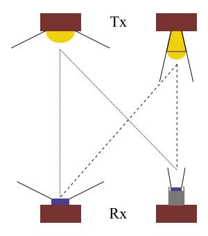

Fig. 9. The broadcasting roll-out with transceivers of varying directionality.

The photodetector is coupled to a read-out circuit for further processing. This circuit minimally encompasses a load or forward gain resistor  $R_F$ , whether in a transimpedance amplifier construction or not. Thermal noise, or Johnson-Nyquist noise of an ideal resistor nears white Gaussian behaviour, with  $\sigma_{thermal}^2 = {}^{4k_B}{}^{TB}/R_F$  with  $k_B$  and T denoting Boltzmann's constant and the absolute temperature.

Under these white Gaussian assumptions, the total root mean square (rms) noise current magnitude  $\sigma_{PD}$  amounts to  $\sqrt{\sigma_{shot}^2 + \sigma_{dark}^2 + \sigma_{thermal}^2}$ . In turn, the signal-to-noise-ratio amounts to  $I_{PD}^2/\sigma_{PD}^2$ . In [233], Komine et al. report the  $\sigma_{PD}$  equations of the shot and thermal noise contributions for a PIN PD in conjunction with field-effect transistor TIA. Other noise contributions are neglected. It is by far the most employed formulation in literature works.

However, a practical read-out electronics receiver chain displays, it adds and filters, a more complex noise composition. It can include flicker/pink noise or 1/f noise. Through noise simulations or measurements, the output rms noise voltage  $V_{rms}$  is obtained as the square root of the integration of the output voltage spectral density from direct current (DC) up to the equivalent noise bandwidth. The equivalent, additive input-referred current noise  $\sigma_{PD}$  is derived from  $V_{rms}$  by division with the electronic circuit's transfer function gain. Previous work [234] is referred to for an example.

Though to a certain validity  $I_{PD}$  can be modelled as clipped Gaussian [235], the physical magnitudes  $I_{PD}/P_R$  cannot be negative, this may not necessarily be the best noise model for ranging or localisation [236], [237].

#### D. Transceiver Architectures

The various receivers and transmitters of Sections III-B and III-C can feature in various VLP network configurations, whether integrated in Li-Fi/VLC or being standalone. Fig. 9 visualises the most common roll-out, from hereon referred to as 'broadcasting-type'. It consists of fitting the to be tracked object with a receiver, which then localises itself with respect to the 'overhanging' transmitter plane. This 'single receiver, multiple transmitters' topology's compatibility with an existing illumination infrastructure is its greatest asset. It should be noted that the transceivers should not necessarily have to have opposite directions, if reflecting floors or ceiling are present. The reverse 'single transmitter, multiple receivers' architecture appears as well, with the target transmitter locating itself

with respect to an infrastructure of receivers [238]. The sender's role can then also be fulfilled by (implicit) reflectors [157], [239]. Various 'single receiver, single transmitter' systems exist too [18]. Though not the most accurate and simple, they make use of inertial sensors and/or tilting or rotating platforms. They frequently feature in conjunction with angular diversity detectors, and especially with multiple PDs [192], [240].

## E. Characteristics of the Light Propagation Medium

Obviously, besides being impacted by the nature of the transceivers, the fundamental characteristics of VLP, such as the multipath influence, also profoundly depend on the properties of light propagation itself. In a typical VLP deployment, the inter-transceiver distance typically vastly exceeds the devices' physical dimensions.

1) Path Loss, Range and the Atto Cell Concept: In free space, in the radiating far field or Fraunhofer region, the radiometric formulation [241] of the Friis equation [242], spotlights propagation dependencies on the electromagnetic wave intensity roll-off proportional to the square of the distance from the source, and the transceiver directionality. The Friis equation is given by  $P_{R,i}/P_{t,i} = \hat{A}_R \hat{A}_t/(d_i^2 \lambda^2) = D_t D_R (\lambda/4\pi d_i)^2$ , in which  $\hat{A}_R/\hat{A}_t$ ,  $D_t$  and  $D_R$ ,  $\lambda$ ,  $d_i$  represent the effective aperture areas, the directivities with respect to an isotropic radiator, wavelength and the distance, whereby subscript i corresponds to the index number of the transmitter source. Effectively, the path loss exponent is at least 4 (see Section III-F).

In reality, the IM/DD VLP link distance is constrained by power budget limitations due to eye-safety limits (Section II-D3), atmospheric absorption/scattering and the receiver square law operation. Especially, in industrial environments with higher dust and mist concentrations, depending on the particle size, Rayleigh and/or Mie scattering significantly add to the propagation loss. The DD receiver's signal-to-noise-ratio being proportional to the square of  $P_{R,i}$  also limits the signal detection range.

The directivity of the light source in conjunction with the more limited diffraction gives rise to less spread-out communication cells, compared to lower frequency radio waves. After all, scalar diffraction theory describes the beamangle spread  $\theta_d = \lambda/R$ , with  $\lambda$  the wavelength and R the light source aperture. These metre-order communication cells are conveniently dubbed as 'atto cells' [243]. In turn, the directionality also provides the rationale for the propagation's sensitivity to pointing loss, i.e., the relative transmitter and receiver orientation. The width and length of the atto cell thus depend on the transmitter radiation pattern.

2) The Negligibility of Small-Scale Fading and the Impact for VLP Channel Modelling for IM/DD With Illumination-Type Lights: Small-scale fading refers to the phenomenon of substantial attenuation or phase shifting on a wavelength-scale and/or time-scale when mobility is present, as a consequence of multipath. It occurs for every electromagnetic wave due to scattering, reflection, diffraction and refraction. It is a potentially important source of localisation, or communication,

quality degradation, certainly for RF technologies. It leads to time/frequency-selectivity and requires alleviation methods of which inducing spatial diversity is an important solution.

The active area of the sensor typically exceeding the visible light wavelengths by orders of magnitude has the pleasant effect of mitigating, i.e., averaging out, the effects of this multipath-induced small-scale fading in VLP, as is demonstrated by the following mathematical formulation. Under the simplification assumptions of noise absence, monochromaticity (with  $\lambda_i$ ), and of the optical channel being stationary, thus non-time-varying, an example modulated carrier transmitted signal  $s_i(t)$  of source i can be represented by [244]

$$s_i(t) = \Re \left\{ x_i(t) \cdot e^{j\omega_i t} \right\},\tag{2}$$

with j, x(t) and  $\omega_i=2\pi f_i={}^2\pi/\lambda_i$  denoting the imaginary unit, the baseband signal and carrier frequency in radians, respectively. The received (part) signal  $r_i(t)$  resulting from  $s_i(t)$  then satisfies:

$$r_i(t) = \Re\left\{y_i(t) \cdot e^{j\omega_i t}\right\}, \text{ with: } y_i(t) = \sum_{k=0}^{N-1} a_k x_i(t - t_k) e^{j\theta_k}.$$
(3)

Herein,  $a_k$ ,  $t_k$  and  $\theta_k$  represent the amplitude including the propagation attenuation, time delay and phase of the  $k^{\rm th}$  (of N, in this discrete formulation) multipath components. The (upper) envelope and phase of  $r_i(t)$  amount to (4) and (5), respectively:

$$A = \left\| \sum_{k=0}^{N-1} a_k \cdot x_i(t - t_k) \cdot e^{j\theta_k} \right\|,\tag{4}$$

$$\Theta = arg\left(\sum_{k=0}^{N-1} a_k \cdot x_i(t - t_k) \cdot e^{j\theta_k}\right). \tag{5}$$

Both A and  $\Theta$  vary with the phase angle  $\theta_k$ , which rolls over by  $2\pi$  every  $\lambda_i$  of path length. As the sensor's area, which is for a PD typically between 1 mm² and 1 cm², vastly exceeds the wavelength order (390–700 nm), small-scale fading, the local signal variations, are averaged out. As a side note, the spectral broadband nature of the current illumination sources contributes to the averaging of small-scale fading as well. This is however only relevant for diminutive sensors.

Another important take-away is that the channel between sender and receiver can be solely modelled in terms of the baseband transmission. Moreover, as the intensity is real-valued, the modulation and thus the baseband signal need to be real as well. The baseband signal can technically consist of complex-values in tandem with multiple carrier frequencies as long as the resultant modulation signal is real.

Consequently, the optical channel between  $P_{t,i}(t)$  and the associated generated photocurrent (due to source i)  $I_{PD,i}(t)$  can be modelled as a bounded-input, bounded-output stable linear system with an impulse response  $h_c^{(i)}(t)$ , when the receiver mobility does not vastly exceed the sensor's dimensions. Also, as a consequence of the limited multipath effects and the significant path loss, the VLP channel is rather coherent [244]. Multi-element receivers are

characterised by highly-correlated responses, hampering their induced performance gain when decorrelation measures are not used [174], [245], [246].

3) Inherent Security Due to the Lack of Obstacle Penetration: Due to the opacity of many of the building materials in the indoor environment, not including glass, light signals are typically room-confined, prohibiting outside eavesdropping. The atto cell paradigm also dictates that the receiver is close to the transmitter. However, this argument does not suffice to call VLP secure. On the contrary, eavesdropping or infrastructure spoofing is typically not detected. Also, the tilting of the transmitters has security implications as its coverage area shifts. Nonetheless, as a result of the near-zero electromagnetic signature of light communication, Li-Fi with bidirectional encryption is destined for security-reliant applications [247].

4) Large-Scale Fading and Spatial Extent Reflections: In VLP channels, with a conventional density, the LOS component is commonly assumed to be dominant, unless it is obstructed. It is a consequence of the typically limited object penetration associated with opaque obstacles. Nonetheless, the impact of reflections upon the positioning performance can be significant [248], [249], though the spatial extent of the multipath is typically limited due to the above mentioned significant effective path loss. As a consequence, fading, in the form of wave diffraction and reflection is typically not probabilistic.

A multipath contribution depends on the originator obstacle's reflected radiation pattern, itself contingent on the reflector's surface roughness. On the basis of the Rayleigh criterion [250], in VLP, reflections are modelled with either a Lambertian or Phong reflection model [251] (Section III-F). In VLP, when multipath is considered, the analysis is frequently restricted to diffuse (i.e., Lambertian) reflections, sometimes even with arbitrary parameters. In practice, certain reflective (e.g., metallic) surfaces act far from diffuse [252].

As opposed to the abundance of work done on infrared light (IR) propagation [253], there are but a few visible light (VL)specific propagation models [254]. In fact, most works on VLP employ the IR-propagation models of Kahn and Barry [255]. As Miramirkhani et al. [252] already highlighted the discrepancies between IR and VL propagation, the time for (VL)-specific channel models (and analyses) has recently arisen [256], [257], [258], [259], [260], [261], [262]. A typical VLP channel model for indoor positioning does not take dispersion, polarisation, or mobility-induced Doppler effects into account. Dispersion is the dependence of the refractive index on wavelength, and the values of the VLC channels are at least an order of magnitude larger than those of the DSRC channels for both 90% and 50% coherence time. The main reason for this result is that VLC has significantly less multipath effects because its effective path loss component is larger and the received power is mostly line-of-sight (LOS) [263].

## F. Propagation Model(s)

The propagation channel determines the major limitations of any wireless system's performance. As a consequence, realistic channel modeling is a crucial step in the design, analysis, and testing of systems [264]. Although the majority of existing works in VLC channel modelling assume static scenarios with transmitter and receiver at fixed locations, in practice, mobility and tilt of the photoreceiver should be considered [264]. We assume a strict time-invariant stationary optical channel that moreover has a flat frequency characteristic over the operating frequency range, i.e., no frequency selectiveness and a limited rms delay spread, and an obstacle-sparse environment, in single-PD RSS VLP. Then, the relation between the LEDs' radiant flux  $P_{t,i}$  (of LEDi, i = 1 ... N) and the receiver's individual photocurrent contributions  $I_{PD,i}$  response can, to sufficient degree of accuracy (Section III-E), be modelled in terms of a single, to occasionally a second, reflection orderextended DC channel gain  $h_c^{(i)}$ . How concretely  $I_{PD,i}$  relates to  $s_{i,i}(t)$  is clarified in Section V-D.

$$I_{PD,i} = P_{t,i} \cdot h_c^{(i)}, \tag{6}$$

in which  $h_c^{(i)}$  is usually described by means of the first order IR-propagation models of Kahn et al. to be a combination of a Line-of-Sight (LOS) component  $h_{c,\,LOS}^{(i)}$  and multiple Non-Line-of-Sight (NLOS) contributions  $h_{c,\,NLOS}^{(i,\,dA)}$  [255].  $h_{c,\,NLOS}^{(i,\,dA)}$  represents the NLOS contribution of an (ideally infinitesimally) small surface element with area dA. These surface elements make up the reflectors present in the scene, such as the walls.

The material, operating wavelength of the light source, and angle of irradiance are the variables that influence how well a surface reflects light in an indoor environment. The form of the reflected patterns depends on how smooth or rough the surface is in relation to the wavelength. A rough surface reflects the beam in a variety of random directions, which is known as diffuse reflection, as opposed to a smooth surface like a mirror, which only reflects the incident beam in one specific direction and is known as specular reflection [255], [265], [266]. Particularly specular reflections might have an impact on  $P_{R,i}$  value (Eq. (13)) and eventually on positioning, but their influence is spatially rather limited [267].

As already noted and Fig. 10 shows, the propagation model typically includes LOS and NLOS components. The NLOS components in VLP are caused by multipath, which may decrease the accuracy of VLP. The channel impulse response (CIR) characterizes this multipath components as a function of time delay. As Chen et al. [261] demonstrated, it is possible to directly and accurately estimate the multipath components due to interior surface reflections in a room.

In VLC, IM/DD is commonly used to reduce cost and implementation complexity [255]. This way, if the intensity of the LEDi denoted by  $x^{(i)}(t)$ , is modulated by the input signal and the photocurrent generated by PD is denoted by  $y^{(i)}(t)$  (same with  $I_{PD,i}(t)$ ), then the baseband equivalent model of the optical link can be described as follows [265]:

$$y^{(i)}(t) = R_{PD}x^{(i)}(t) \otimes h_c^{(i)}(t) + n(t), \tag{7}$$

where  $R_{PD}$  is the PD responsivity,  $h_c^{(i)}(t)$  denotes the baseband CIR,  $\otimes$  indicates convolution, and n(t) is the additive white Gaussian noise (AWGN) [265].

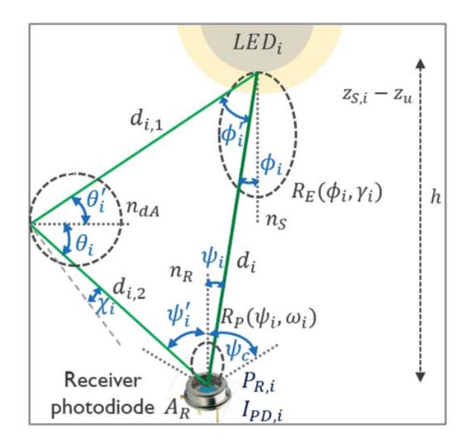

Fig. 10. A visualisation of the quantities that make up the optical channel model.

If we neglect the diffuse propagation component (NLOS) for the sake of simplicity, the received intensity will depend on the transmitter radiation pattern, the receiver optics, and the PD active area  $(A_R)$ . This is, indeed, the LOS path, and the received optical power for LEDi, indicated by  $P_{R,i}$ , can be computed as follows [265]:

$$P_{R,i} = P_{t,i} \cdot h_{c,LOS}^{(i)}, \tag{8}$$

where  $h_{c,LOS}^{(i)}$  is the channel DC gain given by [265]:

$$h_{c,LOS}^{(i)} = \int_{-\infty}^{\infty} h_c^{(i)}(t) dt.$$
 (9)

By assuming that light sources (LEDs) are following a Lambertian radiation pattern, the DC channel gain can be defined as [233], [265]

$$h_{c,LOS}^{(i)} = \begin{cases} \frac{(m_i + 1)A_R}{2\pi d_i^2} \cdot \cos^{m_i}(\phi_i) T_s(\psi_i) \tau(\psi_i) \cos(\psi_i), \\ 0 \le \psi_i \le \psi_c \\ 0, \quad 0 \ge \psi_c, \end{cases}$$
(10)

where m indicates Lambertian order,  $\phi_i$  is the (elevational) irradiance angle from the LED of the LoS component,  $\psi_i$  represents the (elevational) incidence angle from LED $_i$  at the PD,  $A_R$  is the PD surface area,  $\psi_c$  (semiangle) denotes the receiver field of view (FOV), and  $d_i$  is the distance from LED $_i$  to the receiver. Moreover,  $T_s(\psi)$  is the optical filter gain, and finally the optical concentrator gain  $\tau(\psi)$  can be computed as [255], [265]

$$\tau(\psi) = \begin{cases} \frac{n^2}{\sin^2(\psi_c)}, & 0 \le \psi \le \psi_c \\ 0, & 0 \ge \psi_c, \end{cases}$$
(11)

where n is the concentrator's refractive index.

Moreover, when the NLOS components are taken into account, the DC channel gain of the reflected path can be calculated as follows [265], [266]:

$$h_{c, NLOS}^{(i, dA)} = \begin{cases} \frac{(m_i + 1)A_R}{2\pi^2 d_{i,1}^2 d_{i,2}^2} \rho dA \cdot \cos^{m_i}(\phi_i') \cos(\theta_i') \cos(\theta_i) \\ T_s(\psi_i') \tau(\psi_i') \cos(\psi_i'), & 0 \le \psi_i' \le \psi_c \\ 0, & 0 \ge \psi_c, \end{cases}$$
(12)

where  $\rho$  indicates the surface reflection coefficient,  $\phi_i'$  is the irradiance at LEDi for the NLOS component,  $\psi_i'$  represents the (elevational) incidence angle from LEDi at the PD for the NLOS component,  $\theta_i'$  is the angle of incidence to the reflective area,  $\theta_i$  represents the angle of irradiance from the reflective area,  $d_{i,1}$  and  $d_{i,2}$  are the distances between LEDi and the reflective area and the reflective area and the receiver, respectively. Moreover, dA represents the size of the reflective area.

Finally, taking into account both NLOS (multipath) and LOS components, the total received power denoted by  $P_{R,i}$  from LEDi is given by [265]

$$P_{R,i} = P_{t,i} \cdot h_{c,LOS}^{(i)} + \int_{dA} P_{t,i} \cdot h_{c,NLOS}^{(i,dA)}.$$
 (13)

1) Simulator Tools: For modelling the channel in a VLP system, three lighting design software tools are commercially available, Zemax®, DIALux® and Communication and Lighting Emulation Software (CandLES®). Zemax® is most commonly used for sequential lens design and non-sequential lens systems. It is a powerful ray-tracing tool that enables the user to determine the light sources, photodetectors and the reflection properties of surface materials [268], and allows obtaining channel impulse responses for given indoor environments [269]. DIALux® is a well-known and user-friendly commercial simulation tool, employing a modified version of the radiosity technique and extended ray tracing for photorealistic visualization ability. Moreover, it offers the possibility to import a variety of LED lamps in illuminating engineering society (IES) format and can serve as a tool for simulation and planning of VLP systems [270]. Finally, CandLES® simulates VLC and lighting systems, assessing illumination coverage and error rate, and it allows system components to be modeled and integrated into a larger model [271].

As a side note, more computationally efficient channel model (approximation) methods have been proposed, which include the recursive MIMO-extension Barry's algorithm, ray tracing-based Modified Monte Carlo (MMC) algorithm, Combined Deterministic and MMC Algorithm, etc. [244]. Depending, on the room and location, up to 6-8 reflections orders may need to be considered [244], [272]. Though, modelling the 4th and higher order reflection is usually not required [252]. Nonetheless, in typical VLP scenarios with adequately placed LEDs and receivers pointing towards each other, a propagation model accounting for first and second order reflections should go a long way. For a common obstacle configuration and path loss, the approximation channel models are able to represent the environment well.

G. Modelling of a Photodiode's Angular Characteristics

In RSS-based VLP (see Section IV-A), a set of measured RSS-related quantities  $\{I_{PD,i}\}$  or equivalently  $\{P_{R,i}\}$  from each of the LED sources  $LED_i$  is usually inverted to LED-to-receiver distances or ranges  $d_i$  (or are jointly converted to a location directly). Information on at least three distances  $d_i$  allow estimating a position. The relation between the link distance and the RSS value is provided via the propagation model(s) of Section III-F, but also depends on the receiver characteristics. Several works on RSS-based VLP employ an (arbitrary) calibration fit of the  $d_i - RSS$  relation, and various  $d_i - RSS$  fit functions can be considered [273].

1) Calibration of the  $d_i-RSS$  Relation: Ideally, all parameters in the described channel models (Section III-F) can be predetermined and are constant per LED and receiver type. However, in practice, many works in literature calibrate certain channel parameters, often even per LED. It is a consequence of the channel models diverging from real-life measurements. Both variations on the LEDs' radiation pattern and the improper modelling of  $R_P(\psi)$  [274] are culprits. Off-line, on-site measurements serve to fit the  $d_i-P_{R,i}$  relation [110], [273], [275], [276]. In [273], [276], the authors simplify (13) to a power law  $d_i-P_{R,i}$  relationship v:

$$P_{R,i} = P_{R,i,0} \cdot \left(\frac{d_{i,0}}{d_i}\right)^{\upsilon}.$$
 (14)

 $d_{i,0}$  and  $P_{R,i,0}$  denote the calibration distance  $d_i$  and the calibration measurement's received radiant power  $P_{R,i}$ , respectively. v represents the generalised Lambertian modelling of the LED m and PD  $v_i'$  (i.e.,  $v=2+m+v_i'$ ). v can be generalised to  $P_{R,i}=\alpha_i\cdot d_i^{\beta_i}$ . Some works even calibrate a seemingly more arbitrary propagation model, e.g., in [110] a second order polynomial fit is worked with. The drawback of 'fitting' lies in the recalibration effort needed when either the LED, the PD or the environment parameters change.

The requirement of directly or indirectly fitting the propagation model is a consequence of an insufficient characterisation of the VLP channel. Furthermore, the  $d_i-RSS$  fit generally increasingly diverges from the  $d_i-RSS$  measurements for larger  $d_i$ , limiting its general applicability.

2) Channel Modelling and Angular Acceptance: As discussed in Section III-F, presently, the most used VLP channel models in literature still remain the IR-propagation models of Kahn and Barry [255]. Herewith, generally the bare and circularly symmetric PD receiver is assumed to exhibit Lambertian behaviour with order  $m_R$ . The normalised receiver responsivity or acceptance  $R_P(\psi_i, \omega_i)$  then takes on  $R_P(\psi) =$  $cos^{m_R}(\psi)$ , with  $m_R$  often equal to 1.  $\psi$  and  $\omega$  refer to the elevation and azimuthal incidence angle at the PD. In [252], Miramirkhani and Uysal already described the discrepancies between IR and VL propagation. Cossu et al. in [274] showed that the  $R_P(\psi)$  of the PD under consideration (Hamamatsu's C5331-11) started diverging from  $\cos^{m_R}(\psi)$  for  $|\psi| > 55^{\circ}$ , when nor a filter nor a lens were used. As a result, addendum models have been published. In [277], Kim et al. propose to generalise the radiation pattern  $R_E(\phi_i)$  and  $R_P(\psi_i)$  (including the optical filter  $T_S(\psi_i)$  and concentrator gain  $T_R(\psi_i)$ 

contributions, so that  $P_{R,i}$  (related to  $I_{PD,i}$ ) satisfies:

$$P_{R,i} = \frac{P_{t,i}}{d_i^2} \ C_{opt,i} \ G_t(\phi_i) \ G_R(\psi_i). \tag{15}$$

 $C_{opt,i}$  is the optical power constant (absorbing the influence of  $A_R$  and  $R_E(0)$ ), while  $G_t(\phi)$  and  $G_R(\psi)$  denote the transmitter and receiver gain dependencies. When  $G_t(\phi) = \cos^{m_t}(\phi)$  and  $G_R(\psi) = \cos^{m_R}(\psi)$ , (15) reduces to (13) and can be interpreted as a generalised Lambertian propagation model. Kim et al. [277] also proposed a more general form for  $G_t(\phi)$  and  $G_R(\psi)$ :

$$\begin{cases} G_t(\phi) = \exp(-\phi^{S_t}/k_t), \ k_t = \frac{(\phi_{1/2})^{S_t}}{\ln(2)}, \\ G_R(\psi) = \exp(-\psi^{S_R}/k_R), \ k_R = \frac{(\psi_{1/2})^{S_R}}{\ln(2)}. \end{cases}$$
(16)

 $G_t(\phi)$  and  $G_R(\psi)$  are now a function of a slope constant  $(S_t/S_R)$  for the LED/PD lens respectively) and a semi-angle  $(\phi_{1/2})$  and  $\psi_{1/2}$  for the LED/PD respectively).

3) Angular Acceptance/Responsivity Models: Based on the channel modelling, the following  $R_P(\psi)$  models can be identified: (a) the standard Lambertian model  $R_P(\psi) = \cos(\psi)$  represented by m=1, (b) the generalised Lambertian model  $R_P(\psi) = \cos^{m_R}(\psi)$  denoted by  $m_R$ , (c) the exponential model  $R_P(\psi)$  (see (16)) dubbed Exp. In m=1 and  $m_R$ ,  $T_S(\psi)$  and  $T_R(\psi)$  are equal to 1 as both the LEDs and the PD are not explicitly equipped with a lens. Technically, Exp also describes a lens, but is here considered as a  $\psi$ -dependence. Different models are used in literature, e.g., in [278] the authors proposed a quadratic  $R_P(\psi)$  model, denoted as Square(SQ) and presented in (17).

$$R_{P}(\psi) = \begin{cases} 1 - \frac{\psi^{2}}{(\psi_{3dB})^{2}} \cdot \frac{\sqrt{2}-1}{\sqrt{2}}, & |\psi| \leq |\psi_{C}| \\ 0, & |\psi| > |\psi_{C}|, \end{cases}$$
(17)

in which  $\psi_{3dB}$  represents the  $\psi$  for which  $R_P(\psi)=1/\sqrt{2}$  (i.e., a 3 dB electrical power decrease).  $|\psi_C|$  is the minimum of the receiver field of view (FOV) and  $\sqrt{\sqrt{2}\,\psi_{3dB}^2/\left(\sqrt{2}-1\right)}$ . SQ displays a steeper  $R_P(\psi)$  gradient when  $\psi$  approaches  $|\psi_C|$  as to better cope with the  $\cos^{m_R}(\psi)$  model's divergence for  $|\psi| > 55^\circ$ . SQ is noninvertible, which will hinder straightforward application in multilateration-based positioning (Section III-F). Therefore, an approximated (e)  $SQ_{approx}\,R_P(\psi)$  model was proposed as well:

$$R_{P}(\psi) = \begin{cases} 1 - \frac{(2 - \sqrt{2})(1 - \cos(\psi))}{(\psi_{3dB})^{2}}, & |\psi| \leq |\psi'_{C}| \\ 0, & |\psi| > |\psi'_{C}|. \end{cases}$$
(18)

 $|\psi_C'|$  is the minimum of the receiver field of view and  $a\cos\left(1-\psi_{3dB}^2/\left(2-\sqrt{2}\right)\right)$ .

Importantly, all treated  $R_P(\psi)$  models are LED independent and the photodiode is operating in overfill condition as is expected in optical wireless communications.

4) Short Discussion on Receiver Modelling and Fitting: As stated, it requires tremendous effort to do calibrations in industrial conditions. This is a consequence of it being very difficult to obtain a highly-accurate ground truth. This main takeaway is that by adequately modelling the receiver no onsite calibration measurements need to be performed to fit the

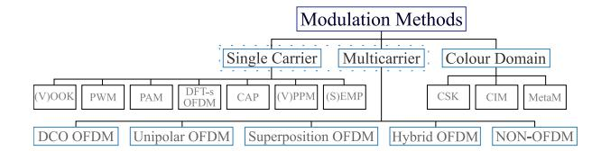

Fig. 11. A classification tree of the most common modulation schemes in VLP/VLC (adapted from [280]).

 $d_i-I_{PD,i}$  relation. Just a well-characterised receiver angular acceptance  $R_P(\psi)$  and transmitter radiation  $R_E(\phi,\gamma)$  pattern are required. This characterisation is performed off-site. The extent to which  $R_P(\psi)$  and  $R_E(\phi,\gamma)$  vary from device-to-device, and its impact on the positioning performance still needs studying.

## H. Physical and (Data) Link Layer of the OSI Model

In terms of the Open Systems Interconnection model (OSI model) and the communication architecture view of Section III-A, the fundamental differences in propagation and transceivers, of VLP/VLC compared to RF positioning technologies, mainly manifest on the level of the modulation schemes. Besides the physical layer (PHY), the multiple access control (MAC) sublayer is not VLP/VLC invariant either [279].

1) Modulation Scheme: While VLP's modulation principles are common to other localisation technologies as well, the particularities of light-based transmission dictate implementation modifications. Effectuating the positively (unipolar) real signals required for intensity modulation, entails implicit or explicit DC-biasing and/or (smart) low-side signal clipping/flipping real-valued (digital) modulation method variants. Compared to RF, a reduced spectral efficiency and complexity is the consequence. Fig. 11 provides an overview of the proposed VLP/VLC modulation schemes, in a classification tree format [280].

The typical single carrier (SC) methods, variable on-off keying ((V)OOK), pulse-width modulation (PWM), pulseamplitude modulation (PAM), carrierless amplitude phase modulation (CAP) [281], discrete Fourier transform (DFT)spread (DFT-s) orthogonal frequency division multiplexing (OFDM), variable pulse-position modulation ((V)PPM) and (single) edge position modulation ((S)EPM) [282], [283] are all quasi-directly applicable for VLP. They may even be more suited for light than radio wave carriers due to the more limited multipath interference experienced. SC modulation typically suffices for standalone VLP systems. For example, screen, undersampling, or oversampling modulation schemes for OCC positioning tend to employ SC-variants [172], [284], [285], [286], [287]. It should be explicitly noted that the SC techniques are not only applicable for IM/DD systems. They are also valid for polarisation-based VLP/VLC.

Nevertheless, the added resiliency and the increased allaround performance, render multi(sub)carrier modulation (MCM) [288] the de facto standard technique when VLP is integrated as part of a VLC network. MCM is inherently robust against detrimental channel and communication link effects (Section [III-E\)](#page-12-0), such as intersymbol interference by supporting guard intervals. Its performance benefits from it supporting more complex communication concepts, such as adaptive bit loading and equalisation [\[289\]](#page-41-38), [\[290\]](#page-42-0).

Optical OFDM is the most acclaimed MCM [\[291\]](#page-42-1). Its real-valuedness to befit VLP is generally ensured through inducing Hermitian symmetry in the to be transmitted signal [\[292\]](#page-42-2), [\[293\]](#page-42-3). The popular rolled-out OFDM schemes are the DC-biased (DCO) and asymmetrically clipped (ACO) optical OFDM due to their simplicity [\[275\]](#page-41-24), [\[294\]](#page-42-4), [\[295\]](#page-42-5). Improved OFDM-schemes exist [\[296\]](#page-42-6), [\[297\]](#page-42-7). The demand for both explicit compatibility with illumination and dimming functions and for enhanced modulation performance [\[298\]](#page-42-8), [\[299\]](#page-42-9), [\[300\]](#page-42-10), necessitates the introduction of superposition or hybrid OFDM schemes [\[301\]](#page-42-11), [\[302\]](#page-42-12). The goal is to (i) enlarge the power and spectral efficiency, (ii) reduce the peak-to-average power ratio and/or (iii) minimise the induced nonlinearity or distortion. At the receiver, the VLP-specific modulation techniques are first inverted as for the demodulation approach to reduce to the technology-agnostic version. For more details, especially on Fig. [11'](#page-16-4)s other multicarrier methods, refer to [\[280\]](#page-41-28).

The last class of Fig. [11](#page-16-4) apprises that colour modulation is also a possibility for VLP. Particularly composite LEDs, whether trichromatic or not, in tandem with a colour-sensitive receiver enable colour intensity modulation (CIM) [\[172\]](#page-38-40), colour shift keying (CSK) [\[303\]](#page-42-13) or metameric modulation (MetaM) [\[304\]](#page-42-14), [\[305\]](#page-42-15). This section did not provide an exhaustive list pertaining to the challenges and availability of various modulation schemes. Hereto, the reader is referred to specialised literature such as [\[280\]](#page-41-28).

Looking at VLP from the Integrated Sensing and Communication (ISAC) paradigm, it can be seen as a form of device-based ISAC, as the VLP/VLC receiver can build on VLC (broadcast) communication signals to estimate its position [\[306\]](#page-42-16), [\[307\]](#page-42-17), [\[308\]](#page-42-18), [\[309\]](#page-42-19). Despite the promising combining of VLC's wide spectrum [\[308\]](#page-42-18) and VLP's accuracy [\[309\]](#page-42-19), systems are currently mostly being developed independently [\[309\]](#page-42-19), with VLC research focusing on maturity and VLP on accuracy. First integration attempts mainly investigated suitable OFDM-based [\[275\]](#page-41-24), [\[310\]](#page-42-20), [\[311\]](#page-42-21), CAP-based [\[312\]](#page-42-22), or FBMC-based [\[313\]](#page-42-23), [\[314\]](#page-42-24) modulation approaches for joint VLC/VLP. Note that some forms of Visible Light Sensing (VLS) can be considered as monostatic [\[164\]](#page-38-32) or bistatic [\[315\]](#page-42-25) visible light-based radar (Joint Radar Communication (JRC)), but, as mentioned, fall outside the scope of this tutorial as they do not actively localize the photoreceiver.

To end this section it should be noted that a lamp's reduced *Em*, or associated luminance flux as a result of modulation is in this work described with the term 'modulation loss'. The latter is defined as the ratio of the *Em*/flux loss caused by modulation and the *Em*/flux value that would manifest were the lamp to operate in DC with a constant LED driving current equalling the maximum current magnitude during modulation. Under linear LED operation, the modulationinherent reduction in average LED driving current magnitude falls under 'modulation loss' as well. For PWM dimming, the modulation loss equals one minus the duty cycle. A reduced modulation loss entails a lower SNR and hence a decreased positioning performance. Hence, for VLP, the modulation loss and *E*¯*m* form an important trade-off, as *Em* lessens proportionally with an increasing modulation loss.

*2) Multiuser Channel Access Control Methods:* Despite dedicated underlying modulation schemes, most technologyagnostic MAC concepts can be bestowed on VLP/VLC as well [\[316\]](#page-42-26). However, the prominence of frequency-division multiple access (FDMA) [\[204\]](#page-39-31), [\[276\]](#page-41-25), [\[277\]](#page-41-26), [\[317\]](#page-42-27), [\[318\]](#page-42-28), [\[319\]](#page-42-29), [\[320\]](#page-42-30), time-division multiple access (TDMA) [\[321\]](#page-42-31), [\[322\]](#page-42-32), [\[323\]](#page-42-33), [\[324\]](#page-42-34), [\[325\]](#page-42-35), code-division multiple access (CDMA) [\[326\]](#page-42-36), [\[327\]](#page-42-37), [\[328\]](#page-42-38), [\[329\]](#page-43-0), color/wavelengthdivision multiple access (WDMA) [\[245\]](#page-40-33), [\[330\]](#page-43-1), space-division multiple access (SDMA) [\[72\]](#page-36-26), [\[168\]](#page-38-36), [\[185\]](#page-39-12), [\[331\]](#page-43-2), [\[332\]](#page-43-3), [\[333\]](#page-43-4), [\[334\]](#page-43-5), [\[335\]](#page-43-6), polarization-division multiple access (PDMA) [\[154\]](#page-38-22), and even (power-domain) non-orthogonal multiple access (NOMA) variants that may be combined with suiting power allocation and successive interference cancellation methods [\[336\]](#page-43-7), [\[337\]](#page-43-8), tends to vary in comparison to other localisation technologies. It should be noted that, powerdomain NOMA is particularly shown to be suitable for Li-Fi, as it provides the highest data rate out of all the multiple access schemes in scenarios with a high signal-to-noise ratio (SNR), small number of users, and perfect channel state information (CSI) [\[338\]](#page-43-9).

To limit the overall complexity, most VLP systems feature in a 'broadcasting' type configuration. There is solely a simplex communication (down)link from each transmitter element to each receiver. The absence of, and difficulty in realising the synchronisation, respectively, between lighting device sender and VLP receiver on the one hand and between the transmitters constrains the pertinence TDMA. After all, inter-lights synchronisation requires the sources to be inter-networked with a 'timing' connection, which in practice means effectuating a costly infrastructure backbone overhaul. Hence, customarily, for VLP, single carrier (SC-) FDMA is resorted to [\[339\]](#page-43-10). SDMA systems have also been proposed [\[72\]](#page-36-26), [\[335\]](#page-43-6), [\[340\]](#page-43-11), which makes use of i.a. optical beamforming or parallel (arrays of) narrow-angle transmitters [\[341\]](#page-43-12).

When VLP is a service in an overarching Li-Fi, OWPAN, Wi-Fi or VLC network, the latter's full- (or half-)duplex nature ensures the return path indispensable for continuous and stable TDMA. Still, TDMA is not the most alluring option for multi-user systems [\[336\]](#page-43-7), considering the required synchronisation effort and electronics-induced radiant power limitations [\[275\]](#page-41-24), [\[324\]](#page-42-34), [\[342\]](#page-43-13). For LED-based VLP/VLC, power-domain NOMA is deemed the best on account of its superior performance in high SNR and reliable gain estimation conditions [\[72\]](#page-36-26), [\[336\]](#page-43-7). These conditions apply due to the quasi-static nature of propagation (Section [III-E\)](#page-12-0).

Finally, which is the most suitable channel access method depends on various factors, such as the transceiver configuration's energy-constraints and available bandwidth, the user count/demand and mobility, the operational budget, the degree of network configurability, e.g., to enable QPoS variations, the illuminance compatibility [\[299\]](#page-42-9), and of the ensuing development of applicable standards and recommendations [\[73\]](#page-36-27), [336], [343], [344], [345]. A categorisation and various references on the MAC principles used in VLP/VLC can be found in [72], [327].

For a more elaborate discussion on multi-user VLC, the paper of Ahmadi et al. is referred to [336]. Finally, the functionality of OSI layers 4 and up is typically overhead from the standpoint of VLP, though the various concepts can be 'RF-replicated' (or at least 'RF-inspired').

As previously stated, the VLP system requires light intensity modulation, which requires additional hardware for each fixture, and signal decomposition can be complex. These factors raise the cost of the VLP system. The unmodulated VLP (uVLP) is a potential solution for cost reduction.

3) Unmodulated VLP (uVLP): As indicated in previous sections, the inherent low cost of VLP systems should result from their ability to add positioning functionality to the current LED lighting infrastructure. However, an analysis of industrial VLP exposes a number of challenges [234], [346]. The monetary penalty was recognized as the key hurdle encountered when preceding lighting is missing or when the VLP-inherent modulation diminishes the initial maintained illuminance. In these scenarios, VLP's economic benefits are jeopardized. As an economical solution for this challenge, the LEDs could be left unmodulated and still be used for positioning, by exploiting the characteristics of the observed light signals. Although in literature, terminology like positioning based on unmodulated LEDs, on ambient light, or on light signals of opportunity (LSOOP) is encountered, we use the umbrella term 'unmodulated VLP (uVLP)' here [346], [347], [348].

A first approach uses total illuminance (from all light sources) [349], [350], [351], [352], [353]. Although simple in its deployment, a drawback is that lighting deployments are designed to produce a spatially homogeneous illuminance, while this approach desires an illuminance gradient to distinguish nearby positions. Moreover, it is vulnerable to external (daylight, sunlight) variations, dust in industry, and its performance is challenged in the case of repetitive LED arrangements. Improvements include the consideration of light intensity sequences when moving through a building, having a higher level of uniqueness compared to single-shot measurements [113], or matching sequences of peak illuminations with those along a predefined navigation path, to check if a user follows the proposed route [354]. However, this approach is not robust for large-scale positioning.

A second approach extends the first, by using a spectroscopy sensor or spectrophotometer to determine the illuminance values within a set of (e.g., 18 [355]) wavelength subbands [355], [356]. This evidently offers a more discriminative fingerprint and a better positioning accuracy compared to only using the default total illuminance values (i.e., integrated over all wavelength subbands), but requires a more advanced receiver device.

A third approach builds on a high-frequency ripple in the total illuminance, that is due to the LED's constant current driver introducing resonance frequencies [357], which differ between LEDs due to small manufacturing variations in the components, even within LEDs from the same type and batch. Interestingly, this 'natural fingerprint' makes it possible to demultiplex different LED signals by identifying this characteristic frequency (CF) of each LED and removing other frequencies. It was shown in [348] that CF peaks are sufficiently narrow to be exploited to demodulate the individual photovoltage contributions  $V_{PD,i}(t)$ ,  $i = 1 \dots N$  of each of the N LEDs from the total photovoltage  $V_{PD}(t)$  generated at the PD-receiver, without having to modulate or even modify the LEDs. Moreover, it was shown that the observed light power at the CFs has a sufficient Signal-to-Noise Ratio (SNR), such that proper signal processing allows using the LED's CF as a discriminative feature in PD-based RSS uVLP [346], [347], [348] The approach offers tremendous potential for use in next-generation tracking systems owing to its inherent low cost and low reported accuracies of 5.0 cm in a 4-LED 4m-by-4m small-scale lab [348] and 21.3 cm in a 15-LED 8 m-by-6m- larger-scale lab [463]. Compared to the total illuminance-based approaches [353], [356], [358], [359], which are unable to cope with the minimised illuminance gradients found in practice, CF-based uVLP [346] attains more accurate localisation as a consequence of it employing the per-LED RSS values. A review of the literature indicates that CF-based (u)VLP is still in its infancy, and this field needs more attention from researchers in both academia and industry to utilize (u)VLP since it is an extremely promising candidate for low-cost positioning.

#### IV. VLP LOCALIZATION TECHNIQUES AND ALGORITHMS

The treated PHY/MAC configurations enable the inferring of ranging and/or direct localisation information (Section IV-B) by leaning on the Time of Arrival (TOA), RSS, Channel State Information (CSI) and Angle of Arrival (AOA) positioning principles, common to most technologies [360]. As for VLP once more solely the concrete interpretation differs, the positioning techniques are here only briefly covered.

#### A. Localization Techniques

Time of Arrival (TOA) variants: The TOA class of positioning techniques exploits the invertible distance - signal propagation time relation. TOA employs the one-way propagation delay, or Time of Flight (ToF), obtained via timestamping. It hence requires strict and difficult to ensure (reciprocal) synchronization between transmitters and receivers. Receiverside pair-wise anchors' propagation differences, i.e., Time Difference of Arrival (TDOA), allows to moderate the synchronisation prerequisite to only cover the transmitter infrastructure. Return Time of Flight (RToF), or Round-Trip Time-of-Flight (RTTOF), of which the two-way ranging (TWR) protocol is an example, entails (multiple rounds of) bidirectional TOA ranging exchanges. It significantly relaxes the synchronisation demand by (partly) accounting for communication response delays. It also boosts the positioning accuracy, albeit at the cost of communication overhead that impacts the latency. The set of signal propagation times between each of the N LEDs with known locations  $\mathbf{x}_{S,i}$  $(x_{S,i}, y_{S,i}, z_{S,i}), i = 1 \dots N$ , and the receiver with unknown location  $(x_u, y_u, z_u)$  is easily converted to a set of estimated

distances  $\{\hat{d}_i\}$  between the receiver and LEDi, and subsequently, to an estimated position (e.g., see Section V-E for some possible localization algorithms, or [15]).

Whereas the TOA-type techniques are very popular with RF propagation (e.g., GPS or UWB), their application in the VLP context is not straightforward. With the exception of a few (TDOA) pilot/concept studies [13], [361], [362], [363], TOA-literature mainly comprises simulation results [234], [364], [365], [366]. The reason is threefold. First, the time domain resolution is restrained as a consequence of the limited bandwidth of the most utilised transmitter, namely the LED, and of the moderate sampling rate of most (camera-based) receivers. The too coarse resolution aggravates the impact that timing errors (e.g., clock delays) have on positioning errors. Even in conjunction with super resolution techniques [363], current TOA-based systems are mostly impuissant in delivering a high QPoS. Second, the extensive synchronization demand proves a significant hurdle in VLP, where a return path is typically unavailable and where infrastructure-reuse is of uttermost importance and an infrastructure overhaul is consequently unworkable. Third, the LOS nature supposition of a link is shown to be a positioning outlier factor. Recently, in VLP-hybrid networks, e.g., with an ultrasound [367], [368] or Li-Fi [13] return path, PD-based hybrid TOA-forms (including phase information in a two-step process) gain practicality.

Received Signal Strength (RSS): Since RSS information is generally readily available, without requiring complex hardware or system modifications, RSS can be considered a straightforward and widely-implemented localisation approach [52]. This is certainly the case for VLP. The RSS method consists of translating a quantity related to the received signal amplitude of each anchor, typically the received radiant power (expressed in watt) or photocurrent (unit ampere) contribution for VLP, into a range (or a location) estimate via a propagation model that captures the channel's behaviour (Section III-E). It is important to note that RSS information is not to be confused with the RSS indicator (RSSI) values. The latter is simply defined as a sometimes arbitrary, relative RSS measurement. The RSSI is defined by the receiver device vendor and can be device-specific.

Weight and cost-considering systems benefit from RSS-based VLP necessitating but a single photodetector. A detector array/matrix then again brings robustness and the prospective of a 6 degrees of freedom location estimate by including the orientation. It is important to mention that RSS does not match well with camera receivers, which only record discrete intensity levels.

In its simplest form, the emitter can be assumed perfectly Lambertian, and RSS-based positioning is easily done via a conversion of eq. (10), in case of a horizontally oriented LED and photodiode  $(\cos(\phi_i) = \cos(\psi_i) = \frac{h}{d_i})$  and assuming the optical filter and concentrator gain equal to 1, with h the height difference between LED and receiver (see Fig. 10). As such, the estimated distance between LED $_i$  and the receiver becomes

$$\hat{d}_i = \sqrt[m+3]{\frac{(m+1)A_R h^{m+1} P_{t,i}}{2\pi P_{R,i}}}.$$
 (19)

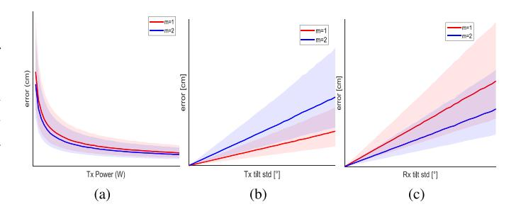

Fig. 12. Typical positioning error as a function of (a) the LEDs' transmit powers, (b) unaccounted random transmitter tilts, and (c) unaccounted random receiver tilt.

Although the method of obtaining the set of estimated distances  $d_i$  is obviously different from ToA, the algorithms (see Section V-E) that can be applied are similar. As RSS-based VLP clearly strongly builds on assumptions on the propagation model, for RSS-based VLP to attain sufficient accuracy, the propagation model must (at all times) be representative and well-characterised [14], [278], [369]. In VLP, the propagation model is frequently assumed to encompass Lambertian pointsources [277], [278], [323], [370], which contrasts with the requirements on the homogeneity of the illumination [371]. As the point-source approximation is actually not strictly required, a representative optical channel model is not an unattainable utopia. However, a practical channel model is typically not able to account for the degrading influence of imperfections or dynamicity in the transceivers or optical channel. Unexecuted or imperfect transmitter radiation flux calibration [372], light source ageing, changes in atmospheric composition (e.g., dust [373]) are all factors that impede the RSS accuracy. Looking at eq. 19 and its assumptions, other factors that impact the observed RSS, and hence the distance and position estimation accuracy are unknown LED tilt [374] or receiver tilt [375], [376], unknown multipath contributions [267], [375], transmit waveform non-idealities [377], the receiver field-of-view [18], a decreasing SNR, or insufficiently characterized LED locations, radiation power/patterns [372], and receiver angular responsivities [278]. In tandem with a diversity receiver (Section III-C), the differential RSS (DRSS) or Ratio-RSS (RRSS) positioning technique helps alleviating some of these detrimental impacts [376], [378].

As an illustration of how the positioning error is affected by these factors, Figs. 12 (a), (b), and (c) show the trend of the positioning error as a function of the LEDs' transmit powers, unaccounted random transmitter tilts, and an unaccounted receiver tilt, respectively. The figures show the median and the interquartile distance (shaded area) for Lambertian factors m=1 (red) and for m=2 (blue). A typical evaluation area is considered, determined by the projection of a square 4-LED configuration on the receiver plane, using the trilateration algorithm that will be provided in Section V-E2. For fully elaborated simulation scenarios or experiments, the reader is referred to the provided literature.

**Angle of Arrival (AOA):** While RSS and ToA-based positioning in general determine a receiver's position by combining a set of distances estimated from measured powers

and propagation times, respectively, AOA-based positioning determines a receiver's position by combining a set of angles between the LED and the receiver. AOA exploits temporal or spatial diversity with the angular diversity receivers (Section III-C), to determine the relative angles between the receiver and the transmitter(s). E.g., different photodiodes with a known mutual placement within their structure will receive different powers, which are leveraged to derive these angles. Impervious to various pitfalls of RSS, AOA is deemed particularly promising for VLP [14], [379]. Besides being inherently more accurate [380], AOA is resistant against transmitter nonidealities, such as transmit power variations [198]. It also does not need an accurate calibration of the transmit power. As such, AOA circumvents the fundamental limitations of RSS.

In fact, AOA is already the default method for camera-based VLP, where a potentially MEMS-assisted [381], [382] image transformation [154], [168], [176], [383] ensures the translation of the anchor's projection into angular information. The accuracy of this approach is sensitive to the camera's resolution, quantisation and FOV (Section III-C). Deployed MEMS are mostly IMU sensors, although they could also refer to camera rotation or tilting systems.

Photodetector-based VLP also allows extracting the propagation model's angular dependencies by (i) adding a rotating/tilt platform that can be realised using MEMS, (ii) employing a quadrant PD [193], [194], [195] or solar cell [217], (iii) forming a photodetector raster/constellation with (un)tilted (sub)elements [142], [184], [187], [189], [192], [384] whether or not supplemented with an aperture plate [197], [198], [199], or (iv) by performing spatially different measurements [376]. AOA then builds on multiple (D)/(R)RSS measurements [385]. Additional benefits of PDbased AOA, compared to RSS, are identified to be the increased reliability and accuracy in the presence of the NLOS encountered in typical VLP roll-outs. Exceptions can occur, for instance when the NLOS contribution's magnitude exceeds that of the LOS component. Based on the available literature however, it is unclear to the authors as to how AOA non-camera-based systems compare to their various multireceived DRSS or RRSS counterparts, in terms of positioning accuracy. It is hypothesised that the explicit angle extraction helps in moderate NLOS cases. Finally, the disadvantages of AOA (compared to RSS) are pin-pointed to be the potentially enlarged received complexity and cost and the reduced range/field of view (certainly when blocking part of the incident light with an aperture).

It is clear that angular information can be obtained in many different ways, depending on the transmitter and receiver configuration. Various receiver topologies have been proposed: orthogonal receivers [386], tilted receivers [387], [388], circular receivers [187], aperture-based square [389] and circular [390] quadrant receivers, etc. An alternative approach to AoA estimation relies on the usage of a liquid crystal display in front of the photodiode, acting as an adaptable angular filter, only being transparent for specific angles of incidence at the photodiode [391]. When the receiver configuration is only able to determine the azimuthal angles  $\alpha$ , a 2D position estimate can be obtained by solving the set of linear equations

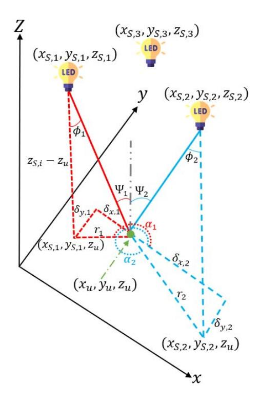

Fig. 13. Visualisation of parameters of Angle-of-Arrival algorithm.

in  $x_u$  and  $y_u$ , which are easily obtained from the set of equations  $\tan \alpha_i = (y_{S,i} - y_u)/(x_{S,i} - x_u)$ , as seen in Fig. 13. When both the elevation angle  $\phi$  and azimuthal angle  $\alpha$  are determined, a 3D position estimate can be obtained as follows, for the case of a horizontal (untilted) transmitter and receiver [200]:

With transmitters with known coordinates  $\mathbf{x}_{S,i} = (x_{S,i}, y_{S,i}, z_{S,i})$  and receiver located at  $\mathbf{x} = (x_u, y_u, z_u)$ , we obtain from Fig. 13

$$\delta_{x,i} = x_u - x_{S,i},$$

$$\delta_{y,i} = y_u - y_{S,i}.$$
(20)

The relationship between the vertical distance from the transmitter to the receiver plane  $(z_{S,i}-z_u)$  and the projection onto the receiver plane  $(r_i)$  of the line from the  $i_{th}$  transmitter to the receivers can be established using basic geometric principles as follows [200]:

$$r_i = (z_{S,i} - z_u) \tan \phi_i. \tag{21}$$

Hence, in order to determine  $x_u$ , the relationship between  $r_i$  and  $\delta_{x,i}$  can be employed to yield [200]

$$x_u = x_{S,i} + (z_{S,i} - z_u) \tan \phi_i \cos \alpha_i$$
  
=  $x_{S,i} + z_{S,i} \tan \phi_i \cos \alpha_i - z_u \tan \phi_i \cos \alpha_i$ . (22)

A similar procedure can be used to compute  $y_u$ . In the case where there are M transmitters, the receiver position  $\mathbf{x}$  can be estimated as  $\hat{\mathbf{x}} = [\hat{x}_u \hat{y}_u \hat{z}_u]^T$  through the utilization of linear least squares estimation as follows [200]:

$$\hat{\mathbf{x}} = \left(\mathbf{A}^T \mathbf{A}\right)^{-1} \mathbf{A}^T \mathbf{b},\tag{23}$$

where

$$\mathbf{A} = \begin{bmatrix} 1 & 0 & \tan \phi_{1} \cos \alpha_{1} \\ 0 & 1 & \tan \phi_{1} \sin \alpha_{1} \\ \vdots & \vdots & \vdots \\ 1 & 0 & \tan \phi_{M} \cos \alpha_{M} \\ 0 & 1 & \tan \phi_{M} \sin \alpha_{M} \end{bmatrix}, \qquad (24)$$

$$\mathbf{b} = \begin{bmatrix} x_{S,1} + z_{S,1} \tan \phi_{1} \cos \alpha_{1} \\ x_{S,1} + z_{S,1} \tan \phi_{1} \sin \alpha_{1} \\ \vdots \\ x_{S,M} + z_{S,M} \tan \phi_{M} \cos \alpha_{M} \\ x_{S,M} + z_{S,M} \tan \phi_{M} \sin \alpha_{M} \end{bmatrix}.$$

Other Techniques: Other techniques exist, but are not as prevalent as standalone technique for VLP purposes. (Simulations of) TOA-variant based regular or differential phase (difference) of arrival (P(D)OA)-like systems are treated in [109], [314], [392], [393], [394], [395], [396]. Synchronisation, non-uniform initial time delay patterns and phase wrapping (with increased transmitter separation) [393] are some of the pitfalls of waveform-based PDOA. For ultra-dense networks, e.g., with MIMO deployments, PDOA can deliver a high-accuracy as neighbouring transmitters can be synchronised. Tremendous value is found when P(D)OA is employed to enhance RSS/AOA/T(D)OA-based location estimation [13], [363], [364], [393]. By hanging a polariser with an optical birefringent element, an overlapping structure of scotch tape [158], over a LED lamp permits an polariserequipped receiver to localise itself in a colour grid.

In frequency (or space) selective channels, unable to discern multipath/interference components, the RSS method only capturing a bandwidth-averaged radiant flux may prove to be inaccurate. In VLP, the use of Channel State Information (CSI) samples of the electrical modulation signal usually builds on conversion of CSI samples to the channel impulse response and extracting the first path component to mitigate multipath contributions [397]. Other approaches also combine the reflected paths with the room geometry to improve position estimations [398], while others just use CSI samples as a fingerprint for the position [399]. So far, it has not featured for VLP with the reasons probably being: the limited timing resolution, the negligible effect of small-scale fading (or frequency selectivity), or the difficulty of phase measurement (Section III-E) [336]. Simulation results of VLC can be found in [398], [399].

Most experimental evaluations use AoA and RSS approaches. Depending on the configuration, accuracies up to 5-10 cm are achievable. Timing-based approaches and CSI-based approaches also target decimetre accuracies but are often simulation-based, making a fair comparison more difficult. We refer to dedicated surveys for a more elaborate comparison of the performance of different techniques in various configurations [15], [18], [20].

Machine learning in VLP: Like in most research domains, AI and ML have also found their way to VLP [400]. While some works investigate time-based (e.g., deep learning for estimating phase errors between LEDs [401]) or AoA-based VLP (e.g., [217]), by far the largest part of the research focuses

on reducing the positioning errors in RSS-based VLP, induced by deterministic system errors, e.g., in the assumptions of eq. (19) regarding LED transmit power [402], Lambertian factor [402], transmitter tilt [403] and location [402], etc. These parameters of a system under test are implicitly extensively calibrated by training an ML model, e.g., via supervised learning [404], reinforcement learning [405], or deep learning [406], achieving fast calculation and even cmlevel accuracies [407]. A common drawback is the need for a dense and cm-accurate supervised training set, making application to a large-scale deployment impossible or at least impractical. Some works specifically address this problem by reducing the training set size and applying the resulting model for extending the training set (semi-supervised training [408]). Other approaches investigate sparse data collection techniques, but a 'sparse' 20-cm grid like in [409] (i.e., 25 training points per  $m^2$  achieving a 3.4 cm median error) still seems impractical.

## B. Localisation Algorithms

The mathematical methods needed to determine the receiver's position are discussed in this section. Actually, the algorithms employed in other IPS technologies are relevant for VLP as well. The difference (with, e.g., UWB) being that due to the directionality of the transmitter radiation pattern, the propagation model has an additional dependence on the perpendicular distance between the transmitter and the receiver, besides the 3D distance. This mainly impacts positioning schemes relying on the RSS.

In this part a brief listing of the common, noncooperative algorithms is provided. Remarkably, in the context of VLP, their effectiveness and potential may be substantially dissimilar compared to other technologies. Some are adapted to account for VLP's propagation/noise characteristics. A categorisation is made between one-shot localisation and location tracking algorithms.

One-shot VLP Localisation: One-shot localization refers to the positioning approaches that do not keep state, nor use sensor fusion. The following algorithms have featured for VLP [360]: vision analysis (based on projected images), proximity (also centroid), hyperbolic (TDOA) or circular (TOA/RSS) (non)linear least squares multilateration or multiangulation [13], [248], [410], [411], probabilistic or deterministic scene analysis or fingerprinting [412], explicit (Bayesian) statistics [326], [413] and iterative minimisation or maximum likelihood estimation [198], implicit (supervised) machine learning including deep learning-based classification (e.g., with K-nearest neighbour [414]) or regression [415], [416], [417], [418], [419], [420]. These algorithms differ in their attainable QPoS, differing in terms of accuracy, latency, spatial dimension, noise sensitivity, complexity, robustness again multipath or power fluctuations, etc.

This list of algorithms is not conclusive, and certain algorithms are frequently combined and extended as well, in the from of hybrid algorithms (e.g., coarse and fine estimation) or algorithm fusion [421]. A more comprehensive survey on the positioning techniques can be found in specialized

literature [\[18\]](#page-35-8), [\[52\]](#page-36-6), [\[379\]](#page-44-8). However, it should be remarked that when surveying the 3D accuracy of unaugmented 'raw' VLP, it is easily noticed that the lion's share of VLP literature only considers 2D or '2.5D' positioning [\[422\]](#page-45-12). Again, this is a consequence of the LED-PD distance estimation's dependence on the radiation and incidence angle and RSS being the dominant localisation principle.

Nevertheless, limited works are available that include the subsequent. In [\[422\]](#page-45-12) and [\[423\]](#page-45-13), respectively, the standard matrix-inversion multilateration and Cayley-Menger determinant formulation are extended by identifying the optimal position estimate from those computed for a set of vertical LED-PD distance (i.e., the height) candidates.

In [\[424\]](#page-45-14), the authors propose to use the previous height estimate as input to a 2D multilateration and height adjustment engine, while various machine learning approaches have also been published [\[393\]](#page-44-22), [\[418\]](#page-45-8), [\[419\]](#page-45-9). Various VLP-specific oneshot localization algorithms with different complexity/latency and accuracy will be discussed later in Section [V-E.](#page-25-0)

**Location Tracking**: As is the case for other positioning technologies, one-shot VLP also features in conjunction with (potentially sensor-aided) location tracking algorithms [\[16\]](#page-35-6), [\[18\]](#page-35-8), such as the well-known family of Kalman filter (KF) variants [\[353\]](#page-43-24), [\[412\]](#page-45-2), [\[425\]](#page-45-15), [\[426\]](#page-45-16), [\[427\]](#page-45-17), [\[428\]](#page-45-18), [\[429\]](#page-45-19), [\[430\]](#page-45-20), [\[431\]](#page-45-21), [\[432\]](#page-45-22), [\[433\]](#page-45-23), [\[434\]](#page-45-24), [\[435\]](#page-45-25) and the particle filter (PF) [\[424\]](#page-45-14), [\[436\]](#page-45-26), [\[437\]](#page-45-27), [\[438\]](#page-45-28), [\[439\]](#page-45-29). Less popular approaches, such as spring-based or game theory-based filtering [\[440\]](#page-45-30) have been applied to VLP as well [\[440\]](#page-45-30), [\[441\]](#page-45-31), [\[442\]](#page-45-32), whilst i.a. Viterbi location filtering [\[443\]](#page-45-33) has not been so far. This document refrains from delving in the specifics of both the dead reckoning and location tracking methods, as dedicated literature exists.

(Sensor-Aided) location tracking not only boosts standalone VLP's QPoS in LOS conditions, it has the potential to (partly) mitigate the detrimental impact of low SNR operation, of non-well-specified armatures radiation patterns [\[429\]](#page-45-19), [\[431\]](#page-45-21), of tilt, of shadowing and/or regions with significant (specular) NLOS [\[432\]](#page-45-22), [\[437\]](#page-45-27), of user mobility with a potentially dynamic device orientation, or of other positioning outlier factors. Though the shot (and thermal) noise contribution is modellable as additive white Gaussian noise favouring the KFfamily, other noise (impacting) or outlier sources may point to a particle filter as the best for VLP [\[424\]](#page-45-14), [\[437\]](#page-45-27), [\[444\]](#page-45-34).

# V. A PRIMER ON RSS VLP SYSTEMS WITH A SINGLE PHOTODIODE

Weight, cost and energy-constrained VLP systems frequently resort to RSS with (a single) PD(s). A PD's larger bandwidth is well-suited to demodulate the LEDs' characteristic frequency (in uVLP) and for applications in need of a significant location refresh rate and stroboscopic effect-robustness [\[278\]](#page-41-27). (u)VLP's limited receiver complexity permits its use as either a dedicated or Li-Fi-inherent location service with IoT devices. Its broadcasting nature enables the constrained IoT devices to query their location at their own incentive.

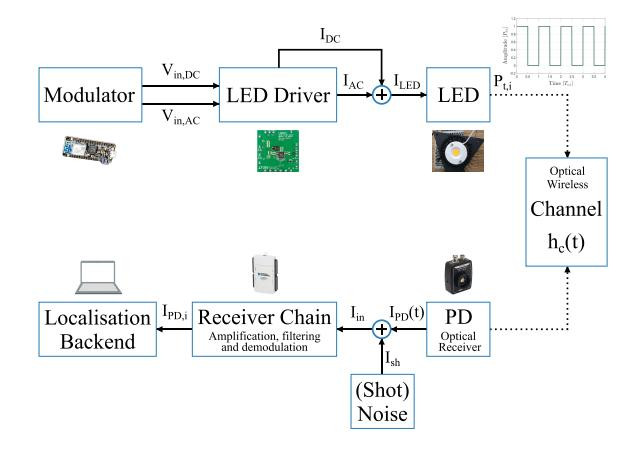

Fig. 14. A schematic representation of the (square waves-based) RSS-based VLP system, in terms of the electrical current and voltage.

The purpose of this section is to provide a basic guideline for an easy set-up of a simple, minimum retrofitting VLP system. To this end, Fig. [14](#page-22-1) shows a schematic illustration of the basic RSS-based VLP system[\[346\]](#page-43-17). Similar to VLC, a frequency-generating modulator module dictates the LED driver's AC (and DC) instantaneous current output *ILED* waveforms and thereby the LED's instantaneous radiant flux. In response, a current is generated in the photodiode, subject to added noise. The receiver circuit amplifies, filters, and eventually separates the contributions of each of the observed LEDs to a set of {*IPD*,*i* } values, via, e.g.; FFT- of matched filterbased demodulation. In VLP, these are fed to the localization engine for estimating the position. To reduce the impact of noise, the localization backend typically averages out 10 or more {*IPD*,*i* } per measurement location, depending on the mobility of the receiver and the expected SNR. The resulting set of (averaged) {*IPD*,*i* } (or equivalently {*PR*,*i* }) values, are used to derive a position, using one of the algorithms detailed in Section [V-E.](#page-25-0) A list of hardware/materials for a simple VLP system that we used includes COB LEDs (Bridgelux's BXRE-50C3001-D-24 type and ETAP's E4010/LED1N060D LEDs exhibit Lambertian and non-Lambertian radiation patterns, respectively), a Thorlabs amplified photodetector module with tunable gain, namely the PDA100A2 or the PDA36A2, and a National Instruments USB-6212 (DAQ) for data acquisition (receiver chain) [\[346\]](#page-43-17).

## *A. Incentive*

As attested by Fig. [15'](#page-23-0)s pre-existing IPS cost-accuracy landscape, VLP's differentiation potential can be attributed to its premise of achieving centimetre-order accuracy at limited (receiver) cost [\[14\]](#page-35-4). The associated (prospective) applications analysis highlights the tracking of vehicular-type asset and the navigation of (autonomous) indoor vehicles, both as automation domains as very befitting of current (and future) VLP systems.

The economic grounds dictate the exploiting of the dualtask paradigm, i.e., providing a concurrent positioning and illumination service, of an in-place lighting infrastructure, which is incidentally already (projected to be) LED-dominated

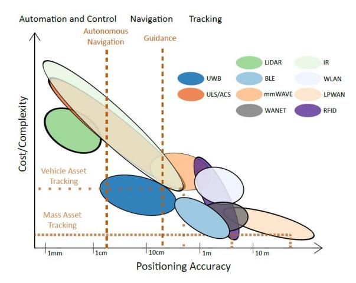

Fig. 15. Visualising the landscape of available indoor positioning systems, in terms of their cost versus their accuracy. The positioning latency dimension is represented by the thickness of the black edge of the ovals. This graph differing from that of [445], denotes both the development speed of IPS and the subjective extrapolation nature of the IPS comparison.

(see Section II-D1). Employing these so-dubbed 'light sources of the future' allows benefiting from their inherent illumination advantages and widespread coverage, all the whilst possessing a transmitting device that easily supports advanced modulation. The LEDs' MHz-order bandwidth suffices to roll-out VLP services with a high QPoS. Actually, as (i) fluorescent and incandescent lamps are ill-suited for stable modulation i.a. with frequencies above the perception threshold detailed in Section II-D3, (ii)  $\mu$ LED technology has not matured to the point that it is able to practically satisfy the illumination demands of Section II-D and (iii) the infrastructure changeover to the more costly and still developing laser diodes is momentarily not worth the expense, selecting LEDs comprises the only reasonable choice. To not incur extensive transmitterside costs, both existing lighting network compatibility and minimal invasiveness light point retrofitting are important aspects. Somewhat compromising on spectral efficiency and ISI rejection (Section III-H), the idea behind the FDMA [319] modulation scheme (Section V-D) is to extend the alreadyprovisioned PWM dimming controller (interface), and thereby also effectively ensuring lighting bus affinity/reuse when the latter is available. The PWM-like waveform pulses operation permits driving the LEDs at a higher instantaneous current magnitude, partially compensating the loss in average radiant flux caused by modulation, with imperilling the LED's life time (Section III-B). Co-existence with other smart lighting approaches is normally inherent.

The system's broadcasting and simplex communication nature, apparent in Fig. 16, allows the seamless receiver-side scalability required for the tracking/navigation use-cases. Viability, again mostly pertaining to system's overall cost, insists that the receiver is as cost-effective (including the energy efficiency factor) as possible. This condition, in tandem with both stroboscopic and flicker-prone (Section II-D3) applications necessitating a significant location update (at least 10–100 Hz) and a limited localisation complexity, justifies the use of a PD-based receiver (over a camera-based one).

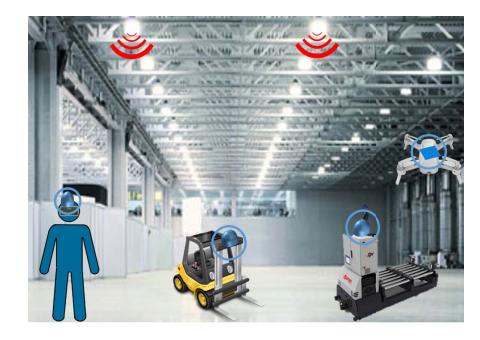

Fig. 16. Visualisation of the considered RSS-based VLP roll-out principle.

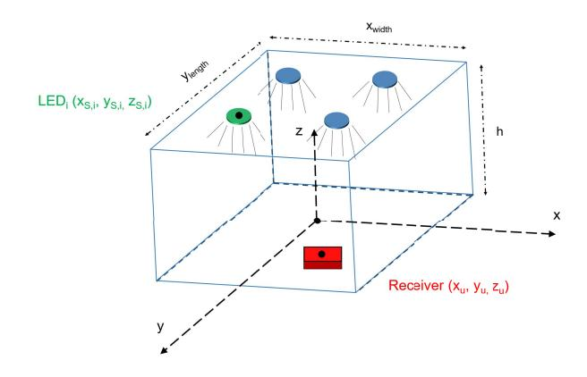

Fig. 17. A depiction of the typical, broadcasting-type roll-out of standalone VLP. The employed coordinate system is visualised as well.  $(x_{S,i}, y_{S,i}, z_{S,i})$  and  $(x_u, y_u, z_u)$  denote the coordinates of the  $i^{th}$  transmitter and of the PD receiver, respectively.

The positioning considerations do not proffer RSS with a sole PD per se. However, this approach does cut back the system requirements (no need for synchronisation) and receiver device price tag, and well-suits a wide-range of (drone-type) solutions due to the inherent light-weightness, the constrained-device feasibility and the high obtainable update rate. While additional PDs add to the robustness and accuracy of the VLP solution, which may certainly have its worth, it is deemed to be outweighed by the cost differentiator (of VLP from other IPS). Importantly, the (suboptimal) single PD RSS VLP variant is instrumental in investigating the fundamental concepts of this work.

The incentive behind resorting to standalone VLP instead of a Li-Fi-integrated configuration can strictly be ascribed to practical considerations (Section II-C3): (i) the adoption of Li-Fi (and VLC for that matter) spreads at a much lower rate than forecast/anticipated, (ii) standalone VLP poses a smaller adoption hurdle, both on a hardware and a system level (integration/compatibility in the LAAS offering), and (iii) the transmitter bandwidth demands for VLP are not as stringent as for communication.

#### B. Principle of Operation

In this single PD RSS-based VLP system, schematically visualised in Figs. 16 and 17, (part of) a white LED illumination infrastructure is (retro)fitted with VLP capability. The instantaneous radiant power of N LED lamps (LED $_i$ ,

 $i=1\dots N$ ) with a priori accurately-known coordinates  $(x_{S,i},\,y_{S,i},\,z_{S,i})$  is intensity modulated by means of their (forward) driving current  $I_{LED}$  (Section III-B), to broadcast unnoticeable beacon signals  $s_i(t)$ , each with radiant flux magnitude  $P_{t,i}$ . Importantly, these beacon signals are required to be receiver-side demultiplexeable, as to separate the contribution of each of the LEDs [198], [319]. In this work, in the default configuration, the LED lamps are equipped with a LED driver to exert the square wave FDMA scheme of De Lausnay et al. [319].

Using direct detection [14], the affordable PD receiver, which has an active area  $A_R$ , gives rise to a time domain photocurrent signal  $I_{PD}(t)$ , and in turn a photovoltage  $V_{PD}(t)$ . This  $V_{PD}(t)$  is proportional to the sum of the incident optical power contributions of both the transmitted beacon signals  $\{s_i(t)\}\$  and ambient light. For a linear response receiver chain,  $I_{PD}(t)$  is simply derived from  $V_{PD}(t)$  by division with the transimpedance gain  $G_{PD}$ . An accurate location estimate  $[\hat{\mathbf{x}}] = (\hat{x}_u, \hat{y}_u, \hat{z}_u)$  of the PD's actual, absolute position  $[\mathbf{x}] = (x_u, y_u, z_u)$  is then inexpensively inferred based on the per LED photocurrent magnitudes  $I_{PD,i}$  with the help of a propagation model. The propagation model describes how  $\{I_{PD,i}\}$  is related to  $\{P_{t,i}\}$ . The set of  $\{I_{PD,i}\}$  is demultiplexed from  $I_{PD}(t)$ , typically with the FFT identification method [319].  $\{I_{PD,i}\}$  are taken to be the RSS values. Further (de)modulation, channel model and localisation details are given in Sections III-F, V-C and V-D.

Reverting to Section III-A, it is clear that the 'keep it simple' rationale behind RSS-based VLP with a sole PD effectuates a significant reduction in architecture complexity. Fig. 5's block diagram simplifies to the one of Fig. 14.

## C. Modulation

As mentioned, the LEDs are intensity modulated as to transmit unsynchronised, preferably orthogonal signals  $s_i(t)$  with a unique frequency. In this work,  $s_i(t)$  is a square wave, i.e., a pulse train, although, e.g., DC-biased sinusoid can also be used which modulation is to feature, depends on the dimming interface on offer (Section II-D2) and potentially also on the required deployment density and corresponding spectral efficiency. Square wave modulation is the default in practice, as it is the least intrusive waveform to effectuate. Also, PWM dimming is widespread:

$$s_{i}(t) = P_{t,i}w(t) \left( \sum_{l=-\infty}^{\infty} \left( \mathcal{H}\left(f_{c,i}\left[t - \frac{\alpha_{i}}{2\pi f_{c,i}}\right] - l\right) - \left( \mathcal{H}\left(f_{c,i}\left[t - \frac{\alpha_{i}}{2\pi f_{c,i}}\right] - l - \delta_{i}\right)\right) \right),$$
(25)

where  $\mathcal{H}$  and  $\delta_i$  denote the Heaviside step function and the duty cycle, respectively. The phase term  $\alpha_i$  is a uniformly distributed random variable in  $[0, 2\pi]$ , and represents the unsynchronised nature of  $s_i(t)$ . The observation window function w(t) of length T satisfies:

$$w(t) = \begin{cases} 1, & t \in [0, T] \\ 0, & else. \end{cases}$$
 (26)

The modulation frequencies  $f_{c,i}$ ,  $i=1\ldots N$ ,  $\delta_i$  and the period of observation T are ideally selected (not a prerequisite) as to provide orthogonality of the resultant  $s_i(t)$  over the interval [0,T]. This will aid in optimally separating the individual contributions of the LEDs at the receiver [199], i.e., to minimise inter-LED-interference. As a side note, the cellular concept relaxes the  $f_{c,i}={}^1/T_{c,i}$  uniqueness requirement. It dictates that the  $\{f_{c,i}\}$  set only has to be unique in a certain spatial region, enabling frequency reuse.

As stated in Section V-B, in RSS-based VLP, the location information  $\hat{\mathbf{x}}$  is inferred from how a LED's transmitted radiant power  $P_{t,i}$  of (25) relates to the photocurrent magnitude contribution  $I_{PD,i}$  it generates. This relation is the propagation model. It is the subject of the Section III-F. The subsequent Section V-D then treats how the  $\{I_{PD,i}\}$  set is obtained from the measured photocurrent signal  $I_{PD}(t)$ , which is generated in response to the incident  $s_i(t)$  signals.

#### D. Demodulation Scheme

Demultiplexing  $I_{PD,i}$  from the discretised  $I_{PD}(t)$  requires a suited demodulation approach. This work considers 2, namely the FFT spectrum identification and the matched filter (MF) method. In digitizing  $I_{PD}(t)$ , i.e., actually  $V_{PD}(t)$ , with a well-chosen sample rate  $f_S$ , coherent sampling dictates T to be a multiple of  $T_{c,1}$ , as to ascertain an integer number of all signal periods in [0, T]. Equivalently, the integer number of measurement samples  $N_S$  is imposed to be a factor of  $f_S \cdot T_{c,1}$ .

1) FFT-Based Demodulation: The complex discrete Fourier transform (DFT) coefficient contributions  $c_n^{(i)}$ ,  $n \in \mathbb{N} \cup \{0\}$  that are obtained from FFT spectrum of  $I_{PD}(t)$  at the frequency bins containing  $\{0, f_{c,1}, \ldots, f_{c,N}\}$ , directly relates to  $I_{PD,i}$ , or equivalently  $P_{t,i} \cdot h_c^{(i)}$ . Their magnitude  $|c_n^{(i)}|$  satisfies:

$$\left| c_n^{(i)} \right| = \delta P_{t,i} \left| \operatorname{sinc}(n\delta\pi) \right| \cdot h_c^{(i)} + n_n^{(i)}, \tag{27}$$

in which  $\widehat{\delta}$  and  $n_n^{(i)}$  symbolise the Kronecker Delta and the noise contribution of the receiver backend.

Fig. 18 depicts an example spectrum for  $\delta=0.5$ . In general, a  $|c_n|$ , the sum of  $\{|c_n^{(i)}|\}$ , contains contributions from LED $_i, i \neq n$ , i.e., 'inter-LED-interference' occurs. This is especially the case with LED waveform nonidealities such as distortion [446], [447]. Then, the phase term of  $c_n^{(i)}$  can also fulfil a role during demodulation. An appropriate window function may suppress the spectral leakage. As  $f_s/N_s$  determines the frequency resolution, both are important parameters. In their selecting, one is faced with various trade-offs, e.g., a larger  $N_S$  entails an enlarged positioning latency.

To counter the  $\{f_{c,i}\}$  diverging from their nominal value, especially when shifting outside their corresponding frequency bin, either due to frequency instability or bias, a peak detection extension of the previous method can be resorted to. In this work, a peak detection is performed in  $2\Delta f_{c,i}$  neighbourhood of the nominal modulation frequency  $\Delta f_{c,i} = f_{c,i}/100$ , i.e.,  $[f_{c,i} - \Delta f_{c,i}, f_{c,i} + \Delta f_{c,i}]$ .

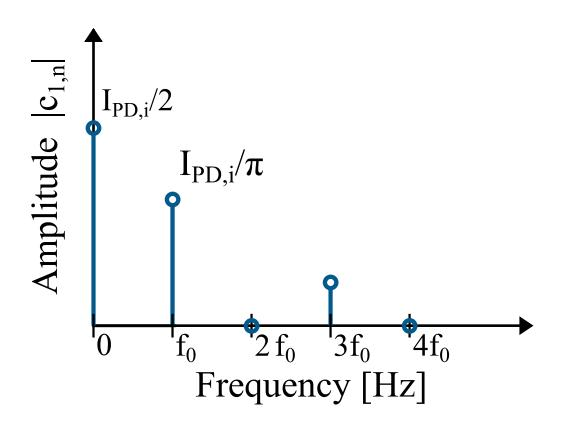

Fig. 18. An illustrating example of the FFT spectrum of an ideal square wave with  $\delta=0.5$ . The even harmonics are zero, and can be exploited for other  $f_{c,k},\ i+1\leq k\leq N$ .

2) Matched Filter-Based Demodulation: The matched filter (MF) approach [199] correlates the received signal  $I_{PD}(t)$  with a set of well-chosen set of reference signals  $\mu_i(t)$ ,  $i=1\ldots N$ . Examples of which are

$$\mu_{i}(t) = w(t) \left( 2 \sum_{n=-\infty}^{\infty} \mathcal{H}(f_{c,i}t - n) - \mathcal{H}(f_{c,i}t - n - \delta_{i}) - 1 \right). \quad (28)$$

This procedure yields  $r, i=1\dots N$ , which can be modelled in terms of  $s_i=\int_0^T \mu_i(t)\,s_i(t)\,dt,\, x_{i,k}=\int_0^T \mu_i(t)\,s_k(t)\,\mathrm{dt},$  the channel gain (of Section III-F)  $h_c^{(i)}$  and the correlation of the input-referred current noise signal of the receiver backend  $n_i=\int_0^T \mu_i(t)\,n_i(t)\,dt$  originating from  $\mathrm{LED}_i$ :

$$r_i = s_i h_c^{(i)} + n_i + \sum_{k=1, k \neq i}^{N} x_{i,k} h_c^{(k)}.$$
 (29)

In computing,  $r_i$ , the phase dependencies  $\alpha_i$  of  $s_i(t)$  are alleviated by means of sliding window correlation [199] or signal delay correction. Certainly in tandem with dimming, exact knowledge of the duty cycle  $\delta_i$  is not necessarily a given. It can be estimated in both the time and frequency domain. Finally,  $s_i$  amounts to

$$s_i = P_{t,i} \,\delta T. \tag{30}$$

In practice, a discretisation of Section V-D2's continuous MF formulation is used.

3) Orthogonality: Orthogonality of  $\{s_i(t)\}$ , and  $\{\mu_i(t)\}$ , implies that  $|c_n^{(i)}|$  (27) and  $r_i$  (29) only depend on  $\text{LED}_i$ 's signal component  $s_i(t)$  (and noise), and not those of  $\text{LED}_k$  with  $k \neq i$ . This requirement translates to the inner product (or bilinear form)  $\langle s_i(t), \mu_k(t) \rangle$  over interval [0, T] solely being nonzero when i = k.

The orthogonality condition on  $s_i$  is  $\delta$ -dependent. When employing  $\delta_i = \delta = 0.5$ , a straightforward approach entails assigning  $f_{c,i}$  a multiple of a ground frequency  $f_0$ :  $f_{c,i} = 2^{i-1}f_0$ ,  $i = 1 \dots N$  [319]. After all, a  $\delta = 0.5$  square wave has no even harmonics. Hence, mostly  $\delta = 0.5$  is used. Nonetheless, the square wave concept can be extended to scaled Haar wavelets or Walsh function pulses.

In selecting the nominal values for  $f_{c,i}$ , three considerations need to be made: (i) the system's real-timeness requires T to not be excessive as T dictates the positioning update rate, (ii)  $f_{c,i}$  needs to assuredly exceed the flicker (and when required the perception/stroboscopic) threshold (see Section II-D3), and (iii) receiver circuit simplicity constrains  $f_{c,i}$  so that it is still comfortably digitized by an analogue-to-digital converter (ADC).

Although the FFT operation is the more complex of both demodulation approaches, a drawback of matched filter demodulation arises from phase differences between the LEDs and their reference signals, necessitating a sliding window matched filter approach, at least regularly, to mitigate drift-induced errors [377]. Further, matched filter-based demodulation is more sensitive to deviations in the exact modulation frequency and phase.

4) Deriving the RSS Value: The (noisy observation)  $I_{PD,i}$  is obtained via isolation of the  $P_{t,i} \cdot h_c^{(i)}$  estimation term from  $|c_n^{(i)}|$  (in FFT) and  $r_i$  (in MF). For orthogonal  $s_i$ ,  $I_{PD,i}$  is easily derived, though noise mitigation measures may be used. Non-orthogonal  $s_i$  can either tolerate the induced inter-LED interference or can resort to recursive demodulation, in the form of successive interference cancellation or equation solving approaches. However, in the presence of noise, these approaches are not devoid of demodulation errors, and will hence typically add to the localisation error. It should also be noted that LED drivers, certainly those of industrial-sized LED fixtures, in reality transmit impaired  $s_i(t)$  waveforms. The nature of the nonidealities is a nonzero overshoot, a nonnegligible rise and fall time, and even divergences from the nonnominal  $\delta_i$  [377].

## E. One-Shot VLP Localization Algorithms

After obtaining the RSS values from the previous section, the set of RSS values  $\{I_{PD,i}\}$ , the channel model and the known LED locations  $\mathbf{x}_{S,i} = (x_{S,i}, y_{S,i}, z_{S,i}), i = 1 \dots N$  with N the number of LED sources, all serve as inputs to the localisation engine, which in turn outputs an absolute receiver location estimate  $\hat{\mathbf{x}}$  of the real location  $\mathbf{x}$ . The set of LED coordinates will thus have to be conveyed by integrating a (separate) communication module, be hardcoded or be determined via a collaborative approach. Finally, depending on the complexity, latency, and accuracy, one of the one-shot VLP localization algorithms proposed hereafter (or others from literature) can be employed for this purpose.

1) Proximity: The proximity method maps the estimated receiver location to the location of the LED source from which it receives the highest RSS. In common deployments with LED sources of equal type, power, and installation height, the strongest LED will indeed be the nearest LED. As such, the proximity method can easily be implemented when errors up to approximately half the inter-LED distance are acceptable. With RSSi the received RSS from LEDi at location  $\mathbf{x}_{S,i}$ , we obtain  $\hat{\mathbf{x}}$  as

$$\hat{\mathbf{x}} = \mathbf{x}_{\mathbf{S}, \operatorname{argmax}_{i}(RSS_{i})}.$$
(31)

2) (Weighted) LinearLeast-squares Multilateration: Closed-form least-squares (LS) multilateration, resembling the min-max ranging method, is a 2-step process that consists of directly inverting a channel model to obtain  $\{\hat{d}_i\}$  from the RSS value (see eq. (19)) and of then subsequently solving the Cartesian equation group relating  $\{\hat{d}_i\}^2$  to  $\hat{\mathbf{x}}$  by least-squares minimisation [248], [422]. As  $\hat{d}_i^2 = ||\mathbf{x}_{\mathbf{S},\mathbf{i}} - \hat{\mathbf{x}}||^2 = (x_{S,i} - \hat{x}_u)^2 - (y_{S,i} - \hat{y}_u)^2 + h^2$  (see Fig. 10), the equation set can be linearised by eliminating the quadratic terms through the subtraction of the  $\hat{d}_N^2$  equation from the N-1 other equations. This leads to the following equations in  $\hat{x}_u$  and  $\hat{y}_u$ , written as  $\mathbf{b} = \mathbf{A}\hat{\mathbf{x}} = \mathbf{A}\begin{bmatrix} \hat{x}_u \\ \hat{y}_u \end{bmatrix}$ , where

$$\boldsymbol{b} = \begin{bmatrix} x_{S,N}^2 + y_{S,N}^2 + \hat{d_1}^2 - \left(x_{S,1}^2 + y_{S,1}^2 + \hat{d}_N^2\right) \\ x_{S,N}^2 + y_{S,N}^2 + \hat{d_2}^2 - \left(x_{S,2}^2 + y_{S,2}^2 + \hat{d}_N^2\right) \\ \vdots \\ x_{S,N}^2 + y_{S,N}^2 + \hat{d}_{N-1}^2 - \left(x_{S,N-1}^2 + y_{S,N-1}^2 + \hat{d}_N^2\right) \end{bmatrix},$$
(32)

$$\mathbf{A} = -2 \begin{bmatrix} x_{S,1} - x_{S,N} & y_{S,1} - y_{S,N} \\ x_{S,2} - x_{S,N} & y_{S,2} - y_{S,N} \\ \vdots & \vdots \\ x_{S,N-1} - x_{S,N} & y_{S,N-1} - y_{S,N} \end{bmatrix}.$$
 (33)

The location estimate  $\hat{\mathbf{x}}$  is then obtained as

$$\hat{\mathbf{x}} = \left(\mathbf{A}^T \mathbf{A}\right)^{-1} \mathbf{A}^T \mathbf{b},\tag{34}$$

where the Moore-Penrose pseudo-inverse is used if the equations form an overdetermined system.

The crucial  $\{I_{PD,i}\}=f(\hat{\mathbf{x}})$  invertibility-requirement imposes stringent (complexity) restrictions on the to be employed propagation model.

a) 3D multilateration: Subject to a h-dependent propagation, VLP systems tend to resort to 2.5D localisation, a straightforward implementation based on a  $\hat{z}_u$  that is a priori derived with an other IPS. Importantly, direct 3D multilateration is doable, provided that  $\hat{d}_i^2$  can be written in terms of  $z_{S,i}-\hat{z}_u$  by means of the propagation model and that the resultant equation set is solvable (though it will generally be nonlinear). With Kahn's idealised propagation model, i.e., with a m=1 Lambertian  $R_E(\phi_i,\gamma_i)$  and a cosine  $R_P(\psi_i,\omega_i)$ , and with no tilt,  $\hat{d}_i^2$  can be expressed as  $\kappa_i\cdot(z_{S,i}-\hat{z}_u)$ , in which  $\kappa_i$  contains the remaining propagation factors. Moreover, the corresponding equation set is linear and easily solved with the least-squares matrix formalism. Furthermore, subtraction with the  $\hat{d}_N^2$  equation is strictly superfluous, as  $\{\hat{d}_i\}^2=||\mathbf{x}_S-\hat{\mathbf{x}}||$  can be written as

$$c' = D' \begin{bmatrix} ||\hat{\mathbf{x}}||^2 \\ \hat{\mathbf{x}} \end{bmatrix}. \tag{35}$$

b) Weighted LS: The noise nature experienced during VLP, instills a magnitude-dependent reliability difference in  $\{\hat{d}_i\}$ . To increase the localisation robustness (and accuracy), weighted least-squares multilateration (WLS) can be turned to. WLS adds a matrix of weight W to Equation (34) to obtain:  $\hat{\mathbf{x}} = (A^T WA)^{-1} A^T Wb$ . Though different weighting

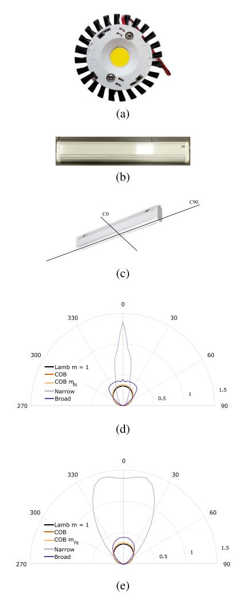

Fig. 19. Illustration of the (a) BXRE-50C3001-D-24, (b) E4010/LED111N060D and (c) definition of the C0/C90 slice of the C- $\Gamma$  photometric diagram. The COB, narrow-angle and broad-angle fixture LEDs'(d) C0 and (e) C90 photometric polar diagrams are plotted as well. Subfigures (d) and (e) display the BXRE-50C3001-D-24's  $R_E(\phi)$ , the m=1 and the fitted  $m_{fit}$  Lambertian radiation pattern in darker-shade orange, black and lighter orange, respectively. Also in (d) and (e), E4010/LED1N060D has been assigned the light purple colour, whilst E4210/LED1N060D is the darker purple.

options are available, this work limits itself to singular value decomposition (outlined in [448]).

3) Modified (Weighted) 3D Nonlinear LS Multilateration: This work also employs a more robust 3D multilateration, though non-linear, alternative proposed by Plets et al. in [422]. Still of a (relatively) low complexity and overhead, the algorithm computes for each candidate height  $\tilde{h}$  in a preset, though not necessarily uniform, interval  $[\tilde{h}_{min}, \tilde{h}_{max}]$  a 2D  $\tilde{\mathbf{x}}$  estimate at that  $\tilde{h}$  with the procedure of hereinabove. The global location estimate  $\hat{\mathbf{x}}$  is then obtained as the minimum of a cost function  $C(\tilde{h})$ , involving  $I_{PD,i}/d_i$  and  $\tilde{\mathbf{x}}$ . In [422],  $C(\tilde{h})$  is defined as

$$C(\tilde{h}) = \frac{1}{N} \sum_{k=1}^{N} (\hat{d}_k - ||\mathbf{x}_{\mathbf{S},\mathbf{k}} - \tilde{\mathbf{x}}||)^2.$$
 (36)

Withal, the prowess of this 3D multilateration procedure lies in  $C(\tilde{h})$  supporting non- $\hat{d}_i$ -centred functions as well. This work specifically treats an  $I_{PD,i}$ -based  $C(\tilde{h})$ :

$$C(\tilde{h}) = \frac{1}{N} \sum_{k=1}^{N} (\hat{I}_{PD,k} - \tilde{I}_{PD,k} (||\mathbf{x}_{S,k} - \tilde{\mathbf{x}}||))^{2}, \quad (37)$$

where the propagation model is employed to compute the  $\widetilde{I}_{PD,k}$  expected at  $\widetilde{\mathbf{x}}$ , with  $(||\mathbf{x}_{\mathbf{S},\mathbf{k}} - \widetilde{\mathbf{x}}||)$  its argument. It is important to note that both the evaluations at each candidate height are independent and can be executed in parallel [449], and that the height candidate set can be vastly reduced based on the previous receiver height (when keeping state).

- 4) Cayley-Menger Determinant Localisation: Positioning based on a geometrical formulation, as opposed to the above algebraic formulation, leads to the Cayley-Menger Determinant-based (CMD) localisation procedure of [450]. Similar to multilateration, it only requires a set of estimated distances to derive a position, and the formulation accommodates a more thorough investigation of the effects caused by all possible error sources. It extends to 3D with the loop-approach of Section V-E3 [451].
- 5) Ratio-RSS (RRSS)-Based Multilateration: A possible detrimental impact on RSS-based positioning can be caused by light attenuation in the propagation medium, e.g., dust on the PD. For uniform attenuation, RRSS-based multilateration brings solace. Furthermore, if the transmitters are well-adjusted to (approximately) radiate an equal  $P_{t,i} = P_t$  flux magnitude, RRSS (largely) obsoletes the  $P_{t,i}$  calibration. The idea is to perform least-squares multilateration with the N-1 independent of the  $d_i^2/d_j^2$ ,  $i, j=1 \dots N$  ratio combinations (here  $d_j=d_N$ ) [373]. Though extendible to other invertible  $I_{PD,i}-d_i$  functions, the RRSS modus operandi is discussed based on the standard VLP propagation model. Building on eq. (19) in Section IV-A, the following applies:

$$\frac{\hat{d}_{i}^{2}}{\hat{d}_{N}^{2}} = p_{i,N}^{2} = \left(\frac{P_{R,N} \cdot P_{t,i} \cdot \left(z_{S,i} - \hat{z}_{u}\right)^{m+1}}{P_{R,i} \cdot P_{t,N} \cdot \left(z_{S,N} - \hat{z}_{u}\right)^{m+1}}\right)^{2/(m+3)}.$$
(38)

The locus of (38) is again a circle:

$$||\hat{\mathbf{x}} - \mathbf{x}_{0,i}||^2 = r_i^2, \tag{39}$$

with

$$\mathbf{x}_{0,i} = \frac{\mathbf{x}_{S,i} - p_{i,N}^2 \cdot \mathbf{x}_{S,N}}{1 - p_{i,N}^2},\tag{40}$$

$$r_i^2 = \left\| \frac{\mathbf{x}_{S,i} - p_{i,N}^2 \cdot \mathbf{x}_{S,N}}{1 - p_{i,N}^2} \right\|^2 - \frac{\left\| \mathbf{x}_{S,i} - p_{i,N}^2 \cdot \mathbf{x}_{S,N} \right\|}{1 - p_{i,N}^2}, (41)$$

from which  $\mathbf{x}$  is obtained with one of the least-square matrix formalisms from hereinabove.

6) Simultaneous Positioning and Orientation (SPAO): In the case of receiver tilt, the assumption of RSS-to-distance invertibility (see eq. (19)) no longer holds. This causes aforementioned algorithms to be not applicable, or at best subject to tilt-induced errors. For a joint estimation of the receiver location and orientation, Zhou et al. [452], [453]

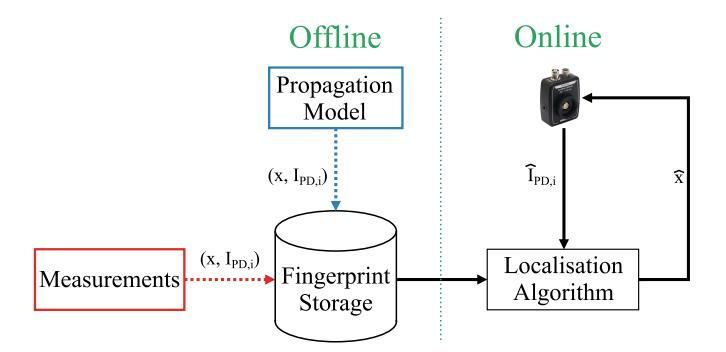

Fig. 20. Schematic of the manual (red) and model-based (blue) fingerprinting process.

proposed a successive linear least square (SLLS) simultaneous positioning and orientation (SPAO) algorithm, exploring the (position, orientation) solution space. To cope with the non-convexity induced receiver tilt, SPAO iteratively estimates the receiver (normal) orientation and the position by approximating cost function (and inherently the propagation model). The initial location estimate  $\hat{\mathbf{x}}$  required by SPAO can be delivered by, e.g., a 3D multilaterion algorithm. The SPAO approximation can be wielded in transmitter tilt conditions as well.

7) Manual/Survey Fingerprinting: With the exception of centroid localisation, the positioning algorithms of Section IV-B all necessitate at least an invertible  $d_i - I_{PD,i}$ , with some approaches being specific to the Lambertian propagation model. Manual/Survey fingerprinting was devised to most faithfully capture the (instantaneous) real-life propagation, i.e.,  $\{I_{PD,i}\}$  is simply measured. Depicted in Fig. 20, fingerprinting entails in a first offline stage collecting  $\{I_{PD,i}\}$ values (i.e., the fingerprints) at designated locations, which serve in a second online phase as a database to match an incoming  $\{I_{PD,i}\}$  measurement to. The location with (a combination of) the best matching, pre-measured fingerprint(s) is (in)taken as  $\hat{\mathbf{x}}$ , in its simplest form being the candidate location  $\mathbf{x}$  whose fingerprints  $RSS_{\mathbf{x},i}$  from a set of observable sources LEDi have the minimal Euler distance to the measured  $RSS_i$  set [18]:

$$\hat{\mathbf{x}} = \underset{\mathbf{x} \in C_{\mathbf{x}}}{\operatorname{argmin}} \sqrt{\sum_{i} (RSS_{i} - RSS_{\mathbf{x},i})^{2}}, \tag{42}$$

with  $C_{\mathbf{x}}$  the set of candidate locations. Though a variety of positioning approaches exist, which use i.a. probabilistic models, clustering or correlation methods, weighted K nearest neighbours (k-NN) [454] serves as a baseline algorithm in this study.

Fingerprinting is a cumbersome process, as (i) the ground truth locations and associated  $\{I_{PD,i}\}$  need to be tediously gathered, and (ii) the maintain of the accuracy upon a (significant) environment-changeover could entail a remeasuring of the fingerprints. Furthermore, for fingerprinting to rival, and improve upon VLP's projected (multilateration) accuracy, a dense grid of fingerprints needs to be collected. With an accurate ground truth measuring system (e.g., laser-guided AGV) as a prerequisite, it turns out to be an impractical

process. Though, sparse and interpolation-based (hybrid) propagation modelling [\[273\]](#page-41-22) and/or positioning techniques (such as classification tree-based or deep learning machine learning approaches) help reducing the amount of needed fingerprints, (manual) fingerprinting is frequently deemed too expensive and/or time-consuming.

*8) Model-Based Fingerprinting (MBF):* A feasible, yet still high-accuracy alternative is found in *model-based* fingerprinting (MBF) [\[455\]](#page-46-8). Fig. [20](#page-27-1) visualises its principle. MBF RSS makes use of an (offline) precomputed propagation map (Section [III-F\)](#page-13-0) that is available at each receiver and that incorporates all relevant receiver, transmitter (e.g., the LED's C0/C90 photometric diagram) and environmental channel characteristics (i.a. even reflection-inducing anchored obstacles if known). The propagation map thus holds the calculated RSS fingerprints, i.e., {*IPD*,*i* } values, for all locations on a predefined positioning grid, e.g., on a rectangular grid with a grid resolution of 2.5 cm. Upon positioning environment changeover, (part of) the propagation model can simply be recomputed.

The important distinction of MBF with respect to survey fingerprinting lies in the fact that no on-site measurements are required to form the propagation map. Their correspondence regarding the localisation process implies that Section [V-E7'](#page-27-2)s positioning techniques apply to MBF as well. Hence, MBF combines the multilateration and manual fingerprinting principles, and its performance thus understandably presents a trade-off between their complexity and obtainable positioning accuracy.

Compared to RF propagation (at sub-GHz frequencies), visible light propagation can be modelled better [\[15\]](#page-35-5), [\[456\]](#page-46-9), [\[457\]](#page-46-10), being the reason that RSS-based VLP is much more accurate than RSS-based Bluetooth or WiFi positioning. E.g., the impact of reflections is smaller, more deterministic, and is moreover spatially confined to relatively small areas around the reflecting object surface [\[267\]](#page-41-16). This also explains why reflections have rarely been investigated so far. Most often, the visible light channel is modelled only accounting for the Line-of-Sight, with good accuracy. Unlike in the RF case, obstructions of the LoS path can also easily be modelled (as a total blockage of the signal, making the LED unavailable as a localization anchor).

*a) Feasibility of MBF:* The computational complexity of MBF (and its associated propagation map) does not render it inapt. After all, its propagation model is calculated off-line, and efficient and sparse modelling approaches (Section [III-C\)](#page-9-0) can be exploited when necessary. Instead, MBF's limitations lie mainly in both the substantial storage of the computed fingerprints and the accruing localisation latency, particularly on display for 5-6 DOF localisation in a large-scale (industrytype) environment. By way of an (unrealistic) example, the storage requirement of 2D MBF, in its unoptimised form, is spotlighted: to equip an exploration space of 100 m by 100 m dimensions with a square positioning grid of a 1 cm granularity, with each location storing 400 LEDs' *IPD*,*i* with a precision of 8 bytes, the storage demand reaches the colossal proportion of 298 GB. The impact of the storage constraints can be alleviated by means of sparse modelling

approaches [\[458\]](#page-46-11), while latency challenge is tackled with 'fast location search' algorithms or with algorithms that keep state. Although mitigation approaches are possible, it is perspicuous that the storage and latency obstacle renders MBF infeasible for resource-constrained (in both energy and weight) receiver devices in a real-time application, such as autonomous drone navigation.

Even in those cases, MBF supporting arbitrary cost functions *C* (*x* , *y*, *z* ) and propagation models renders it a good evaluation method. Its concept offers an ideal start point for the design of machine learning models, for instance. More details on model-fingerprinting-based RSS can be found in literature [\[458\]](#page-46-11).

*9) Maximum Likelihood Estimation (MLE):* A widely used method for positioning is maximum likelihood estimation (MLE) [\[459\]](#page-46-12), which selects the parameter values most likely to generate the observed data. It can be employed for indoor positioning, particularly for measured RSS values. Given a set of observed RSS measurements {*RSS*}, the candidate position **x** with the highest likelihood, is found as the position for which the likelihood *p*({*RSS*}|**x**) = *p*(*RSS*1|**x**)· *p*(*RSS*2|**x**)· ... · *p*(*RSSN* |**x**) is maximal, with *p*(*RSSi*|**x**) the probability of observing a value *RSSi* from LED*i* when the receiver is at location **x**, and *N* the number of observed LEDs [\[15\]](#page-35-5). Because of RSS's non-linearity with respect to the distance between the LED and the PD, the distance estimation becomes biased. Researchers have typically ignored the biased nature of the distance estimate, despite the fact that it has an impact on mean-squared errors [\[460\]](#page-46-13). The work in [\[460\]](#page-46-13) provided a statically structured framework for dealing with it in the MLE model based on the different lighting levels and showed that MLE is an efficient approach.

*10) Localisation With an RSS Subset:* The above localisation algorithms are designed as to not necessitate all {*IPD*,*i* }/*di* within the receiver field of view to compute ˆ**x**. Instead, the associated positioning accuracy (and robustness) will (be later on shown to) benefit from only considering an (individually optimised) {*IPD*,*i* }/*di* subset. A *K*-element subset (*K* ≤ *N* ) is then effectuated by selecting the largest/smallest LED contributions in terms of *IPD,i*/(*M Pt,i RP* ) or *di*, respectively. To ensure adequate 2D and 3D positioning, the constraints of *K* ≥ 3 and *K* ≥ 4, respectively, must be taken into account. Section [V-E3-](#page-26-2)type algorithms support multiple subsetting, optimising the 2-step localisation process (i.e., multilateration and cost function). Multilateration with *K* = 3 is referred to as 'trilateration'.

# *F. Experimental Setup and Results*

*1) Experimental Setup:* The above principles have been applied in a real scenario, as follows. Concretely, the 2D positioning accuracy of an industrial VLP scenario is evaluated in a 42m x 21 m depot zone with storage racks, at the premises of Balta Group, a textile manufacturer. Envisioned use cases are forklift truck tracking and VLP-based AGV navigation. 14 BXRE-50C3001-D24 COB LEDs are mounted in a rectangular fashion, in 2 rows of 7 LEDs transversally and longitudinally separated by approximately 3.3m and 6m

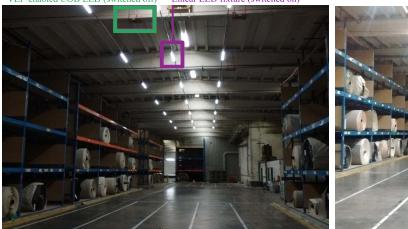

Fig. 21. A photograph of the positioning zone, equipped with the LED transmitters of the first industrials VLP solution.

respectively. The COB LEDs are modulated with a peak driving current of 755 mA by means of Analog Devices's LTM8005, whose modulation is controlled by an ATtiny 85 microcontroller [\[237\]](#page-40-25). PWM modulation is used, with modulation frequencies between 1 and 15.5 kHz, separated by at least 0.5 kHz. The mobile, wireless receiver is custom-made and combining the Thorlabs' FDS100 [\[461\]](#page-46-14) PD with a PSoC 5LP [\[462\]](#page-46-15) backend. The latter programmable system-on-chip integrates an analog front end, comprising a TIA, a low-pass anti-aliasing filter, a runtime-configurable gain amplification stage and a 14-bit Sigma-delta ADC. In each measurement, VPD(t) is discretized with 256 samples gathered at a sampling rate of 128 kHz. Through a Direct Memory Access channel, the samples are then further digitally processed. For the experiments, the (FFT-based) demodulation, (MBFbased) localization, and backend communication is offloaded to a Linux-based single-Board computer. To reduce the MBF latency, the MBF search zone for each measurement is reduced to the area around the LED with the largest IPD,i/Pt,i, although other approaches are also possible [\[346\]](#page-43-17). The receiver's total bill of materials for a small batch amounts to C28. For evaluating the positioning performance, the receiver is integrated on a LIDAR-enabled Dematic AGV, guaranteeing an accurate ground truth over the entire area of at worst 5 cm. Fig. [21](#page-29-1) shows the evaluation area with the COB LEDs (switched off in the left picture) and the AGV (right picture).

*2) Results and Discussion:* Figure [22](#page-29-2) shows the obtained localization results. For the trajectory under study, the *p*50 and *p*75 errors amount to 29 cm and 58 cm, respectively. Some areas suffer from a location bias, where in particular the top right zone is a result of a non-stable LED driver spreading its energy over two FFT bins. These results do not attain the typically projected centimeter- of decimeter-level accuracy, but some remarks are to be added. (i) Only one location per LED is used for calibration here, which remains doable for large-scale deployments; (ii) the considered environment is realistic/nonideal (much larger and higher environment than in available literature); (iii) the photoreceiver's mounting location entailed it experienced LoS blockage and reflections from the AGV's LIDAR equipment, as well as mechanical vibrations; (iv) static measurements at ground level with a reference PDA100A2 receiver yielded an error more towards the 10 cm range, indicating that the receiver hardware is a main performancelimiting factor; (v) a test in the same area was conducted with 21 (non-lambertian) luminaires (see Fig. [21](#page-29-1) (left)), yielding a significant accuracy drop (*p*50 and *p*75 of 41 cm

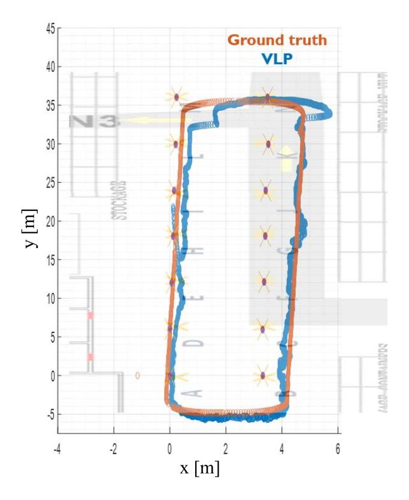

Fig. 22. The evaluation trajectory (in orange) and the corresponding industrial VLP one-shot location estimates (in blue) for the COB LED infrastructure.

and 113 cm respectively). Reasons are the inherent pointsource approximation at the basis of the *C* − Γ diagram not being completely valid at the considered link distances, the tabulated radiation pattern diverging from the real one, the reduced RSS gradient compared to Lambertian emitters (for reasons of illumination uniformity), and modulation waveform nonidealities. We refer to [\[346\]](#page-43-17) for more information.

## VI. OPEN CHALLENGES AND FUTURE ROADMAP OF VLP

A multitude of different indoor positioning system (IPS) technologies are currently available, as depicted in Fig. [2](#page-2-1) and Fig. [15.](#page-23-0) By considering the graph form of Fig. [15,](#page-23-0) which represents the cost and accuracy valuation of IPS, we can get an overview of the regions in which current and future applications reside and whose potential is left (partially) unreaped. These LBS are currently either not viable or prohibited from employing more-costly-than-strictlynecessary IPS. Particularly affected are the applications that need either decimeter-level accuracy at a very low cost or centimeter-level accuracy at a very low to moderate cost. The main associated issue lies in that these LBS-types are typically found at the heart of the transition towards connected infrastructure (e.g., Industry 4.0). Thus, in economic terms, the IPS gap represents a vast market potential that remains largely unexploited [\[58\]](#page-36-13).

Owing to its premise of low cost and centimeter-order accuracy, VLP has the potential to be part of the solution. There are however still some open challenges for VLP to take a solid place in the IPS landscape. We will mention the -to the authors' knowledge- most prominent ones, and link them to opportunities for future VLP research by discussing topics that are on VLP's roadmap.

## *A. Open Challenges*

- *1) Cost:* Although VLP is often hailed for it being lowcost, there are different types of costs involved in the realization of an accurate VLP system, which are hampering its adoption.
  - LED driver retrofit and illumination cost: Regular VLP involves intensity modulation of the LEDs. When the existing driver is not compatible with VLP modulation, a LED driver retrofit is required, inducing a hardware cost and an installation cost. Moreover, intensity modulation of the LEDs causes the provided illumination levels to drop. This in turn requires adding new light sources. An open challenge is the optimization of the lighting network planning of already present and new sources, and which ones to modulate for VLP and which ones not, accounting for illumination levels, total cost, and the interference of the different sources and the impact on VLP accuracy. LED driver retrofit and illumination cost are avoided by using the existing lighting as-is and resorting to uVLP variants (see Section [III-H3\)](#page-18-2), at the expense of a lower accuracy though.
  - Ease-of-deployment cost (training, calibration): once installed, the small-scale deployments evaluated in literature have often been extensively trained on a dense grid (by ML models) or have gone through a calibration per LED of the unknown channel parameters. This makes it cumbersome and unreliable to transfer the obtained configuration to larger or new deployments. As such, current VLP deployments can hardly be classified as plug-and-play.
- *2) Accuracy:* Although state-of-the-art literature reports more than satisfactory experimental accuracies (often cmorder), these are usually obtained under idealized conditions and are not robust for usage in realistic, commercial deployments.
  - Larger deployments: most experimental evaluations are limited to rather small zones with at most 4 LEDs. The heavy training involved in many ML deployments make it impossible to transfer the obtained accuracies to larger deployments. A per-LED calibration of the propagation parameters is less time-intensive. Some larger-scale evaluations are available [\[463\]](#page-46-0), but many researchers do not have access to a large test area equipped with an accurate ground truth system.
  - Mobility scenarios: while most envisioned use cases (asset tracking, navigation, etc) assume mobile receivers, by far the largest part of research considers static scenarios, again mainly due to the requirement of a suitable ground truth system and a reasonably-sized test area. Usually in static evaluations, a large amount of RSS values are averaged to reduce noise, but in mobile scenarios, this causes an increased positioning error and

- latency. For a given sampling rate and observed SNR, it is still to be determined what is the optimal tradeoff between the amount of local RSS averaging before incorporating the averaged value into a postprocessing filter [\[18\]](#page-35-8).
- Receiver tilt: most research considers perfectly horizontal (untilted) receivers, and in case of multi-receiver systems, also a known azimuthal orientation. Further characterization of the sensitivity to receiver attitude deviations is required, together with mechanisms of reasonable complexity to mitigate induced positioning errors. Solving this challenge would also unlock use cases related to human tracking.
- Non-lambertian transmitters: most works consider LED sources that adhere well to a Lambertian radiation pattern. However, because of illumination requirements (e.g., glare), real deployments usually employ non-Lambertian luminaires with an asymmetrical radiation pattern, making the channel non-invertible (see eq. [\(19\)\)](#page-19-0). This requires resorting to other localization approaches, such as MBF, which in turn requires solving issues related to the large MBF storage required and to fast fingerprint matching mechanisms for real-time operation [\[346\]](#page-43-17).
- Number of visible LEDs and their topology: most research considers 3 or 4 LEDs in line-of-sight situations, in a triangular or square/rectangular configuration respectively. In realistic environments (e.g., aisles between racks in industry or retail), lighting might be placed along a line, causing a positioning ambiguity due to symmetry. Also, the number of visible light sources might vary due to blockage of the LED-photoreceiver link and drop below the number that is required to obtain an unambiguous location. More research is required on ways to maintain a good accuracy in case of temporary nonideal reception conditions.
- Industrial 3D positioning: some 3D VLP positioning algorithms of low-complexity have already been proposed, but with the introduction of drones in industrial environments, more extensive 3D (or 2.5D with a height sensor) experimental evaluations are required, also with ceiling-mounted LEDs at typical (larger) industrial heights. A comparison between different algorithms is desirable, on the aspects of accuracy, complexity (latency & energy consumption), and performance as a function of receiver velocity.

Ideally, systems are designed that solve multiple of above challenges jointly.

*3) Standardization:* While other (competing) positioning technologies like UWB have undergone standardisation efforts, this has not yet been the case for VLP. UWB research is currently able to leverage simple off-the-shelf components (e.g., the DecaWave DW1000 module), but VLP has to rely on hardware prototypes, whereby researchers have to construct a full receiver chain from a variety of components, each with their own characteristics. This forms a barrier for conducting VLP research and impedes the comparison of obtained results.

## *B. Opportunities and Future Roadmap*

- *1) AI and Machine Learning:* Given the current focus on VLP accuracy, opportunities for AI and ML approaches lie in relaxing this focus and sacrificing some centimeters in favour of a realistically reduced training set ('ease-of-deployment criterion') or an easier calibration of propagation characteristics. Grey-box ML approaches can be explored, where the explicit incorporation of the optical channel models might improve positioning performance and model generalizability. Also, thanks to their capabilities of modelling complex non-linear systems, ML models lend themselves well to estimate and compensate for receiver tilt in a real-time fashion in realistic deployments, as joint positioning and orientation estimation in VLP cannot be straightforwardly done (see Section [V-E5\)](#page-27-3). Another promising research track lies in the use of ML for coping with LED blockages [\[464\]](#page-46-16), e.g., by fusion with other source signals such as magnetic fields [\[465\]](#page-46-17) or IMU sensor data [\[466\]](#page-46-18). Further, AI-based approaches are also promising for modelling propagation of non-lambertian sources, possibly in combination with 2D and 3D MBF, and for modelling AoA systems with multiple receivers.
- *2) Hybrid Systems:* Designing a VLP system with a robust performance (i.e., a maintained accuracy under varying reception conditions) might require looking at hybrid systems, which integrate VLP with other technologies like UWB, BLE, WiFi or IMU sensor data. Besides the obvious benefits of a continuous fusion of location estimates, VLP could rely on the fallback technology in case of (severe) receiver tilt, performance degradation due to excessive ambient light, or when an insufficient number of LEDs is visible due to link obstructions. Vice versa, VLP could help the other IPS in anchor selection and/or NLoS classification, or in lowering its anchor density. However, as hybrid solutions currently seem economically unviable, dead reckoning via fusion with IMUderived features is an attractive fusion approach that could also increase VLP robustness at a relatively low additional cost.
- *3) Unmodulated VLP:* While VLP has been hailed as a low-cost solution positioning approach, modulating the sources comes at an additional (illumination, hardware, and installation) cost. Therefore, recent research into the opportunistic use of the existing lighting is promising (see Section [III-H3\)](#page-18-2), in particular when leveraging the LEDs' characteristic frequency.
- *4) Solar Cell Receiver:* For energy-constrained applications, it has been shown that the use of solar cell receivers allows for a dual positioning-energy harvesting functionality [\[218\]](#page-40-6). While the bandwidths of solar cell receivers are sufficient to demultiplex LED signals modulated at different frequencies [\[216\]](#page-40-4), [\[218\]](#page-40-6), the obtained signal-to-noise ratios under normal illumination levels have also proven to be sufficient to obtain a reasonable accuracy. Further investigation into larger-scale deployment performance, a comparison of different suitable solar cell receivers (bandwidth, sensitivity, etc), multi-PV receiver topologies, energy budget analyses, etc, might pave the way to battery-less VLP, which could be particularly useful for low-mobility asset tracking.

- *5) Consensus VLP System (Principles):* As VLP is still in its infancy, no dominant VLP system has been identified. For fostering VLP research and supporting VLP adoption, a set of consensus VLP system principles is of crucial value [\[14\]](#page-35-4), [\[16\]](#page-35-6). Ensuring a widespread IPS adoption hinges on a yet to formalise standardisation effort, defining a common taxonomy, proposing uniform interfaces and function signatures, and/or offering databases with interoperable algorithms and protocols. Commercial availability of an integrated VLP receiver module would greatly facilitate VLP research and pave the way for application development, as well as welldocumented (i.e., radiation patterns, spectral intensity) and VLP-enabled light sources. Meanwhile, the availability of a remotely accessible open testbed with well-characterised components and an accurate (preferably 3D) ground truth provision for mobile receivers, as well as the organization of VLP competitions would make VLP research accessible to a broader research audience and also allow for a more objective assessment and benchmarking of research results.
- *6) VLC/VLP Integration:* Tapping into the 6G ISAC objectives of human- or device-centric, location-aware applications, further research into VLC/VLP integration and unified ISAC design would allow for improved communication, e.g., via location-aware channel estimation or more efficient resource utilization (e.g., confining communication to a specific LED source) [\[309\]](#page-42-19). As mentioned in Section [III-H1,](#page-16-5) first attempts have been made towards suitable modulation approaches for joint VLC/VLP [\[275\]](#page-41-24), [\[310\]](#page-42-20), [\[311\]](#page-42-21), [\[312\]](#page-42-22), [\[313\]](#page-42-23), [\[314\]](#page-42-24). The Internet of Radio Light European project [\[467\]](#page-46-19) included VLC/VLP architectures in its tasks. A more prominent role of VLP in existing, yet underused standards, such as IEEE 802.15.7 [\[468\]](#page-46-20) and ITU-T G.vlc [\[343\]](#page-43-14), would be supportive for integration.
- *7) Reconfigurable Intelligent Surfaces (RIS):* In RF communications, reconfigurable intelligent surfaces (RISs) have been heavily researched in recent years, as a method of providing a reconfigurable radio environment. It mainly targets higher frequencies, where communication suffers more from signal blockages. Transferring the concept to optical wireless communication and VLC, [\[469\]](#page-46-21) provides an in-depth overview on RIS for VLC, with techniques being significantly different from their RF counterpart. Optical RIS hardware includes metasurfaces, mirror arrays, and liquid crystals (LCs) (another type of metasurface). Mirror arrays allow manipulating the propagation of light signals by means of reflection, focusing, or redirection. Metasurfaces employ materials with adjustable properties to manage the phase, amplitude, and polarization of reflected waves. For VLP, RIS has the potential to circumvent LoS blockages, extend coverage for receivers subject to random orientation, and allow for a better sensing of the propagation environment, aiding in accurate positioning. Moreover, it would enable a dynamic optimization of the field-of-view of transmitters and receivers, depending on the reception conditions (number of LoS links, SNR, etc). As such, VLP RIS could contribute to a better (and more robust) accuracy. As of September 2023, VLP RIS research is nonexisting though.

**CMD** 

**CMOS** 

ICI

Cayley-Menger determinant localisation

Complementary metal-oxide-semiconductor

In general, (u)VLP can be considered as a potential serious competitor with other IPS solutions such as UWB. According to [463], the 2D positioning performance of both (u)VLP and UWB in LOS and NLOS environments is satisfactory. VLPs advantageous aspects are identified to be its scalability and latency, while UWB scores superior regarding the typically required calibration, the availability, and the robustness. Despite the challenges VLP is still facing today, different opportunities lie ahead for VLP to claim its place in the indoor positioning landscape.

#### VII. CONCLUSION

Visible light positioning (VLP) based on light emitting diodes (LEDs) is growing in popularity for indoor positioning applications such as smart cities, health, agriculture, retail, etc., thanks to the benefits offered by LEDs, such as consuming a low amount of power, not generating radio interference, having a long lifespan of up to ten years, and having low maintenance costs. In this tutorial, we provide a detailed overview of VLP. A comprehensive taxonomy of indoor positioning technologies is given, highlighting the novelty and potential of VLP. The paper also reviews the VLP from a technical standpoint, presenting the components of LED-based positioning systems. Next, this study discussed how positioning approaches such as RSS, TOA, TDOA, and AOA are used in the context of VLP. Moreover, an extensive overview is provided of the positioning algorithms that are being used, and as a concrete case, the realization of a standalone RSS-based VLP system with a single PD is elaborated on. Finally, this study surveyed open issues, challenges, and future research directions in VLP positioning systems.

| ]              | LIST OF ABBREVIATIONS                              |  |  |  |  |
|----------------|----------------------------------------------------|--|--|--|--|
| 2D             | Two-dimensional                                    |  |  |  |  |
| 2.5D           | Between 2D and 3D                                  |  |  |  |  |
| 3D             | Three-dimensional                                  |  |  |  |  |
| 5G             | 5 th Generation Technology Standard for |  |  |  |  |
|                | Broadband Cellular Networks                        |  |  |  |  |
| 5G NR          | 5G New Radio                                       |  |  |  |  |
| 6G             | 6 th Generation Technology Standard for |  |  |  |  |
|                | Broadband Cellular Networks                        |  |  |  |  |
| ACO            | Asymmetrically clipped optical OFDM                |  |  |  |  |
| ADC            | Analogue-to-digital converter                      |  |  |  |  |
| AGV            | Automated guided vehicle                           |  |  |  |  |
| AM             | Amplitude modulation                               |  |  |  |  |
| AOA            | Angle of Arrival                                   |  |  |  |  |
| APD            | Avalanche photodiode                               |  |  |  |  |
| AR             | Autoregressive Yule-Walker PSD estima-             |  |  |  |  |
|                | tion                                               |  |  |  |  |
| $\mathbf{A_R}$ | Active area of a PD                                |  |  |  |  |
| AVG            | Number of RSS values to average                    |  |  |  |  |
| BW             | Bandwidth                                          |  |  |  |  |
| C0/C90         | Photometric diagram slices                         |  |  |  |  |
| CAP            | Carrierless amplitude phase modulation             |  |  |  |  |
| CDMA           | Code-division multiple access                      |  |  |  |  |
| CF             | Characteristic frequency                           |  |  |  |  |
| CIR            | Channel impulse response                           |  |  |  |  |

| COB                                                                                                                                                                                                                                                                                                                  | Chip on board                                                                                                                                                                                                                                                                                                                                                                                                                                                                                                                                                                      |  |
|----------------------------------------------------------------------------------------------------------------------------------------------------------------------------------------------------------------------------------------------------------------------------------------------------------------------|------------------------------------------------------------------------------------------------------------------------------------------------------------------------------------------------------------------------------------------------------------------------------------------------------------------------------------------------------------------------------------------------------------------------------------------------------------------------------------------------------------------------------------------------------------------------------------|--|
| CoMP                                                                                                                                                                                                                                                                                                                 | Coordinated multi-point                                                                                                                                                                                                                                                                                                                                                                                                                                                                                                                                                            |  |
| CRB                                                                                                                                                                                                                                                                                                                  | Cramér-Rao bound                                                                                                                                                                                                                                                                                                                                                                                                                                                                                                                                                                   |  |
| CRI                                                                                                                                                                                                                                                                                                                  | Color rendering index                                                                                                                                                                                                                                                                                                                                                                                                                                                                                                                                                              |  |
| CSI                                                                                                                                                                                                                                                                                                                  | Channel state information                                                                                                                                                                                                                                                                                                                                                                                                                                                                                                                                                          |  |
| CSK                                                                                                                                                                                                                                                                                                                  | Colour shift keying                                                                                                                                                                                                                                                                                                                                                                                                                                                                                                                                                                |  |
| CSO                                                                                                                                                                                                                                                                                                                  | Cat Swarm Optimization                                                                                                                                                                                                                                                                                                                                                                                                                                                                                                                                                             |  |
| DALI                                                                                                                                                                                                                                                                                                                 | Digital Addressable Lighting Interface                                                                                                                                                                                                                                                                                                                                                                                                                                                                                                                                             |  |
| DAQ                                                                                                                                                                                                                                                                                                                  | Data acquisition                                                                                                                                                                                                                                                                                                                                                                                                                                                                                                                                                                   |  |
| DC                                                                                                                                                                                                                                                                                                                   | Direct Current                                                                                                                                                                                                                                                                                                                                                                                                                                                                                                                                                                     |  |
| DCO                                                                                                                                                                                                                                                                                                                  | DC-biased OFDM                                                                                                                                                                                                                                                                                                                                                                                                                                                                                                                                                                     |  |
| DFL                                                                                                                                                                                                                                                                                                                  | Device-Free Localization                                                                                                                                                                                                                                                                                                                                                                                                                                                                                                                                                           |  |
| DD                                                                                                                                                                                                                                                                                                                   | Direct detection                                                                                                                                                                                                                                                                                                                                                                                                                                                                                                                                                                   |  |
| DFT                                                                                                                                                                                                                                                                                                                  | Discrete Fourier transform                                                                                                                                                                                                                                                                                                                                                                                                                                                                                                                                                         |  |
| DFT-s                                                                                                                                                                                                                                                                                                                | DFT-spread (OFDM)                                                                                                                                                                                                                                                                                                                                                                                                                                                                                                                                                                  |  |
| $\mathbf{d_i}$                                                                                                                                                                                                                                                                                                       | Distance between the PD receiver and                                                                                                                                                                                                                                                                                                                                                                                                                                                                                                                                               |  |
| α 1                                                                                                                                                                                                                                                                                                       | LED i                                                                                                                                                                                                                                                                                                                                                                                                                                                                                                                                                                              |  |
| $\hat{\mathbf{d_i}}$                                                                                                                                                                                                                                                                                                 | Range to LED $i$ , estimate of $d_i$                                                                                                                                                                                                                                                                                                                                                                                                                                                                                                                                               |  |
| DM                                                                                                                                                                                                                                                                                                                   | Drone Matrix                                                                                                                                                                                                                                                                                                                                                                                                                                                                                                                                                                       |  |
| DMT                                                                                                                                                                                                                                                                                                                  | Discrete multitone modulation                                                                                                                                                                                                                                                                                                                                                                                                                                                                                                                                                      |  |
| DOF                                                                                                                                                                                                                                                                                                                  | Degree of freedom                                                                                                                                                                                                                                                                                                                                                                                                                                                                                                                                                                  |  |
| DOS                                                                                                                                                                                                                                                                                                                  | Denial-of-service                                                                                                                                                                                                                                                                                                                                                                                                                                                                                                                                                                  |  |
| DRSS                                                                                                                                                                                                                                                                                                                 | Differential RSS                                                                                                                                                                                                                                                                                                                                                                                                                                                                                                                                                                   |  |
| DTW                                                                                                                                                                                                                                                                                                                  | Dynamic time-warped                                                                                                                                                                                                                                                                                                                                                                                                                                                                                                                                                                |  |
| EKF                                                                                                                                                                                                                                                                                                                  | Extended Kalman filter                                                                                                                                                                                                                                                                                                                                                                                                                                                                                                                                                             |  |
| $\bar{\mathbf{E}}_{\mathbf{m}}$                                                                                                                                                                                                                                                                                      | Maintained illuminance                                                                                                                                                                                                                                                                                                                                                                                                                                                                                                                                                             |  |
| EMI                                                                                                                                                                                                                                                                                                                  | Electromagnetic interference                                                                                                                                                                                                                                                                                                                                                                                                                                                                                                                                                       |  |
| EU                                                                                                                                                                                                                                                                                                                   | European Union                                                                                                                                                                                                                                                                                                                                                                                                                                                                                                                                                                     |  |
| $\mathbf{f_0}$                                                                                                                                                                                                                                                                                                       | Ground harmonic frequency of VLP                                                                                                                                                                                                                                                                                                                                                                                                                                                                                                                                                   |  |
| 10                                                                                                                                                                                                                                                                                                                   | _ · · · · · · · · · · · · · · · · · · ·                                                                                                                                                                                                                                                                                                                                                                                                                                                                                                                                            |  |
| FRMC                                                                                                                                                                                                                                                                                                                 |                                                                                                                                                                                                                                                                                                                                                                                                                                                                                                                                                                                    |  |
| FBMC $\mathbf{f} \cdot = 1/T$                                                                                                                                                                                                                                                                                        | Filter bank-based multicarrier                                                                                                                                                                                                                                                                                                                                                                                                                                                                                                                                                     |  |
| $\mathbf{f_{c,i}} = 1/T_{c,i}$                                                                                                                                                                                                                                                                                       | LED i's modulation frequency                                                                                                                                                                                                                                                                                                                                                                                                                                                                                                                                                       |  |
| $egin{aligned} \mathbf{f_{c,i}} &= 1/T_{c,i} \ \mathbf{f_{CF,i}} \end{aligned}$                                                                                                                                                                                                                                      | LED <i>i</i> 's modulation frequency LED <i>i</i> 's CF during uVLP                                                                                                                                                                                                                                                                                                                                                                                                                                                                                                             |  |
| $egin{aligned} \mathbf{f_{c,i}} &= 1/T_{c,i} \ \mathbf{f_{CF,i}} \ \mathrm{FD} \end{aligned}$                                                                                                                                                                                                                        | LED <i>i</i> 's modulation frequency LED <i>i</i> 's CF during uVLP Fréchet distance                                                                                                                                                                                                                                                                                                                                                                                                                                                                                         |  |
| $egin{aligned} \mathbf{f_{c,i}} &= 1/T_{c,i} \ \mathbf{f_{CF,i}} \ &	ext{FD} \ &	ext{FDMA} \end{aligned}$                                                                                                                                                                                                            | LED <i>i</i> 's modulation frequency LED <i>i</i> 's CF during uVLP Fréchet distance Frequency-division multiplexing access                                                                                                                                                                                                                                                                                                                                                                                                                                               |  |
| $egin{aligned} \mathbf{f_{c,i}} &= 1/T_{c,i} \ \mathbf{f_{CF,i}} \ &	ext{FD} \ &	ext{FDMA} \ &	ext{FFT} \end{aligned}$                                                                                                                                                                                               | LED <i>i</i> 's modulation frequency LED <i>i</i> 's CF during uVLP Fréchet distance Frequency-division multiplexing access Fast Fourier Transform                                                                                                                                                                                                                                                                                                                                                                                                                     |  |
| $egin{aligned} \mathbf{f_{c,i}} &= 1/T_{c,i} \ \mathbf{f_{CF,i}} \ &	ext{FD} \ &	ext{FDMA} \ &	ext{FFT} \ &	ext{FLT} \end{aligned}$                                                                                                                                                                                  | LED <i>i</i> 's modulation frequency LED <i>i</i> 's CF during uVLP Fréchet distance Frequency-division multiplexing access Fast Fourier Transform Forklift truck                                                                                                                                                                                                                                                                                                                                                                                                   |  |
| $egin{aligned} \mathbf{f_{c,i}} &= 1/T_{c,i} \ \mathbf{f_{CF,i}} \ &	ext{FD} \ &	ext{FDMA} \ &	ext{FFT} \ &	ext{FLT} \ &	ext{FOV} \end{aligned}$                                                                                                                                                                     | LED <i>i</i> 's modulation frequency LED <i>i</i> 's CF during uVLP Fréchet distance Frequency-division multiplexing access Fast Fourier Transform Forklift truck Field of view                                                                                                                                                                                                                                                                                                                                                                                                    |  |
| $egin{aligned} \mathbf{f_{c,i}} &= 1/T_{c,i} \ \mathbf{f_{CF,i}} \ &	ext{FD} \ &	ext{FDMA} \ &	ext{FFT} \ &	ext{FLT} \ &	ext{FOV} \ &	ext{FP} \end{aligned}$                                                                                                                                                         | LED <i>i</i> 's modulation frequency LED <i>i</i> 's CF during uVLP Fréchet distance Frequency-division multiplexing access Fast Fourier Transform Forklift truck Field of view (Manual) fingerprinting                                                                                                                                                                                                                                                                                                                                                                            |  |
| $\mathbf{f_{c,i}} = 1/T_{c,i}$ $\mathbf{f_{CF,i}}$ $FD$ $FDMA$ $FFT$ $FLT$ $FOV$ $FP$                                                                                                                                                                                                                                | LED <i>i</i> 's modulation frequency LED <i>i</i> 's CF during uVLP Fréchet distance Frequency-division multiplexing access Fast Fourier Transform Forklift truck Field of view (Manual) fingerprinting Flat surface                                                                                                                                                                                                                                                                                                                                                               |  |
| $egin{aligned} \mathbf{f_{c,i}} &= 1/T_{c,i} \ \mathbf{f_{CF,i}} \ &	ext{FD} \ &	ext{FDMA} \ &	ext{FFT} \ &	ext{FLT} \ &	ext{FOV} \ &	ext{FP} \ &	ext{FS} \ &	ext{f_{S}} \end{aligned}$                                                                                                                              | LED <i>i</i> 's modulation frequency LED <i>i</i> 's CF during uVLP Fréchet distance Frequency-division multiplexing access Fast Fourier Transform Forklift truck Field of view (Manual) fingerprinting Flat surface Sampling frequency                                                                                                                                                                                                                                                                                                                                            |  |
| $egin{aligned} \mathbf{f_{c,i}} &= 1/T_{c,i} \ \mathbf{f_{CF,i}} \ \mathbf{FD} \ \mathbf{FDMA} \ \mathbf{FFT} \ \mathbf{FLT} \ \mathbf{FOV} \ \mathbf{FP} \ \mathbf{FS} \end{aligned}$                                                                                                                               | LED <i>i</i> 's modulation frequency LED <i>i</i> 's CF during uVLP Fréchet distance Frequency-division multiplexing access Fast Fourier Transform Forklift truck Field of view (Manual) fingerprinting Flat surface Sampling frequency Frequency step, range during sliding                                                                                                                                                                                                                                                                                                       |  |
| $egin{aligned} \mathbf{f_{c,i}} &= 1/T_{c,i} \ \mathbf{f_{CF,i}} \ &	ext{FD} \ &	ext{FDMA} \ &	ext{FFT} \ &	ext{FLT} \ &	ext{FOV} \ &	ext{FP} \ &	ext{FS} \ &	ext{f_{step}}, \ 2\Delta \mathbf{f} \end{aligned}$                                                                                                     | LED i's modulation frequency LED i's CF during uVLP Fréchet distance Frequency-division multiplexing access Fast Fourier Transform Forklift truck Field of view (Manual) fingerprinting Flat surface Sampling frequency Frequency step, range during sliding correlation                                                                                                                                                                                                                                                                                                           |  |
| $egin{aligned} \mathbf{f_{c,i}} &= 1/T_{c,i} \ \mathbf{f_{CF,i}} \ \mathbf{FD} \ &= \mathbf{FDMA} \ \mathbf{FFT} \ \mathbf{FLT} \ \mathbf{FOV} \ \mathbf{FP} \ \mathbf{FS} \ \mathbf{f_{step}}, \ \mathbf{2\Delta f} \end{aligned}$                                                                                  | LED i's modulation frequency LED i's CF during uVLP Fréchet distance Frequency-division multiplexing access Fast Fourier Transform Forklift truck Field of view (Manual) fingerprinting Flat surface Sampling frequency Frequency step, range during sliding correlation Azimuthal irradiance angle                                                                                                                                                                                                                                                                                |  |
| $\mathbf{f_{c,i}} = ^{1}/_{T_{c,i}}$ $\mathbf{f_{CF,i}}$ $FD$ $FDMA$ $FFT$ $FLT$ $FOV$ $FP$ $FS$ $\mathbf{f_{S}}$ $\mathbf{f_{step}}$ , $2\Delta\mathbf{f}$                                                                                                                                                          | LED i's modulation frequency LED i's CF during uVLP Fréchet distance Frequency-division multiplexing access Fast Fourier Transform Forklift truck Field of view (Manual) fingerprinting Flat surface Sampling frequency Frequency step, range during sliding correlation Azimuthal irradiance angle Gaussian mixture model                                                                                                                                                                                                                                                         |  |
| $f_{c,i} = 1/T_{c,i}$ $f_{CF,i}$ $FD$ $FDMA$ $FFT$ $FLT$ $FOV$ $FP$ $FS$ $f_{s}$ $f_{step}$ , $2\Delta f$ $\gamma$ $GMM$ $GNSS$                                                                                                                                                                                      | LED i's modulation frequency LED i's CF during uVLP Fréchet distance Frequency-division multiplexing access Fast Fourier Transform Forklift truck Field of view (Manual) fingerprinting Flat surface Sampling frequency Frequency step, range during sliding correlation Azimuthal irradiance angle Gaussian mixture model Global Navigation Satellite Systems                                                                                                                                                                                                                     |  |
| $egin{aligned} \mathbf{f_{c,i}} &= 1/T_{c,i} \ \mathbf{f_{CF,i}} \ \mathbf{FD} \ &= \mathbf{FDMA} \ \mathbf{FFT} \ &= \mathbf{FLT} \ \mathbf{FOV} \ \mathbf{FP} \ &= \mathbf{FS} \ \mathbf{f_{S}} \ \mathbf{f_{step}}, \ \mathbf{2\Delta f} \end{aligned}$                                                           | LED i's modulation frequency LED i's CF during uVLP Fréchet distance Frequency-division multiplexing access Fast Fourier Transform Forklift truck Field of view (Manual) fingerprinting Flat surface Sampling frequency Frequency step, range during sliding correlation Azimuthal irradiance angle Gaussian mixture model Global Navigation Satellite Systems Transimpedance gain                                                                                                                                                                                                 |  |
| $f_{c,i} = 1/T_{c,i}$ $f_{CF,i}$ $FD$ $FDMA$ $FFT$ $FLT$ $FOV$ $FP$ $FS$ $f_{S}$ $f_{step}$ , $2\Delta f$ $\gamma$ $GMM$ $GNSS$ $G_{PD}$ $GPRS$                                                                                                                                                                      | LED i's modulation frequency LED i's CF during uVLP Fréchet distance Frequency-division multiplexing access Fast Fourier Transform Forklift truck Field of view (Manual) fingerprinting Flat surface Sampling frequency Frequency step, range during sliding correlation Azimuthal irradiance angle Gaussian mixture model Global Navigation Satellite Systems Transimpedance gain General Packet Radio Service                                                                                                                                                                    |  |
| $f_{c,i} = 1/T_{c,i}$ $f_{CF,i}$ $FD$ $FDMA$ $FFT$ $FLT$ $FOV$ $FP$ $FS$ $f_{s}$ $f_{step}$ , $2\Delta f$ $\gamma$ $GMM$ $GNSS$ $G_{PD}$ $GPRS$ $GPS$                                                                                                                                                                | LED i's modulation frequency LED i's CF during uVLP Fréchet distance Frequency-division multiplexing access Fast Fourier Transform Forklift truck Field of view (Manual) fingerprinting Flat surface Sampling frequency Frequency step, range during sliding correlation Azimuthal irradiance angle Gaussian mixture model Global Navigation Satellite Systems Transimpedance gain General Packet Radio Service Global Positioning System                                                                                                                                          |  |
| $f_{\mathbf{c},\mathbf{i}} = 1/T_{c,i}$ $f_{\mathbf{CF},\mathbf{i}}$ $f_{\mathbf{CF},\mathbf{i}}$ $f_{\mathbf{DMA}}$ $f_{\mathbf{FT}}$ $f_{\mathbf{DMA}}$ $f_{\mathbf{FT}}$ $f_{\mathbf{CV}}$ $f_{\mathbf{FP}}$ $f_{\mathbf{S}}$ $f_{\mathbf{step}}$ , $2\Delta f$ $\gamma$ $GMM$ $GNSS$ $G_{PD}$ $GPRS$ $GPS$ $GSM$ | LED i's modulation frequency LED i's CF during uVLP Fréchet distance Frequency-division multiplexing access Fast Fourier Transform Forklift truck Field of view (Manual) fingerprinting Flat surface Sampling frequency Frequency step, range during sliding correlation Azimuthal irradiance angle Gaussian mixture model Global Navigation Satellite Systems Transimpedance gain General Packet Radio Service Global Positioning System Global System for Mobile Communications                                                                                                  |  |
| $f_{c,i} = 1/T_{c,i}$ $f_{CF,i}$ $FD$ $FDMA$ $FFT$ $FLT$ $FOV$ $FP$ $FS$ $f_{s}$ $f_{step}$ , $2\Delta f$ $\gamma$ $GMM$ $GNSS$ $G_{PD}$ $GPRS$ $GSM$ $GWO$                                                                                                                                                          | LED i's modulation frequency LED i's CF during uVLP Fréchet distance Frequency-division multiplexing access Fast Fourier Transform Forklift truck Field of view (Manual) fingerprinting Flat surface Sampling frequency Frequency step, range during sliding correlation Azimuthal irradiance angle Gaussian mixture model Global Navigation Satellite Systems Transimpedance gain General Packet Radio Service Global Positioning System Global System for Mobile Communications Grey Wolf Optimizer                                                                              |  |
| $f_{c,i} = 1/T_{c,i}$ $f_{CF,i}$ $FD$ $FDMA$ $FFT$ $FLT$ $FOV$ $FP$ $FS$ $f_{s}$ $f_{step}$ , $2\Delta f$ $GMM$ $GNSS$ $G_{PD}$ $GPRS$ $GSM$ $GWO$ $h$                                                                                                                                                               | LED i's modulation frequency LED i's CF during uVLP Fréchet distance Frequency-division multiplexing access Fast Fourier Transform Forklift truck Field of view (Manual) fingerprinting Flat surface Sampling frequency Frequency step, range during sliding correlation Azimuthal irradiance angle Gaussian mixture model Global Navigation Satellite Systems Transimpedance gain General Packet Radio Service Global Positioning System Global System for Mobile Communications Grey Wolf Optimizer Perpendicular LED-receiver distance                                          |  |
| $f_{c,i} = 1/T_{c,i}$ $f_{CF,i}$ $FD$ $FDMA$ $FFT$ $FLT$ $FOV$ $FP$ $FS$ $f_{s}$ $f_{step}$ , $2\Delta f$ $\gamma$ $GMM$ $GNSS$ $G_{PD}$ $GPRS$ $GSM$ $GWO$                                                                                                                                                          | LED i's modulation frequency LED i's CF during uVLP Fréchet distance Frequency-division multiplexing access Fast Fourier Transform Forklift truck Field of view (Manual) fingerprinting Flat surface Sampling frequency Frequency step, range during sliding correlation Azimuthal irradiance angle Gaussian mixture model Global Navigation Satellite Systems Transimpedance gain General Packet Radio Service Global Positioning System Global System for Mobile Communications Grey Wolf Optimizer Perpendicular LED-receiver distance DC channel gain between the PD and       |  |
| $f_{c,i} = 1/T_{c,i}$ $f_{CF,i}$ $FD$ $FDMA$ $FFT$ $FLT$ $FOV$ $FP$ $FS$ $f_{s}$ $f_{step}$ , $2\Delta f$ $GMM$ $GNSS$ $G_{PD}$ $GPRS$ $GSM$ $GWO$ $h$ $h_{c}^{(i)}$                                                                                                                                                 | LED i's modulation frequency LED i's CF during uVLP Fréchet distance Frequency-division multiplexing access Fast Fourier Transform Forklift truck Field of view (Manual) fingerprinting Flat surface Sampling frequency Frequency step, range during sliding correlation Azimuthal irradiance angle Gaussian mixture model Global Navigation Satellite Systems Transimpedance gain General Packet Radio Service Global Positioning System Global System for Mobile Communications Grey Wolf Optimizer Perpendicular LED-receiver distance DC channel gain between the PD and LED i |  |
| $f_{c,i} = 1/T_{c,i}$ $f_{CF,i}$ $FD$ $FDMA$ $FFT$ $FLT$ $FOV$ $FP$ $FS$ $f_{s}$ $f_{step}$ , $2\Delta f$ $GMM$ $GNSS$ $G_{PD}$ $GPRS$ $GSM$ $GWO$ $h$                                                                                                                                                               | LED i's modulation frequency LED i's CF during uVLP Fréchet distance Frequency-division multiplexing access Fast Fourier Transform Forklift truck Field of view (Manual) fingerprinting Flat surface Sampling frequency Frequency step, range during sliding correlation Azimuthal irradiance angle Gaussian mixture model Global Navigation Satellite Systems Transimpedance gain General Packet Radio Service Global Positioning System Global System for Mobile Communications Grey Wolf Optimizer Perpendicular LED-receiver distance DC channel gain between the PD and       |  |

Inter-cell interference

| IEEE                                                                                                | Institute of Electrical and Electronics                                                                                                                                                                                                                                                                                                                                                                                                                                                                                                                                                                                                                                            | $MP_{t,i}R_P(0)$                                                                                                                  | LED-PD gain                                                                                                                                                                                                                                                                                                                                                                                                                                                                                                                                                                                                                                                                                                     |
|-----------------------------------------------------------------------------------------------------|------------------------------------------------------------------------------------------------------------------------------------------------------------------------------------------------------------------------------------------------------------------------------------------------------------------------------------------------------------------------------------------------------------------------------------------------------------------------------------------------------------------------------------------------------------------------------------------------------------------------------------------------------------------------------------|-----------------------------------------------------------------------------------------------------------------------------------|-----------------------------------------------------------------------------------------------------------------------------------------------------------------------------------------------------------------------------------------------------------------------------------------------------------------------------------------------------------------------------------------------------------------------------------------------------------------------------------------------------------------------------------------------------------------------------------------------------------------------------------------------------------------------------------------------------------------|
| IDEE                                                                                                | Engineers                                                                                                                                                                                                                                                                                                                                                                                                                                                                                                                                                                                                                                                                          | MR                                                                                                                                | Mixing ratio                                                                                                                                                                                                                                                                                                                                                                                                                                                                                                                                                                                                                                                                                                    |
| IIoT                                                                                                | Industrial Internet of things                                                                                                                                                                                                                                                                                                                                                                                                                                                                                                                                                                                                                                                      | m s                                                                                                                    | Lambertian order of specular reflection                                                                                                                                                                                                                                                                                                                                                                                                                                                                                                                                                                                                                                                                         |
| $\mathbf{I_{LED}}$                                                                                  | LED driving current                                                                                                                                                                                                                                                                                                                                                                                                                                                                                                                                                                                                                                                                | m S                                                                                                                    | model                                                                                                                                                                                                                                                                                                                                                                                                                                                                                                                                                                                                                                                                                                           |
| IM                                                                                                  | Intensity modulation                                                                                                                                                                                                                                                                                                                                                                                                                                                                                                                                                                                                                                                               | MUSIC                                                                                                                             | MUltiple SIgnal Classification                                                                                                                                                                                                                                                                                                                                                                                                                                                                                                                                                                                                                                                                                  |
| $I_{max}$                                                                                           | Maximum luminous flux                                                                                                                                                                                                                                                                                                                                                                                                                                                                                                                                                                                                                                                              | N                                                                                                                                 | Number of deployed VLP-enabled LEDs                                                                                                                                                                                                                                                                                                                                                                                                                                                                                                                                                                                                                                                                             |
| IMU                                                                                                 | Inertial measurement unit                                                                                                                                                                                                                                                                                                                                                                                                                                                                                                                                                                                                                                                          | $N_a$                                                                                                                             | Length time domain segment prior to                                                                                                                                                                                                                                                                                                                                                                                                                                                                                                                                                                                                                                                                             |
| IoT                                                                                                 | Internet of things                                                                                                                                                                                                                                                                                                                                                                                                                                                                                                                                                                                                                                                                 | 1 a                                                                                                                               | demodulation                                                                                                                                                                                                                                                                                                                                                                                                                                                                                                                                                                                                                                                                                                    |
| $I_{PD,i}$                                                                                          | LED <i>i</i> 's photocurrent magnitude-based                                                                                                                                                                                                                                                                                                                                                                                                                                                                                                                                                                                                                                       | NB-IoT                                                                                                                            | Narrowband Internet of things                                                                                                                                                                                                                                                                                                                                                                                                                                                                                                                                                                                                                                                                                   |
| <b>-</b> PD,1                                                                                       | RSS value                                                                                                                                                                                                                                                                                                                                                                                                                                                                                                                                                                                                                                                                          | NFC                                                                                                                               | Near-Field Communication                                                                                                                                                                                                                                                                                                                                                                                                                                                                                                                                                                                                                                                                                        |
| $\mathbf{I_{PD,i}(t)}$                                                                              | LED <i>i</i> 's individual photocurrent time con-                                                                                                                                                                                                                                                                                                                                                                                                                                                                                                                                                                                                                                  | NLOS                                                                                                                              | Non-line-of-sight                                                                                                                                                                                                                                                                                                                                                                                                                                                                                                                                                                                                                                                                                               |
| <b>1</b> PD,1( <b>6</b> )                                                                           | tribution                                                                                                                                                                                                                                                                                                                                                                                                                                                                                                                                                                                                                                                                          | NOMA                                                                                                                              | Non-orthogonal multiple access                                                                                                                                                                                                                                                                                                                                                                                                                                                                                                                                                                                                                                                                                  |
| IPS                                                                                                 | Indoor positioning system                                                                                                                                                                                                                                                                                                                                                                                                                                                                                                                                                                                                                                                          | $N_s$                                                                                                                             | Total number of collected signal samples                                                                                                                                                                                                                                                                                                                                                                                                                                                                                                                                                                                                                                                                        |
| IR                                                                                                  | Infrared                                                                                                                                                                                                                                                                                                                                                                                                                                                                                                                                                                                                                                                                           | NSGA-II                                                                                                                           | Nondominated Sorting Genetic Algorithm-                                                                                                                                                                                                                                                                                                                                                                                                                                                                                                                                                                                                                                                                         |
| ISI                                                                                                 | Intersymbol interference                                                                                                                                                                                                                                                                                                                                                                                                                                                                                                                                                                                                                                                           | 1100/11                                                                                                                           | II                                                                                                                                                                                                                                                                                                                                                                                                                                                                                                                                                                                                                                                                                                              |
| IVLP                                                                                                | Industrial VLP                                                                                                                                                                                                                                                                                                                                                                                                                                                                                                                                                                                                                                                                     | NSGA-III                                                                                                                          | Nondominated Sorting Genetic Algorithm-                                                                                                                                                                                                                                                                                                                                                                                                                                                                                                                                                                                                                                                                         |
| K                                                                                                   | Element count anchor selection (Sub)set,                                                                                                                                                                                                                                                                                                                                                                                                                                                                                                                                                                                                                                           | NOOM III                                                                                                                          | III                                                                                                                                                                                                                                                                                                                                                                                                                                                                                                                                                                                                                                                                                                             |
| 11                                                                                                  | $K \leq N$                                                                                                                                                                                                                                                                                                                                                                                                                                                                                                                                                                                                                                                                         | $\mathbf{O}(\ )$                                                                                                                  | Order of Complexity                                                                                                                                                                                                                                                                                                                                                                                                                                                                                                                                                                                                                                                                                             |
| KF                                                                                                  | Kalman filter                                                                                                                                                                                                                                                                                                                                                                                                                                                                                                                                                                                                                                                                      | OASE                                                                                                                              | Online Asynchronous State Estimation                                                                                                                                                                                                                                                                                                                                                                                                                                                                                                                                                                                                                                                                            |
| KNN                                                                                                 | (K-) nearest neighbours                                                                                                                                                                                                                                                                                                                                                                                                                                                                                                                                                                                                                                                            | ONDE                                                                                                                              | toolbox                                                                                                                                                                                                                                                                                                                                                                                                                                                                                                                                                                                                                                                                                                         |
| KPI                                                                                                 | Key performance indicator                                                                                                                                                                                                                                                                                                                                                                                                                                                                                                                                                                                                                                                          | OCC                                                                                                                               | Optical camera communications                                                                                                                                                                                                                                                                                                                                                                                                                                                                                                                                                                                                                                                                                   |
| LaaS                                                                                                | Light(ing) as a Service                                                                                                                                                                                                                                                                                                                                                                                                                                                                                                                                                                                                                                                            | OFDM                                                                                                                              | Orthogonal frequency division                                                                                                                                                                                                                                                                                                                                                                                                                                                                                                                                                                                                                                                                                   |
| $\lambda$                                                                                           | Wavelength                                                                                                                                                                                                                                                                                                                                                                                                                                                                                                                                                                                                                                                                         | OI DIVI                                                                                                                           | multiplexing                                                                                                                                                                                                                                                                                                                                                                                                                                                                                                                                                                                                                                                                                                    |
| Laser                                                                                               | Light amplification by stimulated emission                                                                                                                                                                                                                                                                                                                                                                                                                                                                                                                                                                                                                                         | $\omega$                                                                                                                          | Azimuthal incidence angle                                                                                                                                                                                                                                                                                                                                                                                                                                                                                                                                                                                                                                                                                       |
| Lasei                                                                                               | of radiation                                                                                                                                                                                                                                                                                                                                                                                                                                                                                                                                                                                                                                                                       | OLED                                                                                                                              | Organic light-emitting diode                                                                                                                                                                                                                                                                                                                                                                                                                                                                                                                                                                                                                                                                                    |
| LBS                                                                                                 | Location-based Services                                                                                                                                                                                                                                                                                                                                                                                                                                                                                                                                                                                                                                                            | $\mathbf{O}(\mathbf{Pk}(\mathbf{L}))$                                                                                             | Complexity of the peak detect operation                                                                                                                                                                                                                                                                                                                                                                                                                                                                                                                                                                                                                                                                         |
| LD                                                                                                  | Laser diode                                                                                                                                                                                                                                                                                                                                                                                                                                                                                                                                                                                                                                                                        | OSI                                                                                                                               | Open Systems Interconnection                                                                                                                                                                                                                                                                                                                                                                                                                                                                                                                                                                                                                                                                                    |
| LED                                                                                                 | Light-emitting diode                                                                                                                                                                                                                                                                                                                                                                                                                                                                                                                                                                                                                                                               |                                                                                                                                   | Positioning error metric planning                                                                                                                                                                                                                                                                                                                                                                                                                                                                                                                                                                                                                                                                               |
| LIDAR                                                                                               | Light (or laser imaging) detection and                                                                                                                                                                                                                                                                                                                                                                                                                                                                                                                                                                                                                                             | $^{\mathrm{P}10-90}_{\mathrm{P}50}/\mathrm{P}_{75}/\mathrm{P}_{90}$                                                               | Median/75 th /90 th percentile accuracy                                                                                                                                                                                                                                                                                                                                                                                                                                                                                                                                                                                                                                                   |
| LIDITIC                                                                                             | ranging                                                                                                                                                                                                                                                                                                                                                                                                                                                                                                                                                                                                                                                                            | $ ho_{50,\mathrm{err}}/p_{90,\mathrm{err}}$                                                                                       | 50 th and 90 th percentile of the precision                                                                                                                                                                                                                                                                                                                                                                                                                                                                                                                                                                                                                                               |
|                                                                                                     |                                                                                                                                                                                                                                                                                                                                                                                                                                                                                                                                                                                                                                                                                    |                                                                                                                                   | · ·                                                                                                                                                                                                                                                                                                                                                                                                                                                                                                                                                                                                                                                                                                             |
| Li_Fi                                                                                               | Light Fidelity                                                                                                                                                                                                                                                                                                                                                                                                                                                                                                                                                                                                                                                                     | PAM                                                                                                                               | Pulse-amplitude modulation                                                                                                                                                                                                                                                                                                                                                                                                                                                                                                                                                                                                                                                                                      |
| Li-Fi I PWAN                                                                                     | Light Fidelity Low-power wide-area network                                                                                                                                                                                                                                                                                                                                                                                                                                                                                                                                                                                                                                         | PAM PCR                                                                                                                        | Pulse-amplitude modulation Printed circuit board                                                                                                                                                                                                                                                                                                                                                                                                                                                                                                                                                                                                                                                                |
| LPWAN                                                                                               | Low-power wide-area network                                                                                                                                                                                                                                                                                                                                                                                                                                                                                                                                                                                                                                                        | PCB                                                                                                                               | Printed circuit board                                                                                                                                                                                                                                                                                                                                                                                                                                                                                                                                                                                                                                                                                           |
| LPWAN LoRa(WAN)                                                                                  | Low-power wide-area network Long Range (Wide Area Network)                                                                                                                                                                                                                                                                                                                                                                                                                                                                                                                                                                                                                         | PCB PD                                                                                                                         | Printed circuit board Photodiode                                                                                                                                                                                                                                                                                                                                                                                                                                                                                                                                                                                                                                                                             |
| LPWAN LoRa(WAN) LOS                                                                           | Low-power wide-area network Long Range (Wide Area Network) Line-of-sight                                                                                                                                                                                                                                                                                                                                                                                                                                                                                                                                                                                                     | PCB PD PDMA                                                                                                                 | Printed circuit board Photodiode Polarization-division multiple access                                                                                                                                                                                                                                                                                                                                                                                                                                                                                                                                                                                                                                          |
| LPWAN LoRa(WAN) LOS LS                                                                     | Low-power wide-area network Long Range (Wide Area Network) Line-of-sight Least-squares                                                                                                                                                                                                                                                                                                                                                                                                                                                                                                                                                                                             | PCB PD PDMA PDOA                                                                                                         | Printed circuit board Photodiode Polarization-division multiple access Phase difference of arrival                                                                                                                                                                                                                                                                                                                                                                                                                                                                                                                                                                                                              |
| LPWAN LoRa(WAN) LOS LS LSOOP                                                            | Low-power wide-area network Long Range (Wide Area Network) Line-of-sight Least-squares Light signals of opportunity                                                                                                                                                                                                                                                                                                                                                                                                                                                                                                                                                                | PCB PD PDMA                                                                                                                 | Printed circuit board Photodiode Polarization-division multiple access Phase difference of arrival Name or prefix of peak detection)based                                                                                                                                                                                                                                                                                                                                                                                                                                                                                                                                                                       |
| LPWAN LoRa(WAN) LOS LS LSOOP LTE                                                                    | Low-power wide-area network Long Range (Wide Area Network) Line-of-sight Least-squares Light signals of opportunity Long Term Evolution                                                                                                                                                                                                                                                                                                                                                                                                                                                                                                                                            | PCB PD PDMA PDOA PEAK/P-                                                                                              | Printed circuit board Photodiode Polarization-division multiple access Phase difference of arrival Name or prefix of peak detection)based demodulation                                                                                                                                                                                                                                                                                                                                                                                                                                                                                                                                                          |
| LPWAN LoRa(WAN) LOS LS LSOOP LTE m                                                                  | Low-power wide-area network Long Range (Wide Area Network) Line-of-sight Least-squares Light signals of opportunity Long Term Evolution Lambertian order                                                                                                                                                                                                                                                                                                                                                                                                                                                                                                                           | PCB PD PDMA PDOA                                                                                                         | Printed circuit board Photodiode Polarization-division multiple access Phase difference of arrival Name or prefix of peak detection)based demodulation Photodiode with intrinsic region between a                                                                                                                                                                                                                                                                                                                                                                                                                                                                                                               |
| LPWAN LoRa(WAN) LOS LS LSOOP LTE m M                                                                | Low-power wide-area network Long Range (Wide Area Network) Line-of-sight Least-squares Light signals of opportunity Long Term Evolution Lambertian order LED-PD wavelength mismatch gain                                                                                                                                                                                                                                                                                                                                                                                                                                                                                           | PCB PD PDMA PDOA PEAK/P-                                                                                                          | Printed circuit board Photodiode Polarization-division multiple access Phase difference of arrival Name or prefix of peak detection)based demodulation Photodiode with intrinsic region between a p- and n-type semiconductor                                                                                                                                                                                                                                                                                                                                                                                                                                                                                   |
| LPWAN LoRa(WAN) LOS LS LSOOP LTE m M MAC                                                            | Low-power wide-area network Long Range (Wide Area Network) Line-of-sight Least-squares Light signals of opportunity Long Term Evolution Lambertian order LED-PD wavelength mismatch gain Multiple access control                                                                                                                                                                                                                                                                                                                                                                                                                                                                   | PCB PD PDMA PDOA PEAK/P- PIN                                                                                       | Printed circuit board Photodiode Polarization-division multiple access Phase difference of arrival Name or prefix of peak detection)based demodulation Photodiode with intrinsic region between a p- and n-type semiconductor Irradiance elevation angle                                                                                                                                                                                                                                                                                                                                                                                                                                                        |
| LPWAN LoRa(WAN) LOS LS LSOOP LTE m M MAC MBF                                                        | Low-power wide-area network Long Range (Wide Area Network) Line-of-sight Least-squares Light signals of opportunity Long Term Evolution Lambertian order LED-PD wavelength mismatch gain Multiple access control Model-based fingerprinting                                                                                                                                                                                                                                                                                                                                                                                                                                        | PCB PD PDMA PDOA PEAK/P- PIN $\phi$ $\Phi_{\rm v}$                                                                                | Printed circuit board Photodiode Polarization-division multiple access Phase difference of arrival Name or prefix of peak detection)based demodulation Photodiode with intrinsic region between a p- and n-type semiconductor Irradiance elevation angle Luminous flux                                                                                                                                                                                                                                                                                                                                                                                                                                          |
| LPWAN LoRa(WAN) LOS LS LSOOP LTE m M MAC MBF MBF-AVG                                                | Low-power wide-area network Long Range (Wide Area Network) Line-of-sight Least-squares Light signals of opportunity Long Term Evolution Lambertian order LED-PD wavelength mismatch gain Multiple access control Model-based fingerprinting Averaging-based MBF variant                                                                                                                                                                                                                                                                                                                                                                                                            | PCB PD PDMA PDOA PEAK/P- PIN $\phi$ $\Phi_{\rm v}$ PHY                                                                            | Printed circuit board Photodiode Polarization-division multiple access Phase difference of arrival Name or prefix of peak detection)based demodulation Photodiode with intrinsic region between a p- and n-type semiconductor Irradiance elevation angle Luminous flux Physical layer                                                                                                                                                                                                                                                                                                                                                                                                                           |
| LPWAN LoRa(WAN) LOS LS LSOOP LTE m M MAC MBF MBF-AVG MBFB                                           | Low-power wide-area network Long Range (Wide Area Network) Line-of-sight Least-squares Light signals of opportunity Long Term Evolution Lambertian order LED-PD wavelength mismatch gain Multiple access control Model-based fingerprinting Averaging-based MBF variant K-NN-type MBF variant                                                                                                                                                                                                                                                                                                                                                                                      | PCB PD PDMA PDOA PEAK/P- PIN $\phi$ $\Phi_{\rm V}$ PHY PLC                                                                        | Printed circuit board Photodiode Polarization-division multiple access Phase difference of arrival Name or prefix of peak detection)based demodulation Photodiode with intrinsic region between a p- and n-type semiconductor Irradiance elevation angle Luminous flux Physical layer Powerline communication                                                                                                                                                                                                                                                                                                                                                                                                   |
| LPWAN LoRa(WAN) LOS LS LSOOP LTE m M MAC MBF MBF-AVG MBFB MBF-SS                                    | Low-power wide-area network Long Range (Wide Area Network) Line-of-sight Least-squares Light signals of opportunity Long Term Evolution Lambertian order LED-PD wavelength mismatch gain Multiple access control Model-based fingerprinting Averaging-based MBF variant K-NN-type MBF variant Spherical-shell (SS) MBF                                                                                                                                                                                                                                                                                                                                                             | PCB PD PDMA PDOA PEAK/P- PIN                                                                                                      | Printed circuit board Photodiode Polarization-division multiple access Phase difference of arrival Name or prefix of peak detection)based demodulation Photodiode with intrinsic region between a p- and n-type semiconductor Irradiance elevation angle Luminous flux Physical layer Powerline communication Phase locked loop                                                                                                                                                                                                                                                                                                                                                                                 |
| LPWAN LoRa(WAN) LOS LS LSOOP LTE m M MAC MBF MBF-AVG MBFB MBF-SS MCM                                | Low-power wide-area network Long Range (Wide Area Network) Line-of-sight Least-squares Light signals of opportunity Long Term Evolution Lambertian order LED-PD wavelength mismatch gain Multiple access control Model-based fingerprinting Averaging-based MBF variant K-NN-type MBF variant Spherical-shell (SS) MBF Multi(sub)carrier modulation                                                                                                                                                                                                                                                                                                                                | PCB PD PDMA PDOA PEAK/P- PIN                                                                                                      | Printed circuit board Photodiode Polarization-division multiple access Phase difference of arrival Name or prefix of peak detection)based demodulation Photodiode with intrinsic region between a p- and n-type semiconductor Irradiance elevation angle Luminous flux Physical layer Powerline communication Phase locked loop Power over Ethernet                                                                                                                                                                                                                                                                                                                                                             |
| LPWAN LoRa(WAN) LOS LS LSOOP LTE m M MAC MBF MBF-AVG MBFB MBF-SS                                    | Low-power wide-area network Long Range (Wide Area Network) Line-of-sight Least-squares Light signals of opportunity Long Term Evolution Lambertian order LED-PD wavelength mismatch gain Multiple access control Model-based fingerprinting Averaging-based MBF variant K-NN-type MBF variant Spherical-shell (SS) MBF Multi(sub)carrier modulation Lambertian order of diffuse reflection                                                                                                                                                                                                                                                                                         | PCB PD PDMA PDOA PEAK/P- PIN                                                                                                      | Printed circuit board Photodiode Polarization-division multiple access Phase difference of arrival Name or prefix of peak detection)based demodulation Photodiode with intrinsic region between a p- and n-type semiconductor Irradiance elevation angle Luminous flux Physical layer Powerline communication Phase locked loop Power over Ethernet Physiological percent flicker                                                                                                                                                                                                                                                                                                                               |
| LPWAN LoRa(WAN) LOS LS LSOOP LTE m M MAC MBF MBF-AVG MBFB MBF-SS MCM m d                 | Low-power wide-area network Long Range (Wide Area Network) Line-of-sight Least-squares Light signals of opportunity Long Term Evolution Lambertian order LED-PD wavelength mismatch gain Multiple access control Model-based fingerprinting Averaging-based MBF variant K-NN-type MBF variant Spherical-shell (SS) MBF Multi(sub)carrier modulation Lambertian order of diffuse reflection model                                                                                                                                                                                                                                                                                   | PCB PD PDMA PDOA PEAK/P- PIN $\phi$ $\Phi_{\rm v}$ PHY PLC PLL POE PPF $P_{\rm R.i}$                                              | Printed circuit board Photodiode Polarization-division multiple access Phase difference of arrival Name or prefix of peak detection)based demodulation Photodiode with intrinsic region between a p- and n-type semiconductor Irradiance elevation angle Luminous flux Physical layer Powerline communication Phase locked loop Power over Ethernet Physiological percent flicker Received radiant power of LED i                                                                                                                                                                                                                                                                                               |
| LPWAN LoRa(WAN) LOS LS LSOOP LTE m M MAC MBF MBF-AVG MBFB MBF-SS MCM md MEMS                        | Low-power wide-area network Long Range (Wide Area Network) Line-of-sight Least-squares Light signals of opportunity Long Term Evolution Lambertian order LED-PD wavelength mismatch gain Multiple access control Model-based fingerprinting Averaging-based MBF variant K-NN-type MBF variant Spherical-shell (SS) MBF Multi(sub)carrier modulation Lambertian order of diffuse reflection model Microelectromechanical systems                                                                                                                                                                                                                                                    | PCB PD PDMA PDOA PEAK/P- PIN $\phi$ $\Phi_{v}$ PHY PLC PLL POE PPF $P_{R,i}$ PSD                                                  | Printed circuit board Photodiode Polarization-division multiple access Phase difference of arrival Name or prefix of peak detection)based demodulation Photodiode with intrinsic region between a p- and n-type semiconductor Irradiance elevation angle Luminous flux Physical layer Powerline communication Phase locked loop Power over Ethernet Physiological percent flicker Received radiant power of LED i Power spectral density                                                                                                                                                                                                                                                                        |
| LPWAN LoRa(WAN) LOS LS LSOOP LTE m M MAC MBF MBF-AVG MBFB MBF-SS MCM md MEMS MF                     | Low-power wide-area network  Long Range (Wide Area Network)  Line-of-sight  Least-squares  Light signals of opportunity  Long Term Evolution  Lambertian order  LED-PD wavelength mismatch gain  Multiple access control  Model-based fingerprinting  Averaging-based MBF variant  K-NN-type MBF variant  Spherical-shell (SS) MBF  Multi(sub)carrier modulation  Lambertian order of diffuse reflection  model  Microelectromechanical systems  Maintenance factor or matched filter                                                                                                                                                                                              | PCB PD PDMA PDOA PEAK/P- PIN $\phi$ $\Phi_{v}$ PHY PLC PLL POE PPF $P_{R,i}$ PSD $\psi$                                           | Printed circuit board Photodiode Polarization-division multiple access Phase difference of arrival Name or prefix of peak detection)based demodulation Photodiode with intrinsic region between a p- and n-type semiconductor Irradiance elevation angle Luminous flux Physical layer Powerline communication Phase locked loop Power over Ethernet Physiological percent flicker Received radiant power of LED i Power spectral density Elevation component incidence angle                                                                                                                                                                                                                                    |
| LPWAN LoRa(WAN) LOS LS LSOOP LTE m M MAC MBF MBF-AVG MBFB MBF-SS MCM md MEMS MF MIMO                | Low-power wide-area network  Long Range (Wide Area Network)  Line-of-sight  Least-squares  Light signals of opportunity  Long Term Evolution  Lambertian order  LED-PD wavelength mismatch gain  Multiple access control  Model-based fingerprinting  Averaging-based MBF variant  K-NN-type MBF variant  Spherical-shell (SS) MBF  Multi(sub)carrier modulation  Lambertian order of diffuse reflection  model  Microelectromechanical systems  Maintenance factor or matched filter  Multiple-input and multiple-output                                                                                                                                                          | PCB PD PDMA PDOA PEAK/P- PIN $\phi$ $\Phi_{\rm V}$ PHY PLC PLL POE PPF $P_{\rm R,i}$ PSD $\psi$ $\psi$ $\vartheta_{\rm 3dB}$      | Printed circuit board Photodiode Polarization-division multiple access Phase difference of arrival Name or prefix of peak detection)based demodulation Photodiode with intrinsic region between a p- and n-type semiconductor Irradiance elevation angle Luminous flux Physical layer Powerline communication Phase locked loop Power over Ethernet Physiological percent flicker Received radiant power of LED $i$ Power spectral density Elevation component incidence angle $\psi$ angle for which $R_P(\psi) = 1/\sqrt{2}$                                                                                                                                                                                  |
| LPWAN LoRa(WAN) LOS LS LSOOP LTE m M MAC MBF MBF-AVG MBFB MBF-SS MCM md MEMS MF MIMO MLAT           | Low-power wide-area network Long Range (Wide Area Network) Line-of-sight Least-squares Light signals of opportunity Long Term Evolution Lambertian order LED-PD wavelength mismatch gain Multiple access control Model-based fingerprinting Averaging-based MBF variant K-NN-type MBF variant Spherical-shell (SS) MBF Multi(sub)carrier modulation Lambertian order of diffuse reflection model Microelectromechanical systems Maintenance factor or matched filter Multiple-input and multiple-output Linear least-squares multilateration                                                                                                                                       | PCB PD PDMA PDOA PEAK/P- PIN $\phi$ $\Phi_{\rm v}$ PHY PLC PLL POE PPF $P_{\rm R,i}$ PSD $\psi$ $\psi$ $\psi$ $3dB$ PSO           | Printed circuit board Photodiode Polarization-division multiple access Phase difference of arrival Name or prefix of peak detection)based demodulation Photodiode with intrinsic region between a p- and n-type semiconductor Irradiance elevation angle Luminous flux Physical layer Powerline communication Phase locked loop Power over Ethernet Physiological percent flicker Received radiant power of LED $i$ Power spectral density Elevation component incidence angle $\psi$ angle for which $R_P(\psi) = 1/\sqrt{2}$ Particle Swarm Optimization                                                                                                                                                      |
| LPWAN LoRa(WAN) LOS LS LSOOP LTE m M MAC MBF MBF-AVG MBFB MBF-SS MCM md MEMS MF MIMO MLAT µLED      | Low-power wide-area network  Long Range (Wide Area Network)  Line-of-sight  Least-squares  Light signals of opportunity  Long Term Evolution  Lambertian order  LED-PD wavelength mismatch gain  Multiple access control  Model-based fingerprinting  Averaging-based MBF variant  K-NN-type MBF variant  Spherical-shell (SS) MBF  Multi(sub)carrier modulation  Lambertian order of diffuse reflection  model  Microelectromechanical systems  Maintenance factor or matched filter  Multiple-input and multiple-output  Linear least-squares multilateration  microLED                                                                                                          | PCB PD PDMA PDOA PEAK/P- PIN $\phi$ $\Phi_{\rm V}$ PHY PLC PLL POE PPF $P_{\rm R,i}$ PSD $\psi$ $\psi_{\rm 3dB}$ PSO PSOC         | Printed circuit board Photodiode Polarization-division multiple access Phase difference of arrival Name or prefix of peak detection)based demodulation Photodiode with intrinsic region between a p- and n-type semiconductor Irradiance elevation angle Luminous flux Physical layer Powerline communication Phase locked loop Power over Ethernet Physiological percent flicker Received radiant power of LED $i$ Power spectral density Elevation component incidence angle $\psi$ angle for which $R_P(\psi) = 1/\sqrt{2}$ Particle Swarm Optimization Programmable system-on-chip                                                                                                                          |
| LPWAN LoRa(WAN) LOS LS LSOOP LTE m M MAC MBF MBF-AVG MBFB MBF-SS MCM md MEMS MF MIMO MLAT  µLED MMC | Low-power wide-area network Long Range (Wide Area Network) Line-of-sight Least-squares Light signals of opportunity Long Term Evolution Lambertian order LED-PD wavelength mismatch gain Multiple access control Model-based fingerprinting Averaging-based MBF variant K-NN-type MBF variant Spherical-shell (SS) MBF Multi(sub)carrier modulation Lambertian order of diffuse reflection model Microelectromechanical systems Maintenance factor or matched filter Multiple-input and multiple-output Linear least-squares multilateration microLED Modified Monte Carlo algorithm                                                                                               | PCB PD PDMA PDOA PEAK/P- PIN $\phi$ $\Phi_{\rm V}$ PHY PLC PLL POE PPF ${\bf P_{R,i}}$ PSD $\psi$ $\psi_{\rm 3dB}$ PSO PSOC PstLM | Printed circuit board Photodiode Polarization-division multiple access Phase difference of arrival Name or prefix of peak detection)based demodulation Photodiode with intrinsic region between a p- and n-type semiconductor Irradiance elevation angle Luminous flux Physical layer Powerline communication Phase locked loop Power over Ethernet Physiological percent flicker Received radiant power of LED $i$ Power spectral density Elevation component incidence angle $\psi$ angle for which $R_P(\psi) = 1/\sqrt{2}$ Particle Swarm Optimization Programmable system-on-chip Perceptibility for Light Modulation                                                                                      |
| LPWAN LoRa(WAN) LOS LS LSOOP LTE m M MAC MBF MBF-AVG MBFB MBF-SS MCM md MEMS MF MIMO MLAT           | Low-power wide-area network Long Range (Wide Area Network) Line-of-sight Least-squares Light signals of opportunity Long Term Evolution Lambertian order LED-PD wavelength mismatch gain Multiple access control Model-based fingerprinting Averaging-based MBF variant K-NN-type MBF variant Spherical-shell (SS) MBF Multi(sub)carrier modulation Lambertian order of diffuse reflection model Microelectromechanical systems Maintenance factor or matched filter Multiple-input and multiple-output Linear least-squares multilateration microLED Modified Monte Carlo algorithm Millimeter wave                                                                               | PCB PD PDMA PDOA PEAK/P- PIN $\phi$ $\Phi_{v}$ PHY PLC PLL POE PPF $P_{R,i}$ PSD $\psi$ $\psi_{3dB}$ PSO PSOC PstLM $P_{t,i}$     | Printed circuit board Photodiode Polarization-division multiple access Phase difference of arrival Name or prefix of peak detection)based demodulation Photodiode with intrinsic region between a p- and n-type semiconductor Irradiance elevation angle Luminous flux Physical layer Powerline communication Phase locked loop Power over Ethernet Physiological percent flicker Received radiant power of LED $i$ Power spectral density Elevation component incidence angle $\psi$ angle for which $R_P(\psi) = 1/\sqrt{2}$ Particle Swarm Optimization Programmable system-on-chip Perceptibility for Light Modulation Radiant flux of LED $i$                                                              |
| LPWAN LoRa(WAN) LOS LS LSOOP LTE m M MAC MBF MBF-AVG MBFB MBF-SS MCM md MEMS MF MIMO MLAT           | Low-power wide-area network  Long Range (Wide Area Network)  Line-of-sight  Least-squares  Light signals of opportunity  Long Term Evolution  Lambertian order  LED-PD wavelength mismatch gain  Multiple access control  Model-based fingerprinting  Averaging-based MBF variant  K-NN-type MBF variant  Spherical-shell (SS) MBF  Multi(sub)carrier modulation  Lambertian order of diffuse reflection  model  Microelectromechanical systems  Maintenance factor or matched filter  Multiple-input and multiple-output  Linear least-squares multilateration  microLED  Modified Monte Carlo algorithm  Millimeter wave  Motion Capture                                         | PCB PD PDMA PDOA PEAK/P- PIN $\phi$ $\Phi_{v}$ PHY PLC PLL POE PPF $P_{R,i}$ PSD $\psi$ $\psi_{3dB}$ PSO PSOC PstLM $P_{t,i}$ PWM | Printed circuit board Photodiode Polarization-division multiple access Phase difference of arrival Name or prefix of peak detection)based demodulation Photodiode with intrinsic region between a p- and n-type semiconductor Irradiance elevation angle Luminous flux Physical layer Powerline communication Phase locked loop Power over Ethernet Physiological percent flicker Received radiant power of LED $i$ Power spectral density Elevation component incidence angle $\psi$ angle for which $R_P(\psi) = 1/\sqrt{2}$ Particle Swarm Optimization Programmable system-on-chip Perceptibility for Light Modulation Radiant flux of LED $i$ Pulse-width modulation                                       |
| LPWAN LoRa(WAN) LOS LS LSOOP LTE m M MAC MBF MBF-AVG MBFB MBF-SS MCM md MEMS MF MIMO MLAT           | Low-power wide-area network  Long Range (Wide Area Network)  Line-of-sight  Least-squares  Light signals of opportunity  Long Term Evolution  Lambertian order  LED-PD wavelength mismatch gain  Multiple access control  Model-based fingerprinting  Averaging-based MBF variant  K-NN-type MBF variant  Spherical-shell (SS) MBF  Multi(sub)carrier modulation  Lambertian order of diffuse reflection  model  Microelectromechanical systems  Maintenance factor or matched filter  Multiple-input and multiple-output  Linear least-squares multilateration  microLED  Modified Monte Carlo algorithm  Millimeter wave  Motion Capture  Multi-Objective Evolutionary algorithm | PCB PD PDMA PDOA PEAK/P- PIN $\phi$ $\Phi_{v}$ PHY PLC PLL POE PPF $P_{R,i}$ PSD $\psi$ $\psi_{3dB}$ PSO PSOC PstLM $P_{t,i}$     | Printed circuit board Photodiode Polarization-division multiple access Phase difference of arrival Name or prefix of peak detection)based demodulation Photodiode with intrinsic region between a p- and n-type semiconductor Irradiance elevation angle Luminous flux Physical layer Powerline communication Phase locked loop Power over Ethernet Physiological percent flicker Received radiant power of LED $i$ Power spectral density Elevation component incidence angle $\psi$ angle for which $R_P(\psi) = 1/\sqrt{2}$ Particle Swarm Optimization Programmable system-on-chip Perceptibility for Light Modulation Radiant flux of LED $i$ Pulse-width modulation Quadrant photodiode angular diversity |
| LPWAN LoRa(WAN) LOS LS LSOOP LTE m M MAC MBF MBF-AVG MBFB MBF-SS MCM md MEMS MF MIMO MLAT           | Low-power wide-area network  Long Range (Wide Area Network)  Line-of-sight  Least-squares  Light signals of opportunity  Long Term Evolution  Lambertian order  LED-PD wavelength mismatch gain  Multiple access control  Model-based fingerprinting  Averaging-based MBF variant  K-NN-type MBF variant  Spherical-shell (SS) MBF  Multi(sub)carrier modulation  Lambertian order of diffuse reflection  model  Microelectromechanical systems  Maintenance factor or matched filter  Multiple-input and multiple-output  Linear least-squares multilateration  microLED  Modified Monte Carlo algorithm  Millimeter wave  Motion Capture                                         | PCB PD PDMA PDOA PEAK/P- PIN $\phi$ $\Phi_{v}$ PHY PLC PLL POE PPF $P_{R,i}$ PSD $\psi$ $\psi_{3dB}$ PSO PSOC PstLM $P_{t,i}$ PWM | Printed circuit board Photodiode Polarization-division multiple access Phase difference of arrival Name or prefix of peak detection)based demodulation Photodiode with intrinsic region between a p- and n-type semiconductor Irradiance elevation angle Luminous flux Physical layer Powerline communication Phase locked loop Power over Ethernet Physiological percent flicker Received radiant power of LED $i$ Power spectral density Elevation component incidence angle $\psi$ angle for which $R_P(\psi) = 1/\sqrt{2}$ Particle Swarm Optimization Programmable system-on-chip Perceptibility for Light Modulation Radiant flux of LED $i$ Pulse-width modulation                                       |

| QPSK                                   | quadrature phase-shift keying            |
|----------------------------------------|------------------------------------------|
| QR                                     | Quick Response                           |
| R                                      | Winding route trajectory                 |
| ${ m R}^2$                             | Coefficient of Determination             |
| RADAR                                  | Radio detection and ranging              |
| $\mathbf{r_d}$                         | Fraction of diffusivity                  |
| $\mathbf{R_E}(\phi, \gamma)$           | Radiation pattern                        |
| RF                                     | Radio frequency                          |
| RFID                                   | Radio-frequency Identification           |
| RGB                                    | Red Green Blue                           |
| _                                      | Reflection coefficient                   |
| hoRMS                                  | Root-mean-square                         |
| rMSE                                   | Root-mean-square error                   |
| ROS                                    | =                                        |
|                                        | Robot Operating System                   |
| $\mathbf{R}_{\mathbf{P}}(\psi,\omega)$ | PD receiver's angular dependency         |
| $ m R_{P,0}$                           | Nominal $R_P(\psi,\omega)$ value         |
| RRSS                                   | Ratio-RSS                                |
| RS-232                                 | Recommended Standard 232                 |
| RSS                                    | Received signal strength                 |
| RSSI                                   | RSS indicator                            |
| RTK                                    | Real-time kinematic positioning          |
| RToF                                   | Return time of flight                    |
| RTT                                    | Round trip time                          |
| RTTOF                                  | Round trip time-of-flight                |
| SC                                     | Single carrier                           |
| SCV                                    | Serial-complex-valued OFDM               |
| SD                                     | Standard deviation                       |
| SDMA                                   | Space-division multiple access           |
| SEPM                                   | Single edge position modulation          |
| SHF                                    | Super high frequency                     |
| SIC                                    | Successive interference cancellation     |
| $\hat{\sigma}$                         | Additive Gaussian noise contribution     |
| 0                                      |                                          |
| $\hat{\sigma}^{f 2}$                   | standard deviation                       |
| $\sigma^{-}$                           | Additive Gaussian noise contribution     |
| ( <b>T</b>                             | variance                                 |
| $\sigma(\mathbf{I_{PD,i}})$            | Spatial standard deviation on $I_{PD,i}$ |
| $\mathbf{s_{j,i}(t)}$                  | Instantaneous radiant power signal of    |
|                                        | LED i                                    |
| SISO                                   | Single-input single-output               |
| SLM                                    | Selective mapping                        |
| SLLS                                   | Successive linear least square           |
| SMD                                    | Surface-mounted device                   |
| SMP                                    | Seeking memory pool                      |
| SMPSO                                  | Speed-constrained Multi-objective PSO    |
| SNR                                    | Signal-to-noise-ratio                    |
| SLAM                                   | Simultaneous localisation and mapping    |
| SPAO                                   | Simultaneous positioning and orientating |
| SVM                                    | Stroboscopic effect visibility measure   |
| TDMA                                   | Time-division multiple access            |
| T(D)OA                                 | Time difference of arrival               |
| TIA                                    | Transimpedance amplifier                 |
| TLA                                    | Temporal light artefact                  |
|                                        | Time of arrival                          |
| TOA                                    |                                          |
| TOF                                    | Time of flight                           |
| TWR                                    | Two-Way Ranging                          |
| <b>T</b> T                             |                                          |
| $\mathbf{U_0}$                         | Illuminance uniformity                   |
| U 0 UART                 |                                          |

**UAV** Unmanned aerial vehicles **UGR** Unified glare rating UGR limit UGRL **ULS** Ultrasound **U-OFDM** Unipolar OFDM **USB** Universal Serial Bus UV Ultraviolet uVLP Unmodulated Visible Light Positioning **UWB** Ultra-wideband VL Visible light **VLC** Visible Light Communication **VLP** Visible Light Positioning VLS Visible Light Sensing VOOK Variable on-off keying  $V_{PD.i}$ Magnitude of  $V_{PD,i}(t)$ Individual photovoltage contribution of  $V_{PD,i}(t)$  $V_{PD}(t)$ Total photovoltage time domain signal **VPPM** Variable pulse-position modulation WANET Wireless ad hoc network **WDMA** Wavelength-division multiple access **WKNN** Weighted K-nearest neighbour WLAN Wireless local area network WLS Weighted least-squares multilateration Estimated receiver position LED *i*'s coordinates  $(\mathbf{x_{S,i}}, \, \mathbf{y_{S,i}}, \, \mathbf{z_{S,i}})$ Unknown receiver position  $(\mathbf{x_u}, \mathbf{y_u}, \mathbf{z_u})$ 

## REFERENCES

- [1] E. Sisinni, A. Saifullah, S. Han, U. Jennehag, and M. Gidlund, "Industrial Internet of Things: Challenges, opportunities, and directions," *IEEE Trans. Ind. Informat.*, vol. 14, no. 11, pp. 4724–4734, Nov. 2018, doi: 10.1109/TII.2018.2852491.
- [2] V. Renaudin et al., "Evaluating indoor positioning systems in a shopping mall: The lessons learned from the IPIN 2018 competition," *IEEE Access*, vol. 7, pp. 148594–148628, 2019, doi: 10.1109/ACCESS.2019.2944389.
- [3] M. S. Farooq, S. Riaz, A. Abid, K. Abid, and M. A. Naeem, "A survey on the role of IoT in agriculture for the implementation of smart farming," *IEEE Access*, vol. 7, pp. 156237–156271, 2019, doi: 10.1109/ACCESS.2019.2949703.
- [4] Y. A. Qadri, A. Nauman, Y. B. Zikria, A. V. Vasilakos, and S. W. Kim, "The future of Healthcare Internet of Things: A survey of emerging technologies," *IEEE Commun. Surveys Tuts.*, vol. 22, no. 2, pp. 1121–1167, 2nd Quart., 2020, doi: 10.1109/COMST.2020.2973314.
- [5] "Indoor location market by component (hardware, solutions, and services), technology (BLE, UWB, Wi-Fi, RFID), application (emergency response management, remote monitoring), organization size, vertical, and region—Global Forecast to 2026; TC 2878." MarketsandMarkets. Accessed: Sep. 21, 2021. [Online]. Available: https://www.marketsandmarkets.com/Market-Reports/indoor-locationmarket-989.html
- [6] J. C. Torres et al., "A low-cost visible light positioning system for indoor positioning," *Sensors*, vol. 20, no. 18, p. 5145, 2020. [Online]. Available: https://doi.org/10.3390/s20185145
- [7] P. Bahl and V. N. Padmanabhan, "RADAR: An in-building RF-based user location and tracking system," in *Proc. 19th Annu. Joint Conf. IEEE Comput. Commun. Soc.*, vol. 2, 2000, pp. 775–784, doi: 10.1109/INFCOM.2000.832252.
- [8] W. He, P.-H. Ho, and J. Tapolcai, "Beacon deployment for unambiguous positioning," *IEEE Internet Things J.*, vol. 4, no. 5, pp. 1370–1379, Oct. 2017, doi: 10.1109/JIOT.2017.2708719.
- [9] S. U. Rehman, S. Ullah, P. H. J. Chong, S. Yongchareon, and D. Komosny, "Visible light communication: A system perspective— Overview and challenges," *Sensors* vol. 19, no. 5, p. 1153, 2019. [Online]. Available: https://doi.org/10.3390/s19051153

- [\[10\]](#page-0-7) J. Cho, J. H. Park, J. K. Kim, and E. F. Schubert, "White light-emitting diodes: History, progress, and future," *Laser Photon. Rev.*, vol. 11, Mar. 2017, Art. no. 1600147.
- [\[11\]](#page-0-8) "Visible light communication (VLC)/light fidelity (Li-Fi) market analysis by component (LED, photodetector, microcontroller), by application (retail, automotive & transportation, consumer electronics, healthcare, defense & security and aviation) And Segment Forecasts To 2024," Grand View Research. 2016. Accessed: Sep. 1, 2021. [Online]. Available: https://www.grandviewresearch.com/ industry-analysis/visible-light-communication-market
- [\[12\]](#page-0-9) A. Sevincer, A. Bhattarai, M. Bilgi, M. Yuksel, and N. Pala, "LIGHTNETs: Smart lighting and mobile optical wireless networks—A survey," *IEEE Commun. Surveys Tuts.*, vol. 15, no. 4, pp. 1620–1641, 4th Quart., 2013, doi: [10.1109/SURV.2013.032713.00150.](http://dx.doi.org/10.1109/SURV.2013.032713.00150)
- [\[13\]](#page-0-10) S. M. Kouhini et al., "LiFi positioning for industry 4.0," *IEEE J. Sel. Topics Quantum Electron.*, vol. 27, no. 6, pp. 1–15, No./Dec. 2021, doi: [10.1109/JSTQE.2021.3095364.](http://dx.doi.org/10.1109/JSTQE.2021.3095364)
- [\[14\]](#page-0-10) J. Armstrong, Y. A. Sekercioglu, and A. Neild, "Visible light positioning: A roadmap for international standardization," *IEEE Commun. Mag.*, vol. 51, no. 12, pp. 68–73, Dec. 2013, doi: [10.1109/MCOM.2013.6685759.](http://dx.doi.org/10.1109/MCOM.2013.6685759)
- [\[15\]](#page-0-10) T.-H. Do and M. Yoo, "An in-depth survey of visible light communication based positioning systems," *Sensors*, vol. 16, no. 5, p. 678, 2016. [Online]. Available: https://doi.org/10.3390/s16050678
- [\[16\]](#page-0-10) J. Luo, L. Fan, and H. Li, "Indoor positioning systems based on visible light communication: State of the art," *IEEE Commun. Surveys Tuts.*, vol. 19, no. 4, pp. 2871–2893, 4th Quart., 2017, doi: [10.1109/COMST.2017.2743228.](http://dx.doi.org/10.1109/COMST.2017.2743228)
- [\[17\]](#page-0-10) P. Chen, D. Che, and Y. Yin, "A survey on visible light positioning from the hardware perspective," in *Proc. ACM Turing Celebration Conf.*, May 2019, p. 112. [Online]. Available: https://doi.org/10.1145/ 3321408.3321416
- [\[18\]](#page-0-10) Y. Zhuang et al., "A survey of positioning systems using visible LED lights," *IEEE Commun. Surveys Tuts.*, vol. 20, no. 3, pp. 1963–1988, 3rd Quart., 2018, doi: [10.1109/COMST.2018.2806558.](http://dx.doi.org/10.1109/COMST.2018.2806558)
- [\[19\]](#page-0-10) N. U. Hassan, A. Naeem, M. A. Pasha, T. Jadoon, and C. Yuen, "Indoor positioning using visible light LED lights: A survey," *ACM Comput. Surveys*, vol. 48, no. 2, pp. 1–32, 2015.
- [\[20\]](#page-0-10) A. B. M. M. Rahman, T. Li, and Y. Wang, "Recent advances in indoor localization via visible lights: A survey," *Sensors*, vol. 20, no. 5, p. 1382, 2020, doi: [10.3390/s20051382.](http://dx.doi.org/10.3390/s20051382)
- [\[21\]](#page-0-10) G. A. Mapunda et al., "Indoor visible light communication: A tutorial and survey," *Wireless Commun. Mobile Comput.*, vol. 2020, Dec. 2020, Art. no. 8881305. [Online]. Available: https://doi.org/10.1155/2020/ 8881305
- [\[22\]](#page-0-10) P. H. Pathak, X. Feng, P. Hu, and P. Mohapatra, "Visible light communication, networking, and sensing: A survey, potential and challenges," *IEEE Commun. Surveys Tuts.*, vol. 17, no. 4, pp. 2047–2077, 4th Quart., 2015, doi: [10.1109/COMST.2015.2476474.](http://dx.doi.org/10.1109/COMST.2015.2476474)
- [\[23\]](#page-2-2) "Location-based services (LBS) and real-time location systems (RTLS) market by component (platform, services and hardware), location type (indoor and outdoor), application, vertical, region—Global forecast to 2025," MarketsandMarketsTM, Pune, India, Rep. TC 2371, 2020.
- [\[24\]](#page-2-2) *Location-Based Services Market by Component (Hardware, Software, and Services), Technology (GPS, Assisted GPS (A-GPS), Enhanced GPS (E-GPS), Enhanced Observed Time Difference, Observed Time Difference, Cell ID, Wi-Fi, and Others), Application (Location-based Advertising, Business Intelligence & Analytics, Fleet Management, Mapping & Navigation, Local Search & Information, Social Networking & Entertainment, Proximity Marketing, Asset Tracking, and Others), and Industry Vertical (Transportation & Logistics, Manufacturing, Government & Public Utilities, Retail, Healthcare & Life Sciences, Media & Entertainment, IT & Telecom, BFSI, Hospitality, and Others): Global Opportunity Analysis and Industry Forecast, 2020–2027*, Allied Market Res., Pune, India, p. 447, 2020.
- [\[25\]](#page-2-3) "Indoor positioning and navigation market—Forecast (2021– 2026)." IndustryArcTM. 2017. Accessed: Sep. 23, 2021. [Online]. Available: https://www.industryarc.com/Report/43/global-indoorpositioning-navigation-market.html
- [\[26\]](#page-2-3) "Indoor location market to reach U.S.\$ 68.8 billion by 2026, Globally |CAGR: 33%|." UnivDatos Market Insights. 2024. [Online]. Available: https://www.prnewswire.com/news-releases/indoor-location-marketto-reach-us-68-8-billion-by-2026--globally-cag-%\33-5--univdatosmarket-insights-301288981.html

- [\[27\]](#page-2-3) "Indoor positioning and indoor navigation (IPIN) market by component (software, hardware, and services), technology (ultra-wideband technology, Bluetooth low energy, Wi-Fi, and others), application (asset & personnel tracking, location-based analytics, navigation & maps, and others), and end-use industry (healthcare, retail, manufacturing, travel & hospitality, office spaces, public spaces, logistics & warehouses, and others): Global opportunity analysis and industry forecast, 2018–2025." Allied Market Research. 2018. Accessed: Sep. 21, 2021. [Online]. Available: https://www.alliedmarketresearch. com/indoor-positioning-and-indoor-navigation-ipin-market
- [\[28\]](#page-2-3) "Indoor location market—Growth, trends, COVID-19 impact, and forecasts (2021–2026)." Mordor Intelligence. 2020. Accessed: Sep. 21, 2021. [Online]. Available: https://www.mordorintelligence.com/ industry-reports/indoor-location-market
- [\[29\]](#page-2-4) N. Klepeis et al., "The national human activity pattern survey (NHAPS): A resource for assessing exposure to environmental pollutants," *J. Exposure Sci. Environ. Epidemiol.*, vol. 11, pp. 231–252, Jul. 2001, doi: [10.1038/sj.jea.7500165.](http://dx.doi.org/10.1038/sj.jea.7500165)
- [\[30\]](#page-2-5) G. Silva and L. C. Di Serio, "The sixth wave of innovation: Are we ready?" *RAI Revista de Administração e Inovação*, vol. 13, no. 2, pp. 128–134, 2016, doi: [10.1016/j.rai.2016.03.005.](http://dx.doi.org/10.1016/j.rai.2016.03.005)
- [\[31\]](#page-2-6) L. D. Xu, W. He, and S. Li, "Internet of Things in industries: A survey," *IEEE Trans. Ind. Informat.*, vol. 10, no. 4, pp. 2233–2243, Nov. 2014, doi: [10.1109/TII.2014.2300753.](http://dx.doi.org/10.1109/TII.2014.2300753)
- [\[32\]](#page-2-7) A. Zanella, N. Bui, A. Castellani, L. Vangelista, and M. Zorzi, "Internet of Things for smart cities," *IEEE Internet Things J.*, vol. 1, no. 1, pp. 22–32, Feb. 2014, doi: [10.1109/JIOT.2014.2306328.](http://dx.doi.org/10.1109/JIOT.2014.2306328)
- [\[33\]](#page-2-7) S. Alletto et al., "An indoor location-aware system for an IoT-based smart museum," *IEEE Internet Things J.*, vol. 3, no. 2, pp. 244–253, Apr. 2016, doi: [10.1109/JIOT.2015.2506258.](http://dx.doi.org/10.1109/JIOT.2015.2506258)
- [\[34\]](#page-2-8) P. Desai, A. Potia, and B. Salsberg. "Retail 4.0: The future of retail grocery in a digital world." McKinsey & Company. Accessed: Sep. 23, 2021. [Online]. Available: https://www.mckinsey.com/~/ media/mckinsey/dotcom/client\_service/retail/articles/the\_future\_of\_ retail\_grocery\_in\_digital\_wor%
- [\[35\]](#page-2-8) P. Connolly and D. Boone, "Indoor location in retail: Where is the money? Business models analysis," ABI Res., Oyster Bay, NY, USA, Rep. AN-1148, 2013.
- [\[36\]](#page-2-9) O. Elijah, T. A. Rahman, I. Orikumhi, C. Y. Leow, and M. N. Hindia, "An overview of Internet of Things (IoT) and data analytics in agriculture: benefits and challenges," *IEEE Internet Things J.*, vol. 5, no. 5, pp. 3758–3773, Oct. 2018, doi: [10.1109/JIOT.2018.2844296.](http://dx.doi.org/10.1109/JIOT.2018.2844296)
- [\[37\]](#page-2-10) L. Chettri and R. Bera, "A comprehensive survey on Internet of Things (IoT) toward 5G wireless systems," *IEEE Internet Things J.*, vol. 7, no. 1, pp. 16–32, Jan. 2020, doi: [10.1109/JIOT.2019.2948888.](http://dx.doi.org/10.1109/JIOT.2019.2948888)
- [\[38\]](#page-2-11) H. Motte, J. Wyffels, L. De Strycker, and J.-P. Goemaere, "Evaluating GPS data in indoor environments," *Adv. Electr. Comput. Eng.*, vol. 11, no. 3, pp. 25–28, 2011, doi: [10.4316/aece.2011.03004.](http://dx.doi.org/10.4316/aece.2011.03004)
- [\[39\]](#page-2-11) M. B. Kjaergaard, H. Blunck, T. Godsk, T. Toftkjaer, D. L. Christensen, and K. Grønbaek, "Indoor positioning using GPS revisited," in *Pervasive Computing* (Lecture Notes in Computer Science 6030). Heidelberg, Germany: Springer, 2010, doi: [10.1007/978-3-642-12654-3\\_3.](http://dx.doi.org/10.1007/978-3-642-12654-3_3)
- [\[40\]](#page-2-12) "IEEE Spectrum: Technology, engineering, and science news, superaccurate GPS chips coming to smartphones in 2018," Sep. 21, 2017. Accessed: Sep. 1, 2021. [Online]. Available: https://spectrum.ieee.org/ superaccurate-gps-chips-coming-to-smartphones-in-2018
- [\[41\]](#page-2-12) F. Van Diggelen, *A-GPS: Assisted GPS, GNSS, and SBAS*, Artech House, Norwood, MA, USA, 2009.
- [\[42\]](#page-2-12) N. Alam and A. G. Dempster, "Cooperative positioning for vehicular networks: Facts and future," *IEEE Trans. Intell. Transp. Syst.*, vol. 14, no. 4, pp. 1708–1717, Dec. 2013, doi: [10.1109/TITS.2013.2266339.](http://dx.doi.org/10.1109/TITS.2013.2266339)
- [\[43\]](#page-2-12) S. Kuutti, S. Fallah, K. Katsaros, M. Dianati, F. Mccullough, and A. Mouzakitis, "A survey of the state-of-the-art localization techniques and their potentials for autonomous vehicle applications," *IEEE Internet Things J.*, vol. 5, no. 2, pp. 829–846, Apr. 2018, doi: [10.1109/JIOT.2018.2812300.](http://dx.doi.org/10.1109/JIOT.2018.2812300)
- [\[44\]](#page-2-12) H. Xiong, J. Tang, H. Xu, W. Zhang, and Z. Du, "A robust single GPS navigation and positioning algorithm based on strong tracking filtering," *IEEE Sensors J.*, vol. 18, no. 1, pp. 290–298, Jan. 2018, doi: [10.1109/JSEN.2017.2767066.](http://dx.doi.org/10.1109/JSEN.2017.2767066)
- [\[45\]](#page-2-13) J. A. del Peral-Rosado, R. Raulefs, J. A. López-Salcedo, and G. Seco-Granados, "Survey of cellular mobile radio localization methods: From 1G to 5G," *IEEE Commun. Surveys Tuts.*, vol. 20, no. 2, pp. 1124–1148, 2nd Quart., 2018, doi: [10.1109/COMST.2017.2785181.](http://dx.doi.org/10.1109/COMST.2017.2785181)

- [\[46\]](#page-2-13) N. Bulusu, J. Heidemann, and D. Estrin, "GPS-less low-cost outdoor localization for very small devices," *IEEE Personal Commun.*, vol. 7, no. 5, pp. 28–34, 2000, doi: [10.1109/98.878533.](http://dx.doi.org/10.1109/98.878533)
- [\[47\]](#page-2-13) N. Podevijn et al., "TDoA-based outdoor positioning with tracking algorithm in a public LoRa network," *Wireless Commun. Mobile Comput.*, vol. 2018, May 2018, Art. no. 1864209, doi: [10.1155/2018/1864209.](http://dx.doi.org/10.1155/2018/1864209)
- [\[48\]](#page-2-13) B. Foubert and N. Mitton, "Long-range wireless radio technologies: A survey," *Future Internet*, vol. 12, no. 1, pp. 1–17, 2020, doi: [10.3390/fi12010013.](http://dx.doi.org/10.3390/fi12010013)
- [\[49\]](#page-2-14) J. B. Bullock, M. Chowdhary, D. Rubin, D. Leimer, G. Turetzky, and M. Jarvis, "Continuous indoor positioning using GNSS, Wi-Fi, and MEMS dead reckoning," in *Proc. 25th Int. Tech. Meeting Satell. Divis. Inst. Navig. (ION GNSS)*, Sep. 2012, pp. 2408–2416.
- [\[50\]](#page-2-14) P. J. Fernández, J. Santa, and A. F. Skarmeta, "Hybrid positioning for smart spaces: Proposal and evaluation," *Appl. Sci.*, vol. 10, no. 12, p. 4083, 2020, doi: [10.3390/app10124083.](http://dx.doi.org/10.3390/app10124083)
- [51] M. Vossiek, L. Wiebking, P. Gulden, J. Weighardt, and C. Hoffmann, "Wireless local positioning—Concepts, solutions, applications," in *Proc. Radio Wireless Conf. (RAWCON)*, Boston, MA, USA, Aug. 2003, pp. 219–224, doi: [10.1109/RAWCON.2003.1227932.](http://dx.doi.org/10.1109/RAWCON.2003.1227932)
- [52] F. Zafari, A. Gkelias, and K. K. Leung, "A survey of indoor localization systems and technologies," *IEEE Commun. Surveys Tuts.*, vol. 21, no. 3, pp. 2568–2599, 3rd Quart., 2019, doi: [10.1109/COMST.2019.2911558.](http://dx.doi.org/10.1109/COMST.2019.2911558)
- [53] K. W. Kolodziej and J. Hjelm, *Local Positioning Systems—LBS Applications and Services*. Boca Raton, FL, USA: CRC Press, 2006, pp. 1–488, doi: [10.1201/9781420005004.](http://dx.doi.org/10.1201/9781420005004)
- [54] P. Pascacio, S. Casteleyn, J. Torres-Sospedra, E. S. Lohan, and J. Nurmi, "Collaborative indoor positioning systems: A systematic review," *Sensors*, vol. 21, no. 3, p. 1002, 2021, doi: [10.3390/s21031002.](http://dx.doi.org/10.3390/s21031002)
- [55] M. M. Din, N. Jamil, J. Maniam, and M. A. Mohamed, "Indoor positioning: Technology comparison analysis," *Int. J. Eng. Technol.*, vol. 7, pp. 133–137, Apr. 2018, doi: [10.14419/ijet.v7i2.14.12813.](http://dx.doi.org/10.14419/ijet.v7i2.14.12813)
- [\[56\]](#page-3-3) T. Arai, T. Yoshizawa, T. Aoki, K. Zempo, and Y. Okada, "Evaluation of indoor positioning system based on attachable infrared beacons in metal shelf environment," in *Proc. IEEE Int. Conf. Consum. Electron. (ICCE)*, Las Vegas, NV, USA, Jan. 2019, pp. 1–4, doi: [10.1109/ICCE.2019.8662007.](http://dx.doi.org/10.1109/ICCE.2019.8662007)
- [57] Q. Zou, Q. Sun, L. Chen, B. Nie, and Q. Li, "A comparative analysis of LiDAR SLAM-based indoor navigation for autonomous vehicles," *IEEE Trans. Intell. Transp. Syst.*, vol. 23, no. 7, pp. 6907–6921, Jul. 2022, doi: [10.1109/TITS.2021.3063477.](http://dx.doi.org/10.1109/TITS.2021.3063477)
- [\[58\]](#page-3-4) A. Basiri et al., "Indoor location based services challenges, requirements and usability of current solutions," *Comput. Sci. Rev.*, vol. 24, pp. 1–12, May 2017, doi: [10.1016/j.cosrev.2017.03.002.](http://dx.doi.org/10.1016/j.cosrev.2017.03.002)
- [\[59\]](#page-3-5) "Timeline of lighting technology." Wikipedia. Jun. 14, 2022. Accessed: Jul. 27, 2022. [Online]. Available: https://libstore.ugent.be/fulltxt/ RUG01/002/366/911/RUG01-002366911\_2017\_0001\_AC.pdf
- [\[60\]](#page-3-6) "Energy savings forecast of solid-state lighting in general illumination applications," U.S. Department of Energy/Navigant Consulting. 2019. Accessed: Sep. 21, 2021. [Online]. Available: https://www.energy.gov/ sites/default/files/2020/02/f72/2019\_ssl-energy-savings-forecast.pdf
- [61] N. Serafimovski, "Light communications for wireless local area networking," *IEEE 5G Tech Focus*, vol. 2, no. 2, Accessed: Mar. 12, 2024. May 2018. [Online]. Available: https://futurenetworks.ieee.org/ tech-focus/may-2018/light-communications-for-wireless-local-areanetworking
- [\[62\]](#page-3-7) O. Graydon, "Haitz's law," *Nat. Photon.*, vol. 1, no. 23, p. 1, 2007, doi: [10.1038/nphoton.2006.78.](http://dx.doi.org/10.1038/nphoton.2006.78)
- [\[63\]](#page-3-7) *Global Lighting as a Service Market: Focus on Applications, Leading Players Ranking, and Competitive Landscape—Analysis and Forecast (2018–2025)*, ResearchAndMarkets, Dublin Ireland, 2018, pp. 1–37.
- [\[64\]](#page-3-8) "Light as a Service." Signify. Accessed: Sep. 1, 2021. [Online]. Available: https://www.signify.com/global/lighting-services/managedservices/light-as-a-service
- [\[65\]](#page-3-9) K. Zielinska-Dabkowska, "Make lighting healthier," *Nature*, vol. 553, pp. 274–276, Jan. 2018, doi: [10.1038/d41586-018-00568-7.](http://dx.doi.org/10.1038/d41586-018-00568-7)
- [\[66\]](#page-3-9) L. Goldapple. "Let there be (intelligent) light." Atlas of the Future. 2016. Accessed: Sep. 1, 2021. [Online]. Available: https:// atlasofthefuture.org/project/pay-per-lux/
- [\[67\]](#page-3-10) "Cisco visual networking index: Global mobile data traffic forecast update, 2017–2022," Cisco, San Jose, CA, USA, White Paper, pp. 1–33, 2019.

- [\[68\]](#page-3-11) T. S. Rappaport et al., "Wireless communications and applications above 100 GHz: Opportunities and challenges for 6G and beyond," *IEEE Access*, vol. 7, pp. 78729–78757, 2019, doi: [10.1109/ACCESS.2019.2921522.](http://dx.doi.org/10.1109/ACCESS.2019.2921522)
- [\[69\]](#page-4-4) Y. Wang, S. Videv, and H. Haas, "Dynamic load balancing with handover in hybrid Li-Fi and Wi-Fi networks," in *Proc. IEEE 25th Annu. Int. Symp. Personal, Indoor, Mobile Radio Commun. (PIMRC)*, Washington, DC, USA, Sep. 2014, pp. 575–579, doi: [10.1109/PIMRC.2014.7136231.](http://dx.doi.org/10.1109/PIMRC.2014.7136231)
- [\[70\]](#page-4-5) X. Wu, M. D. Soltani, L. Zhou, M. Safari, and H. Haas, "Hybrid LiFi and WiFi networks: A survey," *IEEE Commun. Surveys Tuts.*, vol. 23, no. 2, pp. 1398–1420, 2nd Quart., 2021, doi: [10.1109/COMST.2021.3058296.](http://dx.doi.org/10.1109/COMST.2021.3058296)
- [\[71\]](#page-4-6) "European Commision—Cordis Eu research results, Horizon 2020: Internet of radio light." 2020. Accessed: Sep. 1, 2021. [Online]. Available: https://cordis.europa.eu/project/id/761992
- [\[72\]](#page-4-6) H. Haas, E. Sarbazi, H. Marshoud, and J. Fakidis, "Chapter 11— Visible-light communications and light fidelity," in *Optical Fiber Telecommunications VII*. Cambridge, MA, USA: Academic, 2020, pp. 443–493, doi: [10.1016/B978-0-12-816502-7.00013-0.](http://dx.doi.org/10.1016/B978-0-12-816502-7.00013-0)
- [\[73\]](#page-4-7) B. Béchadergue and B. Azoulay, "An industrial view on LiFi challenges and future," in *Proc. 12th Int. Symp. Commun. Syst., Netw. Digit. Signal Process.(CSNDSP)*, Porto, Portugal, Jul. 2020, pp. 1–6, doi: [10.1109/CSNDSP49049.2020.9249584.](http://dx.doi.org/10.1109/CSNDSP49049.2020.9249584)
- [\[74\]](#page-4-8) *European Committee for Standardization, Light and Lighting—Lighting of Work Places—Part 1: Indoor Work Places*, ISO Standard 8995- 1:2002(E)/CIE S 008/E:2001, 2002.
- [\[75\]](#page-4-9) "ETAP NV, Dossier LED," Accessed: Jan. 2, 2021. [Online]. Available: https://www.etaplighting.com/sites/default/files/uploads/Brochures/ leddossi%20upda%202018\_EN.pdf
- [\[76\]](#page-4-10) P. Tsankov and M. Yovchev, "Measurement and determination of the unified glare rating of indoor lighting systems," in *Proc. 7th Balkan Conf. Light. (BalkanLight)*, Varna, Bulgaria, Sep. 2018, pp. 1–6, doi: [10.1109/BalkanLight.2018.8546895.](http://dx.doi.org/10.1109/BalkanLight.2018.8546895)
- [\[77\]](#page-4-11) G. Quek et al., "Comparing performance of discomfort glare metrics in high and low adaptation levels," *Build. Environ.*, vol. 206, pp. 1–10, Dec. 2021, doi: [10.1016/j.buildenv.2021.108335.](http://dx.doi.org/10.1016/j.buildenv.2021.108335)
- [\[78\]](#page-4-12) S. Keeping. "LED color shift under PWM dimming." 2014. Accessed: Jan. 2, 2021. [Online]. Available: https://www.digikey.com/en/articles/ led-color-shift-under-pwm-dimming
- [\[79\]](#page-4-13) M. Dyble, N. Narendran, A. Bierman, and T. Klein, "Impact of dimming white LEDs: Chromaticity shifts due to different dimming methods," in *Proc. Int. Conf. Solid State Light.*, San Diego, CA, USA, Jul./Aug. 2005, pp. 291–299, doi: [10.1117/12.625924.](http://dx.doi.org/10.1117/12.625924)
- [\[80\]](#page-4-14) P. Manninen and P. Orreveteläinen, "On spectral and thermal behaviors of AlGaInP light-emitting diodes under pulse-width modulation," *Appl. Phys. Lett.*, vol. 91, no. 18, pp. 1–3, 2007, doi: [10.1063/1.2805198.](http://dx.doi.org/10.1063/1.2805198)
- [\[81\]](#page-5-2) S. Be¸czkowski and S. Munk-Nielsen, "LED spectral and power characteristics under hybrid PWM/AM dimming strategy," in *Proc. IEEE Energy Convers. Congr. Exp.*, Atlanta, GA, USA, Sep. 2010, pp. 731–735, doi: [10.1109/ECCE.2010.5617930.](http://dx.doi.org/10.1109/ECCE.2010.5617930)
- [\[82\]](#page-5-2) "SST Sinewave Dimmers." Theatrecrafts.com. Accessed: Jan. 2, 2021. [Online]. Available: https://www.theatrecrafts.com/archive/documents/ sinewave\_dimmer\_technology.pdf
- [\[83\]](#page-5-3) M. Perz, "Modelling visibility of temporal light artefacts," Ph.D. dissertation, Technische Universiteit Eindhoven, Eindhoven, The Netherlands, 2019.
- [\[84\]](#page-5-4) O. Karanovic, M. Thabet, H. R. Wilson, and F. Wilkinson, "Detection and discrimination of flicker contrast in migraine," *Cephalalgia Int. J. Headache*, vol. 31, no. 6, pp. 723–736, 2011, doi: [10.1177/0333102411398401.](http://dx.doi.org/10.1177/0333102411398401)
- [\[85\]](#page-5-5) A. Wilkins et al., "A neurological basis for visual discomfort," *Brain*, vol. 107, no. 4, pp. 989–1017, 1984, doi: [10.1093/brain/107.4.989.](http://dx.doi.org/10.1093/brain/107.4.989)
- [\[86\]](#page-5-6) S. M. Berman, D. S. Greenhouse, I. L. Bailey, R. D. Clear, and T. W. Raasch, "Human electro retinogram responses to video displays, fluorescent lighting, and other high frequency sources," *Optomet. Vis. Sci.*, vol. 68, no. 8, pp. 645–662, 1991, doi: [10.1097/00006324-199108000-00012.](http://dx.doi.org/10.1097/00006324-199108000-00012)
- [\[87\]](#page-5-7) H. de Lange, "Research into the Dynamic Nature of the Human Fovea -> Cortex Systems with Intermittent and Modulated Light. I. Attenuation Characteristics with White and Colored Light," *J. Opt. Soc. America*, vol. 48, no. 11, pp. 777–784, 1958, doi: [10.1364/JOSA.48.000777.](http://dx.doi.org/10.1364/JOSA.48.000777)
- [\[88\]](#page-5-7) D. H. Kelly, "Visual responses to time-dependent stimuli.\* I. Amplitude sensitivity measurements," *J. Opt. Soc. America*, vol. 51, no. 4, pp. 422–429, 1961, doi: [10.1364/JOSA.51.000422.](http://dx.doi.org/10.1364/JOSA.51.000422)

- [\[89\]](#page-5-8) U. T. Keesey, "Variables determining flicker sensitivity in small fields," *J. Opt. Soc. America*, vol. 60, no. 3, pp. 390–398, 1970, doi: [10.1364/JOSA.60.000390.](http://dx.doi.org/10.1364/JOSA.60.000390)
- [\[90\]](#page-5-8) P. Mäkelä, J. Rovamo, and D. Whitaker, "Effects of luminance and external temporal noise on flicker sensitivity as a function of stimulus size at various eccentricities," *Vis. Res.*, vol. 34, no. 15, pp. 1981–1991, 1994, doi: [10.1016/0042-6989\(94\)90027-2](http://dx.doi.org/10.1016/0042-6989(94)90027-2)
- [\[91\]](#page-5-9) A. Wilkins and J. Veitch, *A Review of the literature on Light Flicker: Ergonomics, Biological Attributes, Potential Health effects, and Methods in Which Some LED Lighting May Introduce Flicker*, IEEE Standard PAR1789, 2010.
- [\[92\]](#page-5-9) S. Keeping. "Characterizing and minimizing LED flicker in lighting applications." 2017. Accessed: Jan. 2, 2021. [Online]. Available: http://www.digikey.com/en/articles/techzone/2012/jul/characterizingand-minimizing-led-flicker-in-lighting-applications
- [\[93\]](#page-5-10) J. Veitch and S. Mccoll, "A critical examination of perceptual cognitive effects attributed to full-spectrum fluorescent lighting," *Ergonomics*, vol. 44, no. 3, pp. 255–279, 2001, doi: [10.1080/00140130121241.](http://dx.doi.org/10.1080/00140130121241)
- [\[94\]](#page-5-11) S. Shady, D. I. MacLeod, and H. S. Fisher, "Adaptation from invisible flicker," *Proc. Nat. Acad. Sci. United States America*, vol. 101, no. 14, pp. 1–4, 2004, doi: [10.1073/pnas.0303452101.](http://dx.doi.org/10.1073/pnas.0303452101)
- [\[95\]](#page-5-12) A. Wilkins, J. Veitch, and B. Lehman, "LED lighting flicker and potential health concerns: IEEE standard PAR1789 update," in *Proc. IEEE Energy Convers. Congr. Expo. (ECCE)*, Atlanta, GA, USA, Sep. 2010, pp. 171–178, doi: [10.1109/ECCE.2010.5618050.](http://dx.doi.org/10.1109/ECCE.2010.5618050)
- [\[96\]](#page-5-12) A. J. Zele, D. Cao, and J. Pokorny, "Rod-cone interactions and the temporal impulse response of the cone pathway," *Vis. Res.*, vol. 48, no. 26, pp. 1–6, 2008, doi: [10.1016/j.visres.2008.04.003.](http://dx.doi.org/10.1016/j.visres.2008.04.003)
- [\[97\]](#page-5-13) B. Lehman and A. J. Wilkins, "Designing to mitigate effects of flicker in LED lighting: Reducing risks to health and safety," *IEEE Power Electron. Mag.*, vol. 4, no. 9, pp. 18–26, Sep. 2014, doi: [10.1109/MPEL.2014.2330442.](http://dx.doi.org/10.1109/MPEL.2014.2330442)
- [\[98\]](#page-5-14) J. D. Bullough, K. S. Hickcox, T. R. Klein, A. Lok, and N. Narendran, "Detection and acceptability of stroboscopic effects from flicker," *Light. Res. Technol.*, vol. 44, no. 4, pp. 477–483, 2011, doi: [10.1177/1477153511414838.](http://dx.doi.org/10.1177/1477153511414838)
- [\[99\]](#page-5-15) E. Brown, T. Foulsham, C.-S. Lee, and A. Wilkins, "Research Note: Visibility of temporal light artefact from flicker at 11kHz," *Light. Res. Technol.*, vol. 52, no. 3, pp. 371–376, 2019, doi: [10.1177/1477153519852391.](http://dx.doi.org/10.1177/1477153519852391)
- [\[100\]](#page-5-16) *IEEE Recommended Practices for Modulating Current in High-Brightness LEDs for Mitigating Health Risks to Viewers*, IEEE Standard 1789-2015, 2015, doi: [10.1109/IEEESTD.2015.7118618.](http://dx.doi.org/10.1109/IEEESTD.2015.7118618)
- [\[101\]](#page-5-17) L. L. A. Price, "Can the adverse health effects of flicker and other artificial lighting be prevented," *J. Illuminat. Eng. Soc.*, vol. 13, no. 4, pp. 1–10, 2017, doi: [10.1080/15502724.2017.1316669.](http://dx.doi.org/10.1080/15502724.2017.1316669)
- [\[102\]](#page-5-18) M. Perz, I. M. L. C. Vogels, D. Sekulovski, L. Wang, Y. Tu, and I. E. J. Heynderickx, "Modeling the visibility of the stroboscopic effect occurring in temporally modulated light systems," *Light. Res. Technol.*, vol. 47, no. 3, pp. 281–300, 2015, doi: [10.1177/1477153514534945.](http://dx.doi.org/10.1177/1477153514534945)
- [\[103\]](#page-5-19) *Temporal Light Artifacts: Test Methods and Guidance for Acceptance Criteria*, NEMA Standard 77-2017, 2017.
- [\[104\]](#page-5-20) Z. Yang, Z. Wang, J. Zhang, C. Huang, and Q. Zhang, "Polarizationbased visible light positioning," *IEEE Trans. Mobile Comput.*, vol. 18, no. 3, pp. 715–727, Mar. 2019, doi: [10.1109/TMC.2018.2838150.](http://dx.doi.org/10.1109/TMC.2018.2838150)
- [105] P. O'Shea, G. P. Misson, and S. E. Temple, "Seeing polarization of light with the naked eye" *Current Biol.*, vol. 31, no. 4, pp. R178–R179, 2021. [Online]. Available: https://doi.org/10.1016/j.cub.2020.12.037
- [\[106\]](#page-6-2) R. Dangol, M. S. Islam, M. Hyvärinen, P. Bhushal, M. Puolakka, and L. Halonen, "User acceptance studies for LED office lighting: Preference, naturalness and colourfulness," *Light. Res. Technol.*, vol. 47, no. 1, pp. 36–53, 2013, doi: [10.1177/1477153513514424.](http://dx.doi.org/10.1177/1477153513514424)
- [\[107\]](#page-6-3) S. S. Oyewobi, K. Djouani, and A. M. Kurien, "Visible light communications for Internet of Things: Prospects and approaches, challenges, solutions and future directions," *Technologies*, vol. 10, no. 1, p. 28, 2022. [Online]. Available: https://doi.org/10.3390/ technologies10010028
- [\[108\]](#page-6-4) M. Kavehrad, M. I. S. Chowdhurym, and Z. Zhou, *Short Range Optical Wireless: Theory and Applications*. Hoboken, NJ, USA: Wiley, 2015, p. 288, doi: [10.1002/9781118887691.](http://dx.doi.org/10.1002/9781118887691)
- [\[109\]](#page-6-5) C. Zhang and X. Zhang, "Pulsar: Towards ubiquitous visible light localization," in *Proc. 23rd Annu. Int. Conf. Mobile Comput. Netw.*, 2017, pp. 208–221, doi: [10.1145/3117811.3117821.](http://dx.doi.org/10.1145/3117811.3117821)
- [\[110\]](#page-6-6) Q. Wang, H. Luo, A. Men, F. Zhao, and Y. Huang, "An infrastructurefree indoor localization algorithm for smartphones," *Sensors*, vol. 18, no. 10, p. 3317, 2018, doi: [10.3390/s18103317.](http://dx.doi.org/10.3390/s18103317)

- [\[111\]](#page-7-3) B. Munir and V. Dyo, "Passive localization through light flicker fingerprinting," *IEEE Sensors J.*, vol. 19, no. 24, pp. 12137–12144, Dec. 2019, doi: [10.1109/JSEN.2019.2936899.](http://dx.doi.org/10.1109/JSEN.2019.2936899)
- [\[112\]](#page-7-3) C. Zhang and X. Zhang, "Visible light localization using conventional light fixtures and smartphones," *IEEE Trans. Mobile Comput.*, vol. 18, no. 12, pp. 2968–2983, Mar. 2019, doi: [10.1109/TMC.2018.2888973.](http://dx.doi.org/10.1109/TMC.2018.2888973)
- [\[113\]](#page-7-3) Z. Zhao, J. Wang, X. Zhao, C. Peng, Q. Guo, and B. Wu, "NaviLight: Indoor localization and navigation under arbitrary lights," in *Proc. IEEE Conf. Comput. Commun. (INFOCOM)*, 2017, pp. 1–9, doi: [10.1109/INFOCOM.2017.8057184.](http://dx.doi.org/10.1109/INFOCOM.2017.8057184)
- [\[114\]](#page-7-3) X. Liu, H. Makino, and Y. Maeda,"Basic study on indoor location estimation using visible light communication platform," in *Proc. 30th Annu. Int. Conf. IEEE Eng. Med. Biol. Soc.*, Vancouver, BC, Canada, Aug. 2008, pp. 2377–2380, doi: [10.1109/IEMBS.2008.4649677.](http://dx.doi.org/10.1109/IEMBS.2008.4649677)
- [\[115\]](#page-7-3) A. J. Wilkins and C. Clark, "Modulation of light from fluorescent lamps," *Light. Res. Technol.*, vol. 22, no. 2, pp. 103–109, 1990, doi: [10.1177/096032719002200205.](http://dx.doi.org/10.1177/096032719002200205)
- [\[116\]](#page-7-4) M. Uysal, "Visible Light Communications: From theory to industrial standardization," in *Proc. Opt. Fiber Commun. Conf. Exhibition (OFC)*, San Diego, CA, USA, Mar. 2019, pp. 1–3.
- [\[117\]](#page-7-5) S. Dimitrov and H. Haas, "Information rate of OFDM-based optical wireless communication systems with nonlinear distortion," *J. Lightw. Technol.*, vol. 31, no. 6, pp. 918–929, Mar. 15, 2013, doi: [10.1109/JLT.2012.2236642.](http://dx.doi.org/10.1109/JLT.2012.2236642)
- [\[118\]](#page-7-6) D. Tsonev et al., "A 3-Gb/s single-LED OFDM-based wireless VLC link using a gallium nitride μLED," *IEEE Photon. Technol. Lett.*, vol. 26, no. 7, pp. 637–640, Apr. 1, 2014, doi: [10.1109/LPT.2013.2297621.](http://dx.doi.org/10.1109/LPT.2013.2297621)
- [\[119\]](#page-7-7) C. Ribeiro, M. Figueiredo, and L. N. Alves, "A real-time platform for collaborative research on visible light communication," in *Proc. 4th Int. Workshop Optical Wireless Commun. (IWOW)*, Istanbul, Turkey, Sep. 2015, pp. 112–116, doi: [10.1109/IWOW.2015.7342277.](http://dx.doi.org/10.1109/IWOW.2015.7342277)
- [\[120\]](#page-7-7) Z. Ghassemlooy, W. Popoola, and S. Rajbhandari, *Optical Wireless Communications: System and Channel Modelling With Matlab®*. Boca Raton, FL, USA: CRC Press, 2019.
- [\[121\]](#page-7-7) P. M. Pattison, M. Hansen, and J. Y. Tsao, "LED lighting efficacy: Status and directions," *Comptes Rendus Physique*, vol. 19, no. 3, pp. 134–145, 2018, doi: [10.1016/j.crhy.2017.10.013.](http://dx.doi.org/10.1016/j.crhy.2017.10.013)
- [\[122\]](#page-7-7) J. Piprek, "Efficiency droop in nitride-based light-emitting diodes," *Physica Status Solidi(a)*, vol. 207, no. 10, pp. 2217–2225, 2010, doi: [10.1002/pssa.201026149.](http://dx.doi.org/10.1002/pssa.201026149)
- [\[123\]](#page-7-8) J. Iveland, L. Martinelli, J. Peretti, S. Speck, and C. Weisbuch, "Direct measurement of auger electrons emitted from a semiconductor lightemitting diode under electrical injection: Identification of the dominant mechanism for efficiency droop," *Phys. Rev. Lett.*, vol. 110, no. 17, pp. 1–5, 2013, doi: [10.1103/PhysRevLett.110.177406.](http://dx.doi.org/10.1103/PhysRevLett.110.177406)
- [\[124\]](#page-7-9) D. S. Meyaard et al., "Identifying the cause of the efficiency droop in GaInN light-emitting diodes by correlating the onset of high injection with the onset of the efficiency droop," *Appl. Phys. Lett.*, vol. 102, no. 25, 2013, Art. no. 251114, doi: [10.1063/1.4811558.](http://dx.doi.org/10.1063/1.4811558)
- [\[125\]](#page-7-9) D. P. Han et al., "Identifying the cause of thermal droop in GaInN-based LEDs by carrier- and thermo-dynamics analysis," *Sci. Rep.*, vol. 10, Oct. 2020, Art. no. 17433, doi: [10.1038/s41598-020-74585-w.](http://dx.doi.org/10.1038/s41598-020-74585-w)
- [\[126\]](#page-7-9) M. Biagi, T. Borogovac, and T. D. C. Little, "Adaptive receiver for indoor visible light communications," *J. Lightw. Technol.*, vol. 31, no. 23, pp. 3676–3686, Dec. 1, 2013, doi: [10.1109/JLT.2013.2287051.](http://dx.doi.org/10.1109/JLT.2013.2287051)
- [\[127\]](#page-7-9) N. Anous, T. Ramadan, M. Abdallah, K. Qaraqe, and D. Khalil, "Impact of blue filtering on effective modulation bandwidth and wideangle operation in white LED-based VLC systems," *OSA Continuum*, vol. 1, no. 3, pp. 910–929, 2018, doi: [10.1364/OSAC.1.000910.](http://dx.doi.org/10.1364/OSAC.1.000910)
- [\[128\]](#page-8-1) C. H. Chen et al., "GHz bandwidth GaAs light-emitting diodes," *Appl. Phys. Lett.*, vol. 74, pp. 3140–3142, May 1999, doi: [10.1063/1.124092.](http://dx.doi.org/10.1063/1.124092)
- [\[129\]](#page-8-1) K. James Singh et al., "Micro-LED as a promising candidate for highspeed visible light communication," *Appl. Sci.*, vol. 10, no. 20, p. 7384, 2020, doi: [10.3390/app10207384.](http://dx.doi.org/10.3390/app10207384)
- [\[130\]](#page-8-2) S. Zhu, S. Lin, J. Li, Z. Yu, H. Cao, C. Yang, J. Li, and L. Zhao, "Influence of quantum confined Stark effect and carrier localization effect on modulation bandwidth for GaN-based LEDs," *Appl. Phys. Lett.*, vol. 111, no. 17, p. 171105, pp. 1–5, 2017, doi: [http://dx.doi.org/10.1063/1.4993230.](http://dx.doi.org/10.1063/1.4993230)
- [\[131\]](#page-8-3) J.-H. Ryou et al., "Control of quantum-confined Stark effect in InGaN/GaN multiple quantum well active region by p-type layer for IIInitride-based visible light emitting diodes," *Appl. Phys. Lett.*, vol. 92, no. 10, pp. 1–3, 2008, doi: [10.1063/1.2894514.](http://dx.doi.org/10.1063/1.2894514)

- [132] G. Kozlowski, S. Schulz, and B. Corbett, "Polarization matching design of InGaN-based semi-polar quantum wells—A case study of (1122) orientation," *Appl. Phys. Lett.*, vol. 104, no. 5, boxpp. 1–4, 2014, doi: 10.1063/1.4864478.
- [133] D. Rosales et al., "Excitonic recombination dynamics in non-polar GaN/AlGaN quantum wells," J. Appl. Phys., vol. 115, pp. 1–8, Feb. 2014, doi: 10.1063/1.4865959.
- [134] M. Haemmer et al., "Size-dependent bandwidth of semipolar (1122) light-emitting-diodes," *IEEE Photon. Technol. Lett.*, vol. 30, no. 5, pp. 439–442, Mar. 1, 2018, doi: 10.1109/LPT.2018.2794444.
- [135] J. D. McKendry et al., "Visible-light communications using a CMOS-controlled micro-light-emitting-diode array," J. Lightw. Technol., vol. 30, no. 1, pp. 61–67, Jan. 1, 2012, doi: 10.1109/JLT.2011.2175090.
- [136] H. Chun et al., "Visible light communication using a blue GaN μLED and fluorescent polymer color converter," *IEEE Photon. Technol. Lett.*, vol. 26, no. 20, pp. 2035–2038, Oct. 2014, doi: 10.1109/LPT.2014.2345256.
- [137] C.-T. Tsai, C.-H. Cheng, H.-C. Kuo, and G.-R. Lin, "Toward high-speed visible laser lighting based optical wireless communications," *Progr. Quant. Electron.*, vol. 67, pp. 1–19, Sep. 2019, doi: 10.1016/j.pquantelec.2019.100225.
- [138] S. Lu et al., "Designs of InGaN micro-LED structure for improving quantum efficiency at low current density," *Nanoscale Res. Lett.*, vol. 16, no. 99, pp. 1–16, 2021, doi: 10.1186/s11671-021-03557-4.
- [139] F. Fan, S. Turkdogan, Z. Liu, D. Shelhammer, and C. Z. Ning, "A monolithic white laser," *Nat. Nanotech*, vol. 10, pp. 796–803, Jul. 2015, doi: 10.1038/nnano.2015.149.
- [140] K. A. Denault, M. Cantore, S. Nakamura, S. P. DenBaars, and S. Ram, "Efficient and stable laser-driven white lighting," AIP Adv., vol. 3, no. 7, pp. 1–6, 2013, doi: 10.1063/1.4813837.
- [141] Y.-C. Chi et al., "Violet laser diode enables lighting communication," Sci. Rep., vol. 7, Sep. 2017, Art. no. 10469, doi: 10.1038/s41598-017-11186-0.
- [142] T.-C. Yu, W.-T. Huang, W.-B. Lee, C.-W. Chow, S.-W. Chang, and H.-C. Kuo, "Visible light communication system technology review: Devices, architectures, and applications," *Crystals*, vol. 11, no. 9, p. 1098, 2021, doi: 10.3390/cryst11091098.
- [143] M. X. Feng et al., "A study of efficiency droop phenomenon in GaN-based laser diodes before lasing," *Materials*, vol. 10, no. 5, p. 482, 2017. doi: 10.3390/ma10050482.
- [144] J. W. Raring et al., "Laser diode phosphor modules for unprecedented SSL optical control," in *Proc. Annu. Conf. Illuminating Eng. Soc. (IES)*, Orlando, FL, USA, Oct. 2016, pp. 1–6.
- [145] D. Tsonev, S. Videv, and H. Haas, "Towards a 100 Gb/s visible light wireless access network," *Opt. Exp.*, vol. 23, no. 2, pp. 1627–1637, 2015, doi: 10.1364/OE.23.001627.
- [146] F. Zafar, M. Bakaul, and R. Parthiban, "Laser-diode-based visible light communication: Toward gigabit class communication," *IEEE Commun. Mag.*, vol. 55, no. 2, pp. 144–151, Feb. 2017, doi: 10.1109/MCOM.2017.1500672CM.
- [147] L. Ulrich, "Whiter brights with lasers," *IEEE Spectrum*, vol. 50, no. 11, pp. 36–56, Nov. 2013, doi: 10.1109/MSPEC.2013.6655838.
- [148] J. Lian, M. Noshad, and M. Brandt-Pearce, "Multiuser MISO indoor visible light communications," in *Proc. 48th Asilomar Conf. Signals, Syst. Comput.*, Pacific Grove, CA, USA, Nov. 2014, pp. 1729–1733, doi: 10.1109/ACSSC.2014.7094763.
- [149] J. Herrnsdorf, M. J. Strain, E. Gu, R. K. Henderson, and M. D. Dawson, "Positioning and space-division multiple access enabled by structured illumination with light-emitting diodes," *J. Lightw. Technol.*, vol. 35, no. 12, pp. 2339–2345, Jun. 15, 2017, doi: 10.1109/JLT.2017.2672864.
- [150] S. Ma, Q. Liu, and P. C.-Y. Sheu, "Foglight: Visible light-enabled indoor localization system for low-power IoT devices," *IEEE Internet Things J.*, vol. 5, no. 1, pp. 175–185, Feb. 2018, doi: 10.1109/JIOT.2017.2776964.
- [151] M. T. Taylor and S. Hranilovic, "Angular diversity approach to indoor positioning using visible light," in *Proc. IEEE Globecom Workshops* (GC Wkshps), Atlanta, GA, USA, Dec. 2013, pp. 1093–1098, doi: 10.1109/GLOCOMW.2013.6825138.
- [152] S. Liu and T. He, "SmartLight: Light-weight 3D indoor localization using a single LED lamp," in *Proc. 15th ACM Conf. Embedded Netw.* Sens. Syst. (SenSys), Delft, The Netherlands, Nov. 2017, pp. 1–14, doi: 10.1145/3131672.3131677.
- [153] B. Xie, G. Tan, and T. He, "SpinLight: A high accuracy and robust light positioning system for indoor applications," in *Proc. 13th ACM Conf. Embedded Netw. Sens. Syst. (SenSys)*, Seoul, South Korea, Nov. 2015, pp. 211–223, doi: 10.1145/2809695.2809713.

- [154] Z. Yang, Z. Wang, J. Zhang, C. Huang, and Q. Zhang, "Wearables can afford: Light-weight indoor positioning with visible light," in *Proc. 13th Annu. Int. Conf. Mobile Syst.*, Appl., Services (MobiSys), Florence, Italy, May 2015, pp. 317–330, doi: 10.1145/2742647.2742648.
- [155] C. L. Chan, H. M. Tsai, and K. C. J. Lin, "POLI: Long-range visible light communications using polarized light intensity modulation," in *Proc. 15th Annual Int. Conf. Mobile Syst.*, Appl. Services (MobiSys), Niagara Falls, NY, USA, Jun. 2017, pp. 109–120, doi: 10.1145/3081333.3081353.
- [156] Y. L. Wei, C. J. Huang, H. M. Tsai, and K. C. J. Lin, "CELLI: Indoor positioning using polarized sweeping light beams," in *Proc. 15th Annu. Int. Conf. Mobile Syst.*, *Appl. Services (MobiSys)*, Niagara Falls, NY, USA, Jun. 2017, pp. 136–147, doi: 10.1145/3081333.3081352.
- [157] S. Shao, A. Khreishah, and I. Khalil, "RETRO: Retroreflector based visible light indoor localization for real-time tracking of IoT devices," in *Proc. IEEE Conf. Comput. Commun.* (INFOCOM), Honolulu, HI, USA, Apr. 2018, pp. 1025–1033, doi: 10.1109/INFOCOM.2018.8485817.
- [158] Z. Tian et al., "Position: Augmenting inertial tracking with light," in Proc. 4th ACM Workshop Visible Light Commun. Syst., Snowbird, UT, USA, Oct. 2017, pp. 25–26, doi: 10.1145/3129881.3129892.
- [159] L. Li, P. Xie, and J. Wang, "Demo: RainbowLight: Design and implementation of a low cost ambient light positioning system," in *Proc. 24th Annu. Int. Conf. Mobile Comput. Netw. (MobiCom)*, New Delhi, India, Oct.–Nov. 2018, pp. 1–3, doi: 10.1145/3241539.3267711.
- [160] Y. Wang et al., "Impact of LED transmitters' radiation pattern on received power distribution in a generalized indoor VLC system," Opt. Exp., vol. 25, no. 19, pp. 22805–22819, 2017, doi: 10.1364/OE.25.022805.
- [161] K. Verniers, L. Van der Perre, and N. Stevens, "Impact of wavelength dependency of LED and photodiode in visible light positioning," in *Proc. 20th Int. Symp. Wireless Pers. Multimedia Commun. (WPMC)*, Bali, Indonesia, Dec. 2017, pp. 217–222, doi: 10.1109/WPMC.2017.8301811.
- [162] M. Zhang, Y. Chen, and H. He, "Color temperature tunable white-light LED cluster with extrahigh color rendering index," Sci. World J., vol. 2014, pp. 1–7, Jan. 2014, doi: 10.1155/2014/897960.
- [163] L. T. Sharpe, A. Stockman, W. Jagla, and H. Jägle, "A luminous efficiency function, V\*(λ), for daylight adaptation," J. Vis., vol. 5, pp. 948–968, Dec. 2005, doi: 10.1167/5.11.3.
- [164] K. Deprez et al., "Passive visible light detection of humans," Sensors, vol. 20, no. 7, p. 1902, 2020. [Online]. Available: https://doi.org/10. 3390/s20071902
- [165] N. Faulkner, F. Alam, M. Legg, and S. Demidenko, "Smart Wall: Passive visible light positioning with ambient light only," in *Proc. IEEE Int. Instrum. Meas. Technol. Conf. (I2MTC)*, Auckland, New Zealand, 2019, pp. 1–6, doi: 10.1109/I2MTC.2019.8826875.
- [166] S. Shimada, H. Hashizume, and M. Sugimoto, "Indoor positioning using reflected light and a video camera," in *Proc. Int. Conf. Indoor Position. Indoor Navig. (IPIN)*, Nantes, France, Sep. 2018, pp. 1–8, doi: 10.1109/IPIN.2018.8533738.
- [167] C. Danakis, M. Afgani, G. Povey, I. Underwood, and H. Haas, "Using a CMOS camera sensor for visible light communication," in *Proc. IEEE Globecom Workshops*, Anaheim, CA, USA, Dec. 2012, pp. 1244–1248, doi: 10.1109/GLOCOMW.2012.6477759.
- [168] Y.-S. Kuo, P. Pannuto, K.-J. Hsiao, and P. Dutta, "Luxapose: Indoor positioning with mobile phones and visible light," in *Proc. 20th Annu. Int. Conf. Mobile Comput. Netw. (MobiCom)*, Sep. 2014, pp. 447–458, doi: 10.1145/2639108.2639109.
- [169] M. Liu et al., Towards indoor localization using visible light communication for consumer electronic devices," in *Proc. IEEE/RSJ Int. Conf. Intell. Robots Syst.*, Chicago, IL, USA, Sep. 2014, pp. 143–148, doi: 10.1109/IROS.2014.6942553.
- [170] J. Ferrandiz-Lahuerta, D. Camps-Mur, and J. Paradells-Aspas, "A reliable asynchronous protocol for VLC communications based on the rolling shutter effect," in *Proc. IEEE Global Commun. Conf. (GLOBECOM)*, San Diego, CA, USA, Dec. 2015, pp. 1–6, doi: 10.1109/GLOCOM.2015.7417229
- [171] T. Sonoda, H. Nagahara, K. Endo, Y. Sugiyama, and R. Taniguchi, "High-speed imaging using CMOS image sensor with quasi pixel-wise exposure," in *Proc. IEEE Int. Conf. Comput. Photogr. (ICCP)*, Evanston, IL, USA, May 2016, pp. 1–11, doi: 10.1109/ICCPHOT.2016.7492875.
- [172] M. Shahjalal, M. K. Hasan, M. Z. Chowdhury, and Y. M. Jang, "Smartphone camera-based optical wireless communication system: Requirements and implementation challenges," *Electronics*, vol. 8, no. 8, pp. 1–17, 2019, doi: 10.3390/electronics8080913.

- [\[173\]](#page-9-4) A. Arafa, X. Jin, M. H. Bergen, R. Klukas, and J. F. Holzman, "Characterization of image receivers for optical wireless location technology," *IEEE Photon. Technol. Lett.*, vol. 27, no. 18, pp. 1923–1926, Sep. 2015, doi: [10.1109/LPT.2015.2446892.](http://dx.doi.org/10.1109/LPT.2015.2446892)
- [\[174\]](#page-9-4) Z. Ghassemlooy, P. Luo, and S. Zvanovec, "Optical camera communications," in *Optical Wireless Communications*. Cham, Switzerland: Springer, 2016, pp. 547–568. [Online]. Available: https://doi.org/10. 1007/978-3-319-30201-0\_25
- [\[175\]](#page-9-5) H. Huang, L. Feng, G. Ni, and A. Yang, "Indoor imaging visible light positioning with sampled sparse light source and mobile device," *Chin. Opt. Lett.*, vol. 14, no. 9, 2016, Art. no. 90602.
- [\[176\]](#page-9-6) M.-G. Moon, S.-I. Choi, J. Park, and J. Y. Kim, "Indoor positioning system using LED lights and a dual image sensor," *J. Opt. Soc. Korea*, vol. 19, no. 6, pp. 586–591, 2015.
- [\[177\]](#page-9-7) M. S. Rahman, M. M. Haque, and K.-D. Kim, "Indoor positioning by LED visible light communication and image sensors," *Int. J. Electr. Comput. Eng. (IJECE)*, vol. 1, no. 2, pp. 161–170, 2011, doi: [10.11591/ijece.v1i2.165.](http://dx.doi.org/10.11591/ijece.v1i2.165)
- [\[178\]](#page-9-8) G. Chen et al., "A novel visible light positioning system with eventbased neuromorphic vision sensor," *IEEE Sensors J.*, vol. 20, no. 17, pp. 10211–10219, Sep. 2020, doi: [10.1109/JSEN.2020.2990752.](http://dx.doi.org/10.1109/JSEN.2020.2990752)
- [\[179\]](#page-9-8) B. Fahs, M. Romanowicz, and M. M. Hella, "A Gbps building-to-building VLC link using standard CMOS avalanche photodiodes," *IEEE Photon. J.*, vol. 9, no. 6, pp. 1–9, Dec. 2017, doi: [10.1109/JPHOT.2017.2765499.](http://dx.doi.org/10.1109/JPHOT.2017.2765499)
- [\[180\]](#page-9-9) M. M. Hossain et al., "Low-noise speed-optimized large area CMOS avalanche photodetector for visible light communication," *J. Lightw. Technol.*, vol. 35, no. 11, pp. 2315–2324, Jun. 1, 2017, doi: [10.1109/JLT.2017.2687822.](http://dx.doi.org/10.1109/JLT.2017.2687822)
- [\[181\]](#page-10-1) L. Zhang et al., "A comparison of APD- and SPAD-based receivers for visible light communications," *J. Lightw. Technol.*, vol. 36, no. 12, pp. 2435–2442, Jun. 15, 2018, doi: [10.1109/JLT.2018.2811180.](http://dx.doi.org/10.1109/JLT.2018.2811180)
- [\[182\]](#page-10-1) Y. Li, M. Safari, R. Henderson, and H. Haas, "Optical OFDM with single-photon avalanche diode," *IEEE Photon. Technol. Lett.*, vol. 27, no. 9, pp. 943–946, May 2015, doi: [10.1109/LPT.2015.2402151.](http://dx.doi.org/10.1109/LPT.2015.2402151)
- [\[183\]](#page-10-2) K.-T. Ho et al., "3.2 Gigabit-per-second visible light communication link with InGaN/GaN MQW micro-photodetector," *Opt. Exp.*, vol. 26, no. 3, pp. 3037–3045, 2018, doi: [10.1364/OE.26.003037.](http://dx.doi.org/10.1364/OE.26.003037)
- [\[184\]](#page-10-2) A. Burton, H. Le Minh, Z. Ghassemlooy, S. Rajbhandari, and P. A. Haigh, "Performance analysis for 180◦ receiver in visible light communications," in *Proc. 4th Int. Conf. Commun. Electron. (ICCE)*, Aug. 2012, pp. 48–53, doi: [10.1109/CCE.2012.6315869.](http://dx.doi.org/10.1109/CCE.2012.6315869)
- [\[185\]](#page-10-3) Z. Chen, D. Tsonev, and H. Haas, "A novel double-source cell configuration for indoor optical attocell networks," in *Proc. IEEE Global Commun. Conf. (GLOBECOM)*, Austin, TX, USA, Dec. 2014, pp. 2125–2130, doi: [10.1109/GLOCOM.2014.7037122.](http://dx.doi.org/10.1109/GLOCOM.2014.7037122)
- [\[186\]](#page-10-4) J. Lian and M. Brandt-Pearce, "Multiuser multidetector indoor visible light communication system," in *Proc. Opto-Electron. Commun. Conf. (OECC)*, Shanghai, China, Jun. Jul. 2015, pp. 1–3, doi: [10.1109/OECC.2015.7340214.](http://dx.doi.org/10.1109/OECC.2015.7340214)
- [\[187\]](#page-10-4) S. Lee and S.-Y. Jung, "Location awareness using Angle-of-arrival based circular-PD-array for visible light communication," in *Proc. 18th Asia–Pacific Conf. Commun. (APCC)*, Jeju, South Korea, Oct. 2012, pp. 480–485, doi: [10.1109/APCC.2012.6388185.](http://dx.doi.org/10.1109/APCC.2012.6388185)
- [\[188\]](#page-10-4) A. Nuwanpriya, S. Ho, and C. S. Chen, "Indoor MIMO visible light communications: Novel angle diversity receivers for mobile users," *IEEE J. Sel. Areas Commun.*, vol. 33, no. 9, pp. 1780–1792, Sep. 2015, doi: [10.1109/JSAC.2015.2432514.](http://dx.doi.org/10.1109/JSAC.2015.2432514)
- [\[189\]](#page-10-4) L. Wei, H. Zhang, B. Yu, J. Song, and Y. Guan, "Cubic-receiver-based indoor optical wireless location system," *IEEE Photon. J.*, vol. 8, no. 1, pp. 1–7, Feb. 2016, doi: [10.1109/JPHOT.2016.2519281.](http://dx.doi.org/10.1109/JPHOT.2016.2519281)
- [\[190\]](#page-10-4) Y. Liu, K. Park, B. S. Ooi, and M. Alouini, "Indoor localization using three dimensional multi-PDs receiver based on RSS," in *Proc. IEEE Globecom Workshops (GC Wkshps)*, Abu Dhabi, UAE, Dec. 2018, pp. 1–6, doi: [10.1109/GLOCOMW.2018.8644144.](http://dx.doi.org/10.1109/GLOCOMW.2018.8644144)
- [\[191\]](#page-10-4) Y. Yu, B. Zhu, Z. Zhang, L. Wang, L. Wu, and J. Dang, "Indoor visible light localization algorithm with the optimal optical angle-of-arrival estimator," in *Proc. 2nd Inf. Commun. Technol. Conf. (ICTC)*, Nanjing, China, May 2021, pp. 194–198, doi: [10.1109/ICTC51749.2021.9441621.](http://dx.doi.org/10.1109/ICTC51749.2021.9441621)
- [\[192\]](#page-10-4) S. Yang, H. Kim, Y. Son, and S. Han, "Three-dimensional visible light indoor localization using AOA and RSS with multiple optical receivers," *J. Lightw. Technol.*, vol. 32, no. 14, pp. 2480–2485, Jul. 1, 2014, doi: [10.1109/JLT.2014.2327623.](http://dx.doi.org/10.1109/JLT.2014.2327623)

- [\[193\]](#page-10-4) S. Cincotta, C. He, A. Neild, and J. Armstrong, "High angular resolution visible light positioning using a quadrant photodiode angular diversity aperture receiver (QADA)," *Opt. Exp.*, vol. 26, no. 7, pp. 9230–9242, 2018, doi: [10.1364/OE.26.009230.](http://dx.doi.org/10.1364/OE.26.009230)
- [\[194\]](#page-10-4) M. M. A. Mohammed, C. He, S. Cincotta, A. Neild, and J. Armstrong, "Communication aspects of visible light positioning (VLP) systems using a quadrature angular diversity aperture (QADA) receiver," *Sensors*, vol. 20, no. 7, pp. 1–24, 2020.
- [\[195\]](#page-10-5) S. Cincotta, A. Neild, C. He, and J. Armstrong, "Visible light positioning using an aperture and a quadrant photodiode," in *Proc. IEEE Globecom Workshops (GC Wkshps)*, Singapore, Dec. 2017, pp. 1–6, doi: [10.1109/GLOCOMW.2017.8269150.](http://dx.doi.org/10.1109/GLOCOMW.2017.8269150)
- [\[196\]](#page-10-5) H. Steendam, T. Q. Wang, and J. Armstrong, "Cramer-Rao bound for indoor visible light positioning using an aperturebased angular-diversity receiver," in *Proc. IEEE Int. Conf. Commun. (ICC)*, Kuala Lumpur, Malaysia, May 2016, pp. 1–6, doi: [10.1109/ICC.2016.7510822.](http://dx.doi.org/10.1109/ICC.2016.7510822)
- [\[197\]](#page-10-5) H. Steendam, T. Q. Wang, and J. Armstrong, "Theoretical lower bound for indoor visible light positioning using received signal strength measurements and an aperture-based receiver," *J. Lightw. Technol.*, vol. 35, no. 2, pp. 309–319, Jan. 15, 2017, doi: [10.1109/JLT.2016.2645603.](http://dx.doi.org/10.1109/JLT.2016.2645603)
- [\[198\]](#page-10-6) H. Steendam, "A 3-D positioning algorithm for AOA-based VLP with an aperture-based receiver," *IEEE J. Sel. Areas Commun.*, vol. 36, no. 1, pp. 23–33, Jan. 2018, doi: [10.1109/JSAC.2017.2774478.](http://dx.doi.org/10.1109/JSAC.2017.2774478)
- [\[199\]](#page-10-6) S. Bastiaens and H. Steendam, "Coarse estimation of the incident angle for VLP with an aperture-based receiver," in *Proc. 14th Workshop Positioning, Navig. Commun. (WPNC)*, Bremen, Germany, Oct. 2017, pp. 1–6, doi: [10.1109/WPNC.2017.8250050.](http://dx.doi.org/10.1109/WPNC.2017.8250050)
- [\[200\]](#page-10-6) S. Cincotta, C. He, A. Neild, and J. Armstrong, "Indoor visible light positioning: Overcoming the practical limitations of the quadrant angular diversity aperture receiver (QADA) by using the two-stage QADA-plus receiver," *Sensors*, vol. 19, no. 4, p. 956, 2019, doi: [10.3390/s19040956.](http://dx.doi.org/10.3390/s19040956)
- [\[201\]](#page-10-6) S. Cincotta, A. Neild, and J. Armstrong, "Luminaire reference points (LRP) in visible light positioning using hybrid imaging-photodiode (HIP) receivers," in *Proc. Int. Conf. Indoor Position. Indoor Navig. (IPIN)*, Pisa, Italy, Sep./Oct. 2019, pp. 1–8, doi: [10.1109/IPIN.2019.8911806.](http://dx.doi.org/10.1109/IPIN.2019.8911806)
- [\[202\]](#page-10-7) Z. Wang, Z. Yang, Q. Huang, L. Yang, and Q. Zhang, "ALS-P: Light weight visible light positioning via ambient light sensor," in *Proc. IEEE Conf. Comput. Commun. (INFOCOM)*, Paris, France, Apr./May 2019, pp. 1306–1314, doi: [10.1109/INFOCOM.2019.8737575.](http://dx.doi.org/10.1109/INFOCOM.2019.8737575)
- [\[203\]](#page-10-8) M. Yoshino, S. Haruyama, and M. Nakagawa, "High-accuracy positioning system using visible LED lights and image sensor," in *Proc. IEEE Radio Wireless Symp.*, Orlando, FL, USA, Jan. 2008, pp. 439–442, doi: [10.1109/RWS.2008.446352.](http://dx.doi.org/10.1109/RWS.2008.446352)
- [\[204\]](#page-10-9) L. Li, P. Hu, C. Peng, G. Shen, and F. Zhao, "Epsilon: A visible light based positioning system," in *Proc. 11th USENIX Conf. Netw. Syst. Design Implement. (NSDI)*, Seattle WA, USA, Apr. 2014, pp. 331–343.
- [\[205\]](#page-10-10) "pureLiFi releases video of latest LiFi enabled phone." pureLiFi. Accessed: Nov. 1, 2021. [Online]. Available: https://purelifi.com/ purelifi-releases-video-of-latest-lifi-enabled-phone/
- [\[206\]](#page-10-10) Á. De-La-Llana-Calvo et al., "Accuracy and precision assessment of AoA-based indoor positioning systems using infrastructure lighting and a position-sensitive detector," *Sensors*, vol. 20, no. 18, p. 5359, 2020, doi: [10.3390/s20185359.](http://dx.doi.org/10.3390/s20185359)
- [\[207\]](#page-10-11) L. Hua et al., "FusionVLP: The fusion of photodiode and camera for visible light positioning," *IEEE Trans. Veh. Technol.*, vol. 70, no. 11, pp. 11796–11811, Nov. 2021, doi: [10.1109/TVT.2021.3115232.](http://dx.doi.org/10.1109/TVT.2021.3115232)
- [\[208\]](#page-10-12) X. Xu et al., "PassiveVLC: Enabling practical visible light backscatter communication for battery-free IoT applications," in *Proc. 23rd Annu. Int. Conf. Mobile Comput. Netw. (MobiCom)*, Oct. 2017, pp. 180–192, doi: [10.1145/3117811.3117843.](http://dx.doi.org/10.1145/3117811.3117843)
- [\[209\]](#page-10-13) "Common types of photodetectors." 2024. [Online]. Available: https://www.fiberoptics4sale.com/blogs/wave-optics/common-typesof-photodetectors
- [\[210\]](#page-10-14) S.-M. Kim and J.-S. Won, "Simultaneous reception of visible light communication and optical energy using a solar cell receiver," in *Proc. Int. Conf. ICT Converg. (ICTC)*, Jeju-do, South Korea, Oct. 2013, pp. 896–897, doi: [10.1109/ICTC.2013.6675511.](http://dx.doi.org/10.1109/ICTC.2013.6675511)
- [\[211\]](#page-11-1) Z. Wang, D. Tsonev, S. Videv, and H. Haas, "On the design of a solarpanel receiver for optical wireless communications with simultaneous energy harvesting," *IEEE J. Sel. Areas Commun.*, vol. 33, no. 8, pp. 1612–1623, Aug. 2015, doi: [10.1109/JSAC.2015.2391811.](http://dx.doi.org/10.1109/JSAC.2015.2391811)

- [\[212\]](#page-11-2) C.-W. Hsu et al., "Visible light positioning and lighting based on identity positioning and RF carrier allocation technique using a solar cell receiver," *IEEE Photon. J.*, vol. 8, no. 4, pp. 1–7, Aug. 2016, doi: [10.1109/JPHOT.2016.2590945.](http://dx.doi.org/10.1109/JPHOT.2016.2590945)
- [\[213\]](#page-11-2) B. Malik and X. Zhang, "Solar panel receiver system implementation for visible light communication," in *Proc. IEEE Int. Conf. Electron., Circuits, Syst. (ICECS)*, Cairo, Egypt, Dec. 2015, pp. 502–503, doi: [10.1109/ICECS.2015.7440361.](http://dx.doi.org/10.1109/ICECS.2015.7440361)
- [\[214\]](#page-11-2) Z. Wang, D. Tsonev, S. Videv, and H. Haas, "Towards self-powered solar panel receiver for optical wireless communication," in *Proc. IEEE Int. Conf. Commun. (ICC)*, Sydney, NSW, Australia, Jun. 2014, pp. 3348–3353, doi: [10.1109/ICC.2014.6883838.](http://dx.doi.org/10.1109/ICC.2014.6883838)
- [\[215\]](#page-11-3) W.-H. Shin, S.-H. Yang, D.-H. Kwon, and S.-K. Han, "Self-reversebiased solar panel optical receiver for simultaneous visible light communication and energy harvesting," *Opt. Exp.*, vol. 24, no. 22, pp. A1300–A1305, 2016, doi: [10.1364/OE.24.0A1300.](http://dx.doi.org/10.1364/OE.24.0A1300)
- [\[216\]](#page-11-4) L. S. Hsu et al., "Utilizing single light-emitting-diode (LED) lamp and silicon solar-cells visible light positioning (VLP) based on angle-of-arrival (AOA) and long-short-term-memory-neural-network (LSTMNN)," *Opt. Commun.*, vol. 524, Dec. 2022, Art. no. 128761. [Online]. Available: https://doi.org/10.1016/j.optcom.2022.128761
- [\[217\]](#page-11-4) C.-Y. Hong et al., "Angle-of-arrival (AOA) visible light positioning (VLP) system using solar cells with third-order regression and ridge regression algorithms," *IEEE Photon. J.*, vol. 12, no. 3, Jun. 2020, Art. no. 7902605, doi: [10.1109/JPHOT.2020.2993031.](http://dx.doi.org/10.1109/JPHOT.2020.2993031)
- [\[218\]](#page-11-5) I. Cappelli et al., "Self-sufficient sensor node embedding 2D visible light positioning through a solar cell module," *Sensors*, vol. 22, no. 15, p. 5869, 2022. [Online]. Available: https://doi.org/10.3390/s22155869
- [\[219\]](#page-11-5) S. Schmid, G. Corbellini, S. Mangold, and T. Gross, "LED-to-LED visible light communication networks," in *Proc. Int. Symp. Mobile Ad Hoc Netw. Comput. (MobiHoc)*, Bengaluru, India, Jul./Aug. 2013, pp. 1–9, doi: [10.1145/2491288.2491293.](http://dx.doi.org/10.1145/2491288.2491293)
- [\[220\]](#page-11-6) H. Chun, S. Rajbhandari, G. Faulkner, D. Tsonev, H. Haas, and D. O'Brien, "Demonstration of a bi-directional visible light communication with an overall sum-rate of 110 Mb/s using LEDs as emitter and detector," in *Proc. IEEE Photon. Conf.*, San Diego, CA, USA, Oct. 2014, pp. 132–133, doi: [10.1109/IPCon.2014.6995247.](http://dx.doi.org/10.1109/IPCon.2014.6995247)
- [\[221\]](#page-11-7) G. Stepniak, M. Kowalczyk, L. Maksymiuk, and J. Siuzdak, "Transmission beyond 100 Mbit/s using LED both as a transmitter and receiver," *IEEE Photon. Technol. Lett.*, vol. 27, no. 19, pp. 2067–2070, Oct. 1, 2015, doi: [10.1109/LPT.2015.2451006.](http://dx.doi.org/10.1109/LPT.2015.2451006)
- [\[222\]](#page-11-7) H. Jung and S.-M. Kim, "A full-duplex LED-to-LED visible light communication system," *Electronics*, vol. 9, no. 10, p. 1713, 2020, doi: [10.3390/electronics9101713.](http://dx.doi.org/10.3390/electronics9101713)
- [\[223\]](#page-11-7) P. Dietz, W. Yerazunis, and D. Leigh, "Very low-cost sensing and communication using bidirectional LEDs," in *Proc. 5th Int. Conf. Ubiquitous Comput.*, Seattle, WA, USA, Oct. 2003, pp. 1–175, doi: [10.1007/978-3-540-39653-6\\_14.](http://dx.doi.org/10.1007/978-3-540-39653-6_14)
- [\[224\]](#page-11-7) D. Giustiniano, N. O. Tippenhauer, and S. Mangold, "Low-complexity visible light networking with LED-to-LED communication," in *Proc. IFIP Wireless Days*, Dublin, Ireland, Nov. 2012, pp. 1–8, doi: [10.1109/WD.2012.6402861.](http://dx.doi.org/10.1109/WD.2012.6402861)
- [\[225\]](#page-11-8) S. Li, B. Huang, and Z. Xu, "Experimental MIMO VLC systems using tricolor LED transmitters and receivers," in *Proc. IEEE Globecom Workshops (GC Wkshps)*, Singapore, Dec. 2017, pp. 1–6, doi: [10.1109/GLOCOMW.2017.8269140.](http://dx.doi.org/10.1109/GLOCOMW.2017.8269140)
- [\[226\]](#page-11-8) S. Li, B. Huang, and Z. Xu, "LED receiver impedance and its effects on LED-LED visible light communications," in *Proc. IEEE Int. Conf. Commun. Workshops (ICC Workshops)*, Kansas City, MO, USA, May 2018, pp. 1–6, doi: [10.1109/ICCW.2018.8403728.](http://dx.doi.org/10.1109/ICCW.2018.8403728)
- [\[227\]](#page-11-9) M. Kowalczyk and J. Siuzdak, "Influence of reverse bias on the LEDs properties used as photo-detectors in VLC systems," in *Proc. XXXVI Symp. Photon. Appl. Astronomy, Commun., Ind., High-Energy Phys. Exp. (SPIE)*, Wilga, Poland, May 2015, pp. 1–8, doi: [10.1117/12.2197831.](http://dx.doi.org/10.1117/12.2197831)
- [\[228\]](#page-11-10) J. C. Valencia-Estrada, J. García-Márquez, X. Zhang, and L. Shi, "Freeform compound concentrators for optical wireless communications," in *Proc. Global LIFI Congr. (GLC)*, Paris, France, Jun. 2019, pp. 1–6, doi: [10.1109/GLC.2019.8864132.](http://dx.doi.org/10.1109/GLC.2019.8864132)
- [\[229\]](#page-11-10) M. Kavehrad, M. I. S. Chowdhury, and Z. Zhou, "MIMO technology for optical wireless communications using led arrays and fly-eye receivers," in *Short Range Optical Wireless: Theory and Applications*. Hoboken, NJ, USA: Wiley, 2015, pp. 169–191, doi: [10.1002/9781118887691.ch7.](http://dx.doi.org/10.1002/9781118887691.ch7)

- [\[230\]](#page-11-11) X. Peng and L. Kong, "Design and optimization of optical receiving antenna based on compound parabolic concentrator for indoor visible light communication," *Opt. Commun.*, vol. 464, Jun. 2020, Art. no. 125447, doi: [10.1016/j.optcom.2020.125447.](http://dx.doi.org/10.1016/j.optcom.2020.125447)
- [\[231\]](#page-11-12) A. Riaz, G. Faulkner, and S. Collins, "A fluorescent antenna for white light visible light communications," in *Proc. Global LIFI Congr. (GLC)*, Paris, France, Jun. 2019, pp. 1–4, doi: [10.1109/GLC.2019.8864125.](http://dx.doi.org/10.1109/GLC.2019.8864125)
- [\[232\]](#page-11-13) N. Wu, L. Feng, and A. Yang, "Localization accuracy improvement of a visible light positioning system based on the linear illumination of LED sources," *IEEE Photon. J.*, vol. 9, no. 5, pp. 1–11, Oct. 2017, doi: [10.1109/JPHOT.2017.2727643.](http://dx.doi.org/10.1109/JPHOT.2017.2727643)
- [\[233\]](#page-11-14) T. Komine and M. Nakagawa, "Fundamental analysis for visiblelight communication system using LED lights," *IEEE Trans. Consum. Electron.*, vol. 50, no. 1, pp. 100–107, Feb. 2004, doi: [10.1109/TCE.2004.1277847.](http://dx.doi.org/10.1109/TCE.2004.1277847)
- [\[234\]](#page-11-15) S. Bastiaens, J. Bauwelinck, and H. Steendam, "Visible light positioning using an aperture based receiver," M.S. thesis, Dept. Electr. Eng., Universiteit Gent, Ghent, Belgium, 2017. [Online]. Available: https://libstore.ugent.be/fulltxt/RUG01/002/366/911/ RUG01-002366911\_2017\_0001\_AC.pdf
- [\[235\]](#page-12-2) Y. Zhuang et al., "Visible light positioning and navigation using noise measurement and mitigation," *IEEE Trans. Veh. Technol.*, vol. 68, no. 11, pp. 11094–11106, Nov. 2019, doi: [10.1109/TVT.2019.2943517.](http://dx.doi.org/10.1109/TVT.2019.2943517)
- [\[236\]](#page-12-3) Y. Zhang, Y. Zhu, W. Xia, F. Yan, L. Shen, and Y. Wu, "Localization for visible light communication with practical non-Gaussian noise model," in *Proc. 9th Int. Conf. Wireless Commun. Signal Process. (WCSP)*, Nanjing, China, Oct. 2017, pp. 1–6, doi: [10.1109/WCSP.2017.8171147.](http://dx.doi.org/10.1109/WCSP.2017.8171147)
- [\[237\]](#page-12-4) W. Raes, L. D. Strycker, and N. Stevens, "Design and accuracy evaluation of a RSS-based visible light positioning implementation," in *Proc. 15th Workshop Position., Navig. Commun. (WPNC)*, Bremen, Germany, Oct. 2018, pp. 1–5, doi: [10.1109/WPNC.2018.8555787.](http://dx.doi.org/10.1109/WPNC.2018.8555787)
- [\[238\]](#page-12-5) R. Zhang, W. Zhong, K. Qian, S. Zhang, and P. Du, "A reversed visible light multitarget localization system via sparse matrix reconstruction," *IEEE Internet Things J.*, vol. 5, no. 5, pp. 4223–4230, Oct. 2018, doi: [10.1109/JIOT.2018.2849375.](http://dx.doi.org/10.1109/JIOT.2018.2849375)
- [\[239\]](#page-12-5) S. Shao, A. Khreishah, and J. Paez, "PassiveRETRO: Enabling completely passive visible light localization for IoT applications," in *Proc. IEEE Conf. Comput. Commun. (INFOCOM)*, Paris, France, Apr./May 2019, pp. 1540–1548, doi: [10.1109/INFOCOM.2019.8737605.](http://dx.doi.org/10.1109/INFOCOM.2019.8737605)
- [\[240\]](#page-12-6) S. Yang, E. Jung, and S. Han, "Indoor location estimation based on LED visible light communication using multiple optical receivers," *IEEE Commun. Lett.*, vol. 17, no. 9, pp. 1834–1837, Sep. 2013, doi: [10.1109/LCOMM.2013.070913.131120.](http://dx.doi.org/10.1109/LCOMM.2013.070913.131120)
- [\[241\]](#page-12-7) J. A. Shaw, "Radiometry and the Friis transmission equation," *Amer. J. Phys.*, vol. 81, no. 33, pp. 1–5, 2013, doi: [10.1119/1.4755780.](http://dx.doi.org/10.1119/1.4755780)
- [\[242\]](#page-12-8) H. T. Friis, "A note on a simple transmission formula," *Proc. IRE*, vol. 34, no. 5, pp. 254–256, May 1946, doi: [10.1109/JRPROC.1946.234568.](http://dx.doi.org/10.1109/JRPROC.1946.234568)
- [\[243\]](#page-12-9) O. Z. Alsulami, M. O. I. Musa, M. T. Alresheedi, and J. M. H. Elmirghani, "Co-existence of Micro, Pico and Atto cells in optical wireless communication," in *Proc. IEEE Conf. Stand. Commun. Netw. (CSCN)*, Granada, Spain, Oct. 2019, pp. 1–5, doi: [10.1109/CSCN.2019.8931323.](http://dx.doi.org/10.1109/CSCN.2019.8931323)
- [\[244\]](#page-12-10) M. Kavehrad and R. Aminikashani, *Visible Light Communication Based Indoor Localization*. Boca Raton, FL, USA: CRC Press, 2020.
- [\[245\]](#page-12-11) T. Fath and H. Haas, "Optical spatial modulation using colour LEDs," in *Proc. IEEE Int. Conf. Commun. (ICC)*, Budapest, Hungary, Jun. 2013, pp. 3938–3942, doi: [10.1109/ICC.2013.6655173.](http://dx.doi.org/10.1109/ICC.2013.6655173)
- [\[246\]](#page-13-2) Z. Wang, Q. Wang, W. Huang, and Z. Xu, *Visible Light Communications: Modulation and Signal Processing*. Hoboken, NJ, USA: Wiley-IEEE Press, 2017.
- [\[247\]](#page-13-3) "Military LiFi Tech." pureLifi. Accessed Nov. 1, 2021. [Online]. Available: https://purelifi.com/militarytech/
- [\[248\]](#page-13-3) W. Gu, M. Aminikashani, P. Deng, and M. Kavehrad, "Impact of multipath reflections on the performance of indoor visible light positioning systems," *J. Lightw. Technol.*, vol. 34, no. 10, pp. 2578–2587, May 15, 2016, doi: [10.1109/JLT.2016.2541659.](http://dx.doi.org/10.1109/JLT.2016.2541659)
- [\[249\]](#page-13-4) N. A. Mohammmed and M. A. Elkarim, "Exploring the effect of diffuse reflection on indoor localization systems based on RSSI-VLC," *Opt. Exp.*, vol. 23, no. 16, pp. 20297–20313, 2015, doi: [10.1364/OE.23.020297.](http://dx.doi.org/10.1364/OE.23.020297)
- [\[250\]](#page-13-5) P. Beckmann and A. Spizzichino, *The Scattering of Electromagnetic Waves from Rough Surfaces*. Gosford, NY, USA: Pergamon Press, 1963.

- [\[251\]](#page-13-5) C. R. Lomba, R. T. Valadas, and A. M. de Oliveira Duarte, "Experimental characterisation and modelling of the reflection of infrared signals on indoor surfaces," *IEE Proc. Optoelectron.*, vol. 145, no. 3, pp. 191–197, 1998, doi: [10.1049/ip-opt:19982020.](http://dx.doi.org/10.1049/ip-opt:19982020)
- [\[252\]](#page-13-6) F. Miramirkhani and M. Uysal, "Channel modeling and characterization for visible light communications," *IEEE Photon. J.*, vol. 7, no. 6, pp. 1–16, Dec. 2015, doi: [10.1109/JPHOT.2015.2504238.](http://dx.doi.org/10.1109/JPHOT.2015.2504238)
- [\[253\]](#page-13-7) V. Jungnickel, V. Pohl, S. Nonnig, and C. von Helmolt, "A physical model of the wireless infrared communication channel," *IEEE J. Sel. Areas Commun.*, vol. 20, no. 3, pp. 631–640, Apr. 2002, doi: [10.1109/49.995522.](http://dx.doi.org/10.1109/49.995522)
- [\[254\]](#page-13-8) A. Al-Kinani, C. Wang, L. Zhou, and W. Zhang, "Optical wireless communication channel measurements and models," *IEEE Commun. Surveys Tuts.*, vol. 20, no. 3, pp. 1939–1962, 3rd Quart., 2018, doi: [10.1109/COMST.2018.2838096.](http://dx.doi.org/10.1109/COMST.2018.2838096)
- [\[255\]](#page-13-9) M. Kahn and J. R. Barry, "Wireless infrared communications," *Proc. IEEE*, vol. 85, no. 2, pp. 265–298, Feb. 1997, doi: [10.1109/5.554222.](http://dx.doi.org/10.1109/5.554222)
- [\[256\]](#page-13-10) J. Grubor, S. Randel, K.-D. Langer, and J. W. Walewski, "Broadband information broadcasting using LED-based interior lighting," *J. Lightw. Technol.*, vol. 26, no. 24, pp. 3883–3892, Dec. 15, 2008, doi: [10.1109/JLT.2008.928525.](http://dx.doi.org/10.1109/JLT.2008.928525)
- [\[257\]](#page-13-11) J. Fadlullah and M. Kavehrad, "Indoor high-bandwidth optical wireless links for sensor networks," *J. Lightw. Technol.*, vol. 28, no. 21, pp. 3086–3094, Nov. 1, 2010, doi: [10.1109/JLT.2010.2076775.](http://dx.doi.org/10.1109/JLT.2010.2076775)
- [\[258\]](#page-13-12) K. Lee, H. Park, and J. R. Barry, "Indoor channel characteristics for visible light communications," *IEEE Commun. Lett.*, vol. 15, no. 2, pp. 217–219, Feb. 2011, doi: [10.1109/LCOMM.2011.010411.101945.](http://dx.doi.org/10.1109/LCOMM.2011.010411.101945)
- [\[259\]](#page-13-12) P. Chvojka, S. Zvanovec, P. A. Haigh, and Z. Ghassemlooy, "Channel characteristics of visible light communications within dynamic indoor environment," *J. Lightw. Technol.*, vol. 33, no. 9, pp. 1719–1725, May 1, 2015, doi: [10.1109/JLT.2015.2398894.](http://dx.doi.org/10.1109/JLT.2015.2398894)
- [\[260\]](#page-13-12) L. Cheng, W. Viriyasitavat, M. Boban, and H.-M. Tsai, "Comparison of radio frequency and visible light propagation channels for vehicular communications," *IEEE Access*, vol. 6, pp. 2634–2644, 2017, doi: [10.1109/ACCESS.2017.2784620.](http://dx.doi.org/10.1109/ACCESS.2017.2784620)
- [\[261\]](#page-13-12) C. Chen, D. A. Basnayaka, X. Wu, and H. Haas, "Efficient analytical calculation of non-line-of-sight channel impulse response in visible light communications," *J. Lightw. Technol.*, vol. 36, no. 9, pp. 1666–1682, May 1, 2018, doi: [10.1109/JLT.2017.2786459.](http://dx.doi.org/10.1109/JLT.2017.2786459)
- [\[262\]](#page-13-12) H. Farahneh, C. Mekhiel, A. Khalifeh, W. Farjow, and X. Fernando, "Shadowing effects on visible light communication channels," in *Proc. IEEE Can. Conf. Electr. Comput. Eng. (CCECE)*, Vancouver, BC, Canada, May 2016, pp. 1–5, doi: [10.1109/CCECE.2016.7726717.](http://dx.doi.org/10.1109/CCECE.2016.7726717)
- [\[263\]](#page-13-12) M. A. Arfaoui et al., "Measurements-based channel models for indoor LiFi systems," *IEEE Trans. Wireless Commun.*, vol. 20, no. 2, pp. 827–842, Feb. 2021, doi: [10.1109/TWC.2020.3028456](http://dx.doi.org/10.1109/TWC.2020.3028456)
- [\[264\]](#page-13-12) F. Miramirkhani and M. Uysal, "Channel modelling for indoor visible light communications," *Philos. Trans. Royal Soc. A*, vol. 378, Mar. 2020, Art. no. 20190187. [Online]. Available: http://dx.doi.org/10.1098/rsta.2019.0187
- [\[265\]](#page-13-13) Z. Ghassemlooy, L. N. Alves, S. Zvánovec, and M. A. Khalighi, *Visible Light Communications Theory and Applications*. Boca Raton, FL, USA: CRC Press, 2017.
- [\[266\]](#page-14-2) F. R. Gfeller and U. Bapst, "Wireless in-house data communication via diffuse infrared radiation," *Proc. IEEE*, vol. 67, no. 11, pp. 1474–1486, Nov. 1979, doi: [10.1109/PROC.1979.11508.](http://dx.doi.org/10.1109/PROC.1979.11508)
- [\[267\]](#page-14-3) S. Bastiaens, M. Alijani, W. Joseph, and D. Plets, "An experimental analysis of visible light positioning in NLOS environments," in *Proc. Work-in-Progress (WiP) Papers 13th Int. Conf. Indoor Position. Indoor Navig. (IPIN-WiP)*, Nuremberg, Germany, Sep. 2023, pp. 1–13. [Online]. Available: https://ceur-ws.org/Vol-3581/184\_WiP.pdf
- [\[268\]](#page-14-3) Y. Almadani, "Visible light positioning using received signal strength for industrial environments," Ph.D. dissertation, Dept. Eng., Manchester Metropolitan Univ., Manchester, U.K., 2020. [Online]. Available: https: //e-space.mmu.ac.uk/id/eprint/627056
- [\[269\]](#page-14-4) M. Uysal, F. Miramirkhani, O. Narmanlioglu, T. Baykas, and E. Panayirci, "IEEE 802.15.7r1 reference channel models for visible light communications," *IEEE Commun. Mag.*, vol. 55, no. 1, pp. 212–217, Jan. 2017, doi: [10.1109/MCOM.2017.1600872CM.](http://dx.doi.org/10.1109/MCOM.2017.1600872CM)
- [\[270\]](#page-15-1) H. M. Chan et al., "Utilizing lighting design software for simulation and planning of machine learning based angle-of-arrival (AOA) visible light positioning (VLP) systems," *IEEE Photon. J.*, vol. 14, no. 6, pp. 1–7, Dec. 2022, doi: [10.1109/JPHOT.2022.3212628.](http://dx.doi.org/10.1109/JPHOT.2022.3212628)

- [\[271\]](#page-15-2) M. B. Rahaim, T. Borogovac, and J. B. Carruthers, "CandLES— Communication and lighting emulation software," in *Proc. 5th ACM Int. Workshop Wireless Netw. Testbeds, Experimental Evaluation Characterization*, Sep. 2010, pp. 9–14. [Online]. Available: https://doi. org/10.1145/1860079.1860082
- [\[272\]](#page-15-3) Z. Zhou, C. Chen, and M. Kavehrad, "Impact analyses of high-order light reflections on indoor optical wireless channel model and calibration," *J. Lightw. Technol.*, vol. 32, no. 10, pp. 2003–2011, May 15, 2014, doi: [10.1109/JLT.2014.2314638.](http://dx.doi.org/10.1109/JLT.2014.2314638)
- [\[273\]](#page-15-4) F. Alam, M. T. Chew, T. Wenge, and G. S. Gupta, "An accurate visible light positioning system using regenerated fingerprint database based on calibrated propagation model," *IEEE Trans. Instrum. Meas.*, vol. 68, no. 8, pp. 2714–2723, Aug. 2019, doi: [10.1109/TIM.2018.2870263.](http://dx.doi.org/10.1109/TIM.2018.2870263)
- [\[274\]](#page-15-5) G. Cossu, M. Presi, R. Corsini, P. Choudhury, A. M. Khalid, and E. Ciaramella, "A visible light localization aided optical wireless system," in *Proc. IEEE GLOBECOM Workshops (GC Wkshps)*, Houston, TX, USA, Dec. 2011, pp. 802–807, doi: [10.1109/GLOCOMW.2011.6162565.](http://dx.doi.org/10.1109/GLOCOMW.2011.6162565)
- [\[275\]](#page-15-6) B. Lin, X. Tang, Z. Ghassemlooy, C. Lin, and Y. Li, "Experimental demonstration of an indoor VLC positioning system based on OFDMA," *IEEE Photon. J.*, vol. 9, no. 2, pp. 1–9, Apr. 2017, doi: [10.1109/JPHOT.2017.2672038.](http://dx.doi.org/10.1109/JPHOT.2017.2672038)
- [\[276\]](#page-15-7) H. Zheng, Z. Xu, C. Yu, and M. Gurusamy, "Asychronous visible light positioning system using FDMA and ID techniques," in *Proc. Conf. Lasers Electro-Opt. Pacific Rim (CLEO-PR)*, Singapore, Jul./Aug. 2017, pp. 1–4, doi: [10.1109/CLEOPR.2017.8118653.](http://dx.doi.org/10.1109/CLEOPR.2017.8118653)
- [\[277\]](#page-15-8) H. Kim, D. Kim, S. Yang, Y. Son, and S. Han, "An indoor visible light communication positioning system using a RF carrier allocation technique," *J. Lightw. Technol.*, vol. 31, no. 1, pp. 134–144, Jan. 1, 2013, doi: [10.1109/JLT.2012.2225826.](http://dx.doi.org/10.1109/JLT.2012.2225826)
- [\[278\]](#page-15-8) S. Bastiaens, W. Raes, N. Stevens, L. Martens, W. Joseph, and D. Plets, "Impact of a photodiode's angular characteristics on RSSbased VLP accuracy," *IEEE Access*, vol. 8, pp. 83116–83130, 2020, doi: [10.1109/ACCESS.2020.2991298.](http://dx.doi.org/10.1109/ACCESS.2020.2991298)
- [\[279\]](#page-15-9) L. Ullah Khan, "Visible light communication: Applications, architecture, standardization and research challenges," *Digit. Commun. Netw.*, vol. 3, no. 2, pp. 78–88, 2017, doi: [10.1016/j.dcan.2016.07.004.](http://dx.doi.org/10.1016/j.dcan.2016.07.004)
- [\[280\]](#page-16-6) M. S. Islim and H. Haas, "Modulation techniques for Li-Fi," *ZTE Commun.*, vol. 14, no. 2, pp. 1–12, 2016, doi: [10.3969/j.issn.1673-5188.](http://dx.doi.org/10.3969/j.issn.1673-5188)
- [\[281\]](#page-16-7) N. Bamiedakis, R. V. Penty, and I. H. White, "Carrierless amplitude and phase modulation in wireless visible light communication systems," *Philos. Trans. Royal Soc. A*, vol. 378, pp. 1–25, Mar. 2020, doi: [10.1098/rsta.2019.0181.](http://dx.doi.org/10.1098/rsta.2019.0181)
- [\[282\]](#page-16-8) N. Stevens and L. De Strycker, "Single edge position modulation as a dimming technique for visible light communications," *J. Lightw. Technol.*, vol. 34, no. 23, pp. 5554–5560, Dec. 1, 2016, doi: [10.1109/JLT.2016.2614826](http://dx.doi.org/10.1109/JLT.2016.2614826)
- [\[283\]](#page-16-9) T. Lüftner, "Edge position modulation for wireless infrared communication," Ph.D. dissertation, Der Technischen Fakultät, Universität Erlangen-Nürnberg, Erlangen, Germany, 2015.
- [\[284\]](#page-16-10) P. Luo, Z. Ghassemlooy, H. Le Minh, X. Tang, and H. Tsai, "Undersampled phase shift ON-OFF keying for camera communication," in *Proc. 6th Int. Conf. Wireless Commun. Signal Process. (WCSP)*, Hefei, China, Oct. 2014, pp. 1–6, doi: [10.1109/WCSP.2014.6992043.](http://dx.doi.org/10.1109/WCSP.2014.6992043)
- [\[285\]](#page-16-10) B. W. Kim and S. Jung, "Novel flicker-free optical camera communications based on compressed sensing," *IEEE Commun. Lett.*, vol. 20, no. 6, pp. 1104–1107, Jun. 2016, doi: [10.1109/LCOMM.2016.2551718.](http://dx.doi.org/10.1109/LCOMM.2016.2551718)
- [\[286\]](#page-16-11) R. Boubezari, H. Le Minh, Z. Ghassemlooy, and A. Bouridane, "Smartphone camera based visible light communication," *J. Lightw. Technol.*, vol. 34, no. 17, pp. 4121–4127, Sep. 1, 2016, doi: [10.1109/JLT.2016.2590880.](http://dx.doi.org/10.1109/JLT.2016.2590880)
- [\[287\]](#page-16-11) P. Luo, M. Zhang, Z. Ghassemlooy, S. Zvanovec, S. Feng, and P. Zhang, "Undersampled-based modulation schemes for optical camera communications," *IEEE Commun. Mag.*, vol. 56, no. 2, pp. 204–212, Feb. 2018, doi: [10.1109/MCOM.2018.1601017.](http://dx.doi.org/10.1109/MCOM.2018.1601017)
- [\[288\]](#page-16-11) J. B. Carruthers and J. M. Kahn, "Multiple-subcarrier modulation for nondirected wireless infrared communication," *IEEE J. Sel. Areas Commun.*, vol. 14, no. 3, pp. 538–546, Apr. 1996, doi: [10.1109/49.490239.](http://dx.doi.org/10.1109/49.490239)
- [\[289\]](#page-16-11) C. W. Chow, C. H. Yeh, Y. F. Liu, and P. Y. Huang, "Background optical noises circumvention in LED optical wireless systems using OFDM," *IEEE Photon. J.*, vol. 5, no. 2, pp. 1–10, Apr. 2013, doi: [10.1109/JPHOT.2013.2258663.](http://dx.doi.org/10.1109/JPHOT.2013.2258663)

- [\[290\]](#page-16-12) L. Wu, Z. Zhang, J. Dang, and H. Liu, "Adaptive modulation schemes for visible light communications," *J. Lightw. Technol.*, vol. 33, no. 1, pp. 117–125, Jan. 1, 2015, doi: [10.1109/JLT.2014.2374171.](http://dx.doi.org/10.1109/JLT.2014.2374171)
- [\[291\]](#page-17-0) D. Tse and P. Viswanath, *Fundamentals of Wireless Communication*. Cambridge, U.K: Cambridge Univ. Press, 2005.
- [\[292\]](#page-17-0) H. Elgala, R. Mesleh, and H. Haas, "Indoor broadcasting via white LEDs and OFDM," *IEEE Trans. Consum. Electron.*, vol. 55, no. 3, pp. 1127–1134, Aug. 2009, doi: [10.1109/TCE.2009.5277966.](http://dx.doi.org/10.1109/TCE.2009.5277966)
- [\[293\]](#page-17-1) M. Aminikashani, W. Gu, and M. Kavehrad, "Indoor positioning with OFDM visible light communications," in *Proc. 13th IEEE Annu. Consum. Commun. Netw. Conf. (CCNC)*, Las Vegas, NV, USA, Jan. 2016, pp. 505–510, doi: [10.1109/CCNC.2016.7444832.](http://dx.doi.org/10.1109/CCNC.2016.7444832)
- [\[294\]](#page-17-2) T. Mao, Z. Wang, Q. Wang, and L. Dai, "Ellipse-based DCO-OFDM for visible light communications," *Opt. Commun.*, vol. 360, no. 12, pp. 1–6, 2016, doi: [10.1016/j.optcom.2015.10.023.](http://dx.doi.org/10.1016/j.optcom.2015.10.023)
- [\[295\]](#page-17-2) J. Lain, Z. Yang, and T. Xu, "Experimental DCO-OFDM optical camera communication systems with a commercial smartphone camera," *IEEE Photon. J.*, vol. 11, no. 6, pp. 1–13, Dec. 2019, doi: [10.1109/JPHOT.2019.2948071.](http://dx.doi.org/10.1109/JPHOT.2019.2948071)
- [\[296\]](#page-17-3) D. Tsonev, S. Sinanovic, and H. Haas, "Novel unipolar orthogonal frequency division multiplexing (U-OFDM) for optical wireless," in *Proc. EEE 75th Veh. Technol. Conf. (VTC Spring)*, Yokohama, Japan, May 2012, pp. 1–5, doi: [10.1109/VETECS.2012.6240060.](http://dx.doi.org/10.1109/VETECS.2012.6240060)
- [\[297\]](#page-17-3) N. Fernando, Y. Hong, and E. Viterbo, "Flip-OFDM for optical wireless communications," in *Proc. IEEE Information Theory Workshop*, Paraty, Brazil, Oct. 2011, pp. 5–9, doi: [10.1109/ITW.2011.6089566.](http://dx.doi.org/10.1109/ITW.2011.6089566)
- [\[298\]](#page-17-4) S. Rajagopal, R. D. Roberts, and S. Lim, "IEEE 802.15.7 visible light communication: Modulation schemes and dimming support," *IEEE Commun. Mag.*, vol. 50, no. 3, pp. 72–82, Mar. 2012, doi: [10.1109/MCOM.2012.6163585.](http://dx.doi.org/10.1109/MCOM.2012.6163585)
- [\[299\]](#page-17-4) S. H. Lee, S. Jung, and J. K. Kwon, "Modulation and coding for dimmable visible light communication," *IEEE Commun. Mag.*, vol. 53, no. 2, pp. 136–143, Feb. 2015, doi: [10.1109/MCOM.2015.7045402.](http://dx.doi.org/10.1109/MCOM.2015.7045402)
- [\[300\]](#page-17-5) D. Tsonev, S. Sinanovic, and H. Haas, "Enhanced subcarrier index modulation (SIM) OFDM," in *Proc. IEEE GLOBECOM Workshops (GC Wkshps)*, Houston, TX, USA, Dec. 2011, pp. 728–732, doi: [10.1109/GLOCOMW.2011.6162549.](http://dx.doi.org/10.1109/GLOCOMW.2011.6162549)
- [\[301\]](#page-17-5) S. Feng, H. Feng, Y. Zhou, and B. Li, "Low-complexity hybrid optical OFDM with high spectrum efficiency for dimming compatible VLC system," *Appl. Sci.*, vol. 9, no. 18, pp. 1–16, 2019, doi: [10.3390/app9183666.](http://dx.doi.org/10.3390/app9183666)
- [\[302\]](#page-17-5) H. Wu, Q. Wang, J. Xiong, and M. Zuniga, "SmartVLC: Co-designing smart lighting and communication for visible light networks," *IEEE Trans. Mobile Comput.*, vol. 19, no. 8, pp. 1956–1970, Aug. 2020, doi: [10.1109/TMC.2019.2915220.](http://dx.doi.org/10.1109/TMC.2019.2915220)
- [\[303\]](#page-17-6) E. Monteiro and S. Hranilovic, "Design and implementation of color-shift keying for visible light communications," *J. Lightw. Technol.*, vol. 32, no. 10, pp. 2053–2060, May 15, 2014, doi: [10.1109/JLT.2014.2314358.](http://dx.doi.org/10.1109/JLT.2014.2314358)
- [\[304\]](#page-17-6) P. M. Butala, J. C. Chau, and T. D. C. Little, "Metameric modulation for diffuse visible light communications with constant ambient lighting," in *Proc. Int. Workshop Opt. Wireless Commun. (IWOW)*, Pisa, Italy, Oct. 2012, pp. 1–3, doi: [10.1109/IWOW.2012.6349697.](http://dx.doi.org/10.1109/IWOW.2012.6349697)
- [\[305\]](#page-17-7) S. Pergoloni, Z. Mohamadi, A. M. Vegni, Z. Ghassemlooy, and M. Biagi, "Visible light indoor positioning through colored LEDs," in *Proc. IEEE Int. Conf. Commun. Workshops (ICC Workshops)*, Paris, France, May 2017, pp. 150–155, doi: [10.1109/ICCW.2017.7962649.](http://dx.doi.org/10.1109/ICCW.2017.7962649)
- [\[306\]](#page-17-8) A. Liu et al., "A survey on fundamental limits of integrated sensing and communication," *IEEE Commun. Surveys Tuts.*, vol. 24, no. 2, pp. 994–1034, 2nd Quart., 2022, doi: [10.1109/COMST.2022.3149272.](http://dx.doi.org/10.1109/COMST.2022.3149272)
- [\[307\]](#page-17-8) S. Lu et al., "Integrated sensing and communications: Recent advances and ten open challenges," Apr. 2023, *arXiv:2305.00179v1*.
- [\[308\]](#page-17-9) L. Shi, B. Béchadergue, L. Chassagne, and H. Guan, "Joint visible light sensing and communication using m-CAP modulation," *IEEE Trans. Broadcast.*, vol. 69, no. 1, pp. 276–288, Mar. 2023, doi: [10.1109/TBC.2022.3201649.](http://dx.doi.org/10.1109/TBC.2022.3201649)
- [\[309\]](#page-17-9) T. Wei, S. Liu, and X. Du, "Visible light integrated positioning and communication: A multi-task federated learning framework," *IEEE Trans. Mobile Comput.*, vol. 22, no. 12, pp. 7086–7103, Dec. 2023, doi: [10.1109/TMC.2022.3207164.](http://dx.doi.org/10.1109/TMC.2022.3207164)
- [\[310\]](#page-17-9) Y. Xu et al., "Accuracy analysis and improvement of visible light positioning based on VLC system using orthogonal frequency division multiple access," *Opt. Exp.*, vol. 25, no. 26, pp. 32618–32630, 2017. [Online]. Available: https://doi.org/10.1364/OE.25.032618

- [\[311\]](#page-17-9) H. Yang, W.-D. Zhong, C. Chen, A. Alphones, and P. Du, "QoS-driven optimized design-based integrated visible light communication and positioning for indoor IoT networks," *IEEE Internet Things J.*, vol. 7, no. 1, pp. 269–283, Jan. 2020, doi: [10.1109/JIOT.2019.2951396.](http://dx.doi.org/10.1109/JIOT.2019.2951396)
- [\[312\]](#page-17-10) M. Nassiri, G. Baghersalimi, and Z. Ghassemlooy, "A hybrid VLP and VLC system using m-CAP modulation and fingerprinting algorithm," *Opt. Commun.*, vol. 473, Oct. 2020, Art. no. 125699. [Online]. Available: https://doi.org/10.1016/j.optcom.2020.125699
- [\[313\]](#page-17-10) H. Yang, C. Chen, W.-D. Zhong, S. Zhang, and P. Du, "An integrated indoor visible light communication and positioning system based on FBMC-SCM," in *Proc. IEEE Photon. Conf. (IPC)*, Orlando, FL, USA, 2017, pp. 129–130, doi: [10.1109/IPCon.2017.8116035.](http://dx.doi.org/10.1109/IPCon.2017.8116035)
- [314] H. Yang, C. Chen, W.-D. Zhong, A. Alphones, S. Zhang, and P. Du, "Demonstration of a quasi-gapless integrated visible light communication and positioning system," *IEEE Photon. Technol. Lett.*, vol. 30, no. 23, pp. 2001–2004, Dec. 1, 2018, doi: [10.1109/LPT.2018.2874311.](http://dx.doi.org/10.1109/LPT.2018.2874311)
- [\[315\]](#page-17-11) J. Hu et al., "Passive light spectral indoor localization," in *Proc. 28th Annu. Int. Conf. Mobile Comput. Netw. (MobiCom)*, New York, NY, USA, 2022, pp. 832–834. [Online]. Available: https://doi.org/10.1145/ 3495243.3558253
- [\[316\]](#page-17-12) S. De Lausnay, L. De Strycker, J. Goemaere, B. Nauwelaers, and N. Stevens, "A survey on multiple access visible light positioning," in *Proc. IEEE Int. Conf. Emerg. Technol. Innov. Bus. Pract. Transf. Soc. (EmergiTech)*, Aug. 2016, pp. 38–42, doi: [10.1109/EmergiTech.2016.7737307.](http://dx.doi.org/10.1109/EmergiTech.2016.7737307)
- [\[317\]](#page-17-12) S. H. Yang, D. R. Kim, H. S. Kim, Y. H. Son, and S. K. Han, "Visible light based high accuracy indoor localization using the extinction ratio distributions of light signals," *Microw. Opt. Technol. Lett.*, vol. 55, no. 6, pp. 1385–1389, 2013, doi: [10.1002/mop.27575.](http://dx.doi.org/10.1002/mop.27575)
- [\[318\]](#page-17-13) P. Luo et al., "Experimental demonstration of an indoor visible light communication positioning system using dual-tone multifrequency technique," in *Proc. 3rd Int. Workshop Opt. Wireless Commun. (IWOW)*, Funchal, Portugal, Sep. 2014, pp. 55–59, doi: [10.1109/IWOW.2014.6950776.](http://dx.doi.org/10.1109/IWOW.2014.6950776)
- [\[319\]](#page-17-14) S. De Lausnay, L. De Strycker, J. Goemaere, N. Stevens, and B. Nauwelaers, "A visible light positioning system using frequency division multiple access with square waves," in *Proc. 9th Int. Conf. Signal Process. Commun. Syst. (ICSPCS)*, Cairns, QLD, Australia, Dec. 2015, pp. 1–7, doi: [10.1109/ICSPCS.2015.7391787.](http://dx.doi.org/10.1109/ICSPCS.2015.7391787)
- [320] H. Chun, A. Gomez, C. Quintana, W. Zhang, G. Faulkner, and D. O'Brien, "A wide-area coverage 35 Gb/s visible light communications link for indoor wireless applications," *Sci. Rep.*, vol. 9, no. 1, p. 4952, 2019, doi: [10.1038/s41598-019-41397-6.](http://dx.doi.org/10.1038/s41598-019-41397-6)
- [\[321\]](#page-17-15) T.-H. Do, J. Hwang, and M. Yoo, "TDoA based indoor visible light positioning systems," in *Proc. 5th Int. Conf. Ubiquitous Future Netw. (ICUFN)*, Jul. 2013, pp. 456–458, doi: [10.1109/ICUFN.2013.6614860.](http://dx.doi.org/10.1109/ICUFN.2013.6614860)
- [\[322\]](#page-17-15) S.-Y. Jung, C.-K. Choi, S. H. Heo, S. R. Lee, and C.-S. Park, "Received signal strength ratio based optical wireless indoor localization using light emitting diodes for illumination" in *Proc. IEEE Int. Conf. Consum. Electron. (ICCE)*, Las Vegas, NV, USA, Jan. 2013, pp. 63–64, doi: [10.1109/ICCE.2013.6486796.](http://dx.doi.org/10.1109/ICCE.2013.6486796)
- [\[323\]](#page-17-15) W. Zhang, M. I. S. Chowdhury, and M. Kavehrad, "Asynchronous indoor positioning system based on visible light communications," *Opt. Eng.*, vol. 53, no. 4, pp. 1–9, 2014, doi: [10.1117/1.OE.53.4.045105.](http://dx.doi.org/10.1117/1.OE.53.4.045105)
- [\[324\]](#page-17-15) Y. Hou, S. Xiao, H. Zheng, and W. Hu, "Multiple access scheme based on block encoding time division multiplexing in an indoor positioning system using visible light," *IEEE/OSA J. Opt. Commun. Netw.*, vol. 7, no. 5, pp. 489–495, 2015, doi: [10.1364/JOCN.7.000489.](http://dx.doi.org/10.1364/JOCN.7.000489)
- [\[325\]](#page-17-16) K. Y. Yi, D. Y. Kim, K. M. Yi, and K. Moo, "Development of a localization system based on VLC technique for an indoor environment," *J. Electr. Eng. Technol.*, vol. 10, no. 1, pp. 436–442, 2015, doi: [10.5370/JEET.2015.10.1.436.](http://dx.doi.org/10.5370/JEET.2015.10.1.436)
- [\[326\]](#page-17-16) G. Kail, P. Maechler, N. Preyss, and A. Burg, "Robust asynchronous indoor localization using LED lighting," in *Proc. IEEE Int. Conf. Acoust. Speech Signal Process. (ICASSP)*, Florence, Italy, May 2014, pp. 1866–1870, doi: [10.1109/ICASSP.2014.6853922.](http://dx.doi.org/10.1109/ICASSP.2014.6853922)
- [\[327\]](#page-17-16) S. De Lausnay, L. De Strycker, J. Goemaere, N. Stevens, and B. Nauwelaers, "Optical CDMA codes for an indoor localization system using VLC," in *Proc. 3rd Int. Workshop Opt. Wireless Commun. (IWOW)*, Funchal, Portugal, Sep. 2014, pp. 50–54, doi: [10.1109/IWOW.2014.6950775.](http://dx.doi.org/10.1109/IWOW.2014.6950775)
- [\[328\]](#page-17-16) Y. Chen, Y. Chang, Y. Tseng, and W. Chen, "A framework for simultaneous message broadcasting using CDMA-based visible light communications," *IEEE Sensors J.*, vol. 15, no. 12, pp. 6819–6827, Dec. 2015, doi: [10.1109/JSEN.2015.2463684.](http://dx.doi.org/10.1109/JSEN.2015.2463684)

- [\[329\]](#page-17-16) W. Guan et al., "A novel three-dimensional indoor positioning algorithm design based on visible light communication," *Opt. Commun.*, vol. 392, pp. 282–293, Jun. 2017, doi: [10.1016/j.optcom.2017.02.015.](http://dx.doi.org/10.1016/j.optcom.2017.02.015)
- [\[330\]](#page-17-17) H. Elgala, R. Mesleh, and H. Haas, "Indoor optical wireless communication: Potential and state-of-the-art," *IEEE Commun. Mag.*, vol. 49, no. 9, pp. 56–62, Sep. 2011, doi: [10.1109/MCOM.2011.6011734.](http://dx.doi.org/10.1109/MCOM.2011.6011734)
- [\[331\]](#page-17-17) J. B. Carruther and J. M. Kahn, "Angle diversity for nondirected wireless infrared communication," *IEEE Trans. Commun.*, vol. 48, no. 6, pp. 960–969, Jun. 2000, doi: [10.1109/26.848557.](http://dx.doi.org/10.1109/26.848557)
- [\[332\]](#page-17-17) Y. Nakazawa, H. Makino, K. Nishimori, D. Wakatsuki, and H. Komagata, "Indoor positioning using a high-speed, fish-eye lensequipped camera in visible light communication," in *Proc. Int. Conf. Indoor Position. Indoor Navig.*, Montbéliard, France, Oct. 2013, pp. 1–8, doi: [10.1109/IPIN.2013.6817855.](http://dx.doi.org/10.1109/IPIN.2013.6817855)
- [\[333\]](#page-17-17) M. Moon and S. Choi, "Indoor position estimation using image sensor based on VLC," in *Proc. Int. Conf. Adv. Technol. Commun. (ATC)*, Hanoi, Vietnam, Oct. 2014, pp. 11–14, doi: [10.1109/ATC.2014.7043346.](http://dx.doi.org/10.1109/ATC.2014.7043346)
- [\[334\]](#page-17-18) M. Di Renzo, H. Haas, A. Ghrayeb, S. Sugiura, and L. Hanzo, "Spatial modulation for generalized MIMO: Challenges, opportunities, and implementation," *Proc. IEEE*, vol. 102, no. 1, pp. 56–103, Jan. 2014, doi: [10.1109/JPROC.2013.2287851.](http://dx.doi.org/10.1109/JPROC.2013.2287851)
- [\[335\]](#page-17-19) Z. Chen, D. A. Basnayaka, and H. Haas, "Space division multiple access for optical attocell network using angle diversity transmitters," *J. Lightw. Technol.*, vol. 35, no. 11, pp. 2118–2131, Jun. 1, 2017, doi: [10.1109/JLT.2017.2670367.](http://dx.doi.org/10.1109/JLT.2017.2670367)
- [\[336\]](#page-17-19) S. Al-Ahmadi, O. Maraqa, M. Uysal, and S. M. Sait, "Multiuser visible light communications: State-of-the-art and future directions," *IEEE Access*, vol. 6, pp. 70555–70571, 2018, doi: [10.1109/ACCESS.2018.2879885.](http://dx.doi.org/10.1109/ACCESS.2018.2879885)
- [\[337\]](#page-17-19) L. Yin, W. O. Popoola, X. Wu, and H. Haas, "Performance evaluation of non-orthogonal multiple access in visible light communication," *IEEE Trans. Commun.*, vol. 64, no. 12, pp. 5162–5175, Dec. 2016, doi: [10.1109/TCOMM.2016.2612195.](http://dx.doi.org/10.1109/TCOMM.2016.2612195)
- [\[338\]](#page-17-19) H. Hesham and T. Ismail, "Hybrid NOMA-based ACO-FBMC/OQAM for next-generation indoor optical wireless communications using LiFi technology," *Opt. Quant. Electron.*, vol. 54, p. 201, Mar. 2022. [Online]. Available: https://doi.org/10.1007/s11082-022-03559-1
- [\[339\]](#page-17-19) Z. Li and C. Zhang, "An improved FD-DFE structure for downlink VLC systems based on SC-FDMA," *IEEE Commun. Lett.*, vol. 22, no. 4, pp. 736–739, Apr. 2018, doi: [10.1109/LCOMM.2018.2799610.](http://dx.doi.org/10.1109/LCOMM.2018.2799610)
- [340] Z. Chen and H. Haas, "Space division multiple access in visible light communications," in *Proc. IEEE Int. Conf. Commun. (ICC)*, London, U.K., Jun. 2015, pp. 5115–5119, doi: [10.1109/ICC.2015.7249135.](http://dx.doi.org/10.1109/ICC.2015.7249135)
- [\[341\]](#page-17-20) W. Zhong, C. Chen, and D. Wu, "Non-Hermitian symmetry OFDM for indoor space division multiplexing visible light communications," in *Proc. 18th Int. Conf. Transp. Opt. Netw. (ICTON)*, Trento, Italy, Jul. 2016, pp. 1–4, doi: [10.1109/ICTON.2016.7550288.](http://dx.doi.org/10.1109/ICTON.2016.7550288)
- [\[342\]](#page-17-20) S. Ho, A. A. Saed, L. Lai, and C. W. Sung, "Coding and bounds for channel estimation in visible light communications and positioning," *IEEE J. Sel. Areas Commun.*, vol. 36, no. 1, pp. 34–44, 2018, doi: [10.1109/JSAC.2017.2774718.](http://dx.doi.org/10.1109/JSAC.2017.2774718)
- [\[343\]](#page-17-21) "High-speed indoor visible light communication transceiver—System architecture, physical layer and data link layer specification," Rec. ITU G.9991, ITU, Geneva, Switzerland, 2019. [Online]. Available: http://handle.itu.int/11.1002/1000/13781
- [\[344\]](#page-17-22) *IEEE Standard for Local and Metropolitan Area Networks— Part 15.7: Short-Range Optical Wireless Communications*, IEEE Standard 802.15.7-2018 (Revision of IEEE Std 802.15.7-2011), 2018, doi: [10.1109/IEEESTD.2019.8697198.](http://dx.doi.org/10.1109/IEEESTD.2019.8697198)
- [\[345\]](#page-17-23) "IEEE 802.11 light communication TG; Status of IEEE 802.11 light communication TG," Accessed: Nov. 1, 2021. [Online]. Available: https://www.ieee802.org/11/Reports/tgbb\_update.htm#JUL21
- [\[346\]](#page-17-24) S. Bastiaens, "Towards centimetre-order indoor localisation with RSSbased visible light positioning," Ph.D. dissertation, Faculty Eng. Archit., Ghent Univ., Ghent, Belgium, 2022.
- [\[347\]](#page-17-25) S. Bastiaens, K. Deprez, L. Martens, W. Joseph, and D. Plets, "Experimental assessment of the accuracy of modulated and unmodulated visible light positioning," in *Proc. IEEE Int. Symp. Broadband Multimedia Syst. Broadcast. (BMSB)*, 2020, pp. 1–5, doi: [10.1109/BMSB49480.2020.9379836.](http://dx.doi.org/10.1109/BMSB49480.2020.9379836)
- [\[348\]](#page-17-26) S. Bastiaens, K. Deprez, L. Martens, W. Joseph, and D. Plets, "A comprehensive study on light signals of opportunity for subdecimetre unmodulated visible light positioning," *Sensors*, vol. 20, no. 19, p. 5596, 2020. [Online]. Available: https://doi.org/10.3390/s20195596

- [\[349\]](#page-17-26) N. Ravi and L. Iftode, "Fiatlux: Fingerprinting rooms using light intensity," *Proc. Pervasive*, 2007. [Online]. Available: https://www. researchgate.net/publication/228347254\_Fiatlux\_Fingerprinting\_ rooms\_using\_light\_intensity
- [\[350\]](#page-17-26) A. R. Jiménez, F. Zampella, and F. Seco, "Light-matching: A new signal of opportunity for pedestrian indoor navigation," in *Proc. Int. Conf. Indoor Position. Indoor Navig.*, Montbeliard, France, 2013, pp. 1–10, doi: [10.1109/IPIN.2013.6817843.](http://dx.doi.org/10.1109/IPIN.2013.6817843)
- [\[351\]](#page-18-3) J. Randall, O. Amft, J. Bohn, and M. Burri, "LuxTrace: Indoor positioning using building illumination," *Pers. Ubiquit. Comput.*, vol. 11, pp. 417–428, Mar. 2007.
- [\[352\]](#page-18-4) Y. Q. Hu et al., "A visible light-based indoor positioning system," 2015, *arXiv:1505.05977*.
- [\[353\]](#page-18-4) R. Amsters, E. Demeester, P. Slaets, and N. Stevens, "Unmodulated visible light positioning using the iterated extended Kalman filter," in *Proc. Int. Conf. Indoor Position. Indoor Navig. (IPIN)*, Nantes, France, Sep. 2018, pp. 1–8, doi: [10.1109/IPIN.2018.8533849.](http://dx.doi.org/10.1109/IPIN.2018.8533849)
- [\[354\]](#page-18-5) X. Liu, X. Wei, and L. Guo, "DIMLOC: Enabling high-precision visible light localization under dimmable LEDs in smart buildings," *IEEE Internet Things J.*, vol. 6, no. 2, pp. 3912–3924, Apr. 2019.
- [\[355\]](#page-18-5) Y. Wang et al., "Spectral-Loc: Indoor localization using light spectral information," *Proc. ACM Interact., Mobile, Wearable Ubiquitous Technol.*, vol. 7, no. 1, p. 37, 2023. [Online]. Available: https://doi.org/ 10.1145/3580878
- [\[356\]](#page-18-5) J. Liu et al., "The uses of ambient light for ubiquitous positioning," in *Proc. IEEE/ION Posit., Location, Navig. Symp.*, Monterey, CA, USA, 2014, pp. 102–108, doi: [10.1109/PLANS.2014.6851363.](http://dx.doi.org/10.1109/PLANS.2014.6851363)
- [\[357\]](#page-18-5) H. Van der Broecket al., "Power driver topologies and control schemes for LEDs," in *Proc. 22nd Annu. IEEE Appl. Power Electron. Conf. Expo.*, Anaheim, CA, USA, Feb./Mar. 2007, pp. 1319–1325.
- [\[358\]](#page-18-5) Q. Xu, R. Zheng, and S. Hranilovic, "IDyLL: Indoor localization using inertial and light sensors on smartphones," in *Proc. ACM Int. Joint Conf. Pervasive Ubiquitous Comput.*, Osaka, Japan, Sep. 2015, pp. 307–318, doi: [10.1145/2750858.2807540.](http://dx.doi.org/10.1145/2750858.2807540)
- [\[359\]](#page-18-6) Q.-L. Li, J.-Y. Wang, T. Huang, and Y. Wang, "Three-dimensional indoor visible light positioning system with a single transmitter and a single tilted receiver," *Opt. Eng.*, vol. 50, no. 10, 2016, Art. no. 106103, doi: [10.1117/1.OE.55.10.106103.](http://dx.doi.org/10.1117/1.OE.55.10.106103)
- [\[360\]](#page-18-7) M. Maheepala, A. Z. Kouzani, and M. A. Joordens, "Light-based indoor positioning systems: A review," *IEEE Sensors J.*, vol. 20, no. 8, pp. 3971–3995, Apr. 2020, doi: [10.1109/JSEN.2020.2964380.](http://dx.doi.org/10.1109/JSEN.2020.2964380)
- [\[361\]](#page-18-8) T.-H. Do and M. Yoo, "TDOA-based indoor positioning using visible light," *Photon. Netw. Commun.*, vol. 27, no. 2, pp. 80–88, 2014, doi: [10.1007/s11107-014-0428-4.](http://dx.doi.org/10.1007/s11107-014-0428-4)
- [\[362\]](#page-18-9) T. Akiyama, M. Sugimoto, and H. Hashizume, "Time-of-arrival-based smartphone localization using visible light communication," in *Proc. Int. Conf. Indoor Position. Indoor Navigation (IPIN)*, Sapporo, Japan, Sep. 2017, pp. 1–7, doi: [10.1109/IPIN.2017.8115904.](http://dx.doi.org/10.1109/IPIN.2017.8115904)
- [363] P. Du, S. Zhang, C. Chen, A. Alphones, and W. Zhong, "Demonstration of a low-complexity indoor visible light positioning system using an enhanced TDOA scheme," *IEEE Photon. J.*, vol. 10, no. 4, pp. 1–10, Aug. 2018, doi: [10.1109/JPHOT.2018.2841831.](http://dx.doi.org/10.1109/JPHOT.2018.2841831)
- [\[364\]](#page-18-10) S.-Y. Jung, S. Hann, and C.-S. Park, "TDOA-based optical wireless indoor localization using LED ceiling lamps," *IEEE Trans. Consum. Electron.*, vol. 57, no. 4, pp. 1592–1597, Nov. 2011, doi: [10.1109/TCE.2011.6131130.](http://dx.doi.org/10.1109/TCE.2011.6131130)
- [\[365\]](#page-18-10) T. Q. Wang, Y. A. Sekercioglu, A. Neild, and J. Armstrong, "Position accuracy of time-of-arrival based ranging using visible light with application in indoor localization systems," *J. Lightw. Technol.*, vol. 31, no. 20, pp. 3302–3308, Oct. 15, 2013, doi: [10.1109/JLT.2013.2281592.](http://dx.doi.org/10.1109/JLT.2013.2281592)
- [\[366\]](#page-18-11) S. M. Sheikh, H. M. Asif, K. Raahemifar, and F. Al-Turjman, "Time difference of arrival based indoor positioning system using visible light communication," *IEEE Access*, vol. 9, pp. 52113–52124, 2021, doi: [10.1109/ACCESS.2021.3069793.](http://dx.doi.org/10.1109/ACCESS.2021.306979)
- [\[367\]](#page-19-2) J. Rabadan, V. Guerra, R. Rodríguez, J. Rufo, M. Luna-Rivera, and R. Perez-Jimenez, "Hybrid visible light and ultrasound-based sensor for distance estimation," *Sensors*, vol. 17, no. 2, pp. 1–9, 2017, doi: [10.3390/s17020330.](http://dx.doi.org/10.3390/s17020330)
- [\[368\]](#page-19-2) M. Haus et al., "Enhancing Indoor IoT communication with visible light and ultrasound," in *Proc. IEEE Int. Conf. Commun. (ICC)*, Shanghai, China, May 2019, pp. 1–6, doi: [10.1109/ICC.2019.8762001.](http://dx.doi.org/10.1109/ICC.2019.8762001)
- [\[369\]](#page-19-2) Z. Ye, Q. Xue, H. Ye, and C. Zhang, "A linearly attenuated lighting for visible light positioning system based on RSSI," *Opt. Commun.*, vol. 432, pp. 32–38, Feb. 2019, doi: [10.1016/j.optcom.2018.09.018.](http://dx.doi.org/10.1016/j.optcom.2018.09.018)
- [\[370\]](#page-19-3) Z. Ghassemlooy, W. Popoola, and S. Rajbhandari, *Optical Wireless Communications: System and Channel Modelling With MATLAB*. Boca Raton, FL, USA: CRC Press, 2012.

- [\[371\]](#page-19-3) H. Yang, J. W. M. Bergmans, T. C. W. Schenk, J. M. G. Linnartz, and R. Rietman, "Uniform illumination rendering using an array of LEDs: A signal processing perspective," *IEEE Trans. Signal Process.*, vol. 57, no. 3, pp. 1044–1057, Mar. 2009, doi: [10.1109/TSP.2008.2009269.](http://dx.doi.org/10.1109/TSP.2008.2009269)
- [\[372\]](#page-19-3) D. Plets, S. Bastiaens, L. Martens, W. Joseph, and N. Stevens, "On the impact of LED power uncertainty on the accuracy of 2D and 3D visible light positioning," *Optik*, vol. 195, pp. 1–12, Oct. 2019, doi: [10.1016/j.ijleo.2019.163027.](http://dx.doi.org/10.1016/j.ijleo.2019.163027)
- [\[373\]](#page-19-4) W. Raes et al., "Experimental evaluation of machine learning methods for robust received signal strength-based visible light positioning," *Sensors*, vol. 20, no. 21, p. 6109, 2020. [Online]. Available: https: //doi.org/10.3390/s20216109
- [\[374\]](#page-19-4) D. Plets, S. Bastiaens, L. Martens, and W. Joseph, "An analysis of the impact of LED tilt on visible light positioning accuracy," *Electronics*, vol. 8, no. 4, p. 389, 2019, doi: [10.3390/electronics8040389.](http://dx.doi.org/10.3390/electronics8040389)
- [\[375\]](#page-19-5) Y. Almadani et al., "An experimental evaluation of a 3D visible light positioning system in an industrial environment with receiver tilt and multipath reflections," *Opt. Commun.*, vol. 483, Mar. 2021, Art. no. 126654, doi: [10.1016/j.optcom.2020.126654.](http://dx.doi.org/10.1016/j.optcom.2020.126654)
- [\[376\]](#page-19-6) M. Yasir, S. Ho, and B. N. Vellambi, "Indoor positioning system using visible light and accelerometer," *J. Lightw. Technol.*, vol. 32, no. 19, pp. 3306–3316, Oct. 1, 2014, doi: [10.1109/JLT.2014.2344772.](http://dx.doi.org/10.1109/JLT.2014.2344772)
- [\[377\]](#page-19-7) S. Bastiaens, D. Plets, L. Martens, and W. Joseph, "Impact of nonideal LED modulation on RSS-based VLP performance," in *Proc. IEEE 29th Annu. Int. Symp. Personal, Indoor Mobile Radio Commun. (PIMRC)*, Bologna, Italy, 2018, pp. 1–5, doi: [10.1109/PIMRC.2018.8581009.](http://dx.doi.org/10.1109/PIMRC.2018.8581009)
- [\[378\]](#page-19-8) H. Lv, L. Feng, A. Yang, P. Guo, H. Huang, and S. Chen, "High accuracy VLC indoor positioning system with differential detection," *IEEE Photon. J.*, vol. 9, no. 3, pp. 1–13, Jun. 2017, doi: [10.1109/JPHOT.2017.2698240.](http://dx.doi.org/10.1109/JPHOT.2017.2698240)
- [\[379\]](#page-19-9) K. Yan, H. Zhou, H. Xiao, and X. Zhang, "Current status of indoor positioning system based on visible light," in *Proc. 15th Int. Conf. Control, Autom. Syst. (ICCAS)*, Busan, South Korea, Oct. 2015, pp. 565–569, doi: [10.1109/ICCAS.2015.7364982.](http://dx.doi.org/10.1109/ICCAS.2015.7364982)
- [\[380\]](#page-19-10) A. Sahin, Y. S. Eroglu, I. Guvenc, N. Pala, and M. Yuksel, "Accuracy of AOA-based and RSS-based 3D localization for visible light communications," in *Proc. IEEE 82nd Veh. Technol. Conf. (VTC-Fall)*, Boston, MA, USA, Sep. 2015, pp. 1–5, doi: [10.1109/VTCFall.2015.7390827.](http://dx.doi.org/10.1109/VTCFall.2015.7390827)
- [\[381\]](#page-19-11) Y. Li, Y. Zhuang, H. Lan, P. Zhang, X. Niu, and N. El-Sheimy, "Selfcontained indoor pedestrian navigation using smartphone sensors and magnetic features," *IEEE Sensors J.*, vol. 16, no. 19, pp. 7173–7182, Oct. 2016, doi: [10.1109/JSEN.2016.2591824.](http://dx.doi.org/10.1109/JSEN.2016.2591824)
- [\[382\]](#page-19-11) P. Aggarwal, Z. Syed, and N. El-Sheimy, *MEMS-Based Integrated Navigation*. Boston, MA, USA: Artech House, 2010.
- [\[383\]](#page-19-12) B. Zhu, J. Cheng, Y. Wang, J. Yan, and J. Wang, "Three-dimensional VLC positioning based on angle difference of arrival with arbitrary tilting angle of receiver," *IEEE J. Sel. Areas Commun.*, vol. 36, no. 1, pp. 8–22, Jan. 2018, doi: [10.1109/JSAC.2017.2774435.](http://dx.doi.org/10.1109/JSAC.2017.2774435)
- [\[384\]](#page-19-13) S. Shen, S. Li, and H. Steendam, "Simultaneous position and orientation estimation for visible light systems with multiple LEDs and multiple PDs," *IEEE J. Sel. Areas Commun.*, vol. 38, no. 8, pp. 1866–1879, Aug. 2020, doi: [10.1109/JSAC.2020.3000805.](http://dx.doi.org/10.1109/JSAC.2020.3000805)
- [\[385\]](#page-20-1) G. B. Prince and T. D. C. Little, "A two phase hybrid RSS/AoA algorithm for indoor device localization using visible light," in *Proc. IEEE Global Commun. Conf. (GLOBECOM)*, Anaheim, CA, USA, 2012, Dec. 2012, pp. 3347–3352, doi: [10.1109/GLOCOM.2012.6503631.](http://dx.doi.org/10.1109/GLOCOM.2012.6503631)
- [\[386\]](#page-20-2) A. Arafa, S. Dalmiya, R. Klukas, and J. F. Holzman, "Angle-ofarrival reception for optical wireless location technology," *Opt. Exp.*, vol. 23, no. 6, pp. 7755–7766, 2015, [Online]. Available: https://doi. org/10.1364/OE.23.007755
- [\[387\]](#page-20-3) Z. Zhu, B. Zhu, Y. Wang, Z. Shi, and Y. Jiang, "Angle-of-arrival estimator for light signals based on optimized photodiode array," in *Proc. Int. Conf. Comput. Netw. Commun. (ICNC)*, Honolulu, HI, USA, 2019, pp. 62–66, doi: [10.1109/ICCNC.2019.8685534.](http://dx.doi.org/10.1109/ICCNC.2019.8685534)
- [\[388\]](#page-20-3) S. H. Yang, E. M. Jeong, and S. K. Han, "Indoor positioning based on received optical power difference by angle of arrival," *Electron. Lett.*, vol. 50, no. 1, pp. 49–51, 2014. [Online]. Available: https://doi.org/10. 1049/el.2013.2944
- [\[389\]](#page-20-4) S. Cincotta, C. He, A. Neild, and J. Armstrong, "QADA-PLUS: A novel two-stage receiver for visible light positioning," in *Proc. Int. Conf. Indoor Position. Indoor Navig. (IPIN)*, Nantes, France, 2018, pp. 1–5, doi: [10.1109/IPIN.2018.8533733.](http://dx.doi.org/10.1109/IPIN.2018.8533733)
- [390] E. Aparicio-Esteve et al., "Using perspective-n-point algorithms for a local positioning system based on LEDs and a QADA receiver," *Sensors*, vol. 21, no. 19, p. 6537, 2021. [Online]. Available: https://doi.org/10.3390/s21196537

- [\[391\]](#page-20-5) A. Harlakin, A. Krohn, and P. A. Hoeher, "Liquid crystal display based angle-of-arrival estimation of a single light source," *IEEE Photon. J.*, vol. 14, no. 3, pp. 1–12, Jun. 2022, doi: [10.1109/JPHOT.2022.3172511.](http://dx.doi.org/10.1109/JPHOT.2022.3172511)
- [\[392\]](#page-20-6) P. Du, S. Zhang, W. D. Zhong, C. Chen, H. Yang, and R. Zhang, "Realtime indoor positioning system for a smart workshop using white LEDs and a phase-difference-of-arrival approach," *Opt. Eng.*, vol. 58, no. 8, pp. 1–7, 2019, doi: [10.1117/1.OE.58.8.084112.](http://dx.doi.org/10.1117/1.OE.58.8.084112)
- [\[393\]](#page-20-7) H. Chen, T. Ballal, N. Saeed, M.-S. Alouini, and T. Y. Al-Naffouri, "A joint TDOA-PDOA localization approach using particle swarm optimization," *IEEE Wireless Commun. Lett.*, vol. 9, no. 8, pp. 1240–1244, Aug. 2020, doi: [10.1109/LWC.2020.2986756.](http://dx.doi.org/10.1109/LWC.2020.2986756)
- [\[394\]](#page-20-8) A. Naz, H. M. Asif, T. Umer, and B. Kim, "PDOA based indoor positioning using visible light communication," *IEEE Access*, vol. 6, pp. 7557–7564, 2018, doi: [10.1109/ACCESS.2018.2796623.](http://dx.doi.org/10.1109/ACCESS.2018.2796623)
- [\[395\]](#page-20-8) Z. Sheng, W. Zhong, D. Pengfei, C. Chen, and D. Wu, "PDOA based indoor visible light positioning system without local oscillators in receiver," in *Proc. Conf. Lasers Electro-Opt. Pacific Rim (CLEO-PR)*, Singapore, Jul./Aug. 2017, pp. 1–3, doi: [10.1109/CLEOPR.2017.8119047.](http://dx.doi.org/10.1109/CLEOPR.2017.8119047)
- [396] K. Panta and J. Armstrong, "Indoor localization using white LEDs," *Electron. Lett.*, vol. 48, no. 4, pp. 228–230, 2012, doi: [10.1049/el.2011.3759.](http://dx.doi.org/10.1049/el.2011.3759)
- [\[397\]](#page-20-9) K. Wang, Y. Liu, and Z. Hong, "RSS-based visible light positioning based on channel state information," *Opt. Exp.*, vol. 30, no. 4, pp. 5683–5699, 2022. [Online]. Available: https://doi.org/10.1364/OE. 451209
- [\[398\]](#page-20-10) Z. Vatansever, J. Lian, and M. Brandt-Pearce, "Indoor mapping using the VLC channel state information," in *Proc. 52nd Asilomar Conf. Signals, Syst., Comput.*, Pacific Grove, CA, USA, Oct. 2018, pp. 428–432, doi: [10.1109/ACSSC.2018.8645459.](http://dx.doi.org/10.1109/ACSSC.2018.8645459)
- [\[399\]](#page-20-11) M. C. Ilter, A. A. Dowhuszko, K. K. Vangapattu, J. Hämäläinen, and R. Wichman, "Visible light communication-based positioning for indoor environments using supervised learning," in *Proc. IEEE Global Commun. Conf. (GLOBECOM)*, Taipei, Taiwan, Dec. 2020, pp. 1–6, doi: [10.1109/GLOBECOM42002.2020.9322577.](http://dx.doi.org/10.1109/GLOBECOM42002.2020.9322577)
- [400] H. Q. Tran and C. Ha, "Machine learning in indoor visible light positioning systems: A review," *Neurocomputing*, vol. 491, pp. 117–131, Jun. 2022. [Online]. Available: https://doi.org/10.1016/j.neucom.2021. 10.123
- [\[401\]](#page-21-1) X. Cao, Y. Zhuang, G. Chen, X. Wang, X. Yang, and B. Zhou, "A visible light positioning system based on particle filter and deep learning," *IEEE Trans. Aerosp. Electron. Syst.*, early access, Jul. 17, 2023, doi: [10.1109/TAES.2023.3293781.](http://dx.doi.org/10.1109/TAES.2023.3293781)
- [\[402\]](#page-21-1) L. Hua, Y. Zhuang, F. Gu, L. Qi, and J. Yang, "AdVLP: Unsupervised visible light positioning by adversarial deep learning," *Meas. Sci. Technol.*, vol. 32, no. 6, 2021, Art. no. 64003, doi: [10.1088/1361-6501/abd2de.](http://dx.doi.org/10.1088/1361-6501/abd2de)
- [\[403\]](#page-21-1) N. Knudde, W. Raes, J. De Bruycker, T. Dhaene, and N. Stevens, "Data-efficient gaussian process regression for accurate visible light positioning," *IEEE Commun. Lett.*, vol. 24, no. 8, pp. 1705–1709, Aug. 2020, doi: [10.1109/LCOMM.2020.2990950.](http://dx.doi.org/10.1109/LCOMM.2020.2990950)
- [\[404\]](#page-21-1) A. H. A. Bakar, T. Glass, H. Y. Tee, F. Alam, and M. Legg, "Accurate visible light positioning using multiple-photodiode receiver and machine learning," *IEEE Trans. Instrum. Meas.*, vol. 70, 2021, Art no. 7500812, doi: [10.1109/TIM.2020.3024526.](http://dx.doi.org/10.1109/TIM.2020.3024526)
- [405] Z. Zhang et al., "Iterative point-wise reinforcement learning for highly accurate indoor visible light positioning," *Opt. Exp.*, vol. 27, no. 16, pp. 22161–22172, 2019. [Online]. Available: https://doi.org/10.1364/ OE.27.022161
- [\[406\]](#page-21-1) P. Du et al., "Experimental demonstration of 3D visible light positioning using received signal strength with low-complexity trilateration assisted by deep learning technique," *IEEE Access*, vol. 7, pp. 93986–93997, 2019, doi: [10.1109/ACCESS.2019.2928014.](http://dx.doi.org/10.1109/ACCESS.2019.2928014)
- [\[407\]](#page-21-2) A. H. Saboundji, S. Meziane, M. Dahmani, A. Meche, and M. Keche, "Accurate visible light positioning system using neural network," in *Proc. 7th Int. Conf. Image Signal Process. Appl. (ISPA)*, Mostaganem, Algeria, 2022, pp. 1–5, doi: [10.1109/ISPA54004.2022.9786315.](http://dx.doi.org/10.1109/ISPA54004.2022.9786315)
- [\[408\]](#page-21-3) H. Q. Tran and C. Ha, "Reducing the burden of data collection in a fingerprinting-based VLP system using a hybrid of improved cotraining semi-supervised regression and adaptive boosting algorithms," *Opt. Commun.*, vol. 488, Jun. 2021, Art. no. 126857, [Online]. Available: https://doi.org/10.1016/j.optcom.2021.126857
- [\[409\]](#page-21-4) H. Zhang et al., "High-precision indoor visible light positioning using deep neural network based on the Bayesian regularization with sparse training point," *IEEE Photon. J.*, vol. 11, no. 3, pp. 1–10, Jun. 2019, doi: [10.1109/JPHOT.2019.2912156.](http://dx.doi.org/10.1109/JPHOT.2019.2912156)

- [\[410\]](#page-21-5) S. Y. Jung, S. R. Lee, and C. S. Park, "Indoor location awareness based on received signal strength ratio and time division multiplexing using light-emitting diode light," *Opt. Eng.*, vol. 53, no. 1, pp. 1–5, 2014, doi: [10.1117/1.OE.53.1.016106.](http://dx.doi.org/10.1117/1.OE.53.1.016106)
- [\[411\]](#page-21-6) J. Wu, S. A. Haider, M. Irshad, J. Arshad, S. M. Noman, and A. Murthy, "Li-Pos: A Light positioning framework leveraging OFDM for visible light communication," *Sensors*, vol. 21, no. 13, p. 4310, 2021, doi: [10.3390/s21134310.](http://dx.doi.org/10.3390/s21134310)
- [412] A. M. Vegni and M. Biagi, "An indoor localization algorithm in a smallcell LED-based lighting system," in *Proc. Int. Conf. Indoor Position. Indoor Navig. (IPIN)*, Sydney, NSW, Australia, Nov. 2012, pp. 1–7, doi: [10.1109/IPIN.2012.6418887.](http://dx.doi.org/10.1109/IPIN.2012.6418887)
- [\[413\]](#page-21-7) S. Hann, J. Kim, S. Jung, and C. Park, "White LED ceiling lights positioning systems for optical wireless indoor applications," in *Proc. 36th Eur. Conf. Exhibition Opt. Commun.*, Turin, Italy, Sep. 2010, pp. 1–3, doi: [10.1109/ECOC.2010.5621490.](http://dx.doi.org/10.1109/ECOC.2010.5621490)
- [\[414\]](#page-21-8) H. Q. Tran and C. Ha, "High precision weighted optimum K-nearest neighbors algorithm for indoor visible light positioning applications," *IEEE Access*, vol. 8, pp. 114597–114607, 2020, doi: [10.1109/ACCESS.2020.3003977.](http://dx.doi.org/10.1109/ACCESS.2020.3003977)
- [\[415\]](#page-21-9) X. Guo, S. Shao, N. Ansari, and A. Khreishah, "Indoor localization using visible light via fusion of multiple classifiers," *IEEE Photon. J.*, vol. 9, no. 6, pp. 1–16, Dec. 2017, doi: [10.1109/JPHOT.2017.2767576.](http://dx.doi.org/10.1109/JPHOT.2017.2767576)
- [\[416\]](#page-21-10) X. Wang and J. Shen, "Machine learning and its applications in visible light communication based indoor positioning," in *Proc. Int. Conf. High Perform. Big Data Intell. Syst. (HPBD & IS)*, Shenzhen, China, May 2019, pp. 274–277, doi: [10.1109/HPBDIS.2019.8735490.](http://dx.doi.org/10.1109/HPBDIS.2019.8735490)
- [\[417\]](#page-21-11) Y. Chen, W. Guan, J. Li, and H. Song, "Indoor real-time 3-D visible light positioning system using fingerprinting and extreme learning machine," *IEEE Access*, vol. 8, pp. 13875–13886, 2020, doi: [10.1109/ACCESS.2019.2961939](http://dx.doi.org/10.1109/ACCESS.2019.2961939)
- [\[418\]](#page-21-12) D.-C. Lin et al., "3-D indoor visible light positioning (VLP) system based on linear regression or kernel ridge regression algorithms," in *Proc. IEEE Globecom Workshops (GC Wkshps)*, Taipei, Taiwan, Dec. 2020, pp. 1–6, doi: [10.1109/GCWkshps50303.2020.9367514.](http://dx.doi.org/10.1109/GCWkshps50303.2020.9367514)
- [\[419\]](#page-21-13) Y.-C. Wu et al., "Received-signal-strength (RSS) based 3D visiblelight-positioning (VLP) system using kernel ridge regression machine learning algorithm with sigmoid function data preprocessing method," *IEEE Access*, vol. 8, pp. 214269–214281, 2020, doi: [10.1109/ACCESS.2020.3041192.](http://dx.doi.org/10.1109/ACCESS.2020.3041192)
- [\[420\]](#page-21-14) A. A. Mahmoud, Z. U. Ahmad, O. C. L. Haas, and S. Rajbhandari, "Precision indoor three-dimensional visible light positioning using receiver diversity and multi-layer perceptron neural network," *IET Optoelectron.*, vol. 14, no. 6, pp. 440–446, 2020, doi: [10.1049/iet-opt.2020.0046.](http://dx.doi.org/10.1049/iet-opt.2020.0046)
- [\[421\]](#page-21-15) G. Prince and T. Little, "Two-phase framework for indoor positioning systems using visible light," *Sensors*, vol. 18, no. 6, p. 1917, 2018, doi: [10.3390/s18061917](http://dx.doi.org/10.3390/s18061917)
- [\[422\]](#page-21-15) D. Plets, Y. Almadani, S. Bastiaens, M. Ijaz, L. Martens, and W. Joseph, "Efficient 3D trilateration algorithm for visible light positioning," *J. Opt.*, vol. 21, no. 5, pp. 1–4, 2019, doi: [10.1088/2040-8986/ab1389.](http://dx.doi.org/10.1088/2040-8986/ab1389)
- [\[423\]](#page-21-16) Y. Almadani et al., "Visible light communications for industrial applications—Challenges and potentials," *Electronics*, vol. 9, no. 12, p. 2157, 2020, doi: [10.3390/electronics9122157.](http://dx.doi.org/10.3390/electronics9122157)
- [\[424\]](#page-21-17) W. Gu, W. Zhang, M. Kavehrad, and L. Feng, "Three-dimensional light positioning algorithm with filtering techniques for indoor environments," *Opt. Eng.*, vol. 53, no. 10, pp. 1–11, 2014, doi: [10.1117/1.OE.53.10.107107.](http://dx.doi.org/10.1117/1.OE.53.10.107107)
- [\[425\]](#page-21-18) M. Rahaim, G. B. Prince, and T. D. Little, "State estimation and motion tracking for spatially diverse VLC networks," in *Proc. IEEE Globecom Workshops (GC Wkshps)*, Anaheim, CA, USA, Dec. 2012, pp. 1249–1253, doi: [10.1109/GLOCOMW.2012.6477760.](http://dx.doi.org/10.1109/GLOCOMW.2012.6477760)
- [\[426\]](#page-21-19) A. Taparugssanagorn, S. Siwamogsatham, and C. Pomalaza-Ráez, "A hexagonal coverage LED-ID indoor positioning based on TDOA with extended Kalman filter," in *Proc. IEEE 37th Annu. Comput. Softw. Appl. Conf.*, Kyoto, Japan, Jul. 2013, pp. 742–747, doi: [10.1109/COMPSAC.2013.123](http://dx.doi.org/10.1109/COMPSAC.2013.123)
- [\[427\]](#page-21-19) D. Zheng, G. Chen, and J. A. Farrell, "Navigation using linear photo detector arrays,"in *Proc. IEEE Int. Conf. Control Appl. (CCA)*, Hyderabad, India, Aug. 2013, pp. 533–538, doi: [10.1109/CCA.2013.6662804.](http://dx.doi.org/10.1109/CCA.2013.6662804)
- [\[428\]](#page-21-19) N. Nguyen, N. Nguyen, V. Nguyen, K. Sripimanwat, and A. Suebsomran, "Improvement of the VLC localization method using the extended Kalman filter," in *Proc. IEEE Region 10 Conf.*, Bangkok, Thailand, Oct. 2014, pp. 1–6, doi: [10.1109/TENCON.2014.7022416.](http://dx.doi.org/10.1109/TENCON.2014.7022416)

- [\[429\]](#page-21-19) Y. S. Eroglu, I. Guvenc, N. Pala, and M. Yuksel, "AOA-based localization and tracking in multi-element VLC systems," in *Proc. IEEE 16th Annu. Wireless Microw. Technol. Conf. (WAMICON)*, Cocoa Beach, FL, USA, Apr. 2015, pp. 1–5, doi: [10.1109/WAMICON.2015.7120424.](http://dx.doi.org/10.1109/WAMICON.2015.7120424)
- [\[430\]](#page-21-19) Z. Guo, Z. Jia, W. Xia, Y. Zhang, and L. Shen, "Indoor localization system for mobile target tracking based on visible light communication," in *Proc. IEEE 85th Veh. Technol. Conf. (VTC Spring)*, Sydney, NSW, Australia, Jun. 2017, pp. 1–5, doi: [10.1109/VTCSpring.2017.8108342.](http://dx.doi.org/10.1109/VTCSpring.2017.8108342)
- [\[431\]](#page-21-19) Z. Vatansever and M. Brandt-Pearce, "Visible light positioning with diffusing lamps using an extended Kalman filter," in *Proc. IEEE Wireless Commun. Netw. Conf. (WCNC)*, San Francisco, CA, USA, Mar. 2017, pp. 1–6, doi: [10.1109/WCNC.2017.7925652.](http://dx.doi.org/10.1109/WCNC.2017.7925652)
- [\[432\]](#page-21-20) Z. Vatansever and M. Brandt-Pearce, "Effects of unknown shadowing and non-line-of-sight on indoor tracking using visible light," in *Proc. IEEE Mil. Commun. Conf. (MILCOM)*, Baltimore, MD, USA, Oct. 2017, pp. 501–506, doi: [10.1109/MILCOM.2017.8170836.](http://dx.doi.org/10.1109/MILCOM.2017.8170836)
- [\[433\]](#page-22-2) Q. Zou et al., "A VLC and IMU integration indoor positioning algorithm with weighted unscented Kalman filter," in *Proc. 3rd IEEE Int. Conf. Comput. Commun. (ICCC)*, Chengdu, China, Dec. 2017, pp. 887–891, doi: [10.1109/CompComm.2017.8322671.](http://dx.doi.org/10.1109/CompComm.2017.8322671)
- [\[434\]](#page-22-3) S. Zhang, W. Zhong, P. Du, and C. Chen, "Experimental demonstration of indoor sub-decimeter accuracy VLP system using differential PDOA," *IEEE Photon. Technol. Lett.*, vol. 30, no. 19, pp. 1703–1706, Oct. 1, 2018, doi: [10.1109/LPT.2018.2866402.](http://dx.doi.org/10.1109/LPT.2018.2866402)
- [\[435\]](#page-22-4) M. Rátosi and G. Simon, "Real-time localization and tracking using visible light communication," in *Proc. Int. Conf. Indoor Position. Indoor Navig. (IPIN)*, Nantes, France, Sep. 2018, pp. 1–8, doi: [10.1109/IPIN.2018.8533800.](http://dx.doi.org/10.1109/IPIN.2018.8533800)
- [\[436\]](#page-22-5) D. Zheng, K. Cui, B. Bai, G. Chen, and J. A. Farrell, "Indoor localization based on LEDs," in *Proc. IEEE Int. Conf. Control Appl. (CCA)*, Denver, CO, USA, Sep. 2011, pp. 573–578, doi: [10.1109/CCA.2011.6044360.](http://dx.doi.org/10.1109/CCA.2011.6044360)
- [\[437\]](#page-22-5) D. Ganti, W. Zhang, and M. Kavehrad, "VLC-based indoor positioning system with tracking capability using Kalman and particle filters," in *Proc. IEEE Int. Conf. Consum. Electron. (ICCE)*, Las Vegas, NV, USA, Jan. 2014, pp. 476–477, doi: [10.1109/ICCE.2014.6776093.](http://dx.doi.org/10.1109/ICCE.2014.6776093)
- [\[438\]](#page-22-5) Z. Li, A. Yang, H. Lv, L. Feng, and W. Song, "Fusion of visible light indoor positioning and inertial navigation based on particle filter," *IEEE Photon. J.*, vol. 9, no. 5, pp. 1–13, Oct. 2017, doi: [10.1109/JPHOT.2017.2733556.](http://dx.doi.org/10.1109/JPHOT.2017.2733556)
- [\[439\]](#page-22-5) Y. Q. Hu et al., "Lightitude: Indoor positioning using uneven light intensity distribution," *Proc. ACM Interact., Mobile, Wearable Ubiquitous Technol.*, vol. 2, no. 2, pp. 1–25, 2018, doi: [10.1145/3214270.](http://dx.doi.org/10.1145/3214270)
- [\[440\]](#page-22-5) F. M. Alsalami, "Game theory MiniMax filter design for indoor positioning and tracking system using visible light communications," in *Proc. Int. Conf. Inf. Commun. Manage. (ICICM)*, Hatfield, U.K., Oct. 2016, pp. 197–200, doi: [10.1109/INFOCOMAN.2016.7784242.](http://dx.doi.org/10.1109/INFOCOMAN.2016.7784242)
- [\[441\]](#page-22-5) W. Chen, T. Mei, M. Q.-H. Meng, H. W. Liang, Y. M. Liu, and Y. M. Li, "Localization algorithm based on a spring model (LASM) for large scale wireless sensor networks," *Sensors*, vol. 8, no. 3, pp. 1797–1818, 2008, doi: [10.3390/s8031797.](http://dx.doi.org/10.3390/s8031797)
- [\[442\]](#page-22-5) Z. J. Luo, W. N. Zhang, and G. F. Zhou, "Improved spring modelbased collaborative indoor visible light positioning," *Opt. Rev.*, vol. 23, no. 3, pp. 479–486, 2016, doi: [10.1007/s10043-016-0204-z.](http://dx.doi.org/10.1007/s10043-016-0204-z)
- [\[443\]](#page-22-5) J. Trogh, D. Plets, L. Martens, and W. Joseph, "Advanced realtime indoor tracking based on the Viterbi algorithm and semantic data," *J. Distrib. Sens. Netw.*, vol. 11, no. 10, pp. 1–11, 2015, doi: [10.1155/2015/271818.](http://dx.doi.org/10.1155/2015/271818)
- [\[444\]](#page-22-5) N. T. Nguyen, A. Suebsomran, K. Sripimanwat, and N. H. Nguyen, "Design and simulation of a novel indoor mobile robot localization method using a light-emitting diode positioning system," *Trans. Inst. Meas. Control*, vol. 38, no. 3, pp. 305–314, 2016, doi: [10.1177/0142331215590470](http://dx.doi.org/10.1177/0142331215590470)
- [\[445\]](#page-22-5) J. Kunhoth, A. Karkar, S. Al-Maadeed, and A. Al-Ali, "Indoor positioning and wayfinding systems: A survey," *Human Centric Comput. Inf. Sci.*, vol. 10, no. 18, pp. 1–41, 2020, doi: [10.1186/s13673-020-00222-0.](http://dx.doi.org/10.1186/s13673-020-00222-0)
- [\[446\]](#page-22-5) D. P. Bullard, "Distortion: The cause of harmonics and the lie of THD," in *Proc. CreateSpace Independent Publishing Platform*, 2015, pp. 1–95.
- [\[447\]](#page-22-6) D. P. Bullard, "A new and unexpected law," 2019. Accessed: Jan. 1, 2021. [Online]. Available: https://www.linkedin.com/pulse/newunexpected-law-dan-bullard/

- [\[448\]](#page-22-6) C.-H. Park and K.-S. Hong, "Source localization based on SVD without a priori knowledge," in *Proc. 12th Int. Conf. Adv. Commun. Technol. (ICACT)*, Feb. 2010, pp. 3–7.
- [\[449\]](#page-22-6) D. Plets et al., "Three-dimensional visible light positioning: An experimental assessment of the importance of the LEDs' locations," in *Proc. Int. Conf. Indoor Position. Indoor Navig. (IPIN)*, Pisa, Italy, Sep./Oct. 2019, pp. 1–6, doi: [10.1109/IPIN.2019.8911763.](http://dx.doi.org/10.1109/IPIN.2019.8911763)
- [\[450\]](#page-22-6) F. Thomas and L. Ros, "Revisiting trilateration for robot localization," *IEEE Trans. Robot.*, vol. 21, no. 1, pp. 93–101, Feb. 2005, doi: [10.1109/TRO.2004.833793.](http://dx.doi.org/10.1109/TRO.2004.833793)
- [\[451\]](#page-22-7) Y. Almadani et al., "A novel 3D visible light positioning method using received signal strength for industrial applications," *Electronics*, vol. 8, no. 11, p. 1311, 2019, doi: [10.3390/electronics8111311.](http://dx.doi.org/10.3390/electronics8111311)
- [\[452\]](#page-22-8) B. Zhou, V. Lau, Q. Chen, and Y. Cao, "Simultaneous positioning and orientating for visible light communications: Algorithm design and performance analysis," *IEEE Trans. Veh. Technol.*, vol. 67, no. 12, pp. 11790–11804, Dec. 2018, doi: [10.1109/TVT.2018.2875044.](http://dx.doi.org/10.1109/TVT.2018.2875044)
- [\[453\]](#page-22-8) B. Zhou, A. Liu, and V. Lau, "Robust visible light-based positioning under unknown user device orientation angle," in *Proc. 12th Int. Conf. Signal Process. Commun. Syst. (ICSPCS)*, Cairns, QLD, Australia, Dec. 2018, pp. 1–5, doi: [10.1109/ICSPCS.2018.8631727.](http://dx.doi.org/10.1109/ICSPCS.2018.8631727)
- [\[454\]](#page-22-9) M. T. Van, N. V. Tuan, T. T. Son, H. Le-Minh, and A. Burton, "Weighted k-nearest neighbour model for indoor VLC positioning," *IET Commun.*, vol. 11, pp. 864–871, Apr. 2017, doi: [10.1049/iet-com.2016.0961](http://dx.doi.org/10.1049/iet-com.2016.0961)
- [\[455\]](#page-22-10) D. Plets, A. Eryildirim, S. Bastiaens, N. Stevens, L. Martens, and W. Joseph, "A Performance comparison of different cost functions for RSS-based visible light positioning under the presence of reflections," in *Proc. 4th ACM Workshop Vis. Light Commun. Syst. (VLCS)*, Oct. 2017, pp. 37–41, doi: [10.1145/3129881.3129888.](http://dx.doi.org/10.1145/3129881.3129888)
- [456] M. F. Keskin, A. D. Sezer, and S. Gezici, "Localization via visible light systems," *Proc. IEEE*, vol. 106, no. 6, pp. 1063–1088, Jun. 2018, doi: [10.1109/JPROC.2018.2823500.](http://dx.doi.org/10.1109/JPROC.2018.2823500)
- [\[457\]](#page-24-4) B. Xie et al., "LIPS: A Light intensity–based positioning system for indoor environments," *ACM Trans. Sens. Netw.*, vol. 12, no. 4, p. 28, Nov. 2016. [Online]. Available: https://doi.org/10.1145/2953880
- [\[458\]](#page-24-4) S. Bastiaens, D. Plets, L. Martens, and W. Joseph, "Response adaptive modelling for reducing the storage and computation of RSS-based VLP," in *Proc. Int. Conf. Indoor Position. Indoor Navig. (IPIN)*, Nantes, France, Sep. 2018, pp. 1–7, doi: [10.1109/IPIN.2018.8533750.](http://dx.doi.org/10.1109/IPIN.2018.8533750)
- [\[459\]](#page-26-3) K. Miura, "An introduction to maximum likelihood estimation and information geometry," *Interdiscip. Inf. Sci.*, vol. 17, no. 3, pp. 155–174, 2011, doi: [10.4036/iis.2011.155.](http://dx.doi.org/10.4036/iis.2011.155)
- [\[460\]](#page-27-4) N. Stevens and H. Steendam, "Magnitude of the distance estimation bias in received signal strength visible light positioning," *IEEE Commun. Lett.*, vol. 22, no. 11, pp. 2250–2253, Nov. 2018, doi: [10.1109/LCOMM.2018.2867026.](http://dx.doi.org/10.1109/LCOMM.2018.2867026)
- [\[461\]](#page-27-5) "FDS100-Si photodiode." Thorlabs. 2000. [Online]. Available: https: //www.thorlabs.com/thorproduct.cfm?partnumber=FDS100
- [\[462\]](#page-27-6) "Infineon technologies AG, PSoC™ 5LP." Accessed: Oct. 20, 2023. [Online]. Available: https://www.cypress.com/products/32-bitarm-cortex-m3-psoc-5lp
- [\[463\]](#page-27-7) S. Bastiaens et al., "Experimental benchmarking of next-gen indoor positioning technologies (unmodulated) visible light positioning and ultra-wideband," *IEEE Internet Things J.*, vol. 9, no. 18, pp. 17858–17870, Sep. 2022, doi: [10.1109/JIOT.2022.3161791.](http://dx.doi.org/10.1109/JIOT.2022.3161791)
- [\[464\]](#page-27-7) Z. Cao et al., "Experimental investigation of environmental interference mitigation and blocked LEDs using a memory-artificial neural network in 3D indoor visible light positioning systems," *Opt. Exp.*, vol. 29, no. 21, pp. 33937–33953, 2021. [Online]. Available: https://doi.org/10. 1364/OE.441540.
- [\[465\]](#page-27-8) X. Wang, Z. Yu, and S. Mao, "'DeepML: Deep LSTM for indoor localization with smartphone magnetic and light sensors," in *Proc. IEEE Int. Conf. Commun. (ICC)*, Kansas City, MO, USA, 2018, pp. 1–6, doi: [10.1109/ICC.2018.8422562.](http://dx.doi.org/10.1109/ICC.2018.8422562)
- [\[466\]](#page-28-0) L. Hua, Y. Zhuang, and J. Yang, "Deep learning-based fusion of visible light positioning and IMU sensors," in *Proc. 20th Int. Conf. Ubiquitous Comput. Commun. (IUCC/CIT/DSCI/SmartCNS)*, London, U.K., 2021, pp. 565–571, doi: [10.1109/IUCC-CIT-DSCI-](http://dx.doi.org/10.1109/IUCC-CIT-DSCI-SmartCNS55181.2021.00093)[SmartCNS55181.2021.00093.](http://dx.doi.org/10.1109/IUCC-CIT-DSCI-SmartCNS55181.2021.00093)
- [\[467\]](#page-28-1) "5GPPP." Accessed: Oct. 13, 2023. [Online]. Available: https://iorl.5gppp.eu/
- [\[468\]](#page-28-1) *IEEE Standard for Local and Metropolitan Area Networks— Part 15.7: Short-Range Optical Wireless Communications*, IEEE Standard 802.15.7-2018 (Revision IEEE Std 802.15.7-2011), 2018, doi: [10.1109/IEEESTD.2019.8697198.](http://dx.doi.org/10.1109/IEEESTD.2019.8697198)

[\[469\]](#page-28-2) S. Aboagye, A. R. Ndjiongue, T. M. N. Ngatched, O. A. Dobre, and H. V. Poor, "RIS-assisted visible light communication systems: A tutorial," *IEEE Commun. Surveys Tuts.*, vol. 25, no. 1, pp. 251–288, 1st Quart., 2023, doi: [10.1109/COMST.2022.3225859.](http://dx.doi.org/10.1109/COMST.2022.3225859)

**Sander Bastiaens** received the M.Sc. and Ph.D. degrees in electrical engineering from Ghent University in 2017 and 2022, respectively. From 2017 to 2022, his research with Ghent University/imec focussed on centimetre-order indoor localisation with (unmodulated) visible light positioning and its industrial applications.

**Morteza Alijani** received the first M.Sc. degree in electrical engineering with a specialization in communication and systems from IAU, Tehran, Iran, and the second M.Sc. degree in mechatronics engineering with a focus on robotics and electronics from the University of Trento, Italy, in 2014 and 2022, respectively. He is currently pursuing the Ph.D. degree in electrical engineering, Ghent University, Belgium. In September 2022, he joined the imec-WAVES Research Group, Department of Information Technology, Ghent University. Since

December 2021, he has been serving as a Research Assistant with Centro Ricerche Fiat, Trento, Italy, where he contributed to the development of cooperative positioning algorithms for autonomous vehicles, utilizing GNSS observable sharing. His primary research interests encompass visible light positioning, visible light sensing/communication, and indoor/outdoor IoT localization applications.

**Wout Joseph** (Senior Member, IEEE) was born in Ostend, Belgium, on 21 October 1977. He received the M.Sc. degree in electrical engineering from Ghent University, Belgium, in July 2000, and the Ph.D. degree in March 2005. This work dealt with measuring and modelling of electromagnetic fields around base stations for mobile communications related to the health effects of the exposure to electromagnetic radiation. From 2007 to 2012, he was a Postdoctoral Fellow of the FWO-V (Research Foundation – Flanders). Since October 2009, he

has been a Professor in the domain of "Experimental Characterization of wireless communication systems." He has been an IMEC PI since 2017. His professional interests are electromagnetic field exposure assessment, propagation for wireless communication systems, antennas and calibration. Furthermore, he specializes in wireless performance analysis and quality of experience.

**David Plets** (Member, IEEE) has been a member of the imec-WAVES Group, Department of Information Technology, Ghent University, since 2006, where he has also been a Professor since 2016. He is also involved in the optimization of wireless communication and broadcast networks, with a focus on coverage, exposure, and interference. His current research interests include localization techniques and the IoT, for both industry- and health-related applications.