# WiFi Sensing on the Edge: Signal Processing Techniques and Challenges for Real-World Systems

Steven M. Hernandez®, Member, IEEE, and Eyuphan Bulut®, Senior Member, IEEE

Abstract—In this work, we evaluate the feasibility of deploying ubiquitous WiFi sensing systems at the edge and consider the applicability of existing techniques on constrained edge devices and what challenges still exist for deploying WiFi sensing devices outside of laboratory environments. Through an extensive survey of existing literature in the area of WiFi sensing, we discover common signal processing techniques and evaluate the applicability of these techniques for online edge systems. Based on these techniques, we develop a topology of components required for a low-cost WiFi sensing system and develop a low-cost WiFi sensing system using ESP32 IoT microcontroller edge devices. We perform numerous real world WiFi sensing experiments to thoroughly evaluate machine learning prediction accuracy by performing Tree-structured Parzen Estimator (TPE) hyperparameter optimization to independently identify optimal hyperparameters for each method. Additionally, we evaluate our system directly on-board the ESP32 with respect to computation time per method and overall sample throughput rate. Through this evaluation, we demonstrate how an edge WiFi sensing system enables online machine learning through the use of on-device inference and thus can be used for ubiquitous WiFi sensing system deployments.

*Index Terms*—WiFi sensing, device-free sensing, channel state information, edge inference, signal processing, TinyML.

#### I. INTRODUCTION

WIFI sensing has recently appeared as a novel method in modern research literature for general sensing through the use of WiFi radio-frequency (RF) signals propagating in the environment [1], [2], [8]. RF signals bounce off of physical objects within the environment such as static objects like walls or furniture as well as any humans in the environment. WiFi devices use channel state information (CSI) to describe environmental effects on amplitude and phase of the signal. CSI provides a richer source of data than previously used signal metrics such as Received Signal Strength Indicator (RSSI) by modeling the received wireless signal over multiple subcarrier frequencies. This enables more insight into subtle details of the physical environments surrounding the radio and allows for much finer-grained WiFi sensing tasks. WiFi sensing

Manuscript received 20 January 2022; revised 2 July 2022; accepted 12 September 2022. Date of publication 23 September 2022; date of current version 24 February 2023. This work was supported in part by the National Science Foundation Graduate Research Fellowship Program (GRFP) under Grant 1744624; in part by the Virginia Commonwealth University Presidential Research Quest Fund (PeRQ); and in part by the Commonwealth Cyber Initiative (CCI). (Corresponding author: Steven M. Hernandez.)

The authors are with the Department of Computer Science, Virginia Commonwealth University, Richmond, VA 23284 USA (e-mail: hernandezsm@vcu.edu; ebulut@vcu.edu).

Digital Object Identifier 10.1109/COMST.2022.3209144

enables a better platform for sensing and tracking in indoor environments compared to other indoor tracking sensors (i.e., motion sensors and magnetic door sensors) as WiFi sensing can leverage ubiquitously available WiFi devices in our homes, offices and retail stores without requiring additional single-task hardware. Additionally, compared to wearable sensor systems which require cumbersome sensors on the body and camera based systems which can be privacy invasive, WiFi sensing can sense physical activities in a device-free manner without requiring sensors to be worn by the tracked individuals. Furthermore, WiFi signals can propagate through walls which allows sensing to be performed even in non-line-of-sight (NLOS) scenarios which increases the sensing coverage over camera based systems.

Despite the variety of studies benefiting from CSI collection, there are very few tools used to capture CSI data. That is, most studies use either the Intel 5300 Network Interface Card (NIC) with the *Linux 802.11n CSI Tool* [9] or the Atheros line of NICs with the more recently developed Atheros CSI Tool [10]. NICs however cannot act as standalone devices, instead they require a laptop if not a full desktop computer to capture CSI. Furthermore, research works typically evaluate features such as prediction accuracy, training speed and inference speed when running on high powered desktop-level GPUs or even multi-GPU server-level systems [11], [12]. As a result, deploying WiFi sensing capable devices is far too costly and bulky for scalable deployments in the real-world, thus constraining the practicability of on-the-edge WiFi sensing systems. Another recent work [13] presents a method where any device with Broadcom chipset can be made to access CSI data, including the Google Nexus smartphone. However, costs associated with the use of full smartphone devices are not appropriate for large deployments at the edge where low-cost sensors are expected and necessary due to the high number of deployed devices. Universal Software Radio Peripheral (USRP) devices [14], [15] have been used for WiFi sensing studies due to their ease of configuration and ability to achieve extremely high sampling rates (i.e., 10,000Hz [16]), however these devices are even more costly and more specialized as laboratory testing equipment. Furthermore, while USRPs are often used at the same frequency bandwidths as standard WiFi devices (i.e., 2.4 GHz and 5.0 GHz), other parameters such as channel bandwidth may not conform directly to requirements for real-world WiFi communication.

In this work, we explore the standalone ESP32 microcontroller which allows access to this rich CSI data directly from the WiFi-enabled microcontroller as a standard user-level

|             | Key Criteria                 | This Paper | Jiang et al. | Ma et al. | Liu et al. | He et al. | Liu et al. | Li et al. | Nirmal et al. |
|-------------|------------------------------|------------|--------------|-----------|------------|-----------|------------|-----------|---------------|
|             | Key Chteria                  | Tins Taper | [1]          | [2]       | [3]        | [4]       | [5]        | [6]       | [7]           |
| Info        | Year                         | 2022       | 2018         | 2019      | 2019       | 2020      | 2020       | 2021      | 2021          |
| 표           | Focus                        | Edge ML    | Smart Home   | Tasks     | HAR        | Tasks     | HAR        | ML        | ML            |
|             | CSI-based Sensing Theory     | •          | •            | •         | •          | •         | •          | 0         | 0             |
|             | Signal Processing Techniques | •          | 0            | •         | 0          | •         | •          | 0         | 0             |
| Topics      | Machine Learning             | •          | 0            | •         | 0          | 0         | •          | •         | •             |
| Top         | Real-World Integration       | •          | •            | 0         | 0          | 0         | 0          | 0         | 0             |
|             | Possible Applications        | •          | •            | •         | •          | •         | •          | 0         | 0             |
|             | Hardware Requirements        | •          | 0            | 0         | 0          | 0         | 0          | 0         | 0             |
| su          | New Experiments              | •          | 0            | 0         | 0          | 0         | •          | 0         | •             |
| Evaluations | Accuracy                     | •          | •            | •         | •          | •         | •          | 0         | •             |
| aln         | Inference Rate               | •          | 0            | 0         | 0          | 0         | 0          | 0         | 0             |
| Å           | Energy Consumption           | •          | 0            | 0         | 0          | 0         | 0          | 0         | 0             |

TABLE I COMPARISON OF THIS SURVEY TO EXISTING SURVEYS ON WIFI SENSING

application.[1](#page-1-0) This unique feature of the ESP32 allows us to easily deploy a lightweight, standalone and low cost device for CSI collection and recording as well as for signal processing and prediction making at the edge. We evaluate existing CSI signal processing techniques which are historically computed with powerful computers and demonstrate that these techniques can be performed on much smaller microcontroller devices which allows for an immediate improvement in scalability of WiFi sensing systems. Furthermore, we also demonstrate in this work that the ESP32 is capable of running machine learning inference directly on-board, further reducing its dependency on external devices and thus demonstrating the possibility of performing WiFi sensing on a standalone edge system. The main contributions of this work can be summarized as follows:

- We develop a taxonomy for edge WiFi sensing systems which considers theory, signal processing, data preparation, prediction making, systems-level and hardware-level concerns along with important evaluation metrics.
- We perform a thorough survey into WiFi sensing studies to identify common signal processing techniques and to determine the feasibility of running such methods on a low-level microcontroller on the edge. We also consider which techniques require environment-specific calibration and evaluate how calibration can be performed in a new online setting unlike previous research which perform calibrations offline.
- We evaluate a number of signal processing techniques found through our survey on a variety of tasks to demonstrate the use of WiFi sensing for different real-world online use-cases including (i) *small-scale hand gesture recognition* which can be used for novel device-free human-computer interaction (HCI), (ii) *medium-scale human activity recognition* which can be used to track behaviours of a person over time, and (iii) *large-scale*

• We evaluate different aspects of an ESP32-based WiFi sensing system such as (i) achievable CSI sampling rates, (ii) computation time required for the surveyed signal processing techniques, (iii) machine learning model inference rate, and (iv) energy consumption.

There are some previous surveys on WiFi sensing, however they typically focus on applications of WiFi sensing or deep learning techniques. However, our focus in this work for the first time emphasizes the use of WiFi sensing onboard embedded edge devices. Table [I](#page-1-1) compares this paper to previous WiFi sensing surveys.

The organization of this survey is shown in Fig. [1](#page-2-0) where we group each section within this paper into one of the three categories: theory, evaluation, and discussion. We first provide background in Section [II](#page-1-2) about orthogonal frequency division multiplexing, channel state information and review various device-free applications which are possible as a result of WiFi sensing. Next, we discuss our observations from our extensive survey to uncover common signal processing techniques found throughout the WiFi sensing literature in Section [III.](#page-5-0) We evaluate the identified signal processing techniques on WiFi sensing tasks in Section [IV](#page-15-0) through a series of representative experiments to demonstrate the prediction capability from small-scale hand gesture recognition tasks to medium-scale human activity detection and large-scale human-activity and localization tracking. We then evaluate the edge-based WiFi sensing system to understand the feasibility of the system in real world scenarios in Section [V.](#page-18-0) Finally, we conclude this work with a discussion of lessons learned in Section [VI,](#page-24-0) future challenges for WiFi sensing in Section [VII](#page-25-0) and our concluding remarks in Section [VIII.](#page-26-0)

# II. BACKGROUND

## *A. Orthogonal Frequency-Division Multiplexing (OFDM)*

Orthogonal frequency-division multiplexing (OFDM) is a modulation scheme used in wireless communication systems

*human activity and localization sensing* which can be used to understand the movements and behaviours of people throughout an environment.

1Our initial findings for this tool has appeared in [\[17\]](#page-27-11) where we only used the tool for CSI data collection. In this work, we look at the full stack implementation of most common techniques used in various WiFi sensing applications and perform a thorough analysis. All results and figures within this work are created specifically for this study.

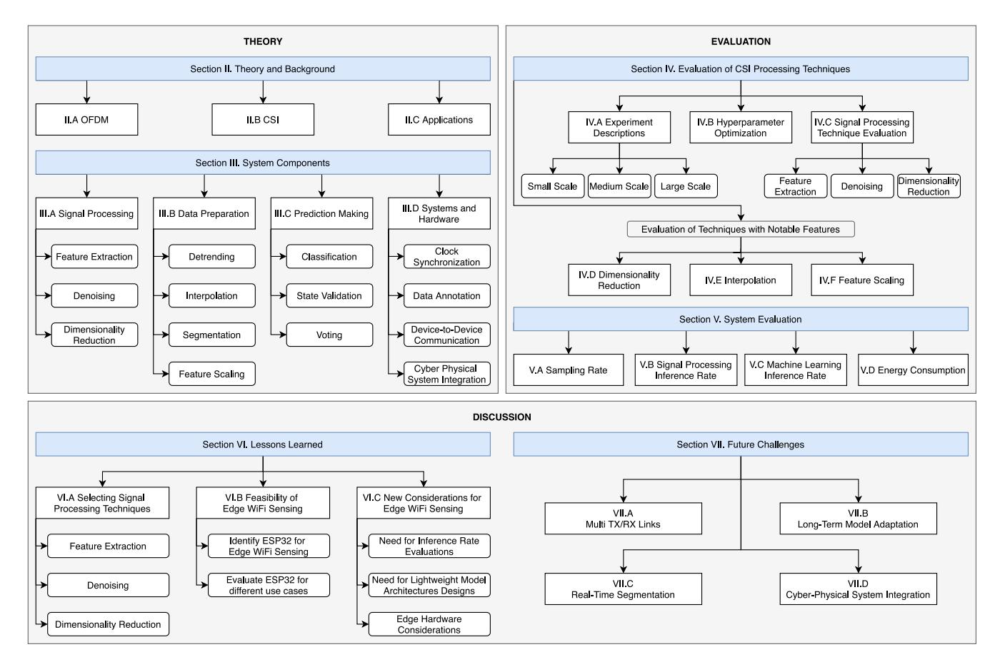

Fig. 1. Organization of this survey.

such as 802.11n which encodes data streams into multiple overlapping subcarrier frequencies. OFDM signals are modelled in the frequency domain as  $sinc(f) = \frac{sin(f)}{f}$  as presented in Fig. 2(a). This frequency-domain representation can be transformed into the time-domain through the Inverse Fast Fourier Transform (IFFT) to produce an approximate rectangle function as shown in Fig. 2(b). The sinc function is selected because it allows each subcarrier to be placed orthogonally to one another as shown in Fig. 2(c) where five sinc functions are placed such that the peak center subcarrier frequency (denoted in red) is located at a frequency where all other sinc functions are zero. As a result of the orthogonal placement, when taking the summation of all five selected subcarriers as shown in Fig. 2(d), the peaks (denoted in red) are retained. Each subcarrier represents a single OFDM symbol transmitted over a time period of  $3.2\mu s$  with  $0.8\mu s$  guard period [18] and can be modulated through methods such as binary phase-shift keying (BPSK), quadrature phase-shift keying (QPSK) or quadrature amplitude modulation (QAM) depending on the desired data transmitted per OFDM symbol. Each OFDM symbol encodes binary data as a complex number through I/Q samples where I is the *in-phase* component representing the real part and Q is the *quadrature* component representing the imaginary part. As an example, 16-QAM is able to represent 4-bits of information with a single complex number [19].

Frequency selective fading may occur due to constructive and destructive interference caused by signals propagating over

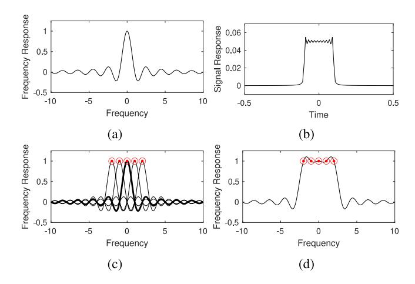

Fig. 2. Representations of subcarrier symbol encoding in OFDM systems. (a) Single subcarrier modelled as a sinc function in the frequency-domain. (b) Same subcarrier in the time-domain after applying IFFT. (c) By selecting orthogonal subcarrier frequencies, the peak of the sinc function for each subcarrier corresponds to a zero valued frequency response from all other subcarriers. (d) After summation of all subcarriers in the frequency domain, the peak values marked in red are retained as a result of this orthogonality.

multiple paths of varying distances. Note that, because each subcarrier has slightly different frequency, not all subcarriers will witness the same constructive or destructive interference. This is an important feature of OFDM to ensure that data can still be transmitted reliably. Even so, it is important for the receiver to recognize these variations across a single OFDM

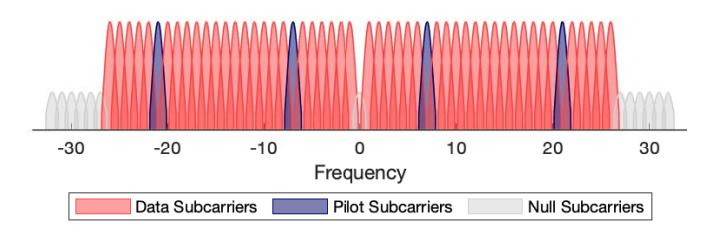

Fig. 3. Layout of subcarrier types in the WiFi frequency domain.

symbol. As such, some subcarriers act as pilot subcarriers where the I/Q encoded symbols are already known by both the transmitter and the receiver. Through these pilot subcarriers, OFDM can correct for variations in the received signal in different subcarriers through subcarrier equalization [\[19\]](#page-27-13).

Given a standard WiFi channel with a bandwidth of 20MHz, 64 subcarriers are created and centered around some carrier frequency (i.e., WiFi Channel 1 has a center frequency of 2.412GHz and a frequency range from 2.401GHz to 2.423GH[z2](#page-3-0)) such that each subcarrier represents 312.5kHz of spectrum. Subcarriers are indexed based on this center frequency such that subcarrier 0 is the direct-current (DC) subcarrier, subcarriers −21, −7, 7, 21 are pilot subcarriers, all other subcarriers between −26 and 26 contain actual encoded data while the remaining subcarriers are null guard band subcarriers as illustrated in Fig. [3.](#page-3-1)

## *B. Channel State Information (CSI)*

CSI is the metric used in OFDM systems for describing amplitude and phase variations across subcarrier frequencies as wireless signals are transmitted between a transmitter and a receiver. Channel estimation is the process used to detect variations across the subcarriers in OFDM systems through the transmission of a set of known shared pilot symbols in a combtype pilot pattern [\[20\]](#page-27-14) where the same subset of subcarriers are used as pilot subcarriers over time. The CSI matrix (H) can then be estimated as:

$$y = \mathbb{H}x + \eta,\tag{1}$$

where *y* is a vector indicating the signal detected at the receiver, *x* is the signal vector that was transmitted based on the agreed upon pilot symbols and finally η is an additive white Gaussian noise vector. H is a complex matrix containing a complex value for each subcarrier (*i*) representing the Channel Frequency Response (CFR) denoted as **h***i* and represented as

$$\mathbf{h}_i = A_i e^{j\phi_i},\tag{2}$$

consisting of both real (R(**h***i*)) and imaginary (I(**h***i*)) parts. Combining the real and imaginary parts of each subcarrier, we can determine the amplitude (*Ai*) and phase (φ*i*) for subcarrier *i* by the following equations:

$$A_i = \sqrt{\left(\mathcal{I}(\mathbf{h}_i)\right)^2 + \left(\mathcal{R}(\mathbf{h}_i)\right)^2} \tag{3}$$

$$\phi_i = atan2(\mathcal{I}(\mathbf{h}_i), \mathcal{R}(\mathbf{h}_i)). \tag{4}$$

Due to the complexity of any given environment, the signal received is not only a result of a direct line of sight (LOS) transmission, but is also affected by the environmental multipath which is the multiple physical paths that the signal travels from transmitter (TX) to receiver (RX). Thus,

$$\mathbf{h}_{i} = \sum_{m=1}^{N} A_{m} e^{\frac{-2\pi f_{i} d_{m}}{c} + j\phi_{m}} \tag{5}$$

where *Am*, φ*m* and *dm* are the resulting amplitude, phase and distance, respectively, from a given single multipath route where *fi* is the frequency for the given subcarrier *i* and *c* is the speed of light. Each multipath thus affects the signal through amplitude attenuation caused by the environment and time delay and phase shifts caused by the distance of the path. While the multipath lengths are the same across subcarriers, each subcarrier will exhibit different frequency-selective fading due to in-phase or out-of-phase multipath interference. OFDM systems are able to combat this frequency selective fading because each subcarrier has a unique frequency (*fi*) and as such, whenever some set of subcarriers exhibit destructive fading, the other subcarriers should be free of destructive fading thus allowing communication to continue.

Given the problem of device-free sensing of human targets, two sets of paths can be considered. The first set (Ω*s* ) represent static paths in an environment. Examples of these static paths would be transmitted signals reflected off of walls unrelated to the human target. The second set (Ω*d* ) represent the dynamic paths, or those which are affected by the movement of a given target in the environment. Considering these two sets of paths,

$$\mathbf{h}_{i} = \underbrace{\sum_{m \in \Omega_{s}} A_{m} e^{\frac{-2\pi f_{i} d_{m}}{c} + j\phi_{m}}}_{\mathbf{h}_{static}} + \underbrace{\sum_{n \in \Omega_{d}} A_{n} e^{\frac{-2\pi f_{i} d_{n}}{c} + j\phi_{n}}}_{\mathbf{h}_{dunamic}}, \quad (6)$$

and because **h***static* is static over time, **h***static* becomes a constant value which can then be eliminated leaving only **h***dynamic*. This is important, specifically because one of the paths found in this static component is the LOS path between transmitter and receiver. When unobstructed, the LOS path produces a signal which overwhelms other paths because of higher amplitude of the LOS path. Further, by removing **h***static*, the remaining paths are only affected by the actions performed by the human target which can allow predictions to be better resistant to static environmental changes [\[21\]](#page-27-15).

CSI is represented in the frequency-domain and as such can be converted to the time-domain through the Inverse Fast Fourier Transform (IFFT) by:

$$\mathbf{H}_{n} = \sum_{m=0}^{N-1} \mathbf{h}_{m} e^{-j2\pi n m/N}, \tag{7}$$

where **H***n* is the Channel Impulse Response (CIR) for time *n*. CIR can be transformed back to the frequency domain through the Fast Fourier Transform (FFT)

$$\mathbf{h}_m = \sum_{n=0}^{N-1} \mathbf{H}_n e^{j2\pi nm/N}.$$
 (8)

2The frequency range for WiFi channels are actually 22MHz due to older versions of the 802.11 standard while OFDM only considers a reduced bandwidth of 20 MHz.

Occupancy (3.3%)

| Applications                | Sub-Topics              | Example |
|-----------------------------|-------------------------|---------|
| Localization (14.0%)        | Device-Based            | [23]    |
| Eocanzation (14.0 %)        | Device-Free             | [28]    |
| Human Activity              | Exercise                | [31]    |
| Recognition (13.1%)         | Daily Activity Tracking | [32]    |
| Gesture Recognition (9.4%)  | Hand Movement           | [33]    |
| Gesture Recognition (9.4 %) | Finger Movements        | [34]    |
|                             | Respiration             | [35]    |
| Health (7.9%)               | Heart Rate              | [36]    |
|                             | Sleep                   | [37]    |
| Crowd Counting (4.9%)       | Indoor                  | [38]    |
| Clowd Counting (4.9%)       | Outdoor (Pedestrians)   | [39]    |

[40]

[41]

TABLE II Most Common WiFi Sensing Tasks in Our Literature Survey (N=658)

Some signal processing techniques such as in [22] require filters to be applied to the CIR before converting back to the CFR for further signal processing.

Security

Context-Aware Applications

Throughout this work, we collect multiple CSI samples over a time window of size w which can be represented as the  $S \times w$  matrix

$$\mathcal{H}[t] = \begin{bmatrix} \mathbf{h}_1[t-w+1] & \mathbf{h}_1[t-w+2] & \dots & \mathbf{h}_1[t] \\ \mathbf{h}_2[t-w+1] & \mathbf{h}_2[t-w+2] & \dots & \mathbf{h}_2[t] \\ \vdots & \vdots & \ddots & \vdots \\ \mathbf{h}_S[t-w+1] & \mathbf{h}_S[t-w+2] & \dots & \mathbf{h}_S[t] \end{bmatrix}, \quad (9)$$

where S is the number of subcarriers and w is the number of time frames where CSI is collected. After signal preprocessing steps,  $\mathcal{H}[t]$  can be passed as the input into a machine learning model to make WiFi sensing predictions.

## C. WiFi Sensing Applications

WiFi sensing with CSI has been leveraged in a number of sensing application tasks since its inception. Through our survey of WiFi sensing literature, we find that localization and human activity recognition are the two most common tasks for WiFi sensing followed by hand gesture recognition, crowd counting, occupancy detection and health tracking such as respiration sensing. Table II shows a breakdown of these applications as well as a few examples of related sub-topics.

Localization: One popular WiFi sensing research task is localization where the location of a target can be tracked throughout an environment using ambient WiFi signals. In the traditional WiFi based localization approaches, the target being tracked must have some transmitting or receiving hardware on their body such as in [23] where some set of static WiFi devices are placed in the environment. UAVs with on-board WiFi antennas have also been used as both CSI transmitters and receivers for device-to-device localization [24], [25]. More recent works track the location of human targets in a device-free manner (i.e., without requiring a WiFi device to be placed on the individual). For example, CS-Dict [26] and the work of Zhou et al. [27] use CSI data to build a database of environmental signal fingerprints when the target is standing at different physical positions throughout an indoor environment.

However, in localization tasks, physical changes in the environment may reduce the accuracy of a WiFi sensing system due to changes in the multipath environment. To account for this, some techniques have appeared such as Domain Adaption (DA) [28], [29] and Transfer Learning (TL) [30].

Human Activity Recognition: The next most common use for WiFi sensing is to perform Human Activity Recognition (HAR). Similar to the localization task where signals propagating through the environment may bounce off of a human target as the signal propagates from a transmitter to a receiver, we can also capture even finer detail about the action that is being performed by the target if we watch variations in CSI over time. As such, some of the most common actions recognized are stationary activities like sitting or standing as well as mobile activities like walking and running [42], [43]. This can be useful to judge the occupancy of a room for applications such as smart home environments [44]. Training a model for all possible actions that a human target can perform would be infeasible due to the sheer number of possible states. Using natural language semantics, it has been shown in [45] that a model can be trained on a single action; say walking, and then used to recognize other unseen actions; for example running, due to the semantic relation between the two actions (i.e., running is like walking at a higher pace). Fall detection [42], [46], [47] can help ensure the safety of elderly or sick individuals without sacrificing their privacy within their own home as would be the case with camera based systems. Low resistance calisthenic exercise tracking provides another set of novel physical actions for device-free WiFi sensing [31], [48], [49]. WiLay [50] uses a layered approach combining both device-free localization with HAR where initially, a model recognizes the approximate physical location of the target in the environment and then determines the human activity through the use of a model trained specifically on that target location.

Gesture Recognition: Many studies look to recognize human movements at an even greater detail such as at the hand and finger level through gesture recognition. Recognizing such fine-grained gestures can allow for novel gesture-based interactions with smart home environments [22], [33] and invehicle control [51]. Gestures performed by individuals can reveal unique characteristics which can then be used to authenticate valid users for a given system as shown in [33]. Finger position recognition can be used as a novel method for text input into a computer such as through recognizing the number of fingers held up by a target [52], [53], as well as through sign language and finger spelling [34], [54]. Similarly, tracking finger movement through the air can allow in-the-air handwriting recognition [55], [56]. CSI can also be used to reveal information that should not be publicly available such as passwords through keystroke detection [57], [58].

Indoor Crowd Counting and Occupancy Detection: Understanding the movement of people through indoor environments can be useful in gathering real-world customer mobility analytics as suggested in [59], for monitoring secure locations [60], as well as for detecting people indoors during rescue missions [61]. Typically, crowd counting is performed when the targets are constantly moving through an environment such as in [38]. Stationary crowd sizes can be

estimated through WiFi CSI by recognizing the small fidgeting movements made randomly by members in the crowd [\[62\]](#page-28-20). Understanding the movement of a crowd through an indoor environment can also improve safety during emergency building evacuations by tracking the number of people exiting the building as well as the number of people still within the building [\[63\]](#page-28-21). However, adversaries can also leverage this same ambient WiFi signals to track individuals in non-public environments which reduces privacy [\[64\]](#page-28-22).

*Health Sensing:* In private residences it can be useful to monitor health related activities at all times. However, wearable sensors can be cumbersome to the user and camera based systems are too privacy invasive. WiFi sensing has gained traction in health monitoring tasks because it is both device-free and less invasive. Specifically, respiration tracking [\[35\]](#page-27-29), [\[65\]](#page-28-23) is one of the most common health related WiFi sensing tasks, which can be achieved by recognizing peaks in signal variation over time. Tracking the breathing patterns of multiple people in a given environment has been shown to be possible through Blind Source Separation (BSS) [\[66\]](#page-28-24). Moreover, tracking respiration with CSI can help reveal irregular breathing patterns such as apnea or tachypnea [\[67\]](#page-28-25). Similarly, monitoring people during sleep periods can help detect unhealthy sleep actions such as rhythmic movement disorders [\[37\]](#page-27-30) as well as nocturnal seizures [\[68\]](#page-28-26). Even more fine-grained sensing has been performed with CSI to track heart rates of individuals which can help identify variability in heart rhythms [\[36\]](#page-27-31), [\[69\]](#page-28-27). However, we find that the transmitter and receiver typically must be placed very close to the chest which makes the setup impractical in real-world environments.

*Additional Novel Use Cases of WiFi Sensing:* While the previously discussed applications for WiFi sensing have numerous associated research studies, there are a few use cases for WiFi sensing which have only appeared in a small number of research studies. For example, EmoSense [\[70\]](#page-28-28) uses CSI to predict the emotion of a human subject based on the physical movements that the subject performs which can be useful for measuring the mental health of an individual. WiEat [\[71\]](#page-28-29) leverages human movements to recognize the eating behavior of the individual to aid in health and dietary tracking. WiFi sensing has also been applied to track food and agricultural properties such as to detect fruit ripeness [\[72\]](#page-28-30) as well as to track the moisture levels of wheat [\[73\]](#page-28-31) to ensure that the moisture level does not cross a critical threshold which may result in crop spoilage. The moisture levels of soil [\[74\]](#page-28-32) has also been tracked with WiFi sensing to ensure adequate water coverage while reducing overwatering for agricultural farmland. Liquid level tracking [\[75\]](#page-28-33) as well as liquid identification [\[76\]](#page-28-34) have been achieved with WiFi sensing through the measurement of dielectric properties of the liquid as well as the resonance frequency response of the liquid due to vibration. Vibration detection [\[77\]](#page-28-35) through WiFi sensing has also been used for detecting faults in factory equipment.

# III. SURVEY OF COMMON CSI SIGNAL TECHNIQUES

To produce an edge-based WiFi sensing system, it is important to understand common existing techniques used in current

CSI-based WiFi sensing research. Since existing studies typically use high-powered desktops or servers, the complexity of signal processing algorithms has not been much of a concern in these studies. However, because we consider the use of low-power microcontroller devices for WiFi sensing, the complexity of signal processing algorithms becomes a much more important area to focus on. Each technique has unique characteristics that determine its applicability in this new scenario. Most existing research ignores the need for real-time data processing and assumes that data will instead be processed offsite at a powerful server. Since we target a WiFi sensing system on the edge, such techniques would not be possible, thus we must survey available techniques to validate their use for our proposed system.

Through a thorough survey of existing works, we develop a taxonomy of components necessary for edge based WiFi sensing systems as shown in Fig. 4. In Section [II,](#page-1-2) we discussed the background theory of WiFi sensing with CSI. CSI can be collected from WiFi-enabled devices such as the Intel 5300 NICs [\[9\]](#page-27-3), Atheros NICs [\[10\]](#page-27-4) or with edge microcontrollers such as the ESP32 [\[17\]](#page-27-11).

In this section, we discuss four components from our taxonomy, namely: signal processing, data preparation, prediction making, and systems and hardware. We also consider the applicability of each technique in resource constrained microcontroller devices. Specifically, we focus on the online calculations that need to be performed for every received CSI sample rather than focusing on computations that can be done beforehand during an initialization phase.

# *A. Signal Processing*

The first component after CSI data collection is to run the collected CSI data through signal processing. These signal processing techniques are standard tasks which will typically be applied in any WiFi sensing application. The purpose of signal processing is to achieve improved accuracy through steps like feature extraction, denoising, and dimensionality reduction. Most methods have a unique set of parameters which can be tuned to improve the accuracy of the technique for different applications. Table [III](#page-7-0) shows an overview of the discussed signal processing techniques, along with their memory complexity, time complexity as well as advantages and disadvantages of each technique. For each method, we provide multiple reference sources which explain each method in a different way or use a unique mathematical formulation rather than citing studies which simply apply the given method. We take this approach to allow the reader to gain a greater understanding of the methods from different points of view. The variables used in the table are described in Table [IV.](#page-7-1)

*1) Feature Extraction:* We begin evaluating signal processing techniques by reviewing common feature extraction methods. Feature extraction transforms raw CSI data into meaningful features for further processing and for machine learning model injection.

*Amplitude and Phase:* The most fundamental feature extraction method for WiFi sensing is to convert CSI into amplitude (*A*) or phase (φ) features as shown in Equation [\(3\)](#page-3-2) and [\(4\)](#page-3-2),

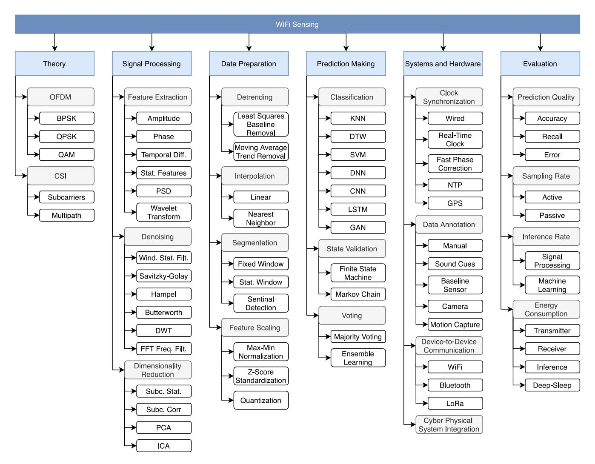

Fig. 4. Taxonomy of subjects necessary for edge-based WiFi sensing systems.

respectively. For each CSI frame collected, S subcarriers are received which can then immediately be converted to either amplitude or phase with memory complexity and time complexity of O(S). For the following sections, h[t] will denote a single CSI signal measurement for some subcarrier s at time t which could be either amplitude, phase or some other derived signal value.

Temporal Difference: For both amplitude and phase, the absolute value may not be as important as the relative change of the feature over time [69]. Instead, using the temporal difference over subsequent time steps (i.e.,  $h_{\rm diff}[t] = h[t] - h[t-1]$ ) is a common feature extraction step. With amplitude for example, when the temporal difference is negative the amplitude has decreased which possibly indicates that the line-of-sight (LOS) between TX and RX has been blocked by some obstruction such as a human target and alternatively, when the temporal difference is positive, this may indicate the LOS has been cleared of an obstruction. Due to the noisy nature of received phase, some studies [81] have used the relative phase from the temporal difference after applying phase unwrapping to better understand how much change occurred over some time span.

Statistical Features: Standard statistical aggregation functions (e.g., mean, standard deviation, median, kurtosis) are used to compress the high dimensional subcarrier data per frame down to a single higher-level feature value. Furthermore, spectral statistical functions (e.g., *spectral kurtosis*, *spectral spread*, *spectral slope*) can be used given that the data is represented in the frequency domain rather than in the time domain. Depending on the statistical function, the time complexity and the memory complexity may change, but in general, when the functions are applied to the subcarriers from a single CSI frame, the time and memory complexity are O(S).

More commonly, statistical features are extracted from a time-series window of size w independently per subcarrier. To accomplish this, a buffer of size O(wS) can be allocated to store the data for aggregation. Due to the addition of a windowed buffer, the time complexity also increases for performing the aggregation for each subcarrier. However, trivial statistical functions such as mean  $(\mu(\cdot))$  can achieve reduced time complexity in an online system through an iterative implementation. For example, for a single subcarrier s at time t,  $\mu(t) = \frac{1}{w} \sum_{i=0}^{w-1} h[t-i]$  takes O(w) time while a recursive implementation  $\mu(t) = \mu(t-1) + \frac{1}{w}(h[t] - h[t-w])$  has O(1) time complexity per subcarrier while still requiring the same memory complexity of O(w) per subcarrier.

TABLE III
OVERVIEW OF SIGNAL PROCESSING TECHNIQUES

|                             | Technique                      | Complexity per Frame |               | Sources          | Advantages                                                                          | Disadvantages                                                          |
|-----------------------------|--------------------------------|----------------------|---------------|------------------|-------------------------------------------------------------------------------------|------------------------------------------------------------------------|
|                             | reemiique                      | Memory               | Time          | Sources          | 7 tu vantages                                                                       | Disactuntages                                                          |
|                             | Amplitude                      | O(S)                 | O(S)          | [34], [78], [79] | Default CSI representation.                                                         | May contain anomalies which require denoising.                         |
|                             | Phase                          | O(S)                 | O(S)          | [80], [81], [82] | Default CSI representation.                                                         | Requires multiple antennas for phase correction.                       |
| Feature Extraction       | Temporal Difference            | O(S)                 | O(S)          | [43], [69], [81] | Tracks relative change, not absolute change.                                        | Typically used with CSI phase.                                         |
| Fea Extro                | Statistical Features           | O(S)                 | O(S)          | [83], [84], [85] | Easy to compute. Reduces dimensionality per CSI frame.                              | Loses important per-subcarrier information.                            |
|                             | PSD                            | O(w)                 | O(wlogw)      | [42], [60], [71] | Creates frequency-domain features.                                                  | Applied to a single subcarrier. Loses other subcarrier information. |
|                             | Wavelet Transform              | $O(S \psi J)$        | $O(S \psi J)$ | [80], [86], [87] | Creates frequency-domain features.                                                  | Higher complexity than other feature extraction methods.               |
|                             | Windowed Statistical Filter | O(wS)                | O(wS)         | [50], [88], [89] | Simple implementation.                                                              | Does not retain original waveform.                                     |
|                             | Savitzky-Golay Filter       | O(wS)                | O(wS)         | [65], [90]       | Closely maintains steep peaks and valleys in waveform.                              | Poor anomaly filtering.                                                |
| Denoising Filter         | Hampel Filter                  | O(wS)                | O(Swlogw)     | [26], [37], [52] | Retains exact waveform except for anomalies.                                        | Anomalies detected may infact be important.                            |
| Deno Fül                 | Butterworth Filter             | O(wS)                | O(wS)         | [58], [91], [92] | Filters noise outside of frequency ranges of interest.                              | Frequency ranges dependant on application.                             |
|                             | DWT                            | $O(S \psi J)$        | $O(S \psi J)$ | [93], [94], [95] | Frequency-domain filtering can be applied to multiple frequency ranges in one-pass. | Frequency filtering is more coarse than Butterworth filter.            |
|                             | FFT Frequency Filter        | O(S)                 | O(SlogS)      | [22]             | Filters noise due to multipath environment.                                         | Filter is applied per-frame, not applied over time range.              |
|                             | Subcarrier Stat. Features   | O(S)                 | O(S)          | [22], [43]       | Simple calibration phase. Simple online phase.                                      | Filtered subcarriers may still have useful information.                |
| Dimensionality Reduction | Subcarrier Correlation      | O(S)                 | O(S)          | [96], [97]       | Simple online phase.                                                                | Correlated subcarriers may contain redundant information.              |
| Dimens Redu              | PCA                            | O(SC)                | $O(S^2C)$     | [58], [98], [99] | Mixes subcarriers before reduction to retain information.                           | Complex calibration phase.                                             |
|                             | ICA                            | O(SC)                | $O(S^2C)$     | [66], [100]      | Designed to separate signal into <i>C</i> independent sources.                      | Typically used with multi- antennas.                                |

TABLE IV VARIABLE DEFINITIONS FOR TABLE  $\overline{\text{III}}$  and Table  $\overline{\text{V}}$ 

| Variable | Description                                     |
|----------|-------------------------------------------------|
| S        | Number of subcarriers                           |
| w        | Window size                                     |
| \psi     | Length of discrete wavelet                      |
| J        | Number of wavelet decomposition levels          |
| C        | Number of components extracted from PCA and ICA |

Power Spectral Density: Power Spectral Density (PSD)3 [60] converts the time-series CSI signal (h) into the frequency domain  $(\tilde{h})$ . Typically, we find that this conversion is only applied to a single subcarrier, however it is also possible to compute this value independently per subcarrier. To compute PSD, we keep a buffer of window size w and compute

$$h_{PSD}[t] = \frac{|FFT_w(h[t-w+1:t])|^2}{w}.$$
 (10)

3Energy Spectral Density (ESD) is another term used when PSD is computed over small time windows [101].

On a single subcarrier, this method has a time complexity of O(wlogw) and a memory complexity of O(w). This produces a vector of size  $|h_{PSD}[t]| = w$  even though the input is only a single subcarrier.

Wavelet Transform: Wavelet transformations compress a signal from a time-series representation and transform it into a set of time-frequency domain components. Wavelet transform is achieved by decomposing the input signal recursively into a vector of approximation coefficients  $(\alpha^{(J)})$  as well as a set of detail coefficient vectors  $\{\beta^{(1)},\beta^{(2)},\ldots,\beta^{(J-1)},\beta^{(J)}\}$  where J is the number of decomposition levels. Both approximation coefficient vector and detail coefficient vectors can be computed through downsampling convolutional equations [102]:

$$\alpha^{(J)}[t] = \sum_{i=0}^{|\psi|-1} g[i]\alpha^{(J-1)}[t-i], J \in \mathbb{Z}$$
(11)

$$\beta^{(l)}[t] = \sum_{i=0}^{|\psi|-1} h[i]\alpha^{(J-1)}[t-i], l \in 1, \dots, J \quad (12)$$

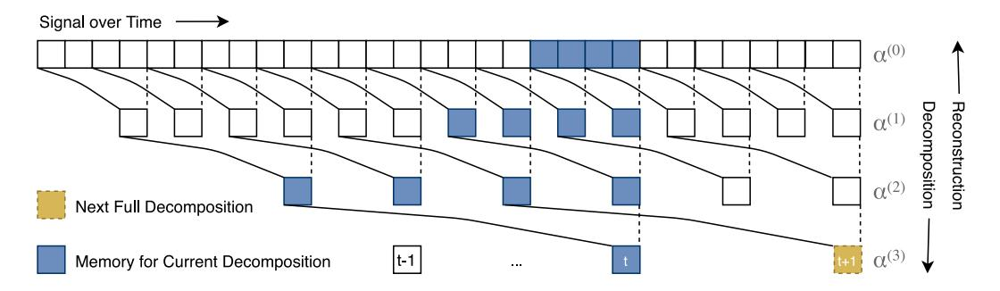

Fig. 5. Wavelet decomposition.

where g is the high-pass filter and h is the low-pass filter derived from the wavelet basis function  $(\psi)$  (i.e., Haar or Daubechies Wavelets) such that  $g[|\psi|-n+1]=(-1)^n\times h[n]$ , where  $|\psi|$  is the length of the coefficients for the wavelet basis function and  $n\in\{1,\ldots,|\psi|\}$ . Both  $\alpha^{(J)}$  and  $\beta^{(l)}$  are downsampled to remove every other element in the array such that  $|\alpha^{(J)}|=\frac{1}{2}|\alpha^{(J-1)}|$  and  $|\beta^{(l)}|=\frac{1}{2}|\beta^{(l-1)}|$ . Note that the initial approximation vector  $\alpha^{(0)}[t]=h[t]$ , our original CSI signal measurements, and as such,  $|h[t]|=|\alpha^{(0)}[t]|=|\alpha^{(1)}[t]|+|\beta^{(1)}[t]|=|\alpha^{(J)}[t]|+\sum_{l=1}^{J}|\beta^{(l)}[t]|$  which shows that even though we are downsampling at each level, the number of elements retained is always |h[t]| no matter the value for J when computed using the pyramid algorithm [103].

Each level of decomposition also results in a halving of the sampling rate and as such, a halving of the frequency spectrum. For example, given CSI sampling rate of RHz, the detail coefficient vector  $\boldsymbol{\beta}^{(l)}$  for level l captures frequency ranges from  $\frac{R}{2^l}$ Hz to  $\frac{R}{2^{l+1}}$ Hz and  $\boldsymbol{\alpha}^{(l)}$  captures frequency ranges from  $\frac{R}{2^{l+1}}$ Hz to 0Hz. As such, different sub-ranges of frequency bands reveal more relevant information depending on the task. For example, in [86], it was found that when using six-level wavelet decomposition, the detail coefficient vectors  $\boldsymbol{\beta}^{(4)}, \boldsymbol{\beta}^{(5)}, \boldsymbol{\beta}^{(6)}$  and approximation coefficient vector  $\boldsymbol{\alpha}^{(6)}$  are most effective at revealing motion-induced variations for the task of occupancy detection. Similarly, in [80] a four-level wavelet decomposition was applied where both  $\boldsymbol{\beta}^{(3)}$  and  $\boldsymbol{\beta}^{(4)}$  were used as input for the task of breathing rate detection.

For a real-time online data processing system, a few important algorithm design issues must be considered. Given a J-level wavelet transform decomposition, due to the recursive nature of the wavelet transform, at time t,  $\alpha^{(J)}[t]$  is a function of our signal from time t all the way back to time  $t - \sum_{l=1}^J (|\psi| - 1) \ 2^{J-1}$  where  $|\psi|$  is the length of the wavelet function coefficients. As such, for the previous examples in [86] where J=6 and  $\psi="db6"$  such that  $|\psi|=12$ , both  $\alpha^{(J)}[t]$  and  $\beta^{(J)}[t]$  are functions of 694 input CSI samples. This not only introduces significant lag into the system, but also suggests a large amount of computation work.

A simplified example of wavelet decomposition is shown in Fig. 5 where the first layer of blocks represents distinct signal samples over time and each lower layer represents the J=3 recursive decomposition of the approximation coefficient vector  $\alpha^{(l)}$  and finally  $|\psi|=4$ . In each layer,  $|\alpha^{(l)}|=\frac{1}{2}\times |\alpha^{(l-1)}|$  due to downsampling. In the illustration, for decomposition layer l=1 (second layer), we can see that  $\alpha^{(1)}[t]$  depends

on four consecutive signal samples because  $|\psi| = 4$  highlighted in blue. Similarly for the second decomposition layer we can see that  $\alpha^{(2)}[t]$  relies on four coefficients from  $\alpha^{(1)}$ which recursively have their own dependencies in  $\alpha^{(0)}$ . As such,  $\alpha^{(2)}[t]$  is a function of 10 original signal samples from h. Finally in the third decomposition layer,  $\alpha^{(3)}[t]$  again only has four direct dependencies from  $\alpha^{(2)}[t]$ , but because of the recursive nature of the algorithm, a total of 22 signal samples are required to make up  $\alpha^{(3)}[t]$ . If another layer of decomposition was attempted, then 46 signal samples would be required to compute  $\alpha^{(4)}[t]$  and so on. If we perform 10-layer decomposition, then 3070 input samples would be required to compute  $\alpha^{(10)}[t]$ . Luckily, the recursive structure of the wavelet decomposition ensures that results can be cached rather than recomputed at each time point. In the illustration, when a CSI sample arrives at time t, only the blue boxes are required for the computation which means that the memory complexity for each arriving CSI sample (per subcarrier) is only  $O(|\psi|J+1)$  and due to the convolution operation, the time complexity is  $O(|\psi|^2 J)$ . We can see in Fig. 5 that there is some lag introduced between the computation of  $\alpha^{(J)}[t]$  and  $\alpha^{(J)}[t+1]$  because the approximation coefficient vector for lower intermediate levels needs to be computed before  $\alpha^{(J)}[t+1]$  can be computed. This lag can be counted by the number of CSI signal samples and is equal to  $2^J$  samples. This means that as J increases, the prediction rate will decrease because the approximation coefficient vector and all detail coefficient vectors need to be fully computed before subsequent predictions can be performed.

2) Denoising Filters: Noise in the collected CSI data has been a great concern for many studies. Noise can originate from a number of sources including difference in hardware such as with Central Frequency Offset (CFO) errors and Sampling Frequency Offset (SFO) errors. It can also come from environmental conditions such as through signal shadowing due to LOS interference or multipath fading where the signal arrives to the receiving antenna from multiple NLOS paths through the environment causing destructive interference. As such, a large number of unique methods have been proposed for denoising the incoming signal. Denoising is most commonly performed independently per subcarrier.

Windowed Statistical Filter: Through our survey, we find that simple denoising filters such as the mean [50] and median [88] windowed filters are commonly used. The mean filter computes  $\hat{h}[t] = \frac{1}{w} \sum_{i=0}^{w-1} h[t-i]$  which can be

calculated on a rolling basis as new data appears. Similarly, a weights vector g of length w can be used to produce a weighted moving average  $\hat{h}[t] = \frac{1}{w} \sum_{i=0}^{w-1} g[i] h[t-i]$  which can give less weight to time instances further away from the current time instance and greater weight to more recent time instances. The median filter on the other hand requires a slightly higher time-complexity due to the use of the median function  $(Med(\cdot))$  as so:  $\hat{h}[t] = Med(\{h[t-w+1], h[t-w+2], \ldots, h[t-1], h[t]\})$ . Median filter makes up for this higher complexity by more robustly handling highly anomalous noise within the signal.

Savitzky-Golay Filter (SG): This filter fits a rolling window of data points with a low-degree polynomial through linear least squares to smooth out the incoming signal. In [90] it is suggested that SG filter can maintain the shape of the waveform better than a standard infinite impulse response (IIR) low-pass filter. To perform this smoothing, a coefficients vector  $W_{SG}$  of size  $k_{SG} = |W_{SG}|$  is used such that

$$h_{SG}[t] = (W_{SG} * h)[t]$$

$$= \sum_{i=0}^{k_{SG}-1} W_{SG}[i]h[t-i].$$
(13)

Obviously, when  $W_{SG}[i] = \frac{1}{k_{SG}}, \forall i \in \{0,\dots,k_{SG}-1\}$  then  $\sum_{i=0}^{k_{SG}-1} W_{SG}[i] = 1$ , and SG filter will simply compute the rolling average window. With more complex selection of  $W_{SG}$ , polynomial fitting can be achieved [104]. Due to the simple convolution operation, SG filter requires a memory complexity and time complexity of  $O(k_{SG}) = O(w)$  per subcarrier. The SG filter has been suggested [105] because it preserves the steep peaks and valleys of the original signal h.

Hampel Filter: The Hampel filter [85] is used to remove anomalies without changing the signal values for non-anomalous values through:

$$\hat{h}[t] = \begin{cases} h[t] & |h[t] - Med_{t,w}(h)| \le 3 \times MAD_{t,w}(h) \\ Med_{t,w}(h) & \text{otherwise,} \end{cases}$$
(14)

where  $MAD_{t,w}(\cdot)$  is the Median Absolute Deviation (MAD) function for the signal window from h[t-w+1] until h[t] and  $Med_{t,w}(\cdot)$  is the median function over the same window buffer. Filtering anomalous data in this way is useful for filtering out outliers caused by hardware related errors such as through quantization errors while also retaining much of the original, non-anomalous signal values.

Butterworth Filter: Noise will be mostly produced by other physical phenomenon in the environment. For example, when recording human hand gestures, the human body may slowly move during the gestures. Furthermore, background items such as fans may produce fast variations in the noise. Thus, highpass, low-pass and band-pass filters have commonly been employed, most commonly in the form of Butterworth filters [91]. The goal of the Butterworth filter is to produce a

maximally flat amplitude response in the defined frequency bands while also reducing the amplitude response outside of the specified frequency bands [106]. Butterworth filters apply a rational transfer function to the input data given as a set of coefficients a and b, where  $|a| = |b| = n + 1 = k_{BF}$  where n is the order of the Butterworth filter. Output  $h_{BF}[t]$  of the transfer function is calculated recursively using the Direct-Form-II (DF-II) structure [106]:

$$h_{BF}[t] = \left(\sum_{i=0}^{k_{BF}-1} b[i]h[t-i]\right) - \left(\sum_{i=1}^{k_{BF}-1} a[i]h_{BF}[t-i]\right).$$
(15)

The key observation here is that while the Butterworth filter is an IIR filter; which means that each  $h_{BF}[t]$  is a function of all previously seen signal elements in h, the buffer size required for computing  $h_{BF}[t]$  is only of size O(w) to store a, b and  $h_{BF}$ . This makes both the time and memory complexity O(w). Thus, the Butterworth filter is another reasonable candidate for computation and memory constrained systems such as low-power IoT devices.

Discrete Wavelet Transform: Another very common method for denoising is through the discrete wavelet transform (DWT) [93]. DWT is used to decompose time-domain signals into a time-frequency domain representation. Denoising with DWT is performed in three stages, first the signal is decomposed recursively through DWT into a vector of approximation coefficients  $(\alpha^{(J)})$  as defined in (11) as well as a set of detail coefficient vectors  $(\beta^{(1)}, \beta^{(2)}, \dots, \beta^{(J-1)}, \beta^{(J)})$  as defined in (12) where J is the number of decomposition levels. After decomposing the signal into J detail coefficient vector levels, threshold based denoising is applied. For each coefficient element  $(\beta^{(l)}[i])$  within each level of detail (l), we can then apply either a soft threshold [102] by:

$$\tilde{\beta}^{(l)}[i] = \begin{cases} sign(\beta^{(l)}[i])(|\beta^{(l)}[i]| - \tau) & \text{if } |\beta^{(l)}[i]| \ge \tau \\ 0 & \text{otherwise,} \end{cases}$$
(16)

or a hard threshold by:

$$\bar{\beta}^{(l)}[i] = \begin{cases} \beta^{(l)}[i] & \text{if } |\beta^{(l)}[i]| \ge \tau \\ 0 & \text{otherwise,} \end{cases}$$
 (17)

where  $\tau$  is a pre-defined threshold. After applying this threshold method, we can reconstruct the original time-domain signal from this frequency representation. This reconstruction stage reverses the decomposition steps as illustrated in Fig. 5. To accomplish reconstruction, the inverse discrete wavelet transform (IDWT) is used [93], [102]:

$$\alpha^{(l)}[t] = \sum_{i=0}^{w-1} \bar{g}[i]\alpha_{UP}^{(l+1)}[t-i] + \sum_{i=0}^{w-1} \bar{h}[i]\hat{\beta}_{UP}^{(l+1)}[t-i], (18)$$

where  $\alpha_{UP}^{(l)}$  is an upsampled version of  $\alpha^{(l)}$  accomplished by

$$\alpha_{UP}^{(l)}[n] = \begin{cases} \alpha^{(l)} \left[ \left\lfloor \frac{n}{2} \right\rfloor \right] & \text{if } n \text{ is even} \\ 0 & \text{otherwise,} \end{cases}$$
 (19)

which allows  $|\alpha_{UP}^{(l)}|=2|\alpha^{(l)}|=2|\alpha_{UP}^{(l+1)}|$  and  $\bar{g}$  and  $\bar{h}$  are the reconstruction high-pass and reconstruction low-pass

&lt;sup>4These filters are described assuming that the current time point is the final value in the window function. Some studies consider the current time point as the center of an odd-sized window. This may be helpful during rising-edge and falling-edge cases, but introduces some lag in signal processing. Only trivial changes are required to alter these windowing methods.

filters, respectively, such that  $\bar{g}[n] = g[|\psi| - n + 1]$  and  $\bar{h}[n] = h[|\psi| - n + 1]$  when  $n \in \{1, \dots, |\psi|\}$ . This recursive operation is performed from l = J until l = 0 at which point  $|\hat{h}| = |\alpha^{(0)}|$  which implies that  $|\alpha^{(0)}| = |h|$  showing that the computed signal length after DWT denoising (decomposition, thresholding, reconstruction) is the same as the length of the initial signal. However, depending on the levels of decomposition, there will be lag introduced relative to the size of the selected J and  $|\psi|$ .

FFT Frequency Filter: A single CSI sample contains many subcarriers, each of which is a frequency-domain representation of the signal. This means that we can use the Inverse Fast Fourier Transform (IFFT) to capture the power delay profile (PDP) in the time-domain [22]:

$$\tilde{h}[t] = \sum_{i=1}^{N} a_i e^{-j\theta_i} \delta(t - t_i), \qquad (20)$$

where N is the multipath count,  $a_i$  and  $\theta_i$  are the amplitude and phase angle of the given multipath,  $t_i$  is the time delay introduced by the given multipath and  $\delta(\cdot)$  is the Dirac delta function. Given an initial CSI sample with 64 subcarriers, the output of IFFT will also be of size 64 where each element of the vector represents time. Due to the time delay introduced by different multipaths in the environment, each element in PDP will be affected slightly differently. This understanding has been used to achieve denoising by performing multi-path mitigation [22]. To do this, after transforming CSI into PDP, components with large time delays are removed as so:

$$\tilde{h}'[t] = \begin{cases} \tilde{h}[t] & \text{if } t < T_{\text{PDP}} \\ 0 & \text{otherwise,} \end{cases}$$
 (21)

where  $T_{\rm PDP}$  is the allowed time delay. After this, it is possible to convert PDP from the time-domain representation back to a frequency-domain CSI representation through standard Fast Fourier Transform (FFT). The FFT Frequency Filter is computed immediately on each incoming CSI sample independently and thus, this method will not introduce lag for a real-time system.

3) Dimensionality Reduction: Each collected CSI sample comprises of a complex vector of S subcarriers. It has been shown in previous studies (e.g., [107]) that some subcarriers have similar and thus redundant information while other subcarriers are plagued with high amounts of noise. To combat these issues, dimensionality reduction can be applied to remove the data from these useless subcarriers thus reducing the number of subcarriers to  $\hat{S} < S$ .

Subcarrier Statistical Feature: A simple method for selecting subcarriers is to consider statistical properties of each subcarrier over some pre-defined time frame. For example, many studies [107], [108] select subcarriers which exhibit the highest variance indicating that the subcarrier has a high sensitivity for the environment. Variance can be calculated on a moving window to allow subcarrier selection to change over time as shown in [107] or more commonly the variance per subcarrier can be computed beforehand in a calibration phase for the environment [108]. When computing the moving window, a buffer of size O(wS) is required while pre-computed

subcarrier variance values can allow the system to immediately filter out low quality subcarriers with only O(S) time and memory complexity. Other metrics such as signal-to-noise ratio (SNR) [68] and mean absolute deviation [69] have also been used as metrics that can be computed independently per subcarrier for the task of subcarrier selection.

Subcarrier Correlation: Another common method for subcarrier selection is to look at the relationship between each individual subcarrier by computing a correlation coefficient matrix of size  $S \times S$  [109]. The goal is that subcarriers with high correlation are in agreement about the true state of the environment and thus we can assume that the noise present in the signal is appearing due to the environment rather than from some spurious noise source. Interestingly, in [105] it was shown that the phases of some subcarriers have highly negative correlation which implies that the subcarriers are being affected by the same environmental events but are being affected in opposite directions, so the absolute correlation coefficient matrix may be preferred. Subcarrier correlation will typically be computed during the calibration step to determine which subcarriers to keep and which subcarriers to filter for each CSI frame. As such, the online time complexity and the memory complexity remains at O(S).

Principal Component Analysis (PCA): Principal Component Analysis (PCA) [124], [125] is a common method for dimensionality reduction with the added benefit of also increasing the SNR of the data through a linear transformation. PCA relies on an initial calibration phase to compute a components coefficients matrix  $\mathbf{C}_{PCA}$  of size  $k_{PCA} \times S$  through eigendecomposition where  $k_{PCA}$  is the desired number of components to retain. To compute the  $k_{PCA}$  principal components at time instance, t:

$$h_{\text{PCA}}[t] = \mathbf{C}_{\text{PCA}} \times (h[t] - \mu), \tag{22}$$

where  $\mu$  is the vector of subcarrier means found during the calibration phase such that  $|\mu|=S$ . This process results in a reduction in dimensionality for the CSI sample from size S subcarriers down to  $k_{\rm PCA}$  principal components. The memory complexity for computing this value per sample is  $O(k_{\rm PCA}S)$  due to the size of  $C_{\rm PCA}$  and the time complexity for each sample is  $O(k_{\rm PCA}S^2)$  due to the matrix multiplication required at each time instance.

Independent Component Analysis (ICA): Signal variations in the received CSI is affected directly by different noise sources such as environmental noise or specific physical movements. Independent Component Analysis (ICA) attempts to solve the blind-source separation problem by splitting out the noise caused by each unique source (i.e., each individual human in an environment or each distinct body part during single human body movements). ICA has been used in WiFi sensing tasks such as for separating out respiration signals [66]. ICA relies on an initial calibration phase to compute a components coefficients matrix  $C_{ICA}$  of size  $k_{ICA} \times S$  through singular value decomposition (SVD) where  $k_{ICA}$  is the desired number of components to retain.

It should be noted that while both PCA and ICA are looking to accomplish very different tasks; computationally, both methods use Equation (22) to perform dimensionality reduction.

|                    | Technique                         | Technique Complexity per Frame Memory Time |                            | Sources             | Advantages                                                                | Disadvantages                                        |  |
|--------------------|-----------------------------------|--------------------------------------------|----------------------------|---------------------|---------------------------------------------------------------------------|------------------------------------------------------|--|
|                    | _                                 |                                            |                            | Bources             | Auvantages                                                                | Disauvantages                                        |  |
| Detrending         | Least Squares Baseline Removal | O(wS)                                      | O(wS)                      | [110]               | High quality over long timeframes.                                        | Requires hours of data collection before processing. |  |
| Detre              | Moving Average Trend Removal   | O(wS)                                      | O(wS)                      | [111]               | Real-time detrending.                                                     | Poor quality with longer timeframes.                 |  |
| ation              | Linear Interpolation           | O(S)                                       | O(S)                       | [112], [113], [114] | Anomalies reduced through averaging.                                      | Alters real CSI through averaging.                   |  |
| Interpolation      | Nearest Neighbor               | O(S)                                       | O(S)                       | [115], [116]        | Simple implementation. Retains real CSI values without alterations. | Anomalies may propagate over time.                   |  |
| ion                | Fixed Window                   | O(wS)                                      | O(wS)                      | [88], [109]         | Simple. Default method for ML.                                            | Constant model inference, high computation use.      |  |
| Segmentation       | Statistical Window             | O(wS)                                      | O(wS)                      | [32], [117], [118]  | Low computation statistical functions.                                    | Movements are lost with poorly selected threshold.   |  |
| Seg                | Sentinel Detection             | O(wS)                                      | Dependent on Classifier | [93], [119]         | Uses lightweight ML sentinel model.                                       | Requires user to initiate sensing period.            |  |
|                    | Max-Min Normalization          | O(S)                                       | O(S)                       | [73], [120]         | Constrains data to exact bounds.                                          | Outliers cause issues with data distribution.        |  |
| Feature Scaling | Z-Score Standardization        | O(S)                                       | O(S)                       | [121], [122]        | Constrains subcarriers to same scales.                                    | Outliers may cause model confusion.                  |  |
|                    | Quantization                      | O(S)                                       | O(S)                       | [123]               | Reduces ML model size. Increases inference rate.                       | Reduces data resolution.                             |  |

TABLE V OVERVIEW OF DATA PREPARATION TECHNIQUES

As such, both methods behave exactly the same while performing the algorithm online. The only unique aspects are how  $C_{\rm PCA}$  and  $C_{\rm ICA}$  are computed during the calibration phase.

## B. Data Preparation

Data preparation techniques, unlike signal processing are more application-specific and thus are not appropriate for use in all tasks. Table V shows an overview of the discussed data processing techniques, along with their memory complexity, time complexity as well as their advantages and disadvantages.

1) Detrending: For real world implementations of WiFi sensing, the environment will inevitably change in some ways which will cause the absolute CSI value to fluctuate over time. Such fluctuating trends may appear over the course of a single day or in longer running systems over multiple weeks. We find that very few WiFi sensing works consider these long-term variations because the current research systems are typically used for short periods of time and in controlled scenarios. WiFi-Sleep [110] on the other hand requires CSI collection to occur throughout a full sleep cycle for an entire night which means that drift is more likely to be observed in the measured signal.

The first method for removing drift by detrending is to fit a least squares regression line [110]. After fitting this baseline, the difference between the original signal and this baseline is calculated. WiFi-Sleep for example finds that data trends non-linearly over an eight hour experiment, thus a higher-order polynomial curve is selected as the baseline. However, finding the least squares baseline at the end of the sleep period precludes the real-time online system that we target in this study.

An alternative approach is to perform Moving Average Trend Removal [111] where; similar to the previous method, a baseline b[t] is calculated and removed from the original signal. To accomplish this in real time, a rolling baseline is calculated as  $b[t] = \frac{1}{w} \sum_{i=0}^{w-1} h[t-i]$  where w is an important variable which will determine how well the baseline matches to the actual drift appearing in the signal. In this work, we find that the experiments that we perform do not result in noticeable levels of drift, thus we do not evaluate these detrending methods. However, more work into detrending methods will be required for real world online WiFi sensing system implementations.

2) Interpolation (of Missing Frames): Due to the wireless communication method used for WiFi sensing, CSI sampling jitter can occur due to packet loss or even due to computation delays from the multi-process operating systems used [95] as well as the bursty nature of WiFi communication [126]. As a result, the timestamp for received CSI samples will not be exactly equally spaced. To account for this, the most common technique is to apply linear interpolation [112] such that

$$\hat{h}[t] = h[t-1] + \left(\hat{\mathcal{T}}[t] - \mathcal{T}[t-1]\right) \frac{h[t] - h[t-1]}{\mathcal{T}[t] - \mathcal{T}[t-1]}, \quad (23)$$

where t is the index of the current time instance, h[t] is the actual CSI value at the actual time  $\mathcal{T}[t]$  and  $\hat{h}[t]$  is the interpolated CSI value for the interpolated time  $\hat{\mathcal{T}}[t]$ . Alternatively, nearest neighbor interpolation [115], which is computed as

$$\hat{h}[t] = \begin{cases} h[t] & \text{if } \left| \hat{\mathcal{T}}[t] - \mathcal{T}[t] \right| < \left| \hat{\mathcal{T}}[t] - \mathcal{T}[t-1] \right| \\ h[t-1] & \text{otherwise,} \end{cases}$$
 (24)

has also successfully been applied for WiFi sensing tasks. Both of these interpolation techniques can be achieved with

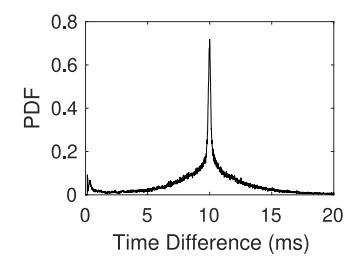

Fig. 6. Probability distribution function showing the timestamp difference between consecutively recorded CSI frames when transmitted at a sampling rate of 100Hz.

O(1) time complexity and O(1) memory complexity per subcarrier because only the current CSI sample and the previous CSI sample are required. Fig. 6 shows an example where our system was set to transmit and receive CSI frames every 10ms (100Hz). We can see that the majority of the frames appear at 10ms, but there is some probability that the frame will appear slightly earlier or slightly later than every 10ms. When interpolation is applied to a stream of CSI samples, an interpolated sample will be generated for every interpolation interval (i.e., every 10ms) whether or not the CSI sample arrived early, late or exactly on time or even if the CSI sample was missing entirely.

3) Segmentation: As CSI samples arrive at the RX, the system must make a decision: should the samples be used to make a prediction or should the samples be ignored? We find that most of the studies assume that all CSI samples should be used for prediction making. To accomplish this, these studies (e.g., [109], [127]) use a fixed window where a window of size w CSI samples are input into the classification algorithms with a step size of  $s_{\mathrm{step}}$  which indicates how many CSI samples should be collected between subsequent predictions. However, the human target may not be performing any physical actions at all times of the day. To account for this, a special predicted output class of "none" or "empty" is often used (e.g., in [128]) for indicating when no actions are recognized by the system. This simplifies the structure of the overall system but can result in an overwhelming number of useless predictions. We argue that this is an even more pressing problem for low-resource embedded systems because the full inference workflow can be both time consuming and most importantly highly energy consuming. Furthermore, because we can assume that in real world systems the "none" class may occur with much higher frequency than other actions, the model may become overfit to this "none" class which will cause class imbalance due to oversampling of that single class. However, we find in some studies such as [128] that each of the actions used to train the classifier model is given equal amounts of training and testing data per class including the "empty" class. Evaluating without considering class imbalance is unrealistic.

Some studies have attempted to reduce how often predictions need to be made in their systems through *segmentation*. Segmentation helps identify the starting points and the ending points for potential actions. It is usually assumed that each action segment will be neighbored directly by a time period of static environmental CSI collection before and after the action. Thus, simple rolling window statistical thresholds

are used to detect changes in state. Most commonly, we find that moving-window variance [129] is used to indicate the starting points and ending points of individual physical activities. The idea is that when an activity is being performed, the physical movements cause more noise from appearing in the CSI signal compared to the static environment both before and after the activity is performed. However, this method assumes that activities will always be surrounded by distinct periods without any movements, which may not be the case in practice because, for example, a walking activity may immediately be followed by another activity such as sitting down. Furthermore, when more than a single person is in the environment, activities are likely to overlap, preventing static periods from appearing in the environment. An opposite approach is to use a motion detector algorithm [40] to recognize when large motions are being performed in the environment and filter out any CSI collected during these large motions. This approach especially can be helpful if we are trying to monitor very small actions such as respiration as it can remove the unrelated large motions that are likely to overpower the smaller movements that are being tracked.

One other segmentation method commonly employed is to use a specific start and stop sentinel movement where the user must perform a given action such as moving their hand close and far away from the receiver multiple times [119]. These sentinel movements should be easy to classify by the device with low computational complexity algorithms. After performing the sentinel movement though, the device can be "woken up" and can begin to compute higher complexity algorithms such as deep learning inference. This is more useful for gesture recognition tasks and smart home type interactions where a user is actively involved with interactions with the system rather than passive sensing tasks such as surveillance.

4) Feature Scaling: When data is input into machine learning algorithms, the relative magnitude of each input dimension can have great effect on the overall prediction ability of the algorithm. If any dimension has much higher magnitude than other input dimensions, the contribution of this dimension may begin to overshadow the other dimensions. The process of equalizing input dimensions is called normalization. The most common type of normalization is max-min normalization [120] where given a signal h of length T, the normalized  $\frac{n\lfloor t\rfloor - \min(h)}{\max(h) - \min(h)}$ . This compresses the signal range such that  $0 \le \tilde{h}[t] \le 1, \forall t \in \{1, 2, \dots, T-1, T\}$  a condition which holds true only if all elements in h are known fully upfront such as in an offline system. An alternative approach is to use Z-score standardization with  $\hat{h}[t] = \frac{h - \mu(h)}{\sigma(h)}$  where  $\mu(h)$  is the mean value of the signal and  $\sigma(h)$  is the standard deviation value of the signal. Z-score standardization is more forgiving in that as it allows  $\mu(h)$  and  $\sigma(h)$  to be computed on smaller subsets of the signal (i.e., from an initial calibration phase). Feature scaling is an important factor in machine learning on low-resource embedded devices. Namely, feature input must be scaled and also quantized to better reduce the computation and memory complexity of the algorithms. Quantization [130] can reduce the number of bits used for encoding machine learning model weights, model input as well as model output. For example, machine learning systems will typically encode numerical values as 32-bit floating point values. These values can be quantized down to 16-bit or 8 bit representations to (i) reduce the memory usage of the machine learning model; (ii) reduce computation time especially in cases where Single Instruction, Multiple Data (SIMD) instructions are available; and (iii) can thus reduce energy consumption.

## *C. Prediction Making*

With the CSI signal data processed and prepared for machine learning, next we can use the data to make predictions about the environment.

*1) Classification and Machine Learning:* Through our survey of WiFi sensing systems, we find that many different classification algorithms have been used for a wide range of tasks from simple linear and non-linear regression algorithms, and similarity based algorithms such as *k*-nearest neighbors (KNN) and dynamic time warping (DTW), to machine learning algorithms such as support vector machines (SVM) dense neural networks (DNN), convolutional neural networks (CNN), as well as deep learning algorithms such as long shortterm memory networks (LSTM) and generative adversarial networks (GAN). While there are many common signal processing techniques used throughout WiFi sensing literature, the number of unique classifier model architectures is much larger and more diverse. While DNN and CNN may be used to describe a given model, the architecture of the model can still be structured in a great number of configurations. For example, a CNN model may begin with an arbitrary number of convolutional layers which capture spatial features in the CSI data which are then passed into an arbitrary number of standard dense layers which capture patterns from the extracted features. Each of these layers can have unique hyperparameters such as number of neurons, filter-size, activation function and a growing number of other hyperparameters.

Existing surveys such as [\[6\]](#page-27-32) and [\[7\]](#page-27-33) consider the use of deep learning for WiFi sensing and wireless sensing tasks, however, we are focused on performing inference on low-resource microcontrollers which have not yet been considered in these surveys or in existing research literature. As such, we focus on common steps used for running machine learning models onboard constrained microcontroller devices rather than focusing on machine learning model training methods or architecture designs.

When using any type of classification model in a constrained microcontroller device, it is important to be considerate of memory consumed by the model, computation time required for the model and finally energy usage of the model. Increasing the model size increases both memory consumption as well as computation time which subsequently increases energy consumption. As such, we can decrease all three by reducing the size of the machine learning model. Indeed, a number of methods have been used outside of the WiFi sensing research area to decrease the memory consumed by machine learning models in microcontroller environments.

A simple first step towards designing a machine learning model that is applicable in low-resource microcontrollers is to begin with an efficient architecture such as SqueezeNet [\[131\]](#page-29-27), MobileNets [\[132\]](#page-29-28) and EfficientNet [\[133\]](#page-29-29) which are designed for use in embedded vision tasks. Considering the size and complexity of the selected model architecture before training and evaluation can greatly reduce the amount of work that must be performed afterwards.

In cases where an inefficient model is selected initially which either does not fit in memory or does not produce predictions quickly enough, model compression can be performed. Quantization [\[123\]](#page-29-30), [\[130\]](#page-29-26) is one such compression method which reduces the number of bits used for encoding numeric values for machine learning models, thus allowing model weights to be stored in a more compact space. Two methods for training quantized models have been explored in the research literature: post-training quantization and quantization-aware training (QAT). The first method trains the given model like normal using standard 32-bit floating point computations. After training, the model weights are compressed for use in the inference phase. However, because the model is trained without considering these compressed representations, quantization error can add up resulting in increased error from the model. Instead, QAT uses these compressed numerical representations during the training phase which allows the model to become less prone to errors introduced by post-training quantization. Binarized Neural Networks [\[134\]](#page-29-31) take the idea of quantization to its limits by compressing all numeric values in the model to a single bit indicating +1 and −1 values during both inference and training phases.

Another method for compressing model architectures is to perform network pruning [\[123\]](#page-29-30), [\[135\]](#page-29-32) which can be thought of as a three-step pipeline. First, a large and inefficient model is selected and trained. Next, some set of pruning algorithms are used to identify and remove useless connections in the network while retaining important weights and connections thus reducing the amount of computation that must be performed. The third and final step is to retrain the pruned model to fine-tune the model with this updated architecture. However, it has been suggested in [\[136\]](#page-29-33) that the three-stage pruning pipeline can be bypassed by simply starting with the smaller pre-pruned architecture with randomly initialized weights. This suggestion leads us back to the idea of beginning with an efficient model architecture from the beginning.

To account for the additional considerations required for designing and evaluating machine learning models on microcontrollers, it is suggested in [\[137\]](#page-29-34) that the hardware used for model deployment should not be an afterthought when evaluating machine learning models. Instead, factors like onboard computation time and model size should be combined with model accuracy while evaluating the model to ensure that the model is optimized not only for prediction accuracy, but also for the constraints of the embedded system. To achieve this, on-device benchmarks should be performed continuously to capture real-world metrics for memory usage, computation time when using techniques like SIMD as well as energy consumption. This is particularly important when using automated evaluation methods such as Neural Architecture Search [\[138\]](#page-30-0) which attempts to increase model accuracy by evaluating numerous diverse model architectures automatically.

*2) State Validation:* State validation is used to ensure that the predictions that are output by the classifiers are valid and possible given the previous predictions made by the system.

*Finite State Machine (FSM):* FSMs can be used to track the process of different physical properties over time. For example, in [\[139\]](#page-30-1), the FSM tracks the beginning and ending of each individual step as a person walks. When the FSM enters specific states, the event is shared with a separate module to estimate the stride length of the person.

*Markov Chain:* Similar to the FSM approach, a Markov chain (MC) can be used to understand the probability that a transition will occur at any given time. In [\[140\]](#page-30-2), MCs are used to track the periodic breathing behaviour of the participant while [\[121\]](#page-29-35) uses MCs to track longer-term human activity transitions such as transitioning from sitting to standing and walking.

Overall, while state validation may be used to ensure the legitimacy of predictions, state validation is not a very common step used throughout WiFi sensing literature.

*3) Voting:* Voting accomplishes a similar aim as state validation in that it attempts to improve the validity of the predicted actions. However, voting will use the predictions from multiple unique classifiers to improve the overall accuracy of the prediction system.

*Majority Voting:* A simple method to achieve consensus with multiple classifiers is to take a "majority vote". For the work in [\[141\]](#page-30-3) and [\[127\]](#page-29-21), one classifier is trained per TX-RX antenna pair, then a majority voting scheme is used to make predictions. In [\[142\]](#page-30-4) majority voting is used based on a set of binary classifiers which can be simpler than multi-class classifiers, however, as the number of classes increases, many more binary classifiers must be added to the system which would only increase the complexity of the system.

*Ensemble Learning:* Another popular method for voting is to use a process such as Boosting and Bootstrap Aggregation (Bagging) that specifically trains ensembles of classifiers using a different population of training data per classifier. Through this method, ensemble learning can ensure that any classifiers with poor prediction power on a given subset of data samples are supplemented with another classifier which is specifically trained on these hard-to-predict samples. In [\[54\]](#page-28-12), this is used to train an ensemble of SVM models for gesture recognition.

# *D. Systems and Hardware*

Next, we briefly discuss some systems-level and hardware components that are required for a complete WiFi sensing system.

*1) Clock Synchronization:* When multiple devices are used in a WiFi sensing system, it is important to keep internal clocks synchronized between each device in the network. For example, highly synchronized clocks are important when using phase from multiple distinct and unconnected devices. A fast phase correction algorithm was proposed in [\[143\]](#page-30-5), which was used for vehicle speed estimation through the MUSIC algorithm [\[144\]](#page-30-6). A wired connection between transmitter and receiver devices as suggested in [\[145\]](#page-30-7) allows for fine-grained and accurate synchronization, yet a wired connection defeats the purpose of WiFi communication itself and would not be possible with independently mobile TX and RX.

Coarse-grained clock synchronization is easier to accomplish. For example, using a Real-Time Clock (RTC) module like the DS3231 [\[146\]](#page-30-8), we can achieve clock synchronization accurate to within a few seconds per year. This can be important in large networks of WiFi sensing devices which remain in sleep mode for long periods of time followed by short bursts of TX to RX transmissions such as in [\[74\]](#page-28-32). The lower the accuracy of the clock synchronization across devices, the more time devices must wait for paired devices to awake, and thus, the higher energy wasted. The Network Time Protocol (NTP) is used at the beginning of each experiment in both [\[24\]](#page-27-18) and [\[147\]](#page-30-9). Another method is to use the timestamp returned within GPS responses as a source of truth as used in [\[94\]](#page-29-36).

*2) Data Annotation:* Annotating WiFi sensing data can be thought of as the process of labelling when physical activities have occurred while collecting the CSI data. Thus, it is an important step for both deploying the system as well as allowing the system to continue to be effective in the face of changes in the multipath within the environment. Recording camera feeds [\[148\]](#page-30-10), [\[149\]](#page-30-11) while performing experiments can allow for accurately tracking physical actions while capturing data to train a WiFi sensing model. Wearable sensor can also be commonly used to record baseline measurements, for example, the Neulog Respiration Belt [\[66\]](#page-28-24) is commonly used to track health related metrics such as breathing rate. Other works specifically instruct volunteers when to perform different actions through the use of an auditory sound like a beep [\[150\]](#page-30-12) or a voice cue [\[151\]](#page-30-13) as well as through tools like a metronome [\[152\]](#page-30-14).

The clock synchronization component mentioned in the previous section is not only important for keeping WiFi sensing device in sync, but can also be important for data annotation systems which require external sensors such as in [\[115\]](#page-29-20) which uses NTP to synchronize a VICON camerabased motion capture system with the proposed WiFi sensing system.

*3) Device-to-Device Communication:* While a few works [\[153\]](#page-30-15), [\[154\]](#page-30-16) consider the use of multiple TX/RX pairs, most works in the literature assume only a single TX/RX pair is deployed in a given environment. However, by reducing the hardware cost and performing WiFi sensing at the edge, we can achieve much more scalable systems and thus we can introduce larger networks of WiFi sensing devices. However, by increasing the number of devices we will find additional challenges. Namely, if different pairs of devices are making predictions independently, it is important to coordinate and aggregate their predictions together to achieve a holistic view into the environment that is being sensed. A fundamental feature to accomplish this is device-to-device communication. Luckily, WiFi sensing by definition has the capabilities of performing communication between nodes through the already existing WiFi protocols. Other communication methods are also an option such as Bluetooth which can be found on-board the ESP32 WiFi sensing microcontroller,

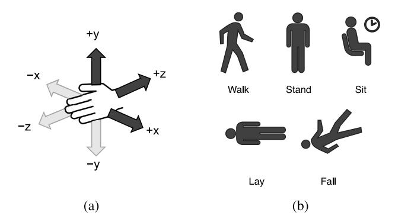

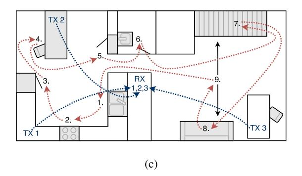

Fig. 7. Activities performed for each experiment type. (a) Small-scale hand gesture recognition with three different gestures. (b) Medium-scale human activity recognition with five different actions. (c) Large-scale human localization and activity tracking in a home environment with nine actions and three transmitter/receiver links.

or LoRa [\[5\]](#page-27-34) which allows for a larger communication range.

*4) Cyber Physical System Integration:* The aim of this work is in allowing WiFi sensing to be performed on the edge using low cost embedded devices. By achieving this, we should then be able to integrate these systems into different cyber physical systems. For example, WiFi sensing can be used to track the occupancy of a building to intelligently control HVAC systems. Additionally, by using WiFi sensing to track health related behaviours such as irregular breathing or heart rate as well as falling, WiFi sensing systems could be integrated with emergency alerting systems to rapidly request emergency aid. While there has been much work in understanding the capabilities of WiFi sensing, very little work has been undergone to successfully integrate WiFi sensing into real existing cyber physical systems. By moving away from non-scalable batch-based systems to edge-based systems, we believe that WiFi sensing can continue to grow into more real-world use cases.

## IV. EVALUATION OF CSI PROCESSING TECHNIQUES

Now that we have identified a number of CSI signal processing techniques through our survey, we next evaluate how well each of these techniques perform with regards to model accuracy. To this end, we evaluate each technique on three experimental scales which represent unique use cases for WiFi sensing. Namely, small-scale hand gesture recognition can be used as a novel device-free method for HCI; medium-scale human activity recognition can be used to track behaviours of a person over some time period; and large-scale human activity and localization sensing can be used to understand human behaviours throughout an entire environment. Through these three diverse applications, we can generalize which techniques achieve high prediction accuracy for different use cases. The three tasks that we evaluate are illustrated in Fig. 7.

## *A. Experiment Descriptions*

For the small-scale experiment, we train our system to recognize hand movements along three axis of motion: Z-axis (push/pull), X-axis (swipe left/right) and Y-axis (raise/lower). For each of these three physical actions, we repeat each hand

movement 30 times in round-robin order to ensure that actions are interleaved over time.

The second set of experiments that we perform are for medium-scale human activity recognition. For this experiment, we perform five of the most common actions that we have identified in WiFi sensing studies, namely: walking, standing, sitting, laying, falling as illustrated in Fig. 7(b). For these experiments, we repeat all actions 8 times in an interleaved round-robin order as we did in the small-scale experiment.

Finally, the third set of experiments that we perform are for large-scale localization and activity recognition tasks. In this case, we perform actions in nine distinct locations within a home-environment as shown in Fig. 7(c). Namely, we perform three actions in the kitchen: (1) wash dishes at the sink, (2) cook on stove-top, (3) open fridge; three actions in the dining room: (4) write in a book at table, (5) open and close closet door, (6) wash hands in washroom; and three actions in the living room: (7) walk up and down stairs, (8) sit on sofa, (9) walk around. For this experiment we collect data from three distinct TX-RX pairs. In our initial evaluation of these large-scale experiments we use the second TX-RX pair by itself to predict all nine actions. Later on in this work, we will evaluate methods for leveraging predictions from multiple devices within a single environment.

Additional information about the experimental setting are shown in Table [VI.](#page-16-0) For example, for all three scales, we collect CSI at a sampling rate of 100Hz. Additionally, each experimental scale has a progressively larger sensing area where actions are performed.

## *B. Hyperparameter Optimization*

For our initial evaluation of each of the three experimental scales, we wish to identify how feature extraction, denoising and dimensionality reduction techniques affect the accuracy of our model. Different hyperparameter settings such as learningrate, number of hidden neurons and regularization methods may result in varying prediction accuracy for each methods. Additionally, each technique itself has a unique set of hyperparameters which must also be tuned to achieve better model accuracy for the given task. Table [VII](#page-16-1) shows the list of hyperparameters and possible hyperparameter-values that we used during our evaluations. The six hyperparameters marked as

| Scale        | Sensing Task               | # Actions | # Repetitions | # Links | Sampling Rate | Sensing Area                     | Figure  |
|--------------|----------------------------|-----------|---------------|---------|---------------|----------------------------------|---------|
| Small-Scale  | Gesture Recognition        | 3         | 30            | 1       | 100Hz         | $1.0\text{m} \times 1.0\text{m}$ | Fig. 7a |
| Medium-Scale | Human Activity Recognition | 5         | 8             | 1       | 100Hz         | $2.5\text{m} \times 4.0\text{m}$ | Fig. 7b |

TABLE VI DESCRIPTION OF THE THREE DEVICE-FREE EXPERIMENTS PERFORMED AND EVALUATED USING CSI COLLECTED FROM ESP32S

global are model specific parameters that are present no matter which feature extraction, denoising, or dimensionality reduction technique is used. We can see that the Hampel, window statistical filter and Savitzky Golay denoising methods each have window-size as a common hyperparameter, however each of these methods also has other technique-specific hyperparameters as well. Performing a grid-search to evaluate every possible combination of hyperparameters would be infeasible. Instead we use the Tree-structured Parzen Estimator (TPE) using the Optuna framework [\[155\]](#page-30-17) where we perform 100 trails, each with a uniquely selected set of hyperparameters. In the first few trials, hyperparameter values are selected randomly from the set of options shown in Table [VII.](#page-16-1) Subsequent trials with TPE use the results of previous trials to guide the hyperparameter optimization towards maximizing the model accuracy. For each trial, the models train for 100 epochs, however to reduce the search time spent training the model on non-optimal hyperparameter values, trials are pruned early (i.e., before 100 epochs) if the trial validation accuracy is below the median validation accuracy of all previous trials.

Table [VIII](#page-17-0) shows the result of this hyperparameter optimization method when evaluated on five feature extraction methods, five denoising methods and four dimensionality reduction methods for each of the three scales of experiments. Through this method, we perform a total of 4,200 independent hyperparameter optimization trials. At the top of the table, we can see the accuracy of a randomly guessing model for each experimental scale based on the number of actions performed at each scale. Specifically, the small-scale would achieve an accuracy of 33.33% with three actions, mediumscale would achieve an accuracy of 20.00% with five actions, and large-scale would achieve an accuracy of 11.11% with nine actions.

## *C. Independent Evaluation of Each Method*

In this study, we begin by evaluating each signal processing technique independently to recognize if there are any techniques which clearly perform better across the board. For example, when evaluating feature extraction methods, we do not apply any denoising or dimensionality reduction techniques. However, when we evaluate denoising and dimensionality reduction, we keep the amplitude feature as the default because it is so commonly used throughout the research literature and because without it, the raw CSI is essentially meaningless.

Amplitude and PSD feature extraction methods achieve the highest prediction accuracy for all three scales. For medium-scale, this is significant at 86.00% and 76.12% accuracy respectively, but for small-scale and large-scale, neither method alone can surpass even 55% accuracy. This shows that

TABLE VII LIST OF HYPERPARAMETERS AND POSSIBLE VALUES USED DURING HYPERPARAMETER OPTIMIZATION

| Technique                | Parameter Name    | Values                                                                          |  |  |  |  |
|--------------------------|-------------------|---------------------------------------------------------------------------------|--|--|--|--|
| Global                   | Input Window Size | {25, 50,, 475, 500}                                                             |  |  |  |  |
| Global                   | Learning Rate     | $\{1e^{-9}, 1e^{-8}, \dots, 1e^{0}, 1e^{1}\}\$ $\{25, 50, \dots, 475, 500\}$ |  |  |  |  |
| Global                   | # Hidden Neurons  | $\{25, 50, \dots, 475, 500\}$                                                   |  |  |  |  |
| Global                   | Dropout           | $\{0.0, 0.1, \dots, 0.8, 0.9\}$                                                 |  |  |  |  |
| Global                   | Kernel Regular.   | {True, False}                                                                   |  |  |  |  |
| Global                   | Activity Regular. | {True, False}                                                                   |  |  |  |  |
|                          | Feature Extra     | ction                                                                           |  |  |  |  |
| Amplitude                | None              | N/A                                                                             |  |  |  |  |
| Phase                    | None              | N/A                                                                             |  |  |  |  |
| Temporal Diff.           | None              | N/A                                                                             |  |  |  |  |
| Stat. Features           | Stat. Function    | {Mean, Median, STDev, Var.}                                                     |  |  |  |  |
| PSD                      | None              | N/A                                                                             |  |  |  |  |
| Wavelet Transf.          | Threshold         | $\{0.0, 0.25, \dots, 3.75, 4.0\}$                                               |  |  |  |  |
| Wavelet Transf.          | Mode              | {Hard, Soft}                                                                    |  |  |  |  |
|                          | Denoising         |                                                                                 |  |  |  |  |
| Win. Stat. Filter        | Window Size       | {50, 100,, 450, 500}                                                            |  |  |  |  |
| Win. Stat. Filter        | Stat. Function    | {Mean, Median, STDev, Var.}                                                     |  |  |  |  |
| Savitzky Golay           | Window Size       | {51, 101,, 451, 501}                                                            |  |  |  |  |
| Savitzky Golay           | Poly. Order       | $\{1, 2, \dots, 8, 9\}$                                                         |  |  |  |  |
| Hampel                   | Window Size       | $\{50, 100, \dots, 450, 500\}$                                                  |  |  |  |  |
| Hampel                   | Threshold         | $\{0.25, 0.5, \dots, 3.75, 4.0\}$                                               |  |  |  |  |
| Butterworth              | Order             | $\{1, 2, \dots, 10, 11\}$                                                       |  |  |  |  |
| Butterworth              | Frequency         | $\{1, 2, \dots, 49, 50\}$                                                       |  |  |  |  |
| Butterworth              | Type              | {Lowpass, Highpass}                                                             |  |  |  |  |
| DWT                      | Threshold         | $\{0.0, 0.25, \dots, 3.75, 4.0\}$                                               |  |  |  |  |
| DWT                      | Mode              | {Hard, Soft}                                                                    |  |  |  |  |
| FFT Freq. Filt.          | # Zeros           | $\{0, 1, \dots, 63, 64\}$                                                       |  |  |  |  |
| Dimensionality Reduction |                   |                                                                                 |  |  |  |  |
| Subcarrier Stat.         | Max/Min           | {Max, Min}                                                                      |  |  |  |  |
| Subcarrier Stat.         | Stat. Function    | {Mean, Median, STDev, Var.}                                                     |  |  |  |  |
| Subcarrier Corr.         | Max/Min           | {Max, Min}                                                                      |  |  |  |  |
| PCA                      | None              | N/A                                                                             |  |  |  |  |
| ICA                      | None              | N/A                                                                             |  |  |  |  |

using feature extraction techniques alone may not be sufficient for all types of tasks. It also shows that the actions performed during the medium-scale experiments are easier to distinguish than the small-scale and the large-scale experiments.

Moving to denoising techniques, we can see that once again, medium-scale is able to achieve greater than 80% accuracy for all denoising methods except for the Hampel filter and the FFT frequency filter. We must note however that while these denoising methods achieve good accuracy values; window statistical filter performs worse than when using amplitude without a denoising filter and DWT achieves essentially the same prediction accuracy. For the small-scale experiment, all denoising methods increase the accuracy compared to no denoising method except for the Savitzky Golay filter and the FFT frequency filter. The window statistical filter increases the accuracy the greatest by +9.89%. Three out of six denoising methods increase the accuracy for the largescale experiment, namely Hampel filter (+0.83%), window

| Feature            | Denoising           | Dimensionality           |             | Accuracy     |             |
|--------------------|---------------------|--------------------------|-------------|--------------|-------------|
| Extraction         | Denoising           | Reduction                | Small Scale | Medium Scale | Large Scale |
|                    | Random Guess        |                          | 33.33%      | 20.00%       | 11.11%      |
|                    |                     | Feature Extraction       | •           | •            | •           |
| Amplitude          |                     |                          | 40.33%      | 86.00%       | 53.99%      |
| Phase              |                     |                          | 36.01%      | 25.05%       | 11.81%      |
| Amplitude (Diff.)  |                     |                          | 36.36%      | 26.00%       | 40.02%      |
| Phase (Diff.)      | Default: None       | Default: None            | 34.75%      | 24.76%       | 23.40%      |
| Stat. Features     |                     |                          | 38.35%      | 39.91%       | 26.57%      |
| PSD                |                     |                          | 40.75%      | 76.12%       | 48.94%      |
| Wavelet Transform  |                     |                          | 36.75%      | 76.78%       | 25.20%      |
|                    |                     | Denoising                |             |              |             |
|                    | Window Stats Filter |                          | 50.20%      | 81.31%       | 59.50%      |
|                    | Savitzky Golay      |                          | 38.81%      | 97.22%       | 57.58%      |
| Default: Amplitude | Hampel              | Default: None            | 46.85%      | 76.76%       | 54.82%      |
| Default. Amplitude | Butterworth         | Default. Nolle           | 41.65%      | 89.57%       | 52.98%      |
|                    | DWT                 |                          | 41.47%      | 86.06%       | 53.41%      |
|                    | FFT Freq. Filter    |                          | 38.52%      | 52.68%       | 17.07%      |
|                    |                     | Dimensionality Reduction | n           |              |             |
|                    |                     | Subcarrier Stats         | 38.91%      | 36.70%       | 13.09%      |
| Default: Amplitude | Default: None       | Subcarrier Correlation   | 36.69%      | 64.87%       | 26.05%      |
| Default. Amplitude | Default. Nolle      | PCA                      | 87.36%      | 100.00%      | 71.24%      |
|                    |                     | ICA                      | 81.82%      | 87.26%       | 72.79%      |

TABLE VIII COMPARISON OF FEATURE EXTRACTION, DENOISING AND DIMENSIONALITY REDUCTION METHODS

statistical filter (+5.51%), and Savitzky Golay (+3.59%). FFT frequency filter performs consistently much worse than all other denoising methods likely due to the fact that it is calculated independently over each CSI frame rather than being calculated over a window of CSI frames. None of the evaluated denoising methods performs better in all three experimental scales. In fact, for all denoising methods, at least one of the experimental scales results in a decrease in model accuracy compared to the baseline of using just amplitude. This shows that denoising methods are use-case specific and will not be guaranteed to provide improved accuracy.

Finally, we move on to evaluating dimensionality reduction techniques which have consistent results across each experimental scale. Using subcarrier statistics for dimensionality reduction achieves only a small improvement to the accuracy of a randomly-guessing model, thus subcarrier statistics are not a wise choice for dimensionality reduction. Using subcarrier correlation for dimensionality reduction achieves a slightly higher accuracy for both medium-scale and largescale, but the prediction accuracy is still significantly lower than using the baseline amplitude without dimensionality reduction. Finally, PCA and ICA achieve the highest accuracy among all evaluated techniques across the three experimental scales. For small-scale and medium-scale, we find that PCA performs significantly better results than ICA, while in the large-scale experiment, both PCA and ICA achieve approximately the same prediction accuracy. Based on these results, PCA achieves the highest accuracy for all experimental scales.

## *D. Dimensionality Reduction*

When we evaluate the four dimensionality reduction methods with hyperparameter optimization, we define *d* = 10 such that we reduce the CSI data from a subcarrier vector of size 64 down to a subcarrier vector of size 10. In Fig. [8,](#page-18-1) we use the same optimal hyperparameters found for Table [VIII,](#page-17-0) but we change the value for *d* to understand how dimensionality affects the accuracy of the model. For all three scales, we can see that Subcarrier Statistics and Subcarrier Correlation each achieve the same accuracy no matter how the value for *d* changes. For PCA and ICA, we can see that the accuracy starts low when *d* = 1 but quickly reaches a plateau by *d* = 8 where the accuracy remains relatively stable while *d* continues to increase. However, in the small-scale evaluation we find that ICA reaches a peak accuracy when *d* = 24, but afterwards, the accuracy decreases. This implies that increasing the dimensionality with ICA results in more noisy components which makes it harder for the model to distinguish different CSI samples. PCA on the other hand exhibits robustness even as *d* increases. In this case, PCA seems like the better choice for dimensionality reduction.

In Section [III,](#page-5-0) when we discussed different signal processing techniques we focused primarily on the steps that run on-device for every incoming CSI sample. For each of the dimensionality reduction methods, there is also a calibration phase which runs only when the device is deployed in the environment. For example, when subcarrier statistics are used for dimensionality reduction, we need to collect some number (*N*calibration) of CSI samples to calculate some statistics of each subcarrier. Similarly, for PCA and ICA, we calculate a components coefficients matrix with *N*calibration CSI samples. We can assume that the calibration phase only runs once when the system is deployed, so we do not need to worry about the exact time-complexity of the algorithm. However, we should consider how many CSI samples (*N*calibration) are required to successfully calibrate each dimensionality reduction method. In the experiments shown in Table [VIII](#page-17-0) we allow each method to calibrate on 100% of the available training data and 0% of the testing data. It is important to not allow the model to see any data from the testing data for fairness. In Fig. 9, we evaluate the accuracy as we change *N*calibration. At 100Hz, the range for the *x*-axis of this plots shows a maximum

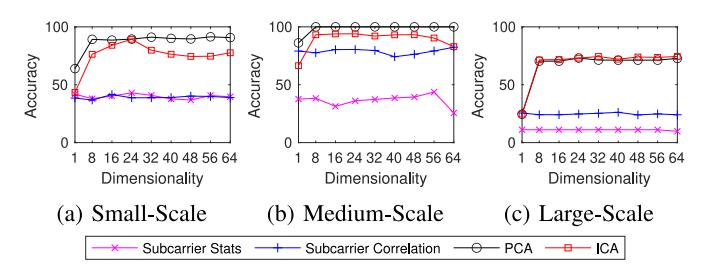

Fig. 8. Accuracy of dimensionality reduction techniques when dimensionality (*d*) changes.

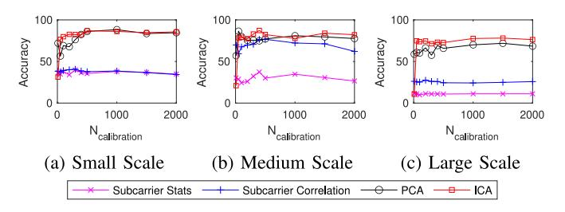

Fig. 9. Accuracy of dimensionality reduction techniques when different number of CSI-samples are used to calibrate the technique.

TABLE IX EFFECT OF INTERPOLATION ON MODEL ACCURACY

|                  | Small-Scale | Medium-Scale | Large-Scale |
|------------------|-------------|--------------|-------------|
| None             | 87.36%      | 100.00%      | 71.24%      |
| Nearest Neighbor | 90.06%      | 100.00%      | 67.18%      |
| Linear           | 89.34%      | 100.00%      | 68.97%      |

of 20 seconds of calibration data when *N*calibration = 2,000. Similar to Fig. [8,](#page-18-1) only PCA and ICA show variation as parameters change. Specifically, as *N*calibration increases, the accuracy also increases but after *N*calibration = 500, we can see that the accuracy flattens out. This shows that we can calibrate our system in a new location with only 5 − 10 seconds worth of CSI-samples which can be achieved quickly and passively. However, while small-scale and large-scale achieve approximately the same accuracy in both Table [VIII](#page-17-0) and Fig. 9 when *N*calibration = 2,000, medium-scale only achieves 77.6% for PCA when *N*calibration = 2,000 compared to 100.0% in Table [VIII.](#page-17-0) This shows that while sufficient prediction accuracy is possible with low values for *N*calibration, if we are able to collect more data, we might be able to increase the accuracy slightly. However, increasing *N*calibration results in an increase in the time to collect CSI data for calibration and also increases the computation time required during the calibration phase.

# *E. Interpolation*

Interpolation has been used in other studies to account for sample jitter due to packet loss or computation delays. In Table [IX,](#page-18-2) we compare the accuracy achieved by two such interpolation methods: *nearest neighbor* and *linear* interpolation as well as the accuracy achieved without applying interpolation (i.e., *none*). We used the optimal hyperparameters identified when using Amplitude for feature extraction and PCA for dimensionality reduction. We find that interpolation does not result in much change in the accuracy for any

TABLE X EFFECT OF FEATURE SCALING ON MODEL ACCURACY

|                     | Small-Scale | Medium-Scale | Large-Scale |
|---------------------|-------------|--------------|-------------|
| None                | 87.36%      | 100.00%      | 71.24%      |
| Max-Min Normalize   | 83.80%      | 99.51%       | 69.00%      |
| Z-Score Standardize | 70.39%      | 97.43%       | 53.19%      |
| Quantize            | 69.99%      | 99.92%       | 55.14%      |

of the experimental scales. As we showed in Fig. [6,](#page-12-0) the time difference between subsequent CSI samples collected using our system is relatively precise, meaning that interpolation is not needed when CSI is received at a constant rate of 100Hz. Interpolation may be more important when the CSI sampling rate is not controlled by the system or if environmental noise results in higher packet-loss.

## *F. Feature Scaling*

Feature scaling can be used in machine learning workflows to ensure that features with a large range of values do not overshadow features with a smaller range of values. In Table [X,](#page-18-3) we compare three feature scaling methods: *max-min normalization*, *z-score standardization*, and *quantize* with a model trained and evaluated without feature scaling (i.e., *none*). As a baseline, we again use the optimal hyperparameters identified when using Amplitude for feature extraction and PCA for dimensionality reduction. We apply feature scaling using statistical metrics taken from the entire CSI matrix. For example, with max-min normalization, we find a single maximum value and a single minimum value using CSI measurements across all time instances and all subcarriers. Typically, normalization and standardization will find these statistical metrics individually for each feature (i.e., subcarrier or PCA component) to prevent individual features with higher ranges from overshadowing features with smaller ranges of possible values. However, with PCA, we find that the first component has the largest range of values followed by the second component and then the third component and so on. This is expected and beneficial because each subsequent component is known to have less important information. Scaling each PCA component independently removes this relative scale and makes it harder for the model to understand the relative importance of each component and thus, it is harder for the model to make accurate predictions. As such, we find that feature scaling does not result in an improvement to the prediction accuracy of the model and in fact results in decreased prediction accuracy for all experimental scales.

## V. EVALUATION OF EDGE-BASED WIFI SENSING SYSTEM

Now that we have reviewed the accuracy of our ESP32 based WiFi sensing system when used for WiFi sensing tasks ranging from small-scale hand gestures to medium-scale human activity recognition up to large-scale localization and activity recognition, we next evaluate the feasibility of deploying our WiFi sensing hardware into real-world scenarios. Specifically, we consider how WiFi sensing can be deployed on resource-constrained ESP32 microcontrollers. To judge the

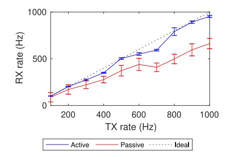

Fig. 10. Number of packets received per second at an active (i.e., connected) and passive (i.e., sniffing) receiver when a transmitter sends CSI frames at varying rates.

feasibility of this ESP32 system, we must evaluate both the hardware and the software running on-board. We begin by reviewing the sampling rate achievable with the ESP32 and compare these rates to existing WiFi sensing literature. After this, we consider the rate at which the ESP32 can compute different signal processing steps as well as machine learning prediction (i.e., model inference on-board). We compare these rates to the inference rates achieved in other WiFi sensing studies in the literature. Finally, we review energy consumed by each component of the system to understand the feasibility of deploying the system at the edge.

#### A. Sampling Rate

Sampling rate in our evaluations indicates the number of CSI frames received by the ESP32 per second. To evaluate this sampling rate, we begin with a single TX set to transmit frames at a constant known TX rate as shown in Fig. 10. The RX rate indicates the number of CSI samples collected in a single second and may be different from the TX rate in cases where packets are missed due to interference or packets are dropped due to cyclic redundancy check (CRC) errors or other communication issues. For each TX rate value, we transmit for a period of 60 seconds such that the lines in the figure indicate the mean sampling rate and the error bars indicate one standard deviation from the mean.5

We begin by considering the *active* setting where the RX is the destination for each packet transmitted by the TX. The RX rate increases almost linearly as TX rate increases to 1000Hz. Small dips in RX rate appear due to the tick interrupt rate of the real-time operating system (RTOS) running on-board the ESP32 TX device which artificially reduces the actual number of frames that are sent. Overall, this shows that the ESP32 can collect CSI samples at a RX rate upwards of 1000Hz in the active scenario.

Next we evaluate the *passive* setting where a third device (PX) is passively listening to the communication between the TX and RX. In this scenario, because the packet destination is not PX, the PX can not request packet retransmission when communication errors may occur. As a result of this, we find

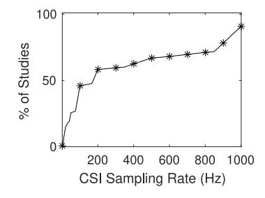

Fig. 11. CDF of CSI sampling rates from surveyed literature (N = 176).

the RX rate for PX is between 13% and 37% lower than the active scenario. Additionally, compared to the active case, we can see a higher standard deviation for all values of TX rate indicating that there is a large variance in the number of samples collected over the 60 second period. In the case of TX rate of 1000Hz, this results in a RX rate of 662Hz for the PX and a standard deviation of 55Hz.6

Optimal sampling rates for a given sensing task can be selected based on the Nyquist-Shannon sampling theorem [156] which suggests that a sampling rate of at least 2RHz must be used to capture an activity performed at RHz. For example, in [157] it is stated that indoor exercise activities produce motion-induced frequency shifts at a rate below R = 40Hz and as such, a rate of 100Hz is selected which is greater than 2RHz and thus should be able to capture the important movements during these activities. We found 176 research studies which specify the CSI sampling rate used in their data collection. Fig. 11 shows the CDF plot of the sampling rate used in these works. From this figure, we can see that almost 50% of works set a sampling rate of 100Hz or lower. Both the active and passive scenarios shown in Fig. 10 can achieve rates above 100Hz, and as such, we would expect that the ESP32 could be used for WiFi sensing in most of the scenarios discussed in these works. We find that when higher sampling rate is used, they are often manually reduced afterwards to decrease computation complexity as well as memory requirements. For example, in [158], a sampling rate of 1,000Hz was selected, but the signal was passed through a band-pass filter between the ranges of 5Hz and 80Hz to capture the frequency changes caused by human walking within these bands. Using the Nyquist theory here, we may assume that a sampling rate of 160Hz would have been sufficient. As such, while the ESP32 is unable to achieve rates as high as 1,000Hz, the actions performed are still likely to be captured at the lower frequencies which the ESP32 is able to capture.

Effect of Sampling Rates on Accuracy: In this work, we use a sampling rate of  $R=100 \mathrm{Hz}$  as the baseline for our small-scale, medium-scale and large-scale experiments. To understand how sampling rate affects prediction accuracy, we decrease R while using the optimal hyperparameter values as used in Table VIII. In addition to reducing the sampling rate, we must also reduce the window size w down to  $\hat{w} = \lfloor \frac{wR}{100} \rfloor$  so that each window still covers the same span of time no

&lt;sup>5We calculate RX rate without sending the CSI data over serial from the ESP32 to the host device. The baud rate of the serial interface limits the CSI throughput and is not necessary for on-device model inference.

&lt;sup>6PX captures CSI from the two way communication between TX and RX. In our results, we ignore half of the frames (i.e., from RX) to allow for a better understanding of packet loss with PX compared to the active RX.

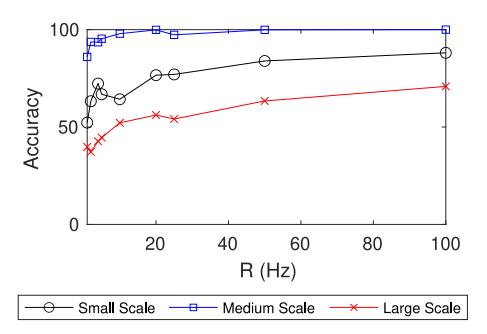

Fig. 12. Decreasing the sampling rate results in lowered accuracy for all experimental scales.

matter the value of *R*. From Fig. [12,](#page-20-0) we can see that there is a general trend where the accuracy decreases if *R* decreases. For small-scale, we achieve an accuracy of 52.27% and 88.11% when *R* = 1 and *R* = 100, respectively (35.84% difference) while in the medium-scale accuracy is 86.00% and 100.00% when *R* = 1 and *R* = 100, respectively (14.00% difference) and finally large-scale accuracy is 39.77% and 70.86% when *R* = 1 and *R* = 100, respectively (31.09% difference). Medium-scale is the best at handling lower values of *R* and can even achieve an accuracy of 99.88% when *R* = 20. Small-scale sees the largest decrease in accuracy as *R* decreases which makes sense considering that the smallscale movements are both small and performed very quickly. From these results, we can say that increasing *R* will result in an increase in model accuracy. However, we must also recognize that each increase for *R* will not result in a linear increase in accuracy. For example, increasing *R* from 10 up to 20 results in an increase of +12.37%, +1.95% and +3.64% for small-scale, medium-scale and large-scale experiments, respectively. However, increasing *R* from 50 up to 100 only results in an increase of +4.18%, +0.001% and +7.47% for small-scale, medium-scale and large-scale experiments, respectively. This demonstrates that the curves in the figure are non-linear and as such, increasingly higher values for *R* would be required to continue to push the accuracy higher. Of course very high sampling rates are not reasonable for edge based devices which have low computation resources and low power budgets.

## *B. Inference Rate With Signal Processing Techniques*

Capturing CSI at a consistent rate is the first step towards developing a complete WiFi sensing system on the ESP32. After capturing the CSI, we must then use the CSI to make predictions in the environment. Inference rate indicates the number of samples that can be processed per second. As mentioned in Section [III,](#page-5-0) WiFi sensing systems will begin with signal processing followed by machine learning prediction making. As such, we begin our evaluation by reviewing the rate at which we can compute different signal processing methods directly on the ESP32. After this, we then review the effect of machine learning model architecture on inference rates. Finally, we compare the rates which our system can achieve to the rates achieved in other works.

TABLE XI TIME TO COMPUTE EACH SIGNAL PROCESSING METHOD ON-BOARD AN ESP32 MICROCONTROLLER

| Method                    | Parameters     | Time (ms) | Max. Rate (Hz) |  |  |  |
|---------------------------|----------------|-----------|----------------|--|--|--|
| Feature Extraction        |                |           |                |  |  |  |
| Amplitude                 | None           | 0.54      | 1,855          |  |  |  |
| Phase                     | None           | 0.13      | 7,710          |  |  |  |
| Temporal Diff             | None           | 0.03      | 30,581         |  |  |  |
| Statistical Features      | Mean           | 0.02      | 64,935         |  |  |  |
| PSD                       | w = 16         | 0.57      | 1,742          |  |  |  |
| PSD                       | w = 64         | 2.11      | 473            |  |  |  |
| PSD                       | w = 128        | 4.38      | 228            |  |  |  |
| Wavelet Transform         | $\psi = db4$   | 0.47      | 2,111          |  |  |  |
| Wavelet Transform         | $\psi = db5$   | 0.62      | 1,621          |  |  |  |
|                           | Signal Denoi   |           |                |  |  |  |
| Hampel                    | w = 10         | 1.21      | 828            |  |  |  |
| Hampel                    | w = 50         | 4.59      | 217            |  |  |  |
| Hampel                    | w = 100        | 9.51      | 105            |  |  |  |
| Statistical Window Filter | w = 10         | 0.40      | 2,528          |  |  |  |
| Statistical Window Filter | w = 50         | 1.78      | 561            |  |  |  |
| Statistical Window Filter | w = 100        | 3.48      | 287            |  |  |  |
| Savitzky Golay            | w = 10         | 0.77      | 1,304          |  |  |  |
| Savitzky Golay            | w = 50         | 3.69      | 271            |  |  |  |
| Savitzky Golay            | w = 100        | 7.33      | 136            |  |  |  |
| Butterworth               | w = 10         | 1.42      | 705            |  |  |  |
| Butterworth               | w = 50         | 7.22      | 138            |  |  |  |
| Butterworth               | w = 100        | 14.56     | 68             |  |  |  |
| DWT                       | $\psi = db4$   | 0.72      | 1,390          |  |  |  |
| DWT                       | $\psi = db5$   | 0.88      | 1,135          |  |  |  |
| FFT Frequency Filter      | None           | 0.08      | 12,121         |  |  |  |
| Dia                       | nensionality R | eduction  |                |  |  |  |
| Subcarrier Stats.         | k = 10         | 0.01      | 121,951        |  |  |  |
| Subcarrier Stats.         | k = 32         | 0.01      | 89,285         |  |  |  |
| Subcarrier Stats.         | k = 64         | 0.02      | 65,359         |  |  |  |
| Subcarrier Correlation    | k = 10         | 0.01      | 120,481        |  |  |  |
| Subcarrier Correlation    | k = 32         | 0.01      | 89,285         |  |  |  |
| Subcarrier Correlation    | k = 64         | 0.02      | 65,359         |  |  |  |
| PCA                       | k = 10         | 0.77      | 1,300          |  |  |  |
| PCA                       | k = 32         | 2.40      | 416            |  |  |  |
| PCA                       | k = 64         | 4.78      | 209            |  |  |  |
| ICA                       | k = 10         | 0.77      | 1,303          |  |  |  |
| ICA                       | k = 32         | 2.40      | 416            |  |  |  |
| ICA                       | k = 64         | 4.79      | 208            |  |  |  |

For each CSI frame received by the system, we can perform signal preprocessing steps to extract certain features, denoise our signal or reduce the dimensionality of the CSI vector. In Table [XI,](#page-20-1) we review the computation time for a set of these preprocessing steps when implemented and run on an ESP32. For preprocessing methods with relevant parameters, we also evaluate their effect on computation time and maximum sample throughput rate. We repeat the computation directly on-board the ESP32 10 times and capture the average run-time. Starting with feature extraction, we begin by looking at the computation time for transforming the raw data to amplitude and phase. We can see that computing amplitude takes 0.54ms while phase takes just 0.16ms due to the square power required for computing amplitude. Using just these signal preprocessing techniques individually, we can achieve a maximum throughput of 1,855Hz and 6,134Hz, respectively which should both far exceed our CSI sampling rate. However, note that subsequent signal preprocessing steps typically assume that either amplitude or phase is computed beforehand. For example, the temporal difference feature extraction method takes only 0.2ms to compute and thus can be computed at a maximum rate of 63,291Hz, however if the amplitude feature extraction method was performed first we must consider a summation of computation times for all methods to determine the maximum achievable rate. In this example, computing amplitude takes 0.54ms while computing the temporal difference takes 0.02ms which means that our achievable rate when using both methods together would be  $\frac{1,000}{0.54+0.02} = \frac{1,000}{0.56} = 1,785$ Hz. Given N signal preprocessing steps where  $T_n$  is the time to compute the n-th preprocessing step in milliseconds where  $n \in \{1,2,\ldots,N-1,N\}$ , the maximum achievable rate can be formally calculated as

$$R_{max} = \frac{1,000}{\sum_{i=1}^{N} T_n}. (25)$$

For signal denoising methods, each method except DWT and FFT frequency filter uses a window size (w) when performing the filtering computation. DWT instead uses different wavelet functions  $\psi$  where the lengths are typically much smaller while FFT frequency filter is computed only over a single CSI frame rather than over a window of frames. When w = 100, the maximum achievable rates were 105, 287, 136, and, 68Hz for the Hampel filter, statistical window filter, Savitzky Golay filter and Butterworth filter, respectively. Out of all of the evaluated signal preprocessing steps, Butterworth with w = 100 is the only method which is unable to achieve greater than 100Hz and Hampel with w = 100 is the filter with the second lowest rate of 105Hz. This implies that if we want to increase the number of predictions possible per second, we must reduce w for these methods to ensure that the total sample preprocessing time is low enough. With DWT,  $\psi = db4$  has a filter length of only  $|\psi| = 8$  while  $\psi = db5$  has a filter length of  $|\psi| = 10$ . Even so, because of the recursive nature of the method, the time to compute is relatively high and thus the maximum achievable rate is only 582Hz and 427Hz per wavelet type. Notice, for each CSI sample passed into DWT, the number of decomposition and reconstruction levels may vary as shown in Fig. 5. To reliably calculate the average computation time in our evaluations, we assume the worst case for DWT where L=3levels of decomposition and L=3 levels of reconstruction are performed for the incoming sample. As such, DWT can be expected to achieve higher rates when run in real world scenarios.

For dimensionality reduction methods, we can see that the subcarrier statistics methods and subcarrier correlation methods can be computed faster than any other method. With these reduction methods, the most time-consuming computations are calculated during the initial calibration steps where a subset of subcarriers is preselected based on statistics of each subcarrier. For each incoming CSI sample, we only need to select the k subcarriers that were preselected during this process. This allows dimensionality reduction to be an extremely low-cost operation. PCA and ICA on the other hand both take approximately the same time to compute because the online portion of these algorithms is the exact same computation. The calculations performed during the initial calibration phase is what sets the two methods apart. When k = 64, we can see that

both methods can only achieve a maximum sampling rate of just over 200Hz, however performing PCA or ICA to transform a 64 subcarrier CSI vector down to a vector of size 64 does not actually achieve dimensionality reduction. In such a case, PCA and ICA will only be acting as denoising methods. Instead, k will typically be less than 64 so that PCA and ICA will not only denoise the incoming signal, but will also reduce the dimensionality and thus increase the throughput of the signal. For example, in Table VIII, when evaluating these dimensionality reduction methods, we set k=10, in which case, both PCA and ICA would be able to achieve a maximum rate of 1,300 Hz or when combined with the amplitude feature extraction method can achieve a maximum rate of  $\frac{1,000}{0.54+0.77}=763$ Hz.

#### C. Inference Rate With On-Board Machine Learning

After performing signal preprocessing, we can pass the filtered CSI data into a machine learning classifier model. Throughout our experiments in Section IV, we used a dense neural network (DNN) with four layers (one input layer, two hidden layers, one output layer) where the hidden layers each contain some number of hidden neurons (we call this number the hidden size). The input for the DNN is a matrix of  $S \times w$  where S indicates the number of subcarrier dimensions and w indicates a window size parameter where w consecutive CSI samples are collected and passed into the model. We use Tensorflow-Lite7 (TFLite) which offers a method for running our machine learning models directly on embedded devices such as the ESP32.

The ESP32 microcontroller is a highly resource constrained device with lower available resources than would be expected on a typical ML server used for training and evaluating WiFi sensing models in the existing literature. For example, the ESP32 is limited to a maximum of 240MHz clock rate and 520kB of RAM. Furthermore, by default, the ESP32 only allows for 160kB of storage to be allocated to the Dynamic RAM (DRAM) Heap which is the default method for storing data such as the machine learning model definition as well as the TFLite library implementation. In Table XII, we list the prediction rate achieved along with the model size when run on the ESP32 with two different quantization methods as well as varying number of hidden neuron size and CSI input size. We can see that 19 of the rows do not have an associated prediction rate. This is because the model size was too large to fit in the available DRAM Heap after all other overhead was accounted for. The largest model size that was able to run on-board the ESP32 was 34.3kB when hidden size was set to 10 and input size was  $16 \times 50$ . It is important to notice that when we use INT8 quantization, this same model can be reduced from 34.3kB to 10.9kB. This shows that quantization greatly reduces model size on-board the ESP32. Interestingly, in both cases where quantization is used (INT8) and where quantization is not used (NONE), using quantization counter-intuitively decreases the prediction rate. This is because, while INT8 quantization reduces the size of the model by converting 32-bit floating point numbers to 8-bit

&lt;sup>7https://www.tensorflow.org/lite.

TABLE XII TFLITE INFERENCE RATE *Without PSRAM* FOR DIFFERENT MODEL HYPERPARAMETERS AND QUANTIZATION METHODS. ONLY SMALL VALUES FOR HIDDEN SIZE AND INPUT SIZE ARE USED BECAUSE RAM SPACE IS SO LIMITED

| Quantization | Hidden Size | Input Size      | Rate (Hz) | Size (kB) |
|--------------|-------------|-----------------|-----------|-----------|
| NONE         | 10          | 4 × 10          | 9717      | 4.6       |
| NONE         | 10          | 4 × 50          | 5054      | 10.9      |
| NONE         | 10          | 4×100           | 3170      | 18.7      |
| NONE         | 10          | 16 × 10         | 5717      | 9.3       |
| NONE         | 10          | 16 × 50         | 1832      | 34.3      |
| NONE         | 10          | $16 \times 100$ | _         | 65.6      |
| NONE         | 50          | 4 × 10          | 1915      | 29.9      |
| NONE         | 50          | 4 × 50          | _         | 61.2      |
| NONE         | 50          | 4 × 100         | _         | 100.3     |
| NONE         | 50          | 16 × 10         | _         | 53.4      |
| NONE         | 50          | 16 × 50         | _         | 178.4     |
| NONE         | 50          | 16×100          | _         | 334.6     |
| NONE         | 100         | 4 × 10          | _         | 96.7      |
| NONE         | 100         | 4 × 50          | _         | 159.3     |
| NONE         | 100         | 4×100           | _         | 237.4     |
| NONE         | 100         | 16 × 10         | _         | 143.6     |
| NONE         | 100         | 16 × 50         | _         | 393.6     |
| NONE         | 100         | 16×100          | _         | 706.1     |
| INT8         | 10          | 4×10            | 2620      | 3.5       |
| INT8         | 10          | 4 × 50          | 1607      | 5.0       |
| INT8         | 10          | 4×100           | 1087      | 7.0       |
| INT8         | 10          | 16 × 10         | 1778      | 4.7       |
| INT8         | 10          | 16 × 50         | 662       | 10.9      |
| INT8         | 10          | 16×100          | 372       | 18.7      |
| INT8         | 50          | 4×10            | 996       | 9.8       |
| INT8         | 50          | 4 × 50          | 567       | 17.6      |
| INT8         | 50          | 4×100           | 369       | 27.4      |
| INT8         | 50          | 16 × 10         | 636       | 15.7      |
| INT8         | 50          | $16 \times 50$  | _         | 46.9      |
| INT8         | 50          | $16 \times 100$ | _         | 86.0      |
| INT8         | 100         | 4×10            | 399       | 26.5      |
| INT8         | 100         | 4 × 50          | _         | 42.2      |
| INT8         | 100         | 4×100           |           | 61.7      |
| INT8         | 100         | 16 × 10         | _         | 38.3      |
| INT8         | 100         | $16 \times 50$  | _         | 100.8     |
| INT8         | 100         | 16×100          | _         | 178.9     |

integers for model weights, additional quantization-specific layers are automatically added throughout the model architecture which results in additional computation that must be performed for the quantized model compared to the nonquantized model. Out of the 17 models that are able to fit in DRAM, only 6 are possible without quantization while 11 are possible with quantization, showing that quantization is still important to allow for larger machine learning models. However, 16 × 100 is the largest input size that was possible in a single case when quantization was **INT8** and the hidden size was a paltry 10. Only a single model evaluated in the table was able to increase the hidden size to 100 hidden neurons, but this was only achievable when the input size was a meager 4 × 10 matrix. This shows that by default, the ESP32 is unable to allocate large architecture models with only DRAM.

However, while ESP32 modules by default are limited to 520kB of available RAM and 160kB of compile-time DRAM, some boards offer an additional PSRAM (Psuedo-Static RAM) up to a maximum size of 4MB. By using

TABLE XIII

TFLITE INFERENCE RATE *With PSRAM*. HIDDEN SIZES AND INPUT SIZES ARE LARGER THAN IN TABLE [XII](#page-22-0) BECAUSE PSRAM IS ABLE TO ACCOMMODATE THESE LARGER MACHINE LEARNING MODELS DURING MODEL INFERENCE

| Quantization | Hidden Size | Input Size      | Rate (Hz) | Size (kB) |
|--------------|-------------|-----------------|-----------|-----------|
| NONE         | 25          | 16×25           | 145.0     | 46.3      |
| NONE         | 25          | $16 \times 100$ | 41.3      | 163.5     |
| NONE         | 25          | $16 \times 500$ | 8.7       | 788.5     |
| NONE         | 25          | $64 \times 25$  | 41.3      | 163.5     |
| NONE         | 25          | $64 \times 100$ | 7.6       | 632.2     |
| NONE         | 25          | $64 \times 500$ | 1.5       | 3132.2    |
| NONE         | 100         | $16 \times 25$  | 28.3      | 237.4     |
| NONE         | 100         | $16 \times 100$ | 9.6       | 706.1     |
| NONE         | 100         | $16 \times 500$ | -         | 3206.0    |
| NONE         | 100         | $64 \times 25$  | 9.6       | 706.1     |
| NONE         | 100         | $64 \times 100$ | 2.7       | 2581.1    |
| NONE         | 100         | $64 \times 500$ | -         | 12581.1   |
| NONE         | 500         | $16 \times 25$  | 2.5       | 2740.4    |
| NONE         | 500         | $16 \times 100$ | _         | 5084.3    |
| NONE         | 500         | $16 \times 500$ | _         | 17584.3   |
| NONE         | 500         | $64 \times 25$  | -         | 5084.3    |
| NONE         | 500         | $64 \times 100$ | _         | 14459.3   |
| NONE         | 500         | $64 \times 500$ | _         | 64459.3   |
| INT8         | 25          | $16 \times 25$  | 492.1     | 13.9      |
| INT8         | 25          | $16 \times 100$ | 100.3     | 43.1      |
| INT8         | 25          | $16 \times 500$ | 21.3      | 199.5     |
| INT8         | 25          | $64 \times 25$  | 100.3     | 43.2      |
| INT8         | 25          | $64 \times 100$ | 26.4      | 160.3     |
| INT8         | 25          | $64 \times 500$ | 4.0       | 785.3     |
| INT8         | 100         | $16 \times 25$  | 71.0      | 61.6      |
| INT8         | 100         | $16 \times 100$ | 25.2      | 178.8     |
| INT8         | 100         | $16 \times 500$ | 5.7       | 803.8     |
| INT8         | 100         | $64 \times 25$  | 25.2      | 178.9     |
| INT8         | 100         | $64 \times 100$ | 7.0       | 647.6     |
| INT8         | 100         | $64 \times 500$ | 1.1       | 3147.5    |
| INT8         | 500         | $16 \times 25$  | 6.7       | 687.5     |
| INT8         | 500         | $16 \times 100$ | 3.6       | 1273.3    |
| INT8         | 500         | $16 \times 500$ | -         | 4398.4    |
| INT8         | 500         | 64 × 25         | 3.6       | 1273.3    |
| INT8         | 500         | $64 \times 100$ | -         | 3617.2    |
| INT8         | 500         | $64 \times 500$ | _         | 16117.2   |

PSRAM and statically allocated TFLite models, we are able to increase the allowable size for the machine learning model definition and thus increase the hidden size and the CSI input size compared to the default ESP32 without PSRAM.

We compare on-board inference rate and model size with different quantization methods, hidden size and input sizes in Table [XIII.](#page-22-1) With PSRAM, the largest machine learning model which can be used on-board the ESP32 for edge inference has a size of 3,147.5kB when quantization is set to **INT8**, hidden size is set to 100, and CSI input size matrix is of size 64 × 500. It is important to achieve such high values because the hyperparameters we used during our hyperparameter search as detailed in Table [VII](#page-16-1) are similarly high, with a maximum of 500 for hidden size, and a maximum CSI input size of 64 × 500. It has been suggested in [\[138\]](#page-30-0) that it can be useful to consider not only increasing the accuracy of the models during hyperparameter optimization, but to also increase the on-board inference rate and reduce the model size. For simplicity, valid model sizes could be constrained

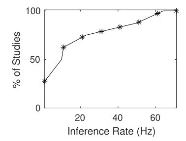

Fig. 13. CDF of machine learning inference rates from surveyed literature (*N* = 11).

to the maximum space available on the ESP32 for model definitions[.8](#page-23-0)

Depending on the hyperparameters used, we can achieve inference rates from 145Hz to 1.5Hz when not using quantization or 492.1 down to 1.1Hz when using **INT8** quantization. Using **INT8** quantization can achieve much greater inference rate compared to a non-quantized model because the model definition is stored in PSRAM which has a relatively slowspeed Serial Peripheral Interface (SPI) data bus. This means that the larger the model size, the longer it takes to transfer the model over the SPI interface. As such, models with the same hidden size and input size achieve much higher prediction rates with quantization. However, if we compare models with similar sizes such as quantization: **NONE**, hidden size: 25, input size: 64 × 25 where the model size is 163.5kB compared to the quantized model with quantization: **INT8**, hidden size: 25, input size 64 × 100 where the model size is 160.3kB, we find that they achieve a prediction rate of 41.3Hz and 26.4Hz, respectively even though the quantized model is slight smaller in size. This shows that models of similar size in memory are still slower with quantization than without. Even so, it is still the case that out of the 10 models that are too large to fit in PSRAM, only 3 models use **INT8** quantization while the other 7 models do not use quantization. Thus, quantization still proves to be an important method to increase the model architecture size when run on-board the ESP32 hardware.

With such a diverse set of possible inference rates based on the signal preprocessing steps and the model hyperparameters, we should consider what other WiFi sensing research works are able to achieve. In Fig. [13,](#page-23-1) we show the CDF plot for the inference rates found during our survey of WiFi sensing literature. While we were able to find at least *N* = 176 papers which discuss the CSI sampling rate, inference rate was discussed in far fewer (*N* = 11) research works. Furthermore, out of the 11 works which discussed achievable inference rate, more than half of the works use one or more GPU devices which would not be reasonable to deploy at the edge. Two of the eleven sources explicitly use CPUs rather than GPUs for inference, for example, [\[28\]](#page-27-22) uses a GPU for training and CPU for testing and is able to achieve an inference rate of 12.5Hz on an Intel Core i5 CPU while [\[107\]](#page-29-10) uses an Intel

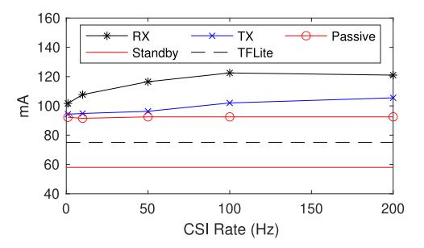

Fig. 14. Energy consumed by individual components of our ESP32 system.

Core i5 CPU for both training and testing because of a lack of access to GPU and achieved an inference rate of less than 1Hz. The highest inference rate was achieved in [\[115\]](#page-29-20) at approximately 60Hz when using an NVIDIA Titan XP GPU. Based on the figure, more than 50% of the works noted can only achieve an inference rate of 10Hz or less even though the models are run on far more powerful computers and servers compared to the ESP32. Due to the relatively low number of works discussing inference rate, we suggest that inference rate should be more commonly evaluated in the broader WiFi sensing research community. Otherwise, as machine learning architectures become deeper and more complex, we will not be able to gauge if the architectures are reasonable in real-time edge scenarios.

## *D. Energy Consumption*

In Fig. [14,](#page-23-2) we show the energy consumption for different individual tasks running on the ESP32. Specifically, we look at the energy consumption for the active RX, as well as the active TX and passive RX for different CSI sampling rates. In addition to these three applications, we look at the energy consumed by an ESP32 performing model inference with TFLite as well as the default energy consumption of an ESP32 when not running any specific computation tasks. We can see that the active RX line requires the highest amount of energy. Additionally, the energy requirement for RX also increases to 121mA when the CSI sampling rate is set to 200Hz compared to 110mA when the sampling rate is set to 10Hz. The RX acts as an access point and thus must take on additional overhead tasks such as broadcasting of the SSID and listening for probe requests from new stations. The TX on the other hand has a reduced energy consumption compared to the RX but still shows an increase from 95mA when the CSI sampling rate is 10Hz up to 105mA when the rate is increased to 200Hz. In the passive experiment, we setup a TX and RX to communicate with one another while the passive module simply listens passively to this communication traffic. In this passive case, the energy consumption does not change much as the CSI rate increases, achieving 92mA and 93mA when the sampling rate is set to 10Hz and 200Hz, respectively.

To evaluate energy consumption when performing TFLite inference on-board, we allow the model to perform inference at the maximum achievable rates that we found in Table [XIII.](#page-22-1) We find that the energy consumption is similar no matter the sampling rate, for example with quantization method: **INT8**,

8We do not use on-board inference rate nor model size when performing hyperparameter search in Section [IV](#page-15-0) due to the additional time required to perform these evaluations as well as the additional hardware and software requirements.

hidden size: 25, input size:  $16 \times 25$ , the energy consumption is measured at 74.5mA when performing 492.1 samples per second while with quantization method: **INT8**, hidden size: 10, input size:  $64 \times 100$  which only achieves an inference rate of 7.0 samples per second, the energy consumption is measured at 75.0mA. Additionally, we find that quantization has no effect on energy consumption. Since in these experiments we perform inference back to back without allowing the microcontroller to idle between predictions, the ESP32 is continuously performing computations at all times whether the sampling rate is low or high. As such, if we wish to decrease the energy consumed by the ESP32, we would need to allow idle time between each model inference computation so that the ESP32 is not continuously performing computational work.

By default, when the ESP32 is running in standby idle mode (i.e., no computations are being performed and the WiFi radio is not enabled), the energy consumption is 58mA. Compare to this, performing TFLite inference increases the energy consumption by approximately +17mA. Similarly, when using the WiFi radio interface, the energy consumption can increase anywhere from approximately +35mA when using the passive application mode up to as much as +63mA when using the active RX application. As such, the active RX increases energy consumption by +108.6% while the passive application increases it by +60.3% and the TFLite application increases it by +29.3%. Energy consumption may be an important concern when the ESP32 is powered by a battery. For example, a 9.000mAh rechargable battery may power an ESP32 active RX for  $\frac{9,000\,\mathrm{mAh}}{120\,\mathrm{mA}} = 75$  hours on a full charge or  $\frac{9,000\,\mathrm{mAh}}{\mathrm{q_{3\,mA}}} = 96.8$  hours when running the passive firmware. The length of time required on battery is highly dependant on the application being performed and whether or not it is possible to attach the ESP32 to some central power source indoors. Furthermore, collecting CSI may not be required 24 hours every day such as cases where the indoor location is unoccupied. In which case, the ESP32 can switch to idle standby mode when WiFi sensing is not needed and can achieve  $\frac{9,000\,\mathrm{mAh}}{93\,\mathrm{mA}}=155.2$  hours on standby. Typically, when CSI is not being collected, the ESP32 can be put into an even lower power mode such as deep sleep mode which can achieve up to  $\frac{9,000 \,\mathrm{mAh}}{7 \,\mathrm{mA}} = 1,285.7$  hours of battery life.

#### VI. LESSONS LEARNED

#### A. Selecting Signal Processing Techniques

We surveyed a number of signal processing techniques in Section III which are then evaluated based on accuracy in Section IV, and based on system concerns such as achievable inference rates and energy consumption in Section V. As a result of these evaluations, here we summarize our observations.

1) Feature Extraction: Through our evaluation, we find that amplitude can achieve greater accuracy compared to phase in the experimental datasets evaluated. This is because phase typically requires denoising methods which are only possible when multiple antennas with synchronized oscillator frequencies are available. Furthermore, while other feature extraction methods (i.e., statistical feature, PSD, and wavelet

transform) are more specialized compared to strictly amplitude features, we find that none of these other feature extraction methods are able to achieve consistent higher accuracy than amplitude. Additionally, these other methods also require more computation and thus increase energy consumption and reduce the inference rate. Even so, we find that amplitude alone is still not a sufficient choice as input into a machine learning classifier.

- 2) Denoising Filters: None of the explored denoising filters achieved top performance across all experimental scales (small, medium, large). However, we do recognize that applying certain denoising methods still improves the accuracy compared to using the default noisy amplitude signal. Since denoising filters appear to increase accuracy uniquely on a per-application basis, we suggest that selecting denoising filters should only be used when smaller accuracy improvements are required. This is especially true when denoising is used in addition to dimensionality reduction techniques. However, we find that denoising can greatly reduce the inference rate of a WiFi sensing system and as such, hyperparameters selected per denoising method must be selected appropriately.
- 3) Dimensionality Reduction: Through this work, we identified that both PCA and ICA provide the most consistent results out of each of the evaluated signal processing techniques when it comes to model accuracy for all three experimental scales. As such, as a baseline, we suggest that by default, PCA or ICA should be used for dimensionality reduction. In addition, dimensionality reduction like PCA and ICA also decreases the input size for the model, thus further increasing the inference rate and decreasing the training time.

#### B. Feasibility of WiFi Sensing at the Edge

The goal throughout this work is to identify a taxonomy of components required for a full edge WiFi sensing system (i.e., signal processing, data preparation, prediction making, and systems and hardware). Through this survey, we have evaluated and recognized important metrics such as accuracy, inference rate, and energy consumption which must be considered to achieve edge-based WiFi sensing systems. Through this effort, we performed initial evaluations on each of these metrics to compare techniques such as feature extraction, signal denoising, and dimensionality reduction which are applicable to most WiFi sensing applications.

1) Identify ESP32 for Edge WiFi Sensing: Towards the goal of understanding the feasibility of WiFi sensing at the edge, we have identified a hardware candidate capable of achieving edge WiFi sensing; namely the ESP32 microcontroller. This low-cost microcontroller provides WiFi communication on-board and offers access to the important CSI metric which is integral to achieving WiFi sensing tasks. Furthermore, with reasonable machine learning architectures, we can even perform prediction making directly on-board the ESP32, thus allowing for a standalone WiFi sensing device which can be leveraged in scenarios similar to any standard sensor. This is important in ensuring the scalability of WiFi sensing systems towards greater ubiquity for daily sensing tasks.

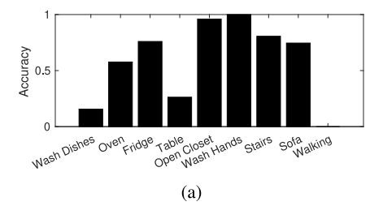

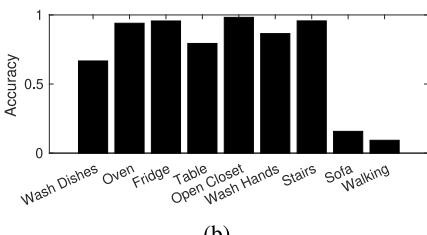

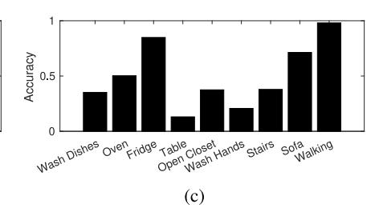

Fig. 15. Prediction accuracy for all 9 classes of activities given different TX/RX links pairs. (a) TX/RX Link 1. Total Accuracy: 58.52%. (b) TX/RX Link 2. Total Accuracy: 71.24%. (c) TX/RX Link 3. Total Accuracy: 49.89%.

*2) Evaluated ESP32 for Different Use Cases:* Within this work, we further evaluated the use of the proposed ESP32 for different use cases, specifically: small-scale hand gesture recognition, medium-scale human activity recognition, as well as large-scale localization and activity recognition. While there are many different use cases that are possible with WiFi sensing, by demonstrating the capability of the ESP32-based edge WiFi sensing in these varying scales, we show that the ESP32 is a feasible candidate for a variety of tasks. Thus, we believe that this work will encourage further efforts in edge-based WiFi sensing with the ESP32 microcontroller.

In addition to these evaluations on different use cases, another important step to evaluate is the feasibility of performing prediction making directly on-board these small edge devices. There are a number of important issues to consider when running data processing and machine learning such as energy consumption and the low amount of storage available on-board edge devices. Towards improving this, we look at model quantization which is able to reduce storage usage as well as reduce the amount of computation and thus energy consumed in machine learning inference. While quantization is one method for improving model inference on edge devices, there are many other methods that can still be explored.

## *C. New Considerations for Edge WiFi Sensing*

Through our efforts, we believe we have demonstrated the feasibility of WiFi sensing at the edge which is an important step towards achieving real-world and scalable systems which rely on WiFi sensing. However, allowing for edge-based sensing introduces some new considerations which must be taken in future research works.

- *1) Need for Inference Rate Evaluations:* Through our survey, we identified that very few works discuss the inference rate offered by their model architectures. Furthermore, we find that the research works that discuss inference rate tend to use high powered GPU-based systems which are not appropriate for real-world systems. Increasing inference rates offers a number of improvements including (i) improved real-time human-computer interaction responsiveness, (ii) the opportunity to decrease energy consumption by adding gaps between each prediction, and (iii) more processing time for other tasks such as communicating results with neighboring devices.
- *2) Need for Lightweight Model Architecture Designs:* As the popularity of deep learning continues to increase, model architectures are becoming more accurate while also becoming far more complex. While deep learning may be reasonable on

highly powerful systems, they are not appropriate for edgebased systems where low-costs are required and thus only low-powered devices are available. Based on this observation, we believe that it is important that WiFi sensing researchers should consider developing lightweight model architectures to accommodate this edge-based scenario. One method we discuss through this work to achieve more lightweight architectures is through the use of quantization where full 32-bit floating weights can be reduced down to 8-bit integers, thereby reducing the overall size of the model. However, there is far more room to explore in this direction.

*3) Edge Hardware Considerations:* We also found that it is important to take the hardware into consideration when developing edge-based WiFi sensing solutions. For example, towards using the ESP32-MCU for WiFi sensing tasks, we identify that larger model sizes can be achieved through the use of on-board PSRAM modules, however, this results in a slight reduction in inference rate due to slow SPI speeds compared to standard RAM. Furthermore, the availability of neural accelerator hardware can offer additional improvements in inference speed. However, because these accelerators are not designed as general-purpose computation systems, they often require workflows to be converted to match the expectations of the accelerator.

## VII. FUTURE CHALLENGES

## *A. Multiple TX/RX Links*

Typical WiFi sensing experiments assume a single TX and a single RX device. However, in real world environments we might have multiple TX devices such as our laptops, smartphones, and IoT devices. Leveraging multiple links that are dispersed throughout an environment may allow WiFi sensing systems to better identify physical actions in much larger environments. For example, in our large-scale experiment; as illustrated in Fig. 7(c), we deploy three transmitters in three unique locations throughout the home environment. The transmitters send CSI-frames to the receiver location in the center of the environment.

So far through this work, we have only considered the model accuracy when using a single pair in this large-scale experiment. If we train our a model for each of the links independently, we expect that some of the links will work well for some of the classes while other links will work better on other classes. In Fig. [15,](#page-25-1) we can see the prediction accuracy for each of the nine activities when using models trained independently at each of the three links. The model trained on CSI from

TABLE XIV RESULTS OF VARIOUS LINK-PREDICTION SELECTION METHODS SHOWING THAT SUCCESSFULLY DETERMINING THE MOST QUALIFIED LINK WILL ALLOW FOR A HIGHER PREDICTION ACCURACY

| Link Selected | Accuracy |
|---------------|----------|
| Link 1        | 58.52%   |
| Link 2        | 71.24%   |
| Link 3        | 49.89%   |
| Best Case     | 89.14%   |
| Worst Case    | 29.65%   |

Link 1 (Fig. [15\(](#page-25-1)a)) achieves poor prediction quality for three classes: Wash Dishes, Writing at Table, and Walking in Living Room. However, the model trained on CSI from Link 2 and Link 3 (Fig. [15\(](#page-25-1)b) and Fig. [15\(](#page-25-1)c)) are able to supplement these inadequacies by achieving much higher accuracy for these three classes. In Table [XIV,](#page-26-1) we can see the accuracy achieved by each link independently as well as if we perform different link-selection methods. The first method; labelled *Best Case*, indicates the accuracy if any of the three locations make a correct prediction while the second method; labelled *Worst Case*, indicates the accuracy if any of the three locations makes an incorrect prediction. This gives us our bounds for how well our WiFi sensing system could perform when using the three independently trained model. The best case scenario shows an improvement of +17.90% compared to using a Link 2 and +39.25% for Link 3. Thus, we can see that leveraging multiple links leaves room for major improvements for the accuracy of a WiFi sensing system.

A few methods for link selection have appeared due to the multiple antennas available on hardware like the Intel 5300 NIC. For example, WiWrite [\[55\]](#page-28-13) selects two of the on-board antennas with the highest correlation while Wi-Mose [\[159\]](#page-30-21) uses the antenna link with the highest variance. More research must be performed to (i) identify methods for leveraging diversely positioned devices, (ii) communicate predictions amongst these devices, (iii) leverage additional links such as from IoT devices.

## *B. Long-Term Model Adaptation*

In this work, we primarily focused on understanding the feasibility of running different signal processing techniques over time, however this work does not consider how these methods can adapt to changes over time. Indeed, we find that there are no noticeable trends in the datasets that we collected for this work. However, longer-term CSI data collection (i.e., months or years) may introduce variations that current research works are unable to adapt to. Detrending streaming data signals is a common tactic to handle variations over long periods of time that may reduce the accuracy of a given method. So far in the research literature, we find only three works which consider detrending. These works are: [\[110\]](#page-29-15) which focuses on sleep stage monitoring, [\[111\]](#page-29-16) which tracks human walking speeds, and [\[105\]](#page-29-6) which captures respiratory information over time. In one other work [\[160\]](#page-30-22), it is suggested that WiFi sensing models can be continuously trained on-device using online stream sampling which allows the system to adapt to changes over

time. We suggest that more research work must be done to further identify and understand methods for adapting to changes in CSI signals over time as well as for adapting to physical changes in the signal multipath environment.

## *C. Real-Time Segmentation*

As CSI samples stream into a WiFi sensing system, segmentation can be used to determine whether or not an important action is being performed at any moment. This is useful to reduce how often machine learning inference needs to be performed and thus can also reduce the energy usage of the overall system. In this work, we use a *fixed window* approach where predictions are made for a rolling window of CSI. We discussed additional methods for performing segmentation in Section [III-B3,](#page-12-1) however these methods are specialized to specific use-cases [\[93\]](#page-29-9), [\[119\]](#page-29-24) and may not be generalizable to other applications of WiFi sensing. Most works [\[92\]](#page-29-37), [\[161\]](#page-30-23), [\[162\]](#page-30-24); including this work, assume that we can evaluate our model only on CSI samples with an associated action. However, more often than not, a WiFi sensing system deployed in an environment will not see any actions being performed (i.e., in the middle of the night). As such, segmentation is another important challenge that we must continue to consider into the future.

## *D. Integration With Physical Systems*

WiFi sensing can be used to recognize an outstanding number of unique physical actions or properties of a given environment. However, while we have seen a great number of laboratory experiments demonstrating novel methods for sensing, to the best of our knowledge, none of these works integrate WiFi sensing predictions into real physical systems. To push WiFi sensing forward as a technology, we need to not only think about interesting use cases and interesting sensing modalities, but we need to deploy these systems and allow them to be leveraged in the real-world such as through intelligent HVAC systems [\[163\]](#page-30-25), [\[164\]](#page-30-26), integration with health alert systems [\[98\]](#page-29-38), [\[165\]](#page-30-27), and home or office security monitoring and alerting systems [\[109\]](#page-29-12), [\[166\]](#page-30-28). When integrating WiFi sensing into physical systems, additional issues will arise related to device-to-device communication, clock synchronization across devices [\[167\]](#page-30-29), and knowledge sharing between edge devices [\[168\]](#page-30-30).

## VIII. CONCLUSION

In this work, we consider techniques and challenges when designing real-world WiFi sensing systems that make predictions at the edge. We discussed the theory for topics such as OFDM and CSI which have given rise to a number of novel WiFi-based sensing applications. Through an extensive survey of hundreds of WiFi sensing research works, we identified many signal processing techniques that are commonly applied to incoming CSI data to achieve signal denoising, dimensionality reduction and others. We discussed the mathematics behind these techniques to understand the feasibility of performing each technique on-board low-cost edge devices. It is not only important to understand whether the techniques are possible at the edge, but to also understand if the method is useful in providing improvements in prediction accuracy.

To this end, we performed an extensive set of CSI data collection experiments at small-scale (hand gesture recognition), medium-scale (human activity recognition), and at large-scale (activity and location sensing). Using different experimental scales allows us to identify techniques which result in consistent prediction improvements for many different WiFi sensing applications. For these three experiments, we collected CSI using the ESP32 WiFi-enabled edge microcontroller. The ESP32 is a perfect candidate for edge-based WiFi sensing because it can collect CSI on-board without requiring additional hardware and also because it is low-powered and low-cost. After evaluating the accuracy achieved by each method, we then evaluated the time to compute each signal processing technique on-board the ESP32 microcontroller and recognized which techniques are possible to run in real-time on the incoming stream of CSI data. Additionally, we evaluated the use of TFLite for performing machine learning inference on-board the ESP32. We identified that PSRAM and quantization are required to accommodate larger model architectures on low-resourced edge devices like the ESP32.

## REFERENCES

- [1] H. Jiang, C. Cai, X. Ma, Y. Yang, and J. Liu, "Smart home based on WiFi sensing: A survey," *IEEE Access*, vol. 6, pp. 13317–13325, 2018.
- [2] Y. Ma, G. Zhou, and S. Wang, "WiFi sensing with channel state information: A survey," *ACM Comput. Surveys*, vol. 52, no. 3, p. 46, 2019.
- [3] J. Liu, H. Liu, Y. Chen, Y. Wang, and C. Wang, "Wireless sensing for human activity: A survey," *IEEE Commun. Surveys Tuts.*, vol. 22, no. 3, pp. 1629–1645, 3rd Quart., 2019.
- [4] Y. He, Y. Chen, Y. Hu, and B. Zeng, "WiFi vision: Sensing, recognition, and detection with commodity MIMO-OFDM WiFi," *IEEE Internet Things J.*, vol. 7, no. 9, pp. 8296–8317, Sep. 2020.
- [5] J. Liu, G. Teng, and F. Hong, "Human activity sensing with wireless signals: A survey," *Sensors*, vol. 20, no. 4, p. 1210, 2020.
- [6] C. Li, Z. Cao, and Y. Liu, "Deep AI enabled ubiquitous wireless sensing: A survey," *ACM Comput. Surveys*, vol. 54, no. 2, pp. 1–35, 2021.
- [7] I. Nirmal, A. Khamis, M. Hassan, W. Hu, and X. Zhu, "Deep learning for radio-based human sensing: Recent advances and future directions," *IEEE Commun. Surveys Tuts.*, vol. 23, no. 2, pp. 995–1019, 2nd Quart., 2021.
- [8] S. Yousefi, H. Narui, S. Dayal, S. Ermon, and S. Valaee, "A survey on behavior recognition using WiFi channel state information," *IEEE Commun. Mag.*, vol. 55, no. 10, pp. 98–104, Oct. 2017.
- [9] D. Halperin, W. Hu, A. Sheth, and D. Wetherall, "Tool release: Gathering 802.11n traces with channel state information," *ACM SIGCOMM Comput. Commun. Rev.*, vol. 41, no. 1, p. 53, Jan. 2011.
- [\[10\]](#page-0-0) Y. Xie, Z. Li, and M. Li, "Precise power delay profiling with commodity WiFi," in *Proc. 21st Annu. Int. Conf. Mobile Comput. Netw. (MobiCom)*, 2015, pp. 53–64.
- [\[11\]](#page-0-1) H. Kang, Q. Zhang, and Q. Huang, "Context-aware wireless based cross domain gesture recognition," *IEEE Internet Things J.*, vol. 8, no. 17, pp. 13503–13515, Sep. 2021.
- [\[12\]](#page-0-1) L. Guo, Z. Lu, S. Zhou, X. Wen, and Z. He, "Emergency semantic feature vector extraction from WiFi signals for in-home monitoring of elderly," *IEEE J. Sel. Topics Signal Process.*, vol. 15, no. 6, pp. 1423–1438, Nov. 2021.
- [\[13\]](#page-0-2) M. Schulz, J. Link, F. Gringoli, and M. Hollick, "Shadow Wi-Fi: Teaching smartphones to transmit raw signals and to extract channel state information to implement practical covert channels over Wi-Fi," in *Proc. 16th Annu. Int. Conf. Mobile Syst. Appl. Services (MobiSys)*, 2018, pp. 256–268.
- [\[14\]](#page-0-3) F. Adib and D. Katabi, "See through walls with Wi-Fi!" in *Proc. SIGCOMM Conf.*, 2013, pp. 75–86.

- [\[15\]](#page-0-3) N. Smith *et al.*, "Real-time location fingerprinting for mobile devices in an indoor prison setting," in *Proc. Signal Process. Sens. Inf. Fusion Target Recognit. XXX*, vol. 11756, 2021, Art. no. 1175612.
- [\[16\]](#page-0-4) C. Uysal and T. Filik, "RF-Wri: An efficient framework for RF-based device-free air-writing recognition," *IEEE Sensors J.*, vol. 21, no. 16, pp. 17906–17916, Aug. 2021.
- [\[17\]](#page-1-3) S. M. Hernandez and E. Bulut, "Lightweight and standalone IoT based WiFi sensing for active repositioning and mobility," in *Proc. IEEE 21st Int. Symp. World Wireless Mobile Multimedia Netw. (WoWMoM)*, 2020, pp. 277–286.
- [\[18\]](#page-2-2) F. Zhang, C. Chen, B. Wang, and K. R. Liu, "WiSpeed: A statistical electromagnetic approach for device-free indoor speed estimation," *IEEE Internet Things J.*, vol. 5, no. 3, pp. 2163–2177, Jun. 2018.
- [\[19\]](#page-2-3) R. Prasad, *OFDM for Wireless Communications Systems*. London, U.K.: Artech House, 2004.
- [\[20\]](#page-3-3) Y. Shen and E. Martinez, *Channel Estimation in OFDM Systems*, Freescale Semicond., Austin, TX, USA, 2006.
- [\[21\]](#page-3-4) K. Ali, M. Alloulah, F. Kawsar, and A. X. Liu, "On goodness of WiFi based monitoring of vital signs in the wild," 2020, *arXiv:2003.09386*.
- [\[22\]](#page-4-1) S. Tan and J. Yang, "WiFinger: Leveraging commodity WiFi for finegrained finger gesture recognition," in *Proc. 17th ACM Int. Symp. Mobile Ad Hoc Netw. Comput.*, 2016, pp. 201–210.
- [\[23\]](#page-4-2) P. Li *et al.*, "Deep transfer learning for WiFi localization," in *Proc. Radar Conf.*, 2021, pp. 1–5.
- [\[24\]](#page-4-3) N. Jadhav, W. Wang, D. Zhang, O. Khatib, S. Kumar, and S. Gil, "WSR: A WiFi sensor for collaborative robotics," 2020, *arXiv:2012.04174*.
- [\[25\]](#page-4-3) B. Xiang *et al.*, "UAV assisted localization scheme of WSNs using RSSI and CSI information," in *Proc. IEEE 6th Int. Conf. Comput. Commun.*, 2020, pp. 718–722.
- [\[26\]](#page-4-4) J.-G. Jiang *et al.*, "CS-DICT: Accurate indoor localization with CSI selective amplitude and phase based regularized dictionary learning," in *Proc. Int. Conf. Algorithms Archit. Parallel Process.*, 2020, pp. 677–689.
- [\[27\]](#page-4-5) R. Zhou, M. Hao, X. Lu, M. Tang, and Y. Fu, "Device-free localization based on CSI fingerprints and deep neural networks," in *Proc. IEEE 15th Annu. Int. Conf. Sens. Commun. Netw.*, 2018, pp. 1–9.
- [\[28\]](#page-4-6) R. Zhou, H. Hou, Z. Gong, Z. Chen, K. Tang, and B. Zhou, "Adaptive device-free localization in dynamic environments through adaptive neural networks," *IEEE Sensors J.*, vol. 21, no. 1, pp. 548–559, Jan. 2021.
- [\[29\]](#page-4-6) L. Yang, T. Kamada, and C. Ohta, "Indoor localization based on CSI in dynamic environments through domain adaptation," *IEICE Commun. Exp.*, vol. 10, no. 8, pp. 564–569, 2021.
- [\[30\]](#page-4-7) Z. Yong, W. C. Bin, and Y. Chen, "A low-overhead indoor positioning system using CSI fingerprint based on transfer learning," *Sensors J.*, vol. 21, no. 16, pp. 18156–18165, Aug. 2021.
- [\[31\]](#page-4-8) S. Tan and J. Yang, "Multi-user activity recognition and tracking using commodity WiFi," 2021, *arXiv:2106.00865*.
- [32] C. Shi, J. Liu, H. Liu, and Y. Chen, "WiFi-enabled user authentication through deep learning in daily activities," *ACM Trans. Internet Things*, vol. 2, no. 2, pp. 1–25, 2021.
- [\[33\]](#page-4-9) Y. Zhao *et al.*, "Device-free secure interaction with hand gestures in WiFi-enabled IoT environment," *IEEE Internet Things J.*, vol. 8, no. 7, pp. 5619–5631, Apr. 2021.
- [\[34\]](#page-4-10) Q. Bu, X. Ming, J. Hu, T. Zhang, J. Feng, and J. Zhang, "TransferSense: Towards environment independent and one-shot WiFi sensing," *Pers. Ubiquitous Comput.*, vol. 26, no. 1, pp. 1–19, 2021.
- [\[35\]](#page-5-1) Y. Zeng, D. Wu, J. Xiong, E. Yi, R. Gao, and D. Zhang, "FarSense: Pushing the range limit of WiFi-based respiration sensing with CSI ratio of two antennas," *Proc. ACM Interact. Mobile Wearable Ubiquitous Technol.*, vol. 3, no. 3, pp. 1–26, 2019.
- [\[36\]](#page-5-2) I. Shirakami and T. Sato, "Heart rate variability extraction using commodity Wi-Fi devices via time domain signal processing," in *Proc. IEEE EMBS Int. Conf. Biomed. Health Inf.*, 2021, pp. 1–4.
- [\[37\]](#page-5-3) W. Liu, S. Chang, Y. Liu, and H. Zhang, "Wi-PSG: Detecting rhythmic movement disorder using COTS WiFi," *IEEE Internet Things J.*, vol. 8, no. 6, pp. 4681–4696, Mar. 2021.
- [\[38\]](#page-4-11) X. Chen, Z. Tian, M. Zhou, J. Yu, and B. Luo, "PHCount: Passive human number counting using WiFi," in *Proc. Int. Conf. Commun. Signal Process. Syst.*, 2020, pp. 1214–1223.
- [39] R. Sandaruwan, I. Alagiyawanna, S. Sandeepa, S. Dias, and D. Dias, "Device-free pedestrian count estimation using Wi-Fi channel state information," in *Proc. IEEE Int. Intell. Transp. Syst. Conf. (ITSC)*, Sep. 2021, pp. 2610–2616. [Online]. Available: https://doi.org/10.1109/ itsc48978.2021.9564725

- [\[40\]](#page-12-2) F. Zhang, C. Wu, B. Wang, H.-Q. Lai, Y. Han, and K. R. Liu, "WiDetect: Robust motion detection with a statistical electromagnetic model," *Proc. ACM Interact. Mobile Wearable Ubiquitous Technol.*, vol. 3, no. 3, pp. 1–24, 2019.
- [41] F. Xiao, X. Xie, H. Zhu, L. Sun, and R. Wang, "Invisible cloak fails: CSI-based passive human detection," in *Proc. ACM 1st Workshop Context Sens. Activity Recognit.*, Nov. 2015, pp. 19–23. [Online]. Available: https://doi.org/10.1145/2820716.2820719
- [\[42\]](#page-4-12) N. Damodaran, E. Haruni, M. Kokhkharova, and J. Schäfer, "Device free human activity and fall recognition using WiFi channel state information (CSI)," *CCF Trans. Pervasive Comput. Interact.*, vol. 2, no. 1, pp. 1–17, 2020.
- [\[43\]](#page-4-12) J. Huang *et al.*, "Towards anti-interference WiFi-based activity recognition system using interference-independent phase component," in *Proc. IEEE Conf. Comput. Commun.*, 2020, pp. 576–585.
- [\[44\]](#page-4-13) J. Yang, H. Zou, H. Jiang, and L. Xie, "Device-free occupant activity sensing using WiFi-enabled IoT devices for smart homes," *IEEE Internet Things J.*, vol. 5, no. 5, pp. 3991–4002, Oct. 2018.
- [\[45\]](#page-4-14) M. T. Islam and S. Nirjon, "Wi-Fringe: Leveraging text semantics in WiFi CSI-based device-free named gesture recognition," in *Proc. IEEE 16th Int. Conf. Distrib. Comput. Sensor Syst.*, 2020, pp. 35–42.
- [\[46\]](#page-4-15) D. Zhang, H. Wang, Y. Wang, and J. Ma, "Anti-fall: A non-intrusive and real-time fall detector leveraging CSI from commodity WiFi devices," in *Proc. Int. Conf. Smart Homes Health Telematics*, 2015, pp. 181–193.
- [\[47\]](#page-4-15) Y. Zhou, M. Gao, Y. Luo, and X. Fan, "Human fall recognition based on WiFi CSI with dynamic subcarrier extraction of interference index," *J. Phys. Conf.*, vol. 1861, Feb. 2021, Art. no. 012072.
- [\[48\]](#page-4-8) S. M. Hernandez, M. Touhiduzzaman, P. E. Pidcoe, and E. Bulut, "Wi-PT: Wireless sensing based low-cost physical rehabilitation tracking," in *Proc. IEEE Int. Conf. E-Health Netw. Appl. Services (HealthCom)*, Genoa, Italy, Oct. 2022, pp. 1–9.
- [\[49\]](#page-4-8) H. Cai, B. Korany, C. R. Karanam, and Y. Mostofi, "Teaching RF to sense without RF training measurements," *Proc. ACM Interact. Mobile Wearable Ubiquitous Technol.*, vol. 4, no. 4, pp. 1–22, 2020.
- [\[50\]](#page-4-16) J. Huang, B. Liu, H. Jin, and N. Yu, "WiLay: A two-layer human localization and activity recognition system using WiFi," in *Proc. IEEE 93rd Veh. Technol. Conf.*, 2021, pp. 1–6.
- [\[51\]](#page-4-17) M. Raja, V. Ghaderi, and S. Sigg, "WiBot! In-vehicle behaviour and gesture recognition using wireless network edge," in *Proc. 38th Int. Conf. Distrib. Comput. Syst.*, 2018, pp. 376–387.
- [\[52\]](#page-4-18) H. Li, W. Yang, J. Wang, Y. Xu, and L. Huang, "WiFinger: Talk to your smart devices with finger-grained gesture," in *Proc. ACM Int. Joint Conf. Pervasive Ubiquitous Comput.*, 2016, pp. 250–261.
- [\[53\]](#page-4-18) Y. Zhang, K. Xu, and Y. Wang, "WiNum: A WIFI finger gesture recognition system based on CSI," in *Proc. 7th Int. Conf. Inf. Technol. IoT Smart City*, 2019, pp. 181–186.
- [\[54\]](#page-4-10) Z. Hao, Y. Duan, X. Dang, Y. Liu, and D. Zhang, "Wi-SL: Contactless fine-grained gesture recognition uses channel state information," *Sensors*, vol. 20, no. 14, p. 4025, 2020.
- [\[55\]](#page-4-19) C. Lin, T. Xu, J. Xiong, F. Ma, L. Wang, and G. Wu, "WiWrite: An accurate device-free handwriting recognition system with COTS WiFi," in *Proc. IEEE 40th Int. Conf. Distrib. Comput. Syst.*, 2020, pp. 700–709.
- [\[56\]](#page-4-19) R. Gao *et al.*, "Towards position-independent sensing for gesture recognition with Wi-Fi," *Proc. ACM Interact. Mobile Wearable Ubiquitous Technol.*, vol. 5, no. 2, pp. 1–28, 2021.
- [\[57\]](#page-4-20) K. Ali, A. X. Liu, W. Wang, and M. Shahzad, "Keystroke recognition using WiFi signals," in *Proc. 21st Annu. Int. Conf. Mobile Comput. Netw.*, 2015, pp. 90–102.
- [\[58\]](#page-4-20) X. Shen, Z. Ni, L. Liu, J. Yang, and K. Ahmed, "WiPass: 1D-CNNbased smartphone keystroke recognition using WiFi signals," *Pervasive Mobile Comput.*, vol. 73, Jun. 2021, Art. no. 101393.
- [\[59\]](#page-4-21) J. Liu, K. Liu, F. Jin, D. Wang, G. Yan, and K. Xiao, "An efficient CSI-based pedestrian monitoring approach via single pair of WiFi transceivers," in *Proc. Int. Conf. Neural Comput. Adv. Appl.*, 2021, pp. 685–700.
- [\[60\]](#page-4-22) X. Wang, Y. Wang, and D. Wang, "A real-time CSI-based passive intrusion detection method," in *Proc. IEEE Int. Conf Parallel Distrib. Process. Appl. Big Data Cloud Comput. Sustain. Comput. Commun. Soc. Comput. Netw.*, 2020, pp. 1091–1098.
- [\[61\]](#page-4-23) J. Guo and H. Li, "RSWI: A rescue system with WiFi sensing and image recognition," in *Proc. ACM Turing Celebration Conf. China*, 2019, pp. 1–4.
- [\[62\]](#page-5-4) B. Korany and Y. Mostofi, "Counting a stationary crowd using off-theshelf WiFi," in *Proc. 19th Annu. Int. Conf. Mobile Syst. Appl. Services*, 2021, pp. 202–214.

- [\[63\]](#page-5-5) D. Konings and F. Alam, "LifeCount: A device-free CSI-based human counting solution for emergency building evacuations," in *Proc. IEEE Sensors Appl. Symp.*, 2020, pp. 1–5.
- [\[64\]](#page-5-6) S. M. Hernandez and E. Bulut, "Adversarial occupancy monitoring using one-sided through-wall WiFi sensing," in *Proc. IEEE Int. Conf. Commun.*, 2021, pp. 1–6.
- [\[65\]](#page-5-1) Y. Zeng, D. Wu, R. Gao, T. Gu, and D. Zhang, "FullBreathe: Full human respiration detection exploiting complementarity of CSI phase and amplitude of WiFi signals," *Proc. ACM Interact. Mobile Wearable Ubiquitous Technol.*, vol. 2, no. 3, pp. 1–19, 2018.
- [\[66\]](#page-5-7) Y. Zeng, D. Wu, J. Xiong, J. Liu, Z. Liu, and D. Zhang, "MultiSense: Enabling multi-person respiration sensing with commodity WiFi," *Proc. ACM Interact. Mobile Wearable Ubiquitous Technol.*, vol. 4, no. 3, pp. 1–29, 2020.
- [\[67\]](#page-5-8) J. Liu, Y. Zeng, T. Gu, L. Wang, and D. Zhang, "WiPhone: Smartphonebased respiration monitoring using ambient reflected WiFi signals," *Proc. ACM Interact. Mobile Wearable Ubiquitous Technol.*, vol. 5, no. 1, pp. 1–19, 2021.
- [\[68\]](#page-5-9) B. Korany and Y. Mostofi, "Nocturnal seizure detection using off-theshelf WiFi," 2021, *arXiv:2103.13556*.
- [\[69\]](#page-5-2) X. Wang, C. Yang, and S. Mao, "PhaseBeat: Exploiting CSI phase data for vital sign monitoring with commodity WiFi devices," in *Proc. IEEE 37th Int. Conf. Distrib. Comput. Syst.*, 2017, pp. 1230–1239.
- [\[70\]](#page-5-10) Y. Gu *et al.*, "EmoSense: Data-driven emotion sensing via off-the-shelf WiFi devices," in *Proc. IEEE Int. Conf. Commun. (ICC)*, 2018, pp. 1–6.
- [\[71\]](#page-5-11) Z. Lin, Y. Xie, X. Guo, Y. Ren, Y. Chen, and C. Wang, "WiEat: Fine-grained device-free eating monitoring leveraging Wi-Fi signals," in *Proc. IEEE 29th Int. Conf. Comput. Commun. Netw.*, 2020, pp. 1–9.
- [\[72\]](#page-5-12) S. Tan and J. Yang, "Object sensing for fruit ripeness detection using WiFi signals," 2021, *arXiv:2106.00860*.
- [\[73\]](#page-5-13) W. Yang, X. Wang, A. Song, and S. Mao, "Wi-Wheat: Contact-free wheat moisture detection with commodity WiFi," in *Proc. IEEE Int. Conf. Commun.*, 2018, pp. 1–6.
- [\[74\]](#page-5-14) S. M. Hernandez, D. Erdag, and E. Bulut, "Towards dense and scalable soil sensing through low-cost WiFi sensing networks," in *Proc. IEEE 46th Conf. Local Comput. Netw. (LCN)*, 2021, pp. 549–556.
- [\[75\]](#page-5-15) Y. Ren, S. Tan, L. Zhang, Z. Wang, Z. Wang, and J. Yang, "Liquid level sensing using commodity WiFi in a smart home environment," *Proc. ACM Interact. Mobile Wearable Ubiquitous Technol.*, vol. 4, no. 1, pp. 1–30, 2020.
- [\[76\]](#page-5-16) H. Song, B. Wei, Q. Yu, X. Xiao, and T. Kikkawa, "WiEps: Measurement of dielectric property with commodity WiFi device—An application to ethanol/water mixture," *IEEE Internet Things J.*, vol. 7, no. 12, pp. 11667–11677, Dec. 2020.
- [\[77\]](#page-5-17) S. Jian, S. Ishida, and Y. Arakawa, "Initial attempt on Wi-Fi CSI based vibration sensing for factory equipment fault detection," in *Proc. Int. Conf. Distrib. Comput. Netw.*, 2021, pp. 163–168.
- [78] Z. Zhou, Z. Yang, C. Wu, W. Sun, and Y. Liu, "LiFi: Line-of-sight identification with WiFi," in *Proc. IEEE Conf. Comput. Commun.*, 2014, pp. 2688–2696.
- [79] R. Ramezani, Y. Xiao, and A. Naeim, "Sensing-Fi: Wi-Fi CSI and accelerometer fusion system for fall detection," in *Proc. IEEE EMBS Int. Conf. Biomed. Health Inf.*, 2018, pp. 402–405.
- [\[80\]](#page-8-1) X. Wang, C. Yang, and S. Mao, "On CSI-based vital sign monitoring using commodity WiFi," *ACM Trans. Comput. Healthcare*, vol. 1, no. 3, pp. 1–27, 2020.
- [\[81\]](#page-6-0) E. Ding, X. Li, T. Zhao, L. Zhang, and Y. Hu, "A robust passive intrusion detection system with commodity WiFi devices," *J. Sensors*, vol. 2018, pp. 1–12, May 2018.
- [82] L. Zhang and H. Wang, "3D-WiFi: 3D localization with commodity WiFi," *IEEE Sensors J.*, vol. 19, no. 13, pp. 5141–5152, Jul. 2019. [Online]. Available: https://doi.org/10.1109/jsen.2019.2900511
- [83] X. Ding, T. Jiang, W. Xue, Z. Li, and Y. Zhong, "A new method of human gesture recognition using Wi-Fi signals based on XGBoost," in *Proc. IEEE Int. Conf. Commun. China*, 2020, pp. 237–241.
- [84] Y. T. Xu, X. Chen, X. Liu, D. Meger, and G. Dudek, "PresSense: Passive respiration sensing via ambient WiFi signals in noisy environments," in *Proc. IEEE Int. Conf. Intell. Robots Syst.*, 2020, pp. 4032–4039.
- [\[85\]](#page-9-1) J. Zuo, X. Zhu, Y. Peng, Z. Zhao, X. Wei, and X. Wang, "A new method of posture recognition based on WiFi signal," *IEEE Commun. Lett.*, vol. 25, no. 8, pp. 2564–2568, Aug. 2021.
- [\[86\]](#page-8-2) Q. Zhou, J. Xing, and Q. Yang, "Device-free occupant activity recognition in smart offices using intrinsic Wi-Fi components," *Build. Environ.*, vol. 172, Apr. 2020, Art. no. 106737.

- [87] L. Guo, Z. Lu, S. Zhou, X. Wen, and Z. He, "When Healthcare meets off-the-shelf WiFi: A non-wearable and low-costs approach for in-home monitoring," 2020, *arXiv:2009.09715*.
- [\[88\]](#page-8-3) Y. Hao, Z. Shi, and Y. Liu, "A wireless-vision Dataset for privacy preserving human activity recognition," in *Proc. IEEE 4th Int. Conf. Multimedia Comput. Netw. Appl.*, 2020, pp. 97–105.
- [89] Z. Shi, J. A. Zhang, R. Xu, Q. Cheng, and A. Pearce, "Towards environment-independent human activity recognition using deep learning and enhanced CSI," in *Proc. Global Commun. Conf.*, 2020, pp. 1–6.
- [\[90\]](#page-9-2) D. Wu, D. Zhang, C. Xu, Y. Wang, and H. Wang, "WiDir: Walking direction estimation using wireless signals," in *Proc. Int. Joint Conf. Pervasive Ubiquitous Comput. (UbiComp)*, 2016, pp. 351–362.
- [\[91\]](#page-9-3) M. Li *et al.*, "When CSI meets public WiFi: Inferring your mobile phone password via WiFi signals," in *Proc. SIGSAC Conf. Comput. Commun. Security*, 2016, pp. 1068–1079.
- [\[92\]](#page-26-2) L. Sharma, C. Chao, S.-L. Wu, and M.-C. Li, "High accuracy WiFi-based human activity classification system with time-frequency diagram CNN method for different places," *Sensors*, vol. 21, no. 11, p. 3797, 2021.
- [\[93\]](#page-9-4) H. Abdelnasser, M. Youssef, and K. A. Harras, "WiGest: A ubiquitous WiFi-based gesture recognition system," in *Proc. Conf. Comput. Commun.*, 2015, pp. 1472–1480.
- [\[94\]](#page-14-0) W. Xi *et al.*, "Device-free human activity recognition using CSI," in *Proc. 1st Workshop Context Sens. Activity Recognit.*, 2015, pp. 31–36.
- [\[95\]](#page-11-1) X. Liu, J. Cao, S. Tang, and J. Wen, "Wi-Sleep: Contactless sleep monitoring via WiFi signals," in *Proc. IEEE Real Time Syst. Symp.*, 2014, pp. 346–355.
- [96] D. Jiang, M. Li, and C. Xu, "WiGAN: A WiFi based gesture recognition system with GANs," *Sensors*, vol. 20, no. 17, p. 4757, 2020.
- [97] J. Huang, B. Liu, H. Jin, and Z. Liu, "WiAnti: An anti-interference activity recognition system based on WiFi CSI," in *Proc. IEEE Int. Conf. Internet Things IEEE Green Comput. Commun. IEEE Cyber Phys. Social Comput. IEEE Smart Data*, 2018, pp. 58–65.
- [\[98\]](#page-26-3) M. Muaaz, A. Chelli, M. W. Gerdes, and M. Pätzold, "Wi-Sense: A passive human activity recognition system using Wi-Fi and convolutional neural network and its integration in health information systems," *Ann. Telecommun.*, vol. 77, nos. 3–4, pp. 1–13, 2021.
- [99] W. Nie, Z.-C. Han, M. Zhou, L.-B. Xie, and Q. Jiang, "UAV detection and identification based on WiFi signal and RF fingerprint," *Sensors J.*, vol. 21, no. 12, pp. 13540–13550, Jun. 2021.
- [100] Y. Bai and X. Wang, "CARIN: Wireless CSI-based driver activity recognition under the interference of passengers," *Proc. ACM Interact. Mobile Wearable Ubiquitous Technol.*, vol. 4, no. 1, pp. 1–28, 2020.
- [\[101\]](#page-7-4) X. Xu, J. Yu, Y. Chen, Y. Zhu, L. Kong, and M. Li, "BreathListener: Fine-grained breathing monitoring in driving environments Utilizing acoustic signals," in *Proc. 17th Annu. Int. Conf. Mobile Syst. Appl. Services*, 2019, pp. 54–66.
- [\[102\]](#page-7-5) S. Mallat, *A Wavelet Tour of Signal Processing*, 3rd ed. Amsterdam, The Netherlands: Elsevier, 2009.
- [\[103\]](#page-8-4) M. Vishwanath, "The recursive pyramid algorithm for the discrete wavelet transform," *IEEE Trans. Signal Process.*, vol. 42, no. 3, pp. 673–676, Mar. 1994.
- [\[104\]](#page-9-5) A. Savitzky and M. J. Golay, "Smoothing and differentiation of data by simplified least squares procedures," *Anal. Chem.*, vol. 36, no. 8, pp. 1627–1639, 1964.
- [\[105\]](#page-9-6) A. Khamis, B. Kusy, C. T. Chou, and W. Hu, "WiRelax: Towards realtime respiratory biofeedback during meditation using WiFi," *Ad Hoc Netw.*, vol. 107, Oct. 2020, Art. no. 102226.
- [\[106\]](#page-9-7) J. O. Smith, *Introduction to Digital Filters: With Audio Applications*, vol. 2. Branson, MO, USA: W3K, 2007.
- [\[107\]](#page-10-1) S. Tan, J. Yang, and Y. Chen, "Enabling fine-grained finger gesture recognition on commodity WiFi devices," *IEEE Trans. Mobile Comput.*, vol. 21, no. 8, pp. 2789–2802, Aug. 2022.
- [\[108\]](#page-10-2) Y. Gu, X. Zhang, H. Yan, Z. Liu, and F. Ren, *Wital: WiFi-Based Real-Time Vital Signs Monitoring During Sleep*, Hefei Univ. Technol., Hefei, China, 2021.
- [\[109\]](#page-10-3) W. Zhuang, Y. Shen, L. Li, C. Gao, and D. Dai, "Develop an adaptive real-time indoor intrusion detection system based on empirical analysis of OFDM Subcarriers," *Sensors*, vol. 21, no. 7, p. 2287, 2021.
- [\[110\]](#page-11-2) B. Yu *et al.*, "WiFi-sleep: Sleep stage monitoring using commodity Wi-Fi devices," *Internet Things J.*, vol. 8, no. 18, pp. 13900–13913, Sep. 2021.
- [\[111\]](#page-11-3) C. Wu, F. Zhang, Y. Hu, and K. R. Liu, "GaitWay: Monitoring and recognizing gait speed through the walls," *IEEE Trans. Mobile Comput.*, vol. 20, no. 6, pp. 2186–2199, Jun. 2021.

- [\[112\]](#page-11-4) Y. Li, T. Jiang, X. Ding, and Y. Wang, "Location-free CSI based activity recognition with angle difference of arrival," in *Proc. IEEE Wireless Commun. Netw. Conf.*, 2020, pp. 1–6.
- [113] D. Wu *et al.*, "FingerDraw: Sub-wavelength level finger motion tracking with WiFi signals," *Proc. ACM Interact. Mobile Wearable Ubiquitous Technol.*, vol. 4, no. 1, pp. 1–27, 2020.
- [114] T. Wang, D. Yang, S. Zhang, Y. Wu, and S. Xu, "Wi-alarm: Lowcost passive intrusion detection using WiFi," *Sensors*, vol. 19, no. 10, p. 2335, 2019.
- [\[115\]](#page-11-5) W. Jiang *et al.*, "Towards 3D human pose construction using WiFi," in *Proc. 26th Annu. Int. Conf. Mobile Comput. Netw.*, 2020, pp. 1–14.
- [116] R. Xiao, J. Liu, J. Han, and K. Ren, "OneFi: One-shot recognition for unseen gesture via COTS WiFi," in *Proc. 19th ACM Conf. Embedded Netw. Sensor Syst.*, 2021, pp. 206–219.
- [117] Y. Lu, S. Lv, and X. Wang, "Towards location independent gesture recognition with commodity WiFi devices," *Electronics*, vol. 8, no. 10, p. 1069, 2019.
- [118] M. A. A. Al-Qaness and F. Li, "WiGeR: WiFi-based gesture recognition system," *ISPRS Int. J. Geo Inf.*, vol. 5, no. 6, p. 92, 2016.
- [\[119\]](#page-12-3) T. Li, C. Shi, P. Li, and P. Chen, "A novel gesture recognition system based on CSI extracted from a smartphone with Nexmon firmware," *Sensors*, vol. 21, no. 1, p. 222, 2021.
- [\[120\]](#page-12-4) F.-Y. Chu, C.-J. Chiu, A.-H. Hsiao, K.-T. Feng, and P.-H. Tseng, "WiFi CSI-based device-free multi-room presence detection using conditional recurrent network," in *Proc. IEEE 93rd Veh. Technol. Conf.*, 2021, pp. 1–5.
- [\[121\]](#page-14-1) Y. Ma *et al.*, "Location-and person-independent activity recognition with WiFi, deep neural networks, and reinforcement learning," *ACM Trans. Internet Things*, vol. 2, no. 1, pp. 1–25, 2021.
- [122] X. Shen, L. Guo, Z. Lu, X. Wen, and S. Zhou, "WiAgent: Link selection for CSI-based activity recognition in densely deployed wi-Fi environments," in *Proc. IEEE Wireless Commun. Netw. Conf.*, 2021, pp. 1–6.
- [\[123\]](#page-13-0) Y. Sun *et al.*, "Enabling lightweight device-free wireless sensing with network pruning and quantization," *Sensors J.*, vol. 22, no. 1, pp. 969–979, Jan. 2022.
- [\[124\]](#page-10-4) W. Wang, A. X. Liu, M. Shahzad, K. Ling, and S. Lu, "Understanding and modeling of WiFi signal based human activity recognition," in *Proc. ACM 21st Annu. Int. Conf. Mobile Comput. Netw. (MobiCom)*, 2015, pp. 65–76.
- [\[125\]](#page-10-4) J. Zhang, Z. Tang, M. Li, D. Fang, P. Nurmi, and Z. Wang, "CrossSense: Towards cross-site and large-scale WiFi sensing," in *Proc. ACM 24th Annu. Int. Conf. Mobile Comput. Netw. (MobiCom)*, 2018, pp. 305–320.
- [\[126\]](#page-11-6) R. Nandakumar, B. Kellogg, and S. Gollakota, "Wi-Fi gesture recognition on existing devices," 2014, *arXiv:1411.5394*.
- [\[127\]](#page-12-5) J. Zhao, L. Liu, Z. Wei, C. Zhang, W. Wang, and Y. Fan, "R-DEHM: CSI-based robust duration estimation of human motion with WiFi," *Sensors*, vol. 19, no. 6, p. 1421, 2019.
- [\[128\]](#page-12-6) Z. Shi, J. A. Zhang, R. Y. Xu, and Q. Cheng, "WiFi-based activity recognition using activity filter and enhanced correlation with deep learning," in *Proc. IEEE Int. Conf. Commun. Workshops*, 2020, pp. 1–6.
- [\[129\]](#page-12-7) Y. Wang, J. Liu, Y. Chen, M. Gruteser, J. Yang, and H. Liu, "E-eyes: Device-free location-oriented activity identification using fine-grained WiFi signatures," in *Proc. 20th Annu. Int. Conf. Mobile Comput. Netw.*, 2014, pp. 617–628.
- [\[130\]](#page-12-8) P.-E. Novac, G. B. Hacene, A. Pegatoquet, B. Miramond, and V. Gripon, "Quantization and deployment of deep neural networks on microcontrollers," *Sensors*, vol. 21, no. 9, p. 2984, 2021.
- [\[131\]](#page-13-1) F. N. Iandola, S. Han, M. W. Moskewicz, K. Ashraf, W. J. Dally, and K. Keutzer, "SqueezeNet: AlexNet-level accuracy with 50x fewer parameters and < 0.5 MB model size," 2016, *arXiv:1602.07360*.
- [\[132\]](#page-13-2) A. G. Howard *et al.*, "MobileNets: Efficient convolutional neural networks for mobile vision applications," 2017, *arXiv:1704.04861*.
- [\[133\]](#page-13-3) M. Tan and Q. Le, "EfficientNet: Rethinking model scaling for convolutional neural networks," in *Proc. Int. Conf. Mach. Learn.*, 2019, pp. 6105–6114.
- [\[134\]](#page-13-4) I. Hubara, M. Courbariaux, D. Soudry, R. El-Yaniv, and Y. Bengio, "Binarized neural networks," in *Proc. Adv. Neural Inf. Process. Syst.*, vol. 29, 2016, pp. 1117–1125.
- [\[135\]](#page-13-5) S. Han, J. Pool, J. Tran, and W. J. Dally, "Learning both weights and connections for efficient neural networks," 2015, *arXiv:1506.02626*.
- [\[136\]](#page-13-6) Z. Liu, M. Sun, T. Zhou, G. Huang, and T. Darrell, "Rethinking the value of network pruning," 2018, *arXiv:1810.05270*.
- [\[137\]](#page-13-7) L. Heim, A. Biri, Z. Qu, and L. Thiele, "Measuring what really matters: Optimizing neural networks for TinyML," 2021, *arXiv:2104.10645*.

- [\[138\]](#page-13-8) E. Liberis, Ł. Dudziak, and N. D. Lane, "μNAS: Constrained neural architecture search for microcontrollers," in *Proc. 1st Workshop Mach. Learn. Syst.*, 2021, pp. 70–79.
- [\[139\]](#page-14-2) C. Wu and K. R. Liu, "Accurate stride length estimation via fused radio and inertial sensing," in *Proc. IEEE 6th World Forum Internet Things*, 2020, pp. 1–6.
- [\[140\]](#page-14-3) F. Wang, F. Zhang, C. Wu, B. Wang, and K. J. R. Liu, "Respiration tracking for people counting and recognition," *IEEE Internet Things J.*, vol. 7, no. 6, pp. 5233–5245, Jun. 2020. [Online]. Available: https: //doi.org/10.1109/jiot.2020.2977254
- [\[141\]](#page-14-4) O. Oshiga, H. U. Suleiman, S. Thomas, P. Nzerem, L. Farouk, and S. Adeshina, "Human detection for crowd count estimation using CSI of WiFi signals," in *Proc. IEEE 15th Int. Conf. Electron. Comput. Comput. (ICECCO)*, Dec. 2019, pp. 1–9. [Online]. Available: https: //doi.org/10.1109/icecco48375.2019.9043195
- [\[142\]](#page-14-5) A. Polo, M. Salucci, S. Verzura, Z. Zhou, and A. Massa, "Realtime CSI-based wireless gesture recognition for human-machine interaction," in *Proc. IEEE 10th Int. Conf. Modern Circuits Syst. Technol. (MOCAST)*, Jul. 2021, pp. 1–4. [Online]. Available: https: //doi.org/10.1109/mocast52088.2021.9493383
- [\[143\]](#page-14-6) S. Li *et al.*, "WiFi-based device-free vehicle speed measurement using fast phase correction MUSIC algorithm," in *Proc. IEEE Int. Conf. Internet Things (iThings) Green Comput. Commun. (GreenCom) Cyber Phys. Soc. Comput. (CPSCom) IEEE Smart Data (SmartData) IEEE Congr. Cybermatics (Cybermatics)*, Nov. 2020, pp. 93–99. [Online]. Available: https://doi.org/10.1109/ithingsgreencom-cpscom-smartdata-cybermatics50389.2020.00033
- [\[144\]](#page-14-7) H. Xue, J. Yu, F. Lyu, and M. Li, "Push the limit of multipath profiling using commodity WiFi devices with limited bandwidth," *IEEE Trans. Veh. Technol.*, vol. 69, no. 4, pp. 4142–4154, Apr. 2020. [Online]. Available: https://doi.org/10.1109/tvt.2020.2966871
- [\[145\]](#page-14-8) S. Tewes and A. Sezgin, "WS-WiFi: Wired synchronization for CSI extraction on COTS-WiFi-transceivers," *IEEE Internet Things J.*, vol. 8, no. 11, pp. 9099–9108, Jun. 2021. [Online]. Available: https://doi.org/ 10.1109/jiot.2021.3058179
- [\[146\]](#page-14-9) F. Tirado-Andrés and A. Araujo, "Performance of clock sources and their influence on time synchronization in wireless sensor networks," *Int. J. Distrib. Sensor Netw.*, vol. 15, no. 9, p. 19, 2019.
- [\[147\]](#page-14-10) W. Li, M. J. Bocus, C. Tang, R. J. Piechocki, K. Woodbridge, and K. Chetty, "On CSI and passive Wi-Fi radar for opportunistic physical activity recognition," *IEEE Trans. Wireless Commun.*, vol. 21, no. 1, pp. 607–620, Jan. 2022. [Online]. Available: https://doi.org/10.1109/ twc.2021.3098526
- [\[148\]](#page-14-11) E. Soltanaghaei *et al.*, "Robust and practical WiFi human sensing using on-device learning with a domain adaptive model," in *Proc. 7th ACM Int. Conf. Syst. Energy Efficient Build. Cities Transp.*, 2020, pp. 150–159.
- [\[149\]](#page-14-11) S. Kato *et al.*, "CSI2Image: Image reconstruction from channel state information using generative adversarial networks," *IEEE Access*, vol. 9, pp. 47154–47168, 2021.
- [\[150\]](#page-14-12) B. Wu, T. Jiang, J. Yu, X. Ding, S. Wu, and Y. Zhong, "Device-free human activity recognition with identity-based transfer mechanism," in *Proc. IEEE Wireless Commun. Netw. Conf. (WCNC)*, Mar. 2021, pp. 1–6. [Online]. Available: https://doi.org/10.1109/wcnc49053.2021. 9417373
- [\[151\]](#page-14-13) Y. Ma *et al.*, "Location- and person-independent activity recognition with WiFi, deep neural networks, and reinforcement learning," *ACM Trans. Internet Things*, vol. 2, no. 1, pp. 1–25, Feb. 2021. [Online]. Available: https://doi.org/10.1145/3424739
- [\[152\]](#page-14-14) D. Zhang, X. Li, and Y. Chen, "Pushing the limit of phase offset for contactless sensing using commodity WiFi," in *Proc. IEEE Int. Conf. Acoust. Speech Signal Process. (ICASSP)*, Jun. 2021, pp. 8303–8307. [Online]. Available: https://doi.org/10.1109/icassp39728.2021.9414926
- [\[153\]](#page-14-15) H. Choi, M. Fujimoto, T. Matsui, S. Misaki, and K. Yasumoto, "Wi-CaL: WiFi sensing and machine learning based device-free crowd counting and localization," *IEEE Access*, vol. 10, pp. 24395–24410, 2022. [Online]. Available: https://doi.org/10.1109/access.2022.3155812
- [\[154\]](#page-14-15) M. Cominelli, F. Gringoli, and R. L. Cigno, "Passive device-free multi-point CSI localization and its obfuscation with randomized filtering," in *Proc. IEEE 19th Mediterr. Commun. Comput. Netw. Conf. (MedComNet)*, Jun. 2021, pp. 1–8. [Online]. Available: https://doi.org/ 10.1109/medcomnet52149.2021.9501240

- [\[155\]](#page-16-2) T. Akiba, S. Sano, T. Yanase, T. Ohta, and M. Koyama, "Optuna: A next-generation hyperparameter optimization framework," in *Proc. ACM 25th SIGKDD Int. Conf. Knowl. Disc. Data Min.*, 2019, pp. 2623–2631.
- [\[156\]](#page-19-4) C. E. Shannon, "Communication in the presence of noise," *Proc. IRE*, vol. 37, no. 1, pp. 10–21, 1949.
- [\[157\]](#page-19-5) J. Xiao, H. Li, and H. Jin, "TransTrack: Online meta-transfer learning and Otsu segmentation enabled wireless gesture tracking," *Pattern Recognit.*, vol. 121, Jan. 2022, Art. no. 108157.
- [\[158\]](#page-19-6) G. Zhang, Z. Tian, M. Zhou, and X. Chen, "Gait cycle detection using commercial WiFi device," in *Proc. Int. Conf. Commun. Signal Process. Syst.*, 2020, pp. 1224–1231.
- [\[159\]](#page-26-4) Y. Wang, L. Guo, Z. Lu, X. Wen, S. Zhou, and W. Meng, "From point to space: 3D moving human pose estimation using commodity WiFi," *IEEE Commun. Lett.*, vol. 25, no. 7, pp. 2235–2239, Jul. 2021.
- [\[160\]](#page-26-5) S. M. Hernandez and E. Bulut, "Online stream sampling for lowmemory on-device edge training for WiFi sensing," in *Proc. ACM Workshop Wireless Security Mach. Learn.*, 2022, pp. 9–14.
- [\[161\]](#page-26-2) M. Sulaiman, S. A. Hassan, and H. Jung, "True detect: Deep learningbased device-free activity recognition using WiFi," in *Proc. IEEE Wireless Commun. Netw. Conf. Workshops*, 2020, pp. 1–5.
- [\[162\]](#page-26-2) M. J. Bocus *et al.*, "Translation resilient opportunistic WiFi sensing," in *Proc. IEEE 25th Int. Conf. Pattern Recognit.*, 2021, pp. 5627–5633.
- [\[163\]](#page-26-6) C. Tang, W. Li, S. Vishwakarma, K. Chetty, S. Julier, and K. Woodbridge, "Occupancy detection and people counting using WiFi passive radar," in *Proc. IEEE Radar Conf.*, 2020, pp. 1–6.
- [\[164\]](#page-26-6) N. Alishahi, M. Nik-Bakht, and M. M. Ouf, "A framework to identify key occupancy indicators for optimizing building operation using WiFi connection count data," *Build. Environ.*, vol. 200, Aug. 2021, Art. no. 107936.
- [\[165\]](#page-26-3) R. Hu *et al.*, "An unsupervised behavioral modeling and alerting system based on passive sensing for elderly care," *Future Internet*, vol. 13, no. 1, p. 6, 2021.
- [\[166\]](#page-26-7) M. Allegue, N. Ghouechian, and N. Rozon, "WiFi motion intelligence: The fundamentals," Aerial, Montreal, QC, Canada, White Paper, 2020.
- [\[167\]](#page-26-8) S. K. Mani, R. Durairajan, P. Barford, and J. Sommers, "An architecture for IoT clock synchronization," in *Proc. 8th Int. Conf. Internet Things*, 2018, pp. 1–8.
- [\[168\]](#page-26-9) S. M. Hernandez and E. Bulut, "WiFederated: Scalable WiFi sensing using edge-based federated learning," *IEEE Internet Things J.*, vol. 9, no. 14, pp. 12628–12640, Jul. 2022.

**Steven M. Hernandez** (Member, IEEE) received the B.S. degree in computer science from Virginia Commonwealth University, Richmond, VA, USA, in 2018. He is currently pursuing the Ph.D. degree with the Computer Science Department, Virginia Commonwealth University, Richmond, VA, USA, with funding through the National Science Foundation Graduate Research Fellowship under the supervision of Dr. E. Bulut. His research interests include WiFi sensing, machine learning on the edge, federated learning, and intelligent embedded systems.

**Eyuphan Bulut** (Senior Member, IEEE) received the Ph.D. degree from the Computer Science Department, Rensselaer Polytechnic Institute, Troy, NY, USA, in 2011. He then worked as a Senior Engineer with the Mobile Internet Technology Group, Cisco Systems, Richardson, TX, USA, for 4.5 years. He is currently an Associate Professor with the Department of Computer Science, Virginia Commonwealth University, Richmond, VA, USA. His research interests include mobile and wireless computing, network security and privacy, mobile

social networks, and crowd-sensing. He is an Associate Editor in *Ad Hoc Networks* (Elsevier) and IEEE ACCESS, and has been serving in the organizing committee of several conferences. He is also a member of ACM.