# Wireless Access for V2X Communications: Research, Challenges and Opportunities

Joseph Clancy®, Darragh Mullins®, Brian Deegan®, Jonathan Horgan, Enda Ward®, Ciarán Eising®, *Senior Member, IEEE*, Patrick Denny®, Edward Jones®, and Martin Glavin®

Abstract—Autonomous vehicles and Intelligent Transport Systems (ITS) have started to become a reality in recent years. However, shortcomings of these early intelligent vehicles demonstrate a need to increase an intelligent vehicle's perceptual bubble beyond the vehicle's onboard sensors. Vehicleto-Everything (V2X) communications is a technology intended to enable intelligent vehicles to increase their perceptive range via communication with the outside world, i.e., other vehicles, road users, and infrastructure. One of the critical layers of V2X communications is that of the underlying wireless access. There remains an open debate on which technology (or technologies) will ultimately be adopted as the de facto wireless access technology for V2X communications. Presently, a myriad of unconnected threads of work are being undertaken to this end, resulting in an unclear picture of the current state of wireless access for V2X communications. In this tutorial review, we collate current research on wireless access for V2X communications to showcase recent developments and the challenges facing candidate technologies. To allow the reader to engage with the debate, we present an overview of the field of V2X communications, its history, and standardisation. Following this, we provide an overview of the key candidate wireless access technologies that may enable V2X communications. Through this work, we aim to provide a comprehensive first step into the discipline of wireless access for V2X communications.

Index Terms—V2X, vehicle-to-everything, vehicular networks, intelligent transport systems, C-V2X, 4G LTE, 5G NR, DSRC, IEEE 802.11p, IEEE 802.11bd.

## I. INTRODUCTION

S PRODUCTION technology has advanced over the course of human history, major advancements that fundamentally altered the standard of living became known as Industrial Revolutions [1]. With the advent of the fourth Industrial Revolution, known as Industry 4.0 [2], through the introduction of technologies such as cloud computing, advanced artificial intelligence and machine learning, advanced driver assistance systems and Internet of Things

Manuscript received 28 April 2023; revised 13 October 2023 and 23 February 2024; accepted 28 March 2024. Date of publication 1 April 2024; date of current version 23 August 2024. (Corresponding author: Joseph Clancy.)

Joseph Clancy, Darragh Mullins, Brian Deegan, Edward Jones, and Martin Glavin are with the School of Engineering and the Ryan Institute, University of Galway, Galway, H91 HX31 Ireland (e-mail: j.clancy6@nuigalway.ie).

Jonathan Horgan and Enda Ward are with the Department of Vision Systems, Valeo, Galway H54 Y276, Ireland.

Ciarán Eising and Patrick Denny are with the Department of Electronic and Computer Engineering, University of Limerick, Limerick, V94 T9PX Ireland. Digital Object Identifier 10.1109/COMST.2024.3384132

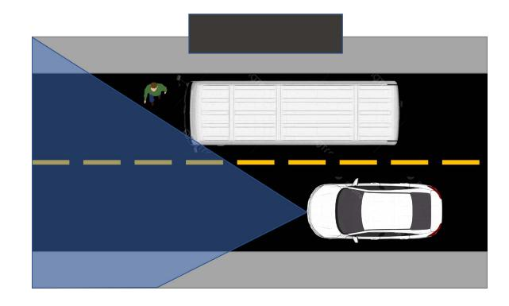

Fig. 1. Occluded Pedestrian Edge Case.

(IoT) based smart factories, the concepts of the intelligent vehicle, Intelligent Transport Systems (ITS) and Vehicle-to-Everything (V2X) communications are becoming more and more of a reality.

Initial deployments of advanced driving features from companies such as Tesla [3], Alphabet's Waymo [4] and Cruise [5] demonstrated that intelligent driving functions are indeed a technological and commercial possibility. However, these intelligent driving technologies have not yet fully matured and still have many issues in challenging traffic scenarios or weather conditions. With current efforts in the research and industry communities, vehicles have been given the ability to perceive their environments via their extensive suites of cameras and sensors. Unfortunately, even with state-of-the-art on-board sensors and artificial intelligence technologies available to an intelligent vehicle, there remain several edge cases, particularly those with significant occlusions such as buildings, infrastructure and other vehicles, where the vehicle simply cannot obtain sufficient knowledge about its environment to make safe and effective decisions. A simple example is captured in Figure 1, where a pedestrian attempting to cross the street is occluded by a bus. It is these edge-case scenarios that motivate the need for the connected intelligent vehicle, to give the vehicle the ability to perceive the environment outside of its own field of view. Utilising a V2X communications system, an intelligent vehicle can obtain more contextual information about its environment through collaboration with other road users or by leveraging infrastructural sensors, allowing it to make safer and more efficient decisions, consequently further reducing the number of potentially dangerous edge cases.

Before any of these use cases or applications can be addressed, a mechanism must be provided for establishing

1553-877X © 2024 IEEE. Personal use is permitted, but republication/redistribution requires IEEE permission. See https://www.ieee.org/publications/rights/index.html for more information.

and maintaining expedient, reliable and secure wireless links between the possible endpoints in a V2X scenario, e.g. vehicles, cyclists, pedestrians, and roadside units. The wireless access segment of V2X communications is responsible for providing this facility and the variety of possible endpoints present several challenges toward it. Neither real-time safety-critical systems nor large multi-user networks across a geographic area individually present new problems that need to be solved. However, their combination in the triad of safetycritical, multi-user, and varied user requirements present a unique and complex problem to a candidate wireless access technology.

Of the vast portfolio of wireless communication technologies currently in use today, DSRC and C-V2X are the primary candidates that are attempting to enable wireless access for V2X communications.

The purpose of this tutorial review is to build on the work of [\[6\]](#page-30-5) to provide an updated and more comprehensive reference to inform a reader on wireless access for V2X communications. Moreover, this work differs through the aim of providing an answer for which candidate wireless access technology is the most suited to enabling V2X communications from a technical capability standpoint. To this end, key concepts and techniques will be introduced to the reader such that they can engage with a discussion of the literature surrounding this topic. From this discussion challenges and opportunities will be highlighted and key technologies and future research directions aimed to address them will be introduced. It should be emphasised that the scope of this work is limited to the technical capabilities of the wireless access aspects of V2X communications, i.e., how a vehicle or other stakeholder wirelessly connects to a V2X network. This work will not focus on higher-layer aspects of V2X communications such as privacy, security, inter-networking transport protocols, or power distribution, nor will this work focus on more broad concepts surrounding technology adoption such as device availability, regulation and public perception.

A comprehensive but non-exhaustive list of abbreviations and acronyms heavily utilised in this field are outlined in Table [I](#page-1-0) to aid the reader throughout this paper. The remainder of this paper is structured as follows, see Figure [2;](#page-2-0) in Section [II,](#page-3-0) we provide an overview of V2X communications, its history, and standardisation. Section [III](#page-10-0) provides an overview of the candidate wireless access technologies for V2X communications and introduces key concepts required to discuss their efficacy. Literature regarding the candidate wireless technologies is reviewed and discussed in Section [IV,](#page-16-0) with particular attention given to the key network performance metrics standardised for V2X communications, i.e., latency, reliability, and throughput. Finally, Section [V](#page-26-0) highlights the active channels of research that may address the highlighted problems and opportunities gathered from the literature.

# *A. Related Work*

As a result of this increased interest in V2X communications, numerous surveys, reviews, and tutorials have been written on this emerging industry vertical from both

TABLE I LIST OF COMMON ABBREVIATIONS AND ACRONYMS

| 2CDD          | 2.1C .: D .: 1: D .: .                                   |
|---------------|----------------------------------------------------------|
| 3GPP          | 3rd Generation Partnership Project                       |
| 5GC ASA    | 5G Core Network Advanced Set of Applications             |
| ASTM          | American Society for Testing and Materials               |
| BSM           | Basic Safety Message                                     |
| BSA           | Basic Set of Applications                                |
| CAM           | Cooperative Awareness Message                            |
| CBR           | Channel Busy Ratio                                       |
| CCH           | Control Channel                                          |
| CEN           | European Committee for Standardisation                   |
| C-ITS         | Cooperative Intelligent Transport Systems                |
| CoCA          | Co-operative Collision Avoidance                         |
| CSMA/CA       | Carrier Sense Multiple Access with Collision Avoidance   |
| C-V2X         | Cellular Vehicle-to-Everything Communications            |
| DCC           | Decentralised Congestion Control                         |
| DCF           | Distributed Coordination Function                        |
| DENM          | Decentralised Environmental Notification Message         |
| DSRC          | Dedicated Short-Range Communication                      |
| EDCA          | Enhanced Distributed Channel Access                      |
| EPC           | Evolved Packet Core                                      |
| ETSI          | European Telecommunications Standards Institute          |
| FCC           | Federal Communications Commission                        |
| FDD           | Frequency Division Duplex                                |
| HCF           | Hybrid Coordination Function                             |
| HetVNet       | Heterogeneous Vehicular Network Internet-of-Vehicles     |
| IoV           |                                                          |
| IPG ISO    | Inter-Packet Gap International Standards Organisation    |
| KPI           | Key Performance Indicator                                |
| LOS           | Line-of-Sight                                            |
| LDM           | Local Dynamic Map                                        |
| LTE           | Long Term Evolution                                      |
| MAC           | Medium Access Control                                    |
| MANET         | Mobile Ad-Hoc Network                                    |
| MEC           | Mobile Edge Computing                                    |
| MIMO          | Multiple Input, Multiple Output                          |
| mmWave        | Millimetre Wave Communications                           |
| MNO           | Mobile Network Operators                                 |
| NFV           | Network Function Virtualisation                          |
| NLOS          | Non-line-of-sight                                        |
| NOMA          | Non-Orthogonal Multiple Access                           |
| OBU           | On-Board Unit                                            |
| OFDM          | Orthogonal Frequency Division Multiplexing               |
| ProSe         | Proximity Services                                       |
| PRR           | Packet Reception Rate                                    |
| QAM           | Quadrature Amplitude Modulation                          |
| QoS           | Quality-of-Service                                       |
| RAN           | Radio Access Network                                     |
| RSU           | Road-Side Unit                                           |
| SAE           | Society of Automotive Engineers                          |
| SB-SPS SCH | Sensing-Based Semi-Persistent Scheduling Service Channel |
| SDN           | Software-Defined Networking                              |
| SDR           | Software-Defined Networking  Software-Defined Radio      |
| SPaT          | Signal Phase and Timing Message                          |
| SPS           | Semi-Persistent Scheduling                               |
| TDD           | Time Division Duplex                                     |
| TDMA          | Time-Division Multiple Access                            |
| TTI           | Transmission Time Interval                               |
| V2I           | Vehicle-to-Infrastructure Communications                 |
| V2P           | Vehicle-to-Pedestrian Communications                     |
| V2N           | Vehicle-to-Network Communications                        |
| V2V           | Vehicle-to-Vehicle Communications                        |
| V2X           | Vehicle-to-Everything Communications                     |
| VANET         | Vehicular Ad-Hoc Network                                 |
| VRU           | Vulnerable Road User                                     |
| WAVE          | Wireless Access in Vehicular Environments                |
| WLAN          | Wireless Local Area Network                              |
|               |                                                          |

a generalised point of view of the large-scale considerations and more focused and specific perspectives on key segments and their associated challenges and opportunities.

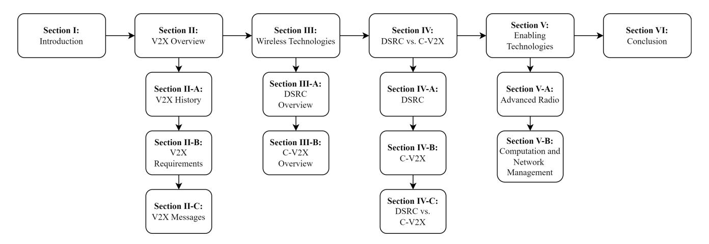

Fig. 2. Overview of Paper Structure

These segments include the development and implementation of radio technologies, routing protocols, computation resource management, and infrastructure deployment. Following are works that are particularly pertinent for accumulating a keen understanding of the breadth and depth of the field and the current state of V2X communications as a whole.

A general overview of the connected vehicle is presented in [\[7\]](#page-30-6), [\[8\]](#page-30-7), [\[9\]](#page-30-8) alongside a discussion considering that vehicle design, inter-vehicle communications, and supporting infrastructure must all be revised for improvement to enable connected autonomous driving. Wang et al. [\[9\]](#page-30-8) highlight the current need for more practical tests in this research area. An early, yet very comprehensive review of V2X communications is presented by Sichitiu and Kihl [\[10\]](#page-30-9), providing a discussion on the challenges presented by V2X communications via addressing each layer of the OSI network model. A comparative study and survey of DSRC and 4G LTE-based C-V2X is presented in [\[11\]](#page-30-10), showing that on average C-V2X outperforms DSRC. The authors of [\[6\]](#page-30-5), [\[12\]](#page-30-11), [\[13\]](#page-30-12) present generalised overview tutorial reviews on V2X communications, determining that no single technology currently can yet meet the stringent network requirements of V2X communications. Higher network layer challenges and solutions involving routing protocols, hand-off strategies and security are reviewed in [\[14\]](#page-31-0). Lastly, a more recent survey of resource allocation protocols for V2X communications is provided in [\[15\]](#page-31-1).

Al-Sultan et al. [\[16\]](#page-31-2) provide a comprehensive overview of Vehicular Ad hoc Networks (VANETs), the initial embodiment of V2X communications, particularly highlighting useful evaluation models and simulators in addition to key challenges in achieving reliable ad-hoc networks in a vehicular environment. In [\[17\]](#page-31-3), Hartenstein et al. provide one of the earliest tutorial overviews of DSRC-based VANETs, suggesting that further study is required into the benefits of VANETs for safety applications given the scale and system reliability that would be required to realise it.

The concept of vehicle cloud computing is considered by Whaiduzzaman et al. [\[18\]](#page-31-4), emphasising the fact that the computational power now available within a vehicle is most likely heavily under-utilised, i.e., when parked. Whaiduzzaman et al. suggest that vehicles in large car parks, i.e., airports and shopping malls could be used as a form of distributed data centre to aid in migrating computation closer to the edge. The follow-on concept of vehicular fog computing is presented in [\[19\]](#page-31-5), similar but slightly different to vehicular cloud computing. Vehicular fog computing is intended to be a localised version of vehicular cloud computing to address the issues associated with handling routing and resource management at large scales.

Given the apparent inability of any one communications technology to enable V2X communications, collaborative approaches between technologies are considered as a possible solution [\[20\]](#page-31-6). A comprehensive survey of multi-radio access technology vehicular communications, known as Heterogeneous Vehicular Networking (HetVNet) is provided in [\[21\]](#page-31-7). Zheng et al. present an architecture to realise HetVNet alongside a discussion of the design challenges involved. Abboud et al. [\[22\]](#page-31-8) present a survey on the inter-working of DSRC and cellular communications technologies for V2X communications. Issues around handover and mobility management are highlighted alongside a survey of some currently available V2X products, particularly DSRC-based products.

In [\[23\]](#page-31-9), Zhou et al. present and discuss the concept of the IoV. In particular, the challenges and opportunities of big-data-driven, and cloud-based V2X communications are presented. Xu et al. [\[24\]](#page-31-10) present a survey of the literature surrounding these big-data aspects of the IoV. Xu et al. note that the IoV could have a symbiotic relationship with bigdata applications, particularly because of the potential data acquisition and available computation the IoV provides. Bigdata applications could then also aid in the realisation of the IoV through network characterisation and performance analysis. A layered architecture to realise the IoV through HetVNets is proposed by Qureshi et al. [\[25\]](#page-31-11), where several open questions regarding the scale of implementation in terms of security and management are highlighted.

There are a number of key concerns, including confidentiality, integrity, and availability (CIA) associated with Security, Trust and Privacy (STP) [\[26\]](#page-31-12) in the IoV. Kim et al. [\[27\]](#page-31-13) and Sedan et al. [\[28\]](#page-31-14) provide comprehensive reviews of these STP concerns in the IoV. Notably, Wang et al. [\[29\]](#page-31-15) provide, via formal security proofs and simulation, a secure multi-server authentication protocol for the decentralised nature of the IoV. However, as shown by Verma et al. [\[30\]](#page-31-16), many security protocols do not account for the effects of unstable wireless channels in real-world environments, particularly those as adverse as vehicular wireless channel environments, often leading to significant vulnerabilities. As such, Verma et al. highlights the importance of incorporating Channel State Information (CSI) into security protocols for the IoV.

A rather comprehensive and robust tutorial of the current 5G NR-based C-V2X specifications (3GPP Release 16 [\[31\]](#page-31-17)) is presented by Garcia et al. [\[32\]](#page-31-18) with particular attention to the physical and MAC layers of the direct device-to-device sidelink interface. A recent and comprehensive survey of C-V2X communications is provided by Gyawali et al. [\[33\]](#page-31-19) highlighting the challenges faced by 4G LTE-based V2X communications and the solutions proposed by the 3GPP to address them. The ability of 4G LTE cellular communications to support V2X communications is surveyed and assessed in [\[34\]](#page-31-20), Araniti et al. suggest that LTE could aid in the weaknesses present in DSRC-based V2X communications due to its high capacity and wide coverage. A survey of the literature surrounding the design of C-V2X sidelink communications is presented in [\[35\]](#page-31-21), Bazzi et al. present solutions to address the weaknesses in the current specifications for cellular-based V2X communications.

## II. OVERVIEW OF V2X COMMUNICATIONS

V2X is used to describe a communications system intended to enable a vehicle to exchange information with any relevant party that may influence, or be influenced by, the vehicle. As previously mentioned, it is an emerging Industry 4.0 vertical that is motivated by the possibility of increased road safety, traffic efficiency and energy savings, as highlighted in [\[36\]](#page-31-22). In road traffic environments, there are many stakeholders, e.g., vehicles, cyclists, and pedestrians, that are very relevant to the safe and successful operation of an intelligent vehicle. All these stakeholders could potentially be a hazard toward or be in danger from an intelligent vehicle in road traffic environments. An intelligent vehicle cannot know the intent of other road users it encounters while perceiving its environment and therefore must assume that all other stakeholders in a road traffic environment are hazards in waiting. Alongside little to no knowledge of intent, an intelligent vehicle's onboard sensors have a limited range of perception. Occlusions in a vehicle's local environment – such as buildings, other vehicles, bus stops, flora, and poor weather – limit the vehicle's perception to a local *bubble*. However, if a vehicle is given the ability to communicate with other stakeholders in road traffic scenarios, information containing intent and telemetries of perceived and occluded stakeholders can be used to virtually enhance an intelligent vehicle's *bubble* of perception and situational awareness. Figure [3](#page-3-1) illustrates this idea of the vehicle's *bubble* of perception. Alongside the receipt of information, the intelligent vehicle may also share its own intent and telemetries, increasing the collective awareness of an environment and allowing the vehicle to coordinate with its fellow stakeholders, leveraging sensor fusion [\[37\]](#page-31-23) to

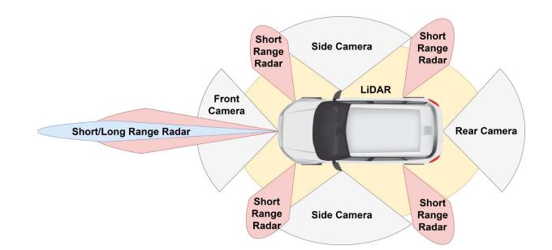

Fig. 3. A Vehicle's Bubble of Perception.

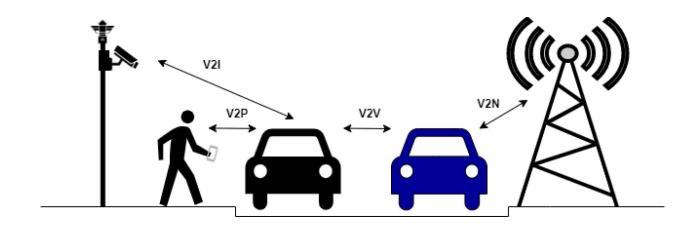

Fig. 4. V2X Communications.

engage in safer decision making while negotiating road traffic environments.

Within the context of road traffic environments, different stakeholders have different mobility characteristics. Vehicles travel at many speeds along road infrastructure, buses follow predetermined routes at predictable time intervals, whereas private vehicles may follow any route at any time. Pedestrians travel comparatively slowly and can vary their direction quickly in comparison to vehicles. Cyclists or e-scooter users [\[38\]](#page-31-24) can behave like a vehicle or a pedestrian depending on their intended route and environmental conditions. These mobility characteristics have brought categorisation within the V2X communications sphere into more specific communication types based on potential communication use cases between a connected vehicle and other stakeholders in road traffic environments [\[39\]](#page-31-25), i.e., V2V (Vehicle-to-Vehicle), V2P (Vehicle-to-Pedestrian), V2I (Vehicle-to-Infrastructure), V2N (Vehicle-to-Network), see Figure [4.](#page-3-2) This categorisation pertaining to different mobility groups is motivated by the different possible use cases, applications and wireless channel characteristics that would be experienced by the connected vehicle and another stakeholder. V2V and V2P communications involve two endpoints that are likely to be constantly mobile, i.e., the distance and relative velocities between two endpoints are likely to be highly variable, resulting in an unpredictable wireless communications channel. Whereas V2I and V2N communications involve a stationary endpoint and a mobile endpoint, i.e., the distance and relative velocities between a vehicle and a stationary endpoint are far more predictable, resulting in a more stable wireless communications channel. The following subsections will further detail V2X communications and its categories, and explore the history of V2X communications, its use cases and their respective requirements.

*1) V2V (Vehicle-to-Vehicle) Communications:* V2V communications include use cases and scenarios that would require vehicles to communicate with each other directly to guarantee safety, traffic or energy efficiency within a local environment, e.g., forward collision detection, lane changing or vehicle platooning [\[39\]](#page-31-25), [\[40\]](#page-31-26). Given that the only physical implementation requirement for this type of V2X communication is the wireless hardware installed in each vehicle, V2V is classified as a "Day 1" set of applications. "Day 1" applications are those that could be effectively implemented with current technologies, i.e., pre-crash sensing, lane change warning, just-in-time repair warning [\[8\]](#page-30-7). Therefore, V2V communications would have the most cost-effective and immediate roll-out in comparison to other V2X applications such as V2I or V2N, which would require substantial communications and computing infrastructure to be successfully implemented across geographic areas to ensure sufficient coverage and performance. The inherent fleeting and unpredictable nature of the topology of a network involving moving vehicles along urban, rural and highway scenarios have spawned a field of study around V2V communications, known as VANETs [\[41\]](#page-31-27). Study of VANETs predominantly involves resource allocation and routing protocols, stemming from the fully distributed nature of these ad-hoc networks. In VANETs, the default assumption is that there can be no guarantee that there will be sufficient network coverage to allow the vehicle to communicate with a base station to aid in the management of routing and medium access control. The challenges inherent in distributed wireless network routing protocols are well established in the field of MANETs [\[42\]](#page-31-28), [\[43\]](#page-31-29), however the routing protocols for VANETs have significantly different approaches than traditional MANETs as vehicles tend to have fewer power limitations and significantly more transient network topologies, in comparison to standard handheld mobile devices.

*2) V2I (Vehicle-to-Infrastructure) Communications:* V2I communications include use cases and scenarios that would require a vehicle to communicate with stationary road-side units (RSUs) or base stations (BSs) to facilitate or increase safety and traffic efficiency within a local environment, e.g., dissemination of cooperative awareness information outside of V2V range or automated parking assistance [\[39\]](#page-31-25), [\[40\]](#page-31-26). V2I communications can be viewed as a method of extending the efficacy of V2V communications to more advanced scenarios and use cases. Sensor fusion [\[44\]](#page-31-30), [\[45\]](#page-31-31) is a particular advanced use case that exemplifies the motivation for V2I communications. By leveraging fixed infrastructural nodes equipped with sensors, environmental information otherwise unknowable to V2V-based applications can be disseminated to vehicles in a local context. While V2I is seen as an important aspect of enhancing the safety capabilities of the V2X eco-system, the advanced applications that would require V2I communications are not yet as well developed as V2V communications. This gap in the research arises from the practical implementation issues associated with planning, creating, and installing the infrastructure required to realise advanced V2I communications applications.

*3) V2N (Vehicle-to-Network) Communications:* V2N communications have significant overlap with V2I communications, V2N communications include use cases that would require the vehicle to communicate with an application server located a significant distance away, mostly in the context of cloud computing applications targeted towards traffic and energy efficiency [\[18\]](#page-31-4), [\[21\]](#page-31-7), [\[46\]](#page-31-32), [\[47\]](#page-31-33), [\[48\]](#page-31-34). There is significant research potential for these cloudbased quality-of-life (QoL) convenience-oriented applications as they do not have the same stringent constraints as their safety-critical counterparts. Safety-related applications currently hold the attention of the research community, as this is the primary driver behind intelligent transport systems (ITS). Using V2X communications to increase traffic and energy efficiency can only be successful if the vehicles in question can perform the necessary manoeuvres or behaviours that increase said efficiency, safely and reliably.

*4) V2P (Vehicle-to-Pedestrian) Communications:* V2P communications, similar to V2V communications, include scenarios that would require a vehicle to communicate with a different set of stakeholders, assumed to not have the same transmission capabilities, e.g., battery capacity and antenna design, as the equipment within a vehicle or base station [\[39\]](#page-31-25), [\[40\]](#page-31-26). The aim of this slice of V2X communications is to increase safety and efficiency by taking advantage of the potential number of smart devices in a pedestrian environment, e.g., smartphones and smartwatches. In the context of V2X communications, a pedestrian can include any individual carrying a device with communications capability, i.e., a normal pedestrian, cyclist, driver or passenger. Doing so moves pedestrians from a passive to an active participant in a V2X communications scenario. V2P communications do not yet hold significant standing in the research arena. This could potentially be attributed to the significant privacy and security issues surrounding the implementation of V2P communications.

## *A. History of V2X Communications*

For many years remote keyless entry (RKE) systems [\[49\]](#page-31-35) were the dominant form of wireless communications to and from a vehicle, utilizing frequencies in the lower end of the ultra-high frequency (UHF), 300MHz to 3GHz, bands. However, the history of V2X communications can be traced back to the 1970s with projects such as Japan's Comprehensive Automobile Control System (CACS) project [\[50\]](#page-31-36) and the Electronic Route Guiding System (ERGS) project in the U.S. [\[51\]](#page-31-37). These projects were centred around basic driver assistance via route guidance systems. However, the modern relevant history of V2X communications began many years later in 1999, when the U.S. Federal Communications Commission (FCC) allocated 75MHz of spectrum in the 5.9 GHz (5.85–5.925 GHz) range to Intelligent Transport Systems (ITS) [\[52\]](#page-31-38), specifically, for Dedicated Short-Range Communications (DSRC). DSRC is a set of protocols and standards initially defined by the European Committee of Standardisation (CEN) [\[53\]](#page-31-39), [\[54\]](#page-31-40), [\[55\]](#page-31-41), [\[56\]](#page-31-42) and the International Standards Organisation (ISO) [\[57\]](#page-31-43), for short to medium-range wireless communications intended for use in the automotive industry.

| TABLE II                                       |  |
|------------------------------------------------|--|
| SUMMARISED BASIC APPLICATION REQUIREMENTS [39] |  |

| Category              | Examples                                                      | Max. Latency | Min. Frequency | Rel. Velocity |
|-----------------------|---------------------------------------------------------------|--------------|----------------|---------------|
| Safety Critical       | Collision warning, Vulnerable Road User Warning               | 20-100ms     | 1-10Hz         | 160-280km/h   |
| Traffic Efficiency    | Intersection Management, Co-operative Adaptive Cruise Control | 100-1000ms   | 1-2Hz          | 160km/h       |
| Infotainment Services | Multimedia streaming, remote diagnosis                        | 500-1000ms   | 1Hz            | 160km/h       |

In 2004, the IEEE began standardisation work for an IEEE 802.11 Wireless Local Area Network (WLAN) based ITS communications solution to take advantage of the newly allocated spectrum. This solution became known as the amendment IEEE 802.11p [\[58\]](#page-31-44). Since its inception, the 802.11p standard has become more colloquially known as DSRC because of its affiliations with the ISO/CEN DSRC standards. In 2007, as the 802.11p standard began to stabilise, the IEEE also began to develop the 1609.x family of standards [\[59\]](#page-31-45) to handle applications and security frameworks. With 802.11p defining the lower network layers and 1609.x defining the upper network layers, the IEEE adopted the term Wireless Access in Vehicular Environments (WAVE) [\[60\]](#page-31-46) to describe all standards connected with automotive communications. In parallel to the efforts of the IEEE, during this time the European Telecommunications Standards Institute (ETSI) established a committee to begin developing standards for ITS [\[45\]](#page-31-31), [\[61\]](#page-31-47). The IEEE 802.11p standard was released in 2010 and frozen into the IEEE 802.11 family of WLAN standards in 2012.

In 2014, the 3rd Generation Partnership Project (3GPP) [\[62\]](#page-32-0) began its own standardisation work for cellular-based ITS communications, known as Cellular V2X or C-V2X. With 3GPP Release 14 [\[63\]](#page-32-1) published in 2016, utilising 4G LTE as the underlying technology, the first C-V2X standards were released, known as LTE-V2X. Taking the studies and standards set by ETSI, 3GPP used LTE-V2X to outline further applications and their requirements under the 3GPP framework [\[39\]](#page-31-25), [\[46\]](#page-31-32). With the lessons learned from the studies and standards completed with LTE-V2X in Release 14, development for the next cellular release, 3GPP Release 15 [\[64\]](#page-32-2) (published in 2018), began to base C-V2X off the newer 5G NR standards that were being developed. New application sets and requirements aiming towards enhanced V2X functions were outlined [\[40\]](#page-31-26), [\[47\]](#page-31-33). From Release 15 onwards, the intent of 3GPP is to continue enhancing C-V2X capabilities under the new 5G NR architecture.

More recently in November 2020, the U.S. FCC reallocated the lower 45MHz of the original DSRC spectrum to standard Wi-Fi and other unlicensed services. The remaining 30MHz is planned to be set aside for the cellular V2X solution. This change in spectrum allocation occurred as "*DSRC has not been meaningfully deployed in the past 20 years*" [\[65\]](#page-32-3).

## *B. V2X Applications and Requirements*

As the standardisation efforts for V2X communications matured in the early-mid 2010s, studies were conducted by organisations like ETSI [\[61\]](#page-31-47), U.S. Society of Automotive Engineers (SAE) [\[66\]](#page-32-4) and 3GPP [\[39\]](#page-31-25), [\[40\]](#page-31-26) to determine the performance requirements a potential wireless technology

candidate would need to fulfil in order to support V2X applications and use cases. These applications can be broadly arranged into two categories: basic use cases and advanced use cases. Basic use cases can be further arranged into three categories: *safety critical, traffic efficiency and infotainment services*. Advanced use cases can be arranged into four categories: *vehicle platooning, advanced driving, extended sensors, and remote driving*. The following subsections will detail these use case categories and the performance requirements necessary to achieve them.

*1) Basic Set of Applications (BSA):* Studies were conducted by the aforementioned regulatory bodies to investigate the possible network requirements that would be necessary to achieve a Basic Set of Applications (BSA), mainly concerning driver assistance V2V, V2I and V2N communications. In the following subsections, the applications and requirements associated with each of the three categories of the BSA will be discussed. Table [II](#page-5-0) summarises the requirements for the BSA categories. In the context of V2X communications, relative velocity is the apparent velocity of the receiver from the rest frame of reference of the transmitter. It should be noted that reliability and throughput requirements are not explicitly defined for the BSA. Reliability requirements for the BSA are defined as "··· *high reliability without requiring application-layer message re-transmissions.*" [\[39\]](#page-31-25), although example reliability metrics of 80-99% are given in [\[46\]](#page-31-32). Throughput requirements are not imposed as these driver assistance-based applications utilise low message rates (1-10Hz) and message sizes on the order of hundreds to low-thousands of bytes. These messages are discussed in Section [II-C.](#page-8-0)

*a) Safety critical:* Safety critical V2X applications, consisting of V2V/V2I use cases, are intended to reduce the number and severity of road traffic incidents, i.e., vehicle collisions, human injury or casualty and property damage. Ideally, safety-critical applications are the most important set of applications to enable with V2X communications, especially from the perspective of governments and regulatory bodies. If a vehicle cannot make, or aid in the making of critical decisions like handling of abnormal traffic behaviour and the protection of vulnerable road users (VRUs) such as cyclists and pedestrians, non-safety critical applications that involve manoeuvres for increased traffic efficiency or infotainment cannot be carried out without significant risk. The network performance requirements for these safety-critical applications are very stringent in terms of message frequency, round-trip time (RTT), throughput and reliability (Packet Error Rate – PER). Table [III](#page-6-0) lists basic safety-critical applications as defined by ETSI [\[61\]](#page-31-47) and 3GPP [\[39\]](#page-31-25).

|                                               | TABLE III |  |
|-----------------------------------------------|-----------|--|
| SAFETY CRITICAL APPLICATION REQUIREMENTS [39] |           |  |
|                                               |           |  |
|                                               |           |  |
|                                               |           |  |
|                                               |           |  |

| Applications           | Use Case                           | V2X Type | Max. Latency | Min. Frequency | Rel. Velocity |
|------------------------|------------------------------------|----------|--------------|----------------|---------------|
|                        | Emergency vehicle warning          | V2V/I    | 100ms        | 10Hz           | 280km/h       |
|                        | Slow vehicle indication            | V2V/I    | 100ms        | 2Hz            | 160km/h       |
|                        | Pre-crash Sensing Warning          | V2V/I    | 20ms         | 10Hz           | 160km/h       |
|                        | Co-operative Glare Reduction       | V2V      | 100ms        | 2Hz            | 160km/h       |
| Co-operative Awareness | Forward Collision Warning          | V2V      | 100ms        | 2Hz            | 160km/h       |
| Co-operative Awareness | Intersection collision warning     | V2V/I    | 100ms        | 10Hz           | 160km/h       |
|                        | Motorcycle approaching indication  | V2V/I    | 100ms        | 2Hz            | 160km/h       |
|                        | Vulnerable Road User (VRU) Warning | V2V/I/P  | 100ms        | 1Hz            | 160km/h       |
|                        | Lane Change Assistance             | V2V/I    | 100ms        | 10Hz           | 160km/h       |
|                        | Overtaking Vehicle Warning         | V2V/I    | 100ms        | 10Hz           | 160km/h       |
|                        | Emergency electronic brake lights  | V2V/I    | 100ms        | 10Hz           | 160km/h       |
|                        | Out of Normal Condition Warning    | V2V/I    | 100ms        | 1Hz            | 160km/h       |
|                        | Wrong way driving warning          | V2V/I    | 100ms        | 10Hz           | 280km/h       |
| Road Hazard Warning    | Stationary vehicle                 | V2V/I    | 100ms        | 10Hz           | 160km/h       |
| Road Hazard Warning    | Traffic condition warning          | V2V/I    | 100ms        | 1Hz            | 160km/h       |
|                        | Signal violation warning           | V2V/I    | 100ms        | 10Hz           | 160km/h       |
|                        | Roadwork warning                   | V2V/I    | 100ms        | 2Hz            | 160km/h       |
|                        | Collision risk warning             | V2V/I    | 100ms        | 10Hz           | 160km/h       |

TABLE IV TRAFFIC EFFICIENCY APPLICATION REQUIREMENTS [\[39\]](#page-31-25)

| Applications            | Use Case                                          | V2X Type | Max. Latency | Min. Frequency |
|-------------------------|---------------------------------------------------|----------|--------------|----------------|
| Speed Management        | Regulatory / contextual speed limits notification | V2I      | 1000ms       | 1Hz            |
| Speed Wanagement        | Traffic light optimal speed advisory              | V2V/I    | 100ms        | 2Hz            |
|                         | Traffic information and recommended itinerary     | V2V/I    | 500ms        | 1Hz            |
|                         | Cooperative Adaptive Cruise Control               | V2V      | 100ms        | 2Hz            |
| Co-operative Navigation | Enhanced route guidance and navigation            | V2I      | 500ms        | 1Hz            |
| Co-operative Navigation | Intersection Management                           | V2V/I    | 500ms        | 1Hz            |
|                         | Limited access warning and detour notification    | V2V/I    | 500ms        | 1Hz            |
|                         | In-vehicle signage                                | V2V/I    | 500ms        | 1Hz            |
| Location Based Services | Automatic access control and parking management   | V2V/I    | 100ms        | 1Hz            |
| Location Dased Services | Fleet Flow Optimisation                           | V2V/I    | 1000ms       | 1Hz            |

- *b) Traffic efficiency:* Traffic efficiency V2X applications, also consisting of V2V/V2I use cases, are intended to further mitigate the likelihood of road traffic incidents alongside reduced travel time, improved fuel efficiency and passenger comfort by imposing regulations and leveraging cooperative logistics enabled by inter-stakeholder communication. While safety-critical applications are likely to reduce the overall number of road traffic incidents, the introduction of traffic efficiency applications are maybe how the general population will begin to experience the benefits of V2X communications as the efficiency of the day-to-day operations of road traffic improves. The performance requirements imposed on these Traffic Efficiency applications, shown in Table [IV,](#page-6-1) are more lenient than their critical counterparts, however certain applications such as "*Traffic Light Optimal Speed Advisory*" and "*Cooperative Adaptive Cruise Control*" retain stringent latency requirements. In these scenarios, it is likely that the relative speeds of involved stakeholders will be quite high and subsequent reaction times will need to be low.
- *c) Infotainment:* Infotainment V2X applications constitute the remainder of the V2X applications, they are intended to address eCommerce or convenience-oriented use cases, which are primarily V2I/V2N use cases. Table [V](#page-7-0) highlights

these Infotainment use cases of the BSA, which do not have stringent performance requirements and are very fault tolerant, unlike their advanced counterparts, see Section [II-B2.](#page-6-2) It is likely that early deployments of the connected vehicle will provide many of these convenience-oriented applications in the form of feature-rich maps or eCommerce applications such as parking space reservation, car rental/sharing and "*Just-in-Time*" repair.

*2) Advanced Set of Applications (ASA):* With the BSA established, a more rigorous and stringent requirement set was developed to address enhanced V2X (eV2X) or advanced V2X applications. This Advance Set of Applications (ASA) [\[40\]](#page-31-26), [\[47\]](#page-31-33) was primarily developed by the 3GPP building on the work in [\[39\]](#page-31-25), [\[46\]](#page-31-32). While the BSA focused on driver assistance applications, the ASA addresses higher levels of the SAE Levels of Automation (LoA) [\[67\]](#page-32-5), specifically levels 2-5. Due to the inclusion of higher levels of automation, the ASA is not categorised like the BSA, i.e., *safety critical, traffic efficiency and infotainment*. Instead, as previously mentioned, it is categorised into four sections: *vehicle platooning, advanced driving, extended sensors, and remote driving*. These four sections are intended to encapsulate the overarching scenarios that intelligent vehicles with higher levels of automation may

TABLE V INFOTAINMENT APPLICATION REQUIREMENTS [\[39\]](#page-31-25)

| Applications            | Use Case                                        | V2X Type | Max. Latency | Min. Frequency |
|-------------------------|-------------------------------------------------|----------|--------------|----------------|
|                         | Point of Interest notification                  | V2I/N    | 500ms        | 1Hz            |
|                         | ITS local electronic commerce                   | V2I/N    | 1000ms       | 1Hz            |
| Location Based Services | Car Rental/Sharing                              | V2I/N    | 1000ms       | 1Hz            |
|                         | Remote Diagnosis and Just-in-Time Repair        | V2I/N    | 1000ms       | 1Hz            |
|                         | Map Download/Update                             | V2I/N    | 500ms        | 1Hz            |
|                         | Insurance and financial services                | V2I/N    | 1000ms       | 1Hz            |
|                         | SOS Services                                    | V2V/I/N  | 500ms        | 1Hz            |
|                         | Stolen Vehicle Alert                            | V2V/I/N  | 500ms        | 1Hz            |
| Internet Services       | Instant Messaging                               | V2V/I/N  | 1000ms       | 1Hz            |
| internet Services       | Loading zone management                         | V2I/N    | 500ms        | 1Hz            |
|                         | Vehicle software / data provisioning and update | V2V/I/N  | 1000ms       | 1Hz            |
|                         | Vehicle and RSU data calibration.               | V2V/I/N  | 500ms        | 1Hz            |
|                         | Media downloading                               | V2I/N    | 1000ms       | 1Hz            |

TABLE VI SUMMARY OF ADVANCED SET OF APPLICATIONS [\[40\]](#page-31-26)

| Category           | Max. Latency | Min. Frequency | Payload        | Data Rate   | Reliability | Communication Range |
|--------------------|--------------|----------------|----------------|-------------|-------------|---------------------|
| Vehicle Platooning | 10-500ms     | 2-50Hz         | 50-6500bytes   | 50-65Mbps   | 90-99.99%   | 80-350m             |
| Advanced Driving   | 3-100ms      | 10-100Hz       | 300-12000bytes | 0.25-53Mbps | 90-99.999%  | 360-700m            |
| Extended Sensors   | 3-100ms      | 10Hz           | 1600bytes      | 10-1000Mbps | 90-99.999%  | 50-1000m            |
| Remote Driving     | 5ms          | N/A            | N/A            | 25Mbps      | 99.999%     | N/A                 |

TABLE VII VEHICLE PLATOONING REQUIREMENTS [\[40\]](#page-31-26)

| Scenario | Deg. of Automation | Max. Latency | Min. Frequency | Payload      | Data Rate | Reliability | Comm. Range |
|----------|--------------------|--------------|----------------|--------------|-----------|-------------|-------------|
|          | Lowest             | 25ms         | 30Hz           | 300-400bytes | N/A       | 90%         | N/A         |
| V2V      | Low                | 20ms         | 50Hz           | 6500bytes    | N/A       | N/A         | 350m        |
| V 2 V    | High               | 20ms         | N/A            | N/A          | 65Mbps    | N/A         | 180m        |
|          | Highest            | 10ms         | 30Hz           | 50-1200bytes | N/A       | 99.99%      | 80m         |
| V2V2I    | N/A                | 500ms        | 2Hz            | 50-1200bytes | N/A       | N/A         | N/A         |
| V2I      | Low                | 20ms         | 50Hz           | 6000bytes    | N/A       | N/A         | 350m        |
| V 21     | High               | 20ms         | N/A            | N/A          | 50Mbps    | N/A         | 180m        |

encounter. Table [VI](#page-7-1) summarises the requirements for the ASA categories.

*a) Vehicle platooning:* Vehicle Platooning, an advanced V2V communications application, enables intelligent vehicles to dynamically form a convoy or platoon while travelling together. This platoon can be viewed as a *virtual train*, with *virtual linkages* connecting the member vehicles together. To maintain these *virtual linkages* (manifested as inter-vehicle distances) the participating vehicles must be able to share telemetries such as speed, acceleration, bearing; and events such as slowing down or lane changes. The platoon is managed by the leading vehicle at the front, allowing for extremely small inter-vehicle distances to be achieved at high speeds. This inter-vehicle distance is measured in seconds and in some cases can be reduced to sub-second intervals. Table [VII](#page-7-2) details the network KPIs required for Vehicle Platooning applications. Note that a high degree of reliability is assumed for each Vehicle Platooning use case unless otherwise specified. It should be noted that the V2V2I scenario of Table [VII](#page-7-2) represents the use case of status reporting between vehicles in a platoon and between the platoon and RSUs.

*b) Advanced driving:* Advanced Driving is an advanced V2V/V2I communications application enabling further cooperation between intelligent vehicles, other stakeholders and roadside units (RSUs) in a localised area. The intent behind Advanced Driving applications is to approach the ideal scenario wherein every stakeholder in a localised road traffic scenario is aware of the telemetries and intents of all other stakeholders in the relevant vicinity. This ideal scenario would allow all stakeholders to make the correct decisions at all times and maintain a high degree of safety and efficiency. In practice this cannot be achieved, however, the ideal case can be approached by leveraging advanced V2V/V2I communications to deliver recent and relevant information to each stakeholder in a localised area. Table [VIII](#page-8-1) details the various network KPIs required for Advanced Driving applications. As with Vehicle Platooning, a high degree of reliability is assumed for each Advanced Driving use case unless specified.

*c) Extended sensors:* Extended Sensors, an advanced V2V/V2I/V2N communications application, aims to enable more substantial "bubbles" of perception for intelligent vehicles. Extended Sensor applications will amalgamate sensor data from fixed sensors, RSUs, other vehicles, devices carried by pedestrians and application servers. These data can be fused with temporal and geo-spatial indexing to provide the vehicle with a Local Dynamic Map (LDM) [\[45\]](#page-31-31) of its local

TABLE VIII ADVANCED DRIVING REQUIREMENTS [\[40\]](#page-31-26)

TABLE IX EXTENDED SENSOR REQUIREMENTS [\[40\]](#page-31-26)

| Scenario            | Deg. of Automation | Max. Latency | Min. Frequency | Payload | Data Rate | Reliability | Comm. Range |
|---------------------|--------------------|--------------|----------------|---------|-----------|-------------|-------------|
|                     | Low                | 100ms        | 10Hz           | 1600    | N/A       | 99%         | 1000m       |
|                     |                    | 10ms         | N/A            | N/A     | 25Mbps    | 95%         | N/A         |
| V2V/I/N (Sensor)    | High               | 3ms          | N/A            | N/A     | 50Mbps    | 99.99%      | 200m        |
|                     |                    | 10ms         | N/A            | N/A     | 25Mbps    | 99.99%      | 500m        |
|                     |                    | 50ms         | N/A            | N/A     | 10Mbps    | 99%         | 1000m       |
| V2V/I/N (Pre-crash) | High               | 10ms         | N/A            | N/A     | 1000Mbps  | 99.99%      | 50m         |
|                     | Low                | 50ms         | N/A            | N/A     | 10Mbps    | 90%         | 100m        |
| V2V/I/N (Video)     | High               | 10ms         | N/A            | N/A     | 700Mbps   | 99.99%      | 200m        |
|                     | Hign -             | 10ms         | N/A            | N/A     | 90Mbps    | 99.99%      | 400m        |

TABLE X REMOTE DRIVING REQUIREMENTS [\[40\]](#page-31-26)

| Scenario | Latency | Reliability | Data Rate  |
|----------|---------|-------------|------------|
|          |         |             | UL: 25Mbps |
| V2N      | 5ms     | 99.999%     |            |
|          |         |             | DL: 1Mbps  |

environment. These LDMs will provide intelligent vehicles with the ability to see past occlusions in their local situation and provide the opportunity to predict and adapt to potential hazards, e.g., blind junctions or heavy urban traffic scenarios. Table [IX](#page-8-2) details the network KPIs required to enable Extended Sensor applications.

*d) Remote driving:* Remote Driving is an advanced V2N communications application that addresses the concept of teleoperated driving, where a remote operator assumes control of a vehicle through live controls or periodic instructions through hazardous environments where the current human operator or artificial intelligence cannot navigate themselves. A particular application of note for Remote Driving is public transport automation, where routes and environmental conditions are most invariant and predictable. Shown in Table [X](#page-8-3) are the network KPIs required to enable Remote Driving applications.

## *C. V2X Messages*

Given that V2X is a communications system, it is also pertinent to discuss the nature of the information being transferred by the system. So-called V2X messages are centred around telemetry information, i.e., where a stakeholder is, where it is going and the locations of any events or interactions of note it encounters. Telemetry information can be generally categorised into periodic and aperiodic message types. Periodic messages are used to capture relevant telemetries that change regularly for a stakeholder, i.e., position, velocity, acceleration, and current lane. Conversely, aperiodic messages are intended to capture asynchronous events of note that could potentially impact the vehicle; an accident, visibility reduction due to weather, wrong-way driving or lane changing.

Standardisation efforts for V2X messages are underway in both the U.S. by the SAE [\[68\]](#page-32-6) and Europe by CEN/ETSI [\[69\]](#page-32-7), [\[70\]](#page-32-8), [\[71\]](#page-32-9). Both sets of V2X message standards are functionally equivalent. Periodic safety messages are known as Cooperative Awareness Messages (CAMs) [\[69\]](#page-32-7) in the context of the ETSI standardisation and as Basic Safety Messages (BSMs) in the context of SAE standardisation. Aperiodic safety messages are known as Decentralised Environmental Notification Messages (DENMs) [\[70\]](#page-32-8) in the ETSI standards and are represented by a series of messages (EVA, ICA, TIM) by the SAE standardisation. Both sets of standards also include common traffic efficiency and infotainment messages, such as signalised intersection management (SPAT, SSM, SRM) messages or geographic map update messages (MAP).

The safety functionality of the ETSI message types (CAM, DENM) conceptually encapsulates the same functionality of the alternate SAE message types (BSM, EVA etc.). Therefore, for the sake of brevity, only the ETSI safety message types will be described to illustrate the key concepts and telemetries that are required to enable the various V2X communications scenarios.

*1) Cooperative Awareness Messages (CAMs):* CAMs are messages exchanged between stakeholders in a road traffic environment with the intent of creating and maintaining relevant awareness of one another to enable cooperative behaviours. A CAM contains status information, attributes, and telemetries from the originating stakeholder. The CAM is designed such that its content is dependent on the type of stakeholder generating and transmitting the CAM. For example, a vehicle's CAM will include status information such as time, activated systems, and fuel levels; attributes such as dimensions, vehicle type and modifications if any. Finally, telemetries include position, velocity, acceleration and bearing. The information received from a CAM can be used to enable a multitude of V2X applications, e.g., V2V dominant applications such as pre-crash warnings, vehicle platooning or updating LDMs.

The period of generation for a CAM is chosen depending on factors such as application requirements and wireless channel loading; this is known as the Transmission Interval (TI). For applications in the BSA, the minimum TI for CAMs is 100ms or 10Hz and the maximum TI is 1000ms or 1Hz. For applications in the ASA, the minimum TI is as low as 20ms or 50Hz. For a given transmission frequency, CAMs will be generated if either of these two conditions are met:

- 1) If the time elapsed is equal to or greater than the configured TI and one of the following telemetry conditions are met:
  - a) The bearing of the transmitting stakeholder has changed by 4◦ since the most recent CAM was transmitted.
  - b) The location of the transmitting stakeholder has changed by 4m since the most recent CAM was transmitted.
  - c) The speed of the transmitting stakeholder has changed by 0.5m/s since the most recent CAM was transmitted.
- 2) If the time elapsed is equal to or greater than the maximum transmission interval of 1000ms or 1Hz.

A CAM is composed of a standardised ETSI ITS header and a selection of containers. Containers in the context of V2X messages are distinct sections of a message used to group the various pieces of information a CAM could contain. This container methodology employed by ETSI's V2X messages allows for different kinds of road traffic stakeholders to generate CAMs with specific contents relevant to the stakeholder in question, i.e., a vehicle will have different CAM information compared to a pedestrian or an RSU. Each container within a CAM is composed of data elements (DE) and/or data frames (DF). Figure [5](#page-9-0) illustrates the structure of a CAM. Each CAM has three mandatory components and then a selection of optional components depending on environmental factors or stakeholder type. The three mandatory components include the ITS Header, a Basic Container and a High Frequency Container. Optional components include the Low Frequency Container and Special Vehicle Containers which allow vehicles such as ambulances, dangerous goods transport,

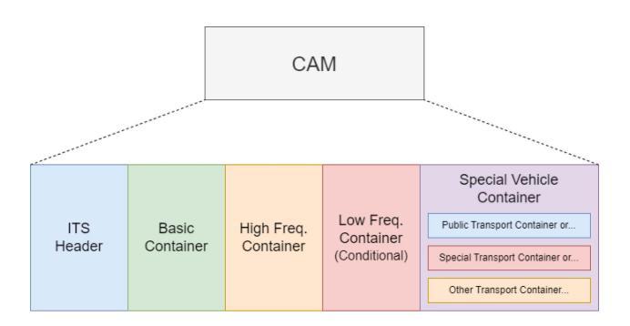

Fig. 5. CAM Message Structure.

and rescue vehicles to include specific content in their CAMs.

- *a) ITS header:* The ITS Header is a standardised ETSI header format used for all ITS message types in the ETSI system. This header includes the version of the protocol in use, the type of the message, i.e., CAM, DEMN or other and finally the ID of the originating stakeholder.
- *b) Basic container:* The Basic Container, the first mandatory container, provides information about the originating stakeholder. It provides the type of the originating stakeholder along with its most recent geographic position.
- *c) High frequency container:* The High Frequency Container, the second mandatory container, provides highly dynamic information about the originating stakeholder, such as telemetries: velocity, acceleration, steering wheel angle and lane position.
- *d) Low frequency container:* The Low Frequency Container, the first optional container, provides static or slowly-changing information about the originating stakeholder, such as the status of non-critical systems, e.g., exterior lights, temperature, occupant number and positions, and the path history of the vehicle.
- *e) Special vehicle container:* The Special Vehicle Container, the second optional container, provides specific information about non-standard vehicle types such as public transportation, ambulances, and rescue vehicles. Specific information for these types of vehicles includes status indicators such as embarkation status, siren/light bar use, incident type and emergency priority.
- *2) Decentralised Environmental Notification Messages (DENMs):* DENMs are messages exchanged between stakeholders in a road traffic environment in response to a noteworthy event in the environment. A DENM contains status and positional information such as severity, area of effect, predicted effect time and geographic location for events like road hazards or abnormal environmental conditions. The DENM is designed such that its content is dependent on the type of event that triggered its generation. For example, if there is a sudden hailstorm in a locale, all vehicles in the area will generate a DENM containing the relevant area of effect of the event, the detection time and the primary hazards associated with the hailstorm, such as road surface adhesion and visibility. The information received from DENMs can be used in combination with CAMs to further bolster the safety and effectiveness of V2X applications.

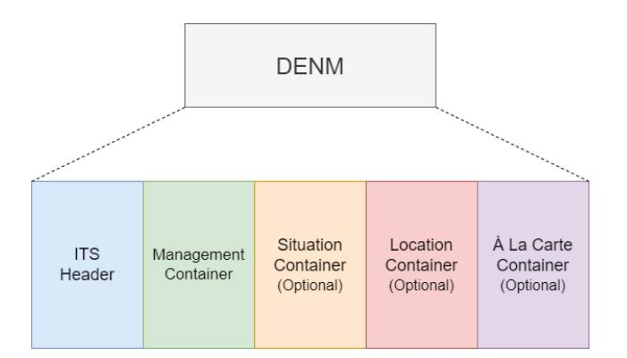

Fig. 6. DENM Message Structure.

DENMs by definition describe events and not the originating stakeholder. Therefore, a mechanism of event persistence between stakeholders is required. When an event is first detected by a stakeholder, it is assigned a unique identifier and a new DENM is created. This unique identifier is integral to the operation of DENMs as they provide persistence of the event's detection, even if the originating stakeholder has left the relevant area of effect of the event. Once received by other stakeholders in the local area, this DENM is retransmitted until either: a cancellation DENM is transmitted by the originating stakeholder or a negation DENM is transmitted by another stakeholder. This necessity for inter-stakeholder persistence has resulted in 4 types of DENMs:

- *New DENM:* A new DENM is generated by the originating stakeholder when a noteworthy event is detected. The event is assigned a unique identifier, known as an *actionID*, and the new DENM is transmitted with information describing the event such as position, type, detection time, area of effect etc.
- *Update DENM:* An update DENM is generated by the originating stakeholder who first detected the event when a significant change in the event has occurred. An update DENM may be repeated by the originating stakeholder for the allotted *repetitionDuration*
- *Cancellation DENM:* A cancellation DENM is generated by the originating stakeholder who first detected the event when one of the following conditions is met:
  - **–** The originating stakeholder has determined that the event has ended before the end of the *validityDuration*
  - **–** The end of the *validityDuration* has been reached.
- *Negation DENM:* A negation DENM is generated by another stakeholder who was not the first to detect a particular event when the event in question is verified to no longer be in effect.

Similar to the CAM, the DENM is composed of a standardised ETSI ITS header and a selection of mandatory and optional containers. Figure [6](#page-10-1) illustrates the structure of the DENM. As with CAMs, each container within a DENM is composed of data elements (DE) and or data frames (DF). The DENM has one mandatory container, the Management Container and several optional containers; the Situation Container, the Location Container and the À La Carte Container. It should be noted that for cancellation and termination DENMs, the optional containers will not be present. If the Situation Container is present in a particular DENM then the Location Container must also be present. The À La Carte Container is equivalent to the Special Vehicle Container in CAMs, intended to provide additional information specific to a use case that is not included in the previous three containers, e.g., road works zone and road access conditions.

- *a) ITS header:* As outlined above for CAMs, this header is standardised for all ETSI ITS message types.
- *b) Management container:* The Management Container provides key information about how this particular DENM should be handled depending on the event that it pertains to. This includes the unique identifier of the event, the detection time, the geographic location of the event, the relevant distance of the event, the type of stakeholder sending the DENM and how long the DENM should be valid for.
- *c) Situation container:* The Situation Container provides information that describes the event that was detected. This includes the type of the event and possible causes of the event including links to other detected events.
- *d) Location container:* The Location Container provides further location information about the detected event. This includes characteristics of the road infrastructure and estimated telemetries such as velocity, acceleration, and a list of historical positions as the event has progressed, i.e., a traffic jam.
- *e) À La Carte Container:* The À La Carte Container provides additional information not already provided by previous containers, this allows specific applications to embed information into a DENM such as lane position (sudden braking), temperature and humidity (adverse weather) or positioning advice (emergency vehicle warning).

With the key concepts and standardisation of V2X communications as a whole presented, the current trends and developments in wireless access for V2X communications cannot be discussed without addressing the underlying wireless technology that will be utilised to fulfil the previously outlined network performance requirements. Possibly the largest area of discussion in the V2X research community is the two major wireless technology candidates: DSRC and cellular. The following subsections will describe these potential candidate wireless access technologies for V2X communications and how current research is shaping what future connected vehicle systems will look like.

# III. WIRELESS ACCESS TECHNOLOGIES FOR V2X COMMUNICATIONS

From the previous sections, it is clear that a potential candidate wireless access technology for V2X communications will have to be particularly robust in the face of the stringent and varied requirements that the highly dynamic nature of automotive environments demands to ensure the safety of road users. The environment surrounding an autonomous vehicle can change significantly depending on variables such as weather, road type, geographic location, number and type of other road users nearby. Potential candidate technologies will have to be effective at quickly and reliably setting stable

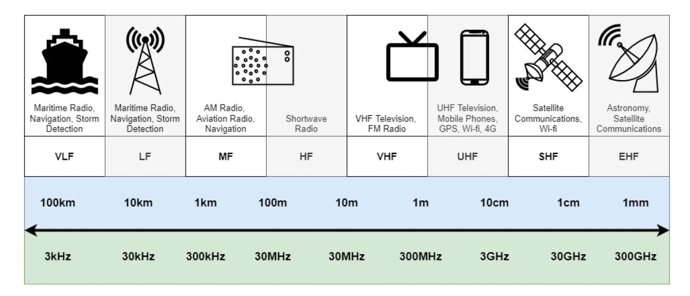

Fig. 7. Wireless Spectrum Allocation.

connections between two entities that could pass each other with substantial relative velocities. These technologies must also be economically viable, otherwise, they may not gain traction with automotive manufacturers. Therefore it is not unreasonable to suggest that a successful candidate will have to rely on an existing technology that already has solid economic and infrastructural grounding. This section will further discuss the potential candidate technologies that could enable V2X communications as an industry vertical.

There are many different wireless access technologies widely in use today such as Bluetooth, Wi-Fi, cellular, satellite, LoRa and broadcast radio, even remote keyless systems. Each of these technologies has its own respective advantages and disadvantages due to the properties of the spectrum they operate within, and the physical (PHY) and medium access control (MAC) transmission techniques they employ, as illustrated in Figure 7. A consequence of the behavioural variance that wireless signals exhibit while propagating at certain frequencies, is that each of the wireless access technologies mentioned have evolved for very specific use cases:

- Bluetooth: Low power, close-range communications for multimedia or control
- Wi-Fi: Close-medium range multimedia communications
- *Cellular:* Medium-Long range telephony and multimedia communications
- *Radio:* Very long-range communications for voice and navigation
- *LoRa:* Medium-Long range communications for control and IoT
- Satellite: Extremely long-range communications

The primary issue that a candidate technology must face is more apparent given the highlighted trends in the applications and use cases of current wireless access technologies. Initially, the motivation for V2X communications stemmed from its benefits in real-time safety-critical applications, i.e., pre-crash warnings, cooperative manoeuvres and perception. Conversely, current wireless access technologies are designed predominantly for multimedia, telephony, or other non-safety critical applications. This adherence to the principle of specificity is

the key to efficiency and performance regarding the design of the software and hardware of current communication technologies. However, a consequence of adherence to this principle is that there is no wireless access technology fully implemented today that is flexible enough to effectively meet all the stringent yet variable requirements of V2X applications. Given the previously highlighted use cases and their requirements, the argument can be made that V2X communications could present one of the most varied set of challenges for current and future wireless access technologies due to its overlap with other Industry 4.0 verticals, e.g., big data, artificial intelligence and machine learning and cloud computing.

Given this inherent specificity limitation of current wireless access technologies, a potential solution could be found in integrating several wireless access technologies to fully enable V2X communications. This collaborative solution with many wireless access technologies is known as a Heterogeneous Vehicular Network (HetVNET]). Zheng et al. [21] provide a comprehensive survey of heterogeneous V2X communications and propose potential architectural changes that would enable this proposed HetVNET framework. Despite the proposition of collaboration, one of the most popular topics in V2X communications to date is the race between Wi-Fi and cellular; actively generating standardisations and trying to meet these stringent requirements demanded by V2X communications.

Both technologies are well-developed and would benefit hugely from supporting V2X communications as an industry vertical. Wi-Fi, being driven by the IEEE, already has dominance in the home wireless market and has a strong presence in the ever-evolving IoT industry. Cellular, standardised by the 3rd Generation Partnership Project (3GPP), has wide area communications infrastructure already in place and is well equipped for high mobility scenarios. The following subsections will go into further detail, first with DSRC, then with C-V2X, on the concepts and characteristics underlying these technologies that make them suitable as a potential V2X communications solution, thus allowing the reader to engage with the literature surrounding them.

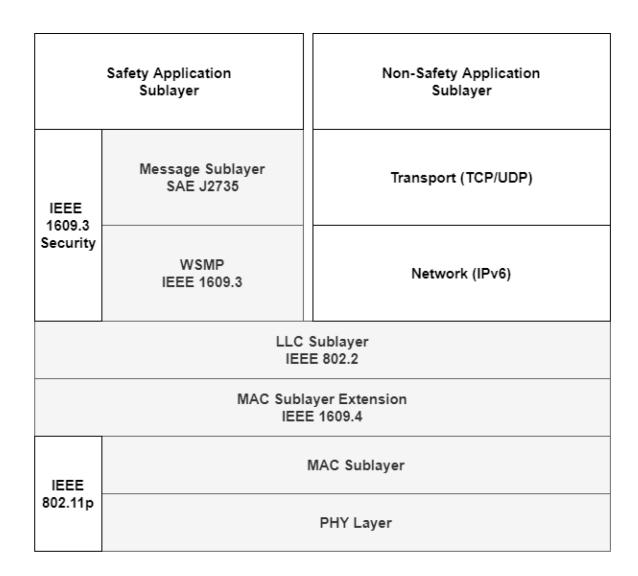

Fig. 8. IEEE WAVE Stack [\[60\]](#page-31-46).

## *A. Dedicated Short Range Communications (DSRC)*

DSRC is the IEEE's WLAN-based answer to V2X communications. DSRC specifically uses the IEEE 802.11p amendment [\[58\]](#page-31-44) as the basis of its physical and MAC layers (based on the OSI network model [\[72\]](#page-32-10)), included as part of their 802.11 WLAN set of specifications. The IEEE 802 set of specifications pertains to any wireless personal/local/metropolitan area networks. Within this 802 set, the 802.11 standards specifically encompass the physical and MAC layer specifications of wireless local area networks (WLANs). Well-known 802.11 specifications include 802.11n (Wi-Fi 4)/ 802.11ac (Wi-Fi 5), 802.11ax (Wi-Fi 6) [\[73\]](#page-32-11). Within the context of the IEEE 802.11 standards, DSRC is known as IEEE WAVE. IEEE WAVE covers all the network layers required for DSRC-based operations, see Figure [8.](#page-12-0) IEEE WAVE utilises standards from across the IEEE portfolio as each set of IEEE standards has a defined scope within the networking stack, i.e., 802.11p is constrained to the scope of 802.11: physical and MAC layer definitions. The IEEE 1609 standards which are leveraged for the upper network layers of WAVE will not be discussed here as they are outside of the scope of this work.

As previously mentioned, DSRC was developed with the intention of addressing V2V communications. Direct communications were the primary focus of the IEEE 802.11p task group, given that the relevant safety critical information that a vehicle will need to know will originate from a stakeholder within its locality. Therefore, direct communications would yield the best performance in safety-critical scenarios. Direct V2V communications can also be considered the most costeffective set of V2X communications use cases as roll-out would simply consist of gradually adding OBUs to newer vehicles reaching the market. V2V use cases can have a highly dynamic or "ad-hoc" and distributed network topology. Roadside units (RSUs) are supported in DSRC, allowing for access to infrastructural resources such as localised sensor nodes or cloud data. To address the distributed ad-hoc characteristic of V2V communications, DSRC borrows from the

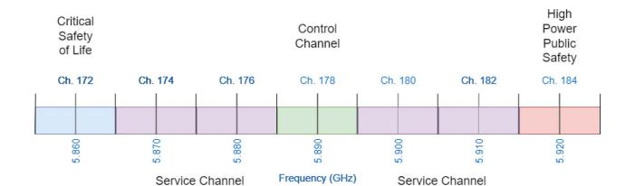

Fig. 9. U.S. DSRC Spectrum Allocation [\[74\]](#page-32-12).

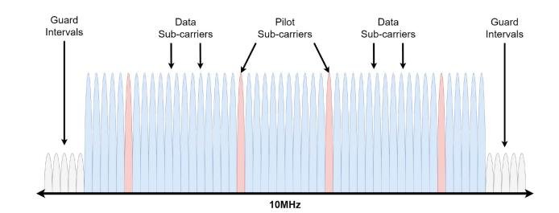

Fig. 10. IEEE 802.11p OFDM format.

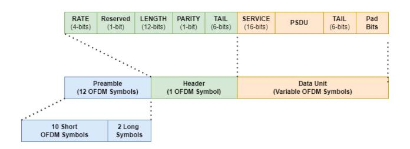

Fig. 11. IEEE 802.11p Frame Structure [\[58\]](#page-31-44).

techniques of its predecessors, i.e., Ethernet with Carrier Sense Multiple Access with Collision Detection (CSMA/CD) style medium access control.

*1) IEEE 802.11p - Physical Layer:* IEEE 802.11p leverages an earlier standard, IEEE 802.11a, as its basis [\[75\]](#page-32-13). 802.11a was the first WLAN-based specification to introduce orthogonal frequency division multiplexing (OFDM) [\[76\]](#page-32-14) as its multiple access methodology. As previously discussed, in 1999, the U.S. FCC allocated 75MHz of the 5.9GHz spectrum for DSRC use cases and applications. Bands used by DSRC are in the licensed spectrum, unlike the 2.4GHz and 5GHz unlicensed bands that are free for use, and typically used by Wi-Fi, Bluetooth, and other consumer devices. Figure [9](#page-12-1) illustrates the DSRC spectrum bands and channels in the U.S. With a basis in 802.11a, OFDM is leveraged as DSRC's medium access methodology. As with 802.11a, 802.11p can utilise Binary Phase Shift Keying (BPSK), Quadrature PSK (QPSK), 16-QAM (Quadrature Amplitude Modulation) and 64-QAM modulation schemes. 802.11p also re-uses the existing 52 subcarrier format from 802.11a, with 48 sub-carriers for data and 4 pilot sub-carriers, illustrated in Figure [10.](#page-12-2) Lastly, in IEEE 802.11p, the standard WLAN frame structure is utilised. In a WLAN context, the physical layer transmission frame is known as a Physical layer Protocol Data Unit (PPDU), as illustrated in Figure [11.](#page-12-3)

*2) IEEE 802.11p - MAC Layer:* IEEE 802.11p employs the existing MAC protocols in 802.11, i.e., the Distributed Coordination Function (DCF) and Hybrid Coordination Function (HCF). DCF/HCF utilise a technique known as Carrier Sense Medium Access with Collision Avoidance (CSMA/CA) as the mechanism for arbitrating access to the wireless channel. DCF is the mechanism by which CSMA/CA is implemented in IEEE 802.11 Wireless Local Area Networks (WLANs). DCF improves upon and increases the practicality of CSMA/CA via the introduction of Inter-frame Spaces (IFS) [\[58\]](#page-31-44). IFS are the periods of time between transmissions of data frames. The purpose of explicitly defining these IFSs is to aid in the smooth operation of handshake protocols, i.e., allowing for processing times, and arbitration of the wireless channel. By leveraging and appropriately applying the IFS types, DCF (and HCF) further improve the susceptibility of CSMA/CA-based technologies to collisions. Building on the techniques and methods of DCF, introduced as part of IEEE 802.11e [\[77\]](#page-32-15), the HCF introduces further optimisations through the introduction of prioritisation via the concept of Access Categories (ACs). For example, multimedia data such as Voice-over-IP (VoIP) calls could be assigned a lower priority, whereas CAMs and DENMs could be assigned a higher priority. Within the HCF there are two methods of medium access control; Enhanced Distributed Channel Access (EDCA) and HCF Controlled Channel Access (HCCA). The ACs of HCF are a direct mapping of the existing Ethernet Class of Service (IEEE 802.1p) [\[78\]](#page-32-16) priority levels.

- *3) IEEE 802.11bd:* Many lessons have been learned over the two decades of DSRC's existence and several new iterations of the standard Wi-Fi specification (IEEE 802.11n/ac/ax) have come to fruition alongside the wireless communications advances of the past twenty years. These lessons and techniques can be leveraged to advance DSRC to the next generation of V2X communications. The primary focus of the IEEE 802.11bd amendment [\[79\]](#page-32-17) is to provide enhancements to 802.11p while maintaining inter-operability, co-existence, backward compatibility and fairness. In order to maintain interoperability and backward compatibility with 802.11p, 802.11bd will carry forward the same MAC layer with most of the enhancements manifesting in the physical layer addressing range, robustness and reliability:
- *a) Midambles:* The concept of a midamble is proposed for 802.11bd in addition to the existing 1.6μs preamble. These midambles are essentially the same as the preamble but strategically placed between OFDM symbols to improve channel estimation in fast-changing channel conditions. The number of midambles used will most likely be determined by how adverse the Doppler spread of the channel is, as adding more midambles increases the required number of bits to be sent.
- *b) Re-transmissions:* To further improve reliability, an adaptive blind re-transmission scheme is proposed for IEEE 802.11bd [\[80\]](#page-32-18). To avoid exacerbating congestion, the decision to and number of re-transmissions are based on the channel loading. The primary distinction between this scheme and standard re-transmissions in IEEE 802.11p is that in this proposed scheme, re-transmissions can occur within the same TXOP or as a separate independent contention process.
- *c) OFDM numerologies:* In order to compensate for the low maximum throughput of 802.11p (27Mbps), alternate

OFDM numerologies, i.e., sub-carrier (SCS) are being considered for IEEE 802.11bd. There are three options being considered to operate with the standard 10MHz channel; 156.25kHZ with 64 sub-carriers, 78.125kHz with 128 subcarriers and 39.0625kHz with 256 sub-carriers. An increased number of sub-carriers allows for even higher throughputs and consequently lower latencies, however, the lower subcarrier spacings are more susceptible to Doppler spread in high mobility scenarios.

- *d) Dual carrier modulation (DCM):* To further increase the communication range and reliability of the 802.11bd radio, frequency diversity can be exploited through Dual Carrier Modulation (DCM). Introduced in IEEE 802.11ax, DCM entails transmitting the same OFDM symbol twice in two different sub-carriers that are spaced sufficiently far apart. While DCM has the advantage of increased frequency diversity, in order to maintain throughput the modulation technique must also be doubled to compensate, increasing susceptibility to noise, though this may be offset by the proposed midambles.
- *e) mmWave and MIMO:* Frequencies on the order of 60GHz and above are known as mmWave frequencies and are being considered for 802.11bd, particularly for short-range high throughput use cases. There is a substantial amount of unused spectrum in these frequency ranges, allowing for significant throughputs to be achieved at the cost of increased attenuation and susceptibility to Doppler spread. In addition to these new frequency bands, advanced multi-antenna techniques (MIMO), discussed in Section [V-A2,](#page-27-0) are proposed for 802.11bd to take advantage of spatial diversity or spatial multiplexing.
- *f) Channel bonding:* Another method of facilitating very high throughputs for 802.11bd is the concept of channel bonding [\[81\]](#page-32-19). This technique will allow devices to transmit in two separate 10MHz channels simultaneously essentially forming a 20MHz channel. One of the two 10MHz channels will be referred to as the primary or contention channel, and the other 10MHz channel is referred to as the secondary or extension channel. Devices will sense the primary channel for the interval of an IFS, during this time the secondary channel will also be sensed for a short time. If the secondary channel is sensed as busy once the device gains access to the primary channel, transmission takes place over the single 10MHz primary channel. However, if both channels are sensed as idle, the transmission will take place over the whole 20MHz channel.

# *B. Cellular V2X (C-V2X)*

Cellular or mobile technology is a wireless communications system designed to provide connectivity for mobile devices such as smartphones, smartwatches, buses, trains etc. The term "cellular" originates from how the system tackles the issue of providing connectivity over large geographical areas. Land areas are divided into "cells", each served by a fixed "base station" transceiver. Each of these base stations provides coverage and management by directly communicating wirelessly with mobile devices located within the cell area.

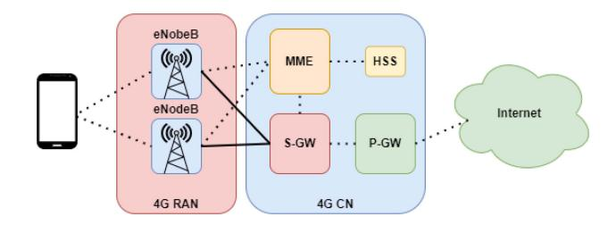

Fig. 12. 4G LTE Architecture.

This distributed network of cells covering geographical areas is known as the Radio Access Network (RAN). Every base station is connected via a high-speed wired connection to a "core network" (CN), where overall system management, i.e., customer management, billing, authentication, security and bridging to the wider Internet takes place.

With the advent of the 5th generation of cellular communications, known as 5G New Radio (NR), cellular technology is becoming a very promising V2X communications candidate. Cellular's major strengths come from its widespread infrastructural deployment and its inherent mobility-aware design. Cellular V2X (C-V2X) [\[82\]](#page-32-20) aims to cover all the possible communications links in vehicular communications, i.e., V2V, V2I, V2N etc. by leveraging the many directional facets of cellular communications, i.e., the downlink, uplink and sidelink (also known as Device-to-Device Proximity Services or D2D ProSe [\[83\]](#page-32-21). This section will provide an overview of key concepts and the approach of cellular communications to physical and MAC layer design.

*1) 4G Long Term Evolution - 4G LTE:* The move from 2G/3G to 4G LTE [\[84\]](#page-32-22) brought with it a fundamental restructuring of the RAN and CN of the cellular system. This restructuring resulted in 4G LTE having what is known as a "flat" architecture, combining a new CN known as the Evolved Packet Core (EPC) together with a new RAN into what is known as the Evolved Packet System (EPS), illustrated in Figure [12.](#page-14-0) This separation of the functions of the cellular system between the RAN and the EPC is highly advantageous as it allows new technologies and techniques to be integrated into one half of the EPS without greatly disrupting the function of the other half.

*a) Physical layer:* Spectrum allocations for 4G LTE are defined by the 3GPP in [\[85\]](#page-32-23) ranging from approximately 300MHz through 6GHz. These spectrum allocation bands are given unique identifiers, e.g., LTE Band 1, LTE Band 2 etc. The particular LTE bands in use are specific to MNOs and geo-political regions for operational purposes, meaning that the entire spectrum is typically not available, only select bands from different sections of the full range. Similarly to DSRC, 4G LTE [\[86\]](#page-32-24) utilises OFDM as the underlying transmission methodology supporting a range of modulation types, i.e., QPSK, 16-QAM, 64-QAM etc. However, in the uplink, a variation on OFDM, known as DFT-spread OFDM or DFTS-OFDM, is used to address issues arising around signal receive power at the base station, more specifically to reduce the cubic metric of the receive signal [\[87\]](#page-32-25).

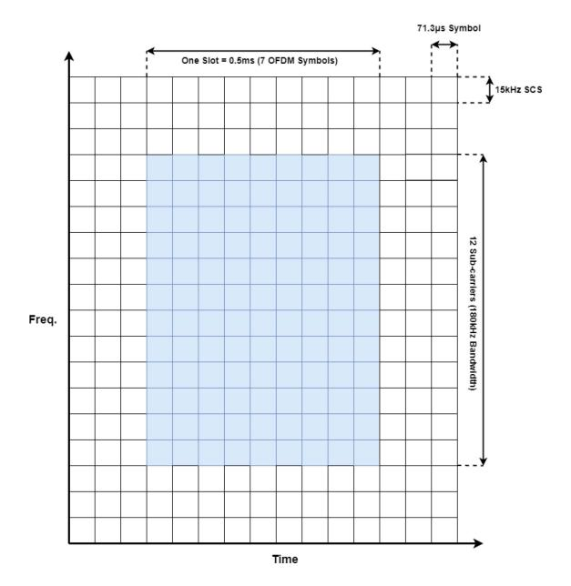

Fig. 13. 4G LTE OFDM Structure.

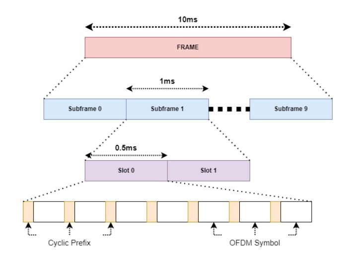

Fig. 14. 4G LTE Frame Structure.

In the case of device-to-device or D2D communications, uplink and downlink directions do not necessarily apply, therefore 3GPP has introduced the term "sidelink" to identify D2D communications links. It is pertinent to note that sidelink communications are inherently unidirectional, meaning that all sidelink communications in 4G LTE are essentially broadcast transmissions with no control signalling in the opposite direction, therefore sidelink transmissions primarily utilise the same spectrum and structure as uplink transmissions. 4G LTE uses groupings of 12 OFDM sub-carriers with spacings of 15kHz across the board, illustrated in Figure [13.](#page-14-1) A sub-carrier spacing of 15kHz was chosen to balance considerations in the cyclic prefix, which improves channel estimation and signal decoding, and robustness to Doppler shift, to which OFDM is sensitive. With the frequency domain partitioned with 15kHz sub-carrier spacing via OFDM, 4G LTE transmissions are organised into frames and slots in the time domain, see Figure [14.](#page-14-2) 4G LTE transmission frames are 10ms in length,

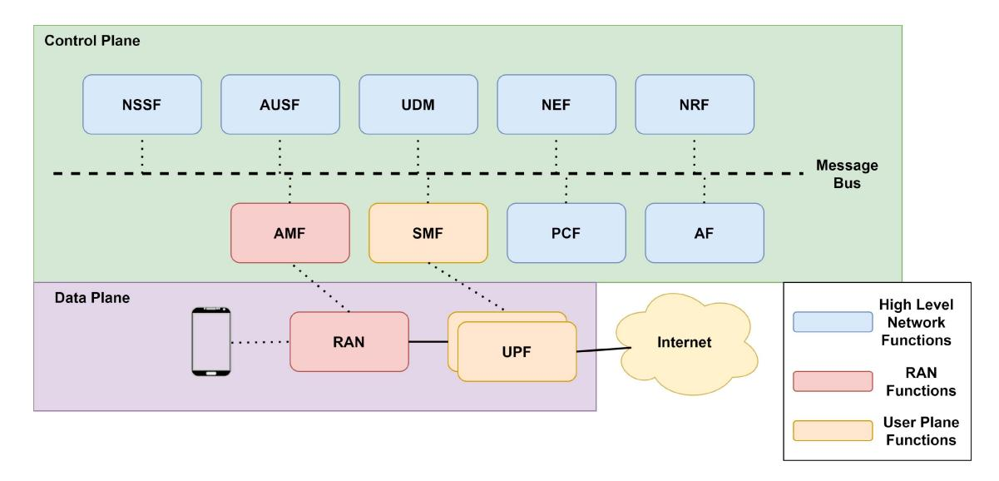

Fig. 15. 5G Core (5GC) Control and Data Plane Architectures. High-level network functions pertain to authentication, policy management and networking slicing (out of scope for this work). RAN functions pertain to the management of access and mobility of user devices. User Plane Functions pertain to the management of user data flows and sessions.

and each frame consists of ten sub-frames of each with a length of 1ms. Each sub-frame is further subdivided into two equally sized slots of length 0.5ms, where each slot consists of several OFDM symbols, including a cyclic prefix per symbol.

*b) MAC Layer:* In 4G LTE the MAC layer [\[88\]](#page-32-26) is managed by a series of schedulers. Each of the downlink, uplink, and some of the sidelink transmissions are scheduled and therefore have an associated scheduler within an eNodeB. It should be noted that the exact scheduling algorithms used are not standardised by 3GPP but is instead an implementation left to mobile network operators (MNO). Different MNOs may choose to use different strategies depending on the situations and scenarios their subscriber base may encounter, to fulfil Quality-of-Service (QoS) requirements. The downlink scheduler is responsible for managing the devices that the eNodeB is transmitting to. The downlink scheduler provides each device with a scheduling assignment consisting of a set of resource blocks that the eNodeB will use to transmit the required data for each device. The uplink scheduler behaves very similarly to its downlink counterpart. In the uplink direction, scheduling assignments are known as a scheduling grant, which consists of a set of resource blocks that the device can use to transmit data to the eNodeB. Sidelink transmissions in 4G LTE can be scheduled in two ways: centrally controlled by a serving eNodeB or autonomously when there is no coverage available. The 4G LTE sidelink has 4 modes available. Modes 1 and 2 are designed for D2D communications with a focus on prolonging battery lifetime in mobile devices, however, this focus comes at the cost of increased latency. In 3GPP Release 14, modes 3 and 4 were introduced with a focus on low latency and high reliability, specifically for V2V broadcast communications.

*2) 5G New Radio (5G NR):* As previously discussed, 5G NR [\[89\]](#page-32-27) is intended to be a flexible communications technology aiming to enable as many Industry 4.0 technologies as possible. The potential use cases and applications of 5G NR are somewhat conflicting in terms of their network requirements, e.g., URLLC requires low latencies, low data rates and high reliability, whereas eMBB is delay tolerant and requires massive throughputs. To achieve support for such a diverse application set, 5G NR is attempting to redefine the foundations of cellular technology by moving away from telephony-centric specialisations and providing the groundwork for a flexible wireless communications framework for future technologies to build upon. The two key re-definitions that 5G NR employ are its radio technology and its core network functionality. Both have been redesigned from the ground up with flexibility and scalability in mind.

The new architecture for 5G NR is known as the 5G System (5GS) [\[90\]](#page-32-28). Overall, the structure of the 5GS remains very similar to its 4G LTE counterpart. The "flat" architecture introduced in 4G LTE is still leveraged by 5G NR where the entire system is split into two parts, the RAN and the CN. Due to the calibre of changes that have occurred in 5G NR, however, the RAN logical nodes are now known as "gNodeB" and the CN is referred to as the 5G Core (5GC), to distinguish them from 4G LTE eNodeBs and EPC respectively. As with the 4G LTE EPC, the 5GC is split into a userplane and a control-plane, with the major overhauls coming in the structure of the 5GC control-plane. This new controlplane structure is known as a service-based architecture (SBA), illustrated in Figure [15,](#page-15-0) as the functions of the 5GC are split up by service, rather than being accumulated into a single logical entity, i.e., the MME in 4G LTE. This SBA allows 5G NR to transition from the monolithic 4G LTE EPC, typically physically implemented in a single data centre, into a distributed network of 5GCs all operating independently on common off-the-shelf hardware, leading to the concept of OpenRAN or O-RAN [\[91\]](#page-32-29). This redefinition of the cellular CN allows 5G NR to set a flexible and scalable foundation to begin addressing key challenges such as big data, high device density and low latency that Industry 4.0 verticals present.

*a) Physical Layer:* Similar to the previous generation of cellular technology, the spectrum allocations for 5G NR are defined by the 3GPP in [\[92\]](#page-32-30), [\[93\]](#page-32-31). Spectrum allocations

TABLE XI 5G NR OFDM NUMEROLOGIES

| μ | SCS (kHz) | FR1 | FR2 | #Slots per Frame | Slot Time (ms) |
|---|-----------|-----|-----|------------------|----------------|
| 0 | 15        | 1   | Х   | 10               | 1              |
| 1 | 30        | 1   | Х   | 20               | 0.5            |
| 2 | 60        | 1   | 1   | 40               | 0.25           |
| 3 | 120       | Х   | 1   | 80               | 0.125          |
| 4 | 240       | Х   | 1   | 160              | 0.0626         |

for 5G NR can be broadly separated into two categories: Frequency Range 1 (FR1) consisting of bands lower than 6GHz and Frequency Range 2 (FR2) consisting of mmWave bands ranging from 20GHz up to 60GHz. The FR1 bands in 5G NR correlate directly with bands in 4G LTE and allow for the inter-working of the two generations of cellular. The new frequency allocations, FR2, are TDD bands with higher channel bandwidths than those in FR1. These mmWave bands are intended to be used with Carrier Aggregation to supplement the FR1 bands when very high data rates, albeit at shorter distances, are required.

Waveform adjustments in 5G NR [\[94\]](#page-32-32) constitute the major novel changes to the newest generation of cellular technology. Alongside the expanded aforementioned spectrum usage, to facilitate the wide range of use cases that 5G NR aims to support, a flexible numerology for OFDM is introduced. A single OFDM numerology cannot fulfil the performance requirements demanded by the diverse 5G NR application set and allow the FR2 band to be adequately utilised. In the context of 3GPP-defined cellular communications, numerology refers to the selection of OFDM sub-carrier spacing, cyclic prefix duration and the number of OFDM symbols per slot. In 5G NR, the sub-carrier spacing can be chosen from 15 ∗ 2μ kHz, where μ is an integer and the cyclic prefix overhead per slot is 7% as with 4G LTE, see Table [XI.](#page-16-1)

The μ=0 numerology or 15kHz sub-carrier spacing is equivalent to 4G LTE. Using this scaling allowed all numerologies to be related to one another via a single scaling factor, simplifying the sampling clock rates required, as they too need only be scaled according to μ. It should be noted that the higher-order numerologies are only for use in FR2. Like 4G LTE, 5G NR frames are also 10ms in length with a series of sub-frames each of length 1ms. The 5G NR flexible numerology ensures symbol and slot-wise time alignment, i.e., an integer number of slots in a higher numerology align with a slot of a lower numerology. Figure [16](#page-16-2) illustrates the 5G NR frame structure. This alignment in the time domain is vital for efficiently enabling TDD communications with different numerologies active at once.

*b) MAC layer:* In 5G NR the MAC mechanisms [\[95\]](#page-32-33) for the downlink and the uplink are almost identical to 4G LTE for backward compatibility. The primary change to the 5G NR MAC, particularly in the context of V2X communications, is the sidelink channel. In 5G NR, there are only two modes for the sidelink, modes 1 and 2, which equate to 4G LTE sidelink modes 3 and 4 respectively. In the 4G LTE sidelink, there is only support for broadcast communications, whereas in the 5G NR sidelink there is now support for broadcast, groupcast and

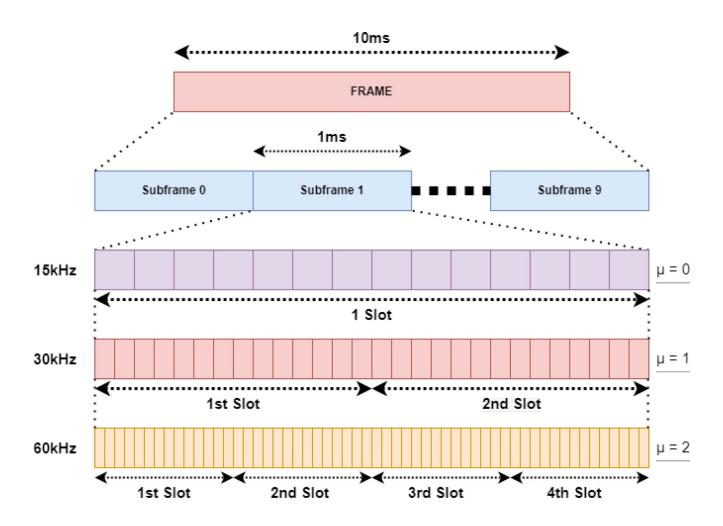

Fig. 16. 5G NR Frame Structure.

unicast communications. The primary difference between the scheduling methods used in 4G LTE mode 3 and 5G NR mode 1 is the semi-persistent scheduling method, where in 5G NR mode 1, the device must wait until it receives another grant from the gNodeB indicating that their grant is now active, to then begin using the reserved radio resources.

Similar to 4G LTE mode 4, devices operating in 5G NR mode 4 can autonomously select their radio resources when out of coverage. In 4G LTE mode 4, devices only have the option of using the SB-SPS scheme described previously, however, in 5G NR mode 2, devices have the option of using either dynamic scheduling or a modified SB-SPS scheme. The resource sensing and selection process for both the dynamic scheduling and SB-SPS schemes are effectively the same. The primary difference between both schemes is that dynamic scheduling is for a single transmission resource, whereas the modified SB-SPS scheme is for reoccurring transmission resources. The introduction of the dynamic scheduling scheme is to aid with aperiodic traffic types in V2X communications.

# IV. ADDRESSING THE DSRC VS. C-V2X DEBATE

In the preceding sections, the concepts and techniques surrounding the physical and MAC layers of the two technologies, DSRC and C-V2X were presented. In addition, the design and architecture of these technologies highlight their ability to support each of the V2X types, i.e., V2V, V2I, V2P, and V2N. With this foundation in place, all that remains is to investigate the aforementioned debate between the two technologies. To address this debate, the literature surrounding both technologies in the context of V2X communications is reviewed to provide a comparative analysis. In doing so, an understanding can be developed regarding the relative strengths and weaknesses of both technologies as potential wireless access candidates for V2X communications.

It should be noted that the discussion on 802.11bd and 5G NR is at present preliminary, as the development of both of these technologies for V2X communications is still in the early stages. Additionally, it should also be noted that the comparative analysis will not compare both technologies

TABLE XII LESSER KNOWN METRICS

| AoI  | Age of Information            |
|------|-------------------------------|
| PLR  | Packet Loss Ratio             |
| PRR  | Packet Reception Ratio        |
| PDR  | Packet Delivery Ratio         |
| PCP  | Packet Collision Probability  |
| FER  | Frame Error Rate              |
| PER  | Packet Error Rate             |
| BER  | Bit Error Rate                |
| BLER | Block Error Rate              |
| PDV  | Packet Delay Variance         |
| CBR  | Channel Busy Ratio            |
| NAR  | Neighbourhood Awareness Ratio |
|      |                               |

across the V2X communications types, i.e., V2V, V2P, V2I, and V2N. The various communication types are a conceptual categorisation framework intended to provide an overview of the many possible types of end-points in a V2X communications system. For example, it is not reasonable to compare DSRC and C-V2X in the context of V2N (Vehicle-to-Network) communications. As a form of V2X communications, V2N is entirely dependent on consistent coverage to some form of base station, which C-V2X has, but DSRC does not.

The literature review conducted in this work is presented in three parts; DSRC-only evaluations, C-V2X-only evaluations and comparative evaluations. For each of these subsections, an overview of the reviewed literature will be provided with key works of note highlighted for the reader. Following this, a discussion regarding the key findings and insights from the literature will be presented. In particular, the comparative analysis will focus on key characteristics of these candidate wireless access technologies such as radio robustness and device management. Given the importance of radio robustness in the inherently challenging channel conditions common in high mobility V2X scenarios, the reviewed literature is broadly categorised based on; whether real-world testing or a simulation was utilised, and which generation or version of the candidate technology was under evaluation. Metrics used in each work to evaluate the wireless access technologies are also provided, a list of lesser-known metrics used in the literature is provided in Table [XII.](#page-17-0)

## *A. DSRC-Only Evaluations*

*1) Literature:* Over the course of approximately two decades, there has been a number of analyses performed on DSRC-based V2X communications. Table [XIII](#page-18-0) summarises the literature on the performance of DSRC. The vast majority of the work completed around DSRC occurred up until 2017 where, as previous works [\[6\]](#page-30-5) have concluded, several challenges surrounding the physical and MAC layers of DSRC were highlighted and it became clear that an evolution of the existing physical and MAC layer designs were required. Research interest began anew two years after in 2019 following the formation of the IEEE 802.11bd Task Group.

In general, DSRC has been analysed in one of two ways, through theoretical analysis and simulation or through

controlled experimental evaluation. Publications that focus on numerical analysis and simulation are typically driven with the intent of, and derive novelty from, generating and refining models of DSRC for use in simulation. Conversely, the experimental evaluations derive novelty from evaluating DSRC through various V2X scenarios in real-world channel conditions.

Experimental evaluations of DSRC are fewer in number than their simulated counterparts, these evaluations typically involve controlled scenarios involving one or two test vehicles and a set of RSUs with the intent of investigating the performance and behaviour of DSRC in particular road environments, i.e., Line-of-Sight (LOS), Non-Line-of-Sight (NLOS) or blind junction scenarios.

*2) Discussion:* As previously mentioned, DSRC is primarily designed and intended for safety-critical V2V communications with V2I capabilities. This is in part a result of the medium access control mechanisms in the 802.11 specifications, i.e., EDCA. This inherently distributed access methodology, where centralised resource arbitration is the exception, not the norm, is quite advantageous for direct communications as there is no reliance on centralised infrastructure for authentication and management. In turn, this reduces overhead when establishing connections or distributing CAMs and DENMs as quickly as possible. However, this distributed access methodology suffers from issues surrounding resource allocation, coordination, channel utilisation and therefore scalability regarding device density.

DSRC could potentially support V2P use cases however this would require mobile devices to support the IEEE WAVE stack. V2N applications, while a technical possibility, are not likely to be supported by DSRC on the scale that is required, as the costs associated with providing sufficient geographic coverage for sparse device density scenarios are impractical. While the safety critical use cases of V2X communications are of prime importance, particularly V2V safety critical communications, non-safety related use cases are also prominent to address as automotive manufacturers are more likely to become early adopters of a V2X communications technology that can support infotainment and traffic efficiency type applications. The lack of large-scale adoption of DSRC in the past two decades highlights this fact [\[65\]](#page-32-3).

Given that the intent and architecture of DSRC-based V2X communications are based around distributed and localised communications, the context in which its network performance metrics can be discussed pertains to two key factors: radio robustness and resource allocation. Typical automotive environments can range from sparsely populated rural roads to high-density urban intersections, these scenarios provide a range of wireless channel conditions with which a radio must contend with. Following on from this, the wireless time-frequency resources, i.e., channels used must also be effectively utilised to uphold latency, throughput and reliability QoS requirements.

*a) Radio robustness:* Within the context of automotive environments, there are several key factors to which a radio must demonstrate robustness: distance, relative mobility, occlusions, and interference. Variance in channel conditions

TABLE XIII SUMMARY OF DSRC LITERATURE

| Author                       | Spec.    | Year | <b>Evaluation Method</b> | Metrics                               |
|------------------------------|----------|------|--------------------------|---------------------------------------|
| Hong et al. [96]             | 802.11bd | 2020 | Analysis/Simulation      | Access Delay                          |
| Torgunakov et al. [97]       | 802.11bd | 2022 | Analysis/Simulation      | Latency, PLR                          |
| Jacob et al. [98]            | 802.11bd | 2022 | Analysis/Simulation      | PRR, PER, CBR                         |
| Zhuofei et al. [99]          | 802.11bd | 2023 | Analysis/Simulation      | PRR, Range, CBR                       |
| Yin et al. [100]             | 802.11p  | 2004 | Analysis/Simulation      | Latency, PDR                          |
| Jiang et al. [101]           | 802.11p  | 2006 | Analysis/Simulation      | PRR                                   |
| Rao et al. [102]             | 802.11p  | 2008 | Analysis/Simulation      | PCP                                   |
| Hassan et al. [103]          | 802.11p  | 2011 | Analysis/Simulation      | Latency, PDR                          |
| Hafeez et al. [104]          | 802.11p  | 2013 | Analysis/Simulation      | Latency, PDR, Range                   |
| Yao et al. [105]             | 802.11p  | 2013 | Analysis/Simulation      | Latency, PRR, PCP                     |
| Wang et al. [106]            | 802.11p  | 2013 | Analysis/Simulation      | Latency, Throughput, Capacity         |
| Reis et al. [107]            | 802.11p  | 2014 | Analysis/Simulation      | Rehealing Delays                      |
| Qiu et al. [108]             | 802.11p  | 2014 | Analysis/Simulation      | Latency, Throughput, PRR              |
| Goubet et al. [109]          | 802.11p  | 2015 | Analysis/Simulation      | FER, BER                              |
| Atallah et al. [110]         | 802.11p  | 2017 | Analysis/Simulation      | Latency, Throughput, PCP              |
| Yao et al. [111]             | 802.11p  | 2019 | Analysis/Simulation      | Latency, Access Delay                 |
| Sadovaya et al. [112]        | 802.11p  | 2020 | Analysis/Simulation      | BER                                   |
| Hocken et al. [113]          | 802.11p  | 2020 | Analysis/Simulation      | PER, BER                              |
| Hu et al. [114]              | 802.11p  | 2020 | Analysis/Simulation      | Latency, PDR, PRR                     |
| Wu et al. [115]              | 802.11p  | 2020 | Analysis/Simulation      | Latency, PDR                          |
| Zhang et al. [116]           | 802.11p  | 2020 | Analysis/Simulation      | Latency, PDR                          |
| Lee et al. [117]             | 802.11p  | 2013 | Implementation           | PDV, Throughput, Signal Strength, PLR |
| Jaktheerangkoon et al. [118] | 802.11p  | 2016 | Implementation           | Signal Strength, PDR                  |
| Huang et al. [119]           | 802.11p  | 2017 | Implementation           | Range, PDR                            |
| Wang et al. [120]            | 802.11p  | 2020 | Implementation           | Throughput, Latency                   |
| Meireles et al. [121]        | 802.11p  | 2020 | Implementation           | Throughput, Signal Quality            |
| Lyu et al. [122]             | 802.11p  | 2020 | Implementation           | Latency, Throughput, PDR              |
| Klapez et al. [123]          | 802.11p  | 2021 | Implementation           | Latency, PDV, Throughput, PRR         |
| Bae et al. [124]             | 802.11p  | 2021 | Implementation           | PDV, Signal Strength, PRR             |
| Wu et al. [125]              | 802.11p  | 2021 | Implementation           | Latency, Throughput                   |
| Wu et al. [126]              | 802.11p  | 2013 | Tutorial/Survey          | Signal Strength, PRR                  |
| Baiocchi et al. [127]        | 11p/11bd | 2021 | Analysis/Simulation      | Latency, Access Delay, Throughput     |
| Jacob et al. [128]           | 11p/11bd | 2021 | Analysis/Simulation      | PRR                                   |
| Ma et al. [129]              | 11p/11bd | 2021 | Analysis/Simulation      | Latency, PRR, PLR                     |
| Yacheur et al. [130]         | 11p/11bd | 2021 | Analysis/Simulation      | PRR                                   |
| Triwinarko et al. [131]      | 11p/11bd | 2022 | Analysis/Simulation      | Throughput                            |

associated with these factors can cause significant degradation of performance. Due to its use of OFDM, DSRC is usually quite robust against delay spread or inter-symbol interference (ISI) caused by multi-path propagations thanks to its long cyclic prefix or guard interval (1600ns) [\[100\]](#page-32-34), [\[104\]](#page-32-35). However, due to the small sub-carrier spacings, OFDM is quite sensitive to Doppler shifts, especially when the coherence bandwidth is a large portion of the total OFDM bandwidth. Through numerical analysis and simulation, Klapež et al. [\[123\]](#page-33-0) found that vehicle speeds of 100-130km/h did not seriously impact transmission performance, however, the Doppler shifts that occur at vehicles speeds of 160-250km/h caused significant disruptions. In [\[109\]](#page-33-1), Goubet et al. found that there is also a significant effect on transmission performance when the coherence time, i.e., time where the channel is not stable, is approximately or greater than the packet length. In future, further tests should be explored to examine the gradient of effects of vehicle speed on DSRCs transmission performance. These deep fading effects due to the Doppler shift are also found to cause issues in terms of packet reception when the packet length is greater than the coherence time in [\[126\]](#page-33-2). This is a result of the channel estimation and coding rates used. Even so, Lee and Lim [\[117\]](#page-33-3) note that the DSRC protocols are less sensitive to channel conditions than IEEE 802.11a (Wi-Fi) as it uses half of the bandwidth, 10MHz vs. 20MHz, and more incremental rate adaptation algorithms in response to the fast varying channel.

In general, it appears that the effective communication range of DSRC is more than acceptable under favourable channel conditions (∼500m) [\[104\]](#page-32-35), [\[119\]](#page-33-4), [\[122\]](#page-33-5), [\[123\]](#page-33-0). However, line-of-sight (LOS) has a significant bearing on the transmission performance of DSRC. As previously mentioned, Bae et al. [\[124\]](#page-33-6) demonstrate through a series of controlled empirical tests that non-line-of-sight (NLOS) scenarios effectively halve the effective range of DSRC, with intersection occlusions causing less degradation than direct occlusions. Lyu et al. [\[122\]](#page-33-5) also found that NLOS scenarios resulted in a significant (∼60%) drop in PDR performance. Interestingly, communication distance improved in tunnels, due to the aptly named tunnel effect [132]. The effect of intersection NLOS scenarios is highlighted further by [118], where three different blind junction scenarios; closed buildings, open buildings and flora, were tested. Authors report a significant effect in communication distance in both the closed ( $\sim$ 15m) and open ( $\sim$ 20m) building scenarios and a lesser effect in the foliage scenario ( $\sim$ 40m).

Additionally, through the analysis of a large-scale real-world urban study, the authors in [119] and [117] found that any form of occlusion, i.e., buildings, other road users, foliage, can significantly degrade transmission performance. It should also be noted they did not find any significant effects in terms of adverse weather, i.e., rain and snow, though it only accounted for  $\sim 10\%$  of the recorded data. This is contrasted by the fact that the authors of [117] show that rain can have a diminishing effect on the communication range of DSRC, though interestingly the authors speculate that rain may also attenuate interfering signals, leading to better channel conditions in the shorter range (<50m). A possible solution to these LOS issues could be found in OFDM with index modulation (OFDM-IM) [113], where information is conveyed by coding information through the index of the sub-carriers utilised.

Antenna direction and mounting point on or within a vehicle have also been found to have an impact on transmission distance depending on the direction of travel relative to the receiver. Huang et al. [119] suggest that rooftop antenna mounts are the favourable middle ground. However, even with this rooftop configuration, IEEE 802.11p antennae do not have uniform radial coverage, with apparent horizontal blind spots [117], [123]. Therefore, not only is antenna placement on the vehicle pertinent, but the antenna patterns used are also important for transmission performance.

b) Resource allocation: As discussed in Section III-A1, there is limited spectrum allocated to DSRC, of which only a single 10MHz channel is allocated to safety critical messages. Alongside the EDCA mechanism of IEEE 802.11, this results in a significant constraint on the number of stakeholders that can simultaneously achieve an acceptable QoS for safety-critical applications. Real-world road traffic environments could involve scenarios with several hundred vehicles or stakeholders within communication range (500m) of each other, i.e., congested highway or urban scenarios [133]. This is highlighted by the literature, where there are multiple instances showing that as the channel capacity is approached, the effective and timely delivery of messages is significantly affected [101], [102], [103], [104], [105], [114], [119]. Moreover, the design and behaviour of the IEEE 802.11 MAC protocol exacerbated the issues faced in congested scenarios.

In non-congested scenarios, the average latency performance of DSRC is well within the general 100ms requirement and with favourable channel conditions has shown to be within some of the most stringent latency requirements [100], [103], [104], [105], [107], [108], [123]. However as latency is directly affected by a stakeholder's ability to maintain channel access, the latency increases significantly with congestion and increasing contention

window size, i.e., increasing the likelihood of a collision. Thus far, the literature presented has shown that PDR is inversely proportional to device density and consequently affects all other metrics such as latency, communication range and throughput.

The hidden node problem [115], where a device can communicate with an access point but not directly with other devices that can also communicate with the access point; further adds to the issues caused by congestion. However, it was noted in several works [101], [102], [104], [105], [110], [111] that increasing carrier sense range could help combat hidden nodes. Given that CAMs are the most frequently used message type in V2X communications, due to the fact that they are periodic, the adaptation of CAM frequency or message rate is another medium access control technique available to DSRC. These works present congestion control algorithms typically based on both power and rate control, such as the CAM DCC [134], standardised for use in Europe, to potentially alleviate congestion in high device density scenarios.

In addition to the hidden node problem, the exposed node problem [135], where a device is prevented from sending packets to another device due to co-channel interference; is also amplified in congested scenarios. Similarly to the hidden node problem, if the overall transmission range is decreased in congested scenarios, the effective device density that a vehicle should concern itself with is decreased and therefore the likelihood of the exposed node problem occurring is also decreased. From these findings, it is clear that the issues that primarily occur in congested scenarios are a result of both sensing and contention-based access aspects of the MAC mechanism, i.e., the EDCA protocol. While there are a number of proposed solutions for congestion mitigation, such as the aforementioned power and rate control algorithms or the reduction or removal of buffers at the transmitter [127], two solutions that stand out are the TDMA protocol [125] and centralised control [116], either via the HCF function or a separate control channel, similar to the behaviour of C-V2X. Both solutions provide structure to the wireless resources available, removing to a certain extent the contention aspect of distributed channel access.

Broadcast storms also embody a risk in terms of congestion due to multi-hop broadcasts via DENMs. These broadcast storms are well studied in MANETs, Xiao et al. [136] present a stochastic re-transmission mechanism to alleviate this issue. Another solution known as the piggyback ACK (PACK) protocol is proposed in [101] to address these broadcast reliability performance issues, at the cost of extra loading.

In ideal conditions, the maximum data rate possible with DSRC is 27Mbps, however, optimal reliability performance is found at 6Mbps [105], [111], with the authors in [123] demonstrating a guaranteed 4Mbps for optimal reliability. To combat this issue, [121] present a method of switching between other IEEE 802.11 radios with higher throughput capabilities, i.e., 802.11n/ac/ad, depending on communication distance. mmWave technology may provide a solution to DSRC's throughput issues [120], however fading effects due to attenuation and Doppler shift [130] are of major concern

TABLE XIV SUMMARY OF C-V2X LITERATURE

| Author                       | Year | Gen. | <b>Evaluation Method</b> | Metrics                                    |
|------------------------------|------|------|--------------------------|--------------------------------------------|
| Santa et al. [137]           | 2008 | 3G   | Implementation           | Latency                                    |
| Trichias et al. [138]        | 2012 | 4G   | Analysis/Simulation      | Latency, Throughput, Capacity, PDR, PLR    |
| Li et al. [139]              | 2015 | 4G   | Analysis/Simulation      | Capacity, Spectral Efficiency              |
| Chen et al. [140]            | 2016 | 4G   | Analysis/Simulation      | PDR                                        |
| Calvo et al. [141]           | 2017 | 4G   | Analysis/Simulation      | SINR                                       |
| Li et al. [142]              | 2017 | 4G   | Analysis/Simulation      | Latency, Throughput, Capacity, PLR         |
| Montori et al. [143]         | 2017 | 4G   | Analysis/Simulation      | Latency, Capacity                          |
| Vlachos et al. [144]         | 2017 | 4G   | Analysis/Simulation      | BER                                        |
| Lee et al. [145]             | 2017 | 4G   | Analysis/Simulation      | Latency                                    |
| Molina-Masegosa et al. [146] | 2017 | 4G   | Analysis/Simulation      | PDR                                        |
| Molina-Masegosa et al. [147] | 2017 | 4G   | Analysis/Simulation      | PER, PDR                                   |
| Albonda et al. [148]         | 2018 | 4G   | Analysis/Simulation      | Throughput, Capacity                       |
| Molina-Masegosa et al. [149] | 2018 | 4G   | Analysis/Simulation      | PDV, PDR                                   |
| He et al. [150]              | 2018 | 4G   | Analysis/Simulation      | PRR                                        |
| Amjad et al. [151]           | 2018 | 4G   | Analysis/Simulation      | Access Delay                               |
| Emara et al. [152]           | 2018 | 4G   | Analysis/Simulation      | Latency                                    |
| Kang et al. [153]            | 2018 | 4G   | Analysis/Simulation      | PRR                                        |
| Bazzi et al. [154]           | 2018 | 4G   | Analysis/Simulation      | Latency, PRR                               |
| Nardini et al. [155]         | 2018 | 4G   | Analysis/Simulation      | Latency, PDR                               |
| Mansouri et al. [156]        | 2019 | 4G   | Analysis/Simulation      | PDR, CBR                                   |
| Haider et al. [157]          | 2019 | 4G   | Analysis/Simulation      | PRR                                        |
| Toghi et al. [158]           | 2019 | 4G   | Analysis/Simulation      | PDV, Throughput, PDR, Signal Strength, CBR |
| Bazzi et al. [159]           | 2019 | 4G   | Analysis/Simulation      | Range, Capacity                            |
| Choi et al. [160]            | 2020 | 4G   | Analysis/Simulation      | PDV, PRR, CBR                              |
| Yoon et al. [161]            | 2020 | 4G   | Analysis/Simulation      | PDV, Throughput, PRR, Signal Strength, CBR |
| Wang et al. [162]            | 2020 | 4G   | Analysis/Simulation      | Throughput, PRR, BLER                      |
| Guizar et al. [163]          | 2020 | 4G   | Analysis/Simulation      | PDR, PER, Capacity                         |
| Hegde et al. [164]           | 2020 | 4G   | Analysis/Simulation      | Latency, PRR                               |
| Bazzi et al. [165]           | 2020 | 4G   | Analysis/Simulation      | PRR                                        |
| Saifuddin et al. [166]       | 2020 | 4G   | Analysis/Simulation      | PRR, CBR                                   |
| Segata et al. [167]          | 2021 | 4G   | Analysis/Simulation      | Latency, PDR, PER                          |
| Kang et al. [168]            | 2021 | 4G   | Analysis/Simulation      | Latency, Range, PRR                        |
| Gholmieh et al. [169]        | 2021 | 4G   | Analysis/Simulation      | PDV, PRR                                   |
| Yu et al. [170]              | 2021 | 4G   | Analysis/Simulation      | Throughput, PRR, PCP                       |
| Poli et al. [171]            | 2021 | 4G   | Analysis/Simulation      | PDR                                        |

at these frequencies. A multi-radio system may also need be considered because of the channel switching that occurs between the service channel (SCH) and the control channel (CCH). An alternate methodology to a multi-radio radio to alleviate the cost of channel switching is the peer-cast protocol proposed in [\[101\]](#page-32-36).

Finally, there have been a small number of early works investigating some of the enhancements that are part of the IEEE 802.11bd draft specification. Most of these early works conducted studies into the effectiveness of the new physical layer enhancements of 802.11bd over 802.11p. Baiocchi et al. [\[127\]](#page-33-17) and Triwinarko et al. [\[131\]](#page-33-24) demonstrate that the use of DCM and range extension in 802.11bd leads to a significantly higher range and much better reliability in NLOS scenarios over 802.11p. This is confirmed in [\[98\]](#page-32-42), [\[99\]](#page-32-43), [\[129\]](#page-33-25), [\[130\]](#page-33-23) where simulation studies show that the midambles, lower Modulation and Coding Scheme (MCS) and adaptive re-transmissions boost communication range and reliability over 802.11p at the cost of decreased spectral efficiency and channel loading. The channel bonding technique borrowed from IEEE 802.11ax that is being considered for 802.11bd is analysed in [\[97\]](#page-32-44) and [\[96\]](#page-32-45). Both works demonstrate that channel bonding can in fact increase reliability, however interestingly, Torgunakov et al. [\[97\]](#page-32-44) find that the much older amendment 802.11n can actually contend with 802.11bd.

## *B. C-V2X-Only Evaluations*

*1) Literature:* Since the initial release of C-V2X in 3GPP Release 14 in mid-2017, there has been a steady growth of interest in the research community on the topic. This growth has accelerated since the introduction of the 5th generation of cellular in 3GPP Release 15 in early-2019. Tables [XIV](#page-20-0) & [XV](#page-21-0) summarise the literature on the performance of C-V2X and publications of note are discussed. Like DSRC, C-V2X has generally been analysed in one of two ways, through theoretical analysis and simulation or through controlled experimental evaluation. The simulation tools used for C-V2X are the same as those previously mentioned for DSRC.

TABLE XV SUMMARY OF C-V2X LITERATURE (CONT.)

| Author                        | Year | Gen.  | <b>Evaluation Method</b> | Metrics                           |
|-------------------------------|------|-------|--------------------------|-----------------------------------|
| Mouawad et al. [172]          | 2021 | 4G    | Analysis/Simulation      | PDR                               |
| Bartoletti et al. [173]       | 2021 | 4G    | Analysis/Simulation      | Range, PRR                        |
| Makinaci et al. [174]         | 2021 | 4G    | Analysis/Simulation      | PRR                               |
| Kim et al. [175]              | 2022 | 4G    | Analysis/Simulation      | Latency, Range, PRR               |
| Sabeeh et al. [176]           | 2023 | 4G    | Analysis/Simulation      | PRR, PCP                          |
| Guo et al. [177]              | 2023 | 4G    | Analysis/Simulation      | Throughput, PLR                   |
| Nguyen et al. [178]           | 2023 | 4G    | Analysis/Simulation      | Signal Strength, PER, PDR         |
| Parvini et al. [179]          | 2023 | 4G    | Analysis/Simulation      | AoI                               |
| Chen et al. [180]             | 2023 | 4G    | Analysis/Simulation      | Latency                           |
| Akselrod et al. [181]         | 2017 | 4G    | Implementation           | Throughput, Signal Strength, SINR |
| Lauridsen et al. [182]        | 2017 | 4G    | Implementation           | Latency, Signal Strength          |
| Walelgne et al. [183]         | 2018 | 4G    | Implementation           | Throughput                        |
| Neumeier et al. [184]         | 2019 | 4G    | Implementation           | Latency, Throughput               |
| Burke et al. [185]            | 2020 | 4G    | Implementation           | Latency                           |
| Gaber et al. [186]            | 2020 | 4G    | Implementation           | Latency, Throughput               |
| Niebisch et al. [187]         | 2020 | 4G    | Implementation           | PER                               |
| Toril et al. [188]            | 2021 | 4G    | Implementation           | Signal Strength                   |
| Aissioui et al. [189]         | 2018 | 5G    | Analysis/Simulation      | Latency                           |
| Campolo et al. [190]          | 2019 | 5G    | Analysis/Simulation      | Latency, PRR                      |
| Chekired et al. [191]         | 2019 | 5G    | Analysis/Simulation      | Latency                           |
| Wang et al. [192]             | 2019 | 5G    | Analysis/Simulation      | PRR, PLR                          |
| Deinlein et al. [193]         | 2020 | 5G    | Analysis/Simulation      | Latency, PDV                      |
| Xiaoqin et al. [194]          | 2020 | 5G    | Analysis/Simulation      | Throughput                        |
| Lucas-Estañ et al. [195]      | 2020 | 5G    | Analysis/Simulation      | Latency, Capacity, PDR            |
| Huang et al. [196]            | 2020 | 5G    | Analysis/Simulation      | Throughput, Capacity              |
| Ali et al. [197]              | 2021 | 5G    | Analysis/Simulation      | PDV, Throughput, PRR              |
| Yoon et al. [198]             | 2021 | 5G    | Analysis/Simulation      | Range, PRR                        |
| Ali et al. [199]              | 2021 | 5G    | Analysis/Simulation      | PDV, Capacity                     |
| Saad et al. [200]             | 2022 | 5G    | Analysis/Simulation      | PDR                               |
| Khan et al. [201]             | 2022 | 5G    | Analysis/Simulation      | Latency, Throughput, PLR, SINR    |
| Wu et al. [202]               | 2023 | 5G    | Analysis/Simulation      | Throughput, PRR                   |
| Ogawa et al. [203]            | 2018 | 5G    | Implementation           | Latency, Throughput               |
| Kutila et al. [204]           | 2020 | 5G    | Implementation           | Latency, Throughput, Range        |
| Szalay et al. [205]           | 2020 | 5G    | Implementation           | Latency, Throughput, PER          |
| Kutila et al. [206]           | 2021 | 5G    | Implementation           | Latency, PDR                      |
| Daengsi et al. [207]          | 2021 | 5G    | Implementation           | Latency, Throughput, PLR          |
| Pan et al. [208]              | 2021 | 5G    | Implementation           | Latency, Throughput               |
| Martin-Sacristan et al. [209] | 2020 | 4G/5G | Analysis/Simulation      | PRR, Latency                      |
| Saad et al. [210]             | 2021 | 4G/5G | Analysis/Simulation      | PDR                               |
| Shin et al. [211]             | 2023 | 4G/5G | Analysis/Simulation      | PRR                               |

It should be noted that both smartphones and cellularenabled automotive routers are utilised in the C-V2X literature to provide connectivity for vehicles. The primary difference between the two device types is that of available power delivery, i.e., cellular-enabled automotive routers on average will achieve higher upload performance due to a lack of power constraints. Additionally, depending on the implementation choices of the MNO under study, the two device types may be treated differently when Carrier Aggregation (CA) allocations are provided, resulting in higher or lower maximum achievable throughputs.

Overall, experimental evaluations of C-V2X are fewer in number than their simulated counterparts, these evaluations typically involve one of two types, depending on whether or not the authors had access to a cellular core network. Works with access to a dedicated cellular core network conducted

experiments with a few cellular-capable vehicles on controlled tracks or routes, whereas those without access to a core network instead aim to use a few cellular-capable vehicles to conduct measurements over larger geographical areas.

*2) Discussion:* In comparison to DSRC, C-V2X has a wider scope of V2X applications it could potentially support. While in DSRC where distributed access is the standard and centralised access is the exception, C-V2X represents the inverse where centralised access through base stations is the norm and distributed access in areas of poor coverage are the exception. C-V2X provides two methods for two devices to communicate with each other: through the cellular network, i.e., device-network-device via the downlink/uplink or Uu interface, or directly, i.e., device-to-device via the sidelink or PC5 interface. This flexibility allows C-V2X to address each of the V2X communications verticals, which increases its likelihood of large-scale adoption amongst automotive manufacturers as non-safety critical use cases, i.e., infotainment and traffic efficiency can be implemented without excluding the safety-critical applications that still require significant research and development to fully realise.

While both 4G LTE and 5G NR are cellular technologies, the advancements and changes occurring through the advent of 5G NR warrant these two generations of cellular technology to be discussed somewhat separately. Due to the architecture of 4G LTE, all V2X (except for Sidelink Mode 4), applications must traverse the EPC, which can incur significant latency delays as there is typically only one EPC per mobile network operator, often at a centralised national location. However, part of the intention behind the transition to a standalone 5G architecture is to allow the core network, i.e., 5GC to become a distributed set of core networks, allowing for the benefits of a centralised architecture while mitigating the latency issues associated with it.

*a) Radio robustness:* In general, C-V2X has a more robust physical layer design that is not as susceptible to the same issues as DSRC, given that cellular technology is already designed for geographic coverage with mobile devices. Bazzi et al. [\[154\]](#page-34-0) show that most physical layer parameters of 4G LTE C-V2X, i.e., sensing period, threshold power and TTI allocations, have little effect on performance and should be set to the extremes if possible. However, there are still some physical layer challenges present, Toril et al. [\[188\]](#page-34-1) note that signal strength can fluctuate significantly from lane to lane on a road due to shadowing effects of other vehicles [\[178\]](#page-34-2), infrastructure, foliage and even due to handovers between cells (to a neighbouring cell with poorer channel conditions). While the C-V2X physical layer leverages OFDM, i.e., a cyclic prefix for every OFDM symbol, rendering it robust to Inter-Symbol Interference (ISI), it still suffers from Inter-Carrier Interference (ICI) in scenarios with very high velocity. An ordered successive interference cancellation (OSIC) based solution, which is an important building block of NOMA, discussed in Section [V-A4,](#page-28-0) is proposed in [\[143\]](#page-33-26) to help mitigate ICI issues at higher frequencies, especially in scenarios of high mobility. Interestingly, Niebisch et al. [\[187\]](#page-34-3) demonstrate that even the position of the antenna on the roof of a vehicle [\[212\]](#page-35-0) can have a noticeable effect on radio performance. The authors found that when the antenna is mounted on the middle rear of the vehicle, forward communications directions performed the poorest in 4G LTE C-V2X Mode 4.

In non-congested scenarios with favourable channel conditions, 4G LTE C-V2X has been shown to be capable of supporting several V2X uses case such as cooperative lane merging [\[171\]](#page-34-4), cooperative collision avoidance [\[172\]](#page-34-5) and in several instances, teleoperation [\[184\]](#page-34-6), [\[186\]](#page-34-7). Niebisch et al. [\[187\]](#page-34-3) illustrate that with some edge computing infrastructure, 4G LTE C-V2X could potentially support most of the BSA. Montori et al. [\[143\]](#page-33-26) show that cooperative lane merging could be implemented with either 4G LTE C-V2X Mode 3 or Mode 4, however in the case of Mode 3, RSU deployment has a major impact on its efficacy. Much like DSRC, the performance of C-V2X has been shown to suffer when faced with heavily congested scenarios, especially because of the hidden node problem [\[147\]](#page-33-27). However, C-V2X tends to degrade more gracefully due to the semi-persistent nature of its resource allocation schemes, especially in centralised control scenarios [\[138\]](#page-33-28), [\[154\]](#page-34-0), [\[156\]](#page-34-8), [\[163\]](#page-34-9), [\[170\]](#page-34-10), [\[174\]](#page-34-11). The authors of [\[143\]](#page-33-26) note that base station placement is critical to the performance of C-V2X, especially in locations where road traffic congestion is likely to occur. The authors point out scenarios where some base stations become overwhelmed and others are under-utilised due to their proximity to the roadway. In general, there is no complete consensus on exactly what specific range of device densities causes significant enough performance degradation to be considered congested. Mouawad et al. [\[172\]](#page-34-5) note that for their analysis, 70 vehicles was the level at which congestion set in and congestion control mechanisms should be deployed, whereas [\[183\]](#page-34-12) show that congestion occurs in 4G LTE after ∼33Hz CAMs for 2 vehicles.

In general, the Uu uplink/downlink interface for C-V2X performs most poorly due to the centralised core network causing issues in latency and handover execution along the control plane [\[182\]](#page-34-13). Also noted by the authors in [\[143\]](#page-33-26), this centralised 4G LTE core network is designed for longlasting data sessions with large packet sizes, however, V2X communications require the frequent transmission of very small packets and as such incur problematic overhead. While architecture plays a significant role in the performance of data flows, empirical tests in [\[181\]](#page-34-14) show that SINR and RSSI have the biggest effect on throughput performance for this interface due to the MCS adaptation and scheduling algorithms implemented by the base station. It was noted by the authors that in rural settings, cells utilized lower frequency bands (800MHz) with 10MHz bands. Whereas in urban settings, cells utilized higher frequency bands (1800MHz) with 20MHz bands. Rural settings tend to be more stable over longer distances than their urban counterparts due to the frequencies used. However, urban settings have higher total throughput due to twice the bandwidth being used (10-20MHz). Work completed by Walelgne et al. [\[183\]](#page-34-12) compounds these findings showing that in metropolitan urban areas, time of day, location and device model in these scenarios has a significant effect on throughput and authors note that almost 30% of their measurements suffered from unexpected drop-outs, most likely due to the challenging channel conditions of a metropolitan urban scenario. Studies completed in [\[186\]](#page-34-7), [\[209\]](#page-35-1) point out that multi-MNO operations are also of significant importance both from a performance and economic standpoint and provide a solution to handle these multi-MNO scenarios. Access delay to the cellular network is also of significant concern, as highlighted by Amjad et al. [\[151\]](#page-34-15), who suggest that more preamble access codes are most likely needed for high-density scenarios to reduce collisions in the random access scheme.

Early and experimental deployments of 5G NR have been shown to outperform 4G LTE in almost all respects [\[206\]](#page-35-2), [\[207\]](#page-35-3), [\[211\]](#page-35-4). Szalay et al. [\[205\]](#page-35-5) present empirical tests that highlight this, reporting that 5G NR had a 2-3x improvement of throughput, almost half of the latency and only a slightly higher error rate over 4G LTE. The slightly higher error rate is most likely due to optimised base station radio deployments. However, even 5G NR suffers under congestion, especially in a 5G NR NSA configuration, for the exact same reasons as 4G LTE [\[195\]](#page-35-6). As is part of the design of a 5G NR SA configuration, a Software Defined Networking (SDN) Mobile edge computing (MEC) alongside a distributed 5G core network can help with latency issues in Uu based communications due to the core network latencies, i.e., control plane [\[152\]](#page-34-16), [\[189\]](#page-34-17), [\[191\]](#page-34-18), [\[204\]](#page-35-7), [\[208\]](#page-35-8). Ogawa et al. [\[203\]](#page-35-9) present a controlled experimental scenario with 1 vehicle and 1 gNodeB, reporting approximately 86ms of round trip time latency.

*b) Resource allocation:* The most active area of research within the C-V2X sphere pertains to resource allocation via the SPS mechanism, as this is where performance optimisation occurs, especially in congested scenarios. In particular, resource allocation via the SB-SPS mechanism for the C-V2X sidelink is particularly popular because of its implications for "Day 1" scenarios, like those discussed in the BSA in Section [II-B1.](#page-5-1) As expected, the semi-persistent nature of resource allocation in C-V2X has issues with aperiodic traffic given that it cannot be predicted in advance [\[138\]](#page-33-28), [\[173\]](#page-34-19). To alleviate this, the SB-SPS mechanism could be slightly modified such that only one resource is reserved and no reselections occur [\[146\]](#page-33-29).

Another solution for the issues caused by aperiodic traffic is proposed by Yoon and Kim [\[198\]](#page-35-10) via a stochastic reservation algorithm that shows significant improvement over the default. A number of machine learning algorithms for resource allocation have been proposed [\[177\]](#page-34-20), [\[179\]](#page-34-21), [\[202\]](#page-35-11). Most notably, Muhammad Saad et al. [\[200\]](#page-35-12) present a Deep-Q learning model that modulates the sensing window, reselection counter and resource reservation interval based on vehicle speed and the current frequency of CAM generation to aid in alleviating aperiodic traffic. The effect of the sensing window size appears to vary depending on the scenario. In [\[149\]](#page-33-30) it was shown to not have much effect on performance, however, Saad et al. [\[210\]](#page-35-13) show that a smaller sensing window can help with channel estimation accuracy in higher speed environments. The efficacy of the SB-SPS mechanism is evaluated by comparing it to a random resource allocation mechanism.

Overall it appears that SB-SPS is indeed better than random resource allocation [\[156\]](#page-34-8), especially in the scenarios with mid-long range communications where sensing becomes more challenging due to propagation [\[147\]](#page-33-27), [\[197\]](#page-35-14). However, SB-SPS suffers from the half-duplex problem [\[147\]](#page-33-27) where a device cannot sense transmission on other sub-channels that occur while it is transmitting, often leading to collisions. In 4G LTE C-V2X, these half-duplex collisions result in long sequences of consecutive or bursty errors because there is no feedback mechanism to sense these collisions [\[167\]](#page-34-22). However, 5G NR C-V2X provides a feedback facility via the Physical Sidelink Feedback Channel (PSFCH) to address this issue.

The 4G LTE C-V2X sidelink also has some latency issues, primarily because of the size of the TTI (1ms) [\[144\]](#page-33-31), [\[180\]](#page-34-23), but also because connection setup times, queuing delays in higher layers (PDCP) and re-transmissions on the Uu interface [\[143\]](#page-33-26). Another latency issue is encountered when transitioning between Mode 3 and Mode 4 in 4G LTE C-V2X, Hegde and Festag [\[164\]](#page-34-24) found that it takes significantly longer to switch from Mode 3 to Mode 4 due to the synchronisation latency associated with the Mode 4 setup. Re-transmissions do not appear to be useful reliability mechanisms in congested scenarios for V2X because they increase overall loading, though they might be helpful in scenarios with high speeds where propagation issues prevail [\[162\]](#page-34-25). This is highlighted in [\[193\]](#page-34-26) where multiple HARQ processes cripple the reliability of C-V2X. Nardini et al. [\[155\]](#page-34-27) demonstrate that this size of TTI is not sufficient for advanced V2X applications like vehicle platooning. The flexible numerology of 5G NR C-V2X helps alleviate the issues associated with the size of the TTI. Increasing the numerology also increases the sub-carrier spacing; resulting in a decreased TTI, increased reliable range, reduced update delay, better ICI performance and reduces halfduplex problem [\[190\]](#page-34-28). Choice of numerology also appears to have an effect on the performance of 5G NR C-V2X. Authors in [\[200\]](#page-35-12), [\[210\]](#page-35-13) found that increasing numerology has an overall beneficial effect on reliability even at the cost of fewer sub-channels. Interestingly, the authors in [\[197\]](#page-35-14), [\[199\]](#page-35-15) found that only μ=2 had a noticeable effect on performance due to this exact trade-off between sub-channels and reduced TTI.

A number of resource allocation algorithms have been suggested to aid the SB-SPS mechanism in both 4G LTE and 5G NR. As with DSRC adapting sensing thresholds, transmit power and message rates are the primary mechanisms for congestion control [\[149\]](#page-33-30), [\[153\]](#page-34-29). Haider et al. [\[157\]](#page-34-30), Saifudden et al. [\[166\]](#page-34-31) and Sabeeh and Wesołowski [\[176\]](#page-34-32) propose adaptive power control algorithms for congested scenarios that show promise over the existing 3GPP congestion control algorithms. However, Toghi et al. [\[158\]](#page-34-33) found that message rate has more of an effect in congested scenarios than transmit power, consequently it could be advantageous to be more aggressive when other vehicles are nearby but not when other vehicles are far away.

Yoon and Kim [\[161\]](#page-34-34) transplant and modify the SAE J2945/1 algorithm that uses rate and range control to trade between distance and update frequency in congested scenarios. Choi and Kim [\[160\]](#page-34-35) point out that different QoS classes can be constructed by using rate/range control to have higher reliability for long range or better frequency for short range. Kang et al. [\[168\]](#page-34-36) propose an S-RSSI-based algorithm to modify message rate and transmission power, while Li et al. [\[139\]](#page-33-32) suggest that vehicle speed could be used to estimate traffic flow to dictate resource allocation. Gholmieh and Abbasi [\[169\]](#page-34-37) suggest utilising the SAE J3161/1 Probabilistic One-Shot Transmission mechanism to help mitigate the long consecutive errors that occur because of collisions and the half-duplex problem in SB-SPS. Selecting fewer resources and choosing a longer selection window (at the cost of more collisions in some scenarios) also helps avoid collisions in this way [\[197\]](#page-35-14).

Weighted-Fair-Queueing (WFQ) is presented in [\[142\]](#page-33-33) as a solution for Mode 3 beacon scheduling (CAMs, DENMs). Maximum frequency reuse distance scheduling can help in congested scenarios in Mode 3, shown in [\[175\]](#page-34-38). Calvo and Mathar [\[141\]](#page-33-34) propose a clustering algorithm to improve frequency reuse and reduce interference, especially

| Author                       | Year | <b>Evaluation Method</b> | Metrics                             |
|------------------------------|------|--------------------------|-------------------------------------|
| Vinel et al. [213]           | 2012 | Analysis/Simulation      | PDR                                 |
| Hameed Mir et al. [214]      | 2014 | Analysis/Simulation      | Latency, Throughput, PDR            |
| Bazzi et al. [215]           | 2016 | Analysis/Simulation      | Message Frequency                   |
| 5GAA [216]                   | 2017 | Analysis/Simulation      | PDR                                 |
| Hu et al. [217]              | 2017 | Analysis/Simulation      | BLER                                |
| Bazzi et al. [218]           | 2017 | Analysis/Simulation      | Capacity, PCP, Message Frequency    |
| Cecchini et al. [219]        | 2017 | Analysis/Simulation      | Latency, PDR                        |
| Anwar et al. [220]           | 2018 | Analysis/Simulation      | Latency, Throughput, PDR, BLER, PER |
| Mannoni et al. [221]         | 2019 | Analysis/Simulation      | Latency, Range, PER                 |
| Shimizu et al. [222]         | 2019 | Analysis/Simulation      | Latency, PDV, PRR                   |
| Bazzi et al. [223]           | 2019 | Analysis/Simulation      | PDV, Range, PDR                     |
| Anwar et al. [224]           | 2019 | Analysis/Simulation      | Latency, PDV, Throughput, PRR, PER  |
| Govindarajulu et al. [225]   | 2019 | Analysis/Simulation      | Range                               |
| Abbas et al. [226]           | 2019 | Analysis/Simulation      | Latency, Throughput, PDR            |
| Shimizu et al. [227]         | 2020 | Analysis/Simulation      | Latency, PDV, PER                   |
| Molina-Masegosa et al. [228] | 2020 | Analysis/Simulation      | PDV, Range, PDR, CBR                |
| Sattiraju et al. [229]       | 2020 | Analysis/Simulation      | BLER                                |
| Wijesiri et al. [230]        | 2022 | Analysis/Simulation      | Latency, Throughput, Capacity, PCP  |
| Xu et al. [231]              | 2017 | Implementation           | Latency, Throughput, PLR            |
| Shi et al. [232]             | 2017 | Implementation           | Latency, PDR                        |
| Moradi-Pari et al. [233]     | 2023 | Implementation           | PDR, Range                          |
| Masini et al. [234]          | 2018 | Tutorial/Survey          | PRR                                 |
| Naik et al. [235]            | 2019 | Tutorial/Survey          | PDR                                 |

TABLE XVI SUMMARY OF COMPARATIVE LITERATURE FOR C-V2X & DSRC

in Mode 3. The keep probability (in terms of SPS reselections) and resource reservation interval also allow a trade-off between reliability and latency/throughput [\[149\]](#page-33-30), [\[154\]](#page-34-0), [\[197\]](#page-35-14). Reference [\[150\]](#page-33-35) suggest that to aid with scheduling assignment collisions and collisions in general, putting the future reservations into your last data packet can help with future collisions.

Utilising SINR to decide when to switch between Mode 3 and Mode 4 is proposed in [\[148\]](#page-33-36). A graph colouring algorithm for resource allocation in Mode 3 is proposed by [\[192\]](#page-34-39). Putting hard limits on the number of times resources that can be reselected is suggested by Bazzi et al. [\[165\]](#page-34-40), which helps with hidden nodes and half-duplex. Reference [\[194\]](#page-34-41) proposed a NOMA, discussed in Section [V-A4,](#page-28-0) style resource allocation scheme for 5G Mode 1. Reference [\[196\]](#page-35-16) suggest taking advantage of the specific behaviour of V2X applications to improve applications, i.e., asymmetry in the uplink/downlink. Reference [\[201\]](#page-35-17) illustrate that mmWave could be a viable solution for 5G V2V communications to alleviate capacity and throughput issues.

# *C. Comparative Evaluations*

*1) Literature:* Comparative literature between the two wireless technologies goes back as far as the release of the IEEE 802.11-2012 standard that included IEEE 802.11p. Table [XVI](#page-24-0) summarises the literature on the comparison of DSRC and C-V2X. Since then, interest in the topic has increased steadily following the introduction of sidelink communications via C-V2X in 3GPP Release 14 in 2017. Overall, the typical comparison focus is on the performance between DSRC and the C-V2X sidelink. The overall capabilities of

both technologies regarding the various V2X types are not addressed in these comparative studies.

*2) Discussion:* Across the comparative literature, the general consensus appears to be that the physical layer of C-V2X is more robust than that of DSRC [\[216\]](#page-35-18), [\[217\]](#page-35-19). This is not necessarily surprising given that 802.11p is based on 802.11a, which was frozen into the IEEE 802.11-1999 standard, whereas C-V2X utilises the 4G LTE physical layer, standardised in 3GPP Release 8 in December 2008, almost 10 years later. This is highlighted in scenarios with low device densities as most errors in these scenarios occur from transmission issues [\[227\]](#page-35-20), [\[228\]](#page-35-21). C-V2X leverages special OFDM symbols known as DMRS (Demodulation Reference Signal) for devices to transmit to base stations enabling better channel estimation, especially in NLOS scenarios [\[229\]](#page-35-22).

DSRC tends to be more affected by changes in transmission power and MCS selection because of its single large packet-centric preamble and lack of DMRS symbols [\[223\]](#page-35-23). However, in scenarios with high device density, most of the degradation in reliability performance comes from congestion issues. DSRC tends to be more reliable in the short range in these scenarios, however, due to its physical layer performance C-V2X maintains higher reliability in the mid-long range (>500m) [\[218\]](#page-35-24), [\[222\]](#page-35-25), [\[233\]](#page-35-26). DSRC has better performance at short distances due to the capture effect but C-V2X is more reliable in general [\[234\]](#page-35-27). C-V2X faces more collisions at short distances due to the reselection mechanism in SB-SPS [\[228\]](#page-35-21), [\[236\]](#page-35-28). In general C-V2X Mode 3, the centralised control mode performs better than both DSRC and C-V2X Mode 4 in terms of reliability because of the ability of the base station to make informed scheduling decisions based on the robust channel estimation techniques in the C-V2X physical layer [\[11\]](#page-30-10). It should be noted, on average the latency requirements for the Basic Set of Applications (BSA) are fulfilled, and neither C-V2X Mode 3 nor Mode 4 surpass DSRC in terms of latency [\[219\]](#page-35-29).

The dominance DSRC displays in terms of latency performance is due to the short AIFS slot used for contention windows, compared to the selection window sizes used in C-V2X Mode 4 [\[222\]](#page-35-25), [\[227\]](#page-35-20), [\[231\]](#page-35-30). Wijesiri et al. [\[230\]](#page-35-31) illustrate that DSRC consistently achieves latencies less than 100ms, whereas C-V2X mode 4 does not, that is, until mid-long inter-vehicles distances are encountered [\[221\]](#page-35-32). In [\[214\]](#page-35-33), [\[220\]](#page-35-34), [\[232\]](#page-35-35), it is noted that while DSRC maintains lower latencies, C-V2X is more reliable in terms of achievable PRR, throughput and coverage [\[226\]](#page-35-36). This is primarily because the selection scheme in C-V2X is less prone to collisions than DSRC. Interestingly, Molina-Masegosa et al. [\[228\]](#page-35-21) note that while C-V2X has more range capability, this also lends to a larger percentage of collisions being caused by hidden nodes and reselection delays due to variable message sizes. The reliability C-V2X Mode 4 displays is due to the fact that it is less prone to collisions than DSRC. The SB-SPS scheme used in C-V2X Mode 4 is better at contention resolution than the CSMA/CA style access scheme used in DSRC due to the selection window mechanism employed. The selection window thresholds allow for a trade-off between reliability in terms of packet delivery and latency [\[229\]](#page-35-22), [\[230\]](#page-35-31). Also, the semipersistent aspect of the mechanism allows for more consistent QoS for multi-priority data in terms of throughput than DSRC, particularly in terms of periodic data, such as CAMs. However, A consequence of this semi-persistence is that C-V2X handles aperiodic data, especially with variable message sizes, less effectively than DSRC [\[228\]](#page-35-21).

In terms of the few early works completed on the comparison of the next generation of V2X communications technologies: IEEE 802.11bd and 5G NR, there is a clear consensus that there are significant improvements upon their predecessors, IEEE 802.11p and 4G LTE. Anwar et al. [\[224\]](#page-35-37) compare the predicted physical layer performance of these V2X communications technologies, i.e., IEEE 802.11p, 4G LTE, IEEE 802.11bd and 5G NR. In general, IEEE 802.11p performs the most poorly out of all four technologies. IEEE 802.11bd has superior latency performance over the other three technologies, but only marginally in comparison to 5G NR and it should be noted that the mini-slot functionality of 5G NR is not considered in this study. 802.11bd also brings with it improvements in channel estimation via midambles, showing a clear improvement over the capabilities of 802.11p. Both generations of C-V2X outperform their DSRC counterparts with longer packet lengths due to the error correction capabilities of Turbo and LDPC codes [\[237\]](#page-35-38) and the frequency diversity introduced by utilising more resource blocks. The authors found that C-V2X also had approximately twice the range performance over DSRC, though 802.11bd improved upon 802.11p significantly. On average, 802.11bd and 5G NR are directly comparable in terms of their physical layer performance, until larger ranges and packet sizes are reached, at which point IEEE 802.11bd performance decreases.

Govindarajulu and Alwan [\[225\]](#page-35-39) demonstrate that mmWave is a good option for V2V communications for the next generation V2X communications technologies especially in terms of throughput capability over short-moderate distances. Naik et al. [\[235\]](#page-35-40) present a thorough comparison of each of the next-generation technologies with their predecessors, highlighting the opportunities and challenges faced by both. Overall the intent of the development of 802.11bd appears to be utilising the advancements made by newer Wi-Fi generations, i.e., IEEE 802.11n/ac/ax to address the physical layer shortcomings of 802.11p. However, an important point to note for this comparison is that due to the necessity of backward compatibility, 802.11bd utilises the same MAC layer functionality as 802.11p, rendering it susceptible to the same MAC layer issues. 5G NR on the other hand overhauls both the physical and MAC layers of C-V2X (in the sidelink) as it does not have the same backwards compatibility constraints.

*3) Summary:* It is clear from this review of the literature that the field of wireless access for V2X communications is still quite active, particularly regarding both DSRC and C-V2X. Both DSRC and C-V2X are driving research interest that will push the capabilities of current wireless technologies beyond what was previously thought possible. However, it is also still plain to see that there are a swathe of issues remaining, particularly regarding congestion management which must be addressed before safety-critical application deployment at scale is pragmatic. Even still, sufficient developments have occurred in recent years to extract an updated conclusion on the debate between the two technologies.

As of the time of writing, C-V2X has superior application coverage regarding the various V2X types, i.e., V2V, V2P, V2I, and V2N. DSRC on the other hand only supports direct deviceto-device communications, predominantly V2V and some V2I. The application coverage provided by C-V2X stems largely in part due to the existing widespread geographic coverage of base stations. This provides a significant benefit in addressing issues around scalability and stakeholder coverage, e.g., vehicles, pedestrians, cyclists, and RSUs. The developments of 5G NR-V2X have shown that C-V2X is also attempting to address existing issues around its direct device-to-device communications alongside the distributed architectural changes that will allow direct V2V communications to be managed more effectively. This application coverage provided by C-V2X results in the technology appropriately primed to support many of the non-safety applications of V2X communications. These applications are more likely to be adopted by mobile network operators and automotive manufacturers until such a time that the issues surrounding safety-critical applications have been resolved. Conversely, the gap DSRC would potentially have to traverse to provide large-scale V2I, V2P or V2N capabilities would not be a viable undertaking.

Prior to the release of 5G NR and the formation of the IEEE 802.11bd task group, the wireless access performance of both technologies was regarded as potentially capable but ultimately insufficient for the stringent requirements of V2X applications. Both technologies suffer from the Doppler effect via ICI and significant QoS degradation in congested scenarios. It is clear that DSRC has advantages over C-V2X, particularly regarding

latency in close-range uncongested scenarios. However, C-V2X displays a higher degree of robustness toward challenging channel conditions and congestion, where C-V2X degrades more gracefully in comparison to DSRC. On average this results in a larger effective communication range and better performance in terms of packet delivery reliability. In addition, the developments in next-generation V2X technologies, i.e., 5G NR-V2X and IEEE 802.11bd, show that both technologies are attempting to address the wireless access performance issues present in existing V2X technologies. But, IEEE 802.11bd is constrained by a requirement to provide a significant degree of legacy compatibility, particularly to the existing 802.11 MAC protocol, whereas 5G NR has been designed to avoid this legacy constraint. Given the importance of application coverage for pragmatic industry penetration and the potential for improvement and evolution of wireless access capabilities, C-V2X is likely the most appropriate candidate wireless access technology for V2X communications.

# V. ENABLING TECHNOLOGIES AND FUTURE RESEARCH DIRECTIONS

With a review of the literature surrounding DSRC and C-V2X conducted in the previous section, the challenges and opportunities for both technologies were highlighted. It is now clear that the ability of the system to uphold QoS metrics is heavily dependent not only on the robustness of the radio but on how congestion is handled by the underlying wireless access technology. This is particularly important for the safetycritical applications of V2X, where graceful degradation in the face of challenging conditions is paramount.

While continued research into efficient and reliable resource allocation algorithms like those highlighted in the literature is key for graceful degradation, it is clear that there is not enough capacity with current spectrum allocations, modulation techniques and multiple access schemes. Two key wireless access functions need to be addressed; how devices access the wireless medium and how the supporting infrastructure is managed at scale. Current trends in the research community show attempts at developing solutions, not only for their applicability to wireless access for V2X communications but because many other Industry 4.0 verticals also present similar challenges. In this section, a discussion is provided to highlight some of the research areas that are well poised to expand the capacity of wireless access for V2X communications.

## *A. Advanced Modulation and Massive Multiple Access*

Wireless waveforms have many facets that can be exploited to provide more and more performant communications technologies in terms of network KPIs such as capacity, latency, reliability and throughput. The ever-more demanding applications and use cases of V2X communications and other Industry 4.0 verticals, stress the limits of what current wireless technologies are currently capable. As a result, more complex methods of extracting communication performance from electromagnetic waves must be employed. Particularly in the case of V2X communications, radio robustness in the face of challenging channel conditions and capacity in terms of type and number of supported devices are two common and dominant issues presenting themselves as common trends in current literature. In this subsection, we discuss four areas of research that are positioned as possible enabling technologies for not just V2X communications but for Industry 4.0 as a whole.

*1) mmWave Frequency Bands:* As current wireless spectrum allocations stand, frequencies below 6GHz have become extremely crowded, meaning that alternate frequency bands must be considered to accommodate the ever-increasing demands. Radio frequencies in the range of 30-300GHz have wavelengths on the order of one to ten millimetres, thus they are known to be in the millimetre band or that they are millimetre waves, or more commonly mmWave. Typically, mmWave is used for military applications, security scanners, astronomy and some fixed-wireless point-to-point communications. MmWave is beneficial for wireless access for V2X communications as these higher frequency waves naturally allow for lower latency and high throughput due to their shorter wavelength. However, radio waves in this range are usually characterised by line-of-sight paths and high atmospheric attenuation. Absorption by atmospheric gases is a significant challenge in mmWave communications and is exacerbated at higher frequencies. These absorption effects are usually worst at specific bands, typically that of oxygen (60GHz) and water vapour (24GHz) [\[238\]](#page-36-0). mmWave propagations at nominal transmission powers are significantly attenuated by buildings, foliage and even rain due to scattering [\[239\]](#page-36-1). However, these attenuation characteristics can allow for smaller frequency re-use distances, which is quite advantageous for V2X communications. He et al. [\[240\]](#page-36-2) provide a comprehensive and in-depth survey of mmWave communications, its potential applications and the associated radio design challenges in realising this technology.

There is significant interest in the wireless communications research community surrounding mmWave technology. Abd and Kim [\[241\]](#page-36-3) propose protocol solutions for the use of mmWave with IEEE 802.11bd via the lessons learned with the IEEE 802.11ad standard. Some early physical demonstrations of mmWave frequencies being used for V2X communications exist, particularly regarding 5G NR. Kampert et al. [\[242\]](#page-36-4) present a 5G NR mmWave communication link with a lowspeed autonomous vehicle, achieving throughputs of <3Gbps. Wang et al. [\[120\]](#page-33-22) present a vehicular sensor data sharing system using IEEE 802.11ad-based mmWave communications, achieving a maximum throughput of 167Mbps and a minimum latency of 29.5ms. Susceptibility of mmWave communications to channel conditions is also under the research spotlight, Rappaport et al. [\[243\]](#page-36-5) demonstrate that while dense urban scenarios are particularly challenging due to the sheer number of reflective surfaces, reasonable coverage can be achieved up to 200m in LOS conditions. A model to investigate the effect of tree trunks is investigated in [\[244\]](#page-36-6), authors show that even a 0.2m diameter tree can cause significant path loss in NLOS scenarios.

A possible solution to these LOS/NLOS scenarios is proposed in [\[245\]](#page-36-7), [\[246\]](#page-36-8) via the growing research area of Intelligent Reflective Surfaces (IRSs), also known as Re-configurable Intelligent Surfaces (RISs) [247]. This technology proposes the use of so-called intelligent surfaces as a solution to the adverse multi-path conditions of urban scenarios [248], [249]. These IRSs utilise metasurfaces which can be programmatically reconfigured to phase shift incident signals to perform beam-steering. As highlighted by Zhu et al. [250], in addition to overcoming NLOS scenarios, other potential benefits of IRS technology for V2X communications include task offloading, physical layer security and Unmanned Aerial Vehicle (UAV) communications applications. However, a number of key issues persist for IRS technology, notably, channel estimation, deployment optimisation and high mobility beam

In addition to the mmWave bands, directly adjacent are the terahertz (THz) or sub-mmWave bands, ranging from 100GHz-10THz. While the attenuation effects at THz frequencies are significantly more than at mmWave frequencies, even this segment of the spectrum is being investigated for future wireless networks due to the bandwidth available. In late 2022, ETSI announced [251], [252] a working group specifically investigating communications use cases for THz frequencies. Likewise, with mmWaves, there is a particular focus on the feasibility of moving beyond fixed point-to-point links towards having mobile radios operating at these higher frequencies.

2) Massive MIMO Communications: Conventional MIMO refers to the use of multiple antennae at the transmitter and receiver to exploit multipath propagation. By doing so a MIMO system can perform multi-stream beamforming. By appropriately varying the phase and gain weights at each of the transmit antennae, a single stream of data can be sent to a single user from different antenna utilising spatial diversity, or several separate streams of data can be transferred to separate users utilising precoding. Even a single stream of data can be split up into several smaller lower rate streams and transmitted at the same time leveraging spatial multiplexing. Massive MIMO technology is an integral part of addressing the attenuation issues associated with mmWave by using a large number of multiple antennas at both the transmitter and receiver, allowing the exploitation of multipath propagation, beamforming and spatial diversity. As a consequence of the wavelengths of mmWave, smaller antenna can be used and a higher density of antenna array can be achieved, often on the order of hundreds or even thousands of antennae, hence the term massive MIMO. This massive MIMO technology can allow more devices to be served by the same base station. Lu et al. [253] provide an in-depth overview of MIMO technology and its progression to massive MIMO.

A common theme across the wireless access for V2X communications literature is the challenge of congestion, caused primarily by the finite time-frequency resources available in sub-6GHz communications. While existing MIMO technology has brought about improvements in the capabilities of current communications technologies, the sheer vastness of unused spectrum in mmWave bands in combination with the benefits of massive MIMO technology has generated significant research interest in the communications industry. Massive MIMO mmWave technology can be particularly beneficial for enabling V2X communications, especially in congested scenarios. The potential for lower latency, higher data rate and higher device densities could address the issues associated with the stringent requirements in the ASA [225]. In general, studies conducted on massive MIMO are usually investigated in the context of mmWave. However, a few works of note include [254], where Zhao et al. propose a massive MIMOaided grant-free repetition scheme for short packets which could bolster the reliability of CAMs and DENMs and [255] that suggest the use of MIMO radar to aid with channel estimation for mmWave transmissions in high mobility scenarios.

3) Orthogonal Time Frequency Space (OTFS) Modulation: A major issue for any of the candidate wireless access technologies is the effect of Doppler shift in high mobility scenarios, due to the susceptibility of OFDM to ICI as a result of Doppler spread. Orthogonal Time Frequency Space (OTFS) modulation, a technique first patented by Hadani and Rakib in 2010 [256], has gained significant interest in the research community, particularly for its robustness in scenarios with high Doppler spread, large MIMO arrays or even at mmWave frequencies and it can even be implemented as a pre- or post-processing block in an OFDM system making it very attractive for V2X communications. Hadani et al. [257] provide an overview of OTFS, followed by a simulation campaign to demonstrate the modulation technique's robustness in high mobility scenarios. OTFS extracts its robustness from transforming the time-varying multipath channel into a two-dimensional channel in the delay-Doppler domain.

The delay-Doppler domain is commonly used in radar theory [258] to represent separate physical moving targets through their delay (distance) and Doppler (velocity) characteristics. This delay-Doppler coordinate system mirrors the geometry of the multipath propagations in the wireless channel. This approach is particularly advantageous because the delay-Doppler domain changes far slower than the frequency-time domain representation due to the fact that the geometry of the channel changes far more slowly relative to the timescale of the symbol duration [259]. Standard OFDM utilises the time-frequency domain, where one OFDM resource element (RE) consists of one sub-carrier and one OFDM symbol, see Figure 17. Applying a Symplectic Fast Fourier Transform (SFFT) [257], which is a two-dimensional Discrete Fourier Transform (DFT), to the time-frequency representation, results in the delay-Doppler representation. The SFFT is given in Equation (3), where an  $N \times M$  delay-Doppler  $x(n\Delta\tau, m\Delta\upsilon)$  matrix becomes a reciprocal  $M\times N$  timefrequency  $X(m'\Delta t, n'\Delta f)$  matrix. Similar to OFDM, OTFS provides a two-dimensional grid of resource elements, where the number of elements in both the delay and Doppler domains is given by:

$$M = \frac{TTI}{SymbolDuration} \tag{1}$$

$$N = \frac{Bandwidth}{SCS} \tag{2}$$

$$N = \frac{Bandwidth}{SCS}$$

$$X(m'\Delta t, n'\Delta f) = \sum_{n=0}^{N-1} \sum_{m=0}^{M-1} e^{j2\pi \left(\frac{m'm}{M}, \frac{n'n}{N}\right)} x(n\Delta \tau, m\Delta v)$$

(3)

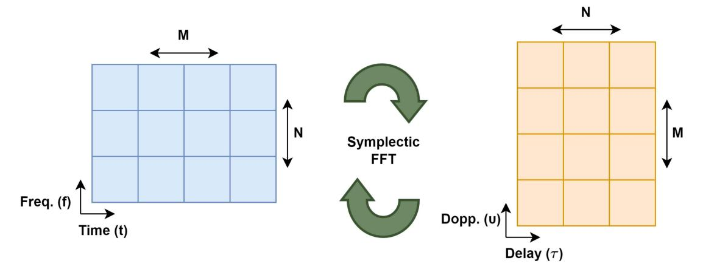

Fig. 17. OTFS Transform.

While there is significant interest in OTFS as a future modulation technique for wireless communications [\[260\]](#page-36-22), the field is still in its infancy in terms of specific research for V2X communications. Cheng et al. [\[261\]](#page-36-23) present an OTFS-based multi-antenna receiver for V2X communications and through a simulation study show that this OTFS system outperforms standard OFDM in terms of BER. Anwar et al. [\[262\]](#page-36-24) compare a selection of modulation techniques including; standard OFDM, OTFS, GFDM, LDPC and DFT-s-OFDM. Their simulation study shows that when considering the performance of both waveforms and coding schemes, OTFS with polar codes outperforms all other techniques, though OTFS is more complex than techniques such as LDPC which is used in 5G NR. Finally, Basak et al. [\[263\]](#page-36-25) compare OTFS to Multi-Carrier Code Division Multiple Access (MC-CDMA), due to its high diversity gain via spreading in frequency and time, and show that MC-CDMA is actually comparable to OTFS and should be considered as another candidate modulation technique for future implementations of radios for V2X communications.

*4) Non-Orthogonal Multiple Access (NOMA):* As mentioned previously, besides the challenges associated with the adverse channel that automotive scenarios present, device density and therefore congestion is one of the largest issues facing the realisation of large-scale V2X communications. Conventional multiple access schemes such as Frequency Division Multiple Access (FDMA), Time Division Multiple Access (TDMA), Code Division Multiple Access (CDMA) and OFDM use orthogonal communications facets to avoid multiple access interference, also known as Orthogonal Multiple Access (OMA). These OMA techniques are inherently limited in the number of simultaneous devices that can be served because one orthogonal resource is assigned to only one device. For example, in OFDM only one device can be served by a single OFDM resource block. To further increase existing capacity, Non-Orthogonal Multiple Access (NOMA) must be employed, wherein multiple devices can be served by a single resource block. The authors of [\[264\]](#page-36-26), [\[265\]](#page-36-27), [\[266\]](#page-36-28) present NOMA as a technology for future communications networks, particularly for 5G NR and potential 6G networks. However, Budhiraja et al. [\[267\]](#page-36-29) provide a very extensive, detailed and comprehensive review of NOMA and its multitude of variants.

In general, NOMA can be broadly classified into codedomain NOMA (CD-NOMA) and power-domain NOMA (PD-NOMA) illustrated in Figure [18.](#page-29-0) PD-NOMA allows multiple users to access the same orthogonal resource block based on the channel conditions currently being experienced, where a higher power allocation is given to those devices with poorer channel conditions and a lower power allocation is given to those devices with better channel conditions. CD-NOMA allows multiple devices to access the same orthogonal resource by leveraging sparse and Gaussian random spreading sequences at the transmitter and compressive-sensing at the receiver [\[268\]](#page-36-30). Superposition coding (SC) at the transmitter and successive interference cancelling (SIC) at the receiver is used by both classifications to realise NOMA.

As with OTFS, there is significant interest in NOMA as a multiple access technique for future wireless communications systems, but in terms of specific research for V2X communications the field requires further investigation. Di et al. [\[269\]](#page-36-31) and Hirai et al. [\[270\]](#page-36-32) perform analyses of PD-NOMA and compare it to conventional OFDM OMA for V2X communications, showing that PD-NOMA can indeed can provide more capacity. The authors of [\[271\]](#page-36-33), [\[272\]](#page-36-34), [\[273\]](#page-36-35), [\[274\]](#page-36-36) present investigations into enhancements to conventional NOMA for V2X communications, many of which are addressed in [\[267\]](#page-36-29). Though PD-NOMA in particular appears to display much promise, there exist issues.

## *B. Computation and Network Management At Scale*

Industry 4.0 applications are challenging the capabilities of current computation and network management infrastructure technologies. The ever-increasing number of devices and ongoing demand for more performance is forcing a shift away from entirely centralised infrastructure deployment architectures. This is a particularly important trend in the context of V2X communications as any methods of reducing latency and improving reliability are of importance. In this subsection, we discuss two areas of prominent research which are proposed as possible enabling technologies for not just V2X communications but also many other Industry 4.0 verticals.

*1) Mobile Edge Computing (MEC):* As it currently stands, only C-V2X has the capabilities via existing base station

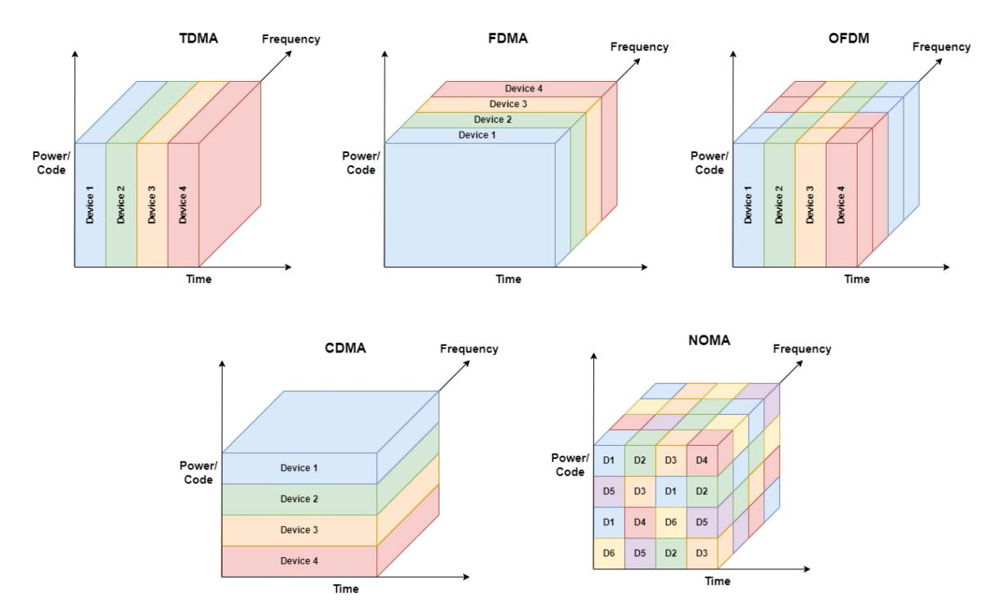

Fig. 18. NOMA vs Other Multiple Access Schemes.

deployments to support the advanced V2I/V2N such as Local Dynamic Maps (LDMs), which pose quite significant challenges due to their stringent latency, high throughput and high-reliability requirements. Unfortunately, due to the inherently centralised architecture of all computation and network management resources in 4G LTE and 5G NR NSA, these advanced V2X applications are currently not feasible. The only solution to significantly reduce latency and increase the reliability of the network is to shift these resources closer to the network edge. This concept of moving network management and particularly computational resources to the network edge is known as Mobile Edge Computing (MEC) [\[275\]](#page-36-37), an area of research that has gained significant traction since the advent of 5G NR and its new distributed core network architecture. The 5G NR SA core network (5GC) is designed with this idea in mind with its capabilities to support several distributed core networks across a geographic region. The use of MEC alongside technologies such as Software-Defined Networking (SDN) [\[276\]](#page-36-38) and Network Function Virtualisation (NFV) [\[277\]](#page-36-39) could allow C-V2X to meet these stringent requirements and enable the realisation of these advanced V2I/V2N applications at scale.

This technology has gained interest from the V2X communications research community as a result of its potential for low latency and high reliability. There is particular interest in the ETSI MEC specifications [\[278\]](#page-36-40) due to the heavy use of ETSI specifications for other aspects of V2X communications such as CAMs and DENMs. There are several instances in the literature showing that MEC can provide improvements in latency and reliability [\[279\]](#page-36-41), [\[280\]](#page-36-42). Emara et al. [\[152\]](#page-34-16) demonstrate that MEC can provide an 80% improvement in overall latency and Avino et al. [\[281\]](#page-37-0) achieve latencies below 100ms, 80% of which are less than 45ms in an intelligent intersection collision avoidance scenario. Hung et al. [\[282\]](#page-37-1) note that most of the latency when MEC is leveraged lies within wireless transmissions. This is confirmed in [\[283\]](#page-37-2) showing that 5G NSA offers significant improvements over 4G LTE, the authors also demonstrate that 5G SA has even more benefits over 5G NSA as the core network is also moved to the edge in this case. A real-world implementation of 5Gbased MEC is presented in [\[284\]](#page-37-3) with average latencies as low as 3.5ms and no packets dropped due to transmission errors.

*2) Vehicular Cloud and Fog Computing:* Over the past decade, with the growing popularity of the IoT, there have been trends and discussions about how to architect, organise and manage computation resources and the ever-growing number of connected devices. The most well-known of all of these trends is Cloud Computing [\[285\]](#page-37-4), however as previously discussed, the concept of Edge Computing is also beginning to emerge with the advent of Industry 4.0. Other concepts have been proposed around precipitation-based computing paradigms such as Fog Computing, Mist Computing [\[286\]](#page-37-5) and even Dew Computing [\[287\]](#page-37-6), [\[288\]](#page-37-7). Initially, with Cloud Computing, there was a shift to centralise computation and management resources to provide the "as-a-service" business model, e.g., Software-as-a-Service (SaaS), Infrastructure-asa-Service (IaaS) and Platform-as-a-Service (PaaS), among others. As data generation and consumption increased it soon became clear that the communications infrastructure connecting end-users to these Cloud Computing systems was becoming a significant bottleneck. This bottleneck has brought about a drift in the opposite direction away from traditional Cloud Computing back towards the edges of the network. The concept of Mist and Dew Computing follows on from Fog Computing, where Mist Computing refers to using devices at the very edge of the network, such as embedded sensors and actuators and Dew Computing refers to using personal computers and mobile phones as a distributed computation resource, often practised by the scientific community to outsource large parallelisable computations [\[289\]](#page-37-8).

A potential issue with the Edge Computing or MEC model is the cost of deployment of the necessary widespread regional data centres. The concept of Fog Computing [\[48\]](#page-31-34), [\[290\]](#page-37-9) has been proposed to address this issue by pushing computation resources even closer to the network edge, towards the devices themselves. In the context of V2X communications, Vehicular Fog Computing [\[19\]](#page-31-5), [\[291\]](#page-37-10), sometimes unintuitively described as Vehicular Cloud Computing [\[18\]](#page-31-4), [\[292\]](#page-37-11), refers to utilising the growing computational resources within a vehicle and leveraging VANET technology to provide a distributed style of data centre to reap similar benefits as Edge Computing or MEC without having to incur the costly process of constructing the necessary infrastructure.

## VI. CONCLUSION

In this work, we present a tutorial review of wireless access for V2X communications, its standardisation, candidate technologies, current trends and future directions. As is confirmed by the literature in the review conducted, no single wireless communications technology can yet fully demonstrate the application support and network performance capacity to support the very stringent and varied requirements of V2X communications applications.

The two-decade-old technology known as DSRC, based on IEEE 802.11p, did not receive sufficient industry penetration due to significant performance degradation issues regarding line-of-sight (LOS), Doppler shifts and congestion management in challenging scenarios. The newer generation of DSRC, based on IEEE 802.11bd, has the potential to address these challenges.

While 4G LTE-based C-V2X attempted to provide support for V2X communications, limitations in the performance of its radio technology and network architecture inhibited it from meeting the stringent latency and reliability requirements. Recent developments in cellular technology have brought about the advent of the 5th generation, 5G NR, where the underlying architectural changes of the cellular radio and network architecture address the shortcomings of 4G LTEbased C-V2X.

While safety-critical use cases are a significant incentive to develop V2X communications, it is clear that these use cases still present significant challenges that wireless communications technology, and further work is required to address them. Moreover, V2X communications as an industry vertical is not constrained only to these safety-critical use cases. There exists a large cohort of other non-safety critical use cases that can serve as the economic enablers of V2X communications, allowing for the necessary progress to occur. Of the two candidate technologies, C-V2X currently has the ability to support a large segment of V2X communications use cases and is being developed in such a way that it has significant potential to support V2X communications in its entirety. Prior to the release of 5G NR, DSRC remained superior in the context of direct V2V communications, however, recent works have shown that 5G NR-based V2V is superior to IEEE 802.11p-based V2V and is comparable in performance to IEEE 802.11bd. Overall, of the many challenges a candidate wireless access technology must face to support V2X communications, C-V2X has a smaller proportion to address and is therefore the most suitable candidate wireless access technology for V2X communications.

Even still the remaining challenges surrounding congestion and scalability are significant. Early deployments of 5G NR C-V2X illustrate that V2X communications must continue to mature via the introduction of supplementary technologies such as mmWave, massive MIMO and NOMA for radio performance and technologies such as MEC, SDN, NFV, fog and cloud computing for networking infrastructure to overcome the challenges associated with real-time safetycritical communications at scale. Alongside the introduction of supplementary technologies, there is a need for further empirical testing in this field as most of the works completed to date are carried out via numerical analysis and simulation studies. This imbalance in evaluation methodologies may speak to the need for investigation into the test and measurement systems required for the development and evaluation of V2X communications.

## REFERENCES

- [\[1\]](#page-0-1) (Encyclopedia Britannica, Inc., Chicago, IL, USA). *The Editors of Encyclopaedia Britannica, Industrial revolution*. Oct. 2022. [Online]. Available: https://www.britannica.com/event/Industrial-Revolution
- [\[2\]](#page-0-2) C. Bai, P. Dallasega, G. Orzes, and J. Sarkis, "Industry 4.0 technologies assessment: A sustainability perspective," *Int. J. Prod. Econ.*, vol. 229, Nov. 2020, Art. no. 107776. [Online]. Available: https://www.sciencedirect.com/science/article/pii/S0925527320301559
- [\[3\]](#page-0-3) "Artificial intelligence & autopilot." Tesla. Oct. 2021. [Online]. Available: https://www.tesla.com/AI
- [\[4\]](#page-0-4) "Waymo driver." Waymo. Oct. 2021. [Online]. Available: https://waymo.com/waymo-driver/
- [\[5\]](#page-0-5) "Cruise self driving cars." Cruise. Sep. 2022. [Online]. Available: https://getcruise.com/
- [\[6\]](#page-1-1) Z. Machardy, A. Khan, K. Obana, and S. Iwashina, "V2X access technologies: Regulation, research, and remaining challenges," *IEEE Commun. Surveys Tuts.*, vol. 20, no. 3, pp. 1858–1877, 3rd Quart., 2018.
- [\[7\]](#page-2-1) N. Lu, N. Cheng, N. Zhang, X. Shen, and J. W. Mark, "Connected vehicles: Solutions and challenges," *IEEE Internet Things J.*, vol. 1, no. 4, pp. 289–299, Aug. 2014.
- [\[8\]](#page-2-1) J. E. Siegel, D. C. Erb, and S. E. Sarma, "A survey of the connected vehicle landscape—Architectures, enabling technologies, applications, and development areas," *IEEE Trans. Intell. Transp. Syst.*, vol. 19, no. 8, pp. 2391–2406, Aug. 2018.
- [\[9\]](#page-2-1) J. Wang, J. Liu, and N. Kato, "Networking and communications in autonomous driving: A survey," *IEEE Commun. Surveys Tuts.*, vol. 21, no. 2, pp. 1243–1274, Apr. 2019.
- [\[10\]](#page-2-2) M. L. Sichitiu and M. Kihl, "Inter-vehicle communication systems: A survey," *IEEE Commun. Surveys Tuts.*, vol. 10, no. 2, pp. 88–105, 2nd Quart., 2008.
- [\[11\]](#page-2-3) A. Bazzi, G. Cecchini, M. Menarini, B. M. Masini, and A. Zanella, "Survey and perspectives of vehicular Wi-Fi versus sidelink cellular-V2X in the 5G era," *Future Internet*, vol. 11, no. 6, p. 122, 2019.
- [\[12\]](#page-2-4) P. Papadimitratos, A. La Fortelle, K. Evenssen, R. Brignolo, and S. Cosenza, "Vehicular communication systems: Enabling technologies, applications, and future outlook on intelligent transportation," *IEEE Commun. Mag.*, vol. 47, no. 11, pp. 84–95, Nov. 2009.
- [\[13\]](#page-2-4) G. Karagiannis et al., "Vehicular networking: A survey and tutorial on requirements, architectures, challenges, standards and solutions," *IEEE Commun. Surveys Tuts.*, vol. 13, no. 4, pp. 584–616, 4th Quart., 2011.

- [\[14\]](#page-2-5) H. Peng, L. Liang, X. Shen, and G. Y. Li, "Vehicular communications: A network layer perspective," *IEEE Trans. Veh. Technol.*, vol. 68, no. 2, pp. 1064–1078, Feb. 2019.
- [\[15\]](#page-2-6) M. Noor-A-Rahim, Z. Liu, H. Lee, G. G. M. N. Ali, D. Pesch, and P. Xiao, "A survey on resource allocation in vehicular networks," *IEEE Trans. Intell. Transp. Syst.*, vol. 23, no. 2, pp. 701–721, Feb. 2022.
- [\[16\]](#page-2-7) S. Al-Sultan, M. M. Al-Doori, A. H. Al-Bayatti, and H. Zedan, "A comprehensive survey on vehicular ad hoc network," *J. Netw. Comput. Appl.*, vol. 37, no. 1, pp. 380–392, 2014.
- [\[17\]](#page-2-8) H. Hartenstein and L. Laberteaux, "A tutorial survey on vehicular ad hoc networks," *IEEE Commun. Mag.*, vol. 46, no. 6, pp. 164–171, Jun. 2008.
- [\[18\]](#page-2-9) M. Whaiduzzaman, M. Sookhak, A. Gani, and R. Buyya, "A survey on vehicular cloud computing," *J. Netw. Comput. Appl.*, vol. 40, no. 1, pp. 325–344, 2014.
- [\[19\]](#page-2-10) X. Hou, Y. Li, M. Chen, D. Wu, D. Jin, and S. Chen, "Vehicular fog computing: A viewpoint of vehicles as the infrastructures," *IEEE Trans. Veh. Technol.*, vol. 65, no. 6, pp. 3860–3873, Jun. 2016.
- [\[20\]](#page-2-11) J. Stellwagen, M. Deegener, and M. Kuhn, "Hybrid vehicle-to-X communication network by using ITS-G5 and LTE-V2X," *IEEE Access*, vol. 11, pp. 30783–30795, 2023.
- [\[21\]](#page-2-12) K. Zheng, Q. Zheng, P. Chatzimisios, W. Xiang, and Y. Zhou, "Heterogeneous vehicular networking: A survey on architecture, challenges, and solutions," *IEEE Commun. Surveys Tuts.*, vol. 17, no. 4, pp. 2377–2396, Oct. 2015.
- [\[22\]](#page-2-13) K. Abboud, H. A. Omar, and W. Zhuang, "Interworking of DSRC and cellular network technologies for V2X communications: A survey," *IEEE Trans. Veh. Technol.*, vol. 65, no. 12, pp. 9457–9470, Dec. 2016.
- [\[23\]](#page-2-14) H. Zhou, W. Xu, J. Chen, and W. Wang, "Evolutionary V2X technologies toward the Internet of Vehicles: Challenges and opportunities," *Proc. IEEE*, vol. 108, no. 2, pp. 308–323, Feb. 2020.
- [\[24\]](#page-2-15) W. Xu et al., "Internet of Vehicles in big data era," *IEEE/CAA J. Automatica Sinica*, vol. 5, no. 1, pp. 19–35, Jan. 2018.
- [\[25\]](#page-2-16) K. N. Qureshi, S. Din, G. Jeon, and F. Piccialli, "Internet of Vehicles: Key technologies, network model, solutions and challenges with future aspects," *IEEE Trans. Intell. Transp. Syst.*, vol. 22, no. 3, pp. 1777–1786, Mar. 2021.
- [\[26\]](#page-2-17) G. Muhammad and M. Alhussein, "Security, trust, and privacy for the Internet of Vehicles: A deep learning approach," *IEEE Consum. Electron. Mag.*, vol. 11, no. 6, pp. 49–55, Nov. 2022. [Online]. Available: https://ieeexplore.ieee.org/document/9464742
- [\[27\]](#page-2-18) M. Kim, I. Oh, K. Yim, M. Sahlabadi, and Z. Shukur, "Security of 6G enabled vehicle-to-everything communication in emerging federated learning and blockchain technologies," *IEEE Access*, vol. 12, pp. 33972–34001, 2024. [Online]. Available: https://ieeexplore.ieee.org/document/10376064
- [\[28\]](#page-2-19) R. Sedar, C. Kalalas, F. Vázquez-Gallego, L. Alonso, and J. Alonso-Zarate, "A comprehensive survey of V2X cybersecurity mechanisms and future research paths," *IEEE Open J. Commun. Soc.*, vol. 4, pp. 325–391, 2023. [Online]. Available: https://ieeexplore.ieee.org/document/10026338
- [\[29\]](#page-2-20) J. Wang, L. Wu, H. Wang, K.-K. R. Choo, L. Wang, and D. He, "A secure and efficient multiserver authentication and key agreement protocol for Internet of Vehicles," *IEEE Internet Things J.*, vol. 9, no. 23, pp. 24398–24416, Dec. 2022. [Online]. Available: https://ieeexplore.ieee.org/document/9820765
- [\[30\]](#page-3-3) S. Verma, Y. Kawamoto, and N. Kato, "A smart Internetwide port scan approach for improving IoT security under dynamic WLAN environments," *IEEE Internet Things J.*, vol. 9, no. 14, pp. 11951–11961, Jul. 2022. [Online]. Available: https://ieeexplore.ieee.org/document/9634163
- [\[31\]](#page-3-4) "Release 16." 3GPP. Accessed: Sep. 2022. [Online]. Available: https://www.3gpp.org/release-16.
- [\[32\]](#page-3-5) M. H. C. Garcia et al., "A tutorial on 5G NR V2X communications," *IEEE Commun. Surveys Tuts.*, vol. 23, no. 3, pp. 1972–2026, 3rd Quart., 2021.
- [\[33\]](#page-3-6) S. Gyawali, S. Xu, Y. Qian, and R. Q. Hu, "Challenges and solutions for cellular based V2X communications," *IEEE Commun. Surveys Tuts.*, vol. 23, no. 1, pp. 222–255, 1st Quart., 2021.
- [\[34\]](#page-3-7) G. Araniti, C. Campolo, M. Condoluci, A. Iera, and A. Molinaro, "LTE for vehicular networking: A survey," *IEEE Commun. Mag.*, vol. 51, no. 5, pp. 148–157, May 2013.
- [\[35\]](#page-3-8) A. Bazzi, A. O. Berthet, C. Campolo, B. M. Masini, A. Molinaro, and A. Zanella, "On the design of sidelink for cellular V2X: A literature review and outlook for future," *IEEE Access*, vol. 9, pp. 97953–97980, 2021.
- [\[36\]](#page-3-9) "5G automotive vision," 5GPPP, Berlin, Germany, White Paper, 2015.

- [\[37\]](#page-3-10) D. J. Yeong, G. Velasco-Hernandez, J. Barry, and J. Walsh, "Sensor and sensor fusion technology in autonomous vehicles: A review," *Sensors*, vol. 21, no. 6, p. 2140, Jan. 2021.
- [\[38\]](#page-3-11) S. Gilroy, D. Mullins, E. Jones, A. Parsi, and M. Glavin, "E-scooter rider detection and classification in dense urban environments," *Results Eng.*, vol. 16, Dec. 2022, Art. no. 100677. [Online]. Available: https://www.sciencedirect.com/science/article/pii/S2590123022003474
- [\[39\]](#page-3-12) tService requirements for V2X services; (Release 14), Version 14.3.0, 3GPP Sophia Antipolis, France, Rep. TS 22.185, 2017.
- [\[40\]](#page-4-0) Service requirements for enhanced V2X scenarios; (Release 16), Version 16.2.0, 3GPP Sophia Antipolis, France, Rep. TS 22.186, 2020.
- [\[41\]](#page-4-1) V. Jindal, K. Mahavidyalaya, and P. Bedi, "Vehicular ad-hoc networks: Introduction, standards, routing protocols and challenges," *Int. J. Comput. Sci. Issues*, vol. 13, no. 2, pp. 44–55, Mar. 2016.
- [\[42\]](#page-4-2) I. Akyildiz, W. Su, Y. Sankarasubramaniam, and E. Cayirci, "A survey on sensor networks," *IEEE Commun. Mag.*, vol. 40, no. 8, pp. 102–114, Aug. 2002.
- [\[43\]](#page-4-2) S. Sarkar, T. Basavaraju, and C. Puttamadappa, *Ad Hoc Mobile Wireless Networks: Principles, Protocols, and Applications, Second Edition*. Boca Raton, FL, USA: CRC Press, 2016. [Online]. Available: https://books.google.ie/books?id=5lLOBQAAQBAJ
- [\[44\]](#page-4-3) Z. Wang, Y. Wu, and Q. Niu, "Multi-sensor fusion in automated driving: A survey," *IEEE Access*, vol. 8, pp. 2847–2868, 2020.
- [\[45\]](#page-4-3) Intelligent transport systems (ITS); vehicular communications; basic set of applications; local dynamic map (LDM); rationale for and guidance on standardization, Version 1.1.1, Eur. Telecommun. Stand. Inst., Sophia Antipolis, France, Rep. TR 102 863, Jun. 2011.
- [\[46\]](#page-4-4) Study on LTE support for vehicle-to-everything (V2X) services; (Release 14), Version 14.3.0, 3GPP, Sophia Antipolis, France, Rep. TS 22.185, 2017.
- [\[47\]](#page-4-4) Study on enhancement of 3GPP support for 5G V2X services; (Release 15), 3GPP, Sophia Antipolis, France, Rep. TS 22.886, 2016.
- [\[48\]](#page-4-4) H. Wang et al., "Architectural design alternatives based on cloud/edge/fog computing for connected vehicles," *IEEE Commun. Surveys Tuts.*, vol. 22, no. 4, pp. 2349–2377, 4th Quart., 2020.
- [\[49\]](#page-4-5) A. Alrabady and S. Mahmud, "Analysis of attacks against the security of keyless-entry systems for vehicles and suggestions for improved designs," *IEEE Trans. Veh. Technol.*, vol. 54, no. 1, pp. 41–50, Jan. 2005.
- [\[50\]](#page-4-6) H. Fujii, "The CACS project: How far away are we from the dynamic route guidance system?" in *Proc. Transp. Future*, Berlin, Germany, 1989, pp. 145–159.
- [\[51\]](#page-4-7) D. Rosen, F. Mammano, and R. Favout, "An electronic route-guidance system for highway vehicles," *IEEE Trans. Veh. Technol.*, vol. 19, no. 1, pp. 143–152, Feb. 1970.
- [\[52\]](#page-4-8) (Federal Commun. Comm., Washington, DC, USA). *Amendment of Parts 2 and 90 of the Commission's Rules to Allocate the 5.850- 5.925 GHz Band to the Mobile Service*. Nov. 1999. [Online]. Available: https://www.gpo.gov/fdsys/pkg/FR-1999-11-26/pdf/99-30591.pdf
- [\[53\]](#page-4-9) *Road Transport and Traffic Telematics-Dedicated Short Range Communication (DSRC)-DSRC Data Link Layer: Medium Access and Logical Link Control*, CEN Standard EN 12795:2003, Accessed: Oct. 29, 2021.
- [\[54\]](#page-4-9) *Road Transport and Traffic Telematics-Dedicated Short Range Communication (DSRC)-DSRC Application Layer*, CEN Standard EN 12834:2003, Accessed: Oct. 29, 2021.
- [\[55\]](#page-4-9) *Road Transport and Traffic Telematics-Dedicated Short-Range Communication-Physical Layer Using Microwave at 5.8 GHz*, CEN Standard EN 12253:2004, Accessed: Oct. 29, 2021.
- [\[56\]](#page-4-9) *Road Transport and Traffic Telematics (RTTT)-Dedicated Short-Range Communication-Profiles for RTTT Applications*, CEN Standard EN 13372:2004, Accessed: Oct. 29, 2021.
- [\[57\]](#page-4-10) *Electronic Fee Collection (EFC)–Application Interface Definition Between DSRC-OBE and External in-Vehicle Devices*, ISO Standard TS 16785:2020, Accessed: Oct. 29, 2021.
- [\[58\]](#page-5-2) *IEEE Standard for Information Technology– Local and Metropolitan Area Networks–Specific Requirements–Part-11: Wireless LAN Medium Access Control (MAC) and Physical Layer (PHY) Specifications Amendment 6: Wireless Access in Vehicular Environments*, IEEE Standard 802.11, Jul. 2010.
- [\[59\]](#page-5-3) *IEEE Guide for Wireless Access in Vehicular Environments (WAVE) Architecture*, IEEE Standard 1609.0-2019, Accessed: Oct. 29, 2021.
- [\[60\]](#page-5-4) *IEEE Standard for Wireless Access in Vehicular Environments (WAVE)– Identifiers*, IEEE Standard 1609.12-2019, Accessed: Oct. 29, 2021.
- [\[61\]](#page-5-5) Intelligent transport systems (ITS); vehicular communications; basic set of applications; definitions; Version 1.1.1, Eur. Telecommun. Stand. Inst., Sophia Antipolis, France, Rep. TR 102 638, 2009.

- [\[62\]](#page-5-6) "3GPP." Accessed: Sep. 2022. [Online]. Available: https://www.3gpp.org/
- [\[63\]](#page-5-7) "Release 14." 3GPP. Accessed: Sep. 2022. [Online]. Available: https://www.3gpp.org/release-14
- [\[64\]](#page-5-8) "Release 15." 3GPP. Accessed: Sep. 2022. [Online]. Available: https://www.3gpp.org/release-15
- [\[65\]](#page-5-9) (Federal Commun. Comm., Washington, DC, USA). *FCC Modernizes 5.9 GHz Band to Improve Wi-Fi and Automotive Safety*. (Nov. 2020). Accessed: May 19, 2021. [Online]. Available: https://www.fcc.gov/document/fcc-modernizes-59-ghz-band-improvewi-fi-and-automotive-safety-0
- [\[66\]](#page-5-10) (SAE Int., Warrendale, PA, USA). *SAE International–Advancing Mobility Knowledge and Solutions*. Accessed: Sep. 2022. [Online]. Available: https://www.sae.org/
- [\[67\]](#page-6-3) *Taxonomy and Definitions for Terms Related to Driving Automation Systems for On-Road Motor Vehicles*, SAE Standard J3016\_202104, 2021.
- [\[68\]](#page-8-4) *V2X Communications Message Set Dictionary*, SAE Standard J2735E, 2020.
- [\[69\]](#page-8-5) *Intelligent Transport Systems (ITS); Vehicular Communications; Basic Set of Applications; Part 2: Specification of Cooperative Awareness Basic Service*, ETSI Standard EN 302 637-2, 2019.
- [\[70\]](#page-8-5) *Intelligent Transport Systems (ITS); Vehicular Communications; Basic Set of Applications; Part-3: Specifications of Decentralized Environmental Notification Basic Service*, ETSI Standard EN 302 637- 3, 2019.
- [\[71\]](#page-8-5) *Intelligent Transport Systems (ITS); Vehicular Communications; Basic Set of Applications; Facilities layer protocols and communication requirements for infrastructure services*, ETSI Standard TS 103 301, 2020.
- [\[72\]](#page-12-5) *Information Technology—Open Systems Interconnection—Basic Reference Model: The Basic Model*, ISO Standard 7498-1:1994, 2000.
- [\[73\]](#page-12-6) *IEEE Standard for Information Technology-Telecommunications and Information Exchange between Systems Local and Metropolitan Area Networks-Specific Requirements Part-11: Wireless LAN Medium Access Control (MAC) and Physical Layer (PHY) Specifications Amendment 1: Enhancements for High-Efficiency WLAN*, IEEE Standard 802.11ax, 2021.
- [\[74\]](#page-12-7) (Federal Commun. Comm., Washington, DC, USA). *Dedicated Short Range Communications (DSRC) Service*. (Apr. 2016). [Online]. Available: https://www.fcc.gov/wireless/bureau-divisions/mobilitydivision/dedicated-short-range-communications-dsrc-service
- [\[75\]](#page-12-8) *IEEE Standard for Telecommunications and Information Exchange Between Systems-LAN/MAN Specific Requirements-Part-11: Wireless Medium Access Control (MAC) and Physical Layer (PHY) Specifications: High Speed Physical Layer in the 5 GHz Band*, IEEE Standard 802.11a-1999, 1999.
- [\[76\]](#page-12-9) T. Hwang, C. Yang, G. Wu, S. Li, and G. Y. Li, "OFDM and its wireless applications: A survey," *IEEE Trans. Veh. Technol.*, vol. 58, no. 4, pp. 1673–1694, May 2009.
- [\[77\]](#page-13-0) *IEEE Standard for Information Technology-Local and Metropolitan Area Networks-Specific requirements-Part-11: Wireless LAN Medium Access Control (MAC) and Physical Layer (PHY) Specifications-Amendment 8: Medium Access Control (MAC) Quality of Service Enhancements*, IEEE Standard 802.11e, 2005.
- [\[78\]](#page-13-1) *Information Technology-Telecommunications and Information Exchange Between Systems-Local and Metropolitan Area Networks-Common Specifications-Media Access Control (MAC) Bridges*, IEEE Standard 15802-3, 1998.
- [\[79\]](#page-13-2) *IEEE Draft Standard for Information technology–Telecommunications and Information Exchange Between Systems Local and Metropolitan Area Networks–Specific Requirements-Part-11: Wireless LAN Medium Access Control (MAC) and Physical Layer (PHY) Specifications Amendment: Enhancements for Next Generation V2X*, IEEE Standard 802.11bd, 2022.
- [\[80\]](#page-13-3) M. Fischer, A. Filippi, and V. Martinez, "Additional details about interoperable NGV PHY improvement," presented at the IEEE 802.11- 18/1577r0 NGV meeting, Sep. 2018.
- [\[81\]](#page-13-4) I. Jang, D. Lim, and J. Choi, "20mhz channel access in 11bd," presented at the IEEE 802.11-19/0366r2 NGV meeting, Mar. 2019.
- [\[82\]](#page-14-3) "Overall description of radio access network (RAN) aspects for vehicle-to-everything (V2X) based on LTE and NR," 3GPP, Sophia Antipolis, France, Rep. TR 37.985, 2022.

- [\[83\]](#page-14-4) Feasibility study for proximity services (ProSe), 3GPP, Sophia Antipolis, France, Rep. TR 22.803, 2013.
- [\[84\]](#page-14-5) Evolved universal terrestrial radio access (E-UTRA) and evolved universal terrestrial radio access network (E-UTRAN); overall description; stage 2; (Release 11), Version 11.6.0, 3GPP, Sophia Antipolis, France, Rep. TS 36.300, 2013.
- [\[85\]](#page-14-6) Evolved universal terrestrial radio access (E-UTRA); user equipment (UE) radio transmission and reception, 3GPP, Sophia Antipolis, France, Rep. TS 36.101, 2013.
- [\[86\]](#page-14-7) Evolved universal terrestrial radio access (E-UTRA); LTE physical layer; general description, 3GPP, Sophia Antipolis, France, Rep. TS 36.201, 2017.
- [\[87\]](#page-14-8) H. He and X. Y. Yang, "Cubic metric and PAPR of OFDM-CPM signal," in *Proc. 4th Int. Conf. Wireless Commun., Netw. Mobile Comput.*, 2008, pp. 2161–9654.
- [\[88\]](#page-15-1) Evolved universal terrestrial radio access (E-UTRA); medium access control (MAC) protocol specification; (Release 15), Version 15.2.0, 3GPP, Sophia Antipolis, France, Rep. TS 36.321, 2018.
- [\[89\]](#page-15-2) NR; NR and NG-RAN overall description; stage-2; (Release 16), Version 16.2.0, 3GPP, Sophia Antipolis, France, Rep. TS 38.300, 2020.
- [\[90\]](#page-15-3) System architecture for the 5G system (5GS), 3GPP, Sophia Antipolis, France, Rep. TS 23.501, 2020.
- [\[91\]](#page-15-4) "O-Ran Alliance." Accessed: Jul. 7, 2022. [Online]. Available: https://www.o-ran.org/
- [\[92\]](#page-15-5) NR; user equipment (UE) radio transmission and reception; Part 1: Range 1 standalone; (Release 15), Version 15.5.0, 3GPP Sophia Antipolis, France, Rep. TS 38.101-1, 2019.
- [\[93\]](#page-15-5) NR; User Equipment (UE) radio transmission and reception; Part 2: Range 2 Standalone; (Release 17), Version 17.5.0, 3GPP, Sophia Antipolis, France, Rep. TS 38.101-2, 2022.
- [\[94\]](#page-16-3) NR; physical layer; general description; (Release 15), Version 15.0.0, 3GPP Sophia Antipolis, France, Rep. TS 38.201.
- [\[95\]](#page-16-4) NR; medium access control (MAC) protocol specification; (Release 16), Version 16.1.0, 3GPP Sophia Antipolis, France, Rep. TS 38.321, 2020.
- [\[96\]](#page-20-1) H. Hong, Y. Y. Kim, R. Y. Kim, and W. Ahn, "An effective wide-bandwidth channel access in next-generation WLAN-based V2X communications," *Appl. Sci.*, vol. 10, no. 1, p. 222, Jan. 2020.
- [\[97\]](#page-20-2) V. Torgunakov, V. Loginov, and E. Khorov, "A study of channel bonding in IEEE 802.11bd networks," *IEEE Access*, vol. 10, pp. 25514–25533, 2022.
- [\[98\]](#page-20-3) R. Jacob, N. Schwarzenberg, F. Burmeister, and G. Fettweis, "Congestion-aware packet repetitions for IEEE 802.11bd-based safetycritical V2V communications," in *Proc. IEEE Int. Conf. Commun. (ICC)*, 2022, pp. 315–321.
- [\[99\]](#page-20-3) W. Zhuofei, S. Bartoletti, V. Martinez, and A. Bazzi, "Adaptive repetition strategies in IEEE 802.11bd V2X networks," *IEEE Trans. Veh. Technol.*, vol. 72, no. 6, pp. 8262–8266, Jun. 2023.
- [\[100\]](#page-18-1) J. Yin et al., "Performance evaluation of safety applications over DSRC vehicular ad hoc networks," in *Proc. 1st ACM Int. Workshop Veh. Ad Hoc Netw. (VANET)*, 2004, pp. 1–9, doi: [10.1145/1023875.1023877.](http://dx.doi.org/10.1145/1023875.1023877)
- [\[101\]](#page-19-0) D. Jiang, V. Taliwal, A. Meier, W. Holfelder, and R. Herrtwich, "Design of 5.9 GHz DSRC-based vehicular safety communication," *IEEE Wireless Commun.*, vol. 13, no. 5, pp. 36–43, Oct. 2006.
- [\[102\]](#page-19-0) A. Rao, A. Kherani, and A. Mahanti, "Performance evaluation of 802.11 broadcasts for a single cell network with unsaturated nodes," in *Proc. Int. Conf. Res. Netw.*, Berlin, Germany, 2008, pp. 836–847.
- [\[103\]](#page-19-0) M. I. Hassan, H. L. Vu, and T. Sakurai, "Performance analysis of the IEEE 802.11 MAC protocol for DSRC safety applications," *IEEE Trans. Veh. Technol.*, vol. 60, no. 8, pp. 3882–3896, Oct. 2011.
- [\[104\]](#page-18-1) K. A. Hafeez, L. Zhao, B. Ma, and J. W. Mark, "Performance analysis and enhancement of the DSRC for VANET's safety applications," *IEEE Trans. Veh. Technol.*, vol. 62, no. 7, pp. 3069–3083, Sep. 2013.
- [\[105\]](#page-19-0) Y. Yao, L. Rao, and X. Liu, "Performance and reliability analysis of IEEE 802.11p safety communication in a highway environment," *IEEE Trans. Veh. Technol.*, vol. 62, no. 9, pp. 4198–4212, Nov. 2013.
- [106] Y. Wang, X. Duan, D. Tian, G. Lu, and H. Yu, "Throughput and delay limits of 802.11p and its influence on highway capacity," *Procedia Soc. Behav. Sci.*, vol. 96, no. 6, pp. 2096–2104, 2013.
- [\[107\]](#page-19-1) A. B. Reis, S. Sargento, F. Neves, and O. K. Tonguz, "Deploying roadside units in sparse vehicular networks: What really works and what does not," *IEEE Trans. Veh. Technol.*, vol. 63, no. 6, pp. 2794–2806, Jul. 2014.
- [\[108\]](#page-19-1) H. J. F. Qiu, I. W.-H. Ho, C. K. Tse, and Y. Xie, "Technical report: A methodology for studying 802.11p VANET broadcasting performance with practical vehicle distribution," *IEEE Trans. Veh. Technol.*, vol. 64, no. 10, pp. 4756–4769, Oct. 2015.

- [\[109\]](#page-18-2) O. Goubet et al., "Low-complexity scalable iterative algorithms for IEEE 802.11p receivers," *IEEE Trans. Veh. Technol.*, vol. 64, no. 9, pp. 3944–3956, Sep. 2015.
- [\[110\]](#page-19-2) R. Atallah, M. Khabbaz, and C. Assi, "Multihop V2I communications: A feasibility study, modeling, and performance analysis," *IEEE Trans. Veh. Technol.*, vol. 66, no. 3, pp. 2801–2810, Mar. 2017.
- [\[111\]](#page-19-2) Y. Yao, Y. Hu, G. Yang, and X. Zhou, "On MAC access delay distribution for IEEE 802.11p broadcast in vehicular networks," *IEEE Access*, vol. 7, pp. 149052–149067, 2019.
- [112] Y. Sadovaya and S. V. Zavjalov, "Dedicated short-range communications: Performance evaluation over mmWave and potential adjustments," *IEEE Commun. Lett.*, vol. 24, no. 12, pp. 2733–2736, Dec. 2020.
- [\[113\]](#page-19-3) L. Hocken and F. Chan, "Improving the performance of DSRC using OFDM-IM, dynamic Equalization and multiple receive antennas," in *Proc. 11th IEEE Annu. Inf. Technol., Electron. Mobile Commun. Conf. (IEMCON)*, 2020, pp. 745–750.
- [\[114\]](#page-19-0) L. Hu and Z. Dai, "Performance and reliability analysis of prioritized safety messages broadcasting in DSRC with hidden terminals," *IEEE Access*, vol. 8, pp. 177112–177124, 2020.
- [\[115\]](#page-19-4) Q. Wu, H. Ge, P. Fan, J. Wang, Q. Fan, and Z. Li, "Time-dependent performance analysis of the 802.11p-based platooning communications under disturbance," *IEEE Trans. Veh. Technol.*, vol. 69, no. 12, pp. 15760–15773, Dec. 2020.
- [\[116\]](#page-19-5) M. Zhang, G. G. M. N. Ali, P. H. J. Chong, B.-C. Seet, and A. Kumar, "A novel hybrid MAC protocol for basic safety message broadcasting in vehicular networks," *IEEE Trans. Intell. Transp. Syst.*, vol. 21, no. 10, pp. 4269–4282, Oct. 2020.
- [\[117\]](#page-18-3) S. Lee and A. Lim, "An empirical study on ad hoc performance of DSRC and Wi-Fi vehicular communications," *Int. J. Distrib. Sensor Netw.*, vol. 9, pp. 1–12, Jan. 2013.
- [\[118\]](#page-19-6) S. Jaktheerangkoon, K. N. Nakorn, and K. Rojviboonchai, "Performance study of IEEE 802.11p in blind corner scenario," in *Proc. Int. Symp. Intell. Signal Process. Commun. Syst. (ISPACS)*, 2016, pp. 1–6.
- [\[119\]](#page-18-4) X. Huang, D. Zhao, and H. Peng, "Empirical study of DSRC performance based on safety pilot model deployment data," *IEEE Trans. Intell. Transp. Syst.*, vol. 18, no. 10, pp. 2619–2628, Oct. 2017.
- [\[120\]](#page-19-7) D. C.-H. Wang, D. T. Shimizu, H. Muralidharan, and M. A. Yamamuro, "Demo: A real-time high-definition vehicular sensor data sharing system using millimeter wave V2V communications," in *Proc. IEEE Veh. Netw. Conf.*, 2020, pp. 1–2.
- [\[121\]](#page-19-8) R. Meireles, M. A. Rodrigues, D. A. Stanciu, D. A. C. Aguiar, and P. Steenkiste, "Exploring Wi-Fi network diversity for vehicle-toinfrastructure communication," in *Proc. IEEE Veh. Netw. Conf.*, 2020, pp. 1–8.
- [\[122\]](#page-18-4) F. Lyu et al., "Characterizing urban vehicle-to-vehicle communications for reliable safety applications," *IEEE Trans. Intell. Transp. Syst.*, vol. 21, no. 6, pp. 2586–2602, Jun. 2020.
- [\[123\]](#page-18-5) M. Klapež, C. A. Grazia, and M. Casoni, "Experimental evaluation of IEEE 802.11p in high-speed trials for safety-related applications," *IEEE Trans. Veh. Technol.*, vol. 70, no. 11, pp. 11538–11553, Nov. 2021.
- [\[124\]](#page-18-6) J.-K. Bae, M.-C. Park, E.-J. Yang, and D.-W. Seo, "Implementation and performance evaluation for DSRC-based vehicular communication system," *IEEE Access*, vol. 9, pp. 6878–6887, 2021.
- [\[125\]](#page-19-9) J. Wu, L. Zhang, and Y. Liu, "On the design and implementation of a real-time testbed for distributed TDMA-based MAC protocols in VANETs," *IEEE Access*, vol. 9, pp. 122092–122106, 2021.
- [\[126\]](#page-18-7) X. Wu et al., "Vehicular communications using DSRC: Challenges, enhancements, and evolution," *IEEE J. Sel. Areas Commun.*, vol. 31, no. 9, pp. 399–408, Sep. 2013.
- [\[127\]](#page-19-10) A. Baiocchi, I. Turcanu, and A. Vinel, "To buffer or not to buffer: IEEE 802.11p/bd performance under different buffering strategies," in *Proc. 33th Int. Teletraffic Congr. (ITC-33)*, 2021, pp. 1–9.
- [128] R. Jacob, W. Anwar, N. Schwarzenberg, N. Franchi, and G. Fettweis, "System-level performance comparison of IEEE 802.11p and 802.11bd draft in highway scenarios," in *Proc. 27th Int. Conf. Telecommun. (ICT)*, 2020, pp. 1–6.
- [\[129\]](#page-20-3) X. Ma and K. S. Trivedi, "SINR-based analysis of IEEE 802.11p/bd broadcast VANETs for safety services," *IEEE Trans. Netw. Service Manag.*, vol. 18, no. 3, pp. 2672–2686, Sep. 2021.
- [\[130\]](#page-19-11) B. Y. Yacheur, T. Ahmed, and M. Mosbah, "Implementation and assessment of IEEE 802.11BD for improved road safety," in *Proc. IEEE 18th Annu. Consum. Commun. Netw. Conf. (CCNC)*, 2021, pp. 1–6.

- [\[131\]](#page-20-4) A. Triwinarko, S. Cherkaoui, and I. Dayoub, "Performance of PHY/MAC cross-layer design for next-generation V2X applications," in *Proc. IEEE Int. Conf. Internet Things Intell. Syst. (IoTaIS)*, 2022, pp. 98–104.
- [\[132\]](#page-19-12) J.-M. Molina-Garcia-Pardo, M. Lienard, and P. Degauque, "Propagation in tunnels: Experimental investigations and channel modeling in a wide frequency band for MIMO applications," *EURASIP J. Wireless Commun. Netw.*, vol. 2009, no. 1, pp. 1–9, Dec. 2009.
- [\[133\]](#page-19-13) D. Wilkie. "Letter report: Review of the status of the dedicated short-range communications technology and applications [draft] report to congress." 2015. Accessed: Jul. 27, 2022. [Online]. Available: https://www.semanticscholar.org/paper/ Letter-Repo%3A-Review-of-the-Status-of-the-and-to-Wilkie/ ee6ad6b2e7453c762d57b5ccc72ce064e05bff52
- [\[134\]](#page-19-14) Intelligent Transport Systems (ITS); Test Specifications for the Channel Congestion Control Algorithms Operating in the 5,9 GHz Range; Part-1: Protocol Implementation ConformanceStatement (PICS); Version 1.1.1, Eur. Telecommun. Stand. Inst., Sophia Antipolis, France, Rep. TS 102 917-1, 2013.
- [\[135\]](#page-19-15) D. Shukla, L. Chandran-Wadia, and S. Iyer, "Mitigating the exposed node problem in IEEE 802.11 ad hoc networks," in *Proc. 12th Int. Conf. Comput. Commun. Netw. (IEEE Cat. No.03EX712)*, 2003, pp. 157–162.
- [\[136\]](#page-19-16) G. Xiao, H. Zhang, Z. Huang, and Y. Chen, "Decentralized cooperative piggybacking for reliable broadcast in the VANET," in *Proc. IEEE 83rd Veh. Technol. Conf. (VTC Spring)*, 2016, pp. 1–5.
- [137] J. Santa, A. F. Gómez-Skarmeta, and M. Sánchez-Artigas, "Architecture and evaluation of a unified V2V and V2I communication system based on cellular networks," *Comput. Commun.*, vol. 31, no. 12, pp. 2850–2861, Jul. 2008.
- [\[138\]](#page-22-0) K. Trichias, "Modeling and evaluation of LTE in intelligent transportation systems," in *Proc. Joint ERCIM eMobility MobiSense Workshop*, 2012, p. 105.
- [\[139\]](#page-23-0) G. Li, Z. Yang, S. Chen, Y. Li, and P. Yuan, "A traffic flow-based and dynamic grouping-enabled resource allocation algorithm for LTE-D2D vehicular networks," in *Proc. IEEE/CIC Int. Conf. Commun. China (ICCC)*, 2016, pp. 1–6.
- [140] S. Chen, J. Hu, Y. Shi, and L. Zhao, "LTE-V: A TD-LTE-based V2X solution for future vehicular network," *IEEE Internet Things J.*, vol. 3, no. 6, pp. 997–1005, Dec. 2016.
- [\[141\]](#page-23-1) J. A. L. Calvo and R. Mathar, "An optimal LTE-V2I-based cooperative communication scheme for vehicular networks," in *Proc. IEEE 28th Annu. Int. Symp. Pers., Indoor, Mobile Radio Commun. (PIMRC)*, 2017, pp. 1–6.
- [\[142\]](#page-23-2) W. Li, X. Ma, J. Wu, K. S. Trivedi, X.-L. Huang, and Q. Liu, "Analytical model and performance evaluation of long-term evolution for vehicle safety services," *IEEE Trans. Veh. Technol.*, vol. 66, no. 3, pp. 1926–1939, Mar. 2017.
- [\[143\]](#page-22-1) F. Montori et al., "Automotive communications in LTE: A simulationbased performance study," in *Proc. IEEE 86th Veh. Technol. Conf. (VTC-Fall)*, 2017, pp. 1–6.
- [\[144\]](#page-23-3) E. Vlachos, A. S. Lalos, K. Berberidis, and C. Tselios, "Autonomous driving in 5G: Mitigating interference in OFDM-based vehicular communications," in *Proc. IEEE Int. Workshop Comput. Aided Model. Des. Commun. Links Netw., (CAMAD)*, 2017, pp. 1–6.
- [145] K. Lee, J. Kim, Y. Park, H. Wang, and D. Hong, "Latency of cellular-based V2X: Perspectives on TTI-proportional latency and TTIindependent latency," *IEEE Access*, vol. 5, pp. 15800–15809, 2017.
- [\[146\]](#page-23-4) R. Molina-Masegosa and J. Gozalvez, "LTE-V for sidelink 5G V2X vehicular communications: A new 5G technology for short-range vehicle-to-everything communications," *IEEE Veh. Technol. Mag.*, vol. 12, no. 4, pp. 30–39, Dec. 2017.
- [\[147\]](#page-22-2) R. Molina-Masegosa and J. Gozalvez, "System level evaluation of LTE-V2V mode 4 communications and its distributed scheduling," in *Proc. IEEE 85th Veh. Technol. Conf. (VTC Spring)*, 2017, pp. 1–5.
- [\[148\]](#page-24-1) H. D. R. Albonda and J. Pérez-Romero, "An efficient mode selection for improving resource utilization in sidelink V2X cellular networks," in *Proc. IEEE 23rd Int. Workshop Comput. Aided Model. Design Commun. Links Netw. (CAMAD)*, 2018, pp. 1–6.
- [\[149\]](#page-23-5) R. Molina-Masegosa, J. Gozalvez, and M. Sepulcre, "Configuration of the C-V2X mode 4 sidelink PC5 interface for vehicular communication," in *Proc. 14th Int. Conf. Mobile Ad-Hoc Sensor Netw. (MSN)*, 2018, pp. 43–48.
- [\[150\]](#page-24-2) J. He, Z. Tang, Z. Fan, and J. Zhang, "Enhanced collision avoidance for distributed LTE vehicle to vehicle broadcast communications," *IEEE Commun. Lett.*, vol. 22, no. 3, pp. 630–633, Mar. 2018.

- [\[151\]](#page-22-3) Z. Amjad, A. Sikora, B. Hilt, and J. P. Lauffenburger, "Low latency V2X applications and network requirements: Performance evaluation," in *Proc. IEEE Intell. Veh. Symp.*, 2018, pp. 220–225.
- [\[152\]](#page-23-6) M. Emara, M. C. Filippou, and D. Sabella, "MEC-assisted end-to-end latency evaluations for C-V2X communications," in *Proc. Eur. Conf. Netw. Commun. (EuCNC)*, 2018, pp. 1–9.
- [\[153\]](#page-23-7) B. Kang, S. Jung, and S. Bahk, "Sensing-based power adaptation for cellular V2X mode 4," in *Proc. IEEE Int. Symp. Dyn. Spectr. Access Netw. (DySPAN)*, 2018, pp. 1–4.
- [\[154\]](#page-22-4) A. Bazzi, G. Cecchini, A. Zanella, and B. M. Masini, "Study of the impact of PHY and MAC parameters in 3GPP C-V2V mode 4," *IEEE Access*, vol. 6, pp. 71685–71698, 2018.
- [\[155\]](#page-23-8) G. Nardini, A. Virdis, C. Campolo, A. Molinaro, and G. Stea, "Cellular-V2X communications for platooning: Design and evaluation," *Sensor*, vol. 18, no. 5, p. 1527, May 2018.
- [\[156\]](#page-22-0) A. Mansouri, V. Martinez, and J. Härri, "A first investigation of congestion control for LTE-V2X mode 4," in *Proc. 15th Annu. Conf. Wireless On-Demand Netw. Syst. Services (WONS)*, 2019, pp. 56–63.
- [\[157\]](#page-23-9) A. Haider and S.-H. Hwang, "Adaptive transmit power control algorithm for sensing-based semi-persistent scheduling in C-V2X mode 4 communication," *Electronics*, vol. 8, no. 8, p. 846, Aug. 2019.
- [\[158\]](#page-23-10) B. Toghi, M. Saifuddin, Y. P. Fallah, and M. O. Mughal, "Analysis of distributed congestion control in cellular vehicle-to-everything networks," in *Proc. IEEE 90th Veh. Technol. Conf. (VTC2019-Fall)*, 2019, pp. 1–7.
- [159] A. Bazzi, A. Zanella, and B. M. Masini, "Optimizing the resource allocation of periodic messages with different sizes in LTE-V2V," *IEEE Access*, vol. 7, pp. 43820–43830, 2019.
- [\[160\]](#page-23-11) J. Choi and H. Kim, "A QoS-aware congestion control scheme for C-V2X safety communications," in *Proc. IEEE Veh. Netw. Conf.*, 2020, pp. 1–4.
- [\[161\]](#page-23-12) Y. Yoon and H. Kim, "Balancing power and rate control for improved congestion control in cellular V2X communication environments," *IEEE Access*, vol. 8, pp. 105071–105081, 2020.
- [\[162\]](#page-23-13) D. Wang, R. R. Sattiraju, A. Qiu, S. Partani, and H. D. Schotten, "Effect of retransmissions on the performance of C-V2X communication for 5G," in *Proc. IEEE 92nd Veh. Technol. Conf. (VTC2020-Fall)*, 2020, pp. 1–7.
- [\[163\]](#page-22-0) A. Guizar, V. Mannoni, F. Poli, B. Denis, and V. Berg, "LTE-V2X performance evaluation for cooperative collision avoidance (CoCA) systems," in *Proc. IEEE 92nd Veh. Technol. Conf. (VTC2020-Fall)*, 2020, pp. 1–5.
- [\[164\]](#page-23-14) A. Hegde and A. Festag, "Mode switching performance in cellular-V2X," in *Proc. IEEE Veh. Netw. Conf. (VNC)*, 2020, pp. 1–8.
- [\[165\]](#page-24-3) A. Bazzi, C. Campolo, A. Molinaro, A. O. Berthet, B. M. Masini, and A. Zanella, "On wireless blind spots in the C-V2X Sidelink," *IEEE Trans. Veh. Technol.*, vol. 69, no. 8, pp. 9239–9243, Aug. 2020.
- [\[166\]](#page-23-15) M. Saifuddin, M. Zaman, B. Toghi, Y. P. Fallah, and J. Rao, "Performance analysis of cellular-V2X with adaptive & selective power control," in *Proc. IEEE 3rd Connect. Autom. Veh. Symp. (CAVS)*, 2020, pp. 1–7.
- [\[167\]](#page-23-16) M. Segata, P. Arvani, and R. L. Cigno, "A critical assessment of C-V2X resource allocation scheme for platooning applications," in *Proc. 16th Annu. Conf. Wireless On-Demand Netw. Syst. Services Conf. (WONS)*, 2021, pp. 1–8.
- [\[168\]](#page-23-17) B. Kang, J. Yang, J. Paek, and S. Bahk, "ATOMIC: Adaptive transmission power and message interval control for C-V2X mode 4," *IEEE Access*, vol. 9, pp. 12309–12321, 2021.
- [\[169\]](#page-23-18) R. Gholmieh and H. I. Abbasi, "C-V2X (LTE-V2X) performance enhancement through SAE J3161/1 probabilistic one-shot transmissions," in *Proc. IEEE Global Commun. Conf. (GLOBECOM)*, 2021, pp. 1–6.
- [\[170\]](#page-22-0) R. Yu, D. Yang, and H. Zhang, "Edge-assisted collaborative perception in autonomous driving: A reflection on communication design," in *Proc. IEEE/ACM Symp. Edge Comput. (SEC)*, 2021, pp. 371–375.
- [\[171\]](#page-22-5) F. Poli et al., "Evaluation of C-V2X Sidelink for cooperative lane merging in a cross-border highway scenario," in *Proc. IEEE 93rd Veh. Technol. Conf. (VTC2021-Spring)*, 2021, pp. 1–5.
- [\[172\]](#page-22-6) N. Mouawad, V. Mannoni, B. Denis, and A. P. da Silva, "Impact of LTE-V2X connectivity on global occupancy maps in a cooperative collision avoidance (CoCA) system," in *Proc. IEEE 93rd Veh. Technol. Conf. (VTC2021-Spring)*, 2021, pp. 1–5.
- [\[173\]](#page-23-19) S. Bartoletti, B. M. Masini, V. Martinez, I. Sarris, and A. Bazzi, "Impact of the generation interval on the performance of sidelink C-V2X autonomous mode," *IEEE Access*, vol. 9, pp. 35121–35135, 2021.

- [\[174\]](#page-22-0) K. M. Makinaci, T. Acarman, and C. Yaman, "Resource selection for C-V2X and simulation study for performance evaluation," in *Proc. IEEE 93rd Veh. Technol. Conf. (VTC2021-Spring)*, 2021, pp. 1–6.
- [\[175\]](#page-23-20) K. Kim, D. Kim, S. Choi, D. Kwon, and J.-W. Choi, "Location-based maximum reuse distance resource scheduling for LTE cellular-V2X sidelink mode 3," in *Proc. Int. Conf. Electron., Inf., Commun. (ICEIC)*, 2022, pp. 1–4.
- [\[176\]](#page-23-21) S. Sabeeh and K. Wesołowski, "Congestion control in autonomous resource selection of cellular-V2X," *IEEE Access*, vol. 11, pp. 7450–7460, 2023.
- [\[177\]](#page-23-22) C. Guo, C. Wang, L. Cui, Q. Zhou, and J. Li, "Radio resource management for C-V2X: From a hybrid centralized-distributed scheme to a distributed scheme," *IEEE J. Sel. Areas Commun.*, vol. 41, no. 4, pp. 1023–1034, Apr. 2023.
- [\[178\]](#page-22-7) H. T. Nguyen, M. Noor-A-Rahim, Y. L. Guan, and D. Pesch, "Cellular V2X communications in the presence of big vehicle shadowing: Performance analysis and mitigation," *IEEE Trans. Veh. Technol.*, vol. 72, no. 3, pp. 3764–3776, Mar. 2023.
- [\[179\]](#page-23-22) M. Parvini, M. R. Javan, N. Mokari, B. Abbasi, and E. A. Jorswieck, "AoI-aware resource allocation for platoon-based C-V2X networks via multi-agent multi-task reinforcement learning," *IEEE Trans. Veh. Technol.*, vol. 72, no. 8, pp. 9880–9896, Aug. 2023.
- [\[180\]](#page-23-3) X. Chen, S. Leng, J. He, L. Zhou, and H. Liu, "The upper bounds of cellular vehicle-to-vehicle communication latency for platoon-based autonomous driving," *IEEE Trans. Intell. Transp. Syst.*, vol. 24, no. 7, pp. 6874–6887, Jul. 2023.
- [\[181\]](#page-22-8) M. Akselrod, N. Becker, M. Fidler, and R. Luebben, "4G LTE on the road-what impacts download speeds most?" in *Proc. IEEE 86th Veh. Technol. Conf. (VTC-Fall)*, 2017, pp. 1–6.
- [\[182\]](#page-22-9) M. Lauridsen, L. C. Gimenez, I. Rodriguez, T. B. Sorensen, and P. Mogensen, "From LTE to 5G for connected mobility," *IEEE Commun. Mag.*, vol. 55, no. 3, pp. 156–162, Mar. 2017.
- [\[183\]](#page-22-10) E. A. Walelgne, J. Manner, V. Bajpai, and J. Ott, "Analyzing throughput and stability in cellular networks," in *Proc. IEEE/IFIP Netw. Oper. Manag. Symp. (NOMS)*, Taipei, Taiwan, 2018, pp. 1–9. [Online]. Available: https://ieeexplore.ieee.org/document/8406261/
- [\[184\]](#page-22-11) S. Neumeier, E. A. Walelgne, V. Bajpai, J. Ott, and C. Facchi, "Measuring the feasibility of Teleoperated driving in mobile networks," in *Proc. Netw. Traffic Meas. Anal. Conf. (TMA)*, Paris, France, 2019, pp. 113–120. [Online]. Available: https://ieeexplore.ieee.org/document/8784466/
- [185] P. J. Burke, "A 4G-connected micro-rover with infinite range," *IEEE J. Miniaturizat. Air Space Syst.*, vol. 1, no. 3, pp. 154–162, Dec. 2020.
- [\[186\]](#page-22-11) A. Gaber, W. Nassar, A. M. Mohamed, and M. K. Mansour, "Feasibility study of Teleoperated vehicles using multi-operator LTE connection," in *Proc. Int. Conf. Innovat. Trends Commun. Comput. Eng. (ITCE)*, 2020, pp. 191–195.
- [\[187\]](#page-22-12) M. Niebisch, T. Deinlein, D. Pfaller, R. German, and A. Djanatliev, "Impact of the communication direction on the reliability of vehicleto-everything (V2X) communications," in *Proc. IEEE Veh. Netw. Conf. (VNC)*, 2020, pp. 1–7.
- [\[188\]](#page-22-13) M. Toril, V. Wille, S. Luna-Ramírez, M. Fernández-Navarro, and F. Ruiz-Vega, "Characterization of radio signal strength fluctuations in road scenarios for cellular vehicular network planning in LTE," *IEEE Access*, vol. 9, pp. 33120–33131, 2021.
- [\[189\]](#page-23-6) A. Aissioui, A. Ksentini, A. M. Gueroui, and T. Taleb, "On enabling 5G automotive systems using follow me edge-cloud concept," *IEEE Trans. Veh. Technol.*, vol. 67, no. 6, pp. 5302–5316, Jun. 2018.
- [\[190\]](#page-23-23) C. Campolo, A. Molinaro, F. Romeo, A. Bazzi, and A. O. Berthet, "5G NR V2X: On the impact of a flexible numerology on the autonomous sidelink mode," in *Proc. IEEE 2nd 5G World Forum*, 2019, pp. 102–107.
- [\[191\]](#page-23-6) D. A. Chekired, M. A. Togou, L. Khoukhi, and A. Ksentini, "5Gslicing-enabled scalable SDN core network: Toward an ultra-low latency of autonomous driving service," *IEEE J. Sel. Areas Commun.*, vol. 37, no. 8, pp. 1769–1782, Aug. 2019.
- [\[192\]](#page-24-4) X. Wang and J. Zhang, "Graph coloring based approach for resource allocation in 5G vehicle-to-vehicle communication," in *Proc. IEEE 89th Veh. Technol. Conf.*, 2019, pp. 1–5.
- [\[193\]](#page-23-24) M. T. Deinlein, R. German, and D. A. Djanatliev, "Evaluation of the 5G data plane for advanced vehicular use cases with 5G-Sim-V2I/N," in *Proc. IEEE Veh. Netw. Conf.*, 2020, pp. 1–8.
- [\[194\]](#page-24-5) S. Xiaoqin, M. Juanjuan, L. Lei, and Z. Tianchen, "Maximumthroughput sidelink resource allocation for NR-V2X networks with the energy-efficient CSI transmission," *IEEE Access*, vol. 8, pp. 73164–73172, 2020.

- [\[195\]](#page-23-25) M. C. Lucas-Estañ et al., "On the scalability of the 5G RAN to support advanced V2X services," in *Proc. IEEE Veh. Netw. Conf.*, 2020, pp. 1–4.
- [\[196\]](#page-24-6) T. Huang, X. Yuan, J. Yuan, and W. Xiang, "Optimization of data exchange in 5G vehicle-to-infrastructure edge networks," *IEEE Trans. Veh. Technol.*, vol. 69, no. 9, pp. 9376–9389, Sep. 2020.
- [\[197\]](#page-23-26) Z. Ali, S. Lagén, L. Giupponi, and R. Rouil, "3GPP NR V2X mode 2: Overview, models and system-level evaluation," *IEEE Access*, vol. 9, pp. 89554–89579, 2021.
- [\[198\]](#page-23-27) Y. Yoon and H. Kim, "A stochastic reservation scheme for aperiodic traffic in NR V2X communication," in *Proc. IEEE Wireless Commun. Netw. Conf. (WCNC)*, 2021, pp. 1–6.
- [\[199\]](#page-23-28) Z. Ali, S. Lagén, and L. Giupponi, "On the impact of numerology in NR V2X mode 2 with sensing and random resource selection," in *Proc. IEEE Veh. Netw. Conf. (VNC)*, 2021, pp. 151–157.
- [\[200\]](#page-23-29) M. Muhammad Saad, M. Ashar Tariq, M. Mahmudul Islam, M. Toaha Raza Khan, J. Seo, and D. Kim, "Enhanced semi-persistent scheduling (e-SPS) for aperiodic traffic in NR-V2X," in *Proc. Int. Conf. Artif. Intell. Inf. Commun. (ICAIIC)*, 2022, pp. 171–175.
- [\[201\]](#page-24-7) Z. Khan, S. M. Khan, M. Chowdhury, M. Rahman, and M. Islam, "Performance evaluation of 5G Millimeter-wave-based vehicular communication for connected vehicles," *IEEE Access*, vol. 10, pp. 31031–31042, 2022.
- [\[202\]](#page-23-22) S.-H. Wu, R.-H. Hwang, C.-Y. Wang, and C.-H. Chou, "Deep reinforcement learning based resource allocation for 5G V2V groupcast communications," in *Proc. Int. Conf. Comput., Netw. Commun. (ICNC)*, 2023, pp. 1–6.
- [\[203\]](#page-23-30) A. Ogawa et al., "Field experiments on sensor data transmission for 5G-based vehicle-infrastructure cooperation," in *Proc. IEEE 88th Veh. Technol. Conf. (VTC-Fall)*, 2018, pp. 1–5.
- [\[204\]](#page-23-6) M. Kutila, K. Kauvo, P. Aalto, V. G. Martinez, M. Niemi, and Y. Zheng, "5G network performance experiments for automated car functions," in *Proc. IEEE 3rd 5G World Forum (5GWF)*, 2020, pp. 366–371.
- [\[205\]](#page-22-14) Z. Szalay, D. Ficzere, V. Tihanyi, F. Magyar, G. Soós, and P. Varga, "5G-enabled autonomous driving demonstration with a V2X scenarioin-the-loop approach," *Sensors*, vol. 20, no. 24, p. 7344, Jan. 2020.
- [\[206\]](#page-22-15) M. Kutila et al., "A C-V2X/5G field study for supporting automated driving," in *Proc. IEEE Intell. Veh. Symp. (IV)*, 2021, pp. 315–320.
- [\[207\]](#page-22-15) T. Daengsi, P. Ungkap, and P. Wuttidittachotti, "A study of 5G network performance: A pilot field trial at the main Skytrain stations in Bangkok," in *Proc. Int. Conf. Artif. Intell. Comput. Sci. Technol. (ICAICST)*, 2021, pp. 191–195.
- [\[208\]](#page-23-6) B. Pan, F. Yan, X. Guo, and N. Calabretta, "Experimental assessment of automatic optical metro edge computing network for beyond 5G applications and network service composition," *J. Lightw. Technol.*, vol. 39, no. 10, pp. 3004–3010, May 15, 2021.
- [\[209\]](#page-22-16) D. Martin-Sacristán et al., "Low-latency infrastructure-based cellular V2V communications for multi-operator environments with regional split," *IEEE Trans. Intell. Transp. Syst.*, vol. 22, no. 2, pp. 1052–1067, Feb. 2021.
- [\[210\]](#page-23-31) M. M. Saad, M. T. R. Khan, S. H. A. Shah, and D. Kim, "Advancements in vehicular communication technologies: C-V2X and NR-V2X comparison," *IEEE Commun. Mag.*, vol. 59, no. 8, pp. 107–113, Aug. 2021.
- [\[211\]](#page-22-15) C. Shin, E. Farag, H. Ryu, M. Zhou, and Y. Kim, "Vehicle-toeverything (V2X) evolution from 4G to 5G in 3GPP: Focusing on resource allocation aspects," *IEEE Access*, vol. 11, pp. 18689–18703, 2023.
- [\[212\]](#page-22-17) P. E. Denny, "Sharkfin RF and camera integration," U.S. Patent US10 618 474B2, Apr. 2020. [Online]. Available: https: //patents.google.com/patent/US10618474B2/en?inventor=Patrick+ Denny&after=filing:20040824&num=100&oq=inventor:(Patrick+ Denny)+after:filing:20040824&sort=new&dups=language
- [213] A. Vinel, "3GPP LTE versus IEEE 802.11p/WAVE: Which technology is able to support cooperative vehicular safety applications?" *IEEE Wireless Commun. Lett.*, vol. 1, no. 2, pp. 125–128, Apr. 2012.
- [\[214\]](#page-25-0) Z. Hameed Mir and F. Filali, "LTE and IEEE 802.11p for vehicular networking: A performance evaluation," *EURASIP J. Wireless Commun. Netw.*, vol. 2014, no. 1, p. 89, May 2014.
- [215] A. Bazzi, B. M. Masini, A. Zanella, and I. Thibault, "Beaconing from connected vehicles: IEEE 802.11p vs. LTE-V2V," in *Proc. IEEE 27th Annu. Int. Symp. Pers., Indoor, Mobile Radio Commun. (PIMRC)*, 2016, pp. 1–6.
- [\[216\]](#page-24-8) *An Assessment of LTE-V2X (PC5) and 802.11p Direct Communications Technologies for Improved Road Safety in the EU*," 5G Automot. Assoc., Bayern, Germany, 2017.

- [\[217\]](#page-24-8) J. Hu et al., "Link level performance comparison between LTE V2X and DSRC," *J. Commun. Inf. Netw.*, vol. 2, no. 2, pp. 101–112, Jun. 2017.
- [\[218\]](#page-24-9) A. Bazzi, B. M. Masini, A. Zanella, and I. Thibault, "On the performance of IEEE 802.11p and LTE-V2V for the cooperative awareness of connected vehicles," *IEEE Trans. Veh. Technol.*, vol. 66, no. 11, pp. 10419–10432, Nov. 2017.
- [\[219\]](#page-25-1) G. Cecchini, A. Bazzi, B. M. Masini, and A. Zanella, "Performance comparison between IEEE 802.11p and LTE-V2V in-coverage and outof-coverage for cooperative awareness," in *Proc. IEEE Veh. Netw. Conf. (VNC)*, 2017, pp. 109–114.
- [\[220\]](#page-25-0) W. Anwar, K. Kulkarni, T. R. Augustin, N. Franchi, and G. Fettweis, "PHY abstraction techniques for IEEE 802.11p and LTE-V2V: Applications and analysis," in *Proc. IEEE Globecom Workshops (GC Wkshps)*, 2018, pp. 1–7.
- [\[221\]](#page-25-2) V. Mannoni, V. Berg, S. Sesia, and E. Perraud, "A comparison of the V2X communication systems: ITS-G5 and C-V2X," in *Proc. IEEE 89th Veh. Technol. Conf. (VTC2019-Spring)*, 2019, pp. 1–5.
- [\[222\]](#page-24-9) T. Shimizu, H. Lu, J. Kenney, and S. Nakamura, "Comparison of DSRC and LTE-V2X PC5 mode 4 performance in high vehicle density scenarios," in *Proc. ITS World Congr.*, 2019, pp. 1–7.
- [\[223\]](#page-24-10) A. Bazzi, "Congestion control mechanisms in IEEE 802.11p and sidelink C-V2X," in *Proc. 53rd Asilomar Conf. Signals, Syst., Comput.*, 2019, pp. 1125–1130.
- [\[224\]](#page-25-3) W. Anwar, N. Franchi, and G. Fettweis, "Physical layer evaluation of V2X communications technologies: 5G NR-V2X, LTE-V2X, IEEE 802.11bd, and IEEE 802.11p," in *Proc. IEEE Veh. Technol. Conf.*, 2019, pp. 1–7.
- [\[225\]](#page-25-4) S. R. Govindarajulu and E. A. Alwan, "Range optimization for DSRC and 5G Millimeter-wave vehicle-to-vehicle communication link," in *Proc. Int. Workshop Antenna Technol., (iWAT)*, 2019, pp. 228–230.
- [\[226\]](#page-25-5) F. Abbas, P. Fan, and Z. Khan, "A novel low-latency V2V resource allocation scheme based on cellular V2X communications," *IEEE Trans. Intell. Transp. Syst.*, vol. 20, no. 6, pp. 2185–2197, Jun. 2019.
- [\[227\]](#page-24-11) D. T. Shimizu, D. B. Cheng, D. H. Lu, and D. J. Kenney, "Comparative analysis of DSRC and LTE-V2X PC5 mode 4 with SAE congestion control," in *Proc. IEEE Veh. Netw. Conf.*, 2020, pp. 1–8.
- [\[228\]](#page-24-11) R. Molina-Masegosa, J. Gozalvez, and M. Sepulcre, "Comparison of IEEE 802.11p and LTE-V2X: An evaluation with periodic and aperiodic messages of constant and variable size," *IEEE Access*, vol. 8, pp. 121526–121548, 2020.
- [\[229\]](#page-24-12) R. Sattiraju, D. Wang, A. Weinand, and H. D. Schotten, "Link level performance comparison of C-V2X and ITS-G5 for vehicular channel models," in *Proc. IEEE 91st Veh. Technol. Conf. (VTC2020-Spring)*, 2020, pp. 1–7.
- [\[230\]](#page-25-6) G. P. Wijesiri N. B. A, J. Haapola, and T. Samarasinghe, "The effect of concurrent multi-priority data streams on the MAC layer performance of IEEE 802.11p and C-V2X mode 4," *IEEE Trans. Commun.*, vol. 70, no. 1, pp. 592–605, Jan. 2022.
- [\[231\]](#page-25-7) Z. Xu, X. Li, X. Zhao, M. H. Zhang, and Z. Wang, "DSRC versus 4G-LTE for connected vehicle applications: A study on field experiments of vehicular communication performance," *J. Adv. Transp.*, vol. 2017, Jan. 2017, Art. no. 2750452.
- [\[232\]](#page-25-0) M. Shi, C. Lu, Y. Zhang, and D. Yao, "DSRC and LTE-V communication performance evaluation and improvement based on typical V2X application at intersection," in *Proc. Chin. Autom. Congr. (CAC)*, 2017, pp. 556–561.
- [\[233\]](#page-24-9) E. Moradi-Pari, D. Tian, M. Bahramgiri, S. Rajab, and S. Bai, "DSRC versus LTE-V2X: Empirical performance analysis of direct vehicular communication technologies," *IEEE Trans. Intell. Transp. Syst.*, vol. 24, no. 5, pp. 4889–4903, May 2023.
- [\[234\]](#page-24-13) B. M. Masini, A. Bazzi, and A. Zanella, "A survey on the roadmap to mandate on board connectivity and enable V2V-based vehicular sensor networks," *Sensors*, vol. 18, no. 7, p. 2207, 2018.
- [\[235\]](#page-25-8) G. Naik, B. Choudhury, and J. M. Park, "IEEE 802.11bd 5G NR V2X: Evolution of radio access technologies for V2X communications," *IEEE Access*, vol. 7, pp. 70169–70184, 2019.
- [\[236\]](#page-24-14) M. Gonzalez-Martin, M. Sepulcre, R. Molina-Masegosa, and J. Gozalvez, "Analytical models of the performance of C-V2X mode 4 vehicular communications," *IEEE Trans. Veh. Technol.*, vol. 68, no. 2, pp. 1155–1166, Feb. 2019.
- [\[237\]](#page-25-9) B. Tahir, S. Schwarz, and M. Rupp, "BER comparison between convolutional, turbo, LDPC, and polar codes," in *Proc. 24th Int. Conf. Telecommun. (ICT)*, 2017, pp. 1–7.

- [\[238\]](#page-26-1) Y. Banday, G. Mohammad Rather, and G. R. Begh, "Effect of atmospheric absorption on millimetre wave frequencies for 5G cellular networks," *Inst. Eng. Technol. Commun.*, vol. 13, no. 3, pp. 265–270, 2019.
- [\[239\]](#page-26-2) Z. Qingling and J. Li, "Rain attenuation in Millimeter wave ranges," in *Proc. 7th Int. Symp. Antennas, Propagat. EM Theory*, 2006, pp. 1–4.
- [\[240\]](#page-26-3) S. He et al., "A survey of Millimeter-wave communication: Physical-layer technology specifications and enabling transmission technologies," *Proc. IEEE*, vol. 109, no. 10, pp. 1666–1705, Oct. 2021.
- [\[241\]](#page-26-4) R. I. Abd and K. S. Kim, "Protocol solutions for IEEE 802.11bd by enhancing IEEE 802.11ad to address common technical challenges associated with mmWave-based V2X," *IEEE Access*, vol. 10, pp. 100646–100664, 2022.
- [\[242\]](#page-26-5) E. Kampert, C. Schettler, R. Woodman, P. A. Jennings, and M. D. Higgins, "Millimeter-wave communication for a last-mile autonomous transport vehicle," *IEEE Access*, vol. 8, pp. 8386–8392, 2020.
- [\[243\]](#page-26-6) T. S. Rappaport et al., "Millimeter wave mobile communications for 5G cellular: It will work!" *IEEE Access*, vol. 1, pp. 335–349, 2013.
- [\[244\]](#page-26-7) X. Cai, C. Han, and K. Sarabandi, "Phenomenology of foliage effect on 5G Millimeter-wave V2V communications," in *Proc. IEEE Global Commun. Conf., GLOBECOM*, 2018, pp. 1–6.
- [\[245\]](#page-26-8) M. K. Heimann, M. A. Marsch, M. B. Sliwa, and C. Wietfeld, "Reflecting surfaces for beyond line-of-sight coverage in millimeter wave vehicular networks," in *Proc. IEEE Veh. Netw. Conf.*, 2020, pp. 1–4.
- [\[246\]](#page-26-8) D. Solomitckii, C. B. Barneto, M. Turunen, M. Allén, Y. Koucheryavy, and M. Valkama, "Millimeter-wave automotive radar scheme with passive reflector for blind corner conditions," in *Proc. 14th Eur. Conf. Antennas Propagat. (EuCAP)*, 2020, pp. 1–5.
- [\[247\]](#page-27-2) J. C. B. Garcia, A. Sibille, and M. Kamoun, "Reconfigurable intelligent surfaces: Bridging the gap between scattering and reflection," *IEEE J. Sel. Areas Commun.*, vol. 38, no. 11, pp. 2538–2547, Nov. 2020.
- [\[248\]](#page-27-3) W. Xun, Y. Liu, Y. Ni, H. Zhao, Z. Xu, and X. Ge, "A survey on Terahertz communication theory assisted by intelligent reflecting surface and device-to-device technologies," in *Proc. IEEE 22nd Int. Conf. Commun. Technol. (ICCT)*, 2022, pp. 678–682. [Online]. Available: https://ieeexplore.ieee.org/document/10073033
- [\[249\]](#page-27-3) T. M. T. Nguyen, T. V. Nguyen, D. T. Hua, N. P. Tran, and S. Cho, "A survey on intelligent reflecting surface-aided non-orthogonal multiple access networks," in *Proc. 13th Int. Conf. Inf. Commun. Technol. Convergence (ICTC)*, 2022, pp. 1030–1032. [Online]. Available: https://ieeexplore.ieee.org/document/9953008
- [\[250\]](#page-27-4) Y. Zhu, B. Mao, and N. Kato, "Intelligent reflecting surface in 6G vehicular communications: A survey," *IEEE Open J. Veh. Technol.*, vol. 3, pp. 266–277, May 2022. [Online]. Available: https://ieeexplore.ieee.org/document/9780224
- [\[251\]](#page-27-5) (Eur. Telecommun. Stand. Inst., Sophia Antipolis, France). *ETSI Launches a New Group on Terahertz, a Candidate Technology for 6G*. 2022. [Online]. Available: https://www.etsi.org/newsroom/press-releases/2158-etsi-launches-anew-group-on-terahertz-a-candidate-technology-for-6g
- [\[252\]](#page-27-5) M. Rowe. "THz gets real: ETSI starts industry specification group." Feb. 2023. [Online]. Available: https://www.5gtechnologyworld.com/thz-gets-real-etsi-starts-industryspecification-group/
- [\[253\]](#page-27-6) L. Lu, G. Y. Li, A. L. Swindlehurst, A. Ashikhmin, and R. Zhang, "An overview of massive MIMO: Benefits and challenges," *IEEE J. Sel. Topics Signal Process.*, vol. 8, no. 5, pp. 742–758, Oct. 2014.
- [\[254\]](#page-27-7) L. Zhao, S. Ma, W. Chen, and F. Hu, "Optimal probabilistic repetition for massive MIMO-aided grant-free short-packet transmissions," *IEEE Trans. Veh. Technol.*, vol. 71, no. 11, pp. 12407–12412, Nov. 2022.
- [\[255\]](#page-27-8) S. Huang, M. Zhang, Y. Gao, and Z. Feng, "MIMO radar aided mmWave time-varying channel estimation in MU-MIMO V2X communications," *IEEE Trans. Wireless Commun.*, vol. 20, no. 11, pp. 7581–7594, Nov. 2021.
- [\[256\]](#page-27-9) R. Hadani and S. S. Rakib, "Communications method employing orthonormal time-frequency shifting and spectral shaping," U.S. Patent US201 113 117 124A·2011-05-26; US34 961 910P·2010-05-28, 10 1, 2013.
- [\[257\]](#page-27-10) R. Hadani et al., "Orthogonal time frequency space modulation," in *Proc. IEEE Wireless Commun. Netw. Conf. (WCNC)*, 2017, pp. 1–6.
- [\[258\]](#page-27-11) R. Raney, "The delay/doppler radar altimeter," *IEEE Trans. Geosci. Remote Sens.*, vol. 36, no. 5, pp. 1578–1588, Sep. 1998.
- [\[259\]](#page-27-12) A. Monk, R. Hadani, M. Tsatsanis, and S. Rakib, "OTFS-orthogonal time frequency space," 2016, *arXiv:1608.02993*.

- [\[260\]](#page-28-2) S. Das and R. Prasad, *Orthogonal Time Frequency Space Modulation: OTFS a Waveform for 6G*. Gistrup Denmark: River Publ., 2021. [Online]. Available: https://books.google.ie/books?id=ZfyGEAAAQBAJ
- [\[261\]](#page-28-3) J. Cheng, C. Jia, H. Gao, W. Xu, and Z. Bie, "OTFS based receiver scheme with multi-antennas in high-mobility V2X systems," in *Proc. IEEE Int. Conf. Commun. Workshops (ICC Workshops)*, 2020, pp. 1–6.
- [\[262\]](#page-28-4) W. Anwar, A. Krause, A. Kumar, N. Franchi, and G. P. Fettweis, "Performance analysis of various waveforms and coding schemes in V2X communication scenarios," in *Proc. IEEE Wireless Commun. Netw. Conf. (WCNC)*, 2020, pp. 1–8.
- [\[263\]](#page-28-5) D. Basak, S. Sruti, and K. Giridhar, "Comparing Precoded MC-CDMA and OTFS for high-speed V2X communications," in *Proc. IEEE 94th Veh. Technol. Conf. (VTC2021-Fall)*, 2021, pp. 1–5.
- [\[264\]](#page-28-6) X. Chen, D. W. K. Ng, W. Yu, E. G. Larsson, N. Al-Dhahir, and R. Schober, "Massive access for 5G and beyond," *IEEE J. Sel. Areas Commun.*, vol. 39, no. 3, pp. 615–637, Mar. 2021.
- [\[265\]](#page-28-6) Y. Cai, Z. Qin, F. Cui, G. Y. Li, and J. A. McCann, "Modulation and multiple access for 5G networks," *IEEE Commun. Surveys Tuts.*, vol. 20, no. 1, pp. 629–646, 1st Quart., 2018.
- [\[266\]](#page-28-6) A. Bazzi et al., "Toward 6G vehicle-to-everything sidelink: Nonorthogonal multiple access in the autonomous mode," *IEEE Veh. Technol. Mag.*, vol. 18, no. 2, pp. 50–59, Jun. 2023.
- [\[267\]](#page-28-7) I. Budhiraja et al., "A systematic review on NOMA variants for 5G and beyond," *IEEE Access*, vol. 9, pp. 85573–85644, 2021.
- [\[268\]](#page-28-8) V. Aggarwal, L. Applebaum, A. Bennatan, A. R. Calderbank, S. D. Howard, and S. J. Searle, "Enhanced CDMA communications using compressed-sensing reconstruction methods," in *Proc. 47th Annu. Allerton Conf. Commun., Control, Comput. (Allerton)*, 2009, pp. 1211–1215.
- [\[269\]](#page-28-9) B. Di, L. Song, Y. Li, and G. Y. Li, "Non-orthogonal multiple access for high-reliable and low-latency V2X communications in 5G systems," *IEEE J. Sel. Areas Commun.*, vol. 35, no. 10, pp. 2383–2397, Oct. 2017.
- [\[270\]](#page-28-10) T. Hirai, N. Wakamiya, and T. Murase, "NOMA-dependent lowpowered retransmission in sensing-based SPS for cellular-V2X mode 4," in *Proc. IEEE 96th Veh. Technol. Conf. (VTC2022-Fall)*, 2022, pp. 1–7.
- [\[271\]](#page-28-11) G. Liu, Z. Wang, J. Hu, Z. Ding, and P. Fan, "Cooperative NOMA broadcasting/multicasting for low-latency and high-reliability 5G cellular V2X communications," *IEEE Internet Things J.*, vol. 6, no. 5, pp. 7828–7838, Oct. 2019.
- [\[272\]](#page-28-11) D.-T. Do, T. Anh Le, T. N. Nguyen, X. Li, and K. M. Rabie, "Joint impacts of imperfect CSI and imperfect SIC in cognitive radio-assisted NOMA-V2X communications," *IEEE Access*, vol. 8, pp. 128629–128645, 2020.
- [\[273\]](#page-28-11) D. Zhang, Y. Liu, L. Dai, A. K. Bashir, A. Nallanathan, and B. Shim, "Performance analysis of FD-NOMA-based Decentralized V2X systems," *IEEE Trans. Commun.*, vol. 67, no. 7, pp. 5024–5036, Jul. 2019.
- [\[274\]](#page-28-11) C. Chen, B. Wang, and R. Zhang, "Interference hypergraph-based resource allocation (IHG-RA) for NOMA-integrated V2X networks," *IEEE Internet Things J.*, vol. 6, no. 1, pp. 161–170, Feb. 2019.
- [\[275\]](#page-29-1) Y. Mao, C. You, J. Zhang, K. Huang, and K. B. Letaief, "A survey on mobile edge computing: The communication perspective," *IEEE Commun. Surveys Tuts.*, vol. 19, no. 4, pp. 2322–2358, 4th Quart., 2017, doi: [10.1109/COMST.2017.2745201.](http://dx.doi.org/10.1109/COMST.2017.2745201)
- [\[276\]](#page-29-2) D. Kreutz, F. M. V. Ramos, P. E. Veríssimo, C. E. Rothenberg, S. Azodolmolky, and S. Uhlig, "Software-defined networking: A comprehensive survey," *Proc. IEEE*, vol. 103, no. 1, pp. 14–76, Jan. 2015.
- [\[277\]](#page-29-3) R. Mijumbi, J. Serrat, J.-L. Gorricho, N. Bouten, F. De Turck, and R. Boutaba, "Network function virtualization: State-of-the-art and research challenges," *IEEE Commun. Surveys Tuts.*, vol. 18, no. 1, pp. 236–262, 1st Quart., 2016.
- [\[278\]](#page-29-4) (Eur. Telecommun. Stand. Inst., Sophia Antipolis, France). *Multi-Access Edge Computing-Standards for MEC*. Accessed: Oct. 2022. [Online]. Available: https://www.etsi.org/technologies/multi-accessedge-computing
- [\[279\]](#page-29-5) R. K. Srinivasa, N. K. S. Naidu, S. Maheshwari, C. Bharathi, and A. R. Hemanth Kumar, "Minimizing latency for 5G multimedia and V2X applications using mobile edge computing," in *Proc. 2nd Int. Conf. Intell. Commun. Comput. Techn., (ICCT)*, 2019, pp. 213–217.
- [\[280\]](#page-29-5) L. Feng, W. Li, Y. Lin, L. Zhu, S. Guo, and Z. Zhen, "Joint computation offloading and URLLC resource allocation for collaborative MEC assisted cellular-V2X networks," *IEEE Access*, vol. 8, pp. 24914–24926, 2020.

- [\[281\]](#page-29-6) G. Avino et al., "A MEC-based extended virtual sensing for automotive services," in *Proc. AEIT Int. Conf. Elect. Electron. Technol. Automot. (AEIT AUTOMOTIVE)*, 2019, pp. 1–6.
- [\[282\]](#page-29-7) W.-C. Hung, S.-R. Yang, S.-N. Lee, Y.-C. Lin, and P. Lin, "An NFVbased edge platform for low-latency V2X services supporting vehicle mobility-driven auto scaling," in *Proc. Int. Wireless Commun. Mobile Comput. (IWCMC)*, 2021, pp. 1418–1423.
- [\[283\]](#page-29-8) A. Virdis, G. Nardini, G. Stea, and D. Sabella, "End-to-end performance evaluation of MEC deployments in 5G scenarios," *J. Sensor Actuator Netw.*, vol. 9, no. 4, p. 57, Dec. 2020.
- [\[284\]](#page-29-9) H. Ma, S. Li, E. Zhang, Z. Lv, J. Hu, and X. Wei, "Cooperative autonomous driving oriented MEC-aided 5G-V2X: Prototype system design, field tests and AI-based optimization tools," *IEEE Access*, vol. 8, pp. 54288–54302, 2020.
- [\[285\]](#page-29-10) P. Srivastava and R. Khan, "A review paper on cloud computing," *Int. J. Adv. Res. Comput. Sci. Softw. Eng.*, vol. 8, p. 17, Jun. 2018.
- [\[286\]](#page-29-11) P. Galambos, "Cloud, fog, and mist computing: Advanced robot applications," *IEEE Syst., Man, Cybern. Mag.*, vol. 6, no. 1, pp. 41–45, Jan. 2020.

- [\[287\]](#page-29-12) P. P. Ray, "An introduction to dew computing: Definition, concept and implications," *IEEE Access*, vol. 6, pp. 723–737, 2018.
- [\[288\]](#page-29-12) A. Rindos and Y. Wang, "Dew computing: The complementary piece of cloud computing," in *Proc. IEEE Int. Conf. Big Data Cloud Comput. (BDCloud), Social Comput. Netw. (SocialCom), Sustain. Comput. Commun. (SustainCom) (BDCloud-SocialCom-SustainCom)*, 2016, pp. 15–20.
- [\[289\]](#page-30-13) "University of California, Berkeley." Boinc. Accessed: Oct. 2022. [Online]. Available: https://boinc.berkeley.edu/
- [\[290\]](#page-30-14) R. Thaker, Y. F. Khan, and S. Mughal, "Fog approach in Internet of Things: A review," *Int. J. Sci. Res. Comput. Sci., Eng. Inf. Technol.*, vol. 4, no. 1, pp. 236–244, 2018.
- [\[291\]](#page-30-15) C. Tang, X. Wei, C. Zhu, Y. Wang, and W. Jia, "Mobile vehicles as fog nodes for latency optimization in smart cities," *IEEE Trans. Veh. Technol.*, vol. 69, no. 9, pp. 9364–9375, Sep. 2020.
- [\[292\]](#page-30-16) E. Lee, E.-K. Lee, M. Gerla, and S. Y. Oh, "Vehicular cloud networking: Architecture and design principles," *IEEE Commun. Mag.*, vol. 52, no. 2, pp. 148–155, Feb. 2014.