# Terahertz Channel Propagation Phenomena, Measurement Techniques and Modeling for 6G Wireless Communication Applications: A Survey, Open Challenges and Future Research Directions

Demos Serghio[u](https://orcid.org/0000-0002-7183-8439) , *Student Member, IEEE*, Mohsen Khalil[y](https://orcid.org/0000-0003-1861-5428) , *Senior Member, IEEE*, Tim W. C. Brown [,](https://orcid.org/0000-0002-8735-9520) *Senior Member, IEEE*, and Rahim Tafazoll[i](https://orcid.org/0000-0002-6062-8639) , *Senior Member, IEEE*

*Abstract***—The Terahertz (THz) band (0.3-3.0 THz), spans a great portion of the Radio Frequency (RF) spectrum that is mostly unoccupied and unregulated. It is a potential candidate for application in Sixth-Generation (6G) wireless networks, as it has the capabilities of satisfying the high data rate and capacity requirements of future wireless communication systems. Profound knowledge of the propagation channel is crucial in communication systems design, which nonetheless is still at its infancy, as channel modeling at THz frequencies has been mostly limited to characterizing fixed Point-to-Point (PtP) scenarios up to 300 GHz. Provided the technology matures enough and models adapt to the distinctive characteristics of the THz wave, future wireless communication systems will enable a plethora of new use cases and applications to be realized, in addition to delivering higher spectral efficiencies that would ultimately enhance the Quality-of-Service (QoS) to the end user. In this paper, we provide an insight into THz channel propagation characteristics, measurement capabilities, and modeling techniques for 6G communication applications, along with guidelines and recommendations that will aid future characterization efforts in the THz band. We survey the most recent and important measurement campaigns and modeling efforts found in literature, based on the use cases and system requirements identified. Finally, we discuss the challenges and limitations of measurement and modeling at such high frequencies and contemplate the future research outlook toward realizing the 6G vision.**

*Index Terms***—6G, channel measurements, channel modeling, channel sounding, deterministic modeling, diffuse scattering, molecular attenuation, propagation, radio frequency (RF), statistical modeling, stochastic modeling, terahertz (THz), wireless communications.**

## LIST OF ACRONYMS

iWNSN In vivo Wireless Nano Sensor Network

6G Sixth-Generation AoD Angle of Departure CW Continuous-Wave

FDTD Finite-Difference Time-Domain

Manuscript received 7 January 2022; revised 9 July 2022; accepted 14 August 2022. Date of publication 9 September 2022; date of current version 22 November 2022. *(Corresponding author: Demos Serghiou.)*

The authors are with the Institute for Communication Systems, Home of the 6G Innovation Centre, University of Surrey, GU2 7XH Guildford, U.K. (e-mail: d.serghiou@surrey.ac.uk; m.khalily@surrey.ac.uk; t.brown@surrey. ac.uk; r.tafazolli@surrey.ac.uk).

Digital Object Identifier 10.1109/COMST.2022.3205505

FFT Fast Fourier Transform

GBSM Geometry-Based Stochastic Model

GMM Gaussian Mixture Model

ICNIRP International Commission on Non-Ionizing

Radiation Protection

IFFT Inverse Fast Fourier Transform

MMIC Monolithic Microwave Integrated Circuit NGBSM Non-Geometry-Based Stochastic Model

RFoF Radio Frequency over Fiber

RF Radio Frequency SC Sliding Correlator SNR Signal-to-Noise SV Saleh-Valenzuela Tbps Tera-bit per second

TDS Time-Domain Spectroscopy

THz Terahertz ToA Time of Arrival

UTC-PD Uni-Travelling-Carrier Photo-Diode WLAN Wireless Local Area Network

5G Fifth-Generation AoA Angle of Arrival B2B Blade-to-Blade

CIR Channel Impulse Response CTF Channel Transfer Function D-NLoS Directed-Non-Line-of-Sight DSSS Direct Sequence Spread Spectrum EESS Earth Exploration Satellite Services FDS Frequency-Domain Spectroscopy

FSPL Free-Space Path Loss Gbps Giga-bit per second HST High-Speed Train

MIMO Multiple-Input Multiple-Output

NLOS Non-Line-of-Sight

NOMA Non-Orthogonal Multiple Access O-NLoS Obstructed-Non-Line-of-Sight OLoS Obstructed-Line-of-Sight

OR-NLoS Obstructed-Reflected-Non-Line-of-Sight

PN Pseudo Noise

PSD Power Spectral Density

PtP Point-to-Point

QO-MIMO Quasi-Optical Multiple-Input Multiple-Output

R-NLoS Reflected-Non-Line-of-Sight

R2R Rack-to-Rack
RMS Root Mean Square
RT Ray-Tracing

Rx Receiver

SI International System of Units SISO Single-Input Single-Output T2I Train-to-Infrastructure

Tx Transmitter

UM-MIMO Ultra-Massive Multiple-Input Multiple-Output

V2I Vehicle-to-Infrastructure V2V Vehicle-to-Vehicle V2X Vehicle-to-Everything VNA Vector Network Analyser

VR Virtual Reality

#### I. Introduction

S THE demand for higher data rates is growing expo-A nentially, data rates that exceed 1 Tera-bit per second (Tbps) could be required beyond 2030 [1]. Very high data rates are anticipated in indoor locations where lower costs can be expected for extending wired backbone networks compared to using optical cables, while ITU [2] reported that by the year 2030, wireless systems will be as significant as wired cellular systems. A recently published white paper by Cisco, estimated that average Fifth-Generation (5G) cellular speeds will reach 575 Mbps by 2023, resulting in a 13-fold increase in the speeds recorded in 2018 [3]. Additionally, Ericsson highlighted the imminent need for capacity, as global mobile data traffic is estimated to grow by a factor of 4.5 to reach 226 ExaBytes per month in 2026 [4]. This unprecedented need for higher speeds and larger bandwidths in sight of the currently saturated spectrum below 300 GHz [5], has motivated research in parts of the Radio Frequency (RF) spectrum that have been faintly explored, in order to meet the growing needs of the wireless communications industry [6]. A recently published white paper [7] derived within the "6G Flagship" by the university of Oulu in 2019, mentioned that Sixth-Generation (6G) systems should be able to deliver Tbps speeds and that the way to achieve these is through efficient utilization of the THz spectrum. THz will play a specially important role in 6G networks, as it is envisioned that THz communications will empower real-life solutions and services in coexistence with the heavily saturated sub-6 GHz and millimeter-wave (mmWave) spectra, in order to meet key performance indicators such as peak rates of 1 Tbps, extremely Ultra Reliable Low Latency Communications (eURLLC) and high energy efficiencies of 1 Tb/J [8]. Henceforth, initiatives for realizing the 6G vision have been recently launched such as the "Next G Alliance" project by the USA and "Heat-X" European 6G flagship project [9].

#### A. Introducing the THz Band

The frequency band that lies between the microwave and infrared regions of the electromagnetic spectrum spanning from 300 GHz to 3,000 GHz is termed as the THz band, with wavelengths ranging from 1 mm to 0.1 mm [10]. Recently, the THz band has received considerable attention as a promising

candidate for various applications that can be classified in the fields of wireless cognition [11], sensing [12], imaging [13], communications [14], and positioning [13], offering advantages such as ultra-fast data transmission [15], large bandwidth [16], and microsecond latencies [17]. THz propagation, has so far proven to be successful in spectroscopy for sensing applications such as material characterization [18], weather characterization [19] and study of astronomical objects [20], due to its frequency selective nature. Some first applications identified where the THz wave could be applied to in 6G networks for wireless communications, include PtP scenarios such as kiosk downloads [21], wireless links in data centres [22], intra-device communications [23] and wireless backhaul/fronthaul link extensions [24]. Nonetheless, as the technology continues to mature providing the appropriate beam-steering and tracking capabilities at THz, applications that include mobility can also be realized. Applications as such include Wireless Local Area Networks (WLANs), High Speed Train (HST) communications [25], and Vehicle-to-Everything (V2X) communications [26]. Last but not least, THz has found great interest in future nano-networks within the medical industry for in-body via nano-machine molecular communications [27], [28].

The aforementioned opportunities are ones that arise due to the unique characteristics held by the THz wave in addition to the largely unoccupied and unregulated region that this end of the spectrum offers. For the development of an efficient communications system with high data rates, deriving the characteristics of the propagation channel by accurate modeling is a necessity. So far, most studies have been limited to frequencies up to the mmWave spectrum (30-300 GHz) due to the lack of high frequency generators and sensitive detectors. At frequencies > 300 GHz propagation models need to consider high path loss, molecular absorption and diffuse particle scattering (due to the short wavelength < 1 mm), as the most important phenomena that are very prominent, especially as we shift higher up in the THz frequency spectrum.

## B. Enabling Technologies for THz Waves

THz research cannot be pondered as something "new". The first paper ever published [29] dates back to 1893 and it involved THz spectroscopy. However, the term "THz" was not common and instead it was referred to as "obscure" radiation. In the experiments conducted there was a source and detector of THz radiation and by placing different materials in between, absorption coefficients were measured, much like a lot of the measurements conducted nowadays [30], [31], [32]. This shows that while a lot of work has been carried out and a lot of materials have been characterized, there is still a lot of interest and work to be done in basic spectroscopy at THz.

What has happened recently, is that there is a growing realization that the photonics and electronics research coincides, and there is an ongoing merging of the electronics and photonics fuse of the world [33]. In recent years there has been a lot of progress in some key metrics, such as the power produced by various different sources vs frequency, where, e.g., the power produced by silicon sources in 2018

has increased by many orders of magnitude compared to the power levels produced by silicon in 2008, while other examples also show a similar sort of improvement [\[33\]](#page-34-32). This also shows that the production of integrated systems is possible and that enough power can be generated to do something useful with it. Various techniques are currently being carried out for the development of efficient sources and detectors of THz radiation [\[34\]](#page-34-33), [\[35\]](#page-34-34), [\[36\]](#page-34-35), to bridge the 'gap' between conventional electronics and optics. Some of which, have made THz systems affordable and realizable by overcoming existing limitations through novel architectural designs and device structures. On the electronics side, solid-state electronics technologies such as GaAs-based Schottky diodes, Monolithic Microwave Integrated Circuit (MMIC), InP heterojunction bipolar transistors (HBTs), high electron mobility transistors (HEMTs) and Resonant-Tunnelling Diode (RTD) can now enable high power level generation from 100 µW up to the mW range [\[38\]](#page-34-36), [\[37\]](#page-34-37). This shows an increase of more than double in a decade, especially at frequencies exceeding 1 THz. Likewise, various photonic technologies within the THz band have been developed recently, that enable µW Continuous-Wave (CW) power generation, including photomixing approaches such as Uni-Travelling-Carrier Photo-Diode (UTC-PD) and also Quantum Cascade Lasers (QCLs) which are diode lasers capable of operating below 2 THz [\[39\]](#page-34-38), [\[40\]](#page-34-39). DFG/parametric generation within the 1-2 THz range is also another option that enables mW radiated power levels to be obtained [\[41\]](#page-34-40). Technological growth in terms of power generation and detection therefore, seems to converge within the 3 THz expected limit. Thus realistically, work has to be done in that domain.

On the other hand, there are many other important metrics besides power that require consideration, such as efficiency and sensitivity of detectors. These metrics are important as it is not just a matter of whether it is possible to generate a THz signal but to also manage to tune and control things such as the direction, spectral content and polarization of the THz beam [\[42\]](#page-34-41), [\[43\]](#page-34-42). In the spectrum above 1 THz, photonic based systems such as QCLs, Si-photonics and UTC-PD devices are expected to play an important part, especially where tuning of > 1 THz is required [\[33\]](#page-34-32). It is equally important however, whether these things can be done fast and in a programmable and reconfigurable manner, which would require the use of phased arrays [\[44\]](#page-34-43), [\[45\]](#page-35-0) that are currently not commercially available. Phased array technologies that have recently emerged, include antenna arrays with a large number of elements, that can be placed compactly in a small amount of space to form Ultra-Massive Multiple-Input-Multiple-Output (UM-MIMO), based on an array with an ultra large number of elements, that can offer beamforming gains to overcome the severe path losses [\[46\]](#page-35-1). Reflective Intelligent Surface (RIS), is another enabling technology that differs from phased arrays, as it has no RF chain requirements, and allows optimization of the direction of the propagating wave that is directed upon it, by varying the Electro-Magnetic (EM) properties of the antennas via electronic control [\[47\]](#page-35-2). An RIS essentially would be employed to enhance the received signal when the direct path is not available.

Metasurface architectures that form the basis for RIS, can also be employed to generate Orbital Angular Momentum (OAM) beams by exploiting the frequency selective nature of the THz wave. In particular, OAM can generate a great number of modes that are orthogonal to each other and which can enable Line-of-Sight (LoS) links diverted from spatial multiplexing, and enable OAM multiplexing in order to improve the throughput as an alternative to Orthogonal Frequency Division Multiplexing (OFDM), by alleviating interference issues to enable multiple access to users more efficiently, without consuming the available resources. In addition, spectrum access techniques such as Non-Orthogonal Multiple Access (NOMA) are also key THz enablers. NOMA exploits the fact that user experience will vary significantly due to the characteristics of the propagation channel that is affected by factors such as the mobility of users, frequency selective fading and blockage effects, in order to provide more fair user access in terms of resource allocation, to enhance the overall networks' spectral efficiency. However, the combination of NOMA with UM-MIMO or OAM, may only be desirable in LoS scenarios where spatial processing to separate the users doesn't work and some gains can be achieved. Alternatively, the concept of Quasi-Optical Multiple-Input Multiple-Output (QO-MIMO) introduced in [\[48\]](#page-35-3), overcomes interference issues associated with traditional Multiple-Input Multiple-Output (MIMO) systems by considering single-beam per feed antennas to exploit the multi-mode capacity of near field links. This method has shown to outperform traditional MIMO with large capacity gains and interference free signals. The disadvantage of approaches that aim to serve multiple users at THz, is that the aperture must be large enough compared to the Transmitter (Tx)-Receiver (Rx) separation for the channel to have enough ranks to support transmission of multiple parallel streams. Furthermore, the aforementioned technology enablers, introduce a number of resource management challenges [\[8\]](#page-34-7) that must be addressed individually and collectively to achieve the performance goals set. The performance must then be evaluated by an appropriate framework for RF/THz coexistence as well as THz-only operation in various configurations from which coverage probabilities can be accurately derived, to evaluate the performance of a user in a coexisting network, in order to maximize the coverage [\[49\]](#page-35-4). The framework developed must be aware of mobility challenges faced in this hybrid deployment, in direct relation to the high molecular absorption and highly directive links expected at THz frequencies, that result in increasing its mathematical complexity massively [\[50\]](#page-35-5). Finally, Machine Learning (ML) can be considered as another key 6G enabler, where algorithms can be trained to offer intelligent mobility management solutions and efficient multiple access resource allocation, while also enhancing the diverse coexistence between THz and the lower frequency bands to guarantee the performance indicators promised [\[51\]](#page-35-6).

# *C. Standardisation Efforts*

A first standard on wireless communications at 300 GHz has been defined by the IEEE 802.15 THz Interest Group

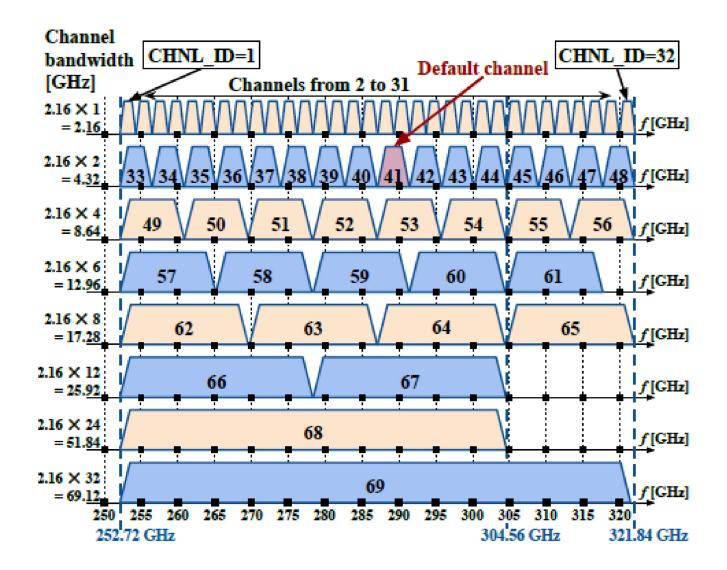

Fig. 1. IEEE 802.15.3d 252-321 GHz bandwidth allocation plan [\[54\]](#page-35-7).

known as IEEE 802.15.3d-2017 [\[52\]](#page-35-8), as an amendment to the IEEE 802.15.3-2016 [\[53\]](#page-35-9) 60 GHz standard, for operation up to 100 Giga-bits per second (Gbps). The 300 GHz system can utilize 8 different channel bandwidths between 252-321 GHz at multiples of 2.16 GHz [\[54\]](#page-35-7), as illustrated in Fig. [1.](#page-3-0) Both single carrier and on-off modulation schemes are being employed, which are combined with Low-Density Parity-Check (LDPC) and Reed-Solomon (RS) codes. Some of the applications identified for this range include PtP scenarios such as kiosk downloads, data centre communications, fronthaul/backhaul, intra-device communications and WLANs.

Spectrum allocation currently ends at 275 GHz for active services, but is not completely unregulated, as it is assigned for passive services such as Earth Exploration Satellite Services (EESS) and radio astronomy, that gather information based on the resonant frequencies of the molecules, and therefore these systems are only receiving and not transmitting [\[55\]](#page-35-10). These resonant frequencies are occupied within bands that cover most of the spectrum between 275-1,000 GHz, meaning that if we want to allocate these bands for active services and employ THz communications, this needs to happen by sharing the spectrum [\[56\]](#page-35-11). Furthermore, all frequencies between 1,000-3,000 GHz may also be used for both passive and active services [\[56\]](#page-35-11), though they have not yet been allocated to any service. In regard to the bands between 275-450 GHz, the ITU-R has invited its members to conduct sharing studies to see under which conditions and within which frequency bands sharing is possible. At WRC 2019 [\[55\]](#page-35-10), four contiguous bands were identified between 275 and 450 GHz (275–296 GHz, 306–313 GHz, 318–333 GHz, and 356–450 GHz) with large bandwidths, i.e., one of them with 94 GHz available for unrestricted use in total, based on ITU-R studies [\[57\]](#page-35-12), for land mobile and fixed services without the need to protect EESS. The Horizon 2020-EU-Japan joint project called ThoR, has also conducted a sharing study [\[58\]](#page-35-13) for interference mitigation, taking into account the operational characteristic of both passive and active services, and its findings are in line with the ITU-R studies. Three bands have been identified (296-306 GHz, 313-318 GHz and 333-356 GHz) in line with bands where proper mitigation is required to avoid harmful interference and allow for coexistence with other applications, while for radio astronomy, on the contrary, proper mitigation techniques are already available [\[59\]](#page-35-14).

In conclusion, Frequency bands > 275 GHz are inherently capable for implementing wireless systems with data rates of 100s of Gbps. Feasibility of wireless THz communication based on current developments and hardware demonstrations has been proven, while the first standard is available and so is the spectrum. Therefore, THz communication is a real option to be employed in future 6G wireless networks.

## II. MOTIVATION AND CONTRIBUTIONS

In this section, the necessities revolving around channel propagation modeling and measurements at THz are highlighted, and the existing works found in literature are compared and evaluated in terms of their contributions as well as their shortcomings. The research gap identified based on these shortcomings, is supported by arguments that provide work motivation and backing of the contributions offered in this work.

## *A. Motivation and Related Works*

As a prerequisite to communications system design and deployment, obtaining the characteristics of the wireless propagation channel between the Tx and Rx ends of the communications system is imperative [\[60\]](#page-35-15). Knowledge of the properties and distinct features of the propagation channel in a given environment based on the frequency range of operation, allows performance limits to be set, that are crucial in the development of successful communications systems in terms of transceiver design, software architecture and protocols [\[61\]](#page-35-16). Therefore, studying the wireless propagation channel to analyze its behaviour is critical in 6G communications system design. Obtaining the characteristics of the wireless propagation channel, necessitates correct procedures and empirical measurements to be conducted using channel sounders. The measurement data collected are then analyzed and modeled depending on the application scenario, and frequency range of operation. The applicability and performance of the models developed can then be compared as to which ones best describe the nature of the propagation channel in wireless communications networks, while the characteristics obtained must be analyzed comparatively to enhance system design, and provide a reference for future characterization efforts in higher frequency bands.

Very interesting survey papers that cover channel measurements and modeling can be found in literature, that mainly focus on the 5G mmWave bands < 100 GHz. For instance, Wang *et al.* [\[62\]](#page-35-17) listed the requirements for modeling the mmWave bands, while the available measurement campaigns and models were reviewed. Similarly, Hemadeh *et al.* [\[63\]](#page-35-18), surveyed channel measurements and modeling efforts for the 5G bands, while challenges for system design and deployment were considered. Furthermore, Rappaport *et al.* [\[64\]](#page-35-19) summarized measurements they have conducted at mmWave frequencies, at a period between 2011 and 2013, while Salous *et al.* [\[65\]](#page-35-20), presented an interesting

|           | Paper Title                                                                                                          | Year | Source Type     | Paper Contributions                                                                                                                                                                                                          | Ref. |
|-----------|----------------------------------------------------------------------------------------------------------------------|------|-----------------|------------------------------------------------------------------------------------------------------------------------------------------------------------------------------------------------------------------------------|------|
| 1         | Propagation Modeling for Wireless Communications in the Terahertz Band                                               | 2018 | Article         | Channel models and considerations for SISO and MIMO systems operating in the THz band.                                                                                                                                       | [75] |
| 2         | Channel Modeling and System Concepts for Future Terahertz Communications: Getting Ready for Advances Beyond 5G | 2020 | Article         | Guidelines and considerations for fixed PtP scenarios in the 300 GHz band based on the IEEE-802.15.3d standard.                                                                                                              | [76] |
| 3         | Towards 6G: Paradigm of realistic tera- hertz channel modeling                                                    | 2020 | Case Study      | A case study for realizing THz channels for close-proximity communications and smart rail mobility.                                                                                                                          | [77] |
| 4         | Survey on Terahertz Nanocommunication and Networking: A Top-Down Perspec- tive                                 | 2021 | Survey          | Review of applications, channel models in nano-networks and their requirements; discuss contributions toward different layers of the protocol stack.                                                                         | [71] |
| 5         | A Tutorial on Mathematical Modeling of 5G/6G Millimeter Wave and Terahertz Cellular Systems                    | 2022 | Tutorial        | A tutorial on high-level mathematical framework for 5G/6G including system level evaluation, mmWave and THz KPI evaluation; Service processing at the BS side.                                                               | [69] |
| 6         | Terahertz Wireless Channels: A Holistic Survey on Measurement, Modeling, and Analysis                          | 2022 | Survey          | A General overview of THz channel models, measurements and analysis up to 1 THz.                                                                                                                                             | [74] |
| This work | Terahertz Channel Propagation Phenomena, Measurement Techniques and Modeling for 6G Wireless Communication           | 2022 | Survey/Tutorial | A survey/tutorial on propagation modeling at THz with a focus on 6G applications, particularly, using new absorption loss models, understanding channel sounding and modeling for 6G applications, pointing out the need for | -    |

TABLE I TERAHERTZ PROPAGATION CHANNEL MEASUREMENT & MODELING WORKS IN THE LITERATURE

review on propagation phenomena and the progress of channel sounding and modeling for mmWave channels. However, propagation characteristics differ from those found at THz due to the shorter wavelength and therefore so do measurement capabilities and modeling techniques.

Many informative papers can be found that cover different aspects of THz communications, but which nonetheless discuss the propagation aspect briefly in relation to the envisioned applications. For example, Elayan *et al.* [\[66\]](#page-35-21) reviewed the current technological progress at THz as well as general propagation characteristics and models, while Chen *et al.* [\[17\]](#page-34-16) presented the technological progress along with envisioned applications at THz. Dang *et al.* [\[67\]](#page-35-22) discussed potential application scenarios and services that can be provided for THz alone and also hybrid network operations. Tataria *et al.* [\[68\]](#page-35-23) provided a discussion on the use cases and enabling technologies that will form the basis of 6G networks such as new waveform design, UM-MIMO, novel signal processing techniques and core network design, while a tutorial presented in [\[69\]](#page-35-24) describes a high-level mathematical framework for 5G/6G system design. In [\[70\]](#page-35-25), the authors provided a discussion on the defining features of THz wireless systems and four potential use cases related to 6G communications and the Internet of everything (IoE). Moreover, an overview for communications within nano-networks in the THz band was presented in [\[71\]](#page-35-26), that covers different aspects of nano-communications and includes a summary of the available methods for modeling applications such as nano-device in-body communications and on-chip communications. Some recent articles discuss channel measurements and modeling for 6G applications [\[72\]](#page-35-27), [\[73\]](#page-35-28), though they don't focus on THz propagation characteristics, that vary significantly depending on the frequency range of operation, and peculiarities of the propagation environment. Therefore, there is a need to focus on the propagation aspect at THz frequencies, to demonstrate the applicability of the envisioned applications.

A number of existing papers study THz channel propagation, providing general information on characteristics, modeling and measurements in the THz band. For example, Han *et al.* [\[74\]](#page-35-29), presented a holistic survey on measurements, modeling and analysis in the THz band, however they focus on general characteristics of the propagation channel at THz, not analyzing comparatively the characteristics in relation to the envisioned applications, while they do not explore the potential the envisioned applications have in the atmospheric windows above 1 THz. An article presented in [\[75\]](#page-35-30), considers modeling methods at THz along with current issues and future considerations, though this is a general review paper that does not survey the literature comprehensively, so as to relate to potential 6G applications. Nonetheless, a few papers can be found that relate the propagation aspect at THz with the envisioned applications. A very useful article found in [\[76\]](#page-35-31), provides guidelines and considerations for four potential PtP scenarios in the 300 GHz band, while a case study is provided in [\[77\]](#page-35-32) for close-proximity and smart rail mobility scenarios; however they do not explore other potential applications, as well as the applicability and limitations of the applications considered above 300 GHz.

Consequently, the existing survey articles do not analyze comprehensively and comparatively the characteristics of the propagation channel, channel modeling and the requirements for measuring at THz frequencies in relation to the applications identified, but cover different aspects of 6G communications at different frequency ranges where the channel characteristics and measurement capabilities vary significantly. In addition, they do not survey the literature comprehensively enough to discuss the feasibility of the envisioned scenarios in the THz regime, since they do not analyze the frequency bands above 1 THz and up to 3 THz where the technological advancements seem to converge, in order to investigate the feasibility of employing communications systems toward that end. Propagation related THz works are summarised in Table [I,](#page-4-0) indicating a clear interest shift in recent years toward the next generation of mobile communications. Much to the information provided on THz in light of the existing survey articles that cover different aspects of THz communications; an in-depth survey/tutorial in view of the current progress and future perspective of measurement and modeling of the THz channel at frequencies ≥ 300 GHz for potential use case applicability in 6G networks, is still not available. In this survey, we aim to narrow this gap by addressing the shortcomings identified and surveying the existing literature comprehensively and comparatively, aiming to provide a backbone that would motivate and help the research community in characterising the propagation channel effectively, for successful development and deployment of future 6G wireless communications systems operating in the entirety of the THz regime.

## *B. Contributions of This Survey*

The aim of this paper, is to provide a thorough review of the propagation channel at THz for specific use cases and scenarios, giving recommendations that would enhance measurement procedures, and aid in the development of models that can characterize the propagation environment for the deployment of future 6G communication systems operating at frequencies between 0.3-3 THz. The main contributions of this survey are summarized as follows:

- Potential applications that could be supported in 6G networks, and the requirements these applications pose on the underlying propagation channel in terms of measurement at THz, are discussed.
- Propagation phenomena uniquely experienced at THz and their associated models are presented; Importantly, the absorption loss is computed up to 3 THz and total path losses arising from possible bands of operation for each application are assessed for the first time for 1-3 THz.
- State-of-the-art channel sounding options at THz are reviewed, and compared for sounding the channel effectively in relation to the measurement requirements identified for the 6G scenarios.
- Stochastic, deterministic and combined stochasticdeterministic modeling approaches and their applicability at THz are assessed, for characterizing the propagation channel accurately in relation to the identified applications.
- Channel conditions resulting from the peculiarities of the propagation environment in relation to 6G scenarios are presented and analyzed.
- Open areas of research are highlighted; In particular, pointing out the need to incorporate AI approaches in channel models to reduce the extent of measurement required, by capturing variations in space, time and frequency.

## *C. Outline*

The structure of this paper is concisely illustrated in Fig. [2.](#page-5-0) The remainder of this paper is structured as follows; Initially, the use cases for wireless communications in the THz band as well as the system requirements for performing meaningful channel measurements are presented in Section III. The

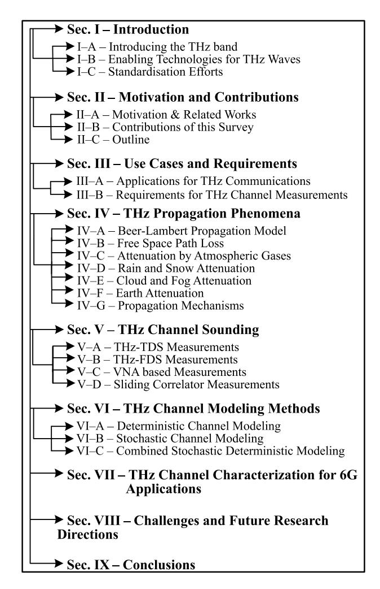

Fig. 2. Structure of this paper.

main propagation phenomena at THz and their modeling is presented in Section IV. THz channel sounding methods are introduced in Section V, which are necessary for conducting measurements based on the use cases identified in order to determine which method is best to be employed depending on each use case's requirements. Channel modeling methods that can be followed for extracting the propagation channel's characteristics in the THz band categorized as deterministic, stochastic and combined stochastic-deterministic are reviewed in Section VI. In Section VII, the most recent and significant efforts for characterising the propagation channel for 6G applications are summarised. Open issues and challenges being faced along with solutions and research directions for future modeling works are discussed in Section VIII. Finally, the findings of this paper are concluded in Section IX.

## III. USE CASES AND REQUIREMENTS

For future communication systems deployment, the use cases identified lay a set of requirements and limits for performing meaningful channel measurement campaigns. On that account, this section presents the applications envisioned for THz communications whose applicability has been demonstrated in literature. Onward, a general set of

TABLE II TARGETED APPLICATION SCENARIOS FOR THZ COMMUNICATIONS AND MINIMUM REQUIREMENTS FOR CONDUCTING CHANNEL MEASUREMENTS

| Application                | Propagation Environment                                                | Typical Range | Propagation Characteristics                                                                               | Antenna Alignment Requirements                              | Ref.  |
|----------------------------|---------------------------------------------------------------------------|------------------|-----------------------------------------------------------------------------------------------------------|-------------------------------------------------------------|-------|
| Kiosk Downloads            | Indoor; limited movement by users                                         | ~ 1 m            | LoS, NLoS                                                                                                 | Manual alignment of Rx by user                              | [143] |
| Data-Center Networks       | Communications between servers in data center                             | < 20 m           | LoS; D-NLoS                                                                                               | Manual alignment                                            | [142] |
| Intra-Device Communication | Communication within devices; fixed links                                 | ~ 30 cm          | LoS; NLoS with significant multipath contribution                                                         | Fixed alignment, low directivity possible                   | [23]  |
| Backhaul/Fronthaul         | Fixed wireless link extensions                                            | ~ 120 m          | LoS; Atmospheric attenuation; fog and Rain attenuation; very high path loss                               | Highly directive antennas; fixed alignment                  | [78]  |
| WLAN                       | Indoor; mobile users                                                      | ~ 10 m           | LoS; NLoS; scattering                                                                                     | Dynamic beam steering                                       | [79]  |
| HST Communication          | Communications within trains and between station infrastructure and train | < 30 m           | LoS; D-NLoS; dynamically varying conditions; atmospheric attenuation; high path loss             | Dynamic beam steering; high AoA estimation ac- curacy | [154] |
| V2X Communication          | Communications between vehicles                                           | < 20 m           | LoS; reflected path; dy- namically varying condi- tions; meteorological at- tenuation; path loss | Dynamic beam steering; high AoA estimation ac- curacy | [158] |
| Nano-Network Communication | Nano-device communication within nano-networks; in-vivo             | ≤ 10 mm          | Tissue penetration loss; scattering; molecular noise                                                | Fixed alignment                                             | [80]  |

system requirements for conducting practical channel measurements are described, by giving examples with regards to the 300 GHz band, in order to help in the selection of the appropriate measurement equipment for each of the use cases identified.

## *A. Applications for THz Communications*

The governing factor that drives a meaningful measurement campaign, is the application scenario under investigation. Generally, all applications identified would benefit from THz links, that would enable high data rate transmissions. In addition, the spectrum above 300 GHz gives more licensing opportunities and flexibility than the lower frequency bands. Initially, it would be sensible to investigate scenarios that can be characterized by fixed PtP links where the Tx and Rx antennas are considered to be stationary for the whole duration of the measurement, such as intra-device, backhaul/fronthaul, data centre communications and kiosk downloads (though in this scenario the Rx side may be subject to minor displacement as the user would have to align the device to the Tx side).

In the foreseeable future, advancing from fixed PtP scenarios to mobile scenarios, other applications are also envisioned in the THz band, such as communications within Vehicular networks, WLANs, and High Speed Train (HST) networks. These applications would benefit from MIMO capabilities to achieve extremely high data rates and also large capacities to accommodate a large number of users. Beam steering algorithms for device discovery requiring a high degree of Angle of Arrival (AoA) and Angle of Departure (AoD) estimation as the Tx and Rx will have no prior knowledge of each other's position, would become essential in order to realize modeling of such applications.

Table [II](#page-6-0) establishes the requirements for channel modeling as to what exactly they are in terms of use cases, in relation to expected ranges and environments as well as expected propagation conditions and required antenna characteristics. The use cases identified for operation in the THz band are described as follows.

- *1) Short-Range Communications:* close-proximity communications, include Kiosk downloads and on-board links, which may be considered as scenarios for file exchange between user devices and kiosks found in, e.g., airports, train stations as well as between devices such as routers and laptops on board a desktop. Propagation in such use cases may be assumed to be LoS over a short distance (< 1 m), with the potential to provide "information showers" and achieve extremely high data rates targeting 100 Gbps [\[81\]](#page-35-33) at 300 GHz. Thus, this prospective use case can be described as being highly applicable at frequencies ≥ 300 GHz with the only uncertainty of user equipment antenna misalignment, where the user would have to essentially point the receiving device toward the transmitting end.
- *2) Data Center Networks:* Data centers are centralized units of operation, that house racks with servers that communicate with each other by wired links [\[82\]](#page-35-34). A potential application of the THz wave at frequencies ≥ 300 GHz because of the high bandwidth availability, flexibility it offers in hardware configuration/reconfiguration, lower costs as well as easier to maintain environmental conditions provided by cooling technologies for equipment operation. In addition, arrangement of racks in data centres is usually symmetric, and therefore propagation in such case may be LoS as well as Directed-Non-Line-of-Sight (D-NLoS) when the LoS is not available, over reasonably short ranges (< 20 m).
- *3) Intra-Device Communications:* The continuous rise in data transfer within modern day devices where

communications between components, different layers of motherboards and within on-chip networks are expected, has lead to complicated layout structures, reduced processor space and high energy level consumption [\[83\]](#page-35-35). As such, high data rate intra-device THz wireless communication links may prove to be a beneficial solution. The propagation environment to be considered for channel modeling is very small, in the order of a few cm due to the casing of the device. The antenna requirements may be more flexible with less directive characteristics but communications are expected to rely not only on LoS propagation but also by significant multipath scattering contributions within the small enclosure by Non-Line-of-Sight (NLoS) propagation. In this context, opportunities for this application are highly motivational for use in the bands higher up in the THz spectrum.

- *4) Wireless Backhaul/Fronthaul:* Wireless backhaul links are potential use cases for future THz communications, with LoS as the main propagation characteristic. A backhaul link is a fibre based or wireless link that connects the base station to the core network and is in the km range. Current wireless backhaul links are not sufficient for future capacity and latency requirements and therefore a potential solution might be that of THz wireless transmission as a wireless extension of the optical fiber between rural and highly populated urban areas to ensure high-speed connectivity everywhere in a cost effective manner [\[84\]](#page-35-36). Current wireless backhaul implementations achieve up to 10 Gbps and the ThoR project [\[85\]](#page-35-37) aims at realizing data rates up to 100 Gbps for 300 GHz. THz Fronthaul links can be used to give broadband/high speed access to the end user in coexistence with the lower frequency bands in order to maximise the coverage, where the propagation is at LoS, and the link distance is much smaller compared to the backhaul.
- *5) WLAN:* Wireless connectivity that would require connections between various access points to replace fibre-optic cables and enable higher data rates. Typical indoor communications in the THz band will involve scenarios such as office rooms and conference rooms. Such scenarios would have to consider LoS, link blockage, and scattering as the main propagation mechanisms and will be mainly applied for interconnecting access points and user access at fixed locations. Communication links in such cases are limited by the enclosed propagation environment, with LoS and D-NLoS propagation mechanisms as well as scattering due to the enclosure, ranging up to a few meters.
- *6) HST Communications:* High data rate communications between trains, passengers and infrastructure to deliver high speed broadband access to HST users is expected to be delivered by the next generation of mobile communications [\[25\]](#page-34-24). The most promising application of THz however, is in the Train-to-Infrastructure (T2I) channel to deliver very high data rates of 100 Gbps etc. Another potential scenario, is communication within wagons for links between users and access points, where the large bandwidth at THz could be potentially exploited in the future for high data rate transmissions, and to accommodate a larger number of users in coexistence with the mmWave bands [\[25\]](#page-34-24). Propagation distances may vary depending on the scenario, ranging from a few meters within

the wagon up to a few tens of meters between infrastructure and train. Antenna requirements may also vary by scenario, where dynamic beam steering may be required to follow a moving train in the T2I scenario.

- *7) V2X Communications:* A network that is extremely intelligent and able to conquer the requirements of high data rates, ultra-fast, ultra-reliable and ultra-low latency exchange of information, is a future vision for 6G V2X communications [\[26\]](#page-34-25). The need for enhanced road safety and inter-connectivity that satisfies the requirements mentioned, can be aided by communications in the THz band, to enhance the throughput. Particularly, highly directive THz links in the lower end of the spectrum may be utilized for large information exchange within vehicular fleets of semiautonomous vehicles performing cooperative driving [\[87\]](#page-36-0) as well as for data relaying in congested networks to enhance connection reliability [\[88\]](#page-36-1). At THz it may be necessary to have such communications between vehicles at points where they are stationary or moving slowly in a short range, such as to do 'vehicle kiosk downloading/uploading' with LoS propagation between two vehicles in line with NLoS contributions and scattering from nearby buildings and vehicles.
- *8) Nano-Networks:* The THz channel has been found to be a candidate for many applications including those in the medical domain. Nano-machine enabled communications such as in-vivo communications within sub-mm sized regions inside the human body that are otherwise not accessible by any other medical device. For modeling the channel for in-vivo applications, the human tissue needs to be considered. Path loss can be computed based on different molecular characteristics, scattering from cells within the tissue, distance between the nano-machines, molecular noise and frequency of operation. Nano-network communications can be considered as highly applicable for operation in the entirety of the THz band, due to the short communication distance, and wavelength comparable to that of different molecules present in human tissue, that would allow for the identification of spectra that cannot be captured otherwise in the lower frequency bands.

## *B. Requirements for THz Channel Measurements*

- *1) Bandwidth:* While the spectrum is vastly available above 300 GHz in the THz regime, channels at multiples of 2.16 GHz have been introduced that allow for contiguous bandwidths of a few 10s of GHz targeting data rates of 100 Gbps. More specifically, as per [\[52\]](#page-35-8), data rates around 100 Gbps can be achieved with an 8-PSK modulation scheme with about 50 GHz bandwidth. Higher order modulation schemes should be employed to give higher data rates, such as 64-QAM that is able to provide data rates > 200 Gbps for the same bandwidth (∼ 50 GHz) [\[52\]](#page-35-8). To satisfy the capacity requirements and achieve high data rates, channels composed of many 10s of GHz of contiguous spectrum that can be freely allocated for active services with high order modulation and sophisticated coding schemes will be required.
- *2) Antenna Directivity and Beamwidth:* Side-lobe suppression and spatial filtering are the main requirements for antennas operating at THz, something that cannot be provided

by omni-directional antennas used in the lower frequency bands. Therefore, highly directive antennas with high gain are required, which are very much necessary to combat the high path loss and large atmospheric absorption effects of the highly frequency selective THz channels and also provide strong enough signal components that would be detected by the receivers. Antenna directivity can be described as the ratio of the maximum power density to its average value over all directions [89]. When no information is present on the effective aperture, the directivity in relation to the antenna beamwidth can be approximated by:

$$D \approx 10 \log_{10} \left( \frac{41253}{\theta_{\text{HD}}^{\circ} \phi_{\text{HD}}^{\circ}} \right) \text{ (dB)}$$
 (1)

where  $\theta_{\rm HP}^{\circ}$  is the half-power beam width in one principal plane and  $\phi_{\rm HP}^{\circ}$  is the HPBW in the other principal plane, both measured in degrees. HPBW is the angle in which the radiation intensity is at least half of the peak radiation intensity. For example, considering an HPBW of  $10^{\circ}$  on both planes, that would give us an antenna directivity from the radiation pattern of  $\sim\!26$  dB above isotropic. The gain of the antenna can then be found by multiplying the directivity value with the radiation efficiency of the antenna. In presence of multiple antennas that form a phased array and which are required for dynamic beam steering, planar arrays are the preferred solution at THz due to the advantages they hold in terms of large beam forming gains, fast beam-steering and side-lobe attenuation [90]. The directivity of a planar array including information on the beamwidth can be approximated as follows:

$$D \approx 10 \log_{10} \left( \frac{32400}{\theta_{\rm HP}^{\circ} \phi_{\rm HP}^{\circ}} \right)$$
 (dB) (2)

the importance here is to incorporate antenna patterns into channel simulators, so that they are accounted for in the capacity/data rate computation. Then patterns can be done by trigonometric functions to form the main beam, and an angular mask to cover the peak of the side lobes at any given angle.

3) Link Distance: The measurement distance separating the Tx and Rx sides of the communications channel, determines the extent to which accurate channel measurements at THz frequencies can be conducted. Indoor measurements require Tx-Rx separation distances of a few meters, while in outdoor scenarios 10s and even 100s of meters of measurement distances will be required, where various effects would have to be catered for such as a large number of reflections from buildings, vegetation and fading from meteorologically induced attenuation. Cabling is a largely negative factor that currently affects measurements over long distances. A Radio Frequency Over Fiber (RFoF) extension for frequency channel sounding was developed for the first time in [91] to extend the Tx-Rx channel measurement distance above 100 m and was successfully demonstrated in an outdoor environment. An important factor here is the system limitation when a THz radio link has several GHz of system bandwidth. The standard definition for noise figure is derived from the added noise by the receiver,  $N_{\rm Rec}$ :

$$F = 1 + \frac{N_{\text{Rec}}}{N_0} = 1 + \frac{T_{\text{Rec}}}{T_0} \tag{3}$$

where  $N_0$  is the noise power added by the receiver, and both have corresponding noise temperatures from use of kTB. Therefore taking an ambient temperature  $T_0$  of 290 K, this calculates to form -84 dBm for 1 GHz bandwidth then up to -74 dBm for 10 GHz bandwidth. This noise floor would increase by up to another 10 dB based on the noise figure at the receiver, defined as:

NoiseFigure = 
$$10 \log_{10} \left( 1 + \frac{T_{\text{Rec}}}{T_0} \right)$$
 (dB) (4)

where  $T_{\rm Rec}$  is the temperature of the added noise from the receiver. So what is measured over fibre might exceed what is achievable actually by a THz system.

4) Dynamic Range: The dynamic range of the equipment used for measurements is very important in determining the signal strength of different Multipath Components (MPCs). A high order of diffuse reflections coming from the very short wavelength of the THz wave interacting with irregularities on surfaces similar in magnitude to the wavelength, and indeed significant contributions of specular components resulting from the highly directive beam are expected. For that reason, the dynamic range of the measuring equipment will help in identifying these resulting components, that will be very helpful to determine the effect they have on the overall received signal strength. Therefore, the noise floor must be at a low enough level to achieve a high dynamic range, quantified as the difference between the strongest power component received and noise level. For the SC channel sounder, the dynamic range can be calculated as a function of the *m-sequence* length calculated as:

Dynamic Range = 
$$20 \log_{10}(m)$$
 (dB) (5)

where m, would have to be significantly large at frequencies  $\geq$ 300 GHz, to aid in the detection of much weaker multipaths, especially for applications that suffer from high atmospheric absorption due to longer communication distance requirements, in order to combat the problem of channel sparsity that is prominent at THz. Generally, all applications identified would require a high dynamic range; however, applications which may be less affected by the high losses present in the atmosphere such as intra-device links and short-range communications, a lower dynamic range should suffice. To achieve a good dynamic range of 80 dB, m must equal to 10,000. Dynamic range can be further improved by reducing the noise floor through averaging or by IF bandwidth reduction, in exchange for longer measurement times. Another, but more complicated option that can improve the dynamic range of channel sounding systems, involves employing the RFoF technique due to the lower losses incurred compared to RF cabling.

5) Doppler Sampling Rate: The Doppler effect, is where the propagating waves' frequency changes based on the velocity of a moving object in relation to the sources vicinity. E.g., a user moving across the room and blocking the signal transmission in an indoor scenario, or equivalently a vehicle moving away from a stationary source located on another vehicle in a nearby lane in an urban scenario. The need to measure Doppler

spectra, is down to the impact the Doppler has on the waveforms used, such as OFDM with multiple carriers, where too much Doppler spread at THz level is not conducive, since it can cause loss of sub-carrier orthogonality and can limit the achievable data rates [92], [93]. Weakened sensing accuracy of multiple carrier systems, is also another limiting factor induced by high Doppler spreads, that also affects the data rates unfavorably [94]. To measure the Doppler spectra in a static case practically, we should rather evaluate the maximum Doppler shift in fractions of wavelength moved. Assuming a frequency of 300 GHz, this gives a wavelength of 1 mm. We can move a sliding sample by  $\Delta s$ , which corresponds to a change in specular or diffuse reflection position  $\Delta p$  that is caused due to the roughness of the surface. We need to ensure  $\Delta p$  is small enough that it does not move beyond a portion of a wavelength from sample to sample. We can form a derivation from the Doppler shift as follows:

$$f_{\rm s} = k f_{\rm d} = k \frac{v_{\rm p}}{c_0} f_{\rm c} = k \frac{v_{\rm p}}{c_0} \frac{c_0}{\lambda} = \frac{v_{\rm p}}{\lambda/k}$$
 (6)

thus, for the representative velocity of the specular point,  $v_{\rm p}$ , this relates to how we sample relative to a wavelength, as we can say that the sampling frequency equals to  $f_s = kf_d$ . Therefore as we want to increase the sampling frequency relative to the Doppler frequency by factor k, where 4 is a suitable choice in accordance with the Nyquist-Shannon sampling theorem [95], then we need to sample every quarter wavelength. Thus,  $\Delta p$  must not move more than 0.25 mm at every sample point. This depends on how rapidly  $\Delta p$  changes as  $\Delta s$ changes. With reasonably 'smooth' surfaces such as wood, we can likely expect 0.5 mm resolution is sufficient for coherent sampling in order to avoid aliasing effects, with a high autocorrelation above 0.9 being desirable, that must be checked following measurement. This means that measurements at THz frequencies may be limited by substantial practical difficulties requiring a trade off between accuracy and feasibility, or otherwise, requiring costly high precision positioning equipment. A similar process in measurement as such, has been recently adopted in [96] in order to observe PtP variations in multipath distribution by reflections off indoor surfaces. In the case where the Doppler spectra are measured using a sliding correlator dynamic channel sounder where we essentially transmit a maximum length, m-sequence, the maximum Doppler frequency can be obtained as  $1/2km\tau$  where k represents the scaling factor of the sliding correlator, and  $\tau$  is the clock period, leading to,

$$v_p = \frac{c_0}{2km\tau f_c} \quad \left(\text{ms}^{-1}\right) \tag{7}$$

meaning that the velocity of the observer is inversely proportional to m, suggesting that increasing its value can enable longer time delays to be resolved, while lowering the velocity would allow greater Doppler shift resolutions. For example, to measure the Doppler shift of a user blocking the LoS signal in an indoor scenario, given a standard value of k = 5000,  $\tau = 0.1$  ns and a user velocity of 7 km/h at 300 GHz, we would require an m-sequence length of 514. These factors would depend on the capabilities of the dynamic channel sounder under consideration.

6) MultiPath Resolution: High delay resolutions that would enable multipaths to be resolved by their Time of Arrival (ToA) in the order of the wavelength are expected at THz, due to the large bandwidth availability, something which was not possible in the lower frequency bands. The delay resolution can be calculated as 1/bandwidth. For instance, at a centre frequency of 300 GHz, this means we have a wavelength of 1 mm which corresponds to a difference in delay between multipaths of 3.33 ps. In order to capture channel variations and observe components arriving in the order of the wavelength, we would require a bandwidth of 300 GHz (150-450 GHz). For dynamic measurements, the clock rate of the channel sounding device determines the delay resolution offered by the system. This parameter is extremely important when performing channel measurements in environments that are heavily influenced by scatterers such as WLANs where a high delay resolutions would be required, in antithesis to urban environment for applications such as fronthaul/backhaul where LoS is expected to be the main propagation mechanism.

7) Other Requirements: The choice of channel sounder to be employed, largely depends on the given application scenario e.g., whether its for material characterization, a fixed PtP communication scenario or a mobile scenario and what other requirements the targeted application has, such as bandwidth, speed, accuracy etc. What is a common need, is that of a relatively cheap and compact channel sounder that is easy to transport and one where cabling between the channel sounder and Tx/Rx would be as less complicated as possible to avoid calibration issues that are very common when performing these measurements. Furthermore, for short range scenarios, the channel sounder itself when large in size may act as an undesired reflector. In addition, to allow for accurate THz channel measurements, the channel sounding system has to be characterized itself in order to establish metrological traceability to the International System of units (SI) [97].

## IV. THZ PROPAGATION PHENOMENA

Accurate channel modeling and characterization is required for successful deployment of THz systems that can comply with industrial demands. To characterize the THz channel accurately and efficiently, it is of high importance that the nature of the propagation environment at this frequency range is considered. The THz wave possesses many unique characteristics that make it advantageous in comparison to microwave and mmWave communications, such as increased speed and capacity. Propagation phenomena considered in the microwave and mmWave bands include path loss, shadowing, penetration loss and diffraction. In the THz band, different propagation conditions besides the high path loss become much more pronounced such as molecular absorption and particle scattering. The effects of rain, fog and cloud also need to be taken into account as in the mmWave bands, while the effects of dust [98] and turbulence [99] are also limiting propagation phenomena, though they are often not as significant.

#### A. Beer-Lambert Propagation Model

As the wavelength of the THz wave approaches the dimensions of molecules found in the atmosphere and in human tissue, this results in strong absorption and scattering of the wave. The High Resolution Transmission Molecular Absorption (HITRAN) spectroscopic database [100], is the most commonly used tool that provides a set of parameters that are employed in different modeling codes, to compute the attenuation experienced by the propagating wave. A useful series of tutorials provided by the creators of HITRAN on how to extract spectroscopic data of absorption begins in [101]. Computation of the absorption coefficient is based on the well known Beer-Lambert law of attenuation [102], that takes the given cross-sections of a gas that are found empirically by varying the temperature and type of molecule, and calculates the absorption based on the wavelength, gas concentration, and path length through the gas. The contributions of total molecular absorption are dependant on each isotopologue from each gas present in the medium. The absorption cross-sections  $K_v$ (cm2/molecule) can be calculated by:

$$k_v = -\frac{\ln \tau_v}{\rho L} \quad \left(\text{cm}^2/\text{molecule}\right)$$
 (8)

 $au_v$  is the spectral transmittance (molecule  $\times$  cm-2) at a wavenumber v, temperature T (K) and pressure P (pa), where  $\rho$  is the density (molecule/cm3) along the path length L (cm). The absorption coefficient is then calculated as the absorption cross-section times the number of molecules in the path. The molecular specific attenuation can then be calculated as  $20\log(\exp(\alpha))$ , where  $\alpha$  is the absorption coefficient. The modeling codes that are then used to compute various attenuations, require application of radiative transfer theory and input characteristics such as line shapes, scattering, continuum absorption etc. [103], that increase the complexity of the channel model and are generally challenging for the beginners of the HITRAN database. The total path loss experienced by the system is then found as the sum of the specific attenuation due to absorption and Free Space Path Loss (FSPL) experienced in the medium it interacts with. An additional effect experienced, is that of molecular noise that causes molecular vibrations excited at the resonant frequencies of the molecules, causing emission of EM radiation, degrading the signal strength [104]. In terms of propagation in EM nano-networks, the total system noise takes additional contributions from the receiver antenna and from devices that are located in the immediate vicinity of the source. The concept of molecular absorption needs to be heavily accounted for, in networks operating under the NOMA principle. Novel User-pairing schemes and sophisticated channel models based on the complex mathematical structure of the Beer-Lambert law which must adapt to these characteristics according to the effect of molecular absorption, are therefore necessary [105].

## B. Free Space Path Loss

FSPL, is defined as inevitable attenuation experienced by a wave propagating in free space between two isotropic

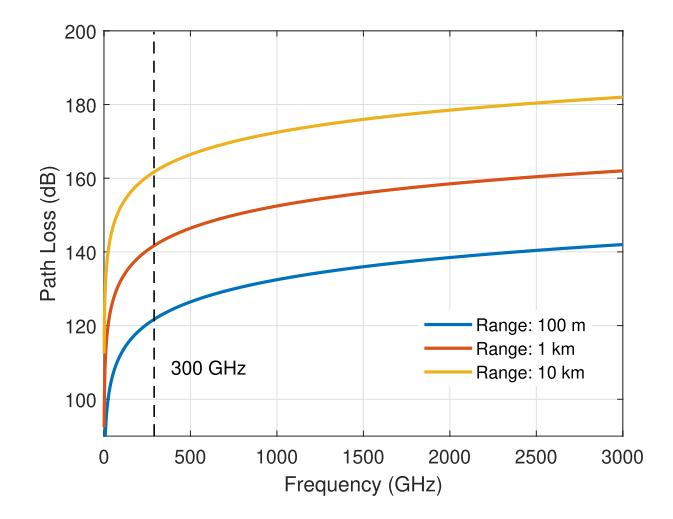

Fig. 3. Free space path loss for the frequency range 1-3,000 GHz with unity gain Tx and Rx antennas.

antennas [106]. It is described by the Friis' transmission formula given by Eq. (9),

$$P_{\rm r}(d) = \frac{P_{\rm t}\lambda^2}{(4\pi)^2 d^2} \frac{(4\pi)^2 d^2 A_{\rm et} A_{\rm er}}{\lambda^4} = \frac{P_{\rm t} A_{\rm et} A_{\rm er}}{d^2 \lambda^2}$$
(9)

where  $\lambda$  is the wavelength, d is the distance the wave will travel, with  $P_{\rm t}$  being the transmit power and  $A_{\rm et}$ ,  $A_{\rm er}$  being the Tx and Rx antenna effective areas. Based on Eq. (9), Fig. 3 shows the FSPL for a PtP link for three different separation distances up to 3 THz. Initially, substantial path loss well over 100 dB is formed at 100 GHz, with a 20 dB per decade increase resulting in an increase by 20 dB from 0.1 THz to 1 THz and nearly 10 dB increase from 1 THz to 3 THz. However, in Fig. 3 it is assumed that the antenna gains are equal to unity and the attenuation observed is simply the path loss. If the gain includes information on the aperture area of the Tx ( $A_{\rm et}$ ) and Rx ( $A_{\rm er}$ ) antennas, meaning that if the ratios:

$$\frac{A_{\rm et}}{\lambda}$$
 and  $\frac{A_{\rm er}}{\lambda}$ 

are maintained at any frequency, the received power  $P_{\rm r}(d)$ decreases with the square of the frequency and distance, i.e., the FSPL attenuation increasing proportionally with the decrease in  $P_{\rm r}(d)$ , and hence, the path loss does not change. Therefore the antenna size requirements as we go up in frequency reduce. But at the same time it is generally not possible to increase  $A_{\text{et}}$  or  $A_{\text{er}}$  at any single frequency beyond a corresponding limit, because the aperture efficiency falls consistently in cases such as horn antennas or parabolic dish reflectors. Array antennas as the other solution also have an equivalent limitation in that the increase in number of elements will result in higher feed losses. Also at THz the closer physical spacing where feeds do not physically size down will cause substantial practical difficulties and further lossy characteristics. Finally, an omnidirectional antenna cannot increase its aperture, which is already nearly as low as an isotropic antenna, by virtue of its design. Therefore, based on the above observations, though in theory an increase of  $A_{et}$  and/or  $A_{er}$ will overcome path loss, it is inhibited by physical limitations.

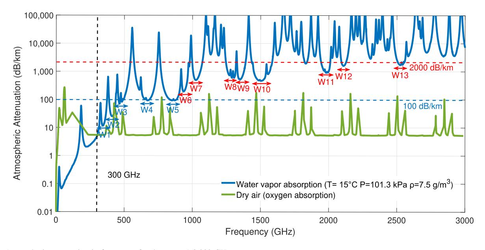

Fig. 4. Atmospheric attenuation in free space for the range 1-3,000 GHz.

## *C. Attenuation by Atmospheric gases*

At THz the main form of attenuation of the signal is expected due to meteorological attenuation known as atmospheric absorption. When the wavelength of the THz wave approaches the dimensions of water and oxygen molecules, resonances are generated at selective carrier frequencies resulting in large attenuation peaks that degrade the signal severely. In Fig. [4](#page-11-0) we can observe the atmospheric attenuation by water and oxygen molecules over the 1-3,000 GHz frequency range. It can be observed, that the contributions of oxygen for the bands above 300 GHz are insignificant and the atmospheric attenuation is dominated by water vapour. To calculate the atmospheric absorption at THz, it is necessary to extract spectroscopic data of absorption from the HITRAN database and apply radiative transfer theory. The computation of the atmospheric absorption can be done by first calculating the absorption lines of each gas molecule. When gas molecules collide with each other, the effect of Lorentz line broadening forms, that can be described by a half-width parameter that defines the width and shape of the lines, which can be computed as the average time between collisions, and which varies with temperature and pressure. The Van Vleck-Weisskofp (VVW) line shape [\[107\]](#page-36-20) is employed to model the shape of the absorption lines. Then, based on the Beer-Lambert law, the molecular absorption spectrum is computed. Alternatively, the atmospheric attenuation for 10-1,000 GHz can be calculated by the ITU-R p.676-10 model for attenuation by atmospheric gases [\[108\]](#page-36-21).

As illustrated in Fig. [4,](#page-11-0) below 300 GHz the attenuation is minimal reaching up to a few dB while in the underlined spectral windows below 1 THz, W1 = [331-375 GHz], W2 = [385- 440 GHz], W3 = [453-510 GHz], W4 = [630-705 GHz], and W5 = [815-890 GHz], the attenuation ranges up to 100 dB/km which still is a substantially massive amount of attenuation to achieve long distance communications, comparable with the attenuation we expect from a Faraday cage. In addition, different frequency-selective attenuation peaks are observed due to the resonant behavior of molecules in the atmosphere, causing severe attenuation levels some of which exceeding 10,000 dB/km that would have to be strictly avoided. In the region between 1 to 3 THz the signal undergoes significant attenuation by water molecules in the atmosphere and the next atmospheric windows with attenuations below 2000 dB/km are found in, W6 = [995-1078 GHz], W7 = [1241- 1320 GHz], W8 = [1325-1394 GHz], W9 = [1430- 1589 GHz], W10 = [1815-1848 GHz], W11 = [1938- 2013 GHz], W12 = [2088-2136 GHz] and W13 = [2495- 2562 GHz] that may be potentially utilized only for near-field communications (< 0.1 m) [\[109\]](#page-36-22).

## *D. Rain and Snow Attenuation*

Additional forms of meteorological attenuation that the THz wave may experience when propagating in an outdoor environment are those of rain and snow [\[110\]](#page-36-23). The ITU model provided in [\[111\]](#page-36-24), describes the rain attenuation, γ*R* in dB/km experienced by the THz wave over the 1-1,000 GHz frequency range given by the power-law relationship in Eq. [\(10\)](#page-10-2),

$$\gamma_R = kR^a \quad (dB/km) \tag{10}$$

calculated by the rain rate *R* (mm/h) where *k* and *a* are frequency dependent coefficients derived from scattering calculations at vertical and horizontal polarizations. As the rain droplets' shape and size are in similar order to the wavelength, the propagation losses must be represented as a function of polarization and wavelength. In Fig. [5](#page-12-0) the rain attenuation for horizontal polarization regarded as parallel to ground propagation for the 1-1,000 GHz frequency range can be observed, representing the worse case of attenuation. Four different scenarios of rain are shown where the rain rate can vary from less than 1 mm/h for light rain to over 50 mm/h for extreme rain conditions. These losses are seen to flatten out around 100 GHz, beyond which no additional attenuation is expected

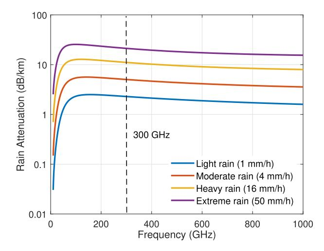

Fig. 5. Rain attenuation for horizontal polarization in the frequency range 1-1,000 GHz.

within the bands of interest up to 3 THz [112]. The reason for the constant attenuation at higher frequencies is that particle scattering has moved from Rayleigh to Mie scattering [113] due to the shorter wavelength making it more applicable, indicating that particle scattering with pattern similar to that of a dipole radiation pattern (Rayleigh scattering) changes to a more direct scattering pattern with a forward lobe (Mie scattering). These losses may not be as significant as the path losses and atmospheric losses but will have to be considered regardless for accurate channel characterization. With regards to attenuation due to snow, an equivalent ITU propagation model does not exist and the snow particles are merely considered as rain droplets [114].

## E. Cloud and Fog Attenuation

Another meteorologically induced condition similar to that of rain and snow that can cause fading in an outdoor environment, is that of fog and cloud. Fog and cloud may be considered as the same atmospheric phenomena, that vary only by height above ground. Both phenomena are defined by the ITU model [115] under the assumption that the wave travels solely through a uniform fog or cloud environment. The specific attenuation  $\gamma_c$  can be computed by Eq. (11),

$$\gamma_c(f, T) = K_l(f, T)M \quad (dB/km) \tag{11}$$

where  $K_l$  is the cloud water specific attenuation coefficient  $((\mathrm{dB/km})/(\mathrm{g/m^3}))$  found by applying a Rayleigh based double-Debye scattering model that is used to extract the dielectric permittivity of water and which holds for frequencies between 1–1,000 GHz. M (g/ $m^3$ ) is the liquid water density in the fog or cloud while T and f are the temperature and carrier frequency, respectively. In Fig. 6 we can see the specific attenuation effects of fog/cloud at a temperature of 20°C for 1-1000 GHz carrier frequencies that are typically around 0.05 (g/ $m^3$ ) for medium fog/cloud where the visibility range is in the order of 300 m, and 0.5 (g/ $m^3$ ) for heavy fog/cloud where the visibility range drops to 50 m. The losses, similar to those of rain and snow, are much smaller than those of path loss and

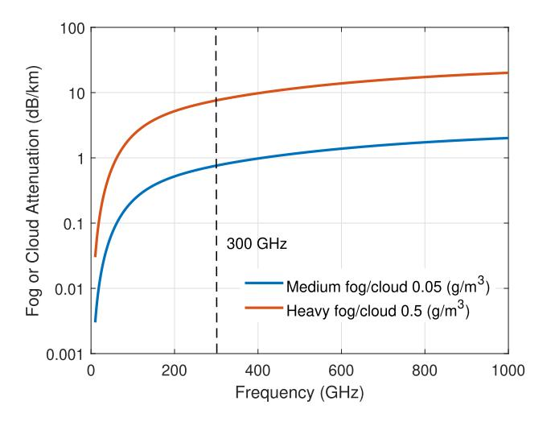

Fig. 6. Fog or cloud specific attenuation for the range 1-1,000 GHz.

atmospheric absorption, and can be easily compensated for, as the attenuation forming at 100 GHz is around 5 dB/km with an increase of about 15 dB from 0.1 to 1 THz for the worst case condition of heavy fog/cloud. Beyond this region and up to 3 THz, the attenuation formed does not vary significantly and increases by just a few dB [112] though no standard currently exists.

#### F. Earth Attenuation

The presence of Earth in an outdoor environment plays a significant role in signal attenuation at THz and may reduce the maximum achievable data rates [116]. The electrical characteristics of the surface of the earth, including pure water, sea water, ice, soil and vegetation cover, for frequencies up to 1,000 GHz can be computed using the ITU-R P.527-5 recommendation [117]. High amounts of absorption would be expected due to the high water content, while the effects of scattering need consideration as to whether earth components can contribute to the received signal by NLOS propagation. Currently, no specific model exists that computes the propagation loss due to earth other than the ITU model in [118] for vegetation attenuation, which holds for frequencies up to 60 GHz. This is because the lack of measurement data makes it difficult to develop an appropriate model at THz frequencies. The THz-TDS technique could be utilized to measure the water content on leaves and soil, and the data collected could be later on fed into models that characterize the outdoor propagation environment [119].

## G. Propagation Mechanisms

LoS can be considered as the most prominent propagation mechanism at THz as a result of the highly directive pencil beams expected to be transmitted by antennas operating at these frequencies. D-NLoS propagation, that was initially proposed in [120], is considered as a useful mechanism that would enable communication links when the direct LoS is not present, empowered by specular reflections off surfaces with good reflective properties as well as by RISs, to direct wave propagation in more complex cases over different angles. D-NLoS differs from the traditional concept of NLoS that is

TABLE III CATEGORIZING PROPAGATION LOSSES BASED ON ATMOSPHERIC WINDOWS AND EXPECTED LOS RANGES IDENTIFIED FOR EACH USE CASE

mainly used for sub-6 GHz communications as non-directed NLoS contributions to the received signal strength may be in many cases insignificant at THz due to high atmospheric losses, as they would be lost in thin air. However, for cases where the propagation environment is confined to a small space, such as in the case of intra-device communications, the NLoS components are expected to play a major role.

Similar to both microwave and mmWave radiation, THz waves can penetrate through different non-conducting materials such as plastic, clothing and paper [\[121\]](#page-36-34). However, strong absorption of the wave, depending on material structure and thickness is extremely possible. Penetration at THz is limited by the low output power levels and varies by thickness and composition of the material it interacts with [\[122\]](#page-36-35), The THz wave is non-invasive to the human body, and is therefore highly susceptible to link blockage in indoor locations (i.e., when a user is moving across the room) which becomes a major issue when employing communications systems with highly directive antennas, hence, the need for propagation mechanisms such as D-NLoS. Furthermore, diffraction effects common in the lower bands < 100 GHz that can be described, e.g., by the Knife-edge and/or Uniform Theory of Diffraction (UTD) models, are much reduced by comparison at THz, due to scatterer dimensions being much larger than the wavelength, but nonetheless, may be considered as a form of multipath propagation that could contribute to the overall signal strength [\[123\]](#page-36-36).

Moreover, the scattering behaviour of THz waves from different surfaces with different roughness levels is unique at THz owing to the short wavelength, and a good understanding of it is required for the development of future channel models. EM waves that are directed on a smooth surface should have an equal angle of incidence and reflection (specular reflection). However, when the surface is rather rough, diffuse scattering of the EM waves happens resulting in a loss of intensity in the specular direction. As the THz wave has a very short wavelength, scattering of the waves off a rough surface will cause multipath propagation and clustering effects. These rough surfaces can be quantified for THz frequencies, as having edges that vary between them less than 1 mm for frequencies > 300 GHz. Otherwise, for edges greater than 1 mm the surface may be considered as smooth. Additionally, multi-layer reflections within in-homogeneous materials are also another possibility at THz resulting in attenuation dips to the received signal at selective carrier frequencies, and additional diffuse components [\[124\]](#page-36-37).

## *H. Summary of Propagation Phenomena*

Table [III](#page-13-0) summarizes the approximate propagation losses at the center frequency of possible atmospheric windows of operation, resulting from LoS conditions based on expected ranges taken from real environments for the 6G applications identified. The propagation phenomena expected to be experienced by each application individually are marked by a dark circle. For the case of rain/snow and cloud/fog attenuation, worst case conditions are considered. The vast availability of the THz spectrum, means that certain applications can fit into specific windows in order to maximise the spectrum usage. For example, Kiosk downloads and on-board links, would suffer from minimal losses of 2 dB or less across the entire spectrum and could possibly operate in higher frequency bands. Likewise, intra-device links suffer from even lower losses which are almost insignificant. On the other hand, applications such as data centre, HST, V2X and WLAN communications suffer from moderate losses in certain atmospheric windows with the worst case scenario of about 57.2 dB attenuation in the W13 atmospheric window at 30 m. Therefore these applications could also be utilized within a number of windows depending on the link budget. Backhaul/Fronthaul applications, since they require the longest communication distances, would best work in the first few atmospheric windows identified. In terms of propagation losses resulting from scattering from objects found in the propagation environment, since this gives rise to complex scenarios that require thorough investigation before deployment, they are not considered in Table [III.](#page-13-0) The losses that arise from propagation inside the human body are also not included for nano-network applications, since no standard

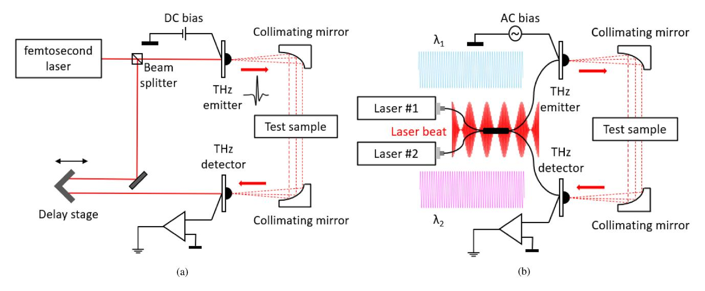

Fig. 7. Experimental setup for THz signal generation. (a) THz-TDS, (b) THz-FDS.

currently exists. With regards to attenuation due to rain and fog, the losses are included up to 1000 GHz for which ITU standards exist. Nonetheless, in the windows above 1000 GHz, for the applications that are expected to be utilized in outdoor environments, the expected ranges and corresponding losses, signify that these applications may not be placed within these bands. There is therefore a need to explore channel propagation in the windows identified, to best manage spectrum allocation, and maximise the capacity.

## V. THZ CHANNEL SOUNDING TECHNIQUES

As a requirement to communication system design, profound knowledge of the propagation environment is essential. In order to develop future channel models, channel measurements are the first and most important step, requiring state of the art sounding equipment and correct methods to be available. THz measurements have been mainly conducted by three distinct channel sounding methods. These include the well known THz-TDS [\[125\]](#page-36-38), Vector Network Analyser (VNA) [\[126\]](#page-36-39) and Sliding Correlator (SC) channel sounder [\[127\]](#page-36-40), while THz-FDS (Frequency-Domain Spectroscopy) [\[128\]](#page-36-41) is another very promising channel sounding option. In this section, the performance of these channel sounding methods is described and compared with measurement requirements that may vary depending on the application scenario under investigation.

# *A. THz-TDS Measurements*

THz-TDS [\[125\]](#page-36-38), [\[129\]](#page-36-42), as depicted by Fig. [7\(](#page-14-0)a), is a channel sounding technique where material properties are being probed by ultra-short light pulses. These pulses are converted to the THz range using photo-conductive switches (GaAs or InGaAs/InP) irradiated by femtosecond lasers at the source of the Tx, and the received optical impulses detected at the Rx are converted to an electrical signal [\[130\]](#page-36-43). The received time domain signal is then processed by Fast Fourier Transform (FFT) to the frequency domain, in order to extract

its spectral content. Moreover, since the received signal is complex (i.e., containing both amplitude and phase information), it can be used to calculate the complex refractive index whose real part is used for measuring material thicknesses and the imaginary part used for calculating resonant absorption and extracting conductivity directly without the need for additional modeling [\[125\]](#page-36-38). THz-TDS has the advantage of large bandwidth measurements where bandwidths up to 10 THz have been achieved [\[131\]](#page-36-44) allowing for a wide range of spectral fingerprints of different dielectric materials to be identified, supplemented by a very good dynamic range (∼ 100 dB) and tuneable timing resolution that is achieved by adjusting the distance the two pulses will propagate; hence, enabling paths to be resolved within femtoseconds [\[125\]](#page-36-38). Additionally, since this is a pulsed technique, it allows for time-gating that can increase the Signal-to-Noise (SNR) ratio which normally decreases with thickness or number of layers, and allows for content extraction between multi-layered structures of submm thicknesses; thus, proving to be excellent at measuring the scattering parameters and electrical properties of various material samples [\[132\]](#page-37-0).

The THz-TDS poses as an excellent measurement method whereby characterisation for 6G applications could benefit from in propagation environments that are enclosed or surrounded by scatterers. The high accuracy offered by THz-TDS could help extract different material properties better than any other channel sounding technique, which can be later fed into channel models to characterize the propagation environment. It has been employed in [\[133\]](#page-37-1) to model the reflection and scattering losses resulting from different body parts of a vehicle at 300 GHz for various Vehicle-to-Vehicle (V2V) communication scenarios. THz-TDS measurements have also been utilized for characterizing rough material surfaces of building materials usually found in indoor environments, in the bands between 0.1-4 THz [\[31\]](#page-34-30), [\[32\]](#page-34-31). Piesiewicz *et al.* [\[30\]](#page-34-29) conducted THz-TDS measurements for future pico-cell THz indoor communication systems operating at 300 GHz. The purpose of this measurement campaign was to model the characteristics of various building materials commonly found in indoor environments and the effects diffuse scattering has on the received power levels.

#### B. THz-FDS Measurements

THz-FDS [128] is a channel sounding technique that employs CW THz radiation to probe the material properties. The THz-FDS measurement setup is illustrated in Fig. 7(b). It is a technique that utilizes optical heterodyne detection in high-bandwidth photo-conductors that involves optical signal and oscillating wave mixing, where the combined product gives an electrical signal at the difference frequency of the two lasers. It offers an excellent dynamic range ( $\sim 100 \text{ dB}$ ) for large bandwidth measurements ( $\sim$  6 THz). Two lasers at adjacent frequencies are used to illuminate the photo-mixer and the applied bias creates a photo-current that is modulated at the beat frequency. This allows for the antenna to transmit the THz wave and produce a monochromatic beam. Furthermore, by tuning the lasers, the THz wavelength can be adjusted. The main advantage of THz-FDS compared to THz-TDS is that is offers the user a very high frequency resolution (10 MHz typ.) at a user determined range or fixed frequency and a comparatively lower cost [128]. Nevertheless, the THz-FDS technique as with THz-TDS is limited by its very small output power and large size and cannot be used for long range channel characterisation and for a wider range of scenarios. Furthermore, this technique cannot capture the dynamic behaviour of the channel such as Doppler spread, due to moving scatterers blocking the direct path, as it requires the channel to be stationary for the whole duration of the measurement, which may take several minutes.

#### C. VNA Measurements

The main technological advancements related to capturing the characteristics of the propagation channel are namely, VNA [126] and SC [134] channel sounders. The VNA, whose operation is more well known, works by sending a stimulus signal from the Tx to the Rx and processing the received signal to obtain the channel properties. It measures the frequency response, which is essentially a measure of the phase and magnitude of the received signal by processing sequentially a great number of Channel Transfer Functions (CTFs) as a function of increasing frequency within the band of interest, and then aggregating them together to generate a broadband CTF, i.e., the  $S_{21}$  parameter which is a measure of the signal coming out of port 2 in relation to the signal entering port 1 of the VNA and is used to characterize distance-varying measurements in terms of amplitude and phase, hence, the word vector. Onward, using Inverse Fast Fourier Transform (IFFT) the Channel Impulse Responses (CIRs) are generated as a function of time delay. A VNA can provide full synchronization between the received and transmitted signal enabling individual calibration and coherent averaging over long times for the suppression of noise because of the large number of narrowband measurements [135]; hence, making it ideal for narrowband channel characterization. To extend the frequency

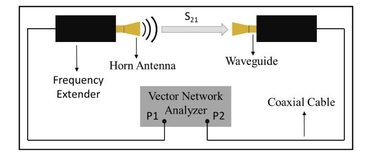

Fig. 8. Schematic of a VNA based measurement setup with frequency extenders employed for up-conversion of the signal.

range of the VNA to the THz range, frequency extensions are employed for the up-conversion of the signal [136].

A VNA based measurement setup is depicted in Fig. 8. The setup consists of a VNA connected at the Tx and Rx sides to frequency extender modules which in turn are connected to a waveguide and horn antenna that must be fixed precisely to avoid causing any signal reflections back to the frequency extender. To realize such a setup practically and enable an accurate measurement campaign and account for system errors in transmission and also due to source mismatches, system directivity and reflection tracking [137], the VNA/ extender heads require lengthy calibration techniques, e.g., Short, Offset-short, Load and Thru (SOLT) [138]. One of the key limitations related to measurements using VNAs is that the frequency extenders have to be connected via physical connections and require a reference signal to maintain phase synchronization; thus, the measurements are constrained in terms of Tx-Rx separation distance, while for these measurements the VNA must be placed somewhere near the Tx and Rx ends, therefore, acting as an unwanted reflector and scatterer. Furthermore, the cabled connections between Tx and Rx are very sensitive and may affect the calibration if they are moved around. Another key limitation of the VNA is the ability to measure the propagation characteristics over ultrawide frequency ranges of a time-variant channel influenced by moving scatterers i.e., humans that cause blockage and scattering of the signal. In such complex cases, the applicability of VNAs is no longer viable since they take too long to perform a full frequency sweep surpassing the channel coherence time [134], and therefore not allowing for dynamic channel variations such as Doppler shifts to be captured in order to analyze the effects of link blockage. Nevertheless a VNA can provide an excellent dynamic range ( $\sim 120 \text{ dB}$ ) [138] and a very high delay resolution [124], allowing for a very large number of MPCs to be resolved over significantly broad bandwidths; Nonetheless, the bandwidth is directly dependent upon the selected waveguide interface [139] used for Single-Input Single-Output (SISO) measurements. State-of-the-art frequency extender modules commercially available, can operate between 50 GHz to 1.5 THz with varying bandwidths that reach up to 350 GHz in the higher end [140].

VNAs, have been employed in a number of measurement campaigns that have been carried out for characterizing the propagation environment for various 6G applications due

| Ref.               | Frequency Range      | Wavelength (λ) | Doppler Sampling Rate $(\leq \lambda/2)$ | Delay Reso- lution | Path Reso- lution | Antenna Gain | HPBW |
|--------------------|----------------------|----------------|------------------------------------------|-----------------------|----------------------|-----------------|------|
| [141], [142] [143] | 220-340 GHz          | 1.071 mm       | 0.5355 mm                                | 8.33 ps               | 2.5 mm               | 25 dBi          | 10°  |
| [144]              | 280-320 GHz          | 1 mm           | 0.5 mm                                   | 25 ps                 | 7.5 mm               | 26 dBi          | 10°  |
| [137]              | 500-750 GHz          | 0.48 mm        | 0.24 mm                                  | 4 ps                  | 1.2 mm               | 26 dBi          | 10°  |
| [145], [146], [22] | 300-312 GHz          | 0.98 mm        | 0.49 mm                                  | 83 ps                 | 25 mm                | 22-24 dBi       | 10°  |
| [147]              | 300-320 GHz          | 0.97 mm        | 0.48 mm                                  | 50 ps                 | 15 mm                | 22-24 dBi       | 10°  |
| [148]              | 280-320 GHz          | 1 mm           | 0.5 mm                                   | 25 ps                 | 7.5 mm               | 22-23 dBi       | 10°  |
| [23]               | 300-312 GHz          | 0.98 mm        | 0.49 mm                                  | 83 ps                 | 25 mm                | 22-23 dBi       | 12°  |
| [79]               | 345-355, 645-655 GHz | 0.86, 0.46 mm  | 0.43, 0.23 mm                            | 0.1 ns                | 30 mm                | 25 dBi          | 12°  |
| [149]              | 295-305 GHz          | 1 mm           | 0.5 mm                                   | 0.1 ns                | 30 mm                | 26 dBi          | 10°  |

TABLE IV
PROPERTY COMPARISON OF THE MEASUREMENT CAMPAIGNS CONDUCTED FOR 6G SCENARIOS USING VNA CHANNEL SOUNDING

to the advantages it holds of high dynamic range, high delay resolutions and long distance communication links. Measurements have been carried out for characterising the propagation channel for the indoor short-range kiosk downloading scenario [141], [142], [143] using extender heads that operate between 220-340 GHz with 25 dBi horn antennas and a Half-Power Beam Width (HPBW) of 10° as well as for the on-board desktop scenario [144], [137] between 280-320 GHz considering a 20 GHz bandwidth and between 500-750 GHz using 26 dBi horn antennas with a HPBW equal to 10° for both cases, respectively. Several measurement campaigns have also been conducted to characterize data centre links using a VNA with extender heads operating between 300-312 GHz for [145], [146], [22] and 300-320 GHz for [147], with horn antenna gains that vary between 22-24 dBi with a 10° HPBW in azimuth and elevation, for all cases. Similarly, measurements have been conducted for intra-device communication scenarios with an operational bandwidth between 280-320 GHz, but considering in the analysis the ranges between 300-314 GHz for [148] and 300-312 GHz for [23] with an antenna gain between 22-23 dBi across the frequency ranges investigated, and with a 10° and 12° HPBW, for each case respectively. A measurement campaign has been carried out for an indoor office room scenario in the 350 and 650 GHz bands [79] with a bandwidth of 10 GHz, 25 dBi gain horn antennas and a 12° HPBW for both frequency bands. An office room scenario was investigated in [149] at 300 GHz with a 10 GHz bandwidth, 26 dBi gain antennas and a 10° HPBW where with the addition of lenses the gain was increased by 13 dBi on each side and the HPBW was reduced to 0.1°. The properties of the measurement campaigns conducted in relation to the frequency range of operation and antenna characteristics are summarized in Table IV.

#### D. Sliding Correlator Measurements

The most popular channel sounding method that can yield real-time results is the SC based measurement method that utilizes the Direct Sequence Spread Spectrum (DSSS) technique that was first introduced by "Cox" of the Bell Laboratories [150]. The SC based time-domain channel sounding method, operates by transmitting a broadband Pseudo-Noise (PN) sequence  $S_{\rm Tx}(t)$  along the channel h(t) from the Tx to the Rx as a stimulus signal resulting to the received

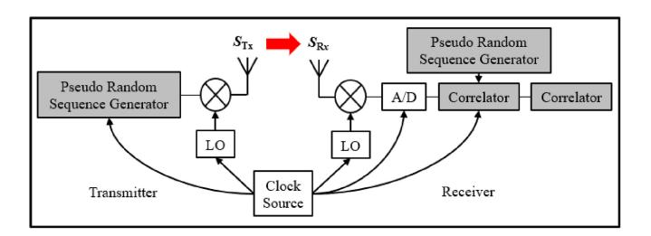

Fig. 9. Schematic of a Correlation based channel sounder.

signal b(t) and calculated by convolution of the propagating signal with the time-varying channel. At the receiving side, cross-correlation of the received signal with an identical but delayed by  $\tau$  complex conjugate of the PN sequence  $S_{\rm Rx}^*(t-\tau)$  takes place. Given the autocorrelation function  $P(\tau-\zeta)$  of the PN-sequence can be described by a Diracimpulse shape which then equals to the CIR, a maximum length sequence (m-sequence) can therefore be used as a PN sequence to be transmitted as a reference signal in order to approximate the Dirac-impulse shaped function [60]. The advantage of this channel sounding method is that it can capture all the frequency points at the same time so that it is not as slow as frequency scanning measurements conducted using a VNA.

In Fig. 9 a simplified schematic of a SC based channel sounder is presented. The PN sequence is mixed up to achieve the targeted frequency range before modulation, known as the baseband. In order to estimate the complex CIRs in the baseband, the Tx and Rx sides need to be in synchronization to achieve phase recovery at the Rx side, something that is achieved by the clock source that is used to drive the Local Oscillator (LO) on the Tx and Rx sides with a high degree of precision. Hence, an SC can measure a dynamic channel but not a mobile channel due to the clock source.

Time-domain SC operates at much higher speeds and allows for dynamic variations of the channel to be captured caused, i.e., by moving scatterers. However, strong thermal noise consequently may affect the precision in obtaining the results due to the lack of measurement bandwidth that is limited by the semiconductor technology [134]. SC channel sounding in the mmWave bands below 100 GHz with real-time capabilities that allow for fast electronic steering of the THz beam through the use of phased antenna arrays has been recently demonstrated [151], [152], [153]. Nevertheless, the first SC

channel sounder at THz has been introduced 300 GHz at an ultra-broad bandwidth of 8 GHz by employing frequency extension modules to achieve the frequency range of operation, being able to capture 17590 CIRs per second, while also offering MIMO capabilities [\[127\]](#page-36-40). This option however, due to the lack of back-to-back calibration, leads to additional unwanted MPCs, that are caused by non-linearities in the frequency extenders. Numerous SC measurements conducted by transmitting *m*-sequences have been recorded in literature using the SC channel sounder presented in [\[127\]](#page-36-40), to sound the propagation channel between 302.2-308.8 GHz for complex environments where a large number of measurement data is required. Various measurement campaigns to investigate channel properties for various HST communication scenarios have been carried out [\[154\]](#page-37-22), [\[155\]](#page-37-23), [\[156\]](#page-37-24), [\[157\]](#page-37-25), utilizing Tx and Rx antennas with a gain of 15 dBi and a 30◦ HPBW, while considering varying Tx-Rx separation distances < 30 m. Similarly, measurements have been conducted in a real data centre environment with Tx-Rx separation distances < 20 m while the SC channel sounder has also been employed in measurements for various V2X scenarios [\[158\]](#page-37-26) in a 4×4 MIMO configuration with antenna gains of 26.4 dBi and 8.5◦ HPBW, while considering Tx-Rx separation distances up to ∼15 m.

Furthermore, different sounder architectures will have to be developed and compared to improve the estimation accuracy and enhance the bandwidth. Zadoff-Chu sequences [\[159\]](#page-37-27) may be used as synchronization sequences, replacing the conventional PN-sequences due to their advantageous autocorrelation properties. A first channel sounder has been developed at THz frequencies that transmits the Zadoff-Chu sequence within a 2 GHz bandwidth over a scaleabe frequency range between 270-320 GHz [\[160\]](#page-37-28). This architecture has shown to diminish spurious components that appear above the noise floor caused by non-linearities experienced in [\[127\]](#page-36-40), and has demonstrated a dynamic range of 70 dB, that pertains a performance improvement of 10 dB. SC measurements by transmitting Zadoff-Chu sequences have been performed using the channel sounder presented in [\[160\]](#page-37-28) for an indoor conference room scenario and an Urban street scenario [\[161\]](#page-37-29), [\[162\]](#page-37-30) considering Tx-Rx LoS distances of < 10 m up to ∼ 35 m, respectively. Nevertheless, any results obtained using this channel sounder architecture cannot be considered as conclusive for accurate channel characterisation as they suffer from a quite low delay resolution of 0.5 ns that corresponds to a path difference of 15 cm between multipaths. In addition, the acquisition time of 50 ms required to store 50,000 CIRs over a 1 µs duration, corresponds to bad Doppler capabilities. A possible improvement to this system can be supported, where it could benefit by measuring in 'burst,' by slowing down the frequency at which it takes CIRs, and thus essentially reducing its sampling to handle lower Doppler shifts, to then measure for a longer duration. This would in turn increase its scaling factor which equals to 1. The capabilities of the aforementioned SC channel sounders are summarized in Table [V.](#page-17-0)

## *E. Summary*

A number of measurements have been conducted so far in the THz band using the above channel sounding

TABLE V PERFORMANCE COMPARISON OF THE TWO SC CHANNEL SOUNDERS

| Ref.                  | [1]           | [2]         |  |
|-----------------------|---------------|-------------|--|
| Clock Frequency       | 9.22 GHz      | 10 MHz      |  |
| Frequency Range       | ~ 300-308 GHz | 299-301 GHz |  |
| Wavelength            | ~ 1 mm        | 1 mm        |  |
| Doppler Sampling Rate | 8.8 KHz       | 0.025 Hz    |  |
| Delay Resolution      | 108.5 ps      | 0.5 ns      |  |
| Path Resolution       | 32.5 mm       | 15 cm       |  |
| Dynamic Range         | 60 dB         | 70 dB       |  |
| Scaling Factor        | 128           | 1           |  |
| Sequence Type         | PN            | Zadoff-Chu  |  |
| Sequence Length       | 4095          | 2000        |  |

methodologies. Most of the measurements used to obtain the channels' characteristics, have revolved around the 300 GHz band reaching up to 750 GHz and have been conducted with the use of VNAs and SC channel sounders. On the other hand, spectroscopic measurements have been conducted on the entirety of the defined bands of interest between 0.3-3 THz, mainly used to obtain characteristics of materials and to describe propagation at a molecular level.

Spectroscopic measurements due to the low output power are suitable in characterizing short distance links but with a very high accuracy, and offer a huge bandwidth. They have been employed in characterizing various materials present in the propagation environment for various applications such as V2X and indoor communications. They have also been employed to obtain coefficients that are used to model attenuation by meteorological phenomena as well as for modeling the absorption of different tissue layers for nano-network in-body communications.

A number of VNA based measurements been employed in obtaining channel characteristics in indoor scenarios such as office rooms, kiosk downloads, data centres and intra-device links. VNAs hold the advantage of high delay resolutions due to the wide bandwidths offered, allowing for reasonably accurate characterisation, while the high dynamic range demonstrates the ability to capture multipaths over long propagation distances at scaleable frequency ranges, that would otherwise not be observable using the other channel sounding options. However, frequency scanning is an issue, as it is very time consuming. Given the wide bandwidth availability of commercially available frequency extension modules operating well above 1 THz, as well as the limitations in frequency scaleability and bandwidth offered by SC channel sounders, VNAs are expected to form the backbone of future measurement campaigns that aim to obtain the propagation channels' characteristics above 300 GHz.

At THz, current SC channel sounding technologies are limited to operating at frequencies around 300 GHz with a few GHz of bandwidth. These channel sounders are ideal, in that they can collect a huge number of measurement data in comparison to VNAs, in order to model scatterer mobility and complex propagation environments with sufficient accuracy. SC channel sounders can therefore be employed to extract

|                        | TDS/ FDS [128]                                                   | VNA [126]                                | SC [127]                                          |
|------------------------|------------------------------------------------------------------|------------------------------------------|---------------------------------------------------|
| Measurement Domain     | Time / Frequency                                                 | Frequency                                | Time                                              |
| Bandwidth              | > 5 THz                                                          | a few 100s of GHz                        | 8 GHz                                             |
| Dynamic range          | ~ 100 dB                                                         | ~ 120 dB                                 | $\sim 60 \text{ dB}$                              |
| Speed                  | milliseconds to 1 min / several mins                             | several minutes per sweep                | 1,000s of CIRs generated per sec                  |
| Frequency resolution   | 5 GHz typ. / 10 MHz typ.                                         | 10 MHz typ.                              | _                                                 |
| Real-time              | Yes / No                                                         | No                                       | Yes                                               |
| Range                  | < 1 m                                                            | a few 10s of m                           | a few 10s of m                                    |
| Spectral selectivity   | No / Yes                                                         | Yes                                      | No                                                |
| Use Cases/Applications | Intra-device links, scattering properties; molecular attenuation | Kiosk downloads, WLAN, data centre links | V2X, HST communications, dynamic link blockage |

TABLE VI PERFORMANCE COMPARISON OF THE FOUR DIFFERENT CHANNEL SOUNDING TECHNIQUES

the channel properties for applications such as V2X and HST communications where the propagation environment is larger and much more complex than applications characterized by VNA measurements.

Table [VI](#page-18-0) summarizes and compares the capabilities of the four main channel sounding techniques described in this section and names a few of the applications that these methods would work best for in future characterisation efforts for 6G applications in the bands above 300 GHz. Ideally, channel sounders in the future would maximize these capabilities, and would adapt to a wider range of scenarios and potential applications in the THz band to aid in accurate characterization and modeling of the propagation channel.

## VI. THZ CHANNEL MODELING METHODS

Deriving the channel characteristics by appropriate modeling is the next step in communication systems design after conducting measurements. Current modeling approaches can be either described as deterministic [\[163\]](#page-37-31) or stochastic, in the form of Geometry-Based Stochastic Models (GBSMs) [\[164\]](#page-37-32), Non-Geometry-Based Stochastic Models (NGSMs) [\[165\]](#page-37-33), and Correlation-Based Stochastic Models (CBSMs) [\[166\]](#page-37-34). Deterministic models, are ones that use the EM laws of wave propagation to determine the signal power received at a particular location in a 3D mapped environment. Deterministic channel modeling approaches in the THz band involve accurate geometric modeling of the waves' propagation environment and require exact knowledge of the boundary conditions. Accurate positions of the Tx and Rx antennas along with geographical positions and properties of different material present such as shape and dielectric constant are needed, to ensure the measured and expected results are in conjunction. Even though they can accurately predict the characteristics of the propagating environment, deterministic models suffer from high computational complexity and large simulation times. On the other hand, stochastic models, are ones that use measurement data to give a statistical description of the propagation channel. NGBSMs are those where the scatterers are not modeled explicitly and the propagation channel is considered as a number of delay taps, where by deriving probability density functions through extensive empirical data collection we can establish the channel model. In GBSMs probability distributions are used to describe the properties of scatterers and then fundamental laws of wave propagation are used to characterize the propagation process. The delay taps in NGBSMs are replaced by clusters in GBSMs that represent a collection of MPCs with similar properties, where the clusters are distinguishable from one another. CBSMs on the other hand, are applicable to cases with wide scattering, which is not evident with THz links using highly directive beams. Therefore, they will not need further consideration here.

## *A. Deterministic Channel Modeling*

The most popular deterministic channel modeling approach that has been employed in the IEEE 802.15.3d standard, is known as Ray-Tracing (RT) [\[167\]](#page-37-35). RT in the THz spectrum can be employed to model various static scenarios related to wireless communications within, e.g., indoor office rooms, data centres and nano-networks. It is a method by which rays are launched at regular time intervals and are detected based on propagation in free space, where effects such as reflection, scattering as well as edge diffraction and clustering are accounted for, as demonstrated in Fig. [10.](#page-19-0) Recent works [\[168\]](#page-37-36), [\[169\]](#page-37-37), have shown that RT which has also been employed in the optical bands, is sufficient to model and characterize basic propagation mechanisms in the THz bands, and is therefore highly applicable to simulate specific PtP application scenarios for operation in 6G networks at THz frequencies. Advanced acceleration and high efficiency 3D RT techniques need to be developed that can increase the simulator's performance and which consider the propagation environments' characteristics precisely.

To apply ray tracing based on the environment's geometry, becomes very tedious for complex scenarios and requires great accuracy. A strategy adopted in RT algorithms, is one which takes the form of a "visibility tree" [\[170\]](#page-37-38), that holds a layered based structure composed of nodes and branches, where each node represents a scatterer, with the first node being the Tx and each branch represents a LoS link between the scatterers when that is available. When the Rx is reached, the end node is instead represented by a leaf. A visibility tree, can therefore be used to capture individual propagation paths, indicated by the total number of leaves created in the visibility tree, but can be very computationally complex. Once the visibility tree

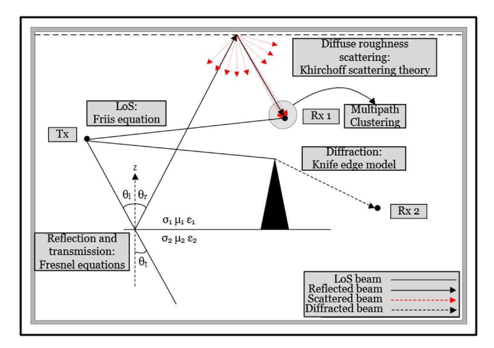

Fig. 10. The RT method for deterministic channel modeling.

takes shape, by traversing backwards from the leaf to the root node (Tx), and by use of geometric optic rules of propagation including computation of the path losses, reflections using the Fresnel equations and accounting for diffraction effects by including coefficients captured using, e.g., UTD at each connection, the individual propagation paths can be resolved.

An alternative approach to that of RT, is that of raylaunching [\[171\]](#page-37-39), where rays are launched on a coordinate grid based on angular directions, following basic propagation laws similar to RT. Simulations are therefore performed, where each ray path toward the grid is traced, and considers change of direction based on a pre-set power threshold level within the grid, indicating whether the incoming ray has diverted from its path. Ray-launching can be used to simulate practical systems with the advantage of allowing for multiple Rx locations to be simulated based on a single Tx, without laying a great deal of additional computational burden. Another deterministic approach, is that of RT map-based modeling such as the 5G standardised map-based models METIS [\[172\]](#page-37-40), 3GPP NR channel model [\[173\]](#page-37-41), and IMT-2020 channel model [\[174\]](#page-38-0) that can generate realistic modeling for various application scenarios. It offers a geometrically simplified description of the environment, where objects are assigned to represent scatterers, and point sources are assigned to represent e.g., Tx/Rx locations, after the geometric environment is defined, with the disadvantage of requiring knowledge of the network layout, which might not be always accessible.

On the other hand, Finite-Difference Time-Domain (FDTD) [\[175\]](#page-38-1) and Method of Moments (MoM), are numerical methods that can be used to account for back-scattering of the rays. They are methods that can solve Maxwell's equations precisely by integral (FDTD) and differential (MoM) equation analysis. They can provide accurate estimates of spatial distributions when detailed geometric knowledge is required in terms of roughness of materials, shape etc. However, The amount of computational resources required for simulations are extensively large and the processes are time consuming, therefore limiting the size of the environment to be modeled. This is because the solution to Maxwell's equations requires a set of points spaced out in the order of a wavelength so that a numerical solution to the equations can be found. This means that the computational complexity of the problem increases massively as the frequency and amount of scatterers increases. Both the FDTD and MoM approaches mentioned are very attractive and may be combined with RT to provide a more reliable estimation method. Although, combining the two models together may be quite challenging since they are devised using different tools and assumptions. Hybrid FDTD and RT modeling has been demonstrated in the sub-6 GHz bands [\[176\]](#page-38-2) in comparison to RT only operation, showing a good improvement in terms of RMS error as well as improvements in CPU time. It has also been employed in the mmWave bands [\[177\]](#page-38-3) by embedding diffuse surface scattering interactions obtained via FDTD into a ray tracer to achieve a greater accuracy in the results; A comparison between RT and FDTD full-wave simulations for intra-device scenarios at THz can be found in [\[178\]](#page-38-4), where it is apparent that by just employing the FDTD method, simulation times would be extensively large even for modeling small environments, requiring a run time

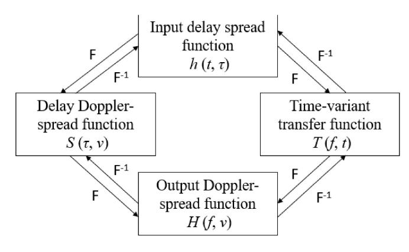

Fig. 11. Bello functions.

of several months, thus, making it impractical to be applied by itself.

## B. Stochastic Channel Modeling

Stochastic channel models, are ones that use empirical data to provide a statistical analysis of the channel by a spatio-temporal approach. These models are based on measurement campaigns and require much less complexity in terms of computing resource requirements compared to deterministic models. Although, measurement time to obtain good accuracy in the results is a limiting factor. Due to the higher order frequencies and larger bandwidths, wideband channels in the THz regime require multipaths to be resolved in the time domain. Narrow-band fading models such as Rayleigh and Ricean may therefore no longer be required and a statistical model that can generate the CIRs needs to be developed. Therefore, in order to model the wideband channel characteristics, this would require us to obtain the spatio-temporal characteristics of the propagation channel.

It can be considered that transmission is made from point to point and under the Wide-Sense Stationary Uncorrelated Scattering (WSSUS) assumption that was introduced by "Bello" in 1963 [95], that considers independently generated delay taps. A generalised form of the Bello functions can be seen in Fig. 11. The system function can be described as the Time-variant transfer function T(f, t), which is essentially a snapshot of the power distribution over the frequency points, as obtained directly from measurement. By taking the Fourier Transform of T(f, t), the Input delay spread function  $h(t, \tau)$ can be obtained, and by taking the spatial average over a local area, the Power Delay Profile (PDP) can be computed, which records power received over ToA of the different arriving MPCs, where each component represents a single channel delay tap. The length of the PDP can be calculated as the number of frequency points divided by the bandwidth. Key parameters that can be extracted from a PDP, include time dispersion parameters in the form of RMS delay spread that represents the average received power against time delay in relation to the first arriving MPC, and coherence bandwidth that describes the frequency range over which the propagation channel is considered to be flat. Another parameter that can be extracted from a PDP, is the Ricean K-factor, that can

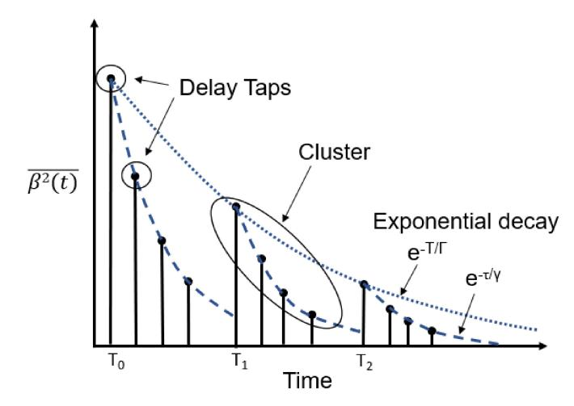

Fig. 12. SV model representing exponential decay of clusters and rays over time

be defined as the ratio of the most significant MPCs' average power and the average received power of all remaining MPCs. If  $h(t, \tau)$  is then Fourier transformed with respect to time, the Delay Doppler-spread function  $S(\tau, v)$  is generated, which allows for the Doppler spectra for each of the delay taps to be obtained. This is useful when analysing various AoA/AoD and their associated powers obtained from a Power Angle Profile (PAP) at different time shifts, that would indicate which scatterers in the environment affect the wave propagation significantly. Root Mean Square (RMS) angular spread is a spatial parameter that can be extracted from the PAP which describes the power arrival dispersed over the angles of incidence the antenna is being varied. Finally by Fourier transforming either  $S(\tau, v)$  or T(f, t) with respect to  $\tau$  or t, respectively, this then gives the output Doppler-spread function H(f, v) that demonstrates the Doppler spectrum related to each frequency component. The parameters extracted from the above functions, are used to provide information for the design of transmitters and receivers that can overcome the effects of ISI, fading and aid in equipment calibration as well as in equalization processes.

Furthermore, clustering behaviour is observed when the arriving MPCs or otherwise intra-cluster components have similar distributions in terms of ToA and AoA/AoD. Saleh and Valenzuela [165] proposed a widely acceptable NGBSM known as the Saleh-Valenzuela (SV) model that provides a cluster based impulse response based on reflections from different surfaces, where MPCs are modeled as delay taps. It assumes that MPCs vary uniformly in phase and have powers that are Rayleigh distributed and which decay exponentially based on a Poisson distributed ToA of MPCs and clusters. Fig. 12 shows the SV model's impulse response that represents the mean square power  $(\beta_2(t))$  over time where clusters are seen to decay with a rate of  $\Gamma$  with cluster arrival time  $T_l$  for l = 0, 1, 2... and MPCs are seen to decay with a rate of  $\gamma$  with MPC arrival rate  $\tau_{kl}$ , where k is the MPC arrival time for k = 0, 1, 2... within the  $l^{th}$  cluster. Extensions of the SV model have already been developed at lower frequencies [179], [180], [181] to account for cluster

AoA in addition to its temporal behavior. Thus, PDP and PAP measurements may also be used as a basis from which the SV model can be applied at THz to fit and verify the resultant clustering behavior. The SV model has been applied successfully in modeling the clustering behavior of indoor environments by also associating clustering with AoA/AoD in azimuth and elevation through spherical coordinates, and was verified by empirical measurements conducted indoors at 300 GHz [182]. Furthermore, a modified version of the SV model was employed in [183] to characterize the indoor THz channel in the presence of antenna subarrays, validated based on measurements from [184] at 300 GHz, that considers the cluster arrival time and ray arrival time within each cluster as a function of the number of elements of the subarray. Moreover, the modified model not only considers the spreading loss as the conventional approach, but also caters for transmission behaviors by accounting for the effects of molecular absorption where  $\Gamma$  and  $\gamma$  are material dependent. A clustering model as a modification of the SV model was presented in [147] for wireless data centres, where contrary to the traditional SV assumption, it was proposed that since  $\Gamma$  cannot accurately predict MPC cluster attenuations, that it is further separated in  $\Gamma_1$  and  $\Gamma_2$  as functions of time delay, with a selected threshold value acting as a node from which  $\Gamma$  can be selected based on the distribution of MPC clusters.

The Zwick model [14], is another NGBSM that is applicable for indoor as well as MIMO channel characterization, that considers physical wave propagation properties and characterizes MPCs by a transfer matrix  $(\Gamma_i(t))$ , that includes the losses, delay  $(T_i(t))$ , direction of arrival  $(\Omega_{T,i}(t))$ , direction of departure  $(\Omega_{R,i}(t))$  and scattering properties. The Zwick model's non-geometric approach, can be attributed to the use of a spherical coordinate system, by which the locations of the receivers are stochastically generated whenever the direction of motion changes as observed by the variations in AoA and AoD. It allows for parameter extractions for a range of frequencies and environments, where the evolution of MPCs over time is characterized using a Birth-Death (BD) process, a marked Poisson process. The model has been verified in the mmWave bands [185], and is therefore potentially applicable at THz.

GBSM models, can be categorized based on scatterer arrangement, with respect to the number of dimensions of the antenna element configuration. Based on the environment characteristics, GBSMs can be divided into regular and irregular shape GBSMs, where effective scatterers are assigned to regular shapes in the form of one-ring, two-ring and elliptical distributions and irregular shapes follow a random distribution [186]. These schemes are the most effective and reliable as they are highly robust against link and network failures. The one-ring model, may be applicable for MIMO channel modeling and is particularly effective for describing environments related to backhaul applications where the base station is located at a height without any obstructions and the access point is surrounded by scatterers, while the tworing and elliptical models become relevant in indoor cases for 6G networks where a large number of scatterers are present on both sides of the communications channel. Other common backhaul topologies include the star, chain and tree topologies which are inferior to the ring topology. The star typology's inferiority, can be attributed to poor frequency reuse, since all the links arise from the same point, making signal interference far more likely to occur. While the chain topology solves the problems related to the star topology where all Rx sites are connected together via a single path, it is disadvantageous due to the fact that when one link fails, the adjacent link will also fail, resulting in a complete network failure. A tree topology is formed as a mixture of the chain and star topologies where fewer links are prone to failure and require protection.

In order to analyze the multipath behavior within individual clusters, a second order profile for exponentially distributed multipaths such as the Gaussian Mixture Model (GMM) [184], [187], which is a cluster oriented GBSM that can be adopted for approximating AoA/AoD standard deviation PDFs of different materials, with  $\bar{X}_1 = \bar{X}_2 = 0$ , and for identifying similarities between the different MPCs within a cluster or otherwise inter-cluster components. A generalized representation of a cluster based GBSM is depicted in Fig. 13 that shows a collection of rays being launched from the Tx with similar AoD, reflected at the surface of a scatterer and detected at the Rx at some AoA and ToA. As per Eq. (12),

$$\sum_{n}^{M} \left( \alpha_{\mathrm{Tx}}^{I} \right) \left( \alpha_{\mathrm{Rx}}^{2} \right) \left( e^{\mathrm{j}\,\theta_{n}} \right) \left( e^{\mathrm{j}\,\phi_{n}} \right) \left( e^{\mathrm{j}\,\omega_{\alpha}} \right) \quad [\bar{\Phi}] \tag{12}$$

these individual rays n are summed up to form a single cluster with a phase at the Tx  $(e^{\mathrm{j}\,\theta_n})$  and mean AoD of  $\theta$ , and phase at the Rx  $(e^{\mathrm{j}\,\phi_n})$  with mean AoA of  $\phi$ , where the total number of rays is denoted as M. Then by computing the gain of each individual ray at the Tx  $(\alpha^1_{\mathrm{Tx}})$  and Rx  $(\alpha^2_{\mathrm{Rx}})$  sides as a function of polarization  $\bar{\Phi}$ , a single complex number is formed representing a single delay tap of the multipath channel, where the real and imaginary parts are Gaussian distributed and therefore the single complex number formed is Rayleigh distributed. The Doppler effect could also be accounted for by adding the term  $e^{\mathrm{j}\,\omega_\alpha}$  to the equation where  $\omega$  relates to the Doppler frequency.

In [188] a GBSM was proposed for indoor AP deployment at 300 GHz to address the explicit relationship between amplitude and AoA for LoS and NLoS paths of indoor channels, by employing a zero-mean second order GMM that relates rough material surface scattering interactions to cluster amplitudes obtained via calibrated RT simulations. The model considers AP's located on the ceiling to guarantee the LoS path, and identifies the shortest NLoS path and its power for each subsequent receiver locations. Similarly, in [183] a zero-mean second order GMM is employed to model the relationship between AoA and amplitude in an indoor scenario at 300 GHz and has been found to provide a more accurate approximation with higher angular resolutions for the propagating wave, especially for smaller angles in comparison to the SV model. Furthermore, Tekbiyik et al. [189], presented modeling and analysis of short-range THz propagation channels, by utilizing a Gamma mixture for parameter estimation in comparison to GMM, based on results collected from measurements in the 240-300 GHz band. Gamma mixture models consider a

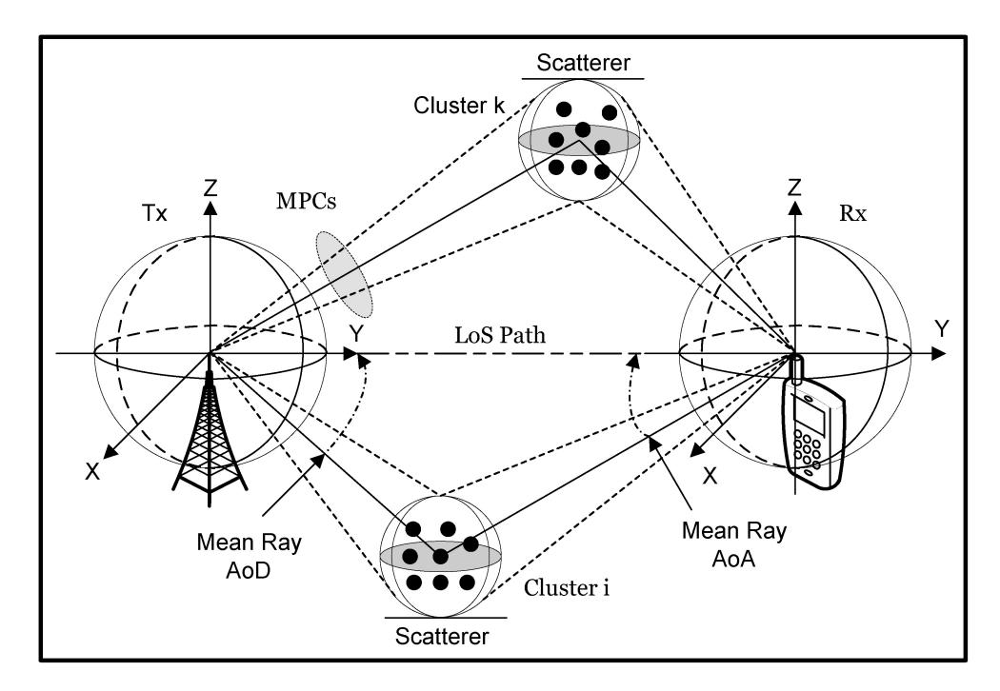

Fig. 13. The cluster oriented GBSM.

TABLE VII STOCHASTIC CHANNEL MODELS WITH POTENTIAL APPLICABILITY AT THZ FREQUENCIES

| Model                               | Approach | Freq. (GHz) | Base Equation                                                                                                                                                                                  | Ref.         |
|-------------------------------------|----------|-------------|------------------------------------------------------------------------------------------------------------------------------------------------------------------------------------------------|--------------|
| Tapped delay line model             | GBSM     | 625         | $p(\tau) = \frac{E[ h(t,\tau) ^2]}{2}$                                                                                                                                                         | [95], [137]  |
| Saleh-Valenzuela Model              | NGBSM    | 350         | $\overline{\beta^2(t)} = \overline{\beta^2(0,0)} \sum_{l=0}^{L} e^{-T_l/\Gamma_e - (t-T_l)/\gamma} U(t-T_l)$                                                                                   | [165], [182] |
| Zwick Model                         | NGBSM    | 60          | $T(t,f) = F_{TR}(f).\sqrt{G_T(t,f)G_R(t,f)}.$                                                                                                                                                  |              |
|                                     |          |             | $\iint C_R^T(t, f, \Omega_R) . T_{TR}(t, f, \Omega_T, \Omega_R)$                                                                                                                               |              |
|                                     |          |             | $.C_T(t,f,\Omega_T)d\Omega_Td\Omega_R.$                                                                                                                                                        | [14], [185]  |
| Zero-mean 2 nd order GMM | GBSM     | 300         | $GMM(x) = \frac{a_1}{\sqrt{2\pi\sigma_1}} e^{-\frac{1}{2} \left(\frac{x - x_1}{\sigma_1}\right)^2} + \frac{a_2}{\sqrt{2\pi\sigma_2}} e^{-\frac{1}{2} \left(\frac{x - x_2}{\sigma_2}\right)^2}$ | [187], [188] |
| Gamma Mixture Model                 | GBSM     | 312         | $f_G(x) = \sum_{l=1}^{L} P_l f_l(x, a_l, \beta_l), l = 1, 2L, x > 0, p_l > 0$                                                                                                                  | [189]        |

random variable (G) that is a mixture of (L) gamma distributions considering the shape  $(\alpha_l)$  and scale  $(\beta_l)$  parameters of the lth component of the mixture distribution, while considering weights  $(\rho_l)$  that satisfy certain conditions. GMM has found to describe the propagation channel as well as the Gamma mixture model for various propagation distances; however, the Gamma mixture has shown a more close relationship between the actual probability distribution and predicted distribution of powers. The Gamma mixture model has also been employed successfully in characterizing the shadowing effects caused by multipath scattering in intra-device link scenarios by modeling the PDF of the path loss fluctuations in [190], considering the large bandwidths and sudden changes in the THz communications channel. Table VII shows existing stochastic models presented so far, detailed mathematically for wider applicability and comparative analysis, and shows the maximum frequency for which they have found applicability in characterizing THz propagation for the envisioned applications.

The first stochastic channel model for kiosk applications was developed in [21] as part of the IEEE IEEE80.15-16-0168-02-003d standard as detailed in [191], based on three distinct geometrically derived configurations in relation to the Tx and Rx with varying positions, in order to enable fast impulse response generation to allow for an efficient characterization and fair comparison in relation to angular and temporal multipath distributions for each scenario. Peng and Kürner [192], presented a stochastic channel model for wireless data centers at 300 GHz that is included in the IEEE 802.15-15-0207-003d standard [191], and validated through delay and angular spreads by calibrated RT simulations from [149]. The model considers LoS and NLoS paths, delay and angle path loss correlations as well as phase and frequency dispersion. Boujnah et al. [193], proposed a stochastic channel model including a link quality assessment procedure for wireless data centre environments at 300 GHz. The model assumes a uniform rack placement topology, where nodes are placed on top of the racks and THz reflectors are

placed on the ceiling, to reduce the effects of blockage and interference, and enable connections between non-neighboring nodes via secondary paths. Parameters considered in the channel model include spreading, molecular losses, reflections and additive noise. Furthermore, the model caters for appropriate waveform selection, pulse and symbol durations that are tuned to reduce the system interference and optimise the link quality. Simulations of the proposed topology, show that it is possible to deploy THz communications within a data centre, free of significant interferers and with enhanced connectivity. In [\[194\]](#page-38-20) a stochastic model for indoor radio channels at 300 GHz is presented, that was verified by calibrated RT simulations in an office scenario. The model developed, considers altogether propagation in the temporal, angular and frequency domains in the form of ToA, AoA/AoD, frequency dependent phase rotations and dispersion. The model developed allows for stochastic simulation generation under realistic conditions, and caters for multiple antenna concepts. A stochastic model has also been developed for 270-320 GHz based on the IEEE 802.15-15-0166-00-003d standard [\[191\]](#page-38-17). The model considers LoS and NLoS links in a predefined configuration for boardto-board communications and evaluates the effects walls and printed circuit boards have on the received signal.

## *C. Combined Stochastic-Deterministic Channel Modeling*

Now what seems to be happening at THz, is that a hybrid modeling approach, that is, a combination of both deterministic and stochastic methods is currently being preferred. To capture the received power at every point in space and time, channel sounding at THz often makes use of mechanically translational and rotational antennas; though, taking a very large sample of measurement data is often extremely time consuming and modeling the environment in a stochastic manner with high levels of accuracy is extremely difficult. Therefore, in order to extend the sampling intervals within a 3D environment to further extract the statistical behavior of the channel, software simulators are employed, which by themselves often appear rather simplistic due to lack of knowledge of the propagating environment and limited computational resources. When empirical measurements are conducted, there are often different components and effects that appear, which are not captured by RT simulators such as dense MPCs. Thus, by feeding the stochastic channel generator a set of empirical data, it can be then calibrated by replicating this data through extensive simulations to enable a much larger data set as an extension to the limited data sets collected by measurements.

The high frequency selectivity at THz means that the propagation channel is quasi-optical by nature. This quasi-optical behavior, indicates that image based RT can constructively predict the spatio-temporal characteristics of the wave propagation and can therefore assist in quasi-deterministic channel modeling [\[195\]](#page-38-21). The Quasi-Deterministic modeling approach, that was adopted as part of the MiWEBA project framework for backhaul and access [\[196\]](#page-38-22) based on a predefined network layout, allows for stochastic cluster formation consisting of the most significant MPCs and provides a geometric description of the propagation environment, considering factors such as attenuation, reflection and scattering as well as blockage and mobility effects. An alternative to the cluster formation can result from use of RT to provide a mathematical center for the most significant MPC without the MPC actually needing to be present at that specific location.

A number of stochastic THz channel generators have so far been developed, that are accessible to the research community. The most widely employed stochastic simulator is known as cloudRT [\[167\]](#page-37-35), which is an open source simulator that focuses on THz 6G applications. Particularly, it is a 3D RT high performance cloud based simulator, that is calibrated based on measurements conducted for various railway scenarios [\[154\]](#page-37-22), [\[156\]](#page-37-24), V2V scenarios [\[197\]](#page-38-23), [\[133\]](#page-37-1) as well as indoor scenarios [\[21\]](#page-34-20) [\[123\]](#page-36-36) at 300 GHz. The calibration process is used to form material libraries that consider constant EM properties along the material, based on interactions with various scatterers found in the propagation environment, which can then be employed in different environments to emulate different THz application scenarios. The Terasim stochastic simulator [\[198\]](#page-38-24), is built as an extension to the ns-3 network simulator, that offers physical and link layer implementations. It captures the peculiarities of the THz channel for nano-scale and macro-scale scenarios in terms of LoS propagation, in relation to the effects of molecular absorption and allows the users to perform network selection and spectrum allocation. It fails however, to address mechanisms such as NLoS propagation, misalignment and propagation based on multiple antennas in relation to beamsteering, beamforming, the spherical wave model, and does not provide an end-to-end model. The most recently developed channel simulator Teramimo [\[199\]](#page-38-25), that is a GUI based simulator, offers 3D end-to-end modeling for wideband UM-MIMO propagation channels. It caters for the effects of LoS, NLoS, beamsteering, spherical wave propagation, fading due to misalignment, and molecular absorption by complex radiative transfer theory computations following the mathematically exhaustive beer-lambert law up to 10 THz with valid approximations up to 450 GHz. Furthermore, it incorporates capacity calculations and is verified against measurement based channel models found in the literature. An automatic planning algorithm for backhaul links is presented in [\[200\]](#page-38-26) that uses data based on the IEEE 802.15.3d standard [\[191\]](#page-38-17). The planning tool employs the ring topology GBSM, and enables system level simulations at 300 GHz. It is seen as a successor to the previous proposed common backhaul topology known as star topology [\[24\]](#page-34-23) due to its superior performance. The tool considers LoS links under the effects of molecular absorption and the performance is analyzed in terms of SINR, while it evaluates the number of links that can reach the required SINR for wireless operation for eventual fiber optic replacement. This tool however does not consider NLoS links, which can be seen as a further enhancement. Furthermore, QuaDriGa [\[201\]](#page-38-27) is a quasi-deterministic stochastic channel generator that contains modules which enable the implementation of 5G standardised stochastic models such as 3GPP as well as map-based models etc. Recently, it has been shown that it can be successfully employed in the THz bands and has proven to be particularly successful in characterizing various railway scenarios such as the T2I and inside station channels with a compliant framework at 300 GHz, being validated by measurement data and cloudRT simulations [\[154\]](#page-37-22).

## *D. Discussion*

In 6G communication networks, the THz band will play a major role and will be employed for various applications that have been identified, and which vary by transmission range and propagation environment. Different modeling techniques such as deterministic and stochastic, each possess their own advantages and disadvantages. Deterministic models can provide highly accurate results but have to endure long processing times and a high computational burden, while they don't cater for the dynamic behavior of the channel. Examples as such include RT and ray launching simulators employed to model any application environment, whether it consists of indoor environments (e.g., office, conference rooms or kiosk downloads) or outdoor environments (e.g., HST and V2X applications). These methods are usually calibrated by measurement data as a hybrid stochastic form of modeling in order to reduce the computational resource requirements, by which the materials the waves interacts with are characterized before being used in simulations to obtain the propagation characteristics of the propagation environment under consideration, for a given application scenario. On the other hand, the FDTD method provides more accuracy in comparison to the other deterministic methods and is mainly applicable in modeling complex structures in wideband frequency ranges. This allows for better characterisation of the scatterers present in the environment and highly applies for indoor THz applications where the amount of scatterers is large and where interaction with them cannot be avoided, as not only the received signal is subject to additional propagation paths, but is expected to be utilized to contribute in some cases (e.g., data centre communications) by D-NLoS reflections. Stochastic models can provide a statistical description of the environment, though uncertainty in the developed model is obvious, due to lack of knowledge of the propagation environment and due to the limited channel sounding opportunities that ensue channel sparsity as a result of the high directionality of the THz wave. Most of the stochastic models applied follow the WSSUS assumption, and make use of the Bello functions to analyze the channel and obtain its characteristics. NGBSMs such as the SV model, have been rigorously tested for high frequency applicability at THz to model the clustering behavior, while the Zwick models' spherical coordinate approach allows for cluster evolution to be captured. GBSM approaches such as the GMM, are applicable in indoor environments to model multipaths within individual clusters, while recently it has been shown that Gamma mixtures outperform GMM. The star network topology GBSM seems the most robust in modeling Backhaul applications in comparison to chain and tree topologies and can be employed in simulators to generate the stochastic configuration and evaluate the SINR of the channel.

# VII. THZ CHANNEL CHARACTERIZATION FOR 6G APPLICATIONS

In this section, the channel characteristics for each of the application scenarios identified in the THz band are presented in relation to the propagating environment under consideration, and the key findings are discussed. The channel characteristics presented, include fading characteristics such as path loss, and dispersion characteristics that affect system design such as delay spread, angular spread, coherence bandwidth and K-factor.

*1) Short-Range Channels:* Song *et al.*, presented a VNA based channel measurement campaign for the kiosk downloading scenario at 240-320 GHz [\[143\]](#page-37-11). Initially, free space loss exponents were measured within the range of 1.8-2.3 for the entire frequency band. Due to the cavity effect between the transmitter and the housing package employed to emulate the kiosk, three late multipaths arrived that were almost eliminated when the housing of the receiving antenna was tilted. The BER was then measured against separation distance between the Tx and Rx, where 20 Gbps error free transmission was achieved over 1 m. He *et al.* [\[21\]](#page-34-20), [\[141\]](#page-37-9), obtained channel characteristics in the 220-340 GHz band for 3 different Kiosk downloading scenarios, (i) LoS propagation, (ii) propagation where the transmitter side window is tilted and (iii) when the receiver and receiver window are tilted at the same angle. For scenario (i), three secondary reflections arrived, that contributed to ∼ 30% of the overall signal strength, along with minor fourth order and sixth order reflection contributions. For scenario (ii), many of the reflected paths where suppressed, with second order reflections contributing to about 8.82% of the overall signal strength along with negligible fourth order reflections, while for scenario (iii), multipath propagation was essentially eliminated. In terms of RMS delay spread modeling, average values were seen to decrease, with values of 0.39, 0.22 and 0.12 ns, while average Rician K-factor values increased, with values of 14.91, 22.13 and 26.07 dB, for scenarios (i)-(iii), respectively.

Kim and Zajic [ ´ [144\]](#page-37-12) presented a statistical characterization for propagation channels on-board a desktop in the 300-320 GHz band for LoS and NLoS communication scenarios. For the LoS scenario, the path loss was found to increase significantly with frequency without following the theoretical Friis prediction due to losses in the transceiver. For the NLoS scenario in a specular configuration, the path loss from reflection off an FR-4 substrate and plastic material showed close match to theory, while reflection off a metal, strangely, showed an additional loss of 5 dB. For the LoS scenario, the delay spread followed a normal distribution over all measurement distances with values ranging between 4.35 to 484.94 ps, and coherence bandwidth values between 36.6 to 0.328 GHz. The results showed an increase in delay spread with an increase in path loss. For the NLoS scenario, delay spreads of 210, 187 and 227 ps, as well as coherence bandwidths of 0.757, 0.85 and 0.701 GHz were measured. In terms of multipath propagation, any components were seen to diminish by including absorbers. Short-range characterization was further extended to a carrier frequency of 625 GHz with 250 GHz bandwidth to investigate the channel properties in the ultra-wideband [\[137\]](#page-37-5) for the on-board desktop scenario. By analyzing the PDP, three delay taps were seen to arrive, lagging the main component by ∼ 1.34, ∼ 1.74 and ∼ 2 ns with decreased powers of about 30 dB, which were calculated to be losses by reflections off the desk, the frequency extenders as well as from the VNA.

From the above it can be concluded, that for the Kiosk download scenario, the presence of a front cover window for LoS cases, would induce multiple order reflections with paths arriving after the main component. Wave propagation would benefit by tilt of the transmit antenna as well as tilting of the front cover window to suppress these reflections. Furthermore, due to constraints on the experimental equipment that require housing to emulate the kiosk system, measurements at different angles in azimuth and elevation have not been realized and require further consideration. on the other hand, communications on board a desktop, between devices such as laptops PCs and routers, do not suffer from packaging constraints but the height of the antennas and surrounding equipment would cause secondary components reflecting off the desk and surrounding scatterers, and must therefore be carefully positioned in close proximity to minimise the losses resulting from multipath scattering.

*2) Data Center Channels:* Cheng *et al.* [\[145\]](#page-37-13) presented a THz MIMO channel sounding measurement campaign in a data centre like environment at 300-312 GHz for the LoS and Obstructed-Line-of-Sight (OLoS) propagation scenarios, where cables were considered as the obstructions, with measurements conducted for separation distances between 40-100 cm. Path loss exponents were measured around 1.9 for both scenarios, shadowing gain was measured as 0.06 and 2.6 dB, for LoS and OLoS, respectively, while delay spreads were seen to be log-normally distributed. Moreover, Cheng *et al.* [\[146\]](#page-37-14), presented an amplitude fading analysis for a 4×4 system using a virtual uniform linear array configuration for the 300-320 GHz band for an OLoS scenario with stationary cables, as well as Doppler modeling for a scenario with vibrating cables due to the effect of cooling airflow turbulence. For the first scenario, at a Tx separation of 15 cm, the calculated mean path loss was measured at −87.75 dB and the logarithmic standard deviation of the shadowing gain at 6.03 dB. The RMS delay spread was calculated to have a mean value of −94.13 dB and standard deviation of 2.31 dB. For the Doppler analysis related to the second scenario, the max Doppler frequency observed was 56.1 Hz, corresponding to a scatterer velocity of 5.61 cm/s.

In addition, Cheng *et al.* [\[147\]](#page-37-15) extended their analysis in the 300-312 GHz band in a real data centre environment, with servers and racks at larger distances in comparison to previous campaigns for the scenarios of (1) server to server LoS link, (2) OLoS link between mesh door and cables, (3) NLoS link by reflection, (4) Obstructed-Non-Line-of-Sight (O-NLoS) obstructed by mesh door and server rack, and (5) LoS on top of a cooling grill. Measured average path losses and delay spreads at 175 cm were 57.7, 63.4, 78.4, 84.4 dB and 0.295, 0.113, 0.372, 0.299 ns for (1) door open, (2) door closed, (3) door open and (4) door closed, respectively. Some multipaths could be seen for cases (1)-(4), 20-40 dB weaker than the main peak. The impact of cooling on air flow was found to be negligible. Furthermore, a clustering analysis was performed, where the average Poisson distributed arrival rate (λ) was found to be 1.64, with a mean number of clusters (*N*cluster) being 2.64.

Most recently, Cheng and Zajic [ ´ [22\]](#page-34-21) presented a characterization of propagation phenomena for the cases of (i) Rack-to-Rack (R2R), and (ii) Blade-to-Blade (B2B) links in a wireless data centre at 300-312 GHz. The different scenarios considered include LoS, OLoS, Reflected-Non-Lineof-Sight (R-NLoS), Obstructed-Reflected-Non-Line-of-Sight (OR-NLoS) propagation for each of the two cases. For R2R LoS and R-NLoS, path loss values for 50-210 cm distances, ranged between 50-64 dB. PDPs measured showed the presence of multiple weaker reflections. For B2B R-NLoS and OR-NLoS cases, the path loss was seen to fluctuate as distance increased, while misaligned reflectors caused an additional path loss of 4 dB above Friis' values. Furthermore, the B2B OR-NLoS link showed that cables as obstruction can increase path loss by around 5–10 dB as opposed to the R-NLoS case. R2R OLoS and R2R OR-NLoS Links showed an additional 5-10 dB path loss in the presence of obstructing cables, while OR-NLoS was seen to outperform the OLoS link with 2.5 dB weaker shadowing gain and weaker multipath. Measured PDPs for B2B R-NLoS and B2B OR-NLoS at 24, 32, 42 cm distances showed a cluster forming at twice the main components delay, which for the OR-NLoS case, diminished in the presence of cables.

Despite the previously mentioned efforts, Eckhardt *et al.* [\[142\]](#page-37-10) conducted their own measurement campaign at 300 GHz in a real data centre. Reflections off the racks showed two components arriving after the main peak, being just ∼ 5 dB weaker in strength. Measurements were also conducted between curtains that connect the server racks to the ceiling, where the signal underwent an additional attenuation of 7 dB. Furthermore, specular reflections were measured through consecutive rows of curtains were the power reflected by the second and the third rows decreased by 11.4 and 17.7 dB, in comparison to the specular reflection resulting from the first row, with a distance between the curtains of 4.114 m and 1.890 m, respectively.

From the above findings, it can be said that propagation within data centres can be considered as a complex scenario due to many peculiarities found in the propagation environment. The presence of cables and mesh doors acting as obstructions in the propagation environment cause additional losses. D-NLoS links can heavily contribute to the received power, inducing minor losses compared to the LoS links by a few dB, indicating that they can be employed to efficiently contribute to the received signal without the need for expensive technologies such as RIS. Cabled obstructions have been observed to reduce multipath propagation as a trade off for weaker received power from the main component. Finally, turbulence due to airflow causing cable vibrations, may induce Doppler shifts that may negatively affect post processing of the received signal.

*3) Intra-Device Channels:* Kim and Zajic [ ´ [148\]](#page-37-16), presented channel characteristics of propagation on a computer motherboard at 300-314 GHz. Five different scenarios were considered, (i) LoS with a large ground plane, (ii) LoS with Tx/Rx height variation, (iii) R-NLoS via vertically placed components, (iv) OLoS, i.e., between two vertically inserted components, and (v) NLoS via a heat sink and rotating fan. Path loss for (i) was found ∼ 4 dB above Friis' prediction, while for (ii) at 0.8 cm and 2.1 cm Tx/Rx variation, path loss was similar to the theoretical value. All path losses across the entire frequency range were seen to fluctuate with up to 5 dB variations. RMS delay spread values and coherence bandwidths were recorded as 118, 137, 161 ps and 1.35, 1.16 and 0.99 GHz for Tx/Rx height variations of 0, 0.8 and 2.1 cm respectively. For scenario (iii), a RAM card was considered as the reflector, where the highest path losses of  $\sim 30 \text{ dB}$  above the Friis' theoretical value were found for angle deviations of  $48^{\circ}$  and  $36^{\circ}$  and the lowest path losses of  $\sim 7$  dB above theory for angles of 40°, 42°, 44°. The PDPs for various Tx/Rx separations showed a relationship between multipaths arriving at longer delays with greater height variations due to the longer path lengths. For scenario (iv), path loss was seen to increase with an increase in Tx/Rx height separation as a result of longer path lengths. Finally, for scenario (v) and for different Tx-Rx separation distances, the path loss observed was less than Friis' prediction due to constructive interference between the LoS path and multiple bounces, besides the halfway offset point, where destructive interference caused the path loss to be above Friis' prediction.

Fu et al. [23], presented channel characteristics for measurements conducted within a desktop size metal enclosure (30.5 $\times$ 30.5× 10 cm) at 300 GHz. Five distinct propagation scenarios were considered, (i) LoS, (ii) R-NLoS with and without memory card as the reflector, (iii) OLoS with parallel plate structure as the obstructor as well as (iv) NLoS with heat sink as the obstructor, and finally, (v) LoS over an FPGA board. For (i), with Tx/Rx height variations < 1.8 cm, the path loss was less than Friis' theoretical value, while for variations >1.8 cm, they were in line with Friis' value, with fluctuations of 3-4 dB across the entire frequency range. The PDP for an empty enclosure showed several clusters of multipaths arriving within 2.05 ns after the main component due to the signal bouncing around the enclosure. For scenario (ii), the path loss decreased by about 15 dB with the presence of the card, while the more rough side of the card showed 5 dB greater path loss than the flat side. From the PDPs, the rough side showed multipaths arriving 1.17 and 2.05 ns later and for the smooth side, multipaths arrived 2.05 and 4.09 ns later. Delay spread values of 0.1251 and 0.0618 ns and coherence bandwidths of 1.273 and 2.576 GHz were recorded, for the flat and smooth side, respectively. For scenario (iii), path losses for 4 cm plate separation were less than Friis' value, while for > 4 cm, they were aligned with theory. Coherence bandwidth with increasing distance separations tended to zero, while delay spreads increased from 0.07 to 0.4 for 2 to 7 cm distance separation between the plates. Five late arrival peaks were observed from the PDP for all plate separation distances. For scenario (iv), a destructive effect due to propagation within the fins of the heat sink and constructive effect when reflected off the fins, and the path loss was lower than theory due to a waveguiding effect in the first case and due to resonating modes in the second case. Finally for scenario (v), the path loss was aligned with Friis' theoretical value with four delay taps occurring after the main peak.

Very recently, Fu et al. [190] aimed at addressing outstanding issues that have not been considered in prior works, conducting measurements between 300-312 GHz,

considering the effects of circuit boards and motherboards placed within the metal cavity in comparison to the freespace case without the metal cavity. The scenarios considered, include (i) LoS over the motherboard, (ii) R-NLoS with memory card as the reflector, (iii) OLoS with two parallel memory cards as the obstructors, (iv) NLoS with a heat sink as the reflector and finally, (v) a practical CPU-PCI link. For scenario (i), measured path loss between 0 and 2.4 cm followed theory, except for heights of 0, 0.6 and 1.2 cm where additional attenuations of 2-3 dB were caused in free space as well as due to reflections from the motherboard and resonances in the presence of the cavity. For the free-space case in (i), a single large multipath cluster was seen, while in the presence of the cavity, multiple reflections caused additional MPCs. For scenario (ii), considering both sides of the reflecting card, the path losses with and without the cavity were found greater than Friis' prediction, with the rough side showing the largest path losses. From the PDPs, two late clusters were observed in free-space due to reflections from back panels, while in the presence of the cavity, four late arriving clusters were observed, due to the side wall and bouncing off the cavity. For scenario (iii), by varying the distance between the obstructing plates, the path loss followed the Friis prediction, except at 2 cm separation for both cases with and without cavity, due to destructive interference causing additional losses of 10-15 dB above theory, with heavy fluctuations in free-space, and a linear increase with additional losses of 3-8 dB with the cavity. The PDP in free-space showed multipaths resulting from bounces between the back panels and the PDP with the cavity showed late arriving clusters due to bounces resulting from the metal cavity. For scenario (iv), all measured path losses were above Friis' prediction with heavy fluctuations, especially for the case with the metal cavity. The PDP in free-space showed three late arriving clusters due to an extra propagation distance between the heat sink and back panel as well as distance between back panels and antennas, while the PDP with the cavity, again showed multiple clusters arriving late due to the signal bouncing around the cavity. Finally, for scenario (v), strong fluctuations were seen on the path loss which was above Friis' prediction for both cases, with additional losses between 15-25 dB. PDPs showed similar behavior as before, with two clusters arriving in free-space due to reflections from the back panels and multiple late clusters arriving for the case with the cavity, resulting from reflections from the sidewalls.

From the above findings, it is apparent that for the case of propagation within a metal enclosure, additional multipaths would be expected resulting from reflections in comparison to free space, while cavity resonances may cause additional losses and fluctuations. NLoS links were seen to have the highest path losses from the scenarios considered, while proper placement in terms of height of the antennas are required to minimise losses in LoS links, where even lower values than Friis' predictions can be achieved. Propagation between parallel plates in the OLoS case or in any other similar case, could benefit from the small wavelength as such to form a waveguiding effect that would ultimately increase the received power. Furthermore, components such as RAM cards showed that additional losses and multipaths can be expected and

require further characterisation in terms of roughness for the R-NLoS case. Moreover, devices such as heat sinks, as well as back panels contribute to additional late multipaths arriving for R-NLoS propagation. By proper placement of the antennas, losses can be minimized in order to eventually achieve extremely large data rates, given that atmospheric losses at these distances are negligible. Generally, due to the confined space and small wavelength of the THz wave, clusters of multipaths were formed, and broadened peaks were observed due to diffuse reflections occurring from the roughness of the components. Lastly, it can be said, that the aforementioned results are adequate in characterizing intra-device channels at 300 GHz and can be used as a basis for characterizing intra-device channels in higher frequency bands.

4) Backhaul/Fronthaul Channels: Based on current demonstrations, measurement distances up to 120 m can be realized using the RFoF technique, and thus realistically, the envisioned application of backhaul/fronthaul must be within that range. At 300 GHz, the signal traveling at LoS, will experience atmospheric attenuation losses of  $\sim 4\text{-}5$  dB at 1 km, which means that at a distance of 120 m, the attenuation formed will be  $\sim 0.5$  dB. The main signal attenuation for this case, is the FSPL which is  $\sim 15$  dB. Depending on the height of the Tx and Rx, the propagating wave may experience the effects of rain that can induce an additional attenuation of  $\sim 2.5$  dB for extreme rain conditions at 300 GHz, while the effects of fog, are small enough (< 0.1 dB) that can be neglected.

Since measurement range capabilities are limited based on the current technological advancements, automatic planning algorithms based on network topologies are employed, that consider realistic propagation environments with obstructions, to help identify possible wireless connections in order to evaluate the SINR characteristics of the propagation channel and achievable data rates. For example, in [200], a realistic complex scenario of a dense cellular network in Hanover, Germany was considered for 300 GHz, with an average link distance of 144 m, an antenna gain of 50 dBi and varying meteorological conditions. The tool considers the maximum achievable distance of a wireless link, and assumes an LoS condition with a safety margin in terms of angular displacement for the case where the antennas are not perfectly aligned. Comparing the two network topologies, namely, ring and star, the former results in twice the number of established connections in comparison to the later one. The SINR values of all the links in the ring topology are seen to mostly exceed 22 dB with less than 1% failures, while 90% of the links in the star topology do not exceed 22 dB. These results were generated considering a 5 GHz bandwidth and 50 GHz bandwidth for the worst case conditions of signal attenuation.

Automatic planning simulation tools are extremely important when designing communication systems to operate for backhaul/fronthaul applications. It has been observed that even with extreme weather conditions, link stability is maintained, with the ring topology posing as the best choice due to the improved SINR of the channel, and therefore the feasibility of such systems is proven to be a solution for fibre-optic cable replacement. Furthermore, outdoor measurements at 300 GHz

and above are missing from literature and must be further explored to verify the applicability of these tools, and allow for a much larger propagation characterization, that would improve communications system design for backhaul/fronthaul applications.

5) WLAN Channels: Priebe et al. [149] investigated the propagation channels' characteristics at 300 GHz within a small indoor office room of size 2.43 × 4.15 m for various AoA and AoD for both the Tx and Rx, to emulate fixed PtP communications between a mobile device and an access point. For the direct LoS path, a deviation of about 3.9 dB was observed between measurement and theory for a 1.67 LoS link, while similar losses can be assumed due to misalignment for the D-NLoS case. For various combinations of AoA and AoD, corresponding to reflections off a wall, wardrobe and door, the PDPs demonstrated that the NLoS component provides insignificant contributions to the received power. The only multipaths that occured were for the LoS case when varied is small angular steps up to  $5^{\circ}$  to cater for misalignment effects, which nonetheless, were seen to be very weak. Additional losses in addition to Friis' predictions were recorded between 13.9 and 30 dB, as well as between 29.7 and 52.7 dB for the primary and secondary paths, respectively. RMS delay spread values were calculated, and ranged between 72.1 to 127.5 ps and 112.1 to 117.2 ps for the primary and secondary paths, respectively. For the LoS case, the RMS delay spread was recorded as 16.5 ps.

Priebe and Kurner [194] provided a statistical analysis for an indoor propagation channel at 275-325 GHz for a realistic office room of size  $3.59 \times 45.2 \times 2.82$  m that consisted of wardrobes and tables. The scenario was intended to emulate the case of communications between an access point below the ceiling in two different locations, one in the centre and one in a top corner, and a user device at different locations. Double directional data were recorded by varying the Tx and Rx in azimuth and elevation. In terms of LoS propagation for first and second order reflections, the Gaussian distribution was found to fit well the relative amplitudes and amplitude differences, while temporal decay was approximated well with a Rayleigh distribution and amounted around 1 dB/ns. Ray deviation from a straight line was recorded between -10 and 10 dB. First order and second order reflections were found to be attenuated by more than 10 dB and 20 dB on average in comparison to the LoS path. Amplitude decay was recorded between 0.25 to 0.5 dB per ns while amplitude deviations ranged between -5 to 5 dB and -7.5 to 7.5 dB for the two different access point locations. AoA angular spread for azimuth and elevation, showed deviations of 10° and higher up to 40° depending on the Tx horizontal location and up to a few degrees, respectively. For the access point scenario that was close to the wall, higher delay spread deviations occurred.

Zhao *et al.* [79], extended THz indoor channel characterization to higher frequencies by providing results for a conference room scenario of size  $9.20 \times 5.98$  m in the 650 GHz band, and in comparison to the 350 GHz band. The Tx was placed in one corner for two Rx locations, one in the opposite corner of the Tx and the other one on the diagonal of the Tx. Ten resolvable paths were found, including LoS and up to 3rd

order reflections were recorded for specific traceable AoA and AoD combinations, by considering a full 360◦ azimuth rotation. Propagation losses for the 650 GHz band in comparison to the 350 GHz band, for path lengths between 6.81 and 15.35 m were recorded to be greater by 0.6 to 6.3 with no linear relation between path length and loss. Extrapolated channel capacity in Gbit/s was measured as being less than 1 for all resolvable paths except the LoS path for the 350 GHz band, and less than 0.01 for all resolvable paths except LoS and one first order reflection path for the 650 GHz band. PDPs were also recorded for the same resolvable paths as for the PAPs, where no significant multipaths were recorded for all resolvable paths in both the 350 and 650 GHz bands, and therefore, the channel can be considered to be flat. RMS delay spread were measured as ≤ 0.08 and ≤ 0.06 and are seen to follow Gaussian and Rayleigh distributions for the 350 GHz and 650 GHz bands, respectively. Coherence bandwidths were then calculated as ≤ 5 GHz, except for one of the two LoS paths for the 350 GHz band, and equal to 3.3 GHz except for one LoS path and two first order reflection paths with 10 GHz coherence bandwidth for the 650 GHz band.

NLoS propagation is regarded as a method by which the THz wave can benefit from besides contributions of the direct path. Nonetheless, it is not clear yet as to whether NLoS propagation can actually contribute to the received power in such applications, even for a small in size propagating environment. This comes from the fact that materials in the propagating environment differ in characteristics, and need to be modeled accordingly, to determine their effect in each scenario and environment. Materials with roughness in the order of the wavelength and above, will diffusely scatter the power to a greater extent, and therefore become more prominent in the higher bands, while materials with higher reflective properties will have better contributions to the received power by NLoS propagation. Contribution by NLoS propagation also depends upon selecting the best Tx to Rx configurations, while maintaining at the same time a good LoS alignment where possible. Furthermore, the signal should only be received within a small range of angles, to actually contribute when the LoS path is blocked. Nonetheless, D-NLoS can be considered as the most beneficial mechanism besides LoS that can be utilized when a direct link is absent, and hence a greater need to characterize the materials the wave interacts with. Lastly, misalignment will cause large losses in the power received and must be strictly avoided.

*6) HST Channels:* Guan *et al.* [\[154\]](#page-37-22), characterized the T2I inside-station channel for the first time at 300 GHz. Two distinct scenarios were considered, (i) Tx close to a lamppost that was near to a parallel train to emulate a relay point with the Rx near to the wagon with the door open, and (ii), the Tx close to the lamppost and the Rx was placed between the two wagons. Based on the PDP measurements, the Rician K-factor and RMS delay spread were measured as 3.52, 3.60 dB and 8.92 and 9.23 ns for (i) and (ii), respectively. These values demonstrate a good LoS condition and greater multipath sparsity compared to the lower mmWave bands. Interestingly, for the first measurement, a weak reflection occured from the inner wagon wall through the open door arriving with a long delay of more than 60 ns. Furthermore, based on extensive simulations where the Tx was placed on the platform and catenary mast, the path loss showed a 2-Ray model pattern due to the constant fluctuations when the Tx is deployed at the platform in (i), while the fading is much more random when the Tx is deployed at the catenary mast between two tracks as in (ii). A low K-factor with median value below 0 dB and small delay spread was measured with LoS, indicating that much stronger multipaths occur when the Tx is employed on the catenary mast due to reflection attenuations caused by the metallic body. Furthermore, the azimuth angular spreads of arrival were much greater than those of departure, meaning that most of the scatterers are surrounding the receiver and most likely come from the train body. Moreover, the angular spread of departure is small in the catenary mast when no other train is present in the station. When another train was present, the angular spread jumped from 1◦ to 40◦, causing additional multipaths.

Guan *et al.* [\[156\]](#page-37-24), [\[155\]](#page-37-23), investigated the intra-wagon use case at 300 GHz. The scenarios considered include LoS, NLoS, Light-NLoS without LoS but with the first order reflection, and Deep-NLoS for the NLoS region without the first order reflection. A coverage analysis was conducted based on extensive calibrated simulations, which showed that three access points will be needed to optimally enhance the coverage in one wagon. This comes from the fact that deploying two Tx's on the side and one in the centre of the wagon in accordance with the LoS and Light-NLoS contributions, results in an area coverage of 78.1%, in comparison to deploying the Tx only in the centre or only on the side of the wagon with an area coverage of 49.5% and 36.9%, respectively. Ricean K-factor measured for the Deep-NLoS region was 8-13 dB lower than in the Light-NLoS region, while in the Light-NLoS region and LoS regions, it differed by only 2-6 dB, with the Ricean K-factor for the LoS region measured between 4.27-6.9 dB. These observations indicate that the first order reflection is the dominant propagation mechanism when the LoS is absent. Very small RMS delay spread values were measured between 1.15-2.57 ns, that are largely influenced by the propagation environment, deployment strategy and frequency of operation, as similar sort of RMS delay spreads were measured in the sub-6 GHz bands [\[202\]](#page-38-28). In-terms of angular spreads, the Deep-NLoS scenario showed much larger standard deviations than the LoS and Light-NLoS scenarios, indicating that propagation heavily relies on the nature of the weaker scattered paths for the Deep-NLoS case. Furthermore, when multiple strong reflections occur, this causes the mean angular spreads for the Light-NLoS region to be much greater than the LoS and Deep-NLoS regions, meaning that THz links can be further enhanced when the LoS is not present.

Guan *et al.* [\[157\]](#page-37-25), presented channel characteristics and a capacity analysis for all of the identified railway scenarios, namely, T2I, inside-station, T2T, I2I and intra-wagon. It was determined that 99% of the channel capacity is much lower than the average channel capacity when the Tx and Rx are aligned, and this can be attributed to multipath fading. This effect requires highly directional antennas to be mitigated. Furthermore, The mean Doppler shift and RMS Doppler spread values in the T2I and T2T channels were found to be 73.2 KHz and 8.25 KHz, respectively. These values indicate that this is beyond the capability of Doppler shift calibration requirements in the current 5G equipment and therefore must be considered carefully in the design of THz communications systems for railways.

The results show that different deployments and setups result into different channel characteristics, and therefore extensive measurement campaigns are required to identify the best deployment strategy for each scenario. An RIS could be effectively employed in a D-NLoS scenario to enhance the first order reflection when the LoS path is not available. Nonetheless, unique reflections such as from the inner wagon wall when the door is open during the time the train is stationary in the T2I scenario must be considered before system deployment as they may effectively cause ISI. The extensive simulation results for all five smart railway scenarios considered can be fed into channel generators that would bring the channel characteristics or channel models into the standard channel model families like in 3GPP, which will be used for further evaluation of the system design and for future performance analysis of the communications system.

7) V2X Channels: Petrov et al. [133], conducted an interference study that considered the impact of direct transmission and multipath reflections from vehicles on the side lane for urban and highway V2V communications scenarios at 300 GHz. The scenarios considered include LoS, and angular surface scattering from reflections off (i) Aluminium for the cars' main body, (ii) tempered glass for the windows, and (iii) plastic for bumpers and fenders, which are parts typically found on a car. The measurements were conducted for angles between 35° and 75° that would in practice have the greatest contributions. For (i),  $\sim 0$  dB attenuation at 35° was measured, that was increased to 3 dB at 75°. Equivalently, attenuation values for (ii) were recorded as 2.5 and 13.2 dB, while for (iii), the corresponding attenuations were found as 7.3 and 14.6 dB. Furthermore, to assess dense traffic conditions, neighboring vehicles separated by 1 m from each other were placed at a 0.2 and 0.3 m offset to the Tx and Rx communicating vehicles, that were placed on a clear LoS path and bumper height, and were varied from 10 to 25 m. Up to 2nd order reflected and scattered rays were observed, where the difference between them and the LoS component in terms of power levels were found to be  $\sim 5$  dB and  $\sim 25$  dB at 10 m that increased over distance to  $\sim$  12 dB and  $\sim$  35 dB at 25 m. Furthermore, it was found that the interference largely depends on the antennas' directivity angle, where for angles greater than 40° multipath reflections from the side lanes contributed significantly to the interference, while for angles less than 20° the interference caused was minimal.

Eckhardt *et al.* [158] conducted a detailed propagation analysis based on measurement data obtained at 300 GHz for V2V communications in an indoor stationary environment. For clear LoS propagation, measured path losses showed an additional expected attenuation error  $\leq$  3 dB for different height variations, and  $\sim$  1 dB due to alignment for measurements at the same height compared to Friis' prediction. For LoS vehicle blockage, attenuations of 40 and 50 dB were recorded for

1 and 1.2 m height, while at the windshield level, attenuations dropped by 20 dB at 1.25 m and then increased to 45 dB at 1.4 m. For under-vehicle propagation, at 16 m Tx-Rx difference, for different heights < 0.9 m, losses varied from 64 dB to 0.5 dB at 0.4 m. For single-lane front and rear reflections, measurements were taken at a Tx/Rx height of 58 cm for distances between 1 and 15 m. The impulse responses for all measurement distances showed a broadened peak that decreased to noise level at about 10 ns. The difference between the path loss and FSPL was constant, recorded at about 25 dB for all distances due to reflection losses. RMS delay spreads for the rear reflection averaged at 1.22 ns, ranging between 0.73 to 2.44 ns. For a multi-lane scenario, the reflection loss averaged at 5 dB with a minimum of 2.4 dB. The delay spread values for Tx-Rx distances of 2-12 m ranged between 2-3.4 ns. Furthermore, asymmetric side reflections were investigated for scattering components when specular reflections are absent, where an additional path loss of 7 dB was observed when the vehicle moved by 2 m, and increased up to an additional 10 dB for longer distances. Finally, for the multi-lane case of front and rear reflection, the reflection losses from vehicles on the rear side were measured between 15 to 30 dB, and 24 to 42 dB from the front side reflection.

Moreover, Yi et al. [197] examined the Vehicle-to-Infrastructure (V2I) propagation channel for two urban and six highway scenarios at 300 GHz, under clear, rainy and snowy conditions based on measurements conducted in [154]. The attenuations due to rain and snow in the propagation channel were considered to contribute to the path loss by 26 dB/km based on the ITU model and 348 dB/km based on measurement, respectively. For the V2I urban scenarios and for Tx antenna heights of 5 and 25 m in LoS with the Rx, mean Rician K-factor and delay spread values were recorded as 7.32, -0.04 dB and 7.58, 26.62 ns, respectively, where the negative correlation between K-factor and delay spread indicates the presence of more effective MPCs reflected from buildings on the side of the road at greater Tx antenna heights. Furthermore, angular spreads in elevation were found to be much smaller than azimuth spreads, indicating that most of the MPCs came from the buildings on the side of the road which decayed much faster in case of rainy/snowy conditions in comparison to clear sky conditions. For the V2I highway scenarios were the Tx antenna was varied at 10, 15 and 25 m and placed at LoS to the Rx, the effects with and without a metallic noise barrier and a 0.8 m brick fence were considered. Rician K-factor values of, e.g., 1.71 and 2.68 dB with and without the barrier at 10 m show that the reflections have a significant influence on the channel. At Tx heights of 25 and 5 m, values of 4.3 and 2.32 dB with barrier were recorded, showing that due to smaller reflection angles at 25 m, there is less significant effect in terms of multipath propagation. The delay spread, showed the highest values with the presence of the barrier at a 10 m height, of 9.11, 8.88 and 6.65 ns for clear, rainy and snowy conditions, respectively, demonstrating strong reflected components arriving at the Rx, with a significant influence of rain and snow droplets. In contrast, for the other cases the contributions of rain and snow droplets was insignificant.

From the above contributions, it can be concluded that parts found on a vehicle such as bumpers, and windshields induce much greater reflection and scattering losses in comparison to the main metallic body of the car, while reflections from nearby vehicles were seen to contribute to the overall signal strength, especially when found closer to the transmitting vehicle. Height variations and distance separations of Tx and Rx, were seen to affect the signal strength significantly, causing delay spread variations and broadened peaks. When the specular component from a nearby vehicle is not present, additional losses would occur and multipaths would be weakened. The effects of snow and rain particles may cause multipaths that can contribute to the received power in clear conditions, to diminish. Furthermore, the attenuation due to snow does not follow the ITU recommendation for rain attenuation, indicating that more measurements need to be taken, for a proper model to be developed at THz. Furthermore, future works need to account for traffic flow causing Doppler shifts, since LOS communication cannot be guaranteed between different vehicles.

8) Nano-Network Channels: Jornet and Akyildiz [103], presented a capacity evaluation for EM wireless nano networks in the THz band between 0.1-10 THz. Three different evaluations were carried out, (i) by varying the power allocation scheme, (ii) by varying the molecular composition and (iii) by varying the pulse shape. For (i), when the transmitted noise Power Spectral Density (PSD) was considered flat over the entire band, the scheme performed well at a few tens of mm due to negligible absorption losses, tending to the optimal p.s.d and reaching capacity values between  $\sim 10^{14}$ - $10^{15}$  bit/s. For a case where a transmission window at 350 GHz is used that is 51 GHz wide, the capacity would be two orders of magnitude below the optimal PSD. For (ii), by varying the concentration of water vapor molecules for different transmission distances for the different allocation schemes as in (i), as well as for a 100 fs long Gaussian shaped pulse, the results showed with an increase in molecules at small distances a small capacity degradation, and severe capacity degradation at longer distances. For (iii), it was found that for Gaussian shaped pulse durations between 50 and 150 fs, that when the pulse width is increased, the p.s.d. becomes sharper, with the power mainly held within the center of the pulse. While shorter pulses have also shown a better capacity performance, this effect helps to increase the achievable capacity as a function of increasing transmission distance.

Elayan *et al.* [80], presented a channel model along with a link budget analysis for In vivo Wireless Nano Sensor Networks (iWNSN's) in the THz band. Propagation phenomena inside the human body were analysed mathematically, and the path loss was computed while taking into account wave scattering from body particles, besides molecular absorption from human tissue and the effects of spreading caused by the expansion of the propagating wave. The theoretical results showed a loss of  $\sim$  80 dB for blood, skin and water samples at a 10 mm distance at a frequency of 1 THz. The absorption coefficient calculated, showed an approximately linear decrease for wavelengths between 0.1  $\mu$ m to 3 mm, with values ranging between  $\sim$  200 dB to 70 dB, 80 dB for skin,

water, respectively, and  $\sim 300$  dB to 90 dB for blood samples. Results for the scattering coefficient show that its effect is negligible compared to absorption, as the wavelength is much greater than the size of the body particle scatterers at THz frequencies, and can therefore be modeled as Rayleigh scattering. A link budget analysis was then conducted for intra-body communication between two nano-devices considering a transmit power of 1 mW and a 2.15 dBi gain antenna for a distance of 1 mm corresponding to a path loss of 65.8 dB, with an SNR value of 10 dB, resulting to a receiver sensitivity requirement of -105.8 dBW.

Yang et al. [203], investigated intra-body propagation losses as a function of dielectric loss of human tissues besides frequency and distance. It was found that the effect of power loss due to layered structures resulting from the interface in between, is limited when the permittivity of the layered samples is similar, as for the cases of skin and blood samples. Furthermore, the effect of noise temperature was also considered, and it was found that it increases as a function of frequency and distance reaching up to 310 K in the order of a few mm, thus, resulting in an increase of the noise power. Capacity levels as high as 100 Tbps could be achieved between 0.5 to 1.5 THz, depending on the propagation environment and pulse shape. Furthermore, it can be deduced that for narrower Gaussian shaped pulses as well as by increasing the derivative order, the capacity increases due to the increase in the p.s.d. within the bands under consideration.

It can be said, that propagation in EM nano-networks is dominated by spreading and absorption losses, in comparison to scattering losses and permittivity variations in various samples which are much smaller. Furthermore, Gaussian shaped exciting pulses have been most commonly employed, and the performance could be optimally tuned by varying the shape of the pulse and pulse duration. Propagation losses have shown an almost linear increase with frequency of operation and transmission distance, while an increase in concentration of molecules has shown to have a major effect on the propagation losses experienced in intra-body mediums. Moreover, by considering high gain antennas, propagation through the multi-layered body structure can be achieved, and the THz wave could penetrate different layers such as skin, water and blood. Finally, the THz wave may interact with much smaller particles inside the human body at higher frequencies avoiding molecular resonances, and thus simplifying propagation modeling.

## A. Summary of 6G Channel Modeling Efforts

Table VIII summarizes and compares the most important scenario-specific modeling contributions found in literature. Since channel models in the THz band mainly rely on channel measurements, many more measurement campaigns must be undertaken in order to realize 6G applications and make use of the vastly available spectrum between 0.3-3.0 THz for future communication systems design. Having a closer look, we can deduce that these efforts lack characterization of the channel particularly above 300 GHz and are quite sparse for some of the envisioned applications. This is mainly due to the low attenuation expected in comparison to the higher bands,

TABLE VIII IMPORTANT MODELING EFFORTS CHARACTERIZING THE TERAHERTZ CHANNEL FOR 6G WIRELESS COMMUNICATION APPLICATIONS

| Ref.  | Application                             | Scenario                                                                            | Freq. (GHz) | Modeling approach                     | Antenna           | Channel Statistics                                                                                                                | Measurement Campaign |
|-------|-----------------------------------------|-------------------------------------------------------------------------------------|-------------|---------------------------------------|-------------------|-----------------------------------------------------------------------------------------------------------------------------------|-------------------------|
| [141] | Kiosk download                          | LoS, multiple order reflection                                                      | 220-340     | RT-stochastic                         | SISO              | Fading amplitude, AoA, AoD, phase, K-factor, delay spread                                                                         | VNA                     |
| [21]  | Kiosk download                          | LoS, parallel, tilted, tilted and par- allel, multiple order reflection          | 220-340     | RT-stochastic                         | SISO              | Rician K-factor, RMS delay spread, fading amplitude, ToA, AoA, AoD                                                                | VNA                     |
| [143] | Kiosk download                          | LoS, NLoS, parallel, tilted, tilted and parallel, multiple order reflec- tion | 220-340     | RT-stochastic                         | SISO              | Fading amplitude, path loss, BER                                                                                                  | VNA                     |
| [145] | Data center                             | LoS, OLoS                                                                           | 300-312     | Stochastic                            | 4×4 MIMO          | path loss, shadowing gain, RMS delay spread, fading amplitude, Rician K-factor                                                    | VNA                     |
| [146] | Data center                             | OLoS with stationary and vibrating cables                                           | 300-312     | Stochastic                            | 4×4 MIMO          | path loss, shadowing gain, RMS delay spread, Doppler shift, Rician K-factor, delay dispersion.                                 | VNA                     |
| [22]  | Data center                             | LoS, NLoS, D-NLoS, Rack-to- Rack, Blade-to-Blade                                 | 300-312     | Stochastic                            | 4×4 MIMO, SISO | path loss, shadowing gain, RMS delay spread, doppler shift, Rician K-factor, delay dispersion, coherence bandwidth          | VNA                     |
| [142] | Data center                             | LoS, NLoS, specular reflection                                                      | 300.2–308.2 | Stochastic                            | SISO              | AoA, AoD, ToA, FSPL, path attenuation, polarization                                                                               | SC                      |
| [147] | Data center                             | LoS, NLoS, OLoS                                                                     | 300-320     | Stochastic                            | SISO              | Delay spread, path loss, cluster powers, shadowing gain, correlation                                                              | VNA                     |
| [190] | Data center                             | LoS, R-NLoS, OLoS, NLoS                                                             | 300-320     | Stochastic                            | SISO              | Delay spread, path loss, cluster powers                                                                                           | VNA                     |
| [144] | Data center                             | LoS, NLoS                                                                           | 300-320     | Stochastic                            | SISO              | Delay spread, path loss                                                                                                           | VNA                     |
| [148] | Chip-to-Chip                            | LoS, D-NLoS, NLoS                                                                   | 300-314     | Stochastic                            | SISO              | Path loss, delay spread, coherence bandwidth, amplitude fading                                                                    | VNA                     |
| [23]  | Chip-to-Chip                            | LoS, D-NLoS, NLoS                                                                   | 300-314     | Stochastic                            | SISO              | Path loss, delay spread, coherence bandwidth, amplitude fading                                                                    | VNA                     |
| [198] | Indoor                                  | LoS, NLoS                                                                           | 300         | Calibrated-RT                         | 3×3 MIMO          | amplitude fading, delay spread, angular spread, K-factor, vertical, horizontal polarizations                                   | VNA                     |
| [149] | Indoor                                  | LoS, NLoS                                                                           | 300         | GBSM                                  | SISO              | Interference, amplitude fading, diffraction, ToA, AoA, AoD,path loss, FSL, delay spread                                           | VNA                     |
| [137] | Indoor                                  | LoS, Specular reflection, scattering                                                | 500-750     | Stochastic                            | SISO              | PDP, fading amplitude, ToA                                                                                                        | VNA                     |
| [78]  | Indoor                                  | LoS, NLoS, scattering                                                               | 350, 650    | Calibrated-RT                         | SISO              | Clustering, path loss, AoA, AoD, SNR, Capacity, delay spread, coherence bandwidth                                                 | VNA                     |
| [154] | T2I/inside-station, Intra-wagon, I2I | LoS, Light-NLoS, Deep-NLoS                                                          | 300-308     | quasi-deterministic, calibrated RT | SISO              | path loss, shadow fading, RMS delay spread, Rician K-factor, angular spread, channel gain, XPR, cross correlations capacity | SC                      |
| [155] | T2I/inside-station, Intra-wagon, I2I | LoS, Light-NLoS, Deep-NLoS                                                          | 300-308     | quasi-deterministic, calibrated RT | SISO              | path loss, shadow fading, RMS delay spread, Rician K-factor, angular spread, channel gain, XPR, cross correlations capacity | SC                      |
| [156] | T2I/inside-station, Intra-wagon, I2I | LoS, Light-NLoS, Deep-NLoS                                                          | 300-308     | quasi-deterministic, calibrated RT | SISO              | path loss, shadow fading, RMS delay spread, Rician K-factor, angular spread, channel gain, XPR, cross correlations capacity | SC                      |
| [157] | T2I/inside-station, Intra-wagon, I2I | LoS, Light-NLoS, Deep-NLoS                                                          | 300-308     | quasi-deterministic, calibrated RT | SISO              | path loss, shadow fading, RMS delay spread, Rician K-factor, angular spread, channel gain, XPR, cross correlations capacity | SC                      |
| [133] | V2V                                     | LoS, reflection, scattering                                                         | 300         | deterministic, stochastic          | SISO              | Multipath interference, SNR, link capacity, SIR, reflection and scattering losses                                                 | THZ-TDS                 |
| [158] | V2V                                     | LoS, side reflection, rear reflection, under-vehicle propagation, block- age  | 300         | NGBSM                                 | 4×4 MIMO, SISO | Path loss, path gain, AoA, AoD, ToA, delay spread, angular spread                                                                 | SC                      |
| [197] | V2I                                     | LoS, NLoS                                                                           | 300-308     | Calibrated-RT                         | SISO              | Path loss, Rician K-factor, AoA, AoD delay spread, angular spread, rain, snow                                                     | SC                      |
| [103] | Nano-network                            | LoS                                                                                 | 0-10000     | Stochastic                            | SISO              | Path loss, molecular absorption noise, capacity, power allocation, radiative transfer theory                                      | -                       |
| [79]  | iWNSN                                   | LoS, scattering                                                                     | 100-10000   | Stochastic                            | SISO              | Intra-body Spreading, molecular absorption, scat- tering loss by human tissue                                                  | -                       |
| [203] | Intra-body                              | LoS                                                                                 | 500-1500    | Deterministic, stochastic          | SISO              | Capacity, path loss related to frequency, distance and dielectric loss of human tissue                                            | -                       |
|       |                                         |                                                                                     |             |                                       |                   |                                                                                                                                   |                         |

as well as because of equipment availability, since the cost to purchase such equipment is quite high and also due to the limitations of the equipment available to measure much above 300 GHz. The characterisation efforts performed so far that revolve around 300 GHz as well as current contributions for the spectrum above, can therefore be used as a basis providing a useful comparison for future channel characterization in the THz regime. Furthermore, it is obvious that there is a lack of sounding equipment with MIMO capabilities that are imperative for realizing long distance communications and achieving high throughput levels. A more thorough discussion regarding challenges and potential solutions as well as research directions for future channel modeling efforts follows in Section VIII.

# VIII. CHALLENGES AND FUTURE RESEARCH DIRECTIONS

From the work analyzed in this survey paper, there are some open issues and challenges identified in measurement and modeling of the propagation channel that need to be addressed, paving the way for potential future research directions and practical solutions to be explored.

*1) Diffuse Particle Scattering:* The issue of diffuse particle scattering at THz frequencies, where we get rough surfaces due to the Rayleigh criterion, becomes crucially important when it comes to accurate modeling for use cases applicable in indoor environments and within devices. Multipath resulting from the layers in the 'smooth looking' composite materials as well as interactions where the surface height varies the order of the wavelength, cause cluster formation and broadened peaks, which are some of the effects caused when surfaces with different roughness levels and dielectric constants interact with the THz wave [\[96\]](#page-36-9). These effects, cause variations in the received power levels from point to point and over different angles, as well as increased delay spreads that may affect system design as observed from the analysis conducted in Section VII, and it is therefore of great importance to study these effects for accurate channel modeling.

- *2) Multipath in the Illuminated Region:* The beamwidth of the highly directional horn antennas employed and what multipaths it picks up in the area it is illuminating, are key factors that have not yet been explored when it comes to multipath scattering. These factors may cause effects such as unpredictable multipath arrival and varying frequency selectivity. Therefore, evaluating the relation between multipath scattering and beam spot diameter at various points and angles, becomes increasingly important for channel modeling at THz, requiring an in-depth investigation.
- *3) Capturing Time-Varying Channel Characteristics:* So far channel characterization mainly focused on static scenarios where PtP links will be employed. But in reality most cases will have to adapt to dynamic variations of the propagation channel due to the highly directive characteristic of the THz waves. Understanding the characteristics of the reflections off surfaces becomes important, whether it comes from a human obstructing the LoS path or if data is received from a vehicle that is passing by and there is a NLoS bounce that varies as the vehicle is moving. This differs from the traditional Doppler spread modeling, and modeling of these effects could benefit by an AI approach that can relieve the need for RT updates based on previous data. Similar to the approach employed in [\[204\]](#page-38-30) that allows for dynamic AoA estimation to cater for human movement in THz links by adjusting an adaptive directional antenna. By optimizing the state transition probabilities through knowledge of previous estimates, this AI approach has observed to outperform RT and human movement modeling. In a similar manner, approaches as such, can be employed to model scatterer mobility, as well as surfaces found in the environment from point to point over wider bandwidths, extending limited data sets, and solving the problem of material library formation employed in commonly used RT tools where the material properties are considered to be constant, altogether with manageable complexity.
- *4) RF EMF Exposure:* The expected propagation ranges specified in Table [III,](#page-13-0) indicate that many applications scenarios are confined to small propagating environments, where the user may be subject to long term exposure of THz radiation. Such scenarios include Intra-wagon links and wireless connectivity in indoor locations. These applications could potentially offer Virtual Reality (VR) services, where exposure effects on the body may be different, more in regard to where the devices may be used on the body, such as in VR headsets that then could directly couple or radiate to the skin and eyes. Furthermore, beams of high EIRP are required for links in enclosed areas, and it could be frequently the case that a person moves into the beam for a short or long period of time. The International Commission on Non-Ionizing Radiation Protection (ICNIRP) has so far defined exposure guidelines up to 300 GHz [\[205\]](#page-38-31). Subsequently, it becomes a case of what happens beyond that range that will allow limits to be set. THz radiation is generally considered as a form of non-ionizing radiation [\[206\]](#page-38-32). Recent studies however, have shown that with high intensity transmission, different biological molecules exhibit absorption spectra, inducing resonances that may damage but also repair DNA and protein cells [\[207\]](#page-38-33). Research is still at its early stages and due to

- the lack of measurement data, we are yet unable to determine THz health effects to establish radiation limits caused by near field short-term and more importantly long-term exposure, to enable guidelines to be written indicating exposure limits for safe use of THz radiation.
- *5) Enhanced Channel Simulators:* Current simulators, fail to address the problem of accuracy and complexity, due to the need for extensive measurements and long simulation times to obtain high accuracy in the results obtained. Furthermore, these simulators fail to consider dynamic channel variations that result from interactions with scatterers found in the propagation environment. The channel simulators developed, must also be able to cater for synergy with the lower bands, where RF/THz and THz only operation can be expected, such as for fronthauling, and allow for dynamic spectrum allocation schemes, e.g., for multiple access techniques operating under the NOMA principle, which are expected to prevail in 6G coexisting networks. This however would induce a great deal of additional complexity due to the exhaustive computation of the Beer-Lambert law, that has to be managed efficiently. Furthermore, current channel simulators do not consider operation with RISs which is vital in improving the coverage in 6G networks, and therefore must be integrated.
- *6) RIS Assisted Channel Modeling:* RISs, hold great potential for application at THz to direct wave propagation when the LoS path is not available. Therefore, RIS assisted channel modeling must be considered in PDP type models. SV type modeling can be incorporated for cluster identification, where the clusters formed are expected to be much stronger in comparison to reflections without the RIS, and then it is a case of how the MPCs within the clusters are modeled, and whether commonly employed mixture models can also apply to describe them effectively. This would benefit from larger bandwidths offering higher delay resolutions, and the ability to distinguish multipaths that are densely packed around the peak of the main delay component. Therefore, modeling RIS propagation in comparison to reflections without RISs, and how to incorporate existing clustering models as well as AI approaches to capture channel non-stationarities, gives way for more work to be done toward that direction.
- *7) Hybrid Channel Modeling:* It is apparent that the hybrid modeling approach where empirical data are fed to RT simulators to extend the limited data sets is very popular. Similarly, channel characterization should be expanded and complemented by the use of various stochastic and deterministic models to describe each part of signal propagation from one end of the communications system to the other. As an example, many empirical data sets can be collected and an SV type model can be used for grouping MPCs together and a second order GMM can be used to describe MPCs within arriving clusters. Furthermore, FDTD/MOM modeling can be employed to model a portion of the propagating environment when RT simulations do not provide enough information about the channel. It provides much higher accuracy and manages computational complexity since it can be applied to model areas of complex discontinuities [\[176\]](#page-38-2). These methods can be then tuned within a unified model in parallel with great knowledge of the weather conditions and scatterer properties, and

employed along with ML techniques that can capture dynamic channel variations, and which could perhaps allow for this characterization to be expanded over larger bandwidths, resulting in reduced computational resource requirements. This is due to the difficulty and timeliness of collecting a large amount of useful data using a VNA, and due to technological limitations of real-time channel sounders which are preferred for collecting data, but are limited by their short bandwidths and frequency scaleability.

*8) Enhanced Channel Sounding Systems:* The distinct propagation features of the THz wave as well as the unique propagation environments expected for the envisioned applications, give rise to distinct measurement requirements which have been explained in Section III. The very high bandwidth availability, requires channel sounding systems to operate over a large bandwidth and at a scalable center frequency, something that is currently available with VNAs and spectroscopy systems. The high carrier frequencies, also indicate that antennas operating at these frequencies will result in highly directive pencil beams. This brings forward the issue of channel sparsity, that would require a high dynamic range of the system in order to detect strong enough signal components resulting from LoS as well as multipath propagation due to the large losses present in free space and the atmosphere, that would enhance the overall quality of the signal received. It is therefore apparent that channel sounding systems with MIMO capabilities are in demand. Furthermore, the formation of pencil beams, coveys that in order to efficiently characterize propagation with limited amount of information, it would be required to have a very high multipath resolution, thus requiring a large bandwidth such as that offered by VNAs and spectroscopy systems. Furthermore, the channel sounding systems developed, should ideally operate under the SC principle, that measures the samples without surpassing the channel coherence time, to allow Doppler shift variations to be captured to analyse dynamic effects such as link blockage. It is also evident, that channel characterization over long distances is currently limited by phase synchronization of the signal. Therefore, when sending a signal from Tx to Rx, we can only measure delay paths relative to the strongest component of the PDP. Thus, the need for reference signals to maintain synchronisation over short distances with the use of lossy RF cabling, or otherwise, high precision rubidium/caesium clocks on either side to replace the synchronization cable, which are generally accepted practices. However, by adopting the much more efficient RFoF technique, measurements could be conducted at much greater ranges with negligible synchronisation errors which comply with timing standards. Therefore, high performance channel sounding systems are needed, that can maximise the above mentioned capabilities, to eventually help improve channel characterization efforts.

*9) Extensive Measurement Campaigns:* From the review carried out in this work, it is evident that while certain use cases and scenarios have been characterized sufficiently in the 300 GHz band, some other ones lack important characterization efforts. Moreover, there is a great need for further characterization works to be conducted within the atmospheric windows identified in Section IV, before further standardisation processes take place. Furthermore, new use cases and application scenarios that are appealing in the THz bands and have yet to be characterized, such as communications in ships, airports, and Device-to-Device (D2D), also require extensive measurements. Nonetheless, other applications such as Unmanned Aerial Vehicle (UAV) communications and Inter-Satellite Links (ISLs) may not be measurable as the system is not terrestrial and channel characterisation may mainly rely on simulations.

*10) Empirical Data Acquisition:* As empirical path loss models do not exist, and modeling of the propagation channel heavily relies on interactions with the propagation environment that cause unpredictable scattering and frequency selectivity, large data acquisition is essential. Data collection using highprecision mechanical rotational and translational units that are required in order to achieve a high autocorrelation is time exhaustive, where, e.g., data collection for angular-dependent PDPs for different positions, may take 100s of hours [\[194\]](#page-38-20). A practical solution to this problem, which nonetheless has been underutilized at THz due to the high cost of applicable positioning equipment and complexity in setting up its operation, is to employ General Purpose Interface Bus (GPIB) control [\[208\]](#page-38-34). GPIB control, would allow the antennas to be varied in the spatial and/or angular domains, and the data from the VNA to be saved automatically, thus, enabling an extremely large set of data to be acquired in a much shorter time period. This option seems the most beneficial solution for large empirical data acquisition given the current status of dynamic channel sounding technologies that are limited to operation at 300 GHz, and the only account of this system in literature for channel measurements at THz, is reported in [\[79\]](#page-35-38).

# IX. CONCLUSION

In this paper, we provided an overview of propagation phenomena, measurements and modeling of the propagation channel at THz. An introduction to the THz band was initially given, discussing enabling technologies, standards and potential applications that could be supported, while examples of measurement requirements for realizing the envisioned applications were provided. THz propagation phenomena such as path loss and molecular absorption as well as propagation mechanisms were then introduced, and possible bands of operation were assessed for 0.3-3 THz. THz channel sounding methods were described and assessed in relation to measurement requirements for the applications identified, and existing campaigns found in literature were presented. Modeling approaches with potential applicability at THz for characterizing propagation for the envisioned applications and current modeling efforts were evaluated. The unique characteristics of the propagation channel for each of the envisioned applications were then presented and analyzed. Finally, an insight was given to the issues and challenges faced for measurement and modeling in the THz spectrum, and potential solutions and research opportunities that must be explored to tackle these challenges were discussed. This paper provided a solid understanding of channel propagation at THz, setting a good knowledge base for future work to be conducted to realize various applications targeted at this band for operation in 6G networks.

## REFERENCES

- [1] S. Cherry, "Edholm's law of bandwidth," *IEEE Spectr.*, vol. 41, no. 7, pp. 58–60, Jul. 2004.
- [2] R. Li, "Towards a new Internet for the year 2030 and beyond," in *Proc. 3rd Annu. ITU IMT-2020/5G Workshop Demo Day*, Geneva, Switzerland, 2018, pp. 1–21.
- [3] "Cisco visual networking index: Global mobile data traffic forecast update, White Paper 2017–2022," San Jose, CA, USA, Cisco Syst., White Paper, 2019. Accessed: Jan. 5, 2020. [Online]. Available: https://www.cisco.com/c/en/us/solutions/collateral/service-provider/ visual-networking-index-vni/white-paper-c11-738429.html
- [4] "Mobile data traffic outlook." 2021. [Online]. Available: https://www. ericsson.com/en/mobility-report/dataforecasts/mobile-traffic-forecast
- [5] "Radio spectrum allocation." Federal Communications Commission. 2020. [Online]. Available: http://www.fcc.gov/oet/spectrum
- [6] H.-J. Song and T. Nagatsuma, "Present and future of terahertz communications," *IEEE Trans. THz Sci. Technol.*, vol. 1, no. 1, pp. 256–263, Sep. 2011, doi: [10.1109/tthz.2011.2159552.](http://dx.doi.org/10.1109/tthz.2011.2159552)
- [7] M. Latva-Aho and K. Leppanen, "Key drivers and research challenges for 6G ubiquitous wireless intelligence," Oulu, Finland, 6G Flagship Res. Program, Univ. Oulu, White Paper, 2019.
- [8] M. Rasti, S. Taskou, H. Tabassum, and E. Hossain "Evolution toward 6G wireless networks: A resource management perspective," 2021, *arXiv:2108.06527*.
- [9] C. Castro. "6G gains momentum with initiatives launched across the world." 6GWorld. 2021. [Online]. Available: https://www.6gworld. com/exclusives/6G-gains-momentum-with-initiatives-launched-acrossthe-world
- [\[10\]](#page-1-0) "Terahertz spectrum in 6G: The only place to go is up." RCR Wireless News. 2022. Accessed: Jun. 26, 2022. [Online]. Available: https://rcrwireless.com/20220221/5g/terahertz-spectrum-in-6G-the-only-place-to-go-is-up
- [\[11\]](#page-1-1) S. Chinchali *et al.*, "Network offloading policies for cloud robotics: A learning-based approach," Feb. 2019, *arXiv:1902.05703*.
- [\[12\]](#page-1-2) M. Tonouchi, "Cutting-edge terahertz technology," *Nat. Photon.*, vol. 1, no. 2, pp. 97–105, Feb. 2007.
- [\[13\]](#page-1-3) M. Aladsani, A. Alkhateeb, and G. C. Trichopoulos, "Leveraging mmWave imaging and communications for simultaneous localization and mapping," in *Proc. IEEE Int. Conf. Acoust. Speech Signal Process. (ICASSP)*, May 2019, pp. 4539–4543.
- [\[14\]](#page-1-4) T. Zwick, C. Fischer, and W. Wiesbeck, "A stochastic multipath channel model including path directions for indoor environments,"˙I *IEEE J. Sel. Areas Commun.*, vol. 20, no. 6, pp. 1178–1192, Aug. 2002.
- [15] J. Federici and L. Moeller, "Review of terahertz and subterahertz wireless communications," *J. Appl. Phys.*, vol. 107, no. 11, 2020, Art. no. 111101, doi: [10.1063/1.3386413.](http://dx.doi.org/10.1063/1.3386413)
- [\[16\]](#page-1-5) I. F. Akyildiz, J. M. Jornet, and C. Han, "TeraNets: Ultrabroadband communication networks in the terahertz band," *IEEE Wireless Commun.*, vol. 21, no. 4, pp. 130–135, Aug. 2014, doi: [10.1109/mwc.2014.6882305.](http://dx.doi.org/10.1109/mwc.2014.6882305)
- [\[17\]](#page-1-6) Z. Chen *et al.*, "A survey on terahertz communications," *China Commun.*, vol. 16, no. 2, pp. 1–35, Feb. 2019.
- [\[18\]](#page-1-7) M. Kemp, P. F. Taday, B. E. Cole, J. A. Cluff, A. J. Fitzgerald, and W. R. Tribe, "Security applications of terahertz technology," in *Proc. THz Mil. Security Appl.*, 2003, pp. 46–50, doi: [10.1117/12.500491.](http://dx.doi.org/10.1117/12.500491)
- [\[19\]](#page-1-8) T. Schneider, A. Wiatrek, S. Preussler, M. Grigat, and R.-P. Braun, "Link budget analysis for terahertz fixed wireless links," *IEEE Trans. THz Sci. Technol.*, vol. 2, no. 2, pp. 250–256, Mar. 2012, doi: [10.1109/TTHZ.2011.2182118.](http://dx.doi.org/10.1109/TTHZ.2011.2182118)
- [\[20\]](#page-1-9) I. Malhotra, K. Jha, and G. Singh, "Terahertz antenna technology for imaging applications: A technical review," *Int. J. Microw. Wireless Technol.*, vol. 10, no. 3, pp. 271–290, 2018, doi: [10.1017/s175907871800003x.](http://dx.doi.org/10.1017/s175907871800003x)
- [\[21\]](#page-1-10) D. He *et al.*, "Stochastic channel modeling for kiosk applications in the terahertz band," *IEEE Trans. THz Sci. Technol.*, vol. 7, no. 5, pp. 502–513, Sep. 2017.
- [\[22\]](#page-1-11) C.-L. Cheng and A. Zajic, "Characterization of propagation phe- ´ nomena relevant for 300 GHz wireless data center links," *IEEE Trans. Antennas Propag.*, vol. 68, no. 2, pp. 1074–1087, Feb. 2020, doi: [10.1109/TAP.2019.2949135.](http://dx.doi.org/10.1109/TAP.2019.2949135)
- [\[23\]](#page-1-12) J. Fu, P. Juyal, and A. Zajic, "THz channel characterization of ´ chip-to-chip communication in desktop size metal enclosure," *IEEE Trans. Antennas Propag.*, vol. 67, no. 12, pp. 7550–7560, Dec. 2019, doi: [10.1109/TAP.2019.2934908.](http://dx.doi.org/10.1109/TAP.2019.2934908)

- [\[24\]](#page-1-13) B. K. Jung, N. Dreyer, J. M. Eckhard, and T. Kürner, "Simulation and automatic planning of 300 GHz backhaul links," in *Proc. 44th Int. Conf. Infrared Millimeter THz Waves (IRMMW-THz)*, Paris, France, 2019, pp. 1–3, doi: [10.1109/IRMMW-THz.2019.8873734.](http://dx.doi.org/10.1109/IRMMW-THz.2019.8873734)
- [\[25\]](#page-1-14) K. Guan *et al.*, "On millimeter wave and THz mobile radio channel for smart rail mobility," *IEEE Trans. Veh. Technol.*, vol. 66, no. 7, pp. 5658–5674, Jul. 2017, doi: [10.1109/TVT.2016.2624504.](http://dx.doi.org/10.1109/TVT.2016.2624504)
- [\[26\]](#page-1-15) S. Mumtaz, J. M. Jornet, J. Aulin, W. H. Gerstacker, X. Dong, and B. Ai, "Terahertz communication for vehicular networks," *IEEE Trans. Veh. Technol.*, vol. 66, no. 7, pp. 5617–5625, Jul. 2017, doi: [10.1109/TVT.2017.2712878.](http://dx.doi.org/10.1109/TVT.2017.2712878)
- [\[27\]](#page-1-16) J. F. O'Hara, S. Ekin, W. Choi, and I. Song, "A perspective on terahertz next-generation wireless communications," *Technologies*, vol. 7, no. 2, p. 43, 2019, doi: [10.3390/technologies7020043.](http://dx.doi.org/10.3390/technologies7020043)
- [\[28\]](#page-1-17) K. Humphreys *et al.*, "Medical applications of terahertz imaging: A review of current technology and potential applications in biomedical engineering," in *Proc. 26th Annu. Int. Conf. IEEE Eng. Med. Biol. Soc.*, 2004, pp. 1302–1305, doi: [10.1109/iembs.2004.1403410.](http://dx.doi.org/10.1109/iembs.2004.1403410)
- [\[29\]](#page-1-18) E. Nichols, "A study of the transmission spectra of certain substances in the infra-red," *Phys. Rev. Ser. I*, vol. 1, no. 1, pp. 1–18, 1893, doi: [10.1103/physrevseriesi.1.1.](http://dx.doi.org/10.1103/physrevseriesi.1.1)
- [\[30\]](#page-1-19) R. Piesiewicz, C. Jansen, D. Mittleman, T. Kleine-Ostmann, M. Koch, and T. Kurner, "Scattering analysis for the modeling of THz communication systems," *IEEE Trans. Antennas Propag.*, vol. 55, no. 11, pp. 3002–3009, Nov. 2007, doi: [10.1109/TAP.2007.908559.](http://dx.doi.org/10.1109/TAP.2007.908559)
- [\[31\]](#page-1-20) J. Kokkoniemi, V. Petrov, D. Moltchanov, J. Lehtomaeki, Y. Koucheryavy, and M. Juntti, "Wideband terahertz band reflection and diffuse scattering measurements for beyond 5G indoor wireless networks," in *Proc. Eur. Wireless 22nd Eur. Wireless Conf.*, Oulu, Finland, 2016, pp. 1–6.
- [\[32\]](#page-1-21) J. Kokkoniemi, J. Lehtomäki, and M. Juntti, "Measurements on rough surface scattering in terahertz band," in *Proc. 10th Eur. Conf. Antennas Propag. (EuCAP)*, Davos, Switzerland, 2016, pp. 1–5, doi: [10.1109/EuCAP.2016.7481175.](http://dx.doi.org/10.1109/EuCAP.2016.7481175)
- [\[33\]](#page-1-22) K. Sengupta, T. Nagatsuma, and D. M. Mittleman, "Terahertz integrated electronic and hybrid electronic–photonic systems," *Nat. Electron.*, vol. 1, pp. 622–635, Dec. 2018. [Online]. Available: https://doi.org/10.1038/s41928-018-0173-2
- [\[34\]](#page-1-23) R. A. Lewis, "A review of terahertz detectors," *J. Phys. D, Appl. Phys.*, vol. 52, no. 43, 2019, Art. no. 433001, doi: [10.1088/1361-6463/ab31d5.](http://dx.doi.org/10.1088/1361-6463/ab31d5)
- [\[35\]](#page-2-0) R. A. Lewis, "A review of terahertz sources," *J. Phys. D, Appl. Phys.*, vol. 47, no. 37, 2014, Art. no. 374001, doi: [10.1088/0022-3727/47/37/374001.](http://dx.doi.org/10.1088/0022-3727/47/37/374001)
- [\[36\]](#page-2-1) R. Bogue, "Sensing with terahertz radiation: A review of recent progress," *Sens. Rev.*, vol. 38, no. 2, pp. 216–222, 2018, doi: [10.1108/sr-10-2017-0221.](http://dx.doi.org/10.1108/sr-10-2017-0221)
- [\[37\]](#page-2-2) I. Mehdi, J. V. Siles, C. Lee, and E. Schlecht, "THz diode technology: Status, prospects, and applications," *Proc. IEEE*, vol. 105, no. 6, pp. 990–1007, Jun. 2017, doi: [10.1109/JPROC.2017.2650235.](http://dx.doi.org/10.1109/JPROC.2017.2650235)
- [\[38\]](#page-2-3) A. Maestrini *et al.*, "Frequency tunable electronic sources working at room temperature in the 1 to 3 THz band," in *Proc. SPIE*, 2012, Art. no. 84960F, doi: [10.1117/12.929654.](http://dx.doi.org/10.1117/12.929654)
- [\[39\]](#page-2-4) S.-H. Yang and M. Jarrahi, "High-power continuous-wave terahertz generation through plasmonic photomixers," in *IEEE MTT-S Int. Microw. Symp. Dig. Tech.*, 2016, pp. 1–4, doi: [10.1109/MWSYM.2016.7540333.](http://dx.doi.org/10.1109/MWSYM.2016.7540333)
- [\[40\]](#page-2-5) C. Walther, M. Fischer, G. Scalari, R. Terazzi, N. Hoyler, and J. Faist, "Quantum cascade lasers operating from 1.2 to 1.6 THz," *Appl. Phys. Lett.*, vol. 91, no. 13, 2007, Art. no. 131122, doi: [10.1063/1.2793177.](http://dx.doi.org/10.1063/1.2793177)
- [\[41\]](#page-2-6) S. Hayashi, K. Nawata, Y. Takida, Y. Tokizane, K. Kawase, and H. Minamide, "High-brightness continuously tunable narrowband subterahertz wave generation," *IEEE Trans. THz Sci. Technol.*, vol. 6, no. 6, pp. 858–861, Nov. 2016, doi: [10.1109/TTHZ.2016.2611939.](http://dx.doi.org/10.1109/TTHZ.2016.2611939)
- [\[42\]](#page-2-7) Y. Monnai, K. Altmann, C. Jansen, H. Hillmer, M. Koch, and H. Shinoda, "Terahertz beam steering and variable focusing using programmable diffraction gratings," *Opt. Exp.*, vol. 21, no. 2, pp. 2347–2354, 2013.
- [\[43\]](#page-2-8) B. Scherger *et al.*, "Discrete terahertz beam steering with an electrically controlled liquid crystal device," *J. Infrared Millimeter THz Waves*, vol. 33, pp. 1117–1122, Jul. 2012. [Online]. Available: https://doi.org/10.1007/s10762-012-9927-5
- [\[44\]](#page-2-9) X.-D. Deng, Y. Li, J. Li, C. Liu, W. Wu, and Y.-Z. Xiong, "A 320-GHz 1×4 fully integrated phased array transmitter using 0.13-μm SiGe BiCMOS technology," *IEEE Trans. THz Sci. Technol.*, vol. 5, no. 6, pp. 930–940, Nov. 2015, doi: [10.1109/TTHZ.2015.2477604.](http://dx.doi.org/10.1109/TTHZ.2015.2477604)

- [\[45\]](#page-2-10) Y. Yang, O. D. Gurbuz, and G. M. Rebeiz, "An eight-element 370–410-GHz phased-array transmitter in 45-nm CMOS SOI with peak EIRP of 8–8.5 dBm," *IEEE Trans. Microw. Theory Techn.*, vol. 64, no. 12, pp. 4241–4249, Dec. 2016, doi: [10.1109/TMTT.2016.2613850.](http://dx.doi.org/10.1109/TMTT.2016.2613850)
- [\[46\]](#page-2-11) S. A. Busari, K. M. S. Huq, S. Mumtaz, and J. Rodriguez, "Terahertz massive MIMO for beyond-5G wireless communication," in *Proc. IEEE Int. Conf. Commun. (ICC)*, 2019, pp. 1–6, doi: [10.1109/ICC.2019.8761371.](http://dx.doi.org/10.1109/ICC.2019.8761371)
- [\[47\]](#page-2-12) A. Araghi *et al.*, "Reconfigurable intelligent surface (RIS) in the sub-6 GHz band: Design, implementation, and real-world demonstration," *IEEE Access*, vol. 10, pp. 2646–2655, 2022, doi: [10.1109/ACCESS.2022.3140278.](http://dx.doi.org/10.1109/ACCESS.2022.3140278)
- [\[48\]](#page-2-13) N. Llombart and S. O. Dabironezare, "Feasibility study of quasioptical MIMO antennas for radiative near-field links," *IEEE Trans. Antennas Propag.*, vol. 70, no. 8, pp. 7073–7083, Aug. 2022, doi: [10.1109/TAP.2022.3168724.](http://dx.doi.org/10.1109/TAP.2022.3168724)
- [\[49\]](#page-2-14) J. Sayehvand and H. Tabassum, "Interference and coverage analysis in coexisting RF and dense TeraHertz wireless networks," *IEEE Wireless Commun. Lett.*, vol. 9, no. 10, pp. 1738–1742, Oct. 2020, doi: [10.1109/LWC.2020.3003221.](http://dx.doi.org/10.1109/LWC.2020.3003221)
- [\[50\]](#page-2-15) M. T. Hossan and H. Tabassum, "Mobility-aware performance in hybrid RF and terahertz wireless networks," *IEEE Trans. Commun.*, vol. 70, no. 2, pp. 1376–1390, Feb. 2022, doi: [10.1109/TCOMM.2021.3137834.](http://dx.doi.org/10.1109/TCOMM.2021.3137834)
- [\[51\]](#page-2-16) J. Du, C. Jiang, J. Wang, Y. Ren, and M. Debbah, "Machine learning for 6G wireless networks: Carrying forward enhanced bandwidth, massive access, and ultrareliable/low-latency service," *IEEE Veh. Technol. Mag.*, vol. 15, no. 4, pp. 122–134, Dec. 2020, doi: [10.1109/MVT.2020.3019650.](http://dx.doi.org/10.1109/MVT.2020.3019650)
- [\[52\]](#page-2-17) *IEEE Standard for High Data Rate Wireless Multi-Media Networks–Amendment 2: 100 Gb/s Wireless Switched Point-to-Point Physical Layer*, IEEE Standard 802.15.3d-2017, Oct. 2017, doi: [10.1109/IEEESTD.2017.8066476.](http://dx.doi.org/10.1109/IEEESTD.2017.8066476)
- [\[53\]](#page-3-1) *IEEE Standard for High Data Rate Wireless Multi-Media Networks*, IEEE Standard 802.15.3-2016, Jul. 2016, doi: [10.1109/IEEESTD.2016.7524656.](http://dx.doi.org/10.1109/IEEESTD.2016.7524656)
- [\[54\]](#page-3-2) V. Petrov, T. Kurner, and I. Hosako, "IEEE 802.15.3d: First standardization efforts for sub-terahertz band communications toward 6G," *IEEE Commun. Mag.*, vol. 58, no. 11, pp. 28–33, Nov. 2020, doi: [10.1109/MCOM.001.2000273.](http://dx.doi.org/10.1109/MCOM.001.2000273)
- [\[55\]](#page-3-3) T. Kürner and A. Hirata, "On the impact of the results of WRC 2019 on THz communications," in *Proc. 3rd Int. Workshop Mobile THz Syst. (IWMTS)*, Essen, Germany, 2020, pp. 1–3, doi: [10.1109/IWMTS49292.2020.9166206.](http://dx.doi.org/10.1109/IWMTS49292.2020.9166206)
- [\[56\]](#page-3-4) *FINAL ACTS WRC-12*, ITU, Geneva, Switzerland, 2012, p. 43.
- [\[57\]](#page-3-5) "Sharing and compatibility studies between land-mobile, fixed and passive services in the frequency range 275-450 GHz," Itu.int, Geneva, Switzerland, Rep. ITU-R SM.2450-0, 2019. [Online]. Available: https:// www.itu.int/dms\_pub/itu-r/opb/rep/R-REP-SM.2450-2019-PDF-E.pdf
- [\[58\]](#page-3-6) S. Rey. "Initial results on sharing studies, thor deliverable D5.1." 2021. [Online]. Available: https://thorproject.eu/results
- [\[59\]](#page-3-7) "World radiocommunication conference 2019 (WRC-19)." Itu.int. 2019. [Online]. Available: https://www.itu.int/en/ITU-R/conferences/ wrc/2019/Documents/PFA-WRC19-E.pdf
- [\[60\]](#page-3-8) A. Molisch, *Wireless Communications*. Chichester, U.K.: Wiley, 2011.
- [\[61\]](#page-3-9) S. Ghafoor, N. Boujnah, M. H. Rehmani, and A. Davy, "MAC protocols for terahertz communication: A comprehensive survey," *IEEE Commun. Surveys Tuts.*, vol. 22, no. 4, pp. 2236–2282, 4th Quart., 2020, doi: [10.1109/COMST.2020.3017393.](http://dx.doi.org/10.1109/COMST.2020.3017393)
- [\[62\]](#page-3-10) C. Wang, J. Bian, J. Sun, W. Zhang, and M. Zhang, "A survey of 5G channel measurements and models," *IEEE Commun. Surveys Tuts.*, vol. 20, no. 4, pp. 3142–3168, 4th Quart., 2018, doi: [10.1109/COMST.2018.2862141.](http://dx.doi.org/10.1109/COMST.2018.2862141)
- [\[63\]](#page-3-11) I. A. Hemadeh, K. Satyanarayana, M. El-Hajjar, and L. Hanzo, "Millimeter-wave communications: Physical channel models, design considerations, antenna constructions, and link-budget," *IEEE Commun. Surveys Tuts.*, vol. 20, no. 2, pp. 870–913, 2nd Quart., 2018, doi: [10.1109/COMST.2017.2783541.](http://dx.doi.org/10.1109/COMST.2017.2783541)
- [\[64\]](#page-3-12) T. S. Rappaport, G. R. MacCartney, M. K. Samimi, and S. Sun, "Wideband millimeter-wave propagation measurements and channel models for future wireless communication system design," *IEEE Trans. Commun.*, vol. 63, no. 9, pp. 3029–3056, Sep. 2015, doi: [10.1109/TCOMM.2015.2434384.](http://dx.doi.org/10.1109/TCOMM.2015.2434384)
- [\[65\]](#page-3-13) S. Salous *et al.*, "Millimeter-wave propagation: Characterization and modeling toward fifth-generation systems. [wireless corner]," *IEEE Antennas Propag. Mag.*, vol. 58, no. 6, pp. 115–127, Dec. 2016, doi: [10.1109/MAP.2016.2609815.](http://dx.doi.org/10.1109/MAP.2016.2609815)

- [\[66\]](#page-3-14) H. Elayan, O. Amin, B. Shihada, R. M. Shubair, and M.-S. Alouini, "Terahertz band: The last piece of RF spectrum puzzle for communication systems," *IEEE Open J. Commun. Soc.*, vol. 1, pp. 1–32, 2020, doi: [10.1109/OJCOMS.2019.2953633.](http://dx.doi.org/10.1109/OJCOMS.2019.2953633)
- [\[67\]](#page-4-1) S. Dang, O. Amin, B. Shihada, and M.-S. Alouini, "What should 6G be?" *Nat. Electron.*, vol. 3, no. 1, pp. 20–29, 2020.
- [\[68\]](#page-4-2) H. Tataria, M. Shafi, A. F. Molisch, M. Dohler, H. Sjöland, and F. Tufvesson, "6G wireless systems: Vision, requirements, challenges, insights, and opportunities," *Proc. IEEE*, vol. 109, no. 7, pp. 1166–1199, Jul. 2021, doi: [10.1109/JPROC.2021.3061701.](http://dx.doi.org/10.1109/JPROC.2021.3061701)
- [\[69\]](#page-4-3) D. Moltchanov, E. Sopin, V. Begishev, A. Samuylov, Y. Koucheryavy, and K. Samouylov, "A tutorial on mathematical modeling of 5G/6G millimeter wave and terahertz cellular systems," *IEEE Commun. Surveys Tuts.*, vol. 24, no. 2, pp. 1072–1116, 2nd Quart., 2022, doi: [10.1109/COMST.2022.3156207.](http://dx.doi.org/10.1109/COMST.2022.3156207)
- [\[70\]](#page-4-4) C. Chaccour, M. N. Soorki, W. Saad, M. Bennis, P. Popovski, and M. Debbah, "Seven defining features of terahertz (THz) wireless systems: A fellowship of communication and sensing," *IEEE Commun. Surveys Tuts.*, vol. 24, no. 2, pp. 967–993, 2nd Quart., 2022, doi: [10.1109/COMST.2022.3143454.](http://dx.doi.org/10.1109/COMST.2022.3143454)
- [\[71\]](#page-4-5) F. Lemic *et al.*, "Survey on terahertz nanocommunication and networking: A top-down perspective," 2019, *arXiv:1909.05703*.
- [\[72\]](#page-4-6) C.-X. Wang, J. Huang, H. Wang, X. Gao, X. You, and Y. Hao, "6G wireless channel measurements and models: Trends and challenges," *IEEE Veh. Technol. Mag.*, vol. 15, no. 4, pp. 22–32, Dec. 2020, doi: [10.1109/MVT.2020.3018436.](http://dx.doi.org/10.1109/MVT.2020.3018436)
- [\[73\]](#page-4-7) J.-H. Zhang, P. Tang, L. Yu, T. Jiang, and L. Tian, "Channel measurements and models for 6G: Current status and future outlook," *Front. Inf. Technol. Electron. Eng.*, vol. 21, pp. 39–61, Mar. 2020. [Online]. Available: https://doi.org/10.1631/FITEE.1900450
- [\[74\]](#page-4-8) C. Han *et al.*, "Terahertz wireless channels: A holistic survey on measurement, modeling, and analysis," *IEEE Commun. Surveys Tuts.*, vol. 24, no. 3, pp. 1670–1707, 3rd Quart., 2022, doi: [10.1109/COMST.2022.3182539.](http://dx.doi.org/10.1109/COMST.2022.3182539)
- [\[75\]](#page-4-9) C. Han and Y. Chen, "Propagation modeling for wireless communications in the terahertz band," *IEEE Commun. Mag.*, vol. 56, no. 6, pp. 96–101, Jun. 2018, doi: [10.1109/MCOM.2018.1700898.](http://dx.doi.org/10.1109/MCOM.2018.1700898)
- [\[76\]](#page-4-10) B. Peng, K. Guan, A. Kuter, S. Rey, M. Patzold, and T. Kuerner, "Channel modeling and system concepts for future terahertz communications: Getting ready for advances beyond 5G," *IEEE Veh. Technol. Mag.*, vol. 15, no. 2, pp. 136–143, Jun. 2020, doi: [10.1109/MVT.2020.2977014.](http://dx.doi.org/10.1109/MVT.2020.2977014)
- [\[77\]](#page-4-11) K. Guan, H. Yi, D. He, B. Ai, and Z. Zhong, "Towards 6G: Paradigm of realistic terahertz channel modeling," *China Commun.*, vol. 18, no. 5, pp. 1–18, May 2021, doi: [10.23919/JCC.2021.05.001.](http://dx.doi.org/10.23919/JCC.2021.05.001)
- [\[78\]](#page-4-12) Y. Xing and T. S. Rappaport, "Propagation measurements and path loss models for sub-THz in urban microcells," 2021, *arXiv:2103.01151*.
- [79] H. Zhao, L. Wei, M. Jarrahi, and G. J. Pottie, "Extending spatial and temporal characterization of indoor wireless channels from 350 to 650 GHz," *IEEE Trans. THz Sci. Technol.*, vol. 9, no. 3, pp. 243–252, May 2019.
- [\[80\]](#page-16-2) H. Elayan, R. M. Shubair, J. M. Jornet, and P. Johari, "Terahertz channel model and link budget analysis for intrabody nanoscale communication," *IEEE Trans. NanoBiosci.*, vol. 16, no. 6, pp. 491–503, Sep. 2017, doi: [10.1109/tnb.2017.2718967.](http://dx.doi.org/10.1109/tnb.2017.2718967)
- [\[81\]](#page-30-0) V. Petrov, D. Moltchanov, and Y. Koucheryavy, "Applicability assessment of terahertz information showers for next-generation wireless networks," in *Proc. IEEE Int. Conf. Commun. (ICC)*, Kuala Lumpur, Malaysia, 2016, pp. 1–7, doi: [10.1109/ICC.2016.7511129.](http://dx.doi.org/10.1109/ICC.2016.7511129)
- [\[82\]](#page-6-1) A. S. Hamza, J. S. Deogun, and D. R. Alexander, "Wireless communication in data centers: A survey," *IEEE Commun. Surveys Tuts.*, vol. 18, no. 3, pp. 1572–1595, 3rd Quart., 2016, doi: [10.1109/COMST.2016.2521678.](http://dx.doi.org/10.1109/COMST.2016.2521678)
- [\[83\]](#page-6-2) S. Abadal, M. Iannazzo, M. Nemirovsky, A. Cabellos-Aparicio, H. Lee, and E. Alarcón, "On the area and energy scalability of wireless network-on-chip: A model-based benchmarked design space exploration," *IEEE/ACM Trans. Netw.*, vol. 23, no. 5, pp. 1501–1513, Oct. 2015, doi: [10.1109/TNET.2014.2332271.](http://dx.doi.org/10.1109/TNET.2014.2332271)
- [\[84\]](#page-7-0) A.-A. A. Boulogeorgos *et al.*, "Wireless terahertz system architectures for networks beyond 5G,"˙I Amsterdam, The Netherlands, TERRANOVA Consortium, White Paper 1.0, Jul. 2018.
- [\[85\]](#page-7-1) "Thorproject.eu." 2019. [Online]. Available: https://thorproject.eu/wpcontent/uploads/2019/07/ThoR\_*CIT*\_190626\_*A*\_WP7-D7.4-Reporton-standards-12M.pdf
- [\[86\]](#page-7-2) M. Noor-A.-Rahim *et al.*, "6G for vehicle-to-everything (V2X) communications: Enabling technologies, challenges, and opportunities," 2020, *arXiv:2012.07753*.

- [87] J. Choi, V. Va, N. Gonzalez-Prelcic, R. Daniels, C. R. Bhat, and R. W. Heath, "Millimeter-wave vehicular communication to support massive automotive sensing," *IEEE Commun. Mag.*, vol. 54, no. 12, pp. 160–167, Dec. 2016, doi: [10.1109/MCOM.2016.1600071CM.](http://dx.doi.org/10.1109/MCOM.2016.1600071CM)
- [88] V. Petrov, D. Moltchanov, S. Andreev, and R. W. Heath, "Analysis of intelligent vehicular relaying in urban 5G+ millimeter-wave cellular deployments," in *Proc. IEEE Global Commun. Conf. (GLOBECOM)*, 2019, pp. 1–6, doi: [10.1109/GLOBECOM38437.2019.9013636.](http://dx.doi.org/10.1109/GLOBECOM38437.2019.9013636)
- [\[89\]](#page-7-3) J. D. Kraus and D. A. Fleisch, *Electromagnetics: With Applications*. Boston, MA, USA: McGraw-Hill, 1999.
- [\[90\]](#page-7-4) A. Abohmra *et al.*, "An ultrawideband microfabricated goldbased antenna array for terahertz communication," *IEEE Antennas Wireless Propag. Lett.*, vol. 20, pp. 2156–2160, 2021, doi: [10.1109/LAWP.2021.3072562.](http://dx.doi.org/10.1109/LAWP.2021.3072562)
- [\[91\]](#page-8-0) N. A. Abbasi *et al.*, "Double directional channel measurements for THz communications in an urban environment," in *Proc. IEEE Int. Conf. Commun. (ICC)*, Dublin, Ireland, 2020, pp. 1–6, doi: [10.1109/ICC40277.2020.9148631.](http://dx.doi.org/10.1109/ICC40277.2020.9148631)
- [\[92\]](#page-8-1) A. Hamdan, L. Ros, H. Hijazi, C. Siclet, and A. Al-Ghouwayel, "On multi-carrier systems robustness to Doppler in fast varying flat fading wireless channel," *Digit. Signal Process.*, vol. 117, Oct. 2021, Art. no. 103189, doi: [10.1016/j.dsp.2021.103189.](http://dx.doi.org/10.1016/j.dsp.2021.103189)
- [\[93\]](#page-8-2) A. A. Zaidi, R. Baldemair, V. Moles-Cases, N. He, K. Werner, and A. Cedergren, "OFDM numerology design for 5G new radio to support IoT, eMBB, and MBSFN," *IEEE Commun. Stand. Mag.*, vol. 2, no. 2, pp. 78–83, Jun. 2018, doi: [10.1109/MCOMSTD.2018.1700021.](http://dx.doi.org/10.1109/MCOMSTD.2018.1700021)
- [\[94\]](#page-9-0) N. M. Idrees *et al.*, "Improvement in sensing accuracy of an OFDMbased W-band system," *J. Commun. Inf. Netw.*, vol. 7, no. 1, pp. 37–47, Mar. 2022.
- [\[95\]](#page-9-1) P. Bello, "Characterization of randomly time-variant linear channels," *IEEE Trans. Commun. Syst.*, vol. 11, no. 4, pp. 360–393, Dec. 1963, doi: [10.1109/TCOM.1963.1088793.](http://dx.doi.org/10.1109/TCOM.1963.1088793)
- [\[96\]](#page-9-2) D. Serghiou, M. Khalily, A. Ali, T. Brown, and R. Tafazolli, "Characterisation of frequency selective reflections off indoor surfaces for 92–110 GHz," in *Proc. 16th Eur. Conf. Antennas Propag. (EuCAP)*, 2022, pp. 1–5.
- [\[97\]](#page-9-3) N. M. Ridler, R. G. Clarke, C. Li, and M. J. Salter, "Strategies for traceable submillimeter-wave vector network analyzer," *IEEE Trans. THz Sci. Technol.*, vol. 9, no. 4, pp. 392–398, Jul. 2019.
- [\[98\]](#page-9-4) K. Su, L. Moeller, R. B. Barat, and J. F. Federici, "Experimental comparison of terahertz and infrared data signal attenuation in dust clouds," *J. Opt. Soc. Amer. A*, vol. 29, no. 11, pp. 2360–2366, 2012.
- [\[99\]](#page-9-5) L. Cang, H.-K. Zhao, and G.-X. Zheng, "The impact of atmospheric turbulence on terahertz communication," *IEEE Access*, vol. 7, pp. 88685–88692, 2019, doi: [10.1109/ACCESS.2019.2925815.](http://dx.doi.org/10.1109/ACCESS.2019.2925815)
- [\[100\]](#page-9-6) I. E. Gordon *et al.*, "The HITRAN2020 molecular spectroscopic database," *J. Quantitative Spectrosc. Radiative Transfer*, vol. 277, Jan. 2022, Art. no. 107949.
- [\[101\]](#page-9-7) I. E. Gordon. *HITRAN Tutorials—Part 1: Website Overview & Registration*. (May 2019). Accessed: Jun. 20, 2022. [Online Video]. Available: https://www.youtube.com/watch?v=NiKuigtFahk
- [\[102\]](#page-10-3) D. F. Swinehart, "The Beer-Lambert law," *J. Chem. Educ.*, vol. 39, no. 7, p. 333, 1962, doi: [10.1021/ed039p333.](http://dx.doi.org/10.1021/ed039p333)
- [\[103\]](#page-10-4) J. M. Jornet and I. F. Akyildiz, "Channel modeling and capacity analysis for electromagnetic wireless nanonetworks in the terahertz band," *IEEE Trans. Wireless Commun.*, vol. 10, no. 10, pp. 3211–3221, Oct. 2011, doi: [10.1109/twc.2011.081011.100545.](http://dx.doi.org/10.1109/twc.2011.081011.100545)
- [\[104\]](#page-10-5) J. Kokkoniemi, J. Lehtomäki, and M. Juntti, "A discussion on molecular absorption noise in the terahertz band," *Nano Commun. Netw.*, vol. 8, Jun. 2016, pp. 35–45. [Online]. Available: https://www.sciencedirect.com/science/article/pii/S1878778915000472
- [\[105\]](#page-10-6) S. Melhem and H. Tabassum "User pairing and outage analysis in multi-carrier NOMA-THz networks," 2022, *arXiv:2201.09357*.
- [\[106\]](#page-10-7) *Calculation of Free-Space Attenuation [Internet]*, Rec. P.525, Int. Telecommun. Union, Geneva, Switzerland, 2016. [Online]. Available: https://www.itu.int/rec/R-REC-P.525/en
- [\[107\]](#page-10-8) J. H. Van Vleck and V. F. Weisskopf, "On the shape of collisionbroadened lines," *Rev. Mod. Phys.*, vol. 17, pp. 227–236, Apr. 1945.
- [\[108\]](#page-10-9) *Attenuation by Atmospheric Gases*, Rec. P.676-10, ITU, Geneva, Switzerland, 2021. [Online]. Available: https://www.itu.int/dms\_pubrec/itu-r/rec/p/R-REC-P.676-10-201309- S!!PDF-E.pdf
- [\[109\]](#page-11-1) T. Nagatsuma, G. Ducournau, and C. C. Renaud, "Advances in terahertz communications accelerated by photonics," *Nat. Photon.*, vol. 10, pp. 371–379, May 2016. [Online]. Available: https://doi.org/10.1038/nphoton.2016.65

- [\[110\]](#page-11-2) J. Ma, J. Adelberg, R. Shrestha, L. Moeller, and D. M. Mittleman, "The effect of snow on a terahertz wireless data link," *J. Infrared Millimeter THz Waves*, vol. 39, pp. 505–508, Apr. 2018. [Online]. Available: https://doi.org/10.1007/s10762-018-0486-2
- [\[111\]](#page-11-3) *Specific Attenuation Model for Rain For Use in Prediction Methods*, Rec. P.838-3, ITU, Geneva, Switzerland, 2021. [Online]. Available: https://www.itu.int/dms\_pubrec/itu-r/rec/p/R-REC-P.838-3- 200503-I!!PDF-E.pdf
- [\[112\]](#page-11-4) A. Rogalski and F. Sizov, "Terahertz detectors and focal plane arrays," *Opto-Electron. Rev.*, vol. 19, pp. 346–404, Mar. 2011. [Online]. Available: https://doi.org/10.2478/s11772-011-0033-3
- [\[113\]](#page-11-5) S. Saunders, *Antennas and Propagation for Wireless Communication Systems*. Chichester, U.K.: Wiley, 2005.
- [\[114\]](#page-12-3) *Propagation Data Required for the Design of Terrestrial Free-Space Optical Links*, Rec. P.1817-1, ITU, Geneva, Switzerland, 2012. [Online]. Available: https://www.itu.int/dms\_pubrec/itu-r/rec/p/R-REC-P.1817-1-201202-I!!PDF-E.pdf
- [\[115\]](#page-12-4) *Attenuation Due to Clouds and Fog*, Rec. P.840-8, ITU, Geneva, Switzerland, 2019. [Online]. Available: https://www.itu.int/dms\_ pubrec/itu-r/rec/p/R-REC-P.840-8-201908-I!!PDF-E.pdf
- [\[116\]](#page-12-5) J. Ma, R. Shrestha, L. Moeller, and D. M. Mittleman, "Invited article: Channel performance for indoor and outdoor terahertz wireless links," *APL Photon.*, vol. 3, no. 5, 2018, Art. no. 51601.
- [\[117\]](#page-12-6) "Electrical characteristics of the surface of the Earth," ITU-R, Geneva, Switzerland, ITU-Recommendation P. 527-5, 2019.
- [\[118\]](#page-12-7) *Attenuation in Vegetation*, Rec. P.833-7, ITU, Geneva, Switzerland, 2012. [Online]. Available: https://www.itu.int/dms\_pubrec/itur/rec/p/R-REC-P.833-7-201202-S!!PDF-E.pdf
- [\[119\]](#page-12-8) R. Gente *et al.*, "Outdoor measurements of leaf water content using THz quasi time-domain spectroscopy," *J. Infrared Millimeter THz Waves*, vol. 39, pp. 943–948, Jul. 2018. [Online]. Available: https://doi.org/10.1007/s10762-018-0520-4
- [\[120\]](#page-12-9) R. Piesiewicz *et al.*, "Short-range ultra-broadband terahertz communications: Concepts and perspectives," *IEEE Antennas Propag. Mag.*, vol. 49, no. 6, pp. 24–39, Dec. 2007, doi: [10.1109/MAP.2007.4455844.](http://dx.doi.org/10.1109/MAP.2007.4455844)
- [\[121\]](#page-12-10) J. Kokkoniemi, J. Lehtomäki, and M. Juntti, "Measurements on penetration loss in terahertz band," in *Proc. 10th Eur. Conf. Antennas Propag. (EuCAP)*, Davos, Switzerland, 2016, pp. 1–5, doi: [10.1109/EuCAP.2016.7481176.](http://dx.doi.org/10.1109/EuCAP.2016.7481176)
- [\[122\]](#page-12-11) Y. Xing and T. S. Rappaport, "Propagation measurement system and approach at 140 GHz-moving to 6G and above 100 GHz," in *Proc. IEEE Global Commun. Conf. (GLOBECOM)*, Abu Dhabi, UAE, 2018, pp. 1–6, doi: [10.1109/GLOCOM.2018.8647921.](http://dx.doi.org/10.1109/GLOCOM.2018.8647921)
- [\[123\]](#page-13-1) J. Kokkoniemi, P. Rintanen, J. Lehtomaki, and M. Juntti, "Diffraction effects in terahertz band—Measurements and analysis," in *Proc. IEEE Global Commun. Conf. (GLOBECOM)*, Washington, DC, USA, 2016, pp. 1–6, doi: [10.1109/GLOCOM.2016.7841734.](http://dx.doi.org/10.1109/GLOCOM.2016.7841734)
- [\[124\]](#page-13-2) D. Serghiou *et al.*, "Comparison of diffuse roughness scattering from material reflections at 500-750 GHz," in *Proc. 15th Eur. Conf. Antennas Propag. (EuCAP)*, 2021, pp. 1–5, doi: [10.23919/EuCAP51087.2021.9411422.](http://dx.doi.org/10.23919/EuCAP51087.2021.9411422)
- [\[125\]](#page-13-3) J. Neu and C. A. Schmuttenmaer, "Tutorial: An introduction to terahertz time domain spectroscopy (THz-TDS)," *J. Appl. Phys.*, vol. 124, no. 23, 2018, Art. no. 231101, doi: [10.1063/1.5047659.](http://dx.doi.org/10.1063/1.5047659)
- [\[126\]](#page-13-4) M. Hiebel, *Fundamentals of Vector Network Analysis*. Munich, Germany: Rohde Schwarz, 2011.
- [\[127\]](#page-14-1) S. Rey, J. M. Eckhardt, B. Peng, K. Guan, and T. Kürner, "Channel sounding techniques for applications in THz communications: A first correlation based channel sounder for ultra-wideband dynamic channel measurements at 300 GHz," in *Proc. 9th Int. Congr. Ultra Modern Telecommun. Control Syst. Workshops (ICUMT)*, Munich, Germany, 2017, pp. 449–453, doi: [10.1109/ICUMT.2017.8255203.](http://dx.doi.org/10.1109/ICUMT.2017.8255203)
- [\[128\]](#page-14-2) M. Naftaly, N. Vieweg, and A. Deninger, "Industrial applications of terahertz sensing: State of play," *Sensors*, vol. 19, no. 19, p. 4203, 2019. [Online]. Available: https://doi.org/10.3390/s19194203
- [\[129\]](#page-14-3) S. B. Amlashi, M. Khalily, V. Singh, P. Xiao, J. D. Carey, and R. Tafazolli, "Surface electromagnetic performance analysis of a graphene-based terahertz sensor using a novel spectroscopy technique," *IEEE J. Sel. Areas Commun.*, vol. 39, no. 6, pp. 1797–1816, Jun. 2021, doi: [10.1109/JSAC.2021.3071835.](http://dx.doi.org/10.1109/JSAC.2021.3071835)
- [\[130\]](#page-14-4) W. L. Chan, J. Deibel, and D. M. Mittleman, "Imaging with terahertz radiation," *Rep. Progr. Phys.*, vol. 70, no. 8, pp. 1325–1379, 2007.
- [\[131\]](#page-14-5) M. Klos, R. Bartholdt, J. Klier, J.-F. Lampin, and R. Beigang, "Photoconductive antennas based on low temperature grown GaAs on silicon substrates for broadband terahertz generation and detection," in *Proc. 40th Int. Conf. Infrared Millimeter THz Waves (IRMMW-THz)*, 2015, p. 1, doi: [10.1109/IRMMW-THz.2015.7327851.](http://dx.doi.org/10.1109/IRMMW-THz.2015.7327851)

- [\[132\]](#page-14-6) A. Redo-Sanchez *et al.*, "Terahertz time-gated spectral imaging for content extraction through layered structures," *Nat. Commun.*, vol. 7, Sep. 2016, Art. no. 12665. [Online]. Available: https://doi.org/10.1038/ncomms12665
- [\[133\]](#page-14-7) V. Petrov, J. Kokkoniemi, D. Moltchanov, J. Lehtomäki, M. Juntti, and Y. Koucheryavy, "The impact of interference from the side lanes on mmWave/THz band V2V communication systems with directional antennas," *IEEE Trans. Veh. Technol.*, vol. 67, no. 6, pp. 5028–5041, Jun. 2018, doi: [10.1109/TVT.2018.2799564.](http://dx.doi.org/10.1109/TVT.2018.2799564)
- [\[134\]](#page-14-8) G. R. MacCartney, Jr. and T. S. Rappaport, "A flexible millimeter-wave channel sounder with absolute timing," *IEEE J. Sel. Areas Commun.*, vol. 35, no. 6, pp. 1402–1418, Jun. 2017.
- [\[135\]](#page-14-9) A. Zaidi, F. Athley, J. Medbo, U. Gustavsson, G. Durisi, and X. Chen, *5G Physical Layer*. Amsterdam, The Netherlands: Elsevier, 2018.
- [\[136\]](#page-15-1) T. W. Crowe, B. Foley, S. Durant, K. Hui, Y. Duan, and J. L. Hesler, "VNA frequency extenders to 1.1 THz," in *Proc. Int. Conf. Infrared Millimeter THz Waves*, Houston, TX, USA, 2011, p. 1, doi: [10.1109/irmmw-THz.2011.6105028.](http://dx.doi.org/10.1109/irmmw-THz.2011.6105028)
- [\[137\]](#page-15-2) D. Serghiou *et al.*, "Ultra-wideband terahertz channel propagation measurements from 500 to 750 GHz," in *Proc. Int. Conf. U.K.- China Emerg. Technol. (UCET)*, Glasgow, U.K., 2020, pp. 1–4, doi: [10.1109/UCET51115.2020.9205476.](http://dx.doi.org/10.1109/UCET51115.2020.9205476)
- [\[138\]](#page-15-3) "THz vector network analyzer development & measurements." Vadiodes. 2010. [Online]. Available: https://www.vadiodes.com/VDI/ pdf/2010MarNews.pdf
- [\[139\]](#page-15-4) *IEEE Standard for Rectangular Metallic Waveguides and Their Interfaces for Frequencies of 110 GHz and Above—Part 1: Frequency Bands and Waveguide Dimensions*, IEEE Standard 1785.1-2012, 2012.
- [\[140\]](#page-15-5) "Vector network analyzer." Vadiodes.com. 2021. Accessed: Sep. 29, 2021. [Online]. Available: https://www.vadiodes.com/en/products/ vector-network-analyzer
- [\[141\]](#page-15-6) D. He *et al.*, "Channel modeling for Kiosk downloading communication system at 300 GHz," in *Proc. 11th Eur. Conf. Antennas Propag. (EUCAP)*, Paris, France, 2017, pp. 1331–1335, doi: [10.23919/EuCAP.2017.7928447.](http://dx.doi.org/10.23919/EuCAP.2017.7928447)
- [\[142\]](#page-15-7) J. M. Eckhardt, T. Doeker, S. Rey, and T. Kürner, "Measurements in a real data centre at 300 GHz and recent results," in *Proc. 13th Eur. Conf. Antennas Propag. (EuCAP)*, Krakow, Poland, 2019, pp. 1–5.
- [\[143\]](#page-16-3) H. Song, H. Hamada, and M. Yaita, "Prototype of KIOSK data downloading system at 300 GHz: Design, technical feasibility, and results," *IEEE Commun. Mag.*, vol. 56, no. 6, pp. 130–136, Jun. 2018, doi: [10.1109/MCOM.2018.1000939.](http://dx.doi.org/10.1109/MCOM.2018.1000939)
- [\[144\]](#page-16-4) S. Kim and A. G. Zajic, "Statistical characterization of 300-GHz ´ propagation on a desktop," *IEEE Trans. Veh. Technol.*, vol. 64, no. 8, pp. 3330–3338, Aug. 2015, doi: [10.1109/TVT.2014.2358191.](http://dx.doi.org/10.1109/TVT.2014.2358191)
- [\[145\]](#page-16-5) C. Cheng, S. Sangodoyin, and A. Zajic, "THz MIMO chan- ´ nel characterization for wireless data center-like environment," in *Proc. IEEE Int. Symp. Antennas Propag. USNC-URSI Radio Sci. Meeting*, Atlanta, GA, USA, 2019, pp. 2145–2146, doi: [10.1109/APUSNCURSINRSM.2019.8889030.](http://dx.doi.org/10.1109/APUSNCURSINRSM.2019.8889030)
- [\[146\]](#page-16-6) C. Cheng, S. Sangodoyin, and A. Zajic, "Terahertz MIMO fading anal- ´ ysis and doppler modeling in a data center environment," in *Proc. 14th Eur. Conf. Antennas Propag. (EuCAP)*, Copenhagen, Denmark, 2020, pp. 1–5, doi: [10.23919/EuCAP48036.2020.9135695.](http://dx.doi.org/10.23919/EuCAP48036.2020.9135695)
- [\[147\]](#page-16-7) C.-L. Cheng, S. Sangodoyin, and A. Zajic, "THz cluster- ´ based modeling and propagation characterization in a data center environment," *IEEE Access*, vol. 8, pp. 56544–56558, 2020, doi: [10.1109/ACCESS.2020.2981293.](http://dx.doi.org/10.1109/ACCESS.2020.2981293)
- [\[148\]](#page-16-8) S. Kim and A. Zajic, "Characterization of 300-GHz wireless channel ´ on a computer motherboard," *IEEE Trans. Antennas Propag.*, vol. 64, no. 12, pp. 5411–5423, Dec. 2016, doi: [10.1109/TAP.2016.2620598.](http://dx.doi.org/10.1109/TAP.2016.2620598)
- [\[149\]](#page-16-9) S. Priebe, C. Jastrow, M. Jacob, T. Kleine-Ostmann, T. Schrader, and T. Kurner, "Channel and propagation measurements at 300 GHz," *IEEE Trans. Antennas Propag.*, vol. 59, no. 5, pp. 1688–1698, May 2011.
- [\[150\]](#page-16-10) D. Cox, "Delay Doppler characteristics of multipath propagation at 910 MHz in a suburban mobile radio environment," *IEEE Trans. Antennas Propag.*, vol. AP-20, no. 5, pp. 625–635, Sep. 1972, doi: [10.1109/TAP.1972.1140277.](http://dx.doi.org/10.1109/TAP.1972.1140277)
- [\[151\]](#page-16-11) C. U. Bas *et al.*, "Real-time millimeter-wave MIMO channel sounder for dynamic directional measurements," *IEEE Trans. Veh. Technol.*, vol. 68, no. 9, pp. 8775–8789, Sep. 2019, doi: [10.1109/TVT.2019.2928341.](http://dx.doi.org/10.1109/TVT.2019.2928341)
- [\[152\]](#page-16-12) P. B. Papazian, C. Gentile, K. A. Remley, J. Senic, and N. Golmie, "A radio channel sounder for mobile millimeter-wave communications: System implementation and measurement assessment," *IEEE Trans. Microw. Theory Techn.*, vol. 64, no. 9, pp. 2924–2932, Sep. 2016, doi: [10.1109/TMTT.2016.2592530.](http://dx.doi.org/10.1109/TMTT.2016.2592530)

- [\[153\]](#page-16-13) R. Sun *et al.*, "Design and calibration of a double-directional 60 GHz channel sounder for multipath component tracking," in *Proc. 11th Eur. Conf. Antennas Propag. (EUCAP)*, Paris, France, 2017, pp. 3336–3340, doi: [10.23919/EuCAP.2017.7928270.](http://dx.doi.org/10.23919/EuCAP.2017.7928270)
- [\[154\]](#page-16-14) K. Guan *et al.*, "Measurement, simulation, and characterization of train-to-infrastructure inside-station channel at the terahertz band," *IEEE Trans. THz Sci. Technol.*, vol. 9, no. 3, pp. 291–306, May 2019, doi: [10.1109/tthz.2019.2909975.](http://dx.doi.org/10.1109/tthz.2019.2909975)
- [\[155\]](#page-16-15) K. Guan *et al.*, "Channel characterization for intra-wagon communication at 60 and 300 GHz bands," *IEEE Trans. Veh. Technol.*, vol. 68, no. 6, pp. 5193–5207, Jun. 2019, doi: [10.1109/TVT.2019.2907606.](http://dx.doi.org/10.1109/TVT.2019.2907606)
- [\[156\]](#page-17-1) K. Guan *et al.*, "Channel sounding and ray tracing for intrawagon scenario at mmWave and sub-mmWave bands," *IEEE Trans. Antennas Propag.*, vol. 69, no. 2, pp. 1007–1019, Feb. 2021, doi: [10.1109/TAP.2020.3016399.](http://dx.doi.org/10.1109/TAP.2020.3016399)
- [\[157\]](#page-17-2) K. Guan *et al.*, "Channel characterization and capacity analysis for THz communication enabled smart rail mobility," *IEEE Trans. Veh. Technol.*, vol. 70, no. 5, pp. 4065–4080, May 2021, doi: [10.1109/TVT.2021.3071242.](http://dx.doi.org/10.1109/TVT.2021.3071242)
- [\[158\]](#page-17-3) J. M. Eckhardt, V. Petrov, D. Moltchanov, Y. Koucheryavy, and T. Kürner, "Channel measurements and modeling for low-terahertz band vehicular communications," *IEEE J. Sel. Areas Commun.*, vol. 39, no. 6, pp. 1590–1603, Jun. 2021, doi: [10.1109/JSAC.2021.3071843.](http://dx.doi.org/10.1109/JSAC.2021.3071843)
- [\[159\]](#page-17-4) R. Frank, S. Zadoff, and R. Heimiller, "Phase shift pulse codes with good periodic correlation properties (Corresp.)," *IRE Trans. Inf. Theory*, vol. 8, no. 6, pp. 381–382, Oct. 1962, doi: [10.1109/TIT.1962.1057786.](http://dx.doi.org/10.1109/TIT.1962.1057786)
- [\[160\]](#page-17-5) M. Schmieder *et al.*, "THz channel sounding: Design and validation of a high performance channel sounder at 300 GHz," in *Proc. IEEE Wireless Commun. Netw. Conf. Workshops (WCNCW)*, Seoul, South Korea, 2020, pp. 1–6, doi: [10.1109/WCNCW48565.2020.9124887.](http://dx.doi.org/10.1109/WCNCW48565.2020.9124887)
- [\[161\]](#page-17-6) A. Schultze, F. Undi, M. Peter, W. Keusgen, and T. Eichler, "Angle-resolved THz channel measurements at 300 GHz in a conference room environment," in *Proc. 34th General Assem. Sci. Symp. Int. Union Radio Sci. (URSI GASS)*, 2021, pp. 1–4, doi: [10.23919/URSIGASS51995.2021.9560459.](http://dx.doi.org/10.23919/URSIGASS51995.2021.9560459)
- [\[162\]](#page-17-7) F. Undi, A. Schultze, W. Keusgen, M. Peter, and T. Eichler, "Angleresolved THz channel measurements at 300 GHz in an outdoor environment," in *Proc. IEEE Int. Conf. Commun. Workshops (ICC Workshops)*, 2021, pp. 1–7, doi: [10.1109/ICCWorkshops50388.2021.9473891.](http://dx.doi.org/10.1109/ICCWorkshops50388.2021.9473891)
- [\[163\]](#page-17-8) A. Glassner, *An Introduction to Ray Tracing*. London, U.K.: Academic, 1991.
- [\[164\]](#page-17-9) X. Yin and X. Cheng, "Geometry-based stochastic channel modeling," in *Propagation Channel Characterization, Parameter Estimation, and Modeling for Wireless Communications*. Singapore: IEEE, 2016, pp. 77–105, doi: [10.1002/9781118188248.ch4.](http://dx.doi.org/10.1002/9781118188248.ch4)
- [\[165\]](#page-18-1) A. A. M. Saleh and R. A. Valenzuela, "A statistical model for indoor multipath propagation,"˙I *IEEE J. Sel. Areas Commun.*, vol. JSAC-5, no. 2, pp. 128–137, Feb. 1987.
- [\[166\]](#page-18-2) A. L. Imoize, A. E. Ibhaze, A. A. Atayero, and K. V. N. Kavitha, "Standard propagation channel models for MIMO communication systems," *Wireless Commun. Mobile Comput.*, vol. 2021, p. 36, Feb. 2021. [Online]. Available: https://doi.org/10.1155/2021/8838792
- [\[167\]](#page-18-3) D. He, B. Ai, K. Guan, L. Wang, Z. Zhong, and T. Kürner, "The design and applications of high-performance ray-tracing simulation platform for 5G and beyond wireless communications: A tutorial," *IEEE Commun. Surveys Tuts.*, vol. 21, no. 1, pp. 10–27, 1st Quart., 2019, doi: [10.1109/COMST.2018.2865724.](http://dx.doi.org/10.1109/COMST.2018.2865724)
- [\[168\]](#page-18-4) C. Han, A. O. Bicen, and I. F. Akyildiz, "Multi-ray channel modeling and wideband characterization for wireless communications in the terahertz band," *IEEE Trans. Wireless Commun.*, vol. 14, no. 5, pp. 2402–2412, May 2015, doi: [10.1109/twc.2014.2386335.](http://dx.doi.org/10.1109/twc.2014.2386335)
- [\[169\]](#page-18-5) A. Moldovan, M. A. Ruder, I. F. Akyildiz, and W. H. Gerstacker, "LOS and NLOS channel modeling for terahertz wireless communication with scattered rays," in *Proc. IEEE Globecom Workshops (GC Wkshps)*, Austin, TX, USA, 2014, pp. 388–392.
- [\[170\]](#page-18-6) S. Rachid and M. Wahbi, "UWB indoor radio propagation modelling in presence of human body shadowing using ray tracing technique," *Int. J. Commun. Netw. Inf. Security*, vol. 4, pp. 132–143, Aug. 2012.
- [\[171\]](#page-18-7) J. S. Lu *et al.*, "A discrete environment-driven GPU-based ray launching algorithm," *IEEE Trans. Antennas Propag.*, vol. 67, no. 2, pp. 1180–1192, Nov. 2018.
- [\[172\]](#page-18-8) "METIS channel models." METIS Project. 2015. [Online]. Available: https://metis2020.com/wp-content/uploads/deliverables/METIS D1.4 v1.0.pdf
- [\[173\]](#page-19-1) "Study on channel model for frequencies from 0.5 to 100 GHz, version 14.2.0," 3GPP, Sophia Antipolis, France, document 3GPP TR 38.901, Sep. 2017.

- [\[174\]](#page-19-2) "Preliminary draft new report ITU-R M. [IMT-2020.EVAL], channel model (Part), version 1," ITU, Geneva, Switzerland, document ITU-R R15-WP5D-170613-TD-0332, Jun. 2017.
- [\[175\]](#page-19-3) Y. Zhao, Y. Hao, and C. Parini, "FDTD characterisation of UWB indoor radio channel including frequency dependent antenna directivities," in *Proc. Eur. Conf. Wireless Technol.*, Manchester, U.K., 2006, pp. 298–301.
- [\[176\]](#page-19-4) Y. Wang, S. Safavi-Naeini, and S. K. Chaudhuri, "A hybrid technique based on combining ray tracing and FDTD methods for site-specific modeling of indoor radio wave propagation," *IEEE Trans. Antennas Propag.*, vol. 48, no. 5, pp. 743–754, May 2000.
- [\[177\]](#page-19-5) S. Bakirtzis, T. Hashimoto, and C. D. Sarris, "FDTD-based diffuse scattering and transmission models for ray tracing of millimeterwave communication systems," *IEEE Trans. Antennas Propag.*, vol. 69, no. 6, pp. 3389–3398, Jun. 2021, doi: [10.1109/TAP.2020.3044373.](http://dx.doi.org/10.1109/TAP.2020.3044373)
- [\[178\]](#page-19-6) A. Fricke, C. Homann, and T. Kürner, "Time-domain propagation investigations for terahertz intra-device communications," in *Proc. 8th Eur. Conf. Antennas Propag. (EuCAP)*, 2014, pp. 1760–1764, doi: [10.1109/EuCAP.2014.6902134.](http://dx.doi.org/10.1109/EuCAP.2014.6902134)
- [\[179\]](#page-19-7) Q. H. Spencer, B. D. Jeffs, M. A. Jensen, and A. L. Swindlehurst, "Modeling the statistical time and angle of arrival characteristics of an indoor multipath channel," *IEEE J. Sel. Areas Commun.*, vol. 18, no. 3, pp. 347–360, Mar. 2000.
- [\[180\]](#page-19-8) Q. Spencer, M. Rice, B. Jeffs, and M. Jensen, "A statistical model for angle of arrival in indoor multipath propagation," in *Proc. IEEE 47th Veh. Technol. Conf. Technol. Motion*, vol. 3. Phoenix, AZ, USA, 1997, pp. 1415–1419.
- [\[181\]](#page-20-2) J. W. Wallace and M. A. Jensen, "Modeling the indoor MIMO wireless channel," *IEEE Trans. Antennas Propag.*, vol. 50, no. 5, pp. 591–599, May 2002.
- [\[182\]](#page-20-3) D. Cahyono, F. Sheikh, and T. K. Ser, "Deterministic approach of indoor room THz multipath channel model," in *Proc. 8th Int. Conf. Inf. Commun. Technol. (ICoICT)*, Yogyakarta, Indonesia, 2020, pp. 1–5, doi: [10.1109/ICoICT49345.2020.9166161.](http://dx.doi.org/10.1109/ICoICT49345.2020.9166161)
- [\[183\]](#page-20-4) C. Lin and G. Y. Li, "Indoor terahertz communications: How many antenna arrays are needed?" *IEEE Trans. Wireless Commun.*, vol. 14, no. 6, pp. 3097–3107, Jun. 2015, doi: [10.1109/TWC.2015.2401560.](http://dx.doi.org/10.1109/TWC.2015.2401560)
- [\[184\]](#page-21-1) S. Priebe, M. Jacob, and T. Kuerner, "AoA, AoD and ToA characteristics of scattered multipath clusters for THz indoor channel modeling," in *Proc. 17th Eur. Wireless Sustain. Wireless Technol.*, Vienna, Austria, 2011, pp. 1–9.
- [\[185\]](#page-21-2) T. Zwick, T. J. Beukema, and H. Nam, "Wideband channel sounder with measurements and model for the 60 GHz indoor radio channel," *IEEE Trans. Veh. Technol.*, vol. 54, no. 4, pp. 1266–1277, Jul. 2005, doi: [10.1109/TVT.2005.851354.](http://dx.doi.org/10.1109/TVT.2005.851354)
- [\[186\]](#page-21-3) L. M. Taniguchi and T. Abrão, "Stochastic channel models for massive and extreme large multiple-input multiple-output systems," *Trans. Emerg. Telecommun. Technol.*, vol. 31, no. 9, p. e4099, Sep. 2020. [Online]. Available: https://doi.org/10.1002/ett.4099
- [\[187\]](#page-21-4) Y. Li, J. Zhang, Z. Ma, and Y. Zhang, "Clustering analysis in the wireless propagation channel with a variational Gaussian mixture model," *IEEE Trans. Big Data*, vol. 6, no. 2, pp. 223–232, Jun. 2020, doi: [10.1109/TBDATA.2018.2840696.](http://dx.doi.org/10.1109/TBDATA.2018.2840696)
- [\[188\]](#page-21-5) Y. Choi, J.-W. Choi, and J. M. Cioffi, "A geometric-statistic channel model for THz indoor communications," *J. Infrared Millim. THz Waves*, vol. 34, no. 7, pp. 456–467, 2013.
- [\[189\]](#page-21-6) K. Tekbiyik, A. R. Ekti, G. K. Kurt, A. Görçin, and S. Yarkan, "Modeling and analysis of short distance sub-terahertz communication channel via mixture of gamma distribution," *IEEE Trans. Veh. Technol.*, vol. 70, no. 4, pp. 2945–2954, Apr. 2021, doi: [10.1109/TVT.2021.3063209.](http://dx.doi.org/10.1109/TVT.2021.3063209)
- [\[190\]](#page-21-7) J. Fu, P. Juyal, and A. Zajic, "Generalized modeling and propagation ´ characterization of THz wireless links in computer desktop environment," *Radio Sci.*, vol. 57, no. 4, 2022, Art. no. e2021RS007360, doi: [10.1029/2021rs007360.](http://dx.doi.org/10.1029/2021rs007360)
- [\[191\]](#page-21-8) A. Fricke, *Channel Modeling Document (CMD)*, IEEE Standard 802.15-14-0310-19-003d, Mar. 2016.
- [\[192\]](#page-22-2) B. Peng and T. Kürner, "A stochastic channel model for future wireless THz data centers," in *Proc. Int. Symp. Wireless Commun. Syst. (ISWCS)*, Brussels, Belgium, 2015, pp. 741–745.
- [\[193\]](#page-22-3) N. Boujnah, S. Ghafoor, and A. Davy, "Modeling and link quality assessment of THz network within data center," in *Proc. Eur. Conf. Netw. Commun. (EuCNC)*, 2019, pp. 57–62, doi: [10.1109/EuCNC.2019.8801998.](http://dx.doi.org/10.1109/EuCNC.2019.8801998)
- [\[194\]](#page-22-4) S. Priebe and T. Kurner, "Stochastic modeling of THz indoor radio channels," *IEEE Trans. Wireless Commun.*, vol. 12, no. 9, pp. 4445–4455, Sep. 2013, doi: [10.1109/TWC.2013.072313.121581.](http://dx.doi.org/10.1109/TWC.2013.072313.121581)

- [\[195\]](#page-22-5) A. Maltsev, A. Pudeyev, A. Lomayev, and I. Bolotin, "Channel modeling in the next generation mmWave Wi-Fi: IEEE 802.11ay standard," in *Proc. Eur. Wireless 22th Eur. Wireless Conf.*, 2016, pp. 1–8.
- [\[196\]](#page-23-0) "MiWEBA project homepage," ICT, Rotterdam, The Netherlands, document FP7- ICT-2013-EU-Japan, 2013. [Online]. Available: http://www.miweba.eu/project.html
- [\[197\]](#page-23-1) H. Yi, K. Guan, D. He, B. Ai, J. Dou, and J. Kim, "Characterization for the vehicle-to-infrastructure channel in urban and highway scenarios at the terahertz band," *IEEE Access*, vol. 7, pp. 166984–166996, 2019.
- [\[198\]](#page-23-2) Z. Hossain, Q. Xia, and J. M. Jornet, "TeraSim: An ns-3 extension to simulate terahertz-band communication networks," *Nano Commun. Netw.*, vol. 17, pp. 36–44, Sep. 2018.
- [\[199\]](#page-23-3) S. Tarboush *et al.*, "TeraMIMO: A channel simulator for wideband ultra-massive MIMO terahertz communications," *IEEE Trans. Veh. Technol.*, vol. 70, no. 12, pp. 12325–12341, Dec. 2021, doi: [10.1109/TVT.2021.3123131.](http://dx.doi.org/10.1109/TVT.2021.3123131)
- [\[200\]](#page-23-4) B. K. Jung and T. Kürner, "Automatic planning algorithm of 300 GHz backhaul links using ring topology," in *Proc. 15th Eur. Conf. Antennas Propag. (EuCAP)*, 2021, pp. 1–5, doi: [10.23919/EuCAP51087.2021.9411010.](http://dx.doi.org/10.23919/EuCAP51087.2021.9411010)
- [\[201\]](#page-23-5) F. Burkhardt, S. Jaeckel, E. Eberlein, and R. Prieto-Cerdeira, "QuaDRiGa: A MIMO channel model for land mobile satellite," in *Proc. 8th Eur. Conf. Antennas Propag. (EuCAP)*, 2014, pp. 1274–1278, doi: [10.1109/EuCAP.2014.6902008.](http://dx.doi.org/10.1109/EuCAP.2014.6902008)
- [\[202\]](#page-23-6) A. Mariscotti, A. Marrese, N. Pasquino, and R. S. L. Moriello, "Characterization of the radio propagation channel aboard trains for optimal coverage at 2.45GHz,"˙I in *Proc. IEEE Int. Workshop Meas. Netw.*, Oct. 2013, pp. 195–199.
- [\[203\]](#page-23-7) K. Yang, A. Pellegrini, M. O. Munoz, A. Brizzi, A. Alomainy, and Y. Hao, "Numerical analysis and characterization of THz propagation channel for body-centric nano-communications," *IEEE Trans. THz Sci. Technol.*, vol. 5, no. 3, pp. 419–426, May 2015, doi: [10.1109/tthz.2015.2419823.](http://dx.doi.org/10.1109/tthz.2015.2419823)
- [\[204\]](#page-28-0) B. Peng, Q. Jiao, and T. Kürner, "Angle of arrival estimation in dynamic indoor THz channels with Bayesian filter and reinforcement learning," in *Proc. 24th Eur. Signal Process. Conf. (EUSIPCO)*, Budapest, Hungary, 2016, pp. 1975–1979, doi: [10.1109/EUSIPCO.2016.7760594.](http://dx.doi.org/10.1109/EUSIPCO.2016.7760594)
- [\[205\]](#page-30-1) International Commission on Non-Ionizing Radiation Protection (ICNIRP), "Guidelines for limiting exposure to electromagnetic fields (100 kHz to 300 GHz)," *Health Phys.*, vol. 118, no. 5, pp. 483–524, May 2020, doi: [10.1097/HP.0000000000001210.](http://dx.doi.org/10.1097/HP.0000000000001210)
- [\[206\]](#page-32-0) T. Wu, T. S. Rappaport, and C. M. Collins, "Safe for generations to come: Considerations of safety for millimeter waves in wireless communications," *IEEE Microw. Mag.*, vol. 16, no. 2, pp. 65–84, Mar. 2015.
- [\[207\]](#page-32-1) O. P. Cherkasova *et al.*, "Effects of terahertz radiation on living cells: A review," *Opt. Spectrosc.*, vol. 128, pp. 855–866, Jul. 2020. [Online]. Available: https://doi.org/10.1134/S0030400X20060041
- [\[208\]](#page-32-2) *IEEE Standard Codes, Formats, Protocols, and Common Commands for Use With IEEE Std 488.1-1987, IEEE Standard Digital Interface for Programmable Instrumentation*, IEEE Standard 488.2-1992, 1992.

**Demos Serghiou** (Student Member, IEEE) received the master's of engineering degree in electrical and electronic engineering and the master of science degree in antennas and propagation from the University of Surrey, Guildford, U.K., in 2018 and 2019, respectively, where he is currently pursuing the Ph.D. degree with the Institute of Communication Systems. His research interests include antenna design, propagation measurements, and modeling in the THz band.

**Mohsen Khalily** (Senior Member, IEEE) is an Associate Professor in antennas and propagation and the Head of the Surface Electromagnetics Lab, Institute for Communication Systems, University of Surrey, U.K. His research interests include surface electromagnetics, electromagnetic engineered Metasurfaces, phased arrays, THz Metadevices, and mmWave & THz propagation. He has published four book chapters and almost 160 academic articles in international peer-reviewed journals and conference proceedings and has been the Principal Investigator

on research grants totalling in excess of £1 million in the field of surface electromagnetics. He is a Delegate Member of the ETSI Industrial Specification Group on Reconfigurable Intelligent Surfaces, and a Fellow of the U.K. Higher Education Academy. He was a Lead Guest Editor in several journals, including IEEE ANTENNAS AND WIRELESS PROPAGATION LETTERS and IEEE OPEN JOURNAL OF ANTENNAS AND PROPAGATION with the focus on Metasurface engineering.

**Tim W. C. Brown** (Senior Member, IEEE) received the B.Eng. degree in electronic engineering from the University of Surrey, U.K., in 1999, and the Ph.D. degree in antenna diversity for mobile terminals from the Centre for Communication Systems Research (currently, Institute for Communications Systems) in 2004. Since completing his doctoral research, he has continued his research interests in antennas, propagation, and radio frequency (RF) engineering. This has included postdoctoral research from 2004 to 2006 with Aalborg University,

Denmark, and his present post as an Associate Professor in RF, antennas, and propagation with the University of Surrey. His research interests include measurement as well as modeling of propagation channels at frequencies from a few MHz to hundreds of GHz.

**Rahim Tafazolli** (Senior Member, IEEE) has been a Professor of Mobile and Satellite Communications since April 2000 and the Director of ICS since January 2010. He is currently the Founder and the Director of the 5G Innovation Centre, University of Surrey, U.K. He has more than 25 years of experience in digital communications research and teaching. He has authored and coauthored more than 500 research publications. He is the co-inventor on more than 30 granted patents in the field of digital communications. He is regularly invited to deliver

keynote talks and distinguished lectures to international conferences and workshops. In 2011, he was appointed as a Fellow of Wireless World Research Forum in recognition of his personal contributions to the wireless world and the heading one of Europe leading research groups. He is regularly invited by many governments for advice on 5G technologies. He was an Advisor to the Mayor of London in regard to the London Infrastructure Investment 2050 Plan from May 2014 to June 2014. He has given many interviews to international media in the form of television, radio interviews, and articles in international press.