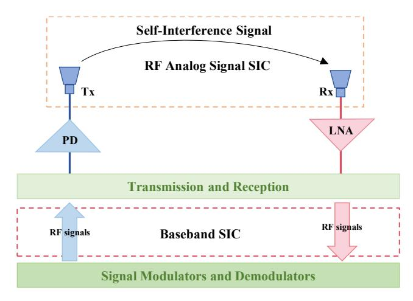
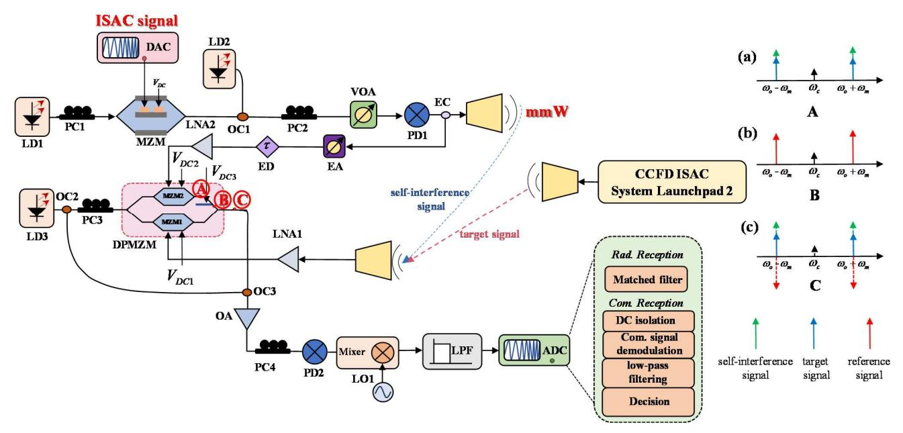
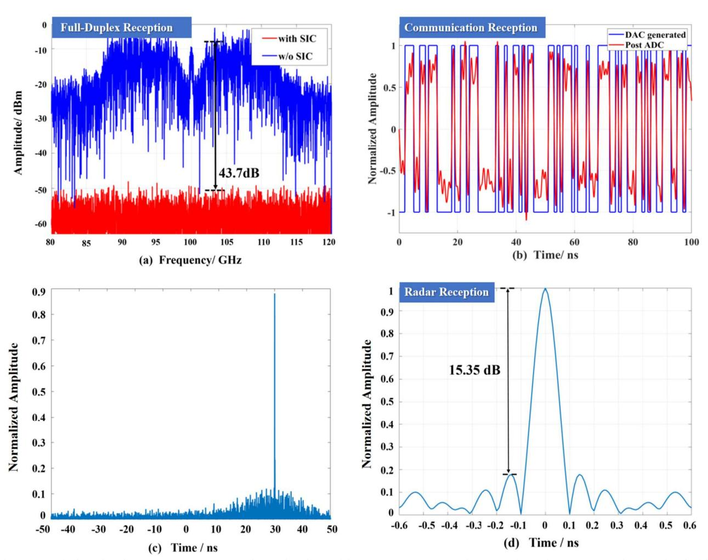

# Photonics-enabled full-duplex millimeter-wave integrated sensing and communication

1st Can Wang, Zhidong Lyu
College of Information Science and
Electronic Engineering
Zhejiang University
Hangzhou, China
22431139@zju.edu.cn,
zdlyu@zju.edu.cn

2nd Lu Zhang\*

College of Information Science and

Electronic Engineering

Zhejiang University

Hangzhou, China
zhanglu1993@zju.edu.cn

3rd Xianbin Yu\*

College of Information Science and

Electronic Engineering

Zhejiang University

Hangzhou, China

xyu@zju.edu.cn

Abstract—This paper proposes a co-frequency and co-time full-duplex integrated-sensing-and-communication system that utilizes optical-domain millimeter-wave self-interference cancellation (SIC), numerically achieving over 40 dB SIC and realizing communication with accurate radar sensing, effectively doubling spectrum utilization.

Keywords—Integrated-sensing-and-communication, full-duplex, photonics self-interference cancellation.

### I. INTRODUCTION

Radar and communication, two key applications of wireless networks, have increasingly converged, showcasing notable similarities in hardware architecture, system components, and operating bandwidth [1-3]. This convergence lays the foundation for integrated sensing and communication (ISAC) systems, which offer enhanced functionalities.

To optimize the interaction between communication and radar sensing, integrated signals with multifunctional capabilities are essential [4]. Regardless of the specific waveform design, the primary goal remains to improve the efficiency of the ISAC system. This paper investigates an ISAC configuration where a single node can simultaneously detect a radar target and communicate with a receiver, effectively doubling spectrum utilization compared to conventional half-duplex ISAC systems [5-6].

However, full-duplex operation introduces challenges, particularly as the receiver faces strong self-interference from its own transmitter [7-8]. Figure 1 illustrates this phenomenon, where the emitted signal from the transmitter can be directly captured by its own receiver. When the self-received signal significantly surpasses the strength of the return signal, it deteriorates the signal-to-noise ratio, negatively affecting subsequent processing [9-10]. To counteract self-interference, radio-frequency self-interference cancellation (SIC) technology is utilized. Notably, optical-domain RF SICs offer several advantages, including resistance to electromagnetic interference, consistent bandwidth, high-speed performance, and low signal loss [11].

In this paper, we propose a photonics-enabled cofrequency co-time full-duplex (CCFD) millimeter-wave (mmW) ISAC system. Numerical results indicate that this system achieves an impressive SIC depth exceeding 40 dB for broadband signals. Moreover, the analyses confirm successful communication signal transmission alongside precise radar sensing, effectively doubling spectrum utilization. This innovative approach not only enhances system performance but also opens new avenues for future research in integrated wireless communication and radar systems.

Fig. 1. Schematic diagram of signal self-interference in ISAC systems.

# II. OPERATIONAL PRINCIPLES

In the photonics-enabled full-duplex mmW ISAC system, the communication symbol  $\varphi(t)$  is embedded in each time slot of the linear frequency modulated (LFM) carrier. Here, binary phase shift keying (BPSK) is used as an example. Thus, the integrated waveform LFM-BPSK can be expressed as:

$$E_{LFM-BPSK}(t) = E_o \cos[\pi(2f_o t + kt^2) + \varphi(t)], \quad (1)$$

where  $E_o$  denotes the signal amplitude,  $f_o$  denotes the initial frequency,  $\varphi(t) \in \{0, \pi\}$  and k is the chirp rate.

At the reception side, a portion of the signal from the transmitter is used as a reference signal. For the purpose of optical domain SIC, the core requirement is that the reference signal and the self-interference signal are equal in amplitude and opposite in phase, i.e.:

$$\begin{cases} A_{if} = A_{ref} \\ \varphi_{if} + \varphi_{ref} = 0 \end{cases}$$
 (2)

where  $A_{if}$  and  $A_{ref}$  denote the amplitude of the self-interfering signal and the reference signal, respectively.  $\varphi_{if}$  and  $\varphi_{ref}$  denote the phases of the self-interfering signal and the reference signal, respectively.

We choose the dual parallel Mach-Zehnder modulator (DPMZM) to eliminate self-interference. Both sub-bias voltages of the DPMZM are set at the minimum transmission point (MITP) to modulate the reference signal and the self-interference signal, respectively; the main bias voltage is set at the maximum transmission point (MATP) to realize the

inversion of the signals of the upper and lower branches. The output of DPMZM is:

$$E_{DPMZM}(t) \propto j E_o e^{j\omega_o t} \begin{bmatrix} J_1(m_{si}) J_0(m_{if}) e^{j\omega_m t} \\ + J_1(m_{si}) J_0(m_{if}) e^{-j\omega_m t} \end{bmatrix}, \quad (3)$$

where  $m_{si}$  and  $m_{if}$  denote the modulation coefficients of the signal of interest (SOI) and self-interfering signals, respectively.  $\omega_m$  and  $\omega_o$  denote the angular frequency of the SOI and carrier signals, respectively. From Eq. 3 we know that only the SOI remains.

To realize the communication function, matched filtering is applied to the SOI after SIC and extract the envelope of the signal. The communication function of the ISAC system can be realized by digital signal processing of the SOI.

### III. SYSTEM SETUP

The setup of the proposed CCFD ISAC system is presented in Fig. 2. It's numerically analyzed in the Optisystem 15.0 Software. Table I summarizes the key device parameter settings in the numerical study. After the polarization controller (PC1) optimizes the polarization state, a 193.1 THz continuous-wave laser (LD1) is launched into a Mach-Zehnder modulator (MZM) as an optical carrier. The LFM-BPSK signal, with a frequency range from 1 GHz to 11 GHz and 100 ns duration, is digital-to-analog converted by a digital-to-analog converter (DAC) to drive the MZM. The modulated optical signal is combined with another 193.2 THz optical local oscillator (LO) by a 3 dB optical coupler (OC1). Subsequently, the polarization state of the coupled optical signal is adjusted by PC2, and a variable optical attenuator (VOA) is employed to limit its power to less than 6 dB, then feeds into the photodetector (PD1). Afterward, PD1 generates a 100 GHz integrated electrical signal, which is divided equally into two parts using an electric coupler (EC), half of

TABLE I. PARAMETERS OF KEY DEVICES IN THE SYSTEM

| Device          | Parameters                                                        |
|-----------------|-------------------------------------------------------------------|
| LD1,2,3         | Linewidth: <10 kHz Optical Power: 5 dBm                        |
| MZM             | Extinction ratio: 30 dB Insertion loss: 5 dB $V_{\pi}$ : 4V |
| DPMZM           | Extinction ratio: 25 dB Insertion loss: 5 dB $V_{\pi}$ : 4V |
| PD1、PD2         | Responsivity: 1 A/W                                               |
| Low Pass Filter | Insertion loss: 3 dB                                              |

which is used as the signal to be emitted, and the other half is used as a reference signal for SIC at the reception side.

The signal is transmitted and received wirelessly via a pair of millimeter-wave antennas. At the reception side, a 193.1 THz carrier is emitted from LD3 and adjusted by PC3 as an optical carrier for the DPMZM. The received signal is first amplified by a low noise amplifier (LNA1) and then modulates to the lower branch of the DPMZM, i.e., MZM1. The reference signal is adjusted to be equal in amplitude and phase to the received signal through an electrical attenuator (EA), an electrical delayer (ED), and an LNA2, and is subsequently modulated into the lower branch of the DPMZM, i.e. MZM2. The three bias voltages  $V_{DC1}$ ,  $V_{DC2}$  and  $V_{DC3}$  of the DPMZM are set to  $\pi/2$ ,  $-\pi/2$  and  $\pi$ , respectively. The spectrograms of points A, B, and C in DPMZM are shown in Fig. 2 (a), (b), and (c), self-interfering signals are eliminated.

The optical signal output from the DPMZM is coupled with the optical carrier emitted by LD3 using OC3, then the signal amplified by an optical amplifier (OA) is adjusted by PC4 and converted to an electrical signal by the PD2, which is down-converted by a mixer that is driven by the electrical LO1 signal. Subsequently, the output intermediate frequency

Fig. 2. System setup of the proposed CCFD ISAC system. LD: continuous-wave laser; MZM: Mach-Zehnder modulator; PC: polarization controller; DAC: digital-to-analog converter; LO: local oscillator; OC: optical coupler; LNA: low noise amplifier; VOA: variable optical attenuator; EA: electrical attenuator; ED: electrical delayer; LPF: low-pass filter; ADC: analog-to-digital converter; OA: optical amplifier; PD: photodetector; DPMZM: dual parallel Mach-Zehnder modulator. The insert: spectral schematic at (a) point A, (b) point B and (c) point C. signal

(IF) signals are filtered through a low-pass filter (LFP) and analog-to-digital converted by an analog-to-digital converter (ADC) for further radar and communications processing.

# IV. RESULTS AND DISCUSSIONS

Firstly, the numerical study verifies the SIC capability of the CCFD ISAC system. The self-interference signal is configured as an LFM-BPSK signal, with no SOI added. Attenuating and delaying the self-interfering signals simulate transmission loss and delay in the wireless channel. Fig. 3(a) shows that the proposed scheme can achieve a SIC depth of 43.7 dB.

To assess the communication performance, both the SOI and self-interference signals are set as LFM-BPSK with the same parameters. Fig. 3(b) compares the BPSK signal generated by the DAC to the signal recovered after SIC. The bit error rate (BER) is 0, confirming zero-error communication. Next, we evaluate the radar sensing performance of the CCFD ISAC system. The parameters for both signals remain unchanged, and an electrical signal delay line is used to delay the transmitted signal by 30 ns, simulating radar echoes. Fig. 3(c) presents the result after matched filtering, with a peak at 30.0 ns, in line with the expected delay. Finally, the autocorrelation diagram of the SOI is analyzed at ADC as Fig. 3(d), yielding a peak-to-sidelobe ratio (PSLR) of 15.35 dB, demonstrating the LFM-BPSK signal's effective anti-jamming capability.

# V. CONCLUSIONS

In summary, a CCFD ISAC system is proposed in this paper, achieving a SIC depth of 43.7 dB for the LFM-BPSK signal with a 10 GHz bandwidth. Numerical analysis confirms that after SIC, only the SOI remains, enabling effective communication and radar sensing. The LFM-BPSK signal achieves a PSLR of 15.35 dB, indicating strong antiinterference capability.

# ACKNOWLEDGMENTS

This work is supported by the "Pioneer" and "Leading Goose" R&D Program of Zhejiang 2023C01139; National Key R&D Program of China (2022YFB2903800); National Natural Science Foundation of China under Grant 62101483.

# REFERENCES

- [1] Z. Feng, Z. Fang, Z. Wei, X. Chen, Z. Quan, and D. Ji, "Joint radar and communication: A survey," in China Communications, vol. 17, no. 1, pp. 1-27, Jan. 2020.
- [2] B. Paul, A. R. Chiriyath, and D. W. Bliss, "Survey of RF Communications and Sensing Convergence Research," in IEEE Access, vol. 5, pp. 252-270, 2017.
- [3] K. V. Mishra, M. R. Bhavani Shankar, V. Koivunen, B. Ottersten, and S. A. Vorobyov, "Toward Millimeter-Wave Joint Radar Communications: A Signal Processing Perspective," in IEEE Signal Processing Magazine, vol. 36, no. 5, pp. 100-114, Sept. 2019.
- [4] Z. Lyu et al., "Radar-Centric Photonic Terahertz Integrated Sensing and Communication System Based on LFM-PSK Waveform," in IEEE

Fig. 3. Numerical results of CCFD ISAC system. (a) The results of SIC of the CCFD ISAC system. (b) Comparison of DAC-generated BPSK signal with demodulated BPSK signal from ADC at the reception side. (c) Matched filtering of radar signals at 30.0 ns. (d) PSLR of LFM-BPSK signals.

- Transactions on Microwave Theory and Techniques, vol. 71, no. 11, pp. 5019-5027, Nov. 2023.
- [5] Z. Xiao and Y. Zeng, "Full-Duplex Integrated Sensing and Communication: Waveform Design and Performance Analysis," 2021 13th International Conference on Wireless Communications and Signal Processing (WCSP), Changsha, China, 2021, pp. 1-5.
- [6] S. Zhu, M. Li, N. H. Zhu, and W. Li, "Photonic Radio Frequency Self-Interference Cancellation and Harmonic Down-Conversion for In-Band Full-Duplex Radio-Over-Fiber System," in IEEE Photonics Journal, vol. 11, no. 5, pp. 1-10, Oct. 2019.
- [7] K. E. Kolodziej, B. T. Perry, and J. S. Herd, "In-Band Full-Duplex Technology: Techniques and Systems Survey," in IEEE Transactions on Microwave Theory and Techniques, vol. 67, no. 7, pp. 3025-3041, July 2019.
- [8] L. Du, Y. Liu, C. Li, and Y. Tang, "Effect of Non-Resolvable Multipath on Full-Duplex Self-Interference Cancellation," 2021 IEEE Global

- Communications Conference (GLOBECOM), Madrid, Spain, 2021, pp. 1-6.
- [9] D. Wang et al., "Photonics-Assisted Frequency Conversion and Self-Interference Cancellation for In-Band Full-Duplex Communication," in Journal of Lightwave Technology, vol. 40, no. 3, pp. 607-614, 1 Feb.1, 2022.
- [10] S. Zhang et al., "Photonics-Assisted Joint Digital and Analog Self-Interference Cancellation and De-Chirping for Frequency-Modulated Continuous-Wave Radars," 2022 3rd China International SAR Symposium (CISS), Shanghai, China, 2022, pp. 1-4.
- [11] J. Suarez, K. Kravtsov, and P. R. Prucnal, "Incoherent Method of Optical Interference Cancellation for Radio-Frequency Communications," in IEEE Journal of Quantum Electronics, vol. 45, no. 4, pp. 402-408, April 2009.