# Temperature Compensation Method for Polarization-Multiplexed Fiber-Optic Vibration Sensing Unit

Ran A[n](https://orcid.org/0009-0008-4527-2348) , Yuanjun Wang, Xinyang Ping, Kunhua Wen [,](https://orcid.org/0000-0002-7658-8731) Yongg[ui Y](https://orcid.org/0000-0001-9879-1514)ua[n](https://orcid.org/0000-0001-9165-9537) , Shun Wang, Jun Yan[g](https://orcid.org/0000-0002-5815-1595) , Yuncai Wan[g](https://orcid.org/0000-0003-2319-8913) , and Yuwen Qin

*Abstract***—Temperature cross-sensitivity, which especially performs complicatedly and severely in fiber-optic sensors composed of various materials, will significantly affect the stability and the accuracy of the parameter to be measured. Consequently, the polarization-multiplexed technology is introduced to separate the temperature and strain parameters, while a piecewise uniform compensation method is further proposed and employed to get rid of the nonlinear temperature effects in the fiber-optic vibration sensing unit (FOVSU). In the sensitive fiber coil (SFC) of the FOVSU, the solution interval of temperature coefficient is subdivided and employed for decoupling in different temperature ranges; then, the data are processed by splicing finally. The exper-**

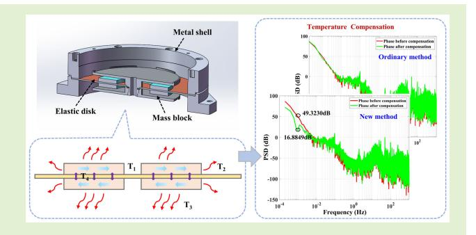

**imental results show that a suppression effect of temperature drift noise of 43 dB at 1 mHz is achieved under unidirectional self-cooling temperature conditions and 33 dB at 1 mHz under continuous temperature rise and fall conditions by using the piecewise method, which demonstrates that the performances in both situations are better than the original method using only one set of temperature coefficients. Therefore, the proposed new method could significantly reduce the temperature noise, leading to the testing accuracy and stability enhancement of FOVSUs.**

*Index Terms***— Fiber optics, fiber-optic vibration sensing unit (FOVSU), polarization multiplexing, temperature compensation.**

Received 31 October 2024; revised 14 November 2024; accepted 14 November 2024. Date of publication 22 November 2024; date of current version 14 January 2025. This work was supported in part by the National Natural Science Foundation of China under Grant 62127815, Grant U2001601, and Grant 62175039; and in part by Guangdong Introducing Innovative and Enterpreneurial Teams of "The Pearl River Talent Recruitment Program" under Grant 2019ZT0808X340. The associate editor coordinating the review of this article and approving it for publication was Dr. Ing. Emiliano Schena. *(Corresponding authors: Kunhua Wen; Yonggui Yuan.)*

Ran An, Xinyang Ping, and Yonggui Yuan are with the Key Laboratory of In-Fiber Integrated Optics of Ministry of Education, College of Physics and Optoelectronic Engineering, and the Key Laboratory of Photonic Materials and Devices Physics for Oceanic Applications, Ministry of Industry and Information Technology of China, Harbin Engineering University, Harbin 150001, China (e-mail: yuanyonggui@aliyun.com).

Yuanjun Wang and Kunhua Wen are with the School of Physics and Optoelectronic Engineering, the Institute of Advanced Photonics Technology, School of Information Engineering, the Key Laboratory of Photonic Technology for Integrated Sensing and Communication, Ministry of Education of China, and Guangdong Provincial Key Laboratory of Information Photonics Technology, Guangdong University of Technology, Guangzhou 510006, China (e-mail: khwen@gdut.edu.cn).

Shun Wang, Jun Yang, Yuncai Wang, and Yuwen Qin are with the Institute of Advanced Photonics Technology, School of Information Engineering, and the Key Laboratory of Photonic Technology for Integrated Sensing and Communication, Ministry of Education of China, and Guangdong Provincial Key Laboratory of Information Photonics Technology, Guangdong University of Technology, Guangzhou 510006, China (e-mail: yangj@gdut.edu.cn).

Digital Object Identifier 10.1109/JSEN.2024.3501256

### I. INTRODUCTION

T HE temperature cross-sensitivity has consistently been a common problem in fiber-optic sensing technology. Due to the sensing area composed of fiber materials, which inherently exhibit thermal effects, fiber-optic sensing systems are highly sensitive to the temperature fluctuations. Generally, the temperature variations are relatively slow and cause phase or wavelength drift in fiber-optic sensors. This phenomenon would significantly distort the accuracy of experimental data, especially when the variations of the target under test change subtly and slowly. Therefore, it is a significant challenge to effectively cope with the low-frequency noise caused by the temperature fluctuation, especially in the field of fiber-optic sensing technology.

Until now, various solutions have been proposed to realize the temperature compensation in this area. For example, Dong et al. [\[1\]](#page-6-0) used the polarization-maintaining photonic crystal fiber to construct a temperature-insensitive fiber-optic interferometer. By adjusting the core offset, cladding modes were excited and the sensor was endowed with ultralow thermal characteristics. Additionally, hollow-core photonic bandgap fiber has been utilized and proven effectively [\[2\],](#page-6-1) [\[3\].](#page-6-2) Material or structure design of sensors is another way to compensate the temperature [\[4\],](#page-6-3) [\[5\],](#page-6-4) [\[6\],](#page-6-5) [\[7\],](#page-6-6) [\[8\],](#page-6-7) [\[9\]. Be](#page-6-8)tween 2015 and 2021, Zhang's team [4], [5], [6] at Chinese Academy of Sciences developed a high-precision strain seismometer based on fiber Bragg gratings (FBGs). Through these sensors, crustal deformation could be captured by coupling a steel casing with the bedrock, and specific reference FBGs were utilized to form a differential structure with the sensing FBGs for temperature compensation with an accuracy of 0.11 mK. In 2016, a temperature-insensitive microfiber Mach-Zehnder interferometer (MZI) was designed. The thermo-optic quantity of the MZI was effectively controlled by optimizing the diameter of the microfiber within the MZI and the temperature sensitivity of the spatial frequency was measured to be  $1.94 \times 10^{-6}$ /nm/°C. In 2023, a low-noise Michelson interferometer system was proposed and capable of real-time adjustment of fiber length to compensate the environmental temperature influence, which could control the length variation of a 30-m fiber within  $\pm 1~\mu m$  under a temperature change of 21 °C. Applying the numerical analysis or the artificial intelligence algorithms to the sensing system is also a viable method. For instance, in 2022, temperature compensation in a magneto-optic fiber current sensor was achieved by utilizing the nonlinear characteristics of BP neural networks to model, decreasing the measurement error to  $\pm 0.5\%$  [10]. A more mainstream solution is to construct the sensing system that can simultaneously measure dual parameters [11], [12], [13], [14], [15], [16]. In 2017, Lopez-Aldaba et al. [16] proposed a microstructured optical fiber, in which different interference types had different response formulas to the strain and temperature. Therefore, these formulas can be used to separate the strain and temperature, giving the measurement results with a temperature accuracy of 0.071 °C and a strain accuracy of  $0.45~\mu\varepsilon$ . Huang et al. [13] developed an MZI structure based on the fusion splicing method, which used a hollow quartz tube to simultaneously construct Fabry-Perot interferometer and MZI in the same sensor, with a final temperature decoupling error of  $\pm 0.34$  °C and strain decoupling error of  $\pm 4.73 \ \mu \varepsilon$ . This method effectively mitigates the problem of temperature cross-sensitivity, allowing the sensor to operate stably in environments up to 800 °C, which is suitable for the strain measurement in high-temperature conditions.

Among various types of fiber-optic sensors, fiber-optic vibration sensing units (FOVSUs) play an important role in many fields, such as online health monitor of structures, such as bridges [17], [18], buildings [19], [20], tunnels [21], [22], transportation [23], [24], and aircrafts [25], [26], perimeter security [27], [28], as well as earthquake monitor [29], [30], [31]. Compared with traditional electromechanical sensors [32], [33], they are highly regarded for their all-optic structure, electromagnetic interference resistance, tolerance to harsh environments, and ease of reuse. Thereinto, the long-arm FOVSUs based on the principle of interference are widely appreciated due to their high sensing performance [34], yet they are also susceptible to the temperature interference. Contrast to those sensors with simple optical structures, FOVSUs are usually composed of various materials, and their temperature response characteristics are more complex in practice. Currently, the temperature compensation problem has not been well addressed by the aforementioned solutions.

In this article, the temperature compensation schemes for practical sensing units are developed. Based on the approach of the dual-parameter measurement, a polarization-multiplexed FOVSU is fabricated. With the special structure, a system of linear equations with two variables can be established to decouple the strain and temperature change parameters, thereby achieving the effect of temperature compensation. The nonlinearity issue of the temperature response coefficient in the sensing unit is theoretically analyzed at first, and then, the regularity of the temperature response coefficient is studied and a piecewise uniform compensation method is proposed. Next, experimental verification is carried out under two temperature conditions: unidirectional self-cooling and continuous temperature rise and fall. The final results indicate that this method could effectively reduce the impact of environmental temperature drift on the output phase of the FOVSU and enhance the operational stability.

#### II. PRINCIPLE

In practical applications, when the FOVSU is influenced by both the parameter to be measured and the environmental temperature fluctuations, its total phase change  $\Delta \phi$  can be given as [35]

$$\Delta \phi = \Delta \phi_{\varepsilon} + \Delta \phi_{\mathrm{T}} = k_{\varepsilon} \varepsilon + k_{\mathrm{T}} \Delta T \tag{1}$$

where  $k_{\varepsilon}$  is the strain response coefficient,  $k_{\mathrm{T}}$  is the temperature response coefficient,  $\varepsilon$  is the strain, and  $\Delta T$  is the temperature change.

In order to eliminate the impact of temperature fluctuations, the polarization-multiplexed technique is introduced. In this method, specific designs are utilized to control the polarization state of light and to allow the superposition and transmission of multiple light waves within the same optical path. In polarization-maintaining fibers (PMFs), the dual axes are simultaneously sensitive to the temperature and strain changes but exhibit differential responses, so two distinct interferometers can be formed in a single interference optical path, as shown in Fig. 1.

The injected light passes through a 90° welding spot to access the input fiber of the Y-branch waveguide first, and then, the output fiber of the Y-branch waveguide is welded at 45° angle with the PMF of the measurement arm and the reference arm, where the light is split to both axes. After that, the two arms are, respectively, welded at 0° and 90° angles with the input fiber of the polarization-maintaining coupler. Thereby, the fast-axis light  $M_f$  from the measurement arm interferes with the slow-axis light  $R_s$  from the reference arm, and simultaneously, the slow-axis light  $M_s$ from the measurement arm interferes with the fast-axis light  $R_f$  from the reference arm. Using two external parameters (i.e., strain  $\varepsilon$  and temperature change  $\Delta T$ ) and the output phases of the two interferometers ( $\Delta \phi_{M_f R_s}$  and  $\Delta \phi_{M_s R_f}$ ), a system of linear equations can be constructed. Solving these equations can separate the strain and temperature effects in the phase and achieve the purpose of temperature compensation.

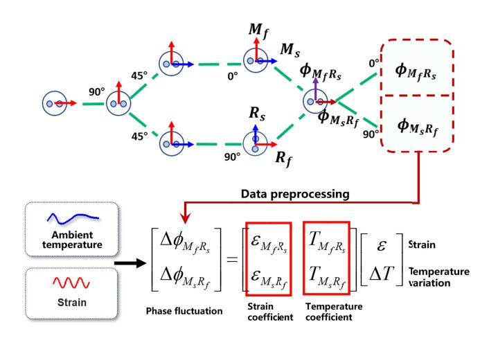

Fig. 1. Schematic of temperature compensation method based on polarization-multiplexed technique.

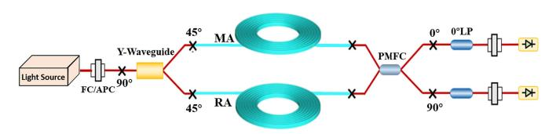

Fig. 2. Polarization-multiplexed fiber-optic interferometer. FC/APC, ferrule connector/angled physical contact; MA, measurement arm; RA, reference arm; PMFC, PMF coupler; LP, linear polarizer.

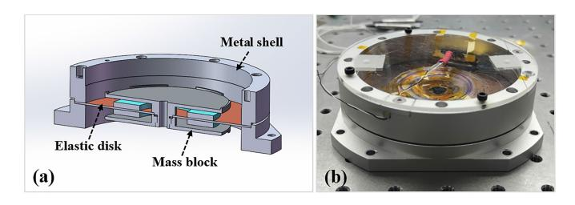

Fig. 3. Structural diagram and the actual photograph of the FOVSU. (a) Schematic of disk-type vibration pickup structure. (b) Photograph of the actual unit.

The solution formula [\[36\]](#page-7-26) mentioned is given as

$$\begin{bmatrix} \varepsilon \\ \Delta T \end{bmatrix} = \begin{pmatrix} 1 \\ \varepsilon_{M_f R_s} \cdot T_{M_s R_f} - T_{M_f R_s} \cdot \varepsilon_{M_s R_f} \end{pmatrix} \cdot \begin{bmatrix} T_{M_s R_f} - T_{M_f R_s} \\ -\varepsilon_{M_s R_f} & \varepsilon_{M_f R_s} \end{bmatrix} \begin{bmatrix} \Delta \phi_{M_f R_s} \\ \Delta \phi_{M_s R_f} \end{bmatrix}$$
(2)

where *TM f Rs* and *TMs R f* represent the temperature response coefficients of two interferometers, respectively, and ε*M f Rs* and ε*Ms R f* represent the strain response coefficients of two interferometers, respectively.

The polarization-multiplexed FOVSU fabricated in this article mainly consists of two parts, one of which is a long-arm polarization-multiplexed fiber-optic interferometer, as shown in Fig. [2.](#page-2-1) A narrow linewidth and stabilized frequency laser is employed as the light source, and two sensitive fiber coils (SFCs) with an arm length of 260 m are used in the interferometric optical path.

The other part is a disk-type vibration pickup structure, which mainly includes a metal shell, an elastic disk, and a mass block, as shown in Fig. [3\(a\).](#page-2-2) The long-arm fiber-optic

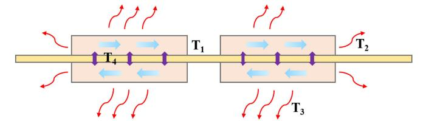

Fig. 4. Schematic of heat conduction of SFCs.

interferometer and the disk-type structure need to be bonded and assembled using epoxy resin adhesive and screws or other fittings following a series of process flow. This assembly forms a spring-mass system. The ultimate goal of this system is to ensure that the acceleration from external vibrations can be maximally transferred to the SFC, which would induce a certain degree of deformation and alter the propagation characteristics of the internal light in SFCs and ultimately let the entire FOVSU reach the optimal performance. The complete experimental sensing unit is shown in Fig. [3\(b\).](#page-2-2)

When the environment surrounding the FOVSU reaches an ideal thermal equilibrium state, the temperature within the SFC is uniformly distributed. However, if there are temperature differences around, heat conduction will occur internally, as indicated by the blue arrows in Fig. [4,](#page-2-3) where *T*1, *T*2, *T*3, and *T*4 represent the temperature of the inner lateral surface, the outer lateral surface, the air-exposed base, and the disk-contacting base of the SFCs, respectively.

In cylindrical coordinates, the internal heat conduction equation for the SFC is given by [\[37\]](#page-7-27)

$$\frac{\partial^2 u}{\partial r^2} + \frac{1}{r} \frac{\partial u}{\partial r} + \frac{1}{r^2} \frac{\partial^2 u}{\partial \theta^2} + \frac{\partial^2 u}{\partial z^2} = \frac{1}{\alpha} \frac{\partial u}{\partial t}$$
(3)

where *u* represents the internal temperature field in the SFC, *r* is the radial coordinate, θ is the angular coordinate, *z* is the axial coordinate along the height of the cylinder, α is the thermal diffusivity inside the SFC, and *t* is the time.

It is much complex to directly analyze the above equation, so ideal conditions are initially provided. Due to the axis symmetric characteristic, the temperature field is assumed to be uniform along θ and is considered only within a fixed height at *z*0. Therefore, the temperature distribution is regarded as only depending on *r* and *t*. Then, utilizing the method of separation of variables, we consider *u*(*r*, *t*) = *R*(*r*)F(*t*), where *R*(*r*) is a function solely of *r* and *F*(*t*) is a function solely of *t*. The simplified equation accordingly is represented as

$$\frac{1}{R(r)}\frac{\partial^2 R(r)}{\partial r^2} + \frac{1}{rR(r)}\frac{\partial R(r)}{\partial r} = \frac{1}{\alpha F(t)}\frac{\partial F(t)}{\partial t}.$$
 (4)

From the above equation, it is evident that the left-hand side just associates with *r*, while the right-hand side just associates with *t*. Consequently, both sides of the equation must equal a constant, denoted here as λ. Thus, the left-hand side can be expressed by the following ordinary differential equation as:

$$\frac{\partial^2 R(r)}{\partial r^2} + \frac{1}{r} \frac{\partial R(r)}{\partial r} - \lambda R(r) = 0.$$
 (5)

According to [\(5\),](#page-2-4) it is apparent that *R* exhibits a nonlinear relationship with *r*, not proportional; hence, the temperature

| Temperature interval (°C) | $M_f R_s$ interferometer (rad/°C) | $\mathbb{R}^2$ | $M_sR_f$ interferometer (rad/ $^{\circ}$ C) | $\mathbb{R}^2$ |
|---------------------------|-----------------------------------|----------------|---------------------------------------------|----------------|
| 55-54                     | -282.1736                         | 0.99977        | 972.7861                                    | 0.99978        |
| 54-53                     | -270.4842                         | 0.99976        | 989.1570                                    | 0.99979        |
| 53-52                     | -260.0195                         | 0.99977        | 1008.1110                                   | 0.99980        |
| 52-51                     | -261.6636                         | 0.99473        | 1013.6899                                   | 0.99958        |
| 51-50                     | -241.1000                         | 0.99975        | 1033.1776                                   | 0.99982        |
| 50-49                     | -227.5061                         | 0.99964        | 1030.3737                                   | 0.99981        |
| 49-48                     | -213.3061                         | 0.99939        | 1034.3120                                   | 0.99952        |
| 48-47                     | -199.8685                         | 0.99973        | 1053.2212                                   | 0.99985        |
| 47-46                     | -187.5357                         | 0.99974        | 1072.1171                                   | 0.99987        |
| 46-45                     | -174.7224                         | 0.99978        | 1088.1358                                   | 0.99988        |
| 45-44                     | -162.8133                         | 0.99973        | 1098.6154                                   | 0.99983        |
| 44-43                     | -154.9442                         | 0.99968        | 1124.9661                                   | 0.99968        |
| 43-42                     | -145.8748                         | 0.99986        | 1128.9528                                   | 0.99985        |
| 42-41                     | -138.2404                         | 0.99990        | 1143.5949                                   | 0.99992        |
| 41-40                     | -131.9945                         | 0.99989        | 1141.1538                                   | 0.99993        |
| 40-39                     | -129.0953                         | 0.99993        | 1143.7714                                   | 0.99993        |
| 39-38                     | -129.5352                         | 0.99990        | 1145.4166                                   | 0.99991        |
| 38-37                     | -132.5305                         | 0.99991        | 1148.0253                                   | 0.99994        |
| 37-36                     | -137.5652                         | 0.99990        | 1143.8438                                   | 0.99994        |
| 36-35                     | -143.7573                         | 0.99987        | 1138.6752                                   | 0.99992        |

TABLE I
TEMPERATURE RESPONSE COEFFICIENTS OF THE FOVSU IN DIFFERENT INTERVALS

field u could also show a similar relationship with r. It is considered that the additional output phase  $\phi_{tg}$  of the SFC attributed by the internal temperature gradients [38] is positively correlated with r, as well as the multilayered fiber structure and the nonideal, nonuniform distribution of the temperature field in the actual sensors.  $\phi_{tg}$  should also exhibit a nonlinear relationship with  $\Delta T$ , which causes internal temperature gradients.

Combining the above conclusions, the output phase of the FOVSU can be more detailedly analyzed, and it is considered to be influenced by three factors: the environmental temperature fluctuations, the strain disturbances, and the temperature gradient within the SFC. The expression is as follows:

$$\Delta \phi = k_T \cdot \Delta T + k_{\varepsilon} \cdot \varepsilon + \Delta \phi_{tg}. \tag{6}$$

The phase shift  $\Delta \phi_T$  induced by the temperature factor is denoted as

$$\Delta \phi_T = k_T \Delta T + \Delta \phi_{tg}. \tag{7}$$

Then, the actual temperature response coefficient  $k_T^*$  of the FOVSU is given as follows:

$$k_T^* = (k_T \Delta T + \Delta \phi_{tg}) / \Delta T. \tag{8}$$

From the analysis presented above, it is obvious that the heat conduction within the SFC will lead to a nonlinear issue with the temperature response coefficient in the FOVSU. This affects the decoupling effect of the temperature parameter and results in a degeneration of temperature compensation.

#### III. EXPERIMENT AND DISCUSSION

In order to verify the nonlinear issue of temperature response and find ways to improve the compensation effect, we carry out relevant temperature experiments with the FOVSU, as shown in Fig. 3(b). The entire unit is placed inside an environmental test chamber, where the temperature

is programmed to rise to 60 °C and maintained for 2 h. Subsequently, the chamber is turned off to allow it to gradually return to the room temperature. Throughout this process, the temperature data inside the chamber are collected by a split-type quartz crystal temperature transmitter, which is a system independent of the sensing unit, while the phase data outputted by the FOVSU are also recorded. Since the vibration in this process could be negligible, the output phase is considered to be entirely contributed by the temperature. By combining the temperature transmitter data with (2), the temperature response coefficient within the corresponding temperature range can be solved, using for subsequent temperature compensation. For the conventional original method, two sets of data pints during the whole self-cooling time are fitted, and the dual-axis temperature response coefficients of the FOVSU are -209.8011 rad/°C and 1057.0651 rad/°C, respectively, with the corresponding coefficients of determination  $R^2$  of 0.96561 and 0.99774, respectively. However, when the process of self-cooling is divided into 1 °C intervals, the fitting temperature response coefficients of the FOVSU are actually inconsistent in different temperature ranges, as shown in Table I. Meanwhile, the fitting determination coefficient  $R^2$ gets closer to 1, which indicates a more linear relationship between the output phase and the temperature changes within smaller temperature ranges.

According to the above analysis, a piecewise uniform compensation method is proposed on the basis of the original temperature compensation method that only uses a set of temperature coefficients for decoupling. The new scheme narrows down the solution interval and fits a series of temperature response coefficients for different temperature intervals. Then, based on the temperature transmitter data, these coefficients are matched with the output phase within the same temperature interval to achieve phase temperature compensation and to decouple the temperature change. Finally, the piecewise compensation phase data and decoupled temperature data are spliced together, which would directly and indirectly reflect

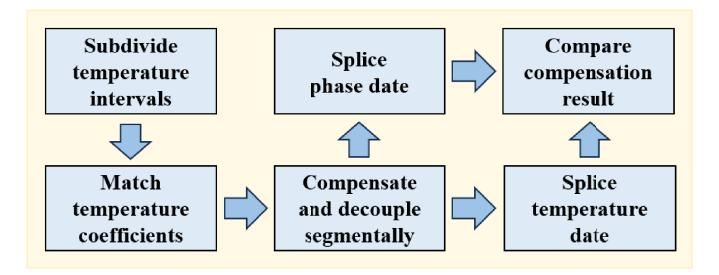

Fig. 5. Flowchart of piecewise uniform compensation method.

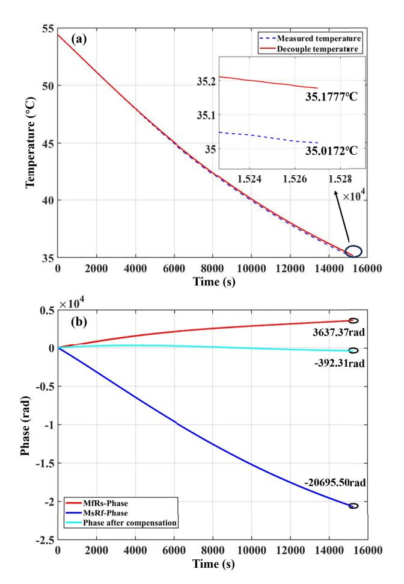

Fig. 6. Effectiveness of original temperature compensation method under self-cooling. (a) Relationship between decoupled temperature and measured temperature. (b) Phase shift before and after compensation.

the temperature compensation effect, respectively. The entire process is illustrated in Fig. [5.](#page-4-0)

To compare the differences of effectiveness between two methods, the original temperature compensation method is employed first to process the self-cooling data of the FOVSU within the temperature range of 55 ◦C–35 ◦C. The experimental results are depicted in Fig. [6.](#page-4-1) In Fig. [6\(a\),](#page-4-1) the maximum deviation between the decoupled temperature and the measured temperature is 0.1605 ◦C at approximately 15 000 s, and the root mean square (rms) value of the entire data deviation is 0.1241 ◦C. In Fig. [6\(b\),](#page-4-1) prior to temperature compensation, the maximum phase drift of the FOVSU is 20 695.50 rad, and

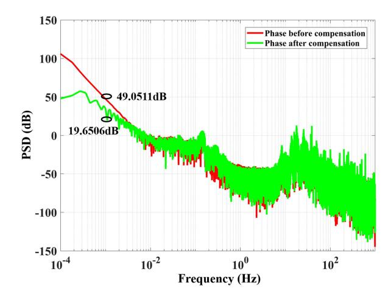

Fig. 7. Phase noise power spectrum of original temperature compensation method under self-cooling.

after compensation, the phase drift is reduced to 392.31 rad, representing a decrease to 1/53 of the initial value.

The phase noise power spectrum before and after temperature compensation is shown in Fig. [7,](#page-4-2) where the red line and the green line represent the levels before and after the compensation, respectively. There is approximately a 29-dB suppression of ambient temperature drift noise at 1 mHz after temperature compensation.

Then, the piecewise uniform compensation method is used to process the same data of the FOVSU within the self-cooling temperature range of 55 ◦C–35 ◦C, and the experimental results are shown in Fig. [8.](#page-5-0) In Fig. [8\(a\),](#page-5-0) the maximum deviation is 0.2001 ◦C and the rms value is 0.1234 ◦C, which is better than that of the original method, and in Fig. [8\(b\),](#page-5-0) the maximum phase drift is reduced from 20 695.50 to 127.83 rad after compensation, which is 1/161 of the initial value and about 3 times the effect of the original method.

The phase noise power spectrum before and after the temperature compensation is shown in Fig. [9.](#page-5-1) In this figure, the suppression effect of ambient temperature drift noise is about 43 dB at 1 mHz, which is significantly better than that of the traditional temperature compensation method by about 14 dB.

In addition to verifying the effectiveness of the piecewise uniform compensation scheme under unidirectional selfcooling conditions, it is necessary to conduct relevant confirmation under continuous temperature rise and fall conditions. The FOVSU is placed inside a high- and low-temperature test chamber, and the program is set to lower the internal temperature of the chamber below 10 ◦C and maintain it for a period of time at first. Afterward, the chamber is turned off to restore its internal temperature to the room temperature level. Subsequently, the temperature inside will vary with the room temperature over time. The data are continuously collected over 19 h, and the results handled by the original temperature compensation scheme are shown in Fig. [10.](#page-5-2)

In Fig. [10\(a\),](#page-5-2) the maximum deviation between the decoupled temperature and the measured temperature is 0.9661 ◦C at approximately 60 000 s, and the rms value of the whole

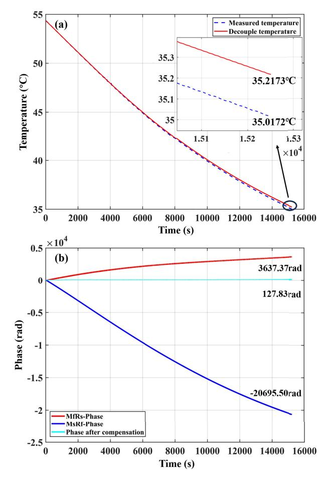

Fig. 8. Effectiveness of piecewise uniform compensation method under self-cooling. (a) Relationship between decoupled temperature and measured temperature. (b) Phase shift before and after compensation.

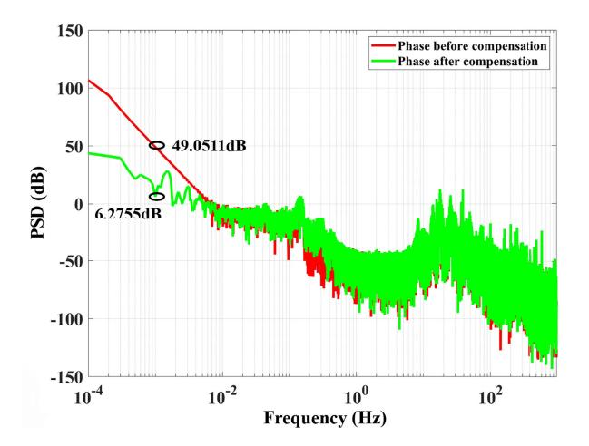

Fig. 9. Phase noise power spectrum of piecewise uniform compensation method under self-cooling.

data deviation is 0.8882 ◦C. In Fig. [10\(b\),](#page-5-2) the maximum phase drift of the FOVSU before temperature compensation is 6466.52 rad, and after that, it is reduced to 4324.61 rad, only decreasing to 2/3 of the initial value.

The phase noise power spectrum before and after the temperature compensation is shown in Fig. [11.](#page-5-3) The suppression effects after the temperature compensation are not significant,

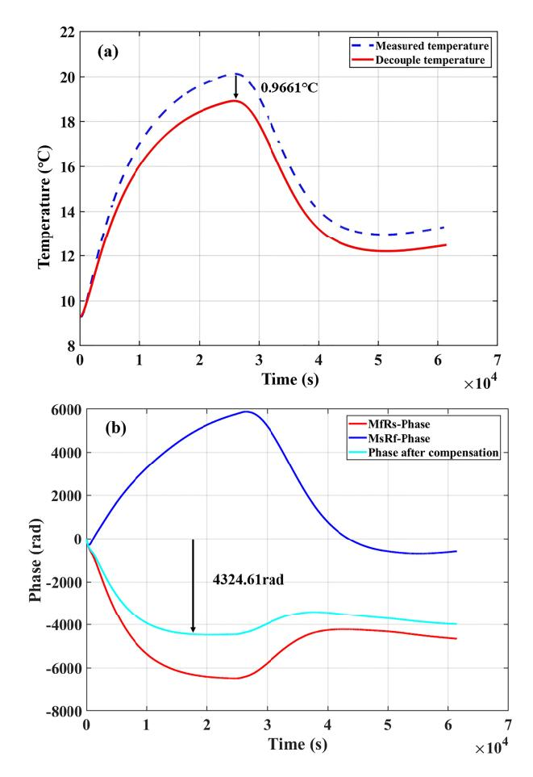

Fig. 10. Effectiveness of original temperature compensation method under continuous temperature rise and fall. (a) Relationship between decoupled temperature and measured temperature. (b) Phase shift before and after compensation.

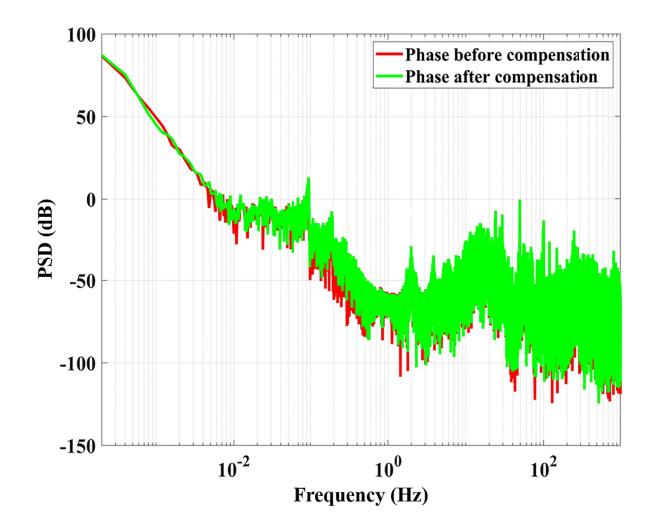

Fig. 11. Phase noise power spectrum of original temperature compensation method under continuous temperature rise and fall.

indicating that the original temperature compensation method is no longer applicable under complex temperature conditions, such as continuous temperature changes.

The piecewise uniform compensation scheme is also used to process the same data, and the results are shown in Fig. [12.](#page-6-9)

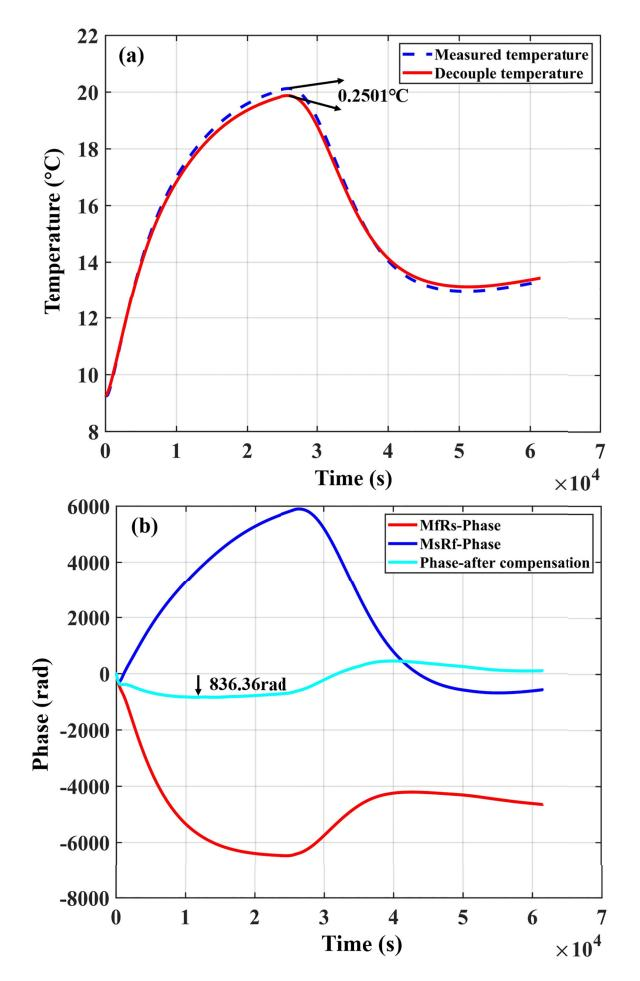

Fig. 12. Effectiveness of piecewise uniform compensation method under continuous temperature rise and fall. (a) Relationship between decoupled temperature and measured temperature. (b) Phase shift before and after compensation.

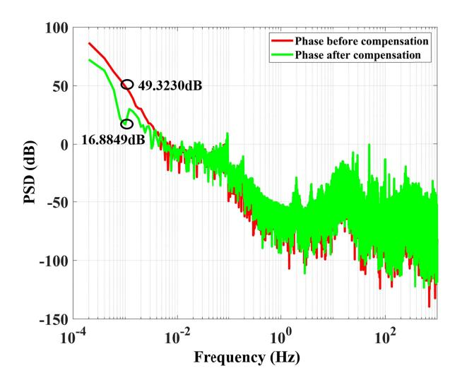

Fig. 13. Phase noise power spectrum of piecewise uniform compensation method under continuous temperature rise and fall.

After compensation, the maximum deviation decreases to 0.2501 ◦C and the rms value is 0.1732 ◦C, which is much better than that of the original method. Additionally, the maximum phase drift also decreases to 836.36 rad, which is reduced to 1/8 of the initial one and about five times the effect of the original method.

The phase noise power spectrum before and after temperature compensation is shown in Fig. [13.](#page-6-10) After temperature compensation, a relatively significant 33-dB suppression effect of ambient temperature drift noise is achieved at 1 mHz.

The feasibility of the piecewise uniform compensation method under the condition of self-cooling and continuous temperature rise and fall is verified by the above experiments.

#### IV. CONCLUSION

In this article, a polarization-multiplexed technology was introduced into the FOVSU to achieve optimal temperature compensation by segmenting and decoupling the temperature parameters. Based on the characteristics of the temperature response coefficient in the FOVSU, a piecewise uniform compensation method is further proposed to divide the temperature interval of the coefficients into small calculation steps, thereby reducing the impact of nonlinearity effect on the temperature compensation. In the experiments where the temperature decreases naturally from 55 ◦C to 35 ◦C, the maximum phase drift owing to the temperature changes is suppressed from 20 695.50 to 127.83 rad, which is reduced to 1/161 of the level before temperature compensation. Also, it exhibits a 43-dB suppression at 1 mHz in the spectrum. In the complex temperature conditions with continuous temperature fluctuations between 10 ◦C and 20 ◦C, the maximum phase drift of 6466.52 rad is reduced to 836.36 rad after compensation, achieving a noise suppression effect of 33 dB at 1 mHz in spectrum. These experimental results demonstrate the significant contribution of this research in suppressing the interference of temperature fluctuations on the FOVSU and improving its operational stability.

## REFERENCES

- [\[1\] B](#page-0-0). Dong, D.-P. Zhou, and L. Wei, "Temperature insensitive all-fiber compact polarization-maintaining photonic crystal fiber based interferometer and its applications in fiber sensors," *J. Lightw. Technol.*, vol. 28, no. 7, pp. 1011–1015, Apr. 1, 2010.
- [\[2\] R](#page-0-1). Slavík et al., "Ultralow thermal sensitivity of phase and propagation delay in hollow core optical fibres," *Sci. Rep.*, vol. 5, no. 1, p. 15447, Oct. 2015.
- [\[3\] U](#page-0-2). S. Mutugala et al., "Hollow-core fibres for temperature-insensitive fibre optics and its demonstration in an optoelectronic oscillator," *Sci. Rep.*, vol. 8, no. 1, p. 18015, Dec. 2018.
- [\[4\] W](#page-0-3). Zhang, W. Huang, L. Li, W. Liu, and F. Li, "High resolution FBG sensor and its applications in geophysics," in *Proc. 16th Int. Conf. Opt. Commun. Netw. (ICOCN)*, Wuzhen, China, Aug. 2017, pp. 1–3.
- [\[5\] W](#page-0-4). Zhang and W. Huang, "Applications of fiber optics sensors in seismology," in *Proc. 10th Int. Conf. Adv. Infocomm Technol. (ICAIT)*, Stockholm, Sweden, Aug. 2018, pp. 16–20.
- [\[6\] W](#page-0-5). Zhang et al., "Field trail of high resolution fiber optic strainmeter and temperature sensor," in *Proc. Asia Commun. Photon. Conf. (ACP)*. Hangzhou, China: Optica Publishing Group, Oct. 2018, pp. 1–3.
- [\[7\] Y](#page-0-6). Wang, "Research on temperature optical fiber sensor based on two kinds of fibers with opposite temperature response characteristics," M.S. dissertation, School Electron. Inf. Eng., Anhui Univ., Hefei, China, 2021.
- [\[8\] Z](#page-0-7). Hu et al., "Noise suppression of frequency transfer on short-distance optical fiber link based on 3 × 3 fiber coupler," *Acta Photonica Sinica*, vol. 52, no. 1, Jan. 2023, Art. no. 0106002.
- [\[9\] J](#page-0-8). C. Shin, W. G. Kwak, and Y.-G. Han, "Temperature-insensitive microfiber Mach–Zehnder interferometer for absolute strain measurement," *J. Lightw. Technol.*, vol. 34, no. 19, pp. 4579–4583, Oct. 1, 2016.

- [\[10\]](#page-1-0) Q. Jia, "Research on temperature compensation of magneto-optic fiber current sensors," M.S. dissertation, School Precis. Instrum. Opto-Electron. Eng., Tianjin Univ., Tianjin, China, 2022.
- [\[11\]](#page-1-1) D. Leandro and M. Lopez-Amo, "All-PM fiber loop mirror interferometer analysis and simultaneous measurement of temperature and mechanical vibration," *J. Lightw. Technol.*, vol. 36, no. 4, pp. 1105–1111, Feb. 15, 2018.
- [\[12\]](#page-1-2) M. A. Zumberge, W. Hatfield, and F. K. Wyatt, "Measuring seafloor strain with an optical fiber interferometer," *Earth Space Sci.*, vol. 5, no. 8, pp. 371–379, Aug. 2018.
- [\[13\]](#page-1-3) B. Huang et al., "In-fiber Mach–Zehnder interferometer exploiting a micro-cavity for strain and temperature simultaneous measurement," *IEEE Sensors J.*, vol. 19, no. 14, pp. 5632–5638, Jul. 2019.
- [\[14\]](#page-1-4) C. Sun et al., "A new sensor for simultaneous measurement of strain and temperature," *IEEE Photon. Technol. Lett.*, vol. 32, no. 19, pp. 1253–1256, Aug. 27, 2020.
- [\[15\]](#page-1-5) Y. Wu, Y. Zhang, J. Wu, and P. Yuan, "Fiber-optic hybrid-structured Fabry–Pérot interferometer based on large lateral offset splicing for simultaneous measurement of strain and temperature," *J. Lightw. Technol.*, vol. 35, no. 19, pp. 4311–4315, Oct. 1, 2017.
- [\[16\]](#page-1-6) A. Lopez-Aldaba, J.-L. Auguste, R. Jamier, P. Roy, and M. López-Amo, "Simultaneous strain and temperature multipoint sensor based on microstructured optical fiber," *J. Lightw. Technol.*, vol. 36, no. 4, pp. 910–916, Feb. 15, 2018.
- [\[17\]](#page-1-7) K. Lim, M. K. A. Zaini, Z. Ong, F. Z. M. Abas, M. A. B. M. Salim, and H. Ahmad, "Vibration mode analysis for a suspension bridge by using low-frequency cantilever-based FBG accelerometer array," *IEEE Trans. Instrum. Meas.*, vol. 70, pp. 1–8, 2021.
- [\[18\]](#page-1-8) P. F. D. C. Antunes et al., "Optical fiber accelerometer system for structural dynamic monitoring," *IEEE Sensors J.*, vol. 9, no. 11, pp. 1347–1354, Nov. 2009.
- [\[19\]](#page-1-9) T. Torfs et al., "Low power wireless sensor network for building monitoring," *IEEE Sensors J.*, vol. 13, no. 3, pp. 909–915, Mar. 2013.
- [\[20\]](#page-1-10) D.-H. Kim and M. Q. Feng, "Real-time structural health monitoring using a novel fiber-optic accelerometer system," *IEEE Sensors J.*, vol. 7, no. 4, pp. 536–543, Apr. 2007.
- [\[21\]](#page-1-11) S. Li et al., "Highly sensitive fiber optic microseismic monitoring system for tunnel rockburst," *Measurement*, vol. 189, Feb. 2022, Art. no. 110449.
- [\[22\]](#page-1-12) S. Wang et al., "Distributed fiber optic sensing for internal strain monitoring in full life cycle of concrete slabs with BOFDA technology," *Eng. Struct.*, vol. 305, Apr. 2024, Art. no. 117798.
- [\[23\]](#page-1-13) Z. Wang et al., "Novel railway-subgrade vibration monitoring technology using phase-sensitive OTDR," in *Proc. 25th Opt. Fiber Sens. Conf. (OFS)*, Jeju, South Korea, Apr. 2017, pp. 1–4.
- [\[24\]](#page-1-14) H. Xu, W. Wang, F. Li, Y. Du, H. Tu, and C. Guo, "Railway slope monitoring based on dual-parameter FBG sensor," *Photon. Sensors*, vol. 15, no. 1, Mar. 2025, Art. no. 250121.
- [\[25\]](#page-1-15) F. Kosova, Ö. Altay, and H. Ö. Ünver, "Structural health monitoring in aviation: A comprehensive review and future directions for machine learning," *Nondestruct. Test. Eval.*, vol. 1, pp. 1–60, May 2024.
- [\[26\]](#page-1-16) Z. Ma and X. Chen, "Fiber Bragg gratings sensors for aircraft wing shape measurement: Recent applications and technical analysis," *Sensors*, vol. 19, no. 1, p. 55, Dec. 2018.
- [\[27\]](#page-1-17) J. C. Juarez and H. F. Taylor, "Field test of a distributed fiber-optic intrusion sensor system for long perimeters," *Appl. Opt.*, vol. 46, no. 11, pp. 1968–1971, Apr. 2007.
- [\[28\]](#page-1-18) J. Huang et al., "Multiple disturbance detection and intrusion recognition in distributed acoustic sensing," *Proc. SPIE*, vol. 10849, pp. 76–80, Dec. 2018.
- [\[29\]](#page-1-19) T. Chang et al., "Shallow seafloor seismic wave monitoring using 3-component fiber optic interferometric accelerometer," *Meas. Sci. Technol.*, vol. 33, no. 1, Jan. 2022, Art. no. 015101.
- [\[30\]](#page-1-20) Y. Shindo, T. Yoshikawa, and H. Mikada, "A large scale seismic sensing array on the seafloor with fiber optic accelerometers," in *Proc. IEEE Sensors*, vol. 2, Nov. 2002, pp. 1767–1770.
- [\[31\]](#page-1-21) J. Chen, T. Chang, Y. Yang, W. Gao, Z. Wang, and H.-L. Cui, "Ultralow-frequency tri-component fiber optic interferometric accelerometer," *IEEE Sensors J.*, vol. 18, no. 20, pp. 8367–8374, Oct. 2018.
- [\[32\]](#page-1-22) K. Baishya, D. M. Harvey, T. P. Manzanera, G. Zhang, and D. R. Braden, "Failure patterns of solder joints identified through lifetime vibration tests," *Nondestruct. Test. Eval.*, vol. 38, no. 1, pp. 147–171, Jan. 2023.
- [\[33\]](#page-1-23) J. Zhu et al., "Development trends and perspectives of future sensors and MEMS/NEMS," *Micromachines*, vol. 11, no. 1, p. 7, Jan. 2020.

- [\[34\]](#page-1-24) C. K. Kirkendall and A. Dandridge, "Overview of high performance fibre-optic sensing," *J. Phys. D, Appl. Phys.*, vol. 37, no. 18, pp. R197–R216, Sep. 2004.
- [\[35\]](#page-1-25) W. Chen, "Research on influence and suppression methods of noise and temperature of dual-polarization optical fiber interferometer," M.S. dissertation, College Sci., Harbin Eng. Univ., Harbin, China, 2019.
- [\[36\]](#page-2-6) S. Tian, "Research on key technologies of broadband ultra-sensitive three-component optical fiber seismic observation," Ph.D. dissertation, College Phys. Optoelectron. Eng., Harbin Eng. Univ., Harbin, China, 2022.
- [\[37\]](#page-2-7) S. Du, "Research on FOG's temperature characteristic based on the finite element method," M.S. dissertation, College Automat., Harbin Eng. Univ., Harbin, China, 2017.
- [\[38\]](#page-3-1) Y. Leng and S. Zhong, "Thermal-induced drift analysis and algorithm compensation technology of fiber optic gyroscope," *Acta Opt. Sinica*, vol. 44, no. 2, Jan. 2024, Art. no. 0206003.

**Ran An** received the B.Eng. degree in optoelectronic information science and engineering from Huazhong University of Science and Technology, Wuhan, China, in 2017. He is currently pursuing the Ph.D. degree in optical engineering with Harbin Engineering University, Harbin, China.

His current research interests include fiberoptic interferometers and fiber-optic sensors.

**Yuanjun Wang** received the B.Eng. degree in microelectronics science and engineering from Xi'an University of Technology, Xi'an, China, in 2021. He is currently pursuing the M.Eng. degree in electronic information with Guangdong University of Technology, Guangzhou, China.

His current research direction is optical fiber sensors.

**Xinyang Ping** received the B.Eng. degree from the College of Intelligent System Science and Engineering, Harbin Engineering University, Harbin, China, in 2020, where he is currently pursuing the Ph.D. degree in optical engineering.

His current research interests include fiberoptic interferometers and fiber-optic sensors.

**Kunhua Wen** received the B.E. and Ph.D. degrees from Southwest Jiaotong University, Chengdu, China, in 2007 and 2013, respectively. He is currently a Professor with Guangdong University of Technology, Guangzhou, China. His current research interests include nanophotonics, optical sensing, and optical fiber Bragg grating.

**Yonggui Yuan** received the B.S. degree in automation, the M.S. degree in optical engineering, and the Ph.D. degree in electromechanical engineering from Harbin Engineering University, Harbin, China, in 2006, 2011, and 2012, respectively.

He is currently a Professor with Harbin Engineering University. His research interests include fiber-optic sensing and optical precision measurement.

**Shun Wang** received the B.Eng. degree in automation from Xi'an University of Posts and Telecommunications, Xi'an, China, in 2011, and the Ph.D. degree in optical engineering from Huazhong University of Science and Technology (HUST), Wuhan, China, in 2016.

He is currently an Associate Professor with Guangdong University of Technology, Guangzhou, China. His current research interests include nanophotonics, optical sensing, and optical fiber Bragg grating.

**Jun Yang** received the B.S. degree in optoelectronics, the M.Eng. degree in optical engineering, and the Ph.D. degree in optical engineering from Harbin Engineering University, Harbin, China, in 1999, 2002, and 2005, respectively.

He is currently a Professor with Guangdong University of Technology, Guangzhou, China. His research interests include optical measurement and optical fiber sensing technology.

**Yuncai Wang** received the B.S. degree in semiconductor physics from Nankai University, Tianjin, China, in 1986, and the M.S. and Ph.D. degrees in physics and optics from Xi'an Institute of Optics and Precision Mechanics, Chinese Academy of Sciences, Shaanxi, China, in 1994 and 1997, respectively.

He is currently a Professor with Guangdong University of Technology, Guangzhou, China. His current research interests include nonlinear dynamics of semiconductor lasers and fibers

and their applications, including all-optical analog-to-digital conversion and optical communications.

**Yuwen Qin** received the B.S. degree in physics from Henan Normal University, Xinxiang, China, in 1987, the M.S. degree in optics from Xi'an Institute of Optics and Precision Mechanics, Chinese Academy of Sciences, Shaanxi, China, in 1992, and the Ph.D. degree in optoelectronics from Tianjin University, Tianjin, China, in 1996.

He is currently a Professor with Guangdong University of Technology, Guangzhou, China. His research interests include optical communication and sensing.