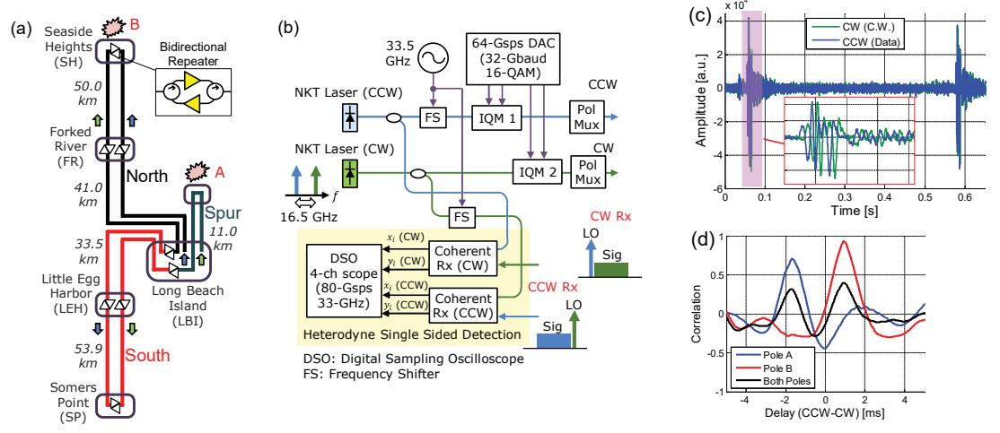
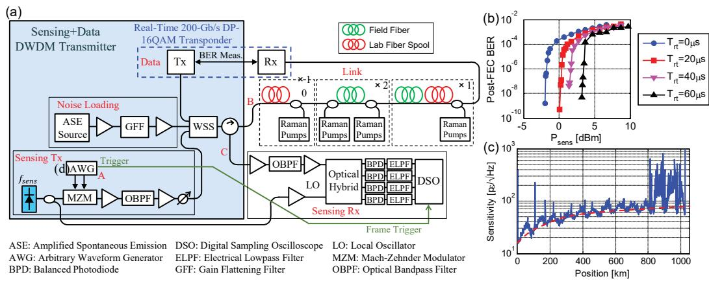
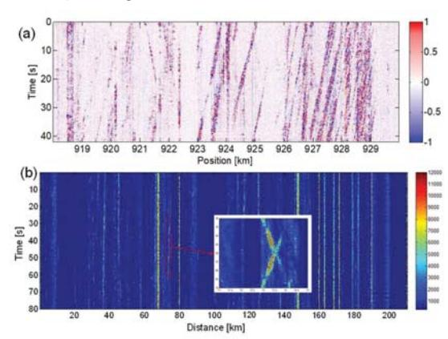

# Simultaneous Sensing and Communication in Optical Fibers

Yue-Kai Huang(1), Ezra Ip(1), Junqiang Hu(1), Ming-Fang Huang(1), Fatih Yaman(1), Ting Wang(1), Glenn Wellbrock(2), Tiejun Xia(2), Koji Asahi(3), Yoshiaki Aono(3)

- (1) NEC Laboratories America, 4 Independence Way, Princeton, NJ 08540, USA, kai@nec-labs.com
- (2) Verizon, 1201 E Arapaho Rd, Richardson, TX 75081, USA
- (3) Photonic System Development Department, NEC Corporation, Abiko, Japan

**Abstract** We explore two fiber sensing methods which enables coexistence with data transmission on DWDM fiber networks. Vibration detection and localization can be achieved by extracting optical phase from modified coherent transponders. Frequency-diverse chirped-pulse DAS with all-Raman amplification can improve SNR and achieves multi-span monitoring. © 2022 The Author(s)

#### Introduction

Recent advances in optical fiber sensing has enabled telecom network operators to monitor their fiber infrastructure while creating new revenue streams in public safety and smart city applications [1, 2]. For example, the millions of kilometers of installed submarine fibers can be used to provide early warning for earthquakes and tsunamis, replacing costly legacy systems that use discrete components which have limited sensing range [3]. However, using dedicated fibers for sensing may be undesirable for operators who wish to maximize fiber utilization for data transmission. Co-existence between sensing and data transmission is an ongoing research topic where challenges remain [4,5]. Most distributed fiber optic sensing (DFOS) methods rely on back-scatter and are incompatible with existing inline amplifiers with optical isolators. It is furthermore difficult to make DFOS work over hundreds or thousands of kilometers due to low signal-to-noise ratio (SNR). Finally, the nonlinear impact of the sensing probe signal on co-propagating data channels must be considered [6].

In this paper, we review two recent methods that allow simultaneous data transmission and sensing on the same fiber. The first method is based on the recovery of accumulated optical phase during forward propagation. Other sensing methods which used only forward signal transmission have been proposed [7-11]. Although it was shown that state of polarization (SOP) of telecom signals can be used for seismic monitoring in submarine cables [8,9], phase measurement offers higher sensitivity and bandwidth, and allows localization of the vibration position usina bidirectional correlation. Measurement of optical phase unmodulated continuous wave (c.w.) signals was demonstrated in [10,11]. In our work, we show that phase measurement is also possible with data-modulated signals since phase is already

tracked by the adaptive DSP elements in a coherent receiver [12]. This allows modified coherent receivers to perform sensing as an auxiliary operation [13].

The second method we review is distributed acoustic sensing (DAS) [14,15] using chirp pulses as a "code", and frequency diversity [16] to improve the SNR of the backscatter. Multispan operation is enabled using all-Raman amplification which simultaneously amplifies both the probe signal and the Rayleigh backscatter Frequency-diversity chirped-pulse DAS (FD-CP-DAS) enabled the first DAS system over >1,000 km of standard single-mode fiber (SSMF) with copropagating 10-Tb/s data transmission [17].

### **Event Localization by Data Transponders**

In a coherent receiver, optical phase is tracked by the combination of frequency offset compensator (FOC), adaptive time-domain equalizer (TDE) and carrier phase recovery (CPR). Optical phase can be reconstructed using  $\hat{\theta}[n] = -2\pi\Delta\Omega n + \arg\{\sum_{ij} \overline{w}_{ij}^{(n)} e^{-j\Delta\psi[n]}\}$ , where  $\Delta\Omega$  is the digital frequency of the FOC,  $\overline{w}_{ij}^{(n)}$  is the mean value (DC component) of the TDE coefficients, and  $\Delta\psi[n]$  is the phase of the CPR. The vibration component in  $\hat{\theta}[n]$  is then extracted using a digital phase-locked loop (DPLL) followed by a bandpass filter (BPF) and amplitude equalizer (AEQ) optimized for the vibration signature [12].

A field trial was conducted over 380 km of inservice cables between Long Beach Island (LBI), Seaside Height (SH) and Somers Point (SP) configured into a loop shown in Fig. 1a. Due to availability of only one fiber pair, same-core bidirectional transmission was used with even (odd) channels propagating in the CW (CCW) direction. The two data and sensing transponders co-located at LBI are shown in Fig. 1(b). For the data channels that also performs sensing, two low-phase-noise lasers were used as seed lasers and modulated with 32-Gbaud 16-QAM. The

Fig. 1: (a) 380-km long field fiber link, (b) offline bidirectional transponder setup at LBI, (c) optical phase when utility pole at 'A' is struck, (d) correlation between CW and CCW phases for various pole knocking scenarios.

CCW laser serves as the local oscillator (LO) for the received CW signal, and vice-versa, after appropriate frequency shifting to align the transmitted signals to the ITU.T grid and ensure the heterodyne beat signals fit within the bandwidth of a 34-GHz digital signal oscilloscope (DSO). This signal arrangement was chosen to allow the CW and CCW signals to be digitized using the same 4-channel DSO, thus timing synchronization is guaranteed.

Fig. 1(c) shows an example of the optical phase recovered when a utility pole at A (Fig. 1(a)) was struck with a hammer, and a datamodulated signal was used for the CCW direction and a continuous wave (c.w.) signal used for the CW direction. The inset showed high correlation between the two signals. The blue curve in Fig. 1(d) shows the correlation between the CCW and CW phases has a peak at -1.67 ms matching the expected propagation delay difference. The fullwidth half-maximum (FWHM) of the sinc-like main lobe is 1.07 ms (221 km) and represents the closest distance that two simultaneous vibration events can be separated and still be distinguishable and localized. The standard deviation (s.d.) in delay difference was 34 µs (~7) km) and is a measure of uncertainty in vibration position. The red trace in Fig. 1(d) shows the correlation for a different pole, while the black curve shows the correlation when the two poles are struck simultaneously.

#### 1,007-km All-Raman Link DAS Monitoring

A drawback of optical phase measurement using forward transmission is that spatial resolution is limited by the bandwidth of the vibration signature, and the number of simultaneous vibration events that can be detected and localized may be limited. There thus exists a

need to extend the reach of DFOS based on backscatter measurement. Fig. 2(a) shows the setup of a recent FD-CP-DAS experiment over a 13 spans link comprised of a mixture of lab spools and field fibers. All-Raman amplifiers with no inline isolators were used to compensate fiber loss. The FD-CP-DAS probe signal is generated by modulating the same low-phase-noise laser in the previous experiment with the output of an arbitrary waveform generator (AWG). The FD-CP-DAS signal comprises of 20 chirped pulses of form  $p(t) = \sqrt{P_{sens}} \exp\left(j2\pi\gamma \frac{t^2}{2}\right) \operatorname{rect}\left(\frac{t}{T_c}\right)$ where  $\gamma$ ,  $P_{sens}$  and  $T_c$  are the chirp rate, peak power, and chirp duration. We chose  $T_c = 10 \,\mu s$ and  $B = \gamma T_c = 10 \text{ MHz}$  to allow a spatial resolution of 10 m and an SNR gain of 32 dB over conventional DAS at the same peak power [17]. pulses are The 20 chirped launched consecutively into the fiber, and the pattern repetition period was set to 10.5 ms to allow an interrogation of > 1,000 km. To reduce crossphase modulation (XPM) on co-propagating data channels, we inserted out-of-band chirps amplitude shaped with raised-cosine functions of duration  $T_{rt}$ . The sensing receiver comprise of a dual-polarization coherent receiver sampled with a 250-MSa/s DSO. The DSO was operated in frame capture mode. Each data set comprises of a number of frames of 200 µs duration, which allows ~20 km of fiber to be monitored. The sensing signal co-propagated with 50 DWDM data channels where a real-time 200-Gb/s DP-16QAM coherent transponder was used for the channel under test, and noise-loading channels emulated with an amplified spontaneous emission (ASE) source. We investigated XPM tolerance by placing the 200G channel on the adjacent ITU.T channel 50 GHz away from the sensing channel. Fig. 2(b) shows post-FEC BER

Fig. 2: (a) Experimental setup for the FD-CP-DAS system using all-Raman amplification, (b) Post-FEC BER vs sensing power for different  $T_{rt}$  values, (c) DAS sensitivity vs position for the whole 1,007-km link.

vs  $P_{sens}$  for various rise/fall-times  $T_{rt}$ . With  $T_{rt} = 60~\mu s$ , the probe signal can have peak power of +3.2 dBm while still allowing zero post-FEC BER to be reported for the data channel.

For measurement of DAS performance, we set  $P_{sens}$  to 2.2 dBm, or 1-dB below the nonlinear threshold. We measured the phase noise power spectral density (PSD) at different fiber positions to find the average value  $S_{nn}$  over the flat region between 5 Hz to 47.6 Hz that is due to ASE noise. Measurand resolution in  $\epsilon/\sqrt{\text{Hz}}$  can then calculated as  $\epsilon_{DAS} = \frac{\lambda/2n_{eff}}{2\pi(0.78)z_g} \sqrt{S_{nn}}$ . Fig. 2(c) shows a sweep of  $\epsilon_{\it DAS}$  vs fiber position at 1 km resolution. The spikes are due to connectors and splice sleeves, and the large  $\epsilon_{DAS}$  in the last three span is due to environmental noise of the field fibers. The ASE-limited sensitivity of the system can be inferred from the lab spools and is shown by the dotted red curve, which increases from ~ 16 p $\epsilon/\sqrt{\text{Hz}}$  at the start of the link to ~ 100 p $\epsilon/\sqrt{\text{Hz}}$ at the end of Span 13. A DAS waterfall plot showing the vibrations measured over 12 km of the field fiber in Span 12 over a 40 s window is shown in Fig. 3(a). The diagonal lines are moving vehicles whose speeds and directions can be inferred from their slopes.

In addition to the offline results above, we also tested a real-time (RT) CP-DAS prototype during the field trial. The real-time system used similar components, while DSP for signal generation and vibration estimation was implemented on a fieldprogramable gate array (FPGA) platform based on Xilinx XCZU7EV with two DAC channels and four ADC channels. Due to FPGA resource limitations. frequency diversity was not implemented, and the coding gain is 27 dB. We reduced the sensing distance to ~210 km by retaining only the last three spans in Fig. 2(a). Fig. 3(b) shows a real-time waterfall plot, demonstrating the capability to monitor the full 210 km of fiber at a spatial resolution of 13.05 meter and a gauge length of 20 m. Vibration intensity was calculated by band-passing the recovered phase at each fiber position between 2 and 100 Hz, followed by intensity accumulation over multiple samples to obtain an update rate of 10 Hz. The inset in Fig. 3(b) shows two commuter trains passing each other.

Fig. 3: Waterfall plot of (a) FD-CP-DAS and (b) RT CP-DAS.

#### **Conclusions**

We reviewed two fiber sensing methods which allows co-existence between data transmission and sensing on the same fiber using wavelengthdivision multiplexing. The first method is based on measurement of accumulated optical phase on a data-modulated signal using a digital coherent transponder modified with a low-phasenoise laser and auxiliary DSP. We demonstrated vibration detection and localization using bidirectional correction. In the second method, we conducted the first >1,000 km DAS experiment using FD-CP-DAS with all-Raman amplification. DAS sensitivity of ~100 p $\epsilon/\sqrt{\text{Hz}}$ obtained alongside 10-Tb/s transmission with error-free operation confirmed with a real-time coherent transponder.

## References

- [1] Ping Lu, Nageswara Lalam, Mudabbir Badar, Bo Liu, Benjamin T. Chorpening, Michael P. Buric, and Paul R. Ohodnicki , "Distributed optical fiber sensing: Review and perspective", *Applied Physics Reviews* 6, 041302 (2019) DOI: 10.1063/1.5113955
- [2] M.-F. Huang, S. Han, G. A. Wellbrock, T. J. Xia, C. Narisetty, M. Salemi, Y. Chen, J. M. Moore, P. N. Ji, G. Milione, T. Wang, Y. Yoda, Y. Kitahara, M. Ito, Y. Aono, and A. Itoh, "Field Trial of Cable Safety Protection and Road Traffic Monitoring over Operational 5G Transport Network with Fiber Sensing and On-Premise AI Technologies," in *26th Optoelectronics and Communications Conference*, OSA Technical Digest (2021), paper T5A.8. DOI: 10.1364/OECC.2021.T5A.8
- [3] NEC News Room, "NEC delivers submarine cable seismic and tsunami observation system to Taiwan's Central Weather Bureau," https://www.nec.com/en/press/202101/global\_20210126 \_01.html
- [4] M.-F. Huang, M. Salemi, Y. Chen, J Zhao, T. J. Xia, G. A. Wellbrock, Y.-K. Huang, G. Milione, E. Ip, P. Ji, T. Wang, Y. Aono, "First Field Trial of Distributed Fiber Optical Sensing and High-Speed Communication Over an Operational Telecom Network," in *Journal of Lightwave Technology*, vol. 38, no. 1, pp. 75-81, 1 Jan.1, 2020, DOI: 10.1109/JLT.2019.2935422.
- [5] Ezra Ip, Jian Fang, Yaowen Li, Qiang Wang, Ming-Fang Huang, Milad Salemi, and Yue-Kai Huang, "Distributed fiber sensor network using telecom cables as sensing media: technology advancements and applications [Invited]," in *Journal of Optical Communications and Networking,* vol. 14, no. 1, A61-A68 (2022). DOI: 10.1364/JOCN.439175
- [6] Z. Jia, L. A. Campos, M. Xu, H. Zhang, M. Gonzalez-Herraez, H. F. Martins, and Z. Zhan, "Experimental Coexistence Investigation of Distributed Acoustic Sensing and Coherent Communication Systems," in *Optical Fiber Communication Conference (OFC) 2021*, OSA Technical Digest (2021), paper Th4F.4. DOI: 10.1364/OFC.2021.Th4F.4
- [7] J. E. Simsarian and P. J. Winzer, "Shake Before Break: Per-Span Fiber Sensing with In-Line Polarization Monitoring," in *Optical Fiber Communication Conference*, paper M2E.6., (2017). DOI: 10.1364/OFC.2017.M2E.6
- [8] M. Cantono, V. Kamalov, V. Vusirikala, M. Salsi, M. Newland, and Z. Zhan, "Sub-Hertz Spectral Analysis of Polarization of Light in a Transcontinental Submarine Cable," in *2020 European Conference on Optical Communications (ECOC)*, Brussels, Belgium, 2020, pp. 1-3, DOI: 10.1109/ECOC48923.2020.9333176
- [9] Z. Zhan, M. Cantono, V. Kamalov, A. Mecozzi, R. Müller, S. Yin, J. C. Castellanos, "Optical polarization–based seismic and water wave sensing on transoceanic cables," *Science* 371 (6532), pp. 931-936, (2021). DOI: 10.1126/science.abe6648
- [10] G. Marra,C. Clivati, R. Luckett, A. Tampellini, J. Kronjäger, L. Wright, A. Mura, F. Levi, S. Robinson, A. Xuereb, B. Baptie, and D. Calonico, "Ultrastable laser interferometry for earthquake detection with terrestrial and submarine cables," *Science* 361 (6401), pp. 486- 490, (2018). DOI: 10.1126/science.aat4458
- [11] Y. Yan, F. N. Khan, B. Zhou, A. P. T. Lau, C. Lu and C. Guo, "Forward Transmission Based Ultra-long Distributed Vibration Sensing with Wide Frequency Response," in *Journal of Lightwave Technology*, vol. 39,

- no. 7, pp. 2241-2249, 1 April1, 2021, DOI: 10.1109/JLT.2020.3044676
- [12] E. Ip, Y.-K. Huang, G. Wellbrock, T. J. Xia, M.-F. Huang, T. Wang and Y. Aono, "Vibration detection and localization using modified digital coherent telecom transponders," in *Journal of Lightwave Technology.*, vol. 40, no. 5, pp. 14721482, March 2022. DOI: 10.1109/JLT.2021.3137768
- [13] M. Mazur, J. C. Castellanos, R. Ryf, E. Börjeson, T. Chodkiewicz, V. Kamalov, S. Yin, N. K. Fontaine, H. Chen, L. Dallachiesa, S. Corteselli, P. Copping, J. Gripp, A. Mortelette, B. Kowalski, R. Dellinger, D. T. Neilson, and P. Larsson-Edefors, "Transoceanic Phase and Polarization Fiber Sensing using Real-Time Coherent Transceiver," in *Optical Fiber Communication Conference (OFC) 2022*, (2022), paper M2F.2. DOI: 10.1364/OFC.2022.M2F.2
- [14] Ole Henrik Waagaard, Erlend Rønnekleiv, Aksel Haukanes, Frantz Stabo-Eeg, Dag Thingbø, Stig Forbord, Svein Erik Aasen, and Jan Kristoffer Brenne, "Real-time low noise distributed acoustic sensing in 171 km low loss fiber," in *OSA Continuum* 4, 688-701 (2021). DOI: 10.1364/OSAC.408761
- [15] M. R. Fernández-Ruiz, L. Costa, H. F. Martins, "Distributed Acoustic Sensing Using Chirped-Pulse Phase-Sensitive OTDR Technology," *Sensors 19*, no. 20, 4368, 2019. DOI: 10.3390/s19204368
- [16] Y. Wakisaka, D. Iida, and H. Oshida, "Distortionsuppressed sampling rate enhancement in phase-OTDR vibration sensing with newly designed FDM pulse sequence for correctly monitoring various waveforms," in *Optical Fiber Communication Conference (OFC) 2020*, OSA Technical Digest (2020), paper Th3F.5. DOI: 10.1364/OFC.2020.Th3F.5
- [17] E. Ip, Y.-K. Huang, M.-F. Huang, F. Yaman, G. Wellbrock, T. J. Xia, T. Wang, K. Asahi and Y. Aono, "DAS over 1,007-km hybrid link with 10-Tb/s DP-16QAM co-propagation using frequency-diverse chirped pulses," in *Optical Fiber Communication Conference (OFC'22)*, Paper Th4A.2, San Diego, CA, USA (2022). DOI: 10.1364/OFC.2022.Th4A.2