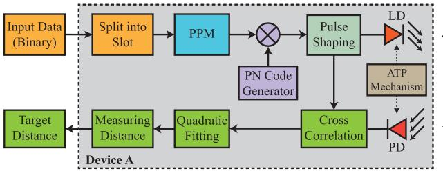
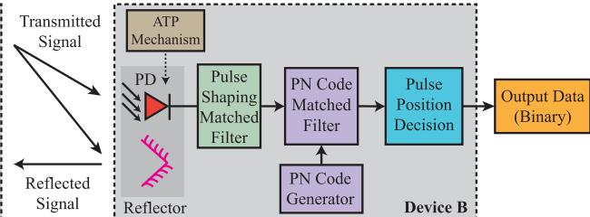
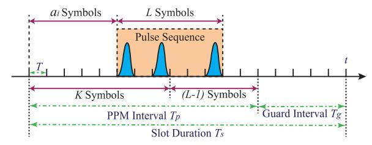
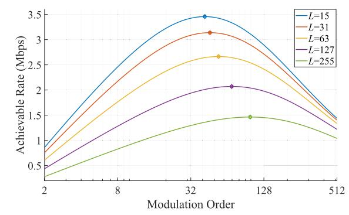
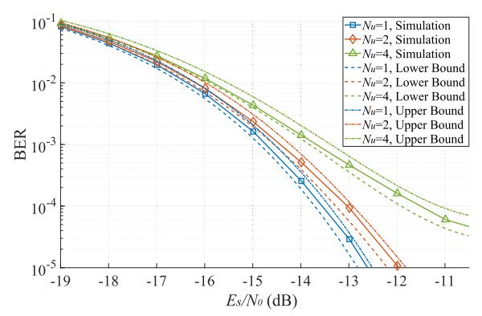
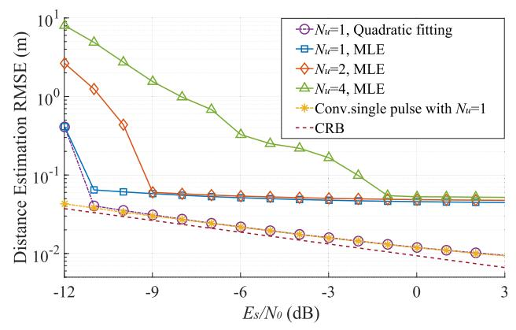

# Pulse Sequence Sensing and Pulse Position Modulation for Optical Integrated Sensing and Communication

Yunfeng We[n](https://orcid.org/0009-0000-9708-6012) , Fang Yan[g](https://orcid.org/0000-0003-3575-5086) , *Senior Member, IEEE*, Jian Song [,](https://orcid.org/0000-0002-6066-9510) *Fellow, IEEE*, and Zhu Han [,](https://orcid.org/0000-0002-6606-5822) *Fellow, IEEE*

*Abstract*— The future wireless network is expected to provide communication and sensing abilities simultaneously, and the optical spectrum brings a promising candidate for integrated sensing and communication. In this letter, an integrated sensing and communication scheme based on pulse sequence sensing and pulse position modulation is proposed for free space optics. By generating a unipolar optical signal, optical wireless communication and optical sensing can adopt the intensity modulation and direct detection scheme simultaneously. Benefited from the nearly-ideal correlation properties of the pulse sequence, the communication receiver can detect the pulse position, and the sensing receiver can estimate the target distance. Moreover, different performance metrics of communication and sensing are derived theoretically. Simulations show that the proposed method can carry out communication and sensing simultaneously, even in the multi-user scenario. Furthermore, different optical systems can adjust system parameters to adapt to different scenarios, so that they will enhance the ability of the future wireless network.

*Index Terms*— Integrated sensing and communication, optical wireless communication, optical sensing.

# I. INTRODUCTION

R ECENTLY, the concept of integrated sensing and communication (ISAC) has received considerable attention from both academia and industry. A radio frequency (RF) based ISAC system can utilize the similarities in hardware architectures and signal processing techniques between communication and sensing, to achieve spectrum sharing [\[1\] an](#page-4-0)d hardware reuse [\[2\]. M](#page-4-1)oreover, the future wireless network is expected to simultaneously provide large communication capacity and accurate sensing ability of the environment, which is also known as the ISAC system [\[3\]. T](#page-4-2)herefore,

Manuscript received 18 January 2023; revised 10 February 2023 and 28 March 2023; accepted 21 April 2023. Date of publication 25 April 2023; date of current version 12 June 2023. This work was supported in part by National Key Research and Development Program of China under Grant 2022YFE0101700; and in part by Science, Technology and Innovation Commission of Shenzhen Municipality under Grant JSGG20211029095003004; and in part by NSF CNS-2107216, CNS-2128368, CMMI-2222810, Toyota and Amazon. The associate editor coordinating the review of this letter and approving it for publication was R. S. Kshetrimayum. *(Corresponding author: Fang Yang.)*

Yunfeng Wen and Fang Yang are with the Department of Electronic Engineering, Tsinghua University, Beijing 100084, China, and also with the Key Laboratory of Digital TV System of Shenzhen City, Research Institute of Tsinghua University in Shenzhen, Shenzhen 518057, China (e-mail: fangyang@tsinghua.edu.cn).

Jian Song is with the Department of Electronic Engineering, Tsinghua University, Beijing 100084, China, and also with the Shenzhen International Graduate School, Tsinghua University, Shenzhen 518055, China (e-mail: jsong@tsinghua.edu.cn).

Zhu Han is with the Department of Electrical and Computer Engineering, University of Houston, Houston, TX 77004 USA, and also with the Department of Computer Science and Engineering, Kyung Hee University, Seoul 446-701, South Korea (e-mail: hanzhu22@gmail.com).

Digital Object Identifier 10.1109/LCOMM.2023.3270184

numerous research has been conducted on RF-based ISAC, including waveform design [\[4\], n](#page-4-3)etwork design [\[5\], a](#page-4-4)nd resource management [\[6\].](#page-4-5)

Compared with the emerging research on RF-based ISAC, much less research is conducted on optical ISAC. However, since the optical spectrum has a much larger bandwidth than its RF counterpart, it can provide high-speed, short-range communication ability. With the advantages of large capacity, high security, and license-free spectrum, optical wireless communication (OWC) can operate in both indoor and outdoor scenarios [\[7\]. M](#page-4-6)eanwhile, optical sensing devices like laser radars provide non-contact methods for target localization [\[8\].](#page-4-7) Furthermore, the intensity modulation and direct detection (IM/DD) scheme is frequently adopted by both OWC and optical sensing devices [\[9\]. Th](#page-4-8)erefore, integrating OWC and optical sensing in a single system becomes a promising trend.

Some studies adopted visible light communication (VLC) for optical ISAC. Béchadergue et al. suggested using the headlamps and taillights of vehicles to perform simultaneously communication and range-finding [\[10\].](#page-4-9) Similarly, a VLCbased vehicle localization method was developed in [\[11\].](#page-4-10) As for ISAC based on laser radar, Mizui et al. proposed a technique called boomerang transmission, where two vehicles alternately relay data multiplied by pseudo-noise (PN) codes [\[12\]. T](#page-4-11)he boomerang transmission system, which was further improved by [\[13\],](#page-4-12) could provide active safety and smooth driving abilities to autonomous vehicles. However, most of these methods should work with cooperative targets, i.e., objects equipped with ISAC transceivers, where the reflected optical signal is not fully utilized.

In this letter, we propose a pulse sequence sensing and pulse position modulation (PSS-PPM) method for optical ISAC, which provides sensing and communication abilities for a laser radar simultaneously. Pulse position modulation (PPM) has a higher power efficiency compared to that of on-off keying, which improves the endurance of an optical system. The spread spectrum technique adopted by [\[12\] is](#page-4-11) further exploited to reduce multi-user interference (MUI). More importantly, since the proposed method utilizes optical signals reflected by targets, it can work with not only ISAC transceivers but also non-cooperative targets, which makes PSS-PPM flexible for both ISAC scenarios and conventional sensing tasks.

The remainder of this letter is organized as follows. In Section [II,](#page-1-0) the signal structure and system model are introduced. Section [III](#page-2-0) explains the proposed demodulation and ranging algorithms in detail, and derives different performance metrics of the proposed method. The numerical results of communication and sensing performances are illustrated in Section [IV.](#page-3-0) Finally, the conclusion is drawn in Section [V.](#page-4-13)

1558-2558 © 2023 IEEE. Personal use is permitted, but republication/redistribution requires IEEE permission. See https://www.ieee.org/publications/rights/index.html for more information.

Fig. 1. System model of the proposed PSS-PPM method for optical ISAC.

## II. SIGNAL STRUCTURE AND SYSTEM MODEL

In this section, we introduce the system model and the signal structure of the proposed PSS-PPM method. For simplicity, the system model illustrates a uni-directional communication and sensing scenario. By means of time division multiplexing or wavelength division multiplexing, the model can also be extended to bi-directional communication and sensing. Fig. [1](#page-1-1) shows the basic system model that implements the PSS-PPM method, and Fig. [2](#page-1-2) depicts the signal structure in one slot.

#### *A. System Model*

Device A acts as a communication transmitter and a sensing transceiver simultaneously in the ISAC scenario. To establish the communication link to Device B, Device A may contain acquisition, tracking, and pointing (ATP) mechanisms. With the assistance of beacon lights, computer vision methods or RF communication, a line-of-sight link between Device A and Device B can be established. Then, Device A can communicate with Device B and estimate the distance between them simultaneously.

In Device A, the input communication data is split into slots and transformed into pulse positions. The PN code allocated to Device A is modulated so that it starts at the aforementioned pulse positions. A pulse shaping filter is then applied to the PN code to generate the PSS-PPM signal. Finally, the PSS-PPM signal is transmitted to free space by a laser diode (LD).

Once a link exists for the communication receiver, Device B utilizes a photodiode (PD) to detect the optical signal transmitted by Device A. The outputs of the pulse shaping matched filter represent the received PSS-PPM symbols. Then, the symbols come into the ensuing PN code matched filter, and Device B demodulates the data by pulse position decision.

Meanwhile, dihedral corner reflectors are mounted within the beam spot near the PD of Device B, so that the reflected beam can reach the PD of Device A. Then, Device A can calculate the cross-correlation between its transmitted signal and its received signal. By detecting the maximum value in the cross-correlation result, Device A gets a maximum-likelihood estimation (MLE) of the time delay. Then, a quadratic fitting method is further adopted to obtain a more precise estimation of the target distance.

## *B. Signal Structure*

Slot is the fundamental signal structure in the proposed PSS-PPM method. Each slot has a duration of Ts, and the pulse repetition frequency (PRF) of the laser radar is 1/Ts. A slot is split into a PPM interval with a duration of Tp and a guard

Fig. 2. Signal structure of the proposed PSS-PPM method for optical ISAC.

interval with a duration of Tg, in order to accommodate the requirement of unambiguous range Du.

The PPM interval contains (K + L − 1) symbols, where K and L denote the PPM modulation order and the amount of symbols in each pulse sequence, respectively. Each symbol has a duration of T and contains a unipolar pulse g (t). The input communication bit stream is split into slots with log2 K bits in each slot, and the i-th slot is transformed into pulse position ai∈ {0, 1, · · · , K − 1}. For the i-th slot, the pulse sequence starts at the ai-th symbol of the PPM interval and lasts for L consecutive symbols. Meanwhile, no pulse is transmitted in the guard interval.

The pulse g (t) is generated by a pulse shaping filter, and the Gaussian pulse is usually adopted by laser radars. However, the Gaussian pulse has a complicated mathematical expression and an infinite pulse length. Instead, a unipolar raised-cosine pulse is adopted as

$$g\left(t\right) = \begin{cases} \frac{1}{2} \left(1 + \cos\left(\frac{2\pi}{T}\left(t - \frac{T}{2}\right)\right)\right), & 0 \le t \le T, \\ 0, & \text{otherwise.} \end{cases}$$

$$(1)$$

The pulse g (t) is further modulated by a unipolar pseudo noise (PN) code c0 [j] ∈ {0, 1} , 0 ≤ j < L to generate a pulse sequence with ideal correlation properties. Unfortunately, PN codes with a finite length cannot have ideal cross-correlation and auto-correlation properties simultaneously [\[14\]. N](#page-4-14)evertheless, with sufficiently large L, code sets like m-sequences can have nearly ideal correlation properties, so m-sequences are adopted by the PSS-PPM method.

Supposing that the pulse positions to be transmitted are {ai}, the transmitted signal is expressed as

$$s_T(t) = \sum_{i=0}^{N_s - 1} \sum_{j=0}^{L-1} c_0[j] g(t - iT_s - (a_i + j) T). \quad (2)$$

When  $N_u$  devices are working together, the received signal of both Device A and Device B can be expressed as

$$s_{R}(t) = h_{0}(t) s_{T}(t - \tau_{0}) + \sum_{m=1}^{N_{u}-1} h_{m}(t) s_{m}(t - \tau_{m}) + n(t),$$
(3)

where  $s_T(t)$  is the desired signal. In Fig. 1, the desired signal for Device B is the signal transmitted by Device A, and the desired signal for Device A is the reflected signal transmitted by itself. Besides,  $s_m(t)$  and  $\tau_m(1 \le m < N_u)$  are the m-th interference signal and its time delay, respectively.  $n(t) \sim \mathcal{N}\left(0,\sigma_w^2\right)$  denotes the additive white Gaussian noise (AWGN).  $h_m(t)$   $(0 \le m < N_u)$  depicts the influences of atmospheric losses and turbulence, which can be described by statistical models [15]. The index m=0 and  $1 \le m < N_u$  correspond to the channel of the desired signal and the interference signal, respectively.

#### III. THEORETICAL PERFORMANCE METRICS

In this section, we derive different performance metrics of communication and sensing. The achievable data rate and BER indicate the efficiency and reliability of the communication system, respectively. Meanwhile, unambiguous range, MSE and resolution indicate the ability of accurate distance measurement for optical sensing. The influences of MUI are also analyzed with the method of Gaussian approximation.

#### A. Communication Metrics

1) Achievable Rate: According to Section II-B, each slot transmits  $\log_2 K$  bits. Meanwhile, the PPM modulation order K also affects the duration of a slot, i.e.,  $T_s = T_g + (K+L-1)T$ . Thus, the achievable rate is given by

$$C(K) = \frac{\log_2 K}{T_q + (K + L - 1)T}.$$
 (4)

If  $T_g$ , L, and T are fixed, C(K) is a unimodal function of K. Let dC(K)/dK = 0, and the optimal modulation order  $K_0$  to maximize the achievable rate can be obtained by

$$K_0 = \exp\left(W\left(\frac{1}{e}\left(L - 1 + \frac{T_g}{T}\right)\right) + 1\right),\tag{5}$$

where e denotes Euler number, and  $W\left(\cdot\right)$  denotes Lambert W-function, i.e.,  $W^{-1}\left(x\right)=x\exp\left(x\right)$ .

2) BER: For the communication receiver, supposing that the received signal is well synchronized, the received PSS-PPM symbols can be obtained from the output of the pulse shaping matched filter. The j-th symbol in the i-th slot is expressed as

$$r_i[j] = \int_0^T s_R(t + iT_s + jT + \tau_0) g(t) dt.$$
 (6)

Since  $s_T(t)$  is unipolar, the communication receiver utilizes bipolar reference symbols  $p_j[m]$  for the PN code matched filter to achieve a superior auto-correlation performance. The reference symbols are given by

$$p_{j}\left[m\right] = \begin{cases} 2c_{0}\left[m-j\right] - 1, & j \leq m \leq j + L - 1, \\ 0, & \text{otherwise.} \end{cases}$$
 (7)

If the PN codes of  $s_R(t)$  and  $c_0[j]$  are the same, a sharp peak occurs at the pulse position  $a_i$ . The MLE for pulse position detection is represented as

$$\hat{a}_{i} = \arg\max_{0 \le j < K} \sum_{m=0}^{K+L-2} r_{i} [m] p_{j} [m].$$
 (8)

To obtain the bound of BER, we define an integral kernel

$$\varphi(z,I) = \left(\phi\left(z + I\sqrt{\frac{T_s\left(L + 1 - \delta\left(L\right)\right)}{4TL}\frac{E_s}{N_0}}\right)\right)^{K-1}, (9)$$

where  $\phi\left(\cdot\right)$  denotes the cumulative distribution function of standard Gaussian distribution. The variable z denotes the normalized amplitude of the correlation peak, and the correction term  $\delta\left(L\right)$  describes the non-ideal correlation properties of m-sequences. The lower and upper bounds of BER correspond to  $\delta\left(L\right)=0$  and  $\delta\left(L\right)=\sqrt{L}$ , respectively. The average symbol SNR of the received signal is expressed as

$$\frac{E_s}{N_0} = \frac{3(L+1)T}{8T_s\sigma_w^2}. (10)$$

The influences of atmospheric losses and turbulence are included in a random variable  $I=\int_0^{T_s}h_0\left(t\right)dt/T_s$ , whose probability density function is  $p\left(I\right)$ . Then, the symbol error rate (SER) for communication is derived as

$$P_{es} = 1 - \int_{-\infty}^{\infty} \int_{-\infty}^{\infty} \frac{p(I)}{\sqrt{2\pi}} \exp\left(-\frac{z^2}{2}\right) \varphi(z, I) \, dz dI. \quad (11)$$

If the transmitted pulse positions  $\{a_i\}$  are randomly selected from  $\{0, 1, \cdots, K-1\}$  with an equal probability, the relationship between BER and SER is established as

$$P_{eb} = \frac{K}{2(K-1)} P_{es}.$$
 (12)

Supposing that  $s_R(t)$  is sampled at the rate of  $R_s$ , the complexity of calculating product and sum is  $\mathcal{O}((K+L)R_sT)$  for the pulse shaping matched filter and  $\mathcal{O}(K(K+L))$  for pulse position detection in one slot. Thus, the total complexity in one slot is  $\mathcal{O}((K+L)(R_sT+K))$ .

#### B. Sensing Metrics

- 1) Unambiguous Range: The reflected pulse sequence should arrive at the receiver in the same slot to avoid range ambiguities. Thus, the constraint on the guard interval is given by  $T_q=2D_u/c$ , where c is the speed of light.
- 2) MSE: MSE for sensing comes from the noise and interference in  $s_R(t)$ . By calculating the cross-correlation between  $s_T(t)$  and  $s_R(t)$ , the sensing receiver gets an MLE of the target distance D as

$$\hat{D} = \frac{c}{2} \arg\max_{\tau_0} \int_0^{T_s} s_R(t) s_T(t - \tau_0) dt.$$
 (13)

The Cramér-Rao Bound (CRB) is the lower bound of MSE for an unbiased estimator, which depicts the sensing

performance of MLE with enough sampling points. If sR (t) is sampled at the rate of Rs, the CRB is expressed as

$$\varepsilon_{\hat{D}}^2 = \mathbb{E}\left(\left(\hat{D} - D\right)^2\right) \ge \frac{c^2}{4} \cdot \frac{3T^2}{2\pi^2 T_s R_s} \cdot \frac{N_0}{E_s},\tag{14}$$

where E (·) means calculating expectation [\[16\].](#page-4-16)

*3) Resolution:* Compared with MSE, the resolution ∆D depicts the error brought by the non-ideal laser radar pulse, which is inversely proportional to the signal bandwidth. The bandwidth of a raised-cosine pulse in [\(1\)](#page-1-4) is B = 2/T, so the resolution is expressed as ∆DB = c/2B = cT /4.

The conversion from analog signal to digital signal also affects the resolution. If MLE merely gives an estimation of integer sampling points, the sampled resolution is given by ∆Ds = c/4Rs.

Moreover, the quadratic fitting method [\[16\] i](#page-4-16)s adopted to break the limitation of sampling. Utilizing the similarity between a raised-cosine pulse and a quadratic function near the axis of symmetry, the quadratic fitting method uses least square approximation to estimate the fractional part of τ0Rs.

To attain an estimation τˆ0 that approaches CRB in the high-SNR region, both the MLE and the quadratic fitting should be utilized to estimate the integer part and the fractional part of τ0Rs, respectively. The complexity of the MLE is O (TsRs log (TsRs)) if FFT is utilized, while the complexity of the quadratic fitting is O (Nf ) if Nf sampled points are adopted in the least square approximation. Therefore, the total complexity in one slot is O (TsRs log (TsRs) + Nf ).

#### *C. Influences of MUI*

In the derivation of BER for communication and MSE for sensing, MUI can be modelled as a zero mean Gaussian random process to get more accurate results [\[17\]. T](#page-4-17)he auto-correlation of g (t) and the cross-correlation between (2c0 [j] − 1) and cm [j] are defined as Rgg (t) and R˜ cc [j], respectively. Afterwards, the equivalent noise power caused by the m-th interference can be approximated as

$$\sigma_{m}^{2} \approx \frac{3}{T_{s}} \sigma \left( R_{gg} \left( \delta_{m} T \right) \tilde{R}_{cc} \left[ q_{m} \right] + R_{gg} \left( T \left( 1 - \delta_{m} \right) \right) \tilde{R}_{cc} \left[ q_{m} - 1 \right] \right),$$

$$(15)$$

where δm and qm are the fractional part and the integer part of (τm − τ0) /T, respectively. The notation σ (·) means calculating standard deviation for δm and qm.

Hence, the equivalent noise plus interference power is approximated as

$$\tilde{\sigma}^2 \approx \sigma_w^2 + \sum_{m=1}^{N_u - 1} \sigma_m^2. \tag{16}$$

By substituting σ 2 w with σ˜ 2 in [\(10\)](#page-2-1), the performance metrics can be derived in the multi-user scenario.

# IV. NUMERICAL RESULTS

Table [I](#page-3-1) shows the parameters for numerical simulations of the proposed PSS-PPM method. 106 Monte Carlo experiments are carried out to calculate BER for communication and MSE

Fig. 3. Achievable rate with respect to the modulation order and the length of PN codes. The markers correspond to the optimal modulation order K0.

Fig. 4. BER for communication with respect to the number of users in the presence of atmospheric losses and turbulence.

TABLE I SIMULATION CONFIGURATIONS

| Parameter         | Symbol       | Value   |  |
|-------------------|--------------|---------|--|
| Unambiguous range | $D_u$        | 300 m   |  |
| Rytov variance    | $\sigma_R^2$ | 0.04    |  |
| Guard interval    | $T_g$        | 2 μs    |  |
| Symbol duration   | T            | 10 ns   |  |
| Slot duration     | $T_s$        | 3.9 µs  |  |
| Sampling rate     | $R_s$        | 1 GHz   |  |
| Number of users   | $N_u$        | 1, 2, 4 |  |

for sensing. The simulations are carried out on the condition of K = 64 and L = 127, except for Fig. [3,](#page-3-2) which shows the achievable rate C (K) with respect to the modulation order K and the length L of PN codes. The log2 K binary numbers in each slot are transformed into decimals to get the pulse positions, so that {ai} are randomly selected from {0, 1, · · · , K − 1} with an equal probability. Time delay τ0 of sT (t) is uniformly distributed on the interval [0, Tg], while τm of sm (t) is uniformly distributed on the interval [−Ts, Ts]. The mean intensity of each sm (t) is the same as that of sT (t). hm (t) (0 ≤ m < Nu) follows log-normal distribution, whose mean and variance can be calculated by Beers-Lambert Law and Rytov approximation, respectively, which can be further adopted to evaluate the influences of atmospheric losses and turbulence in the simulations [\[15\].](#page-4-15)

In Fig. [3,](#page-3-2) the duration T of each symbol and the duration Tg of the guard interval are fixed, and the duration Ts of a slot varies with different K and L. Due to the unimodality of the achievable rate C (K), a unique optimal modulation order K0 exists to maximize C (K). According to Table [II,](#page-4-18) Authorized licensed use limited to: T.C. Cumhurbaskanligi Kutuphanesi. Downloaded on December 13,2025 at 13:40:54 UTC from IEEE Xplore. Restrictions apply.

Fig. 5. RMSE for sensing with respect to the number of users in the presence of atmospheric losses and turbulence.

TABLE II OPTIMAL MODULATION ORDER K0

| Length of PN codes  | 15    | 31    | 63    | 127   | 255    |
|---------------------|-------|-------|-------|-------|--------|
| Theoretical results | 66.83 | 70.61 | 78.04 | 92.44 | 119.90 |
| Numerical results   | 67    | 71    | 78    | 92    | 120    |

the theoretical values of K0 obtained from [\(5\)](#page-2-2) correspond with the numerical results well.

Fig. [4](#page-3-3) shows BER for communication with respect to the number of users. By modelling MUI as a zero-mean Gaussian process, the BER performance in the multi-user scenario can be described. Due to the non-ideal correlation properties of m-sequences and the asynchronous interference signal, gaps exist between the simulation results and the lower bounds, which can only be achieved when the length of PN codes is sufficiently large. However, the upper bounds given by the worst case can also depict the BER performance. The BER performance deteriorates as the number of users increases, but still achieves 10−4 under a relatively low symbol SNR, which indicates that the PSS-PPM method can provide communication ability for laser radars.

Fig. [5](#page-4-19) shows the root mean square error (RMSE) εDˆ for distance sensing with respect to the number of users. Due to noise and interference, RMSE only converges in the high-SNR region, which is defined as the asymptotic region. The minimum SNR for convergence and the asymptotic value of RMSE both increase as the number of users increases. However, the performance of MLE is mainly constrained by the sampled resolution, i.e., ∆Ds = 7.5 cm, whose influence can be modeled as a random variable uniformly distributed on [−∆Ds, ∆Ds], so that εDˆ ≥ ∆Ds/ √ 3 = 4.33 cm. The quadratic fitting method can break the limitation and its RMSE can approach CRB in the asymptotic region. Moreover, a comparison is made with the single-pulse scheme which is widely adopted by conventional laser radars. The results indicate that the PSS-PPM method provides a sensing ability similar to that of the single-pulse scheme, so it is flexible to not only ISAC scenarios but also conventional sensing tasks.

# V. CONCLUSION

The proposed PSS-PPM method provides communication and sensing abilities for the ISAC system. The unipolar ISAC signal is generated by modulating the position of pulse sequences in each slot so that the IM/DD scheme can be adopted. Correlation-based methods are utilized by both communication and sensing receivers to demodulate information and measure target distance, respectively. Theoretical analysis and simulation results show that communication and sensing can be carried out simultaneously, even in the multi-user scenario. By adjusting the system parameters, the PSS-PPM method can be adopted by different optical ISAC systems, which will play an important role in future optical wireless networks.

## REFERENCES

- [\[1\]](#page-0-0) L. Zheng, M. Lops, X. Wang, and E. Grossi, "Joint design of overlaid communication systems and pulsed radars," *IEEE Trans. Signal Process.*, vol. 66, no. 1, pp. 139–154, Jan. 2018.
- [\[2\]](#page-0-1) F. Bozorgi, P. Sen, A. N. Barreto, and G. Fettweis, "RF front-end challenges for joint communication and radar sensing," in *Proc. 1st IEEE Int. Online Symp. Joint Commun. Sens. (JC&S)*, Dresden, Germany, Feb. 2021, pp. 1–6.
- [\[3\]](#page-0-2) F. Liu et al., "Integrated sensing and communications: Toward dualfunctional wireless networks for 6G and beyond," *IEEE J. Sel. Areas Commun.*, vol. 40, no. 6, pp. 1728–1767, Jun. 2022.
- [\[4\]](#page-0-3) Y. Liu, G. Liao, J. Xu, Z. Yang, and Y. Zhang, "Adaptive OFDM integrated radar and communications waveform design based on information theory," *IEEE Commun. Lett.*, vol. 21, no. 10, pp. 2174–2177, Jul. 2017.
- [\[5\]](#page-0-4) C. Aydogdu, M. F. Keskin, N. Garcia, H. Wymeersch, and D. W. Bliss, "RadChat: Spectrum sharing for automotive radar interference mitigation," *IEEE Trans. Intell. Transp. Syst.*, vol. 22, no. 1, pp. 416–429, Jan. 2021.
- [\[6\]](#page-0-5) Z. Wang, K. Han, X. Shen, W. Yuan, and F. Liu, "Achieving the performance bounds for sensing and communications in perceptive networks: Optimal bandwidth allocation," *IEEE Wireless Commun. Lett.*, vol. 11, no. 9, pp. 1835–1839, Sep. 2022.
- [\[7\]](#page-0-6) M. A. Khalighi and M. Uysal, "Survey on free space optical communication: A communication theory perspective," *IEEE Commun. Surveys Tuts.*, vol. 16, no. 4, pp. 2231–2258, 4th Quart., 2014.
- [\[8\]](#page-0-7) Y. Li and J. Ibanez-Guzman, "LiDAR for autonomous driving: The principles, challenges, and trends for automotive LiDAR and perception systems," *IEEE Signal Process. Mag.*, vol. 37, no. 4, pp. 50–61, Jul. 2020.
- [\[9\]](#page-0-8) J. M. Kahn and J. R. Barry, "Wireless infrared communications," *Proc. IEEE*, vol. 85, no. 2, pp. 265–298, Feb. 1997.
- [\[10\]](#page-0-9) B. Bechadergue, L. Chassagne, and H. Guan, "Simultaneous visible light communication and distance measurement based on the automotive lighting," *IEEE Trans. Intell. Vehicles*, vol. 4, no. 4, pp. 532–547, Dec. 2019.
- [\[11\]](#page-0-10) B. Soner and S. Coleri, "Visible light communication based vehicle localization for collision avoidance and platooning," *IEEE Trans. Veh. Technol.*, vol. 70, no. 3, pp. 2167–2180, Mar. 2021.
- [\[12\]](#page-0-11) K. Mizui, M. Uchida, and M. Nakagawa, "Vehicle-to-vehicle 2-way communication and ranging system using spread spectrum technique: Proposal of double boomerang transmission system," in *Proc. Vehicle Navigat. Inf. Syst. Conf. (VNIS)*, Yokohama, Japan, Aug. 1994, pp. 153–158.
- [\[13\]](#page-0-12) A. J. Suzuki and K. Mizui, "Laser radar and visible light in a bidirectional V2V communication and ranging system," in *Proc. IEEE Int. Conf. Veh. Electron. Saf. (ICVES)*, Yokohama, Japan, Nov. 2015, pp. 19–24.
- [\[14\]](#page-1-5) C. Sturm and W. Wiesbeck, "Waveform design and signal processing aspects for fusion of wireless communications and radar sensing," *Proc. IEEE*, vol. 99, no. 7, pp. 1236–1259, Jul. 2011.
- [\[15\]](#page-2-3) I. I. Kim, B. McArthur, and E. J. Korevaar, "Comparison of laser beam propagation at 785 nm and 1550 nm in fog and haze for optical wireless communications," in *Proc. 3rd Opt. Wireless Commun.*, Boston, MA, United States, Feb. 2001, pp. 26–37.
- [\[16\]](#page-3-4) M. A. Richards, *Fundamentals of Radar Signal Processing*. New York, NY, USA: McGraw-Hill, 2014, ch. 7.
- [\[17\]](#page-3-5) S. H. Song and Q. T. Zhang, "CDMA-PPM for UWB impulse radio," *IEEE Trans. Veh. Technol.*, vol. 57, no. 2, pp. 1011–1020, Mar. 2008.