# OCDM-Based FMCW Waveform Design for FSO Integrated Sensing and Communications

Zhengchao Ban , Jingbo Tang , Qijie Xie , and Yichuan Li

Abstract—The integrated sensing and communication (ISAC) is emerging as a crucial technology due to its reduced hardware costs and broad application scenarios, where the free space optics (FSO) based ISAC can potentially support both wide-bandwidth communication and high-accuracy ranging. However, the majority of the FSO ISAC designs in the literature can only achieve low data-rate communications. In order to simultaneously transmit high-quality communication data and high-accuracy ranging information using a single FSO waveform, in this paper, we propose an integrated waveform design that combines orthogonal chirp division multiplexing (OCDM) with frequency modulated continuous wave (FMCW) light detection and ranging (LiDAR). To elaborate, one subcarrier from OCDM is selected as the FMCW ranging at the LiDAR receiver, while the remaining OCDM subcarriers can be used to enhance communication data rate. Experiments demonstrate the feasibility of our proposed scheme, centimeterlevel ranging accuracy is achieved, with acceptable error vector magnitude (EVM) performance, while simultaneously achieving a communication rate of 3.182 Gbps.

Index Terms—Integrated sensing and communication (ISAC), free space optics (FSO), light detection and ranging, orthogonal chirp division multiplexing, error vector magnitude (EVM).

### I. INTRODUCTION

O EFFECTIVELY improve the spectrum and hardware efficiency, the integrated sensing and communication (ISAC) has been investigated for supporting 5G and beyond mobile networks with low-cost solutions [1]. Meanwhile, free space optics (FSO) communication enables high-speed data transmission via light waves in free space, widely used in satellite links, urban wireless backhauls, and secure military networks due to its terahertz bandwidth, near-light-speed latency, and inherent security from directional laser beams. Compared with the radiofrequency (RF)-ISAC, FSO-ISAC offers multiple advantages, e.g., increasing communication rate, enhancing sensing precision, and reducing interference. As a result, FSO-ISAC emerges

Received 29 April 2025; revised 10 July 2025; accepted 18 July 2025. Date of publication 24 July 2025; date of current version 16 September 2025. This work was supported in part by the National Natural Science Foundation of China under Grant 62301186, in part by Shenzhen Science and Technology Program under Grant KJZD20240903103501003, and in part by the Shenzhen Scientific Research Foundation for the introduction of High-Caliber Personnel under Grant JB11409017. (Corresponding author: Yichuan Li.)

Zhengchao Ban, Jingbo Tang, and Yichuan Li are with the Harbin Institute of Technology (Shenzhen), Shenzhen 518055, China (e-mail: liyichuan@hit.edu.cn).

Qijie Xie is with Pengcheng Laboratory, Shenzhen 518066, China (e-mail: xieqi@pcl.ac.cn).

Color versions of one or more figures in this article are available at https://doi.org/10.1109/JLT.2025.3592208.

Digital Object Identifier 10.1109/JLT.2025.3592208

as a promising complement to RF-ISAC in the next generation mobile networks [2].

In order to integrate FSO with ISAC, designing FSO-based ISAC waveform is essencial. In the literature, an FSO-ISAC scheme based on pulse sequence sensing and pulse position modulation is proposed, enabling simultaneous communication and sensing functions [3]. Then, a FMCW-based coherent Li-DAR system is proposed in the context of FSO system, allowing simultaneous laser ranging, velocimetry, and free-space optical communication, but only for downlink communication [4]. Furthermore, a light detection and ranging (LiDAR) scheme named phase-shift laser ranging with communication enables simple short-range communication via FSO during each scan time-slot [5]. Additionally, a novel FSO-ISAC scheme combines linear frequency modulation and continuous phase modulation, exploiting optical intensity modulation and direct detection, highlighting its superiority over other constant-modulus signals [6]. However, the majority of the existing FSO-ISAC waveform designs apply only pulses or single-carrier continuous waves, which limits the communication capacity, while being susceptible to the nonlinear distortions given by the optical systems [2]. Moreover, the multi-carrier-based FSO-ISAC schemes can not achieve high sensing accuracy [7]. Thus, in order to support both the high-quality communications and the improved ranging accuracy, it is crucial to investigate the optimal ISAC waveform design in the context of FSO system.

Recently, orthogonal chirp division multiplexing (OCDM) [8] has emerged as a prominent modulation technology in optical fiber communication systems, due to its resilience to system impairments [9] and superior performance compared to orthogonal frequency division multiplexing (OFDM) [10]. In OCDM systems, chirp signals are used for information modulation, forming a series of orthogonal waveforms that avoid mutual interference. As a linear frequency modulation chirped spread spectrum (CSS) technology, OCDM is capable of spreading the modulated information over an entire band by applying the mutually orthogonal linear chirps, reducing interference and frequency offset without requiring guard bands between signals. In addition, since OCDM is the linear-frequency-modulation (LFM)-based multi-carrier modulation scheme, LFM has also been investigated for ISAC applications, due to the fact that the FMCW (i.e. a practical implementation of LFM for sensing) can achieve high-precision ranging and velocity measurement, with low power consumption. In [11], a radar-centric photonic integrated sensing and communication system using an LFM-PSK is presented for simultaneously performing high data-rate

0733-8724 © 2025 IEEE. All rights reserved, including rights for text and data mining, and training of artificial intelligence and similar technologies. Personal use is permitted, but republication/redistribution requires IEEE permission. See https://www.ieee.org/publications/rights/index.html for more information.

communication and high-resolution ranging. It combines the sensing and communication functions into a single waveform, but relying on single-carrier modulation, while offering limited flexibility and scalability in balancing sensing and data transmission performance. To further enhance the communication rate of LFM ISAC systems, the conventional OFDM can support sensing by superimposing LFM with the sub-carriers, allocating LFM functionality to a subset of OFDM subcarriers. Numerous studies have explored waveform designs combining OFDM with LFM [\[12\],](#page-9-0) [\[13\],](#page-9-0) [\[14\],](#page-9-0) [\[15\],](#page-9-0) [\[16\],](#page-10-0) which can be categorized into two types: non-band-overlapping OFDM LFM systems and band-overlapping OFDM LFM systems. In [\[12\],](#page-9-0) a non-band-overlapping OFDM LFM system is achieved by mixing OFDM with RF-based LFM, investigating the OFDM's multi-carrier characteristics and addressing the lower data rate issue in the single-carrier LFM ISAC systems while preserving LFM's sensing capabilities. However, compared to conventional OFDM signals, each subcarrier occupies more bandwidth, resulting in lower spectral efficiency. Moreover, in [\[13\],](#page-9-0) [\[14\],](#page-9-0) [\[15\],](#page-9-0) [\[16\],](#page-10-0) a set of orthogonal band-overlapping LFM signals can be generated by using the fractional Fourier transform (FrFT). However, this method significantly increases the complexity of the communication receiver, leading to complex waveform design, while imposing significant challenges in generating high-quality waveforms for FSO-ISAC, limiting its practical applicability [\[13\],](#page-9-0) [\[14\],](#page-9-0) [\[15\],](#page-9-0) [\[16\].](#page-10-0) In contrast, OCDM signal based on the Fresnel transform maintain a circularly symmetric structure, where its communication receiver can process the signal using simple single-tap equalization, which is capable of reducing the receiver complexity. Moreover, OCDM inherently adopts chirp-based subcarriers to form a multi-carrier ISAC scheme, naturally supporting FMCW-based sensing [\[17\].](#page-10-0) It simultaneously enables both communication and sensing, making it a more suitable candidate for FSO-based ISAC systems. Specifically, each OCDM subcarrier employs LFM and maintains orthogonality when superimposed, thereby inheriting the advantages of multi-carrier systems such as high spectral efficiency, resilience to multipath effects, and robustness against frequency-selective fading.

Thus, OCDM-based ISAC waveform can be potentially employed for supporting high-resolution and high-speed ISAC. Although, there is a paucity of research on OCDM for ISAC, especially in the context of FSO systems, the OCDM-based ISAC has been previously used in radar applications. In [\[18\],](#page-10-0) a THz-over-fiber system invoking OCDM for wireless ISAC was proposed, achieving a data rate of 32 Gb/s and centimeter-level ranging accuracy with the pulse compression operation in the discrete frequency domain, which demonstrates the feasibility of OCDM in the RF–optical hybrid systems, particularly for high-frequency THz applications. Unlike [\[18\],](#page-10-0) which applies the pulse compression across OCDM subcarriers for sensing, we will introduces a novel hybrid OCDM-FMCW scheme that assigns a dedicated chirped subcarrier for high-precision opticaldomain ranging. This design simplifies receiver complexity, enhances sensing robustness, and supports flexible tradeoff control between communication and sensing in dynamic FSO-ISAC scenarios.

Then, a RF-ISAC waveform design was proposed for millimeter-wave drone communication, integrating OCDM with FMCW radar [\[19\].](#page-10-0) However, this design requires the FMCW receiver to generate an additional synchronized up-chirp signal, relying on an independent chirp synthesizer that shares the same local oscillator (LO) with the transmitter, which adds complexity and cost of the receiver subsystem. The RF-based components are of exceptionally high price, especially when the wide-bandwidth communications are required. Therefore, being inspired, we adopt the OCDM-FMCW philosophy in this paper for optical ISAC, where we invoke the low-cost optically designed FSO waveform. This eliminates the need for an additional RF synthesizer or mixer in the receiver, especially under wideband requirements, thereby reducing both complexity and power consumption on the receiver side. As a result, the OCDM is capable of employing the mature and precise FMCW ranging technique, while benefiting from its own high-quality communications.

In this paper, we investigate the FSO-ISAC waveform design for FMCW LiDAR by tailoring the OCDM waveform. More specifically, only one of the OCDM subcarriers is selected for the FMCW ranging, while the remaining OCDM subcarriers are for communications. Our proposed OCDM-FMCW waveform avoids mutual interference by allocating separate subcarrier regions for communication and ranging, with a guard band ensuring isolation. Although this does introduce a trade-off in spectral efficiency, it allows us to decouple the sensing and communication functions, enabling more reliable and flexible performance adaptability. We believe our novel design provides a balanced solution for ISAC applications where both precision and adaptability are critical.

Experiments have validated the system's capability for simultaneous communication and ranging. The optical ISAC waveform is conveyed by the FSO-based optical signal with the optical-assisted signal processing. The contributions of this paper are summarised as follows:

- 1) *Capacity-enhanced and high-accuracy FSO-ISAC waveform design relying on the OCDM:* To the best of our knowledge, this is the first time that the OCDM waveform is re-shaped for accommodating the FSO-ISAC, which is capable of utilizing the FMCW's high ranging accuracy and OCDM's superior communication performance. Specifically, by dedicating a single OCDM sub-carrier to carry a chirped waveform for ranging, we enable a clean separation between sensing and communication, capable of simplifying nterference management, facilitating independent adaptation of sensing and communication functionalities based on application-specific requirements, which is difficult to achieve in single-carrier LFM-PSK schemes where the entire spectrum is shared and superimposed.
- 2) *Optical-assisted ISAC signal processing:* We propose an optical-assisted ISAC architecture, where the RF-domain OCDM-FMCW signal is mapped onto an optical carrier, transmitted via the FSO channel, and processed using optical-domain components. The echoed signal is coherently detected using a shared laser and photodetector

before digital signal processing, enabling reduced RF hardware complexity and a simplified FMCW receiver design.

3) An experimental demonstration of the OCDM-aided FSO-ISAC waveform design: We experimentally demonstrate our novel design, where the ISAC ranging and communication performance are investigated. Furthermore, we analyze the impacts of the OCDM subcarriers power allocation on the ISAC performance, for adaptively designing the OCDM waveform.

The rest of this paper is organised as follows. Section II presents the system model, including the FMCW principle, FSO channel model, followed by the FSO-ISAC waveform design. The experimental results of the proposed FSO-ISAC system are presented in Section III, followed by our conclusions in Section IV.

### II. SYSTEM MODEL AND METHODOLOGY

In this section, we begin by discussing the basic principles of our proposed FMCW-based ranging. Then, we delve into the OCDM-based FMCW waveform design, where we propose an OCDM-based multi-carrier modulation strategy exploiting the Fresnel transform to enhance the capacity, while performing the FMCW-aided ranging. Explicitly, since the OCDM sub-carrier is of the form of FMCW, we aim for investigating the potential OCDM-FWCM integration.

#### A. FMCW Principle

FMCW is a radar and LiDAR signal processing technique used to evaluate the distance to a target based on the frequency difference between transmitted and received signals [20]. This method involves transmitting a continuous signal, of which the frequency is modulated over time, typically in a linear "chirp" or sweep pattern. FMCW LiDAR achieves high range accuracy and can simultaneously measure distance and velocity, suitable for dynamic applications such as autonomous vehicles [21]. Owing to its continuous waveform, FMCW features lower power-consumption and easier miniaturization in contrast to pulsed system. In principle, FMCW-based LiDAR transmits frequency-sweep signal and receives echoes bounced back by the targets, where these two are coherently mixed for obtaining the beat frequency. As shown in Fig. 1, the time delay of  $\tau$ between the transmitted and received signals is obtained through the frequency of the beat signal  $f_b$ , which is then used to calculate the target distance R.

$$R = \frac{c}{2n}\tau = \frac{cT}{2nR}f_b. \tag{1}$$

Here, c is the speed of light, n is the refractive index, which is defined as the ratio of the speed of light in a vacuum to its speed in the medium, B is the sweep bandwidth, and T is the sweep period.

# B. FSO Channel

We consider FSO channel for transmitting the ISAC, which is regarded as a line-of-sight (LoS) channel [6]. Furthermore, the

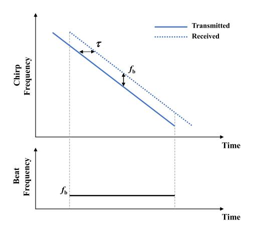

Fig. 1. Chirp signal in FMCW LiDAR.

Gamma-Gamma model is used for illustrating the FSO channel's atmospheric turbulence. [22]. In the Gamma-Gamma model, the received intensity I is considered as the product of two independent Gamma random variables. The probability density function of I can be expressed by:

$$p(I) = \frac{2(ab)^{(a+b)/2}}{\Gamma(a)\Gamma(b)} I^{(a+b)/2-1} K_{a-b} \left(2\sqrt{abI}\right), \quad I > 0,$$
(2)

where a and b represent the effective numbers of large- and small-scale turbulence cells, and  $\Gamma(.)$  is the Gamma function. Also, the scintillation index is given by  $\sigma_I^2 = (1/a) + (1/b) + (1/ab)$ , which indicates the turbulence intensities. The atmospheric loss is determined by the exponential Beers-Lambert Law as [23]:

$$h_l(z) = \exp(-\sigma z),\tag{3}$$

where  $h_l(z)$  is the loss over a propagation path of length z and  $\sigma$  is the attenuation coefficient. The atmospheric loss relies on visibility which can be measured directly from the atmosphere. The attenuation is constant during a long time period [23]. By introducing independent identical Gaussian distributions for the elevation and the horizontal displacement (sway), the radial displacement  $\alpha$  follows a Rayleigh distribution [24]. Then, the probability density function of  $h_p$  is given by

$$p(h_p) = \frac{\gamma^2}{A_0^{\gamma^2}} h_p^{\gamma^2 - 1}, \quad 0 \le h_p \le A_0 \tag{4}$$

where  $\gamma=w_{z_{eq}}/2\sigma_s$  is the ratio between the equivalent beam radius at the receiver, while  $w_{z_{eq}}$  is the equivalent beam width and the pointing error displacement standard deviation (jitter) at the receiver. Moreover, the shot noise and thermal noise are modeled as additional white Gaussian noise (AWGN), the received signal is given by:

$$y(t) = AIx(t - \tau_0) + n(t), \tag{5}$$

where  $\tau_0$  denotes the time of flight, and n(t) is represents the amplitude of the AWGN. AI depicts the received irradiance, where  $A=h_lh_p$  denotes effect including the geometric loss, atmospheric attenuation and misalignment fading.

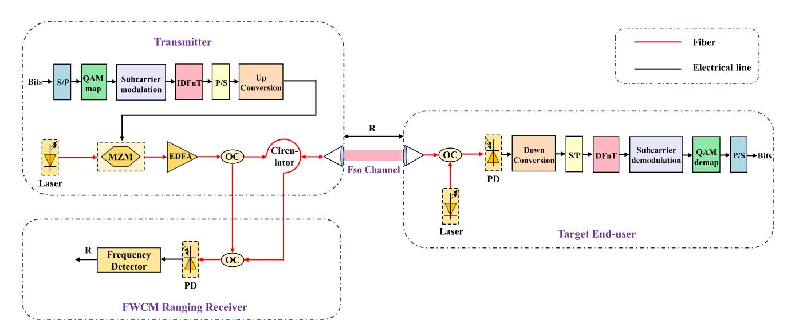

Fig. 2. The schematic diagram of the proposed ISAC system. MZM: Mach-Zehnder Modulator; EDFA: Erbium-Doped Fiber Amplifier; OC: Optical Coupler; PD: Photodetector.

Next, benefitting from the FMCW's high ranging precision, we will propose a novel OCDM-based FMCW for simultaneous ranging and communications.

#### C. Proposed OCDM-Based FMCW

The OCDM is a multi-carrier modulation scheme exploiting the Fresnel transform (FnT) in classical optics. It converts the high-speed data stream to several parallel low-speed streams, where each stream is then transmitted in the form of FMCW signals. As a result, these chirp signals are capable of overlapping in both time and frequency domains, while remaining orthogonal [25]. As shown in Fig. 2, we present our OCDM-FMCW based ISAC scheme in the context of FSO system.

In order to support data communication, by appropriately adjusting the Mach-Zehnder modulator (MZM)'s bias voltage [20], the OCDM is carried by the RF frequency of f and drives the MZM for generating an optical double side-band signal with suppressed carrier. The signal passes through the FSO channel to reach the end-user, where the received optical signal is mixed with a local laser of wavelength  $\lambda$ , making a beat frequency of f, which is then converted back to RF frequency after the photo-detector. Finally, the OCDM-formated data would be demodulated by the end-user. Moreover, in order to enable ISAC's ranging using the same waveform, we investigate the OCDM-aided FMCW waveform design by adaptively selecting the OCDM's subcarrier.

Explicitly, each subcarrier in OCDM is explicitly modeled as a linear chirp waveform. As shown in Fig. 3, if an OCDM symbol is consisted of N subcarriers, we select the  $N/2_{th}$  subcarrier for FMCW ranging. This is because it represents a complete chirp within an OCDM cycle. Then, in order to reduce the interference between the communication subcarriers and ranging subcarriers, guard bands are added, of which the power is re-distributed to the ranging subcarriers. Therefore, the amplitude of the transmitting binary phase shifting keying (BPSK) or quadrature amplitude

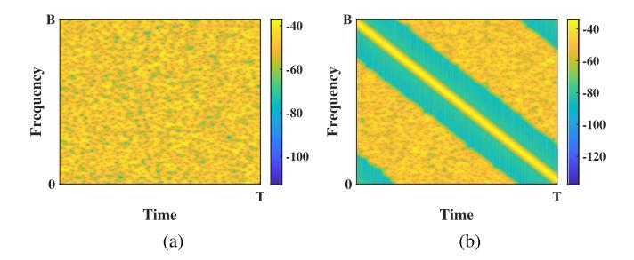

Fig. 3. Time-frequency diagram. (a) conventional OCDM. (b) OCDM-based ISAC waveform given by Equation (6).

modulation (QAM) symbol modulated by the k-th chirp can be expressed by:

$$x(k) = \begin{cases} \sqrt{P_s}, & k = \frac{N}{2} \\ 0, & 0 < \left| k - \frac{N}{2} \right| \le N_{GB}/2 \\ \sqrt{P_c}, & \text{otherwise,} \end{cases}$$
 (6)

where  $P_s = (N_{GB}+1)P_0$  is the power re-distributed to the ranging chirp,  $P_c$  is the power of communication data,  $P_0$  is the power of a single chirp without power re-distribution, and  $N_{GB}$  is the length of the guard band. To prevent interference from the communication subcarriers, the minimum guard-band's bandwidth  $B_{GB}$  should satisfy:  $B_{GB}/2 > f_b$ , and the  $f_b$  is the frequency of the beat signal.

Then, after demodulation, the communication and ranging data carried by the OCDM-based ISAC waveform would be separated. On one hand, the communication data is received by the end-user, where the communication data is retrieved from the OCDM-based ISAC waveform. On the other hand, the OCDM-based ISAC waveform carrying the ranging data is reflected by the target and coupled with the optical signal feeding the OC in the FMCW ranging receiver of Fig. 2. The resultant RF beat signal is then obtained by the PD of the FMCW receiver of

Fig. 2. Again, the beat frequency can be caught from the OCDM-basd ISAC waveform with the aid of FFT method, capable of evaluating the target distance based on (1) of Section II. Thus, we design an optical ISAC waveform based on the OCDM, and the communication and ranging information can be simultaneously retrieved from the same waveform without using the complex and expensive wideband RF-based components.

To elaborate a little further, at the communication end-user side, we demodulate the received signal using the standard OCDM method, where after processing through the DFnT module, the communication subcarriers would be "filtered out" thanks to OCDM's orthogonality. In contrast, at the FMCW ranging receiver side, the echo signal only requires being mixed with the local optical reference signal for ranging, without the complex demodulation modules, realising the optical signal processing for ISAC ranging.

We further explain the modulation and demodulation process of OCDM. Explicitly, if we consider the OCDM symbol period as T, with each containing N chirps, the k-th chirp waveform can be expressed as [25]:

$$\Psi_k(t) = e^{j\frac{\pi}{4}} e^{-j\pi \frac{N}{T^2} \left(t - k\frac{T}{N}\right)^2}, \quad 0 < t < T. \tag{7}$$

Assuming the transmitting binary phase shifting keying (BPSK) or quadrature amplitude modulation (QAM) symbol modulated by the k-th chirp is x(k) (as given by Equation (6)), the OCDM symbol arrive at:

$$s(t) = \sum_{k=0}^{N-1} x(k)\Psi_k(t), \quad 0 \le t < T.$$
 (8)

At the target end-user, the received BPSK/QAM symbol  $x^\prime(k)$  can be demodulated using a matched filter. For example, the m-th symbol obtained after the demodulation process is:

$$x'(m) = \int_0^T s(t)\psi_m^*(t)dt$$
  
=  $\sum_{k=0}^{N-1} x(k)\delta(m-k) = x(m).$  (9)

The above is the mathematical modulation and demodulation process of OCDM. We can see that the time-domain waveform of OCDM carrying both ranging and communication data is integrated. Just as OFDM can be realized in the digital domain by DFT, OCDM similarly utilizes the Discrete FnT (DFnT) for its digital realization. DFnT is used to decode OCDM symbols using the FFT module (as shown in Fig. 2), where its martrix can be expressed by:

$$\Phi(m,n) = \frac{1}{\sqrt{N}} e^{-j\frac{\pi}{4}} \times \begin{cases} e^{j\frac{\pi}{N}(m-n)^2} & N \equiv 0 \pmod{2} \\ e^{j\frac{\pi}{N}(m+\frac{1}{2}-n)^2} & N \equiv 1 \pmod{2}, \end{cases}$$
(10)

where N is the number of subcarriers (i.e. DFnT points) and (m,n) represents the m-th row and n-th column of the DFnT matrix. Subsequently, the DFnT matrix can be decomposed into  $\Phi = \Theta_1 F \Theta_2$ , where F is the DFT matrix and  $\Theta_1$  and  $\Theta_2$  is

given by:

$$\Theta_{1}(m) = e^{-j\frac{\pi}{4}} \times \begin{cases} e^{j\frac{\pi}{N}m^{2}} & N \equiv 0 \pmod{2} \\ e^{j\frac{\pi}{4N}}e^{j\frac{\pi}{N}}(m^{2}+m) & N \equiv 1 \pmod{2} \end{cases}$$
(11)

$$\Theta_2(n) = \begin{cases} e^{j\frac{\pi}{N}n^2} & N \equiv 0 \pmod{2} \\ e^{j\frac{\pi}{N}(n^2 - n)} & N \equiv 1 \pmod{2}. \end{cases}$$
 (12)

Therefore, the modulated OCDM symbol can be expressed as a matrix:

$$s' = \Phi^H x = (\Theta_1 F \Theta_2)^H x = \Theta_2^H F^H \Theta_1^H x,$$
 (13)

where  $\Phi^H$  is IDFnT matrix, and denotes the complex conjugate transpose matrix of  $\Phi$ . Then, the recovered BPSK/QAM symbol is as follow:

$$x' = \Phi s' = \Theta_1 F \Theta_2 x. \tag{14}$$

To further investigate the computational complexity of our system, we aim for evaluating the the DFnT process. The DFnT comprises the DFT and two additional phase vector multiplications while retaining FFT high-speed computing. Hence, FFT has  $\frac{N}{2}\log_2 N$  complex multiplications, where N is sampling points. Regarding the DFnT process, the additional phase matrices  $\Theta_1$  and  $\Theta_2$  are diagonal matrices, and the main diagonal is non-zeros, while the rest are zeros, which are sparse matrices. This adds an extra 2N complex multiplications without additional addition computations. Thus, DFnT has  $(\frac{N}{2}\log_2 N + 2N)$  complex multiplications, while the complexity of the DFnT process is O(NlogN), the same as FFT. Next, we will experimentally demonstrate our ISAC waveform design in the FSO system.

## III. EXPERIMENT DEMONSTRATION AND DISCUSSION

Fig. 4 illustrates the experimental setup of the proposed FSO-ISAC system. In our proof-of-concept experiment, the OCDM-based ISAC signal carrying both ranging and communication information is generated by an arbitrary waveform generator (AWG). AWGs are widely used in research laboratories as flexible signal sources for proof-of-concept experiments [26], [27]. In practical systems, it can be replaced by standard RF signal generators or integrated low-cost digital circuits, as commonly adopted in prior ISAC implementations [28], [29].

Let us elaborate a little further, we generate an OCDM signal with 1024 subchirps offline using MATLAB, with the  $512_{th}$  subcarrier being selected as the ranging chirp. The guard band  $N_{GB}$  is set to 480 to mitigate the interference between the ranging and communication subcarriers, while the OCDM symbol period and bandwidth are  $1.024^{-6}s$  and 1GHz. Then, the OCDM-based ISAC symbols are carried by a RF frequency, which drives the MZM for generating a carrier suppressed optical double side-band (CS-ODSB) signal by biasing the MZM at the null point. Subsequently, the MZM output feeds an erbium doped fiber amplifier (EDFA) and is passed to the FSO channel. As shown in Fig. 4, prior to the FSO transmission, we split the CS-ODSB signal into two branches using an 1:1 optical coupler (OC). One of the branch output is regarded as the local reference signal used for making beat frequencies at the

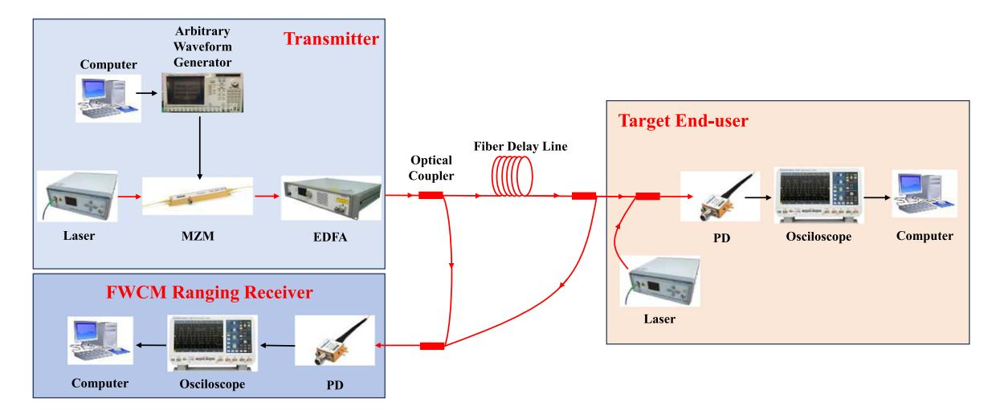

Fig. 4. Experimental Set-up.

FMCW ranging reciever, while the other one carries the ranging and communication information to the target end-users. At the target end-user, the CS-ODSB signal would be both echoed and received. In terms of FMCW ranging, the echo signal is bounced backed to the transmitter, of which the FMCW ranging receiver performs the sensing by mixing the echo signal with the local reference signal, making a beat frequency for FMCW ranging. In terms of the OCDM communications, the received CS-ODSB signal would be coherently demodulated using a local laser pump and converted back to the RF signal using a PD. Finally, both the ranging and communication data are caught and visualised by the oscilloscope for off-line processing, where, in order to comprehensively analyse the communication performance, the received communication data at the target end-user will feed the simulation-based Gamma-Gamma FSO channel model for further assessment.

Note that as shown in Fig. 4, since we focus on the design of the OCDM-based ISAC waveform and the optical-assisted FMCW ranging receiver, which aims at the echo and received signal processing, to accurately verify the ranging accuracy using our waveform, we mimic the FSO channel delay by a fiber delay line. In the literature, introducing delay via a fiber delay line is a common and accepted practice to simulate FSO propagation delay in proof-of-concept experiments [\[5\],](#page-9-0) [\[30\],](#page-10-0) [\[31\].](#page-10-0) Moreover, to further investigate the characteristics of the FSO channel and its impact on the communications, we add the atmospheric turbulence after the fiber delay line by adopting the Gamma-Gamma model. The Gamma-Gamma distribution model was firstly proposed by Andrew et al. in [\[32\],](#page-10-0) where, by invoking a dual Gamma process that describes the joint large-scale modulation and small-scale diffraction effects in turbulence, its parameters can directly correlate with atmospheric characteristics. Moreover, its closed-form equation is capable of conducting the efficient outage probability analysis. As a result, it is widely recognized as the standard model for the moderateto-strong turbulence within FSO links, while considering diverse atmospheric turbulence conditions [\[5\],](#page-9-0) [\[6\],](#page-9-0) [\[33\].](#page-10-0) Additionally, other literatures also verified its feasibility as the FSO channel

TABLE I EXPERIMENT PARAMETERS

| Parameter                        | Value                                 |
|----------------------------------|---------------------------------------|
| Laser center wavelength          | 1550 nm                               |
| Fiber type                       | Standard Single Mode Fiber at 1550 nm |
| OCDM drive signal                | 3 GHz                                 |
| OCDM bandwidth                   | 1 GHz                                 |
| Number of OCDM subcarriers       | 1024                                  |
| Number of guard band subcarriers | 480                                   |
| Modulation format                | 4 QAM, 16 QAM, 64 QAM                 |
| PD bandwidth                     | 50 GHz                                |

model. For example, in [\[34\],](#page-10-0) the Gamma-Gamma model was introduced in an optical hard-limiter relaying FSO system, in order to characterize the atmospheric turbulence channels, achieving a good BER performance under weak/moderate/strong turbulence conditions. Meanwhile, in [\[35\],](#page-10-0) a unified framework involving impairments of turbulence, pointing errors, and random fog in RIS-FSO systems has been established, validating the feasibility of the Gamma-Gamma channel model. Other literatures including [\[36\],](#page-10-0) [\[37\],](#page-10-0) [\[38\],](#page-10-0) [\[39\]](#page-10-0) also endorsed the Gamma-Gamma channel model for FSO transmission, making it a reliable mathematical model used for FSO ISAC system. Therefore, to accurately mimic the realistic FSO environments, we will introduce the well-established Gamma-Gamma model in our system, and investigate the impact of the pointing errors and fog attenuation on the proposed FSO-ISAC system later in this section.

The experimental parameters are given by Table I. We will demonstrate the ranging and communication performance in two separate sections here. Then, we will analyze the OCDM-FMCW subcarrier power allocation, followed by evaluating the peak-to-average power ratio (PAPR) of our proposed OCDMbased ISAC waveform.

## *A. Ranging*

As given by [\(1\)](#page-2-0) of Section [II-A,](#page-2-0) the target distance is determined by the beat signal obtained in the FMCW LiDAR receiver,

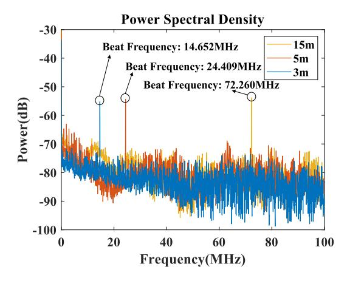

Fig. 5. Obtained beat frequencies for different fiber delay line.

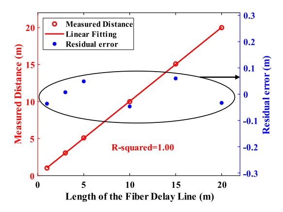

Fig. 6. Comparison between the measured target distance and their corresponding pre-set fiber delay length.

where in our experiment, we compare the fiber delay with our measured target distance. Fig. 5 shows the obtained beat signal when 3, 5 and 15 meters fiber delay line are implemented, and we obtain the beat frequency of 14.652 MHz, 24.409 MHz and 72.260 MHz, respectively. Then, by setting the refractive index of the fiber as 1.47, based on the linear relationship between the frequency and the target distance, the measured fiber delay lengths are 3.0599, 5.0976 and 15.0904 m, which aligns with the real fiber length with little difference.

The comparison between the measured distance and the corresponding pre-set fiber delay length is shown in Fig. 6, where the R-squared value for the relation between the pre-set distances and measured distances is equal to 1. The R-squared value of a linear fit is a metric that quantifies the proportion of variation in the dependent variable explained by the independent variable, ranging from 0 to 1, where a higher value indicates stronger explanatory power of the model. This indicates that the distance to the target can be measured accurately using our FSO-ISAC system. In addition, as shown in Fig. 6, we also give the residual error between the measured target distance and their corresponding pre-set fiber delay length, which are all within 0.1 m.

Furthermore, to validate that our OCDM-based FMCW ranging can perform well when comparing with the standard FMCW

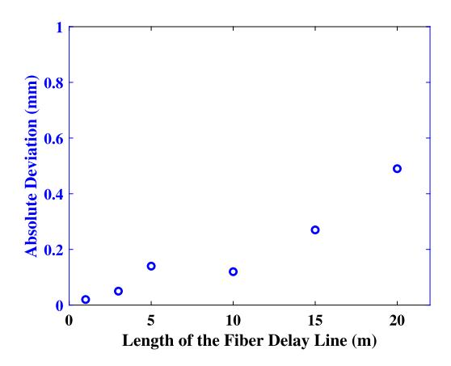

Fig. 7. Deviation between the OCDM-based FMCW Ranging and the standard unmodulated FMCW Ranging.

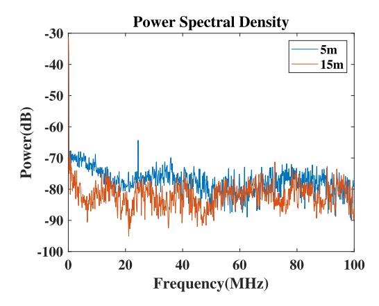

Fig. 8. The obtained beat frequencies when the OCDM-based FMCW waveform experiences different delays.

system. In Fig. 7, we generate an unmodulated FMCW signal of the same configuration using the AWG, and we sweep the frequencies from 2.5 GHz to 3.5 GHz under the bandwidth of 1 GHz. As shown in Fig. 7, the deviation between the OCDMbased FMCW ranging and the standard unmodulated FMCW ranging is within 1 mm, showing that our proposed waveform has little impact on the FMCW ranging accuracy.

Moreover, as mentioned in Section [II-C,](#page-3-0) we re-distribute the guard band's power onto the ranging subcarrier, where the length of the guard band will affect the attainable ranging accuracy. Thus, in Fig. 8, we put our OCDM-based FMCW waveform into two scenarios, where the fiber delay lengths of 5 m and 15 m are used, respectively. As given by the red line of Fig. 8, we found that the higher delay resulting from the long-distance delay line (i.e., 15 m) can severely affect the power of the beat frequencies, therefore degrading the attainable ranging accuracy. This is because that the higher delay is likely to impose more interference between the ranging subcarriers and the communications subcarriers due to increased frequency shifts. To improve the attainable ranging distance, the length of the guard band could be increased, but at the cost of reduced communication data capacity. Thus, we suggest the practitioner opt for the

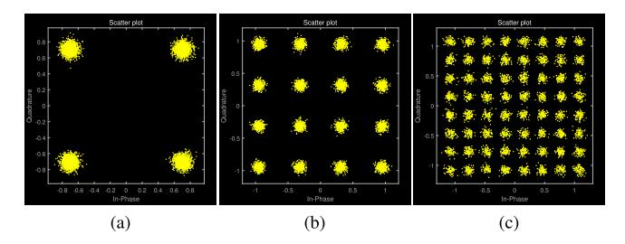

Fig. 9. Constellation diagram. (a) 4QAM. (b) 16QAM. (c) 64QAM.

length of guard bands accordingly, and we will analyze the OCDM-FMCW power allocation on the ISAC performance later in this section. Hence, we demonstrate our FSO-ISAC FMCW ranging performance with high accuracy. Next, we present the communication performance.

## *B. Communications*

On the other hand, our proposed OCDM-based FMCW waveform can simultaneously support the high-speed communications. At the target end-users of Fig. [4,](#page-5-0) the communication data will be demodulated by the OCDM demodulation module. To show our capacity-enhanced communications, we adopt the higher-order modulation format of 4-, 16- and 64- quadrature amplitude modulation (QAM) signal in our system with a maximum capacity of 3.182 Gbps, where as shown in Fig. 9, the error vector magnitude (EVM) of the above three are 7.44%, 6.10% and 5.83%, respectively. The constellation diagrams given by Fig. 9 are clear, indicating that the OCDM-based FMCW waveform can well support the ISAC communications. In this section, lower-order modulation formats such as 4-QAM is included to demonstrate the baseline performance and robustness of the proposed OCDM-FMCW ISAC system under lower modulation complexity, highlighting its adaptability across diverse channel conditions and practical scenarios such as degraded FSO links or mobile uncrewed aerial vehicle (UAV) platforms.

Moreover, to further investigate the characteristics of the FSO channel and its impact on the communications, we add the atmospheric turbulence after the fiber delay line. Note that, in our experimental set-up, the fiber delay line is used for modelling the FSO channel's delay, while we use Gamma-Gamma simulated model for implementing different atmospheric turbulence intensities, where we vary the communication modulation format for verifying that our proposed design can support various user cases. It is clearly depicted in Fig. 10 that the BER performance degrades as the turbulence intensity increases for all three modulation formats. This is due to the fact that the atmospheric turbulence leads to the signal power reduction, hence degrading the BER performance. Furthermore, as shown in Fig. 10, under the same turbulence intensity, the higher-order modulation presents worse BER performance owing to its susceptibility to the atmospheric turbulence and noises.

On the basis of the gamma-gamma model, we further investigate the impact of other FSO channel characteristics, namely atmospheric attenuation and pointing errors, on our system. Atmospheric attenuation is decided by visibility and by the length

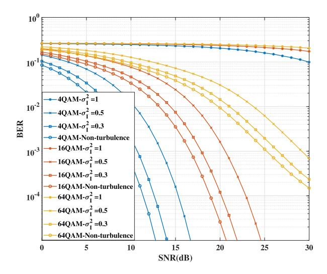

Fig. 10. BER performance of QAM modulation scheme when GG fading model is considered.

#### TABLE II FSO CHANNEL PARAMETERS

| Parameter                          | Value                     |
|------------------------------------|---------------------------|
| Visibility                         | 10 km, 0.5 km             |
| Atmospheric attenuation            | -0.44 dB/km, -33.98 dB/km |
| Scintillation index                | 0.5                       |
| Beam waist width                   | 0.1 m                     |
| Receiver radius                    | 0.1 m                     |
| Pointing Jitter Standard Deviation | 0.05 m                    |

of propagation path. The related FSO channel parameters are given by Table II. As shown in Table II, we simulate two visibility values of 10 km and 0.5 km that represent two whether conditions, namely clear (visibility ≥ 10 km) and fog (visibility ≤ 0.5 km), and the corresponding atmospheric attenuation would be −0.44 dB/km and −33.98 dB/km. The BER performance using 16-QAM under different atmospheric turbulence intensities and visibility conditions with pointing errors are shown in Fig. [11.](#page-8-0) It can be seen in Fig. [11](#page-8-0) that those with higher visibility conditions (i.e. visibility = 10 km) outperform those with low visibility conditions (visibility = 0.5 km). It is because low visibility brings serious atmospheric attenuation, which leads to lower receiving power. Furthermore, as shown in Fig. [11,](#page-8-0) compared to that without introducing the pointing errors, that with a pointing jitter standard deviation of 0.05m gives worse BER performance, due to the fact that the pointing error reduces the received power. Note that, due to the lack of FSO hardware, our work currently relies on simulation to represent the FSO environment, which is well aligned with the community's approach in early-stage demonstrations. However, we plan to extend this work with practical FSO experiments in the future.

# *C. Ranging and Communication Subcarrier Power Allocation*

As discussed in Section [III-A,](#page-5-0) our ISAC waveform design is capable of dynamically allocating power onto the ranging

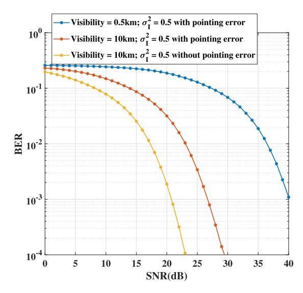

Fig. 11. BER performance of 16QAM modulation scheme under different FSO conditions.

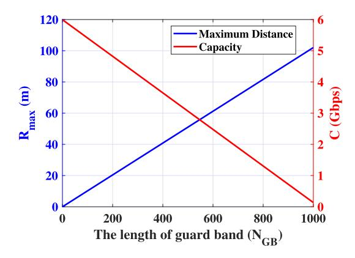

Fig. 12. The relationship amongst the ranging distance, the communication capacity, and guard band length.

and communication subcarriers, with selections of guard band length, OCDM signal bandwidths and symbol period. In order to further investigate its impact on the ISAC performance, we will analyse the trade-off of the allocated power between the ranging and communication subcarriers. As mentioned in Section III-A, in order to prevent the inter-subcarrier interference which could potentially affect the ISAC performance, the minimum guardband's bandwidth  $B_{GB}$  should satisfy:  $B_{GB}/2 > f_b$ . Therefore, in this section, we define the attainable ranging distance as  $R_{\rm max}$ , which can be expressed as  $R_{\rm max} = \frac{cT}{2nN} N_{\rm GB}$ . Meanwhile, the communication capacity C can also be expressed as  $C = C_0(N - N_{GB} - 1)$ , where  $C_0$  represents the data capacity of a single subcarrier. Thus, by varying the the length of the guard band, Fig. 12 shows that the ranging distance and the communication capacity are inversely related, while they are both linear to the guard band's length of  $N_{GB}$ . This indicates that to improve the attainable ranging distance, the length of the guard band should be increased, but sacrificing the communication data capacity.

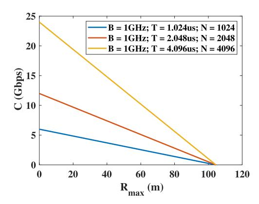

Fig. 13. The relationship between the attainable ranging distance and communication data capacity under different signal bandwidths.

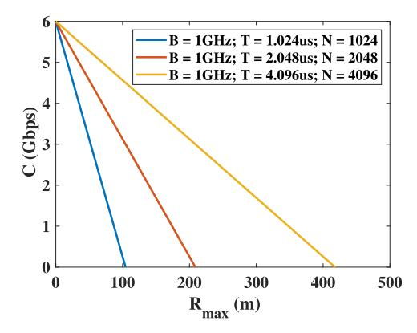

Fig. 14. The relationship between attainable ranging distance and communication data capacity under different symbol periods.

Meanwhile, in order to increase the communication capacity C while maintaining the attainable ranging distance  $R_{\rm max}$ , we could keep the OCDM symbol period T unchanged and increase the total number of OCDM subcarriers N. As shown in Fig. 13, by expanding the OCDM total bandwidth B, the communication data capacity increases. Then, we can obtain the relationship between C and  $R_{\rm max}$ :  $C = (-\frac{2nNC_0}{cT})R_{\rm max} + C_0(N-1)$ . It is also clearly shown in Fig. 13 that, when the ranging distance is increasing, the communication data capacity decreases, while under the same attainable ranging distance, the communication capacity of the OCDM system increases with its total bandwidth. Furthermore, as given by [40], since FMCW ranging resolution,  $\Delta d = \frac{c}{2B}$ , increasing the bandwidth improves the ranging resolution. But, higher bandwidth requires higher performance hardware and often leads to higher power consumption.

Moreover, as shown in Fig. 14, the attainable ranging distance can also be extended by increasing the OCDM symbol period T. Meanwhile, if the communication data capacity C is required to be unchanged, we need to increase the number of OCDM subcarriers N to fix the OCDM total bandwidth, which would add more computational complexity. Therefore, we recommend selecting the length of the guard band and the associated OCDM parameters accordingly. In this section, we conduct a parametric

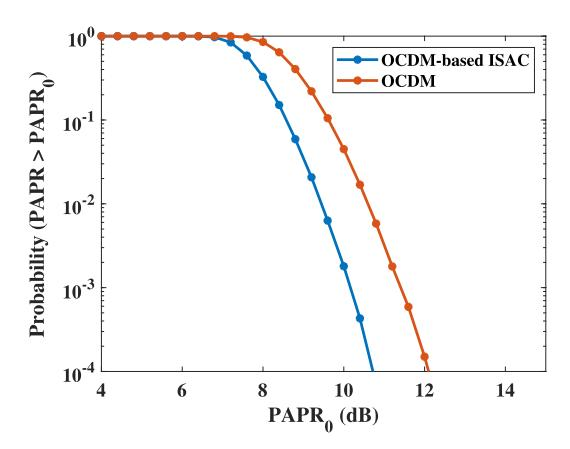

Fig. 15. The PAPR characteristics of the OCDM, OCDM-based ISAC signals with 1024 chirps modulated in 16-QAM.

study on OCDM power allocation, where we show that our system is flexible on dynamically allocating the ranging and communication resources, and the ranging distance and the communication data capacity can be adaptively balanced for diverse application needs (e.g., short-range high-throughput or long-range sensing). For example, a longer guard band can improve ranging performance at the cost of reduced spectral efficiency, while increasing the OCDM symbol period or the number of the subcarriers allows for compromising overall system functionality.

## *D. Peak-to-Average Power Ratio Performance*

The PAPR of our OCDM scheme has been proven to be identical to that of OFDM in the literature [\[25\].](#page-10-0) In this section, to further justify, we will investigate the PAPR performance of the proposed OCDM-based FMCW system. In the OCDM system, if we set the number of chirps as 1024 and the chirps are modulated in 16-QAM. The number of guard band subcarriers is set to 480. Its PAPR can be evaluated by complementary cumulative distribution function (CCDF), which is defined as the probability of the PAPR of a signal exceeding a threshold PAPR0. As shown in Fig. 15, the CCDF of the PAPR of our proposed OCDM-based FMCW system is presented, where the PAPR performance using our proposed ISAC waveform is superior to that of conventional OCDM. This is owing to the proposed waveform's non-uniform power allocation across subcarriers, which effectively reduces carrier superposition density and suppresses peak-amplitude occurrence probability. In addition, even higher PAPR may impose more strigent requirements on the device linearity, various PAPR reduction methods have been proposed in the literature [\[41\],\[42\]](#page-10-0) and can be easily applied to the OCDM systems.

Therefore, in the context of FSO system, we experimentally demonstrate both the ranging and communication performance of our novel OCDM-based FMCW ISAC waveform design. Moreover, we achieve capacity-enhanced communications, while maintaining the FMCW's high ranging accuracy, with low-complexity FMCW-based ranging receiver.

# IV. CONCLUSION

In this paper, we presented a novel FSO-ISAC waveform based on OCDM and FMCW LiDAR. Specifically, the OCDMbased waveform was split to ranging subcarriers and communication subcarriers. Then, by appropriately re-distributing the bandwidth of the guard bands, hence dynamically allocating the ranging and communication subcarrier power, we can obtain high-accuracy ranging and capacity-enhanced communications. Furthermore, the ranging and the communication data can be carried by the same signal with low-complexity optical-assisted signal processing, where we conceived a simplified FMCW ranging receiver design. Finally, we experimentally demonstrated the FSO-ISAC system, where we achieved the centimeter level ranging, which is comparable with the standard unmodulated FMCW LiDAR. Meanwhile, our system is capable of supporting the high-performance communication of 3.182 Gbps using high-order modulation format.

# REFERENCES

- [1] A. Liu et al., "A survey on fundamental limits of integrated sensing and communication," *IEEE Commun. Surveys Tut.*, vol. 24, no. 2, pp. 994–1034, Secondquarter 2022.
- [2] Y. Wen, F. Yang, J. Song, and Z. Han, "Free-space optical integrated sensing and communication based on DCO-OFDM: Performance metrics and resource allocation," *IEEE Internet Things J.*, vol. 12, no. 2, pp. 2158–2173, Jan. 2025.
- [3] Y. Wen, F. Yang, J. Song, and Z. Han, "Pulse sequence sensing and pulse position modulation for optical integrated sensing and communication," *IEEE Commun. Lett.*, vol. 27, no. 6, pp. 1525–1529, Jun. 2023.
- [4] Z. Xu et al., "Frequency-modulated continuous-wave coherent lidar with downlink communications capability," *IEEE Photon. Technol. Lett.*, vol. 32, no. 11, pp. 655–658, Jun. 2020.
- [5] Y. Hai, Y. Luo, C. Liu, and A. Dang, "Remote phase-shift LiDAR with communication," *IEEE Trans. Commun.*, vol. 71, no. 2, pp. 1059–1070, Feb. 2023.
- [6] Y. Wen, F. Yang, J. Song, and Z. Han, "Free space optical integrated sensing and communication based on LFM and CPM," *IEEE Commun. Lett.*, vol. 28, no. 1, pp. 43–47, Jan. 2024.
- [7] Y. Wen, F. Yang, J. Song, and Z. Han, "Power allocation for OFDM-based free space optical integrated sensing and communication," in *Proc. IEEE Int. Conf. Commun.*, 2024, pp. 2408–2413.
- [8] X. Ouyang and J. Zhao, "Orthogonal chirp division multiplexing for coherent optical fiber communications," *J. Lightw. Technol.*, vol. 34, no. 18, pp. 4376–4386, Sep. 2016.
- [9] X. Ouyang, O. A. Dobre, Y. L. Guan, and J. Zhao, "Chirp spread spectrum toward the Nyquist signaling rate—Orthogonality condition and applications," *IEEE Signal Process. Lett.*, vol. 24, no. 10, pp. 1488–1492, Oct. 2017.
- [10] S. Zhu et al., "Secure OCDM mode division multiplexed short-reach optical communication based on time-frequency joint perturbation," *J. Lightw. Technol.*, vol. 40, no. 14, pp. 4599–4606, Jul. 2022.
- [11] Z. Lyu et al., "Radar-centric photonic terahertz integrated sensing and communication system based on LFM-PSK waveform," *IEEE Trans. Microw. Theory Techn.*, vol. 71, no. 11, pp. 5019–5027, Nov. 2023.
- [12] W.-Q. Wang, Z. Zheng, and S. Zhang, "OFDM chirp waveform diversity for co-designed radar-communication system," in *Proc. 18th Int. Radar Symp.*, 2017, pp. 1–9.
- [13] K.-S. Lee, Y.-J. Cho, J.-Y. Woo, J.-S. No, and D.-J. Shin, "Low-complexity PTS schemes using OFDM signal rotation and pre-exclusion of phase rotating vectors," *IET Commun.*, vol. 10, no. 5, pp. 540–547, 2016.
- [14] S. C. Thompson, A. U. Ahmed, J. G. Proakis, J. R. Zeidler, and M. J. Geile, "Constant envelope OFDM," *IEEE Trans. Commun.*, vol. 56, no. 8, pp. 1300–1312, Aug. 2008.
- [15] R. Chen, B. Yang, W. Wang, and P. Chen, "Range and velocity estimation for DFRFT-OFDM-based joint communication and sensing systems," in *Proc. IEEE 90th Veh. Technol. Conf.*, 2019, pp. 1–5.

- [16] J. Liu, E. Chen, N. Sun, and B. Ma, "Music based multipath delay estimation method in the fractional domain for OFDM-LFM," *IEEE Signal Process. Lett.*, vol. 31, pp. 2830–2834, 2024.
- [17] D. Lu, Y. Wang, L. Liu, R. Zhang, and X. Ma, "Channel estimation for pilot-aided MIMO-OCDM transmissions," *IEEE Trans. Commun.*, early access, Apr. 18, 2025, doi: [10.1109/TCOMM.2025.3562365.](https://dx.doi.org/10.1109/TCOMM.2025.3562365)
- [18] L. Li et al., "THz-over-fiber system with orthogonal chirp division multiplexing for integrated sensing and communication," *J. Lightw. Technol.*, vol. 42, no. 1, pp. 176–183, Jan. 2024.
- [19] Z. Wan et al., "Orthogonal chirp division multiplexing waveform design for 6G mmwave UAV integrated sensing and communication," in *Proc. 2024 Int. Wireless Commun. Mobile Comput.*, 2024, pp. 622–627.
- [20] P. Shi et al., "Optical FMCW Signal Generation Using a Silicon Dual-Parallel Mach-Zehnder Modulator," *IEEE Photon. Technol. Lett.*, vol. 33, no. 6, pp. 301–304, Mar. 2021.
- [21] S. Crouch, "Velocity measurement in automotive sensing: How FMCW radar and lidar can work together," *IEEE Potentials*, vol. 39, no. 1, pp. 15–18, Jan./Feb. 2020.
- [22] M. A. Khalighi and M. Uysal, "Survey on free space optical communication: A communication theory perspective," *IEEE Commun. Surveys Tut.*, vol. 16, no. 4, pp. 2231–2258, Fourthquarter 2014.
- [23] A. A. Farid and S. Hranilovic, "Outage capacity optimization for free-space optical links with pointing errors," *J. Lightw. Technol.*, vol. 25, no. 7, pp. 1702–1710, Jul. 2007.
- [24] H. G. Sandalidis, T. A. Tsiftsis, and G. K. Karagiannidis, "Optical wireless communications with heterodyne detection over turbulence channels with pointing errors," *J. Lightw. Technol.*, vol. 27, no. 20, pp. 4440–4445, Oct. 2009.
- [25] X. Ouyang and J. Zhao, "Orthogonal chirp division multiplexing," *IEEE Trans. Commun.*, vol. 64, no. 9, pp. 3946–3957, Sep. 2016.
- [26] G. Chen, J. Liu, M. Liu, X. Qu, and F. Zhang, "Non-line-of-Sight ranging and 3D imaging using vector enhanced sensitive FMCW LiDAR," *J. Lightw. Technol.*, vol. 43, no. 9, pp. 4119–4126, May 2025.
- [27] J. Ren et al., "Performance and security improvement of three-dimensional orthogonal chirp division multiplexing system with 2D-IDFnT," *J. Lightw. Technol.*, vol. 42, no. 16, pp. 5544–5551, Aug. 2024.
- [28] R. Ghasemi, P. Fenske, T. Koegel, M. Hehn, I. Ullmann, and M. Vossiek, "Ultrahigh-performance radio frequency system-on-chip implementation of a Kalman filter-based high-precision time and frequency synchronization for networked integrated sensing and communication systems," *IEEE Open J. Instrum. Meas.*, vol. 4, 2025, Art. no. 5500215.
- [29] A. S. Kumar, N. Unnikrishnan, R. Raghu, and R. Rajesh, "FPGA based OFDM MIMO transmit beamformer for multi-functional software defined radars," in *Proc. 2024 IEEE Space, Aerosp. Defence Conf.*, 2024, pp. 527–531.

- [30] M. Rezaei et al., "Secure FMCW LiDAR ranging with an electro-optical synthesizer at 5000 measurements/s," *IEEE Solid-State Circuits Lett.*, vol. 8, pp. 93–96, 2025.
- [31] M. Kamata, Y. Hinakura, and T. Baba, "Carrier-suppressed single sideband signal for FMCW LiDAR using a si photonic-crystal optical modulators," *J. Lightw. Technol.*, vol. 38, no. 8, pp. 2315–2321, Apr. 2020.
- [32] A. Al-Habash, L. C. Andrews, and R. L. Phillips, "Mathematical model for the irradiance probability density function of a laser beam propagating through turbulent media," *Proc. SPIE*, vol. 40, no. 8, pp. 1554–1562, 2001, doi: [10.1117/1.1386641.](https://dx.doi.org/10.1117/1.1386641)
- [33] Y. Kim and D. Yoon, "Moment-based estimation for Gamma-Gamma fading parameters in free-space optical links," *IEEE J. Sel. Areas Commun.*, vol. 43, no. 5, pp. 1582–1589, May 2025.
- [34] P. V. Trinh, N. T. Dang, and A. T. Pham, "All-optical relaying FSO systems using EDFA combined with optical hard-limiter over atmospheric turbulence channels," *J. Lightw. Technol.*, vol. 33, no. 19, pp. 4132–4144, Oct. 2015.
- [35] V. K. Chapala and S. M. Zafaruddin, "Unified performance analysis of reconfigurable intelligent surface empowered free-space optical communications," *IEEE Trans. Commun.*, vol. 70, no. 4, pp. 2575–2592, Apr. 2022.
- [36] M. V. Jamali and H. Mahdavifar, "Uplink non-orthogonal multiple access over mixed RF-FSO systems," *IEEE Trans. Wireless Commun.*, vol. 19, no. 5, pp. 3558–3574, May 2020.
- [37] G. Narang, M. Aggarwal, H. Kaushal, A. Kumar, S. Ahuja, and N. K. Shukla, "Performance evaluation of dual hop mixed FSO RF system using differential chaos shift keying with secrecy analysis," *IEEE Trans. Veh. Technol.*, vol. 73, no. 11, pp. 17347–17358, Nov. 2024.
- [38] E. Zedini, Y. Ata, A. Kammoun, and M.-S. Alouini, "A novel approach to approximating generalized pointing errors modeled by Beckmann distribution in FSO communication systems," *IEEE Open J. Commun. Soc.*, vol. 6, pp. 727–741, 2025.
- [39] Z. Li, X. Zhou, W. Ni, and X. Wang, "A new photon-counting MU-MISO ultraviolet communication system with MMSE precoding in turbulence channels," *IEEE Trans. Veh. Technol.*, vol. 73, no. 7, pp. 10805–10810, Jul. 2024.
- [40] A. Martin et al., "Photonic integrated circuit-based FMCW coherent LiDAR," *J. Lightw. Technol.*, vol. 36, no. 19, pp. 4640–4645, Oct. 2018.
- [41] T. Jiang and Y. Wu, "An overview: Peak-to-average power ratio reduction techniques for OFDM signals," *IEEE Trans. Broadcast.*, vol. 54, no. 2, pp. 257–268, Jun. 2008.
- [42] H. T. Alrakah, T. Z. Gutema, S. Sinanovic, and W. O. Popoola, "PAPR reduction in DCO-OFDM based WDM VLC," *J. Lightw. Technol.*, vol. 40, no. 19, pp. 6359–6365, Oct. 2022.