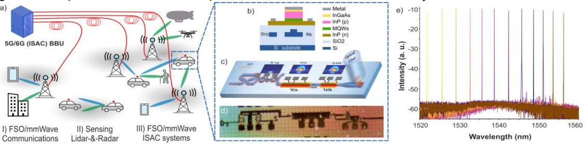
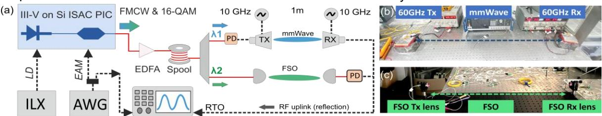
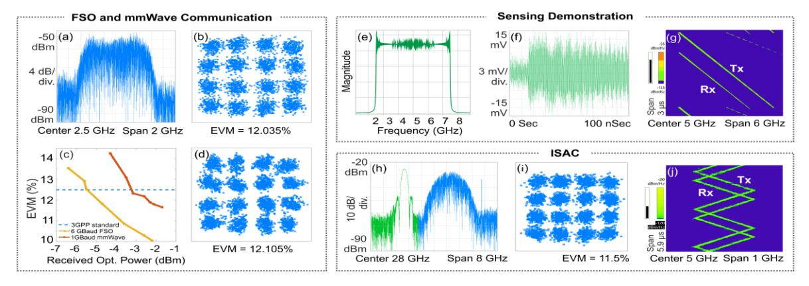

# Heterogeneous Integrated III-V-on-SOI Transmitter for 6G FiWi mmWave/FSO Integrated Sensing and Communication

Akeem Safiriyu (1) , Maria Vargemidou (2) , Chris Vagionas (2) , Joan Ramirez (3) , Faci Salim (1) , Nikos Pleros (2) , Amalia Miliou (2), Anne-Laure Billabert (1) , Catherine Algani (1)

- (1) Université Gustave Eiffel, CNRS, CNAM, ESYCOM, 292, rue Saint-Martin, 75003, Paris, France akeem.safiriyu@univ-eiffel.fr
- (2) Department of Informatics, Aristotle University of Thessaloniki, Thessaloniki, Greece
- (3) III-V Lab, 1 Avenue Augustin Fresnel, 91767, Palaiseau, France

**Abstract:** *A heterogeneous fully integrated photonics transmitter with a III-V-on-SOI laser and EAM is experimentally presented in a Fi-Wi and FSO links, achieving 16-QAM transmission at 24 Gbps capacity and a LFMCW with a resolution of 0.03 m at 384 m radar range for emerging 6G ISAC networks.*

#### **Introduction**

The deployment of 5G for Radio Access Networks (RANs), the use of different Frequency Range (FR), including FR1 (0.4 − 7 ), FR2 (24 −70 ) and FR3 (7 − 24 ), and the demand for continuous, ultra-high data rate beyond the current 24.33 of CPRI/e-CPRI Rate-10 and low latency, down to <1 , in various applications have necessitate efficient utilization of the limited spectrum, and massive deployment of energy-efficient devices [1, 2]. In parallel, RANs are evolving towards a new era of concurrent environmental 'sensing', introducing Integrated Sensing and Communication (ISAC) functions in 6G, which are standardized by NextG, 6G-IA, ETSI and 3GPP alliances [3] – [6]. Recent roadmaps suggest steadily more stringent localizationsensing KPIs and Use cases, such as accuracy of 0.2 − 0.5 for human movement recognitions to airborne-environmental sensing and automotive scenarios, 100 sweeping-cycle times for traffic coordination or collision avoidance or 0.375 resolution for gesture recognition and motion monitoring [2]. Such ISAC applications request precise localization of a User Equipment (UE) or distance object, that has been so far performed in lidars/radars, stimulating a strong interest in sharing hardware with conventional communications to facilitate joint ISAC transmitters with reduced cost, weight and size [5][6], especially as 6G scale in the vertical dimension with battery operated UAVs, drones or low/high altitude platform stations as depicted in Fig. 1(a).

Global research efforts have focused on developing transmitters capable of high sensing resolutions with support for communications at all 6G FRs. The demonstrations of ISAC with electronic transmitters are usually faced with the wellknown bandwidth and high-power consumption limitations [13], electro-optics transmitters used for ISAC demonstration in Radar [1][2][7][14] and LiDAR [8] applications have relied on external laser sources and other discrete devices [6] leading to bulky assemblies. This is due to the long-standing challenge of integrating laser and other III-V active components on Si platform [9], marking the distinct absence of a fully integrated PIC transmitter that meets all ISAC KPIs.

This work draws from latest heterogeneous integrations of compact III-V-on-SOI PICs for telecom [10], and spectroscopy [11], presents a fully-integrated PIC that utilizes a single, "unified" III-V epitaxy both for the laser and the modulator, achieving a compact, cost-efficient and fullyintegrated solution with a good trade-off between optical power, electro-optics bandwidth and driving voltage. The PIC is experimentally tested in mmWave Fiber Wireless (Fi-Wi) and Free Space Optical (FSO) setups for three distinct 6G ISAC scenarios, achieving up to 24 data modulation using a 16-QAM format, operation at all FRs, resolution down to 0.03 at a dynamic range up to 384 and 2.54 sweeping cycle in sensing scenarios. Finally, the PIC is benchmarked in a joint ISAC demonstration,

**Fig. 1:** a) Conceptual Schematic of the deployment of ISAC PIC for Fiber Wireless mmWave and free space optics (FSO) in 6G RANs communication. BBU –backbone unit. b)-d) Cross-section, schematic and photo of the developed ISAC PIC transmitter and e) spectrum of the tunable laser

where the 16-QAM signal was multiplexed successfully in frequency with a LFMCW sensing signal, performing concurrent efficient ISAC operations, shaping a promising roadmap for emerging 6G ISAC networks.

#### **III-V-on-SOI PIC and Experimental Setup**

 The proposed system relies on a compact, tunable laser and a broadband EAM, heterogeneously co-integrated on the Si platform using direct wafer to wafer bonding of a 3-inch III-V wafer to a 12-inch Si wafer [10]. Both of the laser and the modulator share a single III-V epitaxial stack. As depicted in the waveguide cross-section of the III-V-on-SOI integration, developed in III-V Lab, in Fig. 1(b), the SOI patform contain a 500 crystalline Si layer. The Si platform is etched to define two waveguide heights, including a 300 for the Si-waveguide circuitry (micro-rings, bends, MMIs) and 500 for the Si waveguide interposers located underneath the III-V waveguides for efficient optical mode transfer. The III-V epitaxial structures comprise multiple layers, such as a PIN junction of P-doped InP, an AlGaInAs MQW active region flanked by separated confinement heterostructure and a N-doped InP layer, as detailed in [10].

 The circuit layout of the tunable laser followed by the EAM is shown in Fig. 1(c). The tunable laser incoparated a gain section; length of 670 and a confinement factor, ΓQWs = 13.5 % ; interleaved between a distributed Bragg grating, a double-pass Vernier filter on Si platform, and a high reflective Sagnac mirror. The Vernier filter consisting of two racetrack resonators of 2.52 and 2.68 radius, provides 43.56 tunning range as depicted in Fig. 1(e). Aiming to evaluate the PIC against typical ISAC purposes out in the field, the laser characterization under uncooled condition of normal lab-environment, showed a threshold current of 50 , and an output power of −5 .

 The III-V-on-SOI EAM whose = 150 , ΓQWs = 13.7 %, exploits the Quantum Confined Stark effect (QCSE) that sets its peak band edge at 1520 , thus supporting operation across the telecommunication C-band. The laser's optical output was sent into EAM from which an insertion loss of 4 and a static extinction ratio of 7 under 2.5 reversed bias voltage was measured, confirming its low-power consumption features in uncooled conditions.

 The optical output from the PIC was obtained via grating coupler and propagated to the Fi-Wi setup, as shown in Fig. 2(a). Specifically, a Keysight N8195A AWG is used to generate various ISAC waveforms, with 2048 symbols of 16-QAM at FR1, 2 and 3 bands and LFMCW of Radar/LiDAR application, in order to modulate the EAM and imprint them on the optical carrier. The Analog Radio over Fiber (ARoF) was propagated through a 7 single mode fiber spool, amplified by an erbium doped fiber amplifier to compensate the losses and spatially routed by an array waveguide gratingdemultiplexer with of 0.7 channel bandwidth towards the FSO/mmWave stages.

The Over the Air (OTA) distances of the FSO and mmWave wireless links were 1 and connected to different wavelengths output (2 and 1) of the demultiplexer respectively. For the FSO link, two Thorlabs C80APC-C achromatic fiber collimated lens with 80 focal length were mounted on kinematic rotation stages and aligned across a 1 link distance, while for the mmWave link, the signal was optical-electrical converted by a Lab Buddy InGaAs photoreceiver with 0.82 / responsivity and then a pair of Gotmic V-band Tx-Rx antennas (gMRX0061A) with 6x RF upconversion stages using a 16 local oscillator signal of 10 . Finally, the received 16-QAM and LFMCW signals were connected to a Real Time Oscilloscope (RTO) Keysight DSOZ632A for evaluation purpose.

#### **Experimental Results**

The PIC transmitter is benchmark in three transmission scenarios and use cases; B5G/6G communications, LiDAR/Radar sensing and finally, a joint ISAC scenario. In the first B5G/6G Fi-Wi ARoF mmWave/FSO fronthaul scenarios, two signals were synthesized and tested with 2048 symbols. Particularly, a 16-QAM signal at 2.5 IF and a symbol rate of 1 was transmitted OTA at 62.5 by the horn antennas, while a 16-QAM signal at a 10 IF and 6 symbol rate was transmitted across

**Fig. 2:** a) Experimental Setup for joint sensing and communication with III-V on SOI transmitter, (b) picture of mmWave wireless link and (c) Free Space Optics (FSO) link with 1m transmission distance over the air with a received echo signal via RF cable.

the FSO link. The received constellation diagrams are depicted in Fig. 3(b) and (d), featuring Error Vector Magnitude (EVM) of 12.035 % and 12.105 % respectively at a received optical power of −3 and −5 at the photodiode. This satisfies the 3GPP threshold values, thus confirming the capability of the PIC to transport user data of 4 and peak traffic capacities up to 24 respectively. EVMs measured over a range of received optical powers plotted in Fig. 3(c) show higher path loss in the Fi-Wi link.

Subsequently, towards radar sensing, a sawtooth LFMCW signal was synthesized centered at 5 IF. The modulating LFMCW signal was swept across a 5 bandwidth at a sweeping-cycle period of 2.56 with its generated fourier response depicted in Fig. 3(e) revealing a flat frequency response and thus linear ampitude modulation across 2.5 and 7.5 . The signal was transmitted across the mmWave horn antennas, and to emulating the echo-signal reflection, Tx antenna was focus towards a static metallic object, placed 20 ahead of the antenna, which reflect the signal towards the Rx, the received signal is thus combined with a copy from the transmitted signal before feeding into the RTO. The time trace is plotted in Fig. 3(f) featuring a clearly swept and modulated signal ranging from −15 to +15 . Moreover, the waterfall spectrogram of the Tx and Rx LFMCW radar signals are shown in Fig. 3 (g), confirming a clear evolution of the frequency-versus-time sweeping-evolution with frequency modulation power between −135 / and −35 /. The beating frequency of the Tx-Rx radar-signal copies exhibits a range resolution down to only 0.03 at an object-distance range of 384 , that meet the respective 3GPP KPIs for automotive scenarios, detection and anthropomorphic motion-detection.

Finally, an ISAC scenario is evaluated where a sensing and a communication FR3 mmWave signal were multiplexed in the frequency domain and simultaneously modulated by the PIC and transmitted over the FSO link. The linear triangle FMCW sensing signal featured a center frequency 1 of 25 swept at 1.25 bandwdith at a sweeping-cycle period of 1.28 , while the 16-QAM communication signal was centered at 2 of 28 with a symbol rate of 2 . The spectrum of the multiplexed signals is shown in Fig. 3(h), confirming a modulation bandwidth at least up to 30 for mmWave frequencies and two-band signals. Furthermore, the constellation diagram of the received communication signal *f2* is clearly demodulated with an EVM of 11.5 % as shown in Fig. 3(i), corresponding to a 8 user data rate, while at the same time the spectrogram of the f1 sensing signal shown in Fig. 3(j), corresponding to a sensing resolution down to only 0.75 at a distance-range of 150 , succesfully confirming the capabilities of the PIC to simutaneously meet the respective 3GPP KPIs for 6G ISAC networks.

#### **Conclusion**

 A compact, heterogeneous fully-integrated PIC transmitter with a III-V-on-SOI laser and EAM on a single Si-waveguide is experimentally presented, with at least 24 data rate using a 16- QAM, as well as a sensing resolution as low as 0.03 at a range up to 384 to meet the respective 3GPP KPIs of automotive vehicle object detection and anthropomorphic motion identification, shaping a promising roadmap for a low-cost, energy-efficient PIC solution for emerging 6G FiWi mmWave/FSO Integrated Sensing and Communications. While this experiment relies on external oscillator for upconversion, two tunable laser source with narrow linewidths could be realized on a similar integrated technology to enable the direct generation of mmWave signal on chip [12] for the ISAC transmission making the architecture more compact.

**Fig. 3:** Experimental results of PIC transmissions, including: (a)-(d) Communications over FiWi mmWave and FSO, (e)-(g) FFT, time-trace and spectrogram of sensing signal, (h)-(j) spectrum, constellation, spectrogram of FDM ISAC signals**.**

### **Acknowledgement**

This project has received funding from the European Union's Horizon 2020 research and innovation programme under the Marie Skłodowska-Curie COFUND grant agreement No 101034248. Thanks to III-V Lab for designing and providing the chip used for this demonstration.

## **Reference**

- 1. Bai, W., Zou, X., Xu, J., Xie, A., Chen, Z., Zhong, X., Zhong, N., Liu, F., Zhang, B. and Zhou, T., 2025. Microwave photonics promotes emerging integrated sensing and communication technology. APL Photonics, 10(3). DOI: 10.1063/5.0225373
- 2. Lei, M., Zhu, M., Hua, B., Zhang, J., Cai, Y., Zou, Y., Liu, X. and Yu, J., 2022. A spectrumefficient MoF architecture for integrated sensing and communication in B5G based on polarization interleaving and polarizationinsensitive filtering. Journal of Lightwave Technology, 40(20), pp.6701-6711.
- 3. ETSI, "Information Security Indicators," ETSI GR ISC 001 V1.1.1, Mar. 2025.
- 4. Ν. González-Prelcic, D. Tagliaferri, M. F. Keskin, H. Wymeersch and L. Song, "Six Integration Avenues for ISAC in 6G and Beyond," in IEEE Vehicular Technology Magazine, vol. 20, no. 1, pp. 18-39, March 2025, doi: 10.1109/MVT.2025.3529403.
- 5. Z. Wei et al., "Integrated Sensing and Communication Signals Toward 5G-A and 6G: A Survey," in IEEE Internet of Things Journal, vol. 10, no. 13, pp. 11068-11092, 1 July1, 2023, doi: 10.1109/JIOT.2023.3235618.
- 6. N. González-Prelcic et al., "The Integrated Sensing and Communication Revolution for 6G: Vision, Techniques, and Applications," in Proceedings of the IEEE, vol. 112, no. 7, pp. 676-723, July 2024, doi: 10.1109/JPROC.2024.3397609.
- 7. Kiviranta, M. and Moilanen, I., 2024, September. Integrated FMCW Radar and 5G/6G Communications. In 2024 IEEE 35th International Symposium on Personal, Indoor and Mobile Radio Communications (PIMRC) (pp. 1-6). IEEE. DOI: 10.1109/PIMRC59610.2024.10817362
- 8. Zhang, X., Kashi, A.A., van Elzakker, G., Sasikumar, H., Schilder, N., Prost, M., Kjellman, J.O., Kim, J., Jansen, R., Dahlem, M.S. and Rottenberg, X., 2024, September. Joint Optical Wireless Communication and LiDAR Sensing using a Highly Integrated Optical Phased Array. In ECOC 2024; 50th European Conference on Optical Communication (pp. 1631-1634). VDE.

- 9. Kaur, P., Boes, A., Ren, G., Nguyen, T.G., Roelkens, G. and Mitchell, A., 2021. Hybrid and heterogeneous photonic integration. APL photonics, 6(6). Doi: 10.1063/5.0052700
- 10. Souleiman, A., Neel, D., Besancon, C., Vaissiere, N., Malhouitre, S., Hassan, K., Decobert, J., Bitauld, D., Benkelfat, B., Merghem, K. and Ramirez, J.M., 2024. 56 Gbps externally modulated widely tunable lasers with SOA boosters heterogeneously integrated on silicon. Optics Express, 32(21), pp.37036-37045. DOI: 10.1364/OE.533266
- 11. Roelkens, G., Abassi, A., Cardile, P., Dave, U., De Groote, A., De Koninck, Y., Dhoore, S., Fu, X., Gassenq, A., Hattasan, N. and Huang, Q., 2015, September. III-V-on-silicon photonic devices for optical communication and sensing. In Photonics (Vol. 2, No. 3, pp. 969-1004). MDPI. Doi: 10.3390/photonics2030969
- 12. Tomimura, Y., Satou, A. and Kita, T., 2024, August. Generation of Millimeter Waves and Sub-Terahertz Waves Using a Two-Wavelength Tunable Laser for a Terahertz Wave Transceiver. In Photonics (Vol. 11, No. 9, p. 811). MDPI. Doi: 10.3390/photonics11090811
- 13. Y. Liu, O. Li, X. Du, J. Zang, Q. Liu, and G. Wang, "Comprehensive prototype demonstration of ultra-broadbandterahertz platform for 6g isac", in2023 IEEE 34th Annual International Symposium on Personal, Indoor andMobile Radio Communications (PIMRC), IEEE, 2023,pp. 1– 7.DOI:10.1109/PIMRC56721.2023.1029395 2
- 14. F. Bozorgi, P. Sen, A. N. Barreto, and G. Fettweis, "Rffront-end challenges for joint communication and radarsensing", in2021 1st IEEE International Online Sympo-sium on Joint Communications & Sensing (JC&S), IEEE,2021, pp. 1– 6.DOI:10.1109/JCS52304.2021.9376387