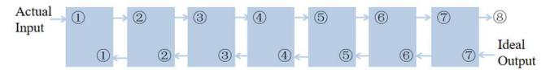
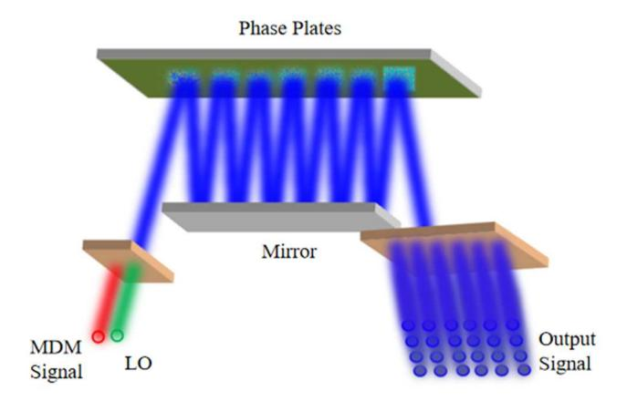
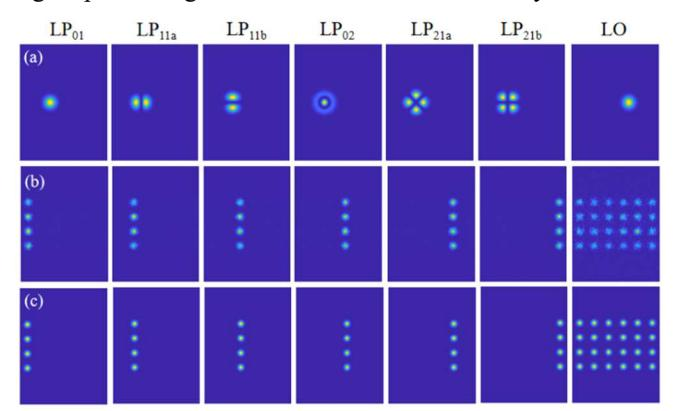
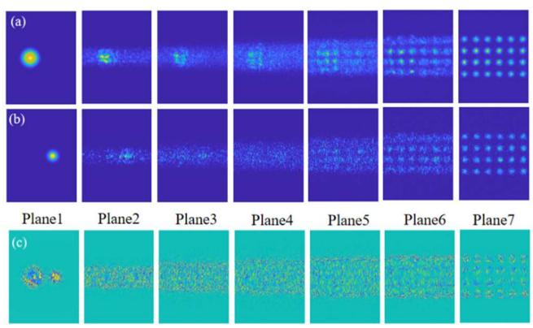
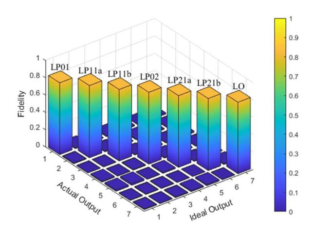

{0}------------------------------------------------

# Linearly Polarized Mode Demultiplexing Hybrid based on Multi-Plane Light Conversion

*Jie Xiang,1,2 Jianping Li1,2,\* and Yuwen Qin1,2* 

1 Institute of Advanced Photonics Technology, School of Information Engineering, Guangdong University of Technology Guangzhou, 510006, China

2Key Laboratory of Photonic technology for Integrated Sensing and Communication, Ministry of Education, Guangdong University of Technology, Guangzhou, 510006,China

\*Email: jianping@gdut.edu.cn

*Abstract***—In order to address the challenges of complex optical front ends of coherent receivers in mode division multiplexing (MDM) fiber communication systems, we propose a linearly polarized (LP) mode de-multiplexing hybrid (MDH) to implement the coherent detection of multiple MDM channels simultaneously based on the multi-plane light conversion technology. This MDH realizes the functions of mode demultiplexing and optical 90-deg mixing with combination of multiple input LP mode signals and the required local oscillator signal, using seven phase plates. After the theoretical modeling and parameter optimization, the proposed MDH can achieved significant performance improvements with insertion loss (IL) of only 1.62dB, mode dependent loss (MDL) of 0.34dB, and crosstalk of -17.42dB. The results show that the proposed MDH has the advantage of greatly simplifying the complex coherent optical front end of large-capacity MDM coherent fiber communication systems.** 

*Keywords—Coherent fiber communication; Mode division multiplexing; Multi-plane light conversion; Mode demultiplexing hybrid; Linearly polarized mode.* 

## I. INTRODUCTION

With the vigorous development of the communication technology and the continuous surge of data traffic, the increasing demand for high speed and large capacity communication is urgently desired to improve the performance of optical fiber communication systems. In order to improve the communication rate, the use of space, polarization, time, frequency, quadrature and other physical dimensions has been exploited widely [1]. Among them, the space division multiplexing (SDM) technology shows great potential for capacity increase with the combination of multiple independent data transmission over the SDM fibers. Researchers have made major breakthroughs by using technologies such as multi-core fiber (MCF), few-mode-fiber (FMF)/ multi-mode fiber (MMF), and the jointed FM-MCF. Recently, experiments have even achieved 55 modes of fiber transmission [2-3] and communication data rates as high as 3.56Pb/s [4]. In mode division multiplexing (MDM) coherent communication systems, the amplitude and phase of signal are recovered by coherent detection and digital signal processing. However, as the number of modes increases, so does the increase of the coherent receivers, which will result in complexity of the optical front ends under the simultaneously reception of multiple parallel mode channels, including the required mode de-multiplexers [5]. Therefore, it is of great demand to use a single device to replace these complex structures, which will simplify the system architecture and improve the efficiency and performance of the communication system.

Multi-plane light conversion (MPLC) technology can transform spatially orthogonal beams to achieve beam shaping and conversion by using multiple phase masks in free space [6-7]. The outstanding advantages of this technology include the low loss and high mode selectivity, as well as the realization of a large number of modes conversion for mode multiplexing, which provides new possibilities for the development of ultra-large capacity optical communication systems. In a recent report, the MPLC-based mode conversion of 1035 Hermite–Gaussian modes [8] and MPLC-based optical hybrids with an octave of bandwidth [9] have been validated. And to simplify the coherent receiver used in the MDM systems, a conceptional mode demultiplexing hybrid (MDH) aiming at three modes detection simultaneously has been proposed in [10]. Generally speaking, to achieve the mode multiplexing of N modes, the required phase plates are around 2N, which is closely related to the number of multiplexed modes [11]. Theoretically, we can use a sufficient number of phase plates to realize the conversion between any spatial modes. However, in practical applications, it is necessary to take into account the loss increase caused by the increased phase plates. Therefore, to achieve MDH with supporting more modes reception and less phase plates while maintaining low loss is one of the most challenge works. For the sake of increase modes of the MDH, we here have successfully realized the 6-mode MDH with functions of mode demultiplexing and optical 90-deg mixing based on MPLC technology. The simulation results show that the insertion loss (IL) is only 1.62dB, the mode dependent loss (MDL) is 0.34dB, and the crosstalk is -17.42dB. This result further shows the potential of few-mode MDH in the largecapacity MDM optical fiber communications.

## II. PRINCIPLE OF INVERSE DESIGN ALGORITHM

The basic principle of the proposed 6 linearly polarized MDH (6-LP-MDH) is the wavefront matching algorithm, which is an efficient inverse design algorithm to accurately calculate the phase mask in each phase plate [11]. In this process, the actual input mode propagates forward through each phase plate, while the desired output mode propagates backward from the phase plate as shown in Fig. 1. The goal of this operation is to make the forward and backward propagated modes at each phase plate be perfectly matched in each spatial coordinate. If the match is not accurate, the phase difference value will be used to update the phase mask of the phase plate, and then the updated mode field, and continues to propagate to the next phase plate. In the free space between the phase plates, the beam evaluation is simulated through the angular spectrum method. And we evaluate the conversion efficiency between the modes by calculating the overlap integral between the actual and ideal output modes. Through 979-8-3503-6765-2/24/\$31.00 ©2024 IEEE. 

{1}------------------------------------------------

the iterative process, the actual output mode will be gradually close to the ideal output mode, so as to achieve the desired efficient conversion and optical 90-deg mixing between modes.

Fig. 1. Wavefront matching algorithm

In order to quantitatively evaluate the device performance of MDH, we use the actual output mode field and the ideal output mode field to establish a cross-correlation matrix. The non-diagonal elements in the cross-correlation matrix reflect the field crosstalk between different modes, and the matrix is decomposed into a left unitary matrix, a diagonal matrix and a right unitary matrix using singular-value decomposition [12]. The value in the diagonal matrix is the singular value  $\lambda_k$ , and the IL can be calculated by

$$IL = 10 \log \sum_{k} \lambda_{k}^{2} / M \tag{1}$$

The MDL is also related to the singular value as follows,

$$MDL = 10 \log(\lambda_{max}^2/\lambda_{min}^2)$$
 (2)

Where *M* is the number of modes, and the device performance of MDH is evaluated by IL and MDL. The conversion efficiency between different input modes and output modes is calculated by the overlap integral between the output mode field passing through the last plane and the ideal output mode field shown as follows,

$$c = \iint f_{k,i}(k\Delta z, x, y) \overline{b_{k,i}(k\Delta z, x, y)} exp(j\Phi(x, y)) dxdy$$
 (3)

Where  $f_{k,i}$  and  $b_{k,i}$  represent the output fields propagating forward and backward through the *i*-th mode of the *k*-th phase plate, respectively. And  $\Phi_k(x, y)$  represents the phase mask of the *k*-th phase plate.

#### III. RESULTS AND DISCUSSION

The schematic diagram of the MPLC based 6-LP-MDH is shown in Fig. 2.

Fig. 2. The schematic diagram of the 6-LP-MDH

The proposed 6-LP-MDH utilizes seven phase masks and enables simultaneous mode demultiplexing of six modes (including LP01, LP11a, LP11b, LP02, LP21a, LP21b) and optical 90-deg mixing. The whole device can be divided into three

parts, namely, input port, reflection area and output port. The input port receives the optical signal, the reflection area converts and shapes the optical field, and the output port outputs the optical signal after optical 90-deg mixing processing, with providing a multi-mode optical field conversion function for various applications.

The left side indicates the input port, which is used to receive the MDM signal and the local oscillator signal. The MDM signal includes six mixed signals,  $LP_{01}$ ,  $LP_{11a}$ ,  $LP_{11b}$ ,  $LP_{02}$ ,  $LP_{21a}$  and  $LP_{21b}$ . The middle part is the reflection area, which is composed of a mirror and seven phase masks. After the input signal is reflected 13 times through the reflection area, a 6×4 optical signal point array is output from the output port. In this way, we can achieve efficient and reliable optical signal processing for the MDM communication systems.

Fig. 3. (a) Input, (b) actual output and (c) ideal output of the LP modes and LO in the MDH.

The simulation is implemented by the MATLAB. The input mode fields for different LP modes and local oscillator signal at the input ports are shown in Fig. 3(a) with the independent mode field intensity profile. The actual output field intensity profiles of different LP modes and local oscillator signal at the output port are shown in Fig. 3(b). It can be seen that each LP mode is mapped to four Gaussian mode points at the output end, which have the same amplitude and have phases of  $\pi$ ,  $\pi/2$ , 0, and  $-\pi/2$ , respectively. In contrast, the local oscillator signal is mapped to a set of 6×4 Gaussian mode points of the same amplitude, all with a phase delay of 0. Fig. 3(c) shows the ideal output field intensity profiles for different LP modes and local oscillator signal. By comparing the actual output field intensity with the ideal output field intensity, each mode can be successfully converted to the desired field strength by using seven phase masks.

Fig. 4. (a) Total intensity evolution of the six LP modes. (b) Intensity evolution of LO. (c) Calculated phase mask patterns.

{2}------------------------------------------------

Fig. 4(a) and Fig. 4(b) show the variation of the mode field intensity profiles of MDM signal and local oscillator signal passing through each phase plate, respectively. Through observation, it can be found that with the propagation of signal light and local oscillator signal, they are gradually transformed to the desired ideal outputs. Namely, each mode successfully achieves the conversion to the ideal output after passing through phase plates. The calculated phase masks are shown in Fig. 4(c), by which the input signal can be smoothly converted to the ideal outputs.

Fig. 5. 3-D plot of the coupling matrix for simulated output fields to target output fields.

To fully evaluate the performance of the device, we plot the squared coupling matrix between the actual output fields and the ideal output fields as shown in Fig. 5. The results show that the average conversion efficiency of all modes is 0.83, the calculated IL is 1.62dB, the MDL is 0.34dB, and the crosstalk is -17.42dB. With a comparison of report in [10], our proposed MDH has the performance improvement in MDL and crosstalk.

# IV. CONCLUSION

In this paper, we study a 6-LP-MDH theoretically with aim to provide efficient mode demultiplexing and optical 90-deg mixing capabilities for MDM coherent communication systems. After simulation and parameter optimization, we have successfully achieved the MDH with seven phase plates. The results show that the average conversion efficiency of all modes is 0.83, the calculated IL is 1.62dB, the MDL is 0.34dB, and the crosstalk is -17.42dB. Thus, our design provides stable phase retardation and has the advantage of low loss, low MDL, and low crosstalk. This provides great potential for further development in the field of ultra-large capacity optical communications.

### ACKNOWLEDGMENT

This study was supported by the National Key R&D Program of China (2023YFB2906304); National Natural Science Foundation of China (62022029); the Guangdong Introducing Innovative and Entrepreneurial Teams of "The Pearl River Talent Recruitment Program" (2019ZT08X340); and Guangdong Guangxi Joint Science Key Foundation (2021GXNSFDA076001).

## REFERENCES

- [1] P. Winzer, "Making spatial multiplexing a reality," Nature Photon 8, 2014, 345–348.
- [2] P. Sillard, M. Bigot, K. de Jongh, F. Achten, G. Rademacher, R. S. Luís, B. J. Puttnam, "55-Spatial-Mode Fiber for Space Division Multiplexing," 2023 Optical Fiber Communications Conference and Exhibition (OFC), San Diego, CA, USA, 2023, pp. 1-3.
- [3] G. Rademacher, Ruben S. Luís, Benjamin J. Puttnam, N. K. Fontaine, Mikael Mazur, "1.53 Peta-bit/s C-Band Transmission in a 55-Mode Fiber," 2022 European Conference on Optical Communication (ECOC), Basel, Switzerland, 2022, pp. 1-4.
- [4] G. Rademacher, R. Ryf, D. T. Neilson, D. Dahl, J. Carpenter, P. Sillard, "3.56 peta-bit/s C+L band transmission over a 55-mode multi-mode fiber," 49th European Conference on Optical Communications (ECOC), Glasgow, UK, 2023, pp. 9-12.
- [5] H. Wen, Y. Zhang, R. Sampson, N. K. Fontaine, N. Wang, S. Fan, and G. Li, "Scalable non-mode selective Hermite – Gaussian mode multiplexer based on multi-plane light conversion," Photonics Research, 2020.
- [6] G. Labroille, B. Denolle, P. Jian, J. F. Morizur, P. Genevaux and N. Treps, "Efficient and mode selective spatial mode multiplexer based on multi-plane light conversion," 2014 IEEE Photonics Conference, San Diego, CA, USA, 2014, pp. 518-519.
- [7] N. K. Fontaine, Roland Ryf, Haoshuo Chen, David T. Neilson, Kwangwoong Kim and Joel Carpenter, "Laguerre-Gaussian mode sorter, " Nat. Commun 10, 1865, 2019.
- [8] N. K. Fontaine, Haoshuo Chen, Mikael Mazur, Lauren Dallachiesa, K. W. Kim, Roland Ryf, "Hermite-Gaussian mode multiplexer supporting 1035 modes," 2021 Optical Fiber Communications Conference and Exhibition (OFC), San Francisco, CA, USA, 2021, pp. 1-3.
- [9] Y. Zhang, N. K. Fontaine, Haoshuo Chen, Roland Ryf, David T. Neilson, Joel Carpenter, G. Li, "An Ultra-Broadband Polarization-Insensitive Optical Hybrid Using Multiplane Light Conversion," in Journal of Lightwave Technology, 2020, pp. 6286-6291.
- [10] H. Wen, H. Liu, Y. Zhang, P. Zhang, G. Li, "Mode demultiplexing hybrids for mode-division multiplexing coherent receivers," Photonics Research, 2019.
- [11] N. K. Fontaine, R. Ryf, H. Chen, D. Neilson and J. Carpenter, "Design of High Order Mode-Multiplexers using Multiplane Light Conversion," 2017 European Conference on Optical Communication (ECOC), Gothenburg, Sweden, 2017, pp. 1-3.
- [12] H. Wen, H. Liu, Y. Zhang, R. Sampson, S. Fan, G. Li, "Scalable Hermite-Gaussian mode-demultiplexing hybrids," Opt Lett, 2020, 45(8):2219-2222.