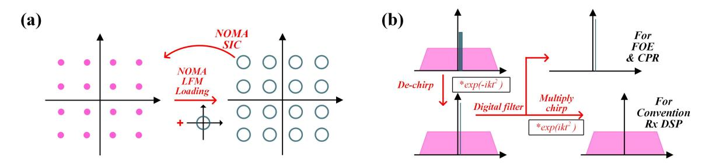
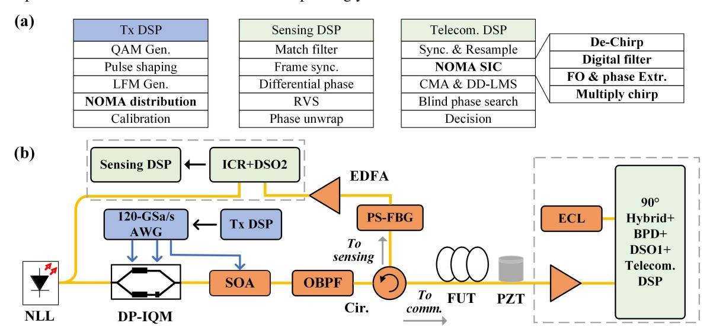
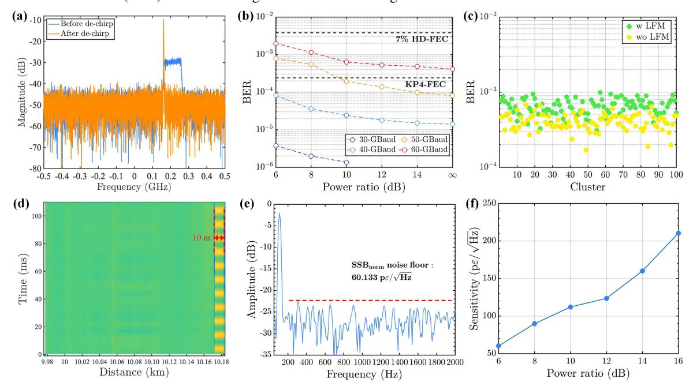

{0}------------------------------------------------

# Integration of Distributed Sensing into Optical Coherent Networks through Non-Orthogonal Multiple Access

Jingchuan Wang,1 Liwang Lu,1,\* Junwei Zhang,2,\* Alan Pak Tao Lau, 1 Chao Lu1

*1 Photonics Research Institute, Department of Electrical and Electronic Engineering, The Hong Kong Polytechnic University, Hong Kong SAR, China*

Abstract: We introduce NOMA into the integrated distributed sensing and coherent communications. Using the same transmitter, high resolution and sensitive vibration sensing can be achieved over 10-km 60-GBaud 16-QAM transmission with negligible penalty. © 2025 The Author(s)

#### 1. Introduction

The past decade has witnessed rapid growth in short-reach optical fiber communication, including data center interconnect (DCI) and fiber access networks [1]. Recently, there has been strong research interest in incorporating sensing functions into these communication systems to ensure their reliable operation and at the same time to explore the use of these ubiquitously deployed optical fibre for additional sensing functionality [2]. As a result, numerous studies have focused on performing integrated sensing and communication (ISAC) via wavelength or frequency division multiplexing (W/FDM) [3], time division multiplexing (TDM) [4], spatial division multiplexing (SDM) [5], and mode division multiplexing (MDM) [6]. However, among these orthogonal domains, a channel typically needs to be allocated for sensing. Some works directly leverage polarization or phase recovery procedures to reconstruct sensing information in coherent transceivers [7], offering no additional complexity but resulting in poor sensing spatial resolution and limited multi-event detection. Recently, the non-orthogonal multiple access (NOMA) technique, which can enhance the density and fairness of coherent metro-access networks [8], has been widely analyzed. By exploring the potential of NOMA-enabled coexistence of communication and sensing signals, sensing can move beyond the conventional domains and exploit the abundant power margin.

In this paper, we propose, for the first time, a NOMA based scheme for integration of distributed acoustic sensing (DAS) and coherent communication, with negligible communication penalties after the NOMA successive interference cancellation (SIC) procedure. The sensing signal does not occupy traditional communication channel resources and can also be used to assist carrier recovery operation communication signal processing, drastically reducing complexity. We demonstrate the simultaneous transmission of 60 GBaud 16-QAM and 10 m resolution DAS over a 10 km fiber.

#### 2. NOMA with 16-QAM signal and sensing LFM tone

Fig. 1. (a) NOMA 16-QAM constellation before and after LFM tone loading. (b) The detailed NOMA successive interference cancellation (SIC) procedures for communication DSP

Employing linear frequency modulation (LFM) waveform as the probe signal for fiber sensing eliminates the need for a sensing waveform. Consequently, the sensing signal can be directly superimposed on the continuous communication signal using NOMA, provided that the power of the communication signal significantly exceeds that of the sensing signal. This approach enables a single transmitter to generate both communication and sensing signals without the need for additional time or frequency, which are traditionally scarce resources in communication systems. Fig. 1a shows the 16-QAM constellation diagram at the transmitter after superimposing the LFM tone. Since the power of the sensing signal in a DAS system, based on matched filtering, can be much lower than that of the communication signal, the sensing signal can be placed at a secondary power level, while the communication signal occupies the primary level. The constant amplitude envelope of the LFM tone causes the original

*2School of Electronics and Information Technology, Sun Yat-sen University, Guangzhou 510725, China \* liwang-polyu.lu@connect.polyu.hk, zhangjw253@mail.sysu.edu.cn*

{1}------------------------------------------------

constellation points to expand into a circular pattern, but at the communication receiver, the impact of the LFM tone can be mitigated by applying successive interference cancellation (SIC) before the conventional digital signal processing (DSP). Fig. 1b illustrates the SIC process at the communication receiver. The received NOMA signal could be expressed as,

$$r(t) = P_1 * A_{sig}(t) exp[j(2\pi\Delta ft + \theta_{sig}(t) + \theta_n] + P_2 * A_{lfm} exp[j(2\pi(f_{st} + \Delta f)t + kt^2 + \theta_n)] + n(t).$$
 (1)

where *P*1,*P*2 are respectively the NOMA power distribution ratio of QAM signal and LFM tone, ∆*f* and θ*n* are the frequency offset and phase noise, *fst* and *k* are the start frequency and chirp rate of LFM tone. To mitigate the LFM tone, we could firstly multiply the opposite chirp and obtain a single frequency tone, which could be expressed as

$$R_{single}(t) = P_2 * A_{lfm} exp[j(2\pi(f_{st} + \Delta f)t + \theta_n)]. \tag{2}$$

Because *fst* is already known, we could simply retrieve the frequency offset and phase noise through the single frequency tone compressed from LFM tone, reducing the need for the frequency offset estimation and carrier phase recovery procedure of DSP flow. After the single tone is filtered out, the chirp multiplied before could be compensated back to recovery the communication QAM signal without LFM tone.

For sensing operation, a matched filter could be correlated with the continuous Rayleigh backscattered signal, hence the true DAS traces are obtained segment by segment. Referring to the interference fading induced dead zones, we could slice the LFM match filter into several parts to conduct the rotated vector sum (RVS) [9], while the spatial resolution of DAS is sacrificed correspondingly.

Fig. 2. (a) DSP flows of both communication and sensing part. (b) Experimental setuo of NOMA enabled integrated sensing and communication system

#### 3. Experiment setup and DSP

We first analyze the NOMA-based integrated sensing and communication system over fiber, with the experimental setup shown in Fig. 2b. A 120-GSa/s arbitrary waveform generator (AWG, Keysight M8194A) and four electrical amplifiers (EAs, SHF 807c) are used to produce the NOMA signal over a narrow-linewidth laser (NLL, NKT E15), with the power distribution ratio between the QAM waveform and LFM tone seamlessly adjusted. Due to the memory depth of the AWG (512k samples), we can transmit frames only with a maximum period of 4.27 µs. The repetition period of the LFM signal must be greater than the fiber's round-trip time (RTT) to interrogate the entire fiber. Therefore, a control signal is generated to manage the shutter-type semiconductor optical amplifier (SOA), allowing truncation of the AWG signal. Notably, this issue arises because the AWG repeatedly transmits the same signal, a problem that does not occur in practical implementations. A 100-GHz optical bandpass filter (OBPF) is used to filter out-of-band noise, and the optical signal is then injected through a circulator into a 10 km fiber under test (FUT). A 10 m PZT is also placed at the end of the FUT to evaluate the sensing performance.

For the communication receiver, an Erbium-Doped Fiber Amplifier (EDFA) is added to control the signal power before a 90-degree hybrid and four 73-GHz balanced photodiodes (BPD, Finisar 3120). Finally, the transmitted data are captured by an 80-GSa/s real-time oscilloscope (RTO, Keysight DSAZ594A). The communication DSP flow at the receiver side is depicted in Fig. 2a. NOMA successive interference cancellation (SIC) is performed first, allowing the extraction of the LFM tone from the communication signal. An adaptive equalizer, comprised of a constant modulus algorithm (CMA) and decision-directed least mean square (DD-LMS), is then applied. A 

{2}------------------------------------------------

low-complexity blind phase search within a small range is used to mitigate residual phase noise, followed by symbol decision and performance evaluation.

The sensing receiver is located at the transmitter side, as shown in Fig. 2b. A 1-GHz phase-shifted fiber Bragg grating (PS-FBG, iXBlue) is used to isolate the sensing frequency slot before the dual-polarization integrated coherent receiver (ICR, Neophotonics). The backscattered data are sampled and matched filtered to obtain the DAS traces. Additionally, the LFM matched filter is split into several parts across the frequency domain, and a rotated vector sum (RVS) is used to mitigate interference fading.

Fig. 3. (a) Frequency spectrum of received signal. (b) BER with different baudrate and power ratio. (c) BER with and without LFM. (d) Waterfall plot of 100 Hz, 10 m PZT. (e)Single side band (SSB) spectrum of 100 Hz vibration waveform at power ration of 6 dB. (f) DAS sensitivity at power ratios.

### 4. Results and Discussions

At the communication receiver side, the frequency spectrum before and after de-chirping in NOMA SIC is shown in Fig. 3a. We use a 100 MHz linearly swept bandwidth and a 4.2 µs duration LFM signal, with a repetition period of 109 µs. The chirp signal is compressed into a single tone, making it easier to filter out, and this tone can also be used for frequency offset estimation (FOE) and carrier phase recovery (CPR). We define the power ratio as the power of the communication signal relative to the power of the sensing LFM tone, evaluating transmission performance at different baud rates and power ratios, as shown in Fig. 3b. It can be observed that when the power ratio exceeds 10 dB, the performance is very close to that of the case without the sensing signal. This conclusion is further supported by Fig. 3c, which shows the results of 100 continuous experiments conducted at a power ratio of 10 dB, both with and without the LFM tone. Fig. 3d presents the demodulated vibration waterfall plot for a 100 Hz, 1 Vpp electrical waveform driven 10 m PZT at the end of a 10 km fiber. We also show the single sideband frequency spectrum of the demodulated 100 Hz vibration at a power ratio of 6 dB to calculate the sensing sensitivity in Fig. 3e. Finally, by scanning different power ratios, the variation in sensitivities was obtained in Fig. 3f. Thanks to the use of pulse compression techniques, we were able to achieve relatively high sensitivity even with low average sensing power.

# 5. Conclusion

We introduce the NOMA concept into the integrated sensing and communication system. By leveraging the power ratio between communication and sensing, the hybrid waveform can be generated using the same transmitter. Negligible communication penalty was observed in 60 GBaud 16QAM and a 100 MHz LFM tone experiment. We believe the proposed scheme can be seamlessly integrated with existing NOMA systems in short-reach networks. We acknowledge the support of GRF project PolyU 15227321, 15224521 and 15212924 of the Hong Kong SAR government.

## References

- 1. C. Ranaweera, et al., JOCN, 2023.
- 2. G. A. Wellbrock, et al., JLT, 2023.
- 3. C. Dorize, et al., OFC, 2022.
- 4. J. Wang, et al., OFC, 2024.
- 5. J. Tang, et al., OFC, 2024.
- 6. J. M. Marin, et al., OL, 2022.
- 7. E. Ip, et al., OFC, 2021.
- 8. F. Lu, et al., JLT, 2017.
- 9. J. Xiong, et al., JLT, 2020.