# Visible Light Integrated Positioning and Communication: A Multi-Task Federated Learning Framework

Tiankuo Wei®, Sicong Liu®, Senior Member, IEEE, and Xiaojiang Du®, Fellow, IEEE

Abstract—Recently, visible light positioning and visible light communication are becoming a promising technology for integrated sensing and communication. However, the isolated design of positioning and communication has limited the system efficiency and performance. In this article, a visible light integrated positioning and communication (VIPAC) framework is formulated, in which the positioning task for the sensing service and the channel estimation task for the communication service are integrated into a unified architecture. First, a multi-task learning architecture, which is composed of a sparsity-aware shared network and two task-oriented sub-networks, is proposed to fully exploit the inherent sparse features of visible light channels, and achieve mutual benefits between the two tasks. The depth of the shared network can be adaptively adjusted to extract the optimal shared features, and the two sub-networks are further optimized for the two tasks, respectively. Moreover, the emerging federated learning technique is introduced to devise a multi-user cooperative VIPAC scheme, which further improves the generalization ability in spatiotemporally nonstationary environments while preserving data privacy. It is shown by theoretical analysis and simulation results that, the proposed scheme can significantly improve the performance of positioning and channel estimation in spatiotemporally nonstationary environments compared with existing benchmark schemes.

Index Terms—Integrated sensing and communication, visible light positioning, visible light communication, federated learning, multi-task learning, channel estimation, sparse learning

#### 1 Introduction

With the explosive increase of mobile devices and the requirements of various emerging applications and services, including sensing, positioning, communication, and computing, more efficient resource utilization and stronger support of diversified services are required in the next-generation beyond 5G and 6G networks [1], [2], [3]. To address this issue, an emerging wireless technique paradigm of integrated sensing and communication (ISAC), which co-designs the sensing and communication systems in order to achieve mutual benefits between them, has drawn much attention from academia and industry [4], [5]. Specific ISAC techniques can be devised to improve the spectral and energy efficiency by sharing the spectrum resources and hardware

Manuscript received 21 June 2022; revised 13 August 2022; accepted 13 September 2022. Date of publication 16 September 2022; date of current version 3 November 2023.

This work was supported in part by the National Natural Science Foundation of China under Grant 61901403, in part by the Science and Technology Key Project of Fujian Province, China under Grant 2019HZ020009, in part by the Youth Innovation Fund of Natural Science Foundation of Xiamen under Grant 3502Z20206039, and in part by the Xiamen Special Fund for Marine and Fishery Development under Grant 21CZB011HJ02.

(Corresponding author: Sicong Liu.)

Digital Object Identifier no. 10.1109/TMC.2022.3207164

implementations between sensing tasks such as target detection and navigation, and various wireless communication tasks. Meanwhile, great performance potentials can be attained from the inherent mutual benefits between the sensing and communication tasks by designing an effective ISAC mechanism [6].

In recent years, visible light positioning (VLP) and visible light communication (VLC) have been envisioned as promising candidates for the applications of indoor broadband access and high-precision positioning, because of the high positioning accuracy of VLP [7], [8], [9], [10], [11], ultrawide spectrum of VLC, as well as many attractive characteristics such as the cost-effective hardware implementation, electromagnetic-interference-free transmission, privacy protection ability, and unregulated spectrum [12], [13], [14], etc.

However, the VLP and VLC systems are usually designed separately. The potential mutual benefits between positioning and communication have not been utilized effectively. Lack of a unified ISAC design of VLP and VLC has limited the potentials of the resource utilization efficiency and the communication and positioning performance. On the other hand, exploiting the sparse features of visible light channels with only a few dominant channel paths, some compressed sensing (CS) based methods are investigated for visible light positioning [15] or channel estimation [16], [17]. However, in harsh conditions such as insufficient measurement data, intensive background noise, large sparsity level, or complicated sparse structure, the performance of existing CS-based algorithms still needs to be further improved because the inherent sparse channel features remain to be extracted and fully exploited

Tiankuo Wei and Sicong Liu are with the Department of Information and Com-munication Engineering, School of Informatics, Xiamen University, Xiamen 361005, China. E-mail: weitk@stu.xmu.edu.cn, liusc@xmu.edu.cn.

Xiaojiang Du is with the Department of Electrical and Computer Engineering, Stevens Institute of Technology, Hoboken, NJ 07030 USA. E-mail: dxj@ieee.org.

[18], [19], [20]. Thus, it is necessary to introduce the sparse learning technique, which can effectively learn the sparse characteristics from complicated distributions, to further improve the performance of channel estimation and positioning simultaneously.

Therefore, in order to solve the above-mentioned problems of state-of-the-art VLC and VLP systems, it is essential to design an ISAC framework that integrates the functionalities of both accurate positioning and efficient communication for visible light networks. To this end, we will design such an ISAC framework in this paper, which intelligently learns the sparse characteristics of visible light channels, with satisfactory generalization and adaptation capability in spatiotemporally nonstationary environments.

One of the essentials in designing an ISAC framework is to achieve mutual benefits between the positioning and communication tasks. Multi-task learning (MTL) [21] is an emerging machine learning paradigm that jointly learns multiple related tasks, aiming at sharing the domain-specific knowledge between different tasks to improve the performance of all tasks [22], [23]. Thus, it is very promising to introduce MTL to effectively explore the potential mutual benefits between the visible light positioning and communication tasks to improve the performance of both the two tasks.

Hence, in this paper, we propose an MTL-based ISAC framework, called visible light integrated positioning and communication (VIPAC), where the visible light channel state information is utilized to facilitate the location precision for the VLP task, and vice versa, the positioning information also brings about benefits to channel estimation for the VLC task. Specifically, an MTL-based deep neural network, which is composed of a sparsity-aware shared network and two task-oriented sub-task networks, is devised. The depth of the sparsity-aware shared network can be adaptively adjusted to extract the optimal shared sparse features and most mutual benefits between the two tasks of channel estimation and positioning. The structures of the two task-oriented sub-networks can be further optimized specifically for the two tasks, respectively, to further enhance the learning ability of the two tasks. Besides, the pilot subcarriers are also shared to implement the two tasks simultaneously, which greatly saves the spectrum resources and improves spectral efficiency.

Furthermore, to avoid the degradation of the performance of positioning and channel estimation caused by the spatiotemporal nonstationary property of the visible light channel, the emerging technique of federated learning (FL) [24], [25] can be introduced to improve the generalization performance of the proposed MTL-based VIPAC scheme in complicated time-varying and/or spatially variant environments. FL is an emerging distributive learning paradigm that allows many data owners to train a global neural network model cooperatively without sharing local training data for the purpose of privacy protection [26], [27], [28]. Thus, in the multi-task federated learning (MTFL) framework proposed in this paper, each user equipment (UE) plays the role of an intelligent agent, which can collect samples from its corresponding spot to build a local dataset and train a local model, while many UE agents can combine the weights of the local models to cooperatively train a global model for positioning and channel estimation tasks.

Specifically, in the MTFL framework, the weights of the global model at the central server are updated iteratively via multiple rounds of communications between the central server and the UE agents. The weights of the local models at the UE agents are trained by the local datasets that are updated over time, and the local weights are average combined at the central server to generate the global weights. Thus, the generalization ability towards temporal variation and the adaptability to time-varying channels can be improved for the proposed global model. Moreover, a cellular cluster architecture is devised to facilitate the training of the MTFL-based model and to improve the spatial generalization ability of the proposed VIPAC scheme in spatially nonstationary environments. The entire targe area of interest can be divided into several cellular clusters, with each cellular cluster containing a certain number of identically or similarly deployed hexagonal cells, where a light emitting diode (LED) lamp is placed in the center of each cell. Since the MTFL-based global model for the cellular cluster architecture is jointly trained using many datasets gathered from different UE agents at variant spatial locations, the trained model is more likely to be applicable in variant environments. In addition, thanks to the FL-based mechanism, the local dataset of a UE agent will not be shared with other UE agents or the central server, which protects the data and location privacy of the users very well.

Consequently, a novel framework of VIPAC in the ISAC technical regime is proposed in this paper, which shares the spectrum and hardware resources for the resource-efficient joint positioning and channel estimation tasks. In the VIPAC framework, a depth-adaptive MTL-based network architecture is devised, which is used to learn the mutual beneficial features between the positioning and channel estimation tasks via a sparsity-aware shared network, and to achieve a better performance via optimizing the two task-oriented subnetworks. The MTFL framework is further formulated to improve the spatiotemporal generalization capability of the global model, and meanwhile to protect the location and data privacy of the users. Theoretical analysis and simulation results have shown that, the proposed scheme can significantly improve the performance of both the positioning and channel estimation tasks in spatiotemporally nonstationary environments, and outperforms existing benchmark schemes. To summarize, the main contributions of this paper are list as follows.

- An ISAC framework called VIPAC is formulated for joint visible light positioning and communication tasks, where channel estimation and positioning are integrated into the unified framework, and a practically applicable and spatiotemporally migratable cellular cluster architecture is devised.
- An MTL-based neural network architecture is proposed to exploit the mutual benefits between the positioning and communication tasks, where the depth of the shared network can be adaptively adjusted to learn the optimal shared sparse features of the visible light channel, while the two task-oriented sub-networks are further optimized respectively.
- An MTFL framework is formulated for the multiuser cooperative VIPAC scheme to further improve

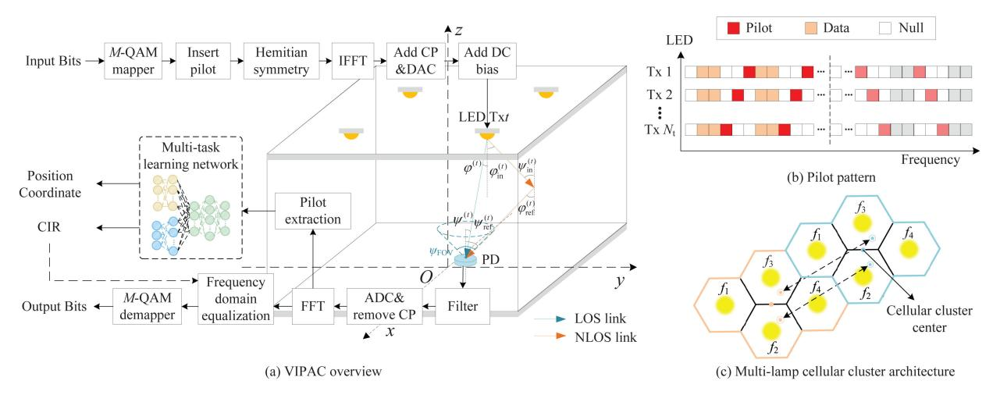

Fig. 1. The system model of the VIPAC framework.

the spatial and temporal generalization ability of the global model in the complicated spatiotemporally nonstationary environments, while preserving the privacy and confidentiality of the data and location of the users.

The remainder of this paper is structured as follows. The system model of the proposed VIPAC framework is described in Section 2. The proposed MTL-based network architecture and the MTFL-based scheme are introduced in Sections 3 and 4, respectively. The performance bound of the proposed MTL-based scheme and the convergence of the proposed MTFL framework are theoretically analyzed in Section 5. Simulation results with discussions are reported in Section 6, followed by the conclusions in Section 7.

# 2 VISIBLE LIGHT INTEGRATED POSITIONING AND COMMUNICATION FRAMEWORK

In this section, we first describe the typical system model and visible light channel model of the indoor positioning and communication system. Then, we introduce the VIPAC framework, including the design of the signal model for joint positioning and channel estimation, as well as the proposed multi-lamp cellular cluster architecture.

## 2.1 System Model of Indoor Visible Light Positioning and Communication

A typical multi-LED orthogonal frequency division multiplexing (OFDM)-based VLC system using intensity modulation/direct detection (IM/DD) is shown in Fig. 1a. The input data bits are first mapped to *M*-ary quadrature amplitude modulation (QAM) symbols, and the pilot signals for channel estimation are inserted. To obtain real-valued signals required by VLC transmission, Hermitian symmetry is implemented before imposing the inverse fast Fourier transform (IFFT) processing. After adding the cyclic prefix (CP), the resulting digital signal is converted to an analog electric signal by the digital-to-analog converter (DAC). Then, a biased direct current (DC) is added to the electric signal to generate a positive current that drives the LED light intensity with an electro-optical conversion efficiency denoted by

 $\alpha$ . Finally, the modulated LED light is emitted for simultaneous data transmission and illumination purposes.

In the indoor environments, the optical wireless propagation channel between the LED and the photodetector (PD) at the receiver is composed of the line-of-sight (LOS) component and the non-line-of-sight (NLOS) component [29]. The length-L channel impulse response (CIR) vector between the tth LED located at the coordinate of  $\mathbf{a}^{(t)} = [a_{\mathbf{x}}^{(t)}, a_{\mathbf{y}}^{(t)}, a_{\mathbf{z}}^{(t)}]$  and the PD at the receiver located at  $\mathbf{c} = [c_{\mathbf{x}}, c_{\mathbf{y}}, c_{\mathbf{z}}]$  can be expressed as

$$\mathbf{h}^{(t)} = \mathbf{h}_{\text{LOS}}^{(t)} + \mathbf{h}_{\text{NLOS}}^{(t)},\tag{1}$$

where  $\mathbf{h}_{\text{LOS}}^{(t)}$  and  $\mathbf{h}_{\text{NLOS}}^{(t)}$  represent the CIR components of the LOS and NLOS links, respectively.

Usually, it is assumed that the LEDs follow a Lambertian emission pattern [29], and the nth element of the LOS CIR vector can be expressed as

$$[\mathbf{h}_{\mathrm{LOS}}^{(t)}]_{n} = \frac{(m+1)A_{\mathrm{PD}}\cos^{m}(\varphi^{(t)})\cos(\psi^{(t)})gT_{\mathrm{s}}}{2\pi d^{(t)^{2}}}$$

$$\operatorname{rect}\left(\frac{\psi^{(t)}}{\psi_{\mathrm{FOV}}}\right)\delta\left(n\tau_{\mathrm{s}} - \frac{d^{(t)}}{\mathrm{c}}\right),\tag{2}$$

where  $d^{(t)}$  is the distance between the tth LED and the PD.  $A_{\rm PD}$  is the effective geometrical area of the PD.  $T_{\rm s}$  and g are the gain of the optical filter and the optical concentrator of the PD, respectively.  $\varphi^{(t)}$  and  $\psi^{(t)}$  are the angles of irradiance and incidence with respect to the normal direction, respectively.  ${\rm rect}(\cdot)$  is the rectangular function, and  $\psi_{\rm FOV}$  is the field-of-view (FOV) angle of the PD.  $\delta(\cdot)$  is the Dirac delta function, and  $\tau_{\rm s}$  is the sampling period. c is the light speed. m is the Lambertian order given by  $m=-{\rm ln}2/{\rm ln}(\cos(\varphi_{1/2}))$ , where  $\varphi_{1/2}$  is the half-power angle of the LED.

Since most of the power of the NLOS link is concentrated on the first reflected light [29], the NLOS link is modeled as a diffusion channel of the first reflection, where the wall can be segmented into many small surfaces regarded as reflection elements. Thus, the nth element of the NLOS CIR vector is given by

$$[\mathbf{h}_{\rm NLOS}^{(t)}]_n = \int_{\rm walls} \frac{(m+1)A_{\rm PD}gT_{\rm s}\bar{\rho}}{4\pi^2 d_{\rm in}^{(t)^2} d_{\rm ref}^{(t)^2}} \cos^m(\varphi_{\rm in}^{(t)}) \cos{(\psi_{\rm in}^{(t)})}$$

$$\cos(\varphi_{\text{ref}}^{(t)})\cos(\psi_{\text{ref}}^{(t)})\operatorname{rect}\left(\frac{\psi_{\text{ref}}^{(t)}}{\psi_{\text{FOV}}}\right)\delta\left(n\tau_{\text{s}} - \frac{d_{\text{in}}^{(t)} + d_{\text{ref}}^{(t)}}{c}\right)dA_{\text{walls}}, (3)$$

where  $d_{\text{in}}^{(t)}$  and  $d_{\text{ref}}^{(t)}$  denote the distances between the *t*th LED and the surface reflection element, and between the surface reflection element and the PD, respectively.  $\varphi_{\rm in}^{(t)}$  and  $\varphi_{\rm ref}^{(t)}$  are the angles of irradiance of the LED and the surface reflection element, respectively.  $\psi_{\rm in}^{(t)}$  and  $\psi_{\rm ref}^{(t)}$  are the angles of incidence of the surface reflection element and the PD, respectively.  $\bar{\rho}$  is the average diffuse reflectance of the wall.  $dA_{\text{walls}}$ is a reflective area infinitesimal on the wall.

It is revealed that the visible light channel modeled in (1) is in fact a sparse multipath channel model [17], [19]. This means that most of the energy is concentrated on only a few dominant taps in the CIR vector  $\mathbf{h}^{(t)}$ , while the other taps are zero or relatively much smaller. This sparse property of the visible light channel can be fully exploited in the proposed MTL-based framework to facilitate shared sparse feature extraction between positioning and channel estimation tasks for a better joint performance.

At the receiver, the received visible light signal is first converted to an electric signal via the PD with a responsivity of  $R_{\rm p}$ . After passing through a series of the analog-to-digital converter (ADC), CP removal, FFT processing, frequencydomain equalization, and M-QAM demapping modules, the recovered output data bits can be obtained. Meanwhile, the received pilot subcarriers can be extracted for joint positioning and channel estimation using the proposed MTL network, and afterwards the estimated CIR can be utilized for equalization.

In a traditional VLP system, the position is usually estimated by some certain metrics of the received visible light signal, such as received signal strength and angle of arrival [8]. In the proposed VIPAC framework, the position coordinates and the CIR can be simultaneously obtained from the received pilot signal using the proposed MTL network. The detailed signal model of VIPAC is introduced in next subsection.

#### 2.2 VIPAC Framework Formulation

In this subsection, the OFDM signal model and the pilot signal design for the VIPAC are first introduced, followed by the multi-lamp cellular cluster architecture devised to facilitate federated learning.

#### 2.2.1 Signal Model for VIPAC

An OFDM symbol transmitted by the tth LED is composed of the length- $N_{\rm CP}$  CP sequence and the length-N OFDM data block  $\mathbf{x}^{(t)}$ , which can be expressed as

$$\mathbf{x}^{(t)} = [x_1^{(t)}, x_2^{(t)}, \dots, x_N^{(t)}]^T = \mathbf{F}^H \tilde{\mathbf{x}}^{(t)}, \tag{4}$$

where **F** represents the  $N\times N$  discrete Fourier transform (DFT) matrix.  $\tilde{\mathbf{x}}^{(t)}=[0,\tilde{x}_2^{(t)},\ldots,\tilde{x}_{N/2}^{(t)},0,\tilde{x}_{N/2}^{(t)},\ldots,\tilde{x}_2^{(t)}]$  is the frequency-domain OFDM data block composed of the pilot and data subcarriers, because of the Hermitian symmetry. As illustrated in Fig. 1b, for the tth LED,  $N_{\rm D}$ pilot subcarriers are randomly distributed with the based algorithms and the emerging sparsity-aware deep-Authorized licensed use limited to: T.C. Cumhurbaskanligi Kutuphanesi. Downloaded on December 14,2025 at 17:43:50 UTC from IEEE Xplore. Restrictions apply.

subcarrier indices given by

$$P^{(t)} = \{p_n^{(t)}\}_{n=1}^{N_{\rm p}},\tag{5}$$

where  $p_n^{(t)} \in \{2, 3, ..., N/2\}$  is the subcarrier index of nth pilot for the tth LED. The pilot distribution patterns of different LEDs are arranged in an orthogonal manner.

At the PD of the receiver, the received frequency-domain OFDM data block  $\tilde{\mathbf{y}} = [\tilde{y}_1, \tilde{y}_2, \dots, \tilde{y}_N]$  is given by

$$\tilde{\mathbf{y}} = \alpha R_{\rm p} \sum_{t=1}^{N_{\rm t}} \operatorname{diag}(\tilde{\mathbf{x}}^{(t)}) \mathbf{F}_L \mathbf{h}^{(t)} + \tilde{\mathbf{w}}, \tag{6}$$

where  $\operatorname{diag}(\tilde{\mathbf{x}}^{(t)})$  denotes a diagonal matrix whose diagonal elements are those of the vector  $\tilde{\mathbf{x}}^{(t)}$ . The matrix  $\mathbf{F}_L$  denotes the  $N \times L$  partial DFT matrix consisting of the first L columns of the full  $N \times N$  DFT matrix **F**. The vector  $\tilde{\mathbf{w}}$  denotes the frequency-domain background noise, which can be usually modeled as additive white Gaussian noise (AWGN). In the pilot extraction process, the received pilot subcarriers located at  $P^{(t)}$ from the tth LED are picked out from  $\tilde{\mathbf{y}}$  as in (6) and normalized by the corresponding transmitted pilot values, which yields

$$\mathbf{u}^{(t)} = \mathbf{F}_{\mathbf{p}}^{(t)} \mathbf{h}^{(t)} + \tilde{\mathbf{w}}^{(t)}, \tag{7}$$

where  $\mathbf{u}^{(t)}$  is called the *channel measurement vector* corresponding to the received normalized pilots from the tth LED, with

its 
$$n$$
th element given by  $[\mathbf{u}^{(t)}]_n = \tilde{y}_{p_n^{(t)}}/(\alpha R_{\mathrm{p}} \tilde{x}_{p_n^{(t)}}^{(t)}), n = 1, \ldots,$ 

 $N_{\rm p}$ . The matrix  $\mathbf{F}_{\rm p}^{(t)}$  denotes the  $N_{\rm p} \times L$  partial DFT matrix, which is composed of the  $N_{\rm p}$  rows of  $\mathbf{F}_L$  with the indices determined by  $P^{(t)}$ , and thus its element  $[\mathbf{F}_{\rm p}^{(t)}]_{m,n}$  is given by  $\exp(-\mathrm{j}2\pi(p_m^{(t)}-1)(n-1)/N)/\sqrt{N}$ . The vector  $\tilde{\mathbf{w}}^{(t)}$  is the noise corresponding to the pilot locations of the tth LED.

By stacking all the channel measurement vectors corresponding to the normalized pilots from all the  $N_{\rm t}$  LEDs, and meanwhile stacking all the CIR vectors between the  $N_{\rm t}$ LEDs and the receiver, the channel measurement model in the VIPAC framework can be reformulated as

$$\mathbf{u} = \mathbf{F}_{\Lambda} \mathbf{h} + \tilde{\mathbf{w}}_{\Lambda}, \tag{8}$$

where  $\mathbf{u} = [(\mathbf{u}^{(1)})^T, (\mathbf{u}^{(2)})^T, \dots, (\mathbf{u}^{(N_t)})^T]^T$  is the stacked channel measurement vector, while  $\mathbf{h} = [(\mathbf{h}^{(1)})^T, (\mathbf{h}^{(2)})^T, \dots, (\mathbf{h}^{(N_t)})^T]^T$ is the stacked CIR vector, and  $\tilde{\mathbf{w}}_{\Lambda}$  is the stacked background noise vector. The matrix  $\mathbf{F}_{\Lambda}$  is called the *observation matrix*, which is a block diagonal matrix given by

$$\mathbf{F}_{\Lambda} = \begin{bmatrix} \mathbf{F}_{\mathbf{p}}^{(1)} & \cdots & \mathbf{0} \\ \vdots & \ddots & \vdots \\ \mathbf{0} & \cdots & \mathbf{F}_{\mathbf{p}}^{(N_{\mathbf{t}})} \end{bmatrix}_{N_{\mathbf{t}}N_{\mathbf{p}} \times N_{\mathbf{t}}I_{\mathbf{t}}}.$$
 (9)

As described above, the indoor visible light channel is usually concentrated on only a few taps in the delay domain. Therefore, the CIR vector is usually a sparse vector [17], [19]. Exploiting the inherent sparsity of the visible light channel, the stacked CIR vector **h** can be recovered from the stacked channel measurement vector **u** via classical CS-

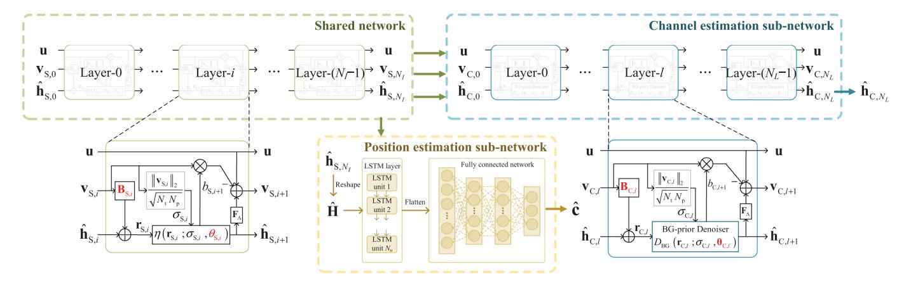

Fig. 2. Illustration of the proposed sparsity-aware multi-task learning architecture for accurate channel and position estimation.

learning-based methods. Moreover, according to (1), (2), and (3), the channel measurement data in **u** contains plenty of position-related information, so it can also be utilized to estimate the location coordinate **c** of the receiver. To this end, an MTL-based architecture is proposed to extract the shared features beneficial for both channel estimation and positioning, which is elaborated in detail in Section 3.

# 2.2.2 Multi-Lamp Cellular Cluster Architecture Design for Multi-User Cooperative VIPAC

To improve the spatial generalization ability of the learnt MTL-based network, a multi-lamp cellular cluster architecture is designed in this paper, which provides a systematic and spatially transferrable VIPAC model enabling the proposed MTFL framework. Specifically, as illustrated in Fig. 1c, the VLC coverage area in an arbitrary indoor environment with many LEDs can be divided into multiple hexagonal VLC cells as is done in mobile cellular networks [30], [31], where each VLC cell contains an LED in the center on the ceiling. A certain number of VLC cells constitute a multi-lamp *cellular cluster*. Since the light intensity decays with the propagation distance, the coverage of an LED is mostly limited in the cell and the same subcarriers can be reused in different cellular clusters, which is like the frequency reuse technology in mobile cellular networks.

As a typical example, the cluster pattern with each cellular cluster consisting of four cells is illustrated in Fig. 1c, where the orange and blue clusters are two adjacent clusters reusing the same subcarriers. With the help of the cellular cluster architecture, different clusters have a property of approximate spatial equivalence between each other, because they can be approximately transferred to each other by some simple operations such as flipping, rotating, and shifting. In other words, if you look at two different clusters from some specific spatial perspective, they look quite similar to each other. This makes it very convenient for a universally effective global model to be learnt in the MTFL framework. In fact, the original positioning problem of estimating the absolute coordinate can be transferred to another equivalent problem of estimating the relative coordinate with respect to the cluster center, which is universally applicable for different clusters. Specifically, as denoted by the orange and blue dots in Fig. 1c, the absolute coordinates of the two pairs of different positions in the two clusters are different. However, their relative coordinates to their corresponding cluster center are the same. When the relative coordinates are estimated correctly, the absolute coordinates can be easily obtained with the information of the absolute LED positions in the corresponding cluster. Hence, by converting the original absolute positioning problem to an equivalent relative positioning problem using the cellular cluster architecture, a generalized global VIPAC model effective for different clusters in various kinds of environments and scenarios can be trained in the MTFL framework, which is an effective way to improve the spatial generalization ability, as described in detail in Section 4.

# 3 Sparsity-Aware Multi-Task Learning for Accurate Channel and Position Estimation

In this section, we introduce the proposed sparsity-aware MTL-based network for accurate channel and position estimation in the VIPAC system. As illustrated in Fig. 2, it is composed of a sparsity-aware depth-adaptive shared network and two task-oriented sub-networks for channel and position estimation, respectively.

#### 3.1 Multi-Task Learning Based Network Architecture

Different from the traditional single-task learning, MTL is aimed at training a joint model for multiple related tasks so that the domain-specific knowledge of each task can be harnessed to improve the generalization ability of the joint model for all the tasks [21]. Data augmentation is achieved by aggregating the training data across all the tasks to learn a more accurate model for each task, which can better exploit the domain-specific knowledge and reduce the data amount required for satisfactory performance. Meanwhile, with more data from different tasks, MTL can extract the inherent mutual benefits and provide a more robust and more general representation for these tasks, which leads to a lower risk of overfitting for each task [22].

Framework. In fact, the original positioning problem of estimating the absolute coordinate can be transferred to another equivalent problem of estimating the relative coordinate with respect to the cluster center, which is universally applicable for different clusters. Specifically, as denoted by the orange and blue dots in Fig. 1c, the absolute coordinates of the two pairs of different positions in the two clusters are Authorized licensed use limited to: T.C. Cumhurbaskanligi Kutuphanesi. Downloaded on December 14,2025 at 17:43:50 UTC from IEEE Xplore. Restrictions apply.

reflects the locations of the dominant taps in the CIR, so it contains the information of the distance between the PD and the LED as well as the surrounding environment, which can be utilized for positioning. Therefore, the sparse features of the channel can be shared between positioning and channel estimation to improve the performance of both the two tasks.

Specifically, in the proposed MTL-based network architecture, a sparsity-aware shared network is devised to extract the shared sparse features between the two tasks, and meanwhile to obtain a coarse estimation of the CIR. To find the optimal equilibrium point of the shared sparse feature, the depth of the shared network can be flexibly and adaptively adjusted, and an optimal performance tradeoff between the two subtasks can be achieved for different scenarios and QoS requirements. Afterwards, the shared representation extracted out of the shared network is then fed into the two task-oriented sub-networks for channel and position estimation, respectively. The shared network is jointly trained to achieve the best mutual benefits between the two tasks, and the two sub-networks can be refined and further optimized respectively to improve the performance of either task, which is described in detail as follows.

## 3.2 Sparsity-Aware Depth-Adaptive Shared Network

To extract shared sparse features, in this paper, a sparsityaware deep-unfolding neural network inspired by the classical iterative sparse recovery algorithm of approximate message passing (AMP) is utilized as the shared network, as illustrated by the green dashed block in Fig. 2. The shared network is utilized to obtain a coarse estimation of the sparse pattern of the CIR vector, which is an important shared feature for channel estimation and positioning. In the structure of the sparsity-aware shared network, each layer mimics an iteration of the AMP algorithm, and the operations of the *i*th layer are given by

$$\hat{\mathbf{h}}_{S,i+1} = \eta(\hat{\mathbf{h}}_{S,i} + \mathbf{B}_{S,i}\mathbf{v}_{S,i}; \sigma_{S,i}, \theta_{S,i}), \tag{10}$$

$$\mathbf{v}_{S\,i+1} = \mathbf{u} - \mathbf{F}_{\Lambda} \hat{\mathbf{h}}_{S\,i+1} + b_{S\,i+1} \mathbf{v}_{S\,i},\tag{11}$$

where  $\hat{\mathbf{h}}_{\mathrm{S},i} = [(\hat{\mathbf{h}}_{\mathrm{S},i}^{(1)})^T, (\hat{\mathbf{h}}_{\mathrm{S},i}^{(2)})^T, \dots, (\hat{\mathbf{h}}_{\mathrm{S},i}^{(N_{\mathrm{t}})})^T]^T$  denotes the estimated CIR vector of the *i*th layer, and  $\mathbf{v}_{S,i}$  is the residual measurement error vector of the ith layer.  $\mathbf{B}_{\mathrm{S},i}$  denotes the layer-dependent learnable weights, which is a parametric matrix converted from the observation matrix  $\textbf{F}_{\Lambda}.$  The soft threshold shrinkage function  $\eta(\cdot)$  is defined element-wise with its nth element given by

$$\left[\eta\left(\mathbf{r}_{S,i};\sigma_{S,i},\theta_{S,i}\right)\right]_{n} \triangleq \operatorname{sgn}\left(\left[\mathbf{r}_{S,i}\right]_{n}\right) \operatorname{max}\left(\left|\left[\mathbf{r}_{S,i}\right]_{n}\right| - \theta_{S,i}\sigma_{S,i},0\right),$$
(12)

which accepts three parameters as the input, including the noisy measurement vector  $\mathbf{r}_{\mathrm{S},i} = \hat{\mathbf{h}}_{\mathrm{S},i} + \mathbf{B}_{\mathrm{S},i} \mathbf{v}_{\mathrm{S},i}$ , the standard deviation of the residual error  $\sigma_{\mathrm{S},i} = \|\mathbf{v}_{\mathrm{S},i}\|_2 / \sqrt{N_{\mathrm{t}} N_{\mathrm{p}}}$ , and the learnable threshold parameter  $\theta_{S,i}$ . By exploiting  $\eta(\cdot)$  as a sparsity inducer, the noisy component with small amplitude in the noisy measurement vector  $\mathbf{r}_{S,i}$  can be eliminated, while the dominant nonzero elements larger than threshold are kept with an amplitude shrinkage imposed thereon. Thus, the sparse vector  $\hat{\mathbf{h}}_{\mathrm{S},i+1}$  can be obtained. The Onsager Authorized licensed use limited to: T.C. Cumhurbaskanligi Kutuphanesi. Downloaded on December 14,2025 at 17:43:50 UTC from IEEE Xplore. Restrictions apply.

correction item  $b_{S,i+1}\mathbf{v}_{S,i}$  aims to make the noise component in  $\mathbf{r}_{S,i}$  obey the Gaussian distribution with the standard deviation  $\sigma_{S,i}$  [32], where  $b_{S,i+1}$  is calculated by

$$b_{\mathrm{S},i+1} = \frac{1}{N_{\mathrm{t}} N_{\mathrm{p}}} \sum_{n=0}^{N_{\mathrm{t}} L} \frac{\partial \left[ \eta(\mathbf{r}_{\mathrm{S},i}; \sigma_{\mathrm{S},i}, \theta_{\mathrm{S},i}) \right]_{n}}{\partial \left[ \mathbf{r}_{\mathrm{S},i} \right]_{n}}.$$
 (13)

Let us denote the output of the shared network as  $\mathbf{h}_{S,N_I}$ , which can be regarded as a coarse estimate of the stacked CIR vector  $\mathbf{h}$ , with  $N_I$  being the depth of the shared network. It is more important for the shared network to acquire the sparse features reflected by the dominant taps of the CIR rather than the other small-scale elements, because taking too many other redundant features into consideration might introduce noise components and interferences that cause performance degradation to positioning accuracy. The depth of the shared deep-unfolding sparsity-aware network  $N_I$  can be regarded as a critical hyper-parameter that determines the extent to which the channel sparse features are extracted. Therefore, it is necessary to find the optimal depth of the shared network, so that the performance of both positioning and channel estimation can be simultaneously optimized with an optimal tradeoff. The network depth can be flexibly and adaptively adjusted in the training process, which can be determined by the loss functions of the two tasks as explained in detail in Section 3.4.

### 3.3 Task-Oriented Sub-Networks for Channel **Estimation and Positioning**

To further improve the performance of channel estimation and positioning, two task-oriented sub-networks are specially designed for the two tasks, respectively, as illustrated by the blue and yellow dashed blocks in Fig. 2.

In the channel estimation sub-network, an essential module is introduced in the deep-unfolding network to further improve the channel estimation accuracy especially in harsh conditions, such as intensive background noise and insufficient pilot measurements. Different from the soft threshold shrinkage  $\eta(\cdot)$  used in the shared network, an mean squared error (MSE)-optimal denoiser  $D_{\rm BG}(\cdot)$  with a zero-mean Bernoulli-Gaussian (BG) prior is introduced to eliminate the noise component in the noisy measurement vector  $\mathbf{r}_{CL}$  more effectively. Assuming that h is a sparse vector following a prior of an i.i.d. BG distribution, whose probability density function (PDF) of the nth elements is given by

$$p(h_n; \frac{K}{N_t L}, \sigma_h^2) = \left(1 - \frac{K}{N_t L}\right) \delta(h_n) + \frac{K}{N_t L} \mathcal{N}(h_n; 0, \sigma_h^2), \quad (14)$$

where K denotes the sparsity level, and  $\sigma_h^2$  is the variance of the nonzero elements of h, and then the noisy measurement vector  $\mathbf{r}_{C,l}$  of the *l*th layer is given by

$$\mathbf{r}_{\mathrm{C},l} = \mathbf{h} + \mathbf{e},\tag{15}$$

where **e** denotes the AWGN vector with the variance of  $\sigma_{Cl}^2$ . To obtain the channel estimate  $\hat{h}_n = \mathbb{E}[h_n | [\mathbf{r}_{C,l}]_n]$ , the BGprior denoiser, which is MSE-optimal, is given by

$$\hat{h}_{n} = \frac{[\mathbf{r}_{C,l}]_{n}}{\left(1 + \frac{\sigma_{C,l}^{2}}{\sigma_{h}^{2}}\right) \left(1 + \frac{N_{t}L - K}{K} \frac{\mathcal{N}([\mathbf{r}_{C,l}]_{n};0,\sigma_{C,l}^{2})}{\mathcal{N}([\mathbf{r}_{C,l}]_{n};0,\sigma_{C,l}^{2} + \sigma_{h}^{2})}\right)}.$$
(16)

To turn the denoiser into a learnable function, we set the learnable parameters  $_{\mathrm{C},l}=[\theta_{\mathrm{C},l,1},\theta_{\mathrm{C},l,2}]$  as  $\theta_{\mathrm{C},l,1}=\sigma_{\mathrm{h}}^2$  and  $\theta_{\mathrm{C},l,2}=\log(\frac{N_{\mathrm{t}}L-K}{K})$ . Then, the BG-prior denoiser is then element-wise given by

$$\begin{bmatrix} D_{\mathrm{BG}} \left( \mathbf{r}_{\mathrm{C},l}; \sigma_{\mathrm{C},l}, c_{,l} \right) \end{bmatrix}_{n} \\
= \frac{\left[ \mathbf{r}_{\mathrm{C},l} \right]_{n}}{\left( 1 + \frac{\sigma_{\mathrm{C},l^{2}}}{\theta_{\mathrm{C},l,1}} \right) \left( 1 + \sqrt{1 + \frac{\theta_{\mathrm{C},l,1}}{\sigma_{\mathrm{C},l^{2}}}} \exp \left( \theta_{\mathrm{C},l,2} - \frac{\left[ \mathbf{r}_{\mathrm{C},l} \right]_{n}^{2}}{2 \left( \sigma_{\mathrm{C},l^{2}} + \sigma_{\mathrm{C},l^{4}} / \theta_{\mathrm{C},l,1} \right)} \right) \right)} \tag{17}$$

Compared with the soft threshold shrinkage function, the MSE-optimal denoiser can accurately estimate the stacked CIR vector  $\mathbf{h}$  thanks to its robust ability of denoising, especially in harsh conditions. Since the channel sparsity is unavailable before channel estimation, the network depth should be adjustable and adaptive to variant channel conditions. Therefore, in the training stage, the number of layers of the channel estimation sub-network, i.e.,  $N_L$ , is also determined by the loss function, which is introduced in detail in Section 3.4.

**Algorithm 1.** Multi-Task Learning Based Joint Channel and Position Estimation Algorithm (Training Stage)

#### Input:

1) Training dataset  $\mathbf{\Omega} = \{\mathbf{u}^d, \mathbf{h}^d, \mathbf{c}^d\}_{d=1}^D$  with D samples (each data sample is composed of a stacked channel measurement vector  $\mathbf{u}^d$ , and the corresponding ground-truth stacked CIR vector  $\mathbf{h}^d$  and position coordinate  $\mathbf{c}^d$ )

- 2) Observation matrix  $\mathbf{F}_{\Lambda}$
- 1: Initialize  $i \leftarrow 0$ ,  $\mathbf{v}_{\mathrm{S},0} \leftarrow \mathbf{u}$ ,  $\hat{\mathbf{h}}_{\mathrm{S},0} \leftarrow \mathbf{0}$
- 2: repeat
- 3: Initialize learnable parameters of *i*th layer:  $\mathbf{B}_{S,i} \leftarrow \mathbf{F}_{\Lambda}^T$ ,  $\theta_{S,i} \leftarrow 1$
- 4: Compute the noisy measurement vector  $\mathbf{r}_{\mathrm{S},i} = \hat{\mathbf{h}}_{\mathrm{S},i} + \mathbf{B}_{\mathrm{S},i}\mathbf{v}_{\mathrm{S},i}$  and the standard deviation of the residual error  $\sigma_{\mathrm{S},i}$
- 5: Obtain the estimated CIR vector  $\hat{\mathbf{h}}_{\mathrm{S},i+1}$  and the residual measurement error vector  $\hat{\mathbf{v}}_{\mathrm{S},i+1}$  by (10), (11), (12), and (13)
- Perform Inner-Algorithm (a) procedure to determine the optimal number of layers for the channel estimation subnetwork
- 7: Go to next layer  $i \leftarrow i + 1$
- 8: until  $\mathcal{L}(\mathbf{\Theta}_{[i,N_L]},\mathbf{\Omega}) > \mathcal{L}(\mathbf{\Theta}_{[i-1,N_L]},\mathbf{\Omega})$
- 9: Set the optimal number of layers as  $N_I \leftarrow i-1$

#### **Output:**

Trained parameters  $\Theta$ , including  $\Theta_{\rm S}=\{{\bf B}_{{\rm S},i},\theta_{{\rm S},i}\}_{i=0}^{N_I-1},\, \Theta_{\rm C}=\{{\bf B}_{{\rm C},l},{\rm C}_{,l}\}_{l=0}^{N_L-1}$ , and  $\Theta_{\rm P}$ 

- 1: **Inner-Algorithm (a).** Sub-Network for Channel Estimation Task (Training Stage)
- 2: Initialize  $l \leftarrow 0$ ,  $\mathbf{v}_{\mathrm{C},0} \leftarrow \mathbf{v}_{\mathrm{S},i}$ ,  $\hat{\mathbf{h}}_{\mathrm{C},0} \leftarrow \hat{\mathbf{h}}_{\mathrm{S},i}$
- 3: repeat
- 4: Initialize learnable parameters of *l*th layer:  $\mathbf{B}_{\mathrm{C},l} \leftarrow \mathbf{F}_{\Lambda',\mathrm{C},l}^T \leftarrow \mathbf{1}$
- 5: Compute the noisy measurement vector  $\mathbf{r}_{\mathrm{C},l}$  and the standard deviation of the residual error  $\sigma_{\mathrm{C},l}$ , and estimate the denoised CIR vector  $\hat{\mathbf{h}}_{\mathrm{C},l}$  by (17)
- 6: Calculate the loss function  $\mathcal{L}(\mathbf{\Theta}_{[i,l]}, \mathbf{\Omega})$  based on (18), and update  $\{\mathbf{B}_{\mathrm{S},i}, \theta_{\mathrm{S},i}\}$ ,  $\{\mathbf{B}_{\mathrm{C},l}, _{\mathrm{C},l}\}$  and  $\mathbf{\Theta}_{\mathrm{P}}$  via backpropagation
- 7: Go to next layer  $l \leftarrow l + 1$
- 8: until  $\mathcal{L}(\mathbf{\Theta}_{[i,l]},\mathbf{\Omega}) > \mathcal{L}(\mathbf{\Theta}_{[i,l-1]},\mathbf{\Omega})$
- 9: Set the optimal number of layers as  $N_L \leftarrow l-1$

Considering the outstanding performance of long short- compromising between the two loss functions of channel term memory (LSTM) in learning the long-term dependency estimation  $\mathcal{L}_{CE}(\Theta, \Omega)$  and positioning  $\mathcal{L}_{PE}(\Theta, \Omega)$ . Authorized licensed use limited to: T.C. Cumhurbaskanligi Kutuphanesi. Downloaded on December 14,2025 at 17:43:50 UTC from IEEE Xplore. Restrictions apply.

of an input sequence [33], it is employed in the positioning sub-network in this paper. LSTM is an improved recurrent neural network containing a cell state and three gates, i.e., the input gate, forget gate, and output gate. The cell state plays a role of storing the useful information of the feature extracted from the previous entries in the input sequence, and the gates play a role of the selection and rejection of the previous information.

For the positioning sub-network, the coarsely estimated stacked CIR vector  $\mathbf{h}_{S,N_I}$ , i.e., the output of the shared network, is first unstacked and reshaped into the estimated CIR matrix  $\hat{\mathbf{H}} = [\hat{\mathbf{h}}_{\mathrm{S},N_I}^{(1)}, \hat{\mathbf{h}}_{\mathrm{S},N_I}^{(2)}, \dots, \hat{\mathbf{h}}_{\mathrm{S},N_I}^{(N_{\mathrm{t}})}]^T$  with the size of  $N_{\rm t} \times L$ . Then, an LSTM layer consisting of  $N_{\rm u} = N_{\rm p}$  memory units is employed to extract the position-related features in the estimated CIR matrix H, of which the output is fed into a tanh activation function. Afterwards, the output data with the size of  $N_{\rm t} \times N_{\rm p}$  is flattened into a vector with length of  $N_{\rm t}N_{\rm p}$  and then fed into a fully connected network, in which two hidden layers containing  $N_{\rm n}=N_{\rm t}L$  neurons are adopted to map the features extracted by the LSTM layer into the label space of the position coordinates. The two hidden layers are both followed by a rectified linear unit (ReLu) to improve the non-linear representation ability. Finally, the last hidden layer is connected to the output layer with linear connections to generate the estimated position coordinate  $\hat{\mathbf{c}}$ .

## 3.4 Joint Training of the Depth-Adaptive Multi-Task Learning Network

To further improve the performance of both the two tasks and find the globally optimal point for the joint loss of the two tasks, a joint training strategy for the depth-adaptive MTL-based network consisting of the cascaded shared network and the sub-networks is proposed. The detailed procedure of the training strategy is shown in Algorithm 1. Specifically, in the training stage, the training dataset  $\Omega$  =  $\{\mathbf{u}^d, \mathbf{h}^d, \mathbf{c}^d\}_{d=1}^D$  contains D pairs of ground-truth data samples, with each data sample composed of a stacked channel measurement vector  $\mathbf{u}^d$ , and the corresponding stacked CIR vector  $\mathbf{h}^d$  and position coordinate  $\mathbf{c}^d$ . The network weights  $\mathbf{\Theta} = {\mathbf{\Theta}_{\mathrm{S}}, \mathbf{\Theta}_{\mathrm{C}}, \mathbf{\Theta}_{\mathrm{P}}}$  to be learnt include the  $N_I$ -layer shared network weights  $\Theta_{S} = \{\mathbf{B}_{S,i}, \theta_{S,i}\}_{i=1}^{N_I}$ , the  $N_L$ -layer channel estimation sub-network weights  $\mathbf{\Theta}_{C} = \{\mathbf{B}_{C,l}, \mathbf{C}_{C,l}\}_{l=1}^{N_L}$ , and the positioning sub-network weights  $\Theta_{\rm P}$ . A joint loss function considering the normalized mean squared error (NMSE) of both the position coordinate estimate and the CIR estimate is utilized for training, which is given by

$$\mathcal{L}(\mathbf{\Theta}, \mathbf{\Omega}) = \lambda \mathcal{L}_{CE}(\mathbf{\Theta}, \mathbf{\Omega}) + (\infty - \lambda) \mathcal{L}_{PE}(\mathbf{\Theta}, \mathbf{\Omega})$$

$$= \frac{\lambda}{D} \sum_{d=1}^{D} \frac{\left\|\hat{\mathbf{h}}^{d}(\mathbf{u}^{d}; \mathbf{\Theta}) - \mathbf{h}^{d}\right\|_{2}^{2}}{\left\|\mathbf{h}^{d}\right\|_{2}^{2}} + \frac{1 - \lambda}{D} \sum_{d=1}^{D} \frac{\left\|\hat{\mathbf{c}}^{d}(\mathbf{u}^{d}; \mathbf{\Theta}) - \mathbf{c}^{d}\right\|_{2}^{2}}{\left\|\mathbf{c}^{d}\right\|_{2}^{2}},$$
(18)

where  $\hat{\mathbf{h}}^d(\mathbf{u}^d; \boldsymbol{\Theta})$  and  $\hat{\mathbf{c}}^d(\mathbf{u}^d; \boldsymbol{\Theta})$  denote the output of the channel estimation sub-network and the positioning subnetwork, respectively, with the input of  $\mathbf{u}^d$  and network weights of  $\boldsymbol{\Theta}$ . The coefficient  $\lambda$  is a tradeoff factor compromising between the two loss functions of channel estimation  $\mathcal{L}_{\text{CE}}(\boldsymbol{\Theta}, \boldsymbol{\Omega})$  and positioning  $\mathcal{L}_{\text{PE}}(\boldsymbol{\Theta}, \boldsymbol{\Omega})$ .

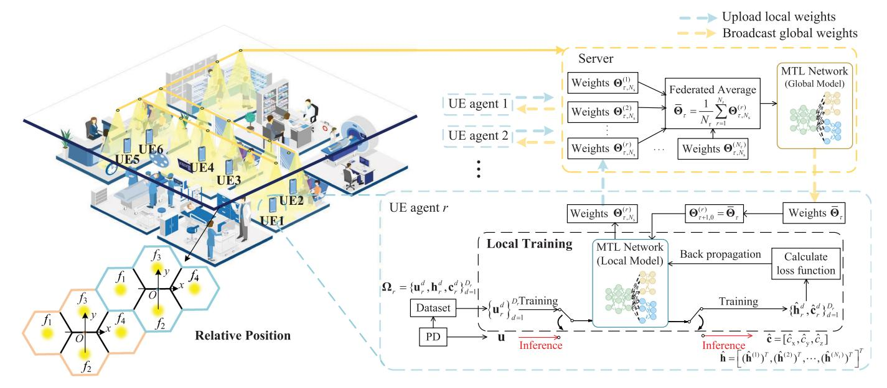

Fig. 3. The multi-task federated learning framework.

For the shared network and the channel estimation sub-network, a layer-wise training manner is utilized. Specifically, the layer numbers for both the shared network and the channel estimation sub-network can adaptively change over the training process in order to find the optimal network depth. The shared network and the channel estimation sub-network are jointly trained with the positioning sub-network to optimize the performance of both positioning and channel estimation. When training the *i*th layer of the shared network and the *l*th layer of the channel estimation sub-network, all the previous layers are utilized to calculate the loss function  $\mathcal{L}(\mathbf{\Theta}_{[i,l]}, \mathbf{\Omega}) =$  $\mathcal{L}(\{\{\mathbf{B}_{S,k}, \theta_{S,k}\}_{k=1}^{i}, \{\mathbf{B}_{C,n}, C,n\}_{n=1}^{l}, \mathbf{\Theta}_{P}\}, \mathbf{\Omega})$  by (18). The learnable parameters are optimized via back propagation and stochastic gradient descent by minimizing the loss function, until the loss function does not decrease with the increase of the network depths, at which the iteration terminates. Finally, when the loop halts, the total layer numbers for the shared network and the channel estimation sub-network are set as  $N_I$  and  $N_{I,I}$ respectively.

In the inference stage, the final estimated CIR vector  $\hat{\mathbf{h}}_{\mathrm{C},N_L}$  and the position coordinate  $\hat{\mathbf{c}}$  can be simply obtained by performing a single-trip feed-forward operation in the trained MTL-based network.

# 4 MULTI-TASK FEDERATED LEARNING FRAMEWORK FOR MULTI-USER COOPERATIVE VIPAC

In this section, we introduce the MTFL framework, which further improves the spatiotemporal generalization ability of the multi-user cooperative VIPAC system, as illustrated in Fig. 3. In the cooperative VIPAC system considered,  $N_{\rm r}$  UE agents are located in the indoor environment, and  $N_{\rm t}$  LEDs formulate the cellular clusters with the pattern shown in Fig. 1c. Multiple UE agents participate in the training of a global model in the framework of federated learning in order to improve the generalization ability in spatiotemporally nonstationary environments.

Specifically, in the proposed MTFL framework, the UE agents participate in the collection of training samples. During a sensing interval, the rth UE agent collects the stacked CIR vector  $\mathbf{h}_r^d$  and the measurement vector  $\mathbf{u}_r^d$  received from the LEDs, and labels them with the corresponding position coordinate  $\mathbf{c}_r^d = [c_{r,x}^d, c_{r,y}^d, c_{r,z}^d]$ . As UE agents are moving in the indoor environment, the samples corresponding to different locations are obtained. Moreover, to exploit the multi-lamp cellular cluster architecture for cooperative VIPAC as introduced in Section 2.2.2 to improve the spatial generalization ability, the position coordinates in different cellular clusters can be standardized by transferring absolute coordinates to relative coordinates, which can be expressed as

$$\mathbf{c}^d = (\mathbf{c}_{\text{abs}}^d - \mathbf{c}_{\text{ref}}^d)\mathbf{\Phi},\tag{19}$$

where  $\mathbf{c}^d$ ,  $\mathbf{c}^d_{\mathrm{abs}}$  and  $\mathbf{c}^d_{\mathrm{ref}}$  denote the relative coordinate, the absolute coordinate, and the coordinate of the reference point, i.e., the cluster center, respectively.  $\Phi$  is a transfer matrix describing the flipping and rotating operations, which converts the absolute coordinate  $\mathbf{c}^d_{\mathrm{abs}}$  in different locations to a relative coordinate  $\mathbf{c}^d$  in the local cluster with approximate spatial equivalence between different clusters. Thus, each UE agent can constitute a local dataset  $\mathbf{\Omega}_r = \{\mathbf{u}^d_r, \mathbf{h}^d_r, \mathbf{c}^d_r\}_{d=1}^{D_r}$  consisting of  $D_r$  samples. Unlike learning-based methods using a one-shot site survey, in the proposed MTFL framework, data collection can be implemented over time, and the local dataset is accordingly updated using the latest collected samples, making it suitable for spatiotemporally nonstationary environments.

Subsequently, using the collected training data, an adaptive global neural network model can be learnt. To preserve the data privacy of the UE agents and prevent from confidential data leakage in traditional centralized learning, federated learning is utilized in the proposed MTFL framework to learn the global model in a distributive manner. The training process is divided into local model training at the  $N_{\rm r}$  UE agents and global model aggregation at the server. The

detailed procedure is summarized in Algorithm 2, and introduced as follows.

# Algorithm 2. Multi-Task Federated Learning Based Multi-User Cooperative VIPAC (Training Stage)

#### Input:

Local datasets  $\mathbf{\Omega}_1, \mathbf{\Omega}_2, \dots, \mathbf{\Omega}_{N_r}$ 

- 1: Initialize the global weights  $\bar{\Theta}_0$
- 2: **for** each communication round  $\tau = 1, 2, ..., T$  **do**
- At the  $N_r$  UE Agents: (each UE agent performs local training independently as follows)
- Initialize the local weights  $\mathbf{\Theta}_{\tau,0}^{(r)} \leftarrow \bar{\mathbf{\Theta}}_{\tau-1}$ 4:
- **for** each local training step  $s = 1, 2, ..., N_s$  **do**
- Sample a mini-batch  $\mathbf{\Omega}_r^{\tau,s}$  of size B from the local dataset
- Calculate the local loss function  $\mathcal{L}(\mathbf{\Theta}_{\tau,s-1}^{(r)}, \mathbf{\Omega}_r^{\tau,s})$  and update 7: the local weights  $\Theta_{\tau s}^{(r)}$  via (20)
- 8:

10:

- Upload the learnt local weights  $\Theta_{\tau N_0}^{(r)}$  to the server 9:
- At the Server: 11:
- Aggregate the weights  $\Theta_{\tau,N_s}^{(1)}, \Theta_{\tau,N_s}^{(2)}, \dots, \Theta_{\tau,N_s}^{(N_r)}$  by (21) and broadcast  $\bar{\Theta}_{\tau}$  to all the  $N_{
  m r}$  UE agents via visible light downlink transmission
- 13: **end for**

The training stage of the proposed MTFL-based VIPAC algorithm consists of a series of communication rounds indexed by  $\tau$  over time. Within a certain communication round, the local model is trained at each UE agent independently, and then the updated local models are aggregated at the server to update the global model. Specifically, at the rth UE agent,  $r = 1, 2, ..., N_r$ , the local dataset  $\mathbf{\Omega}_r = \{\mathbf{u}_r^d, \mathbf{h}_r^d\}$  $\mathbf{c}_r^d$  $_{d=1}^{D_r}$  is used to train the weights of the local MTL network model, which contains the local information for the VIPAC tasks. The local weights for the local model are first initialized by the global weights of the previous communication round, i.e.,  $\mathbf{\Theta}_{\tau.0}^{(r)} \leftarrow \bar{\mathbf{\Theta}}_{\tau-1}$ , and then updated via  $N_{\mathrm{s}}$  local training steps. In the sth local training step, all the local weights  $\Theta_{\tau_s}^{(r)}$  are updated using stochastic gradient descent (SGD) and back propagation to minimize the local loss function  $\mathcal{L}(\mathbf{\Theta}_{\tau,s}^{(r)}, \mathbf{\Omega}_{r}^{\tau,s})$  calculated by (18) using the mini-batch  $\mathbf{\Omega}_{r}^{\tau,s}$  of size B sampled from the local dataset  $\Omega_r$ , which is given by

$$\mathbf{\Theta}_{\tau,s}^{(r)} = \mathbf{\Theta}_{\tau,s-1}^{(r)} - \zeta \mathbf{G}_{\tau,s}^{(r)},\tag{20}$$

where  $\zeta$  is the learning rate, and  $\mathbf{G}_{\tau,s}^{(r)} = \nabla \mathcal{L}(\mathbf{\Theta}_{\tau,s-1}^{(r)}, \mathbf{\Omega}_{r}^{\tau,s})$  is the gradient of the local loss function. After  $N_{\rm s}$  local training steps, the rth UE agent uploads the updated local weights  $\mathbf{\Theta}_{\tau.N_c}^{(r)}$  to the server via uplink wireless transmission such as WiFi or Bluetooth, etc.

At the server, the local weights  $\mathbf{\Theta}_{\tau,N_s}^{(1)}, \mathbf{\Theta}_{\tau,N_s}^{(2)}, \dots, \mathbf{\Theta}_{\tau,N_s}^{(N_r)}$ received from UE agents are aggregated to update the global weights  $\bar{\Theta}_{\tau}$ , which can be expressed as

$$\bar{\boldsymbol{\Theta}}_{\tau} = \frac{1}{N_{\rm r}} \sum_{r=1}^{N_{\rm r}} \boldsymbol{\Theta}_{\tau,N_{\rm s}}^{(r)}.$$
 (21)

Then, the updated global weights  $\Theta_{\tau}$  are broadcasted to all the  $N_{\rm r}$  UE agents via visible light downlink transmission.

After receiving the updated global weights broadcast from the server, the rth UE agent replaces its local weights  $\mathbf{\Theta}_{\tau+1,0}^{(r)}$  with  $\bar{\mathbf{\Theta}}_{\tau}$ , and then it continues to train its local model in the next communication round. With the increase of communication rounds, a spatially generalized global model can be learnt, which can cover satisfactory VIPAC service for the whole indoor scenario illuminated by the LEDs thanks to the cooperation of multiple UE agents.

As for the inference stage of the proposed MTFL-based VIPAC algorithm at the UE agents, the tasks of channel estimation and positioning can be performed in an online manner using the currently-trained global model in any communication round of the interactive and continuous training process. Specifically, when a UE agent needs to perform the task of channel estimation or positioning, the stacked channel measurement vector **u** measured by the UE agent in real time can be fed into the currently-trained global model stored in the UE agent with the current global weights of  $\bar{\Theta}_{\tau}$ , and then the output of the global model is the inference of the stacked CIR vector **h** and the position coordinate  $\hat{\mathbf{c}}$  of the UE agent.

The proposed MTFL-based framework is adaptive to the temporal and spatial variations of the visible light channel and the realistic environments. This is because the local datasets used for training the local models of the UE agents can be updated online over time, and thus the local models can be gradually updated to adapt to the possible spatiotemporal variations in a few communication rounds. Besides, the absolute coordinates of the training samples obtained in different clusters are standardized with approximate spatial equivalence by transferring to relative coordinates. This procedure can further improve the generalization performance of the global model in different locations and variant scenarios. Consequently, a generalized and adaptive model that can adapt to spatiotemporally non-stationary environments is learnt in the MTFL-based framework for effective VIPAC

Moreover, unlike traditional distributed learning, the proposed MTFL-based framework keeps the dataset of a UE agent locally accessible only. Since the training dataset contains sensitive and private information, such as locations, trajectories, and personal data, it must be protected well and isolated from public access. Compared with encryption-based secrecy-preserving schemes, federated learning has a nature of local data privacy preservation without requiring additional dedicated computing resources for secrecy protection. In the MTFL-based scheme, only the learnt model weights are transmitted between the UE agents and the server, while the local training datasets are kept local at the UE agents only. In this way, the data privacy of the UE agents can be effectively protected.

# PERFORMANCE EVALUATION AND THEORETICAL ANALYSIS

#### **Performance Bounds of Positioning and** 5.1 **Channel Estimation Accuracy**

First, we provide a theoretical analysis for the performance bounds of positioning and channel estimation accuracy. Specifically, the Cramér-Rao lower bound (CRLB) for the channel estimation and positioning tasks will be derived, Authorized licensed use limited to: T.C. Cumhurbaskanligi Kutuphanesi. Downloaded on December 14,2025 at 17:43:50 UTC from IEEE Xplore. Restrictions apply.

which is a widely adopted theoretical lower bound for an unbiased estimator [34].

For the channel estimation task, the CIR vector  $\mathbf{h}^{(t)}$  is estimated from the channel measurement vector  $\mathbf{u}^{(t)}$  contaminated by the noise  $\tilde{\mathbf{w}}^{(t)}$  as given by (7). To give a lower bound of the estimation error, the CRLB of channel estimation is analyzed as follows.

**Corollary 1.** Assume that the noise  $\tilde{\mathbf{w}}^{(t)}$  follows an i.i.d. Gaussian distribution of  $\mathcal{N}(\mathbf{0}, \sigma_{\mathrm{w}}^2 \mathbf{I}_{N_{\mathrm{p}}})$ . For the tth LED in the VIPAC system, the asymptotical CRLB of the CIR vector  $\mathbf{h}^{(t)}$  with length of L for channel estimation is given by

$$\mathbb{E}\left[\left\|\hat{\mathbf{h}}^{(t)} - \mathbf{h}^{(t)}\right\|_{2}^{2}\right] \ge \frac{L}{N_{p}}\sigma_{\mathbf{w}}^{2}.\tag{22}$$

**Proof.** Since the noise vector  $\tilde{\mathbf{w}}^{(t)}$  in (7) follows the i.i.d. Gaussian distribution of  $\mathcal{N}(0, \sigma_{\mathrm{w}}^2 \mathbf{I}_{N_{\mathrm{p}}})$ , the PDF of  $\mathbf{u}^{(t)}$  conditioned by the CIR vector  $\mathbf{h}^{(t)}$  can be expressed as

$$p_{\mathbf{u}^{(t)}|\mathbf{h}^{(t)}}\left(\mathbf{u}^{(t)};\mathbf{h}^{(t)}\right) = \frac{1}{\left(2\pi\sigma_{w}^{2}\right)^{N_{p}/2}} \exp\left\{-\frac{1}{2\sigma_{w}^{2}}\left\|\mathbf{u}^{(t)} - \mathbf{F}_{p}^{(t)}\mathbf{h}^{(t)}\right\|_{2}^{2}\right\}. \quad (23)$$

Then, the Fisher information matrix (FIM) [34] for channel estimation in (7) can be obtained by the conditional PDF in (23) as

$$\begin{aligned} [\mathbf{J}_{\mathbf{h}}]_{a,b} &\triangleq -\mathbb{E}\left[\frac{\partial^{2} \ln \left(p_{\mathbf{u}^{(t)} \mid \mathbf{h}^{(t)}}\left(\mathbf{u}^{(t)}; \mathbf{h}^{(t)}\right)\right)}{\partial h_{a}^{(t)} \partial h_{b}^{(t)}}\right] \\ &= \frac{1}{\sigma_{\mathbf{w}}^{2}} \left[\left(\mathbf{F}_{\mathbf{p}}^{(t)}\right)^{H} \mathbf{F}_{\mathbf{p}}^{(t)}\right]_{a,b}, \end{aligned} (24)$$

where  $h_a^{(t)}$  and  $h_b^{(t)}$  are the ath and bth elements in the CIR vector  $\mathbf{h}^{(t)}$ , respectively. Then, the CRLB of the unbiased estimator  $\hat{\mathbf{h}}^{(t)}$  can be derived from the inverse of the FIM [34], which is given by

$$\mathbb{E}\left[\left\|\hat{\mathbf{h}}^{(t)} - \mathbf{h}^{(t)}\right\|_{2}^{2}\right] \ge \operatorname{tr}\left(\mathbf{J}_{h}^{-1}\right)$$

$$= \sigma_{w}^{2} \operatorname{tr}\left(\left(\left(\mathbf{F}_{p}^{(t)}\right)^{H} \mathbf{F}_{p}^{(t)}\right)^{-1}\right). \quad (25)$$

According to some properties in linear algebra [35], we have

$$\operatorname{tr}\left(\left(\left(\mathbf{F}_{\mathbf{p}}^{(t)}\right)^{H}\mathbf{F}_{\mathbf{p}}^{(t)}\right)^{-1}\right) = \sum_{i=1}^{L} \lambda_{i}^{-1} = L\left(\sum_{i=1}^{L} \lambda_{i}^{-1}/L\right)$$

$$\geq L\left(L/\sum_{i=1}^{L} \lambda_{i}\right)$$

$$= \frac{L^{2}}{\operatorname{tr}\left(\left(\mathbf{F}_{\mathbf{p}}^{(t)}\right)^{H}\mathbf{F}_{\mathbf{p}}^{(t)}\right)},$$
(26)

where  $\lambda_1, \lambda_2, \dots, \lambda_L$  denote the eigenvalues of the matrix  $(\mathbf{F}_p^{(t)})^H \mathbf{F}_p^{(t)}$ . It is worth noting that, the inequation in (26) reaches equality if and only if the condition  $\lambda_1 = \lambda_2 = \dots = \lambda_L$  holds, i.e., the columns in the partial DFT matrix

 $\mathbf{F}_{\mathrm{p}}^{(t)}$  selected from the matrix  $\mathbf{F}$  are orthogonal to each other. Then, it is derived that the matrix  $(\mathbf{F}_{\mathrm{p}}^{(t)})^H \mathbf{F}_{\mathrm{p}}^{(t)}$  contains identical diagonal elements of  $N_{\mathrm{p}}$ . Thus, we have

$$\operatorname{tr}\left(\left(\mathbf{F}_{\mathbf{p}}^{(t)}\right)^{H}\mathbf{F}_{\mathbf{p}}^{(t)}\right) = N_{\mathbf{p}}L. \tag{27}$$

Substituting (26) and (27) into (25), the CRLB of the channel estimation task in (22) can be derived.

**Remark 1.** The CRLB in Corollary 1 can be achieved only if the inequation in (26) reaches equality, i.e., the  $N_{\rm p} \times L$  partial DFT matrix  $\mathbf{F}_{\rm p}^{(t)}$  has orthogonal columns. Fortunately, since the  $\mathbf{F}_{\rm p}^{(t)}$  contains L rows and  $N_{\rm p}$  columns of the DFT matrix  $\mathbf{F}$ , which is a perfectly orthogonal matrix, and the pilot subcarriers are chosen with a random pattern,  $\mathbf{F}_{\rm p}^{(t)}$  has approximate orthogonality. Thus, the CRLB in (22) can be asymptotically approached.

In the positioning task, the position coordinate is estimated from the coarsely estimated CIR vector  $\hat{\mathbf{h}}_{S,N_I}$ , where the LOS component in the CIR vector usually contains the dominant information related to the locations. Since the coordinates can be determined from the distances between the PD and more than 3 LED anchors, the CRLB of the distance estimation is usually adopted as a metric of the lower bound of positioning performance [36], which is analyzed as follows.

**Corollary 2.** Assume that the noise vector  $\tilde{\mathbf{w}}^{(t)}$  in the visible light channel follows an i.i.d. Gaussian distribution of  $\mathcal{N}(\mathbf{0}, \sigma_{\mathrm{w}}^2 \mathbf{I}_{N_{\mathrm{p}}})$ . The CRLB of the estimated distance  $\hat{\mathbf{d}}$  in the positioning task is given by

$$\mathbb{E}\left[\|\hat{\mathbf{d}} - \mathbf{d}\|_{2}^{2}\right]$$

$$\geq \frac{1}{N_{p}} \left(\frac{2\pi\sigma_{w}}{(m+1)(m+3)A_{PD}gT_{s}z^{m+1}}\right)^{2} \sum_{t=1}^{N_{t}} \left(d^{(t)}\right)^{2m+8}.$$
 (28)

**Proof.** According to (2), the dominant taps in **h** corresponding to the LOS component are extracted, which constitutes a LOS CIR vector  $\mathbf{h}_{\Gamma}$  as given by

$$h_{\Gamma,t} = \frac{(m+1)A_{\rm PD}\cos^{m}(\varphi^{(t)})\cos(\psi^{(t)})gT_{\rm s}}{2\pi d^{(t)2}},$$
 (29)

where  $h_{\Gamma,t}$  is the tth element of  $\mathbf{h}_{\Gamma}$ . Assuming the PD is placed horizontally with a vertical distance z from the ceiling, Equation (29) can be rewritten as

$$h_{\Gamma,t} = \frac{(m+1)A_{\rm PD}z^{m+1}gT_{\rm s}}{2\pi(d^{(t)})^{m+3}}.$$
 (30)

Note that the vector  $\mathbf{h}_{\Gamma}$  contains the ground-truth dominant CIR taps without noise. In practice, the estimated LOS CIR vector denoted by  $\mathbf{h}_{\mathrm{w}}$  with noise, as the output of the shared network of the MTL-based network, is given by

$$\mathbf{h}_{\mathbf{w}} = \mathbf{h}_{\Gamma} + \mathbf{w}_{\Gamma},\tag{31}$$

where  $\mathbf{w}_{\Gamma}$  is the estimation error of  $\mathbf{h}_{\Gamma}$  in the shared network, which can be regarded as an additive noise imposed on the real vector  $\mathbf{h}_{\Gamma}$ , and follows i.i.d. Gaussian

of  $\mathcal{N}(\mathbf{0}, \sigma_{\Gamma}^2 \mathbf{I}_{N_t})$ . The PDF of  $\mathbf{h}_{\mathrm{w}}$  conditioned by the distance  $\mathbf{d} = [d^{(1)}, d^{(2)}, \dots, d^{(N_t)}]$  can be expressed as

$$p_{\mathbf{h}_{\mathbf{w}} \mid \mathbf{d}}(\mathbf{h}_{\mathbf{w}}; \mathbf{d}) = \frac{1}{\left(2\pi\sigma_{\Gamma}^{2}\right)^{N_{\mathbf{t}}/2}} \exp\left\{-\frac{1}{2\sigma_{\Gamma}^{2}} \|\mathbf{h}_{\mathbf{w}} - \mathbf{h}_{\Gamma}\|_{2}^{2}\right\}. \quad (32)$$

Then, the FIM [34] of the distance **d** can be obtained by the conditional PDF in (32) as follows:

$$J_{d} \triangleq \mathbb{E} \left[ \frac{\partial \ln(p_{\mathbf{h}_{w}|\mathbf{d}}(\mathbf{h}_{w};\mathbf{d}))}{\partial \mathbf{d}} \left( \frac{\partial \ln(p_{\mathbf{h}_{w}|\mathbf{d}}(\mathbf{h}_{w};\mathbf{d}))}{\partial \mathbf{d}} \right)^{T} \right]$$

$$= \mathbb{E} \left[ \frac{\partial \mathbf{h}_{\Gamma}}{\partial \mathbf{d}} \frac{\partial \ln(p_{\mathbf{h}_{w}|\mathbf{d}}(\mathbf{h}_{w};\mathbf{d}))}{\partial \mathbf{h}_{\Gamma}} \right]$$

$$\left( \frac{\partial \mathbf{h}_{\Gamma}}{\partial \mathbf{d}} \frac{\partial \ln(p_{\mathbf{h}_{w}|\mathbf{d}}(\mathbf{h}_{w};\mathbf{d}))}{\partial \mathbf{h}_{\Gamma}} \right)^{T} \right]$$

$$= \mathbf{A} \mathbf{J}_{\Gamma} \mathbf{A}^{T}, \tag{33}$$

where **A** is an  $N_{\rm t} \times N_{\rm t}$  matrix given by

$$\mathbf{A} = \begin{pmatrix} \frac{\partial h_{\Gamma,1}}{\partial d^{(1)}} & \cdots & \frac{\partial h_{\Gamma,N_{t}}}{\partial d^{(1)}} \\ \vdots & \ddots & \vdots \\ \frac{\partial h_{\Gamma,1}}{\partial d^{(N_{t})}} & \cdots & \frac{\partial h_{\Gamma,N_{t}}}{\partial d^{(N_{t})}} \end{pmatrix}$$

$$= -\frac{(m+1)(m+3)A_{PD}gT_{s}z^{m+1}}{2\pi}$$

$$\begin{pmatrix} (d^{(1)})^{m+4} & \cdots & 0 \\ \vdots & \ddots & \vdots \\ 0 & \cdots & (d^{(N_{t})})^{m+4} \end{pmatrix}^{-1}, \quad (34)$$

and  $J_{\Gamma}$  is given by

$$J_{\Gamma} = \mathbb{E}\left[\frac{\partial \ln(p_{\mathbf{h}_{w}\mid\mathbf{d}}(\mathbf{h}_{w};\mathbf{d}))}{\partial \mathbf{h}_{\Gamma}} \left(\frac{\partial \ln(p_{\mathbf{h}_{w}\mid\mathbf{d}}(\mathbf{h}_{w};\mathbf{d}))}{\partial \mathbf{h}_{\Gamma}}\right)^{T}\right]$$

$$= \left(\sigma_{\Gamma}^{2} \mathbf{I}_{N_{t}}\right)^{-1}.$$
(35)

Then,  $J_d$  can be derived, which is a diagonal matrix with the tth diagonal elements given by

$$[\mathbf{J}_{\rm d}]_{t,t} = \left(\frac{(m+1)(m+3)A_{\rm PD}gT_{\rm s}z^{m+1}}{2\pi\sigma_{\Gamma}(d^{(t)})^{m+4}}\right)^2.$$
(36)

Thus, the CRLB of the unbiased estimator  $\hat{\mathbf{d}}$  in the position estimation task can be derived from the inverse of the FIM, which is given by

$$\mathbb{E}\left[\|\hat{\mathbf{d}} - \mathbf{d}\|_{2}^{2}\right] \ge \operatorname{tr}(\mathbf{J}_{d}^{-1})$$

$$= \left(\frac{2\pi\sigma_{\Gamma}}{(m+1)(m+3)A_{\text{PD}}gT_{s}z^{m+1}}\right)^{2} \sum_{t=1}^{N_{t}} \left(d^{(t)}\right)^{2m+8}. \quad (37)$$

According to (22) in Corollary 1, the variance of the elements of the estimation error  $\mathbf{w}_{\Gamma}$  has an approximate lower bound given by

$$\sigma_{\Gamma}^2 \ge \frac{1}{L} \cdot \frac{L}{N_{\rm p}} \sigma_{\rm w}^2 = \frac{\sigma_{\rm w}^2}{N_{\rm p}}.$$
 (38)

Finally, substituting (38) into (37), the CRLB of the position estimation task in (28) can be derived.

**Remark 2.** The CRLB in Corollary 2 is derived as a function with an argument of the distance **d**. Therefore, the conclusion in Corollary 2 can be utilized as a directive metric to optimize the LED deployment pattern for improving the positioning performance.

## 5.2 Convergence Analysis of the MTFL Framework

The convergence guarantee of federated learning algorithms is usually challenging because the local dataset of the UE agent may not be able to fully represent the global features in spatiotemporally varying environments [37]. Specifically, the proposed MTFL framework trained by some certain datasets can be modeled as a distributed optimization problem as given by

$$\min_{\mathbf{\Theta}} \mathcal{L}(\mathbf{\Theta}) \triangleq \frac{1}{N_{r}} \sum_{r=1}^{N_{r}} \mathcal{L}_{r}(\mathbf{\Theta}), \tag{39}$$

where  $\mathcal{L}_r(\Theta) \triangleq \mathbb{E}_{\mathbf{\Omega}_r^{\tau,s} \sim \mathbf{\Omega}_r}[\mathcal{L}(\Theta, \mathbf{\Omega}_r^{\tau,s})]$  denotes the local loss function over the local dataset of the rth UE agent, and  $\mathcal{L}(\Theta)$  denotes the global loss function over all the local datasets. For the convenience of description, we define the average of the local model weights as  $\bar{\Theta}_{\tau,s} = \frac{1}{N_r} \sum_{r=1}^{N_r} \Theta_{\tau,s}^{(r)}$ . According to the SGD update in (20), we have

$$\bar{\mathbf{\Theta}}_{\tau,s} = \bar{\mathbf{\Theta}}_{\tau,s-1} - \frac{1}{N_{\rm r}} \sum_{s=1}^{N_{\rm r}} \mathbf{G}_{\tau,s}^{(r)}.$$
 (40)

Although the UE agent jointly trains the global model weights to fit the environment, the local SGD updates are still performed in each UE agent, which leads to a locally optimal solution. The average stochastic gradients in (40) is a simple average over different UE agents, which may be inaccurate for the global environment. To measure the effect caused by the local inaccuracy in gradient averaging and provide a theoretical guarantee of the proposed MTFL framework, the convergence of the cooperative training algorithm as shown in Algorithm 2 is analyzed as follows.

First, some typical assumptions on non-convex federated optimization that ensures the convergence are given as follows [37], [38].

**Assumption 1.** Each local loss function  $\mathcal{L}_r(\mathbf{\Theta})$  is C-smooth, i.e.,  $\|\nabla \mathcal{L}_r(\mathbf{\Theta}) - \nabla \mathcal{L}_r(\mathbf{\Theta}')\|_2 \le C \|\mathbf{\Theta} - \mathbf{\Theta}'\|_2$ ,  $\forall \mathbf{\Theta}, \mathbf{\Theta}'$ ,  $\forall r \in \{1, 2, \dots, N_r\}$ .

**Assumption 2.** The variance of the gradient of the loss function is bounded by  $\sigma_{\rm g}^2$ , i.e.,  $\mathbb{E}_{\mathbf{\Omega}_r^{\tau,s} \sim \mathbf{\Omega}_r}[\|\nabla \mathcal{L}(\mathbf{\Theta}, \mathbf{\Omega}_r^{\tau,s}) - \nabla \mathcal{L}_r(\mathbf{\Theta})\|_2^2] \le \sigma_{\rm g}^2$ ,  $\forall \mathbf{\Theta}, \forall r \in \{1, 2, \dots, N_r\}$ .

**Assumption 3.** The second moment of the gradient of the loss function is bounded by  $G^2$ , i.e.,  $\mathbb{E}_{\mathbf{\Omega}_r^{\tau,s} \sim \mathbf{\Omega}_r}[\|\nabla \mathcal{L}(\mathbf{\Theta}, \mathbf{\Omega}_r^{\tau,s})\|_2^2] \leq G^2$ ,  $\forall \mathbf{\Theta}, \forall r \in \{1, 2, \dots, N_r\}$ .

Subsequently, we bound the deviation of the local model weights  $\Theta_{\tau,s}^{(r)}$  from the average weights  $\overline{\Theta}_{\tau,s}$  using Lemma 1 as follows. Then, we analyze the convergence rate of the proposed MTFL framework in Corollary 3 using the average of the expected squared gradient norm, which is widely adopted to characterize the convergence rate [37].

**Lemma 1.** If Assumptions 1, 2, and 3 hold, it is guaranteed by Algorithm 2 that,

$$\mathbb{E}\left[\left\|\bar{\mathbf{\Theta}}_{\tau,s} - \mathbf{\Theta}_{\tau,s}^{(r)}\right\|_{2}^{2}\right] \le 4\zeta^{2} N_{s}^{2} G^{2},$$

$$\forall \tau, \forall s, \forall r \in \{1, 2, \dots, N_{r}\},$$
(41)

where G is the constant defined in Assumptions 3.

**Proof.** Consider a certain communication round  $\tau \geq 1$  and local step  $s \geq 1$ . Based on (20) and the initialization of  $\Theta_{\tau,0}^{(r)}$  in Line 4 of Algorithm 2, for  $r \in \{1,2,\ldots,N_{\rm r}\}$ , we have

$$\mathbf{\Theta}_{\tau,s}^{(r)} = \mathbf{\Theta}_{\tau,0}^{(r)} - \zeta \sum_{\xi=1}^{s} \mathbf{G}_{\tau,\xi}^{(r)} = \bar{\mathbf{\Theta}}_{\tau-1} - \zeta \sum_{\xi=1}^{s} \mathbf{G}_{\tau,\xi}^{(r)}.$$
 (42)

Similarly, based on (40) and the initialization of  $\mathbf{\Theta}_{\tau,0}^{(r)}$  in Algorithm 2, we have

$$\bar{\mathbf{\Theta}}_{\tau,s} = \bar{\mathbf{\Theta}}_{\tau,0} - \zeta \sum_{\xi=1}^{s} \frac{1}{N_{r}} \sum_{r=1}^{N_{r}} \mathbf{G}_{\tau,\xi}^{(r)} = \bar{\mathbf{\Theta}}_{\tau-1} - \zeta \sum_{\xi=1}^{s} \frac{1}{N_{r}} \sum_{r=1}^{N_{r}} \mathbf{G}_{\tau,\xi}^{(r)}.$$
(43)

Thus, we have

$$\mathbb{E}\left[\left\|\bar{\mathbf{\Theta}}_{\tau,s} - \mathbf{\Theta}_{\tau,s}^{(r)}\right\|_{2}^{2}\right] \\
= \mathbb{E}\left[\left\|\zeta \sum_{\xi=1}^{s} \frac{1}{N_{r}} \sum_{r=1}^{N_{r}} \mathbf{G}_{\tau,\xi}^{(r)} - \zeta \sum_{\xi=1}^{s} \mathbf{G}_{\tau,\xi}^{(r)}\right\|_{2}^{2}\right] \\
= \zeta^{2} \mathbb{E}\left[\left\|\sum_{\xi=1}^{s} \frac{1}{N_{r}} \sum_{r=1}^{N_{r}} \mathbf{G}_{\tau,\xi}^{(r)} - \sum_{\xi=1}^{s} \mathbf{G}_{\tau,\xi}^{(r)}\right\|_{2}^{2}\right] \\
\leq 2\zeta^{2} \mathbb{E}\left[\left\|\sum_{\xi=1}^{s} \frac{1}{N_{r}} \sum_{r=1}^{N_{r}} \mathbf{G}_{\tau,\xi}^{(r)} - \sum_{\xi=1}^{s} \mathbf{G}_{\tau,\xi}^{(r)}\right\|_{2}^{2}\right] \\
\leq 2\zeta^{2} s \mathbb{E}\left[\sum_{\xi=1}^{s} \left\|\frac{1}{N_{r}} \sum_{r=1}^{N_{r}} \mathbf{G}_{\tau,\xi}^{(r)}\right\|_{2}^{2} + \sum_{\xi=1}^{s} \left\|\mathbf{G}_{\tau,\xi}^{(r)}\right\|_{2}^{2}\right] \\
\leq 2\zeta^{2} s \mathbb{E}\left[\sum_{\xi=1}^{s} \left(\frac{1}{N_{r}} \sum_{r=1}^{N_{r}} \left\|\mathbf{G}_{\tau,\xi}^{(r)}\right\|_{2}^{2}\right) + \sum_{\xi=1}^{s} \left\|\mathbf{G}_{\tau,\xi}^{(r)}\right\|_{2}^{2}\right] \\
\leq 4\zeta^{2} N_{s}^{2} G^{2}, \tag{44}$$

where the first three inequalities are derived from the Jensen's inequality  $\|\sum_{i=1}^n \frac{1}{n} \mathbf{z}_i\|_2^2 \leq \sum_{i=1}^n \frac{1}{n} \|\mathbf{z}_i\|_2^2$ , and the last inequality holds based on Assumption 3.

**Corollary 3.** With Assumptions 1, 2, and 3, if the learning rate is  $\zeta = \sqrt{\frac{N_r}{N_s T}} \le \frac{1}{C}$ , the average of the expected squared gradient norm is bounded by

$$\frac{1}{TN_{s}} \sum_{\tau=1}^{T} \sum_{s=1}^{N_{s}} \mathbb{E}\left[\left\|\nabla \mathcal{L}\left(\bar{\boldsymbol{\Theta}}_{\tau,s-1}\right)\right\|_{2}^{2}\right]$$

$$\leq \mathcal{O}\left(\frac{2}{\sqrt{N_{r}N_{s}T}}\right) + \mathcal{O}\left(\frac{4G^{2}C^{2}N_{r}N_{s}}{T}\right) + \mathcal{O}\left(\frac{C\sigma_{g}^{2}}{\sqrt{N_{r}N_{s}T}}\right). \tag{45}$$

**Proof.** Consider a certain communication round  $\tau \ge 1$  and local step  $s \ge 1$ . With the smoothness of the local loss function based on Assumption 1, we have

$$\mathbb{E}\left[\mathcal{L}(\bar{\mathbf{\Theta}}_{\tau,s})\right] \leq \mathbb{E}\left[\mathcal{L}(\bar{\mathbf{\Theta}}_{\tau,s-1})\right] + \underbrace{\frac{C}{2}}_{T_2} \underbrace{\mathbb{E}\left[\left\|\bar{\mathbf{\Theta}}_{\tau,s} - \bar{\mathbf{\Theta}}_{\tau,s-1}\right\|_{2}^{2}\right]}_{T_1} + \underbrace{\mathbb{E}\left[\left\langle\nabla\mathcal{L}(\bar{\mathbf{\Theta}}_{\tau,s-1}), \bar{\mathbf{\Theta}}_{\tau,s} - \bar{\mathbf{\Theta}}_{\tau,s-1}\right\rangle\right]}_{T_2}.$$
 (46)

Bounding the Second Term  $T_1$ . From (40), we have

$$T_{1} = \zeta^{2} \mathbb{E} \left[ \left\| \frac{1}{N_{r}} \sum_{r=1}^{N_{r}} \mathbf{G}_{\tau,s}^{(r)} \right\|_{2}^{2} \right]$$

$$= \zeta^{2} \mathbb{E} \left[ \left\| \frac{1}{N_{r}} \sum_{r=1}^{N_{r}} \left( \mathbf{G}_{\tau,s}^{(r)} - \nabla \mathcal{L}_{r} \left( \mathbf{\Theta}_{\tau,s-1}^{(r)} \right) \right) \right\|_{2}^{2} \right]$$

$$+ \zeta^{2} \mathbb{E} \left[ \left\| \frac{1}{N_{r}} \sum_{r=1}^{N_{r}} \nabla \mathcal{L}_{r} \left( \mathbf{\Theta}_{\tau,s-1}^{(r)} \right) \right\|_{2}^{2} \right], \tag{47}$$

where the second equality is derived from the basic inequality  $\mathbb{E}[\|\mathbf{z}\|_2^2] = \mathbb{E}[\|\mathbf{z} - \mathbb{E}[\mathbf{z}]\|_2^2] + \|\mathbb{E}[\mathbf{z}]\|_2^2$ . Then, since  $\mathbb{E}[\mathbf{G}_{\tau,s}^{(r)} - \nabla \mathcal{L}_r(\mathbf{\Theta}_{\tau,s-1}^{(r)})] = \mathbf{0}$ , and  $\mathbf{G}_{\tau,s}^{(r)} - \nabla \mathcal{L}_r(\mathbf{\Theta}_{\tau,s-1}^{(r)})$  are independent between the UE agents, we have

$$T_{1} = \zeta^{2} \frac{1}{N_{r}^{2}} \sum_{r=1}^{N_{r}} \mathbb{E}\left[\left\|\mathbf{G}_{\tau,s}^{(r)} - \nabla \mathcal{L}_{r}\left(\mathbf{\Theta}_{\tau,s-1}^{(r)}\right)\right\|_{2}^{2}\right] + \zeta^{2} \mathbb{E}\left[\left\|\frac{1}{N_{r}^{2}} \sum_{r=1}^{N_{r}} \nabla \mathcal{L}_{r}\left(\mathbf{\Theta}_{\tau,s-1}^{(r)}\right)\right\|_{2}^{2}\right]$$

$$\leq \frac{1}{N_{r}} \zeta^{2} \sigma_{g}^{2} + \zeta^{2} \mathbb{E}\left[\left\|\frac{1}{N_{r}} \sum_{r=1}^{N_{r}} \nabla \mathcal{L}_{r}\left(\mathbf{\Theta}_{\tau,s-1}^{(r)}\right)\right\|_{2}^{2}\right], \quad (48)$$

where the inequality holds based on Assumption 2. *Bounding the Third Term*  $T_2$ . Note that

$$T_{2} = -\zeta \mathbb{E} \left[ \left\langle \nabla \mathcal{L}(\bar{\boldsymbol{\Theta}}_{\tau,s-1}), \frac{1}{N_{r}} \sum_{r=1}^{N_{r}} \mathbf{G}_{\tau,s}^{(r)} \right\rangle \right]$$

$$= -\zeta \mathbb{E} \left[ \mathbb{E} \left[ \left\langle \nabla \mathcal{L}(\bar{\boldsymbol{\Theta}}_{\tau,s-1}), \frac{1}{N_{r}} \sum_{r=1}^{N_{r}} \mathbf{G}_{\tau,s}^{(r)} \right\rangle \left| \left\{ \boldsymbol{\Omega}_{r}^{\tau,\xi} \right\}_{\xi=1}^{s-1} \right] \right]$$

$$= -\zeta \mathbb{E} \left[ \left\langle \nabla \mathcal{L}(\bar{\boldsymbol{\Theta}}_{\tau,s-1}), \frac{1}{N_{r}} \sum_{r=1}^{N_{r}} \mathbb{E} \left[ \mathbf{G}_{\tau,s}^{(r)} \right| \left\{ \boldsymbol{\Omega}_{r}^{\tau,\xi} \right\}_{\xi=1}^{s-1} \right] \right\rangle \right]$$

$$= -\zeta \mathbb{E} \left[ \left\langle \nabla \mathcal{L}(\bar{\boldsymbol{\Theta}}_{\tau,s-1}), \frac{1}{N_{r}} \sum_{r=1}^{N_{r}} \nabla \mathcal{L}_{r} \left( \boldsymbol{\Theta}_{\tau,s-1}^{(r)} \right) \right\rangle \right]$$

$$= -\frac{\zeta}{2} \mathbb{E} \left[ \left\| \nabla \mathcal{L}(\bar{\boldsymbol{\Theta}}_{\tau,s-1}) \right\|_{2}^{2} + \left\| \frac{1}{N_{r}} \sum_{r=1}^{N_{r}} \nabla \mathcal{L}_{r} \left( \boldsymbol{\Theta}_{\tau,s-1}^{(r)} \right) \right\|_{2}^{2} - \left\| \nabla \mathcal{L}(\bar{\boldsymbol{\Theta}}_{\tau,s-1}^{(r)}) - \frac{1}{N_{r}} \sum_{r=1}^{N_{r}} \nabla \mathcal{L}_{r} \left( \boldsymbol{\Theta}_{\tau,s-1}^{(r)} \right) \right\|_{2}^{2} \right], \tag{49}$$

where the second equality is derived by the law of iterated expectation, since  $\Theta_{L_8}^{(r)}$  is dependent on the selection

of samples in the mini-batches  $\mathbf{\Omega}_r^{\mathsf{r},\xi}, \xi=1,2,\ldots,s-1$ , used in the previous (s-1) local steps. The last equality holds based on the basic linear algebra property, i.e.,  $\langle \mathbf{a}, \mathbf{b} \rangle = \frac{1}{2} (\|\mathbf{a}\|_2^2 + \|\mathbf{b}\|_2^2 - \|\mathbf{a} - \mathbf{b}\|_2^2)$ .

Substituting (48) and (49) into (46) yields

$$\mathbb{E}\left[\mathcal{L}\left(\bar{\boldsymbol{\Theta}}_{\tau,s}\right)\right] \\
\leq \mathbb{E}\left[\mathcal{L}\left(\bar{\boldsymbol{\Theta}}_{\tau,s-1}\right)\right] - \frac{\zeta}{2}\mathbb{E}\left[\left\|\nabla\mathcal{L}\left(\bar{\boldsymbol{\Theta}}_{\tau,s-1}\right)\right\|_{2}^{2}\right] \\
- \frac{\zeta - \zeta^{2}C}{2}\mathbb{E}\left[\left\|\frac{1}{N_{r}}\sum_{r=1}^{N_{r}}\nabla\mathcal{L}_{r}\left(\boldsymbol{\Theta}_{\tau,s-1}^{(r)}\right)\right\|_{2}^{2}\right] + \frac{C}{2N_{r}}\zeta^{2}\sigma_{g}^{2} \\
+ \frac{\zeta}{2}\mathbb{E}\left[\left\|\nabla\mathcal{L}\left(\bar{\boldsymbol{\Theta}}_{\tau,s-1}\right) - \frac{1}{N_{r}}\sum_{r=1}^{N_{r}}\nabla\mathcal{L}_{r}\left(\boldsymbol{\Theta}_{\tau,s-1}^{(r)}\right)\right\|_{2}^{2}\right]. \quad (50)$$

Note that

$$\mathbb{E}\left[\left\|\nabla \mathcal{L}(\bar{\boldsymbol{\Theta}}_{\tau,s-1}) - \frac{1}{N_{r}} \sum_{r=1}^{N_{r}} \nabla \mathcal{L}_{r}(\boldsymbol{\Theta}_{\tau,s-1}^{(r)})\right\|_{2}^{2}\right] \\
= \mathbb{E}\left[\left\|\frac{1}{N_{r}} \sum_{r=1}^{N_{r}} \nabla \mathcal{L}_{r}(\bar{\boldsymbol{\Theta}}_{\tau,s-1}) - \frac{1}{N_{r}} \sum_{r=1}^{N_{r}} \nabla \mathcal{L}_{r}(\boldsymbol{\Theta}_{\tau,s-1}^{(r)})\right\|_{2}^{2}\right] \\
= \mathbb{E}\left[\left\|\sum_{r=1}^{N_{r}} \frac{1}{N_{r}} \left(\nabla \mathcal{L}_{r}(\bar{\boldsymbol{\Theta}}_{\tau,s-1}) - \nabla \mathcal{L}_{r}(\boldsymbol{\Theta}_{\tau,s-1}^{(r)})\right)\right\|_{2}^{2}\right] \\
\leq \mathbb{E}\left[\frac{1}{N_{r}} \sum_{r=1}^{N_{r}} \left\|\nabla \mathcal{L}_{r}(\bar{\boldsymbol{\Theta}}_{\tau,s-1}) - \nabla \mathcal{L}_{r}(\boldsymbol{\Theta}_{\tau,s-1}^{(r)})\right\|_{2}^{2}\right] \\
\leq \frac{C^{2}}{N_{r}} \sum_{r=1}^{N_{r}} \mathbb{E}\left[\left\|\bar{\boldsymbol{\Theta}}_{\tau,s-1} - \boldsymbol{\Theta}_{\tau,s-1}^{(r)}\right\|_{2}^{2}\right] \\
\leq 4\xi^{2} N_{s}^{2} G^{2} C^{2}, \tag{51}$$

where the first inequality holds based on the Jensen's inequality  $\|\sum_{i=1}^n \frac{1}{n}\mathbf{z}_i\|_2^2 \leq \sum_{i=1}^n \frac{1}{n}\|\mathbf{z}_i\|_2^2$ , the second inequality comes from the smoothness in Assumption 1, and the last inequality is obtained from Lemma 1.

Substituting (51) to (50) and rearrange the terms, we have

$$\frac{\zeta}{2} \mathbb{E} \left[ \left\| \nabla \mathcal{L} (\bar{\boldsymbol{\Theta}}_{\tau,s-1}) \right\|_{2}^{2} \right] \\
\leq -\frac{\zeta - \zeta^{2} C}{2} \mathbb{E} \left[ \left\| \frac{1}{N_{r}} \sum_{r=1}^{N_{r}} \nabla \mathcal{L}_{r} \left( \boldsymbol{\Theta}_{\tau,s-1}^{(r)} \right) \right\|_{2}^{2} \right] + \frac{C}{2N_{r}} \zeta^{2} \sigma_{g}^{2} \\
+ \mathbb{E} \left[ \mathcal{L} (\bar{\boldsymbol{\Theta}}_{\tau,s-1}) \right] - \mathbb{E} \left[ \mathcal{L} (\bar{\boldsymbol{\Theta}}_{\tau,s}) \right] + 2\zeta^{3} N_{s}^{2} G^{2} C^{2} \\
\leq \mathbb{E} \left[ \mathcal{L} (\bar{\boldsymbol{\Theta}}_{\tau,s-1}) \right] - \mathbb{E} \left[ \mathcal{L} (\bar{\boldsymbol{\Theta}}_{\tau,s}) \right] + 2\zeta^{3} N_{s}^{2} G^{2} C^{2} + \frac{C}{2N_{r}} \zeta^{2} \sigma_{g}^{2}, \tag{55}$$

where the second inequality holds since  $0 < \zeta \le \frac{1}{C}$ . Subsequently, summing (52) over  $s \in \{1, 2, \dots, N_s\}$  and  $\tau \in \{1, 2, \dots, T\}$  yields

TABLE 1
System Parameters in the VIPAC System

| Parameter                             | Symbol             | Value              |
|---------------------------------------|--------------------|--------------------|
| Half-power angle of LEDs              | $\varphi_{1/2}$    | 60°                |
| Electro-optical conversion efficiency | $\alpha$           | 1  W/A             |
| Average reflectance of walls          | ar ho              | 0.7                |
| FOV angle of PDs                      | $\psi_{	ext{FOV}}$ | $90^{\circ}$       |
| PD effective area                     | $A_{ m PD}$        | $1 \text{ cm}^2$   |
| Optical filter gain                   | $T_{ m s}$         | 1                  |
| Optical concentrator gain             | g                  | 1                  |
| PD responsivity                       | $R_{ m p}$         | $0.6 \mathrm{A/W}$ |

$$\frac{\zeta}{2} \sum_{\tau=1}^{T} \sum_{s=1}^{N_{s}} \mathbb{E} \left[ \left\| \nabla \mathcal{L} \left( \bar{\boldsymbol{\Theta}}_{\tau,s-1} \right) \right\|_{2}^{2} \right] \\
\leq \mathbb{E} \left[ \mathcal{L} \left( \bar{\boldsymbol{\Theta}}_{1,0} \right) \right] - \mathbb{E} \left[ \mathcal{L} \left( \bar{\boldsymbol{\Theta}}_{T,N_{s}} \right) \right] + 2 \zeta^{3} G^{2} C^{2} N_{s}^{3} T \\
+ \frac{\zeta^{2} \sigma_{g}^{2} C N_{s} T}{2 N_{r}} \\
\leq \mathcal{L} \left( \bar{\boldsymbol{\Theta}}_{0} \right) - \mathcal{L} \left( \bar{\boldsymbol{\Theta}}^{*} \right) + 2 \zeta^{3} G^{2} C^{2} N_{s}^{3} T + \frac{\zeta^{2} \sigma_{g}^{2} C N_{s} T}{2 N_{r}}, \quad (53)$$

where  $\Theta^*$  is the globally optimal network weights over the whole environment. Dividing both sides of (53) by  $\sum_{\tau=1}^T \sum_{s=1}^{N_s} \frac{\zeta}{2}$ , the global convergence property of MTFL is given by

$$\frac{1}{TN_{s}} \sum_{\tau=1}^{T} \sum_{s=1}^{N_{s}} \mathbb{E}\left[\left\|\nabla \mathcal{L}(\bar{\boldsymbol{\Theta}}_{\tau,s-1})\right\|_{2}^{2}\right]$$

$$\leq 2 \frac{\mathcal{L}(\bar{\boldsymbol{\Theta}}_{0}) - \mathcal{L}(\boldsymbol{\Theta}^{*})}{\zeta N_{s} T} + 4 \zeta^{2} G^{2} C^{2} N_{s}^{2} + \frac{\zeta C \sigma_{g}^{2}}{N_{r}}. \tag{54}$$

By setting the learning rate as  $\zeta = \sqrt{\frac{N_r}{N_s T'}}$  we have (45).  $\square$ 

# 6 SIMULATION RESULTS AND DISCUSSIONS

#### 6.1 Simulation Setup

In this section, the performance of the proposed MTL-based and MTFL-based schemes for the VIPAC system are investigated via extensive simulations. A room with size of  $L \times$  $W \times H = 5 \times 5 \times 3$ m3 deployed with the VIPAC infrastructure as illustrated in Fig. 1 is considered. The simulation parameters of the VIPAC system are listed in Table 1. Each cellular cluster contains  $N_{\rm t}=4$  LEDs. The length of the OFDM data block and the CP are N = 1024 and  $N_{\rm CP} = 64$ , respectively. The number of pilot subcarriers utilized by each LED is  $N_{\rm p}=16$ . The OFDM bandwidth is 20 MHz. The maximum channel length is set as L = 64, which is same as the CP length. The signal-to-noise ratio (SNR)  $\gamma$  is defined as the ratio of the received signal power to the noise power. The training datasets are generated using the channel model in Section 2, and the position coordinates are generated randomly. The proposed MTL-based and MTFL-based networks are implemented with the TensorFlow platform and the Keras library.

# 6.2 Channel and Position Estimation Performance of the MTL-Based Network

To evaluate the performance of the proposed MTL-based network, an LED deployment pattern in Fig. 4 is considered,

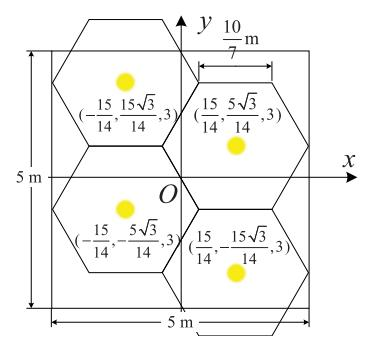

Fig. 4. LED deployment in the indoor environment.

where four LEDs are attached at  $(15/14,5\sqrt{3}/14,3)$ ,  $(15/14,-15\sqrt{3}/14,3)$ ,  $(-15/14,15\sqrt{3}/14,3)$ , and  $(-15/14,-5\sqrt{3}/14,3)$ . The proposed MTL-based network is trained according to Algorithm 1 using datasets with size of D=9000 samples, and the tradeoff factor between the two subtasks is set as  $\lambda=0.9$ . The Adam optimizer with the learning rate of  $10^{-3}$  is adopted to train the parameters.

First, the channel estimation performance of the proposed MTL-based network is evaluated, which is compared with the state-of-the-art benchmarks, such as the traditional least squares (LS) method with linear interpolation [39], the CS-based algorithms including orthogonal matching pursuit (OMP) [40] and generalized OMP (gOMP) [41], and the deep-learning-based method using deep neural networks (DNN) [9].

To investigate the accuracy of channel estimation, the NMSE of channel estimation with respect to SNR is reported in Fig. 5. It is shown that the proposed MTL-based network can achieve higher estimation accuracy at different SNRs compared with the benchmarks. At the target NMSE of  $7\times 10^{-3}$ , the proposed MTL network achieves an SNR gain of greater than 10 dB compared with the CS-based algorithms of OMP and gOMP, which validates that the effectiveness of the proposed MTL-based network, especially in the harsh conditions like intensive noise. Meanwhile, since the number of pilots used in the simulation is much smaller than the length of the CIR, the LS method fails to solve the underdetermined problem. It can also be observed from Fig. 5 that, by exploiting the sparse characteristics of the visible light channel, the sparsity-aware

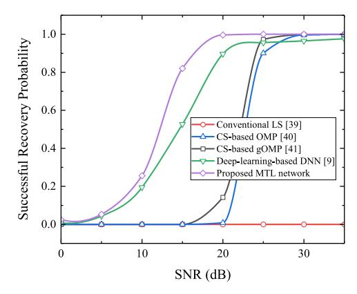

Fig. 6. Successful Recovery probability of the proposed MTL-based network and the benchmark schemes for channel estimation task.

MTL-based network can achieve higher accuracy than the deep-learning-based method using DNN.

To comprehensively investigate the channel estimation performance of the proposed MTL-based network, the successful recovery probability performance is reported in Fig. 6 as an alternative metric of channel estimation accuracy, which is defined as the probability that the NMSE is lower than -15 dB. It is shown by the results in Fig. 6 that, with the increase of the SNR, the MTL-based network can achieve a successful recovery probability of 0.99 at the SNR of 20 dB, which outperforms the CS-based algorithms by around 10 dB. Besides, the proposed scheme reaches the successful recovery probability of one at the SNR of 25 dB, which cannot be achieved by the deep-learning-based DNN even at a high SNR.

On the other hand, to evaluate the performance of the positioning task, the proposed MTL-based network is compared with some benchmark schemes, such as conventional machine-learning-based methods including the k-nearest neighbor (KNN) [20], support vector regression (SVR) [42], and random forest (RF) [43], and the deep-learning-based DNN [9]. The NMSE of position estimation is reported in Fig. 7. It can be observed that the proposed MTL-based network can achieve a significantly higher positioning accuracy compared with the benchmark schemes at different SNRs. To visualize the positioning accuracy, the corresponding positioning error, which is calculated by the Euclid distance between the estimated coordinate and the ground-truth

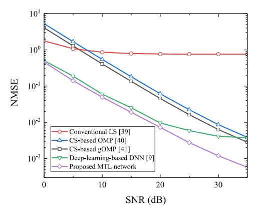

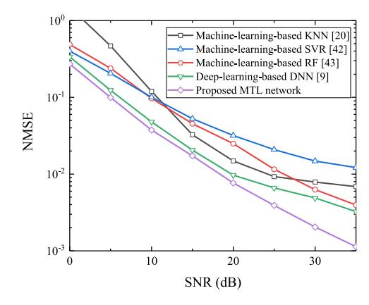

Fig. 7. NMSE of the proposed MTL-based network and the benchmark schemes for positioning task.

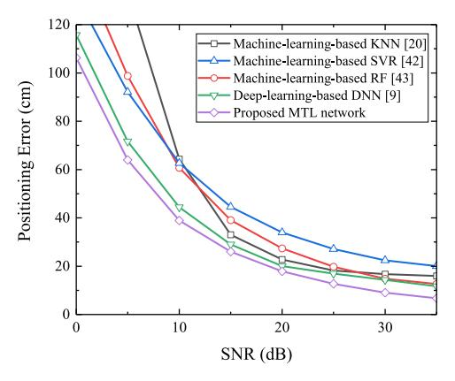

Fig. 8. Positioning error of the proposed MTL-based network and the benchmark schemes.

coordinate, is reported in Fig. 8. It is shown by the results that, the proposed scheme can achieve centimeter-level accuracy at an SNR greater than 25 dB, and can reach the positioning error of 6.72 cm at the SNR of 35 dB, which significantly outperforms the machine-learning-based and deep-learning-based benchmarks.

Moreover, to evaluate the overall performance of the positioning task over the environment, the cumulative distribution function (CDF) with respect to the positioning error is reported in Fig. 9. It can be seen that the CDF of the proposed MTL-based network grows much faster than the benchmark schemes, and reaches the value of 0.9 at the positioning error of 10 cm, which demonstrates that the positioning error of the proposed scheme can be controlled at centimeter-level with a probability of 0.9.

From these simulation results, it is verified that the proposed MTL-based network greatly outperforms the benchmark methods in both the channel estimation and positioning tasks, which implies that the mutual benefits between the two tasks can be effectively extracted and exploited by the proposed scheme to improve the performance of the VIPAC system.

#### 6.3 Performance of the MTFL Framework for VIPAC

To demonstrate the performance of the proposed MTFL framework, a cooperative VIPAC architecture is considered, where three cellular clusters with the cluster center coordinates of  $(-5\sqrt{3}/8, 5/4, 3), (-5\sqrt{3}/8, -5/4, 3)$ , and  $(5\sqrt{3}/8, -5/4, 3)$ 

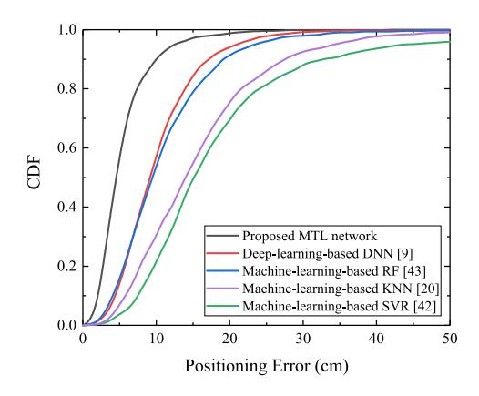

Fig. 9. CDF with respect to the positioning error for the proposed MTL-based network and the benchmark schemes.

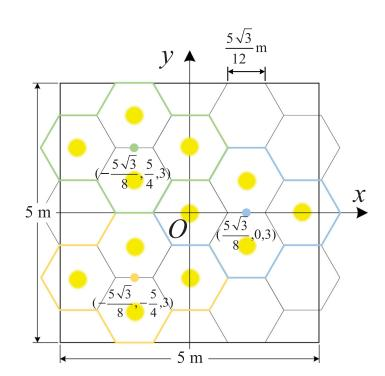

Fig. 10. The deployment of LEDs and cellular cluster layout in the proposed MTFL framework.

0,3) are incorporated for joint training. Each cellular cluster contains four LED cells, which are deployed in the pattern illustrated in Fig. 10. There are  $N_{\rm r}=10$  UE agents participating in the multi-user cooperative training of the global model, and the local dataset of each UE agent includes  $D_{\rm r}=900$  samples. The local datasets are updated with newly collected samples every 50 communication rounds. The absolute coordinates in the training and testing datasets are transferred into the standardized relative coordinates via (19). The parameters in Algorithm 2 are set as follows: batch size B=128; number of local steps  $N_{\rm s}=5$ ; maximum communication rounds T=50.

The average loss function over the local datasets in the training stage of the MTFL framework with respect to the communication rounds is shown in Fig. 11. We could observe that the training losses of both the positioning and channel estimation sub-tasks, and the joint loss function given by (18), decrease rapidly with the communication rounds in the cooperative training process participated by multiple UE agents. After several communication rounds, the training losses converge gradually to a relatively low level, which verifies the efficiency and the convergence capability of the proposed MTFL framework as is consistent with the theoretical analysis given in Section 5.2.

Meanwhile, the testing performance of the proposed MTFL framework is evaluated with randomly moving UE agents in the cellular clusters. The global model trained cooperatively after each communication round is tested and the testing results of channel estimation and positioning are reported in Figs. 12 and 13, respectively. As shown in Fig. 12,

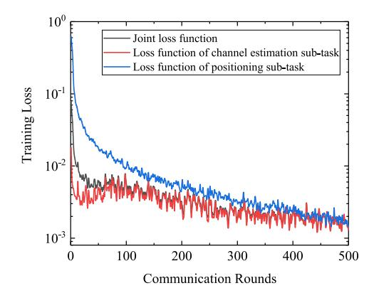

Fig. 11. Training loss over the local datasets of the MTFL framework for VIPAC with respect to communication rounds in federated learning.

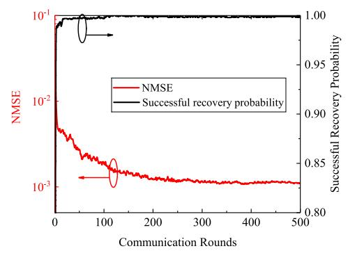

Fig. 12. Performance of MTFL scheme for channel estimation task with respect to communication rounds in federated learning.

the NMSE of channel estimation for the proposed scheme reduces rapidly with communication rounds, and gradually converges to  $1.3 \times 10^{-3}$ . The successful recovery probability rapidly reaches a high value of 0.978 after the second communication round, and then gradually converges to 0.999. This indicates that the proposed scheme can achieve satisfactory performance of channel estimation and generalization ability enabled by the multi-user cooperative VIPAC mechanism. The positioning performance is shown in Fig. 13. It is observed that the NMSE and positioning error rapidly decrease thanks to the global aggregation of the learnt local models of multiple UE agents. It is shown by the results that the positioning error reaches centimeter-level after only 70 communication rounds, and finally converges to 6.77 cm, which verifies the efficiency and generalization ability of the proposed scheme in terms of positioning.

To further investigate the generalization ability of the proposed MTFL framework in spatiotemporally variant environments, we consider a dynamically changing scenario where the environmental parameters, such as room layout, LED deployment, and ambient noise, change over time and/or space. A typical demonstration is a person carrying a UE terminal is walking from one room to another. Specifically, the parameters including the room size of  $L \times W \times H$ , the average reflectance of walls  $\bar{\rho}$ , and the SNR  $\gamma$ , will suddenly change to a set of different values after every 200 communication rounds, which implies the person has just walked into a different room. The parameters in the three rooms are as follows: Room 1,  $L \times W \times H = 5 \times 5 \times 3 \text{m}^3$ ,  $\bar{\rho} = 0.7$ ; Room 2,  $L \times W \times H = 7 \times 7 \times 5 \text{m}^3$ ,  $\bar{\rho} = 0.7$ ; Room 3,  $L \times W \times H = 6 \times 6 \times 4 \text{m}^3$ ,  $\bar{\rho} = 0.3$ . The

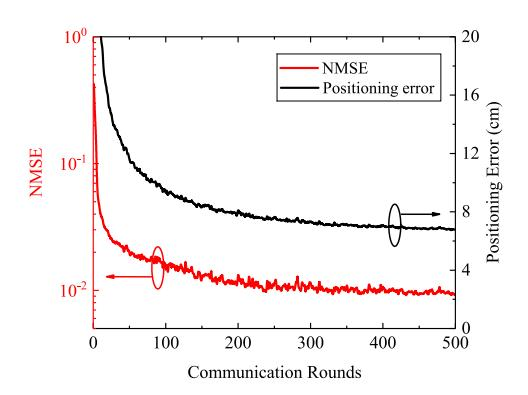

Fig. 13. Performance of MTFL scheme for positioning task with respect to communication rounds in federated learning.

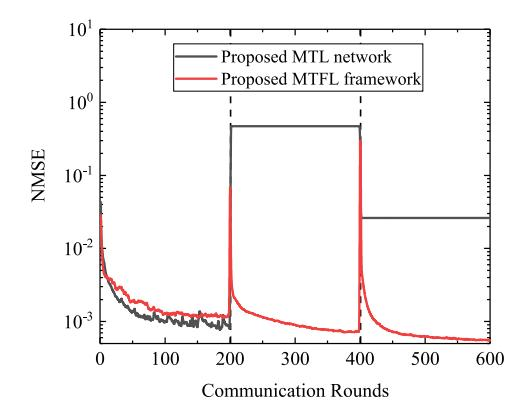

Fig. 14. NMSE performance of channel estimation task in spatiotemporally variant environments (the environment changes every 200 communication rounds).

performance of the channel estimation task and the positioning task using the proposed MTFL framework over time are reported in Figs. 14 and 15, respectively. It is also compared with the proposed MTL-based network which is trained in a centralized rather than distributed manner.

As shown in Fig. 14, the NMSE of the proposed MTFL framework is a bit greater than that of the MTL network in the initial 200 communication rounds before the environment switches. However, the NMSE of the proposed MTFL scheme can reduce rapidly again to a satisfactory level after the UE agent walks into a new room every 200 communication rounds, while the MTL scheme cannot adapt to environmental changes and thus ends up with poorer performance. Similarly, it can be observed from Fig. 15 that, the positioning error of the MTL scheme increases to 196.0 cm and 110.5 cm with the environment switching at the 201th and 401th communication round, respectively, while the MTFL scheme can converge back to centimeter-level positioning accuracy rapidly in only a few communication rounds in a new environment. This is because in the MTFL framework, the global model is updated online by the UE agents over time and space. The local datasets used for training the local models of the UE agents can be updated online, and thus the local models can be updated correspondingly to adapt to the possible spatiotemporal variations. Hence, the global model weights suitable and adaptive for VIPAC tasks in the new environment can be learnt rapidly in spatiotemporally non-stationary environments.

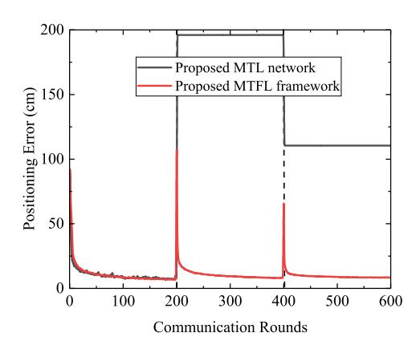

Fig. 15. Positioning error in spatiotemporally variant environments (the environment changes every 200 communication rounds).

# 7 CONCLUSION

In this paper, an ISAC framework called VIPAC is proposed, where the two main tasks, i.e., the positioning task for the sensing service and the channel estimation task for the communication service are integrated into a unified visible light architecture, and a spatially migratable multi-lamp cellular cluster architecture is designed. An MTL-based network architecture, which is composed of a sparsity-aware shared network and two task-oriented sub-networks, is devised to achieve mutual benefits between positioning and channel estimation. An MTFL framework is formulated to further improve the generalization ability of the global model for multi-user cooperative VIPAC in spatiotemporally nonstationary environments. The theoretical bounds of the channel estimation and positioning accuracy are derived, and the convergence rate of the proposed MTFL framework is derived. The performance of the proposed MTL-based network and the MTFL framework are evaluated by extensive simulations, which significantly outperforms the benchmark schemes in estimation accuracy and the adaptation capability in harsh and variant scenarios. Moreover, the proposed VIPAC framework to serve as an emerging ISAC solution in the next-generation mobile and wireless networks.

# REFERENCES

- [1] W. Saad, M. Bennis, and M. Chen, "A vision of 6G wireless systems: Applications, trends, technologies, and open research problems," IEEE Netw., vol. 34, no. 3, pp. 134–142, May/Jun. 2020.
- [2] P. Zhang, L. Li, K. Niu, Y. Li, G. Lu, and Z. Wang, "An intelligent wireless transmission toward 6G," Intell. Converged Netw., vol. 2, no. 3, pp. 244–257, Sep. 2021.
- [3] Y. Xiao, K. K. Leung, Y. Pan, and X. Du, "Architecture, mobility management, and quality of service for integrated 3G and WLAN networks," Wirel. Commun. Mobile Comput., vol. 5, no. 7, pp. 805–823, Nov. 2005.
- [4] F. Liu et al., "Integrated sensing and communications: Toward dual-functional wireless networks for 6G and beyond," IEEE J. Sel. Areas Commun., vol. 40, no. 6, pp. 1728–1767, Jun. 2022.
- [5] N. Zhao, Y. Wang, Z. Zhang, Q. Chang, and Y. Shen, "Joint transmit and receive beamforming design for integrated sensing and communication," IEEE Commun. Lett., vol. 26, no. 3, pp. 662–666, Mar. 2022.
- [6] Y. Cui, F. Liu, X. Jing, and J. Mu, "Integrating sensing and communications for ubiquitous IoT: Applications, trends, and challenges," IEEE Netw., vol. 35, no. 5, pp. 158–167, Sep./Oct. 2021.
- [7] J. Luo, L. Fan, and H. Li, "Indoor positioning systems based on visible light communication: State of the art," IEEE Commun. Surveys Tuts., vol. 19, no. 4, pp. 2871–2893, Oct.–Dec. 2017.
- [8] Y. Zhuang et al., "A survey of positioning systems using visible LED lights," IEEE Commun. Surveys Tuts., vol. 20, no. 3, pp. 1963–1988, Jul.–Sep. 2018.
- [9] M. A. Arfaoui et al., "Invoking deep learning for joint estimation of indoor LiFi user position and orientation," IEEE J. Sel. Areas Commun., vol. 39, no. 9, pp. 2890–2905, Sep. 2021.
- [10] L. Bai et al., "Computer vision-based localization with visible light communications," IEEE Trans. Wireless Commun., vol. 21, no. 3, pp. 2051–2065, Mar. 2022.
- [11] Y. Zhang et al., "Internet of radio and light: 5G building network radio and edge architecture," Intell. Converged Netw., vol. 1, no. 1, pp. 37–57, Jun. 2020.
- [12] L. E. M. Matheus, A. B. Vieira, L. F. M. Vieira, M. A. M. Vieira, and O. Gnawali, "Visible light communication: Concepts, applications and challenges," IEEE Commun. Surveys Tuts., vol. 21, no. 4, pp. 3204–3237, Oct.–Dec. 2019.
- [13] N. Chi, Y. Zhou, Y. Wei, and F. Hu, "Visible light communication in 6G: Advances, challenges, and prospects," IEEE Veh. Technol. Mag., vol. 15, no. 4, pp. 93–102, Dec. 2020.

- [14] J. Song, T. Cao, and H. Zhang, "Performance analysis of a lowcomplexity nonorthogonal multiple access scheme in visible light communication downlinks using pulse modulations," Intell. Converged Netw., vol. 2, no. 1, pp. 50–65, Mar. 2021.
- [15] R. Zhang, W.-D. Zhong, K. Qian, S. Zhang, and P. Du, "A reversed visible light multitarget localization system via sparse matrix reconstruction," IEEE Internet Things J., vol. 5, no. 5, pp. 4223–4230, Oct. 2018.
- [16] B. Lin, Z. Ghassemlooy, J. Xu, Q. Lai, X. Shen, and X. Tang, "Experimental demonstration of compressive sensing-based channel estimation for MIMO-OFDM VLC," IEEE Wireless Commun. Lett., vol. 9, no. 7, pp. 1027–1030, Jul. 2020.
- [17] J. Du, H. Deng, X. Qian, and C. Zhang, "Channel estimation scheme based on compressed sensing and parameter estimation for an orthogonal frequency division multiplexing visible light communications system," Opt. Eng., vol. 55, no. 11, pp. 1–6, Nov. 2016.
- [18] L.Wu, J. Cheng, Z. Zhang, J. Dang, and H. Liu, "Channel estimation for optical-OFDM-based multiuser MISO visible light communication," IEEE Photon. Technol. Lett., vol. 29, no. 20, pp. 1727–1730, Oct. 2017.
- [19] J. C. Estrada-Jimenez, B. G. Guzman, M. J. Fernandez-Getino Garcıa, and V. P. G. Jimenez, "Superimposed training-based channel estimation for MISO optical-OFDM VLC," IEEE Trans. Veh. Technol., vol. 68, no. 6, pp. 6161–6166, Jun. 2019.
- [20] M. T. Van, N. Van Tuan, T. T. Son, H. Le-Minh, and A. Burton, "Weighted k-nearest neighbour model for indoor VLC positioning," IET Commun., vol. 11, no. 6, pp. 864–871, Mar. 2017.
- [21] R. Caruana, "Multitask learning," Mach. Learn., vol. 28, no. 1, pp. 41–75, Jul. 1997.
- [22] Y. Zhang and Q. Yang, "A survey on multi-task learning," IEEE Trans. Knowl. Data Eng., early access, Mar. 31, 2021, doi: [10.1109/](https://doi.org/10.1109/TKDE.2021.3070203) [TKDE.2021.3070203.](https://doi.org/10.1109/TKDE.2021.3070203)
- [23] Y. Lu, P. Cheng, Z. Chen, W. H. Mow, Y. Li, and B. Vucetic, "Deep multi-task learning for cooperative NOMA: System design and principles," IEEE J. Sel. Areas Commun., vol. 39, no. 1, pp. 61–78, Jan. 2021.
- [24] Q. Yang, Y. Liu, T. Chen, and Y. Tong, "Federated machine learning: Concept and applications," ACM Trans. Intell. Syst. Technol., vol. 10, no. 2, pp. 1–19, Mar. 2019.
- [25] M. Chen, H. V. Poor, W. Saad, and S. Cui, "Wireless communications for collaborative federated learning," IEEE Commun. Mag., vol. 58, no. 12, pp. 48–54, Jan. 2021.
- [26] Z. Cheng, Z. Gao, M. Liwang, L. Huang, X. Du, and M. Guizani, "Intelligent task offloading and energy allocation in the UAVaided mobile edge-cloud continuum," IEEE Netw., vol. 35, no. 5, pp. 42–49, Sep./Oct. 2021.
- [27] Q. Kong et al., "Privacy-preserving aggregation for federated learning-based navigation in vehicular fog," IEEE Trans. Ind. Informat., vol. 17, no. 12, pp. 8453–8463, Dec. 2021.
- [28] M. Shen et al., "Exploiting unintended property leakage in blockchain-assisted federated learning for intelligent edge computing," IEEE Internet Things J., vol. 8, no. 4, pp. 2265–2275, Feb. 2021.
- [29] T. Komine and M. Nakagawa, "Fundamental analysis for visiblelight communication system using LED lights," IEEE Trans. Consum. Electron., vol. 50, no. 1, pp. 100–107, Feb. 2004.
- [30] Y. Zhou et al., "Radio spectrum awareness using deep learning: Identification of fading channels, signal distortions, medium access control protocols, and cellular systems," Intell. Converged Netw., vol. 2, no. 1, pp. 16–29, Mar. 2021.
- [31] X. Du, D. Wu, W. Liu, and Y. Fang, "Multiclass routing and medium access control for heterogeneous mobile ad hoc networks," IEEE Trans. Veh. Technol., vol. 55, no. 1, pp. 270–277, Jan. 2006.
- [32] M. Borgerding, P. Schniter, and S. Rangan, "AMP-inspired deep networks for sparse linear inverse problems," IEEE Trans. Signal Process., vol. 65, no. 16, pp. 4293–4308, Aug. 2017.
- [33] K. Greff, R. K. Srivastava, J. Koutnık, B. R. Steunebrink, and J. Schmidhuber, "LSTM: A search space odyssey," IEEE Trans. Neural Netw. Learn. Syst., vol. 28, no. 10, pp. 2222–2232, Oct. 2017.
- [34] S. M. Kay, Fundamentals of Statistical Signal Processing, Volumn I: Estimation Theory. Hoboken, NJ, USA: Prentice-Hall, 1993.
- [35] X.-B. Liang, "An algebraic, analytic, and algorithmic investigation on the capacity and capacity-achieving input probability distributions of finite-input–finite-output discrete memoryless channels," IEEE Trans. Inf. Theory, vol. 54, no. 3, pp. 1003–1023, Mar. 2008.

- [36] X. Zhang, J. Duan, Y. Fu, and A. Shi, "Theoretical accuracy analysis of indoor visible light communication positioning system based on received signal strength indicator," J. Lightw. Technol., vol. 32, no. 21, pp. 4180–4186, Nov. 2014.
- [37] H. Yu, S. Yang, and S. Zhu, "Parallel restarted SGD with faster convergence and less communication: Demystifying why model averaging works for deep learning," in Proc. 33rd AAAI Conf. Artif. Intell., 2019, pp. 5693–5700.
- [38] J. Wang and G. Joshi, "Cooperative SGD: A unified framework for the design and analysis of local-update SGD algorithms," J. Mach. Learn. Res., vol. 22, no. 213, pp. 1–50, Sep. 2021.
- [39] X. Shi, S.-H. Leung, and J. Min, "Adaptive least squares channel estimation for visible light communications based on tap detection," Opt. Commun., vol. 467, Jul. 2020, Art. no. 125712.
- [40] J. Wen, Z. Zhou, J. Wang, X. Tang, and Q. Mo, "A sharp condition for exact support recovery with orthogonal matching pursuit," IEEE Trans. Signal Process., vol. 65, no. 6, pp. 1370–1382, Mar. 2017.
- [41] D. Park, "Improved sufficient condition for performance guarantee in generalized orthogonal matching pursuit," IEEE Signal Process. Lett., vol. 24, no. 9, pp. 1308–1312, Sep. 2017.
- [42] D. Su, X. Liu, and S. Liu, "Three-dimensional indoor visible light localization: A learning-based approach," in Proc. ACM Int. Joint Conf. Pervasive Ubiquitous Comput., 2021, pp. 672–677.
- [43] X. Guo, S. Shao, N. Ansari, and A. Khreishah, "Indoor localization using visible light via fusion of multiple classifiers," IEEE Photon. J., vol. 9, no. 6, pp. 1–16, Dec. 2017.

Tiankuo Wei received the BS degree in communication engineering from Huaqiao University, Xiamen, China, in 2020. He is currently working toward the MS degree with the Department of Information and Communication Engineering, Xiamen University, Xiamen, China. His research interests include compressed sensing and AIassisted communications.

Sicong Liu (Senior Member, IEEE) received the BSE and PhD degrees (Highest Hons.) in electronic engineering from Tsinghua University, Beijing, China, in 2012 and 2017, respectively. He is an associate professor with the Department of Information and Communication Engineering, School of Informatics, Xiamen University, Xiamen, China. He was a senior engineer with Huawei Technologies Company Ltd., China, from 2017 to 2018. He was a visiting scholar with the City University of Hong Kong, in 2010. His current

research interests are compressed sensing, AI-assisted communications, integrated sensing and communications, and visible light communications. He has authored more than 60 journal or conference papers, and four monographs in the related areas. He won the Best Paper Award with ACM UbiComp 2021 CPD WS as the corresponding author, and the Second Prize in the Natural Science Award of Chinese Institute of Electronics. He has served as the associate editor or TPC chair of several IEEE and other international academic journals and conferences. He is a senior member of China Institute of Communications.

Xiaojiang Du (Fellow, IEEE) received the BS degree from Tsinghua University, Beijing, China, in 1996, and the MS and PhD degrees in electrical engineering from the University of Maryland, College Park, in 2002 and 2003, respectively. He is the Anson Wood Burchard Endowed-chair professor with the Department of Electrical and Computer Engineering, Stevens Institute of Technology. He was a professor with Temple University between August 2009 and August 2021. His research interests are security, wireless net-

works, and systems. He has authored more than 500 journal and conference papers in these areas, including the top security conferences IEEE S&P, USENIX Security, and NDSS. He has been Awarded more than 8 million US Dollars research grants from the US National Science Foundation (NSF), Army Research Office, Air Force Research Lab, the State of Pennsylvania, and Amazon. He won the Best Paper Award with IEEE ICC 2020, IEEE GLOBECOM 2014 and the Best Poster Runner-Up Award at the ACM MobiHoc 2014. He serves on the editorial boards of three IEEE journals. He is an ACM distinguished member, and an ACM life member.

" For more information on this or any other computing topic, please visit our Digital Library at www.computer.org/csdl.