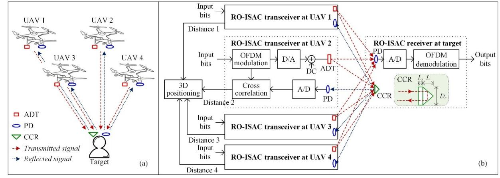
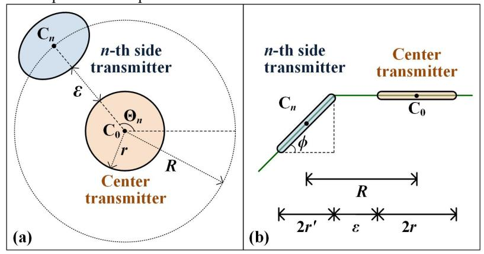
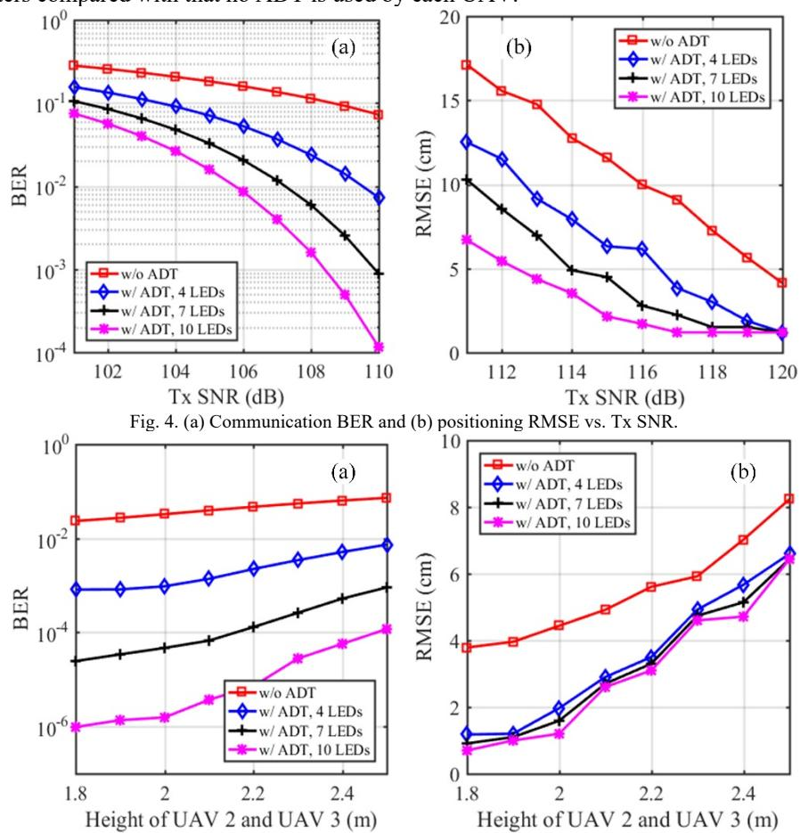

{0}------------------------------------------------

TuP-B-21 OECC/PSC 2025

# **UAV-Aided Flying Retroreflective Optical ISAC with Angle Diversity Transmitters**

Weiren Wang1, Haochuan Wang1, Zhihong Zeng1, Cuiwei He2, and Chen Chen1,

1School of Microelectronics and Communication Engineering, Chongqing University, Chongqing 400044, China

2School of Information Science, Japan Advanced Institute of Science and Technology, Ishikawa, Japan

20231201022g@cqu.edu.cn, 202312131101t@stu.cqu.edu.cn, zhihong.zeng@cqu.edu.cn, cuiweihe@jaist.ac.jp, c.chen@cqu.edu.cn

**Abstract:** We propose and investigate a UAV-aided flying retroreflective optical integrated sensing and communication (RO-ISAC) system with angle diversity transmitters (ADTs). Simulation results show substantial performance enhancements by using ADTs in flying RO-ISAC systems. **Keywords:** Retroreflective optical ISAC (RO-ISAC); UAV; Angle diversity transmitter (ADT)

#### I. Introduction

Integrated sensing and communication (ISAC) has become one of the most promising technologies for the sixth-generation (6G) mobile communication. Compared with individual sensing or communication technologies, ISAC can realize both sensing and communication purposes in the same frequency band, which greatly enhances the spectrum utilization of the system [1]. Compared with radio-frequency (RF) based ISAC systems, optical ISAC using light-emitting diodes (LEDs) or laser diodes (LDs) can achieve higher data rates and better sensing performance due to the fact that optical signals can have a much larger bandwidth than RF signals [2]. Lately, the concept of retroreflective optical ISAC (RO-ISAC) has been proposed in [3], in which the target is equipped with a corner cube reflector (CCR) to substantially enhance the reflection performance and hence improve the sensing accuracy. Moreover, RO-ISAC has been utilized to perform 3D positioning in indoor environments in [4] and bidirectional transmission using time division duplexing for interference cancellation has been realized in [5].

As a key enabler for low-altitude economy, unmanned aerial vehicle (UAV) has been applied in various scenarios to serving as a flying platform to provide services [6]. More specifically, UAV has been applied in outdoor visible light communication (VLC) systems to provide simultaneous illumination and communication for users [7], [8]. Nevertheless, to the best of our knowledge, optical ISAC techniques have not yet been considered for the application in UAV based systems. In this paper, we for the first time propose and investigate a UAV-aided flying RO-ISAC system, where angle diversity transmitters (ADTs) are adopted for substantial sensing and communication performance enhancements.

## II. SYSTEM MODEL

In this section, the principle of UAV-aided flying RO-ISAC system using ADTs is first introduced and then the design of ADTs is further discussed.

# A. Principle

Figure 1(a) depicts the illustration of the UAV-aided flying RO-ISAC system with ADTs, where each UAV is equipped with an ADT and a photodetector (PD) while the target is equipped with a CCR and a PD. The target uses the PD to receive the optical signal from the UAVs to facilitate the communication purpose, while the CCR is utilized to reflect the optical signals back to the UAVs. Each UAV employs a PD to detect the reflected optical signal for distance estimation and the three-dimensional (3D) location of the target can be calculated by using the four estimated distances.

Fig. 1. (a) Illustration and (b) schematic diagram of the UAV-aided flying RO-ISAC system with ADTs.

{1}------------------------------------------------

The schematic diagram of the UAV-aided flying RO-ISAC system with ADTs is shown in Fig. 1(b). As we can see, the RO-ISAC transceiver at each UAV transmits optical signal to the target and receive the reflected optical signal from the target, where orthogonal frequency division multiplexing (OFDM) is adopted as the waveform and time-domain cross correlation is carried out to perform ranging, i.e., distance estimation. At the target side, communication is realized by demodulating the received OFDM signal and CCR based retroreflection is enabled to enhance signal reflection. The inset in Fig. 1(b) plots the diagram of the CCR, with  $D_r$ , L, and  $L_s$  being the diameter, the length, and the recessed length of the CCR, respectively. The detailed procedures to realize 3D positioning using the estimated distances can be found in [4].

### B. Angle Diversity Transmitter (ADT)

Considering the light-of-sight (LOS) transmission of light, we apply ADT in each UAV to enhance the light distribution at the receiving plane of the target [8]. Figures 2(a) and 2(b) depict the top view and side view of the ADT adopted for each UAV, respectively. It can be seen that the ADT consists of one center LED transmitter and multiple side LED transmitters which are distributed in a circular configuration. Each LED transmitter in the ADT is assumed to have the same radius r and exhibit the optoelectronic performance.

Fig. 2. (a) Top view and (b) side view of the ADT adopted for each UAV.

As illustrated in Fig. 2(a), the center LED transmitter is positioned at the central position  $C_0$ , while all the side LED transmitters are located on a circle centered at  $C_0$  with radius R. The gap between the center LED transmitter and the side LED transmitters is  $\varepsilon$ . It can be observed from Fig. 2(b) that the center LED transmitter is not inclined while the side LED transmitters are all inclined with the same inclination angle of  $\phi$ . For more details about the design of ADT, please refer to our previous works [8] and [9].

## III. SIMULATION RESULTS

To evaluate the overall performance of the UAV-aided flying RO-ISAC system using ADTs, computer simulations are performed in terms of both communication bit error rate (BER) and 3D positioning root mean square error (RMSE). In the configured simulation setup, the four UAVs are located at positions (2m, 2m, 3m), (3m, 2m, 2m), (2m, 3m, 2m) and (3m, 3m, 3m) and the target is located at position (2.5m, 2.5m, 0m). The other key simulation parameters are listed in Table I.

TABLE I

| SIMULATION PARAMETERS                        |           |  |
|----------------------------------------------|-----------|--|
| Parameters                                   | Value     |  |
| IFFT/FFT size                                | 256       |  |
| Number of data subcarriers                   | 64        |  |
| D/A sampling rate                            | 250 MSa/s |  |
| A/D sampling rate                            | 2.5 GSa/s |  |
| Up-sampling ratio                            | 10        |  |
| Ranging resolution                           | 6 cm      |  |
| The incline angle of side transmitter        | 30°       |  |
| Gap between center and side LED transmitters | 5 mm      |  |
| Diameter of the transmitter                  | 50 mm     |  |

Figure 4(a) shows the communication BER versus transmitting signal-to-noise ratio (Tx SNR) for different numbers of LED transmitter in each ADT. As we can see, the communication BER gradually reduces with the increase of Tx SNR. Moreover, the use of ADT can substantially improve the BER performance, and a lower BER is obtained when more LED transmitters are used in the ADT. More specifically, for a Tx SNR of 110 dB, the BER is reduced from  $7.3 \times 10^{-2}$  to  $7.2 \times 10^{-3}$  when an ADT with totally four LED transmitters is equipped by each UAV in comparison to that without using ADT. Similarly, as shown in Figure 4(b), the positioning RMSE is also gradually decreased with the increase of Tx SNR and the more LED transmitters the ADT consists of, the lower RMSE the system can achieve. Particularly, for a Tx SNR

{2}------------------------------------------------

of 110 dB, the RMSE is decreased from 17.1 cm to 6.7 cm when each UAV is equipped with an ADT consisting of totally ten LED transmitters compared with that no ADT is used by each UAV.

Fig. 5. (a) Communication BER and (b) positioning RMSE vs. height of UAV 2 and UAV 3.

Figures 5(a) and (b) show the communication BER and the positioning RMSE by varying the height of UAV 2 and UAV 3 while keeping the height of UAV 1 and UAV 4 unchanged during the evaluation. It can be clearly found that both the communication BER and the positioning RMSE become gradually increased with the increase of the height of UAV 2 and UAV 3. Particularly, reducing the height of UAV 2 and UAV 3 cannot significantly improve the communication BER, while it can significantly reduce the positioning RMSE. This observation can be explained as follows. On the one hand, reducing the height of UAV 2 and UAV 3 can enhance the power of the reflected optical signals and further increase the ranging accuracy. On the other, the increase of height difference between UAV 1/UAV 4 and UAV 2/UAV 3 can help to improve the accuracy of the solution obtained by using the linear least square method.

## IV. CONCLUSIONS

In this paper, we have proposed and evaluated a UAV-aided flying RO-ISAC system with ADTs. By equipping the target with a CCR, retroreflective sensing can be realized by the UAVs to obtain the 3D location of the target. Moreover, both the communication and sensing performance of the UAV-aided flying RO-ISAC system can be greatly enhanced by applying ADTs with respect to the UAVs. The simulation results show that an ADT consisting of more LED transmitters can lead to much improved communication BER and positioning RMSE of the UAV-aided flying RO-ISAC system. Therefore, the proposed UAV-aided flying RO-ISAC system with ADTs can be a promising candidate for emergence applications and help the development of low-altitude economy.

#### ACKNOWLEDGMENT

This work was supported in part by the National Natural Science Foundation of China under Grant 62271091, and in part by the Fundamental Research Funds for the Central Universities under Grant 2024CDJXY020.

## REFERENCES

[1] F. Liu, Y. Cui, C. Masouros, J. Xu, T. X. Han, Y. C. Eldar, and S. Buzzi, "Integrated sensing and communications: Toward dual-functional wireless networks for 6G and beyond," IEEE Journal on Selected Areas in Communications, vol. 40, no. 6, pp. 1728-1767, Jun. 2022.

{3}------------------------------------------------

- [2] Y. Wen, F. Yang, J. Song, and Z. Han, "Optical integrated sensing and communication: Architectures, potentials and challenges," IEEE Internet of Things Magazine, vol. 7, no. 4, pp. 68–74, Jul. 2024.
- [3] Y. Cui, C. Chen, Y. Cai, Z. Zeng, M. Liu, J. Ye, S. Shao, and H. Haas, "Retroreflective optical ISAC using OFDM: channel modeling and performance analysis," Optics Letters, vol. 49, no. 15, pp. 4214–4217, Aug. 2024.
- [4] H. Wang, Z. Zeng, C. Chen, B. Zhu, S. Shao, and M. Liu, "Retroreflective optical ISAC supporting 3D positioning in indoor environments," Asia Communications and Photonics Conference (ACP) and International Conference on Information Photonics and Optical Communications (IPOC), pp. 1–5, Nov. 2024.
- [5] H. Wang, C. Chen, Z. Zeng, S. Shao, and H. Haas, "Bidirectional retroreflective optical ISAC using time division duplexing and clipped OFDM," IEEE Photonics Technology Letters, 2025.
- [6] S. Mohsan, M. Khan, F. Noor, I. Ullah, and M. Alsharif, "Towards the unmanned aerial vehicles (UAVs): A comprehensive review," Drones, vol. 6, no. 6, p. 147, Jun. 2022.
- [7] Y. Yang, M. Chen, C. Guo, C. Feng, and W. Saad, "Power efficient visible light communication (VLC) with unmanned aerial vehicles (UAVs)," IEEE Communications Letters, vol. 23, no. 7, pp. 1272-1275, Jul. 2019.
- [8] Q. Huang, W. Wen, M. Liu, P. Du, and C. Chen, "Energy-efficient unmanned aerial vehicle-aided visible light communication with an angle diversity transmitter for joint emergency illumination and communication," Sensors, vol. 23, no. 18, p. 7886, Sep. 2023
- [9] C. Chen, W.-D. Zhong, H. L. Yang, S. Zhang, and P. F. Du, "Reduction of SINR fluctuation in indoor multi-cell VLC systems using optimized angle diversity receiver," Journal of Lightwave Technology, vol. 36, no. 17, pp. 3603–3610, Sep. 2018.