{0}------------------------------------------------

# Co-Route Fiber Recognition and Status Diagnosis Based on Integrated Sensing and Communication in 6G Transport Networks

Zhiw[ei](https://orcid.org/0000-0001-5279-1033) [W](https://orcid.org/0000-0001-5279-1033)an[g](https://orcid.org/0009-0000-1228-5697) , Hui Yan[g](https://orcid.org/0000-0002-1881-9140) , *Senior Member, IEEE*, Yunbo L[i](https://orcid.org/0009-0008-0642-3641) , Qiuyan Yao [,](https://orcid.org/0000-0001-8753-6489) *[Mem](https://orcid.org/0000-0001-7750-2197)ber, IEEE*, Tiankuo Yu , *Student Member, IEEE*, Chen Zhang, Wenxin Liu, Wenbo Lin, Jie Zhang , *Member, IEEE*, Yucong Liu, and Mohamed Cheriet [,](https://orcid.org/0000-0002-5246-7265) *Senior Member, IEEE*

*Abstract***—The 6G transport network facilitates the Internet of Everything (IoE), carrying numerous services and emphasizing the paramount importance of its reliability. However, within the transport network, the issue of co-route fibers arises. The coroute fibers, encompassing both co-cable and co-trench fibers, presents a significant latent hazard for service disruptions, posing a substantial threat to the seamless connectivity envisioned for the 6G era of pervasive IoE. The segregation of communication and sensing in the transmission network results in mutual interference between communication and sensing signals, rendering it difficult to promptly address sudden fiber interruptions. This article proposes an integrated sensing and communication (ISAC) architecture within transport networks, aiming at the online discernment of co-cable fibers, characterization of fiber optic trenches, and real-time classification of fiber vibration events. In the domain of co-cable fiber identification, our approach has successfully reduced the nuisance alarm rate to an impressive 5.3%, while simultaneously elevating the recognition accuracy to an outstanding 99.7%. As for co-trench fiber identification, our proposed methodology not only facilitates the discernment of cotrench fibers but also achieves an impressive accuracy of 97.7% in classifying fiber trenches. Moreover, in the realm of fiber state prediction, our solution has achieved a remarkable recognition accuracy of 98% across six distinct vibration events. These results underscore the robust performance of the proposed ISAC architecture, which will effectively safeguard the survivability of 6G IoE.**

*Index Terms***—Co-route fiber recognition, distributed optical fiber sensing, event classification, feature extraction algorithm (FEA), machine learning (ML) models.**

Manuscript received 10 May 2024; accepted 2 June 2024. Date of publication 14 June 2024; date of current version 6 September 2024. This work was supported in part by the NSFC Project under Grant 62201088, Grant 62122015, and Grant 62271075; in part by the Young Elite Scientists Sponsorship Program by CAST under Grant 2023QNRC001; in part by the Fund of SKL of IPOC (BUPT) under Grant IPOC2021ZT04; and in part by the Fundamental Research Funds for the Central Universities under Grant 2023ZCJH04. *(Corresponding author: Hui Yang.)*

Zhiwei Wang, Hui Yang, Qiuyan Yao, Tiankuo Yu, Chen Zhang, Wenxin Liu, Wenbo Lin, and Jie Zhang are with the State Key Laboratory of Information Photonics and Optical Communication, Beijing University of Posts and Telecommunications, Beijing 100876, China (e-mail: yanghui@bupt.edu.cn).

Yunbo Li and Yucong Liu are with the Department of Fundamental Network Technology, China Mobile Research Institute, Beijing 100053, China.

Mohamed Cheriet is with the Department of System Engineering, University of Quebec, Montreal, QC G1K 9H7, Canada.

Digital Object Identifier 10.1109/JIOT.2024.3414863

## I. INTRODUCTION

**I** N THE era of 6G, network offers faster data transmission speeds and lower latency, enhancing virtual and augmented reality experiences and enabling scenarios, such as remote healthcare and smart homes [\[1\]](#page-9-0), [\[2\]](#page-9-1). In the realm of 6G, the transport network serves as its foundational infrastructure, playing a pivotal role in the overall system [\[3\]](#page-9-2). Through the transport network, individuals, sensors [\[4\]](#page-9-3), [\[5\]](#page-9-4), remote devices, and environmental information are seamlessly integrated into the network, culminating in the Internet of Everything (IoE) [\[6\]](#page-9-5), [\[7\]](#page-9-6). IoE facilitates comprehensive information exchange among various devices and objects, thereby delivering significant convenience to human life and work [\[8\]](#page-9-7), [\[9\]](#page-9-8).

In the IoE, scenarios like smart transportation, autonomous driving, and smart cities require extremely low latency and high reliability [\[10\]](#page-9-9), [\[11\]](#page-9-10), [\[12\]](#page-9-11). Any interruption in network connectivity could significantly impede the development of IoE, resulting in substantial economic and societal losses. According to a rough estimate cited by Reuters, global profit-generating websites suffer a loss of \$29 million in revenue for every hour of interruption [\[13\]](#page-9-12). In the transport network, the passive nature of optical fibers may lead to the deployment of primary and backup routes for certain services within the same trench or cable, resulting in the phenomenon of co-route fibers [\[14\]](#page-9-13). If the co-route fiber experiences fiber abruption fault, it will directly result in service interruption. Hence, monitoring the status of optical fibers and identifying fiber route redundancy is of paramount importance.

The phenomenon of co-route fibers encompasses both cocable and co-trench fibers. To discern co-cable fibers, neural networks were leveraged in [\[15\]](#page-9-14) to acquire weights for computing the similarity of optical fiber events. Reference [\[16\]](#page-9-15), on the other hand, identified vibration features from data streams to detect fibers within the same cable. Furthermore, in [\[14\]](#page-9-13), an artificial intelligence (AI) method based on deep siamese neural networks was proposed for detecting co-route optical fibers. The abrupt nature of network failures necessitates realtime responses from network administrators, thus demanding fault detection models with robust generalization capabilities. While commendable contributions have been made by these

2327-4662 c 2024 IEEE. Personal use is permitted, but republication/redistribution requires IEEE permission. See https://www.ieee.org/publications/rights/index.html for more information.

{1}------------------------------------------------

endeavors, they still fall short in terms of online recognition and robust generalization capabilities.

Optical time-domain reflectometers (OTDRs) are commonly used for fiber detection [\[14\]](#page-9-13). However, traditional OTDR instruments interfere with communication signals, rendering them incapable of achieving online monitoring. The coexistence of communication and sensing signals in transport networks promises significant convenience for real-time perception and communication coordination. To meet the lowlatency, high-reliability demands of the IoE, it is imperative to leverage integrated sensing and communication (ISAC) in transport networks to identify co-route fiber. In our previous work [\[13\]](#page-9-12), we facilitated online recognition of co-route fiber through real-time interaction between intelligent sensing units (ISUs) and the intelligent recognition unit (IRU). But this scheme lacks the capability to provide advance warning for sudden behaviors that may damage optical cables.

This article presents an ISAC architecture in transport network, which capable of online co-cable fiber identification, optical cable trench characterization, and fiber vibration event recognition. This architecture enables real-time warning of optical cable status and identification of co-route fiber. The architecture begins by constructing a feature extraction algorithm (FEA) to extract the signal's time–frequency domain characteristics. In the time domain, statistical properties of the time series are extracted, while in the frequency domain, features are extracted using fast Fourier transform (FFT) and wavelet packet decomposition (WPD). This FEA used in this work is denoted as FEA-TFW (FEA with Time, FFT, and WPD). The ISU extracts both dynamic and static sensory data from the fiber and utilizes the custom-built FEA-TFW to extract feature vectors (FVs). These FVs are then transmitted in real time to the IRU. Subsequently, the IRU employs feature dimension reduction (FDR) algorithms to reduce the dimensionality of the FVs, which are then fed into pretrained machine learning (ML) models to accomplish the recognition tasks for co-route fibers and fiber vibration event types.

We collected a significant amount of fiber sensing data from the operator's live network environments and validated the performance of our proposed architecture using open available data sets of fiber vibration events. Experimental results demonstrate a co-cable fiber identification accuracy of 99.7%, optical fiber trench identification accuracy of 97.7%, and fiber vibration event identification accuracy of 98%. Its key points lie in the following aspects.

- 1) In the realm of co-cable fiber identification, our proposed framework introduces a novel approach by considering the fused OTDR curves of fiber pairs as the fundamental unit for model processing. This method of feature construction imbues the FV with inherent interfiber pair correlations from the outset, thereby elevating the cocable recognition accuracy to 99.7%.
- 2) In the aspect of co-trench fiber identification, the architecture proposed in this article characterizes different categories of fiber trenches. This approach offers the advantage of not only identifying whether the fibers to be identified belong to the same trench but also determining the specific trench they originate from.

3) In the field of optical fiber detection and operations, a novel architecture is introduced for the first time, capable of simultaneously identifying co-route fiber and fiber vibration events. By leveraging integrated sensing in transport networks to identify risks associated with coroute fiber and providing real-time warnings on fiber status, this architecture enhances the survivability of 6G IoE services in optical networks.

The rest of this article is organized as follows. Section [II](#page-1-0) summarizes the research status of optical fiber sensing and ISAC in transport network. Section [III](#page-2-0) introduces the system architecture and mathematical model of FEA and FDR. Section [IV](#page-5-0) presents the results of simulation experiments. Finally, conclusions are given in Section [V.](#page-9-16)

#### II. RELATED WORK

The advancement of 6G has drawn researchers' attention to enhancing the capacity [\[17\]](#page-9-17), [\[18\]](#page-9-18), [\[19\]](#page-9-19) and efficiency [\[20\]](#page-9-20), [\[21\]](#page-9-21), [\[22\]](#page-9-22) of communication systems. The improvement in capacity and efficiency necessitates a highly reliable transport network to ensure communication quality [\[23\]](#page-9-23), [\[24\]](#page-9-24), [\[25\]](#page-9-25). In efforts to enhance the survivability of transport networks, researchers have dedicated considerable efforts to path planning [\[26\]](#page-9-26), [\[27\]](#page-9-27), [\[28\]](#page-9-28), spectrum allocation [\[29\]](#page-9-29), [\[30\]](#page-9-30), [\[31\]](#page-9-31), and network device fault detection [\[32\]](#page-10-0), [\[33\]](#page-10-1). However, these endeavors have not fundamentally addressed the issue of coroute fiber. It is crucial to identify co-route fiber based on the characteristics of optical fibers themselves. Extracting the characteristics of optical fibers necessitates the use of the "probe radar" within the fiber—OTDR, which utilizes intensity of backscattered signals to collect information about events such as loss and bending in optical fibers, making it widely used for fault localization in engineering practice [\[34\]](#page-10-2).

In recent years, researchers have shown a keen interest in applying AI algorithms, such as ML and deep learning (DL) models to the field of OTDR sensing. In [\[35\]](#page-10-3), researchers combined autoencoder-based anomaly detection with attention-based bidirectional gated recurrent unit algorithms, significantly reducing the time and cost of network operations and maintenance. In [\[36\]](#page-10-4), DL models were used to automatically detect optical events in OTDR traces. Thanks to a specialized preprocessing pipeline, this model can even identify events not present in the training data. Additionally, in [\[37\]](#page-10-5), it was demonstrated for the first time that OTDR distance can accurately determine the geographic location of deployed fiber cables. With an accuracy of 4 m for buried cables, this approach will greatly enhance the efficiency of operational teams in locating and repairing fiber issues in the field.

In addition to intensity, the phase variation of Brillouin scattered signals in optical fibers can be utilized as a sensing parameter through coherent detection techniques, enabling the measurement of extremely subtle vibrations at any location along tens of kilometers of fiber [\[38\]](#page-10-6).

This type of OTDR, which detects the phase of the backscattered echo, is referred to as ϕ-OTDR [\[39\]](#page-10-7). Due to its high sensitivity and low cost, it has been widely

{2}------------------------------------------------

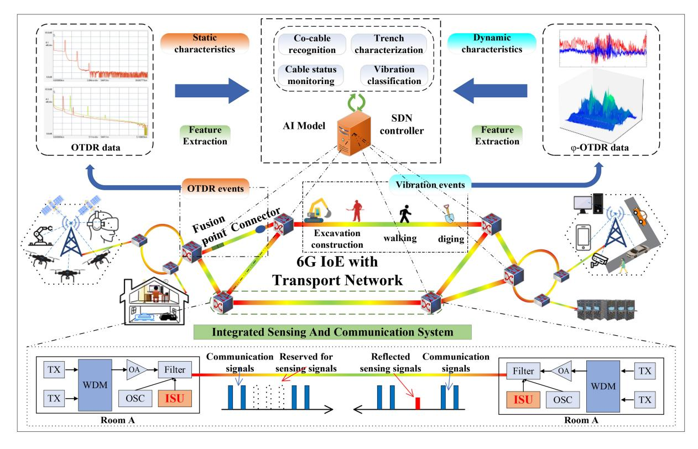

Fig. 1. Architecture diagram of fiber identification and condition warning in transport networks based on ISAC in 6G IoE.

employed in various fields, such as perimeter security surveillance [\[40\]](#page-10-8), geological exploration [\[41\]](#page-10-9), and pipeline monitoring [\[42\]](#page-10-10). However, the high nuisance alarm rate (NAR) and missed detection issues under strong interference remain significant challenges that need to be addressed before widespread application of ϕ-OTDR technology [\[43\]](#page-10-11). To enhance the performance of ϕ-OTDR in vibration pattern recognition, researchers have extensively validated ML and DL models [\[44\]](#page-10-12).

Traditional ML models offer faster training and prediction speeds [\[45\]](#page-10-13). To accomplish real-time tasks, it is essential not only for the algorithm model to meet the requirements but also for the system hardware to be appropriately adapted. Through improvements, OTDR can now detect optical fiber links without affecting existing network operations [\[13\]](#page-9-12). The integration of this technology can be seen as the embryo of ISAC in transport network. Nowadays, a significant deployment of communication optical fibers has been observed globally, and the reuse of existing communication optical fibers for integrated sensing in transport networks has garnered considerable attention [\[46\]](#page-10-14), [\[47\]](#page-10-15).

At the signal level, researchers have unveiled a novel avenue for the ISAC in transport network by harnessing linear frequency modulated light as the optical carrier for pulse amplitude modulation 4-Level signal transmission and employing -OTDR as the sensing probes [\[48\]](#page-10-16). Reports on the ISAC in transport network using space-division multiplexing (SDM) appeared in 2023 [\[49\]](#page-10-17), where researchers deployed a cable containing uncoupled seven-core fibers in underground tunnels. They successfully demonstrated high-capacity SDM transmission and conducted real-time monitoring of urban traffic. In 2020, the first field trial of distributed fiber optic sensing (DFOS) and high-speed communication was reported on an operational telecom network [\[50\]](#page-10-18). This solution demonstrated the feasibility of ISAC in transport network based on wavelength division multiplexing systems.

Up to now, integrated sensing solutions in transport networks have not been applied to the field of co-route fiber detection. In this article, we leverage an ISAC architecture in transport networks to achieve the identification of co-route fiber and real-time warning of fiber status, building upon previous work. This holds significant implications for the realization of 6G IoE.

## III. SYSTEM ARCHITECTURE AND MATHEMATICAL MODEL

#### *A. System Architecture*

In Fig. [1,](#page-2-1) we illustrate the ISAC architecture proposed for transport networks. In the context of 6G IoE, optical networks serve as a crucial foundation for the IoE, where optical fibers within the network act not only as waveguides for communication signals but also as sensors for perception parameters. In this article, we implement DFOS using ISUs embedded in transport network devices to extract sensing information from optical fibers without interrupting existing communication services. The task of identifying co-route fiber is performed by the IRU, which is deployed within the software-defined networking (SDN) controller. The IRU contains a pretrained recognition model and completes the

{3}------------------------------------------------

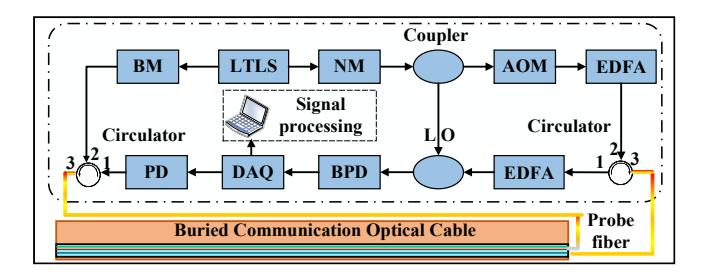

Fig. 2. Structure diagram of ISU [13].

model recognition task upon receiving FVs collected by ISUs. Subsequently, the results are transmitted in real time to the SDN controller, thus achieving co-route fiber identification and fiber status monitoring.

Fig. 2 demonstrates the implementation logic of the ISU, comprising three main components: 1) signal transmission; 2) reception; and 3) processing. The signal transmission function is achieved through the collaborative efforts of a linewidth tunable light source (LTLS), optical modulator, EDFA, and isolator. In Fig. 2, we can observe that the LTLS operates in two modes: 1) broadband mode (BM) and 2) narrowband mode (NM). The ISU utilizes the LTLS in BM to endow it with the logic functionality of OTDR.

As shown in Fig. 3, the backscattering of optical fibers includes Rayleigh, Brillouin, and Raman scattering [50]. OTDR can extract connectors and splicing losses through Rayleigh backscattering and Fresnel reflection, with its physical expression represented by

$$I_r = \int_{-\pi}^{\pi} I_R(z) I_L * \cos(\varphi_L - \varphi_R(z, t)) d\varphi_L = I_R(z) I_L$$
 (1)

where  $I_R(z)$  is the Rayleigh scattering echo intensity, while  $\varphi_R(z,t)$  represents the phase of the Rayleigh scattering echo.  $I_L$  and  $\varphi_L$  are the intensity and phase of local oscillator light, respectively.

When the LTLS operates in NM mode, the ISU analyzes the vibration information of the optical fiber through phase difference, which is given by

$$\Delta \varphi = \varphi_A - \varphi_B = \frac{2\pi n}{\lambda} 2L + \phi \tag{2}$$

where  $\lambda$  represents the wavelength of the sensing light, and n denotes the refractive index of the optical fiber. The phases of the reflected light at the two ends are represented by  $\varphi_A$  and  $\varphi_B$ , respectively, and L represents the distance between the two measured ends. When vibration occurs, external stress induces deformation in the test segment of length  $\Delta L$ , resulting in a change in phase difference between the two ends of the fiber segment, which is revealed in [51]

$$\Delta \varphi' = \varphi_A' - \varphi_B' = \frac{2\pi n}{\lambda} 2(L \pm \Delta L) + \phi. \tag{3}$$

By measuring the phase change of the returned optical signal, it is possible to analyze vibration characteristics within the optical fiber, such as the location, frequency, and amplitude of the vibration.

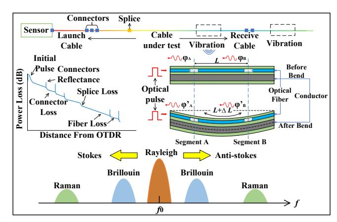

Fig. 3. Schematic of distributed optical fiber sensing systems [46], [51].

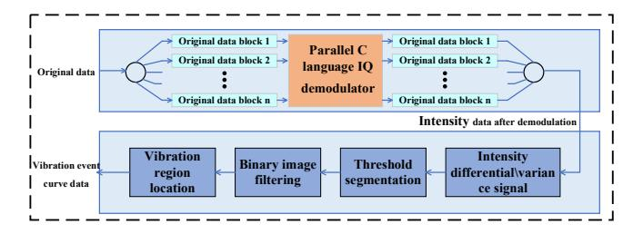

Fig. 4. Flowchart of fiber vibration sample extraction.

#### B. Feature Extraction

When processing the co-cable fiber identification task, ISU first fuses the OTDR curves of two fiber pairs to be identified to form a new curve. After that, the data preprocessing work of the same cable fiber is based on the newly generated fiber for the fusion curve. When analyzing fiber vibration information, the collected raw data is initially demodulated using in-phase and quadrature demodulators, as shown in Fig. 4. The demodulated data, representing vibration intensity, undergoes threshold segmentation and binary image filtering. Finally, it is subjected to vibration region localization, completing the extraction of vibration events. For characterizing optical fiber trenches, we utilize the vibration curve of the optical fiber, which represents the relationship between amplitude and time. As for pattern recognition of optical fiber vibrations, we employ waterfall plots that encompass the relationship of optical fiber vibrations in both time and space.

In traditional ML algorithms, performance relies on effective FEA. Before performing feature extraction, it is necessary to normalize the raw data. In this article, we employ the Min–Max scaling method for data normalization, which is represented by the following formula:

$$x_n = \frac{x - \min(x)}{\max(x) - \min(x)} \tag{4}$$

where x represents the original data, and  $x_n$  represents the normalized data.

In the time domain, 15 features are extracted from the normalized signal, as shown in [45, Table IV]. These features include maximum value, minimum value, peak-to-peak value,

{4}------------------------------------------------

TABLE I FEATURES IN TIME DOMAIN

| Maximum (Max)     | Minimum (Min)     | Peak-to-peak           |  |
|-------------------|-------------------|------------------------|--|
|                   |                   | value ( <i>PK-PK</i> ) |  |
| Mean(A)           | Variance (var)    | Standard deviation     |  |
|                   |                   | (SD)                   |  |
| Time domain       | Root mean square  | Average rectified      |  |
| entropy (TDE)     | (RMS)             | value (Arv)            |  |
| Shape factor (Sf) | Pulse factor (Pf) | Crest factor (Cf)      |  |
| Clearance factor  | Kurtosis factor   | Skewness factor        |  |
| (CL)              | (Kf)              | (Skew)                 |  |
|                   |                   |                        |  |

TABLE II FEATURES ASSOCIATED WITH FTT

| Spectral energy (Se)        | Spectral domain entropy (SDE) |
|-----------------------------|-------------------------------|
| Dominant frequency (DF)     | Mean Frequency (MF)           |
| Spectral shape factor (SSf) | Spectral Slope (SS)           |
| Spectral peak factor (SPf)  |                               |

TABLE III FEATURES ASSOCIATED WITH WPD

| LLP energy (LLPE)          | LHP energy ( <i>LHPE</i> ) | HLP energy (HLPE)                 |
|----------------------------|----------------------------|-----------------------------------|
| HHP energy ( <i>HHPE</i> ) | Wavelet entropy (WE)       | Wavelet information quantum (WIQ) |

mean, variance, standard deviation, root mean square, rectified mean value, waveform factor, pulse factor, crest factor, clearance factor, kurtosis factor, sharpness factor, and entropy.

In the frequency domain, we extracted 13 features based on FFT and WPD. FFT is an algorithm that converts time-domain signals into frequency-domain signals, allowing the decomposition of signals into different frequency components. Vibrational events in optical fibers, such as walking or passing vehicles, exhibit certain periodic characteristics. FFT is suitable for analyzing periodic signals or signals with distinct frequency components. Both the fused OTDR curve of optical fiber pairs and the vibration curve exhibit clear frequency components, making FFT suitable for feature extraction. After FFT, we extracted seven features, as shown in Table II.

In addition to periodic characteristics and distinct frequency components, optical fiber sensing signals also contain irregular and nonstationary frequency components. WPD not only captures more precise frequency information at low frequencies but also captures local temporal characteristics of signals at high frequencies.

In this article, we utilize WPD to divide the original signal into two parts: 1) low frequency and 2) high frequency. Subsequently, each part is further decomposed into low-frequency components (LLP for low-frequency part, LHP for high-frequency part) and high-frequency components (HLP for low-frequency part, HHP for high-frequency part). This results in four frequency components. Table III shows the selected six features after the signal undergoes two-level WPD. Detailed definitions can be found in [45, Table V].

#### Algorithm 1 PCA

**Input:**  $X \in R^{m \times d}$ **Output:**  $Y \in R^{m \times d}$ 

- 1: Performs eigen-decomposition on the covariance matrix  $(X.X^T)$
- 2: The descending order is used to arrange the Eigen values
- 3: Sort Eigen vectors by Eigen values
- 4: Construct matrix  $W(d \times k)$  using the top k ranked Eigen vectors
- 5: Multiplying matrix *X* by the matrix *W* yields the reduced-dimensional matrix *Y*.

#### C. Feature Dimensionality Reduction

We extracted a total of 28 features in the time and frequency domains. Next, we applied self-difference to the original data and performed feature extraction again. The features extracted from both the original and differential data were concatenated to obtain the required FVs for recognition. The ISU then transmitted the concatenated FVs to the SDN controller.

For different recognition tasks, improving model performance may require different feature sets as FVs. In this work, we compared the performance gains of three different feature dimensionality reduction algorithms in recognition tasks, including principal component analysis (PCA), linear discriminant analysis (LDA), and independent component analysis (ICA).

PCA determines the principal components (PCs) of samples by maximizing the variance of the data. It then projects the data along the direction of maximum variance to transform high-dimensional data into low-dimensional data.

When projecting the original sample set X with d-dimensional features onto a space Y with k-dimensional features, PCA first creates a  $d \times k$  transformation matrix W. Next, it performs eigen-decomposition on the covariance matrix  $(X.X^T)$ , followed by sorting the eigenvalues in descending order and selecting the k largest eigenvalues' corresponding eigenvectors [52]. Eigenvalues represent the magnitude of the data, while eigenvectors represent the direction of the data. The steps of PCA are summarized in Algorithm 1, m is the number of data points.

ICA is a linear supervised dimensionality reduction technique. Unlike PCA, which searches for new features along the direction of data variance, ICA seeks directions that maximize the independence of each column in the new data set [53]. The processing steps of ICA are outlined in Algorithm 3. The objective of ICA is to find a transformation matrix W such that each column in the matrix Y obtained by multiplying the data matrix X by W represents independent source signals.

Different from PCA, LDA is a supervised algorithm aimed at maximizing the differences between classes. It extracts k independent features from d features in the source data set. If the data set has c classes, k cannot exceed c-1. Algorithm 2 outlines the dimensionality reduction steps of LDA [54]. LDA not only considers the variance of the data but also takes into account the data's classes. First, it computes the within-class scatter matrix  $S_w$  and the between-class scatter matrix

{5}------------------------------------------------

#### Algorithm 2 LDA

**Input:**  $X \in \mathbb{R}^{m \times d}$ **Output:**  $Y \in R^{m \times d}$ 

1: Build in-between-class matrix  $S_b$  and within-class matrix  $S_{w}$ 

- 2: Calculate  $S_w^{-1}S_h$
- 3: Sort Eigen vectors by Eigen values in descending order
- 4: To select the eigenvector corresponding to the largest k eigenvalues to form  $W(d \times k)$
- 5: Multiplying matrix X by the matrix W yields the reduceddimensional matrix Y.

#### Algorithm 3 ICA

**Input:**  $X \in \mathbb{R}^{m \times d}$ **Output:**  $Y \in R^{m \times d}$ 

1: Construct matrix  $W(d \times k)$ 

2: Let  $Y = X \otimes W$ 

3: Measure the independence of each column in Y

4: Use optimization algorithms to continually adjust W to get each column in Y is as independent as possible

 $S_b$ , which can be obtained, respectively, from

$$S_w = \sum_{i=1}^{c} \sum_{x \in X_i} (x - \mu_i)(x - \mu_i)^T$$
 (5)

$$S_b = \sum_{i=1}^{c} n_i (\mu_i - \mu) (\mu_i - \mu)^T$$
 (6)

where  $\mu$  represents the mean vector of all samples,  $\mu_i$  is the mean vector of the samples in the *i*th class,  $n_i$  is the number of samples in the *i*th class, and  $X_i$  represents the sample set of the *i*th class. The transformation matrix W consists of the eigenvectors corresponding to the k largest eigenvalues in the matrix  $S_w^{-1}S_b$ . Transform *X* using *W* to obtain the new subspace *Y*.

#### IV. RESULTS AND ANALYSIS

Network failures can be sudden, and to further protect business operations from the impact of sudden fiber failures, real-time monitoring and warning of fiber status are necessary. This requires identification models to respond quickly to the network's sudden states. DL, due to its complex model structure and parameters, requires longer response times. In contrast, ML models exhibit good real-time response characteristics. In this section, we validate the performance of different ML models in co-roure fiber identification and fiber vibration pattern recognition tasks, including support vector machine (SVM), random forest (RF), naive Bayes (NB), and k-nearest neighbors (KNNs). In this work, 20% of the data was used for validation, while the remaining 80% was used for model training.

#### A. Co-Cable Recognition

In previous same-cable identification schemes, whether calculating the similarity of OTDR curves for fiber pairs or fusing the FVs of fiber pairs, the feature representation was

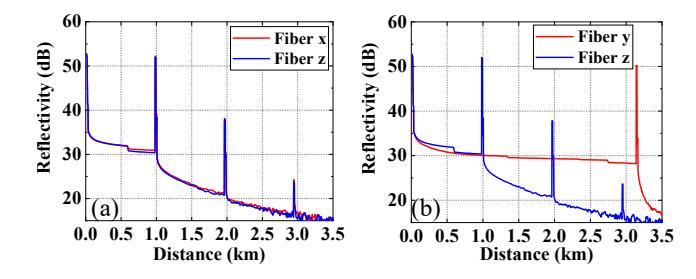

Fig. 5. Schematic of OTDR curves. (a) Co-cable fibers. (b) Non-co-cable

based on individual fibers. This led to the model ignoring the relationship between fiber pairs, resulting in the inability to further improve the identification accuracy.

Fig. 5 illustrates schematic OTDR curves of co-cable and non-co-cable fibers. In Fig. 5(a), Fiber x and Fiber z are two fibers from the same cable, and their curves are very similar. Fiber y and Fiber z come from different cables, as shown in Fig. 5(b), and the curves of fibers from different cables differ significantly. After differential fusion of the OTDR curves of two fibers to be identified, the fusion curve of the co-cable fiber pair tends to have small values and remains relatively stable overall due to the similarity of the curves of the two fibers, while the fusion curve of the non-co-cable fiber pair exhibits a larger distribution of values.

Motivated by the approach proposed in [56], this article adopts the feature extraction method outlined in [56] as the baseline (FEA-baseline), and then proposes improvements to it, resulting in (FEA-TFW). To the best of our knowledge, this is the first application of time-frequency domain feature extraction in co-roure fiber identification. Accuracy, precision, NAR, and F1-score are used as performance metrics to evaluate the performance of the proposed FEA, which can be measured using the following formulas [55]:

Accuracy = 
$$\frac{TP + TN}{TP + TN + FP + FN}$$
Precision = 
$$\frac{TP}{TP + FP}$$
(8)

$$Precision = \frac{TP}{TP + FP}$$
 (8)

$$NAR = \frac{FN}{TP + FN}$$
 (9)

$$F_1 - \text{score} = \frac{2 \times TP}{2 \times TP + FP + FN}$$
 (10)

where TP stands for true positives, FN refers to false negatives, FP represents false positives, and TN indicates true negatives.

Table IV presents the simulation results of FEA-baseline and FEA-TFW with different ML algorithms. We applied three feature dimensionality reduction algorithms to the features extracted by FEA-TFW and compared their performance, which is also shown in Table IV.

PCA and ICA selected 16 representative features from the FVs obtained by FEA-TFW, while in the binary classification task, the LDA algorithm could only select one feature. As shown in Table IV, the NB model performed the worst, despite some improvement in accuracy after feature algorithm optimization, the performance of NAR remained poor. The co-cable recognition task focuses more on the recognition

{6}------------------------------------------------

| TABLE IV                               |
|----------------------------------------|
| CO-CABLE FIBER RECOGNITION PERFORMANCE |

|          |     | Accuracy | Precision | NAR   | F1-score |
|----------|-----|----------|-----------|-------|----------|
| FEA      | SVM | 0.988    | 0.923     | 0.199 | 0.858    |
| Baseline | RF  | 0.929    | 0.384     | 0.072 | 0.543    |
|          | KNN | 0.991    | 0.879     | 0.080 | 0.899    |
|          | NB  | 0.145    | 0.051     | 0     | 0.096    |
| FEA      | SVM | 0.988    | 0.895     | 0.160 | 0.867    |
| TFW      | RF  | 0.958    | 0.523     | 0.041 | 0.677    |
|          | KNN | 0.995    | 0.957     | 0.059 | 0.949    |
|          | NB  | 0.982    | 0.894     | 0.313 | 0.777    |
| FEA      | SVM | 0.989    | 0.914     | 0.156 | 0.877    |
| TFW      | RF  | 0.996    | 0.969     | 0.061 | 0.954    |
| PCA      | KNN | 0.996    | 0.968     | 0.064 | 0.951    |
|          | NB  | 0.961    | 0.549     | 0.211 | 0.647    |
| FEA      | SVM | 0.986    | 0.862     | 0.177 | 0.842    |
| TFW      | RF  | 0.978    | 0.750     | 0.214 | 0.768    |
| LDA      | KNN | 0.986    | 0.87      | 0.196 | 0.836    |
|          | NB  | 0.982    | 0.761     | 0.128 | 0.813    |
| FEA      | SVM | 0.995    | 0.988     | 0.105 | 0.939    |
| TFW      | RF  | 0.997    | 0.984     | 0.053 | 0.965    |
| ICA      | KNN | 0.995    | 0.973     | 0.081 | 0.945    |
|          | NB  | 0.969    | 0.638     | 0.238 | 0.695    |

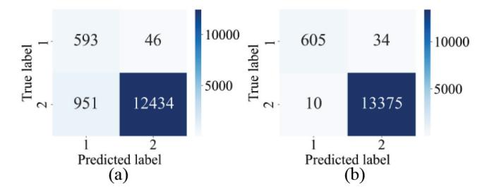

Fig. 6. Confusion matrices of the RF model in (a) FEA-Baseline and (b) FEA-TFW-ICA for co-cable recognition.

performance of co-cable fibers, but the proportion of co-cable fiber pairs in the total fiber is very small. The NB model tends to lean toward the higher proportion of non-co-cable fibers, resulting in inaccurate judgments of co-cable fibers.

After dimensionality reduction using the ICA algorithm, the RF model showed the best performance, achieving a recognition accuracy of 0.997, an F1-score of 0.965, and significantly reducing the NAR to 0.053. Although the NAR performance was optimal with a score of only 0.041 in the RF model with FEA-TFW, the other three indicators were not as good as the performance of FEA-TFW-ICA. The NB model had poor overall performance in FEA-Baseline, and although the NAR was 0, it is not further discussed.

In Fig. [6,](#page-6-1) the confusion matrix for the RF model in FEA-Baseline and FEA-TFW-ICA is presented. From Fig. [6,](#page-6-1) we can observe that there are only 639 pairs of co-cable fibers used for testing, while the number of non-co-cable fiber pairs reaches 13 380. When FEA-Baseline was used, 46 pairs of the same fiber were not correctly identified, with an NAR of 7.2%. With FEA-TFW-ICA, the NAR dropped to 4.56%. The data used in our experiments were collected from the communication network of the operator, involving typical

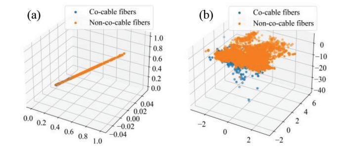

Fig. 7. Feature visualization of (a) FEA-Baseline and (b) FEA-TFW-ICA.

network scenarios, such as metropolitan networks, backbone networks, and aggregation networks. The network comprises over hundreds of thousands of optical cables, with a limited number of fibers per cable. The proportion of coiled fibers at 4.56% aligns with the actual situation in the network. Among the 639 pairs of co-cable fibers tested, the RF model based on FEA-TFW-ICA successfully identified 605 pairs with an outstanding performance, yielding an NAR of only 0.053.

To better visualize the performance advantage of FEA-TFW-ICA, we present the visual distribution of FVs extracted from FEA-Baseline and FEA-TFW-ICA in Fig. [7\(](#page-6-2)a) and (b), respectively. It can be observed that FEA-TFW-ICA effectively separates more co-cable fibers from non-co-cable fibers, which contributes to the classification performance of the model.

In our previous work, we proposed a two-layered cascaded RF algorithm for co-cable recognition, achieving an accuracy of 0.95 and an F1-score of 0.9. Based on FEA-TFW-ICA, the RF model's performance in co-cable recognition is excellent, surpassing our previous work.

## *B. Trench Characterization*

In the infrastructure of networks, multiple optical fibers are often laid in the same trenches. When facing geological disasters or human excavation, there is a risk of fiber breakage for all fibers in the same trench. To identify the fibers in the same trench, namely, co-trench fibers, we collected a large amount of fiber vibration data in real network scenarios from the telecommunications operator's network. The process of obtaining vibration data is illustrated in Fig. [4.](#page-3-2)

Fig. [8](#page-7-1) shows the vibration curves extracted from two fibers. In our experiment, the time length of the vibration curve is 2000 ms, with a spatial resolution of 3.2 m.

The experiment simulates a real online acquisition environment, where four fibers in three ducts are simultaneously tested (two fibers in one duct are measured). A total of 3019 vibration curves were extracted during the test period. In the simulation, the ratio of training data set to validation data set is 8:2.

Table [V](#page-7-0) displays the accuracy performance of various ML models on different feature extraction methods. Similar to the co-cable identification simulation, PCA and ICA selected 16 representative features from the FEA-TFW FVs. However, due to the presence of three ducts in the validation data set, the number of features extracted by the LDA algorithm was set

{7}------------------------------------------------

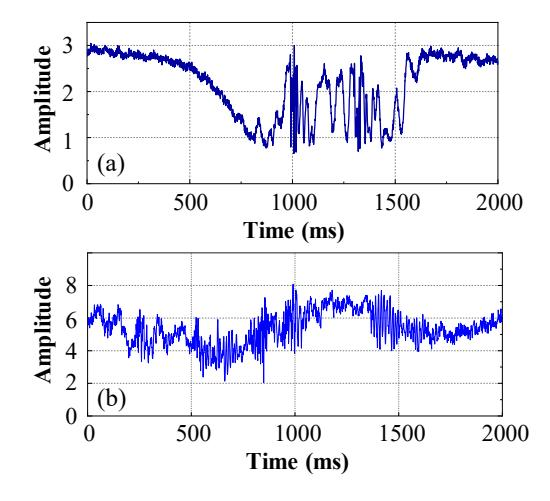

Fig. 8. Schematic of the fiber vibration curves.

TABLE V COMPARISON OF THE ACCURACY OF TRENCH CLASSIFICATION

|              | SVM   | RF    | KNN   | NB    |
|--------------|-------|-------|-------|-------|
| FEA-Baseline | 0.958 | 0.952 | 0.958 | 0.935 |
| FEA-TFW      | 0.962 | 0.957 | 0.958 | 0.94  |
| FEA-TFW-PCA  | 0.967 | 0.977 | 0.968 | 0.95  |
| FEA-TFW-LDA  | 0.967 | 0.96  | 0.965 | 0.95  |
| FEA-TFW-ICA  | 0.965 | 0.963 | 0.962 | 0.75  |

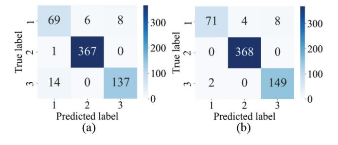

Fig. 9. Confusion matrices of the RF model in (a) FEA-Baseline and (b) FEA-TFW-PCA for trench classification.

to 2. It can be observed that the FVs after PCA dimensionality reduction achieved the best accuracy performance among all ML models. Specifically, the RF model based on FEA-TFW-PCA achieved a recognition accuracy of 0.977, which is the best performance observed in all tests.

Fig. [9](#page-7-2) illustrates the confusion matrix of the RF model based on FEA-Baseline and FEA-TFW-PCA. It can be observed that after FEA-TFW-PCA is used, all samples in trench2 are correctly classified, and the number of samples misclassified as trench1 in trench3 is reduced from 14 to 2. In contrast, trench1 exhibits a higher NAR, which is attributed to the lower number of valid vibration curves collected from trench1. The performance metrics of various ML models based on FEA-TFW-PCA in each duct are presented in Table [VI.](#page-7-3) Despite the NAR of trench1 being 0.145, its F1-score is 0.91, which is the best performance among all models.

The effectiveness of FEA-TFW-PCA in trench classification is visually demonstrated in Fig. [10.](#page-7-4) Fig. [10\(](#page-7-4)a) shows the visualization of FVs extracted by FEA-Baseline. After feature

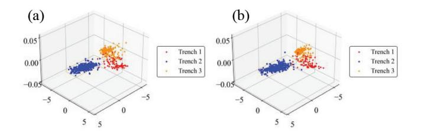

Fig. 10. Trench feature visualization of (a) FEA-Baseline and (b) FEA-TFW-PCA.

TABLE VI PERFORMANCE COMPARISON OF DIFFERENT MODELS IN TRENCH CLASSIFICATION WITH FEA-TFW-PCA

|                | Trench | Precision | NAR   | F1-score |
|----------------|--------|-----------|-------|----------|
| SVM            | 1      | 0.899     | 0.145 | 0.877    |
| Accuracy=0.967 | 2      | 0.992     | 0.000 | 0.996    |
|                | 3      | 0.941     | 0.053 | 0.944    |
| RF             | 1      | 0.973     | 0.145 | 0.910    |
| Accuracy=0.977 | 2      | 0.989     | 0.000 | 0.995    |
|                | 3      | 0.949     | 0.013 | 0.968    |
| KNN            | 1      | 0.901     | 0.120 | 0.890    |
| Accuracy=0.968 | 2      | 0.995     | 0.008 | 0.993    |
|                | 3      | 0.942     | 0.040 | 0.951    |
| NB             | 1      | 0.807     | 0.145 | 0.830    |
| Accuracy=0.950 | 2      | 0.989     | 0.016 | 0.986    |
|                | 3      | 0.939     | 0.079 | 0.93     |

extraction with FEA-TFW-PCA, the three ducts are distinctly separated in the feature space, as depicted in Fig. [10\(](#page-7-4)b).

The previous task of identifying co-trench fibers aimed to distinguish whether any two fibers belong to the same trench. In contrast, the architecture proposed in this article can accurately identify which trench a fiber belongs to, thereby distinguishing whether any two fibers belong to the same trench. This represents a significant advancement in co-trench fiber identification, which will save time and costs for fiber maintenance.

#### *C. Fiber Vibration Pattern Recognition*

Fiber fracture can significantly impact the survivability of business operations. Identifying co-route fibers can mitigate the risk of service interruption in already laid fibers and prevent co-route fiber phenomenon occurrence in future fiber deployments. However, co-route fiber identification can only identify potential risks before and after fiber deployment, and cannot provide early warnings for sudden fiber fractures. In this article, we use an ISAC architecture to monitor the realtime status of fibers. When vibration events threatening the fiber status, such as digging or knocking, are detected, timely alerts are sent to the SDN controller. This enables network administrators to promptly adjust services on the alerted fibers, thereby avoiding service interruptions.

The fiber vibration data set utilized in this study was sourced from the open data set of ϕ-OTDR events, as provided in [\[56\]](#page-10-23). This data set comprises a total of 15 612 samples, encompassing six distinct event types: background noise, digging, knocking, watering, shaking, and walking, denoted as 1, 2, 3,

{8}------------------------------------------------

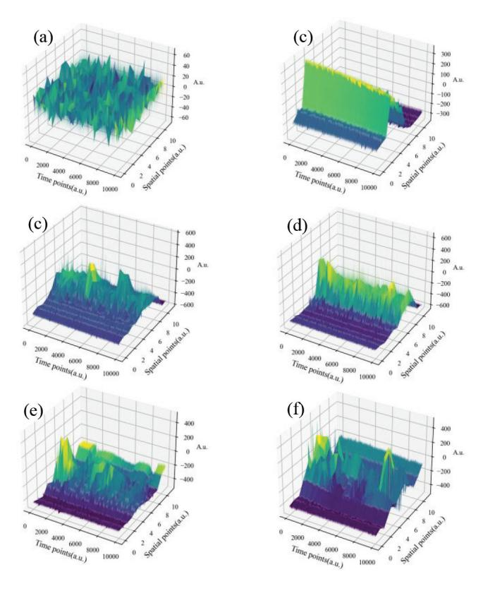

Fig. 11. Spatial–temporal samples of the six typical events. (a) Background noise. (b) Digging. (c) Knocking. (d) Watering. (e) Shaking. (f) Walking.

4, 5, and 6, respectively. Each individual sample is structured as a matrix of 10 000 rows and 12 columns, representing 10 000 time points and 12 spatial locations, respectively. Fig. [11](#page-8-0) illustrates 3-D waterfall plots of samples representing the aforementioned six event types. Herein, the horizontal and vertical axes denote temporal and spatial points, while the depth axis depicts the dimensionless vibration intensity at corresponding spatiotemporal positions.

Reference [\[56\]](#page-10-23) also provides two baseline models, namely, SVM and 2D-CNN (convolutional neural network, 2-D approach). In this study, the FEA used by the SVM model is referred to as FEA-baseline, while the improved FEA is denoted as FEA-TFW. FEA-baseline divides the original samples into 12 channels based on spatial locations, and extracts 32 features from both the original and differential signals for each channel. Consequently, the resulting FV has a length of 384 (32\*12). However, longer FVs can lead to larger search spaces and affect model performance.

Therefore, feature dimensionality reduction algorithms were applied to both FEA-baseline and FEA-TFW, and their accuracy performances on different ML models are presented in Table [VII.](#page-8-1)

The two baseline models mentioned in [\[36\]](#page-10-4)—SVM and 2D-CNN—achieved recognition accuracies of 0.826 and 0.940, respectively. Following feature extraction with FEA-TFW-LDA, the accuracy of various ML models reached their optimum, with the SVM model performing the best, achieving an accuracy of 0.980. This performance surpassed that of the two baseline models. Precision, NAR, and f1 scores for SVM

TABLE VII PERFORMANCE OF FIBER OPTIC VIBRATION EVENT CLASSIFICATION

|                  | SVM   | RF    | KNN   | NB    |
|------------------|-------|-------|-------|-------|
| FEA-Baseline     | 0.826 | 0.936 | 0.858 | 0.486 |
| FEA-Baseline-PCA | 0.905 | 0.931 | 0.860 | 0.790 |
| FEA-Baseline-LDA | 0.91  | 0.924 | 0.925 | 0.929 |
| FEA-Baseline-ICA | 0.959 | 0.918 | 0.818 | 0.723 |
| FEA-TFW          | 0.812 | 0.962 | 0.895 | 0.240 |
| FEA-TFW-PCA      | 0.930 | 0.927 | 0.899 | 0.819 |
| FEA-TFW-LDA      | 0.980 | 0.976 | 0.978 | 0.974 |
| FEA-TFW-ICA      | 0.906 | 0.885 | 0.662 | 0.747 |

TABLE VIII PERFORMANCE OF DIFFERENT METRICS IN EACH EVENT CATEGORY

|                | Events | Precision | NAR   | F1-score |
|----------------|--------|-----------|-------|----------|
| SVM            | 1      | 0.987     | 0.014 | 0.986    |
|                | 2      | 0.974     | 0.028 | 0.973    |
| FEA-TFW-LDA    | 3      | 0.971     | 0.031 | 0.970    |
|                | 4      | 0.991     | 0.011 | 0.990    |
| Accuracy=0.980 | 5      | 0.991     | 0.011 | 0.990    |
|                | 6      | 0.965     | 0.037 | 0.964    |

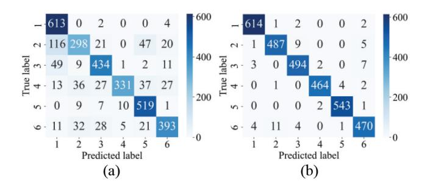

Fig. 12. Confusion matrices of the SVM model for fiber vibration event classification in (a) FEA-Baseline and (b) FEA-TFW-LDA.

with FEA-TFW-LDA can be found in Table [VIII,](#page-8-2) where it is evident that the false alarm rates for each event are very low.

Fig. [12](#page-8-3) illustrates the confusion matrix for SVM with FEA-Baseline and FEA-TFW-LDA. It can be observed that before using FEA-TFW-LDA, there are more cases of misclassification of the model, but after using FEA-TFW-LDA, the number of misclassification of each category of data is significantly reduced. In Fig. [12\(](#page-8-3)b), the majority of samples are correctly classified, while there are minor instances of confusion between the events digging, knocking, and walking. This phenomenon arises due to the sudden application of stress on the fiber for these three types of events (walking events include a single stampede event), making them prone to confusion when the external forces are similar.

To visually demonstrate the superiority of FEA-TFW-LDA over FEA-baseline, we conducted a visualization of the FVs extracted by both methods in Fig. [13.](#page-9-32) We utilized the LDA algorithm to reduce the dimensionality of the extracted FVs to three dimensions for ease of mapping in the 3-D space. It can be observed that in Fig. [13\(](#page-9-32)a), the distribution of FVs extracted by FEA-baseline is relatively concentrated at various event points. Conversely, FEA-TFW-LDA exhibits

{9}------------------------------------------------

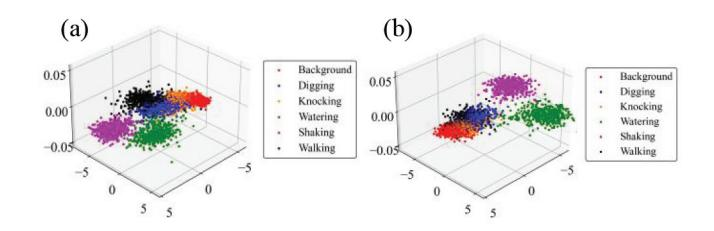

Fig. 13. Fiber vibration event feature visualization of (a) FEA-Baseline and (b) FEA-TFW-LDA.

better visualization effects, enabling better differentiation of different event points in the feature space.

#### V. CONCLUSION

In this article, we propose the ISAC architecture for transport networks, leveraging live fiber data collected from telecommunications operators to train ML models. This architecture achieves real-time identification of co-route fibers and fiber state alerts. Notably, in co-cable fiber identification, we introduce for the first time the fusion of OTDR curves from fiber pairs as the fundamental unit for feature extraction, achieving a remarkable NAR of 5.3% and a recognition accuracy of 99.7%. In the task of co-trench fiber identification, we achieve a high accuracy of 97.7% through the novel delineation of fiber trenches. Furthermore, in fiber state prediction, our solution enhances the recognition accuracy from the baseline model's 82.6%–98% using publicly open fiber vibration data sets. Extensive simulation experiments have proved the superior performance of the proposed architecture, which is a great progress in transport network operation and maintenance, and provides a reliable scheme for further guaranteeing the survivability of everything interconnection in 6G IoE.

#### REFERENCES

- [\[1\]](#page-0-0) A. Yu et al., "Socially-aware traffic scheduling for edge-assisted metaverse by deep reinforcement learning," *IEEE Netw.*, vol. 37, no. 6, pp. 74–81, Nov. 2023, doi: [10.1109/MNET.2023.3317108.](http://dx.doi.org/10.1109/MNET.2023.3317108)
- [\[2\]](#page-0-0) F. Liu et al., "Integrated sensing and communications: Toward dual-functional wireless networks for 6G and beyond," *IEEE J. Sel. Areas Commun.*, vol. 40, no. 6, pp. 1728–1767, Jun. 2022, doi: [10.1109/JSAC.2022.3156632.](http://dx.doi.org/10.1109/JSAC.2022.3156632)
- [\[3\]](#page-0-1) H. Yang et al., "Data-driven network slicing from core to ran for 5G broadcasting services," *IEEE Trans. Broadcast.*, vol. 67, no. 1, pp. 23–32, Mar. 2021.
- [\[4\]](#page-0-2) Z. Li et al., "Multi-objective optimization based sensor selection for TDOA tracking in wireless sensor network," *IEEE Trans. Veh. Technol.*, vol. 68, no. 12, pp. 12360–12374, Dec. 2019.
- [\[5\]](#page-0-2) Z. Li, D. Wang, P. Qi, and B. Hao, "Maximum eigenvalue based sensing and power recognition for multi-antenna cognitive radio system," *IEEE Trans. Veh. Technol.*, vol. 65, no. 10, pp. 8218–8229, Oct. 2016.
- [\[6\]](#page-0-3) T. Yu et al., "Bias-compensation augmentation learning for semantic segmentation in UAV networks," *IEEE Internet Things J.*, vol. 11, no. 12, pp. 21261–21273, Jun. 2024, doi: [10.1109/JIOT.2024.3373454.](http://dx.doi.org/10.1109/JIOT.2024.3373454)
- [\[7\]](#page-0-3) H. Yang et al., "BrainIoT: Brain-like productive services provisioning with federated learning in Industrial IoT," *IEEE Internet Things J.*, vol. 9, no. 3, pp. 2014–2024, Feb. 2022.
- [\[8\]](#page-0-4) Q. Yao et al., "Federated transfer learning framework for heterogeneous edge IoT networks," *China Commun.*, to be published, doi: [10.23919/JCC.ja.2022-0026.](http://dx.doi.org/10.23919/JCC.ja.2022-0026)
- [\[9\]](#page-0-4) C. Li et al., "Federated hierarchical trust-based interaction scheme for cross-domain Industrial IoT," *IEEE Internet Things J.*, vol. 10, no. 1, pp. 447–457, Jan. 2023, doi: [10.1109/JIOT.2022.3200854.](http://dx.doi.org/10.1109/JIOT.2022.3200854)

- [\[10\]](#page-0-5) Z. Sun et al., "A resource allocation scheme for edge computing network in smart city based on attention mechanism," *ACM Trans. Sens. Netw.*, submitted for publication, doi: [10.1145/3650031.](http://dx.doi.org/10.1145/3650031)
- [\[11\]](#page-0-5) T. Yu et al., "Multi-visual-GRU-based survivable computing power scheduling in metro optical networks," *IEEE Trans. Netw. Service Manag.*, vol. 21, no. 1, pp. 1302–1315, Feb. 2024.
- [\[12\]](#page-0-5) H. Yang et al., "PAINet: An integrated passive and active intent network for digital twins in automatic driving," *IEEE Commun. Mag.*, to be published.
- [\[13\]](#page-0-6) Y. Li et al., "Field trial of concurrent co-cable and co-trench optical fiber online identification based on ensemble learning," in *Opt. Exp.*, vol. 31, pp. 42850–42865. Dec. 2023.
- [\[14\]](#page-0-7) Y. Li et al., "Research and experiment on AI-based co-cable and co-trench optical fibre detection," in *Proc. Eur. Conf. Opt. Commun. (ECOC)*, Basel, Switzerland, 2022, pp. 1–4.
- [\[15\]](#page-0-8) Z. Zhao et al., "Field trail of shared risk optical fiber links detection based on OTDR and AI algorithm," in *Proc. Asia Commun. Photon. Conf. (ACP)*, Shenzhen, China, 2022, pp. 1942–1945, doi: [10.1109/ACP55869.2022.10088875.](http://dx.doi.org/10.1109/ACP55869.2022.10088875)
- [\[16\]](#page-0-9) W. Zuo, H. Zhou, Y. Qiao, Y. Zhao, and B. Ye, "Investigation of co-cable identification based on ultrasonic sensing in coherent systems," *IEEE Photon. Technol. Lett.*, vol. 35, no. 21, pp. 1155–1158, Nov. 1, 2023, doi: [10.1109/LPT.2023.3307452.](http://dx.doi.org/10.1109/LPT.2023.3307452)
- [\[17\]](#page-1-1) X. Li, Y. Zheng, J. Zhang, S. Dang, A. Nallanathan, and S. Mumtaz, "Finite SNR diversity-multiplexing trade-off in hybrid ABCom/RComassisted NOMA systems," *IEEE Trans. Mobile Comput.*, early access, Jan. 23, 2024, doi: [10.1109/TMC.2024.3357753.](http://dx.doi.org/10.1109/TMC.2024.3357753)
- [\[18\]](#page-1-1) X. Li et al., "Physical-layer authentication for ambient backscatter aided NOMA symbiotic systems," *IEEE Trans. Commun.*, vol. 71, no. 4, pp. 2288–2303, Apr. 2023.
- [\[19\]](#page-1-1) Y. Teng et al., "SRS-proactive-aware resource allocation based on alloptical wavelength converters in C+L band optical networks," *J. Lightw. Technol.*, early access, Jun. 10, 2024, doi: [10.1109/JLT.2024.3411886.](http://dx.doi.org/10.1109/JLT.2024.3411886)
- [\[20\]](#page-1-2) C. Wang et al., "Intelligent reflecting surface-assisted multi-antenna covert communications: Joint active and passive beamforming optimization," *IEEE Trans. Commun.*, vol. 69, no. 6, pp. 3984–4000, Jun. 2021.
- [\[21\]](#page-1-2) J. Si et al., "Covert transmission assisted by intelligent reflecting surface," *IEEE Trans. Commun.*, vol. 69, no. 8, pp. 5394–5408, Aug. 2021.
- [\[22\]](#page-1-2) B. Chen et al., "Low-latency partial resource offloading in cloudedge elastic optical networks," *J. Opt. Commun. Netw.*, vol. 16, no. 2, pp. 142–158, Feb. 2024, doi: [10.1364/JOCN.500117.](http://dx.doi.org/10.1364/JOCN.500117)
- [\[23\]](#page-1-3) B. Chen et al., "Crosstalk-aware virtual network mapping in space-division-multiplexing optical data center networks," *IEEE Trans. Commun.*, vol. 72, no. 6, pp. 3526–3542, Jun. 2024, doi: [10.1109/TCOMM.2024.3364359.](http://dx.doi.org/10.1109/TCOMM.2024.3364359)
- [\[24\]](#page-1-3) B. Chen et al., "Crosstalk-sensitive core and spectrum assignment in MCF-Based SDM-EONs," *IEEE Trans. Commun.*, vol. 71, no. 12, pp. 7133–7148, Dec. 2023, doi: [10.1109/TCOMM.2023.3307147.](http://dx.doi.org/10.1109/TCOMM.2023.3307147)
- [\[25\]](#page-1-3) L. Liu et al., "Selective resource offloading in cloud-edge elastic optical networks," *J. Lightw. Technol.*, vol. 41, no. 20, pp. 6431–6445, Oct. 15, 2023, doi: [10.1109/JLT.2023.3288391.](http://dx.doi.org/10.1109/JLT.2023.3288391)
- [\[26\]](#page-1-4) H. Yang, Q. Yao, B. Bao, A. Yu, J. Zhang, and A. V. Vasilakos, "Multi-associated parameters aggregation-based routing and resources allocation in multi-core elastic optical networks," *IEEE/ACM Trans. Netw.*, vol. 30, no. 5, pp. 2145–2157, Oct. 2022, doi: [10.1109/TNET.2022.3164869.](http://dx.doi.org/10.1109/TNET.2022.3164869)
- [\[27\]](#page-1-4) H. Yang, Q. Yao, A. Yu, Y. Lee, and J. Zhang, "Resource assignment based on dynamic fuzzy clustering in elastic optical networks with multicore fibers," *IEEE Trans. Commun.*, vol. 67, no. 5, pp. 3457–3469, May 2019.
- [\[28\]](#page-1-4) Q. Chen et al., "Virtual optical network mapping approaches in space-division-multiplexing elastic optical data center networks," *J. Lightw. Technol.*, vol. 40, no. 12, pp. 3515–3529, Jun. 15, 2022, doi: [10.1109/JLT.2022.3151371.](http://dx.doi.org/10.1109/JLT.2022.3151371)
- [\[29\]](#page-1-5) Z. Li, L. Guan, C. Li, and A. Radwan, "A secure intelligent spectrum control strategy for future THz mobile heterogeneous networks," *IEEE Commun. Mag.*, vol. 56, no. 6, pp. 116–123, Jun. 2018.
- [\[30\]](#page-1-5) J. Shi et al., "OTFS enabled LEO satellite communications: A promising solution to severe doppler effects," *IEEE Netw.*, vol. 38, no. 1, pp. 203–209, Jan. 2024.
- [\[31\]](#page-1-5) Q. Yao et al., "SNR re-verification-based routing, band, modulation, and spectrum assignment in hybrid C-C+L optical networks," *J. Lightw. Technol.*, vol. 40, no. 11, pp. 3456–3469, Jun. 1, 2022, doi: [10.1109/JLT.2022.3170332.](http://dx.doi.org/10.1109/JLT.2022.3170332)

{10}------------------------------------------------

- [\[32\]](#page-1-6) H. Yang, X. Zhao, Q. Yao, A. Yu, J. Zhang, and Y. Ji, "Accurate fault location using deep neural evolution network in cloud data center interconnection," *IEEE Trans. Cloud Comput.*, vol. 10, no. 2, pp. 1402–1412, Jun. 2022. doi: [10.1109/TCC.2020.2974466.](http://dx.doi.org/10.1109/TCC.2020.2974466)
- [\[33\]](#page-1-6) H. Yang, B. Wang, Q. Yao, A. Yu, and J. Zhang, "Efficient hybrid multi-faults location based on hopfield neural network in 5G coexisting radio and optical wireless networks," *IEEE Trans. Cogn. Commun. Netw.*, vol. 5, no. 4, pp. 1218–1228, Dec. 2019, doi: [10.1109/TCCN.2019.2946312.](http://dx.doi.org/10.1109/TCCN.2019.2946312)
- [\[34\]](#page-1-7) H. Li et al., "Ultra-high sensitive quasi-distributed acoustic sensor based on coherent OTDR and cylindrical transducer," *J. Lightw. Technol.*, vol. 38, no. 4, pp. 929–938, Feb. 15, 2020, doi: [10.1109/JLT.2019.2951624.](http://dx.doi.org/10.1109/JLT.2019.2951624)
- [\[35\]](#page-1-8) K. Abdelli, J. Y. Cho, F. Azendorf, H. Griesser, C. Tropschug, and S. Pachnicke, "Machine-learning-based anomaly detection in optical fiber monitoring," *J. Opt. Commun. Netw.*, vol. 14, no. 5, pp. 365–375, May 2022, doi: [10.1364/JOCN.451289.](http://dx.doi.org/10.1364/JOCN.451289)
- [\[36\]](#page-1-9) A. M. Rizzo et al., "Known and unknown event detection in OTDR traces by deep learning networks," *Neural Comput. Appl.*, vol. 34, no. 5, pp. 19655–19673, Nov. 2022.
- [\[37\]](#page-1-10) T. J. Xia et al., "First proof that geographic location on deployed fiber cable can be determined by using OTDR distance based on distributed fiber optical sensing technology," in *Proc. Opt. Fiber Commun. Conf. Exhib. (OFC)*, San Diego, CA, USA, 2020, pp. 1–3.
- [\[38\]](#page-1-11) Z. W. Ding et al., "Subsea cable," *J. Lightw. Technol.*, vol. 39, no. 15, pp. 5163–5169, Aug. 1, 2021, doi: [10.1109/JLT.2021.3078747.](http://dx.doi.org/10.1109/JLT.2021.3078747)
- [\[39\]](#page-1-12) Y. Shi, Y. Wang, L. Zhao, and Z. Fan, "An easy access method for event recognition of -OTDR sensing system based on transfer learning," *J. Lightw. Technol.*, vol. 39, no. 13, pp. 4548–4555, Jul. 1, 2021, doi: [10.1109/JLT.2021.3070583.](http://dx.doi.org/10.1109/JLT.2021.3070583)
- [\[40\]](#page-2-2) H. Wu, S. Xiao, X. Li, Z. Wang, J. Xu, and Y. Rao, "Separation and determination of the disturbing signals in phase-sensitive optical time domain reflectometry (-OTDR)," *J. Lightw. Technol.*, vol. 33, no. 15, pp. 3156–3162, Aug. 1, 2015, doi: [10.1109/JLT.2015.2421953.](http://dx.doi.org/10.1109/JLT.2015.2421953)
- [\[41\]](#page-2-3) M. R. Fernández-Ruiz et al., "Distributed acoustic sensing for seismic activity monitoring," *APL Photon.*, vol. 5, no. 3, 2020, Art. no. 30901.
- [\[42\]](#page-2-4) Y. Yang, H. Zhang, and Y. Li, "Long-distance pipeline safety early warning: A distributed optical fiber sensing semi-supervised learning method," *IEEE Sensors J.*, vol. 21, no. 17, pp. 19453–19461, Sep. 2021, doi: [10.1109/JSEN.2021.3087537.](http://dx.doi.org/10.1109/JSEN.2021.3087537)
- [\[43\]](#page-2-5) D. F. Kandamali, X. Cao, M. Tian, Z. Jin, H. Dong, and K. Yu, "Machine learning methods for identification and classification of events in ϕ-OTDR systems: A review," *Appl. Opt.*, vol. 61, no. 11, pp. 2975–2997, Apr. 2022.
- [\[44\]](#page-2-6) J. Li et al., "Pattern recognition for distributed optical fiber vibration sensing: A review," *IEEE Sensors J.*, vol. 21, no. 10, pp. 11983–11998, May 2021, doi: [10.1109/JSEN.2021.3066037.](http://dx.doi.org/10.1109/JSEN.2021.3066037)
- [\[45\]](#page-2-7) H. Jia et al., "A *k*-nearest neighbor algorithm-based near category support vector machine method for event identification of ϕ-OTDR," *IEEE Sensors J.*, vol. 19, no. 10, pp. 3683–3689, May 2019, doi: [10.1109/JSEN.2019.2891750.](http://dx.doi.org/10.1109/JSEN.2019.2891750)
- [\[46\]](#page-2-8) E. Ip et al., "Distributed fiber sensor network using telecom cables as sensing media: Technology advancements and applications [Invited]," *J. Opt. Commun. Netw.*, vol. 14, no. 1, pp. A61–A68, Jan. 2022, doi: [10.1364/JOCN.439175.](http://dx.doi.org/10.1364/JOCN.439175)
- [\[47\]](#page-2-8) J. Yan et al., "A technical review of integrated sensing and communication in optical transmission system," in *Proc. 21st Int. Conf. Opt. Commun. Netw. (ICOCN)*, Qufu, China, 2023, pp. 1–3, doi: [10.1109/ICOCN59242.2023.10236125.](http://dx.doi.org/10.1109/ICOCN59242.2023.10236125)
- [\[48\]](#page-2-9) H. He et al., "Integrated sensing and communication in an optical fibre," *Light, Sci. Appl.*, vol. 12, p. 25, Jan. 2023.
- [\[49\]](#page-2-10) Y. Chen et al., "Field trials of communication and sensing system in space division multiplexing optical fiber cable," *IEEE Commun. Mag.*, vol. 61, no. 8, pp. 182–188, Aug. 2023, doi: [10.1109/MCOM.004.2200885.](http://dx.doi.org/10.1109/MCOM.004.2200885)
- [\[50\]](#page-2-11) M.-F. Huang et al., "First field trial of distributed fiber optical sensing and high-speed communication over an operational telecom network," *J. Lightw. Technol.*, vol. 38, no. 1, pp. 75–81, Jan. 1, 2020, doi: [10.1109/JLT.2019.2935422.](http://dx.doi.org/10.1109/JLT.2019.2935422)
- [\[51\]](#page-3-3) A. Masoudi, J. A. Pilgrim, T. P. Newson, and G. Brambilla, "Subsea cable condition monitoring with distributed optical fiber vibration sensor," *J. Lightw. Technol.*, vol. 37, no. 4, pp. 1352–1358, Feb. 15, 2019, doi: [10.1109/JLT.2019.2893038.](http://dx.doi.org/10.1109/JLT.2019.2893038)
- [\[52\]](#page-4-3) B. Ghojogh et al., "Feature selection and feature extraction in pattern analysis: A literature review," 2019, *arXiv:1905.02845*.

- [\[53\]](#page-4-4) A. Tharwat, "Independent component analysis: An introduction," *Appl. Comput. Informat.*, vol. 17, no. 2, pp. 222–249, Apr. 2021, doi: [10.1016/j.aci.2018.08.00.](http://dx.doi.org/10.1016/j.aci.2018.08.00)
- [\[54\]](#page-4-5) F. Anowar, S. Sadaoui, and B. Selim, "Conceptual and empirical comparison of dimensionality reduction algorithms (PCA, KPCA, LDA, MDS, SVD, LLE, ISOMAP, LE, ICA, T-SNE)," *Comput. Sci. Rev.*, vol. 40, May 2021, Art. no. 100378.
- [\[55\]](#page-5-4) H. Yang et al., "Anomaly prediction with hybrid supervised/unsupervised deep learning for elastic optical networks: A multi-index correlative approach," *J. Lightw. Technol.*, vol. 40, no. 14, pp. 4502–4513, Jul. 15, 2022, doi: [10.1109/JLT.2022.3168594.](http://dx.doi.org/10.1109/JLT.2022.3168594)
- [\[56\]](#page-5-5) X. Cao, Y. Su, Z. Jin, and K. Yu, "An open dataset of ϕ-OTDR events with two classification models as baselines," *Results Opt.*, vol. 10, Feb. 2023, Art. no. 100372.

**Zhiwei Wang** received the B.S. degree in engineering from Nanjing University of Posts and Telecommunications, Nanjing, China, in 2022. He is currently pursuing the M.S. degree in electronic science and technology with Beijing University of Posts and Telecommunications, Beijing, China.

His main research focuses on network survivability, distributed fiber-optic sensing, and AI-based optical network.

**Hui Yang** (Senior Member, IEEE) received the Ph.D. degree from Beijing University of Posts and Telecommunications (BUPT), Beijing, China, in 2014.

He is the Vice Dean and an Associate Professor with BUPT. He has authored or co-authored 100 papers in prestigious journals and conferences, and is the first author of more than 50 of them. His research interests include SDN, fixed-mobile access networks, data center network, flexi-grid optical networks, and blockchain.

Dr. Yang received the Best Paper Award at NCCA'15 and IEEE IWCMC'19 and the Young Scientist Award at IEEE ICOCN'17. He has served as an Associate Editor for *IEEE Communications Magazine* and IEEE JOURNAL ON SELECTED AREAS IN COMMUNICATIONS. He is an active reviewer or a TPC member for several journals and conferences.

**Yunbo Li** received the master's degree from China Academy of Telecommunications Technology, Beijing, China, in 2000.

He is currently a Professorate Senior Engineer and a Project Manager with China Mobile Research Institute, Beijing. He is also acting as an Expert Charging of the research of optical transport network (OTN) technology applications, setting specifications, promoting the deployment of 100G and 400G OTN/WDM technology, providing the principal technique support for constructing and maintaining the largest OTN network, and make proposals to SOTN.

**Qiuyan Yao** (Member, IEEE) received the M.S. degree in computer science and technology from Hebei University of Engineering, Handan, China, in 2015, and the Ph.D. degree from Beijing University of Posts and Telecommunications (BUPT), Beijing, China, in 2020.

She is currently a special Associate Researcher with BUPT. Her research mainly focuses on the AI-driven routing and spectrum assignment strategy in elastic optical networks and space-division multiplexing networks.

{11}------------------------------------------------

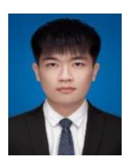

**Tiankuo Yu** (Student Member, IEEE) received the B.S. degree in engineering from Yanshan University, Qinhuangdao, China, in 2022. He is currently pursuing the Ph.D. degree with the State Key Laboratory of Information Photonics and Optical Communication, Beijing University of Posts and Telecommunications, Beijing, China.

His main research interests include computing power network, UAV networks, vehicle networks, deep learning, and semantic communication.

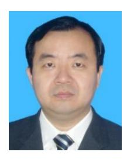

**Jie Zhang** (Member, IEEE) received the B.S. degree in communication engineering and the Ph.D. degree in electromagnetic field and microwave technology from Beijing University of Posts and Telecommunications (BUPT), Beijing, China, in 1993 and 1998, respectively.

He is currently a Professor with the Information Photonics and Optical Communications Institute, BUPT. He has published more than 300 technical papers, authored eight books, and submitted 17 ITU-T recommendation contributions and ten IETF

drafts. He also holds more than 40 patents. His research focuses on architecture, protocols, and standards of optical transport networks.

Prof. Zhang has served as a TPC Member for a number of conferences, such as ACP, OECC, PS, ONDM, COIN, and ChinaCom.

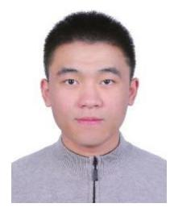

**Chen Zhang** received the bachelor's degree in information engineering from Beijing University of Posts and Telecommunications, Beijing, China, in 2022, where he is currently pursuing the master's degree.

His research primarily focuses on blockchain interchain communication, as well as security and privacy within blockchain. He is dedicated to enhancing the secure verification of massive IoT data within blockchain.

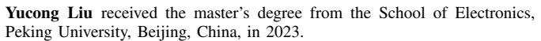

She is currently a Researcher with China Mobile Research Institute, Beijing. Her current research interests are fiber communications, optical transport network technology applications, and optical network intelligence.

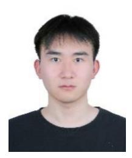

**Wenxin Liu** is currently pursuing the master's degree with the State Key Laboratory of Information Photonics and Optical Communication, Beijing University of Posts and Telecommunications, Beijing, China.

His research interests include deep learning, computing power measurement, object detection, and computational power networks.

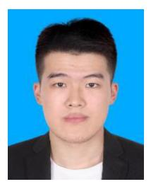

**Wenbo Lin** received the B.S. degree in engineering from Beijing University of Posts and Telecommunications, Beijing, China, in 2021, where he is currently pursuing the M.S. degree in electronic science and technology.

His main research focuses on passive optical network and computing power network.

**Mohamed Cheriet** (Senior Member, IEEE) received the Ph.D. degree from the University of Pierre and Marie Curie (Paris 6), Paris, France, in 1988.

He is currently a Full Professor with the Department of System Engineering, Ecole de Technologie Supérieure, University of Quebec, Montreal, QC, Canada.

Dr. Cheriet was a Fellow of the Canadian Academy of Engineering in 2017, the Engineering Institute of Canada in 2018, and Engineers Canada in 2019.