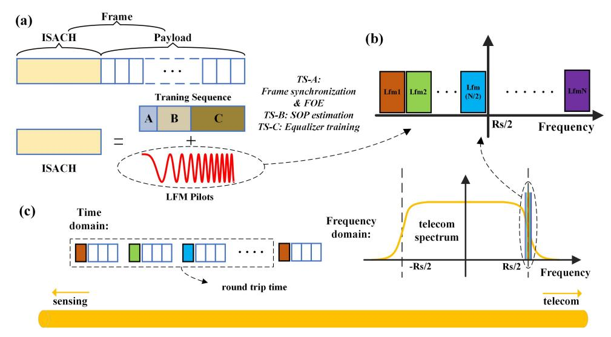
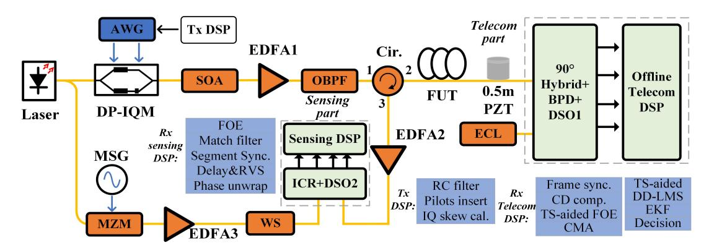
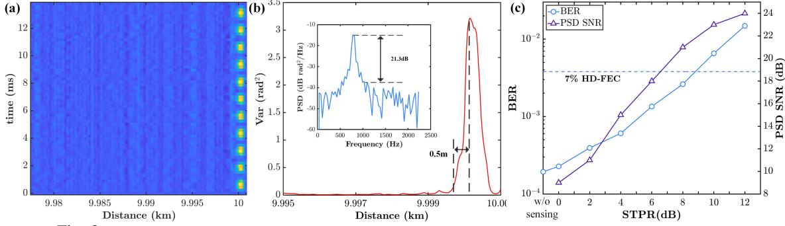

{0}------------------------------------------------

# High-efficiency ISAC to enable sub-meter level vibration sensing for coherent fiber networks

Jingchuan Wang,1 Liwang Lu,1 Li Wang,1 Yaxi Yan,1,2,\* Alan Pak Tao Lau1 and Chao Lu1

*1 Photonics Research Institute, Department of Electrical and Electronic Engineering, The Hong Kong Polytechnic University, Hong Kong, China 2 Hangzhou Institute of Advanced Studies, Zhejiang Normal University, Hangzhou, China \* ya.xi.yan@connect.polyu.hk*

Abstract: We demonstrate 0.5 m resolution vibration sensing and 60 GBaud 16-QAM data transmission with negligible crosstalk over 10 km fiber using a new integrated communication and distributed acoustic sensing scheme with shared spectrum and transmitter. © 2024 The Author(s)

#### 1. Introduction

Data center interconnects(DCI) continue to evolve with ever-increasing capacity for and have undergone tremendous developments [1]. Besides telecommunications, optical fibers have also find extensive applications as distributed sensors, one of which is distributed acoustic sensor (DAS) based on the principle of phase-sensitive optical time-domain reflectometry (ϕ-OTDR). Given the pre-existing abundance of deployed fibers all across the World, adding sensing capabilities to communication links is conceivable to leverage these fibers for the purpose of environmental monitoring, thereby realizing extra values for these optical networks. A DAS co-propagation experiment with coherent transmission over 1000 km was carried out using bi-directional inline Raman amplification [2] followed by field trials of DAS in short-reach coherent communication were successfully demonstrated [3]. For most integrated sensing and communication (ISAC) systems, sensing and communication actually run independently and only the optical fiber is shared. Moreover, dedicated channels are reserved for sensing to avoid crosstalks between sensing and communication, which is not desirable for telecomm. operators. With the aim to make ISAC systems more compact, the spectrum and communication hardware can be shared by sensing, such that the system's cost can be reduced. Some recent proposals include [4] which recovers the vibration signal during the phase recovery stage of digital signal processing (DSP), while the forward transmission-based sensing scheme imposes fundamental limitations on the localization accuracy and the handling of multiple vibration sources. An ISAC paradigm merges DAS and intensity-modulation direct-detection (IM-DD) transmission by replacing the optical carrier with the linear frequency modulation (LFM) carrier is reported in [5]. However, this integration scheme only works for IMDD systems.

In this paper, we propose a simple ISAC solution by inserting LFM sensing probes into the training symbols of communication data frames, sharing the spectrum and transmitter but time staggered with the payload. Multiple LFM probes with different center frequencies are generated within the round trip time of the fiber under test (FUT) to improve the signal-to-noise ratio (SNR) of sensing signals and mitigate the interference fading. The use of LFM probes helps to achieve sub-meter resolution of vibration sensing, which is very important for applications such as detection of small vehicles and pedestrians in an urban environment. We experimentally demonstrate simultaneous 60 GBaud 16-QAM data transmission and vibration sensing with a spatial resolution of 0.5 m. The influence of sensing on communication is negligible when the sensing power is set to a relatively low level. Such a scheme does not require extra dedicated wavelength channels as it exploits the existing frame structure of communication data for sensing purposes.

## 2. Operating Principles

Communication symbol sequences are commonly encapsulated within a data frame preceding their transmission. Hence, it is often desired to include a training sequence preceding the payload to facilitate rapid adaptation to channel fluctuations and ensure the convergence of the equalizer. For example, according to the ITU-T standard of 50G-PON [6], the preamble time of burst-mode is recommended over 100 ns, which gives the sufficient time length to insert sensing probes. Staggering the time of sensing probe and telecom payload avoids the crosstalk between them such as cross phase modulation due to the high power of sensing pulse. As shown in Fig. 1(a), we design the ISAC header (ISACH) comprised of training sequences for telecom and a frequency-diverse LFM pilot for sensing. In terms of frames within the round trip time, each can have a unique LFM pilot with a different center frequency. The number of LFM pilots *N* depends on the round trip time and generally we can get more LFM pilots for longer fiber in practice to improve the SNR of sensing signals and eliminate the interference. Given that LFM sensing probes typically operate at M-Hz level, while telecom signals operate at G-Hz level, we share the bandwidth between them by placing the LFM pilots at the roll-of area to minimize the influence on the

{1}------------------------------------------------

Fig. 1. (a) Frame structure comprised of ISACH and telecomm. payload; (b) frequency multiplexed LFM pilots; (c) data frames in time and frequency domain.

training sequence. Indeed the influence is negligible because the aim of training sequences is to converge instead of better bit error ratio (BER) performance and they are mostly composed of lower order modulation format or lower symbol rate, which is more robust to noise.

At the telecom side, we first use the training sequence to fast converge to the optimal equalizer taps, and then the payloads are continuously demodulated by initializing the equalizer from training sequence. As shown in Fig. 1(a), TS-A serves as the function of frame synchronization and frequency offset estimation (FOE), while TS-B&C are respectively used for state-of-polarization (SOP) estimation and equalizer training. It should be noted that as the sensing signal is within the training sequence, a small SNR degradation to the training sequence would be unavoidable even though the sensing signal is located at the area of roll-off edge. However, there is typically enough SNR margin to accommodate such situation as they are typically composed of lower-order modulation formats hence higher SNR margin

At the sensing side, pulse compression technique is used to increase the sensing resolution and reduce the average power of sensing signal. The continuous LFM pilots could equivalently be compressed into a pulse by using the matched filter [7]:

$$R_{N,otdr}(t) = P_N(t) * h(t) \otimes P_N(t) = (P_N(t) \otimes P_N(t)) * h(t)$$

$$\tag{1}$$

where *PN*(*t*) is the *N*-th LFM pilot, *h*(*t*) is the ideal impulse response of fiber Rayleigh backscttering (RBS) trace, *RN*,*otdr*(*t*) is the *N*-th recovered ϕ-OTDR trace, ∗ and ⊗ stand for the convolution and correlation operation respectively. The sensing resolution relies on the pulse term *PN*(*t*)⊗*PN*(*t*), namely, the sweeping frequency range of each LFM pilot. Due to the frequency orthogonality of LFM pilots, we could obtain *N* ϕ-OTDR traces during one round trip time, which makes it possible to sum up all these traces for fading elimination and SNR improvement. As Fig. 1(b) and (c) show, the frequency range of LFM pilots centers at half the baud rate (*Rs*) of payloads, locates at the roll-off area where the spectral component of the telecom signal is not large.

#### 3. Experimental results

We conduct a 60 GBaud 16QAM experiment to demonstrate the proposed ISAC scheme and the setup is depicted in Fig. 2. An AWG (Keysight M8196A) is used to generated a dual polarization signal with a roll off factor of 0.02. The narrow linewidth laser (NKT E15) is equally divided into two directions, one of which is sent to the dual polarization IQ modulator. The other one is frequency shifted by a microwave signal generator (Keysight E8257D) and then filtered by waveshaper as the local oscillator. A 0.5m PZT driven by 800 Hz 8 Vpp sine wave is put at the end of 10 km fiber to test the vibration, which is followed by 4 BPDs and a telecom oscilloscope (Keysight DSAZ594A). At the sensing side, an ICR (Neophontics class 40) and a 4-channel oscilloscope (Keysight MSOS404A) enable polarization diverse reception of RBS signal to eliminate the polarization fading.

Due to the limitation of memory depth of AWG, we use shutter semiconductor optical amplifier (SOA) to cut off the signal at the period of round trip time to avoid the superimposition of Rayleigh backscattering signals. Therefore, in this experiment, we only use four frames during one round trip time, each of which has an 182 ns ISACH consisting of QPSK training sequences and a 250 MHz LFM pilot centered at different frequencies (corresponding to 0.5m resolution). The four dual polarization ϕ-OTDR traces obtained by four matched filters are rotate-vector summed (RVS) up [8], synthesizing one ϕ-OTDR trace without fading. Because we use one

{2}------------------------------------------------

Fig. 2. 60 GBaud 16QAM ISAC experiment setup. AWG: arbitary waveform generator, WS: waveshaper

AWG and IQM to generate both the sensing and telecom signal, it would address the power distribution between LFM pilots and telecom signal defined as sensing-to-telecom power ratio (STPR). Fixing the launch power of payloads and training sequence to 3 dBm, we change the STPR to study the performance of sensing and telecom. The adaptive equalizers are converged for all the cases. It's worth noting that before telecom signals are collected by DSO1 a pre low pass filter has been imposed to reduce the quantization noise and at the receiver a digital post low pass filter is used to fully eliminate the LFM pilots' influence on training sequence, which could maximize the SNR of payloads. As shown in Fig. 3(a) and (b), 800 Hz sinusoidal vibration is successfully demodulated with a resolution of 0.5 m, and the inset of (b) indicates that the SNR of demodulated vibration in power spectrum density (PSD) is about 21 dB at *ST PR* = 8*dB*. Because the sensing pilots and telecom payloads share the same transmitter, higher STPR means lower telecomm signal power which in turn requires a higher EDFA gain to keep the telecomm signal power to 3 dBm and hence degrade the telecom performance. Fig. 3(c) shows that when *ST PR* = 8*dB* both sides achieve a favorable result. It should be noted that if the memory depth limit of AWG is relaxed, all the frames during one round trip time could be used for sensing which can further reduce the sensing power and improve the sensing and communication performance.

Fig. 3. (a) Demodulated waterfall plot and (b) phase variation along the fiber at *ST PR* = 8*dB*; (c) the BER perormance of telecom payloads and sensing PSD SNR performance with the change of STPR

### 4. Conclusions

We present a simple and cost-effective ISAC scheme by inserting LFM sensing probes into the training sequence part of communication data frames and sensing and communication share the transmitter. Sensing probes are located at the roll-of area of communication signal spectra. The use of LFM pilots helps to reduce the peak power of sensing pulses and enhance the spatial resolution of DAS. Results show that vibration sensing with 0.5 m spatial resolution is achieved over a 10 km fiber. Both sensing and communication can achieve good performance as long as the power of LFM pilots remains at a low level.

#### 5. Acknowledgement

We acknowledge the support of GRF funding (PolyU 15217620) and NSFC under grant 62205297 and also Dr. Wu Xiong from Huawei and Mr. Xu Chuang for their help and advice in the work.

## References

- 1. T. Pfeiffer, et al., J. Opt. Commun. Netw., vol. 14, 2022.
- 2. E. Ip, et al., J. Lightwave Technol, vol. 41, 2023
- 3. Y. K. Huang, et al., Prof. OFC, Th1K.4 (2020)
- 4. E. Ip, et al., J. Lightwave Technol, vol. 40, 2022
- 5. H. He, et al., Light Sci. Appl., vol. 12, 2023
- 6. ITU-T *G.9804.3*, 2021.
- 7. J. Jiang, et al., Opt. Lett., vol. 46, 2021
- 8. D. Chen, et al., Opt. Express, vol. 46, 2018