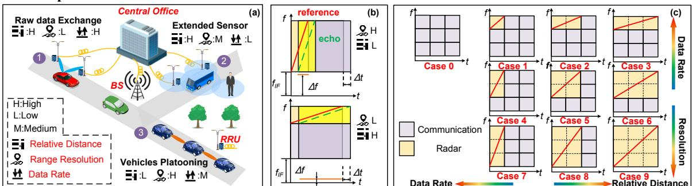
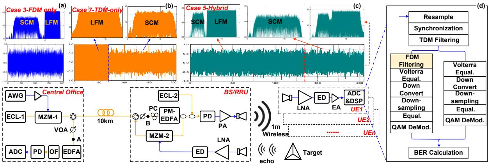
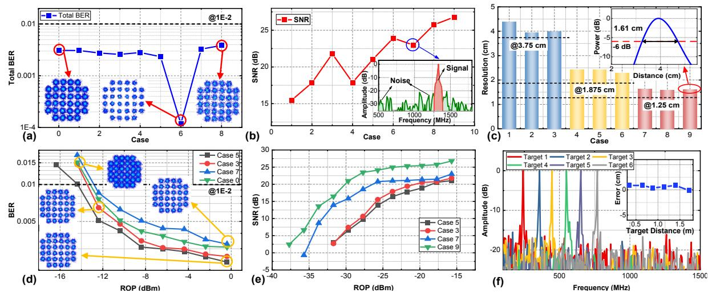
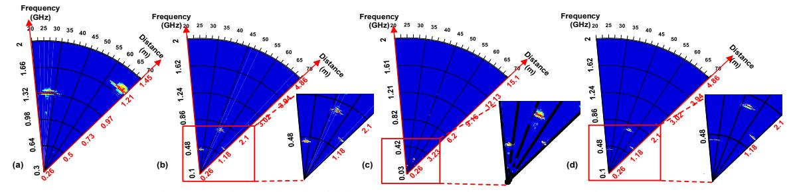

{0}------------------------------------------------

# Photonic-based W-band Flexible TFDM Integrated Sensing and Communication System for Fiber-wireless Network

Boyu Dong1,2, Junlian Jia1,2, Guoqiang Li1,2, Jianyang Shi1,2,3, Haipeng Wang1,2, Zhenzhou Tang4, Junwen Zhang1,2,3\*, Shilong Pan4, and Nan Chi1,2,3

1Shanghai ERC of LEO Satellite Communication and Applications, Shanghai CIC of LEO Satellite Communication Technology, Fudan University, Shanghai 200433, China,

2Key Laboratory of EMW Information, Ministry of Education, Fudan University, Shanghai 200433, China, 3Peng Cheng Laboratory, Shenzhen 518055, China,

4Key Laboratory of Radar Imaging and Microwave Photonics, Ministry of Education, Nanjing University of Aeronautics and Astronautics, Nanjing, 210016, China. \*junwenzhang@fudan.edu.cn

**Abstract:** We proposed and experimentally demonstrated a novel W-band photonic-based integration of sensing and communication system for the fiber-wireless integrated network with flexible waveforms and TFDM resource allocation capability, achieving adaptive sensing resolution and communication data-rates. © 2023 The Author(s)

### 1. Introduction

As a key technology in the future 6G, the integration of sensing and communication (ISAC) provides integration and coordination gains [1], which can be combined with artificial intelligence to facilitate and improve our lives in rich application scenarios. The frequency band used by 6G has been extended to millimeter wave (MMW) and even terahertz band, and higher frequency bands provide more available spectrum resources, which makes ISAC at the MMW band great potential.

The bandwidth of the signal in the traditional electrical ISAC system is seriously limited by the bandwidth of the electronic devices, and the multi-level frequency multiplication makes the system structure complex. The photonic-based ISAC system can quickly generate high-frequency broadband signals and it is more consistent with the architecture of the 6G mobile communication network [2]. The current ISAC systems that can meet the requirements of high-resolution sensing and high-speed communication simultaneously combine radar signals and communication signals in the form of frequency division multiplexing (FDM) [3-4] or time division multiplexing (TDM) [5-6], which is difficult to achieve flexible adjustment between sensing and communication. And the fiber transmission for the photonics ISAC system is rarely included in current research.

In this paper, we proposed and experimentally demonstrated a W-band flexible time-frequency-division multiplexed (TFDM) photonic-based ISAC system for the fiber-wireless integrated network. In this system, we used optical heterodyne to generate broadband 96.5 GHz W-band signals. The signals were flexibly combined by linear frequency modulation (LFM) signals and subcarrier modulated (SCM) signals in the form of FDM, TDM, or a mixture of the two, which can be flexibly switched between high-resolution sensing and high-speed communication according to application scenarios. In the experiment system, we achieved a high resolution from 1.59 cm to 4.39 cm and a high data rate from 15 Gbit/s to 60 Gbit/s through a 10-km fiber and a 1-m wireless W-band MMW link. The distance errors after calibration were less than 3 cm in all cases.

# 2. Principles

Fig. 1. (a) concept of photonic-based ISAC networks, (b) principle of de-chirp, (c) concept of flexible waveforms

As shown in Fig. 1(a), in different application scenarios, there are different requirements for communication and sensing. In the central office (CO), the flexible TFDM integrated signals which are consisted of the LFM and SCM

{1}------------------------------------------------

signals are generated and transmitted to the base station (BS) and other remote radio units (RRUs) with ISAC functions through the optical fiber. The optical-to-electrical conversion is completed in the BS and RRUs to generate the MMW signals. The BS and RRUs receive the echo reflected by the targets, and transmit the de-chirped signals back to the CO for centralized processing.

The range resolution can be expressed as  $\delta_r = c/2B_r$ , where c is the velocity of light, and  $B_r$  is the bandwidth of LFM. The data rate is directly related to the SCM bandwidth  $B_c$ . The trade-off between resolution and data rate can be realized by adjusting  $B_r$  and  $B_c$ . There are special requirements for relative distance in some scenarios. As shown in Fig. 1(b), the slope k of the LFM signal will affect the relative distance, which can be expressed as  $k = B_r/T_{LFM}$ , where  $T_{LFM}$  is the duration time of one LFM chirp. The relationship between the frequency and the relative distance can be described as  $\Delta R = cT_{LFM}\Delta f/2B_r$ , where  $\Delta f$  is the frequency of the de-chirped signals as shown in Fig.1(b). In the case of a fixed intermediate frequency (IF), when using the LFM signal with a larger k, the  $\Delta f$  will become larger and limit the farthest detection distance. On the contrary, if the LFM signal with a smaller k is used, a longer detection distance can be achieved. If the  $T_{LFM}$  increases, the ambiguity distance will increase, which is conducive to long-range detection.

To meet the requirements of complex and changeable scenarios, we designed integrated waveforms that can be flexibly adjusted, as shown in Fig. 1(c). Among them, case 3 and 6 are FDM waveforms, case 7 and 8 are TDM waveforms, and the rest of the waveforms are mixed except case 0 and 9. By adjusting the  $B_c$ ,  $B_r$ , and the slope k, time and spectrum resources can be allocated more reasonably, and the communication rate can be increased as much as possible while satisfying the sensing performance.

# 3. Experiment and Discussions

Fig. 2. Experimental setup, (a)-(c) the time-domain waveform and spectrum of case 3, 5, and 7, (d) offline DSP

The experiment setup and the offline DSP are shown in Fig. 2. In the CO, the LFM and SCM 32-quadrature amplitude modulation (QAM) signals with different bandwidths and durations were generated according to the requirements of the application scenarios. After they were combined, the signals were up-sampled and moved to an IF band ( $f_{IF}$ =2 GHz). The mixed signals were normalized in the time domain with the same peak-to-peak voltage. The total bandwidth of the signal was 12 GHz. To avoid mutual interference between SCM and LFM, in the case of FDM, the bandwidth of each cell of SCM in Fig. 1(c) was 3 GHz. In the case of TDM, SCM used all the bandwidth. In Fig. 1(c), the bandwidth of each cell of the LFM signal was 4 GHz. The duration of each cell is 68.27 ns, and the total duration of the signal was 204.8 ns. Finally, the integrated signals were generated by an arbitrary waveform generation (AWG) with a sampling rate of 60 GSa/s. The light emitted by ECL-1 working at 193.1 THz was modulated by MZM-1 operating at the quadrature bias point.

The signal light was divided into two paths after being transmitted over a 10-km optical fiber. One path was coupled with the local oscillator (LO) light of ECL-2 (operating at 193.1965 THz), and then generated the W-band signal through a 100 GHz high-speed photodetector (PD). The other path was modulated by the echo, and the echo was de-chirped to generate the  $\Delta f$  related to the distance in MZM-2. The frequency difference was sent back to the CO through the 10-km optical fiber for centralized processing. After a 1-m wireless transmission, at the user end (UE), the MMW signals were captured by the horn antenna (HA) and down-converted to the IF band via an envelope detector (ED), and the offline DSP was performed subsequently.

In the experiment, we first analyzed the performance of the cases shown in Fig. 1(c). As shown in Fig. 3(a), the BERs of cases 0-8 are under the threshold of 1E-2. As shown in Fig. 3(b), when more time and frequency resources

{2}------------------------------------------------

were provided to LFM signals, the higher signal-to-noise ratio (SNR) was. The experimental results in Fig. 3(c) show that the measured resolution is slightly higher than the theoretical value. Then we explored the influence of received optical power (ROP). In the experiment, we selected several typical cases, such as cases 0, 3, 5, 7, and 9. We changed the ROP of point A and point B through a variable optical attenuator (VOA), and the results are shown in Fig. 3(d) and (e). To verify the distance error of the system, we used the waveform of case 5 to detect targets with distances of 0.35, 0.65, 0.88, 1.14, 1.4, and 1.71 m respectively, and the obtained spectrum is shown in Fig. 3(f). The distance error after external calibration was less than 1 cm. We also carried out the same verification for other cases, and found that in all cases, the distance error after calibration was less than 3 cm.

Fig. 3. (a) BER for case 0-8, (b)-(c) SNR and range resolution for case 1-9, (d) BER with RoP for case 0, 3, 5, 7, (e) resolution with ROP for case 3,5,7,9 (f) range profile of multi-targets and distance errors after calibration using case 5

To illustrate the effect of the slope k on the detection range, we carried out relevant experiments. In the experiment, we placed targets with different distances at different angles, and the farthest target distance was 1.71 m. We used the turntable to scan within a certain angle range, and the results are shown in Fig. 4. It can be seen that the slope k in case 7 is the largest, so for the farthest target, its  $\Delta f$  appeared outside the  $f_{IF}$ , while for the waveform with a smaller k, such as case 3, its detection distance can be farther.

Fig. 4. Detection results of multiple targets (a) case 7, (b) case 5, (c) case 3, (d) case 9

## 4. Conclusion

We proposed and experimentally demonstrated a W-band flexible TFDM photonic-based ISAC system for the fiber-wireless integrated network. The LFM and SCM signal can be flexibly combined according to the application scenarios to realize the trade-off between high-resolution sensing and high-speed communication. In the experimental system, we realized 1.59 cm to 4.39 cm high resolution sensing and 15 Gbit/s to 60 Gbit/s high data rate communication through 10-km fiber and 1-m wireless W-band MMW link.

**Acknowledgment**: This work is partially supported by National Key Research and Development Program of China (2022YFB2903600), National Natural Science Foundation of China (62235005, 62171137, 61925104, 62031011), Natural Science Foundation of Shanghai (21ZR1408700), and the Major Key Project PCL.

# References

- [1] Y. Cui, et al., IEEE Network, 2021.
- [2] S. Jia et al., Journal of Lightwave Technology, 2018.
- [3] Y. Wang, et al., Optics. Express, 2022.

- [4] R. Song, et al., Optics. Letters, 2022.
- [5] Y. Wang et al., Journal of Lightwave Technology, 2022.
- [6] Y. Wang et al., Optics. Letters, 2021.