{0}------------------------------------------------

# Photonic-Based W-Band Integrated Sensing and Communication System With Flexible Time-Frequency Division Multiplexed Waveforms for Fiber-Wireless Network

Boyu Dong ®, Junlian Jia ®, Li Tao ®, Guoqiang Li ®, Zhongya Li ®, Changle Huang ®, Jianyang Shi ®, *Member, IEEE*, Haipeng Wang ®, *Senior Member, IEEE*, Zhenzhou Tang ®, *Member, IEEE*, Junwen Zhang ®, Shilong Pan ®, *Fellow, IEEE, Fellow, OSA*, and Nan Chi ®, *Member, IEEE, Fellow, OSA* 

(Top-Scored Paper)

Abstract—In the upcoming 6G, the integrated sensing and communication (ISAC) system in the millimeter wave (MMW) band will have a vital role in numerous application scenarios, enhancing the convenience of our lives. The photonic-based MMW ISAC system can exploit the broad bandwidth of photonic devices, significantly improving system performance. Furthermore, the use of photonic devices enables the seamless integration of the ISAC system with the fiber-wireless network. In this paper, we proposed a simple-structured photonic-based W-band ISAC system, incorporating optical fiber transmission into the system. Additionally, we

Manuscript received 31 May 2023; revised 27 November 2023; accepted 10 January 2024. Date of publication 15 January 2024; date of current version 16 February 2024. This work was supported in part by the National Key Research and Development Program of China under Grant 2022YFB2903600, in part by the National Natural Science Foundation of China under Grants 62235005, 62171137, 61925104, and 62071444, in part by the Natural Science Foundation of Shanghai under Grant 21ZR1408700, and in part by the Major Key Project PCL. (Corresponding author: Junwen Zhang.)

Boyu Dong, Junlian Jia, Guoqiang Li, Zhongya Li, Changle Huang, and Haipeng Wang are with the Key Laboratory for Information Science of Electromagnetic Waves (MoE), Department of Communication Science and Engineering, Fudan University, Shanghai 200433, China, also with the Shanghai Engineering Research Center of Low-Earth-Orbit Satellite Communication and Applications, Shanghai 200433, China, and also with the Shanghai Collaborative Innovation Center of Low-Earth-Orbit Satellite Communication Technology, Shanghai 200433, China (e-mail: bydong21@m.fudan.edu.cn; jljia20@fudan.edu.cn; 19210720066@fudan.edu.cn; zhongyali20@fudan.edu.cn; 21210720146@m.fudan.edu.cn; hpwang@fudan.edu.cn).

Li Tao is with the Science and Technology on Electromagnetic Compatibility Laboratory, CSDDC, Wuhan 430000, China (e-mail: tl0930@163.com).

Jianyang Shi, Junwen Zhang, and Nan Chi are with the Key Laboratory for Information Science of Electromagnetic Waves (MoE), Department of Communication Science and Engineering, Fudan University, Shanghai 200433, China, also with the Shanghai Engineering Research Center of Low-Earth-Orbit Satellite Communication and Applications, Shanghai 200433, China, also with the Shanghai Collaborative Innovation Center of Low-Earth-Orbit Satellite Communication Technology, Shanghai 200433, China, and also with the Peng Cheng Laboratory, Shenzhen 518055, China (e-mail: jy\_shi@fudan.edu.cn; junwenzhang@fudan.edu.cn; nanchi@fudan.edu.cn).

Zhenzhou Tang and Shilong Pan are with the National Key Laboratory of Microwave Photonics, Nanjing University of Aeronautics and Astronautics, Nanjing 210016, China (e-mail: tangzhzh@nuaa.edu.cn; pans@nuaa.edu.cn).

Color versions of one or more figures in this article are available at https://doi.org/10.1109/JLT.2024.3354070.

Digital Object Identifier 10.1109/JLT.2024.3354070

designed integrated waveforms for time-frequency-division multiplexing (TFDM), allowing for flexible tradeoffs between data rate, range resolution, and detection distance according to the requirements of application scenarios. As a proof-of-concept, a photonic-based ISAC system for the fiber-wireless network with flexible TFDM waveforms at 96.5 GHz over 10-km fiber transmission was demonstrated, achieving adaptive access rates from 15 to 60 Gbit/s after transmission over 1-m free space, and adaptive range resolutions from 1.53 to 4.39 cm. Moreover, this paper provides a detailed analysis of the causes of system distance error and corresponding solutions. In the experiment, the distance error of the proposed system can be reduced to less than 3 cm after external calibration.

Index Terms—Fiber-wireless network, integrated sensing and communication, microwave photonics.

#### I. INTRODUCTION

HE emergence of advanced technologies has enabled the gradual realization of the "Internet of Everything" in 5G, significantly impacting our daily lives. The upcoming 6G, as the next generation of mobile communication networks, is expected to provide a 100 times higher access speed and 1000 times higher capacity than 5G, leading to an explosive growth in the wireless communication industry. By 2025, it is estimated that the number of globally connected devices will reach 75 billion [1]. Furthermore, this number is expected to grow exponentially with the higher speed offered by 6G. However, the increasing number of mobile communication devices presents a challenge by intensifying the scarcity and value of spectrum resources, especially as the frequency bands for traditional communication have gradually depleted. Hence, enabling the use of higher frequency bands, especially in the millimeter wave (MMW) or terahertz band, is regarded as a critical technology for the successful implementation of 6G [2].

Furthermore, the strong network support of 6G will give rise to an increasing number of diverse scenarios and use cases, such as smart homes [3] and vehicle-to-everything (V2X) [4], and others. These scenarios necessitate intelligent nodes in 6G to

0733-8724 © 2024 IEEE. Personal use is permitted, but republication/redistribution requires IEEE permission. See https://www.ieee.org/publications/rights/index.html for more information.

{1}------------------------------------------------

perceive the surrounding environment and exchange information through communication networks to achieve beyond-horizon cognition [\[5\].](#page-13-0) This implies that radar sensing will no longer serve solely as an auxiliary function but will also need to be more closely integrated with communication. Integration of sensing and communication (ISAC) can yield considerable benefits.

An ISAC system can effectively utilize spectrum resources and avoid mutual interference, thereby saving spectrum resources. Furthermore, the integration of the two can effectively reduce the quantity and weight of hardware, which is crucial in scenarios where the weight and size of payload are strictly limited, such as in low orbit satellites. From a functional perspective, both sensing-assisted communication and communicationassisted sensing can effectively improve the performance of both [\[6\].](#page-13-0) Additionally, in some 6G scenarios, more precise sensing is required, and the activation of the MMW band can meet this requirement precisely. For example, many automotive radars for collision avoidance and high-resolution imaging radars operate in this band [\[7\].](#page-13-0) Therefore, ISAC at the MMW band will become an important means of enriching our lives and playing a crucial role in 6G.

The traditional electrical method of generating MMWs through multi-stage frequency doubling will face severe challenges when operating at higher frequencies and wider bandwidths [\[8\].](#page-13-0) In contrast, photonic-based MMW generation methods can utilize the intrinsic broadband of optical devices and directly generate high-frequency signals [\[9\],](#page-13-0) [\[10\]](#page-13-0) and reduce the electromagnetic interference issues [\[11\].](#page-13-0) Moreover, the photonic-based MMW systems can be integrated seamlessly with existing high-speed optical fiber communication systems to achieve instant sensing and transmission. This means that the radar sensing information can be centrally processed or transmitted to other users through the fiber-wireless network. The fiber-wireless network is a key enabler for achieving highspeed transmission requirements and ultra-dense cell distributions [\[12\],](#page-13-0) as which simplifies the architecture of remote radio units in 6G radio access networks. Additionally, due to the excellent characteristics of photonic devices, such as broad bandwidth, low transmission loss and multi-dimensional multiplexing, photonic-based radar sensing systems can achieve better performance in terms of resolution, coverage, and other aspects [\[13\].](#page-13-0) Based on the above factors, photonic-based MMW/THz ISAC systems have become a more promising solution and have garnered significant attention.

Recently, we proposed and experimentally demonstrated W-band flexible time-frequency-division multiplexed (TFDM) photonic-based MMW ISAC system that fully considered the possibility of integration with the fiber-wireless network [\[14\].](#page-13-0) This paper is an invited extension of the Top-scored Paper at OFC 2023, with some results discussed and presented during the conference. To address the issue of insufficient flexibility in the current time division multiplexing (TDM) or frequency division multiplexing (FDM) photonic-based MMW ISAC system, we designed 10 cases where signals were flexibly combined using LFM signals and subcarrier modulated (SCM) signals in the form of FDM, TDM, or a mixture of the two. These designs enabled flexible switching between high-resolution sensing and high-speed communication according to application scenarios. Moreover, we used the direct laser heterodyning (DLH) method to generate broadband 96.5 GHz W-band signals and incorporated long-distance optical fiber transmission to achieve a more realistic scenario.

We conducted a comprehensive analysis of the key factors influencing system performance. Firstly, we examined the delay caused by link length mismatch and its impact on target ranging. To mitigate ranging errors, we proposed corresponding methods for their elimination. Secondly, we investigated the impact of laser-induced phase noise on system performance in the DLH method. Lastly, we analyzed the influence of the carrier-to-signal power ratio (CSPR) of the transmitted signal on system performance. In our experimental system, we achieved high range resolution ranging from 1.59 cm to 4.39 cm and a high data rate ranging from 15 Gbit/s to 60 Gbit/s. This was accomplished through a combination of a 10-km fiber and a 1-m wireless W-band MMW link. The distance errors after calibration were consistently below 3 cm.

The structure of this paper is organized as follows. Section II provides a summary of current photonic-based MMW ISAC systems. Section [III](#page-3-0) explains the principle of our proposed photonics-based W-band ISAC system. The experimental setup is described in Section [IV.](#page-8-0) The results and analysis are presented in Section [V.](#page-10-0) Finally, Section [VI](#page-13-0) concludes the study.

## II. CLASSIFICATION AND ANALYSIS OF PHOTONIC-BASED MMW ISAC SYSTEMS

To summarize the current research, this paper classifies photonic-based ISAC systems based on signal waveforms or MMW/THz generation methods, and briefly analyzes their different characteristics.

Currently, based on waveform characteristics, photonic-based ISAC systems can be categorized into three types: TDM [\[15\],](#page-13-0) [\[16\],](#page-13-0) [\[17\],](#page-13-0) FDM [\[18\],](#page-13-0) [\[19\],](#page-13-0) [\[20\],](#page-13-0) [\[21\],](#page-13-0) [\[22\],](#page-14-0) [\[23\],](#page-14-0) [\[24\],](#page-14-0) [\[25\],](#page-14-0) and co-frequency and co-time (CFCT) waveforms [\[26\],](#page-14-0) [\[27\],](#page-14-0) [\[28\],](#page-14-0) [\[29\],](#page-14-0) [\[30\],](#page-14-0) [\[31\],](#page-14-0) [\[32\],](#page-14-0) [\[33\],](#page-14-0) [\[34\],](#page-14-0) [\[35\],](#page-14-0) [\[36\].](#page-14-0) Simple TDM or FDM waveforms do not fully utilize system resources, making it difficult to balance sensing and communication performance in complex application scenarios. The CFCT waveforms can be further divided into two categories: radar-centric design (RCD) and communication-centric design (SCD) [\[37\].](#page-14-0) The RCD waveform improves commonly used radar waveforms, such as linear frequency modulation (LFM) signals, by modulating communication information in the amplitude, phase, or frequency of the signal [\[38\].](#page-14-0) This approach minimizes the impact on radar performance, but has a relatively low data rate. On the other hand, a typical SCD waveform uses orthogonal frequency division multiplexing (OFDM) signals for sensing. However, the performance of this method in radar is also limited [\[39\].](#page-14-0)

Moreover, the photonic-based MMW ISAC systems can also be classified based on the method used to generate MMW/THz signals. These include coherent optical carrier beating (OCB), opto-electronic oscillators (OEO), photonic frequency multiplying (PFM), DLH, among others. The OCB method involves

{2}------------------------------------------------

| Waxafarm | Range             | Data rate (Gbps)  | MMW/THz     | Band | Ref        |
|----------|-------------------|-------------------|-------------|------|------------|
| Waveform | resolution(cm)    |                   | Gen. Method |      |            |
| TDM      | 0.94              | 10 (line)         | PFM         | W    | [15]       |
|          | 1.02              | 46.55 (net)       | DLH         | W    | [16]       |
|          | 1.58              | 38.1 (net)        | DLH         | THz  | [17]       |
| FDM      | 0.73(Theoretical) | 56 (net)          | DLH         | THz  | [18]       |
|          | 4.7(Theoretical)  | 2.3 (line)        | PFM         | Ku/K | [19]       |
|          | 30                | 23 (line)         | OCB         | Ka   | [20]       |
|          | 3(Theoretical)    | 78 (line)         | DLH         | W    | [22]       |
|          | 15(Theoretical)   | 3.125 (line)      | DLH         | W    | [23]       |
|          | 2.14              | 18 (line)         | OCB         | V    | [25]       |
|          | 1.53-6.94         | 5.98-41.48 (line) | DLH         | W    | [24]       |
| CFCT     | 1.8               | 0.1 (net)         | PFM         | K    | [26]       |
|          | 1.8               | 1 (net)           | OCB         | V    | [27]       |
|          | 7.5               | 0.3356 (line)     | OEO         | K    | [28]       |
|          | 30(Theoretical)   | 1.56 (net)        | OCB         | Ka   | [29]       |
|          | 1.58              | 8 (line)          | PFM         | V    | [30]       |
|          | 1.76              | 6 (line)          | OCB         | V    | [31]       |
|          | 3.5               | 1 (line)          | OCB         | Ka   | [32]       |
|          | 7.5               | 6.4 (net)         | OEO         | K    | [33]       |
|          | 7.5/1.5           | 12.8/32 (net)     | OEO         | K/W  | [34]       |
|          | 10.4              | 11.5 (net)        | OCB         | Ka   | [35]       |
|          | 1.3               | 6 (line)          | OCB         | THz  | [36]       |
| TFDM     | 1.59-4.39         | 15-60 (line)      | DLH         | W    | This paper |

TABLE I COMPARISON OF PHOTONIC-BASED MMW/THZ ISAC SYSTEMS

modulating the radio frequency (RF) signal onto the Mach-Zehnder modulator (MZM) to generate frequency combs of one or more order sidebands. The signal is then modulated onto a specific frequency comb. The MMW signal associated with the RF signal can be obtained using a photodetector (PD). If the center frequency of the MMW signal needs to be adjusted, a variable RF source is required. The OEO method is capable of generating MMW signals with very low phase noise [\[33\].](#page-14-0) However, it is usually not frequency-agile and requires active electronic and electro-optical components with low loss. This results in reduced performance when generating MMW signals at higher frequencies [\[8\].](#page-13-0) The PFM method typically utilizes a cascaded MZM, which selects appropriate sidebands through a filter and passes them through a PD to generate multiple frequency signals. This method does not require local oscillator (LO) signals. However, when high-frequency MMWs need to be generated, the intermediate frequency (IF) of the signal itself needs to be high, which reduces the efficiency of the spectrum. The DLH method generates MMW signals by heterodyning two free-running external cavity lasers (ECLs). By adjusting the wavelength of the ECLs, fast frequency tuning can be achieved. The frequency range of the generated signal is also determined by the bandwidth of the PD, which is usually large. Hence, the DLH method can easily generate fast, tunable high-frequency broadband signals.

Based on current research progress, Table I summarizes the waveform design methods, important indicators for sensing and communication, methods for generating MMW signals, and frequency bands of photonic-based MMW ISAC systems. As shown in Table I, the DLH method remains the mainstream solution for generating high-frequency MMW signals. From the perspective of system performance, considering complex scenarios, simple TDM and FDM waveforms struggle to balance high-speed communication and high-resolution sensing, while simple CFCT waveforms suffer from poor sensing or communication performance. Furthermore, integrating the system with the fiber-wireless network necessitates the inclusion of long-distance fiber transmission. However, few studies in current research have considered the impact of long-distance fiber transmission on system performance.

In response to the current research status, we proposed flexible TFDM waveforms that consider the indicator requirements of application scenarios to allocate time and bandwidth resources reasonably, allowing for tradeoffs between data rate, range resolution, and detection distance. Compared to current studies, this system exhibited excellent communication and radar sensing performance. To achieve seamless integration with fiber-wireless networks, a 10-km fiber transmission was considered in this paper, and envelope detectors were used at the receiving end of radar and communication to simplify the system. Furthermore, we performed a thorough analysis of some critical issues, including the impact of system delay on distance errors and the effect of laser linewidth on system performance when using DLH method.

{3}------------------------------------------------

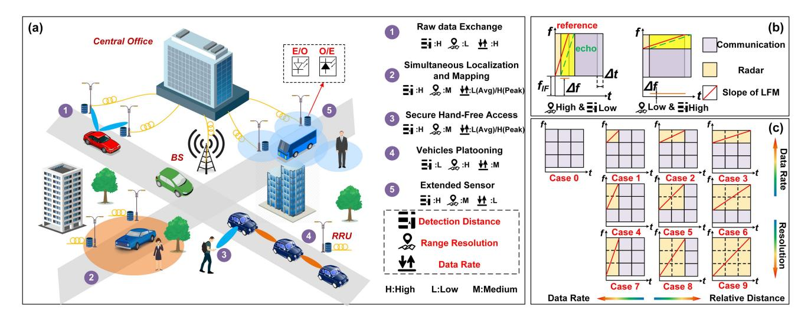

Fig. 1. (a) Concept of photonic-based MMW ISAC networks, (b) principle of de-chirping, (c) concept of flexible TFDM waveforms.

#### III. PRINCIPLE

#### A. Flexible TFDM ISAC Waveforms Design

A typical photonic-based MMW ISAC system for fiber-wireless networks is shown in Fig. 1(a). In this system, signals that enable simultaneous radar sensing and communication are generated in the central office (CO) and transmitted to base stations (BSs) or remote radio units (RRUs) through optical fibers. These signals are then converted into W-band MMW signals through optical-electrical conversion in the BSs or RRUs. The MMW signals are transmitted through wireless channels and communicate with users. The reflected MMW signals from targets are also captured by the BSs or RRUs. After down-conversion, the echo signals can be modulated onto the light and transmitted through optical fibers to the CO, where they can be centrally processed, achieving the sensing of various targets while combining AI to build a more powerful sensing network.

In complex real-world scenarios, different applications have varying requirements for sensing and communication performance. Fig. 1(a) depicts some typical applications in V2X, such as raw data exchange, simultaneous localization and mapping, secure hand-free access, and vehicle platooning. Specific indicators provided in [40] are used to meet the requirements of these use cases. By comparing these indicators, we find that the requirements for range resolution, detection range, and data rate differ among these use cases. This implies that in a specific application scenario, the MMW ISAC system for fiber-wireless networks must have greater flexibility to effectively balance the performance of radar sensing and communication in order to meet all use cases.

In our previous research [24], we achieved a tradeoff between range resolution and data rate by adjusting the signal bandwidth. To achieve even more flexible adjustment, we also considered the time resources of the signal. In this paper, we proposed the concept of TFDM and designed 10 cases to cover a wider range of use case requirements, as shown in Fig. 1(c). We divided the duration time and bandwidth of the signal into a grid of 3

times 3, where the bandwidth of radar sensing is denoted as  $B_r$ . To achieve radar sensing functionality, we used LFM signals, which can be represented as

$$x_{radar}(t) = rect\left(\frac{t}{T_{LFM}}\right) \exp\left[j2\pi \left(f_{IF} + B_c + f_{GAP}\right)t + j\pi kt^2\right]$$
(1)

where  $T_{LFM}$  is the duration time of the LFM signal;  $f_{IF}$  is the intermediate frequency (IF) and a key design parameter in our system;  $B_c$  denotes the bandwidth of the communication signal in the form of FDM;  $f_{GAP}$  is the guard interval frequency used to eliminate mutual interference between the LFM and SCM signal; k is the slope of the LFM signal which can be expressed as  $k = B_r/T_{LFM}$ , and rect(.) is the unit rectangular window function.

The SCM signal is a commonly used communication signal. At the transmitting side, the mapped complex signal undergoes shaping filtering after up-sampling. The shaping filters of the real and imaginary parts of the up-sampling signal can be represented as

$$f_I(t) = h(t)\cos(2\pi f_{IF}t) \tag{2}$$

$$f_O(t) = h(t)\sin(2\pi f_{IF}t) \tag{3}$$

where h(t) is designed as square-root raised-cosine pulse, and the SCM signal can be described as

$$Y(t) = R(\mathbf{C}) * f_I(t) - I(\mathbf{C}) * f_Q(t)$$
(4)

where C is the complex up-sampling signal; R(.) and I(.) denote the real and imaginary parts, respectively, and \* denotes the convolution operation. In this paper, the SCM signal exists in the form of TDM, FDM or a mixture of the two, so (4) can be written as

$$x_{com}\left(t\right) = \begin{cases} Y_{FDM}\left(t\right), 0 < t \le T_{LFM} \\ Y_{TDM}\left(t\right), T_{LFM} < t \le T_{s} \end{cases} \tag{5}$$

where  $Y_{FDM}(t)$  denotes the SCM signal in the form of FDM with a bandwidth of  $B_c$ ; while  $Y_{TDM}(t)$  denotes the SCM signal

{4}------------------------------------------------

in the form of TDM which can use the full signal bandwidth  $B_s$ , where  $B_s = B_r + B_c + f_{GAP}$ ;  $T_s$  is the total duration of the TFDM signal.

The range resolution and data information rate (DIR) are closely related to the bandwidth of the LFM and SCM signals, respectively. Their relationship can be expressed as

$$\delta_r = c/2B_r \tag{6}$$

$$DIR = B_c \log_2(1 + SNR) \tag{7}$$

where *c* denotes the velocity of light and *SNR* denotes the signal-to-noise rate (SNR) of the receiving end. This means that the tradeoff between range resolution and DIR can be realized by adjusting the allocation of the signal bandwidth.

In certain use cases, it may also be necessary to adjust the detection distance. In our system, the maximum detection distance can be expressed as:

$$R_{\text{max}} = \min \left\{ R_{SNR}, R_{IF}, R_{non-blur} \right\} \tag{8}$$

where  $R_{SNR}$  denotes the maximum detection distance determined by the transmission power and receiver sensitivity. According to the radar equation,  $R_{SNR}$  can be represented as

$$R_{SNR} = \left[\frac{P_t G_t G_r \sigma \lambda^2}{(4\pi)^3 S_{i \min}}\right]^{1/4} \tag{9}$$

where  $P_t$  denotes the transmit power,  $G_t$  and  $G_r$  are the gains of the transmit and receive antennas, respectively,  $\sigma$  denotes the radar cross section,  $\lambda$  denotes the wavelength, and  $S_{imin}$  denotes the minimum signal detectable by the receiver. Only when the radar equation is satisfied, subsequent calculations and processing are meaningful.

The detection distance is also limited by the IF of the signal. In Fig. 1(b), relationship between the target distance and the frequency after de-chirping can be obtained, which can be expressed as:

$$\Delta f = \frac{B_r}{T_{LFM}} \frac{2\Delta R}{c} \tag{10}$$

where  $\Delta f$  denotes the frequency after de-chirping and  $\Delta R$  denotes the distance of the target. Therefore, the maximum detection distance corresponding to the IF can be represented as

$$R_{IF} = \frac{cT_{LFM}f_{IF}}{2B_r} = \frac{cf_{IF}}{2k} \tag{11}$$

By combining (11) and Fig. 1(b), we can adjust the detection distance by adjusting k when the IF is fixed. Furthermore, we can adjust the bandwidth  $B_r$  and duration  $T_{LFM}$  to further adjust the detection distance.

In addition to  $R_{SNR}$  and  $R_{IF}$ , the phenomenon of distance ambiguity can also affect the detection distance of the system. Unlike pulse radar systems where the maximum unambiguous distance is determined by the repetition frequency of pulses (PRF), the waveforms designed in our system are a hybrid between continuous wave radar and pulse radar. Specifically, the maximum unambiguous distance is related to the duty ratio of the signal.

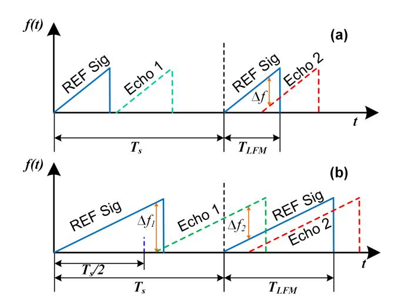

Fig. 2. Principle of maximum unambiguous distance (a) waveform with low duty ratio, (b) waveform with high duty ratio.

From Fig. 2(a), it can be observed that when the duty ratio of the LFM signal is less than 50%, there will be no distance ambiguity if the delay of the echo is less than the  $T_{LFM}$  (Echo 2 in Fig. 2(a)). However, if the delay of the echo is larger than the  $T_{LFM}$  (Echo 1 in Fig. 2(a)), there will be no beat frequency, and the maximum unambiguous distance is related to the  $T_{LFM}$ . When the duty ratio is larger than or equal to 50%, as shown in Fig. 2(b), if the delay of the echo is greater than  $T_s/2$ (Echo 1 in Fig. 2(b)), the echo will beat with the two reference signals before and after and the frequency  $\Delta f_2$  generated with the reference signal at the next transmission time is less than the frequency  $\Delta f_1$  generated with the reference signal at the current transmission time, resulting in distance ambiguity. When the delay of the echo is less than  $T_s/2$  (Echo 2 in Fig. 2(b)), this phenomenon will not occur. To avoid ambiguity, we only detect targets with delay within  $T_s/2$ , assuming that the first beat frequency component corresponds to the target. Based on the above, the maximum unambiguous distance in this system can be expressed as:

$$R_{non-blur} = \begin{cases} cT_{LFM}/2, & \text{duty ratio} < 50\% \\ cT_s/4, & \text{duty ratio} \ge 50\% \end{cases}$$
 (12)

By designing the slope and duty ratio of the LFM signal, we can adjust the maximum detection distance. Based on the previous adjustment strategies for range resolution and DIR, we designed an integrated waveform that can be flexibly adjusted to meet the requirements of complex and ever-changing scenarios, as shown in Fig. 1(c). Among them, case 3 and 6 are FDM waveforms, case 7 and 8 are TDM waveforms, case 0 is a pure SCM signal, case 9 is a pure LFM signal and the rest of the waveforms are mixed. By adjusting the bandwidth ( $B_c$  and  $B_r$ ) and duration ( $T_{LFM}$ ) of the waveforms, time and spectrum resources can be allocated more reasonably and the data rate can be increased as much as possible while still satisfying the sensing performance.

{5}------------------------------------------------

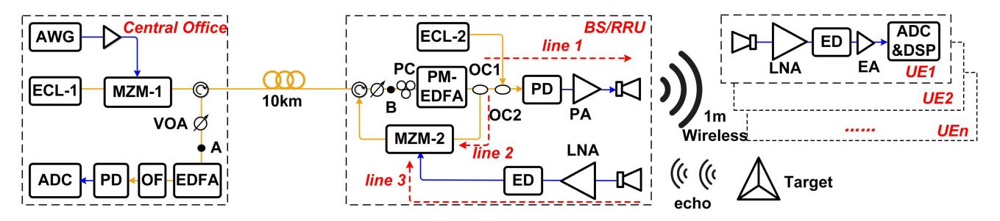

Fig. 3. Experimental setup of the photonic-based W-band ISAC system for fiber-wireless network. AWG: Arbitrary waveform generator, ECL: External cavity laser, EA: Electrical amplifier, MZM: Mach-Zehnder modulator, VOA: Variable optical attenuator, PM-EDFA: Polarization-maintaining erbium-doped fiber amplifier, PC: Polarization controller, OC: Optical coupler, PA: Power amplifier, PD: Photodiode, HA: Horn antenna, LNA: Low noise amplifier, ED: Envelope detector, OF: Optical filter, ADC: Analog-to-digital converter, DSP: Digital signal processing.

## B. Photonic-Based W-Band ISAC System for Fiber-Wireless Network

Fig. 3 shows the scheme and experimental setup of our proposed photonic-based W-band ISAC system for fiber-wireless network. Firstly, one case of the TFDM waveforms will be selected in the CO according to the requirements of the application scenario. The selected waveform will be modulated by MZM-1 onto the light generated by ECL-1.

In general, the output of MZM-1 can be mathematically represented as:

$$E_{MZM-1}(t) = E_{c1} \exp\left(j\omega_{c1}t\right) \cos(m_1 \cos \omega t + \theta/2) \quad (13)$$

where  $E_{c1}$  denotes the amplitude of the light emitted by ECL-1;  $\omega_{c1}$  denotes the frequency of the light;  $m_1$  denotes the modulation index of MZM-1, where  $m_1 = \pi V/V_{\pi}$ , V is the amplitude of the ISAC signal, and  $V_{\pi}$  is the half wave voltage of MZM-1;  $\theta = \pi V_{DC}/V_{\pi}$ ,  $V_{DC}$  is the bias voltage and when the MZM-1 operates at the quadrature bias point (QBP), minimum transmission point (MITP), and maximum transmission point (MATP),  $\theta$  is equal to  $\pi/2$ ,  $\pi$  and  $2\pi$ , respectively; and  $\omega$  denotes the frequency of the modulation signal.

In our system, MZM-1 operates at the QBP, in the case of small signal modulation, whose output can be represented as

$$E_{MZM-1}(t) \propto E_{c1} \exp(j\omega_{c1}t)$$

$$\cdot \left[ J_0(m_1) + J_1(m_1) \left[ \exp(j\omega t) + \exp(-j\omega t) \right] \right]$$
(14)

where  $J_n$  (n=0,1) denotes the first kind of n-order Bessel function, and for the convenience of derivation, the frequency of the TFDM integrated signal can be simplified as

$$\omega = \omega_{IF} + \omega_{com} + 2\pi kt \tag{15}$$

where  $\omega_{IF}$  denotes the IF of the TFDM integrated signal;  $\omega_{com}$  denotes the bandwidth of the communication signal in the form of FDM and the guard interval frequency.

The modulated optical signal is transmitted through the optical fiber and coupled with the LO light emitted by ECL-2 through a coupler. The coupled optical signal can be represented as

$$E_{OC-2}(t) \propto E_{MZM-1}(t) + E_{c2} \exp(j\omega_{c2}t)$$
 (16)

where  $E_{c2}$  denotes the amplitude of the LO light emitted by ECL-1;  $\omega_{c2}$  denotes the frequency of the LO light. The coupled optical signal undergoes square-law detection by the high-speed PD and is converted into an electrical signal. The output of the PD can be expressed as

$$I_{PD1}(t) \propto R \begin{cases} A_{DC} + A_1 \cos \omega t + A_2 \cos 2\omega t + \\ A_3 J_0(m_1) \cos (\omega_{c2} - \omega_{c1}) t + \\ A_4 J_1(m_1) \cos (\omega_{c2} - \omega_{c1} \pm \omega) t \end{cases}$$
(17)

where R denotes the responsivity of PD1;  $A_i$  denotes the amplitude of each component. Subsequently, the signal passes through a power amplifier (PA) and horn antenna (HA), and their frequency response can be modeled as a bandpass filter. Therefore, the signal transmitted through the HA can be represented as

$$E_{MMW}(t) \propto A_{carrier} J_0(m_1) \cos(\omega_{c2} - \omega_{c1}) t + A_{sia} J_1(m_1) \cos(\omega_{c2} - \omega_{c1} + \omega) t$$
 (18)

where  $A_{carrier}$  and  $A_{sig}$  denotes the amplitude of carrier and signal respectively;  $\omega_{c2}$ - $\omega_{c1}$  represents the frequency of the MMW signal. From (18), it can be observed that rapid tuning of the transmitted signal frequency can be achieved by adjusting the wavelengths of the LO and signal light and the signal frequency is determined by the bandwidth of the high-speed PD.

At the user end (UE), the transmitted MMW TFDM signal can be obtained through a low noise amplifier (LNA) and an envelope detector (ED), and the output of the ED can be represented as

$$E_{ED-com}(t) \propto G\left\{\cos \omega t\right\}$$
 (19)

where G denotes the responsivity of the ED at the UE. The communication information can be restored through a series of digital signal processing (DSP) processes.

It is worth noting that the wireless transmission of a double-sideband modulation signal in our system would raise a concern for the low spectral efficiency. To address this, utilizing a single-sideband (SSB) modulation signal can more effectively utilize the bandwidth of device, thereby improving system performance. To achieve down-conversion of SSB modulation signals using EDs, the generalized Kramers–Kronig receiver proposed in [41] can be used. This approach not only simplifies the system but also enhances spectral efficiency.

{6}------------------------------------------------

After being reflected by the targets, the transmitted MMW ISAC signals will be captured by the HA in the BS or RRU and the IF echo can also be obtained through the LNA and ED. The frequency of the IF echo signal can be expressed as:

$$\omega' = \omega_{IF} + \omega_{com} + 2\pi k (t + \tau) \tag{20}$$

where  $\tau$  represents the delay related to the distance of the target. The output of the ED in BS or RRU can be represented as

$$E_{ED-radar}(t) \propto G\{\cos \omega' t\}$$
 (21)

Subsequently, the IF echo signal is modulated onto the reference optical signal through MZM-2 and the frequency composition of the reference optical signal is the same as the output of MZM-1, as shown in (14). MZM-2 operates at the quadrature bias point, in the case of small signal modulation, whose output can be represented as

$$E_{MZM-2}(t)$$

$$\propto \begin{cases}
J_{0}(m_{2}) J_{0}(m_{1}) \exp(j\omega_{c1}t) + \\
J_{0}(m_{2}) J_{1}(m_{1}) \exp[j(\omega_{c1}t \pm \omega t)] + \\
J_{1}(m_{2}) J_{0}(m_{1}) \exp[j(\omega_{c1}t \pm \omega' t)] + \\
J_{1}(m_{2}) J_{1}(m_{1}) \exp[j(\omega_{c1}t \pm k\tau t)] + \\
J_{1}(m_{2}) J_{1}(m_{1}) \exp[j(\omega_{c1}t \pm (\omega t + \omega' t))]
\end{cases} (22)$$

where  $m_2$  denotes the modulation index of MZM-2.

The optical signal after MZM-2 is then transmitted back to the CO through the optical fiber. Here, the signal is amplified and enters the optical filter (OF), where the +1 order sideband is filtered out. The output of the optical filter can be expressed as

$$E_{OBPF}(t) \propto \begin{cases} J_0(m_2) J_1(m_1) \exp\left[j\left(\omega_{c1}t + \omega t\right)\right] + \\ J_1(m_2) J_0(m_1) \exp\left[j\left(\omega_{c1}t + \omega' t\right)\right] \end{cases}$$
(23)

The filtered optical signal then enters a low-speed PD and its output can be represented as

$$I_{PD2}(t) \propto R \left\{\cos 2\pi k \tau t\right\}$$
 (24)

It means that we can perform a simple fast Fourier transform (FFT) to obtain the distance of the target.

Moreover, this system possesses the theoretical capability to detect the radial velocity of moving targets. The Doppler frequency, which determines the radial velocity, can be obtained using the Doppler-FFT method, as thoroughly explained in [42]. In other words, by conducting a two-dimensional FFT on the echoes within the coherent time, the peak coordinates represent both the distance and Doppler frequency of the target. Interestingly, the photonic de-chirping structure proposed in our paper offers additional possibilities for Doppler detection. Instead of utilizing the sawtooth-shaped LFM signal, we can employ a triangular-shaped LFM signal with positive and negative frequency modulation intervals, enabling range-Doppler decoupling. The radial velocity and distance can be deduced by analyzing the frequency difference obtained through the beating process with the reference signal.

The structure designed in this paper allows for centralized processing of radar sensing information in the CO. It can be foreseen that by combining AI technology, this centralized processing approach can form a strong sensing network and provide greater convenience for our daily lives.

#### C. The Influence of System Delay on Ranging

Due to the imbalance in the system link, system delay will occur, which can impact the accuracy of ranging and detection distance of the system. In this part, we will discuss in detail the reasons for system delay, its impacts, and corresponding solutions. As shown in Fig. 3, the signal is divided into two paths after passing through optical coupler (OC) 1. Ideally, the transmitted signal is reflected and directly beats with the reference signal at this moment to detect the target distance. However, due to the use of optical fiber and coaxial cables for signal transmission, additional delay is introduced in the path from line 1 to 3. If the delays introduced by these links do not match, it can result in system distance errors. The system delay caused by link mismatch can be expressed as:

$$\Delta \tau_{sys} = \Delta \tau_2 - \Delta \tau_1 - \Delta \tau_3 \tag{25}$$

where  $\Delta \tau_1$ ,  $\Delta \tau_2$  and  $\Delta \tau_3$  denotes the delays caused by line 1 to 3 respectively. The existence of system delay can cause the target peak position to move forward or backward, resulting in measurement distance errors.

Specifically, when the system delay is negative, an additional delay is added to the delay of the target echo, causing the correlation peak to shift backward. This compresses the frequency range within the  $f_{IF}$ , which limits the maximum detection distance of the system.

If the system delay is positive, the reference signal appears after a certain delay rather than at time 0. When the delay of the target is less than the system delay ( $\tau < \Delta \tau_{sys}$ ), the correlation peak appears at a position related to the delay of  $\Delta \tau_{sys}$ - $\tau$ . If a farther target corresponds to a delay of  $2\Delta \tau_{sys}$ - $\tau$ , its correlation peak still appears at the  $\Delta \tau_{sys}$ - $\tau$  position. As a result, we cannot determine whether a target is from a far or close distance, leading to distance ambiguity. The system can only detect targets beyond a certain distance when the delay of the target is greater than the system delay ( $\tau > \Delta \tau_{sys}$ ). Only then can the change in the position of the correlation peak indicate the direction of the movement of the target. This sets a limit on the minimum detectable distance of the system.

To verify this conclusion, we conducted simulations using the commercially available optical system simulation platform, VPItransmissionMaker (VPI), with a setup identical to the experiment shown in Fig. 3. However, due to limitations of the simulation environment, the waveform parameters differed slightly from those in the experiment. The total signal bandwidth  $B_s$  was 12 GHz and the  $f_{IF}$  was 2 GHz, with the same bandwidth allocation strategy as in the experiment. The sampling rate in the simulation system was 384 GHz and the duration of each time cell was 85.33 ns, close to the 68.27 ns duration in the experiment. Therefore, the slope of the waveform was similar to that in the experiment. We selected case 7 waveform in the simulation as it had the highest slope and was most affected by the system delay. Under the simulated waveform parameters,

{7}------------------------------------------------

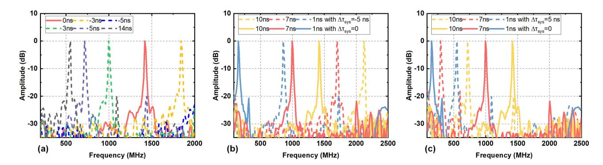

Fig. 4. Influence of the system delay on the position of the correlation peak. (a) The target position remains unchanged, and the positions of correlation peaks with the system delay (b)-(c) the position of the correlation peak when the system delay remains unchanged and the target position changes.

the *R*max of case 7 was 2.13 m, with a corresponding delay was 14.22 ns.

We first fixed the target distance to 1.5 m (corresponding to a delay of 10 ns) and measured the position of the correlation peaks under different system delays. We set the system delay of −3, −5, 0, 3, 5, and 14 ns in VPI and obtained the positions of the correlation peaks as shown in Fig. 4(a). We can observe that a negative system delay causes the original correlation peak (red line) to shift backward. When the system delay reaches −5 ns, the target at 1.5-m distance exceeds the detection range. A positive system delay causes the correlation peak to move forward as the system delay increases. When the system delay exceeds the delay of the target, the correlation peak moves in the opposite direction.

To further illustrate the impact of system delay on detection distance and error, we fixed the system delay at 5, 0, and −5 ns in the simulation and changed the position of the target. The corresponding delay of the target distance was 1, 7, and 10 ns, respectively. The positions of the correlation peaks obtained are shown in Fig. 4(b) and (c). From Fig. 4(b), it can be observed that when the system delay is negative, the correlation peaks of the targets shift backward. Fig. 4(c) shows that a positive delay can cause blurring of the close target. Therefore, based on the above inference and simulation results, [\(24\)](#page-6-0) needs to be rewritten as

$$I_{PD2}(t) \propto R \left\{ \cos 2\pi k \left| \tau - \Delta \tau_{sys} \right| t \right\}$$
 (26)

The system delay must be effectively eliminated and we proposed a method that combines delay lines with external calibration to achieve this. Firstly, to avoid ambiguity caused by de-chirping between the echo signal and two adjacent reference signals, a waveform with a duty ratio less than 50% should be used to eliminate system delay. Next, move the target back and forth and observe the changes in the position of the correlation peak. If the target moves towards a nearer position and the peak moves towards a farther position, it indicates a negative system delay. If the target moves within a closer range and the direction of the correlation peak follows the direction of the movement of the target, it indicates a positive system delay.

For practical applications, detecting close-range targets requires adjusting the system delay to a positive value using delay lines, and then performing external calibration using reference targets to eliminate residual system errors. On the other hand, to increase the detection ability of long-range targets, a delay line needs to be used to adjust the system delay to a negative value, followed by external calibration.

## *D. The Influence of Phase Noise*

In [\[43\],](#page-14-0) it is mentioned that when heterodyning two freerunning ECLs to generate MMW signal, the phase noise of the generated signal is equal to twice the laser phase noise. This inevitably leads to a degradation in performance. When the laser linewidth is wide enough, the frequency spurious components introduced by the laser linewidth cannot be disregarded in comparison to the bandwidth of the signal modulated onto the light. Consequently, this random noise will also be modulated onto the intensity of the light, causing interference to the modulated signal and affecting the overall system performance. Therefore, it is imperative to pay significant attention to the phase noise resulting from the laser linewidth, considering its potential impact on the system.

To investigate the impact of laser linewidth-induced phase noise on system performance, we conducted simulations using VPI. The simulation setup was consistent with the configuration shown in Fig. [3.](#page-5-0) In the simulation, we varied the linewidth of the two lasers simultaneously, ranging from 10 Hz to 4 MHz. We modeled the wireless channel as an additive white Gaussian noise (AWGN) channel. To evaluate system performance, we transmitted SCM and LFM signals, and measured bit error rate (BER) and sensing SNR. The simulation results are presented in Fig. [5.](#page-8-0) From the results, we can observe that when the laser linewidth is below 100 kHz, the impact on system performance is not significant. However, as the linewidth continues to increase, the system performance deteriorates sharply. These findings indicate that the laser linewidth will introduce phase noise, thereby affecting the overall system performance.

## *E. The Influence of the Carrier-to-Signal Power Ratio*

The carrier-to-signal ratio (CSPR) of transmitted signals plays a crucial role in determining the performance of the system. Notably, the intensity of the LO light does not impact the CSPR of the transmitted signal. This is due to the fact that during the heterodyne beating process, the optical carrier undergoes changes proportional to the modulated signal. As a result, the

{8}------------------------------------------------

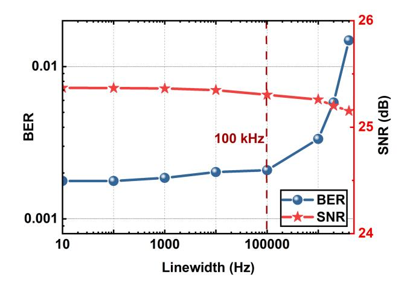

Fig. 5. Laser linewidth versus BER and sensing SNR.

CSPR is primarily determined by the output of MZM-1. The power ratio between the optical carrier and signal in the output light of MZM-1 is jointly influenced by the operating point of MZM-1 and the peak-to-peak voltage (Vpp) of the modulation signal.

According to [\(13\),](#page-5-0) the output optical power of MZM-1 can be determined. When MZM-1 operates at the MATP, the output optical power reaches its peak. However, it should be noted that the output consists of the optical carrier and even-order harmonic components of the modulated signal. Consequently, the CSPR is also at its maximum at this point. This poses a challenge in effectively recovering the signal at the receiving end through an ED. Alternatively, when MZM-1 operates near the QBP, the output of MZM-1 includes both the harmonic components of the signal and the optical carrier. Increasing the Vpp improves the power ratio of the signal to the optical carrier, thereby enhancing the SNR at the receiving end. However, exceeding the linear range of MZM-1 by further increasing Vpp introduces nonlinear effects that degrade the communication performance. This implies the existence of an optimal Vpp. By adjusting the bias voltage of MZM-1 to operate at the MITP, the power of the optical carrier is minimized, resulting in the lowest possible CSPR. Consequently, it becomes impractical to employ an ED for down-conversion at the receiving end.

To verify the aforementioned analysis, we conducted simulations using VPI, employing a setup identical to the experiment. By adjusting the MZM-1 operating points and the Vpp, we calculated the CSPR of the transmitted signal. The CSPR calculated using SCM signals is shown in Fig. [6\(a\).](#page-9-0)

Additionally, we modeled the wireless channel as an AWGN channel and evaluated the communication and radar sensing performance utilizing SCM and LFM signals, respectively. In the simulation, we initially maintained a fixed SNR for the received signal after passing through the AWGN channel. The relationship between the BER, sensing SNR, MZM-1 operating point, and Vpp is illustrated in Fig. [6\(b\)](#page-9-0) and [\(c\).](#page-9-0) This scenario corresponds to maintaining a nearly constant transmitted signal power while varying the output optical powers of MZM-1. In this case, the noise levels applied to the modulated signal and carrier are different. When the CSPR is large, the SNR of the modulated signal is lower than that of the carrier, resulting in poor system performance. At this stage, increasing the signal power will improve system performance. Subsequently, we kept the noise power of the AWGN channel unchanged. The relationship between the measured BER, sensing SNR, MZM-1 operating point, and Vpp is depicted in Fig. [6\(d\)](#page-9-0) and [\(e\).](#page-9-0) This approach provides a better reflection of the impact of adjusting the operating point and Vpp induced changes in optical power on system performance. In this case, regardless of the value of the CSPR, the noise levels of the signal and carrier are equivalent.

In real-world situations, considering the operational status of each amplifier, the noise introduced by the channel should be a combination of the aforementioned two states. Therefore, in our simulations, the effect of CSPR on system performance can be more intuitively observed. In any case, the results align with the theoretical analysis, confirming that when MZM-1 operates near the QBP, appropriately increasing the signal power can improve the system performance. However, excessive signal power introduces nonlinear effects, resulting in a decrease in system performance. Furthermore, when the system operates at the MATP or MITP, the CSPR approaches its maximum or minimum values, respectively, impairing the normal functioning of the system.

#### IV. EXPERIMENTAL SETUP

As a proof-of-concept, we set up an experiment of the photonics-based flexible W-band ISAC system with adaptive TFDM waveforms for the fiber-wireless network, as shown in Fig. [3.](#page-5-0) On the transmitting side, the data sequence was first generated and mapped according to the regular 32-quadrature amplitude modulation (32-QAM). The complex constellations were then up-sampled and modulated by the SCM scheme to generate the time-domain signal according to [\(5\).](#page-3-0) After that, the signals were moved to an IF band (*fIF* = 2 GHz). Meanwhile, an LFM signal was generated and combined with the SCM signal according to the requirements of the application scenarios. The mixed signals were normalized in the time domain with the same peak-to-peak voltage, which means that the peak power ratio between two signals was 1:1 in this work. The power ratio between the SCM and LFM signals has a substantial impact on system performances. Generally, increasing the power of the LFM signal will enhance sensing performance while decreasing communication performance, when the total power remains constant. Conversely, raising the power of the SCM signal will improve communication performance but compromise sensing performance. Thus, adjusting the power ratio between these two signals allows for a further trade-off between sensing and communication performance. The total bandwidth (*Bs*) of the TFDM signal was 12 GHz. To avoid mutual interference, we set a guard interval frequency between the LFM and SCM signal. In the cases shown in Fig. [1\(c\),](#page-3-0) the communication and radar sensing bandwidths for each frequency cell were 3 GHz and 4 GHz, respectively, in the FDM case. For example, the bandwidth of SCM was 6 GHz and the bandwidth of LFM was 4 GHz in case 3. In the TDM cases, both communication and radar sensing

{9}------------------------------------------------

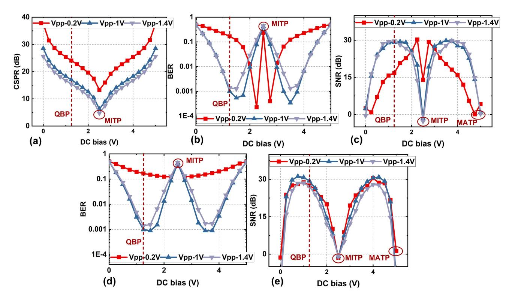

Fig. 6. (a) The calculated CSPR versus MZM-1 operating point and Vpp; (b) the impact of MZM-1 operating point on BER performance with the received SNR fixed; (c) the impact of MZM-1 operating point on sensing SNR performance with the received SNR fixed; (d) the impact of MZM-1 operating point on sensing SNR performance with the noise power fixed; (d) the impact of MZM-1 operating point on sensing SNR performance with the noise power fixed.

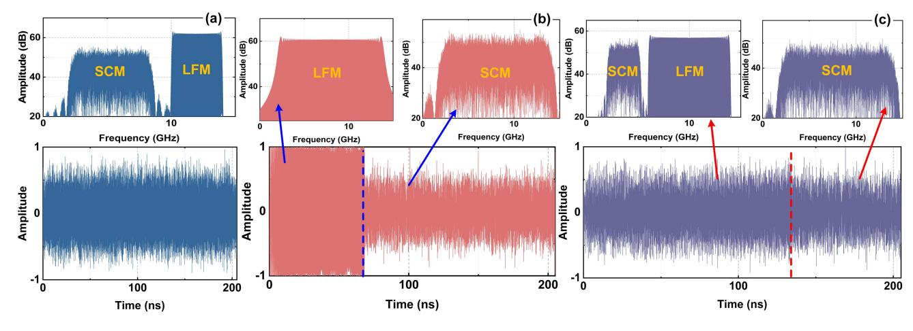

Fig. 7. Electrical spectrum and time-domain waveform of the TFDM ISAC signals. (a) Case 3-FDM only, (b) case 7-TDM only, (c) case 5-hybrid TFDM waveform.

used the full 12-GHz bandwidth. The duration of each time cell was 68.27 ns and the total duration of the signal was 204.8 ns. Finally, the signal was sent to an arbitrary waveform generator (AWG) with a sampling rate of 60 GSa/s. The electrical spectrum and time-domain waveform of some typical cases designed in Fig. [1\(c\)](#page-3-0) are shown in Fig. 7. Subsequently, the TFDM ISAC signal was amplified using an electrical amplifier (EA) to drive MZM-1. ECL-1 working at 193.1 THz with a linewidth of 100 kHz was applied as the light source with an output of 13 dBm. The light was modulated by MZM-1.

After a 10-km optical fiber transmission, the modulated optical signal passed through a polarization controller (PC) to maintain its polarization state and was then amplified by a polarization-maintaining erbium-doped fiber amplifier (PM-EDFA) to compensate for loss. The modulated optical signal was divided into upper and lower paths using an OC 1, with the lower path light serving as the reference signal. The upper path optical signal was combined with the LO light emitted by ECL-2 through OC 2 and sent to a 100 GHz high-speed PD for photonic-based MMW generation. ECL-2 working at

{10}------------------------------------------------

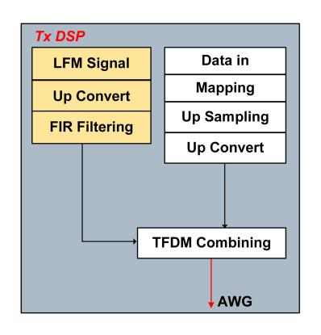

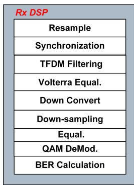

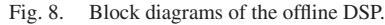

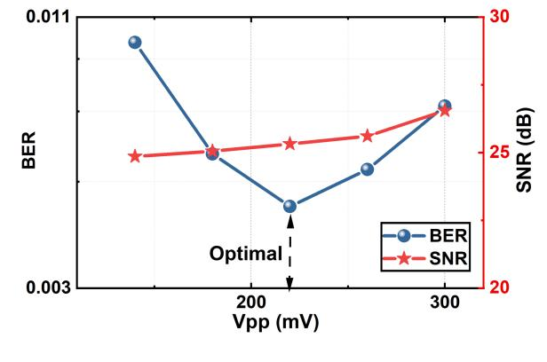

Fig. 9. BER and sensing SNR versus Vpp.

193.1965 THz with a linewidth of 100 kHz. According to [\(18\),](#page-5-0) the frequency spacing between the signal light and LO light was 96.5 GHz, which was located in the W-band. The MMW signal was amplified by a PA before being launched by a HA.

On the UE side, the W-band MMW signal was captured by an HA after 1-m wireless transmission. The signal was amplified by a LNA and down-converted to the IF band using an ED. Finally, the IF signal was amplified by an EA and sampled by an oscilloscope (OSC) with a sampling rate of 80 GSa/s for offline DSP. The communication DSP blocks are shown in Fig. 8. The IF signal was resampled and synchronized first, followed by filtering based on the designed case to eliminate the LFM signal. To improve communication performance, Volterra equalization was performed. After down-conversion, down-sampling, another least mean square equalization was performed. The bit error rate (BER) was obtained after QAM demodulation to evaluate the communication performance.

At the radar sensing receiving side, the W-band MMW echo reflected by the target was captured by an HA, amplified by a LNA and down-converted to the IF band in the BS or RRU. The use of the ED eliminates the need for an additional LO signal for MMW reception, reducing the complexity of the BS or RRU. The echo modulated the lower path reference light through MZM-2. This re-modulated signal was transmitted back to the CO via the 10-km optical fiber for centralized processing. According to [\(24\),](#page-6-0) the electrical signal after the low-speed PD was obtained, with its frequency related to the target. After performing FFT operation, Δ*f* was obtained and the distance was calculated according to [\(10\).](#page-4-0)

# V. RESULTS

## *A. Optimal Working Vpp*

We performed experiments to verify the impact of signal Vpp on system performance. By configuring MZM-1 to operate at the QBP, we evaluated the communication performance using a full-band SCM signal (case 0) and the sensing performance using a full-band LFM signal (case 9). The results of these experiments are presented in Fig. 9. Consistent with our simulations in Section [III,](#page-3-0) we observed that when MZM-1 operates at the QBP, increasing the signal power improves communication performance. However, as the signal power continues to increase, nonlinear effects are introduced, leading to a degradation in communication performance. On the other hand, for radar sensing, enhancing the signal power improves the SNR of the received signal. In scenarios where the SNR is sufficient, the range accuracy can also be maintained [\[44\].](#page-14-0) Therefore, saturation amplification is acceptable for radar sensing. Consequently, to achieve optimal communication performance while maintaining the desired radar operating SNR, we selected a Vpp of 220 mV for our experiments.

## *B. Performance of Flexible TFDM Waveforms*

To assess the performance of the photonic-based W-band ISAC system and the adaptability of the TFDM waveform for flexible adjustment between communication and radar sensing, we conducted experiments using 10 waveform cases as shown in Fig. [1\(c\).](#page-3-0) The results are presented in Fig. [10.](#page-11-0)

For the communication aspect, the measured BER and constellations under different cases are presented in Fig. [10\(a\).](#page-11-0) It is evident that the BERs for cases 0-8 are below the threshold of 1E-2. This finding demonstrates the successful achievement of data rate adjustment for communication purposes using the designed TFDM waveforms. Each case represents varying average and peak data rates. Notably, case 6 exhibits a lower BER compared to other cases due to its narrower communication bandwidth of only 3 GHz. The SCM signal in this case occupies the low-frequency region of the spectrum. This outcome suggests the presence of bandwidth limitations in electrical devices such as the ED within our system.

For the radar sensing aspect, we employed a controllable rotating platform to align two HAs in the BS/ RRU with a corner reflector positioned at a distance of 1.14 meters. At the receiving end of the CO, we performed FFT operation on the received signals and analyzed the sensing performance, including range resolution and SNR. By measuring the 3-dB width of this range profile, we calculated the range resolution [\[17\],](#page-13-0) [\[28\],](#page-14-0) [\[44\].](#page-14-0) The range resolutions of different TFDM waveform cases, as measured using this method, are presented in Fig. [10\(b\).](#page-11-0) Due to measurement errors, the measured range resolutions were slightly higher than the theoretical values. Notably, case 8

{11}------------------------------------------------

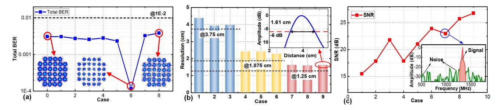

Fig. 10. (a) BER for case 0-8, (b-c) range resolution and sensing SNR and for case 1-9.

TABLE II PERFORMANCE OF DIFFERENT TFDM CASES

| Case | Peak DIR(Gbps) | Average DIR(Gbps) | Range Resolution (cm) |
|------|-------------------|----------------------|--------------------------|
| 0    | 60                | 60                   | -                        |
| 1    | 60                | 50                   | 4.39                     |
| 2    | 60                | 40                   | 3.94                     |
| 3    | 30                | 30                   | 3.98                     |
| 4    | 60                | 45                   | 2.42                     |
| 5    | 60                | 30                   | 2.42                     |
| 6    | 15                | 15                   | 2.29                     |
| 7    | 60                | 40                   | 1.63                     |
| 8    | 60                | 20                   | 1.59                     |
| 9    | -                 | -                    | 1.61                     |

exhibited the best performance, with a measured range resolution of 1.59 cm among all cases.

Furthermore, to provide additional insights into the disparities in radar sensing performance across different waveform cases, we conducted measurements on the received SNR during the experiment. The method of calculating the received SNR and the corresponding results is presented in Fig. 10(c). Similar to pulse compression technology employed in pulse radar, our system exhibits a processing gain associated with the time bandwidth product (TBP) of the LFM signal [\[44\].](#page-14-0) The results in Fig. 10(c) indicate that allocating more time and frequency resources to LFM signals results in higher received SNR. Among all cases, case 2 and 4, case 3 and 7, and case 6 and 8 possess the same TBP. The experimental findings indicate that the received SNR of case 2 and 4 is essentially identical. However, the received SNR of case 7 surpasses that of case 3, and similarly, case 8 outperforms case 6. This discrepancy arises from the fact that in TDM mode, the amplitude of the LFM signal remains unaffected by the SCM signal. Conversely, in FDM mode, the LFM signal is influenced by the SCM signal, leading to an increase in the peak-to-average power ratio (PAPR) of the combined signal. This increase in PAPR is equivalent to a decrease in transmitted power (*Pt*) in the radar equation, as shown in [\(9\).](#page-4-0)

Based on the waveform design parameters and experimental findings, Table II presents the peak and average DIR and range resolution of different waveform cases. As shown in Table II, it is evident that the TFDM waveforms devised in this paper allow for adaptable customization of the DIR and range resolution, thereby catering to diverse application requirements.

## *C. Ranging Errors and Tradeoff of Detection Distance*

To verify the ranging error of the system, we conducted an experiment wherein corner reflectors were positioned at various locations. Subsequently, we employed the waveforms associated with typical cases to sequentially detect these reflectors. The measured range profiles, with the target distances of 0.35, 0.65, 0.88, 1.14, 1.4, and 1.71 m, are presented in Fig. [11.](#page-12-0) In the experiment, we observed that the fiber in the system caused a mismatch between the transmission and reception links. This discrepancy introduced an additional ranging error. However, it is important to note that this error is a fixed value, thereby allowing for its mitigation through external calibration. In the external calibration process, a corner reflector was positioned at a distance of 1.14 m, and detection was performed using the fullband LFM signal (case 9). By comparing the measured distance with the actual distance, we determined that the fixed distance error in our system amounted to 26 cm.

Subsequently, we utilized [\(10\)](#page-4-0) to calculate the distances corresponding to each peak frequency observed in Fig. [11.](#page-12-0) These calculated distances were then corrected through the calibration process. The distance errors, after calibration, were found to be dependent on the range resolution. Remarkably, for all waveform cases, the distance errors after calibration were less than 3 cm. In particular, the typical TFDM waveform (case 5) exhibited a distance error of less than 1 cm after calibration.

From Fig. [11,](#page-12-0) it is evident that waveform cases with smaller slopes result in frequency peaks that are more concentrated in the low-frequency part, which aligns with the inference provided by [\(10\).](#page-4-0) To complement the derivation in Section [III,](#page-3-0) Table [III](#page-12-0) presents *RIF*, *Rnon-blur* and *R*max for various waveform cases, as determined by [\(8\).](#page-4-0) It is worth noting that *R*max needs to take into account the fixed error of the system, i.e., subtract 26 cm from [\(8\).](#page-4-0) Based on the results in Table [III,](#page-12-0) we can observe that due to the system delay, the *R*max of case 7 is only 1.45 m. Consequently, in Fig. [11\(c\),](#page-12-0) the 1.4-m target is already close to the *fIF*, while the 1.71-m target has exceeded the *fIF*.

To illustrate the effect of slope *k* on the *R*max, we conducted experiments specifically designed for this purpose. In the experiment, we positioned targets at various distances and angles, with the farthest target located at a distance of 1.71 m. Utilizing

{12}------------------------------------------------

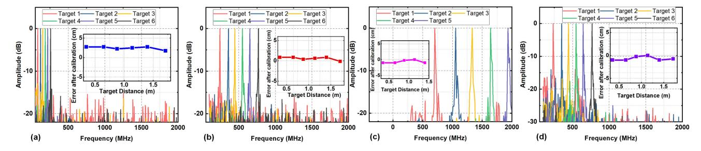

Fig. 11. Range profiles and distance errors after calibration using different cases (a) case 3, (b) case 5, (c) case 7, (d) case 9.

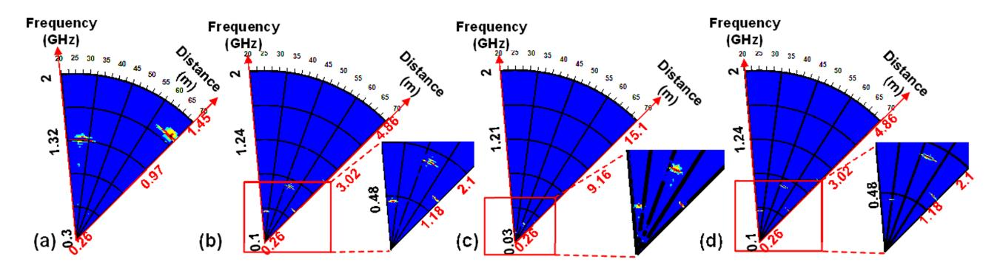

Fig. 12. Detection results of multiple targets (a) case 7, (b) case 5, (c) case 3, (d) case 9.

TABLE III DETECTION DISTANCE OF DIFFERENT TFDM CASES

| Case | $R_{non-blur}(\mathbf{m})$ | $R_{IF}(\mathbf{m})$ | $R_{max}(\mathbf{m})$ |
|------|----------------------------|----------------------|-----------------------|
| 1    | 10.24                      | 5.12                 | 4.86                  |
| 2    | 15.36                      | 10.24                | 9.98                  |
| 3    | 15.36                      | 15.36                | 15.1                  |
| 4    | 10.24                      | 2.56                 | 2.3                   |
| 5    | 15.36                      | 5.12                 | 4.86                  |
| 6    | 15.36                      | 7.68                 | 7.42                  |
| 7    | 10.24                      | 1.71                 | 1.45                  |
| 8    | 15.36                      | 3.41                 | 3.15                  |
| 9    | 15.36                      | 5.12                 | 4.86                  |

a turntable, we scanned within a specified angle range, and the outcomes of the experiment are depicted in Fig. 12. It is evident from the results that due to the limited detection distance of case 7, only two out of three targets are detectable. Conversely, for case 3, which boasts an extended detection range, all three targets are concentrated in its low-frequency region.

The results also elucidated that the proposed TFDM waveforms not only enable versatile control over the DIR and range resolution but also offers a compromise in terms of detection distance.

# *D. The Influence of Received Optical Power*

In our subsequent experiments, we sought to explore the influence of the received optical power (ROP) on the performance of the system.

In terms of communication, we adjusted the variable optical attenuator (VOA) to manipulate the optical power at point B in Fig. [3.](#page-5-0) Subsequently, we measured BER at the UE. For the experiment, we selected several representative cases, namely case 3, case 5, case 7, and the full-band case (case 0), as the transmission waveforms. The results of this investigation are illustrated in Fig. [13\(a\).](#page-13-0) It is noteworthy that as the ROP decreases, the communication performance experiences degradation. This observation substantiates the direct impact of ROP on the power of the transmitted signal, consequently influencing the signal performance at the UE. Notably, the TDM mode (case 7) exhibited inferior BER performance compared to other cases. This can be attributed to the utilization of the full bandwidth for communication in TDM mode, without incorporating a protection time interval in the time-domain of the SCM and LFM signals, thereby leading to interference between the two functions.

In terms of radar sensing, we conducted experiments utilizing representative cases, namely case 3, case 5, case 7, and the full-band radar case (case 9), to examine the correlation between sensing performance and the ROP. By adjusting the VOA at point A in Fig. [3,](#page-5-0) we altered the optical power and subsequently calculated the range resolution and SNR at the CO. The results are presented in Fig. [13\(b\)](#page-13-0) and [\(c\).](#page-13-0) It is evident that as the optical power at point A varies, the calculated resolutions exhibit slight fluctuations around the theoretical values. Moreover, as the optical power decreases, the received SNR for radar sensing gradually diminishes until it falls below a certain threshold. At this threshold, the target and noise become indistinguishable, resulting in the failure of the radar function. Below this threshold, the range resolution also experiences a sharp deterioration.

{13}------------------------------------------------

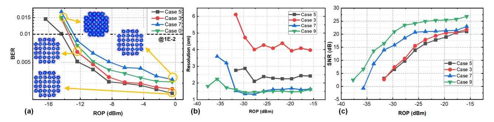

Fig. 13. (a) BER versus ROP for case 0, 3, 5, 7, (b) range resolution versus ROP for case 3,5,7,9, (b) sensing SNR versus ROP for case 3,5,7,9.

# VI. CONCLUSION

In summary, we proposed and experimentally demonstrated a W-band flexible TFDM photonic-based ISAC system for the fiber-wireless integrated network. Our approach enabled flexible combinations of LFM and SCM signals according to specific application scenarios, achieving a trade-off between sensing and communication. By allocating time and bandwidth resources reasonably, a balance can be achieved between communication data rate, radar sensing range resolution, and detection distance. In our experimental system, we achieved high-resolution sensing of 1.59 cm to 4.39 cm and high data rate communication of 15 Gbit/s to 60 Gbit/s through a 10-km fiber and 1-m wireless W-band MMW link. Furthermore, we provided detailed theoretical derivations to identify the reasons for system distance errors and presented solutions to address them. Through external calibration, our system achieved a distance error of less than 1 cm in the experiment. Under all flexible waveforms, the distance error was less than 3 cm. Compared to current photonic-based MMW ISAC systems, our system experimentally verified the feasibility of a centralized and seamless fiber-wireless ISAC architecture. Our approach is highly advanced in terms of system complexity, data rate, range resolution, and distance error, providing a feasible solution for the future application of MMW ISAC in the upcoming 6G era.

#### REFERENCES

- [1] F. Liu, C. Masouros, A. P. Petropulu, H. Griffiths, and L. Hanzo, "Joint radar and communication design: Applications, state-of-the-art, and the road ahead," *IEEE Trans. Commun.*, vol. 68, no. 6, pp. 3834–3862, Jun. 2020, doi: [10.1109/TCOMM.2020.2973976.](https://dx.doi.org/10.1109/TCOMM.2020.2973976)
- [2] W. Saad, M. Bennis, and M. Chen, "A vision of 6G wireless systems: Applications, trends, technologies, and open research problems," *IEEE Netw.*, vol. 34, no. 3, pp. 134–142, May/Jun. 2020, doi: [10.1109/MNET.001.1900287.](https://dx.doi.org/10.1109/MNET.001.1900287)
- [3] A. Zhang, M. L. Rahman, X. Huang, Y. J. Guo, S. Chen, and R. W. Heath, "Perceptive mobile networks: Cellular networks with radio vision via joint communication and radar sensing," *IEEE Veh. Technol. Mag.*, vol. 16, no. 2, pp. 20–30, Jun. 2021, doi: [10.1109/MVT.2020.3037430.](https://dx.doi.org/10.1109/MVT.2020.3037430)
- [4] P. Kumari, J. Choi, N. González-Prelcic, and R.W. Heath, "IEEE 802.11adbased radar: An approach to joint vehicular communication-radar system," *IEEE Trans. Veh. Technol.*, vol. 67, no. 4, pp. 3012–3027, Apr. 2018, doi: [10.1109/TVT.2017.2774762.](https://dx.doi.org/10.1109/TVT.2017.2774762)
- [5] D. K. P. Tan et al., "Integrated sensing and communication in 6G: Motivations, use cases, requirements, challenges and future directions," in *Proc. IEEE 1st Int. Online Symp. Joint Commun. Sens.*, 2021, pp. 1–6, doi: [10.1109/JCS52304.2021.9376324.](https://dx.doi.org/10.1109/JCS52304.2021.9376324)

- [6] O. Li et al., "Integrated sensing and communication in 6G a prototype of high resolution THz sensing on portable device," in *Proc. Joint Eur. Conf. Netw. Commun. 6G Summit*, 2021, pp. 544–549, doi: [10.1109/Eu-](https://dx.doi.org/10.1109/EuCNC/6GSummit51104.2021.9482537)[CNC/6GSummit51104.2021.9482537.](https://dx.doi.org/10.1109/EuCNC/6GSummit51104.2021.9482537)
- [7] J. Choi, V. Va, N. Gonzalez-Prelcic, R. Daniels, C. R. Bhat, and R. W. Heath, "Millimeter-wave vehicular communication to support massive automotive sensing," *IEEE Commun. Mag.*, vol. 54, no. 12, pp. 160–167, Dec. 2016, doi: [10.1109/MCOM.2016.1600071CM.](https://dx.doi.org/10.1109/MCOM.2016.1600071CM)
- [8] E. A. Kittlaus et al., "A low-noise photonic heterodyne synthesizer and its application to millimeter-wave radar," *Nature Commun.*, vol. 12, no. 1, Dec. 2021, Art. no. 4397, doi: [10.1038/s41467-021-24637-0.](https://dx.doi.org/10.1038/s41467-021-24637-0)
- [9] D. Marpaung, J. Yao, and J. Capmany, "Integrated microwave photonics," *Nature Photon.*, vol. 13, no. 2, pp. 80–90, Feb. 2019, doi: [10.1038/s41566-018-0310-5.](https://dx.doi.org/10.1038/s41566-018-0310-5)
- [10] A. Matsko, "Advances in the development of spectrally pure microwave photonic synthesizers," *IEEE Photon. Technol. Lett.*, vol. 31, no. 23, pp. 1882–1885, Dec. 2019, doi: [10.1109/LPT.2019.2947901.](https://dx.doi.org/10.1109/LPT.2019.2947901)
- [11] X. Zou et al., "Microwave photonics for featured applications in high-speed railways: Communications, detection, and Sensing," *J. Lightw. Technol.*, vol. 36, no. 19, pp. 4337–4346, Oct. 2018, doi: [10.1109/JLT.2018.2813663.](https://dx.doi.org/10.1109/JLT.2018.2813663)
- [12] L. Yu, J. Wu, A. Zhou, E. G. Larsson, and P. Fan, "Massively distributed antenna systems with nonideal optical fiber fronthauls: A promising technology for 6G wireless communication systems," *IEEE Veh. Technol. Mag.*, vol. 15, no. 4, pp. 43–51, Dec. 2020, doi: [10.1109/MVT.2020.3018100.](https://dx.doi.org/10.1109/MVT.2020.3018100)
- [13] S. Pan and Y. Zhang, "Microwave photonic radars," *J. Lightw. Technol.*, vol. 38, no. 19, pp. 5450–5484, Oct. 2020, doi: [10.1109/JLT.2020.2993166.](https://dx.doi.org/10.1109/JLT.2020.2993166)
- [14] B. Dong et al., "Photonic-based W-band flexible TFDM integrated sensing and communication system for fiber-wireless network," in *Proc. Opt. Fiber Commun. Conf.*, 2023, Paper W4J.5, doi: [10.1364/OFC.2023.W4J.5.](https://dx.doi.org/10.1364/OFC.2023.W4J.5)
- [15] Y. Wang, J. Ding, M. Wang, Z. Dong, F. Zhao, and J. Yu, "W-band simultaneous vector signal generation and radar detection based on photonic frequency quadrupling," *Opt. Lett.*, vol. 47, no. 3, pp. 537–540, Feb. 2022, doi: [10.1364/OL.447876.](https://dx.doi.org/10.1364/OL.447876)
- [16] Y. Wang et al., "Photonics-assisted joint high-speed communication and high-resolution radar detection system," *Opt. Lett.*, vol. 46, no. 24, pp. 6103–6106, Dec. 2021, doi: [10.1364/OL.444252.](https://dx.doi.org/10.1364/OL.444252)
- [17] Y.Wang et al., "Integrated high-resolution radar and long-distance communication based-on photonic in terahertz band," *J. Lightw. Technol.*, vol. 40, no. 9, pp. 2731–2738, May 2022.
- [18] S. Jia et al., "A unified system with integrated generation of high-speed communication and high-resolution sensing signals based on THz photonics," *J. Lightw. Technol.*, vol. 36, no. 19, pp. 4549–4556, Oct. 2018, doi: [10.1109/JLT.2018.2863684.](https://dx.doi.org/10.1109/JLT.2018.2863684)
- [19] M. Lei et al., "Integrated wireless communication and mmW radar sensing system for intelligent vehicle driving enabled by photonics," in *Proc. IEEE 19th Int. Conf. Opt. Commun. Netw.*, 2021, pp. 1–3, doi: [10.1109/IC-](https://dx.doi.org/10.1109/ICOCN53177.2021.9563796)[OCN53177.2021.9563796.](https://dx.doi.org/10.1109/ICOCN53177.2021.9563796)
- [20] M. Lei et al., "A spectrum-efficient MoF architecture for joint sensing and communication in B5G based on polarization interleaving and polarization-insensitive filtering," *J. Lightw. Technol.*, vol. 40, no. 20, pp. 6701–6711, Oct. 2022.
- [21] M. Lei et al., "Radar-assisted MMW-over-fiber system for B5G mobile communications," in *Proc. Conf. Lasers Electro-Opt.*, 2022, pp. 1–2.

{14}------------------------------------------------

- [22] Y. Wang, J. Liu, J. Ding, M. Wang, F. Zhao, and J. Yu, "Joint communication and radar sensing functions system based on photonics at the W-band," *Opt. Exp.*, vol. 30, no. 8, pp. 13404–13415, Apr. 2022, doi: [10.1364/OE.449153.](https://dx.doi.org/10.1364/OE.449153)
- [23] R. Song and J. He, "OFDM-NOMA combined with LFM signal for W-band communication and radar detection simultaneously," *Opt. Lett.*, vol. 47, no. 11, pp. 2931–2934, Jun. 2022, doi: [10.1364/OL.460188.](https://dx.doi.org/10.1364/OL.460188)
- [24] B. Dong et al., "Demonstration of photonics-based flexible integration of sensing and communication with adaptive waveforms for a W-band fiberwireless integrated network," *Opt. Exp.*, vol. 30, no. 22, pp. 40936–40950, Oct. 2022, doi: [10.1364/OE.472693.](https://dx.doi.org/10.1364/OE.472693)
- [25] N. Zhong, P. Li, W. Bai, W. Pan, L. Yan, and X. Zou, "Spectralefficient frequency-division photonic millimeter-wave integrated sensing and communication system using improved sparse LFM sub-bands fusion," *J. Lightw. Technol.*, vol. 41, no. 23, pp. 7105–7114, Dec. 2023, doi: [10.1109/JLT.2023.3265799.](https://dx.doi.org/10.1109/JLT.2023.3265799)
- [26] H. Nie, F. Zhang, Y. Yang, and S. Pan, "Photonics-based integrated communication and radar system," in *Proc. Int. Topical Meeting Microw. Photon.*, 2019, pp. 1–4, doi: [10.1109/MWP.2019.8892218.](https://dx.doi.org/10.1109/MWP.2019.8892218)
- [27] W. Bai, X. Zou, P. Li, W. Pan, L. Yan, and B. Luo, "60- GHz photonic millimeter-wave joint radar-communication system," in *Proc. Int. Conf. Microw. Millimeter Wave Technol.*, 2021, pp. 1–3, doi: [10.1109/ICMMT52847.2021.9618314.](https://dx.doi.org/10.1109/ICMMT52847.2021.9618314)
- [28] Z. Xue, S. Li, X. Xue, X. Zheng, and B. Zhou, "Photonics-assisted joint radar and communication system based on an optoelectronic oscillator," *Opt. Exp.*, vol. 29, no. 14, pp. 22442–22454, Jul. 2021, doi: [10.1364/OE.430910.](https://dx.doi.org/10.1364/OE.430910)
- [29] L. Huang, R. Li, S. Liu, P. Dai, and X. Chen, "Centralized fiber-distributed data communication and sensing convergence system based on microwave photonics," *J. Lightw. Technol.*, vol. 37, no. 21, pp. 5406–5416, Nov. 2019, doi: [10.1109/JLT.2019.2935903.](https://dx.doi.org/10.1109/JLT.2019.2935903)
- [30] W. Bai et al., "Millimeter-wave joint radar and communication system based on photonic frequency-multiplying constant envelope LFM-OFDM," *Opt. Exp.*, vol. 30, no. 15, pp. 26407–26425, Jul. 2022, doi: [10.1364/OE.461508.](https://dx.doi.org/10.1364/OE.461508)
- [31] W. Bai et al., "Photonic super-resolution millimeter-wave joint radarcommunication system using self-coherent detection," *Opt. Lett.*, vol. 48, no. 3, pp. 608–611, Feb. 2023, doi: [10.1364/OL.472155.](https://dx.doi.org/10.1364/OL.472155)
- [32] W. Bai et al., "Photonic millimeter-wave joint radar communication system using spectrum-spreading phase-coding," *IEEE Trans. Microw. Theory Techn.*, vol. 70, no. 3, pp. 1552–1561, Mar. 2022, doi: [10.1109/TMTT.2021.3138069.](https://dx.doi.org/10.1109/TMTT.2021.3138069)

- [33] Z. Xue, S. Li, J. Li, X. Xue, X. Zheng, and B. Zhou, "OFDM radar and communication joint system using opto-electronic oscillator with phase noise degradation analysis and mitigation," *J. Lightw. Technol.*, vol. 40, no. 13, pp. 4101–4109, Jul. 2022.
- [34] Z. Xue, S. Li, X. Xue, X. Zheng, and B. Zhou, "Tunable K/W-band OFDM integrated radar and communication system based on optoelectronic oscillator for intelligent transportation," *Opt. Exp.*, vol. 30, no. 20, pp. 35270–35281, 2022.
- [35] M. Lei et al., "Photonics-aided integrated sensing and communications in mmW bands based on a DC-offset QPSK-encoded LFMCW," *Opt. Exp.*, vol. 30, no. 24, pp. 43088–43103, Nov. 2022, doi: [10.1364/OE.474055.](https://dx.doi.org/10.1364/OE.474055)
- [36] Z. Lyu et al., "Radar-centric photonic terahertz integrated sensing and communication system based on LFM-PSK waveform," *IEEE Trans. Microw. Theory Techn.*, vol. 71, no. 11, pp. 5019–5027, Nov. 2023, doi: [10.1109/TMTT.2023.3267546.](https://dx.doi.org/10.1109/TMTT.2023.3267546)
- [37] J. A. Zhang et al., "An overview of signal processing techniques for joint communication and radar sensing," *IEEE J. Sel. Topics Signal Process.*, vol. 15, no. 6, pp. 1295–1315, Nov. 2021, doi: [10.1109/JSTSP.2021.3113120.](https://dx.doi.org/10.1109/JSTSP.2021.3113120)
- [38] M. Roberton and E. R. Brown, "Integrated radar and communications based on chirped spread-spectrum techniques," in *Proc. IEEE MTT-S Int. Microw. Symp. Dig.*, 2003, vol. 1, pp. 611–614, doi: [10.1109/MWSYM.2003.1211013.](https://dx.doi.org/10.1109/MWSYM.2003.1211013)
- [39] C. Sturm and W. Wiesbeck, "Waveform design and signal processing aspects for fusion of wireless communications and radar sensing," *Proc. IEEE*, vol. 99, no. 7, pp. 1236–1259, Jul. 2011, doi: [10.1109/JPROC.2011.2131110.](https://dx.doi.org/10.1109/JPROC.2011.2131110)
- [40] Y. Cui, F. Liu, X. Jing, and J. Mu, "Integrating sensing and communications for ubiquitous IoT: Applications, trends, and challenges," *IEEE Netw.*, vol. 35, no. 5, pp. 158–167, Sep./Oct. 2021, doi: [10.1109/MNET.010.2100152.](https://dx.doi.org/10.1109/MNET.010.2100152)
- [41] T. Harter et al., "Generalized Kramers–Kronig receiver for coherent terahertz communications," *Nature Photon.*, vol. 14, no. 10, pp. 601–606, Oct. 2020, doi: [10.1038/s41566-020-0675-0.](https://dx.doi.org/10.1038/s41566-020-0675-0)
- [42] X. Li, X. Wang, Q. Yang, and S. Fu, "Signal processing for TDM MIMO FMCW millimeter-wave radar sensors," *IEEE Access*, vol. 9, pp. 167959–167971, 2021, doi: [10.1109/ACCESS.2021.3137387.](https://dx.doi.org/10.1109/ACCESS.2021.3137387)
- [43] X. Li, J. Xiao, and J. Yu, "Long-distance wireless mm-wave signal delivery at W-band," *J. Lightw. Technol.*, vol. 34, no. 2, pp. 661–668, Jan. 2016, doi: [10.1109/JLT.2015.2500581.](https://dx.doi.org/10.1109/JLT.2015.2500581)
- [44] M. A. Richards, *Fundamentals of Radar Signal Processing*, 2nd ed. New York, NY, USA: McGraw-Hill, 2014.