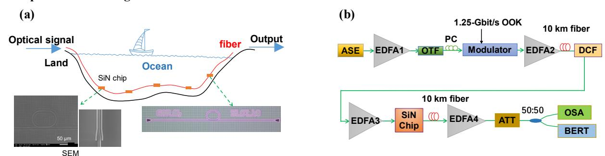
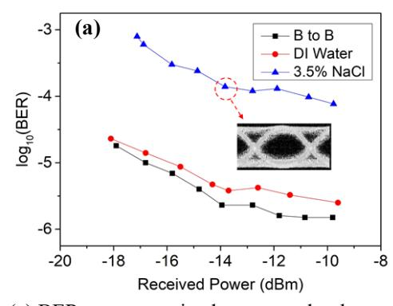
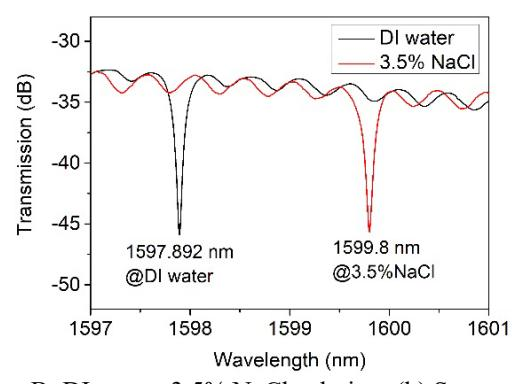

{0}------------------------------------------------

# Simultaneous Sensing and Communication Over 20 km Fiber Based on Si3N4 Micro-Ring

Ving Qiu(1), Xiangpeng Ou(3), Ming Luo(1,2), Chao Yang(1,2), Zhixue He(2), Xi Xiao(1,2), Yan Yang(3), Jin Tao(1,2)
(1) National Key Laboratory of Optical Communication Technologies and Networks, China Information Communication Technologies Group

Corporation (CICT), Wuhan 430074, China
(2) Peng Cheng Laboratory, Shenzhen 518055, China
(3) Institute of Microelectronics, Chinese Academy of Sciences, Beijing 100029, China

yyang10@ime.ac.cn; taojin@cict.com

**Abstract:** Based on the designed silicon nitride micro-ring with low thermo-optical coefficient and high sensitivity, a sensitivity of 294 nm/RIU in refractive index sensing and 1.25-Gbit/s OOK optical signal transmission over 20 km fiber are realized simultaneously. © 2024 The Author(s) **OCIS codes:** 060.0060 Fiber optics and optical communications, 130.3120 Integrated optics devices.

#### 1. Introduction

At present, the informationization of the ocean mainly depends on the application of submarine optical cable, in which the research of submarine seismic detection technology is very popular [1], which uses optical fiber sensing technology. Optical fiber sensing is based on the changes of optical parameters such as light intensity, wavelength, frequency, phase and polarization, however, it is difficult to realize the perception of biochemical information based on all-fiber link, so seawater salinity is difficult to be detected by submarine optical cables. Micro-ring resonator is one of the most attractive devices in both optical sensing and communication. Its applications include laser external cavity (adjusting linewidth) [2], generation of optical frequency comb [3], micro-ring modulator [4] and optical refractive index sensing [5] and so on. As different salinity of seawater with different refractive index, so we propose to integrate the micro-ring sensor chip into the optical fiber communication system, so that it cannot only transmit information, but also detect biochemical information at the same time. In this work, we have experimentally demonstrated a real-time IOSAC (integrated optical sensing and communication) system via micro-ring resonator over a 20 km fiber. We simulated sea water with 3.5% salt water, a sensitivity of 294 nm/RIU in refractive index sensing and 1.25-Gbit/s OOK (on-off-keying) optical signal transmission is verified simultaneously based on the specially designed micro-ring resonator.

## 2. Experimental Configuration and Results

Fig. 1. (a) Conceptual illustration of IOSAC in the ocean. Left inset: SEM images of Si3N4 micro-ring. Right inset: Photograph of Si3N4 micro-ring; (b) Experimental setup for IOSAC system.

SEM:Scanning Electron Microscope; ASE:Amplified Spontaneous Emission; EDFA:Erbium Doped Fiber Amplifier; PC:Polarization Controller; OTF:Optical Tunable Filter; DCF:Dispersion Compensation Fiber; ATT:Attenuator; OSA:Optical Spectrum Analyzer; BERT:BER Test. It is proposed that micro-ring chips are integrated into the existing marine optical fiber cables to monitor the salinity of seawater at different locations in the ocean, as shown in Fig.1(a), it is a conceptual illustration schematic diagram of simultaneous sensing and communication in the ocean. The micro-ring resonator integrates the advantage of a low loss Si3N4 waveguide and a high sensitivity double-slots waveguide he origin of the low loss for the Si3N4 waveguide is lower refractive index contrast and higher fabrication tolerance [6]. A large part of the light interacts with the surrounding analyte of slot waveguide connected by a strip-slot mode converter contributes a high sensitivity for micro-ring chip. This structure achieves the best balance between optical loss and sensitivity. The left inset in Fig.1(a) shows the SEM image of a fabricated hybrid-waveguide micro-ring resonator and the enlarged view shows strip-slot mode converter, the radius of micro-ring is 40 μm and the length of double-slots waveguide is 40 μm [7]. The fabricated micro-ring with a 40 μm radius shows a loaded Q-factor exceeding 11000, which is much higher than that of the slot waveguide-based one. The right inset in Fig.1(a) shows the optical microscope image of the fabricated hybrid-waveguide micro-ring resonator. Fig.1(b) shows the experimental setup, the spontaneous emission light emitted from ASE is amplified by EDFA1 and filtered by OTF. The filtered band range is about 5 nm.

{1}------------------------------------------------

The filtered light is sent into a Mach–Zehnder modulator through a PC. The modulator is driven by a pseudorandom binary sequence generator from a bit-error-ratio tester (BERT) to provide 1.25-Gbit/s OOK signals with a length of 231-1. The modulated signal is amplified by EDFA2 and transmitted through 10km fiber. The DCF is used to compensate the dispersion of the link. The EDFA3 and EDFA4 are used to compensate the power loss of the SMF, DCF and optical devices. In the experiment, we observed the spectrum of deionized water or 3.5% salt water (to simulate seawater) dripped on the micro-ring chip. The difference in the spectrum is essentially due to the difference in refractive index between deionized water and salt water. The signal is output through the grating coupler on the chip, then transmits 10 km of optical fiber. After a 50% power splitter, the optical signal is divided into two parts, one part is connected to the spectrometer for spectral measurement. The other part is send into a PD (photo diode) to measure the BER.

Fig. 2. (a) BER versus received power under three cases: B to B; DI water; 3.5% NaCl solution; (b) Spectrum of the ring with two various ambient refractive indies: DI water; 3.5% NaCl solution**.**

Fig. 2(a) shows the variation curve of BER performance of the 1.25-Gb/s OOK signal with the optical power received by the power meter for 3 cases: "B to B (back-to-back)" for measurement without chip, "DI water" for deionized water and "3.5% NaCl" for NaCl solution dripping on the chip. The sensing performance of the microring resonator is characterized by tracing the resonance wavelength of the hybrid-waveguide with two various ambient refractive indies, corresponding to NaCl solution and DI water. As shown in Fig. 2(b), the resonant wavelength of the micro-ring moves with the concentration of salt water. When the liquid is deionized water, the resonant wavelength is 1597.892 nm, and when the liquid is replaced by 3.5% NaCl solution, the resonant wavelength shifts to 1599.8 nm. It is observed that the resonance wavelength red-shifts as the refractive index increases. The refractive indices of the water-NaCl mixtures as a function of NaCl concentration were determined as 1.3331+0.00185C (C% is the NaCl concentration) [8]. Through the moving position of the resonant wavelength, we can inversely deduce the concentration of salt water. In the conceptual experiment in this paper, we only perceive the concentration of seawater by refractive index sensing.

#### **3. Conclusions**

In this work, we experimentally demonstrated simultaneous sensing and communication based on Si3N4 micro-ring, and we realized 1.25-Gbit/s OOK optical signal transmission and a sensitivity of 294 nm/RIU in refractive index sensing simultaneously over 20 km SMF by dripping 3.5% salt water on the micro-ring to simulate the seawater.

#### **Acknowledgements**

The work is supported by National Key Research and Development Program of China (2023YFB2804703) and National Natural Science Foundation of China (Nos. 62105250, 61904196).

### **References**

- [1] Z. Zhan, et al., "Optical polarization–based seismic and water wave sensing on transoceanic cables", Science 371, 931-936 (2021)
- [2] N. Kobayashi, et al., "Silicon photonic hybrid ring-filter external cavity wavelength tunable lasers," Journal of Lightwave Technology 33,1241–1246(2015)
- [3] Z. Wu, et al., "Low-noise Kerr frequency comb generation with low temperature deuterated silicon nitride waveguides," Optics Express 29, 29557-29566(2021)
- [4] H. Shoman, et al., "Compact wavelength- and bandwidth-tunable micro-ring modulator," Optics Express 27, 26661-26675(2019)
- [5] M. Luo, et al., "Current sensor based on an integrated micro-ring resonator and superparamagnetic nanoparticles," Optics Express 28, 5684- 5691(2020)
- [6] X. Tu, et al., "Thermal independent Silicon-Nitride slot waveguide biosensor with high sensitivity," Optics Express 20, 2640-2648(2012)
- [7] X. Ou, et al., "Integrated Optical Sensing and Communication (IOSAC)System Based on Hybrid-Waveguide Structures", Advanced Materials Technologies 9, 2300998(2023)
- [8] E. Cyan, "Handbook of Chemistry and Physics," Archives of Internal Medicine 126, 335(1970)