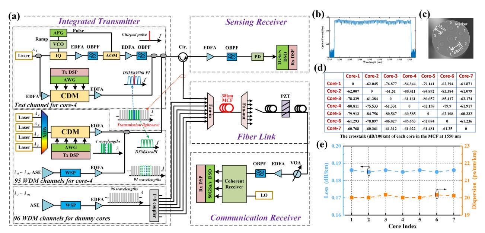
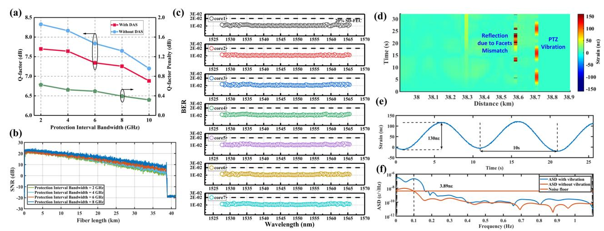

# Co-wavelength-channel Integration of Ultra-lowfrequency Distributed Acoustic Sensing and High-Capacity Communication

Long Gu(1,2,3) , Meng Xiang(1,2,3) , Zebing Zhang(1,2,3) , Chaocheng Liu(1,2,3) , Pengbai Xu(1,2,3) , Wei Sun(4) , Jun Yang(1,2,3) , Songnian Fu(1,2,3) , Yuncai Wang(1,2,3) , Yuwen Qin(1,2,3)

- (1) Institute of Advanced Photonics Technology, School of Information Engineering, Guangdong University of Technology, Guangzhou, 510006, China, meng.xiang@gdut.edu.cn
  - (2) Key Laboratory of Photonic Technology for Integrated Sensing and Communication, Ministry of Education of China, Guangdong University of Technology, Guangzhou, 510006, China
  - (3) Guangdong Provincial Key Laboratory of Information Photonics Technology, Guangdong University of Technology, Guangzhou, 510006, China
    - (4) Jiangsu Alpha Optic-electric Technology Co., Ltd., Suzhou, 215200, China

*Abstract***—We experimentally demonstrate, for the first time, the co-wavelength-channel integration of ultra-lowfrequency distributed-acoustic-sensing and high-capacity communication over a 38-km weakly-coupled-seven-core fiber, achieving a sensitivity of 3.89 - nε Hz @0.1-Hz with 20-m spatial-resolution and a transmission capacity of 241.85-Tb/s.** 

*Keywords—Ultra-low-frequency Distributed-acoustic-sensing, High-capacity Communication, Seven-core-fiber, Digital subcarrier multiplexing.*

#### I. INTRODUCTION

Submarine fiber optical networks represent a crucial backbone that supports the digital economy. Space division multiplexing (SDM) has the potential to solve the capacity crunch of traditional standard single-mode fiber (SSMF) with the merits of reducing network costs and enhancing the power efficiency [1]. Consequently, the first generation of SDM systems has been successfully introduced in submarine networks, and the deployed SSMF is expected to be progressively replaced with multi-core fiber (MCF) by the end of 2026 [2]. Recently, integrating distributed sensing into fiber optical communication systems has garnered significant interest, by transforming the undersea MCF infrastructure into a distributed sensing network that enables intelligent functionalities [3]. In order to support distributedacoustic-sensing (DAS) in existing fiber optical communication systems, phase-sensitive optical-timedomain-reflectometry based on Rayleigh backscatter (RBS) is promising.

Prior works have successfully demonstrated the simultaneous transmission of communication and DAS signals over a weakly-coupled MCF [4-5]. Although such a solution minimizes the detrimental interactions by separating the communication and DAS signals into two independent cores, it significantly sacrifices the spectral efficiency, resulting in a reduction of transmission capacity. Additionally, according to the ocean soundscapes, geological processes and human activities in the deep sea mainly generate acoustic waves with a typical frequency range from 0.1 Hz to 10 Hz [6]. Detection and acquisition of those ultralow-frequency acoustic waves is extremely paramount for geological exploration, early warning of natural disasters, etc. Unfortunately, the current integrated sensing and communication (ISAC) systems reported so far are mainly focused on the detection and acquisition of acoustic waves with frequencies higher than 10 Hz, due to interference fading and inevitable frequency drift of lasers, as summarized in Table 1. As a result, it remains an open question on how to fully leverage MCF to simultaneously achieve both high-capacity transmission and ultra-lowfrequency DAS.

In this work, we experimentally demonstrate the sevencore-fiber based ISAC to simultaneously realize ultra-lowfrequency DAS and high-capacity transmission. In order to maximize the transmission capacity, both the digital subcarrier modulation (DSM) signal and the chirped-pulse sensing signal are frequency division multiplexed at the same wavelength channel, under the condition of the optimal protection interval (PI) bandwidth, relying on the DSM flexibility in spectral allocating. We successfully achieve both a sensing sensitivity of 3.89nε Hz @0.1-Hz with 20-m spatial-resolution and a record transmission capacity of 241.85-Tb/s for ISAC, when 96×7 spectral/spatial channels with DP-16QAM DSM signals are transmitted over a 38 km seven-core-fiber.

### II. EXPERIMENTAL SETUP

The proof-of-concept experimental setup is shown in Fig.1(a). A continuous-wave (CW) laser with a linewidth of 100 Hz and a central wave-length of 1550.12 nm is employed as the optical carrier for both sensing and communication. After splitting the CW light into two copies, the light in the upper branch for sensing is first modulated into a linearly-chirped light, when an in-phase quadrature (IQ) modulator is driven by a voltage-controlled oscillator (VCO) that is controlled by an arbitrary function generator (AFG). After the pre-amplification, the linearly-chirped light is then chopped into a 200-ns pulsed light via an acoustic-optic modulator (AOM), generating a chirped pulse with a bandwidth of 500 MHz. Meanwhile, the light with the same wavelength in the lower branch for communication is introduced to a coherent driver modulator (CDM) module. In order to generate the high-speed electrical signal to drive CDM, the 36 GBaud DP-16QAM DSM signal with 4

**TABLE I.** Recent progress for ISAC in an optical fiber

| Ref.      | Multiplexing solution | Capacity (Tb/s) | Reach (km) | Vibration detection frequency (Hz) |
|-----------|-----------------------|-----------------|------------|------------------------------------|
| [5]       | SDM                   | 200.88          | 16.5       | /                                  |
| [7]       | Co-frequency-band     | 0.056           | 24.5       | 800                                |
| [8]       | MDM                   | 0.0042          | 1          | 500                                |
| [9]       | WDM                   | 10              | 1007       | 16                                 |
| [10]      | WDM                   | 36.8            | 110        | /                                  |
| [11]      | Co-wavelength-channel | 0.2             | 10         | 500                                |
| This work | Co-wavelength-channel | 241.85          | 38         | 0.1                                |

subcarriers is first generated offline with a root-raised cosine (RRC) roll-off factor of 0.01, and then the DSM signal is loaded into the arbitrary waveform generator (AWG) with a sampling rate of 120-GSa/s and a resolution of 8-bit, after resampling and clipping. Please note that, a PI between middle subcarriers of the DSM signal is reserved for the insertion of the optical sensing signal. Once the optical sensing and communication signals are generated, those signals are combined, via an optical coupler at the same wavelength channel.

To fully leverage the optical spectrum resource for the transmission capacity enhancement, the other 95 WDM channels from 1527.60 nm to 1565.50 nm with a channel spacing of 50 GHz are generated. Specifically, as for 4 WDM channels surrounding the 1550.12-nm channel, we use tunable external cavity lasers (ECLs) with a linewidth of 100 kHz as optical sources, and those optical carriers are modulated by the 45 GBaud DP-16QAM DSM signal with 4 subcarriers (no PI reserved), with the help of another AWG and CDM. Due to the limited hardware resources, we utilize an amplified spontaneous emission (ASE) source shaped by a waveshaper (WSP) to emulate remaining 91 WDM channels. Thereafter, all 96 WDM channels are combined after the pre-amplification, whose spectrum is presented in Fig. 1(b), and finally fed into the core-4 via a self-fabricated fan-in/fan-out (FIFO) device. To further generate the communication signals for the other 6 cores, we first shape the another ASE source utilizing another WSP to obtain 96 WDM channels with a 50-GHz grid, then spilt the WDM signal into 6 copies, and finally introduce those copies into 6 cores via the same FIFO device, after the pre-amplification.

After 38-km seven-core-fibre transmission and space division demultiplexing, a piezoelectric transducer (PZT) is applied to generate an ultra-low-frequency acoustic wave. At the communication receiver (Rx), the forward propagated signal is first filtered for wavelength division demultiplexing, then amplified and finally filtered again to reject the out-ofband noise. Another tunable ECL with a linewidth of 100 kHz is used as the local oscillator (LO) for coherent detection. After being sampled by an 80-GSa/s digital sampling oscillator (DSO), the Rx digital signal processing (DSP) for communication mainly includes chromatic dispersion (CD) compensation, coarse frequency offset compensation, subcarrier demultiplexing along with sensing signal removal utilizing, and BER calculation among four subcarriers. At the sensing Rx, we first utilize an optical filter to remove both the communication signal and out-of-band noise, after the RBS signal is amplified. Then, a photodetector (PD) is used to detect the filtered RBS signal, and the received signal is recorded by another 2-GSa/s DSO. As for the sensing DSP, the spatial resolution of 20 m is used as the moving correlation window, in order to determine local temporal delay. The strain temporal waveform is reconstructed, using the linear relationship between temporal delay and external strain.

Fig.1. (a) Experimental setup; (b) WDM signal spectrum at core-4; (c) Cross-section of fabricated seven-core-fiber; (d) Measured inter-core crosstalk @1550 nm; (e) Measured loss and CD @1550 nm.

Fig. 2. The impact of PI bandwidth on (a) communication and (b) sensing performance; (c) Overall BER performance; (d) Time-distance mapping of the vibration induced by PZT around 38.7 km; (e) Measured acoustic wave and (f) its ASD.

### III. RESULTS AND DISCUSSIONS

We first characterize the fabricated seven-core fiber, whose cross-section is shown in Fig. 1(c). The measured inter-core crosstalk is as low as - 60 dB/100km at 1550 nm, indicating of negligible performance penalty during the SDM transmission, as shown in Fig. 1(d). Furthermore, as per Fig. 1(e), the attenuation and CD parameter of each core are around 0.18 dB/km and 20.05 ps/km/nm at 1550 nm, respectively.

We then study the interaction between the DAS and DSM signals. The relationship between the achieved Qfactor of the DSM signal and the inserted PI bandwidth is presented in Fig. 2(a), with and without the presence of the DAS signal. With the growing PI bandwidth, the achieved Q-factor gradually decreases, due to the bandwidth constraint of optoelectronics devices. Additionally, when the DAS signal is co-propagated with the DSM signal, we observe a significant Q-factor penalty, because of the detrimental interaction between DAS and DSM signals. Moreover, the Q-factor penalty is decreased with enlarged PI bandwidth. Meanwhile, the distributed signal-to-noise ratio (SNR) of the DAS signal is improved, when the PI bandwidth is increased, as shown in Fig. 2(b). To secure both higher transmission capacity and better sensitivity for sensing ultra-lowfrequency acoustic wave, the PI bandwidth is set as 8 GHz.

Next, the BER performance is characterized for all spectral and spatial channels, as shown in Fig. 2(c). Overall, BER values of 96 WDM channels for all seven cores are below the 20% soft-decision feedforward correction coding (SD-FEC) threshold of 2×10-2 . Thus, an aggregate capacity of 241.85-Tb/s (net value of 201.5-Tb/s) is achieved, along with a spectral efficiency of 50.4 bit/s/Hz (net value of 42 bit/s/Hz). Finally, the time-distance mapping of the vibration is shown in Fig. 2(d). The vibration can be discerned around 38.7 km. Notably, the reflections due to the PC/APC facets mismatch can be also detected. In addition, two repeated periods of 10 s, corresponding to 0.1 Hz, are acquired over a 25-s duration, as shown in Fig. 2(e). The peak-to-peak value of the acoustic wave is 130 nɛ, which agrees well with the strain generated by the PZT. Fig. 2(f) displays the strain amplitude spectrum density (ASD). The observed vibration frequency is 0.1 Hz, consistent with the driving frequency of PZT. In addition, the sensitivity calculated by the ASD is 3.89 - nε Hz , indicating the capability of accurately sensing ultra-low-frequency acoustic wave over the 38-km sevencore-fiber.

## IV. CONCLUSIONS

We have experimentally demonstrated, for the first time, the co-wavelength-channel integration of ultra-lowfrequency DAS and communication over a 38-km weaklycoupled seven-core fiber, achieving both a sensitivity of 3.89 - nε Hz @0.1-Hz with 20-m spatial resolution and a transmission capacity of 241.85-Tb/s. To our knowledge, this represents the largest capacity for communication and lowest frequency for DAS reported in ISAC systems, making one solid step towards building up an ocean sensing network utilizing existing subsea infrastructure.

#### ACKNOWLEDGMENT

This work was supported by the National Natural Science Foundation of China (62435004, U22A2087, U21A20506, 62075046), and Guangdong Introducing Innovative and Entrepreneurial Teams of "The Pearl River Talent Recruitment Program" (2021ZT09X044).

# REFERENCES

- [1] O. V. Sinkin, A. V. Turukhin, Y. Sun, H. G. Batshon, M. V. Mazurczyk, C. R. Davidson, J. X. Cai , W. W. Patterson, M. A. Bolshtyansky, D. G. Foursa, and A. N. Pilipetskii, "SDM for powerefficient undersea transmission," J. Lightwave Technol., vol. 36, no. 2, pp. 361-371, 2018.
- [2] K. Nakamura, T. Inoue, Y. Matsuo, Y. Inada, and E. Mateo, "60+Gbaud real-time transmisssion over a 17680 km line designed for GEN1-SDM submarine networks," Opto-Electronics and Communications Conference (OECC), Taipei, Taiwan, 2020.
- [3] E. F. Williams, M. R. Fernández-Ruiz, R. Magalhaes, R. Vanthill, Z. Zhan, M. González-Herráez, and H. F. Martins, "Distributed sensing of microseisms and teleseisms with submarine dark fibers," Nat Commun, vol. 10, pp. 5778, 2019.

- [4] Y. Guo, J. M. Marin, I. Ashry, A. Trichili, M. –N. Havlik, T. K. Ng, C. M. Duarte, and B. S. Ooi, "Submarine optical fiber communication provides an unrealized deep‑sea observation network," Sci Rep, vol. 13, no. 1, pp. 15412, 2023.
- [5] Y. Chen, Y. Xiao, S. Chen, F. Xie, Z. Liu, D. Wang, X. Yi, C. Lu, and Z. Li, "Field trials of communication and sensing system in space division multiplexing optical fiber cable," IEEE Commun. Mag., vol. 61, no. 8, pp. 182-188, 2023.
- [6] C. M. Duarte, L. Chapuis, S. P. Collin, D. P. Costa, R. P. Devassy, V. M. Eguiluz, C. Erbe, T. A. C. Gordon, B. S. Halpern, H. R. Harding, M. N. Havlik, M. Meekan, N. D. Merchant, J. L. Miksis-Olds, M. Par-sons, M. Predragovic, A. N. Radford, C. A. Radford, S. D. Simpson, H. Slabbekoorn, E. Staaterman, I. C. Van Opzeeland, J. Winderen, X. Zhang, and F. Juanes, "The soundscape of the Anthropocene ocean," Science, vol. 371, no. 6529, pp. eaba4658, 2021.
- [7] H. He, L. Jiang, Y. Pan, A. Yi, X. Zou, W. Pan, A. E. Willner, X. Fan, Z. He, and L. Yan, "Integrated sensing and communication in an optical fibre," Light Sci. Appl., vol. 12, no. 1, pp. 25, 2023.
- [8] J. M. Marin, I. Ashry, O. Alkhazragi, A. Trichili, T. Khee Ng, and B. S. Ooi, "Simultaneous distributed acoustic sensing and communication over a two-mode fiber," Opt. Lett., vol. 47, no. 24, pp. 6321–6324, 2022.
- [9] E. Ip, Y. K. Huang, M.-F. Huang, F. Yaman, G. Wellbrock, T. Xia, T. Wang, K. Asahi, and Y. Aono, "DAS over 1,007-km hybrid link with 10-Tb/s DP-16QAM co-propagation using frequency-diverse chirped pulses," J. Lightwave Technol., vol. 41, no. 4, pp. 1077–1086, 2023.
- [10] M. F. Huang, P. Ji, T. Wang, Y. Aono, M. Salemi, Y. Chen, J. Zhao, T. J. Xia, G. A. Wellbrock, Y.-K. Huang, G. Milione, and E. Ip, "First field trial of distributed fiber optical sensing and high-speed communication over an operational telecom net-work," J. Lightwave Technol., vol. 38, no. 1, pp. 75–81, 2020.
- [11] Z. Hu, Y. Chen, H. Jiang, M. Zhang, J. Chen, W. Li, L. Zhao, C. Zhao, and M. Tang, "Enabling cost-effective high-performance vibration sensing in digital subcarrier multiplexing systems," Opt. Express, vol. 31, no. 20, pp. 32114-32125, 2023.