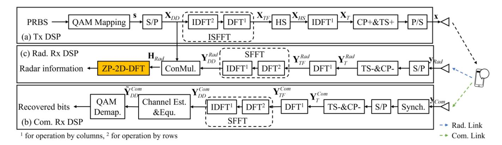
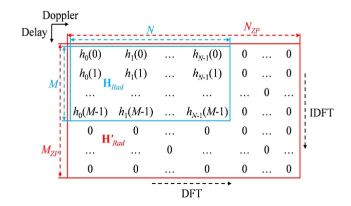
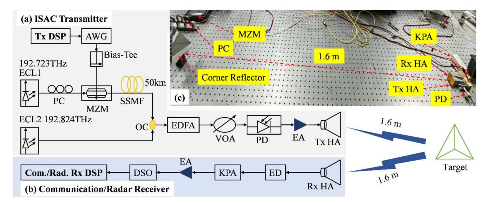
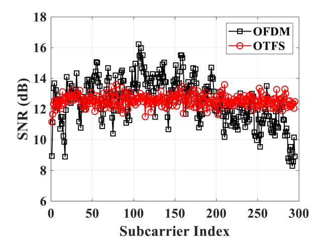
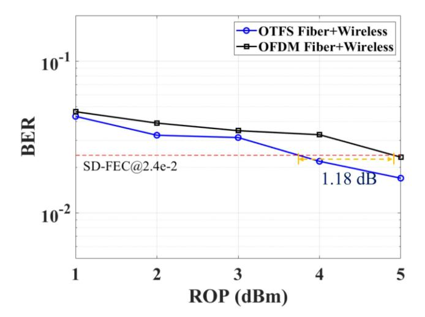
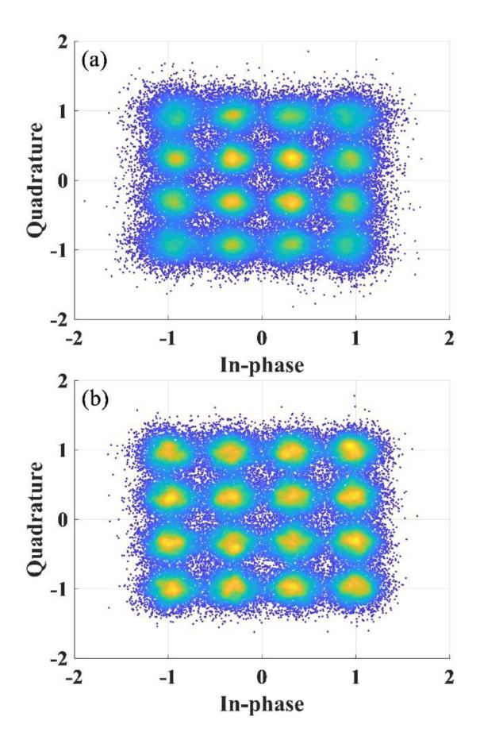
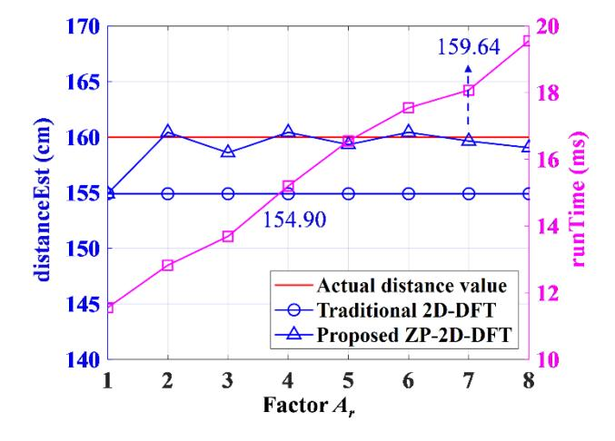
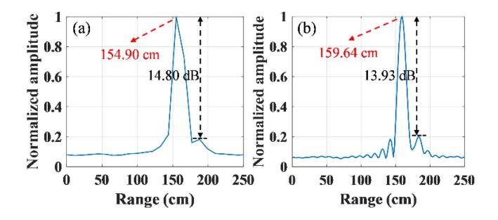
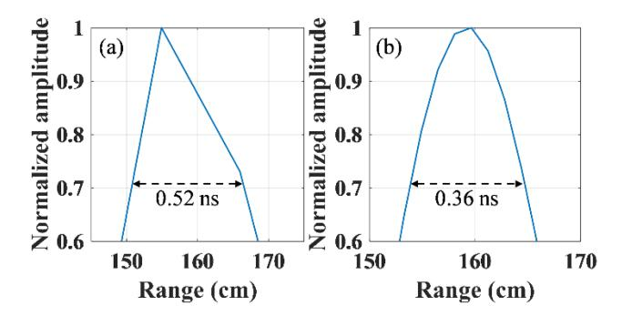

# Zero-Padding 2D-DFT Scheme for Photonics-Assisted W-Band Fiber-Wireless ISAC System With Orthogonal Time Frequency Space Modulation

Jing He10, Lede Yin10, Kang Liu, Shijie Xiao, and Zuo Chen

Abstract—In this paper, an orthogonal time frequency space (OTFS) waveform based on photonics-assisted is proposed in a W-band fiber-wireless integrated sensing and communication (ISAC) system. The OTFS signal is modulated in the delay-Doppler (DD) domain, which enhances the robustness of the signal against frequency-selective fading. And a zero-padding two-dimensional discrete Fourier transform (ZP-2D-DFT) scheme is proposed for the OTFS-based photonics-assisted W-band fiber-wireless ISAC system. Compared with the traditional 2D-DFT scheme, the proposed ZP-2D-DFT scheme can significantly improve the sensing accuracy and theoretical resolution of ISAC systems. In addition, a proof-of-concept experiment of the OTFS-based photonics-assisted W-band fiber-wireless ISAC system is demonstrated using the optical heterodyne up-conversion technique. The experimental results show that, after transmission over a 50 km standard single mode fiber (SSMF) and a 3.2 m wireless link, a communication data rate of 5.44 Gbit/s and a theoretical ranging resolution of 1.58 cm are achieved simultaneously. Moreover, by using the OTFS waveform, it can obtain a receiver sensitivity gain of 1.18 dB compared to the OFDM signal in the W-band fiber-wireless ISAC system.

Index Terms—Integrated sensing and communication (ISAC), orthogonal time frequency space modulation, photonics-assisted, zero-padding 2D-DFT.

#### I. INTRODUCTION

HE evolution of 6G from "Internet of Everything" to "Intelligent Connection of Everything" has brought higher requirements on intelligence and sensing capability. Consequently, integrated sensing and communication (ISAC) technology is paid more attention [1]. Due to the large communication bandwidth [2] and high radar sensing resolution [3], millimeter-wave (MMW) technology can be utilized effectively in ISAC systems. For the generation of MMW

Received 24 March 2025; revised 12 July 2025 and 14 August 2025; accepted 17 August 2025. Date of publication 25 August 2025; date of current version 16 October 2025. This work was supported in part by the National Natural Science Foundation of China under Grant 62427815 and in part by the National Key R&D Program of China under Grant 2021YFB2206600. (Corresponding author: Jing He.)

The authors are with the College of Computer Science and Electronic Engineering, Hunan University, Changsha 410082, China (e-mail: jhe@hnu.edu.cn). Color versions of one or more figures in this article are available at https://doi.org/10.1109/JLT.2025.3602312.

Digital Object Identifier 10.1109/JLT.2025.3602312

signals, it includes electronics-based and photonics-based schemes. Compared with electronics-based approaches, photonics-based methods provide broad modulation bandwidth, ultra-low loss and immunity to electromagnetic interference. As a result, photonics-assisted MMW systems are recognized as a promising candidate for ISAC system [4]. In addition, modulation techniques for sub-terahertz and terahertz band communications are discussed [5].

The generation of photonics-assisted ISAC signals can be categorized into multiplexed ISAC signals and shared ISAC signals. On one hand, the generation scheme of multiplexed ISAC signals involves combining communication signals and radar signals through multiplexing techniques such as time division multiplexing (TDM) [6] and frequency division multiplexing (FDM) [7], [8]. On the other hand, shared ISAC signals are generated by using linear frequency modulation (LFM) signals as carriers to transmit communication signals [9], [10]. Furthermore, orthogonal frequency division multiplexing (OFDM) signals are considered a candidate for both communication and radar sensing functions. And ISAC signals based on a single OFDM waveform are reported [11], [12], [13]. However, OFDM signals suffer from a high peak-to-average power ratio (PAPR), which significantly degrades the communication performance of ISAC systems. Moreover, as an alternative for next-generation waveforms [14], orthogonal time frequency space (OTFS) waveforms are proposed in wireless communication [15]. ISAC systems based on OTFS waveforms are simulated in wireless communication [16]. Meanwhile, the PAPR of OTFS signals is superior to that of OFDM signals [17], [18], [19]. OTFS signal is reported in optical wireless communication owing to the lower PAPR and stronger tolerance to frequency-selective fading [20], [21].

In this paper, OTFS waveform based on photonics-assisted is proposed and experimentally demonstrated in a W-band fiber-wireless ISAC system. A zero-padding two-dimensional discrete Fourier transform (ZP-2D-DFT) scheme is proposed for the OTFS-based photonics-assisted W-band fiber-wireless ISAC system. The bit error rate (BER) and peak-to-sidelobe ratio (PSLR) are analyzed to evaluate the communication and radar performance of the photonics-assisted W-band fiber-wireless ISAC system, respectively.

0733-8724 © 2025 IEEE. All rights reserved, including rights for text and data mining, and training of artificial intelligence and similar technologies. Personal use is permitted, but republication/redistribution requires IEEE permission. See https://www.ieee.org/publications/rights/index.html for more information.

Fig. 1. DSP of the transceiver for the OTFS-based photonics-assisted W-band fiber-wireless ISAC system.

#### II. OTFS ISAC WAVEFORM GENERATION AND RECEPTION

The digital signal processing (DSP) for the transceiver of the OTFS-based photonics-assisted W-band fiber-wireless ISAC system is illustrated in Fig. 1.

## A. DSP of the Transmitter

At the transmitter (Tx DSP), the generation of OTFS waveform is depicted in Fig. 1(a). At first, a pseudo-random binary sequence (PRBS) is generated as the original bit information. The PRBS is then mapped to Q-ary quadrature amplitude modulation symbols (QAM Mapping) with a modulation alphabet  $\Phi = \{\alpha_0, \alpha_1, \cdots, \alpha_{Q-1}\}$  and a modulated symbol vector  $\mathbf{s}$  is obtained as  $\mathbf{s} \in \mathbb{C}^{MN \times 1}$ , where M is the number of effective subcarriers and N is the number of symbols in a frame. After serial-to-parallel (S/P) conversion, the modulated symbol vector  $\mathbf{s}$  is reshaped into a modulated symbol matrix  $\mathbf{X}_{DD}$  of size  $M \times N$ , whose elements are denoted as  $x_{DD}(k, l)$  in the delay-Doppler (DD) domain. Subsequently, the transmitted symbol matrix  $\mathbf{X}_{TF} \in \mathbb{C}^{M \times N}$  with elements  $x_{TF}(m, n)$  in the time-frequency (TF) domain is obtained by applying the inverse symplectic finite Fourier transform (ISFFT) to the modulated symbol matrix  $\mathbf{X}_{DD} \in \mathbb{C}^{M \times N}$ . The ISFFT can be expressed as

$$\mathbf{X}_{TF} = ISFFT(\mathbf{X}_{DD}) = \mathbf{F}_{N}^{-1} \mathbf{X}_{DD} \mathbf{F}_{M}, \tag{1}$$

where  $\mathbf{F}_M$  denotes the matrix of M-point discrete Fourier transform (DFT) and  $\mathbf{F}_N^{-1}$  represents the matrix of N-point inverse discrete Fourier transform (IDFT). Then, a constraint of Hermitian symmetry (HS) is imposed on  $\mathbf{X}_{TF}$  to obtain the transmitted symbol matrix  $\mathbf{X}_{HS}$  with a size of  $L\times N$ , where L is the number of full subcarriers. Due to the HS constraint, the number of effective subcarriers M and the number of full subcarriers L satisfy the relationship of M < L/2. The Heisenberg transform is realized by performing an L-point IDFT on each column of  $\mathbf{X}_{HS} \in \mathbb{C}^{L\times N}$ , and it can be expressed as

$$\mathbf{X}_T = \mathbf{X}_{HS} \mathbf{F}_L^{-1}. \tag{2}$$

Subsequently, a cyclic prefix (CP) with a length of  $L_{CP}$  is inserted into each column of  $\mathbf{X}_T \in \mathbb{R}^{L \times N}$  as a guard interval against inter-symbol interference (ISI) between adjacent OTFS symbols. Meanwhile, a binary phase shift keying symbol acting

TABLE I KEY PARAMETERS OF THE OTFS-BASED ISAC SYSTEM

| Parameters                           | Values      |  |
|--------------------------------------|-------------|--|
| Number of full subcarriers           | 1024        |  |
| Length of CP                         | 64          |  |
| Size of TS                           | 1088        |  |
| Modulation format                    | 16QAM       |  |
| Number of effective subcarriers      | 295         |  |
| Number of symbols in a frame         | 200         |  |
| Sampling rate of AWG                 | 5 GSa/s     |  |
| Sampling rate of DSO                 | 25 GSa/s    |  |
| Bandwidth of baseband signal 1.36 GF |             |  |
| Net data rate                        | 5.44 Gbit/s |  |

as a single training sequence (TS) is added to the front of  $\mathbf{X}_T$  with CP in the form of a column vector. The TS is used to perform timing synchronization and the estimation of channel state information (CSI) at the receiver. The length of the training sequence is equal to that of one OTFS symbol. For an OTFS frame, it consists of N OTFS symbols and one TS, where each OTFS symbol contains 1024 subcarriers and a CP of length 64. As listed in Table I, L represents the number of full subcarriers, with a value of 1024.  $L_{cp}$  is the length of CP, which is 64. Thus, the length of the training sequence is 1088. Finally, after applying parallel-to-serial (P/S) conversion, the transmitted signal vector  $\mathbf{x} \in \mathbb{R}^{K \times 1}$  is obtained in the time domain, and it is given by

$$\mathbf{x} = [x_0, x_1, \cdots, x_{K-1}]^T,$$
 (3)

where K is the total length of the transmitted signal, with a value equal to  $(L + L_{CP})(N + 1)$ . The symbol  $(\cdot)^T$  represents the transpose operation.

## B. DSP of the Communication Receiver

After transmission over free space, the communication signal vector  $\mathbf{y}_{Com}$  in the time domain is received by the communication receiver. The DSP at the communication receiver (Com. Rx DSP) is shown in Fig. 1(b).

The communication signal vector  $\mathbf{y}_{Com}$  is synchronized using the TS to find the starting position of the OTFS frame. After the S/P conversion, both the TS and CP are removed, and the communication symbol matrix  $\mathbf{Y}_T^{Com}$  with a size of  $L\times N$  is obtained. The non-equalized communication symbol matrix  $\mathbf{Y}_{TF}^{Com}\in\mathbb{C}^{L\times N}$  is then obtained by the Wigner transform, which is implemented by applying an L-point DFT to each column of  $\mathbf{Y}_T^{Com}\in\mathbb{R}^{L\times N}$ , and it is expressed as

$$\mathbf{Y}_{TF}^{Com} = \mathbf{Y}_{T}^{Com} \mathbf{F}_{L}. \tag{4}$$

Next, the TF domain matrix  $\mathbf{Y}_{TF}^{Com} \in \mathbb{C}^{M \times N}$  undergoes a symplectic finite Fourier transform (SFFT) to generate the DD domain matrix  $\mathbf{Y}_{DD}^{Com} \in \mathbb{C}^{M \times N}$ , and it is given by

$$\mathbf{Y}_{DD}^{Com} = SFFT \left( \mathbf{Y}_{TF}^{Com} \right) = \mathbf{F}_{N} \mathbf{Y}_{TF}^{Com} \mathbf{F}_{M}^{-1}. \tag{5}$$

Subsequently, CSI information is acquired through channel estimation (Channel Est.) based on the single TS. And channel equalization (Equ.) is performed in the DD domain to compensate for channel impairments [19].

Finally, QAM demapping (QAM Demap.) is applied to the communication symbol matrix  $\tilde{\mathbf{Y}}_{DD}^{Com} \in \mathbb{C}^{M \times N}$  to recover the original binary data for BER analysis.

#### C. DSP of the Radar Receiver

After being reflected by a target object, the echo signal vector  $\mathbf{y}_{Rad}$  in the time domain is captured by the radar receiver. The DSP at the radar receiver (Rad. Rx DSP) is described in Fig. 1(c).

Firstly, the echo signal vector  $\mathbf{y}_{Rad}$  goes through the S/P conversion followed by the removal of both the TS and CP to obtain the radar data symbol matrix  $\mathbf{Y}_T^{Rad}$  with a size of  $L \times N$ . The radar symbol matrix  $\mathbf{Y}_T^{Rad} \in \mathbb{R}^{L \times N}$  is then transformed to the TF domain via the Wigner transform, which is equivalent to applying an L-point DFT to each column of  $\mathbf{Y}_T^{Rad}$ , and it is expressed as

$$\mathbf{Y}_{TF}^{Rad} = \mathbf{Y}_{T}^{Rad} \mathbf{F}_{L}. \tag{6}$$

Subsequently, the transformation of SFFT is employed on the radar symbol matrix  $\mathbf{Y}_{TF}^{Rad}$  in the TF domain to obtain the radar symbols matrix  $\mathbf{Y}_{DD}^{Rad}$  in the DD domain, and it is given by

$$\mathbf{Y}_{DD}^{Rad} = SFFT \left( \mathbf{Y}_{TF}^{Rad} \right) = \mathbf{F}_N \mathbf{Y}_{TF}^{Rad} \mathbf{F}_M^{-1}. \tag{7}$$

Then, the radar information matrix  $\mathbf{H}_{Rad}$  is derived by performing a conjugate multiplication (ConMul.) between  $\mathbf{X}_{DD}$  and  $\mathbf{Y}_{DD}^{Rad}$ , which is formulated as

$$\mathbf{H}_{Rad} = \mathbf{Y}_{DD}^{Rad} \odot (\mathbf{X}_{DD})^* = A(k, l) \mathbf{r} \otimes \mathbf{v}^T, \qquad (8)$$

where  $\odot$  and  $\otimes$  represent the matrix operations of the Hadamard product and Kronecker product, respectively.  $A(k,\ l)$  represents the impact of the channel, and  $(\cdot)^*$  denotes the conjugate operation. The elements of vectors  $\mathbf{r}$  and  $\mathbf{v}$  are defined as  $r(k) = \exp(-j2\pi k\Delta f\tau)$  for  $k=0,1,\cdots,M-1$ , and  $v(l) = \exp(j2\pi lf_dT)$  for  $l=0,1,\cdots,N-1$ , respectively.  $\tau$  is the delay of the echo signal,  $\Delta f$  is the subcarrier spacing,  $f_d$  is the Doppler shift, and T is the duration of an OTFS symbol. Finally, the proposed ZP-2D-DFT scheme is applied to the radar information matrix  $\mathbf{H}_{Rad}$  to extract the radar information

Fig. 2. The traditional 2D-DFT and proposed ZP-2D-DFT schemes.

of the target object. To retrieve delay information, the radar information matrix  $\mathbf{H}_{Rad}$  is processed using an IDFT along the delay axis, and it is written as

$$IDFT \left[ \mathbf{H}_{Rad} \right] = A \left( k, l \right) \frac{1}{N_{IDFT}} \sum_{n=0}^{N_{IDFT}-1} r \left( j \frac{2\pi}{N_{IDFT}} nk \right)$$

$$= A \left( k, l \right) \frac{1}{N_{IDFT}} \sum_{n=0}^{N_{IDFT}-1} \exp \left( -j2\pi k \Delta f \tau \right)$$

$$\exp \left( j \frac{2\pi}{N_{IDFT}} nk \right), \tag{9}$$

where  $N_{IDFT}$  is the number of IDFT points. From (9), it can be seen that the maximum value is achieved when the two exponential terms counteract each other. By identify the peak value, the delay  $\tau$  can be obtained.

The traditional 2D-DFT and proposed ZP-2D-DFT schemes are shown in Fig. 2. For the traditional 2D-DFT scheme, the radar information matrix  $\mathbf{H}_{Rad}$  is processed using an M-point IDFT along the delay direction, followed by an N-point DFT along the Doppler direction, i.e.,  $N_{IDFT}=M$  [22]. For the proposed ZP-2D-DFT scheme, the radar information matrix  $\mathbf{H}'_{Rad}$  undergoes an  $M_{ZP}$ -point IDFT along the delay direction, followed by an  $N_{ZP}$ -point DFT along the Doppler direction, i.e.,  $N_{IDFT}=M_{ZP}$ . For distance measurement, according to the estimated index of  $k_r$ , the delay  $\tau$  can be derived. The computational complexity for ranging is  $O(M_{ZP} \log_2(M_{ZP}))$ . And the range R of the target object is calculated as

$$R = \frac{c\tau}{2} = \frac{ck_r}{2M_{ZP}\Delta f}, k_r \in [0, M_{ZP} - 1],$$
 (10)

where c is the speed of light. And  $A_r$  is given by

$$A_r = \frac{M_{ZP}}{M}. (11)$$

Then, the range R of the target object is expressed as

$$R = \frac{c\tau}{2} = \frac{ck_r}{2A_r M \Delta f}, k_r \in [0, A_r M - 1].$$
 (12)

Fig. 3. Experimental setup of the OTFS-based photonics-assisted W-band fiber-wireless ISAC system. AWG: Arbitrary waveform generator; ECL: External cavity laser; PC: Polarization controller; MZM: Mach-Zehnder modulator; SSMF: Standard single mode fiber; OC: Optical coupler; EDFA: Erbium-doped fiber amplifier; VOA: Variable optical attenuator; PD: Photodiode; EA: Electrical amplifier; HA: Horn antenna; ED: Envelope detector; KPA: Key press attenuator; DSO: Digital storage oscilloscope. (a) ISAC transmitter, (b) communication/radar receiver, and (c) diagram of the experimental scenario.

And the theoretical ranging resolution  $\Delta R$  is given by

$$\Delta R = \frac{c}{2A_r M \Delta f}.$$
 (13)

## III. OTFS-BASED PHOTONICS-ASSISTED W-BAND FIBER-WIRELESS ISAC SYSTEM

The experimental setup of the proposed OTFS-based photonics-assisted W-band fiber-wireless ISAC system is shown in Fig. 3. It is comprised of ISAC transmitter and separate communication/radar receivers, as shown in Fig. 3(a) and (b), respectively.

In the ISAC transmitter, the OTFS ISAC signal generated by a software-defined DSP routine (Tx DSP) is digital-to-analog converted by an arbitrary waveform generator (AWG) with a sampling rate of 5 GSa/s. The bandwidth of the OTFS ISAC baseband signal is about 1.36 GHz. The converted electrical signal then passes through a bias-tee with a bias voltage of 2.1 V and drives a Mach-Zehnder modulator (MZM) via intensity modulation. The MZM operates at the quadrature bias point.

The continuous wave (CW) light is emitted from an external cavity laser as ECL1 with a frequency of 192.723 THz and it is considered as the optical carrier. The optical carrier is first injected into the MZM to generate the optical baseband signal after passing through a polarization controller (PC). The PC is used to adjust the polarization state of the light. Next, the optical baseband signal is transmitted over a 50 km standard single mode fiber (SSMF) and coupled with another CW light emitted from ECL2 with a frequency of 192.824 THz through an optical coupler (OC). After that, an Erbium-doped fiber amplifier (EDFA) and a variable optical attenuator (VOA) are employed. The coupled optical signal is then fed into a photodiode (PD) for photoelectric conversion so as to generate a 100 GHz W-band electrical signal. Finally, after amplification by an electrical amplifier (EA), the W-band OTFS ISAC signal is transmitted by a horn antenna (Tx HA).

In the communication/radar receiver, after delivering over a 3.2 m wireless backhaul link, the OTFS ISAC echo signal reflected by the target object is received by another horn antenna (Rx HA). Then, the received echo signal is fed into an envelope detector (ED) for down-conversion to generate the electrical baseband signal. After passing through a key press attenuator (KPA), the baseband signal is amplified by another EA. Finally, the amplified signal undergoes analog-to-digital conversion and is captured by a digital storage oscilloscope (DSO) with a sampling rate of 25 GSa/s for offline DSP processing (Com./Rad. Rx DSP). Meanwhile, the diagram of the experimental scenario is inserted in Fig. 3(c). And the corner reflector is used to simulate the target object. In addition, the key parameters of the OTFS-based ISAC system are summarized in Table I.

#### IV. EXPERIMENTAL RESULTS AND DISCUSSIONS

#### A. Communication Performance

To evaluate the robustness of the OTFS waveform against frequency-selective fading, the signal-to-noise ratio (SNR) on effective subcarriers is analyzed for both OFDM and OTFS signals. Fig. 4 presents the SNR distribution on effective subcarriers for OFDM and OTFS signals at a received optical power (ROP) of 5 dBm. As shown in Fig. 4, for the OFDM ISAC signal, the SNR values at high frequency of subcarrier index are relatively lower due to the frequency-selective fading effect. In contrast, for the OTFS ISAC waveform, the SNR is quite flat across all effective subcarriers.

The OTFS signal is modulated in the delay-Doppler (DD) domain, where the two-dimensional spreading of symbols ensures uniform energy distribution across the entire time-frequency resource. The characteristic provides enhanced robustness against frequency-selective fading. On the other hand, OFDM signals are modulated in the time-frequency (TF) domain, making them more susceptible to fading effects on specific subcarriers. Consequently, the SNR curve of the OTFS signal is significantly flatter

Fig. 4. The SNR on each subcarrier for OFDM and OTFS signals.

Fig. 5. The relationship curves of BER versus ROP.

than that of OFDM. In comparison to OFDM signals, OTFS signals possess greater robustness against frequency-selective fading.

In addition, the BER performance of the ISAC system based on OFDM and OTFS signals versus ROP is depicted in Fig. 5. The values of ROP are measured from 1 dBm to 5 dBm. It can be seen that for both OFDM and OTFS signals, the BER curves of the ISAC system gradually decrease with the increasing of ROP. And the BER of the ISAC system based on the OTFS signal is lower than that of the system utilizing the OFDM signal. Meanwhile, as the soft-decision forward error correction (SD-FEC) threshold is satisfied, the ISAC system based on the OTFS signal can achieve a receiver sensitivity gain of 1.18 dB compared to the system based on the OFDM signal. Moreover, at an ROP of 5 dBm, the corresponding BER values for the OFDM and OTFS signals are 2.33×10-2 and 1.69×10-2, respectively.

Fig. 6 shows the constellation diagrams of OFDM and OTFS signals at the ROP of 5 dBm. And a single-tap equalization approach is implemented at the receiver. By comparing with the constellation diagrams of the OFDM and OTFS signal as Fig. 6(a) and (b), it can be seen that after equalization, the BER

Fig. 6. The received constellation diagrams for (a) OFDM and (b) OTFS at the ROP of 5 dBm.

Fig. 7. The relationship between the distance estimation and the factor *Ar* for the proposed ZP-2D-DFT scheme.

performance of OTFS signal is superior to that of the OFDM signal.

# *B. Radar Sensing Performance*

From[\(12\)](#page-2-0) and [\(13\),](#page-3-0) it can be seen that the ranging results of the ISAC system are affected by the factor A*r*. Fig. 7 illustrates the relationship between distance estimation and the factor A*r* for

Fig. 8. The normalized amplitude of the distance estimation result for (a) traditional 2D-DFT and (b) proposed ZP-2D-DFT schemes.

the proposed ZP-2D-DFT scheme. For the traditional 2D-DFT scheme applied to the OTFS-based ISAC system, the distance estimation result is 154.90 cm. Compared with the actual distance of 160 cm, the corresponding ranging errors is 5.10 cm. Meanwhile, the theoretical ranging resolution of the traditional 2D-DFT scheme is calculated as 11.06 cm. However, as the proposed ZP-2D-DFT scheme is utilized, with the increasing of the factor A*r*, it is observed that the results of the distance estimation for the target object are close to the actual value. And it indicates that the proposed ZP-2D-DFT scheme can effectively enhance the accuracy of the distance measurement compared to the traditional 2D-DFT scheme. Specifically, as the factor A*r* is 7, the distance estimation of the target in the OTFS-based ISAC system is 159.64 cm, and the corresponding ranging error is 0.36 cm. Meanwhile, according to [\(13\),](#page-3-0) the theoretical ranging resolution of the proposed ZP-2D-DFT scheme is 1.58 cm. In addition, the relationship between running time and the factor A*r* is also shown in Fig. [7.](#page-4-0) It can be seen that, as the factor A*r* increases, the more running time is required for the proposed ZP-2D-DFT scheme.

To further evaluate the radar sensing performance of the ISAC system, the peak-to-sidelobe ratio (PSLR) is adopted. Fig. 8 shows the normalized amplitude of distance estimation result with the factor A*r* of 7 for both the traditional 2D-DFT and proposed ZP-2D-DFT methods. As shown in Fig. 8(a) and (b), the PSLR values for the traditional 2D-DFT and proposed ZP-2D-DFT schemes are 14.80 dB and 13.93 dB, respectively. It indicates that the PSLR of the proposed ZP-2D-DFT scheme is lower than that of the traditional 2D-DFT method.

Moreover, the 3 dB main-lobe width of the distance estimation results for the traditional 2D-DFT and proposed ZP-2D-DFT schemes are plotted in Fig. 9. As shown in Fig. 9(a) and (b), the 3 dB main-lobe widths for the traditional 2D-DFT and proposed ZP-2D-DFT schemes are 0.52 ns and 0.36 ns, respectively. Compared with the traditional 2D-DFT method, the proposed ZP-2D-DFT scheme possesses a narrower 3 dB main-lobe width, which further demonstrates that the proposed ZP-2D-DFT scheme outperforms the traditional 2D-DFT scheme in terms of the performance of ranging resolution.

Furthermore, the comparison of photonics-assisted ISAC systems based on a single waveform is presented in Table II. From Table II, it can be seen that the proposed OTFS-based photonics-assisted W-band fiber-wireless ISAC system achieves

Fig. 9. The 3 dB main-lobe width of the distance estimation result for (a) traditional 2D-DFT and (b) proposed ZP-2D-DFT schemes.

TABLE II COMPARISON OF EXISTING PHOTONICS-ASSISTED ISAC SYSTEMS BASED ON A SINGLE WAVEFORM

| Waveform | Data Rate (Gbit/s) | Theoretical Ranging Resolution (cm) | Signal Bandwidth (GHz) | Ref.         |
|----------|--------------------------|----------------------------------------------|------------------------------|--------------|
| OFDM     | 1.56                     | 30                                           | 0.5                          | [11]         |
| OFDM     | 6.4                      | 7.5                                          | 2                            | [12]         |
| OFDM     | 4.56                     | 1.88                                         | 1.14                         | [13]         |
| OTFS     | 5.44                     | 1.58                                         | 1.36                         | This work |

a theoretical ranging resolution of 1.58 cm, which is better than that of other photonics-assisted ISAC systems. Meanwhile, the bandwidth of the OTFS ISAC signal is 1.36 GHz and the communication data rate is 5.44 Gbit/s.

## V. CONCLUSION

In this paper, by using the optical heterodyne technique, a photonics-assisted W-band fiber-wireless ISAC system based on a single OTFS waveform is proposed and experimentally demonstrated. In addition, a ZP-2D-DFT scheme is proposed for the OTFS-based photonics-assisted W-band fiber-wireless ISAC system. And it can effectively improve the sensing accuracy and theoretical resolution of the ISAC system. The proposed photonics-assisted W-band ISAC system can realize the dual functionalities of communication and sensing, simultaneously. The experimental results show that, after transmission over 50 km SSMF and 3.2 m wireless link, the communication data rate is achieved up to 5.44 Gbit/s, and the radar sensing with a theoretical ranging resolution of 1.58 cm and a millimeter level ranging error is performed.

## REFERENCES

- [1] C.-X. Wang et al., "On the road to 6G: Visions, requirements, key technologies, and testbeds," *IEEE Commun. Surveys Tut.*, vol. 25, no. 2, pp. 905–974, Secondquarter 2023, doi: [10.1109/COMST.2023.3249835.](https://dx.doi.org/10.1109/COMST.2023.3249835)
- [2] X. Li, J. Yu, and G.-K. Chang, "Photonics-aided millimeterwave technologies for extreme mobile broadband communications in 5G," *J. Lightw. Technol.*, vol. 38, no. 2, pp. 366–378, Jan. 2020, doi: [10.1109/JLT.2019.2935137.](https://dx.doi.org/10.1109/JLT.2019.2935137)

- [3] B. Gao, F. Zhang, G. Sun, Y. Xiang, and S. Pan, "Microwave photonic MIMO radar for high-resolution imaging," *J. Lightw. Technol.*, vol. 39, no. 24, pp. 7726–7733, Dec. 2021, doi: [10.1109/JLT.2021.3070591.](https://dx.doi.org/10.1109/JLT.2021.3070591)
- [4] M. Lei et al., "Integration of sensing and communication in a W-band fiber-wireless link enabled by electromagnetic polarization multiplexing," *J. Lightw. Technol.*, vol. 41, no. 23, pp. 7128–7138, Dec. 2023, doi: [10.1109/JLT.2023.3280388.](https://dx.doi.org/10.1109/JLT.2023.3280388)
- [5] C. T. Parisi, S. Badran, P. Sen, V. Petrov, and J. M. Jornet, "Modulations for terahertz band communications: Joint analysis of phase noise impact and PAPR effects," *IEEE Open J. Commun. Soc.*, vol. 5, pp. 412–429, 2024, doi: [10.1109/OJCOMS.2023.3344411.](https://dx.doi.org/10.1109/OJCOMS.2023.3344411)
- [6] Y. Wang, J. Ding, M. Wang, Z. Dong, F. Zhao, and J. Yu, "W-band simultaneous vector signal generation and radar detection based on photonic frequency quadrupling," *Opt. Lett.*, vol. 47, no. 3, pp. 537–540, Jan. 2022, doi: [10.1364/OL.447876.](https://dx.doi.org/10.1364/OL.447876)
- [7] R. Song and J. He, "OFDM-NOMA combined with LFM signal for W-band communication and radar detection simultaneously," *Opt. Lett.*, vol. 47, no. 11, pp. 2931–2934, Jun. 2022, doi: [10.1364/OL.460188.](https://dx.doi.org/10.1364/OL.460188)
- [8] J. Liang, J. He, R. Song, and Y. Xiao, "GS-16QAM OFDM with ANN scheme combined with LFM signal for joint communication and radar sensing system," *Opt. Lett.*, vol. 48, no. 13, pp. 3459–3462, Jun. 2023, doi: [10.1364/OL.485724.](https://dx.doi.org/10.1364/OL.485724)
- [9] W. Bai et al., "Photonic super-resolution millimeter-wave joint radarcommunication system using self-coherent detection," *Opt. Lett.*, vol. 48, no. 3, pp. 608–611, Jan. 2023, doi: [10.1367/OL.472155.](https://dx.doi.org/10.1367/OL.472155)
- [10] J. He, L. Yin, J. He, J. Li, S. Xiao, and R. Song, "NOMA-LFM waveform and ANN scheme for W-band integrated sensing and communication system," *IEEE Photon. Technol. Lett.*, vol. 36, no. 8, pp. 559–562, Apr. 2024, doi: [10.1109/LPT.2024.3379297.](https://dx.doi.org/10.1109/LPT.2024.3379297)
- [11] L. Huang, R. Li, S. Liu, P. Dai, and X. Chen, "Centralized fiber-distributed data communication and sensing convergence system based on microwave photonics," *J. Lightw. Technol.*, vol. 37, no. 21, pp. 5406–5416, Nov. 2019, doi: [10.1109/JLT.2019.2935903.](https://dx.doi.org/10.1109/JLT.2019.2935903)
- [12] Z. Xue, S. Li, J. Li, X. Xue, X. Zheng, and B. Zhou, "OFDM radar and communication joint system using opto-electronic oscillator with phase noise degradation analysis and mitigation," *J. Lightw. Technol.*, vol. 40, no. 13, pp. 4101–4109, Jul. 2022, doi: [10.1109/JLT.2022.3156573.](https://dx.doi.org/10.1109/JLT.2022.3156573)

- [13] L. Yin and J. He, "Modulated-symbol domain matched filtering scheme for photonic-assisted integrated sensing and communication system based on a single OFDM waveform," *Opt. Lett.*, vol. 49, no. 8, pp. 2153–2156, Apr. 2024, doi: [10.1364/OL518695.](https://dx.doi.org/10.1364/OL518695)
- [14] Z. Wei et al., "Orthogonal time-frequency space modulation: A promising next-generation waveform," *IEEE Wireless Commun.*, vol. 28, no. 4, pp. 136–144, Aug. 2021, doi: [10.1109/MWC.001.2000408.](https://dx.doi.org/10.1109/MWC.001.2000408)
- [15] R. Hadani et al., "Orthogonal time frequency space modulation," in *Proc. IEEE Wireless Commun. Netw. Conf.*, 2017, pp. 1–6, doi: [10.1109/WCNC.2017.7925924.](https://dx.doi.org/10.1109/WCNC.2017.7925924)
- [16] Y. Shi and Y. Huang, "Integrated sensing and communication-assisted user state refinement for OTFS systems," *IEEE Trans. Wireless Commun.*, vol. 23, no. 2, pp. 922–936, Feb. 2024, doi: [10.1109/TWC.2023.3283558.](https://dx.doi.org/10.1109/TWC.2023.3283558)
- [17] G. D. Surabhi, R. M. Augustine, and A. Chockalingam, "Peak-to-average power ratio of OTFS modulation," *IEEE Commun. Lett.*, vol. 23, no. 6, pp. 999–1002, Jun. 2019, doi: [10.1109/LCOMM.2019.2914042.](https://dx.doi.org/10.1109/LCOMM.2019.2914042)
- [18] A. Kumar, S. Chakravarthy, N. Gaur, and A. Nanthaamornphong, "Hybrid approaches to PAPR, BER, and PSD optimization in 6G OTFS: Implications for healthcare," *J. Commun. Netw.*, vol. 26, no. 3, pp. 308–320, Jun. 2024, doi: [10.23919/JCN.2024.000027.](https://dx.doi.org/10.23919/JCN.2024.000027)
- [19] M. Wang et al., "Research on orthogonal time frequency space in a 125-GHz mmWave indoor wireless communication system," *J. Lightw. Technol.*, vol. 43, no. 12, pp. 5762–5772, Jun. 2025, doi: [10.1109/JLT.2025.3552366.](https://dx.doi.org/10.1109/JLT.2025.3552366)
- [20] J. Zhong, J. Zhou, W. Liu, and J. Qin, "Orthogonal time-frequency multiplexing with 2D Hermitian symmetry for optical-wireless communications," *IEEE Photon. J.*, vol. 12, no. 2, Apr. 2020, Art. no. 7901110, doi: [10.1109/JPHOT.2020.2972587.](https://dx.doi.org/10.1109/JPHOT.2020.2972587)
- [21] Q. Chen, K. Liu, H. Wen, D. Mo, J. Ma, and M. Chen, "Symbol cyclic shiftbased DFT precoding for OTFS-VLC systems," *Opt. Commun.*, vol. 560, Jun. 2024, Art. no. 130430, doi: [10.1016/J.OPTCOM.2024.130430.](https://dx.doi.org/10.1016/J.OPTCOM.2024.130430)
- [22] C. Sturm and W. Wiesbeck, "Waveform design and signal processing aspects for fusion of wireless communications and radar sensing," *Proc. IEEE*, vol. 99, no. 7, pp. 1236–1259, Jul. 2011, doi: [10.1109/JPROC.2011.2131110.](https://dx.doi.org/10.1109/JPROC.2011.2131110)