{0}------------------------------------------------

# Joint Optimization of Slot Selection and Power Allocation in Integrated Visible Light Communication and Sensing Systems

Jin-Yuan Wang®, Senior Member, IEEE, Hao-Nan Yang, Jun-Bo Wang®, Member, IEEE, Min Lin®, Member, IEEE, and Peicheng Shi

Abstract—The integrated sensing and communication has emerged as a key technology for future wireless systems. This article considers a multislot integrated visible light communication and sensing (IVLCS) system. In the IVLCS system, the primary purpose is sensing, while the second purpose is communication. We formulate a joint slot selection and power allocation problem by minimizing the total transmitted power under the echo-to-noise ratio constraint, communication sum rate constraint, sensing slot number constraint, and power constraint. Such a problem is shown to be nonconvex. After convex relaxation reformulation, the original problem is divided into a sensing subproblem and a communication subproblem. We propose a sensing priority and power minimization-based joint slot selection and power allocation (SPPM-JSSPA) algorithm to solve the two subproblems. To further reduce the complexity, a low-complexity fixed slot selection and power allocation (FSSPA) algorithm is also proposed. The convergence and complexity analysis indicates that both the proposed SPPM-JSSPA algorithm and the FSSPA algorithm are convergent and efficient. Numerical results show that the proposed SPPM-JSSPA algorithm can obtain the best performance compared to the existing algorithms, and the low-complexity FSSPA algorithm can achieve a comparable performance to the SPPM-JSSPA algorithm.

*Index Terms*—Joint optimization, power allocation, slot selection, visible light communication (VLC) and sensing.

Manuscript received 28 March 2023; revised 20 July 2023; accepted 4 August 2023. Date of publication 8 August 2023; date of current version 7 December 2023. This work was supported in part by the Natural Science Foundation of Jiangsu Province under Grant BK20221328; in part by the Opening Project of Automotive New Technique of Anhui Province Engineering Technology Research Center under Grant QCKJ202205A; and in part by the Open Research Fund of Henan Key Laboratory of Visible Light Communications. (Corresponding authors: Jin-Yuan Wang; Peicheng Shi.)

Jin-Yuan Wang is with the College of Communication and Information Engineering, Nanjing University of Posts and Telecommunications, Nanjing 210003, China, also with the Automotive New Technique of Anhui Province Engineering Technology Research Center, Anhui Polytechnic University, Wuhu 241000, China, and also with the Henan Key Laboratory of Visible Light Communications, PLA Information Engineering University, Zhengzhou 450001, China (e-mail: jywang@njupt.edu.cn).

Hao-Nan Yang and Min Lin are with the College of Communication and Information Engineering, Nanjing University of Posts and Telecommunications, Nanjing 210003, China (e-mail: 1221014306@njupt.edu.cn; linmin@njupt.edu.cn).

Jun-Bo Wang is with the National Mobile Communications Research Laboratory, Southeast University, Nanjing 210096, China (e-mail: jbwang@seu.edu.cn).

Peicheng Shi is with the Automotive New Technique of Anhui Province Engineering Technology Research Center, Anhui Polytechnic University, Wuhu 241000, China (e-mail: shipeicheng@126.com).

Digital Object Identifier 10.1109/JIOT.2023.3303137

### I. INTRODUCTION

ECENTLY, with the development of digital signal rocessing techniques, spectrum sharing and hardware integration designs have drawn much attention in Internet of Things (IoT) fields, which have led to the emergence of integrated sensing and communication (ISAC) [1]. The advantage of ISAC against other technologies is that radar and communication are simultaneously implemented [2]. For example, while performing information transmission, the ISAC system not only senses information (such as position, orientation, distance, or speed) but also detects, tracks, identifies, and images the target device. Both radar and communication systems use shared waveforms and transmitters. Such a design can efficiently avoid mutual interference and utilize hardware resources to achieve a performance improvement [3]. Meanwhile, the shared waveform can improve spectrum utilization and alleviate spectrum resource shortage. Thus, the ISAC technique is an important research direction for multifunctional integrated systems.

The ISAC can be roughly categorized into two types: 1) coexisting radar and communication (CRC) and 2) dualfunctional radar communication (DFRC). The aim of CRC is to study the coexistence of separated radar and communication systems with mutual interference [4]. For CRC, the communication system can mitigate radar interference via waveform design [5], spectrum sharing [6], or cognition [7]. In contrast to CRC, DFRC aims to develop systems that simultaneously perform radar and communication [8]. To achieve DFRC, multiaccess technique is the simplest approach. Specifically, the time-division multiple access (TDMA) [9], radar-aware carrier sense multiple access [10], orthogonal frequency-division multiplexing [11], [12], and orthogonal time-frequency space modulation [13] are used to enable the dual functions. Another approach is to embed communication signals to radar signals [14]. Moreover, the spatial degrees of freedom (such as beamforming [15], precoding [16], and space-time adaptive processing [17]) can also be used to achieve DFRC.

As aforementioned, most research on ISAC systems is based on the radio frequency (RF) technique. However, due to the large amount of devices, the spectrum scarcity in RF-based IoT networks has become a serious issue. Contrary to RF technology, visible light communication (VLC) is proposed as an attractive alternative technology, which uses

2327-4662 © 2023 IEEE. Personal use is permitted, but republication/redistribution requires IEEE permission. See https://www.ieee.org/publications/rights/index.html for more information.

{1}------------------------------------------------

a license-free spectral band [18]. In addition, VLC systems offer advantages, such as smaller costs, smaller delays, and lower complexity by utilizing high-power light-emitting diodes (LEDs) and highly sensitive photodiodes (PDs) to exchange information, thus satisfying illumination and communication requirements [19]. Recently, VLC has made a lot of research achievements in terms of channel modeling [20], capacity analysis [21], LED deployment [22], positioning [23], modulation [24], diversity–multiplexing tradeoff [25], [26], [27], etc. Meanwhile, visible light sensing (VLS) expands the functions of VLC into the sensing domain. For example, for a vehicular VLS system, a support vector machine-based learning algorithm is proposed to classify the presence of a vehicle [28]. Moreover, the likelihood-ratio test detection and mean spectral radius detection in eigenspace are proposed to conduct VLS [29].

While both VLC and VLS have been evaluated in isolation, there exist few works on the integrated VLC and sensing (IVLCS), especially on the resource allocation aspects. Actually, since both sensing and communication systems lead to a competition of limited resources, the study on resource allocation for an IVLCS system is of strong practical importance. Due to this fact, a resource allocation problem for an integrated VLC and positioning system is investigated [30], where the user access, bandwidth allocation, and power allocation are jointly optimized. The work [31] employs optical strobing and high-frequency signal modulation concurrently in a visible light-based prototype system, and thus it can achieve communication and sensing of mechanical vibrations. Another recent work [32] investigates the load balancing problem and proposes a model-free reinforcement learning-based algorithm for a heterogeneous light fidelity/wireless fidelity network at reasonably low complexity and near-optimal performance. Nevertheless, the above works [30], [31], [32] only concentrate on addressing the system performance maximization through an optimization of transmitting resources, and do not consider the power-saving performance. Although some works [33], [34] investigate power minimization problems for VLC systems, the sensing function to construct IVLCS systems has not been exploited.

Motivated by the above literature, we focus on an indoor multislot IVLCS system, where the primary purpose is sensing and the secondary purpose is communication. The main contributions of this article are summarized as follows.

A joint slot selection and power allocation problem is formulated, and an algorithm is proposed. We first formulate a nonconvex optimization problem. The available slots and power are jointly optimized to minimize the total transmit power under the communication sum rate (CSR) constraint, echo-to-noise ratio (ENR) constraint, sensing slot number constraint, and power constraint. Without compromising the optimality, we divide the original problem into a sensing subproblem and a communication subproblem. Although still nonconvex, the two subproblems are transformed into standard convex problems by the cyclic minimization algorithm (CMA) and successive convex approximation (SCA) method. Considering the priority of sensing purpose, a sensing

- priority and power minimization-based joint slot selection and power allocation (SPPM-JSSPA) algorithm is proposed. Numerical results verify the superiority of the algorithm.
- 2) A low-complexity fixed slot selection and power allocation (FSSPA) algorithm is proposed. To reduce computational complexity, we propose the FSSPA algorithm. We first fix the slots to avoid slot selection and transform the problem into a one-variable nonconvex problem. We then transform the nonconvex problem into a convex one by using the SCA method. Numerical results show that the proposed low-complexity FSSPA algorithm can achieve a comparable performance to the SPPM-JSSPA algorithm.
- 3) The convergence and computational complexities of the proposed algorithms are analyzed. We first prove that the proposed SPPM-JSSPA algorithm and FSSPA algorithm are convergent. Then, we analyze the computational complexities of the proposed two algorithms in terms of both time and space complexities. It is shown that the proposed SPPM-JSSPA algorithm has a higher complexity than the proposed FSSPA algorithm. Nonetheless, both the two proposed algorithms are time-efficient and space-efficient algorithms. Numerical results show that the proposed two algorithms provide better solutions with a significant reduction of power consumption as compared to the existing algorithms.

The remainder of this article is provided as follows. Section II introduces the system model, Section III formulates the optimization problem, Section IV solves the problem by the proposed two algorithms, Section V analyzes the convergence and complexities of the algorithms, Section VI provides numerical results, and Section VII concludes this article.

*Notation:* Throughout this article, italicized symbols denote scalar values, boldface symbols denote vectors, and caligraphic fonts denote sets.  $A \setminus B = \{x | x \in A, x \notin B\}$  denotes the difference operator between sets A and B.  $\mathcal{N}(\mu, \sigma^2)$  denotes a Gaussian distribution having mean  $\mu$  and variance  $\sigma^2$ .  $\leq$  and  $\geq$  represent componentwise inequalities between vectors.  $\mathbf{0}_{M \times 1}$  and  $\mathbf{1}_{M \times 1}$  denote  $(M \times 1)$ -dimensional vectors with all 0 and all 1 entries, respectively.  $(\cdot)^T$  stands for transpose.

### II. SYSTEM MODEL

As shown in Fig. 1, we consider an indoor multislot IVLCS system, which includes a transceiver and *M* users. The transceiver, including an LED and a PD, is deployed on the ceiling, while each user including a PD is deployed on the floor. In the system, both communication and sensing are performed simultaneously. The LED at the transceiver can emit a sensing signal or communication signal. If the LED transmits a communication signal to *M* users, the PD at each user can receive the signal for communication purposes. If the LED emits an active sensing signal, the PD at the transceiver receives the reflected ambient light from the floor and is used

&lt;sup>1The considered system can also be used for outdoor vehicular VLC. In the outdoor scenarios, the transceiver can be deployed on the street lamps or traffic lights, and the vehicles on the road can be taken as users.

{2}------------------------------------------------

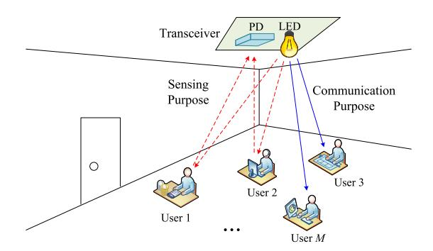

Fig. 1. IVLCS system with a transceiver and M users.

as a light detector to sense the variation of the ambient light intensity caused by mobile users [28], [35]. To reduce errors caused by mutual interferences among received signals, we assume that the users are relatively dispersed.

In this article, intensity modulation and direct detection are employed. For simplicity, the on-off keying is used as the modulation scheme. To eliminate interference among users, we assume that orthogonal channels (such as nonoverlapping time/frequency slot, or orthogonal signature) can be used for each user. This assumption holds for most practical systems, such as TDMA, frequency-division multiple access, and orthogonal code-division multiple access systems. Without loss of generality, the TDMA-type multislot signals are utilized. The set of available slots is denoted as  $\mathcal{M} = \{1, \dots, M\}$ . For each slot, either communication or sensing is performed. We assume that the primary purpose is sensing and the secondary purpose is communication.2 That is, the communication purpose is performed only after the sensing purpose is performed. To facilitate the description, we define a binary selection vector as  $\mathbf{u} = [u_1, \dots, u_m, \dots, u_M]^T$ , where  $u_m$  is given by

$$u_m = \begin{cases} 1, & \text{if slot } m \text{ is used for sensing} \\ 0, & \text{otherwise.} \end{cases}$$
 (1)

To further improve system performance, power allocation is considered. The power vector allocated to all slots is denoted as  $\mathbf{p} = [p_1, \dots, p_m, \dots, p_M]^T$ , where  $p_m$  is the transmitted power of the TDMA signal allocated on the mth slot.

### A. Sensing Purpose

As mentioned above, an active sensing is employed [35]. The system uses the LED to emit sensing signals to the users, and the users reflect the optical signals to the PD at the transceiver. In this case, the path from the LED to the mth user is set as the first link, and the corresponding channel gain is denoted as  $H_m$ . Moreover, the path from the mth user to the PD is set as the second link. Due to the channel reciprocity, the channel gain of the second link can also be set

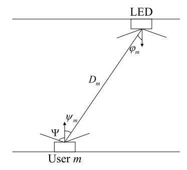

Fig. 2. Geometric relationships between the LED and the mth user.

as  $H_m$ . However, there is a scattering phenomenon in the process of light reflecting back to PD from the user, so the actual channel gain of the second link is much less than  $H_m$ . Define  $\beta$  ( $0 \le \beta \le 1$ ) as the reflecting loss factor, and the actual channel gain of the second link is  $\beta H_m$ . Thus, the received sensing signal at the PD on the mth slot is given by

$$Y_m = u_m \beta H_m^2 X_m + Z_m \ \forall m \in \mathcal{M}$$
 (2)

where  $X_m$  is the sensing signal emitted by the LED to the mth user and it satisfies the constraints  $X_m \ge 0$  and  $E(X_m) = \xi p_m$ , where  $\xi \in (0, 1]$  is the dimming target [21].  $Z_m \sim \mathcal{N}(0, \sigma_m^2)$  is the additive white Gaussian noise (AWGN) having mean zero and variance  $\sigma_m^2$  at the receiver on the mth slot. The channel gain  $H_m$  is given by [36]

$$H_m = \begin{cases} \frac{(1-\rho_m)(n+1)A_r}{2\pi D_m^2} Tg\cos^n(\varphi_m)\cos(\psi_m), & \text{if } 0 \le \psi_m \le \Psi\\ 0, & \text{if } \psi_m > \Psi \end{cases}$$
(3)

where  $\rho_m \in [0, 1]$  denotes the LoS blockage probability; n is the Lambertian emission order;  $A_r$  is the physical area of the PD; T and g are the optical filter gain and concentrator gain of the PD;  $\Psi$  is the field-of-view (FoV) of the PD; and  $D_m$ ,  $\varphi_m$ , and  $\psi_m$  are the distance, irradiance angle, and incidence angle from the LED to the mth user, as shown in Fig. 2. Moreover, the normal vector of the receiver plane at the PD is supposed to be perpendicular to the ceiling. Obviously, when the LED and user are fixed, the term  $H_m$  is a constant.

Similar to the signal-to-noise ratio in communication, some ratio indicators (such as clutter-to-noise ratio [37] and state-to-noise ratio [38]) have been proposed to evaluate the sensing performance. According to the active sensing mode, the ENR is employed in this article, which is defined as [39]

$$\gamma_{\rm s} = \sum_{m=1}^{M} \frac{e}{2\pi} \left( \frac{u_m \xi p_m \beta H_m^2}{\sigma_m} \right)^2. \tag{4}$$

### B. Communication Purpose

For communication purpose, the LED transmits optical signals to *M* users. Therefore, the received communication signal at the *m*th user can be expressed as

$$Y_m = (1 - u_m)H_m X_m + Z_m \ \forall m \in \mathcal{M}. \tag{5}$$

Here, we assume that the signal constraints of  $X_m$  and the noise variance of  $Z_m$  are the same as that in (2).

&lt;sup>2In the IVLCS system, the best way to allocate slots is based on dynamically changing channel conditions. However, the active sensing channels (2) are generally worse than the communication channels (5). In an extreme scenario, if all sensing channels are much worse than the communication channels, none of the slots will be allocated for sensing purpose. As a result, the ENR constraint (7) for sensing purpose will be violated, which is unreasonable in practice. Here, to serve both sensing and communication, the sensing is set as the primary aim, and the slots are first assigned for sensing purpose.

{3}------------------------------------------------

For wireless communications, the CSR is a crucial performance metric to evaluate system effectiveness [40]. Therefore, the achievable CSR is given by

$$R_{\rm c} = \frac{1}{2} \sum_{m=1}^{M} \log_2 \left\{ 1 + \frac{e}{2\pi} \left[ \frac{\xi (1 - u_m) p_m H_m}{\sigma_m} \right]^2 \right\}.$$
 (6)

# III. JOINT OPTIMIZATION OF SLOT SELECTION AND POWER ALLOCATION

In this section, we consider a joint optimization of slot selection and power allocation for the considered system. We first provide the constraints that should be considered. Then, we formulate the constrained optimization problem.

The considered constraints are summarized as follows.

1) *ENR Constraint:* For sensing purpose, the ENR should be larger than a given threshold, and thus the ENR constraint is given by

$$\gamma_{\rm s} \ge \gamma_{\rm t}$$
 (7)

where  $\gamma_t$  denotes the predetermined ENR threshold.

CSR Constraint: To ensure the communication quality and avoid the sum-rate outage, the achievable CSR should not be less than a predetermined threshold [41].
 Therefore, the CSR constraint is given by

$$R_{\rm c} > R_{\rm t}$$
 (8)

where  $R_t$  denotes the pregiven CSR threshold.

3) Sensing Slot Number Constraint: Because the priority of sensing is higher than that of communication, we first allocate slots for sensing purpose. Let the total slot number for sensing is  $M_{\text{sens}}$  ( $1 \le M_{\text{sens}} \le M$ ), the following constraint should be satisfied:

$$\sum_{m=1}^{M} u_m = M_{\text{sens}}.$$
 (9)

4) *Power Constraint:* Due to energy limitation, the transmitted power is constrained by a maximum transmit power value *I*, and thus the power constraint is given by

$$0 \le p_m \le I \ \forall m \in \mathcal{M}. \tag{10}$$

In this article, our goal is to jointly allocate the available slot and power resource by minimizing the total power under the considered constraints. Thus, we formulate the problem as

$$\min_{\mathbf{u}, \mathbf{p}} \sum_{m=1}^{M} p_m \tag{11}$$

s.t. 
$$R_c \ge R_t$$
 (11a)

$$\gamma_{\rm s} > \gamma_{\rm t}$$
 (11b)

$$0 \le p_m \le I \ \forall m \in \mathcal{M} \tag{11c}$$

$$\sum_{m=1}^{M} u_m = M_{\text{sens}} \tag{11d}$$

$$u_m \in \{0, 1\} \ \forall m \in \mathcal{M}. \tag{11e}$$

Despite of the objective function and the constraint (11c) are convex, the nonconvex constraints (11a), (11b), (11d),

and (11e) make the problem to be a nonconvex one. Indeed, most existing algorithms for nonconvex optimization only consider deterministic and convex constraints. Therefore, nonconvex problems are generally hard to solve optimally.

### IV. PROPOSED OPTIMIZATION ALGORITHMS

In this section, we will solve the optimization problem (11). First, the problem is divided into two subproblems. Then, the SPPM-JSSPA algorithm is proposed to solve the two subproblems. Finally, a low-complexity algorithm is proposed.

### A. Problem Partition

A major challenge to solve problem (11) lies in the binary vector **u**, which makes problem (11) to be a mixed integer programming problem. To solve the problem, a most effective method is to relax it into a standard convex problem by imposing a new constraint of slot selection regardless of the convexity of the objective function [42]. Thus, the approximate convex relaxation is used for **u** by replacing constraint (11e) with the following inequality constraint:

$$\mathbf{0}_{M\times 1} \prec \mathbf{u} \prec \mathbf{1}_{M\times 1}. \tag{12}$$

Therefore, the problem (11) can be transformed into

$$\min_{\mathbf{u}, \mathbf{p}} \sum_{m=1}^{M} p_m \tag{13}$$

s.t. 
$$R_c \ge R_t$$
 (13a)

$$\gamma_{\rm s} \ge \gamma_{\rm t}$$
 (13b)

$$0 < p_m < I \ \forall m \in \mathcal{M} \tag{13c}$$

$$\sum_{m=1}^{M} u_m = M_{\text{sens}} \tag{13d}$$

$$\mathbf{0}_{M\times 1} \leq \mathbf{u} \leq \mathbf{1}_{M\times 1}. \tag{13e}$$

To facilitate the descriptions, we define  $a_m$  and  $b_m$  as

$$\begin{cases} a_m \stackrel{\triangle}{=} \frac{2\pi}{e} \left( \frac{\sigma_m}{\xi (1 - u_m) H_m} \right)^2 \\ b_m \stackrel{\triangle}{=} \frac{2\pi}{e} \left( \frac{\sigma_m}{u \xi R H^2} \right)^2. \end{cases}$$
 (14)

Due to different priorities, the communication purpose can be implemented only after the sensing purpose is implemented. Then, the problem (13) is divided into a sensing subproblem (16) and a communication subproblem (17), i.e.,

$$\min_{\mathbf{u}, \mathbf{p}} T_{s}(\mathbf{p}, \mathbf{u}) = \sum_{k=1}^{M} u_{k} p_{k}$$
 (16)

s.t. 
$$\sum_{m=1}^{M} \frac{p_m^2}{b_m} \ge \gamma_t$$
 (16a)

$$0 \le p_m \le I \ \forall m \in \mathcal{M} \tag{16b}$$

$$\sum_{m=1}^{M} u_m = M_{\text{sens}} \tag{16c}$$

$$\mathbf{0}_{M\times 1} \prec \mathbf{u} \prec \mathbf{1}_{M\times 1} \tag{16d}$$

{4}------------------------------------------------

and

$$\min_{\mathbf{u}, \ \mathbf{p}} \ T_{c}(\mathbf{p}, \mathbf{u}) = \sum_{m=1}^{M} (1 - u_{m}) p_{m}$$
 (17)

s.t. 
$$\frac{1}{2} \sum_{m=1}^{M} \log_2 \left( 1 + \frac{p_m^2}{a_m} \right) \ge R_t$$
 (17a)

$$0 \le p_m \le I \ \forall m \in \mathcal{M} \tag{17b}$$

$$\sum_{m=1}^{M} (1 - u_m) = M - M_{\text{sens}}$$
 (17c)

$$\mathbf{0}_{M\times 1} \leq \mathbf{u} \leq \mathbf{1}_{M\times 1}.\tag{17d}$$

where  $T_{\rm s}({\bf p},{\bf u})$  and  $T_{\rm c}({\bf p},{\bf u})$  are the total power for sensing purpose and communication purpose, respectively. For sensing subproblem (16), our aim is to determine  $M_{\text{sens}}$  optimal sensing slots from set  $\mathcal{M}$  and the corresponding sensing power by minimizing  $T_s(\mathbf{p}, \mathbf{u})$ . For communication subproblem (17), the communication slots can be apparently determined after solving subproblem (16). Our aim is to find the optimal communication power by minimizing  $T_c(\mathbf{p}, \mathbf{u})$ . In the following two sections, we will solve the two subproblems.

### B. Solution of Sensing Subproblem (16)

For sensing subproblem (16), the objective function is affine, but the first constraint is concave with respect to  $p_m$ . Thus, the problem is a nonconvex one. To solve it, we employ the CMA method [43]. The CMA involves an outer iteration indexed by l, which sequentially performs two updates within each outer iteration, one for the power vector **p** with fixed  $\mathbf{u}^{(l)}$ , and the other for the binary slot selection vector **u** with fixed  $\mathbf{p}^{(l+1)}$ . Then, the minimization of (16) with respect to  $\mathbf{p}$  or u is repeated many times until the relative error of the total transmitted power from one iteration to the next one is smaller than a given value. The specific steps are given as follows.

1) Optimizing **p** With Fixed  $u^{(l)}$ : We first assume that all slots are used for sensing purpose (i.e.,  $\mathbf{u}^{(0)} = \mathbf{1}_{M \times 1}$ ) and thus (16c) and (16d) are removed. Then, we fix **u** to results from the *l*th outer iteration. In this condition, the subproblem (16) reduces to

$$\min_{\mathbf{p}_{s,s}} T_{s}(\mathbf{p}, \mathbf{u}^{(l)}) \tag{18}$$

s.t. 
$$\frac{1}{2} \sum_{m=1}^{M} \frac{p_m^2}{b_m} \ge \gamma_t$$
 (18a)

$$0 < p_m < I \ \forall m \in \mathcal{M}. \tag{18b}$$

Since (18a) is concave, the problem (18) is nonconvex. Moreover, according to the subgradient inequality for the convex function  $p_m^2$ , we obtain a lower bound of  $p_m^2$  as

$$p_m^2 \ge (p_m^{(t)})^2 + 2p_m^{(t)}(p_m - p_m^{(t)}) \ \forall m \in \mathcal{M}$$
 (19)

where  $p_m^{(t)}$  represents the *t*th inner iteration value of  $p_m$ .

By introducing a slack vector  $\mathbf{c} \stackrel{\Delta}{=} [c_1, \dots, c_m, \dots, c_M]^T$ , we can reformulate the problem (18) as

$$\min_{\mathbf{p}, \mathbf{c}} \widetilde{T}_{\mathbf{s}} \left( \mathbf{p} | \mathbf{p}^{(t)}, \mathbf{u}^{(l)} \right) \tag{20}$$

Algorithm 1: Sensing Power Allocation Algorithm for Solving (20)

Input:  $\gamma_t$ , M, I, n,  $A_r$ , T, g,  $\xi$ ,  $D_m$ ,  $\sigma_m^2$ ,  $\psi_m$ ,  $\mathbf{u}^{(l)}$ . Output:  $\mathbf{p}^{(l+1)}$ .

- 1 **Initialization**: Set the initial vector  $\mathbf{p}^{(0)}$ , and let t = 0.
- Substitute  $\mathbf{p}^{(t)}$  into problem (20).
- Solve problem (20) by the CVX and obtain the

Solution **p**.

Let 
$$\mathbf{p}^{(t+1)} = \mathbf{p}$$
, and calculate
$$\widetilde{T}_{s}(\mathbf{p}^{(t+1)}|\mathbf{p}^{(t)}, \mathbf{u}^{(\ell)}) = \sum_{m=1}^{M} p_{m}^{(t+1)} u_{m}^{(l)}.$$

- 7 until convergence; 8 return  $\mathbf{p}^{(l+1)} = \mathbf{p}^{(t)}$ .

s.t. 
$$\frac{1}{2} \sum_{m=1}^{M} \frac{c_m}{b_m} \ge \gamma_t$$
 (20a)

$$0 \le p_m \le I \ \forall m \in \mathcal{M} \tag{20b}$$

$$(p_m^{(t)})^2 + 2p_m^{(t)}(p_m - p_m^{(t)}) \ge c_m \ \forall m \in \mathcal{M}.$$
 (20c)

Note that the original objective function  $T_s(\mathbf{p}, \mathbf{u}^{(l)})$  in (18) is transformed into  $\widetilde{T}_{s}(\mathbf{p}|\mathbf{p}^{(t)},\mathbf{u}^{(l)})$ , which denotes the total consumed sensing power obtained from the tth inner iteration. The notation  $\mathbf{p}|\mathbf{p}^{(t)}$  denotes that the obtained sensing power vector  $\mathbf{p}^{(t)}$  at the tth inner iteration is used to update the current power vector **p**. For each inner iteration, problem (20) is convex and can be solved by specialized solver such as CVX toolbox in MATLAB. After solving the problem (20) at the th iteration, the objective function  $T_s(\mathbf{p}|\mathbf{p}^{(t)},\mathbf{u}^{(l)})$  evolves as  $\widetilde{T}_{s}(\mathbf{p}^{(t+1)}|\mathbf{p}^{(t)},\mathbf{u}^{(l)})$ . To facilitate the understanding, we propose a sensing power allocation algorithm to iteratively solve problem (20), which is shown in Algorithm 1.

2) Optimizing **u** With Fixed  $p^{(l+1)}$ : After the allocated sensing power is obtained, the sensing power variable in subproblem (16) is fixed as  $\mathbf{p}^{(l+1)}$ , and thus (16b) and (16c) are removed. In this case, the optimization subproblem (16) becomes

$$\min_{\mathbf{u}} T_{\mathbf{s}} \left( \mathbf{p}^{(l+1)}, \mathbf{u} \right) \tag{21}$$

s.t. 
$$\frac{1}{2} \sum_{m=1}^{M} \frac{u_m^2}{d_m} \ge \gamma_t$$
 (21a)

$$\mathbf{0}_{M\times 1} \leq \mathbf{u} \leq \mathbf{1}_{M\times 1} \tag{21b}$$

where  $d_m$  is defined as

$$d_m \stackrel{\triangle}{=} \frac{2\pi}{e} \left( \frac{\sigma_m}{p_m^* \xi \beta H_m^2} \right)^2. \tag{22}$$

Similar to problem (18), problem (21) is also nonconvex. Since  $u_m^2$  is a differentiable convex function, we have

$$u_m^2 \ge \left(u_m^{(k)}\right)^2 + 2u_m^{(k)}\left(u_m - u_m^{(k)}\right) \ \forall m \in \mathcal{M}$$
 (23)

where  $u_m^{(k)}$  represents the kth inner iteration value of  $u_m$ .

{5}------------------------------------------------

Algorithm 2: Sensing Slot Selection Algorithm for Solving (24)

**Input**:  $\gamma_{l}$ , M, I, n,  $A_{r}$ , T, g,  $\xi$ ,  $D_{m}$ ,  $\sigma_{m}^{2}$ ,  $\psi_{m}$ ,  $\mathbf{p}^{(l+1)}$ . **Output**:  $\mathbf{u}^{(l+1)}$ .

- 1 **Initialization**: Set the initial vector  $\mathbf{u}^{(0)}$ , and let k = 0.
- 2 repeat
- Substitute  $\mathbf{u}^{(k)}$  into problem (24). 3
- Solve problem (24) by the CVX and obtain the 4

Let 
$$\mathbf{u}^{(k+1)} = \mathbf{u}$$
, and calculate  $\widetilde{T}_{s}(\mathbf{p}^{(l+1)}, \mathbf{u}^{(k+1)} | \mathbf{u}^{(k)}) = \sum_{m=1}^{M} p_m^{(l+1)} u_m^{(k+1)}$ .

- 7 until convergence; 8 return  $\mathbf{u}^{(l+1)} = \mathbf{u}^{(k)}$

By introducing a slack vector  $\mathbf{e} \stackrel{\Delta}{=} [e_1, \dots, e_m, \dots, e_M]^T$ , we can reformulate the problem (21) as

$$\min_{\mathbf{u}, \mathbf{e}} \ \widetilde{T}_{\mathbf{s}} \Big( \mathbf{p}^{(l+1)}, \ \mathbf{u} | \mathbf{u}^{(k)} \Big)$$
 (24)

$$\min_{\mathbf{u}, \mathbf{e}} \widetilde{T}_{s} \left( \mathbf{p}^{(l+1)}, \mathbf{u} | \mathbf{u}^{(k)} \right)$$
s.t. 
$$\frac{1}{2} \sum_{m=1}^{M} \frac{e_{m}}{d_{m}} \ge \gamma_{t}$$
(24a)

$$\mathbf{0}_{M\times 1} \leq \mathbf{u} \leq \mathbf{1}_{M\times 1} \tag{24b}$$

$$\left(u_m^{(k)}\right)^2 + 2u_m^{(k)}\left(u_m - u_m^{(k)}\right) \ge e_m \ \forall m \in \mathcal{M}. \tag{24c}$$

Similar to problem (20), the objective function  $T_s(\mathbf{p}^{(l+1)}, \mathbf{u})$ in (21) is transformed into  $\widetilde{T}_{s}(\mathbf{p}^{(l+1)},\mathbf{u}|\mathbf{u}^{(k)})$  in (24). Because problem (24) is convex, one can efficiently solve it by using CVX in MATLAB. At the kth iteration, the objective function  $\widetilde{T}_s(\mathbf{p}^{(l+1)}, \mathbf{u}|\mathbf{u}^{(k)})$  evolves as  $\widetilde{T}_s(\mathbf{p}^{(l+1)}, \mathbf{u}^{(k+1)}|\mathbf{u}^{(k)})$ . Here, we propose a sensing slot selection algorithm to iteratively solve problem (24), which is summarized in Algorithm 2.

3) Alternating Iterations: Problem (20) and problem (24) are alternately optimized until the relative error of the total transmitted power from one iteration to the next is smaller than a given value. Then, we set the maximum  $M_{\text{sens}}$  values in  $\mathbf{u}^{(l+1)}$  as 1, and the others as 0. Therefore,  $M_{\text{sens}}$  slots are selected for sensing. The selected slot set for sensing purpose is denoted as  $\mathcal{M}_{sens}^*$ , and the corresponding sensing power vector is denoted as  $\mathbf{p}_{\text{sens}}^*$ . For clarity, we propose a joint sensing slot selection and power allocation algorithm to solve subproblem (16), which is shown in Algorithm 3.

### C. Solution of Communication Subproblem (17)

Because  $M_{\text{sens}}$  slots are selected for sensing purpose, the remaining  $M_{\text{com}} = M - M_{\text{sens}}$  slots are used for communication purpose. Therefore, the slot set for communication purpose is given by  $\mathcal{M}_{com}^* = \mathcal{M} \setminus \mathcal{M}_{sens}^*$ . As a result, the optimal power allocation for communication subproblem (17) can be described as

$$\min_{\mathbf{p}} T_{\mathbf{c}}(\mathbf{p}, \mathbf{u}^*) = \sum_{\mathbf{n}} (1 - u_m^*) p_m \quad (25)$$

$$\min_{\mathbf{p}} T_{\mathbf{c}}(\mathbf{p}, \mathbf{u}^*) = \sum_{m \in \mathcal{M}_{2\text{orn}}^*} \left(1 - u_m^*\right) p_m \quad (25)$$
s.t. 
$$\frac{1}{2} \sum_{m \in \mathcal{M}_{\text{com}}^*} \log_2 \left(1 + \frac{p_m^*}{a_m}\right) \ge R_t \quad (25a)$$

$$0 \le p_m \le I \ \forall m \in \mathcal{M}_{com}^*. \tag{25b}$$

**Algorithm 3:** Sensing Slot Selection and Power Allocation Algorithm for Solving (16)

**Input**:  $\gamma_t$ , M,  $M_{\text{sens}}$ ,  $\overline{I}$ , n,  $A_r$ , T, g,  $\xi$ ,  $D_m$ ,  $\sigma_m^2$ ,  $\psi_m$ . Output:  $\mathcal{M}_{\text{sens}}^*$ ,  $\mathbf{p}_{\text{sens}}^*$ ,  $\mathbf{u}^*$ 

- 1 **Initialization**: Set the initial vector  $\mathbf{u}^{(0)}$  and  $\mathbf{p}^{(0)}$ , and let l = 0,  $\mathcal{M}_{\text{sens}}^* = \mathbf{p}_{\text{sens}}^* = \emptyset$ .
- 2 repeat
- Fix  $\mathbf{u}^{(l)}$  and substitute  $\mathbf{p}^{(l)}$  into **Algorithm 1**, and obtain the solution  $\mathbf{p}^{(l+1)}$ .
- Fix  $\mathbf{p}^{(l+1)}$  and substitute  $\mathbf{u}^{(l)}$  into **Algorithm 2**, and obtain the solution  $\mathbf{u}^{(l+1)}$ .
- Calculate  $T_{s}(\mathbf{p}^{(l+1)}, \mathbf{u}^{(l+1)}) = \sum_{m=1}^{M} p_{m}^{(l+1)} u_{m}^{(l+1)}$ . 5
- Set l = l + 1.
- 7 until convergence;
- 8 Let  $\mathbf{u}^* = \mathbf{u}^{(l)}$ .
- 9 **for**  $j = 1:M_{sens}$  **do**

Calculate 
$$u_m^{(l)} = \arg\max\{u_k^{(l)}, u_k^{(l)} \in \mathbf{u}^{(l)}\}$$
, and obtain the index  $m$ .

- Let  $\mathcal{M}_{\text{sens}}^* = [\mathcal{M}_{\text{sens}}^*, m]$ , and  $\mathbf{p}_{\text{sens}}^* = [\mathbf{p}_{\text{sens}}^*, p_m^{(l)}]$ . Let  $\mathbf{u}^{(l)} = \mathbf{u}^{(l)} \setminus \{u_m^{(l)}\}$ .
- 14 return  $\mathcal{M}_{\text{sens}}^*$ ,  $\mathbf{p}_{\text{sens}}^*$ ,  $\mathbf{u}^*$ .

Since (25a) is concave, the optimization problem (25) is nonconvex. Similar to (19), we can also obtain

$$p_m^2 \ge (p_m^{(q)})^2 + 2p_m^{(q)}(p_m - p_m^{(q)}) \ \forall m \in \mathcal{M}$$
 (26)

where  $p_m^{(q)}$  represents the qth iteration value of  $p_m$ .

By introducing a slack vector  $\mathbf{f} \stackrel{\Delta}{=} [f_1, \dots, f_m, \dots, f_{M_{\text{com}}}]^{\text{T}}$ , we can transform the problem (25) as

$$\min_{\mathbf{p}, \mathbf{f}} \widetilde{T}_{c}(\mathbf{p}|\mathbf{p}^{(q)}, \mathbf{u}^{*})$$
 (27)

s.t. 
$$\frac{1}{2} \sum_{m \in \mathcal{M}_{\text{com}}^*} \log_2 \left( 1 + \frac{f_m}{a_m} \right) \ge R_t$$
 (27a)

$$0 \le p_m \le I \ \forall m \in \mathcal{M}_{\text{com}}^* \tag{27b}$$

$$\left(p_m^{(q)}\right)^2 + 2p_m^{(q)}\left(p_m - p_m^{(q)}\right) \ge f_m \ \forall m \in \mathcal{M}_{com}^*.$$
 (27c)

As the problem (27) is convex, CVX in MATLAB can be used to solve it efficiently. Thus, the objective function  $\widetilde{T}_c(\mathbf{p}|\mathbf{p}^{(q)},\mathbf{u}^*)$  evolves as  $\widetilde{T}_c(\mathbf{p}^{(q+1)}|\mathbf{p}^{(q)},\mathbf{u}^*)$ . We propose a communication power allocation algorithm to iteratively solve (27), which is summarized in Algorithm 4.

# D. Proposed SPPM-JSSPA Algorithm

In this article, we consider that the primary purpose is sensing and the secondary purpose is communication. First, the problem (13) is divided into sensing subproblem (16) and communication subproblem (17). By employing Algorithms 3 and 4 to solve subproblems (16) and (17) in turn, we can obtain the solution of the original problem (13). To facilitate the understanding, we propose an SPPM-JSSPA algorithm, which is summarized as Algorithm 5.

{6}------------------------------------------------

# **Algorithm 4:** Communication Power Allocation Algorithm for Solving (27)

**Input**:  $R_t$ ,  $M_{com}$ , I, n,  $A_r$ , T, g,  $\xi$ ,  $D_m$ ,  $\sigma_m^2$ . **Output**:  $\mathbf{p}_{com}^*$ .

1 **Initialization**: Set the initial vector  $\mathbf{p}_{\text{com}}^{(0)}$ , and let q = 0.

2 repeat

3 Substitute  $\mathbf{p}_{\text{com}}^{(q)}$  into problem (27).

Solve problem (27) by the CVX and obtain the solution **p**com.

5 Let  $\mathbf{p}_{\text{com}}^{(q)} = \mathbf{p}_{\text{com}}$ , and calculate  $\widetilde{T}_{\text{c}}(\mathbf{p}^{(q+1)}|\mathbf{p}^{(q)},\mathbf{u}^*) = \sum_{m=1}^{M} p_m^{(q+1)} u_m^*$ .

6 Set q = q + 1.

7 until convergence;

8 return  $\mathbf{p}_{\text{com}}^* = \mathbf{p}_{\text{com}}^{(q)}$ .

# Algorithm 5: Proposed SPPM-JSSPA Algorithm

**Input:**  $R_t$ ,  $\gamma_t$ , M, I, n,  $A_r$ , T, g,  $\xi$ ,  $D_m$ , and  $\sigma_m^2$ 

Output: p\*, u\*.

**Step 1:** Divide problem (13) into subproblems (16) and (17).

Step 2: Solve subproblem (16) using Algorithm 3.

Step 3: Solve subproblem (17) using Algorithm 4.

return  $p^*$ ,  $u^*$ .

### E. Proposed Low-Complexity Algorithm

For the SPPM-JSSPA algorithm, the computational complexity is high because the slot selection in the algorithm requires much more operations (i.e., additions and multiplications). To reduce computational complexity, we propose a low-complexity FSSPA algorithm in this section.

In the proposed FSSPA algorithm, we do not optimize the slots, but fix the former  $M_{\text{sens}}$  slots for sensing purpose, and the rest slots for communication purpose. Under this circumstance, the binary vector  $\mathbf{u}$  becomes

$$\mathbf{u} = \left[ \underbrace{1, \dots, 1, \dots, 1}_{M_{\text{sens}}}, \underbrace{0, \dots, 0, \dots, 0}_{M - M_{\text{sens}}} \right]^{\text{T}}.$$
 (28)

For a fixed slot allocation scheme (28), the proposed FSSPA algorithm consists of Algorithms 1 and 4. Compared with the proposed SPPM-JSSPA algorithm, the proposed FFSPA algorithm does not perform Algorithms 2 and 3. Therefore, the proposed FSSPA algorithm can effectively reduce the computational complexity.

### V. CONVERGENCE AND COMPLEXITY ANALYSIS

In this section, the convergence and computational complexities of the proposed algorithms will be analyzed.

### A. Convergence Analysis

In this section, we analyze the convergence of the proposed algorithms. Note that Algorithm 5 is convergent if both Algorithms 3 and 4 are convergent. In the following, we show the convergence of Algorithms 3 and 4, respectively.

For Algorithm 3, it involves an outer iteration indexed by l, which sequentially performs two inner updates (i.e.,  $\mathbf{p}$  and  $\mathbf{u}$ ) within each outer iteration. Let  $T_{\rm s}(\mathbf{p}^{(l)},\mathbf{u}^{(l)})$  be the value of the objective function evaluated at the lth outer iteration and  $\{(\mathbf{p}^{(l)},\mathbf{u}^{(l)})\}$  denotes a sequence of solutions obtained for the alternating optimization process. In the outer iteration, the objective function evolves as

$$T_{\mathbf{s}}\left(\mathbf{p}^{(l)}, \mathbf{u}^{(l)}\right) \to T_{\mathbf{s}}\left(\mathbf{p}^{(l+1)}, \mathbf{u}^{(l)}\right) \to T_{\mathbf{s}}\left(\mathbf{p}^{(l+1)}, \mathbf{u}^{(l+1)}\right).$$
 (29)

Obviously, each outer iteration includes two inner iterations. The inner iteration indexed by t in Algorithm 1 updates power via iteratively minimizing  $\widetilde{T}_s(\mathbf{p}|\mathbf{p}^{(t)},\mathbf{u}^{(l)})$  in problem (20). Thus, the objective function of problem (20) evolves as

$$\widetilde{T}_{s}\left(\mathbf{p}|\mathbf{p}^{(t)},\mathbf{u}^{(l)}\right) \to \widetilde{T}_{s}\left(\mathbf{p}^{(t+1)}|\mathbf{p}^{(t)},\mathbf{u}^{(l)}\right).$$
 (30)

For the inner iteration with index t, we have

$$\widetilde{T}_{s}\left(\mathbf{p}^{(t+1)}|\mathbf{p}^{(t)},\mathbf{u}^{(l)}\right) \stackrel{(a)}{\leq} \widetilde{T}_{s}\left(\mathbf{p}^{(t)}|\mathbf{p}^{(t)},\mathbf{u}^{(l)}\right) \stackrel{(b)}{=} T_{s}\left(\mathbf{p}^{(t)},\mathbf{u}^{(l)}\right)$$
(31)

where (a) holds due to the minimization of (20) at the *t*th iteration, and (b) holds because the objective function has not been updated at the *t*th inner iteration. Based on (19), we have

$$\widetilde{T}_{s}\left(\mathbf{p}^{(t+1)}\middle|\mathbf{p}^{(t+1)},\mathbf{u}^{(l)}\right) - \widetilde{T}_{s}\left(\mathbf{p}^{(t+1)}\middle|\mathbf{p}^{(t)},\mathbf{u}^{(l)}\right) \\
\stackrel{(a)}{=} T_{s}\left(\mathbf{p}^{(t+1)},\mathbf{u}^{(l)}\right) - \widetilde{T}_{s}\left(\mathbf{p}^{(t+1)}\middle|\mathbf{p}^{(t)},\mathbf{u}^{(l)}\right) \stackrel{(b)}{\leq} 0 \quad (32)$$

where (a) holds because the objective function has not been updated at the (t+1)th inner iteration, and (b) holds because of the lower bound relationship in (19). Then, based on (31) and (32), we have

$$T_{s}\left(\mathbf{p}^{(t+1)}, \mathbf{u}^{(l)}\right) = \widetilde{T}_{s}\left(\mathbf{p}^{(t+1)}|\mathbf{p}^{(t+1)}, \mathbf{u}^{(l)}\right)$$

$$\leq \widetilde{T}_{s}\left(\mathbf{p}^{(t+1)}|\mathbf{p}^{(t)}, \mathbf{u}^{(l)}\right)$$

$$\leq \widetilde{T}_{s}\left(\mathbf{p}^{(t)}|\mathbf{p}^{(t)}, \mathbf{u}^{(l)}\right)$$

$$= T_{s}\left(\mathbf{p}^{(t)}, \mathbf{u}^{(l)}\right)$$
(33)

which indicates that the objective function  $T_s(\mathbf{p}^{(t)}, \mathbf{u}^{(l)})$  is a nonincreasing function with respect to t. Moreover, because of the power constraint (10), the objective function  $T_s(\mathbf{p}^{(t)}, \mathbf{u}^{(l)})$  can be lower bounded by

$$T_{\mathbf{s}}\left(\mathbf{p}^{(t)}, \mathbf{u}^{(l)}\right) \ge 0.$$
 (34)

Thus,  $\{T_s(\mathbf{p}^{(l)}, \mathbf{u}^{(l)})\}$  is a nonincreasing and lower bounded sequence. According to the monotone convergence theorem [44], we conclude that Algorithm 1 is convergent.

After Algorithm 1 ends, the final value of the power vector is updated as  $\mathbf{p}^{(l+1)}$ . It follows from (33) that:

$$T_{\mathbf{s}}\left(\mathbf{p}^{(l+1)}, \mathbf{u}^{(l)}\right) \le T_{\mathbf{s}}\left(\mathbf{p}^{(l)}, \mathbf{u}^{(l)}\right).$$
 (35)

Similarly, the inner iteration index by k in Algorithm 2 updates the slot vector, the objective function evolves as

$$\widetilde{T}_{s}\left(\mathbf{p}^{(l+1)},\mathbf{u}|\mathbf{u}^{(k)}\right) \rightarrow \widetilde{T}_{s}\left(\mathbf{p}^{(l+1)},\mathbf{u}^{(k+1)}|\mathbf{u}^{(k)}\right).$$
 (36)

{7}------------------------------------------------

Similar to Algorithm 1, the objective function in Algorithm 2 is nonincreasing with k and has a lower bound, and thus Algorithm 2 is also convergent.

After Algorithm 2 finishes, we have

$$T_{\mathbf{s}}\left(\mathbf{p}^{(l+1)}, \mathbf{u}^{(l+1)}\right) \le T_{\mathbf{s}}\left(\mathbf{p}^{(l+1)}, \mathbf{u}^{(l)}\right). \tag{37}$$

Combining (35) with (37), we have

$$T_{s}\left(\mathbf{p}^{(l+1)}, \mathbf{u}^{(l+1)}\right) \le T_{s}\left(\mathbf{p}^{(l+1)}, \mathbf{u}^{(l)}\right) \le T_{s}\left(\mathbf{p}^{(l)}, \mathbf{u}^{(l)}\right)$$
 (38)

which indicates that the objective function  $T_s(\mathbf{p}^{(l)}, \mathbf{u}^{(l)})$  is nonincreasing as l increases in Algorithm 3.

Finally, regarding the boundedness of the objective function in Algorithm 3, it is easy to show that

$$T_{\mathbf{s}}\left(\mathbf{p}^{(l)}, \mathbf{u}^{(l)}\right) \ge 0. \tag{39}$$

Clearly, the right-hand side of (39) is a lower bound of  $T_s(\mathbf{p}^{(l)}, \mathbf{u}^{(l)})$ , and thus Algorithm 3 is convergent.

For Algorithm 4,  $\widetilde{T}_c(\mathbf{p}|\mathbf{p}^{(q)}, \mathbf{u}^*)$  is the value of the objective function evaluated at the *q*th iteration by SCA method and  $\{(\mathbf{p}^{(q)}, \mathbf{u}^*)\}$  denotes a sequence of solutions. The analysis is similar to Algorithm 1, thus we have

$$T_{c}\left(\mathbf{p}^{(q+1)}, \mathbf{u}^{*}\right) \leq T_{c}\left(\mathbf{p}^{(q)}, \mathbf{u}^{*}\right)$$
 (40)

where indicates that Algorithm 4 is nonincreasing as q increases. Then, for the communication subproblem (17), we can also obtain

$$T_{c}\left(\mathbf{p}^{(q)}, \mathbf{u}^{*}\right) \ge 0 \tag{41}$$

which suggests that the power does not transmit for communication purpose. Therefore, Algorithm 4 is also convergent.

Given all the above analysis, the convergence of the proposed SPPM-JSSPA algorithm (i.e., Algorithm 5) can be ensured. Moreover, for the proposed low-complexity FSSPA algorithm, the convergence can also be proved by using a similar analysis approach.

### B. Computational Complexity Analysis

Even if an algorithm is theoretically feasible, it is impossible to implement it in practice if it requires an inordinate amount of resources to obtain the solution. Therefore, the computational complexity of an algorithm is an important factor for the realization. Usually, the consumed time to execute the current algorithm is called time complexity, and the storage space required to execute the algorithm is called space complexity.

1) Time Complexity: Generally, it is difficult to obtain the exact number of operations of an algorithm due to its operating environment and the size of the data. Therefore, the big-O notation is used to show an asymptotic upper bound on the number of operations. In this section, the time complexity will be measured based on the number of multiplications and additions of the main computational blocks.

The proposed SPPM-JSSPA algorithm contains some iteration operations, but the exact number of the iterations is not known. To facilitate the description, the numbers of iterations of Algorithms 1-4 are assumed to be t, k,

TABLE I
TIME COMPLEXITY OF THE SPPM-JSSPA ALGORITHM

| Major Blocks | Multiplications                    | Additions                          |
|--------------|------------------------------------|------------------------------------|
| Algorithm 1  | $\mathcal{O}(tM)$                  | $\mathcal{O}(tM)$                  |
| Algorithm 2  | $\mathcal{O}(kM^2)$                | $\mathcal{O}(kM^2)$                |
| Algorithm 3  | $\mathcal{O}[(tM+kM^2)l]$          | $\mathcal{O}[(tM+kM^2)l]$          |
| Algorithm 4  | $\mathcal{O}(qM_{\mathrm{com}}^2)$ | $\mathcal{O}(qM_{\mathrm{com}}^2)$ |

TABLE II
SPACE COMPLEXITY OF THE SPPM-JSSPA ALGORITHM

| Major objects                                                                                                       | Memory cells                    |
|---------------------------------------------------------------------------------------------------------------------|---------------------------------|
| Major parameters (such as                                                                                           | $\mathcal{O}\left(1\right)$     |
| $n, A_{\mathrm{r}}, T, g, \Psi, \sigma_m^2, I, M_{\mathrm{sens}}, \gamma_{\mathrm{t}} \text{ and } R_{\mathrm{t}})$ |                                 |
| Channel gains                                                                                                       | $\mathcal{O}(M)$                |
| Time slot selection matrix                                                                                          | $\mathcal{O}(M)$                |
| Power allocation matrix                                                                                             | $\mathcal{O}(M)$                |
| Slack vectors <b>c</b> , <b>e</b>                                                                                   | $\mathcal{O}(M)$                |
| Optimal transmitted power                                                                                           | $\mathcal{O}(1)$                |
| Communication power allocation matrix                                                                               | $\mathcal{O}(M_{\mathrm{com}})$ |
| Slack vector <b>f</b>                                                                                               | $\mathcal{O}(M_{\mathrm{com}})$ |
| Optimal transmit power                                                                                              | $\mathcal{O}(1)$                |

l, and q, respectively. The time complexity of the SPPM-JSSPA algorithm is analyzed in Table I. From Table I, we can observe that the numbers of multiplications and additions of the proposed SPPM-JSSPA algorithm are both  $\mathcal{O}[(tM+kM^2)l]+\mathcal{O}(qM_{\text{com}}^2)$ .

Similarly, we can also analyze the complexity of the proposed FSSPA algorithm. The computational complexities of Algorithms 1 and 4 depend on the numbers of iterations t and q. In addition, the convex problems (20) and (27) at each iteration have complexities of  $\mathcal{O}(M)$  and  $\mathcal{O}(M_{\text{com}}^2)$ . Thus, the overall time complexity of the proposed FSSPA algorithm is  $\mathcal{O}(tM) + \mathcal{O}(qM_{\text{com}}^2)$ . We observe a smaller computational complexity for the FSSPA algorithm as compared with the SPPM-JSSPA algorithm. In other words, the FSSPA algorithm does not consider the slot allocation and thus omits the processes of Algorithms 2 and 3. Nonetheless, both the proposed SPPM-JSSPA algorithm and the FSSPA algorithm are time-efficient.

2) Space Complexity: In general, the space complexity is expressed in an asymptotic upper bound on the number of required storage spaces during the execution of an algorithm. For simplicity, we only list the number of memory cells required for the main objects that must be memorized.

For the proposed SPPM-JSSPA algorithm, the space complexity is shown in Table II. From Table II, we can conclude that the space complexity of the algorithm is  $\mathcal{O}(M)$ .

Similarly, we can analyze the space complexity of the FSSPA algorithm. Since the major objects of the proposed SPPM-JSSPA algorithm and FSSPA algorithm are identical, the number of memory cells required by the two algorithms is the same. Therefore, the space complexity of the FSSPA algorithm is  $\mathcal{O}(M)$ . This indicates that both the proposed two algorithms are space-efficient algorithms.

### VI. NUMERICAL RESULTS

In this section, we provide various numerical examples to verify the effectiveness of proposed algorithms and reveal

{8}------------------------------------------------

### TABLE III SIMULATION PARAMETERS

| Parameters                       | Symbols      | Values                           |
|----------------------------------|--------------|----------------------------------|
| Order of the Lambertian emission | n            | 5                                |
| Physical area of the PD          | $A_{ m r}$   | $1 \text{ cm}^2$                 |
| Optical filter gain of the PD    | T            | 1                                |
| Concentrator gain of the PD      | g            | 3                                |
| FoV of the PD                    | Ψ            | 45°                              |
| Noise variance                   | $\sigma_m^2$ | $1 \times 10^{-11} \text{ W/Hz}$ |
| Maximum transmit power value     | I            | 5 W                              |

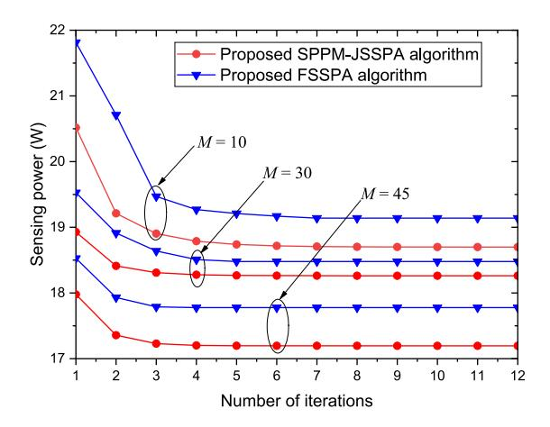

Fig. 3. Convergence of total sensing power for the proposed two algorithms when *M*sens = 6, ρ = 1, γt = 0 dB, and *R*t = 1 bit/s/Hz.

their intrinsic mechanism. To facilitate simulation, we let ρ = ρ*m* ∀*m*. Here, we consider a practical IVLCS system in a 10 m×10 m×3 m room, as shown in Fig. [1.](#page-2-0) The major simulation parameters are available in Table [III.](#page-8-0)

Fig. [3](#page-8-1) shows the total sensing power versus iteration number when *M*sens = 6, ρ = 1, γt = 0 dB, and *R*t = 1 bit/s/Hz. Here, we compare the performance of the proposed two algorithms, i.e., the SPPM-JSSPA algorithm and the FSSPA algorithm. As can be observed, both the two algorithms converge in a finite number of iterations (≤ 8 iterations) under different *M*, which suggests that we can rapidly obtain the solution of the optimal total sensing power by using the two algorithms. It can be also observed that the total sensing power decreases significantly with the increase of *M*. This is because for a larger *M*, more available slots can be used for sensing slot selection to achieve a smaller total sensing power.

For the proposed SPPM-JSSPA algorithm and FSSPA algorithm, Fig. [4](#page-8-2) shows the total communication power versus the number of iterations when *M*sens = 6, ρ = 1, γt = 0 dB and *R*t = 1 bit/s/Hz. It can be observed that the total communication power increases with the increase of *M*. This is because the number of slots used for communication purpose also increase when the number of total slots *M* increases. Similar to Fig. [3,](#page-8-1) both two algorithms in this figure also converge quickly in a finite number of iterations (≤ 5 iterations) under different *M*.

Moreover, to better validate the effectiveness of the proposed SPPM-JSSPA algorithm and the FSSPA algorithm, the following two algorithms are proposed as the benchmarks.

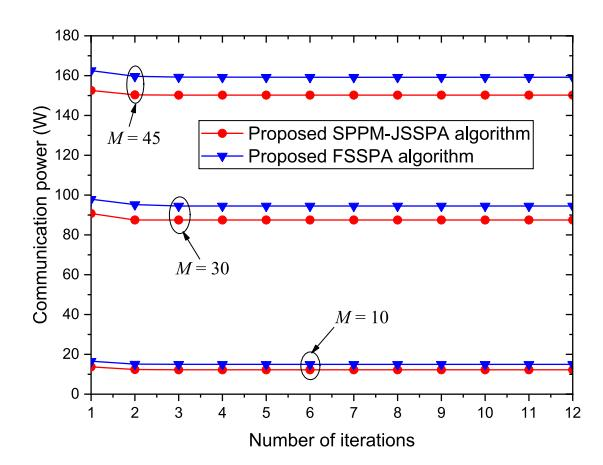

Fig. 4. Convergence of total communication power for the proposed two algorithms when *M*sens = 6, ρ = 1, γ*t* = 0 dB, and *Rt* = 1 bit/s/Hz.

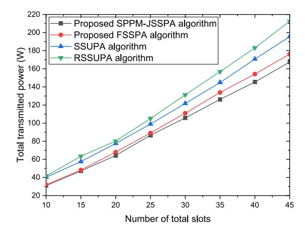

Fig. 5. Total transmitted power versus the number of total slots for the four algorithms when *M*sens = 6, ρ = 1, γt = 0 dB, and *R*t = 1 bit/s/Hz.

- 1) *Slot Selection and Uniform Power Allocation (SSUPA) Algorithm:* The algorithm uses the CMA and SCA methods to select the sensing slots according to [\(9\)](#page-3-12) and allocates the transmit power uniformly to all slots.
- 2) *Random SSUPA (RSSUPA) Algorithm:* The algorithm randomly selects sensing slots subject to [\(9\)](#page-3-12) and allocates the transmit power uniformly to all slots.

Fig. [5](#page-8-3) depicts the total transmitted power versus the number of total slots for the proposed SPPM-JSSPA algorithm and FSSPA algorithm when *M*sens = 6, ρ = 1, γt = 0 dB, and *R*t = 1 bit/s/Hz. To facilitate the comparison, the SSUPA algorithm and RSSUPA algorithm are also provided in this figure. As can be observed, the overall performance of the proposed SPPM-JSSPA and FSSPA algorithms is superior to that of the SSUPA algorithm and the RSSUPA algorithm. This is because the two proposed algorithms can allocate power optimally rather than uniformly. In addition, we observe that the proposed low-complexity FSSPA algorithm can obtain a comparable power-saving performance to the proposed SPPM-JSSPA algorithm. Meanwhile, we also detail slots and power allocation of four algorithms in Table [IV.](#page-9-0)

Fig. [6](#page-9-1) plots the total transmitted power of four algorithms for different numbers of slots when *M*sens = 6, ρ = 1, γt = 0 dB, and *R*t = 1 bit/s/Hz. In addition to total transmitted

{9}------------------------------------------------

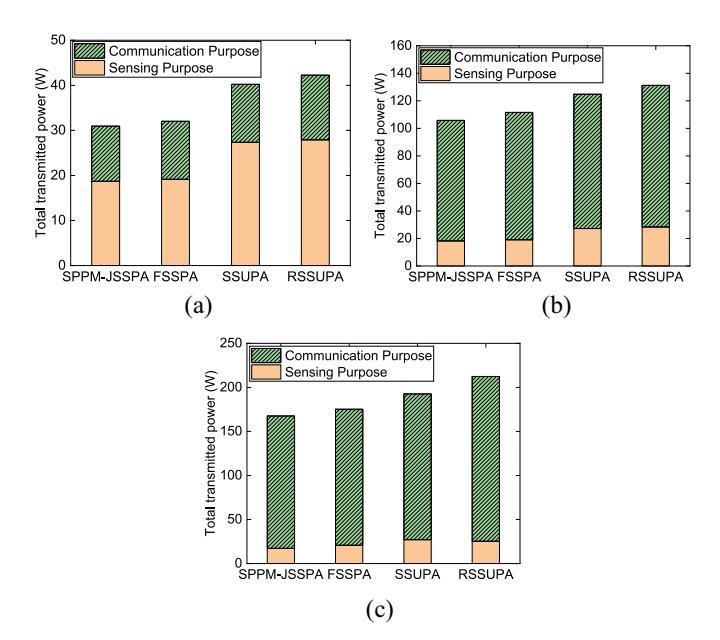

Fig. 6. Total transmitted power of four algorithms for different *M* when *M*sens = 6, ρ = 1, γt = 0 dB and *R*t = 1 bit/s/Hz. (a) *M* = 10. (b) *M* = 30. (c) *M* = 45.

TABLE IV SLOT SELECTION AND POWER ALLOCATION OF THE FOUR ALGORITHMS WHEN *M* = 10, ρ = 1, γt = 0 dB, AND *R*t = 1 bit/s/Hz

| Algorithms | Slot selection | Power allocation (W)          |
|------------|----------------|-------------------------------|
| SPPM-JSSPA | 1101100101     | 2.66 3.42 3.14 2.90 2.56 1.58 |
|            |                | 4.70 4.61 3.14 2.55           |
| FSSPA      | 1111110000     | 3.36 4.19 2.50 3.97 2.59 2.52 |
|            |                | 3.74 1.95 4.05 3.02           |
| SSUPA      | 1101100101     | 4.56 4.56 3.21 4.56 4.56 3.21 |
|            |                | 3.21 4.56 3.21 4.56           |
| RSSUPA     | 1011101010     | 4.65 3.58 4.65 4.65 4.65 3.58 |
|            |                | 4.65 3.58 4.65 3.58           |

power, the sensing power and communication power used for four algorithms are also provided in the figure. As can be seen, no matter for sensing power, communication power, or the total power, the proposed SPPM-JSSPA algorithm always achieves the best power-saving performance, the proposed low-complexity FSSPA algorithm obtains the second best performance, and the SSUPA algorithm and RSSUPA algorithm obtain the worst performance. Moreover, as shown in Fig. [6\(](#page-9-1)a)–(c), with the increase of total slot number *M*, the total transmitted power also increases, which is consistent with the conclusion in Fig. [5.](#page-8-3)

Fig. [7](#page-9-2) shows the total sensing power of the four algorithms for different ENR thresholds γt when *M* = 10, *M*sens = 6, ρ = 1, and *R*t = 1 bit/s/Hz. As can be observed, with the increase of the ENR threshold γt, the total sensing power increases slowly. This indicates that the higher the sensing performance requirement is, the more consumption the total sensing power has. Moreover, a large gap exists between the proposed two algorithms and the other two benchmark algorithms. This indicates that the proposed algorithms can significantly reduce total sensing power consumption, which is because the proposed algorithms optimally but not uniformly allocate the power for sensing purpose.

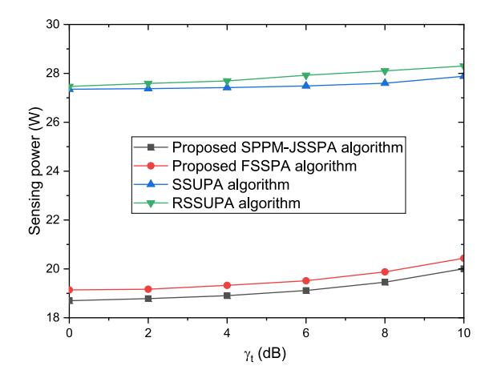

Fig. 7. Total sensing power versus the ENR threshold γt for different algorithms when *M* = 10, *M*sens = 6, ρ = 1, and *R*t = 1 bit/s/Hz.

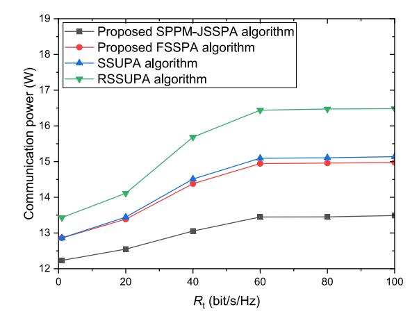

Fig. 8. Comparison of total communication power of different algorithms when *M* = 10, *M*sens = 6, ρ = 1, and γt = 0 dB.

Furthermore, Fig. [8](#page-9-3) shows the total communication power of the four algorithms for different CSR thresholds *R*t when *M* = 10, *M*sens = 6, ρ = 1, and γt = 0 dB. As can be seen, with the increase of *R*t, the total communication power for each algorithm increases rapidly and then tends to a stable value. This is because for a larger CSR threshold *R*t, the system will allocate more power for communication purpose to satisfy the CSR constraint [\(8\).](#page-3-13) In addition, the proposed SPPM-JSSPA algorithm achieves better energy-saving performance for the total communication power than the other three algorithms.

To offer further insight, Fig. [9](#page-10-19) shows the relationship between sensing slot number *M*sens and the total power consumption for different algorithms when *M* = 45, ρ = 1, γt = 0 dB, and *R*t = 1 bit/s/Hz. As can be seen, the proposed SPPM-JSSPA algorithm always has the smallest total transmitted power for a fixed *M*sens. Meanwhile, with the increase of *M*sens, the total transmitted power first decreases and then increases moderately, which achieves the minimum value when *M*sens = 30 for different algorithms. Hence, when the total slot number *M* is fixed, the reasonable allocation of communication slot number and sensing slot number can further reduce power consumption.

{10}------------------------------------------------

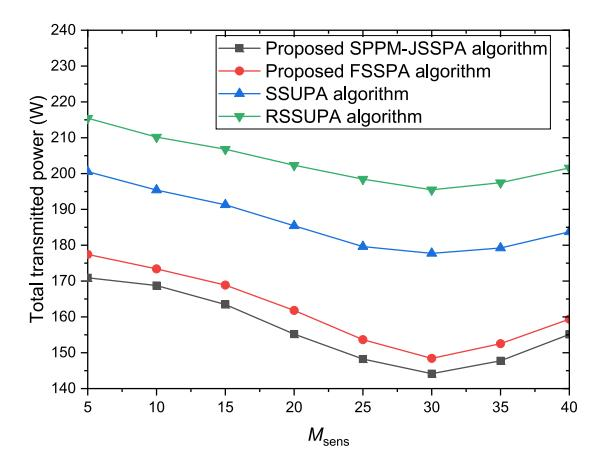

Fig. 9. Comparison of total transmitted power in different algorithms when *M* = 45, ρ = 1, γt = 0 dB, and *R*t = 1 bit/s/Hz.

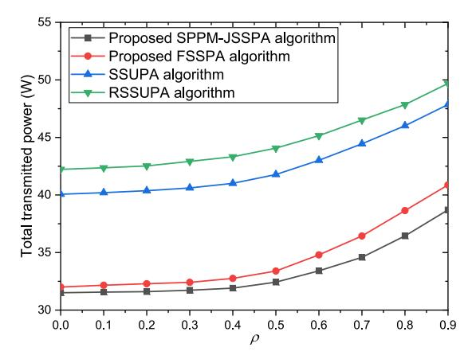

Fig. 10. Total transmitted power versus the LoS blockage probability ρ when *M* = 10, γt = 0 dB, and *R*t = 1 bit/s/Hz.

Fig. [10](#page-10-20) shows the relationship between the LoS blockage probability ρ and the total power consumption for different algorithms when *M* = 10, γt = 0 dB, and *R*t = 1 bit/s/Hz. As can be observed, with the increase of ρ, the total transmitted power increases rapidly. This indicates that when the LoS blockage probability is higher, the corresponding channel gain will be smaller, and more transmit power will be consumed to satisfy the ENR constraint [\(7\)](#page-3-2) and CSR constraint [\(8\).](#page-3-13) Moreover, for a fixed LoS blockage probability, there is a large gap between the proposed two algorithms and the benchmark algorithms. This implies that both the proposed two algorithms can significantly reduce total transmitted power consumption.

# VII. CONCLUSION

The joint optimization problem of slot selection and power allocation of the IVLCS system is studied. Its purpose is to reduce the power consumption by jointly optimizing slots and power resources under the ENR constraint, CSR constraint, sensing slot number constraint, and power constraint. The primary sensing purpose and secondary communication purpose are considered. The SPPM-JSSPA algorithm and a low-complexity FSSPA algorithm are proposed. The numerical results show that compared with the existing algorithms, the proposed two algorithms can save power resources significantly. Moreover, the proposed FSSPA algorithm has a lower complexity than the SPPM-JSSPA algorithm but can achieve a comparable performance to the SPPM-JSSPA algorithm.

As future research works, the optimization of the number of sensing slots will be investigated. The case that the communication is taken as the primary purpose will be considered as well. Moreover, we will establish experimental platforms to validate the proposed algorithms in the future.

### REFERENCES

- [\[1\]](#page-0-0) X. Mu, Y. Liu, L. Guo, and N. Al-Dhahir, "Heterogeneous semantic and bit communications: A semi-NOMA scheme," *IEEE J. Sel. Areas Commun.*, vol. 41, no. 1, pp. 155–169, Jan. 2023.
- [\[2\]](#page-0-1) Z. Yang, D. Li, N. Zhao, Z. Wu, Y. Li, and D. Niyato, "Secure precoding optimization for NOMA-aided integrated sensing and communication," *IEEE Trans. Commun.*, vol. 70, no. 12, pp. 8370–8382, Dec. 2022.
- [\[3\]](#page-0-2) A. Hassanien, M. G. Amin, E. Aboutanios, and B. Himed, "Dualfunction radar communication systems: A solution to the spectrum congestion problem," *IEEE Signal Process. Mag.*, vol. 36, no. 5, pp. 115–126, Sep. 2019.
- [\[4\]](#page-0-3) Z. Cheng, Z. He, and B. Liao, "Hybrid beamforming for multicarrier dual-function radar-communication system," *IEEE Trans. Cogn. Commun. Netw.*, vol. 7, no. 3, pp. 1002–1015, Sep. 2021.
- [\[5\]](#page-0-4) B. Li, A. P. Petropulu, and W. Trappe, "Optimum co-design for spectrum sharing between matrix completion based MIMO radars and a MIMO communication system," *IEEE Trans. Signal Process.*, vol. 64, no. 17, pp. 4562–4575, Sep. 2016.
- [\[6\]](#page-0-5) R. Saruthirathanaworakun, J. M. Peha, and L. M. Correia, "Opportunistic sharing between rotating radar and cellular," *IEEE J. Sel. Areas Commun.*, vol. 30, no. 10, pp. 1900–1910, Nov. 2012.
- [\[7\]](#page-0-6) L. Zheng, M. Lops, Y. C. Eldar, and X. Wang, "Radar and communication coexistence: An overview: A review of recent methods," *IEEE Signal Process. Mag.*, vol. 36, no. 5, pp. 85–99, Sep. 2019.
- [\[8\]](#page-0-7) D. Ma, N. Shlezinger, T. Huang, Y. Liu, and Y. C. Eldar, "Joint radarcommunication strategies for autonomous vehicles: Combining two key automotive technologies," *IEEE Signal Process. Mag.*, vol. 37, no. 4, pp. 85–97, Jul. 2020.
- [\[9\]](#page-0-8) P. Kumari, S. A. Vorobyov, and R. W. Heath, "Adaptive virtual waveform design for millimeter-wave joint communication–radar," *IEEE Trans. Signal Process.*, vol. 68, pp. 715–730, Nov. 2020.
- [\[10\]](#page-0-9) V. Petrov et al., "On unified vehicular communications and radar sensing in millimeter-wave and low terahertz bands," *IEEE Wireless Commun.*, vol. 26, no. 3, pp. 146–153, Jun. 2019.
- [\[11\]](#page-0-10) B. Kang and M. Rangaswamy, "Radar waveform design under communication sum capacity constraint," *IEEE Trans. Signal Process.*, vol. 69, pp. 2795–2806, May 2021.
- [\[12\]](#page-0-10) M. F. Keskin, V. Koivunen, and H. Wymeersch, "Limited feedforward waveform design for OFDM dual-functional radarcommunications," *IEEE Trans. Signal Process.*, vol. 69, pp. 2955–2970, Apr. 2021.
- [\[13\]](#page-0-11) L. Gaudio, M. Kobayashi, B. Bissinger, and G. Caire, "Performance analysis of joint radar and communication using OFDM and OTFS," in *Proc. IEEE Int. Conf. Commun. Workshops*, Shanghai, China, 2019, pp. 1–6.
- [\[14\]](#page-0-12) C.-Y. Liu and R. A. Romero, "Deep neural network detection for pulsed radar-embedded M-PSK communications," in *Proc. IEEE Eur. Radar Conf.*, Utrecht, The Netherlands, 2021, pp. 238–241.
- [\[15\]](#page-0-13) F. Liu, C. Masouros, A. Li, H. Sun, and L. Hanzo, "MU-MIMO communications with MIMO radar: From co-existence to joint transmission," *IEEE Trans. Wireless Commun.*, vol. 17, no. 4, pp. 2755–2770, Apr. 2018.
- [\[16\]](#page-0-14) X. Liu, T. Huang, N. Shlezinger, Y. Liu, J. Zhou, and Y. C. Eldar, "Joint transmit beamforming for multiuser MIMO communications and MIMO radar," *IEEE Trans. Signal Process.*, vol. 68, pp. 3929–3944, Jun. 2020.
- [\[17\]](#page-0-15) B. Tang, J. Tuck, and P. Stoica, "Polyphase waveform design for MIMO radar space time adaptive processing," *IEEE Trans. Signal Process.*, vol. 68, pp. 2170–2181, Mar. 2020.
- [\[18\]](#page-1-2) P. Sharda, G. S. Reddy, M. R. Bhatnagar, and Z. Ghassemlooy, "A comprehensive modeling of vehicle-to-vehicle based VLC system under practical considerations, an investigation of performance, and diversity property," *IEEE Trans. Commun.*, vol. 70, no. 5, pp. 3320–3332, May 2022.

{11}------------------------------------------------

- [\[19\]](#page-1-3) G. Singh, A. Srivastava, and V. A. Bohara, "Stochastic geometrybased interference characterization for RF and VLC-based vehicular communication system," *IEEE Syst. J.*, vol. 15, no. 2, pp. 2035–2045, Jun. 2021.
- [\[20\]](#page-1-4) O. Kolade and L. Cheng, "Memory channel models of a hybrid PLC-VLC link for a smart underground mine," *IEEE Internet Things J.*, vol. 9, no. 14, pp. 11893–11903, Jul. 2022.
- [\[21\]](#page-1-5) J.-Y. Wang, C. Liu, J.-B. Wang, Y. Wu, M. Lin, and J. Cheng, "Physicallayer security for indoor visible light communications: Secrecy capacity analysis," *IEEE Trans. Commun.*, vol. 66, no. 12, pp. 6423–6436, Dec. 2018.
- [\[22\]](#page-1-6) L. Feng, R.-Q. Hu, J. Wang, and Y. Qian, "Deployment issues and performance study in a relay-assisted indoor visible light communication system," *IEEE Syst. J.*, vol. 13, no. 1, pp. 562–570, Mar. 2019.
- [\[23\]](#page-1-7) B. Zhu, J. Cheng, Y. Wang, J. Yan, and J.-Y. Wang, "Three-dimensional VLC positioning based on angle difference of arrival with arbitrary tilting angle of receiver," *IEEE J. Sel. Areas Commun.*, vol. 36, no. 1, pp. 8–22, Jan. 2018.
- [\[24\]](#page-1-8) A. Kafizov, A. Elzanaty, and M.-S. Alouini, "Probabilistic shaping-based spatial modulation for spectral-efficient VLC," *IEEE Trans. Wireless Commun.*, vol. 21, no. 10, pp. 8259–8275, Oct. 2022.
- [\[25\]](#page-1-9) P. Sharda and M. R. Bhatnagar, "Diversity-multiplexing tradeoff for indoor visible light communication," in *Proc. 16th IEEE Int. Conf. Wireless Mobile Comput., Netw. Commun.*, Thessaloniki, Greece, 2020, pp. 1–6.
- [\[26\]](#page-1-9) P. Sharda, M. R. Bhatnagar, and Z. Ghassemlooy, "Modeling of a vehicle-to-vehicle based visible light communication system under shadowing and investigation of the diversity multiplexing tradeoff," *IEEE Trans. Veh. Technol.*, vol. 71, no. 9, pp. 9460–9474, Sep. 2022.
- [\[27\]](#page-1-9) P. Sharda and M. R. Bhatnagar, "An investigation of the diversity performance of vehicular visible light communications system under dirty headlights, mobility, atmospheric turbulence, and different weather scenarios," in *Proc. IEEE Int. Conf. Adv. Netw. Telecommun. Syst.*, Hyderabad, India, 2021, pp. 18–23.
- [\[28\]](#page-1-10) W. Xue, S. Li, and Z. Xu, "Sunlight enabled vehicle detection by LED street lights," in *Proc. Asia Commun. Photon. Conf.*, Hangzhou, China, 2018, pp. 1–3.
- [\[29\]](#page-1-11) S.-P. Hu, Q. Gao, C. Gong, and Z.-Y. Xu, "Efficient visible light sensing in eigenspace," *IEEE Commun. Lett.*, vol. 22, no. 5, pp. 994–997, May 2018.
- [\[30\]](#page-1-12) H. Yang, W.-D. Zhong, C. Chen, A. Alphones, and P. Du, "QoS-driven optimized design-based integrated visible light communication and positioning for indoor IoT networks," *IEEE Internet Things J.*, vol. 7, no. 1, pp. 269–283, Jan. 2020.
- [\[31\]](#page-1-13) I. Gokarn and A. Misra, "Demonstrating high-performance simultaneous visible light communication and sensing," in *Proc. IEEE Int. Conf. Commun. Syst. Netw.*, Bengaluru, India, 2021, pp. 124–126.
- [\[32\]](#page-1-14) R. Ahmad, M. D. Soltani, M. Safari, and A. Srivastava, "Reinforcement learning-based near-optimal load balancing for heterogeneous LiFi WiFi network," *IEEE Syst. J.*, vol. 16, no. 2, pp. 3084–3095, Jun. 2022.
- [\[33\]](#page-1-15) M. J. Abdel-Rahman, A. M. AlWaqfi, J. K. Atoum, M. A. Yaseen, and A. B. MacKenzie, "A novel multi-objective sequential resource allocation optimization for UAV-assisted VLC," *IEEE Trans. Veh. Technol.*, vol. 72, no. 5, pp. 6896–6901, May 2023.
- [\[34\]](#page-1-15) W. Costa et al., "Toward AI-enhanced VLC systems for industrial applications," *J. Lightw. Technol.*, vol. 41, no. 4, pp. 1064–1076, Feb. 15, 2023.
- [\[35\]](#page-2-5) R. Liu, M. Li, Q. Liu, and A. L. Swindlehurst, "Joint waveform and filter designs for STAP-SLP-based MIMO-DFRC systems," *IEEE J. Sel. Areas Commun.*, vol. 40, no. 6, pp. 1918–1931, Jun. 2022.
- [\[36\]](#page-2-6) Z. Wang, W.-D. Zhong, C. Yu, J. Chen, C. P. S. Francois, and W. Chen, "Performance of dimming control scheme in visible light communication system," *Opt. Exp.*, vol. 20, no. 7, pp. 18861–18868, Aug. 2012.
- [\[37\]](#page-2-7) C. D'Andrea, S. Buzzi, and M. Lops, "Communications and radar coexistence in the massive MIMO regime: Uplink analysis," *IEEE Trans. Wireless Commun.*, vol. 19, no. 1, pp. 19–33, Jan. 2020.
- [\[38\]](#page-2-8) B. Chang, W. Tang, X. Yan, X. Tong, and Z. Chen, "Integrated scheduling of sensing, communication, and control for mmWave/THz communications in cellular connected UAV networks," *IEEE J. Sel. Areas Commun.*, vol. 40, no. 7, pp. 2103–2113, Jul. 2022.
- [\[39\]](#page-2-9) J.-B. Wang, Q.-S. Hu, J. Wang, M. Chen, and J.-Y. Wang, "Tight bounds on channel capacity for dimmable visible light communications," *J. Lightw. Technol.*, vol. 31, no. 23, pp. 3771–3779, Dec. 1, 2013.
- [\[40\]](#page-3-14) M. A. Saeidi, M. J. Emadi, H. Masoumi, M. R. Mili, D. W. K. Ng, and I. Krikidis, "Weighted sum-rate maximization for multi-IRS-assisted full-duplex systems with hardware impairments," *IEEE Trans. Cogn. Commun.*, vol. 7, no. 2, pp. 466–481, Jun. 2021.

- [\[41\]](#page-3-15) M. Egan, I. B. Collings, W. Ni, and C. K. Sung, "User scheduling for the broadcast channel using a sum-rate threshold," in *Proc. IEEE Int. Commun. Conf.*, Kyoto, Japan, 2011, pp. 1–6.
- [\[42\]](#page-3-16) Y. R. Fu and Q. Zhu, "Joint optimization methods for nonconvex resource allocation problems of decode-and-forward relay-based OFDM networks," *IEEE Trans. Veh. Technol.*, vol. 65, no. 7, pp. 4993–5006, Jul. 2016.
- [\[43\]](#page-4-6) C. Shi, Y. Wang, F. Wang, S. Salous, and J. Zhou, "Joint optimization scheme for subcarrier selection and power allocation in multicarrier dualfunction radar-communication system," *IEEE Syst. J.*, vol. 15, no. 1, pp. 947–958, Mar. 2021.
- [\[44\]](#page-6-8) A. Aubry, A. DeMaio, A. Farina, and M. Wicks, "Knowledge-aided (potentially cognitive) transmit signal and receive filter design in signaldependent clutter," *IEEE Trans. Aerosp. Electron. Syst.*, vol. 49, no. 1, pp. 93–117, Jan. 2013.

**Jin-Yuan Wang** (Senior Member, IEEE) received the Ph.D. degree in information and communication engineering from Southeast University, Nanjing, China, in 2016.

He is currently an Associate Professor with Nanjing University of Posts and Telecommunications, Nanjing. He has authored/coauthored over 120 journal/conference papers. His current research interest is visible light communications.

Dr. Wang is serving as an Editor for *Journal of Electronics and Information Technology* and *Aerospace Technology*, a Topic Editor for *Sensors*, and a Guest Editor for *Frontiers in Signal Processing*. He has been the track chair, workshop chair, or TPC member for many conferences. He also serves as a reviewer for many international journals.

**Hao-Nan Yang** received the B.S. degree in communication engineering from Xi'an University of Posts and Telecommunications, Xi'an, China, in 2021. He is currently pursuing the M.S. degree in communication and information system with Nanjing University of Posts and Telecommunications, Nanjing, China.

His current research interest is integrated sensing and communication.

**Jun-Bo Wang** (Member, IEEE) received the Ph.D. degree in communications engineering from Southeast University, Nanjing, China, in 2008.

He is currently an Associate Professor with Southeast University. His current research interests are wireless communications and signal processing.

**Min Lin** (Member, IEEE) received the Ph.D. degree in electrical engineering from Southeast University, Nanjing, China, in 2008.

He is currently a Professor with Nanjing University of Posts and Telecommunications, Nanjing. His current research interests include wireless communications and array signal processing.

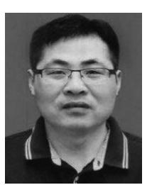

**Peicheng Shi** received the Ph.D. degree in vehicle engineering from Hefei University of Technology, Hefei, China, in 2010.

He is currently working with the School of Mechanical Engineering, Anhui Polytechnic University, Wuhu, China. His research interests include intelligent vehicle and automotive system dynamics and control.