# <span id="page-0-6"></span>Visible Light Communication-Enabled Simultaneous Position and Orientation Detection for Harnessing Multipath Interference and Random Fading

Bingpeng Zhou<sup>®</sup>, Member, IEEE, An Liu<sup>®</sup>, Senior Member, IEEE, and Hing Cheung So<sup>®</sup>, Fellow, IEEE

Abstract-We focus on visible light communication-based simultaneous position and orientation detection (SPAO) for user devices (UDs) using photodiodes, which is challenging due to scattering interference and small-scale fading. To address this challenge, a novel SPAO approach is proposed, which can jointly estimate UD location parameters and scattering channel states. As such, the disturbance of diffuse scattering and random fading on SPAO will be alleviated via scattering channel equalization. In addition, SPAO is non-convex in nature, and hence bruteforce application of conventional optimization methods will lead to a poor SPAO solution. To address this issue, we devise a majorization minimization (MM)-based SPAO algorithm, where hidden convex structure of the non-convex SPAO problem is exploited, which renders an efficient closed-form iteration rule for joint SPAO and diffuse channel estimation. Due to the cross-layer cooperation between "VLC" and "ranging", a robust SPAO solution against diffuse scattering and small-scale fading is achieved. It is corroborated by our simulations that the proposed MM-based SPAO algorithm achieves a large performance gain over state-of-the-art baseline methods.

Index Terms—LiFi, visible light positioning, diffuse scattering, channel estimation, integrated sensing and communication.

#### I. INTRODUCTION

ITH widespread use of light emitting diodes (LEDs) for illumination, visible light communication (VLC)-based simultaneous position and orientation (SPAO) detection is considered as an important support for internet-of-vehicles (IOV), because vehicle user device (UD) position and heading direction knowledge is indispensable for IOV services, e.g., robotic navigation, autonomous parcel sorting and automatic parking [1], [2], [3]. Hence, VLC-based SPAO has attracted an increasing attention in industries and academia [4], [5].

<span id="page-0-0"></span>Manuscript received 29 December 2022; revised 10 July 2023; accepted 13 September 2023. Date of publication 23 October 2023; date of current version 2 February 2024. This work was supported in part by the National Natural Science Foundation of China under Grant 62001526 and Grant 62371478, in part by the Guangdong Basic and Applied Basic Research Foundation under Grant 2021A1515012021, and in part by the Major Talent Program of Guangdong Province under Grant 2021QN02X074. The Associate Editor for this article was X. Li. (Corresponding author: Bingpeng Zhou.)

Bingpeng Zhou is with the School of Electronics and Communication Engineering, Sun Yat-sen University, Shenzhen Campus, Shenzhen 518000, China (e-mail: zhoubp3@mail.sysu.edu.cn).

An Liu is with the College of Information Science and Electronic Engineering, Zhejiang University, Hangzhou 310027, China (e-mail: anliu@zju.edu.cn).

Hing Cheung So is with the Department of Electrical Engineering, City University of Hong Kong, Hong Kong, China (e-mail: hcso@ee.cityu.edu.hk). Digital Object Identifier 10.1109/TITS.2023.3324361

#### A. Research Motivation

<span id="page-0-2"></span>Conventional WiFi-based positioning methods [6], [7], [8] cannot provide the orientation estimates for UDs In contrast, VLC-based SPAO features angular gain due to its angular resolution in emitters and photodiode receivers. VLC-based SPAO uses LEDs as signal sources to determine the UD location parameters (location and orientation). The received VLC signals are determined by the LED radiation, transmission distance and UD receiver gain, which depend on the UD location parameters. This allows to determine the UD location and orientation via exploiting VLC signal propagation information. However, it is challenging to achieve an accurate VLC-based SPAO solution due to the following reasons:

- Non-Convexity Problem Nature: VLC-based SPAO detection is fundamentally a non-convex optimization problem with lots of local optima, due to the nonlinear relationship between VLC signal waveforms and the UD location parameters. Hence, brute-force application of conventional iterative optimization methods (e.g., gradient search-based maximum likelihood [9], [10]) will result in a poor SPAO solution. An efficient VLC-based SPAO algorithm exploiting informative structures is required.
- <span id="page-0-4"></span><span id="page-0-3"></span><span id="page-0-1"></span>• Diffuse-Scattering Interference: In practice, VLC signals suffer from diffuse scattering, which brings an obvious interference to VLC-based SPAO, making it a dominant error source particularly in a high signal-to-noise ratio (SNR) environment [11]. However, existing VLC-based SPAO methods [12], [13], [14], [15], [16], [17], [18], [19], [20], [21], [22], [23], [24], [25], [26], [27], [28], [29], [30] usually assume an ideal line-of-sight (LOS) model, which will lead to model mismatch and hence a large localization error. It is non-trivial to harness the diffuse scattering effect for VLC-based SPAO.
- <span id="page-0-5"></span>Random Fading Disturbance: VLC signals undergo random channel fading besides diffuse scattering, which brings serious disturbance to VLC-based SPAO. Moreover, small-scale fading coefficients are unknown except from the UD location parameters, resulting in broadening the search space of the non-convex VLC-based SPAO problem. Hence, VLC-based SPAO becomes much more difficult, due to the increased dimensions of search space and the enlarged number of local optima.

1558-0016 © 2023 IEEE. Personal use is permitted, but republication/redistribution requires IEEE permission. See https://www.ieee.org/publications/rights/index.html for more information.

<span id="page-1-4"></span><span id="page-1-3"></span>It should be noted that, while wideband-based localization has been widely studied, e.g., in [31], [32], [33], [34], [35], [36], [37], [38], and [39], their approaches cannot be directly applied to VLC-based SPAO due to different physical propagation models. For instance, VLC signals are angular-sensitive, while wideband signals are not. Hence, it is desirable to develop a dedicated SPAO method for VLCs.

A number of research works have been reported for VLCbased positioning (VLP) using various measurement signals, e.g., visible-light received signal strength (RSS) [12], [13], [14], [15], [16], [17], [18], [19], [20], [21], [22] and angleof-arrival (AOA) [23], [24], [25], [26], [27], [28], [29], [30]. Specifically, in [23], narrow field-of-view (FOV) of transmitters in a two-dimensional scenario was assumed to exploit angular knowledge for UD localization. In [17], the pointing directions of LED transmitters and UD receiver are assumed to be vertical downwards and upwards, respectively, to room ceiling, and knowledge of the UD altitude is required. Similarly, in [22], an upward orientation direction is required by UD. In [12], inertial measurement units (IMUs) are used to measure the UD pose angle, in order to facilitate the associated position estimation. We can see that these works require particular transceiver layout, prior knowledge of UD pose, UD altitude and/or LED emission power, or perfect alignment of transceiver orientation directions. Such requirement on prior knowledge or ideal settings limits the applicability of these VLP solutions.

An efficient SPAO algorithm without those requirements is proposed in [18] to achieve a joint estimation of UD location and UD orientation angle. However, it only considers the LOS channel, and hence SPAO under the non-line-of-sight (NLOS) propagation remains unresolved.

<span id="page-1-5"></span>Orthogonal-frequency-division-multiplexing (OFDM) is a promising technique of VLCs thanks to its benefits for data transmission [11], [40], where various LEDs are modulated at diverse frequency carriers. OFDM with prefix cyclic can be exploited to pave the way for harnessing multipath interference in VLC-based SPAO. In existing VLC-based localization methods [12], [13], [14], [15], [16], [17], [18], [19], [20], [21], [22], the potential of OFDM for VLC localization has not been fully studied, and the interference of diffuse scattering is seldom considered. Hence, it is desired to bridge the gap between VLC-based SPAO and OFDM, in order to reap potential performance gain from frequency-domain diversity and multipath interference suppression.

#### B. Contributions

In this paper, we focus on simultaneous UD positioning and orientation direction estimation for VLCs in diffuse scattering environments, which is challenging due to scattering interference, random fading disturbance and non-convexity problem nature. Our contribution are summarized as follows.

 OFDM VLC-Based SPAO Approach for Alleviating Multipath Interference and Random Fading: An OFDM-based equivalent discrete channel remodeling method is proposed to decouple LOS and NLOS paths, which paves the way for suppressing NLOS interference and random fading. Based on this, a novel OFDM-assisted SPAO scheme exploiting frequency diversity is proposed to mitigate diffuse scattering interference. Moreover, an efficient VLC-based joint detection framework is devised to alleviate random fading, which simultaneously estimates UD location parameters and identify scattering channel states, thus suppressing the disturbance of random fading via channel equalization. Due to the cross-domain cooperation between "VLC" and "detection", the effect of multipath interference and random fading is alleviated, thus achieving a robust SPAO solution, which outperforms the conventional VLP methods [12], [13], [14], [15], [16], [17], [18], [19], [20], [21], [22]. In addition, the impact of SNR, bandwidth and quantities of multipath links and subcarriers on the achieved SPAO performance is revealed to gain insightful understanding on VLC-based SPAO performance limits.

• Majorization Minimization (MM)-based SPAO Algorithm for Solving Non-Convex Problem: A novel MM-based SPAO algorithm is proposed to address the non-convexity nature of the SPAO problem. Specifically, hidden convex structure<sup>1</sup> of the non-convex SPAO problem is exploited for elegant surrogate cost function development, which renders an efficient closed-form update for joint SPAO and diffuse channel estimation, and thus the effect of non-convexity is alleviated. Through adaptive searching guided by the elegant function, the UD location, orientation angle and scattering channel gain will be jointly estimated, thus achieving a robust SPAO solution against diffuse scattering and random fading.

Thanks to the above problem-specific algorithm design, our OFDM-based SPAO outperforms state-of-the-art VLP methods under diffuse scattering environments.

The remainder of this paper is organized as follows. Section II presents the system model. The proposed SPAO algorithm is developed in Section III. Convergence anlaysis is given in Section IV. Simulations results are included in Section V. Finally, we conclude our work in Section VI.

#### II. SYSTEM MODEL

<span id="page-1-1"></span>In this section, we first elaborate the setup of the VLC-OFDM system. Then, we explicate the channel model associated with LOS and reflection links.

#### A. System Setup

We consider a VLC system with M LED transmitters and one UD receiver with photodiodes, as illustrated in Fig. 1. Let  $\mathbf{p}_m \in \mathbb{R}^3$  and  $\mathbf{v}_m \in \mathbb{R}^3$  denote the location and orientation vectors of the mth LED transmitter, respectively. We assume that  $\mathbf{p}_m$  and  $\mathbf{v}_m$  are known, and these LEDs will act as anchors for UD localization. Let  $\mathbf{x}_R \in \mathbb{R}^3$  and  $\mathbf{u}_R \in \mathbb{R}^3$  denote UD position and orientation<sup>2</sup> vectors, respectively, which are unknown variables. It is also assumed that  $\|\mathbf{u}_R\|_2 = 1$  without

<span id="page-1-0"></span><sup>&</sup>lt;sup>1</sup>"Hidden convex structure" means "partial convexity" of a non-convex problem. For instance, for a problem  $(\hat{\mathbf{x}}, \hat{\mathbf{u}}) = \arg\min_{\mathbf{x}, \mathbf{u}} \|\mathbf{z} - \mathbf{G}(\mathbf{x})\mathbf{u}\|_2^2$ , when fixing  $\mathbf{x}$ , the objective function is convex with respect to  $\mathbf{u}$ .

<span id="page-1-2"></span><sup>&</sup>lt;sup>2</sup>UD orientation means its main direction of receiving visible light signals.

<span id="page-2-0"></span>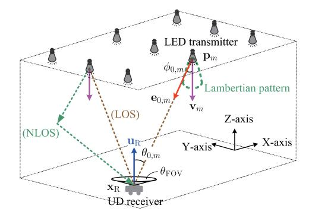

<span id="page-2-1"></span>Fig. 1. Illustration of VLC-based SPAO detection system.

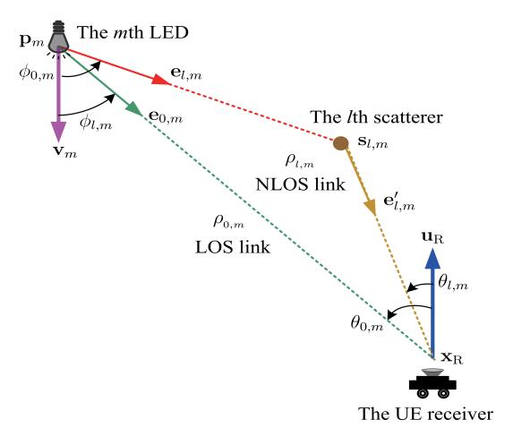

Fig. 2. Illustration of geometric parameters of diffuse paths.

loss of generality, where  $\| \bullet \|_2$  is the  $\ell_2$ -norm of a vector. Let  $\theta_{\rm FOV}$  and  $\phi_{\rm FOV}$  be the FOV angles of the UD and the mth LED transmitter, respectively.

# B. Diffuse Reflection Model

For ease of formulation, we start with a single-bounce diffuse reflection model. We assume that there are L' + 1paths between each LED emitter and the UD, where l=0denotes the LOS link and  $l = 1, \dots, L'$  for the NLOS links. Then, each NLOS link corresponds to one scatterer, as shown in Fig. 2. Let  $\mathbf{s}_{l,m} \in \mathbb{R}^3$  be the (unknown) scatterer location at the lth path of the mth LED, where  $l = 1, \dots, L'$ .

VLC channel depends on the geometric propagation parameters associated with the UD and LED transmitters. These propagation parameters are elaborated below. Let  $\mathbf{e}_{0,m} \in \mathbb{R}^3$ be the irradiation vector of the LOS path from the mth LED transmitter to the UD, and let  $\mathbf{e}_{l,m} \in \mathbb{R}^3$  be the irradiation vector of the NLOS path from the mth LED transmitter to the scatterer  $\mathbf{s}_{l,m}$ , respectively, given by

$$\mathbf{e}_{0,m} = \frac{\mathbf{x}_{\mathrm{R}} - \mathbf{p}_{m}}{\|\mathbf{x}_{\mathrm{R}} - \mathbf{p}_{m}\|_{2}},\tag{1}$$

$$\mathbf{e}_{l,m} = \frac{\mathbf{s}_{l,m} - \mathbf{p}_m}{\|\mathbf{s}_{l,m} - \mathbf{p}_m\|_2}, \text{ for } l = 1:L'.$$
 (2)

Let  $\mathbf{e}'_{l,m} \in \mathbb{R}^3$  be the reflection vector of the NLOS path from the scatterer  $\mathbf{s}_{l,m}$  to the UD, given by

$$\mathbf{e}'_{l,m} = \frac{\mathbf{x}_{R} - \mathbf{s}_{l,m}}{\|\mathbf{x}_{R} - \mathbf{s}_{l,m}\|_{2}}, \text{ for } l = 1:L'.$$
 (3)

It is worth nothing that, for the LOS link, the irradiation vector  $\mathbf{e}_{0,m}$  is identical to the incidence vector of the UD. In addition, let  $\rho_{0,m}$  be the transmission distance of the LOS path associated with the mth LED emitter, and let  $\rho_{l,m}$  be that associated with the lth NLOS path of the mth LED emitter, for l = 1 : L', which are given by

<span id="page-2-2"></span>
$$\rho_{0,m} = \|\mathbf{x}_{\mathbf{R}} - \mathbf{p}_m\|_2,\tag{4}$$

<span id="page-2-3"></span>
$$\rho_{l,m} = \|\mathbf{x}_{R} - \mathbf{s}_{l,m}\|_{2} + \|\mathbf{p}_{m} - \mathbf{s}_{l,m}\|_{2}.$$
 (5)

Let  $\phi_{0,m}$  be the angle between the mth LED transmitter's orientation vector  $\mathbf{v}_m$  and the irradiance vector  $\mathbf{e}_{0,m}$ , i.e., the LOS-path irradiance angle of the mth LED transmitter, as shown in Fig. 2. Let  $\phi_{l,m}$  be the angle between the mth LED transmitter's orientation vector  $\mathbf{v}_m$  and the irradiance vector  $\mathbf{e}_{l,m}$ , i.e., the *l*th NLOS-path irradiance angle of the *m*th LED transmitter. Moreover, let  $\theta_{l,m}$ , l=0: L', be the lth path incidence angle between the UD orientation vector  $\mathbf{u}_R$  and the corresponding reflection vector. In a summary, we have

<span id="page-2-4"></span>
$$\phi_{l,m} = \arccos(\mathbf{e}_{l,m}^{\top} \mathbf{v}_m), \text{ for } l = 0:L',$$
 (6)

$$\theta_{0,m} = \arccos\left(-(\mathbf{e}_{0,m})^{\top}\mathbf{u}_{\mathrm{R}}\right),$$
 (7)

$$\theta_{l,m} = \arccos\left(-(\mathbf{e}'_{l,m})^{\top}\mathbf{u}_{\mathrm{R}}\right), \text{ for } l = 1:L',$$
 (8)

where  $\bullet^{\top}$  denotes the transpose.

Given the mth LED with location  $\mathbf{p}_m$  and orientation vector  $\mathbf{v}_m$ , the UD receiver with location  $\mathbf{x}_R$  and orientation vector **u**<sub>R</sub> will be able to detect the LOS signal from this LED if the UD is within the FOV angle  $\phi_{FOV}$  of the mth LED and the incidence angle  $\theta_{0,m}$  is within the FOV angle  $\theta_{\text{FOV}}$  of UD, i.e.,  $\left|\frac{\phi_{0,m}}{\phi_{\text{FOV}}}\right| \leq 1$  and  $\left|\frac{\theta_{0,m}}{\theta_{\text{FOV}}}\right| \leq 1$ , where  $|\bullet|$  denotes the absolute value. Let  $\Omega_{\text{R}}$  be the set of active LED transmitters, given by  $\Omega_{\text{R}} = \left\{m \middle| \frac{\phi_{0,m}}{\phi_{\text{FOV}}}\right| \leq 1$  &  $\left|\frac{\theta_{0,m}}{\theta_{\text{FOV}}}\right| \leq 1$ }. Let  $\tau_{l,m} \in \mathbb{R}$  be the time-of-flight (TOF) associated with

the lth path of the mth LED transmitter, given by

<span id="page-2-5"></span>
$$\tau_{l,m} = \frac{\rho_{l,m}}{c}, \text{ for } l = 0: L' \text{ and } m \in \Omega_{\mathbb{R}},$$
(9)

where c is the light speed, and the transmission distance  $\rho_{l,m}$ is given by (4) and (5) for l = 0 and l > 0, respectively.

# C. Channel Model

Let  $g_{l,m}^{(t)} \in \mathbb{C}$  be the channel impulse response of the *l*th path associated with the tth symbol of the mth LED emitter, for l = 0 : L' and t = 1 : K, where K is the number of symbols. The channel gain  $g_{l,m}^{(t)}$  is determined by the LED steering gain, path loss, reflection and UD response gain, which depend on the above geometric propagation parameters.

1) Steering Gain of LED Emitter: The LED emitter steering gain depends on the emitting power and irradiation angle. We assume that all LED emitters have a unit emission power. The radiation of LED emitters is usually described by a Lambertian pattern [41] characterized by a Lambertian order

<span id="page-2-6"></span>
$$r = -\frac{\ln 2}{\ln \cos(A_{\frac{1}{2}})}$$
, where  $A_{\frac{1}{2}}$  is the semi-angle at half power

<span id="page-2-7"></span>of LED emitters [42]. Then, for the lth path associated with the irradiance angle  $\phi_{l,m}$ , the steering gain of the mth LED emitter is given by  $(r+1)(\cos(\phi_{l,m}))^r$  for the unit emission power, where l = 0 : L'.

<span id="page-3-1"></span>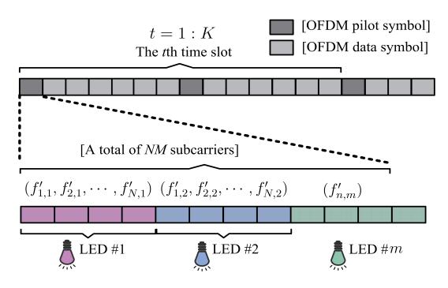

Fig. 3. Illustration of subcarrier allocation. We abuse the indices of symbol and time slot in the VLC-based OFDM, since they are equivalent in analysis, due to the time-invariant channel.

2) Response Gain of UD: The UD receiver response gain depends on the incidence angle and transmission distance. For the photodiode of the UD receiver, we let its aperture, optical filter gain and optical concentrator gain be  $\Psi_A$ ,  $\Psi_F$  and  $\Psi_C$ , respectively, where  $\Psi_C = \frac{\zeta_R^2}{(\sin(\theta_{FOV}))^2}$  in which  $\zeta_R$  is the refractive index of UD optical concentrator and  $\theta_{FOV}$  is the UD's FOV [12] shown in Fig. 1. Hence, the UD response gain associated with the lth incidence angle  $\theta_{l,m}$  and the mth LED emitter is given by  $\frac{\Psi_F\Psi_C\Psi_A\cos(\theta_{l,m})}{2\pi\rho_{l,m}^2}$ , for l=0:L'.

3) Channel Gain: According to the above geometry-based single-bounce reflection model [43], the time-domain channel gain  $g_m^{(t)}$  associated with the *m*th LED emitter and the *t*th symbol is given by [43]

<span id="page-3-5"></span>
$$g_m^{(t)} = \sum_{l=0,l'} g_{l,m} \delta(t - \tau_{l,m}), \qquad (10)$$

where  $\delta$  is the Dirac function, and  $g_{l,m}$  is given by

$$g_{0,m} = \Psi_{R} \frac{(r+1) \left(\cos(\phi_{0,m})\right)^{r} \cos(\theta_{0,m})}{2\pi \|\mathbf{x}_{R} - \mathbf{p}_{m}\|_{2}^{2}},$$
(11)

$$g_{l,m} = \alpha'_{l,m} G_{R} \eta(\mathbf{s}_{l,m}) \frac{\cos(\theta_{l,m})}{2\pi \|\mathbf{x}_{R} - \mathbf{s}_{l,m}\|_{2}^{2}}, \ l = 1:L', \quad (12)$$

for  $m \in \Omega_R$ , where  $\alpha'_{l,m} \in \mathbb{R}$  is the random fading coefficient (which have absorbed the unknown reflection rate) of the *l*th NLOS path associated with the *m*th LED.<sup>3</sup> In addition,  $\Psi_R$  is a constant absorbing the aperture, optical filter gain and optical concentrator gain of the UD, given by  $\Psi_R = \Psi_A \Psi_C \Psi_F$ , and  $\eta(\mathbf{s}_{l,m}) \in \mathbb{R}$  is the (unknown) propagation loss associated with the transmission distance from the *m*th LED to the *l*th scatterer, given by

$$\eta(\mathbf{s}_{l,m}) = \frac{(r+1)(\cos(\phi_{l,m}))^r}{\|\mathbf{p}_m - \mathbf{s}_{l,m}\|_2^2}, \text{ for } l = 1:L',$$
 (13)

which is function of the scatterer location  $\mathbf{s}_{l,m}$  but independent of  $\mathbf{x}_R$  and  $\mathbf{u}_R$ , where  $\phi_{l,m}$  is given by (6).

#### D. Received OFDM Signal Model

The transmitted OFDM symbols of the mth LED transmitter are modulated at frequencies  $\Theta_m = \{f_{1,m}, \dots, f_{N,m}\}$  Hz, for m=1:M, where  $N=|\Theta_m|$  is the number of subcarriers of each LED, and  $N_C=NM$  is the total number of subcarriers, as shown in Fig. 3. It should be noted that different LEDs are modulated on separated frequency bands such that VLC signals of LEDs are distinguishable from each other. Let  $\mathbf{a}_m^{(t)} \in \mathbb{C}^N = \text{Vec}[\mathbf{a}_{n,m}^{(t)}|\forall n \in \Theta_m]$  be the tth known pilot OFDM symbol of the tth LED, tth tth tth tth tth tth tth tth tth tth tth tth tth tth tth tth tth tth tth tth tth tth tth tth tth tth tth tth tth tth tth tth tth tth tth tth tth tth tth tth tth tth tth tth tth tth tth tth tth tth tth tth tth tth tth tth tth tth tth tth tth tth tth tth tth tth tth tth tth tth tth tth tth tth tth tth tth tth tth tth tth tth tth tth tth tth tth tth tth tth tth tth tth tth tth tth tth tth tth tth tth tth tth tth tth tth tth tth tth tth tth tth tth tth tth tth tth tth tth tth tth tth tth tth tth tth tth tth tth tth tth tth tth tth tth tth tth tth tth tth tth tth tth tth tth tth tth tth tth tth tth tth tth tth tth tth tth tth tth tth tth tth tth tth tth tth tth tth tth tth tth tth tth tth tth tth tth tth tth tth tth tth tth tth tth tth tth tth tth tth tth tth tth tth tth tth tth tth tth tth tth tth tth tth tth tth tth tth tth tth tth tth tth tth tth tth tth tth tth tth tth tth tth tth tth tth tth tth tth tth tth tth tth tth tth tth tth tth tth tth tth tth tth tth tth tth tth tth tth tth tth tth t

After the *N*-point inverse discrete Fourier transform, the time-domain pilot OFDM symbol  $\check{\mathbf{a}}_{k,m}^{(t)}$  of the *m*th LED, at the *k*th sampling point of the *t*th symbol, is given by

where  $j=\sqrt{-1}$ . We assume that  $a_{n,m}^{(t)}$  is conjugate symmetric, i.e.,  $a_{n,m}^{(t)}=(a_{N-n+1,m}^{(t)})^*$ , such that the time-domain symbol  $\check{a}_{k,m}^{(t)}$  is real-valued and non-negative for intensity modulation of VLC signals, where \* is the complex conjugate. Then, the time-domain signal  $\check{a}_{k,m}^{(t)}\in\mathbb{R}$  is given by

$$\check{\mathbf{a}}_{k,m}^{(t)} = \sum_{n=1:N/2} |\mathbf{a}_{n,m}^{(t)}| (1 + \cos(2\pi f_{n,m} k)), \tag{15}$$

which is directly modulated on the instantaneous light intensity of visible light [11], [40], where  $| \bullet |$  denotes the magnitude, and  $f_{n,m} = \frac{n}{T_{\rm S}N}$  is the sub-carrier frequency of the mth LED on baseband,  $\forall m=1:M$ , while  $T_{\rm S}$  is the sampling period.<sup>4</sup>

<span id="page-3-3"></span>For simplicity, we use the following to denote the collection of scatterer locations and reflection coefficients, respectively,

$$\mathbf{s} \in \mathbb{R}^{3L|\Omega_{\mathbb{R}}|} = \text{vec}[\mathbf{s}_{l,m}|\forall l = 1:L', \forall m \in \Omega_{\mathbb{R}}],$$
 (16)

$$\boldsymbol{\alpha}' \in \mathbb{R}^{L|\Omega_{\mathrm{R}}|} = \mathrm{vec}[\alpha'_{l,m}|\forall l = 1:L', \forall m \in \Omega_{\mathrm{R}}],$$
 (17)

<span id="page-3-4"></span>where  $\text{vec}[\cdots]$  yields a column vector.

The UD photodiode will sense visible light OFDM signals from LEDs [11], [47]. Let  $\mathbf{z}_m^{(t)} \in \mathbb{C}^N = \text{vec}[\mathbf{z}_{n,m}^{(t)}|\forall n \in \Theta_m]$  be the *t*th received OFDM symbol from the *m*th LED transmitter, after applying the discrete Fourier transform and removing the cyclic prefix, where  $\mathbf{z}_{n,m}^{(t)}$  is the received OFDM signal on the *n*th subcarrier. Then, we have

<span id="page-3-7"></span>
$$\mathbf{z}_{m}^{(t)} = \mathbf{H}_{m}(\boldsymbol{\beta}_{\mathbf{A}}) \, \mathbf{a}_{m}^{(t)} + \boldsymbol{\epsilon}_{m}^{(t)}, \tag{18}$$

where  $\boldsymbol{\beta}_{\mathrm{A}} \in \mathbb{C}^{4L'|\Omega_{\mathrm{R}}|+6} = [\mathbf{x}_{\mathrm{R}}; \mathbf{u}_{\mathrm{R}}; \mathbf{s}; \boldsymbol{\alpha}']$  is the joint vector of all unknown parameters,  $\boldsymbol{\epsilon}_{m}^{(t)} \in \mathbb{C}^{N}$  is the measurement noise vector, and  $\mathbf{H}_{m}(\boldsymbol{\beta}_{\mathrm{A}}) \in \mathbb{S}^{N}$  is the frequency-domain channel matrix, which is also dependent on  $\boldsymbol{\beta}_{\mathrm{A}}$ , given by

$$\mathbf{H}_{m}(\boldsymbol{\beta}_{\mathbf{A}}) = \operatorname{diag}\{\mathbf{h}_{n,m}(\boldsymbol{\beta}_{\mathbf{A}}) | \forall n \in \Theta_{m}\},\tag{19}$$

<span id="page-3-9"></span><span id="page-3-2"></span><sup>4</sup>We assume that the LEDs are modulated on different carriers, and we use the baseband features of received signals from LEDs to conduct VLP, i.e., the employed baseband signals are collected via frequency reduction (demodulation) from received high-frequency modulated signals. In such a case, the baseband signals from different LEDs will within the same bandwidth, but they are distinguishable since they are from different carriers.

<span id="page-3-8"></span><span id="page-3-6"></span><span id="page-3-0"></span><sup>&</sup>lt;sup>3</sup>Random fading is caused by multipath distance dispersion (which is comparable to intensity modulation-based VLC signal wavelength), atmospheric absorption [71], [72], [73], dynamic reflection and scattering [43], [44], [45], [46], e.g., metro station with moving crowds [74], [75], [76].

<span id="page-4-7"></span>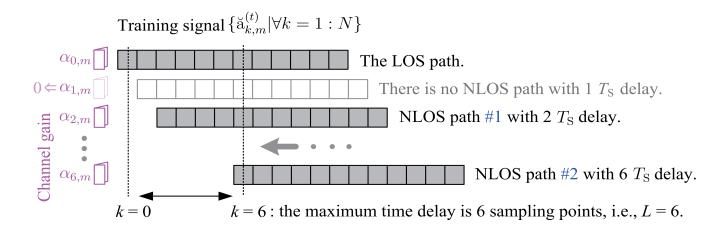

Fig. 4. An illustration of two NLOS paths with a maximum delay of 6  $T_S$ .

in which  $diag\{\cdots\}$  yields a diagonal matrix, and  $h_{n,m}(\boldsymbol{\beta}_A) \in \mathbb{C}$  is the frequency response on the *n*th subcarrier associated with the *m*th LED transmitter, given by [11], [40], and [43],

$$\mathbf{h}_{n,m}(\boldsymbol{\beta}_{\mathbf{A}}; f_{n,m}) = \sum_{l=0:L'} \mathbf{g}_{l,m}(\boldsymbol{\beta}_{\mathbf{A}}) \exp\left(-\mathrm{j}2\pi f_{n,m}\tau_{l,m}\right),$$

where  $g_{l,m}(\boldsymbol{\beta}_A)$  has been given by (11) and (12), for l=0 and l>0, respectively, and the TOF  $\tau_{l,m}$  is defined by (9).

As per the relationship between the propagation parameters  $\{\tau_{l,m}, \theta_{l,m}, \phi_{l,m} | \forall l = 0 : L'\}$  and the location parameters  $\{\mathbf{x_R}, \mathbf{u_R}, \mathbf{s}\}$  described in (6)–(9), the *n*th received signal  $\mathbf{z}_{n,m}^{(t)}$  of  $\mathbf{z}_m^{(t)}$ ,  $\forall n \in \Theta_m$ , can be rewritten as

$$\mathbf{z}_{n\,m}^{(t)} = \wp_{n\,m}^{(t)} \left( \mathbf{x}_{\mathbf{R}}, \mathbf{u}_{\mathbf{R}}, \mathbf{s}, \boldsymbol{\alpha}' \right) + \epsilon_{n\,m}^{(t)}, \tag{20}$$

where  $\wp_{n,m}^{(t)}(\bullet) \in \mathbb{C}$  is a nonlinear function given by (21), shown at the bottom of the page, and the noise  $\epsilon_{n,m}^{(t)}$  is the nth element of  $\epsilon_m^{(t)}$ , which is generally assumed to follow a zero-mean complex-valued Gaussian process<sup>5,6</sup>, i.e.,  $\epsilon_{n,m}^{(t)} \sim \mathcal{N}_{\mathbb{C}}(\epsilon_{n,m}^{(t)}|0,\sigma_{\mathbb{R}}^2)$ , with variance  $\sigma_{\mathbb{R}}^2$ .

Remark 1: The above system function explicitly presents its relationship with all unknown parameters including the UD location  $\mathbf{x}_R$ , UD orientation  $\mathbf{u}_R$ , scatterer locations  $\mathbf{s}$ , reflection coefficients  $\alpha'$ , which straightforwardly stems from the geometry-based reflection model. However, there are too many parameters in this model, in addition to the UD location parameters of interest. This will increase the parameter space of the SPAO problem and hence complicate the UD localization algorithm design. In particular, as SPAO is a non-convex problem caused by the nonlinear system model, the increased parameter space will seriously degrade the SPAO performance due to the increased number of local optimal points. Hence,

<span id="page-4-8"></span><span id="page-4-1"></span><sup>5</sup>Gaussian noise modeling is reasonable for large samples due to the central limit theorem [48], which renders tractable algorithm design. Given the mean and variance of sample noise, Gaussian prior gives rise to the maximum modeling entropy [49], [50], thus leading to the lowest risk in modeling mismatch. Hence, it is common practice in literature [6], [51], [52], [53].

<span id="page-4-9"></span><span id="page-4-2"></span><sup>6</sup>For non-Gaussian noise, it is common to use the Laplacian approximation method to extract its first and second orders statistics [37], [54], [55], which is equivalent to using the Gaussian model to locally approximate the non-Gaussian prior. Hence, it is finally identical to our Gaussian model.

it is non-trivial to reformulate the above complicated channel model for rendering a tractable SPAO problem.  $\Box$ 

# E. Equivalent Channel Model

In this paper, we propose to reformulate the channel model with a reduced parameter space to decouple LOS and NLOS paths, which will facilitate the SPAO algorithm design for solving multipath interference and random fading. Specifically, we absorb the unknown scatterer location-related parameters in the reflection links in a joint variable (i.e., the equivalent NLOS channel vector  $\alpha$  elaborated shortly) for estimation.

Proposition 1 (Compact-Form NLOS Channel Model): The received OFDM symbol  $\mathbf{z}_{n,m}^{(t)}$  in (20) can be reformulated as the following compact-form function with decoupled LOS and NLOS paths,

<span id="page-4-5"></span>
$$\mathbf{z}_{n,m}^{(t)} = \underbrace{\mathbf{\chi}_{n,m}^{(t)\top}(\mathbf{x}_{\mathrm{R}})\,\mathbf{u}_{\mathrm{R}}}_{\text{LOS link}} + \underbrace{\boldsymbol{\omega}_{n,m}^{(t)\top}(\mathbf{x}_{\mathrm{R}})\,\boldsymbol{\alpha}_{m}}_{\text{NLOS links}} + \epsilon_{n,m}^{(t)}, \tag{22}$$

which is linear with respect to (w.r.t.) the UD orientation vector  $\mathbf{u}_{R}$  and the equivalent NLOS channel gain vector  $\boldsymbol{\alpha}_{m}$ , where  $\boldsymbol{\alpha}_{m} \in \mathbb{C}^{L}$ ,  $\boldsymbol{\chi}_{n,m}^{(t)}(\mathbf{x}_{R}) \in \mathbb{C}^{3}$  and  $\boldsymbol{\omega}_{n,m}^{(t)}(\mathbf{x}_{R}) \in \mathbb{C}^{L}$  are given by (23), (26) and (27), respectively, elaborated below.

<span id="page-4-3"></span>*Proof:* This can be verified via careful term arrangement and parameter substitution associated with (20) and (21).

In (22),  $\alpha_m \in \mathbb{C}^L$  is the equivalent discrete NLOS channel state associated with the *m*th LED, given by

<span id="page-4-4"></span>
$$\alpha_m = \text{vec}\left[\alpha_{\ell,m} | \forall \ell = 1 : L\right],\tag{23}$$

where  $\alpha_{\ell,m} \in \mathbb{C}$  denotes the equivalent discrete NLOS channel

gain of the  $\ell$ th path,<sup>7</sup> given by (24) for  $\ell = \left\lfloor \frac{\tau_{\ell,m} - \tau_{0,n,m}}{T_{\rm S}} \right\rfloor$ , and  $\alpha_{\ell,m} = 0$  otherwise, which absorbs those propagation parameters associated with NLOS paths (please recall (21)), with  $\lfloor \bullet \rfloor$  being the nearest integer. In (24), shown at the bottom of the next page, frac( $\bullet$ ) denotes the fractional part of a number. Moreover, L is the length of equivalent discrete NLOS channel, which is required to exceed the largest discrete time delay of NLOS paths, i.e.,

$$L \ge \max\{\lfloor (\tau_{L',m} - \tau_{0,m})/T_{\mathcal{S}} \rceil | \forall m \in \Omega_{\mathcal{R}} \}, \tag{25}$$

which is usually determined experimentally along with cyclic prefix. It should be clarified that this equivalent discrete channel model considers the effect of energy leak when a path delay is not exactly on its grid, via absorbing its fractional part (i.e., leaked energy) into equivalent channel gain  $\alpha_{\ell,m}$ .

<span id="page-4-11"></span><span id="page-4-10"></span><span id="page-4-6"></span><span id="page-4-0"></span> $^7$ It should be noted that  $\alpha_{\ell,m}$  can cover multi-bounce reflection scenarios, by collectively multiplying reflection rates of each bounce. In addition, we assume that the baseband signal bandwidth of each LED is within the coherent bandwidth of multipath channel such that the channel gains on different subcarriers of each LED are identical. This is usually satisfied due to the limited maximum delay in a limited size room.

$$\wp_{n,m}^{(t)} = \sum_{l=1:L} \mathbf{a}_{n,m}^{(t)} \alpha_{l,m}' \Psi_{R} \frac{(r+1) \left( (\mathbf{s}_{l,m} - \mathbf{p}_{m})^{\top} \mathbf{v}_{m} \right)^{r} (\mathbf{s}_{l,m} - \mathbf{x}_{R})^{\top} \mathbf{u}_{R}}{4\pi^{2} \|\mathbf{p}_{m} - \mathbf{s}_{l,m}\|_{2}^{r+2} \|\mathbf{x}_{R} - \mathbf{s}_{l,m}\|_{2}^{3}} \exp\left( -j2\pi f_{n,m} \frac{\|\mathbf{x}_{R} - \mathbf{s}_{l,m}\|_{2} + \|\mathbf{p}_{m} - \mathbf{s}_{l,m}\|_{2}}{c} \right) + \mathbf{a}_{n,m}^{(t)} \Psi_{R} \frac{(r+1) \left( (\mathbf{x}_{R} - \mathbf{p}_{m})^{\top} \mathbf{v}_{m} \right)^{r} (\mathbf{p}_{m} - \mathbf{x}_{R})^{\top} \mathbf{u}_{R}}{2\pi \|\mathbf{x}_{R} - \mathbf{p}_{m}\|_{2}^{r+3}} \exp\left( -j2\pi f_{n,m} \frac{\|\mathbf{x}_{R} - \mathbf{p}_{m}\|_{2}}{c} \right)$$

$$(21)$$

An illustration is given in Fig. 4. We assume that the length of transmit training symbol is larger than the largest time delay, i.e., N > L, such that the channel gain vector is detectable. It should be noted that if there is no NLOS path with time delay  $\ell T_S$ , it is equivalent to treating  $\alpha_{\ell,m} = 0$ .

Moreover,  $\chi_{n,m}^{(t)}(\mathbf{x}_{R}) \in \mathbb{C}^{3}$  is a LOS link-related vector depending on the UD location, given by (26), shown at the bottom of the page, and  $\boldsymbol{\omega}_{n,m}^{(t)}(\mathbf{x}_{R}) \in \mathbb{C}^{L}$  is a NLOS path-related vector, given by

$$\boldsymbol{\omega}_{n,m}^{(t)}\left(\mathbf{x}_{\mathrm{R}}\right)=\mathrm{vec}\big[\boldsymbol{\omega}_{\ell,n,m}^{(t)}\left(\mathbf{x}_{\mathrm{R}}\right)|\forall\ell=1:L\big],\tag{27}$$

where  $\omega_{\ell n m}^{(t)}(\mathbf{x}_{R}) \in \mathbb{C}$  is given by

$$\omega_{\ell,n,m}^{(t)}(\mathbf{x}_{\mathrm{R}}) = \tilde{\mathbf{a}}_{\ell,n,m}^{(t)} \Psi_{\mathrm{R}} \exp\left(-\mathrm{j}2\pi f_{n,m} \frac{\|\mathbf{x}_{\mathrm{R}} - \mathbf{p}_{m}\|_{2}}{c}\right),$$

with  $\tilde{\mathbf{a}}_{\ell,n,m}^{(t)} \in \mathbb{C}$  being the equivalent symbol associated with the  $\ell$ th path, imposed on a time delay-caused phase shift:

$$\tilde{\mathbf{a}}_{\ell,n,m}^{(t)} = \mathbf{a}_{n,m}^{(t)} \exp\left(-\mathrm{j}2\pi f_{n,m}\langle\ell\rangle_N T_{\mathrm{S}}\right), \text{ for } \ell = 1:L,$$

where  $\langle \ell \rangle_N$  denotes the remainder of  $(N - \ell)$  divided by N. Remark 2: Equivalent NLOS channel gain  $\alpha_{\ell,m}$  retains UD location knowledge, since it potentially depends on signal propagation distance. Yet, considering its complex dependency on scatterer locations, such geometry knowledge is not exploited in our SPAO algorithm. Instead, we treat the NLOS channel gain  $\alpha_{\ell,m}$  as an unknown parameter, which will be jointly estimated in conjunction with UD location parameters. This will render a low-cost SPAO solution, since the dimensions of the non-convex space are reduced and hence the number of local optimal points of the non-convex SPAO problem is decreased. This is a principal difference of our SPAO method from conventional NLOS-based localization approaches, e.g., [56], in which the scatterer locations and reflection coefficients are treated as separate parameters to be simultaneously estimated, instead of being treated as a joint variable to estimate, leading to a high computational cost.  $\square$ 

<span id="page-5-8"></span>Let  $\mathbf{z} \in \mathbb{C}^{|\Omega_R|KN} = \text{Vec}[\mathbf{z}_m^{(t)}|\forall m \in \Omega_R, \ \forall t=1:K]$  be the collection of received OFDM symbols. Then, as per (22), the received OFDM signal vector  $\mathbf{z}$  is eventually reformulated as a linear function of the equivalent channel vector  $\boldsymbol{\alpha}$ ,

$$\mathbf{z} = \mathbf{G}(\mathbf{x}_{R})\boldsymbol{\mu}_{R} + \boldsymbol{\epsilon},\tag{28}$$

where  $\epsilon \in \mathbb{C}^{|\Omega_R|KN} = \text{vec}[\epsilon_m^{(t)}|\forall m \in \Theta_R, \forall t=1:K]$  is the noise vector,  $\mu_R \in \mathbb{R}^{L|\Theta_R|+3} = \begin{bmatrix} \mathbf{u}_R \\ \alpha \end{bmatrix}$  is a joint vector of the UD orientation vector and NLOS channel gain, and  $\mathbf{G}(\mathbf{x}_R) \in$ 

 $\mathbb{C}^{|\Omega_R|KN \times (L|\Theta_R|+3)} = [G_{LOS}(x_R), G_{NLOS}(x_R)],$  in which  $\alpha$ ,  $G_{NLOS}(x_R)$  and  $G_{LOS}(x_R)$  are given by

<span id="page-5-6"></span>
$$\alpha \in \mathbb{C}^{L|\Theta_{\mathbf{R}}|} = \text{vec}[\alpha_m | \forall m \in \Omega_{\mathbf{R}}],$$
 (29)

$$\mathbf{G}_{\mathsf{NLOS}} \in \mathbb{C}^{|\Omega_{\mathsf{R}}|KN \times L|\Omega_{\mathsf{R}}|} = \mathsf{mat}[\mathbf{G}_{\mathsf{NLOS}}^{(t)}|\forall t = 1:K], \quad (30)$$

$$\mathbf{G}_{\mathsf{NLOS}}^{(t)} \in \mathbb{C}^{|\Omega_{\mathsf{R}}|N \times L|\Omega_{\mathsf{R}}|} = \mathsf{diag}[\mathbf{G}_{\mathsf{NLOS},m}^{(t)}| \forall m \in \Omega_{\mathsf{R}}], \ (31)$$

$$\mathbf{G}_{\mathsf{NLOS},m}^{(t)} \in \mathbb{C}^{N \times L} = \mathsf{mat}[\boldsymbol{\omega}_{n,m}^{(t) \top}(\mathbf{x}_{\mathsf{R}}) | \forall n \in \Theta_m], (32)$$

$$\mathbf{G}_{\mathsf{LOS}} \in \mathbb{C}^{|\Omega_{\mathsf{R}}|KN \times 3} = \mathsf{mat}[\boldsymbol{\chi}_{n,m}^{(t)\top}(\mathbf{x}_{\mathsf{R}}) | \forall n, \forall m, \forall t],$$
(33)

<span id="page-5-2"></span>in which  $mat[\bullet]$  yields a matrix via stacking all elements. It should be noted that  $G(x_R)\mu_R$  is an affine function of  $u_R$ . In addition, we have the following assumptions on our VLC-based SPAO system.

- (A1) The emitting power of LEDs are known.
- (A2) The locations and orientations of LED sources are known.
- (A3) We assume VLC protocol [57] (e.g., IEEE 802.15.7) and multiple access method [58] (e.g., time-division one) is well defined such that the signals from different LED sources are distinguishable.

Assumptions (A1)–(A3) are standard and necessarily minimum in VLCs, which are widely adopted in VLC literature.

#### <span id="page-5-10"></span><span id="page-5-9"></span>III. OUR SPAO APPROACH

<span id="page-5-0"></span>In this section, we shall formulate the SPAO problem, unveil its challenges, and then elaborate the proposed algorithm and explain how it addresses the challenges.

#### <span id="page-5-7"></span>A. Formulation of SPAO Problem

The goal of OFDM-based SPAO is to estimate UD location parameters  $\mathbf{x}_R$  and  $\mathbf{u}_R$  from the received OFDM vector  $\mathbf{z}$  with an unknown reflection channel vector  $\boldsymbol{\alpha}$ . Based on Bayesian inference theory, this SPAO can be formulated as the following maximum *a posteriori* problem,

<span id="page-5-5"></span>
$$\mathscr{P}_{\text{SPAO}}: (\hat{\mathbf{x}}_{\text{R}}, \hat{\boldsymbol{\mu}}_{\text{R}}) = \arg \max_{\mathbf{x}_{\text{R}}, \boldsymbol{\mu}_{\text{D}}} p(\mathbf{x}_{\text{R}}, \mathbf{u}_{\text{R}} | \mathbf{z}),$$
 (34)

where  $p(\mathbf{x}_{R}, \mathbf{u}_{R}|\mathbf{z})$  is the posterior function given by

$$p(\mathbf{x}_{R}, \mathbf{u}_{R}|\mathbf{z}) \propto \int p(\mathbf{z}|\mathbf{x}_{R}, \mathbf{u}_{R}, \boldsymbol{\alpha}) p(\mathbf{x}_{R}, \mathbf{u}_{R}, \boldsymbol{\alpha}) d\boldsymbol{\alpha},$$
 (35)

<span id="page-5-4"></span>where  $\propto$  denotes "be proportional to" and we assume that there is no prior knowledge of  $\mathbf{x}_R$ ,  $\mathbf{u}_R$  and  $\boldsymbol{\alpha}$ , i.e.,  $p(\mathbf{x}_R, \mathbf{u}_R, \boldsymbol{\alpha})$  is a constant. As per (28),  $p(\mathbf{z}|\mathbf{x}_R, \mathbf{u}_R, \boldsymbol{\alpha})$  is given by

<span id="page-5-3"></span><span id="page-5-1"></span>
$$p(\mathbf{z}|\mathbf{x}_{\mathrm{R}},\mathbf{u}_{\mathrm{R}},\boldsymbol{\alpha}) \propto \exp\left(-\frac{1}{2\sigma_{\mathrm{R}}^{2}}\|\mathbf{z} - \mathbf{G}(\mathbf{x}_{\mathrm{R}})\boldsymbol{\mu}_{\mathrm{R}}\|_{2}^{2}\right),$$
 (36)

$$\alpha_{\ell,m} = \alpha_{\ell,m}' \frac{(r+1)\left((\mathbf{s}_{l,m} - \mathbf{p}_m)^{\top} \mathbf{v}_m\right)^r (\mathbf{s}_{l,m} - \mathbf{x}_R)^{\top} \mathbf{u}_R}{4\pi^2 \|\mathbf{p}_m - \mathbf{s}_{l,m}\|_2^{r+2} \|\mathbf{x}_R - \mathbf{s}_{l,m}\|_2^3} \exp\left(-j2\pi f_{n,m} \operatorname{frac}\left(\frac{\tau_{l,m} - \tau_{0,m}}{T_S}\right) T_S\right)$$
(24)

$$\boldsymbol{\chi}_{n,m}^{(t)}(\mathbf{x}_{R}) = \mathbf{a}_{n,m}^{(t)} \Psi_{R} \frac{(r+1) \left( (\mathbf{x}_{R} - \mathbf{p}_{m})^{\top} \mathbf{v}_{m} \right)^{r}}{2\pi \|\mathbf{x}_{R} - \mathbf{p}_{m}\|_{2}^{r+3}} (\mathbf{p}_{m} - \mathbf{x}_{R}) \exp \left( -j2\pi f_{n,m} \frac{\|\mathbf{x}_{R} - \mathbf{p}_{m}\|_{2}}{c} \right)$$
(26)

<span id="page-6-0"></span>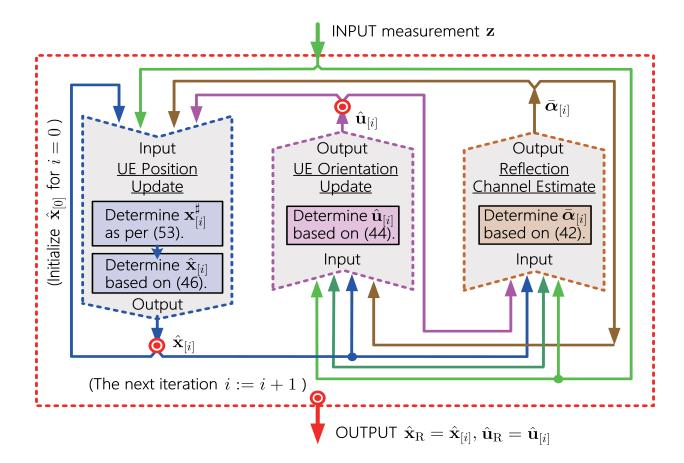

Fig. 5. Diagram of MM-based SPAO algorithm.

where it should be noted that  $\mathbf{u}_R$  and  $\boldsymbol{\alpha}$  have been integrated into the joint variable  $\boldsymbol{\mu}_R$ .

Challenge: This SPAO problem  $\mathscr{P}_{SPAO}$  is difficult to solve since the objective function  $p(\mathbf{x}_R, \mathbf{u}_R | \mathbf{z})$  has no closed-form expression, as the statistical knowledge of channel state  $\alpha$  is not easy to collect, and the joint prior  $p(\mathbf{x}_R, \mathbf{u}_R, \alpha)$  is not available. Moreover,  $p(\mathbf{x}_R, \mathbf{u}_R | \mathbf{z})$  is non-convex in  $(\mathbf{x}_R, \mathbf{u}_R)$  due to the nonlinear model  $G(\mathbf{x}_R)$  w.r.t.  $\mathbf{x}_R$ .

# <span id="page-6-6"></span>B. Development of MM-Based SPAO Algorithm

To overcome the above challenges, a novel SPAO algorithm based on the MM method [59], [60] is proposed. Specifically, to address the first challenge, we design a tractable surrogate function for the original intractable posterior function to simplify the associated optimization. The proposed surrogate function is a tight lower bound of the original posterior function  $p(\mathbf{x}_R, \mathbf{u}_R | \mathbf{z})$ . Then, we successively maximize the surrogate function so as to solve the complicated SPAO problem.

To tackle the second issue, we exploit the hidden convex substructure of our surrogate function w.r.t.  $\mathbf{x}_R$  and  $\mathbf{u}_R$  to achieve an efficient optimization. The overall SPAO problem is accordingly partitioned into three subproblems, i.e., reflection channel update, UD location update, and UD orientation update. Given an initial point  $\{\hat{\mathbf{x}}_{[0]}\}$ , we alternately iterate  $\hat{\boldsymbol{\alpha}}_{[i]}$ ,  $\hat{\mathbf{x}}_{[i]}$  and  $\hat{\mathbf{u}}_{[i]}$ , respectively, to maximize our surrogate function, until iterations converge, where  $\bullet_{[i]}$  denotes the iteration index. The principal procedure of the proposed MM-based SPAO algorithm is illustrated in Fig. 5.

1) Surrogate Function Design: As mentioned above, the posterior function has no closed-form expression. Hence, a tractable surrogate function which is a tight lower bound of the original posterior is suggested as follows.

<span id="page-6-7"></span>Theorem 1 (Lower Bound of Original Posterior): Given  $\hat{\mathbf{x}}_{[i]}$  and  $\hat{\mathbf{u}}_{[i]}$  obtained at the *i*th iteration, the posterior  $p(\mathbf{x}_R, \mathbf{u}_R | \mathbf{z})$  is lower-bounded by its surrogate  $p(\mathbf{x}_R, \mathbf{u}_R | \mathbf{z}; \hat{\mathbf{x}}_{[i]}, \hat{\mathbf{u}}_{[i]})$  depending on  $\hat{\mathbf{x}}_{[i]}$  and  $\hat{\mathbf{u}}_{[i]}$ ,  $\forall (\mathbf{x}_R, \mathbf{u}_R) \in \mathbb{R}^6$ , as

$$p(\mathbf{x}_{R}, \mathbf{u}_{R}|\mathbf{z}) \ge \underbrace{\exp\left(\mathbb{E}_{\alpha|\mathbf{z}, \hat{\mathbf{x}}_{[i]}, \hat{\mathbf{u}}_{[i]}} \{\ln p(\mathbf{x}_{R}, \mathbf{u}_{R}, \boldsymbol{\alpha}|\mathbf{z})\}\right)}_{q(\mathbf{x}_{R}, \mathbf{u}_{R}|\mathbf{z}; \hat{\mathbf{x}}_{[i]}, \hat{\mathbf{u}}_{[i]})}$$
(37)

where  $\mathbb{E}_{\boldsymbol{\alpha}|\mathbf{z},\hat{\mathbf{x}}_{[i]},\hat{\mathbf{u}}_{[i]}}\{\bullet\}$  is the expectation over  $p(\boldsymbol{\alpha}|\mathbf{z};\hat{\mathbf{x}}_{[i]},\hat{\mathbf{u}}_{[i]})$ , and  $p(\boldsymbol{\alpha}|\mathbf{z};\hat{\mathbf{x}}_{[i]},\hat{\mathbf{u}}_{[i]})$  is dependent on  $(\hat{\mathbf{x}}_{[i]},\hat{\mathbf{u}}_{[i]})$ , given by

<span id="page-6-3"></span>
$$p(\boldsymbol{\alpha}|\mathbf{z}; \hat{\mathbf{x}}_{[i]}, \hat{\mathbf{u}}_{[i]}) \propto p(\mathbf{z}|\hat{\mathbf{x}}_{[i]}, \hat{\mathbf{u}}_{[i]}, \boldsymbol{\alpha}),$$
 (38)

and herein we assume no prior probability distribution of  $\alpha$ . *Proof:* See APPENDIX A.

Based on this theorem, we solve the original SPAO problem in (34) via the a successive maximization method. Specifically, starting from an initial point  $(\hat{\mathbf{x}}_{[i]}, \hat{\mathbf{u}}_{[i]})$ , we successively maximize the surrogate of the original posterior, i.e.,

<span id="page-6-2"></span>
$$(\hat{\mathbf{x}}_{[i+1]}, \hat{\mathbf{u}}_{[i+1]}) = \arg \max_{\mathbf{x}_{R}, \mathbf{u}_{R}} q(\mathbf{x}_{R}, \mathbf{u}_{R} | \mathbf{z}; \hat{\mathbf{x}}_{[i]}, \hat{\mathbf{u}}_{[i]}), \quad (39)$$

$$q(\mathbf{x}_{R}, \mathbf{u}_{R} | \mathbf{z}; \hat{\mathbf{x}}_{[i]}, \hat{\mathbf{u}}_{[i]}) = \mathcal{N}_{\mathbb{C}}(\mathbf{z} | \mathbf{G}(\mathbf{x}_{R}) \boldsymbol{\mu}_{R}(\mathbf{u}_{R}, \bar{\boldsymbol{\alpha}}_{[i]}), \boldsymbol{\Sigma}), \quad (40)$$

where  $q(\mathbf{x}_R, \mathbf{u}_R | \mathbf{z}; \hat{\mathbf{x}}_{[i]}, \hat{\mathbf{u}}_{[i]})$  is the surrogate function, while  $\mathbf{\Sigma} = \sigma^2 \mathbf{I}_{KN|\Omega_R|}, \bar{\boldsymbol{\alpha}}_{[i]} = \mathbb{E}_{\boldsymbol{\alpha}|\mathbf{z},\hat{\mathbf{x}}_{[i]},\hat{\mathbf{u}}_{[i]}}\{\boldsymbol{\alpha}\}$  given in (42) shortly,  $\mathbf{I}_{KN|\Omega_R|}$  denotes the  $KN|\Omega_R| \times KN|\Omega_R|$  identity matrix, and  $\boldsymbol{\mu}_R(\mathbf{u}_R, \boldsymbol{\alpha})$  depends on  $\mathbf{u}_R$  and  $\boldsymbol{\alpha}$ . We will show that this surrogate function has a closed-form expression, so that the first challenge is tackled.

The successive maximization of this lower bound function  $q(\mathbf{x}_R, \mathbf{u}_R | \mathbf{z}; \hat{\mathbf{x}}_{[i]}, \hat{\mathbf{u}}_{[i]})$  will essentially maximize the posterior function, thus solving the original SPAO problem  $\mathcal{P}_{SPAO}$ . To achieve this goal, we need to address the non-convex optimization. In the following, we exploit the hidden convex sub-structure of  $q(\mathbf{x}_R, \mathbf{u}_R | \mathbf{z}; \hat{\mathbf{x}}_{[i]}, \hat{\mathbf{u}}_{[i]})$  w.r.t.  $\mathbf{u}_R$  and  $\boldsymbol{\alpha}$ , and also the locally convex approximation of  $q(\mathbf{x}_R, \mathbf{u}_R | \mathbf{z}; \hat{\mathbf{x}}_{[i]}, \hat{\mathbf{u}}_{[i]})$  for the non-convex terms associated with  $\mathbf{x}_R$ , in order to render an efficient SPAO algorithm with closed-form iteration equations among  $\hat{\mathbf{x}}_{[i]}$ ,  $\hat{\mathbf{u}}_{[i]}$  and  $\bar{\boldsymbol{\alpha}}_{[i]}$ , as elaborated below.

<span id="page-6-8"></span>2) Reflection Channel Update: It is shown in (28) that  $\mathbf{G}(\mathbf{x}_R)\boldsymbol{\mu}_R(\mathbf{u}_R,\boldsymbol{\alpha})$  is an affine function of  $\boldsymbol{\alpha}$ , i.e.,

$$\mathbf{G}(\mathbf{x}_{R})\boldsymbol{\mu}_{R}(\mathbf{u}_{R},\boldsymbol{\alpha}) = \mathbf{G}_{LOS}(\mathbf{x}_{R})\mathbf{u}_{R} + \mathbf{G}_{NLOS}(\mathbf{x}_{R})\boldsymbol{\alpha}. \tag{41}$$

As a result, given  $\hat{\mathbf{x}}_{[i]}$  and  $\hat{\mathbf{u}}_{[i]}$  obtained at the *i*th iteration,  $\bar{\boldsymbol{\alpha}}_{[i]} = \mathbb{E}_{\boldsymbol{\alpha}|\mathbf{z},\hat{\mathbf{x}}_{[i]},\hat{\mathbf{u}}_{[i]}}\{\boldsymbol{\alpha}\}$  in (40) is directly obtained as

<span id="page-6-4"></span><span id="page-6-1"></span>
$$\bar{\boldsymbol{\alpha}}_{[i]} = \left(\mathbf{G}_{\mathsf{NLOS}}(\hat{\mathbf{x}}_{[i]})\right)^{\dagger} (\mathbf{z} - \mathbf{G}_{\mathsf{LOS}}(\hat{\mathbf{x}}_{[i]})\hat{\mathbf{u}}_{[i]}), \tag{42}$$

where  $\dagger$  is the pseudo-inverse, and  $\mathbf{G}_{\text{NLOS}}(\bullet)$  is given by (30). Once  $\bar{\alpha}_{[i]}$  is obtained, the surrogate  $q(\mathbf{x}_{\text{R}}, \mathbf{u}_{\text{R}} | \mathbf{z}; \hat{\mathbf{x}}_{[i]}, \hat{\mathbf{u}}_{[i]})$  in (39) can be determined. Hence, the first challenge is solved. The obtained surrogate function will be used to guide the updates of  $\hat{\mathbf{u}}_{[i]}$  and  $\hat{\mathbf{x}}_{[i]}$  via maximization the surrogate function (recall (39)), which is elaborated below.

3) UD Orientation Update: Given  $\hat{\mathbf{x}}_{[i]}$  and  $\bar{\boldsymbol{\alpha}}_{[i]}$  at the last iteration and based on  $\mathscr{P}'_{SPAO}$ ,  $\hat{\mathbf{u}}_{[i+1]}$  is updated as per the following minimization sub-problem

$$\mathcal{P}_{\mathcal{O}}: \hat{\mathbf{u}}_{[i+1]} = \arg\min_{\mathbf{u}_{\mathcal{R}}} \|\mathbf{z} - \mathbf{G}(\hat{\mathbf{x}}_{[i]})\boldsymbol{\mu}_{\mathcal{R}}(\mathbf{u}_{\mathcal{R}}, \bar{\boldsymbol{\alpha}}_{[i]})\|_{2}^{2}, \quad (43)$$

where  $\bar{\alpha}_{[i]} = \mathbb{E}_{\alpha|\mathbf{z},\hat{\mathbf{x}}_{[i]},\hat{\mathbf{u}}_{[i]}}\{\alpha\}$  has been defined in (42). Then, based on the affine structure of  $\mathbf{G}(\mathbf{x}_R)\boldsymbol{\mu}_R(\mathbf{u}_R,\boldsymbol{\alpha})$  w.r.t.  $\mathbf{u}_R$ , as shown in (41), the optimal solution  $\hat{\mathbf{u}}_{[i]}$  to subproblem  $\mathcal{P}_O$  is directly obtained in a closed-form expression:

<span id="page-6-9"></span><span id="page-6-5"></span>
$$\hat{\mathbf{u}}_{[i+1]} = \left( \mathbf{G}(\hat{\mathbf{x}}_{[i]})^{\dagger} \left( \mathbf{z} - \mathbf{G}_{\mathsf{NLOS}}(\hat{\mathbf{x}}_{[i]}) \bar{\boldsymbol{\alpha}}_{[i]} \right). \tag{44}$$

Unlike the successive convex approximation [60], [61], [62], [63] (also including the positioning component of the

proposed SPAO algorithm) for the non-convex optimization problems, no approximation associated with  $\mathbf{u}_R$  is employed. Thus,  $\mathcal{P}_O$  retains the entire structure of the original problem  $\mathcal{P}_{SPAO}$  associated with the UD orientation, leading to rapid convergence of  $\hat{\mathbf{u}}_{[i]}$  (namely, the optimal solution of  $\mathcal{P}_O$  is directly obtained), given  $(\hat{\mathbf{x}}_{[i]}, \bar{\boldsymbol{\alpha}}_{[i]})$ .

4) UD Position Update: Once  $\hat{\mathbf{u}}_{[i]}$  is obtained as above and given  $\bar{\boldsymbol{\alpha}}_{[i]}$ , we shall estimate the UD location  $\hat{\mathbf{x}}_{[i+1]}$  based on the following positioning subproblem of  $\mathcal{P}_P$ ,

$$\mathscr{P}_{P}: \hat{\mathbf{x}}_{[i+1]} = \arg\min_{\mathbf{x}_{R}} \underbrace{\|\mathbf{z} - \mathbf{G}(\mathbf{x}_{R})\hat{\boldsymbol{\mu}}_{[i]}\|_{2}^{2}}_{\varphi(\mathbf{x}_{R}; \, \bar{\boldsymbol{\mu}}_{[i]})}, \tag{45}$$

where  $\varphi(\mathbf{x}_{R}; \hat{\boldsymbol{\mu}}_{[i]})$  denotes the cost function conditioned on  $\hat{\boldsymbol{\mu}}_{[i]}$ , and  $\hat{\boldsymbol{\mu}}_{[i]} = [\hat{\mathbf{u}}_{[i]}; \bar{\boldsymbol{\alpha}}_{[i]}]$ .

The subproblem  $\mathscr{P}_P$  is non-convex due to the nonlinear function  $G(\mathbf{x}_R)$  w.r.t.  $\mathbf{x}_R$ . To address this issue, we leverage the successive linear least squares method to achieve a stationary solution of  $\hat{\mathbf{x}}_{[i+1]}$  to  $\mathscr{P}_P$ , by exploiting a convex approximation to the cost function in (45), as elaborated below.

At each iteration, the UD location estimate  $\hat{\mathbf{x}}_{[i+1]}$  is updated based on the previous result  $\hat{\mathbf{x}}_{[i]}$  as follows,

$$\hat{\mathbf{x}}_{[i+1]} = \hat{\mathbf{x}}_{[i]} + \gamma_{[i]} \left( \underbrace{\mathbf{x}_{[i+1]}^{\sharp} - \hat{\mathbf{x}}_{[i]}}_{\mathbf{d}_{[i]}} \right), \tag{46}$$

where  $\gamma_{[i]} \in (0, 1]$  is the step length subject to an Armijo rule (elaborated in (54) shortly),  $\mathbf{d}_{[i]}$  is the evolution direction, and  $\mathbf{x}_{[i+1]}^{\sharp}$  is the suggested update. It is determined by solving the following minimization subproblem conditioned on  $\hat{\mathbf{x}}_{[i]}$ ,

$$\mathscr{P}_{\mathrm{P}[i+1]}': \mathbf{x}_{[i+1]}^{\sharp} = \arg\min_{\mathbf{x}_{\mathrm{R}}} \varphi_{\mathrm{S}}(\mathbf{x}_{\mathrm{R}}; \hat{\mathbf{x}}_{[i]}, \hat{\boldsymbol{\mu}}_{[i]}), \qquad (47)$$

where  $\varphi_{\mathbf{S}}(\mathbf{x}_{\mathbf{R}}; \hat{\mathbf{x}}_{[i]}, \hat{\boldsymbol{\mu}}_{[i]})$  is the convex approximation of cost function  $\varphi(\mathbf{x}_{\mathbf{R}}; \hat{\boldsymbol{\mu}}_{[i]})$  in (45) around  $\mathbf{x}_{\mathbf{R}} = \hat{\mathbf{x}}_{[i]}$  (explained in Section III-C), given by (48), as shown at the bottom of the page. In addition, <sup>H</sup> is the Hermitian, and  $\nabla_{\mathbf{x}_{\mathbf{R}}}(\mathbf{G}(\hat{\mathbf{x}}_{[i]})\hat{\boldsymbol{\mu}}_{[i]}) \in \mathbb{R}^{3 \times |\Omega_{\mathbf{R}}|NK}$  is the derivative of  $\mathbf{G}(\mathbf{x}_{\mathbf{R}})\hat{\boldsymbol{\mu}}_{[i]}$  w.r.t.  $\mathbf{x}_{\mathbf{R}}$  around  $\mathbf{x}_{\mathbf{R}} = \hat{\mathbf{x}}_{[i]}$ , given by

$$\nabla_{\mathbf{x}_{\mathsf{R}}}(\mathbf{G}(\hat{\mathbf{x}}_{[i]})\hat{\boldsymbol{\mu}}_{[i]}) = \mathcal{R}(\hat{\mathbf{x}}_{[i]})\mathbf{U}(\hat{\boldsymbol{\mu}}_{[i]}), \tag{49}$$

where  $\mathcal{R}(\hat{\mathbf{x}}_{[i]}) \in \mathbb{R}^{3 \times (3|\Omega_R|NK + L|\Omega_R|^2NK)}$  and  $\mathbf{U}(\hat{\boldsymbol{\mu}}_{[i]}) \in \mathbb{C}^{(3+L|\Omega_R|)|\Omega_R|NK \times |\Omega_R|NK}$  are respectively given by

$$\mathcal{R}(\hat{\mathbf{x}}_{[i]}) = [\mathcal{R}_{\mathsf{LOS}}(\hat{\mathbf{x}}_{[i]}), \mathcal{R}_{\mathsf{NLOS}}(\hat{\mathbf{x}}_{[i]})], \tag{50}$$

$$\mathbf{U}(\hat{\boldsymbol{\mu}}_{[i]}) = \begin{bmatrix} \mathbf{U}_{\mathsf{LOS}}(\hat{\mathbf{u}}_{[i]}) \\ \mathbf{U}_{\mathsf{NIOS}}(\bar{\boldsymbol{\alpha}}_{[i]}) \end{bmatrix}, \tag{51}$$

with  $\mathcal{R}_{LOS}(\hat{\mathbf{x}}_{[i]}) \in \mathbb{C}^{3\times3|\Omega_R|NK}$ ,  $\mathbf{U}_{LOS}(\hat{\mathbf{u}}_{[i]}) \in \mathbb{R}^{3|\Omega_R|NK\times|\Omega_R|NK}$ ,  $\mathcal{R}_{NLOS}(\hat{\mathbf{x}}_{[i]}) \in \mathbb{C}^{3\times L|\Omega_R|^2NK}$  and  $\mathbf{U}_{NLOS}(\bar{\boldsymbol{\alpha}}_{[i]}) \in \mathbb{R}^{L|\Omega_R|^2NK\times|\Omega_R|NK}$  being given by (62), (63), (65) and (66), respectively, in APPENDIX B.

In addition,  $\Lambda_{[i]}(\lambda_{[i]}) \in \mathbb{S}^3$  in (48) is a regularization constant matrix dependent on a constant  $\lambda_{[i]} > 0$ , given by

$$\mathbf{\Lambda}_{[i]}(\lambda_{[i]}) = \lambda_{[i]} \mathbf{W}_{[i]}^{\top} \mathbf{W}_{[i]}, \tag{52}$$

<span id="page-7-0"></span>in which  $\mathbf{W}_{[i]} \in \mathbb{C}^{3 \times 3}$  represents the eigenvector space of matrix  $\mathcal{R}(\hat{\mathbf{x}}_{[i]})\mathbf{U}(\hat{\boldsymbol{\mu}}_{[i]})\mathbf{U}^{\mathrm{H}}(\hat{\boldsymbol{\mu}}_{[i]})\mathcal{R}^{\mathrm{H}}(\hat{\mathbf{x}}_{[i]})$ . Moreover,  $\lambda_{[i]} = \min\{\lambda_0 \nu_0^i, \lambda_{\min}\}$ , in which  $\lambda_0 > 0$  is its (large) initial value,  $\nu_0 \in (0, 1)$ , and  $\lambda_{\min} > 0$  is its minimum value.

This regularization constant  $\lambda_{[i]}$  is used to moderate convergence rate adoptive to iteration process, and it can also ensure a stable numerical calculation in case that the gradient matrix has no full-row-rank.

<span id="page-7-5"></span>At each iteration, sub-problem  $\mathscr{D}'_{P[i+1]}$  is strictly convex, and thus the closed-form expression of  $\mathbf{x}^{\sharp}_{[i+1]}$  is given by (53), shown at the bottom of the page, where  $\lambda_{[i]}$  is given by  $\lambda_{[i]} = \min\{\lambda_0 \nu_0^i, \lambda_{\min}\}$ , in which  $\lambda_0 > 0$  denotes its initial value,  $\nu_0 \in (0, 1)$ , and  $\lambda_{\min} > 0$  is its minimum value. The step length  $\gamma_{[i]}$  at each iteration is determined by the Armijo rule for some a > 0. Specifically, starting with a certain step size  $\gamma_{[i]} > 0$ , the Armijo rule repeatedly decreases  $\gamma_{[i]}$  as  $\gamma_{[i]} = \nu_1 \gamma_{[i]}$  for some  $\nu_1 \in (0, 1)$  till the condition in (54), shown at the bottom of the page, is satisfied, where  $\Re\{\bullet\}$  denotes the real part,  $\varphi(\hat{\mathbf{x}}_{[i]}; \hat{\boldsymbol{\mu}}_{[i]})$  is the cost function of  $\mathscr{D}_P$  at  $\mathbf{x}_R = \hat{\mathbf{x}}_{[i]}$ , and  $\nabla_{\mathbf{x}_R} \varphi(\hat{\mathbf{x}}_{[i]}; \hat{\boldsymbol{\mu}}_{[i]})$  is the derivative of  $\varphi(\mathbf{x}_R; \hat{\boldsymbol{\mu}}_{[i]})$  w.r.t.  $\mathbf{x}_R$  around  $\mathbf{x}_R = \hat{\mathbf{x}}_{[i]}$ , given by

<span id="page-7-6"></span>
$$\nabla_{\mathbf{x}_{\mathsf{R}}} \varphi \left( \hat{\mathbf{x}}_{[i]}; \, \hat{\boldsymbol{\mu}}_{[i]} \right) = 2 \nabla_{\mathbf{x}_{\mathsf{R}}} \left( \mathbf{G} \left( \hat{\mathbf{x}}_{[i]} \right) \hat{\boldsymbol{\mu}}_{[i]} \right) \left( \mathbf{G} \left( \hat{\mathbf{x}}_{[i]} \right) \hat{\boldsymbol{\mu}}_{[i]} - \mathbf{z} \right). \tag{55}$$

#### <span id="page-7-2"></span>C. Summary of MM-Based SPAO Algorithm

<span id="page-7-4"></span><span id="page-7-3"></span><span id="page-7-1"></span>Given an initial point  $\hat{\mathbf{x}}_{[0]}$ , the proposed SPAO algorithm will iteratively and alternately update  $\bar{\alpha}_{[i]}$ ,  $\hat{\mathbf{u}}_{[i]}$  and  $\hat{\mathbf{x}}_{[i]}$ , until it converges. The pseudo code of our MM-based SPAO algorithm is summarized in **Algorithm 1**. Since  $\mathcal{P}_{SPAO}$  is non-convex, the initial point  $\hat{\mathbf{x}}_{[0]}$  will affect the optimization result. Generally, there are three strategies for initialization. Firstly, we can identify a coarse location estimate based on conventional VLP methods, e.g., the RSS-based SPAO [18] or trilateration-based SPAO method [17], as initial points. Secondly, the geometry of UD w.r.t. observable LED set  $\Omega_R$  can be exploited to yield an initial UD location point, and prior knowledge of UD location can also be exploited. Thirdly, we can resort to random sampling to generate a good initial point, if no

$$\varphi_{S}(\mathbf{x}_{R}; \hat{\boldsymbol{\mu}}_{[i]}) = \|\mathbf{z} - \mathbf{G}(\hat{\mathbf{x}}_{[i]})\hat{\boldsymbol{\mu}}_{[i]} - \nabla_{\mathbf{x}_{R}}^{H} (\mathbf{G}(\hat{\mathbf{x}}_{[i]})\hat{\boldsymbol{\mu}}_{[i]}) (\mathbf{x}_{R} - \hat{\mathbf{x}}_{[i]}) \|_{2}^{2} + (\mathbf{x}_{R} - \hat{\mathbf{x}}_{[i]})\boldsymbol{\Lambda}_{[i]}(\mathbf{x}_{R} - \hat{\mathbf{x}}_{[i]})^{\top}$$
(48)

$$\mathbf{x}_{[i+1]}^{\sharp} = \hat{\mathbf{x}}_{[i]} + \left(\nabla_{\mathbf{x}_{R}} (\mathbf{G}(\hat{\mathbf{x}}_{[i]}) \hat{\boldsymbol{\mu}}_{[i]}) \nabla_{\mathbf{x}_{P}}^{H} (\mathbf{G}(\hat{\mathbf{x}}_{[i]}) \hat{\boldsymbol{\mu}}_{[i]}) + \mathbf{\Lambda}_{[i]}\right)^{-1} \nabla_{\mathbf{x}_{R}} (\mathbf{G}(\hat{\mathbf{x}}_{[i]}) \hat{\boldsymbol{\mu}}_{[i]}) (\mathbf{z} - \mathbf{G}(\hat{\mathbf{x}}_{[i]}) \hat{\boldsymbol{\mu}}_{[i]}). \tag{53}$$

$$\varphi(\hat{\mathbf{x}}_{[i]} + \gamma_{[i]}\mathbf{d}_{[i]}; \hat{\boldsymbol{\mu}}_{[i]}) \le \varphi(\hat{\mathbf{x}}_{[i]}; \hat{\boldsymbol{\mu}}_{[i]}) + a\gamma_{[i]}\Re\{\nabla_{\mathbf{x}_{\mathbf{p}}}^{\mathbf{H}}\varphi(\hat{\mathbf{x}}_{[i]}; \hat{\boldsymbol{\mu}}_{[i]})\mathbf{d}_{[i]}\}$$

$$(54)$$

#### Algorithm 1 The MM-Based SPAO Algorithm

```
Input: The measurement vector \mathbf{z}.

1 Initialize \hat{\mathbf{x}}_{[0]}.

2 While not converge do (i.e., for i=1,2,\cdots)

[Reflection Channel Estimate]:

3 - Determine \hat{\alpha}_{[i]} as per (42).

[UD Orientation Update]:

4 - Determine \hat{\mathbf{u}}_{[i]} as per (44).

[UD Position Update]:

5 - Determine \mathbf{x}_{[i]}^+ as per (53).

6 - Determine \hat{\mathbf{y}}_{[i]} as per (54).

7 - Determine \hat{\mathbf{x}}_{[i]} as per (46).

8 End iterations.

9 Return \hat{\mathbf{x}}_R = \Re{\{\hat{\mathbf{x}}_{[i]}\}}, \hat{\mathbf{u}}_R = \Re{\{\hat{\mathbf{u}}_{[i]}\}}.

Output: \hat{\mathbf{x}}_R and \hat{\mathbf{u}}_R.
```

prior knowledge is available. Specifically, we generate  $N_S$  samples  $\{\mathbf{x}_{[0]}^{(\kappa)}|\forall \kappa=1:N_S\}$  at random in the space of  $\mathbf{x}_R$ , (then,  $\hat{\boldsymbol{\mu}}_{[0]}^{(\kappa)}$  can be determined for each sample), try all  $N_S$  samples  $\{\mathbf{x}_{[0]}^{(\kappa)}|\forall \kappa=1:N_S\}$  and then pick up the best sample with the minimum cost function of  $\mathcal{P}_{SPAO}$  as the initial point  $\hat{\mathbf{x}}_{[0]}$ . Generally, the multiple trial samples can ensure a large probability of hitting a good initial point, and the probability depends on the number of samples. This random sampling method is only used in the initial step and hence will not significantly increase the associated computational cost.

#### IV. CONVERGENCE ANALYSIS

<span id="page-8-0"></span>In this section, we establish the convergence of the proposed SPAO algorithm. It will be shown that the MM-based SPAO estimator converges to a stationary solution to the non-convex SPAO problem  $\mathcal{P}_{SPAO}$ , at a quadratic convergence rate.

# A. Challenges and Assumptions

Challenges: It is non-trivial to establish the convergence of the MM-based SPAO algorithm because the system model is essentially nonlinear (and equivalently non-convex). In addition, the SPAO problem has a complex structure (see Section III-A), and the updates of unknown parameters  $\{x_R, u_R, \alpha\}$  are coupled with each other, which complicates the convergence rate analysis for the MM-based SPAO estimators.

Assumptions: To establish the convergence, we first state the following assumptions on the SPAO system.

- (B1) The measurement noise  $\epsilon$  is zero-mean.
- (B2)  $|\Omega_R|KN \ge L|\Omega_R| + 6$  is satisfied.
- (B3)  $G(\hat{\mathbf{x}}_{[i]})$  has full-row-rank.
- (B4)  $\nabla_{\mathbf{x}_{R}}(\mathbf{G}(\hat{\mathbf{x}}_{[i]})\hat{\boldsymbol{\mu}}_{[i]}$  has full-row-rank.

Assumption (B2) ensures that the number of measurement samples should be not less than the number of unknown parameters, such that the SPAO problem is resolvable. In addition, (B3) and (B4) are used to ensure that the MM-based estimators are well-posed, which are usually satisfied and confirmed by simulations.

#### B. Convergence Results

We first give the following Lemma 1 to show that the update direction  $\mathbf{d}_{[i]}$  of UD location estimate  $\hat{\mathbf{x}}_{[i]}$  is feasible, which ensures a sufficient descent of cost function along the update direction at each iteration.

<span id="page-8-3"></span>Lemma 1 (Effectiveness of Location Update): If (B1)–(B3) are satisfied, at each iteration, the update direction  $\mathbf{d}_{[i]}$  satisfies  $\Re\{\nabla_{\mathbf{x}_R}^H\varphi(\hat{\mathbf{x}}_{[i]};\hat{\boldsymbol{\mu}}_{[i]})\mathbf{d}_{[i]}\}<0$  for any non-stationary point  $\hat{\mathbf{x}}_{[i]}$ . Proof: This can be proved through inner product calculation, and it should be noted that  $\mathbf{d}_{[i]}$  and  $\nabla_{\mathbf{x}_R}\varphi(\hat{\mathbf{x}}_{[i]};\hat{\boldsymbol{\mu}}_{[i]})$  are given by (46) and (55), respectively.

Based on this, the following convergence behavior of our MM-based SPAO algorithm is guaranteed.

<span id="page-8-5"></span>Theorem 2 (Convergence of MM-Based SPAO Algorithm): If (B1)–(B3) are satisfied, any limit point of  $(\hat{\mathbf{x}}_{[i]}, \hat{\mathbf{u}}_{[i]})$  generated by Algorithm 1 is a stationary point of  $\mathcal{P}_{SPAO}$ . Proof: Since the update of  $\hat{\mathbf{x}}_{[i]}$  falls into the framework of feasible direction methods [64], [65], and  $\hat{\mathbf{u}}_{[i]}$  is optimal to its subproblem conditioned on  $\hat{\mathbf{x}}_{[i]}$ , the MM-based estimates  $\hat{\mathbf{u}}_{[i]}$  and  $\hat{\mathbf{x}}_{[i]}$  subject to its Armijo rule (54) will converge to a stationary point to  $\mathcal{P}_{SPAO}$ , due to Lemma 1.

This means that, even when (B4) is not satisfied in some extreme cases, the proposed SPAO algorithm will still converge due to the introduction of non-zero regularization factor  $\lambda_{[i]}$  in the parameter update. The following theorem will show that, if we set  $\lambda_{\min} \to 0$  with (B4) holding, the decreasing  $\lambda_{[i]}$  will lead to an asymptotically quadratic convergence rate.

<span id="page-8-4"></span>Theorem 3 (Asymptotically Quadratic Convergence Rate): If (B1)–(B4) are satisfied and the initial point  $(\hat{\mathbf{x}}_{[0]}, \hat{\mathbf{u}}_{[0]})$  is sufficiently close to a stationary solution  $(\mathbf{x}_R^{\bullet}, \mathbf{u}_R^{\bullet})$  of  $\mathscr{P}_{SPAO}$ , the convergence rates of MM-based estimate errors are asymptotically quadratic, as  $\lambda_{min} \to 0$ , namely,

$$\|\mathbf{x}_{R}^{\bullet} - \hat{\mathbf{x}}_{[i+1]}\|_{2} \sim \mathcal{O}(\|\mathbf{x}_{R}^{\bullet} - \hat{\mathbf{x}}_{[i]}\|_{2}^{2}),$$
 (56)

$$\|\mathbf{u}_{\mathbf{R}}^{\bullet} - \hat{\mathbf{u}}_{[i+1]}\|_{2} \sim \mathcal{O}(\|\mathbf{u}_{\mathbf{R}}^{\bullet} - \hat{\mathbf{u}}_{[i]}\|_{2}^{2}).$$
 (57)

*Proof:* See APPENDIX C.

This means that, even without the Hessian matrix, the proposed MM algorithm can still achieve the quadratic convergence rate asymptotically, faster than gradient-based algorithms. This is because the obtained closed-form update in (53) retains some second-order structure of cost function in (45) of the original positioning problem.

# V. SIMULATION STUDY

<span id="page-8-1"></span>In this section, simulation results are presented to examine the performance of the proposed MM-based SPAO scheme.

# A. Simulation Settings

We consider M=20 LED transmitters uniformly installed on the ceiling of a 9 m × 9 m × 4 m room. The orientation of all LED emitters are assumed with downwards direction with an arbitrary azimuth direction and a random polar angle. We consider an OFDM-based VLC system with a sampling period  $T_S=10$  ns and light speed  $c=3\times10^8$  m/s. In addition, we assume that each LED transmitter is allocated with N=10subcarriers with known pilots in each symbol. We consider K=10 symbols, and each symbol contains 2 OFDM pilots.

<span id="page-9-0"></span>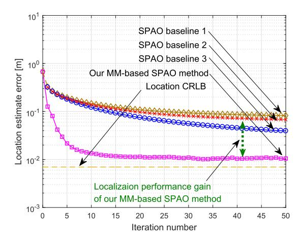

Fig. 6. UD location estimate error of various SPAO algorithms.

The UD appears in the room at a random location and with a random orientation. In addition,  $\Psi_A = 0.5 \, [\text{cm}^2]$ ,  $\Psi_F = 1$ ,  $\Psi_C = 2.25$ , r = 1, and  $\theta_{FOV} = \phi_{FOV} = \pi/2$ . These parameter settings follow from a typical LED setup that are widely adopted [12], [24], [67], [68]. Furthermore, we consider SNR = 20 dB, and there are L' = 4 NLOS paths between each LED emitter and the UD [69], unless specified otherwise, wherein the associated four scatterers between each LED transmitter and UD are randomly distributed within the room. Moreover, we set the fading coefficient of each NLOS path at random, i.e.,  $\alpha'_{l,m} = |\mathbf{h}'_{l,m}|$ , with  $\mathbf{h}'_{l,m} \sim \mathcal{N}(0, \sigma_{\mathrm{nlos}}^2)$ , with the covariance  $\sigma_{\mathrm{nlos}}^2 = 0.01$ ,  $\forall l = 1 : L'$  and  $\forall m = 1 : M$ , unless specified otherwise. In such a case, the equivalent channel state  $\alpha_{l,m}$  can be determined as per (24).

We employ the following optimization algorithms as baseline methods for performance comparison.

- Baseline 1: RSS-based SPAO using particle swarm optimization, which only exploits the LOS channel [18].
- Baseline 2: Line search-based SPAO method [10], which uses RSS signals in diffuse scattering environments.
- Baseline 3: Gradient descent (GD)-based SPAO method [9], which uses the received OFDM signals.

<span id="page-9-5"></span>Moreover, we adopt the Cramer-Rao lower bound (CRLB) in [70] as a performance benchmark of our method, where TOA feature is adopted for VLP, in addition to RSS.

# B. Simulation Results

1) Overall SPAO Performance: UD location and orientation estimate errors of various SPAO methods are shown in Figs. 6 and 7, respectively. It is shown that the proposed SPAO algorithm can achieve a localization error of 0.01 m and an orientation vector error of 0.0049 m (corresponding to an angle error of 0.245 degree), for the SNR of 20 dB. The proposed SPAO algorithm has faster convergence than Baseline 3, due to exploitation of the hidden convex structure in our update rule design. In addition, our SPAO method outperforms Baselines 1-3 due to (i) the alleviation of diffuse scattering-caused interference, (ii) estimation of random channel state, (iii) hybrid ranging information from path loss and TOF, and (iv) frequency diversity. The performance gain of our

<span id="page-9-1"></span>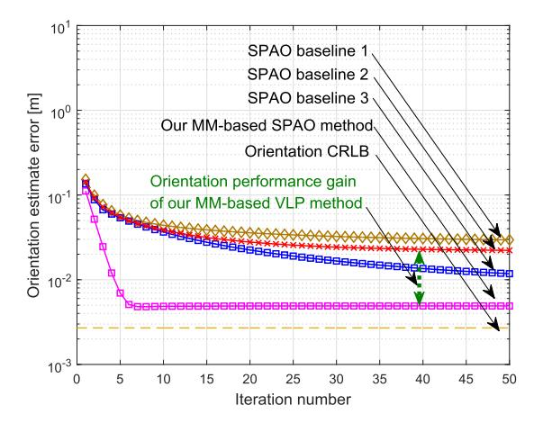

<span id="page-9-3"></span><span id="page-9-2"></span>Fig. 7. UD orientation estimate errors of various SPAO algorithms.

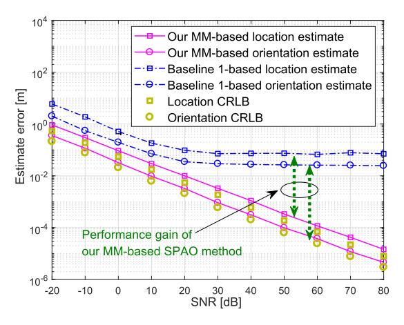

<span id="page-9-4"></span>Fig. 8. Performance of various SPAO methods versus SNR.

OFDM-based SPAO method from multipath interference suppression and scattering channel estimation is further discussed in the following.

- 2) Effect of SNR: The achieved localization error of various SPAO methods versus SNR is plotted in Fig. 8, where the SNR varies from -20 dB to 80 dB via reducing the measurement noise strength and keeping the emitting power fixed. It is shown that a higher SNR leads to a lower SPAO error, and the SPAO error approximately scales with  $\mathcal{O}(\mathsf{SNR}^{-1})$ . In addition, we can observe that Baselines 1 and 2 have an obvious SPAO error floor in the high SNR region, which stems from multipath inference. Hence, diffuse scattering will become the dominant error source of LOS channel-based SPAO methods in high SNR environments, if diffuse scattering effect is not well harnessed. In contrast, the localization error of the proposed SPAO algorithm always reduce with the increase of SNR and the negative effect of diffuse scattering interference is removed due to the estimation/equalization of scattering channel states.
- 3) Impact of Diffuse Reflection: We reveal the impact of different diffuse reflection degree (i.e., the number of NLOS links) on the SPAO performance. The number of NLOS links varies from 0 to 4. As shown in Fig. 9 that the localization and orientation errors of the proposed SPAO algorithm and Baseline 1 increase with the number of NLOS links, and

<span id="page-10-1"></span>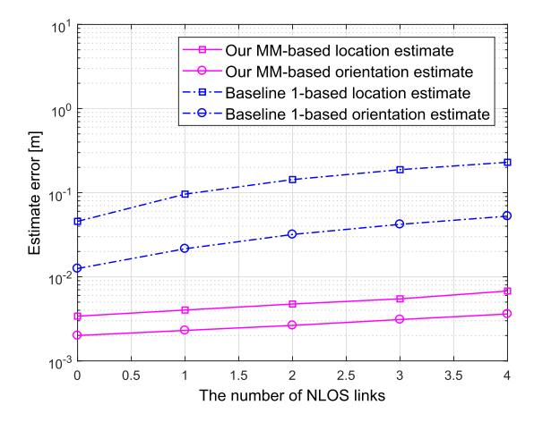

<span id="page-10-2"></span>Fig. 9. Performance of SPAO methods versus the number of NLOS paths.

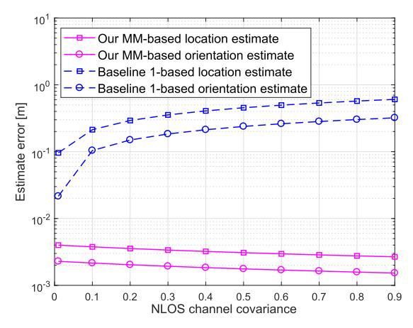

Fig. 10. Performance of the proposed MM-based SPAO method and baseline method 1 versus NLOS channel covariance.

the multipath interference is significantly suppressed in our OFDM-based SPAO method.

4) Impact of Ramdom Fading: The VLP error of various SPAO methods versus random fading is plotted in Fig. 10, where the NLOS channel covariance is  $\sigma_{\text{nlos}}^2 \in (0, 1)$ . It is shown that the performance of our MM-based OFDM-assisted SPAO method will be not degraded by NLOS propagation, due to the joint estimation and equalization mechanism of NLOS channels in our VLC OFDM-based SPAO method (see Section III-B-II). In addition, the error of our OFDM-based SPAO method will be slightly reduced with an enlarged NLOS channel covariance. This is because an enlarged NLOS channel covariance means an increased NLOS channel gain, and the NLOS channel also contributes to location detection in our OFDM-based SPAO method, in addition to the LOS channel. Namely, our method extracts UD location information from both LOS and NLOS channels, as shown in (22), i.e., from both  $\chi_{n,m}^{(t)\top}(\mathbf{x}_R)$   $\mathbf{u}_R$  in the LOS link and  $\omega_{n,m}^{(t)}(\mathbf{x}_R)$  in the NLOS links. Hence, a large NLOS channel gain means an increased SNR and enlarged location information for SPAO, and hence VLP accuracy will be increased slightly.

In contrast, the VLP performance of the baseline method 1 will be increasing with an enlarged NLOS channel covariance. This is because NLOS interference is not alleviated in Baseline 1, and thus it is totally an error source for VLP.

<span id="page-10-3"></span>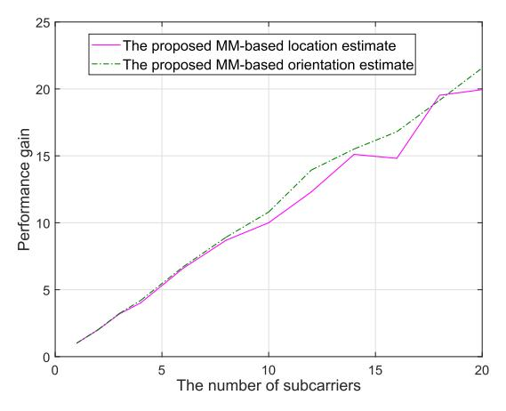

Fig. 11. Performance gain of the proposed MM-based SPAO algorithm versus number of subcarriers of each LED emitter.

Therefore, an enlarged NLOS channel covariance means an enlarged NLOS interference, and hence an increased VLP error. This result verifies the superiority of our MM-based SPAO method for dealing with NLOS interference, which gains from the OFDM-based interference channel equalization mechanism design.

5) Impact of OFDM Configuration: The performance gain of our OFDM-based SPAO method versus the number of subcarriers of each LED emitter is plotted in Fig. 11, where the number of subcarriers allocated to each LED emitter varies from 1 to 20. The UD location estimation performance gain

from frequency diversity is defined as  $\frac{\|\hat{\mathbf{x}}_R(1) - \mathbf{x}_R\|_2^2}{\|\hat{\mathbf{x}}_R(N) - \mathbf{x}_R\|_2^2}$  where

 $\hat{\mathbf{x}}_{R}(N)$  denotes the UD location estimate based on our SPAO algorithm using N subcarriers of each LED emitter.

It is shown that the performance gain of our SPAO method increases with the number of subcarriers. This is because the energy spreading over a large number of subcarriers will reduce the risk of VLC being at a poor frequency channel. Hence, the SPAO performance will be improved by the OFDM modulation of the VLC system.

# VI. CONCLUSION

<span id="page-10-0"></span>In this paper, a novel OFDM-based SPAO scheme is proposed for VLCs, which can alleviate multipath interference and random channel fading, thus rendering a promising VLP solution in diffuse scattering environments. A novel MM-based optimization algorithm is then developed accordingly to address its non-convex problem. In addition, the proposed SPAO algorithm exploits hybrid ranging information from the path loss, TOF and angular information of received OFDM signal waveforms. In consequence, our OFDM-based SPAO solution achieves a huge performance gain over the state-of-the-art VLP baseline methods, not only due to our problem-specific framework for alleviating the environment interference and random disturbance, but also hybrid ranging information exploitation and frequency diversity.

The proposed OFDM-based SPAO algorithm is attractive for VLCs, since it cannot only provide the UD location and orientation direction estimate, but also give rise to the diffuse scattering channel state estimate simultaneously.

# <span id="page-11-0"></span>APPENDIX A PROOF OF THEOREM 1

For ease of notation, let  $\beta_R = (\mathbf{x}_R, \mathbf{u}_R)$  denote the UD location parameter vector. Given a distribution  $p(\alpha|\mathbf{z}, \beta_R)$  of the hidden variable  $\alpha$ , the logarithm of the marginal posterior  $p(\beta_R|\mathbf{z})$  w.r.t.  $\beta_R$  follows

$$\ln p(\boldsymbol{\beta}_{R}|\mathbf{z}) = \ln \int p(\boldsymbol{\beta}_{R}, \boldsymbol{\alpha}|\mathbf{z}) d\boldsymbol{\alpha}$$
 (58)

$$= \ln \int p(\boldsymbol{\alpha}|\mathbf{z}, \hat{\boldsymbol{\beta}}_{[i]}) \frac{p(\boldsymbol{\beta}_{R}, \boldsymbol{\alpha}|\mathbf{z})}{p(\boldsymbol{\alpha}|\mathbf{z}, \hat{\boldsymbol{\beta}}_{[i]})} d\boldsymbol{\alpha}$$
 (59)

$$\geq \int p(\boldsymbol{\alpha}|\mathbf{z}, \hat{\boldsymbol{\beta}}_{[i]}) \ln \frac{p(\boldsymbol{\alpha}, \boldsymbol{\beta}_{R}|\mathbf{z})}{p(\boldsymbol{\alpha}|\mathbf{z}, \hat{\boldsymbol{\beta}}_{[i]})} d\boldsymbol{\alpha}$$
 (60)

$$= \underbrace{\int p(\boldsymbol{\alpha}|\mathbf{z}, \hat{\boldsymbol{\beta}}_{[i]}) \ln p(\boldsymbol{\alpha}, \boldsymbol{\beta}_{R}|\mathbf{z}) d\boldsymbol{\alpha}}_{\mathbb{E}_{\boldsymbol{\alpha}|\mathbf{z}, \hat{\boldsymbol{\beta}}_{[i]}} \{\ln p(\boldsymbol{\alpha}, \boldsymbol{\beta}_{R}|\mathbf{z})\}} + \text{const} \quad (61)$$

where the Jensen's inequality is applied in (60) for the concave log-function. Hence, Theorem 1 is proved.

#### <span id="page-11-5"></span>APPENDIX B

Expressions of  $\mathcal{R}_{\text{LOS}},$   $U_{\text{LOS}},$   $\mathcal{R}_{\text{NLOS}}$  and  $U_{\text{NLOS}}$ 

Firstly,  $\mathcal{R}_{\mathsf{LOS}}(\hat{\mathbf{x}}_{[i]}) \in \mathbb{C}^{3 \times 3|\Omega_{\mathsf{R}}|NK}$  and  $\mathbf{U}_{\mathsf{LOS}}(\hat{\mathbf{u}}_{[i]}) \in \mathbb{R}^{3|\Omega_{\mathsf{R}}|NK \times |\Omega_{\mathsf{R}}|NK}$  are given respectively by

$$\mathcal{R}_{\mathsf{LOS}}(\hat{\mathbf{x}}_{[i]}) = [\mathcal{D}_{n,m}^{(t)} | \forall n \in \Theta_m, \forall m \in \Omega_R, \forall t = 1:K], \tag{62}$$

$$\mathbf{U}_{\mathsf{LOS}}(\hat{\mathbf{u}}_{[i]}) = \mathbf{I}_{|\Omega_{\mathsf{R}}|NM} \otimes \hat{\mathbf{u}}_{[i]},\tag{63}$$

where  $\mathcal{D}_{n,m}^{(t)} \in \mathbb{C}^{3\times 3}$  is given by (64), shown at the bottom of the page, while  $\mathcal{R}_{\text{NLOS}}(\hat{\mathbf{x}}_{[i]}) \in \mathbb{C}^{3\times L|\Omega_R|^2NK}$  and  $\mathbf{U}_{\text{NLOS}}(\bar{\boldsymbol{\alpha}}_{[i]}) \in \mathbb{R}^{L|\Omega_R|^2NK \times |\Omega_R|NK}$  are given by

$$\mathcal{R}_{\mathsf{NLOS}}(\hat{\mathbf{x}}_{[i]}) = [\mathcal{Q}_{n\,m}^{(t)} | \forall n, \forall m, \forall t], \tag{65}$$

<span id="page-11-4"></span><span id="page-11-3"></span>
$$\mathbf{U}_{\mathsf{NIOS}}(\bar{\boldsymbol{\alpha}}_{[i]}) = \mathbf{I}_{|\Omega_{\mathsf{P}}|NM} \otimes \bar{\boldsymbol{\alpha}}_{[i]}, \tag{66}$$

where  $\bar{\boldsymbol{\alpha}}_{[i]}$  is given by (42), and  $\boldsymbol{\mathcal{Q}}_{n,m}^{(t)} \in \mathbb{C}^{3\times (L+1)|\Omega_{\mathbb{R}}|}$  is given by

$$Q_{n,m}^{(t)} = [\delta_{m,m'} Q_{n,m;m'}^{(t)} | \forall m' \in \Omega_{R}],$$
 (67)

where  $\delta_{m,m'}=1$  if m'=m and zero otherwise, while  $\mathcal{Q}_{n\,m'm'}^{(t)}\in\mathbb{C}^{3\times(L+1)}$  is given by

$$Q_{n,m;m'}^{(t)} = [\varsigma_{l,n,m;m'}^{(t)} | \forall l = 1:L], \tag{68}$$

<span id="page-11-7"></span>where  $\boldsymbol{\varsigma}_{l,n,m;m'}^{(t)} \in \mathbb{C}^3$  for l=1:L is given by (69), as shown at the bottom of the page.

# <span id="page-11-6"></span>APPENDIX C PROOF OF THEOREM 3

To prove Theorem 3, we first establish the convergence rate of UD location update  $\hat{\mathbf{x}}_{[i]}$ .

<span id="page-11-2"></span><span id="page-11-1"></span>We start with convergence analysis of  $\hat{\mathbf{x}}_{[i]}$  with  $\lambda_{\min} \neq$ 0. Let  $y_{n,m}^{(t)}(\mathbf{x}_{R}, \boldsymbol{\mu}_{R}) = \boldsymbol{\chi}_{n,m}^{(t)\top}(\mathbf{x}_{R})\boldsymbol{\mu}_{R}$ , and let  $\mathbf{y}(\mathbf{x}_{R}, \boldsymbol{\mu}_{R}) =$  $\operatorname{vec}[y_{n,m}^{(t)}(\mathbf{x}_{R}, \boldsymbol{\mu}_{R})|\forall n \in \Theta_{m}, \forall m \in \Omega_{R}, \forall t = 1 :$ K]. By applying the second-order Taylor approximation to  $\mathbf{y}(\mathbf{x}_{\mathrm{R}}, \hat{\boldsymbol{\mu}}_{[i]})$  around  $\mathbf{x}_{\mathrm{R}} = \hat{\mathbf{x}}_{[i]}$ ,  $\mathbf{z}$  can be cast as (70), shown at the bottom of the page, where  $\kappa$  is the higher-order residual error that can be safely ignored, and we have  $\mathbf{F}_{n,m}^{(t)}(\hat{\mathbf{x}}_{[i]}, \hat{\boldsymbol{\mu}}_{[i]}) = \nabla_{\mathbf{x}_{\mathbf{R}}} y_{n,m}^{(t)}(\hat{\mathbf{x}}_{[i]}, \hat{\boldsymbol{\mu}}_{[i]}) \nabla_{\mathbf{x}_{\mathbf{R}}}^{\mathbf{H}} y_{m}(\hat{\mathbf{x}}_{[i]}, \hat{\boldsymbol{\mu}}_{[i]}). \text{ In (70),}$ we use  $\nabla_{\mathbf{x}_{\mathbf{R}}}^{\mathbf{H}} \mathbf{y}(\hat{\mathbf{x}}_{[i]}, \hat{\boldsymbol{\mu}}_{[i]}) \nabla_{\mathbf{x}_{\mathbf{R}}} \mathbf{y}(\hat{\mathbf{x}}_{[i]}, \hat{\boldsymbol{\mu}}_{[i]})$  to approximate the Hessian matrix for computational ease (only gradient is needed). Ignoring the higher-order residual error, we eventually arrive at (72), shown at the top of the next page. Thus, we can obtain  $\|\mathbf{x}_{R}^{\bullet} - \mathbf{x}_{[i+1]}^{\sharp}\|_{2} = \mathcal{O}(\|\mathbf{x}_{R}^{\bullet} - \hat{\mathbf{x}}_{[i]}\|_{2}^{2}) + \mathcal{O}(\lambda_{\min}\|\mathbf{x}_{R}^{\bullet} - \hat{\mathbf{x}}_{[i]}\|_{2})$ , for a sufficiently small  $\|\mathbf{x}_{R}^{\bullet} - \hat{\mathbf{x}}_{[i]}\|_{2}$ . As per (54), we know that  $\hat{\mathbf{x}}_{[i+1]}$  is more efficient than  $\mathbf{x}_{[i+1]}^{\mu}$ , since it can lead to a faster decrease in the cost function value than  $\mathbf{x}_{[i+1]}^{\mathbb{I}}$ . Thus, the convergence rate of  $\hat{\mathbf{x}}_{[i+1]}$  is asymptotically quadratic as  $\lambda_{\min} \to 0$ .

$$\mathcal{D}_{n,m}^{(t)} = -\mathbf{a}_{n,m}^{(t)*} \frac{r(r+1)}{2\pi} \frac{\left((\hat{\mathbf{x}}_{[i]} - \mathbf{p}_{m})^{\top} \mathbf{v}_{m}\right)^{r-1}}{\|\hat{\mathbf{x}}_{[i]} - \mathbf{p}_{m}\|_{2}^{r+3}} \mathbf{v}_{m} (\hat{\mathbf{x}}_{[i]} - \mathbf{p}_{m})^{\top} \exp\left(j2\pi f_{n,m} \frac{\|\hat{\mathbf{x}}_{[i]} - \mathbf{p}_{m}\|_{2}}{c}\right)$$

$$- \mathbf{a}_{n,m}^{(t)*} \frac{(r+1)}{2\pi} \frac{\left((\hat{\mathbf{x}}_{[i]} - \mathbf{p}_{m})^{\top} \mathbf{v}_{m}\right)^{r}}{\|\hat{\mathbf{x}}_{[i]} - \mathbf{p}_{m}\|_{2}^{r+3}} \exp\left(j2\pi f_{n,m} \frac{\|\hat{\mathbf{x}}_{[i]} - \mathbf{p}_{m}\|_{2}}{c}\right)$$

$$+ \mathbf{a}_{n,m}^{(t)*} \frac{(r+1)(r+3)}{2\pi} \frac{\left((\hat{\mathbf{x}}_{[i]} - \mathbf{p}_{m})^{\top} \mathbf{v}_{m}\right)^{r}}{\|\hat{\mathbf{x}}_{[i]} - \mathbf{p}_{m}\|_{2}^{r+5}} (\hat{\mathbf{x}}_{[i]} - \mathbf{p}_{m}) (\hat{\mathbf{x}}_{[i]} - \mathbf{p}_{m})^{\top} \exp\left(j2\pi f_{n,m} \frac{\|\hat{\mathbf{x}}_{[i]} - \mathbf{p}_{m}\|_{2}}{c}\right)$$

$$- \mathbf{j} \mathbf{a}_{n,m}^{(t)*} \frac{(r+1) f_{n,m}}{c} \frac{\left((\hat{\mathbf{x}}_{[i]} - \mathbf{p}_{m})^{\top} \mathbf{v}_{m}\right)^{r}}{\|\hat{\mathbf{x}}_{[i]} - \mathbf{p}_{m}\|_{2}^{r+4}} (\hat{\mathbf{x}}_{[i]} - \mathbf{p}_{m}) (\hat{\mathbf{x}}_{[i]} - \mathbf{p}_{m})^{\top} \exp\left(j2\pi f_{n,m} \frac{\|\hat{\mathbf{x}}_{[i]} - \mathbf{p}_{m}\|_{2}}{c}\right)$$

$$(64)$$

$$\boldsymbol{\varsigma}_{l,n,m;m'}^{(t)} = j\,\tilde{\mathbf{a}}_{l,n,m}^{(t)*}\bar{\boldsymbol{\alpha}}_{l,m}^{*}\frac{2\pi f_{n,m}}{c}\frac{\hat{\mathbf{x}}_{[i]} - \mathbf{p}_{m}}{\|\hat{\mathbf{x}}_{[i]} - \mathbf{p}_{m}\|_{2}}\exp\left(j2\pi f_{n,m}\frac{\|\hat{\mathbf{x}}_{[i]} - \mathbf{p}_{m}\|_{2}}{c}\right), \text{ for } l = 1:L$$
(69)

<span id="page-11-10"></span><span id="page-11-9"></span><span id="page-11-8"></span>
$$\mathbf{z} = \mathbf{y}(\hat{\mathbf{x}}_{[i]}, \hat{\boldsymbol{\mu}}_{[i]}) + \nabla_{\mathbf{x}_{R}}^{H} \mathbf{y}(\hat{\mathbf{x}}_{[i]}, \hat{\boldsymbol{\mu}}_{[i]}) (\mathbf{x}_{R}^{\bullet} - \hat{\mathbf{x}}_{[i]}) + \mathbf{w}(\mathbf{x}_{R}^{\bullet}; \hat{\boldsymbol{\mu}}_{[i]}) + \kappa, \tag{70}$$

$$\mathbf{w}(\mathbf{x}_{\mathsf{R}}^{\bullet}; \hat{\boldsymbol{\mu}}_{[i]}) \in \mathbb{R}^{|\Omega_{\mathsf{R}}|KN} = 0.5 \text{vec}[(\mathbf{x}_{\mathsf{R}}^{\bullet} - \hat{\mathbf{x}}_{[i]})^{\top} \mathbf{F}_{nm}^{(t)}(\hat{\mathbf{x}}_{[i]}, \hat{\boldsymbol{\mu}}_{[i]})(\mathbf{x}_{\mathsf{R}}^{\bullet} - \hat{\mathbf{x}}_{[i]}) | \forall n \in \Theta_m, \forall m \in \Omega_{\mathsf{R}}, \forall t = 1 : K]$$

$$(71)$$

$$\underbrace{\left(\nabla_{\mathbf{x}_{R}} \mathbf{y}(\hat{\mathbf{x}}_{[i]}, \hat{\boldsymbol{\mu}}_{[i]}) \nabla_{\mathbf{x}_{R}}^{H} \mathbf{y}(\hat{\mathbf{x}}_{[i]}, \hat{\boldsymbol{\mu}}_{[i]}) + \lambda_{\min} \mathbf{I}_{3}\right)^{-1} \left(\nabla_{\mathbf{x}_{R}} \mathbf{y}(\hat{\mathbf{x}}_{[i]}, \hat{\boldsymbol{\mu}}_{[i]})\right) \left(\mathbf{z} - \mathbf{y}(\hat{\mathbf{x}}_{[i]}, \hat{\boldsymbol{\mu}}_{[i]})\right) + \hat{\mathbf{x}}_{[i]}}_{\mathbf{x}_{[i+1]}^{\sharp}} - \mathbf{x}_{R}^{\bullet} \Big\|_{2}$$

$$= \underbrace{\left\|\left(\nabla_{\mathbf{x}_{R}}^{H} \mathbf{y}(\hat{\mathbf{x}}_{[i]}, \hat{\boldsymbol{\mu}}_{[i]})\right)^{\dagger} \mathbf{w}\left(\mathbf{x}_{R}^{\bullet}; \hat{\mathbf{x}}_{[i]}, \hat{\boldsymbol{\mu}}_{[i]}\right)}_{\mathcal{O}(\|\mathbf{x}_{R}^{\bullet} - \hat{\mathbf{x}}_{[i]}\|_{2}^{2})} - \lambda_{\min}(\mathbf{x}_{R}^{\bullet} - \hat{\mathbf{x}}_{[i]})\right\|_{2} = \mathcal{O}\left(\|\mathbf{x}_{R}^{\bullet} - \hat{\mathbf{x}}_{[i]}\|_{2}^{2}\right) + \mathcal{O}\left(\lambda_{\min}\|\mathbf{x}_{R}^{\bullet} - \hat{\mathbf{x}}_{[i]}\|_{2}\right) \tag{72}$$

We analyze the convergence of  $\hat{\mathbf{u}}_{[i+1]}$ . Based on (44), we have  $\|\hat{\mathbf{u}}_{[i+1]} - \mathbf{u}_{R}^{\bullet}\|_{2} = \|(\mathbf{G}(\hat{\mathbf{x}}_{[i+1]}))^{\dagger}\mathbf{z}_{\mathsf{LOS}} - (\mathbf{G}(\mathbf{x}_{R}^{\bullet}))^{\dagger}\mathbf{z}_{\mathsf{LOS}}\|_{2}$  with  $\mathbf{z}_{\mathsf{LOS}} = \mathbf{z} - \mathbf{G}_{\mathsf{NLOS}}(\hat{\mathbf{x}}_{[i]})\bar{\boldsymbol{\alpha}}_{[i]}$ . As per (A3), we know that  $(\mathbf{G}(\hat{\mathbf{x}}_{[i+1]}))^{\dagger}\mathbf{z}_{\mathsf{LOS}}$  is a Lipschitz continuous function of  $\hat{\mathbf{x}}_{[i+1]}$ . In consequence, due to  $\|\hat{\mathbf{x}}_{[i+1]} - \mathbf{x}_{R}^{\bullet}\|_{2} = \mathcal{O}(\|\hat{\mathbf{x}}_{[i]} - \mathbf{x}_{R}^{\bullet}\|_{2}^{2}) + \mathcal{O}(\lambda_{\min}\|\mathbf{x}_{R}^{\bullet} - \hat{\mathbf{x}}_{[i]}\|_{2})$ , we have  $\|(\mathbf{G}(\hat{\mathbf{x}}_{[i+1]}))^{\dagger}\mathbf{z}_{\mathsf{LOS}} - (\mathbf{G}(\mathbf{x}_{R}^{\bullet}))^{\dagger}\mathbf{z}_{\mathsf{LOS}}\|_{2} = \mathcal{O}(\|(\mathbf{G}(\hat{\mathbf{x}}_{[i]}))^{\dagger}\mathbf{z}_{\mathsf{LOS}}\|_{2}) + \mathcal{O}(\lambda_{\min}\|(\mathbf{G}(\hat{\mathbf{x}}_{[i]}))^{\dagger}\mathbf{z}_{\mathsf{LOS}} - (\mathbf{G}(\mathbf{x}_{R}^{\bullet}))^{\dagger}\mathbf{z}_{\mathsf{LOS}}\|_{2})$ . As a result,  $\|\hat{\mathbf{u}}_{[i+1]} - \mathbf{u}_{R}^{\bullet}\|_{2} = \mathcal{O}(\|\hat{\mathbf{u}}_{[i]} - \mathbf{u}_{R}^{\bullet}\|_{2}) + \mathcal{O}(\lambda_{\min}\|\hat{\mathbf{u}}_{[i]} - \mathbf{u}_{R}^{\bullet}\|_{2})$  is obtained. Hence, the update of the convex component  $\hat{\mathbf{u}}_{[i]}$  is also asymptotically quadratic as  $\lambda_{\min} \to 0$ , when the condition (B4) is satisfied. Hence, Theorem 3 is proved.

#### REFERENCES

- <span id="page-12-0"></span>E. Cardarelli, V. Digani, L. Sabattini, C. Secchi, and C. Fantuzzi, "Cooperative cloud robotics architecture for the coordination of multi-AGV systems in industrial warehouses," *Mechatronics*, vol. 45, pp. 1–13, Aug. 2017.
- <span id="page-12-1"></span>[2] R. Krug et al., "The next step in robot commissioning: Autonomous picking and palletizing," *IEEE Robot. Autom. Lett.*, vol. 1, no. 1, pp. 546–553, Jan. 2016.
- <span id="page-12-2"></span>[3] J. Moon, I. Bae, and S. Kim, "Real-time near-optimal path and maneuver planning in automatic parking using a simultaneous dynamic optimization approach," in *Proc. IEEE Intell. Vehicles Symp. (IV)*, Los Angeles, CA, USA, Jun. 2017, pp. 193–196.
- <span id="page-12-3"></span>[4] A. Jovicic, J. Li, and T. Richardson, "Visible light communication: Opportunities, challenges and the path to market," *IEEE Commun. Mag.*, vol. 51, no. 12, pp. 26–32, Dec. 2013.
- <span id="page-12-4"></span>[5] J. Armstrong, Y. Sekercioglu, and A. Neild, "Visible light positioning: A roadmap for international standardization," *IEEE Commun. Mag.*, vol. 51, no. 12, pp. 68–73, Dec. 2013.
- <span id="page-12-5"></span>[6] H. Wymeersch, J. Lien, and M. Z. Win, "Cooperative localization in wireless networks," *Proc. IEEE*, vol. 97, no. 2, pp. 427–450, Feb. 2009.
- <span id="page-12-6"></span>[7] B. Zhou and Q. Chen, "On the particle-assisted stochastic search mechanism in wireless cooperative localization," *IEEE Trans. Wireless Commun.*, vol. 15, no. 7, pp. 4765–4777, Jul. 2016.
- <span id="page-12-7"></span>[8] B. Zhou, Q. Chen, H. Wymeersch, P. Xiao, and L. Zhao, "Variational inference-based positioning with nondeterministic measurement accuracies and reference location errors," *IEEE Trans. Mobile Comput.*, vol. 16, no. 10, pp. 2955–2969, Oct. 2017.
- <span id="page-12-8"></span>[9] A. Beck and M. Teboulle, "Gradient-based algorithms with applications to signal recovery," in *Convex Optimization in Signal Processing* and *Communications*. Cambridge, U.K.: Cambridge Univ. Press, 2010, pp. 42–88.
- <span id="page-12-9"></span>[10] Y.-H. Dai, "Conjugate gradient methods with Armijo-type line searches," Acta Mathematicae Applicatae Sinica, vol. 18, no. 1, pp. 123–130, Mar. 2002.
- <span id="page-12-10"></span>[11] A. A. Purwita, M. D. Soltani, M. Safari, and H. Haas, "Terminal orientation in OFDM-based LiFi systems," *IEEE Trans. Wireless Commun.*, vol. 18, no. 8, pp. 4003–4016, Aug. 2019.
- <span id="page-12-11"></span>[12] L. Yin, X. Wu, and H. Haas, "Indoor visible light positioning with angle diversity transmitter," in *Proc. IEEE 82nd Veh. Technol. Conf.*, Boston, MA, USA, Sep. 2015, pp. 1–5.
- <span id="page-12-12"></span>[13] F. Garbuglia, W. Raes, J. De Bruycker, N. Stevens, D. Deschrijver, and T. Dhaene, "Bayesian active learning for received signal strengthbased visible light positioning," *IEEE Photon. J.*, vol. 14, no. 6, pp. 1–8, Dec. 2022.

- <span id="page-12-30"></span><span id="page-12-13"></span>[14] X. Sun et al., "RSS-based visible light positioning using nonlinear optimization," *IEEE Internet Things J.*, vol. 9, no. 15, pp. 14137–14150, Aug. 2022.
- <span id="page-12-14"></span>[15] S. Bastiaens, J. Mommerency, K. Deprez, W. Joseph, and D. Plets, "Received signal strength visible light positioning-based precision drone landing system," in *Proc. Int. Conf. Indoor Positioning Indoor Navigat.* (IPIN), Lloret de Mar, Spain, Nov. 2021, pp. 1–8.
- <span id="page-12-15"></span>[16] S. Bastiaens, S. K. Goudos, W. Joseph, and D. Plets, "Metaheuristic optimization of LED locations for visible light positioning network planning," *IEEE Trans. Broadcast.*, vol. 67, no. 4, pp. 894–908, Dec. 2021.
- <span id="page-12-16"></span>[17] W. Zhang, M. I. S. Chowdhury, and M. Kavehrad, "Asynchronous indoor positioning system based on visible light communications," *Opt. Eng.*, vol. 53, no. 4, Apr. 2014, Art. no. 045105.
- <span id="page-12-17"></span>[18] B. Zhou, V. Lau, Q. Chen, and Y. Cao, "Simultaneous positioning and orientating for visible light communications: Algorithm design and performance analysis," *IEEE Trans. Veh. Technol.*, vol. 67, no. 12, pp. 11790–11804, Dec. 2018.
- <span id="page-12-18"></span>[19] Y. Liu, K.-H. Park, B. S. Ooi, and M.-S. Alouini, "Indoor localization using three dimensional multi-PDs receiver based on RSS," in *Proc. IEEE Globecom Workshops (GC Wkshps)*, Abu Dhabi, United Arab Emirates, Dec. 2018, pp. 1–6.
- <span id="page-12-19"></span>[20] B. Zhou, A. Liu, and V. Lau, "Robust visible light-based positioning under unknown user device orientation angle," in *Proc. 12th Int. Conf. Signal Process. Commun. Syst. (ICSPCS)*, Dec. 2018, pp. 1–5.
- <span id="page-12-20"></span>[21] B. Zhou, A. Liu, and V. Lau, "Joint user location and orientation estimation for visible light communication systems with unknown power emission," *IEEE Trans. Wireless Commun.*, vol. 18, no. 11, pp. 5181–5195, Nov. 2019.
- <span id="page-12-21"></span>[22] Z. Zhou, M. Kavehrad, and P. Deng, "Indoor positioning algorithm using light-emitting diode visible light communications," *Opt. Eng.*, vol. 51, no. 8, 2012, Art. no. 085009.
- <span id="page-12-22"></span>[23] Y. S. Eroglu, I. Guvenc, N. Pala, and M. Yuksel, "AOA-based localization and tracking in multi-element VLC systems," in *Proc. IEEE 16th Annu. Wireless Microw. Technol. Conf. (WAMICON)*, Cocoa Beach, FL, USA, Apr. 2015, pp. 1–5.
- <span id="page-12-23"></span>[24] A. Sahin, Y. S. Eroglu, I. Guvenc, N. Pala, and M. Yuksel, "Accuracy of AOA-based and RSS-based 3D localization for visible light communications," in *Proc. IEEE 82nd Veh. Technol. Conf. (VTC-Fall)*, Boston, MA, USA, Sep. 2015, pp. 1–5.
- <span id="page-12-24"></span>[25] X. Li, Y. Xing, and Z. Zhang, "A hybrid AOA and TDOA-based localization method using only two stations," *Int. J. Antennas Propag.*, vol. 2021, pp. 1–8, Sep. 2021.
- <span id="page-12-25"></span>[26] Y. Yu, B. Zhu, Z. Zhang, L. Wang, L. Wu, and J. Dang, "Indoor visible light localization algorithm with the optimal optical angle-ofarrival estimator," in *Proc. 2nd Inf. Commun. Technol. Conf. (ICTC)*, Nanjing, China, May 2021, pp. 194–198.
- <span id="page-12-26"></span>[27] R. Othman, A. Gaafar, L. Muaaz, and M. H. Elsayed, "A hybrid RSS+AOA indoor positioning algorithm based on visible light communication," in *Proc. Int. Conf. Comput., Control, Electr., Electron. Eng.* (ICCCEEE), Khartoum, Sudan, Feb. 2021, pp. 1–5.
- <span id="page-12-27"></span>[28] C.-Y. Hong et al., "Angle-of-arrival (AOA) visible light positioning (VLP) system using solar cells with third-order regression and ridge regression algorithms," *IEEE Photon. J.*, vol. 12, no. 3, pp. 1–5, Jun. 2020.
- <span id="page-12-28"></span>[29] B. Soner and S. Coleri, "Visible light communication based vehicle localization for collision avoidance and platooning," *IEEE Trans. Veh. Technol.*, vol. 70, no. 3, pp. 2167–2180, Mar. 2021.
- <span id="page-12-29"></span>[30] L.-S. Hsu et al., "Utilizing single light-emitting-diode (LED) lamp and silicon solar-cells visible light positioning (VLP) based on angle-of-arrival (AOA) and long-short-term-memory-neural-network (LSTMNN)," Opt. Commun., vol. 524, Dec. 2022, Art. no. 128761.

- <span id="page-13-0"></span>[\[31\]](#page-1-3) M. Z. Win, Y. Shen, and W. Dai, "A theoretical foundation of network localization and navigation," *Proc. IEEE*, vol. 106, no. 7, pp. 1136–1165, Jul. 2018.
- <span id="page-13-1"></span>[\[32\]](#page-1-3) M. Z. Win, F. Meyer, Z. Liu, W. Dai, S. Bartoletti, and A. Conti, "Efficient multisensor localization for the Internet of Things: Exploring a new class of scalable localization algorithms," *IEEE Signal Process. Mag.*, vol. 35, no. 5, pp. 153–167, Sep. 2018.
- <span id="page-13-2"></span>[\[33\]](#page-1-3) P. Biswas, T.-C. Lian, T.-C. Wang, and Y. Ye, "Semidefinite programming based algorithms for sensor network localization," *ACM Trans. Sensor Netw.*, vol. 2, no. 2, pp. 188–220, May 2006.
- <span id="page-13-3"></span>[\[34\]](#page-1-3) S. Joshi and S. Boyd, "Sensor selection via convex optimization," *IEEE Trans. Signal Process.*, vol. 57, no. 2, pp. 451–462, Feb. 2009.
- <span id="page-13-4"></span>[\[35\]](#page-1-3) Y. Shen and M. Z. Win, "Fundamental limits of wideband localization—Part I: A general framework," *IEEE Trans. Inf. Theory*, vol. 56, no. 10, pp. 4956–4980, Oct. 2010.
- <span id="page-13-5"></span>[\[36\]](#page-1-3) Z. Liu, W. Dai, and M. Z. Win, "Mercury: An infrastructure-free system for network localization and navigation," *IEEE Trans. Mobile Comput.*, vol. 17, no. 5, pp. 1119–1133, May 2018.
- <span id="page-13-6"></span>[\[37\]](#page-1-3) B. Zhou, Q. Chen, and P. Xiao, "The error propagation analysis of the received signal strength-based simultaneous localization and tracking in wireless sensor networks," *IEEE Trans. Inf. Theory*, vol. 63, no. 6, pp. 3983–4007, Jun. 2017.
- <span id="page-13-7"></span>[\[38\]](#page-1-3) B. Zhou, Q. Chen, P. Xiao, and L. Zhao, "On the spatial error propagation characteristics of cooperative localization in wireless networks," *IEEE Trans. Veh. Technol.*, vol. 66, no. 2, pp. 1647–1658, Feb. 2017.
- <span id="page-13-8"></span>[\[39\]](#page-1-4) A. T. Ihler, J. W. Fisher, R. L. Moses, and A. S. Willsky, "Nonparametric belief propagation for self-localization of sensor networks," *IEEE J. Sel. Areas Commun.*, vol. 23, no. 4, pp. 809–819, Apr. 2005.
- <span id="page-13-9"></span>[\[40\]](#page-1-5) H. Schulze, "Frequency-domain simulation of the indoor wireless optical communication channel," *IEEE Trans. Commun.*, vol. 64, no. 6, pp. 2551–2562, Jun. 2016.
- <span id="page-13-10"></span>[\[41\]](#page-2-6) T. Komine and M. Nakagawa, "Fundamental analysis for visible-light communication system using LED lights," *IEEE Trans. Consum. Electron.*, vol. 50, no. 1, pp. 100–107, Feb. 2004.
- <span id="page-13-11"></span>[\[42\]](#page-2-7) J. H. Y. Nah, R. Parthiban, and M. H. Jaward, "Visible light communications localization using TDOA-based coherent heterodyne detection," in *Proc. IEEE 4th Int. Conf. Photon. (ICP)*, Melaka, Malaysia, Oct. 2013, pp. 247–249.
- <span id="page-13-12"></span>[\[43\]](#page-3-5) A. Al-Kinani, J. Sun, C.-X. Wang, W. Zhang, X. Ge, and H. Haas, "A 2-D non-stationary GBSM for vehicular visible light communication channels," *IEEE Trans. Wireless Commun.*, vol. 17, no. 12, pp. 7981–7992, Dec. 2018.
- <span id="page-13-16"></span>[\[44\]](#page-3-6) L. Yin and H. Haas, "Coverage analysis of multiuser visible light communication networks," *IEEE Trans. Wireless Commun.*, vol. 17, no. 3, pp. 1630–1643, Mar. 2018.
- <span id="page-13-17"></span>[\[45\]](#page-3-6) A. R. Ndjiongue and H. C. Ferreira, "An overview of outdoor visible light communications," *Trans. Emerg. Telecommun. Technol.*, vol. 29, no. 7, p. e3448, Jul. 2018.
- <span id="page-13-18"></span>[\[46\]](#page-3-6) T. Lin et al., "Waving effect characterization for water-to-air optical wireless communication," *J. Lightw. Technol.*, vol. 41, no. 1, pp. 120–136, Jan. 1, 2023.
- <span id="page-13-22"></span>[\[47\]](#page-3-7) M. Z. Afgani, H. Haas, H. Elgala, and D. Knipp, "Visible light communication using OFDM," in *Proc. 2nd Int. Conf. Testbeds Res. Infrastruct. Develop. Netw. Communities*, Barcelona, Spain, Mar. 2006, pp. 1–6.
- <span id="page-13-23"></span>[\[48\]](#page-4-8) S. M. Kay, *Fundamentals of Statistical Signal Processing*, vol. 2. Upper Saddle River, NJ, USA: Prentice-Hall, 1998.
- <span id="page-13-24"></span>[\[49\]](#page-4-9) T. Cover and J. Thomas, *Elements of Information Theory*. New York, NY, USA: Wiley, 1991.
- <span id="page-13-25"></span>[\[50\]](#page-4-9) S. N. Diggavi and T. M. Cover, "Is maximum entropy noise the worst?" in *Proc. IEEE Int. Symp. Inf. Theory*, Ulm, Germany, Jul. 1997, p. 278.
- <span id="page-13-26"></span>[\[51\]](#page-4-10) M. F. Keskin, S. Gezici, and O. Arikan, "Direct and two-step positioning in visible light systems," *IEEE Trans. Commun.*, vol. 66, no. 1, pp. 239–254, Jan. 2018.
- <span id="page-13-27"></span>[\[52\]](#page-4-10) M. F. Keskin, A. D. Sezer, and S. Gezici, "Localization via visible light systems," *Proc. IEEE*, vol. 106, no. 6, pp. 1063–1088, Jun. 2018.
- <span id="page-13-28"></span>[\[53\]](#page-4-10) M. Z. Win et al., "Network localization and navigation via cooperation," *IEEE Commun. Mag.*, vol. 49, no. 5, pp. 56–62, May 2011.
- <span id="page-13-29"></span>[\[54\]](#page-4-11) C. Taylor, A. Rahimi, J. Bachrach, H. Shrobe, and A. Grue, "Simultaneous localization, calibration, and tracking in an ad hoc sensor network," in *Proc. 5th Int. Conf. Inf. Process. sensor Netw.*, 2006, pp. 27–33.

- <span id="page-13-30"></span>[\[55\]](#page-4-11) K. Friston, J. Mattout, N. Trujillo-Barreto, J. Ashburner, and W. Penny, "Variational free energy and the Laplace approximation," *NeuroImage*, vol. 34, no. 1, pp. 220–234, Jan. 2007.
- <span id="page-13-31"></span>[\[56\]](#page-5-8) A. Shahmansoori, G. E. Garcia, G. Destino, G. Seco-Granados, and H. Wymeersch, "Position and orientation estimation through millimeterwave MIMO in 5G systems," *IEEE Trans. Wireless Commun.*, vol. 17, no. 3, pp. 1822–1835, Mar. 2018.
- <span id="page-13-32"></span>[\[57\]](#page-5-9) S. Rajagopal, R. D. Roberts, and S.-K. Lim, "IEEE 802.15.7 visible light communication: Modulation schemes and dimming support," *IEEE Commun. Mag.*, vol. 50, no. 3, pp. 72–82, Mar. 2012.
- <span id="page-13-33"></span>[\[58\]](#page-5-10) H. Elgala, R. Mesleh, and H. Haas, "Indoor optical wireless communication: Potential and state-of-the-art," *IEEE Commun. Mag.*, vol. 49, no. 9, pp. 56–62, Sep. 2011.
- <span id="page-13-34"></span>[\[59\]](#page-6-8) D. R. Hunter and K. Lange, "A tutorial on MM algorithms," *Amer. Statistician*, vol. 58, no. 1, pp. 30–37, Feb. 2004.
- <span id="page-13-35"></span>[\[60\]](#page-6-8) J. Mairal, "Stochastic majorization-minimization algorithms for largescale optimization," in *Proc. Adv. Neural Inf. Process. Syst.*, vol. 26, 2013, pp. 2283–2291.
- <span id="page-13-36"></span>[\[61\]](#page-6-9) M. Razaviyayn, M. Hong, Z. Q. Luo, and J. S. Pang, "Parallel successive convex approximation for nonsmooth nonconvex optimization," in *Proc. Adv. Neural Inf. Process. Syst.*, 2014, pp. 1440–1448.
- <span id="page-13-37"></span>[\[62\]](#page-6-9) A. Liu, V. K. N. Lau, and M.-J. Zhao, "Stochastic successive convex optimization for two-timescale hybrid precoding in massive MIMO," *IEEE J. Sel. Topics Signal Process.*, vol. 12, no. 3, pp. 432–444, Jun. 2018.
- <span id="page-13-38"></span>[\[63\]](#page-6-9) M. Hong, T.-H. Chang, X. Wang, M. Razaviyayn, S. Ma, and Z.-Q. Luo, "A block successive upper-bound minimization method of multipliers for linearly constrained convex optimization," *Math. Oper. Res.*, vol. 45, no. 3, pp. 833–861, Aug. 2020.
- <span id="page-13-39"></span>[\[64\]](#page-8-5) L. Zhang, W. Zhou, and D. Li, "Global convergence of a modified Fletcher–Reeves conjugate gradient method with Armijo-type line search," *Numerische Math.*, vol. 104, no. 4, pp. 561–572, Sep. 2006.
- <span id="page-13-40"></span>[\[65\]](#page-8-5) D. P. Bertsekas, *Nonlinear Programming*, 2nd ed. Belmont, MA, USA: Athena Scientific, 1999.
- [\[66\]](#page-0-6) F.-M. Wu, C.-T. Lin, C.-C. Wei, C.-W. Chen, H.-T. Huang, and C.-H. Ho, "1.1-Gb/s white-LED-based visible light communication employing carrier-less amplitude and phase modulation," *IEEE Photon. Technol. Lett.*, vol. 24, no. 19, pp. 1730–1732, Jul. 30, 2012.
- <span id="page-13-41"></span>[\[67\]](#page-9-3) J. M. Kahn and J. R. Barry, "Wireless infrared communications," *Proc. IEEE*, vol. 85, no. 2, pp. 265–298, Feb. 1997.
- <span id="page-13-42"></span>[\[68\]](#page-9-3) M. Yasir, S.-W. Ho, and B. N. Vellambi, "Indoor positioning system using visible light and accelerometer," *J. Lightw. Technol.*, vol. 32, no. 19, pp. 3306–3316, Oct. 1, 2014.
- <span id="page-13-43"></span>[\[69\]](#page-9-4) A. Al-Kinani, C.-X. Wang, H. Haas, and Y. Yang, "A geometry-based multiple bounce model for visible light communication channels," in *Proc. Int. Wireless Commun. Mobile Comput. Conf. (IWCMC)*, Paphos, Cyprus, Sep. 2016, pp. 31–37.
- <span id="page-13-44"></span>[\[70\]](#page-9-5) B. Zhou, Y. Zhuang, and Y. Cao, "On the performance gain of harnessing non-line-of-sight propagation for visible light-based positioning," *IEEE Trans. Wireless Commun.*, vol. 19, no. 7, pp. 4863–4878, Jul. 2020.
- <span id="page-13-13"></span>[\[71\]](#page-3-8) Y.-W. Ji, G.-F. Wu, C. Wang, and E.-F. Zhang, "Experimental study of SPAD-based long distance outdoor VLC systems," *Opt. Commun.*, vol. 424, pp. 7–12, Oct. 2018.
- <span id="page-13-14"></span>[\[72\]](#page-3-8) J. Abouei and K. N. Plataniotis, "Multiuser diversity scheduling in free-space optical communications," *J. Lightw. Technol.*, vol. 30, no. 9, pp. 1351–1358, May 12, 2012.
- <span id="page-13-15"></span>[\[73\]](#page-3-8) A. Yesilkaya, O. Karatalay, A. S. Ogrenci, and E. Panayirci, "Channel estimation for visible light communications using neural networks," in *Proc. Int. Joint Conf. Neural Netw. (IJCNN)*, Jul. 2016, pp. 320–325.
- <span id="page-13-19"></span>[\[74\]](#page-3-9) P. Chvojka, S. Zvanovec, P. A. Haigh, and Z. Ghassemlooy, "Channel characteristics of visible light communications within dynamic indoor environment," *J. Lightw. Technol.*, vol. 33, no. 9, pp. 1719–1725, May 1, 2015.
- <span id="page-13-20"></span>[\[75\]](#page-3-9) J. R. Barry, J. M. Kahn, W. J. Krause, E. A. Lee, and D. G. Messerschmitt, "Simulation of multipath impulse response for indoor wireless optical channels," *IEEE J. Sel. Areas Commun.*, vol. 11, no. 3, pp. 367–379, Apr. 1993.
- <span id="page-13-21"></span>[\[76\]](#page-3-9) S. Zvanovec, P. Chvojka, P. A. Haigh, and Z. Ghassemlooy, "Visible light communications towards 5G," *Radioengineering*, vol. 24, no. 1, pp. 1–9, Apr. 2015.


Bingpeng Zhou (Member, IEEE) received the Ph.D. degree from Southwest Jiaotong University, Chengdu, China, in 2016. He was a Post-Doctoral Fellow with The Hong Kong University of Science and Technology, Hong Kong, from 2016 to 2019. He was a Post-Doctoral Researcher with Aalto University, Espoo, Finland, from 2019 to 2020. He was a Visiting Ph.D. Student with the 5G Innovation Centre, University of Surrey, Guildford, U.K., in 2015. He is currently an Associate Professor with the School of Electronics and Communication Engineer-

ing, Sun Yat-sen University, Shenzhen, China. His current research interests include visible light-based positioning, integrated communication and sensing, Bayesian signal processing, and next-generation wireless networks. He was selected for the Major Talent Program of Guangdong Province for Excellent Youth.


An Liu (Senior Member, IEEE) received the B.S. and Ph.D. degrees in electrical engineering from Peking University, China, in 2011 and 2004, respectively. From 2008 to 2010, he was a Visiting Scholar with the Department of ECEE, University of Colorado at Boulder. From 2011 to 2013, he was a Post-Doctoral Research Fellow with the Department of ECE, HKUST, where he was a Visiting Assistant Professor in 2014 and a Research Assistant Professor from 2015 to 2017. He is currently a Distinguished Research Fellow with the College of Information

Science and Electronic Engineering, Zhejiang University. His current research interests include wireless communications, stochastic optimization, and compressive sensing.


Hing Cheung So (Fellow, IEEE) was born in Hong Kong. He received the B.Eng. degree in electronic engineering from the City University of Hong Kong in 1990 and the Ph.D. degree in electronic engineering from The Chinese University of Hong Kong in 1995. From 1990 to 1991, he was an Electronic Engineer with the Research and Development Division, Everex Systems Engineering Ltd., Hong Kong. From 1995 to 1996, he was a Post-Doctoral Fellow with The Chinese University of Hong Kong. From 1996 to 1999, he was a

Research Assistant Professor with the Department of Electronic Engineering, City University of Hong Kong, where he is currently a Professor. His current research interests include detection and estimation, fast and adaptive algorithms, multidimensional harmonic retrieval, robust signal processing, source localization, and sparse approximation. He was an elected member of the Signal Processing Theory and Methods Technical Committee, IEEE Signal Processing Society, from 2011 to 2016, where he was the Chair of the Awards Subcommittee from 2015 to 2016. He has been on the editorial boards of *IEEE Signal Processing Magazine* from 2014 to 2017, IEEE TRANSACTIONS ON SIGNAL PROCESSING from 2010 to 2014, *Signal Processing* since 2010, and *Digital Signal Processing* since 2011. He was a Lead Guest Editor for the Special Issue on Advances in Time/Frequency Modulated Array Signal Processing of IEEE JOURNAL OF SELECTED TOPICS IN SIGNAL PROCESSING in 2017.