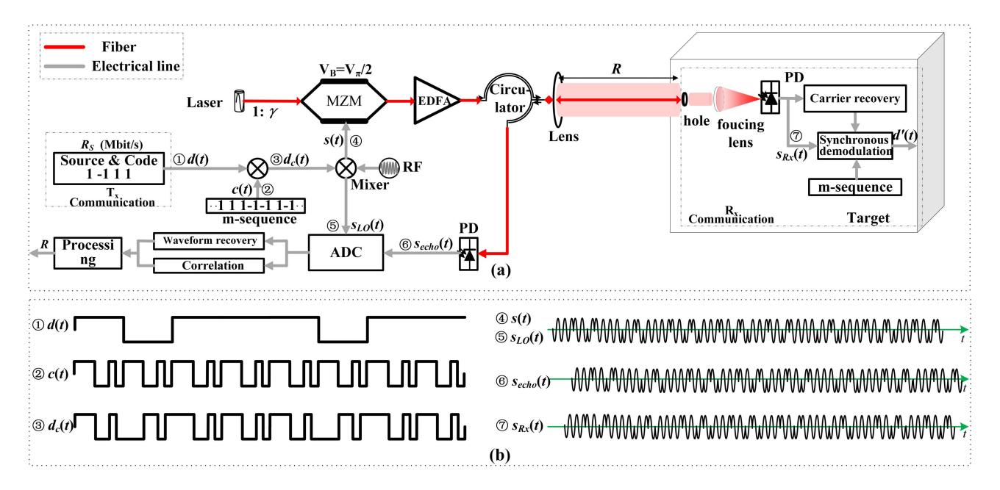
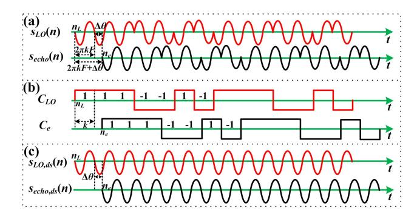
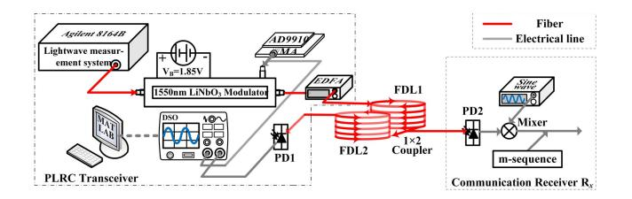
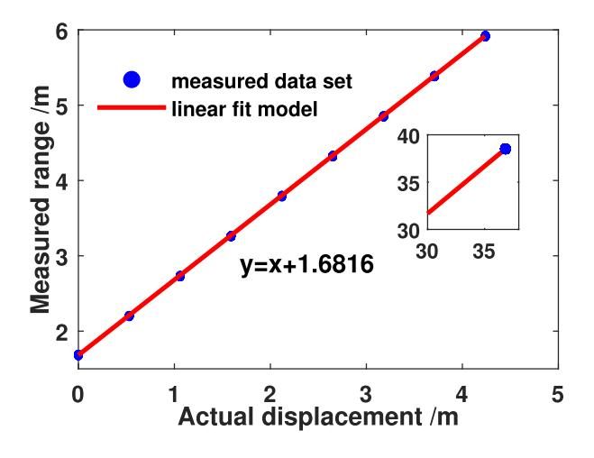
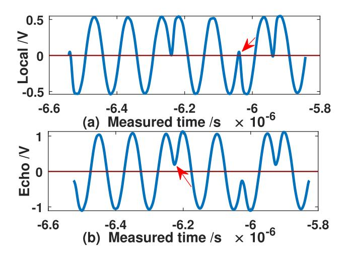
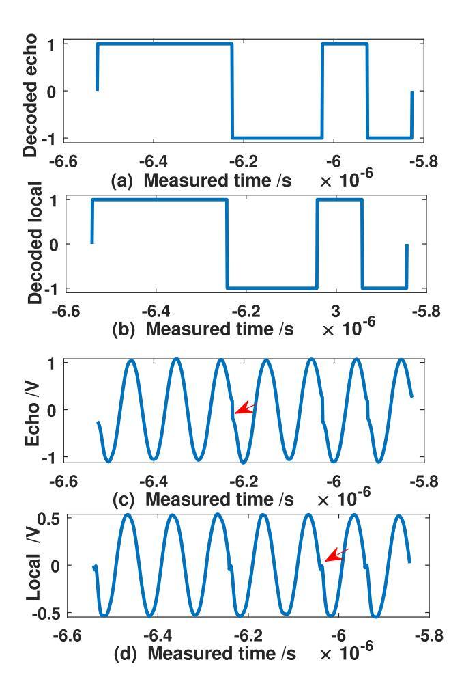
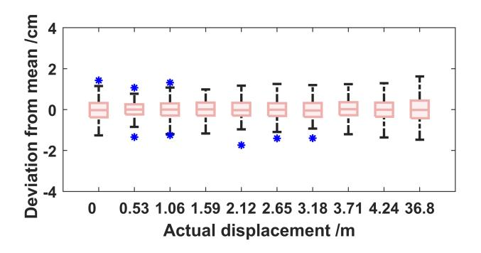
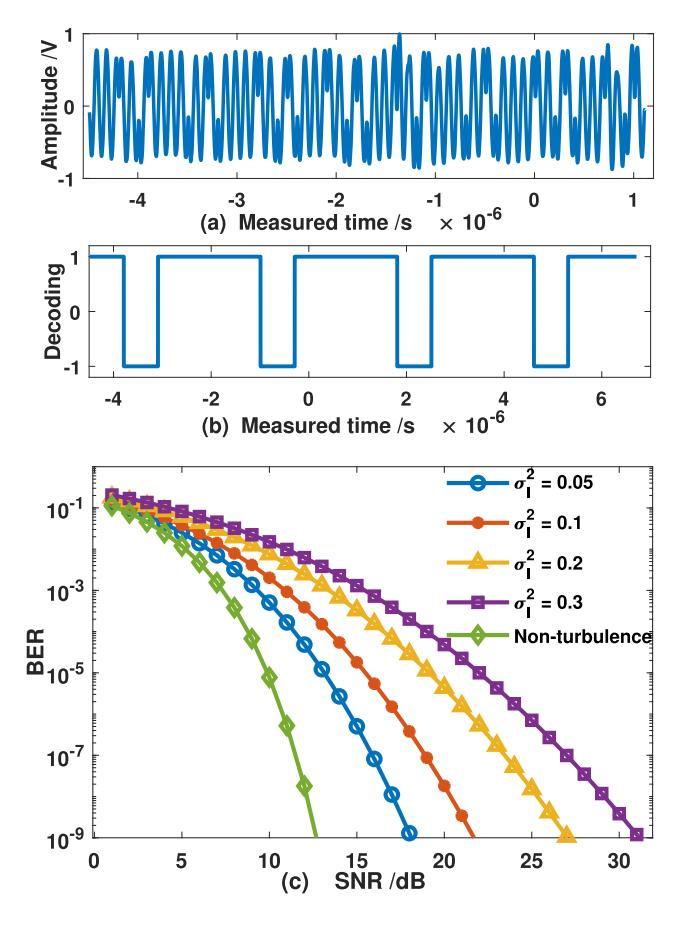
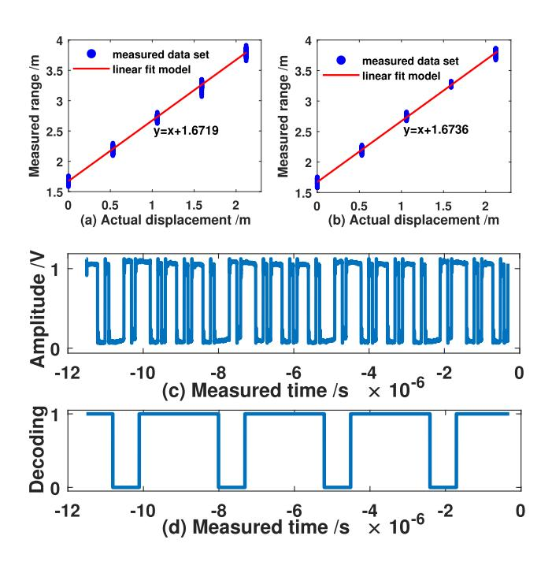

{0}------------------------------------------------

## Remote Phase-Shift LiDAR With Communication

Yalong Hai®, Yufei Luo®, Chenxu Liu®, and Anhong Dang®

Abstract—The integrated sensing and communication is emerging as a crucial technology due to reduced hardware costs and broad application scenarios. However, there is a contradiction between ranging and communication in phaseshift light detection and ranging (LiDAR) for the utilization of the subcarrier's phase. A scheme called phase-shift laser ranging with communication (PLRC) is proposed to enable both ranging and communication using the same transmitted signal in this paper. The message encoded with pseudo-random noise code is modulated into the phase of the subcarrier for laser emission, and thus the received signal carries the data and the phase difference due to the distance. The received signal is subject to correlation, waveform recovery, and phase-shift measurement with the local signal at the LiDAR transceiver, and the distance is derived from the complete phase to avoid range ambiguity. The data is extracted from the spread spectrum signal at the communication receiver. The performance in terms of the measured distance and precision of LiDAR, the bit error rate of communication is obtained for the proposed solution. Meanwhile, the optimized light ratio for ranging and communication is derived. The experimental demonstration is carried out, the range precision is  $3.54 \times 10^{-3}$  m, and the communication capability meets 1.43 Mbit/s.

Index Terms—Correlation detection, LiDAR, phase-shift, pseudo-random noise code.

#### I. INTRODUCTION

THE integrated sensing and communication (ISAC) is a promising technology to enable both sensing and communication functions, which can effectively improve the spectrum efficiency, hardware efficiency, and information processing efficiency [1]. In the Internet of Things (IoT), intelligent terminals sense their surroundings by acquiring information such as color, temperature, humidity, three-dimensional (3D) maps, object recognition, path planning, etc. However, it is not possible for a smart device to integrate all sensors, and thus information sharing among them is very valuable. Therefore, it is an attractive solution to jointly design sensing and communication to reduce the weight and costs of hardware. The joint radar and communication design is suggested to enable

Manuscript received 23 July 2022; revised 24 November 2022; accepted 22 December 2022. Date of publication 3 January 2023; date of current version 16 February 2023. This work was supported in part by the National Key Research and Development Program of China under Grant 2018XXXXXXXX and 2016QY02D0304 and the National Natural Science Foundation of China under Grant 60572002. The associate editor coordinating the review of this article and approving it for publication was A. Chaaban. (Corresponding author: Anhong Dang.)

The authors are with the State Key Laboratory of Advanced Optical Communication Systems and Networks, School of Electronics, Peking University, Beijing 100871, China (e-mail: haiyalong@pku.edu.cn; luoyufei@pku.edu.cn; liuchenxu@pku.edu.cn; ahdang@pku.edu.cn).

Color versions of one or more figures in this article are available at https://doi.org/10.1109/TCOMM.2023.3233962.

Digital Object Identifier 10.1109/TCOMM.2023.3233962

ISAC [2]. Light detection and ranging (LiDAR) is widely used as a non-contact ranging solution for autonomous driving, robotics, aerospace, surveying and mapping, and intelligent terminals [3], [4], [5]. LiDAR is capable of both sensing 3D scenes and sending message with free-space optical (FSO) communication in each scan time slot [6], [7], [8], [9]. However, few LiDARs are available to realize both targets about the ranging and the communication.

The waveform design of the transmitted signal is crucial in the phase-shift LiDAR to implement both ranging and communication tasks. On the one hand, the phase-shift LiDAR with millimeter-level resolution at short distances is dependent on sinusoidal modulation of the laser to map the delay time to phase for ranging [10]. LiDAR is more concerned with unambiguous range, accuracy, and precision in ranging. He et al. develop an optical phase modulation scheme using a 20 MHz sinusoidal signal to reach a ranging precision of 3.4 mm, an accuracy of  $\pm 1.5$  cm, and an unambiguous range of 7.5 m in the static experiments [11]. However, the unambiguous range of the phase-shift LiDAR is strictly limited to half-wavelength [12]. Due to the conflict between distance resolution and distance ambiguity of the phase-shift method, various novel approaches have been proposed to extend the unambiguous range. A multi-frequency ranging scheme modulates the amplitude of a series of single tones on a laser carrier: the low-frequency signals are used to resolve the ambiguity and the high-frequency signals are used to improve the precision [13], [14]. It is, nonetheless, necessary to solve the problem of inconsistent phase measurement precision coming from multi-tone. Moreover, a multi-tone modulated continuous-wave ranging scheme is proposed to obtain the distance and velocity by integrating the results of each singletone measurement [15], [16], [17], [18]. However, most of the above approaches use multi-frequency to extract accurate distance information from the unambiguous distances corresponding to different frequencies, the interference between frequencies will cause a decrease in the ranging precision. The increment of the unambiguous range in these solutions still faces the same problems as the traditional phase-shift ranging, which can only be solved by increasing the number of frequencies.

On the other hand, the communication data is required to load into the carrier of the LiDAR. The technique related to coded modulation in LiDAR is the random-modulation continuous-wave (RMCW) LiDAR using a pseudo-random noise (PRN) code to modulate the light intensity proposed by Takeuchi in 1983 [19]. The distance is derived from the time of flight calculated by the correlation between the echo signal and a local copy of the PRN code. The coherent

0090-6778 © 2023 IEEE. Personal use is permitted, but republication/redistribution requires IEEE permission. See https://www.ieee.org/publications/rights/index.html for more information.

{1}------------------------------------------------

RMCW LiDAR is suggested to enhance the detection sensitivity for simultaneously ranging and velocimetry [20], [21], [22]. However, the distance resolution obtained from RMCW LiDAR is proportional to the width of the correlation peak. A random bit generator with a fast generation rate (above 1 Gbit/s) is required for the precise measurement. Although the phase-coded subcarrier modulation is used for RMCW LiDAR without much attention [23], [24], the phase-shift and encoding are bridged for the waveform design of joint LiDAR and communication.

In summary, the combination of phase-coded subcarrier modulation and RMCW is a potential signal design solution that enables both ranging and communication. The communication data streams spread spectrum by PRN codes are modulated into the phase of the radio frequency (RF) subcarrier for the light emission. The received signal is demodulated synchronously in the communication receiver to extract the data stream from the spread spectrum signal; the distance to be measured is obtained by the LiDAR transceiver based on the phase information of the RF subcarrier signal. The communication data and the range to be measured are available from the phase in the RF subcarrier, where the communication bit stream is determined by the phase difference between adjacent bits, and the measured distance is deduced from the phase delay of the subcarrier signal introduced by the round-trip to the target. Therefore, there is a contradiction between ranging and communication with respect to the utilization of the phase of the subcarrier signal. The integer periodic part of the phase will not affect the discrimination of the data but will induce distance ambiguity in the phase-shift LiDAR. In other words, the relationship between the frequency of the RF subcarrier and the bit rate of the PRN code plays an essential role for the unambiguous range. Besides, it is imperative that the joint design of LiDAR and communication meets the demands of range precision and bit error rate (BER).

In this paper, we propose a new LiDAR scheme named phase-shift laser ranging with communication (PLRC) to enable ISAC. Direct sequence spread spectrum and phase-coded subcarrier modulation are introduced into phaseshift LiDAR for message encoding and phase measurement. In terms of ranging, a mutual restriction exists between the period of the PRN code and the period of the RF subcarrier in order to overcome the distance ambiguity in phaseshift LiDAR. The integer periodic part of the phase is calculated by the auto-correlation between the local signal and echo signal, and both signals are recovered to the standard sine waveforms depending on the PRN code, and then the phase-shift is measured to get the non-integral periodic part of the phase. The valid distance can be acquired by integrating the phase information from correlation and phase-shift measurement to avoid range ambiguity. Since the idea of PRN coding is introduced on account of the phase-shift ranging principle, the ranging process is immune to interference. Meanwhile, simple short-range communication can be realized by FSO in each scan time slot of LiDAR. On the other hand, the transmitted power assignment of the PLRC system is optimized to meet the distance precision and BER.

The rest of the paper is organized as follows: the model of the proposed PLRC system is introduced in Section II; the solution for ranging and communication is described in Section III, and the optimized light ratio for ranging and communication is also derived; the experimental results of the proposed PLRC system are presented in Section IV, and some discussion and analysis are provided here; the last section summarizes the paper.

# II. MODEL OF PHASE-SHIFT LASER RANGING WITH COMMUNICATION

We consider a LiDAR system that can measure the distance to a target while communicating with a receiver nested in the target. The LiDAR system operates in continuous wave mode, where the communication and ranging functions are executed with the same signal. That is, the waveform emitted by the LiDAR carries not only the detection signal but also the data information. Ranging and FSO communication are accomplished by the LiDAR in each scan time slot.

A PLRC system for ISAC based on phase-coded subcarrier modulation and direct sequence spread spectrum technique is proposed. The schematic diagram of the PLRC system is shown in Fig. 1(a), where the system mainly consists of a LiDAR transceiver (left side of Fig. 1(a), containing the communication transmitter  $T_x$ ) and a communication receiver  $R_x$  (right side of Fig. 1(a)). In the phase-coded subcarrier modulation technique, the differential phase shift keying (DPSK) scheme is introduced into the transmitter to avoid the phase ambiguity observed by the communication receiver in carrier recovery for the binary phase shift keying (BPSK) [25], [26]. The m-sequence is picked as the PRN code of the system due to easy generation and excellent correlation. The operation of the PLRC system in Fig. 1(a) can be described as follows, and the waveforms of the important nodes in the operation are presented in Fig. 1(b).

First, a message sequence d(t) with bit rate  $R_s$  is generated by the communication transmitter  $\mathbf{T}_x$  in PLRC, and  $d(t) = \sum_j d_j G(t-j/R_s)$ , G(t) is the gate signal. The message d(t) is then spread spectrum by the differential encoded m-sequence baseband waveform c(t) with bit period T to produce the direct sequence spread spectrum signal  $d_c(t)$ , and  $d_c(t) = d(t)c(t)$ . The DPSK signal s(t) is created by multiplying  $d_c(t)$  with a sine wave of frequency  $f_c$ 

$$s(t) = \sum_{j} \sum_{i=0}^{P-1} d_j c_i G(t - iT) A_c \sin(2\pi f_c t), \qquad (1)$$

where  $A_c$  is the amplitude of the DPSK signal,  $d_j$  is the jth bipolar binary data from message d(t),  $c_i$  is the ith bipolar binary data from differential encoded m-sequence C with the length of P, both taking values of  $\{+1,-1\}$ , and the m-sequence baseband waveform c(t) can be denoted as  $c(t) = \sum_{i=0}^{P-1} c_i G(t-iT)$ ,  $PT = 1/R_s$ . The DPSK subcarrier signal plays a vital role in the PLRC system, where communication data and distance information are extracted from its phase. However, the continuity of the RF subcarrier's phase is broken since the spread spectrum communication data is modulated into the phase of the subcarrier, which can render

{2}------------------------------------------------

Fig. 1. (a) The schematic diagram of the proposed PLRC system; (b) the output waveform of each work node during the operation of the PLRC system, where the delay time is different for the received echo signal  $s_{echo}(t)$ , local signal  $s_{LO}(t)$  and communication signal  $s_{Rx}(t)$ . MZM is Mach–Zehnder modulator, EDFA is erbium doped fiber amplifier, PD is P-I-N photodetector, and ADC is analog-to-digital converter. Note: MZM bias condition is as follows,  $V_B = V_\pi/2$ ,  $V_\pi$  is the half-wave voltage of the modulator.  $T_x$  is the communication transmitter,  $R_x$  is the communication receiver.

phase-shift ranging unachievable. Therefore, a contradiction regarding the phase modulation of RF signal exists in ranging and communication. In addition, when the bit period T is larger than the RF subcarrier period  $T_c$ , multiple subcarrier periods share a single bit period, which will induce the phase ambiguity during phase measurement.

The subcarrier signal s(t) is then split into two routes, one is used as the local signal in ranging, and the other is the detection/communication signal. The detection/communication signal is modulated with the laser beam in the Mach-Zehnder Modulator (MZM) for light intensity modulation to load the RF subcarrier signal to optical power. The output optical power for MZM is [27]

$$P_T(t) = P[1 + \mu s(t)], \qquad (2)$$

where P is the average optical power,  $\mu$  is the modulation index, and  $\mu = \pi A_c/V_\pi$ . It is necessary to maintain  $0 < \mu < 1$  to ensure that the MZM operates within the linear region to avoid over-modulation-induced clipping.  $V_\pi$  is the half-wave voltage of the electro-optic intensity modulator. The output beam of the intensity modulator is then sent to the target via the circulator and lens after being amplified by the erbium doped fiber amplifier (EDFA). On the target surface, the projected light is split into two parts: one is reflected by the target surface, and the other goes to the communication receiver  $R_x$ .

A portion of reflected beam is collected by the LiDAR receiving lens to the circulator followed by a PIN photodetector for photoelectric direct detection to obtain the echo signal, and thus the echo signal  $s_{echo}(t)$  after removing the direct current bias and the local signal  $s_{LO}(t)$  can be represented as

$$s_{echo}(t) = A_e \sum_{i} \sum_{i=0}^{P-1} d_j c_i G(t - iT - \tau_e)$$

$$\times \sin(2\pi f_{c}t - \phi_{e}) + n_{echo}(t),$$

$$s_{LO}(t) = A_{LO} \sum_{j} \sum_{i=0}^{P-1} d_{j}c_{i}G(t - iT - \tau_{LO})$$

$$\times \sin(2\pi f_{c}t - \phi_{LO}) + n_{LO}(t),$$
(4)

respectively, in which  $A_e$  denotes the echo signal amplitude,  $\tau_e$  is the time of flight, and  $\phi_e$  indicates the resulting phase variation after photoelectric detection, and  $\phi_e = 2\pi f_c \tau_e$ ,  $A_e = \mu \Re P_{echo} R_L$ , where  $\Re$  is the responsivity of photodetector,  $P_{echo}$  is the echo light power, and  $R_L$  is the load resistance of the detector.  $A_{LO}$ ,  $\tau_{LO}$ , and  $\phi_{LO}$  denote the local signal amplitude, delay time, and the phase variation of subcarrier signal s(t) after the propagation of the reference arm, respectively, and  $\phi_{LO}=2\pi f_c \tau_{LO}$ .  $n_{echo}(t)$  and  $n_{LO}(t)$ are zero-mean white noise with variance  $\sigma_e^2$  and  $\sigma_L^2$ . The phases of the signals in equations (3) and (4) carry the same communication data. It is evident that the delay time exists in the communication data between both signals as well as in the phases of the subcarriers. This delay time is introduced due to the round-trip of the beam to the target, which is the estimator to be derived in laser ranging. The echo signal and the local signal are separately converted to a standard sine waveform after waveform recovery to estimate their phases, while the correlation operation is carried out to overcome the ambiguity of the phase measurement. Finally, the distance is derived from the phase difference between both phases.

On the other hand, the remaining part of the projected light on the target surface enters to the communication receiver  $R_x$  (a tiny hole is bored in the target surface in front of the focusing lens to ensure that enough optical power enters  $R_x$ ). The power collected by the focusing lens is detected by the detector of  $R_x$  for information decoding. The received signal

{3}------------------------------------------------

after removing the direct current bias can be expressed as

$$s_{Rx}(t) = A_{Rx}I \sum_{j} \sum_{i=0}^{P-1} d_{j}c_{i}G(t - iT)\sin(2\pi f_{c}t) + n_{Rx}(t),$$
(5)

where  $A_{Rx}$  indicates the received signal amplitude, and  $A_{Rx} = \mu \Re P_C R_L$ , in which  $P_C$  is the light power received by communication receiver.  $n_{Rx}(t)$  is zero-mean white noise with variance  $\sigma_c^2$ . I denotes the received irradiance caused by atmospheric turbulence. The scintillation index  $\sigma_I^2$  is commonly used to characterize the strength of atmospheric turbulence in FSO communication,  $\sigma_I^2 = \mathbb{E}\left\{I^2\right\}/(\mathbb{E}\left\{I\right\})^2 - 1$ , and the mean of the light intensity variation is regarded as normalized, namely  $\mathbb{E}\left\{I\right\} = 1$ . The received signal during the communication is a direct sequence spread spectrum signal, from which the message can be decoded by carrier recovery and synchronous demodulation.

## III. SOLUTIONS FOR RANGING, COMMUNICATION AND OPTIMIZATION

The same transmitted signal is separately dedicated to ranging and communication functions in different optical receiving systems for the proposed PLRC system model. Considering the difference between both tasks, we will design the signal processing strategies of the PLRC system and optimize the power allocation to enable ISAC without sacrificing the system performance requirements.

### A. Ranging

In order to obtain the precise distance information, the phase-shift scheme is introduced in laser ranging for the PLRC system. However, the echo signal and the local signal are affected by the phase coding, resulting in the continuity of the subcarrier phase being disrupted. Thus, the phase measurement is not applicable to the encoded signal. In addition, the unambiguous distance is limited since the range of phase measurement is from 0 to  $2\pi$ . Therefore, the solutions for waveform recovery and correlation operation are proposed in the post-processing to address the problems mentioned above, as shown in Fig. 2.

In the PLRC system, the ranging period is consistent with the m-sequence period. The echo signal  $s_{echo}(t)$  and the local signal  $s_{LO}(t)$  are sampled by the analog-to-digital converter (ADC) with time interval  $T_s$  and then pass through a low-pass filter. When one ranging period is considered, the corresponding discrete signals are

$$s_{echo}(n) = A_e d_j \sum_{i=0}^{P-1} c_i G[(n - n_e) T_s]$$

$$\times \sin(2\pi f_c n T_s - \phi_e) + n_{echo}(n T_s), \qquad (6)$$

$$s_{LO}(n) = A_{LO} d_j \sum_{i=0}^{P-1} c_i G[(n - n_L) T_s]$$

$$\times \sin(2\pi f_c n T_s - \phi_{LO}) + n_{LO}(n T_s), \qquad (7)$$

where  $n_eT_s$  and  $n_LT_s$  denote the delay time of the echo signal and the local signal, respectively. n is an integer, and

Fig. 2. The process of the waveforms recovery, correlation, and post-processing in laser ranging. (a) The discrete signals corresponding to local and echo signals in ranging; (b) the decoded codewords for correlation; (c) the recovered waveforms for phase-shift measurement.

 $n = 0, 1, \dots, Q - 1$ , in which Q is the number of samples during the m-sequence period.

The correlation of  $s_{echo}(n)$  and  $s_{LO}(n)$  with the digitally generated m-sequence subcarrier signal  $s_m(n) = \sum_{i=0}^{P-1} c_i G(nT_s-T)\sin\left(2\pi f_c nT_s\right)$  is calculated separately to extract the codeword synchronization positions  $n_e$  and  $n_L$  of both signals [28], and then demodulation is performed to derive the codewords  $C_e$  and  $C_{LO}$  with different delay times, respectively, where  $C_e = \{c_{e,0}, c_{e,1}, \cdots, c_{e,P-1}\}$ ,  $C_{LO} = \{c_{LO,0}, c_{LO,1}, \cdots, c_{LO,P-1}\}$ . Since the echo signal generally lags behind the local signal, the relationship between  $n_e$  and  $n_L$  is

$$n_L = \begin{cases} n_L + Q, & n_L < n_e \\ n_L, & n_L \ge n_e. \end{cases}$$
 (8)

In addition, the following property exists for bipolar codes

$$c_i [(n-n_e) T_s] c_i [(n-n_L) T_s] = 1, \text{ when } n_e = n_L.$$
 (9)

Taking advantage of this property, the echo signal  $s_{echo}(n)$  is recovered as an ideal sinusoidal waveform by multiplying it with the codeword  $C_e$  after the codeword is synchronized. Similarly, the local signal  $s_{LO}(n)$  is also treated in this way. Thus, (6) and (7) can be converted to

$$s_{echo,ds}(n) = A_e \sin(2\pi f_c n T_s - \phi_e) + n_{echo}(n T_s),$$
(10)  
$$s_{LO,ds}(n) = A_{LO} \sin(2\pi f_c n T_s - \phi_{LO}) + n_{LO}(n T_s).$$
(11)

The phases  $\phi_e$  and  $\phi_{LO}$  are calculated separately using the least squares (LS) algorithm to get the phase difference  $\Delta\phi$  between them. However, the phase difference  $\Delta\phi$  cannot be mapped to the distance to the target due to phase ambiguity. On the other hand, the distance to be measured can also be denoted by the delay time between the codewords  $C_e$  and  $C_{LO}$  apart from the phase difference of the subcarriers. Thus, the integer period part of the phase can be determined by the delay time obtained from the correlation operation. It should be noted that the key to deriving the phase integer period is that the phase ambiguity cannot exist within the bit period, which is subject to the relationship between the period  $T_c$  of the RF subcarrier and the bit period  $T_c$ , and let  $T_c$ .

{4}------------------------------------------------

The auto-correlation function  $\Omega(\tau)$  is

$$\Omega\left(\tau\right) = \frac{1}{P} \sum_{i=0}^{P-1} c_{e,i} c_{LO,i+\tau} 
= \begin{cases} 1 & C_e = C_{LO,\tau} \pmod{P} \\ -\frac{1}{P} & C_e \neq C_{LO,\tau} \pmod{P}, \end{cases}$$
(12)

where  $\operatorname{mod}\left(\cdot\right)$  is the remainder operation, and  $C_{LO,\tau}$  denotes the codeword after  $C_{LO}$  cyclic shift  $\tau$  bit. The number of delayed bits k corresponding to the correlation peak is

$$k = \begin{cases} \tau - 1 \mod(n_L, Q) - \mod(n_e, Q) < 0\\ \tau \mod(n_L, Q) - \mod(n_e, Q) \ge 0. \end{cases}$$
(13)

Therefore, the distance to the target is determined by

$$R = \Lambda \left( kF + F_{int} + \frac{\Delta \theta}{2\pi} \right), \tag{14}$$

where  $\Lambda = \lambda/(2n_i)$ , c is the speed of light in vacuum,  $\lambda$  represents the wavelength corresponding to the DPSK subcarrier frequency  $f_c$ , and  $\lambda = c/f_c$ .  $n_i$  is the refractive index of the transmission medium, which can be omitted due to  $n_i \approx 1$  in air.  $F_{int}$  is a natural number satisfying  $\Delta \phi + 2\pi F_{int} \in (2\pi k F, 2\pi (k+1) F)$ , and  $F_{int} = \{0, \cdots, F_{im}\}$ , where  $F_{im}$  is the largest integer satisfying above relation.  $\Delta \theta$  is the residual of the phase difference  $\Delta \phi$ , which can be expressed as

$$\Delta\theta = \begin{cases} mod \left[ \Delta\phi + 2\pi k - \text{mod} \left( 2\pi kF, 2\pi \right), 2\pi \right], \\ when \ \Delta\phi < mod \left( 2\pi kF, 2\pi \right); \\ mod \left[ \Delta\phi - mod \left( 2\pi kF, 2\pi \right), 2\pi \right], \\ when \ \Delta\phi \ge mod \left( 2\pi kF, 2\pi \right). \end{cases}$$

$$(15)$$

The distance errors mainly originate from the errors in the phase measurements. The signal-to-noise ratios (SNR) of the echo and local signals are  $SNR_e = A_e^2/\left(2\sigma_e^2\right)$  and  $SNR_{LO} = A_{LO}^2/\left(2\sigma_L^2\right)$ , respectively. According to the LS algorithm, the distance precision is

$$\sigma_R = \frac{\lambda}{4\pi\sqrt{M}} \sqrt{\frac{1}{SNR_e} + \frac{1}{SNR_{LO}}},\tag{16}$$

where M is the number of samples used in the LS algorithm. In general,  $SNR_{LO}$  is a constant independent of the distance to the target.

In what follows, we will analyze the effect of the variation of the RF subcarrier period  $T_c$  on the ranging performance under a constant bit period T.

1) Bit Period Equals RF Carrier Period: The delay bit k is equal to the phase ambiguity period due to F=1, and  $\Delta\theta=\Delta\phi$ ,  $F_{int}=0$ . Thus, the range equation is simplified as

$$R_e = \frac{\lambda_e}{2} \left( k + \frac{\Delta \phi}{2\pi} \right),\tag{17}$$

where  $\lambda_e$  is the wavelength of the subcarrier in this case. In addition, the distance precision  $\sigma_{R_e}$  is deduced from (16), where the wavelength  $\lambda$  is replaced by  $\lambda_e$ . The unambiguous range  $R_{ur}$  can be expressed as 0.5cPT. It is important to note that the optimal range precision is realized when F=1.

2) Bit Period Is Less Than RF Carrier Period: Since multiple bit periods share a single subcarrier period, i.e.,  $F_{int}=0$ , unambiguous ranging can be achieved. The distance to the target is reduced to

$$R_l = \frac{\lambda_l}{2} \left( kF + \frac{\Delta\theta}{2\pi} \right),\tag{18}$$

where  $\lambda_l$  is the wavelength of the subcarrier when  $T < T_c$ . Similarly, the distance precision  $\sigma_{R_l}$  is deduced from (16), and the unambiguous range  $R_{ur}$  is  $0.5\lambda_l PF$ . However, the range precision  $\sigma_{R_l}$  is deteriorated due to the increasing of subcarrier wavelength ( $\lambda_l > \lambda_e$ ) compared with F=1. The difference of ranging precision  $\delta_{\sigma_R}$  between  $T=T_c$  and  $T< T_c$  is

$$\delta_{\sigma_R} = (1 - F) \, \sigma_{R_e}. \tag{19}$$

When the bit period is much smaller than the subcarrier period, it is possible to result in the period of the m-sequence being smaller than the subcarrier period. Thus, the integer period of the phase-shift is equal to 0, and the m-sequence plays no role in distinguishing the integer period of the phase-shift. Accordingly, it is necessary to maintain that the period of the m-sequence is larger than the carrier period when  $T < T_c$ , i.e.,  $1/P \le F < 1$ .

3) Bit Period Is Larger Than RF Carrier Period: The period of each delay bit determined by the correlation operation contains multiple subcarrier periods, namely  $F_{int} > 0$ . Thus, the distance  $R_u$  to the target is deduced from equation (14)

$$R_u = \frac{\lambda_u}{2} \left( kF + F_{int} + \frac{\Delta\theta}{2\pi} \right), \tag{20}$$

where  $\lambda_u$  is the wavelength of the subcarrier when  $T > T_c$ , and the ambiguous range  $R_{amb}$  of distance to be measured is

$$\frac{\lambda_u}{2} \left( kF + \frac{\Delta \theta}{2\pi} \right) \le R_{amb} \le \frac{\lambda_u}{2} \left( kF + F_{im} + \frac{\Delta \theta}{2\pi} \right). \tag{21}$$

The accurate distance is difficult to specify due to the presence of  $F_{int}$ .

In summary, the constraint for ranging with high precision in the PLRC system is  $1/P \le F \le 1$ , and the unambiguous range is

$$R_{ur} = \frac{\lambda}{2} PF$$
, when  $1/P \le F \le 1$ . (22)

#### B. Communication

In the FSO receiver embedded to the target, the carrier recovery is required to realize coherent demodulation. Thus, the received signal (5) is demodulated synchronously and then passes through a low-pass filter, and the resulted message chip stream is

$$s_{DS}(t) = A_{Rx}I\sum_{j}\sum_{i=0}^{P-1} d_{j}c_{i}G(t-iT) + n_{Rx}(t).$$
 (23)

The message chip stream is then despread by the m-sequence to obtain the bipolar binary data stream

$$d'(t) = A_{Rx}I\sum_{j} d_{j}G(t-j\times P\times T) + n_{Rx}(t).$$
 (24)

{5}------------------------------------------------

Considering the effect of atmospheric turbulence, the relationship between the BER and SNR for DPSK subcarrier signal is [27], [29], [30], [31]

$$BER = \int_{0}^{\infty} erfc \left( I \sqrt{SNR_c} \right) f_I \left( I \right) dI, \qquad (25)$$

where  $SNR_c$  is the SNR during communication,  $erfc(\cdot)$  denotes the complementary error function, and  $f_I(I)$  is the probability density function (PDF) of irradiance I, which can be described by the Gamma-Gamma (GG) distribution

$$f_{I}(I) = \frac{2(\alpha\beta)^{\frac{\alpha+\beta}{2}}}{\Gamma(\alpha)\Gamma(\beta)} I^{\frac{\alpha+\beta-2}{2}} K_{\alpha-\beta} \left(2\sqrt{\alpha\beta I}\right), \quad (26)$$

where  $\Gamma\left(\cdot\right)$  is the gamma function,  $K_{v}\left(\cdot\right)$  is the vth order modified Bessel function of the second kind, and  $\alpha$  and  $\beta$  are the parameters which are related with effective atmospheric conditions. The scintillation index  $\sigma_{I}^{2}$  is calculated as  $\sigma_{I}^{2}=\alpha^{-1}+\beta^{-1}+(\alpha\beta)^{-1}$ .

## C. Optimization

In the PLRC system, we need to obtain an optimal light ratio to meet the requirements of BER and ranging precision, which also serves as a reference for the design of communication receivers and LiDAR.

Assuming that the precision of LiDAR is  $\sigma_{R,th}$ , and the BER in communication is required to be  $BER_{th}$ . At the unambiguous range  $R_{ur}$  of LiDAR, the received power of the communication receiver  $R_x$  meeting  $BER_{th}$  is  $P_C(R_{ur})$ , and the received power of LiDAR meeting  $\sigma_{R,th}$  is  $P_{echo}(R_{ur})$ . Thus, we can obtain the SNR thresholds  $(SNR_{R,th})$  and  $SNR_{c,th}$  for the ranging echo signal and the communication received signal according to (16) and (25)

$$SNR_{R,th} = \frac{\lambda^2 SNR_{LO}}{16\pi^2 M \sigma_{R,th}^2 SNR_{LO} - \lambda^2},$$
 (27)

$$SNR_{c,th} = BERinv^2 (BER_{th}),$$
 (28)

respectively, where  $BERinv\left(\cdot\right)$  is the inverse function of (25) and can be solved numerically using the bisection method [32], [33].

It is necessary to point out that the ranging and communication optical power ( $P_{LT}$  and  $P_{CT}$ ) at the transceiver should have a certain ratio  $\gamma$  to simultaneously satisfy the ranging and communication requirements

$$P_{LT} = P_t \gamma, \quad P_{CT} = P_t (1 - \gamma),$$
 (29)

where  $P_t$  is the total transmitted power of the system.

According to the LiDAR ranging equation [34], we can get the total power reaching the target as

$$P_{tar}(R) = \eta_T T_{\alpha_T}(R) P_{LT} + \eta_T T_{\alpha_T}(R) P_{CT},$$
 (30)

where  $\eta_T$  is the optical efficiency of the transmitter,  $T_{\alpha_e}(R)$  is the atmosphere transmission factor, and  $T_{\alpha_e}(R) = \exp{(-\alpha_e R)}$ ,  $\alpha_e$  is the atmosphere extinction coefficient due to absorption and scattering. Thus, the echo power of the LiDAR is

$$P_{echo}(R) = \frac{\rho \eta_T \eta_R T_{\alpha_e}^2(R) D^2}{16 R^2} P_{LT},$$
 (31)

Fig. 3. Laboratory experimental setup. FDL is fiber delay line, MA is microwave amplifier, and DSO is digital storage oscilloscope. In the experiment, the message stream is "1-111", m-sequence is "111-1-11", the optical power output by the EDFA is 12.7 mW, and the modulation depth is 0.4432.

where  $\eta_R$  is the optical efficiency of the receiver,  $\rho$  is the target reflectance, and D is the diameter of telescope used to collect the reflected light.

For a receiver with an optical efficiency of  $\eta_C$ , the signal power used to realize the communication function is

$$P_C(R) = \eta_T \eta_C T_{\alpha_e}(R) P_{CT}. \tag{32}$$

We consider a limiting case where the emitted light power meets exactly the threshold requirements for ranging and communication at the unambiguous range  $R_{ur}$ . The optimal light ratio  $\gamma_{opt}$  for ranging and communication obtained at this time is valid over the whole range to be measured, namely

$$\frac{\left(\mu\Re P_{echo}\left(R_{ur}\right)R_{L}\right)^{2}}{2\sigma_{e}^{2}} = SNR_{R,th},\tag{33}$$

$$\frac{\left(\mu\Re P_C\left(R_{ur}\right)R_L\right)^2}{2\sigma_c^2} = SNR_{c,th}.$$
 (34)

Suppose the noise power of LiDAR receiver is equal to that of communication receiver,  $\sigma_e^2 = \sigma_c^2$ , the optimal light ratio  $\gamma_{opt}$  can be written as

$$\gamma_{opt} = \frac{16\eta_c R_{ur}^2 \lambda \sqrt{SNR_{LO}}}{\begin{cases} \rho D^2 \eta_R T_{\alpha_e} \left( R_{ur} \right) BERinv \left( BER_{th} \right) \\ \times \sqrt{16\pi^2 M \sigma_{R,th}^2 SNR_{LO}} \\ +16\eta_c R_{ur}^2 \lambda \sqrt{SNR_{LO}} \end{cases}}.$$
(35)

For convenience, we assume that the optical efficiency is equal, that is  $\eta_R=\eta_c=\eta$ . It can also be found that  $\lambda^2\ll 16\pi^2M\sigma_{R\,th}^2SNR_{LO}$ . Thus, equation (35) is reduced to

$$=\frac{4R_{ur}^{2}\lambda}{\pi\rho D^{2}T_{\alpha_{e}}\left(R_{ur}\right)\sigma_{R,th}BERinv\left(BER_{th}\right)\sqrt{M}+4R_{ur}^{2}\lambda}.$$
(36)

## IV. EXPERIMENTAL RESULTS AND DISCUSSION

In order to verify the feasibility of the proposed PLRC system, the experimental setup is constructed based on the system model, which is shown in Fig. 3. In the transceiver, the message stream is multiplied with a 7-bit m-sequence to generate a direct sequence spread spectrum code, and then a corresponding 10 Mbit/s DPSK subcarrier signal with a frequency of 10 MHz is created from the random access

{6}------------------------------------------------

| Nominal displacement | Average value of      | Variance of the                     | Upper bound of the | Lower bound of the |
|----------------------|-----------------------|-------------------------------------|--------------------|--------------------|
| /m                   | the measured range /m | measured range $/\times 10^{-5}m^2$ | measured range /m  | measured range /m  |
| 0                    | 1.6816                | 2.2918                              | 1.6961             | 1.6693             |
| 0.53                 | 2.2017                | 1.2557                              | 2.2123             | 2.1882             |
| 1.06                 | 2.7305                | 1.9229                              | 2.7436             | 2.7180             |
| 1.59                 | 3.2619                | 1.9540                              | 3.2717             | 3.2502             |
| 2.12                 | 3.7941                | 1.8435                              | 3.8058             | 3.7767             |
| 2.65                 | 4.3242                | 2.0941                              | 4.3367             | 4.3101             |
| 3.18                 | 4.8517                | 2.0717                              | 4.8637             | 4.8377             |
| 3.71                 | 5.3865                | 2.0019                              | 5.3989             | 5.3744             |
| 4.24                 | 5.9163                | 2.3753                              | 5.9292             | 5.9027             |
| 36.8                 | 38.519                | 2.6599                              | 38.535             | 38.504             |

TABLE I STATISTICAL RESULTS RELATED TO EXPERIMENTAL DATA

memory (RAM) mode of the AD9910. The output DPSK signal amplified by microwave amplifier (MA) is split into two routes, one to the RF input port of the MZM modulator for intensity modulation as well as one to serve as a local signal. A lightwave around the 1550 nm waveband generated by the 8164B lightwave measurement system is modulated by a MZM modulator, and the modulated beam is amplified in an EDFA. Single-mode fibers of different lengths with a refractive index of 1.4682 are regarded as the distance to be measured. The amplified beam is divided into two parts after traveling a distance *R* (FDL1) in the fiber, one part is used as the reflected echo, while the other part enters the communication receiver for message decoding. The return beam is then propagated over a distance *R* (FDL2) and fed into a PIN detector (PD1) with bandwidth of 1.2 GHz for photoelectric detection. A digital storage oscilloscope (DSO) is selected at a sampling rate of 1 GHz to sample the detector output signal and the local signal simultaneously. The beam entering the communication receiver is focused to the PIN detector (PD2), the converted DPSK electrical signal is demodulated, and the filtered chip stream is despread with the m-sequence to obtain the data stream.

## *A. Ranging*

For the sake of simplicity, we use single-mode fibers instead of free space for ranging, extending the distance to be measured by increasing the length of single mode fiber and simulating the free space loss via insertion loss. Since the longest fiber we use is 73.6 m (in other words, the longest distance to the target in the experiment is 36.8 m), the chromatic dispersion and dispersion penalty are assumed to be negligible [35]. High-speed measurement of 285 kHz can be achieved by using a DSO for synchronized sampling, which samples 2800 points for each signal in one measurement, with a measurement period of 2.8 microseconds. Both coarse and fine distance measurements can be done via the signal processing algorithm described in Section III. The nominal displacement, average value, and variance of the measured distance are listed in Table I. Since the measured phase difference refers to the total phase difference between the two DPSK signals on the different paths after separation, we need

Fig. 4. Linear model fit of the measured data set. The inset is a supplement to the optical fiber of 36.8m.

to eliminate the phase difference due to the non-measured optical path. The linear model y = x+b used in [11] is chosen to fit the function between the actual displacement and the distance to the target. As shown in Fig. 4, y = x+1.6816 is in good agreement with the results measured by our experiments. That is, a 1.6816 m fiber is brought additionally to our system apart from the distance to be measured. According to the experimental results, the minimum standard deviation of the measured range is 3.54 × 10−3 m.

To be more specific, the analysis of the signal during one measurement is presented below. It can be seen that the waveforms of both signals are somewhat distorted at the bit mutation (−1 → 1 & 1 → −1) in Fig. 5. The DPSK signal shown in Fig. 5(a) is generated from the AD9910 amplified by MA. The AD9910 can read data from RAM and generate waveforms in real-time, in which one data can be read from RAM every 4 × 10−9 s, and the analog voltage can be output from the digital-to-analog converter (DAC). In the experiment, the corresponding RF subcarrier DPSK signal is firstly generated based on the 7-bit m-sequence "1 1 1 −1 −1 1 −1", and the sinusoidal subcarrier of each period is sampled for 25 points and converted into a digital level signal

{7}------------------------------------------------

Fig. 5. Echo signal and local signal detected in one measurement. (a) The local signal  $s_{LO}(t)$ ; (b) the echo signal  $s_{echo}(t)$ . The both red arrows indicate the distortion in (a) and (b).

and then written into the RAM. The phase resolution of the digital signal is  $\pi/12.5$ . The resultant local signal exhibits severe waveform distortion. When this signal is amplified by the MA, the distortion is also amplified synchronously. The local signal is the copy of the RF signal loaded into the optical carrier. Therefore, the distortion of the echo signal shown in Fig. 5(b) is induced by the intensity modulator and MA. The distortions of both signals are the factors contributing to the phase measurement error in the experiment. Nevertheless, the presented ranging scheme still achieves the best precision close to one nine-thousandth of the wavelength of the RF signal.

The baseband waveforms of two signals deduced by the signal processing algorithm and the corresponding sinusoidal signals recovered after despreading are provided in Figs. 6(a), 6(b), 6(c) and 6(d), respectively. As described in Section III, the integer periodic part of the phase to be measured, k = 0, is derived by substituting the codewords  $C_e$ and  $C_{LO}$  discriminated in Figs. 6(a) and 6(b) into (12) and (13) in turn. The codewords  $C_e$  and  $C_{LO}$  are then substituted into (9), (6), and (7) to derive the results of (10) and (11), as shown in Figs. 6(c) and 6(d). The phase measurements of both recovered sinusoidal signals are conducted to obtain the non-integral periodic part of the phase to be measured less than  $2\pi$ . Thus, an accurate distance measurement is available by removing the phase ambiguity. Similarly, the results of the long distance experiment (k = 2) are presented in the last row of Table I.

The distributions of the deviation of the measured distances with the average value are shown in Fig. 7. It can be seen that the distance mean is closely surrounded by the measurement points. The range accuracy equal to approximately  $\pm 1.5$  cm is also illustrated here, with about 50% of the measured samples having an accuracy concentrated within range precision  $\pm \sigma_R$ . In addition, the outlier points marked by asterisks reflect the ranging errors due to the fluctuation of the signal. The reasons for the signal fluctuation are as follows: first, the output power of the laser fluctuates. In the intensity-modulated system, the fluctuations in the optical power will directly

Fig. 6. The processing result for echo and local signals during one ranging period. (a) Echo codeword  $C_e$ ; (b) local codeword  $C_{LO}$ ; (c) despreading echo signal  $s_{echo,ds}(t)$ ; (d) despreading local signal  $s_{LO,ds}(t)$ . The red arrows indicate the distortion in (c) and (d).

Fig. 7. Deviation distribution of measurement results. In all box plots, the middle line, the top and the bottom of each box represent the median, the 25th and the 75th percentiles of the samples with mean subtracted, respectively. The whiskers are drawn from the interquartile ranges to the furthest minimum (bottom) and maximum (top) values, and the asterisks represent outliers.

affect the waveform of the modulated signal, causing errors in the phase measurement. The signal fluctuations caused by light intensity can be observed in Fig. 8(a). Second, the phase resolution of the DPSK signal generated by AD9910 is only  $\pi/12.5$ . Although the generated signal is smoothed by the low-pass filter, the improvement is limited. Third, the clock jitter of the AD9910 severely affects the signal waveform.

{8}------------------------------------------------

Fig. 8. (a) The received signal at the detection target (message bits "1-11 1 1 -1 1 1"); (b) the decoding signal (message bits "1-11 1 1 1 -1 1 1 1 1 1 1 1 1 1 1 1 1 1

Assuming that the clock jitter of the AD9910 during one ranging period is  $T_{jitter}$ , and the resulted variance  $\sigma_{jitter}^2$  is  $\sigma_{jitter}^2 = 0.5 \times (2\pi A_c f_c)^2 T_{jitter}^2$ . If only the effect of the clock jitter on the SNR is considered, the  $SNR_{jitter}$  is represented as  $SNR_{jitter} = -20 \lg{(2\pi f_c T_{jitter})}$ . Therefore, the SNR of the signal is degraded by the clock jitter. Four, the nonlinear effect of the intensity modulator can also affect the signal waveform, resulting in phase measurement error. Finally, the phase disturbance induced by refractive index drift of the fiber.

#### B. Communication

A simple communication experiment is also conducted. In the experiment, the sequence "1-1 1" is cyclically sent and spread spectrum communication is performed, and the experimental results are shown in Figs. 8(a) and 8(b), respectively. The BER of the subcarrier DPSK intensity modulation under different turbulence conditions is simulated in Fig. 8(c). It is clearly depicted that the BER increases as the turbulence intensity increases. The effect of turbulence on BER is equivalent to a reduction in signal power compared to the non-turbulent case. Therefore, the power assignment of the PLRC system is crucial. Otherwise, if the beam is received entirely by the communication receiver, the ranging function will fail since the reflected optical path is interrupted. A  $1 \times 2$  fiber coupler with a 50 : 50 split ratio in the

demonstration is used to achieve power allocation. The light ratio optimization makes the structure of the PLRC system more complete, which is an essential part of the system.

On the other hand, it is possible for the communication receiver  $\mathbf{R}_x$  on the target side of the PLRC system to receive optical signals from other systems. The communication receiver  $\mathbf{R}_x$  identifies the transmitter by the m-sequence, and thus different m-sequences correspond to different transmitters. When multiple signals enter the communication receiver  $\mathbf{R}_x$  simultaneously, the received mixed signals are fed into a bank of matched filters corresponding to each transmitter's signal waveform with time and phase synchronism. The multi-user decision algorithms are then introduced to eliminate interference for each signal [36], [37], [38], [39], [40], and the message sequences of different transmitters are obtained.

#### C. Discussion

The PLRC system for ISAC realizes both functions containing the laser ranging and FSO communication (a time-division access system) using the same transmitted waveform. That is, the emitted signal from the LiDAR is not only used as a sensing signal but also carries a stream of data. In terms of ranging, the technology combines the advantages of the phase-shift and RMCW to obtain the best distance precision and the maximum unambiguous range simultaneously by processing the echo and local signals. As for communication, the technology integrates DPSK subcarrier modulation and direct sequence spread spectrum communication. The architecture of the transmitter side is equivalent to a direct sequence spread spectrum system with DPSK subcarrier modulation. The structure of the spread spectrum correlation receiver is modified at the receiver side of LiDAR. The encoded DPSK waveform is acquired from the transmitter side as a local signal, while the correlation reception and phase difference measurement are executed. When the LiDAR scans 3D space, if it scans a target embedded with a communication receiver inside, part of the optical power enters the communication receiver and part of the light is reflected into the LiDAR transceiver. As a result, the light power at the target surface is split into two paths for the LiDAR echo and the communication demodulation, respectively. In general, the emitted power of the PLRC system can be considered constant, which is related to the power of the laser and the optical efficiency of the transmitter and is limited by the safety of the human eye. If only one function is implemented, the emitted power has to satisfy the performance demands. However, the joint LiDAR-communication system design needs to consider the power requirements for ISAC to ensure the ranging precision and BER under limited power conditions. Therefore, the power allocation problem of the PLRC system is raised. The essence of power allocation is the structural optimization of the communication receiver and the LiDAR transceiver. In particular, the light ratio is available to help to select the design parameters of the PLRC system to avoid the interruption of the optical path due to power fading. In addition, the coherent detection can also be employed to process the echo signal to enhance the SNR.

In the PLRC system, the unambiguous range is dependent on the period of the PRN code, and the distance resolution 

{9}------------------------------------------------

is a function of the modulation frequency. Since the 7-bit msequence with the bit rate of 10 Mbit/s is modulated with a sine signal of 10 MHz in the experiments, the theoretical unambiguous range is 105 m, and the distance resolution is 0.15 m. However, when the PLRC scheme is not used, the unambiguous range is only 15 m for phase-shift ranging, and the range resolution is up to 15 m for RMCW ranging. It is known from the phase-shift ranging that distance resolution can be enhanced by increasing the modulation frequency, and thus the same objective can be reached in our solution. If the phase measurement can be performed at a constant resolution  $\Delta \varphi$ , then the higher the modulation frequency, the better the distance resolution. On the other hand, the heterodyne technique is generally applied to improve the distance resolution [12]. If the signal is sampled at the sampling rate  $f_s$ , the distance resolution  $\Delta R$  based on the heterodyne technique is  $\Delta R = \frac{c}{2f_c} \frac{\Delta f}{f_s}$ ,  $\Delta f$  is the frequency difference between the modulation frequency  $f_c$  and the reference frequency  $f_r$ . The distance resolution is independent of the SNR. The thermal and shot noise components in the PIN detector are dependent on the detection bandwidth. The raising of the modulation frequency will increase the noise power of the detector, and then the SNR will be reduced. Therefore, the range precision will be decreased due to the degradation of SNR, and yet the distance resolution will not be affected by SNR.

The accurate distance measurement is closely associated with the recovery of the DPSK waveform. It is first necessary to ensure that the detector can output photocurrent. The minimum incident optical power  $P_{min}$  detected by the detector is calculated from the noise equivalent power NEP and the bandwidth BW, and  $P_{min}=NEP\times\sqrt{BW}$ . The relationship between the phase measurement precision  $\sigma_p$  and the signal-to-noise ratio  $SNR_e$  as well as the number of sampling points M is known to be  $\sigma_p$  =  $\sqrt{1/(M \times SNR_e)}$ . If the phase measurement precision of the recovered signal is required to be  $\sigma_{v,th}$ , the signal-to-noise ratio threshold  $SNR_{e,th}$  of the received signal is  $SNR_{e,th} =$  $1/(M\sigma_{p,th}^2)$ . The minimum received echo power  $P_{echo,min}$ is  $(\sqrt{2}\sigma_e)/(\sqrt{M}\Re\mu R_L\sigma_{p,th})$ , which is greater than  $P_{min}$ . Therefore, the waveform can be recovered from the echo signal to extract the phase when the echo power is greater than  $P_{echo,min}$ .

The PLRC system can be upgraded to further reduce the phase measurement error. An analog circuit can be provided to generate the RF subcarrier signal directly instead of the AD9910, avoiding quantization error and low phase resolution caused by the DAC. The phase measurement is improved by introducing a pre-distortion correction algorithm to correct the sample points to reduce the effects of the intensity modulator and AD9910. In addition, it is possible to realize the essential anti-interference function. When an interference signal or a mixed signal composed of the interference signal and echo signal is detected by the PIN detector, cross-correlation can be calculated by the local DPSK signal to discern the interference signal or coarse determination of distance. The anti-interference function is worthy of further study.

Fig. 9. Experimental results in SSS. (a) Ranging results at 10 Mbit/s; (b) ranging results at 50 Mbit/s; (c) the received signal in the communication receiver (10 Mbit/s), (d) the decoding signal corresponding to (c).

#### D. Comparison

Up to now, a few solutions for ISAC in LiDAR are available, which adopt the spread spectrum scheme (SSS) to achieve ranging and communication [8], [9]. In SSS system, the communication message is spread spectrum with the PRN code to generate the direct sequence spread spectrum signal, which is then modulated into the optical carrier with on-off keying (OOK) intensity modulation. In terms of communication, the message sequence is obtained from the received signal with the matched filter in the remote receiver. For range measurement, the correlation is performed to calculate the delay time between the echo signal and the local signal. The ranging principle is the same as RMCW LiDAR, which faces the problems such as low distance resolution and lowranging precision. Meanwhile, the integration scheme in SSS is quite sketchy, where a mutual restriction between the communication and the ranging is observed. The distance resolution is inversely proportional to the bit rate  $R_b$  of the PRN code. Although the distance resolution can be enhanced by increasing the bit rate, the unambiguous range  $R_{ur}$  in ranging is also reduced  $(R_{ur} = 0.5cP/R_b)$ . In addition, the SNR of the echo signal is not the same when receiving bit "1" and bit "0", which will result in degraded ranging precision. As for the PLRC system, the distance resolution is related to the phase resolution and is independent of the bit rate of the PRN code. The distance precision is not affected by the bits "1" and "-1" due to the DPSK subcarrier modulation. When ranging with the same PRN code at the same bit rate, the unambiguous ranges of both systems are equal. On the other hand, the BER for OOK intensity modulation is  $BER_{OOK}\left(SNR\right)=\int_{0}^{\infty}\frac{1}{2}erfc\left(I\sqrt{\frac{SNR}{2}}\right)f_{I}\left(I\right)dI$  [41]. The SNR of DPSK subcarrier modulation is reduced by

{10}------------------------------------------------

about 2.7 dB compared to OOK modulation under the weak turbulence conditions ( $\sigma_I^2 = 0.05$ ) when the BER is  $10^{-9}$ .

The experiments for the SSS system are conducted to compare their performance with the PLRC system, and the experimental conditions remain the same as the experiment of PLRC. In the demonstration, the communication data is "1 0 1 1", and the PRN code is "1 1 1 0 0 1 0". The bit rate of the PRN code is set as 10 Mbit/s and 50 Mbit/s, which correspond to a distance resolution of 15 m and 3 m, respectively, and the corresponding unambiguous range is 105 m and 21 m. The results of the ranging experiment are presented in Figs. 9(a) and 9(b). The minimum distance precision in SSS is  $3.42 \times 10^{-2}$  m and  $2.19 \times 10^{-2}$  m for the bit rates of 10 Mbit/s and 50 Mbit/s, respectively, which means that the range precision is deteriorated by 9.7 times and 6.2 times compared to the PLRC scheme  $(3.54 \times 10^{-3} \text{ m})$ . In addition, the received communication signal and the decoding results are shown in Figs. 9(c) and 9(d).

#### V. CONCLUSION

In conclusion, a PRN-encoded RF subcarrier LiDAR architecture with the communication system is proposed for ISAC. To avoid range ambiguity and carry communication information in the transmitted signal, the bit period of the PRN code is required to be no greater than the period of the subcarrier in the DPSK signal. A signal processing algorithm incorporating correlation and phase measurement is developed to realize the increase of phase measurement range ( $> 2\pi$ ) and communication simultaneously, and the optimized light ratio is given. The feasibility of the proposed scheme is experimentally demonstrated by reaching the minimum standard deviation of  $3.54 \times 10^{-3}$  m of measurement distance at the high-speed measurement rate of 285 kHz under the bit rate of 10 Mbps. In our experiment, the theoretical maximum unambiguous range is 105 m, and the communication capacity can reach 1.43 Mbit/s. In addition, the proposed scheme allows antiinterference capability and also avoids the appearance of false points in the 3D point cloud map. Therefore, this method is potential for application in strong interference environments such as unmanned vehicles and IoT.

#### REFERENCES

- A. Liu et al., "A survey on fundamental limits of integrated sensing and communication," *IEEE Commun. Surveys Tuts.*, vol. 24, no. 2, pp. 994–1034, 2nd Quart., 2022.
- [2] F. Liu, C. Masouros, A. P. Petropulu, H. Griffiths, and L. Hanzo, "Joint radar and communication design: Applications, state-of-the-art, and the road ahead," *IEEE Trans. Commun.*, vol. 68, no. 6, pp. 3834–3862, Jun. 2020
- [3] Y. Li and J. Ibanez-Guzman, "LiDAR for autonomous driving: The principles, challenges, and trends for automotive LiDAR and perception systems," *IEEE Signal Process. Mag.*, vol. 37, no. 4, pp. 50–61, Jul. 2020.
- [4] C. A. Cifuentes, A. Frizera, R. Carelli, and T. Bastos, "Human–robot interaction based on wearable IMU sensor and laser range finder," *Robot. Auto. Syst.*, vol. 62, no. 10, pp. 1425–1439, Oct. 2014.
- [5] A. M. Pinto, L. F. Rocha, and A. Paulo Moreira, "Object recognition using laser range finder and machine learning techniques," *Robot. Comput.-Integr. Manuf.*, vol. 29, no. 1, pp. 12–22, Feb. 2013.
- [6] K. Deng, D. Jiang, Z. Yao, and H. Yang, "A novel technology combined with free space optics communication and laser ranging," *Proc. SPIE*, vol. 7136, Nov. 2008, Art. no. 71363O.

- [7] A. Sutton, K. McKenzie, B. Ware, and D. A. Shaddock, "Laser ranging and communications for LISA," *Opt. Exp.*, vol. 18, no. 20, p. 20759, Sep. 2010.
- [8] A. J. Suzuki and K. Mizui, "Laser radar and visible light in a bidirectional V2V communication and ranging system," in *Proc. IEEE Int. Conf. Veh. Electron. Saf. (ICVES)*, Nov. 2015, pp. 19–24.
- [9] A. J. Suzuki, M. Yamamoto, and K. Mizui, "Visible light V2V communication and ranging system prototypes using spread spectrum techniques," *IEICE Trans. Fundamentals Electron., Commun. Comput. Sci.*, vol. E103, no. 1, p. 243, 2020.
- [10] D. Castagnet, "Avalanche-photodiode-based heterodyne optical head of a phase-shift laser range finder," Opt. Eng., vol. 45, no. 4, Apr. 2006, Art. no. 043003.
- [11] H. He et al., "Phase-shift laser range finder technique based on optical carrier phase modulation," Appl. Opt., vol. 59, no. 17, p. 5079, Jun 2020
- [12] B. A. Journet and S. Poujouly, "High-resolution laser rangefinder based on a phase-shift measurement method," *Proc. SPIE*, vol. 3520, pp. 123–132, Dec. 1998.
- [13] S. Perez, E. Garcia, and H. Lamela, "AMCW laser rangefinder for machine vision using two modulation frequencies for wide measurement range and high resolution," *Proc. SPIE*, vol. 3626, p. 48, Apr. 1999.
- [14] H. Yang, Z. Fan, and Y. Ma, "A method for long absolute distance measurement based on high stability and synchronous multi-frequency," *Proc. SPIE*, vol. 8759, Jan. 2013, Art. no. 87593N.
- [15] R. Torun, M. M. Bayer, I. U. Zaman, and O. Boyraz, "Multi-tone modulated continuous-wave LiDAR," *Proc. SPIE*, vol. 10925, p. 31, Mar. 2019.
- [16] R. Torun, M. M. Bayer, I. U. Zaman, J. E. Velazco, and O. Boyraz, "Realization of multitone continuous wave LiDAR," *IEEE Photon. J.*, vol. 11, no. 4, pp. 1–10, Aug. 2019.
- [17] M. M. Bayer, R. Torun, X. Li, J. E. Velazco, and O. Boyraz, "Simultaneous ranging and velocimetry with multi-tone continuous wave LiDAR," *Opt. Exp.*, vol. 28, no. 12, p. 17241, Jun. 2020.
- [18] M. M. Bayer, X. Li, G. N. Guentchev, R. Torun, J. E. Velazco, and O. Boyraz, "Single-shot ranging and velocimetry with a CW LiDAR far beyond the coherence length of the CW laser," *Opt. Exp.*, vol. 29, no. 26, p. 42343, Dec. 2021.
- [19] N. Takeuchi, N. Sugimoto, H. Baba, and K. Sakurai, "Random modulation CW LiDAR," Appl. Opt., vol. 22, p. 1382, May 1983.
- [20] X. Mao, D. Inoue, S. Kato, and M. Kagami, "Amplitude-modulated laser radar for range and speed measurement in car applications," *IEEE Trans. Intell. Transp. Syst.*, vol. 13, no. 1, pp. 408–413, Mar. 2012.
- [21] X. Mao, D. Inoue, H. Matsubara, and M. Kagami, "Demonstration of incar Doppler laser radar at 1.55 μm for range and speed measurement," *IEEE Trans. Intell. Transp. Syst.*, vol. 14, no. 2, pp. 599–607, Jun. 2013.
- [22] J. T. Spollard, L. E. Roberts, C. S. Sambridge, K. McKenzie, and D. A. Shaddock, "Mitigation of phase noise and Doppler-induced frequency offsets in coherent random amplitude modulated continuouswave LiDAR," Opt. Exp., vol. 29, no. 6, p. 9060, Mar. 2021.
- [23] M. Bashkansky, H. R. Burris, E. E. Funk, R. Mahon, and C. I. Moore, "RF phase-coded random-modulation LiDAR," *Opt. Commun.*, vol. 231, nos. 1–6, pp. 93–98, Feb. 2004.
- [24] Z. Xu, F. Yu, B. Qiu, Y. Zhang, Y. Xiang, and S. Pan, "Coherent random-modulated continuous-wave LiDAR based on phase-coded subcarrier modulation," *Photonics*, vol. 8, no. 11, p. 475, Oct. 2021.
- [25] C. Brown, G. Do, and K. Feher, "Digital ultrafast carrier recovery for interactive transmission systems," *IEEE Trans. Consumer Electron.*, vol. 42, no. 7, pp. 132–139, Feb. 1996.
- [26] M. P. Fitz, "A bit error probability analysis of a digital PLL based demodulator of differentially encoded BPSK and QPSK modulation," in Proc. IEEE Int. Conf. Commun. (ICC), Jun. 1992, pp. 622–626.
- [27] N. D. Chatzidiamantis, A. S. Lioumpas, G. K. Karagiannidis, and S. Arnon, "Adaptive subcarrier PSK intensity modulation in free space optical systems," *IEEE Trans. Commun.*, vol. 59, no. 5, pp. 1368–1377, May 2011
- [28] G. Sage, "Serial synchronization of pseudonoise systems," *IEEE Trans. Commun.*, vol. COM-12, no. 4, pp. 123–127, Dec. 1964.
- [29] A. Dang, "Simultaneous acquisition and track scheme with multiple terminals based on subspace method for optical satellite networks," *IEEE Trans. Aerosp. Electron. Syst.*, vol. 46, no. 1, pp. 263–277, Jan. 2010.
- [30] R. Li, J. Zhang, and A. Dang, "Cooperative system in free-space optical communications for simultaneous multiuser transmission," *IEEE Commun. Lett.*, vol. 22, no. 10, pp. 2036–2039, Oct. 2018.

{11}------------------------------------------------

- [31] J. Zhang, R. Li, Z. Gao, and A. Dang, "Ergodicity of phase fluctuations for free-space optical link in atmospheric turbulence," *IEEE Photon. Technol. Lett.*, vol. 31, no. 5, pp. 377–380, Mar. 1, 2019.
- [32] W. H. Press, S. A. Teukolsky, W. T. Vetterling, and B. P. Flannery, *Root Finding and Nonlinear Sets of Equations in Numerical Recipes: The Art of Scientific Computing*, 3rd ed. New York, NY, USA: Cambridge Univ. Press, 2007, ch. 9.
- [33] S. Boyd and L. Vandenberghe, *Convex Optimization*. Cambridge, U.K.: Cambridge Univ. Press, 2004.
- [34] S. Kruapech and J. Widjaja, "Laser range finder using Gaussian beam range equation," *Opt. Laser Technol.*, vol. 42, no. 5, pp. 749–754, Jul. 2010.
- [35] E. E. Funk and M. Bashkansky, "Microwave photonic direct-sequence transmitter and heterodyne correlation receiver," *J. Lightw. Technol.*, vol. 21, no. 12, pp. 2962–2967, Dec. 1, 2003.
- [36] M. Varanasi and B. Aazhang, "Multistage detection in asynchronous code-division multiple-access communications," *IEEE Trans. Commun.*, vol. 38, no. 4, pp. 509–519, Apr. 1990.
- [37] U. Madhow and M. L. Honig, "MMSE interference suppression for direct-sequence spread-spectrum CDMA," *IEEE Trans. Commun.*, vol. 42, no. 12, pp. 3178–3188, Dec. 1994.
- [38] S. Verdu, "Minimum probability of error for asynchronous Gaussian multiple-access channels," *IEEE Trans. Inf. Theory*, vol. IT-32, no. 1, pp. 85–96, Jan. 1986.
- [39] P. Patel and J. Holtzman, "Analysis of a simple successive interference cancellation scheme in a DS/CDMA system," *IEEE J. Sel. Areas Commun.*, vol. 12, no. 5, pp. 796–807, Jun. 1994.
- [40] M. Honig, U. Madhow, and S. Verdu, "Blind adaptive multiuser detection," *IEEE Trans. Inf. Theory*, vol. 41, no. 4, pp. 944–960, Jul. 1995.
- [41] L. C. Andrews and R. L. Phillips, *Laser Beam Propagation Through Random Media*. Bellingham, WA, USA: SPIE, 2005.

**Yalong Hai** received the B.E. degree from the School of Information Science and Engineering, Lanzhou University, Lanzhou, Gansu, China, in 2018. He is currently pursuing the Ph.D. degree in signal and information processing with the School of Electronics, Peking University, Beijing, China. His current research interests include light detection and ranging (LiDAR) and integrated sensing and communication (ISAC).

**Yufei Luo** received the B.S. degree from the School of Computer and Communication Engineering, University of Science and Technology Beijing, Beijing, China, in 2016. He is currently pursuing the Ph.D. degree in signal and information processing with the School of Electronics, Peking University, Beijing. His current research interests include atmospheric turbulence channel and free-space optical networks.

**Chenxu Liu** received the B.S. degree from the School of Physics, Peking University, Beijing, China, in 2017, where he is currently pursuing the Ph.D. degree in signal and information processing with the School of Electronics. His current research interests include atomic vapor cell pumping and Faraday effect.

**Anhong Dang** received the B.S. degree in electrical engineering from Fudan University, Shanghai, China, in 1990, and the M.S. and Ph.D. degrees in the information and communications engineering from Xi'an Jiaotong University, Xi'an, China, in 1997 and 2001, respectively. He was a Research Assistant with the Institute of Electron and Machine, Electronic Ministry of China, from 1990 to 1994. He was a Visiting Scholar at Huawei Technologies Company Ltd., Shenzhen, China, from 1998 to 1999. From 2001 to 2003, he was a Postdoctoral Fellow

at the Department of Electronics, Peking University. In 2003, he joined as a Faculty Member with Peking University, where he is currently a Professor with the School of Electronics. His current research interests include laser radar, wireless optical communications (WOC), quantum devices, and optical networks.