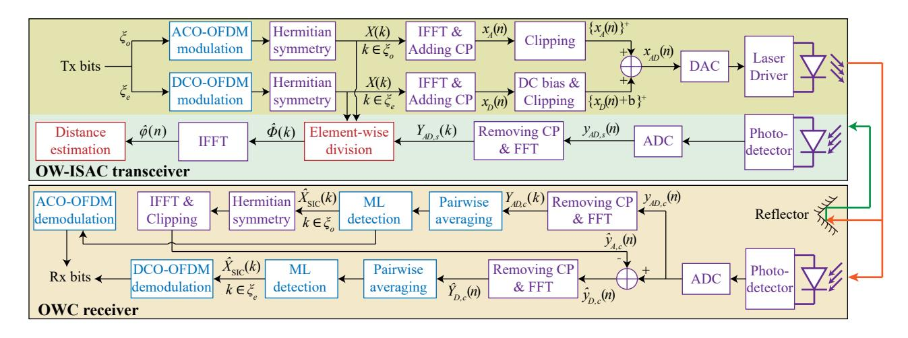
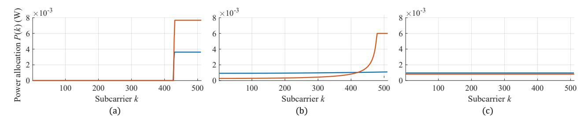
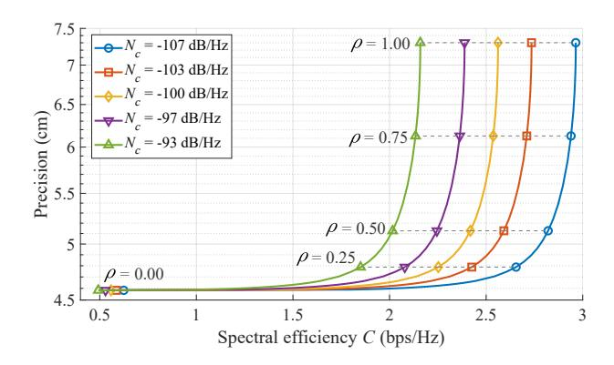
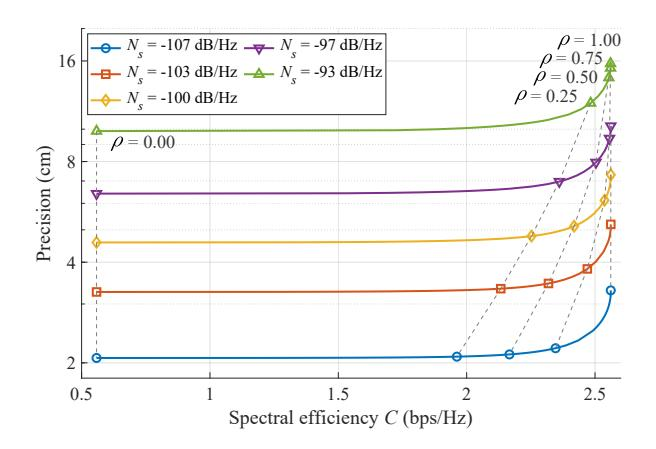

# Adaptive Resource Allocation in ADO-OFDM for Optical Wireless Integrated Sensing and Communication

Yunfeng Wen1 , Fang Yang1,2, Jian Song1,2,3, and Zhu Han4 1Department of Electronic Engineering, Tsinghua University, Beijing National Research Center for Information Science and Technology (BNRist), Beijing 100084, P. R. China 2Research Institute of Tsinghua University in Shenzhen, Shenzhen 518057, P. R. China 3Shenzhen International Graduate School, Tsinghua University, Shenzhen 518055, P. R. China 4Department of Electrical and Computer Engineering, University of Houston, Houston, TX 77004 USA

*Abstract*—Integrated sensing and communication (ISAC) is regarded as a key enabler in the upcoming era of connectivity and intelligence, where the optical spectrum emerges as a promising candidate for ISAC. This paper presents an optical wireless (OW)-ISAC scheme based on asymmetrically clipped direct-current-biased optical orthogonal frequency division multiplexing (ADO-OFDM). The Bussgang theorem is adopted to model the clipped OFDM signal and analyze the clipping noise. In addition, the adaptive resource allocation for ADO-OFDM is formulated as a joint optimization problem, which is decomposed into two sub-problems for DC-biased optical (DCO) asymmetrically clipped optical (ACO) power distribution and subcarrier power allocation. Then, the optimal resource allocation can be achieved by iteratively solving these sub-problems. Consequently, numerical results demonstrate the effectiveness of the proposed ADO-OFDM scheme and reveal the trade-off between communication and sensing functionalities in OW-ISAC.

*Index Terms*—Integrated sensing and communication, optical wireless communication, optical sensing, orthogonal frequency division multiplexing, Bussgang theorem.

# I. INTRODUCTION

The fusion of communication and sensing (C&S) becomes imperative to facilitate ubiquitous interactions between devices and their surroundings. Towards this end, integrated sensing and communication (ISAC) has become one of the six usage scenarios in the sixth-generation mobile communication system [1]. While previous studies primarily focus on radio frequency (RF), the optical spectrum is also regarded as a potential candidate for ISAC thanks to its *three advantages*, i.e., increasing communication rate, enhancing sensing precision, and reducing interference [2]. In consequence, as a combination of optical wireless communication (OWC) and optical sensing, optical wireless ISAC (OW-ISAC) has received growing interest from both academia and industry.

To enable simultaneous communication and active sensing, various studies have been conducted on OW-ISAC schemes based on light detection and ranging (LiDAR) [3]. For instance, the boomerang transmission system combines automotive LiDAR with OWC for autonomous vehicles [4]. Similarly, the pulse sequence sensing and pulse position modulation scheme utilizes a group of optical pulses for C&S [5]. For continuous waveforms, a frequency-modulated continuous-wave coherent LiDAR is addressed to provide downlink-communication capability [6]. Moreover, an OW-ISAC scheme based on linear frequency modulation and continuous phase modulation is investigated to provide a generalized form of constant-modulus waveforms [7]. However, these OW-ISAC schemes are limited in communication rate and inflexible under capricious user requirements.

To conduct adaptive resource allocation, orthogonal frequency division multiplexing (OFDM) becomes a promising scheme for OW-ISAC. To obtain an OFDM waveform compatible with the intensity modulation and direct detection (IM/DD) scheme, the original OFDM signal can be biased by a direct-current (DC) component to become real and nonnegative. Thereby, an experimental prototype based on DCbiased optical OFDM (DCO-OFDM) has been demonstrated for OW-ISAC [8]. Nonetheless, the DC bias neither carries communication data nor contributes to target sensing. On the contrary, asymmetrically clipped optical OFDM (ACO-OFDM), which does not contain a DC bias, achieves a higher power efficiency than that of DCO-OFDM at the expense of a deteriorated spectral efficiency due to the severe clipping noise on even subcarriers. Moreover, asymmetrically clipped DC-biased optical OFDM (ADO-OFDM) combines DCO-OFDM and ACO-OFDM, thus making a compromise between spectral efficiency and power efficiency [9].

In this paper, we propose an ADO-OFDM-based scheme that adaptively allocates resources for OW-ISAC, and our contributions are listed as follows. First, the system model is proposed for OW-ISAC based on ADO-OFDM, and signal processing techniques are also provided to exploit the properties of the clipping noise. Second, the optimization problem for resource allocation is formulated, whose objective is in a weighted-sum form to adaptively balance C&S performance metrics. Third, the non-convex joint optimization problem is decomposed into two sub-problems for DCO-ACO power distribution and subcarrier power allocation, respectively. By iteratively solving these sub-problems, the optimal resource allocation for OW-ISAC can be achieved.

The remainder of this paper is organized as follows. Sections II and III present the system model and signal processing techniques for the proposed ADO-OFDM scheme, respectively. In Section IV, the joint optimization problem for resource allocation is formulated, and solutions to the two sub-

Fig. 1. System model of the ADO-OFDM scheme for OW-ISAC. The blocks in purple, red, and blue are common components for C&S, specific components for sensing, and specific components for communication, respectively. ADC: analog-to-digital converter; DAC: digital-to-analog converter.

problems are also provided. Afterwards, numerical results are illustrated in Section V, and conclusion is drawn in Section VI.

#### II. SYSTEM MODEL FOR ADO-OFDM

As illustrated in Fig. 1, this section provides the system model of ADO-OFDM scheme for OW-ISAC. The OW-ISAC transceiver is implemented on a LiDAR, which actively estimates the distance to OWC receiver with the reflected optical signal. Moreover, if the photodetector of the OWC receiver is not obstructed, a line-of-sight (LoS) OWC link can be established simultaneously by the OW-ISAC transceiver.

Taking DCO-OFDM as an example, the time-domain DCO component of the ADO-OFDM signal is obtained by inverse fast Fourier transform (IFFT) on even subcarriers, i.e.,

$$x_D(n) = \frac{1}{\sqrt{N}} \sum_{k \in \xi_e} X(k) \exp\left(\frac{j2\pi nk}{N}\right), \tag{1}$$

where N and  $\xi_e$  denote the number of subcarriers in an OFDM symbol and the even-subcarrier set, respectively. Besides, X(k) is the frequency-domain signal transmitted on the k-th subcarrier and follows the Hermitian-symmetry constraint, i.e.,  $X(N-k) = X^*(k)$ . Similarly, the ACO component  $x_A(n)$  is obtained by IFFT on the odd-subcarrier set  $\xi_o$ .

Subsequently, the ADO-OFDM signal is given by

$$x_{AD}(n) = \{x_D(n) + b\}^+ + \{x_A(n)\}^+,$$
 (2)

where the notation  $\{\cdot\}^+$  denotes non-negative clipping and is defined as  $\{x\}^+ = \max\{x,0\}$ , while b is the DC bias for DCO-OFDM. In addition, a guard interval is concatenated in front of each OFDM symbol to resist inter-symbol interference and is filled with a cyclic prefix (CP). Then, the real and non-negative ADO-OFDM signal is transmitted to free space with the intensity modulation of the laser driver.

To model the relationship between the original signal  $x_D\left(n\right)$  and the clipped signal, the Bussgang theorem is adopted to derive a linear model for the clipped signal as

$$\{x_D(n) + b\}^+ = \mathcal{K}_D x_D(n) + v_D(n) + b,$$
 (3)

where  $v_D\left(n\right)$  is the clipping noise uncorrelated with  $x_D\left(n\right)$ . Besides, the Bussgang theorem also provides the value of attenuation factor as  $\mathcal{K}_D=Q\left(\lambda_b\right)$ , where  $\lambda_b=-b/\sigma_D$  is the normalized clipping level, and  $Q\left(\cdot\right)$  is the complementary cumulative distribution function of the standard Gaussian distribution. Moreover, the variance of  $v_D\left(n\right)$  is calculated as [10]

$$\sigma_{v_D}^2 = \sigma_D^2 \left( \lambda_b^2 \left( 1 - \mathcal{K}_D \right) + \lambda_b \phi \left( \lambda_b \right) + \mathcal{K}_D - \mathcal{K}_D^2 - \left( \lambda_b \left( 1 - \mathcal{K}_D \right) - \phi \left( \lambda_b \right) \right)^2 \right), \tag{4}$$

where  $\phi\left(\cdot\right)$  denotes the probability distribution function of the standard Gaussian distribution, and the variance of  $x_{D}\left(n\right)$  is given by

$$\sigma_D^2 = \frac{1}{N} \sum_{k \in \mathcal{E}_a} \mathbb{E}\left( |X(k)|^2 \right). \tag{5}$$

Moreover, by substituting b with 0, the Bussgang theorem is also readily applicable to ACO-OFDM, which yields the attenuation factor  $\mathcal{K}_A=1/2$ , the clipping noise  $v_A(n)$ , and its variance  $\sigma_{v_A}^2$ . Furthermore, while  $v_A(n)$  has been proven to exist only on  $\xi_e$  in the frequency domain [11], we also assert the sole existence of  $v_D(n)$  on  $\xi_e$  due to its periodic symmetry, i.e.,  $v_D(n)=v_D(n+N/2)$ . Therefore, an odd subcarrier has a higher signal-to-noise-plus-distortion ratio (SNDR) than that of an even subcarrier, which elicits an equivalent frequency-selective channel for OW-ISAC.

## III. SIGNAL PROCESSING FOR ADO-OFDM

In this section, the signal processing techniques are investigated for C&S receivers to exploit the properties of the clipping noise. Additionally, C&S performance metrics are also provided based on the derived expressions of SNDR.

## A. Communication Receiver

Supposing that perfect time synchronization has been achieved by the OWC receiver, the received communication signal in a LoS channel is then expressed as

$$y_c(n) = H_c x_{AD}(n) + w_c(n),$$
 (6)

where  $H_c$  denotes the channel gain for OWC, while thermal noise and shot noise are modelled as additive white Gaussian noise (AWGN)  $w_c(n)$ . Besides, the power of  $w_c(n)$  is calculated as  $BN_c$  with B and  $N_c$  denoting the total bandwidth of OFDM signal and communication noise power spectral density (PSD), respectively.

Then, the received communication signal in the frequency domain is obtained by fast Fourier transform (FFT), i.e.,

$$Y_{c}\left(k\right) = H_{c}X_{AD}\left(k\right) + W_{c}\left(k\right), \tag{7a}$$
 
$$X_{AD}\left(k\right) = \begin{cases} \mathcal{K}_{D}X\left(k\right) + V_{D}\left(k\right) + V_{A}\left(k\right), & k \in \xi_{e}, \\ \mathcal{K}_{A}X\left(k\right), & k \in \xi_{o}, \end{cases} \tag{7b}$$

where  $X_{AD}(k)$ ,  $V_D(k)$ ,  $V_A(k)$ , and  $W_c(k)$  are the FFT of  $x_{AD}(n)$ ,  $v_D(n)$ ,  $v_A(n)$ , and  $w_c(n)$ , respectively.

Since odd subcarriers are not affected by the clipping noise, the successive interference cancellation (SIC) method can be adopted to suppress the non-linear distortion. Thereby, subcarriers in  $\xi_{o}$  are first demodulated as

$$\hat{X}(k) = \arg \min_{X \in \mathcal{O}} |H_c \mathcal{K}_A X - Y_c(k)|^2, \quad k \in \xi_o.$$
 (8)

Subsequently, the ACO-OFDM component is regenerated and removed from the received ADO-OFDM signal to retrieve the DCO-OFDM component, i.e.,

$$\hat{y}_{A,c}(n) = \frac{1}{\sqrt{N}} \sum_{k \in \mathcal{E}} H_c \hat{X}(k) \exp\left(\frac{j2\pi nk}{N}\right), \quad (9a)$$

$$\hat{y}_{D,c}(n) = y_c(n) - \{\hat{y}_{A,c}(n)\}^+$$
 (9b)

Based on the obtained DCO-OFDM signal, subcarriers in  $\xi_e$  can be then demodulated as

$$\hat{X}\left(k\right) = \arg \min_{X \in \Omega} |H_c \mathcal{K}_D X - \hat{Y}_{D,c}\left(k\right)|^2, \quad k \in \xi_e, \quad (10)$$

where  $\hat{Y}_{D,c}(k)$  is the FFT of  $\hat{y}_{D,c}(n)$ .

Since the clipping noise of ACO-OFDM is mitigated by SIC during the demodulation, only  $V_D\left(k\right)$  is considered in the performance metric of the communication system, and the spectral efficiency is then derived as

$$C = \frac{1}{N} \sum_{k=1}^{N/2-1} \log \left( 1 + \gamma_c(k) \,\tilde{P}(k) \right), \tag{11}$$

where  $\tilde{P}\left(k\right)$  is the normalized power allocation, and the SNDR for communication is defined as

$$\gamma_{c}\left(k\right) = \begin{cases} \frac{NH_{c}^{2}\mathcal{K}_{A}^{2}\sigma_{A}^{2}}{BN_{c}}, & k \in \xi_{o}, \\ \frac{NH_{c}^{2}\mathcal{K}_{D}^{2}\sigma_{D}^{2}}{2H_{c}^{2}\sigma_{v_{D}}^{2} + BN_{c}}, & k \in \xi_{e}. \end{cases}$$
(12)

#### B. Sensing Receiver

Denoting the distance between the OW-ISAC transceiver and OWC receiver as D, the time of flight (ToF) for the sensing signal is  $\tau_0 = 2D/c$  with c denoting the speed of light. Thereby, the received sensing signal is expressed as

$$y_s(n) = H_s x (n - \tau_0 R_s) + w_s(n),$$
 (13)

where  $H_s$  denotes the channel gain for sensing, and  $R_s$  is the sampling rate. Besides,  $w_s\left(n\right)$  is AWGN whose power is  $BN_s$  with  $N_s$  denoting the sensing noise PSD. Then, the frequency-domain sensing signal is obtained by FFT as

$$Y_s(k) = H_s X_{AD}(k) \Phi(k) + W_s(k), \qquad (14)$$

where  $W_{s}\left(k\right)$  is the FFT of  $w_{s}\left(n\right)$ , and  $\Phi\left(k\right)$  is a sinusoidal signal defined as

$$\Phi\left(k\right) = \exp\left(-\frac{j2\pi\tau_0 R_s k}{N}\right). \tag{15}$$

Towards this end, the estimation of  $\tau_0$  is equivalent to the frequency estimation of  $\Phi(k)$ , and we adopt the element-wise-division method to estimate  $\Phi(k)$  as

$$\hat{\Phi}(k) = \begin{cases} Y_s(k) / (H_s \mathcal{K}_D X(k)), & k \in \xi_e, \\ Y_s(k) / (H_s \mathcal{K}_A X(k)), & k \in \xi_o. \end{cases}$$
(16)

Subsequently, the ToF is estimated as

$$\hat{\tau} = \arg \max_{\tau} \left| \sum_{k=0}^{N-1} \hat{\Phi}(k) \exp\left(\frac{j2\pi\tau R_s k}{N}\right) \right|, \tag{17}$$

and the estimated target distance is given by  $\hat{D} = c\hat{\tau}/2$ .

As the explicit expression for the variance of distance estimation is hard to acquire, the Cramèr-Rao Bound (CRB) is derived as the lower bound for the sensing precision. Since CRB is inversely proportional to the Fisher information, the performance metric for sensing is expressed as [12]

$$I = \frac{8\pi^2 B^2}{N^3} \sum_{k=1}^{N/2-1} k^2 \gamma_s(k) \,\tilde{P}(k), \tag{18}$$

where the SNDR for sensing is calculated as

$$\gamma_{s}(k) = \begin{cases} \frac{NH_{s}^{2}\mathcal{K}_{A}^{2}\sigma_{A}^{2}}{BN_{s}}, & k \in \xi_{o}, \\ \frac{NH_{s}^{2}\mathcal{K}_{D}^{2}\sigma_{D}^{2}}{2H_{s}^{2}\left(\sigma_{v_{D}}^{2} + \sigma_{v_{A}}^{2}\right) + BN_{s}}, & k \in \xi_{e}. \end{cases}$$
(19)

## IV. ADAPTIVE RESOURCE ALLOCATION

In this section, we optimize the resource allocation for ADO-OFDM under optical and electrical power constraints. To adaptively balance C&S performance metrics, the weighted-sum method is adopted to scalarize the multi-objective problem, which linearly aggregates C&S performance metrics with a weight factor  $\rho$ . Consequently, the joint optimization problem is formulated as

(P0): 
$$\max_{\lambda_b, \sigma_D, \sigma_A, \tilde{P}(k)} \quad \Xi = \frac{\rho C}{C_0} + \frac{\left(1 - \rho\right)I}{I_0}, \quad (20a)$$

s.t. 
$$P_o \le P_{o,m}$$
, (20b)

$$P_e < P_{em}, \tag{20c}$$

$$0 < \tilde{P}(k) < \tilde{P}_m, \tag{20d}$$

$$\sum_{k \in \mathcal{E}} \tilde{P}(k) = \frac{1}{2},\tag{20e}$$

$$\sum_{k \in \xi_e} \tilde{P}(k) = \frac{1}{2},\tag{20f}$$

**Algorithm 1** Iterative Algorithm for Joint Optimization of Resource Allocation for ADO-OFDM

**Input:** Tolerance  $\epsilon$ . Initial solution  $\lambda_h^{(0)}$ ,  $\sigma_D^{(0)}$ ,  $\sigma_A^{(0)}$ , and

**Output:** Optimal solution  $\lambda_b^*$ ,  $\sigma_D^*$ ,  $\sigma_A^*$ , and  $\tilde{P}^*(k)$ .

1:  $i \leftarrow 0, \, \Xi^{(0)} \leftarrow 0.$ 

2: **while**  $|\Xi^{(i+1)} - \Xi^{(i)}| \ge \epsilon$  **do** 

- Update  $\sigma_{v_D}^2$  and  $\sigma_{v_A}^{\stackrel{\cdot}{2}}$ . Given  $\tilde{P}^{(i)}(k)$ , solve (P1) to obtain  $\lambda_b^{(i+1)}$ ,  $\sigma_D^{(i+1)}$ , and
- Given  $\lambda_b^{(i+1)}$ ,  $\sigma_D^{(i+1)}$ , and  $\sigma_A^{(i+1)}$ , solve (P2) to obtain  $\tilde{P}^{(i+1)}\left(k\right)$  and  $\Xi^{(i+1)}$ .
- $i \leftarrow i + 1$ .
- 7: end while
- 8:  $\lambda_b^* \leftarrow b^{(i)}, \, \sigma_D^* \leftarrow \sigma_D^{(i)}, \, \sigma_A^* \leftarrow \sigma_A^{(i)}, \, \tilde{P}^*\left(k\right) \leftarrow \tilde{P}^{(i)}\left(k\right).$

where  $C_0$  and  $I_0$  are reference values to normalize the dimensions of the spectral efficiency and the Fisher information. Constraints (20b) and (20c) restrict optical power and electrical power, respectively, which can be derived as [13]

$$P_{o} = \sigma_{D} \left( \phi \left( \lambda_{b} \right) - \lambda_{b} \mathcal{K}_{D} \right) + \frac{1}{\sqrt{2\pi}} \sigma_{A} \leq P_{o,m}, \tag{21a}$$

$$P_{e} = \sigma_{D}^{2} \left( -\lambda_{b} \phi \left( \lambda_{b} \right) + \left( 1 + \lambda_{b}^{2} \right) \mathcal{K}_{D} \right)$$

$$+ \frac{1}{2} \sigma_{A}^{2} + \sqrt{\frac{2}{\pi}} \sigma_{A} \sigma_{D} \left( \phi \left( \lambda_{b} \right) - \lambda_{b} \mathcal{K}_{D} \right) \leq P_{e,m}. \tag{21b}$$

In addition, the constraint (20d) also restricts the normalized power on each subcarrier. Moreover, constraints (20e) and (20f) normalize the power allocation to be consistent with the expressions of C&S performance metrics.

The joint optimization problem (P0) is a high-dimensional non-convex problem, and the optimal solution is hard to acquire. Towards this end, we decompose (P0) into a subproblem for DCO-ACO power distribution and a sub-problem for subcarrier power allocation, thus obtaining a two-variable problem (P1) and a convex problem (P2) with N/2-1variables. Subsequently, the optimal resource allocation can be achieved by iteratively solving (P1) and (P2), which is summarized in Algorithm 1.

#### A. DCO-ACO Power Distribution

The sub-problem for DCO-ACO power distribution optimizes the power of DCO-OFDM and ACO-OFDM under the total power constraints. By substituting the variable  $\sigma_A$  with  $\beta = \sigma_A/\sigma_D$ , the sub-problem is formulated as

(P1): 
$$\max_{\lambda_{b}, \sigma_{D}, \beta} \qquad \Xi(\lambda_{b}, \sigma_{D}, \beta), \qquad (22a)$$
s.t. 
$$(20b), (20c),$$

$$0 < \beta < +\infty, \qquad (22b)$$

where  $\beta = +\infty$  is equivalent to  $\sigma_D = 0$ .

For specific  $\beta$  and  $\lambda_b$ , Eqs. (12) and (19) indicate that the objective is an increasing function of  $\sigma_D$ . Therefore, to maximize  $\Xi$  in (P1),  $\sigma_D$  should be maximized according to constraints (20b) and (20c), i.e.,

$$\sigma_{D,m}(\lambda_b,\beta) = \min \left\{ \frac{P_{o,m}}{\tilde{P}_o(\lambda_b,\beta)}, \sqrt{\frac{P_{e,m}}{\tilde{P}_e(\lambda_b,\beta)}} \right\}, \quad (23)$$

$$\tilde{P}_{o}(\lambda_{b},\beta) = \phi(\lambda_{b}) - \lambda_{b}Q(\lambda_{b}) + \frac{\beta}{\sqrt{2\pi}},$$
(24a)

$$\tilde{P}_{e}\left(\lambda_{b},\beta\right) = \left(-\lambda_{b}\phi\left(\lambda_{b}\right) + \left(1 + \lambda_{b}^{2}\right)Q\left(\lambda_{b}\right)\right)$$

$$\beta\sqrt{\frac{2}{\pi}}\left(\phi\left(\lambda_{b}\right) - \lambda_{b}Q\left(\lambda_{b}\right)\right) + \frac{\beta^{2}}{2}.$$
(24b)

Subsequently, the three-variable problem (P1) degenerates into a two-variable problem (P1-1), which is written as

(P1-1): 
$$\max_{\lambda_{b},\beta} \qquad \Xi\left(\lambda_{b},\sigma_{D,m}\left(\lambda_{b},\beta\right),\beta\right),$$
 (25) s.t. (22b).

Since the objective for (P1-1) is non-concave, the successive convex approximation algorithm (SCA) is adopted to solve (P1-1), and the *i*-th SCA iteration is written as [14]

$$\lambda_b^{(i+1)} = \lambda_b^{(i)} + \mu^{(i)} \frac{\partial \Xi}{\partial \lambda_b} |^{(i)}, \tag{26a}$$

$$\beta^{(i+1)} = \beta^{(i)} + \mu^{(i)} \frac{\partial \Xi}{\partial \beta} | ^{(i)}, \tag{26b}$$

where  $\mu^{(i)}$  is the step length of the *i*-th SCA iteration and can be selected by the backtracking line search [15].

#### B. Subcarrier Power Allocation

The sub-problem for subcarrier power allocation optimizes the normalized power on each subcarrier within the power budgets of both DCO-OFDM and ACO-OFDM, which is formulated as

(P2): 
$$\max_{\tilde{P}(k)} \qquad \Xi\left(\tilde{P}(k)\right),$$
 (27) s.t. (20d), (20e), (20f).

Since the performance metrics are decoupled for DCO-OFDM and ACO-OFDM, the power allocation problems for subcarriers in  $\xi_e$  and  $\xi_o$  are also independent from each other, which can be solved individually. Specifically, the objective for DCO-OFDM is defined as

$$\Xi_{D} = \frac{1}{N} \sum_{k \in \xi_{e}} \frac{\rho}{C_{0}} \log \left( 1 + \gamma_{c} \left( k \right) \tilde{P} \left( k \right) \right)$$

$$+ \frac{1}{N} \sum_{k \in \xi_{e}} \frac{\left( 1 - \rho \right) k^{2} \gamma_{s} \left( k \right) \tilde{P} \left( k \right)}{I_{0}}.$$
(28)

Then, the subcarrier power allocation problem for DCO-OFDM is written as

(P2-D): 
$$\max_{\tilde{P}(k), k \in \xi_e} \qquad \Xi_D\left(\tilde{P}(k)\right), \tag{29}$$
 s.t. 
$$(20d), (20e).$$

Fig. 2. Optimal power allocation for ADO-OFDM. The lines in red and blue illustrate the power allocated to ACO-OFDM and DCO-OFDM subcarriers, respectively. (a)  $\rho = 0.00$ . (b)  $\rho = 0.50$ . (c)  $\rho = 1.00$ .

TABLE I SIMULATION CONFIGURATIONS

| Parameter                     | Notation      | Value                             |
|-------------------------------|---------------|-----------------------------------|
| Subcarriers in an OFDM symbol | N             | 1024                              |
| Total bandwidth               | B             | 204.8 MHz                         |
| Sampling rate                 | $R_s$         | 204.8 MHz                         |
| Maximum electrical power      | $P_{e,m}$     | 0.5 W                             |
| Maximum optical power         | $P_{o,m}$     | 1 W                               |
| Maximum normalized power      | $\tilde{P}_m$ | 0.012                             |
| Reference spectral efficiency | $C_0$         | 14 bps/Hz                         |
| Reference Fisher information  | $I_0$         | $5.63 \times 10^7 \text{ s}^{-2}$ |
| Target distance               | D             | 200 m                             |
| Speed of light                | c             | $3\times10^8$ m/s                 |

As indicated by (28), the objective  $\Xi_D$  is a concave function of  $\tilde{P}(k)$ . In addition, both (20d) and (20e) are affine constraints on  $\tilde{P}(k)$ . Hence, (P2-D) is a convex optimization problem, whose closed-form solution is given by Karush-Kuhn-Tucker (KKT) conditions as

$$\tilde{P}^{*}(k) = \left\{ \frac{1}{\psi(\eta^{*}, k)} - \frac{1}{\gamma_{c}(k)} \right\}^{+},$$
 (30)

where the auxilliary function  $\psi(\eta, k)$  is defined as

$$\psi\left(\eta, k\right) = \max\left\{\frac{C_0}{\rho} \left(\eta - \frac{\left(1 - \rho\right) k^2 \gamma_s\left(k\right)}{F_0}\right), \frac{\gamma_c\left(k\right)}{\gamma_c\left(k\right) \tilde{P}_m + 1}\right\},$$
(31)

and the optimal dual variable  $\eta^*$  is the solution to

$$\sum_{k \in \xi_e} \left\{ \frac{1}{\psi(\eta, k)} - \frac{1}{\gamma_c(k)} \right\}^+ = \frac{1}{2}.$$
 (32)

By defining

$$\eta_{\min} = \frac{1 - \rho}{I_0} \max_{k \in \xi_e} \left\{ k^2 \gamma_s(k) \right\}, \tag{33a}$$

$$\eta_{\text{max}} = \max_{k \in \xi_e} \left\{ \frac{\rho \gamma_c(k)}{C_0} + \frac{(1 - \rho) k^2 \gamma_s(k)}{I_0} \right\},$$
(33b)

we assert the existence of  $\eta^*$  on  $[\eta_{\min}, \eta_{\max}]$  by the Intermediate Value property [16]. Moreover, since  $\psi(\eta, k)$  is a non-increasing function of  $\eta$ , the bisection method can be adopted to obtain the optimal dual variable  $\eta^*$  on  $[\eta_{\min}, \eta_{\max}]$ .

Fig. 3. Trade-off curves w.r.t. communication noise PSDs for  $N_s = -100~{\rm dB/Hz}.$ 

Similarly, the power allocation problem for ACO-OFDM is also convex and can be solved in the same way as its DCO-OFDM counterpart. Once the power allocations for both DCO-OFDM and ACO-OFDM are optimized, (P2) will also be readily solved.

## V. NUMERICAL SIMULATIONS

In this section, numerical simulations are conducted to acquire the optimal resource allocation for ADO-OFDM. Table I shows the parameters for simulation, in which we consider simultaneous communication and sensing with an individual point target. Then, the channel model in [17] is adopted to calculate the channel gains for communication and sensing as -2.2 dB and -23.2 dB, respectively.

To combine the results of DCO-ACO power distribution and subcarrier power allocation, the power allocation  $P\left(k\right)$  is defined as

$$P(k) = \begin{cases} \sigma_D^2 \tilde{P}(k), & k \in \xi_e, \\ \sigma_A^2 \tilde{P}(k), & k \in \xi_o, \end{cases}$$
(34)

which is illustrated in Fig. 2 with respect to (w.r.t.) different weight factors. While a sensing-centric system ( $\rho=0.00$ ) allocates power to as high frequency as possible to maximize the Fisher information, the optimal power allocation for a communication-centric system ( $\rho=1.00$ ) is in a waterfilling form. For the trade-off scenario of  $\rho=0.50$ , the power-allocation curves make a compromise between the spectral efficiency and the Fisher information. Moreover, as

Fig. 4. Trade-off curves w.r.t. sensing noise PSDs for Nc = −100 dB/Hz.

the weight factor increases, more power is allocated to DCO-OFDM instead of ACO-OFDM. The reason lies in that the channel gain of communication is much higher than that of sensing. Consequently, DCO-OFDM is more suitable for communication thanks to the adequate power budget for DC bias, while ACO-OFDM is preferred by sensing to reserve more power for subcarriers that carries information.

Once the optimal resource allocation is achieved, the spectral efficiency C for communication and precision c/(2√ I) for sensing can be calculated to form trade-off curves. Fig. 3 shows the trade-off curves w.r.t. different communication noise PSDs, and the contour lines for the weight factor are plotted as dash lines. While the trade-off curves reveal the compromise between communication and sensing performance metrics, they also become marginal when the weight factor ρ approaches 0.00, where the precision almost becomes a constant. In addition, the sensing precisions nearly remain the same for a fixed ρ, which indicates that the resource allocation is not influenced significantly by ρ for the given parameters.

Fig. 4 shows the trade-off curves w.r.t. different sensing noise PSDs and contour lines for the weight factor. Similar to Fig. 3, the trade-off between communication and sensing becomes marginal when the weight factor ρ approaches 1.00, where the spectral efficiency does not increase significantly with a deteriorated sensing precision. However, since the sensing channel gain is about 20 dB smaller than its communication counterpart, the varying Ns yields a prominent change in resource allocation. Therefore, significant differences occur in C when Ns is changed even for a fixed ρ.

### VI. CONCLUSION

In this paper, we proposed an OW-ISAC scheme based on ADO-OFDM that could provide C&S capabilities simultaneously. The clipped OFDM signal was modelled by the Bussgang theorem to analyze the properties of clipping noise, which further yielded the signal processing techniques for C&S receivers. Besides, the optimization problem for resource allocation was formulated to adaptively balance C&S performance metrics. Since the joint optimization problem was nonconvex, it was decomposed into two sub-problems for DCO-ACO power distribution and subcarrier power allocation. Subsequently, the optimal resource allocation could be achieved by iteratively solving these sub-problems. Finally, numerical results validated the effectiveness of the proposed ADO-OFDM scheme and illustrated the optimal power allocation. Furthermore, the trade-off between C&S functionalities was also highlighted by tuning the weight factor.

## ACKNOWLEDGMENT

This work was supported in part by Science, Technology and Innovation Commission of Shenzhen Municipality under Grant JSGG20211029095003004; and in part by NSF CNS-2107216, CNS-2128368, CMMI-2222810, ECCS-2302469, US Department of Transportation, Toyota. Amazon and JST ASPIRE JPMJAP2326.

## REFERENCES

- [1] Z. Wei, H. Qu, Y. Wang, X. Yuan, H. Wu, Y. Du, K. Han, N. Zhang, and Z. Feng, "Integrated sensing and communication signals toward 5G-A and 6G: a survey," *IEEE Internet Things J.*, vol. 10, no. 13, pp. 11 068–11 092, Jan. 2023.
- [2] Y. Wen, F. Yang, J. Song, and Z. Han, "Optical integrated sensing and communication: architectures, potentials and challenges," *IEEE Internet Things Mag.*, vol. 7, no. 4, pp. 68–74, Jun. 2024.
- [3] C. V. Poulton, M. J. Byrd, P. Russo, E. Timurdogan, M. Khandaker, D. Vermeulen, and M. R. Watts, "Long-range LiDAR and free-space data communication with high-performance optical phased arrays," *IEEE J. Sel. Topics Quantum Electron.*, vol. 25, no. 5, pp. 1–8, Mar. 2019.
- [4] A. J. Suzuki and K. Mizui, "Laser radar and visible light in a bidirectional V2V communication and ranging system," in *Proc. IEEE Int. Conf. Veh. Electron. Saf.*, Yokohama, Japan, Nov. 2015, pp. 19–24.
- [5] Y. Wen, F. Yang, J. Song, and Z. Han, "Pulse sequence sensing and pulse position modulation for optical integrated sensing and communication," *IEEE Commun. Lett.*, vol. 27, no. 6, pp. 1525–1529, Apr. 2023.
- [6] Z. Xu, K. Chen, X. Sun, K. Zhang, Y. Wang, J. Deng, and S. Pan, "Frequency-modulated continuous-wave coherent LiDAR with downlink communications capability," *IEEE Photon. Technol. Lett.*, vol. 32, no. 11, pp. 655–658, Apr. 2020.
- [7] Y. Wen, F. Yang, J. Song, and Z. Han, "Free space optical integrated sensing and communication based on LFM and CPM," *IEEE Commun. Lett.*, vol. 28, no. 1, pp. 43–47, Nov. 2023.
- [8] E. B. Muller, V. N. H. Silva, P. P. Monteiro, and M. C. R. Medeiros, "Joint optical wireless communication and localization using OFDM," *IEEE Photon. Technol. Lett.*, vol. 34, no. 14, pp. 757–760, Jun. 2022.
- [9] S. D. Dissanayake and J. Armstrong, "Comparison of ACO-OFDM, DCO-OFDM and ADO-OFDM in IM/DD systems," *J. Lightw. Technol.*, vol. 31, no. 7, pp. 1063–1072, Jan. 2013.
- [10] S. Dimitrov, S. Sinanovic, and H. Haas, "Clipping noise in OFDMbased optical wireless communication systems," *IEEE Trans. Commun.*, vol. 60, no. 4, pp. 1072–1081, Mar. 2012.
- [11] X. Huang, F. Yang, X. Liu, H. Zhang, J. Ye, and J. Song, "Subcarrier and power allocations for dimmable enhanced ADO-OFDM with iterative interference cancellation," *IEEE Access*, vol. 7, pp. 28 422–28 435, Feb. 2019.
- [12] S. M. Kay, *Fundamentals of statistical signal processing: estimation theory*. Englewood Cliffs, NJ, USA: PTR Prentice-Hall, 1993.
- [13] X. Ling, J. Wang, X. Liang, Z. Ding, and C. Zhao, "Offset and power optimization for DCO-OFDM in visible light communication systems," *IEEE Trans. Signal Process.*, vol. 64, no. 2, pp. 349–363, Sep. 2016.
- [14] M. Razaviyayn, "Successive convex approximation: analysis and applications," *Ph.D. dissertation*, University of Minnesota, May 2014.
- [15] S. P. Boyd and L. Vandenberghe, *Convex Optimization*. New York, NY: Cambridge University Press, 2004.
- [16] G. Strang, *Calculus*. Wellesley, MA: Wellesley-Cambridge Press, 2017.
- [17] Y. Wen, F. Yang, J. Song, and Z. Han, "Free space optical integrated sensing and communication based on DCO-OFDM: performance metrics and resource allocation," 2024, *arXiv*:2312.13654.