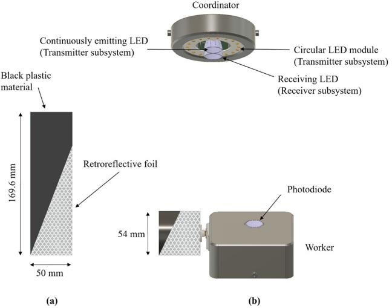
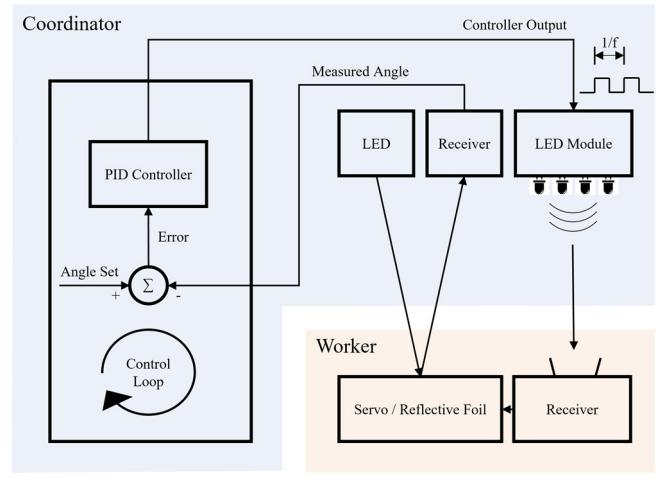
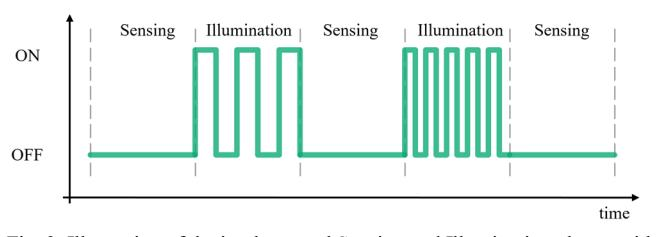
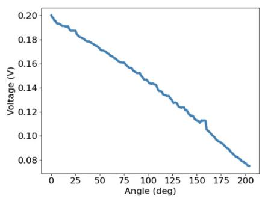
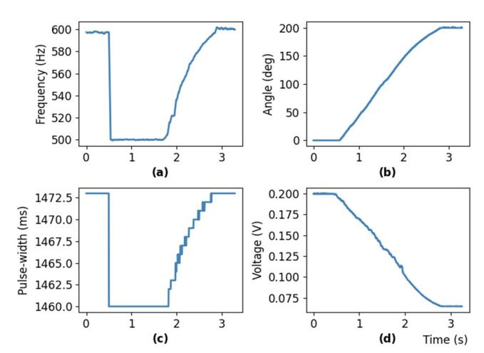
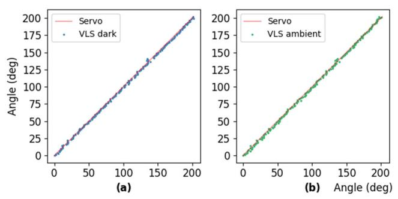

# Integrated Sensing and Communication in the Visible Spectral Range: A Novel Closed Loop Controller

Christian Fragner, Andreas P. Weiss, Franz P. Wenzl Institute for Surface Technologies and Photonics JOANNEUM RESEARCH Forschungsges.mbH Industriestraße 6, A-7423 Pinkafeld, Austria {christian.fragner;andreas-peter.weiss;franzpeter.wenzl}@joanneum.at

Erich Leitgeb Institute of Microwave and Photonic Engineering Technical University Graz Inffeldgasse 12/I, 8010 Graz, Austria erich.leitgeb@tugraz.at

*Abstract***— In the course of the ongoing process of defining the future communication standard of 6G, one of the main conceptions is that in future the tasks of communication and sensing will be performed in parallel, utilizing the same waveforms and the same hardware, thus forming a so-called Integrated Sensing and Communication (ISAC) system. In this work, we propose the concept of an ISAC system based solely on visible light that performs the task of sensing the rotational position of a cylinder mounted on a servomotor with an average absolute deviation of ~1.2° and the task of forwarding the commands to reach a defined rotational position. The feasibility of the implemented ISAC system is verified by experimental results that demonstrate the applicability of such a visible light based ISAC systems in the era of 6G. Furthermore, we show a simple and effective method to compensate the impacts of additional ambient light on the operation performance.**

*Keywords—Integrated Sensing and Communication, Visible Light Sensing, Visible Light Communication* 

### I. INTRODUCTION

In the course of defining new integral parts for the future communication standard of 6G [1,2], the main directions are the integration of short-range, cellular and satellite communication, new signal processing methods as well as new materials and components [3]. Besides that, one of the main advancements envisioned in the 6G era is the realization of simultaneous communication and sensing, often referred to as integrated sensing and communication (ISAC) systems [4]. ISAC systems are defined as systems that, by sharing the time, the waveforms, or the hardware, can perform the tasks of communication and sensing in parallel with only minimal performance degradation of the individual tasks [4,5]. As the utilized frequency spectra in the envisioned 6G systems are increasingly extending towards the mm (30-300 GHz) and to the THz (0,3 THz – 30 THz) wave ranges [6], also the research activities in realizing ISAC systems in these frequency ranges rose remarkably in the last years. [5] discusses the realization of such a ISAC system in the mm wave range, where the task of performing radio detection and ranging (radar) is combined with the communication of data to potential receivers. In that work, it is shown that both functionalities can be performed with the same hardware and the existing tradeoff between these two functionalities is discussed. For further details on such joint radar/communications systems, please see [7].

Another communication technology, that is envisioned to play a decisive role in 6G is Visible Light Communication (VLC) [2,3]. VLC refers to the technology that utilizes the visible light spectrum, in the frequency range of ~400 THz to 800 THz for communication. The data transmission between a light-emitting diode (LED) and a photosensitive device is realized by modulation of the light emitted from the LED and thus by demodulation of the received light from the photosensitive device. The modulation frequencies that are used are well above the perception threshold level of a human eye. Thus, the additional functionality of data transmission can be performed without any deterioration of the basic functionality of LEDs in a luminaire, which is providing illumination [9]. VLC has proven to provide high communication bandwidths in a robust and reliable way. Most importantly, VLC can be realized utilizing cheap offthe-shelf components (LEDs, photodiodes, etc.) and provides secure communication, since visible light does not penetrate through walls. The immunity against interferences from radio frequency (RF) signals and the bespoken fact that light does not penetrate through walls, also makes VLC an ideal candidate for secure communication networks in the context of residential and industrial applications.

When visible light is used to perform sensing tasks, the common abbreviation for this technology, covering many diverse applications such as presence detection [10], identification [11] or gesture recognition [12], is Visible Light Sensing (VLS). The basic concept of VLS is that the light intensity and/or the spectral composition of the light impinging on a photosensitive device is analyzed to infer information. VLS can be subdivided in two main categories, Line-of-Sight (LoS) and non Line of Sight (nLoS) [13]. In the following, we will utilize an nLoS VLS approach, with the major advantage, compared to LoS systems, that the receiving photosensitive device(s) is not placed on the object itself or in its environment, but that the light source and the receiving element can be collocated in close vicinity to each other. This enables the integration into the same housing (for example a luminaire). Such nLoS VLS systems are also often referred to as backscattered VLS systems, because the information inferred about the object (or person) is solely based on light that is reflected from the object. For further details about the different categories of VLS systems, please see [13]. The basic potentials of coating objects of interest with distinct "codes", and investigating the reflected light have already been investigated since more than two decades, for example in the context of optical tachometers [14]. This demonstrates that the potentials of VLS for sensing tasks are realistic and that with the improvements in electronic components and circuits such approaches are ideal candidates to jointly perform sensing and communication tasks in the era of 6G.

In this work, we will demonstrate such a concept of a ISAC system solely based on visible light that combines VLC and VLS to perform the tasks of sensing the rotational position of a cylinder mounted on a servomotor with high accuracy, to derive the necessary commands to reach a desired rotational position and to communicate these commands to the servomotor until the desired position is reached. Thus, in this work, we, to the best of our knowledge, show the first practical implementation of a closed loop controller that is able to remotely sense the rotational position of a cylinder mounted on a servomotor by backscattered VLS, and to forward the necessary commands by the means of VLC. With this, there is no need for additional communication components and interfaces (e.g. WiFi) for this closed loop controller. Furthermore, we will show a simple, but yet effective, method to compensate the effects of additional ambient light on the rotation angle determination. The VLC-VLS ISAC system presented in this work combines the best of two worlds, on the one hand energy-efficient and low-latency sensing and on the other hand the given advantages of VLC, especially in terms of interference with RF signals and, consequently, immunity against attacks such as spamming or spoofing known for RF communication.

# II. SOLUTION APPROACH

The presented novel closed loop controller solely relying on visible light to perform sensing and communication is the purposeful continuation of our previous work in the area of VLC and VLS. In [15], we successfully showed that the rotation direction of a robotic arm can be determined for various rotational speeds and also under the presence of additional ambient light, utilizing retroreflective foils of different colors in combination with an RGB photodiode, performing VLS based on the spectral composition of the reflected light. For further details, please see [15]. One of the main findings presented in [15] was that by applying a time division multiplexing between the tasks of VLS and VLC, these two tasks can be performed in parallel without any notable deterioration of the system performance. We will discuss this time division scheme that we call Sensing and Illumination phases, further in chapter II.

In [12], we introduced a Human-System Interaction method to determine the angle, the direction and the velocity of a human's wrist posture movement, based on measuring reflections of a tapered-shaped retroreflective foil attached to the wrist of a human in combination with a low-complexity and low-cost electronic transceiver module. One of the main results was that, based on the utilized tapered shape of the retroreflective foil, a linear coherence of the angle (position) and the output voltage of the Transimpedance Amplifier (TIA) stage, respectively the received reflected light, can be achieved. This allows for the fact, that every rotation angle can be associated with a distinct voltage level of the TIA output. For details, please see [12].

In the following, our system setup, realizing the ISAC approach, consists of two main parts that we call Coordinator and Worker and which will be discussed in detail in the following subsections.

# *A. Coordinator*

The Coordinator consists of three subsystems that in the following will be named as transmitter, receiver and microcontroller. A main component of the transmitter subsystem is a continuously emitting Cree MC-E Color RGBW LED. This LED consists of four separate dies (Red, Green, Blue and White), which can be controlled individually. In this work, we will only use the white die of the LED, constantly supplied with a current of 350 mA. Additionally to the Cree RGBW LED, a circular-shaped LED module with 18 individual white LEDs taken from a commercially available desk-lamp is also a main part of the transmitter subsystem. This circular-shaped LED module encompasses the module with the Cree LED as well as the later described receiver subsystem. The main task of this circular-shaped LED module is to perform the communication with the Worker by the means of VLC (see Fig. 1b). The receiver subsystem consists of another Cree MC-E Color RGBW LED in reverse polarity acting as a "LED as a receiver", as its core component. This "LED as a receiver" is connected to a TIA that converts the photocurrent induced in the receiving LED by the incident light into a voltage that can be processed by the microcontroller's analog-digital converter (ADC). The microcontroller, a Nucleo-G431KB board from STMicroelectronics, is connected to the transmitter and the receiver subsystems. This microcontroller contains a 32-bit ARM Cortex-M4 processor core, clocked at 170 MHz and is equipped with sufficient peripherals. Consequently, it performs the tasks of controlling the transmitter subsystem, to realize the later described Sensing and Illumination phases, as well as acquiring the output voltages of the receiver subsystem and performing the control loop based on an implemented proportional–integral–derivative (PID) controller. This PID controller will be explained in more detail in subsection C of this chapter.

In order to emit or receive the light beams as directionally as possible, precisely fitting reflectors with a 20° spot beam from LEDiL were attached on the emitting LED as well as the receiving LED. The three subsystems have been integrated in a 3D-printed housing, forming a compact module.

#### *B. Worker*

The Worker, consists of the same printed circuit board (PCB) as for the emitting LED and the receiver of the Coordinator, with the main difference that in the receiver subsystem a photodiode (Osram SFH2701) is used as the photosensitive component, instead of the LED in reverse polarity used in the Coordinator receiver subsystem. For the Worker, compared to the Coordinator, the continuously emitting LED is not assembled and consequently not used.

The Worker is furthermore incorporating a servomotor (Parallax Feedback 360° High-Speed Servo [16]), which is able to rotate its shaft by 360° in both directions. At the shaft of the motor, a 3D-printed cylindrical body is fixed, thus forming the actuator in our envisioned closed loop controller. The servomotor is controlled by a 50 Hz PWM signal. The rotational speed and the direction of rotation are controlled by varying the pulse width of this signal. When the applied pulse width is between 1280-1480 µs, the servomotor performs a clockwise rotation (faster to slower). A pulse width between 1520-1720 µs (slower to faster) prompts a counterclockwise rotation of the servomotor, whilst a pulse width in the range of 1480-1520 µs causes a stop of the rotation. For technical details, please see [16]. The utilized servomotor has an inbuilt Hall effect sensor system that provides a digital angular position feedback by the means of a PWM signal, where the pulse width indicates the angular position of the shaft [16]. This feedback signal will be used in the later described experiments for calibration purposes and the assessment of the accuracy of our approach, for which we compare the determined rotation angle by the means of VLS with the feedback signal of the Hall sensor.

As a 3D-printed cylinder (diameter = 54 mm, height = 50mm) attached to the shaft of the servomotor is the actual rotating element in our work, the retroreflective foil (3M™ 4090 Series white) with a triangular shape is placed around this cylinder. As already outlined, the approach to utilize a triangular (tapered) shape for VLS based rotation determination is a continuation of the work presented in [12].

Fig. 1b shows the 3D models of the Coordinator and Worker, with their respective main components labelled. Please note that the microcontroller boards are integrated in the respective housings and are therefore not visible in the depictions. Fig. 1a shows the rotating cylinder in an "unrolled" 2D representation, showing the black plastic material the cylinder is made of, as well as the retroreflective foil in the utilized triangular shape mounted on the cylinder.

Fig. 1. (a) "Unrolled" 2D representation of the rotating cylinder showing the attached retroreflective foil on the 3D printed rotating cylinder (black plastic material). (b) 3D models of the Coordinator and the Worker.

## *C. Control Loop*

In order to establish our proposed closed loop controller, the Coordinator unit is constantly monitoring the angle of the 3D-printed cylinder. At the beginning of each loop-iteration, the receiver subsystem of the Coordinator acquires the intensity of the reflected light from the triangularly shaped retroreflective foil fixed on the rotating cylinder. Due to the linearity between the received reflected light intensities and the angular position of the cylinder, the actual rotation angle can be continuously determined. This implies that a change of the rotation angle of the cylinder of the Worker, also changes the size of the area of the retroreflective foil pointing towards the Coordinator, consequently changing the intensity of received reflected light at the Coordinator. Depending on the direction of the rotation, the Coordinator therefore acquires a linear rising or falling output voltage as the output of the receiver subsystem. By utilizing a simple calibration step (see chapter III), the linear relationship between the output voltage of the receiver subsystem and the rotation angle of the cylinder is generated, enabling the continuous monitoring based on VLS. With the current rotation angle of the cylinder determined, it is now possible to calculate the difference value to a defined rotation angle with the help of the Coordinator (desired angle), for example by an operator. This offset between the desired angle and the measured angle (Error value) is then used as the input of our implemented PID controller. The gain factors, thus the tuning parameters of the PID controller, were chosen in a way that a steady state control output is reached as fast as possible. Based on the calculated Error value, the Coordinator then sends the respective commands to the Worker by the means of VLC. These commands are transmitted by modulating the frequency of the light emitted by the circular LED module of the transmitter subsystem (see Fig. 1). The respective frequencies are defined in a range from 500 to 700 Hz, where 600 Hz represents a stop command, 500 Hz the command to perform a clockwise rotation with maximum velocity and 700 Hz the command for a counterclockwise rotation with maximum velocity. The frequencies between the minimum and maximum values are linearly mapped to the respective direction and velocity. A visualization of this Coordinator and Worker based control loop is provided in Fig. 2.

Fig. 2. Overview of the implemented control loop in the proposed VLC-VLS ISAC system.

As the Worker is consequently receiving the frequencymodulated commands of the Coordinator, the servomotor of the Worker is actuated accordingly. The demodulation of the frequency modulated light received by the Worker is done by utilizing a threshold and timer based algorithm, where the TIA output of the receiver subsystem of the Worker is sampled by the ADC of the microcontroller with a sample rate of 1 MS/s. The demodulated commands are then mapped to the corresponding pulse width for actuating the servomotor (see section B.). Based on the received commands from the Coordinator, the Worker is performing the rotation (clockwise/counterclockwise) with the given rotation speed or stopping the rotation, in case the stop command was sent by the Coordinator, accordingly. As the cylinder with the retroreflective foils is then rotated (except when the stop command is sent), consequently also the reflected light intensities acquired by the Coordinator will change. Therefore, the Coordinator will then determine an updated rotation angle, as the input for the described PID controller. The PID controller will calculate a new Error value and based on this new Error value will adapt the command that is sent to the Worker accordingly. This "normal" control loop sequence is continued until the calculated Error value of the PID controller is zero, meaning that the rotating cylinder has reached the desired rotation angle and the stop command (600 Hz) has been sent to the Worker.

It is clear that the commands forwarded from the Coordinator to the Worker, by frequency modulated light from the circularly shaped LED module, also affects the reflections from the retroreflective foil and consequently will interfere with the VLS based determination of the rotational angle. As outlined before, in order to prevent this interference between the two tasks of VLC and VLS, we implemented the approach of distinct Sensing and Illumination phases separated in time, as demonstrated in [15]. This approach guarantees that in the Sensing phase, during which the Coordinator acquires the reflected light of the foil, a stable (unmodulated) illumination is present. During the Illumination phase, the ADC of the Coordinator is inactive and consequently does not perform sensing. This, so called Illumination phase, can then be used to send a command to the Worker by the means of VLC, thus establishing the separation of the VLS and VLC tasks. We chose the implementation of the Sensing and Illumination phases in a way, that during the Sensing phase only the Cree MC-E LED of the Coordinator is on, while the LEDs of the circularly shaped LED module are off. During the Illumination phase, the Cree MC-E LED stays on, while the light emitted by the circularly shaped LED module is modulated in accordance with the command to be sent. An illustration of the implemented concept of Sensing and Illumination is given in Fig. 3, showing the ON and OFF phases over time of the circularly shaped LED module in the respective phases, as well as two exemplarily commands that are forwarded during the Illumination phase.

Fig. 3. Illustration of the implemented Sensing and Illumination phases with two exemplarily commands forwarded during the Illumination phase.

The reason why we chose a frequency modulation for data transmission by VLC is due to the fact, that the implemented frequency modulation favors an easy – low complex implementation without the necessity to utilize more complex protocols or coding/encoding schemes.

# III. EXPERIMENTAL SETUP

In order to verify the functional capability of our envisioned VLC-VLS ISAC system, we performed two sets of experiments. The first set of experiments focuses on determining the control accuracy and the smoothness of the control algorithm. Furthermore, we will outline a simple, yet effective, method for compensating additional ambient light and thermal effects. The second set of experiments compares the accuracy of the VLS based rotation angle determination with the rotation angle determined by the Hall sensor of the servomotor.

In our experimental setup, the Coordinator is mounted on an aluminum profile horizontally and vertically aligned with the Worker, which is fixed on a table, at a distance of 65 cm. Consequently, the receiving LED of the Coordinator is directed toward the rotating cylinder of the Worker and thus to the triangularly shaped foil, while the receiving photodiode of the Worker is directed toward the Coordinator (see Fig. 1).

The first set of experiments focuses mainly on the control accuracy and the smoothness of the control algorithm. As already mentioned in section II, one of the crucial parameters in the implemented control loop is the angle determination based on the reflected light from the retroreflective foil. To establish the mapping between the rotation angle and the ADC values of the measured light intensities, the Coordinator has to be calibrated, utilizing the internal Hall sensor of the servomotor. In order to perform this synchronized calibration between Coordinator and Worker, we implemented the following calibration procedure. During the calibration, the Coordinator emits frequency modulated light with a frequency of 1000 Hz, which in the following, activates a timer in the Coordinator and Worker simultaneously, with equal interrupt intervals. For every timer update interrupt, the Worker rotates the servomotor by 1°, starting from 0°. The Coordinator counts this timer interrupts and stores the captured ADC values in the flash memory of the microcontroller until the defined maximum angle is reached. When this process is finished, the index of the stored array containing the ADC measurements indicates the respective angles. This array is stored in non-volatile memory, having the advantage that the calibration process need not be performed at every power-reset of the system. An example of such a calibration curve ranging from 0° rotation angle to 205° is shown in Fig. 4, performed in one of our laboratory rooms with the window shades closed and the artificial room lighting (fluorescent tubes) turned off.

This curve outlines on the one hand that we can achieve the necessary linearity of the calibration curve, but on the other hand also shows some deficiencies mainly introduced by imperfections of the utilized foil, which will consequently have a negative effect on the achievable accuracy of the rotation angle determination. The 0° position in combination with the placement of the triangularly shaped retroreflective foil on the rotating cylinder was chosen in a way that in the 0° position the highest voltage output of the TIA of the Coordinator is acquired. As already described, our VLS approach to determine the rotation angle is based on the mapping between the acquired output voltage of the TIA (receiver subsystem of the Coordinator) and the rotation angle (see Fig. 4). As we will show later in this chapter, this straightforward approach renders accurate results, whilst requiring minimal resource demands. One limitation of the utilized approach is that the acquired output voltages must be unique in regard of the rotation angles. Here, for rotation angles larger than 205° this uniqueness is not given anymore. Therefore, the range of applicable rotation angles in the setup presented in this work is limited between 0° and 205°.

Fig. 4. Exemplary calibration curve.

In [12] we already discussed, that thermal effects on the emitting as well as on the receiving parts of such a VLS system and different ambient light conditions are problematic and result in offsets between the acquired calibration curve and the actual acquired voltages for the changed conditions. In [12], we furthermore outlined two different solution approaches to avoid these issues. First, a thermal management system to keep the temperatures always at a constant level, as presented in [15], or second, introducing a correction step that measures the offset between the calibration curve and the current value at a known position, and consequently a modification of the calibration curve based on the determined offset. As also discussed in [12], for the VLS implementation discussed here, which utilizes solely the intensity of the reflected light (in contrast to the VLS implementation shown in [15] that is based on the spectral composition of the reflected light), the thermal effects and the effects induced by the introduction of additional ambient light are linear and the course of the error is constant. Based on this, we devised the following procedure for compensating these effects. When a correction of the calibration curve deems necessary, the Coordinator transmits the command (frequency modulation set to 800 Hz), to perform the correction step. This forces the Worker to set the angular position of the rotating cylinder to the angle of 0°. Subsequently the Coordinator is then acquiring the actual voltage level at the angular position of 0°. By calculating the offset between the voltage value of the initial calibration curve at 0° and the current value at 0°, it is possible to adapt the stored calibration array to the current situation. This procedure has the advantage that the system can be easily adapted to changed ambient conditions. With the calibration curve established, following the described calibration workflow, the first set of experiments focusing on verifying the correct operation of our proposed ISAC system was performed. Initially the rotation angle of the Worker was set to 0°. Then the desired angle was set in the Coordinator to 200°, thus triggering the Coordinator to send commands to the Worker to change the rotation angle until the desired angle is reached.

Fig. 5 shows the correct workflow for one of these experiments, by a detailed depiction of the different parameters as well as the sent commands from the Coordinator to the Worker over time. As discussed, the initial state was that the rotation angle was set to 0°, clearly visible at the beginning of curve in Fig. 5b, giving the rotation angle determined by the Hall sensor. After about 0.5 s, the desired angle is then set to 200° in the Coordinator. As can be seen in Fig. 5a, this immediately triggers the Coordinator to send the command to the Worker to rotate in the clockwise direction at the maximum speed. This results in the corresponding PWM signal to the servomotor as depicted in Fig. 5c. As the rotation movement begins, one can see that the acquired output voltage of the TIA in the Coordinator changes. By applying the mapping given by the calibration curve (see Fig. 4), the Coordinator is constantly monitoring the actual rotation angle of the Worker. As the error between the determined actual rotation angle and the desired rotation angle is getting smaller, based on the PID controller output, the Coordinator is then commanding the Worker to reduce the rotation speed (Fig. 5a at ~1.8 seconds until ~2.8 seconds) to prevent an overshoot. When the error calculated in the PID controller is zero, the Controller forwards the command to stop the rotation to the Worker. A comparison with the output of the Hall sensor, (Fig. 5b), verifies that the correct angle has been reached and that the rotational angle is really 200°. These results show that our proposed system works as intended and that the PID controller prevents an overshoot by reducing the rotation speed incrementally until the desired rotation angle has been reached.

Fig. 5. Parameters and transmitted commands for a rotation from 0° to 200°. (a) Frequency commands received by the Worker. (b) Angular position of the cylinder measured with the internal Hall sensor of the server-motor. (c) Pulse-width applied to the servomotor. (d) Acquired output voltage of the receiver subsystem of the Coordinator.

In the second set of experiments, we focus on the accuracy of the rotation angle determination, both in the absence of additional ambient light, as well as after performing the proposed correction step under the presence of additional ambient light. In order to show this, the result from the internal Hall sensor of the servomotor is compared to the rotation angle determination by our VLS approach.

 For these experiments, a test procedure has been developed, where the defined angular position is increased in steps of 1° by the Coordinator unit, from 0° to the maximum angle of 205°. First, the rotation angle was reset to 0°. Then the desired angle was set in the Coordinator and our system started the workflow until the desired angle was reached. When our system reported that the desired angle had been reached, the VLS determined rotation angle was compared with the result from the internal Hall sensor. This whole process was performed two times, both under the absence of additional ambient light as well as under the presence of the artificial ambient light (fluorescent tubes installed in the room switched on). In these experiments we observed, that the determined rotation angle by VLS is in general in good agreement with the one determined by the internal Hall sensor. A representation of these results is provided in Fig. 6, where on the left hand side the VLS determined rotational angle is shown under the absence of additional ambient light and on the right hand side in the presence of additional ambient light.

Fig. 6. Measurement results of the comparison between VLS and internal Hall sensor in (a) dark conditions and (b) ambient light conditions.

Problematic are rotation angles where already the calibration curve shows certain nonlinearities (see Fig. 4, ~165°). This exemplifies, that the accuracy of our proposed system strongly depends on the calibration of the hardware, including the shape, type and quality of the reflective foil and the tolerances of the servomotor. While the focus of this work is to demonstrate the overall feasibility of our visible light based ISAC approach, in future work we aim for increasing the accuracy of the rotation angle determination, e.g., by overcoming the imperfections of the utilized off-the-shelf foil. The main challenge is that the structure of the micro prisms is not destructed, especially at the edges, upon cuttingout the triangular shape of the retroreflective foil. Table I summarizes the measurement results showing the average absolute deviation (in degree) in regard to the rotation angle determination as well as the absolute maximum error in degree for both test scenarios.

TABLE I. DEVIATION BETWEEN OUR PROPOSED SYSTEM AND THE INTERNAL HALL SENSOR IN DEGREE

| Ambient Room Lighting | Measurement Results                     |                                         |
|-----------------------------|-----------------------------------------|-----------------------------------------|
|                             | Average absolute deviation in degree | Maximum absolute deviation in degree |
| OFF                         | 1.2                                     | 5                                       |
| ON                          | 1.3                                     | 5                                       |

These results, with an averaged absolute error in rotation angle determination of 1.2° and 1.3° respectively, show that the achievable accuracy is very well comparable to "common"

The authors gratefully acknowledge the financial support by the Austrian Bundesministerium für Klimaschutz, Umwelt, Energie, Mobilität, Innovation und Technologie (BMK), project "HIGH-Light".

rotary position sensors, e.g. the ams AS560 with a given deviation of ± 1° [17]. As already described, the maximum absolute error of 5° is related to imperfections of the utilized foil. Furthermore, the results of Table I show that our proposed system can be easily adapted to handle additional ambient light, by applying the proposed simple correction step, without a notable influence on the achievable accuracies.

## IV. DISCUSSION AND FUTURE WORK

In this work, we proposed and verified an ISAC system, which solely relies on VLC and VLS and constitutes the first practical implementation of a closed loop controller that is able to remotely sense the rotation angle of a servomotor, by backscattered VLS, and sending the necessary commands by the means of VLC, while providing the basic functionality of illumination. The main advantages of our proposed system are that it only utilizes low cost components and only requires minimal computational effort in its operation. Additionally, our proposed system combines the best of the two worlds of VLC and VLS. VLC realizes a safe and reliable communication link, whilst VLS renders an energy-efficient, latency-free way of sensing, since except from the calibration or during the execution of the correctional step, no active sensors are necessary for the operation of the system.

One drawback of our system is that the range of applicable rotation angles is limited due to the necessity that the triangle shaped retroreflective foil placed on the rotating cylinder must render unique values at the output of the TIA of the receiver subsystem in the Coordinator. In order to counteract this limitation, we will investigate into utilizing different reflective materials (e.g. diffuse reflections) placed on the rotating element, in order to increase the range of rotation angles where the acquired reflections are unique.

In comparison to the other outlined systems envisioned to perform sensing and communication in 6G, our system is only applicable in a short range. Especially the accuracy of the VLS based approach of determining the rotation angle of the Worker will deteriorate at larger distances, whilst the ISAC system on the basis on mm waves or THz technology are basically built for larger distances. Still, this fact also can be seen as an advantage, since it is in good agreement with the vision of a future 6G network, where based on the application at hand, the underlying optimal technology and waveform is chosen and that this system forms a microcell in the overall network. So, for short-range application, a VLC-VLS ISAC system, can be put into operation, whilst other applications can be handled based on mm wave or THz.

#### REFERENCES

- [1] White Paper on RF enabling 6G opportunities and challenges from technology to spectrum, 6G Research Visions, No. 13, 04/ 2021. Accessed on: 08.11.2021. [Online]. Available: https://www.6gchannel.com/6g-white-papers/
- [2] W. Jiang, B. Han, M. A. Habibi and H. D. Schotten, "The Road Towards 6G: A Comprehensive Survey," in *IEEE Open Journal of the Communications Society*, vol. 2, pp. 334-366, 2021, doi: 10.1109/OJCOMS.2021.3057679.
- [3] M. Katz and I. Ahmed, "Opportunities and Challenges for Visible Light Communications in 6G," 2nd 6G Wireless Summit (6G SUMMIT), 2020, pp. 1-5, doi: 10.1109/6GSUMMIT49458.2020.9083805.
- [4] D. K. Pin Tan et al., "Integrated Sensing and Communication in 6G: Motivations, Use Cases, Requirements, Challenges and Future Directions," 2021 1st IEEE International Online Symposium on Joint

- Communications & Sensing (JC&S), 2021, pp. 1-6, doi: 10.1109/JCS52304.2021.9376324.
- [5] S. D. Liyanaarachchi, T. Riihonen, C. B. Barneto and M. Valkama, "Optimized Waveforms for 5G–6G Communication with Sensing: Theory, Simulations and Experiments," in *IEEE Transactions on Wireless Communications*, doi: 10.1109/TWC.2021.3091806.
- [6] C. De Lima et al., "Convergent Communication, Sensing and Localization in 6G Systems: An Overview of Technologies, Opportunities and Challenges," in IEEE Access, vol. 9, pp. 26902- 26925, 2021, doi: 10.1109/ACCESS.2021.3053486.
- [7] S. Mazahir, A. Sajid, M-S. Alouini, "A Survey on Joint Communication-Radar Systems", in Frontiers in Communications and Networks, vol. 1, pp.9, 2021, doi: 10.3389/frcmn.2020.619483
- [8] C. Chaccour, M. Soorki, W. Saad, M. Bennis, P. Popovski and M. Debbah, "Seven Defining Features of Terahertz (THz) Wireless Systems: A Fellowship of Communication and Sensing", arxiv.org, 2021.
- [9] U. Rehman, S. Ullah, P. H. J. Chong, S. Yongchareon, and D. Komosny, "Visible Light Communication: A System Perspective Overview and Challenges," Sensors, vol. 19, no. 5, pp. 1-22, 2019.
- [10] K. Deprez, S. Bastiaens, L. Martens, W. Joseph, and D. Plets, "Passive Visible Light Detection of Humans," Sensors, vol. 20, no. 7, p. 1902, 2020.

- [11] A. P. Weiss and F. P. Wenzl, "Identification and Speed Estimation of a Moving Object in an Indoor Application Based on Visible Light Sensing of Retroreflective Foils," Micromachines, vol. 12, no. 4, p. 439, Apr. 2021.
- [12] A. P. Weiss, C. Fragner and F. P. Wenzl, "A novel Approach for Human-System Interaction by Visible Light Sensing based Wrist Posture and Rotation Determination," 2021 14th International Conference on Human System Interaction (HSI), 2021, pp. 1-6, doi: 10.1109/HSI52170.2021.9538674.
- [13] Wang, Q.; Zuniga, M., "Passive visible light networks: taxonomy and opportunities". In Proceedings of the Workshop on Light Up the IoT (LIOT '20). Association for Computing Machinery, New York, NY, USA, pp. 42–47, doi: https://doi.org/10.1145/3412449.3412551
- [14] P. K. Weng, J-S. Shie, "A revolving retro-reflective marker for an optical tachometer", Sensors and Actuators A: Physical, vol. 24, no. 3, pp. 203-207, 1990.
- [15] K. Madane, A. P. Weiss, S. Schantl, E. Leitgeb and F. P. Wenzl, "Machine Learning Assisted Visible Light Sensing of the Rotation of a Robotic Arm," in IEEE Access, vol. 9, pp. 130721-130736, 2021, doi: 10.1109/ACCESS.2021.3112297.
- [16] Parallax Inc, Parallax Feedback 360° High-Speed Servo, Datasheet, v1.2 9/12/2017
- [17] ams AG, AS5601 12-Bit Programmable Contactless Encoder, Datasheet, [v1-07], 09.09.2016