# Optical Integrated Sensing and Communication With Light-Emitting Diode

Runxin Zhan[g](https://orcid.org/0009-0004-6617-0456) , Yulin Sha[o](https://orcid.org/0000-0002-6300-3175) , *Member, IEEE*[,](https://orcid.org/0000-0003-4358-5304) [M](https://orcid.org/0000-0003-4358-5304)enghan L[i](https://orcid.org/0009-0002-9907-8993) , Lu Lu [,](https://orcid.org/0000-0003-2240-9547) *Member, IEEE*, and Yonina C. Eldar , *Fellow, IEEE*

*Abstract***—This article presents a new optical integrated sensing and communication (O-ISAC) framework tailored for costeffective light-emitting diode (LED) for enhanced Internet of Things (IoT) applications. Unlike prior research on ISAC, which predominantly focused on radio frequency (RF) band, O-ISAC capitalizes on the inherent advantages of the optical spectrum, including the ultrawide license-free bandwidth, immunity to RF interference, and energy efficiency—attributes crucial for IoT communications. The communication and sensing in our O-ISAC system unfold in two phases: 1) directionless O-ISAC and 2) directional O-ISAC. In the first phase, distributed optical access points emit nondirectional light for communication and leverage small-aperture imaging principles for sensing. In the second phase, we put forth the concept of optical beamforming, using collimating lenses to concentrate light, resulting in substantial performance enhancements in both communication and sensing. Numerical and simulation results demonstrate the feasibility and impressive performance of O-ISAC benchmarked against optical separate communication and sensing systems.**

*Index Terms***—Internet of Things (IoT), light-emitting diode (LED), optical beamforming, optical communication, optical integrated sensing and communication (O-ISAC).**

# I. INTRODUCTION

**I** N TODAY's increasingly interconnected world, the integration of communication and sensing systems into the fabric of Internet of Things (IoT) ecosystems has become crucial for the development of smart environments [\[1\]](#page-13-0), [\[2\]](#page-13-1), [\[3\]](#page-13-2). As we delve deeper into the era of IoT, the seamless and intelligent

Received 5 September 2024; revised 16 November 2024 and 2 December 2024; accepted 23 December 2024. Date of publication 27 December 2024; date of current version 25 April 2025. This work was supported in part by the Key Research Program of the Chinese Academy of Sciences under Grant ZDRW-KT-2019-1-0103; in part by the Science and Technology Development Fund, Macau, under Project 0068/2023/RIB3 and Project 0062/2024/RIA1; and in part by the Multi-Year Research Grant, University of Macau under Project MYRG-CRG2024-00011-IOTSC. *(Corresponding author: Yulin Shao.)*

Runxin Zhang, Menghan Li, and Lu Lu are with the Key Laboratory of Space Utilization, Technology and Engineering Center for Space Utilization, Chinese Academy of Sciences, Beijing 100094, China, and also with the School of Aeronautics and Astronautics, University of Chinese Academy of Sciences, Beijing 100049, China (e-mail: zhangrunxin20@mails.ucas.ac.cn; limenghan21@mails.ucas.ac.cn; lulu@csu.ac.cn).

Yulin Shao is with the State Key Laboratory of Internet of Things for Smart City and the Department of Electrical and Computer Engineering, University of Macau, Macau, China (e-mail: ylshao@um.edu.mo).

Yonina C. Eldar is with the Faculty of Mathematics and Computer Science, Weizmann Institute of Science, Rehovot 7610001, Israel (e-mail: yonina.eldar@weizmann.ac.il).

Digital Object Identifier 10.1109/JIOT.2024.3523045

interaction between devices and their environments necessitates advancements in technologies that can simultaneously support communication and sensing capabilities.

In this context, one technique that has garnered significant attention is integrated sensing and communication (ISAC) [\[4\]](#page-13-3), [\[5\]](#page-13-4), [\[6\]](#page-13-5), [\[7\]](#page-13-6). The core idea behind ISAC involves utilizing the time and frequency resources originally allocated to radar, and developing a unified transceiver that achieves wireless communication and remote sensing simultaneously with a single hardware platform [\[5\]](#page-13-4), [\[6\]](#page-13-5), [\[8\]](#page-13-7). While most prior research in ISAC focused on radio frequency (RF) ISAC [\[9\]](#page-13-8), [\[10\]](#page-13-9), [\[11\]](#page-13-10), [\[12\]](#page-13-11), [\[13\]](#page-13-12), recent papers have begun to explore the integration of communication and sensing within a much higher frequency band—the optical band [\[14\]](#page-13-13), [\[15\]](#page-13-14), [\[16\]](#page-13-15), [\[17\]](#page-13-16).

Compared to radio communication, the optical band is ultrawide and license-free [\[18\]](#page-14-0)—it consists of three sub-bands: 1) the infrared (IR); 2) the visible; and 3) the ultraviolet (UV). Therefore, optical communication is viewed as a promising complement to radio communication in next-generation communication systems [\[19\]](#page-14-1) to address the problem of spectrum scarcity. Recent advancements in light-emitting diode (LED)-based optical wireless communication (OWC), notably visible light communication (VLC), have catalyzed significant developments that are particularly advantageous for IoT applications. On the other hand, optical sensing is an estimation technology that detects the physical state of mobile users such as their position, shape, size, and temperature—and enables the environment to respond dynamically, becoming smarter and more adaptive [\[20\]](#page-14-2). It achieves high precision by capturing the intensity of incident light rays and converting it into a format readable by a measuring device. Particularly, given the limitations of GPS in indoor IoT scenarios, the optical spectrum's wide bandwidth and electromagnetic interference immunity offer significant advantages for visible light positioning [\[21\]](#page-14-3).

Since optical communication and optical sensing both rely on the same fundamental medium—light, there is growing recognition in research of the potential synergies and efficiencies that could be achieved by integrating these two essential functions, including both wired optical ISAC (O-ISAC), e.g., fiber-optic ISAC [\[17\]](#page-13-16), [\[22\]](#page-14-4), [\[23\]](#page-14-5), and wireless O-ISAC [\[24\]](#page-14-6), [\[25\]](#page-14-7), [\[26\]](#page-14-8), e.g., LED-based ISAC [\[27\]](#page-14-9), [\[28\]](#page-14-10). While existing LED-based systems effectively combine OWC and optical sensing, their integration is presently limited to concurrent use of transmitted signals. However, we argue that O-ISAC systems extend beyond mere hardware and signal sharing. These systems are inherently complementary: optical communication provides essential illumination for optical sensing, and optical sensing in turn supplies environmental information that can significantly enhance optical communication. This dual functionality not only maximizes resource utilization but also opens up new avenues for innovative applications in diverse environments.

Contributions: This article develops a new O-ISAC framework tailored for cost-effective commercial LED. Our driving force is to unlock the untapped potential found at the intersection of optical communication and optical sensing, transcending the conventional boundaries and paving the way for more intelligent and resource-efficient O-ISAC systems. Compared to RF-ISAC and O-ISAC with laser, we point out several notable challenges of O-ISAC using LED as follows.

- Incoherent Light: LEDs emit incoherent light, rendering phase modulation and coherent detection unattainable. Additionally, this incoherence makes beamforming impossible, as we cannot manipulate the phase of light emitted by distinct LEDs.
- 2) Divergent Light: LEDs emit light in a scattered manner, covering a broad area. This divergence leads to a significant reduction in the intensity of light received by the target device, even when the LED is aligned directly to the target.
- 3) Massive Echo: Unlike conventional RF-ISAC systems that assume a limited number of scatters (echoes), we consider a more realistic setup, where all objects in the environment can be reflectors and the reflected light from all range bins of the environment can be collected by an optical sensor.
- 4) Frequency Dispersion: Commercial LEDs are unable to produce monochromatic light signals, a limitation that presents a considerable obstacle in managing the full spectrum of emitted light.

In addressing the above unique challenges and unlocking the full potential of O-ISAC, we explore pragmatic strategies that address each of these specific hurdles. Our main contributions are summarized as follows.

We put forth a new O-ISAC framework tailored for cost-effective commercial LEDs. To tackle the challenge of incoherent light, we leverage the noncoherent detection method, intensity modulation and direct detection (IM/DD), for optical communication, and the pinhole imaging principle, which relies solely on light intensity detection, for optical sensing. Another notable advantage of the pinhole imaging sensing principle lies in its ability to project reflected light from both the object of interest and unwanted objects onto distinct spatial coordinates within a pinhole plane. This spatial isolation of the echo signals reduces interference from nontarget scatters, thereby addressing the massive echo challenge.

Within the O-ISAC framework, we reveal the synergistic effect of optical communication and optical sensing—they share the common goal of maximizing the received light intensity at the target device. Recognizing this synergy, we formulate a received light intensity maximization problem to address the challenge of divergent light emission from LEDs. To solve the maximization problem, our proposed approach

involves a meticulous optimization of both the source layout and the radiation pattern of LEDs.

- Source Layout Optimization: In contrast to conventional source layout optimization in optical communication, we propose a new optimization criterion that maximizes the coverage area where the received light intensity exceeds a threshold. Given the new criterion, we analytically solve the optimization problem and give a closed-form approximation to the optimal source distribution.
- 2) LED Radiation Pattern Optimization: To achieve spatial selectivity, we develop the concept of optical beamforming by means of collimating lenses, a class of curved optical lenses that can align light rays in a parallel fashion. With optical beamforming, directionless light emitted by LEDs is steered toward the target device, offering a substantial enhancement in the received light intensity. To derive the optimal radiation pattern after optical beamforming, we address the challenge of the frequency dispersion effect of LEDs, and analytically characterize the optimal profile of the lens surface and the Angle of Departure (AoD) of different frequency components in closed forms.

Overall, these two optimization problems give rise to a two-phase operational mechanism, which essentially shapes the ultimate design of the proposed O-ISAC framework. In phase 1, the system utilizes directionless light rays to broadcast control signals to all devices within the coverage, while multiple distributed sensors collect reflected light and estimate the device positions. The LED locations are optimized following the solution of source layout optimization. In the second phase, a refined operation unfolds, and each device is individually served in a time-division multiple access (TDMA) fashion. The light intensities are significantly enhanced by optical beamforming, leading to more reliable communication and much more accurate device sensing and tracking.

Numerical and simulation results confirm the superior performance of the proposed O-ISAC framework. Compared with a separate communication and sensing system, the source layout optimization in the first phase yields a remarkable improvement in both communication bit error rate (BER) and sensing mean-squared error (MSE)—the gains are up to 3.47 and 3.14 dB, respectively. In the second phase, the introduction of optical beamforming further optimizes the radiation patterns of LEDs, yielding substantial performance gains over the separate communication and sensing system. The light intensity falling on the target object is increased by 65.45%, the communication BER is improved by 63.35 dB, and the sensing MSE is improved by 40.42 dB. This significant gain is entirely consistent with our expectations, thanks to the greatly concentrated light facilitated by optical beamforming.

*Notations*: We use boldface lowercase letters to denote column vectors (e.g., x, v) and boldface uppercase letters are matrices (e.g., X, S). For a vector or matrix,  $(\cdot)^{\top}$  is the transpose, and  $(\cdot)^H$  is the conjugate transpose.  $\mathbb{R}$  and  $\mathbb{C}$  stand for the sets of real and complex values, respectively, c represents the speed of light, and  $m_0$  is Lambert's mode number. The vectorization function and de-vectorization function are

written as vec(·) and *devec*(·), (·) ⊗ (·) denotes the Kronecker product, and δ(·) is the Dirac delta function.

# II. RELATED WORK

Most existing ISAC research have focused on RF-ISAC [\[9\]](#page-13-8), [\[10\]](#page-13-9), [\[11\]](#page-13-10), [\[12\]](#page-13-11), [\[13\]](#page-13-12), where the primary objective is to design a flexible, unified waveform that serves both communication and sensing functions simultaneously. In this framework, a base station transmits the unified waveform to communication devices and receives reflected signals from target devices for sensing by analyzing their unique characteristics and compositions.

In [\[9\]](#page-13-8), delay alignment modulation is employed to develop an ISAC system that achieves interference-free communication while maintaining robust radar sensing capabilities. Meanwhile, Wu et al. [\[10\]](#page-13-9) segmented the echo signal into subblocks and designed a virtual cyclic prefix for each sub-block to enhance sensing performance. This is accomplished through a combination of delay precompensation, which eliminates intersymbol interference (ISI), and path-based beamforming, which enhances the system's sensing performance by effectively aligning the transmitted signals with the radar sensing requirements. Zhang et al. [\[11\]](#page-13-10) proposed embedding communication data into a sparse vector to transmit a lower dimensional signal. This approach improves reliability and effectively suppresses sidelobe interference. Bazzi and Chafii [\[12\]](#page-13-11) employed the alternating direction method of multipliers to iteratively obtain a stable waveform. The model proposed in [\[13\]](#page-13-12) highlights the security challenges associated with joint communication and sensing and addresses the issue of mitigating information leakage between the communication and sensing components in systems that simultaneously perform both functions.

Different from RF-ISAC, O-ISAC leverages the ultrawide, license-free optical spectrum. This spectrum provides a viable solution to the spectrum scarcity challenges faced by RF systems. In addition, the framework is particularly advantageous for indoor IoT applications, where GPS limitations persist. The wide bandwidth and immunity to electromagnetic interference in the optical domain ensure robust performance in positioning and communication tasks.

Most existing O-ISAC works explore laser-based light sources. Cao et al. [\[25\]](#page-14-7), for example, proposed a unified waveform based on quadrature phase shift keying (QPSK) and direct sequence spread spectrum for joint waveform modulation. A laser-based O-ISAC system is proposed in [\[14\]](#page-13-13) to combine an optical intelligent reflecting surface (OIRS) with a photodetector (PD) array, shifting the burden of sensing and beam alignment from the base station to the distributed OIRS. Additionally, orthogonal electromagnetic polarizations [\[29\]](#page-14-11) and time-division multiplexing [\[30\]](#page-14-12) are employed to enable the sensing and communication functions to share the same transceiver hardware. It is important to note that the primary focus of these works is on laser-based O-ISAC systems, which do bear similarities to RF systems, resulting in a more straightforward design process.

While laser-based ISAC systems offer high precision, they come with significant cost and maintenance challenges due to the complexity of their components, such as OIRS. In contrast, LED-based O-ISAC is cost-effective, safer, and suitable for deployment in a wider range of environments, including those where high safety standards are required. This makes the framework more accessible and practical for real-world applications.

Shi et al. [\[27\]](#page-14-9) proposed an LED-based ISAC system architecture, considering the hardware costs and wide availability of LED. This system integrates optical communication with positioning using multiband carrierless amplitude and phase (m-CAP) modulation and received signal strength (RSS) based trilateration. Similarly, Zhang et al. [\[28\]](#page-14-10) introduced a converged underwater wireless system that combines optical communication with sensor networks. Target positioning in this system is determined by calculating cross-correlation values (CCVs) based on RSS. However, the integration of these work is presently limited to concurrent use of transmitted signals. In contrast, the framework proposed in this article goes further by establishing a synergistic relationship between optical communication and sensing. Communication offers essential illumination for sensing, while sensing provides environmental context that enhances communication performance. This dual functionality not only optimizes resource utilization but also enables innovative applications.

## III. PROBLEM FORMULATION

We consider an indoor IoT scenario with μ distributed optical access points (O-APs), where each O-AP is equipped with an optical source and an optical sensor. In our O-ISAC framework, we designate the optical source as an LED and the optical sensor as a pinhole camera, as shown in Fig. [1.](#page-3-0) The dimension of the room is *W* × *L* × *H*. The O-APs are arranged in a circular pattern, with the ceiling's center serving as the center and a radius of ε. Therefore, the coordinates of the O-APs (hence the LEDs and pinhole cameras) are

$$\mathbf{p}_{\mathrm{OAP},m} \triangleq (\varepsilon \cos \xi_m, \varepsilon \sin \xi_m, \mathcal{H}), \ m = 1, 2, \dots, \mu$$
 (1)

where ξ*m* denotes the angle between the *m*th O-AP and the positive *x*-axis, as shown in Fig. [1.](#page-3-0) Let there be ν devices in the room, and each device is equipped with a square PD array containing κ PDs as the optical receiver.

Our O-ISAC framework harnesses the emitted light from LEDs as the carrier of information, enabling downlink data transmission to devices. The light reflected by these devices is then captured by pinhole cameras, providing us with the means to perceive and comprehend device states. The utilization of light as the communication and sensing medium introduces a distinct array of challenges in system design, setting it apart from the conventional RF-ISAC. Nonetheless, it also brings forth numerous new opportunities to circumvent the issues faced by RF-ISAC. In the following, we will formulate the optical communication and sensing processes, respectively, in more detail and explore its potential of O-ISAC.

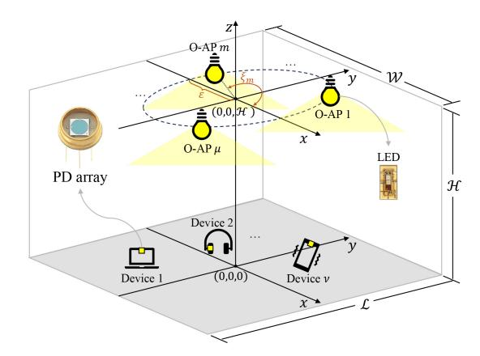

Fig. 1. System model of the proposed O-ISAC framework.

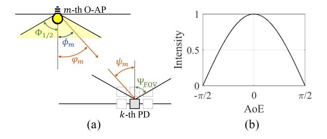

Fig. 2. (a) Workflow of the proposed two-phase O-ISAC system. (b) Radiation pattern of an LED.

### A. Propagation Model of Light Source

Radiation patterns defined in optical band is a similar concept as in RF band to describe the directional distribution of electromagnetic energy radiated by an LED. They illustrate how the intensity of the radiated signal varies with direction. However, unlike omnidirectional RF antennas, LED signal propagation is limited by its line-of-sight characteristics and physical packaging. Furthermore, while the radiation pattern of RF antennas is described by Maxwell's equations, that of LED-based light is explained through quantum theory, necessitating fundamentally different formulations. Therefore, our first step involves modeling the propagation patterns of LED to effectively analyze the RSS at the devices.

In this article, we adopt the Lambertian model [31] to characterize the radiation pattern of LED. Consider the mth O-AP. As depicted in Fig. 2(a), the LED has a semi-angle at half power, denoted by  $\Phi_{1/2}$ , and the Angle of Emission (AoE) of light beams  $\phi_m$  is constrained within  $0 \le \phi_m \le \Phi_{1/2}$ . Fig. 2(b) illustrates the radiation pattern, depicting the relationship between normalized intensity and the AoE. The AoD of a light beam is denoted by  $\varphi_m$ , and from Fig. 2, we have  $\phi_m = \varphi_m$ . Later in Section V, we will integrate collimating lenses into our setup to manipulate the radiation pattern of the emitted light, in which case the direction of the light beam can be steered, and  $\varphi_m$  is different from  $\phi_m$ .

Consider a specific device. We index the  $\kappa$  PDs by  $\{k : k = 1, 2, ..., \kappa\}$  and denote the coordinates of these PDs by  $\mathbf{p}_{P,k} = (x_{P,k}, y_{P,k}, z_{P,k})$ . As depicted in Fig. 2, each PD has a half-angle field of view (FOV) denoted by  $\Psi_{\text{FOV}}$ , and the Angle

of Arrival (AoA)  $\psi_m$ :  $0 \le \psi_m \le \Psi_{FOV}$ . When the O-APs and PDs are vertically oriented, we have  $\psi_m = \varphi_m$ .

Suppose the effective area of a PD is  $A_{\text{unit}}$ , the received light intensity of the kth PD from the mth O-AP is

$$I_{m,k}^{\text{TX}}(x_{P,k}, y_{P,k}, \varepsilon, \xi_m, R(\varphi_m))$$

$$= I^{\text{TX}} \cdot \underbrace{\int \frac{m_0 + 1}{2\pi} \cos^{m_0}(\phi_m(\varphi_m, \lambda)) \chi(\lambda) d\lambda}_{R(\varphi_m)} \cdot \underbrace{\frac{A_{\text{unit}} \cos \psi_m}{d_{m,k}^2}}_{\Omega(\varepsilon, \xi_m)}$$
(2)

where

- 1)  $I^{tx}$  is the total light intensity emitted from the LED. Without loss of generality, we set  $I^{tx} = 1$ .
- 2)  $R(\varphi_m)$  is the radiation pattern of the LED considering all wavelengths emitted by a single light source, and  $\chi(\lambda)$  is the distribution of wavelength  $\lambda$  with  $\int \chi(\lambda)d\lambda = 1$ .  $m_0 = -(1/[\log_2(\cos \Phi_{1/2})])$  is Lambert's mode number, and we set  $m_0 = 1$  as the typical half-power angle is  $\pi/3$ . In the absence of the collimating lens, we have  $\phi_m(\varphi_m, \lambda) = \varphi_m$ , and  $R(\varphi_m)$  can be refined as  $R(\varphi_m) = (1/\pi)\cos\varphi_m$ .
- 3)  $\Omega(\psi_m)$  is the solid angle, in which  $A_{\text{unit}}$  is the unit area both for optical communication and optical sensing, and  $d_{m,k}$  represents the distance between the *m*th O-AP and the *k*th PD  $(x_{P,k}, y_{P,k}, z_{P,k})$ .

### B. Optical Communication

Unlike radio communication, phase modulation and coherent detection in optical communication are very expensive to realize, as it is challenging to match the frequency and polarization of the local laser with that of the incoming optical signal, or even impossible due to the incoherent light emitted by light sources such as LED [32]. The modulation and demodulation schemes that find wide applications in optical communication systems are IM/DD.

Consider an orthogonal frequency-division multiplexing (OFDM)-enabled O-ISAC system with N orthogonal subcarriers. Let  $U = [u_1, u_2, \dots, u_L] \in \mathbb{C}^{(N/2-1)\times L}$  be a matrix to be sent to the devices. For intensity modulation, we adopt the debiased optical OFDM (DCO-OFDM) strategy, which involves two key steps.

1) Applying Hermitian symmetry [33] to the inputs of the inverse discrete Fourier transform (IDFT). That is, we construct  $X = [x_1, x_2, ..., x_L] \in \mathbb{C}^{N \times L}$ , where

$$\mathbf{x}_{\ell} = \left[0, u_{1,\ell}, u_{2,\ell}, \dots, u_{N/2-1,\ell}, 0, u_{N/2-1,\ell}^*, \dots, u_{2,\ell}^*, u_{1,\ell}^*\right]^{\mathsf{T}}$$
(3)

 $\ell = 1, 2, ..., L$ , and perform an *N*-point IDFT yielding real-valued OFDM samples  $V \in \mathbb{R}^{N \times L}$ .

2) Introducing a dc bias in the LED's driving circuit to ensure the signal remains nonnegative.

&lt;sup>1Practical optical sources cannot produce light of a single frequency, as illustrated in Fig. 7(b).

Recall that we use lowercase bold letters to represent the column-wise vectorized form of a matrix, e.g.,  $x \triangleq \text{vec}(X)$  and  $v \triangleq \text{vec}(V)$ . The transformation from x to v is

$$v = \frac{1}{\sqrt{N}} (I_L \otimes F_N^H) x \tag{4}$$

where  $F_N$  denotes the N-point discrete Fourier transform (DFT) matrix ( $F_N^H$  is the IDFT matrix),  $\otimes$  is the Kronecker product, and  $I_L$  is the L-dimensional identity matrix. The transmitted signal after pulse shaping can be written as [34]

$$s(t) = \sum_{\ell=0}^{L-1} \sum_{n=0}^{N-1} v[n+\ell N] g(t - nT_{\text{sam}} - \ell T_{\text{sym}})$$
 (5)

where  $g(\cdot)$  is the shaping pulse,  $T_{\text{sam}}$  is the sample duration, and  $T_{\text{sym}}$  is the OFDM symbol duration,  $T_{\text{sym}} = NT_{\text{sam}}$ .

Without loss of generality, we consider one device in the system. The signal received by the kth  $(k = 1, 2, ..., \kappa)$  PD can be written as

$$r_{k}(t) = \sum_{m=1}^{\mu} s(t) * \left[ h_{m,k} \delta \left( t - \frac{d_{m,k}}{c} \right) \right] + w_{k}(t)$$

$$= \sum_{m=1}^{\mu} s \left( t - \frac{d_{m,k}}{c} \right) h_{m,k} + w_{k}(t)$$
(6)

where  $d_{m,k}$  denotes the distance between the *m*th O-AP and the *k*th device, and  $w_k(t)$  is additive white Gaussian noise (AWGN) added to the electrical domain signal [35], [36]. According to (2), the channel gain between the *m*th O-AP and the *k*th PD can be written as

$$h_{m,k} = \frac{I_{m,k}^{\text{TX}}}{I^{\text{TX}}} \stackrel{(a)}{=} \frac{A_{\text{unit}}}{\pi d_{m,k}^2} \cos \varphi_m \cos \psi_m = \frac{A_{\text{unit}} \mathcal{H}^2}{\pi d_{m,k}^4}$$
(7)

where (a) follows from (2) without optical beamforming. At the receiver, we sample  $r_k(t)$  and perform DFT, yielding

$$\mathbf{y}_{k}[n+\ell N] = \mathbf{x}[n+\ell N]\mathbf{\Delta}_{k}^{\top}\mathbf{h}_{k} + \mathbf{w}_{k}[n+\ell N]$$
(8)

where  $\Delta_k = [e^{-j2\pi(n/N)(d_{1,k}/[cT_{sam}])}, e^{-j2\pi(n/N)(d_{2,k}/[cT_{sam}])}, \ldots, e^{-j2\pi(n/N)(d_{\mu,k}/[cT_{sam}])}]^{\top}$  is a phase matrix,  $\boldsymbol{h}_k = [h_{1,k}, h_{2,k}, \ldots, h_{\mu,k}]^{\top}$  is the channel coefficient vector, and  $\boldsymbol{w}_k[n+\ell N] \sim \mathcal{N}(0, \sigma^2)$ . Compared to RF communication, IM/DD exclusively relies on measuring the intensity of light rather than its phase. Consequently, optical carriers do not introduce extra phase shifts at the baseband due to time offsets.

Overall, the signal received by all  $\kappa$  PDs can be written in a compact form as

$$y = x \begin{bmatrix} \mathbf{\Delta}_1^{\top} \mathbf{h}_1 & \mathbf{\Delta}_2^{\top} \mathbf{h}_2 & \cdots & \mathbf{\Delta}_{\kappa}^{\top} \mathbf{h}_{\kappa} \end{bmatrix} + \begin{bmatrix} \mathbf{w}_1 & \cdots & \mathbf{w}_{\kappa} \end{bmatrix}.$$
(9)

To decode the transmitted signal, we employ the maximum ratio combining (MRC) [37]

$$\mathbf{y}_{\mathrm{MRC}} = \mathbf{x} \sum_{k=1}^{\kappa} \left\| \mathbf{\Delta}_{k}^{\top} \mathbf{h}_{k} \right\|^{2} + \sum_{k=1}^{\kappa} \left\| \mathbf{w}_{k} \mathbf{\Delta}_{k}^{\top} \mathbf{h}_{k} \right\|^{2}$$
(10)

from which an estimate of x is given by

$$\widehat{\boldsymbol{x}} = \frac{\boldsymbol{y}_{\text{MRC}}}{\sum_{k=1}^{\kappa} \|\boldsymbol{\Delta}_{k}^{\top} \boldsymbol{h}_{k}\|^{2}}.$$
(11)

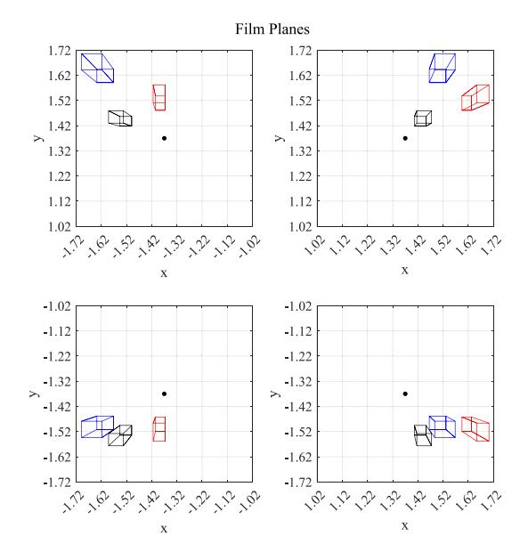

Fig. 3. Illustration of the film planes captured by the pinhole cameras of four optical O-APs. Each file plane has a 2-D coordinate system.

With  $\widehat{X} \triangleq devec(\widehat{x})$ , the transmitted message can be reconstructed as

$$\widehat{U}[n,\ell] = \frac{1}{2} \Big( \widehat{X}[n+1,\ell] + \widehat{X}^*[N+1-n,\ell] \Big). \tag{12}$$

### C. Optical Sensing

Optical sensing aims to detect and measure various physical, chemical, or biological parameters, such as position, temperature, pressure, and medical diagnostics. In this article, we focus on positional sensing to estimate the 3-D coordinate of a target device.

In RF-ISAC systems [8], a critical assumption is that there exists only a finite number of scatters in the environment, hence the number of echoes is small. This is because excessive echo interference can overpower the desired signal, resulting in a low signal-to-interference-and-noise ratio. In contrast, this article considers a more realistic setup, where all objects in the environment can be reflectors and the reflected light from all range bins can be collected by the optical sensor.

Unlike RF-ISAC which analyzes the composition of the received signal to extract sensing information, we utilize the pinhole imaging principle to map all reflected light onto a film plane for sensing. Thanks to the ultrahigh frequency characteristics of the optical signal, the undesired reflected light is separated from the desired reflections as they are mapped to distinct pixel locations on the film plane, effectively avoiding interference. An illustration is given in Fig. 3, in which the pinhole cameras of the O-APs capture  $\mu$  images of the environment from  $\mu$  perspectives.

Before exploring the optical sensing operations, let us clarify the relative coordinate systems in the system model. As summarized in Table I, the coordinates of both LEDs and PDs defined earlier are based on the real-world coordinate system. We assume the PD array is placed at the center of the target device. Therefore, in the real-world coordinate system, the

TABLE I SUMMARY OF THE COORDINATE SYSTEMS

| Coordinate Systems                                       | Objects                                                                                 | Coordinates                                                                                                                                                                                                         |
|----------------------------------------------------------|-----------------------------------------------------------------------------------------|---------------------------------------------------------------------------------------------------------------------------------------------------------------------------------------------------------------------|
| The 3D real-world coordinate system in Fig. 1            | The $m$ -th LED and pinhole The $k$ -th PD of the target device The target device | $egin{aligned} oldsymbol{p}_{	ext{OAP},m} &= (arepsilon \cos \xi_m, arepsilon \sin \xi_m, \mathcal{H}) \ oldsymbol{p}_{P,k} &= (x_{P,k}, y_{P,k}, z_{P,k}) \ oldsymbol{p}_D &= (x_{D}, y_{D}, z_{D}) \end{aligned}$ |
| The 3D camera coordinate system of the <i>m</i> -th O-AP | The target device                                                                       | $m{p}_{C,m} = (x_{C,m}, y_{C,m}, z_{C,m})$                                                                                                                                                                          |
| The 2D film plane coordinate system of the m-th O-AP     | The target device                                                                       | $\boldsymbol{p}_m = (x_m, y_m)$                                                                                                                                                                                     |

coordinate of the target device, denoted by  $\mathbf{p}_D = (x_D, y_D, z_D)$ , corresponds to the center of the PD array.

The pinhole camera of each O-AP also maintains a 3-D coordinate system, called the camera coordinate system, wherein the pinhole is the origin with the coordinate (0, 0, 0). Without loss of generality, we design the  $\mu$  camera coordinate systems such that they share the same orientation. In other words, the 3-D coordinate of the target device in the mth camera coordinate system  $\mathbf{p}_{C,m} = (x_{C,m}, y_{C,m}, z_{C,m})$  satisfies

$$x_{C,m} = x_{C,1} + \varrho_{x,m}, \ y_{C,m} = y_{C,1} + \varrho_{y,m}, \ z_{C,m} = z_{C,1}$$
 (13)

where  $\varrho_{x,m}$  and  $\varrho_{y,m}$  are constants since the relative positions among cameras are fixed. The above transformations facilitate us to represent  $\boldsymbol{p}_{C,m}$   $\forall m$  using  $\boldsymbol{p}_{C,1}$ . For the target device, the coordinates  $\boldsymbol{p}_{C,m}$  (under the camera coordinate system of the mth O-AP) and  $\boldsymbol{p}_D$  (under the real-world coordinate system) can be transformed to each other via [38]

$$\begin{bmatrix} \mathbf{p}_{C,m} \\ 1 \end{bmatrix} = \begin{bmatrix} \mathbf{Q}_m & t_m \\ 0 & 1 \end{bmatrix} \begin{bmatrix} \mathbf{p}_D \\ 1 \end{bmatrix}$$

where  $\{Q_m : m = 1, 2, ..., \mu\}$  are  $3 \times 3$  rotation matrices,  $\{t_m : m = 1, 2, ..., \mu\}$  are  $3 \times 1$  positional vectors, and  $\{Q_m\}$  and  $\{t_m\}$  denote the exterior orientation parameters (EOPs).

Each film plane has a 2-D plane coordinate system. We denote by  $p_m = (x_m, y_m)$  the coordinate of the target device on the 2-D plane coordinate systems. According to the pinhole imaging principle,  $p_m$  can be obtained from either  $p_{C,m}$  or  $p_D$ . Their relationships can be written as

$$z_{C,m} \begin{bmatrix} \boldsymbol{p}_m \\ 1 \end{bmatrix} = \begin{bmatrix} f_{x,m} & 0 & 0 \\ 0 & f_{y,m} & 0 \\ 0 & 0 & 1 \end{bmatrix} \boldsymbol{p}_{C,m} \triangleq \boldsymbol{K}_m \boldsymbol{p}_{C,m}$$
 (15)

where  $f_{x,m}$  and  $f_{y,m}$  are interior parameters (focal lengths) of the pinhole camera and  $K_m$  denotes the interior orientation parameters (IOPs). In particular, we assume the IOPs of the cameras are the same and define  $K_m \triangleq K$ .

Given the sensed images, we perform image processing algorithms to estimate the coordinates of the target. The estimation accuracy depends on both the light intensity and the contrast ratio. Since the received light intensity is contaminated by AWGN, the coordinate estimation error follows Gaussian distributions when the pixel size is sufficiently small. Therefore, we can write the estimated coordinates as

$$\widehat{\boldsymbol{p}}_{m} = \boldsymbol{p}_{m} + \boldsymbol{e}_{m} = \begin{bmatrix} x_{m} \\ y_{m} \end{bmatrix} + \begin{bmatrix} e_{x,m} \\ e_{y,m} \end{bmatrix}$$
 (16)

where the variance of the estimation error is inversely propositional to the light intensity, i.e.,  $e_{x,m}$ ,  $e_{y,m} \sim \mathcal{N}[0, \eta(\sigma_I^2/I_m^{\text{ref}})],^2$  and  $\eta$  is a scaling factor determined by the related size of the film plane to the environment and the distance of the film plane to the pinhole;  $\sigma_I^2$  is the variance of AWGN in the received light;  $I_m^{\text{ref}}$  is the reflected light intensity given by

$$I_{m,k}^{\text{ref}} = \left[\sum_{m=1}^{\mu} I_{m,k}^{\text{rx}}\right] \cdot \rho_{\text{ref}} A_{\text{unit}} \frac{\cos \varphi_m}{d_{m,k}^2}$$
(17)

where  $I_{m,k}^{\text{TX}}$  is defined in (2), and the first term (i.e., the summation) represents the superposition of the intensities of all light sources on the reflectors;  $\rho_{\text{ref}}$  is the reflection coefficient of the reflector;  $A_{\text{unit}}$  represents the area of the reflector;  $\varphi_m$  is the Angle of Incidence (AoI) of the reflected signal, which is equal to the AoD of the mth O-AP. Equations (2) and (17) also highlight the synergy between optical sensing and optical communication. Our proposed optical ISAC system is designed to utilize data transmission signals for sensing purposes, addressing the absence of inherent sensing signals. This innovative approach negates the necessity for additional light sources and circumvents reliance on ambient light, streamlining the system for enhanced efficiency.

From (13), (15), and (16), we have

$$z_{C,1} \begin{bmatrix} \widehat{\boldsymbol{p}}_m \\ 1 \end{bmatrix} = \boldsymbol{K} \boldsymbol{p}_{C,m} + \begin{bmatrix} \boldsymbol{e}_m \\ 1 \end{bmatrix} = \boldsymbol{K} (\boldsymbol{p}_{C,1} + \boldsymbol{v}_m) + \begin{bmatrix} \boldsymbol{e}_m \\ 1 \end{bmatrix} \quad (18)$$

where  $m = 1, 2, ..., \mu$ . After some manipulations, (18) can be reorganized into a more compact form as

$$\begin{bmatrix} 0 \\ 0 \\ \dots \\ -f_{x}\varrho_{x,m} \\ -f_{y}\varrho_{y,m} \end{bmatrix} = \begin{bmatrix} f_{x} & 0 & -\widehat{x}_{1} + e_{x,1} \\ 0 & f_{y} & -\widehat{y}_{1} + e_{y,1} \\ \dots & \dots & \dots \\ f_{x} & 0 & -\widehat{x}_{m} + e_{x,m} \\ 0 & f_{y} & -\widehat{y}_{m} + e_{y,m} \end{bmatrix} \begin{bmatrix} x_{C,1} \\ y_{C,1} \\ z_{C,1} \end{bmatrix}$$

$$\triangleq \boldsymbol{\gamma} = \boldsymbol{\Sigma} \boldsymbol{p}_{C,1}. \tag{19}$$

2The detection of pixel intensity on the film plane follows a Gaussian distribution [39]. As a result, the coordinates derived from this process also adhere to a Gaussian distribution centered around their actual positions. This outcome stems from the mapping of intensity to coordinates, approximated through a first-order Taylor expansion, effectively rendering it a linear combination of Gaussian variables.

Note that  $\gamma$  is a constant vector. From the sensed  $\hat{p}_m$  in (16), we can construct an estimated  $\hat{\Sigma}$  as

$$\widehat{\boldsymbol{\Sigma}} = \begin{bmatrix} f_x & 0 & -\widehat{x}_1 \\ 0 & f_y & -\widehat{y}_1 \\ \cdots & \cdots & \cdots \\ f_x & 0 & -\widehat{x}_m \\ 0 & f_y & -\widehat{y}_m \\ \cdots & \cdots & \cdots \end{bmatrix}.$$

Then,  $\widehat{p}_{C,1}$  is estimated by

$$\widehat{\boldsymbol{p}}_{C,1} = \left(\widehat{\boldsymbol{\Sigma}}^{\top}\widehat{\boldsymbol{\Sigma}}\right)^{-1}\widehat{\boldsymbol{\Sigma}}^{\top}\boldsymbol{\gamma}.$$
 (20)

Finally, the 3-D coordinates of the target device in the real-world coordinate system are calculated from (14) as

$$\begin{bmatrix} \widehat{\boldsymbol{p}}_D \\ 1 \end{bmatrix} = \begin{bmatrix} \boldsymbol{Q}_1 & \boldsymbol{t}_1 \\ 0 & 1 \end{bmatrix}^{-1} \begin{bmatrix} \widehat{\boldsymbol{p}}_{C,1} \\ 1 \end{bmatrix}. \tag{21}$$

We use the MSE of the coordinates to measure the sensing accuracy, giving

$$MSE_P = \mathbb{E}\left\{\|\widehat{\boldsymbol{p}}_D - \boldsymbol{p}_D\|^2\right\}. \tag{22}$$

It is worth noting that 1) there must be at least two pinhole cameras to ensure that the row rank of matrix  $\Sigma$  in (19) is larger than 3 and 2) a simple expansion of the matrices in (19) and (20) enables simultaneous estimation of multiple targets at arbitrary positions, including those at different heights, as illustrated in Fig. 3. This matches our intuition, as each camera observes 2-D information, necessitating at least two or more cameras to provide sufficient degrees of freedom for estimating positions in the 3-D space.

# IV. SYNERGIES BETWEEN OPTICAL SENSING AND OPTICAL COMMUNICATION

Section III details the signal processing of both sensing and communication in our O-ISAC system. Expanding upon the signal flow, this section will uncover the connections between the factors that impact the performance of optical sensing and optical communication. Through the exploration, we will unite these two processes seamlessly, forming a two-phase O-ISAC operation mechanism. Then, we shall turn our attention to optimizing the arrangement of light sources within the room. This strategic optimization promises to boost the effectiveness of the first phase of O-ISAC.

# A. Synergies Between Optical Sensing and Optical Communication and Two-Phase Operation Mechanism

Drawing from (10), we can express the SNR in optical communication as

$$SNR = \frac{\sum_{k=1}^{\kappa} \left\| \mathbf{\Delta}_{k}^{\top} \mathbf{h}_{k} \right\|^{2}}{\sigma^{2}}.$$
 (23)

Thus, the decoding performance of optical communication is reliant on the equivalent channel gain at the

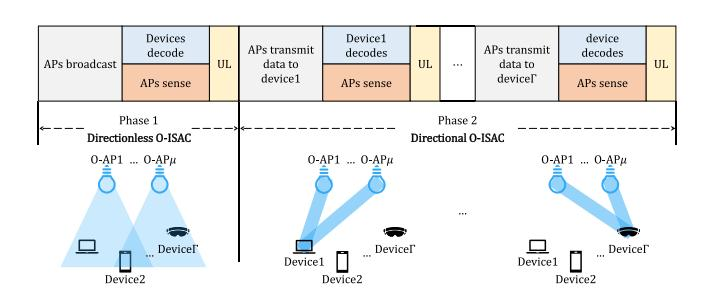

Fig. 4. Workflow of the proposed two-phase O-ISAC system.

baseband  $\sum_{k=1}^{\kappa} \|\mathbf{\Delta}_k^{\top} \mathbf{h}_k\|^2$ . In particular, it can be further refined as

$$\sum_{k=1}^{K} \left\| \mathbf{\Delta}_{k}^{\top} \mathbf{h}_{k} \right\|^{2} \\
= \sum_{k=1}^{K} \left[ \sum_{m=1}^{\mu} e^{-j2\pi \frac{n}{N} \frac{d_{m,k}}{cT_{\text{sam}}}} h_{m,k} \right] \left[ \sum_{m=1}^{\mu} e^{-j2\pi \frac{n}{N} \frac{d_{m,k}}{cT_{\text{sam}}}} h_{m,k} \right]^{*} \\
\stackrel{(a)}{\approx} \sum_{k=1}^{K} \left[ e^{-j2\pi \frac{n}{N} \frac{d_{1,k}}{cT_{\text{sam}}}} \sum_{m=1}^{\mu} h_{m,k} \right] \left[ e^{-j2\pi \frac{n}{N} \frac{d_{1,k}}{cT_{\text{sam}}}} \sum_{m=1}^{\mu} h_{m,k} \right]^{*} \\
= \sum_{k=1}^{K} \left[ \sum_{m=1}^{\mu} h_{m,k} \right]^{2} \stackrel{(b)}{=} \sum_{k=1}^{K} \left[ \sum_{m=1}^{\mu} I_{m,k}^{\text{rx}} \right]^{2}. \tag{24}$$

where (a) follows thanks to IM/DD—the receiver measures the amplitude, as opposed to the phase, of the received signal for decoding. As a result, only the baseband subcarrier can cause phase shifts on the received symbols. Since the time delays are relatively small compared with the OFDM symbol duration, the additional phase shifts on different subcarriers are approximately the same. (b) follows from (7). Overall, the equivalent channel gain in optical communication is proportional to the received light intensity at each PD  $\sum_{m=1}^{\mu} I_{m,k}^{rx}$ .

When it comes to optical sensing, on the other hand, the performance of optical sensing relies also on the intensity of the light received by the target PD, as indicated in the first term of (16). This underscores the interconnected nature of optical communication and optical sensing. Essentially, we can work toward optimizing the O-ISAC system with a shared objective, i.e.,  $\sum_{m=1}^{\mu} I_{m,k}^{rx}$ , without sacrificing the performance of either the optical communication or optical sensing aspects. This synergy between our goals makes the optimization process more efficient and beneficial for the overall functionality of O-ISAC.

In  $I_{m,k}^{rx}(x_{P,k}, y_{P,k}, \varepsilon, \xi_m, R(\varphi_m))$ ,  $x_{P,k}$  and  $y_{P,k}$  are the devices' position, which is uncontrollable,  $\varepsilon$  and  $\xi_m$  are the O-AP coordinates, and  $R(\varphi_m)$  is the radiation pattern of the light source. Therefore, we can maximize  $\sum_{m=1}^{\mu} I_{m,k}^{rx}$  by finding the optimal  $\varepsilon$ ,  $\xi_m$ , and  $R(\varphi_m)$ . Specifically, optimizing the light source distribution is crucial for system performance in broadcast scenarios, enabling the detection of a broader range of devices; on the other hand, concentrating light intensity is suitable for scenarios targeting specific devices. In this context, we can divide the O-ISAC system into two operation phases, the workflows of which are illustrated in Fig. 4.

- Phase 1 (Directionless O-ISAC): The O-APs broadcast a control message to all devices periodically in Phase 1, and sense the devices' states globally based on the reflected light. The system's performance in this phase is primarily influenced by the arrangement of the light sources. In Section IV-B, we will present specific optimization strategies to enhance the area within the room where the superimposed optical intensity exceeds a predefined threshold.
- 2) Phase 2 (Directional O-ISAC): The O-APs serve the devices in a TDMA fashion. Given the sensed states in the first phase, the communications between the O-APs and devices are improved by optical beamforming, a technique that adjusts the emitted light intensity distribution of the optical source. In phase 2, our optimization objective is to refine the radiation pattern  $R(\varphi_m)$  of the light sources in order to achieve the convergence of optical intensity across all O-APs and concentrate it on the target object. The O-APs further utilize the enhanced reflected light of phase 2 to accurately sense and track the devices' states. Further details are provided in Section V.

### B. Source Layout Optimization

In the first phase of O-ISAC, the O-APs lack any a priori knowledge about the location of mobile users. Additionally, the O-APs' emitted light follows a fixed radiation pattern governed by the Lambertian model, which inherently limits control over the distribution of light intensity. Consequently, the received light intensity is determined by the distribution of optical sources, making the optimization of their physical arrangement crucial for enhancing the overall RSS across the coverage area.

In traditional optical communication endeavors, a commonly employed optimization criterion for light source distribution is uniformity [40], [41], [42], where the objective is to achieve the most even light intensity across a given plane. More rigorously, such metrics can be quantified as the MSE of the RSS. The goal is to find the optimal LED distribution to minimize the MSE of the signal strength

$$\min_{\varepsilon, \{\xi_m\}} \frac{1}{\mathcal{WL}} \int_{-\frac{\mathcal{L}}{2}}^{\frac{\mathcal{L}}{2}} \int_{-\frac{\mathcal{W}}{2}}^{\frac{\mathcal{W}}{2}} \left[ \sum_{m} I_{m,k}^{\text{rx}} - \mathbb{E} \left\{ \sum_{m} I_{m,k}^{\text{rx}} \right\} \right]^2 dx dy. \quad (25)$$

Optimizing (25) enables the device to receive a consistently stable optical signal while in motion within the room.

While this traditional distribution method strive for uniform light intensity to provide stable performance across different locations, achieving such evenness may come at the cost of reduced signal strength in any specific location, particularly under constrained power budgets. Uniform intensity, while desirable for certain purposes, risks diluting overall communication reliability and sensing accuracy. Therefore, in this article, we put forth a distinct optimization criterion. First, we establish a threshold  $\rho_I$  that corresponds to an acceptable communication and sensing performance. Our optimization objective is to maximize the extent of the area within the room where the RSS surpasses the threshold, or it can be

interpreted as the distribution that maximizes the likelihood of the RSS exceeding the threshold when mobile devices are uniformly distributed. Due to the path loss of light, comparisons can only be made for distributions on the same plane. Since the ground level experiences the most significant light intensity attenuation within a room, optimizations are conducted at ground level for simplicity and without loss of generality, i.e.,  $z_{P,k} = 0$ . By substituting  $\mathcal{H} - z_{P,k}$  for  $\mathcal{H}$ , expressions for various altitudes can be derived. Overall, our proposed system is designed to serve devices at any altitude, accommodating those positioned at differing heights simultaneously. Specifically, we formulate (P1)

$$\max_{\varepsilon, \{\xi_m\}} \quad \frac{1}{\mathcal{WL}} \int_{-\frac{\mathcal{L}}{2}}^{\frac{\mathcal{L}}{2}} \int_{-\frac{\mathcal{W}}{2}}^{\frac{\mathcal{W}}{2}} \frac{1}{2} \left[ \operatorname{sgn} \left( \sum_{m} I_{m,k}^{\operatorname{rx}} - \rho_I \right) + 1 \right] dx dy$$
(26a)

s.t. 
$$I_{m,k}^{\text{rx}} = R(\varphi_m) \cdot \frac{A_{\text{unit}} \cos \psi_m}{d_{m,k}^2}$$
 (26b)

$$R(\varphi_m) = \frac{1}{\pi} \cos \varphi_m$$

$$d_{m,k} = \sqrt{\left(\varepsilon \cos \xi_m - x_{P,k}\right)^2 + \left(\varepsilon \sin \xi_m - y_{P,k}\right)^2 + \mathcal{H}^2}$$
(26c)

$$d_{m,k} = \sqrt{\left(\varepsilon \cos \xi_m - x_{P,k}\right)^2 + \left(\varepsilon \sin \xi_m - y_{P,k}\right)^2 + \mathcal{H}^2}$$
(26d)

$$0 \le \varepsilon \le \min{\{\mathcal{W}, \mathcal{L}\}} \tag{26e}$$

$$0 \le \xi_m < 2\pi, \ m = 1, 2, \dots, \mu.$$
 (26f)

As can be seen, our proposed optimization strategy focuses on maximizing the spatial extent where the RSS meets or surpasses a predefined threshold for acceptable communication and sensing performance. This targeted optimization approach ensures sufficient light intensity over broader areas, offering practical performance improvements over the traditional uniform distribution approach.

Theorem 1: In the first phase of O-ISAC, the optimal source layout that maximizes the proportion of areas exceeding the threshold  $\rho_I$ , i.e., the optimal solution to (P1), can be approximated by  $\mathbf{p}_{\text{O-AP},m}^* = (\varepsilon^* \cos \xi_m^*, \varepsilon^* \sin \xi_m^*, \mathcal{H})$ , where

$$\varepsilon^* = \sqrt{\frac{\sqrt{\frac{5A_{\text{unit}}\mathcal{H}^2}{2\pi\rho_I}} - \mathcal{H}^2}{\tan^2\frac{\pi}{\rho_I}}}, \quad \xi_m^* = \frac{2\pi(m-1)}{\mu} + \frac{\pi}{4}. \quad (27)$$

We next prove Theorem 1. To find the optimal value  $\varepsilon^*$ , we first discuss the critical condition in (26a). Let

$$\rho_{I} = \sum_{m} I_{m,k}^{\text{rx}} \stackrel{(a)}{=} \sum_{m=1}^{\mu} \frac{A_{\text{unit}}}{\pi} \frac{\mathcal{H}^{2}}{d_{m,k}^{4}}$$

$$\stackrel{(b)}{=} \sum_{m=1}^{\mu} \left[ \frac{A_{\text{unit}}}{\pi} \cdot \frac{\mathcal{H}^{2}}{\left( (\varepsilon \cos \xi_{m} - x)^{2} + (\varepsilon \sin \xi_{m} - y)^{2} + \mathcal{H}^{2} \right)^{2}} \right]$$
(28)

where (a) follows from (7), and (b) follows from (26d). Analytically solving (28) is quite challenging. The difficulty arises from the intricate complexities in determining the light intensity distribution when multiple distributed light signals intersect at a target point (i.e., the summation over m). To meet the analytical challenges, we make two assumptions:

1) all LEDs are uniformly distributed on the circle and 2) the area that exceeds the threshold is maximized when the critical point on the symmetry axis between adjacent light sources is farthest from the origin. The accuracy of the assumptions will be confirmed later through simulations.

From the first assumption, we can assume an initial phase angle of  $\xi_m = (\pi/\mu)(2m-1)$ , meaning that the first and  $\mu$ th O-APs are symmetrically distributed about the x-axis, with the positive x-axis serving as the symmetry axis for the first and  $\mu$ th O-APs. Since the intensity of light rapidly attenuates with distance, we can only consider the impact of adjacent LEDs. Assuming that the two adjacent LEDs provide the majority of the light intensity at the critical point on the positive x-axis, we can derive the following relationship:

$$\frac{4}{5}\rho_{I} \approx \sum_{m=1,\mu} I_{m,k}^{\text{rx}} = \sum_{m=1,\mu} \frac{A_{\text{unit}}}{\pi} \frac{\mathcal{H}^{2}}{\left(\varepsilon^{2} + \mathcal{H}^{2} + x^{2} - 2\varepsilon\cos\frac{\pi}{\mu}x\right)^{2}}.$$
(29)

The first and  $\mu$ th O-APs are symmetric. Considering the light intensity brought by one of them, we get

$$\frac{2}{5}\rho_I \approx \frac{A_{\text{unit}}}{\pi} \frac{\mathcal{H}^2}{\left(\varepsilon^2 + \mathcal{H}^2 + x^2 - 2\varepsilon\cos\frac{\pi}{\mu}x\right)^2}.$$
 (30)

Next, we need to find the value of  $\varepsilon$  that maximizes x. Taking the partial derivative of both sides with respect to (w.r.t.)  $\varepsilon$ , we obtain

$$0 = \frac{-2\left(2\varepsilon + 2x\frac{\partial}{\partial\varepsilon}x - 2\cos\frac{\pi}{\mu}x - 2\varepsilon\cos\frac{\pi}{\mu}\frac{\partial}{\partial\varepsilon}x\right)}{\left(\varepsilon^2 + \mathcal{H}^2 + x^2 - 2\varepsilon\cos\frac{\pi}{\mu}x\right)^3}.$$
 (31)

Substituting  $(\partial/\partial \varepsilon)x = 0$  into (31), we get

$$0 = \frac{\varepsilon - \cos\frac{\pi}{\mu}x}{\left(\varepsilon^2 + \mathcal{H}^2 + x^2 - 2\varepsilon\cos\frac{\pi}{\mu}x\right)^3}.$$
 (32)

Combining (32) and (30), the optical  $\varepsilon^*$  can be solved, yielding (27).

Then, we proceed to solve for the optimal phase angle  $\xi_m^*$ . Under the assumption that all LEDs are uniformly distributed on the circle, we can define an initial phase angle as  $\xi_0$  =  $\xi_m - ([2\pi m]/\mu)$ . Thus, the next step is to determine the optimal initial phase angle  $\xi_0^*$ . Similar to finding the optimal radius  $\varepsilon^*$ , we first consider the critical condition as

$$\rho_{I} = \sum_{m=1}^{\mu} \left[ \frac{A_{\text{unit}}}{\pi} \cdot \frac{\mathcal{H}^{2}}{\left( \left( \varepsilon^{*} \cos \left( \xi_{0} + \frac{2\pi m}{\mu} \right) - x \right)^{2} + \left( \varepsilon^{*} \sin \left( \xi_{0} + \frac{2\pi m}{\mu} \right) - y \right)^{2} + \mathcal{H}^{2} \right)^{2}} \right]. \tag{33}$$

In (33), we can treat x and y as functions of  $\xi_0$ , and find  $\xi_0$  that maximizes both x and y. Taking the partial derivative of (33) w.r.t.  $\xi_0$ , we have

$$\sum_{m=1}^{\mu} \frac{1}{\left[\left[\varepsilon^* \cos\left(\xi_0 + \frac{2\pi m}{\mu}\right) - x\right]^2 + \left[\varepsilon^* \sin\left(\xi_0 + \frac{2\pi m}{\mu}\right) - y\right]^2 + \mathcal{H}^2\right]^3} \cdot \left[\left[\varepsilon^* \cos\left(\xi_0 + \frac{2\pi m}{\mu}\right) - x\right] \cdot \left(-\varepsilon^* \sin\left(\xi_0 + \frac{2\pi m}{\mu}\right) - \frac{\partial}{\partial \xi_0} x\right)\right]$$

$$+\left[\varepsilon^* \sin\left(\xi_0 + \frac{2\pi m}{\mu}\right) - y\right] \cdot \left(\varepsilon^* \cos\left(\xi_0 + \frac{2\pi m}{\mu}\right) - \frac{\partial}{\partial \xi_0} y\right)\right] = 0. \tag{34}$$

Since our goal is the extremum values of x and y, we can set  $(\partial/\partial \xi_0)x = (\partial/\partial \xi_0)y = 0$ . Considering the critical points on the diagonal that are farthest from the center of the room, (34) can be refined as

$$\sum_{m=1}^{\mu} \frac{-\sqrt{2}\varepsilon^* \sin\left(\xi_0 + \frac{2\pi m}{\mu} - \frac{\pi}{4}\right)x}{\left[\varepsilon^{*2} + \mathcal{H}^2 + 2x^2 - 2\sqrt{2}\varepsilon^* \sin\left(\xi_0 + \frac{2\pi m}{\mu} + \frac{\pi}{4}\right)x\right]^3} = 0.$$
(35)

We define

$$F(\xi_0) \triangleq \sum_{m=1}^{\mu} \frac{-\sqrt{2}\varepsilon^* \sin\left(\xi_0 + \frac{2\pi m}{\mu} - \frac{\pi}{4}\right)x}{\left[\varepsilon^{*2} + \mathcal{H}^2 + 2x^2 - 2\sqrt{2}\varepsilon^* \sin\left(\xi_0 + \frac{2\pi m}{\mu} + \frac{\pi}{4}\right)x\right]^3}.$$
(36)

Lemma 1:  $F(\xi_0)$  has a rotational symmetry about the  $\xi_a =$  $-(2\pi\mu) + (\pi/4)$ , that is

$$F(\xi_a - \xi_0) = -F(\xi_a + \xi_0). \tag{37}$$

*Proof:* First, when m = 1, we have

$$F(\xi_{a} - \xi_{0})|_{m=1}$$

$$= \frac{-\sqrt{2}\varepsilon^{*} \sin\left(\xi_{a} - \xi_{0} + \frac{2\pi}{\mu} - \frac{\pi}{4}\right)x}{\left[\varepsilon^{*2} + \mathcal{H}^{2} + 2x^{2} - 2\sqrt{2}\varepsilon^{*} \sin\left(\xi_{a} - \xi_{0} + \frac{2\pi}{\mu} + \frac{\pi}{4}\right)x\right]^{3}}$$

$$\stackrel{(a)}{=} \frac{\sqrt{2}\varepsilon^{*} \sin\xi_{0}x}{\left[\varepsilon^{*2} + \mathcal{H}^{2} + 2x^{2} - 2\sqrt{2}\varepsilon^{*} \sin\left(-\xi_{0} + \frac{\pi}{2}\right)x\right]^{3}}$$

$$\stackrel{(b)}{=} \frac{\sqrt{2}\varepsilon^{*} \sin\xi_{0}x}{\left[\varepsilon^{*2} + \mathcal{H}^{2} + 2x^{2} - 2\sqrt{2}\varepsilon^{*} \sin\left(\xi_{0} + \frac{\pi}{2}\right)x\right]^{3}}$$

$$\stackrel{(a)}{=} -\frac{-\sqrt{2}\varepsilon^{*} \sin\left(\xi_{a} + \xi_{0} + \frac{2\pi}{\mu} - \frac{\pi}{4}\right)x}{\left[\varepsilon^{*2} + \mathcal{H}^{2} + 2x^{2} - 2\sqrt{2}\varepsilon^{*} \sin\left(\xi_{a} + \xi_{0} + \frac{2\pi}{\mu} + \frac{\pi}{4}\right)x\right]^{3}}$$

$$= -E(\xi + \xi_{0})|_{x=0}$$
(38)

where (a) follows because  $\xi_a = -(2\pi/\mu) + (\pi/4)$  and (b) follows as  $\sin x$  is symmetry about  $x = (\pi/2)$ .

On the other hand, when  $m = 2, ..., \mu$ , we have

$$\rho_{I} = \sum_{m=1}^{\mu} \left[ \frac{A_{\text{unit}}}{\pi} \cdot \frac{\mathcal{H}^{2}}{\left( \left( \varepsilon^{*} \cos \left( \xi_{0} + \frac{2\pi m}{\mu} \right) - x \right)^{2} + \left( \varepsilon^{*} \sin \left( \xi_{0} + \frac{2\pi m}{\mu} \right) - y \right)^{2} + \mathcal{H}^{2} \right)^{2}} \right]$$

$$(33)$$
In (33), we can treat  $x$  and  $y$  as functions of  $\xi_{0}$ , and find  $\xi_{0}$  that maximizes both  $x$  and  $y$ . Taking the partial derivative of (33)

w.r.t.  $\xi_{0}$ , we have
$$\sum_{m=1}^{\mu} \frac{1}{\left[ \left[ \varepsilon^{*} \cos \left( \xi_{0} + \frac{2\pi m}{\mu} \right) - x \right]^{2} + \left[ \varepsilon^{*} \sin \left( \xi_{0} + \frac{2\pi m}{\mu} \right) - y \right]^{2} + \mathcal{H}^{2} \right]^{3}}$$

$$\cdot \left[ \left[ \varepsilon^{*} \cos \left( \xi_{0} + \frac{2\pi m}{\mu} \right) - x \right] \cdot \left( -\varepsilon^{*} \sin \left( \xi_{0} + \frac{2\pi m}{\mu} \right) - \frac{\partial}{\partial \xi_{0}} x \right) \right]$$

$$= \frac{-\sqrt{2}\varepsilon^{*} \sin \left( \xi_{0} - \frac{2\pi (m-1)}{\mu} \right) x}{\left[ \varepsilon^{*2} + \mathcal{H}^{2} + 2x^{2} - 2\sqrt{2}\varepsilon^{*} \sin \left( -\xi_{0} + \frac{2\pi (m-1)}{\mu} + \frac{\pi}{2} \right) x \right]^{3}}$$

$$= \frac{\sqrt{2}\varepsilon^{*} \sin \left( \xi_{0} - \frac{2\pi (m-1)}{\mu} \right) x}{\left[ \varepsilon^{*2} + \mathcal{H}^{2} + 2x^{2} - 2\sqrt{2}\varepsilon^{*} \sin \left( -\xi_{0} + \frac{2\pi (m-1)}{\mu} + \frac{\pi}{2} \right) x \right]^{3}}$$

$$= \frac{\left[ \varepsilon^{*2} + \mathcal{H}^{2} + 2x^{2} - 2\sqrt{2}\varepsilon^{*} \sin \left( -\xi_{0} + \frac{2\pi (m-1)}{\mu} + \frac{\pi}{2} \right) x \right]^{3}}{\left[ \varepsilon^{*2} + \mathcal{H}^{2} + 2x^{2} - 2\sqrt{2}\varepsilon^{*} \sin \left( -\xi_{0} + \frac{2\pi (m-1)}{\mu} + \frac{\pi}{2} \right) x \right]^{3}}$$

$$= \frac{\left[ \varepsilon^{*2} + \mathcal{H}^{2} + 2x^{2} - 2\sqrt{2}\varepsilon^{*} \sin \left( -\xi_{0} + \frac{2\pi (m-1)}{\mu} + \frac{\pi}{2} \right) x \right]^{3}}{\left[ \varepsilon^{*2} + \mathcal{H}^{2} + 2x^{2} - 2\sqrt{2}\varepsilon^{*} \sin \left( -\xi_{0} + \frac{2\pi (m-1)}{\mu} + \frac{\pi}{2} \right) x \right]^{3}}$$

$$= \frac{1}{\left[ \varepsilon^{*2} + \mathcal{H}^{2} + 2x^{2} - 2\sqrt{2}\varepsilon^{*} \sin \left( -\xi_{0} + \frac{2\pi (m-1)}{\mu} + \frac{\pi}{2} \right) x \right]^{3}}$$

$$= \frac{1}{\left[ \varepsilon^{*2} + \mathcal{H}^{2} + 2x^{2} - 2\sqrt{2}\varepsilon^{*} \sin \left( -\xi_{0} + \frac{2\pi (m-1)}{\mu} + \frac{\pi}{2} \right) x \right]^{3}}$$

$$= \frac{1}{\left[ \varepsilon^{*2} + \mathcal{H}^{2} + 2x^{2} - 2\sqrt{2}\varepsilon^{*} \sin \left( -\xi_{0} + \frac{2\pi (m-1)}{\mu} + \frac{\pi}{2} \right) x \right]^{3}}$$

$$= \frac{1}{\left[ \varepsilon^{*2} + \mathcal{H}^{2} + 2x^{2} - 2\sqrt{2}\varepsilon^{*} \sin \left( -\xi_{0} + \frac{2\pi (m-1)}{\mu} + \frac{\pi}{2} \right) x \right]^{3}}$$

$$= \frac{1}{\left[ \varepsilon^{*2} + \mathcal{H}^{2} + 2x^{2} - 2\sqrt{2}\varepsilon^{*} \sin \left( -\xi_{0} + \frac{2\pi (m-1)}{\mu} + \frac{\pi}{2} \right) x \right]^{3}}$$

$$= \frac{1}{\left[ \varepsilon^{*2} + 2x^{2} - 2\sqrt{2}\varepsilon^{*} \sin \left( -\xi_{0} + \frac{2\pi (m-1)}{\mu} + \frac{\pi}{2} \right) x \right]^{3}}$$

$$= \frac{1}{\left[ \varepsilon^{*2} + 2x^{2} - 2\sqrt{2}\varepsilon^{*} \sin \left( -\xi_{0} + \frac{2\pi (m-1)}{\mu} + \frac{\pi}{2} \right) x \right]^{3}}$$

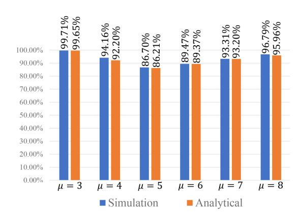

Fig. 5. Comparison between the simulated optimal solution and the analytical solution regarding the proportion of area exceeding the threshold.

where (a) follows because  $\xi_a = -(2\pi/\mu) + (\pi/4)$ . Also we have

$$F(\xi_{a} + \xi_{0})|_{\mu+2-m,m\neq 1}$$

$$= \frac{-\sqrt{2}\varepsilon^{*}\sin\left(\xi_{a} + \xi_{0} + \frac{2\pi(\mu+2-m)}{\mu} - \frac{\pi}{4}\right)x}{\left[-2\sqrt{2}\varepsilon^{*}\sin\left(\xi_{a} + \xi_{0} + \frac{2\pi(\mu+2-m)}{\mu} + \frac{\pi}{4}\right)x\right]^{3}}$$

$$\stackrel{(a)}{=} \frac{-\sqrt{2}\varepsilon^{*}\sin\left(-\frac{2\pi}{\mu} + \frac{\pi}{4} + \xi_{0} + \frac{2\pi(\mu+2-m)}{\mu} - \frac{\pi}{4}\right)x}{\left[-2\sqrt{2}\varepsilon^{*}\sin\left(-\frac{2\pi}{\mu} + \frac{\pi}{4} + \xi_{0} + \frac{2\pi(\mu+2-m)}{\mu} + \frac{\pi}{4}\right)x\right]^{3}}$$

$$= \frac{-\sqrt{2}\varepsilon^{*}\sin\left(\xi_{0} - \frac{2\pi(m-1)}{\mu}\right)x}{\left[\varepsilon^{*2} + \mathcal{H}^{2} + 2x^{2} - 2\sqrt{2}\varepsilon^{*}\sin\left(\xi_{0} - \frac{2\pi(m-1)}{\mu}\right)x\right]^{3}}$$

$$\stackrel{(b)}{=} \frac{-\sqrt{2}\varepsilon^{*}\sin\left(\xi_{0} - \frac{2\pi(m-1)}{\mu}\right)x}{\left[\varepsilon^{*2} + \mathcal{H}^{2} + 2x^{2} - 2\sqrt{2}\varepsilon^{*}\sin\left(\xi_{0} - \frac{2\pi(m-1)}{\mu}\right)x\right]^{3}}$$

$$\stackrel{(c)}{=} -F(\xi_{a} - \xi_{0})|_{m\neq 1}. \tag{40}$$

where (a) follows because  $\xi_a = -(2\pi/\mu) + (\pi/4)$ , (b) follows as  $\sin x$  is symmetry about  $x = (\pi/2)$ , and (c) follows from (40).

By combining (38) and (40), Lemma 1 is proven. Since  $F(\xi_a - \xi_0) = -F(\xi_a + \xi_0)$  and  $F(\xi_a) = -F(\xi_a)$ , the optimal solution to (35) is given by  $\xi_0^* = -(2\pi/\mu) + (\pi/4)$ . Theorem 1 is proved.

To validate Theorem 1, Fig. 5 compares the simulated optimal solution from (26) with the analytical solution in Theorem 1. Details of the simulation setup are in Table II and will be further discussed in Section VI. The results show that variations in the area proportion exceeding the threshold are negligible across different  $\mu$  values. For instance, a 0.5-m2 area difference for  $\mu=4$  case implies the simulated optimal solution adds an annular region about 51 mm wide. Furthermore, in Fig. 6, we present the simulation results obtained by traversing all possible values of  $\varepsilon$  and  $\xi_0$  when  $\mu=4$ . We found that the angles in the analytical solution are the same as those in the simulated optimal solution, while a

TABLE II PARAMETER SETTINGS

| Parameters           | Description                           | Value                                                     |
|----------------------|---------------------------------------|-----------------------------------------------------------|
| Environment          | Room dimension                        | $5\text{m} \times 5\text{m} \times 3\text{m}$             |
| Signal Structure  | No. of bits No. of subcarrier      | $2 \times 10^5$ 32                                        |
| Structure            | Modulation scheme                     | BPSK-OFDM (phase 1) 16QAM-OFDM (phase 2)               |
| -                    | No. of LED                            | 4                                                         |
|                      | Source Co-ordinates                   | $(\varepsilon\cos\xi_m,\varepsilon\sin\xi_m,\mathcal{H})$ |
| Source Parameters | Semi-half angle of LED $(\Phi_{1/2})$ | $\pi/3$                                                   |
|                      | focal length                          | $0.05   \mathrm{m}$                                       |
| device Parameters | No. of PD per device                  | 4                                                         |
|                      | FOV $(\hat{\Psi}_{FOV})$              | $\pi/3$                                                   |
|                      | Active area of PD $(A_{PD})$          | $1 \text{ mm}^2$                                          |
|                      | Size of lens                          | 1 inch                                                    |
|                      | Reflection coefficient $(\rho_j)$     | 0.8                                                       |

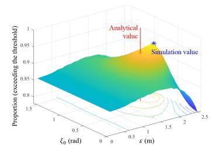

Fig. 6. Proportion of the area exceeding the threshold under various  $\varepsilon$  and  $\xi_0$ . The vertical line indicates the analytical value obtained from Theorem 1.

similar distribution radius. As shown, the analytical solution given in Theorem 1 is a good approximation to the optimal solution of (26).

### V. OPTICAL BEAMFORMING

In the first phase of O-ISAC, the O-APs broadcast control messages to all devices and sense the devices' state with the reflected light. Building on the analysis presented in Section IV, we recognize the pivotal role of superimposed light intensity on the target, or the equivalent channel gain (24), in enhancing system reliability. Consequently, during Phase 2, to enhance communication and sensing performance, we position all O-APs to directly face the target device—moving away from their initial vertical alignment—and employ a TDMA strategy for device service. However, despite these adjustments, the signal's intensity received by the device remains constrained due to the inherent divergence of directionless light. In RF communication, an efficient scheme to address such a problem is beamforming, which uses antenna arrays to direct the signal toward specific angles. In optical communication, however, beamforming cannot be realized due to the uncontrollable phase of light.

To achieve spatial selectivity, this article puts forth the concept of optical beamforming for O-ISAC, leveraging the collimating lens. This approach is predicated on the assumption that we can align the O-APs with the target device using a 3-D turntable. As a result, our focus shifts toward designing a collimating lens. Collimating lenses function similarly to RF beamforming in that both enhance channel

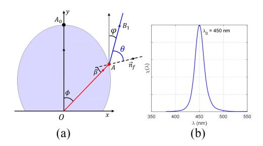

Fig. 7. (a) Cross section of a collimating lens. (b) Relative spectrum density of a commercial LED.

gain by controlling the direction and shape of electromagnetic waves. Inspired by this, we design collimating lenses to modify the radiation pattern  $R(\varphi_m)$  of the light source and direct all emitted light to the target receiver, achieving the effect of optical beamforming. Therefore, in this article, we refer to the utilization of collimating lenses as "optical beamforming."

The radiation pattern of an optical source is modified when a collimating lens is applied. Fig. 7(a) shows the cross section of a collimating lens, which will be detailed in Lemma 2. As shown in Fig. 7(a), a light ray with an AoE of  $\phi$  is emitted from the light source and directly enters the lens. The ray intersects with the lens surface on point A and undergoes refraction as it enters the air. We denote by  $\overrightarrow{n}_f$  the normal vector of the lens at point A. The angle at which the ray enters the lens is called the incident angle  $\beta$ , while the angle at which it exits the lens surface is referred to as the exit angle  $\theta$ . The angle between the refracted light ray after leaving the lens surface and the y-axis is the AoD defined earlier in Section III. Geometrically, the relationship between these angles can be expressed as  $\phi = \varphi - \beta + \theta$ .

A challenge here is that practical optical sources cannot produce light of a single frequency [43], which is commonly referred to as the frequency dispersion effect. As an example, Fig. 7(b) depicts the relative spectrum density  $\chi(\lambda)$  of the light emitted by a commercial LED as a function of wavelength. In addition to the peak wavelength  $\lambda_0 = 450$  nm, the emitted light also contains other wavelengths. This implies that:

- 1) For the light beam with a given AoE  $\phi$ , different wavelength components  $\lambda$  in the beam undergo different refraction through the lens. In this case,  $\theta$  and  $\varphi$  can be written as functions of  $\lambda$ , i.e.,  $\theta(\lambda|\phi)$  and  $\varphi(\lambda|\phi)$ .
- 2) The light beam with a given AoD  $\varphi$ , on the other hand, consists of a cluster of light rays with different AoE  $\phi$  and wavelength  $\lambda$ . In this case,  $\phi$ ,  $\beta$ , and  $\theta$  can be written as functions of  $\lambda$ , i.e.,  $\phi(\lambda|\varphi)$ ,  $\beta(\lambda|\varphi)$ , and  $\theta(\lambda|\varphi)$ .

Considering a specific target device located at  $p_D = (x_D, y_D, z_D)$ . Suppose the length and width of the target are  $\mathcal{L}_t$  and  $\mathcal{W}_t$ , respectively. The radiation pattern optimization problem can be formulated as maximizing the sum of light intensities falling on the target device, yielding

(P2): 
$$\max_{\{R(\varphi_m)\}} \int_{y_D - \frac{\mathcal{L}_t}{2}}^{y_D + \frac{\mathcal{L}_t}{2}} \int_{x_D - \frac{\mathcal{W}_t}{2}}^{x_D + \frac{\mathcal{W}_t}{2}} \sum_{m} I_{m,k}^{\text{rx}} dx dy$$
(41a)

s.t. 
$$I_{m,k}^{\text{rx}} = R(\varphi_m) \cdot \frac{A_{\text{unit}} \cos \psi_m}{d_{m,k}^2}$$
 (41b)

$$R(\varphi_m) = \int \frac{1}{\pi} \cos(\phi_m(\lambda|\varphi_m)) \chi(\lambda) d\lambda$$
 (41c)

$$d_{m,k} = \sqrt{\left(\varepsilon^* \cos \xi_m^* - x_D\right)^2 + \left(\varepsilon^* \sin \xi_m^* - y_D\right)^2 + \mathcal{H}^2}$$
(41d)

$$\sin \beta \cdot n(\lambda) = \sin(\theta(\lambda|\varphi_m)) \cdot 1 \tag{41e}$$

$$\phi_m(\lambda|\varphi_m) = \varphi_m - \beta(\lambda|\varphi_m) + \theta(\lambda|\varphi_m) \tag{41f}$$

where (41e) is the law of refraction and  $n(\lambda) \propto 1/\lambda$  represents the refractive index of the lens.

With optical beamforming, the light emitted by O-APs is intentionally directed toward the target device, enhancing both the optical communication rate and the sensing accuracy, thanks to the much stronger received light intensity. Theorem 2 below summarizes our main result in this section.

Theorem 2: In the second phase of O-ISAC, with optical beamforming, the optimal radiation pattern of a Lambertian optical source that maximizes the received light intensity, i.e., the optimal solution to (P2), can be approximated by

$$R^*(\varphi_m) = \int \frac{1}{\pi} \cos\left(\frac{(n(\lambda) - 1)\lambda}{n(\lambda)(\lambda - \lambda_0)} \varphi_m\right) \chi(\lambda) d\lambda. \tag{42}$$

In RF communication, antenna arrays with phase shifter networks enhance directivity and enable beam scanning. Yet, applying these methods to the THz band is complex and costly, especially for noncoherent sources like LEDs. Therefore, lensbased beamforming presents a practical alternative [44], and we prove Theorem 2 by a geometric approach. In (41a), the parameters  $x_D$ ,  $y_D$ ,  $W_t$ , and  $\mathcal{L}_t$  depend on the position and size of the target device. Since in the second phase, we have aligned all the O-APs toward the target device, the optimization objective in (41a) is equivalent to maximizing the light intensity  $I_{m,k}^{rx}$  in (41b) at the target device. In other words, our objective is to identify the highest achievable radiation pattern  $R(\varphi_m)$  for the O-APs when  $\varphi_m = 0$ . Since the radiation of the optical source is independent, we can optimize the radiation pattern of the LEDs independently. Without loss of generality, we consider the mth LED in the following. The subscript m will be omitted for simplicity.

According to (41c), ideally, we desire that for any AoE  $\phi$ , the light ray after collimation has an AoD  $\varphi(\lambda|\phi)=0$   $\forall \lambda$ . This maximizes  $R(\varphi=0)$ . However, one problem is that the lens can only be designed to perfectly collimate one wavelength. In this context,  $R(\varphi=0)$  is optimized if and only if  $\varphi(\lambda=\lambda_0|\phi)=0$   $\forall \phi$ .

Lemma 2 (Profile of the Lens Surface): The optimal normal vector of the collimating lens that satisfies  $\varphi(\lambda_0|\phi) = 0 \quad \forall \phi$ , at any point on the lens surface is given by

$$\overrightarrow{n}_f^* = (n(\lambda_0)\sin\phi, n(\lambda_0)\cos\phi - 1). \tag{43}$$

*Proof:* As shown in Fig. 7(a), the direction of a light ray  $\overrightarrow{OA}$  can be represented as  $(\overrightarrow{OA}/|\overrightarrow{OA}|) = (\sin\phi,\cos\phi)$ , the direction of the outgoing light ray  $\overrightarrow{AB}_1(\lambda)$  can be represented as  $([\overrightarrow{AB}_1(\lambda)]/[|\overrightarrow{AB}_1(\lambda)|]) = (\sin\varphi(\lambda|\phi),\cos\varphi(\lambda|\phi))$ , and our goal is

$$\frac{\overrightarrow{AB_1}(\lambda_0)}{\left|\overrightarrow{AB_1}(\lambda_0)\right|} = (\sin(\varphi(\lambda_0|\phi)), \cos(\varphi(\lambda_0|\phi))) = (0, 1). \tag{44}$$

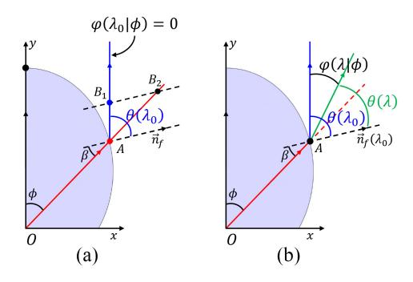

Fig. 8. Cross section of a collimating lens. (a) Collimated direction of the primary wavelength  $\lambda_0$ . (b) Divergence angle of other wavelengths  $\lambda \neq \lambda_0$ .

An illustration of (44) is given in Fig. 8(a). At point  $B_1$ , we draw a line parallel to the normal  $\overrightarrow{n}_f$ , which intersects the extension of  $\overrightarrow{OA}$  at point  $B_2$ . Using the cosine rule, we have

$$\left| \overrightarrow{AB_1}(\lambda_0) \right| \sin \theta = \left| \overrightarrow{AB_2} \right| \sin \beta.$$
 (45)

Combining (41e) and (45), we get

$$\left| \overrightarrow{AB_2} \right| = n(\lambda_0) \left| \overrightarrow{AB_1}(\lambda_0) \right|.$$
 (46)

Therefore, based on the vector triangle  $AB_1B_2$ , we can determine the optimal normal vector direction as

$$\overrightarrow{n}_{f}^{*} \propto \frac{1}{\left|\overrightarrow{AB_{1}}(\lambda_{0})\right|} \left[\overrightarrow{AB_{2}} - \overrightarrow{AB_{1}}(\lambda_{0})\right]$$

$$\stackrel{(a)}{=} \frac{1}{\left|\overrightarrow{AB_{1}}(\lambda_{0})\right|} \left[\frac{\overrightarrow{AB_{2}}}{\left|\overrightarrow{AB_{2}}\right|} \cdot n(\lambda_{0}) \left|\overrightarrow{AB_{1}}(\lambda_{0})\right| - \overrightarrow{AB_{1}}(\lambda_{0})\right]$$

$$\stackrel{(b)}{=} (n(\lambda_{0}) \sin \phi, n(\lambda_{0}) \cos \phi - 1) \tag{47}$$

where (a) follows from  $(AB_2/|AB_2|) = (OA/|OA|)$  and  $(AB_2/|AB_2|) = (OA/|OA|)$  and  $(AB_2/|AB_2|) = (OA/|OA|)$  and  $(AB_2/|AB_2|) = (OA/|OA|)$  and  $(AB_2/|AB_2|) = (OA/|OA|)$  and  $(AB_2/|AB_2|) = (OA/|OA|)$  and  $(AB_2/|AB_2|) = (OA/|OA|)$  and  $(AB_2/|AB_2|) = (OA/|OA|)$  and  $(AB_2/|AB_2|) = (OA/|OA|)$  and  $(AB_2/|AB_2|) = (OA/|OA|)$  and  $(AB_2/|AB_2|) = (OA/|OA|)$  and  $(AB_2/|AB_2|) = (OA/|OA|)$  and  $(AB_2/|AB_2|) = (OA/|OA|)$  and  $(AB_2/|AB_2|) = (OA/|OA|)$  and  $(AB_2/|AB_2|) = (OA/|OA|)$  and  $(AB_2/|AB_2|) = (OA/|OA|)$  and  $(AB_2/|AB_2|) = (OA/|OA|)$  and  $(AB_2/|AB_2|) = (OA/|OA|)$  and  $(AB_2/|AB_2|)$  and  $(AB_2/|AB_2|)$  and  $(AB_2/|AB_2|)$  and  $(AB_2/|AB_2|)$  and  $(AB_2/|AB_2|)$  and  $(AB_2/|AB_2|)$  and  $(AB_2/|AB_2|)$  and  $(AB_2/|AB_2|)$  and  $(AB_2/|AB_2|)$  and  $(AB_2/|AB_2|)$  and  $(AB_2/|AB_2|)$  and  $(AB_2/|AB_2|)$  and  $(AB_2/|AB_2|)$  and  $(AB_2/|AB_2|)$  and  $(AB_2/|AB_2|)$  and  $(AB_2/|AB_2|)$  and  $(AB_2/|AB_2|)$  and  $(AB_2/|AB_2|)$  and  $(AB_2/|AB_2|)$  and  $(AB_2/|AB_2|)$  and  $(AB_2/|AB_2|)$  and  $(AB_2/|AB_2|)$  and  $(AB_2/|AB_2|)$  and  $(AB_2/|AB_2|)$  and  $(AB_2/|AB_2|)$  and  $(AB_2/|AB_2|)$  and  $(AB_2/|AB_2|)$  and  $(AB_2/|AB_2|)$  and  $(AB_2/|AB_2|)$  and  $(AB_2/|AB_2|)$  and  $(AB_2/|AB_2|)$  and  $(AB_2/|AB_2|)$  and  $(AB_2/|AB_2|)$  and  $(AB_2/|AB_2|)$  and  $(AB_2/|AB_2|)$  and  $(AB_2/|AB_2|)$  and  $(AB_2/|AB_2|)$  and  $(AB_2/|AB_2|)$  and  $(AB_2/|AB_2|)$  and  $(AB_2/|AB_2|)$  and  $(AB_2/|AB_2|)$  and  $(AB_2/|AB_2|)$  and  $(AB_2/|AB_2|)$  and  $(AB_2/|AB_2|)$  and  $(AB_2/|AB_2|)$  and  $(AB_2/|AB_2|)$  and  $(AB_2/|AB_2|)$  and  $(AB_2/|AB_2|)$  and  $(AB_2/|AB_2|)$  and  $(AB_2/|AB_2|)$  and  $(AB_2/|AB_2|)$  and  $(AB_2/|AB_2|)$  and  $(AB_2/|AB_2|)$  and  $(AB_2/|AB_2|)$  and  $(AB_2/|AB_2|)$  and  $(AB_2/|AB_2|)$  and  $(AB_2/|AB_2|)$  and  $(AB_2/|AB_2|)$  and  $(AB_2/|AB_2|)$  and  $(AB_2/|AB_2|)$  and  $(AB_2/|AB_2|)$  and  $(AB_2/|AB_2|)$  and  $(AB_2/|AB_2|AB_2|)$ 

The collimating lens given in Lemma 2 effectively manipulates the peak wavelength component  $\lambda_0$  emitted at various AoE, directing them toward the target user. On the other hand, other wavelength components cannot be fully collimated and still suffer from a divergence angle, i.e., AoD  $\varphi(\lambda|\phi) \neq 0 \quad \forall \lambda \neq \lambda_0$ , as visualized in Fig. 8(b).

Lemma 3 (AoD): Consider an optical source and denote the peak wavelength by  $\lambda_0$ . After passing through the collimating lens characterized in Lemma 2, the AoD of a wavelength component  $\lambda$  can be approximated by

$$\varphi(\lambda|\phi) \approx \frac{n(\lambda)}{n(\lambda) - 1} \frac{\lambda - \lambda_0}{\lambda} \phi.$$
 (48)

To conserve space, the proof of Lemma 3 is presented in our technical report [45].

To validate Lemma 3, we compare the simulated and analytical values of  $\varphi$  in Fig. 9, where  $\lambda_0 = 450$  nm,  $\lambda = 420$  nm, and  $n(\lambda_0) = 1.4$ . As shown, (48) is a decent approximation of  $\varphi$  and the exact value remains extremely low—around 0.1%—within the angular range of -0.15 to 0.15 rad for the AoD. Moreover, for a tighter range of -0.1 to 0.1 rad, the MSE effectively approaches zero.

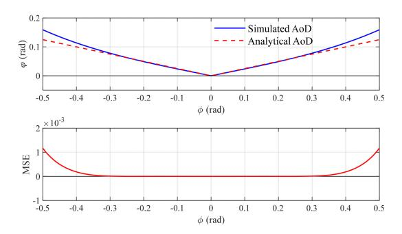

Fig. 9. Comparison between simulated AoD and analytical AoD of the divergence angle after collimation, where  $\lambda_0 = 450$  nm,  $\lambda = 420$  nm, and  $n(\lambda_0) = 1.4$ .

From (48), we have

$$\phi(\lambda|\varphi) \approx \frac{(n(\lambda) - 1)\lambda}{n(\lambda)(\lambda - \lambda_0)} \varphi. \tag{49}$$

Substituting (49) into (41c), we obtain the optimal radiation pattern  $R^*(\varphi)$  in (42), proving Theorem 2.

### VI. NUMERICAL AND SIMULATION RESULTS

This section assesses the effectiveness of the proposed O-ISAC system through numerical and simulation results. Specifically, we will conduct evaluations for both the directionless and directional O-ISAC, comparing them against a setup where sensing and communication operate independently, each with half the power. To provide a clearer picture, the simulation setup and parameter settings are summarized in Table II.

Our initial focus centers around the optimal light source distribution in the first phase. We will compare the traditional criterion in (25), which minimizes the MSE of the light intensity, with the proposed criterion in (26), which maximizes the area in which the light intensity surpasses a threshold. For the proposed criterion, we use the approximated optimal solution given in Theorem 1, and the threshold of the received light intensity is set to  $\rho_I = 0.8 \times 10^{-4}$ . This threshold was derived by back-calculating from benchmark values for BER and MSE, which we will introduce shortly. Fig. 10 presents the achieved performances of the two optimization criteria, where (a) and (d) are the light intensity distribution across the entire room, (b) and (e) are the distribution of the achieved BER, and (c) and (f) are the distribution of the achieved MSE. Note that although Fig. 10 focuses on comparing the estimation performance at a single height for a straightforward comparison, this article's theoretical framework is well suited for scenarios with multiple users at different heights.

To quantitatively analyze Fig. 10, we set a reference value for both communication BER and sensing MSE at  $10^{-4}$  (note that the location estimation error is 1cm when MSE =  $10^{-4}$ ). Based on Fig. 10, Fig. 11 summarizes the proportion of the room area that achieves better performance than the reference value under the two optimization criteria. As can be seen, the proposed optimization goal in (26) yields better performance in terms of all three metrics. The gains are up to 7.26%, 33.79%, and 1.82%, respectively. Overall, in the first phase,

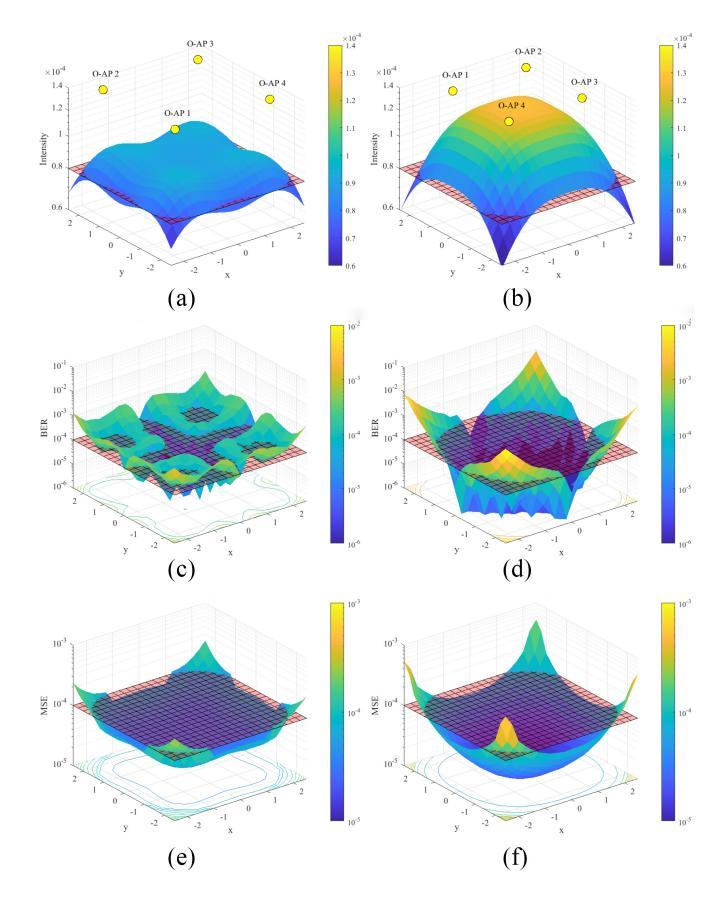

Fig. 10. Light intensity, BER, and MSE distributions under two optimization methods: (a) and (d) distribution of light intensity; (b) and (e) distribution of BER performance; and (c) and (f) distribution of MSE performance.

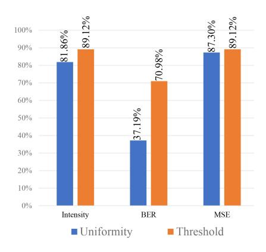

Fig. 11. Proportion of the area achieving performance surpassing the threshold using the two optimization methods.

the BER and MSE performances of O-ISAC versus SNR are given in Figs. [13](#page-12-2) and [14,](#page-12-3) respectively. We will provide a more detailed comparison with the second phase of O-ISAC later.

Compared to the first phase, the most significant feature of the second phase is the introduction of optical beamforming. This innovation concentrates the light emitted by O-APs onto the target device, thereby reducing the SNR required for attaining the target BER of communications and the MSE of optical sensing significantly. Specifically, in the first phase, the light intensity that falls on the target only accounts for 0.96% of the total light intensity, as illustrated in Fig. [12\(](#page-12-4)a).

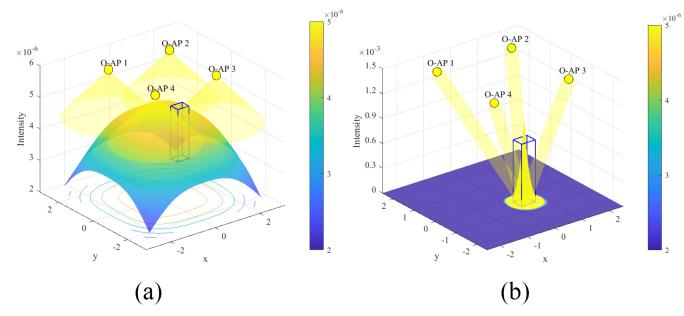

Fig. 12. Distribution of light intensity in the environment, where the blue box represents the position of the target device. (a) Phase 1. (b) Phase 2.

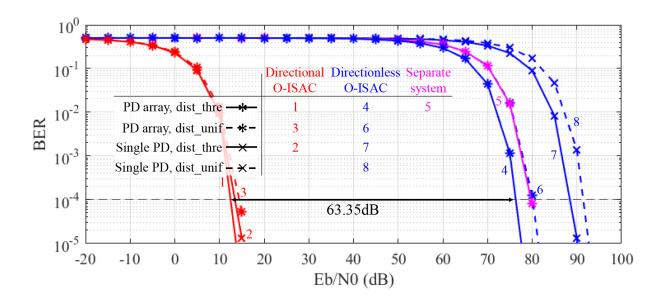

Fig. 13. BER for optical communication under varied conditions.

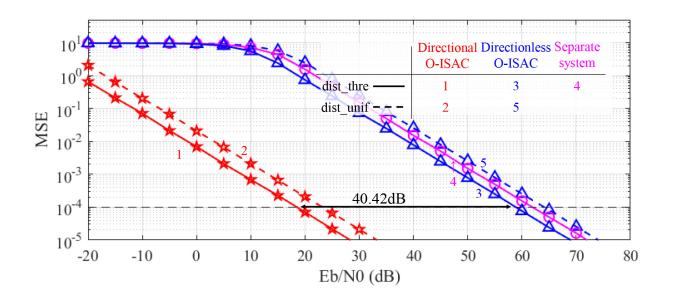

Fig. 14. MSE of position estimation under varied conditions.

In the second phase, on the other hand, the received light intensity exhibits a distribution shown in Fig. [12\(](#page-12-4)b), where 66.41% of the light intensity falls on the target due to the use of collimating lenses.

Overall, this article has considered several optimization schemes, including 1) optimization of the light source distribution; 2) utilization of a PD array; and 3) optical beamforming, also known as directional O-ISAC. Thanks to these optimization schemes, the performances of both optical sensing and communications are improved. Fig. [13](#page-12-2) presents the BER performance of the O-ISAC system. The results reveal that, relative to the separated system, the nondirectional O-ISAC achieves a 3.47-dB improvement, whereas the directional O-ISAC secures a substantial 63.35-dB gain. Implementing a PD array in the nondirectional O-ISAC system yields approximately a 12-dB increase, with the strategic arrangement of light sources contributing an extra 3-dB gain. This arrangement primarily optimizes phase 1, indicating that the configuration of PDs and light sources exerts minimal influence on the performance of the directional O-ISAC system.

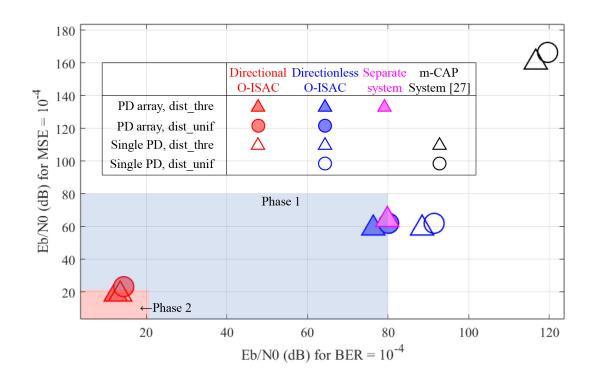

Fig. 15. Comparison of the required Eb/N0 to achieve a BER of  $10^{-4}$  and an MSE of  $10^{-4}$  across different system configurations.

Considering that the variation of PDs does not affect the reflected light, the MSE estimated at the O-AP only considers the changes in the light source distribution, and Fig. 14 presents the MSE of position estimation in optical sensing. Directionless O-ISAC outperforms the separate system by 3.14 dB, while directional O-ISAC outperforms the directionless system by 40.42 dB. Moreover, the optimization of the light source distribution can provide a gain of 5 dB for both the Directionless O-ISAC and Directional O-ISAC systems.

Overall, in our O-ISAC system, the O-APs periodically use a large power (e.g., 80 dB in Fig. 13) to broadcast the control information and sense the devices globally. The BER can be kept to  $10^{-4}$  and the sensing MSE is lower than  $10^{-4}$  (this corresponds to a localization accuracy of 1 cm). Then, in the second phase (which is much longer than the first phase), the O-APs use a relatively low power (e.g., 20 dB in Fig. 13) to serve the users and keep track of the users' locations. The BER performance can be kept way below  $10^{-4}$  and the sensing MSE is also kept below  $10^{-4}$ . An illustration of the required power to achieve a BER of  $10^{-4}$  and an MSE of  $10^{-4}$  across different system configurations is provided in Fig. 15, with a comparison to the m-CAP-based joint visible light sensing and communication system from [27]. It can be observed that even the proposed directionless O-ISAC system outperforms the system in [27], thanks to its pinhole-based sensing system. Additionally, in phase 2, optical beamforming further reduces the required power by concentrating the energy.

## VII. CONCLUSION

This article presented and evaluated a new O-ISAC paradigm tailored for commercial LEDs. The primary goal of O-ISAC is to seamlessly integrate optical communication and optical sensing capabilities within a unified framework, enhancing both communication efficiency and device localization accuracy—critical components in smart IoT ecosystems.

Unlike prior ISAC models in the RF domain, our approach harnesses the advantages of the optical spectrum, including its wide, license-free bandwidth, immunity to RF interference, and high energy efficiency. Our method employs a two-phase strategy: in the first phase, we use high-power transmission for global device localization and the dissemination of control information; in the second phase, we shift to lower power

transmission to serve users and maintain precise device tracking. We formulated two optimization problems across these phases to boost performance: 1) optimizing the source layout with a threshold-based distribution criterion and 2) refining the LED radiation pattern via optical beamforming.

Overall, our O-ISAC framework demonstrates strong potential for efficient indoor optical communication while simultaneously improving device localization accuracy, making it a promising solution for IoT communication and sensing applications, such as smart homes and industrial IoT. Moving forward, we will focus on practical implementation and deployment considerations to further validate the system's real-world feasibility.

#### REFERENCES

- [1] Z. Zhang, Y. Xiao, Z. Ma, M. Xiao, Z. Ding, and X. Lei, "6G wireless networks: Vision, requirements, architecture, and key technologies," *IEEE Veh. Technol. Mag.*, vol. 14, no. 3, pp. 28–41, Sep. 2019.
- [2] E. C. Strinati, S. Barbarossa, J. L. Gonzalez-Jimenez, D. Ktenas, N. Cassiau, and L. Maret, "6G: The Next Frontier: From holographic messaging to artificial intelligence using subterahertz and visible light communication," *IEEE Veh. Technol. Mag.*, vol. 14, no. 3, pp. 42–50, Sep. 2019.
- [3] Y. Shao, Q. Cao, and D. Gündüz, "A theory of semantic communication," IEEE Trans. Mobile Comput., vol. 23, no. 12, pp. 12211–12228, Dec. 2024.
- [4] A. Liu, Z. Huang, M. Li, Y. Wan, W. Li, and T. X. Han, "A survey on fundamental limits of integrated sensing and communication," *IEEE Commun. Surveys Tuts.*, vol. 24, no. 2, pp. 994–1034, 2nd Quart., 2022.
- [5] Y. Cui, F. Liu, X. Jing, and J. Mu, "Integrating sensing and communications for ubiquitous IoT: Applications, trends, and challenges," *IEEE Netw.*, vol. 35, no. 5, pp. 158–167, Sep./Oct. 2021.
- [6] Q. Wang, A. Kakkavas, X. Gong, and R. A. Stirling-Gallacher, "Towards integrated sensing and communications for 6G," in *Proc. IEEE 2nd IEEE Int. Symp. JC & S*, 2022, pp. 1–6.
- [7] R. Zhang, Y. Shao, and Y. C. Eldar, "Polarization aware movable antenna," 2024, arXiv:2411.06690.
- [8] F. Liu, C. Masouros, A. P. Petropulu, H. Griffiths, and L. Hanzo, "Joint radar and communication design: Applications, state-of-the-art, and the road ahead," *IEEE Trans. Commun.*, vol. 68, no. 6, pp. 3834–3862, Jun. 2020.
- [9] Z. Xiao and Y. Zeng, "Integrated sensing and communication with delay alignment modulation: Performance analysis and beamforming optimization," *IEEE Trans. Wireless Commun.*, vol. 22, no. 12, pp. 8904–8918, Dec. 2023.
- [10] K. Wu, J. A. Zhang, X. Huang, and Y. J. Guo, "Integrating low-complexity and flexible sensing into communication systems," *IEEE J. Sel. Areas Commun.*, vol. 40, no. 6, pp. 1873–1889, Jun. 2022.
- [11] R. Zhang, B. Shim, W. Yuan, M. D. Renzo, X. Dang, and W. Wu, "Integrated sensing and communication waveform design with sparse vector coding: Low sidelobes and ultra reliability," *IEEE Trans. Veh. Technol.*, vol. 71, no. 4, pp. 4489–4494, Apr. 2022.
- [12] A. Bazzi and M. Chafii, "On integrated sensing and communication waveforms with tunable PAPR," *IEEE Trans. Wireless Commun.*, vol. 22, no. 11, pp. 7345–7360, Nov. 2023.
- [13] O. Günlü, M. R. Bloch, R. F. Schaefer, and A. Yener, "Secure integrated sensing and communication," *IEEE J. Sel. Areas Inf. Theory*, vol. 4, pp. 40–53, 2023.
- [14] Y. Wen, F. Yang, J. Song, and Z. Han, "Optical integrated sensing and communication: Architectures, potentials and challenges," *IEEE Internet Things Mag.*, vol. 7, no. 4, pp. 68–74, 2024.
- [15] C. Liang et al., "Integrated sensing, lighting and communication based on visible light communication: A review," *Digit. Signal Process.*, vol. 145, Feb. 2024, Art. no. 104340.
- [16] T. Gan, S. Dang, X. Li, and Z. Zhang, "Integrated sensing and communications for 6G: Prospects and challenges of using THz radios," in *Proc. Wireless Commun. Netw. Conf. (WCNC)*, 2024, pp. 1–6.
- [17] J. Yan, F. Zheng, Y. Li, M. Pan, Y. Wu, and J. Liu, "A technical review of integrated sensing and communication in optical transmission system," in *Proc. 21st Int. Conf. Opt. Commun. Netw. (ICOCN)*, 2023, pp. 1–9.

- [\[18\]](#page-0-5) M. T. Rahman, A. S. M. Bakibillah, R. Parthiban, and M. Bakaul, "Review of advanced techniques for multi-gigabit visible light communication," *IET Optoelectron.*, vol. 14, no. 6, pp. 359–373, 2020.
- [\[19\]](#page-0-6) C.-W. Chow, "Recent advances and future perspectives in optical wireless communication, free space optical communication and sensing for 6G," *J. Lightw. Technol.*, vol. 42, no. 11, pp. 3972–3980, Jun. 1, 2024.
- [\[20\]](#page-0-7) P. H. Pathak, X. Feng, P. Hu, and P. Mohapatra, "Visible light communication, networking, and sensing: A survey, potential and challenges," *IEEE Commun. Surveys Tuts.*, vol. 17, no. 4, pp. 2047–2077, 4th Quart., 2015.
- [\[21\]](#page-0-8) T. Huang, B. Lin, Z. Ghassemlooy, N. Jiang, and Q. Lai, "Indoor 3-D NLOS VLP using a binocular camera and a single LED," *Opt. Exp.*, vol. 30, no. 20, pp. 35431–35443, 2022.
- [\[22\]](#page-0-9) S. Chen, K. Zhu, J. Han, Q. Sui, and Z. Li, "Photonic integrated sensing and communication system harnessing submarine fiber optic cables for coastal event monitoring," *IEEE Commun. Mag.*, vol. 60, no. 12, pp. 110–116, Dec. 2022.
- [\[23\]](#page-0-9) H. He et al., "Integrated sensing and communication in an optical fibre," *Light Sci. Appl.*, vol. 12, no. 1, p. 25, 2023.
- [\[24\]](#page-0-10) M. Cao et al., "4-PPM optical wireless design for vehicular integrated sensing and communication," 2023. [Online]. Available: https://advance. sagepub.com/users/622107/articles/645374/master/file/data/4-PPM% 20optical%20wireless%20design%20for%20vehicular%20integrated% 20sensing%20and%20communication/4-PPM%20optical%20wireless %20design%20for%20vehicular%20integrated%20sensing%20and% 20communication.pdf?inline=tru
- [\[25\]](#page-0-10) M. Cao, Y. Wang, Y. Zhang, D. Gao, and H. Zhou, "A unified waveform for optical wireless integrated sensing and communication," in *Proc. IEEE Asia Commun. Photon. Conf. (ACP)*, 2022, pp. 448–452.
- [\[26\]](#page-0-10) Z. Lyu, L. Zhang, H. Zhang, Z. Yang, H. Yang, and N. Li, "Radar-centric photonic terahertz integrated sensing and communication system based on LFM-PSK waveform," *IEEE Trans. Microw. Theory Techn.*, vol. 71, no. 11, pp. 5019–5027, Nov. 2023.
- [\[27\]](#page-0-11) L. Shi, B. Béchadergue, L. Chassagne, and H. Guan, "Joint visible light sensing and communication using m-CAP modulation," *IEEE Trans. Broadcast.*, vol. 69, no. 1, pp. 276–288, Mar. 2023.
- [\[28\]](#page-0-11) Y. Zhang, Z. Wei, Z. Liu, C. Cheng, Z. Wang, and X. Tang, "Optical communication and positioning convergence for flexible underwater wireless sensor network," *J. Lightw. Technol.*, vol. 41, no. 16, pp. 5321–5327, Aug. 2023.
- [\[29\]](#page-2-1) M. Lei, M. Zhu, Y. Cai, M. Fang, W. Luo, and J. Zhang, "Integration of sensing and communication in a W-band fiber-wireless link enabled by electromagnetic polarization multiplexing," *J. Lightw. Technol.*, vol. 41, no. 23, pp. 7128–7138, Dec. 1, 2023.
- [\[30\]](#page-2-2) Y. Li, L. Wu, Z. Zhang, J. Dang, B. Zhu, and X. Zhang, "Sensing assisted optical wireless communication for UAVs," *IEEE Trans. Veh. Technol.*, vol. 73, no. 12, pp. 18620–18634, Dec. 2024.
- [\[31\]](#page-3-4) I. B. Djordjevic, *Advanced Optical and Wireless Communications Systems*. Cham, Switzerland: Springer, 2018.
- [\[32\]](#page-3-5) Z. Wang, Q. Wang, W. Huang, and Z. Xu, *Visible Light Communications: Modulation and Signal Processing*. Hoboken, NJ, USA: Wiley, 2017.
- [\[33\]](#page-3-6) M. Z. Afgani, H. Haas, H. Elgala, and D. Knipp, "Visible light communication using OFDM," in *Proc. IEEE 2nd Int. Conf. Testbeds Res. Infrastruct. Develop. Netw. Commun.*, 2006, pp. 1–9.
- [\[34\]](#page-4-3) Y. Shao, D. Gündüz, and S. C. Liew, "Federated learning with misaligned over-the-air computation," *IEEE Trans. Wireless Commun.*, vol. 21, no. 6, pp. 3951–3964, Jun. 2022.
- [\[35\]](#page-4-4) Z. Ghassemlooy, W. Popoola, and S. Rajbhandari, *Optical Wireless Communications: System and Channel Modelling With MATLAB*. Boca Raton, FL, USA: CRC Press, 2019.
- [\[36\]](#page-4-4) Y. Shao, S. C. Liew, and D. Gündüz, "Denoising noisy neural networks: A Bayesian approach with compensation," *IEEE Trans. Signal Process.*, vol. 71, pp. 2460–2474, 2023.
- [\[37\]](#page-4-5) Y. Shao, S. C. Liew, and L. Lu, "Asynchronous physical-layer network coding: Symbol misalignment estimation and its effect on decoding," *IEEE Trans. Wireless Commun.*, vol. 16, no. 10, pp. 6881–6894, Oct. 2017.
- [\[38\]](#page-5-9) T.-H. Do and M. Yoo, "An in-depth survey of visible light communication based positioning systems," *Sensors*, vol. 16, no. 5, p. 678, 2016.
- [\[39\]](#page-5-10) A. K. Jain, *Fundamentals of Digital Image Processing*. Upper Saddle River, NJ, USA: Prentice-Hall, 1989.
- [\[40\]](#page-7-8) D. Deqiang, K. Xizheng, and X. Linpeng, "An optimal lights layout scheme for visible-light communication system," in *Proc. IEEE 8th Int. Conf. Electron. Meas. Instrum.*, 2007, pp. 1–9.

- [\[41\]](#page-7-8) Y. Zuo, B. Liu, and K. Shao, "Symmetrical indoor visible light layout optimized by a modified Grey Wolf algorithm," *Appl. Opt.*, vol. 61, no. 20, pp. 6016–6022, 2022.
- [\[42\]](#page-7-8) H. Liu, X. Wang, Y. Chen, D. Kong, and P. Xia, "Optimization lighting layout based on gene density improved genetic algorithm for indoor visible light communications," *Opt. Commun.*, vol. 390, pp. 76–81, May 2017.
- [\[43\]](#page-10-9) B. E. Saleh and M. C. Teich, *Fundamentals of Photonics*. Hoboken, NJ, USA: Wiley, 2019.
- [\[44\]](#page-10-10) M. A. B. Abbasi, V. F. Fusco, H. Tataria, and M. Matthaiou, "Constant *r* lens beamformer for low-complexity millimeter-wave hybrid MIMO," *IEEE Trans. Microw. Theory Techn.*, vol. 67, no. 7, pp. 2894–2903, Jul. 2019.
- [\[45\]](#page-11-8) R. Zhang, Y. Shao, M. Li, L. Lu, and Y. C. Eldar, "Optical integrated sensing and communication with light-emitting diode," 2023, *arXiv:2305.04395*.

**Runxin Zhang** received the B.S. degree in automation from Nanjing University of Aeronautics and Astronautics, Nanjing, China, in 2020. She is currently pursuing the Ph.D. degree in computer science and technology with the University of Chinese Academy of Sciences, Beijing, China, and also with the Key Laboratory of Space Utilization, Technology and Engineering Center for Space Utilization, Chinese Academy of Sciences, Beijing.

Her research interests include optical communications, wireless signal processing, and electromagnetic field theory.

Ms. Zhang received the Best Paper Award at IEEE International Conference on Computer and Communications 2023.

**Yulin Shao** (Member, IEEE) received the B.S. and M.S. degrees (Hons.) in communications and information engineering from Xidian University, Xi'an, China, in 2013 and 2016, respectively, and the Ph.D. degree in information engineering from the Chinese University of Hong Kong, Hong Kong, in 2020.

He is an Assistant Professor with the State Key Laboratory of Internet of Things for Smart City, University of Macau, Macau, China, and a Visiting Researcher with the Department of Electrical and

Electronic Engineering, Imperial College London, London, U.K. He was a Research Assistant with the Institute of Network Coding, Hong Kong; a Visiting Scholar with the Research Laboratory of Electronics, Massachusetts Institute of Technology, Cambridge, MA, USA; a Research Associate with the Department of Electrical and Electronic Engineering, Imperial College London, and a Lecturer of Information Processing with the University of Exeter, Exeter, U.K. He was a Guest Lecturer with 5G Academy Italy and IEEE Information Theory Society Bangalore Chapter. His research interests include coding and modulation, machine learning, and stochastic control.

Dr. Shao received the Best Paper Awards at IEEE International Conference on Communications 2023 and IEEE Wireless Communications and Networking Conference 2024. He is a Series Editor of *IEEE Communications Magazine* in the area of Artificial Intelligence and Data Science for Communications, an Editor of IEEE TRANSACTIONS ON COMMUNICATIONS in the area of Machine Learning and Communications, and an Editor of IEEE COMMUNICATIONS LETTERS.

**Menghan Li** received the B.S. degree in electronic information engineering from Wuhan University, Wuhan, China, in 2021. She is currently pursuing the Ph.D. degree in computer science and technology with the University of Chinese Academy of Sciences, Beijing, China, and also with the Key Laboratory of Space Utilization, Technology and Engineering Center for Space Utilization, Chinese Academy of Sciences, Beijing.

Her research interests include optical communications and wireless signal processing.

**Lu Lu** (Member, IEEE) received the B.E. degree in electronic and information engineering from the University of Science and Technology of China, Hefei, China, in 2007, and the Ph.D. degree in information engineering from The Chinese University of Hong Kong (CUHK), Hong Kong, in 2012.

He was a Postdoctoral Fellow with the Institute of Network Coding, CUHK, from 2012 to 2014. He was a Research Assistant Professor with the Institute of Network Coding, CUHK, from 2014 to

2017. Since 2017, he has been serving as an Adjunct Associate Professor with the Department of Information Engineering, CUHK. He is currently a Professor with the Technology and Engineering Center for Space Utilization, Chinese Academy of Sciences, Beijing, China, and the University of Chinese Academy of Sciences, Beijing. His research interests include optical wireless communications, wireless networking, physical-layer networks coding, and software-defined radios.

Prof. Lu was a recipient of the Faculty's Outstanding Ph.D. Thesis Award and the Postgraduate Research Output Award at CUHK both in 2013. He was a recipient of the Zhu Li Yue Hua Excellent Teacher Award of the Chinese Academy of Sciences in 2024.

**Yonina C. Eldar** (Fellow, IEEE) received the first B.Sc. degree in physics and the second B.Sc. degree in electrical engineering from Tel-Aviv University, Tel-Aviv, Israel, in 1995 and 1996, respectively, and the Ph.D. degree in electrical engineering and computer science from Massachusetts Institute of Technology (MIT), Cambridge, MA, USA, in 2002.

She is currently a Professor with the Department of Mathematics and Computer Science, Weizmann Institute of Science, Rehovot, Israel, where she holds the Dorothy and Patrick Gorman Professorial Chair

and heads the Center for Biomedical Engineering. She was previously a Professor with the Department of Electrical Engineering, Technion, Haifa, Israel, where she held the Edwards Chair in Engineering. She is also a Visiting Professor with MIT; a Visiting Scientist with the Broad Institute, Cambridge; a Visiting Research Collaborator with Princeton University, Princeton, NJ, USA; an Adjunct Professor with Duke University, Durham, NC, USA; an Advisory Professor with Fudan University, Shanghai, China; and a Distinguished Visiting Professor with Tsinghua University, Beijing, China, and was a Visiting Professor with Stanford University, Stanford, CA, USA. She is the author of the book *Sampling Theory: Beyond Bandlimited Systems* and the co-author of seven other books. Her research interests are in the broad areas of statistical signal processing, sampling theory and compressed sensing, learning and optimization methods, and their applications to biology, medical imaging, and optics.

Dr. Eldar has received many awards for excellence in research and teaching, including the IEEE Signal Processing Society Technical Achievement Award in 2013, the IEEE/AESS Fred Nathanson Memorial Radar Award in 2014, and the IEEE Kiyo Tomiyasu Award in 2016. She received the Michael Bruno Memorial Award from the Rothschild Foundation, the Weizmann Prize for Exact Sciences, the Wolf Foundation Krill Prize for Excellence in Scientific Research, the Henry Taub Prize for Excellence in Research (twice), the Hershel Rich Innovation Award (three times), the Award for Women With Distinguished Contributions, the Andre and Bella Meyer Lectureship, the Career Development Chair at the Technion, the Muriel and David Jacknow Award for Excellence in Teaching, and the Technion's Award for Excellence in Teaching (two times). She received several best paper awards and best demo awards together with her research students and colleagues, including the SIAM Outstanding Paper Prize, the UFFC Outstanding Paper Award, the Signal Processing Society Best Paper Award, and the IET Circuits, Devices and Systems Premium Award, was selected as one of the 50 most influential women in Israel and in Asia, and is a Highly Cited Researcher. She is the Editor-in-Chief of *Foundations and Trends in Signal Processing* and a member of the IEEE Sensor Array and Multichannel Technical Committee and serves on several other IEEE committees. In the past, she was a Signal Processing Society Distinguished Lecturer and a member of the IEEE Signal Processing Theory and Methods and Bio Imaging Signal Processing technical committees, and served as an Associate Editor for the IEEE TRANSACTIONS ON SIGNAL PROCESSING, the *EURASIP Journal of Signal Processing*, the *SIAM Journal on Matrix Analysis and Applications*, and the *SIAM Journal on Imaging Sciences*. She was the co-chair and the technical co-chair of several international conferences and workshops. She is a member of the Israel Academy of Sciences and Humanities (elected 2017) and the Academia Europaea (elected 2023), a EURASIP Fellow, and a Fellow of the Asia– Pacific Artificial Intelligence Association and the 8400 Health Network. She was a Horev Fellow of the Leaders in Science and Technology Program at the Technion and an Alon Fellow. She was a member of the Young Israel Academy of Science and Humanities and the Israel Committee for Higher Education.