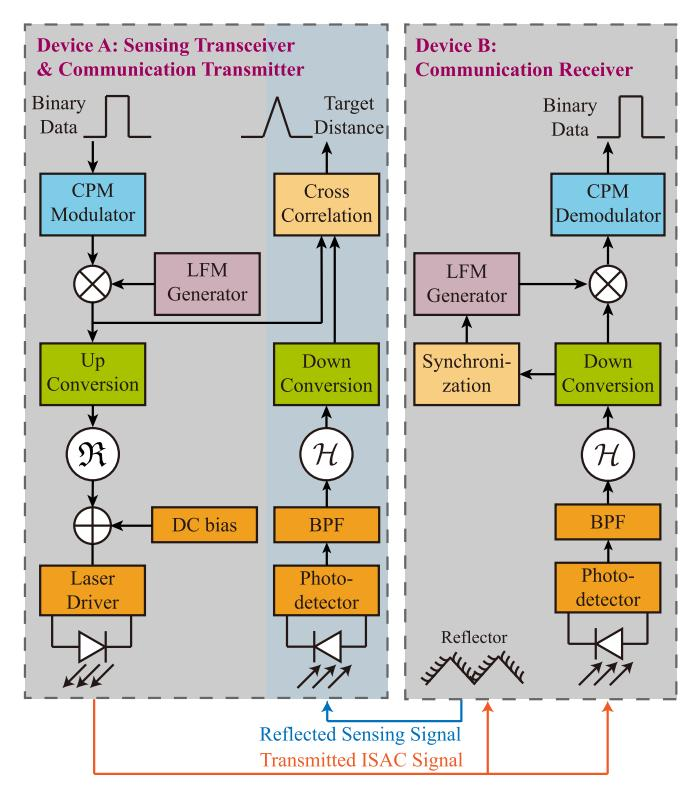
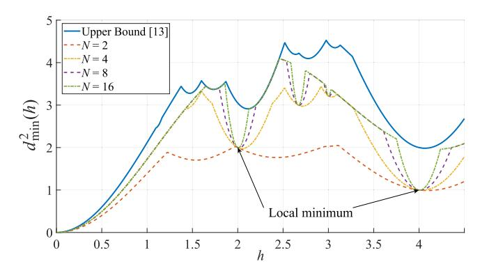
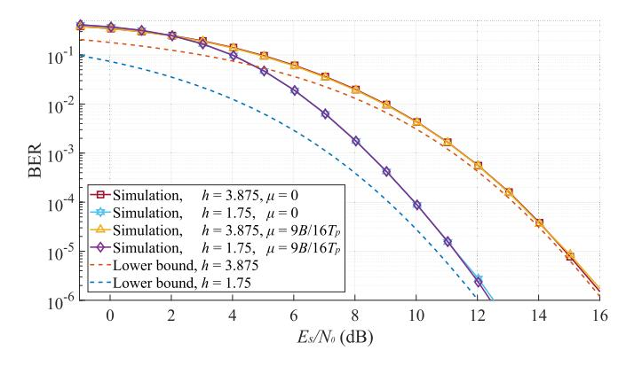
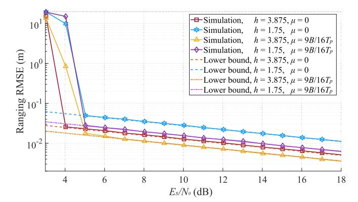
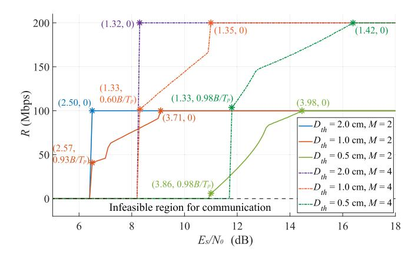

{0}------------------------------------------------

# Free Space Optical Integrated Sensing and Communication Based on LFM and CPM

Yunfeng We[n](https://orcid.org/0009-0000-9708-6012) , Fang Yan[g](https://orcid.org/0000-0003-3575-5086) , *Senior Member, IEEE*, Jian Song [,](https://orcid.org/0000-0002-6066-9510) *Fellow, IEEE*, and Zhu Han [,](https://orcid.org/0000-0002-6606-5822) *Fellow, IEEE*

*Abstract*— Integrated sensing and communication (ISAC) is a crucial component of future wireless networks, with optical ISAC regarded as a promising complement to its radio-frequency counterpart. In this letter, an ISAC scheme combining linear frequency modulation (LFM) and continuous phase modulation (CPM) is proposed for free space optics. The generalized intermediate frequency, the direct-current bias, and the Hilbert transform are adopted to make the complex LFM-CPM signal compatible with optical intensity modulation and direct detection. Additionally, various performance metrics are derived theoretically to establish an optimization problem that reveals the trade-off between communication and sensing. Furthermore, numerical simulations demonstrate the simultaneous communication and sensing abilities of LFM-CPM and reveal its superiority over other constant-modulus signal.

*Index Terms*— Optical ISAC, linear frequency modulation, continuous phase modulation, free space optics.

### I. INTRODUCTION

I NTEGRATED sensing and communication (ISAC) is an indispensable component of future wireless networks [\[1\].](#page-4-0) Leveraging the similarities in hardware architectures and signal processing techniques, an ISAC system optimally utilizes scarce resources of spectrum and hardware, thereby augmenting the abilities of intelligent transportation system and Internet of Things [\[2\]. As](#page-4-1) the optical spectrum provides a large communication capacity and a non-contact method for target localization, the integration of optical wireless communication (OWC) and optical sensing becomes a promising trend, which motivates the research theme of optical ISAC.

Designing the waveform compatible with free space optics (FSO) is of vital importance for optical ISAC. The boomerang transmission technique utilizes OWC to alternately relay data between two vehicles and measure the distance [\[3\],](#page-4-2) [\[4\].](#page-4-3) Similarly, the pulse sequence sensing and pulse position modulation scheme provides communication and sensing abilities

Manuscript received 23 October 2023; revised 10 November 2023; accepted 11 November 2023. Date of publication 14 November 2023; date of current version 9 January 2024. This work was supported by the National Key Research and Development Program of China under Grant 2023YFE0110600. The associate editor coordinating the review of this letter and approving it for publication was A. R. Ndjiongue. *(Corresponding author: Fang Yang.)*

Yunfeng Wen and Fang Yang are with the Department of Electronic Engineering, Tsinghua University, Beijing 100084, China, and also with the Key Laboratory of Digital TV System of Shenzhen City, Research Institute of Tsinghua University in Shenzhen, Shenzhen 518057, China (e-mail: wenyf22@mails.tsinghua.edu.cn; fangyang@tsinghua.edu.cn).

Jian Song is with the Department of Electronic Engineering, Tsinghua University, Beijing 100084, China, and also with the Tsinghua Shenzhen International Graduate School, Tsinghua University, Shenzhen 518055, China (e-mail: jsong@tsinghua.edu.cn).

Zhu Han is with the Department of Electrical and Computer Engineering, University of Houston, Houston, TX 77004 USA, and also with the Department of Computer Science and Engineering, Kyung Hee University, Seoul 446-701, South Korea (e-mail: hanzhu22@gmail.com).

Digital Object Identifier 10.1109/LCOMM.2023.3332658

for a laser radar simultaneously [\[5\]. M](#page-4-4)oreover, the laser interferometer space antenna combines the pseudo-random noise laser ranging and optical communication in an individual system [\[6\]. F](#page-4-5)urthermore, the phase-shift laser ranging with communication adopts the direct sequence spread spectrum technique to avoid the ambiguity caused by the phase-coded communication signal [\[7\]. H](#page-4-6)owever, the optimal waveform design for optical ISAC is still an open question.

Linear frequency modulation (LFM) is widely adopted by radar systems, and therefore numerous radio-frequencybased ISAC schemes have been proposed based on LFM. An LFM signal can be modulated by a minimum shift keying (MSK) signal to provide simultaneous communication and sensing abilities, at the expense of a deteriorated ambiguity function [\[8\]. A](#page-4-7)dditionally, MSK can be further extended to continuous phase modulation (CPM), which can be adopted to generate high-resolution images for airborne radars [\[9\].](#page-4-8) The LFM-CPM signal can be viewed as a generalization of constant-modulus signal like LFM and CPM, providing higher power efficiency than non-constant-modulus signal like quadrature amplitude modulation [\[10\],](#page-4-9) [\[11\]. N](#page-4-10)onetheless, LFM-CPM is a double-sideband complex signal in nature and therefore cannot be directly adopted by optical intensity modulation and direct detection (IM/DD).

In this letter, we propose a novel optical ISAC scheme based on the modified LFM-CPM signal, which is compatible with the optical IM/DD scheme. Moreover, different performance metrics of the proposed scheme are derived, and an optimization problem for system parameters is established and solved. Meanwhile, numerical simulations demonstrate the simultaneous communication and sensing abilities of the proposed scheme and reveal the trade-off between communication and sensing functionalities in system parameters. In consequence, the proposed scheme provides insights into the optimal waveform design for optical ISAC under the constant-modulus constraint.

# II. SYSTEM MODEL

Fig. [1](#page-1-0) illustrates the system model of the LFM-CPM scheme for optical ISAC. In a uni-directional ISAC scenario, Device A serves as both a communication transmitter and a sensing transceiver simultaneously, while Device B acts as a communication receiver. The LFM-CPM signal transmitted by the laser diode of Device A is detected by the photodiode of Device B, and the received signal is demodulated to extract the communication data. Meanwhile, the LFM-CPM signal is also partially reflected by the reflector on Device B and detected by the photodiode of Device A. Then, Device A can measure the distance to Device B by estimating the time of

1558-2558 © 2023 IEEE. Personal use is permitted, but republication/redistribution requires IEEE permission. See https://www.ieee.org/publications/rights/index.html for more information.

{1}------------------------------------------------

Fig. 1. Proposed system model of LFM-CPM signal for optical ISAC. The symbol  ${\cal H}$  denotes the Hilbert transform.

flight (ToF). The procedures mentioned above are detailed in a mathematical form in the following subsections.

#### A. LFM-CPM Transmitter for FSO

The baseband LFM-CPM signal can be expressed as

$$x_{\text{LFM-CPM}}(t; \boldsymbol{a}) = \exp\left[j2\pi \left(f_c t + \frac{1}{2}\mu t^2 + h\sum_{i=-\infty}^{\infty} a_i \int_{-\infty}^{t} g\left(\tau - iT_c\right) d\tau\right)\right] \operatorname{rect}\left(\frac{t}{T_p}\right), \quad (1)$$

where  $\mu \geq 0$  is the chirp rate of the LFM signal, and  $f_c$  is the generalized carrier frequency. h>0 and  $a_i$  are the modulation index and the i-th transmitted symbol, respectively.  $T_c$  denotes the duration of a communication symbol, and g(t) is the baseband frequency pulse spanning L consecutive symbols.  $T_p$  is the duration of an LFM-CPM pulse, and the function rect (t)=1 (0< t<1) denotes a rectangular window. Besides, to avoid distance ambiguities, a guard interval  $T_g$ , during which no signal is transmitted by Device A [5], is concatenated to the LFM-CPM pulse to achieve an unambiguous distance of  $D_u=cT_g/2$ , where c denotes the speed of light.

The baseband LFM-CPM signal is up-converted to the generalized intermediate frequency  $f_I$  to become a single-sideband signal, and its real part, i.e., the pass-band LFM-CPM signal, can be represented as

$$x_{\text{IF}}(t; \boldsymbol{a}) = \Re \left\{ x_{\text{LFM-CPM}}(t; \boldsymbol{a}) \exp \left( j2\pi f_I t \right) \right\}. \tag{2}$$

where  $\Re(x)$  denotes the real part of x.

Furthermore, an optical LFM-CPM signal compatible with IM/DD is generated as

$$x(t; \boldsymbol{a}) = \zeta x_{\text{IF}}(t; \boldsymbol{a}) + \xi, \tag{3}$$

where  $\xi$  and  $\zeta$  are the direct-current (DC) bias and the modulation depth, respectively. Due to the constant envelope of  $x_{\text{LFM-CPM}}(t; \boldsymbol{a})$ ,  $x(t; \boldsymbol{a})$  is real and non-negative once  $\xi > \zeta$ , which can be utilized to drive the laser diode.

#### B. FSO Channel

The shot noise and thermal noise are modeled as additional white Gaussian noise (AWGN) with a variance of  $\sigma^2$ , and the atmospheric turbulence can be described by the Gamma-Gamma model [12]. Moreover, due to the narrow and directional characteristics of laser beams employed by FSO, only line-of-sight (LoS) channels are considered. Therefore, the received signal is given by

$$y(t; \boldsymbol{a}) = Ax(t - \tau_0; \boldsymbol{a}) + n(t), \qquad (4)$$

where  $\tau_0$  denotes the ToF, and  $n(t) \sim \mathcal{N}\left(0, \sigma^2\right)$  is AWGN.  $A = \tilde{A}I$  depicts the received irradiance, in which  $\tilde{A}$  denotes the geometric loss and atmospheric attenuation, and the scintillation I follows the Gamma-Gamma distribution with a scintillation index  $\sigma_I^2$  [12].

#### C. LFM-CPM Receiver for FSO

The DC bias in y(t; a) is removed by a band-pass filter (BPF) to generate the pass-band signal  $y_{\text{IF}}(t; a)$ . Utilizing the Hilbert transform and down conversion, the baseband analytical signal can be recovered as

$$y_{\text{LFM-CPM}}(t; \boldsymbol{a}) = \exp(-j2\pi f_I t) \left( y_{\text{IF}}(t; \boldsymbol{a}) + j\hat{y}_{\text{IF}}(t; \boldsymbol{a}) \right),$$
(5)

where  $\hat{y}_{IF}(t; \boldsymbol{a})$  is the Hilbert transform of  $y_{IF}(t; \boldsymbol{a})$ .

An estimation of  $\tau_0$  is required by both the target distance measurement of Device A and the time synchronization of Device B. For a mono-static scenario, Device A can calculate the cross-correlation between  $x(t; \boldsymbol{a})$  and  $y(t; \boldsymbol{a})$  to obtain a maximum-likelihood estimation (MLE) of ToF as

$$\hat{\tau}_{0} = \underset{\tau \in [0, T_{g}]}{\operatorname{arg max}} \int_{0}^{T_{p}} y_{\text{LFM-CPM}} (t - \tau; \boldsymbol{a}) \, x_{\text{LFM-CPM}}^{*} (t; \boldsymbol{a}) \, d\tau.$$
(6)

Once  $\tau_0$  is estimated, the target distance is calculated as  $\hat{D}=c\hat{\tau}_0/2$ , and the time synchronization can be achieved. Furthermore, the communication receiver multiplies the baseband analytical signal with the conjugate LFM signal for de-chirp, and the recovered CPM signal is expressed as

$$y_{\text{CPM}}(t; \boldsymbol{a}) = y_{\text{LFM-CPM}}(t; \boldsymbol{a}) \exp\left(-j\pi\mu (t - \hat{\tau}_0)^2\right).$$
 (7)

Then, the recovered CPM signal can be optimally detected by coherent demodulation followed by Viterbi decoding [13].

{2}------------------------------------------------

#### III. PERFORMANCE METRICS AND OPTIMIZATION

In this section, the achievable data rate, the bit error rate (BER) for communication, and the Cramér-Rao Bound (CRB) for sensing are derived theoretically. Moreover, an optimization problem for system parameter setup is established, which maximizes the achievable data rate under constraints on both BER and CRB.

#### A. Achievable Data Rate

For the k-th communication symbol, the instantaneous frequency of  $x_{\text{LFM-CPM}}\left(t;\boldsymbol{a}\right)$  is

$$f_0(k) = f_c + \mu k T_c + \frac{h}{2LT_c} \sum_{i=k-L+1}^{k} a_i,$$
 (8)

where  $k \in \{0, 1, \cdots, N_p - 1\}$  and  $N_p = \lfloor T_p/T_c \rfloor$  is the number of communication symbols in an LFM-CPM pulse. As the power spectrum of  $x_{\text{LFM-CPM}}(t; \boldsymbol{a})$  follows a negative square exponential distribution with the maximum at  $f_0(k)$ ,  $f_0(k)$  is viewed as the major component of the power spectrum for the following discussion [10].

Since the bandwidth of optical components is limited in general,  $f_0(k)$  should be restrained within [-B/2, B/2], where B is the maximum available bandwidth. Without loss of generality, the bandwidth is occupied symmetrically, i.e.,  $f_c + \mu T_p/2 = 0$ . Then, a minimum index  $k_0$  can be established, in order that  $a_i$  can fetch all the values from the negative half codebook  $\Omega_n = \{-(M-1), \cdots, -3, -1\}$  when  $i \geq k_0$ , and all the values from the positive half codebook  $\Omega_p = \{1, 3, \cdots, (M-1)\}$  when  $i \leq N_p - 1 - k_0$ . Considering the worst case where L consecutive  $\pm (M-1)$  exist in the symbol sequence, index  $k_0$  is written as

$$k_0 = \min \left\{ \max \left\{ \frac{h(M-1)}{2\mu T_c^2} - \frac{B}{2\mu T_c} + \frac{N_p}{2}, 0 \right\}, N_p - 1 \right\}.$$
(9)

Once the modulation scheme and parameters are fixed, the three-section waveform in [10] can be adopted, whose achievable data rate can be expressed as

$$R = \begin{cases} \frac{N_p \log_2(M) - 2k_0}{T_p}, & k_0 \le \frac{N_p}{2} - 1, \\ \frac{2(\log_2(M) - 1)(N_p - k_0 - 1)}{T_p}, & k_0 \ge \frac{N_p}{2}. \end{cases}$$
(10)

#### B. BER for Communication

The BER of CPM is dominated by the minimum Euclidean distance between different communication symbol sequences for a high signal-to-noise ratio (SNR). Consequently, an asymptotic expression for BER can be written as

$$P_{e} = \int_{0}^{\infty} Q\left(d_{\min}I\left(\frac{E_{s}}{N_{0}}\right)^{\frac{1}{2}}\right)p_{I}\left(I\right)dI, \ \frac{E_{s}}{N_{0}} \to \infty, \ \ (11)$$

where  $E_s/N_0 = \mathbb{E}(A)/\sigma^2$  is the symbol SNR with  $\mathbb{E}(\cdot)$  denoting the expectation, and  $Q(\cdot)$  is the complementary

Fig. 2. The minimum square Euclidean distance for M=2 and L=4 with different observation intervals.

cumulative distribution function of the standard Gaussian distribution. Supposing that N consecutive symbols are observed, the square Euclidean distance is expressed as

$$d^{2}(\boldsymbol{b}, \boldsymbol{a}) = \frac{1}{2E_{s}} \int_{0}^{NT_{c}} \left| x_{\text{CPM}}(t; \boldsymbol{b}) - x_{\text{CPM}}(t; \boldsymbol{a}) \right|^{2} dt$$

$$\approx \frac{1}{T_{c}} \int_{0}^{NT_{c}} \left( 1 - \cos\left(\phi\left(t; \boldsymbol{\gamma}\right)\right) \right) dt, \tag{12}$$

where  $\gamma = \mathbf{b} - \mathbf{a} \neq \mathbf{0}$  is the differential symbol sequence, and  $\phi(t; \gamma) = 2\pi h \sum_{i=-\infty}^{\infty} \gamma_i \int_{-\infty}^{t} g(\tau - iT_c) d\tau$  is the phase difference. Therefore, the minimum square Euclidean distance is given by

$$d_{\min}^{2} = \min_{\boldsymbol{\gamma} = \boldsymbol{b} - \boldsymbol{a} \neq \boldsymbol{0}} \frac{1}{T_{c}} \int_{0}^{NT_{c}} \left(1 - \cos\left(\phi\left(t; \boldsymbol{\gamma}\right)\right)\right) dt. \tag{13}$$

The complexity of brute force search for  $d_{\min}$  through all the possible sequences is  $\mathcal{O}\left(M^N\right)$ , which is not acceptable even for moderate N and M. With depth-first search and pruning, a sequential method proposed by [13] is adopted so that the complexity of calculating  $d_{\min}$  grows almost linearly with N. Consequently, the minimum square Euclidean distance for M=2 and L=4 is depicted in Fig. 2, which illustrates that  $d_{\min}^2$  is not a monotonic function of h due to phase ambiguities of CPM. Besides, local minimums occur at  $h=2k(k\in\mathbb{N}^+)$ , which should be avoided in the parameter setup.

## C. CRB for Sensing

Optical sensing is desired to achieve a high-precision estimation of the target distance, and the CRB is a crucial performance metric. The CRB gives a lower bound of variance for an unbiased estimator, which can be approached by MLE asymptotically, i.e., with enough sampling points [14]. Supposing that  $y_{\rm LFM-CPM}\left(t;a\right)$  is sampled at the rate of  $R_s$ , the CRB for the ToF estimation can be written as

$$\operatorname{var}\left(\hat{\tau}_{0}\right) \geq \varepsilon_{\tau_{0}}^{2} = \int_{0}^{\infty} \frac{1}{I_{\tau_{0}}} p_{I}\left(I\right) dI, \tag{14}$$

where the Fisher information is defined as

$$I_{\tau_0} = \pi^2 R_s T_p \left( \frac{h^2 \left( M^2 - 1 \right)}{3LT_c^2} + \frac{\mu^2 T_p^2}{3} \right) I^2 \frac{E_s}{N_0}, \tag{15}$$

which indicates that superior sensing precision is achieved by increasing the modulation index h or the chirp rate  $\mu$ .

{3}------------------------------------------------

# Algorithm 1 Elliptical Search Algorithm.

Input:  $E_s/N_0, P_{e,th}, D_{th}$ Output:  $h_{opt}, \mu_{opt}, R_{opt}$ 1: Calculate  $d_{\min}(h)$  by (13). 2: Find  $d_{\min,th}$  on  $[0,\infty)$  using (11) with binary search. 3: **for**  $\mathcal{R}_h \leftarrow \emptyset, h \in [0, h_m]$  **do**  $\mathcal{R}_h \leftarrow \mathcal{R}_h \cup \{h\} \text{ if } d_{\min}(h) \geq d_{\min,th}.$ 5: end for 6: if  $\mathcal{R}_h = \emptyset$  then The problem is infeasible. 7: 8: else if  $\mathcal{R}_h \times [0, B/T_p] \subseteq \mathcal{R}_S$  then  $(h_{opt}, \mu_{opt}) \leftarrow (\inf \mathcal{R}_h, 0)$ 9: Calculate  $R_{opt}$  using (10) and  $(h_{opt}, \mu_{opt})$ . 10: 11: **else** Search  $(h, \mu)$  on the ellipse of (18) to obtain  $R_{opt}$ . 12: 13: **end if** 

#### D. Optimal Parameter Setup

The performance trade-off between communication and sensing functionalities is concentrated on h and  $\mu$ . As illustrated in Fig. 2, the minimum Euclidean distance  $d_{\min}$  is a non-differentiable function of h and is irrelevant to  $\mu$ , which also holds for the BER  $P_e$ . Meanwhile, both the achievable data rate R and the CRB  $\varepsilon^2_{\tau_0}$  are bivariate functions of h and  $\mu$ . To obtain the optimal parameter setup, R is maximized with constraints on  $\varepsilon_{\tau_0}$  and  $P_e$ , which formulates the optimization problem as

$$\max_{h,\mu} R,$$
s.t.  $P_e \leq P_{e,th},$ 

$$\varepsilon_{\tau_0} \leq \frac{2D_{th}}{c},$$
(16)

where  $P_{e,th}$  is the maximum tolerable BER and  $D_{th}$  is the desired precision of distance estimation for a fixed  $E_s/N_0$ .

The optimization problem can be solved by an elliptical search algorithm, as the bandwidth constraint gives a finite feasible region for the variables, i.e.,  $(h,\mu) \in [0,h_m] \times [0,B/T_p]$ , where the operator  $\times$  denotes the Cartesian product and the upper bound  $h_m$  is defined as

$$h_m = \frac{2BT_c}{M-1}. (17$$

First, since  $P_e$  is a decreasing function of  $d_{\min}$ , the threshold distance  $d_{\min,th}$ , i.e., the minimum  $d_{\min}$  satisfying the BER constraint, can be obtained by the bisection method. Then, a one-dimensional search is conducted in  $[0,h_m]$  to obtain the feasible region  $\mathcal{R}_h$  for h where  $d_{\min} \geq d_{\min,th}$ .

Moreover, the feasible region  $\mathcal{R}_S$  given by the sensing constraint is the outside of an ellipse, which is described as

$$\frac{\left(M^{2}-1\right)h^{2}}{3LT_{c}^{2}}+\frac{T_{p}^{2}\mu^{2}}{3}\geq\frac{\int_{0}^{\infty}\frac{p_{I}\left(I\right)}{I^{2}}dI}{\pi^{2}R_{s}T_{p}\frac{E_{s}}{N_{0}}\left(\frac{2D_{th}}{c}\right)^{2}}.$$
 (18)

Additionally, Eq. (10) indicates that R is a non-increasing function of h and  $\mu$ . Therefore, if  $\mathcal{R}_h \times [0, B/T_p] \subseteq \mathcal{R}_S$ , i.e., the sensing constraint is inactive,  $(h_{opt}, \mu_{opt}) = (\inf \mathcal{R}_h, 0)$  is

TABLE I SIMULATION CONFIGURATIONS

| Parameter                     | Notation      | Value              |
|-------------------------------|---------------|--------------------|
| Sampling rate                 | $R_s$         | 1 GHz              |
| Maximum bandwidth             | B             | 400 MHz            |
| Pulse duration                | $T_p$         | 10µs               |
| Guard interval                | $T_g$         | 2μs                |
| Communication symbol duration | $T_c$         | 10 ns              |
| DC bias                       | ξ             | 1 V                |
| Modulation depth              | ζ             | 1                  |
| Maximum unambiguous distance  | $D_u$         | 300 m              |
| Target distance               | D             | 200 m              |
| Scintillation index           | $\sigma_I^2$  | 0.1                |
| Attenuation for communication | $\tilde{A}_C$ | $3 \times 10^{-2}$ |
| Attenuation for sensing       | $	ilde{A}_S$  | $4 \times 10^{-3}$ |

Fig. 3. BER for communication concerning different modulation indices.

the optimal solution. On the other hand, if  $\mathcal{R}_h \times [0, B/T_p] \subsetneq \mathcal{R}_S$ , a curve search is conducted on the ellipse of (18) in the first quadrant to find the optimal solution to (16). The elliptical search algorithm for optimal system parameters is concluded in **Algorithm 1**.

#### IV. NUMERICAL RESULTS

Table I shows the parameters for numerical simulations of LFM-CPM. In the Monte-Carlo simulations,  $10^5$  LFM-CPM pulses are transmitted with  $N_p=10^3$  communication symbols in each pulse. The communication symbols  $a_i$  are randomly selected from the codebook under the constraints proposed in Section III-A. Additionally, the frequency pulse length and the modulation order are set to L=4 and M=2 or 4, respectively. For the sake of a superior BER performance, the observation interval is set to N=16. Furthermore, the distance between Device A and Device B is D=200 m, and the LoS channel depicted in (4) is elaborated by the model proposed in [15], which set the geometric loss and attenuation as  $\tilde{A}_C=3\times 10^{-2}$  and  $\tilde{A}_S=4\times 10^{-3}$  for communication and sensing channels, respectively.

As illustrated in Fig. 3, the simulated BER performance can approach the lower bound given by  $d_{\min}^2$  as  $E_s/N_0$  increases. Since the CPM signal can be viewed as an LFM-CPM signal with  $\mu=0$ , Fig. 3 also indicates that the chirp rate  $\mu$  will not affect the BER. To achieve the optimal sensing performance within the limited bandwidth, the modulation index of the CPM signal should be  $h=h_m/2=4$ , which unfortunately

{4}------------------------------------------------

Fig. 4. RMSE for sensing concerning different modulation indices and chirp rates.

Fig. 5. Maximum achievable data rate with constraints on the BER and sensing precision.

leads to a local minimum of  $d_{\min}^2$ . Even if h=31/8 is chosen, the BER still deteriorates due to the finite observation interval N. On the contrary, h=7/4 brings a larger  $d_{\min}^2$  and superior BER performance at the expense of wasting the limited bandwidth. On the other hand, the LFM-CPM signal can spread the bandwidth of the CPM signal to achieve a higher bandwidth efficiency.

Fig. 4 shows the root mean square error (RMSE) of sensing in the asymptotic region, where RMSE approaches CRB. The signal with h=31/8 can achieve superior sensing performance at the cost of a higher BER, while h=7/4 yields a higher RMSE due to deteriorated bandwidth utilization. However, once the CPM signal is spread by an LFM signal, the sensing performance will be significantly enhanced. Therefore, the LFM-CPM signal may outperform the CPM signal in both communication and sensing performances in certain cases.

To step further, Fig. 5 illustrates the maximum achievable data rate R for  $P_{e,th}=10^{-4}$ . The optimization problem becomes infeasible for low  $E_s/N_0$ , since no parameter setup can satisfy the communication constraint. As  $E_s/N_0$  increases, the enlarged feasible region  $\mathcal{R}_h$  provides a higher achievable data rate R. Nevertheless, for a fixed modulation order M, the achievable data rate of LFM-CPM is still upper bounded by that of CPM since CPM is a communication-centric prototype of LFM-CPM. Meanwhile, a higher data rate can be achieved as M becomes larger at the expense of a shrunk feasible region. On the contrary, the achievable data rate declines as the sensing precision becomes higher, which embodies the

trade-off between communication and sensing functionalities of LFM-CPM. In addition, the optimal  $(h, \mu)$  of several critical points are also displayed in Fig. 5.

### V. Conclusion

In this letter, an ISAC scheme based on LFM-CPM was studied to provide simultaneous communication and sensing abilities for FSO, in which the complex LFM-CPM signal was modified to be compatible with optical IM/DD. Based on the theoretical analysis of the achievable data rate, BER, and CRB, an optimization problem was established to reveal the trade-off between communication and sensing, and an elliptical search algorithm for parameters was proposed to obtain the optimal system parameters effectively. Moreover, numerical simulations indicated that LFM-CPM could guarantee the sensing precision and avoid the BER deterioration caused by phase ambiguities of CPM, which was the superiority of LFM-CPM over other constant-modulus signal.

#### REFERENCES

- [1] F. Liu et al., "Integrated sensing and communications: Toward dual-functional wireless networks for 6G and beyond," *IEEE J. Sel. Areas Commun.*, vol. 40, no. 6, pp. 1728–1767, Jun. 2022.
- [2] F. Liu and C. Masouros, "A tutorial on joint radar and communication transmission for vehicular networks—Part I: Background and fundamentals," *IEEE Commun. Lett.*, vol. 25, no. 2, pp. 322–326, Feb. 2021.
- [3] K. Mizui, M. Uchida, and M. Nakagawa, "Vehicle-to-vehicle 2-way communication and ranging system using spread spectrum technique: Proposal of double boomerang transmission system," in *Proc. Vehicle* Navigat. Inf. Syst. Conf., Yokohama, Japan, 1994, pp. 153–158.
- [4] A. J. Suzuki and K. Mizui, "Laser radar and visible light in a bidirectional V2V communication and ranging system," in *Proc. IEEE Int. Conf. Veh. Electron. Saf. (ICVES)*, Yokohama, Japan, Nov. 2015, pp. 19–24.
- [5] Y. Wen, F. Yang, J. Song, and Z. Han, "Pulse sequence sensing and pulse position modulation for optical integrated sensing and communication," *IEEE Commun. Lett.*, vol. 27, no. 6, pp. 1525–1529, Apr. 2023.
- [6] A. Sutton, K. McKenzie, B. Ware, and D. A. Shaddock, "Laser ranging and communications for LISA," *Opt. Exp.*, vol. 18, no. 20, p. 20759, Sep. 2010.
- [7] Y. Hai, Y. Luo, C. Liu, and A. Dang, "Remote phase-shift LiDAR with communication," *IEEE Trans. Commun.*, vol. 71, no. 2, pp. 1059–1070, Feb. 2023.
- [8] X. Chen, X. Wang, S. Xu, and J. Zhang, "A novel radar waveform compatible with communication," in *Proc. Int. Conf. Comput. Problem-Solving (ICCP)*, Chengdu, China, Oct. 2011, pp. 177–181.
- [9] M.-E. Chatzitheodoridi, A. Taylor, O. Rabaste, and H. Oriot, "A cooperative SAR-communication system using continuous phase modulation codes and mismatched filters," *IEEE Trans. Geosci. Remote Sens.*, vol. 61, Dec. 2023, Art. no. 5201314.
- [10] Y. Zhang, Q. Li, L. Huang, C. Pan, and J. Song, "A modified wave-form design for radar-communication integration based on LFM-CPM," in *Proc. IEEE 85th Veh. Technol. Conf.*, Sydney, NSW, Australia, Jun. 2017, pp. 1–5.
- [11] Q. Li, K. Dai, Y. Zhang, and H. Zhang, "Integrated waveform for a joint radar-communication system with high-speed transmission," *IEEE Wireless Commun. Lett.*, vol. 8, no. 4, pp. 1208–1211, Aug. 2019.
- [12] M. A. Khalighi and M. Uysal, "Survey on free space optical communication: A communication theory perspective," *IEEE Commun. Surveys Tuts.*, vol. 16, no. 4, pp. 2231–2258, 4th Quart., 2014.
- [13] T. Aulin, N. Rydbeck, and C.-E. Sundberg, "Continuous phase modulation—Part II: Partial response signaling," *IEEE Trans. Commun.*, vol. COM-29, no. 3, pp. 210–225, Mar. 1981.
- [14] S. M. Kay, Fundamentals of Statistical Signal Processing: Estimation Theory. Upper Saddle River, NJ, USA: Prentice-Hall, 1993.
- [15] H. Liu, R. Liao, Z. Wei, Z. Hou, and Y. Qiao, "BER analysis of a hybrid modulation scheme based on PPM and MSK subcarrier intensity modulation," *IEEE Photon. J.*, vol. 7, no. 4, pp. 1–10, Aug. 2015.