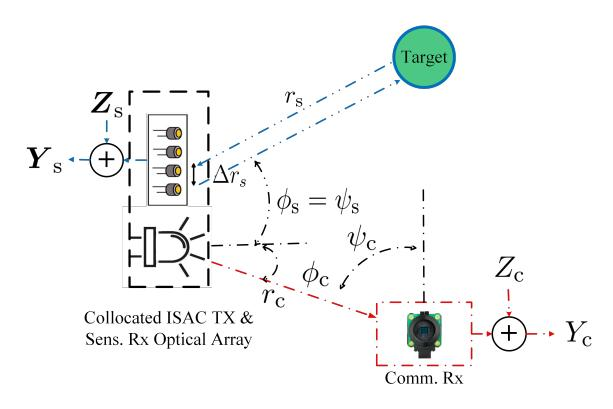
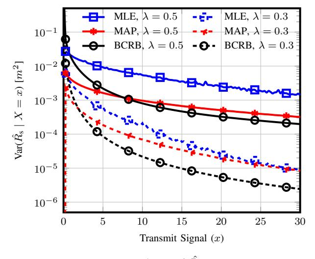
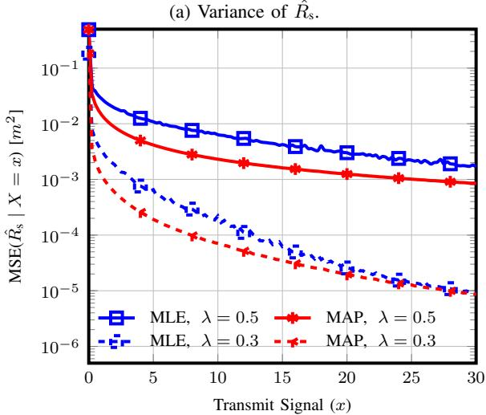
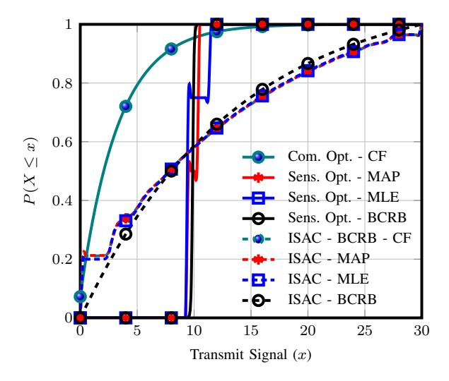
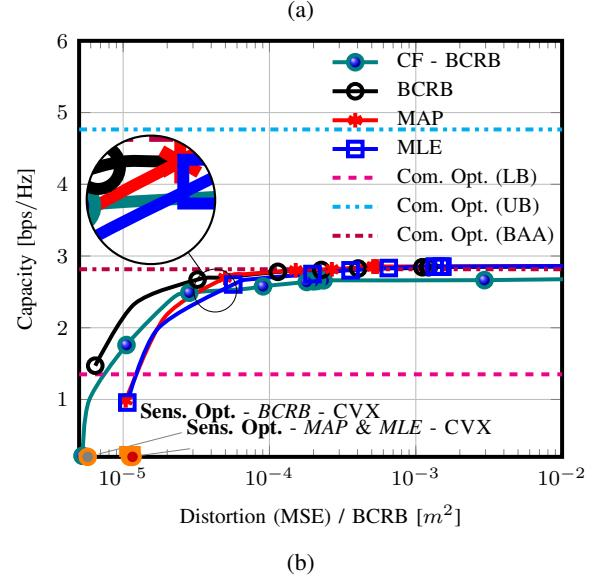

# Optical ISAC: Fundamental Performance Limits and Transceiver Design

Alireza Ghazavi Khorasgani , Mahtab Mirmohseni , Ahmed Elzanaty *5/6GIC, Institute for Communication Systems (ICS), University of Surrey, Guildford, United Kingdom* {a.ghazavi, m.mirmohseni, a.elzanaty}@surrey.ac.uk

*Abstract*—This paper characterizes the optimal capacitydistortion (C-D) tradeoff in an optical point-to-point system with single-input single-output (SISO) for communication and singleinput multiple-output (SIMO) for sensing within an integrated sensing and communication (ISAC) framework. We consider the optimal rate-distortion (R-D) region and explore several inner (IB) and outer bounds (OB). We introduce practical, asymptotically optimal maximum a posteriori (MAP) and maximum likelihood estimators (MLE) for target distance, addressing nonlinear measurement-to-state relationships and non-conjugate priors. As the number of sensing antennas increases, these estimators converge to the Bayesian Cramér-Rao bound (BCRB). We also establish that the achievable rate-Cramér-Rao bound (R-CRB) serves as an OB for the optimal C-D region, valid for both unbiased estimators and asymptotically large numbers of receive antennas. To clarify that the input distribution determines the tradeoff across the Pareto boundary of the C-D region, we propose two algorithms: *i*) an iterative Blahut-Arimoto algorithm (BAA)-type method, and *ii*) a memory-efficient closed-form (CF) approach. The CF approach includes a CF optimal distribution for high optical signal-to-noise ratio (O-SNR) conditions. Additionally, we adapt and refine the deterministic-random tradeoff (DRT) to this optical ISAC context.

*Index Terms*—Optical Integrated Sensing and Communication (O-ISAC), Bayesian Cramér-Rao Bound (BCRB), optimal input distribution, modified Deterministic-Random Tradeoff (DRT)

# I. INTRODUCTION

Future wireless networks are integrating advanced sensing and communication (S&C) technologies, which are critical for applications such as intelligent transportation systems and smart cities. integrated sensing and communication (ISAC) systems reflect this synergy, where communication and sensing functionalities share hardware, spectrum, and signaling resources [1], [2]. Optical ISAC (O-ISAC) is a promising alternative to radio frequency (RF) ISAC, especially in free space optical (FSO) systems, which leverage the large bandwidth of optical signals for high-speed communication and high-resolution sensing [3]. In transportation, O-ISAC provides low latency, high data rates, and access to unlicensed spectrum, significantly improving vehicle-to-everything (V2X) communication, traffic safety [4], and disaster management [5]. Unlike RF, O-ISAC experiences minimal interference in dense traffic due to laser beam directivity, reducing self-interference and enhancing security via line-of-sight (LoS) links [4]. FSO is especially promising for V2X [4], where straight-line vehicle movement simplifies angle of arrival (AoA) assumptions. Vehicles can also use Light Detection and Ranging (LiDAR) to gather state info, reducing direct communication (sensing-assisted

communication and vice versa). LiDAR-based ISAC supports omnidirectional communication, enabling flexible links beyond headlights' range for cooperative driving.

Previous works have focused on RF ISAC systems [6]–[11]. In [6], the optimal capacity-distortion (C-D) for single-antenna RF ISAC systems was examined, with the optimal estimator simplifying to the linear minimum mean-square error (LMMSE) estimator under specific conditions, such as Gaussian priors. However, real-world scenarios often involve nonlinear functions of sensing response channel (SRC) and non-conjugate priors, complicating optimal estimator computation [12]. Significant research has addressed the rate-Cramér-Rao bound (CRB) (R-CRB) tradeoff in RF channels, particularly concerning parameters like angle of departure (AoD) and AoA [7]–[9], [11]. Despite these efforts, gaps remain in practical estimators, transceiver design, and optimal C-D regions. Most studies have concentrated on Gaussian signaling, which may not fully exploit the potential benefits for ISAC. To enhance observations, one proposed solution is to record multiple feedbacks across several channel uses with block-wise independent, identically distributed (i.i.d.) states (block length T). While this improves sensing performance, it proportionally degrades communication performance at a rate of T −1 , especially for large T [7, Eq. 36]. While existing works focus on RF signals, which differ from optical systems due to their positive, real nature, O-ISAC systems have not been explored regarding informationtheoretical limits, to the best of our knowledge.

This paper makes several key contributions: *i*) We characterize the optimal Pareto boundary of the rate-distortion (R-D) and C-D regions for O-ISAC systems, which leverages multiple antennas to enhance both S&C, focusing particularly on target distance estimation with nonlinear SRC relationships and nonconjugate priors. *ii*) We adapt and refine the deterministicrandom tradeoff (DRT) [7] for O-ISAC and general estimators, introducing practical, asymptotically optimal estimators. We analyze the performance of our proposed maximum a posteriori (MAP) and maximum likelihood estimator (MLE) estimators, demonstrating their convergence to the CRB as the number of sensing antennas increases. *iii*) We demonstrate that, in asymptotic scenarios, the achievable R-CRB serves as an outer bound (OB), while the MAP, MLE, and any unbiased estimator function as an inner bound (IB) for the optimal C-D region. *iv*) We propose two algorithms to determine the optimal input distribution for the Pareto boundary of the C-D region, validate these algorithms against the endpoints, and characterize the

Fig. 1: O-ISAC system with memoryless channels.

optimal O-ISAC input distribution for high optical signal-tonoise ratio (O-SNR).

**Notation:** Sets are denoted by calligraphic letters (e.g.,  $\mathcal{X}$ ), with cardinality  $|\mathcal{X}|$ . Real numbers are  $\mathbb{R}$ ; nonnegative reals are  $\mathbb{R}_0^+$ . Random variables are uppercase (e.g., X), and realizations are lowercase (e.g., x). Vectors are boldfaced (e.g.,  $Y_s$ ). Key symbols include  $\sim$  (distribution),  $\perp$  (independence), and  $\stackrel{a}{\sim}$  (asymptotic distribution). Functions/operators:  $\mathcal{N}(\mu, \sigma^2)$  (Gaussian),  $\mathcal{H}(\cdot)$  (entropy),  $\mathcal{I}(\cdot)$  (mutual information (MI)),  $\mathbb{E}_X[\cdot]$  (expectation),  $|\cdot|$  (absolute value), and  $||\cdot||$  ( $\ell_2$  norm).

### II. SYSTEM MODEL

We consider a point-to-point O-ISAC system as illustrated in Fig. 1. This system comprises a single-antenna transmitter (Tx), an  $n_s$ -antenna monostatic sensing receiver (Sens. Rx) that is collocated with the Tx, a single-antenna communication receiver (Com. Rx), and a point-wise target. This configuration is typical for LiDAR evaluations [13]. In this setup, data is transmitted to the Com. Rx while simultaneously estimating the target distance  $R_s \in \mathbb{R}_0^+$ , with the realization denoted as  $r_s$ . The distance estimation is based on echoes received at the Sens. Rx. Additionally, we use a state-dependent FSO ISAC channel with intensity modulation direct detection (IM/DD), which is detected by both receivers [14], [15]. The input signal is constrained to be nonnegative due to the optical nature of the system, and its average power must satisfy a given optical power budget.

**S&C Models:** The received signal at Com. Rx during the *i*-th channel use is:

$$Y_{c,i} = h_c X_i + Z_{c,i}, \tag{1}$$

where  $h_{\rm c} \in \mathbb{R}$  is the LoS channel,  $X_i$  is the transmitted signal, and  $Z_{{\rm c},i} \sim \mathcal{N}(0,\sigma_{\rm c}^2)$  represents i.i.d. additive white Gaussian noise (AWGN).

$$h_{\rm c} = \frac{A}{r_{\rm c}^2} R_0(\phi_{\rm c}) T_{\rm s}(\psi_{\rm c}) g(\psi_{\rm c}) \cos \psi_{\rm c} \cdot \mathbf{1}_{[0, {\rm FOV}]}(\psi_{\rm c}), \quad (2)$$

where  $r_{\rm c}$  is the distance between Tx and Com. Rx,  $\phi_{\rm c}$  and  $\psi_{\rm c}$  are angles relative to Tx and Com. Rx,  $T_{\rm s}(\cdot)$  and  $g(\cdot)$  are the concentrator gain for Tx and Com. Rx respectively, A is the effective area, and FOV is the field of view (FOV). The

Tx radiant intensity gain is  $R_0(\phi) = \frac{(m+1)}{2\pi} \cos^m \phi$ , where  $m = -\frac{\ln 2}{\ln (\cos \Phi_{1/2})}$  [14].

The echo signal at the i-th Sens. Rx channel is:

$$\boldsymbol{Y}_{s,i} = \boldsymbol{h}_{s,i}(R_{s,j,i})X_i + \boldsymbol{Z}_{s,i}, \tag{3}$$

where  $\boldsymbol{h}_{\mathrm{s},i}(R_{\mathrm{s},j,i}) \in \mathbb{R}^{n_{\mathrm{s}} \times 1}$  is the target response coefficient dependent on  $R_{\mathrm{s},i}$ , and  $\boldsymbol{Z}_{\mathrm{s},i} \sim \mathcal{N}(0,\sigma_{\mathrm{S}}^2 \boldsymbol{I}_{n_{\mathrm{s}}})$ . The target response matrix  $h_{\mathrm{s},j,i}(r_{\mathrm{s},j,i})$  is:

$$h_{s,j,i}(r_{s,j,i}) = \frac{\rho}{r_{s,j,i}^4} R_0(0) T_s(\psi_s) g(\psi_s) \cos \psi_s \cdot \mathbf{1}_{[0,\text{FOV}]}(\phi_s),$$
(4)

where  $\rho = A^2 R_0(\phi_s) T_s(0) g(0) R_0(0) T_s(\psi_s) g(\psi_s) \cos \phi_s$  denotes the reflectivity coefficient, assumed to be a constant deterministic value without reflection-induced noise [16]. This assumption simplifies the analysis and offers baseline insights into system performance. With Sens. Rx antennas in a uniform linear array (ULA) and the target moving straight, both  $\psi_s$  and  $\psi_c$  remain constant. Assuming  $r_s \gg \Delta r_s$ , we have  $r_{s,j,i} \approx r_{s,i}$  for all i,j, justifying the straight-line assumption since phase shifts are immeasurable in IM/DD [14]. A uniform  $8 \times 8$  array with  $11.2 \, \mu m$  spacing achieves an FOV of  $8^{\circ}$  [17].

**Code Definition:** A  $(2^{nR}, n)$  code for state-dependent memoryless channel with delayed feedback (SDMC-DF) includes several components. First, there is a discrete message set M with  $|M| = 2^{nR}$ . Second, encoding functions  $\phi_i: \mathcal{M} \times \mathcal{Y}_s^{i-1} \mapsto \mathcal{X}$  are defined for  $i = 1, 2, \dots, n$ . Third, a decoding function  $f: \mathcal{R}^n_s \times \mathcal{Y}^n_c \mapsto \mathcal{M}$  is provided. Fourth, a state estimator  $h: \mathcal{X} \times \mathcal{Y}_s^n \mapsto \hat{R}_s^n$  is included, with  $\hat{R}_s$  as the reconstruction alphabet. For a given code, the random message M is uniformly distributed over  $\mathcal{M}$ . Inputs are generated as  $X_i = \varphi_i(W, Y_s^{i-1})$  for  $i = 1, \dots, n$ . The channel outputs  $Y_{c,i}$  and  $Y_{s,i}$  at time i depend on the state  $R_{s,i}$  and the input  $X_i$ . These dependencies are governed by the transition laws  $P_{Y_c|X,R_s}(\cdot \mid x_i,r_{s,i})$  and  $P_{Y_s|X,R_s}(\cdot \mid x_i,r_{s,i})$ , as given in (3) and (1). Let  $\hat{R}_s^n \triangleq (\hat{R}_{s_{s,1}}, \dots, \hat{R}_{s_{s,n}}) = h(X^n, Y_c^n)$ denote state estimate at Tx, and  $\hat{W} = g(R_s^n, Y_c^n)$  the decoded message at Com. Rx. The quality of state estimation is measured by the expected average per-block distortion:  $\Delta^{(n)} \triangleq \mathbb{E}[d(R_s^n, \hat{R}_s^n)] = \frac{1}{n} \sum_{i=1}^n \mathbb{E}[d(R_{s,i}, \hat{R}_{s,i})], \text{ where}$  $d: \mathcal{R}_{s} \times \hat{R}_{s} \to \mathbb{R}_{0}^{+}$  is a bounded distortion function with  $\max_{(r_s,\hat{r_s})\in\mathcal{R}_s\times\hat{\mathcal{R}}_s}d(r_s,\hat{r_s})<\infty$ . In practical optical systems, X is proportional to optical intensity and thus nonnegative:  $X \in \mathbb{R}_0^+$ . Then,  $\mathbb{E}[|X^n|] = \frac{1}{n} \sum_{i=1}^n \mathbb{E}[|X_i|]^1$ .

**Definition 1.** (C-D Region) A C-D tuple (C, D) is achievable with power budget P if there exists a sequence of  $(2^{nR}, n)$  codes that satisfies:

$$\Delta^{(n)} \le D, \quad \mathbb{E}[|X^n|] \le P, \quad P_e^{(n)} \to 0. \tag{5}$$

Here,  $P_e^{(n)} \triangleq \frac{1}{2^{nR}} \sum_{i=1}^{2^{nR}} \mathbb{P}\{\hat{M} \neq i \mid M = i\} \text{ and } d(r_s, \hat{r_s}) = (r_s - \hat{r_s})^2 \text{ is the squared error distortion. C-D region } C_P(D) \text{ for power budget } P \text{ is defined as } C_P(D) = \sup\{R \mid (R, D) \text{ is achievable with } P\}.$ 

1The monostatic Sens. Rx, collocated with Tx, knows  $X^n$  [7]. It estimates  $R_s$  from  $Y_s^n$ , while Com. Rx decodes M from  $Y_c^n$ .

In the next section, we characterize the C-D region for the O-ISAC system. We first describe the optimal estimator h, which operates on a single input symbol with  $n_s$ -fold feedback, estimating  $\hat{R}_{ss,i}$  based solely on  $X_i$  and  $\{Y_{s,j,i}\}_{i=1}^{n_s}$ , excluding other feedback signals  $\{Y_{s,j,i'}\}_{i'\neq i}$ . Lemma 1 shows that the optimal estimator relies solely on the current feedback  $Y_{s,i}$ from the memoryless SRC, making the sensing cost a function of the input signal, c(x) [6, Lemma 1].

**Lemma 1.** The deterministic minimum mean-square error (MMSE) estimator  $\hat{r}_s$ , which minimizes the expected distortion, depends on x and  $\mathbf{y}_s \triangleq vec\{y_{s,j}\}_{j=1}^{n_s}$  and is given by

$$\hat{r}_s = \mathbb{E}_{R_s}[R_s \mid X = x, \boldsymbol{Y}_s = \boldsymbol{y}_s]. \tag{6}$$

The distortion  $\Delta^{(n)}$  is minimized by the estimator, regardless of the encoding and decoding functions:

$$h^*(x^n, y_s^n) \triangleq (\hat{r}_s^*(x_1, y_{s,1}), \cdots, \hat{r}_s^*(x_n, y_{s,n})).$$
 (7)

The estimation cost for each input symbol  $x \in \mathcal{X}$  is

$$c(x) = \int P_{R_s} \int P_{\boldsymbol{Y}_s|X,R_s} \times (r_s - \hat{r_s}(x,\boldsymbol{y}_s))^2 d\boldsymbol{y}_s dr_s.$$
 (8)

Proof. See [18, Appendix A] for details; the proof extends a scalar feedback result to  $n_s$  independent observations.

#### III. MAIN RESULT

In this section, we characterize the R-D region through: (i) A Time-sharing-based scheme for communication optimal (Com. Opt.) and sensing optimal (Sens. Opt.) modes, (ii) A closed-form (CF) algorithm (CFA) for high O-SNR scenarios (for Com. Rx), (iii) A Blahut-Arimoto Algorithm (BAA)-type algorithm for general signal-independent (S-I) noise channels. Additionally, we propose R-D regions based on: (i) The MAP estimator (Section III-A), (ii) The MLE (Section III-B), (iii) Bayesian CRB (BCRB)-based results yielding OB (Section III-C). To determine the C-D region for the joint distribution  $P_X P_{R_s} P_{Y_c|XR_s} P_{Y_c|XR_s} P_{R_s|X,\boldsymbol{y_c}}$ , we leverage the results from [6] by setting the channel state to  $R_s$ .

$$\underset{D_{ss}}{\text{maximize}} \quad \mathcal{I}(X; Y_{\text{c}} \mid R_{\text{s}}), \tag{9a}$$

$$\int_{x \in \mathcal{X}} c(x) P_X(x) \le D, \tag{9c}$$

$$\int_{x \in \mathcal{X}} P_X(x) = 1, \tag{9d}$$

$$x > 0 \quad \forall x \in \mathcal{V} \quad (0a)$$

- 1) **Time-Sharing Scheme:** This scheme involves time sharing between the following two modes:
- 1-1) Com. Opt.: "Com. opt." denotes communication optimization. Ignoring the distortion constraint, (9c) simplifies to the channel capacity  $C(h_c, P)$ . Although the exact capacity formula is unknown, it is bounded by its upper bound (UB) [19, Theorem 8] and lower bound (LB) [20, Example 12.2.5].

$$C_{LB}(h_{c}, P) = \frac{\frac{1}{2}\ln(h_{c}P) - \sqrt{\frac{\pi\sigma^{2}}{2h_{c}P}} + \frac{1}{2}\ln\left(1 + \frac{2}{h_{c}P}\right)}{\frac{\ln 2}{\ln 2}} + \frac{\sqrt{h_{c}P(2 + h_{c}P) - h_{c}P - 1}}{\ln 2},$$
(10)

$$C_{\text{UB}}(h_{\text{c}}, P) = \frac{1 - \ln\left(\frac{1}{P}\right) + \ln(h_{\text{c}})}{\ln 2} + o_{P}(1). \tag{11}$$

Here,  $o_P(1)$  approaches zero as  $P \to \infty$ .

**1-2) Sens. Opt.:** In this mode, (9) simplifies to identifying the input distribution that minimizes average sensing distortion:

maximize 
$$P_X = \int_{x \in \mathcal{X}} c(x) P_X(x),$$
 (12a)  
subject to (9b), (9d), (9e). (12b)

subject to 
$$(9b), (9d), (9e)$$
. (12b)

**Lemma 2.** The optimal solution to (12) is  $P_X^{Sens. Opt.}(x) =$  $\delta(x-x^*)$ , where  $x^* \triangleq \arg\min_{x \leq P} c(x)$ . This yields zero MI and minimum distortion  $D_{min} = \overline{c}(x^*)$ .

*Proof.* See [18, Appendix C] for details; the proof applies complementary slackness to derive the optimal solution.

2) Optimal R-D Region: CF for High O-SNR Regime: In high O-SNR regime (O-SNR  $\triangleq \frac{\mathbb{E}[X]}{\sigma_c^2} \to \infty$ ), where  $\mathcal{H}(Y_s \mid X)$  is independent of  $P_X$ , (9) simplifies due to additive noise.

$$\begin{array}{ll}
\text{maximize} & \mathcal{H}(X \mid R_s) \stackrel{(a)}{=} \mathcal{H}(X), \\
P_{\mathbf{v}} & & 
\end{array} (13a)$$

where (a) follows from  $X \perp \!\!\! \perp R_s$  as per [6, Theorem 1]. Since (13) is a convex problem with concave entropy  $\mathcal{H}(X)$  and affine constraints, it can be solved using the Karush–Kuhn–Tucker (KKT) method [21].

**Lemma 3.** The solution to (13) is an exponential family probability density function (PDF) given by

$$p_X(x) = \exp(1 - \eta_1 - \eta_2 x - \eta_3 c(x)), \tag{14}$$

where  $\eta_1$  is the normalization constant, while  $\eta_2 \geq 0$  and  $\eta_3 \geq 0$  are the dual variables for the power budget and sensing constraint, respectively.

*Proof.* The result follows from entropy definitions and the Lagrangian derivative. Details are omitted for brevity. 

3) Optimal R-D Region: BAA-Type for General Cases: To solve (9) and derive optimal C-D region, we use the BAA method [22, Section VI] for the general case and lemma 3 for the high-O-SNR regime. We introduce two non-negative penalty factors,  $\eta_2$  and  $\eta_3$ . For each fixed  $\eta_3$  (representing a given distortion level), the optimal  $\eta_2$  is determined by complementary slackness. Specifically, if  $\eta_2 = 0$  satisfies the power budget constraint, then  $\eta_2^{\star} = 0$ ; otherwise,  $\eta_2^{\star} > 0$ , and we adjust  $\eta_2$  using gradient descent [21] to satisfy the power budget constraint with equality. The detailed algorithm is available in the arXiv version [18, Appendix B].

**Remark 1.** In Com. Opt. mode, we can set  $\eta_3$  in (14) to zero, which results in an exponential distribution. This confirms the result presented in [19].

To compute (6), we need  $P_{R_s|X,\boldsymbol{y}_s}(r_s\mid x,\boldsymbol{y}_s)$ :

$$P_{R_s|X,\boldsymbol{y}_s}(r_s \mid x,\boldsymbol{y}_s) = \frac{P_{\boldsymbol{y}_s|X,R_s}P_{R_s}}{\int_{r_s \in \mathcal{R}_s} P_{\boldsymbol{y}_s|X,R_s}P_{R_s}}.$$
 (15)

However, computing (15) is generally intractable due to the complexity of the marginal distribution [12].

**Lemma 4.** Let  $\hat{r}_{sMAP}$  and  $\hat{r}_{sMP}$  denote MAP estimate  $\arg\max_{r_s\geq 0}P_{R_s|X,\boldsymbol{y}_s}(r_s\mid x,\boldsymbol{y}_s)$  and the mean posterior (MP) estimate  $\mathbb{E}_{r_s}[P_{R_s|X,\boldsymbol{y}_s}(r_s\mid x,\boldsymbol{y}_s)]$ , respectively. Then, as  $n_s\to\infty$ ,  $\hat{r}_{sMAP}\to\hat{r}_{sMP}$  in probability and  $P_{R_s|\boldsymbol{y}_s,X}$  has a Gaussian PDF. Specifically,  $\hat{r}_s\stackrel{a}{\sim}\mathcal{N}(r_s,I^{-1}(r_s))$ .

*Proof.* By the Bernstein–von Mises theorem [23] and [24, Theorem 11.3], for a large sample size  $n_s$ ,  $P_{R_s|X,y_s}(r_s \mid x,y_s)$  is asymptotically normal with mean  $\hat{r_{sMP}}$  and variance  $\Sigma_n$ , where  $\Sigma_n$  is the inverse of the Fisher information matrix (FIM). Therefore, MAP estimate  $\hat{r_{sMAP}}$ , which is the mode of the (15), converges to the mean of the (15)  $\hat{r_{sMP}}$ .

A. MAP-Based Achievable ISAC C-D Region

**Theorem 1.** MAP estimator ( $\arg \max_{r_s \geq 0} P_{R_s \mid X, \boldsymbol{y}_s}(r_s \mid x, \boldsymbol{y}_s)$ ) is  $\hat{r_s} \in \mathcal{R}_s$  that satisfies:

$$\frac{\lambda \sigma_s^2}{n_s} \hat{r_s}^9 + 4\rho x \left( \frac{1}{n_s} \sum_{j=1}^{n_s} y_{s,j} \right) \hat{r_s}^4 - 4\rho^2 x^2 = 0, \quad \hat{r_s} \ge 0.$$
 (16)

*Proof.* Setting the curvature of the logarithm of (15) with respect to  $r_s$  confirms the result.

Eq. (16) can be solved numerically for any  $x \in \mathcal{X}$  and  $y_s \in \mathcal{Y}_s$  using methods such as Newton-Raphson. Deriving an analytical PDF for MAP estimate is generally infeasible [24]. Instead, we use computer simulations for performance assessment, as detailed in Section IV.

B. MLE-Based Achievable ISAC C-D Region

Lemma 5. Define MLE as

$$\hat{r}_{sMLE} = \arg \max_{r_s \geq 0} P_{\boldsymbol{y}_s \mid X, R_s}(\boldsymbol{y}_s \mid x, r_s)$$

As  $n_s \to \infty$ , MAP estimate approaches MLE.

*Proof.* As  $n_{\rm s} \to \infty$ , the logarithm of (15) is dominated by the sum term  $\sum_{s=1}^{n_{\rm s}} \left( {m y}_{\rm s} - \frac{\rho x}{r_{\rm s}^4} \right)^2$ , while the term  $-\lambda r_{\rm s}$  becomes negligible. Thus, the logarithm of (15) approximates the  $\log(P_{{m y}_{\rm s}|X,R_{\rm s}}({m y}_{\rm s}\mid x,r_{\rm s}))$  function, which corresponds to MLE. Hence, MAP estimate converges to MLE as  $n_{\rm s} \to \infty$ .

**Lemma 6.** Let  $u: \mathbb{R}^{n_s \times 1} \times \mathbb{R} \to \mathbb{R}$  be a one-to-one function. MLE of  $R_s(\mathbf{h}_s, x) \triangleq u(\mathbf{h}_s x) = \sqrt[4]{\frac{\pi \rho}{\mathbf{h}_s}}$ , where the PDF  $P_{\mathbf{Y}_s | \mathbf{h}_s, X}$  is parameterized by  $\mathbf{h}_s$  (given X). MLE of  $R_s$  is:

$$\hat{R}_s = u(x\hat{H}_s),$$

where  $\hat{H}_s$  is MLE of  $h_s$ , obtained by maximizing  $P_{\mathbf{Y}_s|\mathbf{h}_s,X}$ .

*Proof.* See [24, Theorem 7.2]. The invariance of the MLE under reparameterization is shown by proving that both the likelihood function and its maximizer remain unchanged by such transformations.

 $\begin{array}{l} \textbf{Theorem 2.} \;\; \textit{MLE for estimating $h_s$ is simply the mean of the} \\ \textit{observations:} \;\; \hat{h}_s = \frac{1}{x} \frac{1}{n_s} \sum_{j=1}^{n_s} \mathbf{Y}_{s,j}. \;\; \textit{Thus MLE for estimating} \\ r_s \;\; \textit{is, } \; \hat{r_s} = \begin{cases} \sqrt[4]{\frac{\rho x}{n_s} \sum_{j=1}^{n_s} \mathbf{Y}_{s,j}} & \textit{if } \frac{\rho x}{\frac{n_s}{n_s} \sum_{j=1}^{n_s} \mathbf{Y}_{s,j}} \geq 0, \\ \textit{MLE is not valid} & \textit{otherwise.} \end{cases}$ 

*Proof.*  $\hat{h}_s = \frac{1}{x} \min_{h_s \in \mathbb{R}^+} \| \boldsymbol{y}_s - \boldsymbol{h}_s(R_s) \boldsymbol{1}_{n_s} \|^2$  is an least squares (LS) problem with an analytical solution [21].

C. BCRB-Based Approach: OB

**Theorem 3.** BCRB for any unbiased estimator  $\hat{R}_s$  of  $R_s$ , with realization  $r_s$ , is BCRB $(x \mid r_s) = \frac{1}{16n_s\rho^2x^2\sigma_s^{-2}r_s^{-8} + \lambda}$ .

*Proof.* See [18, Appendix D] for the derivation, which uses FIM to establish a LB on variance.  $\Box$ 

**Lemma 7.** The  $BCRB(r_s \mid x)$  is asymptotically convex in  $r_s$  as either  $n_s$  or O-SNR (or both) increase.

*Proof.* See the arXiv version [18, Appendix E] for proof details derived from the BCRB curvature with respect to  $r_s$ .

**Remark 2.** The BCRB is a valid lower bound for the mean-square error (MSE) of an estimator  $\hat{R}_s^*$  only if it is unbiased [24, Theorem 3.1], which is ensured by a sufficiently large  $n_s$ . Moreover, for large datasets, MLE is asymptotically unbiased and achieves the BCRB [24, Theorem 11.3].

**Lemma 8.** Let  $\mathbb{E}_{R_s}[BCRB(R_s \mid x)]$  denote the average sensing cost. This quantity serves as an asymptotic lower bound for the function c(x) defined in (8). Specifically, we have

$$BCRB(\mathbb{E}_{R_s}[R_s \mid x) \le \mathbb{E}_{R_s}[BCRB(R_s \mid x)] \le c(x),$$
 (17)

The inequalities are asymptotic, supporting DRT [7] for state distribution in the regime of many sensing antennas.

*Proof.* The second inequality follows from [24, Theorem 3.1 and 11.3], and the first from Jensen's inequality [21] and Lemma 7, with equality when  $P_{R_s}(r_s)$  is deterministic.

**Corollary 1.** Based on lemma 8, the expected BCRB given  $R_s$ ,  $\mathbb{E}_{R_s}[BCRB(R_s \mid x)]$ , serves as an OB for the optimal C-D region in asymptotic, unbiased scenarios. When there is greater certainty (less randomness) in  $R_s$ , sensing performance improves due to reduced variance; this allows the LB in (17) to be achieved and minimizes the Jensen gap. Conversely, prior state distributions with higher randomness tend to rely more on likelihood, which can potentially reduce bias around the mean in (6). Moreover, MP (the optimal estimator in (6)) converges to a normal distribution as  $n_s$  increases, with variance decreasing by a factor of  $\frac{1}{n_s}$ , regardless of the prior state distribution [12]. We refer to this phenomenon as the modified DRT2.

2This trade-off relates to the bias-variance tradeoff, prior-data balance, and prior vs. likelihood strength, which are discussed in statistical inference and machine learning literature [12].

(b) Mean Squared Error of  $\hat{R}_s$ .

Fig. 2: Average BCRB, and variance and MSE of MAP and MLE for  $\lambda=0.3$  and 0.5 versus x ( $n_s=64$ ).

TABLE I: Default Parameters.

| Parameter                           | Value                                    | Description                      |
|-------------------------------------|------------------------------------------|----------------------------------|
| $h_{ m c}$                          | 1                                        | Channel Coefficient              |
| $\eta_0$                            | 1                                        | Initial Learning Rate            |
| γ                                   | 20                                       | Decay Rate                       |
| $\lambda$                           | $0.3, 0.5\mathrm{m}^{-1}$                | Exponential Parameter            |
| Reflectivity Coefficient            | 1                                        | Perfect Reflectivity             |
| $\sigma_{\rm s}^2,\sigma_{\rm c}^2$ | 1 W                                      | Noise Variances                  |
| $\tilde{P}$                         | 10 W                                     | Optical Power                    |
| q                                   | 0.25                                     | Quantization Step                |
| Noise Range                         | $[-5\sigma_{\rm s}^2,5\sigma_{\rm s}^2]$ | Range                            |
| # of Sens. Rx Antennas              | 1, 64                                    | Configuration                    |
| $x_{ \mathcal{X} }$                 | 30                                       | Last Mass Point in $\mathcal{X}$ |

# IV. NUMERICAL RESULTS

This section presents results based on Table I. For each estimator (MAP or MLE) and each  $x \in \mathcal{X}$ , we generate  $N_r$  samples of  $R_s$  from  $P_{R_s} \sim \operatorname{Exp}(\lambda)$  and  $N_y$  samples of the sensing signal  $\boldsymbol{Y}_s$  from  $P_{\boldsymbol{Y}_s|x,r_s} \sim \mathcal{N}\left(\frac{\rho x}{r_s^4},\sigma_s^2\right)$ . The

average sensing cost (MSE) is approximated by  $c(x) \approx \frac{1}{N_r} \sum_{r_{\rm s}^{[i]}} \frac{1}{N_y} \sum_{{\boldsymbol y}_{\rm s}^{[j]}} \left( r_{\rm s}^{[i]} - \hat{r_{\rm s}}(x,{\boldsymbol y}_{\rm s}^{[j]}) \right)^2$ . The expectations of the variance and bias are computed similarly.

In Fig. 2, as O-SNR increases and  $\lambda$  decreases from 0.5 to 0.3, MAP and MLE estimators converge, confirming the results from Lemma 5. In the single-antenna case (figures omitted for brevity), the performance difference between  $\lambda=0.3$  and  $\lambda=0.5$  is more noticeable, as  $P_{R_s}(r_s)$  significantly influences performance with limited antennas. The increased bias in MLE and MAP for single antennas suggests potential violations of regularity conditions, rendering BCRB an unreliable metric for sensing performance in this scenario. In contrast, Fig. 2 supports the modified DRT defined in corollary 1, for multi antenna setting, demonstrating that a more random distribution ( $\lambda=0.3$ ) enhances sensing performance, while a more deterministic distribution ( $\lambda=0.5$ ) degrades it.

Fig. 3a shows the optimized cumulative distribution function (CDF) for various modes in a multiple-antenna setting. The sensing-optimized input distribution, obtained via CVX [25], aligns with Lemma 2. We also present the high O-SNR CDF for the Com. Opt. mode (Exp( $\frac{1}{E}$ ), from [19]) and a common point (t=10) from the ISAC optimized region. The similarity of ISAC-optimized CDFs across approaches confirms Theorem 3 and lemma 5, showing that stricter distortion constraints shift probability mass to  $X > \epsilon$  and concentrate probabilities at specific points, validating DRT of ISAC in FSO S-I Gaussian channels with multiple antennas [7].

Fig. 3b shows that BCRB-based methods serve as an OB, with MAP and MLE covering larger areas due to lower MSE. In multi-antenna setups, BCRB narrows the gap to MAP/MLE. Validation through Sens. Opt. and Com. Opt. modes shows convergence of MAP and MLE as  $n_{\rm s}$  increases, with the CF region closely aligning with the BAA region.

## CONCLUSION

In this paper, we revisited the performance of O-ISAC from a C-D perspective, developing practical MAP and MLE estimators for target distance that converge to the BCRB as the number of sensing antennas increases. Our analysis established the R-CRB as an asymptotic OB for the optimal C-D region and extended the DRT for improved applicability in optical ISAC. Additionally, we introduced iterative BAA-type and memory-efficient algorithms for determining optimal input distributions, demonstrating that at high O-SNR, the optimal input distribution belongs to the exponential family.

#### ACKNOWLEDGEMENT

This work is supported by the UK Department for Science, Innovation, and Technology under the Future Open Networks Research Challenge project TUDOR (Towards Ubiquitous 3D Open Resilient Network). The views expressed are those of the authors and do not necessarily represent the project.

Fig. 3: (left) Optimized CDF for several modes, (right) C-D Region ( $n_s = 64$ ).

## REFERENCES

- [1] F. Liu, L. Zheng, Y. Cui, C. Masouros, A. P. Petropulu, H. Griffiths, and Y. C. Eldar, "Seventy Years of Radar and Communications: The road from separation to integration," *IEEE Signal Process. Mag.*, vol. 40, no. 5, pp. 106–121, Jul. 2023.
- [2] A. Tishchenko, A. Elzanaty, F. Guidi, A. Guerra, A. Zanella, and M. Khalily, "Dual Functional mm Wave RIS for Radar and Communication Coexistence in Near Field," in 2024 18th Eur. Conf. Antennas Propag. EuCAP, Mar. 2024, pp. 1–4.
- [3] C. Liang, J. Li, S. Liu, F. Yang, Y. Dong, J. Song, X.-P. Zhang, and W. Ding, "Integrated sensing, lighting and communication based on visible light communication: A review," *Digital Signal Processing*, vol. 145, p. 104340, Feb. 2024.
- [4] N. An, F. Yang, L. Cheng, J. Song, and Z. Han, "Free space optical communications for intelligent transportation systems: Potentials and challenges," *IEEE Veh. Technol. Mag.*, vol. 18, no. 3, pp. 80–90, 2023.
- [5] A. Qazavi, F. S. Tabataba, and M. N. Soorki, "Joint user association and uav location optimization for two-tired visible light communication networks," in *Proc. 30th Int. Conf. on Electrical Engineering (ICEE)*, 2022, pp. 755–761.

- [6] M. Ahmadipour, M. Kobayashi, M. Wigger, and G. Caire, "An Information-Theoretic Approach to Joint Sensing and Communication," *IEEE Trans. Inf. Theory*, vol. 70, no. 2, pp. 1124–1146, Feb. 2024.
- [7] Y. Xiong, F. Liu, K. Wan, W. Yuan, Y. Cui, and G. Caire, "From Torch to Projector: Fundamental Tradeoff of Integrated Sensing and Communications," *IEEE BITS Inf. Theory Mag.*, pp. 1–13, 2024.
- [8] H. Hua, T. X. Han, and J. Xu, "MIMO Integrated Sensing and Communication: CRB-Rate Tradeoff," *IEEE Trans. Wirel. Commun.*, vol. 23, no. 4, pp. 2839–2854, Apr. 2024.
- [9] M. Soltani, M. Mirmohseni, and R. Tafazolli, "Outage tradeoff analysis in a downlink integrated sensing and communication network," in 2023 IEEE Globecom Workshops (GC Wkshps), 2023, pp. 951–956.
- [10] Y. Liu, M. Li, A. Liu, J. Lu, and T. X. Han, "Information-Theoretic Limits of Integrated Sensing and Communication With Correlated Sensing and Channel States for Vehicular Networks," *IEEE Trans. Veh. Technol.*, vol. 71, no. 9, pp. 10161–10166, Sep. 2022.
- [11] Z. Ren, Y. Peng, X. Song, Y. Fang, L. Qiu, L. Liu, D. W. K. Ng, and J. Xu, "Fundamental CRB-Rate Tradeoff in Multi-Antenna ISAC Systems With Information Multicasting and Multi-Target Sensing," *IEEE Trans. Wirel. Commun.*, vol. 23, no. 4, pp. 3870–3885, Apr. 2024.
- [12] S. J. Press, Bayesian Statistics: Principles, Models, and Applications. Wiley, May 1989.
- [13] T. Gomes, R. Roriz, L. Cunha, A. Ganal, N. Soares, T. Araújo, and J. Monteiro, "Evaluation and Testing System for Automotive LiDAR Sensors," *Appl. Sci.*, vol. 12, no. 24, p. 13003, Jan. 2022.
- [14] A. Elzanaty and M.-S. Alouini, "Adaptive Coded Modulation for IM/DD Free-Space Optical Backhauling: A Probabilistic Shaping Approach," *IEEE Trans. Commun.*, vol. 68, no. 10, pp. 6388–6402, Oct. 2020.
- [15] A. Kafizov, A. Elzanaty, and M.-S. Alouini, "Probabilistic constellation shaping for enhancing spectral efficiency in NOMA VLC systems," *IEEE Trans. Wirel. Commun.*, vol. 23, no. 8, pp. 9958–9971, 2024.
- [16] M. A. Richards, J. Scheer, W. A. Holm, and W. L. Melvin, *Principles of Modern Radar: Basic Principles*. IET Digital Library, Jan. 2010.
- [17] R. Fatemi, B. Abiri, A. Khachaturian, and A. Hajimiri, "High sensitivity active flat optics optical phased array receiver with a two-dimensional aperture," *Opt Express*, vol. 26, no. 23, pp. 29 983–29 999, Nov. 2018.
- [18] M. M. Alireza Ghazavi Khorasgani and A. Elzanaty, "Optical ISAC: Fundamental performance limits and transceiver design," arXiv preprint, 2024. [Online]. Available: https://arxiv.org/abs/5800986
- [19] S. M. Moser, "Capacity Results of an Optical Intensity Channel With Input-Dependent Gaussian Noise," *IEEE Trans. Inf. Theory*, vol. 58, no. 1, pp. 207–223, Jan. 2012.
- [20] T. M. Cover and J. A. Thomas, Elements of Information Theory (Wiley Series in Telecommunications and Signal Processing). USA: Wiley-Interscience, Jun. 2006.
- [21] S. Boyd and L. Vandenberghe, Convex Optimization. Cambridge University Press, Mar. 2004.
- [22] R. Blahut, "Computation of channel capacity and rate-distortion functions," IEEE Trans. Inf. Theory, vol. 18, no. 4, pp. 460–473, Jul. 1972.
- [23] A. van der Vaart, Asymptotic Statistics, ser. Cambridge Series in Statistical and Probabilistic Mathematics. Cambridge University Press, 1998.
- [24] S. M. Kay, Fundamentals of Statistical Signal Processing: Estimation Theory. USA: Prentice-Hall, Inc., Feb. 1993.
- [25] M. Grant and S. Boyd, "CVX: Matlab software for disciplined convex programming, version 2.1," https://cvxr.com/cvx, Mar. 2014.