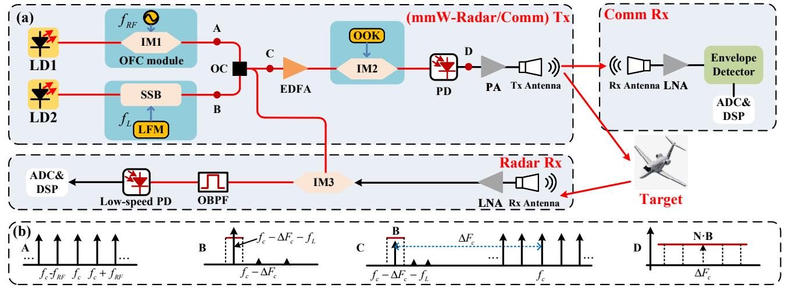
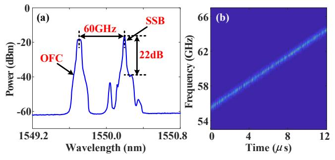
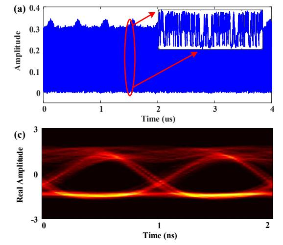
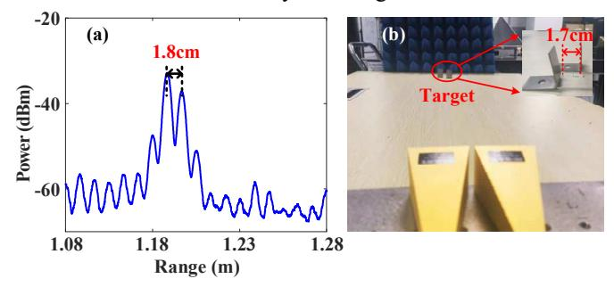

{0}------------------------------------------------

# 60-GHz photonic millimeter-wave joint radarcommunication system

Wenlin Bai, Xihua Zou\*, Peixuan Li, Wei Pan, Lianshan Yan, Bin Luo School of Information Science and Technology, Southwest Jiaotong University, Chengdu 611756, China Author e-mail address: \*zouxihua@swjtu.edu.cn

Abstract-A novel 60-GHz millimeter-wave (mm-wave) joint radar-communication system using the photonic techniques is proposed and experimental demonstrated. Photonic generation and de-chirping of mm-wave ultra-wideband linearly frequency modulated continuous wave (LFMCW) radar signals are achieved through the optical frequency comb, heterodyne detection and optical mixing. The on-off keying (OOK) signal is directly modulated onto the LFMCW radar signals for high-capacity wireless communication. In experiments, the resolution for radar range measurement is observed as 1.8-cm and a 1 Gbit/s communication data rate is successfully obtained.

#### I. Introduction

With the rapid developments of unmanned aerial vehicles and autonomous vehicles, the joint radar-communication system [1] has gained a lot of attentions. However, it is challenging for the traditional electronic technologies to realize a joint radar-communication system of large bandwidth (i.e., ultra-high resolution for radar and high data rate for communication).

On the other hand, microwave photonics with the advantages of high operation frequency, large instantaneous bandwidth, and strong immunity to electromagnetic interference have been widely applied in the independent radar imaging [2] and wireless communication [3], joint radarcommunication system [4]-[7], demonstrating a promising alternative for high-resolution radar detection and highcapacity communication transmission. There are three categories of photonic joint radar-communication system being reported, including the dual-band system [4], integrated waveform [5] and millimeter/terahertz-wave (mm/THz-wave) system [6][7]. The dual-band and dual-use radar & communication based on a single photonics-based transceiver [4] mitigates the integration and cost problems, but it suffers from the deficiency of spectrum inefficiency. The integrated waveform scheme, encodes an amplitude shift keying (ASK) modulation signal onto a linearly frequency modulated continuous wave (LFMCW) radar signal [5] by using the cascaded intensity modulators. Nevertheless, a limited only data rate of 100 Mbit/s is presented. Thus, the mm/THz-waveover-fiber integrated system [6][7] is introduced to enhance the data rate. For instance, in [6], a unified data communication and radar sensing mm-wave system employing the orthogonal frequency division multiplexing (OFDM) signal is successfully achieved with a 1.56 Gbit/s data rate. But it demonstrates a poor (meter-level) radar detection resolution. Therefore, a high-resolution and highcapacity joint radar and communication system is very important.

In this work, we propose and experimentally demonstrate a novel 60-GHz mm-wave joint radar-communication system for high-resolution radar detection and high-capacity wireless communication. The optical frequency comb, heterodyne detection and optical mixing are leveraged to achieve the photonic generation and de-chirping of mm-wave ultrawideband LFMCW radar signal. Moreover, the co-frequency and co-time on-off keying (OOK) signal is directly modulated onto the amplitude envelop of LFMCW signal for wireless communication. In proof-of-concept experiments, the range resolution for radar detection and data rate for wireless communication can achieve 1.8-cm and of 1-Gbit/s respectively.

### II. PRINCIPLE

Figure 1(a) shows the schematic diagram of the proposed a 60-GHz mm-wave joint radar-communication system. Two optical tones with frequency spacing ( $\Delta F_c$ ) close to the desired mm-wave carrier frequency from the laser diode 1 (LD1) and LD2 are fed to the upper and lower branches, respectively. In the upper branch, the optical carrier  $E_{LD1}(t) = E_1 \exp(j2\pi f_c t)$  is launched to an intensity modulator 1 (IM1), which is driven by a single-tone RF signal  $V_{RF}(t) = V_{RF} \cos(2\pi f_{RF} t)$ . Under large-signal modulation, an optical frequency comb with a  $f_{RF}$  comb spacing can be generated as shown Fig. 1(b)-A. Thus, the electrical field  $E_{OFC}$  at the output of the IM1 can be expressed as

$$E_{OFC} \propto E_1 \exp[j2\pi f_c t + j\beta_1 \cos(2\pi f_{RF} t)]$$

$$\propto E_{LD1} \begin{bmatrix} \dots + J_{-2}(\beta_1) \exp[j(2\pi 2 f_{RF} t)] + \\ J_{-1}(\beta_1) \exp[j(2\pi f_{RF} t)] + J_0(\beta_1) + J_1(\beta_1) \\ \exp[j(2\pi f_{RF} t)] + J_2(\beta_1) \exp[j(2\pi 2 f_{RF} t)] + \dots \end{bmatrix}, \quad (1)$$

where  $E_1$  and  $f_c$  are the amplitude and frequency of optical carrier in the upper branch,  $V_{RF}$  and  $f_{RF}$  are the amplitude and frequency of the RF signal,  $\beta_1 = \pi V_{RF}/V_{\pi-IM1}$  is the modulation index and  $V_{\pi-IM1}$  is the half-wave voltage of the IM1,  $J_n(\square)$  is the n-th order Bessel function of the first kind.

In the lower branch, the other optical carrier  $E_{LD2}(t) = E_2 \exp[j2\pi(f_c + \Delta F_c)t]$  generated by LD2 is sent to a specific single sideband (SSB) module. As shown in Fig. 1(b)-B, the LFMCW signal  $V_{LFM}(t) = V_{LFM} \cos(2\pi f_L t + \mu \pi t^2)$  is applied to driven the SSB module to obtain the SSB signal.

{1}------------------------------------------------

Figure 1. (a) Schematic diagram of proposed photonic mm-wave joint radar-communication system. mmW: millimeter-wave; LD: laser diode; IM: intensity modulator; OFC: optical frequency comb; SSB: single sideband; LFM: linearly frequency modulated; OC: optical coupler; EDFA: erbium-doped fiber amplifier; OOK: on-off keying; PD: photodetector; PA: power amplifier; LNA: low noise amplifier; ADC: analog-to-digital converter; DSP: digital signal process. (b)

Principle of the proposed scheme illustrated by the optical spectra at different points.

Here, under the small signal modulation, the electronic field of the output of the SSB module can be written as

$$E_{SSB} \propto E_2 \exp\left[j2\pi (f_c - \Delta F_c)t + j\beta_s \cos(2\pi f_L t + \mu \pi t^2)\right],$$

$$\propto E_{LD2} \cdot J_{-1}(\beta_s) \exp\left[j(2\pi f_L t + \mu \pi t^2)\right],$$
(2)

where  $E_2$  and  $f_c$ - $\Delta F_c$  are the amplitude and frequency of optical carrier in the lower branch,  $V_{LFM}$  and  $f_L$  are the amplitude and frequency of the LFMCW signal,  $\mu = B/T_c$  is the slope and  $B, T_c$  are bandwidth and pulse period of the LFMCW signal,  $\beta_s = \pi V_{LFM}/V_{\pi-SSB}$  is the modulation index and  $V_{\pi-SSB}$  is the half-wave voltage of the SSB module. It is notice that the bandwidth of LFMCW signal is same as the comb spacing of OFC.

The two optical signals of the upper and lower branches are coupled by an optical coupler (OC) as shown in Fig. 1(b)-C, and divided to two paths. One path is used as the reference signal of the radar de-chirped processing. Another path is compensated the loss of link by the erbium-doped fiber amplifier (EDFA) and then injected into the IM2 biased at the quadrature point. The baseband on-off keying (OOK) signal  $s_{OOK}(t)$  is applied to modulate onto the coupled optical signals by the IM2. The electronic field at the output of the IM2 can be described as

$$E_{SSR} \propto S_{OOK}(t) \left[ E_{OFC} + E_{SSR} \right] \cdot J_0(\beta_2), \tag{3}$$

where  $s_{OOK}(t) \in \{0,1\}$  is the OOK signals,  $\beta_2$  is the modulation index of the IM2.

Finally, the output signals from IM2 are sent to the high-speed photodetector (PD) to implement optical heterodyne detection. Thus, the generated mm-wave LFM-OOK joint signal with the center frequency of  $\Delta F_c + f_L$  can be written as

$$i_{AC} \propto Es_{OOK}(t)\cos(2\pi(\Delta F_c + f_L - \frac{(N-1)}{2}f_{RF})t - N\mu\pi t^2),$$
 (4)

where  $Es_{OOK}(t)$  is the amplitude envelop of signal, N is the comb number of OFC signal. As shown in Fig. 1(b)-D, the bandwidth of the generated mm-wave joint signal is N times

as much as the bandwidth of the LFM signal. Therefore, the more combs of OFC, the higher range resolution of radar detection is achieved.

The joint signal is amplified by power amplifier (PA) and emitted to free space through the transmitting antenna. In the communication receiver, the mm-wave joint signals carried communication information are received by the receiving antenna, which are downconverted to baseband to facilitate the demodulation of OOK signal. On the other hand, the radar echo reflected by the target is gathered by the radar receiving antenna. Through the low noise amplifier (LNA), the radar echo is exploited to drive the IM3 to accomplish the de-chirped processing. The output optical signals of the IM3 are filtered by the optical bandpass filter (OBPF) and detected by the low-speed PD, so that the undesired high-frequency signals could not be generated. The de-chirped signal generated at the low-speed PD can be expressed as

$$i_{AC} \propto Es_{OOK}(t+\tau)\cos(2\pi N\mu\tau t),$$
 (5)

where  $\tau$  is the target delay information,  $N\mu\tau$  is the de-chirped frequency. The amplitude envelope of the echoes  $Es_{OOK}(t+\tau)$  has no influence on the radar signal processing. Therefore, the ultra-wideband radar detection and communication for mm-wave system can be achieved simultaneously.

## III. EXPERIMENTS AND RESULTS

Experiments based on setup in Fig. 1(a) are carried out to verify the feasibility of the proposed scheme. In the upper branch, an external cavity laser centered at 1549.7 nm is launched to the IM1. When the IM1 is driven by a 3GHz single tones, OFC with three combs is generated as in shown left optical spectral of Fig. 2(a). In the lower branch, a light source with center frequency of 193.440 GHz is generated by a TLS (Teraxion PS-TNL), and sent to a special SSB module (KG-AMBox-SSB). A 10GHz LFM signal with 3GHz bandwidth and 12 us pulse period is generated using an AWG (M8195A) and applied to the SSB module to generate the SSB signal with

{2}------------------------------------------------

a 22dB suppression ratio. Through an OC, the coupled optical signals are acquired as shown in Fig. 2(a). It is clear that the center frequency spacing of OFC and SSB signals is 60 GHz. Next, a 1 Gbit/s baseband OOK modulation signal generated by AWG is modulated onto the coupled optical signals by the IM2. After the heterodyne detection of a PD (Finisar XPD3120R) with bandwidth of 70 GHz, a mm-wave LFM-OOK joint signal with the center frequency of 60 GHz and bandwidth of 9 GHz is generated, and the instantaneous frequency is shown in Fig. 2(b). The mm-wave joint signal is radiated out through a horn antenna (MI-WAVE 385-FL) to perform the mm-wave radar detection and communication.

Figure 2. (a) Optical spectrum corresponding to the C point in Fig.1(a), (b) the instantaneous frequency of the mm-wave LFM-OOK joint signal.

Figure 3. (a) Amplitude envelop waveform of the mm-wave LFM-OOK joint signal in 4 us, (b) the eye diagram of the OOK modulation signal.

In the experiments, the distance between the transmitting antenna and receiving antenna is set to be 1 m. In the communication receiver, the baseband OOK modulation signal is extracted by a envelop detector (SFD-503753-15SF-P1), and sampled by a 5GSa/s Oscilloscope (DSOX6004A). Figure 3(a) shows the amplitude envelop waveform of the mm-wave LFM-OOK joint signal in 4 us, and the amplitude envelop in 5 ns is plotted as inset in Fig. 3(a). The eye diagram of the demodulated 1-Gbit/s OOK signal is shown in Fig. 3(b). The clearly open-eye verifies the good performance of mm-wave communication in the proposed system. In the radar receiver, the echoes reflected by two metal targets at a distance of 1.2 m are captured by a horn antenna and modulated onto the reference optical signal by the IM3 (EOSPACE) with a 65

GHz bandwidth to perform the de-chirping processing. Figure 4(b) shows the distance between the two targets is set to 1.7 cm. In Fig. 4(a), two targets are detected, and their space is 1.8cm, which is consistent with the system range resolution of 1.67cm.

Figure 4. (a) the range measuring diagram, (b) the experiment photograph for two targets radar detection.

## IV. CONCLUSION

We have proposed and experimentally demonstrated a novel 60GHz photonic mm-wave joint radar and communication system. With the benefits of photonic techniques, the mm-wave radar signal with a 9-GHz bandwidth is experimentally generated to realize a range detection resolution of 1.8-cm resolution. Moreover, simultaneous transmission of 1-Gbits/s OOK communication signal is demonstrated. Our proposal can provide an enabling solution for the joint radar-communication applications requiring super-resolution radar detection and high-capacity wireless communication.

### ACKNOWLEDGMENT

This work was supported in part by the National Key Research and Development Program of China under Grant 2019YFB2203204, in part by the National Natural Science Foundation of China under Grants 61922069.

## REFERENCES

- C. Sturm and W. Wiesbeck, "Waveform Design and Signal Processing Aspects for Fusion of Wireless Communications and Radar Sensing," *Proc. IEEE*, vol. 99, no. 7, pp. 1236–1259, July. 2011.
- [2]. S. Pan, and Y. Zhang, "Microwave Photonic Radars," J. Lightwave Technol., vol. 38, no. 19, pp. 5450-5484, 2020.
- [3]. X. H. Zou, W. L. Bai, W. Chen, P. X. Li, B. Lu, G. Yu, W. Pan, B. Luo, L. S. Yan, and L. Y. Shao, "Microwave Photonics for Featured Applications in High-Speed Railways: Communications, Detection, and Sensing," J. Lightwave Technol., vol. 36, no. 19, pp. 4337-4346, Oct. 2018
- [4]. S. Melo, S. Pinna, A. Bogoni, I. F. Da Costa, D. H. Spadoti, F. Laghezza, F. Scotti, and S. A. Cerqueira, "Dual-use system combining simultaneous active radar & communication, based on a single photonics-assisted transceiver," in 17th Int. Radar Symposium (IRS)., pp. 4-8, May, 2016.
- [5]. H. Nie, F. Zhang, Y. Yang, and S. Pan, "Photonics-based integrated communication and radar system," in 2019 Int. Topical Meeting on Microwave Photonics (MWP), pp. 1–4, October, 2019.
- [6]. L. Huang, R. Li, S. Liu, P. Dai, and X. Chen, "Centralized Fiber-Distributed Data Communication and Sensing Convergence System Based on Microwave Photonics," *J. Lightwave Technol.*, vol. 37, no. 21, pp. 5406-5416. November, 2019.
- [7]. S. Jia, X. Yu, S. Wang, K. Liu, X. Pang, H. Zhang, X. Jin, S. Zheng, H. Chi, and X. Zhang, "A Unified System With Integrated Generation of High-Speed Communication and High-Resolution Sensing Signals Based on THz Photonics," *J. Lightwave Technol.*, vol. 36, no. 19, pp. 4549-4556, October, 2018.