{0}------------------------------------------------

# Photonic-Based Flexible Integrated Sensing and Communication With Multiple Targets Detection Capability for *W*-Band Fiber-Wireless Network

Boyu Dong®, Junlian Jia®, Zhongya Li®, Guoqiang Li®, Jianyang Shi®, *Member, IEEE*, Haipeng Wang®, *Senior Member, IEEE*, Nan Chi®, *Member, IEEE*, and Junwen Zhang®

Abstract—In the impending 6G era, the integration of sensing and communication (ISAC) systems in the millimeter-wave (MMW) band will assume a pivotal role across a myriad of applications, thus enhancing everyday convenience. The photonic-based MMW ISAC system, renowned for mitigating electromagnetic interference and integrating with the fiberwireless network, exhibits tremendous potential across diverse application domains. In intricate application contexts, the ISAC system should possess the capability to execute multitarget detection to preclude false target generation, simultaneously maintaining a balance between radar sensing and communication performance. This article presents a flexible photonic-based W-band ISAC system, designed to facilitate centralized, seamless fiber-wireless networks. It boasts the ability to detect multiple targets within the same angular sector. We scrutinize the potential causes for false target generation and the corresponding solutions in detail, validating the correctness of this theory through simulations and experiments. In addition, we incorporate subcarrier modulation (SCM) and linear frequency modulation (LFM) signals using frequency-division multiplexing (FDM). This allows us to allocate the bandwidth and power of these two signals, thus achieving a balance between sensing and communication. To demonstrate this concept, we designed a photonic-based ISAC system for the fiber-wireless network operating at 97.5 GHz over 10-km fiber transmission, which yielded access rates ranging from 15 to 60 Gbit/s after 1-m free-space transmission and range resolutions varying from 1.76 to 3.15 cm. The distance error subsequent to external calibration is under 3 cm.

Index Terms—Fiber-wireless network, integrated sensing and communication, millimeter-wave (MMW) photonics, multiple targets detection.

Manuscript received 14 September 2023; revised 30 November 2023 and 29 December 2023; accepted 15 January 2024. Date of publication 30 January 2024; date of current version 7 August 2024. This work was supported in part by the National Key Research and Development Program of China under Grant 2022YFB2903600; in part by the National Natural Science Foundation of China under Grant 62235005, Grant 62171137, and Grant 61925104; and in part by the Natural Science Foundation of Shanghai under Grant 21ZR1408700. (Corresponding author: Junwen Zhang.)

The authors are with the Key Laboratory for Information Science of Electromagnetic Waves, Ministry of Education, Department of Communication Science and Engineering, the Shanghai Engineering Research Center of Low-Earth-Orbit Satellite Communication and Applications, and the Shanghai Collaborative Innovation Center of Low-Earth-Orbit Satellite Communication Technology, Fudan University, Shanghai 200433, China (e-mail: bydong21@m.fudan.edu.cn; jljia20@fudan.edu.cn; zhongyali20@fudan.edu.cn; 19210720066@fudan.edu.cn; jy\_shi@fudan.edu.cn; hpwang@fudan.edu.cn; nanchi@fudan.edu.cn; junwenzhang@fudan.edu.cn).

Color versions of one or more figures in this article are available at  $\frac{1}{1000}$  https://doi.org/10.1109/TMTT.2024.3355936.

Digital Object Identifier 10.1109/TMTT.2024.3355936

### I. INTRODUCTION

the number of globally connected devices is expected to reach 75 billion by 2025 [1]. This explosion in wireless devices will further increase in 6G. However, this rapid growth also leads to a shortage of existing spectrum resources. In addition, to avoid interference between wireless devices that serve different functions such as navigation, communication, and radar sensing, their operating frequency bands need to be differentiated, which exacerbates the issue of spectrum resource scarcity. To address this problem, the use of higher frequencies, specifically in the millimeter-wave (MMW) and terahertz (THz) bands, is considered an important solution for the scarcity of spectrum resources in 6G [2]. Furthermore, integrating wireless devices with different functions can alleviate the problem of tight spectrum resources.

To achieve the various use cases in 6G, such as smart home [3], vehicle-to-everything (V2X) [4], and smart factory [5], both wireless communication functionality and radar sensing as support are required. Therefore, radar sensing will not only be a separate function but also necessitate deep integration with future communication network architecture. The development of radar sensing and communication technology has revealed similarities in hardware and signal processing, paving the way for their integration. The integration of sensing and communication (ISAC) can bring integration and coordination gains [6], including shared hardware platforms, reduced device volume, minimized mutual interference, and mutual enhancement and promotion in functionality. Recognizing its significance, the International Telecommunication Union (ITU) has identified ISAC as one of the typical application scenarios for 6G in its framework and overall objectives of the future development of IMT for 2030 and beyond. Consequently, ISAC in the MMW or THz band is regarded as a key technology in the context of 6G.

Photonic-based ISAC systems have received widespread attention due to their advantages over traditional all-electronic systems. The traditional system requires the generation of MMW or THz signals through multilevel frequency doubling. However, as the frequency doubling frequency increases, the performance of the system rapidly decreases [7]. On the other hand, photonic-based systems can directly generate high-frequency broadband signals of MMW and THz using the large bandwidth of optical devices. They also excel in

0018-9480 © 2024 IEEE. Personal use is permitted, but republication/redistribution requires IEEE permission. See https://www.ieee.org/publications/rights/index.html for more information.

{1}------------------------------------------------

TABLE I COMPARISON BETWEEN REPRESENTATIVE DEMONSTRATIONS

| Band  | Sensing Rx | Sensing Process Method | Multi-targets Detection | Ref        |
|-------|---------------|------------------------------|----------------------------|------------|
| Ku/K  | 1             | MF                           | N                          | [8]        |
| K     | Photo.        | PDC                          | Y                          | [9]        |
|       | Elec.         | MF                           | N                          | [10]       |
|       | Elec.         | Symbol-based                 | N                          | [11]       |
| K/W   | Elec.         | Symbol-based                 | N                          | [12]       |
|       | -             | MF                           | N                          | [13]       |
| Ka    | Photo.        | Symbol-based                 | N                          | [14]       |
|       | Photo.        | MF                           | N                          | [15]       |
|       | Elec.         | EDC                          | N                          | [16]       |
|       | Photo.        | MF                           | N                          | [17]       |
| Ka/V  | Photo.        | PDC                          | Y                          | [18]       |
|       | Photo.        | PDC                          | Y                          | [19]       |
| V     | Photo.        | PDC                          | N                          | [20]       |
| V     | Photo.        | PDC                          | Y                          | [21]       |
|       | Photo.        | PDC                          | N                          | [22]       |
|       | Elec.         | MF                           | N                          | [23]       |
|       | Elec.         | MF                           | N                          | [24]       |
|       | Elec.         | MF                           | N                          | [25]       |
|       | Elec.         | MF                           | N                          | [26]       |
| W     | Mixed         | PDC                          | N                          | [27]       |
| and   | Mixed         | PDC                          | N                          | [28]       |
| above | Mixed         | PDC                          | N                          | [29]       |
|       | Mixed         | PDC                          | N                          | [30]       |
|       | Mixed         | PDC                          | N                          | [31]       |
|       | Mixed         | PDC                          | N                          | [32]       |
|       | Mixed         | PDC                          | Y                          | This Paper |

reducing electromagnetic interference and integrating with fiber-wireless networks.

Taking into account these factors, photonic-based MMW/THz ISAC systems have garnered significant interest [\[8\],](#page-13-7) [\[9\],](#page-13-8) [\[10\],](#page-13-9) [\[11\],](#page-13-10) [\[12\],](#page-13-11) [\[13\],](#page-13-12) [\[14\],](#page-13-13) [\[15\],](#page-13-14) [\[16\],](#page-13-15) [\[17\],](#page-13-16) [\[18\],](#page-13-17) [\[19\],](#page-13-18) [\[20\],](#page-13-19) [\[21\],](#page-13-20) [\[22\],](#page-13-21) [\[23\],](#page-13-22) [\[24\],](#page-13-23) [\[25\],](#page-13-24) [\[26\],](#page-13-25) [\[27\],](#page-13-26) [\[28\],](#page-13-27) [\[29\],](#page-13-28) [\[30\],](#page-13-29) [\[31\],](#page-13-30) [\[32\].](#page-13-31) Currently, there are variations in working frequency band, reception, and processing methods of radar sensing signals among photonic-based systems. To summarize these variations, Table [I](#page-1-0) provides a comprehensive overview of current photonic-based MMW/THz ISAC systems. Specifically, these studies have demonstrated different receiving methods, which can be divided into electronic-based, photonic-based, and hybrid schemes, as shown in Fig. [1.](#page-1-1) The electronic-based scheme employs the electrical frequency multiplier or envelope detector (ED) to downconvert the MMW signal to the intermediate frequency (IF) band. Photonic-based solutions leverage the wide bandwidth of optical modulators for photonic downconversion. In the sub-THz/THz band, hybrid solutions are often used. Furthermore, the processing methods for radar sensing signals have evolved from traditional matched filtering (MF) and electronic dechirping (EDC) to photonic dechirping (PDC).

In our previous research [\[31\],](#page-13-30) [\[32\],](#page-13-31) [\[33\], w](#page-13-32)e proposed and experimentally demonstrated a *W*-band photonic-based MMW ISAC system. The system adopts an architecture of a hybrid receiving solution and PDC processing at the radar sensing receiver, making it perfectly integrated with the fiber-wireless network. In addition, the system considered the allocation of time and bandwidth resources to achieve tradeoffs between communication data rate (DR), sensing range resolution, and

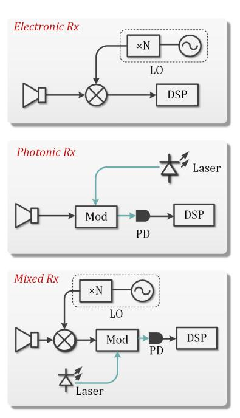

Fig. 1. Receiving architectures of electric and photonic-based solutions of MMW and THz ISAC systems.

detection distance in complex application scenarios. However, in these complex scenarios, an MMW/THz beam may contain multiple targets that need to be detected. Our findings indicated that the reception and processing scheme employed in our prior research contributed to the generation of false targets during the detection of scenes with multiple targets, particularly those within the same angular sector. This phenomenon adversely affected the system's performance. In the previous research [\[31\], w](#page-13-30)hile we briefly analyzed one of the reasons for the generation of false targets, we did not provide a detailed analysis of the problem and the corresponding solutions. Furthermore, we did not conduct a thorough theoretical derivation, comprehensive discussion of relevant parameters, or the necessary simulation and experimental verification to support our findings.

Through extensive research and in-depth analysis, it has been determined that the occurrence of false targets in the detection of multitarget scenarios is closely related to the radar sensing receiving scheme and processing methods employed. Specifically, when a photonic-based MMW ISAC system adopts the electronic-based receiving scheme at the radar sensing end [\[10\],](#page-13-9) [\[11\],](#page-13-10) [\[12\],](#page-13-11) [\[16\],](#page-13-15) [\[23\],](#page-13-22) [\[24\],](#page-13-23) [\[25\],](#page-13-24) [\[26\], t](#page-13-25)he issue of false targets does not arise. However, when utilizing a system architecture that incorporates photonic-based reception or a hybrid scheme, the nonlinear effects introduced by photonic devices may lead to the inter-mixing of echoes from different targets, resulting in the generation of false targets. In addition, if the signal processing method, such as MF, is chosen instead of utilizing PDC at the receiving end [\[8\],](#page-13-7) [\[10\],](#page-13-9) [\[11\],](#page-13-10) [\[12\],](#page-13-11) [\[13\],](#page-13-12) [\[14\],](#page-13-13) [\[15\],](#page-13-14) [\[16\],](#page-13-15) [\[17\],](#page-13-16) [\[23\],](#page-13-22) [\[24\],](#page-13-23) [\[25\],](#page-13-24) [\[26\], f](#page-13-25)alse target generation can be effectively avoided.

However, considering the advantages of utilizing photonic-based reception combined with the PDC scheme, such as leveraging the wide bandwidth of photonic devices and reducing the complexity of signal processing, it is

{2}------------------------------------------------

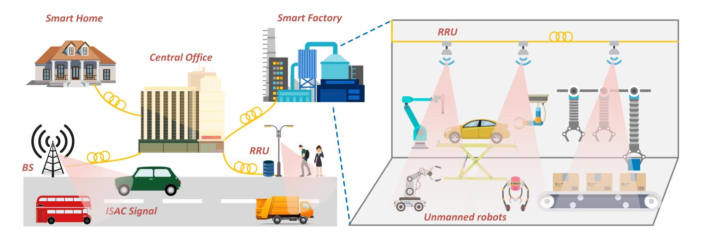

Fig. 2. Concept of photonic-based MMW ISAC networks.

essential to address the potential challenges that may arise when detecting multitarget scenes under this architecture. In [\[30\], d](#page-13-29)etection results are presented by placing targets at different positions. However, these nonsynchronous detection results alone cannot adequately demonstrate the capability for multitarget scene detection. Moreover, in studies like [\[18\]](#page-13-17) and [\[21\], t](#page-13-20)he focus of multitarget scene detection primarily revolves around verifying range resolution. Consequently, compared to the distance of the target itself, the distances between different targets are relatively small. Hence, the true effectiveness of multitarget scene detection cannot be fully assessed based solely on the obtained results.

This article offers an in-depth examination of the elements contributing to the emergence of false targets under similar angles of incidence in photonic-based MMW/THz ISAC systems. Through theoretical derivation, simulations, and experiments, we identified that the nonlinear and square-law detection effects of the devices in the system can lead to false target problems. To address these issues, we redesigned and improved the system, proposing a novel photonic-based *W*-band MMW ISAC system for the fiber-wireless network. In constructing multitarget scenes, we took into account the arrangement of different targets. Specifically, the angles between the multiple targets we positioned were deliberately close, and the disparity in distance between the farthest and closest targets was comparable to the overall distance of the targets. Through meticulous arrangement and comparative experiments, we substantiate that the proposed system in this article is capable of effectively detecting multitarget scenes. In addition, in our experiment, we achieved high range resolution ranging from 1.76 to 3.15 cm and a high DR from 15 to 60 Gbit/s through a 10-km fiber and a 1-m wireless *W*-band MMW link. The distance errors after calibration were consistently below 3 cm.

The structure of this article is organized as follows. Section [II](#page-2-0) describes the principle of the proposed photonicsbased *W*-band ISAC system with multitarget detection capability for the fiber-wireless network. Section [III](#page-6-0) provides the simulation results to verify our idea. Section [IV](#page-7-0) provides a description of the experimental setup. The experimental results and analysis are presented in Section [V.](#page-8-0) Finally, Section [VI](#page-12-0) presents the conclusion of the study.

### II. PRINCIPLE

Fig. [2](#page-2-1) depicts some typical application scenarios of the MMW/THz ISAC system. Integrated signals that achieve communication and radar sensing functions simultaneously are generated in the central office (CO) and transmitted to various nodes such as base stations (BSs) or remote radio units (RRUs) through fibers. In these ISAC nodes, MMW/THz signals are generated through optoelectric (O/E) conversion. The MMW/THz signals transmitted in the wireless channel can exchange information with the user end (UE) and can also be used to perceive the environmental information around the node. The MMW/THz echoes, which are reflected by the targets, are collected by nodes. Subsequently, the dechirping signals are transmitted back to the CO through fiber for centralized processing. With the powerful digital signal processing (DSP) capabilities of the CO and the combination of artificial intelligence (AI) [\[34\],](#page-13-33) [\[35\], c](#page-13-34)ommunication and unmanned equipment in the scene can be remotely controlled.

With the concern of decentralization in 6G networks, our approach can also be implemented without the use of fiber or with a short length of fiber, allowing for a distributed architecture where the processing unit can be located closer to the sensors. Depending on the length of the fiber used, the system can also incorporate a hybrid architecture. This hybrid architecture involves the utilization of a distributed unit (DU) where the processing unit is located. The DU can connect multiple nodes with ISAC functionality, enabling more detailed information processing. In this configuration, the PDC scheme employed by our system eliminates the need to transmit the complete echo signal. Instead, only the dechirping signal is transmitted to the DU. This approach is specifically designed to achieve a decentralized system, facilitating distributed processing and mapping of the scene based on distance detection.

Based on this scenario, the schematic of our *W*-band photonic-based MMW ISAC system for fiber-wireless network is shown in Fig. [3.](#page-3-0) In our previous research [\[31\], b](#page-13-30)y combining radar sensing and communication signals through

{3}------------------------------------------------

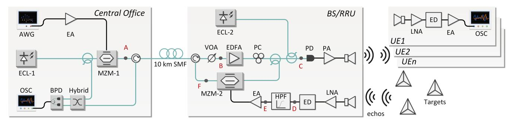

Fig. 3. Experimental setup of the photonic-based *W*-band ISAC system for fiber-wireless network. AWG: arbitrary waveform generator, ECL: external cavity laser, EA: electrical amplifier, MZM: Mach–Zehnder modulator, SMF: single-mode fiber, VOA: variable optical attenuator, EDFA: erbium-doped fiber amplifier, PC: polarization controller, OC: optical coupler, PA: power amplifier, PD: photodiode, LNA: low noise amplifier, ED: envelope detector, HPF: high-pass filter, BPD: balanced PD, and OSC: oscilloscope.

frequency-division multiplexing (FDM), the tradeoff between range resolution and DR can be achieved by allocating the bandwidth. In this article, we adopt a similar scheme where the linear frequency modulation (LFM) signal is used for radar sensing. The LFM signal can be expressed as

$$x_{\text{radar}}(t) = \text{rect}\left(\frac{t}{T_{\text{LFM}}}\right) \exp(j2\pi f_{\text{IF}}t + j\pi kt^2)$$
 (1)

where *T*LFM is the duration time of the LFM signal, *f*IF is the IF, *k* is the slope of the LFM signal, which can be expressed as *k* = *Br* /*T*LFM, *Br* is the bandwidth of the LFM signal, and rect(.) is the unit rectangular window function.

In this article, we achieve communication function using subcarrier modulation (SCM) signals commonly used in communication systems. The process involves constellation mapping, upsampling, and shaping filtering. The shaping filters of the real and imaginary parts are represented as

$$f_I(t) = h(t)\cos\left[2\pi \left(f_{\rm IF} + f_{\rm GAP} + B_r\right)t\right] \tag{2}$$

$$f_Q(t) = h(t)\sin[2\pi(f_{\rm IF} + f_{\rm GAP} + B_r)t]$$
 (3)

where *h*(*t*) is the square-root raised-cosine pulse and *f*GAP is the guard interval frequency used to eliminate mutual interference. The SCM signal can be represented as

$$x_{\text{com}}(t) = R(\mathbf{C}) * f_I(t) - I(\mathbf{C}) * f_Q(t)$$
(4)

where *C* is the complex upsampling signal, *R*(.) and *I*(.) denote the real and imaginary parts, respectively, and ∗ denotes the convolution operation.

The proposed ISAC waveform, as mentioned above, can be expressed as *x*(*t*) = *x*radar(*t*) + *x*com(*t*). For radar sensing, the range resolution is δ*r* = *c*/2*Br* , where *c* denotes the velocity of light. On the other hand, the DR of communication can be expressed as DR = *Bc* log2 (1 + SNR), where SNR denotes the signal-to-noise rate of the communication receiving end and *Bc* denotes the bandwidth of SCM signal. This indicates that while the total bandwidth of the ISAC signal remains unchanged, we can balance radar and communication performance by adjusting the bandwidth ratio between the LFM and SCM signals.

The integrated signal is generated in the CO and then modulated onto the light emitted by external cavity laser-1 (ECL-1) via MZM-1, as shown in Fig. [3.](#page-3-0) In our system, MZM-1 operates at the quadrature bias point (QBP) and under small signal modulation, only the first-order sideband is considered. The output of MZM-1 can be represented as

$$E_{\text{MZM}-1}(t) \propto E_{c1} \exp(j\omega_{c1}t) \cdot \begin{bmatrix} J_0(m_1) \\ +J_1(m_1)[\exp(j\omega t) + \exp(-j\omega t)] \end{bmatrix}$$
 (5)

where *Ec*1 denotes the amplitude of the light emitted by ECL-1, ω*c*1 denotes the frequency of the light, *m*1 denotes the modulation index of MZM-1, *Jn* (*n* = 0, 1) denotes the first kind of *n*-order Bessel function, and ω denotes the frequency of the FDM integrated signal. For the convenience of derivation, it can be simplified as

$$\omega = 2\pi (f_M + kt) \tag{6}$$

where *fM* can be expressed as *fM* = *f*IF + *f*GAP + *Bc*.

The modulated optical signal is transmitted through optical fiber to the BS/RRU. At the BS/RRU, the optical signal is split into two paths. One path is used as a reference signal for PDC, while the other path is coupled with the light emitted by the ECL-2 through the optical coupler (OC). The optical signal at point *C* in Fig. [3](#page-3-0) can be represented as

$$E_{\text{point-}C}(t) \propto E_{\text{MZM}-1}(t) + E_{c2} \exp(j\omega_{c2}t)$$
 (7)

where *Ec*2 denotes the amplitude of the light emitted by the ECL-2 and ω*c*2 denotes the frequency of the light. Afterward, the optical signal is sent to the high-speed photodiode (PD) for O/E conversion. It is then amplified by the power amplifier (PA) and radiated into free space by the horn antenna (HA). The PA and HA function as bandpass filters. Ideally, the MMW signal transmitted in the wireless channel can be represented as

$$E_{\text{MMW}}(t) \propto A_{\text{carrier}} J_0(m_1) \cos(\omega_{c2} - \omega_{c1}) t + A_{\text{sig}} J_1(m_1) \cos(\omega_{c2} - \omega_{c1} + \omega) t$$
 (8)

where *A*carrier and *A*sig denote the amplitude of the carrier and signal, respectively, and ω*c*2 −ω*c*1 represents the frequency of the MMW signal.

On the UE, we amplify the signal received by the HA using a low noise amplifier (LNA). Then, we use the ED to downconvert the MMW signal to the IF band. This scheme aims to reduce the device pressure on the UE while also eliminating the frequency offset caused by heterodyning two 

{4}------------------------------------------------

free-run lasers. The electrical signal after the ED can be represented as

$$E_{\text{ED-com}}(t) \propto G_{\text{com}}\{\cos \omega t\}$$
 (9)

where *G*com denotes the responsivity of the ED on the UE. It is important to highlight that when employing EDs for downconverting MMW signals, the presence of a carrier signal is necessary. However, if MZM-1 operates at the minimum transmission point (MITP), the transmitted MMW signal does not contain carrier components. As a result, it becomes impossible to utilize the ED for downconversion.

In addition, MMW signals are reflected by targets in the scene. In the presence of multiple targets, the echo signal can be represented as

$$E_{\text{echo}}(t) \propto \alpha_{1} \begin{cases} A_{\text{carrier}} J_{0}(m_{1}) \cos(\omega_{c2} - \omega_{c1}) t \\ + A_{\text{sig}} J_{1}(m_{1}) \cos(\omega_{c2} - \omega_{c1} + \omega'_{1}) t \end{cases}$$

$$+ \alpha_{2} \begin{cases} A_{\text{carrier}} J_{0}(m_{1}) \cos(\omega_{c2} - \omega_{c1}) t \\ + A_{\text{sig}} J_{1}(m_{1}) \cos(\omega_{c2} - \omega_{c1} + \omega'_{2}) t \end{cases}$$

$$+ \dots$$

$$+ \alpha_{n} \begin{cases} A_{\text{carrier}} J_{0}(m_{1}) \cos(\omega_{c2} - \omega_{c1}) t \\ + A_{\text{sig}} J_{1}(m_{1}) \cos(\omega_{c2} - \omega_{c1} + \omega'_{n}) t \end{cases}$$
 (10)

where α*n* represents the attenuation coefficient of the *n*th echo signal, which is co-determination by various factors, such as the signal transmission distance and the backscattering coefficient of the target, and ω ′ *n* represents the frequency component of the IF part of the *n*th echo signal, which can be expressed as

$$\omega_n' = 2\pi \left[ f_M + k(t + \tau_n) \right] \tag{11}$$

where τ*n* represents the time delay of the *n*th echo, allowing us to calculate the distance of the target. To simplify further calculations, let us consider the scenario where there are two targets in the scene. In this case, we can restate [\(10\)](#page-4-0) as follows:

$$E_{\text{echo}}(t) \propto \alpha_{1} \begin{cases} A_{\text{carrier}} J_{0}(m_{1}) \cos(\omega_{c2} - \omega_{c1}) t \\ + A_{\text{sig}} J_{1}(m_{1}) \cos(\omega_{c2} - \omega_{c1} + \omega'_{1}) t \end{cases} + \alpha_{2} \begin{cases} A_{\text{carrier}} J_{0}(m_{1}) \cos(\omega_{c2} - \omega_{c1}) t \\ + A_{\text{sig}} J_{1}(m_{1}) \cos(\omega_{c2} - \omega_{c1} + \omega'_{2}) t \end{cases}.$$
(12)

The MMW echoes from various targets are captured simultaneously by the HA in the BS/RRU and amplified by the LNA. These amplified echoes are then sent to the ED for down conversion. The resulting output IF signal of the ED can be represented as

$$E_{\text{ED-radar}}(t) \propto G_{\text{radar}} \begin{cases} \cos \omega_1' t \\ +\cos \omega_2' t \\ +\cos k(\tau_1 - \tau_2) t \end{cases}$$
(13)

where *G*radar denotes the responsivity of the ED in the BS/RRU.

In our system, it is important to consider the square-law detection of the ED, which introduces beat frequencies between different echoes. These beat frequencies are a result of the LFM signal dechirping and are directly associated with the distance differences between real targets. Failure to process these beat frequencies can lead to false targets at the receiving end of the CO as the fiber passes through. To overcome this challenge, we propose the addition of a high-pass filter (HPF) after the ED. It is worth noting that the detection distance in our system is primarily constrained by *f*IF. Thus, the farthest detection distance can be represented as

$$R_{\rm IF} = \frac{cT_{\rm LFM}f_{\rm IF}}{2B_r} = \frac{cf_{\rm IF}}{2k}.$$
 (14)

Within the detection range *R*IF, the frequency component resulting from dechirping between echoes of targets at different distances must also be within the *f*IF. Using the HPF, we can eliminate all signals below *f*IF, effectively solving the problem of false targets caused by the ED. Therefore, at the point *E* in Fig. [3,](#page-3-0) the signal can be represented as

$$E_{\text{point-}E}(t) \propto G_{\text{radar}} \{ \cos \omega_1' t + \cos \omega_2' t \}.$$
 (15)

Another viable approach to address false targets problem is through the utilization of coherent reception, as shown in Fig. [1.](#page-1-1) Unlike the square-law detection employed by EDs, coherent reception involves the use of a mixer that acts as a multiplier, effectively preventing the occurrence of frequency beating between different echoes. However, it is important to acknowledge that implementing coherent reception methods requires the incorporation of additional local oscillator (LO) sources and frequency multipliers. Consequently, this results in an increased number of devices being necessary at the receiving end. This poses a particular challenge when dealing with UE devices, such as mobile phones, which often have limited spatial resources. The constraint of limited spatial resources further complicates the implementation of coherent reception schemes. Although coherent reception effectively tackles the issue of false targets, it contradicts our initial intention of simplifying the receiver structure.

Afterward, the IF echoes are modulated onto the reference signal through MZM-2 for PDC. In our previous studies [\[31\],](#page-13-30) [\[32\],](#page-13-31) [\[33\], w](#page-13-32)e employed the intensity modulation and direct detection (IM/DD) scheme. By modulating the downconverted echo signal to the intensity of the reference light signal through MZM-2, we could effectively use a single PD for opticalto-electrical conversion in the CO. Thus, we set MZM-2 to operate at the QBP. However, it is worth noting that the MZM, being a nonlinear optical device, can induce the false target problem when operating at different bias points.

To illustrate the varying degrees of false target problems caused by the working points of the MZM, let us consider a simple model that two sinusoidal signals of different frequencies are modulated onto the MZM. The model is shown in Fig. [4,](#page-5-0) and the output of the MZM can be represented as

$$E_{\text{MZM}}(t) = E_0 \exp(j\omega_0 t) \cos[m(\cos\omega_1 t + \cos\omega_2 t) + \theta/2]$$
(16)

where *E*0 denotes the amplitude of the light; ω0 denotes the frequency of the light; *m* denotes the modulation index of the MZM; ω1 and ω2 represent the frequency of the sinusoidal signal, respectively; θ = π*V*dc/*V*π , in which *V*dc is the bias voltage; and *V*π is the half-wave voltage of the MZM. When the MZM operates at the QBP, MITP, and maximum transmission point (MATP), θ is equal to π/2, π, and 2π, respectively. Taking MZM operating at the QBP as

{5}------------------------------------------------

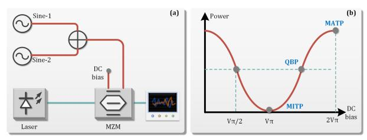

Fig. 4. Model of simple IM using MZM. (a) Two single-tone signals are superimposed and modulated onto the light. (b) Typical transfer characteristics of an MZM.

an example, (16) can be rewritten as

$$E_{\text{MZM}}(t) \propto E_0 \exp(j\omega_0 t) \cdot \begin{cases} \cos[m(\cos\omega_1 t + \cos\omega_2 t)] \\ -\sin[m(\cos\omega_1 t + \cos\omega_2 t)] \end{cases}$$
(17)

where the first term in {.} can be written as

$$\cos[m(\cos\omega_1 t + \cos\omega_2 t)]$$

$$= \cos[m(\cos\omega_1 t)] \cos[m(\cos\omega_2 t)]$$

$$-\sin[m(\cos\omega_1 t)] \sin[m(\cos\omega_2 t)]$$
(18)

and it can be expanded by Jacobi's series [36] as

$$\cos[m(\cos\omega_{1}t)] = J_{0}(m) + 2\sum_{n=1}^{\infty} (-1)^{n} J_{2n}(m) \cos(2n\omega_{1}t)$$

$$\cos[m(\cos\omega_{2}t)] = J_{0}(m) + 2\sum_{n=1}^{\infty} (-1)^{n} J_{2n}(m) \cos(2n\omega_{2}t)$$

$$\sin[m(\cos\omega_{1}t)] = 2\sum_{n=0}^{\infty} (-1)^{n} J_{2n+1}(m) \cos[(2n+1)\omega_{1}t]$$

$$\sin[m(\cos\omega_{2}t)] = 2\sum_{n=0}^{\infty} (-1)^{n} J_{2n+1}(m) \cos[(2n+1)\omega_{2}t].$$
(19)

If we only consider the case of n = 1, (18) can be written as

$$\cos[m(\cos\omega_{1}t + \cos\omega_{2}t)] = [J_{0}(m) - 2J_{2}(m)\cos(2\omega_{1}t)] \times [J_{0}(m) - 2J_{2}(m)\cos(2\omega_{2}t)] - 4J_{1}^{2}(m)\cos\omega_{1}t\cos\omega_{2}t.$$
(20)

The appearance of the product of two frequencies indicates the presence of a beat frequency phenomenon, resulting in a frequency component of  $\omega_1 \pm \omega_2$ . This process is analogous to the dechirping of two echoes in the ED, which can lead to the generation of false targets.

The second term in  $\{.\}$  of (17) can also be expanded in the same way, considering the case of n = 1, which can be written as

$$\sin[m(\cos\omega_1 t + \cos\omega_2 t)]$$

$$= 2J_0(m)J_1(m)(\cos\omega_1 t + \cos\omega_2 t)$$

$$-4J_1(m)J_2(m)\begin{bmatrix} \cos\omega_1 t \cos(2\omega_2 t) \\ +\cos\omega_2 t \cos(2\omega_1 t) \end{bmatrix}. \tag{21}$$

The expansion of this term does not contain any  $\omega_1 \pm \omega_2$  frequency component. When the MZM operates at the MITP, (16) can be written as

$$E_{\text{MZM}}(t) \propto E_0 \exp(j\omega_0 t) \sin[m(\cos \omega_1 t + \cos \omega_2 t)]$$
 (22)

whose expansion form is similar to the second term in {.} of (17). On the other hand, when the MZM operates at the MATP, (16) can be written as

$$E_{\text{MZM}}(t) \propto E_0 \exp(j\omega_0 t) \cos[m(\cos\omega_1 t + \cos\omega_2 t)]$$
 (23)

whose expansion form is similar to the first term in  $\{.\}$  of (17).

Based on the above derivation and analysis, in our system, if MZM-2 in the BS/RRU operates at the QBP, its output can be represented as

$$E_{\text{MZM}-2}(t)$$

$$\left\{ \begin{array}{l} A_{1}J_{0}(m_{2})J_{0}(m_{1}) \exp(j\omega_{c1}t) \\ +A_{2}J_{0}(m_{2})J_{1}(m_{1}) \exp[j(\omega_{c1}t \pm \omega t)] \\ +A_{3}J_{1}(m_{2})J_{0}(m_{1}) \exp[j(\omega_{c1}t \pm \omega'_{1}t)] \\ +A_{4}J_{1}(m_{2})J_{0}(m_{1}) \exp[j(\omega_{c1}t \pm \omega'_{2}t)] \\ +A_{5}J_{1}(m_{2})J_{1}(m_{1}) \exp[j(\omega_{c1}t \pm k\tau_{1}t)] \\ +A_{6}J_{1}(m_{2})J_{1}(m_{1}) \exp[j(\omega_{c1}t \pm k\tau_{2}t)] \\ +A_{7}J_{1}(m_{2})J_{1}(m_{1}) \exp[j(\omega_{c1}t \pm k(\tau_{1} - \tau_{2})t)] \end{array} \right\}$$

$$(24)$$

where  $m_2$  denotes the modulation index of MZM-2 and  $A_n$  denotes the amplitude of different terms in  $\{.\}$ .

We can observe that the echoes in MZM-2 complete dechirping with the reference signal. However, due to the nonlinear effect of MZM-2, the dechirping process can also occur between different echoes, resulting in the false target problem. The same problem can arise when MZM-2 operates at the MATP, but it can be avoided when MZM-2 operates at the MITP, where the output of MZM-2 can be represented as

$$E_{\text{MZM}-2}(t) \propto \begin{cases} A_1 J_1(m_2) J_0(m_1) \exp\left[j\left(\omega_{c1}t \pm \omega_1't\right)\right] \\ + A_2 J_1(m_2) J_0(m_1) \exp\left[j\left(\omega_{c1}t \pm \omega_2't\right)\right] \\ + A_3 J_1(m_2) J_1(m_1) \exp\left[j\left(\omega_{c1}t \pm k\tau_1t\right)\right] \\ + A_4 J_1(m_2) J_1(m_1) \exp\left[j\left(\omega_{c1}t \pm k\tau_2t\right)\right] \end{cases}$$
(25)

where only the echoes and their frequency components generated after dechirping with the reference signal are present.

However, as a square-law detection device, Therefore, the optical signal is converted into an electrical signal through optical-to-electrical conversion at the CO, where the dechirping echo signal is received.

The dechirping frequencies and echoes are sent back to the CO through the fiber, where they are converted into electrical signals through O/E conversion. In our previous studies, we used the PD as the core device for O/E conversion. However, as a square-law detection device, the PD generates frequency beating between these frequency components, resulting in false targets. If we use the PD, its output can be represented as

$$I_{\text{PD}}(t) \propto R_{\text{PD}} \begin{cases} \cos \omega_1' t + \cos \omega_2' t \\ + \cos k \tau_1 t + \cos k \tau_2 t \\ + \cos [k(\tau_1 - \tau_2) t] \end{cases}$$
 (26)

where  $R_{\rm PD}$  denotes the responsivity of the PD.

As the improved system shown in Fig. 3, we utilize the balanced PD (BPD) instead of the PD to avoid the generation of false targets through coherent reception. The concept of mitigating false targets through the application of BPD and

{6}------------------------------------------------

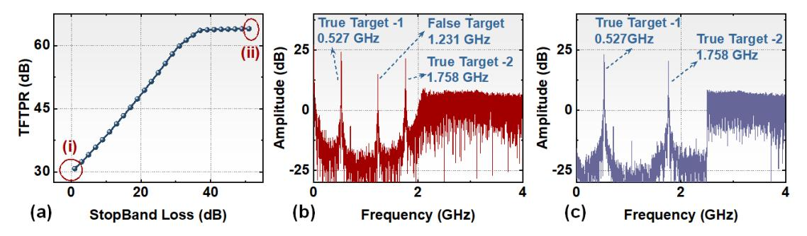

Fig. 5. (a) Stopband loss of the HPF versus the TFTPR. (b) Spectrum after FFT operation at point (i) with a small loss. (c) Spectrum after FFT operation at point (ii) with a large loss.

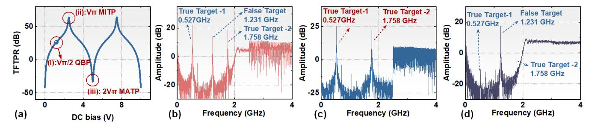

Fig. 6. (a) TFTPR versus the dc bias voltage. (b) Spectrum after FFT operation at point (i) with MZM-2 operating at QBP. (c) Spectrum after FFT operation at point (ii) with MZM-2 operating at MITP. (d) Spectrum after FFT operation at point (iii) with MZM-2 operating at MATP.

optimizing the points of MZM-2 mirrors the methodology proposed in [37]. Nonetheless, this article distinguishes itself by utilizing MZM-2 for PDC, yielding a dechirped output recognizable as a single-tone signal. This signal is then transmitted through long-distance optical fiber and subsequently undergoes optical-to-electrical conversion via the BPD, thereby offering improved stability for long-distance fiber transmission.

The signal output by BPD can be represented as

$$I_{\rm BPD}(t) \propto R_{\rm BPD} \left\{ \begin{array}{l} \cos \omega_1' t + \cos \omega_2' t \\ + \cos k \tau_1 t + \cos k \tau_2 t \end{array} \right\}$$
 (27)

where  $R_{\rm BPD}$  denotes the responsivity of the BPD. We can perform a fast Fourier transform (FFT) operation and find the correlation peaks in the spectrum. The relationship between the peak frequency and target distance can be represented as

$$\Delta R = \frac{cT_{\text{LFM}}\Delta f}{2B_r} \tag{28}$$

where  $\Delta f$  is the peak frequency and  $\Delta R$  is the target distance.

### III. SIMULATION

To verify the theory described in Section II and assess the feasibility of the proposed photonic-based W-band ISAC system for the fiber-wireless network, simulations were conducted using VPItransmissionMaker (VPI), a commercially available optical system simulation platform. The simulation setup mirrored the experiment shown in Fig. 3.

The focus of the simulation was to investigate the generation of false targets and identify solutions. For this purpose, the transmitting waveform selected was a full-band LFM signal. The signal had  $f_{\rm IF}$  of 2 GHz, a bandwidth of 6 GHz, and a duration ( $T_{\rm LFM}$ ) of 341.3 ns. Two targets were set up in the scenario, with corresponding delays of 30 and 100 ns.

According to (28), the correlation peak frequencies of the real targets were determined to be 0.5273 and 1.7578 GHz. Based on the analysis conducted in the previous section, if a false target existed, its correlation peak frequency would be the difference between the two real target frequencies, i.e., 1.231 GHz.

We analyzed the signal at radar sensing receiving side of the simulation system with this prior information. First, we verified the contribution of the ED to the false target problem and the effectiveness of the HPF in addressing this issue. The simulation was conducted with a designed HPF stopband ranging from direct current (dc) to 2.5 GHz. We adopted the receiving structure comprising MZM-2 (operating at MITP) and BPD while controlling the loss of the HPF stopband. Subsequently, we analyzed the power ratio of correlation peaks between the true and false targets after the FFT operation. The results are shown in Fig. 5.

From Fig. 5(a), we can observe that the power of the false target gradually decreases as the stopband increases, leading to an increase in the true-to-false target power ratio (TFTPR). It is important to note that the inter-mixing of different target echoes yields single-tone signals, and the dechirping process of the LFM signal generates a gain corresponding to the time-bandwidth product (TBP) [38]. Therefore, the HPF used must possess a relatively large out-of-band attenuation to completely eliminate the false target frequency. Otherwise, the false target would still have an impact on the detection process.

Fig. 5(b) and (c) shows the correlation peak results at points (i) and (ii) in Fig. 5(a), respectively. In Fig. 5(b), we can observe that after the BPD and the subsequent FFT operation, the sampled signal generates frequency components corresponding to the predetermined target, as well as frequency components of false targets. Remarkably, these false target

{7}------------------------------------------------

TABLE II PARAMETERS OF DESIGNED WAVEFORMS

| Case | $B_r$ (GHz) | $B_c$ (GHz) |
|------|-------------|-------------|
| 1    | 5           | 6           |
| 2    | 8           | 3           |
| 3    | 12          | -           |
| 4    | -           | 12          |

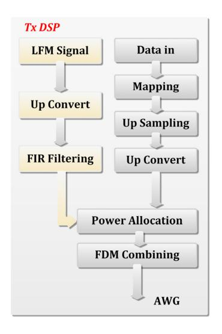

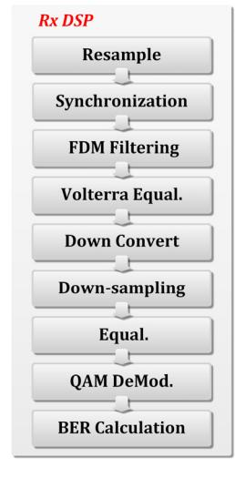

Fig. 7. Block diagrams of the offline DSP.

frequency components are exactly equal to the difference between the corresponding frequency components of the real target. However, by increasing the stopband loss of the HPF to over 40 dB, as shown in Fig. [5\(c\),](#page-6-2) only the true frequency component remains. By comparing these two figures, it becomes evident that the HPF effectively resolves the false target issue caused by the echo dechirping. By comparing these two figures, it is evident that the HPF effectively solves the false target problem caused by the ED.

Moreover, we verified the effect of MZM-2 operating points on the false target problem by simulation. We controlled the dc bias voltage of MZM-2 so that it works at different operating points and increased the stopband loss of the HPF to the maximum. We then used the BPD reception and performed the FFT operation to obtain the TFTPR versus the dc bias voltage, as shown in Fig. [6\(a\).](#page-6-3) The results reveal that the best suppression of the false target problem when MZM-2 operates at the MITP, while the problem of false target becomes severe when MZM-2 operates at the MATP.

The correlation peaks under different operating points are also presented in Fig. [6\(b\)–\(d\),](#page-6-3) enabling a clear observation of the effect of different operating points on multitarget detection. These simulation results align with the derivation presented in the previous section. From Fig. [6\(b\),](#page-6-3) it is evident that there are both real targets and false targets. This observation suggests that when MZM-2 operates at the QBP, the echoes of different targets undergo both dechirping with the reference signal and inter-mixing between the different echoes, resulting in the presence of false targets. This finding also verifies the derivation provided in [\(20\).](#page-5-3) Furthermore, in Fig. [6\(d\),](#page-6-3) we can observe that when MZM-2 operates at the MATP, the intensity of the false target significantly increases, completely overshadowing the real target. This implies that the PDC scheme is completely ineffective. Only when MZM-2 operates at the MITP, can effective detection of multiple targets be ensured while avoiding the generation of false targets.

### IV. EXPERIMENTAL SETUP

As a proof-of-concept, we set up an experiment of the photonics-based flexible *W*-band ISAC system with multiple targets detection capability for the fiber-wireless network, as shown in Fig. [3.](#page-3-0)

In order to achieve a tradeoff between communication and radar sensing, we designed four waveform cases. Among them, cases 1 and 2 can simultaneously achieve communication and sensing functions, where LFM and SCM signals are combined by FDM. Cases 3 and 4 can separately achieve sensing and communication functions. The specific parameters are shown in Table [II.](#page-7-1) The total bandwidth of the ISAC signal is 12 GHz, and in the case of FDM, *f*GAP is equal to 1 GHz. The IF ( *f*IF) of the signal is 3 GHz. The duration of the LFM signal is 68.27 ns. The data sequence for communication is generated and mapped according to the regular 32-quadrature amplitude modulation (32-QAM) and then upsampled and modulated by the SCM scheme. In order to further balance sensing and communication, we also allocated power between the LFM and SCM signals in cases 1 and 2. The power ratio is defined as the average power ratio of the SCM to LFM signal. The DSP process is shown in Fig. [7.](#page-7-2) The spectrums of the transmitted signal are depicted in Fig. [8.](#page-8-1) The ISAC signal was then sent to an arbitrary waveform generator (AWG) with a sampling rate of 60 GSa/s. Finally, the ISAC signal was amplified using an electrical amplifier (EA) to drive MZM-1. ECL-1 working at 193.4015 THz with a linewidth of 3 kHz was applied as the light source with the power of 15 dBm.

Subsequently, the modulated optical signal was transmitted through a 10-km optical fiber and amplified through an erbium-doped fiber amplifier (EDFA). The amplified optical signal was then sequentially passed through a polarization controller (PC) and a polarization-maintaining OC (PM-OC). One output from the coupler served as the reference optical signal, while the other output coupled with the laser emitted by the ECL-2 through another PM-OC. ECL-2 is a tunable laser with a linewidth of 100 kHz. This optical signal was sent to a 100-GHz high speed to generate the MMW signal, which was then amplified by the PA and radiated into free space by the HA.

After a 1-m wireless transmission, the MMW signal was received by the HA and amplified by the LNA at the UE side. Subsequently, the MMW signal was downconverted to the IF band by the ED and collected by an oscilloscope (OSC) with a sampling rate of 80 GSa/s for offline DSP. The communication DSP blocks are shown in Fig. [7.](#page-7-2) In the DSP process, the IF signal was first resampled and synchronized, followed by FDM filtering to eliminate the LFM signal. Then, Volterra equalization was performed on the signal. After downconversion and downsampling, a least mean square (LMS) equalization was further implemented. Finally, the bit error rate (BER) was obtained to evaluate the communication performance.

{8}------------------------------------------------

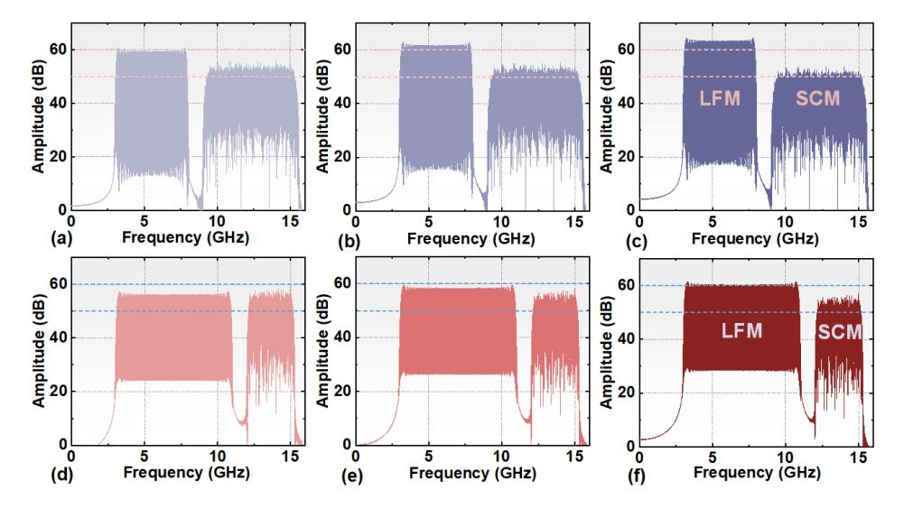

Fig. 8. Electrical spectrums of cases 1 and 2 with different power ratios. (a)–(c) Case 1 power ratios of 2:1, 1:1, and 1:2, respectively. (d)–(f) Case 2 power ratios of 2:1, 1:1, and 1:2, respectively.

At the radar sensing receiving side, the MMW echoes reflected by the targets in the scene were received by the HA. The signals were then amplified by the LNA and downconverted to the IF band through the ED. To eliminate the false target problem introduced by the ED, an HPF with a stopband of dc-to-2270 MHz and a loss greater than 30 dB was used. The electrical signals were subsequently modulated onto the reference optical signal and completed PDC in MZM-2. The dechirping signals were transmitted through a 10-km optical fiber and mixed with the light emitted by ECL-1 through a hybrid. These signals were then sent to the BPD for O/E conversion. Subsequently, the electrical signals were collected using the OSC, and the frequency related to the target distance can be obtained through digital low-pass filtering and a simple FFT operation.

## V. RESULTS

# *A. Verification of the Causes of False Target Problem and Corresponding Solutions*

In the previous section, we proposed solutions to address the false target problem that arises when the system detects multiple targets based on an analysis of the underlying reasons. We identified three main causes for false targets: the square-law detection of the ED, the nonlinearity caused by MZM-2, and the square-law detection of the PD. In this section, we conducted experimental verification to validate the derived solutions. In the experiment, we set up two targets at different distances of 0.81 and 1.5 m from the transceiver. To detect the two targets, we selected different waveform cases.

First, we examined the impact of the ED on multitarget detection. We utilized waveform cases 1 and 2 to detect the two targets. We then observed the spectrums of the electrical signals after passing through the ED and the HPF in the BS/RRU, as depicted in Fig. [9.](#page-8-2) Fig. [9\(a\)](#page-8-2) and [\(c\)](#page-8-2) clearly exhibits the presence of a prominent target within *f*IF, with the frequency of 336 and 530.7 MHz, respectively. According

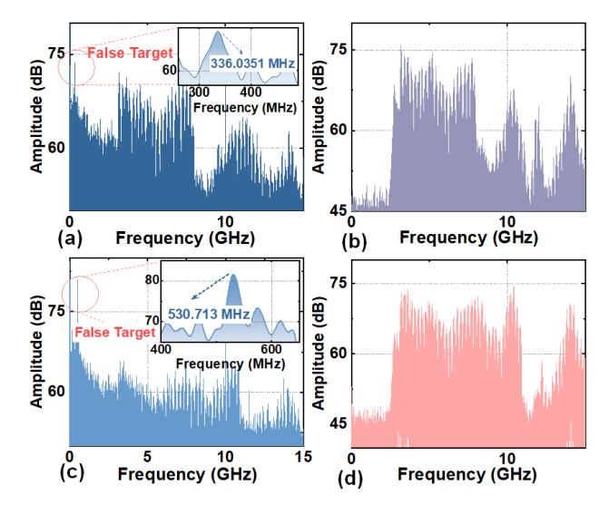

Fig. 9. Spectrum of signals before and after the HPF. (a) Before the HPF case 1, power ratio 1:1. (b) After the HPF case 1, power ratio 1:1. (c) Before the HPF case 2, power ratio 1:1. (d) After the HPF case 2, power ratio 1:1.

to [\(28\),](#page-6-1) we can estimate the corresponding distances related to these frequencies as 0.69 and 0.68 m. However, in actual experimental scenarios, this target did not exist, and the calculated distance of this false target closely matched the difference between the distances of the two true targets. These findings validate that the ED can cause dechirping between different echoes, ultimately resulting in the generation of false targets. On the other hand, Fig. [9\(b\)](#page-8-2) and [\(d\)](#page-8-2) illustrates that the false target is effectively eliminated after passing through the HPF while preserving the echo signals. The unevenness observed in the echo signals is attributed to the frequency response of the HPF.

Moreover, we also verified the effect of MZM-2 operating point and O/E converter in the CO on multitarget detection. First, we controlled MZM-2 to operate at the QBP and MITP and used the BPD for coherent reception in the CO. Through a meticulous analysis of the spectra obtained after

{9}------------------------------------------------

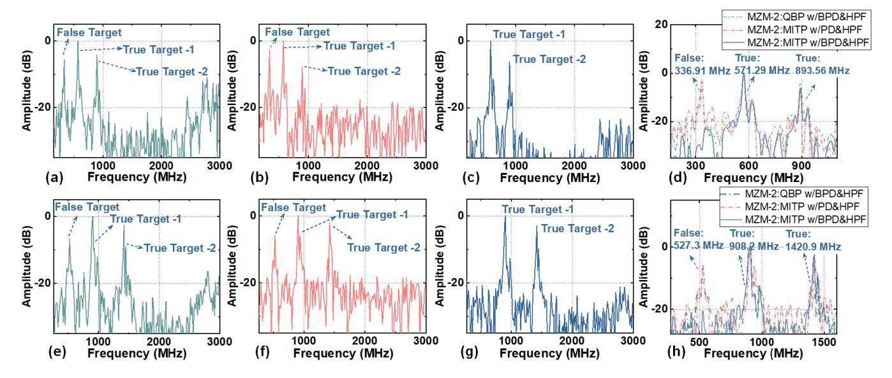

Fig. 10. Spectrums after FFT operation. (a) MZM-2 operated at QBP with BPD and HPF, waveform case 1, power ratios of 1:2. (b) MZM-2 operated at MITP with PD and HPF, waveform case 1, power ratios of 1:1. (c) MZM-2 operated at MITP with BPD and HPF, waveform case 1, power ratios of 1:1. (d) Comparison of different situations with case 1. (e) MZM-2 operated at QBP with BPD and HPF, waveform case 2, power ratios of 1:2. (f) MZM-2 operated at MITP with PD and HPF, waveform case 2, power ratios of 1:1. (g) MZM-2 operated at MITP with BPD and HPF, waveform case 2, power ratios of 1:1. (h) Comparison of different situations with case 2.

the FFT operation, the emergence of false targets in the lower frequency range when MZM-2 operates at the QBP is evident. This observation is clearly depicted in Fig. [10\(a\)](#page-9-0) and [\(e\),](#page-9-0) where false targets can be observed at frequencies of 336.9 and 527.3 MHz, respectively. On the other hand, when MZM-2 operates at the MITP, only real targets in the scene were detected.

Subsequently, we controlled MZM-2 to operate at the MITP and used the PD reception and the BPD coherent reception in the CO. The spectrums after the FFT operation are shown in Fig. [10\(b\),](#page-9-0) [\(c\),](#page-9-0) [\(f\),](#page-9-0) and [\(g\).](#page-9-0) We can observe that when using the PD receiving scheme, the problem of false target reappears. However, using the BPD coherent receiving scheme can effectively avoid the false target problem. To further illustrate the relationship between the false target and real targets, the above results are compiled into Fig. [10\(d\)](#page-9-0) and [\(h\).](#page-9-0) The false target appears at 0.69 and 0.67 m according to [\(28\),](#page-6-1) respectively, when using waveform cases 1 and 2. From the results, we can find that the distance where the false target appears is approximately the distance difference between two real targets.

### *B. Optimal Carrier Frequency and Working Vpp*

In the experiment, we changed the wavelength of the laser emitting by ECL-2 and analyzed the communication and sensing performance at the receiving end. We used the full-band SCM signal (case 4) and the full-band LFM signal (case 3) to evaluate the communication and sensing performance, respectively. The peak-to-peak voltage (*V*pp) of the signal was 220 mV. The results of the relevant experiments are shown in Fig. [11.](#page-9-1) It is apparent that the performance of both communication and radar sensing is excellent when operating at a carrier frequency of 97.5 GHz. The optical spectrums measured at points *A*, *C*, and *F* in Fig. [3](#page-3-0) are shown in Fig. [12.](#page-10-0)

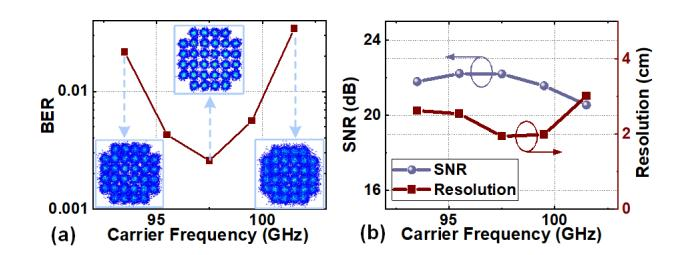

Fig. 11. (a) BER performance with different carrier frequencies. (b) Sensing SNR and range resolution with different carrier frequencies.

In the subsequent experiment, we measured the BER and sensing SNR as a function of *V*pp to determine the optimal working *V*pp for different waveform cases. The results of this investigation are presented in Fig. [13.](#page-10-1) Regarding the communication aspect, it is observed that an increase in *V*pp initially improves the communication performance. However, according to the reason outlined in [\[31\], t](#page-13-30)his improvement saturates and eventually decreases. On the other hand, for radar sensing, the performance does not exhibit a significant improvement once *V*pp reaches 260 mV. Based on these findings, we can conclude that the optimal working *V*pp is determined to be 260 mV.

# *C. ROP and Power Allocation*

Moreover, we studied the effect of the received optical power (ROP) on system performance. We changed the optical power at point *B* in Fig. [3](#page-3-0) by adjusting the variable optical attenuator (VOA) in the BS/RRU and analyzed the system performance. The results are shown in Fig. [14.](#page-10-2)

For communication, as shown in Fig. [14\(a\),](#page-10-2) with three waveform cases, the BER increases with a decrease in the optical power. This is because as the ROP decreases, the power of the transmitted signal also decreases, resulting in

{10}------------------------------------------------

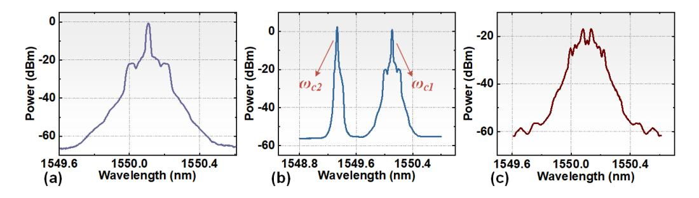

Fig. 12. Optical spectrums at (a) point *A*, (b) point *C*, and (c) point *F*.

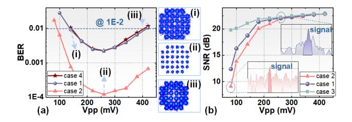

Fig. 13. (a) BER versus *V*pp with different waveform cases. (b) Sensing SNR versus *V*pp with different waveform cases, the power ratio of cases 1 and 2 is 1:1.

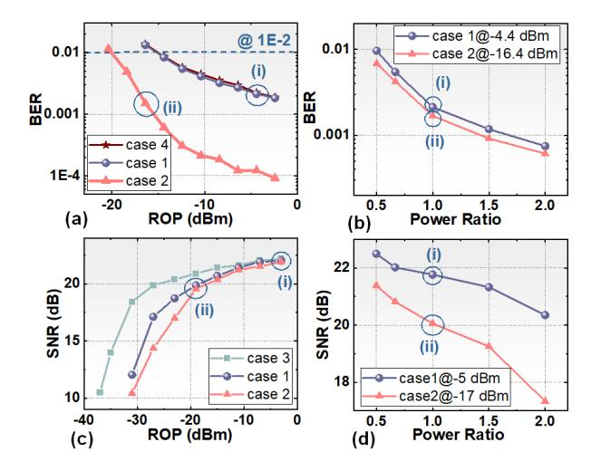

Fig. 14. (a) BER versus optical power at point *B*, power ratio of cases 1 and 2 is 1:1. (b) BER versus different power ratios. (c) Sensing SNR versus optical power at point *B*, power ratio of cases 1 and 2 is 1:1. (d) Sensing SNR versus different power ratios.

insufficient SNR at the UE side and ultimately leading to a decrease in communication performance. We also adjusted the average power ratio of the SCM and LFM signals in cases 1 and 2 under a fixed ROP, as shown in Fig. [14\(b\).](#page-10-2) The results indicate that by allocating more power to the SCM signal, communication performance can be improved.

For radar sensing, as shown in Fig. [14\(c\),](#page-10-2) with three waveform cases, the sensing SNR decreases with a decrease in the optical power. This is because the decrease in optical power at point *B* not only causes a decrease in transmission power but also affects the optical power of the reference optical signal. To investigate this further, we adjusted the average power ratio of the SCM and LFM signal under a similar ROP, and the measured sensing SNR results are shown in Fig. [14\(d\).](#page-10-2) The results demonstrate that when more power is allocated to the LFM signal, the sensing performance improves accordingly. By comparing Fig. [14\(b\)](#page-10-2) and [\(d\),](#page-10-2) we can conclude that power allocation can effectively balance sensing and communication performance, which is crucial for adjusting the detection distance or communication distance.

Through verification experiments on power allocation, we have successfully achieved a tradeoff between radar sensing and communication. This achievement opens up new possibilities for achieving a more flexible ISAC system. It is foreseeable that, by flexibly adjusting the modulation format of communication signals and utilizing advanced signal forms, further improvements in DR can be achieved while maintaining the desired sensing SNR conditions. This advancement paves the way for enhanced ISAC systems with increased DRs and improved overall performance.

### *D. Range Resolution and Distance Error of Radar Sensing*

We have also conducted more experiments to verify the performance of radar sensing. As mentioned in the previous section, we can achieve a tradeoff between sensing range resolution and communication DR by adjusting the bandwidth of the LFM and SCM signal. To measure the range resolution of the three different waveform cases, we placed a small metal target at a distance of 0.81 m and obtained its range profile after conducting the FFT operation at the receiving end. By calculating the 3-dB width of the correlation peak of the range profile, we were able to determine the equivalent range resolution [\[30\],](#page-13-29) [\[38\]. F](#page-13-37)ig. [15\(a\)–\(c\)](#page-11-0) depicts the measured resolution values. The measured resolution values are 3.15, 2.72, and 1.76 cm, while the corresponding theoretical values are 3, 1.875, and 1.25 cm, respectively.

Moreover, we experimentally give the distance error performance. In our system, there is a fixed error due to the mismatch of the transceiver links. Specifically, after the optical signal in the BS/RRU passes through the first PM-OC, the reference light entering MZM-2 and the signal light entering the other PM-OC pass through different lengths of fibers and cables. This difference in transmission distances leads to an additional time delay between the echoes and the reference signal. The distance transmitted by the signal light is greater than that of the reference light, resulting in the measured distance of the target being farther than the true distance.

However, this systematic error can be eliminated through external calibration. In the experiment, we placed a metal target at distances of 0.5, 0.81, 1.02, and 1.5 m, with power

{11}------------------------------------------------

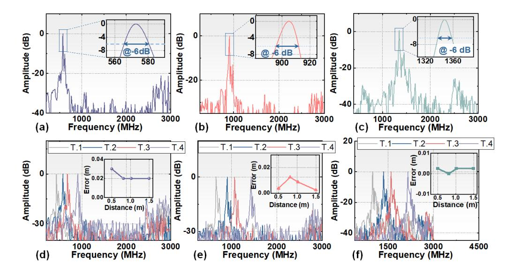

Fig. 15. Measured range resolution of (a) case 1, (b) case 2, and (c) case 3, and spectra of the different dechirped echo and distance error after calibration of (d) case 1, (e) case 2, and (f) case 3.

ratios of 1:1 for waveform cases 1 and 2. The peaks related to these distances are shown in Fig. 15(d)–(f). Using the full-band LFM signal (case 3) at the transmitting side, the measured distance can be obtained according to (28). By subtracting the actual distance from the obtained distance, we found a distance error of 34 cm introduced by the mismatch of the transceiver links. In the subsequent experiments, we used this fixed error obtained from external calibration to calibrate the detected target distance. The distance error in our system is directly linked to the range resolution. From the results presented in Fig. 15(d)-(f), we can conclude that the maximum distance errors, after calibration, for these waveform cases are 3, 1.25, and 0.25 cm, respectively. Thus, the minimum achievable distance error in our system is less than 0.25 cm. For all cases considered, the distance errors after calibration remain below 3 cm.

### E. Scanning Imaging Results for Multiple Targets

Moreover, we placed five targets at different distances and angles and used a turntable to scan within a certain angle range and the results are presented in Fig. 16. The experimental scenario is shown in Fig. 16(i). In the experiment, we used different waveform cases and adjusted the average power ratio of the SCM and LFM signal. By comparing Fig. 16(a)–(c) and (e)–(g), we can observe that allocating more power to the LFM signal enhances the capability to detect targets at long distances. In addition, comparing the different waveform cases with the same power ratio reveals that a smaller slope k corresponds to a farther detection distance, which is consistent with (14). Moreover, we can find that increasing the bandwidth of the LFM signal results in a clearer imaging of the target.

Furthermore, Fig. 16(d), (h), and (k) shows the results of scanning imaging of the same multitarget scene using the system structure in [31], [32], and [33], where the ED operates without the HPF and MZM-2 operates at the QBP, with the PD for O/E conversion. In [32, Fig. 3], our primary objective was to visually demonstrate the influence of the LFM signal slope

on the detection distance. To achieve this, we positioned three targets at varying distances and angles, capturing their images through scanning. Therefore, during detection, the echoes of different targets were not superimposed together, resulting in no inter-mixing between different echoes.

It is important to note that in this article, the angles between the five targets we placed were sufficiently close, and the difference in distance between the farthest and closest targets was comparable to the distance of the targets. This deliberate arrangement allowed us to effectively illustrate the problem of false targets within the structure presented in [31], [32], and [33] when detecting multitarget scenarios.

From the results shown in Fig. 16(d), (h), and (k), it is evident that in the low-frequency part of the image, numerous false targets appear with intensities even exceeding that of the real targets, leading to overwhelming of the real targets. A comparison of the imaging results of the two system structures demonstrates that the proposed system structure in this article effectively achieves the detection of multitarget scenes. Furthermore, through a comparative analysis of the scanning imaging results using different waveform cases, we can observe that the implementation of different bandwidth and power allocation strategies does not lead to the occurrence of false targets. This finding highlights the robustness of the system and reinforces the effectiveness of the chosen waveform configurations in avoiding false target generation.

To provide a more visual demonstration of the multitarget detection capability, we present the range profiles located at 56.5° in Fig. 16(j) and (k) in Fig. 17. In Fig. 16(j), we can clearly observe three different targets positioned at 56.5°, and the same observation holds true in Fig. 17(a). Specifically, Fig. 17(a) displays the frequencies corresponding to the three real targets. Moreover, as depicted in Fig. 16(k), we can see a significant number of false targets, which is also reflected in Fig. 17(b). Furthermore, in Fig. 17(b), we can observe that the frequency associated with the false target corresponds to the difference between the frequencies of two real targets. This observation suggests that self-mixing occurs between different

{12}------------------------------------------------

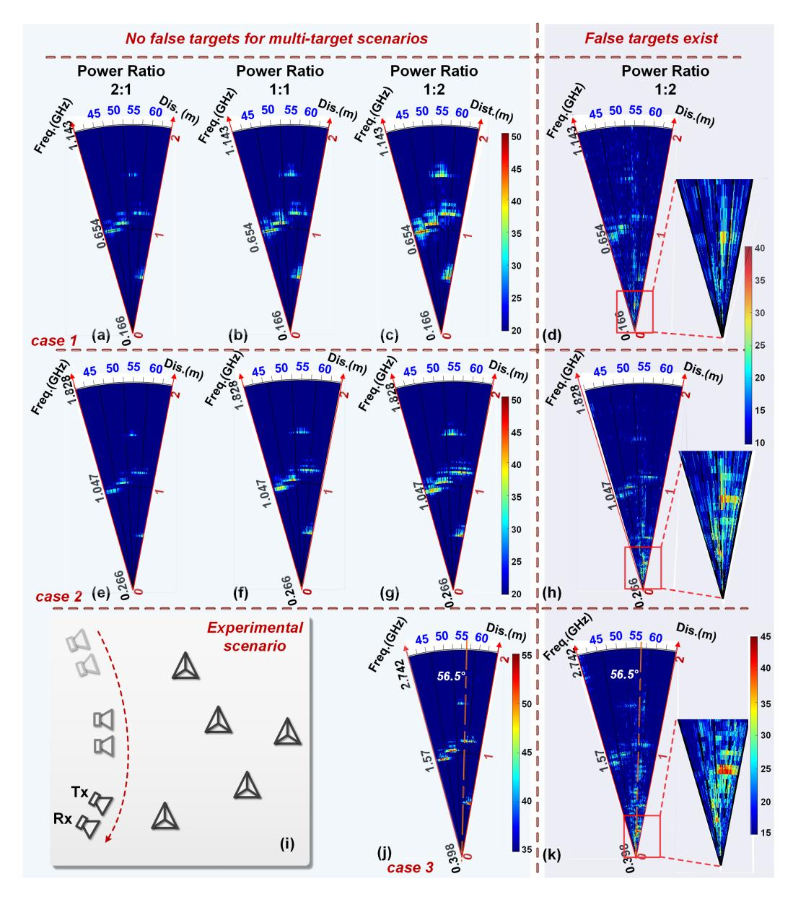

Fig. 16. Scanning imaging results for the multitarget scene (i) experimental scenario where five targets exist. (a)–(c) Case 1, power ratio 2:1, 1:1, and 1:2, respectively. Among them, (d), (h), and (k) are the scanning imaging results for the multitarget scene using system structure in [\[31\],](#page-13-30) [\[32\], a](#page-13-31)nd [\[33\].](#page-13-32)

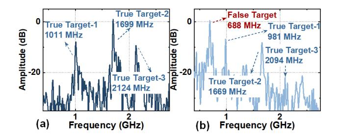

Fig. 17. Range profile located at 56.5◦ in the multitarget scene scanning imaging results shown in Fig. [16.](#page-12-1) (a) Range profile using system structure in this article. (b) Range profile using system structure in [\[31\],](#page-13-30) [\[32\], a](#page-13-31)nd [\[33\].](#page-13-32)

echoes, leading to the generation of the false target. Post downconversion by the ED, PDC by MZM-2, and opticalto-electrical conversion by the PD, false targets emerge at each stage. The intensity of these false targets incrementally intensifies throughout these processes, with the amplitude of false targets occasionally exceeding that of true targets. Nevertheless, as depicted in Figs. [6](#page-6-3) and [10,](#page-9-0) by systematically varying only one among the three variables in the simulation or experiment, we observed a scenario where the intensity of false targets does not exceed that of the real targets. This finding indicates that there are multiple factors contributing to the generation of false targets in the system structure [\[31\],](#page-13-30) [\[32\],](#page-13-31) [\[33\].](#page-13-32)

In summary, the experimental comparison conducted in Figs. [16](#page-12-1) and [17](#page-12-2) convincingly showcases the exceptional multitarget detection capability of the proposed system.

# VI. CONCLUSION

In summary, we proposed and experimentally demonstrated a *W*-band flexible photonic-based ISAC system, featuring 

{13}------------------------------------------------

multitarget detection for the fiber-wireless integrated network. We conducted an extensive investigation into the origins and potential solutions for the issue of false targets in environments with multiple targets within the same angular sector. The correctness of our hypotheses was affirmed through simulation and experimental verification, enabling multitarget detection in intricate scenarios. Furthermore, the flexibility in signal bandwidth and power allocation allowed us to strike a balance between sensing and communication functions amidst complex situations. Our experimental system achieved high-resolution sensing ranging from 1.76 to 3.15 cm and high data-rate communication spanning from 15 to 60 Gbit/s via a 10-km fiber and 1-m wireless *W*-band MMW link. By implementing external calibration, we ensured that our system attained a distance error of less than 3 cm during the experiment.

### REFERENCES

- [\[1\]](#page-0-0) F. Liu, C. Masouros, A. P. Petropulu, H. Griffiths, and L. Hanzo, "Joint radar and communication design: Applications, state-of-the-art, and the road ahead," *IEEE Trans. Commun.*, vol. 68, no. 6, pp. 3834–3862, Jun. 2020.
- [\[2\]](#page-0-1) W. Saad, M. Bennis, and M. Chen, "A vision of 6G wireless systems: Applications, trends, technologies, and open research problems," *IEEE Netw.*, vol. 34, no. 3, pp. 134–142, May 2020.
- [\[3\]](#page-0-2) A. Zhang, M. L. Rahman, X. Huang, Y. J. Guo, S. Chen, and R. W. Heath, "Perceptive mobile networks: Cellular networks with radio vision via joint communication and radar sensing," *IEEE Veh. Technol. Mag.*, vol. 16, no. 2, pp. 20–30, Jun. 2021.
- [\[4\]](#page-0-3) P. Kumari, J. Choi, N. González-Prelcic, and R. W. Heath, Jr., "IEEE 802.11ad-based radar: An approach to joint vehicular communicationradar system," *IEEE Trans. Veh. Technol.*, vol. 67, no. 4, pp. 3012–3027, Apr. 2018.
- [\[5\]](#page-0-4) K.-C. Chen, S.-C. Lin, J.-H. Hsiao, C.-H. Liu, A. F. Molisch, and G. P. Fettweis, "Wireless networked multirobot systems in smart factories," *Proc. IEEE*, vol. 109, no. 4, pp. 468–494, Apr. 2021.
- [\[6\]](#page-0-5) Y. Cui, F. Liu, X. Jing, and J. Mu, "Integrating sensing and communications for ubiquitous IoT: Applications, trends, and challenges," *IEEE Netw.*, vol. 35, no. 5, pp. 158–167, Sep. 2021.
- [\[7\]](#page-0-6) E. A. Kittlaus et al., "A low-noise photonic heterodyne synthesizer and its application to millimeter-wave radar," *Nature Commun.*, vol. 12, no. 1, p. 4397, Jul. 2021.
- [\[8\]](#page-1-2) M. Lei et al., "Integrated wireless communication and mmW radar sensing system for intelligent vehicle driving enabled by photonics," in *Proc. 19th Int. Conf. Opt. Commun. Netw. (ICOCN)*. Qufu, China: IEEE, Aug. 2021, pp. 1–3.
- [\[9\]](#page-1-3) H. Nie, F. Zhang, Y. Yang, and S. Pan, "Photonics-based integrated communication and radar system," in *Proc. Int. Topical Meeting Microw. Photon. (MWP)*, Oct. 2019, pp. 1–4.
- [\[10\]](#page-1-4) Z. Xue, S. Li, X. Xue, X. Zheng, and B. Zhou, "Photonics-assisted joint radar and communication system based on an optoelectronic oscillator," *Opt. Exp.*, vol. 29, no. 14, pp. 22442–22454, Jul. 2021.
- [\[11\]](#page-1-5) Z. Xue, S. Li, J. Li, X. Xue, X. Zheng, and B. Zhou, "OFDM radar and communication joint system using opto-electronic oscillator with phase noise degradation analysis and mitigation," *J. Lightw. Technol.*, vol. 40, no. 13, pp. 4101–4109, Jul. 1, 2022.
- [\[12\]](#page-1-6) Z. Xue, S. Li, J. Li, X. Xue, X. Zheng, and B. Zhou, "Tunable K/W-band OFDM integrated radar and communication system based on optoelectronic oscillator for intelligent transportation," *Opt. Exp.*, vol. 30, no. 20, pp. 35270–35281, Sep. 2022.
- [\[13\]](#page-1-7) M. Lei et al., "A spectrum-efficient MoF architecture for joint sensing and communication in B5G based on polarization interleaving and polarization-insensitive filtering," *J. Lightw. Technol.*, vol. 40, no. 20, pp. 6701–6711, Oct. 15, 2022.
- [\[14\]](#page-1-8) L. Huang, R. Li, S. Liu, P. Dai, and X. Chen, "Centralized fiberdistributed data communication and sensing convergence system based on microwave photonics," *J. Lightw. Technol.*, vol. 37, no. 21, pp. 5406–5416, Nov. 1, 2019.
- [\[15\]](#page-1-9) W. Bai et al., "Photonic millimeter-wave joint radar communication system using spectrum-spreading phase-coding," *IEEE Trans. Microw. Theory Techn.*, vol. 70, no. 3, pp. 1552–1561, Mar. 2022.

- [\[16\]](#page-1-10) M. Lei et al., "Photonics-aided integrated sensing and communications in mmW bands based on a DC-offset QPSK-encoded LFMCW," *Opt. Exp.*, vol. 30, no. 24, p. 43088, Nov. 2022.
- [\[17\]](#page-1-11) Y. Liu, A. Deng, S. Hua, S. Xu, and W. Zou, "Photonic ADC-based scheme for joint wireless communication and radar by adopting a broadband OFDM shared signal," *Opt. Lett.*, vol. 47, no. 20, p. 5421, Oct. 2022.
- [\[18\]](#page-1-12) W. Bai et al., "Photonics-assisted millimeter-wave multiband integrated sensing and communication system using coherent receiving," *IEEE J. Sel. Topics Quantum Electron.*, vol. 29, no. 6, pp. 1–11, Nov. 2023.
- [\[19\]](#page-1-13) N. Zhong, P. Li, W. Bai, W. Pan, L. Yan, and X. Zou, "Spectralefficient frequency-division photonic millimeter-wave integrated sensing and communication system using improved sparse LFM sub-bands fusion," *J. Lightw. Technol.*, vol. 41, no. 23, pp. 7105–7114, Dec. 1, 2023.
- [\[20\]](#page-1-14) W. Bai, X. Zou, P. Li, W. Pan, L. Yan, and B. Luo, "60-GHz photonic millimeter-wave joint radar-communication system," in *Proc. Int. Conf. Microw. Millim. Wave Technol. (ICMMT)*. Nanjing, China: IEEE, May 2021, pp. 1–3.
- [\[21\]](#page-1-15) W. Bai et al., "Millimeter-wave joint radar and communication system based on photonic frequency-multiplying constant envelope LFM-OFDM," *Opt. Exp.*, vol. 30, no. 15, p. 26407, Jul. 2022.
- [\[22\]](#page-1-16) W. Bai et al., "Photonic super-resolution millimeter-wave joint radarcommunication system using self-coherent detection," *Opt. Lett.*, vol. 48, no. 3, pp. 608–611, Feb. 2023.
- [\[23\]](#page-1-17) M. Lei et al., "Integration of sensing and communication in a W-band fiber-wireless link enabled by electromagnetic polarization multiplexing," *J. Lightw. Technol.*, vol. 41, no. 23, pp. 7128–7138, Dec. 1, 2023.
- [\[24\]](#page-1-18) R. Song and J. He, "OFDM-NOMA combined with LFM signal for W-band communication and radar detection simultaneously," *Opt. Lett.*, vol. 47, no. 11, p. 2931, Jun. 2022.
- [\[25\]](#page-1-19) S. Jia et al., "A unified system with integrated generation of highspeed communication and high-resolution sensing signals based on THz photonics," *J. Lightw. Technol.*, vol. 36, no. 19, pp. 4549–4556, Oct. 1, 2018.
- [\[26\]](#page-1-20) Z. Lyu et al., "Radar-centric photonic terahertz integrated sensing and communication system based on LFM-PSK waveform," *IEEE Trans. Microw. Theory Techn.*, vol. 71, no. 11, pp. 5019–5027, Nov. 2023.
- [\[27\]](#page-1-21) Y. Wang, J. Ding, M. Wang, Z. Dong, F. Zhao, and J. Yu, "W-band simultaneous vector signal generation and radar detection based on photonic frequency quadrupling," *Opt. Lett.*, vol. 47, no. 3, p. 537, Feb. 2022.
- [\[28\]](#page-1-22) Y. Wang et al., "Photonics-assisted joint high-speed communication and high-resolution radar detection system," *Opt. Lett.*, vol. 46, no. 24, p. 6103, Dec. 2021.
- [\[29\]](#page-1-23) Y. Wang, J. Liu, J. Ding, M. Wang, F. Zhao, and J. Yu, "Joint communication and radar sensing functions system based on photonics at the W-band," *Opt. Exp.*, vol. 30, no. 8, p. 13404, Apr. 2022.
- [\[30\]](#page-1-24) Y. Wang et al., "Integrated high-resolution radar and long-distance communication based-on photonic in terahertz band," *J. Lightw. Technol.*, vol. 40, no. 9, pp. 2731–2738, May 1, 2022.
- [\[31\]](#page-1-25) B. Dong et al., "Demonstration of photonics-based flexible integration of sensing and communication with adaptive waveforms for a W-band fiber-wireless integrated network," *Opt. Exp.*, vol. 30, no. 22, p. 40936, Oct. 2022.
- [\[32\]](#page-1-26) B. Dong et al., "Photonic-based W-band flexible TFDM integrated sensing and communication system for fiber-wireless network," in *Proc. Opt. Fiber Commun. Conf. Exhibit. (OFC)*, Mar. 2023, pp. 1–3.
- [\[33\]](#page-1-27) B. Dong et al., "W-band photonic-based integration of sensing and communication with frequency-division multiplexed waveforms in fiberwireless integrated network," in *Proc. Asia Commun. Photon. Conf. (ACP)*. Shenzhen, China: IEEE, Nov. 2022, pp. 1806–1810.
- [\[34\]](#page-2-2) A. Sun et al., "End-to-end deep-learning-based photonic-assisted multiuser fiber-mmWave integrated communication system," *J. Lightw. Technol.*, vol. 42, no. 1, pp. 80–94, Jan. 1, 2024.
- [\[35\]](#page-2-3) Z. Li et al., "Attention-assisted autoencoder neural network for end-to-end optimization of multi-access fiber-terahertz communication systems," *J. Opt. Commun. Netw.*, vol. 15, no. 9, pp. 711–725, Sep. 2023.
- [\[36\]](#page-5-4) V. J. Urick, J. D. McKinney, and K. J. Williams, *Fundamentals of Microwave Photonics*. Hoboken, NJ, USA: Wiley, 2015, p. 461.
- [\[37\]](#page-6-4) X. Ye, F. Zhang, Y. Yang, and S. Pan, "Photonics-based radar with balanced I/Q de-chirping for interference-suppressed high-resolution detection and imaging," *Photon. Res.*, vol. 7, no. 3, p. 265, Mar. 2019.
- [\[38\]](#page-6-5) M. A. Richards, *Fundamentals of Radar Signal Processing*, 2nd ed. New York, NY, USA: McGraw-Hill, 2014, pp. 94–98.