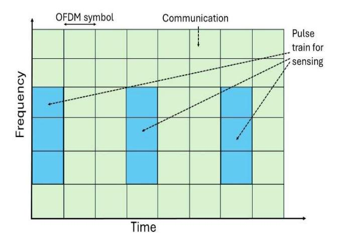
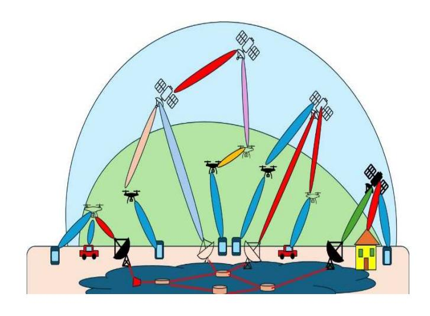
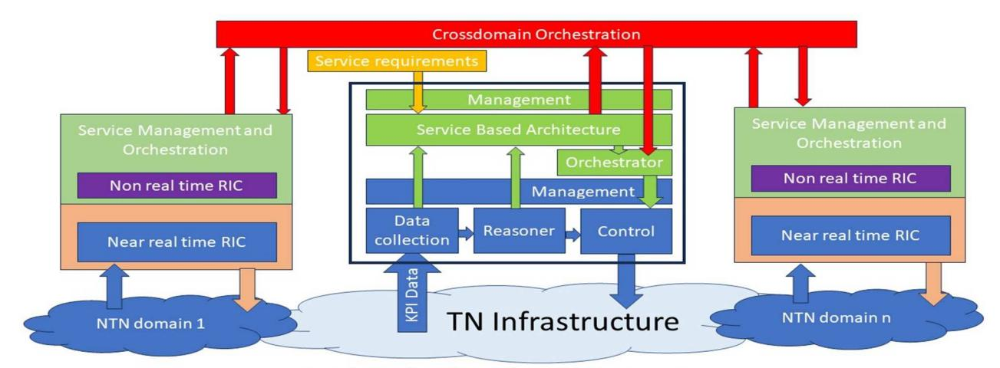

# Terrestrial and Non-Terrestrial Networks for Integrated Sensing and Communication

Francesco Matera, Marina Settembre Fondazione Ugo Bordoni Roma, Italy {fmatera, msettembre}@fub.it

Ernestina Cianca, Marina Ruggieri University of Tor Vergata Roma, Italy ernestina.cianca@uniroma2.it, ruggieri@uniroma2.it

Arcangela Rago, Alessio Fascista, Giuseppe Piro, Luigi Alfredo Grieco Politecnico di Bari Bari, Italy

CNIT, Consorzio Nazionale Interuniversitario per le Telecomunicazioni

Italy {arcangela.rago, alessio.fascista, giuseppe.piro, alfredo.grieco}@poliba.it

Francesco Malandrino, Giuseppe Virone CNR Torino, Italy {francesco.malandrino, giuseppe.virone}@cnr.it

Simone Morosi University of Firenze Firenze, Italy simone.morosi@unifi.it

*Abstract***— Integrated Sensing And Communication (ISAC) emerges as a crucial aspect of 6G networks. Beyond merely transporting information, communication networks, especially for higher frequency wireless transmissions, can also work as sophisticated sensor arrays. In this scenario, the integration of Terrestrial Networks and Non-Terrestrial Networks (TN-NTNs) appears as a fundamental base for ISAC mainly due to the extensive network dimensions and the use of different mmWave, sub-THz, THz, and optical channels. This paper shows how the TN-NTN Management and Orchestration architectures, leveraging different elements for data collection and Artificial Intelligence-based analysis, can be a reference for sensing operations. In particular, we refer to the vision of the Italian ITA-NTN project, which proposes some guidelines for the management and control of the whole TN-NTN infrastructure considering the main recommendations for cross-domains coming from organizations as 3GPP and ETSI.** 

*Keywords—ISAC, Non-Terrestrial Networks, 6G, 5G, Sensing, 3GPP* 

# I. INTRODUCTION

One of the characteristics of 6G networks is the full integration of the Terrestrial Networks (TNs) with the Non-Terrestrial Networks (NTNs) [1-3], with the adoption of radio transmission channels with carriers operating with higher and higher frequencies ranging from mmWave to THz and up to optics [3-4]. These propagation channels combined with massive antenna arrays can also allow us to make precise measurements of different physical effects by analyzing wave transmissions, reflections, and scattering [5- 7]. In particular, services such as high-accuracy localization, recognition, passive object detection, as well as imaging, and environment reconstruction can be obtained by exploiting these principles. In fact, it has already been extensively proposed how a telecommunications system operating with these frequencies could also be used for sensing, for instance by adopting time intervals dedicated either to data transmission or sensing [7] obtaining the so-called Integrated Sensing And Communications (ISAC).

In the ISAC framework, TN-NTNs appear particularly suitable for exploring the sensing world both for their dimensions and the presence of several high-frequency channels operating on many different bandwidths. Furthermore, NTN can include specific subnetworks based on the Internet of Things (IoT) [8] specifically designed for sensing.

NTNs consist of both high-altitude elements as satellites GEO and LEO, and lower-altitude elements as drones and aerial platforms. These elements integrate with TNs to create a 3D environment [3]. Managing, orchestrating, and controlling this integrated network requires sophisticated procedures. This complexity primarily stems from the dynamic nature of NTN elements which requires continuous variations of the communication links that could cause strong fluctuations in terms of Quality of Service and several challenges related to handover processes.

In recent years, 3GPP has intensified efforts in defining standards that facilitate efficient integration and collaboration between TNs and NTNs [9-11]. Different combinations and interconnections among NTN nodes enable a range of possible architectures, defined by the specific role assumed by each device, whether it be a backhaul or access node. Within this context, managing the entire network [12] can be particularly challenging, especially considering the high dynamism of the network in non-GEO systems. This dynamicity necessitates the adoption of advanced solutions, such as Software Defined Networking (SDN) [13] and Network Function Virtualization (NFV) [10], along with approaches like Open Radio Access Network (O-RAN) [14]. It has to be pointed out that all the Management and Orchestration (M&O) procedures can efficiently operate if all the network elements are controlled and their behaviors analyzed by means of specific Network Functions (NFs) adopting Artificial Intelligence (AI) procedures [15]. Just by looking at the specific NFs, dedicated to data collection and analysis, we can understand how the TN-NTN could be much suitable for sensing.

The aim of this paper is to analyze some TN-NTN architectures that can be particularly advantageous for sensing purposes. In particular, we refer to the view of the Italian Project "Integrated Terrestrial And Non-Terrestrial Networks (ITA-NTN)", in the context of the "*RESearch and innovation on future Telecommunications systems and networks, to make Italy more smart (RESTART)*" program, funded by the European Union under the Italian National Recovery and Resilience Plan (NRRP) of Next Generation EU.

This paper is structured in the following way. After this introduction, Section II provides an overview of ISAC, Section III dedicated to the integrated sensing and communications as enabler for space sustainability and Section IV describes some TN-NTN architectures. Section IV is devoted to how ISAC can be introduced in high-level cross-domain management and control operations as proposed by 3GPP and O-RAN. Section V reports our main conclusions and future research directions.

## II. INTEGRATED SENSING AND COMMUNICATION OVERVIEW

The ISAC paradigm aims at merging the traditionally distinct functionalities of communication systems and sensing technologies. This integration aims at leveraging the synergies between the two domains to enhance their performance and capabilities, while explicitly considering potential trade-offs in the M&O strategies. Optimal strategies for communication tasks may not be ideal for sensing tasks, and vice versa. In communication, data is transmitted between devices or networks, while sensing involves the detection and measurement of physical characteristics of objects, such as motion, distance, as well as the inference of situational awareness in the surrounding environment.

Fig. 1: Sharing of OFDM symbols for ISAC.

Information about a remote object and its surrounding environment can be extracted from the analysis of the electromagnetic field associated with the signal propagation, possibly at high frequencies. This technique, often called *wireless sensing* [16], is having important developments since it can be integrated into a communication system. Among the various options for implementing ISAC, the orthogonal frequency-division multiplexing (OFDM) waveform stands out as a particularly suitable choice, due to its extensive use in current wireless standards, including 5G, 5G-Advanced, and WiFi/WLAN. Accordingly, sharing of OFDM symbols can be used, as depicted in Fig. 1 [7].

3GPP is showing significant interest in ISAC, demonstrated by the release of a technical report [16] and the inclusion of use cases and requirements specifications in Release 19. ISAC is opening new avenues for advanced applications. For example, in vehicular networks, integrated communication and sensing can enhance vehicle-to-everything (V2X) communication by providing real-time information about the surroundings, leading to improved safety and traffic management. Similarly, in industrial IoT, ISAC can facilitate the monitoring and control of manufacturing processes with higher accuracy and efficiency. Additionally, ISAC can improve the performance of the mobile network itself. For instance, it can proactively detect a potential Light of Sight (LoS) interruption, caused by an object in the beam path. Notably, increasing the frequency can improve measurement accuracy until we reach the optical frequencies. In particular, Free Space Optics (FSO) could result much useful in sensing adopted for automatic driving [17]

Therefore, networks adopting several radio transmissions at higher frequencies may play an important role in the adoption of ISAC techniques, as can occur for NTNs, also with its integration with the TNs.

## III. INTEGRATED SENSING AND COMMUNICATIONS AS ENABLER FOR SPACE SUSTAINABILITY

6G aims to contribute to the Sustainable Development Goals (SDGs) and, in this framework, the integration of T and NTN is recognized to play an important role. On the other hand, it is worth outlining that the recent growth of space systems has occurred in an uncontrolled way thus posing an urgent challenge to be faced: the long-term space sustainability [18, 19]. The design of future TN-NTNs taking into account the need to preserve the space environment is one of the key aims of the ITA-NTN project. In this framework, enabling the use of the same space infrastructure for the provision of communication and sensing - along with positioning - can definitely concur in launching a reduced number of satellites and, as a consequence, in preserving the orbital environment. Furthermore, the above integration could help in additional ways such as:

• Improvement in space debris management - the ISAC paradigm can enhance space debris detection and tracking capabilities. Traditional systems often rely on separate infrastructures for communication and debris tracking, which can be both resourceintensive and limited in capability. By integrating sensing and communication, ISAC systems can utilize communication signals to concurrently detect and monitor debris. This dual functionality allows for real-time updates and more precise tracking, enabling better collision avoidance and debris mitigation strategies.

- Improvement of satellite operation efficiency ISAC can optimize satellite operations by providing simultaneous communication and situational awareness. For instance, a satellite equipped with ISAC technology can continuously monitor its surroundings and communicate with ground stations, ensuring it operates within safe parameters and adjusts its trajectory as needed to avoid potential collisions. This integration reduces the need for multiple separate systems, saving weight, power, and cost while enhancing the overall reliability of satellite operations.
- Improvement in the efficient use of spectrum resources - with integrated systems, the frequency spectrum can be more effectively utilized, reducing interference and optimizing bandwidth allocation. This efficiency helps mitigate the risk of signal congestion, which is becoming increasingly important as the number of satellites and other space assets grows.
- Improvement in space traffic management as space becomes more crowded, effective space traffic management becomes essential to avoid collisions and ensure the safety of space operations. ISAC can play a key role in this area by providing real-time, accurate data on the position and velocity of various space objects. This information is crucial for coordinating the movements of satellites and other space vehicles, preventing accidents, and maintaining orderly traffic flow in space. By combining sensing and communication, ISAC systems can share this data seamlessly between satellites and ground stations, fostering a collaborative approach to space traffic management.

ISAC can thus be considered an enabler of space sustainability and its effectiveness in the in-space hardware rationalization can take great advantage from flexible and resilient TN-NTN architectures. The latter, in turn, are tightly related to extensive use of software-driven and software-defined paradigms, where the challenge is more and more becoming the achievement of truly hardware-free and energy-efficient software, with a very low cost – in terms of hidden hardware mass/weight and requested energy – per code line.

#### IV. TN-NTN ARCHITECTURES

Fig. 2 describes a general TN-NTN architecture as defined in the framework of the ITA-NTN project, that is focused on a 6G-oriented scenario for 3-dimensional (3D) wireless connectivity, where the 3 dimensions are the terrestrial domain (inside the pink area), the drone/aerial platform (green) and the satellite one (light blue color) [20].

As shown in the figure, different wireless beams, represented with different colors, can be adopted operating on different carriers ranging from sub-mmWave to mmWave, sub-THz, THz up to optics.

Fig. 2: TN-NTN architectures.

Given that each layer of the 3D networks in the TN-NTN architecture has different roles, four different architectures can be considered:

- i) Drone-based Network. It typically consists of three main components: User Equipments (UEs)/Ground Users (GUs), drones, and a ground control station (NTN Gateway, NTN GW), which can be embedded in the gNB (see the drone on the left in Fig. 2). Indeed, drones equipped with communication systems can act as flying base stations or relays, enabling communication between distant locations.
- ii) Satellite-based Architecture (see the satellite on the right in Fig. 2),
- iii) 3D Single-Connectivity Architecture (groundsatellite-drone-UE),
- iv) 3D Multi-Connectivity Architecture (Multiple combinations as in the center of Fig. 2) [20].

In the 3D scenario, the intermediary node and the satellite can operate in transparent and regenerative mode, thus leading to various architecture subcategories.

In TN-NTN architectures all the beams, especially those operating at higher frequencies, can be used not only for communication but also for sensing purposes. However, appropriate methodologies are needed for the analysis of data regarding information on the behavior of the electromagnetic field in the TX-RX path for sensing purposes. In particular, it will be fundamental to decide where the analysis can be carried out, either locally or centralized, or with a preanalysis at the local level and a centralized one for the final output and this also depends on the kind of required sensing.

In this paper, we analyze the TN-NTN architectures as defined according to the main standardization bodies to identify where elements already exist that can be adapted for the analysis of this data.

## V. TN-NTN ARCHITECTURES TO ANALYZE SENSING DATA

The analysis of sensing data in ISAC can be seen in the framework of M&O of a network and in particular of TN-TNT architecture. We suppose a general network including more NTN domains linked to a core domain. Therefore, we can suppose both a local elaboration of sensing data and also a centralized one, supposing that the whole network could offer a wide overview of some physical aspects of a region covered by the NT-TNT network.

It has to be pointed out that sensing can also support the M&O of the entire TN-NTN. For instance, by detecting obstacles that might affect the transmission quality, M&O could decide to change the beam paths, accordingly.

Integrating control, orchestration, and management across TNs and NTNs presents a multifaceted challenge. Several high-level specific issues related to the cross-domain control plane, orchestration, and management in integrating TN and NTN can be listed as reported in [20].

Recent research and development efforts worldwide have initiated the exploration of novel technologies to enable TN and NTN convergence; on the other hand, Standards Development Organizations (SDOs) such as ITU-T [12], ETSI [15] and 3GPP [9-11] have proposed different approaches to address various challenges associated with unified management and control both for TN and NTN. However, no definitive solutions have been addressed yet and convergence and interoperability remain critical gaps to be further investigated.

In Fig. 3 a two-layer control system is depicted, which recalls the proposal in [12], inspired by ITU-T Study Group 13. The upper layer oversees an End-to-End (E2E) service, while the lower layer consists of individual network domain control systems. These systems collectively feed data into a central monitoring system, facilitating a comprehensive analysis of the network's status from an E2E perspective. This analysis serves as the foundation for optimizing E2E resource management and control according to service level requirements and user intents. The goal is dynamically and optimally allocating resources to ensure the delivery of highquality E2E communication services.

Looking at the ISAC technique we mainly refer to the NTN domain that could recall the O-RAN approach where the data analysis is carried out in the O-RAN Intelligent Controller (RIC) non-RealTime (non-RT) and O-RAN RIC Real Time RT) [21]. Note that RIC is a cloud-native intelligent component of O-RAN using built-in AI capability.

Supposing to operate with a very wide TN-NTN network, where one or more NTN domains are joined to a NT 5G core network, a central elaboration of sensing data can be proposed by adopting as a key element for data analytics the Network Data Analytics Function (NWDAF), that is a Network Function defined by 3GPP for the Core Network [22]. Sensing data collected by the NTN devices can be transferred to the Core Network, and then to NWDAF, as if sensing NTN devices were like EU. NWDAF can operate in a centralized or distributed model and with global or per slice scope to provide data analytics and gain insights into the overall network performance, even with control loop automation to other authorized network elements. The NWDAF employs analogous service exposure mechanisms to other 5G network functions for the exchange of data collection and data analytics information with/from other Network Functions (NFs), Application Functions (AFs), Network Operation and Administration (OAM), and other repository (e.g., Unified Data Repository, UDR). In Fig. 3 NWDAF is located inside the Service Base Architecture area. However, the detailed design of each functional component, interface, protocol, algorithm, and pipeline has to be further studied and discussed in the different standardization organizations and towards the scenario envisaged in ETSI Zero Touch Network and Service Management (ZSM), enabling AI-based Network and Service Automation.

Compared to other types of networks, the scope of decisions to make in TN-NTNs is wider and, most notably, includes the choice and configuration of the radio access technology to use for each source-destination pair. Indeed, available technologies vary wildly in terms of availability, reliability, performance, and cost; therefore, properly making such decisions has a very significant impact on all network KPIs. This task is made particularly complex by the need to *select* the data to use for management and orchestration [23]. Indeed, as mentioned earlier, TN-NTN networks produce very large amounts of sensing data, in addition to logs and status updates from the individual network devices. Using *all* such data for management and orchestration decisions would create significant network overhead [24] – a particularly significant issue in TN-NTNs – and increase the computation time for management algorithms, without necessarily significantly better decisions. Accordingly, it falls upon the non-real-time RICs at the individual domains, as well as on the data collection entities, to decide which data should be forwarded to the cross-domain orchestration entities. When making such decisions, it is necessary to account for both the quantity and quality of the data available to the orchestrator, e.g., whether different types of networks and applications are represented.

### VI. CONCLUSIONS

In this paper, we have analyzed the possibility of integrating the ISAC technique within TN-NTNs, leveraging crossdomains management, orchestration, and control as envisioned by the ITA-NTN project. In particular, the ISAC data analysis can be carried out in the framework of the data elaboration leveraging intelligent elements already present in the different network domains, spanning from the access to core networks, and extending to NTNs. Future research directions will delve deeper into architectural and technical details, including the optimization of mmWave, sub-THz, THz, and optical channels for dual communication and sensing purposes, the role of edge computing in enhancing sensing accuracy, and the analysis of AI-based data analysis tailored for ISAC operations.

# ACKNOWLEDGMENT

This work was supported by the European Union under the Italian National Recovery and Resilience Plan (NRRP) of NextGenerationEU, partnership on "Telecommunications of the Future" (PE00000001 - program "RESTART").

#### REFERENCES

- [1] M. Giordani and M. Zorzi,"Non-terrestrial networks in the 6G era: Challenges and opportunities," IEEE Network, vol. 35, no. 2, pp. 244- 251, 2021
- [2] M. M. Azari, S. Solanki, S. Chatzinotas, O. Kodheli, H. Sallouha, A. Colpaert, J. F. Mendoza Montoya, S. Pollin, A. Haqiqatnejad, A. Mostaani, E. Lagunas and B. Ottersten, "Evolution of non-terrestrial networks from 5G to 6G: A survey," IEEE Commun. Surveys & Tutorials, vol. 24, n. 4, pp. 2633-2672, 2022.
- [3] Simone Morosi et al., "Terrestrial/Non-terrestrial Integrated Networks for Beyond 5G Communications" Chapter in 'Space Data Management', Springer book, 2024.
- [4] A. U. Chaudhry and H. Yanikomeroglu, "Free space optics for nextgeneration satellite networks," IEEE Consumer Electronics Magazine, vol. 10, n. 6, pp. 21- 31, 2021
- [5] D. Tan et al "Integrated Sensing and Communication in 6G: Motivations, Use Cases, Requirements, Challenges and Future

- Directions" 2021 1st IEEE International Online Symposium on Joint Communications & Sensing (JC&S), Feb. 23-24 2021, Dresden (GE)
- [6] https://www.huawei.com/en/huaweitech/futuretechnologies/integrated-sensing-communication-concept-practice
- [7] https://www.ericsson.com/en/blog/2024/6/integrated-sensing-andcommunication
- [8] M. De Sanctis, E. Cianca, G. Araniti, I. Bisio and R. Prasad, "Satellite Communications Supporting Internet of Remote Things," IEEE Internet of Things J., vol. 3, no. 1, pp. 113-123, Feb. 2016
- [9] 3GPP, "Study on using Satellite Access in 5G", 3GPP TR 22.822 V16.0.0 (2018-06)
- [10] 3GPP, "Study on management aspects of next generation network architecture and features", 3GPP TR 28.802 V15.0.0 (2018-01).
- [11] 3GPP, " Study on architecture aspects for using satellite access in 5G", 3GPP TR 23.737 V17.2.0 (2021-03).
- [12] V. P. Kafle, M. Sekiguchi, H. Asaeda and H. Harai, "Integrated Network Control Architecture for Terrestrial and Non-Terrestrial Network Convergence In Beyond 5G Systems," *2022 ITU Kaleidoscope- Extended reality – How to boost quality of experience and interoperability*, Accra, Ghana, 2022, pp. 1-9, doi: 10.23919/ITUK56368.2022.10003041.
- [13] S. Sezer et al., "Are we ready for SDN? Implementation challenges for software-defined networks, IEEE Communications Magazine, 51, (7), pp. 36 – 43, 2013
- [14] C. Coletti et al., "O-RAN: Towards an open and smart ran white paper," O-RAN Alliance White Paper, pp. 1–19, 2018.
- [15] ETSI, "Zero-touch network and Service Management (ZSM); Crossdomain E2E service lifecycle management", ETSI GS ZSM 008 V1.1.1 (2022-07)
- [16] 3GPP TR 22.837 V19.4.0 (2024-06) Technical Specification Group TSG, SA; Feasibility Study on Integrated Sensing and Communication (Release 19)
- [17] E.Leitgeb et al "Detection Technologies for increasing the reliability and safety in Autonomus driving" ICTON 2018, July 1-5 2018, Bucharest (Romania)
- [18] E. Cianca, M Ruggieri, (2023) "Space Sustainability: Toward the Future of Connectivity", Chapter 3 in "Women in Telecommunications" (M.S. Greco, D. Cassioli, S. Liberata Ullo, M.J. Lyons, Ed's), Springer Nature, Switzerland, ISBN 978-3-031-21974- 0, e-ISBN 978-3-031-21975-7, pp. 375-391, DOI 10.1007/978-3-031- 21975-7\_14.
- [19] E. Cianca, J. Dauncey, G. Fasano, Z.M. Kassas, W. Neil, M. Ruggieri, (2024) ."Autonomy for Sustainability: An AESS Vision and Perspectives", IEEE Aerospace and Electronic Systems Magazine, June, Vol. 39, Issue 6, pp. 32-41, print ISSN 0885-8985, on line ISSN 1557-959X, DOI 10.1109/MAES.2024.3376295.gies for increasing the reliability and safety in Autonomus driving" ICTON 2018, July 1- 5 2018, Bucharest (Romania)
- [20] F. Matera et al., "From Ground to Space: Towards an Integrated Management of Terrestrial and Non Terrestrial Networks," in Proc. of 2024 IEEE International Mediterranean Conference on Communications and Networking (MeditCom): AIML ITA-NTN (AIML in Integrated Terrestrial And Non-Terrestrial Networks), July 2024.
- [21] R. Campana, C. Amatetti and A. Vanelli-Coralli, "O-RAN based Non-Terrestrial Networks: Trends and Challenges," 2023 Joint European Conference on Networks and Communications & 6G Summit (EuCNC/6G Summit), Gothenburg, Sweden, 2023, pp. 264-269
- [22] M. Abdelkader, B. Karim, K. Adlen. (2023). "Combining Network Data Analytics Function and Machine Learning for Abnormal Traffic Detection in Beyond 5G" 1204-1209. 10.1109/GLOBECOM54140.2023.10436766
- [23] J. Martín-Pérez, N. Molner, F. Malandrino, C. J. Bernardos, A. de la Oliva and D. Gomez-Barquero, "Choose, Not Hoard: Information-to-Model Matching for Artificial Intelligence in O-RAN," in *IEEE Communications Magazine*, vol. 61, no. 4, pp. 58-63, April 2023, doi: 10.1109/MCOM.003.2200401
- [24] C. Singhal, Y. Wu, F. Malandrino, M. Levorato, C. F. Chiasserini, Resource-aware Deployment of Dynamic DNNs over Multi-tiered Interconnected Systems, in *IEEE INFOCOM*, 2024.