{0}------------------------------------------------

# Optical Wireless Integrated Sensing and Communication Based on Optical Phased Array: Performance Metric and Optimal Beamforming

Yunfeng We[n](https://orcid.org/0009-0000-9708-6012) , Fang Yan[g](https://orcid.org/0000-0003-3575-5086) , *Senior Member, IEEE*, Jian Song [,](https://orcid.org/0000-0002-6066-9510) *Fellow, IEEE*, and Zhu Han [,](https://orcid.org/0000-0002-6606-5822) *Fellow, IEEE*

*Abstract*—Optical wireless integrated sensing and communication (OW-ISAC) is emerging as a crucial technology to complement and augment its radio-frequency counterpart. In this paper, we propose an optical phased array (OPA)-based OW-ISAC framework to enable concurrent multi-user communication and environment imaging. The optical beamforming and atmospheric propagation are first elaborated to introduce the principles of OPA-based OW-ISAC. In addition, the investigation into the multi-beam property, direct detection scheme, and sensing task of imaging for OW-ISAC yields dedicated signal-to-interference-plus-noise ratio and contrast metrics for communication and sensing sub-systems, respectively. Moreover, the precoding matrices and photodiode orientations are jointly optimized to achieve optimal beamforming. Subsequently, numerical simulations illustrate the relationships between communication and sensing performance metrics. Furthermore, the proposed OW-ISAC scheme is substantiated in a realistic scenario with the optimized beamforming. The demonstrated high-precision sensing and reliable communication capabilities of OPA-based OW-ISAC can serve plentiful future applications in the era of connection and intelligence.

*Index Terms*—Integrated sensing and communication (ISAC), optical wireless communication (OWC), optical phased array (OPA), imaging, contrast metric.

# I. INTRODUCTION

I NTEGRATED sensing and communication (ISAC), as one of the six usage scenarios of the sixth-generation

Received 21 October 2024; revised 23 February 2025; accepted 5 April 2025. Date of publication 17 April 2025; date of current version 15 September 2025. This work was supported in part by the National Key Research and Development Program of China under Grant 2023YFE0110600; in part by the U.S. Department of Transportation, Toyota, under Grant NSF CNS-2107216, Grant CNS-2128368, Grant CMMI-2222810, and Grant ECCS-2302469; and in part by Amazon and Japan Science and Technology Agency (JST) Adopting Sustainable Partnerships for Innovative Research Ecosystem (ASPIRE) under Grant JPMJAP2326. The associate editor coordinating the review of this article and approving it for publication was M.-C. Lee. *(Corresponding author: Fang Yang.)*

Yunfeng Wen is with the Department of Electronic Engineering, Tsinghua University, Beijing 100084, China (e-mail: wenyf22@mails.tsinghua.edu.cn).

Fang Yang is with the Department of Electronic Engineering, Tsinghua University, Beijing 100084, China, and also with the State Key Laboratory of Widegap Semiconductor Optoelectronic Materials and Technologies, Beijing 100084, China (e-mail: fangyang@tsinghua.edu.cn).

Jian Song is with the Department of Electronic Engineering, Tsinghua University, Beijing 100084, China, and also with Shenzhen International Graduate School, Tsinghua University, Shenzhen 518055, China (e-mail: jsong@tsinghua.edu.cn).

Zhu Han is with the Department of Electrical and Computer Engineering, University of Houston, Houston, TX 77004 USA, and also with the Department of Computer Science and Engineering, Kyung Hee University, Seoul 446-701, South Korea (e-mail: hanzhu22@gmail.com).

Digital Object Identifier 10.1109/TWC.2025.3559254

<span id="page-0-3"></span><span id="page-0-2"></span><span id="page-0-1"></span><span id="page-0-0"></span>(6G) mobile communication system, has garnered significant attention from academia and industry in recent years [\[1\].](#page-13-0) As communication and sensing (C&S) systems march from separation to integration, similar trends can be observed during their evolution [\[2\].](#page-13-1) One is the escalating adoption of higher carrier frequencies to broaden available bandwidth, sparking particular interest in millimeter-wave and terahertz ISAC domains [\[3\].](#page-14-0) On the other hand, the expanded antenna arrays of C&S systems allow for more degrees of freedom (DoF) and superior reliability in beamforming [\[4\].](#page-14-1) While the radio-frequency (RF)-ISAC continues to accelerate, the emergence of optical wireless (OW)-ISAC stands out as a promising alternative. Leveraging the expansive unlicensed bandwidth and short wavelengths of the optical spectrum, OW-ISAC provides the ability to deliver Gbps-class communication and precise sensing capabilities down to the centimeter level [\[5\].](#page-14-2) With its blend of high-speed communication and highprecision sensing, OW-ISAC is anticipated to complement and augment its RF counterpart.

<span id="page-0-6"></span><span id="page-0-5"></span><span id="page-0-4"></span>Contemporary research on OW-ISAC delineates two primary categories: cooperative and uncooperative types. Cooperative OW-ISAC hinges on the collaboration of sensing targets, like visible light positioning (VLP) with multiple access points [\[6\]](#page-14-3) or transmitting back the sensing signal [\[7\].](#page-14-4) In contrast, the operational principles of uncooperative OW-ISAC resemble those of RF-ISAC, enabling sensing capabilities for both cooperative and uncooperative targets. Typical uncooperative OW-ISAC examples include boomerang transmission [\[8\],](#page-14-5) pulse sequence sensing and pulse position modulation (PSS-PPM) [\[9\],](#page-14-6) phase-shift laser ranging with communication [\[10\],](#page-14-7) combined linear frequency modulation and continuous phase modulation [\[11\],](#page-14-8) direct-current-biased optical orthogonal frequency division multiplexing (DCO-OFDM)-based ranging [\[12\],](#page-14-9) [\[13\],](#page-14-10) [\[14\],](#page-14-11) [\[15\],](#page-14-12) etc. More recently, a pulse amplitude modulation (PAM)-based scheme for detection has expanded the sensing functionalities of OW-ISAC [\[16\].](#page-14-13)

<span id="page-0-17"></span><span id="page-0-16"></span><span id="page-0-15"></span><span id="page-0-14"></span><span id="page-0-13"></span><span id="page-0-12"></span><span id="page-0-11"></span><span id="page-0-10"></span><span id="page-0-9"></span><span id="page-0-8"></span><span id="page-0-7"></span>However, despite the abundant research on time-domain waveform design, angle-domain sensing in uncooperative OW-ISAC remains an unresolved frontier, which necessitates the integration of beam steering techniques. Traditional optical beam steering methods include gimbals, fast steering mirrors, micro-electro-mechanical systems (MEMS), etc [\[17\].](#page-14-14) Nonetheless, these techniques often face limitations in steering speed, physical footprint, and robustness due to their mechanical components [\[18\].](#page-14-15) Moreover, the inflexibility of 

{1}------------------------------------------------

mechanical beam steering poses challenges in meeting the dynamic requirements of multi-target OW-ISAC. Instead, an optical phased array (OPA) offers a solid-state solution for precise and agile beam control, thereby outperforming mechanical beam steering in reliability and versatility [\[19\].](#page-14-16) Furthermore, operating akin to an RF-phased array, OPA provides enhanced DoF for beamforming design across diverse conditions. In consequence, as a pivotal technology for future light detection and ranging (LiDAR) [\[20\]](#page-14-17) and optical wireless communication (OWC) [\[21\],](#page-14-18) OPA serves as an enabler for OW-ISAC to provide angle-domain sensing capabilities, and an OPA-based OW-ISAC prototype has been demonstrated recently [\[22\].](#page-14-19)

<span id="page-1-4"></span><span id="page-1-3"></span><span id="page-1-2"></span>To pave the way for OPA-based OW-ISAC research, the burgeoning research in multiple-input multiple-output (MIMO)-based RF-ISAC can provide valuable insights. A typical paradigm for MIMO-ISAC is to optimize the beampattern and ensure the communication quality of service (QoS) under the power constraint [\[23\],](#page-14-20) [\[24\].](#page-14-21) While the beampattern optimization becomes a universal topic, novel performance metrics, extended scenarios, and intersections with other emerging technologies enrich the MIMO-ISAC research. For instance, the Cramer-Rao bound is a sensing performance ´ metric tailored for evaluating a parameter-estimation task, e.g., ranging or angle-of-arrival estimation [\[25\],](#page-14-22) [\[26\],](#page-14-23) thereby introducing innovative optimization problem formulations. Besides, multi-metric problems also stem from other performance metrics like mutual information [\[27\],](#page-14-24) [\[28\],](#page-14-25) which prompts the joint optimization of time-domain, frequency-domain, and angledomain waveforms [\[29\].](#page-14-26) In addition, the evolution of scenarios and user requirements result in novel problem formulations of MIMO-ISAC beamforming. Typical examples include fullduplex communication for ISAC [\[30\]](#page-14-27) and simultaneous transfer of information and power [\[31\].](#page-14-28) Moreover, the integration of intelligent reflecting surfaces (IRS) into the beamforming process has spurred a considerable body of MIMO-ISAC research, which enables the reconfiguration of the wireless propagation environment [\[32\].](#page-14-29)

<span id="page-1-13"></span><span id="page-1-12"></span><span id="page-1-10"></span>Although numerous studies delve into the beamforming of RF-ISAC, three critical disparities persist between MIMObased RF-ISAC and OPA-based OW-ISAC:

- While an RF MIMO can generate a single main lobe thanks to its half-wavelength array, an OPA exhibits an inherent *multi-beam property* and may disperse optical energy in unexpected directions [\[33\].](#page-14-30) Therefore, the mitigation and exploitation of grating lobes elicit unique challenges for OPA-based OW-ISAC.
- <span id="page-1-14"></span>• Coherent detection is generally exploited by an RF-ISAC system, whereas incoherent detection is more cost-effective for an OW-ISAC system. As a result, an OPA-based OW-ISAC system adopts photodiodes (PD) as C&S receivers and conducts *direct detection* (DD), imposing extra constraints on the beamforming process.
- <span id="page-1-16"></span><span id="page-1-15"></span>• Although the scope of RF-ISAC tasks mainly covers detection and estimation, the high range-angle resolution of the optical band heightens the interest in the *imaging* task [\[34\],](#page-14-31) [\[35\].](#page-14-32) However, the PDs of an

OW-ISAC system cannot distinguish between different directions within their field of view (FOV). In consequence, the contrast between desired and undesired angle grids should be maximized within the FOV of each PD, which necessitates a dedicated metric to enhance imaging quality.

<span id="page-1-17"></span><span id="page-1-1"></span><span id="page-1-0"></span>Motivated by the opportunities and challenges mentioned above, this paper presents an OPA-based OW-ISAC framework. Enlightened by the concept of multi-beam ISAC in [\[36\],](#page-14-33) we leverage the inherent multi-beam property of OPA, transforming it from a challenge into an advantage. Additionally, novel performance metrics and problem formulations are investigated for OW-ISAC beamforming, which incorporates the DD scheme and imaging task. Specifically, our contributions are summarized as follows:

- <span id="page-1-5"></span>• An *OPA-based OW-ISAC framework* is proposed to enable concurrent multi-user communication and environment imaging. In contrast to prior OW-ISAC works, we focus on the light-field description of beamforming and propagation processes, yielding brand-new system models for both communication and sensing. Besides, the proposed OW-ISAC scheme also extrapolates the beamforming techniques of RF-ISAC to OPA, which improves the flexibility of OW-ISAC under capricious requirements in practical scenarios.
- <span id="page-1-9"></span><span id="page-1-8"></span><span id="page-1-7"></span><span id="page-1-6"></span>• *Dedicated performance metrics* are derived to highlight the properties and tasks of the proposed OW-ISAC system. For the communication sub-system, the light-field signal-to-interference-plus-noise ratio (SINR) is derived under the DD scheme. In addition, the sensing subsystem adopts a PD array to mitigate the spatial ambiguity brought by the multi-beam property of OPA, and a dedicated contrast metric is derived to evaluate the sensing task of environment imaging, i.e., building the rangeangle profile of the surroundings.
- <span id="page-1-11"></span>• The joint optimization problem of precoding matrices and PD orientations is formulated and resolved to achieve *optimal beamforming for OW-ISAC*. Considering the coupling between transmitter and receiver of the OW-ISAC system, the joint optimization problem is decomposed into sub-problems concerning precoding matrices and PD orientations. While the sub-problems for precoding matrices can be solved in a semidefinite-relaxation (SDR) form or a linear-programming (LP) form, the sub-problems for PD orientations are tackled with the barrier method. After elaborating on these sub-problems, the solution to the joint optimization problem is summarized as a block coordinate descent (BCD) algorithm, which iteratively solves the sub-problems until the objective converges. Apart from the theoretical analysis, the effectiveness of proposed schemes and algorithms for OW-ISAC is also substantiated by numerical results.

The rest of this paper is organized as follows. The system model for OPA-based OW-ISAC is introduced in Section [II,](#page-2-0) which includes the beamforming process of OPA and channel models for both communication and sensing. In Section [III,](#page-3-0) the multi-beam property of OPA is highlighted first, based on

{2}------------------------------------------------

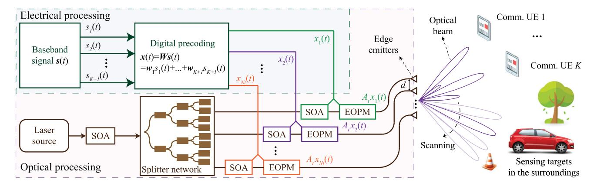

<span id="page-2-1"></span>Fig. 1. Beamforming process of the proposed OPA-based OW-ISAC system.

which dedicated C&S performance metrics are derived. Afterward, the joint optimization problem of precoding matrices and PD orientations is formulated, decomposed, and resolved in Section IV. Detailed numerical results are displayed in Section V, and finally the conclusion is drawn in Section VI.

Notations: For a complex scalar  $x, x^*$  and |x| denote its conjugate and modulus, respectively. Vectors and matrices are denoted by boldface lower-case letters and boldface upper-case letters, respectively. For a complex matrix  $\mathbf{W}$ , its transpose, Hermitian transpose, trace, diagonal elements, rank, and (i,j)-th element are denoted as  $\mathbf{W}^T, \mathbf{W}^H$ ,  $\operatorname{tr}(\mathbf{W})$ ,  $\operatorname{diag}(\mathbf{W})$ ,  $\operatorname{rank}(\mathbf{W})$ , and  $(\mathbf{W})_{i,j}$ , respectively.  $\mathbf{1}_N$  is an all-one vector with N elements, and  $\mathbf{I}_N$  is an  $N\times N$  identity matrix.  $\mathbb{C}^N$ ,  $\mathbb{C}^{N\times L}$ , and  $\mathcal{S}_N^+$  denote the space of  $N\times 1$  complex vectors,  $N\times L$  complex matrices, and  $N\times N$  semidefinite matrices, respectively.  $\mathcal{N}\left(0,\sigma^2\right)$  and  $\mathcal{C}\mathcal{N}\left(0,\sigma^2\right)$  denote real Gaussian distribution and circularly symmetric complex Gaussian distribution with mean 0 and variance  $\sigma^2$ , respectively.  $\mathbb{E}\left(X\right)$  means calculating the expectation for X, and  $\mathcal{O}$  is the standard big-O notation for computational complexity.

#### II. SYSTEM MODEL FOR OPA-BASED OW-ISAC

<span id="page-2-0"></span>In this section, we introduce the system model of the proposed OPA-based OW-ISAC framework. As illustrated in Fig. 1, the OPA is composed of a uniform line array of  $N_t$  edge emitters in the horizontal plane and serves K communication user equipment (UE) simultaneously. Besides, the OPA also conducts sensing for the direction of interest like a scanning LiDAR. To lay the foundation for OW-ISAC, the OPA-based optical beamforming is first introduced in Section II-A, and the channel model is investigated in Section II-B. Subsequently, the received light field is derived in Section II-C.

#### <span id="page-2-2"></span>A. OPA-Based Optical Beamforming

As shown in Fig. 1, the beamforming process of OPA relies on both electrical precoding and optical modulation. In the electrical part, the baseband signal vector  $s(t) \in \mathbb{C}^{K+1}$  consists of K+1 independent and zero-mean baseband signals  $\{s_1(t), \cdots, s_{K+1}(t)\}$ . Among the baseband signals,  $s_k(t), k=1, \cdots, K$  corresponds to the k-th communication UE, while  $s_{K+1}(t)$  serves as the sensing signal. To formulate

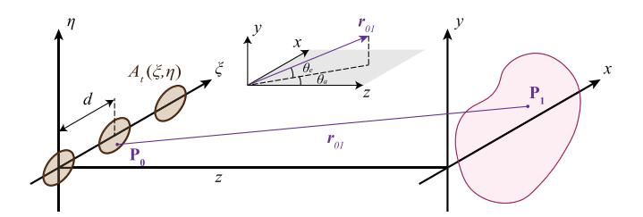

<span id="page-2-3"></span>Fig. 2. Sketch map of the Huygens-Fresnel principle.

the electrical signal vector  $x(t) \in \mathbb{C}^{N_t}$ , the baseband signal is precoded by a digital precoder, i.e.,

$$\boldsymbol{x}(t) = \boldsymbol{W}\boldsymbol{s}(t) = \sum_{k=1}^{K+1} \boldsymbol{w}_k s_k(t), \tag{1}$$

where W denotes the precoding matrix.

In the optical part, the optical signal is generated by a coherent laser source, whose amplitude is first adjusted by a semiconductor optical amplifier (SOA). Subsequently, a star-coupler-based splitter network splits the optical signal into  $N_t$  branches, each of which contains an SOA and an electro-optic phase modulator (EOPM). Under the control of the precoded electrical signal  $x_{n_t}(t)$ , the SOA and EOPM in the  $n_t$ -th branch modulate the magnitude and phase of optical signal independently [37]. Once the electrical signal vector  $\boldsymbol{x}(t)$  is loaded on the optical signal, the edge emitters are ready to transmit optical beams to free space.

<span id="page-2-4"></span>Supposing that the optical beams propagate in a homogeneous medium without any dispersion, the light field of OPA can be derived in a scalar form. As shown in Fig. 2, the OPA is fixed in the  $\xi$ - $\eta$  plane. Thus, the light field in the x-y image plane is calculated by the Huygens-Fresnel principle as [38]

<span id="page-2-5"></span>
$$E\left(\mathbf{P}_{1}\right) = \frac{z}{j\lambda} \iint_{-\infty}^{\infty} E\left(\mathbf{P}_{0}\right) \frac{e^{jk_{0}|\mathbf{r}_{01}|}}{|\mathbf{r}_{01}|^{2}} d\xi d\eta, \tag{2}$$

where  $\lambda$  denotes the optical wavelength, and  $k_0 = 2\pi/\lambda$  denotes the wavenumber. Besides,  $P_1 = (x, y, z)$  and  $P_0 = (\xi, \eta, 0)$  are the coordinates of the image point and the source point, respectively, while  $r_{01} = \overline{P_0 P_1}$  is the direction vector between them.

{3}------------------------------------------------

To obtain a concise expression of the light field, the Fraunhofer approximation is adopted to calculate the far-field light field as

$$E\left(\boldsymbol{P}_{1}\right) = \frac{\iota_{1}\left(\boldsymbol{P}_{1}\right)}{\lambda z} \iint_{-\infty}^{\infty} E\left(\boldsymbol{P}_{0}\right) e^{-\frac{jk_{0}\left(x\xi+y\eta\right)}{z}} d\xi d\eta, \quad (3)$$

where  $\iota_1(P_1)$  denotes a phase-shift term with a normalized magnitude, i.e.,

$$\iota_1(\mathbf{P}_1) = -je^{jk_0\left(z + \frac{x^2 + y^2}{2z}\right)}.$$
 (4)

We assume that each emitting element has the same spatial mode  $A_t(\xi, \eta)$ , and its amplitude is adjusted by the beamforming vector  $\boldsymbol{x}(t)$ . Thus, the light field in the  $\xi - \eta$  plane is the superposition of those emitted by all the elements, i.e.,

$$E(\mathbf{P}_{0},t) = \sum_{n=1}^{N_{t}} A_{t} (\xi - (n-1) d, \eta) x_{n} (t),$$
 (5)

where d is the distance between adjacent emitting elements. In consequence, substituting  $E(P_0)$  in (3) with (5) yields an expression with separate variables, i.e.,

$$E(\mathbf{P}_{1},t) = \iota_{1}(\mathbf{P}_{1}) \mathcal{F}_{A_{t}}(\mathbf{P}_{1}) \mathbf{h}^{\mathcal{H}}(\mathbf{P}_{1}) \mathbf{x} \left(t - \frac{|\mathbf{r}_{01}|}{c}\right),$$
(6)

where c denotes the speed of light, and  $\mathcal{F}_{A_t}(\mathbf{P}_1)$  is the 2-D Fourier transform for  $A_t(\xi, \eta)$  in the spatial domain, i.e.,

$$\mathcal{F}_{A_t}(\boldsymbol{P}_1) = \frac{1}{\lambda z} \iint_{-\infty}^{\infty} A_t(\xi, \eta) e^{-\frac{jk_0(x\xi + y\eta)}{z}} d\xi d\eta.$$
 (7)

In addition,  $\boldsymbol{h}^{\mathcal{H}}\left(\boldsymbol{P}_{1}\right)\boldsymbol{x}\left(t\right)$  is the far-field light field of  $N_{t}$  identical point sources, with the steering vector defined as

$$\boldsymbol{h}\left(\boldsymbol{P}_{1}\right) = \left[1, \exp\left(jk_{0}xd/z\right), \\ \cdots, \exp\left(jk_{0}\left(N_{t}-1\right)xd/z\right)\right]^{T}. \tag{8}$$

#### <span id="page-3-1"></span>B. Channel Model

For terrestrial scenarios, the light field propagates through an atmospheric channel and reaches a UE or a target if a line-of-sight (LoS) link exists. Among the impairments of atmospheric propagation, the geometric and misalignment losses are intrinsically included in (6), while the atmospheric attenuation and turbulence are modelled as follows.

1) Atmospheric Attenuation: For the near-infrared wavelength ranges, the optical energy may be absorbed and scattered by particles like rain, snow, fog, dust, aerosol, smoke, etc. Among these detrimental environmental conditions, fog and haze have the most significant impact on the atmospheric attenuation as their particle sizes are close to the near-infrared wavelengths. Supposing that the optical link distance is *D*, the attenuation brought by fog and haze can be derived by the Beer-Lambert law as [39]

<span id="page-3-8"></span>
$$L_a(D) = 10^{-\alpha D/10000},$$
 (9)

where the exponential attenuation factor  $\alpha$  (in dB/km) can be obtained by the Nebuloni visibility model.

<span id="page-3-3"></span>2) Atmospheric Turbulence: The inhomogeneities in the atmospheric temperature and pressure arise from solar heating and wind, which result in the variations of refractive index along the optical path. These variations distort both phase and amplitude of laser beams, thus deteriorating the performance of OWC and LiDAR. However, since the typical operating distance of an OPA is within 200 m [40], the spatial coherence of laser beams is generally maintained [41]. Additionally, the scintillation brought by the atmospheric turbulence is modelled by the log-normal distribution and can be depicted by a stochastic scintillation term  $L_t(D)$  as [42]

<span id="page-3-9"></span>
$$p(L_t; D) = \frac{1}{L_t \sqrt{2\pi\sigma_t^2}} \exp\left(-\frac{1}{2\sigma_t^2} \left(\ln(L_t) + \frac{\sigma_t^2}{2}\right)^2\right),$$
(10)

<span id="page-3-4"></span>where the scintillation index  $\sigma_t^2(D)$  can be obtained by the Rytov approximation as [42]

<span id="page-3-11"></span><span id="page-3-10"></span><span id="page-3-6"></span>
$$\sigma_t^2(D) \approx 1.23k_0^{7/6}D^{11/6}C_n^2,$$
 (11)

with  $C_n^2$  denoting the refractive index.

#### <span id="page-3-2"></span>C. Received Light Field

<span id="page-3-5"></span>Incorporating the channel model into (6), the received light field for the k-th communication UE is given by

$$E_{c,k}(t) = (L_a(|\mathbf{r}_{0k}|) L_t(|\mathbf{r}_{0k}|))^{1/2} E(\mathbf{P}_k, t),$$
 (12)

where  $P_k$  denotes the position of the k-th UE, and  $r_{0k} = \overrightarrow{P_0 P_k}$  is the direction vector between  $P_0$  and  $P_k$ .

Meanwhile, the channel model for sensing incorporates the reflection of targets in a specific scene, which can be concisely described in the azimuth-angle domain due to the horizontal deployment of OPA. If the z-coordinates and elevation angles of targets are fixed, the positions of targets  $P(\theta_a)$ , the direction vectors to targets  $r(\theta_a)$ , and the reflectivities of targets  $\Re_f(\theta_a)$  can all be denoted as functions of the azimuth angle  $\theta_a$ . In consequence, supposing that the sensing receiver is colocated with the OPA-based transmitter, the received light field for sensing from azimuth angle  $\theta_a$  is expressed as

<span id="page-3-7"></span>
$$E_{s}(\theta_{a}, t) = \left(L_{a}(|2\boldsymbol{r}(\theta_{a})|) L_{t}(|2\boldsymbol{r}(\theta_{a})|)\right)^{1/2} \cdot \mathfrak{R}_{f}(\theta_{a}) E\left(\boldsymbol{P}(\theta_{a}), t - \frac{|\boldsymbol{r}(\theta_{a})|}{c}\right), \quad (13)$$

where the steering vector in  $E(\mathbf{P}(\theta_a), t)$  is substituted with its far-field angle-domain expression as

$$\boldsymbol{h}\left(\theta_{a}\right) = \left[1, \exp\left(jk_{0}d\sin\left(\theta_{a}\right)\right), \\ \cdots, \exp\left(jk_{0}\left(N_{t}-1\right)d\sin\left(\theta_{a}\right)\right)\right]^{T}.$$
 (14)

#### <span id="page-3-0"></span>III. PERFORMANCE METRICS OF OPA-BASED OW-ISAC

In this section, we derive the C&S performance metrics for an OPA-based OW-ISAC system. The multi-beam property of OPA is first displayed in Section III-A to reveal the essential difference between RF-ISAC and OW-ISAC. Then, the operational principles and performance metrics of C&S sub-systems are elaborated in Sections III-B and III-C, respectively, where the multi-beam property is mitigated and exploited under the constraint of the DD scheme.

{4}------------------------------------------------

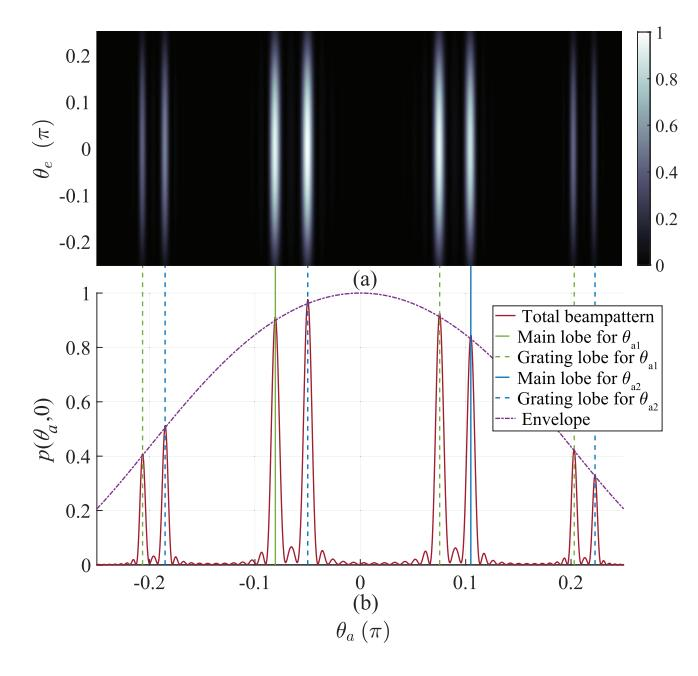

<span id="page-4-2"></span>Fig. 3. Far-field beampattern of OPA with  $d=2\lambda, w_0=0.2\lambda, z=2048\lambda, N_t=16$ . (a) Beampattern in the angle domain. (b) Beampattern in  $\theta_e=0$ .

## <span id="page-4-0"></span>A. Multi-Beam Property of OPA

To reduce the cross-talk between grating couplers, the distance d between adjacent OPA emitting elements is generally larger than a half of the optical wavelength [20]. Therefore, spatial ambiguity may occur in the beampattern of OPA due to the Vandermonde structure of the steering vector, which leads to multiple beams in various directions [36]. To intuitively display the multi-beam property, Fig. 3 provides an example of far-field beampattern in the angle domain, i.e., with respect to azimuth angle  $\theta_a$  and elevation angle  $\theta_e$ , for K=2. The aim is to steer optical beams to  $\theta_{a,1}=-\pi/12$  and  $\theta_{a,2}=\pi/9$ , and thus precoding vectors are intuitively selected as

$$\boldsymbol{w}_{k} = \sqrt{\frac{P_{t}}{2N_{t}}}\boldsymbol{h}\left(\theta_{a,k}\right), \quad 1 \leq k \leq K, \tag{15}$$

where  $P_t$  denotes the total transmitted power.

Moreover, the spatial mode of each emitting element is assumed to follow an identical Gaussian distribution, i.e.

$$A_t(\xi, \eta) = \exp\left(-\frac{\xi^2 + \eta^2}{2w_0^2}\right),\tag{16}$$

where  $w_0$  is the width of waist for the Gaussian beam.

Towards this end, the far-field light field intensity in the angle domain can be calculated as (17), shown at the bottom of the page, and is also displayed in Fig. 3(a), where the azimuth and elevation angles are approximated as  $\theta_a \approx \arcsin{(x/z)}$  and  $\theta_e \approx \arcsin{(y/z)}$ , respectively. In addition, the beampattern at  $\theta_e = 0$  is shown in Fig. 3(b), where the

dash lines delineate the grating lobes caused by the spatial ambiguity. Specifically, while an optical beam is steered to  $\theta_{a,k}$ , supernumerary beams are also steered to

$$\theta_{g,k} = \arcsin\left(\sin\left(\theta_{a,k}\right) + \frac{2m\pi}{k_0 d}\right), \quad m = \pm 1, \pm 2, \cdots,$$
(18)

which yields the co-existence of main lobes and grating lobes in Fig. 3(b). Since these grating lobes disperse optical energy to unexpected directions and cause spatial ambiguity, they should be mitigated and exploited in OW-ISAC.

#### <span id="page-4-1"></span>B. Performance Metric of Communication Sub-System

Even if the baseband signal is complex, the communication data for the k-th UE should only be loaded on the intensity of  $s_k(t)$  to be compatible with the DD scheme. Specifically, the baseband signal for the k-th UE is decomposed into its magnitude and phase, i.e.,  $s_k(t) = \tilde{s}_k(t) e^{j\delta_k}$ , where the magnitude  $\tilde{s}_k(t)$  carries the communication data. Meanwhile, the phase term  $\delta_k$  of each UE follows an identical uniform distribution independently, i.e.,  $\delta_k \sim \mathcal{U}(0, 2\pi)$ , and thus the uncorrelated and normalized properties of baseband signals can be ensured as

$$\mathbb{E}\left(\boldsymbol{s}\left(t\right)\boldsymbol{s}^{\mathcal{H}}\left(t\right)\right) = \boldsymbol{I}_{K+1}.\tag{19}$$

After the light field propagates through a LoS atmospheric channel and reaches the k-th UE, a PD is adopted to detect  $E_{c,k}\left(t\right)$  in (12) incoherently. In consequence, assuming that perfect time synchronization has been achieved between the transmitter and the k-th UE, the received signal of the k-th UE follows a square law as

$$y_k(t) = \mathcal{R}_c |E_{c,k}(t + |\mathbf{r}_{0k}|/c)|^2 + v_{c,k}(t),$$
 (20)

where  $\mathcal{R}_c$  denotes the responsivity of PD, and the noise term  $v_{c,k}\left(t\right)$  arises from both the shot noise in PD and the thermal noise in the circuit. To evaluate the multi-user interference (MUI) in the communication sub-system, the atmospheric attenuation, scintillation, and spatial mode of each emitting element compose an individual term, i.e.,

$$L_c(\boldsymbol{P}_k) = \mathcal{R}_c L_a(|\boldsymbol{r}_{0k}|) L_t(|\boldsymbol{r}_{0k}|) |\mathcal{F}_{A_t}(\boldsymbol{P}_k)|^2.$$
 (21)

Thereby,  $y_k(t)$  can be rewritten as

<span id="page-4-3"></span>
$$y_{k}(t) = L_{c}\left(\boldsymbol{P}_{k}\right) \left|\boldsymbol{h}^{\mathcal{H}}\left(\boldsymbol{P}_{k}\right) \boldsymbol{W} \boldsymbol{s}(t)\right|^{2} + v_{c,k}(t)$$

$$= \underbrace{L_{c}\left(\boldsymbol{P}_{k}\right) \left|\boldsymbol{h}^{\mathcal{H}}\left(\boldsymbol{P}_{k}\right) \boldsymbol{w}_{k}\right|^{2} \left|\tilde{s}_{k}(t)\right|^{2} + v_{c,k}(t)}_{\text{(2aa)}} + \underbrace{\sum_{l=1, l \neq k}^{K+1} L_{c}\left(\boldsymbol{P}_{k}\right) \left|\boldsymbol{h}^{\mathcal{H}}\left(\boldsymbol{P}_{k}\right) \boldsymbol{w}_{l}\right|^{2} \left|\tilde{s}_{l}(t)\right|^{2}}_{\text{(2lb)}}$$

$$p(\theta_{a}, \theta_{e}) = \mathbb{E}\left(|E(\mathbf{P}_{1}, t)|^{2}\right) \approx \frac{4\pi^{2}w_{0}^{4}}{\lambda^{2}z^{2}} \exp\left(-k_{0}^{2}w_{0}^{2}\left(\sin^{2}(\theta_{a}) + \sin^{2}(\theta_{e})\right)\right) \sum_{k=1}^{2} \frac{\sin^{2}\left(\frac{N_{t}}{2}k_{0}d\left(\sin\left(\theta_{a, k}\right) - \sin\left(\theta_{a}\right)\right)\right)}{\sin^{2}\left(\frac{1}{2}k_{0}d\left(\sin\left(\theta_{a, k}\right) - \sin\left(\theta_{a}\right)\right)\right)}.$$
(17)

{5}------------------------------------------------

$$+\underbrace{\sum_{m,l=1}^{K+1} L_{c}\left(\boldsymbol{P}_{k}\right) \boldsymbol{h}^{\mathcal{H}}\left(\boldsymbol{P}_{k}\right) \boldsymbol{w}_{m} \boldsymbol{w}_{l}^{\mathcal{H}} \boldsymbol{h}\left(\boldsymbol{P}_{k}\right) s_{m}(t) s_{l}^{*}(t)}_{(2c)}.$$
(22)

While the desired signal for k-th UE is (22a), it suffers from both the noise term  $v_{c,k}\left(t\right)$  and the interference (22b) from other UEs. Additionally, the square-law detection also generates a cross-talk term (22c) between different UEs, which yields the fussy expression in (22). To derive a concise performance metric for the communication sub-system, the SINR is analyzed in the light field instead. Specifically, the optical power of the l-th UE at  $P_k$  is expressed as

$$\bar{p}_{k,l} = \mathbb{E}\left(L_c\left(\boldsymbol{P}_k\right) | \boldsymbol{h}^{\mathcal{H}}\left(\boldsymbol{P}_k\right) \boldsymbol{w}_l s_l\left(t\right)|^2\right)$$

$$= L_c\left(\boldsymbol{P}_k\right) \boldsymbol{h}^{\mathcal{H}}\left(\boldsymbol{P}_k\right) \boldsymbol{R}_{\boldsymbol{w}_l} \boldsymbol{h}\left(\boldsymbol{P}_k\right)$$

$$= L_c\left(\boldsymbol{P}_k\right) \operatorname{tr}\left(\boldsymbol{R}_{\boldsymbol{w}_l} \boldsymbol{H}\left(\boldsymbol{P}_k\right)\right), \tag{23}$$

where  $\mathbf{R}_{\mathbf{w}_l} = \mathbf{w}_l \mathbf{w}_l^{\mathcal{H}}$  and  $\mathbf{H}(\mathbf{P}_k) = \mathbf{h}(\mathbf{P}_k) \mathbf{h}^{\mathcal{H}}(\mathbf{P}_k)$  are the auto-correlation matrices of  $\mathbf{w}_l$  and  $\mathbf{h}(\mathbf{P}_k)$ , respectively. Besides, an equivalent light-field noise term  $\tilde{v}_{c,k}(t)$  is added to  $E_{c,k}(t)$  to model the influence of  $v_{c,k}(t)$  on the light-field SINR, i.e.,

$$y_k(t) \triangleq \mathcal{R}_c |\tilde{E}_{c,k}(t + |\mathbf{r}_{0k}|/c)|^2,$$
 (24)

where  $\tilde{E}_{c,k}(t) \triangleq E_{c,k}(t) + \tilde{v}_{c,k}(t)$  is total received light field that incorporates the influence of the equivalent noise term  $\tilde{v}_{c,k}(t)$ . For simplicity, both  $\tilde{v}_{c,k}(t)$  and  $v_{c,k}(t)$  are asserted to follow zero-mean Gaussian distributions, i.e.,  $\tilde{v}_{c,k}(t) \sim \mathcal{CN}(0, \tilde{\sigma}_{c,k}^2), v_{c,k}(t) \sim \mathcal{N}(0, \sigma_{c,k}^2)$ . Consequently, their consistency in high-order momentums yields a relationship of

$$\mathbb{E}\left(\left|\tilde{v}_{c,k}\left(t\right)\right|^{4}\right) = \frac{1}{\mathcal{R}_{c}^{2}} \mathbb{E}\left(v_{c,k}^{2}\left(t\right)\right) = 2\tilde{\sigma}_{c,k}^{4} = \frac{\sigma_{c,k}^{2}}{\mathcal{R}_{c}^{2}}.$$
 (25)

Based on the results in (23) and (25), the light-field SINR of the *k*-th communication UE is written as

$$\gamma_{k} = \frac{\bar{p}_{k,k}}{\sum_{l=1,l\neq k}^{K+1} \bar{p}_{k,l} + \mathcal{R}_{c} \tilde{\sigma}_{c,k}^{2}} \\
= \frac{L_{c}\left(\boldsymbol{P}_{k}\right) \operatorname{tr}\left(\boldsymbol{R}_{\boldsymbol{w}_{k}} \boldsymbol{H}\left(\boldsymbol{P}_{k}\right)\right)}{L_{c}\left(\boldsymbol{P}_{k}\right) \operatorname{tr}\left(\sum_{l=1,l\neq k}^{K+1} \boldsymbol{R}_{\boldsymbol{w}_{l}} \boldsymbol{H}\left(\boldsymbol{P}_{k}\right)\right) + \frac{\sigma_{c,k}}{\sqrt{2}}}.$$
(26)

Due to the multi-beam property of OPA, the SNIR  $\gamma_k$  may deteriorate drastically if the k-th UE is located in a grating lobe of the l-th UE, and vice versa. Therefore, the OPA-based OW-ISAC system has a more urgent need for MUI mitigation than conventional RF-ISAC systems, and the SINR in (26) serves as a key performance indicator for the communication sub-system during the optimization.

# <span id="page-5-0"></span>C. Performance Metric of Sensing Sub-System

1) Operational Principle of Imaging: The sensing subsystem aims to image the surroundings in the same manner as a scanning LiDAR, which demands an estimation of the range-angle profile  $\Psi(r,\theta_a)$ . To exploit the grating lobes and alleviate the mutual interference between them, a PD array with various steering angles is adopted as the sensing receiver,

<span id="page-5-2"></span><span id="page-5-1"></span>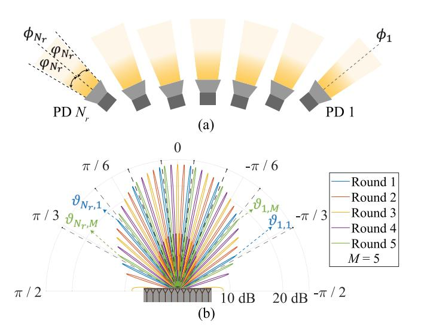

<span id="page-5-6"></span><span id="page-5-3"></span>Fig. 4. Operational principles of the sensing sub-system. (a) Sketch map of the horizontally arranged PD array. (b) Beampatterns during the scanning.

which covers different angle intervals within the limited FOVs of PDs. As shown in Fig. 4(a), the sensing receiver consists of  $N_r$  horizontally arranged PDs, and the  $n_r$ -th PD is oriented to an azimuth angle of  $\phi_{n_r}$ . Denoting the azimuth-angle responsivity as  $\mathcal{R}_s\left(\theta_a|\varphi_{n_r}\right)$ , each PD only responds to the received light field in its own FOV, i.e.,

$$\mathcal{R}_{s}\left(\theta_{a}|\varphi_{n_{r}}\right) = \begin{cases} \tilde{\mathcal{R}}_{s}\cos\left(\theta_{a}\right), & -\varphi_{n_{r}} \leq \theta_{a} \leq \varphi_{n_{r}}, \\ 0, & \text{otherwise}, \end{cases}$$
 (27)

<span id="page-5-4"></span>where  $\mathcal{R}_s$  denotes the PD responsivity for vertical incidence, and  $\varphi_{n_r}$  equals to the half FOV of the  $n_r$ -th PD. Thereby, by detecting the received light field in (13) incoherently and omnidirectionally, the received signal of the  $n_r$ -th PD is the summation of its response to its whole FOV, i.e.,

<span id="page-5-7"></span>
$$z_{n_r}(t) = v_{s,n_r}(t) + \int L_s(\theta_a | \phi_{n_r}, \varphi_{n_r}) \left| \boldsymbol{h}^{\mathcal{H}}(\theta_a) \boldsymbol{x} \left( t - \frac{2|\boldsymbol{r}(\theta_a)|}{c} \right) \right|^2 d\theta_a,$$
(28)

<span id="page-5-5"></span>where the sensing noise  $v_{s,n_r}(t)$  arises from both the shot noise and thermal noise in the sensing receiver, while the composed loss term for sensing is defined as

$$L_{s}(\theta_{a}|\phi_{n_{r}},\varphi_{n_{r}}) = \mathcal{R}_{s}(\theta_{a} - \phi_{n_{r}}|\varphi_{n_{r}})$$

$$\cdot L_{a}(2|\boldsymbol{r}(\theta_{a})|) L_{t}(2|\boldsymbol{r}(\theta_{a})|) \mathfrak{R}_{f}(\theta_{a}) |\mathcal{F}_{A_{t}}(\boldsymbol{P}(\theta_{a}))|^{2}. \tag{29}$$

In contrast to the prevalent beampattern matching in RF-ISAC, an OW-ISAC system for imaging generally attains an on-grid range-angle profile in multiple rounds to remedy the omnidirectional detection of PDs. As illustrated in Fig. 4(b), the OPA estimates the range-angle profile  $\Psi\left(r,\theta_{a}\right)$  by scanning the surroundings in M rounds, during which  $N_{r}$  optical beams are emitted in each round to cover  $MN_{r}$  angle grids in total. Besides, the desired angle grid for the  $n_{r}$ -th PD in the m-th round is denoted as  $\vartheta_{n_{r},m}$  ( $1 \leq n_{r} \leq N_{r}, 1 \leq m \leq M$ ), while those from other grids are all regarded as clutters. Moreover, to exploit the multi-beam property of OPA, the

{6}------------------------------------------------

desired angle grids in an individual round are grating lobes of a unique main lobe  $\vartheta_{n_r,1}$ , i.e.,

$$\vartheta_{n_r,m} = \arcsin\left(\sin\left(\vartheta_{n_r,1}\right) + \frac{2(m-1)\pi}{k_0 d}\right). \tag{30}$$

Consequently, the estimated range-angle profile can be attained by the cross-correlation method as

$$\hat{\Psi}\left(r,\vartheta_{n_{r},m}\right) = \int z_{n_{r}}\left(t\right) z_{ref}\left(t - \frac{2r}{c},\vartheta_{n_{r},m}\right) dt, \quad (31)$$

where the local reference signal for sensing at azimuth angle  $\vartheta_{n_r,m}$  is selected as

$$z_{ref}(t, \vartheta_{n_r, m}) = \left| \boldsymbol{h}^{\mathcal{H}}(\vartheta_{n_r, m}) \boldsymbol{x}(t) \right|^2.$$
 (32)

Subsequently, the result of imaging, i.e., the range map  $r\left(\vartheta_{n_r,m}\right)$  of the surroundings, can be estimated by maximum-likelihood estimation (MLE) as

$$\hat{r}\left(\vartheta_{n_r,m}\right) = \arg \max_{r} \hat{\Psi}\left(r, \vartheta_{n_r,m}\right),\tag{33}$$

which reveals the range information of at most  $MN_r$  real-world on-grid targets in the FOVs of all the PDs.

2) Derivation of Contrast Metric: If the interval between adjacent grids in the total angle grid set  $\Theta$  is smaller than the angle resolution of the OPA, i.e., smaller than the full width at half maximum [20], the received signal in (28) can be discretized as (34), shown at the bottom of the page. Since both desired signal in (34a) and clutters in (34b) are affected by a specific scene, i.e.,  $L_s(\theta_a|\phi_{n_r},\varphi_{n_r})$ , the complicated form of received sensing signal hinders a concise evaluation of the imaging performance.

Enlightened by the beampattern design in MIMO-based RF-ISAC, we optimize the power distribution in the angle domain instead, which is independent from a specific scene. For a sufficiently large z-coordinate z<sup>+</sup>, the far-field light field intensity in the angle domain is calculated as

$$p(\theta_a, \theta_e) = \left| \mathcal{F}_{A_t}(\theta_a, \theta_e) \right|^2 \operatorname{tr}(\boldsymbol{H}(\theta_a) \boldsymbol{R}_{\boldsymbol{W}}), \quad (35)$$

where  $\mathbf{R}_{\mathbf{W}} = \mathbf{W}\mathbf{W}^{\mathcal{H}} = \sum_{k=1}^{K+1} \mathbf{R}_{\mathbf{w}_k}$  and  $\mathbf{H}(\theta_a) = \mathbf{h}(\theta_a) \mathbf{h}^{\mathcal{H}}(\theta_a)$  denote the auto-correlation matrices of  $\mathbf{W}$  and  $\mathbf{h}(\theta_a)$ , respectively. In addition, the spatial mode of each emitting element in the angle domain is given by

$$\mathcal{F}_{A_t}(\theta_a, \theta_e) = \frac{1}{\lambda z^+} \iint_{-\infty}^{\infty} A_t(\xi, \eta) e^{-jk_0(\xi \sin(\theta_a) + \eta \sin(\theta_e))} d\xi d\eta.$$
 (36)

Moreover, a typical methodology for enhancing the desired signal and suppressing clutters is to minimize the integrated sidelobe ratio (ISLR) of the beampattern [43]. Given the expression of angle-domain power distribution in (35), the ISLR for the  $n_r$ -th PD in the *m*-th round is expressed as

<span id="page-6-3"></span>
$$\psi_{n_r,m} = \frac{\sum_{\theta_a \in \Theta \setminus \{\vartheta_{n_r,m}\}} \mathcal{R}_s \left(\theta_a - \phi_{n_r} | \varphi_{n_r}\right) p\left(\theta_a, \theta_e\right)}{\mathcal{R}_s \left(\vartheta_{n_r,m} - \phi_{n_r} | \varphi_{n_r}\right) p\left(\vartheta_{n_r,m}, \theta_e\right)},$$
(37)

which also incorporates the FOV of PD to distinguish the desired main lobe from undesired grating lobes.

<span id="page-6-5"></span>Nevertheless, the fractional form of the ISLR metric challenges the convex optimization algorithms during beamforming, and the aggregation of ISLR as an intensive property also lacks physical validity. Towards this end, we refer to the Dinkelbach algorithm for fractional programming and propose a contrast metric as an extensive property [44]. For a fixed elevation angle of  $\theta_e$ , the contrast metric for the  $n_r$ -th PD in the m-th round is defined as

<span id="page-6-7"></span><span id="page-6-4"></span>
$$\chi_{n_r,m} = \kappa \mathcal{R}_s \left( \vartheta_{n_r,m} - \phi_{n_r} | \varphi_{n_r} \right) p \left( \vartheta_{n_r,m}, \theta_e \right) - \sum_{\vartheta \in \Theta} \mathcal{R}_s \left( \vartheta - \phi_{n_r} | \varphi_{n_r} \right) p \left( \vartheta, \theta_e \right), \tag{38}$$

where  $\kappa \in \mathbb{R}^+$  is a contrast factor to balance the desired signal against clutters.

A comparison between (37) and (38) indicates that maximizing the contrast metric is equivalent to minimizing the ISLR metric during the beampattern design. Specifically, an increased contrast metric delineates the enhancement of desired signal in (34a) and the suppression of clutters in (34b). In consequence, the quality of the range-angle profile benefitted from the increased electrical signal-to-noise ratio (SNR) of desired signal and also the mitigation of detrimental sidelobes. Therefore, the contrast metric is optimized for the sensing sub-system to achieve a superior precision after the scanning.

<span id="page-6-2"></span>Remark: While the communication performance metric, i.e., light-field SINR  $\gamma_k$ , is mainly affected by the beampattern of OPA, the sensing performance metric, i.e., contrast metric  $\chi_{n_r,m}$ , also depends on the orientations of PDs to distinguish the desired main lobe from undesired sidelobes, as indicated by (38). Without loss of generality, the OW-ISAC receiver adopts an individual setup for PD orientations during the whole M rounds. Therefore, as optimization variables, the precoding matrix and PD orientations should be jointly optimized among all the  $N_r$  PDs through the entire M rounds, which achieves practical and robust OW-ISAC functionalities.

## <span id="page-6-1"></span>IV. OPTIMAL BEAMFORMING FOR OW-ISAC

<span id="page-6-6"></span><span id="page-6-0"></span>In this section, the C&S performance metrics are jointly optimized to achieve optimal beamforming for OW-ISAC. In

$$\underbrace{L_{s}\left(\vartheta_{n_{r},m}\mid\phi_{n_{r}},\varphi_{n_{r}}\right)\left|h^{\mathcal{H}}\left(\vartheta_{n_{r},m}\right)x\left(t-\frac{2\left|r\left(\vartheta_{n_{r},m}\right)\right|}{c}\right)\right|^{2}}_{(33a)} + \underbrace{\sum_{\theta_{a}\neq\vartheta_{n_{r},m}}L_{s}\left(\theta_{a}\mid\phi_{n_{r}},\varphi_{n_{r}}\right)\left|h^{\mathcal{H}}\left(\theta_{a}\right)x\left(t-\frac{2\left|r\left(\theta_{a}\right)\right|}{c}\right)\right|^{2}}_{(33b)}.$$

$$\underbrace{\left(33b\right)}_{(34a)}$$

{7}------------------------------------------------

addition to the critical precoding matrix, the PD orientations are also optimized to alleviate the spatial ambiguity. The joint optimization problem is first formulated in Section IV-A. Then, it is decomposed into sub-problems for precoding matrices and PD orientations that are elaborated in Sections IV-B and IV-C, respectively. Finally, a BCD algorithm is proposed in Section IV-D to solve the joint optimization problem iteratively, and its computational complexity is also analyzed.

#### <span id="page-7-0"></span>A. Problem Formulation for Joint Optimization

The goal of the optimization problem is to jointly optimize the sensing performance metric, i.e., the contrast metric in (38), under the transmit power and communication QoS constraints. To formulate a concise optimization problem, the notations of variables are defined and adjusted as follows.

- 1) Optimization Variables: Since the beampattern in a specific round is independent from that in another round, the precoding matrix should be individually optimized in each round. Therefore, the precoding vectors and their corresponding auto-correlation matrices in the m-th round are denoted as  $\boldsymbol{w}_{k,m}$  and  $\boldsymbol{R}_{\boldsymbol{w}_{k,m}} = \boldsymbol{w}_{k,m} \boldsymbol{w}_{k,m}^{\mathcal{H}}$ , respectively. Besides, for notational convenience, the precoding matrix and its auto-correlation matrix are denoted as  $\boldsymbol{W}_m$  and  $\boldsymbol{R}_{\boldsymbol{W}_m} = \boldsymbol{W}_m \boldsymbol{W}_m^{\mathcal{H}} = \sum_{k=1}^{K+1} \boldsymbol{R}_{\boldsymbol{w}_{k,m}}$ , respectively.
- 2) Optimization Objective: To evaluate the sensing performance of different PDs or in distinct rounds, the contrast metrics for the  $n_r$ -th PD and for the m-th round are defined as  $\chi_{n_r} = \sum_{m=1}^{M} \chi_{n_r,m}$  and  $\chi_m = \sum_{n_r=1}^{N_r} \chi_{n_r,m}$ , respectively. Substituting the light field intensity in (38) with (35) yields the optimization objectives as

$$\chi_{n_r} = \sum_{m=1}^{M} \left[ \kappa \mathcal{R}_s \left( \vartheta_{n_r,m} - \phi_{n_r} | \varphi_{n_r} \right) | \mathcal{F}_{A_t} \left( \vartheta_{n_r,m}, \theta_e \right) |^2 \right. \\ \left. \cdot \operatorname{tr} \left( \boldsymbol{H} \left( \vartheta_{n_r,m} \right) \boldsymbol{R}_{\boldsymbol{W}_m} \right) - \sum_{\vartheta \in \Theta} \mathcal{R}_s \left( \vartheta - \phi_{n_r} | \varphi_{n_r} \right) \right. \\ \left. \cdot | \mathcal{F}_{A_t} \left( \vartheta, \theta_e \right) |^2 \operatorname{tr} \left( \boldsymbol{H} \left( \vartheta \right) \boldsymbol{R}_{\boldsymbol{W}_m} \right) \right], \tag{39a}$$

$$\chi_m \triangleq \operatorname{tr}\left(\boldsymbol{T}_{\boldsymbol{\phi},m}\boldsymbol{R}_{\boldsymbol{W}_m}\right) = \operatorname{tr}\left(\boldsymbol{T}_{\boldsymbol{\phi},m}\sum_{k=1}^{K+1}\boldsymbol{R}_{\boldsymbol{w}_{k,m}}\right),\quad (39b)$$

where the PD orientation vector  $\phi$  equals to  $[\phi_1, \cdots, \phi_{N_r}]$ , and the Hermitian contrast matrix  $T_{\phi,m}$  is defined as

$$\mathbf{T}_{\phi,m} \triangleq \sum_{n_{r}=1}^{N_{r}} \left[ \kappa \mathcal{R}_{s} \left( \vartheta_{n_{r},m} - \phi_{n_{r}} | \varphi_{n_{r}} \right) \right. \\
\left. \cdot \left| \mathcal{F}_{A_{t}} \left( \vartheta_{n_{r},m}, \theta_{e} \right) \right|^{2} \mathbf{H} \left( \vartheta_{n_{r},m} \right) \\
\left. - \sum_{\vartheta \in \Theta} \mathcal{R}_{s} \left( \vartheta - \phi_{n_{r}} | \varphi_{n_{r}} \right) \left| \mathcal{F}_{A_{t}} \left( \vartheta, \theta_{e} \right) \right|^{2} \mathbf{H} \left( \vartheta \right) \right]. \tag{40}$$

3) Communication QoS Constraint: As the performance metric for communication, the SINR in (26) contains a stochastic term  $L_c(\mathbf{P}_k)$  due to the atmospheric turbulence. To avoid numerical integrals, the scintillation term  $L_t(|\mathbf{r}_{0k}|)$  is substituted with its 0.05-lower quantile  $\tilde{L}_t(|\mathbf{r}_{0k}|)$ , so that the desired communication performance for the k-th UE can be guaranteed at a probability of larger than 95%. Thereby,

the stochastic term  $L_c(\mathbf{P}_k)$  in (26) is also substituted with a deterministic value as

$$\tilde{L}_{c}(\boldsymbol{P}_{k}) = \mathcal{R}_{c} L_{a}(|\boldsymbol{r}_{0k}|) \, \tilde{L}_{t}(|\boldsymbol{r}_{0k}|) \, |\mathcal{F}_{A_{t}}(\boldsymbol{P}_{k})|^{2}, \tag{41}$$

based on which the expression of the light-field SINR can be rewritten as

$$\tilde{\gamma}_{k,m} = \frac{\operatorname{tr}\left(\mathbf{R}_{\boldsymbol{w}_{k,m}}\boldsymbol{H}\left(\mathbf{P}_{k}\right)\right)}{\operatorname{tr}\left(\sum_{l=1,l\neq k}^{K+1}\mathbf{R}_{\boldsymbol{w}_{l,m}}\boldsymbol{H}\left(\mathbf{P}_{k}\right)\right) + \frac{\sigma_{c,k}}{\sqrt{2}\tilde{L}_{c}\left(\mathbf{P}_{k}\right)}}.$$
 (42)

Since the communication QoS depends on the SINR, the light-field SINR  $\tilde{\gamma}_{k,m}$  in (42) should exceed a threshold  $\Gamma_k$  to ensure the communication QoS for the k-th UE, i.e.,  $\tilde{\gamma}_{k,m} \geq \Gamma_k$ , which can be recast in a linear form as

<span id="page-7-2"></span>
$$(1 + \Gamma_{k}^{-1}) \operatorname{tr} \left( \mathbf{R}_{\boldsymbol{w}_{k,m}} \boldsymbol{H} \left( \boldsymbol{P}_{k} \right) \right)$$

$$\geq \operatorname{tr} \left( \sum_{l=1}^{K+1} \mathbf{R}_{\boldsymbol{w}_{l,m}} \boldsymbol{H} \left( \boldsymbol{P}_{k} \right) \right) + \frac{\sigma_{c,k}}{\sqrt{2} \tilde{L}_{c} \left( \boldsymbol{P}_{k} \right)}. \tag{43}$$

Once the notations are defined and adjusted, the joint optimization problem for OW-ISAC can be formulated as

(P0): 
$$\max_{\mathbf{R}_{w_{k,m}}, \phi} \chi = \sum_{m=1}^{M} \chi_m,$$
 (44a)

s.t. 
$$\tilde{\gamma}_{k,m} \ge \Gamma_k$$
,  $1 \le k \le K$ , (44b)

<span id="page-7-5"></span><span id="page-7-4"></span><span id="page-7-3"></span>
$$\operatorname{diag}\left(\sum_{k=1}^{K+1} \boldsymbol{R}_{\boldsymbol{w}_{k,m}}\right) = \frac{P_t \mathbf{1}_{N_t}}{N_t},\tag{44c}$$

<span id="page-7-8"></span><span id="page-7-7"></span><span id="page-7-6"></span>
$$\boldsymbol{R}_{\boldsymbol{w}_{k,m}} \in \mathcal{S}_{N_t}^+, \tag{44d}$$

$$\operatorname{rank}\left(\boldsymbol{R}_{\boldsymbol{w}_{k,m}}\right) = 1,\tag{44e}$$

$$\vartheta_{n_r,M} - \varphi_{n_r} < \phi_{n_r} < \vartheta_{n_r,1} + \varphi_{n_r}, \tag{44f}$$

where the objective in (44a) is the global contrast metric, i.e., the summation of  $\chi_{n_r,m}$  through all of the  $N_r$  sensing PDs in all of the M rounds. Besides, constraints (44b), (44c), (44d), and (44e) are the communication QoS constraint, the peremitter-power (PEP) constraint, the semidefinite constraint, and the rank-1 constraint, respectively. In addition, constraint (44f) guarantees that each PD can cover all of its desired angle grids.

The complicated form of (P0) originates from the coupling between transmitter and receiver of OW-ISAC, which brings challenges to a direct solution. Towards this end, we decompose (P0) into sub-problems for precoding matrices with fixed  $\phi$  and sub-problems for PD orientations with fixed  $R_{w_{k,m}}$ , which are elaborated in the following subsections.

#### <span id="page-7-1"></span>B. Optimal Precoding Matrices

For fixed PD orientations, the optimization for the precoding matrix in each round is decoupled, yielding M independent sub-problems in total. For the m-th round, the sub-problem for the precoding matrix  $R_{w_{k,m}}$  is formulated as

(P1m): 
$$\max_{\mathbf{R}_{w_{k,m}}} \chi_m = \text{tr}\left(\mathbf{T}_{\phi,m} \sum_{k=1}^{K+1} \mathbf{R}_{w_{k,m}}\right),$$
  
s.t. (44 b), (44c), (44 d), (44e) (45a)

{8}------------------------------------------------

Due to the rank-1 constraint in (44e), the optimization problem for the precoding matrix is non-convex and can be solved by the SDR approach. By omitting the rank-1 constraint, (P1m) can be further relaxed as

(P1 - 1m): 
$$\max_{\hat{\boldsymbol{R}}_{w_{k,m}}} \chi_m = \operatorname{tr}\left(\boldsymbol{T}_{\phi,m} \sum_{k=1}^{K+1} \hat{\boldsymbol{R}}_{\boldsymbol{w}_{k,m}}\right),$$
  
s.t. (44 b), (44c), (44 d). (46a)

Apart from the semidefinite constraint in (44d), the objective in (46a), the communication QoS constraint in (44b), and the PEP constraint in (44c) are all affine. Therefore, (P1-1m) is a semidefinite programming (SDP) problem and can be solved by convex optimization algorithms like the primal-dual interior point method (IPM) [45]. When the optimal precoding matrix  $\hat{m{R}}_{m{w}_{k,m}}^*$  is obtained for (P1-1m), the optimal solution  $m{R}_{m{w}_{k,m}}^*$ to (P1m) can be retrieved by standard rank-1 approximation techniques like Gaussian randomization.

<span id="page-8-7"></span><span id="page-8-6"></span>However, as a special case of rank-constrained separable SDP problems [46], a rank-1 solution cannot be obtained for (P1-1m) in general, since the PEP constraint in (44c) violates the restriction on the maximum amount of constraints. In consequence, performance degradation may occur after the rank-1 approximation. To quantitatively reveal the bounds of C&S performance, two cases with optimal rank-1 solutions are discussed as follows.

1) Relaxed Total-Power Constraint: Enlightened by the techniques to obtain rank-1 solutions in [47], (P1-1m) can be further relaxed as

(P1-2m): 
$$\max_{\hat{\boldsymbol{R}}_{\boldsymbol{w}_{k,m}}} \chi_m = \operatorname{tr}\left(\boldsymbol{T}_{\boldsymbol{\phi},m} \sum_{k=1}^{K+1} \hat{\boldsymbol{R}}_{\boldsymbol{w}_{k,m}}\right), \quad \text{(47a)}$$
 s.t. 
$$\operatorname{tr}\left(\sum_{k=1}^{K+1} \hat{\boldsymbol{R}}_{\boldsymbol{w}_{k,m}}\right) = P_t,$$
 (44b),(44d), (47b)

<span id="page-8-2"></span>where (47b) is a total-power (TP) constraint. Since the amount of power constraints reduces from  $N_t$  in (44c) to 1 in (47b), a rank-1 solution can always be achieved for (P1-2m) according to *Theorem 3.2* in [46]. In addition, (P1-2m) provides an upper bound for C&S performance, as the feasible region of (P1-1m)is included in that of (P1-2m). Nonetheless, the precoding matrix obtained by (P1-2m) is not always achievable, since it may violate the restriction of physical devices, e.g., the maximum transmitted power of each emitter.

2) Simplified Linear Programming: A significant difference between RF-ISAC and OW-ISAC lies in that while RF-ISAC signal may propagate through dispersive channels, OW-ISAC signal is only transmitted via LoS channels. In consequence, an intuitive solution to an optical beamforming problem is to directly steer the optical signal to the communication UE or the direction of interest. Thereby, the precoding vector can be recast as

$$\boldsymbol{w}_{k,m} = \sqrt{\beta_{k,m}} \boldsymbol{h} \left( \boldsymbol{P}_k \right), \quad 1 \le k \le K,$$
 (48a)

$$\boldsymbol{w}_{K+1,m} = \sqrt{\beta_{K+1,m}} \boldsymbol{h} \left( \vartheta_{1,m} \right), \tag{48b}$$

where  $\beta_{k,m} \in \mathbb{R}^+$  denotes the power of the k-th precoding vector. Consequently, the semidefinite constraint in (44d) and the rank-1 constraint in (44e) are always satisfied, while the objective and other constraints in (P1m) form a simplified power-loading problem as

(P1-3
$$m$$
):  $\max_{\boldsymbol{\beta}_m} \quad \chi_m = \boldsymbol{\varrho}_m^T \boldsymbol{\beta}_m,$  (49a) s.t.  $\mathbf{1}_{K+1}^T \boldsymbol{\beta}_m = P_t/N_t,$  (49b)

s.t. 
$$\mathbf{1}_{K+1}^T \boldsymbol{\beta}_m = P_t / N_t, \qquad (49b)$$

<span id="page-8-4"></span><span id="page-8-3"></span>
$$\mathbf{\Pi}\boldsymbol{\beta}_m + \boldsymbol{\sigma} \le 0, \tag{49c}$$

<span id="page-8-5"></span>
$$\beta_m \succeq 0.$$
 (49d)

<span id="page-8-1"></span>The parameters in the objective and constraints are defined

$$\boldsymbol{\beta}_m = \left[\beta_{1,m}, \cdots, \beta_{K+1,m}\right]^T, \tag{50a}$$

$$(\boldsymbol{\varrho}_{m})_{k} = \operatorname{tr}\left(\boldsymbol{T}_{\boldsymbol{\phi},m}\boldsymbol{H}\left(\boldsymbol{P}_{k}\right)\right),$$
 (50b)

$$(\boldsymbol{H})_{l,k} = \begin{cases} |\boldsymbol{h}^{\mathcal{H}}(\boldsymbol{P}_k)\boldsymbol{h}(\boldsymbol{P}_l)|^2, & l \neq k, \\ -\Gamma_k^{-1}N_t^2, & l = k, \end{cases}$$
(50c)

$$(\boldsymbol{\sigma})_k = \sigma_{c,k} / \sqrt{2} \tilde{L}_c (\boldsymbol{P}_k).$$
 (50d)

Moreover, the constraints (49b) and (49c) in (P1-3m) are equivalent to (44c) and (44b), respectively, while (49d) restricts the power to be non-negative.

The simplified optimization problem (P1-3m) is an LP problem and can be solved by the simplex method or IPM with lower complexity than that of SDP. Besides, (P1-3m)achieves a feasible solution to (P1m), which is sub-optimal due to the limited DoF provided by the low-dimensional LP problem. Therefore, (P1-3m) yields a practical lower bound of C&S performance.

#### <span id="page-8-8"></span><span id="page-8-0"></span>C. Optimal PD Orientations

Once the precoding matrices are obtained by the SDR approach or in the LP formulation, they are fixed during the optimization of PD orientations. Thereby, the optimization for the orientation of each PD is decoupled, yielding  $N_r$  independent sub-problems in total. In addition, the PD orientation vector  $\phi$  is only restricted by constraint (44f). As a result, the sub-problem for the orientation  $\phi_{n_r}$  of the  $n_r$ -th PD can be formulated as

<span id="page-8-9"></span>
$$(\mathrm{P}2n_r): \max_{\phi_{n_r}} \chi_{n_r}\left(\phi_{n_r}\right),$$
 s.t. (44f). (51a)

Problem  $(P2n_r)$  is to maximize a single-variable scalar function  $\chi_{n_r}(\phi_{n_r})$  within an interval, which can be solved by the barrier method [48]. Specifically, the inequality constraint is transformed into a log-penalty term in the objective, and the objective of the unconstrained problem is expressed as

$$\tilde{\chi}_{n_r}(\phi_{n_r}) = \chi_{n_r}(\phi_{n_r}) + \frac{1}{\mu} \left( \log \left( \phi_{n_r} + \varphi_{n_r} - \vartheta_{n_r,M} \right) + \log \left( -\phi_{n_r} + \vartheta_{n_r,1} + \varphi_{n_r} \right) \right), \tag{52}$$

where  $\mu \in \mathbb{R}^+$  denotes the barrier parameter. As the barrier parameter increases to  $+\infty$ , the maximizer of  $\tilde{\chi}_{n_r}$  approaches the solution of the original constrained problem. However, due to inevitable sidelobes in the beampattern, several local maximums may exist in the contrast metric. To achieve the global optimal solution with a higher probability, the gradient

{9}------------------------------------------------

#### <span id="page-9-2"></span>Algorithm 1 Barrier Method to Optimize PD Orientations

```
Input: Tolerance \varepsilon_{\phi}, optimization rounds N_d.
Output: Optimal \phi_{n_r}^* to (P2n_r).
   1 Initial guess \phi_{n_r}^* \leftarrow \sum_{m=1}^M \vartheta_{n_r,m}/M.
2 Calculate \tilde{\chi}_{n_r}^* = \tilde{\chi}\left(\phi_{n_r}^*\right).
    3 for all n=1,\cdots,N_d do
                   Randomly generate \phi_{n_r}^{(0)} that satisfies (44f).
                   k \leftarrow 0.
    5
                  repeat
    6
                 Calculate step length \Delta with backtracking. \phi_{n_r}^{(k+1)} \leftarrow \phi_{n_r}^{(k)} + \Delta \tilde{\chi}'_{n_r} \left(\phi_{n_r}\right). until |\phi_{n_r}^{(k+1)} - \phi_{n_r}^{(k)}| \leq \varepsilon_{\phi} \tilde{\chi}_{n_r}^{(n)} \leftarrow \tilde{\chi}\left(\phi_{n_r}^{(k)}\right).
    7
    8
    9
  10
                 if \tilde{\chi}_{n_r}^{(n)} > \tilde{\chi}_{n_r}^* then \phi_{n_r}^* \leftarrow \phi_{n_r}^{(k)}, \, \tilde{\chi}_{n_r}^* \leftarrow \tilde{\chi}_{n_r}^{(n)}.
  11
  12
  13
  14 end for
```

descents is conducted for  $N_d$  rounds and is summarized in Algorithm 1, where  $\tilde{\chi}'_{n_r}$  is the first-order derivative of  $\tilde{\chi}_{n_r}$ .

#### <span id="page-9-1"></span>D. BCD Algorithm and Computational Complexity Analysis

Although the decomposition of (P0) reduces the dimensions of sub-problems, the optimal solution to (P0) cannot be obtained in a single round of optimization due to the coupling between transmitter and receiver of OW-ISAC. Specifically, the OW-ISAC transmission depends on the optimization of precoding matrices, and the Hermitian matrix  $T_{\phi,m}$  in (P1m) indicates their relevance to OW-ISAC reception, i.e., PD orientations  $\phi$ . Similarly, the contrast  $\chi_{n_r}$  in  $(P2n_r)$  is also associated with precoding matrices obtained in (P1m), which in turn affects the optimal PD orientations.

To achieve an optimized solution to (P0), a BCD algorithm is adopted to solve (P0) iteratively. An initial guess of PD orientations is first given by

<span id="page-9-4"></span>
$$\phi_{n_r}^{(0)} = \frac{1}{M} \sum_{m=1}^{M} \vartheta_{n_r,m}.$$
 (53)

For the *i*-th BCD iteration, a total of M sub-problems for precoding matrices, i.e., (P1m) with  $1 \le m \le M$ , are solved given fixed PD orientations  $\phi^{(i)}$ , which yields intermediate values  $R_{\boldsymbol{w}_{k,m}}^{(I)}$ . Then, a total of  $N_r$  sub-problems for PD orientations, i.e.,  $(P2n_r)$  with  $1 \le n_r \le N_r$ , are solved given fixed precoding matrices  $\mathbf{R}_{\boldsymbol{w}_{k,m}}^{(I)}$ , which yields intermediate values  $\phi^{(I)}$ . Subsequently, the optimization variables are updated in a weighted-sum form to avoid bootstrap, i.e.,

$$\mathbf{R}_{\mathbf{w}_{k,m}}^{(i+1)} = \rho \mathbf{R}_{\mathbf{w}_{k,m}}^{(I)} + (1 - \rho) \mathbf{R}_{\mathbf{w}_{k,m}}^{(i)}, \qquad (54a)$$

$$\phi^{(i+1)} = \rho \phi^{(I)} + (1 - \rho) \phi^{(i)}, \qquad (54b)$$

$$\phi^{(i+1)} = \rho \phi^{(I)} + (1 - \rho) \phi^{(i)}, \tag{54b}$$

where  $\rho \in [0,1]$  is a weighted factor that determines the step length of BCD algorithm. If bounded intermediate values  $R_{w_{k_m}}^{(I)}$  and  $\phi^{(I)}$  can be yielded by (P1m) and (P2 $n_r$ ), respectively, the iteration repeats until the global contrast metric  $\chi^{(i)}$ converges, which is summarized in Algorithm 2.

### <span id="page-9-3"></span>Algorithm 2 BCD Algorithm for Joint Optimization

```
Input: Tolerance \varepsilon_{\chi}.
Output: Optimal \hat{R}^*_{w_{k,m}} and \phi^* to (P0).
     1 i \leftarrow 0, \chi^{(0)} \leftarrow -\infty.
    2 Initial guess \phi^{(0)} through (53).
         while |\chi^{(i+1)} - \chi^{(i)}| \ge \varepsilon_{\chi} do
                for all m=1,\cdots,M do
                       Given \phi^{(i)}, solve (P1m) to obtain R_{w_{h,m}}^{(I)}.
    5
    6
                \begin{array}{ll} \text{for all } n_r=1,\cdots,N_r \text{ do} \\ \text{Given } \boldsymbol{R}_{\boldsymbol{w}_{k,m}}^{(I)} \text{, solve } (\mathrm{P}2n_r) \text{ to obtain } \phi_{n_r}^{(I)}. \end{array} 
    7
    8
    9
               \mathbf{R}_{\boldsymbol{w}_{k,m}}^{(i+1)} \leftarrow \rho \mathbf{R}_{\boldsymbol{w}_{k,m}}^{(I)} + (1-\rho) \mathbf{R}_{\boldsymbol{w}_{k,m}}^{(i)}, \quad \forall k, m.
\boldsymbol{\phi}^{(i+1)} \leftarrow \rho \boldsymbol{\phi}^{(I)} + (1-\rho) \boldsymbol{\phi}^{(i)}.
  10
  11
                Calculate \chi^{(i+1)} with \boldsymbol{R}_{\boldsymbol{w}_{k,m}}^{(i+1)} and \phi^{(i+1)}.
  12
  13
  14 end while
  15
         \phi^* \leftarrow \phi^{(i)}.
  16 Retrieve a rank-1 solution R_{w_{h,m}}^*
```

The computational complexity of Algorithm 2 mainly consists in solving the sub-problems for precoding matrices and PD orientations. On one hand, the sub-problems for precoding matrices can be solved by IPM in a PEP formulation as (P1-1m), a TP formulation as (P1-2m), or an LP formulation as (P1-3m). Denoting the error threshold for IPM as  $\varepsilon_R$ , the complexities for (P1-1m), (P1-2m), and (P1-3m) can be written as  $\omega_{1,1}=\omega_{1,2}=\mathcal{O}((K+1)^{3.5}\,N_t^7\log{(1/\varepsilon_R)})$ , and  $\omega_{1,3}=\mathcal{O}((K+1)^{3.5}\log{(1/\varepsilon_R)})$ , respectively, since the amount of variables in (P1-1m) and (P1-2m) are  $N_t^2$  times that of (P1-3m) [49]. On the other hand, the optimization in Algorithm 1 contains  $N_d$  gradient descents for each PD orientation. Additionally, the linear convergence of the barrier method has been proven in the neighbourhood of optimal solution, eliciting a complexity of  $\omega_2 = \mathcal{O}(N_d \log (1/\varepsilon_{\phi}))$ [48]. Consequently, assuming that  $N_b$  BCD iterations have been conducted, the complexity of Algorithm 2 can be written as  $\omega_{0,1} = \omega_{0,2} = \mathcal{O}(N_b (M\omega_{1,2} + N_r\omega_2))$ , and  $\omega_{0,3} =$  $\mathcal{O}(N_b (M\omega_{1,3} + N_r\omega_2))$  for PEP, TP, and LP formulations, respectively.

#### <span id="page-9-5"></span>V. Numerical Results

<span id="page-9-0"></span>This section provides numerical results to substantiate the effectiveness of proposed OPA-based OW-ISAC framework, and Table I shows parameter configurations for simulations. Meanwhile, the OPA and communication receivers are assumed to be located at the same height  $y_0$ , while the coordinates of two UEs are set as  $\boldsymbol{P}_1 = (2.7 \text{ m}, y_0, 11.5 \text{ m})$ and  $P_2 = (0.3 \text{ m}, y_0, 22 \text{ m})$ , respectively. Without loss of generality, their SINR thresholds are set as an identical value, i.e.,  $\Gamma_1 = \Gamma_2 = \Gamma$ . In addition, the difference between adjacent angle grids in  $\Theta$  equals to a half of the angle resolution  $\Delta\theta_a/2 = 2.16 \times 10^{-3} \ \pi$ , while the desired angle grids for the central PD are provided in Table II. Thereby, (P0) can be solved in PEP, TP, and LP formulations.

{10}------------------------------------------------

<span id="page-10-0"></span>TABLE I SIMULATION CONFIGURATIONS

| Parameter               | Notation               | Value                                    |  |
|-------------------------|------------------------|------------------------------------------|--|
| Number of edge emitters | $N_t$                  | 32                                       |  |
| Number of comm. UE      | K                      | 2                                        |  |
| Number of sensing PD    | $N_r$                  | 7                                        |  |
| Imaging rounds          | M                      | 17                                       |  |
| Emitter distance        | d                      | 6.2 μm                                   |  |
| Waist width             | $w_0$                  | 310 nm                                   |  |
| Speed of light          | c                      | $3 \times 10^8$ m/s                      |  |
| Optical wavelength      | λ                      | 1550 nm                                  |  |
| Optical wavenumber      | $k_0$                  | $4.05 \times 10^6 \; \mathrm{m}^{-1}$    |  |
| Atmospheric attenuation | $\alpha$               | 12 dB/km                                 |  |
| Refractive index        | $C_n^2$                | $5 \times 10^{-14} \; \mathrm{m}^{-2/3}$ |  |
| Total transmitted power | $P_t$                  | 0.1 W                                    |  |
| Comm. PD responsivity   | $\mathcal{R}_c$        | 0.1 A/W                                  |  |
| Sensing PD responsivity | $	ilde{\mathcal{R}}_s$ | 0.1 A/W                                  |  |
| Comm. noise power       | $\sigma_{c,k}^2$       | $1 \times 10^{-4} \text{ A}^2$           |  |
| Contrast factor         | $\kappa$               | 10                                       |  |
| Barrier parameter       | $\mu$                  | $10^{4}$                                 |  |
| BCD weighted factor     | ρ                      | 0.8                                      |  |

<span id="page-10-1"></span>TABLE II DESIRED ANGLE GRIDS FOR THE CENTRAL PD

| Grid              | $\times 10^{-2} \pi$ | Grid               | $\times 10^{-2} \pi$ | Grid               | $\times 10^{-2} \ \pi$ |
|-------------------|----------------------|--------------------|----------------------|--------------------|------------------------|
| $\theta_{4,1}$    | -3.75                | $\vartheta_{4,7}$  | -0.94                | $\vartheta_{4,13}$ | 1.88                   |
| $\vartheta_{4,2}$ | -3.29                | $\vartheta_{4,8}$  | -0.47                | $\vartheta_{4,14}$ | 2.35                   |
| $\vartheta_{4,3}$ | -2.82                | $\vartheta_{4,9}$  | 0                    | $\vartheta_{4,15}$ | 2.82                   |
| $\vartheta_{4,4}$ | -2.35                | $\vartheta_{4,10}$ | 0.47                 | $\vartheta_{4,16}$ | 3.29                   |
| $\vartheta_{4,5}$ | -1.88                | $\vartheta_{4,11}$ | 0.94                 | $\vartheta_{4,17}$ | 3.75                   |
| $\vartheta_{4,6}$ | -1.41                | $\vartheta_{4,12}$ | 1.41                 |                    |                        |

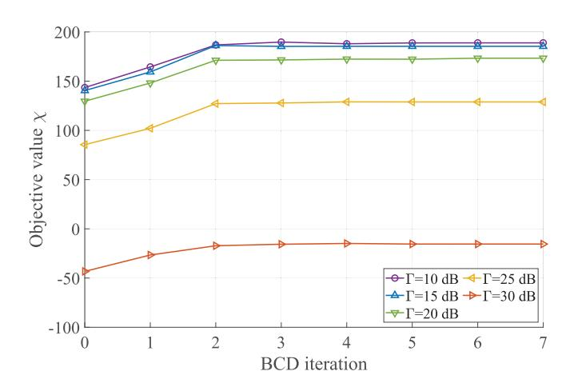

<span id="page-10-2"></span>Fig. 5. Convergence of the proposed BCD algorithm.

# *A. Convergence of BCD Algorithm*

Fig. [5](#page-10-2) illustrates the objective values during the BCD iterations in PEP formulation, which demonstrates the convergence of the proposed BCD algorithm. For all of the light-field SINR

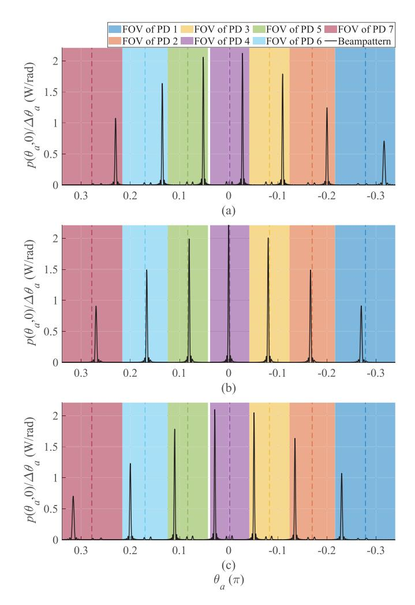

<span id="page-10-3"></span>Fig. 6. Beampatterns and PD orientations obtained by optimal beamforming. Subfigures (a), (b), and (c) correspond to imaging rounds 3, 9, and 15, respectively. Dashed lines delineate the PD orientations.

constraints, the objective values converge within 3 iterations, thus guaranteeing a low-complexity implementation of the OW-ISAC system. In addition, given an increased demand for light-field SINR, the contrast metrics deteriorate drastically, which indicates the marginality in OW-ISAC.

#### *B. Optimal Beampattern and C&S Tradeoff*

Fig. [6](#page-10-3) displays the optimal beampattern and PD orientations with respect to (w.r.t.) different sensing rounds, which is achieved by solving the joint optimization problem (P0) in PEP formulation with a light-field SINR threshold of Γ = 20 dB. Since the beampattern is calculated on grid, the light field intensity is normalized by the angle resolution, yielding the power density in the angle domain. As shown in Fig. [6,](#page-10-3) the sensing sub-system operates in a scanning manner and steers N<sup>r</sup> probing lobes to desired angle grids. Meanwhile, the FOV of each PD only contains a single probing lobe through all rounds, which alleviates the interference from other grating lobes during the imaging. Additionally, the OPA should also transmit optical power to θa,<sup>1</sup> = 0.43 × 10<sup>−</sup><sup>2</sup> π and θa,<sup>2</sup> = 7.34 × 10<sup>−</sup><sup>2</sup> π to guarantee the communication

{11}------------------------------------------------

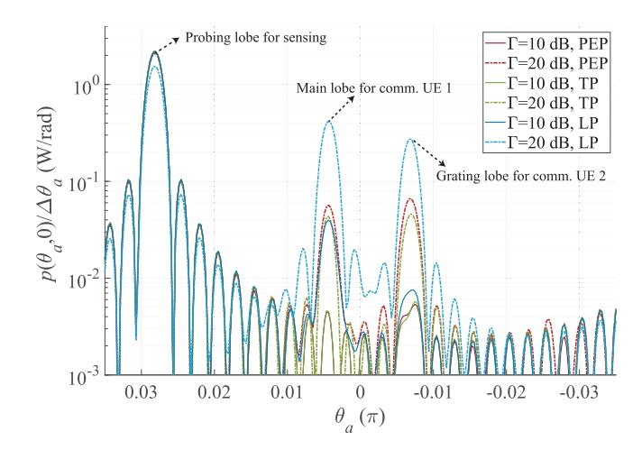

<span id="page-11-0"></span>Fig. 7. Beampattern with different methods for precoding and varied SINR thresholds.

QoS, whose implementations differ as the round varies. For instance, the optical beam in Fig. [6\(b\)](#page-10-3) is directly steered to the communication UE 1, and the communication signal s<sup>1</sup> (t) is also adopted as the sensing signal, which achieves synergy between communication and sensing. However, the desired angle grid for sensing in Fig. [6\(c\)](#page-10-3) is not coincident with those for UEs, where supernumerary lobes exist. As a result, the range-angle profile obtained by the sensing receiver may be deteriorated by the reflection of UEs, which causes the tradeoff between communication and sensing sub-systems.

Fig. [7](#page-11-0) shows the detailed beampattern within the FOV of the 4-th PD in the 15-th round, i.e., Fig. [6\(c\).](#page-10-3) Even if communication UE 2 is located outside the FOV of the 4-th PD, the multi-beam property still causes a grating lobe inside the FOV. In consequence, the reflected communication signal interferes with the received sensing signal *z*n<sup>r</sup> (t) since the PD cannot distinguish between different lobes. Moreover, the C&S tradeoff can also be recognized from the relationship between the beampattern and the light-field SINR threshold. Specifically, an increased SINR threshold demands that more optical power be allocated to the direction of communication UEs, eliciting more severe interference to the sensing signal. Furthermore, while the difference between the beampatterns of PEP and TP formulations is subtle, the LP formulation provides less DoF than that of the SDR approach, and more power is consumed to guarantee the communication QoS. Therefore, the power for probing in the LP formulation decreases more drastically than that in PEP and TP formulations as the requirement for communication SINR increases.

To further explore the C&S tradeoff, the relationships between C&S performance metrics are illustrated in Fig. [8,](#page-11-1) i.e., minimum light-field SINR γ<sup>k</sup> for all the UEs versus minimum ISLR ψ<sup>n</sup>r,m among all the rounds and all the PDs. As the light-field SINR increases, the rising power in the directions of communication UEs elevates the clutter term in (34b). Meanwhile, the desired term in (34a) also declines since the total transmitted power P<sup>t</sup> is fixed. Therefore, the correlation between light-field SINR and ISLR embodies the C&S tradeoff. Moreover, even if the optimized covariance

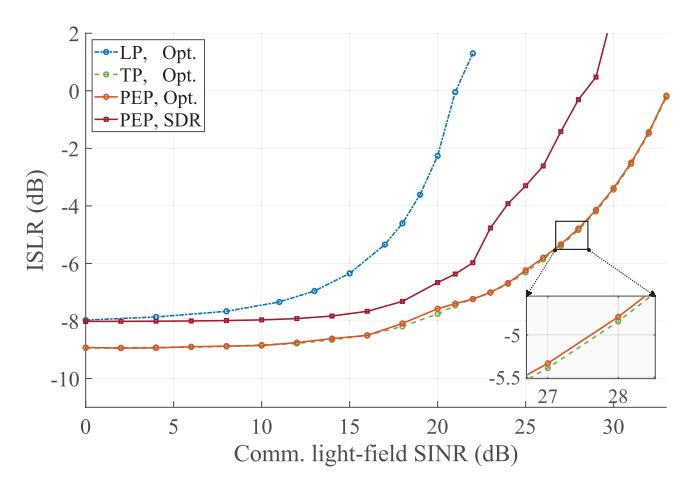

<span id="page-11-1"></span>Fig. 8. ISLR for sensing versus light-field SINR for communication.

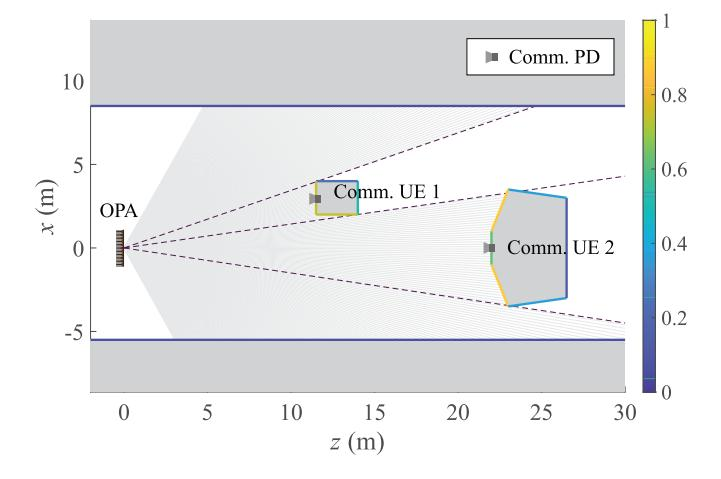

<span id="page-11-2"></span>Fig. 9. Simplified scenario to evaluate C&S performance metrics. The color bar illustrates the diffuse reflectivity of each surface.

matrices obtained in the PEP formulation (PEP, Opt.) can achieve similar C&S performance metrics to those of the TP formulation, significant deterioration occurs in the retrieved rank-1 solution (PEP, SDR) within 10<sup>3</sup> feasible Gaussian randomizations. On the other hand, even though about 7 dB degradation in the light-field SINR is witnessed in the LP formulation compared with the SDR technique, the LP formulation still provides a low-complexity sub-optimal solution, especially with a low threshold Γ of light-field SINR.

#### <span id="page-11-3"></span>*C. Practical C&S Performance Metrics*

<span id="page-11-4"></span>While the resolution of optimal beamforming problems does not rely on a specific scenario, the simulation for practical C&S performance metrics like bit error rate (BER) and rootmean-square error (RMSE) requires both a model of the environment and an OW-ISAC waveform compatible with the DD scheme. Towards this goal, we establish a simplified scenario and a polygon model to describe the geometry and reflectivity of each target, as illustrated in the sketch map of Fig. [9.](#page-11-2) Subsequently, the distances |r (θa)| and reflectivities R<sup>f</sup> (θa) w.r.t. the azimuth angle θ<sup>a</sup> can be calculated by the Blinn-Phong reflection model [\[50\],](#page-14-47) which is illustrated in

{12}------------------------------------------------

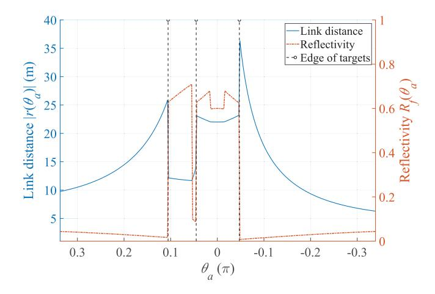

<span id="page-12-0"></span>Fig. 10. Target distance and reflectivity versus angle grids in the simplified scenario.

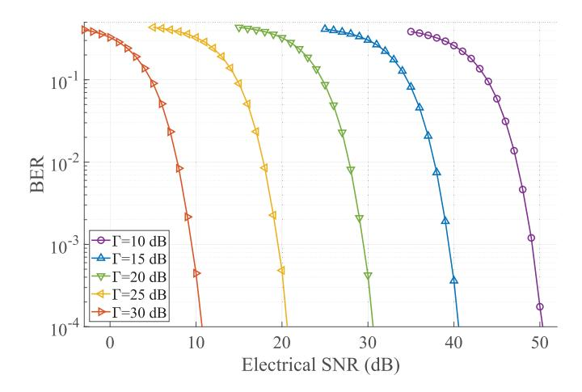

<span id="page-12-1"></span>Fig. 11. BER for communication w.r.t. electrical SNR under different constraints on light-field SINR.

Fig. [10.](#page-12-0) Specifically, the edges of targets are highlighted by dashed lines to imply the correspondence between Fig. [9](#page-11-2) and Fig. [10.](#page-12-0) Moreover, the PSS-PPM waveform is adopted as the signal s˜(t) to carry communication data [\[9\],](#page-14-6) while the precoding matrices are attained by the PEP formulation.

Fig. [11](#page-12-1) illustrates the relationship between BER and the received electrical SNR for communication, which is attained through continuously tuning the noise power σ 2 c . Due to the square-law detection of PDs, the received electrical SNR has a quadratic relationship with the light-field SINR, and thus a 5 dB light-field SINR gain leads to about 10-dB enhancement in electrical SNR. Besides, even if the optical power transmitted to communication receivers fluctuates in different rounds due to the OPA scanning, the SINR constraint still elicits a tight bound for the communication performance. The reason lies in that the total BER metric is dominated by the round with the minimum electrical SNR for communication, which corresponds to the threshold of light-field SINR Γ.

Fig. [12](#page-12-2) displays the relationship between RMSE for imaging and electrical SNR, which is obtained through continuously tuning the noise power σ 2 s . As the electrical SNR increases, the RMSE for imaging gradually declines and converges into

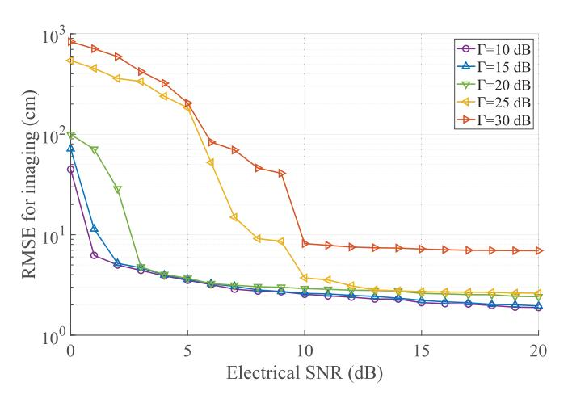

<span id="page-12-2"></span>Fig. 12. RMSE for imaging w.r.t. electrical SNR under different constraints on light-field SINR.

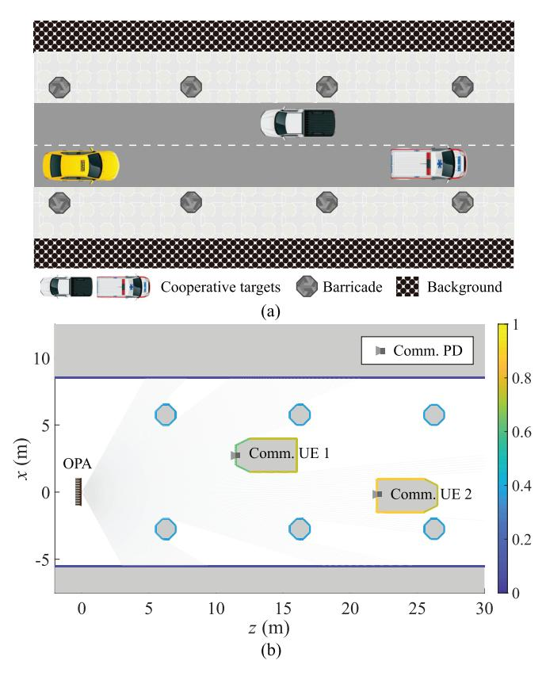

<span id="page-12-3"></span>Fig. 13. ITS scenario to substantiate the proposed OPA-based OW-ISAC framework. (a) Sketch map of the ITS scenario. (b) Polygon model to describe geometry and reflectivity. The color bar illustrates the diffuse reflectivity of each surface.

<span id="page-12-4"></span>the *asymptotic region* [\[51\],](#page-14-48) where centimeter-level precision is witnessed in target range estimation. If the reflections from communication UEs are ignorable, the termination value of RMSE in the *asymptotic region* is mainly determined by the range resolution of the OW-ISAC waveform. Furthermore, an increased threshold for light-field SINR raises the requirement for an RMSE curve to converge, and the higher termination value of RMSE also embodies the tradeoff in practical C&S

{13}------------------------------------------------

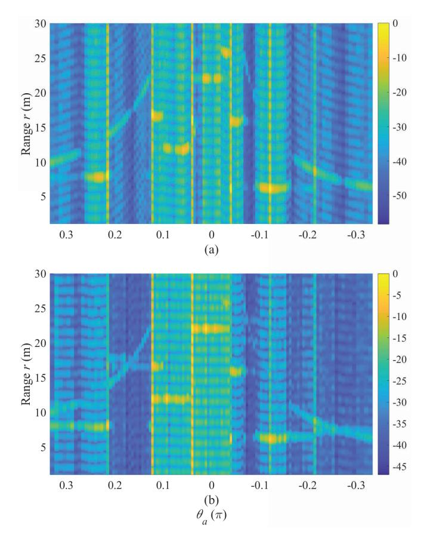

<span id="page-13-3"></span>Fig. 14. Normalized range-angle profile in dB scale with different thresholds for light-field SINR. (a)  $\Gamma=10$  dB. (b)  $\Gamma=30$  dB.

performance metrics, which becomes significant for a light-field SINR threshold larger than 25 dB.

#### D. Realistic Results for Imaging

In addition to the quantitative results in Section V-C, we also simulate the OW-ISAC system in a realistic and typical intelligent transportation system (ITS) to uncover the origination of imaging errors intuitively, as illustrated in Fig. 13. The OW-ISAC system aims to conduct OWC with the communication receivers carried by two cooperative targets, i.e., autonomous vehicles. Meanwhile, barricades like street lamps should be detected and imaged. Without loss of generality, the beamforming and waveform configurations in Section V-C are also adopted for simulations in this realistic scenario.

Thereby, the range-angle profile  $\hat{\Psi}(r,\theta_a)$  estimated by (31) is normalized and displayed in Fig. 14. The profiles of two cooperative targets can be recognized in the azimuth angle range of  $\theta_{a,1} \in \left[-2.04 \times 10^{-2}\pi, 1.41 \times 10^{-2}\pi\right]$  and  $\theta_{a,2} \in \left[3.13 \times 10^{-2}\pi, 9.80 \times 10^{-2}\pi\right]$ , while other barricades also generate echoes in the range-angle profile. Additionally, compared with the range-angle profile in Fig. 14(a), the strong echoes from the communication UEs suppress the potential weak echoes more severely as the threshold  $\Gamma$  increases. Consequently, less textures can be observed in Fig. 14(b), which is a source of errors in the estimated range map.

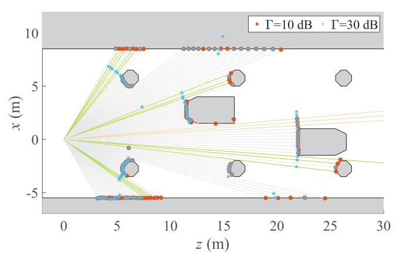

<span id="page-13-4"></span>Fig. 15. Result for imaging in the ITS scenario.

Based on the obtained range-angle profiles, Fig. 15 displays the estimated range map by MLE. On one hand, due to a long propagation distance or a large incident angle in a certain angle grid, the low power of reflected signal may lead to imaging errors, e.g., false detection highlighted by yellow lines. On the other hand, dedicated communication beams steered to UEs elicits unwanted echoes in the received light field. Since each PD detects its FOV omnidirectionally, the strong echoes from communication UEs suppress the desired echoes and lead to extra errors on green lines, highlighting the tradeoff in C&S performance metrics for practical scenarios.

#### VI. CONCLUSION

<span id="page-13-2"></span>In this paper, an OPA-based OW-ISAC framework was presented to enable multi-user communication and environment imaging simultaneously. The system model for OPA-based OW-ISAC was first established to describe the principles of optical beamforming and atmospheric propagation. Then, dedicated contrast metrics were proposed to evaluate the performance of OW-ISAC, which was compatible with the multi-beam property of OPA, DD scheme, and sensing task of imaging. Subsequently, the joint optimization problem for precoding matrices and PD orientations was formulated and resolved to achieve optimal beamforming. Numerical results indicated that the optimal beam pattern could scan the surroundings, while limited FOVs of PDs mitigated the interference caused by multiple beams. Furthermore, the proposed imaging scheme was displayed in a realistic ITS scenario with the optimized beamforming. The demonstrated high-precision sensing and reliable communication capabilities of OPA-based OW-ISAC could serve plentiful future applications like ITS, the Internet of Things, and human-computer interactions, which will act as a key enabler in the era of connection and intelligence.

#### REFERENCES

- <span id="page-13-0"></span>[1] F. Liu et al., "Integrated sensing and communications: Toward dualfunctional wireless networks for 6G and beyond," *IEEE J. Sel. Areas Commun.*, vol. 40, no. 6, pp. 1728–1767, Jun. 2022.
- <span id="page-13-1"></span>[2] F. Liu et al., "Seventy years of radar and communications: The road from separation to integration," *IEEE Signal Process. Mag.*, vol. 40, no. 5, pp. 106–121, Jul. 2023.

{14}------------------------------------------------

- <span id="page-14-0"></span>[\[3\]](#page-0-2) W. Jiang et al., "Terahertz communications and sensing for 6G and beyond: A comprehensive review," *IEEE Commun. Surveys Tuts.*, vol. 26, no. 4, pp. 2326–2381, 4th Quart., 2024.
- <span id="page-14-1"></span>[\[4\]](#page-0-3) J. A. Zhang et al., "An overview of signal processing techniques for joint communication and radar sensing," *IEEE J. Sel. Topics Signal Process.*, vol. 15, no. 6, pp. 1295–1315, Nov. 2021.
- <span id="page-14-2"></span>[\[5\]](#page-0-4) Y. Wen, F. Yang, J. Song, and Z. Han, "Optical integrated sensing and communication: Architectures, potentials and challenges," *IEEE Internet Things Mag.*, vol. 7, no. 4, pp. 68–74, Jul. 2024.
- <span id="page-14-3"></span>[\[6\]](#page-0-5) S. Shao, A. Salustri, A. Khreishah, C. Xu, and S. Ma, "R-VLCP: Channel modeling and simulation in retroreflective visible light communication and positioning systems," *IEEE Internet Things J.*, vol. 10, no. 13, pp. 11429–11439, Feb. 2023.
- <span id="page-14-4"></span>[\[7\]](#page-0-6) Z. Xu et al., "Frequency-modulated continuous-wave coherent LiDAR with downlink communications capability," *IEEE Photon. Technol. Lett.*, vol. 32, no. 11, pp. 655–658, Jun. 1, 2020.
- <span id="page-14-5"></span>[\[8\]](#page-0-7) A. J. Suzuki and K. Mizui, "Laser radar and visible light in a bidirectional V2V communication and ranging system," in *Proc. IEEE Int. Conf. Veh. Electron. Saf. (ICVES)*, Yokohama, Japan, Nov. 2015, pp. 19–24.
- <span id="page-14-6"></span>[\[9\]](#page-0-8) Y. Wen, F. Yang, J. Song, and Z. Han, "Pulse sequence sensing and pulse position modulation for optical integrated sensing and communication," *IEEE Commun. Lett.*, vol. 27, no. 6, pp. 1525–1529, Jun. 2023.
- <span id="page-14-7"></span>[\[10\]](#page-0-9) Y. Hai, Y. Luo, C. Liu, and A. Dang, "Remote phase-shift LiDAR with communication," *IEEE Trans. Commun.*, vol. 71, no. 2, pp. 1059–1070, Feb. 2023.
- <span id="page-14-8"></span>[\[11\]](#page-0-10) Y. Wen, F. Yang, J. Song, and Z. Han, "Free space optical integrated sensing and communication based on LFM and CPM," *IEEE Commun. Lett.*, vol. 28, no. 1, pp. 43–47, Jan. 2024.
- <span id="page-14-9"></span>[\[12\]](#page-0-11) E. B. Muller, V. N. H. Silva, P. P. Monteiro, and M. C. R. Medeiros, ¨ "Joint optical wireless communication and localization using OFDM," *IEEE Photon. Technol. Lett.*, vol. 34, no. 14, pp. 757–760, Jul. 15, 2022.
- <span id="page-14-10"></span>[\[13\]](#page-0-12) Y. Wen, F. Yang, J. Song, and Z. Han, "Power allocation for OFDMbased free space optical integrated sensing and communication," in *Proc. IEEE Int. Conf. Commun. (ICC)*, Denver, CO, USA, Jun. 2024, pp. 2408–2413.
- <span id="page-14-11"></span>[\[14\]](#page-0-13) Y. Cui et al., "Retroreflective optical ISAC using OFDM: Channel modeling and performance analysis," *Opt. Lett.*, vol. 49, no. 15, pp. 4214–4217, Aug. 2024.
- <span id="page-14-12"></span>[\[15\]](#page-0-14) Y. Wen, F. Yang, J. Song, and Z. Han, "Free-space optical integrated sensing and communication based on DCO-OFDM: Performance metrics and resource allocation," *IEEE Internet Things J.*, vol. 12, no. 2, pp. 2158–2173, Jan. 2025.
- <span id="page-14-13"></span>[\[16\]](#page-0-15) J. Wang, N. Huang, C. Gong, W. Wang, and X. Li, "PAM waveform design for joint communication and sensing based on visible light," *IEEE Internet Things J.*, vol. 11, no. 11, pp. 20731–20742, Jun. 2024.
- <span id="page-14-14"></span>[\[17\]](#page-0-16) P. F. McManamon and A. Ataei, "Progress and opportunities in optical beam steering," *Proc. SPIE*, vol. 10926, pp. 109–129, May 2019.
- <span id="page-14-15"></span>[\[18\]](#page-0-17) Y. Kaymak, R. Rojas-Cessa, J. Feng, N. Ansari, M. Zhou, and T. Zhang, "A survey on acquisition, tracking, and pointing mechanisms for mobile free-space optical communications," *IEEE Commun. Surveys Tuts.*, vol. 20, no. 2, pp. 1104–1123, 2nd Quart., 2018.
- <span id="page-14-16"></span>[\[19\]](#page-1-0) C. V. Poulton et al., "Coherent LiDAR with an 8,192-element optical phased array and driving laser," *IEEE J. Sel. Topics Quantum Electron.*, vol. 28, no. 5, pp. 1–8, Sep. 2022.
- <span id="page-14-17"></span>[\[20\]](#page-1-1) C.-P. Hsu et al., "A review and perspective on optical phased array for automotive LiDAR," *IEEE J. Sel. Topics Quantum Electron.*, vol. 27, no. 1, pp. 1–16, Jan. 2021.
- <span id="page-14-18"></span>[\[21\]](#page-1-2) C.-W. Chow et al., "Actively controllable beam steering optical wireless communication (OWC) using integrated optical phased array (OPA)," *J. Lightw. Technol.*, vol. 41, no. 4, pp. 1122–1128, Feb. 15, 2023.
- <span id="page-14-19"></span>[\[22\]](#page-1-3) Y. Li, Z. Wang, H. Du, B. Chen, J. Song, and M. Tao, "Integrated communication and sensing system based on Si-SiN dual-layer optical phased array," *Opt. Exp.*, vol. 32, no. 19, pp. 33222–33231, Sep. 2024.
- <span id="page-14-20"></span>[\[23\]](#page-1-4) F. Liu, C. Masouros, A. Li, H. Sun, and L. Hanzo, "MU-MIMO communications with MIMO radar: From co-existence to joint transmission," *IEEE Trans. Wireless Commun.*, vol. 17, no. 4, pp. 2755–2770, Apr. 2018.
- <span id="page-14-21"></span>[\[24\]](#page-1-5) X. Liu, T. Huang, N. Shlezinger, Y. Liu, J. Zhou, and Y. C. Eldar, "Joint transmit beamforming for multiuser MIMO communications and MIMO radar," *IEEE Trans. Signal Process.*, vol. 68, pp. 3929–3944, Jun. 2020.
- <span id="page-14-22"></span>[\[25\]](#page-1-6) F. Liu, Y.-F. Liu, A. Li, C. Masouros, and Y. C. Eldar, "Cramer bound ´ optimization for joint radar-communication beamforming," *IEEE Trans. Signal Process.*, vol. 70, pp. 240–253, 2022.

- <span id="page-14-23"></span>[\[26\]](#page-1-7) H. Hua, T. X. Han, and J. Xu, "MIMO integrated sensing and communication: CRB-rate tradeoff," *IEEE Trans. Wireless Commun.*, vol. 23, no. 4, pp. 2839–2854, Apr. 2024.
- <span id="page-14-24"></span>[\[27\]](#page-1-8) Z. Ni, J. A. Zhang, K. Yang, X. Huang, and T. A. Tsiftsis, "Multimetric waveform optimization for multiple-input single-output joint communication and radar sensing," *IEEE Trans. Commun.*, vol. 70, no. 2, pp. 1276–1289, Feb. 2022.
- <span id="page-14-25"></span>[\[28\]](#page-1-9) C. Meng, Z. Wei, D. Ma, W. Ni, L. Su, and Z. Feng, "Multiobjectiveoptimization-based transmit beamforming for multitarget and multiuser MIMO-ISAC systems," *IEEE Internet Things J.*, vol. 11, no. 18, pp. 29260–29274, Sep. 2024.
- <span id="page-14-26"></span>[\[29\]](#page-1-10) J. Johnston, L. Venturino, E. Grossi, M. Lops, and X. Wang, "MIMO OFDM dual-function radar-communication under error rate and beampattern constraints," *IEEE J. Sel. Areas Commun.*, vol. 40, no. 6, pp. 1951–1964, Jun. 2022.
- <span id="page-14-27"></span>[\[30\]](#page-1-11) Z. He, W. Xu, H. Shen, D. W. K. Ng, Y. C. Eldar, and X. You, "Full-duplex communication for ISAC: Joint beamforming and power optimization," *IEEE J. Sel. Areas Commun.*, vol. 41, no. 9, pp. 2920–2936, Sep. 2023.
- <span id="page-14-28"></span>[\[31\]](#page-1-12) Y. Chen, H. Hua, J. Xu, and D. W. K. Ng, "ISAC meets SWIPT: Multi-functional wireless systems integrating sensing, communication, and powering," *IEEE Trans. Wireless Commun.*, vol. 23, no. 8, pp. 8264–8280, Aug. 2024.
- <span id="page-14-29"></span>[\[32\]](#page-1-13) X. Song, X. Qin, J. Xu, and R. Zhang, "Cramer–Rao bound minimization ´ for IRS-enabled multiuser integrated sensing and communications," *IEEE Trans. Wireless Commun.*, vol. 23, no. 8, pp. 9714–9729, Aug. 2024.
- <span id="page-14-30"></span>[\[33\]](#page-1-14) Y. Wu et al., "Multi-beam optical phase array for long-range LiDAR and free-space data communication," *Opt. Laser Technol.*, vol. 151, Jul. 2022, Art. no. 108027.
- <span id="page-14-31"></span>[\[34\]](#page-1-15) H. Luo and A. Alkhateeb, "Integrated imaging and communication with reconfigurable intelligent surfaces," 2024, *arXiv:2401.15919*.
- <span id="page-14-32"></span>[\[35\]](#page-1-16) M. Manzoni, F. Linsalata, M. Magarini, and S. Tebaldini, "Integrated communication and imaging: Design, analysis, and performances of COSMIC waveforms," 2024, *arXiv:2405.19481*.
- <span id="page-14-33"></span>[\[36\]](#page-1-17) F. Gao, L. Xu, and S. Ma, "Integrated sensing and communications with joint beam-squint and beam-split for mmWave/THz massive MIMO," *IEEE Trans. Commun.*, vol. 71, no. 5, pp. 2963–2976, May 2023.
- <span id="page-14-34"></span>[\[37\]](#page-2-4) M. Gagino, A. Millan-Mejia, L. Augustin, K. Williams, E. Bente, and V. Dolores-Calzadilla, "Integrated optical phased array with on-chip amplification enabling programmable beam shaping," *Sci. Rep.*, vol. 14, no. 1, p. 9590, Apr. 2024.
- <span id="page-14-35"></span>[\[38\]](#page-2-5) J. W. Goodman, *Introduction to Fourier Optics*. Greenwood Village, CO, USA: Roberts and Company, 2005.
- <span id="page-14-36"></span>[\[39\]](#page-3-8) R. Nebuloni and E. Verdugo, "FSO path loss model based on the visibility," *IEEE Photon. J.*, vol. 14, no. 2, pp. 1–9, Apr. 2022.
- <span id="page-14-37"></span>[\[40\]](#page-3-9) C. V. Poulton et al., "Long-range LiDAR and free-space data communication with high-performance optical phased arrays," *IEEE J. Sel. Topics Quantum Electron.*, vol. 25, no. 5, pp. 1–8, Sep. 2019.
- <span id="page-14-38"></span>[\[41\]](#page-3-10) A. Belmonte, "Feasibility study for the simulation of beam propagation: Consideration of coherent LiDAR performance," *Appl. Opt.*, vol. 39, no. 30, pp. 5426–5445, Oct. 2000.
- <span id="page-14-39"></span>[\[42\]](#page-3-11) L. C. Andrews and R. L. Phillips, *Laser Beam Propagation Through Random Media*, 2nd ed., Bellingham, WA, USA: SPIE, 2005.
- <span id="page-14-40"></span>[\[43\]](#page-6-6) S. Haykin, J. Litva, and T. J. Shepherd, *Radar Array Processing*. New York, NY, USA: Springer, 1993.
- <span id="page-14-41"></span>[\[44\]](#page-6-7) S. Schaible, "Fractional programming. II, on Dinkelbach's algorithm," *Manage. Sci.*, vol. 22, no. 8, pp. 868–873, Apr. 1976.
- <span id="page-14-42"></span>[\[45\]](#page-8-6) S. P. Boyd and L. Vandenberghe, *Convex Optimization*. New York, NY, USA: Cambridge Univ. Press, 2004.
- <span id="page-14-43"></span>[\[46\]](#page-8-7) Y. Huang and D. P. Palomar, "Rank-constrained separable semidefinite programming with applications to optimal beamforming," *IEEE Trans. Signal Process.*, vol. 58, no. 2, pp. 664–678, Feb. 2010.
- <span id="page-14-44"></span>[\[47\]](#page-8-8) I. Valiulahi, C. Masouros, and A. Salem, "Net-zero energy dualfunctional radar-communication systems," *IEEE Trans. Green Commun. Netw.*, vol. 7, no. 1, pp. 356–369, Mar. 2023.
- <span id="page-14-45"></span>[\[48\]](#page-8-9) S. J. Wright, "On the convergence of the Newton/log-barrier method," *Math. Program.*, vol. 90, no. 1, pp. 71–100, Mar. 2001.
- <span id="page-14-46"></span>[\[49\]](#page-9-5) M. Grant and S. Boyd. (Mar. 2014). *CVX: MATLAB Software for Disciplined Convex Programming, Version 2.1*. [Online]. Available: http://cvxr.com/cvx
- <span id="page-14-47"></span>[\[50\]](#page-11-4) M. Li, Y. Yang, Y. Wang, and M. Yang, "A Blinn–Phong BRDF infrared reflection model," *Comput. Sci. Eng.*, vol. 40, no. 1, pp. 101–107, Jan. 2018.
- <span id="page-14-48"></span>[\[51\]](#page-12-4) M. A. Richards, *Fundamentals of Radar Signal Processing*. New York, NY, USA: McGraw-Hill, 2014, ch. 7.

{15}------------------------------------------------


Yunfeng Wen received the B.Eng. degree in electronic engineering from Tsinghua University, Beijing, China, in 2022, where he is currently pursuing the Ph.D. degree in communication and information system.

His current research interests include optical wireless communication, and optical sensing, in particular, integrated sensing and communication in the optical band.


Jian Song (Fellow, IEEE) received the B.Eng. and Ph.D. degrees in electrical engineering from Tsinghua University, Beijing, China, in 1990 and 1995, respectively. He is currently the Director of the DTV Technology Research and Development Center, Tsinghua University. He has been working in quite different areas of fiber-optic, satellite, and wireless communications, as well as the power-line communications. He has published more than 300 peer-reviewed journals and conference papers. He holds two U.S. and more than 80 Chinese patents.

His current research interests include the area of digital TV broadcasting. He is a fellow of IET.


Zhu Han (Fellow, IEEE) received the B.S. degree in electronic engineering from Tsinghua University, in 1997, and the M.S. and Ph.D. degrees in electrical and computer engineering from the University of Maryland, College Park, in 1999 and 2003, respectively.

From 2000 to 2002, he was a Research and Development Engineer at JDSU, Germantown, MD. From 2003 to 2006, he was a Research Associate at the University of Maryland. From 2006 to 2008, he was an Assistant Professor at Boise State University,

ID. He is currently a John and Rebecca Moores Professor at the Electrical and Computer Engineering Department and the Computer Science Department, University of Houston, TX. His research interests include the novel gametheory related concepts critical to enabling efficient and distributive use of wireless networks with limited resources. His other research interests include wireless resource allocation and management, wireless communications and networking, quantum computing, data science, smart grid, carbon neutralization, and security and privacy. He received the NSF Career Award in 2010, the Fred W. Ellersick Prize of the IEEE Communication Society in 2011, the EURASIP Best Paper Award for the Journal on Advances in Signal Processing in 2015, the IEEE Leonard G. Abraham Prize in the field of Communications Systems (Best Paper Award in IEEE JSAC) in 2016, the IEEE Vehicular Technology Society 2022 Best Land Transportation Paper Award, and several best paper awards in IEEE conferences. He is also the winner of the 2021 IEEE Kiyo Tomiyasu Award (an IEEE Field Award), for outstanding early to mid-career contributions to technologies holding the promise of innovative applications, with the following citation: "for contributions to game theory and distributed management of autonomous communication networks." He was an IEEE Communications Society Distinguished Lecturer from 2015 to 2018, an ACM Distinguished Speaker from 2022 to 2025, an AAAS Fellow since 2019, and an ACM Fellow since 2024. He has been a 1% highly cited researcher since 2017 according to Web of Science.


Fang Yang (Senior Member, IEEE) received the B.S.E. and Ph.D. degrees in electronic engineering from Tsinghua University, Beijing, China, in 2005 and 2009, respectively. He is currently an Associate Professor with the Department of Electronic Engineering, Tsinghua University. He has published over 200 peer-reviewed journals and conference papers. He holds over 70 Chinese patents and two PCT patents. His research interests include the fields of wireless communication, visible light communication, intelligence reflecting surface, integrated

sensing, and communication. He is a fellow of IET. He received the IEEE Scott Helt Memorial Award (Best Paper Award in IEEE Transactions on Broadcasting) in 2015.