{0}------------------------------------------------

# 6-DoF Location-and-Pose Estimation Toward Integrated Visible Light Communication and Sensing: Algorithm Design and Performance Limits

Bingpeng Zhou , Member, IEEE, Xin Wang, Student Member, IEEE, Yuan Shen, Senior Member, IEEE, and Pingzhi Fan, Fellow, IEEE

Abstract—Visible light communication (VLC) is envisioned as an important technique for short-range communications, but its potential for user device (UD) localization is not fully exploited, which is challenging due to diffuse-scattering interference and random fading. In this paper, we focus on the 6 degree-of-freedom (DoF) UD state estimation (i.e., 3D location and 3D pose angles) based on VLC. Specifically, a novel successive convex approximation (SCA)-based optimization algorithm is proposed, where UD location, pose angles and channel state are simultaneously estimated. Thus, the disturbance of random fading and diffusescattering interference for UD localization is alleviated via VLCassisted channel equalization, and hence our SCA-based 6-DoF state detection solution outperforms state-of-the-art baselines. In addition, a unified performance analysis framework is established for VLC-based 6-DoF state detection, and structured information models are exploited for tractable performance quantification. A closed-form Cramer-Rao lower bound on UD localization error and pose angle estimate error is established respectively, and the impact of measurement noise, scattering interference, bandwidth, the quantities of photodiodes and light-emitting-diodes, etc, on the VLC-based UD state detection performance is analysed. Our closed-form analysis cannot only shed lights on the performance limits of VLC-based 6D state detection, but also gain insights into the impact of system configuration and fading environments.

*Index Terms*—6D state detection, visible light communications, diffuse scattering, integrated sensing and communication.

Manuscript received 4 May 2023; revised 18 November 2023 and 22 March 2024; accepted 22 March 2024. Date of publication 16 April 2024; date of current version 8 July 2024. This work was supported in part by the Major Talent Program of Guangdong Province under Grant 2021QN02X074, in part by the National Natural Science Foundation of China under Grant 62371478, in part by the National Key Laboratory of Wireless Communications Foundation under Grant IFN20230101, in part by the Tsinghua University-Meituan Joint Institute for Digital Life, and in part by the NSFC under Grant U23A20274. The associate editor coordinating the review of this manuscript and approving it for publication was Dr. Augusto Aubry. (Corresponding author: Bingpeng Zhou.)

Bingpeng Zhou and Xin Wang are with the School of Electronics and Communication Engineering, Sun Yat-sen University, Shenzhen 518000, China (e-mail: zhoubp3@mail.sysu.edu.cn).

Yuan Shen is with the Department of Electronic Engineering and the Beijing National Research Center for Information Science and Technology, Tsinghua University, Beijing 100084, China, and also with the Shanghai AI Laboratory, Shanghai 201112, China (e-mail: shenyuan\_ee@tsinghua.edu.cn).

Pingzhi Fan is with the Information Coding & Transmission Key Lab of Sichuan Province, Southwest Jiaotong University, Chengdu 611756, China (e-mail: p.fan@ieee.org).

Digital Object Identifier 10.1109/TSP.2024.3383285

#### I. INTRODUCTION

ITH widespread use of light-emitting-diodes (LEDs) for illumination, visible light communication (VLC, also known as LiFi) is considered to be an important technique of 6G wireless communications, due to its potentials for improving short-range communication quality [1]. VLC is featured with many advantages such as low hardware cost, free bandwidth resource and long time-life owing to attributes of LEDs, i.e., low energy consumption, low price, etc [2]. Hence, it can be applied to many indoor scenarios, such as airports, train stations, factories, warehousing and other indoor spaces [3]. However, its potential for wireless localization is not fully exploited. In practice, user device (UD) 6-degree-offreedom (DoF) state knowledge, i.e., its 3-DoF position and 3-DoF pose angles (including yaw, pitch and roll angles) is indispensable for next-generation wireless application [4], [5], such as autonomous parcel sorting and automatic parking [6], [7], [8]. Hence, VLC-based positioning (VLP) has attracted an increasing attention in industries and academia [9].

## A. Research Motivation

In a VLP system based on photodiodes (PDs), LEDs will work as source beacons, visible light signal is used as data carriers, and PD receiver is used as sensors, where UD's orientation direction is represented by its normal vector, and the PD will detect UD location via sensing visible light signals from LEDs [9]. A number of VLP methods have been devised, such as using received signal strength (RSS) [10], [11], [12], [13], [14], angle-of-arrival (AOA) [15], [16], [17], and time-of-arrival (TOA) [18], [19]. However, these works depend on prior knowledge of UD orientation direction, for instance, assuming UD orientation to be vertically upward [11], or assuming that transmitters and receivers have a parallel orientation direction [10].

The impact of uncertain UD orientation is studied in [20] and [21]. It is shown that the disturbance of uncertain UD orientation to VLP is increasing with the LED-to-PD transmission distance. Hence, a simultaneous position and orientation (SPAO) detection is necessary for VLC UDs. In [22], [23], [24], an effective Lambertian radiation model (LRM)-driven 5-DoF SPAO detection algorithm is proposed, where the PD normal vector is used to indicate its orientation direction, and only

{1}------------------------------------------------

| VLP method            | Solution's DoF        | Measurements    | Detection mechanism | Scenario              |
|-----------------------|-----------------------|-----------------|---------------------|-----------------------|
| VLP [16]              | 2-DoF (2D location)   | RSS + AOA       | Geometry            | LOS                   |
| VLP [17]              | 2-DoF (2D location)   | AOA             | Geometry            | LOS                   |
| VLP [14]              | 2-DoF (2D location)   | RSS             | Geometry            | LOS                   |
| VLP [10], [12], [13]  | 3-DoF (3D location)   | RSS             | Geometry            | LOS                   |
| VLP [15]              | 3-DoF (3D location)   | RSS + AOA       | Geometry            | LOS                   |
| VLP [18], [19]        | 3-DoF (3D location)   | TOA             | Geometry            | LOS                   |
| SPAO [22], [23], [24] | 5-DoF (no roll angle) | RSS             | LRM optimization    | LOS                   |
| SLAP [25], [26]       | 6-DoF                 | RSS             | LRM optimization    | LOS                   |
| SLAP [27]             | 6-DoF                 | RSS             | Geometry            | LOS                   |
| VLP [34]              | 6-DoF                 | LED array image | Image mapping       | LOS                   |
| Our proposed SLAP     | 6-DoF                 | RSS + TOA       | LRM optimization    | Scattering and fading |

TABLE I SURVEY OF STATE-OF-THE-ART VLP APPROACHES

2-DoF orientation (i.e., the yaw and pitch angles) is considered. Hence, the roll angle detection remains unresolved. In [\[25\]](#page-16-18) and [\[26\],](#page-16-19) RSS-based 6-DoF SPAO detection methods are studied, where 3-DoF UD pose is represented by a PD array. Yet, they require at least 6 LEDs in initialization stage. To address this issue, another 6-DoF SPAO detection method requiring only 2 LEDs is devised in [\[27\]](#page-16-20) to yield a low-cost solution. Furthermore, a functional VLC system integrating localization, access, scheduling, and transmission (LAST) is studied in [\[12\],](#page-16-5) where multi-lateration-based 3-DoF UD location estimate is employed, and UD orientation uncertainty is not considered. Unlike previous localization-focused VLP works [\[10\],](#page-16-3) [\[11\],](#page-16-4) [\[12\],](#page-16-5) [\[13\],](#page-16-6) [\[14\],](#page-16-7) [\[15\],](#page-16-8) [\[16\],](#page-16-17) [\[17\],](#page-16-9) [\[18\],](#page-16-10) [\[19\],](#page-16-11) [\[22\],](#page-16-14) [\[23\],](#page-16-15) [\[24\],](#page-16-16) [\[25\],](#page-16-18) [\[26\],](#page-16-19) [\[27\]](#page-16-20) without taking care of the overall system, the impact of different functions on each other is considered in [\[12\].](#page-16-5) However, these SPAO methods [\[10\],](#page-16-3) [\[11\],](#page-16-4) [\[12\],](#page-16-5) [\[13\],](#page-16-6) [\[14\],](#page-16-7) [\[15\],](#page-16-8) [\[16\],](#page-16-17) [\[17\],](#page-16-9) [\[18\],](#page-16-10) [\[19\],](#page-16-11) [\[22\],](#page-16-14) [\[23\],](#page-16-15) [\[24\],](#page-16-16) [\[25\],](#page-16-18) [\[26\],](#page-16-19) [\[27\]](#page-16-20) consider a line-of-sight (LOS) scenario, and hence scattering interference and random fading are unresolved, which are major error sources that cannot be safely ignored in VLP [\[28\],](#page-16-22) [\[29\],](#page-16-23) [\[30\],](#page-16-24) [\[31\],](#page-16-25) [\[32\],](#page-16-26) [\[33\].](#page-16-27)

A novel cone geometry-based VLP method exploiting the geometric relationship between observed LED array shape and UD pose state is proposed in [\[34\].](#page-16-21) This array image-driven VLP method does not require LRM knowledge (e.g., radiation pattern and path loss) any longer, but requires a large number of LEDs and PDs to construct an image of the observed LED array. It provides a different paradigm from LRM-driven VLP (such as TOA-based and RSS-based VLP). A brief survey on state-of-the-art VLP works is provided in Table [I](#page-1-0) to summarize features of different VLP methods.

In summary, it is concluded in [\[24\]](#page-16-16) and [\[28\]](#page-16-22) that geometric intersection and LRM-driven VLP performance will be seriously degraded by scattering interference, especially in a high signal-to-noise ratio (SNR) environment. Moreover, VLP also suffers from random fading due to uncertain reflection rate and variant environments. Hence, it is non-trivial to develop an efficient simultaneous location and pose (SLAP) detection method for addressing diffuse-scattering interference and random channel fading.

#### *B. Contributions of This Paper*

In this paper, we seek a novel VLC-enabled anti-disturbance mechanism for 6-DoF SLAP detection to address environment disturbance via cross-domain cooperation between "VLC" and "state sensing", and we aim to provide a unified performance analysis framework for VLC-based SLAP detection, which are of great challenges. The contributions of this paper are summarized as the following three folds.

- *VLC-Enabled Anti-Disturbance SLAP Detection Scheme:* A novel VLC-enabled SLAP detection method is devised for addressing scattering interference, where UD location, pose angles and scattering channel states are jointly estimated based on orthogonal-frequency-divisionmodulation (OFDM) signals. Hence, the disturbance of scattering interference and random fading for UD state sensing is alleviated via OFDM-assisted channel compensation, yielding an anti-disturbance SLAP detection solution. Thus, our VLC-enabled SLAP detection method outperforms state-of-the-art baselines.
- *Successive Convex Approximation (SCA)-Based SLAP Detection Algorithm for Nonconvex 6-DoF State Sensing:* A novel SCA-based optimization algorithm is proposed for VLC-based SLAP detection to address its non-convex optimization over angle-space manifolds, where structured signal models are exploited to facilitate the optimization of UD pose angles over a 3D manifold. This gives rise to a tractable solution to VLC-assisted SLAP detection, advancing over baseline methods.
- *Closed-Form Fundamental Limit Analysis:* Fundamental limit of VLC-based SLAP detection is theoretically analysed, where Schur complementary-based structured information models are exploited for addressing its coupling effect between channel estimation and UD localization, thus rendering tractable SLAP detection performance quantification. Specifically, closed-form isolated Cramer-Rao lower bounds (CRLBs) on UD location, pose angle and channel state estimate errors are respectively established, and the impact of SNR, diffuse scattering, bandwidth and the quantities of PDs and LEDs on the VLC-based SLAP detection performance is analysed. It is

{2}------------------------------------------------

theoretically concluded that VLC-based SLAP detection error is not sensitive to carrier frequency since only the baseband feature of visible light signals is exploited, while it is reducing with the bandwidth in a second-order rate. In addition, the mean squared error of VLC-based SLAP detection is reducing with SNR, channel variance and the number of independent signal sources in a first-order rate. Moreover, VLC-based SLAP detection is not sensitive to diffuse scattering due to our VLC-enabled interference alleviation mechanism. These results shed lights on the fundamental limits of VLC-based SLAP detection and how scattering interference and channel fading affect SLAP detection performance.

*Notations:* Let  $[\bullet]_{\times} : \mathbb{R}^3 \mapsto \mathbb{R}^{3 \times 3}$  denote an isomorphic mapping from a vector to a skew-symmetric matrix, i.e.,

$$[\boldsymbol{\vartheta}_{\mathrm{R}}]_{\times} \in \mathbb{R}^{3 \times 3} = \begin{bmatrix} 0 & -\vartheta_3 & \vartheta_2 \\ \vartheta_3 & 0 & -\vartheta_1 \\ -\vartheta_2 & \vartheta_1 & 0 \end{bmatrix}, \tag{1}$$

where  $\vartheta_i$  is the ith element of  $\vartheta_R$ . Moreover,  $\det(\mathbf{R})$  is the matrix determinant,  $\bullet^{\top}$  and  $\bullet^H$  are the transpose and Hermitian, respectively,  $\mathcal{SO}(3) = \{\mathbf{R} \mid \mathbf{R}^{\top}\mathbf{R} = \mathbf{I}_3, \det(\mathbf{R}) = \pm 1\}$  is a 3-DoF manifold,  $\mathbf{I}_3$  is the  $3 \times 3$  identity matrix,  $\exp(\mathbf{A})$  is the exponential map of  $\mathbf{A} \in \mathbb{C}^{3 \times 3}$  into  $\mathcal{SO}(3)$ ,  $\log(\mathbf{A})$  is the logarithm function of  $\mathbf{A}$ , arccos is inverse cosine,  $|\bullet|$  is absolute value,  $||\bullet||_2$  is  $\ell_2$ -norm,  $\bullet^{\dagger}$  is pseudo-inverse,  $|\bullet|$  denotes the nearest integer,  $\langle \bullet \rangle$  is the fractional part of a number,  $a \mod b$  is the remainder of a divided by b,  $\operatorname{trace}(\bullet)$  is matrix trace,  $\bullet^*$  is the conjugate,  $\mathbb{E}\{\bullet\}$  is the expectation,  $\otimes$  is Kronecker product,  $\odot$  is Hadamard product,  $\Re\{\cdot\}$  denotes the real part,  $\operatorname{vec}[\cdots]$  and  $\operatorname{diag}[\cdots]$  yield a column vector and a diagonal matrix, respectively, via stacking all elements, and  $\operatorname{mat}[\cdots]$  yields a matrix by collecting all row vectors.

The remainder of this paper is organized as follows. Section II presents the system model. The SLAP detection algorithm is proposed in Section III. Performance analysis is provided in Section IV. Simulations results are presented in Section V. Finally, we conclude our work in Section VI.

### II. SYSTEM MODEL

In this section, we shall elaborate the system setup, channel model and received signal model, respectively.

#### A. System Setup

We consider a VLC-based SLAP detection system with  $N_{\rm L}$  LEDs and one UD equipped with a PD array, as illustrated in Fig. 1, and the number of PDs is  $N_{\rm R}$ . For ease of formulation, we employ two coordinate frames, where one is system frame (i.e., global frame), and the other is UD receiver frame (i.e., local frame) with the origin at the PD array centroid, as shown in Fig. 2. The system-frame is defaulted for formulation, unless the UD receiver frame is specified otherwise, and coordinates in the local frame are indexed by  $\bullet^{\natural}$  for clarity.

Let  $\mathbf{p}_m \in \mathbb{R}^3$  and  $\mathbf{v}_m \in \mathbb{R}^3$  be the known location and orientation vector, respectively, of the mth LED transmitter, with  $\|\mathbf{v}_m\|_2 = 1$ , for  $m = 1, \cdots, N_{\mathrm{L}}$ . Let  $\mathbf{x}_{\mathrm{R}} \in \mathbb{R}^3$  and  $\boldsymbol{\vartheta}_{\mathrm{R}} \in \mathbb{R}^3$  be

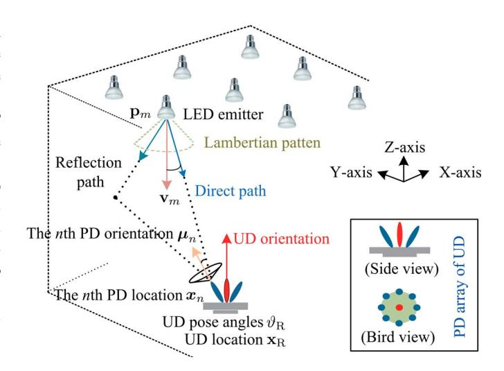

Fig. 1. Illustration of SLAP system in the global frame.

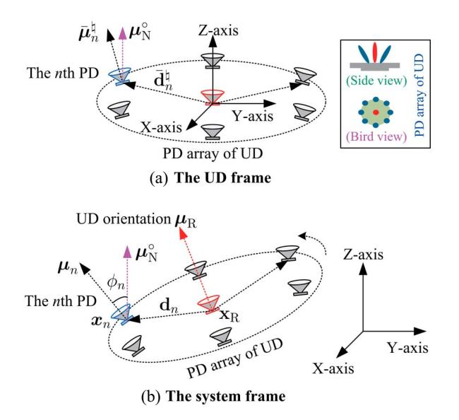

Fig. 2. Illustration of PD array, (a) in the UD frame and (b) the system frame, respectively.

the UD's location and axis-angle vector, respectively, which are unknown, and  $\mathbf{x}_R$  is just the PD array centroid. Let  $\boldsymbol{\beta}_R = [\mathbf{x}_R; \boldsymbol{\vartheta}_R] \in \mathbb{R}^6$  be the joint state. As per the Euler theorem, the UD pose (identically its PD array pose) can also be equivalently represented by a corresponding rotation matrix  $\boldsymbol{\mathcal{R}} \in \mathcal{SO}(3)$ , which defines the rotation transformation from the origin pose to an actual UD pose. In other words,  $\boldsymbol{\vartheta}_R$  is the 3D representative vector of rotation matrix  $\boldsymbol{\mathcal{R}}(\boldsymbol{\vartheta}_R) \in \mathcal{SO}(3)$ , and thus it satisfies  $\boldsymbol{\mathcal{R}}(\boldsymbol{\vartheta}_R) = \exp\left([\boldsymbol{\vartheta}_R]_\times\right)$  [36].\(^1\) Let  $\boldsymbol{\mu}_N^\circ = [0,0,1]^\top$  be the reference vector, and let  $\boldsymbol{\mu}_R \in \mathbb{R}^3$  be the normal vector of the PD array,

$$\mu_{\rm R} = \mathcal{R}(\vartheta_{\rm R}) \, \mu_{\rm N}^{\circ},$$
 (2)

1Based on Euler Rotation Theory [35], any pose of a rigid body can be achieved via fixed-axis rotation actions defined by a 3-dimensional axis-angle vector, namely, axis-angle vector defines body pose.

{3}------------------------------------------------

and it is subject to  $\|\boldsymbol{\mu}_{\mathrm{R}}\|_{2} = 1$ . We can see that the normal vector  $\mu_{\mathrm{R}}$ , pose angle  $\vartheta_{\mathrm{R}}$  and rotation matrix  $\mathcal{R}(\vartheta_{\mathrm{R}})$  are different but consistent representations of the UD pose, namely, once its pose is given, these parameters are determined.

For the PD array, let  $x_n \in \mathbb{R}^3$  and  $\mu_n \in \mathbb{R}^3$  be the location and orientation vector, respectively, of the nth PD element in the system-frame, subject to  $\|\boldsymbol{\mu}_n\|_2 = 1$ , for  $n = 1, \dots, N_R$ . The PD array is characterized by the relative distance vector and the relative orientation direction of each PD, as explicated below. Firstly, let  $\bar{\mathbf{d}}_n^{\natural} \in \mathbb{R}^3$  be the relative distance vector from the PD array centroid (i.e., the local frame origin) to the nth PD in the UD frame, which is known for a given PD array layout. Let  $\mathbf{d}_n \in \mathbb{R}^3$  be the representation of relative distance vector in the system frame, which is determined by the UD axis-angle  $artheta_{
m R}$ (equivalently its rotation matrix), i.e.,

$$\mathbf{d}_n = \mathcal{R}(\boldsymbol{\vartheta}_{\mathrm{R}}) \, \bar{\mathbf{d}}_n^{\natural}, \ \forall n = 1, \cdots, N_{\mathrm{R}}.$$
 (3)

The system-frame coordinates of the nth PD's location are

$$\mathbf{x}_n = \mathbf{x}_R + \mathcal{R}(\boldsymbol{\vartheta}_R) \, \bar{\mathbf{d}}_n^{\natural}, \ \forall n = 1, \cdots, N_R.$$
 (4)

Secondly, let  $\bar{\mu}_n^{\natural} \in \mathbb{R}^3$  be the relative orientation direction of the nth PD to  $\mu_{\rm N}^{\circ}$  in the UD frame, which is also fixed and known for a given PD array, and then the normal vector of the nth PD in the system frame follows that

$$\mu_n = \mathcal{R}(\vartheta_{\mathbf{R}}) \,\bar{\mu}_n^{\natural}. \tag{5}$$

It should be noted that all PD state parameters  $\{x_n, \mu_n | \forall n\}$ can be determined, given UD state  $\{x_R, \vartheta_R\}$  and PD array layout parameters  $\{\bar{\mathbf{d}}_n^{\sharp}, \bar{\boldsymbol{\mu}}_n^{\sharp} | \forall n = 1, \cdots, N_{\mathrm{R}} \}$ . This means that, for a fixed and known PD array layout, the PD locations and orientations in the system frame are totally determined by the UD state parameters. Hence, only the UD's 6D state  $\{x_R, \vartheta_R\}$ is of interest in our VLC-based SLAP detection.

#### B. Diffuse-Scattering LRM

We consider a diffuse-scattering model with single bounce reflection, since the power of multiple-bounce reflections is very small. We assume that there are L'+1 paths between each LED-PD pair, where l = 0 denotes the LOS path, and  $l=1,\cdots,L'$  denotes a non-line-of-sight (NLOS) path. Each NLOS path corresponds to a scatterer. Let  $\mathbf{s}_{l,n,m} \in \mathbb{R}^3$  be the unknown scatterer location at the lth path.

VLC channel depends on the propagation parameters among PDs and LEDs [29]. We first elaborate the LOS channel, and then the NLOS channel model is elaborated shortly.

1) LOS Channel: Let  $e_{0,n,m} \in \mathbb{R}^3$  be the irradiation vector of the LOS path from the mth LED to the nth PD, as shown in Fig. 3, which is given by [30], [31]

$$\mathbf{e}_{0,n,m} = \frac{x_n - \mathbf{p}_m}{\|x_n - \mathbf{p}_m\|_2}.$$
 (6)

Let  $\phi_{0,n,m}$  be the irradiation angle between the mth LED's orientation vector  $\mathbf{v}_m$  and the irradiance vector  $\mathbf{e}_{0,n,m}$  associated with the nth PD, and let  $\theta_{0,j,m}$  be the incidence angle

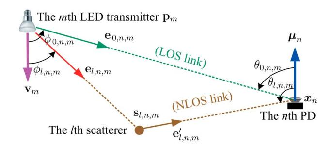

Fig. 3. Geometric parameters of diffuse scattering.

between the nth PD's orientation vector  $\mu_n$  and the irradiance vector  $\mathbf{e}_{0,n,m}$ , respectively, which are given by

$$\phi_{0,n,m} = \arccos\left(\mathbf{e}_{0,n,m}^{\top}\mathbf{v}_{m}\right),$$
 (7)

$$\theta_{0,n,m} = \arccos\left(-\mathbf{e}_{0,n,m}^{\top}\boldsymbol{\mu}_n\right).$$
 (8)

We assume that all PDs have the same field-of-view (FOV) angle  $\theta_{\rm FOV}$ , and all LEDs have the same FOV angle  $\phi_{\rm FOV}$ . The nth PD can receive VLC signals from the mth LED, if the LOS radiation is within the LED's FOV and its incidence angle

is within the PD's FOV, i.e.,  $|\frac{\phi_{0,n,m}}{\phi_{\mathrm{FOV}}}| \leq 1$  and  $|\frac{\theta_{0,n,m}}{\theta_{\mathrm{FOV}}}| \leq 1$ . Based on Lambertian model, the LOS channel gain between the mth LED and nth PD is given by

$$\alpha'_{0,n,m} = \alpha_{0,n,m} \Psi_{R} \frac{(r+1)(\cos(\phi_{0,n,m}))^{r} \cos(\theta_{0,n,m})}{\|\boldsymbol{x}_{n} - \boldsymbol{p}_{m}\|_{2}^{2}}, \quad (9)$$

where r is the Lambertian order of LEDs,  $\alpha_{0,n,m} \in [0,1)$  is the unknown fading coefficient of the LOS path, and  $\Psi_R$  is a known constant absorbing LED emission power, optical filter gain, etc. Furthermore, based on the propagation geometry, the LOS channel model can be rewritten as

$$\alpha'_{0,n,m} = \alpha_{0,n,m} \nu_{0,n,m} (\boldsymbol{\beta}_{\mathbf{R}}), \tag{10}$$

$$v_{0,n,m}(\boldsymbol{\beta}_{\mathrm{R}}) = \Psi_{\mathrm{R}} \frac{(r+1)((\boldsymbol{x}_n - \mathbf{p}_m)^{\top} \mathbf{v}_m)^r (\mathbf{p}_m - \boldsymbol{x}_n)^{\top} \boldsymbol{\mu}_n}{\|\boldsymbol{x}_n - \mathbf{p}_m\|_2^{r+3}}$$

where  $x_n$  and  $\mu_n$  are given by (4) and (5), respectively.

2) NLOS Channel: Let  $e_{l,n,m}$  be the irradiation vector of the lth NLOS path from the mth LED to the scatterer  $\mathbf{s}_{l,n,m}$ associated with the nth PD, and let  $\mathbf{e}'_{l,n,m}$  be the reflection vector of the lth NLOS path from the scatterer  $\mathbf{s}_{l,n,m}$  to the nth PD, respectively, given by [30], [31]

$$\mathbf{e}_{l,n,m} = \frac{\mathbf{s}_{l,n,m} - \mathbf{p}_m}{\|\mathbf{s}_{l,n,m} - \mathbf{p}_m\|_2}, \text{ for } l = 1, \dots L', \qquad (11)$$

$$\mathbf{e}'_{l,n,m} = \frac{\mathbf{x}_n - \mathbf{s}_{l,n,m}}{\|\mathbf{x}_n - \mathbf{s}_{l,n,m}\|_2}, \text{ for } l = 1, \dots L'. \qquad (12)$$

$$\mathbf{e}'_{l,n,m} = \frac{\mathbf{x}_n - \mathbf{s}_{l,n,m}}{\|\mathbf{x}_n - \mathbf{s}_{l,n,m}\|_2}, \text{ for } l = 1, \dots L'.$$
 (12)

Let  $\phi_{l,n,m}$  be the irradiation angle of the lth NLOS path between the mth LED's orientation vector  $\mathbf{v}_m$  and the irradiance vector  $\mathbf{e}_{l,n,m}$ . Let  $\theta_{l,n,m}$  be the incidence angle of the lth NLOS path between the nth PD's orientation vector  $\mu_n$  and the reflection vector  $\mathbf{e}'_{l,n,m}$ , which are given by

$$\phi_{l,n,m} = \arccos(\mathbf{e}_{l,n,m}^{\top} \mathbf{v}_m), \text{ for } l = 1, \dots L',$$
 (13)

$$\theta_{l,n,m} = \arccos(-(\mathbf{e}_{l,n,m}^{'\top})\boldsymbol{\mu}_n), \text{ for } l = 1, \cdots L'.$$
 (14)

{4}------------------------------------------------

The lth NLOS path's channel gain is given by

$$\alpha'_{l,n,m} = \alpha_{l,n,m} \Psi_{R} \frac{(r+1)(\cos(\phi_{l,n,m}))^{r}}{2\pi \|\mathbf{s}_{l,n,m} - \mathbf{p}_{m}\|_{2}^{2}} \frac{\cos(\theta_{l,n,m})}{\|\mathbf{s}_{l,n,m} - \mathbf{x}_{n}\|_{2}^{2}},$$

where  $\alpha_{l,n,m} \in [0,1)$  denotes the unknown fading coefficient (absorbing reflection rate). Based on scattering geometry, the NLOS channel gain is recast as

$$\alpha'_{l,n,m} = \alpha_{l,n,m} v_{l,n,m} (\boldsymbol{\beta}_{R}, \mathbf{s}),$$

$$v_{l,n,m} = \Psi_{R} \frac{(r+1)((\mathbf{s}_{l,n,m} - \mathbf{p}_{m})^{\top} \mathbf{v}_{m})^{r}}{2\pi \|\mathbf{s}_{l,n,m} - \mathbf{p}_{m}\|_{2}^{r+2}} \frac{(\mathbf{s}_{l,n,m} - \boldsymbol{x}_{n})^{\top} \boldsymbol{\mu}_{n}}{\|\mathbf{s}_{l,n,m} - \boldsymbol{x}_{n}\|_{2}^{3}},$$
(15)

where  $\mathbf{s} = \{\mathbf{s}_{l,n,m} | \forall l, \forall n, \forall m\}$  denotes the collection of scatter locations. Let  $\tau_{l,n,m}$  be the time-of-flight of the lth path associated with the mth LED and the nth PD, given by

$$\tau_{0,n,m} = \frac{\|\mathbf{x}_n - \mathbf{p}_m\|_2}{c},\tag{16}$$

$$\tau_{l,n,m} = \frac{\|\mathbf{s}_{l,n,m} - \mathbf{p}_m\|_2 + \|\mathbf{s}_{l,n,m} - \mathbf{x}_n\|_2}{c}, \ \forall l \neq 0.$$
 (17)

where c is the speed of light.

#### C. Received Signal Model

We consider OFDM signals for VLC-based SLAP detection, and LEDs are modulated on different carrier frequencies such that their signals are distinguishable. Let  $N_{\rm C}$  be the number of subcarriers of each LED. Let  ${\bf a}_m^{(\kappa)} \in \mathbb{R}^{N_{\rm C}}$  be the  $N_{\rm C}$ -point frequency-domain vector associated with the  $\kappa$ th OFDM symbol and the mth LED,  $\forall \kappa=1:K$ , with K being the number of symbols, which satisfies the Hermitian symmetry condition,  ${\bf a}_{m,k}^{(\kappa)}={\bf a}_{m,N_{\rm C}-k-1}^{(\kappa)*}, \ \forall k=0,\cdots N_{\rm C}-1, \ {\rm such \ that \ its \ time-domain \ signal \ is \ real.}$ 

After removing cyclic prefix and applying  $N_{\rm C}$ -point IDFT, the baseband OFDM symbol on the kth subcarrier received by the nth PD from the mth LED is cast as

$$\mathbf{z}_{n,m,k}^{(\kappa)} = \sum_{l=0:L'} \mathbf{a}_{m,k}^{(\kappa)} \alpha'_{l,n,m} \exp\left(-\mathbf{j}2\pi f_{m,k} \tau_{l,n,m}\right) + \epsilon_{n,m,k}^{(\kappa)},$$

where  $\epsilon_{n,m,k}^{(\kappa)}$  is the noise,  $f_{k,m}$  is the kth-subcarrier's baseband frequency of the mth LED i.e.,  $f_{m,k} = \frac{k}{T_{\rm s}N_{\rm C}}$ ,  $\forall k, \forall m$ , which are distinguishable among different LEDs, because they are from isolated carriers, and  $T_{\rm s}$  is the sampling rate.

VLC-based SLAP detection suffers from serious scattering interference, and thus a problem-specific algorithm design is required. However, the above received signal model is merely a low-level abstraction of diffuse-scattering models, which is not explicit enough for initiating an efficient SLAP detection method. In the following, we resort to an equivalent discrete channel model to facilitate the associated algorithm design.

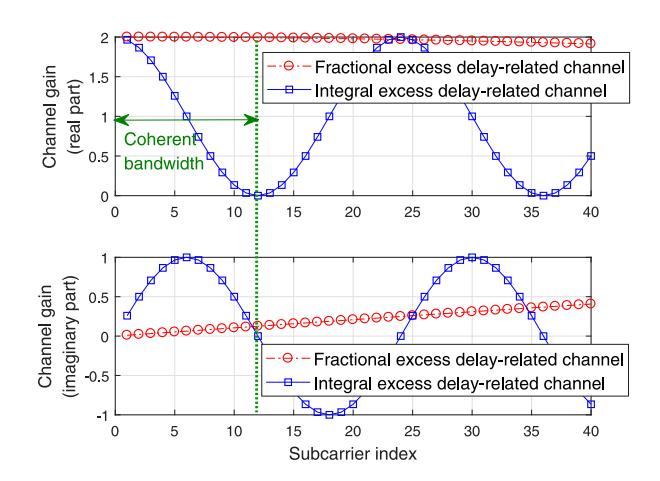

Fig. 4. Illustration of equivalent discrete channel, where the fractional part is fixed at 0.2, while the integral part is 5, and the number of subcarriers is set as 120.

Let  $\tau_{l,n,m}^{\sharp}=\tau_{l,n,m}-\tau_{0,n,m}$  be the excess delay of the lth path over the LOS path, which satisfies

$$\tau_{l,n,m}^{\sharp} = \underbrace{\left[\frac{\tau_{l,n,m}^{\sharp}}{T_{\rm s}}\right] T_{\rm s}}_{\text{Integral}} + \underbrace{\left\langle\frac{\tau_{l,n,m}^{\sharp}}{T_{\rm s}}\right\rangle T_{\rm s}}_{\text{Fractional}},\tag{18}$$

and hence the multipath propagation delay-caused phase shift  $\exp\left(-\mathrm{j}2\pi f_{k,m}\tau_{l,n,m}\right)$  can be equivalently cast as (19), shown at the bottom of the page. This structure is employed to remodel the scattering channel.

For brevity, let  $h_{\ell,n,m,k}^{\diamondsuit}$  be the equivalent channel state of the  $\ell$ th discrete NLOS path,  $\forall \ell \neq 0$ , which absorbs fractional excess delay  $\langle \tau_{l,n,m}^{\sharp}/T_{\rm s} \rangle$  and path coefficient  $h_{l,n,m}'$ :

$$h_{\ell,n,m,k}^{\diamondsuit} = h'_{l,n,m} \exp\left(-j2\pi f_{m,k} \left\langle \frac{\tau_{l,n,m}^{\sharp}}{T_{s}} \right\rangle T_{s}\right),$$
 (20)

for  $\ell = \left\lfloor \tau_{l,n,m}^\sharp / T_\mathrm{s} \right
vert$ , and  $h_{\ell,n,m,k}^\diamondsuit = 0$  otherwise, in which  $h_{l,n,m}' = \alpha_{l,n,m}'$  for NLOS paths  $l = 1, \cdots, L'$ , given by (15), and  $h_{l,n,m}' = \alpha_{0,n,m}$  for the LOS path l = 0. Moreover, we assume that the bandwidth of each LED is narrow and within the channel coherent time. In other words, given each  $(n,m,\ell)$ ,  $\{h_{\ell,n,m,k}^\diamondsuit | \forall k=1:N_\mathrm{C}\}$  are approximately identical, i.e.,  $h_{\ell,n,m,k}^\diamondsuit \approx h_{\ell,n,m,N_\mathrm{C}/2}^\diamondsuit$ ,  $\forall k=1:N_\mathrm{C}$ .

An example of equivalent discrete channel over different subcarriers is illustrated in Fig. 4, where it is shown that the fractional excess delay-related channel coefficient almost remains invariant within the coherent bandwidth.

Let  $h_{\ell,n,m}=h_{\ell,n,m,N_{\rm C}/2}^{\diamondsuit}$  be the fractional excess delay-related coefficient of the  $\ell$ th discrete path, which is unknown, and  $h_{0,n,m}=\alpha_{0,n,m}$  for the LOS path  $(\ell=l=0)$ . In such a case, only  $h_{\ell,n,m}$  is of interest for NLOS paths, and those

$$\exp\left(-\mathrm{j}2\pi f_{k,m}\tau_{l,n,m}\right) = \underbrace{\exp\left(-\mathrm{j}2\pi f_{k,m}\tau_{0,n,m}\right)}_{\mathrm{LOS\;delay}}\underbrace{\exp\left(-\mathrm{j}2\pi f_{k,m}\left\lfloor\frac{\tau_{l,n,m}^{\sharp}}{T_{\mathrm{s}}}\right\rfloor T_{\mathrm{s}}\right)}_{\mathrm{Integral\;excess\;delay}}\underbrace{\exp\left(-\mathrm{j}2\pi f_{k,m}\left\langle\frac{\tau_{l,n,m}^{\sharp}}{T_{\mathrm{s}}}\right\rangle T_{\mathrm{s}}\right)}_{\mathrm{Fractional\;excess\;delay}}.\tag{19}$$

{5}------------------------------------------------

propagation parameters  $\{\mathbf{s}_{l,n,m}, \tau_{l,n,m}, \alpha_{l,n,m}, \theta_{l,n,m}, \phi_{l,n,m}\}$  are no longer necessary to estimate, as elaborated shortly. Let  $\mathbf{h}_{n,m}^{\mathrm{nlos}} = \mathrm{vec}[h_{\ell,n,m}|\forall \ell=1,\cdots L] \in \mathbb{C}^L$  be equivalent NLOS channel vector, and L is its length required to exceed the maximum discrete excess delay, i.e.,  $L \geq \max\left\{\left\lfloor \frac{\tau_{L',n,m} - \tau_{0,n,m}}{T_{\mathrm{s}}}\right\rceil | \forall m, \forall n\right\}$ , which is usually determined experimentally. Moreover, let  $\mathbf{h}_{n,m} = [\alpha_{0,n,m}; \mathbf{h}_{n,m}^{\mathrm{nlos}}] \in \mathbb{C}^{L+1}$ , and let  $\mathbf{h} \in \mathbb{C}^{(L+1)N_{\mathrm{R}}N_{\mathrm{L}}} = \mathrm{vec}[\mathbf{h}_{n,m}|\forall n, \forall m]$ .

Third experimentary. The sum of the sum of the sum of the sum of the sum of the sum of the sum of the sum of the sum of the sum of the sum of the sum of the sum of the sum of the sum of the sum of the sum of the sum of the sum of the sum of the sum of the sum of the sum of the sum of the sum of the sum of the sum of the sum of the sum of the sum of the sum of the sum of the sum of the sum of the sum of the sum of the sum of the sum of the sum of the sum of the sum of the sum of the sum of the sum of the sum of the sum of the sum of the sum of the sum of the sum of the sum of the sum of the sum of the sum of the sum of the sum of the sum of the sum of the sum of the sum of the sum of the sum of the sum of the sum of the sum of the sum of the sum of the sum of the sum of the sum of the sum of the sum of the sum of the sum of the sum of the sum of the sum of the sum of the sum of the sum of the sum of the sum of the sum of the sum of the sum of the sum of the sum of the sum of the sum of the sum of the sum of the sum of the sum of the sum of the sum of the sum of the sum of the sum of the sum of the sum of the sum of the sum of the sum of the sum of the sum of the sum of the sum of the sum of the sum of the sum of the sum of the sum of the sum of the sum of the sum of the sum of the sum of the sum of the sum of the sum of the sum of the sum of the sum of the sum of the sum of the sum of the sum of the sum of the sum of the sum of the sum of the sum of the sum of the sum of the sum of the sum of the sum of the sum of the sum of the sum of the sum of the sum of the sum of the sum of the sum of the sum of the sum of the sum of the sum of the sum of the sum of the sum of the sum of the sum of the sum of the sum of the sum of the sum of the sum of the sum of the sum of the sum of the sum of the sum of the sum of the sum of the sum of the sum of the sum of the sum of the sum of the sum of the sum of the sum of the sum of the sum of the sum of the sum of the sum of the sum of the sum of the sum of the sum of the sum of

$$\mathbf{z} = \mathbf{G}(\boldsymbol{\beta}_{\mathrm{R}})\mathbf{h} + \boldsymbol{\epsilon},\tag{21}$$

where  $\mathbf{G}(\boldsymbol{\beta}_{\mathrm{R}}) \in \mathbb{C}^{N_{\mathrm{C}}N_{\mathrm{R}}N_{\mathrm{L}}K \times (L+1)N_{\mathrm{R}}N_{\mathrm{L}}}$  dependent on UD location parameter  $\boldsymbol{\beta}_{\mathrm{R}}$  is given by

$$\mathbf{G}(\boldsymbol{\beta}_{\mathrm{R}}) = \mathrm{mat}[\mathbf{G}^{(\kappa)}(\boldsymbol{\beta}_{\mathrm{R}})|\forall \kappa = 1, \cdots, K],$$
 (22)

$$\mathbf{G}^{(\kappa)}(\boldsymbol{\beta}_{\mathrm{R}}) = \operatorname{diag}\left[\mathbf{G}_{n,m}^{(\kappa)}(\boldsymbol{\beta}_{\mathrm{R}})|\forall n, \forall m\right],\tag{23}$$

$$\mathbf{G}_{n,m}^{(\kappa)}(\boldsymbol{\beta}_{\mathrm{R}}) \in \mathbb{C}^{N_{\mathrm{C}} \times (L+1)} = \left[\boldsymbol{\omega}_{n,m}^{(\kappa)}(\boldsymbol{\beta}_{\mathrm{R}}), \mathbf{W}_{n,m}^{(\kappa)}\right], \quad (24)$$

$$\boldsymbol{\omega}_{n,m}^{(\kappa)}(\boldsymbol{\beta}_{\mathrm{R}}) \in \mathbb{C}^{N_{\mathrm{C}}} = \mathrm{vec}[\boldsymbol{\omega}_{n,m,k}^{(\kappa)} | \forall k = 1, \cdots, N_{\mathrm{C}}],$$
 (25)

$$\omega_{n,m,k}^{(\kappa)} \in \mathbb{C} = \mathbf{a}_{m,k}^{(\kappa)} v_{0,n,m}(\boldsymbol{\beta}_{\mathbf{R}}) \exp\left(-\mathrm{j} 2\pi f_{m,k} \tau_{0,n,m}\right),\,$$

$$\mathbf{W}_{n,m}^{(\kappa)} \in \mathbb{C}^{N_{\mathrm{C}} \times L} = \mathrm{mat}[\mathbf{w}_{n,m,k}^{(\kappa)\top} | \forall k = 1, \cdots, N_{\mathrm{C}}], \quad (26)$$

$$\mathbf{w}_{n,m,k}^{(\kappa)} \in \mathbb{C}^L = \text{vec}\left[\mathbf{w}_{\ell,n,m,k}^{(\kappa)} | \forall \ell = 1, \cdots, L\right], \tag{27}$$

$$\mathbf{w}_{\ell,n,m,k}^{(\kappa)} = \mathbf{a}_{m,k}^{(\kappa)} \exp\left(-\mathrm{j}2\pi f_{k,m} \left(\tau_{0,n,m} + \varphi_{\ell,N_C}^{\sharp} T_{\mathrm{s}}\right)\right), \quad (28)$$

$$\varphi_{\ell,N_{\mathbf{C}}}^{\sharp} = (N_{\mathbf{C}} - \ell) \bmod N_{\mathbf{C}}, \ \forall \ell = 1, \cdots, L,$$
 (29)

where  $\epsilon \in \mathbb{C}^{KN_{\mathrm{C}}N_{\mathrm{R}}N_{\mathrm{L}}}$  is the noise, which follows a complex-valued zero-mean Gaussian process, i.e.,  $\epsilon \sim \mathcal{N}_{\mathbb{C}}(\epsilon|\mathbf{0}, \mathbf{\Sigma})$  with  $\mathbf{\Sigma} \in \mathbb{R}^{KN_{\mathrm{C}}N_{\mathrm{R}}N_{\mathrm{L}} \times KN_{\mathrm{C}}N_{\mathrm{R}}N_{\mathrm{L}}} = \sigma^2 \mathbf{I}_{KN_{\mathrm{C}}N_{\mathrm{R}}N_{\mathrm{L}}}$ . In addition, we assume that  $N_{\mathrm{C}} \geq L+1$  such that the equivalent discrete NLOS channel vector  $\mathbf{h}$  is observable.

Based on the above channel remodeling, we focus on VLC-based 6-DoF SLAP detection for UDs with PD receiver arrays in diffuse scattering environments.

### III. VLC-ENABLED SLAP DETECTION METHOD

In this section, we formulate the SLAP detection problem, analyse its challenges, and then we will elaborate the proposed VLC-enabled anti-interference SLAP detection algorithm.

#### A. Problem Formulation of SLAP Detection

VLC-based SLAP detection aims to estimate the UD state  $\beta_R$ , under diffuse scattering h, which is described as

$$\mathscr{P}_{\mathrm{SLAP}}: \ (\hat{\boldsymbol{\beta}}_{\mathrm{R}}, \hat{\mathbf{h}}) = \arg\min_{\boldsymbol{\beta}_{\mathrm{R}}} \min_{\mathbf{h}} \|\mathbf{z} - \mathbf{G}(\boldsymbol{\beta}_{\mathrm{R}})\mathbf{h}\|_{2}^{2}, \quad (30)$$

s.t. 
$$\mathcal{R}(\vartheta_{\mathrm{R}}) \in \mathcal{SO}(3)$$
, (31)

where UD state and scattering channel are jointly optimized. *Challenge*: The above problem is non-convex in  $(\beta_R, h)$ , due

Challenge: The above problem is non-convex in  $(\beta_R, h)$ , due to the nonlinear function  $G(\beta_R)$ . Moreover, UD pose matrix

 $\mathcal{R}(\vartheta_{\mathrm{R}})$  (absorbed in  $\beta_{\mathrm{R}}$ ) is subject to (s.t.) a manifold  $\mathcal{SO}(3)$ , which is essentially a non-convex constraint.

SCA approach successively extracts a convex approximation (surrogate function) to the non-convex cost function of the original problem, for facilitating the associated optimization [37] and [38]. At each stage, the constructed convex surrogate functions are exploited to yield low-cost iterations of unknown parameters. If the surrogate function satisfies certain well-posed conditions such as convexity and tight approximation, SCA's convergence will be ensured, i.e., the convex surrogate-guided iteration will yield feasible updates (leading to sufficient decreasing in both the surrogate and the original cost function), till it converges.

In light of the above observations, we resort to the following strategies to address those challenges. Firstly, an efficient SCA-based SLAP detection algorithm is devised to address the first challenge via extracting structured models of the original SLAP problem. Secondly, we exploit a projection of Newton increments in tangent space onto manifold to facilitate rotation matrix optimization, thus addressing the second challenge.

#### B. SCA-Based SLAP Detection Algorithm

We observe that there is a convex substructure with respect to (w.r.t.) **h** in SLAP detection problem  $\mathcal{P}_{\mathrm{SLAP}}$  due to the linear dependency of **z** on **h**. Thus, we decompose  $\mathcal{P}_{\mathrm{SLAP}}$  into two optimization subproblems, i.e., the (convex) channel state estimate and the (non-convex) UD state estimate. Two subproblems will be alternately optimized under the guidelines of SCA iterations, till both subproblems are solved.

Specifically, starting from an initial point  $\hat{\beta}_{[0]}$ , alternately update the UD state estimate  $\hat{\beta}_{[t]}$  and channel estimate  $\hat{\mathbf{h}}_{[t]}$ , where t is the iteration index, until iterations converge.

1) Channel State Equalization: We assume that the UD state update  $\hat{\beta}_{[t]}$  is already determined at the tth iteration. Then, we can optimize the channel state  $\mathbf{h}$  conditioned on  $\hat{\beta}_{[t]}$ , via employing a least square estimate method due to the linear Gaussian model w.r.t.  $\mathbf{h}$ , i.e.,

$$\mathscr{P}_{CE}^{\sharp}: \hat{\mathbf{h}} = \arg\min_{\mathbf{h}} \|\mathbf{z} - \mathbf{G}(\hat{\boldsymbol{\beta}}_{[t]})\mathbf{h}\|_{2}^{2}.$$
 (32)

Thus, the optimal update  $\hat{\mathbf{h}}_{[t]}$  conditioned on  $\hat{\boldsymbol{\beta}}_{[t]}$  is cast as

$$\hat{\mathbf{h}}_{[t]} = \left(\mathbf{G}^{\mathrm{H}}(\hat{\boldsymbol{\beta}}_{[t]})\mathbf{G}(\hat{\boldsymbol{\beta}}_{[t]})\right)^{-1}\mathbf{G}^{\mathrm{H}}(\hat{\boldsymbol{\beta}}_{[t]})\,\mathbf{z}. \tag{33}$$

2) UD State Detection: Once  $\hat{\mathbf{h}}_{[t]}$  is determined, the UD state  $\boldsymbol{\beta}_{\mathrm{R}}$  will be updated as per the following subproblem,

$$\mathscr{P}_{\mathrm{UD}}^{\sharp}: \ \hat{\boldsymbol{\beta}}_{[t+1]} = \arg\min_{\boldsymbol{\beta}_{\mathrm{R}}} \underbrace{\left\|\mathbf{z} - \mathbf{G}(\boldsymbol{\beta}_{\mathrm{R}})\hat{\mathbf{h}}_{[t]}\right\|_{2}^{2}}_{\wp(\boldsymbol{\beta}_{\mathrm{R}},\hat{\mathbf{h}}_{[t]})}, \tag{34}$$

s.t. 
$$\mathcal{R}(\vartheta_{\mathbf{R}}) \in \mathcal{SO}(3)$$
, (35)

where  $\wp(\beta_{\mathrm{R}}, \hat{\mathbf{h}}_{[t]})$  denotes its cost function.

This subproblem is non-convex in  $\beta_R$  due to the nonlinear model  $G(\beta_R)$ . To address this challenge, we resort to a SCA framework to exploit a second-order convex approximation to the cost function in (34). We iteratively solve the following

{6}------------------------------------------------

convex approximation subproblem  $\mathscr{A}_{[t+1]}$  to find a candidate update  $\beta_{[t+1]}^{\circ}$  for finally determining  $\hat{\beta}_{[t+1]}$  in (52),

$$\mathcal{A}_{[t]}: \ \boldsymbol{\beta}_{[t+1]}^{\circ} = \arg\min_{\boldsymbol{\beta}_{\mathrm{R}}} \wp_{\mathrm{S}} (\boldsymbol{\beta}_{\mathrm{R}}; \hat{\boldsymbol{\beta}}_{[t]}, \hat{\mathbf{h}}_{[t]}), \tag{36}$$

where  $\wp_S(\beta_R; \hat{\boldsymbol{\beta}}_{[t]}, \hat{\mathbf{h}}_{[t]})$  denotes the convex surrogate of the original cost function  $\wp(\beta_R, \hat{\mathbf{h}}_{[t]})$  in (34), given by (37), shown at the bottom of the page, in which  $\nabla_{\beta_R}(\mathbf{G}(\hat{\boldsymbol{\beta}}_{[t]})\hat{\mathbf{h}}_{[t]}) \in \mathbb{C}^{6 \times N_C N_R N_L K}$  is the derivative of  $\mathbf{G}(\beta_R)\hat{\mathbf{h}}_{[t]}$  w.r.t.  $\beta_R$  around  $\beta_R = \hat{\boldsymbol{\beta}}_{[t]}$ , given by

$$\nabla_{\boldsymbol{\beta}_{R}} (G(\hat{\boldsymbol{\beta}}_{[t]}) \hat{\mathbf{h}}_{[t]}) = \boldsymbol{\mathcal{W}} (\hat{\boldsymbol{\beta}}_{[t]}) \hat{\boldsymbol{\mathcal{H}}}_{[t]}. \tag{38}$$

Moreover,  $\mathcal{W}(\hat{eta}_{[t]}) \in \mathbb{C}^{6 \times (L+1)N_{\mathrm{C}}N_{\mathrm{R}}N_{\mathrm{L}}K}$  is given by

$$\mathcal{W}(\hat{\boldsymbol{\beta}}_{[t]}) = \left[\mathbf{U}^{\top}(\hat{\boldsymbol{\beta}}_{[t]}), \boldsymbol{\Lambda}^{\top}(\hat{\boldsymbol{\beta}}_{[t]})\right]^{\top}, \tag{39}$$

where  $\mathbf{U}(\hat{m{\beta}}_{[t]})$  and  $\mathbf{\Lambda}(\hat{m{\beta}}_{[t]}) \in \mathbb{C}^{3 \times (L+1)N_{\mathrm{C}}N_{\mathrm{R}}N_{\mathrm{L}}K}$  are

$$\mathbf{U}(\hat{\boldsymbol{\beta}}_{[t]}) = \left[\mathbf{u}_{\ell,n,m,k}^{(\kappa)}(\hat{\boldsymbol{\beta}}_{[t]})|\forall \ell, \forall k, \forall n, \forall m, \forall \kappa\right], \tag{40}$$

$$\boldsymbol{\Lambda} (\hat{\boldsymbol{\beta}}_{[t]}) = \left[ \boldsymbol{\lambda}_{\ell,n,m,k}^{(\kappa)} (\hat{\boldsymbol{\beta}}_{[t]}) | \forall \ell, \forall k, \forall n, \forall m, \forall \kappa \right]. \tag{41}$$

Furthermore,  $\mathbf{u}_{\ell,n,m,k}^{(\kappa)}(\hat{\boldsymbol{\beta}}_{[t]}) = \nabla_{\mathbf{x}_{\mathrm{R}}}\left(g_{\ell,n,m,k}^{(\kappa)}(\hat{\boldsymbol{\beta}}_{[t]})\right) \in \mathbb{C}^{3}$  and  $\boldsymbol{\lambda}_{n,m,k}^{(\kappa)}(\hat{\boldsymbol{\beta}}_{[t]}) = \nabla_{\boldsymbol{\vartheta}_{\mathrm{R}}}\left(g_{\ell,n,m,k}^{(\kappa)}(\hat{\boldsymbol{\beta}}_{[t]})\right) \in \mathbb{C}^{3}$  is given by (95) and (100) of Appendix A, respectively, where

$$g_{\ell,n,m,k}^{(\kappa)}(\hat{\boldsymbol{\beta}}_{[t]}) = \begin{cases} \omega_{n,m,k}^{(\kappa)}(\hat{\boldsymbol{\beta}}_{[t]}), & \text{for } \ell = 0, \\ \mathbf{w}_{\ell,n,m,k}^{(\kappa)}, & \text{for } \ell \neq 0. \end{cases}$$
(42)

In addition,  $\hat{\mathcal{H}}_{[t]} \in \mathbb{C}^{(L+1)N_{\mathrm{C}}N_{\mathrm{R}}N_{\mathrm{L}}K \times N_{\mathrm{C}}N_{\mathrm{R}}N_{\mathrm{L}}K}$  in (38) is

$$\hat{\mathcal{H}}_{[t]} = \mathbf{I}_K \otimes \hat{\mathbf{H}}_{[t]},\tag{43}$$

$$\hat{\mathbf{H}}_{[t]} = \operatorname{diag} \left[ \hat{\mathbf{H}}_{n,m,[t]} | \forall n, \forall m \right], \tag{44}$$

$$\hat{\mathbf{H}}_{n,m,[t]} = \mathbf{I}_{N_{\mathbf{C}}} \otimes \hat{\mathbf{h}}_{n,m,[t]}^{\sharp}, \tag{45}$$

$$\hat{\mathbf{h}}_{n,m,[t]}^{\sharp} = \text{vec} \left[ \hat{\mathbf{h}}_{\ell,n,m,[t]}^{\sharp} \middle| \forall \ell = 0, \cdots, L \right], \tag{46}$$

where  $\hat{\mathbf{h}}_{\ell,n,m,[t]}^{\sharp}$  is the tth iteration of  $\mathbf{h}_{\ell,n,m}^{\sharp}$ , given by

$$\mathbf{h}_{\ell,n,m}^{\sharp} = \begin{cases} \alpha_{0,n,m}, & \text{for } \ell = 0, \\ h_{\ell,n,m}, & \text{for } \ell \neq 0. \end{cases}$$
 (47)

In such a case, the subproblem  $\mathscr{A}_{[t]}$  is strictly convex at each iteration, and the closed-form expression of  $\beta_{[t+1]}^{\circ}$  is given by

$$\boldsymbol{\beta}_{[t+1]}^{\circ} = \hat{\boldsymbol{\beta}}_{[t]} + \underbrace{\left(\boldsymbol{\mathcal{W}}(\hat{\boldsymbol{\beta}}_{[t]})\hat{\boldsymbol{\mathcal{H}}}_{[t]}\right)^{\dagger}\left(\mathbf{z} - \mathbf{G}(\hat{\boldsymbol{\beta}}_{[t]})\hat{\mathbf{h}}_{[t]}\right)}_{\boldsymbol{\varsigma}(\hat{\boldsymbol{\beta}}_{[t]},\hat{\mathbf{h}}_{[t]})}, \quad (48)$$

where  $\varsigma(\hat{\beta}_{[t]}, \hat{\mathbf{h}}_{[t]})$  denotes the corresponding update direction. Given  $\varsigma(\hat{\beta}_{[t]}, \hat{\mathbf{h}}_{[t]})$ , we determine  $\hat{\beta}_{[t+1]}$  as follows,

$$\hat{\boldsymbol{\beta}}_{[t+1]} = \hat{\boldsymbol{\beta}}_{[t]} + \gamma_{[t]} \varsigma (\hat{\boldsymbol{\beta}}_{[t]}, \hat{\mathbf{h}}_{[t]}), \tag{49}$$

where  $\gamma_{[t]}$  is the step size subject to Armijo rule (50), shown at the bottom of the page, in which  $\wp(\beta_{\mathrm{R}};\hat{\mathbf{h}}_{[t]})$  is the cost function of  $\mathscr{P}_{\mathrm{UD}}^{\sharp}$  conditioned on  $\hat{\mathbf{h}}_{[t]}$ , given by (34), and  $\nabla_{\beta_{\mathrm{R}}}\wp(\hat{\beta}_{[t]};\hat{\mathbf{h}}_{[t]}) \in \mathbb{R}^{6}$  denotes the gradient vector of  $\wp(\beta_{\mathrm{R}};\hat{\mathbf{h}}_{[t]})$  w.r.t.  $\beta_{\mathrm{R}}$  around  $\beta_{\mathrm{R}} = \hat{\beta}_{[t]}$ , given by

$$\nabla_{\boldsymbol{\beta}_{\mathrm{R}}}\wp(\hat{\boldsymbol{\beta}}_{[t]};\hat{\mathbf{h}}_{[t]}) = \boldsymbol{\mathcal{W}}(\hat{\boldsymbol{\beta}}_{[t]})\hat{\boldsymbol{\mathcal{H}}}_{[t]}(\mathbf{G}(\hat{\boldsymbol{\beta}}_{[t]})\hat{\mathbf{h}}_{[t]} - \mathbf{z}). \quad (51)$$

A legal  $\gamma_{[t]}$  can be obtained by starting from a certain  $\gamma_{[t]}>0$  and repeatedly trying  $\gamma_{[t]}=\nu\gamma_{[t-1]}$  with  $\nu\in(0,1)$  till (50) is satisfied. Given an update vector  $\boldsymbol{\varsigma}_{[t]}$  (i.e.,  $\boldsymbol{\varsigma}(\hat{\boldsymbol{\beta}}_{[t]},\hat{\mathbf{h}}_{[t]})$ ), the Armijo rule (50) ensures a satisfied step length  $\gamma_{[t]}$  at each iteration such that the cost function successively reduces till it converges. The obtained solution in (48) combining with (52) will finally result in a closed-form update of  $\hat{\boldsymbol{\beta}}_{\mathrm{R}}$ .

Given the optimized Newton update  $\gamma_{[t]}\varsigma(\hat{\boldsymbol{\beta}}_{[t]},\hat{\mathbf{h}}_{[t]})$  of  $\boldsymbol{\beta}_{\mathrm{R}}$  in tangent space, the UD location  $\mathbf{x}_{\mathrm{R}}$  and rotation matrix  $\boldsymbol{\mathcal{R}}$  are updated as follows,

$$\hat{\mathbf{x}}_{[t+1]} = \hat{\mathbf{x}}_{[t]} + \Re \left\{ \gamma_{[t]} \boldsymbol{\varsigma}_{\mathbf{x}_{\mathbf{R}}} \left( \hat{\boldsymbol{\beta}}_{[t]}, \hat{\mathbf{h}}_{[t]} \right) \right\}, \tag{52}$$

$$\hat{\mathcal{R}}_{[t+1]} = \Re \left\{ \exp \left( \left[ \gamma_{[t]} \varsigma_{\vartheta_{\mathcal{R}}} \left( \hat{\beta}_{[t]}, \hat{\mathbf{h}}_{[t]} \right) \right]_{\times} \right) \right\} \hat{\mathcal{R}}_{[t]}, \tag{53}$$

where  $\varsigma_{\mathbf{x}_{\mathrm{R}}}(\hat{\boldsymbol{\beta}}_{[t]},\hat{\mathbf{h}}_{[t]}) = \left[\varsigma(\hat{\boldsymbol{\beta}}_{[t]},\hat{\mathbf{h}}_{[t]})\right]_{1:3}$  and  $\varsigma_{\vartheta_{\mathrm{R}}}(\hat{\boldsymbol{\beta}}_{[t]},\hat{\mathbf{h}}_{[t]}) = \left[\varsigma(\hat{\boldsymbol{\beta}}_{[t]},\hat{\mathbf{h}}_{[t]})\right]_{4:6}$  are the location component and pose angle component, respectively, of the joint increment  $\varsigma(\hat{\boldsymbol{\beta}}_{[t]},\hat{\mathbf{h}}_{[t]})$ . It should be noted that  $\exp(\bullet_{\times})$  maps an incremental  $\bullet_{\times}$  in the tangent space  $\mathbb{C}^{3\times3}$  onto the manifold  $\mathcal{SO}(3)$ [39]. As such, the Newton increment  $\left[\gamma_{[t]}\varsigma_{\vartheta_{\mathrm{R}}}(\hat{\boldsymbol{\beta}}_{[t]},\hat{\mathbf{h}}_{[t]})\right]_{\times}\hat{\boldsymbol{\mathcal{R}}}_{[t]}$  of  $\boldsymbol{\mathcal{R}}$  in tangent space will be transformed into an increment in  $\mathcal{SO}(3)$ , via  $\exp\left(\left[\gamma_{[t]}\varsigma_{\vartheta_{\mathrm{R}}}(\hat{\boldsymbol{\beta}}_{[t]},\hat{\mathbf{h}}_{[t]})\right]_{\times}\right)$ , thus addressing the non-convex constraint in (35), as shown in Fig. 5.

### C. Summary of SLAP Detection Algorithm

VLC-based SLAP detection suffers from diffuse scattering interference and random fading. A novel OFDM-enabled anti-disturbance mechanism is proposed to alleviate such environment interference, and an efficient SCA algorithm is devised to tackle with the non-convex challenge, where the SLAP detection is achieved via iterations between channel equalization

 $^2 \text{For the update of UD pose state, we first derive the optimal solution } (\mathbf{I}_3 + \left[\gamma_{[t]} \mathbf{s}_{\vartheta_{\mathrm{R}}} (\hat{\boldsymbol{\beta}}_{[t]}, \hat{\mathbf{h}}_{[t]})\right]_{\times}) \hat{\boldsymbol{\mathcal{R}}}_{[t]}$  in the tangent space  $\mathbb{R}^{3\times3}$  of manifold by solving  $\mathscr{P}_{\mathrm{UD}}^{\sharp}$  without constraint (35), and then we find a legal solution  $\hat{\boldsymbol{\mathcal{R}}}_{[t+1]}$  s.t. (35), i.e., the projection of  $(\mathbf{I}_3 + \left[\gamma_{[t]} \mathbf{s}_{\vartheta_{\mathrm{R}}} (\hat{\boldsymbol{\beta}}_{[t]}, \hat{\mathbf{h}}_{[t]})\right]_{\times}) \hat{\boldsymbol{\mathcal{R}}}_{[t]}$  onto the manifold via exponential mapping.

$$\wp_{\mathbf{S}}(\boldsymbol{\beta}_{\mathbf{R}}; \hat{\boldsymbol{\beta}}_{[t]}, \hat{\mathbf{h}}_{[t]}) = \left\| \mathbf{z} - \mathbf{G}(\hat{\boldsymbol{\beta}}_{[t]}) \hat{\mathbf{h}}_{[t]} - \nabla_{\boldsymbol{\beta}_{\mathbf{R}}}^{\mathbf{H}} \left( \mathbf{G}(\hat{\boldsymbol{\beta}}_{[t]}) \hat{\mathbf{h}}_{[t]} \right) (\boldsymbol{\beta}_{\mathbf{R}} - \hat{\boldsymbol{\beta}}_{[t]}) \right\|_{2}^{2}.$$
(37)

$$\wp(\hat{\boldsymbol{\beta}}_{[t]} + \gamma_{[t]}\boldsymbol{\varsigma}_{[t]}; \hat{\mathbf{h}}_{[t]}) \le \wp(\hat{\boldsymbol{\beta}}_{[t]}; \hat{\mathbf{h}}_{[t]}) + a\gamma_{[t]}\nabla^{\mathbf{H}}_{\boldsymbol{\beta}_{\mathbf{R}}}\wp(\hat{\boldsymbol{\beta}}_{[t]}; \hat{\mathbf{h}}_{[t]})\boldsymbol{\varsigma}_{[t]}, \text{ for a given } a > 0.$$

$$(50)$$

{7}------------------------------------------------

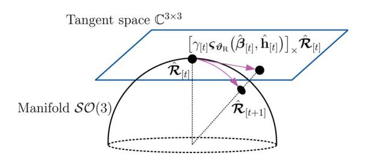

Fig. 5. UD rotation matrix update on manifold.

## **Algorithm 1:** The proposed SLAP detection algorithm

**Input**: The measurement sample z.

- 1 Initialize  $\hat{\mathbf{x}}_{[0]}$  and  $\hat{\mathcal{R}}_{[0]}$ .
- **2 While** not converge **do** (for  $t = 1, 2, 3, \cdots$ )
- Determine the channel state  $\hat{\mathbf{h}}_{[t]}$  as per (33).
- 4 Determine  $\varsigma(\hat{\beta}_{[t]}, \hat{\mathbf{h}}_{[t]})$  as per (48).
- 5 Determine  $\gamma_{[t]}$  as per (50).
- 6 Update  $\hat{\mathbf{x}}_{[t]}$  as per (52), and  $\hat{\mathcal{R}}_{[t]}$  as per (53).
- 7 End
- 8 Determine the channel estimate  $\hat{\mathbf{h}} = \hat{\mathbf{h}}_{[t]}$ .
- 9 Determine the location estimate  $\hat{\mathbf{x}}_{\mathrm{R}} = \hat{\mathbf{x}}_{[t]}$ .
- 10 Determine the pose estimate  $\mathcal{R} = \mathcal{R}_{[t]}$ .

**Output:**  $\hat{\mathbf{x}}_{\mathrm{R}}$ ,  $\hat{\mathcal{R}}$  and  $\hat{\mathbf{h}}$ .

and UD state detection. Specifically, given an initial point  $\hat{\beta}_{[0]}$ , the proposed SCA-based SLAP detection algorithm alternately optimizes  $\beta_{\rm R}$  and  ${\bf h}$ , till it converges to a stationary point. Once iterations converge,  $\hat{\beta}_{\rm R}$  and  $\hat{\bf h}$  will be determined. The pseudo-code of our SCA-based SLAP detection algorithm is summarized in Algorithm 1.

Generally, we have three methods to generate an initial point  $\hat{\beta}_{[0]}$ . Firstly, we can adopt a coarse solution of conventional VLP methods, e.g., the RSS-based VLP [22] or trilaterationbased VLP methods [18], [19], as an initial point. Secondly, the geometric relationship between UD and observed LEDs can be employed to yield an initial point, and prior knowledge of UD location can also be exploited. Thirdly, random sampling can be resorted to generate a good initial point, if no prior knowledge is available. Specifically, we generate  $N_{\rm S}$  samples  $\{\beta_{[0]}^{(s)}|\forall s=1,\cdots,N_{\rm S}\}$  randomly in the space of  $\beta_{\rm R}$ , (then,  $\hat{\mathbf{h}}_{[0]}^{(s)}$  can be determined for each sample), try all  $N_{\mathrm{S}}$  samples  $\{\beta_{[0]}^{(s)}|\forall s=1,\cdots,N_{\rm S}\}$ , and then pick up the best sample with minimum cost function as the initial point  $\beta_{[0]}$ . Generally, the multiple trial samples can ensure a large probability of hitting a good initial point, and the probability depends on the number of samples. This random sampling method is only conducted in the initial step and hence will not significantly increase the associated computational cost.

Let  $K_{\rm source} = N_{\rm L} N_{\rm R} N_{\rm C} K$  be the number of independent measurement sources. Then, the complexity of our SCA-based SLAP detection method is in the order of  $K_{\rm source}^3$ , due to matrix inverse operations in (33) and (48), and a near-second-order computational complexity  $K_{\rm source}^{2.38}$  can be achieved by

exploiting block diagonal structures of involved matrices using the well-known Coppersmith-Winograd method [40], [41].

## IV. ASYMPTOTIC PERFORMANCE LIMITS OF VLC-ENABLED SLAP DETECTION

In this section, we aim at providing a unified performance framework for VLC-based SLAP detection, to gain insight into its performance limits and how system factors and fading environments affect SLAP detection performance.

#### A. Performance Metric of SLAP Detection

We use mean squared error (MSE) as performance metric of UD localization, pose angle estimate, and channel estimate, which is given respectively by

$$cov(\hat{\mathbf{x}}_{R}) = \mathbb{E}_{\epsilon} \{ (\hat{\mathbf{x}}_{R} - \mathbf{x}_{R})^{H} (\hat{\mathbf{x}}_{R} - \mathbf{x}_{R}) \}, \tag{54}$$

$$cov(\hat{\boldsymbol{\vartheta}}_{R}) = \mathbb{E}_{\epsilon} \{\boldsymbol{\vartheta}_{div}^{H} \boldsymbol{\vartheta}_{div} \}, \tag{55}$$

$$cov(\hat{\mathbf{h}}) = \mathbb{E}_{\epsilon} \{ (\hat{\mathbf{h}} - \mathbf{h})^{\mathrm{H}} (\hat{\mathbf{h}} - \mathbf{h}) \}, \tag{56}$$

where  $(\hat{\mathbf{x}}_R, \hat{\boldsymbol{\vartheta}}_R, \hat{\mathbf{h}})$  is an unbiased estimate of VLC-enabled 6-DoF SLAP problem  $\mathscr{P}_{\mathrm{SLAP}}$  in (30), and  $\boldsymbol{\vartheta}_{\mathrm{div}} \in \mathbb{R}^3$  is the pose angle error, which is actually the deviation angle from pose estimate  $\hat{\mathcal{R}}$  to its true pose  $\mathcal{R}$ , i.e.,

$$[\vartheta_{\text{div}}]_{\times} = \log \left( \frac{\hat{\mathcal{R}} \mathcal{R}^{\text{H}}}{\mathcal{R}_{\text{div}}} \right),$$
 (57)

where  $\mathcal{R}_{div} \in \mathcal{SO}(3)$  is the rotation matrix from true pose  $\mathcal{R}$  to pose estimate  $\hat{\mathcal{R}}$ . Based on the Euler Rotation Theorem [35], the pose angle error  $\vartheta_{div}$  is obtained by

$$\vartheta_{\text{div}} = \frac{\varphi_{\text{div}}}{2\sin(\varphi_{\text{div}})} \begin{bmatrix} [\mathcal{R}_{\text{div}}]_{3,2} - [\mathcal{R}_{\text{div}}]_{2,3} \\ [\mathcal{R}_{\text{div}}]_{1,3} - [\mathcal{R}_{\text{div}}]_{3,1} \\ [\mathcal{R}_{\text{div}}]_{2,1} - [\mathcal{R}_{\text{div}}]_{1,2} \end{bmatrix}, \quad (58)$$

$$\varphi_{\text{div}} = \arccos\left(\frac{1 - \text{trace}(\mathcal{R}_{\text{div}})}{2}\right).$$
 (59)

Please see Appendix B for the derivation of (58) and (59). For clarity, let  $\chi = [\beta_{\rm R}; \mathbf{h}] \in \mathbb{R}^{(L+1)N_{\rm R}N_{\rm L}+6}$  be the joint variable of UD state and channel state. Then, the overall MSE is given by  $\operatorname{cov}(\hat{\chi}) = \operatorname{cov}(\hat{\mathbf{x}}_{\rm R}) + \operatorname{cov}(\hat{\boldsymbol{\theta}}_{\rm R}) + \operatorname{cov}(\hat{\mathbf{h}})$ .

#### B. Error Bound of SLAP Detection

We exploit structured modules of scattering models, rendering closed-form error bounds for VLC-based SLAP detection. We first derive the joint CRLB for  $\hat{\chi}$ , and then we will derive individual CRLB for  $\mathbf{x}_{\mathrm{R}}$ ,  $\vartheta_{\mathrm{R}}$  and  $\mathbf{h}$ , separately.

Theorem 1 (SLAP Detection Error CRLB): The covariance of unbiased VLC-based 6-DoF SLAP detection error,  $cov(\hat{\chi})$ , is bounded as follows,

$$\operatorname{cov}(\hat{\chi}) \geqslant \operatorname{trace}(\mathcal{B}_{\chi}(\chi)),$$
 (60)

where  $\mathcal{B}_{\chi}(\chi) \in \mathbb{S}^{(L+1)N_{\mathrm{R}}N_{\mathrm{L}}+6}$  is the CRLB of  $\chi$ ,

$$\mathcal{B}_{\chi}(\chi) = \sigma^2 \left( \mathcal{Q}(\chi) \mathcal{Q}^{\mathrm{H}}(\chi) \right)^{-1},$$
 (61)

{8}------------------------------------------------

and  $Q(\chi) \in \mathbb{C}^{((L+1)N_{\mathrm{R}}N_{\mathrm{L}}+6) \times N_{\mathrm{C}}N_{\mathrm{R}}N_{\mathrm{L}}K}$  is cast as

$$Q(\chi) = \begin{bmatrix} \mathbf{U}(\beta_{\mathrm{R}})\mathcal{H} \\ \mathbf{\Lambda}(\beta_{\mathrm{R}})\mathcal{H} \\ \mathbf{G}^{\mathrm{H}}(\beta_{\mathrm{R}}) \end{bmatrix}, \tag{62}$$

where  $U(\beta_R)$ ,  $\Lambda(\beta_R)$ ,  $\mathcal{H}$  and  $G(\beta_R)$  is given by (40), (41), (43) and (22), respectively.

*Proof:* See the proof in Appendix C.

The above CRLB  $\mathcal{B}_{\chi}(\chi)$  quantifies joint performance of all unknown parameters in VLC-based SLAP detection. Based on this, we reveal the individual CRLB on the error of UD location  $\mathbf{x}_{\mathrm{B}}$ , pose angle  $\vartheta_{\mathrm{B}}$  and channel state  $\mathbf{h}$ , separately.

Corollary 1 (Localization CRLB): The UD localization error  $cov(\hat{\mathbf{x}}_R)$  of VLC-based SLAP detection is bounded as

$$\operatorname{cov}(\hat{\mathbf{x}}_{\mathrm{R}}) \geqslant \operatorname{trace}(\boldsymbol{\mathcal{B}}_{\mathbf{x}_{\mathrm{R}}}(\boldsymbol{\chi})),$$
 (63)

where  $\mathcal{B}_{\mathbf{x}_{\mathrm{R}}}(\chi) \in \mathbb{S}^3$  is the UD location CRLB, given by

$$\mathcal{B}_{\mathbf{x}_{R}}(\boldsymbol{\chi}) = \sigma^{2} \Big( \mathbf{U}(\boldsymbol{\beta}_{R}) \mathcal{H} \mathbf{F}_{\mathbf{x}_{R}}(\boldsymbol{\chi}) \mathcal{H}^{H} \mathbf{U}^{H}(\boldsymbol{\beta}_{R}) \Big)^{-1},$$
 (64)

where  $\mathbf{U}(\boldsymbol{\beta}_{\mathrm{R}})$  and  $\boldsymbol{\mathcal{H}}$  is given by (40) and (43), respectively, while  $\mathbf{F}_{\mathbf{x}_{\mathrm{R}}}(\boldsymbol{\chi}) \in \mathbb{S}^{N_{\mathrm{C}}N_{\mathrm{R}}N_{\mathrm{L}}K}$  is given by

$$\mathbf{F}_{\mathbf{x}_{\mathrm{R}}}(\boldsymbol{\chi}) = \mathbf{I}_{N_{\mathrm{C}}N_{\mathrm{R}}N_{\mathrm{L}}K} - \left(\boldsymbol{\mathcal{P}}_{\boldsymbol{\vartheta}_{\mathrm{R}}}^{-1} - \boldsymbol{\mathcal{P}}_{\mathbf{h}}^{-1}\right), \tag{65}$$

$$\boldsymbol{\mathcal{P}}_{\boldsymbol{\vartheta}_{\mathrm{R}}} = \mathbf{I}_{N_{\mathrm{C}}N_{\mathrm{R}}N_{\mathrm{L}}K} - \boldsymbol{\mathcal{K}}^{\mathrm{H}}(\boldsymbol{\chi}) \left(\boldsymbol{\mathcal{K}}(\boldsymbol{\chi})\boldsymbol{\mathcal{K}}^{\mathrm{H}}(\boldsymbol{\chi})\right)^{-1} \boldsymbol{\mathcal{K}}(\boldsymbol{\chi}),$$

$$\boldsymbol{\mathcal{P}}_{\mathbf{h}} = \mathbf{I}_{N_{\mathrm{C}}N_{\mathrm{R}}N_{\mathrm{L}}K} - \mathbf{G}(\boldsymbol{\beta}_{\mathrm{R}}) \left(\mathbf{G}^{\mathrm{H}}(\boldsymbol{\beta}_{\mathrm{R}})\mathbf{G}(\boldsymbol{\beta}_{\mathrm{R}})\right)^{-1} \mathbf{G}^{\mathrm{H}}(\boldsymbol{\beta}_{\mathrm{R}}),$$

where  $\mathcal{K}(\chi) = \Lambda(\beta_{\mathrm{R}})\mathcal{H}$ .

*Proof:* See the proof in Appendix D.

Corollary 2 (Pose Angle CRLB): The UD pose angle error  $cov(\hat{\vartheta}_R)$  of VLC-based SLAP detection is bounded as follows,

$$\operatorname{cov}(\hat{\boldsymbol{\vartheta}}_{\mathrm{R}}) \geqslant \operatorname{trace}(\boldsymbol{\mathcal{B}}_{\boldsymbol{\vartheta}_{\mathrm{R}}}(\boldsymbol{\chi})),$$
 (66)

where  $\mathcal{B}_{\vartheta_{\mathrm{R}}}(\chi) \in \mathbb{S}^3$  is the pose angle error CRLB, given by

$$\mathcal{B}_{\vartheta_{R}}(\chi) = \sigma^{2} \Big( \Lambda(\beta_{R}) \mathcal{H} F_{\vartheta_{R}}(\chi) \mathcal{H}^{H} \Lambda^{H}(\beta_{R}) \Big)^{-1},$$
 (67)

where  $\mathbf{F}_{\boldsymbol{\vartheta}_{\mathrm{R}}}(\boldsymbol{\chi}) \in \mathbb{S}^{N_{\mathrm{C}}N_{\mathrm{R}}N_{\mathrm{L}}K}$  is given by

$$\mathbf{F}_{\vartheta_{\mathbf{R}}}(\chi) = \mathbf{I}_{N_{\mathbf{C}}N_{\mathbf{R}}N_{\mathbf{L}}K} - (\mathcal{P}_{\mathbf{x}_{\mathbf{R}}}^{-1} - \mathcal{P}_{\mathbf{h}}^{-1}), \tag{68}$$
$$\mathcal{P}_{\mathbf{x}_{\mathbf{R}}} = \mathbf{I}_{N_{\mathbf{C}}N_{\mathbf{R}}N_{\mathbf{L}}K} - \mathcal{Q}^{\mathbf{H}}(\chi) \Big( \mathcal{Q}(\chi) \mathcal{Q}^{\mathbf{H}}(\chi) \Big)^{-1} \mathcal{Q}(\chi),$$

where  $Q(\chi) = U(\beta_R)\mathcal{H}$ .

*Proof:* See the proof in Appendix D.

Corollary 3 (Channel Estimate CRLB): The scattering channel estimation error  $cov(\hat{\mathbf{h}})$  of the proposed VLC-based SLAP detection method is bounded as follows,

$$\operatorname{cov}(\hat{\mathbf{h}}) \geqslant \operatorname{trace}(\mathcal{B}_{\mathbf{h}}(\chi)),$$
 (69)

where  $\mathcal{B}_{\mathbf{h}}(\chi) \in \mathbb{S}^{(L+1)N_{\mathrm{R}}N_{\mathrm{L}}}$  denotes the channel estimate error CRLB, which is given by

$$\mathcal{B}_{\mathbf{h}}(\boldsymbol{\chi}) = \sigma^2 \Big( \mathbf{G}^{\mathrm{H}}(\boldsymbol{\beta}_{\mathrm{R}}) \mathbf{F}_{\mathbf{h}}(\boldsymbol{\chi}) \mathbf{G}(\boldsymbol{\beta}_{\mathrm{R}}) \Big)^{-1},$$
 (70)

where  $\mathbf{F_h}(\boldsymbol{\chi}) \in \mathbb{S}^{N_{\mathrm{C}}N_{\mathrm{R}}N_{\mathrm{L}}K}$  is given by

$$\mathbf{F_h}(\boldsymbol{\chi}) = \mathbf{I}_{N_{\rm C}N_{\rm R}N_{\rm L}K} - \left(\boldsymbol{\mathcal{P}}_{\boldsymbol{\vartheta}_{\rm R}}^{-1} - \boldsymbol{\mathcal{P}}_{\mathbf{x}_{\rm R}}^{-1}\right). \tag{71}$$

*Proof:* See the proof in Appendix D.

We can see from Theorem 1 that SLAP detection performance is affected by SNR, bandwidth, the number of LEDs, PDs and subcarriers on each LED. In the following, we shall reveal how these critical parameters affect VLC-based SLAP detection performance via asymptotic CRLB analysis.

#### C. Asymptotic CRLB over System Configuration

Remark 1 (The Effect of SNR): VLC-based SLAP detection error bounds have the following trend, as SNR  $\rightarrow \infty$ ,3

$$\operatorname{trace}(\boldsymbol{\mathcal{B}}_{\mathbf{x}_{\mathrm{R}}}) \sim \Theta(\operatorname{SNR}^{-1}),$$
 (72)

$$\operatorname{trace}(\boldsymbol{\mathcal{B}}_{\boldsymbol{\vartheta}_{\mathrm{R}}}) \sim \Theta(\mathrm{SNR}^{-1}),$$
 (73)

$$\operatorname{trace}(\boldsymbol{\mathcal{B}_{h}}) \sim \Theta(\operatorname{SNR}^{-1}).$$
 (74)

where  $\mathrm{SNR} = \frac{\mathbb{E}\{\|\mathbf{G}(\boldsymbol{\beta}_\mathrm{R})\mathbf{h}\|_2^2\}}{\mathbb{E}\{\|\boldsymbol{\epsilon}\|_2^2\}}$  is the receiver-side SNR.

*Proof:* It can be easily verified by the closed-form expressions in (64), (67) and (70), where SLAP detection CRLBs are proportional to noise power  $\sigma^2$ .

Secondly, we have the following remark on how the number of signal sources (e.g., the quantities of LEDs, PDs and subcarriers) affect the SLAP detection performance.

Remark 2 (The Effect of Quantity of Signal Sources): We assume that LEDs and PDs are uniformly distributed within the deployment area. Then, VLC-based SLAP detection error bounds scale with  $N_{\rm L}$ ,  $N_{\rm R}$  and  $N_{\rm C}$  in the following manner, as either  $N_{\rm L}$ ,  $N_{\rm R}$  or  $N_{\rm C}$  approaches  $\infty$ ,

trace
$$(\mathcal{B}_{\mathbf{x}_{R}}) \sim \Theta(N_{L}^{-1}N_{R}^{-1}N_{C}^{-1}K^{-1}),$$
 (75)

$$\operatorname{trace}(\mathcal{B}_{\vartheta_{\mathbf{R}}}) \sim \Theta(N_{\mathbf{L}}^{-1} N_{\mathbf{R}}^{-1} N_{\mathbf{C}}^{-1} K^{-1}),$$
 (76)

$$\operatorname{trace}(\boldsymbol{\mathcal{B}_{h}}) \sim \Theta(N_{L}N_{R}N_{C}^{-1}K^{-1}). \tag{77}$$

*Proof:* See the proof in Appendix E.  $\Box$ 

This means that channel estimation MSE is linearly increasing with the number of LEDs and PDs, while it is decreasing with the number of subcarriers (within coherent bandwidth) and symbols. This is because the channel state is assumed to be invariant within a coherent bandwidth and also for different symbols. Thus, an increasing number of those signal sources will reduce the channel estimate MSE.

Thirdly, for the impact of bandwidth  $B_{\text{width}} = 1/T_{\text{s}}$  on SLAP detection performance, we have the following remark.

Remark 3 (The Effect of Bandwidth): We assume that the number of subcarriers is fixed. Then, VLC-based SLAP

 $^3f(x)\sim\Theta(g(x))$  as  $x\to\infty$  means there exists  $C_1$ ,  $C_2>0$  and a constant  $X_0$  such that  $C_1|g(x)|\leq |f(x)|\leq C_2|g(x)|$  holds for all  $x>X_0$ .

{9}------------------------------------------------

detection error bounds are varying with  $B_{\rm width}$  in the following manner, as  $B_{\rm width} \to \infty$ ,

$$\operatorname{trace}(\mathcal{B}_{\mathbf{x}_{\mathrm{B}}}) \sim \Theta(B_{\mathrm{width}}^{-2}),$$
 (78)

$$\operatorname{trace}(\boldsymbol{\mathcal{B}}_{\boldsymbol{\vartheta}_{\mathrm{R}}}) \sim \Theta(B_{\mathrm{width}}^{-2}),$$
 (79)

$$\operatorname{trace}(\boldsymbol{\mathcal{B}_h}) \sim \Theta(1).$$
 (80)

*Proof:* For the location CRLB, based on (40), we know that  $\mathbf{U}(\boldsymbol{\beta}_{\mathrm{R}}) \sim \Theta(B_{\mathrm{width}})$ , as  $B_{\mathrm{width}} \to \infty$ , where  $B_{\mathrm{width}} = 1/T_{\mathrm{s}}$ . Thus, as per (64), we have  $\boldsymbol{\mathcal{B}}_{\mathbf{x}_{\mathrm{R}}}(\boldsymbol{\chi}) \sim \Theta(B_{\mathrm{width}}^{-2})$ . UD pose angle CRLB follows from the same proof as above. For the channel estimate CRLB  $\boldsymbol{\mathcal{B}}_{\mathbf{h}}(\boldsymbol{\chi})$ , based on (22)–(28), we know that  $\mathbf{G}(\boldsymbol{\beta}_{\mathrm{R}}) \sim \Theta(1)$ , as  $B_{\mathrm{width}} \to \infty$ . Hence, based on (70), we have  $\boldsymbol{\mathcal{B}}_{\mathbf{h}}(\boldsymbol{\chi}) \sim \Theta(1)$ .

It is shown that, as the bandwidth increases, carrier frequency will be increased, and then the spatial resolution of SLAP detection will be improved. In contrast, since only baseband features of visible light signals are exploited, VLC-based SLAP detection performance is independent of carrier frequency. On the other hand, the number of subcarriers (and also pilot symbols) remains invariant as bandwidth increases, the number of independent measurement samples w.r.t. channel state will be not increased. Thus, in such a case, channel estimation performance will not benefit from an enlarged bandwidth.

In addition to the above system configuration factors, fading environments will affect VLC-based SLAP detection performance. In the following, we investigate the impact of random fading, spatial-domain channel correlation, channel rank and scattering inference on the SLAP detection performance.

## D. Asymptotic CRLB Over Fading Environments

VLC signal suffers from random fading which varies over time, and thus SLAP detection performance varies as well. We have the following corollary to establish the long-term SLAP detection CRLB over random fading.

Corollary 4 (Long-Term SLAP Detection Error Bounds): We assume that scattering channel state follows from a complex-valued zero-mean Gaussian process, i.e.,  $\mathbf{h} \sim \mathcal{N}_{\mathbb{C}}(\mathbf{h}|\mathbf{0}, \Sigma_{\mathrm{C}})$  with covariance matrix  $\Sigma_{\mathrm{C}} \in \mathbb{S}^{(L+1)N_{\mathrm{R}}N_{\mathrm{L}}}$ . Then, the long-term SLAP detection error is bounded as follows,

$$\mathbb{E}_{\mathbf{h}}\{\operatorname{cov}(\hat{\mathbf{x}}_{\mathrm{R}})\} \geqslant \operatorname{trace}(\bar{\boldsymbol{\mathcal{B}}}_{\mathbf{x}_{\mathrm{R}}}(\boldsymbol{\mathcal{\beta}}_{\mathrm{R}}; \boldsymbol{\Sigma}_{\mathrm{C}})),$$
 (81)

$$\mathbb{E}_{\mathbf{h}} \{ \operatorname{cov}(\hat{\boldsymbol{\vartheta}}_{R}) \} \geqslant \operatorname{trace}(\bar{\boldsymbol{\mathcal{B}}}_{\boldsymbol{\vartheta}_{R}}(\boldsymbol{\beta}_{R}; \boldsymbol{\Sigma}_{C})),$$
 (82)

where  $\bar{\mathcal{B}}_{\mathbf{x}_{\mathrm{R}}}(\beta_{\mathrm{R}}; \Sigma_{\mathrm{C}})$  and  $\bar{\mathcal{B}}_{\vartheta_{\mathrm{R}}}(\beta_{\mathrm{R}}; \Sigma_{\mathrm{C}}) \in \mathbb{S}^{3}$  are the long-term location CRLB and pose angle CRLB, respectively,

$$\bar{\boldsymbol{\mathcal{B}}}_{\mathbf{x}_{\mathrm{R}}}(\boldsymbol{\beta}_{\mathrm{R}}; \boldsymbol{\Sigma}_{\mathrm{C}}) = \sigma^{2} (\mathbf{U}(\boldsymbol{\beta}_{\mathrm{R}}) \boldsymbol{\Omega}_{\mathbf{h}, \mathbf{x}_{\mathrm{R}}} \mathbf{U}^{\mathrm{H}}(\boldsymbol{\beta}_{\mathrm{R}}))^{-1},$$
 (83)

$$\bar{\mathcal{B}}_{\vartheta_{R}}(\beta_{R}; \Sigma_{C}) = \sigma^{2}(\Lambda(\beta_{R})\Omega_{h,\vartheta_{R}}\Lambda^{H}(\beta_{R}))^{-1},$$
 (84)

in which  $\Omega_{\mathbf{h},\mathbf{x}_R}$  and  $\Omega_{\mathbf{h},\vartheta_R} \in \mathbb{S}^{(L+1)N_CN_RN_LK}$  depend on the channel covariance matrix  $\Sigma_C$ , given by

$$\Omega_{\mathbf{h},\mathbf{x}_{\mathrm{R}}} = (\mathbf{F}_{\mathbf{x}_{\mathrm{R}}}(\chi) \otimes \mathbf{I}_{L+1}) \odot (\mathbf{\Sigma}_{\mathrm{C}} \otimes \mathbf{I}_{N_{\mathrm{C}}K}), \tag{85}$$

$$\Omega_{\mathbf{h},\boldsymbol{\vartheta}_{\mathbf{R}}} = (\mathbf{F}_{\boldsymbol{\vartheta}_{\mathbf{R}}}(\boldsymbol{\chi}) \otimes \mathbf{I}_{L+1}) \odot (\boldsymbol{\Sigma}_{\mathbf{C}} \otimes \mathbf{I}_{N_{\mathbf{C}}K}), \tag{86}$$

where  $\mathbf{F}_{\mathbf{x}_{\mathrm{R}}}$  and  $\mathbf{F}_{\vartheta_{\mathrm{R}}}$  is given by (65) and (68), respectively.

*Proof:* See the proof in Appendix F.

VLC-based long-term SLAP detection error over random fading depends on channel covariance matrix  $\Sigma_{\rm C}$ , in addition to UD state  $\beta_{\rm R}$ . A larger channel covariance means a larger channel gain and thus a higher SNR, rendering a lower SLAP detection error, as revealed in the following remark.

Remark 4 (The Effect of Channel Gain): As  $\Sigma_{\rm C} \to 0$ , the long-term SLAP detection error bounds follow that

$$\bar{\mathcal{B}}_{\mathbf{x}_{\mathrm{R}}}(\beta_{\mathrm{R}}; \Sigma_{\mathrm{C}}) \sim \Theta(\Sigma_{\mathrm{C}}^{-1}),$$
 (87)

$$\bar{\mathcal{B}}_{\vartheta_{\mathrm{R}}}(\beta_{\mathrm{R}}; \Sigma_{\mathrm{C}}) \sim \Theta(\Sigma_{\mathrm{C}}^{-1}).$$
 (88)

*Proof:* This can be easily verified by (83)–(86).

Moreover, spatial correlation of channels will also affect SLAP detection performance, as established below.

Remark 5 (The Effect of Channel Correlation): We assume that the spatial correlation between channel state of different paths follows  $\operatorname{cov}(h_{l,n,m},h_{\ell,i,j}) = \varrho_{\mathbf{C}}\sigma_{\mathbf{h}}^2$  with  $\varrho_{\mathbf{C}} \in (0,1)$  being the correlation coefficient,  $\forall l \neq \ell, \ \forall i \neq n \ \text{and} \ \forall j \neq m,$  and  $\operatorname{cov}(h_{l,n,m},h_{l,n,m}) = \sigma_{\mathbf{h}}^2$ . Then, as  $\varrho_{\mathbf{C}} \to 1$ , the long-term SLAP detection error bounds  $\bar{\mathcal{B}}_{\mathbf{x_R}}$  and  $\bar{\mathcal{B}}_{\vartheta_{\mathbf{R}}}$  follow that

$$\bar{\mathcal{B}}_{\mathbf{x}_{\mathrm{R}}}(\beta_{\mathrm{R}}; \Sigma_{\mathrm{C}}) \sim \Theta((1 - \varrho_{\mathrm{C}})^{-1}),$$
 (89)

$$\bar{\mathcal{B}}_{\vartheta_{\mathrm{R}}}(\beta_{\mathrm{R}}; \Sigma_{\mathrm{C}}) \sim \Theta((1 - \varrho_{\mathrm{C}})^{-1}).$$
 (90)

*Proof:* See the proof in Appendix G.

In the following, we reveal the impact of channel rank on VLC-based SLAP detection error. Let  $\iota_{\rm C}={\rm rank}(\Sigma_{\rm C})$ .

Remark 6 (The Effect of Channel Rank): As  $\iota_C \to \infty$ , the long-term SLAP detection error bounds follows that

$$\bar{\mathcal{B}}_{\mathbf{x}_{\mathrm{R}}}(\beta_{\mathrm{R}}; \Sigma_{\mathrm{C}}) \sim \Theta(\iota_{\mathrm{C}}^{-1}),$$
 (91)

$$\bar{\mathcal{B}}_{\vartheta_{\mathrm{R}}}(\beta_{\mathrm{R}}; \Sigma_{\mathrm{C}}) \sim \Theta(\iota_{\mathrm{C}}^{-1}).$$
 (92)

*Proof:* See the proof in Appendix 
$$G$$
.

It is shown that the SLAP detection error reduces with channel rank, at a first-order rate. Channel rank represents the number of uncorrelated spatial links (information sources) that can be exploited for SLAP detection. Thus, low channel rank means a small number of uncorrelated information sources, and thus the SLAP detection error will be increased.

In addition, we have the following remark on how the number of scatters (or scattering interference strength) affects SLAP detection performance.

Remark 7 (The Effect of NLOS Interference): We generally assume that the power of NLOS paths does not exceed that of the LOS path. The long-term SLAP detection error bounds follow that  $\bar{\mathcal{B}}_{x_R}(\beta_R; \Sigma_C)$  and  $\bar{\mathcal{B}}_{\vartheta_R}(\beta_R; \Sigma_C) \sim \Theta(1)$ , as the number of scattering paths  $L' \to \infty$ .

*Proof:* This directly follows from Corollary 4, where it should be noted that the scattering path-related elements in  $U(\beta_R)$  and  $\Lambda(\beta_R)$  are zero, as given in (95) and (100).

This remark means that the error performance of VLC-based SLAP detection will almost remain invariant theoretically, even if the number of NLOS paths (also the NLOS interference strength) increases. This is because the NLOS path-caused interference for UD localization is already removed in the proposed SLAP detection method by joint channel estimation (i.e., scattering channel equalization).

{10}------------------------------------------------

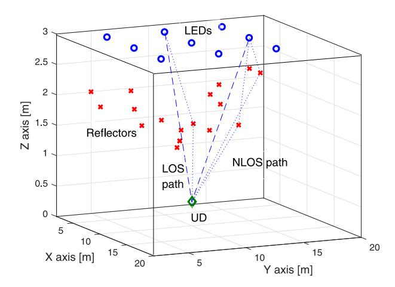

Fig. 6. SLAP system deployment.

In the following, we analyse how room size affect the VLC-enabled SLAP detection performance, where we use the LED-to-PD propagation distance to characterize the room size. Let ρmin = min{ρ0,n,m|∀n = 1, ··· , NR, ∀m = 1, ··· , NL} be the minimum propagation distance from LEDs to PDs, where ρ0,n,m = **p**m − *x*n2 is the LOS path length.

*Remark 8 (The Effect of Propagation Distance):* We assume that LEDs are uniformly distributed on the room ceiling. Then, as the minimum distance ρmin → ∞, the VLC-enabled SLAP detection error bounds will be increasing with ρmin as follows,

$$\mathcal{B}_{\mathbf{x}_{\mathrm{R}}} \sim \Theta(\rho_{\min}^4),$$
 (93)

$$\mathcal{B}_{\vartheta_{\mathrm{R}}} \sim \Theta(\rho_{\min}^4).$$
 (94)

*Proof:* See Appendix [H.](#page-15-9)

Since LED-to-PD distance is in the same order with room width, our SLAP detection MSE will increase with the room width at a fourth-order rate, which is determined by visible light LRM nature. Due to information gains from time-delay-related phase exp − j2πfk,mτ0,n,m , our SLAP detection method with a fourth-order error increasing rate is superior to RSS-based VLP methods [\[10\],](#page-16-3) [\[11\],](#page-16-4) [\[12\],](#page-16-5) [\[13\],](#page-16-6) [\[14\],](#page-16-7) [\[22\]](#page-16-14) whose location MSE has a sixth-order increasing rate w.r.t. distance [\[9\].](#page-16-2)

## V. SIMULATION DISCUSSION

We will evaluate the performance of our VLC-based SLAP detection method via numerical simulations, and demonstrate how system parameters affect SLAP detection performance.

## *A. Simulation Settings*

We adopt the following settings, unless specified otherwise. We consider a 20 × 20 × 3 m3 room, with a 3 × 3 uniform squared LED array (i.e., NL = 9) on ceiling, as shown in Fig. [6](#page-10-1) and summarized in Table [II.](#page-10-2) LEDs have an identical transmit power WT = 2.2 Watt, all point downwards (i.e., **v**m = [0, 0, −1]-, ∀m = 1, ··· , NL), and have an identical FOV θFOV = 90◦. The Lambertian order is set as r = 1. The number of PDs is set as NR = 4, where 3 PDs are symmetrically

TABLE II SYSTEM DEPLOYMENT

|          | LED Location | Reflector #1       | Reflector #2       |
|----------|--------------|--------------------|--------------------|
| LED #1   | (5, 5, 3)    | 0.4,(2, 5, 2)†     | 0.2,(5, 8, 1.5)    |
| LED #2   | (5, 10, 3)   | 0.1,(6, 12, 1.5)   | 0.3,(3, 8, 2)      |
| LED #3   | (5, 15, 3)   | 0.45,(3, 12, 1)    | 0.25,(7, 13, 2)    |
| LED #4   | (10, 5, 3)   | 0.15,(8, 3, 2)     | 0.2,(12, 8, 1.5)   |
| LED #5   | (10, 10, 3)  | 0.35,(11, 12, 1.5) | 0.24,(9, 12, 1.5)  |
| LED #6   | (10, 15, 3)  | 0.42,(12, 15, 2.5) | 0.24,(8, 15, 1.5)  |
| LED #7 ‡ | (15, 5, 3)   | 0.48,(15, 5, 2)    | 0.2,(8, 10, 1.5)   |
| LED #8   | (15, 10, 3)  | 0.4,(10, 5, 2)     | 0.18,(12, 8, 1.5)  |
| LED #9 ‡ | (15, 15, 3)  | 0.36,(10, 15, 2.6) | 0.25,(15, 10, 2.5) |

† "0.4,(2, 5, 2)" means that the reflection rate is 0.4, while the reflector location is (2, 5, 2). Each scatter is viewed as the collection of 100 such reflectors at the same location.

deployed on a circle around the PD array centroid with a radius of 0.1 m, and each PD points upwards with a tilted angle 40◦ towards outside. The 4th PD is placed above the PD array centroid with a height of 0.1 m, so as to index the head direction of the PD array. The configuration parameters of PDs are set as follows [\[42\],](#page-16-35) [\[43\]:](#page-16-36) θFOV = 120◦, aperture ΨA = 4 mm2, optical filter gain GR = 1 and optical concentrator gain ΓR = 2, respectively. Then, the model constant ΨR = WTΨAGRΓR can be determined.

We consider an OFDM system with a sampling period set to be Ts = 10 ns, and the light speed is set to be c = 3 × 108 m/s. The number of pilot subcarriers of each LED is NC = 8, and K = 2. The UD location is set to to be uniformly distributed in the room, and its pose angles are set as follows: the yaw angle [*ϑ*R]1 ∈ [0, 360◦], the pitch angle [*ϑ*R]2 ∈ [0, 180◦] (away from the north pole), and the roll angle [*ϑ*R]3 ∈ [0, 10◦], where [*ϑ*R]i is the ith element of its 3D pose angle vector *ϑ*R.

In addition, the number of NLOS paths between each LED-PD pair is set as L = 2, and reflector locations are specified in Fig. [6](#page-10-1) and Table [II.](#page-10-2) The fading coefficient (absorbing reflection rate) of NLOS paths is set as α,n,m ∈ [0, 0.5], ∀, ∀n, ∀m, and the fading coefficient of the LOS path is set as α0,n,m ∈ [0.5, 1] (slightly large due to absence of reflections). The receiver-side SNR is set to be 20 dB for fair comparison over different cases, and the root MSE (RMSE) over noises is used as performance metric in simulations.

Furthermore, we adopt the following state-of-the-art VLP methods as our baselines for performance comparison.

- Baseline 1: RSS-based 6-DoF SLAP method in [\[25\];](#page-16-18)
- Baseline 2: TOA-based 3-DoF VLP method in [\[19\];](#page-16-11)
- Baseline 3: RSS-based 3-DoF VLP method in [\[11\];](#page-16-4)

All of these baseline methods depend on the LOS channel, while diffuse scattering and random fading are not resolved.

## *B. Result Analysis*

We first examine convergence behaviour and computational overhead of our method and baselines, and then we analyse

‡ In Scenario A, LED #7 and #9 are blocked within the observation area specified in Fig. [8.](#page-11-0) In Scenario B, they will entirely act as noise sources with time-frequency interference for SLAP detection.

{11}------------------------------------------------

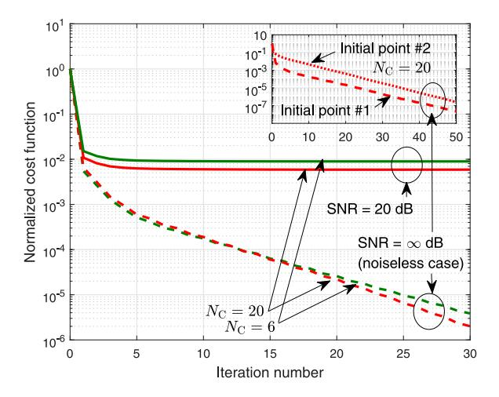

Fig. 7. Convergence of our SLAP detection algorithm.

TABLE III CONSUMED CPU TIME (IN SECONDS)

| (NL, NC) | Baseline #1 | #2    | #3    | Our SLAP |
|----------|-------------|-------|-------|----------|
| (3, 6)   | 0.024       | 0.026 | 0.012 | 0.05     |
| (3, 20)  | 0.023       | 0.032 | 0.013 | 0.084    |
| (6, 6)   | 0.023       | 0.044 | 0.013 | 0.068    |
| (6, 20)  | 0.023       | 0.046 | 0.014 | 0.12     |
| (9, 6)   | 0.024       | 0.045 | 0.012 | 0.08     |
| (9, 20)  | 0.026       | 0.046 | 0.012 | 0.18     |

SLAP detection performance and the impact of system parameters and NLOS interference using simulation results.

*1) Convergence Behavior:* The convergence of our SCAbased SLAP detection algorithm with different settings of SNR and the number of subcarriers are plotted in Fig. [7.](#page-11-1) [4](#page-11-2) The initial point is generated at random. It is shown that the normalized cost function of our SLAP detection algorithm rapidly converges to its stationary level around 0.01 when SNR is 20 dB, and it converges to the infinitesimal when noiseless[.5](#page-11-3) Both cases indicate that our SLAP detection algorithm achieves its lowest cost level (i.e., the normalized error 0.01 for 20dB SNR and the infinitesimal for noiseless scenarios, respectively) that can be reached. In addition, different initial points will not affect the convergence rate of the proposed SLAP detection algorithm. These results corroborate the effectiveness of our SCA-based SLAP detection algorithm.

*2) Computational Overhead:* CPU time consumed by various VLP methods are presented in Table [III,](#page-11-4) where different numbers of LEDs and subcarriers are considered. It is shown that the proposed SLAP detection algorithm needs a slightly longer time than baselines. Yet, the overall CPU time (within 0.2 seconds) is affordable, considering its huge performance gain from suppressing scattering interference.

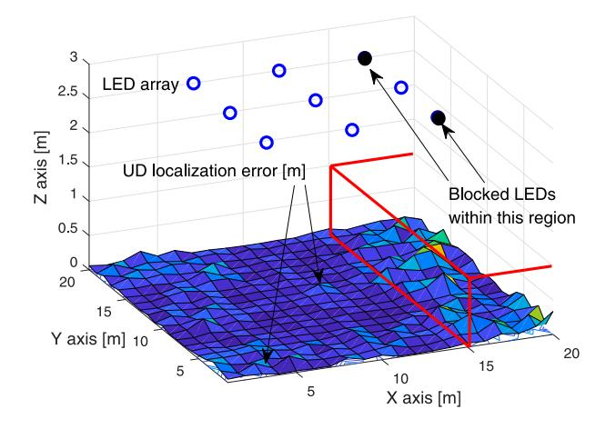

Fig. 8. Scenario A: SLAP detection with blocked LEDs.

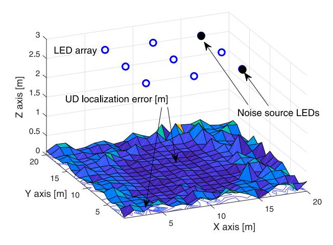

Fig. 9. Scenario B: SLAP detection with noise LEDs.

*3) SLAP Performance Heatmap With Cooperative and Hostile LEDs:* We consider two scenarios: (A) blocked LEDs and (B) noise source LEDs, respectively, as specified in Table [II.](#page-10-2) The height of UD is fixed at 0.2 m for ease of demonstration.

Scenario A: SLAP detection error within the given room area is plotted in Fig. [8,](#page-11-0) where LEDs #7 and #9 are blocked in the specified observation area. It is shown that our SLAP detection method overall provides a robust solution for VLCbased sensing. In addition, our VLC-based SLAP detection error will be slightly increased when LEDs are blocked, since the number of observed LEDs will be accordingly reduced. Moreover, our VLC-based SLAP detection error is relatively small in room's central area due to a slightly large number of effective LEDs. The impact of effective LEDs on SLAP detection will be analyzed in Section V-B5 shortly.

Scenario B: If LEDs #7 and #9 entirely behave as noise sources (hostile LEDs), we can see by comparing Fig. [9](#page-11-5) and [8](#page-11-0) that UD localization performance will be degraded, since these two LEDs have no information contribution but time-frequency interference to SLAP detection. This means that, if certain LEDs are totally non-cooperative (i.e., SLAP detection system has no knowledge of its OFDM pilots), their signals will become entire error sources which cannot be alleviated by

4In Fig. [7,](#page-11-1) a normalized cost function **z**−**G**(*β*ˆ[t])**h**ˆ[t]-**G**(*β*ˆ[t])**h**ˆ[t]-2 is considered in y-axis, to provide intuitive results.

5This means that the SLAP estimator *β*ˆ[t] in [\(52\)](#page-6-0) and [\(53\)](#page-6-6) approaches the true value of 6-DoF UD state in noiseless cases.

{12}------------------------------------------------

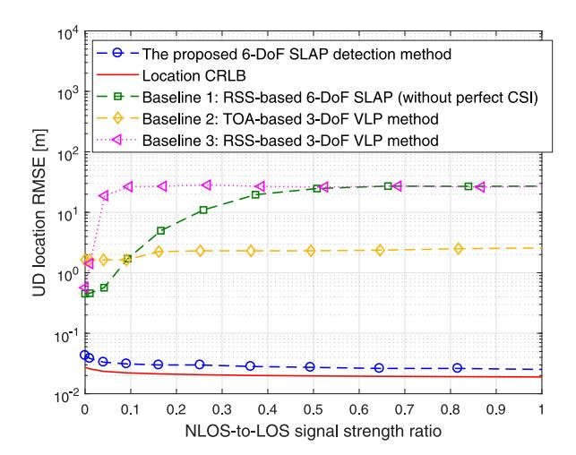

Fig. 10. Location error versus NLOS-to-LOS strength ratio.

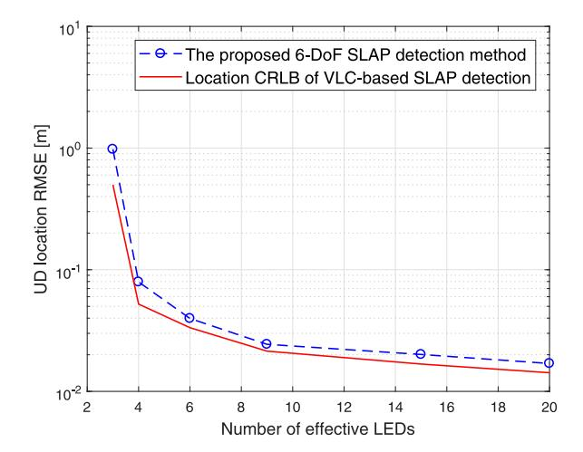

Fig. 11. SLAP error versus the number of effective LEDs.

our SLAP detection system. Other than interference from non-cooperative LEDs, NLOS interference from cooperative LEDs is considered in the following, namely, their pilot signals are known but with NLOS interference in received samples.

4) SLAP Detection Error Over NLOS Interference: SLAP detection performance w.r.t. NLOS-to-LOS ratio (NLR) in strength is plotted in Fig. 10, where NLR =  $\frac{\mathbb{E}\{\|\mathbf{z}_{\mathrm{nlos}}\|_{2}^{2}\}}{\mathbb{E}\{\|\mathbf{z}_{\mathrm{los}}\|_{2}^{2}\}},$  while  $\mathbf{z}_{\mathrm{nlos}}$  and  $\mathbf{z}_{\mathrm{los}}$  mean the NLOS and LOS component of  $\mathbf{z}$ , respectively. It is shown that, as NLR increases, our SLAP detection error almost remains invariant, since scattering interference (from cooperative LEDs) has been alleviated via scattering channel equalization. This complies with Remark 7. In contrast, the error of Baselines 1 and 3 without perfect channel state information (CSI) will be increased with NLR.6 Although Baseline 2's performance looks invariant with NLR, its error is actually very high due to its limited timing

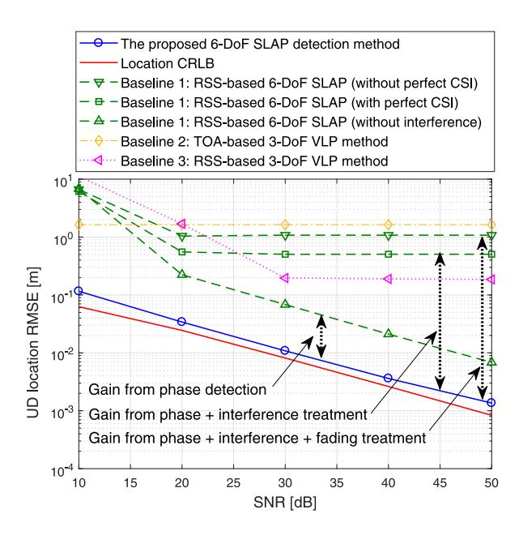

Fig. 12. UD location estimate error versus SNR.

resolution.7 Compared with timing error, its scattering interference becomes very marginal in this scenario, which is not enough to obviously affect the VLP performance.

- 5) SLAP Detection Error Over Quantity of Effective LEDs: SLAP detection performance versus the numbers of effective LEDs ( $N_{\rm L}$ ) is plotted in Fig. 11. It is shown that the UD location CRLB is reducing with the number of effective LEDs, which complies with Remark 2. Moreover, our SLAP detection method still works well even with only 3 LEDs. This means that, even though some LEDs are blocked in challenging cases, our SLAP detection method can always give a robust solution, as long as the number of LEDs exceeds 3.
- 6) SLAP Detection Performance Over SNR: SLAP detection performance of various methods and CRLB versus SNR is plotted in Figs. 12 and 13. It is shown that our SCA-based SLAP detection method can achieve an error close to its CRLB, which outperforms those baseline methods. In addition, as SNR increases, the localization and pose angle RMSEs of our SLAP detection method are reducing at a half-order rate, which is consistent with Remark 1. For a typical SNR around 20 dB, our SCA-based SLAP detection method can achieve a 0.023 m localization error. In contrast, the Baselines 1–3 achieve larger errors around 0.58 m, 1.57 m and 1.56 m, respectively, due to scattering interference and random fading.

Particularly, as SNR further increases to a large value, our SLAP detection performance still gets close to its CRLB, since diffuse scattering-caused localization bias is removed via VLC-assisted scattering interference alleviation. In contrast, Baselines 1 and 3 finally hit an obvious error floor caused by diffuse scattering interference and random fading, thus deviating from the associated CRLB in the high SNR region.

&lt;sup>6The error of Baseline 1 and 3 looks bounded when NLR increases. This is because they have prior knowledge that UD is definitely in the room.

&lt;sup>7The space resolution of time-synchronization discrete sequence (with a 100 MHz sample rate) used in Baseline 2 is 3 m, which is the major error source of VLP, compared with diffuse-scattering interference.

{13}------------------------------------------------

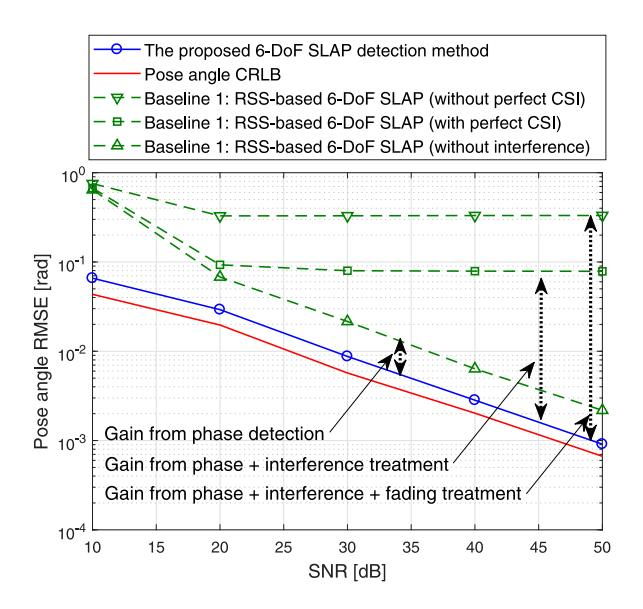

Fig. 13. UD pose angle estimate error versus SNR.

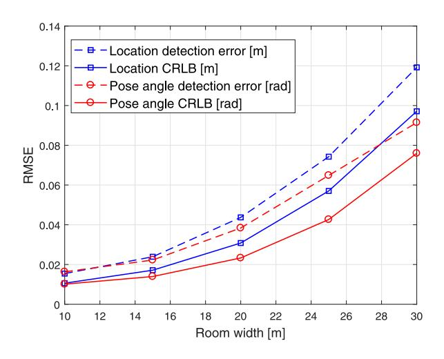

Fig. 14. SLAP detection error versus room width.

7) SLAP Detection Error Over Room Width: SLAP detection error versus room width is plotted in Fig. 14, where the room height is fixed at 3 m. It is shown that UD location and pose detection RMSEs are increasing with the room width, which complies with Remark 8. This is because UD location and pose information provided by LRM will be diluted as the VLC signal propagation distance increases.

#### VI. CONCLUSION

In this paper, we focus on simultaneous location and pose detection of UDs with PD array, which is challenging due to diffuse scattering interference and random channel fading. A novel OFDM VLC-enabled SLAP detection algorithm is proposed to address this problem, via cross-domain cooperation between "VLC" and "sensing", where the 3D UD location, 3D pose angles and diffuse channel state are simultaneously estimated. The disturbance of diffuse scattering and channel fading is removed in our SLAP detection method via joint channel

estimation and equalization. Thus, the proposed VLC-based SLAP detection algorithm outperforms state-of-the-art baseline methods, almost reaching its error bounds. In addition, closed-form CRLBs are established for VLC-based SLAP detection, and the associated asymptotic performance analysis is conducted to gain insights into the impact of system factors (e.g., SNR, bandwidth, the quantities of LEDs, PDs and subcarriers) and fading environments on the VLC-based SLAP detection performance limits.

In the future, mobile multi-target detection will be studied, in which interference from reflections of different targets and negative Doppler effect should be addressed. In addition, performance trade-off between VLC-based localization and data transmission capacity via time-spatial-frequency-domain resource management will be another interesting issue.

## APPENDIX A DERIVATIVE VECTORS IN (40) and (41)

Firstly, as per (42), for  $\ell = 0$ ,  $\mathbf{u}_{0,n,m,k}^{(\kappa)}(\hat{\boldsymbol{\beta}}_{[t]})$  is given by

$$\mathbf{u}_{0,n,m,k}^{(\kappa)}(\hat{\boldsymbol{\beta}}_{[t]}) = \mathcal{D}_{n,m,k}^{(\kappa)} \mathbf{q}_{n,m}, \tag{95}$$

$$\mathcal{D}_{n,m,k}^{(\kappa)} \in \mathbb{C}^{3\times3} = \eta_{n,m,k}^{(\kappa)} \left[ \mathbf{v}_m, \hat{\boldsymbol{\mu}}_{n,[t]}, \hat{\boldsymbol{x}}_{n,[t]} - \mathbf{p}_m \right], \quad (96)$$

$$\eta_{n,m,k}^{(\kappa)} = \Psi_{\rm R}(r+1) a_{m,k}^{(\kappa)*} \exp\left(j2\pi f_{m,k} \frac{\|\hat{\boldsymbol{x}}_{n,[t]} - \mathbf{p}_m\|_2}{c}\right),$$

while  $\mathbf{q}_{n,m} \in \mathbb{C}^3$  is given by

$$\mathbf{q}_{n,m} = [\mathbf{q}_{n,m}^{(1)}, \mathbf{q}_{n,m}^{(2)}, \mathbf{q}_{n,m}^{(3)}]^{\top}, \tag{97}$$

$$\mathbf{q}_{n,m}^{(1)} = -\frac{r\left((\hat{x}_{n,[t]} - \mathbf{p}_m)^{\top} \mathbf{v}_m\right)^{r-1} (\hat{x}_{n,[t]} - \mathbf{p}_m)^{\top} \hat{\boldsymbol{\mu}}_{n,[t]}}{\|\hat{x}_{n,[t]} - \mathbf{p}_m\|_2^{r+3}}$$

$$\mathbf{q}_{n,m}^{(2)} = -\frac{\left( (\hat{x}_{n,[t]} - \mathbf{p}_m)^{\top} \mathbf{v}_m \right)^r}{\|\hat{x}_{n,[t]} - \mathbf{p}_m\|_2^{r+3}},\tag{98}$$

$$\mathbf{q}_{n,m}^{(3)} = \left(r + 3 - 2\pi \mathbf{j} f_{k,m} \frac{\|\hat{\boldsymbol{x}}_{n,[t]} - \mathbf{p}_m\|_2}{c}\right) \cdot \frac{\left((\hat{\boldsymbol{x}}_{n,[t]} - \mathbf{p}_m)^{\top} \mathbf{v}_m\right)^r (\hat{\boldsymbol{x}}_{n,[t]} - \mathbf{p}_m)^{\top} \hat{\boldsymbol{\mu}}_{n,[t]}}{\|\hat{\boldsymbol{x}}_{n,[t]} - \mathbf{p}_m\|_2^{r+5}}.$$
 (99)

Secondly, for  $\ell \neq 0$ , the derivative vector  $\mathbf{u}_{\ell,n,m,k}^{(\kappa)}(\hat{\boldsymbol{\beta}}_{[t]}) = \nabla_{\mathbf{x}_{\mathrm{R}}} \left(g_{\ell,n,m,k}^{(\kappa)}(\hat{\boldsymbol{\beta}}_{[t]})\right) = \mathrm{j} 2\pi \mathbf{w}_{\ell,n,m,k}^{(\kappa)*} \frac{f_{k,m}}{c} \frac{(\hat{\boldsymbol{x}}_{n,[t]} - \mathbf{p}_m)}{\|\hat{\boldsymbol{x}}_{n,[t]} - \mathbf{p}_m\|_2},$  where  $\mathbf{w}_{\ell,n,m,k}^{(\kappa)}$  is given by (28).

Thirdly, as per (42),  $\lambda_{0,n,m,k}^{(\kappa)}(\hat{\beta}_{[t]})$  for  $\ell=0$  is given by

$$\lambda_{0,n,m,k}^{(\kappa)}(\hat{\boldsymbol{\beta}}_{[t]}) = \boldsymbol{\Phi}_{n,m,k}^{(\kappa)} \mathbf{q}_{n,m,k}, \tag{100}$$

and  $\Phi_{n,m,k}^{(\kappa)} \in \mathbb{C}^{3 \times 3}$  is given by

$$\mathbf{\Phi}_{n,m,k}^{(\kappa)} = \eta_{n,m,k}^{(\kappa)} \begin{bmatrix} (\left[\hat{\mathbf{R}}_{[t]}\bar{\mathbf{d}}_{n}^{\dagger}\right]_{\times} \mathbf{v}_{m})^{\top} \\ (\left[\hat{\mathbf{R}}_{[t]}\bar{\boldsymbol{\mu}}_{n}^{\dagger}\right]_{\times} (\hat{\mathbf{x}}_{[t]} - \mathbf{p}_{m}))^{\top} \\ (\left[\hat{\mathbf{R}}_{[t]}\bar{\mathbf{d}}_{n}^{\dagger}\right]_{\times} (\hat{\mathbf{x}}_{[t]} - \mathbf{p}_{m}))^{\top} \end{bmatrix}^{\top}, \quad (101)$$

{14}------------------------------------------------

where  $\bullet_{\times}$  is given by (1). This is derived by simple algebra Hence, the pose angle vector  $\vartheta \in \mathbb{R}^3$  is eventually derived as manipulations based on Lemma 1 given shortly.

Finally, for  $\ell \neq 0$ , the derivative vector  $\boldsymbol{\lambda}_{\ell,n,m,k}^{(\kappa)}(\hat{\boldsymbol{\beta}}_{[t]}) = j2\pi\mathbf{w}_{\ell,n,m,k}^{(\kappa)*}\frac{f_{k,m}}{c}\frac{\left[\hat{\mathbf{R}}\bar{\mathbf{d}}_{n}^{\natural}\right]_{\times}(\hat{\mathbf{x}}_{[t]}-\mathbf{p}_{m})}{\|\hat{\boldsymbol{x}}_{n,[t]}-\mathbf{p}_{m}\|_{2}}.$ 

*Lemma 1 (Gradient of Rotation Matrix):* For any  $\bar{\mu}_n^{\sharp} \in \mathbb{R}^3$ , the gradient of  $\mathcal{R}(\vartheta_{\mathrm{R}})\bar{\mu}_{n}^{\sharp}$  is given by

$$\nabla_{\vartheta_{\mathbf{R}}} \left( \mathcal{R}(\vartheta_{\mathbf{R}}) \bar{\mu}_{n}^{\sharp} \right) \in \mathbb{C}^{3 \times 3} = \left[ \mathcal{R}(\vartheta_{\mathbf{R}}) \bar{\mu}_{n}^{\sharp} \right]_{\times}. \tag{102}$$

*Proof:* Considering an infinitesimal perturbation  $\varepsilon \in \mathbb{C}^3$ , the gradient of  $\mathcal{R}(\vartheta_{\mathrm{R}})\bar{\mu}_{n}^{\sharp}$ ,  $\forall \bar{\mu}_{n}^{\sharp} \in \mathbb{R}^{3}$ , is cast as [44]

$$\begin{split} &\lim_{\varepsilon \to \mathbf{0}_{3}} \frac{\partial \left( \mathcal{R}(\vartheta_{\mathrm{R}} + \varepsilon) \bar{\mu}_{n}^{\sharp} \right)}{\partial \varepsilon} = \lim_{\varepsilon \to \mathbf{0}_{3}} \frac{\partial \left( \exp\left( [\vartheta_{\mathrm{R}} + \varepsilon]_{\times} \right) \bar{\mu}_{n}^{\sharp} \right)}{\partial \varepsilon} \\ &= \lim_{\varepsilon \to \mathbf{0}_{3}} \frac{\partial \left( \exp\left( \varepsilon_{\times} \right) \mathcal{R} \bar{\mu}_{n}^{\sharp} \right)}{\partial \varepsilon} \approx \lim_{\varepsilon \to \mathbf{0}_{3}} \frac{\partial \left( \left( \mathbf{I}_{3} + \varepsilon_{\times} \right) \mathcal{R} \bar{\mu}_{n}^{\sharp} \right)}{\partial \varepsilon} \\ &= \lim_{\varepsilon \to \mathbf{0}_{3}} \frac{\partial \left( \mathcal{R} \bar{\mu}_{n}^{\sharp} + \left[ \mathcal{R} \bar{\mu}_{n}^{\sharp} \right]_{\times}^{\top} \varepsilon \right)}{\partial \varepsilon} \bigg|_{\left(\varepsilon_{\times}\right) \vartheta_{\mathrm{R}} = \left( [\vartheta_{\mathrm{R}}]_{-}^{\top} \right) \varepsilon} = \left[ \mathcal{R} \bar{\mu}_{n}^{\sharp} \right]_{\times}, \end{split}$$

where the first-order expansion of matrix exponential function, i.e.,  $\exp(\varepsilon_{\times}) \approx \mathbf{I}_3 + \varepsilon_{\times}$  around  $\varepsilon = \mathbf{0}_3$ , is employed.

## APPENDIX B DERIVATION OF (58) AND (59)

Based on the Euler Rotation theorem [35], there is an axis represented by a unit vector  $\mathbf{u} \in \mathbb{R}^3$  such that a body pose can be obtained by directly rotating an angle  $\vartheta \in \mathbb{R}$  around u. Then, an arbitrary rotation matrix  $\mathbf{R} \in \mathcal{SO}(3)$  follows that

$$\mathbf{R} = \mathbf{I}_3 + \sin(\vartheta)\mathbf{u}_{\times} + (1 - \cos(\vartheta))\mathbf{u}_{\times}^2 \Big|_{\mathbf{u}_{\times}^2 = \mathbf{u}\mathbf{u}^{\top} - \mathbf{I}_3}, \quad (103)$$
$$= \mathbf{I}_3 + \sin(\vartheta)\mathbf{u}_{\times} + (1 - \cos(\vartheta))\mathbf{u}\mathbf{u}^{\top} - (1 - \cos(\vartheta))\mathbf{I}_3.$$

Thus, R can be represented by  $\vartheta$  and u as follows

$$\mathbf{R} = \sin(\vartheta)\mathbf{u}_{\times} + (1 - \cos(\vartheta))\mathbf{u}\mathbf{u}^{\top} + \cos(\vartheta)\mathbf{I}_{3}, \quad (104)$$

where we should note that  $trace(\mathbf{u}\mathbf{u}^{\top}) = 1$ , while  $\mathbf{u}_{\times}$  is skewsymmetric. As such, we arrive at

$$\operatorname{trace}(\mathbf{R}) = 3\cos(\vartheta) + (1 - \cos(\vartheta)) = 1 + 2\cos(\vartheta). \quad (105)$$

As a result, we have  $\cos(\vartheta) = \frac{1 - \operatorname{trace}(\mathbf{R})}{2}$ , and thus  $\vartheta =$  $\arccos\left(\frac{1-\mathrm{trace}(\mathbf{R})}{2}\right)$ . As such, (59) is derived. Moreover, based on (104), the rotation axis  $\mathbf{u}$  is obtained as

$$\mathbf{u} = \frac{1}{2\sin\vartheta} \begin{bmatrix} [\mathbf{R}]_{3,2} - [\mathbf{R}]_{2,3} \\ [\mathbf{R}]_{1,3} - [\mathbf{R}]_{3,1} \\ [\mathbf{R}]_{2,1} - [\mathbf{R}]_{1,2} \end{bmatrix}.$$
 (106)

$$\boldsymbol{\vartheta} = \vartheta \mathbf{u} = \frac{\vartheta}{2\sin\vartheta} \begin{bmatrix} [\mathbf{R}]_{3,2} - [\mathbf{R}]_{2,3} \\ [\mathbf{R}]_{1,3} - [\mathbf{R}]_{3,1} \\ [\mathbf{R}]_{2,1} - [\mathbf{R}]_{1,2} \end{bmatrix}, \tag{107}$$

and thus (58) is obtained.

## APPENDIX C PROOF OF THEOREM 1

According to [45], the error covariance of unbiased SLAP estimate  $\hat{\chi}$  of  $\mathscr{P}_{\mathrm{SLAP}}$  in (30) is bounded by its CRLB  $\mathcal{B}_{\chi}(\chi)$ , i.e.,  $cov(\hat{\chi}) \geq trace(\mathcal{B}_{\chi}(\chi))$ , where

$$\mathcal{B}_{\chi}(\chi) = \mathcal{I}_{\chi}^{-1}(\chi), \tag{108}$$

$$\mathcal{I}_{\chi}(\chi) = -\mathbb{E}_{\mathbf{z}|\chi} \{ \nabla_{\chi}^{2} \ln p(\mathbf{z}|\chi) \}, \tag{109}$$

in which  $\mathcal{I}_\chi(\chi)$  is its Fisher information matrix (FIM) [45], and  $\nabla_{\chi}^2$  denotes the second-order derivative w.r.t.  $\chi$ , while  $p(\mathbf{z}|\boldsymbol{\chi}) = \mathcal{N}(\mathbf{z}|\mathbf{G}(\boldsymbol{\beta}_{\mathrm{R}})\mathbf{h}, \sigma^2 \mathbf{I}_{N_{\mathrm{R}}N_{\mathrm{L}}N_{\mathrm{C}}K})$ . As per the structure of  $\chi$ , the above FIM is organized as

$$\mathcal{I}_{\chi}(\chi) = \begin{bmatrix} \mathcal{I}_{\mathbf{x}_{\mathrm{R}}, \mathbf{x}_{\mathrm{R}}}(\chi) & \mathcal{I}_{\mathbf{x}_{\mathrm{R}}, \boldsymbol{\vartheta}_{\mathrm{R}}}(\chi) & \mathcal{I}_{\mathbf{x}_{\mathrm{R}}, \mathbf{h}}(\chi) \\ \mathcal{I}_{\boldsymbol{\vartheta}_{\mathrm{R}}, \mathbf{x}_{\mathrm{R}}}(\chi) & \mathcal{I}_{\boldsymbol{\vartheta}_{\mathrm{R}}, \boldsymbol{\vartheta}_{\mathrm{R}}}(\chi) & \mathcal{I}_{\boldsymbol{\vartheta}_{\mathrm{R}}, \mathbf{h}}(\chi) \\ \mathcal{I}_{\mathbf{h}, \mathbf{x}_{\mathrm{R}}}(\chi) & \mathcal{I}_{\mathbf{h}, \boldsymbol{\vartheta}_{\mathrm{R}}}(\chi) & \mathcal{I}_{\mathbf{h}, \mathbf{h}}(\chi) \end{bmatrix}, \quad (110)$$

where each FIM element is given, based on (109), by

$$\mathcal{I}_{\mathbf{x}_{\mathrm{R}},\mathbf{x}_{\mathrm{R}}}(\chi) = \sigma^{-2}\mathbf{U}(\boldsymbol{\beta}_{\mathrm{R}})\mathcal{H}\mathcal{H}^{\mathrm{H}}\mathbf{U}^{\mathrm{H}}(\boldsymbol{\beta}_{\mathrm{R}}),$$
 (111)

$$\mathcal{I}_{\vartheta_{R},\mathbf{x}_{R}}(\chi) = \sigma^{-2} \mathbf{\Lambda}(\boldsymbol{\beta}_{R}) \mathcal{H} \mathcal{H}^{H} \mathbf{U}^{H}(\boldsymbol{\beta}_{R}),$$
 (112)

$$\mathcal{I}_{\mathbf{h},\mathbf{x}_{\mathrm{R}}}(\chi) = \sigma^{-2}\mathbf{G}^{\mathrm{H}}(\boldsymbol{\beta}_{\mathrm{R}})\mathcal{H}^{\mathrm{H}}\mathbf{U}^{\mathrm{H}}(\boldsymbol{\beta}_{\mathrm{R}}),$$
 (113)

$$\mathcal{I}_{\vartheta_{R},\vartheta_{R}}(\chi) = \sigma^{-2} \Lambda(\beta_{R}) \mathcal{H} \mathcal{H}^{H} \Lambda^{H}(\beta_{R}),$$
 (114)

$$\mathcal{I}_{\mathbf{h},\boldsymbol{\vartheta}_{\mathrm{R}}}(\boldsymbol{\chi}) = \sigma^{-2}\mathbf{G}^{\mathrm{H}}(\boldsymbol{\beta}_{\mathrm{R}})\boldsymbol{\mathcal{H}}^{\mathrm{H}}\boldsymbol{\Lambda}^{\mathrm{H}}(\boldsymbol{\beta}_{\mathrm{R}}),$$
 (115)

$$\mathcal{I}_{\mathbf{h},\mathbf{h}}(\chi) = \sigma^{-2} \mathbf{G}^{\mathrm{H}}(\boldsymbol{\beta}_{\mathrm{R}}) \mathbf{G}(\boldsymbol{\beta}_{\mathrm{R}}),$$
 (116)

and we have  $\mathcal{I}_{x,y}(\chi) = \mathcal{I}_{y,x}^{\mathrm{H}}(\chi), \ \forall x \ ext{and} \ \forall y \in \{\mathbf{x}_{\mathrm{R}}, artheta_{\mathrm{R}}, \mathbf{h}\},$ where  $U(\beta_R)$ ,  $\Lambda(\beta_R)$ ,  $\mathcal{H}$ , and  $G(\beta_R)$  is given by (40), (41), (43) and (22), respectively. Hence, Theorem 1 is proved.

### APPENDIX D PROOF OF COROLLARIES 1-3

We first give the proof of Corollary 1, which can be applied to the proof of Corollaries 2 and 3, as they follow from the same principle and similar algebra.

As per estimation theory, we have that the UD localization error covariance is bounded as (63), i.e.,  $cov(\hat{\mathbf{x}}_{R}) \ge$  $\operatorname{trace}(\mathcal{B}_{\mathbf{x}_{\mathrm{R}}}(\chi))$ , where the location CRLB is given by

$$\mathcal{B}_{\mathbf{x}_{\mathrm{R}}}(\boldsymbol{\chi}) = \mathcal{J}_{\mathbf{x}_{\mathrm{R}}}^{-1}(\boldsymbol{\chi}),$$
 (117)

where  $\mathcal{J}_{\mathbf{x}_{\mathrm{R}}}(\boldsymbol{\chi}) \in \mathbb{S}^3$  is the equivalent FIM of UD localization, which is given as per (110) by

$$\mathcal{J}_{\mathbf{x}_{\mathrm{B}}}(\chi) = \mathcal{I}_{\mathbf{x}_{\mathrm{B}},\mathbf{x}_{\mathrm{B}}}(\chi) - \mathcal{L}_{\vartheta_{\mathrm{B}},\mathbf{h}}(\chi), \tag{118}$$

{15}------------------------------------------------

$$\mathcal{L}_{\vartheta_{R},h}(\chi) = \begin{bmatrix} \mathcal{I}_{\vartheta_{R},x_{R}}(\chi) \\ \mathcal{I}_{h,x_{R}}(\chi) \end{bmatrix}^{H} \begin{bmatrix} \mathcal{I}_{\vartheta_{R},\vartheta_{R}}(\chi) & \mathcal{I}_{\vartheta_{R},h}(\chi) \\ \mathcal{I}_{h,\vartheta_{R}}(\chi) & \mathcal{I}_{h,h}(\chi) \end{bmatrix}^{-1} \begin{bmatrix} \mathcal{I}_{\vartheta_{R},x_{R}}(\chi) \\ \mathcal{I}_{h,x_{R}}(\chi) \end{bmatrix}.$$
(119)

where  $\mathcal{L}_{\vartheta_R,h}(\chi)$  is the localization information loss caused by UD pose angle uncertainty and channel fading, given by (119), shown at the top of the page. Then, based on the closed-form FIMs in (111) – (116), after tremendous algebra, it is finally formulated as

$$\boldsymbol{\mathcal{L}}_{\boldsymbol{\vartheta}_{R},\mathbf{h}}(\boldsymbol{\chi}) = \sigma^{-2}\mathbf{U}(\boldsymbol{\beta}_{R})\boldsymbol{\mathcal{H}}\Big(\mathbf{V}_{\boldsymbol{\vartheta}_{R}}^{-1} - \mathbf{V}_{\mathbf{h}}^{-1}\Big)\boldsymbol{\mathcal{H}}^{H}\mathbf{U}^{H}(\boldsymbol{\beta}_{R}),$$

where  $\mathbf{V}_{\boldsymbol{artheta}_{\mathrm{R}}}$  and  $\mathbf{V}_{\mathbf{h}} \in \mathbb{S}^{N_{\mathrm{C}}N_{\mathrm{R}}N_{\mathrm{L}}K}$  are cast as

$$\begin{split} \mathbf{V}_{\vartheta_{\mathrm{R}}} &= \mathbf{I}_{N_{\mathrm{C}}N_{\mathrm{R}}N_{\mathrm{L}}K} - \mathcal{K}^{\mathrm{H}}(\chi) \big(\mathcal{K}(\chi)\mathcal{K}^{\mathrm{H}}(\chi)\big)^{-1}\mathcal{K}(\chi), \\ \mathbf{V}_{\mathrm{h}} &= \mathbf{I}_{N_{\mathrm{C}}N_{\mathrm{R}}N_{\mathrm{L}}K} - \mathbf{G}(\beta_{\mathrm{R}}) \big(\mathbf{G}^{\mathrm{H}}(\beta_{\mathrm{R}})\mathbf{G}(\beta_{\mathrm{R}})\big)^{-1}\mathbf{G}^{\mathrm{H}}(\beta_{\mathrm{R}}), \end{split}$$

with  $\mathcal{K}(\chi) = \Lambda(\beta_{\mathrm{R}})\mathcal{H}$ . Hence, we can conclude that

$$\mathcal{J}_{\mathbf{x}_{\mathrm{R}}}(\chi) = \sigma^{-2}\mathbf{U}(\boldsymbol{\beta}_{\mathrm{R}})\mathcal{H}\,\mathbf{F}_{\mathbf{x}_{\mathrm{R}}}(\chi)\mathcal{H}^{\mathrm{H}}\mathbf{U}^{\mathrm{H}}(\boldsymbol{\beta}_{\mathrm{R}}),$$
 (120)

where  $\mathbf{F}_{\mathbf{x}_{\mathrm{R}}}(\chi)$  is in the form of (65). Hence, combining with (117), Corollary 1 is proved, and Corollaries 2 and 3 can be proved via a similar method.

## APPENDIX E PROOF OF REMARK 2

Based on (64), (65) and diagonal structure of  $\mathbf{F}_{\mathbf{x}_R}$ , the location CRLB follows  $\mathcal{B}_{\mathbf{x}_R}(\chi) = \sigma^2 \Big( \mathcal{Q}(\chi) \, \mathbf{F}_{\mathbf{x}_R} \, \mathcal{Q}(\chi) \Big)^{-1} = \sigma^2 \Big( \sum_{m=1}^{N_L} \mathcal{Q}_m(\chi) \, \mathbf{F}_{\mathbf{x}_R,m} \, \mathcal{Q}_m(\chi) \Big)^{-1}$ , where  $\mathbf{F}_{\mathbf{x}_R,m}$  is the mth diagonal block of  $\mathbf{F}_{\mathbf{x}_R}$ , and  $\mathcal{Q}_m(\chi)$  is the mth element of  $\mathcal{Q}(\chi)$ . Moreover,  $\mathcal{Q}_m(\chi) \mathbf{F}_{\mathbf{x}_R,m} \, \mathcal{Q}_m(\chi) \sim \Theta(1)$ , as  $N_L \to \infty$ . Thus, we have  $\mathcal{B}_{\mathbf{x}_R}(\chi) \sim \Theta(N_L^{-1})$ . For UD pose angle CRLB  $\mathcal{B}_{\vartheta_R}(\chi)$ , it follows from a similar proof.

For  $\mathcal{B}_{\mathbf{h}}(\chi)$ , it can be easily verified based on (70) that  $\mathcal{B}_{\mathbf{h}}(\chi) \sim \Theta(N_{\mathrm{L}})$ , as  $N_{\mathrm{L}} \to \infty$ . For the proof regarding the number of PDs and subcarriers, it follows from a similar algebra as the above. Thus, Remark 2 is proved.

## APPENDIX F PROOF OF COROLLARY 4

We first give the proof for UD location's long-term CRLB. As per (63),  $\mathbb{E}_{\epsilon}\{\|\hat{\mathbf{x}}_{R} - \mathbf{x}_{R}\|_{2}^{2}\} \geq \operatorname{trace}(\mathcal{B}_{\mathbf{x}_{R}}(\chi))$ . Then,

$$\mathbb{E}_{\epsilon,\mathbf{h}}\{\|\hat{\mathbf{x}}_{R} - \mathbf{x}_{R}\|_{2}^{2}\} \geq \operatorname{trace}(\mathbb{E}_{\mathbf{h}}\{\boldsymbol{\mathcal{B}}_{\mathbf{x}_{R}}(\boldsymbol{\chi})\}), \tag{121}$$

$$= \operatorname{trace}\left(\sigma^{2}\mathbb{E}_{\mathbf{h}}\left(\left(\mathbf{U}(\boldsymbol{\beta}_{R})\boldsymbol{\mathcal{H}}\,\mathbf{F}_{\mathbf{x}_{R}}(\boldsymbol{\chi})\boldsymbol{\mathcal{H}}^{H}\mathbf{U}^{H}(\boldsymbol{\beta}_{R})\right)^{-1}\right\}\right)$$

$$\geq \operatorname{trace}\left(\underline{\sigma^{2}\left(\mathbf{U}(\boldsymbol{\beta}_{R})\mathbb{E}_{\mathbf{h}}\left\{\boldsymbol{\mathcal{H}}\,\mathbf{F}_{\mathbf{x}_{R}}(\boldsymbol{\chi})\boldsymbol{\mathcal{H}}^{H}\right\}\mathbf{U}^{H}(\boldsymbol{\beta}_{R})\right)^{-1}}\right),$$

where the above inequality is based on the convexity of inverse functions. In addition,  $\mathbb{E}_h\{\mathcal{H}\,F_{\mathbf{x}_\mathrm{R}}(\chi)\mathcal{H}^\mathrm{H}\}=\Lambda_{h,\mathbf{x}_\mathrm{R}}$ , given by (85). Thus, we have (83). UD pose angle's long-term CRLB follows from a similar algebra. Thus, Corollary 4 is proved.

## APPENDIX G PROOF OF REMARKS 5 AND 6

We first provide the proof for the long-term location CRLB  $\bar{\mathcal{B}}_{\mathbf{x}_R}(\beta_R; \Sigma_C)$  of Remark 6. As per (85), we have that  $\Omega_{\mathbf{h},\mathbf{x}_R} \sim \Theta(\Sigma_C)$ . Moreover, since  $\mathrm{cov}(h_{l,n,m},h_{\ell,i,j}) = \varrho_C \sigma_{\mathbf{h}}^2$ ,  $\forall l \neq \ell, \ \forall n \neq i \ \text{or} \ \forall m \neq j$ , the channel covariance matrix  $\Sigma_C \leftrightarrow \mathrm{diag}\{1,1-\varrho_C,\cdots 1-\varrho_C\}$ , where " $\leftrightarrow$ " means "be similar to" by linear algebra. As per (83), we know that  $\bar{\mathcal{B}}_{\mathbf{x}_R}(\beta_R; \Sigma_C) \leftrightarrow \Lambda_{\mathbf{h},\mathbf{x}_R}^{-1}$ . In consequence, we have  $\bar{\mathcal{B}}_{\mathbf{x}_R}(\beta_R; \Sigma_C) \sim \Theta\left(\frac{1}{1-\varrho_C}\right)$ , as  $\varrho_C \to 1$ . For long-term pose angle CRLB  $\bar{\mathcal{B}}_{\vartheta_R}(\beta_R; \Sigma_C)$ , it follows from the same algebra, and thus Remark 5 is proved.

For the proof of Remark 6, we know based on (85) that  $\Omega_{h,\mathbf{x}_R} \sim \Theta(\Sigma_C) \sim \Theta(\iota_C)$ . In consequence, based on (83), we have  $\bar{\mathcal{B}}_{\mathbf{x}_R}(\beta_R;\Sigma_C) \leftrightarrow \Lambda_{h,\mathbf{x}_R}^{-1} \sim \mathcal{O}\bigl(\iota_C^{-1}\bigr)$ , as  $\iota_C \to \infty$ . The long-term pose angle CRLB  $\bar{\mathcal{B}}_{\vartheta_R}(\beta_R;\Sigma_C)$  follows from the same trend. Thus, Remark 6 is proved.

## APPENDIX H PROOF OF REMARK 8

Based on (95)–(99), we have  $\mathbf{u}_{0,n,m,k}^{(\kappa)}(\hat{\boldsymbol{\beta}}_{[t]})$  is  $\Theta(\rho_{\min}^{-2})$ ,  $\forall (n,m,k,\kappa)$ , as  $\rho_{\min} \to \infty$ . Thus, combining with (40),  $\mathbf{U}(\boldsymbol{\beta}_{\mathrm{R}}) \sim \Theta(\rho_{\min}^{-2})$ . Moreover, based on (43)–(47) and (65), we know that  $\boldsymbol{\mathcal{H}}$  and  $\mathbf{F}_{\mathbf{x}_{\mathrm{R}}}(\boldsymbol{\chi})$  tend to be invariant with  $\rho_{\min}$ . Thus, we have  $\mathbf{U}(\boldsymbol{\beta}_{\mathrm{R}})\boldsymbol{\mathcal{H}}\,\mathbf{F}_{\mathbf{x}_{\mathrm{R}}}(\boldsymbol{\chi})\boldsymbol{\mathcal{H}}^{\mathrm{H}}\mathbf{U}^{\mathrm{H}}(\boldsymbol{\beta}_{\mathrm{R}})\sim\Theta(\rho_{\min}^{-4})$ . As per (64), we have  $\boldsymbol{\mathcal{B}}_{\mathbf{x}_{\mathrm{R}}}(\boldsymbol{\chi})\sim\Theta(\rho_{\min}^{4})$ , as  $\rho_{\min}\to\infty$ , and hence (93) is proved.

Based on (101), we know  $\Phi_{n,m,k}^{(\kappa)} \sim \Theta(\rho_{\min})$ , while as per (97)–(99), we have  $\mathbf{q}_{n,m,k} \sim \Theta(\rho_{\min}^{-3})$ , as  $\rho_{\min} \to \infty$ . Thus, based on (100), we arrive at  $\lambda_{0,n,m,k}^{(\kappa)}(\hat{\boldsymbol{\beta}}_{[t]}) \sim \Theta(\rho_{\min}^{-2})$ , as  $\rho_{\min} \to \infty$ . Combing with (41),  $\Lambda(\hat{\boldsymbol{\beta}}_{[t]}) \sim \Theta(\rho_{\min}^{-2})$  holds. Moreover, based on (68),  $\mathbf{F}_{\vartheta_{\mathbf{R}}}(\chi)$  is invariant with  $\rho_{\min}$ . Thus, as per (67), we know that  $\Lambda(\beta_{\mathbf{R}})\mathcal{H}\,\mathbf{F}_{\vartheta_{\mathbf{R}}}(\chi)\mathcal{H}^{\mathbf{H}}\Lambda^{\mathbf{H}}(\beta_{\mathbf{R}}) \sim \Theta(\rho_{\min}^{-4})$ . Hence, (94) is derived. Remark 8 is proved.

#### REFERENCES

-  A. Jovicic, J. Li, and T. Richardson, "Visible light communication: Opportunities, challenges and the path to market," *IEEE Commun. Mag.*, vol. 51, no. 12, pp. 26–32, Dec. 2013.
- [2] H. Haas, L. Yin, Y. Wang, and C. Chen, "What is LiFi?" J. Lightw. Technol., vol. 34, no. 6, pp. 1533–1544, 2016.
- [3] A. Ozyurt and W. Popoola, "LiFi-based D2D communication in industrial IoT," *IEEE Syst. J.*, vol. 17, no. 1, pp. 1591–1598, Mar. 2023.
- [4] J. Armstrong, Y. A. Sekercioglu, and A. Neild, "Visible light positioning: A roadmap for international standardization", *IEEE Commun. Mag.*, vol. 51, no. 12, pp. 68–73, Dec. 2013.
- [5] X. Shen, L. Xu, Y. Liu, and Y. Shen, "A theoretical framework for relative localization," *IEEE Trans. Inf. Theory*, vol. 70, no. 1, pp. 735–762, Jan. 2024.
- [6] E. Cardarelli, V. Digani, L. Sabattini, C. Secchi, and C. Fantuzzi, "Cooperative cloud robotics architecture for the coordination of multi-AGV systems in industrial warehouses," *Mechatronics*, vol. 45, pp. 1–13, 2017.

{16}------------------------------------------------

- [7] R. Krug et al., , "The next step in robot commissioning: Autonomous picking and palletizing," *IEEE Robot. Autom. Lett.*, vol.1, no.1, pp. 546–553, Jan. 2016.
- [8] J. Moon, I. Bae, and S. Kim, "Real-time near-optimal path and maneuver planning in automatic parking using a simultaneous dynamic optimization approach," in *Proc. IEEE Intell. Vehicles Symp.*, 2017, pp. 193–196.
- [9] B. Zhou, A. Liu, and V. Lau, "Performance limits of visible light-based user position and orientation estimation using received signal strength under NLOS propagation," *IEEE Trans. Wireless Commun.*, vol. 18, no. 11, pp. 5227–5241, Nov. 2019.
- [10] H. Sharifi, A. Kumar, F. Alam, and K. M. Arif, "Indoor localization of mobile robot with visible light communication," in *Proc.IEEE/ASME Int. Conf. Mechatron. Embedded Syst. Appl. (MESA)*, Aug. 2016, pp. 1–6.
- [11] Z. Zhou, M. Kavehrad, and P. Den, "Indoor positioning algorithm using light-emitting diode visible light communications," *Opt. Eng.*, vol. 51, no. 8, Aug. 2012, Art. no. 085009.
- [12] M. Biagi, S. Pergoloni, and A. M. Vegni, "LAST: A framework to localize, access, schedule, and transmit in indoor VLC systems," *J. Lightw. Technol.*, vol. 33, no. 9, pp. 1872–1887, 2015.
- [13] G. B. Prince and T. D. C. Little, "Latency constrained device positioning using a visible light communication two-phase received signal strength - Angle of arrival algorithm," in *Proc. Int. Conf. Indoor Positioning Indoor Navigation (IPIN)*, 2015, pp. 1–7.
- [14] W. Zhang, M. S. Chowdhury, and M. Kavehrad, "Asynchronous indoor positioning system based on visible light communications." *Opt. Eng.*, vol. 53, no. 4, pp. 045105.1–045105.9, 2014.
- [15] S. Yang, H. Kim, Y. Son, and S. Han, "Three-dimensional visible light indoor localization using AOA and RSS with multiple optical receivers," *J. Lightw. Technol.*, vol. 32, no. 14, pp. 2480–2485, 2014.
- [16] R. Othman, A. Gaafar, L. Muaaz, and M. H. Elsayed, "A hybrid RSS+AOA indoor positioning algorithm based on visible light communication," in *Proc. Int. Conf. Comput., Control Elect., Electron. Eng.*, Khartoum, Sudan, 2021.
- [17] C.-Y. Hong et al., "Angle-of-arrival visible light positioning (VLP) system using solar cells with third-order regression and ridge regression algorithms," *IEEE Photon. J.*, vol. 12. no. 3, pp. 1–5, Jun. 2020.
- [18] M. F. Keskin, S. Gezici, and O. Arikan, "Direct and two-step positioning in visible light systems," *IEEE Trans. Commun.*, vol. 66. no. 1, pp. 239– 254, Jan. 2018.
- [19] P. Wu, J. Lian, and B. Lian, "Optical CDMA-based wireless indoor positioning through time-of-arrival of light-emitting diodes," in *Proc. Int. Conf. Opt. Commun. Netw.*, Nanjing, China, 2015.
- [20] N. Stevens and H. Steendam, "Influence of transmitter and receiver orientation on the channel gain for RSS ranging-based VLP," in *Proc. Int. Symp. Commun. Syst.Netw. Digit. Signal Process. (CSNDSP)*, 2018, pp. 1–5.
- [21] A. A. Purwita, M. D. Soltani, M. Safari, and H. Haas, "Terminal orientation in OFDM-based LiFi systems," in *IEEE Trans. Wireless Commun*., vol. 18, no. 8, pp. 4003–4016, Aug. 2019.
- [22] B. Zhou, V. Lau, Q. Chen, and Y. Cao, "Simultaneous positioning and orientating for visible light communications: Algorithm design and performance analysis," *IEEE Trans. Veh. Technol.*, vol. 67, no. 12, pp. 11790–11804, Dec. 2018.
- [23] B. Zhou, A. Liu, and V. Lau, "Joint user location and orientation estimation for visible light communication systems with unknown power emission," *IEEE Trans. Wireless Commun.*, vol. 18, no. 11, pp. 5181– 5195, Nov. 2019.
- [24] B. Zhou, A. Liu, and V. Lau, "Robust visible light-based positioning under unknown user device orientation angle," in *Proc. Int. Conf. Signal Process. Commun. Syst.*, 2018, pp. 1–5.
- [25] S. Shen, S. Li, and H. Steendam, "Simultaneous position and orientation estimation for visible light systems with multiple LEDs and multiple PDs," *IEEE J. Sel. Areas Commun.*, vol. 38, no. 8, pp. 1866–1879, Aug. 2020.
- [26] S. Shen, S. Li, and H. Steendam, "Hybrid position and orientation estimation for visible light systems in the presence of prior information on the orientation," *IEEE Trans. Wireless Commun.*, vol. 21, no. 8 pp. 6271–6284, Aug. 2022.
- [27] Y. Gong et al., "An efficient visible light positioning and rotation estimation system using two LEDs and a photodiode array," in *Proc. IEEE Wireless Commun. Netw. Conf. (WCNC)*, Glasgow, U.K., 2023, pp. 1–6.

- [28] B. Zhou, Y. Zhuang, and Y. Cao, "On the performance gain of harnessing non-line-of-sight propagation for visible light-based positioning," *IEEE Trans. Wireless Commun.*, vol. 19, no. 7 , pp. 4863–4878, Jul. 2020.
- [29] L. Feng, H. Yang, R. Q. Hu, and J. Wang, "MmWave and VLCbased indoor channel models in 5G wireless networks," *IEEE Wireless Commun.*, vol. 25, no. 5, pp. 70–77, Oct. 2018.
- [30] X. Zhu et al., "A novel 3D non-stationary channel model for 6G indoor visible light communication systems," *IEEE Trans. Wireless Commun.*, vol. 21, no. 10, pp. 8292–830, Oct. 2022.
- [31] A. Al-Kinani, C.-X. Wang, H. Haas, and Y. Yang, "A geometry-based multiple bounce model for visible light communication channels," in *Proc. IEEE Int. Wireless Commun. Mobile Comput. Conf.*, Sep. 2016, pp. 31–37.
- [32] C. Chen et al., "Efficient analytical calculation of non-line-of-sight channel impulse response in visible light communications," *J. Lightw. Technol.*, vol. 36, no. 9, pp. 1666–1682, 2018.
- [33] S. Shen and S. Li, "Theoretical bound of position and orientation estimation for visible light systems subject to NLOS channel and power uncertainty," *IEEE Commun. Lett.*, vol. 26, no. 6 , pp. 1283–1287, Jun. 2022.
- [34] Y. Lu et al., "Cone geometry-based simultaneous 3D position and orientation estimation for visible light systems," *IEEE Trans. Wireless Commun.*, vol. 22, no. 4 , pp. 2536–2550, Apr. 2023.
- [35] J. J. Craig, *Introduction to Robotics: Mechanics and Control*, 3/E. New Delhi, India: Pearson Education India, 2009.
- [36] P.-A. Absil, R. Mahony, and R. Sepulchre, *Optimization Algorithms on Matrix Manifolds*. Princeton, NJ, USA: Princeton Univ. Press, 2009.
- [37] A. Liu, V. Lau, and M.-J. Zhao, "Stochastic successive convex optimization for two-timescale hybrid precoding in massive MIMO," *IEEE J. Sel. Topics Signal Process.*, vol. 12, no. 3, pp. 432–444, Jun. 2018.
- [38] M. Razaviyayn, M. Hong, Z. Q. Luo, and J. S. Pang, "Parallel successive convex approximation for nonsmooth nonconvex optimization," in *Proc. Adv. Neural Inf. Process*. Syst., 2014, pp. 1440–1448.
- [39] C. J. Taylor and D. J. Kriegman, "Minimization on the Lie Group SO(3) and related manifolds," Yale Univ., New Haven, CT, USA, 9405, 1994.
- [40] A. Ambainis, Y. Filmus, and F. Le Gall. "Fast matrix multiplication: Limitations of the Coppersmith-Winograd method", in *Proc. 47th Annu. ACM Symp. Theory Comput.*, 2015, pp. 585–593.
- [41] V. V. Williams, "Multiplying matrices faster than Coppersmith-Winograd," in *Proc. 44th Annu. ACM Symp. Theory Comput.*, 2012, pp. 887–898.
- [42] M. Yasir, S.-W. Ho, and B. N. Vellambi, "Indoor positioning system using visible light and accelerometer," *J. Lightw. Technol.*, vol. 32, no. 19, pp. 3306–3316, 2014.
- [43] L. Yin, X. Wu, and H. Haas, "Indoor visible light positioning with angle diversity transmitter," in *Proc. IEEE 82nd Veh. Technol. Conf.*, 2015, pp. 1–5.
- [44] T. D. Barfoot, *State Estimation for Robotics*. Cambridge, U.K.: Cambridge Univ. Press, 2017.
- [45] M. S. Kay, *Fundamentals of Statistical Signal Processing: Estimation Theory*, vol. 1. Upper Saddle River, NJ, USA: Prentice-Hall, 1998.

**Bingpeng Zhou** (Member, IEEE) received the Ph.D. degree from the Southwest Jiaotong University, Chengdu, China, in 2016. He was a Postdoctoral Fellow with the Hong Kong University of Science and Technology, Hong Kong, from 2016 to 2019. He was a Postdoctoral Researcher with Aalto University, Espoo, Finland, from 2019 to 2020. He was a Visiting Ph.D. Student with the 5G Innovation Centre, University of Surrey, Guildford, U.K., in 2015. He is currently an Associate Professor with the School of Electronics and Communication Engi-

neering, Sun Yat-sen University, Shenzhen, China. He was selected for Major Talent Program of Guangdong Province for Distinguished Youth. His research interests include visible light-based positioning, integrated communication and sensing, Bayesian signal processing, and next-generation wireless networks.

{17}------------------------------------------------

**Xin Wang** (Student Member, IEEE) received the B.E. degree in communication engineering from the School of Electronics and Communication Engineering, Sun Yat-sen University, Shenzhen, China, in 2021. She is currently working toward the M.S. degree with the School of Electronics and Communication Engineering, Sun Yat-sen University, Shenzhen, China. Her research interests include visible light-based positioning, and integration of optical wireless communication and sensing.

**Yuan Shen** (Senior Member, IEEE) received the B.E. degree in electronic engineering from Tsinghua University, in 2005, and the S.M. and Ph.D. degrees in electrical engineering and computer science from the Massachusetts Institute of Technology (MIT), in 2008 and 2014, respectively. He is currently a Full Professor with the Department of Electronic Engineering, Tsinghua University. His research interests include network localization and navigation, integrated sensing and control, and multi-agent systems. His papers have received the IEEE ComSoc Fred W.

Ellersick Prize and several best paper awards from IEEE conferences. He has served as the TPC Symposium Co-Chair for IEEE ICC and IEEE Globecom for several times. He was the Elected Chair for the IEEE ComSoc Radio Communications Committee, from 2019 to 2020. He is an Editor of IEEE TRANSACTIONS ON COMMUNICATIONS, IEEE TRANSACTIONS ON WIRELESS COMMUNICATIONS, IEEE WIRELESS COMMUNICATION LETTERS, and *China Communications*.

**Pingzhi Fan** (Fellow, IEEE) received the M.Sc. degree in computer science from the Southwest Jiaotong University, China, in 1987, and the Ph.D. degree in electronic engineering from Hull University, U.K., in 1994. Since 1997, he has been a Visiting Professor with Leeds University, U.K. He is currently a Distinguished Professor with the School of Information Science and Technology, Southwest Jiaotong University. He has more than 290 research articles published in various international journals and eight books (incl. edited) and is an inventor of

22 granted patents. His current research interests include vehicular communications, wireless networks for big data, and signal design and coding. He has served as a Board Member of the IEEE Region 10, IET (IEE) Council, and the IET Asia Pacific Region. He was a recipient of the U.K. ORS Award in 1992, the NSFC Outstanding Young Scientist Award in 1998, and the IEEE VTS Jack Neubauer Memorial Award in 2018. He is the Founding Chair of the IEEE VTS BJ Chapter, the IEEE ComSoc CD Chapter, and the IEEE Chengdu section. He has served as the General Chair or the TPC Chair for several international conferences and as a Guest Editor or an Editorial Member for several international journals. He is an IEEE VTS Distinguished Lecturer from 2015 to 2019. He is a fellow of IET, CIE, and CIC.